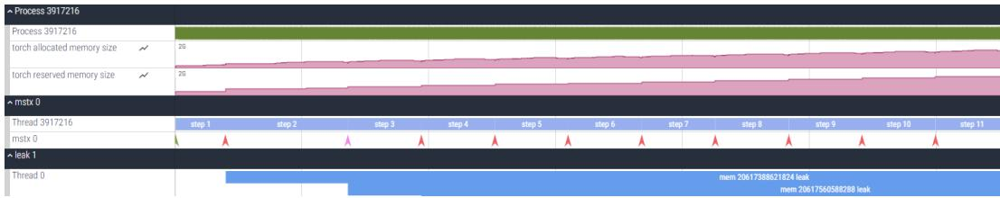
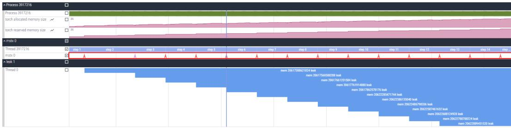
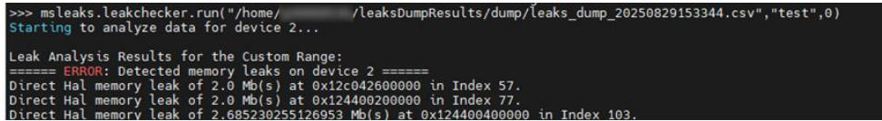
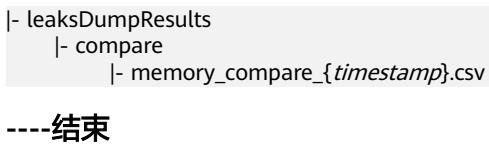
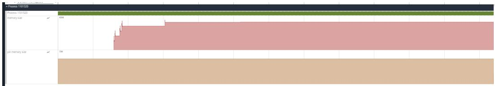
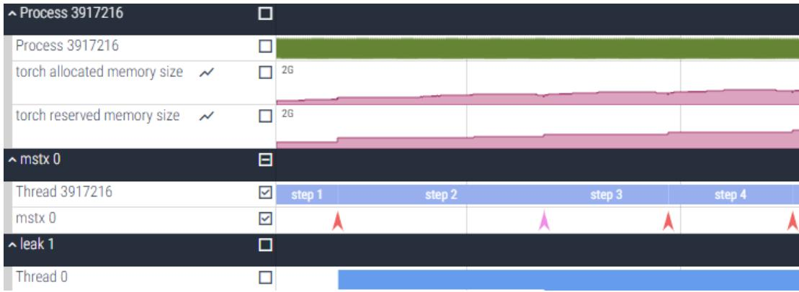

# MindStudio8.3.0msLeaks 内存泄漏检测工具用户指南

文档版本 01  
发布日期 2026-01-19

版权所有 $\circledcirc$ 华为技术有限公司 2026。 保留一切权利。

非经本公司书面许可，任何单位和个人不得擅自摘抄、复制本文档内容的部分或全部，并不得以任何形式传播。

# 商标声明

和其他华为商标均为华为技术有限公司的商标。  
本文档提及的其他所有商标或注册商标，由各自的所有人拥有。

# 注意

您购买的产品、服务或特性等应受华为公司商业合同和条款的约束，本文档中描述的全部或部分产品、服务或特性可能不在您的购买或使用范围之内。除非合同另有约定，华为公司对本文档内容不做任何明示或暗示的声明或保证。

由于产品版本升级或其他原因，本文档内容会不定期进行更新。除非另有约定，本文档仅作为使用指导，本文档中的所有陈述、信息和建议不构成任何明示或暗示的担保。

# 安全声明

# 产品生命周期政策

华为公司对产品生命周期的规定以“产品生命周期终止政策”为准，该政策的详细内容请参见如下网址：https://support.huawei.com/ecolumnsweb/zh/warranty-policy

# 漏洞处理流程

华为公司对产品漏洞管理的规定以“漏洞处理流程”为准，该流程的详细内容请参见如下网址：  
https://www.huawei.com/cn/psirt/vul-response-process  
如企业客户须获取漏洞信息，请参见如下网址：  
https://securitybulletin.huawei.com/enterprise/cn/security-advisory

# 华为初始证书权责说明

华为公司对随设备出厂的初始数字证书，发布了“华为设备初始数字证书权责说明”，该说明的详细内容请参见如下网址：https://support.huawei.com/enterprise/zh/bulletins-service/ENEWS2000015766

# 华为企业业务最终用户许可协议(EULA)

本最终用户许可协议是最终用户（个人、公司或其他任何实体）与华为公司就华为软件的使用所缔结的协议。最终用户对华为软件的使用受本协议约束，该协议的详细内容请参见如下网址：  
https://e.huawei.com/cn/about/eula

# 产品资料生命周期策略

华为公司针对随产品版本发布的售后客户资料（产品资料），发布了“产品资料生命周期策略”，该策略的详细内容请参见如下网址：https://support.huawei.com/enterprise/zh/bulletins-website/ENEWS2000017760

# 目 录

# 1 简介.......

# 2 使用前准备.. 3

# 3 内存采集.. 4

3.1 Python 接口采集.. 4  
3.2 命令行采集..  
3.3 mstx 打点采集..  
3.4 Python Trace 采集.. 10

# 4 内存分析..... 11

4.1 内存泄漏分析.. .11

4.2 内存对比.. 14

4.3 内存块监测.. 15

4.4 内存拆解.. 17

4.5 低效内存识别.. 18

# 5 输出说明.. .20

# 6 API 参考.... 26

6.1 简介... 26

6.2 list_analyzers.... 27

6.3 get_analyzer_config... 28

# 6.4 analyze.. .29

# 6.5 check_leaks.. 30

# 6.6 check_inefficient.. . 30

# 简介

内存泄漏检测工具（msLeaks）是基于昇腾AI处理器的内存检测工具，用于模型训练与推理过程中的内存问题定位。msLeaks工具提供内存泄漏检测、内存对比、内存块监测、内存拆解和低效内存识别等功能，帮助用户高效定位问题，快速处理。

# 功能特性

msLeaks工具目前已支持的功能如表1-1。

表 1-1 msLeaks 工具功能特性  

<table><tr><td rowspan=1 colspan=1>功能</td><td rowspan=1 colspan=1>使用场景及说明</td></tr><tr><td rowspan=1 colspan=1>内存泄漏分析</td><td rowspan=1 colspan=1>针对内存长时间未释放和内存泄漏等问题，需要进行内存分析时，msLeaks工具提供内存泄漏分析和KernelLaunch粒度的内存变化分析功能，进行告警定位与分析。</td></tr><tr><td rowspan=1 colspan=1>内存对比分析</td><td rowspan=1 colspan=1>当两个Step内存使用存在差异时，可能会导致内存使用过多，甚至出现OOM（OutofMemory，内存溢出）的问题，则需要使用msLeaks工具的内存对比分析功能来定位并分析问题。</td></tr><tr><td rowspan=1 colspan=1>内存块监测</td><td rowspan=1 colspan=1>对大模型场景中，当遇到内存踩踏定位困难时，msLeaks工具支持通过Python接口和命令行两种方式，在算子执行前后对指定的内存块进行监测。根据内存块数据的变化，快速确定算子间内存踩踏的范围或具体位置。</td></tr><tr><td rowspan=1 colspan=1>内存拆解</td><td rowspan=1 colspan=1>msLeaks工具提供内存拆解功能，支持对CANN层和AscendExtension forPyTorch框架的内存使用情况进行拆解，输出模型权重、激活值、梯度，以及优化器等组件的内存占用情况。</td></tr><tr><td rowspan=1 colspan=1>低效内存识别</td><td rowspan=1 colspan=1>在训练推理模型过程中，可能会存在部分内存块申请后未立即使用，或使用完毕后未及时释放的低效情况。msLeaks工具可帮助识别这种低效内存的使用现象，从而优化训练推理模型。</td></tr></table>

# 支持的框架

当前msLeaks工具支持下列框架的内存检测：

● Ascend Extension for PyTorch 7.0.0及之后版本● MindSpore 2.7.0及之后版本● CANN 8.2.RC1及之后版本的ATB算子

# 2 使用前准备

# 环境准备

安装配套版本的NPU驱动、固件、CANN Toolkit开发套件包和ops算子包，并配置CANN环境变量，具体请参见《CANN 软件安装指南》。

# 约束

请在使用工具前，仔细阅读以下安全使用说明，以防范潜在风险。

● 权限约束a. 出于安全性及权限最小化考虑，msLeaks工具不建议使用root等高权限用户安装使用，推荐使用普通用户权限。b. 遵循最小权限原则（如禁止other用户可写，常见如禁止666、777）。c. 请确保执行用户的umask值大于等于0027，否则会导致获取的性能数据所在目录和文件权限过大。d. 请确保性能数据保存在当前用户目录下，且该目录不含软链接，以防止可能的安全问题。

安装使用约束

由于msLeaks工具是集成在CANN软件包中，安装时应遵循CANN软件包的安装要求。在使用msLeaks工具前，使用同一低权限用户以默认方式安装CANN软件包和Driver包，并设置环境变量，且不得随意修改set_env.sh中环境变量配置。  
msLeaks为开发调测工具，不应在生产环境中使用。

文件校验约束请对下载的文件（特别是模型权重等文件）使用SHA256等校验方法进行完整性校验，保证文件来源安全可信，从而有效避免潜在的安全风险。● 兼容性约束msLeaks工具在生成db格式文件时，需确保当前用户环境中已安装libsqlite3.so包等相关文件，并确保group和others用户组无修改权限。

# 3 内存采集

Python接口采集命令行采集mstx打点采集Python Trace采集

# 3.1 Python 接口采集

msLeaks工具支持通过Python接口自定义设置采集内存范围和采集项，实现精准采集、高效分析。

# 自定义采集范围

新增Python脚本示例，使用Python脚本自定义采集范围，可支持设置多段采集范围。

示例代码如下：

import msleaksmsleaks.start() # 开启采集train() # train()为用户代码msleaks.stop() # 退出采集

# 自定义设置采集项

支持自定义设置采集项，当前仅支持设置device、level、events和call_stack参数，可根据需求自行设置。

# 示例代码如下：

import msleaks   
msleaks.config(call_stack="c:10,python:5", events $: = "$ "launch,alloc,free", level="0", device="npu")   
msleaks.start() # 开启采集   
train() # train()为用户代码   
msleaks.stop() # 退出采集

# 3.2 命令行采集

可以通过执行以下命令，启动msLeaks工具，采集内存数据。

用户不需要使用命令行指定参数msleaks [options] <prog_name>

用户需要使用命令行指定参数

方式一（推荐使用此方式）：user.sh为用户脚本msleaks [options] bash user.sh

方式二 msleaks [options] -- <prog_name> [prog_options]

# 说明

环境变量TASK_QUEUE_ENABLE可自行配置，具体配置可参见《Ascend Extensionfor PyTorch 环境变量参考》的“TASK_QUEUE_ENABLE”章节。当TASK_QUEUE_ENABLE配置为2时，开启task_queue算子下发队列Level 2优化，此时会采集workspace内存。msLeaks工具支持在开放态部署场景下采集内存数据，主要采集HAL类型的内存申请和释放事件，安装开放态部署场景，请参见《CANN 软件安装指南 (开放态)》。使用root用户运行msLeaks工具时，系统会通过打印提示，跳过文件权限校验，存在安全风险，建议使用普通用户权限安装执行。

表 3-1 命令行参数说明  

<table><tr><td rowspan=1 colspan=1>参数</td><td rowspan=1 colspan=1>说明</td></tr><tr><td rowspan=1 colspan=1>options</td><td rowspan=1 colspan=1>命令行参数，详细参数参见表3-2。</td></tr><tr><td rowspan=1 colspan=1>prog_name</td><td rowspan=1 colspan=1>用户脚本名称，请保证自定义脚本的安全性。当开启内存对比功能时不需要输入此参数。</td></tr><tr><td rowspan=1 colspan=1>prog_options</td><td rowspan=1 colspan=1>用户脚本参数，请保证自定义脚本参数的安全性。当开启内存对比功能时不需要输入此参数。</td></tr></table>

表 3-2 参数说明  

<table><tr><td colspan="1" rowspan="1">参数类别</td><td colspan="1" rowspan="1">参数</td><td colspan="1" rowspan="1">说明</td><td colspan="2" rowspan="1">是否必选</td></tr><tr><td colspan="1" rowspan="2">通用参数</td><td colspan="1" rowspan="1">--help,-h</td><td colspan="1" rowspan="1">输出msLeaks帮助信息。</td><td colspan="2" rowspan="1">否</td></tr><tr><td colspan="1" rowspan="1">--version,-V</td><td colspan="1" rowspan="1">输出msLeaks版本信息。</td><td colspan="2" rowspan="1">否</td></tr><tr><td rowspan="5"></td><td>--steps --device</td><td>选择要采集内存信息的StepID，须配置为实际 Step范围内的整数，可配置1个或多个，当前最 多支持配置5个。输入的StepID以逗号（全角半 角逗号均可）分割。如果不配置该参数，则默认 采集所有Step的内存信息。 示例：--steps=1,2,3。 采集的设备信息。可选项有npu和npu:{id，默 认值为npu，取值不可为空，可同时选择多个，</td><td>否 否</td></tr><tr><td>效。</td><td>取值间以逗号（全角半角逗号均可）分隔，示 例：--device=npu。 如果取值中同时包含npu和npu:{id，那么默认 还是采集所有npu的内存信息，npu:{id不生 · npu：采集所有的npu内存信息。 npu:{id：采集指定卡号的npu内存信息，其 中id为指定的卡号，需输入有效id，取值范围 为[0，31]，可采集多个卡的内存信息，取值 间以逗号（全角半角逗号均可）分隔，示 例: --device=npu:2,npu:7。</td><td></td></tr><tr><td>--level --events</td><td>采集的算子信息。可选项有0和1，默认值为0, 示例：--level=0。 ·0：取值也可写为op，采集op算子的信息。 ·1：取值也可写为kernel，采集kernel算子的 信息。 采集事件。可选项有alloc、free、launch和</td><td>否</td></tr><tr><td></td><td>access，默认值为alloc，free，launch，取值间 以逗号（全角半角逗号均可）分隔。示例：-- events=alloc,free,launch。 ·alloc:采集内存申请事件。 ·free：采集内存释放事件。 ·launch：采集算子/kernel下发事件。 ）access：采集内存访问事件。当前仅支持采 集ATB和Ascend Extension for PyTorch算子 场景的内存访问事件。 需要注意的是，当设置--events=alloc时，默认 会增加free，实际采集的为alloc和free；当设 置--events=free时，默认会增加alloc，实际采 集的为alloc和free；当设置--events=access时， 默认会增加alloc和free，实际采集的为access、 alloc和free。</td><td>否</td></tr><tr><td colspan="1" rowspan="3"></td><td colspan="1" rowspan="1">--call-stack</td><td colspan="1" rowspan="1">采集调用栈。可选项有python和c，可同时选择，以逗号（全角半角逗号均可）分隔。可设置调用栈的采集深度，在选项后输入数字，选项与数字以英文冒号间隔，表示采集深度，取值范围为[0，1000]，默认值为50，示例：--call-stack=python， --call-stack=c:20,python:10。·python：采集python调用栈。·c：采集c调用栈。</td><td colspan="1" rowspan="1">否</td></tr><tr><td colspan="1" rowspan="1">--collect-mode</td><td colspan="1" rowspan="1">内存采集方式。可选项有immediate和deferred，默认值为immediate，取值仅支持选择其一，示例：--collect-mode=immediate。·immediate：立即采集，即用户脚本开始运行时，就开始采集内存信息，直到用户脚本运行结束；也可配合Python自定义采集接口控制采集范围。deferred：自定义采集，需配合Python自定义采集接口使用，等待msleaks.start()脚本执行后，开始采集。如果仅设置--collect-mode=deferred，不使用Python自定义采集接口时，默认不采集任何数据（除少量系统数据）。</td><td colspan="1" rowspan="1">否</td></tr><tr><td colspan="1" rowspan="1">--analysis</td><td colspan="1" rowspan="1">启用相关内存分析功能。默认值为leaks，如果--analysis参数的取值为空，则不启用任何分析功能；可多选，取值间以逗号（全角半角逗号均可）分隔，示例：--analysis=leaks,decompose。· leaks：识别内存泄漏事件。·inefficient：识别低效内存，仅当--events=access,alloc,free,launch时，支持识别ATB LLM和Ascend Extension for PyTorch单算子场景的低效内存。低效内存还支持通过离线方式进行识别，可通过API接口进行自定义设置，具体操作可参见6 API参考。·decompose：开启内存拆解功能。需要注意的是，当设置--analysis=leaks或--analysis=decompose时，默认会打开--events的alloc和free，即--events=alloc,free。</td><td colspan="1" rowspan="1">否</td></tr><tr><td colspan="1" rowspan="4"></td><td colspan="1" rowspan="1">--data-format</td><td colspan="1" rowspan="1">输出的文件格式。可选项有db和csv，根据需求选择一种格式，取值不可为空，默认值为csv，示例：--data-format=db。当输出文件为db格式时，可使用MindStudioInsight工具展示，请参见《MindStudio Insight工具用户指南》中的“内存调优”章节。·db：db格式文件，请确保已安装sqlite依赖。执行sqlite3--version检查是否安装sqlite依赖，如果未安装，可执行sudoapt-getinstall sqlite3 libsqlite3-dev命令安装。·csv：csv格式文件。</td><td colspan="1" rowspan="1">否</td></tr><tr><td colspan="1" rowspan="1">--watch</td><td colspan="1" rowspan="1">内存块监测。可选项有start，out{id，end和full-content，其中end为必选，可多选，取值间以逗号（全角半角逗号均可）分隔。参数设置格式为：--watch=start:out{id,end,full-content,示例：--watch=op0,op1,full-content。·start：可选，字符串形式，表示一个算子，不同框架下格式不同。当需要设置out{id}时，start为必选。out{id：可选，表示算子的output编号。当Tensor为一个列表时，可以指定需要落盘的Tensor，取值为Tensor在列表中的下标编号。end：必选，字符串形式，表示一个算子，不同框架下格式不同。）full-content：可选，如果选择该值，表示落盘完整的Tensor数据，如果不选，则落盘Tensor对应的哈希值。</td><td colspan="1" rowspan="1">否</td></tr><tr><td colspan="1" rowspan="1">--output</td><td colspan="1" rowspan="1">指定输出件落盘路径，路径最大输入长度为4096。默认的落盘目录为“leaksDumpResults”。示例：--output=/home/projects/output。</td><td colspan="1" rowspan="1">否</td></tr><tr><td colspan="1" rowspan="1">--log-level</td><td colspan="1" rowspan="1">指定输出日志的级别，可选值有info、warn、error。默认值为warn。</td><td colspan="1" rowspan="1">否</td></tr><tr><td colspan="1" rowspan="2">内存对比参数</td><td colspan="1" rowspan="1">--compare</td><td colspan="1" rowspan="1">开启Step间内存数据对比功能。</td><td colspan="1" rowspan="1">否</td></tr><tr><td colspan="1" rowspan="1">--input</td><td colspan="1" rowspan="1">对比文件所在的绝对目录，需输入基线文件和对比文件的目录，以逗号（全角半角逗号均可）分隔，仅在compare功能开启时有效，路径最大输入长度为4096。示例：--input=/home/projects/input1,/home/projects/input2。</td><td colspan="1" rowspan="1">否</td></tr></table>

# 说明

当--events=launch，需要采集Aten算子下发与访问事件时，此时需要满足Ascend Extensionfor PyTorch框架中的PyTorch版本大于或等于2.3.1，才可使用该功能。

● 当--analysis参数取值包含decompose时，leaks_dump_{timestamp}.csv文件中Attr参数中会包含显存类别和组件名称。

当--analysis参数取值包含decompose时，会开启内存分解功能，当前支持对AscendExtension for PyTorch框架、MindSpore框架和ATB算子框架的内存池进行分类，但是暂不支持对MindSpore框架和ATB算子框架的内存池进行细分类。在Ascend Extension forPyTorch框架下，可支持对aten、weight、gradient、optimizer_state进行细分类，其中weight、gradient、optimizer_state仅限于PyTorch的训练场景（即调用optimizer.step()接口的场景），aten是aten算子中申请的内存，需要同时满足PyTorch版本大于或等于2.3.1，--level参数取值中包含0，--events参数取值中包含alloc，free，access。

当参数--level=1，且使用Hugging Face的tokenizers库时，可能会遇到“当前发生进程fork，并行被禁用”的告警提示。这个告警信息本身不会影响功能，可以选择忽略。如果希望避免这类告警，可执行export TOKENIZERS_PARALLELISM=false来关闭并行的行为。

当--collect-mode=deferred，且使用Python自定义采集接口进行采集数据时，Step内内存分析功能不可用，内存块监测、拆解和低效内存识别功能只对采集范围内的数据可用。

# 3.3 mstx 打点采集

msLeaks工具可以结合mstx打点能力进行内存采集和Host侧内存采集，同时msLeaks工具能够在可视化Trace中标记打点位置，便于用户定位问题代码行。

对于C脚本和Python脚本，mstx打点方式略有不同，可参考《MindStudio mstx API参考》。

# 说明

开启msLeaks工具的Host侧内存采集功能后，输出的leaks_dump_{timestamp}.csv文件中会存在大量Host侧malloc/free记录，cpu trace_{timestamp}.json文件中也会存在Host侧内存相关信息。

下方以Python脚本示例，展示mstx结合msLeaks工具进行内存分析。

内存分析  
请在训练推理脚本内的Step开始和结束处进行标记，并使用固化信息“step  
start”标识Step开始，示例如下：  
import mstx  
for epoch in range(15):id $=$ mstx.range_start("step start", None) # 标识Step开始并开启内存分析功能........mstx.range_end(id) # 标识Step结束

Host侧内存采集

由于采集整个进程的Host侧内存，会出现落盘文件数据量大、难以解析的情况，因此我们选择通过标识来开启和关闭采集，在所需的Host侧内存操作的代码段前后添加mstx打点，并使用固化信息“report host memory info start”，示例如下：

import mstx  
id $=$ mstx.range_start("report host memory info start", None)..  
mstx.range_end(id) # 标识停止采集Host侧内存操作

# 说明

● 仅支持采集单卡局部的内存数据。  
● 在需要的用户程序前可添加PYTHONMALLOC $\mathop { \left. \sum \right.} $ malloc。PYTHONMALLOC=malloc是Python的环境变量，表示不采用Python的默认内存分配器，所有的内存分配均使用malloc，该配置对小内存申请有一定影响。  
● 在MindStudio下一个版本中，将不再支持Host侧内存采集功能。

# 3.4 Python Trace 采集

msLeaks工具支持通过Python接口采集Python代码的Trace数据，并与内存事件使用统一时间轴，帮助调优人员快速关联内存事件与全链路代码，精准定位问题。

# 操作步骤

步骤1 在msLeaks工具中，增加Python接口，用以开启和关闭Tracer功能，在start和stop之间的Python代码，会落盘Trace数据。

# 代码示例如下：

import msleaksmsleaks.tracer.start() # 开启Tracer功能train() # train()为用户代码msleaks.tracer.stop() # 关闭Tracer功能

步骤2 执行完成后，会生成名称为python_trace_{TID}_{timestamp}.csv的文件，具体文件信息可参见5 输出说明。

----结束

内存泄漏分析内存对比  
内存块监测  
内存拆解  
低效内存识别

# 4.1 内存泄漏分析

Step内的内存问题主要包括内存泄漏、踩踏、内存碎片，导致内存池空闲、内存过多等问题。msLeaks工具当前仅支持内存泄漏问题的定位。

# 前提条件

请使用内存分析功能时，如果需要设置--events参数，请确保--events参数中包含alloc和free。● 在使用内存分析功能时，请勿设置--steps参数。

# 在线方式

在进行内存分析时，需配合使用mstx打点功能进行问题定位，mstx打点详情参考《MindStudio mstx API参考》。

步骤1 使用msLeaks工具运行用户程序，Application为用户程序。msleaks \${Application}

步骤2 执行完成后，会出现如下两种回显信息。

1. 如果出现如图4-1的回显信息，表示存在内存泄漏问题。回显信息中分别展示了每张卡内存泄漏的汇总信息，包括泄漏发生的Step数、关联的kernel、地址以及泄漏大小等信息。

图 4-1 内存泄漏  

<table><tr><td>Direct Direct</td><td>ERROR: Detected memory leakson</td><td>device Pytorch memory pool leak of 0.001953 Mb(s) at 0x12c1c155f400 in kernel_0 at step 2. Pytorch memory pool leak of 0.038574 Mb(s) at 0x12c1c1575a00 in kernel_0 at step 6. SUMMARY: 0.0405273 Mb(s) leaked in 2 allocation(s)</td></tr><tr><td>leaks on Direct Direct</td><td>ERROR: Detected memory SUMMARY: 0.0405273 Mb(s) leaked in 2 allocation(s)</td><td>device 0 Pytorch memory pool leak of 0.001953 Mb(s) at 0x12c04155f400 in kernel_0 at step 2. Pytorch memory pool leak of 0.038574 Mb(s) at 0x12c041575a00 in kernel_0 at step 6.</td></tr></table>

2. 如果出现如图4-2的回显信息，表示存在内存波动。回显信息中展示了单个Step内的内存波动（用最小和最大的内存池分配占用比值定义）以及最小的内存池分配占用，同时给出最小比值和最大比值作为参考，用户可根据该值判断是否存在内存泄漏风险。

# 说明

在第一个Step时，内存尚未稳定，所以只支持分析从第二个Step开始的内存波动，第一个Step内存波动可忽略。

<table><tr><td>MinGap MaxGap</td><td>Pytorch memory pool Gap Analysis of Device MinAlloc/MaxAlloc(%) MinAllocMem( MB ) 17.5038 3.4102 17.6768 3.4507 Pytorch memory_pool ( Gap Analysis of Device MinAlloc/MaxAlloc(%) MinAllocMem( MB ) 17.5038 3.4102</td><td>StepId 0 StepId 2</td></tr></table>

步骤3 将输出文件中的json文件（可视化内存信息）使用可视化工具展示，如图4-3所示，可查看内存申请释放情况。内存问题主要依靠内存信息可视化图进行分析，可视化信息详解可参见5 输出说明。

  
图 4-2 内存波动  
图 4-3 内存申请释放情况

步骤4 用户的打点信息如图4-4所示，当泄漏内存申请的时间与箭头标识的时间重合时，表示此时mstx打点位置附近的代码发生了内存泄漏。

  
图 4-4 标识打点

# ----结束

# 离线方式

msLeaks支持对指定范围内的内存事件进行离线泄漏分析。使用mstx标识好泄漏分析的范围后，可以使用该功能对落盘文件进行分析。

# 说明

当前离线内存泄漏分析功能仅支持HAL内存泄漏分析。

工具部署

msLeaks工具进行离线内存泄漏分析时，需先安装开放态部署场景，安装操作请参见《CANN 软件安装指南 (开放态)》。

a. 开放态部署场景安装成功后，开启2个远程登录工具，分别登录Host侧和Device侧进行操作。  
b. 参考《CANN 软件安装指南》下载配套版本的CANN Toolkit开发套件包和ops算子包，并解压。  
c. 请根据实际情况自行将Host侧的用户测试文件与msLeaks工具上传至Device侧。msLeaks工具包默认位于“\$HOME/Ascend/cann/tools/msleaks” 路径下，具体路径以实际安装路径为准。

# 说明

传输文件时，需打开SSH服务。文件传输完成后，请及时关闭SSH服务，保证系统安全性。SSH服务具体操作请参见《CANN 软件安装指南 (开放态)》的“定制文件系统$>$ 修改文件系统 $>$ 打开SSH服务”章节。

d. 将Host侧的ACL相关依赖上传至Device侧。

当前ACL相关依赖在Host侧的“/usr/local/AscendMiniOs/acllib/lib64”路径下，需要将依赖上传至Device侧的“/usr/local/AscendMiniOs/aarch64-linux/data”路径下，Host侧和Device侧的具体路径以实际安装路径为准，请根据实际情况自行上传。

e. 在Device侧执行以下命令，在Device侧设置环境变量。export LD_LIBRARY_PATH=./lib:./lib64:./:./home/HwHiAiUser:\$LD_LIBRARY_PATH;exportASCEND_OPP_PATH=./;

f. 在Device侧，确认缺少的so包。

用户测试文件运行前，在Device侧，执行以下命令，查看缺少的so包。此处的MyApplication为用户测试文件。  
ldd \${MyApplication}  
用户测试文件运行后，如果出现类似以下回显信息，代表Device侧缺少so包。  
libascend_xxx.so: cannot open shared object file: No such file or directory

g. 在Host侧查找缺少的so包，大部分so包存在于“\$HOME/Ascend/cann/aarch64-linux/lib64/”路径下。也可在Host侧执行以下命令，查询缺失的so包所在路径。其中soName为so包的名称。find / -name \${soName}

h. 将Host侧的so包上传至Device侧，请根据实际情况自行上传。

内存分析

a. 对需要检测泄漏的范围进行mstx的mark打点。mstx打点详情参考《MindStudio mstx API参考》。

# 说明

● 打点的mark信息将用于离线分析接口的输入。  
● 使用mark打点功能标记三个点，分别称为A、B、C。在A到B范围内申请的内存，需要在C点前全部释放，否则会被判定为内存泄漏。

b. 执行以下命令，使用msLeaks工具运行用户程序，获取落盘csv文件，Application为用户程序。

msleaks \${Application}

c. 执行以下命令，调用Python接口，对输出的csv文件进行离线泄漏分析。import msleaksmsleaks.check_leaks(input_path="user/leaks.csv",mstx_info $= ^ { \prime }$ test",start_index $\scriptstyle = 0$ )

其中参数信息如下：

▪ input_path：csv文件所在路径，需使用绝对路径。  
▪ mstx_info：mark打点使用的mstx文本信息，用于标识泄漏分析的范围。start_index：内存泄漏分析开始的打点位置编号，即从第几个符合条件的mstx打点位置开始分析。

如果出现图4-5的回显信息，表示存在内存泄漏问题。

  
图 4-5 离线泄漏分析

# 4.2 内存对比

如果训练推理参数一致，但是CANN和Ascend Extension for PyTorch或MindSpore框架的版本不配套，训练推理任务的两个不同Step的内存使用可能存在差异，会造成内存使用过多，甚至OOM的问题。而msLeaks工具则提供了用户对比分析、定位问题的能力。

# 工具使用

使用本对比功能之前，需要先采集两个不同Step的数据。

步骤1 使用环境变量关闭task_queue算子下发队列优化。export TASK_QUEUE_ENABLE=0

步骤2 在训练推理代码中添加mstx打点代码，可参考4.1 内存泄漏分析。

步骤3 执行以下命令，使用msLeaks工具采集指定Step的内存数据。需要采集两个不同Step的数据。建议每次只采集一个Step的数据，两个不同Step的数据采集完成后，用来进行Step间内存对比分析。

msleaks [options] \${Application} --steps=<Required Step> --level=kernel

● options：命令行参数，具体信息可参见表3-1。  
● Application：用户程序。  
● --steps：需要采集的Step编号。

步骤4 执行以下命令，对比采集到的两个Step的内存使用差异。msleaks --compare --input=path1,path2 --level=kernel其中--compare和--input参数需同时使用，单独使用无效，同时--input输入的两个文件路径需要逗号（全角半角逗号均可）隔开，--level也可选op。

步骤5 Step间对比生成的结果目录如下。

# 结果说明

Step间内存问题可通过输出文件查询定位，输出文件详解可参见5 输出说明。

# 4.3 内存块监测

大模型场景下，单卡的计算任务十分复杂，如果内存踩踏发生，定位非常困难。msLeaks工具支持通过Python接口在算子执行前后监测指定内存块，根据内存块数据的变化，定位算子间内存踩踏的范围或具体位置。

# 使用方法

步骤1 执行以下命令，关闭多任务下发。export ASCEND_LAUNCH_BLOCKING $^ { = 1 }$

步骤2 执行以下命令，开启内存块监测。msleaks \${Application} --watch=start:outid,end,full-content

# 说明

● 内存块监测功能仅支持Aten单算子和ATB算子，且可以通过--level指定op维度和kernel维度的内存块监测。Ascend Extension for PyTorch场景下，kernel算子的监测仅支持调用Python接口的方式，暂不支持watch命令行方式。调用Python接口的监测方式请参见步骤3。  
● 需控制内存监测算子的范围和内存块大小，避免由于设置过大，导致的dump数据耗时增加，以及磁盘空间占用过多的问题。

表 4-1 参数说明  

<table><tr><td>参数</td><td>说明</td></tr><tr><td>Application</td><td>用户的可执行脚本。</td></tr><tr><td></td><td>如果需要使用Python接口指定被监测的Tensor，具体设置请参 见步骤3。</td></tr><tr><td rowspan="5">--watch</td><td>开启内存块监测功能。</td></tr><tr><td>·start：可选，字符串形式，表示开始监测算子。 outid：可选，表示算子的output编号。当Tensor为一个列</td></tr><tr><td>表时，可以指定需要落盘的Tensor，取值为Tensor在列表 中的下标编号。</td></tr><tr><td>end：必选，字符串形式，表示结束监测算子。</td></tr><tr><td>full-content：可选，表示全量落盘内存数据，会将每个 Tensor对应的二进制文件进行落盘。如果不选择该值，表 示轻量化落盘，仅落盘Tensor对应的哈希值。</td></tr></table>

步骤3 在用户的可执行脚本中，调用Python接口指定被监测的Tensor。

增加Python的watcher模块的接口，其中watch接口表示开始监测该内存块，remove接口表示取消监测该内存块。内存块监测有两种开启方式，示例代码中的参数说明可参见表4-2所示。

方式一：直接输入Tensor

示例脚本如下：   
import torch   
import torch_npu   
import msleaks   
torch.npu.synchronize()   
test_tensor $=$ torch.randn(2,3).to('npu:0') # 请根据实际情况自行创建或选择需要监测的Tensor msleaks.watcher.watch(test_tensor, name $\mathrel { \mathop : } \mathbf { l }$ "test", dump_nums $^ { - 2 }$ )   
...   
torch.npu.synchronize()   
msleaks.watcher.remove(test_tensor)

方式二：输入内存块的地址和长度

示例脚本如下：   
import torch   
import torch_npu   
import msleaks   
torch.npu.synchronize()   
test_tensor $=$ torch.randn(2,3).to('npu:0')   
msleaks.watcher.watch(test_tensor.data_ptr(), length $\mathsf { I } = \mathsf { I }$ 1000, name $\mathrel { \mathop : } \mathbf { \overline { { \Gamma } } }$ "test", dump_num $^ { ; = 2 }$ )   
torch.npu.synchronize()   
msleaks.watcher.remove(test_tensor.data_ptr(), length $= ^ { \ast }$ 1000)

# 说明

建议使用方式一指定被监测的Tensor。如果需要使用方式二，需自行确认内存块地址和长度的有效性。

表 4-2 开启内存块监测的参数说明  

<table><tr><td rowspan=1 colspan=1>参数</td><td rowspan=1 colspan=1>说明</td></tr><tr><td rowspan=1 colspan=1>name</td><td rowspan=1 colspan=1>必选，用来最后dump的时候标识监测的Tensor。</td></tr><tr><td rowspan=1 colspan=1>dump_nums</td><td rowspan=1 colspan=1>可选，表示指定dump的次数，不输入取值表示无限制。</td></tr><tr><td rowspan=1 colspan=1>test_tensor.data_ptr()</td><td rowspan=1 colspan=1>必选，表示被监测Tensor的地址。仅当使用方式二开启内存块监测时需输入该参数。</td></tr><tr><td rowspan=1 colspan=1>length</td><td rowspan=1 colspan=1>必选，表示输入监测内存块的长度，当输入length时，无关键字的参数只能为地址整型变量。length的大小建议小于等于已知被监测Tensor的内存块的大小。仅当使用方式二开启内存块监测时需输入该参数。</td></tr></table>

步骤4 命令执行完成后，内存块监测生成的结果目录如下。

leaksDumpResultswatch_dump{deviceid}_{tid}_{opName}_{调用次数}-{watchedOpName}_{outid}_{before/after}.bin # 当输入full-content参数时，落盘bin文件watch_dump_data_check_sum_{deviceid}_{timestamp}.csv # 当未输入full-content参数时，落盘csv文件----结束

# 结果说明

内存块监测功能输出的文件为bin文件或csv文件。

● bin文件记录的是Tensor的详细落盘结果。  
● csv文件仅记录了Tensor对应的哈希值。

# 4.4 内存拆解

msLeaks工具通过增加Python接口，支持用户自行对代码段做描述。

# 使用方式

在msLeaks工具中，增加Python接口，使用describe标记一个Tensor、一个函数或一段代码，共有3种使用方式。

方式一：通过装饰器修饰某个函数，函数内所有内存申请事件的owner属性都会 打上标签test1。   
import msleaks.describe as describe   
@describe.describer(owner="test1")   
def train1():   
pass   
方式二：通过with语句，对代码块做标记，代码块内所有内存申请事件的owner 属性都会打上标签test2。   
代码示例1：   
import msleaks.describe as describe

with describe.describer(owne $\cdot = ^ { \prime }$ "test2"): train2()

# 代码示例2：

import msleaks.describe as describe describe.describer(owner="test3").__enter__() train3() describe.describer(owner $\because$ "test3").__exit__()

# 说明

方式一和方式二最多支持添加3个标签，且不允许重复。

方式三：标记Tensor，该Tensor对应的内存申请事件的owner属性会增加用户指 定的标记。   
import msleaks.describe as describe   
$\mathbf { t } =$ torch.randn(10,10).to('npu:0')   
describe.describer(t, owner="test4")

# 结果说明

内存拆解的输出文件详解可参见5 输出说明。

# 4.5 低效内存识别

在训练推理模型时，可能会存在部分内存块申请后没有立即使用，或者使用结束后未及时释放等情况，从而导致内存使用增高的现象，对于内存来说，这种现象是低效的。

低效内存（Inefficient Memory）是指在模型运行过程中，某个Tensor对象在Device侧有关内存申请、释放以及访问操作的时机不合理。

msLeaks工具针对op算子粒度支持过早申请（Early Allocation）、过迟释放（LateDeallocation）、临时闲置（Temporary Idleness）三种低效内存的识别能力，具体说明如表4-3所示。

表 4-3 低效内存说明  

<table><tr><td rowspan=1 colspan=1>分类</td><td rowspan=1 colspan=1>说明</td></tr><tr><td rowspan=1 colspan=1>过早申请</td><td rowspan=1 colspan=1>对于某个Tensor对象，在其申请内存的算子与第一次访问的算子之间，存在着其他算子包含了其他Tensor对象的释放操作，这个Tensor对象就是过早申请了。</td></tr><tr><td rowspan=1 colspan=1>过迟释放</td><td rowspan=1 colspan=1>对于某个Tensor对象，在其最后一次访问的算子与释放内存的算子之间，存在着其他算子包含了其他Tensor对象的申请操作，这个Tensor对象就是过迟释放了。</td></tr><tr><td rowspan=1 colspan=1>临时闲置</td><td rowspan=1 colspan=1>对于某个Tensor对象，其任意两次内存访问操作的算子之间，存在超过某个阈值的算子数量，则这个对象即为临时闲置对象。</td></tr></table>

# 在线方式

执行以下命令，开启低效内存识别功能。其中Application为用户脚本。

msleaks \${Application} --analysis=inefficient --event $ ,$ alloc,free,access,launch

# 说明

● 当使用低效内存识别功能时，需设置--events $\displaystyle =$ access,alloc,free,launch。  
● msLeaks工具仅支持识别ATB LLM和Ascend Extension for PyTorch单算子场景的低效内存。

# 离线方式

低效内存识别可通过接口自定义设置，具体操作可参见6 API参考。

# 结果说明

低效内存识别的结果会保存在leaks_dump_{timestamp}.csv文件中，具体信息可参见5输出说明。

msLeaks工具进行内存分析后，输出的文件如表5-1。

表 5-1 输出文件说明  

<table><tr><td rowspan=1 colspan=1>输出文件名称</td><td rowspan=1 colspan=1>说明</td></tr><tr><td rowspan=1 colspan=1>leaks_dump_{timestamp}.csv</td><td rowspan=1 colspan=1>使用Step内内存分析功能时，输出内存信息结果文件，并默认保存在“leaksDumpResults/dump”目录下，具体详情信息可参见leaks_dump_{timestamp}.csv文件说明。</td></tr><tr><td rowspan=1 colspan=1>{device}_trace_{timestamp}.json</td><td rowspan=1 colspan=1>使用Step内内存分析功能时，输出可视化内存信息结果文件，并默认保存在“leaksDumpResults/trace”目录下，具体详情信息可参见{device}_trace_{timestamp}.json文件说明。说明在MindStudio下一个版本中，将不再落盘json文件，结果通过屏幕打印。</td></tr><tr><td rowspan=1 colspan=1>memory_compare_{timestamp}.csv</td><td rowspan=1 colspan=1>使用内存对比功能时，输出内存对比信息结果文件，记录的是基线内存信息、对比内存信息和对比后的内存差异信息，输出文件默认保存在“leaksDumpResults/compare”目录下，具体详情信息可参见memory_compare_{timestamp}.csv文件说明。</td></tr><tr><td rowspan=1 colspan=1>leaks_dump_{timestamp}.db</td><td rowspan=1 colspan=1>db格式的内存信息结果文件，可使用MindStudio Insight工具展示，展示结果及具体操作请参见《MindStudioInsight工具用户指南》中的“内存调优”章节。</td></tr><tr><td rowspan=1 colspan=1>python_trace_{TID}_{timestamp}.csv</td><td rowspan=1 colspan=1>Python Trace采集的结果文件，默认保存在“leaksDumpResults/dump”目录下，具体详情信息可参见python_trace_{TID}_{timestamp}.csv文件说明。</td></tr></table>

# leaks_dump_{timestamp}.csv 文件说明

内存泄漏检测的结果文件字段解释如表5-2所示。

表 5-2 leaks_dump_{timestamp}.csv 文件字段及含义  

<table><tr><td colspan="1" rowspan="1">字段</td><td colspan="1" rowspan="1">说明</td></tr><tr><td colspan="1" rowspan="1">ID</td><td colspan="1" rowspan="1">事件ID。</td></tr><tr><td colspan="1" rowspan="1">Event</td><td colspan="1" rowspan="1">msLeaks记录的事件类型，包括以下几种类型：·SYSTEM：系统级事件· MALLOC:内存申请·FREE:内存释放·ACCESS：内存访问·OP_LAUNCH:算子执行•KERNEL_LAUNCH:kernel执行·MSTX:打点</td></tr><tr><td colspan="1" rowspan="1">Event Type</td><td colspan="1" rowspan="1">事件子类型。·当Event为SYSTEM时，EventType包含ACL_INIT和ACL_FINI。当Event为MALLOC或FREE时，EventType包含HAL、PTA、MindSpore、ATB、HOST和PTA_WORKSPACE。. 当Event为ACCESS时，Event Type包含READ、WRITE和UNKNOWN。当Event为OP_LAUNCH时，Event Type包含ATEN_START、ATEN_END、ATB_START和ATB_END。当Event为KERNEL_LAUNCH时，Event Type包含KERNEL_LAUNCH、KERNEL_START和KERNEL_END。当Event为MSTX时，Event Type包含Mark、Range_start和Range_end。</td></tr><tr><td colspan="1" rowspan="1">Name</td><td colspan="1" rowspan="1">与Event值有关，当Event值为以下值时，Name代表不同的含义。当Event值为其余值时，Name的值为N/A。· ACCESS：Name为引发访问的算子名/ID。·OP_LAUNCH：Name为算子名称。• KERNEL_LAUNCH:Name为kernel名称。·MSTX:Name为自定义打点名称。</td></tr><tr><td colspan="1" rowspan="1">Timestamp(ns)</td><td colspan="1" rowspan="1">事件发生的时间。</td></tr><tr><td colspan="1" rowspan="1">Process ID</td><td colspan="1" rowspan="1">进程号。</td></tr><tr><td colspan="1" rowspan="1">Thread ID</td><td colspan="1" rowspan="1">线程号。</td></tr><tr><td colspan="1" rowspan="1">Device ID</td><td colspan="1" rowspan="1">设备信息。</td></tr><tr><td colspan="1" rowspan="1">Ptr</td><td colspan="1" rowspan="1">内存地址，可以作为标识内存块的id值，一个内存块的生命周期是同一个ptr的malloc到下一次free。</td></tr><tr><td>字段 说明 Attr</td><td></td></tr><tr><td></td><td>事件特有属性，每个事件类型有各自的属性项。具体展示信息 如下所示： ·当Event为MALLOC或FREE时，会展示以下参数信息： - allocation_id：相同的allocation_id属于对同一块内存的 操作。 -addr:地址。 size：本次申请或者释放的内存大小。 owner：内存块所有者，多级分类时格式为 {A}@{B}@{C}，仅当Event为MALLOC时，存在此参 数。 total:内存池总大小，仅当Event Type为PTA、 MindSpore或ATB时，存在此参数。 used：内存池总计二次分配大小，仅当EventType为 PTA、MindSpore或ATB时，存在此参数。 inefficient：表示是否为低效内存，值表示低效类别，其 中early_allocation表示过早申请，late_deallocation表示 过迟释放，temporary_idleness表示临时闲置。仅当 Event为MALLOC，EventType为PTA或ATB时，存在此参 数。 当Event为ACCESS时，会展示以下参数信息： dtype:Tensor的dtype。 - shape:Tensor的shape。 :size:Tensor的size。 ：format:Tensor的format。 type：访问内存池类型，例如ATB。 allocation_id：相同的allocation_id属于对同一块内存的 操作，仅当EventType为PTA时，存在此参数。 当Event为OP_LAUNCH，EventType为ATB_START或 ATB_END时，会展示以下参数信息： path：算子在模型中的位置，例如 “0_1967120/0/0_GraphOperation/ 0_ElewiseOperation”，其中包含pid、所属模块名和算 子名。 workspace ptr:workspace内存起始地址。 -workspace size:workspace内存大小。 当Event为KERNEL_LAUNCH时，会展示以下参数信息： path：kernel在模型中的位置，例如 "0_1967120/1/0_GraphOperation/ 1_ElewiseOperation/0_AddF16Kernel/before”，其中包 含pid、所属算子和kernel名，仅当Event Type为 KERNEL_START或KERNEL_END时，存在此参数。 streamld:stream编号。 - taskld：任务编号。</td></tr><tr><td colspan="1" rowspan="1">字段</td><td colspan="1" rowspan="1">说明</td></tr><tr><td colspan="1" rowspan="1">CallStack(Python)</td><td colspan="1" rowspan="1">Python调用栈信息（可选）。</td></tr><tr><td colspan="1" rowspan="1">Call Stack(C)</td><td colspan="1" rowspan="1">C调用栈信息（可选）。</td></tr></table>

# {device}_trace_{timestamp}.json 文件说明

可视化内存信息输出文件包含两种json文件，分别为cpu_trace_{timestamp}.json（Host侧可视化文件）和npu{id}_trace_{timestamp}.json（device侧可视化文件），其中id代表的是device id，例如npu0_trace_{timestamp}.json。

文件可通过Chrome trace（chrome://tracing/）或Perfetto（Perfetto UI）等可视化工具展示，如图5-1所示。

  
图 5-1 Host 侧可视化信息

  
图 5-2 Device 侧可视化信息

Host侧和Device侧可视化信息详情如表5-3，可视化文件和mstx打点信息可以辅助进行内存问题定位和问题代码行确定。

表 5-3 可视化信息详解  

<table><tr><td colspan="1" rowspan="1">文件</td><td colspan="1" rowspan="1">名称</td><td colspan="1" rowspan="1">说明</td></tr><tr><td colspan="1" rowspan="2">cpu_trace_{timestamp}.json（Host侧可视化文件）</td><td colspan="1" rowspan="1">Process PID</td><td colspan="1" rowspan="1">KernelLaunch打点信息。名称中的PID代表的是进程号。</td></tr><tr><td colspan="1" rowspan="1">memory size</td><td colspan="1" rowspan="1">cpu上内存信息。当开启Host侧内存采集功能后，会采集到该参数。</td></tr><tr><td colspan="1" rowspan="1"></td><td colspan="1" rowspan="1">pin memory size</td><td colspan="1" rowspan="1">hal侧申请的host锁页内存。</td></tr><tr><td colspan="1" rowspan="6">npu{id}_trace_{timestamp}.json（device侧可视化文件）</td><td colspan="1" rowspan="1">Process PID</td><td colspan="1" rowspan="1">Kernel Launch打点信息。名称中的PID代表的是进程号。</td></tr><tr><td colspan="1" rowspan="1">{Framework Name}allocated memory size</td><td colspan="1" rowspan="1">对应框架的内存池allocated信息。</td></tr><tr><td colspan="1" rowspan="1">{Framework Name}reserved memory size</td><td colspan="1" rowspan="1">对应框架的内存池reserved信息。</td></tr><tr><td colspan="1" rowspan="1">Thread TID</td><td colspan="1" rowspan="1">各Step的持续时间。名称中的TID代表的是线程号。</td></tr><tr><td colspan="1" rowspan="1">mstx 0</td><td colspan="1" rowspan="1">mstx打点信息。</td></tr><tr><td colspan="1" rowspan="1">Thread 0</td><td colspan="1" rowspan="1">长时间未释放Step间的内存信息。</td></tr></table>

# memory_compare_{timestamp}.csv 文件说明

内存对比的结果文件字段解释如表5-4所示。

表 5-4 memory_compare_{timestamp}.csv 文件字段说明  

<table><tr><td rowspan=1 colspan=1>字段</td><td rowspan=1 colspan=1>说明</td></tr><tr><td rowspan=1 colspan=1>Event</td><td rowspan=1 colspan=1>msLeaks记录的对比事件类型，包括OP_LAUNCH和KERNEL_LAUNCH两种类型。</td></tr><tr><td rowspan=1 colspan=1>Name</td><td rowspan=1 colspan=1>kernel的名称。</td></tr><tr><td rowspan=1 colspan=1>Device ID</td><td rowspan=1 colspan=1>设备类型、卡号。</td></tr><tr><td rowspan=1 colspan=1>Base</td><td rowspan=1 colspan=1>input输入的第一个文件路径中的数据。</td></tr><tr><td rowspan=1 colspan=1>Compare</td><td rowspan=1 colspan=1>input输入的第二个文件路径中的数据。</td></tr><tr><td rowspan=1 colspan=1>AllocatedMemory(byte)</td><td rowspan=1 colspan=1>kernel调用前后的内存变化。如果为N/A，表示该kernel未被调用。</td></tr><tr><td rowspan=1 colspan=1>Diff Memory(byte)</td><td rowspan=1 colspan=1>Base和Compare的内存相对变化。·当数值为0时，表示该kernel调用所引起的内存变化没有差异。 当数值不为0时，表示该kernel调用所引起的内存变化存在差异。</td></tr></table>

# python_trace_{TID}_{timestamp}.csv 文件说明

Python Trace采集结果文件的字段解释如表5-5所示。

表 5-5 python_trace_{TID}_{timestamp}.csv 文件字段说明  

<table><tr><td rowspan=1 colspan=1>字段</td><td rowspan=1 colspan=1>说明</td></tr><tr><td rowspan=1 colspan=1>FuncInfo</td><td rowspan=1 colspan=1>函数名。</td></tr><tr><td rowspan=1 colspan=1>StartTime(ns)</td><td rowspan=1 colspan=1>开始时间戳，和leaks_dump_{timestamp}.csv中的事件时间戳是一致的。</td></tr><tr><td rowspan=1 colspan=1>EndTime(ns)</td><td rowspan=1 colspan=1>结束时间戳。</td></tr><tr><td rowspan=1 colspan=1>Thread ID</td><td rowspan=1 colspan=1>线程ID。</td></tr><tr><td rowspan=1 colspan=1>Process ID</td><td rowspan=1 colspan=1>进程ID。</td></tr></table>

# 简介

list_analyzers   
get_analyzer_config   
analyze   
check_leaks   
check_inefficient

# 6.1 简介

msLeaks工具提供开放接口，帮助用户进行内存分析，识别内存问题。

analyzer类是msLeaks工具新增的离线分析模块，负责所有的离线分析功能。可以从msLeaks导入对应的analyzer分析类，实现内存泄漏分析和自定义低效内存识别。

msLeaks工具提供快速分析接口和analyzer类分析两种方式，进行离线分析。推荐使用快速分析接口。

快速分析接口

msLeaks工具提供快速分析接口，推荐直接使用快速分析接口进行离线分析，接口列表如表6-1所示。

表 6-1 接口列表  

<table><tr><td colspan="1" rowspan="1">接口</td><td colspan="1" rowspan="1">说明</td></tr><tr><td colspan="1" rowspan="1">list_analyzers</td><td colspan="1" rowspan="1">该接口输出msLeaks工具当前支持的所有内存分析类型。</td></tr><tr><td colspan="1" rowspan="1">get_analyzer_config</td><td colspan="1" rowspan="1">该接口查看运行相应内存分析类型需要输入的参数。</td></tr><tr><td colspan="1" rowspan="1">analyze</td><td colspan="1" rowspan="1">msLeaks工具提供的快速分析接口。支持内存泄漏分析和自定义低效内存识别。</td></tr><tr><td colspan="1" rowspan="1">check_leaks</td><td colspan="1" rowspan="1">msLeaks工具提供的内存泄漏快速分析接口。</td></tr><tr><td colspan="1" rowspan="1">check_inefficient</td><td colspan="1" rowspan="1">msLeaks工具提供的自定义低效内存识别快速分析接□。</td></tr></table>

analyzer类

可以直接从msLeaks工具导入analyzer类，进行离线分析，涉及的接口如表6-2所示。但是代码实现较为繁琐，不推荐使用该方式。

# 实现示例代码如下：

# 导入内存泄漏的分析类和对应的config   
from msleaks.analyzer import LeaksAnalyzer, LeaksConfig   
# 声明参数生成config   
leaks_config $=$ LeaksConfig( input_path="user/leaks.csv", # input_path以实际路径为准 mstx_info="test", start_index=0   
# 生成分析类实例进行分析   
leaks_analyzer=LeaksAnalyzer()   
leaks_analyzer.analyze(leaks_config)   
# 导入低效内存的分析类和对应的config   
from msleaks.analyzer import InefficientConfig, InefficientAnalyzer   
# 声明参数生成config   
ineff_config $=$ InefficientConfig( input_path="user/ineff.csv", # input_path以实际路径为准 mem_size $_ { = 0 }$ , inefficient_type ["early_allocation","late_deallocation","temporary_idleness"], idle_threshold $\mathtt { \Pi } = 3 0 0 0$   
# 生成分析类实例进行分析   
ineff_analyzer=InefficientAnalyzer()   
ineff_analyzer.analyze(ineff_config)

表 6-2 analyzer 类接口说明  

<table><tr><td rowspan=1 colspan=1>接口</td><td rowspan=1 colspan=1>说明</td></tr><tr><td rowspan=1 colspan=1>LeaksAnalyzer</td><td rowspan=1 colspan=1>内存泄漏分析类。</td></tr><tr><td rowspan=1 colspan=1>LeaksConfig</td><td rowspan=1 colspan=1>内存泄漏分析参数。</td></tr><tr><td rowspan=1 colspan=1>InefficientConfig</td><td rowspan=1 colspan=1>低效内存分析参数。</td></tr><tr><td rowspan=1 colspan=1> InefficientAnalyzer</td><td rowspan=1 colspan=1>低效内存分析类。</td></tr></table>

# 6.2 list_analyzers

# 功能说明

该接口可输出msLeaks工具当前支持的所有内存分析类型，且支持用户打印。当前仅支持内存泄漏分析和低效内存识别。

# 函数原型

list_analyzers() $- >$ List[str]

# 参数说明

<table><tr><td rowspan=1 colspan=1>参数名</td><td rowspan=1 colspan=1>输入/输出</td><td rowspan=1 colspan=1>说明</td></tr><tr><td rowspan=1 colspan=1>List[str]</td><td rowspan=1 colspan=1>输出</td><td rowspan=1 colspan=1>字符串列表。</td></tr></table>

返回值说明

无返回值。  
运行后会输出当前msLeaks工具支持的内存分析类型。

调用示例

import msleaks  
config_list $=$ msleaks.list_analyzers()  
print(config_list)

# 6.3 get_analyzer_config

功能说明

该接口可查看运行对应内存分析类型需要输入的参数。

函数原型

get_analyzer_config(analyzer_type: str) $- >$ Dict[str, Any]

参数说明

<table><tr><td rowspan=1 colspan=1>参数名</td><td rowspan=1 colspan=1>输入/输出</td><td rowspan=1 colspan=1>说明</td></tr><tr><td rowspan=1 colspan=1>str</td><td rowspan=1 colspan=1>输入</td><td rowspan=1 colspan=1>字符串，代表对应的内存分析类型，可参考6.2list_analyzers的输出结果，例如“leaks”或“ inefficient”。</td></tr><tr><td rowspan=1 colspan=1>Dict[str,Any]</td><td rowspan=1 colspan=1>输出</td><td rowspan=1 colspan=1>包含所有参数的字典，支持直接打印。</td></tr></table>

# 返回值说明

无返回值。  
运行后会直接输出对应内存分析类型所需的入参信息。

# 调用示例

import msleaks leaks_para $=$ msleaks.get_analyzer_config("leaks")

print(leaks_para)   
ineff_para $=$ msleaks.get_analyzer_config("inefficient")   
print(ineff_para)

# 6.4 analyze

# 功能说明

msLeaks工具提供的对外分析接口。支持内存泄漏分析和自定义低效内存识别。

内存泄漏分析  
提供对指定范围内的内存泄漏进行离线分析的功能，支持对msLeaks生成的落盘csv文件进行离线分析，并在检测到指定范围内的内存泄漏时触发告警。当前功能仅适用于HAL内存泄漏分析。  
使用该接口前，需要在指定范围内通过mstx的mark进行打点，并使用msLeaks启动用户进程，以获取落盘csv文件。之后，通过该接口输入待分析的csv文件、打点信息以及起始index，即可进行离线泄漏分析。

自定义低效内存识别

支持输入自定义参数，对msLeaks生成的落盘csv文件或db文件进行离线低效内存识别。根据自定义参数规范，灵活设置低效内存识别的内存块阈值、关注的低效内存类型，以及临时闲置的API间隔时间，从而精准识别落盘的csv或db文件中的低效内存。

# 说明

如果输入的csv文件或db文件已有低效内存识别的结果，使用自定义低效内存识别功能时，不会清除原有的低效内存识别结果，而是会在此基础上新增识别结果。如果需要多次执行自定义低效内存识别功能，建议备份原始文件。

# 函数原型

analyze(analyzer_type: str, \*\*kwargs):

# 参数说明

内存泄漏分析  
参数为leaks时，请参见6.5 check_leaks查看参数说明。  
自定义低效内存识别  
参数为inefficient时，请参见6.6 check_inefficient查看参数说明。

# 返回值说明

无返回值。  
运行后会输出分析结果。

# 调用示例

import msleaks   
msleaks.analyze("leaks", input_path="user/leaks.csv", mstx_info $\dagger { = } ^ { \dagger }$ "test",start_index=0)   
msleaks.analyze("inefficient", input_path="user/ineff.csv",mem_size $\mathtt { = 0 }$ , inefficient_type $\varprojlim$ ["early_allocation","late_deallocation","temporary_idleness"],

idle_threshold $\mathtt { \Pi } = 3 0 0 0$ ) # input_path以实际路径为准

# 6.5 check_leaks

功能说明

msLeaks工具对外提供的内存泄漏快速分析接口。

函数原型

check_leaks(input_path: str, mstx_info: str, start_index: int)

# 参数说明

所有输入的参数需根据6.2 list_analyzers和6.3 get_analyzer_config获取，参数信息请参见表6-3。

表 6-3 参数说明  

<table><tr><td rowspan=1 colspan=1>参数名</td><td rowspan=1 colspan=1>输入/输出</td><td rowspan=1 colspan=1>说明</td></tr><tr><td rowspan=1 colspan=1>input_path</td><td rowspan=1 colspan=1>输入</td><td rowspan=1 colspan=1>使用msLeaks采集的csv文件所在路径，需使用绝对路径。</td></tr><tr><td rowspan=1 colspan=1>mstx_info</td><td rowspan=1 colspan=1>输入</td><td rowspan=1 colspan=1>mark打点使用的mstx文本信息，用于标识泄漏分析的范围。</td></tr><tr><td rowspan=1 colspan=1>start_index</td><td rowspan=1 colspan=1>输入</td><td rowspan=1 colspan=1>开始进行泄漏分析的mstx打点索引。</td></tr></table>

# 返回值说明

无返回值。  
运行后会直接打印内存泄漏分析结果。

调用示例

import msleaks   
msleaks.check_leaks(input_path="user/leaks.csv",mstx_info="test",start_index=0)   
# input_path以实际路径为准

# 6.6 check_inefficient

功能说明

msLeaks工具对外提供的自定义低效内存识别快速分析接口。

# 函数原型

check_inefficient(input_path: str, mem_size: int $= 0$ , inefficient_type: List[str] $=$ None, idle_threshold: int $=$ 3000) # 如果无输入采用默认值

# 参数说明

所有输入的参数需根据6.2 list_analyzers和6.3 get_analyzer_config获取，参数信息请参见表6-4。

表 6-4 参数说明  

<table><tr><td rowspan=1 colspan=1>参数名</td><td rowspan=1 colspan=1>输入/输出</td><td rowspan=1 colspan=1>说明</td></tr><tr><td rowspan=1 colspan=1>input_path</td><td rowspan=1 colspan=1>输入</td><td rowspan=1 colspan=1>需要进行离线自定义低效内存识别处理的csv或者db文件路径。</td></tr><tr><td rowspan=1 colspan=1>mem_size</td><td rowspan=1 colspan=1>输入</td><td rowspan=1 colspan=1>低效内存阈值，单位：Bytes，低于该阈值的显存块不会输出结果。</td></tr><tr><td rowspan=1 colspan=1>inefficient_type</td><td rowspan=1 colspan=1>输入</td><td rowspan=1 colspan=1>低效类型分类，确定判断策略，仅输出用户关注的低效内存类型。当前支持的类型如下：·过早申请：early_allocation·过迟释放：late_deallocation·临时闲置：temporary_idleness</td></tr><tr><td rowspan=1 colspan=1>idle_threshold</td><td rowspan=1 colspan=1>输入</td><td rowspan=1 colspan=1>临时闲置阈值，决定临时闲置低效内存API阈值，可以灵活设置阈值大小。</td></tr></table>

# 返回值说明

无返回值。

运行后会打印提示分析过程，并识别结果写到原文件中。

调用示例

import msleaks   
msleaks.check_inefficient(input_path="user/ineff.csv",mem_size ${ } = 0$ , inefficient_type=["early_allocation","late_deallocation","temporary_idleness"],idle_threshold $\mathtt { 1 = 3 0 0 0 }$ )   
# input_path以实际路径为准