# MindStudio 8.3.0 传统模型推理迁移调试调优全流程指南

文档版本 01  
发布日期 2026-01-19

版权所有 $\circledcirc$ 华为技术有限公司 2026。 保留一切权利。

非经本公司书面许可，任何单位和个人不得擅自摘抄、复制本文档内容的部分或全部，并不得以任何形式传播。

# 商标声明

和其他华为商标均为华为技术有限公司的商标。  
本文档提及的其他所有商标或注册商标，由各自的所有人拥有。

# 注意

您购买的产品、服务或特性等应受华为公司商业合同和条款的约束，本文档中描述的全部或部分产品、服务或特性可能不在您的购买或使用范围之内。除非合同另有约定，华为公司对本文档内容不做任何明示或暗示的声明或保证。

由于产品版本升级或其他原因，本文档内容会不定期进行更新。除非另有约定，本文档仅作为使用指导，本文档中的所有陈述、信息和建议不构成任何明示或暗示的担保。

# 安全声明

# 产品生命周期政策

华为公司对产品生命周期的规定以“产品生命周期终止政策”为准，该政策的详细内容请参见如下网址：https://support.huawei.com/ecolumnsweb/zh/warranty-policy

# 漏洞处理流程

华为公司对产品漏洞管理的规定以“漏洞处理流程”为准，该流程的详细内容请参见如下网址：  
https://www.huawei.com/cn/psirt/vul-response-process  
如企业客户须获取漏洞信息，请参见如下网址：  
https://securitybulletin.huawei.com/enterprise/cn/security-advisory

# 华为初始证书权责说明

华为公司对随设备出厂的初始数字证书，发布了“华为设备初始数字证书权责说明”，该说明的详细内容请参见如下网址：https://support.huawei.com/enterprise/zh/bulletins-service/ENEWS2000015766

# 华为企业业务最终用户许可协议(EULA)

本最终用户许可协议是最终用户（个人、公司或其他任何实体）与华为公司就华为软件的使用所缔结的协议。最终用户对华为软件的使用受本协议约束，该协议的详细内容请参见如下网址：  
https://e.huawei.com/cn/about/eula

# 产品资料生命周期策略

华为公司针对随产品版本发布的售后客户资料（产品资料），发布了“产品资料生命周期策略”，该策略的详细内容请参见如下网址：https://support.huawei.com/enterprise/zh/bulletins-website/ENEWS2000017760

# 目 录

1 概述...  
2 精度问题..  
2.1 问题概述.  
2.2 问题定位. 3  
2.3 精度调试案例.. 6  
3 性能问题.. 9  
3.1 问题概述. 9  
3.2 问题定位. 9  
3.3 性能调优案例. 13

在传统模型的全流程调优中，精度与性能的协同优化是核心目标，如表1-1所示。

表 1-1 调优说明  

<table><tr><td rowspan=1 colspan=1>优化场景</td><td rowspan=1 colspan=1>优化目标</td><td rowspan=1 colspan=1>说明</td></tr><tr><td rowspan=1 colspan=1>精度优化</td><td rowspan=1 colspan=1>提升模型的准确性与稳定性。</td><td rowspan=1 colspan=1>在模型调试中，大多数精度问题是由算子精度问题造成的。导致算子精度异常的主要原因包括精度溢出、算子实现存在差异、融合规则不合理、硬件差异等，需结合具体现象进行分析并解决。</td></tr><tr><td rowspan=1 colspan=1>性能优化</td><td rowspan=1 colspan=1>提升计算效率并实现资源的最佳适配。</td><td rowspan=1 colspan=1>在单机推理场景中，性能瓶颈主要出现在调度与计算两个方面，可借助msprof工具和MindStudio Insight可视化工具快速定位问题类型，深入分析具体数据，并通过调整模型实现或优化系统调度策略，提升推理性能。</td></tr></table>

# 2 精度问题

问题概述  
问题定位  
精度调试案例

# 2.1 问题概述

传统模型推理的精度目标是确保模型在昇腾平台上推理的能力。通过将模型在昇腾平台上的推理结果和标杆结果进行对比，来评估模型从非昇腾平台迁移到昇腾平台后，是否存在精度问题。标杆结果是指模型迁移前在非昇腾平台的输出结果。

传统模型的精度问题大多可归因于算子问题或者模型转换问题，但是模型转换的主要过程涉及算子的转换、融合与优化，所以大多数精度问题可归纳为算子问题。算子问题大致可分为几类，例如精度不足、数据溢出、算子实现差异、融合规则不合理以及硬件差异等。

常见的精度问题现象及可能原因主要包括以下场景：

模型整网输出差异较大，和预期明显不一致一般可能因为算子精度溢出、融合规则有问题等原因导致。  
● 模型整网输出差异较小，和标杆结果相比有误差可能是累积误差问题，一般由算子实现或者数据精度导致。  
● 模型整网输出和标杆结果一致，但在下游任务或者实际业务场景中有较大差异一般是业务层面的前后处理和标杆不一致，需要结合业务场景分析和标杆的差异并对齐。  
● 模型本身没问题，升级硬件环境后模型输出和标杆结果有较大差异一般是环境配置问题，硬件环境需要和CANN包等软件环境配套。

这些问题虽然现象各异，但均可采用本文介绍的传统模型精度问题快速分析方法进行定位。

# 2.2 问题定位

# 定位流程

传统模型精度问题定位流程如图2-1所示。

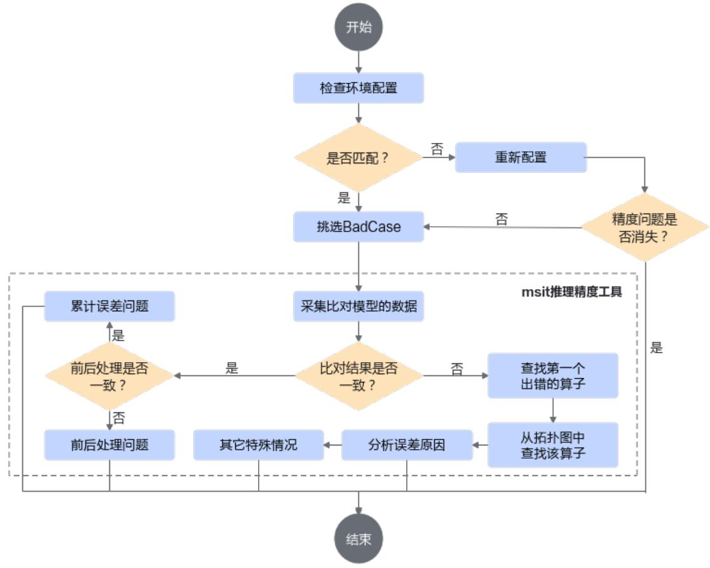  
图 2-1 定位流程

1. 检查硬件环境配置、CANN包版本以及其他依赖库版本是否匹配。

是，继续定位。  
否，重新配置环境、软件包和依赖库，查看精度问题是否消失，如果还未消失，继续定位问题。

2. 挑选存在明显精度问题的BadCase进行分析定位。

3. 使用传统模型精度比对工具（msit debug compare）采集比对模型的全量dump数据。比对结果误差较小，需对前后处理过程进行排查，确定是否为累积误差问题。比对结果误差较大，找到首个不满足精度标准的算子，分析定位误差根因。

4. 如果确定是算子实现导致，需要联系技术工程师提供进一步的技术支持。

# 定位步骤

步骤1 检查环境配置。

如果传统模型在某一类硬件环境上执行推理时精度正常，但在其他硬件或配置环境下执行推理时出现精度异常的问题，则需要排查版本配置，需检查各个组件的版本是否一致，且和硬件环境适配，版本配套问题请查看《MindStudio版本说明》中的“版本配套关系”。

可进入ascend_toolkit_install.info文件所在路径，执行以下命令，查看CANN的版本。例如，在aarch64的Linux系统下，请进入cann安装路径下的“aarch64-linux”文件夹下，再执行以下命令。

cat ascend_toolkit_install.info

步骤2 使用msit debug compare工具快速获取模型比对结果。

compare一键式全流程精度比对（推理）功能实现了自动化精度比对。用户输入原始模型（onnx）、对应的离线模型和数据，自动输出整网比对的结果，也可以输入dump好的CPU、NPU侧的算子数据直接进行精度比对。msit debug compare工具安装请参见msit debug compare功能使用指南。

1. 执行以下命令，启动精度比对。

msit debug compare -gm \${golden model path} -om \${om model path} [可选参数] 相关参数说明可参见命令行入参说明。

如果已经有真实场景的输入数据，推荐优先指定输入数据进行调测。示例如下：

msit debug compare -gm /home/HwHiAiUser/onnx_produce_data/resnet_official.onnx -om / home/HwHiAiUser/onnx_produce_data/model/resnet50.om \   
-i /home/HwHiAiUser/result/test/input_0.bin -c /usr/local/Ascend/cann -o /home/HwHiAiUser/ result/test

其中，-i，--input为模型的输入数据路径，多个输入以英文逗号分隔，例如：/home/input_0.bin,/home/input_1.bin。

本场景推理时，会根据输入shape和模型定义shape进行计算得到batch大小，但需保证输入文件的shape和模型定义的输入shape仅在batch维度不一致，其他维度需保持一致。如果输入为npy文件，该功能会自动将npy文件转化为bin文件。

2. 落盘数据的目录结构可参见对比输出结果说明。

其中result_{timestamp}.csv文件为比对结果文件，包含了整网所有算子的dump数据比对结果，主要用于分析模型精度问题。比对结果的含义与基础精度比对工具完全相同，其中每个字段的说明可参见《精度调试工具用户指南》中的“附录> 完整比对结果参数说明”章节。

其中，核心比对指标如表2-1所示，任意一个指标超出阈值即为精度异常。

表 2-1 核心比对指标  

<table><tr><td colspan="1" rowspan="1">误差对比算法</td><td colspan="1" rowspan="1">说明</td><td colspan="1" rowspan="1">阈值</td></tr><tr><td colspan="1" rowspan="1">CosineSimilarity</td><td colspan="1" rowspan="1">余弦相似度，进行余弦相似度算法比对出来的结果。</td><td colspan="1" rowspan="1">&gt;0.99</td></tr><tr><td colspan="1" rowspan="1">RelativeEuclideanDistance</td><td colspan="1" rowspan="1">欧氏相对距离，进行欧氏相对距离算法比对出来的结果。</td><td colspan="1" rowspan="1">&lt;0.05</td></tr><tr><td colspan="1" rowspan="1">KullbackLeiblerDivergence</td><td colspan="1" rowspan="1">KL散度，进行KL散度算法比对出来的结果。</td><td colspan="1" rowspan="1">&lt;0.005</td></tr><tr><td colspan="1" rowspan="1">RootMeanSquareError</td><td colspan="1" rowspan="1">均方根误差。</td><td colspan="1" rowspan="1">&lt;1.0</td></tr><tr><td colspan="1" rowspan="1">MeanRelativeError</td><td colspan="1" rowspan="1">平均相对误差。</td><td colspan="1" rowspan="1">&lt;1.0</td></tr></table>

# 说明

可以优先查看CosineSimilarity和RelativeEuclideanDistance指标，快速感知结果。CosineSimilarity代表两个高维张量的方向是否一致，RelativeEuclideanDistance代表两个向量的距离远近。  
模型精度是否达标，首要的是看整网的输出结果是否精度达标，如果输出精度达标，即使中间节点精度存在异常（包括算子溢出），也无需处理，否则需要逐个排查问题节点。更多指标细节可参考对比结果分析步骤。

步骤3 问题分析。

# 1. 核心分析

由于比对结果文件中的算子呈现，并不是完全的执行顺序，因此算子在文件中的先后顺序，并不完全代表其在模型结构拓扑图中的先后顺序。在分析时我们需要从文件中找到第一个出现精度异常的算子，并查看它在模型拓扑图中的位置，寻找它以及它上一个算子，查看精度是否符合标准。主要分为以下几种情况：

算子的输入一致，输出不一致，说明该算子存在精度问题，需要分析误差原因。  
算子有多个输入和多个输出，部分输入出现NaN的情况，其他一致，但是输出不一致，该算子也可能存在精度问题，需要根据模型结构找到算子的前一个节点的输出，作为下一个节点的输入来进一步分析。  
算子有多个输入和多个输出，输入一致，部分输出出现NaN的情况，并且其后续算子输入不一致，说明该算子可能存在精度问题。

# 说明

使用netron工具打开onnx模型，便可获得模型拓扑结构图，单击节点可以观察到其输入节点的信息，结合比对结果可以快速获取上一个节点的相关信息。

# 2. 累积误差和前后处理问题分析

如果比对结果中无明显精度骤降的情况，但整网输出有差异，且和标杆数据相比，推理过程的前后处理方式都一致，则说明是累积误差问题。此时可以尝试通过提升模型精度的方法来解决，需要在ATC转换时增加控制精度的参数，具体可参考《ATC离线模型编译工具用户指南》中的“参数说明 > 高级功能参数 $>$ 算子调优选项”章节。

如果比对结果中无明显精度骤降的情况，整网输出无差异，但在业务层面有差异，需要结合业务场景，检查输入数据是否不一致，输出数据处理方式不一致等情况。

# ----结束

# 2.3 精度调试案例

# 问题现象

Zipformer语音模型迁移场景下流式推理前x帧没有问题，在第x+1帧出现精度问题。环境配置自检正常，确认排除偶现问题、硬件环境问题和软件版本问题。

环境配置：

● 硬件平台：Atlas 300I DUO推理服务器● 软件平台：Linux Ubuntu 4.15.0-29-generic，aarch64环境版本：CANN（7.5.0.1.129:8.0.RC3）8.0.RC3商发版本

# 问题分析步骤

步骤1 执行以下命令，使用ATC转换onnx模型。

atc --input_shape="x:4,77,40;cached_key_0:128,4,128" \--precision_mode=force_fp32 \--soc_version=Ascendxxx \--framework=5 \--output=modeloutputpath \--model=/modelpath/model.onnx

--input_shape参数如果有多个输入，shape之间需使用英文分号分隔。--soc_version为芯片型号，具体使用型号查询方法请参见《ATC离线模型编译工具用户指南》中的“参数说明 > 基础功能参数 $>$ 目标芯片选项 > --soc_version”章节。

步骤2 使用msit debug compare工具获取比对结果。

由于流式推理获取中间输入较为困难，改为随机构建输入数据进行debug compare，命令如下。  
msit debug compare -gm \${modelpath}/model.onnx -om \${modelpath}/model.om -o \${output path} --input-shape "x:4,77,40;cached_key_0:128,4,128"

输出比对结果，查看结果文件，如图2-2，发现可能存在问题的算子（mul_sub_sub融合算子）的输出有nan和inf值，怀疑该算子存在溢出。

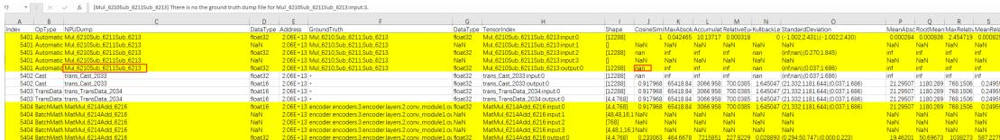  
图 2-2 查看结果文件

步骤3 基于比对结果进行问题分析。

手动比较sub_6213算子的输出dump结果，om数据dump结果中有inf（om模型的sub_6213算子为融合算子mul_sub6211_sub6213，也出现溢出），onnx输出结果正常，开始向前追溯om模型，定位到sub_6200输出为inf，最终原因为Data数据过大导致sub_6200算子溢出，如图2-3。

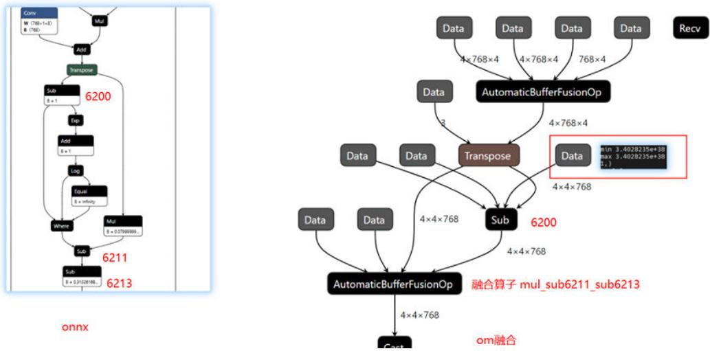  
图 2-3 比较 sub_6213 算子输出结果

由于融合算子没有中间算子的计算结果，较难定位问题，考虑关闭融合算子后重新比对，关闭方法请参见关闭融合规则比较。关闭融合算子后的比对结果如图2-4。

图 2-4 比对结果  

<table><tr><td>1</td><td>A Index</td><td>OpType B C</td><td>V</td><td>卜 G</td><td>H</td><td>一</td><td></td><td>CosineSimiMaxAbsolAccumulat RelativeEuKullbackLeStandardDMeanAbscRootMean MaxRelativMeanRelatCompareFIsNpuOp</td><td>L</td><td>M</td><td>N</td><td>U</td><td>P</td><td>Q</td><td>R</td><td>5</td><td></td><td></td></tr><tr><td></td><td></td><td>6165TransposePartionecfloat32</td><td></td><td>NPUDump DataType AddressGroundTru DataType TensorlndeShape 2.06E+13 Transpose float32</td><td>Partitionec[12288]</td><td></td><td>10.036583</td><td></td><td>8.636520.000334</td><td></td><td></td><td>0(-1.006;2.4 0.0002840.000875</td><td></td><td></td><td></td><td>0.927290.000703</td><td></td><td>NO</td></tr><tr><td></td><td></td><td></td><td></td><td>2.06E+13 Sub_6200 float32</td><td></td><td></td><td></td><td></td><td></td><td></td><td></td><td></td><td></td><td></td><td></td><td></td><td></td><td>NO</td></tr><tr><td></td><td>6166 Sub</td><td>Sub_6200 float32</td><td></td><td></td><td>Sub_6200i[12288]</td><td></td><td>10.036583</td><td>8.636520.000334</td><td></td><td></td><td></td><td>0 (-1.006:2.40.0002840.000875</td><td></td><td></td><td></td><td>0.927290.000703</td><td></td><td></td></tr><tr><td></td><td>6166 Sub</td><td>Sub 6200NaN</td><td></td><td>2.06E+13 Sub_6200 NaN</td><td>Sub 6200i</td><td>NaN</td><td>NaN</td><td>NaN</td><td>NaN</td><td>NaN</td><td>NaN</td><td>NaN</td><td>NaN</td><td></td><td>NaN</td><td>NaN</td><td>[Sub_6200 NO</td><td></td></tr><tr><td></td><td>6166 Sub</td><td>Sub 6200 float32</td><td></td><td>2.06E+13 Sub 6200 float32</td><td>Sub 6200 [2288]</td><td></td><td></td><td>10.0365835.0932760.000278</td><td></td><td></td><td></td><td></td><td></td><td></td><td></td><td>0(-2.006:2.40.0002840.00087521380850.00014</td><td></td><td>NO</td></tr><tr><td>709</td><td>6167 Exp</td><td>Exp_6201 float32</td><td></td><td> 2.06E+13 Exp_6201 float32</td><td>Exp_6201i[12288]</td><td></td><td></td><td>10.0365835.0932760.000278</td><td></td><td></td><td></td><td></td><td></td><td></td><td></td><td>0(-2.006:2.40.0002840.0008752.1380850.000414</td><td></td><td>NO</td></tr><tr><td>710</td><td>6167 Exp</td><td>Exp_6201float32</td><td></td><td>2.06E+13 Exp_6201 float32</td><td>Exp_6201:c[12288]</td><td>nan</td><td>nan</td><td>nan</td><td>nan</td><td>nan</td><td></td><td>(inf;nan).(in nan</td><td>nan</td><td></td><td>nan</td><td>nan</td><td></td><td>NO</td></tr><tr><td>711</td><td>6168 Add</td><td>Add_6203 float32</td><td></td><td>2.06E+13 Add_6203 float32</td><td>Add_6203:[1228]</td><td>nan</td><td>nan</td><td>nan</td><td>nan</td><td>nan</td><td></td><td>(inf:nan),(in nan</td><td>nan</td><td></td><td>nan</td><td>nan</td><td></td><td>NO</td></tr><tr><td>712</td><td>6168 Add</td><td>Add_6203 NaN</td><td></td><td>2.06E+13 Add_6203 NaN</td><td>Add 6203</td><td>NaN</td><td>NaN</td><td>NaN</td><td>NaN</td><td>NaN</td><td>NaN</td><td>NaN</td><td>NaN</td><td></td><td>NaN</td><td>NaN</td><td>[Add_6203NO</td><td></td></tr><tr><td>713</td><td>6168 Add</td><td>Add 6203 float32</td><td></td><td>2.06E+13 Add_6203 float32</td><td>Add 6203[1228]</td><td>nan</td><td>nan</td><td>nan</td><td>nan</td><td>nan</td><td></td><td>(int:nan).(in inan</td><td>nan</td><td>nan</td><td></td><td>nan</td><td></td><td>NO</td></tr><tr><td></td><td>6169 Log</td><td>Log 6204 float32</td><td></td><td>2.06E+13Log 6204 float32</td><td>Log 6204i[12288]</td><td>nan</td><td>nan</td><td>nan</td><td>nan</td><td>nan</td><td></td><td>(inf:nan).(in nan</td><td>nan</td><td>nan</td><td></td><td>nan</td><td></td><td>NO</td></tr><tr><td></td><td>6169 Log</td><td>Loq_6204float32</td><td></td><td>2.06E+13 Log_6204ffoat32</td><td>Log_6204x[12288]</td><td>nan</td><td>nan</td><td>nan</td><td>nan</td><td>nan</td><td></td><td>(int;nan).(in nan</td><td>nan</td><td></td><td>nan</td><td>nan</td><td></td><td>NO</td></tr><tr><td>中</td><td>6170 Equal</td><td>EquaL6201float32</td><td></td><td>2.06E+13 Equal620 float32</td><td>EquaL620[1228]</td><td>nan</td><td>nan</td><td>nan</td><td>nan</td><td>nan</td><td></td><td>(int:nan).(in nan</td><td>nan</td><td></td><td>nan</td><td>nan</td><td></td><td>NO</td></tr><tr><td></td><td>6170 Equal</td><td>EquaL620&#x27;NaN</td><td></td><td>2.06E+13 Equal_620iNaN</td><td>EquaL620°</td><td>NaN</td><td>NaN</td><td>NaN</td><td>NaN</td><td>NaN</td><td>NaN</td><td>NaN</td><td>NaN</td><td></td><td>NaN</td><td>NaN</td><td>[Equal_620NO</td><td></td></tr><tr><td>718</td><td>6170 Equal :</td><td>Equal_620&#x27;bool a … r:</td><td>n ner</td><td>2.06E+13 Equal_6201bool nr：</td><td>Equal_620[12288] corrnnnm</td><td>NaN ：</td><td>NaN …</td><td>NaN …</td><td>NaN </td><td>NaN .</td><td>NaN</td><td>NaN </td><td>NaN </td><td></td><td>NaN .</td><td>NaN</td><td>Cannot colNO</td><td></td></tr></table>

从图2-4可以看出om onnx中exp算子均输出inf，输入正常且对齐，exp算子可能存在精度问题。关闭融合规则后两边的局部拓扑结构如图2-5。

图中的标注结果为算子的当前输出。手动验证局部相关算子后，发现onnx、om模型中where算子三个输入中都有一个输入包含inf，onnx输出正常，om输出inf，导致后续算子输出inf，即onnx模型可以自动处理溢出情况，om模型在溢出后会将输出结果继续传导下去。可以确定是exp算子的溢出问题导致整网的精度问题。

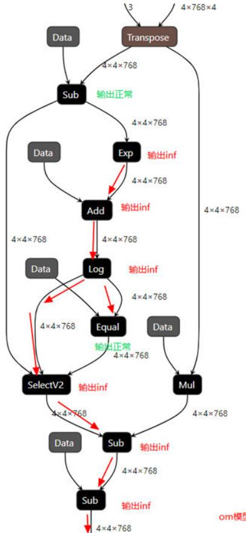  
图2-5 拓扑结构

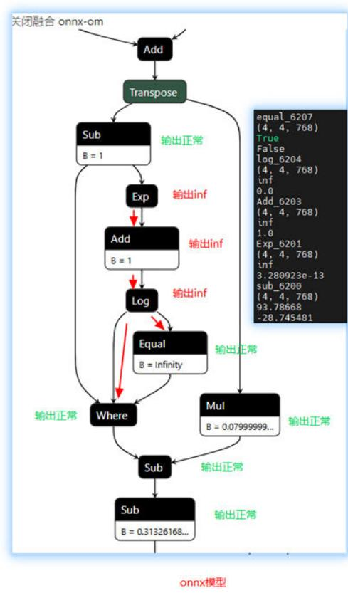

步骤4 需修改图结构增加clip算子对梯度进行裁剪防止溢出。修改图结构工具推荐使用自动调优工具（msit debug surgeon），工具使用请参见msit debug surgeon功能使用指南。

----结束

# 3 性能问题

问题概述  
问题定位  
性能调优案例

# 3.1 问题概述

模型从外部设备迁移至昇腾设备上进行推理时，可能会遇到性能问题，与训练常见性能问题场景不同，推理常见的性能问题场景为开箱性能优化场景，即用户在使用昇腾设备进行模型推理时，发现性能差（低于其他产品或者发现模型推理吞吐量低）。

可能存在的问题为计算问题和调度问题。

计算问题：某些卡的计算时间明显超出正常范围，这张卡承担了过于繁重的计算任务，可能是处理的数据量太大，或者模型计算的复杂度太高。● 调度问题：计算卡的空闲时间占比很高，说明存在Host侧至Device侧的下发异常，可能是CPU能力瓶颈，或者模型运行期间存在某些后台任务占用过多CPU资源。

# 3.2 问题定位

# 定位流程

传统模型推理场景的性能问题定位流程如图3-1。

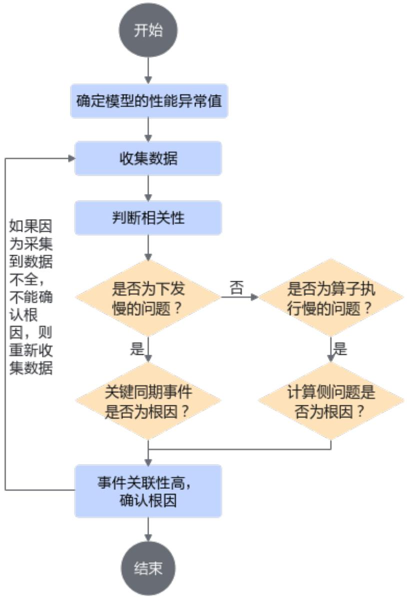  
图 3-1 问题定位流程

1. 优先确定异常范围。

2. 收集性能数据，可借助性能调优工具进行性能数据采集和解析。

3. 将解析完成的性能数据导入MindStudio Insight工具进行分析，通常传统模型推理场景问题主要会集中在计算和调度两个方向。

a. 如果是下发慢的问题，可分析模型运行期间的CPU占用率，判断关键同期事件（抢占CPU、IOWait）是否为问题根因；  
b. 如果不是下发慢的问题，则考虑是算子执行慢的问题，需要深入分析计算方向的问题，例如，占比最高的算子是否可以优化，算子能否合并等。

4. 根据问题定位的方向与根因可进一步细化分析数据并进行相应的调整。

# 定位步骤

步骤1 安装所需软件包，便于后续数据采集与分析。

性能调优工具：性能调优工具集成在CANN软件包中，用于采集性能数据。因此，需要安装CANN Toolkit开发套件包和ops算子包，请参见《CANN 软件安装指南》。  
MindStudio Insight：用于分析性能调优工具采集到的性能数据。请参考《MindStudio Insight工具用户指南》中的“安装与卸载”章节下载并安装MindStudio Insight工具。

步骤2 采集数据。

单机的推理程序可以直接通过性能调优工具的msprof命令行方式采集性能数据，示例如下：

msprof --output=save_path python3 main.py

命令的使用方法可参见《性能调优工具用户指南》，采集解析完成后，会在--output参数配置的目录下生成如下结果。

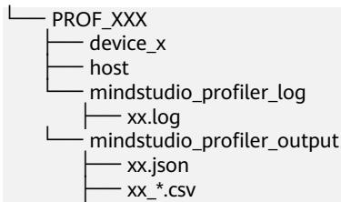

步骤3 使用MindStudio Insight工具分析数据。

将解析完成的性能数据导入MindStudio Insight工具进行数据分析，使用详情可参见《MindStudio Insight工具用户指南》。

可通过以下几点观察并分析性能问题。

数据概览观察全局占比  
单机单卡推理场景，可以选择“时间线 $>$ 系统视图 $>$ 覆盖分析”来了解计算和Free的占比，如图3-2。

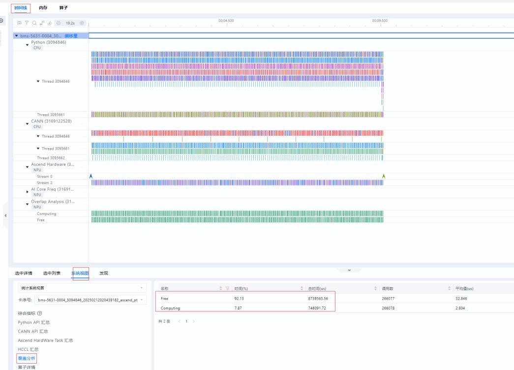  
图 3-2 覆盖分析

其中Free表示当前昇腾设备没有进行任何计算或者通信的时间，Computing表示昇腾设备上执行计算动作的时间。

当Free的占比高于计算时，通常意味着存在调度类问题。计算时间很长，在时间线上存在大量算子进行长时间的计算，此时意味着存在计算类问题。

# 调度问题

在时间线界面，打开HostToDevice连线，该连线展示CANN层算子到AscendHardware层算子的下发执行关系。HostToDevice的连线通常有两种形态，倾斜和竖直，如图3-3所示，连线倾斜，说明调度任务安排合理，昇腾设备负荷较满；如果连线竖直，说明任务下发不合理，昇腾设备负荷较低，等待任务下发。可以通过增大batch size、绑核、融合算子替换等方法进行调优。

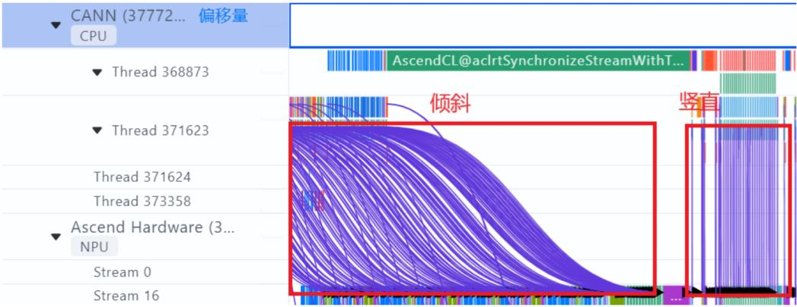  
图 3-3 HostToDevice 的连线

# 计算问题

可以在算子界面查看算子的占比情况，如图3-4。

按照算子总耗时占比排序，定位到计算最慢的算子，优先确认代码中是否存在不合理的设计导致的大量无效操作，根据业务来调整代码，避免无效操作，如果算子耗时很长，需要找到算子开发人员进一步确认问题原因。

  
图 3-4 查看算子占比

----结束

# 3.3 性能调优案例

问题现象

传统模型推理过程中，发现吞吐率较低，需要定位问题，进行性能调优。

# 调优步骤

步骤1 采集数据。通过性能调优工具的msprof命令行方式采集性能数据。msprof --output=save_path python3 main.py执行完成后，会在--output参数配置的目录下生成所采集的数据。

步骤2 将解析完成的性能数据导入MindStudio Insight工具进行数据分析。

数据概览分析在“时间线 $>$ 系统视图 $>$ 覆盖分析”中查看计算和Free的占比，如图3-5。

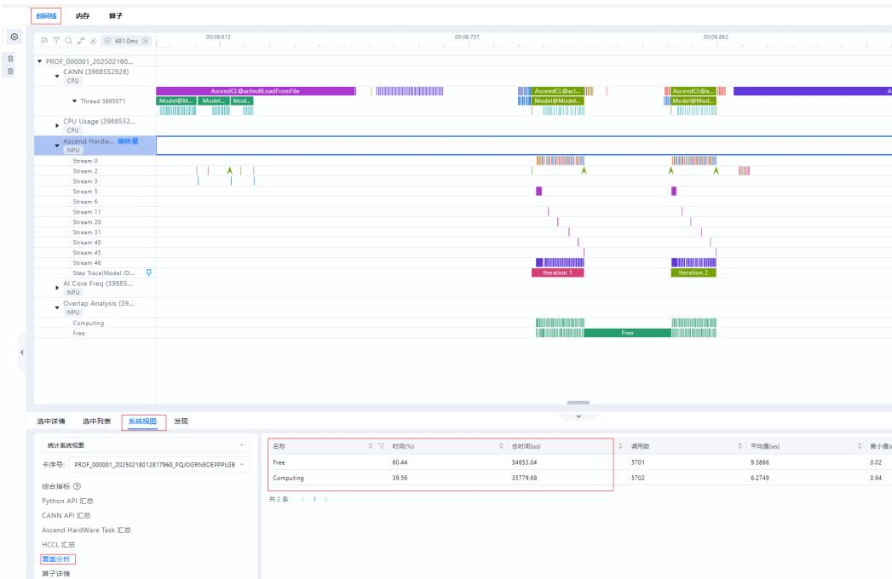  
图 3-5 查看覆盖分析

模型推理执行两个迭代，迭代间存在数据释放与加载（与模型运行方式相关），因此产生较多Free，可以手动选择一个iteration的数据进行汇总分析，如图3-6。分析iteration的数据后，可以得出计算占比为75%，Free占比为25%。图中有ModelExecute任务，当前推理模式为图模式下发，可减小调度造成的空隙，整体下发情况较为良好。进一步优化主要考虑计算侧问题。

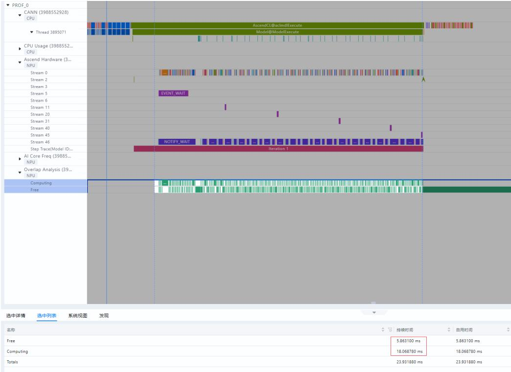  
图 3-6 分析 iteration 的数据

# 内存占用分析

NPU属于大核的硬件架构模式，大BatchSize更能充分地使用NPU的算力资源，BatchSize越大，实际可达到的吞吐量就越高，因此可以先分析内存占用情况，在内存可支持的情况下，增大BatchSize。

初始模型BatchSize设置为4，内存占用很低，如图3-7所示。

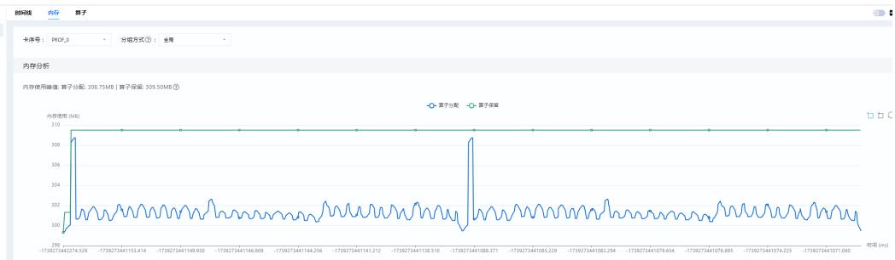  
图 3-7 内存占用分析

基于ais_bench运行的推理程序吞吐率在174左右，如图3-8所示，ais_bench推理工具使用请参见ais_bench推理工具使用指南。

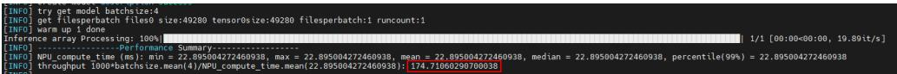  
图3-8 推理程序运行结果

增大BatchSize到1024，使用ATC工具重新转换onnx模型至om格式运行，再次查看内存，发现内存利用提高，如图3-9。

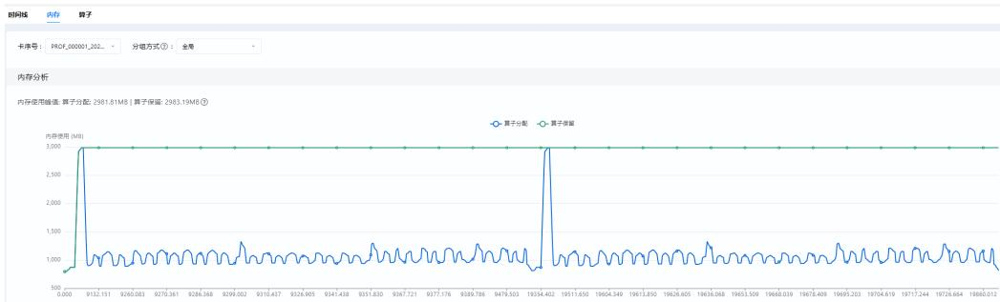  
图 3-9 查看内存

再次查看发现，基于ais_bench运行的推理程序吞吐率达到1869，吞吐率明显提高，如图3-10所示。

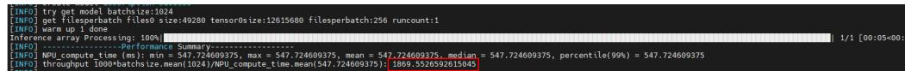  
图 3-10 推理程序吞吐率

算子分析

算子方向的提升主要为提高cube利用，即提高aicore算子的占比。观察算子界面，如图3-11，可以看到整体Vector类型算子占比高，张量运算多，实际的矩阵运算较少。

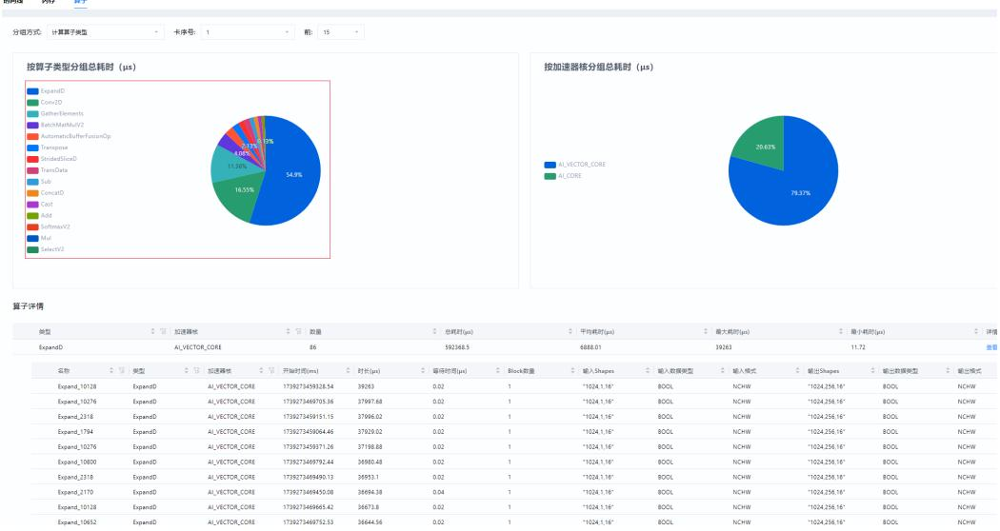  
图 3-11 查看算子界面  
时间线 内存

查看时间线界面，如图3-12，虽然整体计算占比大幅度提高，但是大量计算时间都是ExpandD类型算子，而非矩阵类运算。ExpandD类型算子主要用于扩展张量的维度，是将一个张量沿着指定的维度进行复制，以增加该维度上的大小。

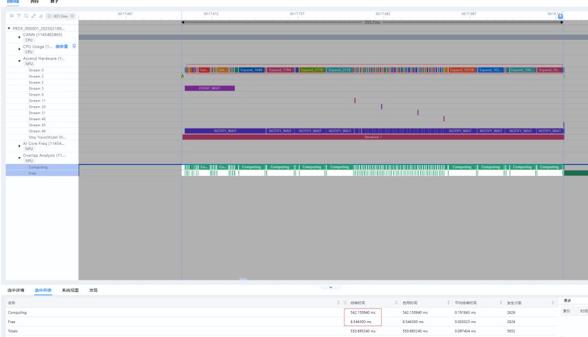  
图 3-12 查看时间线界面

查阅该类型算子的实现相关材料，发现可以将该类型算子的输入类型进行调整，在算子前后添加cast转换数据类型，可以提高算子执行效率。

例如，图3-13的bool类型转换成图3-14的int32类型，ExpandD类型算子任务持续时间（Task Duration）从36223.904us缩短至19.781us，算子执行效率明显提升。

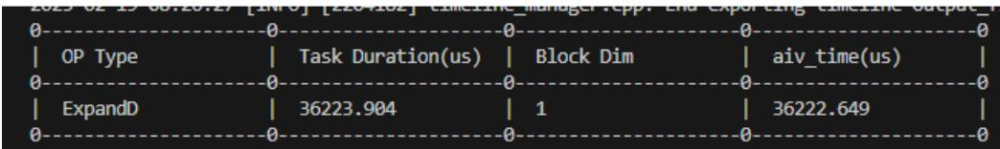  
图 3-13 bool 类型

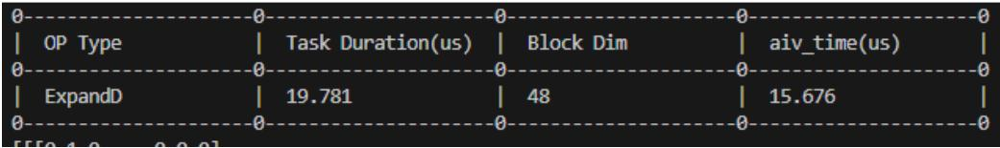  
图 3-14 int32 类型

# ----结束