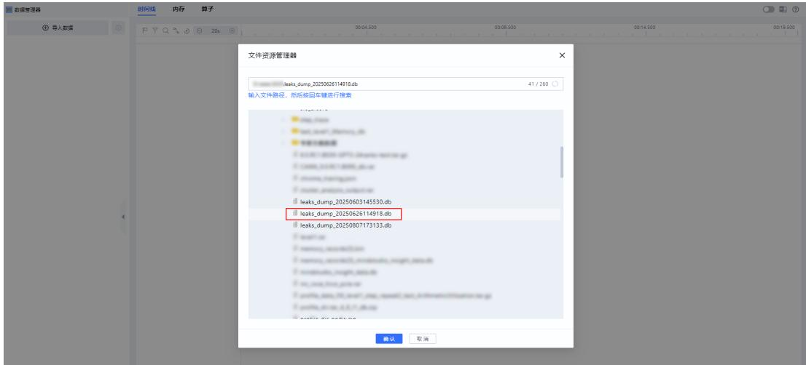
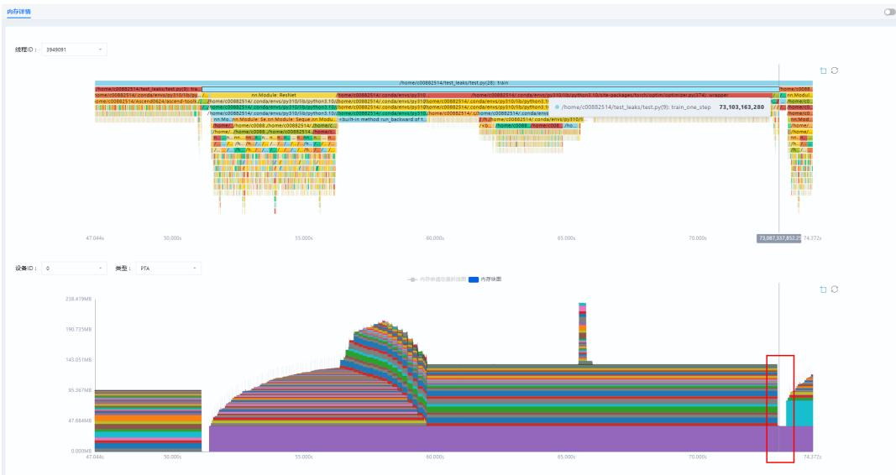
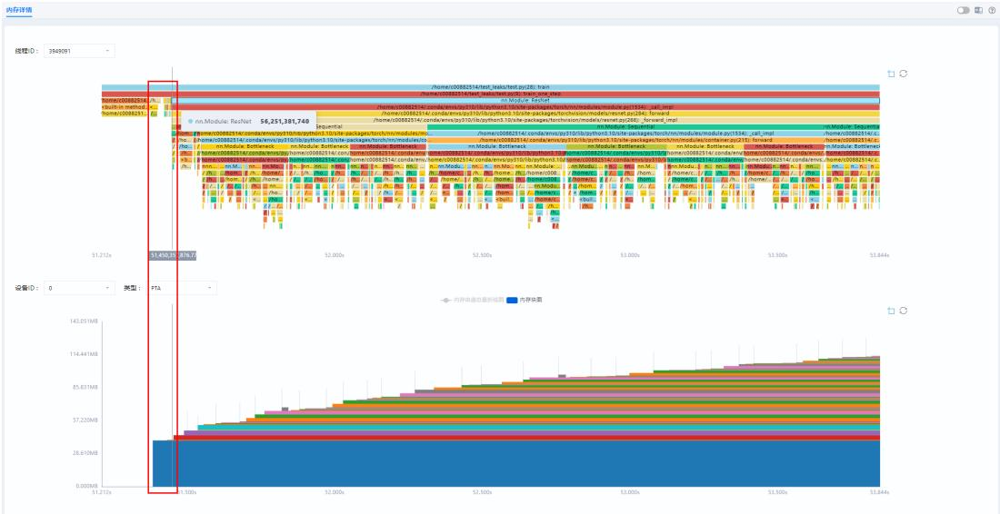
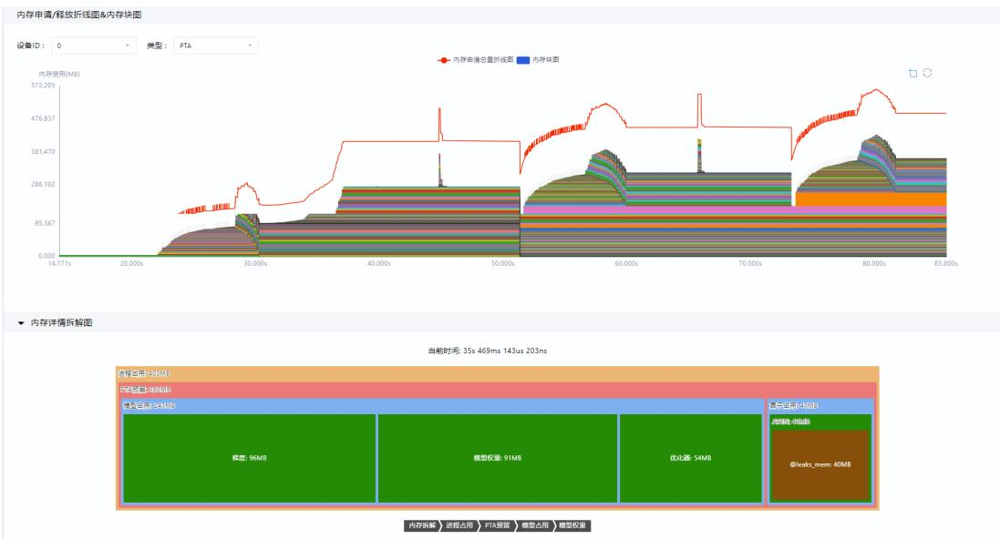
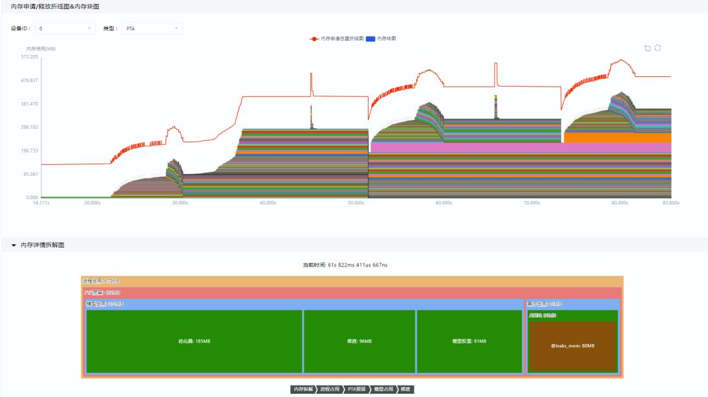
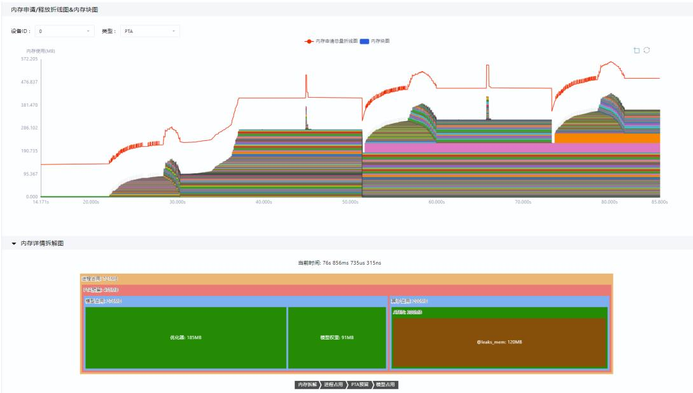

# MindStudio8.3.0内存问题分析案例

文档版本 01  
发布日期 2026-01-19

版权所有 $\circledcirc$ 华为技术有限公司 2026。 保留一切权利。

非经本公司书面许可，任何单位和个人不得擅自摘抄、复制本文档内容的部分或全部，并不得以任何形式传播。

# 商标声明

和其他华为商标均为华为技术有限公司的商标。  
本文档提及的其他所有商标或注册商标，由各自的所有人拥有。

# 注意

您购买的产品、服务或特性等应受华为公司商业合同和条款的约束，本文档中描述的全部或部分产品、服务或特性可能不在您的购买或使用范围之内。除非合同另有约定，华为公司对本文档内容不做任何明示或暗示的声明或保证。

由于产品版本升级或其他原因，本文档内容会不定期进行更新。除非另有约定，本文档仅作为使用指导，本文档中的所有陈述、信息和建议不构成任何明示或暗示的担保。

# 安全声明

# 产品生命周期政策

华为公司对产品生命周期的规定以“产品生命周期终止政策”为准，该政策的详细内容请参见如下网址：https://support.huawei.com/ecolumnsweb/zh/warranty-policy

# 漏洞处理流程

华为公司对产品漏洞管理的规定以“漏洞处理流程”为准，该流程的详细内容请参见如下网址：  
https://www.huawei.com/cn/psirt/vul-response-process  
如企业客户须获取漏洞信息，请参见如下网址：  
https://securitybulletin.huawei.com/enterprise/cn/security-advisory

# 华为初始证书权责说明

华为公司对随设备出厂的初始数字证书，发布了“华为设备初始数字证书权责说明”，该说明的详细内容请参见如下网址：https://support.huawei.com/enterprise/zh/bulletins-service/ENEWS2000015766

# 华为企业业务最终用户许可协议(EULA)

本最终用户许可协议是最终用户（个人、公司或其他任何实体）与华为公司就华为软件的使用所缔结的协议。最终用户对华为软件的使用受本协议约束，该协议的详细内容请参见如下网址：  
https://e.huawei.com/cn/about/eula

# 产品资料生命周期策略

华为公司针对随产品版本发布的售后客户资料（产品资料），发布了“产品资料生命周期策略”，该策略的详细内容请参见如下网址：https://support.huawei.com/enterprise/zh/bulletins-website/ENEWS2000017760

# 目 录

1 简介......

2 调优流程....

3 内存泄漏分析.... 3

3.1 使用前准备... 3

3.2 内存调优...

# 简介

在昇腾全栈开发活动中，内存问题较为常见，但是由于内存问题的软件栈层次复杂（包括但不限于操作系统的驱动和运行时库、CANN、MindSpore/PyTorch_NPU、模型训练和模型推理等），导致内存问题的定位和解决往往较为困难。

本文介绍通过MindStudio Insight工具定位内存问题的方法。

# 2 调优流程

目前典型的内存问题分类可参见表2-1。

表 2-1 内存问题分类  

<table><tr><td>问题类别</td><td>问题现象</td><td>场景</td></tr><tr><td>内存踩踏</td><td>出现精度异常或出现NaN，通常出现在Device上。</td><td>训练、推理、 算子开发</td></tr><tr><td>内存使用 过多</td><td>内存使用过多，通常与以下两种情况有关： ·泄漏或OOM（Outof Memory，内存溢出） － Host侧内存监测持续增长，甚至OOM。 － Device侧内存使用量持续增长，甚至OOM。 与预期或基线相差大 . 实际采集的内存使用数据远超预期或基线数据，差 值会达到GB量级，通常出现在Device侧。</td><td>训练、推理</td></tr></table>

# 定位流程

针对Device侧内存使用过多或OOM，问题分析流程如下：

1. 通过性能调优工具采集性能数据，并导入MindStudio Insight；  
2. 查看内存（Memory）界面中“内存分析”区域的内存曲线图、算子或组件内存申请/释放详情，进行初步定位，明确异常范围、Step或算子；  
3. 使用内存泄漏检测工具（msLeaks）采集对应异常范围的内存详情与内存拆解数据，导入MindStudio Insight；  
4. 查看内存详情（Leaks）界面，结合“调用栈火焰图”、“内存申请/释放折线图&内存块图”、“内存详情表”进行内存占用拆解分析。

# 3 内存泄漏分析

使用前准备内存调优

# 3.1 使用前准备

# 准备软件

下载MindStudio Insight工具并安装，下载及安装操作请参见《MindStudioInsight工具用户指南》中的“安装与卸载”章节。  
安装msLeaks工具，msLeaks工具集成在CANN软件包中，请安装配套版本的CANN Toolkit开发套件包和ops算子包，安装操作请参见《CANN 软件安装指南》。

# 准备数据

以下采集的数据为内存泄漏的数据。

步骤1 使用msLeaks工具执行如下命令，在每个Step中申请一个大小为4 x 10MB的Tensor，并追加到全局变量leak_mem_list列表中（不会随train_one_step释放），采集3个Step的Python Trace数据。

msleaks --level=0,1 --events=alloc,free,access,launch --analysis=decompose --data-format=db python test.py

# 其中test.py的示例代码如下：

import torch   
import torch_npu   
from torchvision.models import resnet50   
import msleaks   
import msleaks.describe as describe   
leak_mem_list $= [ ]$   
def train_one_step(model, optimizer, loss_fn, device): # 对代码块做标记，代码块内所有内存申请事件的owner属性都会打上标签leaks_mem describe.describer(owner="leaks_mem").__enter__() # 内存泄漏代码段 leak_mem_list.append(torch.randn( $1 0 2 4 \AA 1 0 2 4 \AA 1 0$ , dtype=torch.float32).to(device)) # 结束标记 describe.describer(owner $= ^ { 1 }$ "leaks_mem").__exit__(None, None, None) # 单次训练代码段 inputs $=$ torch.randn(1, 3, 224, 224).to(device) labels $=$ torch.rand(1, 10).to(device)

pred $=$ model(inputs) loss_fn(pred, labels).backward() optimizer.step() optimizer.zero_grad() def train(model, optimizer, loss_fn, device, step $\mathrel { \mathop : } = 1$ ): for i in range(steps): train_one_step(model, optimizer, loss_fn, device) device $=$ torch.device("npu:0") torch.npu.set_device(device) # 设置device model $=$ resnet50(pretrained=False, num_classe $\mathord {  } 1 0$ ).to(device) # 加载模型 optimizer $=$ torch.optim.Adam(model.parameters(), lr=1e-2) # 定义优化器 loss_fn $=$ torch.nn.CrossEntropyLoss() # 定义损失函数

# 开启采集python函数调用数据  
msleaks.tracer.start()  
train(model, optimizer, loss_fn, device, step $\mathord {  } 3$ ) # 开始训练

# 停止采集python函数调用数据msleaks.tracer.stop()

步骤2 采集完成后，输出db格式的文件。

步骤3 将文件下载至本地保存。

----结束

# 3.2 内存调优

# 导入数据

步骤1 打开MindStudio Insight工具，单击左侧导航栏的“导入数据”。

步骤2 在弹出的“文件资源管理器”弹框中，选择需要导入的db格式的文件，如图3-1所示。

  
图 3-1 导入数据

步骤3 导入成功后，显示“内存详情”界面。----结束

# 内存分析

步骤1 打开“内存详情”界面，查看“调用栈火焰图”和“内存申请/释放折线图&内存块图”，内存详情界面的介绍和使用请参见《MindStudio Insight工具用户指南》中的“内存调优”章节。

步骤2 单击鼠标左键框选“内存申请/释放折线图&内存块图”中的Step2区域，松开鼠标左键，放大Step2区域。

可以从图3-2中看出，在Step2结束时，仍存在一个未释放的内存块。

  
图 3-2 未释放的内存块

步骤3 查看“调用栈火焰图”，发现该内存块来自于一个Tensor对象，在前向传播开始前即已申请，如图3-3所示。

  
图 3-3 Tensor 对象

步骤4 对照leaks_mem标记的代码段，查看“内存详情拆解图”，发现leaks_mem标记的代码段存在明显的增长，从Step 1开始leaks_mem标签内存占用首次出现为40M，如图3-4所示。

  
图 3-4 查看 Step 1 的内存占用

如图3-5所示，Step 2中leaks_mem标签内存占用从40M增长到了80M。

  
图 3-5 查看 Step 2 的内存占用

如图3-6所示，Step 3中leaks_mem标签内存占用从80M增长到了120M。

  
图 3-6 查看 Step 3 的内存占用

----结束