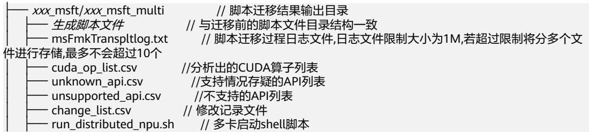
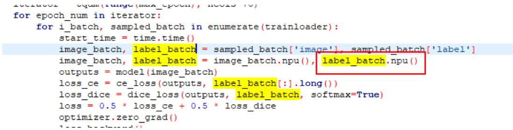
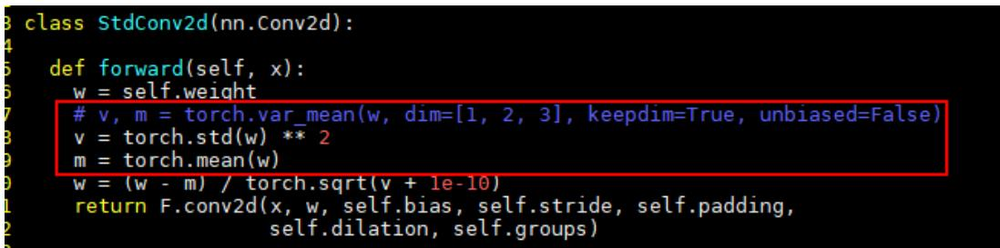

# MindStudio8.3.0分析迁移工具用户指南

文档版本 01  
发布日期 2026-01-19

版权所有 $\circledcirc$ 华为技术有限公司 2026。 保留一切权利。

非经本公司书面许可，任何单位和个人不得擅自摘抄、复制本文档内容的部分或全部，并不得以任何形式传播。

# 商标声明

和其他华为商标均为华为技术有限公司的商标。  
本文档提及的其他所有商标或注册商标，由各自的所有人拥有。

# 注意

您购买的产品、服务或特性等应受华为公司商业合同和条款的约束，本文档中描述的全部或部分产品、服务或特性可能不在您的购买或使用范围之内。除非合同另有约定，华为公司对本文档内容不做任何明示或暗示的声明或保证。

由于产品版本升级或其他原因，本文档内容会不定期进行更新。除非另有约定，本文档仅作为使用指导，本文档中的所有陈述、信息和建议不构成任何明示或暗示的担保。

# 安全声明

# 产品生命周期政策

华为公司对产品生命周期的规定以“产品生命周期终止政策”为准，该政策的详细内容请参见如下网址：https://support.huawei.com/ecolumnsweb/zh/warranty-policy

# 漏洞处理流程

华为公司对产品漏洞管理的规定以“漏洞处理流程”为准，该流程的详细内容请参见如下网址：  
https://www.huawei.com/cn/psirt/vul-response-process  
如企业客户须获取漏洞信息，请参见如下网址：  
https://securitybulletin.huawei.com/enterprise/cn/security-advisory

# 华为初始证书权责说明

华为公司对随设备出厂的初始数字证书，发布了“华为设备初始数字证书权责说明”，该说明的详细内容请参见如下网址：https://support.huawei.com/enterprise/zh/bulletins-service/ENEWS2000015766

# 华为企业业务最终用户许可协议(EULA)

本最终用户许可协议是最终用户（个人、公司或其他任何实体）与华为公司就华为软件的使用所缔结的协议。最终用户对华为软件的使用受本协议约束，该协议的详细内容请参见如下网址：  
https://e.huawei.com/cn/about/eula

# 产品资料生命周期策略

华为公司针对随产品版本发布的售后客户资料（产品资料），发布了“产品资料生命周期策略”，该策略的详细内容请参见如下网址：https://support.huawei.com/enterprise/zh/bulletins-website/ENEWS2000017760

# 目 录

1 工具简介....  
2 环境准备...  
3 快速入门....  
4 迁移分析.. 6  
5 迁移训练.. .13  
5.1 自动迁移方式.. . 13  
5.2 PyTorch GPU2Ascend 工具迁移方式.. .15  
5.3 训练配置.. 17  
5.4 典型案例... 17  
5.4.1 使用 torch.utils.data.DataLoader 方式加载数据的场景说明. 18  
5.4.2 GPU 单卡脚本迁移为 NPU 多卡脚本.. 18  
6 FAQ... 21  
6.1 “Segmentation fault”错误.. . 21  
6.2 引用库找不到的问题.. 22  
6.3 Muls 算子不支持 int64.. . 22  
6.4 对于报错“No supported Ops kernel and engine are found for [ReduceStdV2A], optype  
[ReduceStdV2A]”，算子 ReduceStdV2A 不支持的问题. 22  
6.5 运行报错.. 23

# 工具简介

昇腾NPU是AI算力的后起之秀，但目前训练和在线推理脚本大多是基于GPU的。由于NPU与GPU的架构差异，基于GPU的训练和在线推理脚本不能直接在NPU上使用。

分析迁移工具提供PyTorch训练脚本一键式迁移至昇腾NPU的功能，开发者可做到少量代码修改或零代码完成迁移。该工具提供PyTorch Analyse功能，帮助用户分析PyTorch训练脚本的API、三方库API、亲和API分析以及动态shape的支持情况。同时提供了自动迁移和PyTorch GPU2Ascend工具两种迁移方式，将基于GPU的脚本迁移为基于NPU的脚本，这种自动化方法节省了人工手动进行脚本迁移的学习成本与工作量，大幅提升了迁移效率。

（推荐）自动迁移：修改内容少，只需在训练脚本中导入库代码，迁移后直接在昇腾NPU平台上运行。  
PyTorch GPU2Ascend工具迁移：迁移过程会生成分析文件，支持用户查看API支持度分析报告和迁移过程中对原训练脚本的修改内容，并支持单卡脚本迁移为多卡脚本。

# 说明

使用分析迁移工具迁移前，请用户自行确认原工程内各参数的正确性，需在原工程运行成功的基础上使用工具进行迁移。

# 2 环境准备

# 环境准备

安装开发套件包，请参见《CANN 软件安装指南》。

配置环境变量。

安装CANN软件后，使用CANN运行用户进行编译、运行时，需要以CANN运行用户登录环境，执行source \${install_path}/set_env.sh命令设置环境变量。其中\${install_path}为CANN软件的安装目录，例如：/usr/local/Ascend/cann。

# 说明

上述环境变量只在当前窗口生效，用户可以将上述命令写入\~/.bashrc文件，使其永久生效，操作如下：

1. 以安装用户在任意目录下执行vi \~/.bashrc，打开.bashrc文件，并在该文件最后添加上述环境变量。  
2. 执行:wq!命令，保存文件并退出。  
3. 执行source \~/.bashrc命令，使环境变量生效。

# 使用约束

分析和迁移工具当前支持PyTorch1.11.0、2.1.0、2.2.0、2.3.1、2.4.0、2.5.1、2.6.0版本训练脚本的分析和迁移。

# 说明

自动迁移方式的情况下，PyTorch 1.11.0版本不支持Atlas A3 训练系列产品/Atlas A3 推理系列产品。

原脚本需要在GPU环境下且基于Python3.7及以上能够运行成功。

分析迁移后的执行逻辑与迁移前需保持一致。

若原始代码中调用了三方库，迁移过程可能会存在适配问题。在迁移原始代码前，用户需要根据已调用的三方库，自行安装昇腾已适配的三方库版本，已适配的三方库信息和使用指南请参考《Ascend Extension for PyTorch 套件与三方库支持清单》。

APEX中使用的FusedAdam优化器不支持使用自动迁移和PyTorch GPU2Ascend工具进行迁移，若原始代码中包含该优化器，用户需自行修改。

当前分析工具不支持对原生函数self.dropout()、nn.functional.softmax()、torch.add、bboexs_diou()、bboexs_giou()、LabelSmoothingCrossEntropy()或ColorJitter进行亲和API分析，若原训练脚本涉及以上原生函数，请参考《Ascend

Extension for PyTorch 自定义API参考》中“PyTorchx.x.x> Ascend Extensionfor PyTorch自定义API $>$ torch_npu.contrib”节点进行分析和替换。

若用户训练脚本中包含昇腾NPU平台不支持的amp_C模块，需要用户手动删除import amp_C相关代码内容后，再进行训练。

由于转换后的脚本与原始脚本平台不一致，迁移后的脚本在调试运行过程中可能会由于算子差异等原因而抛出异常，导致进程终止，该类异常需要用户根据异常信息进一步调试解决。

# 安全注意事项

在linux环境使用工具时，出于安全性及权限最小化角度考虑，本工具不应使用root等高权限账户进行操作，建议使用普通用户权限安装执行。

在linux环境使用工具时，请确保使用前执行用户的umask值大于等于0027，否则可能会造成工具生成的数据文件和目录权限过大。

在linux环境使用工具时，用户须自行保证使用最小权限原则，如给工具输入的文件要求other用户不可写，在一些对安全要求更严格的功能场景下还需确保输入的文件group用户不可写。

由于本工具依赖CANN，为保证安全，应使用同一低权限用户默认安装的CANN包，source命令执行后请不要随意修改set_env.sh中涉及的环境变量。

本工具为开发调测工具，不建议在生产环境使用。

# 3 快速入门

# 简介

PyTorch GPU2Ascend工具可将基于GPU的训练脚本迁移为支持NPU的脚本，大幅度提高脚本迁移速度，降低开发者的工作量。本样例可以让开发者快速体验自动迁移（推荐）和PyTorch GPU2Ascend工具的迁移效率。

本样例选用ResNet50模型，数据集为ImageNet。

# 前提条件

准备一台基于Atlas 训练系列产品的训练服务器，并安装对应的驱动和固件。驱动和固件的安装请参考《CANN 软件安装指南》中的“安装NPU驱动固件”章节。

安装开发套件包Ascend-cann-toolkit及ops算子包，具体请参考《CANN 软件安装指南》的“安装CANN”节点。

以安装PyTorch 2.1.0版本为例，具体操作请参考《Ascend Extension forPyTorch 软件安装指南》的“安装PyTorch”章节，完成PyTorch框架和torch_npu插件的安装。

使用PyTorch GPU2Ascend迁移前须执行如下命令安装依赖，如下命令如果使用非root用户安装，需要在安装命令后加上--user，例如：pip3 install pandas --user。

pip3 install pandas #必选，pandas版本号需大于或等于1.2.4pip3 install libcst #必选，语义分析库，用于解析Python文件pip3 install prettytable #必选，将数据可视化为图表形式pip3 install jedi #必选，用于跨文件解析

下载main.py文件，将获得ResNet50模型放到用户自定义路径下（如/home/user）。

# 自动迁移（推荐）

修改内容少，只需在训练脚本中导入库代码，迁移后直接在昇腾NPU平台上运行。

步骤1 在训练脚本main.py文件中导入自动迁移的库代码。

from torch.utils.data import Subset   
import torch_npu   
from torch_npu.contrib import transfer_to_npu .....

步骤2 切换目录至迁移完成后的训练脚本所在路径（以/home/user为例），执行以下命令使用虚拟数据集进行训练，迁移完成后的训练脚本可在NPU上正常运行。

开始打印迭代日志，说明训练功能迁移成功。  
cd /home/user  
python main.py -a resnet50 --gpu 1 --epochs 1 --dummy # --gpu 1表示使用卡1，--epochs 1是指迭代次数为

步骤3 迁移工具自动保存权重成功，说明迁移成功。

# ----结束

# 使用 PyTorch GPU2Ascend 工具迁移

步骤1 进入迁移工具所在路径。cd \${INSTALL DIR}/cann/tools/ms_fmk_transplt/ # \${INSTALL_DIR}请替换为CANN软件安装后文件存储路径。以root用户安装为例，则安装后文件存储路径为：/usr/local/Ascend/cann。

步骤2 执行脚本迁移任务，参考表5-1配置信息。./pytorch_gpu2npu.sh -i /home/user -o /home/out -v 2.1.0 # /home/user为原始脚本路径， /home/out为脚本迁移结果输出路径，2.1.0为原始脚本的PyTorch框架版本

步骤3 切换目录至迁移完成后的训练脚本所在路径（以/home/user为例），执行以下命令使用虚拟数据集进行训练，迁移完成后的训练脚本可在NPU上正常运行。

开始打印迭代日志，说明训练功能迁移成功。  
cd /home/user  
python main.py -a resnet50 --gpu 1 --epochs 1 --dummy # --gpu 1表示使用卡1，--epochs 1是指迭代次数为

步骤4 完成脚本迁移，进入脚本迁移结果的输出路径查看结果件。

# 说明

脚本迁移过程中会启动迁移分析，默认使用torch_apis和affinity_apis的分析模式，可参见分析报告简介查看对应的结果件。

步骤5 迁移工具自动保存权重成功，说明迁移成功。

----结束

PyTorch Analyse工具提供分析脚本，帮助用户在执行迁移操作前，分析基于GPU平台的PyTorch训练脚本中API、三方库套件、亲和API分析以及动态shape的支持情况，具体请参见表4-1。

表4-1 分析模式介绍  

<table><tr><td rowspan=1 colspan=1>分析模式</td><td rowspan=1 colspan=1>分析脚本</td><td rowspan=1 colspan=1>分析结果</td><td rowspan=1 colspan=1>调优建议</td></tr><tr><td rowspan=1 colspan=1>三方库套件分析模式</td><td rowspan=1 colspan=1>需用户提供待分析的三方库套件源码。</td><td rowspan=1 colspan=1>可快速获得源码中不支持的三方库API和CUDA信息。说明三方库API是指在三方库代码中的函数，如果某函数的函数体内使用了不支持的torch算子或者CUDA自定义算子，则此函数就是三方库不支持的API。如果第三方库中其他函数调用了这些不支持的API，则这些调用函数也为不支持的API。</td><td rowspan=1 colspan=1></td></tr><tr><td rowspan=1 colspan=1>API支持情况分析模式</td><td rowspan=3 colspan=1>需用户提供待分析的PyTorch训练脚本。</td><td rowspan=1 colspan=1>可快速获得训练脚本中不支持的torch API和CUDA API信息。</td><td rowspan=1 colspan=1>输出训练脚本中API精度和性能调优的专家建议。</td></tr><tr><td rowspan=1 colspan=1>动态shape分析模式</td><td rowspan=1 colspan=1>可快速获得训练脚本中包含的动态shape信息。</td><td rowspan=1 colspan=1></td></tr><tr><td rowspan=1 colspan=1>亲和API分析模式</td><td rowspan=1 colspan=1>可快速获得训练脚本中可替换的亲和API信息。</td><td rowspan=1 colspan=1></td></tr></table>

# 前提条件

使用PyTorch Analyse工具前须安装如下依赖。如下命令若使用非root用户安装，需要在安装命令后加上--user，例如：pip3 install pandas --user，安装命令可在任意路径下执行。

pip3 install pandas #pandas版本号需大于或等于1.2.4pip3 install libcst #Python语法树解析器，用于解析Python文件

pip3 install prettytable #将数据可视化为图表形式pip3 install jedi #三方库套件、亲和API分析时必须安装

# 启动分析任务

步骤1 进入分析工具所在路径。

cd \${INSTALL DIR}/cann/tools/ms_fmk_transplt/ #  
\${INSTALL_DIR}请替换为CANN软件安装后文件存储路径。以root用户安装为例，则安装后文件存储路径为：/usr/local/Ascend/cann。

步骤2 启动分析任务。

# 参考表4-2配置信息，执行如下命令启动分析任务。

./pytorch_analyse.sh -i /home/xxx/analysis -o /home/xxx/analysis output -v 2.1.0 [-m torch apis] # /  
home/xxx/analysis为待分析脚本路径，/home/xxx/analysis_output为分析结果输出路径，2.1.0为待分析脚本框  
架版本，  
torch_apis为分析模式

其中“[]”表示可选参数，实际使用可不用添加。若“-m/--mode”参数指定的分析模式为dynamic_shape，分析任务完成后需参考5.3 训练配置对训练脚本进行修改，才能获取动态shape分析报告。

表 4-2 参数说明  

<table><tr><td colspan="1" rowspan="1">参数</td><td colspan="1" rowspan="1">参数说明</td><td colspan="1" rowspan="1">取值示例</td></tr><tr><td colspan="1" rowspan="1">-i--input</td><td colspan="1" rowspan="1">. 待分析脚本文件所在文件夹或三方库套件源码所在文件夹路径。. 必选。</td><td colspan="1" rowspan="1">/home/ xxx/analysis</td></tr><tr><td colspan="1" rowspan="1">-0--output</td><td colspan="1" rowspan="1">分析结果文件的输出路径。. 会在该路径下生成xxxx_analysis文件夹。· 必选。说明用户需确保分析结果文件的输出路径在运行前存在，否则分析迁移工具会提示error。</td><td colspan="1" rowspan="1">/home/xxx/analysis_output</td></tr><tr><td colspan="1" rowspan="2">-V--version</td><td colspan="1" rowspan="2">待分析脚本或三方库套件源码的PyTorch版本。·必选。</td><td colspan="1" rowspan="1">.1.11.2.1.0. 2.2.0. 2.3.1. 2.4.0： 2.5.1</td></tr><tr><td colspan="1" rowspan="1">. 2.6.0说明自动迁移方式的情况下，PyTorch 1.11.0版本不支持Atlas A3 训练系列产品/AtlasA3推理系列产品。</td></tr><tr><td colspan="1" rowspan="1">-m--mode</td><td colspan="1" rowspan="1">·分析的模式。目前支持torch_apis（APl支持情况分析）、third_party（三方库套件分析）、affinity_apis（亲和APl分析）和dynamic_shape（动态shape分析）模式。可选。</td><td colspan="1" rowspan="1">·torch_apis（默认）· third_party·affinity_apis· dynamic_shape</td></tr><tr><td colspan="1" rowspan="1">-env--env-path</td><td colspan="1" rowspan="1">分析时需要增加的PYTHONPATH环境变量路径，仅安装jedi后该参数才生效。指定的三方库待分析的路径，分析当前脚本中不支持的三方库的API列表。·可选。</td><td colspan="1" rowspan="1">/home/xxx/transformers/src/home/xxx/transformers/utils多个文件路径使用空格隔开。</td></tr><tr><td colspan="1" rowspan="1">-api--api-files</td><td colspan="1" rowspan="1">·三方库不支持API的分析结果文件。·可选。说明若三方库存在不支持的API，且自定义函数调用了不支持的torch API，可使用分析torch API的功能。1．使用-m中third_party（三方库套件分析）分析功能，获得三方库中不支持迁移的API列表（csv文件），示例如下：pytorch_analyse.sh -i third_party_input_path-othird_party_output_path-v2.1.0 -m third_party #third_party_input_path为三方库文件夹路径，third_party_output_path为结果输出路径，2.1.0为待分析脚本框架版本2.将上述步骤中获取的csv文件传入-api，获取当前训练脚本中不支持迁移的三方库API信息，示例如下： pytorch_analyse.sh -i input_path -o output_path -v2.1.0 -api third_party_output_path/framework_unsupported_op.csv # input_path为模型脚本文件夹路径，output_path为结果输出路径，third_party_output_path/framework_unsupported_op.csv为步骤1中得到的三方库不支持api分析结果文件</td><td colspan="1" rowspan="1">/home/xxx/mmcv_analysis/full_unsupported_results.csv /home/xxx/transformers_analysis/full_unsupported_results.csv多个文件路径使用空格隔开。</td></tr><tr><td colspan="1" rowspan="1">-h--help</td><td colspan="1" rowspan="1">打印帮助信息。</td><td colspan="1" rowspan="1"></td></tr></table>

步骤3 分析完成后，进入脚本分析结果输出路径，查看分析报告，具体请参见分析报告简介。

----结束

# 分析报告简介

分析模式为“torch_apis”时，分析结果如下所示：

xxxx_analysis // 分析结果输出目录cuda_op_list.csv //CUDA API列表unknown_api.csv //支持存疑的API列表unsupported_api.csv //不支持的API列表api_precision_advice.csv //API精度调优的专家建议api_performance_advice.csv //API性能调优的专家建议pytorch_analysis.txt // 分析过程日志

表 4-3 “torch_apis”模式 csv 文件介绍  

<table><tr><td rowspan=1 colspan=1>文件名</td><td rowspan=1 colspan=1>简介</td></tr><tr><td rowspan=1 colspan=1>unsupported_api.CSv</td><td rowspan=1 colspan=1>当前框架不支持的API列表，可以在昇腾开源社区寻求帮助。图4-1不支持的API列表示例1Pile      Start Line       End Line             oP        Tipsaodels/googlenet.py           10                160 torch.jit.annotate3aodels/googlenet.py171 torch.jit.annotate4aodels/googlenet.py206 torch.jit.is_scripting</td></tr><tr><td rowspan=1 colspan=1>cuda_op_list.csv</td><td rowspan=1 colspan=1>当前训练脚本包含的CUDAAPI信息。</td></tr><tr><td rowspan=1 colspan=1>unknown_api.csv</td><td rowspan=1 colspan=1>支持存疑的API列表，具体的PyTorchAPI信息请参见表4-4。如果训练失败，可以到昇腾开源社区求助。</td></tr><tr><td rowspan=1 colspan=1>api_precision_advice.csv</td><td rowspan=1 colspan=1>当前训练脚本中可以进行精度调优的专家建议，除此之外，还可以使用《精度调试工具用户指南》进行调优。</td></tr><tr><td rowspan=1 colspan=1>api_performance_advice.csv</td><td rowspan=1 colspan=1>当前训练脚本中可以进行性能调优的专家建议和指导措施，除此之外，还可以使用《性能调优工具用户指南》进行调优。说明分析结果基于原生PyTorch框架的API接口信息，具体请参见表4-4。</td></tr></table>

表 4-4 PyTorch API 接口信息  

<table><tr><td colspan="1" rowspan="1">PyTorch框架版本</td><td colspan="1" rowspan="1">API信息参考链接</td><td colspan="1" rowspan="1"> AscendExtension forPyTorch版本</td><td colspan="1" rowspan="1">CANN版本</td></tr><tr><td colspan="1" rowspan="1">2.8.0</td><td colspan="1" rowspan="1">PyTorch2.8.0</td><td colspan="1" rowspan="2">7.2.0</td><td colspan="1" rowspan="2">商用版：8.3.RC1社区版：8.3.RC1</td></tr><tr><td colspan="1" rowspan="1">2.7.1</td><td colspan="1" rowspan="1">PyTorch2.7.1</td></tr><tr><td colspan="1" rowspan="1">2.6.0</td><td colspan="1" rowspan="1">PyTorch2.6.0</td><td colspan="1" rowspan="3">7.1.0</td><td colspan="1" rowspan="3">商用版：8.2.RC1社区版：8.2.RC1</td></tr><tr><td colspan="1" rowspan="1">2.5.1</td><td colspan="1" rowspan="1">PyTorch2.5.1</td></tr><tr><td colspan="1" rowspan="1">2.3.1</td><td colspan="1" rowspan="1">PyTorch2.3.1</td></tr><tr><td colspan="1" rowspan="1">2.5.1</td><td colspan="1" rowspan="1">PyTorch2.5.1</td><td colspan="1" rowspan="4">7.0.0</td><td colspan="1" rowspan="4">商用版：8.1.RC1社区版：8.1.RC1</td></tr><tr><td colspan="1" rowspan="1">2.4.0</td><td colspan="1" rowspan="1">PyTorch2.4.0</td></tr><tr><td colspan="1" rowspan="1">2.3.1</td><td colspan="1" rowspan="1">PyTorch2.3.1</td></tr><tr><td colspan="1" rowspan="1">2.1.0</td><td colspan="1" rowspan="1">PyTorch2.1.0</td></tr><tr><td colspan="1" rowspan="1">2.1.0</td><td colspan="1" rowspan="1">PyTorch 2.1.0</td><td colspan="1" rowspan="3">6.0.0</td><td colspan="1" rowspan="3">商用版：8.0.0社区版：8.0.0.beta1</td></tr><tr><td colspan="1" rowspan="1">2.3.1</td><td colspan="1" rowspan="1">PyTorch 2.3.1</td></tr><tr><td colspan="1" rowspan="1">2.4.0</td><td colspan="1" rowspan="1">PyTorch 2.4.0</td></tr><tr><td colspan="1" rowspan="1">2.1.0</td><td colspan="1" rowspan="1">PyTorch 2.1.0</td><td colspan="1" rowspan="3">6.0.rc3</td><td colspan="1" rowspan="3">商用版：8.0.RC3社区版：8.0.RC3.beta1</td></tr><tr><td colspan="1" rowspan="1">2.3.1</td><td colspan="1" rowspan="1">PyTorch 2.3.1</td></tr><tr><td colspan="1" rowspan="1">2.4.0</td><td colspan="1" rowspan="1">PyTorch 2.4.0</td></tr><tr><td colspan="1" rowspan="1">1.11.0</td><td colspan="1" rowspan="1">PyTorch 1.11.0</td><td colspan="1" rowspan="4">6.0.rc2</td><td colspan="1" rowspan="4">商用版：8.0.RC2社区版：8.0.RC2.beta1</td></tr><tr><td colspan="1" rowspan="1">2.1.0</td><td colspan="1" rowspan="1">PyTorch 2.1.0</td></tr><tr><td colspan="1" rowspan="1">2.2.0</td><td colspan="1" rowspan="1">PyTorch 2.2.0</td></tr><tr><td colspan="1" rowspan="1">2.3.1</td><td colspan="1" rowspan="1">PyTorch 2.3.1</td></tr><tr><td colspan="1" rowspan="1">1.11.0</td><td colspan="1" rowspan="1">PyTorch 1.11.0</td><td colspan="1" rowspan="3">6.0.rc1</td><td colspan="1" rowspan="3">商用版：8.0.RC1社区版：8.0.RC1.beta1</td></tr><tr><td colspan="1" rowspan="1">2.1.0</td><td colspan="1" rowspan="1">PyTorch 2.1.0</td></tr><tr><td colspan="1" rowspan="1">2.2.0</td><td colspan="1" rowspan="1">PyTorch 2.2.0</td></tr></table>

分析模式为“third_party”时，分析结果如下所示：

─ xxxx_analysis // 分析结果输出目录cuda_op.csv //CUDA API列表framework_unsupported_op.csv //框架不支持的API列表full_unsupported_results.csv //全量不支持的API列表migration_needed_op.csv //待迁移的API列表unknown_op.csv //支持情况存疑的API列表pytorch_analysis.txt // 分析过程日志

表 4-5 “third_party”模式 csv 文件介绍  

<table><tr><td rowspan=1 colspan=1>文件名</td><td rowspan=1 colspan=1>简介</td></tr><tr><td rowspan=1 colspan=1>framework_unsupported_op.csv</td><td rowspan=1 colspan=1>框架不支持的API列表，查看三方库源码中当前框架不支持的三方库API。对于当前框架不支持的API，可以到昇腾开源社区求助。图4-2框架不支持的API列表示例Torch API    Affete 3rd party APltests.test_runner.test_checkpoint.test_save_checkpoint.dev_scripts.visualizerruntests.test_device.test_ipu.test_ipu_model.test_build_modelmmcv.runner.optimizer.DefaultOptimizerConstructor.__cal_tests.testrunner.test_optimizer.test_build_optimizer_constructormmcv.cnn.resnet ResNet.trainmmcv.runner.hooks.optimizer.GradientCumulativeFp16OptimizerHook.after_train_itertests.test_device.test_ipu.test_ipu_runner.test_build_runnertests.test_runner.test_hooks.test_gradient_cumulative_fp16_optimizer_hook.build_toy_runnertests.test_runner.test_hooks.test_gradient_cumulative_optimizer_hooktests.test_runner.test_hooks.test_gradient_cumulative_optimizer_hook.build_toy_runnermmcv.runner.DefaultOptimizerConstructor._calL_tests.test_runner.test_eval_hook.test_loggertorch,jt.ScriptModule.mmcv.runner.Fp16OptimizerHook.after_train_iterparameters    mmcv.runner.hooks.optimizer.Fp16OptimizerHook.after_train_itermmcv.runner.hooks.Fp16OptimizerHook.copy_params_to_fp16mmcv.runner.GradientCumulativeFp16OptimizerHook.after_train_itertests.test_runner.test_hooks_build_demo_runner_without_hookmmcv.runner.hooks.Fp16OptimizerHook.after_train_itertests.test_runner.test_basemodule.test_update_init_infotests.test_runner.test_hooks.test_gradient_cumulative_fp16_optimizer_hooktests.test_device.testipu.test_ipu_hooks.testipu_hook_wrappermmcv.runer.optimizer.default_constructor.DefaultOptimizerConstructor__callmmcv.runner.hooks.GradientCumulativeFp16OptimizerHookafter_trainitermmcv.cnn.utils.flops_counter.get_model_parameters_numbermmcv.cnn.ResNet.trainmmcv.runner.Fp16OptimizerHook.copy_params_to_fp16tests.test_runner.test_optimizer.test_default_optimizer_constructor</td></tr><tr><td rowspan=1 colspan=1>cuda_op.csv</td><td rowspan=1 colspan=1>当前三方库源码包含的CUDAAPI信息。</td></tr><tr><td rowspan=1 colspan=1>full_unsupported_results.csv</td><td rowspan=1 colspan=1>全量不支持的API列表，由于不支持CUDA和PyTorch框架而导致不支持第三方库的API列表。可以在其他调用已分析三方库源码的训练脚本执行分析操作时，使用“-api”指定，帮助用户快速获得分析结果。</td></tr><tr><td rowspan=1 colspan=1>migration_needed_op.csv</td><td rowspan=1 colspan=1>待迁移的API列表，列表中的API支持使用迁移工具进行迁移。</td></tr><tr><td rowspan=1 colspan=1>unknown_op.csv</td><td rowspan=1 colspan=1>支持情况存疑的API列表。如果训练失败，可以到昇腾开源社区求助。</td></tr></table>

分析模式为“affinity_apis”时，分析结果如下所示：

xxxx_analysis // 分析结果输出目录affinity_api_call.csv // 可替换为亲和API的原生API调用列表pytorch_analysis.txt // 分析过程日志

分析报告affinity_api_call.csv包括原生API的调用信息，并将其分为几种类型：class（类）、function（方法）、torch（Pytorch框架API）以及special（特殊表达式）。用户可以根据分析报告，在训练脚本中将原生API手动替换为指定的亲和API，替换后的脚本在昇腾AI处理器上运行时，性能更优。分析报告示例如下。

图 4-3 亲和 API 分析报告示例  

<table><tr><td>1File</td><td>[| Start Line</td><td>|End Line</td><td>|Api Type</td><td>|Api Call Name</td><td>|Affinity Api Name</td></tr><tr><td>2 new train.py</td><td></td><td>17</td><td>17 class</td><td>FairseqDropout</td><td>torch_npu.contrib.module.NpuCachedDropout</td></tr><tr><td>3 new_train.py</td><td></td><td>21</td><td>21 class</td><td>MultiheadAttention</td><td>torch_npu.contrib.module.MultiheadAttention</td></tr><tr><td>4 new_train.py</td><td></td><td>34</td><td> 34 function</td><td>single level_responsible_flags</td><td>torch_npu.contrib.function.npu_single_level_responsible_flags</td></tr><tr><td>5 new_train.py</td><td></td><td>45</td><td>45 function</td><td>encode</td><td>torch_npu.contrib.function.npu_bbox_coder_encode_xyxy2xywh</td></tr><tr><td> 6new_train py</td><td></td><td>53</td><td>53 function</td><td>decode</td><td>torch_npu.contrib.function.npu_bbox_coder_decode_xyxy2xywh</td></tr><tr><td>7 new_train.py</td><td></td><td>59</td><td>59 torch</td><td>torch.matmul</td><td>torch_npu.contrib.function.matmul_transpose</td></tr><tr><td>8new_train.py</td><td></td><td>65</td><td>65 function</td><td>multiclass_nms</td><td>torch_npu.contrib.function.npu_multiclass_nms</td></tr><tr><td> 9new_train.py</td><td></td><td>72</td><td>72 function</td><td>fast_nms</td><td>torch_npu.contrib.function.npu_batched_multiclass_nms</td></tr><tr><td>10 new_train.py</td><td></td><td>78</td><td>78 torch</td><td>torch.roll</td><td>torch_npu.contrib.function.roll</td></tr><tr><td> 11 new train.py</td><td></td><td>82</td><td>82 class</td><td>Mish</td><td>torch_npu.contrib.module.Mish</td></tr><tr><td>12 new train.py</td><td></td><td>88</td><td>88torch</td><td>torch.nn.SiLU</td><td>torch_npu.contrib.module.SiLU</td></tr><tr><td>13 new train. py</td><td></td><td>95</td><td>95 function</td><td>channel shuffle</td><td>torch_npu.contrib.module.ChannelShuffle</td></tr><tr><td>14 new_ train.py 15 new_train.py</td><td></td><td>99</td><td>99 class</td><td>ModulatedDeformConv2dFunc ModulatedDeformConv</td><td></td></tr><tr><td>16new_train.py</td><td></td><td>103</td><td>103 class</td><td>DropPath</td><td>torch_npu.contrib.module.NpuDropPath</td></tr><tr><td></td><td></td><td>107</td><td>107 class</td><td>Focus</td><td>torch_npu.contrib.module.Focus</td></tr><tr><td>17new_train.py</td><td></td><td>111</td><td>111 class</td><td>PSROIPoolI</td><td>torch_npu.contrib.module.PSROIPool</td></tr><tr><td>18 new_train.py 19afinity/train.py</td><td></td><td>115</td><td>115 class</td><td>ROIAlign</td><td>torch_npu.contrib.module.ROIAlign</td></tr><tr><td> 20 affinity/train. py</td><td></td><td>12</td><td>12 function</td><td>fast_nms</td><td>torch_npu.contrib.function.npu_batched_multiclass_nms</td></tr><tr><td></td><td></td><td>21</td><td>21 function</td><td>encode</td><td>torch_npu.contrib.function.npu_bbox_coder_encode_xyxy2xywh</td></tr><tr><td>21 affnitytrain py</td><td></td><td>25</td><td>25 class</td><td>MultiheadAttention</td><td>torch_npu.contrib.module.MultiheadAttention</td></tr><tr><td>22 affinity/train.py</td><td></td><td>27</td><td>27 class</td><td>FairseqDropout</td><td>torch_npu.contrib.module.NpuCachedDropout</td></tr><tr><td>23 affinty/shufflenetv2.py</td><td></td><td>99</td><td>99 function</td><td>channel shuffle</td><td>torch_npu.contrib.module.ChannelShuffle</td></tr><tr><td>24 affinity/multihead attention.py</td><td></td><td>908</td><td>908 special</td><td>input[condition] = value</td><td>torch_npu.contrib.function.npu_fast_condition_index_put</td></tr><tr><td>25 affinity/common.py</td><td></td><td>44</td><td>44 torch</td><td>torch.nn.SiLU</td><td>torch_npu.contrib.module.SiLU</td></tr><tr><td>26 affinity/common.py</td><td></td><td>124</td><td>124 torch</td><td>torch.nn.SiLU</td><td>torch_npu.contrib.module.SiLU</td></tr><tr><td>27 affnity/anchor_generator.py</td><td></td><td>822</td><td>822 function</td><td>single_level_responsible_flags</td><td>torch_npu.contrib.function.npu_single_level_responsible_flags</td></tr></table>

分析模式为“dynamic_shape”时，分析结果如下所示：

─ xxxx_analysis // 分析结果输出目录生成脚本文件 // 与分析前的脚本文件目录结构一致msft_dynamic_analysishook.py //包含动态shape分析的功能参数_init__.py

生成动态shape分析结果件后，还需要先修改分析结果输出目录下训练脚本文件中的读取训练数据集的for循环，手动开启动态shape检测，请参考下方示例进行修改。

修改前：

for i, (ings, targets, paths, _) in pbar:

修改如下加粗字体信息：

for i, (ings, targets, paths, _) in DETECTOR.start(pbar):

运行分析修改后的训练脚本，将在分析结果件所在的根目录下生成保存动态shape的分析报告msft_dynamic_shape_analysis_report.csv。

# 说明

动态shape分析得到的模型训练脚本文件建议在GPU上执行。若已完成模型训练脚本文件迁移且需要在NPU上运行时，则存在动态shape的算子运行时间将会较长。

● 若生成的msft_dynamic_shape_analysis_report.csv文件内容为空时，表示训练脚本中没使用动态shape。

自动迁移方式

PyTorch GPU2Ascend工具迁移方式

训练配置

典型案例

# 5.1 自动迁移方式

本章节将指导用户将PyTorch训练脚本从GPU平台迁移至昇腾NPU平台。自动迁移方式支持PyTorch 1.11.0、2.1.0、2.2.0、2.3.1、2.4.0、2.5.1、2.6.0版本的训练脚本的迁移，自动迁移方式较简单，且修改内容最少，只需在训练脚本中导入库代码。

# 说明

自动迁移方式的情况下，PyTorch 1.11.0版本不支持Atlas A3 训练系列产品/Atlas A3 推理系列产品。

# 使用约束

由于自动迁移工具使用了Python的动态特性，但torch.jit.script不支持Python的动态语法，因此用户原训练脚本中包含torch.jit.script时使用自动迁移功能会产生冲突。目前自动迁移时会屏蔽torch.jit.script功能，若用户脚本中必须使用torch.jit.script功能，请使用5.2 PyTorch GPU2Ascend工具迁移方式进行迁移。

自动迁移工具与昇腾已适配的三方库可能存在功能冲突，若发生冲突，请使用5.2PyTorch GPU2Ascend工具迁移方式进行迁移。

● 当前自动迁移暂不支持channel_last特性，建议用户使用contiguous进行替换。

若原脚本中使用的backend为nccl，在init_process_group初始化进程组后，backend已被自动迁移工具替换为hccl。如果后续代码逻辑包含backend是否为nccl的判断，例如assert backend in ['gloo', 'nccl']、if backend == 'nccl'，请手动将字符串nccl改写为hccl。

若用户训练脚本中包含昇腾NPU平台不支持的torch.cuda.default_generators接口，需要手动修改为torch_npu.npu.default_generators接口。

# 迁移操作

步骤1 导入自动迁移的库代码。

在训练入口.py文件的首行，插入以下引用内容。例如train.py中的首行插入以下引用内容。

import torch   
import torch_npu   
from torch_npu.contrib import transfer_to_npu .....

步骤2 迁移操作完成。请参考5.3 训练配置及原始脚本提供的训练流程，在昇腾NPU平台直接运行修改后的模型脚本。

步骤3 训练完成后，迁移工具自动保存权重成功，说明迁移成功。若迁移失败，请参考迁移异常处理进行解决。

----结束

# 迁移异常处理

如果模型包含评估、在线推理功能，也可在对应脚本中导入自动迁移库代码，并通过对比评估推理结果和日志打印情况，判断与GPU、CPU是否一致决定是否迁移成功。

若训练过程中提示部分CUDA接口报错，可能是部分API（算子API或框架API）不支持引起，用户可参考以下方案进行解决。

使用分析迁移工具对模型脚本进行分析，获得支持情况存疑的API列表，进入昇腾开源社区提出ISSUE求助。

Ascend C算子请参考《Ascend Extension for PyTorch 套件与三方库支持清单》中的“套件与三方库支持清单 $>$ 昇腾自研插件 $>$ 基于OpPlugin算子适配开发”章节进行算子适配。

将部分不支持的API移动至CPU运行，方法如下：

# 说明

该方法仅适用于PyTorch 1.11.0版本。

i. 参见《Ascend Extension for PyTorch 软件安装指南》中的“安装PyTorch $>$ 方式二：源码编译安装”章节，获取Ascend PyTorch源码包。

ii. 进入获取后的源码包目录，修改“npu_native_functions.yaml”。 cd pytorch/torch_npu/csrc/aten vi npu_native_functions.yaml

在“tocpu”配置下添加算子API名称。

# tocpu:

- angle   
- mode   
- nanmedian.dim_values   
- nansum   
- native_dropout   
- native_dropout_backward   
- poisson   
- vdot   
- view_as_complex   
- view_as_real

iii. 参见《Ascend Extension for PyTorch 软件安装指南》中的“安装PyTorch $>$ 方式二：源码编译安装”章节重新编译框架插件包并安装。

iv. 重新执行迁移后的训练脚本，确认模型是否能正常训练。

# 5.2 PyTorch GPU2Ascend 工具迁移方式

前提条件

使用PyTorch GPU2Ascend工具执行PyTorch训练脚本迁移前须安装如下依赖。如下命令如果使用非root用户安装，需要在安装命令后加上--user，例如：pip3 installpandas --user，安装命令可在任意路径下执行。

pip3 install pandas #pandas版本号需大于或等于1.2.4pip3 install libcst #Python语法树解析器，用于解析Python文件pip3 install prettytable #将数据可视化为图表形式pip3 install jedi #可选，用于跨文件解析，建议安装

# 使用约束

由于转换后的脚本与原始脚本平台不一致，迁移后的脚本在调试运行过程中可能会由于算子差异等原因而出现异常，导致进程终止，该类异常需要用户根据异常信息进一步调试解决。  
分析迁移后可以参考原始脚本提供的训练流程进行训练。

# 启动迁移任务

步骤1 进入迁移工具所在路径。

cd \${INSTALL_DIR}/cann/tools/ms_fmk_transplt/ #  
\${INSTALL_DIR}请替换为CANN软件安装后文件存储路径。以root用户安装为例，则安装后文件存储路径为：/usr/local/Ascend/cann。

步骤2 启动迁移任务。

参考表5-1配置信息，执行如下命令启动迁移任务。

./pytorch_gpu2npu.sh -i /home/username/fmktransplt -o /home/username/fmktransplt_output -v 2.1.0 [-s][distributed -m /home/train/train.py -t model] # /home/username/fmktransplt为原始脚本路径，/home/username/fmktransplt_output为脚本迁移结果输出路径，2.1.0为原始脚本框架版本，/home/train/train.py为训练脚本的入口文件，model为目标模型变量名

distributed及其参数-m、-t在语句最后指定。

# 参考示例：

#单卡   
./pytorch_gpu2npu.sh -i /home/train/ -o /home/out -v 2.1.0 [-s]   
#分布式   
./pytorch_gpu2npu.sh -i /home/train/ -o /home/out -v 2.1.0 [-s] distributed -m /home/train/train.py [-t   
model]

“[]”表示可选参数，实际使用可不用添加。

表 5-1 参数说明  

<table><tr><td colspan="1" rowspan="1">参数</td><td colspan="1" rowspan="1">参数说明</td><td colspan="1" rowspan="1">取值示例</td></tr><tr><td colspan="1" rowspan="1">-i --input</td><td colspan="1" rowspan="1">. 要进行迁移的原始脚本文件所在文件夹路径。必选。</td><td colspan="1" rowspan="1">/home/username/fmktransplt</td></tr><tr><td colspan="1" rowspan="1">-0--output</td><td colspan="1" rowspan="1">·脚本迁移结果文件输出路径。不开启“distributed”即迁移至单卡脚本场景下，输出目录名为xxx_msft；开启“distributed”即迁移至多卡脚本场景下，输出目录名为xxx_msft_multi,xxx为原始脚本所在文件夹名称。·必选。</td><td colspan="1" rowspan="1">/home/username/fmktransplt_output</td></tr><tr><td colspan="1" rowspan="1">-V--version</td><td colspan="1" rowspan="1">·待迁移脚本的PyTorch版本。·必选。</td><td colspan="1" rowspan="1">· 1.11.0· 2.1.0· 2.2.0· 2.3.1· 2.4.0· 2.5.1· 2.6.0</td></tr><tr><td colspan="1" rowspan="1">-s--specify-device</td><td colspan="1" rowspan="1">可以通过环境变量DEVICE_ID指定device作为高级特性，但有可能导致原本脚本中分布式功能失效。·可选。</td><td colspan="1" rowspan="1"></td></tr><tr><td colspan="1" rowspan="1">distributed</td><td colspan="1" rowspan="1">将GPU单卡脚本迁移为NPU多卡脚本，仅支持5.4.1使用torch.utils.data.DataLoader方式加载数据的场景说明。指定此参数后，才可以指定-t/--target_model参数。-m/--main：训练脚本的入口Python文件，必选。-t/--target_model:待迁移脚本中的实例化模型变量名，默认为“model”，可选。如果变量名不为"model"时，则需要配置此参数，例如"my_model=Model()"，需要配置为-tmy_model。</td><td colspan="1" rowspan="1"></td></tr><tr><td colspan="1" rowspan="1">-h--help</td><td colspan="1" rowspan="1">打印帮助信息。</td><td colspan="1" rowspan="1"></td></tr></table>

步骤3 完成脚本迁移，进入脚本迁移结果的输出路径查看结果件。

# 说明

脚本迁移过程中会启动迁移分析，默认使用torch_apis和affinity_apis的分析模式，可参见分析报告简介查看对应的结果件。若迁移时启用了“distributed”参数，可参见GPU单卡脚本迁移为NPU多卡脚本获取相关结果件。

步骤4 请参考5.3 训练配置及原始脚本提供的训练流程，在昇腾NPU平台直接运行修改后的模型脚本。

步骤5 成功保存权重，说明保存权重功能迁移成功。

步骤6 训练完成后，迁移工具自动保存权重成功，说明迁移成功。

----结束

# 5.3 训练配置

本章节主要介绍在特殊场景中进行模型迁移训练时需要注意的配置事项。

为了提升模型运行速度，建议开启使用二进制算子，请参考《CANN 软件安装指南》中的“安装CANN $>$ 安装Kernels算子包”章节安装二进制kernels算子包后，参考如下方式开启：

单卡场景下，修改训练入口文件例如main.py文件，在import torch_npu下方添加如下加粗字体代码。  
import torch  
import torch_npu  
torch_npu.npu.set_compile_mode(jit_compile=False)  
......多卡场景下，如果拉起多卡训练的方式为mp.spawn，则  
torch_npu.npu.set_compile_mode(jit_compile=False)必须加在进程拉起的主函数中才能使能二进制，否则使能方式与单卡场景相同。  
if is_distributed:mp.spawn(main_worker, nprocs=ngpus_per_node, args $\underline { { \underline { { \mathbf { \Pi } } } } }$ (ngpus_per_node, args))  
else:main_worker(args.gpu, ngpus_per_node, args)  
def main_worker(gpu, ngpus_per_node, args):# 加在进程拉起的主函数中torch_npu.npu.set_compile_mode(jit_compile=False)......

用户训练脚本中包含昇腾NPU平台不支持的torch.nn.DataParallel接口，需要手动修改为torch.nn.parallel.DistributedDataParallel接口执行多卡训练，参考5.4.2 GPU单卡脚本迁移为NPU多卡脚本进行修改。

若用户训练脚本中包含昇腾NPU平台不支持的amp_C模块，需要用户手动删除import amp_C相关代码内容后，再进行训练。

若用户训练脚本中包含torch.cuda.get_device_capability接口，迁移后在昇腾NPU平台上运行时，会返回“None”值。

# 说明

GPU平台调用torch.cuda.get_device_capability接口时，会返回数据类型为Tuple[int,int]的GPU算力值。而NPU平台的torch.npu.get_device_capability接口没有相应概念，会返回“None”。若遇报错，需要用户将“None”值手动修改为Tuple[int, int]类型的固定值。

torch.cuda.get_device_properties接口迁移后在昇腾NPU平台上运行时，返回值不包含minor和major属性，建议用户注释掉调用minor和major属性的代码。

# 5.4 典型案例

# 5.4.1 使用 torch.utils.data.DataLoader 方式加载数据的场景说明

torch.utils.data.DataLoader是PyTorch中一个用于数据加载的工具类，主要用于将样本数据划分为多个小批次(batch)，以便进行训练、测试、验证等任务，查看模型脚本中的数据集加载方式是否是通过torch.utils.data.DataLoader加载，示例代码如下：

import torch   
from torchvision import datasets, transforms   
# 定义数据转换   
transform $=$ transforms.Compose([ transforms.ToTensor(), # 将图像转换为张量 transforms.Normalize((0.5,), (0.5,)) # 标准化图像   
])   
# 加载MNIST数据集   
train_dataset $=$ datasets.MNIST(root='./data', train $\risingdotseq$ True, download=True, transform=transform)   
test_dataset $=$ datasets.MNIST(root='./data', train=False, download=True, transform=transform)   
# 创建数据加载器   
train_loader $=$ torch.utils.data.DataLoader(train_dataset, batch_size $_ { ; = 6 4 }$ , shuffl $\div =$ True, num_workers=4)   
test_loader $=$ torch.utils.data.DataLoader(test_dataset, batch_size ${ = } 6 4$ , shuffle=False, num_workers $^ { - 4 }$ )   
# 使用数据加载器迭代样本   
for images, labels in train_loader: # 训练模型的代码 ...

# 5.4.2 GPU 单卡脚本迁移为 NPU 多卡脚本

如果迁移时启用了“distributed”参数，想将GPU单卡脚本迁移为NPU多卡脚本，需进行如下操作获取结果文件：

# 说明

将GPU单卡脚本迁移为NPU多卡脚本之后，若原模型训练命令中包含指定卡号进行单卡运行的参数（如--gpu），需要删除该参数，以确保多卡运行不失效。

步骤1 训练脚本语句替换。

将执行迁移命令后生成的“run_distributed_npu.sh”文件中的please input your shellscript here语句替换成模型原来的训练shell脚本。例如将“please input your shellscript here”替换为模型训练命令“bash model_train_script.sh --data_pathdata_path " 。

“run_distributed_npu.sh”文件如下所示：   
export MASTER_ADDR=127.0.0.1   
export MASTER_PORT=29688   
export HCCL_WHITELIST_DISABLE=1   
NPUS $=$ (\$(seq 0 7))   
export RANK_SIZE $= :$ \${#NPUS[@]}   
rank=0   
for i in \${NPUS[@]}   
do export DEVICE_ID $\ O = \$ 8$ {i} export RANK_ID ${ \mathfrak { = } } \Phi$ {rank} echo run process \${rank} please input your shell script here $>$ output_npu_\${i}.log $2 { > } 8 1$ & let rank $^ { + + }$   
done

表 5-2 run_distributed_npu.sh 参数说明  

<table><tr><td rowspan=1 colspan=1>参数</td><td rowspan=1 colspan=1>说明</td></tr><tr><td rowspan=1 colspan=1>MASTER_ADDR</td><td rowspan=1 colspan=1>指定训练服务器的IP。</td></tr><tr><td rowspan=1 colspan=1>MASTER_PORT</td><td rowspan=1 colspan=1>指定训练服务器的端口。</td></tr><tr><td rowspan=1 colspan=1>HCCL_WHITELIST_DISABLE</td><td rowspan=1 colspan=1>HCCL通信白名单校验。</td></tr><tr><td rowspan=1 colspan=1>NPUS</td><td rowspan=1 colspan=1>指定在特定NPU上运行。</td></tr><tr><td rowspan=1 colspan=1>RANK_SIZE</td><td rowspan=1 colspan=1>指定调用卡的数量。</td></tr><tr><td rowspan=1 colspan=1>DEVICE_ID</td><td rowspan=1 colspan=1>指定调用的device_id。</td></tr><tr><td rowspan=1 colspan=1>RANK_ID</td><td rowspan=1 colspan=1>指定调用卡的逻辑ID。</td></tr></table>

步骤2 替换后，执行“run_distributed_npu.sh”文件，会生成指定NPU的log日志。

步骤3 查看结果文件。

脚本迁移完成后，进入结果输出路径查看结果文件。以GPU单卡脚本迁移为NPU多卡脚本为例，结果文件包含以下内容：

步骤4 查看迁移后的py脚本，可以看到脚本中的CUDA侧API被替换成NPU侧的API。

def main(): args $=$ parser.parse_args() if args.seed is not None: random.seed(args.seed) torch.manual_seed(args.seed) cudnn.deterministic $=$ True cudnn.benchmark $=$ False warnings.warn('You have chosen to seed training. ' 'This will turn on the CUDNN deterministic setting, ' 'which can slow down your training considerably! ' 'You may see unexpected behavior when restarting ' 'from checkpoints.')

if args.gpu is not None: warnings.warn('You have chosen a specific GPU. This will completely ' 'disable data parallelism.')

if args.dist_url $= =$ "env://" and args.world_size $= = - 1$ : args.world_size $=$ int(os.environ["WORLD_SIZE"])

args.distributed $=$ args.world_size $> \ 1$ or args.multiprocessing_distributed

if torch_npu.npu.is_available(): ngpus_per_node $=$ torch_npu.npu.device_count()   
else: ngpus_per_node $= 1$   
if args.multiprocessing_distributed: # Since we have ngpus_per_node processes per node, the total world_siz

# needs to be adjusted accordingly args.world_size $=$ ngpus_per_node \* args.world_size # Use torch.multiprocessing.spawn to launch distributed processes: the # main_worker process function mp.spawn(main_worker, nprocs $\underline { { \underline { { \mathbf { \delta \pi } } } } }$ ngpus_per_node, arg (ngpus_per_node, args)) else: # Simply call main_worker function main_worker(args.gpu, ngpus_per_node, args)

----结束

“Segmentation fault”错误引用库找不到的问题

Muls算子不支持int64

对于报错“No supported Ops kernel and engine are found for [ReduceStdV2A], optype [ReduceStdV2A]”，算子ReduceStdV2A不支持的问题

运行报错

# 6.1 “Segmentation fault”错误

问题现象描述

运行转换后代码无报错，仅提示“Segmentation fault”信息。

# 原因分析

# 可能原因一：

代码中引用了TensorBoard或第三方库中包含TensorBoard，以下为已知的引用TensorBoard的第三方库。

● wandb：若该库仅用来打log，可以删除该库的调用。  
● transformers：该库深度绑定TensorFlow、TensorBoard。

# 可能原因二：

训练脚本中包含两个0维Tensor在不同设备上进行比较的代码，当前该比较不支持在torch_npu上运行。

# 解决措施

# 原因一解决措施：

注释掉相关的Summary、Writer调用即可规避该错误。Summary、Writer多用于记录日志和绘图，不影响网络跑通和精度收敛。

# 原因二解决措施：

在脚本启动命令前添加python -X faulthandler打印线程信息，定位到具体的报错位置，进行pdb调试。来定位脚本中是否存在两个0维Tensor在不同设备上进行比较的代码，需要用户手动修改为在同一设备上进行比较，示例如下：

修改前，在CPU和NPU上进行比较：

a $=$ torch.tensor(123) b = torch.tensor(456).npu() print $\mathsf { a } = = \mathsf { b }$ )

修改后，添加加粗字体信息，修改为同在NPU上进行比较：

a $=$ torch.tensor(123).npu()$\flat =$ torch.tensor(456).npu()print $\mathsf { a } = = \mathsf { b }$ )

# 6.2 引用库找不到的问题

引用库找不到的问题，有可能是以下三种情况，请根据实际情况进行排查：

如果是当前目录或子目录中存在的文件夹或者文件，只需将该目录的父目录加到PYTHONPATH环境变量中即可。  
如果找不到的引用库为requirements.txt中说明需要pip安装的包，可以使用pipinstall 包名进行安装，若安装失败可以git clone安装包，使用python3 setup.pyinstall安装。  
检查找不到的引用库是否为readme.md中说明需要通过git clone下载安装的安装包，如果是，请按照要求下载并安装。

# 6.3 Muls 算子不支持 int64

如上图所示，将label_batch.npu()改成label_batch.int().npu()，即把当前报错行的变量类型改成int32，规避此类Muls算子不支持int64的问题。

# 6.4 对于报错“No supported Ops kernel and engine arefound for [ReduceStdV2A], optype[ReduceStdV2A]”，算子 ReduceStdV2A 不支持的问题

可以通过用std求标准差再平方得到var，均值单独调用mean接口求来规避问题例如：

torch.randn(2,2,4,4) .npu() torch.std(a)\*\*2 二 torch.mean(a) tensor(0.9687, device='npu:0') m tensor(-0.0429, device='npu:0')

具体到代码中修改：

# 6.5 运行报错

表 6-1 运行报错  

<table><tr><td colspan="1" rowspan="1">报错信息</td><td colspan="1" rowspan="1">解决措施</td></tr><tr><td colspan="1" rowspan="1">运行报错：RuntimeError:Attempting todeserialize object on a CUDA device buttorch.cuda.is_available() is False. If youare running on a CPU-only machine,please use torch.load withmap_location=torch.device(‘cpu’） tomap your storages to the CPU.</td><td colspan="1" rowspan="1">-般在报错代码行加入参数map_location=torch.device(‘cpu’）即可规避此问题。</td></tr><tr><td colspan="1" rowspan="1">运行报错：Unsupport data type:at::ScalarType::Double.</td><td colspan="1" rowspan="1">在报错代码行前添加数据类型转换语句即可规避此问题。如报错代码行为pos =label.data.eq(1).nonzero(as_tuple=False).squeeze().npu()不支持数据类型，在代码上一行加上label=label.cpu().float().npu()进行数据类型转换。</td></tr><tr><td colspan="1" rowspan="1">运行报错：IndexError:invalid index of aO-dim tensor. Use tensor.item() in Pythonor tensor.item&lt;T&gt;() in C++ to convert aO-dim tensor to a number.</td><td colspan="1" rowspan="1">遇到类似错误直接将代码中.data[0]改成.item()。例如将:M = (d_loss_real + torch.abs(diff)).data[0]改为：M = (d_loss_real + torch.abs(diff)).item()</td></tr><tr><td colspan="1" rowspan="1">运行报错：Could not run‘aten:empty_with_format’witharguments from the‘CPUTensorld’backend.‘aten::empty_with_format’isonlyavailable for these backend"CUDA、NPU".</td><td colspan="1" rowspan="1">需要将Tensor放到NPU上，类似input= input.npu()。</td></tr><tr><td colspan="1" rowspan="1">运行报错：options.device().type() ==DeviceType:NPU INTERNAL ASSERTFAILED xXX:</td><td colspan="1" rowspan="1">需要将Tensor放到NPU上，类似input= input.npu() 。</td></tr><tr><td colspan="1" rowspan="1">运行报错：Attempting to deserializeobject on a CUDA device buttorch.cuda.is_available() is False.</td><td colspan="1" rowspan="1">此错误一般是torch.load()接口导致的，需要加关键字参数map_location，如map_location='npu’或map_location= ‘cpu’</td></tr><tr><td colspan="1" rowspan="1">运行报错：RuntimeError: Incomingmodel is an instance oftorch.nn.parallel.DistributedDataParallel.Parallel wrappers should only be appliedto the model(s) AFTER.</td><td colspan="1" rowspan="1">此错误是由于“ torch.nn.parallel.DistributedDataParallel”接口在“apex.amp.initial”接口之前调用导致的，需要手动将"torch.nn.parallel.DistributedDataParallel”接口的调用移到“apex.amp.initial”接口调用之后即可。</td></tr></table>