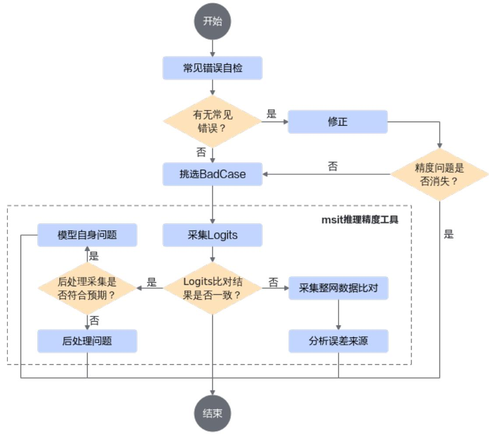
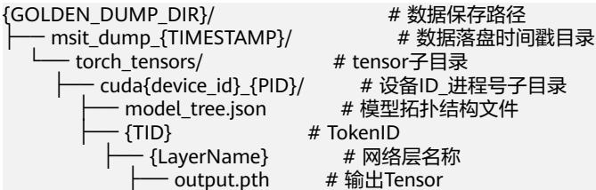
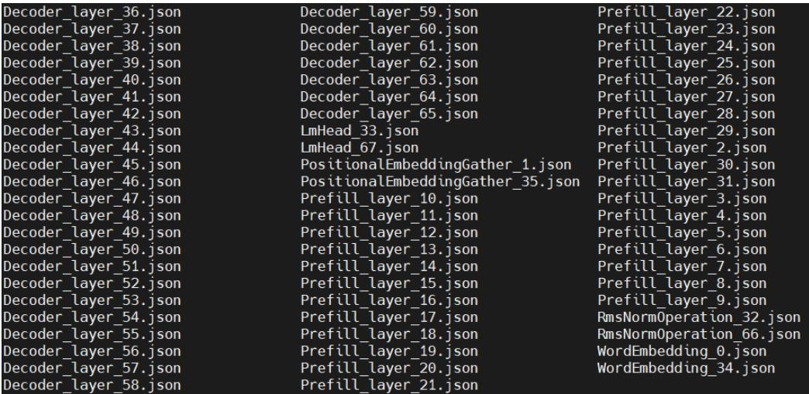
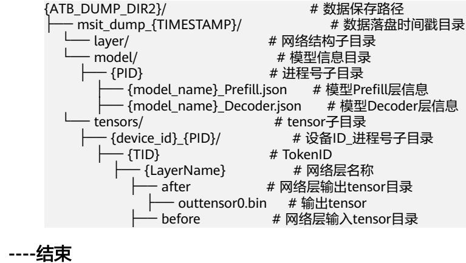
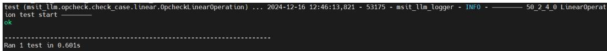
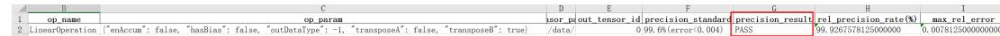

MindStudio 8.3.0

# 大模型推理精度问题快速分析案例

文档版本 01  
发布日期 2026-01-19

版权所有 $\circledcirc$ 华为技术有限公司 2026。 保留一切权利。

非经本公司书面许可，任何单位和个人不得擅自摘抄、复制本文档内容的部分或全部，并不得以任何形式传播。

# 商标声明

和其他华为商标均为华为技术有限公司的商标。  
本文档提及的其他所有商标或注册商标，由各自的所有人拥有。

# 注意

您购买的产品、服务或特性等应受华为公司商业合同和条款的约束，本文档中描述的全部或部分产品、服务或特性可能不在您的购买或使用范围之内。除非合同另有约定，华为公司对本文档内容不做任何明示或暗示的声明或保证。

由于产品版本升级或其他原因，本文档内容会不定期进行更新。除非另有约定，本文档仅作为使用指导，本文档中的所有陈述、信息和建议不构成任何明示或暗示的担保。

# 安全声明

# 产品生命周期政策

华为公司对产品生命周期的规定以“产品生命周期终止政策”为准，该政策的详细内容请参见如下网址：https://support.huawei.com/ecolumnsweb/zh/warranty-policy

# 漏洞处理流程

华为公司对产品漏洞管理的规定以“漏洞处理流程”为准，该流程的详细内容请参见如下网址：  
https://www.huawei.com/cn/psirt/vul-response-process  
如企业客户须获取漏洞信息，请参见如下网址：  
https://securitybulletin.huawei.com/enterprise/cn/security-advisory

# 华为初始证书权责说明

华为公司对随设备出厂的初始数字证书，发布了“华为设备初始数字证书权责说明”，该说明的详细内容请参见如下网址：https://support.huawei.com/enterprise/zh/bulletins-service/ENEWS2000015766

# 华为企业业务最终用户许可协议(EULA)

本最终用户许可协议是最终用户（个人、公司或其他任何实体）与华为公司就华为软件的使用所缔结的协议。最终用户对华为软件的使用受本协议约束，该协议的详细内容请参见如下网址：  
https://e.huawei.com/cn/about/eula

# 产品资料生命周期策略

华为公司针对随产品版本发布的售后客户资料（产品资料），发布了“产品资料生命周期策略”，该策略的详细内容请参见如下网址：https://support.huawei.com/enterprise/zh/bulletins-website/ENEWS2000017760

# 目 录

1 问题现象...  
2 定位流程..  
3 问题定位与分析.. 4  
3.1 检查配置.. 4  
3.2 采用 msit 工具定位. 4  
3.2.1 工具简介... 5  
3.2.2 选择 Bad Case.. 5  
3.2.3 logits 采集比对. 5  
3.2.4 整网数据采集比对. 8  
3.2.5 算子精度预检.. .9

# 问题现象

大模型推理过程中精度调优的目标是为了保障模型在昇腾平台上的推理能力，通常使用数据集校准或与标杆模型的输出进行比较的方式对模型的推理能力进行评估。在精度调优过程中，常见的精度问题主要有以下几种：

● 模型输出无意义内容，无法正常对话。  
● 模型与标杆在回答时存在语义偏差，或确定性问题的回答存在明显差异（例如判断题的结果）。  
● 数据集评测不通过。

虽然常见问题的现象、根因各异，但都可以通过本文介绍的大模型推理精度问题快速分析方法进行定位分析。

# 2 定位流程

大模型推理精度问题定位流程如图2-1所示。

  
图 2-1 精度问题定位流程图

1. 排查由于配置错误导致的精度问题，可通过检查模型配置、模型结构、参数配置以及自定义算子实现等进行排查。

2. 如果配置无误，则选择存在明显精度问题的Bad Case进一步分析定位。

3. 开启确定性计算，采集模型输出的logits。

4. 将logits和标杆数据进行比对。

如果比对结果一致，则排查“后处理”采样问题，进一步定位是模型自身问题还是“后处理”问题。  
如果比对结果不一致，则采集模型输出异常处中间计算结果，逐层比对分析误差来源。

# 3

# 问题定位与分析

# 检查配置采用msit工具定位

# 3.1 检查配置

# 模型配置

步骤1 检查昇腾平台是否支持模型推理。

昇腾平台基于MindIE推理框架适配了多种开源大模型，需要确认模型、设备、数据类型均配套且符合要求。如果需要了解MindIE支持的模型，请参见《MindIE模型支持列表》。

步骤2 检查模型加载的权重来源是否为同一文件。如果模型权重不一致，会直接导致推理计算存在差异，推理精度无法对齐。

步骤3 检查模型配置文件，确认参数配置与标杆模型配置一致。

常见的参数配置有pad_token_id、eos_token_id、max_sequence等，这些配置文件通常保存在模型权重路径下，可通过对齐config解决部分精度问题。

----结束

# 环境配置

如果模型在某一环境执行时精度正常，但在其他环境执行时精度异常，或更换软件版本后精度异常，则需要排查环境配置，需检查各个组件的版本是否一致，且和硬件环境适配，版本配套问题请查看《MindStudio版本说明》中的“版本配套关系” 。

# 3.2 采用 msit 工具定位

# 3.2.1 工具简介

如果模型配置和环境配置正确，模型依旧存在精度问题，则可以使用大模型推理精度工具（Large Language Model Debug Tool）进行精准定位与根因分析，有效提升开发效率，如表3-1所示。

表3-1 大模型推理精度工具  

<table><tr><td rowspan=1 colspan=1>工具名称</td><td rowspan=1 colspan=1>说明</td></tr><tr><td rowspan=1 colspan=1>Bad Case分析工具（msitBad Case)</td><td rowspan=1 colspan=1>提供脚本和命令行两种交互方式来进行自动badcase分析，使用户能够快速定位。使用说明请参见msitBadCase分析工具。</td></tr><tr><td rowspan=1 colspan=1>数据dump工具（msit llmdump）</td><td rowspan=1 colspan=1>提供加速库模型推理过程中产生的中间数据的dump能力，落盘的数据用于进行后续的精度比对。）ATB场景的dump功能使用说明请参见加速库模型数据dump。·PyTorch场景的dump功能使用说明请参见PyTorch场景的精度数据采集。</td></tr><tr><td rowspan=1 colspan=1>大模型精度比对工具（msitllmcompare )</td><td rowspan=1 colspan=1>提供一键式精度比对功能，支持快速实现推理场景的整网精度比对。使用说明请参见大模型精度比对。</td></tr><tr><td rowspan=1 colspan=1>精度预检工具（msit llmopcheck ）</td><td rowspan=1 colspan=1>提供加速库内置算子的单算子精度预检能力，检测加速库算子精度是否达标。使用说明请参见opcheck单算子精度预检功能使用指南。</td></tr></table>

# 3.2.2 选择 Bad Case

Bad Case是模型与标杆模型推理结果存在差异的输入（Prompt）。Bad Case是我们进行大模型精度问题分析和定位的前提，可参见发现bad case发现和选择合适的BadCase。

例如，在模型A上，输入一个生成代码相关的问题，在外部设备上可以正常回复，但在昇腾平台上却经常回复null，那么这个输入的问题就是一个Bad Case。我们可以将这个问题作为模型推理的输入进一步定位。

# 3.2.3 logits 采集比对

简介

当选取了合适的Bad Case后，则需要采集其推理过程的中间数据，用于定位引入精度问题的具体token。

在定位精度问题时，通常采用“自下而上”的分层比对方法，从模型每个token最后一层输出的logits开始比对，找到首个与标杆数据比对精度不达标的输出token。

例如，模型A在外部设备上使用PyTorch框架进行推理，在昇腾设备上使用MindIE的加速库（ATB）框架进行推理，首先要分别采集模型A在外部设备和昇腾设备上推理的logits结果，然后比对两份logits结果，找到引入精度问题的具体token。

# logits 采集

步骤1 使用msit llm dump工具采集标杆模型logits。通过在PyTorch执行脚本中加入dump的逻辑代码实现标杆模型logits的采集，参数解释请参见PyTorch场景的精度数据采集。msit llm dump工具的使用请参见加速库模型数据 dump。

1. 在模型A推理脚本中增加dump相关的配置代码，示例如下：

import torch from msit_llm import DumpConfig,register_hook from transformers import AutoTokenizer,AutoModelForCausalLM

# 在推理模型完成初始化之前，固定随机种子，启动确定性计算  
from msit_llm import seed_all  
seed_all(seed=2345)  
# 配置dump参数，其中：  
# dump_last_logits=True表示只采集模型最后一个layer的输出，即输出token的logits  
# token_range=list(range(1000))表示前1000个token的logits，不足1000则采集模型输出的所有输出  
token的logits  
# dump_path $| = "$ "/data/atb_dump_path"，为dump数据保存路径，请根据实际情况替换

dump_config $=$ DumpConfig(dump_last_logits=True,token_range list(range(1000)), dump_path="/data/ atb_dump_path")

# 推理模型初始化  
model_weight_path $| = ^ { \prime }$ "/data/model_path" # model_weight_path为模型A权重路径，请根据实际情况替  
换  
tokenizer=AutoTokenizer.from_pretrained(model_weight_path)  
model=AutoModelForCausalLM.from_pretrained(model_weight_path).cuda()  
register_hook(model,dump_config) # model是要dump中间tensor的模型实例，在模型初始化后添加  
代码  
with torch.no_grad():  
# 推理流程代码

# 说明

其中，启动确定性计算是为了保证结果的可重现性，避免随机带来的误差。

2. 脚本执行完成后，标杆模型的logits将保存到dump_path指定目录下，数据目录结构如下所示。

3. （可选）建议dump两次logits数据，并执行以下命令，比对两次dump相同token的logits（此处比对token 0，即文件夹0下的output.pth数据）。可使用msit llmcompare工具进行比对，具体使用方法请参见大模型精度比对。msit llm compare -gp {GOLDEN_DUMP_DIR1}/msit_dump_{TIMESTAMP}/torch_tensors/cuda{device_id}_{PID}/0/{logits Layer Name}/output.pth -mp {GOLDEN_DUMP_DIR2}/msit_dump_{TIMESTAMP}/torch_tensors/cuda{device_id}_{PID}/0/{logits Layer Name}/output.pth

  
图 3-1 精度指标

两次dump对应相同token的logits所有精度指标如图3-1所示，表明已正确开启确定性计算。

1. 执行以下命令，获取模型网络结构信息，首次dump时需获取模型网络结构信息。msit llm dump --exec "bash run.sh" --type layer -seed 2345 -o {ATB_DUMP_DIR1}

2. 执行完成后，默认落盘在当前执行文件夹下，落盘数据目录结构如下。

{ATB_DUMP_DIR1}/ # 数据保存路径msit_dump_{TIMESTAMP}/ # 数据落盘时间戳目录── layer/ # 网络结构子目录─ {PID}/ # 进程号─ {LayerName}.json

打开模型A的PID文件夹，文件内容如图3-2所示。

  
图 3-2 PID 文件夹文件列表

# 说明

如果使用MindIE 1.0.RC1及之后版本，ATB模型由Prefill模型和Decoder模型组成，因此ATB的logits需要分别采集Prefill的logits和Decoder的logits。例如，模型A总共有68层，其中Prefill模型输出的最后一层为LmHead_33，Decoder模型输出的最后一层为LmHead_67，因此需要采集33和67层的logits。

3. 二次dump时，采集模型A最后一层输出，指定-ids 33,67。msit llm dump --exec "bash run.sh" --type model tensor -ids 33,67 -er 0,1000 -child False -stp 1 -seed2345 -o {ATB_DUMP_DIR2}

4. 采集完成后，落盘数据格式如下。

# logits 比对

步骤1 通过msit llm compare工具比对标杆模型logits与ATB模型的logits。

在采集完标杆模型和ATB模型的logits数据后，即可通过msit llm compare工具实现logits的自动比对，具体使用方法和参数解释请参见大模型精度比对。

比对命令示例如下，其中COMPARE_PATH是比对结果保存路径。

msit llm compare -gp {GOLDEN_DUMP_DIR1}/msit_dump_{TIMESTAMP}/torch_tensors/ cuda{device_id}_{PID}/ -mp {ATB_DUMP_DIR1}/msit_dump_{TIMESTAMP}/tensors/{device_id}_{PID} -o {COMPARE_PATH}

步骤2 比对完成后，会生成比对结果msit_cmp_report_{TIMESTAMP}.csv文件，文件保存在比对结果保存路径下，指标结果请参见精度比对结果参数说明。

# 说明

由于不同业务场景对精度的要求并不一致，通常情况下，重点指标可以参考如下要求：

● KL散度：bfloat1 $6 { < } 0 . 0 0 5$ ，float16<0.0001● 余弦相似度： ${ > } 0 . 9 9 9 $

步骤3 分析比对结果。

根据精度标准，可能出现两种情况：

1. 所有logits都满足当前场景的精度要求，则表明是“后处理”的输出异常，此时可以对temperature、topK、topP等“后处理”参数进行复检，或者对“后处理”的代码实现进行调试，从而定位具体原因。  
2. logits中存在不满足精度标准的结果，从比较结果中找到首个精度不达标的token，进行整网精度比对。

模型A的精度比对结果示例如图3-3所示，发现第三个token的logits存在精度劣化问题，cosine_similarity=0.975758，KL散度=19.457，那么将对token 3进行整网精度比对，进一步定位问题。

图 3-3 模型 A 精度比对结果  

<table><tr><td></td><td>A</td><td>B</td><td>C</td><td>D</td><td></td><td>F</td><td>G</td><td></td><td></td><td></td><td></td><td>K</td><td></td><td></td><td>N</td><td>。</td><td>P</td><td></td><td>Q</td><td>R</td><td></td><td>S</td><td></td><td></td></tr><tr><td></td><td></td><td>token_iddata_id</td><td></td><td></td><td></td><td></td><td></td><td>H</td><td></td><td></td><td></td><td></td><td></td><td>M</td><td></td><td></td><td></td><td></td><td></td><td></td><td></td><td></td><td></td><td></td></tr><tr><td>2</td><td>1</td><td></td><td></td><td></td><td></td><td></td><td></td><td></td><td></td><td></td><td></td><td></td><td></td><td></td><td></td><td></td><td></td><td></td><td></td><td></td><td></td><td></td><td></td><td></td></tr><tr><td>34</td><td>2</td><td></td><td></td><td>1/data/dee torch hflo:[1. 1, 1024 48 69265</td><td></td><td></td><td></td><td>-11 34928 745259/data/dee torch hflo:[1 102400</td><td></td><td></td><td></td><td></td><td></td><td>48.2575</td><td></td><td>-1156258 280857</td><td>099981</td><td></td><td></td><td></td><td></td><td></td><td>352.6080.080496069207904644038.86F-090049314</td><td></td></tr><tr><td></td><td>3</td><td></td><td></td><td>2/data/deetorch.bflo:[1.1102448.8993</td><td></td><td></td><td></td><td>-14.1418.821926/data/dee torch.bflo[1102400</td><td></td><td></td><td></td><td></td><td></td><td>49.586-13.93759.4037670.975758493.24930.1088820.8776420.58184</td><td></td><td></td><td></td><td></td><td></td><td></td><td></td><td></td><td></td><td>19.4570.061446</td></tr><tr><td>5</td><td></td><td>4</td><td></td><td>3/data/dee torch.bflo:[1,1,1024 69.85105 4 /data/dee torch.bfloi[1.1,1024 71.8192410.6543845.97306/data/dee torch.bfloi[1,10240071.58464</td><td></td><td></td><td></td><td></td><td></td><td></td><td></td><td></td><td>7.7211638.90542/data/dee torch.bflo:[1,10240070.4575</td><td></td><td></td><td></td><td></td><td></td><td></td><td></td><td></td><td></td><td>7.9687539.337470.999970.0320660.0112530.742950.4320589.63E-050.011228</td><td></td></tr><tr><td></td><td>5</td><td></td><td></td><td></td><td></td><td></td><td></td><td></td><td></td><td></td><td></td><td></td><td></td><td></td><td></td><td></td><td></td><td></td><td></td><td></td><td></td><td></td><td>10.687545.989450.999980.0086930.0017250.4722670.0790260.005624 0.002114</td><td></td></tr></table>

# ----结束

# 3.2.4 整网数据采集比对

找到logits精度存在明显差异的token后，通过dump标杆模型、ATB模型的整网精度数据，再使用compare工具进行精度比对，定位问题。

以模型A为例，将dump第3个token的整网精度数据。

步骤1 采集标杆模型整网数据。

# 代码示例：

import torch

from msit_llm import DumpConfig,register_hook from transformers import AutoTokenizer,AutoModelForCausalLM

# 在推理模型完成初始化之前，启动确定性计算  
from msit_llm import seed_all  
seed_all(seed=2345)

# 配置dump参数，其中：# token_range=list([3]) 表示采集第3个token的整网数据# dump_path $\lvert = "$ /data/golden_dump_all_path"，为dump数据保存路径，请根据实际情况替换dump_config $\mid =$ DumpConfig(token_range=list([3]),dump_path $\vartriangle { \ v O } = \vartriangle$ /data/golden_dump_all_path")

# 推理模型初始化  
model_weight_path $\models \vartriangle$ "/data/model_path" # model_weight_path为模型A权重路径，请根据实际情况替换  
tokenizer=AutoTokenizer.from_pretrained(model_weight_path)  
model=AutoModelForCausalLM.from_pretrained(model_weight_path).cuda()  
register_hook(model, dump_config) # model是要dump中间tensor的模型实例，在模型初始化后添加代码  
with torch.no_grad():  
# 推理流程代码

步骤2 采集ATB模型整网数据。代码示例如下，其中ATB_DUMP_ALL_PATH为dump数据保存路径。msit llm dump --exec "bash run.sh" -er 3,3 -o {ATB_DUMP_ALL_PATH} -seed 2345步骤3 使用msit llm compare工具比对整网精度数据。

示例如下，其中GOLDEN_DUMP_ALL_PATH为dump标杆模型整网数据的保存路径，COMPARE_PATH是比对结果保存路径。

msit llm compare -gp {GOLDEN_DUMP_ALL_PATH}/msit_dump_{TIMESTAMP}/torch_tensors/ cuda{device_id}_{PID}/ -mp {ATB_DUMP_ALL_PATH}/msit_dump_{TIMESTAMP}/tensors/{device_id}_{PID} -o {COMPARE_PATH}

步骤4 比对完成后，会生成比对结果文件msit_cmp_report_{TIMESTAMP}，保存在比对结果保存路径下。

打开模型A的精度比对结果，找到首个不满足精度要求的Tensor，如图3-4所示。

图 3-4 首个不满足精度要求的 Tensor  

<table><tr><td>11</td><td>6/data/deejtorchbfoa[1,14096]080758</td><td>-2.05991 -0.00145/data/deejtorchbfoa[14096]</td><td>0.28125</td><td>-2.0625</td><td></td><td>-0.001450.999997</td><td></td><td>1.572930.0068730.0025929.36E-05</td><td></td><td>00.002384</td></tr><tr><td>11</td><td>7 /data/deejtorch bfloa[1.1. 4096] 0.697971</td><td>-110379</td><td>-0.00108 /data/deejtorch bfloa[ 22016]</td><td>0 796875</td><td>-3.98438</td><td>-007419</td><td></td><td></td><td></td><td></td></tr><tr><td>11</td><td>8/data/deetorch.bfloa[1,1,1100t 0.549114</td><td>-0.27846</td><td>-0.0191/data/deejtorch.bfloa[1,11008]</td><td>0.21582</td><td>-0.16113</td><td></td><td></td><td></td><td>7.88E-030.0269539.19499210022860.5059010.0601270.002883</td><td>1.007251</td></tr><tr><td>11</td><td>9 /data/deejtorch.bfloa[1,1, 4096] 0.697971</td><td>-1.10379</td><td>- 0.00108/data/deejtorch.bfloa[1, 4096]</td><td>0.699219</td><td>- 1.10938</td><td></td><td>-0.001080.99999330.96246</td><td></td><td>0.023740.005586 0.00016</td><td>0 0.003972</td></tr><tr><td></td><td>10 /data/deejtorch.bfloa[1, 1, 4096] 3.101601</td><td>- 5.11361</td><td>0.00653/data/deejtorchbloa[1,4096]</td><td>3.09375</td><td>-5.125</td><td>-0.00652</td><td></td><td>0.999943.6186120.0147910.011386</td><td>0.000589</td><td>4.95E- 07 0.003529</td></tr><tr><td>1</td><td>11 /data/deejtorch.bfloa[1, 1, 4096] 2.148795</td><td> -2.00136</td><td> -0.00145 /data/deejtorch.bfloa[1, 4096]</td><td>2.15625</td><td>-2</td><td></td><td></td><td>-0.001450.999995108.81270.0417560.007455</td><td>0.000118</td><td>0 0.003081</td></tr><tr><td></td><td></td><td></td><td></td><td></td><td></td><td></td><td></td><td></td><td></td><td></td></tr></table>

查看my_data_path列可以确认问题引入的算子名称为LinearOperation，如图3-5所示。

图 3-5 查看问题引入的算子名称  

<table><tr><td colspan="7">golden_da golden_dtygolden_shigolden_mεgolden_migolden_memy_data_path</td></tr><tr><td>token_iddata_id</td><td></td><td></td><td></td><td></td><td>/data/deepseek-coder-7b-instruct-</td></tr><tr><td>11</td><td></td><td></td><td>8 /data/deejtorch.bfloa[1.1,11000.549114-0.27846</td><td></td><td>-0.0191v1.5/dumpTensorAlLayerOutputToken/msit_dump_2024120_052518/tensors/0_76485/11/36_Decoder_lyer/2_MlpSwi</td></tr><tr><td></td><td></td><td></td><td></td><td></td><td>GLUPack/2_LinearNoQuant/0LinearOperation/after/outtensor0.bin</td></tr></table>

步骤5 确认算子名称后，使用msit llm opcheck工具对算子的精度进行预检，判断加速库算子精度是否达标。

# ----结束

# 3.2.5 算子精度预检

当定位到可能存在精度问题的算子后，可以使用msit llm opcheck工具对算子的精度进行预检，判断加速库算子精度是否达标。msit llm opcheck工具的使用方法和可选参数内容请参见opcheck单算子精度预检功能使用指南。

步骤1 对LinearOperation算子做精度预检。示例如下，其中CHECK_PATH是预检结果数据保存路径。

msit llm opcheck -i {GOLDEN_DUMP_ALL_PATH}/msit_dump_{TIMESTAMP}/tensors/{device_id}_{PID}/ {TID}/ -ids 50_2_4_0 -opname LinearOperation -o {CHECK_PATH}

其中ids为指定预检的tensor索引，取其父目录的前缀，如果tensor路径为：

{GOLDEN_DUMP_ALL_PATH}/msit_dump_{TIMESTAMP}/tensors/ {device_id}_{PID}/3/50_Decoder_layer/2_MlpGateUpWeightPack/ 4_LinearNoQuant/0_LinearOperation/after/outtensor0.bin，那么其ids为50_2_4_0。

步骤2 检测结果如图3-6所示。

  
图 3-6 检测结果

并保存预检结果至步骤1中指定的预检结果数据保存路径，打开预检结果文件，数据如图3-7所示。

  
图 3-7 预检结果数据

步骤3 确认算子精度是否达标，算子精度标准请参见精度标准。

如果算子精度达标，表明是标杆与NPU算子输入差异导致的误差，可以通过修改模型推理计算时的数据类型，提高模型的数据精度。● 如果算子精度不达标a. 检查算子输出tensor是否存在数值较小的问题（例如SelfAttentionOperation和PagedAttentionOperation），这类算子通常会使得计算出来的相对误差值偏大，导致精度比对结果不通过。这种情况推荐使用-metric指定其他指标综合判断算子精度情况。b. 检查并对齐算子入参，如果依旧不满足实际的使用需求，通常需要具有算子开发相关经验的人员进行分析，开发者可参考《应用开发指南 (C&C++)》中的“精度/性能优化 > 模型推理精度提升建议 > 算子精度导致推理结果不达标 $>$ 问题定位流程”章节内容来尝试解决。

# ----结束