MindStudio 8.3.0

# 大模型训练性能瓶颈定位流程案例

文档版本 01  
发布日期 2026-01-16

版权所有 $\circledcirc$ 华为技术有限公司 2026。 保留一切权利。

非经本公司书面许可，任何单位和个人不得擅自摘抄、复制本文档内容的部分或全部，并不得以任何形式传播。

# 商标声明

和其他华为商标均为华为技术有限公司的商标。  
本文档提及的其他所有商标或注册商标，由各自的所有人拥有。

# 注意

您购买的产品、服务或特性等应受华为公司商业合同和条款的约束，本文档中描述的全部或部分产品、服务或特性可能不在您的购买或使用范围之内。除非合同另有约定，华为公司对本文档内容不做任何明示或暗示的声明或保证。

由于产品版本升级或其他原因，本文档内容会不定期进行更新。除非另有约定，本文档仅作为使用指导，本文档中的所有陈述、信息和建议不构成任何明示或暗示的担保。

# 安全声明

# 产品生命周期政策

华为公司对产品生命周期的规定以“产品生命周期终止政策”为准，该政策的详细内容请参见如下网址：https://support.huawei.com/ecolumnsweb/zh/warranty-policy

# 漏洞处理流程

华为公司对产品漏洞管理的规定以“漏洞处理流程”为准，该流程的详细内容请参见如下网址：  
https://www.huawei.com/cn/psirt/vul-response-process  
如企业客户须获取漏洞信息，请参见如下网址：  
https://securitybulletin.huawei.com/enterprise/cn/security-advisory

# 华为初始证书权责说明

华为公司对随设备出厂的初始数字证书，发布了“华为设备初始数字证书权责说明”，该说明的详细内容请参见如下网址：https://support.huawei.com/enterprise/zh/bulletins-service/ENEWS2000015766

# 华为企业业务最终用户许可协议(EULA)

本最终用户许可协议是最终用户（个人、公司或其他任何实体）与华为公司就华为软件的使用所缔结的协议。最终用户对华为软件的使用受本协议约束，该协议的详细内容请参见如下网址：  
https://e.huawei.com/cn/about/eula

# 产品资料生命周期策略

华为公司针对随产品版本发布的售后客户资料（产品资料），发布了“产品资料生命周期策略”，该策略的详细内容请参见如下网址：https://support.huawei.com/enterprise/zh/bulletins-website/ENEWS2000017760

# 目 录

1 常见性能问题场景.  
2 问题定位方法.  
2.1 性能问题定位流程...  
2.2 Ascend PyTorch Profiler 采集性能数据.  
2.3 MindStudio Insight 定位..  
3 性能调优案例. 9  
3.1 案例描述. 9  
3.2 MindStudio Insight 分析定位. 9  
3.3 mstt advisor 辅助定位. 11

# 常见性能问题场景

大模型从其他设备迁移至昇腾设备，并在昇腾设备上训练的过程中，可能会出现性能问题。性能问题主要体现在开箱性能不足和长期运行后的性能衰退两个方面。

开箱性能优化：用户在昇腾平台使用模型时，发现性能差，直接进行性能层面的优化。  
性能长跑劣化：用户在训练过程中，由于引入了不可预知的因素（例如算法参数的不当调整），导致模型出现了一些性能劣化的问题，需要定位性能劣化的原因并解决。

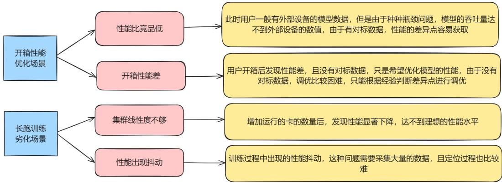  
图 1-1 场景介绍

# 2 问题定位方法

性能问题定位流程  
Ascend PyTorch Profiler采集性能数据  
MindStudio Insight定位

# 2.1 性能问题定位流程

大模型训练的基本性能调优流程如下：

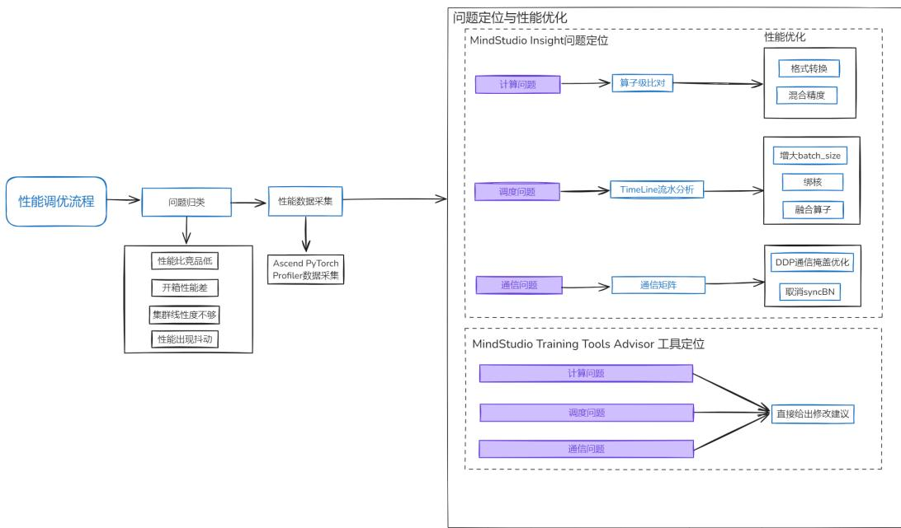  
图 2-1 基本性能调优流程

性能调优第一步是先明确问题，再进行针对性优化。

1. 进行性能数据采集，可以使用Ascend PyTorch Profiler提供的接口进行数据采集和解析。  
2. 使用MindStudio Insight可视化工具定界性能问题，定界结果通常分为计算、调度、通信三个方向。  
3. 使用advisor工具辅助定位问题，advisor工具通过内置案例集，自动对性能数据进行分析，并输出性能调优建议。  
4. 针对具体问题使用对应的调优手段进行调优，每次调优后重跑训练，采集性能数据，使用MindStudio Insight可视化工具查看调优手段是否生效。重复这个过程，直到解决性能问题。

# 2.2 Ascend PyTorch Profiler 采集性能数据

Ascend PyTorch Profiler是大模型在Ascend PyTorch框架下训练过程中提供的一套采集性能数据的API接口，能够采集到框架侧、CANN侧和Device侧的原始性能数据，并完成解析。

Ascend PyTorch Profiler详细介绍请参见《性能调优工具用户指南》中的“AscendPyTorch调优工具”章节。

在训练脚本（如train_\*.py文件）内添加如下示例代码进行性能数据采集参数配置，之后启动训练。

import torch import torch_npu

# Profiler采集、解析的前置配置参数   
experimental_config $=$ torch_npu.profiler._ExperimentalConfig( export_type=torch_npu.profiler.ExportType.Text, profiler_level=torch_npu.profiler.ProfilerLevel.Level1, msprof_tx=False, aic_metrics=torch_npu.profiler.AiCMetrics.PipeUtilization, l2_cache=False, op_attr=False, data_simplification=False, record_op_args False, gc_detect_threshold=None   
# 大模型训练的次数   
steps $= 7$   
with torch_npu.profiler.profile( activities=[ torch_npu.profiler.ProfilerActivity.CPU, torch_npu.profiler.ProfilerActivity.NPU ], schedule=torch_npu.profiler.schedule(wait ${ } = 0$ , warmup=0, active $^ { - 2 }$ , repeat $^ { = 2 }$ , skip_first=1), on_trace_ready=torch_npu.profiler.tensorboard_trace_handler("./result"), record_shapes=False, profile_memory=True, with_stack=False, with_module False, with_flops=False, experimental_config $| =$ experimental_config) as prof: for step in range(steps): # 模型训练 train_one_step(step, steps, train_loader, model, optimizer, criterion) # 调用step方法进行采集、解析数据 prof.step()

# 采集生成的文件结构如下所示：

─ localhost.localdomain_139247_20240628101435_ascend_pt profiler_info.json profiler_metadata.json ASCEND_PROFILER_OUTPUT communication.json communication_matrix.json kernel_details.csv memory_record.csv

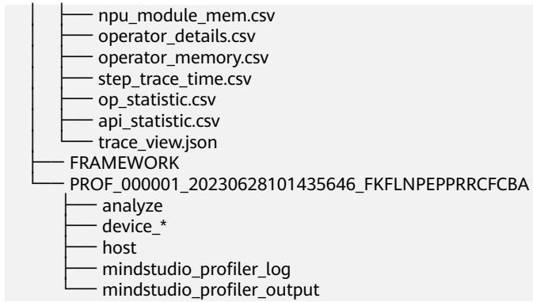

# 2.3 MindStudio Insight 定位

MindStudio Insight提供了丰富的调优分析手段：可视化呈现真实软硬件运行数据；多维度分析性能数据，定位性能瓶颈点；支持百卡、千卡及以上规模的集群性能分析。

可以根据《MindStudio Insight工具用户指南》中的“基础操作 > 导入数据”，在MindStudio Insight中导入2.2 Ascend PyTorch Profiler采集性能数据采集的性能数据，根据以下步骤进行性能数据分析。

# 通过概览界面查看数据总体情况

可以通过概览页了解每个模块的具体内容。详细介绍请参见《MindStudio Insight工具用户指南》中的“系统调优 $>$ 概览（Summary） ” 。

1. 在“并行策略分析”模块，提供PP、TP、CP、DP、EP等不同并行策略分析视角。

a. 单击复选框选择并行策略，通过方框标注识别并行分组。

b. 选择不同的“数据类型”会展示对应的热力图，根据热力图找到存在性能问题的通信域，越偏向红色表示性能越差。

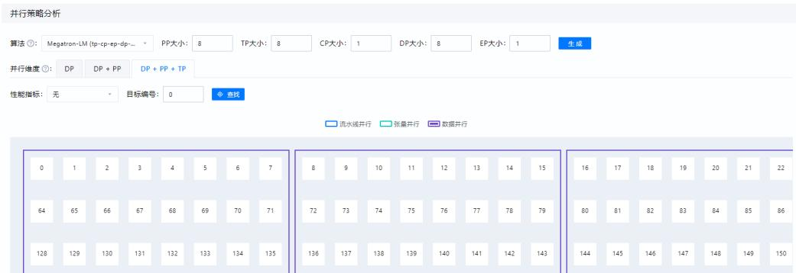  
图 2-2 并行策略分析

2. 在计算/通信概览部分展示所选通信域下每张卡的计算、通信、空闲时间占比情况，并提供专家建议，如下图。

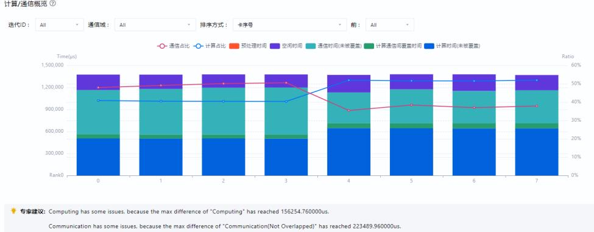  
图 2-3 计算/通信概览  
计算/通信概览③

各图例相关数据指标的含义如下：

表 2-1 数据指标  

<table><tr><td rowspan=1 colspan=1>数据指标</td><td rowspan=1 colspan=1>含义</td></tr><tr><td rowspan=1 colspan=1>总计算时间</td><td rowspan=1 colspan=1>昇腾设备上的内核时间总和。</td></tr><tr><td rowspan=1 colspan=1>纯计算时间</td><td rowspan=1 colspan=1>纯计算时间=总计算时间－通信时间（被覆盖）。</td></tr><tr><td rowspan=1 colspan=1>通信时间（被覆盖）</td><td rowspan=1 colspan=1>被覆盖的通信时长，即计算和通信同时进行的时长。</td></tr><tr><td rowspan=1 colspan=1>通信时间（未被覆盖）</td><td rowspan=1 colspan=1>未被覆盖的通信时长，即纯通信时长。</td></tr><tr><td rowspan=1 colspan=1>空闲时间</td><td rowspan=1 colspan=1>未进行计算或通信的时长。</td></tr></table>

不同的指标现象可以定界不同的性能问题：

计算问题：通常表现为通信域中总计算时间占比的极大值和极小值差异过大。如果某些计算卡的计算时间明显超出了正常范围，那很可能意味着这张卡承担了过于繁重的计算任务，例如要处理的数据量过大，或者模型计算的复杂程度过高，也有可能是卡本身的性能受到了限制。  
调度问题：通常表现为通信域中空闲时间占比的极大值和极小值差异过大。如果计算卡的空闲时间过长，那就说明存在Host侧至Device侧的下发异常，这同样会对集群的性能造成不利影响。  
通信问题：若通信时间（未被覆盖）过长，表明计算和通信之间的协同存在问题。可能是通信方式存在优化空间；或是网络带宽不稳定，导致通信无法和计算良好配合。

# 计算问题

当数据指标现象指示为计算问题时，可以直接查看异常卡的算子数据，并与正常卡进行比较。此时可以使用MindStudio Insight的卡间性能比对功能，根据《MindStudioInsight工具用户指南》中的“系统调优 > 算子（Operator） > 使用说明”，设置两卡进入比对模式，并在算子界面查看结果。以下图中存在的计算问题为例，可以看到在算子数量相等的前提下，MatMul类算子平均耗时明显增加，造成了两张单卡的计算时间差异。

图 2-4 计算算子类型  
算子详情  

<table><tr><td>类型</td><td>来源</td><td>加速器核</td><td>数量</td><td>|总耗时（μs）</td><td>平均耗时(us)</td><td>丨最大耗时（us）</td><td>最小耗时（us)</td><td>详情</td></tr><tr><td>MatMulV3</td><td>差值</td><td>MIX.AIC</td><td>。</td><td>-74697.96</td><td>-32.42</td><td>16.02</td><td>-9.18</td><td>查看更多</td></tr><tr><td>Add</td><td>差值</td><td>ALVECTOR_CORE</td><td>-46</td><td>-16164.3</td><td>-1.98</td><td>-104.48</td><td>0.06</td><td>查看更多</td></tr><tr><td>MatMuIV2</td><td>差值</td><td>AILCORE</td><td>。</td><td>-15003.2</td><td>-6.51</td><td> -27.82</td><td>-1.1</td><td>查看更多</td></tr><tr><td>SwiGluGrad</td><td>差值</td><td>ALVECTOR_CORE</td><td>。</td><td>-4163.12</td><td>-10.84</td><td>13.04</td><td>-10.26</td><td>查看更多</td></tr><tr><td>TensorMove</td><td>差值</td><td>AL_VECTOR_CORE</td><td>。</td><td>-2273.16</td><td>-2.84</td><td>-3.26</td><td>-2.44</td><td>查看更多</td></tr><tr><td>ZerosLike</td><td>差面</td><td>AILVECTOR_CORE</td><td>。</td><td> -1797.62</td><td>-2.3</td><td>-191.82</td><td>0.04</td><td>查看更多</td></tr><tr><td>MemSet</td><td>差值</td><td>AL_VECTOR_CORE</td><td>-16</td><td>-1659.9</td><td>-1.29</td><td>-75.42</td><td>-0.02</td><td>查看更多</td></tr><tr><td>SwiGlu</td><td>差值</td><td>AI_VECTOR_CORE</td><td>。</td><td>-1583.26</td><td>-4.12</td><td>-11.92</td><td>-2.7</td><td>查看更多</td></tr><tr><td>Cast</td><td>差值</td><td>AL_VECTOR_CORE</td><td>-16</td><td>-1128.14</td><td>-0.26</td><td>-52.96</td><td>0.16</td><td>查看更多</td></tr><tr><td>FlashAttentionScore</td><td>差值</td><td>MIX_AIC</td><td>。</td><td>-11142</td><td>-2.9</td><td>78.58</td><td>。</td><td>查看更多</td></tr></table>

根据经验，MatMul类算子很可能在特定shape下劣化，可以将分组方式切换到“计算算子名称和输入shape”，并根据总耗时排序，进一步定位在哪些shape下MatMul类算子的劣化最为严重。定位到算子问题后，可以找相关算子开发人员进一步确认问题原因。

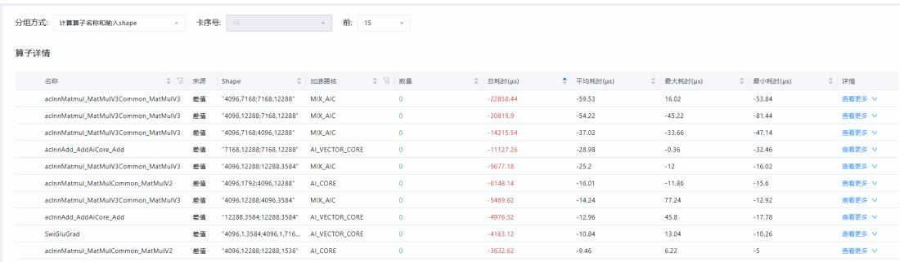  
图 2-5 计算算子名称和输入 shape

当数据指标现象指示为调度问题时，需要到时间线界面将异常卡和正常卡进行比较，进一步定位出现问题的算子，可以根据《MindStudio Insight工具用户指南》中的“系统调优 > 时间线（Timeline） ”了解界面详情。进入时间线界面，选择HostToDevice连线类型，HostToDevice展示了CANN层算子到Ascend Hardware的算子的下发执行关系和CANN层算子到HCCL通信算子的下发执行关系，用于定位调度问题。

HostToDevice的连线通常有两种形态，倾斜和竖直。下图是一个存在调度问题的案例，如果HostToDevice连线如左侧所示，是倾斜的，说明此时间段调度任务安排合理，昇腾设备是满负荷执行计算和通信任务的。如果HostToDevice连线如右侧所示，是竖直的，说明昇腾设备此时快速执行完了CPU下发的任务，未满负荷进行计算和通信任务，这一般表示存在调度问题。此时，可以通过增大batch size、绑核、融合算子替换等方法进行调优。

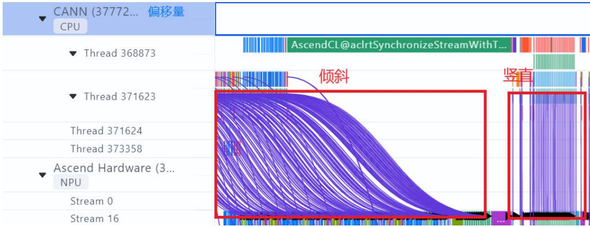  
图2-6 调度问题

当数据指标现象指示为通信问题时，需要进入通信界面进一步分析。通信界面用于展示集群中全网链路性能以及所有节点的通信性能，通过集群通信与计算重叠时间的分析可以找出集群训练中的慢主机或慢节点。通常，我们会根据关键指标通信矩阵、通信时长来分析性能问题。

通信矩阵

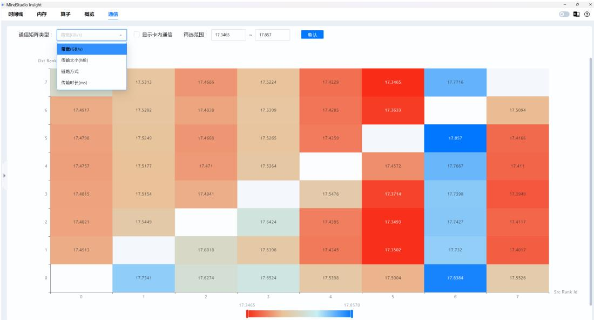  
图 2-7 通信矩阵

上图是MindStudio Insight通信矩阵可视化界面，可以获取各个通信域下，卡间的带宽、传输大小、链路方式和传输时长情况等信息。

1. 首先查看传输大小，分析在该集合通信中，每张卡的传输量是否存在差异，是否有分配不均的情况。  
2. 其次，再查看传输时长和带宽情况，如果不同卡间的传输时长和带宽数值异常或者差异过大，那都意味着通信域中存在异常链路。

通信时长

通信时长是指计算卡之间进行通信所花费的时间。导致通信耗时过长的因素很多，例如通信协议配置错误、传输数据量过大等，只有找到这些通信耗时过长的链路并解决问题，才能让数据在计算卡之间更加顺畅地传输，进而提高集群的整体性能。

用户选择具体通信域后，可进入通信时长界面中查看通信域中各个计算卡的耗时汇总情况，以及通信算子的HCCL缩略图和通信时长的分布图，从而快速获得通信算子的相对位置关系以及详细通信数据。

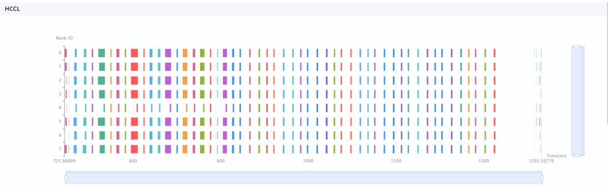  
图 2-8 HCCL 缩略图

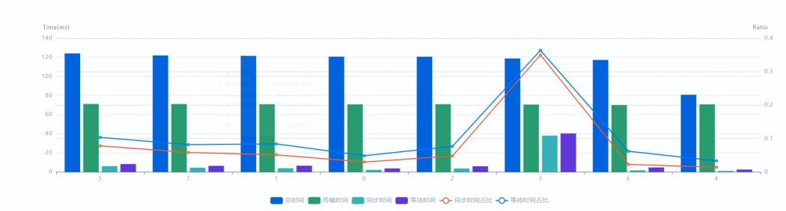  
图 2-9 通信时长分布图  
通信时长

上图是一份性能数据中某一个通信域内的通信耗时分析。从通信时长数据中，我们发现3卡的同步时间最长，4卡的同步时间最短，且同步时间差距明显。同步时间较长一般意味着这张卡在等待其它卡，而同步时间较短一般意味着其它卡在等待这张卡，据此可以初步定界出3卡是快卡，4卡是慢卡。

# 3 性能调优案例

案例描述MindStudio Insight分析定位mstt advisor辅助定位

# 3.1 案例描述

某多模态模型在训练时突然出现性能大幅度劣化问题，我们将根据上述介绍的流程进行性能调优。

使用Ascend PyTorch Profiler采集大模型训练过程中的性能数据，此案例集群共有16张卡。

# 说明

本案例数据基于历史版本的工具和数据进行分析，仅作为案例指导，若数据及工具输出与最新版本有出入，请以最新版本输出为准。

# 3.2 MindStudio Insight 分析定位

MindStudio Insight加载全部数据，进行问题定位。

1. 概览界面分析：该通信域内各卡的通信时间占比也较高，总体计算时间（纯计算时间 $^ +$ 通信重叠时间）只占了总耗时的1/3，可以定界为通信问题。

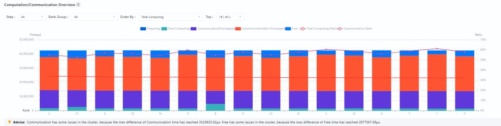  
图 3-1 概览界面

2. 切换通信界面：发现存在大量卡间不同步现象（框中红色部分），这表示很多算子在长时间的等待，挑选了一张最明显的慢卡（第12卡）分析详细原因。

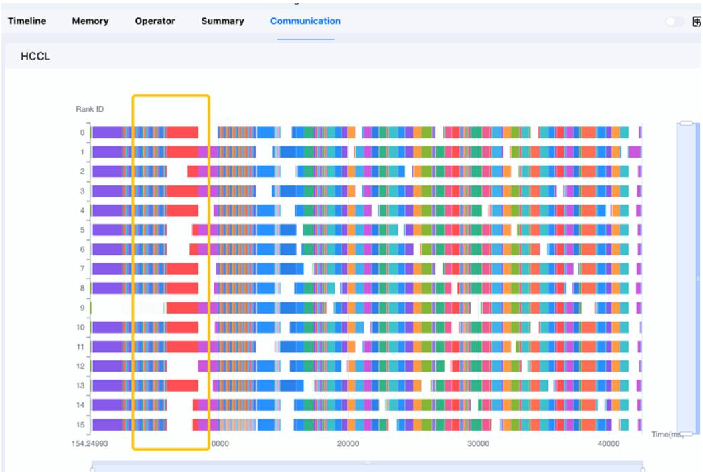  
图 3-2 通信界面

3. 切换时间线界面：明显看出12卡存在大段的Free（空闲时间），同时，AscendCL侧有大量的事件在占用资源。可初步判断是由于该卡内存占用过高，新申请数据时需要内存重整，从而导致存在较长空闲时间。我们可以使用exportPYTORCH_NPU_ALLOC_CONF="expandable_segments:True"解决内存碎片问题，提高内存利用率。在完成调试后解决该性能问题。

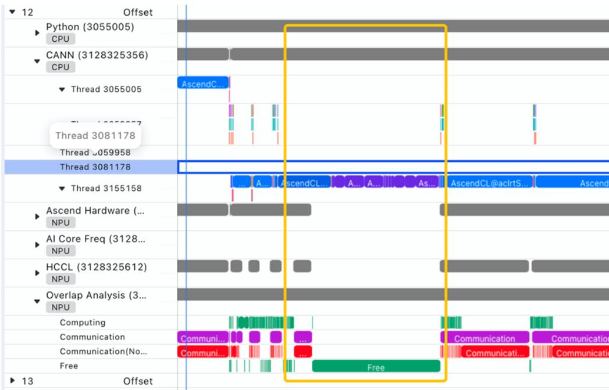  
图 3-3 时间线界面

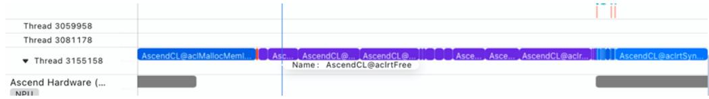  
图 3-4 时间线界面

# 3.3 mstt advisor 辅助定位

此案例还可以使用advisor辅助定位。

1. 执行msprof-analyze advisor all -d $\$ 1$ HOME/profiling_data/命令，获得保存专家建议的文件路径。其中\$HOME/profiling_data/为性能数据所在路径。

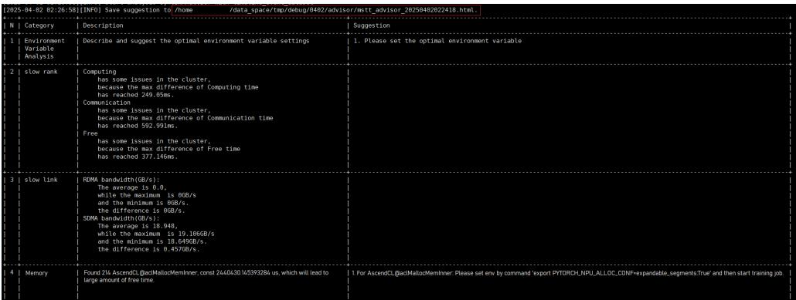  
图 3-5 advisor 输出

2. 打开html文件，得到红框中的建议，与我们分析结论一致，可以解决性能问题。

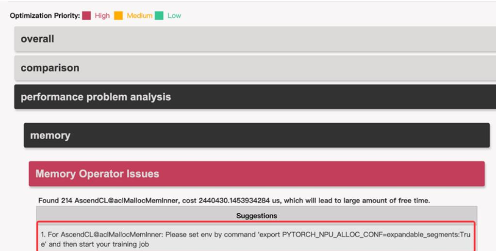  
图 3-6 advisor 专家建议