MindStudio 8.3.0

# 大模型训练精度问题定位案例

文档版本 01  
发布日期 2026-02-25

版权所有 $\circledcirc$ 华为技术有限公司 2026。 保留一切权利。

非经本公司书面许可，任何单位和个人不得擅自摘抄、复制本文档内容的部分或全部，并不得以任何形式传播。

# 商标声明

和其他华为商标均为华为技术有限公司的商标。  
本文档提及的其他所有商标或注册商标，由各自的所有人拥有。

# 注意

您购买的产品、服务或特性等应受华为公司商业合同和条款的约束，本文档中描述的全部或部分产品、服务或特性可能不在您的购买或使用范围之内。除非合同另有约定，华为公司对本文档内容不做任何明示或暗示的声明或保证。

由于产品版本升级或其他原因，本文档内容会不定期进行更新。除非另有约定，本文档仅作为使用指导，本文档中的所有陈述、信息和建议不构成任何明示或暗示的担保。

# 安全声明

# 产品生命周期政策

华为公司对产品生命周期的规定以“产品生命周期终止政策”为准，该政策的详细内容请参见如下网址：https://support.huawei.com/ecolumnsweb/zh/warranty-policy

# 漏洞处理流程

华为公司对产品漏洞管理的规定以“漏洞处理流程”为准，该流程的详细内容请参见如下网址：  
https://www.huawei.com/cn/psirt/vul-response-process  
如企业客户须获取漏洞信息，请参见如下网址：  
https://securitybulletin.huawei.com/enterprise/cn/security-advisory

# 华为初始证书权责说明

华为公司对随设备出厂的初始数字证书，发布了“华为设备初始数字证书权责说明”，该说明的详细内容请参见如下网址：https://support.huawei.com/enterprise/zh/bulletins-service/ENEWS2000015766

# 华为企业业务最终用户许可协议(EULA)

本最终用户许可协议是最终用户（个人、公司或其他任何实体）与华为公司就华为软件的使用所缔结的协议。最终用户对华为软件的使用受本协议约束，该协议的详细内容请参见如下网址：  
https://e.huawei.com/cn/about/eula

# 产品资料生命周期策略

华为公司针对随产品版本发布的售后客户资料（产品资料），发布了“产品资料生命周期策略”，该策略的详细内容请参见如下网址：https://support.huawei.com/enterprise/zh/bulletins-website/ENEWS2000017760

# 目 录

1 精度问题概述和场景.  
2 问题定位方法.  
2.1 精度问题定位流程.  
2.2 环境检查..  
2.3 问题复现.  
2.4 精度问题分场景定位.  
2.5 特殊情况排查.  
2.6 硬件压测.  
3 精度定位案例.  
3.1 Checklist 不一致案例.  
3.1.1 配置项不一致.  
3.1.2 读取数据不一致.  
3.1.3 模型结构不一致. 9  
3.2 确定性计算案例..  
3.3 msprobe 工具定位案例. 14  
3.3.1 首 step loss 不一致（或同权重推理不一致） 14  
3.3.2 长稳训练loss不一致，前期对齐，后期差异变大. 16  
3.3.3 溢出或 NaN 问题. 18  
3.4 特殊情况排查案例.. . 25  
3.5 硬件压测案例. .25

# 精度问题概述和场景

随着大语言模型技术的迅速发展，尤其是在诸如ChatGPT、DeepSeek等应用的引领下，成为AI领域的重要发展方向。大模型训练需要强大的算力支撑，涉及数据、模型、框架、算子、硬件等诸多环节。由于规模巨大，训练过程复杂，经常出现精度问题。

训练精度问题是多种因素共同作用的结果。主要表现为训练收敛不及预期，如loss跑飞、毛刺、NaN、下游任务评测效果变差等。

# 训练精度场景

有标杆对应迁移场景，即用户将原本在标杆（如GPU、其他训练框架）上训练的大语言模型或者其他类型深度神经网络的训练迁移到NPU上进行训练。

无标杆对应原生开发场景，即用户直接在NPU上进行模型搭建及训练。

其中，本文聚焦主流的有标杆迁移场景，主要表现为NPU训练过程和结果与标杆（GPU或NPU的其他框架）上的训练过程和结果不一致且偏差超过容忍阈值，我们称之为不对齐。该场景具体可再细分为以下几类现象：

# 首step差异

即step 0或前几个step的loss就已与标杆相比出现差异，平均误差大于1%，如下图所示。

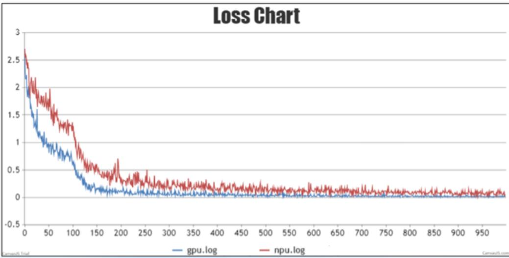  
图 1-1 首 step 差异

# 长稳loss差异

即前期loss拟合但后期与标杆差异变大，平均误差大于 $1 \%$ ，如下图所示。

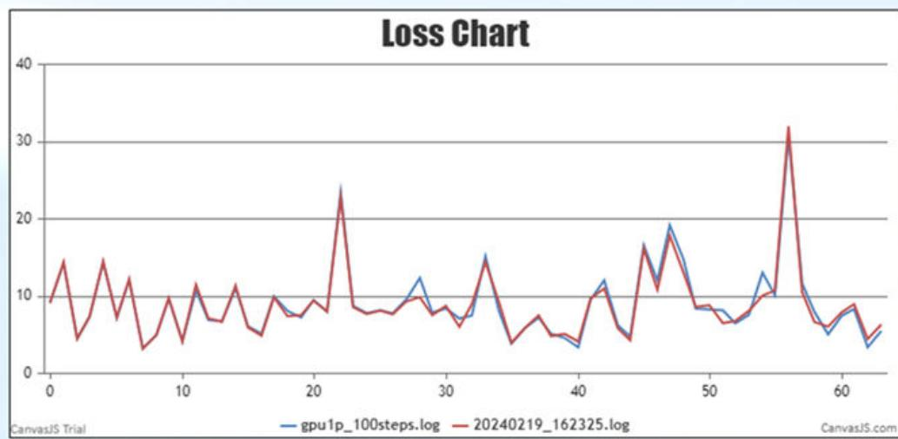  
图 1-2 长稳 loss 差异  
图 1-3 溢出或 NaN

# 溢出或NaN

即迁移后相较于标杆出现更频繁的溢出、NaN或毛刺，如下图所示。

0step [00:15, ?step/s, batch_size=1， loss=0.388, lr_optimizer0_params_group0=1e-7]   
1step [00:37， 15.75s/step, batch_size=1， loss=nan， lr_optimizer0_params_group0=1e-7]   
2step [01:09,19.40s/step, batch_size=1， loss=nan, lr_optimizer0_params_group0=1e-7]

# 训练中loss与标杆相比差异较小但下游指标差异大

值得注意的是，哪怕属于同一类问题现象，其根因也复杂各异。本文介绍大模型训练精度问题定位时的整体定位思路和标准流程，并介绍其对应的经典定位案例及详细过程，以帮助用户快速熟悉精度问题定位流程及方法。

# 2 问题定位方法

精度问题定位流程  
环境检查  
问题复现  
精度问题分场景定位  
特殊情况排查  
硬件压测

# 2.1 精度问题定位流程

本章主要针对迁移场景介绍精度问题定位的具体步骤，旨在帮助用户更快理解工具使用的原理、方法，并应用到其他需要定位精度问题的场景。

# 说明

本文介绍的场景主要使用MindStudio精度调试工具（MindStudio Probe）进行精度问题排查，详细介绍请参见《msprobe使用手册》，后续内容不进行该工具参数等介绍。

训练精度问题整体定位流程如图所示。

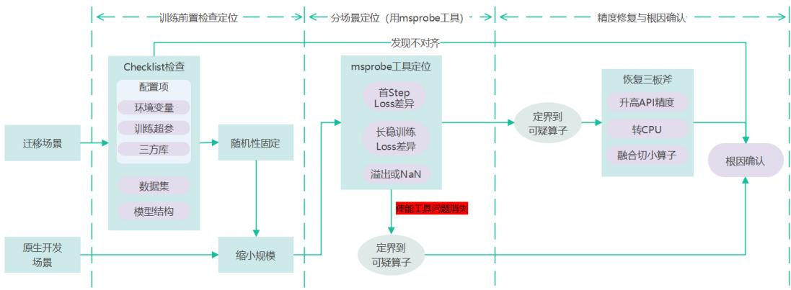  
图 2-1 训练精度问题整体定位流程

在主流的迁移场景中，需优先统一进行训练前置定位步骤，提前校验checklist以排除基础配置、数据集、模型结构等基础问题，并保证精度问题可复现。

# 2.2 环境检查

检查配置项，具体包括：

训练超参和环境变量  
可使用Beyond Compare软件比对双方训练日志或启动脚本中的训练超参和环境变量。  
三方库版本  
通过git分支检查Megatron、DeepSpeed等版本，通过pip list检查torch、PyTorch等版本。  
● 检查从数据集中读取的输入数据一般可通过精度采集工具采集最开始的输入数据，或直接在代码中调用modelforward时，保存或打印传入的具体tensor来进行数据集检查。  
● 检查模型结构通过在双方训练中直接打印模型结构并进行比对。  
● 检查权重初始化需要确认训练前的初始化权重是否一致，保证加载同一个预训练模型或使用一样的初始化随机种子。  
● 环境版本更新在条件允许的情况下，推荐安装最新版本的CANN、驱动以及PyTorch包。

# 2.3 问题复现

在用工具进行分析定位前，需明确问题能复现，重复训练尽可能固定现象。

固定随机性。

固定随机种子。  
数据batch加载顺序时关闭shuffle，一般可设shuffle $=$ False。关闭Dropout层

打开确定性计算。 torch.use_deterministic_algorithms(True)

打开确定性通信。export HCCL_DETERMINISTIC $\mathbf { \Psi } =$ TRUE

若仍不能复现可使用精度采集工具采集md5数据进行排查。

固定随机性、打开确定性计算和通信可统一通过seed_all工具进行自动固定（数据加载除外）。

from msprobe.pytorch import seed_all seed_all(seed=1234, mode=True, rm_dropout=True)

此外，对于一些特殊算子，由于硬件差异同样的随机种子在不同硬件上生成的随机数不同或可能暂不支持确定性计算，可通过先在CPU上生成后转回NPU或者小算子替换等方式进行手动补充。

对于千卡甚至万卡上出现的精度问题，我们需要将集群训练规模缩小进行复现定位。

常见的做法是保持tensor parallel，pipeline parallel等参数不变，将data parallel参数缩小或直接减少模型层数，裁剪时需伴随实验确保能复现，最终选择规模尽可能小且可复现的训练参数。

# 2.4 精度问题分场景定位

首step loss差异按照如下步骤进行定位：

a. 使用精度预检工具进行可疑算子排查。  
b. 使用精度采集dump工具，采集最先出现差异的step，所对应的NPU与标杆的mix级别数据。  
c. 使用分级可视化工具或精度比对工具，做画图比对或表格比对，根据工具提示的颜色从深到浅或首个输入一致输出不一致的节点来定界可疑算子。  
d. 对该算子在NPU和标杆上进行单算子验证，分别计算与CPU绝对标杆的欧式距离进行比较。

# 长稳训练loss差异

选择以下一种或多种方式结合分析：

使用训练状态监控工具（适用于规模大、问题步数不明确的场景），在配置选择上根据loss和Grad表现来进行相对应数据的采集。

L 若该问题同时表现在loss和Grad上，则优先采集训练过程中梯度、通信的数据。梯度采集后重点关注梯度reduce前后差异中的异常卡/计算、梯度与标杆出现差异的步数/层、随步数变化趋势与整体梯度趋势一致的层。若该问题主要表现在loss上，则优先采集训练过程中激活值、权重的数据。

使用dump采集比对工具（适用于规模较小、问题步数明确的场景），采集最先出现差距的那一步的mix级别数据，使用分级可视化做画图比对或精度比对工具做表格比对，通过工具标注的颜色从深到浅或首个出现输入精度正常输出精度异常的节点来定界到可疑算子。

使用精度预检工具查看可疑算子进行排除。

# 溢出或NaN

一般来说溢出表现相较于标杆出现了更频繁的loss NaN或梯度溢出，一般还伴随着loss scale的持续降低。

0step [00:15, ?step/s,batch_size=1, loss=0.388,lr_optimizer0_params_group0=1e-7]   
1step [00:37,15.75s/step, batch_size=1, loss=nan, lr_optimizer0_params_group0=1e-7]   
2step [01:09,19.40s/step,batch_size=1, loss=nan,lr_optimizer0_params_group0=1e-7]

进一步可分为如下两类：

NPU上出现NaN但GPU上没有，把第一个出现NaN的step认为是问题step做定位。  
NPU和GPU都出现了NaN，但在50个step内NPU出现NaN的次数明显多于GPU，将第一个出现NPU有NaN而GPU无NaN的step作为问题定位的初始step。

确定需要分析的step后，按如下步骤进行排查：

首先确保Inf/NaN模式或者非饱和模式已开启，查看环境变量INF_NAN_MODE_ENABLE是否为1，若为1则已开启。

采集该step的NPU和GPU数据做分析和比对。

使用精度采集工具dump采集溢出步的前反向输入输出，若加入工具后溢出消失，怀疑为内存踩踏，可以改为异步dump采集（具体操作为在config.json文件中加入async_dump: True的配置项）并用profiling工具查看并行计算关系。

使用训练状态监控工具采集各层梯度。

使用精度比对工具做表格比对或分级可视化工具做画图比对，定界到可疑算子。

# 2.5 特殊情况排查

对一些疑难问题，用工具定位之后仍未找到根因，可尝试以下几类排查方法：

开启流同步，排查并行计算时的内存踩踏问题，具体操作为配置如下环境变量：export ASCEND_LAUNCH_BLOCKING=1关闭npu_fusion_attention，该算子功能复杂全面，使用时易出现传参规范错误的问题，对于一些NaN问题若存在npu_fusion_attention可以先关闭该算子，定界是否为npu_fusion_attention导致，使用规范参照npu_fusion_attention。如在MindSpeed LLM中关闭npu_fusion_attention的操作具体为：删除--use_fused_attn参数。在Megatron模型中，overlap类参数存在较高风险，可优先排除，具体操作为：删除 --overlap-param-gather、--overlap-grad-reduce等超参。排查Matmul错峰策略，当定位到可疑的Matmul算子但无法通过单算子验证排除时，可以尝试关闭错峰策略，具体操作为配置如下环境变量：export CLOSE_MATMUL_K_SHIFT=1排查优化器，如尝试Adam优化器转SGD、替换融合adam为小算子、关闭优化器定界问题前反向等。● 使用精度预检工具，排查是否存在可疑算子。

# 2.6 硬件压测

对于一些大集群任务，需优先采用硬件压测，排除精度异常节点，压测按如下步骤进行：

1. 模型压测：使用分组的单机或多机任务训练找到与其他大部分卡或机器精度不一致的机组。  
2. 命令压测：使用ascend-dmi命令进行压测，命令如下：ascend-dmi -dg -i aicore -s -sc 60 -q

# 3 精度定位案例

Checklist不一致案例  
确定性计算案例  
msprobe工具定位案例  
特殊情况排查案例  
硬件压测案例

# 3.1 Checklist 不一致案例

# 3.1.1 配置项不一致

案例：某语音识别模型，从GPU迁移到NPU训练后，下游指标WER差异较大。

定位方法：根据启动脚本或训练日志对比NPU和标杆的训练配置。

比对发现NPU采用FSDP配置，GPU采用DDP配置。训练loss差异不大但下游指标差异大，如下图。

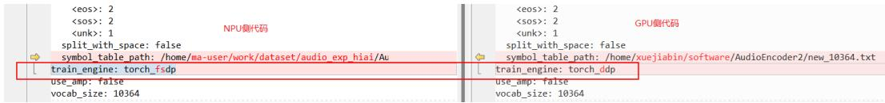  
图 3-1 NPU GPU 配置对比

解决方案：同步GPU配置。

结果：修复后WER下降，与GPU对齐。

# 3.1.2 读取数据不一致

案例：某大语言模型，从llamafactory NPU（标杆）迁移到MindSpeed LLM NPU训练，loss对不齐，如下图。

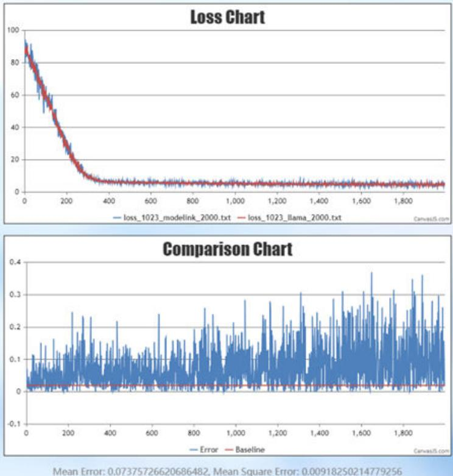  
图 3-2 loss 对不齐

定位方法：打印输入的tokens等信息进行比对，具体位置需结合训练代码（如MindSpeed LLM可直接在MindSpeed-LLM/pretrain_gpt.py的forward_step函数中添加打印），如下图。

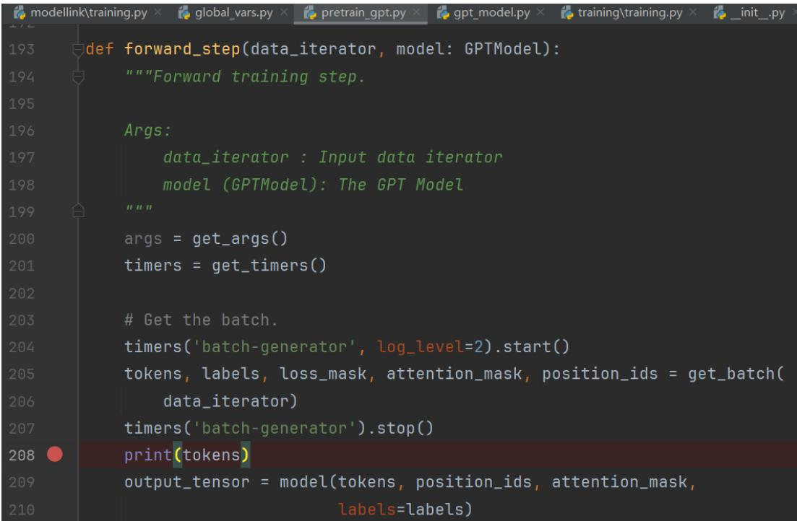  
图 3-3 forward_step 函数中加打印

可以看到读取的token_id的末尾存在数据不一致的问题，如下图。

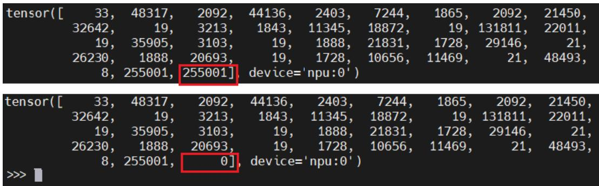  
图 3-4 读取 token_id 的末尾数据不一致

解决方案：修复数据预处理代码，使其输入一致。

结果：修复后loss对齐。

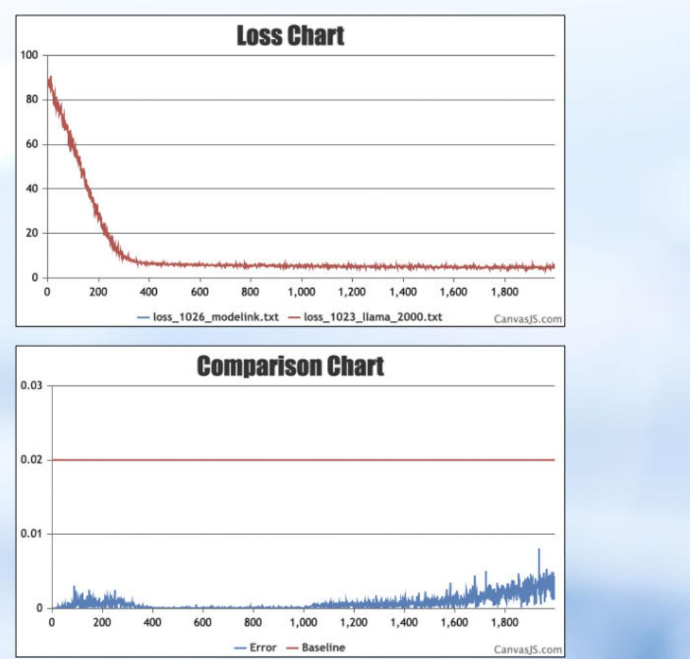  
图 3-5 loss 对齐

# 3.1.3 模型结构不一致

案例：某MOE模型，从GPU迁移到NPU后，loss对不齐。

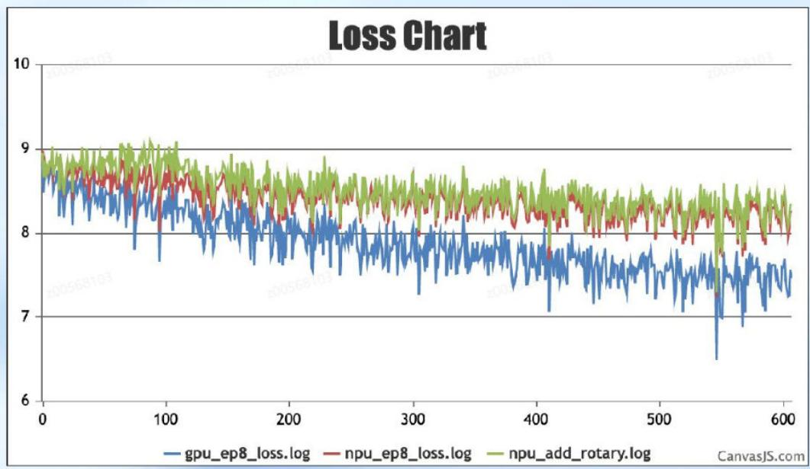  
图 3-6 loss 对不齐

定位方法：可以通过查看具体代码实现或打印模型结构比较。

查看代码发现，NPU中residual是input_layernorm后的，GPU上是input_layernorm前的，两者模型顺序结构不一致。

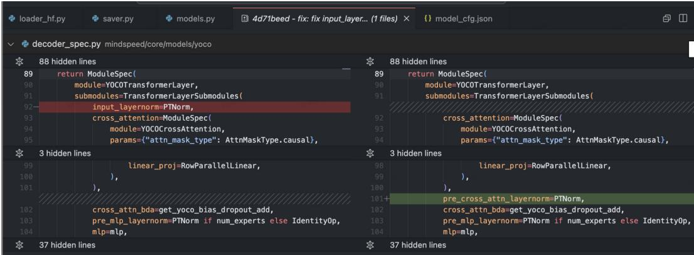  
图 3-7 模型结构比较

解决方案：将NPU中的input_layernorm也放到residual后面。

结果：对齐模型结构后loss对齐。

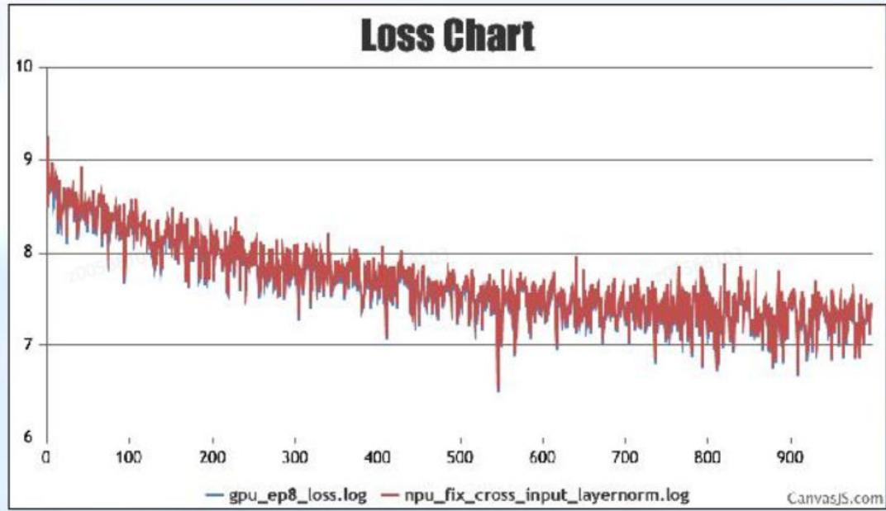  
图 3-8 loss 对齐

# 3.2 确定性计算案例

案例：某视觉模型存在确定性计算问题，重复训练loss不一致。

# 定位方法：

1. 打开确定性计算（算子确定性计算 $+ i$ 确定性通信）、设置随机种子、关闭Dropout并保证数据集读取顺序一致。

用户可通过msprobe工具中的seed_all来自动实现以上目的。

from msprobe.pytorch import seed_all seed_all(mode $\varprojlim \varprojlim \varprojlim \varprojlim \varprojlim \varprojlim \varprojlim \varprojlim \varprojlim \varprojlim \varprojlim \varprojlim \varprojlim \varprojlim \varprojlim \varprojlim \varprojlim \varprojlim \varprojlim \varprojlim \varprojlim \varprojlim \varprojlim \varprojlim \varprojlim $ True)

打开后精度比对结果有改善，部分卡结果一致，但仍有部分卡的反向存在差异，且重复训练出现位置每次对应的卡和位置随机不固定。

2. 使用dump工具采集step 0 mix级别数据，设置"summary_mode"为"md5"以凸显微小差异。

config.json配置如下： "task": "statistics", "dump_path": "/home/data_dump", "rank": [], "step": [0], "level": "mix", "enable_dataloader": false, "statistics": { "scope": [], "list": [], "data_mode": ["all"], "summary_mode": "md5" }

比对前后两次采集的数据，最先出现异常的是masked_fill.23的输入。

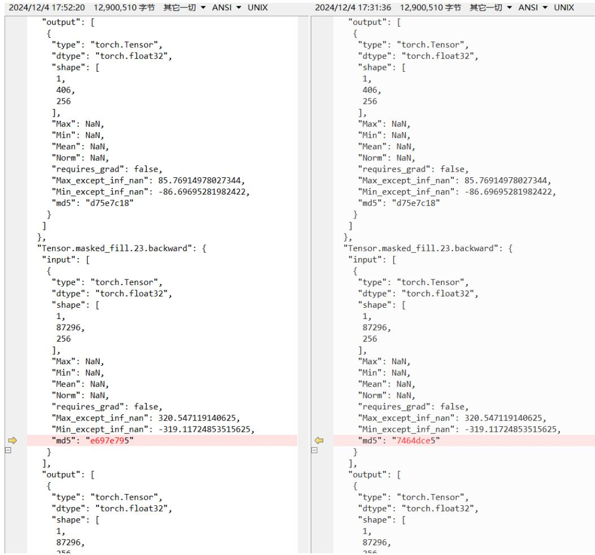  
图 3-9 比对前后两次采集的数据结果

根据dump结果中的stack.json调用栈和代码查找输入来源，代码中为mmcv的MSDA。

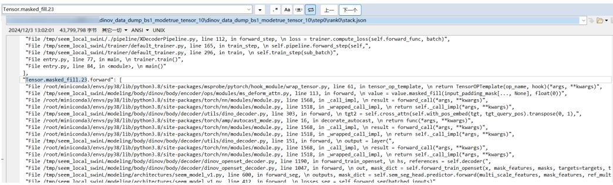  
图 3-10 masked_fill.23 的调用栈

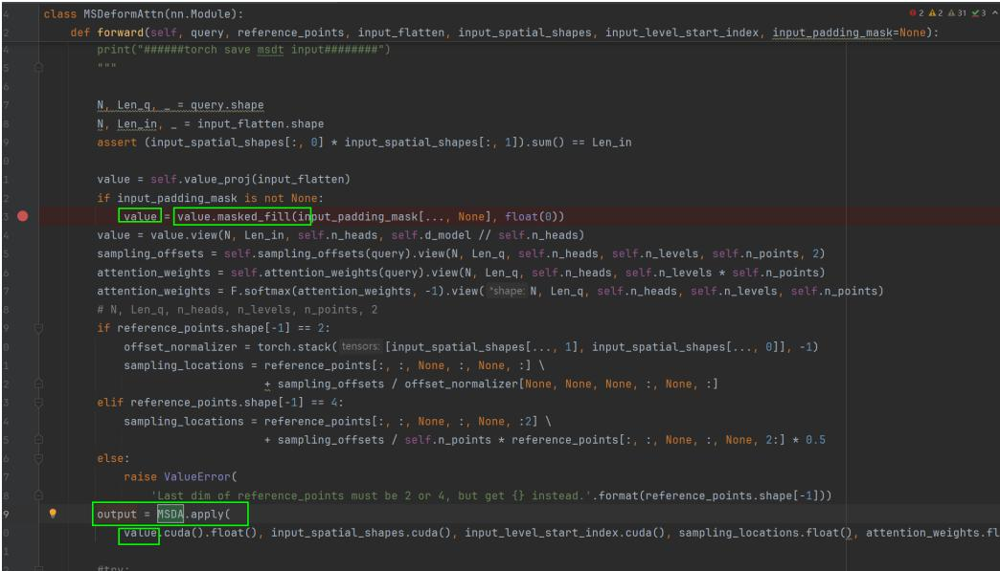  
图 3-11 masked_fill.23 的代码

与MSDA算子支撑人员确认该算子暂不支持确定性计算，建议可用小算子组合进行代替。

小算子代替后masked_fill.23输入一致，但发现grid_sample仍有差异。

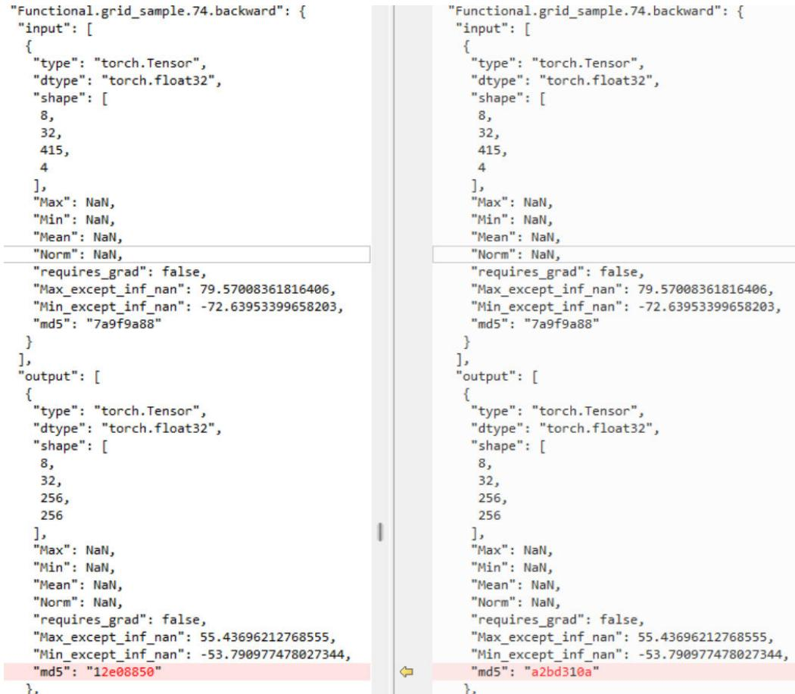  
图 3-12 比对前后两次采集的数据结果

与grid_sample算子支撑人员确认该算子也暂不支持确定性计算。

解决方案：MSDA算子转小算子拼接，grid_sample算子转CPU。

结果：随机性固定，重复训练结果完全一致。

# 3.3 msprobe 工具定位案例

# 3.3.1 首 step loss 不一致（或同权重推理不一致）

# 说明

在进行工具定位前，请优先排除2.2 环境检查中的配置项问题和2.3 问题复现中的随机性问题。案例：某语音模型首step的loss已不齐。

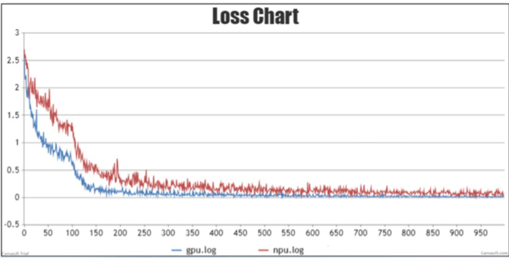  
图 3-13 loss 不齐

定位方法：使用msprobe的dump工具采集step 0 mix级别数据，config.json配置如下：

"task": "statistics", "dump_path": "/home/data_dump", "rank": [], "step": [0], "level": "mix", "enable_dataloader": false, "statistics": { "scope": [], "list": [], "data_mode": ["all"], "summary_mode": "statistics" } }

1. dump工具在代码中插入方法可参考如下方式：

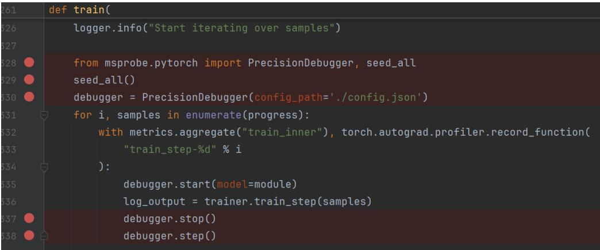  
图 3-14 dump 工具插入代码的方式

2. 通过分级可视化工具分析差异。

创建compare.json文件，文件拷贝如下内容。 "npu_path": "./npu_dump", "bench_path": "./bench_dump", "is_print_compare_log": true   
}

# 可视化命令为：

msprobe -f pytorch graph -i ./compare.json -o ./output在输出目录中可以看到生成的vis后缀文件，用tensorboard打开可视化界面：

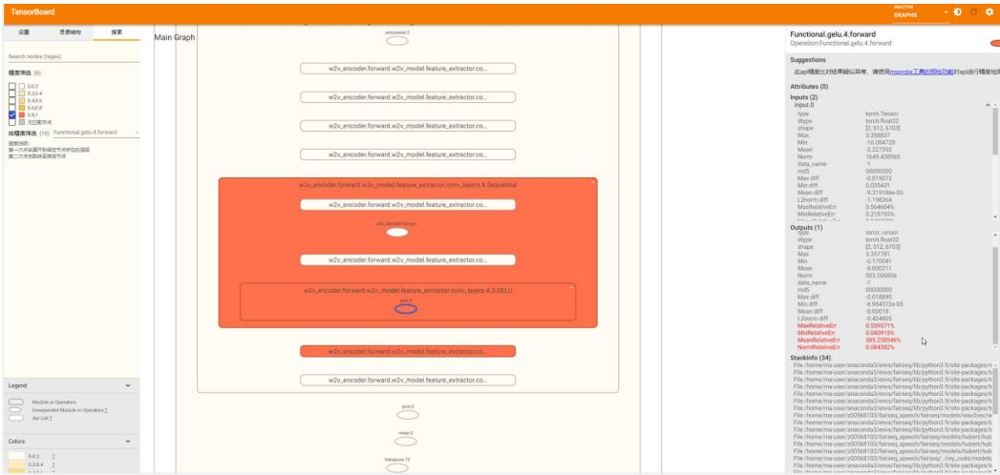  
图 3-15 可视化比对结果

可以看到gelu算子标红，算子精度可能存在一定问题。

3. 也可通过精度比对工具进行比对，精度比对compare.json配置如下： "npu_path": "./npu_dump/dump.json", "bench_path": "./bench_dump/dump.json", "stack_path": "./npu_dump/stack.json", "is_print_compare_log": true }

此处可直接比对单卡结果，精确到dump.json文件，若多卡则精确到步数。

运行如下比对命令得到比对的csv表格：msprobe -f pytorch compare -i ./compare.json -o ./output -s分析表格发现gelu算子输入差异较小，输出差异较大。

# 图 3-16 精度比对结果

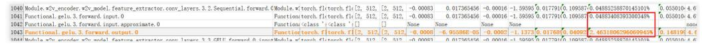

# 解决方案：

将gelu算子计算转CPU，精度问题解决，明确该问题为gelu算子导致，但转CPU会影响性能。

后续联系算子支撑人员提供了PyTorch的gelu修复包。

结果：用修复包后不转CPU也精度达标。

# 3.3.2 长稳训练 loss 不一致，前期对齐，后期差异变大

#

在进行工具定位前，请优先排除2.2 环境检查中的配置项问题和2.3 问题复现中的随机性问题。案例：某搜索模型从fp32转bf16之后，前期loss差异不大，后期loss跑飞。

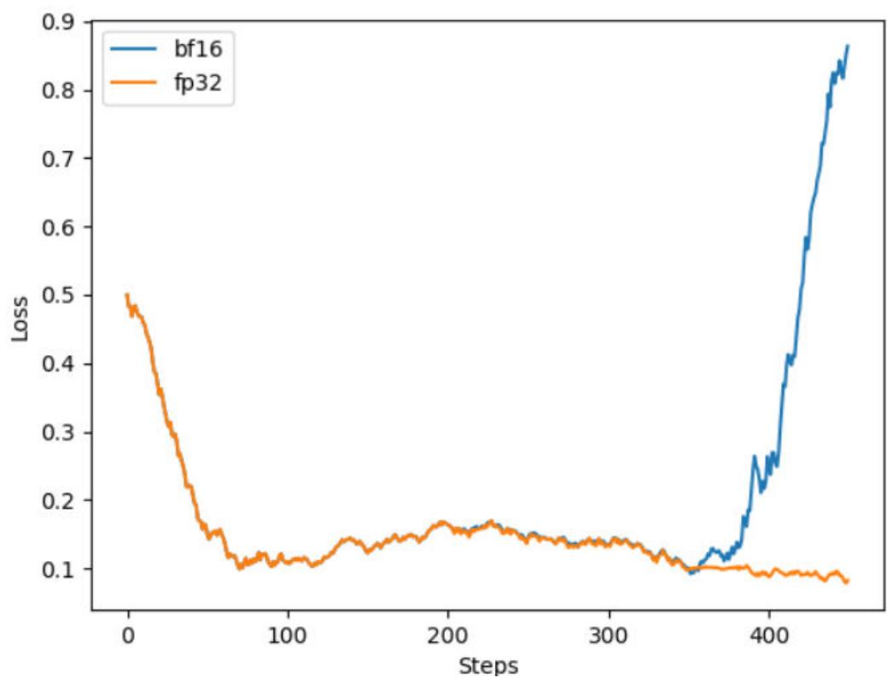  
图 3-17 loss 跑飞

定位方法：由于前期对齐后期跑飞，且跑飞时步数已较大，全程dump数据量多且步数不确定，因此优先采用monitor状态监控工具进行采集。

1. 查看grad_norm，与loss趋势一致。倾向于由梯度导致的loss突变，因此用如下配置采集梯度数据，monitor_config.json内容如下："targets": {},

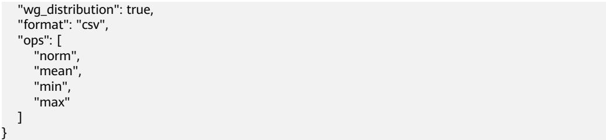

代码中插入方式如下：

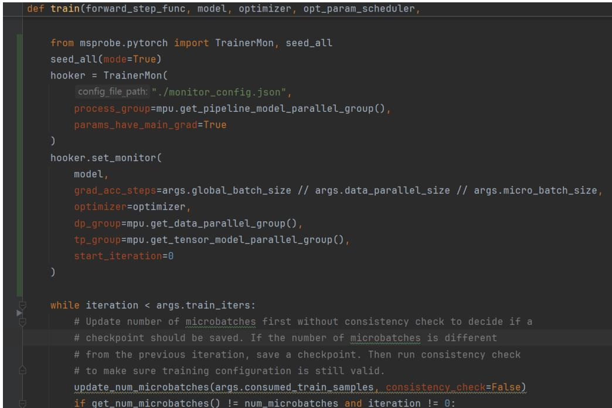  
图 3-18 monitor 工具代码插入方式

2. 采集后可得到每张卡上grad_unreduced-xx-xx.csv和grad_reduced-xx-xx.csv，其中xx为步数。

查看在360步之后的开始上扬位置的reduce前各层梯度数据，结果如下：

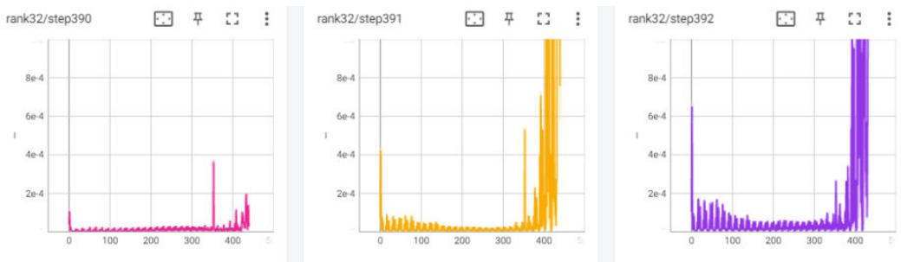  
图 3-19 异常训练用 monitor 采集的梯度数据

其中横坐标为反向的层顺序，左边为output，右边为embedding，可看到梯度norm大值在embedding附近，而对比fp32的梯度数据在embedding层上也相对稳定。

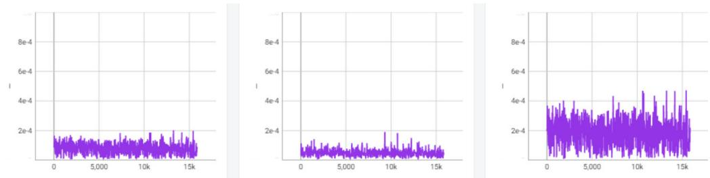  
图 3-20 正常训练用 monitor 采集的梯度数据

因此重点怀疑embedding层梯度在bf16上相较于fp32存在数值不稳定现象。

解决方案：对embedding的梯度做梯度裁剪。

结果：loss收敛正常无跑飞。

# 3.3.3 溢出或 NaN 问题

# 说明

在进行工具定位前，请优先排除2.2 环境检查中的配置项问题和2.3 问题复现中的随机性问题。

案例 1

某视觉模型从GPU迁移到NPU MindSpeed LLM训练，从一开始就梯度溢出。

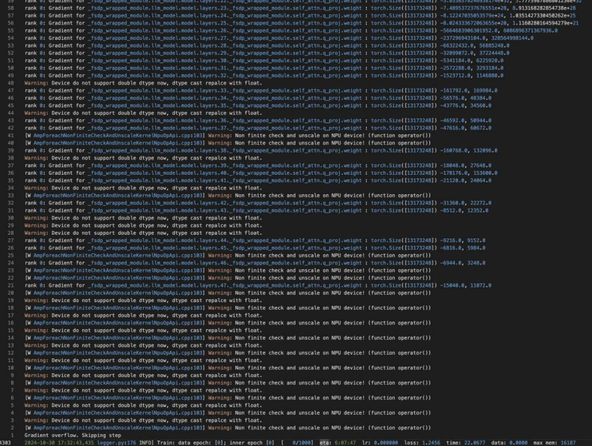  
图 3-21 梯度溢出打印的日志

从用户共享的训练截图中可以看到step 0梯度反向时逐层变大直至溢出。

# 定位方法：

1. 使用dump工具采集step 0（溢出步）的mix级别数据，config.json配置如下： "task": "statistics", "dump_path": "/home/data_dump", "rank": [], "step": [0], "level": "mix", "enable_dataloader": false, "statistics": { "scope": [], "list": [], "data_mode": ["all"], "summary_mode": "statistics"

从训练截图中可看到每次self_attn反向之后梯度逐层变大，查看self_attn代码发现使用了npu_fusion_attention算子，该算子因使用规范引起的精度问题较多，优先查看dump中对应的反向数据，发现每次经过npu_fusion_attention层反向后，norm值量级明显增大。

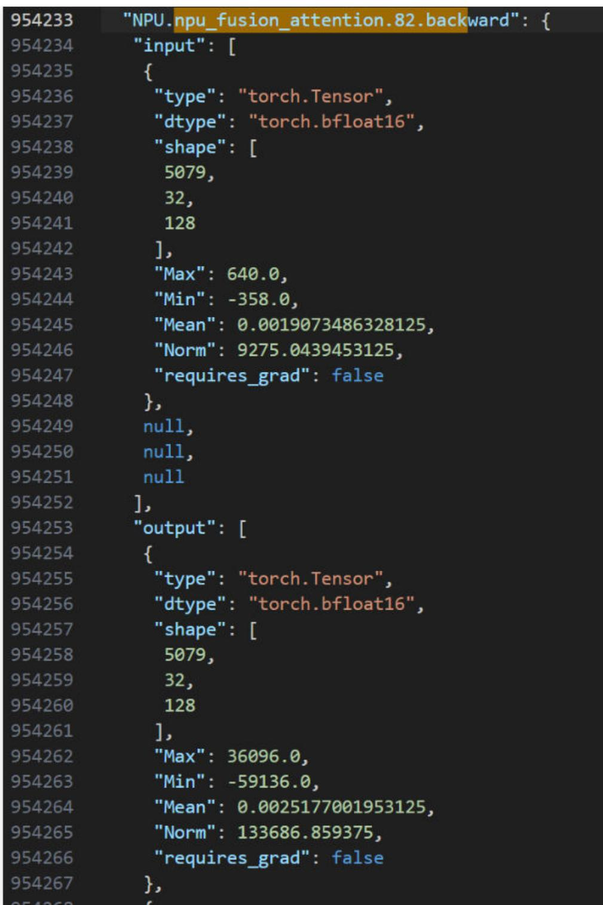

2. 快速验证，先在MindSpeed LLM的训练配置中规避npu_fusion_attention融合算子。

删除超参：-use_fused_attn

溢出消失，明确该问题为npu_fusion_attention分支引入，但性能下降明显，需进步明确npu_fusion_attention精度原因。

3. 通过查阅npu_fusion_attention，分析npu_fusion_attention算子在代码中的具体使用方式。

该问题为变长场景，原始输入为batch size $^ { = 2 }$ ，样例1的seqlen $\scriptstyle 1 = 3 5 7 7$ ，样例2的seqlen $\mathord {  \kern - delimiterspace } = 1 5 0 7$ ，统一pad到3577长度，原始输入shape $=$ [2, 3577, 32, 128]。

在进npu_fusion_attention计算前，会将batch size和seq len做flatten，此时shape=[7154, 32, 128]，下一步去除其中的pad，因此Q和KV的输入长度变成了[5079, 32, 128]。

# atten_mask字段要求：

atten_mask：Device侧的Tensor，可选参数，取值为1代表该位不参与计算（不生效），为0代表该位参与计算，数据类型支持BOOL、UINT8，数据格式支持ND格式，输入shape类型支持BNSS格式、B1SS格式、11SS格式、SS格式。varlen场景只支持SS格式，SS分别是maxSq和maxSkv。

按照官网说明，此时attention mask按照规则本该为[maxSq, maxSkv]，即[3577,3577]，但实际客户代码中使用[query.shape[0], key.shape[0]]，即[5079,5079]，使用规范错误，导致算子底层执行计算时会按行读取，导致出现0、1的数值错位，最终导致梯度溢出。

解决方案：修正npu_fusion_attention训练时传入的attention_mask。

结果：训练梯度溢出消失，loss正常收敛。

# 案例 2

某多模态模型从GPU迁移到NPU后做微调，使用框架为FSDP，训练step1的loss出现NaN。

0step [00:15， ?step/s,batch_size=1， loss=0.388, lr_optimizer0_params_group0=1e-7]   
1step [00:37，15.75s/step，batch_size=1,los $\bar { \mathsf { s } } =$ nan, lr_optimizer0_params_group0=1e-7]   
2step [01:09，19.40s/step，batch_size=1， los $\bar { \mathsf { s } } =$ nan,lr_optimizer0_params_group0=1e-7]   
0step [00:21，?step/s,batch_size $^ { : = 1 }$ ,los $= 0 . 3 0 7$ ， lr_optimizer0_params_group0=1e-7]   
1step [00:39, 21.47s/step, batch_size=1， loss=0.359,lr_optimizer0_params_group0=1e-7]   
2step [00:57， 19.74s/step,batch_size $^ { \cdot = 1 }$ , loss=0.142, lr_optimizer0_params_group0=1e-7]   
3step [01:16, 18.64s/step, batch_size=1， loss=0.198, lr_optimizer0_params_group0=1e-7]   
4step [01:37, 18.89s/step, batch_size=1， loss=0.224， lr_optimizer0_params_group0=1e-7]   
5step [01:59, 19.60s/step,batch_size=1， loss=0.192, lr_optimizer0_params_group0=1e-7]   
6step [02:22, 20.37s/step,batch_size=1， loss=0.44, lr_optimizer0_params_group0=1e-7]   
7step [02:45, 21.26s/step, batch_size=1， loss=0.189, lr_optimizer0_params_group0=1e-7]   
8step [03:12， 21.96s/step,batch_size $^ { \cdot = 1 }$ , loss=0.604, lr_optimizer0_params_group0=1e-7]   
9step [03:33，23.52s/step,batch_size $^ { \cdot = 1 }$ , loss=0.282， lr_optimizer0_params_group0=1e-7]   
10step [03:58， 22.65s/step,batch_size $^ { \cdot = 1 }$ ,loss=0.211, lr_optimizer0_params_group0=1e-7]

# 定位方法：

1. 缩小规模。

该模型现网为128卡训练，做实验成本大，需首先缩小规模，减少层数后可在单机2卡稳定复现。

2. 使用dump工具采集step1（最开始出现NaN的步数）的mix级别数据。

# 3. 缩小排查范围。

从训练完整模型改为只训练dit.transformer.layers，loss仍然有NaN，确认是transformer.layers的问题。

4. 通过手动挂局部hook的方式打印梯度。

发现step1 loss的NaN不是第一个出现的NaN，先出现NaN的是step0post_attention_layernorm的反向梯度。

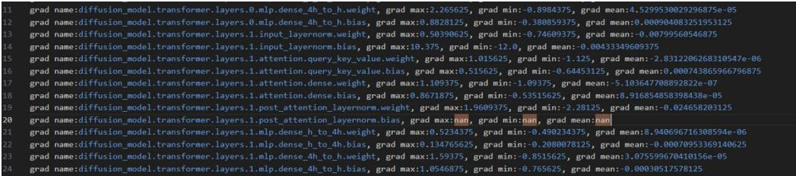  
图 3-25 post_attention_layernorm 的反向梯度

与打开流同步的无NaN的梯度数据进行对比，除了input_layernorm和post_attention_layernorm层的weight和bias，其余的参数都能对上。

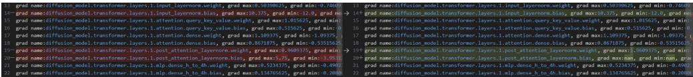  
图 3-26 有无 NaN 的梯度比对

对应的dump中的接口为Functional.layer_norm.10和Functional.layer_norm.11。

5. 结合具体代码进行分析。

post_attention_layernorm对于图像和文本连续下发了两次。

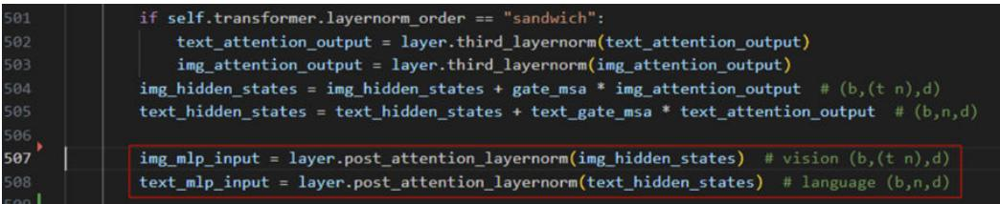  
图 3-27 post_attention_layernorm 代码

将其次数改为1次时，NaN消失，明确该问题出现在该算子重复调用时。

分析内存踩踏特征的方式是按异常数据是否存在规律性和连续性，所以需先采集对应数据再进行分析。

6. 改用异步dump。

之前加入dump工具后NaN消失原因为观测到Tensor，取统计量（min, max等）和落盘的操作会影响流上算子的执行，导致NaN不复现。

通过改异步dump方式，训练过程中工具不触发同步操作，改为在当前step训练结束后统一落盘，降低对算子执行顺序和流同步影响。

具体操作为：在config.json文件中加入async_dump: True的配置项。

重新采集Functional.layer_norm.10和Functional.layer_norm.11及其中间的torch.split.192反向数据，可在dump单个算子时复现NaN。

7. 分析异步dump数据。

参考无loss NaN的dump.json文件，torch.split.192.backward的输入应为Functional.layer_norm.11的输出，而不开流同步时，对比本该相等的两组数据，异步dump的torch.split.192.backward的输入，与Functional.layer_norm.11的输出不一致。

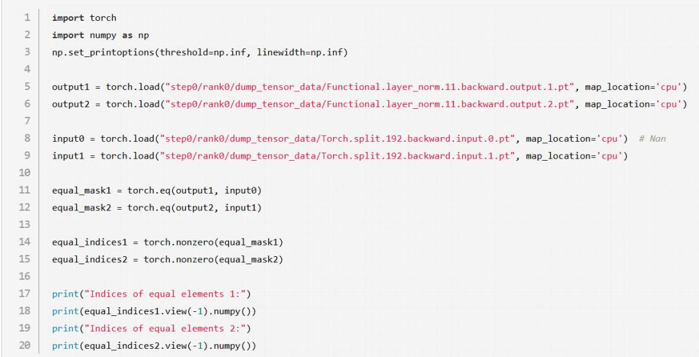  
图 3-28 特征分析代码  
图 3-29 踩踏前后的数据差异

发现刚好踩了size=2048（0-2047不等，2048-3071相等），满足内存踩踏特征。

<table><tr><td colspan="12">2048204920502051205220532054205520562057205820592060206120622063206420652066206720 2094209520962097209820992100210121022103210421052106210721082109211021112112211214211521</td></tr><tr><td rowspan="5">Indices of equal elements 2： [601 1711[</td><td></td><td></td><td></td><td></td><td></td><td></td><td></td><td></td><td></td><td></td></tr><tr><td>214221432144214521462147214821492150215121522153215421552156215721582159216021612162216321</td><td></td><td></td><td></td><td></td><td></td><td></td><td></td><td></td><td></td></tr><tr><td>2190219121922193219421952196219721982199 2200</td><td></td><td></td><td></td><td>2201220222032204220522062207</td><td></td><td></td><td>2208</td><td>22092210221122</td><td></td></tr><tr><td>22382239224022412242224322442245 2246224722482249225022512252225322542255225622572258 225922 228622872288228922902291</td><td>2292229322942295</td><td>2340234123422343234423452346234723482349235023512352235323542355</td><td>2297</td><td></td><td>2298229923002301230223032304230523062307</td><td></td><td></td><td></td><td>23</td></tr><tr><td>2334233523362337 238223832384238523862387 2430 24312432 24332434 2435 2436 2437 2438 24392440244124422443244424452446 2447 2448 2449 2450 2451 24</td><td>23382339</td><td></td><td>2296 23882389239023912392</td><td></td><td></td><td></td><td></td><td></td><td></td><td>23</td></tr><tr><td></td><td></td><td></td><td></td><td></td><td></td><td>2393239423952396239723982399</td><td></td><td></td><td>2400</td><td>240124022403240</td></tr><tr><td>2478247924802481248224832484 248524862487</td><td></td><td></td><td></td><td></td><td></td><td>24882489 24902491 24922493 24942495</td><td></td><td>2496</td><td></td><td></td></tr><tr><td>25262527 2528 2529</td><td>2530 2531</td><td></td><td>2532 2533 25342535 2536 2537</td><td></td><td></td><td></td><td></td><td>253825392540254125422543 2544 25452546 2547</td><td>2497</td><td>24982499 25</td></tr><tr><td>25742575 2576</td><td>257725782579 2622 26232624262526262627 2628262926302631263226332634263526362637 2638 2639264026412642 264326</td><td></td><td>2580 2581 2582 2583 2584 25852586 2587</td><td></td><td></td><td>25882589</td><td>25902591</td><td>2592</td><td>259325942595</td><td>25 25</td></tr><tr><td></td><td>2670267126722673 2674 2675</td><td></td><td></td><td></td><td></td><td></td><td></td><td></td><td></td><td></td></tr><tr><td></td><td></td><td>2771</td><td>26762677 26782679 26802681 26822683 2684 268526862687 27242725272627272728272927302731273227332734 2735 2774 2775</td><td></td><td></td><td></td><td></td><td>2688</td><td>268926902691</td><td>26</td></tr><tr><td>2718 2719 2720 2721</td><td>27222723</td><td></td><td></td><td>2776</td><td></td><td>2780</td><td></td><td>2784</td><td>2736 2737 2738 2739</td><td>27</td></tr><tr><td>27662767 2768</td><td>2769 2770</td><td>2772 2773</td><td></td><td>2777</td><td>2778 2779</td><td>2781</td><td>127822783</td><td></td><td>2785 27862787</td><td>27</td></tr><tr><td></td><td>281428152816281728182819282028212822 282328242825282628272828282928302831283228332834 283528</td><td></td><td>28682869287028712872 2873287428752876287728782879</td><td></td><td></td><td></td><td></td><td></td><td></td><td></td></tr><tr><td></td><td>28622863 28642865 28662867</td><td></td><td></td><td></td><td></td><td></td><td></td><td></td><td></td><td>28802881 2882 288328</td></tr><tr><td></td><td>2912291329142915</td><td></td><td>291629172918 2919 2920 2921 29642965 2966296729682969</td><td></td><td></td><td>292229232924292529262927</td><td></td><td></td><td></td><td></td></tr><tr><td>29102911</td><td></td><td></td><td>300630073008300930103011301230133014301530163017301830193020302130223023302430253026302730</td><td></td><td></td><td></td><td>2973 2974</td><td>2975 2976</td><td>292829292930 2977</td><td>2931 29</td></tr><tr><td>2958295929602961 2962 2963</td><td></td><td></td><td></td><td></td><td>2970 2971 2972</td><td></td><td></td><td></td><td></td><td>2978 2979 29</td></tr></table>

8. 算子内存地址打印。

尝试通过修改torch_npu源码对算子的输入输出tensor对应的ptr地址和shape进行打印。

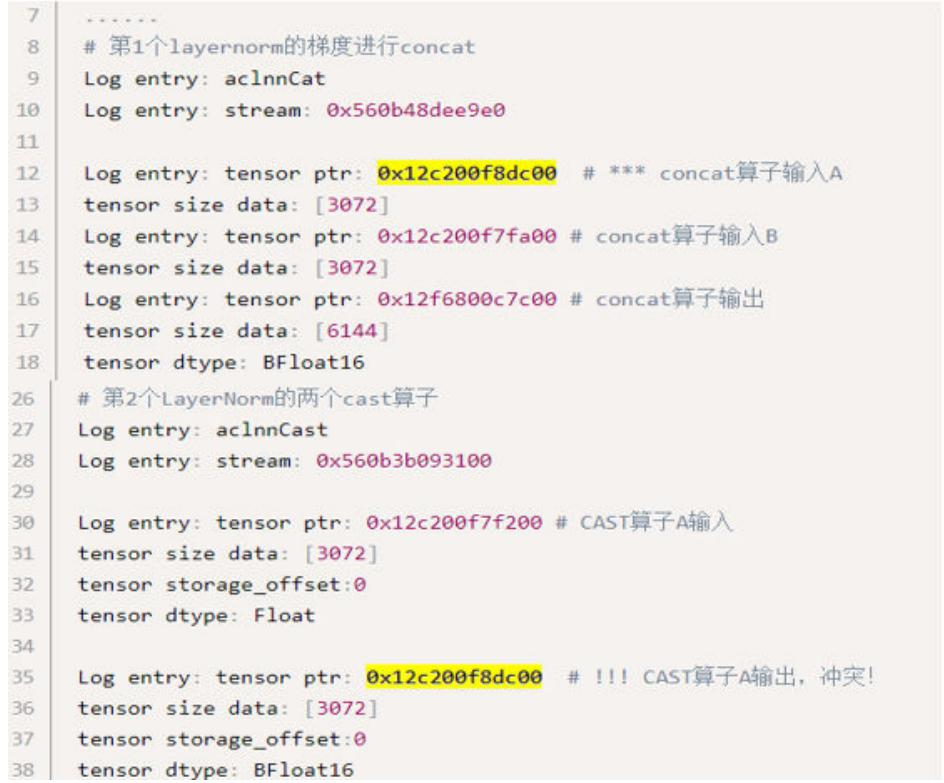  
图 3-30 ptr 内存地址打印结果

从日志发现两个连续layernorm中，存在cast算子输出对concat算子输入的踩踏（两者地址一致）。

踩踏现场确认如下：

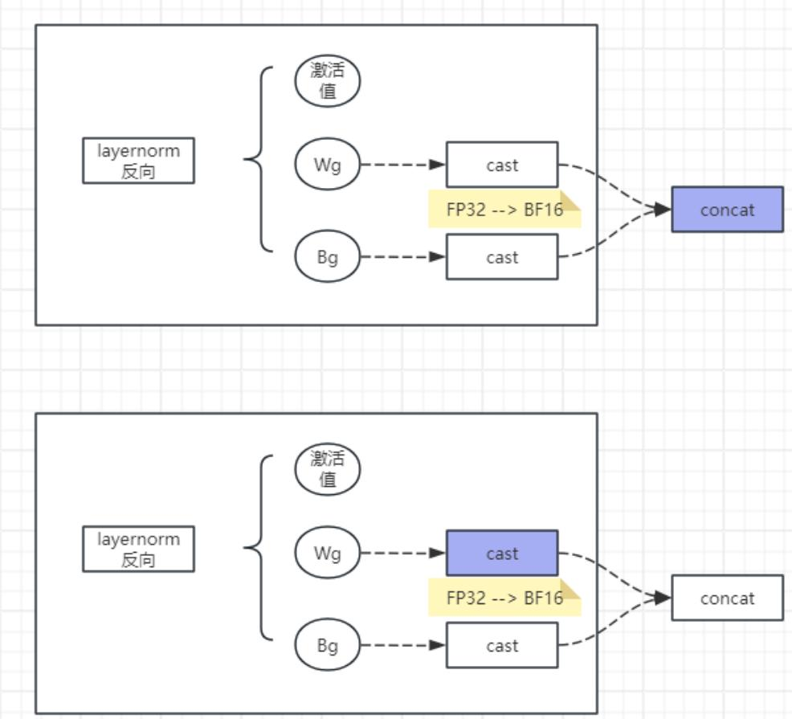  
图 3-31 踩踏发生的逻辑图

总结根因：缺失record的backend $^ +$ 多流并行的FSDP $+$ 连续下发的layernorm导致了内存踩踏。

解决方案：在torch_npu2.3的FSDP unshard流上添加record，确保流上的当前算子执行完成之前，tensor内存不会被下一个算子申请。

结果：loss NaN消失，正常收敛。

# 3.4 特殊情况排查案例

案例1：某多模态模型。

开启流同步前训练出现NaN，而开启流同步后无NaN正常收敛，最终定位为并发计算时的内存踩踏。

案例2：某MOE模型出现NaN问题。

去掉overlap-param-gather超参之后，问题规避。

# 3.5 硬件压测案例

案例：某近5k卡大集群模型loss不对齐，grad_norm存在大量尖刺。

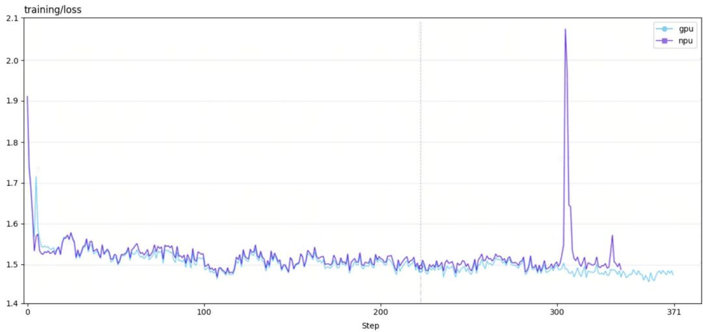  
图 3-32 loss 不对齐尖刺

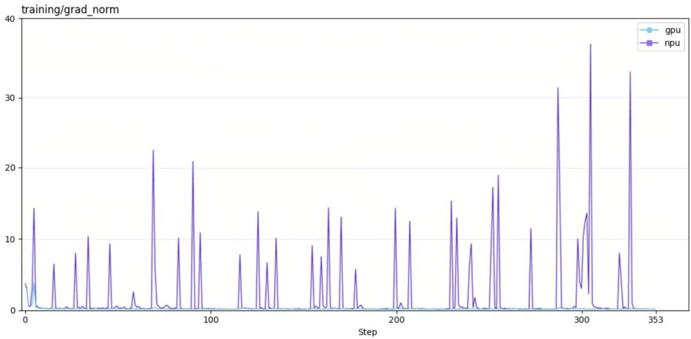  
图 3-33 loss grad_norm 尖刺

由于集群较大，优先进行硬件压测，排查坏节点。

4800卡分成100组3\*16卡，执行同一个训练任务。固定随机性并开启确定性计算，观察最终loss曲线是否存在异常组。缩小到异常的机组后再进行dmi压测。

使用ascend-dmi -dg -i aicore -s -sc 60 -q命令进行机器压测，查看故障检测结果。

表 3-1 故障检测结果含义  

<table><tr><td colspan="1" rowspan="1">回显状态</td><td colspan="1" rowspan="1">含义</td></tr><tr><td colspan="1" rowspan="1">PASS</td><td colspan="1" rowspan="1">压力测试通过，结果无异常。</td></tr><tr><td colspan="1" rowspan="1">SKIP</td><td colspan="1" rowspan="1">当前设备不支持P2P压测。</td></tr><tr><td colspan="1" rowspan="1">EMERGENCY_WARN</td><td colspan="1" rowspan="1">紧急警告，压测结果为不通过，建议联系华为工程师更换硬件。</td></tr><tr><td>FAIL</td><td>p2p压测执行失败，请联系华为工程师处理。</td></tr></table>

检测结果显示存在坏节点，将其排除后精度正常。如下图：

排除硬件故障后loss不再有尖刺。

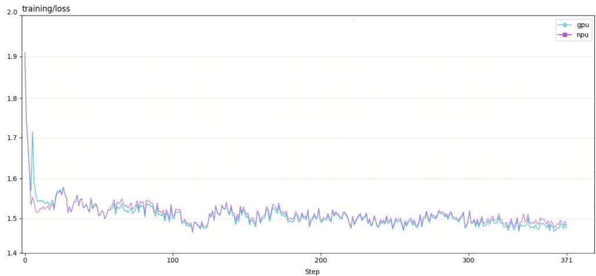  
图 3-34 loss 不对齐尖刺消失

排除硬件故障后grad_norm尖刺明显改善。

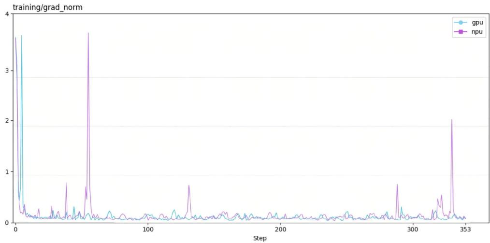  
图 3-35 loss grad_norm 尖刺减少

由于集群较大，优先进行硬件压测，排查坏节点。

4800卡分成100组\*（3\*16卡）任务，跑同一个训练任务，固定随机性 $^ +$ 开确定性计算，看最终loss曲线，是否存在异常的组，缩小到异常的机组再做dmi压测。

使用ascend-dmi -dg -i aicore -s -sc 60 -q命令进行机器压测，查看故障检测结果。

表 3-2 故障检测结果含义  

<table><tr><td rowspan=1 colspan=1>回显状态</td><td rowspan=1 colspan=1>含义</td></tr><tr><td rowspan=1 colspan=1>PASS</td><td rowspan=1 colspan=1>压力测试通过，结果无异常。</td></tr><tr><td rowspan=1 colspan=1>SKIP</td><td rowspan=1 colspan=1>当前设备不支持P2P压测。</td></tr><tr><td rowspan=1 colspan=1>EMERGENCY_WARN</td><td rowspan=1 colspan=1>紧急警告，压测结果为不通过，建议联系华为工程师更换硬件。</td></tr><tr><td rowspan=1 colspan=1>FAIL</td><td rowspan=1 colspan=1>p2p压测执行失败，请联系华为工程师处理。</td></tr></table>

检测结果显示存在坏节点，将其排除后精度正常。如下图：

排除硬件故障后loss不再有尖刺。

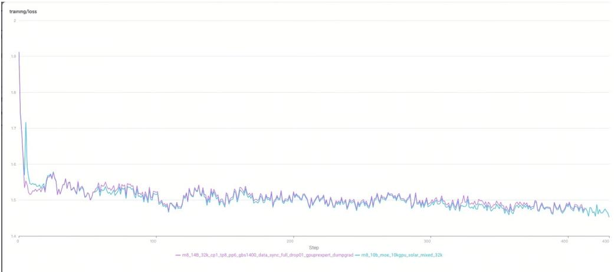  
图 3-36 loss 不对齐尖刺消失

排除硬件故障后grad_norm尖刺明显改善。

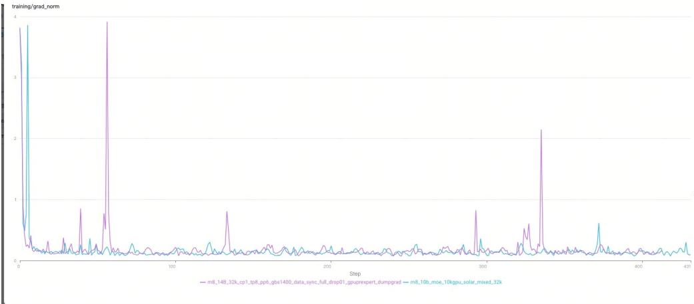  
图 3-37 loss grad_norm 尖刺减少