# MindStudio8.3.0开发工具快速入门

文档版本 01  
发布日期 2026-02-11

版权所有 $\circledcirc$ 华为技术有限公司 2026。 保留一切权利。

非经本公司书面许可，任何单位和个人不得擅自摘抄、复制本文档内容的部分或全部，并不得以任何形式传播。

# 商标声明

和其他华为商标均为华为技术有限公司的商标。  
本文档提及的其他所有商标或注册商标，由各自的所有人拥有。

# 注意

您购买的产品、服务或特性等应受华为公司商业合同和条款的约束，本文档中描述的全部或部分产品、服务或特性可能不在您的购买或使用范围之内。除非合同另有约定，华为公司对本文档内容不做任何明示或暗示的声明或保证。

由于产品版本升级或其他原因，本文档内容会不定期进行更新。除非另有约定，本文档仅作为使用指导，本文档中的所有陈述、信息和建议不构成任何明示或暗示的担保。

# 安全声明

# 产品生命周期政策

华为公司对产品生命周期的规定以“产品生命周期终止政策”为准，该政策的详细内容请参见如下网址：https://support.huawei.com/ecolumnsweb/zh/warranty-policy

# 漏洞处理流程

华为公司对产品漏洞管理的规定以“漏洞处理流程”为准，该流程的详细内容请参见如下网址：  
https://www.huawei.com/cn/psirt/vul-response-process  
如企业客户须获取漏洞信息，请参见如下网址：  
https://securitybulletin.huawei.com/enterprise/cn/security-advisory

# 华为初始证书权责说明

华为公司对随设备出厂的初始数字证书，发布了“华为设备初始数字证书权责说明”，该说明的详细内容请参见如下网址：https://support.huawei.com/enterprise/zh/bulletins-service/ENEWS2000015766

# 华为企业业务最终用户许可协议(EULA)

本最终用户许可协议是最终用户（个人、公司或其他任何实体）与华为公司就华为软件的使用所缔结的协议。最终用户对华为软件的使用受本协议约束，该协议的详细内容请参见如下网址：  
https://e.huawei.com/cn/about/eula

# 产品资料生命周期策略

华为公司针对随产品版本发布的售后客户资料（产品资料），发布了“产品资料生命周期策略”，该策略的详细内容请参见如下网址：https://support.huawei.com/enterprise/zh/bulletins-website/ENEWS2000017760

# 目 录

1 MindStudio 是什么.  
2 训练场景工具快速入门..  
2.1 概述...  
2.2 模型开发&迁移（MindSpore） 6  
2.3 模型精度调试（MindSpore） 6  
2.3.1 训练前配置检查. 6  
2.3.2 精度数据采集.. .8  
2.3.3 精度预检... 9  
2.3.4 精度比对. 9  
2.3.4.1 compare 精度比对. 10  
2.3.4.2 分级可视化构图比对. 11  
2.4 模型性能调优（MindSpore） 12  
2.4.1 性能数据采集. 12  
2.4.2 性能数据分析.. 14  
2.4.2.1 使用 msprof-analyze 工具分析性能数据. .14  
2.4.2.2 使用 MindStudio Insight 工具可视化性能数据. 15  
2.5 代码样例（MindSpore） 17  
2.6 模型开发&迁移（PyTorch） 20  
2.7 模型精度调试（PyTorch） 21  
2.7.1 训练前配置检查. 21  
2.7.2 训练状态监控. . 23  
2.7.3 精度数据采集.. . 24  
2.7.4 精度预检.. . 25  
2.7.5 精度比对. . 26  
2.7.5.1 compare 精度比对. 26  
2.7.5.2 分级可视化构图比对. .27  
2.8 模型性能调优（PyTorch） 28  
2.8.1 性能数据采集.. . 28  
2.8.2 性能数据分析... . 30  
2.8.2.1 使用 msprof-analyze 工具分析性能数据. 30  
2.8.2.2 使用 MindStudio Insight 工具可视化性能数据. 31  
2.9 代码样例（PyTorch） 33

# 3 大模型推理工具快速入门... 79

3.1 概述.. 79  
3.2 模型推理. 80  
3.2.1 模型量化.. . 80  
3.2.2 精度调试.. . 81  
3.2.3 性能调优.. . 83  
3.2.4 服务化调优. 85  
3.3 进阶开发.. 88  
4 算子开发工具快速入门.. 89  
4.1 概述.. 89  
4.2 算子设计（msKPP） 90  
4.3 创建算子工程（msOpGen） 91  
4.4 算子功能测试（msOpST）. 93  
4.5 算子异常检测（msSanitizer） 94  
4.6 算子调试（msDebug） 95  
4.7 算子调优（msProf） . 96

# MindStudio 是什么

# 功能架构

MindStudio提供一站式AI开发环境，助力开发者高效完成算子开发、训练开发和推理开发。MindStudio功能框架如图1-1所示。

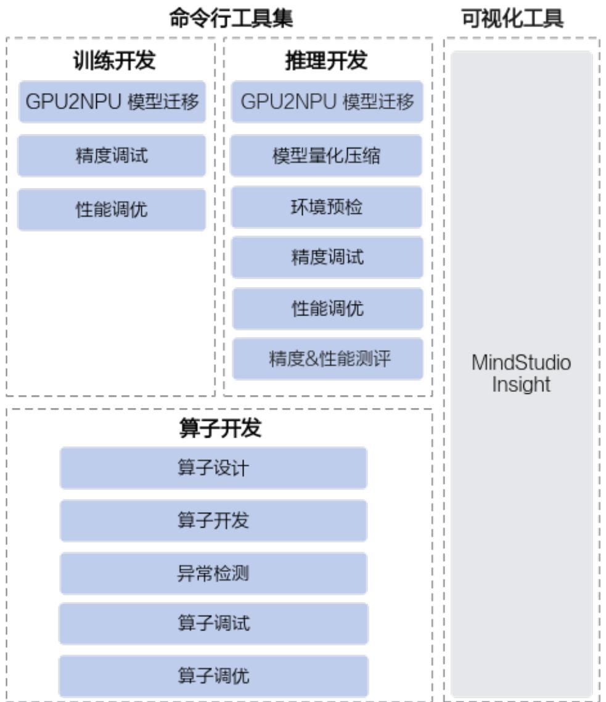  
图 1-1 工具集功能架构

# 命令行工具开发场景

按照开发场景分类，MindStudio可以分为以下三种工具链：

算子开发工具：MindStudio算子开发工具是面向Ascend C编程语言的系列能力集合，涵盖了算子设计、算子开发、异常检测、功能调试及性能优化的全流程，助力开发者自主完成高性能算子开发。

训练开发工具：聚焦用户在模型迁移、模型开发中遇到的痛点问题，提供全流程的工具链。通过提供分析迁移工具、精度调试工具和性能调优工具三大主力工具包，帮助用户解决开发过程中迁移困难、精度调试门槛高、性能不达标或劣化等问题，让用户轻松解决精度和性能问题，开启乐趣十足的极简开发之旅。

推理开发工具：作为昇腾平台的统一推理开发工具链，为用户提供大模型与传统模型推理开发中常用的模型压缩、模型一站式调试调优等功能，并支持推理服务化场景下的性能调优能力，以及模型的精度、性能测评功能，帮助用户达到最优的推理性能。

# 可视化工具

MindStudio Insight：是一款用于模型、算子、服务化及内存性能调优的可视化工具，可显著提升开发者进行性能调优的效率。

模型调优场景：提供了多维度性能数据分析功能，包括内存定界、算子、调度、通信等方面的分析功能，帮助开发者高效定位问题。针对大模型集群场景，支持对集群性能Timeline数据并行分析，使开发者快速识别通信慢、卡顿和链路瓶颈等问题。

算子调优场景：支持算子内存和计算负载分析、Roofline瓶颈分析、代码性能度量及指令流水并行分析等功能，助力开发者快速实现算子性能调优。

服务化调优：通过Timeline视图和折线图来呈现推理服务化进程中各个关键阶段的执行情况和端到端的性能表现，帮助开发者快速识别请求调度、显存管理、批处理策略等系统级问题。

内存调优：支持Device侧可视化呈现内存的详细分配情况，并结合Python调用栈及自定义打点标签来标记各种内存申请与使用详情，从而实现内存问题的精准定位及调优。

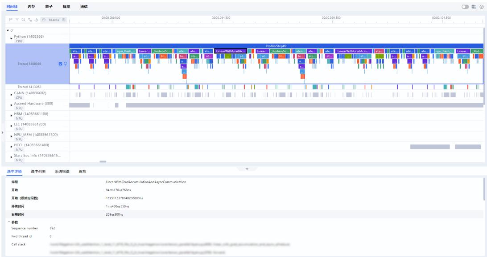  
图 1-2 MindStudio Insight 界面

# 2 训练场景工具快速入门

# 概述

模型开发&迁移（MindSpore）模型精度调试（MindSpore）模型性能调优（MindSpore）代码样例（MindSpore）模型开发&迁移（PyTorch）模型精度调试（PyTorch）模型性能调优（PyTorch）代码样例（PyTorch）

# 2.1 概述

本文介绍训练场景开发工具快速入门，主要针对训练开发流程中的模型开发&迁移、模型精度调试和模型性能调优环节分别使用的开发工具进行介绍。

主要工具介绍：

msprobe工具：基于昇腾开发的大模型或者是从GPU迁移到昇腾NPU环境的大模型，在训练过程中可能出现精度溢出、loss曲线跑飞或不收敛等异常问题。由于训练loss等指标无法精确定位问题模块，本文提供了msprobe（MindStudio Probe，精度调试工具）进行快速定界。精度调试工具在下文均简称为msprobe。msprobe为mstt工具链的精度工具，通过分别对标杆环境（如已调试好的CPU、GPU或昇腾NPU等环境）和昇腾NPU环境下的训练精度数据进行采集和比对，从而找出差异点。msprobe工具包含众多功能，介绍请参见《msprobe使用手册》。● MindSpore Profiler接口工具：MindSpore训练场景下的性能数据采集。● Ascend PyTorch Profiler接口工具：PyTorch训练场景下的性能数据采集。● msprof-analyze工具：统计、分析以及输出相关的调优建议。

MindStudio Insight工具：对性能数据进行可视化展示。

# 使用流程

表 2-1 主要流程和工具操作流程  

<table><tr><td rowspan=1 colspan=1>流程</td><td rowspan=1 colspan=1>使用工具和操作流程</td></tr><tr><td rowspan=1 colspan=1>模型开发&amp;迁移</td><td rowspan=1 colspan=1>MindSpore训练场景暂未提供迁移工具，本文以直接在昇腾NPU环境开发的训练脚本为例。PyTorch训练场景使用分析迁移工具进行GPU向昇腾NPU环境迁移。</td></tr><tr><td rowspan=1 colspan=1>模型精度调试</td><td rowspan=1 colspan=1>使用msprobe工具在模型精度调试中主要执行如下操作：1．训练前配置检查识别两个环境影响精度的配置差异。2.（可选）训练状态监控监控训练过程中计算，通信，优化器等部分出现的异常情况。3.米精度数据采集采集训练过程中的API或Module层级前反向输入输出数据。4.精度预检扫描API数据，找出存在精度问题的API。5．精度比对对比NPU侧和标杆环境的API数据，快速定位精度问题。</td></tr><tr><td rowspan=1 colspan=1>模型性能调优</td><td rowspan=1 colspan=1>MindSpore训练场景在模型性能调优中主要执行如下操作：1．性能数据采集：MindSpore Profiler接口工具。2.性能数据分析：msprof-analyze工具。3．性能数据可视化展示：MindStudio Insight工具。PyTorch训练场景在模型性能调优中主要执行如下操作：1．性能数据采集：Ascend PyTorch Profiler接口工具。2.性能数据分析：msprof-analyze工具。3．性能数据可视化展示：MindStudio Insight工具。</td></tr></table>

# 环境准备

1. 准备一台基于Atlas 训练系列产品的训练服务器，并安装NPU驱动和固件。  
2. 安装配套版本的CANN Toolkit开发套件包和ops算子包并配置CANN环境变量，请参见《CANN 软件安装指南》。  
3. 安装框架。MindSpore训练场景以安装2.6.0和2.7.0版本为例，具体操作请参见《MindSpore安装指南》。PyTorch训练场景以安装2.1.0版本为例，具体操作请参见《Ascend Extension forPyTorch 软件安装指南》的“安装PyTorch”章节。

安装CANN软件后，使用CANN运行用户进行编译、运行时，需要以CANN运行用户登录环境，执行source \$INSTALL_DIR/set_env.sh命令设置环境变量。 $\$ 1$

{INSTALL_DIR}请替换为CANN软件安装后文件存储路径。以root用户安装为例，安装后文件默认存储路径为：/usr/local/Ascend/cann。

# 2.2 模型开发&迁移（MindSpore）

MindSpore训练场景暂未提供迁移工具，本文以直接在昇腾环境开发的训练脚本为例。

# 前提条件

1. 完成环境准备。  
2. 以“mindspore_main.py”命名为例，创建训练脚本文件，脚本内容直接拷贝MindSpore昇腾NPU环境训练脚本样例。  
3. 将“mindspore_main.py”文件上传至训练服务器的任意目录下（需保证该目录下文件的读写权限）。

# 执行训练

直接执行训练。  
python mindspore_main.py  
如果训练正常进行，完成后打印如下日志。train finish

# 2.3 模型精度调试（MindSpore）

# 2.3.1 训练前配置检查

根据本手册的样例，需要将工具接口添加到训练脚本中进行配置检查。

# 说明

当前是以MindSpore不同版本在同一环境下进行精度比对的场景为例，因此两个场景检查出的结果只会有版本号的不同，所以可跳过此步骤。

# 前提条件

完成环境准备。  
完成2.2 模型开发&迁移（MindSpore），确保在所有示例的环境可正常完成训练任务。

# 环境准备

在昇腾NPU环境下安装msprobe工具，执行如下命令：

pip install mindstudio-probe

# 执行检查

操作步骤如下：

1. 获取两个环境的zip包（包含影响训练精度的环境配置：环境变量、三方库版本、训练超参、权重、数据集、随机操作）。

分别以MindSpore 2.6.0和MindSpore 2.7.0执行以下操作。需要注意给两个zip包不同的命名。

在MindSpore训练前配置检查代码样例中插入如下代码，样例中已插入下列代码，可直接复制代码使用。

a. 在训练流程执行到的第一个Python脚本开始处插入如下代码。

1 from msprobe.core.config_check import ConfigChecker   
2 ConfigChecker.apply_patches(fmk)

fmk：训练框架，string类型，可选"pytorch"和"mindspore"，这里配置为"mindspore"。

b. 在模型初始化好之后插入如下代码。

49 from msprobe.core.config_check import ConfigChecker   
50 ConfigChecker(model, output_zip_path, fmk)

▪ model：初始化好的模型，默认不会采集权重和数据集。  
▪ output_zip_path：输出zip包的路径，string类型，需要指定zip包的名称，默认为"./config_check_pack.zip"。  
▪ fmk：训练框架。可选"pytorch"和"mindspore"，这里配置为"mindspore"。

c. 执行训练脚本命令。 python mindspore main.py

采集完成后会得到一个zip包，里面包括各项影响精度的配置。分rank和step存储，其中step为micro_step。

2. 将两个zip包传到同一个环境下，使用如下命令进行比对。msprobe -f mindspore config_check -c bench zip path cmp zip path -o output path其中bench_zip_path为标杆侧采集到的zip包名称，cmp_zip_path为待对比侧采集到的zip包名称。

output_path默认为"./config_check_result"。

执行以上命令后，在output_path里会生成如下数据：

bench：bench_zip_path里打包的数据。  
cmp：cmp_zip_path里打包的数据。  
result.xlsx：比对结果。会有多个sheet页，其中summary总览通过情况，其余页是具体检查项的详情，其中step为micro_step。

3. 检查通过情况。

两个环境以下五项检查均一致则通过，若不一致则需要自行调整环境：

环境变量  
– 第三方库版本  
– 数据集  
– 权重  
– 训练超参

如下所示：

filename ass_check env TRUE pip FALSE dataset TRUE weights TRUE random TRUE

# 2.3.2 精度数据采集

前提条件

● 完成环境准备。完成2.3.1 训练前配置检查。

# 执行采集

1. 创建配置文件。

以在训练脚本所在目录创建config.json配置文件为例，文件内容拷贝如下示例配   
置。   
"task": "tensor", "dump_path": "./dump_data", "rank": [], "step": [], "level": "L1", "tensor": { "scope": [], "list": [], "data_mode": ["all"] }

2. 在训练脚本（mindspore_main.py文件）中添加工具，如下所示。在MindSpore精度数据采集代码样例中插入如下代码，样例中已插入下列代码，可直接复制代码使用。

8 from msprobe.mindspore import PrecisionDebugger   
9 debugger $=$ PrecisionDebugger(config_path="./config.json")   
..   
47 if __name__ $= =$ "__main__":   
48 step = 0   
49 # Train Model   
50 for data, label in ds.GeneratorDataset(generator_net(), ["data", "label"]):   
51 debugger.start(model)   
52 train_step(data, label)   
53 print(f"train step {step}")   
54 step $+ = 1$   
55 debugger.stop()   
56 debugger.step()   
57 print("train finish")

精度数据会占据一定的磁盘空间，可能存在磁盘写满导致服务器不可用的风险。精度数据所需空间跟模型的参数、采集开关配置、采集的迭代数量有较大关系，须用户自行保证落盘目录下的可用磁盘空间。

3. 执行训练脚本命令，工具会采集模型训练过程中的精度数据。python mindspore main.py

日志打印出现如下示例信息表示数据采集成功，完成采集后即可查看数据。

The cell hook function is successfully mounted to the model.   
The module statistics hook function is successfully mounted to the model.   
msprobe: debugger.start() is set successfully Dump switch is turned on at step 0.   
Dump data will be saved in /home/user1/dump/dump_data/step0.

# 结果查看

dump_path参数指定的路径下会出现如下目录结构，可以根据需求选择合适的数据进行分析。

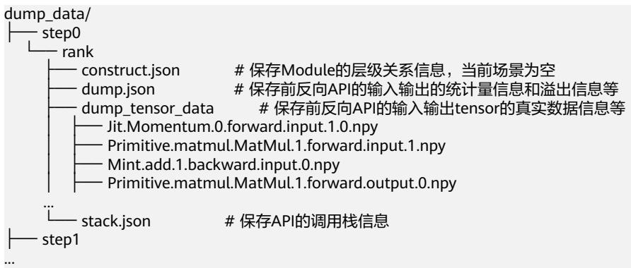

采集后的数据需要用2.3.3 精度预检和2.3.4 精度比对等工具进行进一步分析。

# 2.3.3 精度预检

# 前提条件

● 完成环境准备。完成2.3.2 精度数据采集，得到MindSpore训练场景昇腾NPU环境的精度数据。

# 执行预检

直接在昇腾NPU环境下执行预检。msprobe -f mindspore run_ut -api_info ./dump_data/step0/rank/dump.json -o ./checker_result此时-o参数指定的路径下会生成两个csv文件，分别为accuracy_checking_details_{timestamp}.csv和accuracy_checking_result_{timestamp}.csv。

accuracy_checking_result_{timestamp}.csv标明每个API是否通过测试。对于其中没有通过测试的或者特定感兴趣的API，根据其API Name字段在  
accuracy_checking_details_{timestamp}.csv中查询其各个输出的达标情况以及比较指标。

图 2-1 accuracy_checking_result  

<table><tr><td rowspan=1 colspan=1>API Name</td><td rowspan=1 colspan=1>Forward Test SuccessE</td><td rowspan=1 colspan=1>Backward Test SuccessMessage</td><td rowspan=1 colspan=1>Message </td></tr><tr><td rowspan=1 colspan=1>Mint.add.0_pass</td><td rowspan=1 colspan=1></td><td rowspan=1 colspan=1>pass</td><td rowspan=1 colspan=1></td></tr></table>

图 2-2 accuracy_checking_details  

<table><tr><td rowspan=1 colspan=1>API Name</td><td rowspan=1 colspan=1>Bench Dtype</td><td rowspan=1 colspan=1>Tested Dtype</td><td rowspan=1 colspan=1>Shape</td><td rowspan=1 colspan=1>Cosine</td><td rowspan=1 colspan=1>MaxAbsErr</td><td rowspan=1 colspan=1>MaxRelativeErr</td><td rowspan=1 colspan=1>Status</td><td rowspan=1 colspan=1>Message</td></tr><tr><td rowspan=1 colspan=1>Mint.add.0.forward.output.0</td><td rowspan=1 colspan=1>Float32</td><td rowspan=1 colspan=1>Float32</td><td rowspan=1 colspan=1>(2.2)</td><td rowspan=1 colspan=1>1</td><td rowspan=1 colspan=1>0</td><td rowspan=1 colspan=1></td><td rowspan=1 colspan=1>0pass</td><td rowspan=1 colspan=1></td></tr><tr><td rowspan=1 colspan=1>Mint.add.0.backward.output.0</td><td rowspan=1 colspan=1>Float32</td><td rowspan=1 colspan=1>Float32</td><td rowspan=1 colspan=1>(2.2)</td><td rowspan=1 colspan=1></td><td rowspan=1 colspan=1>0</td><td rowspan=1 colspan=1></td><td rowspan=1 colspan=1>0pass</td><td rowspan=1 colspan=1></td></tr><tr><td rowspan=1 colspan=1>Mint.add.0.backward.output.1</td><td rowspan=1 colspan=1>Float32</td><td rowspan=1 colspan=1>Float32</td><td rowspan=1 colspan=1>(2.2)</td><td rowspan=1 colspan=1>1</td><td rowspan=1 colspan=1>0</td><td rowspan=1 colspan=1></td><td rowspan=1 colspan=1>0pass</td><td rowspan=1 colspan=1></td></tr></table>

预检结果详细介绍请参见“预检结果”。

# 2.3.4 精度比对

# 2.3.4.1 compare 精度比对

# 前提条件

完成环境准备。

以MindSpore框架内，不同版本下的cell模块比对场景为例，参见2.3.2 精度数据采集，完成不同框架版本的cell模块dump，其中不同框架版本以MindSpore 2.6.0和MindSpore 2.7.0为例。

# 执行比对

1. 数据准备。

在同一昇腾NPU环境安装MindSpore 2.6.0和MindSpore 2.7.0版本，分别执行dump操作，获得两份精度数据。注意区分dump_path指定的目录名称，以dump_data_2.6.0和dump_data_2.7.0为例。

2. 创建比对配置文件。

以在训练脚本所在目录创建compare.json配置文件为例，文件内容拷贝如下示例配置。  
{  
"npu_path": "./dump_data_2.7.0/step0/rank/dump.json",  
"bench_path": "./dump_data_2.6.0/step0/rank/dump.json",  
"stack_path": "./dump_data_2.7.0/step0/rank/stack.json",  
"is_print_compare_log": true  
其中"npu_path"和"bench_path"对应的路径需要在同一环境下。

3. 执行比对。

# 命令如下：

msprobe -f mindspore compare -i ./compare.json -o ./compare result/accuracy compare -s

出现如下打印说明比对成功：

Compare result is /xxx/compare_result/accuracy_compare/compare_result_{timestamp}.xlsx   
The advisor summary is saved in: /xxx/compare_result/accuracy_compare/advisor_{timestamp}.txt   
\* msprobe compare ends successfully. \*   
\*\*\*\*\*\*\*\*\*\*\*\*\*\*\*\*\*\*\*\*\*\*\*\*\*\*\*\*\*\*\*\*\*\*\*\*\*\*\*\*\*\*\*\*\*\*\*\*\*\*\*\*\*\*\*\*\*\*\*\*\*\*\*\*\*\*\*\*\*\*\*\*\*\*\*\*\*\*\*\*\*\*\*\*

4. 比对结果文件分析。

compare会在./compare_result/accuracy_compare生成如下文件。

advisor_{timestamp}.txt：文件中给出了可能存在精度问题的API的专家建议。

compare_result_{timestamp}.xlsx：文件列出了所有执行精度比对的API详细信息和比对结果，可通过颜色标记、比对结果（Result）、计算精度达标情况（Accuracy Reached or Not）、错误信息提示（Err_Message）定位可疑算子，但鉴于每种指标都有对应的判定标准，还需要结合实际情况进行判断。

示例如下：

图 2-3 compare_result_1  

<table><tr><td>NPU Nane Bench Name NPU Dtype Bench Dtype NPU Tensor Shape Bench Tensor Shape Cosine</td><td rowspan="2"></td><td colspan="2"></td><td colspan="2"></td><td rowspan="2"></td><td colspan="2">EucDist MaxAbsErr HaxRelativeErr One Thousandth Err RatioFive Thousandths Err Ratio</td><td rowspan="2">1</td></tr><tr><td>PrinitivePrinitive.sFloat32 Float32</td><td>[2，2]</td><td>[2，2]</td><td>1</td><td>0 0</td><td>0</td></tr><tr><td>PrinitivePrinitive.s&lt;class &#x27;ii&lt;class&#x27;int</td><td></td><td></td><td>[]</td><td></td><td></td><td>unsupportunsupportunsupporteunsupported</td><td>unsupported</td><td>1 unsupported</td><td></td></tr><tr><td>PrinitivePrinitive.s/&lt;class &#x27;ii&lt;class&#x27;int’[]</td><td></td><td></td><td>[]</td><td></td><td></td><td>unsupportunsupportunsupporteunsupported</td><td></td><td>unsupported</td><td>unsupported</td></tr><tr><td>PrinitivePrinitive.nFloat32 Float32</td><td></td><td>[2，2]</td><td>[2，2]</td><td>1</td><td>0</td><td>0</td><td>0</td><td>1</td><td>1</td></tr><tr><td>PrinitivePrinitive.nFloat32 Float32</td><td></td><td>[2，2]</td><td>[2,2]</td><td></td><td>-0.042861.1018450.8777292</td><td></td><td>3.340457201</td><td>0</td><td>0. 25</td></tr><tr><td>PrinitivePrinitive.nFloat32 Float32</td><td></td><td>[2, 2]</td><td>[2, 2]</td><td></td><td>-0. 63931 1. 520217 0.8458862</td><td></td><td>1. 705933094</td><td>0</td><td></td></tr><tr><td>PrinitivePrinitive.bFloat32</td><td>Float32</td><td>[2,2]</td><td>[2,2]</td><td></td><td>-0.639311.5202170.8458862</td><td></td><td>1.705933094</td><td>0</td><td>0</td></tr><tr><td>PrinitivePrinitive.bFloat32</td><td>Float32</td><td>[2]</td><td>[2]</td><td></td><td>-0.947970.4425670. 4414971</td><td></td><td>3. 220219851</td><td>0</td><td>0</td></tr><tr><td>PrinitivePrinitive.bFloat32</td><td>Float32</td><td>[2, 2]</td><td>[2, 2]</td><td></td><td>-0.93682 1.994565 1.1048271</td><td></td><td>1.847505689</td><td>0</td><td></td></tr><tr><td>Hint.add.Mint. add. 0. Float32</td><td>Float32</td><td>[2,2]</td><td>[2,2]</td><td></td><td>−0. 93682 1. 994565 1. 1048271</td><td></td><td>1. 847505689</td><td>0</td><td></td></tr></table>

图 2-4 compare_result_2  

<table><tr><td>NPU max</td><td>NPU nin NPU nean NPU 12norn</td><td></td><td></td><td></td><td></td><td>Bench nax</td><td></td><td></td><td>Bench nin Bench nean Bench l2norn</td><td>Accuracy Reached or Not Err_nessage NPU_Stack_Info Data_nane</td><td></td><td></td><td></td></tr><tr><td></td><td>1</td><td>1</td><td>1</td><td></td><td>2</td><td></td><td></td><td></td><td>1 2</td><td>2Yes</td><td></td><td>[&#x27;File/root/nii[&#x27;Primitive</td><td></td></tr><tr><td></td><td>2</td><td>2</td><td>2</td><td></td><td>2</td><td>2</td><td></td><td></td><td></td><td>2None</td><td>No bench daiN/A</td><td></td><td>[&#x27;-1&#x27;，&#x27;-1&#x27;</td></tr><tr><td></td><td>2</td><td>2</td><td>2</td><td></td><td></td><td>2</td><td></td><td></td><td>2</td><td>2None</td><td>No bench daiN/A</td><td></td><td>[-T，-1</td></tr><tr><td></td><td>1</td><td>1</td><td></td><td></td><td>2</td><td></td><td>2</td><td></td><td></td><td>2Yes</td><td></td><td>[&#x27;File/root/nii[&#x27;Primitive</td><td></td></tr><tr><td>0.46614-0.45160.0911330.700000940.14570849-0.641519-0.2861945</td><td></td><td></td><td></td><td></td><td></td><td></td><td></td><td></td><td>0.821441412No</td><td></td><td></td><td>N/A</td><td>&#x27;Primitive.</td></tr><tr><td></td><td></td><td></td><td></td><td></td><td></td><td></td><td></td><td></td><td>0.35004 0.0144 0.18222 0.49544549 -0. 4958496 -0.648926 -0.57238771.154964447 No</td><td></td><td> The input/p&amp;N/A</td><td></td><td>[&#x27;Primitive</td></tr><tr><td></td><td></td><td></td><td>0.350040.01440.182220.49544549-0.4958496-0.648926-0.5723877</td><td></td><td></td><td></td><td></td><td></td><td>1. 154964447 No</td><td></td><td></td><td>[&#x27;File/root/nii[&#x27;Primitive</td><td></td></tr><tr><td></td><td>0.30440.05211</td><td></td><td>0.178250.308822930.02134891-0.137102</td><td></td><td></td><td></td><td></td><td>-0.0578763</td><td>0.138753757No 0.40214 0.3188 0.360471 0.72574306-0.4745007-0.786027 -0.630264 1.298452735No</td><td></td><td>N/A The output&#x27; :N/A</td><td></td><td>[&#x27;Primitive. [&#x27;Primitive</td></tr><tr><td>0.40214</td><td></td><td></td><td>0.31880.3604710. 72574306-0. 4745007-0. 786027</td><td></td><td></td><td></td><td></td><td>-0.630264</td><td>1.298452735 No</td><td></td><td></td><td>&#x27;File/root/nii[&#x27;Mint.add.</td><td></td></tr></table>

# 更多比对结果分析请参见“精度比对结果分析” 。

# 2.3.4.2 分级可视化构图比对

# 前提条件

● 完成环境准备。安装tb-graph-ascend。pip install tb-graph-ascend完成2.3.2 精度数据采集。

# 执行比对

1. 创建比对配置文件。以在训练脚本所在目录创建compare.json配置文件为例，文件内容拷贝如下示例配置。{"npu_path": "./dump_data_2.7.0","bench_path": "./dump_data_2.6.0","is_print_compare_log": true}其中"npu_path"和"bench_path"对应的路径需要在同一环境下。

2. 执行图构建比对。msprobe -f mindspore graph -i ./compare.json -o ./output比对完成后在./output下生成vis后缀文件。

3. 启动TensorBoard。tensorboard --logdir ./output --bind_all--logdir指定的路径即为2中的./output路径。执行以上命令后打印如下日志。TensorBoard 2.19.0 at http://ubuntu:6008/ (Press CTRL $+ \mathsfit { C }$ to quit)需要在Windows环境下打开浏览器，访问地址http://ubuntu:6008/，其中ubuntu修改为服务器的IP地址，例如http://192.168.1.10:6008/。访问地址成功后页面显示TensorBoard界面，如下所示。

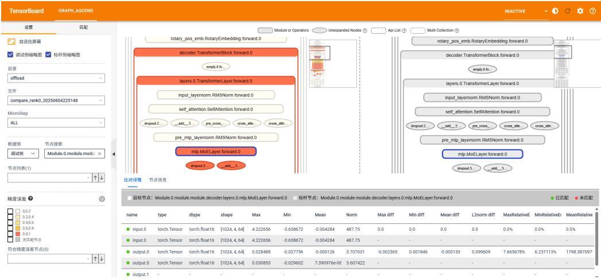  
图 2-5 分级可视化构图比对

由于本样例在dump数据时"level"配置为"L1"，故采集到模型结构数据为空，分级可视化构图时无数据，如上图为其他数据示例。

# 2.4 模型性能调优（MindSpore）

# 2.4.1 性能数据采集

# 前提条件

● 完成环境准备。根据2.2 模型开发&迁移（MindSpore）中的MindSpore部分，完成MindSpore场景的训练任务。

# 须知

在执行性能数据采集前请先将训练脚本（mindspore_main.py文件）中的2.3.2 精度数据采集相关接口删除，因为精度数据采集和性能数据采集不可同时执行。

# 执行采集

采集动作主要以MindSpore 2.7.0版本为例，若需要进行性能比对操作，也可以再采集MindSpore 2.6.0版本的性能数据。

1. 在昇腾NPU环境下的训练脚本（mindspore_main.py文件）中添加MindSporeProfiler接口工具，如下所示。在MindSpore Profiler接口采集性能数据代码样例中插入如下代码，样例中已插入下列代码，可直接复制代码使用。from mindspore.profiler import ProfilerLevel, ProfilerActivity, AicoreMetricsif __name__ $= =$ "__main__":mindspore.set_context(mode=mindspore.PYNATIVE_MODE)mindspore.set_device("Ascend")

# Init Profiler   
experimental_config $=$ mindspore.profiler._ExperimentalConfig( profiler_level=ProfilerLevel.Level0, aic_metrics=AicoreMetrics.AiCoreNone, l2_cache=False, mstx=False, data_simplification $\mid =$ False,   
)   
step $= 0$   
# Note that the Profiler should be initialized before model.train   
with mindspore.profiler.profile( activities=[ProfilerActivity.CPU, ProfilerActivity.NPU], schedule=mindspore.profiler.schedule( wait $_ { = 0 }$ , warmup $_ { = 0 }$ , active $^ { \cdot = 1 }$ , repeat=1, skip_first=0 ), on_trace_ready=mindspore.profiler.tensorboard_trace_handler("./profiling_data"), profile_memory=False, experimental_config=experimental_config,   
) as prof: # Train Model for data, label in ds.GeneratorDataset(generator_net(), ["data", "label"]): train_step(data, label) print(f"train step {step}") step $+ = 1$ prof.step() print("train finish")

# 说明

以上仅提供简单示例，若需要配置更完整的采集参数以及对应接口详细介绍请参见《mindspore.profiler.profile》。● 性能数据会占据一定的磁盘空间，可能存在磁盘写满导致服务器不可用的风险。性能数据所需空间跟模型的参数、采集开关配置、采集的迭代数量有较大关系，须用户自行保证落盘目录下的可用磁盘空间。

2. 执行训练脚本命令，工具会采集模型训练过程中的性能数据。python mindspore_main.py

3. 查看采集到的MindSpore训练性能数据结果文件。

训练结束后，在mindspore.profiler.tensorboard_trace_handler接口指定的目录下生成MindSpore Profiler接口的性能数据结果目录，如下示例。

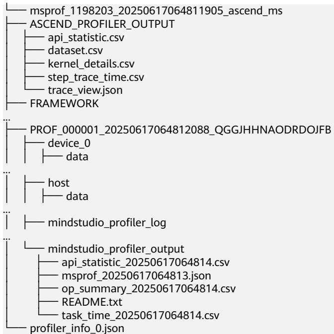

MindSpore Profiler接口采集的性能数据可以使用mstt的msprof-analyze工具进行辅助分析，也可以直接使用MindStudio Insight工具进行可视化分析，详细操作请参见2.4.2.1 使用msprof-analyze工具分析性能数据和2.4.2.2 使用MindStudioInsight工具可视化性能数据。

# 2.4.2 性能数据分析

# 2.4.2.1 使用 msprof-analyze 工具分析性能数据

前提条件

1. 完成环境准备。  
2. 完成2.4.1 性能数据采集，得到昇腾NPU环境的性能数据。  
3. 安装msprof-analyze，命令如下：pip install msprof-analyze提示出现如下信息则表示安装成功。Successfully installed msprof-analyze-{version}msprof-analyze工具详细介绍请参见《msprof-analyze》。

# 执行 msprof-analyze 分析

# 说明

以下仅提供操作指导，无具体数据分析。

msprof-analyze主要以基于通信域的迭代内耗时分析、通信时间分析以及通信矩阵分析为主，从而定位慢卡、慢节点以及慢链路问题。

操作如下：

1. 数据准备。将所有Device下的性能数据拷贝到同一目录下。  
2. 执行性能分析操作。msprof-analyze -m all -d \$HOME/profiling data/分析结果在-d参数指定目录下生成cluster_analysis_output文件夹并输出cluster_step_trace_time.csv、cluster_communication_matrix.json、cluster_communication.json文件。更多介绍请参见《msprof-analyze》。集群分析工具的交付件通过MindStudio Insight工具展示，详细操作请参见2.4.2.2使用MindStudio Insight工具可视化性能数据。

# 执行 advisor 分析

msprof-analyze的advisor功能是将MindSpore Profiler采集并解析出的性能数据进行分析，并输出性能调优建议。

命令如下：

msprof-analyze advisor all -d \$HOME/profiling data/

分析结果输出相关简略建议到执行终端中，并在命令执行目录下生成“mstt_advisor_{timestamp}.html”和“/log/mstt_advisor_{timestamp}.xlsx”文件供用户查看。

advisor工具的分析结果主要提供可能存在性能问题的专家建议。

详细结果介绍请参见《advisor》中的“报告解析”。

# 执行 compare_tools 性能比对

compare_tools功能用于对比不同框架或其他软件版本下，采集同一训练工程昇腾NPU环境性能数据之间的差异。

# 命令如下：

msprof-analyze compare -d \$HOME/2.7.0/profiling_data/\*_ascend_ms -bp \$HOME/2.6.0/profiling_data/ \*_ascend_ms --output_path ./compare_result/profiler_compare

分析结果输出到执行终端中，并在--output_path参数指定路径下生成“performance_comparison_result_{timestamp}.xlsx”文件供用户查看。

性能比对工具将总体性能拆解为训练耗时和内存占用，其中训练耗时可拆分为算子（包括nn.Module）、通信、调度三个维度，并打印输出总体指标，帮助用户定位劣化的方向。与此同时，工具还会在“performance_comparison_result_{timestamp}.xlsx”文件中展示每个算子在执行耗时、通信耗时、内存占用的优劣，可通过DIFF列大于0筛选出劣化算子。此处不提供示例，详细结果介绍请参见《性能比对工具》中的“比对结果说明” 。

# 2.4.2.2 使用 MindStudio Insight 工具可视化性能数据

2.4.1 性能数据采集生成的性能数据均可以使用MindStudio Insight工具将性能数据可视化。  
执行msprof-analyze分析时，输出的交付件需要使用MindStudio Insight工具将数据可视化。

# 前提条件

完成2.4.1 性能数据采集或执行msprof-analyze分析，获取对应交付件。

# 操作步骤

1. 安装MindStudio Insight。

参见《MindStudio Insight工具用户指南》中的“安装与卸载”章节下载并安装MindStudio Insight。  
MindStudio Insight可视化工具推荐在Windows环境使用。

2. 双击桌面的MindStudio Insight快捷方式图标，启动MindStudio Insight。

3. 导入性能数据。

a. 将2.4.1 性能数据采集或执行msprof-analyze分析的性能数据拷贝至Windows环境。  
b. 单击MindStudio Insight界面左上方“导入数据”，在弹框中选择性能数据文件或目录，然后单击“确认”进行导入，如下所示。

×

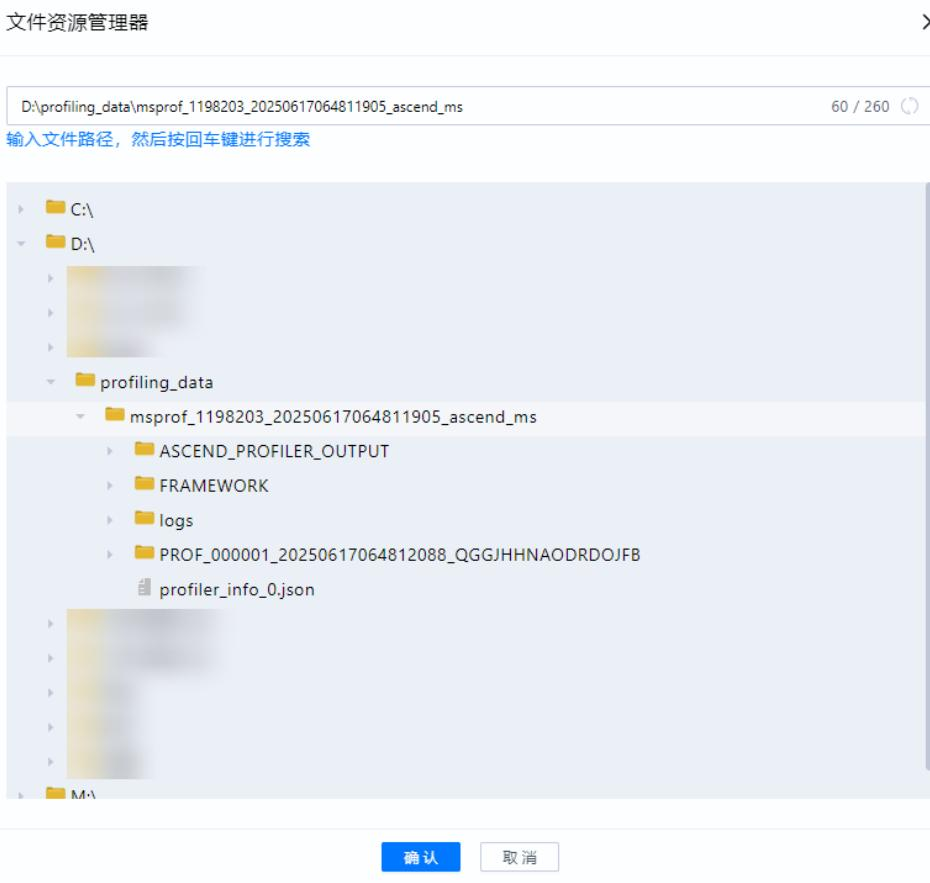  
图 2-6 导入性能数据

  
图 2-7 展示性能数据

# 4. 分析性能数据。

MindStudio Insight工具将性能数据可视化后可以更直观地分析性能瓶颈，详细分析方法请参见《MindStudio Insight工具用户指南》。

# 2.5 代码样例（MindSpore）

# MindSpore 昇腾 NPU 环境训练脚本样例

import mindspore as ms import numpy as np import mindspore mindspore.set_device("Ascend") import mindspore.mint as mint import mindspore.dataset as ds from mindspore import nn

class Net(nn.Cell): def __init__(self): super(Net, self).__init__() self.fc $=$ nn.Dense(2, 2)

def generator_net(): for _ in range(10): yield np.ones([2, 2]).astype(np.float32), np.ones([2]).astype(np.int32)

def forward_fn(data, label): logits $=$ model(data) loss $=$ loss_fn(logits, label) return loss, logits

model $=$ Net()   
optimizer $=$ nn.Momentum(model.trainable_params(), 1, 0.9)   
loss_fn $=$ nn.SoftmaxCrossEntropyWithLogits(sparse $\risingdotseq$ True)   
grad_fn $=$ mindspore.value_and_grad(forward_fn, None, optimizer.parameters, has_aux=True)   
# 定义单步训练的功能   
def train_step(data, label): (loss, _), grads $=$ grad_fn(data, label) optimizer(grads) return loss   
$\underbrace { \phantom { \left( i \alpha \ln \alpha \ln \alpha \ln \alpha \ln \alpha \ln \alpha \ln \alpha \ln \alpha \right) } } _ { \mathsf { s t e p } = 0 } = = \ " \underbrace { \phantom { \left( i \alpha \ln \alpha \ln \alpha \ln \alpha \ln \alpha \ln \alpha \ln \alpha \ln \alpha \ln \alpha \ln \alpha \ln \alpha \ln \alpha \right) } } _ { } .$   
# 训练模型   
for data, label in ds.GeneratorDataset(generator_net(), ["data", "label"]): train_step(data, label) print(f"train step {step}") step $+ = 1$   
print("train finish")

# MindSpore 训练前配置检查代码样例

from msprobe.core.config_check import ConfigChecker   
ConfigChecker.apply_patches(fmk="mindspore")   
import mindspore as ms   
import numpy as np   
import mindspore   
mindspore.set_device("Ascend")

def forward_fn(data, label): logits $=$ model(data) loss $=$ loss_fn(logits, label) return loss, logits

model $=$ Net()   
optimizer $=$ nn.Momentum(model.trainable_params(), 1, 0.9)   
loss_fn $=$ nn.SoftmaxCrossEntropyWithLogits(sparse $\mathrel { \mathop : } =$ True)   
grad_fn $=$ mindspore.value_and_grad(forward_fn, None, optimizer.parameters, has_aux=True)   
# 定义单步训练的功能   
def train_step(data, label): (loss, _), grads $=$ grad_fn(data, label) optimizer(grads) return loss   
${ \mathsf { i f } } \underbrace { \mathsf { n a m e } } _ { { \mathsf { s t e p } } = 0 } = = { \mathsf { " } } \underbrace { \mathsf { m a i n \_ } } _ { { \mathsf { s t e p } } = { \mathsf { 0 } } } .$ _":   
from msprobe.core.config_check import ConfigChecker   
ConfigChecker(model=model, output_zip_path $| = "$ ./config_check_pack.zip", fmk $: = ^ { 1 }$ "mindspore")   
# 训练模型   
for data, label in ds.GeneratorDataset(generator_net(), ["data", "label"]): train_step(data, label) print(f"train step {step}") step $+ = 1$   
print("train finish")

# MindSpore 精度数据采集代码样例

import mindspore as ms   
import numpy as np   
import mindspore   
mindspore.set_device("Ascend")   
import mindspore.mint as mint   
import mindspore.dataset as ds   
from mindspore import nn   
from msprobe.mindspore import PrecisionDebugger   
debugger $=$ PrecisionDebugger(config_path $| = "$ ./config.json")

class Net(nn.Cell): def __init__(self): super(Net, self).__init__() self.fc $=$ nn.Dense(2, 2)

def construct(self, x):# 先经过全连接y = self.fc(x)# 调用mint.add，计算y与其自身的和# 也可以根据需求改成 mint.add $( \mathsf { x } , \mathsf { x } )$ 或者mint.add(y, x)z = mint.add(y, y)return z

def generator_net(): for _ in range(10): yield np.ones([2, 2]).astype(np.float32), np.ones([2]).astype(np.int32)

def forward_fn(data, label): logits $=$ model(data) loss $=$ loss_fn(logits, label) return loss, logits

model $=$ Net()   
optimizer $=$ nn.Momentum(model.trainable_params(), 1, 0.9)   
loss_fn $=$ nn.SoftmaxCrossEntropyWithLogits(sparse $\mathrel { \mathop : } =$ True)   
grad_fn $=$ mindspore.value_and_grad(forward_fn, None, optimizer.parameters, has_aux=True)   
# 定义单步训练的功能   
def train_step(data, label): (loss, _), grads $=$ grad_fn(data, label) optimizer(grads) return loss

if $\begin{array} { c } { { \underline { { { \mathsf { n a m e } } } } _ { - } = = \ " { \mathsf { m a i n } } _ { - } " } } \\ { { \mathsf { s t e p } = 0 } } \end{array}$ # 训练模型 for data, label in ds.GeneratorDataset(generator_net(), ["data", "label"]): debugger.start(model) train_step(data, label) print(f"train step {step}") step $+ = 1$ debugger.stop() debugger.step() print("train finish")

# MindSpore Profiler 接口采集性能数据代码样例

import mindspore as ms   
import numpy as np   
import mindspore   
mindspore.set_device("Ascend")   
import mindspore.mint as mint   
import mindspore.dataset as ds   
from mindspore import nn   
from mindspore.profiler import ProfilerLevel, ProfilerActivity, AicoreMetrics   
class Net(nn.Cell): def __init__(self): super(Net, self).__init__() self.fc $=$ nn.Dense(2, 2) def construct(self, x): # 先经过全连接 y $=$ self.fc(x) # 调用mint.add，计算y与其自身的和 # 也可以根据需求改成 mint.add $( \mathsf { x } , \mathsf { x } )$ 或者mint.add(y, x) $z =$ mint.add(y, y) return z   
def generator_net(): for _ in range(10): yield np.ones([2, 2]).astype(np.float32), np.ones([2]).astype(np.int32)   
def forward_fn(data, label): logits $=$ model(data) loss $=$ loss_fn(logits, label) return loss, logits   
model $=$ Net()   
optimizer $=$ nn.Momentum(model.trainable_params(), 1, 0.9)   
loss_fn $=$ nn.SoftmaxCrossEntropyWithLogits(sparse $\mathrel { \mathop : } =$ True)   
grad_fn $=$ mindspore.value_and_grad(forward_fn, None, optimizer.parameters, has_aux=True)   
# 定义单步训练的功能   
def train_step(data, label): (loss, _), grads $=$ grad_fn(data, label) optimizer(grads) return loss   
if __name__ $= =$ "__main__": mindspore.set_context(mode $\varprojlim$ mindspore.PYNATIVE_MODE) mindspore.set_device("Ascend") # Init Profiler experimental_config $=$ mindspore.profiler._ExperimentalConfig( profiler_level=ProfilerLevel.Level0, aic_metrics=AicoreMetrics.AiCoreNone, l2_cache=False, mstx=False, data_simplification=False ) step $= 0$ # Note that the Profiler should be initialized before model.train with mindspore.profiler.profile( activities=[ProfilerActivity.CPU, ProfilerActivity.NPU], schedul mindspore.profiler.schedule( wait=0, warmup $\scriptstyle 1 = 0$ , active $^ { = 1 }$ , repeat=1, skip_first=0 ), on_trace_ready=mindspore.profiler.tensorboard_trace_handler("./profiling_data"), profile_memory=False, experimental_config=experimental_config, ) as prof: # 训练模型 for data, label in ds.GeneratorDataset(generator_net(), ["data", "label"]): train_step(data, label) print(f"train step {step}") step $+ = 1$ prof.step() print("train finish")

# 2.6 模型开发&迁移（PyTorch）

PyTorch训练场景使用PyTorch GPU2Ascend工具，将基于GPU的训练脚本迁移为支持昇腾NPU环境的脚本，提高脚本迁移速度，降低开发者的工作量。本样例可以让开发者快速体验PyTorch GPU2Ascend工具的迁移效率。原基于GPU的训练脚本迁移成功后可在昇腾NPU环境上运行。

PyTorch GPU2Ascend工具为分析迁移工具之一，更多介绍请参见《分析迁移工具用户指南》。

# 前提条件

1. 完成环境准备。  
2. 本样例选用ResNet50模型，以“pytorch_main.py”命名为例，创建训练脚本文件，脚本内容直接拷贝PyTorch GPU环境训练脚本样例（也可以下载main.py文件）。  
3. 将“pytorch_main.py”文件上传至训练服务器的任意目录下（需保证该目录下文件的读写权限）。

# 执行迁移

需要先将基于GPU的训练脚本迁移为支持昇腾NPU环境的脚本，再执行训练。

步骤1 在训练脚本（pytorch_main.py文件）中导入自动迁移的库代码。

以PyTorch 昇腾NPU环境训练脚本样例为例。

22  
23 import torch_npu  
24 from torch_npu.contrib import transfer_to_npu  
25  
# 在23 24行插入的代码为自动迁移的库代码，可以在昇腾NPU环境下直接执行训练

步骤2 迁移完成后的训练脚本可在昇腾NPU环境上运行，执行以下训练命令。python pytorch_main.py -a resnet50 -b 32 --gpu 1 --dummy

如果训练正常进行，开始打印迭代日志，说明训练功能迁移成功，如下所示。

Using device: npu   
$= >$ creating model 'resnet50'   
$= >$ Dummy data is used!   
Epoch: [0][ 1/40037] Time 4.923 ( 4.923) Data 0.502 ( 0.502) Loss 7.0165e+00 (7.0165e $+ 0 0$ )   
Acc@1 0.00 ( 0.00) Acc@5 0.00 ( 0.00)   
Epoch: [0][ 11/40037] Time 0.061 ( 0.996) Data 0.000 ( 0.541) Loss 1.2860e+01 (1.9566e $+ 0 1$ )   
Acc@1 0.00 ( 0.00) Acc@5 0.00 ( 0.85)   
Epoch: [0][ 21/40037] Time 0.063 ( 0.551) Data 0.000 ( 0.285) Loss 9.5061e $+ 0 0$ $\cdot 1 . 5 0 3 3 \mathrm { e } { + 0 1 }$ )   
Acc@1 0.00 ( 0.00) Acc@5 0.00 ( 0.74)

步骤3 成功保存权重，说明保存权重功能迁移成功。

----结束

# 2.7 模型精度调试（PyTorch）

# 2.7.1 训练前配置检查

根据本手册的样例，需要将工具接口添加到训练脚本中进行配置检查。

# 说明

需要在GPU和昇腾NPU环境上分别执行检查。

# 前提条件

完成环境准备。

完成2.6 模型开发&迁移（PyTorch），确保在所有示例的环境可正常完成训练任务。

# 环境准备

在昇腾NPU环境下安装msprobe工具，执行如下命令：

pip install mindstudio-probe

# 执行检查

# 操作步骤如下：

1. 获取两个环境的zip包（包含影响训练精度的环境配置：环境变量、第三方库版本、训练超参、权重、数据集、随机操作）。分别在GPU和昇腾NPU环境下执行以下操作。需要注意给两个zip包不同的命名。在PyTorch训练前配置检查代码样例中插入如下代码，样例中已插入下列代码，可直接复制代码使用。

a. 在训练流程执行到的第一个Python脚本开始处插入如下代码。

1 from msprobe.core.config_check import ConfigChecker   
2 ConfigChecker.apply_patches(fmk)

fmk：训练框架，string类型，可选"pytorch"和"mindspore"，这里配置为"pytorch"。

172 from msprobe.core.config_check import ConfigChecker   
173 ConfigChecker(model, output_zip_path, fmk)

▪ model：初始化好的模型，默认不会采集权重和数据集。output_zip_path：输出zip包的路径，string类型，需要指定zip包的名称，默认为"./config_check_pack.zip"。fmk：训练框架。可选"pytorch"和"mindspore"，这里配置为"pytorch"。

c. 执行训练脚本命令。

python pytorch_main.py -a resnet50 -b 32 --gpu 1 --dummy采集完成后会得到一个zip包，里面包括各项影响精度的配置。分rank和step存储，其中step为micro_step。

2. 将两个zip包传到同一个环境下，使用如下命令进行比对。

msprobe -f pytorch config_check -c bench zip path cmp zip path -o output path其中bench_zip_path为标杆侧采集到的zip包名称，cmp_zip_path为待对比侧采集到的zip包名称。

output_path默认为"./config_check_result"。

执行以上命令后，在output_path里会生成如下数据：

bench：bench_zip_path里打包的数据。  
cmp：cmp_zip_path里打包的数据。  
result.xlsx：比对结果。会有多个sheet页，其中summary总览通过情况，其余页是具体检查项的详情，其中step为micro_step。

3. 检查通过情况。

两个环境以下五项检查均一致则通过，若不一致则需要自行调整环境：

环境变量  
第三方库版本  
数据集

权重训练超参如下所示：

filename ass_check env TRUE pip TRUE dataset TRUE weights TRUE random TRUE

# 2.7.2 训练状态监控

# 前提条件

● 完成环境准备。  
● 完成2.7.1 训练前配置检查。

# 操作步骤

1. 以执行权重梯度监控功能为例，创建配置文件。 以在训练脚本所在目录创建monitor_config.json配置文件为例，文件内容拷贝如 下示例配置。 { "targets": { }, "wg_distribution": true, "format": "csv", "ops": ["norm", "min", "max", "nans"] }

2. 在训练脚本中添加工具，如下所示。

在PyTorch训练状态监控代码样例中插入如下代码，样例中已插入下列代码，可直接复制代码使用。

23  
24 import torch_npu  
25 from torch_npu.contrib import transfer_to_npu  
26  
27 monitor $=$ TrainerMon(  
28 config_file_path="./monitor_config.json",  
29 params_have_main_grad=False, # 权重是否使用main_grad，通常megatron为True，deepspeed  
为False。默认为True。  
30 )  
...  
333 # switch to train mode  
334 model.train()  
335  
336 # 挂载监控对象  
337 monitor.set_monitor(  
338 model,  
339 grad_acc_steps=1,  
340 optimizer=optimizer,  
341 dp_group=None,  
342 tp_group=None,  
343 start_iteration $_ { = 0 }$ # 断点续训时提供当前iteration，默认从0开始  
344 )  
...

3. 执行训练脚本命令。 python pytorch_main.py -a resnet50 -b 32 --gpu 1 --dummy

4. 查看结果。

训练执行完成后在当前路径生成monitor_output目录，目录下根据时间戳生成多份结果，查看最新目录下的文件，如下所示。

图 2-8 结果文件内容  

<table><tr><td rowspan=1 colspan=1>vpp_stage name</td><td rowspan=1 colspan=1>name</td><td rowspan=1 colspan=1>step</td><td rowspan=1 colspan=1>norm</td><td rowspan=1 colspan=1>min</td><td rowspan=1 colspan=1>max</td><td rowspan=1 colspan=1>nans</td><td rowspan=1 colspan=1>shape</td><td rowspan=1 colspan=1>dtype</td></tr><tr><td rowspan=1 colspan=1></td><td rowspan=1 colspan=1> 0 fc.weight</td><td rowspan=1 colspan=1>1</td><td rowspan=1 colspan=1>3.147415</td><td rowspan=1 colspan=1>-1.64984</td><td rowspan=1 colspan=1>1.748158</td><td rowspan=1 colspan=1></td><td rowspan=1 colspan=1>0 (2.2)</td><td rowspan=1 colspan=1>Float32</td></tr><tr><td rowspan=1 colspan=1></td><td rowspan=1 colspan=1>0 fc.bias</td><td rowspan=1 colspan=1>1</td><td rowspan=1 colspan=1>2.264009</td><td rowspan=1 colspan=1>-1.49823</td><td rowspan=1 colspan=1>1.697365</td><td rowspan=1 colspan=1></td><td rowspan=1 colspan=1>0 (2)</td><td rowspan=1 colspan=1>Float32</td></tr></table>

输出结果详细介绍请参见“输出路径”。

# 2.7.3 精度数据采集

本样例选用ResNet50模型，采用虚拟数据训练，节省数据集下载时间。

# 前提条件

● 完成环境准备。  
● 完成2.7.1 训练前配置检查。

# 执行采集

1. 分别在GPU和昇腾NPU环境下的训练脚本（pytorch_main.py文件）中添加工具，如下所示。

其中在GPU环境下执行训练时，下列脚本中不需要添加24、25行。

在PyTorch精度数据采集代码样例中插入如下代码，样例中已插入下列代码，可直接复制代码使用。

23   
24 import torch_npu   
25 from torch_npu.contrib import transfer_to_npu   
26   
27 from msprobe.pytorch import PrecisionDebugger, seed_all   
28 seed_all(seed=1234, mode=True) # 固定随机种子，开启确定性计算，保证每次模型执行数据均保   
持一致   
...   
314 def train(train_loader, model, criterion, optimizer, epoch, device, args):   
...   
331 end $=$ time.time()   
332   
333 debugger $=$ PrecisionDebugger(dump_path="./dump_data", task $: = ^ { \dag }$ "tensor", step=[0, 1])   
334 for i, (images, target) in enumerate(train_loader):   
335 debugger.start()   
...   
356   
357 # measure elapsed time   
358 batch_time.update(time.time() - end)   
359 end $=$ time.time()   
360   
361 debugger.stop()   
362 debugger.step()

# 说明

精度数据会占据一定的磁盘空间，可能存在磁盘写满导致服务器不可用的风险。精度数据所需空间跟模型的参数、采集开关配置、采集的迭代数量有较大关系，须用户自行保证落盘目录下的可用磁盘空间。

2. 执行训练脚本命令，工具会采集模型训练过程中的精度数据。python pytorch main.py -a resnet50 -b 32 --gpu 1 --dummy日志打印出现如下信息即可手动停止模型训练查看采集数据，节省时间。

# 结果查看

dump_path参数指定的路径下会出现如下目录结构，可以根据需求选择合适的数据进行分析。

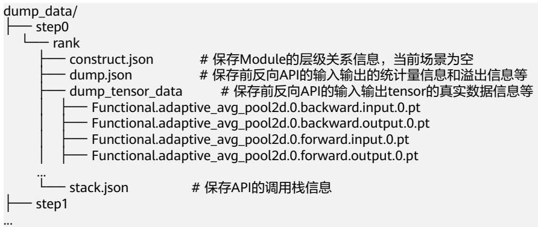

采集后的数据需要用2.7.4 精度预检和2.7.5 精度比对等工具进行进一步分析。

# 2.7.4 精度预检

# 前提条件

● 完成环境准备。  
● 完成2.7.3 精度数据采集，得到PyTorch训练场景昇腾NPU环境的精度数据。

# 执行预检

1. 数据准备。将昇腾NPU环境下dump的精度数据拷贝至GPU环境。（用于保证预检执行的精度数据一致）

分别在GPU和昇腾NPU环境下使用run_ut命令执行预检操作。（预检场景GPU环境需要使用昇腾NPU环境拷贝的精度数据）msprobe -f pytorch run_ut -api_info ./dump data/step0/rank/dump.json -o ./checker result

出现如下日志表示预检完成。

Successfully completed run_ut/multi_run_ut 此时-o参数指定的路径下会生成两个csv文件，分别为 accuracy_checking_details_{timestamp}.csv和 accuracy_checking_result_{timestamp}.csv。

这两个文件是预检的中间结果，需要完成下一步，才能得到预检的最终结果。

3. 预检结果比对。将NPU和GPU的预检结果进行比对，查看NPU数据中是否存在精度问题的API。可以将GPU上的accuracy_checking_details_{timestamp}.csv文件传到昇腾NPU环境，执行如下命令。msprobe -f pytorch api_precision_compare -npu ./npu/accuracy_checking_details_{timestamp}.csv -gpu ./gpu/accuracy_checking_details_{timestamp}.csv -o ./compare_result/accuracy_checking

4. 预检结果分析。

api_precision_compare会在./compare_result/accuracy_checking目录下生成两个csv文件。

api_precision_compare_result_{timestamp}.csv文件会详细标明API在各种比对算法下的达标情况，示例如下。

图 2-9 api_precision_compare_result_{timestamp}  

<table><tr><td rowspan=1 colspan=1>API Name</td><td rowspan=1 colspan=1>Forward Test Success</td><td rowspan=1 colspan=1>Backward Test Success</td><td rowspan=1 colspan=1>Message</td><td rowspan=1 colspan=3></td></tr><tr><td rowspan=1 colspan=1>Tensor.to.1</td><td rowspan=1 colspan=1>SKIP</td><td rowspan=1 colspan=1></td><td rowspan=1 colspan=1>APLto in b</td><td rowspan=1 colspan=3>APl to in black list or not in white list. SKIP.</td></tr><tr><td rowspan=1 colspan=1>Functional.conv pass</td><td rowspan=1 colspan=1></td><td rowspan=1 colspan=1>error</td><td rowspan=1 colspan=1></td><td rowspan=1 colspan=1></td><td rowspan=1 colspan=1></td><td rowspan=1 colspan=1></td></tr><tr><td rowspan=1 colspan=1>Tensor.add_.0 pass</td><td rowspan=1 colspan=1></td><td rowspan=1 colspan=1></td><td rowspan=1 colspan=1></td><td rowspan=1 colspan=1></td><td rowspan=1 colspan=1></td><td rowspan=1 colspan=1></td></tr><tr><td rowspan=1 colspan=1>Functional.batc pass</td><td rowspan=1 colspan=1></td><td rowspan=1 colspan=1>pass</td><td rowspan=1 colspan=1></td><td rowspan=1 colspan=1></td><td rowspan=1 colspan=1></td><td rowspan=1 colspan=1></td></tr><tr><td rowspan=1 colspan=1>Functional.relu.lpass</td><td rowspan=1 colspan=1></td><td rowspan=1 colspan=1>pass</td><td rowspan=1 colspan=1></td><td rowspan=1 colspan=1></td><td rowspan=1 colspan=1></td><td rowspan=1 colspan=1></td></tr></table>

api_precision_compare_details_{timestamp}.csv文件会标明每个API是否通过测试，示例如下。

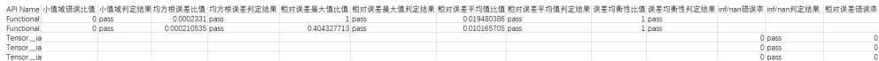  
图 2-10 api_precision_compare_details_1  
图 2-11 api_precision_compare_details_2

<table><tr><td colspan="10">相对差判定结果绝对误差错误率绝对课差判定结果二进制一致错误率二进制一致错误率判定结果UP误差平均值ULP误差大于周值占比UP买差大于阀值占比值ULP课差判定结果双千指标双千指标判定站果比对结果比对法MeS8ge</td></tr><tr><td></td><td></td><td></td><td></td><td></td><td></td><td></td><td></td><td>pass 标杆比对法 标杆比对法</td><td></td></tr><tr><td>pass</td><td>0pass</td><td></td><td></td><td></td><td></td><td></td><td></td><td>pass pass 绝对阈值法</td><td></td></tr><tr><td>pass</td><td>0pass</td><td></td><td></td><td></td><td></td><td></td><td></td><td>pass</td><td>绝对阈值法</td></tr><tr><td>pass</td><td>0pass</td><td></td><td></td><td></td><td></td><td></td><td>pass</td><td>绝对阅值法 二进制一致法</td><td></td></tr><tr><td></td><td></td><td></td><td>0 pass 0 pass</td><td></td><td></td><td></td><td></td><td>pass pass</td><td>二进制一致法</td></tr></table>

更多比对结果字段含义请参见“预检结果比对” 。

# 2.7.5 精度比对

# 2.7.5.1 compare 精度比对

# 前提条件

完成环境准备。  
完成2.7.3 精度数据采集，得到GPU和昇腾NPU环境的精度数据。

# 执行比对

1. 数据准备。完成前提条件中GPU和昇腾NPU环境的数据dump后，将GPU环境下dump的精度数据拷贝至昇腾NPU环境。注意区分dump_path指定的目录名称，以dump_data_npu和dump_data_gpu为例。

2. 创建比对配置文件。

以在训练脚本所在目录创建compare.json配置文件为例，文件内容拷贝如下示例 配置。   
{   
"npu_path": "./dump_data_npu/step0/rank/dump.json",   
"bench_path": "./dump_data_gpu/step0/rank/dump.json",   
"stack_path": "./dump_data_npu/step0/rank/stack.json",   
"is_print_compare_log": true   
其中"npu_path"和"bench_path"对应的路径需要在同一环境下。

3. 执行比对。

# 命令如下：

msprobe -f pytorch compare -i ./compare.json -o ./compare result/accuracy compare -s

出现如下打印说明比对成功：   
Compare result is /xxx/compare_result/accuracy_compare/compare_result_{timestamp}.xlsx ...   
The advisor summary is saved in: /xxx/compare_result/accuracy_compare/advisor_{timestamp}.txt \*\*\*\*\*\*\*\*\*\*\*\*\*\*\*\*\*\*\*\*\*\*\*\*\*\*\*\*\*\*\*\*\*\*\*\*\*\*\*\*\*\*\*\*\*\*\*\*\*\*\*\*\*\*\*\*\*\*\*\*\*\*\*\*\*\*\*\*\*\*\*\*   
\* msprobe compare ends successfully. \*   
\*\*\*\*\*\*\*\*\*\*\*\*\*\*\*\*\*\*\*\*\*\*\*\*\*\*\*\*\*\*\*\*\*\*\*\*\*\*\*\*\*\*\*\*\*\*\*\*\*\*\*\*\*\*\*\*\*\*\*\*\*\*\*\*\*\*\*\*\*\* \*\*\*\*\*\*\*\*\*\*\*\*\*\*

4. 比对结果文件分析。

compare会在./compare_result/accuracy_compare生成如下文件。

advisor_{timestamp}.txt：文件中给出了可能存在精度问题的API的专家建议。

compare_result_{timestamp}.xlsx：文件列出了所有执行精度比对的API详细信息和比对结果，可通过颜色标记、比对结果（Result）、计算精度达标情况（Accuracy Reached or Not）、错误信息提示（Err_Message）定位可疑算子，但鉴于每种指标都有对应的判定标准，还需要结合实际情况进行判断。

示例如下：

<table><tr><td>NPU Nane Bench Name NPU Dtype Bench Dtype NPU Tensor Shape Bench Tensor Shape CosineE</td><td rowspan="2"></td><td colspan="3"></td><td colspan="3" rowspan="2"></td><td rowspan="2">EucDist MaxAbsErr HaxRelativeErr One Thousandth Err RatioFive Thousandths Err Ratio</td><td rowspan="2"></td></tr><tr><td>PrinitivePrinitive.s.Float32Float32</td><td>[2，2]</td><td></td><td>1 0</td><td>0</td></tr><tr><td>PrinitivePrinitive.s&lt;class &#x27;ii&lt;class&#x27;int&#x27;[]</td><td></td><td>[2，2]</td><td>[]</td><td></td><td></td><td>0 unsupportunsupportunsupporteunsupported</td><td></td><td>unsupported</td><td>1 1 unsupported</td></tr><tr><td>PrinitivePrinitive.s&lt;class&#x27;ii&lt;class&#x27;int&#x27;</td><td></td><td></td><td>[]</td><td></td><td></td><td>unsupportunsupportunsupporteunsupported</td><td></td><td>unsupported</td><td>unsupported</td></tr><tr><td>PrinitivePrinitive.nFloat32</td><td>Float32</td><td>[2，2]</td><td>[2，2]</td><td>1</td><td>0</td><td>0</td><td>0</td><td>1</td><td>1</td></tr><tr><td>PrinitivePrinitive.nFloat32</td><td>Float32</td><td>[2,2]</td><td>[2,2]</td><td></td><td>-0.042861.1018450.8777292</td><td></td><td>3.340457201</td><td>0</td><td>0. 25</td></tr><tr><td>PrinitivePrinitive.nFloat32</td><td>Float32</td><td>[2, 2]</td><td>[2, 2]</td><td></td><td>-0. 63931 1. 520217 0.8458862</td><td></td><td>1.705933094</td><td>0</td><td></td></tr><tr><td>PrinitivePrinitive.bFloat32</td><td>Float32</td><td>[2,2]</td><td></td><td></td><td>-0.639311.5202170.8458862</td><td></td><td>1.705933094</td><td>0</td><td></td></tr><tr><td>PrinitivePrinitive.bFloat32</td><td>Float32</td><td>[2]</td><td>[2，2] [2]</td><td></td><td>-0.947970.4425670. 4414971</td><td></td><td>3.220219851</td><td>0</td><td>0 0</td></tr><tr><td>PrinitivePrinitive.bFloat32</td><td>Float32</td><td>[2, 2]</td><td>[2, 2]</td><td></td><td>-0.93682 1.994565 1.1048271</td><td></td><td>1.847505689</td><td>0</td><td></td></tr><tr><td>Hint.add.Mint. add. 0. Float32</td><td>Float32</td><td>[2,2]</td><td>[2,2]</td><td></td><td>-0. 93682 1. 9945651.1048271</td><td></td><td>1. 847505689</td><td>0</td><td></td></tr><tr><td></td><td></td><td></td><td></td><td></td><td></td><td></td><td></td><td></td><td></td></tr></table>

图 2-13 compare_result_2  

<table><tr><td>NPU max</td><td></td><td>NPU nin NPU nean NPU 12norn Bench nax</td><td></td><td></td><td></td><td></td><td></td><td></td><td></td><td>Bench nin Bench mean Bench l2norn Accuracy Reached or Not Err_message NPU_Stack_Info Data_nane</td><td></td><td></td><td></td></tr><tr><td></td><td>1</td><td>1</td><td></td><td>1</td><td>2</td><td>1</td><td>1</td><td></td><td>1</td><td>2Yes</td><td></td><td>[&#x27;File/root/nii[&#x27;Primitive.</td><td></td></tr><tr><td></td><td>2</td><td>2</td><td>2</td><td></td><td></td><td>2</td><td>2</td><td>2</td><td></td><td>2 None</td><td>No bench daiN/A</td><td></td><td>[&#x27;-1&#x27;，&#x27;-1&#x27;]</td></tr><tr><td></td><td>2</td><td>2</td><td>2</td><td></td><td>2</td><td>2</td><td>2</td><td></td><td></td><td>2None</td><td>No bench daiN/A</td><td></td><td>[-1，-1</td></tr><tr><td></td><td></td><td>1</td><td></td><td></td><td>2</td><td></td><td>1</td><td>1</td><td></td><td>2Yes</td><td></td><td>[&#x27;File/root/nii[&#x27;Primitive.</td><td></td></tr><tr><td></td><td></td><td></td><td></td><td></td><td>0.46614-0.45160.0911330.700000940.14570849-0.641519-0.2861945</td><td></td><td></td><td></td><td>0.821441412No</td><td></td><td>N/A</td><td></td><td>[&#x27;Primitive.</td></tr><tr><td></td><td></td><td></td><td></td><td></td><td>0.35004 0.0144  0.18222 0. 49544549 -0. 4958496 -0. 648926 -0.5723877</td><td></td><td></td><td></td><td>1. 154964447 No</td><td></td><td> The input/p&amp;N/A</td><td></td><td>[&#x27; Primitive</td></tr><tr><td></td><td></td><td></td><td></td><td></td><td>0.350040.01440.182220.49544549-0.4958496-0.648926-0.5723877</td><td></td><td></td><td></td><td>1.154964447 No</td><td></td><td></td><td>[&#x27;File/root/niil&#x27;Primitive.</td><td></td></tr><tr><td></td><td>0.30440.05211</td><td></td><td></td><td></td><td>0.178250.308822930.02134891-0.137102-0.0578763</td><td></td><td></td><td></td><td>0.138753757No</td><td></td><td>N/A</td><td></td><td>[&#x27;Primitive.</td></tr><tr><td>0. 40214</td><td></td><td></td><td></td><td></td><td>0.31880.3604710.72574306-0.4745007-0. 786027</td><td></td><td></td><td>-0. 630264</td><td>0.40214 0.3188 0.360471 0.72574306 -0.4745007 -0.786027 -0.6302641.298452735 No 1.298452735 No</td><td></td><td>The output&#x27;sN/A</td><td>[&#x27;File/root/nii[&#x27;Mint.add.</td><td>[&#x27;Primitive.</td></tr></table>

# 更多比对结果分析请参见“精度比对结果分析”

# 2.7.5.2 分级可视化构图比对

# 前提条件

● 完成环境准备。安装tb-graph-ascend。pip install tb-graph-ascend完成2.7.3 精度数据采集。

# 操作步骤

1. 创建比对配置文件。

以在训练脚本所在目录创建compare.json配置文件为例，文件内容拷贝如下示例配置。

"npu_path": "./dump_data_npu", "bench_path": "./dump_data_gpu", "is_print_compare_log": true

其中"npu_path"和"bench_path"对应的路径需要在同一环境下。

2. 执行图构建比对。 msprobe -f pytorch graph -i ./compare.json -o ./output

比对完成后在./output下生成vis后缀文件。

3. 启动TensorBoard。 tensorboard --logdir ./output --bind_all

--logdir指定的路径即为2中的./output路径。

执行以上命令后打印如下日志。

TensorBoard 2.19.0 at http://ubuntu:6008/ (Press CTRL $+ \mathsfit { C }$ to quit)

需要在Windows环境下打开浏览器，访问地址http://ubuntu:6008/，其中ubuntu修改为服务器的IP地址，例如http://192.168.1.10:6008/。

访问地址成功后页面显示TensorBoard界面，如下所示。

  
图 2-14 分级可视化构图比对

由于本样例在dump数据时"level"配置为"L1"，故采集到模型结构数据为空，分级可视化构图时无数据，如上图为其他数据示例。

# 2.8 模型性能调优（PyTorch）

# 2.8.1 性能数据采集

# 前提条件

完成环境准备。

完成2.6 模型开发&迁移（PyTorch）中的PyTorch部分，得到可正常执行训练任务的GPU和昇腾NPU环境。

# 须知

在执行性能数据采集前请先将训练脚本（pytorch_main.py文件）中的2.7.3 精度数据采集精度数据采集相关接口删除，因为精度数据采集和性能数据采集不可同时执行。

# 执行采集

1. 在昇腾NPU环境下的训练脚本（pytorch_main.py文件）中添加Ascend PyTorchProfiler接口工具，如下所示。

在Ascend PyTorch Profiler接口采集性能数据代码样例中插入如下代码，样例中已插入下列代码，可直接复制代码使用。

23   
24 import torch_npu   
25 from torch_npu.contrib import transfer_to_npu   
26   
...   
318 model.train()   
320 end $=$ time.time()   
321 experimental_config $=$ torch_npu.profiler._ExperimentalConfig(   
322 profiler_level=torch_npu.profiler.ProfilerLevel.Level0,   
323 data_simplification=False)   
324 with torch_npu.profiler.profile(   
325 activities=[   
326 torch_npu.profiler.ProfilerActivity.CPU,   
327 torch_npu.profiler.ProfilerActivity.NPU   
328 ],   
329 schedule=torch_npu.profiler.schedule(wait=0, warmup $_ { 1 = 0 }$ , active=1, repeat=1, skip_first=1),   
330 on_trace_ready=torch_npu.profiler.tensorboard_trace_handler("./profiling_data"),   
331 experimental_config=experimental_config) as prof:   
332 for i, (images, target) in enumerate(train_loader):   
...   
355 # measure elapsed time   
356 batch_time.update(time.time() - end)   
357 end $=$ time.time()   
358   
359 prof.step()   
...

# 说明

以上仅提供简单示例，若需要配置更完整的采集参数以及对应接口详细介绍请参见《性能调优工具用户指南》中的“Ascend PyTorch调优工具” 。  
性能数据会占据一定的磁盘空间，可能存在磁盘写满导致服务器不可用的风险。性能数据所需空间跟模型的参数、采集开关配置、采集的迭代数量有较大关系，须用户自行保证落盘目录下的可用磁盘空间。

2. 执行训练脚本命令，工具会采集模型训练过程中的性能数据。python pytorch_main.py -a resnet50 -b 32 --gpu 1 --dummy

3. 查看采集到的PyTorch训练性能数据结果文件。

训练结束后，在torch_npu.profiler.tensorboard_trace_handler接口指定的目录下生成Ascend PyTorch Profiler接口的性能数据结果目录，如下示例。

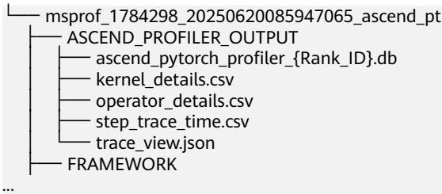

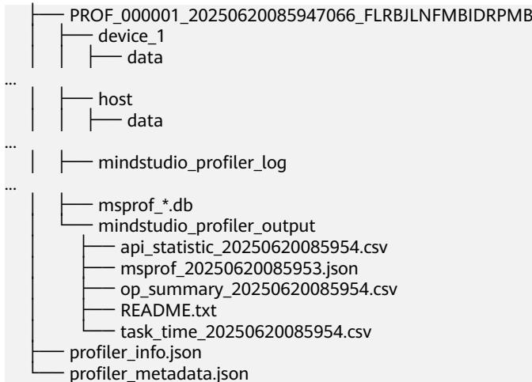

Ascend PyTorch Profiler接口采集的性能数据可以使用mstt的msprof-analyze工具进行辅助分析，也可以直接使用MindStudio Insight工具进行可视化分析，详细操作请参见2.8.2.1 使用msprof-analyze工具分析性能数据和2.8.2.2 使用MindStudio Insight工具可视化性能数据。

# 2.8.2 性能数据分析

# 2.8.2.1 使用 msprof-analyze 工具分析性能数据

前提条件

1. 完成环境准备。  
2. 完成2.8.1 性能数据采集，得到昇腾NPU环境的性能数据。  
3. 安装msprof-analyze，命令如下：pip install msprof-analyze提示出现如下信息则表示安装成功。Successfully installed msprof-analyze-{version}msprof-analyze工具详细介绍请参见《msprof-analyze》。

# 执行 msprof-analyze 分析

# 说明

以下仅提供操作指导，无具体数据分析。

msprof-analyze主要以基于通信域的迭代内耗时分析、通信时间分析以及通信矩阵分析为主，从而定位慢卡、慢节点以及慢链路问题。

操作如下：

1. 数据准备。将所有Device下的性能数据拷贝到同一目录下。  
2. 执行性能分析操作。msprof-analyze -m all -d \$HOME/profiling_data/分析结果在-d参数指定目录下生成cluster_analysis_output文件夹并输出cluster_analysis.db文件。更多介绍请参见《msprof-analyze》。

集群分析工具的交付件通过MindStudio Insight工具展示，详细操作请参见2.8.2.2使用MindStudio Insight工具可视化性能数据。

# 执行 advisor 分析

msprof-analyze的advisor功能是将Ascend PyTorch Profiler采集并解析出的性能数据进行分析，并输出性能调优建议。

命令如下：

msprof-analyze advisor all -d \$HOME/profiling data/

分析结果输出相关简略建议到执行终端中，并在命令执行目录下生成“mstt_advisor_{timestamp}.html”和“/log/mstt_advisor_{timestamp}.xlsx”文件供用户查看。

advisor工具的分析结果主要提供可能存在性能问题的专家建议。

详细结果介绍请参见《advisor》中的“报告解析” 。

# 执行 compare_tools 性能比对

compare_tools功能用于对比训练工程从GPU迁移至昇腾NPU环境前后的性能差异，或不同版本的昇腾NPU环境性能数据之间的差异。

操作如下：

1. 将GPU环境下的性能数据拷贝到昇腾NPU环境。  
2. 执行性能比对操作。msprof-analyze compare -d \$HOME/npu/profiling_data/\*_ascend_pt -bp \$HOME/gpu/profiling_data/\*_ascend_pt --output_path ./compare_result/profiler_compare分析结果输出到执行终端中，并在--output_path参数指定路径下生成“performance_comparison_result_{timestamp}.xlsx”文件供用户查看。性能比对工具将总体性能拆解为训练耗时和内存占用，其中训练耗时可拆分为算子（包括nn.Module）、通信、调度三个维度，并打印输出总体指标，帮助用户定位劣化的方向。与此同时，工具还会在“performance_comparison_result_{timestamp}.xlsx”文件中展示每个算子在执行耗时、通信耗时、内存占用的优劣，可通过DIFF列大于0筛选出劣化算子。此处不提供示例，详细结果介绍请参见《性能比对工具》中的“比对结果说明” 。

# 2.8.2.2 使用 MindStudio Insight 工具可视化性能数据

2.8.1 性能数据采集生成的性能数据均可以使用MindStudio Insight工具将性能数据可视化。  
执行msprof-analyze分析时，输出的交付件需要使用MindStudio Insight工具将数据可视化。

# 前提条件

完成2.8.1 性能数据采集或执行msprof-analyze分析，获取对应交付件。

# 操作步骤

1. 安装MindStudio Insight。参见《MindStudio Insight工具用户指南》中的“安装与卸载”章节下载并安装MindStudio Insight。

MindStudio Insight可视化工具推荐在Windows环境使用。

2. 双击桌面的MindStudio Insight快捷方式图标，启动MindStudio Insight。

3. 导入性能数据。

a. 将2.8.1 性能数据采集或执行msprof-analyze分析的性能数据拷贝至Windows环境。

b. 单击MindStudio Insight界面左上方“导入数据”，在弹框中选择性能数据文件或目录，然后单击“确认”进行导入，如下所示。

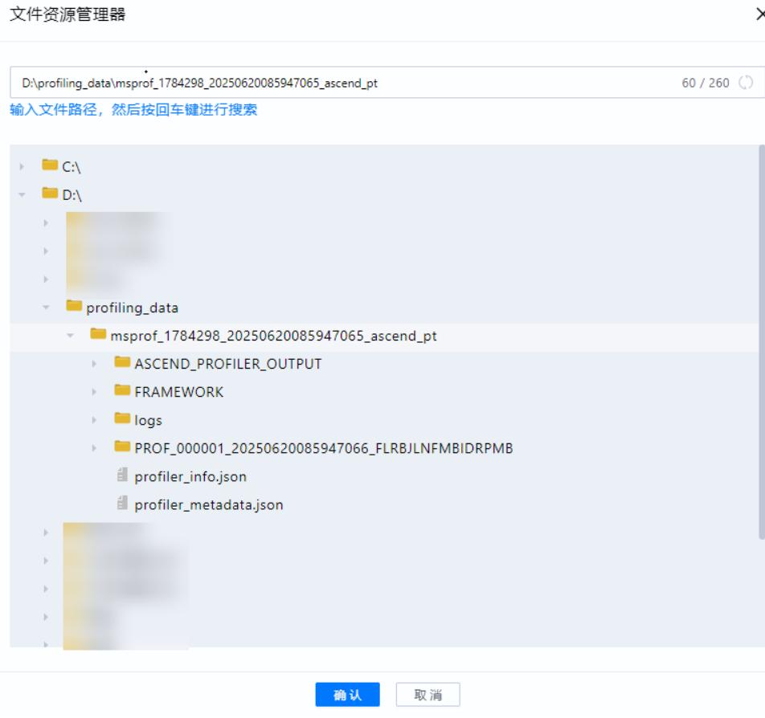  
图 2-15 导入性能数据

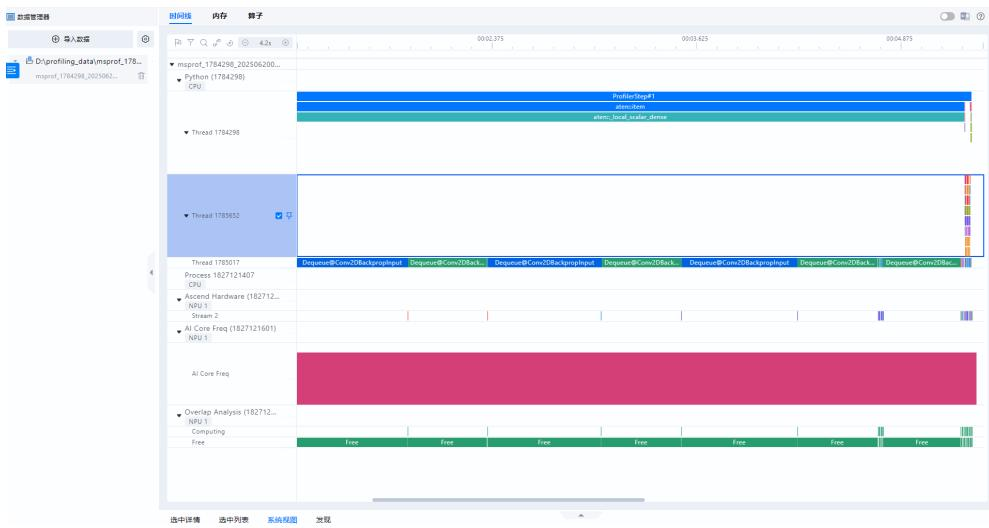  
图 2-16 展示性能数据

# 4. 分析性能数据。

MindStudio Insight工具将性能数据可视化后可以更直观地分析性能瓶颈，详细分析方法请参见《MindStudio Insight工具用户指南》。

# 2.9 代码样例（PyTorch）

# PyTorch GPU 环境训练脚本样例

import argparse   
import os   
import random   
import shutil   
import time   
import warnings   
from enum import Enum   
import torch   
import torch.backends.cudnn as cudnn   
import torch.distributed as dist   
import torch.multiprocessing as mp   
import torch.nn as nn   
import torch.nn.parallel   
import torch.optim   
import torch.utils.data   
import torch.utils.data.distributed   
import torchvision.datasets as datasets   
import torchvision.models as models   
import torchvision.transforms as transforms   
from torch.optim.lr_scheduler import StepLR   
from torch.utils.data import Subset

model_names $=$ sorted(name for name in models.__dict__ if name.islower() and not name.startswith("__") and callable(models.__dict__[name]))

parser $=$ argparse.ArgumentParser(description $| = "$ PyTorch ImageNet Training')   
parser.add_argument('data', metava $" = "$ DIR', nargs='?', default='imagenet', help $| = "$ path to dataset (default: imagenet)')   
parser.add_argument('-a', '--arch', metava $\mathrel { \mathop : } \frac { - 1 } { 2 }$ ARCH', default='resnet18', choices=model_names, help='model architecture: ' $^ +$ ' | '.join(model_names) $^ +$ ' (default: resnet18)')   
parser.add_argument('-j', '--workers', default=4, type=int, metavar='N', help $| = "$ number of data loading workers (default: 4)')   
parser.add_argument('--epochs', defaul $\mathtt { \_ 9 0 }$ , type=int, metava $\mathsf { \Gamma } = " \mathsf { N } ^ { \prime }$ , hel $\dagger { = } ^ { \prime }$ number of total epochs to run')   
parser.add_argument('--start-epoch', default=0, type=int, metavar $\mathbf { \vec { \mu } } = \mathsf { N } ^ { \prime }$ , hel $\dagger { = } ^ { \prime }$ manual epoch number (useful on restarts)')   
parser.add_argument('-b', '--batch-size', default=256, type=int, metavar $\mathbf { \Lambda } = " \mathbb { N } \mathbf { \Lambda }$ , hel $\dagger { = } ^ { \prime }$ mini-batch size (default: 256), this is the total ' 'batch size of all GPUs on the current node when 'using Data Parallel or Distributed Data Parallel')   
parser.add_argument('--lr', '--learning-rate', defaul $_ { : = 0 . 1 }$ , type $\varprojlim$ float, metavar='LR', help='initial learning rate', dest='lr')   
parser.add_argument('--momentum', defaul $_ { = 0 . 9 }$ , type=float, metavar='M', hel $\dagger { = } ^ { \prime }$ momentum')   
parser.add_argument('--wd', '--weight-decay', default=1e-4, type $\varprojlim 2$ float, metavar='W', help='weight decay (default: 1e-4)', dest='weight_decay')   
parser.add_argument('-p', '--print-freq', default=10, type=int, metavar='N', help='print frequency (default: 10)')   
parser.add_argument('--resume', default='', type=str, metavar='PATH', hel $\dagger { = } ^ { \prime }$ path to latest checkpoint (default: none)')   
parser.add_argument('-e', '--evaluate', dest='evaluate', action $= "$ store_true', help='evaluate model on validation set')   
parser.add_argument('--pretrained', dest='pretrained', action $\dagger { } = \dagger { }$ store_true', help $| = "$ use pre-trained model')   
parser.add_argument('--world-size', default=-1, type=int, hel $\dagger { = } ^ { \prime }$ number of nodes for distributed training')   
parser.add_argument('--rank', default=-1, type=int, help='node rank for distributed training')   
parser.add_argument('--dist-url', default='tcp://224.66.41.62:23456', type $\because$ str, hel $\dagger { = } ^ { \prime }$ url used to set up distributed training')   
parser.add_argument('--dist-backend', default='nccl', type=str, help $| = "$ distributed backend')   
parser.add_argument('--seed', default=None, type=int, help $| = "$ seed for initializing training. ')   
parser.add_argument('--gpu', default=None, type=int, hel $) = " G  \mathsf { P U }$ id to use.')   
parser.add_argument('--multiprocessing-distributed', action='store_true', help='Use multi-processing distributed training to launch ' 'N processes per node, which has N GPUs. This is the ' 'fastest way to use PyTorch for either single node or ' 'multi node data parallel training')   
parser.add_argument('--dummy', action $\dagger { } = \dagger { }$ store_true', help="use fake data to benchmark")   
best_acc1 $= 0$   
def main(): args $=$ parser.parse_args() if args.seed is not None: random.seed(args.seed) torch.manual_seed(args.seed) cudnn.deterministic $=$ True cudnn.benchmark $=$ False warnings.warn('You have chosen to seed training. ' 'This will turn on the CUDNN deterministic setting, 'which can slow down your training considerably! ' 'You may see unexpected behavior when restarting ' 'from checkpoints.') if args.gpu is not None: warnings.warn('You have chosen a specific GPU. This will completely ' 'disable data parallelism.') if args.dist_url $= =$ "env://" and args.world_size $= = - 1$ : args.world_size $=$ int(os.environ["WORLD_SIZE"]) args.distributed $=$ args.world_size $> \ 1$ or args.multiprocessing_distributed   
if torch.cuda.is_available(): ngpus_per_node $=$ torch.cuda.device_count() if ngpus_per_node $= = 1$ and args.dist_backend $= =$ "nccl": warnings.warn("nccl backend $> = 2 . 5$ requires GPU count>1, see https://github.com/NV   
issues/103 perhaps use 'gloo'")   
else: ngpus_per_node $= 1$   
if args.multiprocessing_distributed: # Since we have ngpus_per_node processes per node, the total world_size # needs to be adjusted accordingly args.world_size $=$ ngpus_per_node \* args.world_size # Use torch.multiprocessing.spawn to launch distributed processes: the # main_worker process function mp.spawn(main_worker, nprocs=ngpus_per_node, arg (ngpus_per_node, args)) else: # Simply call main_worker function main_worker(args.gpu, ngpus_per_node, args)   
def main_worker(gpu, ngpus_per_node, args):   
global best_acc1   
args.gpu $=$ gpu   
if args.gpu is not None: print("Use GPU: $\{ \}$ for training".format(args.gpu))   
if args.distributed: if args.dist_url $= =$ "env://" and args.rank $= = - 1$ : args.rank $=$ int(os.environ["RANK"]) if args.multiprocessing_distributed: # For multiprocessing distributed training, rank needs to be the # global rank among all the processes args.rank $=$ args.rank \* ngpus_per_node $^ +$ gpu dist.init_process_group(backend=args.dist_backend, init_method=args.dist_url, world_size $\Leftarrow$ args.world_size, rank args.rank) # create model   
if args.pretrained: print( $" = >$ using pre-trained model '{}'".format(args.arch)) model $=$ models.__dict__[args.arch](pretrained=True)   
else: print(" $\mathop { \cdot } \mathop { = } \mathrm { > }$ creating model '{}'".format(args.arch)) model $=$ models.__dict__[args.arch]()   
if not torch.cuda.is_available() and not torch.backends.mps.is_available(): print('using CPU, this will be slow')   
elif args.distributed: # For multiprocessing distributed, DistributedDataParallel constructor # should always set the single device scope, otherwise, # DistributedDataParallel will use all available devices. if torch.cuda.is_available(): if args.gpu is not None: torch.cuda.set_device(args.gpu) model.cuda(args.gpu) # When using a single GPU per process and per # DistributedDataParallel, we need to divide the batch size # ourselves based on the total number of GPUs of the current node. args.batch_size $=$ int(args.batch_size / ngpus_per_node) args.workers $=$ int((args.workers $^ +$ ngpus_per_node - 1) / ngpus_per_node) model $=$ torch.nn.parallel.DistributedDataParallel(model, device_ids=[args.gpu]) else: model.cuda() # DistributedDataParallel will divide and allocate batch_size to all # available GPUs if device_ids are not set model $=$ torch.nn.parallel.DistributedDataParallel(model) elif args.gpu is not None and torch.cuda.is_available(): torch.cuda.set_device(args.gpu) model $=$ model.cuda(args.gpu) elif torch.backends.mps.is_available():

device $=$ torch.device("mps") model $=$ model.to(device) else: # DataParallel will divide and allocate batch_size to all available GPUs if args.arch.startswith('alexnet') or args.arch.startswith('vgg'): model.features $=$ torch.nn.DataParallel(model.features) model.cuda() else: model $=$ torch.nn.DataParallel(model).cuda()

if torch.cuda.is_available(): if args.gpu: device $=$ torch.device('cuda:{}'.format(args.gpu)) else: device $=$ torch.device("cuda")   
elif torch.backends.mps.is_available(): device $=$ torch.device("mps")   
else: device $=$ torch.device("cpu")   
# define loss function (criterion), optimizer, and learning rate scheduler   
criterion $=$ nn.CrossEntropyLoss().to(device)

optimizer $=$ torch.optim.SGD(model.parameters(), args.lr, momentum $| =$ args.momentum, weight_decay=args.weight_decay)

"""Sets the learning rate to the initial LR decayed by 10 every 30 epochs""" scheduler $=$ StepLR(optimizer, step_size $\scriptstyle : = 3 0$ , gamma $= 0 . 1$ )

# optionally resume from a checkpoint   
if args.resume: if os.path.isfile(args.resume): print( $" = >$ loading checkpoint '{}'".format(args.resume)) if args.gpu is None: checkpoint $=$ torch.load(args.resume) elif torch.cuda.is_available(): # Map model to be loaded to specified single gpu. loc $=$ 'cuda: $\{ \}$ '.format(args.gpu) checkpoint $=$ torch.load(args.resume, map_location=loc) args.start_epoch $=$ checkpoint['epoch'] best_acc1 $=$ checkpoint['best_acc1'] if args.gpu is not None: # best_acc1 may be from a checkpoint from a different GPU best_acc1 $=$ best_acc1.to(args.gpu) model.load_state_dict(checkpoint['state_dict']) optimizer.load_state_dict(checkpoint['optimizer']) scheduler.load_state_dict(checkpoint['scheduler']) print( $" = >$ loaded checkpoint $\because \lbrace \rbrace$ (epoch {})" .format(args.resume, checkpoint['epoch'])) else: print( $" = >$ no checkpoint found at '{}'".format(args.resume))   
# Data loading code   
if args.dummy: print( $" = >$ Dummy data is used!") train_dataset $=$ datasets.FakeData(1281167, (3, 224, 224), 1000, transforms.ToTensor()) val_dataset $=$ datasets.FakeData(50000, (3, 224, 224), 1000, transforms.ToTensor())   
else: traindir $=$ os.path.join(args.data, 'train') valdir $=$ os.path.join(args.data, 'val') normalize $=$ transforms.Normalize(mean=[0.485, 0.456, 0.406], std=[0.229, 0.224, 0.225]) train_dataset $=$ datasets.ImageFolder( traindir, transforms.Compose([ transforms.RandomResizedCrop(224), transforms.RandomHorizontalFlip(),

transforms.ToTensor(), normalize, ])) val_dataset $=$ datasets.ImageFolder( valdir, transforms.Compose([ transforms.Resize(256), transforms.CenterCrop(224), transforms.ToTensor(), normalize, ]))

train_loader $=$ torch.utils.data.DataLoader( train_dataset, batch_size=args.batch_size, shuffle $\varprojlim$ (train_sampler is None), num_workers=args.workers, pin_memory=True, sampler=train_sampler)

val_loader $=$ torch.utils.data.DataLoader( val_dataset, batch_size $\Leftarrow$ args.batch_size, shuffle=False, num_workers args.workers, pin_memory=True, sampler=val_sampler)

if args.evaluate: validate(val_loader, model, criterion, args) return

for epoch in range(args.start_epoch, args.epochs): if args.distributed: train_sampler.set_epoch(epoch)

# train for one epoch train(train_loader, model, criterion, optimizer, epoch, device, args)

def train(train_loader, model, criterion, optimizer, epoch, device, args): batch_time $=$ AverageMeter('Time', ':6.3f') data_time $=$ AverageMeter('Data', ':6.3f') losses $=$ AverageMeter('Loss', ':.4e') top1 $=$ AverageMeter('Acc@1', ':6.2f') top5 $=$ AverageMeter('Acc@5', ':6.2f') progress $=$ ProgressMeter( len(train_loader),

[batch_time, data_time, losses, top1, top5], prefix="Epoch: [{}]".format(epoch))

# switch to train mode model.train()

end $=$ time.time() for i, (images, target) in enumerate(train_loader): # measure data loading time data_time.update(time.time() - end)

# move data to the same device as model images $=$ images.to(device, non_blocking=True) target $=$ target.to(device, non_blocking $\vDash$ True)

# compute output output $=$ model(images) loss $=$ criterion(output, target)

# measure accuracy and record loss acc1, acc5 $=$ accuracy(output, target, topk=(1, 5)) losses.update(loss.item(), images.size(0)) top1.update(acc1[0], images.size(0)) top5.update(acc5[0], images.size(0))

# compute gradient and do SGD step   
optimizer.zero_grad()   
loss.backward()   
optimizer.step()

# measure elapsed time batch_time.update(time.time() - end) end $=$ time.time()

if $\mathrm { ~ i ~ } \%$ args.print_freq $\mathtt { \Gamma } = 0$ progress.display $( \mathfrak { i } + \mathbb { 1 } )$ )

def validate(val_loader, model, criterion, args):

def run_validate(loader, base_progress $\scriptstyle : = 0$ ): with torch.no_grad(): end $=$ time.time() for i, (images, target) in enumerate(loader): $\mathrm { i } =$ base_progress $+ \ \mathrm { i }$ if args.gpu is not None and torch.cuda.is_available(): images $=$ images.cuda(args.gpu, non_blocking=True) if torch.backends.mps.is_available(): images $=$ images.to('mps') target $=$ target.to('mps') if torch.cuda.is_available(): target $=$ target.cuda(args.gpu, non_blocking=True)

# compute output output $=$ model(images) loss $=$ criterion(output, target)

# measure accuracy and record loss acc1, $\mathsf { a c c } 5 =$ accuracy(output, target, topk=(1, 5)) losses.update(loss.item(), images.size(0)) top1.update(acc1[0], images.size(0)) top5.update(acc5[0], images.size(0))

# measure elapsed time batch_time.update(time.time() - end) end $=$ time.time()

if $\mathrm { ~ i ~ } \%$ args.print_freq $\ b = 0$ progress.display $( \mathfrak { i } + \mathbb { 1 }$ )

batch_time $=$ AverageMeter('Time', ':6.3f', Summary.NONE) losses $=$ AverageMeter('Loss', ':.4e', Summary.NONE) top1 $=$ AverageMeter('Acc@1', ':6.2f', Summary.AVERAGE) top5 $=$ AverageMeter('Acc@5', ':6.2f', Summary.AVERAGE) progress $=$ ProgressMeter( len(val_loader) $^ +$ (args.distributed and (len(val_loader.sampler) \* args.world_size $<$   
len(val_loader.dataset))), [batch_time, losses, top1, top5], prefix='Test: ') # switch to evaluate mode model.eval() run_validate(val_loader) if args.distributed: top1.all_reduce() top5.all_reduce() if args.distributed and (len(val_loader.sampler) \* args.world_size $<$ len(val_loader.dataset)): aux_val_dataset $=$ Subset(val_loader.dataset, range(len(val_loader.sampler) \* args.world_size, len(val_loader.dataset))) aux_val_loader $=$ torch.utils.data.DataLoader( aux_val_dataset, batch_size $\varprojlim$ args.batch_size, shuffle=False, num_workers args.workers, pin_memory=True) run_validate(aux_val_loader, len(val_loader)) progress.display_summary() return top1.avg   
def save_checkpoint(state, is_best, filename $= ^ { 1 }$ 'checkpoint.pth.tar'): torch.save(state, filename) if is_best: shutil.copyfile(filename, 'model_best.pth.tar')   
class Summary(Enum): ${ \mathsf { N O N E } } = 0$ $\mathsf { A V E R A G E } = 1$ $\mathsf { S } \mathsf { U } \mathsf { M } = 2$ COUNT $= 3$   
class AverageMeter(object): """Computes and stores the average and current value""" def __init__(self, name, fmt=':f', summary_type $\varprojlim .$ Summary.AVERAGE): self.name $=$ name self.fmt $=$ fmt self.summary_type $=$ summary_type self.reset() def reset(self): self.val $= 0$ self.avg $= 0$ self.sum $= 0$ self.count $= 0$ def update(self, val, $\mathsf { n } { = } 1$ ): self.val $=$ val self.sum $+ =$ val \* n self.count $+ = { \mathsf { n } }$ self.avg $=$ self.sum / self.count def all_reduce(self): if torch.cuda.is_available(): device $=$ torch.device("cuda") elif torch.backends.mps.is_available(): device $=$ torch.device("mps") else:

device $=$ torch.device("cpu") total $=$ torch.tensor([self.sum, self.count], dtype $\mathrel { \mathop : } 1$ torch.float32, device $\ L =$ device) dist.all_reduce(total, dist.ReduceOp.SUM, async_op=False) self.sum, self.count $=$ total.tolist() self.avg $=$ self.sum / self.count def __str__(self): fmtstr $=$ '{name} {val' $^ +$ self.fmt $^ +$ '} ({avg' $^ +$ self.fmt + '})' return fmtstr.format(\*\*self.__dict__) def summary(self): fmtstr $=$ '' if self.summary_type is Summary.NONE: fmtstr $=$ '' elif self.summary_type is Summary.AVERAGE: fmtstr $=$ '{name} {avg:.3f}' elif self.summary_type is Summary.SUM: fmtstr $=$ '{name} {sum:.3f}' elif self.summary_type is Summary.COUNT: fmtstr $=$ '{name} {count:.3f}' else: raise ValueError('invalid summary type $\% r ^ { \prime } \ \%$ self.summary_type) return fmtstr.format(\*\*self.__dict__) class ProgressMeter(object): def __init__(self, num_batches, meters, prefix=""): self.batch_fmtstr $=$ self._get_batch_fmtstr(num_batches) self.meters $=$ meters self.prefix $=$ prefix def display(self, batch): entries $=$ [self.prefix $^ +$ self.batch_fmtstr.format(batch)] entries $+ =$ [str(meter) for meter in self.meters] print('\t'.join(entries)) def display_summary(self): entries $=$ [" \*"] entries $+ =$ [meter.summary() for meter in self.meters] print(' '.join(entries)) def _get_batch_fmtstr(self, num_batches): num_digits $=$ len(str(num_batches // 1)) fmt $= 1 \{$ {:' $^ +$ str(num_digits) $+ \ \cdot \mathrm { d } \}$ return ' $[ ^ { \prime } + \mathsf { f m t } + ^ { \prime } / ^ { \prime } +$ fmt.format(num_batches) $^ +$ ']' def accuracy(output, target, topk= """Computes the accuracy over $( 1 , )$ top predictions for the specified values of k""" $\boldsymbol { \mathsf { k } }$ with torch.no_grad(): maxk $=$ max(topk) batch_size $=$ target.size(0) _, pred $=$ output.topk(maxk, 1, True, True) pred $=$ pred.t() correct $=$ pred.eq(target.view(1, -1).expand_as(pred)) $\mathsf { r e s } = \left[ \mathsf { \tau } \right]$ for $\mathsf { k }$ in topk: correct_ ${ \sf k } =$ correct[:k].reshape(-1).float().sum(0, keepdim=True) res.append(correct_k.mul_(100.0 / batch_size)) return res $\mathsf { i f \_ n a m e \_ = : \_ m a i n \_ : : }$ :

# PyTorch 昇腾 NPU 环境训练脚本样例

import argparse   
import os   
import random   
import shutil   
import time   
import warnings   
from enum import Enum   
import torch   
import torch.backends.cudnn as cudnn   
import torch.distributed as dist   
import torch.multiprocessing as mp   
import torch.nn as nn   
import torch.nn.parallel   
import torch.optim   
import torch.utils.data   
import torch.utils.data.distributed   
import torchvision.datasets as datasets   
import torchvision.models as models   
import torchvision.transforms as transforms   
from torch.optim.lr_scheduler import StepLR   
from torch.utils.data import Subset

import torch_npu from torch_npu.contrib import transfer_to_npu model_names $=$ sorted(name for name in models.__dict_ if name.islower() and not name.startswith("__") and callable(models.__dict__[name]))

parser $=$ argparse.ArgumentParser(description $| = "$ PyTorch ImageNet Training')   
parser.add_argument('data', metava $\cdot = ^ { \prime }$ DIR', nargs $\vdots = ^ { \prime }$ ?', default='imagenet', hel $\dagger { = } ^ { \prime }$ path to dataset (default: imagenet)')   
parser.add_argument('-a', '--arch', metava $\mathrel { \mathop : } \frac { - 1 } { 2 }$ ARCH', default='resnet18', choices=model_names, help='model architecture: ' + ' | '.join(model_names) $^ +$ ' (default: resnet18)')   
parser.add_argument('-j', '--workers', default=4, type=int, metavar='N', help='number of data loading workers (default: 4)')   
parser.add_argument('--epochs', defaul $\mathtt { \mathtt { = 9 0 } }$ , type=int, metava $\because N ^ { \prime }$ , help $| = "$ number of total epochs to run')   
parser.add_argument('--start-epoch', default=0, type=int, metavar='N', help $| = "$ manual epoch number (useful on restarts)')   
parser.add_argument('-b', '--batch-size', default=256, type=int, metavar='N', hel $\dagger { = } ^ { \prime }$ mini-batch size (default: 256), this is the total ' 'batch size of all GPUs on the current node when ' 'using Data Parallel or Distributed Data Parallel')   
parser.add_argument('--lr', '--learning-rate', defaul $_ { : = 0 . 1 }$ , type=float, metavar='LR', help='initial learning rate', dest='lr')   
parser.add_argument('--momentum', defaul $_ { = 0 . 9 }$ , type=float, metavar='M', help='momentum')   
parser.add_argument('--wd', '--weight-decay', default=1e-4, type $\varprojlim 2$ float, metavar='W', help='weight decay (default: 1e-4)', dest='weight_decay')   
parser.add_argument('-p', '--print-freq', default=10, type=int, metava $\because N$ ', help $\bullet ^ { \prime }$ print frequency (default: 10)')   
parser.add_argument('--resume', default='', type=str, metavar='PATH', help $| = "$ path to latest checkpoint (default: none)')   
parser.add_argument('-e', '--evaluate', dest='evaluate', action $= ^ { 1 }$ store_true', help $| = "$ evaluate model on validation set')   
parser.add_argument('--pretrained', dest='pretrained', action $\dagger { } = \dagger { }$ store_true', hel $\dagger { = } ^ { \prime }$ use pre-trained model')   
parser.add_argument('--world-size', default=-1, type=int, help='number of nodes for distributed training')   
parser.add_argument('--rank', default=-1, type=int, help $| = "$ node rank for distributed training')   
parser.add_argument('--dist-url', default='tcp://224.66.41.62:23456', type $\because$ str, help='url used to set up distributed training')   
parser.add_argument('--dist-backend', default='nccl', type=str, help $| = "$ distributed backend')   
parser.add_argument('--seed', default=None, type=int, hel $\dagger = \dagger$ seed for initializing training. ')   
parser.add_argument('--gpu', default=None, type=int, hel $) = " G  \mathsf { P U }$ id to use.')   
parser.add_argument('--multiprocessing-distributed', action $| = "$ store_true', help='Use multi-processing distributed training to launch ' 'N processes per node, which has N GPUs. This is the ' 'fastest way to use PyTorch for either single node or ' 'multi node data parallel training')   
parser.add_argument('--dummy', action $\dagger { } = \dagger { }$ store_true', help="use fake data to benchmark")   
best_acc1 $= 0$   
def main(): args $=$ parser.parse_args() if args.seed is not None: random.seed(args.seed) torch.manual_seed(args.seed) cudnn.deterministic $=$ True cudnn.benchmark $=$ False warnings.warn('You have chosen to seed training. ' 'This will turn on the CUDNN deterministic setting, ' 'which can slow down your training considerably! ' 'You may see unexpected behavior when restarting ' 'from checkpoints.') if args.gpu is not None: warnings.warn('You have chosen a specific GPU. This will completely ' 'disable data parallelism.') if args.dist_url $= =$ "env://" and args.world_size $= = - 1$ : args.world_size $=$ int(os.environ["WORLD_SIZE"]) args.distributed $=$ args.world_size $> \ 1$ or args.multiprocessing_distributed if torch.cuda.is_available(): ngpus_per_node $=$ torch.cuda.device_count() if ngpus_per_node $= = 1$ and args.dist_backend $= =$ "nccl": warnings.warn("nccl backend $> = 2 . 5$ requires GPU count>1, see https://github.com/NVIDIA/nccl/   
issues/103 perhaps use 'gloo'") else: ngpus_per_node $= 1$ if args.multiprocessing_distributed: # Since we have ngpus_per_node processes per node, the total world_size # needs to be adjusted accordingly args.world_size $=$ ngpus_per_node \* args.world_size # Use torch.multiprocessing.spawn to launch distributed processes: the # main_worker process function mp.spawn(main_worker, nprocs ngpus_per_node, arg (ngpus_per_node, args)) else: # Simply call main_worker function main_worker(args.gpu, ngpus_per_node, args)   
def main_worker(gpu, ngpus_per_node, args): global best_acc1 args.gpu $=$ gpu if args.gpu is not None: print("Use GPU: $\{ \}$ for training".format(args.gpu)) if args.distributed:

if args.dist_ $\mathsf { u r l } { } { } = = \ " { } \mathsf { e n v } { } ! / \mathsf { \Omega } ^ { \prime \prime }$ and args.rank $= = - 1$ : args.rank $=$ int(os.environ["RANK"]) if args.multiprocessing_distributed: # For multiprocessing distributed training, rank needs to be the # global rank among all the processes args.rank $=$ args.rank \* ngpus_per_node $^ +$ gpu dist.init_process_group(backend=args.dist_backend, init_method=args.dist_url, world_size $\Leftarrow$ args.world_size, rank args.rank) # create model if args.pretrained: print( $" = >$ using pre-trained model '{}'".format(args.arch)) model $=$ models.__dict__[args.arch](pretrained=True) else: print( $" = >$ creating model '{}'".format(args.arch)) model $=$ models.__dict__[args.arch]() if not torch.cuda.is_available() and not torch.backends.mps.is_available(): print('using CPU, this will be slow') elif args.distributed: # For multiprocessing distributed, DistributedDataParallel constructor # should always set the single device scope, otherwise, # DistributedDataParallel will use all available devices. if torch.cuda.is_available(): if args.gpu is not None: torch.cuda.set_device(args.gpu) model.cuda(args.gpu) # When using a single GPU per process and per # DistributedDataParallel, we need to divide the batch size # ourselves based on the total number of GPUs of the current node. args.batch_size $=$ int(args.batch_size / ngpus_per_node) args.workers $=$ int((args.workers $^ +$ ngpus_per_node - 1) / ngpus_per_node) model $=$ torch.nn.parallel.DistributedDataParallel(model, device_ids=[args.gpu]) else: model.cuda() # DistributedDataParallel will divide and allocate batch_size to all # available GPUs if device_ids are not set model $=$ torch.nn.parallel.DistributedDataParallel(model) elif args.gpu is not None and torch.cuda.is_available(): torch.cuda.set_device(args.gpu) model $=$ model.cuda(args.gpu) elif torch.backends.mps.is_available(): device $=$ torch.device("mps") model $=$ model.to(device) else: # DataParallel will divide and allocate batch_size to all available GPUs if args.arch.startswith('alexnet') or args.arch.startswith('vgg'): model.features $=$ torch.nn.DataParallel(model.features) model.cuda() else: model $=$ torch.nn.DataParallel(model).cuda() if torch.cuda.is_available(): if args.gpu: device $=$ torch.device('cuda:{}'.format(args.gpu)) else: device $=$ torch.device("cuda") elif torch.backends.mps.is_available(): device $=$ torch.device("mps") else: device $=$ torch.device("cpu") # define loss function (criterion), optimizer, and learning rate scheduler criterion $=$ nn.CrossEntropyLoss().to(device) optimizer $=$ torch.optim.SGD(model.parameters(), args.lr, momentum $| =$ args.momentum, weight_decay=args.weight_decay) """Sets the learning rate to the initial LR decayed by 10 every 30 epochs""" scheduler $=$ StepLR(optimizer, step_size $\scriptstyle : = 3 0$ , gamma $= 0 . 1$ )

# optionally resume from a checkpoint if args.resume: if os.path.isfile(args.resume): print( $" = >$ loading checkpoint '{}'".format(args.resume)) if args.gpu is None: checkpoint $=$ torch.load(args.resume) elif torch.cuda.is_available(): # Map model to be loaded to specified single gpu. loc $=$ 'cuda: $\{ \}$ '.format(args.gpu) checkpoint $=$ torch.load(args.resume, map_location=loc) args.start_epoch $=$ checkpoint['epoch'] best_acc1 $=$ checkpoint['best_acc1'] if args.gpu is not None: # best_acc1 may be from a checkpoint from a different GPU best_acc1 $=$ best_acc1.to(args.gpu) model.load_state_dict(checkpoint['state_dict']) optimizer.load_state_dict(checkpoint['optimizer']) scheduler.load_state_dict(checkpoint['scheduler']) print( $" = >$ loaded checkpoint $\because \lbrace \rbrace$ (epoch {})" .format(args.resume, checkpoint['epoch'])) else: print( $" = >$ no checkpoint found at '{}'".format(args.resume)) # Data loading code if args.dummy: print( $" = >$ Dummy data is used!") train_dataset $=$ datasets.FakeData(1281167, (3, 224, 224), 1000, transforms.ToTensor()) val_dataset $=$ datasets.FakeData(50000, (3, 224, 224), 1000, transforms.ToTensor()) else: traindir $=$ os.path.join(args.data, 'train') valdir $=$ os.path.join(args.data, 'val') normalize $=$ transforms.Normalize(mean=[0.485, 0.456, 0.406], std=[0.229, 0.224, 0.225]) train_dataset $=$ datasets.ImageFolder( traindir, transforms.Compose([ transforms.RandomResizedCrop(224), transforms.RandomHorizontalFlip(), transforms.ToTensor(), normalize, ])) val_dataset $=$ datasets.ImageFolder( valdir, transforms.Compose([ transforms.Resize(256), transforms.CenterCrop(224), transforms.ToTensor(), normalize, ])) if args.distributed: train_sampler $=$ torch.utils.data.distributed.DistributedSampler(train_dataset) val_sampler $=$ torch.utils.data.distributed.DistributedSampler(val_dataset, shuffle False, drop_last=True) else: train_sampler $=$ None val_sampler $=$ None train_loader $=$ torch.utils.data.DataLoader( train_dataset, batch_size=args.batch_size, shuffle $\varprojlim$ (train_sampler is None), num_workers args.workers, pin_memory=True, sampler=train_sampler) val_loader $=$ torch.utils.data.DataLoader( val_dataset, batch_size $\Leftarrow$ args.batch_size, shuffle=False, num_workers=args.workers, pin_memory=True, sampler=val_sampler)

if args.evaluate: validate(val_loader, model, criterion, args) return

for epoch in range(args.start_epoch, args.epochs): if args.distributed: train_sampler.set_epoch(epoch)

# train for one epoch train(train_loader, model, criterion, optimizer, epoch, device, args)

# evaluate on validation set acc1 $=$ validate(val_loader, model, criterion, args)

scheduler.step()

# remember best $\mathsf { a c c } ( \widehat { \mathsf { o } } ) 1$ and save checkpoint is_best $= \mathsf { a c c } 1 >$ best_acc1 best_acc1 $=$ max(acc1, best_acc1)

if not args.multiprocessing_distributed or (args.multiprocessing_distributed and args.rank $\%$ ngpus_per_node $\scriptstyle = = 0$ ): save_checkpoint({ 'epoch': epoch $+ ~ 1$ , 'arch': args.arch, 'state_dict': model.state_dict(), 'best_acc1': best_acc1, 'optimizer' : optimizer.state_dict(), 'scheduler $:$ scheduler.state_dict() }, is_best)

def train(train_loader, model, criterion, optimizer, epoch, device, args): batch_time $=$ AverageMeter('Time', ':6.3f') data_time $=$ AverageMeter('Data', ':6.3f') losses $=$ AverageMeter('Loss', ':.4e') top1 $=$ AverageMeter('Acc@1', ':6.2f') top5 $=$ AverageMeter('Acc@5', ':6.2f') progress $=$ ProgressMeter( len(train_loader), [batch_time, data_time, losses, top1, top5], prefix="Epoch: [{}]".format(epoch))

# switch to train mode model.train()

end $=$ time.time() for i, (images, target) in enumerate(train_loader): # measure data loading time data_time.update(time.time() - end)

# move data to the same device as model images $=$ images.to(device, non_blocking=True) target $=$ target.to(device, non_blocking $\vDash$ True)

# compute output output $=$ model(images) loss $=$ criterion(output, target)

# measure accuracy and record loss acc1, acc5 $=$ accuracy(output, target, topk=(1, 5)) losses.update(loss.item(), images.size(0)) top1.update(acc1[0], images.size(0)) top5.update(acc5[0], images.size(0))

# compute gradient and do SGD step   
optimizer.zero_grad()   
loss.backward()   
optimizer.step()

# measure elapsed time batch_time.update(time.time() - end) end $=$ time.time() if $\mathrm { ~ i ~ } \%$ args.print_freq $\mathtt { \Gamma } = 0$ : progress.display $( \mathfrak { i } + \mathbb { 1 } )$ )

def validate(val_loader, model, criterion, args):

def run_validate(loader, base_progress $\scriptstyle : = 0$ ): with torch.no_grad(): end $=$ time.time() for i, (images, target) in enumerate(loader): $\mathrm { i } =$ base_progress $+ \ \mathrm { i }$ if args.gpu is not None and torch.cuda.is_available(): images $=$ images.cuda(args.gpu, non_blocking=True) if torch.backends.mps.is_available(): images $=$ images.to('mps') target $=$ target.to('mps') if torch.cuda.is_available(): target $=$ target.cuda(args.gpu, non_blocking=True)

# compute output output $=$ model(images) $\boldsymbol { \mathrm { l o s } } \boldsymbol { \mathrm { s } } =$ criterion(output, target)

# measure accuracy and record loss acc1, $\mathsf { a c c } 5 =$ accuracy(output, target, topk=(1, 5)) losses.update(loss.item(), images.size(0)) top1.update(acc1[0], images.size(0)) top5.update(acc5[0], images.size(0))

# measure elapsed time batch_time.update(time.time() - end) end $=$ time.time()

if $\mathrm { ~ i ~ } \%$ args.print_freq $\ b = 0$ progress.display $( \mathfrak { i } + \mathbb { 1 }$ )

[batch_time, losses, top1, top5], prefix $: = "$ 'Test: ')

# switch to evaluate mode model.eval()

run_validate(val_loader) if args.distributed: top1.all_reduce() top5.all_reduce()

if args.distributed and (len(val_loader.sampler) \* args.world_size $<$ len(val_loader.dataset)): aux_val_dataset $=$ Subset(val_loader.dataset, range(len(val_loader.sampler) \* args.world_size, len(val_loader.dataset)))

aux_val_loader $=$ torch.utils.data.DataLoader( aux_val_dataset, batch_size $\Leftarrow$ args.batch_size, shuffle=False, num_workers args.workers, pin_memory=True) run_validate(aux_val_loader, len(val_loader))

progress.display_summary()

return top1.avg   
def save_checkpoint(state, is_best, filename $= ^ { 1 }$ checkpoint.pth.tar'):   
torch.save(state, filename) if is_best: shutil.copyfile(filename, 'model_best.pth.tar')   
class Summary(Enum): ${ \mathsf { N O N E } } = 0$   
AVERAGE $= 1$ $\mathsf { S } \mathsf { U } \mathsf { M } = 2$   
COUNT $= 3$   
class AverageMeter(object):   
"""Computes and stores the average and current value"""   
def __init__(self, name, fmt=':f', summary_type $\varprojlim .$ Summary.AVERAGE): self.name $=$ name self.fmt $=$ fmt self.summary_type $=$ summary_type self.reset()   
def reset(self): self.val $= 0$ self.avg $= 0$ self.sum $= 0$ self.count $= 0$   
def update(self, val, $\mathsf { n } { = } 1$ ): self.val $=$ val self.sum $+ =$ val \* n self.count $+ = { \mathsf { n } }$ self.avg $=$ self.sum / self.count def all_reduce(self): if torch.cuda.is_available(): device $=$ torch.device("cuda") elif torch.backends.mps.is_available(): device $=$ torch.device("mps") else: device $=$ torch.device("cpu") total $=$ torch.tensor([self.sum, self.count], dtype=torch.float32, device=device) dist.all_reduce(total, dist.ReduceOp.SUM, async_op=False) self.sum, self.count $=$ total.tolist() self.avg $=$ self.sum / self.count   
def __str__(self): fmtstr $=$ '{name} {val' $^ +$ self.fmt + '} ({avg' $^ +$ self.fmt + '})' return fmtstr.format(\*\*self.__dict__) def summary(self): fmtstr $=$ ' if self.summary_type is Summary.NONE: fmtstr $=$ '' elif self.summary_type is Summary.AVERAGE: fmtstr $=$ '{name} {avg:.3f}' elif self.summary_type is Summary.SUM: fmtstr $=$ '{name} {sum:.3f}' elif self.summary_type is Summary.COUNT: fmtstr $=$ '{name} {count:.3f}' else: raise ValueError('invalid summary type $\% r ^ { \prime } \ \%$ self.summary_type) return fmtstr.format(\*\*self.__dict__)   
class ProgressMeter(object):   
def __init__(self, num_batches, meters, prefix=""): self.batch_fmtstr $=$ self._get_batch_fmtstr(num_batches)

self.meters $=$ meters self.prefix $=$ prefix def display(self, batch): entries $=$ [self.prefix $^ +$ self.batch_fmtstr.format(batch)] entries $+ =$ [str(meter) for meter in self.meters] print('\t'.join(entries)) def display_summary(self): entries $=$ [" \*"] entries $+ =$ [meter.summary() for meter in self.meters] print(' '.join(entries)) def _get_batch_fmtstr(self, num_batches): num_digits $=$ len(str(num_batches // 1)) fmt $= 1 \{$ {:' $^ +$ str(num_digits) $^ +$ 'd}' return $[ \Gamma + \mathsf { f m } \mathbf { t } + \mathbf { \Gamma } ^ { \prime \prime } +$ fmt.format(num_batches) $^ +$ ']' def accuracy(output, target, topk= $: ( 1 , ) .$ ): """Computes the accuracy over the $\boldsymbol { \mathsf { k } }$ top predictions for the specified values of k""" with torch.no_grad(): maxk $=$ max(topk) batch_size $=$ target.size(0) _, pred $=$ output.topk(maxk, 1, True, True) pred $=$ pred.t() correct $=$ pred.eq(target.view(1, -1).expand_as(pred)) $\mathsf { r e s } = \left[ \mathsf { \tau } \right]$ for $\mathsf { k }$ in topk: correct_k $\underline { { \cdot } } =$ correct[:k].reshape(-1).float().sum(0, keepdim=True) res.append(correct_k.mul_(100.0 / batch_size)) return res $\mathsf { i f \_ n a m e \_ = : \_ m a i n \_ : : }$

# PyTorch 训练前配置检查代码样例

from msprobe.core.config_check import ConfigChecker   
ConfigChecker.apply_patches("pytorch")   
import argparse   
import os   
import random   
import shutil   
import time   
import warnings   
from enum import Enum   
import torch   
import torch.backends.cudnn as cudnn   
import torch.distributed as dist   
import torch.multiprocessing as mp   
import torch.nn as nn   
import torch.nn.parallel   
import torch.optim   
import torch.utils.data   
import torch.utils.data.distributed   
import torchvision.datasets as datasets   
import torchvision.models as models   
import torchvision.transforms as transforms   
from torch.optim.lr_scheduler import StepLR   
from torch utils data importSubse and callable(models.__dict__[name]))   
parser $=$ argparse.ArgumentParser(description $| = "$ PyTorch ImageNet Training')   
parser.add_argument('data', metava $\cdot = ^ { \prime }$ DIR', nargs $\vdots = \vdots$ ', default='imagenet', hel $\dagger { = } ^ { \prime }$ path to dataset (default: imagenet)')   
parser.add_argument('-a', '--arch', metava $\mathrel { \mathop : } \frac { - 1 } { 2 }$ ARCH', default='resnet18', choices=model_names, help $| = "$ model architecture: ' + ' | '.join(model_names) $^ +$ ' (default: resnet18)')   
parser.add_argument('-j', '--workers', default=4, type=int, metavar='N', help='number of data loading workers (default: 4)')   
parser.add_argument('--epochs', defaul $\mathtt { \mathtt { = 9 0 } }$ , type=int, metava $\because N ^ { \prime }$ , help $| = "$ number of total epochs to run')   
parser.add_argument('--start-epoch', default=0, type=int, metavar='N', help $| = "$ manual epoch number (useful on restarts)')   
parser.add_argument('-b', '--batch-size', default=256, type=int, metavar='N', hel $\dagger { = } ^ { \prime }$ mini-batch size (default: 256), this is the total ' 'batch size of all GPUs on the current node when 'using Data Parallel or Distributed Data Parallel')   
parser.add_argument('--lr', '--learning-rate', defaul $_ { : = 0 . 1 }$ , type=float, metavar='LR', help='initial learning rate', dest='lr')   
parser.add_argument('--momentum', defaul $_ { = 0 . 9 }$ , type=float, metavar='M', help='momentum')   
parser.add_argument('--wd', '--weight-decay', default=1e-4, type $\varprojlim 2$ float, metavar='W', help='weight decay (default: 1e-4)', dest='weight_decay')   
parser.add_argument('-p', '--print-freq', default=10, type=int, metava $\because N$ ', help $\bullet ^ { \prime }$ print frequency (default: 10)')   
parser.add_argument('--resume', default='', type=str, metavar='PATH', help $| = "$ path to latest checkpoint (default: none)')   
parser.add_argument('-e', '--evaluate', dest='evaluate', action $= ^ { 1 }$ store_true', help $| = "$ evaluate model on validation set')   
parser.add_argument('--pretrained', dest='pretrained', action $\dagger { } = \dagger { }$ store_true', hel $\dagger { = } ^ { \prime }$ use pre-trained model')   
parser.add_argument('--world-size', default=-1, type=int, help='number of nodes for distributed training')   
parser.add_argument('--rank', default=-1, type=int, help $| = "$ node rank for distributed training')   
parser.add_argument('--dist-url', default='tcp://224.66.41.62:23456', type $\Xi ^ { \prime }$ str, help $| = "$ url used to set up distributed training')   
parser.add_argument('--dist-backend', default='nccl', type str, hel $\dagger { = } ^ { \prime }$ distributed backend')   
parser.add_argument('--seed', default=None, type=int, hel $\dagger { = } ^ { \prime }$ seed for initializing training. ')   
parser.add_argument('--gpu', default=None, type=int, help $| = "$ GPU id to use.')   
parser.add_argument('--no-accel', action $\dagger { } = \dagger { }$ store_true', help $| = "$ disables accelerator')   
parser.add_argument('--multiprocessing-distributed', action='store_true', hel $\dagger { = } ^ { \prime }$ Use multi-processing distributed training to launch ' 'N processes per node, which has N GPUs. This is the ' 'fastest way to use PyTorch for either single node or ' 'multi node data parallel training')   
parser.add_argument('--dummy', action $\dagger { } = \dagger { }$ store_true', help="use fake data to benchmark")   
best_acc1 $= 0$   
def main(): args $=$ parser.parse_args() if args.seed is not None: random.seed(args.seed) torch.manual_seed(args.seed) cudnn.deterministic $=$ True cudnn.benchmark $=$ False

<table><tr><td>2训练场景工具快速入门</td></tr><tr><td>warnings.warn(&#x27;You have chosen to seed training.</td></tr><tr><td>&#x27;This will turn on the CUDNN deterministic setting,</td></tr><tr><td></td></tr><tr><td>&#x27;which can slow down your training considerably!&#x27;</td></tr><tr><td>&#x27;You may see unexpected behavior when restarting &#x27; &#x27;from checkpoints.&quot;)</td></tr><tr><td></td></tr><tr><td> if args.gpu is not None:</td></tr><tr><td>warnings.warn(&#x27;You have chosen a specific GPU. This will completely&#x27; &#x27;disable data parallelism.&quot;)</td></tr><tr><td> if args.dist_url == &quot;env://&quot; and args.world_size == -1:</td></tr><tr><td>args.world_size = int(os.environ[&quot;WORLD_SIZE&quot;])</td></tr><tr><td>args.distributed = args.world_size &gt; 1 or args.multiprocessing_distributed</td></tr><tr><td>use_accel = not args.no_accel and torch.accelerator.is_available()</td></tr><tr><td> if use_accel:</td></tr><tr><td>device = torch.accelerator.current_accelerator()</td></tr><tr><td>else: device = torch.device(&quot;cpu&quot;)</td></tr><tr><td></td></tr><tr><td>print(f&quot;Using device: {device}&quot;)</td></tr><tr><td> if device.type ==&#x27;cuda&#x27;:</td></tr><tr><td>ngpus_per_node = torch.accelerator.device_count()</td></tr><tr><td> if ngpus_per_node == 1 and args.dist_backend == &quot;nccl&quot;:</td></tr><tr><td>warnings.warn(nccl backend &gt;=2.5 requires GPU count&gt;1, see htps://github.com/NvIDlA/ncc/ issues/103 perhaps use &#x27;gloo&quot;)</td></tr><tr><td>else:</td></tr><tr><td> ngpus_per_node = 1</td></tr><tr><td> if args.multiprocessing_distributed:</td></tr><tr><td># Since we have ngpus_per_node processes per node, the total world_size</td></tr><tr><td># needs to be adjusted accordingly</td></tr><tr><td>args.world_size = ngpus_per_node * args.world_size</td></tr><tr><td># Use torch.multiprocessing.spawn to launch distributed processes: the</td></tr><tr><td># main_worker process function</td></tr><tr><td>mp.spawn(main_worker, nprocs=ngpus_per_node,args=(ngpus_per_node,args))</td></tr><tr><td>else: # Simply call main_worker function</td></tr><tr><td>main_worker(args.gpu, ngpus_per_node,args)</td></tr><tr><td></td></tr><tr><td>def main_worker(gpu, ngpus_per_node,args):</td></tr><tr><td>global best_acc1 args.gpu = gpu</td></tr><tr><td></td></tr><tr><td>use_accel = not args.no_accel and torch.accelerator.is_available()</td></tr><tr><td> if use_accel:</td></tr><tr><td>if args.gpu is not None: torch.accelerator.set_device_index(args.gpu)</td></tr><tr><td>device = torch.accelerator.current_accelerator()</td></tr><tr><td>else:</td></tr><tr><td>device = torch.device(&quot;cpu&quot;)</td></tr><tr><td> if args.distributed:</td></tr><tr><td> if args.dist_url == &quot;env://&quot; and args.rank == -1:</td></tr><tr><td>args.rank = int(os.environ[&quot;RANK&quot;])</td></tr><tr><td> if args.multiprocessing_distributed:</td></tr><tr><td># For multiprocessing distributed training, rank needs to be the</td></tr><tr><td># global rank among all the processes</td></tr><tr><td> args.rank = args.rank * ngpus_per_node + gpu</td></tr><tr><td>dist.init_process_group(backend=args.dist_backend,init_method=args.dist_url,</td></tr><tr><td>world_size=args.world_size,rank=args.rank)</td></tr><tr><td># create model</td></tr><tr><td> if args.pretrained:</td></tr><tr><td> print(&quot;=&gt; using pre-trained model&#x27;{}&quot;.format(args.arch))</td></tr><tr><td></td></tr></table>

model $=$ models.__dict__[args.arch](pretrained $\risingdotseq$ True) else: print( $" = >$ creating model '{}'".format(args.arch)) model $=$ models.__dict__[args.arch]()

from msprobe.core.config_check import ConfigChecker ConfigChecker(model=model, output_zip_path="./config_check_pack.zip", fmk="pytorch")

if not use_accel: print('using CPU, this will be slow')   
elif args.distributed: # For multiprocessing distributed, DistributedDataParallel constructor # should always set the single device scope, otherwise, # DistributedDataParallel will use all available devices. if device.type $= =$ 'cuda': if args.gpu is not None: torch.cuda.set_device(args.gpu) model.cuda(device) # When using a single GPU per process and per # DistributedDataParallel, we need to divide the batch size # ourselves based on the total number of GPUs of the current node. args.batch_size $=$ int(args.batch_size $/$ ngpus_per_node) args.workers $=$ int((args.workers $^ +$ ngpus_per_node - 1) / ngpus_per_node) model $=$ torch.nn.parallel.DistributedDataParallel(model, device_ids=[args.gpu]) else: model.cuda() # DistributedDataParallel will divide and allocate batch_size to all # available GPUs if device_ids are not set model $=$ torch.nn.parallel.DistributedDataParallel(model)   
elif device.type $\mathbf { \lambda } = { ' } { \mathsf { c u d a } } ^ { \prime }$ ': # DataParallel will divide and allocate batch_size to all available GPUs if args.arch.startswith('alexnet') or args.arch.startswith('vgg'): model.features $=$ torch.nn.DataParallel(model.features) model.cuda() else: model $=$ torch.nn.DataParallel(model).cuda()   
else: model.to(device)

# define loss function (criterion), optimizer, and learning rate scheduler criterion $=$ nn.CrossEntropyLoss().to(device)

optimizer $=$ torch.optim.SGD(model.parameters(), args.lr, momentum $\mid =$ args.momentum, weight_decay=args.weight_decay)

"""Sets the learning rate to the initial LR decayed by 10 every 30 epochs""" scheduler $=$ StepLR(optimizer, step_size $\scriptstyle = 3 0$ , gamma $= 0 . 1$ )

# optionally resume from a checkpoint   
if args.resume: if os.path.isfile(args.resume): print( $" >$ loading checkpoint '{}'".format(args.resume)) if args.gpu is None: checkpoint $=$ torch.load(args.resume) else: # Map model to be loaded to specified single gpu. loc $=$ f'{device.type}:{args.gpu}' checkpoint $=$ torch.load(args.resume, map_location=loc) args.start_epoch $=$ checkpoint['epoch'] best_acc1 $=$ checkpoint['best_acc1'] if args.gpu is not None: # best_acc1 may be from a checkpoint from a different GPU best_acc1 $=$ best_acc1.to(args.gpu) model.load_state_dict(checkpoint['state_dict']) optimizer.load_state_dict(checkpoint['optimizer']) scheduler.load_state_dict(checkpoint['scheduler']) print( $" = >$ loaded checkpoint $\because \lbrace \rbrace$ (epoch {})"

.format(args.resume, checkpoint['epoch'])) else: print( $" = >$ no checkpoint found at '{}'".format(args.resume)) # Data loading code if args.dummy: print( $" = >$ Dummy data is used!") train_dataset $=$ datasets.FakeData(1281167, (3, 224, 224), 1000, transforms.ToTensor()) val_dataset $=$ datasets.FakeData(50000, (3, 224, 224), 1000, transforms.ToTensor()) else: traindir $=$ os.path.join(args.data, 'train') valdir $=$ os.path.join(args.data, 'val') normalize $=$ transforms.Normalize(mean=[0.485, 0.456, 0.406], std $=$ [0.229, 0.224, 0.225]) train_dataset $=$ datasets.ImageFolder( traindir, transforms.Compose([ transforms.RandomResizedCrop(224), transforms.RandomHorizontalFlip(), transforms.ToTensor(), normalize, ])) val_dataset $=$ datasets.ImageFolder( valdir, transforms.Compose([ transforms.Resize(256), transforms.CenterCrop(224), transforms.ToTensor(), normalize, ])) if args.distributed: train_sampler $=$ torch.utils.data.distributed.DistributedSampler(train_dataset) val_sampler $=$ torch.utils.data.distributed.DistributedSampler(val_dataset, shuffle $\ R =$ False, drop_last=True) else: train_sampler $=$ None val_sampler $=$ None train_loader $=$ torch.utils.data.DataLoader( train_dataset, batch_size=args.batch_size, shuffle $\varprojlim$ (train_sampler is None), num_workers=args.workers, pin_memory=True, sampler=train_sampler) val_loader $=$ torch.utils.data.DataLoader( val_dataset, batch_size $\Leftarrow$ args.batch_size, shuffle=False, num_workers args.workers, pin_memory=True, sampler=val_sampler) if args.evaluate: validate(val_loader, model, criterion, args) return for epoch in range(args.start_epoch, args.epochs): if args.distributed: train_sampler.set_epoch(epoch) # train for one epoch train(train_loader, model, criterion, optimizer, epoch, device, args) # evaluate on validation set acc1 $=$ validate(val_loader, model, criterion, args) scheduler.step() # remember best acc@1 and save checkpoint is_best $=$ acc1 $>$ best_acc1 best_acc1 $=$ max(acc1, best_acc1)

if not args.multiprocessing_distributed or (args.multiprocessing_distributed and args.rank $\%$ ngpus_per_node $\ b = 0$ ): save_checkpoint({ 'epoch': epoch $+ ~ 1$ , 'arch': args.arch, 'state_dict': model.state_dict(), 'best_acc1': best_acc1, 'optimizer' : optimizer.state_dict(), 'scheduler' : scheduler.state_dict() }, is_best)

def train(train_loader, model, criterion, optimizer, epoch, device, args):

use_accel $=$ not args.no_accel and torch.accelerator.is_available()

batch_time $=$ AverageMeter('Time', use_accel, ':6.3f', Summary.NONE) data_time $=$ AverageMeter('Data', use_accel, ':6.3f', Summary.NONE) losses $=$ AverageMeter('Loss', use_accel, ':.4e', Summary.NONE) top1 $=$ AverageMeter('Acc@1', use_accel, ':6.2f', Summary.NONE) top5 $=$ AverageMeter('Acc@5', use_accel, ':6.2f', Summary.NONE) progress $=$ ProgressMeter(

len(train_loader), [batch_time, data_time, losses, top1, top5], prefix="Epoch: [{}]".format(epoch))

# switch to train mode model.train()

end $=$ time.time() for i, (images, target) in enumerate(train_loader): # measure data loading time data_time.update(time.time() - end)

# move data to the same device as model images $=$ images.to(device, non_blocking=True) target $=$ target.to(device, non_blocking=True)

# compute output output $=$ model(images) loss $=$ criterion(output, target)

# measure accuracy and record loss acc1, acc5 $=$ accuracy(output, target, topk=(1, 5)) losses.update(loss.item(), images.size(0)) top1.update(acc1[0], images.size(0)) top5.update(acc5[0], images.size(0))

# compute gradient and do SGD step   
optimizer.zero_grad()   
loss.backward()   
optimizer.step()

# measure elapsed time batch_time.update(time.time() - end) end $=$ time.time()

if $\mathrm { ~ i ~ } \%$ args.print_freq $\mathtt { \Gamma } = 0$ progress.display $( \mathfrak { i } + 1 )$

def validate(val_loader, model, criterion, args):

use_accel $=$ not args.no_accel and torch.accelerator.is_available()

def run_validate(loader, base_progress $\scriptstyle : = 0$ ):

if use_accel:

device $=$ torch.accelerator.current_accelerator() else: device $=$ torch.device("cpu") with torch.no_grad(): end $=$ time.time() for i, (images, target) in enumerate(loader): $\mathrm { i } =$ base_progress $+ \ \mathrm { i }$ if use_accel: if args.gpu is not None and device.type $\mathrel { \mathop : } = \mathrel { \mathop = }$ cuda': torch.accelerator.set_device_index(argps.gpu) images $=$ images.cuda(args.gpu, non_blocking $\equiv$ True) target $=$ target.cuda(args.gpu, non_blocking=True) else: images $=$ images.to(device) target $=$ target.to(device) # compute output output $=$ model(images) loss $=$ criterion(output, target) # measure accuracy and record loss acc1, $\mathsf { a c c } 5 =$ accuracy(output, target, topk=(1, 5)) losses.update(loss.item(), images.size(0)) top1.update(acc1[0], images.size(0)) top5.update(acc5[0], images.size(0)) # measure elapsed time batch_time.update(time.time() - end) end $=$ time.time() if $\mathrm { ~ i ~ } \%$ args.print_freq $\ b = 0$ : progress.display $( \mathfrak { i } + \mathbb { 1 }$ ) batch_time $=$ AverageMeter('Time', use_accel, ':6.3f', Summary.NONE) losses $=$ AverageMeter('Loss', use_accel, ':.4e', Summary.NONE) top1 $=$ AverageMeter('Acc@1', use_accel, ':6.2f', Summary.AVERAGE) top5 $=$ AverageMeter('Acc@5', use_accel, ':6.2f', Summary.AVERAGE) progress $=$ ProgressMeter( len(val_loader) $^ +$ (args.distributed and (len(val_loader.sampler) \* args.world_size $<$   
len(val_loader.dataset))), [batch_time, losses, top1, top5], prefix $: = "$ Test: ') # switch to evaluate mode model.eval() run_validate(val_loader) if args.distributed: top1.all_reduce() top5.all_reduce() if args.distributed and (len(val_loader.sampler) \* args.world_size $<$ len(val_loader.dataset)): aux_val_dataset $=$ Subset(val_loader.dataset, range(len(val_loader.sampler) \* args.world_size, len(val_loader.dataset))) aux_val_loader $=$ torch.utils.data.DataLoader( aux_val_dataset, batch_size $\varprojlim$ args.batch_size, shuffle $\varprojlim$ False, num_workers args.workers, pin_memory=True) run_validate(aux_val_loader, len(val_loader)) progress.display_summary() return top1.avg   
def save_checkpoint(state, is_best, filename='checkpoint.pth.tar'): torch.save(state, filename) if is_best: shutil.copyfile(filename, 'model_best.pth.tar')   
lass Summary(Enum):   
${ \mathsf { N O N E } } = 0$   
AVERAGE $= 1$   
$\mathsf { S } \mathsf { U } \mathsf { M } = 2$   
COUNT $= 3$   
lass AverageMeter(object):   
"""Computes and stores the average and current value"""   
def __init__(self, name, use_accel, fmt=':f', summary_type $\varprojlim .$ Summary.AVERAGE): self.name $=$ name self.use_accel $=$ use_accel self.fmt $=$ fmt self.summary_type $=$ summary_type self.reset()   
def reset(self): self.val $= 0$ self.avg $= 0$ self.sum $= 0$ self.count $= 0$   
def update(self, val, $\mathsf { n } { = } 1$ ): self.val $=$ val self.sum $+ =$ val \* n self.count $+ = { \mathsf { n } }$ self.avg $=$ self.sum / self.count   
def all_reduce(self): if use_accel: device $=$ torch.accelerator.current_accelerator() else: device $=$ torch.device("cpu") total $=$ torch.tensor([self.sum, self.count], dtype=torch.float32, device=device) dist.all_reduce(total, dist.ReduceOp.SUM, async_op=False) self.sum, self.count $=$ total.tolist() self.avg $=$ self.sum / self.count   
def __str__(self): fmtstr $=$ '{name} {val' $^ +$ self.fmt $^ +$ '} ({avg' $^ +$ self.fmt + '})' return fmtstr.format(\*\*self.__dict__)   
def summary(self): fmtstr $=$ '' if self.summary_type is Summary.NONE: fmtstr $=$ '' elif self.summary_type is Summary.AVERAGE: fmtstr $=$ '{name} {avg:.3f}' elif self.summary_type is Summary.SUM: fmtstr $=$ '{name} {sum:.3f}' elif self.summary_type is Summary.COUNT: fmtstr $=$ '{name} {count:.3f}' else: raise ValueError('invalid summary type %r' % self.summary_type) return fmtstr.format(\*\*self.__dict__)   
lass ProgressMeter(object):   
def __init__(self, num_batches, meters, prefix=""): self.batch_fmtstr $=$ self._get_batch_fmtstr(num_batches) self.meters $=$ meters self.prefix $=$ prefix   
def display(self, batch): entries $=$ [self.prefix $^ +$ self.batch_fmtstr.format(batch)] entries $+ =$ [str(meter) for meter in self.meters] print('\t'.join(entries))

def display_summary(self): entries $=$ [" \*"] entries $+ =$ [meter.summary() for meter in self.meters] print(' '.join(entries)) def _get_batch_fmtstr(self, num_batches): num_digits $=$ len(str(num_batches // 1)) fmt $= "$ {:' $^ +$ str(num_digits) $^ +$ 'd}' return $[ 1 + \mathsf { f m t } + 1 / 1 + \mathsf { f m } ]$ fmt.format(num_batches) $^ +$ ']' def accuracy(output, target, topk $\scriptstyle : = ( 1 , ) .$ ): """Computes the accuracy over the $\boldsymbol { \mathsf { k } }$ top predictions for the specified values of k""" with torch.no_grad(): maxk $=$ max(topk) batch_size $=$ target.size(0) _, pred $=$ output.topk(maxk, 1, True, True) pred $=$ pred.t() correct $=$ pred.eq(target.view(1, -1).expand_as(pred)) $\mathsf { r e s } = \left[ \mathsf { \tau } \right]$ for $\mathsf { k }$ in topk: correct_k $\underline { { \cdot } } =$ correct[:k].reshape(-1).float().sum(0, keepdim=True) res.append(correct_k.mul_(100.0 / batch_size)) return res $\mathsf { i f \_ n a m e \_ = : \_ m a i n \_ : : }$

# PyTorch 训练状态监控代码样例

import argparse   
import os   
import random   
import shutil   
import time   
import warnings   
from enum import Enum   
import torch   
import torch.backends.cudnn as cudnn   
import torch.distributed as dist   
import torch.multiprocessing as mp   
import torch.nn as nn   
import torch.nn.parallel   
import torch.optim   
import torch.utils.data   
import torch.utils.data.distributed   
import torchvision.datasets as datasets   
import torchvision.models as models   
import torchvision.transforms as transforms   
# from torch.optim.lr_scheduler import StepLR   
from torch.utils.data import Subset   
import torch_npu   
from torch_npu.contrib import transfer_to_npu   
from msprobe.pytorch import TrainerMon   
monitor $=$ TrainerMon(   
config_file_path $= "$ ./monitor_config.json",   
params_have_main_grad=False, # 权重是否使用main_grad，通常megatron为True，deepspeed为False。默 认为True。   
model_names $=$ sorted(name for name in models.__dict__   
if name.islower() and not name.startswith("__")   
and callable(models.__dict__[name]))   
parser $=$ argparse.ArgumentParser(description='PyTorch ImageNet Training')   
parser.add_argument('data', metavar='DIR', nargs='?', default='imagenet',   
help='path to dataset (default: imagenet)')   
parser.add_argument('-a', '--arch', metavar='ARCH', default='resnet18',   
choices=model_names, help $| = "$ model architecture: ' $^ +$ ' | '.join(model_names) $^ +$ ' (default: resnet18)')   
parser.add_argument('-j', '--workers', default=4, type=int, metava $\because N ^ { \prime }$ , hel $\dagger { = } ^ { \prime }$ number of data loading workers (default: 4)')   
parser.add_argument('--epochs', defaul $\mathtt { \mathtt { = 9 0 } }$ , type=int, metavar='N', help $| = "$ number of total epochs to run')   
parser.add_argument('--start-epoch', default=0, type=int, metavar='N', help $| = "$ manual epoch number (useful on restarts)')   
parser.add_argument('-b', '--batch-size', default=256, type=int, metavar $\mathbf { \Lambda } = " \mathbb { N } \mathbf { \Lambda }$ , hel $\dagger { = } ^ { \prime }$ mini-batch size (default: 256), this is the total ' 'batch size of all GPUs on the current node when 'using Data Parallel or Distributed Data Parallel')   
parser.add_argument('--lr', '--learning-rate', defaul $_ { : = 0 . 1 }$ , type=float, metavar='LR', help='initial learning rate', dest='lr')   
parser.add_argument('--momentum', defaul $_ { = 0 . 9 }$ , type $=$ float, metavar='M', hel $\dagger { = } ^ { \prime }$ momentum')   
parser.add_argument('--wd', '--weight-decay', default=1e-4, type $=$ float, metavar='W', help='weight decay (default: 1e-4)', dest='weight_decay')   
parser.add_argument('-p', '--print-freq', default=10, type=int, metavar='N', help='print frequency (default: 10)')   
parser.add_argument('--resume', default='', type=str, metavar='PATH', help $| = "$ path to latest checkpoint (default: none)')   
parser.add_argument('-e', '--evaluate', dest='evaluate', action $= "$ store_true', hel $\dagger { = } ^ { \prime }$ evaluate model on validation set')   
parser.add_argument('--pretrained', dest='pretrained', action $\dagger { } = \dagger { }$ 'store_true', help='use pre-trained model')   
parser.add_argument('--world-size', default=-1, type=int, hel $\dagger { = } ^ { \prime }$ number of nodes for distributed training')   
parser.add_argument('--rank', default=-1, type=int, help $| = "$ node rank for distributed training')   
parser.add_argument('--dist-url', default='tcp://224.66.41.62:23456', type str, help='url used to set up distributed training')   
parser.add_argument('--dist-backend', default='nccl', type=str, hel $\dagger { = } ^ { \prime }$ distributed backend')   
parser.add_argument('--seed', default=None, type=int, help='seed for initializing training. ')   
parser.add_argument('--gpu', default=None, type=int, help $| = "$ GPU id to use.')   
parser.add_argument('--no-accel', action='store_true', help $| = "$ disables accelerator')   
parser.add_argument('--multiprocessing-distributed', action $\mathbf { \alpha } = \mathbf { \alpha }$ store_true', hel $\dagger { = } ^ { \prime }$ Use multi-processing distributed training to launch ' 'N processes per node, which has N GPUs. This is the ' 'fastest way to use PyTorch for either single node or ' 'multi node data parallel training')   
parser.add_argument('--dummy', action='store_true', help="use fake data to benchmark")   
best_acc1 $= 0$ 9   
def main(): args $=$ parser.parse_args() if args.seed is not None: random.seed(args.seed) torch.manual_seed(args.seed) cudnn.deterministic $=$ True cudnn.benchmark $=$ False warnings.warn('You have chosen to seed training. ' 'This will turn on the CUDNN deterministic setting, 'which can slow down your training considerably! ' 'You may see unexpected behavior when restarting ' 'from checkpoints.') if args.gpu is not None: warnings.warn('You have chosen a specific GPU. This will completely ' 'disable data parallelism.') if args.dist_url $= =$ "env://" and args.world_size $= = - 1$ : args.world_size $=$ int(os.environ["WORLD_SIZE"]) args.distributed $=$ args.world_size $> \ 1$ or args.multiprocessing_distributed use_accel $=$ not args.no_accel and torch.accelerator.is_available() if use_accel: device $=$ torch.accelerator.current_accelerator() else: device $=$ torch.device("cpu") print(f"Using device: {device}") if device.type $= = ^ { 1 }$ cuda': ngpus_per_node $=$ torch.accelerator.device_count() if ngpus_per_node $= = 1$ and args.dist_backend $= =$ "nccl": warnings.warn("nccl backend $> = 2 . 5$ requires GPU count>1, see https://github.com/NVIDIA/nccl/   
issues/103 perhaps use 'gloo'") else: ngpus_per_node $= 1$ if args.multiprocessing_distributed: # Since we have ngpus_per_node processes per node, the total world_size # needs to be adjusted accordingly args.world_size $=$ ngpus_per_node \* args.world_size # Use torch.multiprocessing.spawn to launch distributed processes: the # main_worker process function mp.spawn(main_worker, nprocs=ngpus_per_node, args $\underline { { \underline { { \mathbf { \delta \pi } } } } }$ (ngpus_per_node, args)) else: # Simply call main_worker function main_worker(args.gpu, ngpus_per_node, args)   
def main_worker(gpu, ngpus_per_node, args): global best_acc1 args.gpu $=$ gpu use_accel $=$ not args.no_accel and torch.accelerator.is_available() if use_accel: if args.gpu is not None: torch.accelerator.set_device_index(args.gpu) device $=$ torch.accelerator.current_accelerator() else: device $=$ torch.device("cpu") if args.distributed: if args.dist_url $= =$ "env://" and args.rank $= = - 1$ : args.rank $=$ int(os.environ["RANK"]) if args.multiprocessing_distributed: # For multiprocessing distributed training, rank needs to be the # global rank among all the processes args.rank $=$ args.rank \* ngpus_per_node $^ +$ gpu dist.init_process_group(backend=args.dist_backend, init_method=args.dist_url, world_size $\varprojlim$ args.world_size, rank args.rank) # create model if args.pretrained: print( $" = >$ using pre-trained model '{}'".format(args.arch)) model $=$ models.__dict__[args.arch](pretrained=True) else: print( $" = >$ creating model '{}'".format(args.arch)) model $=$ models.__dict__[args.arch]() if not use_accel: print('using CPU, this will be slow') elif args.distributed: # For multiprocessing distributed, DistributedDataParallel constructor # should always set the single device scope, otherwise, # DistributedDataParallel will use all available devices. if device.type $= =$ 'cuda': if args.gpu is not None: torch.cuda.set_device(args.gpu) model.cuda(device) # When using a single GPU per process and per # DistributedDataParallel, we need to divide the batch size # ourselves based on the total number of GPUs of the current node. args.batch_size $=$ int(args.batch_size / ngpus_per_node) args.workers $=$ int((args.workers $^ +$ ngpus_per_node - 1) / ngpus_per_node) model $=$ torch.nn.parallel.DistributedDataParallel(model, device_ids [args.gpu]) else: model.cuda() # DistributedDataParallel will divide and allocate batch_size to all # available GPUs if device_ids are not set model $=$ torch.nn.parallel.DistributedDataParallel(model)   
elif device.type $\mathbf { \lambda } = { ' } { \mathsf { c u d a } } ^ { \prime }$ ': # DataParallel will divide and allocate batch_size to all available GPUs if args.arch.startswith('alexnet') or args.arch.startswith('vgg'): model.features $=$ torch.nn.DataParallel(model.features) model.cuda() else: model $=$ torch.nn.DataParallel(model).cuda()   
else: model.to(device)   
# define loss function (criterion), optimizer, and learning rate scheduler   
criterion $=$ nn.CrossEntropyLoss().to(device)   
optimizer $=$ torch.optim.SGD(model.parameters(), args.lr, momentum=args.momentum, weight_decay=args.weight_decay)

"""Sets the learning rate to the initial LR decayed by 10 every 30 epochs""" # scheduler $=$ StepLR(optimizer, step_siz $\scriptstyle : = 3 0$ , gamma $= 0 . 1$ )

# optionally resume from a checkpoint   
if args.resume: if os.path.isfile(args.resume): print( $" = >$ loading checkpoint '{}'".format(args.resume)) if args.gpu is None: checkpoint $=$ torch.load(args.resume) else: # Map model to be loaded to specified single gpu. $\mathsf { l o c } = \mathsf { f }$ '{device.type}:{args.gpu}' checkpoint $=$ torch.load(args.resume, map_location=loc) args.start_epoch $=$ checkpoint['epoch'] best_acc1 $=$ checkpoint['best_acc1'] if args.gpu is not None: # best_acc1 may be from a checkpoint from a different GPU best_acc1 $=$ best_acc1.to(args.gpu) model.load_state_dict(checkpoint['state_dict']) optimizer.load_state_dict(checkpoint['optimizer']) # scheduler.load_state_dict(checkpoint['scheduler']) print( $" = >$ loaded checkpoint $\because \lbrace \rbrace$ (epoch {})" .format(args.resume, checkpoint['epoch'])) print( $" = >$ no checkpoint found at '{}'".format(args.resume))   
# Data loading code   
if args.dummy: print( $" = >$ Dummy data is used!") train_dataset $=$ datasets.FakeData(1281167, (3, 224, 224), 1000, transforms.ToTensor()) val_dataset $=$ datasets.FakeData(50000, (3, 224, 224), 1000, transforms.ToTensor())   
else: traindir $=$ os.path.join(args.data, 'train') valdir $=$ os.path.join(args.data, 'val') normalize $=$ transforms.Normalize(mean=[0.485, 0.456, 0.406], std=[0.229, 0.224, 0.225]) train_dataset $=$ datasets.ImageFolder( traindir, transforms.Compose([ transforms.RandomResizedCrop(224), transforms.RandomHorizontalFlip(), transforms.ToTensor(), normalize, ])) val_dataset $=$ datasets.ImageFolder( valdir, transforms.Compose([ transforms.Resize(256), transforms.CenterCrop(224), transforms.ToTensor(), normalize, ]))   
if args.distributed: train_sampler $=$ torch.utils.data.distributed.DistributedSampler(train_dataset) val_sampler $=$ torch.utils.data.distributed.DistributedSampler(val_dataset, shuffle False,   
drop_last=True) else: train_sampler $=$ None val_sampler $=$ None train_loader $=$ torch.utils.data.DataLoader( train_dataset, batch_size=args.batch_size, shuffle $=$ (train_sampler is None), num_workers args.workers, pin_memory=True, sampler=train_sampler) val_loader $=$ torch.utils.data.DataLoader( val_dataset, batch_size $\Leftarrow$ args.batch_size, shuffle $\Leftarrow$ False, num_workers=args.workers, pin_memory=True, sampler=val_sampler) if args.evaluate: validate(val_loader, model, criterion, args) return for epoch in range(args.start_epoch, args.epochs): if args.distributed: train_sampler.set_epoch(epoch) # train for one epoch train(train_loader, model, criterion, optimizer, epoch, device, args) # evaluate on validation set acc1 $=$ validate(val_loader, model, criterion, args) # scheduler.step() # remember best $\mathsf { a c c } ( \widehat { \mathsf { o } } ) 1$ and save checkpoint is_best $=$ acc1 $>$ best_acc1 best_acc1 $=$ max(acc1, best_acc1) if not args.multiprocessing_distributed or (args.multiprocessing_distributed and args.rank $\%$ ngpus_per_node $\ b = 0$ ): save_checkpoint({ 'epoch': epoch $+ ~ 1$ , 'arch': args.arch, 'state_dict': model.state_dict(), 'best_acc1': best_acc1, 'optimizer' : optimizer.state_dict(), # 'scheduler' : scheduler.state_dict() $\} ,$ is_best)   
def train(train_loader, model, criterion, optimizer, epoch, device, args): use_accel $=$ not args.no_accel and torch.accelerator.is_available() batch_time $=$ AverageMeter('Time', use_accel, ':6.3f', Summary.NONE) data_time $=$ AverageMeter('Data', use_accel, ':6.3f', Summary.NONE) losses $=$ AverageMeter('Loss', use_accel, ':.4e', Summary.NONE) top1 $=$ AverageMeter('Acc@1', use_accel, ':6.2f', Summary.NONE) top5 $=$ AverageMeter $\because A C C ( \mathscr { O } 5 ^ { \prime }$ , use_accel, ':6.2f', Summary.NONE) progress $=$ ProgressMeter( len(train_loader), [batch_time, data_time, losses, top1, top5], prefix="Epoch: [{}]".format(epoch)) # switch to train mode model.train() # 挂载监控对象 monitor.set_monitor( model, grad_acc_steps $\mathrel { \mathop : } = \uparrow$ , optimizer=optimizer, dp_group $| =$ None, tp_group=None, start_iteration ${ } = 0$ # 断点续训时提供当前iteration，默认从0开始 end $=$ time.time() for i, (images, target) in enumerate(train_loader): # measure data loading time data_time.update(time.time() - end) # move data to the same device as model images $=$ images.to(device, non_blocking=True) target $=$ target.to(device, non_blocking $\risingdotseq$ True) # compute output output $=$ model(images) loss $=$ criterion(output, target) # measure accuracy and record loss acc1, acc5 $=$ accuracy(output, target, topk=(1, 5)) losses.update(loss.item(), images.size(0)) top1.update(acc1[0], images.size(0)) top5.update(acc5[0], images.size(0)) # compute gradient and do SGD step optimizer.zero_grad() loss.backward() optimizer.step() # measure elapsed time batch_time.update(time.time() - end) end $=$ time.time() if $\mathrm { ~ i ~ } \%$ args.print_freq $\mathtt { \Gamma } = 0$ : progress.display $( \mathfrak { i } + 1 )$   
def validate(val_loader, model, criterion, args): use_accel $=$ not args.no_accel and torch.accelerator.is_available() def run_validate(loader, base_progress $\scriptstyle : = 0$ ): if use_accel: device $=$ torch.accelerator.current_accelerator() else: device $=$ torch.device("cpu") with torch.no_grad(): end $=$ time.time() for i, (images, target) in enumerate(loader): $\mathrm { i } =$ base_progress $+ \ \mathrm { i }$ if use_accel: if args.gpu is not None and device.type $\mathrel { \mathop : } = \mathrel { \mathop = }$ cuda': torch.accelerator.set_device_index(argps.gpu) images $=$ images.cuda(args.gpu, non_blocking $\equiv$ True) target $=$ target.cuda(args.gpu, non_blocking $\risingdotseq$ True) else: images $=$ images.to(device) target $=$ target.to(device) # compute output output $=$ model(images) $\boldsymbol { \mathrm { l o s } } \boldsymbol { \mathrm { s } } =$ criterion(output, target) # measure accuracy and record loss acc1, $\mathsf { a c c } 5 =$ accuracy(output, target, $\mathsf { t o p k } { = } ( 1 , 5 )$ ) losses.update(loss.item(), images.size(0)) top1.update(acc1[0], images.size(0)) top5.update(acc5[0], images.size(0)) # measure elapsed time batch_time.update(time.time() - end) end $=$ time.time() if $\mathrm { ~ i ~ } \%$ args.print_freq $\ b = 0$ : progress.display $( \mathfrak { i } + \mathbb { 1 } )$ batch_time $=$ AverageMeter('Time', use_accel, ':6.3f', Summary.NONE) losses $=$ AverageMeter('Loss', use_accel, ':.4e', Summary.NONE) top1 $=$ AverageMeter('Acc@1', use_accel, ':6.2f', Summary.AVERAGE) top5 $=$ AverageMeter('Acc@5', use_accel, ':6.2f', Summary.AVERAGE) progress $=$ ProgressMeter( len(val_loader) $^ +$ (args.distributed and (len(val_loader.sampler) \* args.world_size $<$   
len(val_loader.dataset))), [batch_time, losses, top1, top5], prefix $: = "$ Test: ') # switch to evaluate mode model.eval() run_validate(val_loader) if args.distributed: top1.all_reduce() top5.all_reduce() if args.distributed and (len(val_loader.sampler) \* args.world_size $<$ len(val_loader.dataset)): aux_val_dataset $=$ Subset(val_loader.dataset, range(len(val_loader.sampler) \* args.world_size, len(val_loader.dataset))) aux_val_loader $=$ torch.utils.data.DataLoader( aux_val_dataset, batch_size $\varprojlim$ args.batch_size, shuffle $\Leftarrow$ False, num_workers args.workers, pin_memory=True) run_validate(aux_val_loader, len(val_loader)) progress.display_summary()   
return top1.avg   
def save_checkpoint(state, is_best, filename='checkpoint.pth.tar'):   
torch.save(state, filename) if is_best: shutil.copyfile(filename, 'model_best.pth.tar')   
class Summary(Enum): ${ \mathsf { N O N E } } = 0$   
AVERAGE $= 1$ $\mathsf { S } \mathsf { U } \mathsf { M } = 2$ $\mathsf { C O U N T } = 3$   
lass AverageMeter(object):   
"""Computes and stores the average and current value"""   
def __init__(self, name, use_accel, fmt=':f', summary_type $\varprojlim$ Summary.AVERAGE): self.name $=$ name self.use_accel $=$ use_accel self.fmt $=$ fmt self.summary_type $=$ summary_type self.reset()   
def reset(self): self.val $= 0$ self.avg $= 0$ self.sum $= 0$ self.count $= 0$   
def update(self, val, $\mathsf { n } { = } 1$ ): self.val $=$ val self.sum $+ = \mathsf { v a l } ^ { \star } \mathsf { n }$ self.count $+ = { \mathsf { n } }$ self.avg $=$ self.sum / self.count   
def all_reduce(self): if use_accel: device $=$ torch.accelerator.current_accelerator() else: device $=$ torch.device("cpu") total $=$ torch.tensor([self.sum, self.count], dtype $\varprojlim \varprojlim \varprojlim \varprojlim \varprojlim \varprojlim \varprojlim \varprojlim \varLambda$ torch.float32, device=device) dist.all_reduce(total, dist.ReduceOp.SUM, async_op=False) self.sum, self.count $=$ total.tolist() self.avg $=$ self.sum / self.count   
def __str__(self): fmtstr $=$ '{name} {val' $^ +$ self.fmt $^ +$ '} ({avg' $^ +$ self.fmt + '})' return fmtstr.format(\*\*self.__dict__) def summary(self): fmtstr $=$ '' if self.summary_type is Summary.NONE: fmtstr $=$ '' elif self.summary_type is Summary.AVERAGE: fmtstr $=$ '{name} {avg:.3f}' elif self.summary_type is Summary.SUM: fmtstr $=$ '{name} {sum:.3f}' elif self.summary_type is Summary.COUNT: fmtstr $=$ '{name} {count:.3f}' else: raise ValueError('invalid summary type %r' % self.summary_type) return fmtstr.format(\*\*self.__dict__)   
lass ProgressMeter(object):   
def __init__(self, num_batches, meters, prefix=""): self.batch_fmtstr $=$ self._get_batch_fmtstr(num_batches) self.meters $=$ meters self.prefix $=$ prefix def display(self, batch): entries $=$ [self.prefix $^ +$ self.batch_fmtstr.format(batch)] entries $+ =$ [str(meter) for meter in self.meters] print('\t'.join(entries))   
def display_summary(self): entries $\mathbf { \Sigma } = [ \mathbf { \Sigma } " \mathbf { \Sigma } ^ { \star \ " } ]$ entries $+ =$ [meter.summary() for meter in self.meters] print(' '.join(entries)) def _get_batch_fmtstr(self, num_batches): num_digits $=$ len(str(num_batches // 1)) fmt $=$ '{:' $^ +$ str(num_digits) $^ +$ 'd}' return $[ 1 + \mathsf { f m t } + 1 / 1 + \mathsf { f m } ]$ fmt.format(num_batches) $^ +$ ']'   
def accuracy(output, target, $\scriptstyle { \mathrm { t o p k } } = ( 1 , ) ,$ ): """Computes the accuracy over the $\boldsymbol { \mathsf { k } }$ top predictions for the specified values of k""" with torch.no_grad(): maxk $=$ max(topk) batch_size $=$ target.size(0) _, pred $=$ output.topk(maxk, 1, True, True) pred $=$ pred.t() correct $=$ pred.eq(target.view(1, -1).expand_as(pred)) $\mathsf { r e s } = \left[ \mathsf { \tau } \right]$ for k in topk: correct $\mathbf { \nabla } _ { - } \mathbf { k } =$ correct[:k].reshape(-1).float().sum(0, keepdim=True) res.append(correct_k.mul_(100.0 / batch_size)) return res   
if __name__ $= =$ '__main__': main()

# PyTorch 精度数据采集代码样例

import argparse   
import os   
import random   
import shutil   
import time   
import warnings   
from enum import Enum   
import torch   
import torch.backends.cudnn as cudnn   
import torch.distributed as dist   
import torch.multiprocessing as mp   
import torch.nn as nn   
import torch.nn.parallel   
import torch.optim   
import torch.utils.data   
import torch.utils.data.distributed   
import torchvision.datasets as datasets   
import torchvision.models as models   
import torchvision.transforms as transforms   
from torch.optim.lr_scheduler import StepLR   
from torch.utils.data import Subset

import torch_npu from torch_npu.contrib import transfer_to_npu

from msprobe.pytorch import PrecisionDebugger, seed_all seed_all(seed=1234, mode=True) # 固定随机种子，开启确定性计算，保证每次模型执行数据均保持一致 model_names $=$ sorted(name for name in models.__dict_ if name.islower() and not name.startswith("__") and callable(models.__dict__[name]))

parser $=$ argparse.ArgumentParser(description='PyTorch ImageNet Training')   
parser.add_argument('data', metava $" = "$ DIR', nargs='?', default='imagenet', hel $\dagger { = } ^ { \prime }$ path to dataset (default: imagenet)')   
parser.add_argument('-a', '--arch', metavar='ARCH', default='resnet18', choices=model_names, hel $\dagger { = } ^ { \prime }$ model architecture: ' $^ +$ ' | '.join(model_names) $^ +$ ' (default: resnet18)')   
parser.add_argument('-j', '--workers', default=4, type=int, metavar='N', help='number of data loading workers (default: 4)')   
parser.add_argument('--epochs', defaul $\mathtt { \mathtt { = 9 0 } }$ , type=int, metavar $\because N ^ { \prime }$ , hel $\dagger { = } ^ { \prime }$ number of total epochs to run')   
parser.add_argument('--start-epoch', default=0, type=int, metavar $\mathbf { \Lambda } = " \mathbb { N } \mathbf { \Lambda }$ ', help $| = "$ manual epoch number (useful on restarts)')   
parser.add_argument('-b', '--batch-size', default=256, type=int, metavar='N', hel $\dagger { = } ^ { \prime }$ mini-batch size (default: 256), this is the total ' 'batch size of all GPUs on the current node when 'using Data Parallel or Distributed Data Parallel')   
parser.add_argument('--lr', '--learning-rate', defaul $_ { : = 0 . 1 }$ , type=float, metavar='LR', help='initial learning rate', dest='lr')   
parser.add_argument('--momentum', defaul $_ { = 0 . 9 }$ , type $=$ float, metava $\mathbf { \omega } = " \mathbf { M } "$ , help='momentum')   
parser.add_argument('--wd', '--weight-decay', default=1e-4, type $\varprojlim$ float, metavar='W', help='weight decay (default: 1e-4)', dest='weight_decay')   
parser.add_argument('-p', '--print-freq', default=10, type=int, metava $\mathbf { \Lambda } = " \mathsf { N } ^ { \prime }$ ', help $\bullet ^ { \prime }$ print frequency (default: 10)')   
parser.add_argument('--resume', default='', type=str, metavar='PATH', help $| = "$ path to latest checkpoint (default: none)')   
parser.add_argument('-e', '--evaluate', dest='evaluate', action $= ^ { 1 }$ store_true', help='evaluate model on validation set')   
parser.add_argument('--pretrained', dest='pretrained', action $\dagger { } = \dagger { }$ 'store_true', hel $\dagger { = } ^ { \prime }$ use pre-trained model')   
parser.add_argument('--world-size', default=-1, type=int, help='number of nodes for distributed training')   
parser.add_argument('--rank', default=-1, type=int, help $| = "$ node rank for distributed training')   
parser.add_argument('--dist-url', default='tcp://224.66.41.62:23456', type $\mathbf { \bar { \mathbf { \rho } } } = \mathbf { \underline { { \sigma } } }$ str, hel $\dagger { = } ^ { \prime }$ url used to set up distributed training')   
parser.add_argument('--dist-backend', default='nccl', type str, hel $\dagger { = } ^ { \prime }$ distributed backend')   
parser.add_argument('--seed', default=None, type=int, help $| = "$ seed for initializing training. ')   
parser.add_argument('--gpu', default=None, type=int, help $| = "$ GPU id to use.')   
parser.add_argument('--no-accel', action $| = ^ { \prime }$ 'store_true', hel $\dagger { = } ^ { \prime }$ disables accelerator')   
parser.add_argument('--multiprocessing-distributed', action $| = "$ store_true', hel $\dagger { = } ^ { \prime }$ Use multi-processing distributed training to launch ' 'N processes per node, which has N GPUs. This is the ' 'fastest way to use PyTorch for either single node or ' 'multi node data parallel training')   
parser.add_argument('--dummy', action $\dagger { } = \dagger { }$ store_true', help="use fake data to benchmark")   
best_acc1 $= 0$   
def main(): args $=$ parser.parse_args() if args.seed is not None: random.seed(args.seed) torch.manual_seed(args.seed) cudnn.deterministic $=$ True cudnn.benchmark $=$ False warnings.warn('You have chosen to seed training. ' 'This will turn on the CUDNN deterministic setting, 'which can slow down your training considerably! ' 'You may see unexpected behavior when restarting ' 'from checkpoints.') if args.gpu is not None: warnings.warn('You have chosen a specific GPU. This will completely ' 'disable data parallelism.') if args.dist_url $= =$ "env://" and args.world_size $= = - 1$ : args.world_size $=$ int(os.environ["WORLD_SIZE"]) args.distributed $=$ args.world_size $> \ 1$ or args.multiprocessing_distributed use_accel $=$ not args.no_accel and torch.accelerator.is_available() if use_accel: device $=$ torch.accelerator.current_accelerator() else: device $=$ torch.device("cpu") print(f"Using device: {device}") if device.type $= = ^ { 1 }$ cuda': ngpus_per_node $=$ torch.accelerator.device_count() if ngpus_per_node $= = 1$ and args.dist_backend $= =$ "nccl": warnings.warn("nccl backend $> = 2 . 5$ requires GPU count>1, see https://github.com/NVI   
issues/103 perhaps use 'gloo'") else: ngpus_per_node $= 1$ if args.multiprocessing_distributed: # Since we have ngpus_per_node processes per node, the total world_size # needs to be adjusted accordingly args.world_size $=$ ngpus_per_node \* args.world_size # Use torch.multiprocessing.spawn to launch distributed processes: the # main_worker process function mp.spawn(main_worker, nprocs ngpus_per_node, arg (ngpus_per_node, args)) else: # Simply call main_worker function main_worker(args.gpu, ngpus_per_node, args)   
def main_worker(gpu, ngpus_per_node, args): global best_acc1 args.gpu $=$ gpu use_accel $=$ not args.no_accel and torch.accelerator.is_available() if use_accel: if args.gpu is not None: torch.accelerator.set_device_index(args.gpu) device $=$ torch.accelerator.current_accelerator() else: device $=$ torch.device("cpu") if args.distributed: if args.dist_url $= =$ "env://" and args.rank $= = - 1$ : args.rank $=$ int(os.environ["RANK"]) if args.multiprocessing_distributed: # For multiprocessing distributed training, rank needs to be the # global rank among all the processes args.rank $=$ args.rank \* ngpus_per_node $^ +$ gpu dist.init_process_group(backend=args.dist_backend, init_method=args.dist_url, world_size $\Leftarrow$ args.world_size, rank args.rank) # create model if args.pretrained: print( $" = >$ using pre-trained model '{}'".format(args.arch)) model $=$ models.__dict__[args.arch](pretrained=True) else: print(" $\mathop { \cdot } \mathop { = } \mathrm { > }$ creating model '{}'".format(args.arch)) model $=$ models.__dict__[args.arch]() if not use_accel: print('using CPU, this will be slow') elif args.distributed: # For multiprocessing distributed, DistributedDataParallel constructor # should always set the single device scope, otherwise, # DistributedDataParallel will use all available devices. if device.type $= =$ 'cuda': if args.gpu is not None: torch.cuda.set_device(args.gpu) model.cuda(device) # When using a single GPU per process and per # DistributedDataParallel, we need to divide the batch size # ourselves based on the total number of GPUs of the current node. args.batch_size $=$ int(args.batch_size $/$ ngpus_per_node) args.workers $=$ int((args.workers $^ +$ ngpus_per_node - 1) / ngpus_per_node) model $=$ torch.nn.parallel.DistributedDataParallel(model, device_ids=[args.gpu]) else: model.cuda() # DistributedDataParallel will divide and allocate batch_size to all # available GPUs if device_ids are not set model $=$ torch.nn.parallel.DistributedDataParallel(model)   
elif device.type $= =$ 'cuda': # DataParallel will divide and allocate batch_size to all available GPUs if args.arch.startswith('alexnet') or args.arch.startswith('vgg'): model.features $=$ torch.nn.DataParallel(model.features) model.cuda() else: model $=$ torch.nn.DataParallel(model).cuda()   
else: model.to(device)

# define loss function (criterion), optimizer, and learning rate scheduler criterion $=$ nn.CrossEntropyLoss().to(device)

optimizer $=$ torch.optim.SGD(model.parameters(), args.lr, momentum=args.momentum, weight_decay=args.weight_decay)

"""Sets the learning rate to the initial LR decayed by 10 every 30 epochs""" scheduler $=$ StepLR(optimizer, step_size $\scriptstyle : = 3 0$ , gamma $= 0 . 1$ )

# optionally resume from a checkpoint   
if args.resume: if os.path.isfile(args.resume): print( $" = >$ loading checkpoint '{}'".format(args.resume)) if args.gpu is None: checkpoint $=$ torch.load(args.resume) else: # Map model to be loaded to specified single gpu. $\mathsf { l o c } = \mathsf { f }$ '{device.type}:{args.gpu}' checkpoint $=$ torch.load(args.resume, map_location=loc) args.start_epoch $=$ checkpoint['epoch'] best_acc1 $=$ checkpoint['best_acc1'] if args.gpu is not None: # best_acc1 may be from a checkpoint from a different GPU best_acc1 $=$ best_acc1.to(args.gpu) model.load_state_dict(checkpoint['state_dict']) optimizer.load_state_dict(checkpoint['optimizer']) scheduler.load_state_dict(checkpoint['scheduler']) print( $" = >$ loaded checkpoint $\because \lbrace \rbrace$ (epoch {})" .format(args.resume, checkpoint['epoch'])) else: print( $" = >$ no checkpoint found at '{}'".format(args.resume))   
# Data loading code   
if args.dummy: print( $" = >$ Dummy data is used!") train_dataset $=$ datasets.FakeData(1281167, (3, 224, 224), 1000, transforms.ToTensor()) val_dataset $=$ datasets.FakeData(50000, (3, 224, 224), 1000, transforms.ToTensor())   
else: traindir $=$ os.path.join(args.data, 'train') valdir $=$ os.path.join(args.data, 'val') normalize $=$ transforms.Normalize(mean=[0.485, 0.456, 0.406], std=[0.229, 0.224, 0.225]) train_dataset $=$ datasets.ImageFolder( traindir, transforms.Compose([ transforms.RandomResizedCrop(224), transforms.RandomHorizontalFlip(), transforms.ToTensor(), normalize, ])) val_dataset $=$ datasets.ImageFolder( valdir, transforms.Compose([ transforms.Resize(256), transforms.CenterCrop(224), transforms.ToTensor(), normalize, ])) if args.distributed: train_sampler $=$ torch.utils.data.distributed.DistributedSampler(train_dataset) val_sampler $=$ torch.utils.data.distributed.DistributedSampler(val_dataset, shuffle $\ R =$ False,   
drop_last=True) else: train_sampler $=$ None val_sampler $=$ None train_loader $=$ torch.utils.data.DataLoader( train_dataset, batch_size=args.batch_size, shuffle $=$ (train_sampler is None), num_workers=args.workers, pin_memory=True, sampler=train_sampler) val_loader $=$ torch.utils.data.DataLoader( val_dataset, batch_size $\Leftarrow$ args.batch_size, shuffle=False, num_workers args.workers, pin_memory=True, sampler=val_sampler) if args.evaluate: validate(val_loader, model, criterion, args) return for epoch in range(args.start_epoch, args.epochs): if args.distributed: train_sampler.set_epoch(epoch) # train for one epoch train(train_loader, model, criterion, optimizer, epoch, device, args) # evaluate on validation set acc1 $=$ validate(val_loader, model, criterion, args) scheduler.step() # remember best $\mathsf { a c c } ( \widehat { \mathsf { o } } ) 1$ and save checkpoint is_best $=$ acc1 $>$ best_acc1 best_acc1 $=$ max(acc1, best_acc1) if not args.multiprocessing_distributed or (args.multiprocessing_distributed and args.rank $\%$ ngpus_per_node $\mathrm { ~  ~ \omega ~ } = = 0 .$ ): save_checkpoint({ 'epoch': epoch $+ ~ 1$ , 'arch': args.arch, 'state_dict': model.state_dict(), 'best_acc1': best_acc1, 'optimizer' : optimizer.state_dict(), 'scheduler' : scheduler.state_dict() }, is_best)   
def train(train_loader, model, criterion, optimizer, epoch, device, args): use_accel $=$ not args.no_accel and torch.accelerator.is_available() batch_time $=$ AverageMeter('Time', use_accel, ':6.3f', Summary.NONE) data_time $=$ AverageMeter('Data', use_accel, ':6.3f', Summary.NONE) losses $=$ AverageMeter('Loss', use_accel, ':.4e', Summary.NONE)   
top1 $=$ AverageMeter('Acc@1', use_accel, ':6.2f', Summary.NONE)   
top5 $=$ AverageMeter('Acc@5', use_accel, ':6.2f', Summary.NONE)   
progress $=$ ProgressMeter( len(train_loader), [batch_time, data_time, losses, top1, top5], prefix="Epoch: [{}]".format(epoch))

# switch to train mode model.train()

end $=$ time.time()   
debugger $=$ PrecisionDebugger(dump_path="./dump_data", task $: = "$ "tensor", step=[0, 1])   
for i, (images, target) in enumerate(train_loader): debugger.start() # measure data loading time data_time.update(time.time() - end)

# move data to the same device as model images $=$ images.to(device, non_blocking=True) target $=$ target.to(device, non_blocking $| =$ True)

# compute output output $=$ model(images) loss $=$ criterion(output, target)

# measure accuracy and record loss acc1, $\mathsf { a c c } 5 =$ accuracy(output, target, topk=(1, 5)) losses.update(loss.item(), images.size(0)) top1.update(acc1[0], images.size(0)) top5.update(acc5[0], images.size(0))

# compute gradient and do SGD step   
optimizer.zero_grad()   
loss.backward()   
optimizer.step()

# measure elapsed time batch_time.update(time.time() - end) end $=$ time.time()

debugger.stop() debugger.step()

if $\mathrm { ~ i ~ } \%$ args.print_freq $\mathtt { \Gamma } = 0$ progress.display $( \mathfrak { i } + \mathbb { 1 } )$ )

def validate(val_loader, model, criterion, args):

use_accel $=$ not args.no_accel and torch.accelerator.is_available()

def run_validate(loader, base_progress $\mathtt { = 0 }$ ):

if use_accel: device $=$ torch.accelerator.current_accelerator()   
else: device $=$ torch.device("cpu")

with torch.no_grad(): end $=$ time.time() for i, (images, target) in enumerate(loader): $\mathrm { i } =$ base_progress $+ \ \mathrm { i }$ if use_accel: if args.gpu is not None and device.type $\scriptstyle \mathbf { \bar { = } } = \mathbf { \bar { = } }$ cuda': torch.accelerator.set_device_index(argps.gpu) images $=$ images.cuda(args.gpu, non_blocking $\equiv$ True) target $=$ target.cuda(args.gpu, non_blocking=True) else: images $=$ images.to(device)

target $=$ target.to(device)

# compute output

output $=$ model(images) loss $=$ criterion(output, target) # measure accuracy and record loss acc1, acc5 $=$ accuracy(output, target, topk=(1, 5)) losses.update(loss.item(), images.size(0)) top1.update(acc1[0], images.size(0)) top5.update(acc5[0], images.size(0)) # measure elapsed time batch_time.update(time.time() - end) end $=$ time.time() if $\mathrm { ~ i ~ } \%$ args.print_freq $\ b = 0$ : progress.display $( \mathfrak { i } + \mathbb { 1 }$ ) batch_time $=$ AverageMeter('Time', use_accel, ':6.3f', Summary.NONE) losses $=$ AverageMeter('Loss', use_accel, ':.4e', Summary.NONE) top1 $=$ AverageMeter('Acc@1', use_accel, ':6.2f', Summary.AVERAGE) top5 $=$ AverageMeter('Acc@5', use_accel, ':6.2f', Summary.AVERAGE) progress $=$ ProgressMeter( len(val_loader) $^ +$ (args.distributed and (len(val_loader.sampler) \* args.world_size $<$   
len(val_loader.dataset))), [batch_time, losses, top1, top5], prefix $: = "$ Test: ') # switch to evaluate mode model.eval() run_validate(val_loader) if args.distributed: top1.all_reduce() top5.all_reduce() if args.distributed and (len(val_loader.sampler) \* args.world_size $<$ len(val_loader.dataset)): aux_val_dataset $=$ Subset(val_loader.dataset, range(len(val_loader.sampler) \* args.world_size, len(val_loader.dataset))) aux_val_loader $=$ torch.utils.data.DataLoader( aux_val_dataset, batch_size $\varprojlim$ args.batch_size, shuffle=False, num_workers=args.workers, pin_memory=True) run_validate(aux_val_loader, len(val_loader)) progress.display_summary() return top1.avg   
def save_checkpoint(state, is_best, filename $= ^ { 1 }$ checkpoint.pth.tar'): torch.save(state, filename) if is_best: shutil.copyfile(filename, 'model_best.pth.tar')   
class Summary(Enum): ${ \mathsf { N O N E } } = 0$ AVERAGE $= 1$ $\mathsf { S } \mathsf { U } \mathsf { M } = 2$ COUNT $= 3$   
class AverageMeter(object): """Computes and stores the average and current value""" def __init__(self, name, use_accel, fmt=':f', summary_type $\ P =$ Summary.AVERAGE): self.name $=$ name self.use_accel $=$ use_accel self.fmt $=$ fmt self.summary_type $=$ summary_type self.reset() def reset(self): self.val $= 0$ self.avg $= 0$ self.sum $= 0$ self.count $= 0$ def update(self, val, $\mathsf { n } { = } 1$ ): self.val $=$ val self.sum $+ =$ val \* n self.count $+ = { \mathsf { n } }$ self.avg $=$ self.sum / self.count def all_reduce(self): if use_accel: device $=$ torch.accelerator.current_accelerator() else: device $=$ torch.device("cpu") total $=$ torch.tensor([self.sum, self.count], dtype $\varprojlim \varprojlim \varprojlim \varprojlim \varprojlim \varprojlim \varprojlim \varprojlim \varLambda$ torch.float32, device=device) dist.all_reduce(total, dist.ReduceOp.SUM, async_op=False) self.sum, self.count $=$ total.tolist() self.avg $=$ self.sum / self.count def __str__(self): fmtstr $=$ '{name} {val' $^ +$ self.fmt + '} ({avg' $^ +$ self.fmt + '})' return fmtstr.format(\*\*self.__dict__) def summary(self): fmtstr $=$ ' if self.summary_type is Summary.NONE: fmtstr $=$ '' elif self.summary_type is Summary.AVERAGE: fmtstr $=$ '{name} {avg:.3f}' elif self.summary_type is Summary.SUM: fmtstr $=$ '{name} {sum:.3f}' elif self.summary_type is Summary.COUNT: fmtstr $=$ '{name} {count:.3f}' else: raise ValueError('invalid summary type $\% r ^ { \prime } \ \%$ self.summary_type) return fmtstr.format(\*\*self.__dict__)   
class ProgressMeter(object): def __init__(self, num_batches, meters, prefix=""): self.batch_fmtstr $=$ self._get_batch_fmtstr(num_batches) self.meters $=$ meters self.prefix $=$ prefix def display(self, batch): entries $=$ [self.prefix $^ +$ self.batch_fmtstr.format(batch)] entries $+ =$ [str(meter) for meter in self.meters] print('\t'.join(entries)) def display_summary(self): entries $=$ [" \*"] entries $+ =$ [meter.summary() for meter in self.meters] print(' '.join(entries)) def _get_batch_fmtstr(self, num_batches): num_digits $=$ len(str(num_batches // 1)) fmt $= \backslash \{$ :' $^ +$ str(num_digits) $^ +$ 'd}' return $[ 1 + \mathsf { f m t } + 1 / 1 + \mathsf { f m } ]$ fmt.format(num_batches) $^ +$ ']'   
def accuracy(output, target, $\scriptstyle { \mathrm { t o p k } } = ( 1 , ) )$ ):   
"""Computes the accuracy over the $\boldsymbol { \mathsf { k } }$ top predictions for the specified values of k""" with torch.no_grad(): maxk $=$ max(topk) batch_size $=$ target.size(0)

_, pred $=$ output.topk(maxk, 1, True, True) pred $=$ pred.t() correct $=$ pred.eq(target.view(1, -1).expand_as(pred))

$\mathsf { r e s } = \left[ \mathsf { \tau } \right]$   
for $\mathsf { k }$ in topk: correct_ $\zeta =$ correct[:k].reshape(-1).float().sum(0, keepdim $\mathsf { \Pi } _ { 1 } = \mathsf { \Pi }$ True) res.append(correct_k.mul_(100.0 / batch_size))   
return res

$$
\mathsf { i f \_ n a m e \_ = : \_ m a i n \_ : : }
$$

# Ascend PyTorch Profiler 接口采集性能数据代码样例

import argparse   
import os   
import random   
import shutil   
import time   
import warnings   
from enum import Enum   
import torch   
import torch.backends.cudnn as cudnn   
import torch.distributed as dist   
import torch.multiprocessing as mp   
import torch.nn as nn   
import torch.nn.parallel   
import torch.optim   
import torch.utils.data   
import torch.utils.data.distributed   
import torchvision.datasets as datasets   
import torchvision.models as models   
import torchvision.transforms as transforms   
from torch.optim.lr_scheduler import StepLR   
from torch.utils.data import Subset

import torch_npu from torch_npu.contrib import transfer_to_npu model_names $=$ sorted(name for name in models.__dict__ if name.islower() and not name.startswith("__") and callable(models.__dict__[name]))

parser $=$ argparse.ArgumentParser(description $| = "$ PyTorch ImageNet Training')   
parser.add_argument('data', metavar='DIR', nargs='?', default='imagenet', help $| = "$ path to dataset (default: imagenet)')   
parser.add_argument('-a', '--arch', metava $\mathrel { \mathop : } \frac { - 1 } { 2 }$ ARCH', default='resnet18', choices=model_names, help='model architecture: ' $^ +$ ' | '.join(model_names) $^ +$ ' (default: resnet18)')   
parser.add_argument('-j', '--workers', default=4, type $\Leftarrow$ int, metavar='N', help='number of data loading workers (default: 4)')   
parser.add_argument('--epochs', default=90, type=int, metava $\because N ^ { \prime }$ , hel $\dagger { = } ^ { \prime }$ number of total epochs to run')   
parser.add_argument('--start-epoch', default=0, type=int, metavar='N', help $| = "$ manual epoch number (useful on restarts)')   
parser.add_argument('-b', '--batch-size', default=256, type=int, metavar $= " N "$ , hel $\dagger { = } ^ { \prime }$ mini-batch size (default: 256), this is the total ' 'batch size of all GPUs on the current node when ' 'using Data Parallel or Distributed Data Parallel')   
parser.add_argument('--lr', '--learning-rate', defaul $_ { : = 0 . 1 }$ , type $\varprojlim$ float, metavar='LR', help='initial learning rate', dest='lr')   
parser.add_argument('--momentum', defaul $\mathtt { = 0 . 9 }$ , type=float, metava $\mathbf { \omega } = " \mathbf { M } "$ , help $| = "$ momentum')   
parser.add_argument('--wd', '--weight-decay', default=1e-4, type=float, metavar='W', help='weight decay (default: 1e-4)', dest='weight_decay')   
parser.add_argument('-p', '--print-freq', default=10, type=int, metavar $\mathbf { \Lambda } = " \mathbb { N } \mathbf { \Lambda }$ , help $\bullet ^ { \prime }$ print frequency (default: 10)')   
parser.add_argument('--resume', default='', type=str, metava $" = "$ PATH', hel $\dagger { = } ^ { \prime }$ path to latest checkpoint (default: none)')   
parser.add_argument('-e', '--evaluate', dest='evaluate', action $= "$ store_true', help='evaluate model on validation set')   
parser.add_argument('--pretrained', dest='pretrained', action $\dagger { } = \dagger { }$ store_true', help $| = "$ use pre-trained model')   
parser.add_argument('--world-size', default=-1, type=int, hel $\dagger { = } ^ { \prime }$ number of nodes for distributed training')   
parser.add_argument('--rank', default=-1, type=int, hel $\dagger { = } ^ { \prime }$ node rank for distributed training')   
parser.add_argument('--dist-url', default='tcp://224.66.41.62:23456', type=str, hel $\dagger { = } ^ { \prime }$ url used to set up distributed training')   
parser.add_argument('--dist-backend', default='nccl', type=str, help $| = "$ distributed backend')   
parser.add_argument('--seed', default=None, type=int, help $| = "$ seed for initializing training. ')   
parser.add_argument('--gpu', default=None, type=int, hel $) = " G  \mathsf { P U }$ id to use.')   
parser.add_argument('--multiprocessing-distributed', action $| = "$ store_true', hel $\dagger = \dagger$ Use multi-processing distributed training to launch ' 'N processes per node, which has N GPUs. This is the ' 'fastest way to use PyTorch for either single node or ' 'multi node data parallel training')   
parser.add_argument('--dummy', action $\dagger { } = \dagger { }$ store_true', help="use fake data to benchmark")   
best_acc1 $= 0$   
def main(): args $=$ parser.parse_args() if args.seed is not None: random.seed(args.seed) torch.manual_seed(args.seed) cudnn.deterministic $=$ True cudnn.benchmark $=$ False warnings.warn('You have chosen to seed training. ' 'This will turn on the CUDNN deterministic setting, 'which can slow down your training considerably! ' 'You may see unexpected behavior when restarting ' 'from checkpoints.') if args.gpu is not None: warnings.warn('You have chosen a specific GPU. This will completely ' 'disable data parallelism.') if args.dist_url $= =$ "env://" and args.world_size $= = - 1$ : args.world_size $=$ int(os.environ["WORLD_SIZE"]) args.distributed $=$ args.world_size $> \ 1$ or args.multiprocessing_distributed if torch.cuda.is_available(): ngpus_per_node $=$ torch.cuda.device_count() if ngpus_per_node $= = 1$ and args.dist_backend $= =$ "nccl": warnings.warn("nccl backend $> = 2 . 5$ requires GPU count>1, see https://github.com/NVIDIA/nccl/   
issues/103 perhaps use 'gloo'") else: ngpus_per_node $= 1$ if args.multiprocessing_distributed: # Since we have ngpus_per_node processes per node, the total world_size # needs to be adjusted accordingly args.world_size $=$ ngpus_per_node \* args.world_size

# Use torch.multiprocessing.spawn to launch distributed processes: the # main_worker process function mp.spawn(main_worker, nprocs=ngpus_per_node, args=(ngpus_per_node, args)) else: # Simply call main_worker function main_worker(args.gpu, ngpus_per_node, args) def main_worker(gpu, ngpus_per_node, args): global best_acc1 args.gpu $=$ gpu if args.gpu is not None: print("Use GPU: $\{ \}$ for training".format(args.gpu)) if args.distributed: if args.dist_url $= =$ "env://" and args.rank $= = - 1$ : args.rank $=$ int(os.environ["RANK"]) if args.multiprocessing_distributed: # For multiprocessing distributed training, rank needs to be the # global rank among all the processes args.rank $=$ args.rank \* ngpus_per_node $^ +$ gpu dist.init_process_group(backend=args.dist_backend, init_method=args.dist_url, world_size=args.world_size, rank=args.rank) # create model if args.pretrained: print( $" = >$ using pre-trained model '{}'".format(args.arch)) model $=$ models.__dict__[args.arch](pretrained=True) else: print(" $\mathop { \cdot } \mathop { = } \mathrm { > }$ creating model '{}'".format(args.arch)) model $=$ models.__dict__[args.arch]() if not torch.cuda.is_available() and not torch.backends.mps.is_available(): print('using CPU, this will be slow') elif args.distributed: # For multiprocessing distributed, DistributedDataParallel constructor # should always set the single device scope, otherwise, # DistributedDataParallel will use all available devices. if torch.cuda.is_available(): if args.gpu is not None: torch.cuda.set_device(args.gpu) model.cuda(args.gpu) # When using a single GPU per process and per # DistributedDataParallel, we need to divide the batch size # ourselves based on the total number of GPUs of the current node. args.batch_size $=$ int(args.batch_size $/$ ngpus_per_node) args.workers $=$ int((args.workers $^ +$ ngpus_per_node - 1) / ngpus_per_node) model $=$ torch.nn.parallel.DistributedDataParallel(model, device_ids [args.gpu]) else: model.cuda() # DistributedDataParallel will divide and allocate batch_size to all # available GPUs if device_ids are not set model $=$ torch.nn.parallel.DistributedDataParallel(model) elif args.gpu is not None and torch.cuda.is_available(): torch.cuda.set_device(args.gpu) model $=$ model.cuda(args.gpu) elif torch.backends.mps.is_available(): device $=$ torch.device("mps") model $=$ model.to(device) else: # DataParallel will divide and allocate batch_size to all available GPUs if args.arch.startswith('alexnet') or args.arch.startswith('vgg'): model.features $=$ torch.nn.DataParallel(model.features) model.cuda() else: model $=$ torch.nn.DataParallel(model).cuda() if torch.cuda.is_available(): if args.gpu: device $=$ torch.device('cuda:{}'.format(args.gpu))

else: device $=$ torch.device("cuda") elif torch.backends.mps.is_available(): device $=$ torch.device("mps") else: device $=$ torch.device("cpu") # define loss function (criterion), optimizer, and learning rate scheduler criterion $=$ nn.CrossEntropyLoss().to(device)

optimizer $=$ torch.optim.SGD(model.parameters(), args.lr, momentum=args.momentum, weight_decay=args.weight_decay)

"""Sets the learning rate to the initial LR decayed by 10 every 30 epochs""" scheduler $=$ StepLR(optimizer, step_size $\scriptstyle : = 3 0$ , gamma $= 0 . 1$ )

# optionally resume from a checkpoint   
if args.resume: if os.path.isfile(args.resume): print( $" = >$ loading checkpoint '{}'".format(args.resume)) if args.gpu is None: checkpoint $=$ torch.load(args.resume) elif torch.cuda.is_available(): # Map model to be loaded to specified single gpu. loc $=$ 'cuda: $\{ \}$ '.format(args.gpu) checkpoint $=$ torch.load(args.resume, map_location=loc) args.start_epoch $=$ checkpoint['epoch'] best_acc1 $=$ checkpoint['best_acc1'] if args.gpu is not None: # best_acc1 may be from a checkpoint from a different GPU best_acc1 $=$ best_acc1.to(args.gpu) model.load_state_dict(checkpoint['state_dict']) optimizer.load_state_dict(checkpoint['optimizer']) scheduler.load_state_dict(checkpoint['scheduler']) print( $" = >$ loaded checkpoint $\because \lbrace \rbrace$ (epoch {})" .format(args.resume, checkpoint['epoch'])) else: print( $" = >$ no checkpoint found at '{}'".format(args.resume))   
# Data loading code   
if args.dummy: print( $" = >$ Dummy data is used!") train_dataset $=$ datasets.FakeData(1281167, (3, 224, 224), 1000, transforms.ToTensor()) val_dataset $=$ datasets.FakeData(50000, (3, 224, 224), 1000, transforms.ToTensor())   
else: traindir $=$ os.path.join(args.data, 'train') valdir $=$ os.path.join(args.data, 'val') normalize $=$ transforms.Normalize(mean=[0.485, 0.456, 0.406], std $| =$ [0.229, 0.224, 0.225])

train_dataset $=$ datasets.ImageFolder( traindir, transforms.Compose([ transforms.RandomResizedCrop(224), transforms.RandomHorizontalFlip(), transforms.ToTensor(), normalize, ]))

val_dataset $=$ datasets.ImageFolder( valdir, transforms.Compose([ transforms.Resize(256), transforms.CenterCrop(224), transforms.ToTensor(), normalize, ]))

if args.distributed: train_sampler $=$ torch.utils.data.distributed.DistributedSampler(train_dataset) val_sampler $=$ torch.utils.data.distributed.DistributedSampler(val_dataset, shuffle False,   
drop_last=True) else: train_sampler $=$ None val_sampler $=$ None train_loader $=$ torch.utils.data.DataLoader( train_dataset, batch_size=args.batch_size, shuffle $\varprojlim$ (train_sampler is None), num_workers=args.workers, pin_memory=True, sampler=train_sampler) val_loader $=$ torch.utils.data.DataLoader( val_dataset, batch_size $\Leftarrow$ args.batch_size, shuffle=False, num_workers args.workers, pin_memory=True, sampler=val_sampler) if args.evaluate: validate(val_loader, model, criterion, args) return for epoch in range(args.start_epoch, args.epochs): if args.distributed: train_sampler.set_epoch(epoch) # train for one epoch train(train_loader, model, criterion, optimizer, epoch, device, args) # evaluate on validation set acc1 $=$ validate(val_loader, model, criterion, args) scheduler.step() # remember best $\mathsf { a c c } ( \widehat { \mathsf { o } } ) 1$ and save checkpoint is_best $=$ acc1 $>$ best_acc1 best_acc1 $=$ max(acc1, best_acc1) if not args.multiprocessing_distributed or (args.multiprocessing_distributed and args.rank $\%$ ngpus_per_node $\ b = 0$ ): save_checkpoint({ 'epoch': epoch $+ ~ 1$ , 'arch': args.arch, 'state_dict': model.state_dict(), 'best_acc1': best_acc1, 'optimizer' : optimizer.state_dict(), 'scheduler' : scheduler.state_dict() $\} ,$ is_best)   
def train(train_loader, model, criterion, optimizer, epoch, device, args): batch_time $=$ AverageMeter('Time', ':6.3f') data_time $=$ AverageMeter('Data', ':6.3f') losses $=$ AverageMeter('Loss', ':.4e') top1 $=$ AverageMeter('Acc@1', ':6.2f') top5 $=$ AverageMeter('Acc@5', ':6.2f') progress $=$ ProgressMeter( len(train_loader), [batch_time, data_time, losses, top1, top5], prefix="Epoch: [{}]".format(epoch)) # switch to train mode model.train() end $=$ time.time() experimental_config $=$ torch_npu.profiler._ExperimentalConfig( profiler_level=torch_npu.profiler.ProfilerLevel.Level0, data_simplification=False) with torch_npu.profiler.profile( activities=[ torch_npu.profiler.ProfilerActivity.CPU,

torch_npu.profiler.ProfilerActivity.NPU for i, (images, target) in enumerate(train_loader): # measure data loading time data_time.update(time.time() - end)

# move data to the same device as model images $=$ images.to(device, non_blocking $\mid =$ True) target $=$ target.to(device, non_blocking=True)

# compute output output $=$ model(images) loss $=$ criterion(output, target)

# measure accuracy and record loss acc1, acc5 $=$ accuracy(output, target, topk=(1, 5)) losses.update(loss.item(), images.size(0)) top1.update(acc1[0], images.size(0)) top5.update(acc5[0], images.size(0))

# compute gradient and do SGD step   
optimizer.zero_grad()   
loss.backward()   
optimizer.step()

# measure elapsed time batch_time.update(time.time() - end) end $=$ time.time()

prof.step()

if $\mathrm { ~ i ~ } \%$ args.print_freq $\mathtt { \Gamma } = = 0$ : progress.display $( \mathfrak { i } + \mathbb { 1 }$ )

def validate(val_loader, model, criterion, args):

def run_validate(loader, base_progress $\scriptstyle : = 0$ ): with torch.no_grad(): end $=$ time.time() for i, (images, target) in enumerate(loader): $\mathrm { i } =$ base_progress $+ \ \mathrm { i }$ if args.gpu is not None and torch.cuda.is_available(): images $=$ images.cuda(args.gpu, non_blocking=True) if torch.backends.mps.is_available(): images $=$ images.to('mps') target $=$ target.to('mps') if torch.cuda.is_available(): target $=$ target.cuda(args.gpu, non_blocking=True)

# compute output output $=$ model(images) loss $=$ criterion(output, target)

# measure accuracy and record loss acc1, $\mathsf { a c c } 5 =$ accuracy(output, target, topk=(1, 5)) losses.update(loss.item(), images.size(0)) top1.update(acc1[0], images.size(0)) top5.update(acc5[0], images.size(0))

# measure elapsed time batch_time.update(time.time() - end) end $=$ time.time()

if $\mathrm { ~ i ~ } \%$ args.print_freq $\ b = 0$ progress.display $( \mathfrak { i } + \mathbb { 1 }$ )

batch_time $=$ AverageMeter('Time', ':6.3f', Summary.NONE) losses $=$ AverageMeter('Loss', ':.4e', Summary.NONE) top1 $=$ AverageMeter('Acc@1', ':6.2f', Summary.AVERAGE) top5 $=$ AverageMeter('Acc@5', ':6.2f', Summary.AVERAGE) progress $=$ ProgressMeter( len(val_loader) $^ +$ (args.distributed and (len(val_loader.sampler) \* args.world_size $<$   
len(val_loader.dataset))), [batch_time, losses, top1, top5], prefix='Test: ') # switch to evaluate mode model.eval() run_validate(val_loader) if args.distributed: top1.all_reduce() top5.all_reduce() if args.distributed and (len(val_loader.sampler) \* args.world_size $<$ len(val_loader.dataset)): aux_val_dataset $=$ Subset(val_loader.dataset, range(len(val_loader.sampler) \* args.world_size, len(val_loader.dataset))) aux_val_loader $=$ torch.utils.data.DataLoader( aux_val_dataset, batch_size $\varprojlim$ args.batch_size, shuffle=False, num_workers args.workers, pin_memory=True) run_validate(aux_val_loader, len(val_loader)) progress.display_summary() return top1.avg   
def save_checkpoint(state, is_best, filename $= ^ { 1 }$ 'checkpoint.pth.tar'): torch.save(state, filename) if is_best: shutil.copyfile(filename, 'model_best.pth.tar')   
class Summary(Enum): ${ \mathsf { N O N E } } = 0$ $\mathsf { A V E R A G E } = 1$ $\mathsf { S } \mathsf { U } \mathsf { M } = 2$ COUNT $= 3$   
class AverageMeter(object): """Computes and stores the average and current value""" def __init__(self, name, fmt=':f', summary_type $\varprojlim .$ Summary.AVERAGE): self.name $=$ name self.fmt $=$ fmt self.summary_type $=$ summary_type self.reset() def reset(self): self.val $= 0$ self.avg $= 0$ self.sum $= 0$ self.count $= 0$ def update(self, val, $\mathsf { n } { = } 1$ ): self.val $=$ val self.sum $+ =$ val \* n self.count $+ = { \mathsf { n } }$ self.avg $=$ self.sum / self.count def all_reduce(self): if torch.cuda.is_available(): device $=$ torch.device("cuda") elif torch.backends.mps.is_available(): device $=$ torch.device("mps") else:

device $=$ torch.device("cpu") total $=$ torch.tensor([self.sum, self.count], dtype $\mathrel { \mathop : } 1$ torch.float32, device $\ L =$ device) dist.all_reduce(total, dist.ReduceOp.SUM, async_op=False) self.sum, self.count $=$ total.tolist() self.avg $=$ self.sum / self.count def __str__(self): fmtstr $=$ '{name} {val' $^ +$ self.fmt $^ +$ '} ({avg' $^ +$ self.fmt + '})' return fmtstr.format(\*\*self.__dict__) def summary(self): fmtstr $=$ '' if self.summary_type is Summary.NONE: fmtstr $=$ '' elif self.summary_type is Summary.AVERAGE: fmtstr $=$ '{name} {avg:.3f}' elif self.summary_type is Summary.SUM: fmtstr $=$ '{name} {sum:.3f}' elif self.summary_type is Summary.COUNT: fmtstr $=$ '{name} {count:.3f}' else: raise ValueError('invalid summary type $\% r ^ { \prime } \ \%$ self.summary_type) return fmtstr.format(\*\*self.__dict__) class ProgressMeter(object): def __init__(self, num_batches, meters, prefix=""): self.batch_fmtstr $=$ self._get_batch_fmtstr(num_batches) self.meters $=$ meters self.prefix $=$ prefix def display(self, batch): entries $=$ [self.prefix $^ +$ self.batch_fmtstr.format(batch)] entries $+ =$ [str(meter) for meter in self.meters] print('\t'.join(entries)) def display_summary(self): entries $=$ [" \*"] entries $+ =$ [meter.summary() for meter in self.meters] print(' '.join(entries)) def _get_batch_fmtstr(self, num_batches): num_digits $=$ len(str(num_batches // 1)) fmt $= 1 \{$ {:' $^ +$ str(num_digits) $+ \ \cdot \mathrm { d } \}$ return ' $[ ^ { \prime } + \mathsf { f m t } + ^ { \prime } / ^ { \prime } +$ fmt.format(num_batches) $^ +$ ']' def accuracy(output, target, topk= """Computes the accuracy over $( 1 , )$ top predictions for the specified values of k""" $\boldsymbol { \mathsf { k } }$ with torch.no_grad(): maxk $=$ max(topk) batch_size $=$ target.size(0) _, pred $=$ output.topk(maxk, 1, True, True) pred $=$ pred.t() correct $=$ pred.eq(target.view(1, -1).expand_as(pred)) $\mathsf { r e s } = \left[ \mathsf { \tau } \right]$ for $\mathsf { k }$ in topk: correct_ ${ \sf k } =$ correct[:k].reshape(-1).float().sum(0, keepdim=True) res.append(correct_k.mul_(100.0 / batch_size)) return res $\mathsf { i f \_ n a m e \_ = : \_ m a i n \_ : : }$ :

# 3 大模型推理工具快速入门

概述

模型推理 进阶开发

# 3.1 概述

MindStudio推理工具链为开发者提供一站式推理开发工具，致力于加速模型问题定位效率，提升模型推理性能。

本文档以Llama-3.1-8B-Instruct模型为例，介绍针对大模型推理工具链中的模型量化、推理数据dump、自动精度比对、性能调优等工具的应用。

# 使用说明

在大模型推理过程中，各工具的功能说明如表3-1所示。

表 3-1 推理工具功能说明  

<table><tr><td colspan="1" rowspan="1">工具</td><td colspan="1" rowspan="1">功能说明</td></tr><tr><td colspan="1" rowspan="1">模型量化（msModelSlim）</td><td colspan="1" rowspan="1">提供模型压缩技术，通过降低模型权重和激活值的数值精度，有效减少模型的存储内存占用和计算需求。通常会将高位浮点数转换为低位定点数，从而直接减少模型权重的体积。模型量化工具的输入为能够正常运行的模型和数据，输出为一个可以使用的量化权重和量化因子。</td></tr><tr><td colspan="1" rowspan="1">数据落盘（msitllm dump )</td><td colspan="1" rowspan="1">提供加速库模型推理过程中产生的中间数据的dump能力，落盘的数据用于进行后续的精度比对。</td></tr><tr><td colspan="1" rowspan="1">精度比对（msitllm compare）</td><td colspan="1" rowspan="1">提供一键式精度比对功能，支持快速实现推理场景的整网精度比对。</td></tr><tr><td colspan="1" rowspan="1">性能调优</td><td colspan="1" rowspan="1">采集和分析运行在昇腾AI处理器上的AI任务各个运行阶段的关键性能指标。</td></tr><tr><td colspan="1" rowspan="1">服务化调优</td><td colspan="1" rowspan="1">提供全链路性能剖析，清晰展示框架调度、模型推理等环节的表现，帮助用户快速找到性能瓶颈（帮助判断是框架问题还是模型问题），从而有效提升服务性能。</td></tr><tr><td colspan="1" rowspan="1">MindStudioInsight</td><td colspan="1" rowspan="1">将通过性能调优工具采集到的性能数据，使用MindStudioInsight进行可视化呈现，快速定位软、硬件性能瓶颈，提升AI任务性能分析的效率。</td></tr></table>

# 环境准备

部署开发环境，可参见《MindIE安装指南》的“安装MindIE $>$ 方式一：镜像部署方式”章节内容部署。  
安装msit工具包，安装过程请参见msit工具安装文档进行安装，推荐使用源代码安装方式。  
安装msModelSlim软件，请参见msModelSlim下载msModelSlim软件包进行安装。  
安装大模型推理精度工具，请参见大模型推理精度工具（Large LanguageModel Debug Tool）进行安装。  
安装配套版本的CANN Toolkit开发套件包和ops算子包并配置CANN环境变量，请参见《CANN 软件安装指南》。  
安装MindStudio Insight工具，请参见《MindStudio Insight工具用户指南》中的“安装与卸载”章节，选择合适的环境进行安装。

# 3.2 模型推理

# 3.2.1 模型量化

步骤1 下载Llama-3.1-8B-Instruct权重和模型文件至本地，如图3-1所示，单击下载。

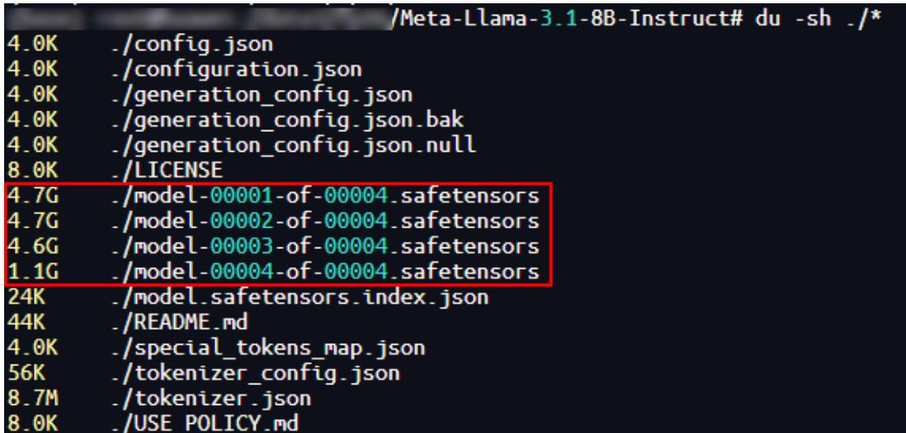  
图 3-1 下载文件至本地

步骤2 执行以下命令，进入Llama目录。cd \${HOME}/msmodelslim/example/Llama

其中HOME为用户自定义安装msit的路径。

步骤3 执行量化脚本，生成量化权重文件，并存入自定义存储路径中。示例命令为w8a16量化命令。

python3 quant_llama.py --model_path \${model_path} --save_directory \${save_directory} --device_type npu --w_bit 8 --a_bit 16

其中--model_path为已下载的模型文件所在路径；--save_directory为生成的量化权重文件的存储路径。其它模型文件量化案例可参见LLAMA量化案例。

# 说明

如果量化后的权重文件需要在MindIE 2.1.RC1及之前版本上部署，需要在执行原量化命令时增加--mindie_format参数，参考命令如下：

python3 quant_llama.py --model_path \${model_path} --save_directory \${save_directory} --device_typenpu --w_bit 8 --a_bit 16 --mindie_format

步骤4 量化完成后，结果图3-2所示，safetensors文件大小由15.1G压缩至8.5G。

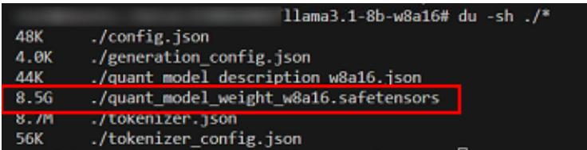  
图 3-2 量化后的结果

# 步骤5 生成的w8a16量化权重文件如下所示。

config.json # 配置文件  
generation_config.json # 配置文件  
quant_model_description.json # w8a16量化后的权重描述文件  
quant_model_weight_w8a16.safetensors # w8a16量化后的权重文件  
tokenizer.json # 模型文件的tokenizer  
tokenizer_config.json # 模型文件的tokenizer配置文件

# ----结束

# 3.2.2 精度调试

# 前提条件

● 已参见3.2.1 模型量化章节完成模型量化。  
● 已参见模型量化章节的步骤1准备好浮点模型。

# 量化模型 dump

步骤1 执行以下命令，确认量化模型是否可以推理。 bash \${ATB_SPEED_HOME_PATH}/examples/models/llama3/run_pa.sh \${save_directory} \$ {max_output_length}

其中参数解释如下：

ATB_SPEED_HOME_PATH：默认路径为“/usr/local/Ascend/atb-models”，在source模型仓中set_env.sh脚本时已配置；

max_output_length：对话测试中最大输出token数。

执行完命令后，回显信息有如下内容，说明量化模型可以进行推理。

Question[0]: What's deep learning?   
Answer[0]: Deep learning is a subset of machine learning that uses artificial neural networks to analyze   
data. It's called   
Generate[0] token num: (0, 20)

步骤2 执行以下命令，对量化模型进行dump，结果保存至用户指定dump数据的输出路径。以下命令中的参数说明请参见表3-2。此处以指定dump第二个token为例。如果需要了解更多的参数信息，请参见加速库模型数据dump。

msit llm dump --exec "bash \${ATB SPEED HOME PATH}/examples/models/llama3/run_pa.sh \${save_directory} \${max_output_length}" --type model tensor -er 2,2 -o \${quant_dump_path}步骤3 量化模型dump成功后，落盘数据目录结构如下。

表 3-2 dump 参数说明  

<table><tr><td rowspan=1 colspan=1>参数</td><td rowspan=1 colspan=1>说明</td><td rowspan=1 colspan=1>使用示例</td></tr><tr><td rowspan=1 colspan=1>--exec</td><td rowspan=1 colspan=1>指定包含ATB的程序执行命令。命令中不支持重定向字符，如果需要重定向输出，建议将执行命令写入shel脚本，然后启动shell脚本。</td><td rowspan=1 colspan=1>--exec &quot;bash run.shpatches/models&quot;</td></tr><tr><td rowspan=1 colspan=1>--type</td><td rowspan=1 colspan=1>dump类型，默认为[&#x27;tensor&#x27;,&#x27;model&#x27;]。常用可选项如下：model：模型拓扑信息（默认），当dump类型为model时，layer会跟着model一起dump下来。? layer:Operation维度拓扑信息。）tensor：tensor数据（默认）。</td><td rowspan=1 colspan=1>--type layer tensor</td></tr><tr><td rowspan=1 colspan=1>-er,--execute-range</td><td rowspan=1 colspan=1>指定dump的token编号范围，区间左右全闭，可以支持多个区间序列，默认为第0个。请确保输入多区间时的总输入长度不超过500个字符。</td><td rowspan=1 colspan=1>-er 2,2-er3,5,7,7：代表区间[3,5],[7,7]，也就是第3，第4，第5，第7个token</td></tr><tr><td rowspan=1 colspan=1>-0,--output</td><td rowspan=1 colspan=1>指定dump数据的输出目录，默认为./。</td><td rowspan=1 colspan=1>-0 /home/projects/output</td></tr></table>

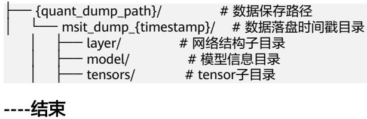

# 浮点模型 dump

步骤1 执行以下命令，确认浮点模型是否可以推理。

bash \${ATB_SPEED_HOME_PATH}/examples/models/llama3/run_pa.sh --model_path \${model_path} \$ {max_output_length}

步骤2 回显信息有如下内容，说明浮点模型可以进行推理。

Question[0]: What's deep learning?   
Answer[0]: Deep learning is a subset of machine learning that uses artificial neural networks to analyze   
data. It's called   
Generate[0] token num: (0, 20)

步骤3 执行浮点模型dump，结果保存至用户指定dump数据的输出路径。命令中的参数说明请参见表3-2。此处以指定dump第二个token为例。

msit llm dump --exec "bash \${ATB SPEED HOME PATH}/examples/models/llama3/run_pa.sh --model_path \${model path} \${max output length}" --type model tensor -er 2,2 -o \${float dump path}

步骤4 浮点模型dump成功后，会在float_dump文件夹下生成msit_dump_{timestamp}文件夹，落盘数据目录结构如下。

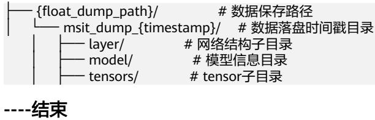

# 精度比对

步骤1 执行以下命令，对量化模型dump后的结果文件和浮点模型dump后的结果文件进行精度比对。命令中参数解释如表3-3所示。

msit llm compare -gp   
\${float dump path}/msit_dump_{timestamp}/tensors/{device id}_{process id}/2/   
-mp \${quant_dump_path}/msit_dump_{timestamp}/tensors/{device_id}_{process_id}/2/ -o \$   
{compare_result_dir}

表 3-3 compare 参数解释  

<table><tr><td rowspan=1 colspan=1>参数</td><td rowspan=1 colspan=1>说明</td></tr><tr><td rowspan=1 colspan=1>-gp</td><td rowspan=1 colspan=1>用于指定标杆数据路径的参数，即浮点模型dump数据所在目录。</td></tr><tr><td rowspan=1 colspan=1>-mp</td><td rowspan=1 colspan=1>用于指定待比对的数据路径的参数，即量化模型dump数据所在目录。</td></tr><tr><td rowspan=1 colspan=1>-0</td><td rowspan=1 colspan=1>用于指定比对结果保存路径。</td></tr></table>

步骤2 精度比对回显信息如下，比对结果文件中的参数说明可参见精度比对结果参数说明，做进一步分析。

msit_llm_logger - INFO - golden_layer_type: Prefill_layer   
msit_llm_logger - INFO - my_layer_type: Prefill_layer   
msit_llm_logger - INFO - golden_layer_type: Decoder_layer   
msit_llm_logger - INFO - my_layer_type: Decoder_layer   
msit_llm_logger - INFO - Saved comparing results: ./msit_cmp_report_{timestamp}.csv

# ----结束

# 3.2.3 性能调优

# 前提条件

在使用性能调优工具前，请先阅读《性能调优工具用户指南》中的“使用前准备”章节的使用约束，了解相关约束条件。

# 性能数据采集

msprof命令行工具提供了AI任务运行性能数据、昇腾AI处理器系统数据等性能数据的采集和解析能力。

步骤1 登录Ascend-cann-toolkit开发套件包所在环境，进入“\${install_path}/cann/tools/profiler/bin”。\${install_path}为CANN Toolkit开发套件包和ops算子包的安装路径。

步骤2 执行以下命令，采集性能数据。此处对浮点模型进行性能数据采集。

msprof --output=\${output_dir} bash \${ATB_SPEED_HOME_PATH}/examples/models/llama3/run_pa.sh -- model_path \${model path} \${max output length}

其中--output为采集到的性能数据的存放路径；max_output_length为对话测试中最大输出token数。

步骤3 命令执行后，回显中包含如下内容，表示采集完成。

[INFO] Start export data in PROF_000001_20241118061102981_MORBFBJDEPNJEQPA.   
[INFO] Export all data in PROF_000001_20241118061102981_MORBFBJDEPNJEQPA done.   
[INFO] Start query data in PROF_000001_20241118061102981_MORBFBJDEPNJEQPA. [INFO] Query all data in PROF_000001_20241118061102981_MORBFBJDEPNJEQPA done. [INFO] Profiling finished.   
[INFO] Process profiling data complete. Data is saved in {output_dir}/   
PROF_000001_20241118061102981_MORBFBJDEPNJEQPA

<table><tr><td>Job Info Iteration</td><td>Device ID Rank ID</td><td>Dir Name Collection Time</td><td></td><td></td><td>Model IDIteration NumberTop Time</td><td></td></tr><tr><td>NA</td><td>host</td><td></td><td>2024-11-18 06:11:02.985433N/A</td><td>N/A</td><td>N/A</td><td></td></tr><tr><td>1 NA</td><td>1</td><td></td><td>device_12024-11-18 06:11:07.222675N/A</td><td></td><td>N/A N/A</td><td></td></tr></table>

步骤4 采集完成后，在--output指定的目录下生成了PROF_000001_20241118061102981_MORBFBJDEPNJEQPA目录，存放采集到的性能数据。

PROF_000001_20241118061102981_MORBFBJDEPNJEQPA目录下的mindstudio_profiler_output目录，存放的是解析后的性能数据，文件结构如下。

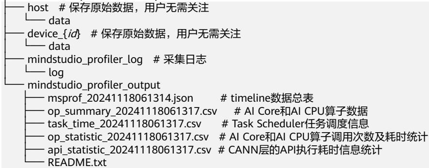

# ----结束

# 性能数据分析

为了方便分析采集到的性能数据，可使用MindStudio Insight工具将性能数据可视化展示，便于直观地分析性能瓶颈。

步骤1 打开MindStudio Insight工具。

步骤2 将步骤4采集到的性能数据拷贝至本地。

步骤3 单击MindStudio Insight界面左上方“导入数据”，在弹框中选择性能数据文件或目录，然后单击“确认”进行导入，如图3-3所示。

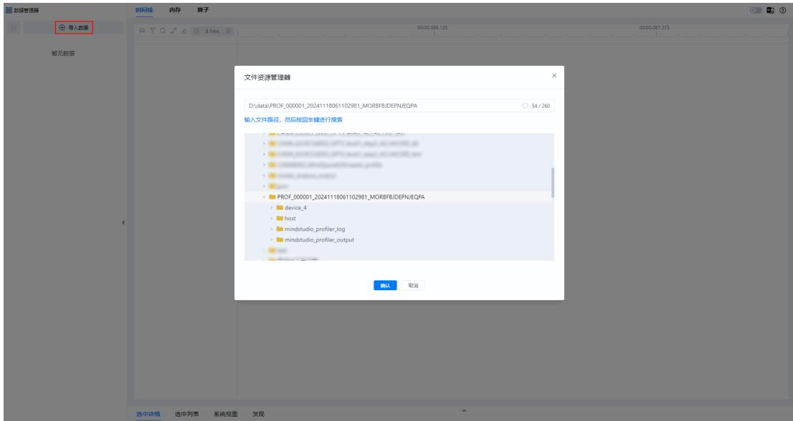  
图 3-3 导入数据

步骤4 根据MindStudio Insight工具的可视化呈现性能数据，如图3-4所示。

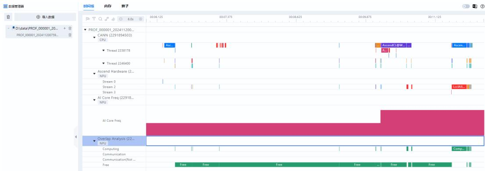  
图 3-4 展示性能数据

步骤5 分析性能数据。

MindStudio Insight工具将性能数据可视化呈现后，可以更直观地分析性能瓶颈，详细分析方法请参见《MindStudio Insight工具用户指南》。

----结束

# 3.2.4 服务化调优

服务化框架性能调优常如同面对“黑盒”，问题难以定位（例如：请求增多后响应速度降低，更换设备后性能不同）。

msServiceProfiler（服务化调优工具）提供全链路性能剖析，清晰展示框架调度、模型推理等环节的表现，帮助用户快速找到性能瓶颈（帮助判断是框架问题还是模型问题），从而有效提升服务性能。

# 说明

以下仅提供服务化调优工具的快速入门，工具更多操作及接口、参数、字段等详细内容介绍请参  
见 “msServiceProfiler服务化调优工具”。

# 前提条件

在使用服务化调优工具前，请先阅读《性能调优工具用户指南》中的“使用前准备”章节的使用约束，了解相关约束条件。  
请参见《MindIE安装指南》完成MindIE的安装和配置并确认MindIE Motor可以正常运行。

# 操作步骤

步骤1 配置环境变量。

msServiceProfiler的采集能力需要在部署MindIE Motor服务之前，通过设置环境变量SERVICE_PROF_CONFIG_PATH方能生效。如果环境变量拼写错误，或者没有在部署MindIE Motor服务之前设置环境变量，都无法使能msServiceProfiler的采集能力。

以ms_service_profiler_config.json文件名为例，执行下列命令配置环境变量。

export SERVICE_PROF_CONFIG_PATH="./ms_service_profiler_config.json"

SERVICE_PROF_CONFIG_PATH的值需要指定到json文件名，该json文件即为控制性能数据采集的配置文件，比如采集性能元数据存放位置、算子采集开关等，具体字段介绍参考步骤3。若路径下无配置文件，工具将自动生成默认配置（采集开关默认为关闭状态）。

# 注意

在多机部署时，通常不建议将配置文件或其指定的数据存储路径放置在共享目录（如网络共享位置）。 由于数据写入方式可能涉及额外的网络或缓冲环节，而非直接落盘，此类配置在某些情况下可能导致预期外的系统行为或结果。

步骤2 运行MindIE Motor服务。

如果正确配置了环境变量，工具会在服务部署完成之前输出如下[msservice_profiler]开头的日志，说明msServiceProfiler已启动，如下所示。

[msservice_profiler] [PID:225] [INFO] [ParseEnable:179] profile enable_: false [msservice_profiler] [PID:225] [INFO] [ParseAclTaskTime:264] profile enableAclTaskTime_: false [msservice_profiler] [PID:225] [INFO] [ParseAclTaskTime:265] profile msptiEnable_: false [msservice_profiler] [PID:225] [INFO] [LogDomainInfo:357] profile enableDomainFilter_: false 如果SERVICE_PROF_CONFIG_PATH环境变量所指定的配置文件不存在，工具输出自 动创建的日志。以步骤1的配置为例，那么工具输出日志如下。

[msservice_profiler] [PID:225] [INFO] [SaveConfigToJsonFile:588] Successfully saved profiler configuration to: ./ms_service_profiler_config.json

步骤3 数据采集。

MindIE Motor服务部署成功之后，可以通过修改配置文件中的字段来进行精准控制采集行为。

"enable": 1,

"prof_dir": "\${PATH}/prof_dir/", "acl_task_time": 0 . # 此处仅以配置上面三个字段为例 }

表 3-4 参数说明  

<table><tr><td rowspan=1 colspan=1>参数</td><td rowspan=1 colspan=1>说明</td><td rowspan=1 colspan=1>西</td></tr><tr><td rowspan=1 colspan=1>enable</td><td rowspan=1 colspan=1>性能数据采集总开关。取值为：·0：关闭。·1：开启。即便其他开关开启，该开关不开启，仍然不会进行任何数据采集；如果只有该开关开启，只采集服务化性能数据。</td><td rowspan=1 colspan=1>是</td></tr><tr><td rowspan=1 colspan=1>prof_dir</td><td rowspan=1 colspan=1>采集到的性能数据的存放路径，默认值为${HOME}/.ms_server_profiler。该路径下存放的是性能原始数据，需要继续执行后续解析步骤，才能获取可视化的性能数据文件进行分析。在enable为o时，对prof_dir进行自定义修改，随后修改enable为1时生效；在enable为1时，直接修改prof_dir，则修改不生效。</td><td rowspan=1 colspan=1>否</td></tr><tr><td rowspan=1 colspan=1>acl_task_time</td><td rowspan=1 colspan=1>开启采集算子下发耗时、算子执行耗时数据的开关，取值为：·0：关闭。默认值，配置为0或其他非法值均表示关闭。·1：开启。说明：该功能开启时会占用一定的设备性能，导致采集的性能数据不准确，建议在模型执行耗时异常时开启，用于更细致的分析。算子采集数据量较大，一般推荐集中采集3～5s，时间过长会导致占用额外磁盘空间，消耗额外的解析时间，从而导致性能定位时间拉长。默认算子采集等级为L0，如果需要开启其他算子采集等级，请参见“msServiceProfiler服务化调优工具”的完整参数介绍。</td><td rowspan=1 colspan=1>否</td></tr></table>

一般来说，如果enable一直为1，当MindIE Motor推理服务从收到请求的那一刻，工具会一直采集，直到请求结束，prof_dir下的目录大小也会不断增长，因此推荐用户仅采集关键时间段的信息。

每当enable字段发生变更时，工具都会输出对应的日志进行告知。

[msservice_profiler] [PID:3259] [INFO] [DynamicControl:407] Profiler Enabled Successfully!

# 或者

[msservice_profiler] [PID:3057] [INFO] [DynamicControl:411] Profiler Disabled Successfully!

每当enable由0改为1时，配置文件中的所有字段都会被工具重新加载，从而实现动态地更新。

# 步骤4 数据解析。

1. 安装环境依赖。

python $> = 3 . 1 0$ pandas $> = 2 . 2$ numpy $> = 1 . 2 4 . 3$ psutil $> = 5 . 9 . 5$

2. 执行解析命令示例：

python3 -m ms_service_profiler.parse --input-path ${ \boldsymbol { \mathsf { I } } } { \boldsymbol { \mathsf { = } } } \$ 5$ {PATH}/prof_dir--input-path指定为步骤3中prof_dir参数指定的路径。解析完成后默认在命令执行目录下生成解析后的性能数据文件。

步骤5 调优分析。

解析后的性能数据包含db格式、csv格式和json格式，用户可以通过csv进行请求、调度等不同维度的快速分析，也可以通过MindStudio Insight工具导入db文件或者json文件进行可视化分析，详细操作和分析说明请参见《MindStudio Insight工具用户指南》中的“服务化调优”章节。

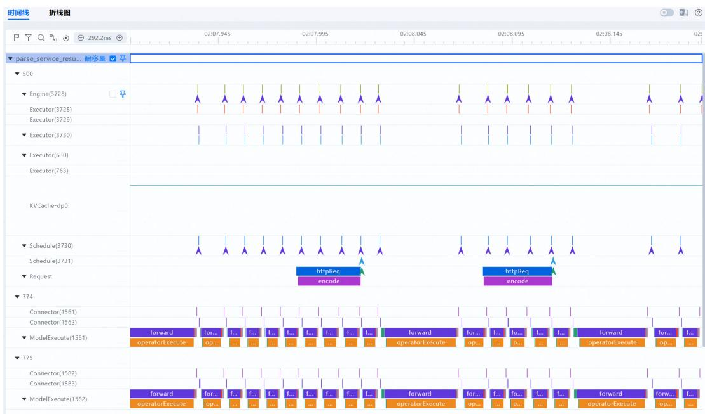  
根据MindStudio Insight工具的可视化呈现性能数据，如下图所示：

# ----结束

# 3.3 进阶开发

如果您想体验大模型推理工具更丰富的功能，请参见各工具使用文档阅读了解。

msModelSlim工具：请前往msModelSlim阅读了解。  
大模型推理精度工具：请前往大模型推理精度工具（Large Language ModelDebug Tool）阅读了解。  
性能调优工具：请前往《性能调优工具用户指南》阅读了解。  
MindStudio Insight可视化工具：请前往《MindStudio Insight工具用户指南》阅读了解。

# 4算子开发工具快速入门

# 概述

算子设计（msKPP）  
创建算子工程（msOpGen）  
算子功能测试（msOpST）  
算子异常检测（msSanitizer）  
算子调试（msDebug）  
算子调优（msProf）

# 4.1 概述

MindStudio算子开发工具包含多个工具，如msKPP、msOpGen、msOpST、msSanitizer、msDebug和msProf等，本文档以一个简单样例介绍算子开发工具应用的全流程。

样例以单算子API调用方式为例，介绍如何使用算子开发工具进行算子设计、算子工程创建、算子功能测试、算子异常检测、算子调试及性能调优。

# 环境准备

准备Atlas A2 训练系列产品/Atlas 800I A2 推理产品的服务器，并安装对应的驱动和固件，具体安装过程请参见《CANN 软件安装指南》中的“安装NPU驱动和固件”章节。  
安装Ascend-cann-toolkit，请参见《CANN 软件安装指南》。  
若要使用MindStudio Insight进行查看时，需要单独安装MindStudio Insight软件包，具体下载链接请参见《MindStudio Insight工具用户指南》的“安装与卸载”章节。

# 说明

● 在安装昇腾AI处理器的服务器执行npu-smi info命令进行查询，获取Chip Name信息。实际配置值为AscendChip Name，例如Chip Name取值为xxxyy，实际配置值为Ascendxxxyy。当Ascendxxxyy为代码样例路径时，需要配置Ascendxxxyy。如果需要指令占比饼图（instruction_cycle_consumption.html），则需要安装生成饼图所依赖的Python三方库plotly。pip3 install plotly

# 4.2 算子设计（msKPP）

msKPP工具用于算子开发之前，帮助开发者在秒级时间内获取算子性能建模结果，可快速验证算子的实现方案。

步骤1 参考环境准备，完成msKPP工具相关配置。

步骤2 使用msKPP接口进行指令级别算子建模，模拟AscendC实现的add算子，示例如下：

# 导入add算子建模需要的msKPP接口from mskpp import vadd, Tensor, Chip

# 参照add算子在aicore内的指令实现，进行数据搬入->数据计算->数据搬出的过程建模def my_vadd(gm_x, gm_y, gm_z):

# 向量Add的基本数据通路:  
#被加数x: GM-UB  
#加数y: GM-UB  
#结果向量z: UB-GM  
#定义和分配UB上的变量  
$\mathsf { x } =$ Tensor("UB")  
$\mathsf { y } =$ Tensor("UB")  
$z =$ Tensor("UB")  
# 将GM上的数据移动到UB对应内存空间上  
x.load(gm_x)  
y.load(gm_y)

# 当前数据已加载到UB上,调用指令进行计算,结果保存在UB上out $=$ vadd(x, y, z)()

# 将UB上的数据移动到GM变量gm_z的地址空间上gm_z.load(out[0])

if __name_ $\underline { { \underline { { \mathbf { \Pi } } } } } = = \mathbf { \Pi } ^ { \prime } .$ __main__':with Chip("Ascendxxxyy") as chip: # xxxyy为用户实际使用的具体芯片类型，可以使用命令npu-smi info进行  
查询chip.enable_trace()chip.enable_metrics()# 应用算子进行AI Core计算  
in_x $=$ Tensor("GM", "FP16", [32, 48], format="ND")in_y $=$ Tensor("GM", "FP16", [32, 48], format="ND")in_z $=$ Tensor("GM", "FP16", [32, 48], format="ND")my_vadd(in_x, in_y, in_z)

# 说明

add算子介绍请参见基础矢量算子。

步骤3 通过python3 xxx.py命令执行步骤2的Python.py脚本，将会在当前目录生成以下结果目录。目录中文件展现的具体内容请参见《算子开发工具用户指南》的“算子设计（msKPP） $>$ 算子计算搬运规格分析、极限性能分析及算子Tiling初步设计”章节。

MSKPP{timestamp}/ instruction_cycle_consumption.html

<table><tr><td>Instruction_statistic.csv</td></tr><tr><td>Pipe_statistic.csv</td></tr><tr><td>trace.json</td></tr></table>

表 4-1 建模结果文件  

<table><tr><td rowspan=1 colspan=1>文件名称</td><td rowspan=1 colspan=1>功能</td></tr><tr><td rowspan=1 colspan=1>搬运流水统计（Pipe_statistic.csv）</td><td rowspan=1 colspan=1>以PIPE维度统计搬运数据量大小、操作数个数以及耗时信息。</td></tr><tr><td rowspan=1 colspan=1>指令信息统计（ Instruction_statistic.csv）</td><td rowspan=1 colspan=1>统计不同指令维度的总搬运数据量大小、操作数个数以及耗时信息，能够发现指令层面上的瓶颈。</td></tr><tr><td rowspan=1 colspan=1>指令占比饼图（instruction_cycle_consumption.html）</td><td rowspan=1 colspan=1>以指令维度统计耗时信息，并以饼图形式展示。</td></tr><tr><td rowspan=1 colspan=1>指令流水图（trace.json）</td><td rowspan=1 colspan=1>以指令维度展示耗时信息，并进行可视化展示。</td></tr></table>

----结束

# 4.3 创建算子工程（msOpGen）

msOpGen工具用于算子开发时，可生成自定义算子工程，方便用户专注于算子的核心逻辑和算法实现，而无需花费大量时间在项目搭建、编译配置等重复性工作上，从而提高了开发效率。

步骤1 生成算子目录。

1. 把算子定义的AddCustom.json文件放到工作目录当中，json文件的配置参数详细 说明请参考《算子开发工具用户指南》的“算子工程创建（msOpGen）> 创建算 子工程”章节。 { "op": "AddCustom", "language": "cpp", "input_desc": [ { "name": "x", "param_type": "required", "format": [ "ND" ], "type": [ "float16" ] },{ "name": "y", "param_type": "required", "format": [ "ND" ], "type": [ "float16" ] }

], "output_desc": [ { "name": "z", "param_type": "required", "format": [ "ND" ], "type": [ "float16" ] } ] }

2. 执行以下命令，生成算子开发工程，参数说明请参见《算子开发工具用户指南》的“算子工程创建（msOpGen） $>$ 工具概述”章节。msopgen gen -i AddCustom.json -f tf -c ai_core-ascendxxxyy -lan cpp -out AddCustom # xxxyy为用户实际使用的具体芯片类型

3. 执行以下命令，查看生成目录。tree -C -L 2 AddCustom/

4. 在指定目录下生成的算子工程目录。

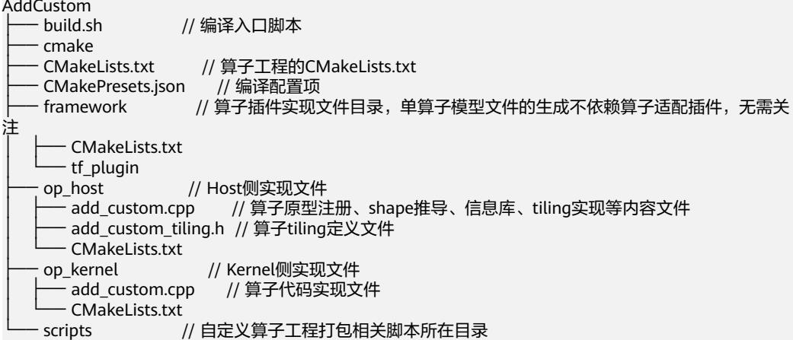

步骤2 单击Link，获取算子核函数开发和Tiling实现的代码样例。执行以下命令，将样例目录中的算子实现文件移动至msOpGen步骤1生成的目录中。

cp -r \${git_clone_path}/samples/operator/ascendc/0_introduction/1_add_frameworklaunch/AddCustom/\* AddCustom/

# 说明

● \${git_clone_path}为sample仓的存放路径。完成算子工程创建后，需参考《Ascend C算子开发指南》进行算子开发，但此步骤只需体现算子开发工具的功能，因此直接使用代码样例。下载代码样例时，需执行以下命令指定分支版本。git clone https://gitee.com/ascend/samples.git -b r0.2

步骤3 编译算子工程。

1. 参考《算子开发工具用户指南》的“算子工程创建（msOpGen） $>$ 算子编译部署$>$ 编译前准备”章节，完成编译相关配置。  
2. 在算子工程目录下，执行如下命令，进行算子工程编译。编译完成后，将会在build_out目录生成.run算子包。./build.sh

步骤4 在自定义算子包所在路径下，执行如下命令，部署算子包。./build_out/custom_opp_<target_os>_<target_architecture>.run

# 步骤5 验证算子功能，生成可执行文件execute_add_op。

1. 切换到AclNNInvocation仓的目录。 cd \${git_clone_path}/samples/operator/ascendc/0_introduction/1_add_frameworklaunch/ AclNNInvocation

2. 执行以下命令。 ./run.sh

3. 成功对比精度，并生成可执行文件execute_add_op

INFO: execute op!   
[INFO] Set device[0] success   
[INFO] Get RunMode[1] success   
[INFO] Init resource success   
[INFO] Set input success   
[INFO] Copy input[0] success   
[INFO] Copy input[1] success   
[INFO] Create stream success   
[INFO] Execute aclnnAddCustomGetWorkspaceSize success, workspace size 0   
[INFO] Execute aclnnAddCustom success   
[INFO] Synchronize stream success   
[INFO] Copy output[0] success   
[INFO] Write output success   
[INFO] Run op success   
[INFO] Reset Device success   
[INFO] Destroy resource success   
INFO: acl executable run success!   
error ratio: 0.0000, tolerance: 0.0010   
test pass

# ----结束

# 4.4 算子功能测试（msOpST）

msOpST工具用于算子开发完成后，对算子功能进行初步测试，该工具可以更加高效地进行算子性能的分析和优化，提高算子的执行效率，降低开发成本。

本样例基于AscendCL接口的流程，生成单算子的OM文件，并执行该文件以验证算子执行结果的正确性。

步骤1 生成ST测试用例。

1. 在创建算子工程中的步骤2执行完成后，再执行以下命令，并根据msOpGen算子工程目录替换命令路径。msopst create -i "\$HOME/AddCustom/op_host/add_custom.cpp" -out ./st

2. 生成ST测试用例。

2024-09-10 19:47:15 (3995495) - [INFO] Start to parse AscendC operator prototype definition in \$HOME/AddCustom/op_host/add_custom.cpp.   
2024-09-10 19:47:15 (3995495) - [INFO] Start to check valid for op info.   
2024-09-10 19:47:15 (3995495) - [INFO] Finish to check valid for op info.   
2024-09-10 19:47:15 (3995495) - [INFO] Generate test case file \$HOME/AddCustom/st/ AddCustom_case_20240910194715.json successfully.   
2024-09-10 19:47:15 (3995495) - [INFO] Process finished!

3. 在./st目录下生成ST测试用例。

步骤2 执行ST测试。

# 1. 根据CANN包路径设置环境变量。

export DDK_PATH=\${INSTALL_DIR}  
export NPU_HOST_LIB ${ \boldsymbol { \cdot } } { \boldsymbol { \Phi } }$ {INSTALL_DIR}/{arch-os}/devlib // {arch-os}中arch表示操作系统架构（需根据  
运行环境的架构选择），os表示操作系统（需根据运行环境的操作系统选择）

2. 执行ST测试，并将输出结果到指定路径。msopst run -i ./st/AddCustom_case_{TIMESTAMP}.json -soc Ascendxxxyy -out ./st/out // xxxyy为用户实际使用的具体芯片类型

# 说明

\${INSTALL_DIR}请替换为CANN软件安装后文件存储路径。以root用户安装为例，安装后文件默认存储路径为：/usr/local/Ascend/cann。

步骤3 测试成功后，将测试结果输出在./st/out/{TIMESTAMP}/路径下的st.report.json文件，具体请参见《算子开发工具用户指南》的“算子测试（msOpST） $>$ 生成/执行测试用例”章节。

----结束

# 4.5 算子异常检测（msSanitizer）

msSanitizer工具作用于算子开发的整个周期，帮助开发者确保算子的质量和稳定性。通过在早期阶段发现并修复异常，msSanitizer大大减少了产品上线后的潜在风险和后期维护成本。

● 启动工具后，将会在当前目录下自动生成工具运行日志文件mssanitizer_{TIMESTAMP}_{PID}.log，当用户程序运行完成后，界面将会打印异常报告。  
● \${git_clone_path}为sample仓的路径。

步骤1 在\${git_clone_path}/samples/operator/ascendc/0_introduction/1_add_frameworklaunch目录下执行以下命令，生成自定义算子工程，进行host侧和kernel侧的算子实现。bash install.sh -v Ascendxxxyy # xxxyy为用户实际使用的具体芯片类型

步骤2 在\${git_clone_path}/samples/operator/ascendc/0_introduction/1_add_frameworklaunch/CustomOp目录下执行以下命令，重新编译部署算子。bash build.sh./build_out/custom_opp_<target_os>_<target_architecture>.run // 当前目录下run包的名称

步骤3 切换到\${git_clone_path}/samples/operator/ascendc/0_introduction/ 1_add_frameworklaunch/AclNNInvocation目录，拉起算子API运行脚本，进行内存检 测。

1. 启用内存检测：

可显式指定内存检测，默认会开启非法读写、多核踩踏、非对齐访问和非法  
释放的检测功能：  
mssanitizer --tool=memcheck bash run.sh  
执行如下命令，可手动启用内存泄漏的检测功能：  
mssanitizer --tool=memcheck --leak-check=yes bash run.sh

2. 定位内存异常，具体请参见《算子开发工具用户指南》的“异常检测（msSanitizer） $>$ 内存检测”章节。

步骤4 进行竞争检测。

1. 执行如下命令，启用竞争检测。mssanitizer --tool=racecheck bash run.sh

2. 定位内存竞争，具体请参见《算子开发工具用户指南》的“异常检测（msSanitizer） $>$ 竞争检测”章节。当前目录下会自动生成工具运行日志文件mssanitizer_{TIMESTAMP}_{PID}.log，当用户程序运行完成后，界面将会打印异常报告。

步骤5 进行未初始化检测。

1. 执行如下命令，可手动启用未初始化的检测。mssanitizer --tool=initcheck bash run.sh  
2. 定位内存异常，具体请参见《算子开发工具用户指南》的“异常检测（msSanitizer） $>$ 未初始化检测”章节。----结束

# 4.6 算子调试（msDebug）

msDebug支持调试所有昇腾算子，用户可以根据实际情况选择使用不同的功能，例如，可以设置断点、打印变量和内存、进行单步调试、中断运行、核切换等。

步骤1 安装NPU驱动固件，具体请参见《算子开发工具用户指南》的“算子调试（msDebug）> 工具概述”章节。

步骤2 在\${git_clone_path}/samples/operator/ascendc/0_introduction/1_add_frameworklaunch目录执行以下命令，生成自定义算子工程，进行host侧和kernel侧的算子实现。bash install.sh -v Ascendxxxyy # xxxyy为用户实际使用的具体芯片类型

步骤3 在\${git_clone_path}/samples/operator/ascendc/0_introduction/1_add_frameworklaunch/CustomOp目录下修改CMakePresets.json文件的cacheVariables的配置项，将Release修改为Debug。

"cacheVariables": { "CMAKE_BUILD_TYPE": { "type": "STRING", "value": "Debug" },   
}

步骤4 执行以下命令，重新编译部署算子。

1. 在\${git_clone_path}/samples/operator/ascendc/0_introduction/1_add_frameworklaunch/CustomOp目录下，执行以下命令，重新编译部署算子。bash build.sh./build_out/custom_opp_<target_os>_<target_architecture>.run // 当前目录下run包的名称

2. 切换到\${git_clone_path}/samples/operator/ascendc/0_introduction/1_add_frameworklaunch/AclNNInvocation目录，并执行以下命令，将会在./output路径下生成可执行文件execute_add_op。bash run.shcd ./output

步骤5 在调试前，配置如下环境变量，指定算子加载路径，导入调试信息，示例如下。export LAUNCH_KERNEL_PATH $| = \$ 4$ {INSTALL_DIR}/opp/vendors/customize/op_impl/ai_core/tbe/kernel/\${soC_version}/add_custom/AddCustom_1e04ee05ab491cc5ae9c3d5c9ee8950b.o//soc_version为昇腾Al处理器的Chip Name，需为小写

步骤6 指定算子依赖的动态库路径，将动态库so文件加载进来。export LD_LIBRARY_PATH $\lvert = \$ 5$ {INSTALL_DIR}/opp/vendors/customize/op_api步骤7 在可执行文件目录下执行msdebug execute_add_op，进入msDebug工具。msdebug execute_add_op

步骤8 断点设置。

1. 设置断点。 (msdebug) b add_custom.cpp:55

2. 回显将会显示断点信息添加成功。 Breakpoint 1: where $=$ AddCustom_1e04ee05ab491cc5ae9c3d5c9ee8950b.o\`KernelAdd::Compute(int) (.vector) $+ 6 8$ at add_custom.cpp:55:9, address $=$ 0x00000000000014f4

# 步骤9 键盘输入r命令，运行算子程序，等待直到命中断点。

(msdebug) r   
Process 1454802 launched: '\${INSTALL_DIR}/add_cus/AclNNInvocation/output/execute_add_op' (aarch64)   
[INFO] Set device[0] success   
[INFO] Get RunMode[1] success   
[INFO] Init resource success   
[INFO] Set input success   
[INFO] Copy input[0] success   
[INFO] Copy input[1] success   
[INFO] Create stream success   
[INFO] Execute aclnnAddCustomGetWorkspaceSize success, workspace size 0   
[Launch of Kernel AddCustom_1e04ee05ab491cc5ae9c3d5c9ee8950b on Device 0]   
[INFO] Execute aclnnAddCustom success   
Process 1454802 stopped   
[Switching to focus on Kernel AddCustom_1e04ee05ab491cc5ae9c3d5c9ee8950b, CoreId 39, Type aiv]   
\* thread #1, name $=$ 'execute_add_op', stop reason $=$ breakpoint 1.1 frame #0: 0x00000000000014f4   
AddCustom_1e04ee05ab491cc5ae9c3d5c9ee8950b.o\`KernelAdd::Compute(this=0x00000000003078a8,   
progress ${ } = 0$ ) (.vector) at add_custom.cpp:55:9 52 _aicore__ inline void Compute(int32_t progress) 53 { 54 LocalTensor<DTYPE_X> xLocal $=$ inQueueX.DeQue $<$ DTYPE_X>();   
-> 55 LocalTensor<DTYPE_Y> yLocal $=$ inQueueY.DeQue<DTYPE_Y>(); //断点处的行号正确即可，其余   
信息以实际为准 56 LocalTensor<DTYPE_Z $>$ zLocal $=$ outQueueZ.AllocTensor<DTYPE $\scriptstyle { Z > 0 }$ ; 57 Add(zLocal, xLocal, yLocal, this->tileLength); 58 outQueueZ.EnQue<DTYPE_Z>(zLocal);

# 步骤10 继续运行。

1. 键盘输入以下命令，继续运行。(msdebug) c

2. 显示程序再次命中该断点。

Process 1454802 resuming   
Process 1454802 stopped   
[Switching to focus on Kernel AddCustom_1e04ee05ab491cc5ae9c3d5c9ee8950b, CoreId 39, Type aiv]   
\* thread #1, name $=$ 'execute_add_op', stop reason $=$ breakpoint 1.1 frame #0: 0x00000000000014f4   
AddCustom_1e04ee05ab491cc5ae9c3d5c9ee8950b.o\`KernelAdd::Compute(this=0x00000000003078a8,   
progress ${ } = 0$ ) (.vector) at add_custom.cpp:55:9 52 _aicore__ inline void Compute(int32_t progress) 53 { 54 LocalTensor<DTYPE_X> xLocal $=$ inQueueX.DeQue<DTYPE_X>();   
-> 55 LocalTensor<DTYPE_Y> yLocal $=$ inQueueY.DeQue<DTYPE_Y>(); //断点处的行号正确即可，   
其余信息以实际为准 56 LocalTensor<DTYPE_Z> zLocal $=$ outQueueZ.AllocTensor<DTYPE_Z>(); 57 Add(zLocal, xLocal, yLocal, this->tileLength); 58 outQueueZ.EnQue<DTYPE_Z>(zLocal);

# 步骤11 结束调试。

----结束

# 4.7 算子调优（msProf）

msProf工具主要作用于算子开发的性能优化阶段，通过使用msProf工具，开发者可以确保算子在不同硬件平台上都能高效运行，从而提高软件的整体性能和用户体验。

步骤1 在\${git_clone_path}/samples/operator/ascendc/0_introduction/1_add_frameworklaunch目录下执行以下命令，生成自定义算子工程，进行host侧和kernel侧的算子实现。bash install.sh -v Ascendxxxyy # xxxyy为用户实际使用的具体芯片类型

步骤2 在\${git_clone_path}/samples/operator/ascendc/0_introduction/1_add_frameworklaunch/CustomOp目录下执行以下命令行，重新编译部署算子。bash build.sh./build_out/custom_opp_<target_os>_<target_architecture>.run // 当前目录下run包的名称

步骤3 切换到\${git_clone_path}/samples/operator/ascendc/0_introduction/ 1_add_frameworklaunch/AclNNInvocation目录，执行以下命令生成可执行文件。 ./run.sh

步骤4 指定算子依赖的动态库路径，将动态库so文件加载进来。export LD_LIBRARY_PATH=\${INSTALL_DIR}/opp/vendors/customize/op_api/lib:\$LD_LIBRARY_PATH

步骤5 使用msProf工具进行调优。

使用msprof op进行上板调优。

a. 切换到\${git_clone_path}/samples/operator/ascendc/0_introduction/ 1_add_frameworklaunch/AclNNInvocation/output目录，执行以下命令，开 启上板调优。 msprof op --output=./output_data ./execute_add_op

b. 生成以下结果目录。OPPROF_{timestamp}_XXX/

ArithmeticUtilization.csv   
dump   
L2Cache.csv   
Memory.csv   
MemoryL0.csv   
MemoryUB.csv   
OpBasicInfo.csv   
PipeUtilization.csv   
ResourceConflictRatio.csv   
visualize_data.bin

c. 将visualize_data.bin文件导入MindStudio Insight工具，将上板结果可视化，具体请参见《算子开发工具用户指南》的“算子调优（msProf）> 工具使用”章节的msprof op。

使用msprof op simulator进行仿真调优。

a. 请参考《算子开发工具用户指南》的“算子调优（msProf）> 使用前准备”章节，完成msprof op simulator配置。  
b. 进入\${git_clone_path}/samples/operator/ascendc/0_introduction/1_add_frameworklaunch/AclNNInvocation/output目录，执行以下命令，开启仿真调优。msprof op simulator --soc-version=Ascendxxxyy --output=./output_data ./execute_add_op

c. 生成以下结果目录。

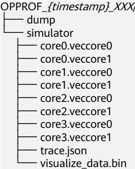

d. 将trace.json和visualize_data.bin文件导入MindStudio Insight工具，将仿真结果可视化，具体请参见《算子开发工具用户指南》的“算子调优（msProf）> 工具使用”章节的msprof op simulator。

----结束