# MindStudio8.3.0性能调优工具用户指南

文档版本 01  
发布日期 2026-01-30

版权所有 $\circledcirc$ 华为技术有限公司 2026。 保留一切权利。

非经本公司书面许可，任何单位和个人不得擅自摘抄、复制本文档内容的部分或全部，并不得以任何形式传播。

# 商标声明

和其他华为商标均为华为技术有限公司的商标。  
本文档提及的其他所有商标或注册商标，由各自的所有人拥有。

# 注意

您购买的产品、服务或特性等应受华为公司商业合同和条款的约束，本文档中描述的全部或部分产品、服务或特性可能不在您的购买或使用范围之内。除非合同另有约定，华为公司对本文档内容不做任何明示或暗示的声明或保证。

由于产品版本升级或其他原因，本文档内容会不定期进行更新。除非另有约定，本文档仅作为使用指导，本文档中的所有陈述、信息和建议不构成任何明示或暗示的担保。

# 安全声明

# 产品生命周期政策

华为公司对产品生命周期的规定以“产品生命周期终止政策”为准，该政策的详细内容请参见如下网址：https://support.huawei.com/ecolumnsweb/zh/warranty-policy

# 漏洞处理流程

华为公司对产品漏洞管理的规定以“漏洞处理流程”为准，该流程的详细内容请参见如下网址：  
https://www.huawei.com/cn/psirt/vul-response-process  
如企业客户须获取漏洞信息，请参见如下网址：  
https://securitybulletin.huawei.com/enterprise/cn/security-advisory

# 华为初始证书权责说明

华为公司对随设备出厂的初始数字证书，发布了“华为设备初始数字证书权责说明”，该说明的详细内容请参见如下网址：https://support.huawei.com/enterprise/zh/bulletins-service/ENEWS2000015766

# 华为企业业务最终用户许可协议(EULA)

本最终用户许可协议是最终用户（个人、公司或其他任何实体）与华为公司就华为软件的使用所缔结的协议。最终用户对华为软件的使用受本协议约束，该协议的详细内容请参见如下网址：  
https://e.huawei.com/cn/about/eula

# 产品资料生命周期策略

华为公司针对随产品版本发布的售后客户资料（产品资料），发布了“产品资料生命周期策略”，该策略的详细内容请参见如下网址：https://support.huawei.com/enterprise/zh/bulletins-website/ENEWS2000017760

# 目 录

#

# 1 简介.......

2 使用前准备.  
3 离线推理场景性能分析快速入门.. 6  
4 PyTorch 训练场景性能分析快速入门.. 15  
5 TensorFlow 训练场景性能分析快速入门...... .18  
6 msprof 模型调优工具. 22  
6.1 性能数据采集和自动解析.. 22  
6.1.1 msprof 采集通用命令. 22  
6.1.2 采集 AI 任务运行性能数据.. 29  
6.1.3 采集昇腾AI处理器系统数据.. 44  
6.1.4 采集 Host 侧系统数据.. 57  
6.1.5 采集 msproftx 数据.. 59  
6.1.6 动态采集性能数据. 61  
6.1.7 延迟采集性能数据.. 65  
6.2 离线解析... 66  
6.2.1 解析性能数据. 66  
6.2.2 查询性能数据文件信息. . 67  
6.2.3 解析并导出性能数据.. 68  
6.2.4 通信性能数据解析. 73

# 7 MSPTI 调优工具.. 80

7.1 工具介绍.. 80  
7.2 MSPTI 工具使用（Python API） 81  
7.3 MSPTI 工具使用（C API）. 82  
7.4 MSPTI 样例集.. 88

# 8 msServiceProfiler 服务化调优工具.. .91

8.1 msServiceProfiler 服务化调优.. . 91

8.1.1 简介.... 91

8.1.2 使用前准备... 91

8.1.3 数据采集.. . 92

8.1.3.1 创建采集配置文件. . 92

目 录  
8.1.3.2 执行采集.. .. 96  
8.1.4 数据解析.. . 98  
8.1.4.1 使用前准备.. .. 98  
8.1.4.2 执行解析... ...... 98  
8.1.4.3 解析结果.. . 99  
8.1.5 数据可视化.. ..... 110  
8.1.5.1 MindStudio Insight 可视化. .. 110  
8.1.5.2 Chrome tracing 可视化.. .. 110  
8.1.5.3 Grafana 可视化.. . 110  
8.1.5.3.1 使用前准备... .. 110  
8.1.5.3.2 连接 Grafana 画图.. ...... 111  
8.1.5.3.3 可视化结果.. .. 115  
8.1.6 扩展功能... .. 118  
8.1.6.1 自定义添加采集代码.. .. 118  
8.1.6.2 服务化性能数据比对工具.. ... 119  
8.1.6.3 vLLM 服务化性能采集工具. ..... 119  
8.1.6.4 服务化自动寻优工具.. .... 119  
8.2 msServiceProfiler Trace 数据监控.. .. 119  
8.2.1 简介... . 120  
8.2.2 使用前准备.. . 120  
8.2.3 数据采集.. . 120  
8.2.3.1 开启采集开关.... .... 120  
8.2.3.2 配置目标采集服务器.. ....... 121  
8.2.3.3 启动 Trace 转发进程.. .. 121  
8.2.3.4 发送请求... .. 122  
8.2.4 输出结果说明.. .. 125  
8.3 附录... . 126  
8.3.1 msServiceProfiler API 参考（ ${ \mathsf { C } } { + } { + }$ ） .. 126  
8.3.1.1 服务化调优.... ... 126  
8.3.1.1.1 总体说明.. . 127  
8.3.1.1.2 IsEnable.. . 128  
8.3.1.1.3 SpanStart... ... 129  
8.3.1.1.4 SpanEnd.. .. 129  
8.3.1.1.5 Metric...... . 130  
8.3.1.1.6 MetricInc..... .... 131  
8.3.1.1.7 MetricScope.. .. 132  
8.3.1.1.8 MetricScopeAsReqID. .. 132  
8.3.1.1.9 MetricScopeAsGlobal.. ... 133  
8.3.1.1.10 Launch... ..... 134  
8.3.1.1.11 Event. .. 134  
8.3.1.1.12 Link..... . 135  
8.3.1.1.13 Attr 系列.. .... 136  
目 录  
8.3.1.1.14 ArrayResource.... .... 137  
8.3.1.1.15 Resource.. . 138  
8.3.1.1.16 Domain.. . 138  
8.3.1.1.17 NumArrayAttr.. .. 139  
8.3.1.1.18 ArrayAttr...... .. 140  
8.3.1.1.19 GetMsg.. ... 141  
8.3.1.1.20 宏定义.. . 141  
8.3.1.2 Trace 数据监控.. ..... 142  
8.3.1.2.1 总体说明.. 142  
8.3.1.2.2 示例代码.. 143  
8.3.1.2.3 TraceContext 类.. ... 143  
8.3.1.2.3.1 GetTraceCtx... .. 143  
8.3.1.2.3.2 addResAttribute.. .. 144  
8.3.1.2.3.3 ExtractAndAttach.. .. 145  
8.3.1.2.3.4 Attach.. ... 146  
8.3.1.2.3.5 Unattach..... . 147  
8.3.1.2.3.6 GetCurrent.. .. 148  
8.3.1.2.4 Span 类... ..... 149  
8.3.1.2.4.1 Span... .. 149  
8.3.1.2.4.2 Activate.. .. 150  
8.3.1.2.4.3 SetAttribute.. .. 151  
8.3.1.2.4.4 SetStatus...... .... 152  
8.3.1.2.4.5 End... ...... 153  
8.3.1.2.5 Tracer 类.. 154  
8.3.1.2.5.1 StartSpanAsActive.. ... 154  
8.3.1.2.5.2 IsEnable.. . 155  
8.3.2 msServiceProfiler API 参考（Python） . 156  
8.3.2.1 服务化调优... ...... 156  
8.3.2.1.1 总体说明.. 156  
8.3.2.1.2 init... ..... 157  
8.3.2.1.3 __enter__/__exit_ . 157  
8.3.2.1.4 span_start.. ... 157  
8.3.2.1.5 span_end.... ..... 158  
8.3.2.1.6 event... . 158  
8.3.2.1.7 link... .. 158  
8.3.2.1.8 metric.. 158  
8.3.2.1.9 metric_inc.. . 158  
8.3.2.1.10 metric_scope.. ... 159  
8.3.2.1.11 metric_scope_as_req_id... ... 159  
8.3.2.1.12 launch.. . 159  
8.3.2.1.13 attr... . 159  
8.3.2.1.14 domain.. 159

#

8.3.2.1.15 res.... .160   
8.3.2.1.16 get_msg.. . 160

# 9 MindSpore 调优工具. 161

9.1 性能数据采集和自动解析.. 161  
9.2 离线解析.. . 165

# 10 Ascend PyTorch 调优工具.. 167

10.1 性能数据采集和自动解析. 167   
10.2 离线解析. 199

# 11 性能数据其他采集方式.. .201

11.1 使用 TensorFlow 框架接口采集性能数据.. . 201

11.2 使用 acl C&C $^ { + + }$ 接口采集性能数据.. . 204

11.2.1 总体介绍. . 205

11.2.2 采集并落盘性能数据. . 205

11.2.3 使用 msproftx 扩展接口采集并落盘性能数据. 207

11.2.4 订阅算子信息. . 210

11.2.5 采集数据说明.. 213

11.3 使用 acl Python 接口采集性能数据. . 214

11.3.1 总体介绍. 214

11.3.2 采集并落盘性能数据.. .. 215

11.3.3 使用 msproftx 扩展接口采集并落盘性能数据. 217

11.3.4 订阅算子信息. . 218

11.3.5 采集数据说明.. . 221

11.4 使用 Ascend Graph 接口采集性能数据.. .222

11.5 使用 acl.json 配置文件采集性能数据. . 225

11.6 使用环境变量采集性能数据. .236

# 12 性能数据文件参考.. .. 240

12.1 总体说明.. 242  
12.2 msprof 导出 db 格式数据说明. . 243  
12.3 msprof（timeline 数据总表） . 272  
12.4 msproftx 数据说明. .. 278  
12.5 task_time（任务调度信息） . 280  
12.6 api_statistic（API 耗时统计信息） . 283  
12.7 step_trace（迭代轨迹信息） . 285  
12.8 dp（数据增强信息） . 289  
12.9 communication_statistic（集合通信算子统计信息） . 289  
12.10 op_summary（算子详细信息） . 294  
12.11 op_statistic（算子调用次数及耗时） ..303  
12.12 ai_core_utilization（AI Core 指令占比） .. 304  
12.13 ai_vector_core_utilization（AI Vector Core 指令占比） . 310  
12.14 aicpu（AI CPU 算子详细耗时） 311  
12.15 aicpu_mi（数据准备的队列） . 312  
12.16 l2_cache（L2 Cache 命中率） . 313  
12.17 fusion_op（算子融合信息） .314  
12.18 npu_mem（NPU 内存占用） 315  
12.19 npu_module_mem（NPU 组件内存占用） . 317  
12.20 memory_record（CANN 算子的内存占用记录） .317  
12.21 operator_memory（CANN 算子的内存占用明细） ... 318  
12.22 static_op_mem（静态图算子内存）. .320  
12.23 sys_mem（系统内存数据） .321  
12.24 process_mem（进程内存占用数据）. . 322  
12.25 cpu_usage（AI CPU、Ctrl CPU 利用率） . 323  
12.26 process_cpu_usage（进程 CPU 占用率） . 324  
12.27 片上内存读写速率.. .325  
12.28 hccs（集合通信带宽） . 326  
12.29 nic（每个时间节点网络信息） .328  
12.30 roce（RoCE 通信接口带宽）.... . 329  
12.31 pcie（PCIe 带宽） . 331  
12.32 biu_group/aic_core_group/aiv_core_group（AI Core 和 AI Vector 的带宽和延时） .333  
12.33 Acc PMU（加速器带宽及并发信息） . 335  
12.34 Stars Soc Info（SoC 传输带宽信息） . 336  
12.35 Stars Chip Trans（片间传输带宽信息） . 337  
12.36 llc_read_write（三级缓存读写速率） . 338  
12.37 dvpp（DVPP 信息） 340  
12.38 ai_cpu_top_function（AI CPU 热点函数） . 341  
12.39 ai_cpu_pmu_events（AI CPU PMU 事件） . 342  
12.40 ctrl_cpu_top_function（Ctrl CPU 热点函数） . 342  
12.41 ctrl_cpu_pmu_events（Ctrl CPU PMU 事件） . 343  
12.42 ts_cpu_top_function（TS CPU 热点函数） 344  
12.43 ts_cpu_pmu_events（TS CPU PMU 事件） . 345  
12.44 host_cpu_usage（Host 侧 CPU 利用率）. . 346  
12.45 host_mem_usage（Host 侧内存利用率）. .. 347  
12.46 host_disk_usage（Host 侧磁盘 I/O 利用率） .. 348  
12.47 host_network_usage（Host 侧网络 I/O 利用率） ..349  
12.48 os_runtime_statistic（Host 侧 syscall 和 pthreadcall） .351  
12.49 cpu_usage（Host 侧系统 CPU 利用率） . 352  
12.50 process_cpu_usage（Host 侧进程 CPU 利用率） . 353  
12.51 sys_mem（Host 侧系统内存利用率） .. 354  
12.52 process_mem（Host 侧进程内存利用率） . 355

# 13 MindSpore&PyTorch 框架性能数据文件参考.. ... 357

13.1 数据目录说明.. . 357  
13.2 timeline 和 summary 数据.. 359  
13.3 ascend_pytorch_profiler_{Rank_ID}.db 数据.. .367  
13.4 analysis.db 数据. 375  
13.5 MindSpore 场景特有数据.. . 379  
14 附录.. . 380  
14.1 安装 perf、iotop、ltrace 工具. . 380  
14.2 配置用户权限.. .. 381  
14.3 MSPTI Python API 参考.. . 385  
14.3.1 总体说明.. . 385  
14.3.2 HcclMonitor... . 387  
14.3.2.1 HcclMonitor.start. . 387  
14.3.2.2 HcclMonitor.stop...... .. 387  
14.3.2.3 HcclMonitor.flush_all.. .. 387  
14.3.2.4 HcclMonitor.set_buffer_size. .. 387  
14.3.3 KernelMonitor...... .. 388  
14.3.3.1 KernelMonitor.start.. .. 388  
14.3.3.2 KernelMonitor.stop.. . 388  
14.3.3.3 KernelMonitor.flush_all. 388  
14.3.3.4 KernelMonitor.set_buffer_size.. .. 389  
14.3.4 MstxMonitor... .. 389  
14.3.4.1 MstxMonitor.start.. .. 389  
14.3.4.2 MstxMonitor.stop........ . 389  
14.3.4.3 MstxMonitor.enable_domain.. .. 390  
14.3.4.4 MstxMonitor.disable_domain. . 390  
14.3.4.5 MstxMonitor.flush_all.. . 390  
14.3.4.6 MstxMonitor.set_buffer_size.. .. 390  
14.3.5 Data Structure 类型. .. 391  
14.3.5.1 HcclData.. . 391  
14.3.5.2 KernelData.. ... 391  
14.3.5.3 MarkerData... .. 391  
14.3.5.4 RangeMarkerData.. .. 392  
14.3.6 Enumeration 类型.. ... 392  
14.3.6.1 msptiResult..... .. 392  
14.3.6.2 msptiActivityKind.. .. 392  
14.3.6.3 msptiActivityFlag. . 392  
14.3.6.4 msptiActivitySourceKind. .. 393  
14.4 MSPTI C API 参考. .. 393  
14.4.1 总体说明.. .. 393  
14.4.2 Activity API.... ... 396  
14.4.2.1 Function 类型.. .. 396  
14.4.2.1.1 msptiActivityRegisterCallbacks.. .. 396  
14.4.2.1.2 msptiActivityEnable... ... 397  
14.4.2.1.3 msptiActivityDisable.. . 398  
14.4.2.1.4 msptiActivityGetNextRecord.. . 399  
14.4.2.1.5 msptiActivityFlushAll.. . 400  
14.4.2.1.6 msptiActivityFlushPeriod.. .. 400  
14.4.2.1.7 msptiActivityPushExternalCorrelationId. .. 401  
14.4.2.1.8 msptiActivityPopExternalCorrelationId.. .. 402  
14.4.2.1.9 msptiActivityEnableMarkerDomain..... ..... 403  
14.4.2.1.10 msptiActivityDisableMarkerDomain.. . 404  
14.4.2.2 Typedef 类型. .. 405  
14.4.2.2.1 msptiBuffersCallbackRequestFunc.. .... 405  
14.4.2.2.2 msptiBuffersCallbackCompleteFunc. .. 406  
14.4.2.3 Enumeration 类型.. .. 406  
14.4.2.3.1 msptiActivityKind.. ...... 406  
14.4.2.3.2 msptiActivityFlag.. .. 407  
14.4.2.3.3 msptiActivitySourceKind.. .. 407  
14.4.2.3.4 msptiActivityMemoryOperationType.. .. 407  
14.4.2.3.5 msptiActivityMemoryKind... .... 408  
14.4.2.3.6 msptiActivityMemcpyKind.. . 408  
14.4.2.3.7 msptiExternalCorrelationKind.. ... 408  
14.4.2.3.8 msptiCommunicationDataType.. ... 408  
14.4.2.4 Data Structure 类型. . 409  
14.4.2.4.1 msptiActivity.. .. 409  
14.4.2.4.2 msptiActivityApi..... . 409  
14.4.2.4.3 msptiActivityHccl.. 409  
14.4.2.4.4 msptiActivityKernel.. . 409  
14.4.2.4.5 msptiActivityMarker.. .. 410  
14.4.2.4.6 msptiActivityMemory.. . 410  
14.4.2.4.7 msptiActivityMemset.... ... 410  
14.4.2.4.8 msptiActivityMemcpy....... ..... 410  
14.4.2.4.9 msptiActivityExternalCorrelation.. . 411  
14.4.2.4.10 msptiActivityCommunication... . 411  
14.4.2.5 Union 类型.. .... 411  
14.4.2.5.1 msptiObjectId.. .... 411  
14.4.3 Callback API.. . 412  
14.4.3.1 Function 类型.. .. 412  
14.4.3.1.1 msptiSubscribe.. .... 412  
14.4.3.1.2 msptiUnsubscribe.. ... 413  
14.4.3.1.3 msptiEnableCallback.. .. 413  
14.4.3.1.4 msptiEnableDomain.. ... 414  
14.4.3.2 Typedef 类型. .. 415  
14.4.3.2.1 msptiCallbackFunc.. ... 415  
14.4.3.2.2 msptiCallbackId. .. 416  
14.4.3.2.3 msptiSubscriberHandle. . 417  
14.4.3.3 Enumeration 类型.. .. 417  
14.4.3.3.1 msptiCallbackDomain... .... 417  
14.4.3.3.2 msptiApiCallbackSite. . 418  
14.4.3.3.3 msptiCallbackIdRuntime.. . 418  
14.4.3.3.4 msptiCallbackIdHccl. .. 418  
14.4.3.4 Data Structure 类型. . 419  
14.4.3.4.1 msptiCallbackData. . 419  
14.4.4 Result Codes.... .. 419  
14.4.4.1 Enumeration 类型. .. 419  
14.4.4.1.1 msptiResult.. . 419  
14.5 mstx API 使用示例. . 420  
14.6 Profiling options 参数解释. . 421  
14.7 昇腾虚拟化实例场景性能数据采集开关支持情况. .. 424  
14.8 集群训练场景性能分析. . 426  
14.9 获取设备信息. .. 428  
14.10 性能数据文件分片. .431  
14.11 使用 msprof.py 脚本解析与导出性能数据.. .432  
14.11.1 概述. .. 432  
14.11.2 解析性能数据... .. 433  
14.11.3 查询性能数据文件信息. . 434  
14.11.4 导出性能数据.. . 436  
14.12 PyTorch Profiling 接口采集（PyTorch 1.8.1&1.11.0） . 439  
14.13 其他工具. 441  
14.14 性能调优建议. . 441

# 15 FAQ..... . 444

15.1 PyTorch 多卡大集群场景如何避免性能数据直接落盘到共享存储时导致的性能膨胀问题. .444

# 简介

进行性能调优时，可以使用性能调优工具来采集和分析运行在昇腾AI处理器上的AI任务各个运行阶段的关键性能指标，用户可根据输出的性能数据，快速定位软、硬件性能瓶颈，提升AI任务性能分析的效率。

# 快速入门

离线推理场景推荐使用msprof命令采集，请参见3 离线推理场景性能分析快速入门。如果当前环境未安装CANN Toolkit开发套件包和ops算子包，则无法使用msprof命令。

训练场景推荐直接在AI框架内修改接口参数采集，请参见4 PyTorch训练场景性能分析快速入门和5 TensorFlow训练场景性能分析快速入门。

# 工具导航

# 说明

当用户使用msprof命令或使用PyTorch框架接口采集性能数据后，无需使用msprof进行数据解析，这是因为这两种方式在采集后可自动解析；其余采集方式，在采集完成后，需要使用msprof命令进行数据解析。

表 1-1 工具导航  

<table><tr><td colspan="1" rowspan="1">场景</td><td colspan="1" rowspan="1">工具</td><td colspan="1" rowspan="1">说明</td></tr><tr><td colspan="1" rowspan="1">通用场景</td><td colspan="1" rowspan="1">6 msprof模型调优工具</td><td colspan="1" rowspan="1">msprof模型调优工具不仅可以解析采集到的性能数据，且提供了完整的性能数据采集能力（更多的数据类型）。不支持采集Python调用栈、PyTorch或MindSpore框架层数据，可使用对应框架接口方式采集。</td></tr><tr><td colspan="1" rowspan="1">通用场景</td><td colspan="1" rowspan="1">7MSPTI调优工具</td><td colspan="1" rowspan="1">MSPTI为通用场景接口，使用MSPTIAPI开发的Profiling分析工具可以在各种框架的推理和训练场景生效。</td></tr><tr><td colspan="1" rowspan="1">MindIEService推理服务化场景</td><td colspan="1" rowspan="1">8msServiceProfiler服务化调优工具</td><td colspan="1" rowspan="1">使用msServiceProfiler接口，在MindlEService推理服务化进程中，采集关键过程的开始和结束时间点，识别关键函数或迭代等信息，记录关键事件，支持多样的信息采集，对性能问题快速定界。</td></tr><tr><td colspan="1" rowspan="1">MindSpore框架场景</td><td colspan="1" rowspan="1">9 MindSpore调优工具</td><td colspan="1" rowspan="1">基于MindSpore框架编程时使用。</td></tr><tr><td colspan="1" rowspan="1">PyTorch框架场景</td><td colspan="1" rowspan="1">10 AscendPyTorch调优工具</td><td colspan="1" rowspan="1">基于PyTorch框架编程时使用。约束：仅支持训练和在线推理场景且需要在AI框架编程时调用Profiling相关代码。</td></tr><tr><td colspan="1" rowspan="1">TensorFlow框架场景</td><td colspan="1" rowspan="1">11.1使用TensorFlow框架接口采集性能数据</td><td colspan="1" rowspan="1">基于TensorFlow框架编程时使用。约束：仅支持训练和在线推理场景且需要在AI框架编程时调用Profiling相关代码。</td></tr><tr><td colspan="1" rowspan="1">TensorFlow框架场景</td><td colspan="1" rowspan="1">11.6 使用环境变量采集性能数据</td><td colspan="1" rowspan="1">通过设置特定的环境变量控制Profiling，Profiling配置可以迁移到不同的训练或在线推理的环境变量脚本中执行。约束：仅支持训练和在线推理场景。</td></tr><tr><td colspan="1" rowspan="1">图开发场景</td><td colspan="1" rowspan="1">11.4 使用Ascend Graph接口采集性能数据</td><td colspan="1" rowspan="1">昇腾Graph开发时使用。约束：仅支持训练和在线推理场景且需要在AscendGraph编程中调用Profiling相关接口。</td></tr><tr><td colspan="1" rowspan="1">离线推理场景</td><td colspan="1" rowspan="1">11.2使用aclC&amp;C++接口采集性能数据</td><td colspan="1" rowspan="1">最灵活的Profiling数据采集方案，提供定制化的性能数据采集能力。约束：仅支持离线推理场景且需要在应用程序中调用Profiling相关接口。</td></tr><tr><td colspan="1" rowspan="1">离线推理场景</td><td colspan="1" rowspan="1">11.3使用aclPython接口采集性能数据</td><td colspan="1" rowspan="1">acl API的Python封装版本。约束：仅支持离线推理场景且需要在应用程序中调用Profiling相关接口。</td></tr><tr><td colspan="1" rowspan="1">离线推理场景</td><td colspan="1" rowspan="1">11.5使用acl.json配置文件采集性能数据</td><td colspan="1" rowspan="1">配置文件方式，支持Profiling与其他组件的统一配置。约束：仅支持离线推理场景且需要修改配置文件。</td></tr></table>

# 2 使用前准备

# 使用约束

使用该工具前，请了解相关使用约束：

权限约束

用户须自行保证使用最小权限原则（如禁止other用户可写，常见如禁止666、777）。  
使用性能分析工具前请确保执行用户的umask值大于等于0027，否则会导致获取的性能数据所在目录和文件权限过大。  
出于安全性及权限最小化角度考虑，本工具不应使用root等高权限账户，建议使用普通用户权限执行。  
本工具为开发调测工具，不建议在生产环境使用。  
本工具依赖CANN和对应驱动软件包，使用本工具前，请先安装CANN和对应驱动软件包，并使用source命令执行CANN的set_env.sh环境变量文件，为保证安全，source后请勿擅自修改set_env.sh中涉及的环境变量。  
请确保性能数据保存在不含软链接的当前用户目录下，否则可能引起安全问题。

# 执行约束

不支持在同一个Device同时拉起多个采集任务。也不可同时开启两种及以上性能数据采集工具。  
不建议性能数据的采集功能与Dump功能同时使用。Dump操作会影响系统性能，如果同时开启采集功能与Dump功能，会造成采集的性能数据指标不准确，启动采集前请关闭数据Dump。

数据落盘约束

性能数据采集时间建议在5min以内，并且预留至少20倍于性能原始数据大小的内存和磁盘空间。原始数据大小指采集落盘后的data目录下数据总大小。

执行单个采集任务采集性能数据并落盘时，在打开所有采集项的情况下，需要保证磁盘读写速度，具体规格如下：

仅使用单Device进行推理时，磁盘读写速度不低于50MB/s。

仅使用单个Device进行训练时，磁盘读写速度不低于60MB/s。

多个Device场景下，磁盘读写速度不低于：单个Device磁盘读写速度规格 \* Device数。

采集性能数据过程中如果配置的落盘路径磁盘空间已满，会出现性能数据无法落盘情况，须保证足够的磁盘空间。落盘的性能原始数据可以通过配置--storage-limit参数来预防磁盘空间被占满。

解析性能数据过程中如果配置的落盘路径磁盘或用户目录空间已满，会出现解析失败或文件无法落盘的情况，须自行清理磁盘或用户目录空间。

兼容性和场景约束

工具要求Python 3.7.5及以上版本。  
应用工程开发务必遵循《应用开发指南 (C&C++)》手册，调用aclInit()接口完成初始化和调用aclFinalize()接口完成去初始化，才能获取到完整的性能数据。

# 说明

如果应用程序已调用aclInit()接口而未调用aclFinalize()接口导致工具采集流程未正常结束，采集数据会不完整。最后1秒内已采集的数据可能因未及时落盘而丢失，但丢失的数据不大于2M，不影响已落盘的性能数据分析。

使用pyACL API开发的应用工程在通过msprof命令行方式采集性能数据时，不支持在工程Python脚本中打开相对路径文件。Python脚本中包含打开相对路径文件的操作会导致采集性能数据报错。

昇腾虚拟化实例场景，支持的性能数据采集开关请参见14.7 昇腾虚拟化实例场景性能数据采集开关支持情况。

# 环境准备

步骤1 根据实际用户场景选择CANN相关软件包并安装，具体请参见《CANN 软件安装指南》。

Ascend EP场景下msprof工具路径为：\${INSTALL_DIR}/tools/profiler/bin，\${INSTALL_DIR}请替换为CANN软件安装后文件存储路径。若安装的Ascend-cann-toolkit软件包，以root安装举例，则安装后文件存储路径为：/usr/local/Ascend/ascend-toolkit/latest。

Ascend RC场景下msprof工具路径为：/var

# 说明

如果运行环境仅安装了Ascend-cann-nnae深度学习引擎包或Ascend-cann-nnrt离线推理引擎包，则需要11.2 使用acl C&C++接口采集性能数据，然后将采集后的结果上传到安装Ascend-cann-toolkit开发套件包的开发环境，并参考6.2.3 解析并导出性能数据执行解析和导出操作。

步骤2 设置公共环境变量。

安装CANN软件后，使用CANN运行用户进行编译、运行时，需要以CANN运行用户登录环境，执行source \${install_path}/set_env.sh命令设置环境变量。其中\${install_path}为CANN软件的安装目录，例如：/usr/local/Ascend/ascend-toolkit。

步骤3 设置Python相关环境变量。

存在多个Python3版本时，以指定python3.7.5为例，请根据实际修改。export PATH=/usr/local/python3.7.5/bin:\$PATH  
#设置python3.7.5库文件路径  
export LD_LIBRARY_PATH=/usr/local/python3.7.5/lib:\$LD_LIBRARY_PATH

----结束

# 说明

上述环境变量只在当前窗口生效，用户可以将上述命令写入\~/.bashrc文件，使其永久生效，操作如下：

1. 以安装用户在任意目录下执行vi \~/.bashrc，在该文件最后添加上述内容。  
2. 执行:wq!命令保存文件并退出。  
3. 执行source \~/.bashrc使环境变量生效。

# 3 离线推理场景性能分析快速入门

离线推理场景下，推荐使用msprof命令行方式采集和解析性能数据，并通过生成的结果文件分析性能瓶颈。

# 前提条件

请确保安装CANN Toolkit开发套件包和ops算子包。参见《CANN 软件安装指南》。● 已完成应用程序功能调试，准备对应的可执行二进制文件或可执行脚本。

下文根据昇腾AI处理器的PCIe工作模式区分为Ascend EP和Ascend RC两种操作步骤，Ascend EP和Ascend RC详细介绍请参见《昇腾产品形态说明》。

# 采集、解析并导出性能数据（Ascend EP）

步骤1 登录装有CANN Toolkit开发套件包和ops算子包的运行环境，执行如下命令，可一键式采集、解析并导出性能数据：

msprof --output={path} {用户程序}

命令示例：

msprof --output=/home/HwHiAiUser/profiling_output /home/HwHiAiUser/HIAI_PROJECTS/

表 3-1 参数说明  

<table><tr><td colspan="1" rowspan="1">参数</td><td colspan="1" rowspan="1">描述</td><td colspan="1" rowspan="1">可选/必选</td></tr><tr><td colspan="1" rowspan="1">--output</td><td colspan="1" rowspan="1">收集到的Profiling数据的存放路径，默认为AI任务文件所在目录。路径中不能包含特殊字符："\n","\\n","\f","\\f","\r","Vr","\b", "\\b","\t","T\t","v","!\v","\u007F","u007F","",",,","""""%","\%","&gt;","\&gt;","&lt;","1\&lt;","","\V","&amp;","\&amp;"$""(s，m。</td><td colspan="1" rowspan="1">可选</td></tr><tr><td>传入用户程序 &lt;app&gt;[app arguments]</td><td>请根据实际情况在msprof命令末尾添加Al任务执行命 令来传入用户程序或执行脚本。 格式：msprof [msprof arguments] &lt;app&gt;[app arguments] 举例1（msprof传入Python执行脚本和脚本参 数）:msprof --output=/home/projects/output python3 /home/projects/MyApp/out/ sample_run.py parameter1 parameter2 举例2（msprof传入main二进制执行程序）： msprof --output=/home/projects/output main 举例3（msprof传入main二进制执行程序）： msprof --output=/home/projects/output /home/ projects/MyApp/out/main 举例4（在msprof传入main二进制执行程序和程序 参数）:msprof --output=/home/projects/ output /home/projects/MyApp/out/main parameter1 parameter2 举例5（msprof传入sh执行脚本和脚本参数）： msprof --output=/home/projects/output /home/ projects/MyApp/out/sample_run.sh parameter1 parameter2</td><td>必选</td></tr></table>

# 说明

以上为最基本的采集命令，如有其他采集需求，请参见6.1 性能数据采集和自动解析。

命令执行完成后，在--output指定的目录下生成PROF XXX目录，存放自动解析后的性能数据（以下仅展示性能数据）。

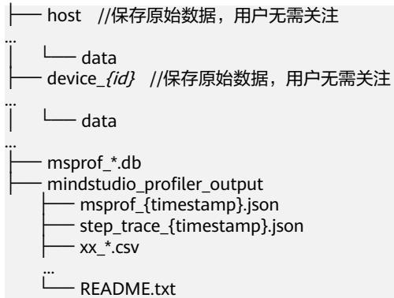

步骤2 进入mindstudio_profiler_output目录，查看性能数据文件。默认情况下采集到的文件如表3-2所示。

表 3-2 msprof 默认配置采集的性能数据文件  

<table><tr><td rowspan=1 colspan=1>文件名</td><td rowspan=1 colspan=1>说明</td></tr><tr><td rowspan=1 colspan=1>msprof_*.db</td><td rowspan=1 colspan=1>汇总所有性能数据的db格式文件。仅Atlas A3训练系列产品/Atlas A3 推理系列产品、Atlas A2训练系列产品/Atlas A2推理系列产品支持默认导出该文件。</td></tr><tr><td rowspan=1 colspan=1>msprof_*.json</td><td rowspan=1 colspan=1>timeline数据总表。</td></tr><tr><td rowspan=1 colspan=1>step_trace_*.json</td><td rowspan=1 colspan=1>迭代轨迹数据，每轮迭代的耗时。单算子场景下无此性能数据文件。</td></tr><tr><td rowspan=1 colspan=1>op_summary_*.csv</td><td rowspan=1 colspan=1>Al Core和AI CPU算子数据。</td></tr><tr><td rowspan=1 colspan=1>op_statistic_*csv</td><td rowspan=1 colspan=1>Al Core和AICPU算子调用次数及耗时统计。</td></tr><tr><td rowspan=1 colspan=1>step_trace_*.csv</td><td rowspan=1 colspan=1>迭代轨迹数据。单算子场景下无此性能数据文件。</td></tr><tr><td rowspan=1 colspan=1>task_time_*.csv</td><td rowspan=1 colspan=1>Task Scheduler任务调度信息。</td></tr><tr><td rowspan=1 colspan=1>fusion_op_*.csv</td><td rowspan=1 colspan=1>模型中算子融合前后信息。单算子场景下无此性能数据文件。</td></tr><tr><td rowspan=1 colspan=1>api_statistic_*.csv</td><td rowspan=1 colspan=1>用于统计CANN层的API执行耗时信息。</td></tr><tr><td rowspan=1 colspan=2>注：“*”表表示时间戳。</td></tr></table>

db文件推荐使用MindStudio Insight工具进行分析，详细介绍请参见《MindStudio Insight工具用户指南》。

json文件需要在Chrome浏览器中输入chrome://tracing，将文件拖到空白处进行打开，通过键盘上的快捷键（w：放大，s：缩小，a：左移，d：右移）。通过json文件可查看当前AI任务运行的时序信息，比如运行过程中接口调用时间线，如图3-1所示。

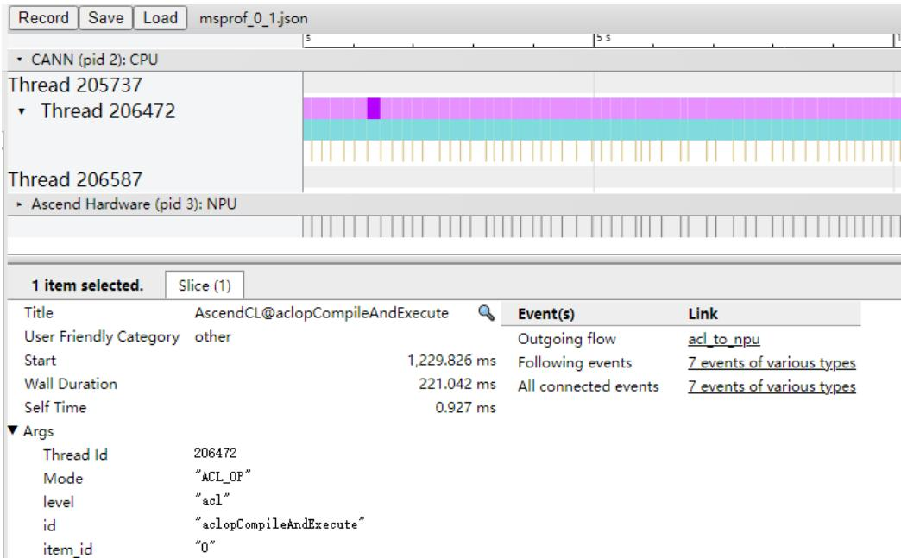  
图 3-1 查看 json 文件

csv文件可直接打开查看。通过csv文件可以看到AI任务运行时的软硬件数据，比如各算子在AI处理器软硬件上的运行耗时，通过字段排序等可以快速找出需要的信息，如图3-2所示。

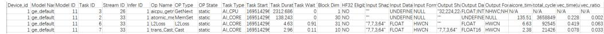  
图 3-2 查看 csv 文件

# ----结束

# 采集、解析并导出性能数据（Ascend RC）

步骤1 登录运行环境，进入msprof工具所在目录“/var”。

步骤2 执行如下命令采集性能数据。./msprof --output={path} {用户程序}

命令示例：

./msprof --output=/home/HwHiAiUser/profiling_output /home/HwHiAiUser/HIAI_PROJECTS/ MyAppname/out/main

表 3-3 参数说明  

<table><tr><td rowspan=1 colspan=1>参数</td><td rowspan=1 colspan=1>描述</td><td rowspan=1 colspan=1>可选/必选</td></tr><tr><td rowspan=1 colspan=1>--output</td><td rowspan=1 colspan=1>收集到的Profiling数据的存放路径，默认为Al任务文件所在目录。路径中不能包含特殊字符：&quot;\n&quot;,&quot;\\n&quot;,&quot;\f&quot;,&quot;\\f&quot;,&quot;\r&quot;,&quot;\\r&quot;, &quot;\b&quot;,&quot;\\b&quot;,&quot;\t&quot;,&quot;\\t&quot;,&quot;\v&quot;,&quot;\\v&quot;,&quot;\u007F&quot;,&quot;u007F&quot;,&quot;&quot;&quot;,&quot;&quot;,&quot;,&quot;&quot;&quot;&quot;&quot;I&quot;&quot;%&quot;,&quot;\1%&quot;,&quot;&gt;&quot;,&quot;\\&gt;&quot;,&quot;&lt;&quot;,&quot;1I&lt;&quot;,&quot;&quot;,&quot;\V&quot;,&quot;&amp;&quot;,&quot;V&amp;”&quot;$&quot;，(s，。</td><td rowspan=1 colspan=1>可选</td></tr><tr><td rowspan=1 colspan=1>传入用户程序&lt;app&gt;[apparguments]</td><td rowspan=1 colspan=1>请根据实际情况在msprof命令末尾添加Al任务执行命令来传入用户程序或执行脚本。格式：msprof [msprof arguments] &lt;app&gt;[apparguments]举例1（msprof传入Python执行脚本和脚本参数）:msprof --output=/home/projects/outputpython3 /home/projects/MyApp/out/sample_run.py parameter1 parameter2举例2（msprof传入main二进制执行程序）：msprof --output=/home/projects/output main举例3（msprof传入main二进制执行程序）：msprof --output=/home/projects/output /home/projects/MyApp/out/main举例4（在msprof传入main二进制执行程序和程序参数）:msprof --output=/home/projects/output /home/projects/MyApp/out/mainparameter1 parameter2举例5（msprof传入sh执行脚本和脚本参数）：msprof --output=/home/projects/output /home/projects/MyApp/out/sample_run.sh parameter1parameter2</td><td rowspan=1 colspan=1>必选</td></tr></table>

#

以上为最基本的采集命令，如有其他采集需求，请参见6.1 性能数据采集和自动解析。命令执行完成后，在--output指定的目录下生成PROF XXX目录，目录结构如下。

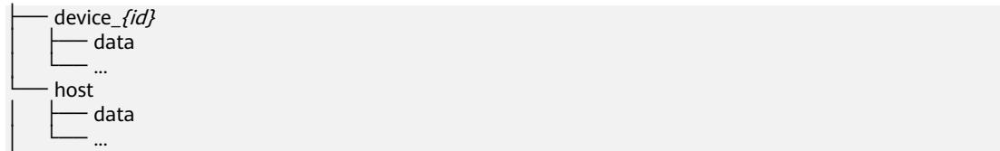

步骤3 将PROF XXX目录上传到安装CANN Toolkit开发套件包和ops算子包的开发环境，执行以下命令进行数据解析。

msprof --export=on --output=<dir>

<table><tr><td rowspan=1 colspan=1>参数</td><td rowspan=1 colspan=1>描述</td><td rowspan=1 colspan=1>可选/必选</td></tr><tr><td rowspan=1 colspan=1>--export</td><td rowspan=1 colspan=1>解析并导出性能数据。可选on或off，默认值为off。若需导出个别模型（ModelID）/迭代（IterationID）的数据，可在msprof采集命令执行完成后重新执行msprof --export命令配置--model-id、--iteration-id参数。对于未解析的PROF_XXX文件，自动解析后再导出。示例：msprof --export=on --output=/home/HwHiAiUser</td><td rowspan=1 colspan=1>必选</td></tr><tr><td rowspan=1 colspan=1>--output</td><td rowspan=1 colspan=1>性能数据文件目录。须指定为PROF_XXX目录或PROF_XXX目录的父目录，例如：/home/HwHiAiUser/profiler_data/PROF_XXX。路径中不能包含特殊字符：&quot;\n&quot;,&quot;\n&quot;,&quot;\f&quot;,&quot;\\f&quot;,&quot;\r&quot;,&quot;\r&quot;,&quot;\b&quot;,&quot;\\b&quot;,&quot;\t&quot;,&quot;\\t&quot;,&quot;\v&quot;,&quot;\v&quot;,&quot;\u007F&quot;,&quot;\u007F&quot;,&quot;&quot;,&quot;IN,&quot;,&quot;&quot;&quot;V&quot;&quot;I&quot;&quot;%&quot;,&quot;\\%&quot;,&quot;&gt;&quot;,&quot;\\&gt;&quot;,&quot;&lt;&quot;,&quot;\\&lt;&quot;,&quot;&quot;,&quot;\V\&quot;,&quot;&amp;&quot;,&quot;\\&amp;&quot;,&quot;$&quot;,&quot;\$&quot;,&quot;&quot;,&quot;V&quot;,&quot;&quot;,&quot;1&quot;。</td><td rowspan=1 colspan=1>必选</td></tr></table>

# 说明

更多解析命令介绍请参见6.2 离线解析。

PROF_XXX目录下会新增数据文件，目录结构如下：

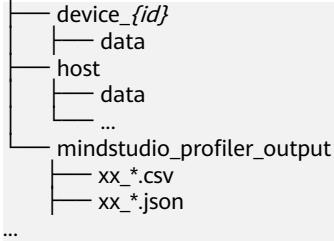

步骤4 进入mindstudio_profiler_output目录，查看性能数据文件。默认情况下采集到的文件如表3-4所示。

表 3-4 msprof 默认配置采集的性能数据文件  

<table><tr><td colspan="1" rowspan="1">文件名</td><td colspan="1" rowspan="1">说明</td></tr><tr><td colspan="1" rowspan="1">msprof_*.json</td><td colspan="1" rowspan="1">timeline数据总表。</td></tr><tr><td colspan="1" rowspan="1">step_trace_*.json</td><td colspan="1" rowspan="1">迭代轨迹数据，每轮迭代的耗时。单算子场景下无此性能数据文件。</td></tr><tr><td colspan="1" rowspan="1">op_summary_*.csv</td><td colspan="1" rowspan="1">Al Core和AI CPU算子数据。</td></tr><tr><td colspan="1" rowspan="1">op_statistic_*.csv</td><td colspan="1" rowspan="1">Al Core和AICPU算子调用次数及耗时统计。</td></tr><tr><td colspan="1" rowspan="1">step_trace_*.csv</td><td colspan="1" rowspan="1">迭代轨迹数据。单算子场景下无此性能数据文件。</td></tr><tr><td colspan="1" rowspan="1">task_time_*.csv</td><td colspan="1" rowspan="1">Task Scheduler任务调度信息。</td></tr><tr><td colspan="1" rowspan="1">fusion_op_*.csv</td><td colspan="1" rowspan="1">模型中算子融合前后信息。单算子场景下无此性能数据文件。</td></tr><tr><td colspan="1" rowspan="1">api_statistic_*.csv</td><td colspan="1" rowspan="1">用于统计CANN层的API执行耗时信息。</td></tr><tr><td colspan="2" rowspan="1">注：“*”表示时间戳。</td></tr></table>

json文件需要在Chrome浏览器中输入chrome://tracing，将文件拖到空白处进行打开，通过键盘上的快捷键（w：放大，s：缩小，a：左移，d：右移）。通过json文件可查看当前AI任务运行的时序信息，比如运行过程中接口调用时间线，如图3-3所示。

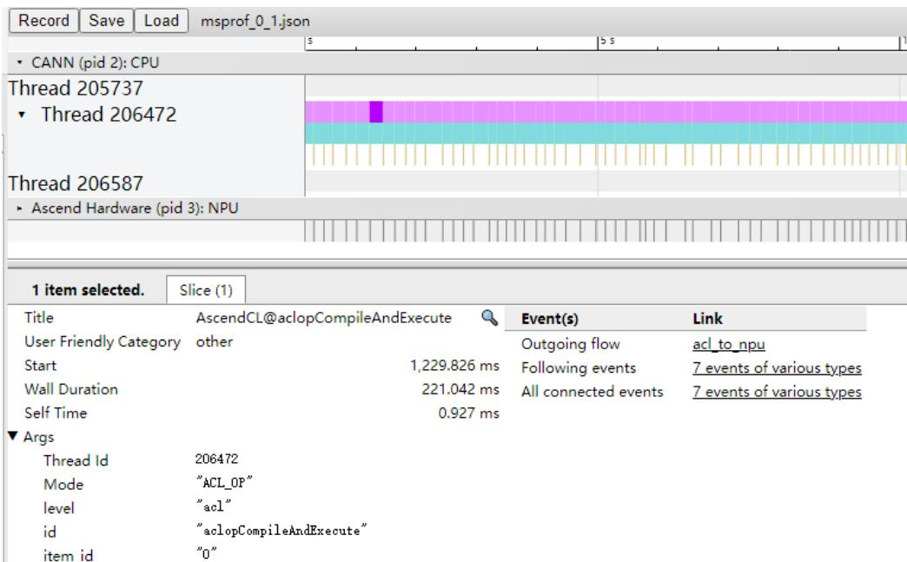  
图 3-3 查看 json 文件

csv文件可直接打开查看。通过csv文件可以看到AI任务运行时的软硬件数据，比如各算子在AI处理器软硬件上的运行耗时，通过字段排序等可以快速找出需要的信息，如图3-4所示。

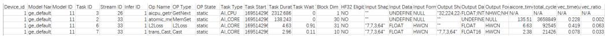  
图 3-4 查看 csv 文件

# ----结束

# 性能分析

从上文我们可以看到，性能数据文件较多，分析方法也较灵活，以下介绍几个重要文件及分析方法。

通过msprof_\*.json文件从整体角度查看AI任务运行的时序信息，进而分析出可能存在的瓶颈点。

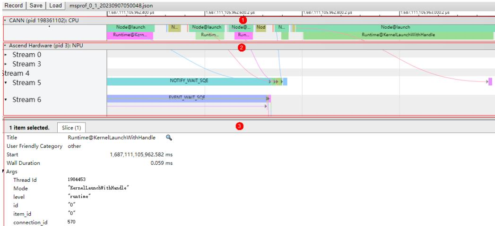  
图 3-5 msprof_\*.json 文件示例

区域1：CANN层数据，主要包含Runtime等组件以及Node（算子）的耗时数据。

区域2：底层NPU数据，主要包含Ascend Hardware下各个Stream任务流的耗时数据和迭代轨迹数据、昇腾AI处理器系统数据等。

区域3：展示timeline中各算子、接口的详细信息（单击各个timeline色块展示）。

从上图可以大致分析出耗时较长的API、算子、任务流等，并且根据对应的箭头指向找出对应的下发关系，分析执行推理过程中下层具体耗时较长的任务，查看区域3的耗时较长的接口和算子，再结合csv文件进行量化分析，定位出具体的性能瓶颈。

通过op_statistic_\*.csv文件分析各类算子的调用总时间、总次数等，排查某类算子总耗时是否较长，进而分析这类算子是否有优化空间。

图 3-6 op_statistic_\*.csv 文件示例  

<table><tr><td rowspan=1 colspan=1>Device id</td><td rowspan=1 colspan=1></td><td rowspan=1 colspan=1>Core Type</td><td rowspan=1 colspan=1>Count</td><td rowspan=1 colspan=1>Total Time(us)</td><td rowspan=1 colspan=1>Min Time(us)</td><td rowspan=1 colspan=1>Avg Time(us)</td><td rowspan=1 colspan=1>Max Time(us)</td><td rowspan=1 colspan=1>Ratio(%6)</td></tr><tr><td rowspan=1 colspan=1></td><td rowspan=1 colspan=1>0 MatmulReduceScatter</td><td rowspan=1 colspan=1>MIX AIC</td><td rowspan=1 colspan=1>1269</td><td rowspan=1 colspan=1>26675497.49</td><td rowspan=1 colspan=1>1026.561</td><td rowspan=1 colspan=1>21020.881</td><td rowspan=1 colspan=1>2511110.914</td><td rowspan=1 colspan=1>51.118</td></tr><tr><td rowspan=1 colspan=1></td><td rowspan=1 colspan=1>0MatMuIV2</td><td rowspan=1 colspan=1>ALCORE</td><td rowspan=1 colspan=1>2160</td><td rowspan=1 colspan=1>7776100.849</td><td rowspan=1 colspan=1>477.879</td><td rowspan=1 colspan=1>3600.047</td><td rowspan=1 colspan=1>26799.371</td><td rowspan=1 colspan=1>14.901</td></tr><tr><td rowspan=1 colspan=1></td><td rowspan=1 colspan=1>0 MatmulReduceScatter</td><td rowspan=1 colspan=1>ALCPU</td><td rowspan=1 colspan=1>1268</td><td rowspan=1 colspan=1>4662821.4</td><td rowspan=1 colspan=1>2305.492</td><td rowspan=1 colspan=1>3677.304</td><td rowspan=1 colspan=1>298802.966</td><td rowspan=1 colspan=1>8.935</td></tr><tr><td rowspan=1 colspan=1></td><td rowspan=1 colspan=1>0GemmV2</td><td rowspan=1 colspan=1>MIX AIC</td><td rowspan=1 colspan=1>2560</td><td rowspan=1 colspan=1>4496445.728</td><td rowspan=1 colspan=1>594.784</td><td rowspan=1 colspan=1>1756.424</td><td rowspan=1 colspan=1>3121.025</td><td rowspan=1 colspan=1>8.616</td></tr><tr><td rowspan=1 colspan=1></td><td rowspan=1 colspan=1>0 AllGatherMatmul</td><td rowspan=1 colspan=1>MIX AIC</td><td rowspan=1 colspan=1>1269</td><td rowspan=1 colspan=1>2578671.035</td><td rowspan=1 colspan=1>1683.907</td><td rowspan=1 colspan=1>2032.05</td><td rowspan=1 colspan=1>4219.309</td><td rowspan=1 colspan=1>4.941</td></tr><tr><td rowspan=1 colspan=1></td><td rowspan=1 colspan=1> 0 AllGatherMatmul</td><td rowspan=1 colspan=1>AL_CPU</td><td rowspan=1 colspan=1>1269</td><td rowspan=1 colspan=1>1421011.652</td><td rowspan=1 colspan=1>1019.001</td><td rowspan=1 colspan=1>1119.789</td><td rowspan=1 colspan=1>3664.046</td><td rowspan=1 colspan=1>2.723</td></tr><tr><td rowspan=1 colspan=2>0MatMuIV3</td><td rowspan=1 colspan=1>MIX AIC</td><td rowspan=1 colspan=1>640</td><td rowspan=1 colspan=1>977434.238</td><td rowspan=1 colspan=1>1513.921</td><td rowspan=1 colspan=1>1527.241</td><td rowspan=1 colspan=1>1544.162</td><td rowspan=1 colspan=1>1.873</td></tr></table>

可以按照Total Time排序，找出哪类算子耗时较长。

通过op_summary_\*.csv文件分析具体某个算子的信息和耗时情况，从而找出高耗时算子，进而分析该算子是否有优化空间。

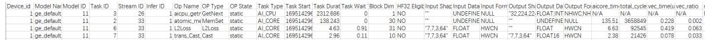  
图 3-7 op_summary_\*.csv 文件示例

Task Duration字段为算子耗时信息，可以按照Task Duration排序，找出高耗时算子；也可以按照Task Type排序，查看不同核（AI Core和AI CPU）上运行的高耗时算子。

# PyTorch 训练场景性能分析快速入门

PyTorch训练场景下，推荐通过Ascend PyTorch Profiler接口采集并解析性能数据，用户可以根据结果自行分析和识别性能瓶颈。

# 说明

Ascend PyTorch Profiler接口进行采集任务时，进程与Device之间的关系如下：

● 多进程多Device场景：支持每个Device下分别设置一个采集进程。  
● 单进程多Device场景：支持。须配套PyTorch 2.1.0post14、2.5.1post2、2.6.0及之后的版本。多进程单Device场景：需要保证多进程之间的采集动作是串行的，即各个采集动作不在同一时间开始，且各个采集动作须包含完整的启动和停止。

# 前提条件

请确保安装CANN Toolkit开发套件包和ops算子包。  
参见《CANN 软件安装指南》。  
准备好基于PyTorch 2.1.0或更高版本开发的训练模型以及配套的数据集，并按照《PyTorch 训练模型迁移调优指南》中的“模型迁移”完成PyTorch原始模型向昇腾AI处理器的迁移。

# 采集并解析性能数据

步骤1 使用Ascend PyTorch Profiler接口开启PyTorch训练时的性能数据采集。

在训练脚本（如train_\*.py文件）内添加如下示例代码进行性能数据采集参数配置，之后启动训练。

# 说明

● 下列示例中的接口详细介绍请参见Ascend PyTorch Profiler接口说明。  
● PyTorch场景性能数据采集详细介绍请参见10 Ascend PyTorch调优工具。  
● 性能数据会占据一定的磁盘空间，可能存在磁盘写满导致服务器不可用的风险。性能数据所需空间跟模型的参数、采集开关配置、采集的迭代数量有较大关系，须用户自行保证落盘目录下的可用磁盘空间。

示例一：使用with语句调用torch_npu.profiler.profile接口，自动创建Profiler，采集with范围内代码段的性能数据。

import torch import torch_npu

experimental_config $=$ torch_npu.profiler._ExperimentalConfig( export_type=[ torch_npu.profiler.ExportType.Text ], profiler_level=torch_npu.profiler.ProfilerLevel.Level0, mstx=False, # 原参数名msprof_tx改为mstx，新版本依旧兼容原参数名msprof_tx aic_metric $; = 1$ torch_npu.profiler.AiCMetrics.AiCoreNone, l2_cache=False, op_att $\bumpeq$ False, data_simplification=False, record_op_args=False, gc_detect_threshold $\mid =$ None   
with torch_npu.profiler.profile( activities=[ torch_npu.profiler.ProfilerActivity.CPU, torch_npu.profiler.ProfilerActivity.NPU ], schedule=torch_npu.profiler.schedule(wait=0, warmup $_ { = 0 }$ , active $\mathrel { \mathop : } = \hat { \rceil }$ , repeat=1, skip_first=1), # 与   
prof.step()配套使用 on_trace_ready=torch_npu.profiler.tensorboard_trace_handler("./result"), record_shapes=False, profile_memory=False, with_stack $\underline { { \underline { { \mathbf { \Pi } } } } }$ False, with_modules=False, with_flops=False, experimental_config $\mid =$ experimental_config) as prof: for step in range(steps): train_one_step(step, steps, train_loader, model, optimizer, criterion) prof.step() # 与schedule配套使用   
示例二：创建torch_npu.profiler.profile对象，通过start和stop接口控制采集性能   
数据，用户可自定义采集启动的位置。   
import torch   
import torch_npu   
...   
experimental_config $=$ torch_npu.profiler._ExperimentalConfig( export_type=[ torch_npu.profiler.ExportType.Text ], profiler_level=torch_npu.profiler.ProfilerLevel.Level0, mstx=False, # 原参数名msprof_tx改为mstx，新版本依旧兼容原参数名msprof_tx aic_metrics torch_npu.profiler.AiCMetrics.AiCoreNone, l2_cache=False, op_attr=False, data_simplification=False, record_op_args=False, gc_detect_threshold=None   
prof $=$ torch_npu.profiler.profile( activities=[ torch_npu.profiler.ProfilerActivity.CPU, torch_npu.profiler.ProfilerActivity.NPU ], schedule=torch_npu.profiler.schedule(wait=0, warmup $_ { 1 = 0 }$ , active $^ { \prime = \ 1 }$ , repeat=1, skip_first=1), # 与   
prof.step()配套使用 on_trace_ready=torch_npu.profiler.tensorboard_trace_handler("./result"), record_shapes=False, profile_memory=False, with_stack=False, with_modules=False, with_flops=False, experimental_config=experimental_config)   
prof.start() # 启动性能数据采集   
for step in range(steps): train_one_step() prof.step() # 与schedule配套使用   
prof.stop() # 结束性能数据采集

以上两个示例主要使用tensorboard_trace_handler导出性能数据，也可以使用以下prof.export_chrome_trace方式导出单个性能文件“chrome_trace_{pid}.json”。由于tensorboard_trace_handler导出的性能数据包含了prof.export_chrome_trace导出的性能数据，所以根据实际需求选择一种方式即可。

import torch import torch_npu

with torch_npu.profiler.profile() as prof:

# 启动性能数据采集 for step in range(steps): train_one_step(step, steps, train_loader, model, optimizer, criterion) prof.export_chrome_trace('./chrome_trace_14.json')

步骤2 查看采集到的性能数据结果文件。

训练结束后，在torch_npu.profiler.tensorboard_trace_handler接口指定的目录下生成Ascend PyTorch Profiler接口的采集结果目录，如下示例。

# 说明

以下数据文件用户无需打开查看，可使用《MindStudio Insight工具用户指南》工具进行性能数据的查看和分析，如需了解详细字段解释请参见13 MindSpore&PyTorch框架性能数据文件参考。

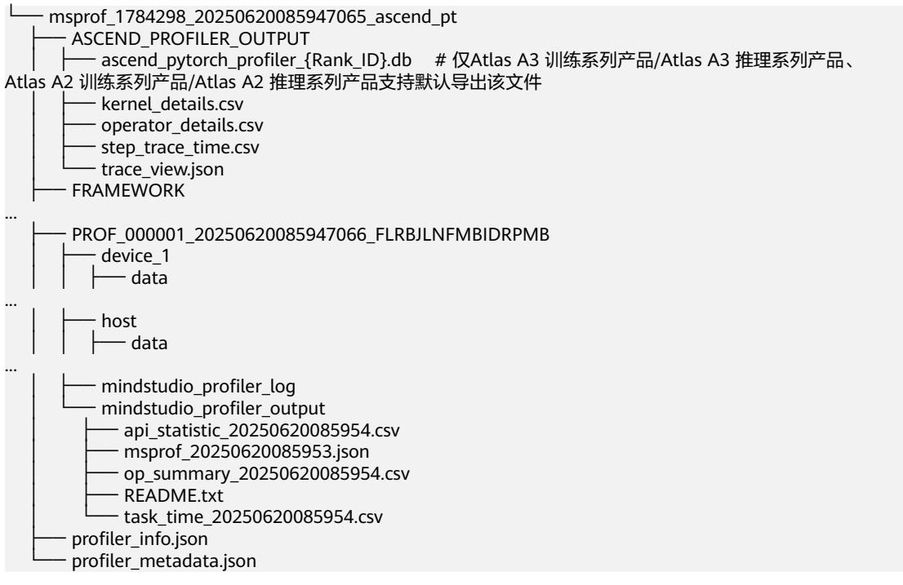

# 5 TensorFlow训练场景性能分析快速入门

TensorFlow训练场景下，推荐通过TensorFlow Adapter提供的接口使能性能数据采集，然后将结果文件上传到安装有CANN Toolkit开发套件包和ops算子包的开发环境进行数据解析，进而分析性能瓶颈。

# 前提条件

请确保安装CANN Toolkit开发套件包和ops算子包。  
参见《CANN 软件安装指南》。  
训练/在线推理脚本在昇腾AI处理器上执行成功。

# 采集、解析并导出性能数据

步骤1 修改训练脚本，开启性能数据采集开关。

以TensorFlow 1.15 session_run模式的脚本为例。

通过session配置项profiling_mode、profiling_options开启Profiling数据采集，代码示

例如下：

custom_op $=$ config.graph_options.rewrite_options.custom_optimizers.add()  
custom_op.name $=$ "NpuOptimizer"  
custom_op.parameter_map["use_off_line"]. $\ b >$ True  
# 开启性能数据采集  
custom_op.parameter_map["profiling_mode"].b $=$ True  
# 性能数据采集项  
# output为采集结果输出路径  
# task_trace：是否采集任务轨迹数据  
# training_trace：是否采集迭代轨迹数据，采集迭代轨迹数据依赖fp_point（训练网络迭代轨迹正向算子的开始位置）和bp_point（反向算子的结束位置），可直接配置为空，由系统自动获取，采集异常时需要手工配置。custom_op.parameter_map["profiling_options"].s $=$ tf.compat.as_bytes('{"output":"/home/  
HwHiAiUser/  
profiling_output","training_trace":"on","task_trace":"on","fp_point":"","bp_point":"","aic_metrics":"PipeUtilization"}')  
config.graph_options.rewrite_options.remapping $=$ RewriterConfig.OFF #关闭remap开关  
with tf.Session(config=config) as sess:  
sess.run()

# 说明

以上为最基本的采集项，如有其他采集需求，请参见11.1 使用TensorFlow框架接口采集性  
能数据。Estimator和Keras脚本修改方式略有不同，手工迁移脚本和自动迁移脚本修改方式也略有不同，请参见11.1 使用TensorFlow框架接口采集性能数据。

步骤2 重新执行训练脚本。

训练/在线推理结束后，在output参数指定的目录下生成PROF XXX文件夹用于存放采集到的原始性能数据，该数据需要经过msprof解析工具的解析才可查看。

步骤3 执行msprof命令解析并导出性能数据。msprof --export=on --output=/home/HwHiAiUser/profiling_output/PROF_XXX其中“--output”为采集性能数据时设置的存储Profiling数据文件的路径。

命令执行完成后，在--output指定的PROF XXX目录中，存放采集并自动解析后的性能数据，目录结构如下所示（仅展示性能数据）。

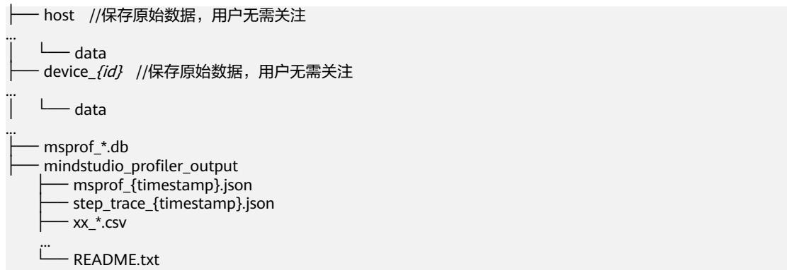

步骤4 进入mindstudio_profiler_output目录，查看性能数据文件。默认情况下采集到的文件如表5-1所示。

表 5-1 msprof 默认配置采集的性能数据文件  

<table><tr><td rowspan=1 colspan=1>文件名</td><td rowspan=1 colspan=1>说明</td></tr><tr><td rowspan=1 colspan=1>msprof_*.db</td><td rowspan=1 colspan=1>汇总所有性能数据的db格式文件。仅Atlas A3训练系列产品/Atlas A3推理系列产品、Atlas A2 训练系列产品/Atlas A2 推理系列产品支持默认导出该文件。</td></tr><tr><td rowspan=1 colspan=1>msprof_*.json</td><td rowspan=1 colspan=1>timeline数据总表。</td></tr><tr><td rowspan=1 colspan=1>step_trace_*.json</td><td rowspan=1 colspan=1>迭代轨迹数据，每轮迭代的耗时。单算子场景下无此性能数据文件。</td></tr><tr><td rowspan=1 colspan=1>op_summary_*.csv</td><td rowspan=1 colspan=1>Al Core和AI CPU算子数据。</td></tr><tr><td rowspan=1 colspan=1>op_statistic_*.csv</td><td rowspan=1 colspan=1>Al Core和AICPU算子调用次数及耗时统计。</td></tr><tr><td rowspan=1 colspan=1>step_trace_*.csv</td><td rowspan=1 colspan=1>迭代轨迹数据。单算子场景下无此性能数据文件。</td></tr><tr><td rowspan=1 colspan=1>task_time_*.csv</td><td rowspan=1 colspan=1>Task Scheduler任务调度信息。</td></tr><tr><td rowspan=1 colspan=1>fusion_op_*.csv</td><td rowspan=1 colspan=1>模型中算子融合前后信息。单算子场景下无此性能数据文件。</td></tr><tr><td rowspan=1 colspan=1>api_statistic_*.csv</td><td rowspan=1 colspan=1>用于统计CANN层的API执行耗时信息。</td></tr><tr><td rowspan=1 colspan=2>注：“*”表示时间戳。</td></tr></table>

db文件推荐使用MindStudio Insight工具进行分析，详细介绍请参见《MindStudio Insight工具用户指南》。

json文件需要在Chrome浏览器中输入chrome://tracing，将文件拖到空白处进行打开，通过键盘上的快捷键（w：放大，s：缩小，a：左移，d：右移）。通过json文件可查看当前AI任务运行的时序信息，比如运行过程中接口调用时间线，如图5-1所示。

  
图 5-1 查看 json 文件

csv文件可直接打开查看。通过csv文件可以看到AI任务运行时的软硬件数据，比如各算子在AI处理器软硬件上的运行耗时，通过字段排序等可以快速找出需要的信息，如图5-2所示。

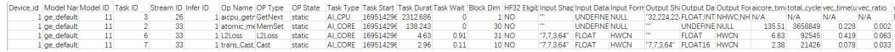  
图 5-2 查看 csv 文件

# ----结束

从上文我们可以看到，性能数据文件较多，分析方法也较灵活，以下介绍几个重要文件及分析方法。

通过step_trace_\*.csv文件分析迭代轨迹数据信息，该文件记录了每轮迭代的耗时。

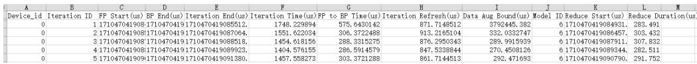  
图 5-3 step_trace_\*.csv 文件示例

主要字段为：

Iteration Time：一轮迭代的计算时间，主要包含FP/BP和Grad Refresh两个阶段的时间。  
FP to BP Time：网络正向传播和反向传播的计算时间。  
Iteration Refresh：迭代拖尾时间。  
Data Aug Bound：两个相邻Iteration Time的间隔时间。

通过op_statistic_\*.csv文件分析各类算子的调用总时间、总次数等，排查某类算子总耗时是否较长，进而分析这类算子是否有优化空间。

<table><tr><td rowspan=1 colspan=1>Device id</td><td rowspan=1 colspan=1>ModelName</td><td rowspan=1 colspan=1>OP Type</td><td rowspan=1 colspan=1>CoreType</td><td rowspan=1 colspan=1>Count</td><td rowspan=1 colspan=1>TotalTime(us)</td><td rowspan=1 colspan=1>Min Time(us)</td><td rowspan=1 colspan=1>Avg Time(us)</td><td rowspan=1 colspan=1>Max Time(us)</td><td rowspan=1 colspan=1>Ratio(%)</td></tr><tr><td rowspan=1 colspan=1>1</td><td rowspan=1 colspan=1>1ge_default _20230919170146_121</td><td rowspan=1 colspan=1>Conv2D</td><td rowspan=1 colspan=1>AL_CORE</td><td rowspan=1 colspan=1>53</td><td rowspan=1 colspan=1>6220.324</td><td rowspan=1 colspan=1>57.091</td><td rowspan=1 colspan=1>117.365</td><td rowspan=1 colspan=1>789.496</td><td rowspan=1 colspan=1>20.158</td></tr><tr><td rowspan=1 colspan=1></td><td rowspan=1 colspan=1>1ge_default _20230919170146_121</td><td rowspan=1 colspan=1>Cony2DBa</td><td rowspan=1 colspan=1>ALCORE</td><td rowspan=1 colspan=1>52</td><td rowspan=1 colspan=1>5395.378</td><td rowspan=1 colspan=1>14.76</td><td rowspan=1 colspan=1>103.757</td><td rowspan=1 colspan=1>661.873</td><td rowspan=1 colspan=1>17.484</td></tr><tr><td rowspan=1 colspan=1></td><td rowspan=1 colspan=1>1 ge_default _20230919170146_121</td><td rowspan=1 colspan=1>GetNext</td><td rowspan=1 colspan=1>AICPU</td><td rowspan=1 colspan=1>2</td><td rowspan=1 colspan=1>4304.476</td><td rowspan=1 colspan=1>1991.79</td><td rowspan=1 colspan=1>2152.238</td><td rowspan=1 colspan=1>2312.686</td><td rowspan=1 colspan=1>13.949</td></tr><tr><td rowspan=1 colspan=1></td><td rowspan=1 colspan=1>ge.default 20230919170146.121</td><td rowspan=1 colspan=1>BNTrainin</td><td rowspan=1 colspan=1>ALCORE</td><td rowspan=1 colspan=1>53</td><td rowspan=1 colspan=1>2920.348</td><td rowspan=1 colspan=1>17.69</td><td rowspan=1 colspan=1>55.101</td><td rowspan=1 colspan=1>183.284</td><td rowspan=1 colspan=1>9.464</td></tr></table>

可以按照Total Time排序，找出哪类算子耗时较长。

通过op_summary_\*.csv文件分析具体某个算子的信息和耗时情况，从而找出高耗时算子，进而分析该算子是否有优化空间。

<table><tr><td></td><td>Device_id Model NarModel ID Task ID</td><td></td><td>3</td><td>Stream ID Infer ID</td><td></td><td>Op Name OP Type OP State</td><td></td><td></td><td></td><td>TasTpesai</td><td></td><td></td><td></td><td></td><td></td><td></td><td></td><td></td><td></td><td></td><td></td><td></td><td></td><td></td><td></td><td></td><td>N/A</td><td></td></tr><tr><td></td><td>1 ge_default</td><td>11 11</td><td></td><td></td><td>26</td><td></td><td>1 aicpu_getr GetNext</td><td>static</td><td>ALCPU ALCORE</td><td></td><td>16951429€2312.686</td><td></td><td>0</td><td>1NO</td><td>□</td><td>UNDEFINE NULL</td><td></td><td>32,224,22.FLOAT:INT NHWC;NH N/A</td><td></td><td></td><td></td><td></td><td>N/A 135.513658849</td><td>N/A</td><td>0.228</td><td></td></tr><tr><td></td><td>1 ge_default</td><td>11</td><td></td><td>2</td><td>33 33</td><td></td><td>1 atomic_meMemSetstatic 1L2L05sL2L055</td><td></td><td></td><td>ALCORE</td><td>16951429€ 16951429€</td><td>138.243</td><td>0.91</td><td>0</td><td>30 NO 31 NO</td><td>7.7.3.64°FLOAT</td><td>UNDEFINE NULL</td><td></td><td></td><td>UNDEFINE NULL FLOATHWCN</td><td></td><td></td><td>6.63</td><td>92545</td><td></td><td></td></tr><tr><td></td><td>1 ge_default</td><td></td><td></td><td>6</td><td>33</td><td></td><td>1 trans_Cast, Cast</td><td>static</td><td></td><td>ALCORE</td><td>169514296</td><td>4.63</td><td></td><td></td><td>10 NO</td><td>7.7.3.64*</td><td>HWCN FLOAT</td><td></td><td>7.7,3,64°FLOAT16 HWCN</td><td></td><td></td><td>2.38</td><td></td><td>21426</td><td>0.419 0.078</td><td>0.033 0.063</td></tr><tr><td></td><td>1 ge_default,</td><td>11|</td><td></td><td></td><td></td><td></td><td></td><td>static</td><td></td><td></td><td></td><td>2.96</td><td>0.11</td><td></td><td></td><td></td><td> HWCN</td><td></td><td></td><td></td><td></td><td></td><td></td><td></td><td></td><td></td></tr></table>

Task Duration字段为算子耗时信息，可以按照Task Duration排序，找出高耗时算子；也可以按照Task Type排序，查看不同核（AI CORE和AI CPU等）上运行的高耗时算子。

# 6 msprof 模型调优工具

性能数据采集和自动解析离线解析

# 6.1 性能数据采集和自动解析

# 6.1.1 msprof 采集通用命令

产品支持情况  

<table><tr><td rowspan=1 colspan=1>产品</td><td rowspan=1 colspan=1>是否支持</td></tr><tr><td rowspan=1 colspan=1>Atlas A3训练系列产品/Atlas A3推理系列产品</td><td rowspan=1 colspan=1>√</td></tr><tr><td rowspan=1 colspan=1>Atlas A2训练系列产品/Atlas A2推理系列产品</td><td rowspan=1 colspan=1>√</td></tr><tr><td rowspan=1 colspan=1>Atlas 200I/500 A2推理产品</td><td rowspan=1 colspan=1>√</td></tr><tr><td rowspan=1 colspan=1>Atlas推理系列产品</td><td rowspan=1 colspan=1>√</td></tr><tr><td rowspan=1 colspan=1>Atlas 训练系列产品</td><td rowspan=1 colspan=1>√</td></tr></table>

# 功能说明

msprof命令行工具提供了AI任务运行性能数据、昇腾AI处理器系统数据等性能数据的采集和解析能力。

其中，msprof采集通用命令是性能数据采集的基础，用于提供性能数据采集时的基本信息，包括参数说明、AI任务文件、数据存放路径、自定义环境变量等。

# 注意事项

● 请确保AI任务能在运行环境中正常运行。  
● 请确保完成2 使用前准备。

# 说明

不支持采集Python调用栈、PyTorch或MindSpore框架层数据，可使用对应框架接口方式采集。

# 命令格式（Ascend EP）

登录CANN Toolkit开发套件包和ops算子包所在环境，可在任意目录下执行以下命令。

方式一（推荐）：在msprof命令末尾，直接传入用户程序或执行脚本。msprof [options] <app>

方式二：通过--application参数传入用户程序或执行脚本。msprof [options] --application=<app>

# 命令格式（Ascend RC）

登录运行环境，进入msprof工具所在目录“/var”，执行以下命令。

方式一（推荐）：在msprof命令末尾，直接传入用户程序或执行脚本。./msprof [options] <app>

方式二：通过--application参数传入用户程序或执行脚本。./msprof [options] --application=<app>

# 参数说明

表 6-1 参数说明

<table><tr><td rowspan=1 colspan=1>可选必选</td></tr><tr><td rowspan=1 colspan=1>数</td></tr></table>

<table><tr><td rowspan=1 colspan=4>兑明</td></tr><tr><td rowspan=1 colspan=1></td><td rowspan=1 colspan=1>有</td><td rowspan=1 colspan=1>说明</td><td rowspan=1 colspan=1>产品支持情况</td></tr><tr><td></td><td rowspan=1 colspan=1>Dmspro</td><td rowspan=1 colspan=1>（仅方式一支持）待采集性能数据的用户程序，请在msprof命令末尾传入用户程序或执行脚本。配置示例：·举例1（msprof传入Python执行脚本和脚本参数）：msprof --output=/home/projects/outputpython3 /home/projects/MyApp/out/sample_run.pyparameter1 parameter2举例2（msprof传入main二进制执行程序）：msprof --output=/home/projects/output main举例3（msprof传入main二进制执行程序）：msprof --output=/home/projects/output /home/projects/MyApp/out/main举例4（在msprof传入main二进制执行程序和程序参数）：msprof --output=/home/projects/output /home/projects/MyApp/out/mainparameter1 parameter2举例5（msprof传入sh执行脚本和脚本参数）：msprof --output=/home/projects/output /home/projects/MyApp/out/sample_run.sh parameter1 parameter2</td><td rowspan=1 colspan=1>Atlas 200l/500 A2推理产品Atlas推理系列产品Atlas训练系列产品Atlas A2训练系列产品/Atlas A2推理系列产品Atlas A3训练系列产品/Atlas A3推理系列产品</td></tr></table>

<table><tr><td rowspan=1 colspan=1>参数</td><td rowspan=1 colspan=1>可选必选</td><td rowspan=1 colspan=1>说明</td><td rowspan=1 colspan=1>产品支持情况</td></tr><tr><td rowspan=1 colspan=1></td><td rowspan=1 colspan=1></td><td rowspan=1 colspan=1>说明若配置的用户程序命令中，存在配置参数值需要加引号的情况，请将命令写入Shell脚本后，通过执行Shell脚本的方式在msprof命令上添加用户程序命令。不建议配置其他用户目录或其他用户可写目录下的AI任务，避免提权风险；不建议配置删除文件或目录、修改密码、提权命令等有安全风险的高危操作；应避免使用pmupload作为程序名称。3  采集全部性能数据、采集AI任务运行时性能数据或采集msproftx数据时，本参数必选。采集昇腾AI处理器系统数据时，本参数可选。采集Host侧系统数据时，本参数可选。</td><td rowspan=1 colspan=1></td></tr></table>

<table><tr><td>参数</td><td></td></tr><tr><td>application =&lt;app&gt;</td><td>采用方</td></tr></table>

<table><tr><td>on</td><td>有西动</td><td>说明</td><td>产品支持情况</td></tr><tr><td></td><td>说明</td><td>（仅方式二支持）待采集性能数据的用 户程序，通过该参数可以传入用户程序 名和入参。 配置示例： ·使用msprof的--application参数传 入main二进制执行程序和程序参 数： msprof --application=&quot;/home/ projects/main parameter1 parameter2. ... 使用msprof的--application参数传 入sh执行脚本和脚本参数： 训练场景：msprof -- application=&quot;/home/projects/ run.sh parameter1 parameter2 ...&quot; 若parameter中存在异常符号时将无法 识别参数，因此推荐使用方式一传入用 户程序。 不建议配置其他用户目录或其他用户可 写目录下的AI任务，避免提权风险；不 建议配置删除文件或目录、修改密码、 提权命令等有安全风险的高危操作；应 避免使用pmupload作为程序名称。 采集全部性能数据、采集AI任务运行时 性能数据或采集msproftx数据时，本参 数必选。 采集昇腾AI处理器系统数据时，本参数 可选。 采集Host侧系统数据时，本参数可选。</td><td>Atlas 200I/500 A2 推理产品 Atlas推理系列产品 Atlas训练系列产品 Atlas A2训练系列产 品/Atlas A2推理系 列产品 Atlas A3 训练系列产 品/AtlasA3推理系 列产品</td></tr></table>

<table><tr><td colspan="1" rowspan="1">参数</td><td colspan="1" rowspan="1">可选必选</td><td colspan="1" rowspan="1">说明</td><td colspan="1" rowspan="1">产品支持情况</td></tr><tr><td colspan="1" rowspan="1">：output=&lt;path&gt;</td><td colspan="1" rowspan="1">可选</td><td colspan="1" rowspan="1">收集到的性能数据的存放路径。·采集全部性能数据或采集AI任务运行时性能数据时，本参数可选。·仅采集昇腾AI处理器系统数据时，本参数必选。该参数优先级高于ASCEND_WORK_PATH，具体请参见《环境变量参考》。路径中不能包含特殊字符："\n","\\n","\f","\f","\r","vr","\b","b","\t","T\t","\v","`\v","\u007F","\\u007F","",,","""", "%”,"1\%","&gt;","\\&gt;","&lt;","&lt;","","\V","&amp;","\&amp;","$","\$","","V;","","1"。在msprof命令末尾添加Al任务执行命令来传入用户程序或执行脚本时，未配置--output的性能数据默认落盘在当前目录。配置--application参数添加Ai任务执行命令来传入用户程序或执行脚本时，未配置--output的性能数据默认落盘在AI任务文件所在目录。</td><td colspan="1" rowspan="1">Atlas 200l/500 A2推理产品Atlas推理系列产品Atlas 训练系列产品Atlas A2训练系列产品/Atlas A2推理系列产品Atlas A3训练系列产品/Atlas A3推理系列产品</td></tr><tr><td colspan="1" rowspan="1">type=&lt;typeV</td><td colspan="1" rowspan="1">可选</td><td colspan="1" rowspan="1">设置性能数据解析结果文件格式，即可以选择msprof命令行执行采集后自动解析的结果文件格式，取值为：·text：表示解析为.json、.csv格式的文件和.db格式文件（msprof_时间戳.db）。db：仅解析为一个汇总所有性能数据的.db格式文件（msprof_时间戳.db），使用MindStudio Insight工具展示。默认为text。说明导出的.json、.csv格式的文件和.db格式文件详细内容请参见12性能数据文件参考。</td><td colspan="1" rowspan="1">Atlas 200l/500 A2推理产品Atlas推理系列产品Atlas 训练系列产品Atlas A2训练系列产品/Atlas A2推理系列产品Atlas A3训练系列产品/Atlas A3推理系列产品</td></tr><tr><td colspan="1" rowspan="1">environment=&lt;env&gt;</td><td colspan="1" rowspan="1">可选</td><td colspan="1" rowspan="1">执行采集时运行环境上需要的自定义环境变量。不建议使用其他用户的目录覆盖原有环境变量，避免提权风险。配置格式为--environment="${envKey}=${envValue}"或--environment="${envKey1}=${envValue1};${envKey2}=${envValue2}"。例如：--environment="LD_LIBRARY_PATH=/home/xxx/Ascend/nnrt/latest;/home/xxx/Ascend/nnae/latest/lib64"。</td><td colspan="1" rowspan="1">Atlas 200l/500 A2推理产品Atlas推理系列产品Atlas 训练系列产品Atlas A2训练系列产品/Atlas A2推理系列产品Atlas A3训练系列产品/Atlas A3推理系列产品</td></tr><tr><td colspan="1" rowspan="1">--storage-limit=&lt;limit-value&gt;</td><td colspan="1" rowspan="1">可选</td><td colspan="1" rowspan="1">指定落盘目录允许存放的最大文件容量。当性能数据文件在磁盘中即将占满本参数设置的最大存储空间或剩余磁盘总空间即将被占满时（总空间剩余&lt;=20MB），则将磁盘内最早的文件进行老化删除处理。范围[200,4294967295]，单位为MB,例如--storage-limit=200MB，默认未配置本参数。未配置本参数时，默认取值为性能数据文件存放目录所在磁盘可用空间的90%。</td><td colspan="1" rowspan="1">Atlas 2001/500 A2推理产品Atlas推理系列产品Atlas 训练系列产品Atlas A2训练系列产品/Atlas A2推理系列产品Atlas A3训练系列产品/Atlas A3推理系列产品</td></tr><tr><td colspan="1" rowspan="1">--python-path=&lt;python-path&gt;</td><td colspan="1" rowspan="1">可选</td><td colspan="1" rowspan="1">指定解析使用的Python解释器路径，要求Python3.7.5及以上版本。如果是高权限用户执行则禁止指定低权限路径。</td><td colspan="1" rowspan="1">Atlas 200l/500 A2推理产品Atlas推理系列产品Atlas 训练系列产品Atlas A2训练系列产品/Atlas A2推理系列产品Atlas A3训练系列产品/Atlas A3推理系列产品</td></tr><tr><td colspan="1" rowspan="1">参数</td><td colspan="1" rowspan="1">四</td><td colspan="1" rowspan="1">说明</td><td colspan="1" rowspan="1">产品支持情况</td></tr><tr><td colspan="1" rowspan="1">--help</td><td colspan="1" rowspan="1">可选</td><td colspan="1" rowspan="1">帮助提示参数。</td><td colspan="1" rowspan="1">Atlas 200l/500 A2推理产品Atlas推理系列产品Atlas训练系列产品Atlas A2训练系列产品/Atlas A2推理系列产品Atlas A3训练系列产品/Atlas A3推理系列产品</td></tr></table>

# 使用示例（Ascend EP）

步骤1 登录CANN Toolkit开发套件包和ops算子包所在环境。

步骤2 在任意路径下执行以下命令，采集性能数据。msprof --output=/home/projects/output /home/projects/MyApp/out/main

msprof命令执行完成后，会自动解析并导出性能数据结果文件，详细内容请参见12 性能数据文件参考。

----结束

# 使用示例（Ascend RC）

步骤1 登录运行环境。

步骤2 进入msprof工具所在目录“/var”，执行以下命令，采集性能数据。./msprof --output=/home/projects/output /home/projects/MyApp/out/main

msprof命令执行完成后，会自动解析并导出性能数据结果文件，详细内容请参见12 性能数据文件参考。

----结束

# 6.1.2 采集 AI 任务运行性能数据

产品支持情况  

<table><tr><td colspan="1" rowspan="1">产品</td><td colspan="1" rowspan="1">是否支持</td></tr><tr><td colspan="1" rowspan="1">Atlas A3 训练系列产品/Atlas A3推理系列产品</td><td colspan="1" rowspan="1">√</td></tr><tr><td colspan="1" rowspan="1">Atlas A2训练系列产品/Atlas A2推理系列产品</td><td colspan="1" rowspan="1">√</td></tr><tr><td colspan="1" rowspan="1">Atlas 200I/500 A2推理产品</td><td colspan="1" rowspan="1">√</td></tr><tr><td colspan="1" rowspan="1">Atlas 推理系列产品</td><td colspan="1" rowspan="1">√</td></tr><tr><td colspan="1" rowspan="1">Atlas 训练系列产品</td><td colspan="1" rowspan="1">√</td></tr></table>

# 功能说明

msprof支持采集AI任务运行时相关的性能数据，并且在采集后可以自动进行性能数据解析和文件落盘。

# 注意事项

请确保AI任务能在运行环境中正常运行。

请确保完成2 使用前准备。

# 说明

不支持采集Python调用栈、PyTorch或MindSpore框架层数据，可使用对应框架接口方式采集。

# 命令格式（Ascend EP）

登录CANN Toolkit开发套件包和ops算子包所在环境，可在任意目录下执行以下命令。

方式一（推荐）：在msprof命令末尾，直接传入用户程序或执行脚本。msprof [options] <app>

方式二：通过--application参数传入用户程序或执行脚本。msprof [options] --application=<app>

# 命令格式（Ascend RC）

登录运行环境，进入msprof工具所在目录“/var”，执行以下命令。

方式一（推荐）：在msprof命令末尾，直接传入用户程序或执行脚本。./msprof [options] <app>

方式二：通过--application参数传入用户程序或执行脚本。./msprof [options] --application=<app>

# 参数说明

表 6-2 参数说明  

<table><tr><td colspan="1" rowspan="1">参数</td><td colspan="1" rowspan="1">可选必选</td><td colspan="1" rowspan="1">说明</td><td colspan="1" rowspan="1">产品支持情况</td><td colspan="1" rowspan="1">性能数据文件</td></tr><tr><td colspan="2" rowspan="1">&lt;app&gt;         心选</td><td colspan="1" rowspan="1">（仅方式一支持）待采集性能数据的用户程序，请在msprof命令末尾传入用户程序或执行脚本。配置示例：msprof --output=/home/projects/output python3 /home/projects/MyApp/out/ sample_run.py parameter1 parameter2msprof --output=/home/projects/output mainmsprof --output=/home/projects/output /home/projects/MyApp/out/mainmsprof --output=/home/projects/output /home/projects/MyApp/out/main parameter1 parameter2msprof --output=/home/projects/output /home/projects/MyApp/out/sample_run.sh parameter1parameter2</td><td colspan="1" rowspan="1">Atlas 2001/500A2推理产品Atlas推理系列产品Atlas训练系列产品Atlas A2训练系列产品/Atlas A2推理系列产品Atlas A3 训练系列产品/Atlas A3推理系列产品</td><td colspan="1" rowspan="1"></td></tr><tr><td colspan="1" rowspan="1">参数</td><td colspan="1" rowspan="1">有</td><td colspan="1" rowspan="1">说明</td><td colspan="1" rowspan="1">产品支持情况</td><td colspan="1" rowspan="1">性能数据文件</td></tr><tr><td colspan="1" rowspan="1"></td><td colspan="1" rowspan="1"></td><td colspan="1" rowspan="1">说明不建议配置其他用户目录或其他用户可写目录下的AI任务，避免提权风险；不建议配置删除文件或目录、修改密码、提权命令等有安全风险的高危操作；应避免使用pmupload作为程序名称。.  采集全部性能数据、采集AI任务运行时性能数据或采集msproftx数据时，本参数必选。采集昇腾AI处理器系统数据时，本参数可选。采集Host侧系统数据时，本参数可选。</td><td colspan="1" rowspan="1"></td><td colspan="1" rowspan="1"></td></tr><tr><td colspan="1" rowspan="1">参数</td><td colspan="1" rowspan="1">可选必选</td><td colspan="1" rowspan="1">说明</td><td colspan="1" rowspan="1">产品支持情况</td><td colspan="1" rowspan="1">性能数据文件</td></tr><tr><td colspan="2" rowspan="1">心选application=&lt;app&gt;</td><td colspan="1" rowspan="1">（仅方式二支持）待采集性能数据的用户程序，通过该参数可以传入用户程序名和入参。配置示例：推理场景：msprof--application="/home/projects/MyApp/out/mainparameter1parameter2 ..."训练场景：msprof--application="/home/projects/mindspore/scripts/run_standalone_train.sh parameter1parameter2 ..."若parameter中存在异常符号时将无法识别参数，因此推荐使用方式一传入用户程序。</td><td colspan="1" rowspan="1">Atlas 2001/500A2推理产品Atlas推理系列产品Atlas 训练系列产品Atlas A2训练系列产品/Atlas A2推理系列产品Atlas A3 训练系列产品/Atlas A3推理系列产品</td><td colspan="1" rowspan="1"></td></tr><tr><td colspan="1" rowspan="1"></td><td colspan="1" rowspan="1"></td><td colspan="1" rowspan="1">说明. 不建议配置其他用户目录或其他用户可写目录下的AI任务，避免提权风险；不建议配置删除文件或目录、修改密码、提权命令等有安全风险的高危操作；应避免使用pmupload作为程序名称。采集全部性能数据、采集AI任务运行时性能数据或采集msproftx数据时，本参数必选。采集昇腾AI处理器系统数据时，本参数可选。采集Host侧系统数据时，本参数可选。</td><td colspan="1" rowspan="1"></td><td colspan="1" rowspan="1"></td></tr><tr><td colspan="1" rowspan="1">ascendcl=&lt;ascendcl-value&gt;</td><td colspan="1" rowspan="1">可选</td><td colspan="1" rowspan="1">控制acl接口性能数据采集的开关，可选on或off，默认为on。可采集acl接口性能数据，包括Host与Device之间、Device间的同步异步内存复制时延等。</td><td colspan="1" rowspan="1">Atlas 2001/500A2推理产品Atlas推理系列产品Atlas 训练系列产品Atlas A2训练系列产品/Atlas A2推理系列产品Atlas A3 训练系列产品/Atlas A3推理系列产品</td><td colspan="1" rowspan="1">msprof_*.json中的CANN_AscendCL层级和 api_statistic_*.csv文件db文件的COMMUNICATION_TASK_INFO表db文件的CANN_API表</td></tr><tr><td colspan="1" rowspan="1"> --model-execution=&lt;model-execution-value&gt;</td><td colspan="1" rowspan="1">可选</td><td colspan="1" rowspan="1">控制ge modelexecution性能数据采集开关，可选on或off，默认为off。说明此开关后续版本会废弃，请使用--task-time开关控制相关数据采集。</td><td colspan="1" rowspan="1">Atlas 2001/500A2推理产品Atlas推理系列产品Atlas 训练系列产品Atlas A2训练系列产品/Atlas A2推理系列产品Atlas A3 训练系列产品/Atlas A3推理系列产品</td><td colspan="1" rowspan="1">fusion_op_*csv</td></tr><tr><td colspan="1" rowspan="1">--runtime-api=&lt;runtime-api-value&gt;</td><td colspan="1" rowspan="1">可选</td><td colspan="1" rowspan="1">控制runtime API性能数据采集开关，可选on或off，默认为off。可采集runtimeAPI性能数据，包括Host与Device之间、Device间的同步异步内存复制时延等。</td><td colspan="1" rowspan="1">Atlas 2001/500A2推理产品Atlas推理系列产品Atlas 训练系列产品Atlas A2训练系列产品/Atlas A2推理系列产品Atlas A3 训练系列产品/Atlas A3推理系列产品</td><td colspan="1" rowspan="1">msprof_*.json中的CANN_Runtime层级和 api_statistic_*.csv文件db文件的MEMCPY_INFO表</td></tr><tr><td colspan="1" rowspan="1">hccl=&lt;hccl-value&gt;</td><td colspan="1" rowspan="1">可选</td><td colspan="1" rowspan="1">控制通信数据采集开关，可选on或off，默认为off。该数据只在多卡、多节点或集群场景下生成。说明此开关后续版本会废弃，请使用--task-time开关控制相关数据采集。</td><td colspan="1" rowspan="1">Atlas 2001/500A2推理产品Atlas推理系列产品Atlas 训练系列产品Atlas A2训练系列产品/Atlas A2推理系列产品Atlas A3 训练系列产品/Atlas A3推理系列产品</td><td colspan="1" rowspan="1">msprof_*.json中的Communication层级和communication_ statistic_*.csv文件api_statistic_*.csVdb文件的COMMUNICATION_TASK_INFO表db文件的COMMUNICATION_OP表</td></tr><tr><td colspan="2" rowspan="1">--task-         可选time=&lt;task-time-value&gt;</td><td colspan="1" rowspan="1">控制采集算子下发耗时和算子执行耗时的开关。涉及在task_time、op_summary、op_statistic等文件中输出相关耗时数据。配置值：·l0：采集算子下发耗时、算子执行耗时数据。与[1相比，由于不采集算子基本信息数据，采集时性能开销较小，可更精准统计相关耗时数据。l1：采集算子下发耗时、算子执行耗时数据、算子基本信息数据，提供更全面的性能分析数据。该参数支持采集集合通信算子数据。on：开启，默认值，和配置为[1的效果一样。·off:关闭。</td><td colspan="1" rowspan="1">Atlas 200l/500A2推理产品Atlas推理系列产品Atlas 训练系列产品Atlas A2训练系列产品/Atlas A2推理系列产品Atlas A3 训练系列产品/Atlas A3推理系列产品</td><td colspan="1" rowspan="1">msprof_*.json中的CANN层级和 api_statistic_*.csv文件msprof_*.json中的AscendHardware层级和task_time_*.csv文件 msprof_*.json中的Communication层级和communication_statistic_*.csv文件step_trace（迭代轨迹数据）op_summary_*.cSVop_statistic_*.csvfusion_op_*.csvdb文件的TASK表db文件的COMPUTE_TASK_INFO表db文件的COMMUNICATION_TASK_INFO表db文件的COMMUNICATION_OP表</td></tr></table>

<table><tr><td colspan="1" rowspan="1">参数</td><td colspan="1" rowspan="1">可</td><td colspan="1" rowspan="1">说明</td><td colspan="2" rowspan="1">产品支持情况</td><td colspan="1" rowspan="1">性能数据文件</td></tr><tr><td colspan="1" rowspan="1">aicpu=&lt;aicpu-value&gt;</td><td colspan="1" rowspan="1">可选</td><td colspan="1" rowspan="1">采集AICPU算子的详细信息，如：计算耗时、数据拷贝耗时等。可选on或off，默认值为off。</td><td colspan="2" rowspan="1">Atlas 2001/500A2推理产品Atlas推理系列产品Atlas训练系列产品Atlas A2 训练系列产品/Atlas A2推理系列产品Atlas A3 训练系列产品/Atlas A3推理系列产品</td><td colspan="1" rowspan="1"> aicpu_*.csvdp_*.csv</td></tr><tr><td colspan="1" rowspan="1">--ai-core=&lt;aicore-value&gt;</td><td colspan="1" rowspan="1">可选</td><td colspan="1" rowspan="1">控制AI Core数据采集的开关。取值可选on或off，--task-time配置为on、l1时，默认为on；--task-time配置为off、l0时，默认为off。</td><td colspan="2" rowspan="1">Atlas 2001/500A2推理产品Atlas推理系列产品Atlas训练系列产品Atlas A2 训练系列产品/Atlas A2推理系列产品Atlas A3训练系列产品/Atlas A3推理系列产品</td><td colspan="1" rowspan="1">op_summary_*.cSvdb文件的TASK_PMU_INFO表</td></tr><tr><td colspan="1" rowspan="1">--aic-mode=&lt;aic-mode-value&gt;</td><td colspan="1" rowspan="1">可选</td><td colspan="1" rowspan="1">Al Core硬件的采集类型，可选值task-based或sample-based。该参数配置前提是--ai-core参数设置为on。task-based是以task为粒度进行性能数据采集，sample-based是以固定的时间周期进行性能数据采集，采集AI任务性能数据时建议使用task-based，如果不配置默认为task-based。</td><td colspan="2" rowspan="1">Atlas 2001/500A2推理产品Atlas推理系列产品Atlas 训练系列产品Atlas A2训练系列产品/Atlas A2推理系列产品Atlas A3训练系列产品/Atlas A3推理系列产品</td><td colspan="1" rowspan="1"></td></tr><tr><td colspan="1" rowspan="1">参数</td><td colspan="1" rowspan="1">可选必选</td><td colspan="1" rowspan="1">说明</td><td colspan="2" rowspan="1">产品支持情况</td><td colspan="1" rowspan="1">性能数据文件</td></tr><tr><td colspan="1" rowspan="1">--aic-freq=&lt;aic-freq-value&gt;</td><td colspan="1" rowspan="1">可选</td><td colspan="1" rowspan="1">sample-based场景下的采样频率，默认值100，范围1~100，单位Hz。该参数配置前提是--ai-core参数设置为on。</td><td colspan="2" rowspan="1">Atlas 2001/500A2推理产品Atlas推理系列产品Atlas训练系列产品Atlas A2训练系列产品/Atlas A2推理系列产品Atlas A3训练系列产品/Atlas A3推理系列产品</td><td colspan="1" rowspan="1"></td></tr><tr><td>参数 --aic-</td><td>可 说明 </td><td></td><td colspan="2">产品支持情况</td><td>性能数据文件</td></tr><tr><td>metrics=&lt;ai c-metrics- value&gt;</td><td>可选 中的说明。 取值包括： tion、 值） 品： tion、 Ratio 品： tion、 Ratio</td><td>Al Core性能指标采 集项。该参数配置前 提是--ai-core参数 设置为on。相关采 集项介绍请参考 op_summary_*.csv ·Atlas 2001/500 A2推理产品： ArithmeticUtiliza PipeUtilization、 Memory、 MemoryL0、 MemoryUB、 ResourceConflict Ratio、 L2Cache、 PipelineExecute Utilization（默认 Atlas推理系列产 ArithmeticUtiliza PipeUtilization （默认值）、 Memory、 MemoryL0、 MemoryUB、 ResourceConflict Atlas训练系列产 ArithmeticUtiliza PipeUtilization （默认值）、 Memory、 MemoryL0、 MemoryUB、 ResourceConflict Atlas A2训练系 列产品/Atlas A2</td><td colspan="2">Atlas 2001/500 A2推理产品 Atlas推理系列产 品 Atlas 训练系列产 品 Atlas A2训练系 列产品/Atlas A2 推理系列产品 Atlas A3 训练系 列产品/Atlas A3 推理系列产品</td><td>op_summary_*.c SV db文件的 TASK_PMU_INFO 表</td></tr><tr><td colspan="1" rowspan="1">参数</td><td colspan="1" rowspan="1">可选</td><td colspan="1" rowspan="1">说明</td><td colspan="2" rowspan="1">产品支持情况</td><td colspan="1" rowspan="1">性能数据文件</td></tr><tr><td colspan="1" rowspan="2"></td><td colspan="1" rowspan="2"></td><td colspan="1" rowspan="2">推理系列产品：ArithmeticUtilization、PipeUtilization（默认值）、Memory、MemoryL0、MemoryUB、ResourceConflictRatio、L2Cache、MemoryAccessAtlas A3训练系列产品/Atlas A3推理系列产品：ArithmeticUtilization、PipeUtilization（默认值）、Memory、MemoryL0、MemoryUB、ResourceConflictRatio、L2Cache、MemoryAccess说明支持自定义需要采集的寄存器，例如：aic-metrics=Custom:0x49,0x8,0x15,0x1b,0x64,0x10。Custom字段表示自定义类型，配置为具体的寄存器值，范围[0x1,0x6E]。. 配置的寄存器数最多不能超过8个，寄存器通过“，”区分开。寄存器的值支持十六进制或十进制。</td><td colspan="3" rowspan="2"></td></tr><tr><td colspan="1" rowspan="1"></td></tr></table>

<table><tr><td colspan="1" rowspan="1">参数</td><td colspan="1" rowspan="1">可选必选</td><td colspan="1" rowspan="1">说明</td><td colspan="1" rowspan="1">产品支持情况</td><td colspan="1" rowspan="1">性能数据文件</td></tr><tr><td colspan="1" rowspan="1">--sys-hardware-mem=&lt;sys- hardware-mem-value&gt;</td><td colspan="1" rowspan="1">可选</td><td colspan="1" rowspan="1">任务级别的片上内存采集开关，可选on或off，默认为off。已知在安装有glibc&lt;2.34的环境上采集memory数据，可能触发glibc的一个已知Bug19329，通过升级环境的glibc版本可解决此问题。</td><td colspan="1" rowspan="1">Atlas 2001/500A2推理产品Atlas推理系列产品Atlas训练系列产品Atlas A2 训练系列产品/Atlas A2推理系列产品Atlas A3 训练系列产品/Atlas A3推理系列产品不同产品支持情况不同，请以实际实现为准。</td><td colspan="1" rowspan="1">msprof_*.json中的NPU MEM层级npu_module_mem_*.csvdb文件的NPU_MODULE_MEM表db文件的HBM表db文件的DDR表</td></tr><tr><td colspan="1" rowspan="1">--sys- hardware-mem-freq=&lt;sys-hardware-mem-freq-value&gt;</td><td colspan="1" rowspan="1">可选</td><td colspan="1" rowspan="1">任务级别的片上内存信息采集频率，范围[1,100]，默认值为50，单位Hz。设置该参数需要--sys-hardware-mem参数设置为on。说明对于以下产品，采集任务结束后，不建议用户增大采集频率，否则可能导致SoC传输带宽数据丢失。Atlas 2001/500 A2推理产品Atlas A2训练系列产品/AtlasA2推理系列产品Atlas A3训练系列产品/Atlas A3推理系列产品</td><td colspan="1" rowspan="1">Atlas 2001/500A2推理产品Atlas推理系列产品Atlas 训练系列产品Atlas A2训练系列产品/Atlas A2推理系列产品Atlas A3 训练系列产品/Atlas A3推理系列产品</td><td colspan="1" rowspan="1"></td></tr><tr><td colspan="1" rowspan="1">--l2=&lt;l2-value&gt;</td><td colspan="1" rowspan="1">可选</td><td colspan="1" rowspan="1">采集L2 Cache的命中率，可选on或off，默认为off。• Atlas 200l/500A2推理产品：分析Al Core命中L2次数推荐使用--aic-metrics=L2Cache。Atlas A2训练系列产品/Atlas A2推理系列产品：采集L2 Cache的命中率；分析AICore命中L2次数推荐使用--aic-metrics=L2Cache。Atlas A3训练系列产品/Atlas A3推理系列产品：采集L2 Cache的命中率；分析AICore命中L2次数推荐使用--aic-metrics=L2Cache。</td><td colspan="1" rowspan="1">Atlas 200l/500A2推理产品Atlas推理系列产品Atlas训练系列产品Atlas A2训练系列产品/Atlas A2推理系列产品Atlas A3训练系列产品/Atlas A3推理系列产品</td><td colspan="1" rowspan="1">l2_cache_*.csv</td></tr><tr><td colspan="1" rowspan="1">参数</td><td colspan="1" rowspan="1">可选/选</td><td colspan="1" rowspan="1">说明</td><td colspan="1" rowspan="1">产品支持情况</td><td colspan="1" rowspan="1">性能数据文件</td></tr><tr><td colspan="1" rowspan="1">--ge-api=&lt;ge-api-value&gt;</td><td colspan="1" rowspan="1">可选</td><td colspan="1" rowspan="1">采集动态Shape算子在Host调度阶段的耗时数据。相关数据生成在msprof_*.json和api_statistic_*.csv文件中。取值：·off:关闭，默认off。·l0：采集动态Shape算子在Host调度主要阶段的耗时数据，可更精准统计相关耗时数据。l1：采集动态Shape算子在Host调度阶段更细粒度的耗时数据，提供更全面的性能分析数据。</td><td colspan="1" rowspan="1">Atlas 2001/500A2推理产品Atlas推理系列产品Atlas 训练系列产品Atlas A2训练系列产品/Atlas A2推理系列产品Atlas A3 训练系列产品/Atlas A3推理系列产品</td><td colspan="1" rowspan="1">msprof_*.json中的CANN层级和 api_statistic_*.csv文件</td></tr><tr><td colspan="1" rowspan="1">--task-memory=&lt;task-memory-value&gt;</td><td colspan="1" rowspan="1">可选</td><td colspan="1" rowspan="1">CANN算子级内存占用情况采集开关，用于优化内存使用。取值：·on:开启·off:关闭，默认为off单算子场景下，按照GE组件维度和算子维度采集算子内存大小及生命周期信息（单算子API执行场景不采集GE组件内存）；静态图和静态子图场景下，按照算子维度采集算子内存大小及生命周期信息。</td><td colspan="1" rowspan="1">Atlas 2001/500A2推理产品Atlas推理系列产品Atlas 训练系列产品Atlas A2 训练系列产品/Atlas A2推理系列产品Atlas A3 训练系列产品/Atlas A3推理系列产品</td><td colspan="1" rowspan="1">单算子场景生成：memory_record_*.csvoperator_memory_*.csv静态图和静态子图场景生成： static_op_mem_*.csvdb文件的NPU_OP_MEM表</td></tr></table>

# 使用示例（Ascend EP）

步骤1 登录CANN Toolkit开发套件包和ops算子包所在环境。

步骤2 在任意路径下执行以下命令，采集性能数据。msprof --output=/home/projects/output --ascendcl=on --runtime-api=on --task-time $\varprojlim$ on --aicpu=on --ai-core $\scriptstyle : = 0 \mathsf { n }$ /home/projects/MyApp/out/main

步骤3 在--output指定的目录下生成PROF XXX目录，存放自动解析后的性能数据，相关结果文件请参见表6-2。

----结束

# 使用示例（Ascend RC）

步骤1 登录运行环境。

步骤2 进入msprof工具所在目录“/var”，执行以下命令，采集性能数据。

./msprof --output=/home/projects/output --ascendcl=on --runtime-api=on --task-time=on --aicpu=on --aicore=on /home/projects/MyApp/out/main

步骤3 在--output指定的目录下生成PROF XXX目录，该目录下的文件未经解析无法查看，您需要将PROF XXX目录上传到安装toolkit包的开发环境进行数据解析，具体操作方法请参见6.2 离线解析，最终生成的结果文件请参见表6-2。

----结束

# 6.1.3 采集昇腾 AI 处理器系统数据

产品支持情况  

<table><tr><td rowspan=1 colspan=1>产品</td><td rowspan=1 colspan=1>是否支持</td></tr><tr><td rowspan=1 colspan=1>Atlas A3训练系列产品/Atlas A3推理系列产品</td><td rowspan=1 colspan=1>√</td></tr><tr><td rowspan=1 colspan=1>Atlas A2训练系列产品/Atlas A2推理系列产品</td><td rowspan=1 colspan=1>√</td></tr><tr><td rowspan=1 colspan=1>Atlas 200I/500 A2推理产品</td><td rowspan=1 colspan=1>√</td></tr><tr><td rowspan=1 colspan=1>Atlas推理系列产品</td><td rowspan=1 colspan=1>√</td></tr><tr><td rowspan=1 colspan=1>Atlas 训练系列产品</td><td rowspan=1 colspan=1>√</td></tr></table>

# 功能说明

msprof支持采集昇腾AI处理器的系统数据，并且在采集后可以自动进行性能数据解析和文件落盘。

# 注意事项

请确保AI任务能在运行环境中正常运行。

请确保完成2 使用前准备。

# 说明

不支持采集Python调用栈、PyTorch或MindSpore框架层数据，可使用对应框架接口方式采集。

# 命令示例（Ascend EP）

登录CANN Toolkit开发套件包和ops算子包所在环境，执行以下命令采集性能数据。命令示例如下：

msprof --output=/home/projects/output --sys-devices=<ID> --sys-period $=$ <period> --ai-core=on --syshardware-mem=on --sys-cpu-profiling=on --sys-profiling=on --sys-pid-profiling=on --dvpp-profiling=on

命令支持的参数请参考表6-3。

采集昇腾AI处理器系统数据时：

不传入用户程序，表示仅采集昇腾AI处理器系统数据，此时--output、--sys-period、--sys-devices参数必选。  
若同时传入用户程序及昇腾AI处理器系统数据参数，此时--sys-period和--sys-devices参数不生效。

# 说明

Ascend EP场景下，使用msprof命令行方式采集整网推理Profiling数据时，如果通过配置--llc-profiling、--sys-cpu-profiling、--sys-profiling和--sys-pid-profiling采集项采集相应数据，采集完成后，除--sys-cpu-profiling采集项仅生成TS CPU数据外，其余采集项均不会生成数据；但在不传入用户程序时，配置上述几个采集项均会有数据生成。对于Atlas A2 训练系列产品/Atlas A2 推理系列产品，--instr-profiling开关与--ascendcl、--model-execution、--runtime-api、--hccl、--task-time、--aicpu、--ai-core、--aic-mode、--aic-freq、--aic-metrics、--l2互斥，无法同时执行。对于Atlas A3 训练系列产品/Atlas A3 推理系列产品，--instr-profiling开关与--ascendcl、--model-execution、--runtime-api、--hccl、--task-time、--aicpu、--ai-core、--aic-mode、--aic-freq、--aic-metrics、--l2互斥，无法同时执行。● 对于以下产品，--sys-profiling、--sys-pid-profiling、--sys-cpu-profiling参数不支持同时采集共用OS的两个Device。例如：该产品的Device为[0,7]，但0和1、2和3、4和5、6和7分别共用OS，那么此时--sys-devices则不能同时配置0和1、2和3、4和5、6和7，可以配置0、2、4、6或1、3、5、7。

Atlas A3 训练系列产品/Atlas A3 推理系列产品命令执行完成后，在--output指定的目录下生成PROF XXX目录，存放自动解析后的性能数据，相关结果文件请参见表6-3。

# 命令示例（Ascend RC）

登录运行环境，进入msprof工具所在目录“/var”，执行以下命令采集性能数据。命令示例如下：

./msprof --output=/home/projects/output --sys-devices=<ID> --sys-period=<period> --ai-core=on --syshardware-mem=on --sys-cpu-profiling=on --sys-profiling=on --sys-pid-profiling=on

命令支持的参数请参考表6-3。

采集昇腾AI处理器系统数据时：

不传入用户程序，表示仅采集昇腾AI处理器系统数据，此时--output、--sys-period、--sys-devices参数必选。  
若同时传入用户程序及昇腾AI处理器系统数据参数，此时--sys-period和--sys-devices参数不生效。

命令执行完成后，在--output指定的目录下生成PROF XXX目录，该目录下的文件未经解析无法查看，您需要将PROF XXX目录上传到安装toolkit包的开发环境进行数据解析，具体操作方法请参见6.2 离线解析，最终生成的结果文件请参见表6-3。

# 参数说明

表 6-3 参数说明  

<table><tr><td colspan="1" rowspan="1">参数</td><td colspan="1" rowspan="1">说明</td><td colspan="1" rowspan="1">产品支持情况</td><td colspan="1" rowspan="1">性能数据文件</td></tr><tr><td colspan="1" rowspan="1">1sys-period</td><td colspan="1" rowspan="1">系统的采样时长，取值范围大于0，上限为30*24*3600，单位s。</td><td colspan="1" rowspan="1">Atlas 2001/500A2推理产品Atlas推理系列产品Atlas 训练系列产品Atlas A2训练系列产品/Atlas A2推理系列产品Atlas A3训练系列产品/Atlas A3推理系列产品</td><td colspan="1" rowspan="1"></td></tr><tr><td colspan="1" rowspan="1">1-sys-devices</td><td colspan="1" rowspan="1">设备ID。可以为all或多个设备ID（以逗号分隔）。</td><td colspan="1" rowspan="1">Atlas 2001/500A2推理产品Atlas推理系列产品Atlas 训练系列产品Atlas A2训练系列产品/Atlas A2推理系列产品Atlas A3训练系列产品/Atlas A3推理系列产品</td><td colspan="1" rowspan="1"></td></tr><tr><td colspan="1" rowspan="1">--ai-core</td><td colspan="1" rowspan="1">控制Al Core、Al Vector Core数据采集的开关，可选on或off，默认值为off。相关采集项介绍请参考op_summary_*.csv中的说明。· Atlas 200I/500 A2 推理产品：控制AI Core和AlVector Core采集·Atlas推理系列产品：控制Al Core采集）Atlas训练系列产品：控制Al Core采集Atlas A2训练系列产品/Atlas A2推理系列产品：控制AI Core和Al VectorCore采集Atlas A3训练系列产品/Atlas A3推理系列产品：控制AI Core和Ai VectorCore采集</td><td colspan="1" rowspan="1">Atlas 200I/500A2推理产品Atlas推理系列产品Atlas训练系列产品Atlas A2 训练系列产品/Atlas A2推理系列产品Atlas A3 训练系列产品/Atlas A3推理系列产品</td><td colspan="1" rowspan="1"></td></tr><tr><td colspan="1" rowspan="1">--aic-mode</td><td colspan="1" rowspan="1">Al Core、Al Vector Core硬件的采集类型，可选值task-based或sample-based。该参数配置前提是--ai-core参数设置为on。task-based是以task为粒度进行性能数据采集，sample-based是以固定的时间周期进行性能数据采集。采集昇腾AI处理器系统数据时建议使用sample-based，如果不配置默认为sample-based。</td><td colspan="1" rowspan="1">Atlas 2001/500A2推理产品Atlas推理系列产品Atlas训练系列产品Atlas A2 训练系列产品/Atlas A2推理系列产品Atlas A3训练系列产品/Atlas A3推理系列产品</td><td colspan="1" rowspan="1">msprof_*.json中的AlCore Utilization层级和 ai_core_utilization_*.csv文件ai_vector_core_utilization_*.csvdb文件的SAMPLE_PMU_TIMELINE表db文件的SAMPLE_PMU_SUMMARY表</td></tr><tr><td>--aic- freq</td><td>sample-based场景下的采样频 率，默认值100，范围 1~100，单位Hz。该参数配置 前提是--ai-core参数设置为 on。</td><td>Atlas 2001/500 A2推理产品 Atlas推理系列 产品 Atlas训练系列 产品 Atlas A2训练系 列产品/Atlas A2 推理系列产品 Atlas A3训练系</td><td></td></tr><tr><td colspan="2" rowspan="1">--aic- Al Core、Al Vector Core性能metr 指标采集项。该参数配置前提ics    是--ai-core参数设置为on。取值包括：· Atlas 200I/500 A2 推理产品：ArithmeticUtilization、PipeUtilization、Memory、MemoryL0、MemoryUB、ResourceConflictRatio、L2Cache、PipelineExecuteUtilization（默认值）Atlas推理系列产品：ArithmeticUtilization、PipeUtilization（默认值）、Memory、MemoryL0、MemoryUB、ResourceConflictRatio·Atlas 训练系列产品:ArithmeticUtilization、PipeUtilization（默认值）、Memory、MemoryL0、MemoryUB、ResourceConflictRatio· Atlas A2 训练系列产品/Atlas A2推理系列产品：ArithmeticUtilization、PipeUtilization（默认值）、Memory、MemoryL0、MemoryUB、ResourceConflictRatio、L2Cache、MemoryAccess）Atlas A3训练系列产品/Atlas A3推理系列产品：ArithmeticUtilization、PipeUtilization（默认值）、Memory、MemoryL0、MemoryUB、ResourceConflictRatio、L2Cache、MemoryAccess</td><td colspan="1" rowspan="1">Atlas 2001/500A2推理产品Atlas推理系列产品Atlas 训练系列产品Atlas A2训练系列产品/Atlas A2推理系列产品Atlas A3 训练系列产品/Atlas A3推理系列产品</td><td colspan="1" rowspan="1">msprof_*.json中的AlCore Utilization层级和ai_core_utilization_*.csv文件ai_vector_core_utilization_*.csvdb文件的SAMPLE_PMU_TIMELINE表db文件的SAMPLE_PMU_SUMMARY表</td></tr><tr><td>--</td><td>说明 支持自定义需要采集的寄存器， 例如：--aic- metrics=Custom:0x49,0x8,0x15, 0x1b,0x64,0x10。 ·Custom字段表示自定义类 型，配置为具体的寄存器值， 范围[0x1,0x6E]。 配置的寄存器数最多不能超过 8个，寄存器通过“，”区分 开。 寄存器的值支持十六进制或十 进制。 片上内存读写速率、QoS传输</td><td>Atlas 2001/500</td><td>片上内存读写速率文件</td></tr><tr><td>sys- hard ware 1 mem</td><td>带宽、LLC读写速率/使用量/带 宽（建议配合--llc-profiling使 用）、Acc PMU数据和SoC传 输带宽、组件内存占用等的采 集开关，可选on或off，默认 为off。 采集组件内存数据需要在采集 AI任务性能数据（即传入用户 程序）时才能采集到具体性能 数据。 已知在安装有glibc&lt;2.34的环 境上采集memory数据，可能 触发glibc的一个已知Bug 19329，通过升级环境的glibc 版本可解决此问题。</td><td>A2推理产品 Atlas推理系列 产品 Atlas 训练系列 产品 Atlas A2 训练系 列产品/Atlas A2 推理系列产品 Atlas A3 训练系 列产品/Atlas A3 推理系列产品 不同产品支持情 况不同，请以实 际实现为准。</td><td>msprof_*.json中的LLC 层级和 llc_read_write_*.csv文 件 msprof_*.json中的 acc_pmu层级 msprof_*.json中的 Stars Soc Info层级 msprof_*.json中的 NPUMEM层级和 npu_mem_*.csv文件 msprof_*.json中的Qos 层级 npu_module_mem_*. csv（需传入用户程 序） db文件的Qos表 db文件的ACC_PMU表 db文件的 SOC_BANDWIDTH_LE VEL表 db文件的LLC表 db文件的NPU_MEM表 db文件的 NPU_MODULE_MEM 表 db文件的HBM表 db文件的DDR表</td></tr><tr><td colspan="1" rowspan="1">-sys-hardware1mem-freq</td><td colspan="1" rowspan="1">--sys-hardware-mem的采集频率，范围[1,100]，默认值为50，单位Hz。设置该参数需要--sys-hardware-mem参数设置为on。说明对于以下产品，采集任务结束后，不建议用户增大采集频率，否则可能导致SoC传输带宽数据丢失。Atlas 200I/500 A2推理产品AtlasA2训练系列产品/Atlas A2推理系列产品Atlas A3训练系列产品/Atlas A3推理系列产品</td><td colspan="1" rowspan="1">Atlas 200l/500A2推理产品Atlas推理系列产品Atlas 训练系列产品Atlas A2训练系列产品/Atlas A2推理系列产品Atlas A3 训练系列产品/Atlas A3推理系列产品</td><td colspan="1" rowspan="1"></td></tr><tr><td>--llc- profil ing</td><td>LLC Profiling采集事件，需 要--sys-hardware-mem设置 为on。取值包括： ·Atlas 200I/500 A2 推理产 品： read：读事件，三级缓 存读速率。 write：写事件，三级缓 存写速率。默认为 read。 ·Atlas推理系列产品： read：读事件，三级缓 存读速率。 write：写事件，三级缓 存写速率。默认为 read。 ·Atlas 训练系列产品: read:读事件，三级缓 存读速率。 -write：写事件，三级缓 存写速率。默认为 read。 · Atlas A2 训练系列产品/ Atlas A2推理系列产品: read:读事件，三级缓 存读速率。 write：写事件，三级缓 存写速率。默认为 read。 · Atlas A3 训练系列产品/</td><td>Atlas 2001/500 A2推理产品 Atlas推理系列 产品 Atlas训练系列 产品 Atlas A2训练系 列产品/Atlas A2 推理系列产品 Atlas A3 训练系 列产品/Atlas A3 推理系列产品</td><td></td></tr><tr><td colspan="1" rowspan="1">--sys-cpu-profiling</td><td colspan="1" rowspan="1">CPU（AI CPU、Ctrl CPU、TSCPU）采集开关。可选on或off，默认值为off。</td><td colspan="1" rowspan="1">Atlas 2001/500A2推理产品Atlas推理系列产品Atlas 训练系列产品Atlas A2训练系列产品/Atlas A2推理系列产品Atlas A3 训练系列产品/Atlas A3推理系列产品</td><td colspan="1" rowspan="1">ai_cpu_top_function_*.csvai_cpu_pmu_events_*.csv ctrl_cpu_top_function_*.csv ctrl_cpu_pmu_events_*.csvts_cpu_top_function_*.csv ts_cpu_pmu_events_*.cSv</td></tr><tr><td colspan="1" rowspan="1">--sys-cpu-freq</td><td colspan="1" rowspan="1">CPU采集频率，范围[1,50],默认值为50，单位Hz。设置该参数需要--sys-cpu-profiling参数设置为on。</td><td colspan="1" rowspan="1">Atlas 2001/500A2推理产品Atlas推理系列产品Atlas 训练系列产品Atlas A2训练系列产品/Atlas A2推理系列产品Atlas A3 训练系列产品/Atlas A3推理系列产品</td><td colspan="1" rowspan="1"></td></tr><tr><td colspan="1" rowspan="1">--sys-profiling</td><td colspan="1" rowspan="1">系统CPU usage及Systemmemory采集开关。可选on或off，默认值为off。说明使用该命令后，Profiling工具会调用Device侧的Perf工具，Perf仅执行相关性能数据采集，无法获取其他运行态信息，实际风险小。</td><td colspan="1" rowspan="1">Atlas 2001/500A2推理产品Atlas推理系列产品Atlas 训练系列产品Atlas A2训练系列产品/Atlas A2推理系列产品Atlas A3训练系列产品/Atlas A3推理系列产品</td><td colspan="1" rowspan="1">cpu_usage_*.csvsys_mem_*.csv</td></tr><tr><td colspan="1" rowspan="1">--sys-sampling-freq</td><td colspan="1" rowspan="1">系统CPU usage及Systemmemory采集频率，范围[1,10]，默认值为10，单位Hz。设置该参数需要--sys-profiling参数设置为on。</td><td colspan="1" rowspan="1">Atlas 2001/500A2推理产品Atlas推理系列产品Atlas训练系列产品Atlas A2训练系列产品/Atlas A2推理系列产品Atlas A3 训练系列产品/Atlas A3推理系列产品</td><td colspan="1" rowspan="1"></td></tr><tr><td colspan="1" rowspan="1">--sys-pid-profiling</td><td colspan="1" rowspan="1">所有进程的CPUusage及所有进程的memory采集开关。可选on或off，默认值为off。</td><td colspan="1" rowspan="1">Atlas 2001/500A2推理产品Atlas推理系列产品Atlas 训练系列产品Atlas A2训练系列产品/Atlas A2推理系列产品Atlas A3 训练系列产品/Atlas A3推理系列产品</td><td colspan="1" rowspan="1">process_cpu_usage_*.csvprocess_mem_*.csv</td></tr><tr><td colspan="1" rowspan="1">--sys-pid-sampling-freq</td><td colspan="1" rowspan="1">所有进程的CPUusage及所有进程的memory采集频率，范围[1,10]，默认值为10，单位Hz。设置该参数需要--sys-pid-profiling参数设置为on。</td><td colspan="1" rowspan="1">Atlas 2001/500A2推理产品Atlas推理系列产品Atlas 训练系列产品Atlas A2 训练系列产品/Atlas A2推理系列产品Atlas A3 训练系列产品/Atlas A3推理系列产品</td><td colspan="1" rowspan="1"></td></tr><tr><td colspan="1" rowspan="1">--sys-io-profiling</td><td colspan="1" rowspan="1">NIC、ROCE、MAC采集开关。可选on或off，默认值为off。·Atlas 200I/500 A2 推理产品：仅RC场景支持采集NIC，容器场景参数不生效·Atlas 训练系列产品：支持采集NIC和ROCE·Atlas A2 训练系列产品/Atlas A2推理系列产品：支持采集NIC、ROCE和MAC· Atlas A3 训练系列产品/Atlas A3推理系列产品：支持采集NIC、ROCE和MAC</td><td colspan="1" rowspan="1">Atlas 200l/500A2推理产品Atlas训练系列产品Atlas A2训练系列产品/Atlas A2推理系列产品Atlas A3 训练系列产品/Atlas A3推理系列产品</td><td colspan="1" rowspan="1"> msprof_*.json中的NIC层级和nic_*.csv文件msprof_*.json中的RoCE层级和roce_*.csv文件db文件的NIC表db文件的ROCE表db文件的NETDEV_STATS表</td></tr><tr><td colspan="1" rowspan="1">--sys-io-sampling-freq</td><td colspan="1" rowspan="1">NIC、ROCE、MAC采集频率，范围[1,100]，默认值为100，单位Hz。设置该参数需要--sys-io-profiling参数设置为on。</td><td colspan="1" rowspan="1">Atlas 2001/500A2推理产品Atlas 训练系列产品Atlas A2 训练系列产品/Atlas A2推理系列产品Atlas A3 训练系列产品/Atlas A3推理系列产品</td><td colspan="1" rowspan="1"></td></tr><tr><td colspan="1" rowspan="1">--sys-interconnection-profiling</td><td colspan="1" rowspan="1">集合通信带宽数据（HCCS）、PCle数据采集开关、片间传输带宽信息采集开关、SIO数据采集开关。可选on或off，默认值为off。·Atlas推理系列产品：支持采集PCle数据Atlas 训练系列产品：支持采集HCCS、PCle数据Atlas A2训练系列产品/Atlas A2推理系列产品：支持采集HCCS、PCle数据、片间传输带宽信息Atlas A3训练系列产品/Atlas A3推理系列产品：支持采集HCCS、PCle数据、片间传输带宽信息、SIO数据。</td><td colspan="1" rowspan="1">Atlas推理系列产品Atlas训练系列产品Atlas A2训练系列产品/Atlas A2推理系列产品Atlas A3 训练系列产品/Atlas A3推理系列产品</td><td colspan="1" rowspan="1"> msprof_*.json中的PCle层级和pcie_*.csv文件msprof_*.json中的HCCS层级和hccs_*csv文件msprof_*.json中的Stars Chip Trans层级msprof_*.json中的slo层级db文件的HCCS表db文件的PCIE表</td></tr><tr><td colspan="1" rowspan="1">-sys-interconnection-freq</td><td colspan="1" rowspan="1">集合通信带宽数据（HCCS）、PCle数据采集频率、片间传输带宽信息采集频率、SIO数据采集频率，范围[1,50]，默认值为50，单位Hz。设置该参数需要--sys-interconnection-profiling参数设置为on。</td><td colspan="1" rowspan="1">Atlas推理系列产品Atlas 训练系列产品Atlas A2训练系列产品/Atlas A2推理系列产品Atlas A3 训练系列产品/Atlas A3推理系列产品</td><td colspan="1" rowspan="1"></td></tr><tr><td colspan="1" rowspan="1">dvppprofiling</td><td colspan="1" rowspan="1">DVPP采集开关，可选on或off，默认值为off。</td><td colspan="1" rowspan="1">Atlas 2001/500A2推理产品Atlas推理系列产品Atlas 训练系列产品Atlas A2训练系列产品/Atlas A2推理系列产品Atlas A3训练系列产品/Atlas A3推理系列产品</td><td colspan="1" rowspan="1">Atlas 推理系列产品不支持解析该性能数据dvpp_*.csv</td></tr><tr><td colspan="1" rowspan="1">dvpp-freq</td><td colspan="1" rowspan="1">DVPP采集频率，范围[1,100]，默认值为50，单位Hz。设置该参数需要--dvpp-profiling参数设置为on。</td><td colspan="1" rowspan="1">Atlas 2001/500A2推理产品Atlas推理系列产品Atlas 训练系列产品Atlas A2训练系列产品/Atlas A2推理系列产品Atlas A3训练系列产品/Atlas A3推理系列产品</td><td colspan="1" rowspan="1"></td></tr><tr><td></td><td></td><td colspan="1" rowspan="1"></td><td></td></tr><tr><td colspan="1" rowspan="1">instr-profiling</td><td colspan="1" rowspan="1">Al Core（包括AIC和AIV核）的带宽和时延采集开关，可选on或off，默认值为off。需要在单算子场景下采集AI任务性能数据（即传入用户程序）时才能采集到具体性能数据。Atlas A2训练系列产品/AtlasA2推理系列产品：仅单算子场景支持Atlas A3训练系列产品/AtlasA3推理系列产品：仅单算子场景支持</td><td colspan="1" rowspan="1">Atlas A2训练系列产品/Atlas A2推理系列产品AtlasA3训练系列产品/Atlas A3推理系列产品</td><td colspan="1" rowspan="1">msprof_*.json中的biu_group、aic_core_group、aiv_core_group层级</td></tr><tr><td colspan="1" rowspan="1">instr-profiling-freq</td><td colspan="1" rowspan="1">AI Core（包括AIC和AIV核）的带宽和时延采样间隔，范围[300,30000]，默认值为1000，单位cycle。系统对AICore带宽和延时的真实采集频率=处理器的运行频率/该参数取值，假设AlCore运行频率为5000Hz，该参数取值为1000，则最终采集频率为5Hz，即每秒钟采集5次。该参数使用前需要--instr-profiling设置为on。</td><td colspan="1" rowspan="1">Atlas A2 训练系列产品/Atlas A2推理系列产品Atlas A3训练系列产品/Atlas A3推理系列产品</td><td colspan="1" rowspan="1"></td></tr></table>

# 6.1.4 采集 Host 侧系统数据

msprof支持采集Host侧的系统数据（CPU利用率、内存利用率、磁盘I/O利用率、网络I/O利用率等），并且在采集后可以自动进行性能数据解析和文件落盘。

# 依赖 AI 任务运行时采集命令示例

以运行用户登录CANN Toolkit开发套件包和ops算子包所在环境，执行性能数据采集命令。

msprof --output=/home/projects/output --host-sys=cpu /home/projects/MyApp/out/mai

# 依赖昇腾 AI 处理器系统采集命令示例

以运行用户登录CANN Toolkit开发套件包和ops算子包所在环境，执行性能数据采集命令。

msprof --output=/home/projects/output --sys-devices= $- / D >$ --sys-period $=$ <period> --sys-hardwaremem=on --host-sys-pid=<pid> --host-sys=cpu

# 参数说明

表 6-4 参数说明  

<table><tr><td colspan="1" rowspan="1">参数</td><td colspan="1" rowspan="1">描述</td><td colspan="1" rowspan="1">可选必选</td><td colspan="1" rowspan="1">结果文件</td></tr><tr><td colspan="1" rowspan="1">--host-sys</td><td colspan="1" rowspan="1">Host侧系统数据采集开关，取值包括cpu、mem、disk、network和osrt，可选其中的一项或多项，选多项时用英文逗号隔开。配置该项必须配置host-sys-pid参数或传入用户程序。各项取值含义如下：·cpu：进程级别的CPU利用率。mem：进程级别的内存利用率。disk：进程级别的磁盘I/O利用率。network：系统级别的网络I/O利用率。osrt：进程级别的syscall和pthreadcall。配置示例：--host-sys=cpu,mem,disk,network。说明：采集Host侧disk性能数据需要安装第三方开源工具iotop，采集osrt性能数据需要安装第三方开源工具perf和ltrace，其安装方法参见14.1安装perf、iotop、ltrace工具。完成安装后须参见14.2配置用户权限完成用户权限配置，且每次重新安装CANN软件包需要重新配置。使用开源工具ltrace采集osrt性能数据会导致CPU占用率过高，其与应用工程的pthread加解锁相关，会影响进程运行速度。x86_64架构的KylinV10SP1操作系统支持--host-sys=osrt参数，aarch64架构的KylinV10SP1操作系统下不支持--host-sys=osrt参数。·虚拟化环境Euler2.9系统下不支持--host-sys=network参数。</td><td colspan="1" rowspan="1">--host-sys和-host-sysusa二者必选其一</td><td colspan="1" rowspan="1">msprof_*.json中的CPU Usage层级和host_cpu_usage_*.csv文件msprof_*.json中的Memory Usage层级和host_mem_usage_*csv文件msprof_*.json中的Disk Usage层级和host_disk_usage_*.csv文件msprof_*.json中的Network Usage层级和host_network_usage_*.csv文件msprof_*.json中的osRuntime API层级和os_runtime_statistic_*.csv文件db文件的CPU_USAGE表db文件的HOST_MEM_USAGE表db文件的HOST_DISK_USAGE表db文件的HOST_NETWORK_USAGE表db文件的OSRT_API表</td></tr><tr><td colspan="1" rowspan="1">--host-sys-usage</td><td colspan="1" rowspan="1">Host侧系统和所有进程的性能数据采集开关，取值包括cpu和mem，可选其中的一项或多项，选多项时用英文逗号隔开。配置该项时如果配置host-sys-pid参数，则采集Host侧指定进程的CPU或内存利用率。取值含义如下：·cpu：系统和所有进程的CPU利用率。·mem：系统和所有进程的内存利用率。配置示例：--host-sys-usage=cpu,mem。</td><td colspan="1" rowspan="1">host-sys和-host-sysusa%二者必选其一</td><td colspan="1" rowspan="1">Host侧系统CPU利用率数据Host侧进程CPU利用率数据Host侧系统内存利用率数据Host侧进程内存利用率数据</td></tr><tr><td colspan="1" rowspan="1">--host-sys-pid</td><td colspan="1" rowspan="1">指定需要采集的Host侧应用程序的pid。依赖AI任务运行时该参数无需配置，且配置无效。</td><td colspan="1" rowspan="1">可选</td><td colspan="1" rowspan="1"></td></tr><tr><td colspan="1" rowspan="1">--host-sys-usage-freq</td><td colspan="1" rowspan="1">CPU利用率、内存利用率的采集频率，范围[1,50]，默认值50，单位Hz。</td><td colspan="1" rowspan="1">可选</td><td colspan="1" rowspan="1"></td></tr></table>

# 6.1.5 采集 msproftx 数据

当用户需要定位应用程序或上层框架程序的性能瓶颈时，可使用如下接口进行性能数据采集：

mstx API（MindStudio Tools Extension API）接口详细操作请参见14.5 mstxAPI使用示例。  
msproftx扩展接口详细操作请参见《应用开发指南 $( \mathbb { C } \pmb { \mathrm { \& } } \pmb { \mathrm { \ + + } } )$ )》中的“更多特性 $>$ Profiling性能数据采集” 。

以上两种接口二选一即可，推荐使用mstx API。

通过记录应用程序执行期间特定事件发生的时间跨度，写入性能数据文件。

# 采集步骤（mstx API）

步骤1 在用户程序代码内调用mstx API。接口通过记录应用程序执行期间特定事件发生的时间跨度，写入性能数据文件。

步骤2 以运行用户登录CANN Toolkit开发套件包和ops算子包所在环境，执行性能数据采集命令，命令示例如下：

采集所有的打点数据（包括默认domain和用户自定义domain范围内的数据）：  
msprof --msproftx=on /home/projects/MyApp/out/main  
若需要自定义采集某些domain的打点数据，可增加配置--mstx-domain-include  
或--mstx-domain-exclude开关：  
# 用户程序调用前缀为“mstxDomain”的接口，指定domain进行打点，可配置--mstx-domain-include，  
输出需要的domain数据  
msprof --msproftx=on --mstx-domain-include=a,b,c /home/projects/MyApp/out/main  
# a,b,c表示用户想采集的domain范围，用逗号隔开

# 或

# 用户程序调用前缀为“mstxDomain”的接口，指定domain进行打点，配置--mstx-domain-exclude，  
滤不需要的domain数据  
msprof --msproftx=on --mstx-domain-exclude=a,b,c /home/projects/MyApp/out/main  
# a,b,c表示用户不想采集的domain范围，用逗号隔开

采集mstx数据必须传入用户程序。

# ----结束

# 采集步骤（msproftx API）

步骤1 在采集进程内（aclprofStart接口、aclprofStop接口之间）调用msproftx API。接口通过记录应用程序执行期间特定事件发生的时间跨度，写入性能数据文件。

步骤2 以运行用户登录CANN Toolkit开发套件包和ops算子包所在环境，执行性能数据采集命令，命令示例如下：

msprof --msproftx=on /home/projects/MyApp/out/main

采集msproftx数据必须传入用户程序。

----结束

# 参数说明

表 6-5 参数说明  

<table><tr><td colspan="1" rowspan="1">参数</td><td colspan="1" rowspan="1">描述</td><td colspan="1" rowspan="1">可选/必选</td></tr><tr><td colspan="1" rowspan="1">--msproftx</td><td colspan="1" rowspan="1">控制msproftx用户应用程序和上层框架输出性能数据的开关，可选on或off，默认值为off。</td><td colspan="1" rowspan="1">必选</td></tr><tr><td colspan="1" rowspan="1">--mstx-domain-include</td><td colspan="1" rowspan="1">输出需要的domain数据。用户程序调用前缀为‘mstxDomain”的接口，指定domain进行打点时，可选择只输出本参数配置的domain数据。开关内容填写mstxDomainCreateA接口的“name”。可指定多个domain，使用逗号隔开，default表示默认domain。需配置--msproftx=on。与--mstx-domain-exclude参数互斥，不可同时配置。和--mstx-domain-exclude参数都不配置时，会采集所有domain数据。若配置了程序中不存在的domain，则采集结果无该数据。</td><td colspan="1" rowspan="1">可选</td></tr><tr><td colspan="1" rowspan="1">--mstx-domain-exclude</td><td colspan="1" rowspan="1">过滤不需要的domain数据。用户程序调用前缀为“mstxDomain”的接口，指定domain进行打点时，可选择不输出本参数配置的domain数据。开关内容填写mstxDomainCreateA接口的“name”。可指定多个domain，使用逗号隔开，default表示默认domain。需配置--msproftx=on。与--mstx-domain-include参数互斥，不可同时配置。和--mstx-domain-include参数都不配置时，会采集所有domain数据。</td><td colspan="1" rowspan="1">可选</td></tr></table>

# 说明

配置采集msproftx数据参数后生成的性能数据请参见12.4 msproftx数据说明和db文件的MSTX_EVENTS表。

# 6.1.6 动态采集性能数据

动态采集性能数据的主要功能是在执行采集的过程中可以随时启动和停止采集进程。

# 使用说明

动态采集性能数据可以通过launch和attach两种方式执行：

launch方式：msprof命令行启动动态采集时，同步调起AI任务并进入性能数据采集交互模式，可以通过命令随时启动和停止采集。● attach方式：用户先自行启动AI任务，再启动msprof动态采集并进入性能数据采集交互模式，可以通过命令随时启动和停止采集。

# 说明

● 若用户进程被设置为后台执行，将导致launch方式失效从而无法进入交互界面，此时建议使用attach方式动态采集性能数据。● 推荐6.2.3 解析并导出性能数据对采集后的PROF XXX目录进行性能数据解析和导出。● 若在容器里拉起的业务进程，则也需要在容器里执行msprof采集命令。

# 支持的型号

Atlas 200I/500 A2 推理产品  
Atlas 推理系列产品  
Atlas 训练系列产品  
Atlas A2 训练系列产品/Atlas A2 推理系列产品  
Atlas A3 训练系列产品/Atlas A3 推理系列产品

# 注意事项

● 使用该方式采集数据前请确保完成2 使用前准备。  
● 动态采集性能数据前，需确保AI任务能在运行环境中正常运行。attach方式下启动训练任务前需设置环境变量：export PROFILING_MODE=dynamic

# 约束说明

● 在同一AI任务下，同一时间内仅允许一个用户进入交互模式。  
● 进入交互模式后未启动数据采集，30分钟后将自动退出，执行命令可重新进入交互模式。  
● 多卡（含集群）场景下推荐使用attach方式进行动态采集性能数据，仅支持逐一采集每张卡的性能数据。  
● 本功能与6.1.7 延迟采集性能数据（--delay和--duration参数）不能同时配置。  
● launch方式下，在传入的用户程序中，不能设置环境变量“PROFILING_MODE”和“PROFILING_OPTIONS” 。

# 命令示例

以下两种方式任选其一。

launch方式：  
msprof --dynamic=on --output=/home/projects/output --model-execution=on --runtime-api=on --aicpu=on /home/projects/MyApp/out/main  
$>$ start  
$>$ stop  
> quit  
动态采集性能数据必须传入用户程序。

attach方式：  
msprof --dynamic=on --pid $\mid =$ <pid> --output=/home/projects/output --model-execution=on --  
runtime-api=on --aicpu=on  
$>$ start  
> stop  
> quit

动态采集性能数据功能命令行可以选择所需的采集项，在命令行上添加6.1.2 采集AI任务运行性能数据或6.1.3 采集昇腾AI处理器系统数据等采集参数即可。

采集所生成的性能数据保存在--output参数指定目录下，数据结果与命令指定6.1 性能数据采集和自动解析中的采集参数有关。

# 参数说明

表 6-6 参数说明  

<table><tr><td rowspan=1 colspan=1>参数</td><td rowspan=1 colspan=1>描述</td><td rowspan=1 colspan=1>可选/必选</td></tr><tr><td rowspan=1 colspan=1>--dynamic</td><td rowspan=1 colspan=1>控制动态采集性能数据的开关，可选on或off，默认值为off。</td><td rowspan=1 colspan=1>必选</td></tr><tr><td rowspan=1 colspan=1>--pid</td><td rowspan=1 colspan=1>指定一个需要采集的AI任务的PID。获取PID的方法可参考获取AI任务PID。</td><td rowspan=1 colspan=1>attach方式必选</td></tr><tr><td rowspan=1 colspan=1> start</td><td rowspan=1 colspan=1>启动采集。</td><td rowspan=1 colspan=1>可选</td></tr><tr><td rowspan=1 colspan=1>stop</td><td rowspan=1 colspan=1>停止采集。每完成一次start和stop命令，在--output参数指定路径下生成一个存放数据文件的PROF_XXX目录。</td><td rowspan=1 colspan=1>可选</td></tr><tr><td rowspan=1 colspan=1>quit</td><td rowspan=1 colspan=1>停止采集并退出交互模式。AI任务正常运行，执行msprof命令可再次进入交互模式。</td><td rowspan=1 colspan=1>可选</td></tr></table>

# 说明

start 、stop命令执行次数上限为100，两条命令执行次数总和超过100次后，服务端将终止连接，即最多采集50份性能数据。重新连接服务端时，重新计算次数。反复执行start 、stop命令时，可能因stop结束Profiling流程而终止了CANN组件的数据上报，因此打印ERROR日志，为正常现象。

# 获取 AI 任务 PID

AI任务在物理机环境直接运行  
在该环境下执行如下命令查看AI任务的PID。  
npu-smi info  
打印结果如下，Process id字段即为该AI任务的PID。  
| NPU Chip | Process id | Process name | Process memory(MB) +

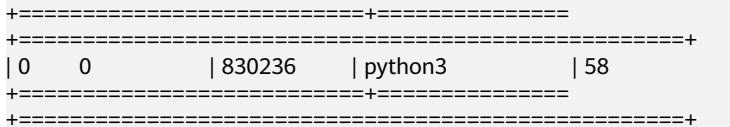

AI任务在特权容器中运行

该场景下，动态采集操作的--pid参数需要指定的PID为AI任务在特权容器中运行的PID。

需要通过如下步骤来查看该AI任务在特权容器中运行的PID。

a. 执行如下命令，查看该AI任务运行时在宿主机中对应的PID。 npu-smi info

# 说明

无论在特权容器中还是在特权容器的宿主机中，npu-smi info命令都只能显示该AI任务运行时在宿主机中对应的PID。

打印结果如下，Process id字段即为该AI任务运行时在宿主机中对应的PID，此处以PID为837666为例。

<table><tr><td>+--- INPU_Chip</td><td>| Process id|Process name</td><td></td><td>---+ |Process memory(MB)</td></tr><tr><td colspan="4"></td></tr><tr><td>+== 10 0</td><td>|837666</td><td></td><td>-</td></tr></table>

b. 在宿主机视图下执行如下命令，查看该AI任务在宿主机中与在特权容器中，PID的映射关系。cat /proc/837666/status | grep NSpid

打印结果如下。NSpid: 837666 849

此处的849即为该AI任务在特权容器中运行的PID，动态采集操作的--pid参数需要指定的PID为849。

AI任务在非特权容器中运行

方式一：直接在非特权容器视图下执行如下命令，查看该AI任务在非特权容器中运行的PID。  
npu-smi info

打印结果如下，Process id字段即为该AI任务在非特权容器中运行的PID。

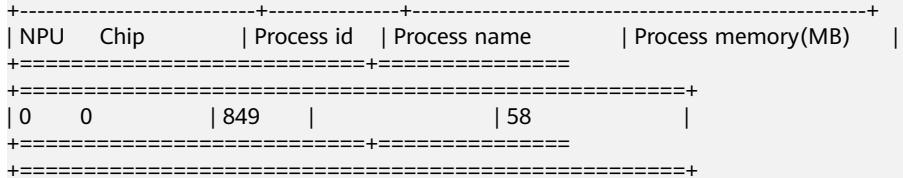

方式二：在非特权容器的宿主机视图下执行如下命令，查看该AI任务运行时在宿主机中对应的PID。

npu-smi info

打印结果如下，Process id字段即为该AI任务运行时在宿主机中对应的PID，此处以PID为837666为例。

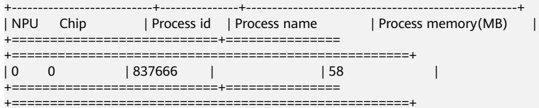

在宿主机视图下执行如下命令，查看该AI任务在宿主机中与在特权容器中，PID的映射关系。

cat /proc/837666/status | grep NSpid

打印结果如下。NSpid: 837666 849

此处的849即为该AI任务在特权容器中运行的PID，动态采集操作的--pid参数需要指定的PID为849。

# 说明

多Device场景下，建议每个Device逐一运行AI任务，并逐一按照上述方式获取PID；若多Device同时运行AI任务，则获取任意一个PID进行采集，当前暂不支持同时指定多PID进行动态采集。

# 数据解析

推荐使用6.2.3 解析并导出性能数据对PROF XXX目录进行性能数据解析和导出。

# 6.1.7 延迟采集性能数据

使用msprof命令行进行性能数据采集时，可以通过本节介绍的--delay和--duration参数配置采集的持续时间和延迟采集功能。

延迟采集场景下不支持6.1.6 动态采集性能数据。

# 支持的型号

Atlas 200I/500 A2 推理产品

Atlas 推理系列产品

Atlas 训练系列产品

Atlas A2 训练系列产品/Atlas A2 推理系列产品

Atlas A3 训练系列产品/Atlas A3 推理系列产品

# 注意事项

● 请确保AI任务能在运行环境中正常运行。  
● 请确保完成2 使用前准备。

# 说明

不支持采集Python调用栈、PyTorch或MindSpore框架层数据，可使用对应框架接口方式采集。

# 命令示例

以运行用户登录CANN Toolkit开发套件包和ops算子包所在环境，执行以下命令采集性能数据。命令示例如下：

msprof --delay=3 --duration=3 /home/projects/MyApp/out/main

仅当采集AI任务运行性能数据时支持启用延迟采集能力，必须传入用户程序，与--dynamic参数不能同时配置。

# 参数说明

表 6-7 参数说明  

<table><tr><td rowspan=1 colspan=1>参数</td><td rowspan=1 colspan=1>描述</td><td rowspan=1 colspan=1>可选/必选</td></tr><tr><td rowspan=1 colspan=1>--delay</td><td rowspan=1 colspan=1>按设定时间延迟采集性能数据，范围[1,4294967295]，单位s，默认值0。若配置的时间超过了AI任务的执行时间，在AI任务执行期间不会启动采集。</td><td rowspan=1 colspan=1>可选</td></tr><tr><td rowspan=1 colspan=1>-duration</td><td rowspan=1 colspan=1>性能数据采集的持续时间，范围[1,4294967295]，单位s，默认未配置，即随采集开始持续到任务结束，自动停止采集。若配置了--delay参数，则duration从delay结束的时刻开始计时。</td><td rowspan=1 colspan=1>可选</td></tr></table>

# 6.2 离线解析

# 6.2.1 解析性能数据

以下产品不支持在设备上直接解析，需要将采集到的PROF_XXX目录拷贝到安装了CANN Toolkit开发套件包和ops算子包的环境下进行解析：

Atlas 200I/500 A2 推理产品的Ascend RC场景

# 说明

该功能只会进行性能数据解析，不会导出性能数据文件，导出性能数据文件功能请参见6.2.3解析并导出性能数据。

● 一般情况下，解析性能数据功能不需要单独使用，主要有如下两种使用场景：

● 对于性能数据文件解析失败的场景（例如：当存在首次解析由于某些原因导致解析失败，残留文件时），可以使用msprof --parse功能重新解析后，再次执行msprof --export。

对于需要指定--iteration-id和--model-id参数进行msprof --export导出时，可以先执行msprof --parse解析并打印迭代（Iteration ID）/模型（Model ID）后，选择需要的Iteration ID和Model ID进行导出。

# 前提条件

请确保完成2 使用前准备。  
完成性能数据采集。

# 操作步骤

执行解析命令，命令示例如下：

msprof --parse=on --output=<dir>

表 6-8 参数说明  

<table><tr><td rowspan=1 colspan=1>参数</td><td rowspan=1 colspan=1>说明</td><td rowspan=1 colspan=1>可选必选</td></tr><tr><td rowspan=1 colspan=1>--parse</td><td rowspan=1 colspan=1>解析原始性能数据文件。可选on或off，默认值为off。</td><td rowspan=1 colspan=1>心选</td></tr><tr><td rowspan=1 colspan=1>output</td><td rowspan=1 colspan=1>原始性能数据文件目录。须指定为PROF_XXX目录或PROF_XXX目录的父目录，例如:/home/HwHiAiUser/profiler_data/PROF_XXX。路径中不能包含特殊字符：&quot;\n&quot;,&quot;\\n&quot;,&quot;\f&quot;,&quot;\\f&quot;,&quot;\r&quot;,&quot;\\r&quot;,&quot;\b&quot;,&quot;b&quot;,&quot;\t&quot;,&quot;&quot;,&quot;&quot;,&quot;&quot;,&quot;u07F&quot;,&quot;u007F&quot;,&quot;\,,&quot;\&quot;,&quot;\&quot;,&quot;&quot;&quot;%&quot;,&quot;%&quot;,&quot;&gt;&quot;,&quot;\\&gt;&quot;,&quot;&lt;&quot;,&quot;/&lt;&quot;,&quot;,&quot;V&quot;, &quot;&amp;&quot;,&quot;\\&amp;&quot;,&quot;$&quot;,&quot;\$”,&quot;&quot;,&quot;V&quot;,&quot;&quot; &quot;&quot;。</td><td rowspan=1 colspan=1>选</td></tr><tr><td rowspan=1 colspan=1>python-path</td><td rowspan=1 colspan=1>指定解析使用的Python解释器路径，要求Python3.7.5及以上版本。</td><td rowspan=1 colspan=1>可选</td></tr></table>

执行完上述命令，会打印展示性能数据文件信息并在PROF_XXX的device_{id}和host目录下生成sqlite目录，sqlite目录下会有.db文件生成。

# 6.2.2 查询性能数据文件信息

本功能用于查询性能数据文件信息，确认导出时指定迭代（Iteration ID）/模型（Model ID）。

性能数据解析时自动打印展示性能数据文件信息，故本功能在数据解析中为可选操作，主要用于已解析的历史PROF_XXX目录重新查询性能数据文件信息。

以下产品不支持在设备上直接查询，需要将采集到的PROF_XXX目录拷贝到安装了CANN Toolkit开发套件包和ops算子包的环境下进行查询：

Atlas 200I/500 A2 推理产品的Ascend RC场景

# 前提条件

请确保完成2 使用前准备。

完成性能数据采集。

# 操作步骤

执行查询命令。

命令示例如下：

msprof --query=on --output=<dir>

表 6-9 参数说明  

<table><tr><td rowspan=1 colspan=1>参数</td><td rowspan=1 colspan=1>说明</td><td rowspan=1 colspan=1>可选必选</td></tr><tr><td rowspan=1 colspan=1>--query</td><td rowspan=1 colspan=1>查询性能数据文件信息。可选on或off，默认值为off。当完成解析后，可以通过本参数查询性能数据文件信息。</td><td rowspan=1 colspan=1>心选</td></tr><tr><td rowspan=1 colspan=1>--output</td><td rowspan=1 colspan=1>解析后的性能数据文件目录。须指定为PROF_XXX目录或PROF_XXX目录的父目录，例如：/home/HwHiAiUser/profiler_data/PROF_XXX。路径中不能包含特殊字符：&quot;\n&quot;,&quot;\\n&quot;,&quot;\f&quot;,&quot;\f&quot;,&quot;\r&quot;，&quot;\\r&quot;,&quot;\b&quot;,&quot;\b&quot;,&quot;\t&quot;,&quot;\t&quot;,&quot;\v&quot;,&quot;\v&quot;,&quot;\uOO7F&quot;,&quot;\u0o7F&quot;,&quot;\&quot;&quot;,&quot;，&quot;,,&quot;V&quot;&quot;W&quot;&quot;%&quot;,&quot;1%&quot;,&quot;&gt;&quot;,&quot;/&gt;&quot;,&quot;&lt;&quot;,&quot;&lt;&quot;&quot;P&quot;W&quot;, &quot;&amp;&quot;,&quot;n&amp;&quot;,&quot;$&quot;,&quot;1$&quot;&quot;&quot;&quot;W&quot; &quot;&quot;, &quot;V&quot;。</td><td rowspan=1 colspan=1>选</td></tr></table>

msprof工具的查询功能获取到的信息如表6-10所示。

表 6-10 Profiling 数据文件信息  

<table><tr><td rowspan=1 colspan=1>字段</td><td rowspan=1 colspan=1>含义</td></tr><tr><td rowspan=1 colspan=1>Job Info</td><td rowspan=1 colspan=1>任务名。</td></tr><tr><td rowspan=1 colspan=1>Device ID</td><td rowspan=1 colspan=1>设备ID。</td></tr><tr><td rowspan=1 colspan=1>Dir Name</td><td rowspan=1 colspan=1>文件夹名称。</td></tr><tr><td rowspan=1 colspan=1>Collection Time</td><td rowspan=1 colspan=1>数据采集时间。</td></tr><tr><td rowspan=1 colspan=1>Model ID</td><td rowspan=1 colspan=1>模型ID。</td></tr><tr><td rowspan=1 colspan=1> Iteration Number</td><td rowspan=1 colspan=1>总迭代数。</td></tr><tr><td rowspan=1 colspan=1>Top Time Iteration</td><td rowspan=1 colspan=1>耗时最长的5个迭代。</td></tr><tr><td rowspan=1 colspan=1>Rank ID</td><td rowspan=1 colspan=1>集群场景的节点识别ID。</td></tr></table>

# 6.2.3 解析并导出性能数据

以下产品不支持在设备上直接解析，需要将采集到的PROF_XXX目录拷贝到安装了CANN Toolkit开发套件包和ops算子包的环境下进行解析并导出：

Atlas 200I/500 A2 推理产品的Ascend RC场景

# 前提条件

请确保完成2 使用前准备。  
完成性能数据采集。

# 操作步骤

执行导出命令。

# 命令示例如下：

msprof --export=on --output=<dir> [--type <type>] [--reports=<reports sample config.json>] [-- iteration-id $=$ <number>] [--model-id=<number>] [--summary-format=<csv/json>] [--clear=on]

表 6-11 参数说明  

<table><tr><td colspan="1" rowspan="1">参数</td><td colspan="1" rowspan="1">说明</td><td colspan="1" rowspan="1">可选必选</td></tr><tr><td colspan="1" rowspan="1">--export</td><td colspan="1" rowspan="1">解析并导出性能数据。可选on或off，默认值为off。若需导出个别模型（Model ID）/迭代（Iteration ID）的数据，可在msprof采集命令执行完成后重新执行msprof --export命令配置--model-id、--iteration-id参数。对于未解析的PROF_XXX文件，自动解析后再导出。示例：msprof --export=on --output=/home/HwHiAiUser</td><td colspan="1" rowspan="1">心选</td></tr><tr><td colspan="1" rowspan="1">--output</td><td colspan="1" rowspan="1">性能数据文件目录。须指定为PROF_XXX目录或PROF_XXX目录的父目录，例如：/home/HwHiAiUser/profiler_data/PROF_XXX。路径中不能包含特殊字符："\n","\\n","\f","\\f","\r","\\r","\b""\1b","t","t","\","","\uO07F","\uo7F","11"""AV"1""%","%","&gt;""11&gt;","&lt;""1I&lt;","""W","&amp;","&amp;","$","$","","V""",""。</td><td colspan="1" rowspan="1">必选</td></tr><tr><td colspan="1" rowspan="1">--type</td><td colspan="1" rowspan="1">设置性能数据解析结果文件格式，即可以选择msprof命令行执行采集后自动解析的结果文件格式，取值为：·text：表示解析为.json和.csv格式的timeline和summary文件和.db格式文件（msprof_时间戳.db），详见12性能数据文件参考。支持CANN7.0.RC1和7.0.0及以上版本的性能数据解析。db：仅解析为一个汇总所有性能数据的.db格式文件（msprof_时间戳.db），使用MindStudio Insight工具展示。当前该格式数据与text参数解析的数据信息量存在差异，建议使用text方式采集。配置db时，仅支持msprof --export命令的--output参数，不支持msprof --export命令的其他参数。默认为text。</td><td colspan="1" rowspan="1">可选</td></tr><tr><td colspan="1" rowspan="1">--reports</td><td colspan="1" rowspan="1">传入用户自定义的reports_sample_config.json配置文件，会根据配置文件中指定的范围导出相应的性能数据。详见--reports参数使用介绍。</td><td colspan="1" rowspan="1">可选</td></tr><tr><td colspan="1" rowspan="1">参数</td><td colspan="1" rowspan="1">说明</td><td colspan="1" rowspan="1">有</td></tr><tr><td colspan="1" rowspan="1">--iteration-id</td><td colspan="1" rowspan="1">迭代ID。需配置为正整数。默认值为1。与--model-id必须同时配置。·对于Atlas A2 训练系列产品/Atlas A2 推理系列产品，支持--model-id=4294967295，表示指定以Step为粒度统计的迭代ID（每执行完成一个Step，Iteration ID加1）。仅支持解析MindSpore（版本号大于等于2.3）框架的性能数据。对于Atlas A3 训练系列产品/Atlas A3推理系列产品，支持--model-id=4294967295，表示指定以Step为粒度统计的迭代ID（每执行完成一个Step，Iteration ID加1）。仅支持解析MindSpore（版本号大于等于2.3）框架的性能数据。--model-id配置为其他值时，指定以Graph为粒度统计的迭代ID（每个Graph执行一次，Iteration ID加1，当一个脚本被编译为多个Graph时，该ID与脚本层面的Step ID不一致）。</td><td colspan="1" rowspan="1">可选</td></tr><tr><td colspan="1" rowspan="1">--model-id</td><td colspan="1" rowspan="1">模型ID。需配置为正整数。与--iteration-id必须同时配置。·对于Atlas A2 训练系列产品/Atlas A2推理系列产品，支持--model-id=4294967295，为Step模式，即--iteration-id配置的值以Step为粒度解析。仅支持解析MindSpore（版本号大于等于2.3）框架的性能数据。对于Atlas A3 训练系列产品/Atlas A3推理系列产品，支持--model-id=4294967295，为Step模式，即--iteration-id配置的值以Step为粒度解析。仅支持解析MindSpore（版本号大于等于2.3）框架的性能数据。--model-id配置为其他值时，为Graph模式，即--iteration-id配置的值以Graph为粒度解析。</td><td colspan="1" rowspan="1">可选</td></tr><tr><td colspan="1" rowspan="1">--summary-format</td><td colspan="1" rowspan="1">summary数据文件的导出格式，取值为：·json：解析出的summary数据文件为json格式。·csv：解析出的summary数据文件为csv，默认值。仅--type=text时支持。</td><td colspan="1" rowspan="1">可选</td></tr><tr><td colspan="1" rowspan="1">--python-path</td><td colspan="1" rowspan="1">指定解析使用的Python解释器路径，要求Python3.7.5及以上版本。</td><td colspan="1" rowspan="1">可选</td></tr><tr><td colspan="1" rowspan="1">--clear</td><td colspan="1" rowspan="1">数据精简模式，开启后将在导出性能数据后删除PROF_XXX/device_{id}下的sqlite目录，以节省存储空间。可选on或off,默认值为off。</td><td colspan="1" rowspan="1">可选</td></tr><tr><td colspan="3" rowspan="1">注1：默认情况下，导出所有性能数据。注2：单算子场景和仅执行6.1.3采集昇腾AI处理器系统数据场景，不支持--iteration-id和--model-id参数。</td></tr></table>

执行完上述命令后，会在--output目录下的PROF_XXX目录下生成mindstudio_profiler_output目录。

生成的性能数据目录结构如下所示。

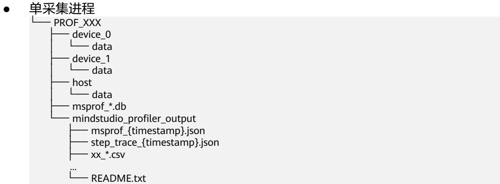

#

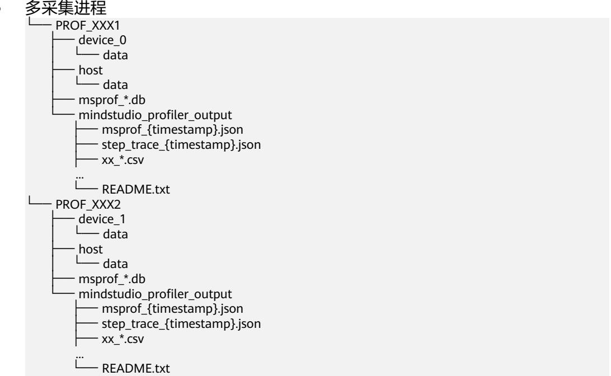

# 说明

msprof_\*.db为汇总所有性能数据的db格式文件。mindstudio_profiler_output目录下的json文件为timeline信息文件，主要收集算子、任务等运行耗时，以色块形式展示；csv文件为summary信息文件，主要以表格形式汇总运行耗时。性能数据详细介绍请参见12 性能数据文件参考。

● 多Device场景下，若启动单采集进程，则仅生成一个PROF_XXX目录，若启动多采集进程则生成多个PROF_XXX目录，其中device目录在PROF_XXX目录下生成，每个PROF_XXX目录下生成多少个device目录与用户实际操作有关，不影响性能数据分析。

mindstudio_profiler_output目录中的文件是根据采集的实际性能数据进行生成，如果实际的性能数据没有相关的数据文件，就不会导出对应的timeline和summary数据。

对于被强制中断的msprof采集进程，工具会保存已采集的原始性能数据，msprof --parse功能重新解析后，再次执行msprof --export。

# --reports 参数使用介绍

命令示例：

msprof --export=on --output=./ --reports=\${INSTALL_DIR}/tools/profiler/profiler_tool/analysis/msconfig/ reports_sample_config.json

\${INSTALL_DIR}请替换为CANN软件安装后文件存储路径。若安装的Ascend-cann-toolkit软件包，以root安装举例，则安装后文件存储路径为：/usr/local/Ascend/ascend-toolkit/latest。

路径中不能包含特殊字符："\n", "\\n", "\f", "\\f", "\r", "\\r", "\b", "\\b", "\t", "\\t", "\v", "\\v", "\u007F", "\\u007F", "\"", "\\\"", "'", "\'", "\\", "\\\\", "%", "\\%", ">", "\ \>", "<", "\\<", "|", "\\|", "&", "\\&", "\$", "\\\$", ";", "\\;", "\`", "\\\`"。

# 说明

--reports参数指定的是reports_sample_config.json文件。需要与--export同时配置，仅支持--type=text，且仅支持对json文件的timeline数据进行控制，csv文件的summary数据依然为全量导出。● 不支持软链接，文件大小最大阈值为64M，文件路径加上文件名长度最大阈值为1024字符。

reports_sample_config.json文件默认保存在\${INSTALL_DIR}/tools/profiler/profiler_tool/analysis/msconfig/目录下，内容如下：

支持在任意有读写权限的目录下自行创建reports_sample_config.json文件。

"json_process": { "ascend": true, "acc_pmu": true, "cann": true, "ddr": true, "stars_chip_trans": true, "hbm": true, "communication": true, "hccs": true, "os_runtime_api": true, "network_usage": true, "disk_usage": true, "memory_usage": true, "cpu_usage": true, "msproftx": true, "npu_mem": true, "overlap_analyse": true, "pcie": true, "sio": true, "stars_soc": true, "step_trace": true, "freq": true, "llc": true, "nic": true, "roce": true, "qos": true, "device_tx": true } }

以上为控制相应性能数据的开关，可配置开启（true）或关闭（false或删除字段）。控制的性能数据包括msprof_\*.json文件的timeline数据层级（包括CANN，AscendHardware、AI Core Freq、片上内存、Communication、Overlap Analysis、NPU_MEM层级等）。

# 说明

● 导出以上数据的前提是原始性能数据中已存在相应数据，即相应数据已采集。需确保reports_sample_config.json文件格式正确，否则可能导致如下情况：● 文件内容错误，如拼写错误，--reports参数不生效，导出全量性能数据。● 文件读取失败，如权限问题、文件不存在等，导致--reports无法读取配置文件，则会中断导出进程并报错。

# 6.2.4 通信性能数据解析

msprof通信性能数据解析功能主要用于统计通信类的分段耗时、拷贝信息、带宽等信息，以便进行通信类数据分析。通信类数据只有在多卡、多节点或集群场景下存在。

# 前提条件

完成2 使用前准备。  
对PROF_XXX目录已执行msprof的export（关闭clear）操作。

# 操作步骤（msprof 命令行方式）

执行分析命令。

命令示例如下：

msprof --analyze=on [--type <type>] [--rule=communication] --output=<dir> [--clear=on]

表 6-12 参数说明  

<table><tr><td colspan="1" rowspan="1">参数</td><td colspan="1" rowspan="1">说明</td><td colspan="1" rowspan="1">选</td></tr><tr><td colspan="1" rowspan="1">--analyze</td><td colspan="1" rowspan="1">分析性能数据文件，可选on或off，默认值为off。</td><td colspan="1" rowspan="1">必选</td></tr><tr><td colspan="1" rowspan="1">--type</td><td colspan="1" rowspan="1">设置性能数据解析结果文件格式，即可以选择msprof命令行执行后自动解析的结果文件格式，取值为：·text：表示解析为json格式文件和communication_analyzer.db文件。· db：表示解析为communication_analyzer.db文件。默认为text。</td><td colspan="1" rowspan="1">可选</td></tr><tr><td colspan="1" rowspan="1">参数</td><td colspan="1" rowspan="1">说明</td><td colspan="1" rowspan="1">可选/必选</td></tr><tr><td colspan="1" rowspan="1">--rule</td><td colspan="1" rowspan="1">分析规则，取值为：·communication：分析通信类数据。：--type=text时，在PROF_XXX/analyze目录下生成communication.json文件，展示单卡所有通信算子通信耗时、带宽等详细信息，如图6-4所示；以及生成communication_analyzer.db文件。--type=db时，在PROF_XXX/analyze目录下仅生成communication_analyzer.db文件，保存CommAnalyzerTime（通信耗时）和CommAnalyzerBandwidth（通信带宽）信息表。communication_matrix：分析通信矩阵数据。：--type=text时，在PROF_XXX/analyze目录下生成communication_matrix.json文件，展示通信小算子基本的信息，包含通信size、通信带宽、通信rank等信息，用于分析通信细节，如图6-5所示；以及生成communication_analyzer.db文件。--type=db时，在PROF_XXX/analyze目录下仅生成communication_analyzer.db文件，保存CommAnalyzerMatrix（通信矩阵）信息表。以上两个参数值可以同时配置，使用逗号分隔，例如：--rule=communication,communication_matrix。默认同时设置以上两个参数值。</td><td colspan="1" rowspan="1">可选</td></tr><tr><td colspan="1" rowspan="1">--output</td><td colspan="1" rowspan="1">性能数据文件目录。须指定为PROF_XXX目录，例如：/home/HwHiAiUser/profiler_data/PROF_XXX。路径中不能包含特殊字符："\n","\\n","\f","\\f","\r","\\r","\b","\b","\t","\t","\v","v","\uO07F","\u07F","\"","\""""1""%","1%","&gt;","&gt;""&lt;","1&lt;","V""&amp;","&amp;","$","\$""""V"""""。</td><td colspan="1" rowspan="1">必选</td></tr><tr><td colspan="1" rowspan="1">--clear</td><td colspan="1" rowspan="1">数据精简模式，开启后将在导出性能数据后删除PROF_XXX目录下的sqlite目录，以节省存储空间。可选on或off，默认值为off。</td><td colspan="1" rowspan="1">可选</td></tr></table>

# 操作步骤（msprof.py 脚本方式）

步骤1 以CANN Toolkit开发套件包和ops算子包的运行用户登录开发环境。

步骤2 切换至msprof.py脚本所在目录。

\${INSTALL_DIR}/tools/profiler/profiler_tool/analysis/msprof，\${INSTALL_DIR}请替换为CANN软件安装后文件存储路径。若安装的Ascend-cann-toolkit软件包，以root安装举例，则安装后文件存储路径为：/usr/local/Ascend/ascend-toolkit/latest。

步骤3 执行分析命令。命令示例如下：

python3 msprof.py analyze [--type <type>] --rule communication -dir <dir> [--clear]

----结束

表 6-13 参数说明  

<table><tr><td colspan="1" rowspan="1">参数</td><td colspan="1" rowspan="1">说明</td><td colspan="1" rowspan="1">司西</td></tr><tr><td colspan="1" rowspan="1">analyze</td><td colspan="1" rowspan="1">分析性能数据文件。</td><td colspan="1" rowspan="1">必选</td></tr><tr><td colspan="1" rowspan="1">--type</td><td colspan="1" rowspan="1">设置性能数据解析结果文件格式，即可以选择msprof.py脚本执行后自动解析的结果文件格式，取值为：·text：表示解析为json格式文件和communication_analyzer.db文件。·db：表示解析为communication_analyzer.db文件。默认为text。</td><td colspan="1" rowspan="1">可选</td></tr><tr><td colspan="1" rowspan="1">-r或--rule</td><td colspan="1" rowspan="1">分析规则，取值为：·communication：分析通信类数据。--type text时，在PROF_XXX/analyze目录下生成communication.json文件，展示单卡所有通信算子通信耗时、带宽等详细信息，如图6-4所示；以及生成communication_analyzer.db文件。--type db时，在PROF_XXX/analyze目录下仅生成communication_analyzer.db文件，保存CommAnalyzerTime（通信耗时）和CommAnalyzerBandwidth（通信带宽）信息表。）communication_matrix：分析通信矩阵数据。---type text时，在PROF_XXX/analyze目录下生成communication_matrix.json文件，展示通信小算子基本的信息，包含通信size、通信带宽、通信rank等信息，用于分析通信细节，如图6-5所示；以及生成communication_analyzer.db文件。--type db时，在PROF_XXX/analyze目录下仅生成communication_analyzer.db文件，保存CommAnalyzerMatrix（通信矩阵）信息表。以上两个参数值可以二选一也可以同时配置，同时配置时使用逗号分隔，例如：--rulecommunication,communication_matrix。</td><td colspan="1" rowspan="1">选</td></tr><tr><td colspan="1" rowspan="1">-dir或--collection-dir</td><td colspan="1" rowspan="1">性能数据文件目录。须指定为PROF_XXX目录，例如：/home/HwHiAiUser/profiler_data/PROF_XXX。路径中不能包含特殊字符："\n","\\In","\f","\f","\r","\\r","bb1u007"007e"1""%""1%"&gt;""&gt;3"&lt;","/&lt;，"V" "&amp;","\&amp;","$","\$""","V","","T"。</td><td colspan="1" rowspan="1">必选</td></tr><tr><td colspan="1" rowspan="1">参数</td><td colspan="1" rowspan="1">说明</td><td colspan="1" rowspan="1">四</td></tr><tr><td colspan="1" rowspan="1">--clear</td><td colspan="1" rowspan="1">数据精简模式，开启后将在导出性能数据后删除PROF_XXX目录下的sqlite目录，以节省存储空间。配置该参数时表示开启数据精简模式，未配置表示关闭，默认关闭。</td><td colspan="1" rowspan="1">可选</td></tr></table>

# 解析结果

--type $=$ text或--type db以及--rule $=$ communication

图 6-1 CommAnalyzerTime  

<table><tr><td rowspan=1 colspan=1> hccl_op_name</td><td rowspan=1 colspan=1> group_name</td><td rowspan=1 colspan=1>start_timestamp</td><td rowspan=1 colspan=1> elapse_time</td><td rowspan=1 colspan=1>transit_time</td><td rowspan=1 colspan=1>wait_time</td><td rowspan=1 colspan=1> synchronization_time</td><td rowspan=1 colspan=1>idle_time</td></tr><tr><td rowspan=1 colspan=1>hcom_allGather_308_0</td><td rowspan=1 colspan=1>8009927805572037308</td><td rowspan=1 colspan=1>29839616335e+15</td><td rowspan=1 colspan=1>5.50478</td><td rowspan=1 colspan=1>0.00102</td><td rowspan=1 colspan=1>0.24384</td><td rowspan=1 colspan=1>0.23578</td><td rowspan=1 colspan=1>5.25992</td></tr><tr><td rowspan=1 colspan=1>hcom_allGather_308_1</td><td rowspan=1 colspan=1>8009927805572037308</td><td rowspan=1 colspan=1>29839617035e+15</td><td rowspan=1 colspan=1>0.80666</td><td rowspan=1 colspan=1>0.00086</td><td rowspan=1 colspan=1>0.1411</td><td rowspan=1 colspan=1>0.12936</td><td rowspan=1 colspan=1>0.6647</td></tr><tr><td rowspan=1 colspan=1>hcom_allGather_308_2</td><td rowspan=1 colspan=1>8009927805572037308</td><td rowspan=1 colspan=1>1705298396180811</td><td rowspan=1 colspan=1>10.39026</td><td rowspan=1 colspan=1>8.38092</td><td rowspan=1 colspan=1>0.22884</td><td rowspan=1 colspan=1>0.22882</td><td rowspan=1 colspan=1>1.7805</td></tr><tr><td rowspan=1 colspan=1>hcom_allGather_308_3_</td><td rowspan=1 colspan=1>8009927805572037308</td><td rowspan=1 colspan=1>i29839619121e+15</td><td rowspan=1 colspan=1>0.8249</td><td rowspan=1 colspan=1>0.66302</td><td rowspan=1 colspan=1>0.11852</td><td rowspan=1 colspan=1>0.10822</td><td rowspan=1 colspan=1>9999999999</td></tr><tr><td rowspan=1 colspan=1>hcom_allGather_308_4</td><td rowspan=1 colspan=1>8009927805572037308</td><td rowspan=1 colspan=1>29839619203e+15</td><td rowspan=1 colspan=1>0.27212</td><td rowspan=1 colspan=1>0.21582</td><td rowspan=1 colspan=1>0.02776</td><td rowspan=1 colspan=1>2.0e-05</td><td rowspan=1 colspan=1>0.02854</td></tr></table>

表 6-14 CommAnalyzerTime  

<table><tr><td rowspan=1 colspan=1>字段</td><td rowspan=1 colspan=1>说明</td></tr><tr><td rowspan=1 colspan=1>hccl_op_name</td><td rowspan=1 colspan=1>通信算子名称。</td></tr><tr><td rowspan=1 colspan=1>group_name</td><td rowspan=1 colspan=1>通信算子的分组。</td></tr><tr><td rowspan=1 colspan=1>start_timestamp</td><td rowspan=1 colspan=1>通信开始时间戳。</td></tr><tr><td rowspan=1 colspan=1>elapse_time</td><td rowspan=1 colspan=1>算子的通信总耗时，单位ms。</td></tr><tr><td rowspan=1 colspan=1>transit_time</td><td rowspan=1 colspan=1>通信时长，单位ms。表示通信算子的通信耗时，如果通信耗时过长，可能是某条链路存在问题。</td></tr><tr><td rowspan=1 colspan=1>wait_time</td><td rowspan=1 colspan=1>等待时长，单位ms。节点之间通信前首先需要进行同步，确保通信的两个节点同步完成，再进行通信。</td></tr><tr><td rowspan=1 colspan=1>synchronization_time</td><td rowspan=1 colspan=1>同步时长，单位ms。节点之间进行同步需要的时长。</td></tr><tr><td rowspan=1 colspan=1>idle_time</td><td rowspan=1 colspan=1>空闲时间，单位ms。空闲时间（idle_time）=算子的通信总耗时（elapse_time）-通信时长（transit_time）-等待时长（wait_time）。</td></tr></table>

图 6-2 CommAnalyzerBandwidth  

<table><tr><td rowspan=1 colspan=1>hccl_op_name</td><td rowspan=1 colspan=1>group_name</td><td rowspan=1 colspan=1>transport_type</td><td></td><td rowspan=1 colspan=1>transit_time</td><td rowspan=1 colspan=1>bandwidth</td><td rowspan=1 colspan=1>large_packet_ratio</td><td rowspan=1 colspan=1>package_size</td><td></td><td rowspan=1 colspan=1>total_duration</td></tr><tr><td rowspan=1 colspan=1>hcom_allGather_308_08</td><td rowspan=1 colspan=1>8009927805572037308</td><td rowspan=1 colspan=1>SDMA</td><td rowspan=1 colspan=1>0.003584</td><td rowspan=1 colspan=1>0.00654</td><td rowspan=1 colspan=1>0.548</td><td rowspan=1 colspan=1>0</td><td rowspan=1 colspan=1>0</td><td rowspan=1 colspan=1>0</td><td rowspan=1 colspan=1>0</td></tr><tr><td rowspan=1 colspan=1>hcom_allGather_308_18</td><td rowspan=1 colspan=1>8009927805572037308</td><td rowspan=1 colspan=1>HCCS</td><td rowspan=1 colspan=1>0.003584</td><td rowspan=1 colspan=1>0.0066</td><td rowspan=1 colspan=1>0.543</td><td rowspan=1 colspan=1>0</td><td rowspan=1 colspan=1>0.000512</td><td rowspan=1 colspan=1>7</td><td rowspan=1 colspan=1>0.0066</td></tr><tr><td rowspan=1 colspan=1>hcom_allGather_308_1_</td><td rowspan=1 colspan=1>8009927805572037308</td><td rowspan=1 colspan=1>SDMA</td><td rowspan=1 colspan=1>0.003584</td><td rowspan=1 colspan=1>0.0066</td><td rowspan=1 colspan=1>0.543</td><td rowspan=1 colspan=1>0</td><td rowspan=1 colspan=1>0</td><td rowspan=1 colspan=1>0</td><td rowspan=1 colspan=1>0</td></tr><tr><td rowspan=1 colspan=1>hcom_allGather_308_2</td><td rowspan=1 colspan=1>8009927805572037308</td><td rowspan=1 colspan=1>HCCs</td><td rowspan=1 colspan=1>1089.077248</td><td rowspan=1 colspan=1>57.06052</td><td rowspan=1 colspan=1>19.0864</td><td rowspan=1 colspan=1>1</td><td rowspan=1 colspan=1>155.582464</td><td rowspan=1 colspan=1>7</td><td rowspan=1 colspan=1>57.06052</td></tr><tr><td rowspan=1 colspan=1>hcom allGather 308 2 °</td><td rowspan=1 colspan=1>8009927805572037308</td><td rowspan=1 colspan=1>SDMA</td><td rowspan=1 colspan=1>1089.077248</td><td rowspan=1 colspan=1>57.06052</td><td rowspan=1 colspan=1>19.0864</td><td rowspan=1 colspan=1>0</td><td rowspan=1 colspan=1>0</td><td rowspan=1 colspan=1>0</td><td rowspan=1 colspan=1>0</td></tr></table>

表 6-15 CommAnalyzerBandwidth  

<table><tr><td rowspan=1 colspan=1>字段</td><td rowspan=1 colspan=1>说明</td></tr><tr><td rowspan=1 colspan=1>hccl_op_name</td><td rowspan=1 colspan=1>通信算子名称。</td></tr><tr><td rowspan=1 colspan=1>group_name</td><td rowspan=1 colspan=1>通信算子的分组。</td></tr><tr><td rowspan=1 colspan=1>transport_type</td><td rowspan=1 colspan=1>通信传输类型，包含：LOCAL、SDMA、RDMA、PCIE、HCCS、SIO。</td></tr><tr><td rowspan=1 colspan=1>transit_size</td><td rowspan=1 colspan=1>通信数据量，单位MB。</td></tr><tr><td rowspan=1 colspan=1>transit_time</td><td rowspan=1 colspan=1>通信时长，单位ms。表示通信算子的通信耗时，如果通信耗时过长，可能是某条链路存在问题。</td></tr><tr><td rowspan=1 colspan=1>bandwidth</td><td rowspan=1 colspan=1>通信带宽大小，单位GB/s。</td></tr><tr><td rowspan=1 colspan=1>large_packet_ratio</td><td rowspan=1 colspan=1>通信数据大包占比。</td></tr><tr><td rowspan=1 colspan=1>package_size</td><td rowspan=1 colspan=1>一次传输的通信数据包大小，单位MB。</td></tr><tr><td rowspan=1 colspan=1>count</td><td rowspan=1 colspan=1>通信传输次数。</td></tr><tr><td rowspan=1 colspan=1>total_duration</td><td rowspan=1 colspan=1>数据传输总耗时，单位ms。</td></tr></table>

# --type $=$ text或--type db以及--rule $=$ communication_matrix

图 6-3 CommAnalyzerMatrix  

<table><tr><td rowspan=1 colspan=1>hccl_op_name</td><td rowspan=1 colspan=1> group_name</td><td rowspan=1 colspan=1>src_rank</td><td rowspan=1 colspan=1>dst_rank</td><td rowspan=1 colspan=1>transport_type</td><td rowspan=1 colspan=1>transit_size</td><td rowspan=1 colspan=1>transit_time</td><td rowspan=1 colspan=1>bandwidth</td></tr><tr><td rowspan=1 colspan=1>hcom_allGather_308_0</td><td rowspan=1 colspan=1>8009927805572037308</td><td rowspan=1 colspan=1>0</td><td rowspan=1 colspan=1>0</td><td rowspan=1 colspan=1>LOCAL</td><td rowspan=1 colspan=1>0.001024</td><td rowspan=1 colspan=1>0.00104</td><td rowspan=1 colspan=1>0.9846</td></tr><tr><td rowspan=1 colspan=1>hcom_allGather_308_0</td><td rowspan=1 colspan=1>8009927805572037308</td><td rowspan=1 colspan=1>0</td><td rowspan=1 colspan=1>7</td><td rowspan=1 colspan=1>HCCS</td><td rowspan=1 colspan=1>0.000512</td><td rowspan=1 colspan=1>0.00102</td><td rowspan=1 colspan=1>0.502</td></tr><tr><td rowspan=1 colspan=1>hcom_allGather_308_0_</td><td rowspan=1 colspan=1>8009927805572037308</td><td rowspan=1 colspan=1>0</td><td rowspan=1 colspan=1>6</td><td rowspan=1 colspan=1> HCCS</td><td rowspan=1 colspan=1>0.000512</td><td rowspan=1 colspan=1>0.00094</td><td rowspan=1 colspan=1>0.5447</td></tr><tr><td rowspan=1 colspan=1>hcom_allGather_308_0</td><td rowspan=1 colspan=1>8009927805572037308</td><td rowspan=1 colspan=1>0</td><td rowspan=1 colspan=1>5</td><td rowspan=1 colspan=1>HCCS</td><td rowspan=1 colspan=1>0.000512</td><td rowspan=1 colspan=1>0.00092</td><td rowspan=1 colspan=1>0.5565</td></tr><tr><td rowspan=1 colspan=1>hcom_allGather_308_0_</td><td rowspan=1 colspan=1>8009927805572037308</td><td rowspan=1 colspan=1>0</td><td rowspan=1 colspan=1>4</td><td rowspan=1 colspan=1> HCCS</td><td rowspan=1 colspan=1>0.000512</td><td rowspan=1 colspan=1>0.00094</td><td rowspan=1 colspan=1>0.5447</td></tr></table>

表 6-16 CommAnalyzerMatrix  

<table><tr><td colspan="1" rowspan="1">字段</td><td colspan="1" rowspan="1">说明</td></tr><tr><td colspan="1" rowspan="1">hccl_op_name</td><td colspan="1" rowspan="1">通信算子名称。</td></tr><tr><td colspan="1" rowspan="1">group_name</td><td colspan="1" rowspan="1">通信算子的分组。</td></tr><tr><td colspan="1" rowspan="1">src_rank</td><td colspan="1" rowspan="1">通信源Rank。</td></tr><tr><td colspan="1" rowspan="1">dst_rank</td><td colspan="1" rowspan="1">通信目的Rank。</td></tr><tr><td colspan="1" rowspan="1">transport_type</td><td colspan="1" rowspan="1">通信传输类型，包含：LOCAL、SDMA、RDMA、PCIE、HCCS、SIO。</td></tr><tr><td colspan="1" rowspan="1">transit_size</td><td colspan="1" rowspan="1">通信数据量，单位MB。</td></tr><tr><td colspan="1" rowspan="1">transit_time</td><td colspan="1" rowspan="1">通信时长，单位ms。表示通信算子的通信耗时，如果通信耗时过长，可能是某条链路存在问题。</td></tr><tr><td colspan="1" rowspan="1">bandwidth</td><td colspan="1" rowspan="1">通信带宽大小，单位GB/s。</td></tr></table>

--type $=$ text、--rule=communication

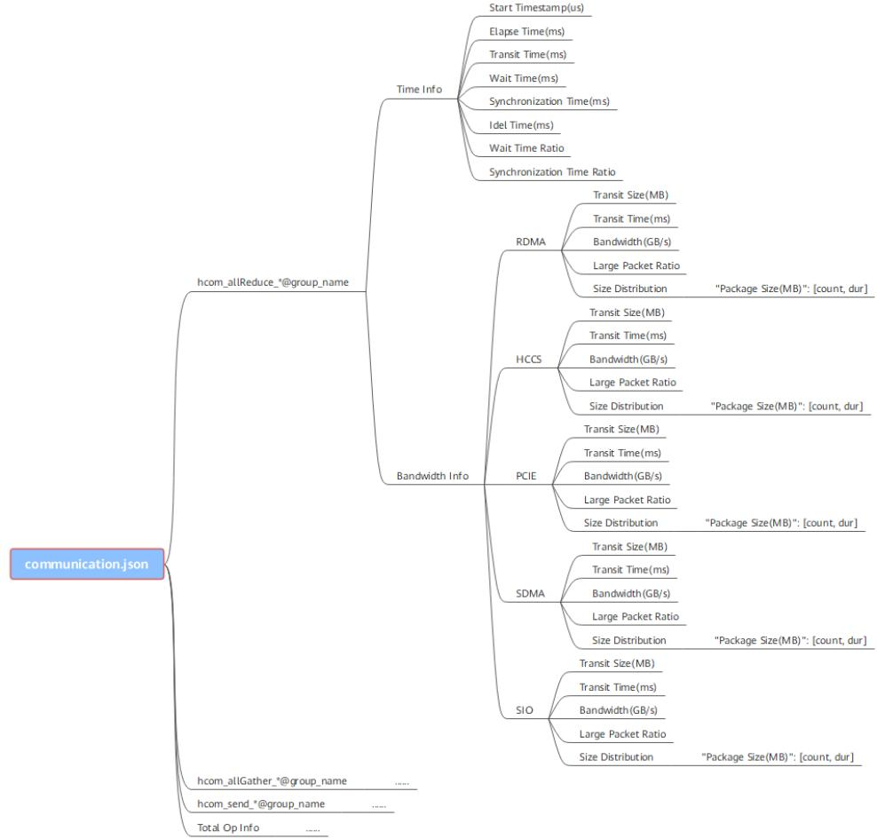  
图 6-4 communication.json

--type=text、--rule=communication_matrix

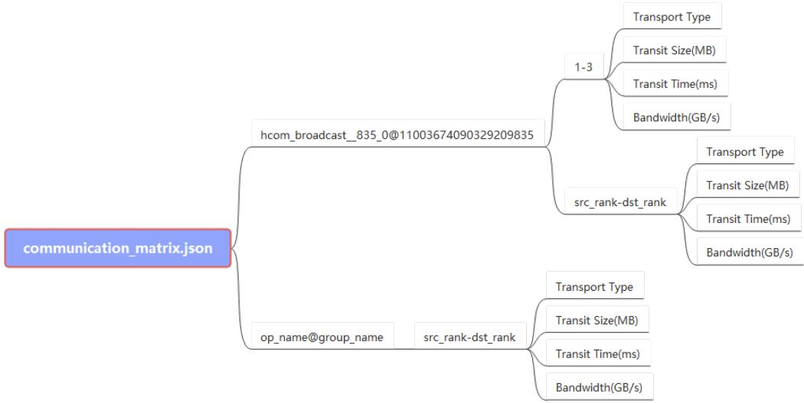  
图 6-5 communication_matrix.json

# 工具介绍

MSPTI工具使用（Python API）MSPTI工具使用（C API）MSPTI样例集

# 7.1 工具介绍

MSPTI调优工具（MSPTI，MindStudio Profiling Tool Interface）是MindStudio针对Ascend设备提出的一套Profiling API，用户可以通过MSPTI构建针对NPU应用程序的工具，用于分析应用程序的性能。

MSPTI为通用场景接口，使用MSPTI API开发的Profiling分析工具可以在各种框架的推理训练场景生效。

MSPTI主要包括以下功能：

Tracing：在MSPTI中Tracing是指CANN应用程序执行启动CANN活动的时间戳和附加信息的收集，如CANN API、Kernel、内存拷贝等。通过了解程序运行耗时，识别CANN代码的性能问题。可以使用Activity API和Callback API收集Tracing信息。● Profiling：在MSPTI中Profiling是指单独收集一个或一组Kernel的NPU性能指标。

MSPTI当前提供使用C开发的一套API以及将C API的功能作为底层逻辑封装的一套Python的API。

# 约束

MSPTI工具不可与任何其他性能数据采集工具同时使用，否则会导致采集的数据丢失。

# 支持的型号

Atlas 200I/500 A2 推理产品Atlas A2 训练系列产品/Atlas A2 推理系列产品

# Atlas A3 训练系列产品/Atlas A3 推理系列产品

# 7.2 MSPTI 工具使用（Python API）

# MSPTI 工具 Python API 介绍

当前提供如下类型的API：

● HcclMonitor：通信算子性能数据采集接口。  
● KernelMonitor：Kernel算子性能数据采集接口。  
● MstxMonitor：mstx性能数据采集接口。

# 前提条件

请确保完成2 使用前准备。  
设置如下环境变量：  
export LD_PRELOAD=\${INSTALL_DIR}/cann/lib64/libmspti.so  
\${INSTALL_DIR}请替换为CANN软件安装后文件存储路径。以root用户安装为例，则安装后文件存储路径为：/usr/local/Ascend/cann。

# 使用示例

以下示例仅为MSPTI接口的使用样例，具体可运行样例工程见7.4 MSPTI样例集。   
以下接口详细介绍请参见14.3 MSPTI Python API参考。   
HcclMonitor   
from mspti import ( HcclData, HcclMonitor   
def HcclParser(data : HcclData): print(f"[Hccl Info] kind:{data.kind}, start:{data.start}, end:{data.end}, device_id:{data.device_id},   
stream_id:{data.stream_id}, bandwidth:{data.bandwidth}, name:{data.name}, comm_name:   
{data.comm_name}")   
monitor $=$ HcclMonitor()   
monitor.start(HcclParser)   
# 用户业务逻辑   
…   
monitor.stop()   
KernelMonitor   
from mspti import ( KernelData, KernelMonitor   
def KernelParser(data: KernelData): print(f"[Kernel Info] kernel name:{data.name}, start:{data.start}, end:{data.end}, deviceId:   
{data.device_id}, streamId:{data.stream_id}, type:{data.type}, correlationId:{data.correlation_id}")   
monitor $=$ KernelMonitor()   
monitor.start(KernelParser)   
…   
# 业务逻辑   
monitor.stop()

MstxMonitor from mspti import ( MarkerData, MstxMonitor, RangeMarkerData def MarkerParser(data: MarkerData):

print(f" [Mark Data Info] flag:{data.flag}, source_kind:{data.source_kind}, timestamp: {data.timestamp}, device_id:{data.object_id.device_id}, stream_id:{ data.object_id.stream_id}, process_id:{data.object_id.process_id}, thread_id:{data.object_id.thread_id}" )

def RangeParser(data: RangeMarkerData): print(f"[RangeMark Data Info] kind:{data.kind}, source_kind:{data.source_kind}, id:{data.id}, name:   
{data.name}, device_id:{data.object_id.device_id}, stream_id:{data.object_id.stream_id}, process_id:   
{data.object_id.process_id}, thread_id:{data.object_id.thread_id}, start:{data.start}, end:{data.end}")   
monitor $=$ MstxMonitor()   
monitor.start(MarkerParser,RangeParser)   
…   
# 业务逻辑   
monitor.stop()

# 7.3 MSPTI 工具使用（C API）

# MSPTI 工具 C API 介绍

当前提供如下类型的API：

● Activity API：异步记录CANN活动，例如：CANN API、Kernel、内存拷贝等。● Callback API：CANN事件回调机制，用于实时通知用户（订阅者）特定的CANN事件已执行，例如：CANN的runtime内存拷贝。

请根据实际需求选择一种API进行采集操作。

# 前提条件

请确保完成2 使用前准备。  
设置如下环境变量：  
export LD_PRELOAD=\${INSTALL_DIR}/cann/lib64/libmspti.so  
\${INSTALL_DIR}请替换为CANN软件安装后文件存储路径。以root用户安装为例，则安装后文件存储路径为：/usr/local/Ascend/cann。

# 使用示例（Activity API）

以下样例可以使用样例编译运行，更多样例见7.4 MSPTI样例集，MSPTI接口详细介绍请参见14.4.2 Activity API。

# 示例代码：

#include <iostream>   
#include <vector>   
#include <thread>   
#include "acl/acl.h"   
#include "acl/acl_prof.h"   
#include "aclnnop/aclnn_add.h"   
// MSPTI   
#include "mspti.h"   
#define CHECK_RET(cond, return_expr) \ do { \ if (!(cond)) { return_expr; } \ } while (0)   
#define LOG_PRINT(message, ...) \ do { printf(message, ##__VA_ARGS__); \ } while (0)   
#define ALIGN_SIZE (8)   
#define ALIGN_BUFFER(buffer, align) \ (((uintptr_t) (buffer) & ((align)-1)) ? ((buffer) $^ +$ (align) - ((uintptr_t) (buffer) & ((align)-1))) $:$ (buffer))   
int64_t GetShapeSize(const std::vector<int64_t>& shape) { int64_t shapeSize $= 1$ ; for (auto i : shape) { shapeSize $^ { \star } =$ i; } return shapeSize;   
int Init(int32_t deviceId, aclrtContext\* context, aclrtStream\* stream) { auto ret $=$ aclrtSetDevice(deviceId); CHECK_RET(ret $= =$ ACL_SUCCESS, LOG_PRINT("aclrtSetDevice failed. ERROR: %d\n", ret); return ret); ret $=$ aclrtCreateContext(context, deviceId); CHECK_RET(ret $= =$ ACL_SUCCESS, LOG_PRINT("aclrtCreateContext failed. ERROR: %d\n", ret); return ret) ret $=$ aclrtSetCurrentContext(\*context); CHECK_RET(ret $= =$ ACL_SUCCESS, LOG_PRINT("aclrtSetCurrentContext failed. ERROR: %d\n", ret); return   
ret); ret $=$ aclrtCreateStream(stream); CHECK_RET(ret $= =$ ACL_SUCCESS, LOG_PRINT("aclrtCreateStream failed. ERROR: %d\n", ret); return ret); ret $=$ aclInit(nullptr); CHECK_RET(ret $= =$ ACL_SUCCESS, LOG_PRINT("aclInit failed. ERROR: %d\n", ret); return ret); return 0;   
template <typename $\mathsf { T } >$   
int CreateAclTensor(const std::vector $\scriptstyle < { \mathsf { T } } > \&$ hostData, const std::vector<int64_t>& shape, void\*\* deviceAddr, aclDataType dataType, aclTensor\*\* tensor) { auto size $=$ GetShapeSize(shape) $^ { \star }$ sizeof(T); auto ret $=$ aclrtMalloc(deviceAddr, size, ACL_MEM_MALLOC_HUGE_FIRST); CHECK_RET(ret $= =$ ACL_SUCCESS, LOG_PRINT("aclrtMalloc failed. ERROR: %d\n", ret); return ret); ret $=$ aclrtMemcpy(\*deviceAddr, size, hostData.data(), size, ACL_MEMCPY_HOST_TO_DEVICE); CHECK_RET(ret $= =$ ACL_SUCCESS, LOG_PRINT("aclrtMemcpy failed. ERROR: %d\n", ret); return ret); std::vector<int64_t> strides(shape.size(), 1); for (int64_t $=$ shape.size() - 2; $\mathrm { i } > = 0$ ; i--) { strides[i] $=$ shape[i $^ +$ 1] \* strides[i $\mathbf { \nabla } + \mathbf { \nabla }$ 1]; } \*tensor $=$ aclCreateTensor(shape.data(), shape.size(), dataType, strides.data(), 0,   
aclFormat::ACL_FORMAT_ND, shape.data(), shape.size(), \*deviceAddr); return 0;   
// MSPTI   
void UserBufferRequest(uint8_t \*\*buffer, size_t \*size, size_t \*maxNumRecords) { LOG_PRINT( $\scriptstyle" = = = = = = = = = = = = = =$ UserBufferRequest $\scriptstyle = = = = = = = = = = = = = \left\lfloor n " \right)$ ; constexpr uint3 $\underline { { { 2 } } } \mathrm { t } \mathsf { S } | Z \mathsf { E } = 5 ^ { \star } 1 0 2 4 ^ { \star } 1 0 2 4 _ { i }$ ; uint8_t \*pBuffer $=$ (uint8_t \*) malloc(SIZE $^ +$ ALIGN_SIZE); \*buffer $=$ ALIGN_BUFFER(pBuffer, ALIGN_SIZE); $^ { \star } \mathsf { S i z e } = 5 ^ { \star } 1 0 2 4 ^ { \star }$ 1024; \*maxNumRecords $= 0$ ;   
}   
static void ShowKernelInfo(msptiActivityKernel\* kernel) { if(!kernel) { return; } LOG_PRINT("Kernel---kind: %d, type: %s, name: %s, start: %lu, end: %lu, deviceId: %u, streamId: %u,   
correlationId: %lu\n", kernel->kind, kernel->type, kernel->name, kernel->start, kernel->end, kernel->ds.deviceId, kernel-  
>ds.streamId, kernel->correlationId);   
static void ShowApiInfo(msptiActivityApi\* api) if(!api) { return; LOG_PRINT("Api ${ \mathrel { + { + } } } { \mathrel { + { } } }$ kind: %d, name: $\% s$ , start: %lu, end: %lu, processId: $\% \mathrm { u }$ , threadId: $\% \mathrm { u }$ , correlationId:   
%lu\n", api->kind, api->name, api->start, api->end, api->pt.processId, api->pt.threadId, api->correlationId);   
// MSPTI   
void UserBufferComplete(uint8_t \*buffer, size_t size, size_t validSize) { LOG_PRINT( $\scriptstyle" = = = = = = = = = = = = = =$ UserBufferComplete $\scriptstyle = = = = = = = = = = = = = = ( { \mathsf { n } } " )$ if (validSize $> 0$ ) { msptiActivity \*pRecord $=$ NULL; msptiResult status $=$ MSPTI_SUCCESS; do $\begin{array} { r } { \mathopen { } \mathclose \bgroup \left\{ \begin{array} { r l r l } \end{array} \aftergroup \egroup \right. } \end{array}$ status $=$ msptiActivityGetNextRecord(buffer, validSize, &pRecord); if (status $= =$ MSPTI_SUCCESS) { if (pRecord->kind $= =$ MSPTI_ACTIVITY_KIND_KERNEL) { msptiActivityKernel\* activity $=$ reinterpret_cast<msptiActivityKernel\*>(pRecord); ShowKernelInfo(activity); } else if (pRecord->kind $= =$ MSPTI_ACTIVITY_KIND_API) { msptiActivityApi\* activity $=$ reinterpret_cast<msptiActivityApi\*>(pRecord); ShowApiInfo(activity); $\}$ else if (status $= =$ MSPTI_ERROR_MAX_LIMIT_REACHED) { break; } } while (1); free(buffer);   
int main() { int32_t deviceId $= 1$ ; aclrtContext context; aclrtStream stream; // MSPTI msptiSubscriberHandle subscriber; msptiSubscribe(&subscriber, nullptr, nullptr); msptiActivityRegisterCallbacks(UserBufferRequest, UserBufferComplete); msptiActivityEnable(MSPTI_ACTIVITY_KIND_KERNEL); msptiActivityEnable(MSPTI_ACTIVITY_KIND_API); auto ret $=$ Init(deviceId, &context, &stream); CHECK_RET(ret $\mathtt { \Gamma } = = 0$ , LOG_PRINT("Init acl failed. ERROR: %d\n", ret); return ret); std::vector<int64_t> selfShape $= \{ 4 , 2 \} ;$ std::vector<int64_t> otherShape $= \{ 4 , 2 \} ;$ std::vector<int64_t> outShape $= \{ 4 , 2 \}$ ; void\* selfDeviceAddr $=$ nullptr; void\* otherDeviceAddr $=$ nullptr; void\* outDeviceAddr $=$ nullptr; aclTensor\* self $=$ nullptr; aclTensor\* other $=$ nullptr; aclScalar\* alpha $=$ nullptr; aclTensor\* out $=$ nullptr; std::vector<float> selfHostData $= \{ 0 , 1 , 2 , 3 , 4 , 5 , 6 , 7 \} ;$ std::vector<float> otherHostData $=$ {1, 1, 1, 2, 2, 2, 3, 3}; std::vector<float> outHostData $= \{ 0 , 0 , 0 , 0 , 0 , 0 , 0 , 0 \} ;$ float alphaValue $= 1 . 2 \mathsf { f } ;$ ret $=$ CreateAclTensor(selfHostData, selfShape, &selfDeviceAddr, aclDataType::ACL_FLOAT, &self); CHECK_RET(ret $= =$ ACL_SUCCESS, return ret); ret $=$ CreateAclTensor(otherHostData, otherShape, &otherDeviceAddr, aclDataType::ACL_FLOAT, &other); CHECK_RET(ret $= =$ ACL_SUCCESS, return ret); alpha $=$ aclCreateScalar(&alphaValue, aclDataType::ACL_FLOAT); CHECK_RET(alpha $\ ! =$ nullptr, return ret); ret $=$ CreateAclTensor(outHostData, outShape, &outDeviceAddr, aclDataType::ACL_FLOAT, &out); CHECK_RET(ret $= =$ ACL_SUCCESS, return ret); uint64_t workspaceSize $= 0$ ; aclOpExecutor\* executor; ret $=$ aclnnAddGetWorkspaceSize(self, other, alpha, out, &workspaceSize, &executor); CHECK_RET(ret $= =$ ACL_SUCCESS, LOG_PRINT("aclnnAddGetWorkspaceSize failed. ERROR: %d\n", ret);   
return ret); void\* workspaceAddr $=$ nullptr;

if (workspaceSize $> 0$ ) { ret $=$ aclrtMalloc(&workspaceAddr, workspaceSize, ACL_MEM_MALLOC_HUGE_FIRST); CHECK_RET(ret $= =$ ACL_SUCCESS, LOG_PRINT("allocate workspace failed. ERROR: %d\n", ret); return ret;); } ret $=$ aclnnAdd(workspaceAddr, workspaceSize, executor, stream); CHECK_RET(ret $= =$ ACL_SUCCESS, LOG_PRINT("aclnnAdd failed. ERROR: %d\n", ret); return ret); ret $=$ aclrtSynchronizeStream(stream); CHECK_RET(ret $= =$ ACL_SUCCESS, LOG_PRINT("aclrtSynchronizeStream failed. ERROR: %d\n", ret); return ret); auto size $=$ GetShapeSize(outShape); std::vector<float> resultData(size, 0); ret $=$ aclrtMemcpy(resultData.data(), resultData.size() \* sizeof(resultData[0]), outDeviceAddr, size \* sizeof(float), ACL_MEMCPY_DEVICE_TO_HOST); CHECK_RET(ret $= =$ ACL_SUCCESS, LOG_PRINT("copy result from device to host failed. ERROR: %d\n", ret); return ret); for (int64_t $\mathrm { i } = 0 ;$ ; $\mathrm { i } <$ size; $\mathrm { i } { + } { + }$ ) { LOG_PRINT("result[%ld] is: %f\n", i, resultData[i]); } aclDestroyTensor(self); aclDestroyTensor(other); aclDestroyScalar(alpha); aclDestroyTensor(out); aclrtFree(selfDeviceAddr); aclrtFree(otherDeviceAddr); aclrtFree(outDeviceAddr); if (workspaceSize $> 0$ ) { aclrtFree(workspaceAddr); } aclrtDestroyStream(stream); aclrtDestroyContext(context); aclrtResetDevice(deviceId); aclFinalize(); // MSPTI msptiUnsubscribe(subscriber); msptiActivityFlushAll(1); return 0; }

# 使用示例（Callback API）

以下样例可以使用样例编译运行，接口详细介绍请参见14.4.3 Callback API。

示例代码：

#include <iostream>   
#include <vector>   
#include "acl/acl.h"   
#include "aclnnop/aclnn_add.h"   
// MSPTI   
#include "mspti.h"   
#define CHECK_RET(cond, return_expr) \ do { \ if (!(cond)) { \ return_expr; \ } \ } while (0)   
#define LOG_PRINT(message, ...) \ do { \ printf(message, ##__VA_ARGS__); \ } while (0)   
int64_t GetShapeSize(const std::vector<int64_t>& shape) { int64_t shapeSize $= 1$ ; for (auto i : shape) { shapeSize $^ { \star } =$ i; } return shapeSize;   
}   
int Init(int32_t deviceId, aclrtContext\* context, aclrtStream\* stream) { auto ret $=$ aclrtSetDevice(deviceId); CHECK_RET(ret $= =$ ACL_SUCCESS, LOG_PRINT("aclrtSetDevice failed. ERROR: %d\n", ret); return ret); ret $=$ aclrtCreateContext(context, deviceId); CHECK_RET(ret $= =$ ACL_SUCCESS, LOG_PRINT("aclrtCreateContext failed. ERROR: %d\n", ret); return ret); ret $=$ aclrtSetCurrentContext(\*context); CHECK_RET(ret $= =$ ACL_SUCCESS, LOG_PRINT("aclrtSetCurrentContext failed. ERROR: $\% d \backslash \mathfrak { n } "$ , ret); return   
ret); ret $=$ aclrtCreateStream(stream); CHECK_RET(ret $= =$ ACL_SUCCESS, LOG_PRINT("aclrtCreateStream failed. ERROR: %d\n", ret); return ret); ret $=$ aclInit(nullptr); CHECK_RET(ret $= =$ ACL_SUCCESS, LOG_PRINT("aclInit failed. ERROR: %d\n", ret); return ret); return 0;   
template <typename $\mathsf { T } >$   
int CreateAclTensor(const std::vector<T>& hostData, const std::vector<int64_t>& shape, void\*\* deviceAddr, aclDataType dataType, aclTensor\*\* tensor) { auto size $=$ GetShapeSize(shape) \* sizeof(T); auto ret $=$ aclrtMalloc(deviceAddr, size, ACL_MEM_MALLOC_HUGE_FIRST); CHECK_RET(ret $= =$ ACL_SUCCESS, LOG_PRINT("aclrtMalloc failed. ERROR: %d\n", ret); return ret); ret $=$ aclrtMemcpy(\*deviceAddr, size, hostData.data(), size, ACL_MEMCPY_HOST_TO_DEVICE); CHECK_RET(ret $= =$ ACL_SUCCESS, LOG_PRINT("aclrtMemcpy failed. ERROR: %d\n", ret); return ret); std::vector<int64_t> strides(shape.size(), 1); for (int64_t i $=$ shape.size() - 2; $\mathrm { i } > = 0$ ; i--) { strides[i] $=$ shape[i $^ +$ 1] \* strides $[ \mathsf { i } + \mathsf { \Omega } ]$ ; } \*tensor $=$ aclCreateTensor(shape.data(), shape.size(), dataType, strides.data(), 0,   
aclFormat::ACL_FORMAT_ND, shape.data(), shape.size(), \*deviceAddr); return 0;   
// MSPTI   
void UserCallback(void \*pUserData, msptiCallbackDomain domain, msptiCallbackId callbackId, const   
msptiCallbackData \*pCallbackInfo) { LOG_PRINT( $" = = = = = = = = = = = = = = = = = = = =$ User Callback called $\scriptstyle = = = = = = = = = = = = = = = = = = = = = = = = = { \backslash } \ n " ) ;$ ; if (pCallbackInfo->callbackSite $= =$ MSPTI_API_ENTER) { LOG_PRINT("Enter: %s\n", pCallbackInfo->functionName); } else if (pCallbackInfo->callbackSite $= =$ MSPTI_API_EXIT) { LOG_PRINT("Exit: %s\n", pCallbackInfo->functionName); } if (domain $= =$ MSPTI_CB_DOMAIN_RUNTIME && callbackId $= =$   
MSPTI_CBID_RUNTIME_CONTEXT_CREATED_EX) { LOG_PRINT("Set ${ \mathsf { O k } } { \mathsf { m } } ^ { \prime \prime } )$ ; }   
int main() { int32_t deviceId $= 0 ;$ aclrtContext context; aclrtStream stream; // MSPTI msptiSubscriberHandle subscriber; msptiSubscribe(&subscriber, UserCallback, nullptr); msptiEnableCallback(1, subscriber, MSPTI_CB_DOMAIN_RUNTIME,   
MSPTI_CBID_RUNTIME_CONTEXT_CREATED_EX); auto ret $=$ Init(deviceId, &context, &stream); CHECK_RET(ret $\mathbf { \tau } = 0$ , LOG_PRINT("Init acl failed. ERROR: $\% d \backslash \mathfrak { n } ^ { \prime \prime }$ , ret); return ret); std::vector<int64_t> selfShape $= \{ 4 , 2 \} ;$ std::vector<int64_t> otherShape $= \{ 4 , 2 \}$ ; std::vector<int64_t> outShape $= \{ 4 , 2 \}$ ; void\* selfDeviceAddr $=$ nullptr; void\* otherDeviceAddr $=$ nullptr; void\* outDeviceAddr $=$ nullptr; aclTensor\* self $=$ nullptr; aclTensor\* other $=$ nullptr; aclScalar\* alpha $=$ nullptr; aclTensor\* out $=$ nullptr; std::vector<float> selfHostData $= \{ 0 , 1 , 2 , 3 , 4 , 5 , 6 , 7 \}$ std::vector<float> otherHostData $=$ {1, 1, 1, 2, 2, 2, 3, 3}; std::vector<float> outHostData $= \{ 0 , 0 , 0 , 0 , 0 , 0 , 0 , 0 \} ;$

float alphaValue $= 1 . 2 \mathsf { f }$ ; ret $=$ CreateAclTensor(selfHostData, selfShape, &selfDeviceAddr, aclDataType::ACL_FLOAT, &self); CHECK_RET(ret $= =$ ACL_SUCCESS, return ret); ret $=$ CreateAclTensor(otherHostData, otherShape, &otherDeviceAddr, aclDataType::ACL_FLOAT, &other); CHECK_RET(ret $= =$ ACL_SUCCESS, return ret); alpha $=$ aclCreateScalar(&alphaValue, aclDataType::ACL_FLOAT); CHECK_RET(alpha $\ ! =$ nullptr, return ret); ret $=$ CreateAclTensor(outHostData, outShape, &outDeviceAddr, aclDataType::ACL_FLOAT, &out); CHECK_RET(ret $= =$ ACL_SUCCESS, return ret); uint64_t workspaceSize $= 0$ ; aclOpExecutor\* executor; ret $=$ aclnnAddGetWorkspaceSize(self, other, alpha, out, &workspaceSize, &executor); CHECK_RET(ret $= =$ ACL_SUCCESS, LOG_PRINT("aclnnAddGetWorkspaceSize failed. ERROR: %d\n", ret); return ret); void\* workspaceAddr $=$ nullptr; if (workspaceSize $> 0$ ) { ret $=$ aclrtMalloc(&workspaceAddr, workspaceSize, ACL_MEM_MALLOC_HUGE_FIRST); CHECK_RET(ret $= =$ ACL_SUCCESS, LOG_PRINT("allocate workspace failed. ERROR: %d\n", ret); return ret;); } ret $=$ aclnnAdd(workspaceAddr, workspaceSize, executor, stream); CHECK_RET(ret $= =$ ACL_SUCCESS, LOG_PRINT("aclnnAdd failed. ERROR: %d\n", ret); return ret); ret $=$ aclrtSynchronizeStream(stream); CHECK_RET(ret $= =$ ACL_SUCCESS, LOG_PRINT("aclrtSynchronizeStream failed. ERROR: %d\n", ret); return ret); auto size $=$ GetShapeSize(outShape); std::vector<float> resultData(size, 0); ret $=$ aclrtMemcpy(resultData.data(), resultData.size() \* sizeof(resultData[0]), outDeviceAddr, size \* sizeof(float), ACL_MEMCPY_DEVICE_TO_HOST); CHECK_RET(ret $= =$ ACL_SUCCESS, LOG_PRINT("copy result from device to host failed. ERROR: %d\n", ret); return ret); for (int64_t $\mathfrak { i } = 0$ ; $\mathrm { i } <$ size; $\mathrm { i } { + } { + }$ ) { LOG_PRINT("result[%ld] is: %f\n", i, resultData[i]); } aclDestroyTensor(self); aclDestroyTensor(other); aclDestroyScalar(alpha); aclDestroyTensor(out); aclrtFree(selfDeviceAddr); aclrtFree(otherDeviceAddr); aclrtFree(outDeviceAddr); if (workspaceSize $> 0$ ) { aclrtFree(workspaceAddr); } aclrtDestroyStream(stream); aclrtDestroyContext(context); aclrtResetDevice(deviceId); aclFinalize(); // MSPTI msptiUnsubscribe(subscriber); return 0; }

# 样例编译运行

步骤1 配置CMake文件。

# CMake lowest version requirement   
cmake_minimum_required(VERSION 3.14)   
project(ACLNN_EXAMPLE)   
# Compile options   
add_compile_options(- $- s + d = c + + 1 1$ )   
add_executable(opapi_test test_add.cpp)   
set(ASCEND_PATH \$ENV{ASCEND_HOME_PATH})   
set(INCLUDE_BASE_DIR "\${ASCEND_PATH}/include")   
include_directories( \${INCLUDE_BASE_DIR} \${INCLUDE_BASE_DIR}/acl \${INCLUDE_BASE_DIR}/aclnn \${INCLUDE_BASE_DIR}/mspti   
target_link_libraries(opapi_test PRIVATE \${ASCEND_PATH}/lib64/libascendcl.so \${ASCEND_PATH}/lib64/libnnopbase.so \${ASCEND_PATH}/lib64/libmsprofiler.so \${ASCEND_PATH}/lib64/libopapi.so \${ASCEND_PATH}/lib64/libmspti.so)

install(TARGETS opapi_test DESTINATION \${CMAKE_RUNTIME_OUTPUT_DIRECTORY})

# 步骤2 编译样例

执行如下命令编译样例：

source /usr/local/Ascend/cann/set_env.sh mkdir build   
cd build   
cmake ..   
make

# 步骤3 执行样例

编译完成后，通过以下指令启动：  
export LD_PRELOAD=/usr/local/Ascend/cann/lib64/libmspti.so  
./opapi_test

----结束

# 7.4 MSPTI 样例集

本节提供MSPTI各种接口的使用样例，供用户理解使用MSPTI接口，样例具体说明及目录如下。

# 前提条件

请确保安装CANN Toolkit开发套件包和ops算子包。  
参见《CANN 软件安装指南》。  
MSPTI Python API部分的样例依赖于PyTorch框架和torch_npu插件，请确保安装。  
参见《Ascend Extension for PyTorch 软件安装指南》中的“安装PyTorch” 。

# 构建样例执行

1. 安装CANN软件后，使用CANN运行用户进行编译、运行时，需要以CANN运行用户登录环境，执行source \${install_path}/set_env.sh命令设置环境变量。其中\${install_path}为CANN软件的安装目录，例如：/usr/local/Ascend/ascend-toolkit。

2. 进入样例目录。

MSPTI样例代码集成在CANN Toolkit开发套件包和ops算子包中，路径为\${INSTALL_DIR}/tools/mspti/samples。

\${INSTALL_DIR}请替换为CANN软件安装后文件存储路径。若安装的Ascend-cann-toolkit软件包，以root安装举例，则安装后文件存储路径为：/usr/local/Ascend/ascend-toolkit/latest。

示例如下：cd \${INSTALL_DIR}/tools/mspti/samples/callback_domain

3. 执行对应样例目录下的sample_run.sh。bash sample_run.sh

下表为当前提供的样例介绍：

表 7-1 Callback API 样例  

<table><tr><td rowspan=1 colspan=1>样例</td><td rowspan=1 colspan=1>说明</td><td rowspan=1 colspan=1>产品支持情况</td></tr><tr><td rowspan=1 colspan=1>callback_domain</td><td rowspan=1 colspan=1>展示CallbackAPI功能，可以通过msptiEnableDomain，在runtime APl的前后执行Callback操作。</td><td rowspan=1 colspan=1>Atlas A2训练系列产品/AtlasA2推理系列产品AtlasA3训练系列产品/AtlasA3推理系列产品</td></tr><tr><td rowspan=1 colspan=1>callback_mstx</td><td rowspan=1 colspan=1>1．展示Callback与mstx接口相结合功能，使用CallbackAPl和mstx打点功能，在runtime的launch Kernel前后打点，采集算子数据。2.演示Callback中userdata用法，用户可以通过userdata透传配置或者部分运行参数。</td><td rowspan=1 colspan=1>Atlas A2训练系列产品/Atlas A2推理系列产品Atlas A3训练系列产品/Atlas A3推理系列产品</td></tr></table>

表 7-2 Activity API 样例  

<table><tr><td colspan="1" rowspan="1">样例</td><td colspan="1" rowspan="1">说明</td><td colspan="1" rowspan="1">产品支持情况</td></tr><tr><td colspan="1" rowspan="1">mspti_activity</td><td colspan="1" rowspan="1">1．展示ActivityAPI接口的基本功能，样例展示如何采集Kernel和Memory等数据。2．演示Activity API的基本运行，讲述ActivityAPI的基本使用，包括ActivityBuffer内存分配，Buffer消费等逻辑。</td><td colspan="1" rowspan="1">Atlas A2训练系列产品/Atlas A2推理系列产品Atlas A3训练系列产品/Atlas A3推理系列产品</td></tr><tr><td colspan="1" rowspan="1">mspti_correlation</td><td colspan="1" rowspan="1">1．展示ActivityAPI接口的基本功能，展示如何通过correlationld字段将APl和Kernel数据做关联。2．演示runtime API下发与Kernel实际执行数据的关联，关联后可以将算子的下发和执行一一对应，方便分析性能瓶颈。</td><td colspan="1" rowspan="1">Atlas A2训练系列产品/Atlas A2推理系列产品Atlas A3训练系列产品/AtlasA3推理系列产品</td></tr><tr><td colspan="1" rowspan="1">mspti_external_correlation</td><td colspan="1" rowspan="1">1．展示MSPTI External Correlation功能。2.演示msptiActivityPopExternalCorrelationld和msptiActivityPushExternalCorrelationld两接口使用方法，用户可以通过接口将各种API关联到一起，方便回溯函数的调用栈。</td><td colspan="1" rowspan="1">Atlas A2训练系列产品/Atlas A2推理系列产品AtlasA3训练系列产品/AtlasA3推理系列产品</td></tr><tr><td colspan="1" rowspan="1">mspti_hccl_activity</td><td colspan="1" rowspan="1">展示ActivityAPI接口的基本功能，样例展示如何采集HCCL通信数据。</td><td colspan="1" rowspan="1">Atlas A2训练系列产品/Atlas A2推理系列产品Atlas A3训练系列产品/Atlas A3推理系列产品</td></tr><tr><td colspan="1" rowspan="1">mspti_mstx_activity_domain</td><td colspan="1" rowspan="1">1．展示MSPTI控制mstxDomain功能，通过开关控制打点数据是否采集。2．用户可以通过MSPTI开关实时开关采集打点，减小性能损耗。</td><td colspan="1" rowspan="1">Atlas A2训练系列产品/Atlas A2推理系列产品AtlasA3训练系列产品/AtlasA3推理系列产品</td></tr></table>

表 7-3 Python API 样例  

<table><tr><td rowspan=1 colspan=1>样例</td><td rowspan=1 colspan=1>说明</td><td rowspan=1 colspan=1>产品支持情况</td></tr><tr><td rowspan=1 colspan=1>python_monitor</td><td rowspan=1 colspan=1>展示Monitor基本使用方式，通过KernelMonitor、HcclMonitor获取计算算子和通信算子的耗时。</td><td rowspan=1 colspan=1>Atlas A2训练系列产品/Atlas A2推理系列产品AtlasA3训练系列产品/AtlasA3推理系列产品</td></tr><tr><td rowspan=1 colspan=1>python_mstx_monitor</td><td rowspan=1 colspan=1>展示MstxMonitor基本使用方式，用户可以通过Mstx打点采集对应算子（如matmul）耗时。</td><td rowspan=1 colspan=1>Atlas A2训练系列产品/Atlas A2推理系列产品Atlas A3训练系列产品/AtlasA3推理系列产品</td></tr></table>

# 8 msServiceProfiler 服务化调优工具

msServiceProfiler服务化调优msServiceProfiler Trace数据监控附录

# 8.1 msServiceProfiler 服务化调优

# 8.1.1 简介

本文介绍推理服务化性能数据采集工具，本工具主要使用msServiceProfiler接口，在MindIE Motor推理服务化进程中，采集关键过程的开始和结束时间点，识别关键函数或迭代等信息，记录关键事件，支持多样的信息采集，对性能问题快速定界。

msServiceProfiler服务化调优接口包括“msServiceProfiler API参考（C++） > 服务化调优”和“msServiceProfiler API参考（Python） $>$ 服务化调优” 。

有关MindIE Motor相关介绍请参见《MindIE Motor开发指南》。

工具使用流程如下：

1. 环境准备  
2. 数据采集  
3. 数据解析  
4. 数据可视化

# 8.1.2 使用前准备

工具支持的硬件环境与MindIE一致，详细支持情况请参见《MindIE安装指南》的“安装说明”。

步骤1 安装配套版本的CANN Toolkit开发套件包和ops算子包并配置CANN环境变量，具体请参见《CANN 软件安装指南》。

步骤2 完成MindIE的安装和配置并确认MindIE Motor可以正常运行，具体请参见《MindIE安装指南》

步骤3 完成以上环境准备后，可以进行一次配置预检动作，使用“msprechecker”工具，对环境变量和服务化配置等进行检查。

----结束

# 8.1.3 数据采集

# 8.1.3.1 创建采集配置文件

服务化性能数据采集通过json配置文件，配置采集数据的开关、保存路径等。

自动创建：该文件支持自动创建，在8.1.3.2 执行采集过程中配置   
SERVICE_PROF_CONFIG_PATH环境变量后，运行MindIEMindIE MotorMotor服   
务可自动创建默认配置的json文件。   
手动创建：该json配置文件可以在任意路径下新建，此处以   
ms_service_profiler_config.json文件名为例，配置文件格式如下： "enable": 1, "prof_dir": "\${PATH}", "profiler_level": "INFO", "acl_task_time": 0, "acl_prof_task_time_level": "", "aclDataTypeConfig": "", "aclprofAicoreMetrics": "", "api_filter": "", "kernel_filter": "", "timelimit": 0, "domain": ""   
}

表 8-1 参数说明  

<table><tr><td colspan="1" rowspan="1">参数</td><td colspan="1" rowspan="1">说明</td><td colspan="1" rowspan="1">西</td></tr><tr><td colspan="1" rowspan="1">enable</td><td colspan="1" rowspan="1">是否开启性能数据采集的开关，取值为：·0：关闭。·1：开启。</td><td colspan="1" rowspan="1">是</td></tr><tr><td colspan="1" rowspan="1">prof_dir</td><td colspan="1" rowspan="1">采集到的性能数据的存放路径，可自定义，str类型，默认值为${HOME}/.ms_server_profiler。</td><td colspan="1" rowspan="1">否</td></tr><tr><td colspan="1" rowspan="1">profiler_level</td><td colspan="1" rowspan="1">数据采集等级，取值为INFO。</td><td colspan="1" rowspan="1">否</td></tr><tr><td colspan="1" rowspan="1">host_system_usage_freq</td><td colspan="1" rowspan="1">CPU和内存系统指标采集频率，默认关闭不采集。范围整数1~50，单位Hz，表示每秒采集的次数。设置为-1时关闭采集该指标。说明开启该功能可能占用较大内存，不建议修改。</td><td colspan="1" rowspan="1">否</td></tr><tr><td colspan="1" rowspan="1">参数</td><td colspan="1" rowspan="1">说明</td><td colspan="1" rowspan="1">中</td></tr><tr><td colspan="1" rowspan="1">npu_memory_usage_freq</td><td colspan="1" rowspan="1">NPUMemory使用率指标的采集频率，默认关闭不采集。范围整数1~50，单位Hz，表示每秒采集的次数。设置为-1时关闭采集该指标。说明开启该功能可能占用较大内存，不建议修改。</td><td colspan="1" rowspan="1">否</td></tr><tr><td colspan="1" rowspan="1">acl_task_time</td><td colspan="1" rowspan="1">开启采集算子下发耗时、算子执行耗时数据的开关，取值为：·0：关闭。默认值，配置为0或其他非法值均表示关闭。·1:开启。该功能开启时调用aclprofCreateConfig接口的ACL_PROF_TASK_TIME_L0参数。2：开启基于MSPTI接口的数据落盘。该功能开启时调用MSPTI接口进行性能数据采集，需要在拉起服务前配置如下环境变量：export LD_PRELOAD=${INSTALL_DIR}/lib64/libmspti.s0${INSTALL_DIR}请替换为CANN软件安装后文件存储路径。若安装的Ascend-cann-toolkit软件包，以root安装举例，则安装后文件存储路径为：/usr/local/Ascend/ascend-toolkit/latest。说明以上aclprofCreateConfig接口及MSPTI接口详细介绍请参见《性能调优工具用户指南》。·该功能开启时会占用一定的设备性能，导致采集的性能数据不准确，建议在模型执行耗时异常时开启，用于更细致的分析。</td><td colspan="1" rowspan="1">否</td></tr><tr><td colspan="1" rowspan="1">acl_prof_task_time_level</td><td colspan="1" rowspan="1">设置性能数据采集的Level等级和时长，取值为：·LO：Level0等级，表示采集算子下发耗时、算子执行耗时数据。与L1相比，由于不采集算子基本信息数据，采集时性能开销较小，可更精准统计相关耗时数据。等同于aclDataTypeConfig参数配置ACL_PROF_MSPROFTX、ACL_PROF_TASK_TIME_L0。L1：Level1等级，采集AscendCL接口的性能数据，包括Host与Device之间、Device间的同步异步内存复制时延;采集算子下发耗时、算子执行耗时数据以及算子基本信息数据，提供更全面的性能分析数据。等同于aclDataTypeConfig参数配置ACL_PROF_MSPROFTX、ACL_PROF_TASK_TIME、ACL_PROF_ACL_API。·&lt;time&gt;：采集时长，取值范围为1~999的正整数，单位S。默认未配置本参数，表示采集L0数据，且采集到程序执行结束。配置其他非法值时取默认值。采集的Level等级和时长可同时配置，例如"acl_prof_task_time_level": "L1;10"。</td><td colspan="1" rowspan="1">否</td></tr><tr><td>参数</td><td>说明</td><td>无</td></tr><tr><td>aclDataTypeC onfig</td><td>用户选择如下多个宏进行逻辑或，每个宏表示某一类性能数 据，取值为： 以下采集项的结果数据可参见11.2.5采集数据说明，但具体 采集结果请以实际情况为准。 以下采集项一次可以配置一个或多个，例如： "aclDataTypeConfig": "ACL_PROF_ACL_API"或 "aclDataTypeConfig": "ACL_PROF_ACL_API, ACL_PROF_TASK_TIME"。 ·ACL_PROF_ACL_API：表示采集接口的性能数据，包括 Host与Device之间、Device间的同步异步内存复制时延 等。 ACL_PROF_TASK_TIME：采集算子下发耗时、算子执行 耗时数据以及算子基本信息数据，提供更全面的性能分析 数据。 ·ACL_PROF_TASK_TIME_LO：采集算子下发耗时、算子执 行耗时数据。与ACL_PROF_TASK_TIME相比，由于不采 集算子基本信息数据，采集时性能开销较小，可更精准统 计相关耗时数据。 ·ACL_PROF_OP_ATTR：控制采集算子的属性信息，当前 仅支持aclnn算子。 ·ACL_PROF_AICORE_METRICS：表示采集AICore性能指 标数据，逻辑或时必须包括该宏，aicoreMetrics入参处配 置的性能指标采集项才有效。 ACL_PROF_TASK_MEMORY:控制CANN算子的内存占用 情况采集开关，用于优化内存使用。单算子场景下，按照 GE组件维度和算子维度采集算子内存大小及生命周期信 息（单算子API执行方式不采集GE组件内存）；静态图和 静态子图场景下，在算子编译阶段按照算子维度采集算子 内存大小及生命周期信息。 ：ACL_PROF_AICPU：表示采集AI CPU任务的开始、结束 数据。 · ACL_PROF_L2CACHE：表示采集L2 Cache数据。 ·ACL_PROF_HCCL_TRACE:控制通信数据采集开关。 ·ACL_PROF_TRAINING_TRACE：控制迭代轨迹数据采集 开关。 ·ACL_PROF_RUNTIME_API:控制runtimeapi性能数据采 集开关。 ）ACL_PROF_MSPROFTX：获取用户和上层框架程序输出 的性能数据。可在采集进程内（aclprofStart接口、 aclprofStop接口之间）调用如下两种接口开启记录应用 程序执行期间特定事件发生的时间跨度，并写入性能数据 文件，再使用msprof工具解析该文件，并导出展示性能 分析数据：</td><td>否</td></tr><tr><td colspan="1" rowspan="1">参数</td><td colspan="1" rowspan="1">说明</td><td colspan="1" rowspan="1">西</td></tr><tr><td colspan="1" rowspan="1"></td><td colspan="1" rowspan="1">mstx APl（MindStudio Tools Extension APl）接口详细操作请参见14.5 mstxAPI使用示例。msproftx扩展接口详细操作请参见“更多特性&gt;Profiling性能数据采集"默认未配置本参数，以acl_prof_task_time_level参数配置为L0为准。</td><td colspan="1" rowspan="1"></td></tr><tr><td colspan="1" rowspan="1">aclprofAicoreMetrics</td><td colspan="1" rowspan="1">AlCore性能指标采集项，取值为：以下采集项的结果数据可参见12.10op_summary（算子详细信息），但具体采集结果请以实际情况为准。以下采集项一次只能配置一个，例如："aclprofAicoreMetrics":"ACL_AICORE_PIPE_UTILIZATION"。·ACL_AICORE_PIPE_UTILIZATION：计算单元和搬运单元耗时占比。·ACL_AICORE_MEMORY_BANDWIDTH:外部内存读写类指令占比。）ACL_AICORE_L0B_AND_WIDTH:内部内存读写类指令占比。ACL_AICORE_RESOURCE_CONFLICT_RATIO:流水线队列类指令占比。·ACL_AICORE_MEMORY_UB:内部内存读写指令占比。·ACL_AICORE_L2_CACHE:读写cache命中次数和缺失后重新分配次数。•ACL_AICORE_NONE= 0xFF默认值为ACL_AICORE_PIPE_UTILIZATION。仅当aclDataTypeConfig配置了ACL_PROF_AICORE_METRICS后，本接口的配置才能生效。</td><td colspan="1" rowspan="1">否</td></tr><tr><td colspan="1" rowspan="1">api_filter</td><td colspan="1" rowspan="1">对性能数据进行过滤，配置该参数可自定义采集配置的API性能数据，例如传入“matmul”会落盘所有APl数据中name字段包含matmul的性能数据。str类型，区分大小写，多个不同的筛选目标用“；”隔开，默认为空，表示落盘所有数据。仅当acl_task_time参数值为2时生效。</td><td colspan="1" rowspan="1">否</td></tr><tr><td colspan="1" rowspan="1">kernel_filter</td><td colspan="1" rowspan="1">对性能数据进行过滤，配置该参数可自定义采集配置的Kernel性能数据，例如传入“matmul”会落盘所有Kernel数据中name字段包含matmul的性能数据。str类型，区分大小写，多个不同的筛选目标用“；”隔开，默认为空，表示落盘所有数据。仅当acl_task_time参数值为2时生效。</td><td colspan="1" rowspan="1">否</td></tr><tr><td colspan="1" rowspan="1">timelimit</td><td colspan="1" rowspan="1">设置服务化性能数据采集的时长，配置该参数后，采集进程将在运行指定的时间后自动停止，取值范围为0~7200的整数，单位s，默认值0（表示不限制采集时间）。说明该采集时长建议最短设置为120s，可以根据实际情况进行增加，若采集时间过短，可能会导致数据不满足解析输出件生成，打印告警提示。</td><td colspan="1" rowspan="1">否</td></tr><tr><td colspan="1" rowspan="1">domain</td><td colspan="1" rowspan="1">设置采集指定domain域下的性能数据，减少采集数据量。输「入参数为字符串格式，英文分号作为分隔符，区分大小写，例如："Request; KVCache"。默认为空，表示采集当前所有domain域内性能数据。当前已有domain域为：Request、KVCache、ModelExecute、BatchSchedule、Communication、eplb_observe。其中配置eplb_observe域并且使能MindIE专家热点信息采集的接口MINDIE_ENABLE_EXPERT_HOTPOT_GATHER和MINDIE_EXPERT_HOTPOT_DUMP_PATH时，采集到的数据中将包含专家热点信息，解析结果生成专家热点信息热力图。建议用户在需要采集专家热点信息时，单独使能eplb_observe domain域。说明若指定domain域不全，采集数据不满足解析输出件生成时，则打印告警提示。查看表8-3。</td><td colspan="1" rowspan="1">否</td></tr></table>

# 8.1.3.2 执行采集

服务化性能数据采集支持运行时动态启停。操作步骤如下：

步骤1 配置环境变量，指定采集配置文件ms_service_profiler_config.json。export SERVICE_PROF_CONFIG_PATH="./ms_service_profiler_config.json"

若环境变量配置路径下不存在json配置文件，会在路径下自动创建默认配置的json文件，且enable开关为0关闭状态，需要在运行MindIE Motor服务后执行步骤3，配置enable开关为1，开启采集任务。

若环境变量配置路径下已存在同名的json文件，则不会创建json文件。

步骤2 运行MindIE Motor服务。

步骤3 开启采集任务。

重新开启一个命令行窗口，用户可以通过修改ms_service_profiler_config.json配置中的“enable”字段，实时切换数据采集功能的开启和关闭。开启和关闭采集功能时产生相应日志，见动态启停说明。

采集完成后，Profiling性能数据落盘在ms_service_profiler_config.json中prof_dir参数指定的路径下。

----结束

# 说明

多机多卡场景可使用Samba工具实现共享配置文件，以此实现对多机多卡场景的性能数据采集。其中多机多卡场景执行采集步骤与上文一致，但需要每个节点分别启动MindIE Motor服务。Samba为第三方工具，请用户自行查找对应使用指导，或使用其他支持配置共享目录的工具。服务化调优工具的acl_task_time开关与msprof工具的动态采集功能存在冲突，建议不要同时使用。msprof工具的动态采集功能相关介绍请参见《性能调优工具用户指南》。

# 动态启停说明

动态启停指在启动采集任务后，执行采集操作过程中可以随时启动和暂停采集。

动态启停场景主要为以下三种：

关闭到开启。启动MindIE Motor服务前，json配置文件中“enable”字段设置为0，运行后修改文件中“enable”字段为1，日志中打印开启采集功能的相关信息：

Profiler Enabled. prof path: ../logs_prof/1l6-216/ begin to start profiling Profiler Enabled Successfully!

开启到关闭。启动MindIE Motor服务前，json配置文件中“enable”字段设置为1，运行后修改文件中“enable”字段为0，日志中打印关闭采集功能的相关信息：

Profiler Disabled. Profiler Disabled Successfully!

修改json配置文件内容，但“enable”字段未更改，采集功能运行状态不变，日志中打印相关信息：

Profiler Not Changed.

进行服务化性能数据采集过程中会有日志打印，提示采集进程的状态，可以通过PROF_LOG_LEVEL环境变量控制日志打印。详细操作如下：

PROF_LOG_LEVEL环境变量用于配置数据采集打印日志等级，示例如下：

export PROF_LOG_LEVEL=INFO日志等级可设置为（不设置默认等级为INFO）：

INFO：包含是否开启Profiling数据采集，数据落盘路径等信息。

# 示例如下：

[msservice_profiler] [PID:52856] [INFO] [ReadEnable:306] profile enable_: true [msservice_profiler] [PID:52856] [INFO] [ReadAclTaskTime:335] profile enableAclTaskTime_: false [msservice_profiler] [PID:52856] [INFO] [StartProfiler:661] prof path: ./log/0423-0852/

DEBUG：详细日志信息，在INFO日志的基础上包含配置文件路径信息，是否开启NPU、CPU数据采集等。

# 示例如下：

[msservice_profiler] [PID:82231] [DEBUG] [ReadConfig:275] SERVICE_PROF_CONFIG_PATH $:$ prof.json [msservice_profiler] [PID:82231] [DEBUG] [ReadLevel:386] profiler_level: 20

[msservice_profiler] [PID:82231] [DEBUG] [ReadHostConfig:510] host_system_usage_freq Disabled [msservice_profiler] [PID:82231] [DEBUG] [ReadNpuConfig:541] npu_memory_usage_freq Disabled

WARNING：除INFO外包含参数配置错误，动态库加载失败等告警信息。

[msservice_profiler] [PID:43982] [WARNING] [ReadEnable:323] enable value is not an integer, will set false.   
[msservice_profiler] [PID:43984] [WARNING] [ReadEnable:323] enable value is not an integer, will set false.   
[msservice_profiler] [PID:43993] [WARNING] [ReadEnable:323] enable value is not an integer, will set false.   
[msservice_profiler] [PID:44002] [WARNING] [ReadEnable:323] enable value is not an integer, will set false.

ERROR：除报错外无打印日志。

示例如下： [msservice_profiler] [PID:87888] [ERROR] [StartProfiler:677] create path(./log/0423-1007/) failed

# 8.1.4 数据解析

# 8.1.4.1 使用前准备

# 环境依赖

python $> = 3 . 1 0$ pandas $> = 2 . 2$ numpy $> = 1 . 2 4 . 3$ psutil $> = 5 . 9 . 5$ matplotlib $> = 3 . 7 . 5$ scipy $> = 1 . 7 . 2$

# 8.1.4.2 执行解析

# 须知

● 数据采集时会锁定落盘文件，需要等待采集结束之后才能启动解析，否则将提示报错“db is lock”。数据解析没有结束前，不可再次开启动态采集，否则可能出现降低采集性能等问题。

# 基础解析

# 执行解析命令示例：

python3 -m ms_service_profiler.parse --input-path \${PATH}/prof_dir/

表 8-2 参数说明  

<table><tr><td rowspan=1 colspan=1>参数</td><td rowspan=1 colspan=1>说明</td><td rowspan=1 colspan=1>是否必选</td></tr><tr><td rowspan=1 colspan=1>--input-path</td><td rowspan=1 colspan=1>指定性能数据所在路径，会遍历读取该路径下所有名为msproftx.db、ascend_service_profiler_*.db和ms_service_*.db的数据库。</td><td rowspan=1 colspan=1>是</td></tr><tr><td rowspan=1 colspan=1>--output-path</td><td rowspan=1 colspan=1>指定解析后文件生成路径，默认为当前路径下的output目录。</td><td rowspan=1 colspan=1>否</td></tr><tr><td rowspan=1 colspan=1>--log-level</td><td rowspan=1 colspan=1>设置日志级别，取值为：·debug：调试级别。该级别的日志记录了调试信息，便于开发人员或维护人员定位问题。info：正常级别。记录工具正常运行的信息。默认值。warning：警告级别。记录工具和预期的状态不一致，但不影响整个进程运行的信息。error:一般错误级别。·fatal：严重错误级别。·critical:致命错误级别。</td><td rowspan=1 colspan=1>否</td></tr><tr><td rowspan=1 colspan=1>--format</td><td rowspan=1 colspan=1>设置性能数据输出文件的导出格式，取值为：csv：表示只导出csv格式的结果文件。一般用于原始落盘数据量过大（通常为&gt;10G）场景，仅导出该格式文件可减少数据解析耗时，该格式文件包含每轮请求调度耗时、模型执行耗时、KVCache显存占用情况等。json：表示只导出json格式的结果文件。一般用于仅需使用trace数据进行分析的场景，仅导出该格式文件可减少数据解析耗时，该格式文件包含服务化框架推理全过程timeline图。db：表示只导出db格式的结果文件。一般用于仅通过MindStudio Insight工具分析结果数据场景，该格式文件包含全量数据解析结果，可直接在MindStudio Insight中完全展示。不使用format则默认全部导出，可以配置一个或多个参数，配置示例：--format db，--format db csv。说明若数据采集时，配置acl_task_time参数值为2，则解析结果文件仅支持导出json和db格式。</td><td rowspan=1 colspan=1>否</td></tr></table>

进行基础解析的同时，可对性能数据按照不同维度（request维度、batch维度、总体服务维度）进行多维度解析，也可对不同batch数据进行细粒度性能拆解。

# 8.1.4.3 解析结果

生成的结果保存在--output-path指定的路径下。

表 8-3 采集 domain 域与解析结果对照表  

<table><tr><td rowspan=1 colspan=1>解析结果</td><td rowspan=1 colspan=1>采集domain域</td></tr><tr><td rowspan=1 colspan=1>profiler.db</td><td rowspan=1 colspan=1>&quot;BatchSchedule; ModelExecute; Request;KVCache&quot;</td></tr><tr><td rowspan=1 colspan=1>chrome_tracing.json</td><td rowspan=1 colspan=1>无强制限制。若要查看请求间flowevent，需采集&quot;Request&quot;。</td></tr><tr><td rowspan=1 colspan=1>batch.csv</td><td rowspan=1 colspan=1>&quot;BatchSchedule; ModelExecute&quot;</td></tr><tr><td rowspan=1 colspan=1>kvcache.csv</td><td rowspan=1 colspan=1>&quot;KVCache&quot;</td></tr><tr><td rowspan=1 colspan=1>request.csv</td><td rowspan=1 colspan=1>&quot;Request&quot;</td></tr><tr><td rowspan=1 colspan=1>forward.csv</td><td rowspan=1 colspan=1>&quot;BatchSchedule; ModelExecute&quot;</td></tr><tr><td rowspan=1 colspan=1>pd_split_communication.csv</td><td rowspan=1 colspan=1>&quot;Communication&quot;</td></tr><tr><td rowspan=1 colspan=1>pd_split_kvcache.csv</td><td rowspan=1 colspan=1>&quot;KVCache&quot;</td></tr><tr><td rowspan=1 colspan=1>coordinator.csv</td><td rowspan=1 colspan=1>&quot;Coordinator&quot;</td></tr><tr><td rowspan=1 colspan=1>{host_name}_eplb_{i}_summed_hot_map_by_expert.png</td><td rowspan=1 colspan=1>&quot;eplb_observe&quot;</td></tr><tr><td rowspan=1 colspan=1>{host_name}_eplb_{i}_summed_hot_map_by_rank.png</td><td rowspan=1 colspan=1>&quot;eplb_observe&quot;</td></tr><tr><td rowspan=1 colspan=1>{host_name}_eplb_{i}_summed_hot_map_by_model_e xpert.png</td><td rowspan=1 colspan=1>&quot;eplb_observe&quot;</td></tr></table>

# 说明

上表中未列出acl_prof_task_time_level、aclDataTypeConfig和aclprofAicoreMetrics参数采集数据的解析结果，这三个参数的详细结果介绍请参见11.2.5 采集数据说明和12.10 op_summary（算子详细信息），但具体采集结果请以实际情况为准。其中op_statistic_\*.csv和op_summary_\*.csv文件会在--output-path参数指定目录下的PROF_XXX目录落盘；而其他由这三个参数采集的性能数据文件仍保存在prof_dir参数指定路径的PROF_XXX/mindstudio_profiler_output目录下。

包括如下文件：

# profiler.db

用于生成可视化折线图的SQLite数据库文件。

其中含有下述数据库表，具体作用如下：

表 8-4 profiler.db  

<table><tr><td rowspan=1 colspan=1>Table名称</td><td rowspan=1 colspan=1>含义</td></tr><tr><td rowspan=1 colspan=1>batch</td><td rowspan=1 colspan=1>用于在MindStudio Insight展示batch表格数据。</td></tr><tr><td rowspan=1 colspan=1>decode_gen_speed</td><td rowspan=1 colspan=1>用于生成decode阶段，服务化数据不同时刻吞吐的token平均时延折线图。</td></tr><tr><td rowspan=1 colspan=1>first_token_latency</td><td rowspan=1 colspan=1>用于生成服务化框架首token时延折线图。</td></tr><tr><td rowspan=1 colspan=1>kvcache</td><td rowspan=1 colspan=1>用于生成服务化kvcache显存使用情况折线图可视化。</td></tr><tr><td rowspan=1 colspan=1> prefill_gen_speed</td><td rowspan=1 colspan=1>用于生成prefill阶段，服务化数据不同时刻吞吐的token平均时延折线图。</td></tr><tr><td rowspan=1 colspan=1>req_latency</td><td rowspan=1 colspan=1>用于生成服务化框架请求端到端时延使用折线图。</td></tr><tr><td rowspan=1 colspan=1>request_status</td><td rowspan=1 colspan=1>用于生成服务化采集数据不同时刻请求状态折线图。</td></tr><tr><td rowspan=1 colspan=1>request</td><td rowspan=1 colspan=1>用于在MindStudio Insight展示请求表格数据。</td></tr><tr><td rowspan=1 colspan=1>batch_exec</td><td rowspan=1 colspan=1>用于反映batch和模型执行关系对应表。</td></tr><tr><td rowspan=1 colspan=1>batch_req</td><td rowspan=1 colspan=1>用于反映batch和请求对应关系表。</td></tr><tr><td rowspan=1 colspan=1>data_table</td><td rowspan=1 colspan=1>用于在MindStudio Insight展示表格数据。</td></tr><tr><td rowspan=1 colspan=1>counter</td><td rowspan=1 colspan=1>用于在trace图显示counter类数据。</td></tr><tr><td rowspan=1 colspan=1>flow</td><td rowspan=1 colspan=1>用于在trace图显示flow类数据。</td></tr><tr><td rowspan=1 colspan=1>process</td><td rowspan=1 colspan=1>用于在trace图显示二级泳道数据。</td></tr><tr><td rowspan=1 colspan=1>thread</td><td rowspan=1 colspan=1>用于在trace图显示三级泳道数据。</td></tr><tr><td rowspan=1 colspan=1>slice</td><td rowspan=1 colspan=1>用于在trace图显示色块数据。</td></tr><tr><td rowspan=1 colspan=1>pd_split_kvcache</td><td rowspan=1 colspan=1>用于在MindStudio Insight展示PD分离场景下D节点拉取kvcache表格数据（只在PD分离场景下涉及）。</td></tr><tr><td rowspan=1 colspan=1>pd_split_communication</td><td rowspan=1 colspan=1>用于在MindStudio Insight展示PD分离场景下PD节点通信的表格数据（只在PD分离场景下涉及）。</td></tr><tr><td rowspan=1 colspan=1>ep_balance</td><td rowspan=1 colspan=1>记录DeepSeek专家模型服务化推理时，基于MSPTI采集的GroupedMatmul算子负载不均的分析结果。</td></tr><tr><td rowspan=1 colspan=1>moe_analysis</td><td rowspan=1 colspan=1>记录DeepSeek专家模型服务化推理时，基于MSPTI采集的MoeDistributeCombine算子和MoeDistributeDispatch算子快慢卡分析结果。</td></tr><tr><td rowspan=1 colspan=1>data_link</td><td rowspan=1 colspan=1>用于在trace图显示forward的时候支持单击rid显示请求输入长度信息。</td></tr></table>

此文件主要用于可视化阶段连接Grafana展示图像，不对各表项细节做具体解释说明。

# chrome_tracing.json

记录推理服务化请求trace数据，可使用不同可视化工具进行查看，详细介绍请参见8.1.5 数据可视化。

batch.csv

记录服务化推理batch为粒度的详细数据。

表 8-5 batch.csv  

<table><tr><td rowspan=1 colspan=1>字段</td><td rowspan=1 colspan=1>说明</td></tr><tr><td rowspan=1 colspan=1>name</td><td rowspan=1 colspan=1>用于区分组batch和执行batch。name为batchFrameworkProcessing表示组batch；name为modelExec表示执行batch。</td></tr><tr><td rowspan=1 colspan=1>res_list</td><td rowspan=1 colspan=1>batch组合情况。</td></tr><tr><td rowspan=1 colspan=1>start_time(ms)</td><td rowspan=1 colspan=1>组batch或执行batch的开始时间，单位ms。</td></tr><tr><td rowspan=1 colspan=1>end_time(ms)</td><td rowspan=1 colspan=1>组batch或执行batch的结束时间，单位ms。</td></tr><tr><td rowspan=1 colspan=1>batch_size</td><td rowspan=1 colspan=1>batch中的请求数量。</td></tr><tr><td rowspan=1 colspan=1>batch_type</td><td rowspan=1 colspan=1>batch中的请求状态（prefill和decode）。</td></tr><tr><td rowspan=1 colspan=1>during_time(ms)</td><td rowspan=1 colspan=1>执行时间，单位ms。</td></tr></table>

# kvcache.csv

记录推理过程的显存使用情况。

表 8-6 kvcache.csv  

<table><tr><td rowspan=1 colspan=1>字段</td><td rowspan=1 colspan=1>说明</td></tr><tr><td rowspan=1 colspan=1>domain</td><td rowspan=1 colspan=1>标注KVCache事件。</td></tr><tr><td rowspan=1 colspan=1>rid</td><td rowspan=1 colspan=1>请求ID。</td></tr><tr><td rowspan=1 colspan=1> timestamp(ms)</td><td rowspan=1 colspan=1>发生显存使用情况变更的时间，单位ms。</td></tr><tr><td rowspan=1 colspan=1>name</td><td rowspan=1 colspan=1>具体改变显存使用的方法。</td></tr><tr><td rowspan=1 colspan=1>device_kvcache_left</td><td rowspan=1 colspan=1>显存中剩余blocks数量。</td></tr></table>

# request.csv

记录服务化推理请求为粒度的详细数据。

表 8-7 request.csv  

<table><tr><td rowspan=1 colspan=1>字段</td><td rowspan=1 colspan=1>说明</td></tr><tr><td rowspan=1 colspan=1>http_rid</td><td rowspan=1 colspan=1>HTTP请求ID。</td></tr><tr><td rowspan=1 colspan=1>start_time(ms)</td><td rowspan=1 colspan=1>请求到达的时间，单位ms。</td></tr><tr><td rowspan=1 colspan=1>recv_token_size</td><td rowspan=1 colspan=1>请求的输入长度。</td></tr><tr><td rowspan=1 colspan=1>reply_token_size</td><td rowspan=1 colspan=1>请求的输出长度。</td></tr><tr><td rowspan=1 colspan=1>execution_time(ms)</td><td rowspan=1 colspan=1>请求端到端耗时，单位ms。</td></tr><tr><td rowspan=1 colspan=1>queue_wait_time(ms)</td><td rowspan=1 colspan=1>请求在整个推理过程中在队列中等待的时间，这里包括waiting状态和pending状态的时间，单位ms。</td></tr><tr><td rowspan=1 colspan=1>first_token_latency(ms)</td><td rowspan=1 colspan=1>首Token时延，单位ms。</td></tr></table>

# forward.csv

记录服务化推理模型前向执行过程的详细数据。

表 8-8 forward.csv  

<table><tr><td rowspan=1 colspan=1>字段</td><td rowspan=1 colspan=1>说明</td></tr><tr><td rowspan=1 colspan=1>name</td><td rowspan=1 colspan=1>标注forward事件，代表模型前向执行过程。</td></tr><tr><td rowspan=1 colspan=1>relative_start_time(ms）</td><td rowspan=1 colspan=1>每台机器上forward与第一个forward之间的时间。</td></tr><tr><td rowspan=1 colspan=1>start_time(ms)</td><td rowspan=1 colspan=1>forward的开始时间，单位ms。</td></tr><tr><td rowspan=1 colspan=1>end_time(ms)</td><td rowspan=1 colspan=1>forward的结束时间，单位ms。</td></tr><tr><td rowspan=1 colspan=1>during_time(ms)</td><td rowspan=1 colspan=1>forward的执行时间，单位ms。</td></tr><tr><td rowspan=1 colspan=1>bubble_time(ms)</td><td rowspan=1 colspan=1>forward之间的空泡时间，单位ms。</td></tr><tr><td rowspan=1 colspan=1>batch_size</td><td rowspan=1 colspan=1>forward处理的请求数量。</td></tr><tr><td rowspan=1 colspan=1>batch_type</td><td rowspan=1 colspan=1>forward中的请求状态。</td></tr><tr><td rowspan=1 colspan=1>forward_iter</td><td rowspan=1 colspan=1>不同卡上forward的迭代序号。</td></tr><tr><td rowspan=1 colspan=1>dp_rank</td><td rowspan=1 colspan=1>标识forward的DP信息，相同DP域该列的值相同。</td></tr><tr><td rowspan=1 colspan=1>prof_id</td><td rowspan=1 colspan=1>标识不同卡，相同的卡该列的值相同。</td></tr><tr><td rowspan=1 colspan=1>hostname</td><td rowspan=1 colspan=1>标识不同机器，相同机器该列的值相同。</td></tr></table>

# pd_split_communication.csv

PD分离部署场景通信类数据。PD分离部署场景属于多机多卡（集群）场景之一，需要在8.1.3.2 执行采集时使用共享配置文件。

PD分离部署场景及概念详细介绍请参见《MindIE Motor开发指南》中的“集群服务部署 $>$ PD分离服务部署”章节。

表 8-9 pd_split_communication.csv  

<table><tr><td rowspan=1 colspan=1>字段</td><td rowspan=1 colspan=1>说明</td></tr><tr><td rowspan=1 colspan=1>rid</td><td rowspan=1 colspan=1>请求ID。</td></tr><tr><td rowspan=1 colspan=1>http_req_time(ms)</td><td rowspan=1 colspan=1>请求到达时间，单位ms。</td></tr><tr><td rowspan=1 colspan=1>send_request_time(ms)</td><td rowspan=1 colspan=1>P节点开始向D节点发送请求时间，单位ms。</td></tr><tr><td rowspan=1 colspan=1> send_request_succ_time(ms)</td><td rowspan=1 colspan=1>请求发送成功时间，单位ms。</td></tr><tr><td rowspan=1 colspan=1>prefill_res_time(ms)</td><td rowspan=1 colspan=1>prefill执行完成时间，单位ms。</td></tr><tr><td rowspan=1 colspan=1>request_end_time(ms)</td><td rowspan=1 colspan=1>请求执行完毕的时间，单位ms。</td></tr></table>

# pd_split_kvcache.csv

记录PD分离推理过程的KVCache在PD节点间的传输情况。PD分离部署场景属于多机多卡（集群）场景之一，需要在8.1.3.2 执行采集时使用共享配置文件。

PD分离部署场景及概念详细介绍请参见《MindIE Motor开发指南》中的“集群服务部署 > PD分离服务部署”章节。

表 8-10 pd_split_kvcache.csv  

<table><tr><td colspan="1" rowspan="1">字段</td><td colspan="1" rowspan="1">说明</td></tr><tr><td colspan="1" rowspan="1">domain</td><td colspan="1" rowspan="1">标注PullKVCache事件。</td></tr><tr><td colspan="1" rowspan="1">rank</td><td colspan="1" rowspan="1">设备ID。</td></tr><tr><td colspan="1" rowspan="1">rid</td><td colspan="1" rowspan="1">请求ID。</td></tr><tr><td colspan="1" rowspan="1">block_tables</td><td colspan="1" rowspan="1">block_tables信息。</td></tr><tr><td colspan="1" rowspan="1">seq_len</td><td colspan="1" rowspan="1">请求长度。</td></tr><tr><td colspan="1" rowspan="1">during_time(ms)</td><td colspan="1" rowspan="1">KVCache从P节点传输到D节点的执行时间，单位ms。</td></tr><tr><td colspan="1" rowspan="1">start_datetime(ms)</td><td colspan="1" rowspan="1">KVCache从P节点传输到D节点的开始时间，显示为具体日期，单位ms。</td></tr><tr><td colspan="1" rowspan="1">end_datetime(ms)</td><td colspan="1" rowspan="1">KVCache从P节点传输到D节点的结束时间，显示为具体日期，单位ms。</td></tr><tr><td colspan="1" rowspan="1">start_time(ms)</td><td colspan="1" rowspan="1">KVCache从P节点传输到D节点的开始时间，显示为时间戳，单位ms。</td></tr><tr><td>end_time(ms)</td><td>KVCache从P节点传输到D节点的结束时间，显示为时间 戳，单位ms。</td></tr></table>

# coordinator.csv

记录PD分离推理过程的请求分发到各个节点数量变化情况。PD分离部署场景属于多机多卡（集群）场景之一，需要在8.1.3.2 执行采集时使用共享配置文件。

PD分离部署场景及概念详细介绍请参见《MindIE Motor开发指南》中的“集群服务部署 > PD分离服务部署”章节。

表 8-11 coordinator.csv  

<table><tr><td rowspan=1 colspan=1>字段</td><td rowspan=1 colspan=1>说明</td></tr><tr><td rowspan=1 colspan=1>time</td><td rowspan=1 colspan=1>请求数量变化的时刻。</td></tr><tr><td rowspan=1 colspan=1>address</td><td rowspan=1 colspan=1>分发给节点的地址。格式为：IP地址:端口号。</td></tr><tr><td rowspan=1 colspan=1>node_type</td><td rowspan=1 colspan=1>节点的类型。prefill或decode。</td></tr><tr><td rowspan=1 colspan=1>add_count</td><td rowspan=1 colspan=1>当前节点增加的请求数量。</td></tr><tr><td rowspan=1 colspan=1>end_count</td><td rowspan=1 colspan=1>当前节点结束的请求数量。</td></tr><tr><td rowspan=1 colspan=1>running_count</td><td rowspan=1 colspan=1>当前节点正在运行的请求数量。</td></tr></table>

# ep_balance.csv

记录DeepSeek专家模型服务化推理时，基于MSPTI采集的GroupedMatmul算子负载不均的分析结果。

只要有ep_balance分析能力对应的数据，执行解析命令，结果目录下默认会生成该分析结果的热力图图8-1，图中横轴为各个Device对应的Process ID，纵轴为模型的Decoder Layer层。图中像素点越亮说明耗时越久，各行色差越大说明负载不均现象越明显。

表 8-12 ep_balance.csv  

<table><tr><td rowspan=1 colspan=1>字段</td><td rowspan=1 colspan=1>说明</td></tr><tr><td rowspan=1 colspan=1>&lt;Process ID&gt;（行表头）</td><td rowspan=1 colspan=1>该文件中的行表头显示的是各个Device运行时的进程ID。</td></tr><tr><td rowspan=1 colspan=1>&lt;Decoder Layer&gt;（列取值）</td><td rowspan=1 colspan=1>该文件中的列取值为各个Device运行的模型DecoderLayer层的序号。</td></tr></table>

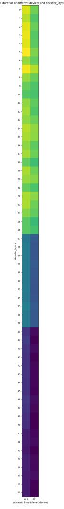  
图 8-1 ep_balance.png

# moe_analysis.csv

记录DeepSeek专家模型服务化推理时，基于MSPTI采集的MoeDistributeCombine算子和MoeDistributeDispatch算子快慢卡分析结果。

只要有moe_analysis分析能力对应的数据，执行解析命令，结果目录下默认会生成该分析结果的箱型图图8-2，图中横轴为各个Device对应的Process ID，纵轴为耗时之和。图中展示耗时之和的均值和上下2.5%分位点，各个卡之间差距越大，上下分位点间隔越远，说明快慢卡现象越明显。

表 8-13 moe_analysis.csv  

<table><tr><td colspan="1" rowspan="1">字段</td><td colspan="1" rowspan="1">说明</td></tr><tr><td colspan="1" rowspan="1">Dataset</td><td colspan="1" rowspan="1">对应Device的Process ID。</td></tr><tr><td colspan="1" rowspan="1">Mean</td><td colspan="1" rowspan="1">该Device上MoeDistributeCombine算子和MoeDistributeDispatch算子的耗时之和的平均值。</td></tr><tr><td colspan="1" rowspan="1">CI Lower</td><td colspan="1" rowspan="1">该Device上MoeDistributeCombine算子和MoeDistributeDispatch算子之和的下2.5%分位数。</td></tr><tr><td>CI Upper</td><td>该Device上MoeDistributeCombine算子和 MoeDistributeDispatch算子之和的上2.5%分位数。</td></tr></table>

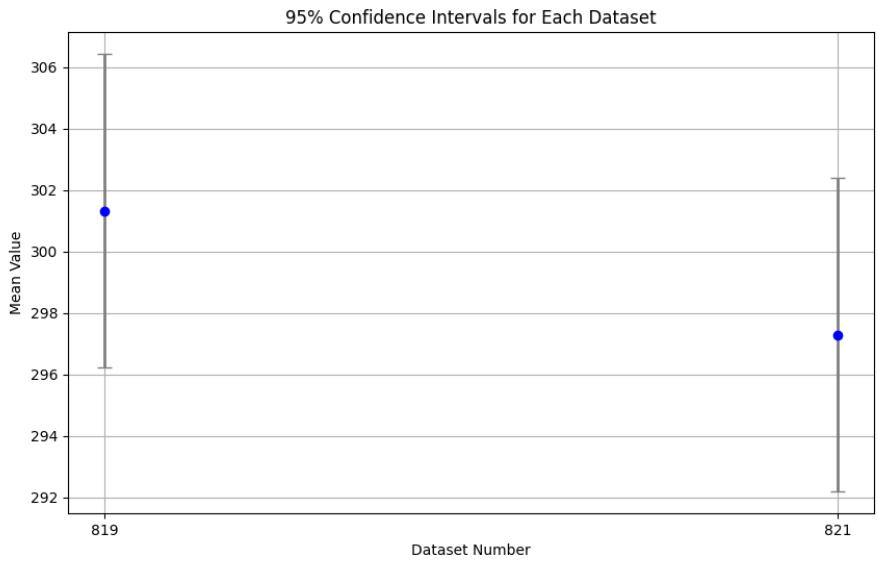  
图 8-2 moe_analysis.png

# request_status.csv

统计服务化推理过程中，各个时刻的请求状态（处于waiting、running或swapped状态的请求个数）。可以根据统计的数据，绘制折线图，反映请求状态的变化趋势。

表 8-14 request_status.csv  

<table><tr><td rowspan=1 colspan=1>字段</td><td rowspan=1 colspan=1>说明</td></tr><tr><td rowspan=1 colspan=1>hostuid</td><td rowspan=1 colspan=1>节点ID。</td></tr><tr><td rowspan=1 colspan=1>pid</td><td rowspan=1 colspan=1>进程ID。</td></tr><tr><td rowspan=1 colspan=1>timestamp(ms)</td><td rowspan=1 colspan=1>时间戳，单位ms。</td></tr><tr><td rowspan=1 colspan=1>relative_timestamp(ms）</td><td rowspan=1 colspan=1>相对时间戳，单位ms。</td></tr><tr><td rowspan=1 colspan=1>waiting</td><td rowspan=1 colspan=1>处于waiting状态的请求个数。</td></tr><tr><td rowspan=1 colspan=1>running</td><td rowspan=1 colspan=1>处于running状态的请求个数。</td></tr><tr><td rowspan=1 colspan=1>swapped</td><td rowspan=1 colspan=1>处于swapped状态的请求个数。</td></tr></table>

# {host_name}_eplb_{i}_summed_hot_map_by_expert.png

专家热点信息热力图，图8-3中的像素点可以根据右侧图例的亮度判断，亮度越高代表热度越高。

● host_name表示所在的设备名称。i表示MindIE开启动态负载均衡场景时，服务化profiling采集周期内，负载均衡表更新的次数；不开启动态负载均衡时，i为0。

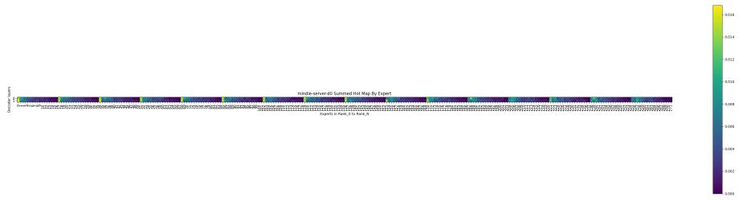  
图 8-3 热力图

横轴为专家编号，纵轴代表模型的moe层。

专家编号为模型实例中，Rank_ID从小到大排序，每个Rank内按照顺序进行编号，例如16张卡，每张卡17个专家，专家编号为42的专家代表Rank_2（第三张卡）的expert_7（第8个专家）。

# {host_name}_eplb_{i}_summed_hot_map_by_rank.png

专家热点信息热力图，图8-4中的像素点可以根据右侧图例的亮度判断，亮度越高代表热度越高。

● host_name表示所在的设备名称。i表示MindIE开启动态负载均衡场景时，服务化profiling采集周期内，负载均衡表更新的次数；不开启动态负载均衡时，i为0。

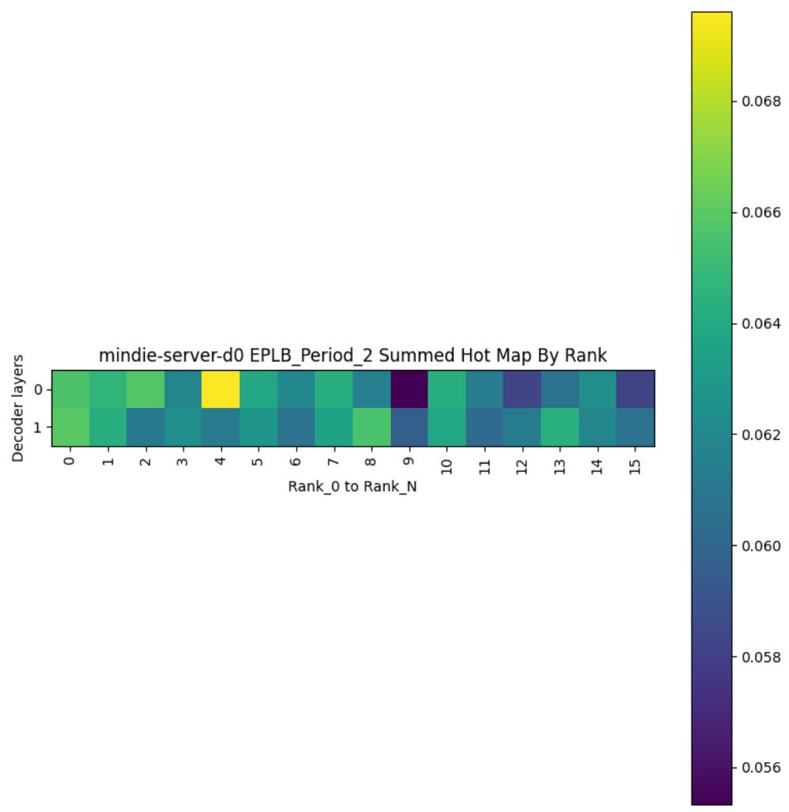  
图 8-4 热力图

横轴为Rank_ID，纵轴代表模型的moe层。

# {host_name}_eplb_{i}_summed_hot_map_by_model_expert.png

专家热点信息热力图，图8-5中的像素点可以根据右侧图例的亮度判断，亮度越高代表热度越高。

● host_name表示所在的设备名称。  
● i表示MindIE开启动态负载均衡场景时，服务化profiling采集周期内，负载均衡表更新的次数；不开启动态负载均衡时，i为0。  
● 该图需要开启MindIE的动态负载均衡特性才会生成。

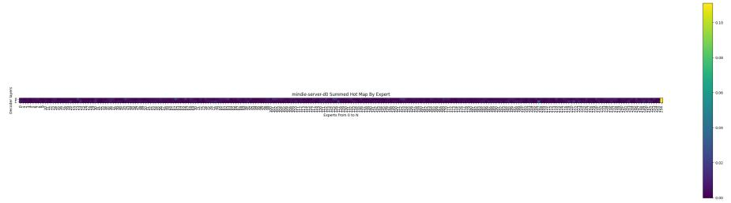  
图 8-5 热力图

横轴为模型的专家编号，其中共享专家编号排列在最后，纵轴代表模型的MoE层。

# 8.1.5 数据可视化

# 8.1.5.1 MindStudio Insight 可视化

MindStudio Insight工具支持对服务化调优工具采集并解析的性能数据进行可视化，当前支持chrome_tracing.json文件及profiler.db文件的可视化，详细操作及可视化结果介绍请参见《MindStudio Insight工具用户指南》中的“服务化调优”章节。

# 8.1.5.2 Chrome tracing 可视化

Chrome tracing工具支持对服务化调优工具采集并解析的chrome_tracing.json文件进行可视化，操作如下：

在Chrome浏览器中输入“chrome://tracing”地址，将.json文件拖到空白处打开，通过键盘上的快捷键（w：放大，s：缩小，a：左移，d：右移）进行查看。

# 说明

如果chrome_tracing.json大于500MB，推荐使用MindStudio Insight可视化。

# 8.1.5.3 Grafana 可视化

# 8.1.5.3.1 使用前准备

# 数据准备

已完成8.1.4 数据解析。

确认在--output-path指定的路径下存在SQLite数据库文件profiler.db。

# 环境依赖

Grafana $\scriptstyle 1 = 1 1 . 3 . 0$ ，并安装SQLite插件=11.3.0。

# 安装并连接Grafana

Grafana安装官方网址https://grafana.com/grafana/download?platform=arm&edition=oss，下载安装对应开源版本解压运行。例如：

tar -zxvf grafana-11.3.0.linux-arm64.tar.gz   
cd grafana-v11.3.0/bin/   
./grafana-server

配置Windows代理，需要添加Linux设备IP前缀，例如90.90.\*;90.91.\*，访问http://Linux设备IP:3000/即可打开Grafana的Web端，初始账号密码都为admin。

# 8.1.5.3.2 连接 Grafana 画图

步骤1 新建Data sources，如下图：

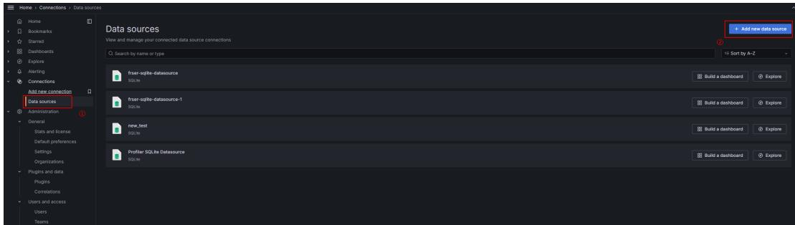

data source类型选择SQLite类型，如下图：

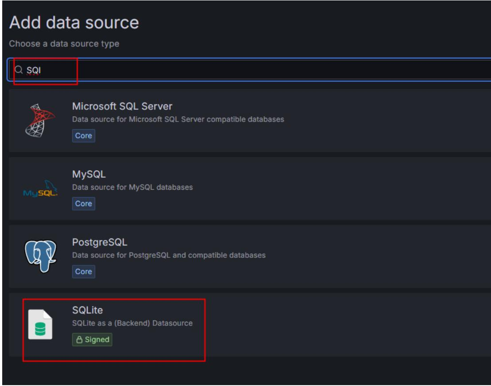

将解析生成的SQLite数据库文件profiler.db连接到Grafana，并记录datasource uid，如下图：

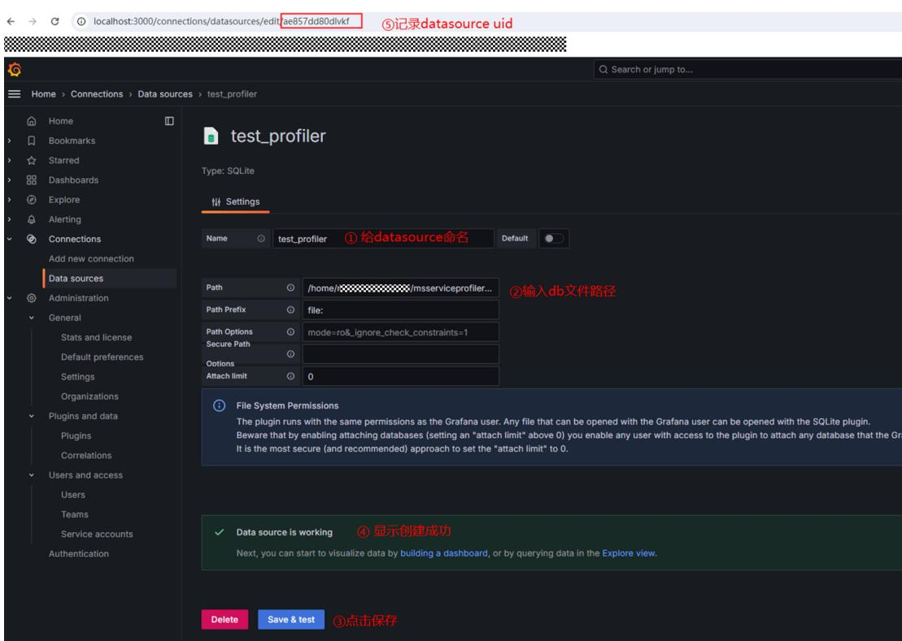

步骤2 新建dashboard，导入折线图。

在/xxx/Ascend/cann-{version}/tools/msserviceprofiler/python/ms_service_profiler/views/路径下包含可视化文件profiler_visualization.json，修改json文件中datasource的uid为步骤2中记录的uid。

# 说明

{cann_version为CANN软件包版本，支持CANN8.1.RC1及之后的版本。

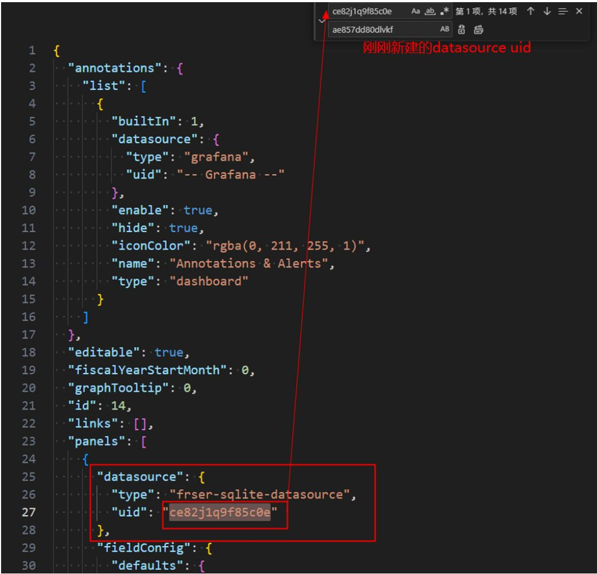

# 说明

json文件末尾的uid用于唯一标记此dashboard，这里不用修改；title用于给此dashboard命名，默认为Profiler Visualization。

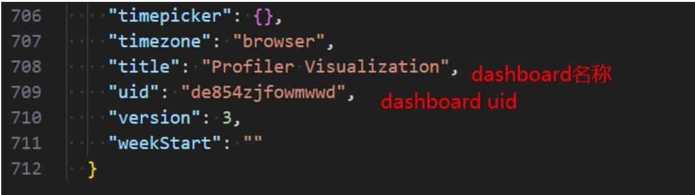

步骤3 新建dashboard，将修改后的json文件内容粘贴导入，即可在Dashboards中找到相对应名称的dashboard。

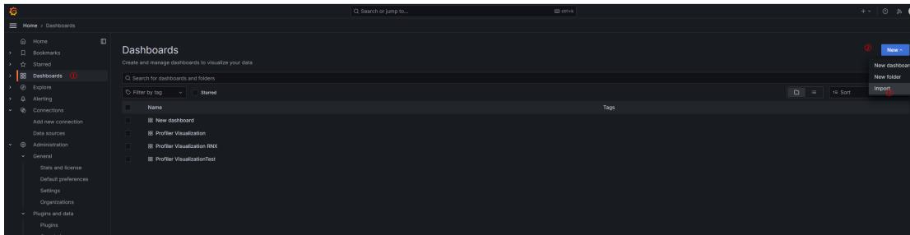

# Import dashboard

Import dashboard from file or Grafana.com Upload dashboard JSON file

Drag and drop here or click to browse Accepted file types: .json, .txt

Find and import dashboards for common applications at grafana.com/dashboards

Grafana.com dashboard URL or ID Import via dashboard JsoN model

"title": "Example - Repeating Dictionary variables",   
"uid": "_0HnEoN4z",   
"panels": [..]   
半上贝

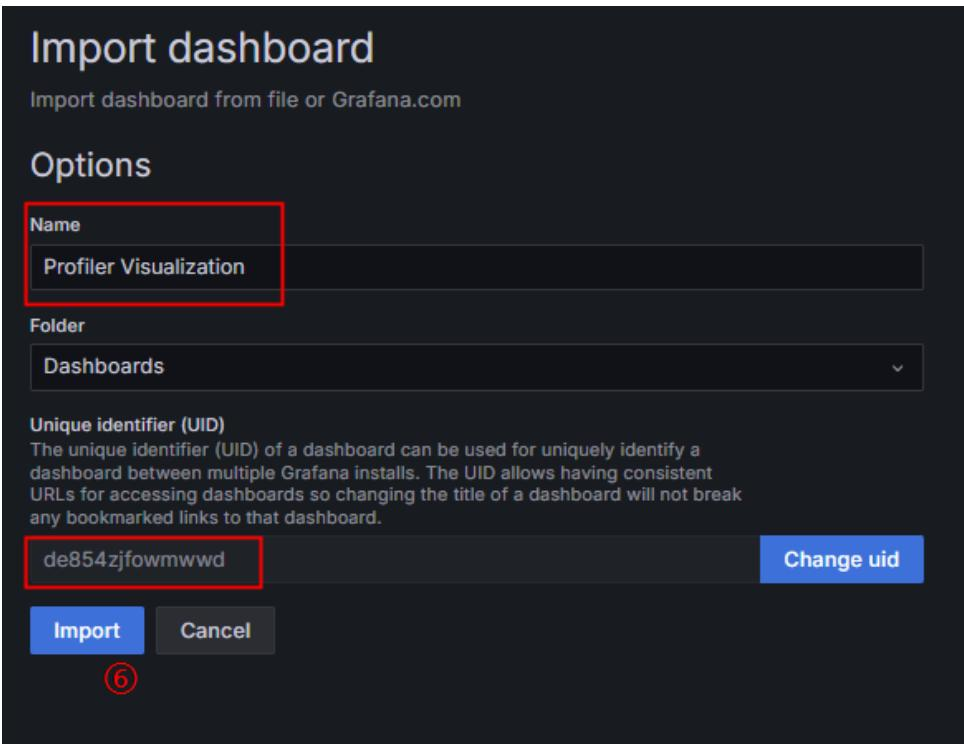

# ----结束

# 8.1.5.3.3 可视化结果

生成的Grafana dashboard中包含以下可视化图像：

表 8-15 可视化图像  

<table><tr><td rowspan=1 colspan=1>可视化图像名称</td><td rowspan=1 colspan=1>描述</td></tr><tr><td rowspan=1 colspan=1>Batch Size by BatchID</td><td rowspan=1 colspan=1>记录BatchSchedule过程中每个batch包含的请求数量折线图。根据时间排序，区分prefill和decode。</td></tr><tr><td rowspan=1 colspan=1>Request Status</td><td rowspan=1 colspan=1>服务中处于不同状态下的请求数目随时间变化的折线图。</td></tr><tr><td rowspan=1 colspan=1>Kvcache usagepercent</td><td rowspan=1 colspan=1>所有请求Kvcache使用率随时间变换折线图。包含所有请求的Kvcache使用率情况。</td></tr><tr><td rowspan=1 colspan=1>first_token_latency</td><td rowspan=1 colspan=1>所有请求首token时延随时间变化折线图。包含所有请求首token时延的平均值avg，分位值p99、p90、p50等。</td></tr><tr><td rowspan=1 colspan=1>prefill_generate_speed_latency</td><td rowspan=1 colspan=1>所有请求prefil阶段，不同时刻吞吐的token平均时延随时间变化折线图。包含所有请求不同时刻吞吐的token平均时延的平均值avg，分位值p99、p90、p50等。</td></tr><tr><td rowspan=1 colspan=1>decode_generate_speed_latency</td><td rowspan=1 colspan=1>所有请求decode阶段，不同时刻吞吐的token平均时延随时间变化折线图。包含所有请求不同时刻吞吐的token平均时延的平均值avg，分位值p99、p90、p50等。</td></tr><tr><td rowspan=1 colspan=1>request_latency</td><td rowspan=1 colspan=1>所有请求端到端时延随时间变化折线图。包含所有请求端到端时延的平均值avg，分位值p99、p90、p50等。</td></tr></table>

# Batch Size by Batch ID

记录BatchSchedule过程中每个batch包含的请求数量折线图。

横轴：按执行时间顺序的第x个batch，从0开始。

纵轴：记录对应batch的batch size，区分prefill batch和decode batch。

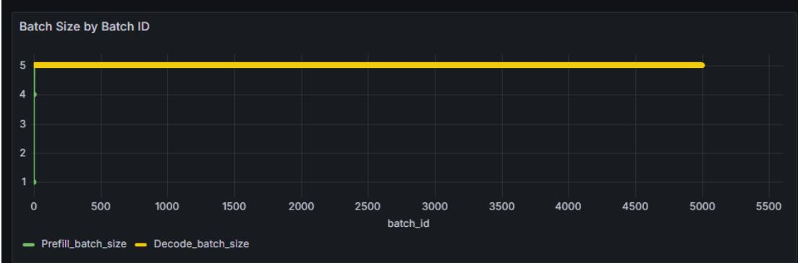  
图 8-6 Batch Size by Batch ID

# Request Status

服务化过程中处于不同状态下的请求数目随时间变化的折线图。

横轴：服务化推理运行时间轴。

纵轴：当前时刻处于该状态的请求总数。

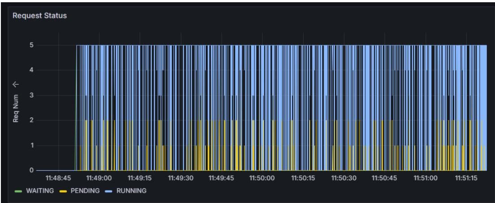  
图 8-7 Request Status

# Kvcache usage percent

所有请求Kvcache使用率随时间变化折线图。

横轴：服务化推理运行时间轴。

纵轴：所有请求Kvcache使用率的变化情况。单位：百分率%。

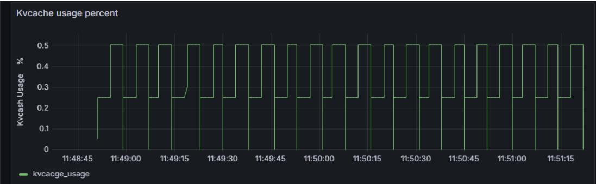  
图 8-8 Kvcache usage percent

# first_token_latency

所有请求token时延随时间变化折线图。

横轴：服务化推理运行时间轴。

纵轴：所有请求首token时延的平均值avg，分位值p99、p90、p50。单位：us。

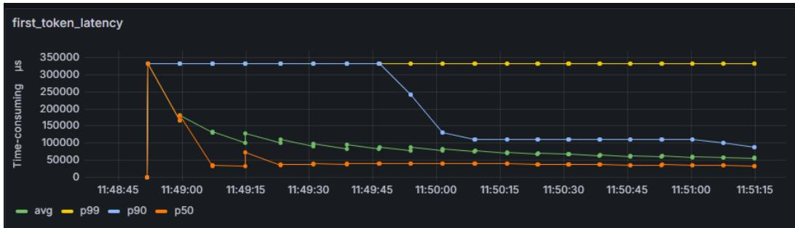  
图 8-9 first_token_latency

# prefill_generate_speed_latency

所有请求prefill阶段，不同时刻吞吐的token平均时延随时间变化折线图。

横轴：服务化推理运行时间轴。

纵轴：所有请求prefill阶段不同时刻吞吐的token平均时延的平均值avg，分位值p99、p90、p50。单位：token个数/s。

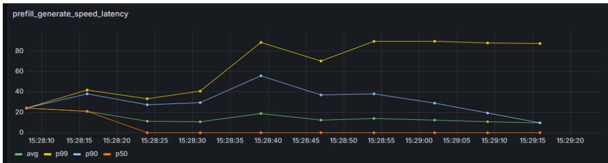  
图 8-10 prefill_generate_speed_latency

# decode_generate_speed_latency

所有请求decode阶段，不同时刻吞吐的token平均时延随时间变化折线图。

横轴：服务化推理运行时间轴。

纵轴：所有请求decode阶段不同时刻吞吐的token平均时延的平均值avg，分位值p99、p90、p50。单位：token个数/s。

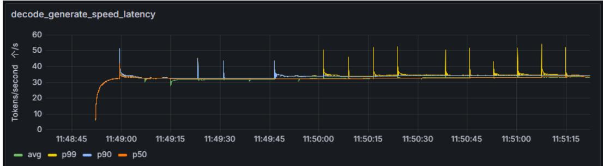  
图 8-11 decode_generate_speed_latency

# request_latency

所有请求端到端时延随时间变化折线图。

横轴：服务化推理运行时间轴。

纵轴：所有请求端到端时延的平均值avg，分位值p99、p90、p50。单位：us。

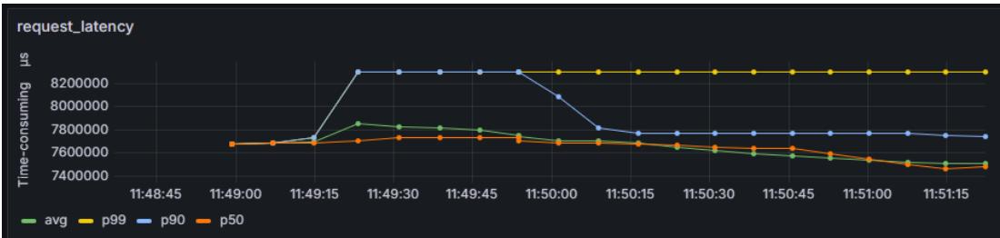  
图 8-12 request_latency

# 8.1.6 扩展功能

# 8.1.6.1 自定义添加采集代码

MindIE Motor推理服务化框架中默认已添加性能数据采集代码，当前步骤可选。

若需要自定义采集更多性能数据，可以参照如下示例代码对服务化框架中的性能采集代码进行修改，可以使用的接口请参见8.3.1.1 服务化调优或8.3.2.1 服务化调优。

# 说明

下列示例使用 ${ \mathsf { C } } { + } { + }$ 接口。

Span类数据采集：

// 记录执行开始结束时间  
auto span $=$ PROF(INFO, SpanStart("exec"));  
// 用户执行代码  
PROF(span.SpanEnd());  
// 也可以不调用SpanEnd函数，在析构时会自动调用SpanEnd结束采集

Event类数据采集：

// 记录缓存交换事件 PROF(INFO, Event("cacheSwap"));

Metric类数据采集：

// 普通数据采集：利用率 $5 0 \%$   
PROF(INFO, Metric("usage", 0.5).Launch());  
// 数据的增量采集：请求数量 $^ +$ 1  
PROF(INFO, MetricInc("reqSize", 1).Launch());  
// 定义采集数据的范围（默认是全局）：第3个队列的当前大小是14  
PROF(INFO, Metric("queueSize", 14).MetricScope("queue", 3).Launch());

Link类数据采集：

// 关联不同的资源，实际应用时不同模块对同一个请求使用不同的编号，将两个系统的编号关联起来// reqID_SYS1和reqID_SYS2对应不同的系统编号  
PROF(INFO, Link("reqID_SYS1", "reqID_SYS2"));

# 属性数据采集：

// 以上调用，都可以在结束前，在中间使用链式添加属性  
PROF(INFO, Attr("attr", "attrValue").Attr("numAttr", 66.6).Event("test"));  
// 属性可以自定义采集级别  
PROF(INFO, Attr<msServiceProfiler::VERBOSE>("verboseAttr", 1000).Event("test"));// 其他属性如：Domain(域)、Res(资源，一般是请求ID)等也可以使用链式进行添加PROF(INFO, Domain("http").Res(reqId).Attr("attr", "attrValue").Event("test"));

# 8.1.6.2 服务化性能数据比对工具

大模型推理服务化不同版本，不同框架之间可能存在性能差异，服务化性能数据比对工具支持对使用msServiceProfiler工具采集的性能数据进行差异比对，通过比对快速识别可能存在的问题点。详细介绍请参见《服务化性能数据比对工具》。

# 8.1.6.3 vLLM 服务化性能采集工具

本工具基于Ascend-vLLM，提供性能数据采集能力，结合msServiceProfiler的数据解析与可视化能力，进行vLLM服务化推理调试调优。详细介绍请参见《vLLM服务化性能采集工具》。

# 8.1.6.4 服务化自动寻优工具

本工具基于msServiceProfiler工具采集的性能数据，提供服务化参数自动寻优能力，可以对服务化的参数以及测试工具的参数进行寻优。详细介绍请参见《服务化自动寻优工具》。

# 8.2 msServiceProfiler Trace 数据监控

# 8.2.1 简介

msServiceProfiler Trace提供基于OpenTelemetry Protocol（OTLP）协议的Trace数据转发服务，该服务用于接收、处理和转发分布式Trace数据，帮助用户监控和分析微服务架构的性能表现。

msServiceProfiler Trace采集MindIE Motor服务中的请求响应时间、响应状态、客户端IP/端口、服务端IP/端口等数据，最后将采集到的数据推送至Jaeger等支持OTLP协议的开源监控平台进行可视化分析。

当前版本主要面向MindIE推理框架，支持单机及多机PD竞争部署模式。  
当前仅支持对MindIE的/v1/chat/completions和/v1/completions两个请求发送的核心接口进行Trace监控。  
msServiceProfiler Trace数据监控接口包括“msServiceProfiler API参考（ ${ \mathsf { C } } { + } { + }$ ） >Trace数据监控” 。  
有关MindIE Motor相关介绍请参见《MindIE Motor开发指南》。

# 8.2.2 使用前准备

# 环境准备

步骤1 在昇腾NPU环境安装配套版本的CANN Toolkit开发套件包和ops算子包并配置CANN环境变量，具体请参见《CANN 软件安装指南》。

步骤2 安装环境依赖，命令如下：

pip install opentelemetry-exporter-otlp-proto-grpc $= =$ 1.33.1   
pip install opentelemetry-exporter-otlp-proto-http $= =$ 1.33.1

步骤3 完成MindIE的安装和配置并确认MindIE Motor可以正常运行，具体请参见《MindIE安装指南》。

步骤4 MindIE Motor服务所在的昇腾NPU环境与OTLP采集器（Jaeger等）需建立稳定网络连接。

----结束

# 约束

msServiceProfiler Trace转发数据最大支持400并发，超过400并发可能出现请求积压，请求积压超过100W，将出现数据丢失。

相关日志提示（下述日志每小时只上报1次）：

# 积压请求数量超过10w出现请求积压告警   
2025-11-26 15:45:59,038 - 4059906 - msServiceProfiler - WARNING - Trace data is being stacked: {积压数量} # 积压请求数量超过100w出现数据丢失告警   
2025-11-26 15:45:59,522 - 4059906 - msServiceProfiler - WARNING - Trace data queue is full, discarding the oldest data.

# 8.2.3 数据采集

# 8.2.3.1 开启采集开关

步骤1 通过配置环境变量MS_TRACE_ENABLE开启Trace采集开关。export MS_TRACE_ENABLE $^ { = 1 }$

● 配置为1表示开启。  
● 不配置或其他值为关闭。

步骤2 运行MindIE Motor服务。----结束

# 8.2.3.2 配置目标采集服务器

# 说明

出于安全考虑，推荐用户使用安全模式，建议使用TLS认证。

在8.2.3.3 启动Trace转发进程前，需要通过环境变量设置目标采集服务器。

当前支持以下四种协议配置。

HTTP  
export OTEL_EXPORTER_OTLP_PROTOCOL $\varepsilon$ "http/protobuf"  
export OTEL_EXPORTER_OTLP_ENDPOINT=http://xxx:xxx/v1/traces # 配置数据转发的IP和端口，例如  
http://localhost:4318/v1/traces  
HTTP $^ +$ TLS  
export OTEL_EXPORTER_OTLP_PROTOCOL $: ^ { \underline { { \mathbf { \Pi } } } } = : \mathbf { \frac { \partial } { \partial \mathbf { \tau } } }$ "http/protobuf"  
export OTEL_EXPORTER_OTLP_ENDPOINT=https://xxx:xxx/v1/traces # 配置数据转发的IP和端口，例如  
https://localhost:4318/v1/traces  
export OTEL_EXPORTER_OTLP_CERTIFICATE=/home/certificates/ca/ca.crt # 设置证书的绝对路径，该  
目录属主、文件属主和当前用户一致，目录权限700，文件权限600  
gRPC  
export OTEL_EXPORTER_OTLP_PROTOCOL $\varepsilon$ "grpc"  
export OTEL_EXPORTER_OTLP_ENDPOINT=http://xxx:xxx # 配置数据转发的IP和端口，例如http://  
localhost:4317  
gRPC $^ +$ TLS  
export OTEL_EXPORTER_OTLP_PROTOCOL $\cdot ^ { - }$ grpc"  
export OTEL_EXPORTER_OTLP_ENDPOINT=https://xxx:xxx # 配置数据转发的IP和端口，例如https://  
localhost:4317  
export OTEL_EXPORTER_OTLP_CERTIFICATE=/home/certificates/ca/ca.crt # 设置证书的绝对路径，该  
目录属主、文件属主和当前用户一致，目录权限700，文件权限600

# 须知

当前只支持单向认证，双向认证相关配置参数不支持，配置会导致功能不可用。不可用配置参数如下：

● OTEL_EXPORTER_OTLP_TRACES_CLIENT_KEY ● OTEL_EXPORTER_OTLP_CLIENT_KEY ● OTEL_EXPORTER_OTLP_TRACES_CLIENT_CERTIFICATE ● OTEL_EXPORTER_OTLP_CLIENT_CERTIFICATE

本工具依赖OpenTelemetry三方库实现。本文仅说明此工具使用的必备参数。更多功能接口请开发者深入其官方文档自行探索。

# 8.2.3.3 启动 Trace 转发进程

# 功能说明

启动Trace转发进程。

# 注意事项

重试机制：单条请求发送失败（默认重发6次），Trace转发进程不再接受后续的Trace数据，直到该请求发送成功才恢复数据转发功能。

# 命令格式

python -m ms_service_profiler.trace [--log-level]

options参数说明请参见参数说明。

# 参数说明

表 8-16 参数说明  

<table><tr><td>参数</td><td>说明</td><td>是否 必选</td></tr><tr><td>--log-level</td><td>设置日志级别，取值为： debug：调试级别。该级别的日志记录了调试信息，便 于开发人员或维护人员定位问题。 info：正常级别。记录工具正常运行的信息。默认值。 . warning：警告级别。记录工具和预期的状态不一致，但 . 不影响整个进程运行的信息。 error：一般错误级别。 . fatal:严重错误级别。 critical:致命错误级别。</td><td>否</td></tr></table>

# 使用示例

使用默认配置启动Trace转发进程。命令如下：

python -m ms_service_profiler.trace

启动Trace转发进程使用的用户需要和启动MindIE Motor服务的用户一致，且在同网络命名空间中（同docker或同host）。

# 输出说明

# 转发进程启动成功时打印示例如下：

2025-11-27 18:46:42,737 - 23410 - msServiceProfiler - INFO - Start http/protobuf exporter, endpoint: http:// localhost:4318/v1/traces   
2025-11-27 18:46:42,737 - 23410 - msServiceProfiler - INFO - Start socket server success, listen addr: OTLP_SOCKET   
2025-11-27 18:46:42,737 - 23410 - msServiceProfiler - INFO - Start scheduler task: interval 1s   
2025-11-27 18:46:42,738 - 23410 - msServiceProfiler - INFO - Start OTLPForwarderService success, running...

# 8.2.3.4 发送请求

当前建议使用/v1/chat/completions及/v1/completions接口发送请求。且这两个接口的HTTP请求头中需要添加“开启采样”信息。当前支持添加“开启采样”的HTTP请求头格式如下：

● W3C Trace Context (traceparent) ● B3 Single Header (单一头格式) B3 Multiple Headers (多头格式)

HTTP请求头需要添加的内容格式详细配置介绍如下：

# W3C Trace Context (traceparent)

例如：

traceparent: 00-0af7651916cd43dd8448eb211c80319c-b7ad6b7169203331-01

表 8-17 W3C Trace Context (traceparent)   

<table><tr><td rowspan=1 colspan=1>字段</td><td rowspan=1 colspan=1>位置</td><td rowspan=1 colspan=1>长度</td><td rowspan=1 colspan=1>含义</td><td rowspan=1 colspan=1>有品</td></tr><tr><td rowspan=1 colspan=1>version</td><td rowspan=1 colspan=1>前2位</td><td rowspan=1 colspan=1>2字符</td><td rowspan=1 colspan=1>协议版本，目前固定为00</td><td rowspan=1 colspan=1>选</td></tr><tr><td rowspan=1 colspan=1>trace-id</td><td rowspan=1 colspan=1>3~34位</td><td rowspan=1 colspan=1>32字符</td><td rowspan=1 colspan=1>全局Trace ID（16字节，32个十六进制字符），唯一标识整个分布式调用链</td><td rowspan=1 colspan=1>选</td></tr><tr><td rowspan=1 colspan=1>parent-id</td><td rowspan=1 colspan=1>36~51位</td><td rowspan=1 colspan=1>16字符</td><td rowspan=1 colspan=1>父SpanID（8字节，16个十六进制字符），标识当前操作的直接上游</td><td rowspan=1 colspan=1>选</td></tr><tr><td rowspan=1 colspan=1>trace-flags</td><td rowspan=1 colspan=1>53~54位</td><td rowspan=1 colspan=1>2字符</td><td rowspan=1 colspan=1>Trace标志，目前只使用最低位：01=采样，00=不采样</td><td rowspan=1 colspan=1>选</td></tr></table>

# B3 Single Header（单一头格式）

例如：

b3: 0af7651916cd43dd8448eb211c80319c-b7ad6b7169203331-1-0000000000000001

表 8-18 B3 Single Header（单一头格式）  

<table><tr><td colspan="1" rowspan="1">字段</td><td colspan="1" rowspan="1">字符位置</td><td colspan="1" rowspan="1">含义</td><td colspan="1" rowspan="1">格式</td><td colspan="1" rowspan="1">取值说明</td><td colspan="1" rowspan="1">可选必选</td></tr><tr><td colspan="1" rowspan="1">Traceld</td><td colspan="1" rowspan="1">1~32位</td><td colspan="1" rowspan="1">全局Trace ID</td><td colspan="1" rowspan="1">32个十六进制字符</td><td colspan="1" rowspan="1">唯一标识整个分布式调用链</td><td colspan="1" rowspan="1">选</td></tr><tr><td colspan="1" rowspan="1">Spanld</td><td colspan="1" rowspan="1">34~49位</td><td colspan="1" rowspan="1">当前Span ID</td><td colspan="1" rowspan="1">16个十六进制字符</td><td colspan="1" rowspan="1">标识当前服务操作的唯ID</td><td colspan="1" rowspan="1">心选</td></tr><tr><td colspan="1" rowspan="1">Sampled</td><td colspan="1" rowspan="1">51位</td><td colspan="1" rowspan="1">采样决策</td><td colspan="1" rowspan="1">1个字符</td><td colspan="1" rowspan="1">1=采样0=不采样</td><td colspan="1" rowspan="1">选</td></tr><tr><td colspan="1" rowspan="1">ParentSpanld</td><td colspan="1" rowspan="1">53~68位</td><td colspan="1" rowspan="1">父SpanID</td><td colspan="1" rowspan="1">16个十六进制字符</td><td colspan="1" rowspan="1">可选字段，标识直接上游Span</td><td colspan="1" rowspan="1">可选</td></tr></table>

# B3 Multiple Headers（多头格式）

例如：

X-B3-TraceId: 0af7651916cd43dd8448eb211c80319c X-B3-SpanId: b7ad6b7169203331 X-B3-Sampled: 1

表 8-19 B3 Multiple Headers（多头格式）  

<table><tr><td rowspan=1 colspan=1>字段名称</td><td rowspan=1 colspan=1>含义</td><td rowspan=1 colspan=1>格式</td><td rowspan=1 colspan=1>取值</td><td rowspan=1 colspan=1>作用</td><td rowspan=1 colspan=1>可选/必选</td></tr><tr><td rowspan=1 colspan=1>X-B3-Traceld</td><td rowspan=1 colspan=1>全局TraceID</td><td rowspan=1 colspan=1>32个十六进制字符（16字节）</td><td rowspan=1 colspan=1>任意32位十六进制字符串</td><td rowspan=1 colspan=1>唯一标识整个分布式调用链，所有相关服务共享同一个Traceld</td><td rowspan=1 colspan=1>必选</td></tr><tr><td rowspan=1 colspan=1>X-B3-Spanld</td><td rowspan=1 colspan=1>当前SpanID</td><td rowspan=1 colspan=1>16个十六进制字符（8字节）</td><td rowspan=1 colspan=1>任意16位十六进制字符串</td><td rowspan=1 colspan=1>标识当前服务操作的唯一ID，每个Span都有独立的Spanld</td><td rowspan=1 colspan=1>必选</td></tr><tr><td rowspan=1 colspan=1>X-B3- Sampled</td><td rowspan=1 colspan=1>采样决策</td><td rowspan=1 colspan=1>字符串</td><td rowspan=1 colspan=1>1=采样0=不采样</td><td rowspan=1 colspan=1>控制是否记录Trace数据到后端系统，避免产生过多性能开销</td><td rowspan=1 colspan=1>必选</td></tr></table>

# 执行发送请求

发送的HTTP请求头中必须添加上述三种HTTP请求头格式的其中一种，才可以执行发送请求并开启Trace数据监控功能。其中配置的SpanId和TraceId会作为每个请求的索引。

以在HTTP请求头添加W3C Trace Context (traceparent)格式为例，执行发送请求命令如下：

curl http://127.0.0.1:1025/v1/chat/completions \   
-X POST \   
-H "Content-Type: application/json" -H "traceparent:   
04-01f92f3577b34da6a3ce929d0e0e4703-00f067aa0ba90203-01" \   
-d '{   
"model": "qwen",   
"messages": [   
{"role": "user", "content": "用Python写一个简单的冒泡排序算法："}   
],   
"max_tokens": 300,   
"temperature": 0.5,   
"stream": false }'

# 8.2.4 输出结果说明

完成8.2.3.4 发送请求后，可以在支持OTLP协议的开源监控平台（例如Jaeger，须先开启Jaeger平台服务）查看可视化结果，示例如下。

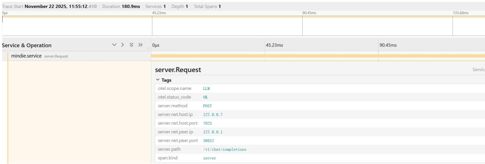  
图 8-13 可视化结果

字段说明如下：

表 8-20 基础信息  

<table><tr><td rowspan=1 colspan=1>字段</td><td rowspan=1 colspan=1>说明</td></tr><tr><td rowspan=1 colspan=1>tracelD</td><td rowspan=1 colspan=1>Trace链路的唯一标识符，string类型，示例值79f92f3577b34da6a3ce929d0e0e4703。</td></tr><tr><td rowspan=1 colspan=1>spanID</td><td rowspan=1 colspan=1>当前Span的唯一标识符，string类型，示例值4736e32cc09f0000。</td></tr><tr><td rowspan=1 colspan=1>operationName</td><td rowspan=1 colspan=1>操作/接口名称，string类型，示例值server.Request。</td></tr><tr><td rowspan=1 colspan=1>startTime</td><td rowspan=1 colspan=1>Span开始时间，int类型，单位us，示例值1763784983019248。</td></tr><tr><td rowspan=1 colspan=1>duration</td><td rowspan=1 colspan=1>Span持续时间，int类型，单位us，示例值328。</td></tr></table>

表 8-21 服务信息  

<table><tr><td rowspan=1 colspan=1>字段</td><td rowspan=1 colspan=1>说明</td></tr><tr><td rowspan=1 colspan=1>tags[key=otel.scope.name]</td><td rowspan=1 colspan=1>服务/模块名称，string类型，示例值LLM。</td></tr><tr><td rowspan=1 colspan=1>tags[key=server.method]</td><td rowspan=1 colspan=1>HTTP请求方法，string类型，示例值POST。</td></tr><tr><td rowspan=1 colspan=1>tags[key=server.path]</td><td rowspan=1 colspan=1>请求路径，string类型，示例值/v1/chat/completions。</td></tr><tr><td rowspan=1 colspan=1>tags[key=span.kind]</td><td rowspan=1 colspan=1>Span类型，string类型，示例值server。</td></tr></table>

表 8-22 网络信息  

<table><tr><td rowspan=1 colspan=1>字段</td><td rowspan=1 colspan=1>说明</td></tr><tr><td rowspan=1 colspan=1>tags[key=server.net.host.ip]</td><td rowspan=1 colspan=1>服务端IP地址，string类型，示例值127.0.0.7。</td></tr><tr><td rowspan=1 colspan=1>tags[key=server.net.host.port]</td><td rowspan=1 colspan=1>服务端端口，string类型，示例值7025。</td></tr><tr><td rowspan=1 colspan=1>tags[key=server.net.peer.ip]</td><td rowspan=1 colspan=1>客户端IP地址，string类型，示例值127.0.0.1。</td></tr><tr><td rowspan=1 colspan=1>tags[key=server.net.peer.port]</td><td rowspan=1 colspan=1>客户端端口，string类型，示例值36694。</td></tr></table>

表 8-23 状态信息  

<table><tr><td rowspan=1 colspan=1>字段</td><td rowspan=1 colspan=1>说明</td></tr><tr><td rowspan=1 colspan=1>tags[key=error]</td><td rowspan=1 colspan=1>是否发生错误（仅当请求返回错误时存在），bool类型。示例值：·请求错误时为true。·请求正确时不出现该值。</td></tr><tr><td rowspan=1 colspan=1>tags[key=otel.status_code]</td><td rowspan=1 colspan=1>OpenTelemetry状态码，string类型。示例值：·请求正确时为OK。请求错误时为ERROR。</td></tr><tr><td rowspan=1 colspan=1>tags[key=otel.status_description]</td><td rowspan=1 colspan=1>错误详细描述（仅当请求返回错误时存在），string类型，示例值{&quot;error&quot;:&quot;Request param contains notmessages or messages null&quot;,&quot;error_type&quot;:&quot;InputValidation Error&quot;}。</td></tr></table>

# 8.3 附录

# 8.3.1 msServiceProfiler API 参考（ $\mathsf { C } { + } { + }$ ）

# 8.3.1.1 服务化调优

# 8.3.1.1.1 总体说明

接口简介

msServiceProfiler模块提供推理服务化性能数据采集（ ${ \mathsf { C } } { + } { + }$ ）接口，用于采集服务化调优场景性能数据。

推理服务化性能数据采集接口功能介绍和使用示例请参见8.1.3 数据采集。

头文件：\${INSTALL_DIR}/include/msServiceProfiler/msServiceProfiler.h

库文件：\${INSTALL_DIR}/lib64/libms_service_profiler.so

\${INSTALL_DIR}请替换为CANN软件安装后文件存储路径。若安装的Ascend-cann-toolkit软件包，以root安装举例，则安装后文件存储路径为：/usr/local/Ascend/ascend-toolkit/latest。

# 接口列表

具体接口如下：

表 8-24 服务化性能数据采集 API（ ${ \mathsf { C } } { + } { + }$ ）  

<table><tr><td colspan="1" rowspan="1">接口</td><td colspan="1" rowspan="1">说明</td></tr><tr><td colspan="1" rowspan="1">IsEnable</td><td colspan="1" rowspan="1">判断是否使能采集数据。</td></tr><tr><td colspan="1" rowspan="1">SpanStart</td><td colspan="1" rowspan="1">记录一个过程的开始节点。</td></tr><tr><td colspan="1" rowspan="1">SpanEnd</td><td colspan="1" rowspan="1">记录一个过程的结束节点。</td></tr><tr><td colspan="1" rowspan="1">Metric</td><td colspan="1" rowspan="1">记录一个指标类数值。</td></tr><tr><td colspan="1" rowspan="1">Metriclnc</td><td colspan="1" rowspan="1">记录一个指标类的增量数值。</td></tr><tr><td colspan="1" rowspan="1">MetricScope</td><td colspan="1" rowspan="1">定义一个指标类的作用范围。</td></tr><tr><td colspan="1" rowspan="1">MetricScopeAsReqID</td><td colspan="1" rowspan="1">定义一个指标类的作用范围为请求级别。</td></tr><tr><td colspan="1" rowspan="1">MetricScopeAsGlobal</td><td colspan="1" rowspan="1">定义一个指标类的作用范围为全局。</td></tr><tr><td colspan="1" rowspan="1">Launch</td><td colspan="1" rowspan="1">正式将该请求记录进行落盘。</td></tr><tr><td colspan="1" rowspan="1">Event</td><td colspan="1" rowspan="1">记录一个事件。</td></tr><tr><td colspan="1" rowspan="1">Link</td><td colspan="1" rowspan="1">记录不同资源之间的关联。</td></tr><tr><td colspan="1" rowspan="1">Attr系列</td><td colspan="1" rowspan="1">添加属性，返回当前对象，支持链式调用。</td></tr><tr><td colspan="1" rowspan="1">ArrayResource</td><td colspan="1" rowspan="1">添加数组类资源的关键属性。</td></tr><tr><td colspan="1" rowspan="1">Resource</td><td colspan="1" rowspan="1">添加资源ID，数据和timeline根据资源ID进行关联。</td></tr><tr><td colspan="1" rowspan="1">Domain</td><td colspan="1" rowspan="1">指定该数据的域，相同域的记录在trace数据中归为一类。</td></tr><tr><td colspan="1" rowspan="1">NumArrayAttr</td><td colspan="1" rowspan="1">添加数组属性，数组中仅支持数值。</td></tr><tr><td colspan="1" rowspan="1">ArrayAttr</td><td colspan="1" rowspan="1">通过回调函数自定义添加数组属性。</td></tr><tr><td colspan="1" rowspan="1">GetMsg</td><td colspan="1" rowspan="1">获取当前记录的数据。</td></tr><tr><td colspan="1" rowspan="1">宏定义</td><td colspan="1" rowspan="1">封装的采集语句。</td></tr></table>

# 8.3.1.1.2 IsEnable

产品支持情况  

<table><tr><td rowspan=1 colspan=1>产品</td><td rowspan=1 colspan=1>是否支持</td></tr><tr><td rowspan=1 colspan=1>Atlas 800I A2 推理产品</td><td rowspan=1 colspan=1>√</td></tr><tr><td rowspan=1 colspan=1>Atlas 200T A2 Box16 异构子框</td><td rowspan=1 colspan=1>√</td></tr><tr><td rowspan=1 colspan=1>Atlas 300l Duo 推理卡+Atlas 800 推理服务器（型号：3000）</td><td rowspan=1 colspan=1>√</td></tr><tr><td rowspan=1 colspan=2>注：暂不支持其他产品。</td></tr></table>

功能说明

判断是否使能采集数据，当入参级别小于配置的级别时，返回true。

函数原型

inline bool IsEnable(Level msgLevel $=$ level)

参数说明

表 8-25 参数说明  

<table><tr><td rowspan=1 colspan=1>参数名</td><td rowspan=1 colspan=1>输入/输出</td><td rowspan=1 colspan=1>说明</td></tr><tr><td rowspan=1 colspan=1>msgLevel</td><td rowspan=1 colspan=1>输入</td><td rowspan=1 colspan=1>定义的采集等级，参见8.1.3.1创建采集配置文件中的profiler_level。</td></tr></table>

# 返回值说明

true表示使能数据采集，false表示未使能。

# 8.3.1.1.3 SpanStart

产品支持情况  

<table><tr><td rowspan=1 colspan=1>产品</td><td rowspan=1 colspan=1>是否支持</td></tr><tr><td rowspan=1 colspan=1>Atlas 800I A2推理产品</td><td rowspan=1 colspan=1>√</td></tr><tr><td rowspan=1 colspan=1>Atlas 200T A2 Box16 异构子框</td><td rowspan=1 colspan=1>√</td></tr><tr><td rowspan=1 colspan=1>Atlas 300l Duo 推理卡+Atlas 800 推理服务器（型号：3000）</td><td rowspan=1 colspan=1>√</td></tr><tr><td rowspan=1 colspan=2>注：暂不支持其他产品。</td></tr></table>

功能说明

记录一个过程的开始节点。

# 函数原型

Profiler &SpanStart(const char \*spanName, bool autoEnd $=$ true)

参数说明

表 8-26 参数说明  

<table><tr><td rowspan=1 colspan=1>参数名</td><td rowspan=1 colspan=1>输入/输出</td><td rowspan=1 colspan=1>说明</td></tr><tr><td rowspan=1 colspan=1>spanName</td><td rowspan=1 colspan=1>输入</td><td rowspan=1 colspan=1>区间名字。</td></tr><tr><td rowspan=1 colspan=1>autoEnd</td><td rowspan=1 colspan=1>输入</td><td rowspan=1 colspan=1>（可选）是否自动调用End，默认自动调用。</td></tr></table>

# 返回值说明

Profiler&返回当前对象，支持链式调用。

# 8.3.1.1.4 SpanEnd

产品支持情况  

<table><tr><td colspan="1" rowspan="1">产品</td><td colspan="1" rowspan="1">是否支持</td></tr><tr><td colspan="1" rowspan="1">Atlas 800I A2推理产品</td><td colspan="1" rowspan="1">√</td></tr><tr><td colspan="1" rowspan="1">Atlas 200T A2 Box16 异构子框</td><td colspan="1" rowspan="1">√</td></tr><tr><td colspan="1" rowspan="1">Atlas_300l Duo 推理卡+Atlas 800推理服务器（型号：3000）</td><td colspan="1" rowspan="1">√</td></tr><tr><td>注：暂不支持其他产品。</td><td></td></tr></table>

功能说明

记录一个过程的结束节点。

函数原型

void SpanEnd()

参数说明

无

返回值说明

无

# 8.3.1.1.5 Metric

产品支持情况  

<table><tr><td rowspan=1 colspan=1>产品</td><td rowspan=1 colspan=1>是否支持</td></tr><tr><td rowspan=1 colspan=1>Atlas 800I A2推理产品</td><td rowspan=1 colspan=1>√</td></tr><tr><td rowspan=1 colspan=1>Atlas 200T A2 Box16 异构子框</td><td rowspan=1 colspan=1>√</td></tr><tr><td rowspan=1 colspan=1>Atlas 300l Duo 推理卡+Atlas 800 推理服务器（型号：3000）</td><td rowspan=1 colspan=1>√</td></tr><tr><td rowspan=1 colspan=2>注：暂不支持其他产品。</td></tr></table>

功能说明

记录一个指标类数值。

# 函数原型

template <typename T> inline Profiler &Metric(const char \*metricName, T value)

# 参数说明

表 8-27 参数说明  

<table><tr><td rowspan=1 colspan=1>参数名</td><td rowspan=1 colspan=1>输入/输出</td><td rowspan=1 colspan=1>说明</td></tr><tr><td rowspan=1 colspan=1>metricName</td><td rowspan=1 colspan=1>输入</td><td rowspan=1 colspan=1>指标名字。</td></tr><tr><td rowspan=1 colspan=1>value</td><td rowspan=1 colspan=1>输入</td><td rowspan=1 colspan=1>数值。</td></tr></table>

# 返回值说明

Profiler&返回当前对象，支持链式调用。

# 8.3.1.1.6 MetricInc

产品支持情况  

<table><tr><td rowspan=1 colspan=1>产品</td><td rowspan=1 colspan=1>是否支持</td></tr><tr><td rowspan=1 colspan=1>Atlas 800I A2推理产品</td><td rowspan=1 colspan=1>√</td></tr><tr><td rowspan=1 colspan=1>Atlas 200T A2 Box16 异构子框</td><td rowspan=1 colspan=1>√</td></tr><tr><td rowspan=1 colspan=1>Atlas 300l Duo 推理卡+Atlas 800 推理服务器（型号：3000）</td><td rowspan=1 colspan=1>√</td></tr><tr><td rowspan=1 colspan=2>注：暂不支持其他产品。</td></tr></table>

功能说明

记录一个指标类的增量数值。

# 函数原型

template <typename T> inline Profiler &MetricInc(const char \*metricName, T value)

# 参数说明

表 8-28 参数说明  

<table><tr><td rowspan=1 colspan=1>参数名</td><td rowspan=1 colspan=1>输入/输出</td><td rowspan=1 colspan=1>说明</td></tr><tr><td rowspan=1 colspan=1>metricName</td><td rowspan=1 colspan=1>输入</td><td rowspan=1 colspan=1>指标名字。</td></tr><tr><td rowspan=1 colspan=1>value</td><td rowspan=1 colspan=1>输入</td><td rowspan=1 colspan=1>增量数值，为负数时表示减少。</td></tr></table>

# 返回值说明

Profiler&返回当前对象，支持链式调用。

# 8.3.1.1.7 MetricScope

产品支持情况  

<table><tr><td rowspan=1 colspan=1>产品</td><td rowspan=1 colspan=1>是否支持</td></tr><tr><td rowspan=1 colspan=1>Atlas 800I A2推理产品</td><td rowspan=1 colspan=1>√</td></tr><tr><td rowspan=1 colspan=1>Atlas 200T A2 Box16 异构子框</td><td rowspan=1 colspan=1>√</td></tr><tr><td rowspan=1 colspan=1>Atlas 300l Duo 推理卡+Atlas 800 推理服务器（型号：3000）</td><td rowspan=1 colspan=1>√</td></tr><tr><td rowspan=1 colspan=2>注：暂不支持其他产品。</td></tr></table>

功能说明

定义一个指标类的作用范围，默认作用范围为全局。

# 函数原型

template <typename $\mathsf { T } >$ inline Profiler &MetricScope(const char \*scopeName, T value)

# 参数说明

表 8-29 参数说明  

<table><tr><td rowspan=1 colspan=1>参数名</td><td rowspan=1 colspan=1>输入/输出</td><td rowspan=1 colspan=1>说明</td></tr><tr><td rowspan=1 colspan=1>scopeName</td><td rowspan=1 colspan=1>输入</td><td rowspan=1 colspan=1>指标范围名。</td></tr><tr><td rowspan=1 colspan=1>value</td><td rowspan=1 colspan=1>输入</td><td rowspan=1 colspan=1>范围标识。</td></tr></table>

# 返回值说明

Profiler&返回当前对象，支持链式调用。

# 8.3.1.1.8 MetricScopeAsReqID

# 产品支持情况

<table><tr><td>产品</td><td>是否支持</td></tr><tr><td>Atlas 800I A2推理产品</td><td>√</td></tr><tr><td colspan="1" rowspan="1">Atlas 200T A2 Box16 异构子框</td><td colspan="1" rowspan="1">√</td></tr><tr><td colspan="1" rowspan="1">Atlas_300l Duo 推理卡+Atlas 800 推理服务器（型号：3000）</td><td colspan="1" rowspan="1">√</td></tr><tr><td colspan="2" rowspan="1">注：暂不支持其他产品。</td></tr></table>

功能说明

定义一个指标类的作用范围为请求级别。

函数原型

inline Profiler &MetricScopeAsReqID()

参数说明

无

# 返回值说明

Profiler&返回当前对象，支持链式调用。

# 8.3.1.1.9 MetricScopeAsGlobal

产品支持情况  

<table><tr><td rowspan=1 colspan=1>产品</td><td rowspan=1 colspan=1>是否支持</td></tr><tr><td rowspan=1 colspan=1>Atlas 800I A2推理产品</td><td rowspan=1 colspan=1>√</td></tr><tr><td rowspan=1 colspan=1>Atlas 200T A2 Box16 异构子框</td><td rowspan=1 colspan=1>√</td></tr><tr><td rowspan=1 colspan=1>Atlas 300l Duo 推理卡+Atlas 800 推理服务器（型号：3000）</td><td rowspan=1 colspan=1>√</td></tr><tr><td rowspan=1 colspan=2>注：暂不支持其他产品。</td></tr></table>

功能说明

定义一个指标类的作用范围为全局，默认即全局，可不调用该函数。

# 函数原型

inline Profiler &MetricScopeAsGlobal()

# 参数说明

无

# 返回值说明

Profiler&返回当前对象，支持链式调用。

# 8.3.1.1.10 Launch

产品支持情况  

<table><tr><td rowspan=1 colspan=1>产品</td><td rowspan=1 colspan=1>是否支持</td></tr><tr><td rowspan=1 colspan=1>Atlas 800I A2 推理产品</td><td rowspan=1 colspan=1>√</td></tr><tr><td rowspan=1 colspan=1>Atlas 200T A2 Box16 异构子框</td><td rowspan=1 colspan=1>√</td></tr><tr><td rowspan=1 colspan=1>Atlas 300l Duo 推理卡+Atlas800 推理服务器（型号：3000）</td><td rowspan=1 colspan=1>√</td></tr><tr><td rowspan=1 colspan=2>注：暂不支持其他产品。</td></tr></table>

功能说明

正式将该请求记录进行落盘。

函数原型

void Launch()

参数说明

无

返回值说明

无

# 8.3.1.1.11 Event

产品支持情况  

<table><tr><td rowspan=1 colspan=1>产品</td><td rowspan=1 colspan=1>是否支持</td></tr><tr><td rowspan=1 colspan=1>Atlas 800I A2 推理产品</td><td rowspan=1 colspan=1>√</td></tr><tr><td rowspan=1 colspan=1>Atlas 200T A2 Box16 异构子框</td><td rowspan=1 colspan=1>√</td></tr><tr><td rowspan=1 colspan=1>Atlas 300l Duo 推理卡+Atlas 800 推理服务器（型号：3000）</td><td rowspan=1 colspan=1>√</td></tr><tr><td rowspan=1 colspan=2>注：暂不支持其他产品。</td></tr></table>

# 功能说明

记录一个事件。

# 函数原型

void Event(const char \*eventName)

参数说明

表 8-30 参数说明  

<table><tr><td rowspan=1 colspan=1>参数名</td><td rowspan=1 colspan=1>输入/输出</td><td rowspan=1 colspan=1>说明</td></tr><tr><td rowspan=1 colspan=1>eventName</td><td rowspan=1 colspan=1>输入</td><td rowspan=1 colspan=1>事件名。</td></tr></table>

返回值说明

无

# 8.3.1.1.12 Link

产品支持情况  

<table><tr><td rowspan=1 colspan=1>产品</td><td rowspan=1 colspan=1>是否支持</td></tr><tr><td rowspan=1 colspan=1>Atlas 800I A2推理产品</td><td rowspan=1 colspan=1>√</td></tr><tr><td rowspan=1 colspan=1>Atlas 200T A2 Box16 异构子框</td><td rowspan=1 colspan=1>√</td></tr><tr><td rowspan=1 colspan=1>Atlas 300l Duo 推理卡+Atlas 800 推理服务器（型号：3000）</td><td rowspan=1 colspan=1>√</td></tr><tr><td rowspan=1 colspan=2>注：暂不支持其他产品。</td></tr></table>

功能说明

记录不同资源之间的关联，实际应用时不同模块对同一个请求使用不同的编号。将两个系统的编号关联起来。

# 函数原型

void Link(const ResID &fromRid, const ResID &toRid)

# 参数说明

表 8-31 参数说明  

<table><tr><td rowspan=1 colspan=1>参数名</td><td rowspan=1 colspan=1>输入/输出</td><td rowspan=1 colspan=1>说明</td></tr><tr><td rowspan=1 colspan=1>fromRid</td><td rowspan=1 colspan=1>输入</td><td rowspan=1 colspan=1>ResID类型，ResID可以由字符串或数值隐式转换。</td></tr><tr><td rowspan=1 colspan=1>toRid</td><td rowspan=1 colspan=1>输入</td><td rowspan=1 colspan=1>ResID类型，ResID可以由字符串或数值隐式转换。</td></tr></table>

返回值说明

无

# 8.3.1.1.13 Attr 系列

产品支持情况  

<table><tr><td rowspan=1 colspan=1>产品</td><td rowspan=1 colspan=1>是否支持</td></tr><tr><td rowspan=1 colspan=1>Atlas 800I A2 推理产品</td><td rowspan=1 colspan=1>√</td></tr><tr><td rowspan=1 colspan=1>Atlas 200T A2 Box16 异构子框</td><td rowspan=1 colspan=1>√</td></tr><tr><td rowspan=1 colspan=1>Atlas 300l Duo 推理卡+Atlas 800 推理服务器（型号：3000）</td><td rowspan=1 colspan=1>√</td></tr><tr><td rowspan=1 colspan=2>注：暂不支持其他产品。</td></tr></table>

# 功能说明

添加属性，返回当前对象，支持链式调用。在解析为trace数据之后，会显示在args中。

# 函数原型

template <Level levelAttr $=$ level, typename $\mathsf { T } >$ inline Profiler &Attr(const char \*attrName, const T value)

# 参数说明

表 8-32 参数说明  

<table><tr><td colspan="1" rowspan="1">参数名</td><td colspan="1" rowspan="1">输入/输出</td><td colspan="1" rowspan="1">说明</td></tr><tr><td colspan="1" rowspan="1">attrName</td><td colspan="1" rowspan="1">输入</td><td colspan="1" rowspan="1">属性名。</td></tr><tr><td colspan="1" rowspan="1">value</td><td colspan="1" rowspan="1">输入</td><td colspan="1" rowspan="1">属性值，支持数值类和字符串类。</td></tr></table>

# 返回值说明

Profiler&返回当前对象，支持链式调用。

# 8.3.1.1.14 ArrayResource

产品支持情况  

<table><tr><td rowspan=1 colspan=1>产品</td><td rowspan=1 colspan=1>是否支持</td></tr><tr><td rowspan=1 colspan=1>Atlas 800I A2推理产品</td><td rowspan=1 colspan=1>√</td></tr><tr><td rowspan=1 colspan=1>Atlas 200T A2 Box16 异构子框</td><td rowspan=1 colspan=1>√</td></tr><tr><td rowspan=1 colspan=1>Atlas 300l Duo 推理卡+Atlas 800 推理服务器（型号：3000）</td><td rowspan=1 colspan=1>√</td></tr><tr><td rowspan=1 colspan=2>注：暂不支持其他产品。</td></tr></table>

功能说明

添加数组类资源的关键属性。

# 函数原型

template <typename T> inline Profiler &ArrayResource(const T &startIter, const T &endIter, typename ArrayCollectorHelper<Profiler<level>, T>::AttrCollectCallback callback)

# 参数说明

表 8-33 参数说明  

<table><tr><td rowspan=1 colspan=1>参数名</td><td rowspan=1 colspan=1>输入/输出</td><td rowspan=1 colspan=1>说明</td></tr><tr><td rowspan=1 colspan=1> startlter</td><td rowspan=1 colspan=1>输入</td><td rowspan=1 colspan=1>任意的迭代器开始。</td></tr><tr><td rowspan=1 colspan=1>endIter</td><td rowspan=1 colspan=1>输入</td><td rowspan=1 colspan=1>任意的迭代器结束。</td></tr><tr><td rowspan=1 colspan=1>callback</td><td rowspan=1 colspan=1>输入</td><td rowspan=1 colspan=1>元素属性提取回调函数。</td></tr></table>

# 返回值说明

Profiler&返回当前对象，支持链式调用。

# 8.3.1.1.15 Resource

产品支持情况  

<table><tr><td rowspan=1 colspan=1>产品</td><td rowspan=1 colspan=1>是否支持</td></tr><tr><td rowspan=1 colspan=1>Atlas 800I A2 推理产品</td><td rowspan=1 colspan=1>√</td></tr><tr><td rowspan=1 colspan=1>Atlas 200T A2 Box16 异构子框</td><td rowspan=1 colspan=1>√</td></tr><tr><td rowspan=1 colspan=1>Atlas 300l Duo 推理卡+Atlas 800 推理服务器（型号：3000）</td><td rowspan=1 colspan=1>√</td></tr><tr><td rowspan=1 colspan=2>注：暂不支持其他产品。</td></tr></table>

功能说明

添加资源ID，数据和timeline根据资源ID进行关联，一般是请求ID。

函数原型

inline Profiler &Resource(const ResID &rid)

参数说明

表 8-34 参数说明  

<table><tr><td rowspan=1 colspan=1>参数名</td><td rowspan=1 colspan=1>输入/输出</td><td rowspan=1 colspan=1>说明</td></tr><tr><td rowspan=1 colspan=1>rid</td><td rowspan=1 colspan=1>输入</td><td rowspan=1 colspan=1>ResID类型，ResID可以由字符串或数值隐式转换。</td></tr></table>

# 返回值说明

Profiler&返回当前对象，支持链式调用。

# 8.3.1.1.16 Domain

产品支持情况  

<table><tr><td rowspan=1 colspan=1>产品</td><td rowspan=1 colspan=1>是否支持</td></tr><tr><td rowspan=1 colspan=1>Atlas 800I A2推理产品</td><td rowspan=1 colspan=1>√</td></tr><tr><td rowspan=1 colspan=1>Atlas 200T A2 Box16 异构子框</td><td rowspan=1 colspan=1>√</td></tr><tr><td rowspan=1 colspan=1>Atlas 300l Duo 推理卡+Atlas 800 推理服务器（型号：3000）</td><td rowspan=1 colspan=1>√</td></tr><tr><td rowspan=1 colspan=2>注：暂不支持其他产品。</td></tr></table>

# 功能说明

指定该数据的域，相同域的记录在trace数据中归为一类。

# 函数原型

inline Profiler &Domain(const char \*domainName)

# 参数说明

表 8-35 参数说明  

<table><tr><td rowspan=1 colspan=1>参数名</td><td rowspan=1 colspan=1>输入/输出</td><td rowspan=1 colspan=1>说明</td></tr><tr><td rowspan=1 colspan=1>domainName</td><td rowspan=1 colspan=1>输入</td><td rowspan=1 colspan=1>域名。</td></tr></table>

# 返回值说明

Profiler&返回当前对象，支持链式调用。

# 8.3.1.1.17 NumArrayAttr

产品支持情况  

<table><tr><td rowspan=1 colspan=1>产品</td><td rowspan=1 colspan=1>是否支持</td></tr><tr><td rowspan=1 colspan=1>Atlas 800I A2推理产品</td><td rowspan=1 colspan=1>√</td></tr><tr><td rowspan=1 colspan=1>Atlas 200T A2 Box16 异构子框</td><td rowspan=1 colspan=1>√</td></tr><tr><td rowspan=1 colspan=1>Atlas 300l Duo 推理卡+Atlas 800 推理服务器（型号：3000）</td><td rowspan=1 colspan=1>√</td></tr><tr><td rowspan=1 colspan=2>注：暂不支持其他产品。</td></tr></table>

功能说明

添加数组属性，数组中仅支持数值。

# 函数原型

# 参数说明

表 8-36 参数说明  

<table><tr><td rowspan=1 colspan=1>参数名</td><td rowspan=1 colspan=1>输入/输出</td><td rowspan=1 colspan=1>说明</td></tr><tr><td rowspan=1 colspan=1>attrName</td><td rowspan=1 colspan=1>输入</td><td rowspan=1 colspan=1>属性名。</td></tr><tr><td rowspan=1 colspan=1> startlter</td><td rowspan=1 colspan=1>输入</td><td rowspan=1 colspan=1>迭代器开始。</td></tr><tr><td rowspan=1 colspan=1>endlter</td><td rowspan=1 colspan=1>输入</td><td rowspan=1 colspan=1>迭代器结束。</td></tr></table>

# 返回值说明

Profiler&返回当前对象，支持链式调用。

# 8.3.1.1.18 ArrayAttr

产品支持情况  

<table><tr><td rowspan=1 colspan=1>产品</td><td rowspan=1 colspan=1>是否支持</td></tr><tr><td rowspan=1 colspan=1>Atlas 800I A2推理产品</td><td rowspan=1 colspan=1>√</td></tr><tr><td rowspan=1 colspan=1>Atlas 200T A2 Box16 异构子框</td><td rowspan=1 colspan=1>√</td></tr><tr><td rowspan=1 colspan=1>Atlas 300l Duo 推理卡+Atlas 800 推理服务器（型号：3000）</td><td rowspan=1 colspan=1>√</td></tr><tr><td rowspan=1 colspan=2>注：暂不支持其他产品。</td></tr></table>

功能说明

通过回调函数自定义添加数组属性。

# 函数原型

template <Level levelAttr $=$ level, typename T> Profiler &ArrayAttr(const char \*attrName, const T &startIter, const T &endIter, typename ArrayCollectorHelper<Profiler<level>, $\mathsf { T } >$ ::AttrCollectCallback callback)

# 参数说明

表 8-37 参数说明  

<table><tr><td colspan="1" rowspan="1">参数名</td><td colspan="1" rowspan="1">输入/输出</td><td colspan="1" rowspan="1">说明</td></tr><tr><td colspan="1" rowspan="1">attrName</td><td colspan="1" rowspan="1">输入</td><td colspan="1" rowspan="1">属性名。</td></tr><tr><td colspan="1" rowspan="1"> startlter</td><td colspan="1" rowspan="1">输入</td><td colspan="1" rowspan="1">任意的迭代器开始。</td></tr><tr><td colspan="1" rowspan="1">endlter</td><td colspan="1" rowspan="1">输入</td><td colspan="1" rowspan="1">任意的迭代器结束。</td></tr><tr><td colspan="1" rowspan="1">callback</td><td colspan="1" rowspan="1">输入</td><td colspan="1" rowspan="1">回调函数第一个入参是当前对象，可以调用它添加属性，第二个入参是当前迭代，可以用它获取需要记录的属性内容。</td></tr></table>

# 返回值说明

Profiler&返回当前对象，支持链式调用。

# 8.3.1.1.19 GetMsg

产品支持情况  

<table><tr><td rowspan=1 colspan=1>产品</td><td rowspan=1 colspan=1>是否支持</td></tr><tr><td rowspan=1 colspan=1>Atlas 800I A2推理产品</td><td rowspan=1 colspan=1>√</td></tr><tr><td rowspan=1 colspan=1>Atlas 200T A2 Box16 异构子框</td><td rowspan=1 colspan=1>√</td></tr><tr><td rowspan=1 colspan=1>Atlas 300l Duo 推理卡+Atlas 800 推理服务器（型号：3000）</td><td rowspan=1 colspan=1>√</td></tr><tr><td rowspan=1 colspan=2>注：暂不支持其他产品。</td></tr></table>

# 功能说明

获取当前记录的数据。

# 函数原型

std::string &GetMsg()

参数说明

无

返回值说明

# 8.3.1.1.20 宏定义

std::string &当前记录的数据。

PROF：将采集语句封装起来，这样可以通过ENABLE_PROF宏定义在编译期间控制是否采集数据，支持传入一个参数或者两个参数。

一个参数：采集语句。  
当定义ENABLE_PROF会正常执行打印，当没有定义则不会打印。  
PROF(std::cout<< "enable prof" $< <$ std::endl);  
两个参数：采集级别，采集语句。自动初始化采集类以及定义采集级别。  
当定义ENABLE_PROF会正常执行采集，当没有定义则不会采集，会自动初始化Profiler类。  
PROF(INFO, Attr("req", 1).Event("recv"));

ENABLE_PROF：与PROF协同使用，当没有定义该环境变量，说明不开启采集能力，会自动将PROF定义为空实现。通常定义在CMakeLists.txt中。add_definitions(-DENABLE_PROF)

# 8.3.1.2 Trace 数据监控

# 8.3.1.2.1 总体说明

# 接口简介

Trace模块提供推理服务化性能数据采集（ ${ \mathsf { C } } { + } { + }$ ）接口，用于Trace数据监控。

Trace接口功能介绍和使用示例请参见8.2 msServiceProfiler Trace数据监控。

头文件：\${INSTALL_DIR}/include/msServiceProfiler/Tracer.h

库文件：\${INSTALL_DIR}/lib64/libms_service_profiler.so

\${INSTALL_DIR}请替换为CANN软件安装后文件存储路径。以root用户安装为例，则安装后文件存储路径为：/usr/local/Ascend/cann。

# 接口列表

具体接口如下：

表 8-38 Trace API（ ${ \mathsf { C } } { + } { + } { \mathsf { \Omega } }$ ）  

<table><tr><td colspan="1" rowspan="1">接口</td><td colspan="1" rowspan="1">说明</td></tr><tr><td colspan="1" rowspan="1">TraceContext类</td><td colspan="1" rowspan="1">Trace上下文管理类，负责管理线程级别的Trace信息。</td></tr><tr><td colspan="1" rowspan="1">GetTraceCtx</td><td colspan="1" rowspan="1">获取当前线程的Trace上下文实例。</td></tr><tr><td colspan="1" rowspan="1">addResAttribute</td><td colspan="1" rowspan="1">添加资源属性（全局属性）。</td></tr><tr><td colspan="1" rowspan="1">ExtractAndAttach</td><td colspan="1" rowspan="1">解析HTTPTrace信息并附加到当前上下文。</td></tr><tr><td colspan="1" rowspan="1">Attach</td><td colspan="1" rowspan="1">附加Trace信息到当前上下文。</td></tr><tr><td colspan="1" rowspan="1">Unattach</td><td colspan="1" rowspan="1">解除指定索引的Trace上下文。</td></tr><tr><td colspan="1" rowspan="1">GetCurrent</td><td colspan="1" rowspan="1">获取当前Trace上下文信息。</td></tr><tr><td colspan="1" rowspan="1">Span类</td><td colspan="1" rowspan="1">跨度类，表示一个具体的操作或请求。</td></tr><tr><td colspan="1" rowspan="1"> Span</td><td colspan="1" rowspan="1">创建一个跨度。</td></tr><tr><td colspan="1" rowspan="1">Activate</td><td colspan="1" rowspan="1">激活跨度并开始计时。</td></tr><tr><td colspan="1" rowspan="1">SetAttribute</td><td colspan="1" rowspan="1">设置跨度属性。</td></tr><tr><td colspan="1" rowspan="1">SetStatus</td><td colspan="1" rowspan="1">设置跨度状态。</td></tr><tr><td colspan="1" rowspan="1">End</td><td colspan="1" rowspan="1">结束跨度。</td></tr><tr><td colspan="1" rowspan="1">Tracer类</td><td colspan="1" rowspan="1">提供创建跨度的接口。</td></tr><tr><td colspan="1" rowspan="1">StartSpanAsActive</td><td colspan="1" rowspan="1">创建并激活一个跨度。</td></tr><tr><td colspan="1" rowspan="1">IsEnable</td><td colspan="1" rowspan="1">检查Trace功能是否启用。</td></tr></table>

# 8.3.1.2.2 示例代码

以下是关键步骤的代码示例，不可以直接拷贝编译运行，仅供参考。

// 设置全局资源属性   
if (msServiceProfiler::Tracer::IsEnable()) { msServiceProfiler::TraceContext::addResAttribute("service.name", "my-service"); msServiceProfiler::TraceContext::addResAttribute("service.version", $" 1 . 0 . 0 " )$ ;   
auto& ctx $=$ msServiceProfiler::TraceContext::GetTraceCtx();   
size_t indexHeader $=$ ctx.ExtractAndAttach(traceParentHeader, b3Header);   
size_t index $=$ ctx.Attach(TraceId{1, 1}, SpanId{1}, true); // Span 会自动Attach，一般不需要主动调用该函数   
// 创建跨度   
auto span $=$ msServiceProfiler::Tracer::StartSpanAsActive("MyOperation", "MyModule");   
// 设置属性   
span.SetAttribute("key", "value") .SetStatus(true, "Operation completed successfully");   
span.End();   
ctx.Unattach(index);   
ctx.Unattach(indexHeader);

# 8.3.1.2.3 TraceContext 类

# 8.3.1.2.3.1 GetTraceCtx

# 产品支持情况

# 说明

昇腾AI处理器与昇腾产品的对应关系，请参见《昇腾产品形态说明》

<table><tr><td colspan="1" rowspan="1">产品</td><td colspan="1" rowspan="1">是否支持</td></tr><tr><td colspan="1" rowspan="1">Atlas A3 训练系列产品/Atlas A3推理系列产品</td><td colspan="1" rowspan="1">×</td></tr><tr><td colspan="1" rowspan="1">Atlas A2训练系列产品/Atlas A2推理系列产品</td><td colspan="1" rowspan="1">√</td></tr><tr><td colspan="1" rowspan="1">Atlas 200I/500 A2推理产品</td><td colspan="1" rowspan="1">X</td></tr><tr><td colspan="1" rowspan="1">Atlas推理系列产品</td><td colspan="1" rowspan="1">√</td></tr><tr><td colspan="1" rowspan="1">Atlas 训练系列产品</td><td colspan="1" rowspan="1">X</td></tr></table>

# 须知

针对Atlas A2 训练系列产品/Atlas A2 推理系列产品，当前仅支持该系列产品中的Atlas 800I A2 推理产品。

针对Atlas 推理系列产品，当前仅支持该系列产品中的Atlas 300I Duo 推理卡+Atlas800 推理服务器（型号：3000）。

# 功能说明

获取当前线程的Trace的上下文实例。

函数原型

static TraceContext& GetTraceCtx()

参数说明

无

# 返回值说明

返回当前线程的Trace的上下文实例。

# 8.3.1.2.3.2 addResAttribute

# 产品支持情况

# 说明

昇腾AI处理器与昇腾产品的对应关系，请参见《昇腾产品形态说明》

<table><tr><td rowspan=1 colspan=1>产品</td><td rowspan=1 colspan=1>是否支持</td></tr><tr><td rowspan=1 colspan=1>Atlas A3 训练系列产品/Atlas A3推理系列产品</td><td rowspan=1 colspan=1>×</td></tr><tr><td rowspan=1 colspan=1>Atlas A2训练系列产品/Atlas A2推理系列产品</td><td rowspan=1 colspan=1>√</td></tr><tr><td rowspan=1 colspan=1>Atlas 200I/500 A2 推理产品</td><td rowspan=1 colspan=1>×</td></tr><tr><td rowspan=1 colspan=1>Atlas推理系列产品</td><td rowspan=1 colspan=1>√</td></tr><tr><td rowspan=1 colspan=1>Atlas 训练系列产品</td><td rowspan=1 colspan=1>X</td></tr></table>

# 须知

针对Atlas A2 训练系列产品/Atlas A2 推理系列产品，当前仅支持该系列产品中的Atlas 800I A2 推理产品。

针对Atlas 推理系列产品，当前仅支持该系列产品中的Atlas 300I Duo 推理卡 $+$ Atlas800 推理服务器（型号：3000）。

# 功能说明

添加资源属性（全局属性）。

# 函数原型

static void addResAttribute(const char\* key, const char\* value)

参数说明

表 8-39 参数说明  

<table><tr><td rowspan=1 colspan=1>参数名</td><td rowspan=1 colspan=1>输入/输出</td><td rowspan=1 colspan=1>说明</td></tr><tr><td rowspan=1 colspan=1>key</td><td rowspan=1 colspan=1>输入</td><td rowspan=1 colspan=1>属性名。</td></tr><tr><td rowspan=1 colspan=1>value</td><td rowspan=1 colspan=1>输入</td><td rowspan=1 colspan=1>属性值。</td></tr></table>

# 返回值说明

无

# 8.3.1.2.3.3 ExtractAndAttach

#

昇腾AI处理器与昇腾产品的对应关系，请参见《昇腾产品形态说明》

产品支持情况  

<table><tr><td rowspan=1 colspan=1>产品</td><td rowspan=1 colspan=1>是否支持</td></tr><tr><td rowspan=1 colspan=1>Atlas A3训练系列产品/Atlas A3推理系列产品</td><td rowspan=1 colspan=1>×</td></tr><tr><td rowspan=1 colspan=1>Atlas A2训练系列产品/Atlas A2推理系列产品</td><td rowspan=1 colspan=1>√</td></tr><tr><td rowspan=1 colspan=1>Atlas 200I/500 A2推理产品</td><td rowspan=1 colspan=1>×</td></tr><tr><td rowspan=1 colspan=1>Atlas 推理系列产品</td><td rowspan=1 colspan=1>√</td></tr><tr><td rowspan=1 colspan=1>Atlas 训练系列产品</td><td rowspan=1 colspan=1>×</td></tr></table>

# 须知

针对Atlas A2 训练系列产品/Atlas A2 推理系列产品，当前仅支持该系列产品中的Atlas 800I A2 推理产品。

针对Atlas 推理系列产品，当前仅支持该系列产品中的Atlas 300I Duo 推理卡 $+$ Atlas800 推理服务器（型号：3000）。

# 功能说明

解析HTTP Trace信息并附加到当前上下文。

# 函数原型

size_t ExtractAndAttach(const std::string& traceParentOfW3C, const std::string& traceOfB3)

参数说明

表 8-40 参数说明  

<table><tr><td rowspan=1 colspan=1>参数名</td><td rowspan=1 colspan=1>输入/输出</td><td rowspan=1 colspan=1>说明</td></tr><tr><td rowspan=1 colspan=1>traceParentOfW3C</td><td rowspan=1 colspan=1>输入</td><td rowspan=1 colspan=1>W3C标准的trace-parent字符串。</td></tr><tr><td rowspan=1 colspan=1>traceOfB3</td><td rowspan=1 colspan=1>输入</td><td rowspan=1 colspan=1>B3标准的trace字符串。</td></tr></table>

# 返回值说明

返回上下文索引，作为 Unattach的调用参数。

# 8.3.1.2.3.4 Attach

# 说明

昇腾AI处理器与昇腾产品的对应关系，请参见《昇腾产品形态说明》

产品支持情况  

<table><tr><td rowspan=1 colspan=1>产品</td><td rowspan=1 colspan=1>是否支持</td></tr><tr><td rowspan=1 colspan=1>Atlas A3训练系列产品/Atlas A3推理系列产品</td><td rowspan=1 colspan=1>×</td></tr><tr><td rowspan=1 colspan=1>Atlas A2训练系列产品/Atlas A2推理系列产品</td><td rowspan=1 colspan=1>√</td></tr><tr><td rowspan=1 colspan=1>Atlas 200I/500 A2推理产品</td><td rowspan=1 colspan=1>×</td></tr><tr><td rowspan=1 colspan=1>Atlas 推理系列产品</td><td rowspan=1 colspan=1>√</td></tr><tr><td rowspan=1 colspan=1>Atlas 训练系列产品</td><td rowspan=1 colspan=1>×</td></tr></table>

# 须知

针对Atlas A2 训练系列产品/Atlas A2 推理系列产品，当前仅支持该系列产品中的Atlas 800I A2 推理产品。

针对Atlas 推理系列产品，当前仅支持该系列产品中的Atlas 300I Duo 推理卡 $^ +$ Atlas800 推理服务器（型号：3000）。

功能说明

附加Trace信息到当前上下文。

# 函数原型

size_t Attach(const TraceId traceId, const SpanId spanId, const bool isSample $=$ true)

参数说明

表 8-41 参数说明  

<table><tr><td rowspan=1 colspan=1>参数名</td><td rowspan=1 colspan=1>输入/输出</td><td rowspan=1 colspan=1>说明</td></tr><tr><td rowspan=1 colspan=1>traceld</td><td rowspan=1 colspan=1>输入</td><td rowspan=1 colspan=1>Trace ID。</td></tr><tr><td rowspan=1 colspan=1>spanld</td><td rowspan=1 colspan=1>输入</td><td rowspan=1 colspan=1>跨度ID。</td></tr><tr><td rowspan=1 colspan=1>isSample</td><td rowspan=1 colspan=1>输入</td><td rowspan=1 colspan=1>是否采样（默认true）</td></tr></table>

# 返回值说明

返回上下文索引，作为 Unattach的调用参数。

# 8.3.1.2.3.5 Unattach

# 说明

昇腾AI处理器与昇腾产品的对应关系，请参见《昇腾产品形态说明》

产品支持情况  

<table><tr><td rowspan=1 colspan=1>产品</td><td rowspan=1 colspan=1>是否支持</td></tr><tr><td rowspan=1 colspan=1>Atlas A3训练系列产品/Atlas A3推理系列产品</td><td rowspan=1 colspan=1>×</td></tr><tr><td rowspan=1 colspan=1>Atlas A2训练系列产品/Atlas A2推理系列产品</td><td rowspan=1 colspan=1>√</td></tr><tr><td rowspan=1 colspan=1>Atlas 200I/500 A2 推理产品</td><td rowspan=1 colspan=1>×</td></tr><tr><td rowspan=1 colspan=1>Atlas推理系列产品</td><td rowspan=1 colspan=1>√</td></tr><tr><td rowspan=1 colspan=1>Atlas 训练系列产品</td><td rowspan=1 colspan=1>X</td></tr></table>

# 须知

针对Atlas A2 训练系列产品/Atlas A2 推理系列产品，当前仅支持该系列产品中的Atlas 800I A2 推理产品。

针对Atlas 推理系列产品，当前仅支持该系列产品中的Atlas 300I Duo 推理卡 $+$ Atlas800 推理服务器（型号：3000）。

# 功能说明

解除指定索引Trace的上下文。

函数原型

参数说明

表 8-42 参数说明  

<table><tr><td rowspan=1 colspan=1>参数名</td><td rowspan=1 colspan=1>输入/输出</td><td rowspan=1 colspan=1>说明</td></tr><tr><td rowspan=1 colspan=1>index</td><td rowspan=1 colspan=1>输入</td><td rowspan=1 colspan=1>要解除的上下文索引。</td></tr></table>

# 返回值说明

无

# 8.3.1.2.3.6 GetCurrent

# 说明

昇腾AI处理器与昇腾产品的对应关系，请参见《昇腾产品形态说明》

产品支持情况  

<table><tr><td rowspan=1 colspan=1>产品</td><td rowspan=1 colspan=1>是否支持</td></tr><tr><td rowspan=1 colspan=1>Atlas A3 训练系列产品/Atlas A3推理系列产品</td><td rowspan=1 colspan=1>×</td></tr><tr><td rowspan=1 colspan=1>Atlas A2训练系列产品/Atlas A2推理系列产品</td><td rowspan=1 colspan=1>√</td></tr><tr><td rowspan=1 colspan=1>Atlas 200I/500 A2 推理产品</td><td rowspan=1 colspan=1>×</td></tr><tr><td rowspan=1 colspan=1>Atlas推理系列产品</td><td rowspan=1 colspan=1>√</td></tr><tr><td rowspan=1 colspan=1>Atlas 训练系列产品</td><td rowspan=1 colspan=1>X</td></tr></table>

# 须知

针对Atlas A2 训练系列产品/Atlas A2 推理系列产品，当前仅支持该系列产品中的Atlas 800I A2 推理产品。

针对Atlas 推理系列产品，当前仅支持该系列产品中的Atlas 300I Duo 推理卡 $+$ Atlas800 推理服务器（型号：3000）。

功能说明

获取当前Trace的上下文信息。

函数原型

const TraceContextInfo& GetCurrent()

参数说明

无

返回值说明

返回当前Trace的上下文信息。

# 8.3.1.2.4 Span 类

# 8.3.1.2.4.1 Span

# 产品支持情况

# 说明

昇腾AI处理器与昇腾产品的对应关系，请参见《昇腾产品形态说明》

<table><tr><td rowspan=1 colspan=1>产品</td><td rowspan=1 colspan=1>是否支持</td></tr><tr><td rowspan=1 colspan=1>Atlas A3 训练系列产品/Atlas A3推理系列产品</td><td rowspan=1 colspan=1>×</td></tr><tr><td rowspan=1 colspan=1>Atlas A2训练系列产品/Atlas A2推理系列产品</td><td rowspan=1 colspan=1>√</td></tr><tr><td rowspan=1 colspan=1>Atlas 200I/500 A2推理产品</td><td rowspan=1 colspan=1>×</td></tr><tr><td rowspan=1 colspan=1>Atlas推理系列产品</td><td rowspan=1 colspan=1>√</td></tr><tr><td rowspan=1 colspan=1>Atlas 训练系列产品</td><td rowspan=1 colspan=1>×</td></tr></table>

# 须知

针对Atlas A2 训练系列产品/Atlas A2 推理系列产品，当前仅支持该系列产品中的Atlas 800I A2 推理产品。

针对Atlas 推理系列产品，当前仅支持该系列产品中的Atlas 300I Duo 推理卡 $+$ Atlas800 推理服务器（型号：3000）。

# 功能说明

创建一个跨度。

# 函数原型

Span(const char\* spanName, TraceContext& ctx, bool isSampled $=$ true,const char\* moduleName $=$ nullptr, bool autoEnd $=$ true)

# 参数说明

表 8-43 参数说明  

<table><tr><td rowspan=1 colspan=1>参数名</td><td rowspan=1 colspan=1>输入/输出</td><td rowspan=1 colspan=1>说明</td></tr><tr><td rowspan=1 colspan=1>spanName</td><td rowspan=1 colspan=1>输入</td><td rowspan=1 colspan=1>跨度名称。</td></tr><tr><td rowspan=1 colspan=1>ctx</td><td rowspan=1 colspan=1>输入</td><td rowspan=1 colspan=1>Trace上下文。</td></tr><tr><td rowspan=1 colspan=1>isSampled</td><td rowspan=1 colspan=1>输入</td><td rowspan=1 colspan=1>是否采样（默认true）。</td></tr><tr><td rowspan=1 colspan=1>moduleName</td><td rowspan=1 colspan=1>输入</td><td rowspan=1 colspan=1>模块名称（可选）。</td></tr><tr><td rowspan=1 colspan=1>autoEnd</td><td rowspan=1 colspan=1>输入</td><td rowspan=1 colspan=1>是否自动结束（默认true）。</td></tr></table>

# 返回值说明

当前Trace的上下文信息。

# 8.3.1.2.4.2 Activate

#

昇腾AI处理器与昇腾产品的对应关系，请参见《昇腾产品形态说明》

产品支持情况  

<table><tr><td rowspan=1 colspan=1>产品</td><td rowspan=1 colspan=1>是否支持</td></tr><tr><td rowspan=1 colspan=1>Atlas A3训练系列产品/Atlas A3推理系列产品</td><td rowspan=1 colspan=1>×</td></tr><tr><td rowspan=1 colspan=1>Atlas A2训练系列产品/Atlas A2推理系列产品</td><td rowspan=1 colspan=1>√</td></tr><tr><td rowspan=1 colspan=1>Atlas 200I/500 A2推理产品</td><td rowspan=1 colspan=1>×</td></tr><tr><td rowspan=1 colspan=1>Atlas 推理系列产品</td><td rowspan=1 colspan=1>√</td></tr><tr><td rowspan=1 colspan=1>Atlas 训练系列产品</td><td rowspan=1 colspan=1>X</td></tr></table>

# 须知

针对Atlas A2 训练系列产品/Atlas A2 推理系列产品，当前仅支持该系列产品中的Atlas 800I A2 推理产品。

针对Atlas 推理系列产品，当前仅支持该系列产品中的Atlas 300I Duo 推理卡 $+$ Atlas800 推理服务器（型号：3000）。

# 功能说明

激活跨度并开始计时。

# 函数原型

参数说明

表 8-44 参数说明  

<table><tr><td rowspan=1 colspan=1>参数名</td><td rowspan=1 colspan=1>输入/输出</td><td rowspan=1 colspan=1>说明</td></tr><tr><td rowspan=1 colspan=1>startTime</td><td rowspan=1 colspan=1>输入</td><td rowspan=1 colspan=1>开始时间（0表示当前时间）|。</td></tr></table>

# 返回值说明

返回Span类对象的引用，该引用支持链式调用。

# 8.3.1.2.4.3 SetAttribute

# 说明

昇腾AI处理器与昇腾产品的对应关系，请参见《昇腾产品形态说明》

产品支持情况  

<table><tr><td rowspan=1 colspan=1>产品</td><td rowspan=1 colspan=1>是否支持</td></tr><tr><td rowspan=1 colspan=1>Atlas A3 训练系列产品/Atlas A3推理系列产品</td><td rowspan=1 colspan=1>×</td></tr><tr><td rowspan=1 colspan=1>Atlas A2训练系列产品/Atlas A2推理系列产品</td><td rowspan=1 colspan=1>√</td></tr><tr><td rowspan=1 colspan=1>Atlas 200I/500 A2 推理产品</td><td rowspan=1 colspan=1>×</td></tr><tr><td rowspan=1 colspan=1>Atlas推理系列产品</td><td rowspan=1 colspan=1>√</td></tr><tr><td rowspan=1 colspan=1>Atlas 训练系列产品</td><td rowspan=1 colspan=1>X</td></tr></table>

# 须知

针对Atlas A2 训练系列产品/Atlas A2 推理系列产品，当前仅支持该系列产品中的Atlas 800I A2 推理产品。

针对Atlas 推理系列产品，当前仅支持该系列产品中的Atlas 300I Duo 推理卡 $+$ Atlas800 推理服务器（型号：3000）。

# 功能说明

设置跨度属性。

# 函数原型

Span& SetAttribute(const char\* attrName, const char\* value)

参数说明

表 8-45 参数说明  

<table><tr><td rowspan=1 colspan=1>参数名</td><td rowspan=1 colspan=1>输入/输出</td><td rowspan=1 colspan=1>说明</td></tr><tr><td rowspan=1 colspan=1>attrName</td><td rowspan=1 colspan=1>输入</td><td rowspan=1 colspan=1>属性名|。</td></tr><tr><td rowspan=1 colspan=1>value</td><td rowspan=1 colspan=1>输入</td><td rowspan=1 colspan=1>属性值。</td></tr></table>

# 返回值说明

返回Span类对象的引用，该引用支持链式调用。

# 8.3.1.2.4.4 SetStatus

# 说明

昇腾AI处理器与昇腾产品的对应关系，请参见《昇腾产品形态说明》

产品支持情况  

<table><tr><td rowspan=1 colspan=1>产品</td><td rowspan=1 colspan=1>是否支持</td></tr><tr><td rowspan=1 colspan=1>Atlas A3 训练系列产品/Atlas A3推理系列产品</td><td rowspan=1 colspan=1>×</td></tr><tr><td rowspan=1 colspan=1>Atlas A2训练系列产品/Atlas A2推理系列产品</td><td rowspan=1 colspan=1>√</td></tr><tr><td rowspan=1 colspan=1>Atlas 200I/500 A2推理产品</td><td rowspan=1 colspan=1>×</td></tr><tr><td rowspan=1 colspan=1>Atlas 推理系列产品</td><td rowspan=1 colspan=1>√</td></tr><tr><td rowspan=1 colspan=1>Atlas 训练系列产品</td><td rowspan=1 colspan=1>×</td></tr></table>

# 须知

针对Atlas A2 训练系列产品/Atlas A2 推理系列产品，当前仅支持该系列产品中的Atlas 800I A2 推理产品。

针对Atlas 推理系列产品，当前仅支持该系列产品中的Atlas 300I Duo 推理卡 $+$ Atlas800 推理服务器（型号：3000）。

# 功能说明

设置跨度状态。

# 函数原型

Span& SetStatus(const bool isSuccess, const std::string& msg)

参数说明

表 8-46 参数说明  

<table><tr><td rowspan=1 colspan=1>参数名</td><td rowspan=1 colspan=1>输入/输出</td><td rowspan=1 colspan=1>说明</td></tr><tr><td rowspan=1 colspan=1> isSuccess</td><td rowspan=1 colspan=1>输入</td><td rowspan=1 colspan=1>业务的状态，true或者false。</td></tr><tr><td rowspan=1 colspan=1>msg</td><td rowspan=1 colspan=1>输入</td><td rowspan=1 colspan=1>状态信息</td></tr></table>

# 返回值说明

返回Span类对象的引用，该引用支持链式调用。

# 8.3.1.2.4.5 End

# 说明

昇腾AI处理器与昇腾产品的对应关系，请参见《昇腾产品形态说明》

产品支持情况  

<table><tr><td rowspan=1 colspan=1>产品</td><td rowspan=1 colspan=1>是否支持</td></tr><tr><td rowspan=1 colspan=1>Atlas A3 训练系列产品/Atlas A3推理系列产品</td><td rowspan=1 colspan=1>×</td></tr><tr><td rowspan=1 colspan=1>Atlas A2训练系列产品/Atlas A2推理系列产品</td><td rowspan=1 colspan=1>√</td></tr><tr><td rowspan=1 colspan=1>Atlas 200I/500 A2推理产品</td><td rowspan=1 colspan=1>×</td></tr><tr><td rowspan=1 colspan=1>Atlas 推理系列产品</td><td rowspan=1 colspan=1>√</td></tr><tr><td rowspan=1 colspan=1>Atlas 训练系列产品</td><td rowspan=1 colspan=1>×</td></tr></table>

# 须知

针对Atlas A2 训练系列产品/Atlas A2 推理系列产品，当前仅支持该系列产品中的Atlas 800I A2 推理产品。

针对Atlas 推理系列产品，当前仅支持该系列产品中的Atlas 300I Duo 推理卡 $+$ Atlas800 推理服务器（型号：3000）。

# 8.3.1.2.5 Tracer 类

产品支持情况  

<table><tr><td>功能说明</td><td></td></tr><tr><td></td><td>结束跨度。</td></tr><tr><td>函数原型</td><td></td></tr><tr><td></td><td>void End()</td></tr><tr><td>参数说明</td><td></td></tr><tr><td></td><td>无</td></tr><tr><td>返回值说明</td><td></td></tr><tr><td></td><td>无</td></tr></table>

# 8.3.1.2.5.1 StartSpanAsActive

# 说明

昇腾AI处理器与昇腾产品的对应关系，请参见《昇腾产品形态说明》

<table><tr><td rowspan=1 colspan=1>产品</td><td rowspan=1 colspan=1>是否支持</td></tr><tr><td rowspan=1 colspan=1>Atlas A3训练系列产品/Atlas A3推理系列产品</td><td rowspan=1 colspan=1>×</td></tr><tr><td rowspan=1 colspan=1>Atlas A2训练系列产品/Atlas A2推理系列产品</td><td rowspan=1 colspan=1>√</td></tr><tr><td rowspan=1 colspan=1>Atlas 200I/500 A2推理产品</td><td rowspan=1 colspan=1>×</td></tr><tr><td rowspan=1 colspan=1>Atlas推理系列产品</td><td rowspan=1 colspan=1>√</td></tr><tr><td rowspan=1 colspan=1>Atlas 训练系列产品</td><td rowspan=1 colspan=1>X</td></tr></table>

# 须知

针对Atlas A2 训练系列产品/Atlas A2 推理系列产品，当前仅支持该系列产品中的Atlas 800I A2 推理产品。

针对Atlas 推理系列产品，当前仅支持该系列产品中的Atlas 300I Duo 推理卡 $+$ Atlas800 推理服务器（型号：3000）。

# 功能说明

创建并激活一个跨度。

# 函数原型

static Span StartSpanAsActive(const char\* spanName, const char\* moduleName $=$ nullptr,bool autoEnd $=$ true)

参数说明  
表 8-47 参数说明  

<table><tr><td rowspan=1 colspan=1>参数名</td><td rowspan=1 colspan=1>输入/输出</td><td rowspan=1 colspan=1>说明</td></tr><tr><td rowspan=1 colspan=1> spanName</td><td rowspan=1 colspan=1>输入</td><td rowspan=1 colspan=1>跨度名称。</td></tr><tr><td rowspan=1 colspan=1>moduleName</td><td rowspan=1 colspan=1>输入</td><td rowspan=1 colspan=1>模块名称（可选）。</td></tr><tr><td rowspan=1 colspan=1>autoEnd</td><td rowspan=1 colspan=1>输入</td><td rowspan=1 colspan=1>是否自动结束（默认true）。</td></tr></table>

# 返回值说明

返回Span类的对象。

# 8.3.1.2.5.2 IsEnable

# 产品支持情况

# 说明

昇腾AI处理器与昇腾产品的对应关系，请参见《昇腾产品形态说明》

<table><tr><td rowspan=1 colspan=1>产品</td><td rowspan=1 colspan=1>是否支持</td></tr><tr><td rowspan=1 colspan=1>Atlas A3 训练系列产品/Atlas A3推理系列产品</td><td rowspan=1 colspan=1>×</td></tr><tr><td rowspan=1 colspan=1>Atlas A2训练系列产品/Atlas A2推理系列产品</td><td rowspan=1 colspan=1>√</td></tr><tr><td rowspan=1 colspan=1>Atlas 200I/500 A2 推理产品</td><td rowspan=1 colspan=1>×</td></tr><tr><td rowspan=1 colspan=1>Atlas推理系列产品</td><td rowspan=1 colspan=1>√</td></tr><tr><td rowspan=1 colspan=1>Atlas 训练系列产品</td><td rowspan=1 colspan=1>X</td></tr></table>

# 须知

针对Atlas A2 训练系列产品/Atlas A2 推理系列产品，当前仅支持该系列产品中的Atlas 800I A2 推理产品。

针对Atlas 推理系列产品，当前仅支持该系列产品中的Atlas 300I Duo 推理卡 $+$ Atlas800 推理服务器（型号：3000）。

# 功能说明

检查Trace功能是否启用。

函数原型

static bool IsEnable()

# 参数说明

# 无

# 返回值说明

true表示启用，false表示未启用。

# 8.3.2 msServiceProfiler API 参考（Python）

# 8.3.2.1 服务化调优

# 8.3.2.1.1 总体说明

接口简介

msServiceProfiler模块提供推理服务化性能数据采集（Python）接口，用于实现采集服务化调优场景性能数据。

推理服务化性能数据采集接口功能介绍和使用示例请参见8.1.3 数据采集。

Python接口导入：from ms_service_profiler import Profiler, Level

# 接口列表

具体接口如下：

表 8-48 服务化性能数据采集 API（Python）  

<table><tr><td colspan="1" rowspan="1">接口</td><td colspan="1" rowspan="1">说明</td></tr><tr><td colspan="1" rowspan="1">init</td><td colspan="1" rowspan="1">初始化。</td></tr><tr><td colspan="1" rowspan="1">_enter_/_exit_</td><td colspan="1" rowspan="1">在进入的时候，自动调用span_start函数，用于记录过程开始的时间点；在退出的时候，自动调用span_end函数，用于记录过程的结束时间点。</td></tr><tr><td colspan="1" rowspan="1">span_start</td><td colspan="1" rowspan="1">记录一个过程的开始节点。</td></tr><tr><td colspan="1" rowspan="1"> span_end</td><td colspan="1" rowspan="1">记录一个过程的结束节点。</td></tr><tr><td colspan="1" rowspan="1">event</td><td colspan="1" rowspan="1">记录一个事件。</td></tr><tr><td colspan="1" rowspan="1">link</td><td colspan="1" rowspan="1">记录不同资源之间的关联。</td></tr><tr><td colspan="1" rowspan="1">metric</td><td colspan="1" rowspan="1">记录一个指标类数值。</td></tr><tr><td colspan="1" rowspan="1">metric_inc</td><td colspan="1" rowspan="1">记录一个指标类的增量数值。</td></tr><tr><td colspan="1" rowspan="1">metric_scope</td><td colspan="1" rowspan="1">定义一个指标类的作用范围。</td></tr><tr><td colspan="1" rowspan="1">metric_scope_as_req_id</td><td colspan="1" rowspan="1">定义一个指标类的作用范围为请求级别。</td></tr><tr><td colspan="1" rowspan="1">launch</td><td colspan="1" rowspan="1">正式将该请求记录落盘。</td></tr><tr><td colspan="1" rowspan="1">attr</td><td colspan="1" rowspan="1">添加属性，返回当前对象，支持链式调用。</td></tr><tr><td colspan="1" rowspan="1">domain</td><td colspan="1" rowspan="1">指定该数据的域，相同域的记录在trace数据中归为一类。</td></tr><tr><td colspan="1" rowspan="1">res</td><td colspan="1" rowspan="1">添加资源ID，数据和timeline根据资源ID进行关联。</td></tr><tr><td colspan="1" rowspan="1">get_msg</td><td colspan="1" rowspan="1">获取当前记录的数据。</td></tr></table>

# 8.3.2.1.2 init

<table><tr><td rowspan=1 colspan=1>函数</td><td rowspan=1 colspan=1>def_init_(self,profiler_level)</td></tr><tr><td rowspan=1 colspan=1>函数功能</td><td rowspan=1 colspan=1>初始化。</td></tr><tr><td rowspan=1 colspan=1>输入说明</td><td rowspan=1 colspan=1>profiler_level:定义的采集级别。</td></tr><tr><td rowspan=1 colspan=1>返回值说明</td><td rowspan=1 colspan=1>Profiler。</td></tr></table>

# 8.3.2.1.3 __enter__/__exit__

<table><tr><td>函数</td><td>def_enter_(self) def__exit__(self,exc_type,exc_val,exc_tb)</td></tr><tr><td>函数功能</td><td>在进入的时候，自动调用span_start函数，用于记录过程开始的时 间点；在退出的时候，自动调用span_end函数，用于记录过程的 结束时间点。</td></tr></table>

# 8.3.2.1.4 span_start

<table><tr><td rowspan=1 colspan=1>函数</td><td rowspan=1 colspan=1>def span_start(self, span_name)</td></tr><tr><td rowspan=1 colspan=1>函数功能</td><td rowspan=1 colspan=1>记录一个过程的开始节点。</td></tr><tr><td rowspan=1 colspan=1>输入说明</td><td rowspan=1 colspan=1>span_name:区间名字。</td></tr><tr><td rowspan=1 colspan=1>返回值说明</td><td rowspan=1 colspan=1>Profiler返回当前对象，支持链式调用。</td></tr></table>

# 8.3.2.1.5 span_end

<table><tr><td>函数</td><td>def span_end(self)</td></tr><tr><td>函数功能</td><td>记录一个过程的结束节点。</td></tr></table>

# 8.3.2.1.6 event

<table><tr><td rowspan=1 colspan=1>函数</td><td rowspan=1 colspan=1>def event(self, event_name)</td></tr><tr><td rowspan=1 colspan=1>函数功能</td><td rowspan=1 colspan=1>记录一个事件。</td></tr><tr><td rowspan=1 colspan=1>输入说明</td><td rowspan=1 colspan=1>event_name:事件名。</td></tr></table>

# 8.3.2.1.7 link

<table><tr><td rowspan=1 colspan=1>函数</td><td rowspan=1 colspan=1>def link(self, from_rid, to_rid)</td></tr><tr><td rowspan=1 colspan=1>函数功能</td><td rowspan=1 colspan=1>记录不同资源之间的关联，实际应用时不同模块对同一个请求使用不同的编号，将两个系统的编号关联起来。</td></tr><tr><td rowspan=1 colspan=1>输入说明</td><td rowspan=1 colspan=1>from_rid:资源ID。to_rid:资源ID。</td></tr></table>

# 8.3.2.1.8 metric

<table><tr><td rowspan=1 colspan=1>函数</td><td rowspan=1 colspan=1>def metric(self, metric_name, metric_value)</td></tr><tr><td rowspan=1 colspan=1>函数功能</td><td rowspan=1 colspan=1>记录一个指标类数值。</td></tr><tr><td rowspan=1 colspan=1>输入说明</td><td rowspan=1 colspan=1>metric_name:指标名字。metric_value:数值。</td></tr><tr><td rowspan=1 colspan=1>返回值说明</td><td rowspan=1 colspan=1>Profiler返回当前对象，支持链式调用。</td></tr></table>

# 8.3.2.1.9 metric_inc

<table><tr><td rowspan=1 colspan=1>函数</td><td rowspan=1 colspan=1>def metric_inc(self, metric_name, metric_value)</td></tr><tr><td rowspan=1 colspan=1>函数功能</td><td rowspan=1 colspan=1>记录一个指标类的增量数值。</td></tr><tr><td rowspan=1 colspan=1>输入说明</td><td rowspan=1 colspan=1>metric_name:指标名字。metric_value：增量数值，为负数时表示减少。</td></tr><tr><td rowspan=1 colspan=1>返回值说明</td><td rowspan=1 colspan=1>Profiler返回当前对象，支持链式调用。</td></tr></table>

# 8.3.2.1.10 metric_scope

<table><tr><td rowspan=1 colspan=1>函数</td><td rowspan=1 colspan=1>def metric_scope(self, scope_name, scope_value=0)</td></tr><tr><td rowspan=1 colspan=1>函数功能</td><td rowspan=1 colspan=1>定义一个指标类的作用范围，默认作用范围为全局。</td></tr><tr><td rowspan=1 colspan=1>输入说明</td><td rowspan=1 colspan=1>scope_name:指标范围名。scope_value：（可选）范围标识，默认值为0。</td></tr><tr><td rowspan=1 colspan=1>返回值说明</td><td rowspan=1 colspan=1>Profiler返回当前对象，支持链式调用。</td></tr></table>

# 8.3.2.1.11 metric_scope_as_req_id

<table><tr><td rowspan=1 colspan=1>函数</td><td rowspan=1 colspan=1>def metric_scope_as_req_id(self)</td></tr><tr><td rowspan=1 colspan=1>函数功能</td><td rowspan=1 colspan=1>定义一个指标类的作用范围为请求级别。</td></tr><tr><td rowspan=1 colspan=1>返回值说明</td><td rowspan=1 colspan=1>Profiler返回当前对象，支持链式调用。</td></tr></table>

# 8.3.2.1.12 launch

<table><tr><td>函数</td><td>def launch(self)</td></tr><tr><td>函数功能</td><td>正式将该请求记录落盘。</td></tr></table>

# 8.3.2.1.13 attr

<table><tr><td rowspan=1 colspan=1>函数</td><td rowspan=1 colspan=1>def attr(self, key, value)</td></tr><tr><td rowspan=1 colspan=1>函数功能</td><td rowspan=1 colspan=1>添加属性，返回当前对象，支持链式调用。在解析为trace数据之后，会显示在args中。</td></tr><tr><td rowspan=1 colspan=1>输入说明</td><td rowspan=1 colspan=1>key:属性名。value:属性值。</td></tr><tr><td rowspan=1 colspan=1>返回值说明</td><td rowspan=1 colspan=1>Profiler返回当前对象，支持链式调用。</td></tr></table>

# 8.3.2.1.14 domain

<table><tr><td rowspan=1 colspan=1>函数</td><td rowspan=1 colspan=1>def domain(self, domain)</td></tr><tr><td rowspan=1 colspan=1>函数功能</td><td rowspan=1 colspan=1>指定该数据的域，相同域的记录在trace数据中归为一类。</td></tr><tr><td rowspan=1 colspan=1>输入说明</td><td rowspan=1 colspan=1>domain:域名。</td></tr><tr><td rowspan=1 colspan=1>返回值说明</td><td rowspan=1 colspan=1>Profiler返回当前对象，支持链式调用。</td></tr></table>

# 8.3.2.1.15 res

<table><tr><td rowspan=1 colspan=1>函数</td><td rowspan=1 colspan=1>def res(self, res)</td></tr><tr><td rowspan=1 colspan=1>函数功能</td><td rowspan=1 colspan=1>添加资源ID，数据和timeline根据资源ID进行关联，一般是请求ID。</td></tr><tr><td rowspan=1 colspan=1>输入说明</td><td rowspan=1 colspan=1>res:资源ID。</td></tr><tr><td rowspan=1 colspan=1>返回值说明</td><td rowspan=1 colspan=1>Profiler返回当前对象，支持链式调用。</td></tr></table>

# 8.3.2.1.16 get_msg

<table><tr><td rowspan=1 colspan=1>函数</td><td rowspan=1 colspan=1>def get_msg(self)</td></tr><tr><td rowspan=1 colspan=1>函数功能</td><td rowspan=1 colspan=1>获取当前记录的数据。</td></tr><tr><td rowspan=1 colspan=1>返回值说明</td><td rowspan=1 colspan=1>str当前记录的数据。</td></tr></table>

# 9 MindSpore 调优工具

MindSpore调优工具（MindSpore Profiler）是MindSpore框架拥有的独立性能数据采集接口工具，详细性能调优方式请参见MindSpore官网。

MindSpore 2.0版本支持通过msprof命令行方式进行性能数据采集。采集方式请参见6.1 性能数据采集和自动解析。

性能数据采集和自动解析

离线解析

# 9.1 性能数据采集和自动解析

MindSpore Profiler是针对MindSpore框架开发的性能分析工具，通过在MindSpore训练脚本中添加MindSpore Profiler接口，执行训练的同时采集性能数据，完成训练后直接输出可视化的性能数据文件，提升了性能分析效率。MindSpore Profiler接口可全面采集MindSpore训练场景下的性能数据，主要包括MindSpore层算子信息、CANN层算子信息、底层NPU算子信息、以及算子内存占用信息等，可以全方位分析MindSpore训练时的性能状态。

MindSpore场景当前支持如下性能数据采集方式：

mindspore.profiler.profile接口采集  
提供完整的采集接口，通过在代码中添加接口，可以自由选择采集的内容。mindspore.profiler.DynamicProfilerMonitor动态采集  
支持在训练过程中随时启动采集，采集时间更灵活。  
环境变量采集  
支持不修改用户代码直接启动采集，采集方式更简便。  
msprof命令行采集（非MindSpore Profiler接口）  
通用的采集方式，支持不修改用户代码直接启动采集，采集方式更简便。MindSpore 2.0及之后的版本支持。

# 约束

MindSpore Profiler接口支持多种采集方式，各采集方式不可同时开启。  
须保证MindSpore Profiler接口的调用与要采集的业务流程在同一个进程内。

MindSpore Profiler接口进行采集任务时，进程与Device之间的关系如下：

● 多进程多Device场景：支持每个Device下分别设置一个采集进程。● 单进程多Device场景：不支持。● 多进程单Device场景：需要保证多进程之间的采集动作是串行的，即各个采集动作不在同一时间开始，且各个采集动作须包含完整的启动和停止。

# 前提条件

● 请确保完成2 使用前准备。准备好基于MindSpore 2.7.0版本开发的训练模型以及配套的数据集，完成训练脚本（如train_\*.py）开发并在昇腾AI处理器环境下正常训练。

# mindspore.profiler.profile 接口采集

该接口支持两种采集方式：Callback方式和自定义for循环方式，且在Graph和PyNative两种模式下都支持。

接口详细介绍请参见调试调优。

步骤1 在训练脚本内添加如下示例代码进行性能数据采集参数配置，之后启动训练。

Callback方式采集样例   
完整案例请参见call_back_profiler。   
import mindspore   
class StopAtStep(mindspore.Callback): def __init__(self, start_step, stop_step): super(StopAtStep, self).__init__() self.start_step $=$ start_step self.stop_step $=$ stop_step experimental_config $=$ mindspore.profiler._ExperimentalConfig() self.profiler $=$ mindspore.profiler.profile(start_profile=False,   
experimental_config=experimental_config, schedule=mindspore.profiler.schedule(wai $_ { = 0 }$ , warmup=0,   
active $\overbrace { \phantom { \left. \sum \right|} }  = :$ self.stop_step - self.start_step $+ ~ 1$ , repeat=1, skip_first $\mathtt { = 0 }$ ), on_trace_ready=mindspore.profiler.tensorboard_trace_handler("./   
data")) def on_train_step_begin(self, run_context): cb_params $=$ run_context.original_args() step_num $=$ cb_params.cur_step_num if step_num $= =$ self.start_step: self.profiler.start() def on_train_step_end(self, run_context): cb_params $=$ run_context.original_args() step_num $=$ cb_params.cur_step_num if self.start_step $< =$ step_num $< =$ self.stop_step: self.profiler.step() if step_num $= =$ self.stop_step: self.profiler.stop()

自定义for循环方式采集样例

自定义for循环方式下，用户可以通过设置schedule以及on_trace_ready参数来启动Profiler。

例如用户想要采集前两个step的性能数据，可以使用如下配置的schedule进行采集。

完整案例参见for_loop_profiler。

import mindspore   
from mindspore.profiler import ProfilerLevel, ProfilerActivity, AicoreMetrics   
# 定义模型训练次数   
steps $= 1 5$   
# 定义训练模型网络   
net $=$ Net()   
# 配置可扩展参数   
experimental_config $=$ mindspore.profiler._ExperimentalConfig( profiler_level=ProfilerLevel.Level0, aic_metrics=AicoreMetrics.AiCoreNone, l2_cache=False, mstx $: =$ False, data_simplification=False)   
# 初始化profile   
with mindspore.profiler.profile(activities=[ProfilerActivity.CPU, ProfilerActivity.NPU], schedule=mindspore.profiler.schedule(wait=1, warmup=1, active $^ { \prime = 2 }$ , repeat=1, skip_first=2), on_trace_ready=mindspore.profiler.tensorboard_trace_handler("./data"), profile_memory=False, experimental_config=experimental_config) as prof: for step in range(steps): train(net) # 调用step采集 prof.step()

步骤2 性能数据解析。

支持自动解析（参照以上示例代码中tensorboard_trace_handler）和离线解析。

步骤3 查看性能数据结果文件和性能数据分析。

性能数据结果文件详细介绍请参见13 MindSpore&PyTorch框架性能数据文件参考。

请参见《MindStudio Insight工具用户指南》将解析后的性能数据文件进行可视化展示和分析。

可以使用性能分析工具（msprof-analyze）辅助分析性能数据。

----结束

# mindspore.profiler.DynamicProfilerMonitor 动态采集

在训练过程中，如果用户想要在不中断训练流程的前提下，修改配置文件并完成新配置下的采集任务，可以使用mindspore.profiler.DynamicProfilerMonitor接口。该接口需要配置一个json文件，该json文件的命名必须为“profiler_config.json”，如果不配置则会生成一个默认的json配置文件。

mindspore.profiler.DynamicProfilerMonitor接口及json配置文件参数详细介绍，请参 见mindspore.profiler.DynamicProfilerMonitor。

步骤1 创建“profiler_config.json”配置文件，示例如下。

"start_step": 2,   
"stop_step": 5,   
"aic_metrics": -1,   
"profiler_level": 0,   
"activities": 0,   
"export_type": 0,   
"profile_memory": false,   
"mstx": false,   
"analyse": true,

"analyse_mode": 0, "parallel_strategy": false, "with_stack": false, "data_simplification": true }

步骤2 在训练脚本内添加如下示例代码进行性能数据采集参数配置，之后启动训练。

完整案例请参见dynamic_profiler。 from mindspore.profiler import DynamicProfilerMonitor

# cfg_path中包括上述的json配置文件路径，output_path为输出路径  
$\mathsf { d p } =$ DynamicProfilerMonitor(cfg_path="./cfg_path", output_path="./output_path")  
STEP_NUM $=$ 15  
# 定义训练模型网络  
net $=$ Net()  
for _ in range(STEP_NUM):train(net)# 调用step采集dp.step()

步骤3 性能数据解析。支持自动解析（配置文件的"analyse"参数控制）和离线解析。

步骤4 查看性能数据结果文件和性能数据分析。

性能数据结果文件详细介绍请参见13 MindSpore&PyTorch框架性能数据文件参考。

请参见《MindStudio Insight工具用户指南》将解析后的性能数据文件进行可视化展示和分析。

可以使用性能分析工具（msprof-analyze）辅助分析性能数据。

----结束

# 环境变量采集

将参数配置到MS_PROFILER_OPTIONS环境变量中，在模型训练中会自动采集性能数据。

环境变量详细参数介绍请参见环境变量。

# 说明

● 该方式只支持单卡场景。  
● 该方式暂不支持schedule、on_trace_ready、experimental_config参数。  
● 请在训练脚本开始执行前通过环境变量设置好device_id。不支持在训练脚本中通过set_context函数设置device_id。

步骤1 配置环境变量，如下示例。

export MS_PROFILER_OPTIONS='   
{"start": true,   
"output_path": "./output_path",   
"activities": ["CPU", "NPU"],   
"with_stack": true,   
"aic_metrics": "AicoreNone",   
"l2_cache": false,   
"profiler_level": "Level0"}'

其中"start"须配置为true，才能启动采集。

步骤2 启动训练脚本完成采集。

步骤3 性能数据解析。

支持自动解析和离线解析。

步骤4 查看性能数据结果文件和性能数据分析。

性能数据结果文件详细介绍请参见13 MindSpore&PyTorch框架性能数据文件参考。

请参见《MindStudio Insight工具用户指南》将解析后的性能数据文件进行可视化展示和分析。

可以使用性能分析工具（msprof-analyze）辅助分析性能数据。

----结束

# msprof 命令行采集

MindSpore 2.0或更高版本支持通过msprof命令行方式进行性能数据采集。  
msprof命令行详细参数介绍请参见6.1 性能数据采集和自动解析。

步骤1 执行msprof命令启动采集，如下示例。msprof --output=./output_path python3 ./train_ \*.py"python3./train_\*.py”为训练执行命令，须在msprof命令行及参数的末尾添加。完成采集后在--output参数指定目录下生成“PROF XXX”目录。

步骤2 性能数据解析。

“PROF XXX”目录下的“mindstudio_profiler_output”目录为自动解析后的性能数据，若需要手动解析请参见6.2 离线解析。

步骤3 查看性能数据结果文件和性能数据分析。

性能数据结果文件详细介绍请参见13 MindSpore&PyTorch框架性能数据文件参考。

请参见《MindStudio Insight工具用户指南》将解析后的性能数据文件进行可视化展示和分析。

可以使用性能分析工具（msprof-analyze）辅助分析性能数据。

----结束

# 9.2 离线解析

若需要重新解析MindSpore Profiler接口采集的性能数据，可以使用mindspore.profiler.profiler.analyse接口进行离线解析。

mindspore.profiler.profiler.analyse接口详细介绍请参见 mindspore.profiler.profiler.analyse。

步骤1 创建{file_name}.py文件，{file_name}自定义，并编辑如下代码。from mindspore.profiler.profiler import analyseanalyse("./profiler_data_path") # './profiler_data_path'为离线解析数据路径

# 说明

离线解析接口支持多性能数据目录并行解析，当性能数据量较大且数据目录较多的情况下，可能因环境内存不足导致解析失败，此时可以通过自定义最大进程数（max_process_number）来控制资源的占用。● 解析过程日志存放在{worker_name}_{时间戳}_ascend_pt/logs目录下。

步骤2 保存文件后执行如下命令解析性能数据：python3 {file_name}.py

步骤3 查看性能数据结果文件和性能数据分析。

性能数据结果文件详细介绍请参见13 MindSpore&PyTorch框架性能数据文件参考。

请参见《MindStudio Insight工具用户指南》将解析后的性能数据文件进行可视化展示和分析。

可以使用性能分析工具（msprof-analyze）辅助分析性能数据。

----结束

# 10 Ascend PyTorch 调优工具

性能数据采集和自动解析离线解析

# 10.1 性能数据采集和自动解析

Ascend PyTorch调优工具（Ascend PyTorch Profiler）是针对PyTorch框架开发的性能分析工具，通过在PyTorch训练/在线推理脚本中添加Ascend PyTorch Profiler，执行训练/在线推理的同时采集性能数据，完成训练/在线推理后直接输出可视化的性能数据文件，提升了性能分析效率。Ascend PyTorch Profiler可全面采集PyTorch训练/在线推理场景下的性能数据，主要包括PyTorch层算子信息、CANN层算子信息、底层NPU算子信息、以及算子内存占用信息等，可以全方位分析PyTorch训练/在线推理时的性能状态。

Ascend PyTorch Profiler当前支持如下性能数据采集方式：

torch_npu.profiler.profile接口采集  
提供完整的采集接口，通过在代码中添加接口，可以自由选择采集的内容。dynamic_profile动态采集  
支持在训练过程中随时启动采集，支持不修改用户代码直接启动采集，采集方式更灵活。  
torch_npu.profiler._KinetoProfile接口采集  
基础的性能数据采集方式。

# 其他相关功能：

（可选）采集并解析mstx数据  
（可选）采集环境变量信息  
（可选）以自定义字符串键和字符串值的形式标记性能数据采集过程  
（可选）显存可视化  
（可选）创建Profiler子线程采集

# 参考信息：

Ascend PyTorch Profiler接口说明

profiler_config.json文件说明   
experimental_config参数说明（dynamic_profile动态采集场景）   
experimental_config参数说明   
torch_npu.profiler.schedule类参数说明   
dynamic_profile动态采集维测日志介绍

# 约束

● Ascend PyTorch Profiler接口支持多种采集方式，各采集方式不可同时开启。

须保证Ascend PyTorch Profiler接口的调用与要采集的业务流程在同一个进程内。

● Ascend PyTorch Profiler接口进行采集任务时，进程与Device之间的关系如下：

多进程多Device场景：支持每个Device下分别设置一个采集进程。单进程多Device场景：支持。须配套PyTorch 2.1.0post14、2.5.1post2、2.6.0及之后的版本。多进程单Device场景：需要保证多进程之间的采集动作是串行的，即各个采集动作不在同一时间开始，且各个采集动作须包含完整的启动和停止。

性能数据会占据一定的磁盘空间，可能存在磁盘写满导致服务器不可用的风险。性能数据所需空间跟模型的参数、采集开关配置、采集的迭代数量有较大关系，须用户自行保证落盘目录下的可用磁盘空间。

# 前提条件

请确保完成2 使用前准备。

准备好基于PyTorch 2.1.0或更高版本开发的训练模型以及配套的数据集，并按照《PyTorch 训练模型迁移调优指南》中的“模型迁移”完成PyTorch原始模型向昇腾AI处理器的迁移。

# 采集并解析性能数据（torch_npu.profiler.profile）

步骤1 在训练脚本（如train_\*.py文件）/在线推理脚本内添加如下示例代码进行性能数据采集参数配置，之后启动训练/在线推理。

# 说明

● 以下示例代码中的torch_npu.profiler.profile接口详细介绍请参见Ascend PyTorch Profiler接口说明。以下给出两个示例代码，使用不同方式调用torch_npu.profiler.profile接口，可任选其一使用。

示例一：使用with语句调用torch_npu.profiler.profile接口，自动创建Profiler，采   
集with范围内代码段的性能数据。   
import torch   
import torch_npu   
...   
# 添加Profiling采集扩展配置参数，详细参数介绍可参考下文的参数说明   
experimental_config $=$ torch_npu.profiler._ExperimentalConfig( export_type=[ torch_npu.profiler.ExportType.Text ], profiler_level=torch_npu.profiler.ProfilerLevel.Level0, mstx=False, # 原参数名msprof_tx改为mstx，新版本依旧兼容原参数名msprof_tx mstx_domain_include=[], mstx_domain_exclude $\scriptstyle : = [ ]$ , aic_metrics=torch_npu.profiler.AiCMetrics.AiCoreNone, l2_cache=False, op_att $\bumpeq$ False, data_simplification=False, record_op_args=False, gc_detect_threshold=None, host_sys=[], sys_io=False, sys_interconnection=False   
# 添加Profiling采集基础配置参数，详细参数介绍可参考下文的参数说明   
with torch_npu.profiler.profile( activities=[ torch_npu.profiler.ProfilerActivity.CPU, torch_npu.profiler.ProfilerActivity.NPU ], schedule=torch_npu.profiler.schedule(wait=0, warmup $_ { = 0 }$ , active $^ { = 1 }$ , repeat=1, skip_first=1), # 与   
prof.step()配套使用 on_trace_ready=torch_npu.profiler.tensorboard_trace_handler("./result"), record_shapes=False, profile_memory=False, with_stack=False, with_modules=False, with_flops=False, experimental_config $\mid =$ experimental_config) as prof: # 启动性能数据采集 for step in range(steps): train_one_step(step, steps, train_loader, model, optimizer, criterion) prof.step() # 与schedule配套使用   
示例二：创建torch_npu.profiler.profile对象，通过start和stop接口控制采集性能   
数据，用户可自定义采集启动的位置。   
import torch   
import torch_npu   
  
# 添加Profiling采集扩展配置参数，详细参数介绍可参考下文的参数说明   
experimental_config $=$ torch_npu.profiler._ExperimentalConfig( export_type=[ torch_npu.profiler.ExportType.Text ], profiler_level=torch_npu.profiler.ProfilerLevel.Level0, mstx $: =$ False, # 原参数名msprof_tx改为mstx，新版本依旧兼容原参数名msprof_tx aic_metrics=torch_npu.profiler.AiCMetrics.AiCoreNone, l2_cache=False, op_attr=False, data_simplification=False, record_op_args False, gc_detect_threshold=None, host_sys=[], sys_io=False, sys_interconnection=False   
# 添加Profiling采集基础配置参数，详细参数介绍可参考下文的参数说明   
prof $=$ torch_npu.profiler.profile( activities=[ torch_npu.profiler.ProfilerActivity.CPU, torch_npu.profiler.ProfilerActivity.NPU ], schedule $\varprojlim$ torch_npu.profiler.schedule(wait=0, warmup $_ { 1 = 0 }$ , active $^ { = 1 }$ , repeat=1, skip_first=1), on_trace_ready=torch_npu.profiler.tensorboard_trace_handler("./result"), record_shapes=False, profile_memory=False, with_stack=False, with_modules=False, with_flops=False,

experimental_config $\mid =$ experimental_config)prof.start() # 启动性能数据采集for step in range(steps):train_one_step()prof.step() # 与schedule配套使用prof.stop() # 结束性能数据采集

以上两个示例主要使用tensorboard_trace_handler导出性能数据，也可以使用以下prof.export_chrome_trace方式导出单个性能文件“chrome_trace_{pid}.json”。由于tensorboard_trace_handler导出的性能数据包含了prof.export_chrome_trace导出的性能数据，所以根据实际需求选择一种导出方式即可。

import torch import torch_npu

with torch_npu.profiler.profile() as prof:

# 启动性能数据采集 for step in range(steps): train_one_step(step, steps, train_loader, model, optimizer, criterion) prof.export_chrome_trace('./chrome_trace_14.json')

步骤2 性能数据解析。

支持自动解析（参照以上示例代码中tensorboard_trace_handler和prof.export_chrome_trace）和离线解析。

步骤3 查看性能数据结果文件和性能数据分析。

性能数据结果文件详细介绍请参见13 MindSpore&PyTorch框架性能数据文件参考。

请参见《MindStudio Insight工具用户指南》将解析后的性能数据文件进行可视化展示和分析。

可以使用性能分析工具（msprof-analyze）辅助分析性能数据。

----结束

# 采集并解析性能数据（dynamic_profile）

dynamic_profile动态采集，主要功能是在执行模型训练/在线推理过程中可以随时开启采集进程。

以下方式只选择一种使用，不可同时使用两种及以上方式开启dynamic_profile。

表 10-1 动态采集方式说明  

<table><tr><td colspan="1" rowspan="1">动态采集方式</td><td colspan="1" rowspan="1">说明</td></tr><tr><td colspan="1" rowspan="1">环境变量方式</td><td colspan="1" rowspan="1">仅支持训练场景，通过修改配置文件profiler_config.json控制Profiling配置，不需要修改用户代码。</td></tr><tr><td colspan="1" rowspan="1">修改用户训练/在线推理脚本，添加dynamic_profile接口方式</td><td colspan="1" rowspan="1">支持训练/在线推理场景，通过修改配置文件profiler_config.json控制Profiling的启动，需要预先在用户脚本中添加dynamic_profile接口。</td></tr><tr><td>修改用户训练/在线推 理脚本，添加 dynamic_profile的 dp.start()函数方式</td><td>支持训练/在线推理场景，通过预先在用户脚本中添加 dp.start()接口控制Profiling的启动，可自定义dp.start()接 口添加的位置，适合在需要缩小采集范围时使用。</td></tr></table>

# 环境变量方式

步骤1 配置如下环境变量。export PROF_CONFIG_PATH $| = "$ "/path/to/profiler_config_path"

配置该环境变量后启动训练，dynamic_profile会在profiler_config_path下自动创建模板文件profiler_config.json，用户可基于模板文件自定义修改配置项。

# 说明

● 该方式仅支持训练场景。该方式下dynamic_profile不支持采集第一个迭代（step0）的数据。该方式依赖torch原生Optimizer.step()划分训练过程中Profiling的step，不支持自定义Optimizer场景。  
● PROF_CONFIG_PATH指定的路径可自定义（要求有读写权限），路径格式仅支持由字母、数字、下划线和连字符组成的字符串，不支持软链接，例如"/home/xxx/profiler_config_path"。

步骤2 启动训练任务。

步骤3 重新开启一个命令行窗口，修改profiler_config.json配置文件用以使能Profiling任务。

配置文件中包含Profiler的性能数据采集参数，用户可以参考profiler_config.json文件说明修改配置文件参数来执行不同的Profiling任务。

# 说明

● dynamic_profile通过识别profiler_config.json文件的状态判断文件是否被修改：

dynamic_profile每2s轮询一次，若发现profiler_config.json文件改动，则启动采集流程，之后记录相邻step之间的运行间隔，将此时间作为新的轮询时间，最小值为1s。若在dynamic_profile采集执行期间，profiler_config.json文件被修改，则在采集进程结束之后，再次启动最后一次文件修改的dynamic_profile采集。

● 建议用户使用共享存储设置dynamic_profile的profiler_config_path。

profiler_config_path目录下会自动记录dynamic_profile的维测日志，详细介绍请参见dynamic_profile动态采集维测日志介绍。  
修改start_step参数值应大于当前已执行到的训练/在线推理step，且不超过最大step。例如step总数为10，且已执行到step3，则start_step只能配置在3\~10之间，且注意由于配置过程中训练/在线推理任务还在持续执行，故配置大于step3。

步骤4 性能数据解析。

支持自动解析和手动解析，请参见表10-6中的analyse参数。

步骤5 查看性能数据结果文件和性能数据分析。

性能数据结果文件详细介绍请参见13 MindSpore&PyTorch框架性能数据文件参考。

请参见《MindStudio Insight工具用户指南》将解析后的性能数据文件进行可视化展示和分析。

可以使用性能分析工具（msprof-analyze）辅助分析性能数据。

# ----结束

# 修改用户训练/在线推理脚本，添加dynamic_profile接口方式

步骤1 在训练脚本（如train_\*.py文件）/在线推理脚本中添加如下示例代码。

for step in steps: train_one_step() # 划分step dp.step()

init时，dynamic_profile会在profiler_config_path下自动创建模板文件profiler_config.json，用户可基于模板文件自定义修改配置项。

profiler_config_path路径格式仅支持由字母、数字、下划线和连字符组成的字符串，不支持软链接。

步骤2 启动训练/在线推理任务。

步骤3 重新开启一个命令行窗口，修改profiler_config.json配置文件用以使能Profiling任务。

配置文件中包含Profiler的性能数据采集参数，用户可以参考profiler_config.json文件说明修改配置文件参数来执行不同的Profiling任务。

# 说明

● dynamic_profile通过识别profiler_config.json文件的状态判断文件是否被修改：

dynamic_profile每2s轮询一次，若发现profiler_config.json文件改动，则启动采集流程，之后记录相邻step之间的运行间隔，将此时间作为新的轮询时间，最小值为1s。若在dynamic_profile采集执行期间，profiler_config.json文件被修改，则在采集进程结束之后，再次启动最后一次文件修改的dynamic_profile采集。

● 建议用户使用共享存储设置dynamic_profile的profiler_config_path。

profiler_config_path目录下会自动记录dynamic_profile的维测日志，详细介绍请参见 dynamic_profile动态采集维测日志介绍。

● 修改start_step参数值应大于当前已执行到的训练/在线推理step，且不超过最大step。例如step总数为10，且已执行到step3，则start_step只能配置在3\~10之间，且注意由于配置过程中训练/在线推理任务还在持续执行，故配置大于step3。

步骤4 支持自动解析和手动解析，请参见表10-6中的analyse参数。

步骤5 查看性能数据结果文件和性能数据分析。

性能数据结果文件详细介绍请参见13 MindSpore&PyTorch框架性能数据文件参考。

请参见《MindStudio Insight工具用户指南》将解析后的性能数据文件进行可视化展示和分析。

可以使用性能分析工具（msprof-analyze）辅助分析性能数据。

----结束

修改用户训练/在线推理脚本，添加dynamic_profile的dp.start()函数方式步骤1 在训练脚本（如train_\*.py文件）/在线推理脚本中添加如下示例代码。

# 加载dynamic_profile模块 from torch_npu.profiler import dynamic_profile as dp

# # 设置init接口Profiling配置文件路径dp.init("profiler_config_path")

for step in steps:if step $\mathtt { \Lambda } = = 5$ :# 设置start接口Profiling配置文件路径dp.start("start_config_path")train_one_step()# 划分step，需要进行profile的代码需在dp.start()接口和dp.step()接口之间dp.step()

start_config_path同样指定为profiler_config.json，但需要用户根据profiler_config.json文件说明手动创建配置文件并根据场景需要配置参数。此处须指定具体文件名，例如dp.start("/home/xx/start_config_path/profiler_config.json")。

profiler_config_path和start_config_path路径格式仅支持由字母、数字、下划线和连字符组成的字符串，不支持软链接。

# 说明

● 添加dp.start()后，当训练/在线推理任务进行到dp.start()时，会自动按照start_config_path指定的profiler_config.json文件进行采集。dp.start()函数不感知profiler_config.json文件的修改，只会在训练/在线推理过程中触发一次采集任务。

● 添加dp.start()并启动训练/在线推理后：

若dp.start()未指定profiler_config.json配置文件或配置文件因错误未生效，则执行到dp.start()后按照profiler_config_path目录下的profiler_config.json文件配置进行采集。  
若在dp.init()配置的dynamic_profile生效期间，脚本运行至dp.start()，则dp.start()不生效。  
若在dp.init()配置的dynamic_profile采集结束后，脚本运行至dp.start()，则继续执行dp.start()采集，并在prof_dir目录下生成新的性能数据文件目录。  
若在dp.start()配置的dynamic_profile生效期间，改动profiler_config_path目录下的profiler_config.json文件，dp.init()会等待dp.start()采集完成后启动，并在prof_dir目录下生成新的性能数据文件目录。

● 建议用户使用共享存储设置dynamic_profile的profiler_config_path。

● 修改start_step参数值应大于当前已执行到的训练/在线推理step，且不超过最大step。例如step总数为10，且已执行到step3，则start_step只能配置在3\~10之间，且注意由于配置过程中训练/在线推理任务还在持续执行，故配置大于step3。

步骤2 启动训练/在线推理任务。

步骤3 性能数据解析。

支持自动解析和手动解析，请参见表10-6中的analyse参数。

步骤4 查看性能数据结果文件和性能数据分析。

性能数据结果文件详细介绍请参见13 MindSpore&PyTorch框架性能数据文件参考。

请参见《MindStudio Insight工具用户指南》将解析后的性能数据文件进行可视化展示和分析。

可以使用性能分析工具（msprof-analyze）辅助分析性能数据。

----结束

# 采集并解析性能数据（torch_npu.profiler._KinetoProfile）

步骤1 在训练脚本（如train_\*.py文件）/在线推理脚本内添加如下示例代码进行性能数据采集参数配置，之后启动训练/在线推理。

# 说明

以下示例代码中的torch_npu.profiler._KinetoProfile接口详细介绍请参见Ascend PyTorchProfiler接口说明。

import torch import torch_npu

prof $=$ torch_npu.profiler._KinetoProfile(activities=None, record_shapes=False, profile_memory=False, with_stack=False, with_flops=False, with_modules=False, experimental_config=None)

for epoch in range(epochs): train_model_step() if epoch $\mathtt { \Gamma } = 0$ : prof.start() if epoch $= = 1$ : prof.stop()   
prof.export_chrome_trace("result_dir/trace.json")

该方式不支持使用schedule和tensorboard_trace_handler导出性能数据。

步骤2 性能数据解析。支持自动解析（参照以上示例代码中prof.export_chrome_trace）。

步骤3 查看性能数据结果文件和性能数据分析。性能数据结果文件详细介绍请参见13 MindSpore&PyTorch框架性能数据文件参考。请参见《MindStudio Insight工具用户指南》将解析后的性能数据文件进行可视化展示和分析。可以使用性能分析工具（msprof-analyze）辅助分析性能数据。

----结束

# （可选）采集并解析 mstx 数据

针对大集群场景传统Profiling数据量大、分析流程复杂的现象，通过experimental_config的mstx参数开启自定义打点功能，自定义采集时间段或者关键函数的开始和结束时间点，识别关键函数或迭代等信息，对性能问题快速定界。

使用方式及示例代码如下：

1. 使能torch_npu.profiler，打开mstx开关，搭配profiler_level开关设置为Level_none（可根据实际采集需要，配置对应的level）以及mstx_domain_include或mstx_domain_exclude的domain过滤属性，采集打点数据。  
2. 在PyTorch脚本中对于想采集的事件调用torch_npu.npu.mstx、torch_npu.npu.mstx.mark、torch_npu.npu.mstx.range_start、torch_npu.npu.mstx.range_end、torch_npu.npu.mstx.mstx_range的打点mark接口实现打点，采集对应事件的耗时。接口详细介绍请参见《Ascend Extensionfor PyTorch 自定义API参考》中的“Python接口 > torch_npu.npu $>$ profiler” 。

只记录Host侧range耗时：

id $=$ torch_npu.npu.mstx.range_start("dataloader", None) # 第二个入参设置None或者不设置，只记录Host  
侧range耗时  
dataloader()  
torch_npu.npu.mstx.range_end(id)

# 在计算流上打点，记录Host侧range耗时和Device侧对应的range耗时：

stream $=$ torch_npu.npu.current_stream()  
id $=$ torch_npu.npu.mstx.range_start("matmul", stream) # 第二个入参设置有效的stream，记录Host侧range  
耗时和Device侧对应的range耗时  
torch.matmul() # 计算流操作示意  
torch_npu.npu.mstx.range_end(id)

# 在集合通信流上打点：

from torch.distributed.distributed_c10d import _world

if (torch.__version__ $\ ! = \ " 1 . 1 1 . 0 \ " ,$ ) : stream_id $=$ _world.default_pg._get_backend(torch.device('npu'))._get_stream_id(False) collective_stream $=$ torch.npu.Stream(stream_id=collective_stream_id, device_typ $\scriptstyle : 2 0$ ,   
device_index=device_id) # device_index设置实际业务的device_id值   
else: stream_id $=$ _world.default_pg._get_stream_id(False) current_stream $=$ torch.npu.current_stream() cdata $=$ current_stream._cdata & 0xffff000000000000 collective_stream $=$ torch.npu.Stream(_cdata=( stream_id $^ +$ cdata), device_index=device_id) #   
device_index设置实际业务的device_id值   
${ \mathrm { i d } } =$ torch_npu.npu.mstx.range_start("allreduce", collective_stream) # 第二个入参设置有效的stream，记录   
Host侧range耗时和Device侧对应的range耗时   
torch.allreduce() # 集合通信流操作示意   
torch_npu.npu.mstx.range_end(id)

# 在P2P通信流上打点：

from torch.distributed.distributed_c10d import _world

if (torch.__version__ $\ ! = \ " 1 . 1 1 . 0 " )$ ) : stream_id $=$ _world.default_pg._get_backend(torch.device('npu'))._get_stream_id(True) p2p_stream $=$ torch.npu.Stream(stream_id=collective_stream_id, device_typ $\scriptstyle : = 2 0$ ,   
device_index $: =$ device_id) # device_index设置实际业务的device_id值   
else: stream_id $=$ _world.default_pg._get_stream_id(True) current_stream $=$ torch.npu.current_stream() cdata $=$ current_stream._cdata & 0xffff000000000000 p2p_stream $=$ torch.npu.Stream(_cdata=( stream_id $^ +$ cdata), device_index=device_id) # device_index设   
置实际业务的device_id值   
id $=$ torch_npu.npu.mstx.range_start("send", p2p_stream) # 第二个入参设置有效的stream，记录Host侧   
range耗时和Device侧对应的range耗时   
torch.send()   
torch_npu.npu.mstx.range_end(id)

想要采集如上场景数据，需要配置torch_npu.profiler.profile接口，使能mstx开关，参考样例如下：

import torch   
import torch_npu   
experimental_config $=$ torch_npu.profiler._ExperimentalConfig( profiler_level=torch_npu.profiler.ProfilerLevel.Level_none, mstx=True, # 原参数名msprof_tx改为mstx，新版本依旧兼容原参数名msprof_tx export_type=[ torch_npu.profiler.ExportType.Db ])   
with torch_npu.profiler.profile( schedule=torch_npu.profiler.schedule(wait=1, warmup $^ { 1 = 1 }$ , active $^ { = 2 }$ , repeat=1, skip_first=1), on_trace_ready=torch_npu.profiler.tensorboard_trace_handler("./result"), experimental_config=experimental_config) as prof: for step in range(steps): train_one_step() # 用户代码，包含调用mstx接口 prof.step()

# 根据domain域进行采集：

import torch import torch_npu

import time   
experimental_config $=$ torch_npu.profiler._ExperimentalConfig( data_simplification=False, # 开启mstx，并设置mstx_domain_include或mstx_domain_exclude的domain过滤属性 mstx=True, mstx_domain_include=['default','domain1'] # 配置采集'default'和'domain1'打点数据 # mstx_domain_exclude $=$ ['domain2'] # 配置不采集'domain2'的打点数据，与mstx_domain_include不同时   
配置   
)   
with torch_npu.profiler.profile( activities=[torch_npu.profiler.ProfilerActivity.CPU, torch_npu.profiler.ProfilerActivity.NPU], schedule=torch_npu.profiler.schedule(wait=1, warmup $_ { = 0 }$ , active=1, repeat=1, skip_first=1), on_trace_ready=torch_npu.profiler.tensorboard_trace_handler("./result"), experimental_config=experimental_config) as prof: for i in range(5): # 标记默认domain的mstx打点 torch_npu.npu.mstx.mark("mark_with_default_domain") range_id $=$ torch_npu.npu.mstx.range_start("range_with_default_domain") time.sleep(1) # 模拟用户代码 torch_npu.npu.mstx.range_end(range_id) ... # 用户代码 # 标记用户自定义domain1的mstx打点 torch_npu.npu.mstx.mark("mark_with_domain1", domain $=$ "domain1") range_id1 $=$ torch_npu.npu.mstx.range_start("range_with_domain1", domain="domain1") time.sleep(1) # 模拟用户代码 torch_npu.npu.mstx.range_end(range_id1, domain="domain1") ... # 用户代码 # 标记用户自定义domain2的mstx打点 torch_npu.npu.mstx.mark("mark_with_domain2", domain $=$ "domain2") range_id2 $=$ torch_npu.npu.mstx.range_start("range_with_domain2", domain="domain2") time.sleep(1) # 模拟用户代码 torch_npu.npu.mstx.range_end(range_id2, domain="domain2") prof.step()

打点数据使用MindStudio Insight工具打开，可视化效果如下：

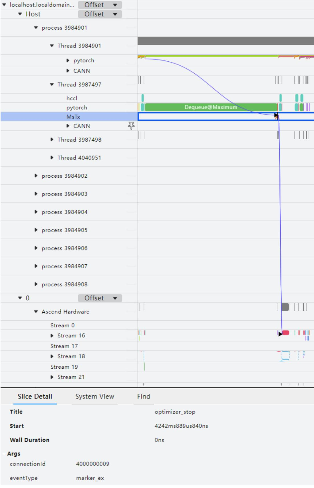  
图 10-1 打点结果示例

mstx功能默认采集通信算子、dataloader耗时、保存检查点接口耗时的性能数据，数据内容格式分别为：

格式：{"streamId": "{pg streamId}","count": "{count}","dataType":   
"{dataType}",["srcRank": "{srcRank}"],["destRank":   
"{destRank}"],"groupName": "{groupName}","opName": "{opName}"}   
示例：{"streamId": "32","count": "25701386","dataType":   
"fp16","groupName": "group_name_43","opName": "HcclAllreduce"} streamId：用于执行打点任务的Stream ID。 count：输入数据个数。 dataType：输入数据的数据类型。 srcRank：通信域内数据发送端的Rank ID，hcclRecv算子才有srcRank。 destRank：通信域内数据接收端的Rank ID，hcclSend算子才有destRank。 groupName：通信域名称。 opName：算子名称。

dataloader save_checkpoint

此外，mstx功能还可以通过mstx_torch_plugin获取PyTorch模型中的dataloader、forward、step、save_checkpoint这四个关键阶段的性能数据，详细介绍请参见《mstx_torch_plugin》。

可以通过该功能查看用户自定义打点从框架侧到CANN层再到NPU侧的执行调度情况，进而帮助识别用户想观察的关键函数或者事件，定界性能问题。

mstx采集结果数据详细介绍请参见12.4 msproftx数据说明。

# （可选）采集环境变量信息

通过Ascend PyTorch Profiler接口采集性能数据时，默认采集环境变量信息，当前支持采集的环境变量如下：

● "ASCEND_GLOBAL_LOG_LEVEL"   
● "HCCL_RDMA_TC"   
● "HCCL_RDMA_SL"   
● "ACLNN_CACHE_LIMIT"

操作步骤：

步骤1 在环境下配置环境变量，示例如下：export ASCEND_GLOBAL_LOG_LEVEL=1export HCCL_RDMA_TC $_ { = 0 }$ export HCCL_RDMA_SL=0export ACLNN_CACHE_LIMIT=4096

环境变量根据用户实际需要配置。

步骤2 执行Ascend PyTorch Profiler接口采集。

步骤3 查看结果数据。

当experimental_config参数的export_type配置为torch_npu.profiler.ExportType.Text时，以上步骤配置的环境变量信息将保存在{worker_name}_{时间戳}_ascend_pt目录下的profiler_metadata.json文件中以及ascend_pytorch_profiler_{Rank_ID}.db文件下的META_DATA表中。

当experimental_config参数的export_type配置为  
torch_npu.profiler.ExportType.Db时，在ascend_pytorch_profiler_{Rank_ID}.db文件下的META_DATA表写入环境变量信息。

----结束

# （可选）以自定义字符串键和字符串值的形式标记性能数据采集过程

示例一   
with torch_npu.profiler.profile(...) as prof: prof.add_metadata(key, value)   
示例二   
with torch_npu.profiler._KinetoProfile(...) as prof: prof.add_metadata_json(key, value)

add_metadata和add_metadata_json可以配置在torch_npu.profiler.profile和torch_npu.profiler._KinetoProfile下，须添加在profiler初始化后，finalize之前，即性能数据采集过程的代码中。

表 10-2 add_metadata 接口说明  

<table><tr><td>类、函数名</td><td>说明</td></tr><tr><td>add_metadata</td><td>添加字符串标记，取值： ·key:字符串键。 value:字符串值。 示例： prof.add_metadata(&quot;test_key1&quot;, &quot;test_value1&quot;)</td></tr><tr><td>add_metadata_json</td><td>添加json格式字符串标记，取值：</td></tr><tr><td></td><td>）key:字符串键。</td></tr><tr><td></td><td>value:字符串值，json格式。</td></tr><tr><td></td><td>示例： prof.add_metadata_json(&quot;test_key2&quot;,json.dumps({&quot;key1&quot;: testvalue1,</td></tr></table>

调用此接口传入的metadata数据写入到Ascend PyTorch Profiler接口的采集结果根目录下的profiler_metadata.json文件中。

# （可选）显存可视化

本功能实现在模型训练过程中训练进程占用存储空间时，对所占用的数据进行分类并可视化展示。主要通过export_memory_timeline导出可视化文件memory_timeline.html。输出html文件需要先在Python环境中安装matplotlib，且将对应的torch_npu.profiler.profile参数设置为True，另外使用该功能会在当前目录下生成后缀为ascend_pt数据文件。操作示例如下：

import torch import torch_npu

def trace_handler(prof: torch_npu.profiler.profile): prof.export_memory_timeline(output_path $= "$ ./memory_timeline.html", device="npu:0")   
with torch_npu.profiler.profile( activities=[ torch_npu.profiler.ProfilerActivity.CPU, torch_npu.profiler.ProfilerActivity.NPU ], schedule $\varprojlim 2$ torch_npu.profiler.schedule(wait=0, warmup $_ { 1 = 0 }$ , active $^ { = 4 }$ , repeat=1, skip_first=0), on_trace_ready=trace_handler, record_shapes=True, # 设为True profile_memory=True, # 设为True with_stack=True, # with_stack或者with_modules其中一个设为True with_modules=True   
) as prof: for _ in range(steps): ... prof.step()

执行采集并导出memory_timeline.html后，可视化效果如下：

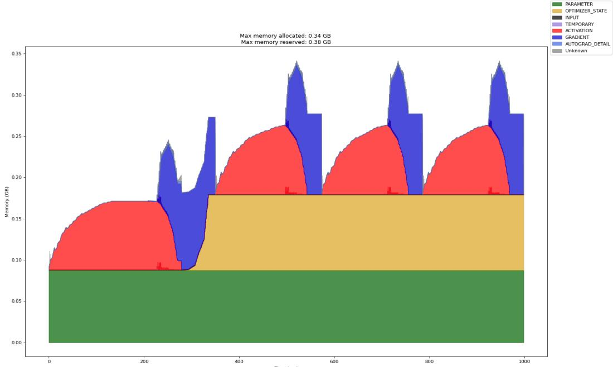  
图 10-2 memory_timeline

● Time(ms)：为横坐标，表示tensor类型对内存的占用时间，单位ms。

● Memory(GB)：为纵坐标，表示tensor类型占用的内存大小，单位GB。

Max memory allocated：最大内存分配总额，单位GB。

Max memory reserved：最大内存预留总额，单位GB。

PARAMETER：模型参数、模型权重。

OPTIMIZER_STATE：优化器状态，例如Adam优化器会记录模型训练过程中的一些状态。

INPUT：输入数据。

TEMPORARY：临时占用，这里被定义为单个算子下申请后又被释放，通常是一些保存中间值的tensor。

ACTIVATION：前向计算中得到的激活值。

GRADIENT：梯度值。

● AUTOGRAD_DETAIL：反向计算过程中产生的内存占用。

UNKNOWN：未知类型。

# （可选）创建 Profiler 子线程采集

在推理场景下，单进程多线程调用torch算子的用法较为常见。在这种情况下，由于Profiler无法感知用户自行创建的子线程，因此Profiler也无法采集这些子线程下发的torch算子等框架侧数据。那么这里在用户创建的子线程中调用  
torch_npu.profiler.profile.enable_profiler_in_child_thread和  
torch_npu.profiler.profile.disable_profiler_in_child_thread接口来注册Profiler采集回调函数并对子线程下发的torch算子等框架侧数据进行采集。

# 示例如下：

import threading   
import torch   
import torch_npu   
# 推理模型定义   
...   
def infer(device, child_thread): torch.npu.set_device(device) if child_thread: # 开始采集子线程的torch算子等框架侧数据 torch_npu.profiler.profile.enable_profiler_in_child_thread(with_module $\mathrel { \mathop : } =$ True) for _ in range(5): outputs $=$ model(input_data) if child_thread: # 停止采集子线程的torch算子等框架侧数据 torch_npu.profiler.profile.disable_profiler_in_child_thread()   
if __name__ $= =$ "__main__": experimental_config $=$ torch_npu.profiler._ExperimentalConfig( aic_metrics=torch_npu.profiler.AiCMetrics.PipeUtilization, profiler_level=torch_npu.profiler.ProfilerLevel.Level1 prof $=$ torch_npu.profiler.profile( activities=[torch_npu.profiler.ProfilerActivity.CPU, torch_npu.profiler.ProfilerActivity.NPU], on_trace_ready=torch_npu.profiler.tensorboard_trace_handler("./result"), record_shapes=True, profile_memory=True, with_stack $: =$ False, with_flops=False, with_modules=True, experimental_config $=$ experimental_config) prof.start() threads $= [ ]$ for i in range(1, 3): # 创建2个子线程，分别在device1与device2上进行推理任务 $\mathbf { t } =$ threading.Thread(target=infer, args=(i, True)) t.start() threads.append(t)

# 主线程在device0上运行推理任务，由Profiler正常采集，非enable_profiler_in_child_thread接口采集infer(0, False)

<table><tr><td>for t in threads:</td></tr><tr><td>t.join()</td></tr></table>

完成子线程采集后，生成的子线程性能数据如下：

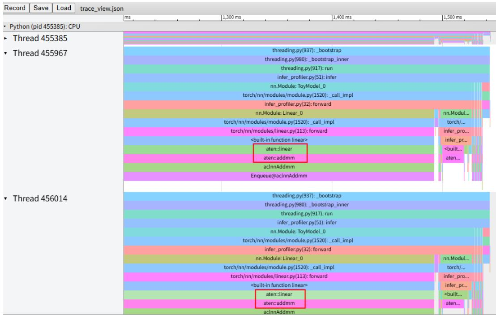  
图10-3 子线程性能数据

上图中Thread 455385为主线程，Profiler可正常采集，本功能场景无需关注。另外两个线程中aten前缀的timeline即为本功能采集的torch算子数据。

# Ascend PyTorch Profiler 接口说明

表 10-3 torch_npu.profiler.profile 和 torch_npu.profiler._KinetoProfile 配置参数说明  

<table><tr><td colspan="1" rowspan="1">参数名称</td><td colspan="1" rowspan="1">说明</td><td colspan="1" rowspan="1">是否必选</td></tr><tr><td colspan="1" rowspan="1">activities</td><td colspan="1" rowspan="1">CPU、NPU事件采集列表，Enum类型。取值为：·torch_npu.profiler.ProfilerActivity.CPU:框架侧数据采集的开关。 torch_npu.profiler.ProfilerActivity.NPU: CANN软件栈及NPU数据采集的开关。默认情况下两个开关同时开启。</td><td colspan="1" rowspan="1">否</td></tr><tr><td colspan="1" rowspan="1">schedule</td><td colspan="1" rowspan="1">设置不同step的行为，Callable类型，由schedule类控制。默认不执行任何操作。torch_npu.profiler._KinetoProfile不支持该参数。</td><td colspan="1" rowspan="1">否</td></tr><tr><td colspan="1" rowspan="1">on_trace_ready</td><td colspan="1" rowspan="1">采集结束时自动执行操作，Callable类型。当前支持执行tensorboard_trace_handler函数操作。当采集的数据量过大时，在当前环境下不适合直接解析性能数据，或者采集过程中中断了训练/在线推理进程，只采集了部分性能数据，可以采用离线解析。默认不执行任何操作。torch_npu.profiler._KinetoProfile不支持该参数。说明对于使用共享存储的多卡大集群场景，直接使用on_trace_ready执行tensorboard_trace_handler函数的方式进行性能数据落盘，可能因多卡数据直接落盘到共享存储导致性能膨胀的问题。解决方式请参见15.1PyTorch多卡大集群场景如何避免性能数据直接落盘到共享存储时导致的性能膨胀问题。</td><td colspan="1" rowspan="1">否</td></tr><tr><td colspan="1" rowspan="1">record_shapes</td><td colspan="1" rowspan="1">算子的InputShapes和lnputTypes，Bool类型。取值为：·True:开启。·False：关闭。默认值。开启torch_npu.profiler.ProfilerActivity.CPU时生效。</td><td colspan="1" rowspan="1">否</td></tr><tr><td colspan="1" rowspan="1">profile_memory</td><td colspan="1" rowspan="1">算子的显存占用情况，Bool类型。取值为：•True:开启。·False：关闭。默认值。开启torch_npu.profiler.ProfilerActivity.CPU时，采集框架显存占用情况；torch_npu.profiler.ProfilerActivity.NPU时，采集CANN的显存占用。说明已知在安装有glibc&lt;2.34的环境上采集memory数据，可能触发glibc的一个已知Bug19329，通过升级环境的glibc版本可解决此问题。</td><td colspan="1" rowspan="1">否</td></tr><tr><td colspan="1" rowspan="1">with_stack</td><td colspan="1" rowspan="1">算子调用栈，Bool类型。包括框架层及CPU算子层的调用信息。取值为：·True:开启。·False：关闭。默认值。开启torch_npu.profiler.ProfilerActivity.CPU时生效。说明开启该配置后会引入额外的性能膨胀。</td><td colspan="1" rowspan="1">否</td></tr><tr><td colspan="1" rowspan="1">with_modules</td><td colspan="1" rowspan="1">modules层级的Python调用栈，即框架层的调用信息，Bool类型。取值为：·True:开启。·False：关闭。默认值。开启torch_npu.profiler.ProfilerActivity.CPU时生效。说明开启该配置后会引入额外的性能膨胀。</td><td colspan="1" rowspan="1">否</td></tr><tr><td colspan="1" rowspan="1">with_flops</td><td colspan="1" rowspan="1">算子浮点操作，Bool类型（该参数暂不支持解析性能数据）。取值为：•True:开启。·False：关闭。默认值。开启torch_npu.profiler.ProfilerActivity.CPU时生效。</td><td colspan="1" rowspan="1">否</td></tr><tr><td colspan="1" rowspan="1">experimental_config</td><td colspan="1" rowspan="1">性能数据采集扩展。支持采集项和详细介绍请参见experimental_config参数说明。</td><td colspan="1" rowspan="1">否</td></tr><tr><td colspan="1" rowspan="1">use_cuda</td><td colspan="1" rowspan="1">昇腾环境不支持。开启采集cuda性能数据开关，Bool类型。取值为：•True:开启。·False：关闭。默认值。torch_npu.profiler_KinetoProfile不支持该参数。</td><td colspan="1" rowspan="1">否</td></tr></table>

表 10-4 torch_npu.profiler.profile 和 torch_npu.profiler._KinetoProfile 方法说明  

<table><tr><td colspan="1" rowspan="1">方法名</td><td colspan="1" rowspan="1">说明</td></tr><tr><td colspan="1" rowspan="1">step</td><td colspan="1" rowspan="1">划分不同迭代。torch_npu.profiler_KinetoProfile不支持该方法。</td></tr><tr><td colspan="1" rowspan="1">export_chrome_trace</td><td colspan="1" rowspan="1">导出trace。在指定的.json文件里写入trace数据。Trace为Ascend PyTorch Profiler接口整合框架侧CANN软件栈及NPU数据后展示的各算子和接口的运行时间及关联关系。包含参数:path:trace文件（.json）路径。指定文件所在的路径格式仅支持由字母、数字、下划线和连字符组成的字符串，不支持软链接。必选。多卡场景下需要将不同卡设置不同的文件名，示例代码：pid = os.getpid()prof.export_chrome_trace(f'./chrome_trace_{pid).json')</td></tr><tr><td colspan="1" rowspan="1">export_stacks</td><td colspan="1" rowspan="1">导出堆栈信息到文件。包含参数：·path：堆栈文件保存路径，需要配置文件名为p*.log”，可以指定路径，例如：/home/*.log，直接配置文件名时，文件保存在当前目录。路径格式仅支持由字母、数字、下划线和连字符组成的字符串，不支持软链接。必选。metric：保存的芯片类型可选择CPU或NPU，配置为"self_cpu_time_total”或“self_npu_time_total”。必选。与export_chrome_trace方法在训练/在线推理脚本中的位置相同，示例如下：export_stacks('result_dir/stack.log',metric='self_npu_time_total')导出的结果文件可使用FlameGraph工具进行查看，操作方法如下: git clone https://github.com/brendangregg/FlameGraphcd FlameGraph./flamegraph.pl -title "NPU time" -countname "us." profiler.stacks &gt;perf_viz.svg</td></tr><tr><td colspan="1" rowspan="1">export_memory_timeline</td><td colspan="1" rowspan="1">从采集的数据中导出给定设备的内存事件信息，并导出时间线图。使用export_memory_timeline可以导出3个文件，每个文件都由output_path的后缀控制:·对于与HTML兼容的绘图，使用后缀.html，内存时间线图将作为PNG文件嵌入到HTML文件中。对于由[timestamp,[sizes bycategory]]组成的绘图点,其中timestamp是时间戳，sizes是每个类别的内存使用量。内存时间线图将保存为.json文件或压缩的.json.gz，具体取决于后缀。对于原始内存信息，使用后缀raw.json.gz。每个原始内存事件将由(timestamp,action, numbytes,category)组成，其中action是[PREEXISTING,CREATE,INCREMENT_VERSION,DESTROY]其中之一，category是[PARAMETER，OPTIMIZER_STATE，INPUT,TEMPORARY，ACTIVATION，GRADIENT,AUTOGRAD_DETAIL，UNKNOWN]其中之一。参数:output_path：配置导出的结果文件，string类型，配置格式为：path = "$PATH/*.html"，$PATH为结果文件路径，*为结果文件名，路径或文件不存在时会自动创建。必选。）device：指定需要导出的Device ID，string类型，配置格式为：device = "npu:*"，*为Device ID或Rank ID，须配置为采集数据中已有的DeviceID或Rank ID，当前仅支持指定一个值。必选。配置示例：export_memory_timeline(output_path="./memory_timeline.html",device="npu:0")详细操作指导请参见（可选）显存可视化。</td></tr><tr><td colspan="1" rowspan="1">start</td><td colspan="1" rowspan="1">设置采集开始的位置。可参考如下样例，在需要采集性能数据的训练/在线推理代码前后添加start和stop:prof = torch_npu.profiler.profile(on_trace_ready=torch_npu.profiler.tensorboard_trace_handler("./result"))for step in range(steps):if step == 5: prof.start()train_one_step()if step == 5:prof.stop()</td></tr><tr><td colspan="1" rowspan="1">stop</td><td colspan="1" rowspan="1">设置采集结束的位置，需要先执行start。</td></tr><tr><td colspan="1" rowspan="1">enable_profiler_in_child_thread</td><td colspan="1" rowspan="1">注册Profiler采集回调函数，采集用户子线程下发的torch算子等框架侧数据。该参数中可另外配置torch_npu.profiler.profile的其他参数（包括record_shapes、profile_memory、with_stack、with_flops、with_modules），作为Profiler子线程的采集配置。与torch_npu.profiler.profile.enable_profiler_in_child_thread配对使用。详细使用请参见（可选）创建Profiler子线程采集。torch_npu.profiler._KinetoProfile不支持该方法。</td></tr><tr><td colspan="1" rowspan="1">disable_profiler_in_child_thread</td><td colspan="1" rowspan="1">注销Profiler采集回调函数。与torch_npu.profiler.profile.enable_profiler_in_child_thread配对使用。torch_npu.profiler._KinetoProfile不支持该方法。</td></tr></table>

表 10-5 torch_npu.profiler 类、函数说明  

<table><tr><td>类、函数名</td><td>说明</td></tr><tr><td>torch_npu.profiler.sc hedule</td><td>设置不同step的行为，默认不执行该操作。为了获取更稳定 的性能数据，建议配置该类的具体参数，参数取值及详细用 法请参见torch_npu.profiler.schedule类参数说明。</td></tr><tr><td colspan="1" rowspan="1">torch_npu.profiler.tensorboard_trace_handler</td><td colspan="1" rowspan="1">导出性能数据。取值为：·dir_name：采集到的性能数据的存放路径，string类型。路径格式仅支持由字母、数字、下划线和连字符组成的字符串，不支持软链接。若配置tensorboard_trace_handler函数后未指定具体路径，性能数据默认落盘在当前目录；若代码中未使用on_trace_ready=torch_npu.profiler.tensorboard_trace_handler，那么落盘的性能数据为原始数据，需要使用离线解析。可选。该函数优先级高于ASCEND_WORK_PATH，具体请参考《环境变量参考》。worker_name：用于区分唯一的工作线程，string类型，默认为{hostname}_{pid}。路径格式仅支持由字母、数字、下划线和连字符组成的字符串，不支持软链接。可选。analyse_flag：性能数据自动解析开关，bool类型。取值True（开启自动解析，默认值）、False（关闭自动解析，采集完后的性能数据可以使用离线解析）。可选。async_mode：控制是否开启异步解析（表示解析进程不会阻塞AI任务主流程），bool类型。取值True（开启异步解析）、False（关闭异步解析，即同步解析，默认值）。torch_npu.profiler._KinetoProfile不支持该函数。解析过程日志存放在{worker_name}_{时间戳}_ascend_pt/logs目录下。</td></tr><tr><td colspan="1" rowspan="1">torch_npu.profiler.ProfilerAction</td><td colspan="1" rowspan="1">Profiler状态，Enum类型。取值为：·NONE：无任何行为。·WARMUP：性能数据采集预热。RECORD：性能数据采集。RECORD_AND_SAVE：性能数据采集并保存。</td></tr><tr><td colspan="1" rowspan="1">torch_npu.profiler._E xperimentalConfig</td><td colspan="1" rowspan="1">性能数据采集扩展，Enum类型。通过torch_npu.profiler.profile的experimental_config调用，详细介绍请参见experimental_config参数说明。</td></tr><tr><td colspan="1" rowspan="1">torch_npu.profiler.supported_activities</td><td colspan="1" rowspan="1">查询当前支持采集的activities参数的CPU、NPU事件。</td></tr><tr><td colspan="1" rowspan="1"> torch_npu.profiler.supported_profiler_level</td><td colspan="1" rowspan="1">查询当前支持的experimental_config参数的profiler_level级别。</td></tr><tr><td colspan="1" rowspan="1">torch_npu.profiler.supported_ai_core_metrics</td><td colspan="1" rowspan="1">查询当前支持的experimental_config参数的Al Core性能指标采集项。</td></tr><tr><td colspan="1" rowspan="1">torch_npu.profiler.supported_export_type</td><td colspan="1" rowspan="1">查询当前支持的torch_npu.profiler.ExportType的性能数据结果文件类型。</td></tr></table>

# profiler_config.json 文件说明

profiler_config.json文件内容如下，以默认配置为例：

<table><tr><td>{ &quot;activities&quot;: [&quot;CPU&quot;, &quot;NPU&quot;], &quot;prof_dir&quot;: &quot;./&quot;, &quot;analyse&quot;: false,</td></tr><tr><td>&quot;record_shapes&quot;: false, &quot;profile_memory&quot;: false,</td></tr><tr><td>&quot;with_stack&quot;: false, &quot;with_flops&quot;: false,</td></tr><tr><td>&quot;with_modules&quot;: false, &quot;active&quot;: 1,</td></tr><tr><td>&quot;warmup&quot;: 0, &quot;start_step&quot;: 0,</td></tr><tr><td>&quot;is_rank&quot;: false, &quot;rank_list&quot;: [],</td></tr><tr><td>&quot;experimental_config&quot;: {</td></tr><tr><td>&quot;profiler_level&quot;: &quot;Level0&quot;, &quot;aic_metrics&quot;: &quot;AiCoreNone&quot;, &quot;l2_cache&quot;: false, &quot;op_attr&quot;: false,</td></tr></table>

表 10-6 参数说明  

<table><tr><td colspan="1" rowspan="1">参数</td><td colspan="1" rowspan="1">说明</td><td colspan="1" rowspan="1">是否必选</td></tr><tr><td colspan="1" rowspan="1">start_step</td><td colspan="1" rowspan="1">设置开始采集的step，默认值为0（即不采集），设置为-1时表示在保存配置之后的下个step启动采集，配置为正整数时表示执行到该step时启动采集。启动采集进程首先需要配置该参数为有效值。</td><td colspan="1" rowspan="1">是</td></tr><tr><td colspan="1" rowspan="1">activities</td><td colspan="1" rowspan="1">CPU、NPU事件采集列表。取值为：·CPU：框架侧数据采集的开关。·NPU：CANN软件栈及NPU数据采集的开关。默认情况下两个开关同时开启。</td><td colspan="1" rowspan="1">否</td></tr><tr><td colspan="1" rowspan="1">prof_dir</td><td colspan="1" rowspan="1">采集到的性能数据的存放路径。默认路径为：./。路径格式仅支持由字母、数字、下划线和连字符组成的字符串，不支持软链接。</td><td colspan="1" rowspan="1">否</td></tr><tr><td colspan="1" rowspan="1">analyse</td><td colspan="1" rowspan="1">性能数据自动解析开关，取值：·true：开启自动解析。·false：关闭自动解析，即手动解析，采集完后的性能数据可以使用离线解析，默认值。</td><td colspan="1" rowspan="1">否</td></tr><tr><td colspan="1" rowspan="1">record_shapes</td><td colspan="1" rowspan="1">算子的lnputShapes和InputTypes。取值为：· true:开启。·false：关闭，默认值。activities配置为CPU时生效。</td><td colspan="1" rowspan="1">否</td></tr><tr><td colspan="1" rowspan="1">profile_memory</td><td colspan="1" rowspan="1">算子的显存占用情况。取值为：• true:开启。·false:关闭，默认值。activities开启CPU时，采集框架显存占用情况;activities开启NPU时，采集CANN的显存占用。说明已知在安装有glibc&lt;2.34的环境上采集memory数据，可能触发glibc的一个已知Bug19329，通过升级环境的glibc版本可解决此问题。</td><td colspan="1" rowspan="1">否</td></tr><tr><td colspan="1" rowspan="1">with_stack</td><td colspan="1" rowspan="1">算子调用栈。包括框架层及CPU算子层的调用信息。取值为：·true:开启。·false：关闭，默认值。activities配置为CPU时生效。</td><td colspan="1" rowspan="1">否</td></tr><tr><td colspan="1" rowspan="1">with_flops</td><td colspan="1" rowspan="1">算子浮点操作，Bool类型（该参数暂不支持解析性能数据）。取值为：· true:开启。·false：关闭，默认值。activities配置为CPU时生效。</td><td colspan="1" rowspan="1">否</td></tr><tr><td colspan="1" rowspan="1">with_modules</td><td colspan="1" rowspan="1">modules层级的Python调用栈，即框架层的调用信息。取值为：· true:开启。·false：关闭，默认值。activities配置为CPU时生效。</td><td colspan="1" rowspan="1">否</td></tr><tr><td colspan="1" rowspan="1">active</td><td colspan="1" rowspan="1">配置采集的迭代数，取值为正整数，默认值为1。</td><td colspan="1" rowspan="1">否</td></tr><tr><td colspan="1" rowspan="1">warmup</td><td colspan="1" rowspan="1">预热的step轮数，默认值为0，建议设置1轮预热。</td><td colspan="1" rowspan="1">否</td></tr><tr><td colspan="1" rowspan="1">is_rank</td><td colspan="1" rowspan="1">开启指定Rank采集功能。取值为：•true:开启。·false：关闭，默认值。开启后，dynamic_profile会识别rank_list参数中配置的Rank ID，根据配置的Rank ID识别环境中存在的对应Rank执行采集操作；若开启后rank_list配置为空则不采集性能数据。开启后，analyse自动解析不生效，需要使用离线解析。</td><td colspan="1" rowspan="1">否</td></tr><tr><td colspan="1" rowspan="1">rank_list</td><td colspan="1" rowspan="1">配置采集的Rank ID，取值为整数，默认值为空，表示不采集任何性能数据。须配置为环境中有效的RankID。可同时指定一个或多个Rank，配置示例："rank_list": [1,2,3]。</td><td colspan="1" rowspan="1">否</td></tr><tr><td colspan="1" rowspan="1">async_mode</td><td colspan="1" rowspan="1">控制是否开启异步解析（表示解析进程不会阻塞AI任务主流程），bool类型。取值true（开启异步解析）、false（关闭异步解析，即同步解析，默认值）。</td><td colspan="1" rowspan="1">否</td></tr><tr><td colspan="1" rowspan="1">experimental_config</td><td colspan="1" rowspan="1">扩展参数，通过扩展配置性能分析工具常用的采集项。详见experimental_config参数说明（dynamic_profile动态采集场景）。对于动态采集场景，该配置文件中配置的experimental_config的子参数选项取实际参数值即可，例如"aic_metrics": "PipeUtilization"。</td><td colspan="1" rowspan="1">否</td></tr><tr><td colspan="1" rowspan="1">metadata</td><td colspan="1" rowspan="1">采集模型超参数（key）和配置信息（value）。保存数据到ascend_pytorch_profiler_{Rank_ID}.db中的META_DATA表以及{worker_name}_{时间戳}_ascend_pt目录下的profiler_metadata.json文件中。配置示例："metadata": {"distributed_args":t"tp":2,"pp":4,"dp":8}}</td><td colspan="1" rowspan="1">否</td></tr><tr><td></td><td></td><td colspan="1" rowspan="1"></td></tr></table>

# experimental_config 参数说明（dynamic_profile 动态采集场景）

experimental_config参数均为可选参数，支持扩展的采集项如下：

表 10-7 experimental_config  

<table><tr><td colspan="1" rowspan="1">参数</td><td colspan="1" rowspan="1">说明</td></tr><tr><td colspan="1" rowspan="1">profiler_level</td><td colspan="1" rowspan="1">采集的Level等级。取值如下：·Level_none：不采集所有Level层级控制的数据，即关闭profiler_level。Level0：采集上层应用数据、底层NPU数据以及NPU上执行的算子信息。默认值。配置该参数时，仅采集部分数据，其中部分算子信息不采集，详细情况请参见12.10op_summary（算子详细信息）。Level1：在Level0的基础上多采集CANN层AscendCL数据和NPU上执行的Al Core性能指标信息、开启aic_metrics=torch_npu.profiler.AiCMetrics.PipeUtilization、生成通信算子的communication.json和communication_matrix.json以及api_statistic.csv文件。）Level2：在Level1的基础上多采集CANN层Runtime数据以及AI CPU（data_preprocess.csv文件）数据。</td></tr><tr><td colspan="1" rowspan="1">aic_metriCS</td><td colspan="1" rowspan="1">Al Core的性能指标采集项。取值如下：以下采集项的结果数据将在KernelView呈现。以下采集项的结果数据含义可参见12.10op_summary（算子详细信息），但具体采集结果请以实际情况为准。·AiCoreNone：关闭AlCore的性能指标采集。·PipeUtilization：计算单元和搬运单元耗时占比。·ArithmeticUtilization：各种计算类指标占比统计。·Memory：外部内存读写类指令占比。·MemoryL0：内部L0内存读写类指令占比。·ResourceConflictRatio：流水线队列类指令占比。：MemoryUB：内部UB内存读写类指令占比。·L2Cache：读写cache命中次数和缺失后重新分配次数。·MemoryAccess：算子在核上访存的带宽数据量。当profiler_level设置为Level_none或Level0，默认值为AiCoreNone；当profiler_level设置为Level1或Level2，默认值为PipeUtilization。</td></tr><tr><td colspan="1" rowspan="1">l2_cache</td><td colspan="1" rowspan="1">控制L2Cache数据采集开关。取值true（开启）或false（关闭），默认关闭。该采集项在ASCEND_PROFILER_OUTPUT生成l2_cache.csv文件，结果字段介绍请参见12.16l2_cache（L2Cache命中率）。</td></tr><tr><td colspan="1" rowspan="1">op_attr</td><td colspan="1" rowspan="1">控制采集算子的属性信息开关，当前仅支持采集aclnn算子。取值true（开启）或false（关闭），默认关闭。Level_none时，该参数不生效。</td></tr><tr><td colspan="1" rowspan="1">gc_detect_threshold</td><td colspan="1" rowspan="1">GC检测阈值。取值范围为大于等于0的数值，单位ms。当用户设置的阈值为数字时，表示开启GC检测，只采集超过阈值的GC事件。配置为0时表示采集所有的GC事件（可能造成采集数据量过大，请谨慎配置），推荐设置为1ms。默认为null，表示不开启GC检测功能。GC是Python进程对已经销毁的对象进行内存回收。该参数解析结果为在trace_view.json中生成GC层或在ascend_pytorch_profiler_{Rank_ID}.db中生成GC_RECORD表。</td></tr><tr><td colspan="1" rowspan="1">data_simplification</td><td colspan="1" rowspan="1">数据精简模式，开启后将在导出性能数据后删除多余数据，仅保留profiler_*.json文件、ASCEND_PROFILER_OUTPUT目录、PROF_XXX目录下的原始性能数据、FRAMEWORK目录和logs目录，以节省存储空间。取值true（开启）或false（关闭），默认开启。</td></tr><tr><td colspan="1" rowspan="1">record_op_args</td><td colspan="1" rowspan="1">控制算子信息统计功能开关。取值true（开启）或false（关闭），默认关闭。开启后会在{worker_name}_{时间戳}_ascend_pt_op_args目录输出采集到算子信息文件。说明该参数在AOE工具执行PyTorch训练场景下调优时使用，且不建议与其他性能数据采集接口同时开启。详见《AOE调优工具用户指南》。</td></tr><tr><td colspan="1" rowspan="1">export_type</td><td colspan="1" rowspan="1">设置导出的性能数据结果文件格式，List类型。取值：：text：表示解析为.json和.csv格式的timeline和summary文件以及汇总所有性能数据的.db格式文件（ascend_pytorch_profiler_{Rank_ID}.db、analysis.db）。db：表示仅解析为汇总所有性能数据的.db格式文件（ascend_pytorch_profiler_{Rank_ID}.db、analysis.db），使用MindStudio Insight工具展示。仅支持on_trace_ready接口导出和离线解析导出，需配套安装支持导出db格式的CANNToolkit开发套件包和ops算子包。设置无效值或未配置均取默认值text。解析结果数据请参见13MindSpore&amp;PyTorch框架性能数据文件参考。</td></tr><tr><td colspan="1" rowspan="1">mstx或msprof_tX</td><td colspan="1" rowspan="1">打点控制开关，通过开关开启自定义打点功能。取值true（开启）或false（关闭），默认关闭。该参数使用请参见（可选）采集并解析mstx数据。原参数名msprof_tx改为mstx，新版本依旧兼容原参数名msprof_tx。</td></tr><tr><td colspan="1" rowspan="1">mstx_domain_include</td><td colspan="1" rowspan="1">输出需要的domain数据。调用torch_npu.npu.mstx系列打点接口，使用默认domain或指定domain进行打点时，可选择只输出本参数配置的domain数据。domain名称为用户调用torch_npu.npu.mstx系列接口传入的domain或默认domain（'default'），domain名称使用List类型输入。与mstx_domain_exclude参数互斥，若同时配置，则只有mstx_domain_include生效。须配置mstx=True。</td></tr><tr><td colspan="1" rowspan="1">mstx_domain_exclude</td><td colspan="1" rowspan="1">过滤不需要的domain数据。调用torch_npu.npu.mstx系列打点接口，使用默认domain或指定domain进行打点时，可选择不输出本参数配置的domain数据。domain名称为用户调用torch_npu.npu.mstx系列接口传入的domain或默认domain（'default'），domain名称使用List类型输入。与mstx_domain_include参数互斥，若同时配置，则只有mstx_domain_include生效。须配置mstx=True。</td></tr><tr><td colspan="1" rowspan="1">host_sys</td><td colspan="1" rowspan="1">Host侧系统数据采集开关，List类型。默认未配置，表示未开启Host侧系统数据采集。取值：·cpu：进程级别的CPU利用率。mem：进程级别的内存利用率。. disk：进程级别的磁盘I/O利用率。：network：系统级别的网络I/O利用率。osrt：进程级别的syscall和pthreadcall。配置示例：host_sys：["cpu","disk"]。说明： 采集Host侧disk性能数据需要安装第三方开源工具iotop，采集osrt性能数据需要安装第三方开源工具perf和ltrace，其安装方法参见14.1安装perf、iotop、ltrace工具。完成安装后须参见14.2配置用户权限完成用户权限配置，且每次重新安装CANN软件包需要重新配置。使用开源工具ltrace采集osrt性能数据会导致CPU占用率过高，其与应用工程的pthread加解锁相关，会影响进程运行速度。x86_64架构的KylinV10SP1操作系统支持osrt参数，aarch64架构的KylinV10SP1操作系统下不支持osrt参数。·虚拟化环境Euler2.9系统下不支持network参数。</td></tr><tr><td colspan="1" rowspan="1">sys_io</td><td colspan="1" rowspan="1">NIC、ROCE、MAC采集开关。取值true（开启）或false（关闭），默认关闭。</td></tr><tr><td colspan="1" rowspan="1">sys_interconnection</td><td colspan="1" rowspan="1">集合通信带宽数据（HCCS）、PCIe数据采集开关、片间传输带宽信息采集开关。取值true（开启）或false（关闭），默认关闭。</td></tr></table>

# experimental_config 参数说明

experimental_config参数均为可选参数，支持扩展的采集项如下：

表 10-8 experimental_config  

<table><tr><td colspan="1" rowspan="1">参数</td><td colspan="1" rowspan="1">说明</td></tr><tr><td colspan="1" rowspan="1">export_type</td><td colspan="1" rowspan="1">设置导出的性能数据结果文件格式，List类型。取值：·torch_npu.profiler.ExportType.Text：表示解析为.json和.csv格式的timeline和summary文件以及汇总所有性能数据的.db格式文件（ascend_pytorch_profiler_{Rank_ID}.db、analysis.db）。torch_npu.profiler.ExportType.Db：表示仅解析为汇总所有性能数据的.db格式文件（ascend_pytorch_profiler_{Rank_ID}.db、analysis.db），使用MindStudio Insight工具展示。仅支持on_trace_ready接口导出和离线解析导出，需配套安装支持导出db格式的CANN-Toolkit开发套件包和ops算子包。设置无效值或未配置均取默认值torch_npu.profiler.ExportType.Text。解析结果数据请参见13MindSpore&amp;PyTorch框架性能数据文件参考。</td></tr><tr><td colspan="1" rowspan="1">profiler_level</td><td colspan="1" rowspan="1">采集的Level等级，Enum类型。取值如下：·torch_npu.profiler.ProfilerLevel.Level_none:不采集所有Level层级控制的数据，即关闭profiler_level。torch_npu.profiler.ProfilerLevel.Level0：采集上层应用数据、底层NPU数据以及NPU上执行的算子信息。默认值。配置该参数时，仅采集部分数据，其中部分算子信息不采集，详细情况请参见12.10op_summary（算子详细信息）中有关task_time为lo时的说明。torch_npu.profiler.ProfilerLevel.Level1：在Levelo的基础上多采集CANN层AscendCL数据和NPU上执行的AI Core性能指标信息、开启aic_metrics=torch_npu.profiler.AiCMetrics.PipeUtilization、生成通信算子的communication.json和communication_matrix.json以及api_statistic.csv文件。torch_npu.profiler.ProfilerLevel.Level2:在Level1的基础上多采集CANN层Runtime数据以及Al CPU（data_preprocess.csv文件）数据。</td></tr><tr><td colspan="1" rowspan="1">mstx或msprof_tX</td><td colspan="1" rowspan="1">打点控制开关，通过开关开启自定义打点功能，bool类型。取值True（开启）或False（关闭），默认关闭。该参数使用请参见（可选）采集并解析mstx数据。原参数名msprof_tx改为mstx，新版本依旧兼容原参数名msprof_tx。</td></tr><tr><td colspan="1" rowspan="1">mstx_domain_include</td><td colspan="1" rowspan="1">输出需要的domain数据。调用torch_npu.npu.mstx系列打点接口，使用默认domain或指定domain进行打点时，可选择只输出本参数配置的domain数据。domain名称为用户调用torch_npu.npu.mstx系列接口传入的domain或默认domain（'default'），domain名称使用List类型输入。与mstx_domain_exclude参数互斥，若同时配置，则只有mstx_domain_include生效。须配置mstx=True。</td></tr><tr><td colspan="1" rowspan="1">mstx_domain_exclude</td><td colspan="1" rowspan="1">过滤不需要的domain数据。调用torch_npu.npu.mstx系列打点接口，使用默认domain或指定domain进行打点时，可选择不输出本参数配置的domain数据。domain名称为用户调用torch_npu.npu.mstx系列接口传入的domain或默认domain（'default'），domain名称使用List类型输入。与mstx_domain_include参数互斥，若同时配置，则只有mstx_domain_include生效。须配置mstx=True。</td></tr><tr><td colspan="1" rowspan="1">aic_metrics</td><td colspan="1" rowspan="1">Al Core的性能指标采集项。取值如下：以下采集项的结果数据将在KernelView呈现。以下采集项的结果数据含义可参见12.10op_summary（算子详细信息），但具体采集结果请以实际情况为准。·AiCoreNone：关闭Al Core的性能指标采集。·PipeUtilization：计算单元和搬运单元耗时占比。·ArithmeticUtilization：各种计算类指标占比统计。·Memory：外部内存读写类指令占比。，MemoryL0：内部L0内存读写类指令占比。·ResourceConflictRatio：流水线队列类指令占比。·MemoryUB：内部UB内存读写类指令占比。·L2Cache：读写cache命中次数和缺失后重新分配次数。·MemoryAccess：算子在核上访存的带宽数据量。当profiler_level设置为torch_npu.profiler.ProfilerLevel.Level_none或torch_npu.profiler.ProfilerLevel.Levelo时，默认值为AiCoreNone；当profiler_level设置为torch_npu.profiler.ProfilerLevel.Level1或torch_npu.profiler.ProfilerLevel.Level2时，默认值为PipeUtilization。</td></tr><tr><td colspan="1" rowspan="1">l2_cache</td><td colspan="1" rowspan="1">控制L2Cache数据采集开关，bool类型。取值True（开启）或False（关闭），默认关闭。该采集项在ASCEND_PROFILER_OUTPUT生成l2_cache.csv文件，结果字段介绍请参见12.16l2_cache（L2 Cache命中率）。</td></tr><tr><td colspan="1" rowspan="1">op_attr</td><td colspan="1" rowspan="1">控制采集算子的属性信息开关，当前仅支持采集aclnn算子，bool类型。取值True（开启）或False（关闭），默认关闭。该参数采集的性能数据仅db格式文件生效；torch_npu.profiler.ProfilerLevel.None时，该参数不生效。</td></tr><tr><td colspan="1" rowspan="1">data_simplification</td><td colspan="1" rowspan="1">数据精简模式，开启后将在导出性能数据后删除多余数据，仅保留profiler_*.jsOn文件、ASCEND_PROFILER_OUTPUT目录、PROF_XXX目录下的原始性能数据、FRAMEWORK目录和logs目录，以节省存储空间。取值true（开启）或false（关闭），默认开启。</td></tr><tr><td colspan="1" rowspan="1">record_op_args</td><td colspan="1" rowspan="1">控制算子信息统计功能开关，bool类型。取值True（开启）或False（关闭），默认关闭。开启后会在{worker_name}_{时间戳}_ascend_pt_op_args目录输出采集到算子信息文件。说明该参数在AOE工具执行PyTorch训练场景下调优时使用，且不建议与其他性能数据采集接口同时开启。详见《AOE调优工具用户指南》。</td></tr><tr><td colspan="1" rowspan="1">gc_detect_threshold</td><td colspan="1" rowspan="1">GC检测阈值，float类型。取值范围为大于等于0的数值，单位ms。当用户设置的阈值为数字时，表示开启GC检测，只采集超过阈值的GC事件。配置为0时表示采集所有的GC事件（可能造成采集数据量过大，请谨慎配置），推荐设置为1ms。默认为None，表示不开启GC检测功能。GC是Python进程对已经销毁的对象进行内存回收。该参数解析结果为在trace_view.json中生成GC层或在ascend_pytorch_profiler_{Rank_ID}.db中生成GC_RECORD表。</td></tr><tr><td colspan="1" rowspan="1">host_sys</td><td colspan="1" rowspan="1">Host侧系统数据采集开关，List类型。默认未配置，表示未开启Host侧系统数据采集。取值：·torch_npu.profiler.HostSystem.CPU：进程级别的CPU利用率。·torch_npu.profiler.HostSystem.MEM：进程级别的内存利用率。·torch_npu.profiler.HostSystem.DISK：进程级别的磁盘I/O利用率。torch_npu.profiler.HostSystem.NETWORK:系统级别的网络I/O利用率。torch_npu.profiler.HostSystem.OSRT:进程级别的syscall和pthreadcall。说明采集Host侧disk性能数据需要安装第三方开源工具iotop，采集osrt性能数据需要安装第三方开源工具perf和ltrace，其安装方法参见14.1安装perf、iotop、ltrace工具。完成安装后须参见14.2配置用户权限完成用户权限配置，且每次重新安装CANN软件包需要重新配置。使用开源工具ltrace采集osrt性能数据会导致CPU占用率过高，其与应用工程的pthread加解锁相关，会影响进程运行速度。x86_64架构的KylinV10SP1操作系统支持torch_npu.profiler.HostSystem.OSRT参数，aarch64架构的KylinV10SP1操作系统下不支持torch_npu.profiler.HostSystem.OSRT参数。·虚拟化环境Euler2.9系统下不支持torch_npu.profiler.HostSystem.NETWORK参数。</td></tr><tr><td colspan="1" rowspan="1">sys_io</td><td colspan="1" rowspan="1">NIC、ROCE、MAC采集开关，bool类型。取值True（开启）或False（关闭），默认关闭。</td></tr><tr><td colspan="1" rowspan="1"> sys_interconnection</td><td colspan="1" rowspan="1">集合通信带宽数据（HCCS）、PCle数据采集开关、片间传输带宽信息采集开关，bool类型。取值True（开启）或False（关闭），默认关闭。</td></tr></table>

# torch_npu.profiler.schedule 类参数说明

torch_npu.profiler.schedule类用于在采集进程中设置在不同step时的采集行为。接口原型为：

torch_npu.profiler.schedule(wait, active, warmup $= 0$ , repeat $= 0$ , skip_first $= 0$ )

表 10-9 参数说明  

<table><tr><td rowspan=1 colspan=1>参数</td><td rowspan=1 colspan=1>说明</td></tr><tr><td rowspan=1 colspan=1>wait</td><td rowspan=1 colspan=1>每次重复执行采集跳过的step轮数，int类型。必选。</td></tr><tr><td rowspan=1 colspan=1>active</td><td rowspan=1 colspan=1>采集的step轮数，int类型。必选。</td></tr><tr><td rowspan=1 colspan=1>warmup</td><td rowspan=1 colspan=1>预热的step轮数，int类型。默认值为0。建议设置1轮预热。可选。</td></tr><tr><td rowspan=1 colspan=1>repeat</td><td rowspan=1 colspan=1>重复执行wait+warmup+active的次数，int类型。取值范围为大于等于0的整数，默认值为0。可选。说明当使用集群分析工具或MindStudio Insight查看时，建议配置repeat=1（表示执行1次，仅生成一份性能数据），因为：·repeat&gt;1会在同一目录下生成多份性能数据，则需要手动将采集的性能数据文件夹分为repeat等份，放到不同文件夹下重新解析，分类方式按照文件夹名称中的时间戳先后。repeat=0时，重复执行的具体次数就由总训练步数决定，例如总训练步数为100，wait + active +warmup = 10，skip_first= 10，则repeat=（100-10）／10=9，表示重复执行9次，生成9份性能数据。</td></tr><tr><td rowspan=1 colspan=1>skip_first</td><td rowspan=1 colspan=1>采集前先跳过的step轮数，int类型。默认值为0。动态Shape场景建议跳过前10轮保证性能数据稳定；对于其他场景，可以根据实际情况自行配置。可选。</td></tr><tr><td rowspan=1 colspan=2>注：建议根据此公式配置schedule：step总数&gt;= skip_first +（wait +warmup +active ） * repeat</td></tr></table>

torch_npu.profiler.schedule类、step和on_trace_ready函数使用关系示意图如下：

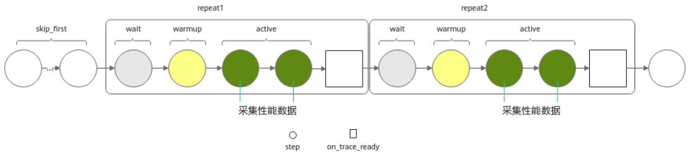  
图 10-4 torch_npu.profiler.schedule 类、step 和 on_trace_ready 函数使用关系示意图

# 设置示例代码如下：

with torch_npu.profiler.profile( activities=[ torch_npu.profiler.ProfilerActivity.CPU, torch_npu.profiler.ProfilerActivity.NPU,

schedule $\varprojlim 2$ torch_npu.profiler.schedule( wait=1, # 等待阶段，跳过1个step warmup=1, # 预热阶段，跳过1个step active $^ { - 2 }$ , # 记录2个step的活动数据，并在之后调用on_trace_ready repeat=2, # 循环wait+warmup+active过程2遍 skip_first=1 # 跳过1个step   
),   
on_trace_ready=torch_npu.profiler.tensorboard_trace_handler('./result')   
) as prof: for _ in range(9): train_one_step() prof.step() # 通知profiler完成一个step

# dynamic_profile 动态采集维测日志介绍

dynamic_profile动态采集在profiler_config_path目录下自动记录dynamic_profile的维测日志，生成日志目录结构示例如下：

log dp_ubuntu_xxxxxx_rank_\*.log dp_ubuntu_xxxxxx_rank_\*.log.1 monitor_dp_ubuntu_xxxxxx_rank_\*.log monitor_dp_ubuntu_xxxxxx_rank_\*.log.1   
profiler_config.json   
shm

dp_ubuntu_xxxxxx.log：dynamic_profile动态采集的执行日志，记录动态采集执行过程中的所有动作（INFO）、警告（WARNING）和错误（ERROR）。文件命名格式：dp_{操作系统}_{AI任务进程ID}_{Rank_ID}.log。

AI任务启动时每个Rank会开启一个AI任务进程，dynamic_profile根据每个AI任务进程ID生成各个AI任务进程下的日志文件。

dp_ubuntu_xxxxxx.log.1：日志老化备份文件，dp_ubuntu_xxxxxx.log文件的存储上限为200K，达到上限后将时间最早的日志记录转移到dp_ubuntu_xxxxxx.log.1中，dp_ubuntu_xxxxxx.log.1文件存储上限同样为200K，达到上限后则将最早的日志记录老化删除。

monitor_dp_ubuntu_xxxxxx.log：profiler_config.json文件修改日志，开启dynamic_profile动态采集后，实时记录profiler_config.json文件的每次修改时间、修改是否生效以及dynamic_profile进程的结束，示例如下：

2024-08-21 15:51:46,392 [INFO] [2127856] _dynamic_profiler_monitor.py: Dynamic profiler process load json success   
2024-08-21 15:51:58,406 [INFO] [2127856] _dynamic_profiler_monitor.py: Dynamic profiler process load json success   
2024-08-21 15:58:16,795 [INFO] [2127856] _dynamic_profiler_monitor.py: Dynamic profiler process done

文件命名格式：monitor_dp_{操作系统}_{monitor进程ID}_{Rank_ID}.log。

● monitor_dp_ubuntu_xxxxxx.log.1：日志老化备份文件，monitor_dp_ubuntu_xxxxxx.log文件的存储上限为200K，达到上限后将时间最早的日志记录转移到monitor_dp_ubuntu_xxxxxx.log.1中，monitor_dp_ubuntu_xxxxxx.log.1文件存储上限同样为200K，达到上限后则将最早的日志记录老化删除。

shm目录：为了适配Python3.7，dynamic_profile会在py37环境下生成shm目录，目录下生成一个二进制文件（DynamicProfileNpuShm+时间）映射共享内存，程序正常结束后会自动清理，当使用pkill终止程序时，由于是异常终止，程序无法释放资源，需要用户手动清理此文件，否则短时间内（<1h）下次使用同一配置路径启动dynamic_profile，则会导致dynamic_profile异常。对于Python3.8及以上版本，二进制文件（DynamicProfileNpuShm+时间）存放在/dev/shm目录下，当使用pkill终止程序时，同样需要手动清理此文件。

# 10.2 离线解析

当使用Ascend PyTorch Profiler接口采集的性能数据较大时，若在当前环境直接使用on_trace_ready接口进行自动解析，则可能导致资源占用过大出现卡顿，那么可以取消on_trace_ready接口，并通过环境变量ASCEND_WORK_PATH设置落盘目录（例如：export ASCEND_WORK_PATH=xx/xx），在采集完成性能数据后，使用如下方式进行离线解析：

步骤1 创建{file name}.py文件，{file name}自定义，并编辑如下代码。 from torch_npu.profiler.profiler import analyse if __name__ $= =$ "__main__": analyse(profiler_path="./result_data", max_process_number=max_process_number, export_type $\varprojlim$ export_type)

表 10-10 参数说明  

<table><tr><td rowspan=1 colspan=1>参数</td><td rowspan=1 colspan=1>描述</td><td rowspan=1 colspan=1>可选/必选</td></tr><tr><td rowspan=1 colspan=1>profiler_path</td><td rowspan=1 colspan=1>PyTorch性能数据路径。路径格式仅支持由字母、数字、下划线和连字符组成的字符串，不支持软链接。指定的目录下保存PyTorch性能数据目录{worker_name}_{时间戳}_ascend_pt。</td><td rowspan=1 colspan=1>必选</td></tr><tr><td rowspan=1 colspan=1>max_process_number</td><td rowspan=1 colspan=1>离线解析最大进程数。取值范围为1~CPU核数，默认为CPU核数的一半。若设置超过该环境的CPU核数，则自动取CPU核数；若设置为非法值，则取默认值CPU核数的一半。</td><td rowspan=1 colspan=1>可选</td></tr><tr><td rowspan=1 colspan=1>export_type</td><td rowspan=1 colspan=1>设置导出的性能数据结果文件格式，List类型。取值：text：表示解析为.json和.csv格式的timeline和summary文件以及汇总所有性能数据的.db格式文件（ascend_pytorch_profiler_{Rank_ID}.db、analysis.db）。db：表示仅解析为汇总所有性能数据的.db格式文件（ascend_pytorch_profiler_{Rank_ID}.db、analysis.db），使用MindStudio Insight工具展示。仅支持on_trace_ready接口导出和离线解析导出，需配套安装支持导出db格式的CANNToolkit开发套件包和ops算子包。设置无效值或未配置时，则读取profiler_info.json中的export_type字段，确定导出格式。解析结果数据请参见13MindSpore&amp;PyTorch框架性能数据文件参考。</td><td rowspan=1 colspan=1>可选</td></tr></table>

# 说明

离线解析接口支持多性能数据目录并行解析，当性能数据量较大且数据目录较多的情况下，可能因环境内存不足导致解析失败，此时可以通过自定义最大进程数（max_process_number）来控制资源的占用。● 解析过程日志存放在{worker_name}_{时间戳}_ascend_pt/logs目录下。

步骤2 保存文件后执行如下命令解析性能数据：python3 {file_name}.py

步骤3 查看性能数据结果文件和性能数据分析。

性能数据结果文件详细介绍请参见13 MindSpore&PyTorch框架性能数据文件参考。

请参见《MindStudio Insight工具用户指南》将解析后的性能数据文件进行可视化展示和分析。

可以使用性能分析工具（msprof-analyze）辅助分析性能数据。

----结束

# 性能数据其他采集方式

使用TensorFlow框架接口采集性能数据使用acl ${ \mathsf { C } } { \mathsf { \& } } { \mathsf { C } } { + } +$ 接口采集性能数据使用acl Python接口采集性能数据使用Ascend Graph接口采集性能数据使用acl.json配置文件采集性能数据使用环境变量采集性能数据

# 11.1 使用 TensorFlow 框架接口采集性能数据

# 功能介绍

对于TensorFlow训练或在线推理场景，用户可以直接在训练脚本中调用TensorFlow框架相关接口开启性能数据采集，主要包括以下用法：

全局采集：采集图执行所有行为的性能数据，数据量比较庞大。  
用户可以通过修改训练脚本、配置“profiling_mode”参数的方式开启（本节重点介绍），也可以通过设置环境变量“PROFILING_MODE”的方式开启（参见11.6 使用环境变量采集性能数据），其中配置参数“profiling_mode”的优先级高于环境变量“PROFILING_MODE”。  
局部采集：支持指定采集局部子图或者指定step的性能数据。通过with语句调用Profiler类，并将需要开启性能数据采集的操作放入Profiler类作用域内的方式实现。

本节将介绍最基础的全局采集性能数据的方法，了解更多信息，请参见《TensorFlow1.15模型迁移指南》和《TensorFlow 2.6.5模型迁移指南》。

# 前提条件

在开启性能采集之前，请确保训练或在线推理脚本可正常执行。

# 操作步骤

步骤1 在训练脚本中配置如下信息，以TensorFlow 1.15手工迁移脚本为例：

Estimator模式下，您可以尝试先开启task_trace任务轨迹数据采集，代码示例如  
下：  
from npu_bridge.npu_init import \*  
# enable_profiling：是否开启Profiling采集  
# output：Profiling数据存放路径，该参数指定的目录需要在启动训练的环境上（容器或Host侧）提前创建  
且确保安装时配置的运行用户具有读写权限，支持配置绝对路径或相对路径  
# task_trace：是否采集任务轨迹数据  
profiling_options $=$ '{"output":"/home/HwHiAiUser/output","task_trace":"on"}'  
profiling_config $=$ ProfilingConfig(enable_profiling=True, profiling_options= profiling_options)  
session_config=tf.ConfigProto()

config $=$ NPURunConfig(profiling_config=profiling_config, session_config $= :$ session_config)

后续如果仍然无法分析到具体问题，可再开启training_trace迭代轨迹数据采集，代码示例如下：

from npu_bridge.npu_init import \*

# enable_profiling：是否开启Profiling采集   
# output：Profiling数据存放路径   
# task_trace：是否采集任务轨迹数据   
# training_trace：是否采集迭代轨迹数据   
# fp_point：指定训练网络迭代轨迹正向算子的开始位置，用于记录前向计算开始时间戳   
# bp_point：指定训练网络迭代轨迹反向算子的结束位置，记录后向计算结束时间戳，fp_point和bp_point   
可以计算出正反向时间   
profiling_options $=$ '{"output":"/home/HwHiAiUser/   
output","task_trace":"on","training_trace":"on","aicpu":"on","fp_point":"","bp_point":"","aic_met   
rics":"PipeUtilization"}'   
profiling_config $=$ ProfilingConfig(enable_profiling=True, profiling_options= profiling_options)   
session_config=tf.ConfigProto(allow_soft_placement=True)   
config $=$ NPURunConfig(profiling_config=profiling_config, session_config $= :$ session_config)   
sess.run模式下，您可以尝试先开启task_trace任务轨迹数据采集，代码示例如   
下：   
custom_op $=$ config.graph_options.rewrite_options.custom_optimizers.add()   
custom_op.name $=$ "NpuOptimizer"   
custom_op.parameter_map["use_off_line"] $. \mathbf { b } =$ True   
custom_op.parameter_map["profiling_mode"].b $=$ True   
custom_op.parameter_map["profiling_options"]. $s =$ tf.compat.as_bytes('{"output":"/home/   
HwHiAiUser/output","task_trace":"on"}')   
config.graph_options.rewrite_options.remapping $=$ RewriterConfig.OFF   
config.graph_options.rewrite_options.memory_optimization $=$ RewriterConfig.OFF

with tf.Session(config $=$ config) as sess: sess.run()

后续如果仍然无法分析到具体问题，可再开启training_trace迭代轨迹数据采集，代码示例如下：

custom_op $=$ config.graph_options.rewrite_options.custom_optimizers.add()   
custom_op.name $=$ "NpuOptimizer"   
custom_op.parameter_map["use_off_line"] $. \mathbf { b } =$ True   
custom_op.parameter_map["profiling_mode"]. $\mathbf { \partial } _ { \mathbf { \partial } } \mathbf { \partial } _ { \mathbf { \partial } } \mathbf { \partial } _ { \mathbf { \partial } } \mathbf { \partial } _ { \mathbf { \partial } } \mathbf { \partial } _ { \mathbf { \partial } } \mathbf { \partial } _ { \mathbf { \partial } } \mathbf { \partial } _ { \mathbf { \partial } } \mathbf { \partial } _ { \mathbf { \partial } \mathbf { \partial } } \mathbf { \partial } _ { \mathbf { \partial } \mathbf { \partial } } \mathbf { \partial } _ { \mathbf { \partial } \mathbf { \partial } \mathbf { \partial } } \mathbf { \partial } _  \mathbf { \partial } \mathbf { \partial } \mathbf { \partial } \mathbf { \partial } \mathbf { \partial } \mathbf { \partial \mathcal } \mathbf { \partial } \mathbf { \partial \partial } _  \mathbf { \partial \mathcal } \mathbf { \partial \mathcal } \mathcal { \partial \mathcal } \mathbf { \partial \partial } \mathcal \mathcal { \partial } \mathcal \mathbf { \partial \partial } \mathcal \mathcal  \partial \mathcal ( \mathbf { \partial \partial } \mathbf { \partial \partial } \mathcal \mathcal { \partial \mathcal \mathcal } \mathcal { \partial \mathcal \mathcal } \mathcal  \partial \mathcal | \partial \mathcal \mathcal { \partial | \partial \mathcal } \mathcal \mathcal \mathcal { \partial \mathcal } \mathcal \mathcal { \partial \mathcal | \partial \mathcal \mathcal } \mathcal \mathcal \mathcal { \partial \mathcal \mathcal } \mathcal \mathcal \mathcal { \partial \partial \mathcal \mathcal } \mathcal \mathcal \mathcal \mathcal \mathcal { \partial \partial \mathcal \mathcal \mathcal } \mathcal \mathcal \mathcal \mathcal \mathcal \mathcal \partial \mathcal \mathcal \mathcal \mathcal \mathcal \mathcal \mathcal \partial \mathcal \mathcal \mathcal \mathcal \mathcal \mathcal \mathcal \partial \mathcal \mathcal \mathcal \mathcal \mathcal \mathcal \mathcal \mathcal \mathcal \partial \mathcal \mathcal \mathcal \mathcal \mathcal \mathcal \mathcal \mathcal \mathcal \mathcal \mathcal \mathcal \mathcal \mathcal \mathcal \mathcal \mathcal \mathcal \mathcal \partial \mathcal \mathcal \mathcal \mathcal \mathcal \mathcal \mathcal \mathcal \mathcal \mathcal \mathcal \mathcal \partial \mathcal \mathcal \mathcal \mathcal \mathcal \mathcal \mathcal \mathcal \mathcal \mathcal \mathcal \mathcal \mathcal \mathcal \mathcal \mathcal \mathcal \mathcal \mathcal \mathcal \mathcal \mathcal \mathcal \mathcal \partial \mathcal \mathcal \mathcal \mathcal \mathcal \mathcal \mathcal \mathcal \mathcal \mathcal \mathcal \mathcal \mathcal \mathcal \mathcal \mathcal \mathcal \mathcal \mathcal \mathcal \mathcal \mathcal \mathcal \mathcal \mathcal \partial \mathcal \mathcal \mathcal \mathcal \mathcal \mathcal \mathcal \mathcal \mathcal \mathcal \mathcal \mathcal \mathcal \mathcal \mathcal \mathcal \mathcal \mathcal \mathcal \mathcal \mathcal \mathcal $ True   
custom_op.parameter_map["profiling_options"]. $s =$ tf.compat.as_bytes('{"output":"/home/   
HwHiAiUser/   
output","task_trace":"on","training_trace":"on","aicpu":"on","fp_point":"","bp_point":"","aic_met   
rics":"PipeUtilization"}')   
config.graph_options.rewrite_options.remapping $=$ RewriterConfig.OFF   
config.graph_options.rewrite_options.memory_optimization $=$ RewriterConfig.OFF   
with tf.Session(config $=$ config) as sess:   
sess.run()

# 说明

● Profiling配置的详细介绍请参见14.6 Profiling options参数解释。在Estimator模式下配置enable_profiling为true或在sess.run模式下配置profiling_mode为true的情况下。若未配置profiling_options，Profiling默认会执行training_trace、task_trace、hccl、aicpu和aic_metrics（PipeUtilization）采集并保存数据在当前AI任务所在目录。配置fp_point和bp_point参数时，无论是用户指定了具体算子还是使用系统自动查找算法（fp_point和bp_point参数配置为空），均可能找不到数据，最终导致解析出的迭代轨迹数据中FP_BP、Grad_refresh Bound、Data_aug Bound均为空。

步骤2 重新执行训练脚本。

训练结束后，在output参数指定的目录下生成PROF XXX文件夹用于存放采集到的原始性能数据。

步骤3 使用msprof命令解析性能数据。详细请参见6.2 离线解析。msprof --export=on --output=/home/HwHiAiUser/profiling_output/PROF_XXX解析完成后，在PROF_XXX文件夹下生成mindstudio_profiler_output目录，用户可直接查看。

开启各采集参数后，对应生成的结果文件请参见采集结果说明。

----结束

# 采集结果说明

表 11-1 采集结果文件  

<table><tr><td colspan="1" rowspan="1">参数</td><td colspan="1" rowspan="1">结果文件</td></tr><tr><td colspan="1" rowspan="1">默认自动生成</td><td colspan="1" rowspan="1">msprof（timeline数据总表）op_summary_*.csvop_statistic_*.csvfusion_op_*.csvstep_trace（迭代轨迹数据）</td></tr><tr><td colspan="1" rowspan="1">task_trace、task_time</td><td colspan="1" rowspan="1">msprof_*.json中的CANN层级和api_statistic_*.csv文件msprof_*.json中的Ascend Hardware层级和task_time_*.csv文件msprof_*.json中的Communication层级和communication_statistic_*.csv文件step_trace_*.json</td></tr><tr><td colspan="1" rowspan="1">runtime_api</td><td colspan="1" rowspan="1">msprof_*.json中的CANN_Runtime层级和api_statistic_*.csv文件</td></tr><tr><td colspan="1" rowspan="1">hccl</td><td colspan="1" rowspan="1">msprof_*.json中的Communication层级和communication_statistic_*.csv文件api_statistic_*.csv</td></tr><tr><td colspan="1" rowspan="1">aicpu</td><td colspan="1" rowspan="1">aicpu_*.csvdp_*.csv</td></tr><tr><td colspan="1" rowspan="1">aic_metrics</td><td colspan="1" rowspan="1">op_summary_*.csv</td></tr><tr><td colspan="1" rowspan="1">12</td><td colspan="1" rowspan="1">l2_cache_*.csv</td></tr><tr><td colspan="1" rowspan="1">msproftx</td><td colspan="1" rowspan="1">msproftx数据</td></tr><tr><td colspan="1" rowspan="1">sys_hardware_mem_freq</td><td colspan="1" rowspan="1">片上内存读写速率文件msprof_*.json中的LLC层级和llc_read_write_*.csv文件msprof_*.json中的acc_pmu层级msprof_*.json中的Stars Soc Info层级msprof_*.json中的NPU MEM层级和npu_mem_*.csv文件 npu_module_mem_*.csv</td></tr><tr><td colspan="1" rowspan="1"> llc_profiling</td><td colspan="1" rowspan="1"></td></tr><tr><td colspan="1" rowspan="1">sys_io_sampling_freq</td><td colspan="1" rowspan="1">msprof_*.json中的NiC层级和nic_*.csv文件msprof_*.json中的RoCE层级和roce_*.csv文件</td></tr><tr><td colspan="1" rowspan="1">sys_interconnection_freq</td><td colspan="1" rowspan="1">msprof_*.json中的PCle层级和pcie_*.csv文件msprof_*.json中的HcCS层级和hccs_*.csv文件msprof_*.json中的Stars Chip Trans层级</td></tr><tr><td colspan="1" rowspan="1">dvpp_freq</td><td colspan="1" rowspan="1">dvpp_*.csv</td></tr><tr><td colspan="1" rowspan="1">instr_profiling_freq</td><td colspan="1" rowspan="1"> msprof_*.json中的biu_group、 aic_core_group、aiv_core_group层级</td></tr><tr><td colspan="1" rowspan="1">host_sys</td><td colspan="1" rowspan="1">msprof_*.json中的cPU Usage层级和host_cpu_usage_*.csv文件msprof_*.json中的Memory Usage层级和host_mem_usage_*.csv文件</td></tr><tr><td colspan="1" rowspan="1">host_sys_usage</td><td colspan="1" rowspan="1">Host侧系统CPU利用率数据Host侧进程CPU利用率数据Host侧系统内存利用率数据Host侧进程内存利用率数据</td></tr><tr><td colspan="1" rowspan="1">host_sys_usage_freq</td><td colspan="1" rowspan="1"></td></tr></table>

# 11.2 使用 acl $\mathbb { C } \mathbb { \& } \mathbb { + + }$ 接口采集性能数据

# 11.2.1 总体介绍

本章节提供离线推理场景下，如何通过API方式采集性能数据，支持以下实现方式：

表 11-2 采集方式  

<table><tr><td rowspan=1 colspan=1>采集方式</td><td rowspan=1 colspan=1>说明</td></tr><tr><td rowspan=1 colspan=1>方式一：采集并落盘性能数据</td><td rowspan=1 colspan=1>将采集到的性能数据写入文件，再使用msprof工具解析该文件，并展示性能分析数据。</td></tr><tr><td rowspan=1 colspan=1>方式二：使用msproftx扩展接口采集并落盘性能数据</td><td rowspan=1 colspan=1>当用户需要定位应用程序或上层框架程序的性能瓶颈时，可在Profiling采集进程内（aclprofStart接口、aclprofStop接口之间）调用msproftx扩展接口，开启记录应用程序执行期间特定事件发生的时间跨度，并将数据写入性能数据文件，再使用msprof工具解析该文件，并导出展示性能分析数据。</td></tr><tr><td rowspan=1 colspan=1>方式三：订阅算子信息</td><td rowspan=1 colspan=1>将采集到的性能数据解析后写入管道，由用户读入内存，再由用户调用API获取性能数据。</td></tr></table>

# 须知

● 使用接口进行性能数据采集前，须参见《应用开发指南 (C&C++)》完成应用工程开发、编译和运行。

如果在初始化过程中（aclprofInit + aclprofStart）有算子正在执行，由于相关资源尚未初始化完成，可能出现错误日志，但这不会影响正常的业务功能。建议启用Profiling之前进行一次流同步。

● 方式一和方式二不能与方式三交叉调用。

# 11.2.2 采集并落盘性能数据

通过调用API方式使能性能数据采集功能，从而自动采集性能原始数据。采集性能原始数据成功后，可将采集的原始数据拷贝到装有CANN-Toolkit开发套件包和ops算子包的开发环境上进行原始性能数据解析，可视化展示原始性能数据解析结果。

API 简介  
表 11-3 API 简介  

<table><tr><td colspan="1" rowspan="1">接口</td><td colspan="1" rowspan="1">说明</td></tr><tr><td colspan="1" rowspan="1">aclprofCreateConfig</td><td colspan="1" rowspan="1">创建Profiling配置。与aclprofDestroyConfig成对使用。</td></tr><tr><td colspan="1" rowspan="1">aclproflnit</td><td colspan="1" rowspan="1">初始化Profiling，目前用于设置保存性能数据的文件的路径。与aclprofFinalize成对使用。</td></tr><tr><td colspan="1" rowspan="1">aclprofSetConfig</td><td colspan="1" rowspan="1">aclprofCreateConfig的扩展接口，用于设置采集配置参数。</td></tr><tr><td colspan="1" rowspan="1">aclprofStart</td><td colspan="1" rowspan="1">下发Profiling请求，使能对应数据的采集。与aclprofStop成对使用。</td></tr><tr><td colspan="1" rowspan="1">aclprofStop</td><td colspan="1" rowspan="1">停止Profiling数据采集。与aclprofStart成对使用。</td></tr><tr><td colspan="1" rowspan="1">aclprofFinalize</td><td colspan="1" rowspan="1">结束Profiling。与aclproflnit成对使用。</td></tr><tr><td colspan="1" rowspan="1">aclprofDestroyConfig</td><td colspan="1" rowspan="1">销毁通过aclprofCreateConfig接口创建的aclprofConfig类型的数据。与aclprofCreateConfig成对使用。</td></tr></table>

# 说明

aclprofInit接口传入的性能采集数据的落盘路径，需要确保用户进程具有读写权限。接口详细说明，请参见《应用开发指南 $( \pmb { \mathrm { C } } \pmb { \mathrm { C } } + +$ )》中的“acl API参考 $>$ Profiling数据采集”

# API 调用示例

# API调用示例如下：

// 1.调用aclInit初始化

/ 2.申请运行管理资源，包括设置用于计算的Device、创建Context、创建Stream

// 3.Profiling初始化   
// 设置数据落盘路径   
const char \*aclProfPath $=$ "./output";   
aclprofInit(aclProfPath, strlen(aclProfPath)); // 4.进行Profiling配置   
uint32_t deviceIdList[1] $= \{ 0 \} \mathrm { ; }$ ; // 须根据实际环境的Device ID配置   
// 创建配置结构体   
aclprofConfig \*config $=$ aclprofCreateConfig(deviceIdList, 1, ACL_AICORE_ARITHMETIC_UTILIZATION, nullptr,ACL_PROF_ACL_API | ACL_PROF_TASK_TIME);   
const char \*memFreq $=$ "15";   
ret $=$ aclprofSetConfig(ACL_PROF_SYS_HARDWARE_MEM_FREQ, memFreq, strlen(memFreq)); aclprofStart(config);

// 5.模型加载，加载成功后，返回标识模型的modelId// 6.创建aclmdlDataset类型的数据，用于描述模型的输入数据input、输出数据output// 7.执行模型ret $=$ aclmdlExecute(modelId, input, output);

// 8.处理模型推理结果

// 9.释放描述模型输入/输出信息、内存等资源，卸载模型

// 10.关闭Profiling配置, 释放配置资源, 释放Profiling组件资源 aclprofStop(config);   
aclprofDestroyConfig(config);   
aclprofFinalize();

// 11.释放运行管理资源// 12.调用aclFinalize去初始化//......

# 说明

上述API调用示例中接口的配置参数取值参考以下，请根据实际情况选择需要的采集参数。

aclprofCreateConfig接口： ACL_PROF_ACL_API | ACL_PROF_TASK_TIME | ACL_PROF_OP_ATTR | ACL_PROF_AICORE_METRICS | ACL_PROF_AICPU | ACL_PROF_L2CACHE | ACL_PROF_HCCL_TRACE | ACL_PROF_MSPROFTX | ACL_PROF_RUNTIME_API | ACL_PROF_TASK_MEMORY | ACL_PROF_TRAINING_TRACE

参数详细介绍请参见《应用开发指南 ( $\mathbf { \tilde { C 8 4 C + + } }$ )》中的“acl API 参考 $>$ 数据类型及其操作接口 $>$ aclprofConfig $>$ aclprofCreateConfig”接口的dataTypeConfig参数说明。

# aclprofSetConfig接口：

ACL_PROF_STORAGE_LIMIT | ACL_PROF_SYS_HARDWARE_MEM_FREQ | ACL_PROF_LLC_MODE | ACL_PROF_SYS_IO_FREQ | ACL_PROF_SYS_INTERCONNECTION_FREQ | ACL_PROF_DVPP_FREQ | ACL_PROF_HOST_SYS | ACL_PROF_HOST_SYS_USAGE | ACL_PROF_HOST_SYS_USAGE_FREQ

参数详细介绍请参见《应用开发指南 $( \mathbf { C } \mathbf { \& } \mathbf { C } + +$ )》中的“acl API 参考 $>$ Profiling数据采集$>$ Profiling数据采集接口> aclprofSetConfig”接口的configType参数说明。

# 11.2.3 使用 msproftx 扩展接口采集并落盘性能数据

为了获取用户和上层框架程序的性能数据，Profiling开启msproftx功能之前，需要在程序内调用msproftx相关接口来对用户程序进行打点以输出对应的性能数据。

API 简介  
表 11-4 API 简介  

<table><tr><td rowspan=1 colspan=1>接口</td><td rowspan=1 colspan=1>说明</td></tr><tr><td rowspan=1 colspan=1>aclprofCreateStamp</td><td rowspan=1 colspan=1>创建msproftx事件标记，用于描述瞬时事件。</td></tr><tr><td rowspan=1 colspan=1>aclprofSetStampTraceMessage</td><td rowspan=1 colspan=1>为msproftx事件标记携带描述信息，在Profiling解析结果中msprof_txsummary数据展示。</td></tr><tr><td rowspan=1 colspan=1>aclprofMark</td><td rowspan=1 colspan=1>msproftx标记瞬时事件。</td></tr><tr><td rowspan=1 colspan=1>aclprofMarkEx</td><td rowspan=1 colspan=1>aclprofMarkEx打点接口。</td></tr><tr><td rowspan=1 colspan=1>aclprofPush</td><td rowspan=1 colspan=1>msproftx用于记录事件发生的时间跨度的开始时间。与aclprofPop成对使用，仅能在单线程内使用。</td></tr><tr><td rowspan=1 colspan=1>aclprofPop</td><td rowspan=1 colspan=1>msproftx用于记录事件发生的时间跨度的结束时间。与aclprofPush成对使用，仅能在单线程内使用。</td></tr><tr><td rowspan=1 colspan=1>aclprofRangeStart</td><td rowspan=1 colspan=1>msproftx用于记录事件发生的时间跨度的开始时间。与aclprofRangeStop成对使用，可跨线程使用。</td></tr><tr><td rowspan=1 colspan=1>aclprofRangeStop</td><td rowspan=1 colspan=1>msproftx用于记录事件发生的时间跨度的结束时间。与aclprofRangeStart成对使用，可跨线程使用。</td></tr><tr><td rowspan=1 colspan=1>aclprofDestroyStamp</td><td rowspan=1 colspan=1>释放msproftx事件标记。</td></tr></table>

# 说明

当只开启msproftx功能时，aclCreateProfConfig接口的deviceIdList参数值需设为空，deviceNums参数值设为0。

接口详细说明，请参见《应用开发指南 $\bf ( \& C + + )$ )》中的“acl API参考 $>$ Profiling数据采集”。

# API 调用示例

示例一（aclprofMark示例）

// 1.调用aclInit初始化

// 2.申请运行管理资源，包括设置用于计算的Device、创建Context、创建Stream

// 3.Profiling初始化   
// 设置数据落盘路径   
const char \*aclProfPath $=$ "./output";   
aclprofInit(aclProfPath, strlen(aclProfPath));   
// 4.进行Profiling配置   
uint32_t deviceIdList[1] $= \{ 0 \} ;$ // 须根据实际环境的Device ID配置   
// 创建配置结构体   
aclprofConfig \*config $=$ aclprofCreateConfig(deviceIdList, 1, ACL_AICORE_ARITHMETIC_UTILIZATION nullptr,ACL_PROF_ACL_API | ACL_PROF_TASK_TIME | ACL_PROF_MSPROFTX);   
const char \*memFreq $=$ "15";   
ret $=$ aclprofSetConfig(ACL_PROF_SYS_HARDWARE_MEM_FREQ, memFreq, strlen(memFreq));   
aclprofStart(config); aclprofStepInfo \*stepInfo $=$ aclprofCreateStepInfo();   
int ret $=$ aclprofGetStepTimestamp(stepInfo, ACL_STEP_START, stream_); // 5.模型加载，加载成功后，返回标识模型的modelId   
stamp $=$ aclprofCreateStamp();   
aclprofSetStampTraceMessage(stamp, "model_load_mark", strlen("model_load_mark")); aclprofMark(stamp); // 标记模型加载事件   
aclprofDestroyStamp(stamp);

// 6.创建aclmdlDataset类型的数据，用于描述模型的输入数据input、输出数据output

// 7.执行模型   
stamp $=$ aclprofCreateStamp();   
aclprofSetStampTraceMessage(stamp, "model_exec_mark", strlen("model_exec_mark")); aclprofMark(stamp); // 标记模型执行事件   
aclprofDestroyStamp(stamp);   
ret $=$ aclmdlExecute(modelId, input, output);

// 8.处理模型推理结果

// 9.释放描述模型输入/输出信息、内存等资源，卸载模型 int ret $=$ aclprofGetStepTimestamp(stepInfo, ACL_STEP_END, stream_); aclprofDestroyStepInfo(stepInfo);

// 10.关闭Profiling配置, 释放配置资源, 释放Profiling组件资源 aclprofStop(config);   
aclprofDestroyConfig(config);   
aclprofFinalize();

// 11.释放运行管理资源// 12.调用aclFinalize去初始化//......

示例二（aclprofMarkEx示例，标识用户funcA接口） aclrtStream stream;   
aclrtCreateStream(&stream);   
aclError markRet;   
markRet $=$ aclprofMarkEx("funcA", strlen("funcA"), stream); if (markRet $\ ! =$ ACL_ERROR_NONE) {   
printf("mark execute start failed"); }   
// 用户业务接口   
funcA();   
示例三（aclprofPush/aclprofPop示例，适用于单线程）   
// 1.调用aclInit初始化   
// 2.申请运行管理资源，包括设置用于计算的Device、创建Context、创建Stream   
// 3.Profiling初始化   
// 设置数据落盘路径   
const char \*aclProfPath $=$ "./output";   
aclprofInit(aclProfPath, strlen(aclProfPath));   
// 4.进行Profiling配置   
uint32_t deviceIdList[1] $= \{ 0 \} ;$ // 须根据实际环境的Device ID配置   
// 创建配置结构体   
aclprofConfig \*config $=$ aclprofCreateConfig(deviceIdList, 1, ACL_AICORE_ARITHMETIC_UTILIZATION, nullptr,ACL_PROF_ACL_API | ACL_PROF_TASK_TIME | ACL_PROF_MSPROFTX);   
const char \*memFreq $=$ "15";   
ret $=$ aclprofSetConfig(ACL_PROF_SYS_HARDWARE_MEM_FREQ, memFreq, strlen(memFreq)); aclprofStart(config);   
aclprofStepInfo \*stepInfo $=$ aclprofCreateStepInfo();   
int ret $=$ aclprofGetStepTimestamp(stepInfo, ACL_STEP_START, stream_);   
// 5.模型加载，加载成功后，返回标识模型的modelId   
// 6.创建aclmdlDataset类型的数据，用于描述模型的输入数据input、输出数据output   
// 7.执行模型（模型仅在单线程执行）   
stamp $=$ aclprofCreateStamp();   
aclprofSetStampTraceMessage(stamp, "aclmdlExecute_duration",   
strlen("aclmdlExecute_duration"));   
aclprofPush(stamp);   
ret $=$ aclmdlExecute(modelId, input, output);   
aclprofPop();   
aclprofDestroyStamp(stamp);   
// 8.处理模型推理结果   
// 9.释放描述模型输入/输出信息、内存等资源，卸载模型   
int ret $=$ aclprofGetStepTimestamp(stepInfo, ACL_STEP_END, stream_);   
aclprofDestroyStepInfo(stepInfo);   
// 10.关闭Profiling配置, 释放配置资源, 释放Profiling组件资源   
aclprofStop(config);   
aclprofDestroyConfig(config);   
aclprofFinalize();   
// 11.释放运行管理资源   
// 12.调用aclFinalize去初始化   
//...... 示例四（aclprofRangeStart/aclprofRangeStop示例，适用于单线程或跨线程） // 1.调用aclInit初始化   
// 2.申请运行管理资源，包括设置用于计算的Device、创建Context、创建Stream   
// 3.Profiling初始化   
// 设置数据落盘路径   
const char \*aclProfPath $=$ "./output";   
aclprofInit(aclProfPath, strlen(aclProfPath));   
// 4.进行Profiling配置   
uint32_t deviceIdList[1] $= \{ 0 \} ;$ // 须根据实际环境的Device ID配置   
// 创建配置结构体   
aclprofConfig \*config $=$ aclprofCreateConfig(deviceIdList, 1, ACL_AICORE_ARITHMETIC_UTILIZATION, nullptr,ACL_PROF_ACL_API | ACL_PROF_TASK_TIME | ACL_PROF_MSPROFTX); const char \*memFreq $=$ "15";   
ret $=$ aclprofSetConfig(ACL_PROF_SYS_HARDWARE_MEM_FREQ, memFreq, strlen(memFreq));   
aclprofStart(config); aclprofStepInfo \*stepInfo $=$ aclprofCreateStepInfo();   
int ret $=$ aclprofGetStepTimestamp(stepInfo, ACL_STEP_START, stream_);

// 5.模型加载，加载成功后，返回标识模型的modelId// 6.创建aclmdlDataset类型的数据，用于描述模型的输入数据input、输出数据output

// 7.执行模型（模型在跨线程执行）   
stamp $=$ aclprofCreateStamp();   
aclprofSetStampTraceMessage(stamp, "aclmdlExecute_duration", strlen("aclmdlExecute_duration"));   
aclprofRangeStart(stamp, &rangeId);   
ret $=$ aclmdlExecute(modelId, input, output);   
aclprofRangeStop(rangeId);   
aclprofDestroyStamp(stamp);

// 8.处理模型推理结果

// 9.释放描述模型输入/输出信息、内存等资源，卸载模型 int ret $=$ aclprofGetStepTimestamp(stepInfo, ACL_STEP_END, stream_); aclprofDestroyStepInfo(stepInfo);

// 10.关闭Profiling配置, 释放配置资源, 释放Profiling组件资源 aclprofStop(config);   
aclprofDestroyConfig(config);   
aclprofFinalize();

// 11.释放运行管理资源// 12.调用aclFinalize去初始化//. .....

# 说明

msproftx扩展接口在main函数内调用。

# 11.2.4 订阅算子信息

通过调用消息订阅接口实现将采集到的Profiling数据解析后写入管道，由用户读入内存，再由用户调用API获取性能数据。当前支持获取网络模型中算子的性能数据，包括算子名称、算子类型名称、算子执行时间等。

# API 简介

表 11-5 API 简介  

<table><tr><td colspan="1" rowspan="1">接口</td><td colspan="1" rowspan="1">说明</td></tr><tr><td colspan="1" rowspan="1">aclprofCreateSubscribeConfig</td><td colspan="1" rowspan="1">创建aclprofSubscribeConfig类型的数据，表示创建订阅配置信息。</td></tr><tr><td colspan="1" rowspan="1">aclprofModelSubscribe</td><td colspan="1" rowspan="1">订阅算子的基本信息，包括算子名称、算子类型、算子执行耗时等。同步接口。与aclprofModelUnSubscribe成对使用。</td></tr><tr><td colspan="1" rowspan="1">aclprofGet*</td><td colspan="1" rowspan="1">获取算子的基本信息。。“*”包括：OpDescSize：算子数据结构大小。OpNum：算子个数。OpTypeLen：算子类型的字符串长度。OpType：算子类型。OpNameLen：算子名称的字符串长度。OpName：算子名称。OpStart：算子执行开始时间。OpEnd：算子执行结束时间。OpDuration：算子执行耗时。ModelId：算子所在模型ID。以上信息通过INFO_LOG接口将Profiling结果显示在屏幕上。</td></tr><tr><td colspan="1" rowspan="1">aclprofModelUnSubscribe</td><td colspan="1" rowspan="1">网络场景下，取消订阅算子的基本信息，包括算子名称、算子类型、算子执行耗时等。同步接口。需要与aclprofModelSubscribe接口配对使用。</td></tr><tr><td colspan="1" rowspan="1">aclprofDestroySubscribeConfig</td><td colspan="1" rowspan="1">销毁通过aclprofCreateSubscribeConfig接口创建的aclprofSubscribeConfig类型的数据。同步接口。</td></tr></table>

# 说明

接口详细说明，请参见《应用开发指南 $\bf ( \pmb { C } \pmb { 2 } { ( \pmb { C } + \pmb { + } ) }$ )》中的“acl API参考 $>$ Profiling数据采集”。

# API 调用示例

# 示例如下：

// 1.调用aclInit初始化

// 2.申请运行管理资源，包括设置用于计算的Device、创建Context、创建Stream// 3.模型加载，加载成功后，返回标识模型的modelId// 4.创建aclmdlDataset类型的数据，用于描述模型的输入数据input、输出数据output

// 5.创建管道（UNIX操作系统下需要引用 $= + +$ 标准库头文件unistd.h），用于读取以及写入模型订阅的数据int subFd[2];  
// 读管道指针指向subFd[0]，写管道指针指向subFd[1]  
pipe(subFd);// 6.创建模型订阅的配置并且进行模型订阅  
aclprofSubscribeConfig \*config $=$ aclprofCreateSubscribeConfig(1, ACL_AICORE_NONE, &subFd[1]);//模型订阅需要传入模型的modelId  
aclprofModelSubscribe(modelId, config);  
// 7.实现管道读取订阅数据的函数  
// 7.1自定义函数，实现从用户内存中读取订阅数据的函数  
void getModelInfo(void \*data, uint32_t len) {uint32_t opNumber $= 0 \mathrm { { \cdot } }$ ;uint32_t dataLen $= 0$ ;

// 读取算子信息个数aclprofGetOpNum(data, len, &opNumber);// 遍历用户内存的算子信息for (int32_t $\mathrm { i } = 0 ;$ ; i $<$ opNumber; $\mathrm { i } { + } { + }$ ){// 获取算子的模型iduint32_t modelId $=$ aclprofGetModelId(data,len, i);// 获取算子的类型名称长度size_t opTypeLen $= 0$ ;aclprofGetOpTypeLen(data, len, i, &opTypeLen);// 获取算子的类型名称char opType[opTypeLen];aclprofGetOpType(data, len, i, opType, opTypeLen);// 获取算子的详细名称长度size_t opNameLen $= 0$ ;aclprofGetOpNameLen(data, len, i, &opNameLen);// 获取算子的详细名称char opName[opNameLen];aclprofGetOpName(data, len, i, opName, opNameLen);// 获取算子的执行开始时间uint64_t opStart $=$ aclprofGetOpStart(data, len, i);// 获取算子的执行结束时间uint64_t opEnd $=$ aclprofGetOpEnd(data, len, i);uint64_t opDuration $=$ aclprofGetOpDuration(data, len, i);}// 7.2自定义函数，实现从管道中读取数据到用户内存的函数void \*profDataRead(void \*fd) {// 设置每次从管道中读取的算子信息个数uint64_t N = 10;// 获取单位算子信息的大小（Byte）uint64_t bufferSize $= 0$ ;aclprofGetOpDescSize(&bufferSize);// 计算存储算子信息的内存的大小，并且申请内存uint64_t readbufLen $=$ bufferSize \* N;char \*readbuf $=$ new char[readbufLen];// 从管道中读取数据到申请的内存中，读取到的实际数据大小dataLen可能小于bufferSize $\star _ { \sf N }$ ，如果管道中没有数据，默认会阻塞直到读取到数据为止auto dataLen $=$ read(\*(int\*)fd, readbuf, readbufLen);// 读取数据到readbuf成功while (dataLen $> 0$ ) {// 调用5.1实现的函数解析内存中的数据getModelInfo(readbuf, dataLen);memset(readbuf, 0, bufferSize);dataLen $=$ read(\*(int\*)fd, readbuf, readbufLen);}delete []readbuf;}// 8.启动线程读取管道数据并解析pthread_t subTid $= 0$ ;pthread_create(&subTid, NULL, profDataRead, &subFd[0]);// 9.执行模型ret $=$ aclmdlExecute(modelId, input, output);// 10.处理模型推理结果// 11.释放描述模型输入/输出信息、内存等资源，卸载模型// 12.取消订阅，释放订阅相关资源aclprofModelUnSubscribe(modelId);pthread_join(subTid, NULL);// 关闭读管道指针close(subFd[0]);// 释放config指针aclprofDestroySubscribeConfig(config);// 13.释放运行管理资源

// 14.调用aclFinalize去初始化

# 11.2.5 采集数据说明

采集性能数据后请参见6.2 离线解析将原始数据文件解析并导出为可视化的性能数据文件，保存在PROF_XXX/mindstudio_profiler_output目录下。

生成的性能数据如表11-6所示。

表 11-6 性能数据文件介绍  

<table><tr><td colspan="1" rowspan="1">参数</td><td colspan="1" rowspan="1">性能数据文件</td></tr><tr><td colspan="1" rowspan="1">ACL_PROF_TASK_TIMEACL_PROF_TASK_TIME_L0</td><td colspan="1" rowspan="1">msprof_*.json中的CANN层级和api_statistic_*.csv文件msprof_*.json中的Ascend Hardware层级和task_time_*.csv文件msprof_*.json中的Communication层级和communication_statistic_*.csv文件step_trace（迭代轨迹数据）op_summary_*.csvop_statistic_*csvfusion_op_*.csv</td></tr><tr><td colspan="1" rowspan="1">ACL_PROF_ACL_API</td><td colspan="1" rowspan="1">msprof_*.json中的CANN_AscendCL层级和api_statistic_*.csv文件</td></tr><tr><td colspan="1" rowspan="1">ACL_PROF_RUNTIME_API</td><td colspan="1" rowspan="1">msprof_*.json中的CANN_Runtime层级和api_statistic_*.csv文件</td></tr><tr><td colspan="1" rowspan="1">ACL_PROF_HCCL_TRACE</td><td colspan="1" rowspan="1">msprof_*.json中的Communication层级和communication_statistic_*.csv文件api_statistic_*.csv</td></tr><tr><td colspan="1" rowspan="1">ACL_PROF_AICPU</td><td colspan="1" rowspan="1">aicpu_*.csv</td></tr><tr><td colspan="1" rowspan="1">ACL_PROF_AICORE_METRICS</td><td colspan="1" rowspan="1">op_summary_*.csv</td></tr><tr><td colspan="1" rowspan="1">ACL_PROF_L2CACHE</td><td colspan="1" rowspan="1">l2_cache_*.csv</td></tr><tr><td colspan="1" rowspan="1">ACL_PROF_TASK_MEMORY</td><td colspan="1" rowspan="1">memory_record_*.csvoperator_memory_*.csvstatic_op_mem_*.csv</td></tr><tr><td colspan="1" rowspan="1">ACL_PROF_MSPROFTX</td><td colspan="1" rowspan="1">msproftx数据</td></tr><tr><td colspan="1" rowspan="1">ACL_PROF_SYS_HARDWARE_MEM_FREQ</td><td colspan="1" rowspan="1">片上内存读写速率文件msprof_*.json中的LLC层级和llc_read_write_*.csv文件msprof_*.json中的acc_pmu层级msprof_*.json中的Stars Soc Info层级msprof_*.json中的NPUMEM层级和npu_mem_*.csv文件npu_module_mem_*.csv</td></tr><tr><td colspan="1" rowspan="1">ACL_PROF_SYS_IO_FREQ</td><td colspan="1" rowspan="1">msprof_*.json中的NiC层级和nic_*.csv文件msprof_*.json中的RoCE层级和roce_*.csv文件</td></tr><tr><td colspan="1" rowspan="1">ACL_PROF_SYS_INTERCONNECTION_FREQ</td><td colspan="1" rowspan="1">msprof_*.json中的PCle层级和pcie_*.csv文件msprof_*.json中的HcCs层级和hccs_*.csv文件msprof_*.json中的Stars Chip Trans层级</td></tr><tr><td colspan="1" rowspan="1">ACL_PROF_DVPP_FREQ</td><td colspan="1" rowspan="1">dvpp_*csv</td></tr><tr><td colspan="1" rowspan="1">ACL_PROF_HOST_SYS</td><td colspan="1" rowspan="1">msprof_*.json中的cPU Usage层级和host_cpu_usage_*.csv文件msprof_*.json中的Memory Usage层级和host_mem_usage_*.csv文件</td></tr><tr><td colspan="1" rowspan="1">ACL_PROF_HOST_SYS_USAGEACL_PROF_HOST_SYS_USAGE_FREQ</td><td colspan="1" rowspan="1">Host侧系统CPU利用率数据Host侧进程CPU利用率数据Host侧系统内存利用率数据Host侧进程内存利用率数据</td></tr></table>

# 11.3 使用 acl Python 接口采集性能数据

# 11.3.1 总体介绍

本章节提供离线推理场景下，如何通过API方式采集性能数据，支持以下实现方式：

表 11-7 采集方式  

<table><tr><td>采集方式</td><td>说明</td></tr><tr><td>方式一：采集并落盘性能数据</td><td>将采集到的性能数据写入文件，再使用msprof工具 解析该文件，并展示性能分析数据。</td></tr><tr><td colspan="1" rowspan="1">方式二：使用msproftx扩展接□采集并落盘性能数据</td><td colspan="1" rowspan="1">当用户需要定位应用程序或上层框架程序的性能瓶颈时，可在Profiling采集进程内（acl.prof.start接□、acl.prof.stop接口之间）调用msproftx，开启记录应用程序执行期间特定事件发生的时间跨度，并将数据写入性能数据文件，再使用msprof工具解析该文件，并导出展示性能分析数据。</td></tr><tr><td colspan="1" rowspan="1">方式三：订阅算子信息</td><td colspan="1" rowspan="1">将采集到的性能数据解析后写入管道，由用户读入内存，再由用户调用API获取性能数据。</td></tr><tr><td colspan="2" rowspan="1">注：接口详细说明，请参见《应用开发指南(Python)》中的“pyACLAPI参考&gt;Profiling数据采集”。</td></tr></table>

# 须知

● 使用接口进行性能数据采集，须完成应用工程开发、编译和运行。  
● 方式一和方式二不能与方式三交叉调用。

# 11.3.2 采集并落盘性能数据

通过调用API方式使能Profiling功能，从而自动采集性能原始数据。采集性能原始数据成功后，可将采集的原始数据拷贝到装有CANN-Toolkit开发套件包和ops算子包的开发环境上进行原始性能数据解析，可视化展示原始性能数据解析结果。

API 简介  
表 11-8 API 简介  

<table><tr><td rowspan=1 colspan=1>接口</td><td rowspan=1 colspan=1>说明</td></tr><tr><td rowspan=1 colspan=1>acl.prof.create_config</td><td rowspan=1 colspan=1>创建Profiling配置。与acl.prof.destroy_config成对使用。</td></tr><tr><td rowspan=1 colspan=1>acl.prof.init</td><td rowspan=1 colspan=1>初始化Profiling，目前用于设置保存性能数据的文件的路径。与acl.prof.finalize成对使用。</td></tr><tr><td rowspan=1 colspan=1>acl.prof.start</td><td rowspan=1 colspan=1>下发Profiling请求，使能对应数据的采集。与acl.prof.stop成对使用。</td></tr><tr><td rowspan=1 colspan=1>acl.prof.stop</td><td rowspan=1 colspan=1>停止Profiling数据采集。与acl.prof.start成对使用。</td></tr><tr><td rowspan=1 colspan=1>acl.prof.finalize</td><td rowspan=1 colspan=1>结束Profiling。与acl.prof.init成对使用。</td></tr><tr><td rowspan=1 colspan=1>acl.prof.destroy_config</td><td rowspan=1 colspan=1>销毁通过acl.prof.create_config接口创建的aclprofConfig类型。与acl.prof.create_config成对使用。</td></tr></table>

# 须知

● 调用acl.prof.init后，会采集后续所有模型加载数据，包括Device侧、Host侧以及timeline汇总数据。如果在调用acl.prof.start接口时，仅指定部分Device采集性能数据，那么其余Device由于仅存在模型加载数据而无法解析。acl.prof.init接口传入的Profiling性能采集数据的落盘路径，需要确保用户进程具有读写权限。

# API 调用示例

# API调用示例如下：

import acl   
import numpy as np   
#

# 1.申请运行管理资源，包括设置用于计算的Device、创建Context、创建Stream#

# 2.模型加载，加载成功后，返回标识模型的model_id #

# 3.创建aclmdlDataset类型的数据，用于描述模型的输入数据input、输出数据output#

# 4.Profiling初始化  
# 设置数据落盘路径  
PROF_INIT_PATH='...'  
ret $=$ acl.prof.init(PROF_INIT_PATH)  
$\# 5$ .进行Profiling配置  
device_list $=$ [0] # 须根据实际环境的Device ID配置  
ACL_PROF_ACL_AP ${ \sf I } = 0 { \times } 0 0 0 1$   
ACL_PROF_TASK_TIME $\dot { \mathbf { \eta } } = 0 { \times } 0 0 0 2$   
ACL_PROF_AICORE_METRI ${ \mathsf { C S } } = 0 { \times } 0 0 0 4$   
ACL_PROF_SYS_HARDWARE_MEM_FREQ $= 3$   
# 创建配置类型指针地址  
prof_config $=$ acl.prof.create_config(device_list, 0, 0, ACL_PROF_ACL_API | ACL_PROF_TASK_TIME |  
ACL_PROF_AICORE_METRICS)  
mem_freq $=$ "15"  
ret $=$ acl.prof.set_config(ACL_PROF_SYS_HARDWARE_MEM_FREQ, mem_freq)  
ret $=$ acl.prof.start(prof_config)

# 6.执行模型 ret $=$ acl.mdl.execute(model_id, input, output)

# 7.处理模型推理结果 #

# 8.释放描述模型输入/输出信息、内存等资源，卸载模型#

# 9.关闭Profiling配置, 释放配置资源, 释放Profiling组件资源   
ret $=$ acl.prof.stop(prof_config)   
ret $=$ acl.prof.destroy_config(prof_config)   
ret $=$ acl.prof.finalize()

# 10.释放运行管理资源# ......

# 说明

上述API调用示例中接口的配置参数取值参考以下，请根据实际情况选择需要的采集参数。

acl.prof.create_config接口：   
ACL_PROF_ACL_API | ACL_PROF_TASK_TIME | ACL_PROF_AICORE_METRICS | ACL_PROF_AICPU |   
ACL_PROF_L2CACHE | ACL_PROF_HCCL_TRACE | ACL_PROF_MSPROFTX |   
ACL_PROF_RUNTIME_API | ACL_PROF_TRAINING_TRACE

参数详细介绍请参见《应用开发指南 (Python)》中的“pyACL API参考 $>$ Profiling 数据采集 $>$ Profiling数据采集接口 $>$ 函数：create_config”的data_type_config参数说明。

ACL_PROF_STORAGE_LIMIT | ACL_PROF_SYS_HARDWARE_MEM_FREQ | ACL_PROF_LLC_MODE | ACL_PROF_SYS_IO_FREQ | ACL_PROF_SYS_INTERCONNECTION_FREQ | ACL_PROF_DVPP_FREQ | ACL_PROF_HOST_SYS | ACL_PROF_HOST_SYS_USAGE | ACL_PROF_HOST_SYS_USAGE_FREQ

参数详细介绍请参见《应用开发指南 (Python)》中的“pyACL API参考 $>$ Profiling 数据采集 $>$ Profiling数据采集接口 >函数：set_config”的config_type参数说明。

# 11.3.3 使用 msproftx 扩展接口采集并落盘性能数据

为了获取用户和上层框架程序的性能数据，Profiling开启msproftx功能之前，需要在程序内调用msproftx相关接口来对用户程序进行打点以输出对应的性能数据。

API 简介  
表 11-9 API 简介  

<table><tr><td rowspan=1 colspan=1>接口</td><td rowspan=1 colspan=1>说明</td></tr><tr><td rowspan=1 colspan=1>acl.prof.create_stamp</td><td rowspan=1 colspan=1>创建msproftx事件标记，用于描述瞬时事件。</td></tr><tr><td rowspan=1 colspan=1>acl.prof.set_stamp_trace_message</td><td rowspan=1 colspan=1>为msproftx事件标记携带描述信息，在Profiling解析结果中msprof_tx summary数据展示。</td></tr><tr><td rowspan=1 colspan=1>acl.prof.mark</td><td rowspan=1 colspan=1>msproftx标记瞬时事件。</td></tr><tr><td rowspan=1 colspan=1>acl.prof.push</td><td rowspan=1 colspan=1>msproftx用于记录事件发生的时间跨度的开始时间。与acl.prof.pop成对使用，仅能在单线程内使用。</td></tr><tr><td rowspan=1 colspan=1>acl.prof.pop</td><td rowspan=1 colspan=1>msproftx用于记录事件发生的时间跨度的结束时间。与acl.prof.push成对使用，仅能在单线程内使用。</td></tr><tr><td rowspan=1 colspan=1>acl.prof.range_start</td><td rowspan=1 colspan=1>msproftx用于记录事件发生的时间跨度的开始时间。与acl.prof.range_stop成对使用，可跨线程使用。</td></tr><tr><td rowspan=1 colspan=1>acl.prof.range_stop</td><td rowspan=1 colspan=1>msproftx用于记录事件发生的时间跨度的结束时间。与acl.prof.range_start成对使用，可跨线程使用。</td></tr><tr><td rowspan=1 colspan=1>acl.prof.destroy_stamp</td><td rowspan=1 colspan=1>释放msproftx事件标记。</td></tr></table>

# API 调用示例

Profiling msproftx接口，如下示例代码。

示例一   
for i in range(200000): stamp $=$ acl.prof.create_stamp() if stamp $\ b = 0$ : print("stamp is nullptr") return FAILED $\mathsf { m } \mathsf { s } \mathsf { g } =$ "test msprof tx" msg_len $=$ len(msg) ret $=$ acl.prof.set_stamp_trace_message(stamp, msg, msg_len) ret $=$ acl.prof.mark(stamp) ret $=$ acl.prof.destroy_stamp(stamp)   
示例二   
for i in range(200000): stamp $=$ acl.prof.create_stamp() if stamp $\ b = 0$ : print("stamp is nullptr") return FAILED $\mathsf { m } \mathsf { s } \mathsf { g } =$ "test msprof tx" msg_len $=$ len(msg) ret $=$ acl.prof.set_stamp_trace_message(stamp, msg, msg_len)   
# acl.prof.push和acl.prof.pop接口配对使用，完成单线程采集 ret $=$ acl.prof.push(stamp) ret $=$ acl.prof.pop() ret $=$ acl.prof.destroy_stamp(stamp)   
示例三   
for i in range(200000): stamp $=$ acl.prof.create_stamp() if stamp $\ b = 0$ : print("stamp is nullptr") return FAILED $\mathsf { m } \mathsf { s } \mathsf { g } =$ "test msprof tx" msg_len $=$ len(msg) ret $=$ acl.prof.set_stamp_trace_message(stamp, msg, msg_len)   
# acl.prof.range_start和acl.prof.range_stop接口配对使用，可以完成多线程采集 range_ $\mathbf { j } \mathbf { d } = 0$ range_id, ret $=$ acl.prof.range_start(stamp) ret $=$ acl.prof.range_stop(range_id) ret $=$ acl.prof.destroy_stamp(stamp)

# 说明

msproftx扩展接口在main函数内调用。

# 11.3.4 订阅算子信息

通过调用消息订阅接口实现将采集到的Profiling数据解析后写入管道，由用户读入内存，再由用户调用API获取性能数据。当前支持获取网络模型中算子的性能数据，包括算子名称、算子类型名称、算子执行时间等。

# API 简介

表 11-10 API 简介  

<table><tr><td>接口</td><td>说明</td></tr><tr><td>acl.prof.create_su bscribe_config</td><td>创建aclprofSubscribeConfig类型的数据，表示创建订阅配置信 息。</td></tr><tr><td>acl.prof.model_su bscribe</td><td>订阅算子的基本信息，包括算子名称、算子类型、算子执行耗 时等。同步接口。 与acl.prof.model_un_subscribe接口配对使用。 获取算子的基本信息。“*”包括：</td></tr><tr><td>acl.prof.get_*</td><td>op_desc_size：算子数据结构大小。 op_num:算子个数。 op_type_len：算子类型的字符串长度。 op_type:算子类型。 op_type_v2:算子类型。 acl.prof.get_op_type_v2和acl.prof.get_op_type接口功能- 致，但acl.prof.get_op_type_v2接口会获取算子类型长度，并分 配相应的空间，不需要用户传参来指定算子类型所需空间大 小，建议优先使用acl.prof.get_op_type_v2接口。 op_name_len：算子名称的字符串长度。 op_name:算子名称。 op_name_v2:算子名称。 acl.prof.get_op_name_v2和acl.prof.get_op_name接口功能一 致，但acl.prof.get_op_name_v2接口会获取算子名称长度，并 分配相应的空间，不需要用户传参来指定算子名称所需空间大 小，建议优先使用acl.prof.get_op_name_v2接口。 op_start：算子执行开始时间。 op_end：算子执行结束时间。 op_duration：算子执行耗时。 model_id:算子所在模型ID。</td></tr><tr><td>acl.prof.model_un _subscribe</td><td>以上信息通过INFO_LOG接口将Profiling结果显示在屏幕上。 网络场景下，取消订阅算子的基本信息，包括算子名称、算子 类型、算子执行耗时等。同步接口。与 acl.prof.model_subscribe接口配对使用。</td></tr><tr><td>acl.prof.destroy_s ubscribe_config</td><td>销毁aclprofSubscribeConfig类型的数据，只能销毁通过 acl.prof.create_subscribe_config接口创建的 aclprofSubscribeConfig类型。</td></tr></table>

# Profiling pyACL API for Subscription 调用示例

Profiling pyACL API for Subscription，示例如下：

import acl  
import numpy as np  
# ......  
# 1.申请运行管理资源，包括设置用于计算的Device、创建Context、创建Stream# ......  
# 2.模型加载，加载成功后，返回标识模型的model_id  
# . .....  
# 3.创建aclmdlDataset类型的数据，用于描述模型的输入数据input、输出数据output# ......  
# 4.创建管道，用于读取以及写入模型订阅的数据  
r, w $=$ os.pipe()  
# 5.创建模型订阅的配置并且进行模型订阅  
ACL_AICORE_NONE $=$ 0xFF  
subscribe_config $=$ acl.prof.create_subscribe_config(1, ACL_AICORE_NONE, w)  
# 模型订阅需要传入模型的model_id  
ret $=$ acl.prof.model_subscribe(model_id, subscribe_config)  
# 6.实现管道读取订阅数据的函数  
# 6.1自定义函数，实现从用户内存中读取订阅数据的函数  
def get_model_info(data, data_len):  
# 获取算子信息个数  
op_number, ret $=$ acl.prof.get_op_num(data, data_len)  
# 遍历用户内存的算子信息  
for i in range(op_number):# 获取算子的模型IDmodel_id $=$ acl.prof.get_model_id(data, data_len, i)# 获取算子的类型名称p_type, ret $=$ acl.prof.get_op_type_v2(data, data_len, i)# 获取算子的名称op_name, ret $=$ acl.prof.get_op_name_v2(data, data_len, i)# 获取算子的执行开始时间op_start $=$ acl.prof.get_op_start(data, data_len, i)# 获取算子的执行结束时间op_end $=$ acl.prof.get_op_end(data, data_len, i)# 获取算子执行的耗时时间op_duration $=$ acl.prof.get_op_duration(data, data_len, i)  
# 6.2自定义函数，实现从管道中读取数据到用户内存的函数  
def prof_data_read(args):fd, ctx $=$ argsret $=$ acl.rt.set_context(ctx)# 获取单位算子信息的大小（Byte）buffer_size, ret $=$ acl.prof.get_op_desc_size()# 设置每次从管道中读取的算子信息个数$\Nu = 1 0$ # 计算存储算子信息的内存的大小data_len $=$ buffer_size \* N# 从管道中读取数据到申请的内存中，读取到的实际数据大小可能小于buffer_size $\star _ { \mathsf { N } }$ ，如果管道中没有数  
据，默认会阻塞直到读取到数据为止

while True: data $=$ os.read(fd, data_len) if len(data) $\mathtt { \Gamma } = 0$ : break np_data $=$ np.array(data) np_data_ptr $=$ acl.util.numpy_to_ptr(np_data) size $=$ np_data.itemsize \* np_data.size # 调用6.1实现的函数解析内存中的数据 get_model_info(np_data_ptr, size)

# 7.启动线程读取管道数据并解析 thr_id, ret $=$ acl.util.start_thread(prof_data_read, [r, context])

# 8.执行模型 ret $=$ acl.mdl.execute(model_id, input, output)

# 9.处理模型推理结果 #

# 10.释放描述模型输入/输出信息、内存等资源，卸载模型# ......

# 11.取消订阅，释放订阅相关资源   
ret $=$ acl.prof.model_un_subscribe(model_id)   
ret $=$ acl.util.stop_thread(thr_id)   
os.close(r)   
os.close(w)   
ret $=$ acl.prof.destroy_subscribe_config(subscribe_config)

# 12.释放运行管理资源#

# 11.3.5 采集数据说明

采集性能数据后请参见6.2 离线解析将原始数据文件解析并导出为可视化的timeline和summary文件。

生成的Profiling数据如表11-11所示。

表 11-11 性能数据文件介绍  

<table><tr><td colspan="1" rowspan="1">参数</td><td colspan="1" rowspan="1">性能数据文件</td></tr><tr><td colspan="1" rowspan="1">ACL_PROF_TASK_TIMEACL_PROF_TASK_TIME_L0</td><td colspan="1" rowspan="1">msprof_*.json中的CANN层级和api_statistic_*.csv文件msprof_*.json中的Ascend Hardware层级和task_time_*.csv文件msprof_*.json中的Communication层级和communication_statistic_*.csv文件step_trace（迭代轨迹数据）op_summary_*.csvop_statistic_*.csvfusion_op_*.csv</td></tr><tr><td colspan="1" rowspan="1">ACL_PROF_ACL_API</td><td colspan="1" rowspan="1">msprof_*.json中的CANN_AscendCL层级和api_statistic_*.csv文件</td></tr><tr><td colspan="1" rowspan="1">ACL_PROF_RUNTIME_API</td><td colspan="1" rowspan="1">msprof_*.json中的CANN_Runtime层级和api_statistic_*.csv文件</td></tr><tr><td colspan="1" rowspan="1">ACL_PROF_HCCL_TRACE</td><td colspan="1" rowspan="1">msprof_*.json中的Communication层级和communication_statistic_*.csv文件api_statistic_*.csv</td></tr><tr><td colspan="1" rowspan="1">ACL_PROF_AICPU</td><td colspan="1" rowspan="1">aicpu_*.csv</td></tr><tr><td colspan="1" rowspan="1">ACL_PROF_AICORE_METRICS</td><td colspan="1" rowspan="1">op_summary_*.csv</td></tr><tr><td colspan="1" rowspan="1">ACL_PROF_L2CACHE</td><td colspan="1" rowspan="1">l2_cache_*.csv</td></tr><tr><td colspan="1" rowspan="1">ACL_PROF_TASK_MEMORY</td><td colspan="1" rowspan="1">memory_record_*.csvoperator_memory_*.csvstatic_op_mem_*.csv</td></tr><tr><td colspan="1" rowspan="1">ACL_PROF_MSPROFTX</td><td colspan="1" rowspan="1">msproftx数据</td></tr><tr><td colspan="1" rowspan="1">ACL_PROF_SYS_HARDWARE_MEM_FREQ</td><td colspan="1" rowspan="1">片上内存读写速率文件msprof_*.json中的LLC层级和llc_read_write_*.csv文件msprof_*.json中的acc_pmu层级msprof_*.json中的Stars Soc Info层级msprof_*.json中的NPU MEM层级和npu_mem_*.csv文件npu_module_mem_*.csv</td></tr><tr><td colspan="1" rowspan="1">ACL_PROF_SYS_IO_FREQ</td><td colspan="1" rowspan="1">msprof_*.json中的Nic层级和nic_*.csv文件msprof_*.json中的RoCE层级和roce_*.csv文件</td></tr><tr><td colspan="1" rowspan="1">ACL_PROF_SYS_INTERCONNECTION_FREQ</td><td colspan="1" rowspan="1">msprof_*.json中的PCle层级和pcie_*.csv文件msprof_*.json中的HcCs层级和hccs_*.csv文件msprof_*.json中的Stars Chip Trans层级</td></tr><tr><td colspan="1" rowspan="1">ACL_PROF_DVPP_FREQ</td><td colspan="1" rowspan="1">dvpp_*csv</td></tr><tr><td colspan="1" rowspan="1">ACL_PROF_HOST_SYS</td><td colspan="1" rowspan="1">msprof_*.json中的cPU Usage层级和host_cpu_usage_*.csv文件msprof_*.json中的Memory Usage层级和host_mem_usage_*csv文件</td></tr><tr><td colspan="1" rowspan="1">ACL_PROF_HOST_SYS_USAGEACL_PROF_HOST_SYS_USAGE_FREQ</td><td colspan="1" rowspan="1">Host侧系统CPU利用率数据Host侧进程CPU利用率数据Host侧系统内存利用率数据Host侧进程内存利用率数据</td></tr></table>

# 11.4 使用 Ascend Graph 接口采集性能数据

Ascend Graph API是在构图过程中采集性能数据。

# 支持的型号

Atlas 推理系列产品  
Atlas 训练系列产品  
Atlas A2 训练系列产品/Atlas A2 推理系列产品Atlas A3 训练系列产品/Atlas A3 推理系列产品

# 使能方式介绍

表 11-12 Profiling 性能数据采集方式  

<table><tr><td rowspan=1 colspan=1>方式</td><td rowspan=1 colspan=1>接口</td></tr><tr><td rowspan=1 colspan=1>GEInitialize接口传入option参数</td><td rowspan=1 colspan=1>·ge.exec.profilingMode·ge.exec.profilingOptions通过GElnitialize传入option参数ge.exec.profilingOptions，可以采集迭代轨迹数据，传入字段包括training_trace/bp_point/fp_point。该方式采集的性能数据将存放在ge.exec.profilingOptions的output参数所配置的路径下。</td></tr><tr><td rowspan=1 colspan=1>aclgrph接口</td><td rowspan=1 colspan=1>·aclgrphProflnitaclgrphProfFinalizeaclgrphProfCreateConfigaclgrphProfDestroyConfigaclgrphProfStartaclgrphProfStop该方式采集的性能数据将存放在aclgrphProflnit的profiler_path参数所配置的路径下。</td></tr><tr><td rowspan=1 colspan=2>注：接口详细说明，请参见《图模式开发指南》。</td></tr></table>

# 采集性能原始数据（GEInitialize 接口传入 option）

参考以下示例通过GEInitialize传入option参数：

// 0. System init   
std::map<AscendString, AscendString> config $=$ {{"ge.exec.deviceId", "0"}, {"ge.graphRunMode", "1"}, {"ge.exec.precision_mode", "allow_fp32_to_fp16"}, {"ge.exec.profilingMode", "1"}, {"ge.exec.profilingOptions", R"({"output":"/tmp/   
profiling","training_trace":"on","fp_point":"","bp_point":""})"}}; Status ret $=$ ge::GEInitialize(config); if (ret != SUCCESS) { return FAILED; }

# 采集性能原始数据（aclgrph 接口）

参考以下示例调用接口，采集Profiling性能数据：

// 构造Graph，该步骤省略   
// ......   
// init ge   
std::map<std::string, std::string $>$ ge_options $=$ {{"ge.socVersion", "Ascendxxx"}, {"ge.graphRunMode", "1"}}; ge::GEInitialize(ge_options);   
std::string profilerResultPath $=$ "/home/test/prof"; //该路径需要提前创建   
uint32_t length $=$ strlen("/home/test/prof");

ret $=$ ge::aclgrphProfInit(profilerResultPath.c_str(), length);

std::map<string, string> options $=$ {{"a", "b"}, {"c", "d"}};   
uint32_t graphId $= 0$ ; ge::Session \*session $=$ new Session(options);   
ret $=$ session->AddGraph(graphId, graph); uint32_t deviceid_list[1] $= \{ 0 \} ;$   
uint32_t device_nums $=$ 1;   
uint64_t data_type_config $=$ ProfDataTypeConfig::kProfTaskTime |   
ProfDataTypeConfig::kProfAiCoreMetrics | ProfDataTypeConfig::kProfAicpu |   
ProfDataTypeConfig::kProfTrainingTrace;   
ProfAicoreEvents \*aicore_events $=$ NULL;   
ProfilingAicoreMetrics aicore_metrics $=$ ProfilingAicoreMetrics::kAicoreArithmeticUtilization; ge::aclgrphProfConfig \*pro_config $=$ ge::aclgrphProfCreateConfig(deviceid_list, device_nums, aicore_metrics, aicore_events, data_type_config);

ge::aclgrphProfStart(pro_config);

session- $\cdot >$ RunGraph(graphId, inputs_r, outputs_r);

ge::aclgrphProfStop(pro_config);

ge::aclgrphProfDestroyConfig(pro_config);

ge::aclgrphProfFinalize();

delete session;   
ge::GEFinalize();

# 采集数据说明

配置Ascend Graph API方式采集后请参见6.2 离线解析将原始数据文件解析并导出为可视化的timeline和summary文件。生成的Profiling数据如下表所示。

表 11-13 性能数据文件介绍（GEInitialize 接口传入 option）  

<table><tr><td colspan="1" rowspan="1">参数</td><td colspan="1" rowspan="1">性能数据文件</td></tr><tr><td colspan="1" rowspan="1">默认自动生成</td><td colspan="1" rowspan="1">msprof（timeline数据总表）msprof_*.json中的Ascend Hardware层级step_trace（迭代轨迹数据）fusion_op_*.csv</td></tr><tr><td colspan="1" rowspan="1">task_time、task_trace</td><td colspan="1" rowspan="1">msprof_*.json中的CANN层级和api_statistic_*.csv文件task_time_*.csvmsprof_*.json中的Communication层级和communication_statistic_*.csv文件op_summary_*.csvop_statistic_*.csv</td></tr><tr><td colspan="1" rowspan="1">runtime_api</td><td colspan="1" rowspan="1">msprof_*.json中的CANN_Runtime层级和api_statistic_*.csv文件</td></tr><tr><td>hccl</td><td>msprof_*.json中的Communication层级和 communication_statistic_*.csv文件 api_statistic_*.csv</td></tr><tr><td>aicpu</td><td>aicpu_*.csv</td></tr><tr><td rowspan="4">host_sys_usage</td><td>Host侧系统CPU利用率数据</td></tr><tr><td>Host侧进程CPU利用率数据</td></tr><tr><td>Host侧系统内存利用率数据</td></tr><tr><td>Host侧进程内存利用率数据</td></tr></table>

表 11-14 性能数据文件介绍（aclgrph 接口）  

<table><tr><td rowspan=1 colspan=1>参数</td><td rowspan=1 colspan=1>性能数据文件</td></tr><tr><td rowspan=1 colspan=1>kProfTaskTime</td><td rowspan=1 colspan=1>msprof_*.json中的CANN层级和api_statistic_*.csv文件msprof_*.json中的Ascend Hardware层级和task_time_*.csv文件msprof_*.json中的Communication层级和communication_statistic_*.csv文件op_summary_*.csvop_statistic_*.csvstep_trace（迭代轨迹数据）fusion_op_*.csv</td></tr><tr><td rowspan=1 colspan=1>kProfHccl</td><td rowspan=1 colspan=1>msprof_*.json中的Communication层级和communication_statistic_*.csv文件api_statistic_*.csv</td></tr><tr><td rowspan=1 colspan=1>kProfAicpu</td><td rowspan=1 colspan=1>aicpu_*.csv</td></tr><tr><td rowspan=1 colspan=1>kProfL2cache</td><td rowspan=1 colspan=1>l2_cache_*.csv</td></tr><tr><td rowspan=1 colspan=1>默认自动生成</td><td rowspan=1 colspan=1>Host侧系统CPU利用率数据Host侧进程CPU利用率数据Host侧系统内存利用率数据Host侧进程内存利用率数据</td></tr></table>

# 11.5 使用 acl.json 配置文件采集性能数据

离线推理场景下，用户可以在推理程序中调用acl.json文件，读取性能采集参数，从而自动采集性能原始数据。

采集性能原始数据成功后，可将采集的原始数据取到装有CANN-Toolkit开发套件包和ops算子包的开发环境上进行性能数据解析，展示性能数据解析结果。解析操作请参见6.2 离线解析，解析结果文件介绍请参见12 性能数据文件参考。

本节仅介绍如何在推理程序中使能性能数据采集，推理应用完整开发过程请参见《应用开发指南 (C&C++)》。

# 前提条件

● 在开启性能数据采集之前，请确保推理程序可正常执行。  
● 务必调用aclInit()和aclFinalize()完成初始化和去初始化。

# 操作步骤

参考以下步骤完成acl.json文件配置，并完成应用工程编译和运行：

步骤1 打开aclInit()函数所在的推理应用工程代码文件，获取acl.json文件路径。

// ACL init  
const char \*aclConfigPath $=$ "../src/acl.json";  
aclError ret $=$ aclInit(aclConfigPath);  
if (ret $\ ! =$ ACL_ERROR_NONE) {ERROR_LOG("acl init failed");return FAILED;  
}  
INFO_LOG("acl init success");

# 说明

如果aclInit()初始化为空，则需要修改该函数，补充步骤2创建的acl.json文件路径。

步骤2 在查出的目录下修改acl.json文件（如不存在该文件，则需要新建，建议放在工程编译后的src目录下），添加Profiling相关配置，格式如下所示。"profiler": {"switch": "on","output": "output"}}

# 说明

对于Atlas A2 训练系列产品/Atlas A2 推理系列产品，表11-15中的instr_profiling_freq与aicpu、aic_metrics、l2、hccl、task_time、ascendcl、runtime_api互斥，无法同时执行。

对于Atlas A3 训练系列产品/Atlas A3 推理系列产品，表11-15中的instr_profiling_freq与aicpu、aic_metrics、l2、hccl、task_time、ascendcl、runtime_api互斥，无法同时执行。

表 11-15 profiler 参数说明  

<table><tr><td colspan="1" rowspan="1">参数</td><td colspan="2" rowspan="1">描述</td><td colspan="1" rowspan="1">支持的型号</td><td colspan="1" rowspan="1">性能数据文件</td></tr><tr><td colspan="1" rowspan="1">switch</td><td colspan="2" rowspan="1">Profiling开关，取值on或off。on表示开启Profiling，off表示关闭Profiling；如果缺失该参数或参数值不为on，则表示关闭Profiling。开启Profiling开关后自动采集Runtime等接口和TaskScheduler任务调度信息数据。</td><td colspan="1" rowspan="1">Atlas 200I/500 A2推理产品Atlas推理系列产品Atlas 训练系列产品Atlas A2训练系列产品/Atlas A2推理系列产品Atlas A3训练系列产品/Atlas A3推理系列产品</td><td colspan="1" rowspan="1"></td></tr><tr><td colspan="1" rowspan="1">output</td><td colspan="2" rowspan="1">Profiling性能数据落盘路径。未配置本参数时，性能数据默认落盘到应用工程可执行文件所在目录。路径中不能包含特殊字符："\n","n",",f,"r","\r","\b","'\b","\t","\t","\v","\\v","\u007F","\\u007F",100\","%","1%","&gt;","\&gt;","&lt;","T(&lt;","", "W", "&amp;","T&amp;", "$","$""""""。Profiling采集结束后，在该目录下生成PROF开头目录，存放Profiling采集的性能原始数据。支持配置绝对路径或相对路径（相对执行命令行时的当前路径）：·绝对路径配置以“/”开头相对路径配置直接以目录名开始，例如：output。该参数指定的目录需要确保安装时配置的运行用户具有读写权限。如果该处设置的目录没有读写权限，默认存放采集结果数据到应用工程可执行文件所在目录（确保安装时配置的运行用户具有该目录的读写权限）。该参数优先级高于ASCEND_WORK_PATH，具体请参考《环境变量参考》。</td><td colspan="1" rowspan="1">Atlas 200I/500 A2 推理产品Atlas推理系列产品Atlas 训练系列产品Atlas A2训练系列产品/Atlas A2推理系列产品Atlas A3训练系列产品/Atlas A3推理系列产品</td><td colspan="1" rowspan="1"></td></tr><tr><td colspan="1" rowspan="1">参数</td><td colspan="2" rowspan="1">描述</td><td colspan="1" rowspan="1">支持的型号</td><td colspan="1" rowspan="1">性能数据文件</td></tr><tr><td colspan="1" rowspan="1">storage_limit</td><td colspan="2" rowspan="1">指定落盘目录允许存放的最大文件容量。当Profiling数据文件在磁盘中即将占满本参数设置的最大存储空间或剩余磁盘总空间即将被占满时（总空间剩余&lt;=20MB），则将磁盘内最早的文件进行老化删除处理。范围[200,4294967295]，单位为MB，例如storage_limit=200MB，默认未配置本参数。未配置本参数时，默认取值为Profiling数据文件存放目录所在磁盘可用空间的90%。</td><td colspan="1" rowspan="1">Atlas 200I/500 A2推理产品Atlas推理系列产品Atlas训练系列产品Atlas A2训练系列产品/Atlas A2推理系列产品Atlas A3训练系列产品/Atlas A3推理系列产品</td><td colspan="1" rowspan="1"></td></tr><tr><td colspan="1" rowspan="1">aicpu</td><td colspan="2" rowspan="1">采集AICPU算子的详细信息，如：算子执行时间、数据拷贝时间等。可选on或off，默认值为off。</td><td colspan="1" rowspan="1">Atlas 200l/500 A2推理产品Atlas推理系列产品Atlas训练系列产品Atlas A2训练系列产品/Atlas A2推理系列产品Atlas A3训练系列产品/AtlasA3推理系列产品</td><td colspan="1" rowspan="1">aicpu_*.csvdp_*.csv</td></tr><tr><td colspan="1" rowspan="1">参数</td><td colspan="2" rowspan="1">描述</td><td colspan="1" rowspan="1">支持的型号</td><td colspan="1" rowspan="1">性能数据文件</td></tr><tr><td colspan="1" rowspan="2">aic_metrics</td><td colspan="2" rowspan="2">Al Core和Al Vector Core采集事件。task_time配置为on、l1时，该参数生效；task_time配置为l0或off时，不执行该参数采集。取值包括：· Atlas 200I/500 A2 推理产品：ArithmeticUtilization、PipeUtilization、Memory、MemoryL0、MemoryUB、ResourceConflictRatio、L2Cache、PipelineExecuteUtilization（默认值）Atlas推理系列产品：ArithmeticUtilization、PipeUtilization（默认值）、Memory、MemoryL0、MemoryUB、ResourceConflictRatioAtlas 训练系列产品：ArithmeticUtilization、PipeUtilization（默认值）、Memory、MemoryL0、MemoryUB、ResourceConflictRatio·Atlas A2 训练系列产品/Atlas A2推理系列产品：ArithmeticUtilization、PipeUtilization（默认值）、Memory、MemoryL0、MemoryUB、ResourceConflictRatio、L2Cache、MemoryAccessAtlas A3 训练系列产品/Atlas A3推理系列产品:ArithmeticUtilization、PipeUtilization（默认值）、Memory、MemoryL0、MemoryUB、ResourceConflictRatio、L2Cache、MemoryAccess</td><td colspan="1" rowspan="2">Atlas 200I/500 A2推理产品：支持Al Core和AI Vector Core采集Atlas推理系列产品:支持Al Core采集Atlas 训练系列产品:支持AI Core采集Atlas A2训练系列产品/Atlas A2推理系列产品：支持AlCore和Al Vector Core采集Atlas A3训练系列产品/Atlas A3推理系列产品：支持Al Core和Al Vector Core采集</td><td colspan="1" rowspan="2">op_summary_*.csv</td></tr><tr><td colspan="1" rowspan="1">DryUB、</td></tr></table>

<table><tr><td colspan="1" rowspan="1">参数</td><td colspan="1" rowspan="1">描述</td><td colspan="1" rowspan="1">支持的型号</td><td colspan="1" rowspan="1">性能数据文件</td></tr><tr><td colspan="1" rowspan="1"></td><td colspan="1" rowspan="1">说明支持自定义需要采集的寄存器，例如："aic_metrics":"Custom:0x49,0x8,0x15,0x1b,0x64,0x10" 。·Custom字段表示自定义类型，配置为具体的寄存器值，范围[0x1,0x6E]。配置的寄存器数最多不能超过8个，寄存器通过“，”区分开。寄存器的值支持十六进制或十进制。</td><td colspan="1" rowspan="1"></td><td colspan="1" rowspan="1"></td></tr><tr><td colspan="1" rowspan="1">12</td><td colspan="1" rowspan="1">控制L2Cache采样数据的开关，可选on或off，默认为off。·Atlas 200I/500 A2 推理产品：分析AlCore命中L2次数推荐使用aic-metrics=L2Cache。Atlas A2训练系列产品/Atlas A2推理系列产品：分析AI Core命中L2次数推荐使用aic-metrics=L2Cache。Atlas A3训练系列产品/AtlasA3推理系列产品：分析AI Core命中L2次数推荐使用aic-metrics=L2Cache。</td><td colspan="1" rowspan="1">Atlas 200I/500 A2推理产品Atlas推理系列产品Atlas 训练系列产品Atlas A2训练系列产品/Atlas A2推理系列产品Atlas A3训练系列产品/Atlas A3推理系列产品</td><td colspan="1" rowspan="1">l2_cache_*.csv</td></tr><tr><td colspan="1" rowspan="1">hccl</td><td colspan="1" rowspan="1">控制通信数据采集开关。该数据只在多卡、多节点或集群场景下生成。·json文件中配置该参数时，可选配on或off。json文件中未配置该参数时，默认为空，不采集；当task_time设置为on时，该参数联动被设置为on。说明此开关后续版本会废弃，请使用task_time开关控制相关数据采集。</td><td colspan="1" rowspan="1">Atlas 200I/500 A2推理产品Atlas推理系列产品Atlas 训练系列产品Atlas A2训练系列产品/Atlas A2推理系列产品Atlas A3训练系列产品/Atlas A3推理系列产品</td><td colspan="1" rowspan="1">msprof_*.json中的Communication层级和communication_statistic_*.csv文件api_statistic_*.csv</td></tr><tr><td colspan="1" rowspan="1">task_time</td><td colspan="1" rowspan="1">控制采集算子下发耗时和算子执行耗时的开关。涉及在task_time、op_summary、op_statistic等文件中输出相关耗时数据。配置值：·on：开启。默认为on。•off:关闭。l0：采集算子下发耗时、算子执行耗时数据。与l1相比，由于不采集算子基本信息数据，采集时性能开销较小，可更精准统计相关耗时数据。l1：采集算子下发耗时、算子执行耗时数据以及算子基本信息数据，提供更全面的性能分析数据，和配置为on的效果一样。</td><td colspan="1" rowspan="1">Atlas 200I/500 A2推理产品Atlas推理系列产品Atlas训练系列产品Atlas A2训练系列产品/Atlas A2推理系列产品Atlas A3训练系列产品/Atlas A3推理系列产品</td><td colspan="1" rowspan="1">msprof_*.json中的CANN层级和 api_statistic_*.csv文件msprof_*.json中的AscendHardware层级 msprof_*.json中的Communication层级和communication_statistic_*csv文件（该数据只在多卡、多节点或集群场景下生成） step_trace（迭代轨迹数据）op_summary_*.csvop_statistic_*.csvfusion_op_*.c SV</td></tr><tr><td colspan="1" rowspan="1">ascendcl</td><td colspan="1" rowspan="1">控制acl接口性能数据采集的开关，可选on或off，默认为on。可采集acl接口性能数据，包括Host与Device之间、Device间的同步异步内存复制时延等。</td><td colspan="1" rowspan="1">Atlas 200I/500 A2推理产品Atlas推理系列产品Atlas 训练系列产品Atlas A2训练系列产品/Atlas A2推理系列产品Atlas A3训练系列产品/Atlas A3推理系列产品</td><td colspan="1" rowspan="1">msprof_*.json中的CANN_AscendCL层级和 api_statistic_*.csv文件</td></tr><tr><td colspan="1" rowspan="1">runtime_api</td><td colspan="1" rowspan="1">控制runtimeAPi性能数据采集开关，可选on或off，默认为on。可采集runtimeAPI性能数据，包括Host与Device之间、Device间的同步异步内存复制时延等。</td><td colspan="1" rowspan="1">Atlas 200I/500 A2推理产品Atlas推理系列产品Atlas训练系列产品Atlas A2训练系列产品/Atlas A2推理系列产品Atlas A3训练系列产品/Atlas A3推理系列产品</td><td colspan="1" rowspan="1">msprof_*.json中的CANN_Runtime层级和api_statistic_*.csv文件</td></tr><tr><td colspan="1" rowspan="1"> sys_hardware_mem_freq</td><td colspan="1" rowspan="1">片上内存、QoS带宽及内存信息采集频率、LLC的读写带宽数据采集频率、Acc PMU数据和SOC传输带宽信息采集频率、组件内存采集频率。范围[1,100]，单位Hz。已知在安装有glibc&lt;2.34的环境上采集memory数据，可能触发glibc的一个已知Bug19329，通过升级环境的glibc版本可解决此问题。说明对于以下产品，采集任务结束后，不建议用户增大采集频率，否则可能导致SoC传输带宽数据丢失。Atlas 200I/500A2推理产品Atlas A2训练系列产品/Atlas A2推理系列产品Atlas A3训练系列产品/Atlas A3推理系列产品</td><td colspan="1" rowspan="1">Atlas 200I/500 A2推理产品Atlas推理系列产品Atlas训练系列产品Atlas A2训练系列产品/Atlas A2推理系列产品Atlas A3训练系列产品/Atlas A3推理系列产品不同产品支持情况不同，请以实际实现为准。</td><td colspan="1" rowspan="1">片上内存读写速率文件msprof_*.json中的LLC层级和llc_read_write_*.csv文件msprof_*.json中的acc_pmu层级msprof_*.json中的Stars SocInfo层级msprof_*.json中的NPUMEM层级和npu_mem_*.csv文件npu_module_mem_*.csv</td></tr><tr><td colspan="1" rowspan="1">llc_profiling</td><td colspan="1" rowspan="1">LLC Profiling采集事件，可以设置为：· Atlas 200l/500 A2 推理产品：-read：读事件，三级缓存读速率。write：写事件，三级缓存写速率。默认为read。·Atlas 推理系列产品：-read：读事件，三级缓存读速率。write：写事件，三级缓存写速率。默认为read。·Atlas训练系列产品：-read：读事件，三级缓存读速率。：write：写事件，三级缓存写速率。默认为read。· Atlas A2 训练系列产品/AtlasA2推理系列产品：-read：读事件，三级缓存读速率。write：写事件，三级缓存写速率。默认为read。· Atlas A3 训练系列产品/Atlas A3推理系列产品：-read：读事件，三级缓存读速率。write：写事件，三级缓存写速率。默认为read。</td><td colspan="1" rowspan="1">Atlas 200I/500 A2 推理产品Atlas 推理系列产品Atlas 训练系列产品Atlas A2训练系列产品/Atlas A2推理系列产品Atlas A3训练系列产品/Atlas A3推理系列产品</td><td colspan="1" rowspan="1">采集该数据需要设置sys_hardware_mem_freq。</td></tr><tr><td colspan="1" rowspan="1">sys_io_sampling_freq</td><td colspan="1" rowspan="1">NIC、ROCE采集频率。范围[1,100]，单位Hz。· Atlas 200I/500 A2 推理产品：仅RC场景支持采集NIC，容器场景参数不生效·Atlas训练系列产品：支持采集NIC和ROCE· Atlas A2 训练系列产品/Atlas A2推理系列产品：支持采集NIC和ROCE· Atlas A3 训练系列产品/Atlas A3推理系列产品：支持采集NIC和ROCE</td><td colspan="1" rowspan="1">Atlas 2001/500 A2推理产品Atlas训练系列产品Atlas A2训练系列产品/Atlas A2推理系列产品Atlas A3 训练系列产品/Atlas A3推理系列产品</td><td colspan="1" rowspan="1">msprof_*.json中的NIC层级和nic_*.csv文件msprof_*.json中的RoCE层级和roce_*.csv文件</td></tr><tr><td colspan="1" rowspan="1">sys_interconnection_freq</td><td colspan="1" rowspan="1">集合通信带宽数据（HCCS）、SIO数据、PCle数据采集频率，片间传输带宽信息采集频率。范围[1,50]，默认值50，单位Hz。·Atlas推理系列产品：支持采集PCle数据·Atlas 训练系列产品：支持采集HCCS、PCle数据·Atlas A2训练系列产品/Atlas A2推理系列产品：支持采集HCCS、PCIe数据、片间传输带宽信息·Atlas A3 训练系列产品/Atlas A3推理系列产品：支持采集HCCS、PCIe数据、片间传输带宽信息、SIO数据</td><td colspan="1" rowspan="1">Atlas推理系列产品Atlas 训练系列产品Atlas A2训练系列产品/AtlasA2推理系列产品Atlas A3训练系列产品/Atlas A3推理系列产品</td><td colspan="1" rowspan="1">msprof_*.json中的PCle层级和pcie_*.csv文件msprof_*.json中的HcCS层级和hccs_*.csv文件msprof_*.json中的StarsChip Trans层级</td></tr><tr><td colspan="1" rowspan="1">dvpp_freq</td><td colspan="1" rowspan="1">DVPP采集频率。范围[1,100]，单位Hz。</td><td colspan="1" rowspan="1">Atlas 200I/500 A2推理产品Atlas 推理系列产品支持采集但暂不支持数据解析Atlas训练系列产品Atlas A2训练系列产品/Atlas A2推理系列产品Atlas A3训练系列产品/Atlas A3推理系列产品</td><td colspan="1" rowspan="1">Atlas推理系列产品不支持解析该性能数据dvpp_*.csv</td></tr><tr><td colspan="1" rowspan="1">instr_profiling_freq</td><td colspan="1" rowspan="1">Al Core和Al Vector的带宽和延时采集频率，范围[300,30000]，单位Hz。说明仅单算子场景支持。</td><td colspan="1" rowspan="1">Atlas A2训练系列产品/Atlas A2推理系列产品Atlas A3训练系列产品/Atlas A3推理系列产品</td><td colspan="1" rowspan="1">msprof_*.json中的biu_group、aic_core_group、aiv_core_group层级</td></tr><tr><td colspan="1" rowspan="1">host_syS</td><td colspan="1" rowspan="1">Host侧性能数据采集开关，取值包括：·cpu：进程级别的CPU利用率。·mem：进程级别的内存利用率。可选其中的一项或多项，选多项时用英文逗号隔开，例如"host_sys": "cpu,mem"。</td><td colspan="1" rowspan="1">Atlas 200I/500 A2推理产品Atlas推理系列产品Atlas训练系列产品Atlas A2训练系列产品/Atlas A2推理系列产品Atlas A3训练系列产品/Atlas A3推理系列产品</td><td colspan="1" rowspan="1"> msprof_*.json中的CPUUsage层级和host_cpu_usage_*.csv文件msprof_*.json中的MemoryUsage层级和host_mem_usage_*.csv文件</td></tr><tr><td colspan="1" rowspan="1">host_sys_usage</td><td colspan="1" rowspan="1">采集Host侧系统及所有进程的CPU和内存数据，取值包括cpu和mem。可选其中的一项或多项，选多项时用英文逗号隔开，例如"host_sys_usage":"cpu,mem"。</td><td colspan="1" rowspan="1">Atlas 200I/500 A2推理产品Atlas推理系列产品Atlas训练系列产品Atlas A2训练系列产品/Atlas A2推理系列产品Atlas A3训练系列产品/Atlas A3推理系列产品</td><td colspan="1" rowspan="1">Host侧系统CPU利用率数据Host侧进程CPU利用率数据Host侧系统内存利用率数据Host侧进程内存利用率数据</td></tr><tr><td colspan="1" rowspan="1">host_sys_usage_freq</td><td colspan="1" rowspan="1">配置Host侧系统和所有进程CPU、内存数据的采集频率。范围[1,50]，默认值50，单位Hz。</td><td colspan="1" rowspan="1">Atlas 200I/500 A2推理产品Atlas推理系列产品Atlas训练系列产品Atlas A2训练系列产品/Atlas A2推理系列产品Atlas A3训练系列产品/Atlas A3推理系列产品</td><td colspan="1" rowspan="1"></td></tr></table>

步骤3 配置acl.json文件完成后，参考《应用开发指南 $( \pmb { \mathscr { C } } \pmb { \mathscr { C } } { + } { + } )$ 》重新编译应用工程、并运行应用工程。

图 11-1 Profiling 性能原始数据  

<table><tr><td rowspan=1 colspan=1>参数</td><td rowspan=1 colspan=1>描述</td><td rowspan=1 colspan=1>支持的型号</td><td rowspan=1 colspan=1>性能数据文件</td></tr><tr><td rowspan=1 colspan=1>msproftx</td><td rowspan=1 colspan=1>控制msproftx用户和上层框架程序输出性能数据的开关，可选on或off，默认值为off。Profiling开启msproftx功能之前，需要在程序内调用msproftx相关接口来开启程序的Profiling数据流的输出，调用如下两种接口开启记录应用程序执行期间特定事件发生的时间跨度，并写入性能数据文件，再使用msprof工具解析该文件，并导出展示性能分析数据：mstx APl（MindStudioTools Extension APl）接口详细操作请参见14.5mstxAPI使用示例。msproftx扩展接口详细操作请参见《应用开发指南(C&amp;C++)》中的“更多特性&gt;Profiling性能数据采集”</td><td rowspan=1 colspan=1>Atlas 200I/500 A2推理产品Atlas推理系列产品Atlas训练系列产品Atlas A2训练系列产品/Atlas A2推理系列产品Atlas A3训练系列产品/AtlasA3推理系列产品</td><td rowspan=1 colspan=1>msproftx数据说明</td></tr></table>

“output”指定路径下生成Profiling性能原始数据，如图11-1所示。

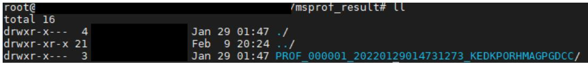

# 说明

如果acl.json文件之前已经存在，本处仅是修改文件内容、添加Profiling相关配置，则不需要重新编译应用工程。

# ----结束

# 11.6 使用环境变量采集性能数据

环境变量方式采集适用于TensorFlow框架训练/在线推理场景。与直接使用TensorFlow框架接口采集方式不同的是，环境变量方式是在训练/在线推理脚本中直接插入PROFILING_OPTIONS环境变量配置性能数据采集项。

# 前提条件

训练场景：

准备好基于TensorFlow 1.15开发的训练模型以及配套的数据集，并按照《TensorFlow 1.15模型迁移指南》完成TensorFlow原始模型向昇腾AI处理器的迁移。  
准备好基于TensorFlow 2.x开发的训练模型以及配套的数据集，并按照《TensorFlow 2.6.5模型迁移指南》完成TensorFlow原始模型向昇腾AI处理器的迁移。

在线推理场景：下载预训练模型并准备在线推理脚本。

# 操作步骤

配置的环境变量内容示例如下。   
export PROFILING_MODE=true   
export PROFILING_OPTIONS='{"output":"/tmp/   
profiling","training_trace":"on","task_trace":"on","fp_point":"","bp_point":"","aic_metrics":"PipeUtilizati on"y'

PROFILING_OPTIONS参数解释及使用方法，请参见14.6 Profiling options参数解释。

# 说明

配置PROFILING_MODE为true但未配置PROFILING_OPTIONS情况下Profiling默认会执行training_trace、task_trace、hccl、aicpu和aic_metrics（PipeUtilization）采集并将采集到的数据保存在当前AI任务所在目录；当配置PROFILING_MODE为true且配置PROFILING_OPTIONS任意参数后，PROFILING_OPTIONS参数默认情况请参见14.6 Profilingoptions参数解释。

# 采集结果说明

配置PROFILING_OPTIONS参数后请参见6.2 离线解析将原始数据文件解析并导出为可视化的性能数据文件，保存在PROF_XXX/mindstudio_profiler_output目录下。

采集的结果文件如表11-16所示。

表 11-16 采集结果文件  

<table><tr><td>参数</td><td>结果文件</td></tr><tr><td rowspan="5">默认自动生成</td><td>msprof（timeline数据总表）</td></tr><tr><td>op_summary_*.csv</td></tr><tr><td>op_statistic_*.csv</td></tr><tr><td>fusion_op_*.csv</td></tr><tr><td>step_trace（迭代轨迹数据）</td></tr><tr><td colspan="1" rowspan="1">task_trace、task_time</td><td colspan="1" rowspan="1">msprof_*.json中的CANN层级和api_statistic_*.csv文件msprof_*.json中的Ascend Hardware层级和task_time_*.csv文件msprof_*.json中的Communication层级和communication_statistic_*.csv文件step_trace_*.json</td></tr><tr><td colspan="1" rowspan="1"> runtime_api</td><td colspan="1" rowspan="1">msprof_*.json中的CANN_Runtime层级和 api_statistic_*.csv文件</td></tr><tr><td colspan="1" rowspan="1">hccl</td><td colspan="1" rowspan="1">msprof_*.json中的Communication层级和communication_statistic_*.csv文件api_statistic_*.csv</td></tr><tr><td colspan="1" rowspan="1">aicpu</td><td colspan="1" rowspan="1">aicpu_*.csvdp_*.csv</td></tr><tr><td colspan="1" rowspan="1"> aic_metrics</td><td colspan="1" rowspan="1">op_summary_*.csv</td></tr><tr><td colspan="1" rowspan="1">l2</td><td colspan="1" rowspan="1">l2_cache_*.csv</td></tr><tr><td colspan="1" rowspan="1">msproftx</td><td colspan="1" rowspan="1">msproftx数据</td></tr><tr><td colspan="1" rowspan="1">sys_hardware_mem_freq</td><td colspan="1" rowspan="1">片上内存读写速率文件msprof_*.json中的LLC层级和llc_read_write_*.csv文件msprof_*.json中的acc_pmu层级msprof_*.json中的Stars Soc Info层级msprof_*.json中的NPU MEM层级和npu_mem_*.csv文件npu_module_mem_*.csv</td></tr><tr><td colspan="1" rowspan="1"> llc_profiling</td><td colspan="1" rowspan="1"></td></tr><tr><td colspan="1" rowspan="1">sys_io_sampling_freq</td><td colspan="1" rowspan="1">msprof_*.json中的Nic层级和nic_*.csv文件msprof_*.json中的RoCE层级和roce_*.csv文件</td></tr><tr><td colspan="1" rowspan="1">sys_interconnection_freq</td><td colspan="1" rowspan="1">msprof_*.json中的PCle层级和pcie_*.csv文件msprof_*.json中的HcCs层级和hccs_*.csv文件msprof_*.json中的Stars Chip Trans层级</td></tr><tr><td colspan="1" rowspan="1">dvpp_freq</td><td colspan="1" rowspan="1">dvpp_*.csv</td></tr><tr><td colspan="1" rowspan="1"> instr_profiling_freq</td><td colspan="1" rowspan="1">msprof_*.json中的biu_group、aic_core_group、aiv_core_group层级</td></tr><tr><td colspan="1" rowspan="1">host_sys</td><td colspan="1" rowspan="1">msprof_*.json中的cPU Usage层级和host_cpu_usage_*.csv文件msprof_*.json中的Memory Usage层级和host_mem_usage_*.csv文件</td></tr><tr><td colspan="1" rowspan="1">host_sys_usage</td><td colspan="1" rowspan="1">Host侧系统CPU利用率数据Host侧进程CPU利用率数据Host侧系统内存利用率数据Host侧进程内存利用率数据</td></tr><tr><td colspan="1" rowspan="1">host_sys_usage_freq</td><td colspan="1" rowspan="1"></td></tr></table>

# 12 性能数据文件参考

总体说明  
msprof导出db格式数据说明  
msprof（timeline数据总表）  
msproftx数据说明  
task_time（任务调度信息）  
api_statistic（API耗时统计信息）  
step_trace（迭代轨迹信息）  
dp（数据增强信息）  
communication_statistic（集合通信算子统计信息）  
op_summary（算子详细信息）  
op_statistic（算子调用次数及耗时）

ai_core_utilization（AI Core指令占比）

AI Core指令占比数据timeline信息在msprof_\*.json文件的AI Core Utilization层级展示，summary信息在ai_core_utilization_\*.csv文件汇总。

ai_vector_core_utilization（AI Vector Core指令占比）  
aicpu（AI CPU算子详细耗时）  
aicpu_mi（数据准备的队列）  
l2_cache（L2 Cache命中率）  
fusion_op（算子融合信息）  
npu_mem（NPU内存占用）  
npu_module_mem（NPU组件内存占用）  
memory_record（CANN算子的内存占用记录）  
operator_memory（CANN算子的内存占用明细）  
static_op_mem（静态图算子内存）

sys_mem（系统内存数据）process_mem（进程内存占用数据）cpu_usage（AI CPU、Ctrl CPU利用率）process_cpu_usage（进程CPU占用率）

片上内存读写速率  
hccs（集合通信带宽）  
nic（每个时间节点网络信息）  
roce（RoCE通信接口带宽）  
pcie（PCIe带宽）  
biu_group/aic_core_group/aiv_core_group（AI Core和AI Vector的带宽和延时）  
Acc PMU（加速器带宽及并发信息）  
Stars Soc Info（SoC传输带宽信息）  
Stars Chip Trans（片间传输带宽信息）  
llc_read_write（三级缓存读写速率）  
dvpp（DVPP信息）  
ai_cpu_top_function（AI CPU热点函数）  
ai_cpu_pmu_events（AI CPU PMU事件）  
ctrl_cpu_top_function（Ctrl CPU热点函数）  
ctrl_cpu_pmu_events（Ctrl CPU PMU事件）  
ts_cpu_top_function（TS CPU热点函数）  
ts_cpu_pmu_events（TS CPU PMU事件）  
host_cpu_usage（Host侧CPU利用率）  
host_mem_usage（Host侧内存利用率）  
host_disk_usage（Host侧磁盘I/O利用率）  
host_network_usage（Host侧网络I/O利用率  
os_runtime_statistic（Host侧syscall和pthre  
cpu_usage（Host侧系统CPU利用率）  
process_cpu_usage（Host侧进程CPU利用率）  
sys_mem（Host侧系统内存利用率）  
process_mem（Host侧进程内存利用率）

# 12.1 总体说明

采集性能原始数据，并解析导出成可视化的性能数据文件后，文件目录结构及主要文件如下。

# 目录结构及文件说明

性能数据目录结构示例如下（仅展示性能数据）：

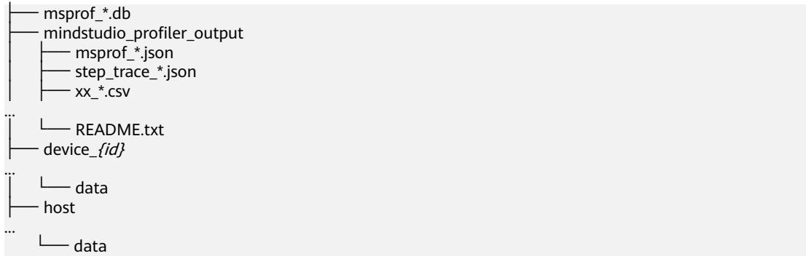

\*表示{timestamp}时间戳。

mindstudio_profiler_output目录保存Host和各个Device的性能数据汇总（性能数据分析推荐查看该目录下文件），目录下的结果文件命名格式为：“模块名_{timestamp}.{json/csv}”。  
● device_{id}目录主要保存各个Device运行昇腾AI应用的性能原始数据和昇腾AI处理器系统原始数据。  
● host目录主要保存上层应用接口（msproftx）的昇腾AI应用运行性能原始数据和Host系统原始数据。

默认采集的性能数据文件如表12-1所示。

表 12-1 msprof 默认配置采集的性能数据文件  

<table><tr><td colspan="1" rowspan="1">文件名</td><td colspan="1" rowspan="1">说明</td></tr><tr><td colspan="1" rowspan="1">msprof_*.db</td><td colspan="1" rowspan="1">汇总所有性能数据的db格式文件。</td></tr><tr><td colspan="1" rowspan="1">msprof_*.json</td><td colspan="1" rowspan="1">timeline数据总表。</td></tr><tr><td colspan="1" rowspan="1">step_trace_*.json</td><td colspan="1" rowspan="1">迭代轨迹数据，每轮迭代的耗时。单算子场景（如PyTorch场景）下无此性能数据文件。</td></tr><tr><td colspan="1" rowspan="1">op_summary_*.csv</td><td colspan="1" rowspan="1">Al Core和AI CPU算子数据。</td></tr><tr><td colspan="1" rowspan="1">op_statistic_*.csv</td><td colspan="1" rowspan="1">Al Core和AICPU算子调用次数及耗时统计。</td></tr><tr><td colspan="1" rowspan="1">step_trace_*.csv</td><td colspan="1" rowspan="1">迭代轨迹数据。单算子场景（如PyTorch场景）下无此性能数据文件。</td></tr><tr><td colspan="1" rowspan="1">task_time_*.csv</td><td colspan="1" rowspan="1">Task Scheduler任务调度信息。</td></tr><tr><td colspan="1" rowspan="1">fusion_op_*.csv</td><td colspan="1" rowspan="1">模型中算子融合前后信息。单算子场景（如PyTorch场景）下无此性能数据文件。</td></tr><tr><td colspan="1" rowspan="1">api_statistic_*.csv</td><td colspan="1" rowspan="1">用于统计CANN层的API执行耗时信息。</td></tr><tr><td colspan="2" rowspan="1">注：表中的json文件为timeline信息文件，主要收集算子、任务等运行耗时，以色块形式展示；csv文件为summary信息文件，主要以表格形式汇总运行耗时。</td></tr></table>

# 查看整体性能数据

msprof_\*.db为汇总整体性能数据的文件，mindstudio_profiler_output目录下的timeline和summary文件则是将各类性能数据拆分成多个文件，以上两类文件均可以使用MindStudio Insight工具导入后进行整体数据的可视化展示，详细操作请参见《MindStudio Insight工具用户指南》。

# 查看 timeline 文件

使用Perfetto UI打开：在Chrome浏览器中输入“https://ui.perfetto.dev/”地址，将.json文件拖到空白处打开，通过键盘上的快捷键（w：放大，s：缩小，a：左移，d：右移）进行查看。

使用tracing打开：在Chrome浏览器中输入“chrome://tracing”地址，将.json文件拖到空白处打开，通过键盘上的快捷键（w：放大，s：缩小，a：左移，d：右移）进行查看。

# 说明

超大文件推荐使用Perfetto UI打开。

# summary 文件说明

生成的summary数据文件使用Excel打开时，可能会出现字段值为科学计数的情况，例如“1.00159E+12”。此时可选中该单元格，然后“右键>设置单元格格式”，在弹出的对话框中“数字”标签下选择“数值”，单击“确定”就能正常显示。● 生成的summary数据文件中某些字段值为“N/A”时，表示此时该值不存在。

# 12.2 msprof 导出 db 格式数据说明

msprof命令执行完成后，会生成一个汇总所有性能数据的msprof_{时间戳}.db表结构文件，该文件推荐使用MindStudio Insight工具查看，也可以使用Navicat Premium等数据库开发工具直接打开。当前db文件汇总的性能数据如下：

# 说明

db文件均以表格形式展示性能数据，且所有数据均以数字映射（例如opName字段下的算子名显示为194），数字与名称的映射表为STRING_IDS。

# 单位相关

1. 时间相关，统一使用纳秒（ns），且为本地Unix时间。

2. 内存相关，统一使用字节（Byte）

3. 带宽相关，统一使用Byte/s

4. 频率相关，统一使用MHz

# ENUM_API_TYPE

枚举表。

无对应开关，导出msprof_{时间戳}.db文件时默认生成。

表 12-2 格式  

<table><tr><td rowspan=1 colspan=1>字段名</td><td rowspan=1 colspan=1>类型</td><td rowspan=1 colspan=1>含义</td></tr><tr><td rowspan=1 colspan=1>id</td><td rowspan=1 colspan=1>INTEGER</td><td rowspan=1 colspan=1>索引，ID</td></tr><tr><td rowspan=1 colspan=1>name</td><td rowspan=1 colspan=1>TEXT</td><td rowspan=1 colspan=1>API类型</td></tr></table>

表 12-3 内容  

<table><tr><td rowspan=1 colspan=1>id</td><td rowspan=1 colspan=1>name</td></tr><tr><td rowspan=1 colspan=1>20000</td><td rowspan=1 colspan=1>acl</td></tr><tr><td rowspan=1 colspan=1>15000</td><td rowspan=1 colspan=1>model</td></tr><tr><td rowspan=1 colspan=1>10000</td><td rowspan=1 colspan=1>node</td></tr><tr><td rowspan=1 colspan=1>5500</td><td rowspan=1 colspan=1>communication</td></tr><tr><td rowspan=1 colspan=1>5000</td><td rowspan=1 colspan=1>runtime</td></tr><tr><td rowspan=1 colspan=1>50001</td><td rowspan=1 colspan=1>op</td></tr><tr><td rowspan=1 colspan=1>50002</td><td rowspan=1 colspan=1>queue</td></tr><tr><td rowspan=1 colspan=1>50003</td><td rowspan=1 colspan=1>trace</td></tr><tr><td rowspan=1 colspan=1>50004</td><td rowspan=1 colspan=1>mstx</td></tr></table>

# ENUM_MODULE

枚举表。

无对应开关，导出msprof_{时间戳}.db文件时默认生成。

表 12-4 格式  

<table><tr><td rowspan=1 colspan=1>字段名</td><td rowspan=1 colspan=1>类型</td><td rowspan=1 colspan=1>含义</td></tr><tr><td rowspan=1 colspan=1>id</td><td rowspan=1 colspan=1>INTEGER</td><td rowspan=1 colspan=1>索引，ID</td></tr><tr><td rowspan=1 colspan=1>name</td><td rowspan=1 colspan=1>TEXT</td><td rowspan=1 colspan=1>组件名</td></tr></table>

表 12-5 内容  

<table><tr><td colspan="1" rowspan="1">id</td><td colspan="1" rowspan="1">name</td></tr><tr><td colspan="1" rowspan="1">0</td><td colspan="1" rowspan="1">SLOG</td></tr><tr><td colspan="1" rowspan="1">1</td><td colspan="1" rowspan="1">IDEDD</td></tr><tr><td colspan="1" rowspan="1">2</td><td colspan="1" rowspan="1">SCC</td></tr><tr><td colspan="1" rowspan="1">3</td><td colspan="1" rowspan="1">HCCL</td></tr><tr><td colspan="1" rowspan="1">4</td><td colspan="1" rowspan="1">FMK</td></tr><tr><td colspan="1" rowspan="1">5</td><td colspan="1" rowspan="1">CCU</td></tr><tr><td colspan="1" rowspan="1">6</td><td colspan="1" rowspan="1">DVPP</td></tr><tr><td colspan="1" rowspan="1">7</td><td colspan="1" rowspan="1">RUNTIME</td></tr><tr><td colspan="1" rowspan="1">8</td><td colspan="1" rowspan="1">CCE</td></tr><tr><td colspan="1" rowspan="1">9</td><td colspan="1" rowspan="1">HDC</td></tr><tr><td colspan="1" rowspan="1">10</td><td colspan="1" rowspan="1">DRV</td></tr><tr><td colspan="1" rowspan="1">11</td><td colspan="1" rowspan="1">NET</td></tr><tr><td colspan="1" rowspan="1">22</td><td colspan="1" rowspan="1">DEVMM</td></tr><tr><td colspan="1" rowspan="1">23</td><td colspan="1" rowspan="1">KERNEL</td></tr><tr><td colspan="1" rowspan="1">24</td><td colspan="1" rowspan="1">LIBMEDIA</td></tr><tr><td colspan="1" rowspan="1">25</td><td colspan="1" rowspan="1">CCECPU</td></tr><tr><td colspan="1" rowspan="1">27</td><td colspan="1" rowspan="1">ROS</td></tr><tr><td colspan="1" rowspan="1">28</td><td colspan="1" rowspan="1">HCCP</td></tr><tr><td colspan="1" rowspan="1">29</td><td colspan="1" rowspan="1">ROCE</td></tr><tr><td colspan="1" rowspan="1">30</td><td colspan="1" rowspan="1">TEFUSION</td></tr><tr><td colspan="1" rowspan="1">31</td><td colspan="1" rowspan="1">PROFILING</td></tr><tr><td colspan="1" rowspan="1">32</td><td colspan="1" rowspan="1">DP</td></tr><tr><td colspan="1" rowspan="1">33</td><td colspan="1" rowspan="1">APP</td></tr><tr><td colspan="1" rowspan="1">34</td><td colspan="1" rowspan="1">TS</td></tr><tr><td colspan="1" rowspan="1">35</td><td colspan="1" rowspan="1">TSDUMP</td></tr><tr><td colspan="1" rowspan="1">36</td><td colspan="1" rowspan="1">AICPU</td></tr><tr><td colspan="1" rowspan="1">37</td><td colspan="1" rowspan="1">LP</td></tr><tr><td colspan="1" rowspan="1">38</td><td colspan="1" rowspan="1">TDT</td></tr><tr><td colspan="1" rowspan="1">39</td><td colspan="1" rowspan="1">FE</td></tr><tr><td colspan="1" rowspan="1">40</td><td colspan="1" rowspan="1">MD</td></tr><tr><td colspan="1" rowspan="1">41</td><td colspan="1" rowspan="1">MB</td></tr><tr><td colspan="1" rowspan="1">42</td><td colspan="1" rowspan="1">ME</td></tr><tr><td colspan="1" rowspan="1">43</td><td colspan="1" rowspan="1">IMU</td></tr><tr><td colspan="1" rowspan="1">44</td><td colspan="1" rowspan="1">IMP</td></tr><tr><td colspan="1" rowspan="1">45</td><td colspan="1" rowspan="1">GE</td></tr><tr><td colspan="1" rowspan="1">47</td><td colspan="1" rowspan="1">CAMERA</td></tr><tr><td colspan="1" rowspan="1">48</td><td colspan="1" rowspan="1">ASCENDCL</td></tr><tr><td colspan="1" rowspan="1">49</td><td colspan="1" rowspan="1">TEEOS</td></tr><tr><td colspan="1" rowspan="1">50</td><td colspan="1" rowspan="1">ISP</td></tr><tr><td colspan="1" rowspan="1">51</td><td colspan="1" rowspan="1">SIS</td></tr><tr><td colspan="1" rowspan="1">52</td><td colspan="1" rowspan="1">HSM</td></tr><tr><td colspan="1" rowspan="1">53</td><td colspan="1" rowspan="1">DSS</td></tr><tr><td colspan="1" rowspan="1">54</td><td colspan="1" rowspan="1">PROCMGR</td></tr><tr><td colspan="1" rowspan="1">55</td><td colspan="1" rowspan="1">BBOX</td></tr><tr><td colspan="1" rowspan="1">56</td><td colspan="1" rowspan="1">AIVECTOR</td></tr><tr><td colspan="1" rowspan="1">57</td><td colspan="1" rowspan="1">TBE</td></tr><tr><td colspan="1" rowspan="1">58</td><td colspan="1" rowspan="1">FV</td></tr><tr><td colspan="1" rowspan="1">59</td><td colspan="1" rowspan="1">MDCMAP</td></tr><tr><td colspan="1" rowspan="1">60</td><td colspan="1" rowspan="1">TUNE</td></tr><tr><td colspan="1" rowspan="1">61</td><td colspan="1" rowspan="1">HSS</td></tr><tr><td colspan="1" rowspan="1">62</td><td colspan="1" rowspan="1">FFTS</td></tr><tr><td colspan="1" rowspan="1">63</td><td colspan="1" rowspan="1">OP</td></tr><tr><td colspan="1" rowspan="1">64</td><td colspan="1" rowspan="1">UDF</td></tr><tr><td colspan="1" rowspan="1">65</td><td colspan="1" rowspan="1">HICAID</td></tr><tr><td colspan="1" rowspan="1">66</td><td colspan="1" rowspan="1">TSYNC</td></tr><tr><td colspan="1" rowspan="1">67</td><td colspan="1" rowspan="1">AUDIO</td></tr><tr><td colspan="1" rowspan="1">68</td><td colspan="1" rowspan="1">TPRT</td></tr><tr><td colspan="1" rowspan="1">69</td><td colspan="1" rowspan="1">ASCENDCKERNEL</td></tr><tr><td colspan="1" rowspan="1">70</td><td colspan="1" rowspan="1">ASYS</td></tr><tr><td colspan="1" rowspan="1">71</td><td colspan="1" rowspan="1">ATRACE</td></tr><tr><td colspan="1" rowspan="1">72</td><td colspan="1" rowspan="1">RTC</td></tr><tr><td colspan="1" rowspan="1">73</td><td colspan="1" rowspan="1">SYSMONITOR</td></tr><tr><td colspan="1" rowspan="1">74</td><td colspan="1" rowspan="1">AMP</td></tr><tr><td colspan="1" rowspan="1">75</td><td colspan="1" rowspan="1">ADETECT</td></tr><tr><td colspan="1" rowspan="1">76</td><td colspan="1" rowspan="1">MBUFF</td></tr><tr><td colspan="1" rowspan="1">77</td><td colspan="1" rowspan="1">CUSTOM</td></tr></table>

# ENUM_HCCL_DATA_TYPE

枚举表。

无对应开关，导出msprof_{时间戳}.db文件时默认生成。

表 12-6 格式  

<table><tr><td rowspan=1 colspan=1>字段名</td><td rowspan=1 colspan=1>类型</td><td rowspan=1 colspan=1>含义</td></tr><tr><td rowspan=1 colspan=1>id</td><td rowspan=1 colspan=1>INTEGER</td><td rowspan=1 colspan=1>索引，ID</td></tr><tr><td rowspan=1 colspan=1>name</td><td rowspan=1 colspan=1>TEXT</td><td rowspan=1 colspan=1>通信数据类型</td></tr></table>

表 12-7 内容  

<table><tr><td colspan="1" rowspan="1">id</td><td colspan="1" rowspan="1">name</td></tr><tr><td colspan="1" rowspan="1">0</td><td colspan="1" rowspan="1">INT8</td></tr><tr><td colspan="1" rowspan="1">1</td><td colspan="1" rowspan="1">INT16</td></tr><tr><td colspan="1" rowspan="1">2</td><td colspan="1" rowspan="1">INT32</td></tr><tr><td colspan="1" rowspan="1">3</td><td colspan="1" rowspan="1">FP16</td></tr><tr><td colspan="1" rowspan="1">4</td><td colspan="1" rowspan="1">FP32</td></tr><tr><td colspan="1" rowspan="1">5</td><td colspan="1" rowspan="1">INT64</td></tr><tr><td colspan="1" rowspan="1">6</td><td colspan="1" rowspan="1">UINT64</td></tr><tr><td colspan="1" rowspan="1">7</td><td colspan="1" rowspan="1">UINT8</td></tr><tr><td colspan="1" rowspan="1">8</td><td colspan="1" rowspan="1">UINT16</td></tr><tr><td colspan="1" rowspan="1">9</td><td colspan="1" rowspan="1">UINT32</td></tr><tr><td colspan="1" rowspan="1">10</td><td colspan="1" rowspan="1">FP64</td></tr><tr><td colspan="1" rowspan="1">11</td><td colspan="1" rowspan="1">BFP16</td></tr><tr><td colspan="1" rowspan="1">12</td><td colspan="1" rowspan="1">INT128</td></tr><tr><td colspan="1" rowspan="1">255</td><td colspan="1" rowspan="1">RESERVED</td></tr><tr><td colspan="1" rowspan="1">65534</td><td colspan="1" rowspan="1">N/A</td></tr><tr><td colspan="1" rowspan="1">65535</td><td colspan="1" rowspan="1">INVALID_TYPE</td></tr></table>

# ENUM_HCCL_LINK_TYPE

枚举表。

无对应开关，导出msprof_{时间戳}.db文件时默认生成。

表 12-8 格式  

<table><tr><td rowspan=1 colspan=1>字段名</td><td rowspan=1 colspan=1>类型</td><td rowspan=1 colspan=1>含义</td></tr><tr><td rowspan=1 colspan=1>id</td><td rowspan=1 colspan=1>INTEGER</td><td rowspan=1 colspan=1>索引，ID</td></tr><tr><td rowspan=1 colspan=1>name</td><td rowspan=1 colspan=1>TEXT</td><td rowspan=1 colspan=1>通信链路类型</td></tr></table>

表 12-9 内容  

<table><tr><td rowspan=1 colspan=1>id</td><td rowspan=1 colspan=1>name</td></tr><tr><td rowspan=1 colspan=1>0</td><td rowspan=1 colspan=1>ON_CHIP</td></tr><tr><td rowspan=1 colspan=1>1</td><td rowspan=1 colspan=1>HCCS</td></tr><tr><td rowspan=1 colspan=1>2</td><td rowspan=1 colspan=1>PCIE</td></tr><tr><td rowspan=1 colspan=1>3</td><td rowspan=1 colspan=1>ROCE</td></tr><tr><td rowspan=1 colspan=1>4</td><td rowspan=1 colspan=1>SIO</td></tr><tr><td rowspan=1 colspan=1>5</td><td rowspan=1 colspan=1>HCCS_SW</td></tr><tr><td rowspan=1 colspan=1>6</td><td rowspan=1 colspan=1>STANDARD_ROCE</td></tr><tr><td rowspan=1 colspan=1>255</td><td rowspan=1 colspan=1>RESERVED</td></tr><tr><td rowspan=1 colspan=1>65534</td><td rowspan=1 colspan=1>N/A</td></tr><tr><td rowspan=1 colspan=1>65535</td><td rowspan=1 colspan=1>INVALID_TYPE</td></tr></table>

# ENUM_HCCL_TRANSPORT_TYPE

枚举表。

无对应开关，导出msprof_{时间戳}.db文件时默认生成。

表 12-10 格式  

<table><tr><td rowspan=1 colspan=1>字段名</td><td rowspan=1 colspan=1>类型</td><td rowspan=1 colspan=1>含义</td></tr><tr><td rowspan=1 colspan=1>id</td><td rowspan=1 colspan=1>INTEGER</td><td rowspan=1 colspan=1>索引，ID</td></tr><tr><td rowspan=1 colspan=1>name</td><td rowspan=1 colspan=1>TEXT</td><td rowspan=1 colspan=1>通信传输类型</td></tr></table>

表 12-11 内容  

<table><tr><td rowspan=1 colspan=1>id</td><td rowspan=1 colspan=1>name</td></tr><tr><td rowspan=1 colspan=1>0</td><td rowspan=1 colspan=1>SDMA</td></tr><tr><td rowspan=1 colspan=1>1</td><td rowspan=1 colspan=1>RDMA</td></tr><tr><td rowspan=1 colspan=1>2</td><td rowspan=1 colspan=1>LOCAL</td></tr><tr><td rowspan=1 colspan=1>255</td><td rowspan=1 colspan=1>RESERVED</td></tr><tr><td rowspan=1 colspan=1>65534</td><td rowspan=1 colspan=1>N/A</td></tr><tr><td rowspan=1 colspan=1>65535</td><td rowspan=1 colspan=1>INVALID_TYPE</td></tr></table>

# ENUM_HCCL_RDMA_TYPE

枚举表。

无对应开关，导出msprof_{时间戳}.db文件时默认生成。

表 12-12 格式  

<table><tr><td rowspan=1 colspan=1>字段名</td><td rowspan=1 colspan=1>类型</td><td rowspan=1 colspan=1>含义</td></tr><tr><td rowspan=1 colspan=1>id</td><td rowspan=1 colspan=1> INTEGER</td><td rowspan=1 colspan=1>索引，ID</td></tr><tr><td rowspan=1 colspan=1>name</td><td rowspan=1 colspan=1>TEXT</td><td rowspan=1 colspan=1>通信RDMA类型</td></tr></table>

表 12-13 内容  

<table><tr><td colspan="1" rowspan="1">id</td><td colspan="1" rowspan="1">name</td></tr><tr><td colspan="1" rowspan="1">0</td><td colspan="1" rowspan="1">RDMA_SEND_NOTIFY</td></tr><tr><td colspan="1" rowspan="1">1</td><td colspan="1" rowspan="1">RDMA_SEND_PAYLOAD</td></tr><tr><td colspan="1" rowspan="1">255</td><td colspan="1" rowspan="1">RESERVED</td></tr><tr><td colspan="1" rowspan="1">65534</td><td colspan="1" rowspan="1">N/A</td></tr><tr><td>65535</td><td>INVALID_TYPE</td></tr></table>

# ENUM_MSTX_EVENT_TYPE

枚举表。

无对应开关，导出msprof_{时间戳}.db文件时默认生成。

表 12-14 格式  

<table><tr><td rowspan=1 colspan=1>字段名</td><td rowspan=1 colspan=1>类型</td><td rowspan=1 colspan=1>含义</td></tr><tr><td rowspan=1 colspan=1>id</td><td rowspan=1 colspan=1>INTEGER</td><td rowspan=1 colspan=1>索引，Host侧tx打点数据event类型对应的ID</td></tr><tr><td rowspan=1 colspan=1>name</td><td rowspan=1 colspan=1>INTEGER</td><td rowspan=1 colspan=1>Host侧tx打点数据event类型</td></tr></table>

表 12-15 内容  

<table><tr><td rowspan=1 colspan=1>id</td><td rowspan=1 colspan=1>name</td></tr><tr><td rowspan=1 colspan=1>0</td><td rowspan=1 colspan=1>marker</td></tr><tr><td rowspan=1 colspan=1>1</td><td rowspan=1 colspan=1>push/pop</td></tr><tr><td rowspan=1 colspan=1>2</td><td rowspan=1 colspan=1>start/end</td></tr><tr><td rowspan=1 colspan=1>3</td><td rowspan=1 colspan=1>marker_ex</td></tr></table>

# ENUM_MEMCPY_OPERATION

枚举表。

无对应开关，导出msprof_{时间戳}.db文件时默认生成。

表 12-16 格式  

<table><tr><td rowspan=1 colspan=1>字段名</td><td rowspan=1 colspan=1>类型</td><td rowspan=1 colspan=1>含义</td></tr><tr><td rowspan=1 colspan=1>id</td><td rowspan=1 colspan=1>INTEGER</td><td rowspan=1 colspan=1>主键，ID</td></tr><tr><td rowspan=1 colspan=1>name</td><td rowspan=1 colspan=1>TEXT</td><td rowspan=1 colspan=1>拷贝类型</td></tr></table>

表 12-17 内容  

<table><tr><td rowspan=1 colspan=1>id</td><td rowspan=1 colspan=1> name</td></tr><tr><td rowspan=1 colspan=1>0</td><td rowspan=1 colspan=1>host to host</td></tr><tr><td rowspan=1 colspan=1>1</td><td rowspan=1 colspan=1>host to device</td></tr><tr><td rowspan=1 colspan=1>2</td><td rowspan=1 colspan=1>device to host</td></tr><tr><td rowspan=1 colspan=1>3</td><td rowspan=1 colspan=1>device to device</td></tr><tr><td rowspan=1 colspan=1>4</td><td rowspan=1 colspan=1>managed memory</td></tr><tr><td rowspan=1 colspan=1>5</td><td rowspan=1 colspan=1>addr device to device</td></tr><tr><td rowspan=1 colspan=1>6</td><td rowspan=1 colspan=1>host to device ex</td></tr><tr><td rowspan=1 colspan=1>7</td><td rowspan=1 colspan=1>device to host ex</td></tr><tr><td rowspan=1 colspan=1>65535</td><td rowspan=1 colspan=1>other</td></tr></table>

# STRING_IDS

映射表，用于存储ID和字符串映射关系。  
无对应开关。

表 12-18 格式  

<table><tr><td rowspan=1 colspan=1>字段名</td><td rowspan=1 colspan=1>类型</td><td rowspan=1 colspan=1>含义</td></tr><tr><td rowspan=1 colspan=1>id</td><td rowspan=1 colspan=1> INTEGER</td><td rowspan=1 colspan=1>索引，string ID</td></tr><tr><td rowspan=1 colspan=1>value</td><td rowspan=1 colspan=1>TEXT</td><td rowspan=1 colspan=1>string value</td></tr></table>

# SESSION_TIME_INFO

时间表，用于存储性能数据中的开始结束时间。在采集未正常退出时，无结束时间。  
无对应开关。

表 12-19 格式  

<table><tr><td rowspan=1 colspan=1>字段名</td><td rowspan=1 colspan=1>类型</td><td rowspan=1 colspan=1>含义</td></tr><tr><td rowspan=1 colspan=1> startTimeNs</td><td rowspan=1 colspan=1>INTEGER</td><td rowspan=1 colspan=1>任务开启时的Unix时间，单位ns</td></tr><tr><td rowspan=1 colspan=1>endTimeNs</td><td rowspan=1 colspan=1>INTEGER</td><td rowspan=1 colspan=1>任务结束时的Unix时间，单位ns</td></tr></table>

# NPU_INFO

对应deviceId的芯片型号。  
无对应开关。

表 12-20 格式  

<table><tr><td rowspan=1 colspan=1>字段名</td><td rowspan=1 colspan=1>类型</td><td rowspan=1 colspan=1>含义</td></tr><tr><td rowspan=1 colspan=1>id</td><td rowspan=1 colspan=1>INTEGER</td><td rowspan=1 colspan=1>设备ID，显示为-1时表示未采集到deviceld</td></tr><tr><td rowspan=1 colspan=1>name</td><td rowspan=1 colspan=1>TEXT</td><td rowspan=1 colspan=1>设备对应的芯片型号</td></tr></table>

HOST_INFO

hostUid及名称。  
无对应开关。

表 12-21 格式  

<table><tr><td rowspan=1 colspan=1>字段名</td><td rowspan=1 colspan=1>类型</td><td rowspan=1 colspan=1>含义</td></tr><tr><td rowspan=1 colspan=1>hostUid</td><td rowspan=1 colspan=1>TEXT</td><td rowspan=1 colspan=1>标识Host的唯一ID</td></tr><tr><td rowspan=1 colspan=1>hostName</td><td rowspan=1 colspan=1>TEXT</td><td rowspan=1 colspan=1>Host主机名称，如localhost</td></tr></table>

TASK

task数据，呈现所有硬件执行的算子信息。

由--task-time开关控制。

表 12-22 格式  

<table><tr><td colspan="1" rowspan="1">字段名</td><td colspan="1" rowspan="1">类型</td><td colspan="1" rowspan="1">含义</td></tr><tr><td colspan="1" rowspan="1">startNs</td><td colspan="1" rowspan="1">INTEGER</td><td colspan="1" rowspan="1">与globalTaskld联合索引，索引名称Tasklndex,算子任务开始时间，单位ns</td></tr><tr><td colspan="1" rowspan="1">endNs</td><td colspan="1" rowspan="1">INTEGER</td><td colspan="1" rowspan="1">算子任务结束时间，单位ns</td></tr><tr><td colspan="1" rowspan="1">deviceld</td><td colspan="1" rowspan="1">INTEGER</td><td colspan="1" rowspan="1">算子任务对应的设备ID</td></tr><tr><td colspan="1" rowspan="1">connectionld</td><td colspan="1" rowspan="1">INTEGER</td><td colspan="1" rowspan="1">生成host-device连线</td></tr><tr><td colspan="1" rowspan="1">globalTaskld</td><td colspan="1" rowspan="1">INTEGER</td><td colspan="1" rowspan="1">与startNs联合索引，索引名称Tasklndex，用于唯一标识全局算子任务</td></tr><tr><td colspan="1" rowspan="1">globalPid</td><td colspan="1" rowspan="1">INTEGER</td><td colspan="1" rowspan="1">算子任务执行时的PID</td></tr><tr><td colspan="1" rowspan="1">taskType</td><td colspan="1" rowspan="1">INTEGER</td><td colspan="1" rowspan="1">设备执行该算子的加速器类型</td></tr><tr><td colspan="1" rowspan="1">contextld</td><td colspan="1" rowspan="1">INTEGER</td><td colspan="1" rowspan="1">用于区分子图小算子，常见于MIX算子和FFTS+任务</td></tr><tr><td colspan="1" rowspan="1"> streamld</td><td colspan="1" rowspan="1">INTEGER</td><td colspan="1" rowspan="1">算子任务对应的streamld</td></tr><tr><td colspan="1" rowspan="1">taskld</td><td colspan="1" rowspan="1">INTEGER</td><td colspan="1" rowspan="1">算子任务对应的taskld</td></tr><tr><td colspan="1" rowspan="1">modelld</td><td colspan="1" rowspan="1">INTEGER</td><td colspan="1" rowspan="1">算子任务对应的modelld</td></tr></table>

# COMPUTE_TASK_INFO

计算算子描述信息。  
由--task-time开关控制。

表 12-23 格式  

<table><tr><td colspan="1" rowspan="1">字段名</td><td colspan="1" rowspan="1">类型</td><td colspan="1" rowspan="1">含义</td></tr><tr><td colspan="1" rowspan="1">name</td><td colspan="1" rowspan="1">INTEGER</td><td colspan="1" rowspan="1">算子名，STRING_IDS(name)</td></tr><tr><td colspan="1" rowspan="1">globalTaskld</td><td colspan="1" rowspan="1">INTEGER</td><td colspan="1" rowspan="1">索引，全局算子任务ID,用于关联TASK表</td></tr><tr><td colspan="1" rowspan="1">blockDim</td><td colspan="1" rowspan="1">INTEGER</td><td colspan="1" rowspan="1">算子运行切分数量，对应算子运行时核数</td></tr><tr><td colspan="1" rowspan="1">mixBlockDim</td><td colspan="1" rowspan="1">INTEGER</td><td colspan="1" rowspan="1">mix算子从加速器的BlockDim值</td></tr><tr><td colspan="1" rowspan="1">taskType</td><td colspan="1" rowspan="1">INTEGER</td><td colspan="1" rowspan="1">Host执行该算子的加速器类型，STRING_IDS(taskType)</td></tr><tr><td colspan="1" rowspan="1">opType</td><td colspan="1" rowspan="1">INTEGER</td><td colspan="1" rowspan="1">算子类型，STRING_IDS(opType)</td></tr><tr><td colspan="1" rowspan="1">inputFormats</td><td colspan="1" rowspan="1">INTEGER</td><td colspan="1" rowspan="1">算子输入数据格式，STRING_IDS(inputFormats)</td></tr><tr><td colspan="1" rowspan="1">inputDataTypes</td><td colspan="1" rowspan="1">INTEGER</td><td colspan="1" rowspan="1">算子输入数据类型，STRING_IDS(inputDataTypes)</td></tr><tr><td colspan="1" rowspan="1">inputShapes</td><td colspan="1" rowspan="1">INTEGER</td><td colspan="1" rowspan="1">算子的输入维度，STRING_IDS(inputShapes）</td></tr><tr><td colspan="1" rowspan="1">outputFormats</td><td colspan="1" rowspan="1">INTEGER</td><td colspan="1" rowspan="1">算子输出数据格式，STRING_IDS(outputFormats)</td></tr><tr><td colspan="1" rowspan="1">outputDataTypes</td><td colspan="1" rowspan="1">INTEGER</td><td colspan="1" rowspan="1">算子输出数据类型，STRING_IDS(outputDataTypes)</td></tr><tr><td colspan="1" rowspan="1">outputShapes</td><td colspan="1" rowspan="1">INTEGER</td><td colspan="1" rowspan="1">算子输出维度，STRING_IDS(outputShapes)</td></tr><tr><td colspan="1" rowspan="1">attrlnfo</td><td colspan="1" rowspan="1">INTEGER</td><td colspan="1" rowspan="1">算子的attr信息，用来映射算子shape，算子自定义的参数等，STRING_IDS(attrInfo)</td></tr><tr><td colspan="1" rowspan="1">opState</td><td colspan="1" rowspan="1">INTEGER</td><td colspan="1" rowspan="1">算子的动静态信息，dynamic表示动态算子，static表示静态算子，N/A表示该场景或该算子不识别，STRING_IDS(opState)</td></tr><tr><td colspan="1" rowspan="1">hf32Eligible</td><td colspan="1" rowspan="1">INTEGER</td><td colspan="1" rowspan="1">标识是否使用HF32精度标记，YES表示使用，NO表示未使用，N/A表示该场景或该算子不识别，STRING_IDS(hf32Eligible）</td></tr></table>

# COMMUNICATION_TASK_INFO

描述通信小算子信息。

由--task-time、--hccl、--ascendcl开关控制对应数据的采集。配置--task-time为非l0时数据有效。有通信数据的场景下默认生成该表。

表 12-24 格式  

<table><tr><td colspan="1" rowspan="1">字段名</td><td colspan="1" rowspan="1">类型</td><td colspan="1" rowspan="1">含义</td></tr><tr><td colspan="1" rowspan="1">name</td><td colspan="1" rowspan="1">INTEGER</td><td colspan="1" rowspan="1">算子名，STRING_IDS(name)</td></tr><tr><td colspan="1" rowspan="1">globalTaskld</td><td colspan="1" rowspan="1">INTEGER</td><td colspan="1" rowspan="1">索引，索引名称CommunicationTasklnde×，全局算子任务ID，用于关联TASK表</td></tr><tr><td colspan="1" rowspan="1">taskType</td><td colspan="1" rowspan="1">INTEGER</td><td colspan="1" rowspan="1">算子类型，STRING_IDS(taskType)</td></tr><tr><td colspan="1" rowspan="1">planeld</td><td colspan="1" rowspan="1">INTEGER</td><td colspan="1" rowspan="1">网络平面ID</td></tr><tr><td colspan="1" rowspan="1">groupName</td><td colspan="1" rowspan="1">INTEGER</td><td colspan="1" rowspan="1">通信域，STRING_IDS(groupName）</td></tr><tr><td colspan="1" rowspan="1">notifyld</td><td colspan="1" rowspan="1">INTEGER</td><td colspan="1" rowspan="1">notify唯一ID</td></tr><tr><td colspan="1" rowspan="1">rdmaType</td><td colspan="1" rowspan="1">INTEGER</td><td colspan="1" rowspan="1">RDMA类型，包含：RDMASendNotify、RDMASendPayload,ENUM_HCCL_RDMA_TYPE(rdmaType)</td></tr><tr><td colspan="1" rowspan="1"> srcRank</td><td colspan="1" rowspan="1">INTEGER</td><td colspan="1" rowspan="1">源Rank</td></tr><tr><td colspan="1" rowspan="1">dstRank</td><td colspan="1" rowspan="1">INTEGER</td><td colspan="1" rowspan="1">目的Rank</td></tr><tr><td colspan="1" rowspan="1">transportType</td><td colspan="1" rowspan="1">INTEGER</td><td colspan="1" rowspan="1">传输类型，包含：LOCAL、SDMA、RDMA,ENUM_HCCL_TRANSPORT_TYPE(transportType)</td></tr><tr><td colspan="1" rowspan="1">size</td><td colspan="1" rowspan="1">INTEGER</td><td colspan="1" rowspan="1">数据量，单位Byte</td></tr><tr><td colspan="1" rowspan="1">dataType</td><td colspan="1" rowspan="1">INTEGER</td><td colspan="1" rowspan="1">数据格式，ENUM_HCCL_DATA_TYPE(dataType)</td></tr><tr><td colspan="1" rowspan="1">linkType</td><td colspan="1" rowspan="1">INTEGER</td><td colspan="1" rowspan="1">链路类型，包含：HCCS、PCle、RoCE,ENUM_HCCL_LINK_TYPE(linkType)</td></tr><tr><td colspan="1" rowspan="1">opld</td><td colspan="1" rowspan="1">INTEGER</td><td colspan="1" rowspan="1">对应的大算子Id，用于关联COMMUNICATION_OP表</td></tr><tr><td colspan="1" rowspan="1">isMaster</td><td colspan="1" rowspan="1">INTEGER</td><td colspan="1" rowspan="1">标记主从流通信算子，分析时以主流算子为准，取值为：·0：从流·1:主流</td></tr><tr><td colspan="1" rowspan="1">bandwidth</td><td colspan="1" rowspan="1">NUMERIC</td><td colspan="1" rowspan="1">该通信小算子的带宽数据，单位B/s</td></tr></table>

# COMMUNICATION_OP

描述通信大算子信息。

由--task-time、--hccl开关控制对应数据的采集。有通信数据的场景下默认生成该表。

表 12-25 格式  

<table><tr><td rowspan=1 colspan=1>字段名</td><td rowspan=1 colspan=1>类型</td><td rowspan=1 colspan=1>含义</td></tr><tr><td rowspan=1 colspan=1>opName</td><td rowspan=1 colspan=1>INTEGER</td><td rowspan=1 colspan=1>算子名，STRING_IDS(opName)，例:hcom_allReduce_428_0_1</td></tr><tr><td rowspan=1 colspan=1>startNs</td><td rowspan=1 colspan=1>INTEGER</td><td rowspan=1 colspan=1>通信大算子的开始时间，单位ns</td></tr><tr><td rowspan=1 colspan=1>endNs</td><td rowspan=1 colspan=1>INTEGER</td><td rowspan=1 colspan=1>通信大算子的结束时间，单位ns</td></tr><tr><td rowspan=1 colspan=1>connectionld</td><td rowspan=1 colspan=1>INTEGER</td><td rowspan=1 colspan=1>生成host-device连线</td></tr><tr><td rowspan=1 colspan=1>groupName</td><td rowspan=1 colspan=1>INTEGER</td><td rowspan=1 colspan=1>通信域，STRING_IDS(groupName)，例:10.170.22.98%enp67s0f5_60000_0_1708156014257149</td></tr><tr><td rowspan=1 colspan=1>opld</td><td rowspan=1 colspan=1>INTEGER</td><td rowspan=1 colspan=1>索引，通信大算子Id，用于关联COMMUNICATION_TASK_INFO表</td></tr><tr><td rowspan=1 colspan=1>relay</td><td rowspan=1 colspan=1>INTEGER</td><td rowspan=1 colspan=1>借轨通信标识</td></tr><tr><td rowspan=1 colspan=1>retry</td><td rowspan=1 colspan=1>INTEGER</td><td rowspan=1 colspan=1>重传标识</td></tr><tr><td rowspan=1 colspan=1>dataType</td><td rowspan=1 colspan=1>INTEGER</td><td rowspan=1 colspan=1>大算子传输的数据类型，如（INT8，FP32），ENUM_HCCL_DATA_TYPE(dataType)</td></tr><tr><td rowspan=1 colspan=1>algType</td><td rowspan=1 colspan=1>INTEGER</td><td rowspan=1 colspan=1>通信算子使用的算法，可分为多个阶段，STRING_IDS(algType)，如（HD-MESH）</td></tr><tr><td rowspan=1 colspan=1>count</td><td rowspan=1 colspan=1>NUMERIC</td><td rowspan=1 colspan=1>算子传输的dataType类型的数据量</td></tr><tr><td rowspan=1 colspan=1>opType</td><td rowspan=1 colspan=1>INTEGER</td><td rowspan=1 colspan=1>算子类型，STRING_IDS(opType)，例:hcom_broadcast_</td></tr><tr><td rowspan=1 colspan=1>deviceld</td><td rowspan=1 colspan=1>INTEGER</td><td rowspan=1 colspan=1>设备ID</td></tr></table>

# CANN_API

CANN API数据。  
由--ascendcl开关控制。

表 12-26 格式  

<table><tr><td rowspan=1 colspan=1>字段名</td><td rowspan=1 colspan=1>类型</td><td rowspan=1 colspan=1>含义</td></tr><tr><td rowspan=1 colspan=1> startNs</td><td rowspan=1 colspan=1> INTEGER</td><td rowspan=1 colspan=1>API的开始时间，单位ns</td></tr><tr><td rowspan=1 colspan=1>endNs</td><td rowspan=1 colspan=1>INTEGER</td><td rowspan=1 colspan=1>API的结束时间，单位ns</td></tr><tr><td rowspan=1 colspan=1>type</td><td rowspan=1 colspan=1>INTEGER</td><td rowspan=1 colspan=1>API类型，ENUM_API_TYPE(type)</td></tr><tr><td rowspan=1 colspan=1>globalTid</td><td rowspan=1 colspan=1>INTEGER</td><td rowspan=1 colspan=1>API所属的全局TID。高32位：PID，低32位：TID</td></tr><tr><td rowspan=1 colspan=1>connectionld</td><td rowspan=1 colspan=1>INTEGER</td><td rowspan=1 colspan=1>索引，用于关联TASK表和COMMUNICATION_OP表</td></tr><tr><td rowspan=1 colspan=1>name</td><td rowspan=1 colspan=1>INTEGER</td><td rowspan=1 colspan=1>API的名称，STRING_IDS(name)</td></tr></table>

保存QoS的数据。

由--sys-hardware-mem、--sys-hardware-mem-freq开关控制。

表 12-27 格式  

<table><tr><td rowspan=1 colspan=1>字段名</td><td rowspan=1 colspan=1>类型</td><td rowspan=1 colspan=1>含义</td></tr><tr><td rowspan=1 colspan=1>deviceld</td><td rowspan=1 colspan=1>INTEGER</td><td rowspan=1 colspan=1>设备ID</td></tr><tr><td rowspan=1 colspan=1>eventName</td><td rowspan=1 colspan=1>NUMERIC</td><td rowspan=1 colspan=1>QoS事件名称，STRING_IDS(eventName)</td></tr><tr><td rowspan=1 colspan=1>bandwidth</td><td rowspan=1 colspan=1>NUMERIC</td><td rowspan=1 colspan=1>QoS对应时间的带宽，单位B／s</td></tr><tr><td rowspan=1 colspan=1>timestampNs</td><td rowspan=1 colspan=1>NUMERIC</td><td rowspan=1 colspan=1>本地时间，单位ns</td></tr></table>

# AICORE_FREQ

AI Core频率信息。

无对应开关，导出msprof_{时间戳}.db文件时默认生成。

表 12-28 格式  

<table><tr><td rowspan=1 colspan=1>字段名</td><td rowspan=1 colspan=1>类型</td><td rowspan=1 colspan=1>含义</td></tr><tr><td rowspan=1 colspan=1>deviceld</td><td rowspan=1 colspan=1>INTEGER</td><td rowspan=1 colspan=1>设备ID</td></tr><tr><td rowspan=1 colspan=1>timestampNs</td><td rowspan=1 colspan=1>NUMERIC</td><td rowspan=1 colspan=1>频率变化时的本地时间，单位ns</td></tr><tr><td rowspan=1 colspan=1>freq</td><td rowspan=1 colspan=1>INTEGER</td><td rowspan=1 colspan=1>Al Core频率值，单位MHz</td></tr></table>

# ACC_PMU

ACC_PMU数据。

由--sys-hardware-mem、--sys-hardware-mem-freq开关控制。

表 12-29 格式  

<table><tr><td rowspan=1 colspan=1>字段名</td><td rowspan=1 colspan=1>类型</td><td rowspan=1 colspan=1>含义</td></tr><tr><td rowspan=1 colspan=1>accld</td><td rowspan=1 colspan=1> INTEGER</td><td rowspan=1 colspan=1>加速器ID</td></tr><tr><td rowspan=1 colspan=1>readBwLevel</td><td rowspan=1 colspan=1>INTEGER</td><td rowspan=1 colspan=1>DVPP和DSA加速器读带宽的等级</td></tr><tr><td rowspan=1 colspan=1>writeBwLevel</td><td rowspan=1 colspan=1>INTEGER</td><td rowspan=1 colspan=1>DVPP和DSA加速器写带宽的等级</td></tr><tr><td rowspan=1 colspan=1>readOstLevel</td><td rowspan=1 colspan=1>INTEGER</td><td rowspan=1 colspan=1>DVPP和DSA加速器读并发的等级</td></tr><tr><td rowspan=1 colspan=1>writeOstLevel</td><td rowspan=1 colspan=1>INTEGER</td><td rowspan=1 colspan=1>DVPP和DSA加速器写并发的等级</td></tr><tr><td rowspan=1 colspan=1>timestampNs</td><td rowspan=1 colspan=1>NUMERIC</td><td rowspan=1 colspan=1>本地时间，单位ns</td></tr><tr><td rowspan=1 colspan=1>deviceld</td><td rowspan=1 colspan=1> INTEGER</td><td rowspan=1 colspan=1>设备ID</td></tr></table>

# SOC_BANDWIDTH_LEVEL

SoC带宽等级信息。

由--sys-hardware-mem、--sys-hardware-mem-freq开关控制。

表 12-30 格式  

<table><tr><td rowspan=1 colspan=1>字段名</td><td rowspan=1 colspan=1>类型</td><td rowspan=1 colspan=1>含义</td></tr><tr><td rowspan=1 colspan=1>l2BufferBwLevel</td><td rowspan=1 colspan=1>INTEGER</td><td rowspan=1 colspan=1>L2 Buffer带宽等级</td></tr><tr><td rowspan=1 colspan=1>mataBwLevel</td><td rowspan=1 colspan=1>INTEGER</td><td rowspan=1 colspan=1>Mata带宽等级</td></tr><tr><td rowspan=1 colspan=1>timestampNs</td><td rowspan=1 colspan=1>NUMERIC</td><td rowspan=1 colspan=1>本地时间，单位ns</td></tr><tr><td rowspan=1 colspan=1>deviceld</td><td rowspan=1 colspan=1> INTEGER</td><td rowspan=1 colspan=1>设备ID</td></tr></table>

每个时间节点网络信息数据。

控制开关：

msprof命令的--sys-io-profiling、--sys-io-sampling-freq

Ascend PyTorch Profiler的sys_io MindSpore Profiler的sys_io

表 12-31 格式  

<table><tr><td rowspan=1 colspan=1>字段名</td><td rowspan=1 colspan=1>类型</td><td rowspan=1 colspan=1>含义</td></tr><tr><td rowspan=1 colspan=1>deviceld</td><td rowspan=1 colspan=1>INTEGER</td><td rowspan=1 colspan=1>设备ID</td></tr><tr><td rowspan=1 colspan=1>timestampNs</td><td rowspan=1 colspan=1>INTEGER</td><td rowspan=1 colspan=1>本地时间，单位ns</td></tr><tr><td rowspan=1 colspan=1>bandwidth</td><td rowspan=1 colspan=1>INTEGER</td><td rowspan=1 colspan=1>带宽，单位Byte/s</td></tr><tr><td rowspan=1 colspan=1>rxPacketRate</td><td rowspan=1 colspan=1>NUMERIC</td><td rowspan=1 colspan=1>收包速率，单位packet/s</td></tr><tr><td rowspan=1 colspan=1>rxByteRate</td><td rowspan=1 colspan=1>NUMERIC</td><td rowspan=1 colspan=1>接收字节速率，单位Byte/s</td></tr><tr><td rowspan=1 colspan=1>rxPackets</td><td rowspan=1 colspan=1>INTEGER</td><td rowspan=1 colspan=1>累计收包数量，单位packet</td></tr><tr><td rowspan=1 colspan=1>rxBytes</td><td rowspan=1 colspan=1>INTEGER</td><td rowspan=1 colspan=1>累计接收字节数量，单位Byte</td></tr><tr><td rowspan=1 colspan=1>rxErors</td><td rowspan=1 colspan=1>INTEGER</td><td rowspan=1 colspan=1>累计接收错误包数量，单位packet</td></tr><tr><td rowspan=1 colspan=1>rxDropped</td><td rowspan=1 colspan=1>INTEGER</td><td rowspan=1 colspan=1>累计接收丢包数量，单位packet</td></tr><tr><td rowspan=1 colspan=1>txPacketRate</td><td rowspan=1 colspan=1>NUMERIC</td><td rowspan=1 colspan=1>发包速率，单位packet/s</td></tr><tr><td rowspan=1 colspan=1>txByteRate</td><td rowspan=1 colspan=1>NUMERIC</td><td rowspan=1 colspan=1>发送字节速率，单位Byte/s</td></tr><tr><td rowspan=1 colspan=1>txPackets</td><td rowspan=1 colspan=1>INTEGER</td><td rowspan=1 colspan=1>累计发包数量，单位packet</td></tr><tr><td rowspan=1 colspan=1>txBytes</td><td rowspan=1 colspan=1>INTEGER</td><td rowspan=1 colspan=1>累计发送字节数量，单位Byte</td></tr><tr><td rowspan=1 colspan=1>txErors</td><td rowspan=1 colspan=1>INTEGER</td><td rowspan=1 colspan=1>累计发送错误包数量，单位packet</td></tr><tr><td rowspan=1 colspan=1>txDropped</td><td rowspan=1 colspan=1>INTEGER</td><td rowspan=1 colspan=1>累计发送丢包数量，单位packet</td></tr><tr><td rowspan=1 colspan=1>funcld</td><td rowspan=1 colspan=1>INTEGER</td><td rowspan=1 colspan=1>端口号</td></tr></table>

# ROCE

RoCE通信接口带宽数据。

控制开关：

msprof命令的--sys-io-profiling、--sys-io-sampling-freq

Ascend PyTorch Profiler的sys_io MindSpore Profiler的sys_io

表 12-32 格式  

<table><tr><td rowspan=1 colspan=1>字段名</td><td rowspan=1 colspan=1>类型</td><td rowspan=1 colspan=1>含义</td></tr><tr><td rowspan=1 colspan=1>deviceld</td><td rowspan=1 colspan=1>INTEGER</td><td rowspan=1 colspan=1>设备ID</td></tr><tr><td rowspan=1 colspan=1> timestampNs</td><td rowspan=1 colspan=1>INTEGER</td><td rowspan=1 colspan=1>本地时间，单位ns</td></tr><tr><td rowspan=1 colspan=1>bandwidth</td><td rowspan=1 colspan=1>INTEGER</td><td rowspan=1 colspan=1>带宽，单位Byte/s</td></tr><tr><td rowspan=1 colspan=1>rxPacketRate</td><td rowspan=1 colspan=1>NUMERIC</td><td rowspan=1 colspan=1>收包速率，单位packet/s</td></tr><tr><td rowspan=1 colspan=1>rxByteRate</td><td rowspan=1 colspan=1>NUMERIC</td><td rowspan=1 colspan=1>接收字节速率，单位Byte/s</td></tr><tr><td rowspan=1 colspan=1>rxPackets</td><td rowspan=1 colspan=1>INTEGER</td><td rowspan=1 colspan=1>累计收包数量，单位packet</td></tr><tr><td rowspan=1 colspan=1>rxBytes</td><td rowspan=1 colspan=1>INTEGER</td><td rowspan=1 colspan=1>累计接收字节数量，单位Byte</td></tr><tr><td rowspan=1 colspan=1>rxErors</td><td rowspan=1 colspan=1>INTEGER</td><td rowspan=1 colspan=1>累计接收错误包数量，单位packet</td></tr><tr><td rowspan=1 colspan=1>rxDropped</td><td rowspan=1 colspan=1>INTEGER</td><td rowspan=1 colspan=1>累计接收丢包数量，单位packet</td></tr><tr><td rowspan=1 colspan=1>txPacketRate</td><td rowspan=1 colspan=1>NUMERIC</td><td rowspan=1 colspan=1>发包速率，单位packet/s</td></tr><tr><td rowspan=1 colspan=1>txByteRate</td><td rowspan=1 colspan=1>NUMERIC</td><td rowspan=1 colspan=1>发送字节速率，单位Byte/s</td></tr><tr><td rowspan=1 colspan=1>txPackets</td><td rowspan=1 colspan=1>INTEGER</td><td rowspan=1 colspan=1>累计发包数量，单位packet</td></tr><tr><td rowspan=1 colspan=1>txBytes</td><td rowspan=1 colspan=1>INTEGER</td><td rowspan=1 colspan=1>累计发送字节数量，单位Byte</td></tr><tr><td rowspan=1 colspan=1>txErrors</td><td rowspan=1 colspan=1>INTEGER</td><td rowspan=1 colspan=1>累计发送错误包数量，单位packet</td></tr><tr><td rowspan=1 colspan=1>txDropped</td><td rowspan=1 colspan=1>INTEGER</td><td rowspan=1 colspan=1>累计发送丢包数量，单位packet</td></tr><tr><td rowspan=1 colspan=1>funcld</td><td rowspan=1 colspan=1>INTEGER</td><td rowspan=1 colspan=1>端口号</td></tr></table>

三级缓存带宽数据。

由--sys-hardware-mem、--sys-hardware-mem-freq开关控制。

表 12-33 格式  

<table><tr><td rowspan=1 colspan=1>字段名</td><td rowspan=1 colspan=1>类型</td><td rowspan=1 colspan=1>含义</td></tr><tr><td rowspan=1 colspan=1>deviceld</td><td rowspan=1 colspan=1>INTEGER</td><td rowspan=1 colspan=1>设备ID</td></tr><tr><td rowspan=1 colspan=1>llcld</td><td rowspan=1 colspan=1>INTEGER</td><td rowspan=1 colspan=1>三级缓存ID</td></tr><tr><td rowspan=1 colspan=1>timestampNs</td><td rowspan=1 colspan=1>INTEGER</td><td rowspan=1 colspan=1>本地时间，单位ns</td></tr><tr><td rowspan=1 colspan=1>hitRate</td><td rowspan=1 colspan=1>NUMERIC</td><td rowspan=1 colspan=1>三级缓存命中率(100%)</td></tr><tr><td rowspan=1 colspan=1>throughput</td><td rowspan=1 colspan=1>NUMERIC</td><td rowspan=1 colspan=1>三级缓存吞吐量，单位Byte/s</td></tr><tr><td rowspan=1 colspan=1>mode</td><td rowspan=1 colspan=1>INTEGER</td><td rowspan=1 colspan=1>模式，用于区分是读或写，STRING_IDS(mode)</td></tr></table>

# TASK_PMU_INFO

计算算子的PMU数据。

控制开关：

msprof命令的--ai-core、--aic-mode=task-based开关控制该表生成，--aic-metrics开关控制具体数据采集● Ascend PyTorch Profiler的aic_metrics● MindSpore Profiler的aic_metrics

仅Atlas 200I/500 A2 推理产品和Atlas A2 训练系列产品/Atlas A2 推理系列产品支持采集该数据。

表 12-34 格式  

<table><tr><td rowspan=1 colspan=1>字段名</td><td rowspan=1 colspan=1>类型</td><td rowspan=1 colspan=1>含义</td></tr><tr><td rowspan=1 colspan=1>globalTaskld</td><td rowspan=1 colspan=1>INTEGER</td><td rowspan=1 colspan=1>全局算子任务ID，用于关联TASK表</td></tr><tr><td rowspan=1 colspan=1>name</td><td rowspan=1 colspan=1>INTEGER</td><td rowspan=1 colspan=1>PMU metric指标名，STRING_IDS(name)</td></tr><tr><td rowspan=1 colspan=1>value</td><td rowspan=1 colspan=1>NUMERIC</td><td rowspan=1 colspan=1>对应指标名的数值</td></tr></table>

# SAMPLE_PMU_TIMELINE

sample-based的PMU数据，用于timeline类的数据呈现。

控制开关：

msprof命令的--ai-core、--aic-mode=sample-based开关控制该表生成，--aic-metrics开关控制具体数据采集● Ascend PyTorch Profiler的aic_metrics● MindSpore Profiler的aic_metrics

表 12-35 格式  

<table><tr><td rowspan=1 colspan=1>字段名</td><td rowspan=1 colspan=1>类型</td><td rowspan=1 colspan=1>含义</td></tr><tr><td rowspan=1 colspan=1>deviceld</td><td rowspan=1 colspan=1>INTEGER</td><td rowspan=1 colspan=1>设备ID</td></tr><tr><td rowspan=1 colspan=1>timestampNs</td><td rowspan=1 colspan=1>INTEGER</td><td rowspan=1 colspan=1>本地时间，单位ns</td></tr><tr><td rowspan=1 colspan=1>totalCycle</td><td rowspan=1 colspan=1>INTEGER</td><td rowspan=1 colspan=1>对应core在时间片上的cycle数</td></tr><tr><td rowspan=1 colspan=1>usage</td><td rowspan=1 colspan=1>NUMERIC</td><td rowspan=1 colspan=1>对应core在时间片上的利用率（100%）</td></tr><tr><td rowspan=1 colspan=1>freq</td><td rowspan=1 colspan=1>NUMERIC</td><td rowspan=1 colspan=1>对应core在时间片上的频率，单位MHz</td></tr><tr><td rowspan=1 colspan=1>coreld</td><td rowspan=1 colspan=1>INTEGER</td><td rowspan=1 colspan=1>coreld</td></tr><tr><td rowspan=1 colspan=1>coreType</td><td rowspan=1 colspan=1>INTEGER</td><td rowspan=1 colspan=1>core类型(AIC或AIV),STRING_IDS(coreType)</td></tr></table>

# SAMPLE_PMU_SUMMARY

sample-based的PMU数据，用于summary类的数据呈现。

控制开关：

msprof命令的--ai-core、--aic-mode sample-based开关控制该表生成，--aic-metrics开关控制具体数据采集● Ascend PyTorch Profiler的aic_metricsMindSpore Profiler的aic_metrics

表 12-36 格式  

<table><tr><td rowspan=1 colspan=1>字段名</td><td rowspan=1 colspan=1>类型</td><td rowspan=1 colspan=1>含义</td></tr><tr><td rowspan=1 colspan=1>deviceld</td><td rowspan=1 colspan=1>INTEGER</td><td rowspan=1 colspan=1>设备ID</td></tr><tr><td rowspan=1 colspan=1>metric</td><td rowspan=1 colspan=1>INTEGER</td><td rowspan=1 colspan=1>PMU metric指标名,STRING_IDS(metric)</td></tr><tr><td rowspan=1 colspan=1>value</td><td rowspan=1 colspan=1>NUMERIC</td><td rowspan=1 colspan=1>对应指标名的数值</td></tr><tr><td rowspan=1 colspan=1>coreld</td><td rowspan=1 colspan=1> INTEGER</td><td rowspan=1 colspan=1>coreld</td></tr><tr><td rowspan=1 colspan=1>coreType</td><td rowspan=1 colspan=1>INTEGER</td><td rowspan=1 colspan=1>core类型(AIC或AIV),STRING_IDS(coreType)</td></tr></table>

# NPU_MEM

NPU内存占用数据。  
由--sys-hardware-mem、--sys-hardware-mem-freq开关控制。

表 12-37 格式  

<table><tr><td rowspan=1 colspan=1>字段名</td><td rowspan=1 colspan=1>类型</td><td rowspan=1 colspan=1>含义</td></tr><tr><td rowspan=1 colspan=1>type</td><td rowspan=1 colspan=1>INTEGER</td><td rowspan=1 colspan=1>event类型，app或device,STRING_IDS(type)</td></tr><tr><td rowspan=1 colspan=1>ddr</td><td rowspan=1 colspan=1>NUMERIC</td><td rowspan=1 colspan=1>ddr占用大小，单位Byte</td></tr><tr><td rowspan=1 colspan=1>hbm</td><td rowspan=1 colspan=1>NUMERIC</td><td rowspan=1 colspan=1>hbm占用大小，单位Byte</td></tr><tr><td rowspan=1 colspan=1>timestampNs</td><td rowspan=1 colspan=1>INTEGER</td><td rowspan=1 colspan=1>本地时间，单位ns</td></tr><tr><td rowspan=1 colspan=1>deviceld</td><td rowspan=1 colspan=1>INTEGER</td><td rowspan=1 colspan=1>设备ID</td></tr></table>

# NPU_MODULE_MEM

NPU组件内存占用数据。

由--sys-hardware-mem、--sys-hardware-mem-freq开关控制。

表 12-38 格式  

<table><tr><td rowspan=1 colspan=1>字段名</td><td rowspan=1 colspan=1>类型</td><td rowspan=1 colspan=1>含义</td></tr><tr><td rowspan=1 colspan=1>moduleld</td><td rowspan=1 colspan=1>INTEGER</td><td rowspan=1 colspan=1>组件类型,ENUM_MODULE(moduleId)</td></tr><tr><td rowspan=1 colspan=1>timestampNs</td><td rowspan=1 colspan=1>INTEGER</td><td rowspan=1 colspan=1>本地时间，单位ns</td></tr><tr><td rowspan=1 colspan=1>totalReserved</td><td rowspan=1 colspan=1>NUMERIC</td><td rowspan=1 colspan=1>内存占用大小，单位Byte</td></tr><tr><td rowspan=1 colspan=1>deviceld</td><td rowspan=1 colspan=1> INTEGER</td><td rowspan=1 colspan=1>设备ID</td></tr></table>

# NPU_OP_MEM

CANN算子内存占用数据，仅GE算子支持。  
由--task-memory开关控制。

表 12-39 格式  

<table><tr><td colspan="1" rowspan="1">字段名</td><td colspan="1" rowspan="1">类型</td><td colspan="1" rowspan="1">含义</td></tr><tr><td colspan="1" rowspan="1">operatorName</td><td colspan="1" rowspan="1">INTEGER</td><td colspan="1" rowspan="1">算子名字，STRING_IDS(operatorName)</td></tr><tr><td colspan="1" rowspan="1">addr</td><td colspan="1" rowspan="1">INTEGER</td><td colspan="1" rowspan="1">内存申请释放首地址</td></tr><tr><td colspan="1" rowspan="1">type</td><td colspan="1" rowspan="1">INTEGER</td><td colspan="1" rowspan="1">用于区分申请或是释放，STRING_IDS(type)</td></tr><tr><td colspan="1" rowspan="1">size</td><td colspan="1" rowspan="1">INTEGER</td><td colspan="1" rowspan="1">申请的内存大小，单位Byte</td></tr><tr><td colspan="1" rowspan="1">timestampNs</td><td colspan="1" rowspan="1">INTEGER</td><td colspan="1" rowspan="1">本地时间，单位ns</td></tr><tr><td colspan="1" rowspan="1">globalTid</td><td colspan="1" rowspan="1">INTEGER</td><td colspan="1" rowspan="1">该条记录的全局TID。高32位：PID，低32位：TID</td></tr><tr><td colspan="1" rowspan="1">totalAllocate</td><td colspan="1" rowspan="1">NUMERIC</td><td colspan="1" rowspan="1">总体已分配的内存大小，单位Byte</td></tr><tr><td colspan="1" rowspan="1">totalReserve</td><td colspan="1" rowspan="1">NUMERIC</td><td colspan="1" rowspan="1">总体持有的内存大小，单位Byte</td></tr><tr><td colspan="1" rowspan="1">component</td><td colspan="1" rowspan="1">INTEGER</td><td colspan="1" rowspan="1">组件名，STRING_IDS(component)</td></tr><tr><td colspan="1" rowspan="1">deviceld</td><td colspan="1" rowspan="1">INTEGER</td><td colspan="1" rowspan="1">设备ID</td></tr></table>

片上内存读写速率数据。

由--sys-hardware-mem、--sys-hardware-mem-freq开关控制。

表 12-40 格式  

<table><tr><td rowspan=1 colspan=1>字段名</td><td rowspan=1 colspan=1>类型</td><td rowspan=1 colspan=1>含义</td></tr><tr><td rowspan=1 colspan=1>deviceld</td><td rowspan=1 colspan=1>INTEGER</td><td rowspan=1 colspan=1>设备ID</td></tr><tr><td rowspan=1 colspan=1>timestampNs</td><td rowspan=1 colspan=1>INTEGER</td><td rowspan=1 colspan=1>本地时间，单位ns</td></tr><tr><td rowspan=1 colspan=1>bandwidth</td><td rowspan=1 colspan=1>NUMERIC</td><td rowspan=1 colspan=1>带宽，单位Byte/s</td></tr><tr><td rowspan=1 colspan=1>hbmld</td><td rowspan=1 colspan=1>INTEGER</td><td rowspan=1 colspan=1>内存访问单元ID</td></tr><tr><td rowspan=1 colspan=1>type</td><td rowspan=1 colspan=1> INTEGER</td><td rowspan=1 colspan=1>用于区分读或写，STRING_IDS(type)</td></tr></table>

DDR

片上内存读写速率数据。

由--sys-hardware-mem、--sys-hardware-mem-freq开关控制。

表 12-41 格式  

<table><tr><td rowspan=1 colspan=1>字段名</td><td rowspan=1 colspan=1>类型</td><td rowspan=1 colspan=1>含义</td></tr><tr><td rowspan=1 colspan=1>deviceld</td><td rowspan=1 colspan=1>INTEGER</td><td rowspan=1 colspan=1>设备ID</td></tr><tr><td rowspan=1 colspan=1>timestampNs</td><td rowspan=1 colspan=1>INTEGER</td><td rowspan=1 colspan=1>本地时间，单位ns</td></tr><tr><td rowspan=1 colspan=1>read</td><td rowspan=1 colspan=1>NUMERIC</td><td rowspan=1 colspan=1>内存读取带宽，单位Byte/s</td></tr><tr><td rowspan=1 colspan=1>write</td><td rowspan=1 colspan=1>NUMERIC</td><td rowspan=1 colspan=1>内存写入带宽，单位Byte/s</td></tr></table>

HCCS

HCCS集合通信带宽数据。

控制开关：

● msprof命令的--sys-interconnection-profiling、--sys-interconnection-freq   
● Ascend PyTorch Profiler的sys_interconnection   
● MindSpore Profiler的sys_interconnection

表 12-42 格式  

<table><tr><td rowspan=1 colspan=1>字段名</td><td rowspan=1 colspan=1>类型</td><td rowspan=1 colspan=1>含义</td></tr><tr><td rowspan=1 colspan=1>deviceld</td><td rowspan=1 colspan=1>INTEGER</td><td rowspan=1 colspan=1>设备ID</td></tr><tr><td rowspan=1 colspan=1>timestampNs</td><td rowspan=1 colspan=1>INTEGER</td><td rowspan=1 colspan=1>本地时间，单位ns</td></tr><tr><td rowspan=1 colspan=1>txThroughput</td><td rowspan=1 colspan=1>NUMERIC</td><td rowspan=1 colspan=1>发送带宽，单位Byte/s</td></tr><tr><td rowspan=1 colspan=1>rxThroughput</td><td rowspan=1 colspan=1>NUMERIC</td><td rowspan=1 colspan=1>接收带宽，单位Byte/s</td></tr></table>

PCIE

PCIe带宽数据。

控制开关：

● msprof命令的--sys-interconnection-profiling、--sys-interconnection-freq   
● Ascend PyTorch Profiler的sys_interconnection   
● MindSpore Profiler的sys_interconnection

表 12-43 格式  

<table><tr><td colspan="1" rowspan="1">字段名</td><td colspan="1" rowspan="1">类型</td><td colspan="1" rowspan="1">含义</td></tr><tr><td colspan="1" rowspan="1">deviceld</td><td colspan="1" rowspan="1">INTEGER</td><td colspan="1" rowspan="1">设备ID</td></tr><tr><td colspan="1" rowspan="1"> timestampNs</td><td colspan="1" rowspan="1">INTEGER</td><td colspan="1" rowspan="1">本地时间，单位ns</td></tr><tr><td colspan="1" rowspan="1">txPostMin</td><td colspan="1" rowspan="1">NUMERIC</td><td colspan="1" rowspan="1">发送端PCle Post数据传输带宽最小值，单位Byte/s</td></tr><tr><td colspan="1" rowspan="1">txPostMax</td><td colspan="1" rowspan="1">NUMERIC</td><td colspan="1" rowspan="1">发送端PCle Post数据传输带宽最大值，单位Byte/s</td></tr><tr><td colspan="1" rowspan="1">txPostAvg</td><td colspan="1" rowspan="1">NUMERIC</td><td colspan="1" rowspan="1">发送端PCle Post数据传输带宽平均值，单位Byte/s</td></tr><tr><td colspan="1" rowspan="1">txNonpostMin</td><td colspan="1" rowspan="1">NUMERIC</td><td colspan="1" rowspan="1">发送端PCle Non-Post数据传输带宽最小值，单位Byte/s</td></tr><tr><td colspan="1" rowspan="1">txNonpostMax</td><td colspan="1" rowspan="1">NUMERIC</td><td colspan="1" rowspan="1">发送端PCle Non-Post数据传输带宽最大值，单位Byte/s</td></tr><tr><td colspan="1" rowspan="1">txNonpostAvg</td><td colspan="1" rowspan="1">NUMERIC</td><td colspan="1" rowspan="1">发送端PCle Non-Post数据传输带宽平均值，单位Byte/s</td></tr><tr><td colspan="1" rowspan="1">txCplMin</td><td colspan="1" rowspan="1">NUMERIC</td><td colspan="1" rowspan="1">发送端接收写请求的完成数据包最小值，单位Byte/s</td></tr><tr><td colspan="1" rowspan="1">txCplMax</td><td colspan="1" rowspan="1">NUMERIC</td><td colspan="1" rowspan="1">发送端接收写请求的完成数据包最大值，单位Byte/s</td></tr><tr><td colspan="1" rowspan="1">txCplAvg</td><td colspan="1" rowspan="1">NUMERIC</td><td colspan="1" rowspan="1">发送端接收写请求的完成数据包平均值，单位Byte/s</td></tr><tr><td colspan="1" rowspan="1"> txNonpostLatencyMin</td><td colspan="1" rowspan="1">NUMERIC</td><td colspan="1" rowspan="1">发送端PCle Non-Post模式下的传输时延最小值，单位ns</td></tr><tr><td colspan="1" rowspan="1">txNonpostLatencyMax</td><td colspan="1" rowspan="1">NUMERIC</td><td colspan="1" rowspan="1">发送端PCle Non-Post模式下的传输时延最大值，单位ns</td></tr><tr><td colspan="1" rowspan="1">txNonpostLatencyAvg</td><td colspan="1" rowspan="1">NUMERIC</td><td colspan="1" rowspan="1">发送端PCle Non-Post模式下的传输时延平均值，单位ns</td></tr><tr><td colspan="1" rowspan="1">rxPostMin</td><td colspan="1" rowspan="1">NUMERIC</td><td colspan="1" rowspan="1">接收端PCle Post数据传输带宽最小值，单位Byte/s</td></tr><tr><td colspan="1" rowspan="1">rxPostMax</td><td colspan="1" rowspan="1">NUMERIC</td><td colspan="1" rowspan="1">接收端PCle Post数据传输带宽最大值，单位Byte/s</td></tr><tr><td colspan="1" rowspan="1">rxPostAvg</td><td colspan="1" rowspan="1">NUMERIC</td><td colspan="1" rowspan="1">接收端PCle Post数据传输带宽平均值，单位Byte/s。</td></tr><tr><td colspan="1" rowspan="1">rxNonpostMin</td><td colspan="1" rowspan="1">NUMERIC</td><td colspan="1" rowspan="1">接收端PCle Non-Post数据传输带宽最小值，单位Byte/s</td></tr><tr><td colspan="1" rowspan="1">rxNonpostMax</td><td colspan="1" rowspan="1">NUMERIC</td><td colspan="1" rowspan="1">接收端PCle Non-Post数据传输带宽最大值，单位Byte/s</td></tr><tr><td colspan="1" rowspan="1">rxNonpostAvg</td><td colspan="1" rowspan="1">NUMERIC</td><td colspan="1" rowspan="1">接收端PCle Non-Post数据传输带宽平均值，单位Byte/s</td></tr><tr><td colspan="1" rowspan="1">rxCplMin</td><td colspan="1" rowspan="1">NUMERIC</td><td colspan="1" rowspan="1">接收端收到写请求的完成数据包最小值，单位Byte/s</td></tr><tr><td colspan="1" rowspan="1">rxCplMax</td><td colspan="1" rowspan="1">NUMERIC</td><td colspan="1" rowspan="1">接收端收到写请求的完成数据包最大值，单位Byte/s</td></tr><tr><td colspan="1" rowspan="1">rxCplAvg</td><td colspan="1" rowspan="1">NUMERIC</td><td colspan="1" rowspan="1">接收端收到写请求的完成数据包平均值，单位Byte/s</td></tr></table>

# META_DATA

基础数据，当前仅保存版本号信息。

无对应开关，导出msprof_{时间戳}.db文件时默认生成。

表 12-44 格式  

<table><tr><td rowspan=1 colspan=1>字段名</td><td rowspan=1 colspan=1>类型</td><td rowspan=1 colspan=1>含义</td></tr><tr><td rowspan=1 colspan=1>name</td><td rowspan=1 colspan=1>TEXT</td><td rowspan=1 colspan=1>字段名</td></tr><tr><td rowspan=1 colspan=1>value</td><td rowspan=1 colspan=1>TEXT</td><td rowspan=1 colspan=1>数值</td></tr></table>

表 12-45 内容  

<table><tr><td rowspan=1 colspan=1>name</td><td rowspan=1 colspan=1>含义</td></tr><tr><td rowspan=1 colspan=1>SCHEMA_VERSION</td><td rowspan=1 colspan=1>总版本号，如1.0.2</td></tr><tr><td rowspan=1 colspan=1>SCHEMA_VERSION_MAJOR</td><td rowspan=1 colspan=1>大版本号，如1，仅当数据库格式存在重写或重构时更改</td></tr><tr><td rowspan=1 colspan=1>SCHEMA_VERSION_MINOR</td><td rowspan=1 colspan=1>中版本号，如0，当更改列或类型时更改，存在兼容性问题</td></tr><tr><td rowspan=1 colspan=1>SCHEMA_VERSION_MICRO</td><td rowspan=1 colspan=1>小版本号，如2，当更新表时都会更改，不具有兼容性问题</td></tr></table>

# MSTX_EVENTS

mstx接口采集的Host侧数据，Device侧数据在TASK表中整合。  
由--msproftx开关控制表格输出，mstx接口控制数据的采集。

表 12-46 格式  

<table><tr><td rowspan=1 colspan=1>字段名</td><td rowspan=1 colspan=1>类型</td><td rowspan=1 colspan=1>含义</td></tr><tr><td rowspan=1 colspan=1>startNs</td><td rowspan=1 colspan=1>INTEGER</td><td rowspan=1 colspan=1>Host侧tx打点数据开始时间，单位ns</td></tr><tr><td rowspan=1 colspan=1>endNs</td><td rowspan=1 colspan=1>INTEGER</td><td rowspan=1 colspan=1>Host侧tx打点数据结束时间，单位ns</td></tr><tr><td rowspan=1 colspan=1>eventType</td><td rowspan=1 colspan=1>INTEGER</td><td rowspan=1 colspan=1>Host侧tx打点数据类型，ENUM_MSTX_EVENT_TYPE(eventType)</td></tr><tr><td rowspan=1 colspan=1>rangeld</td><td rowspan=1 colspan=1>INTEGER</td><td rowspan=1 colspan=1>Host侧range类型tx数据对应的range ID</td></tr><tr><td rowspan=1 colspan=1>category</td><td rowspan=1 colspan=1>INTEGER</td><td rowspan=1 colspan=1>Host侧tx数据所属的分类ID</td></tr><tr><td rowspan=1 colspan=1>message</td><td rowspan=1 colspan=1>INTEGER</td><td rowspan=1 colspan=1>Host侧tx打点数据携带信息，STRING_IDS(message)</td></tr><tr><td rowspan=1 colspan=1>globalTID</td><td rowspan=1 colspan=1>INTEGER</td><td rowspan=1 colspan=1>Host侧tx打点数据开始线程的全局TID</td></tr><tr><td rowspan=1 colspan=1>endGlobalTid</td><td rowspan=1 colspan=1>INTEGER</td><td rowspan=1 colspan=1>Host侧tx打点数据结束线程的全局TID</td></tr><tr><td rowspan=1 colspan=1>domainld</td><td rowspan=1 colspan=1>INTEGER</td><td rowspan=1 colspan=1>Host侧tx打点数据所属域的域ID</td></tr><tr><td rowspan=1 colspan=1>connectionld</td><td rowspan=1 colspan=1>INTEGER</td><td rowspan=1 colspan=1>Host侧tx打点数据的关联ID，TASK(connectionld)</td></tr></table>

# COMMUNICATION_SCHEDULE_TASK_INFO

通信调度描述信息，当前仅针对AI CPU通信算子的描述。

无对应开关，导出msprof_{时间戳}.db文件时默认生成。需要采集环境中包含AI CPU通信算子。

表 12-47 格式  

<table><tr><td rowspan=1 colspan=1>字段名</td><td rowspan=1 colspan=1>类型</td><td rowspan=1 colspan=1>含义</td></tr><tr><td rowspan=1 colspan=1>name</td><td rowspan=1 colspan=1>INTEGER</td><td rowspan=1 colspan=1>算子名，STRING_IDS(name)</td></tr><tr><td rowspan=1 colspan=1>globalTaskld</td><td rowspan=1 colspan=1>INTEGER</td><td rowspan=1 colspan=1>主键，全局算子任务ID，用于关联TASK表</td></tr><tr><td rowspan=1 colspan=1>taskType</td><td rowspan=1 colspan=1>INTEGER</td><td rowspan=1 colspan=1>Host执行该算子的加速器类型，STRING_IDS(taskType)</td></tr><tr><td rowspan=1 colspan=1>opType</td><td rowspan=1 colspan=1>INTEGER</td><td rowspan=1 colspan=1>算子类型，STRING_IDS(opType)</td></tr></table>

# MEMCPY_INFO

描述memcpy相关算子的拷贝数据量和拷贝方向。  
由--runtime-api开关控制。

表 12-48 格式  

<table><tr><td rowspan=1 colspan=1>字段名</td><td rowspan=1 colspan=1>类型</td><td rowspan=1 colspan=1>含义</td></tr><tr><td rowspan=1 colspan=1>globalTaskld</td><td rowspan=1 colspan=1>NUMERIC</td><td rowspan=1 colspan=1>主键，全局算子任务ID，用于关联TASK</td></tr><tr><td rowspan=1 colspan=1>size</td><td rowspan=1 colspan=1>NUMERIC</td><td rowspan=1 colspan=1>拷贝的数据量</td></tr><tr><td rowspan=1 colspan=1>memcpyOperation</td><td rowspan=1 colspan=1>NUMERIC</td><td rowspan=1 colspan=1>拷贝类型，STRING_IDS(memcpyDirection)</td></tr></table>

# CPU_USAGE

Host侧CPU利用率数据。  
由--host-sys $\underline { { \underline { { \mathbf { \Pi } } } } }$ cpu开关控制。

表 12-49 格式  

<table><tr><td rowspan=1 colspan=1>字段名</td><td rowspan=1 colspan=1>类型</td><td rowspan=1 colspan=1>含义</td></tr><tr><td rowspan=1 colspan=1>timestampNs</td><td rowspan=1 colspan=1>NUMERIC</td><td rowspan=1 colspan=1>采样时的本地时间，单位ns</td></tr><tr><td rowspan=1 colspan=1>cpuld</td><td rowspan=1 colspan=1>NUMERIC</td><td rowspan=1 colspan=1>cpu编号</td></tr><tr><td rowspan=1 colspan=1>usage</td><td rowspan=1 colspan=1>NUMERIC</td><td rowspan=1 colspan=1>利用率(%)</td></tr></table>

# HOST_MEM_USAGE

Host侧内存利用率数据。  
由--host-sys $\underline { { \underline { { \mathbf { \Pi } } } } }$ mem开关控制。

表 12-50 格式  

<table><tr><td rowspan=1 colspan=1>字段名</td><td rowspan=1 colspan=1>类型</td><td rowspan=1 colspan=1>含义</td></tr><tr><td rowspan=1 colspan=1> timestampNs</td><td rowspan=1 colspan=1>NUMERIC</td><td rowspan=1 colspan=1>采样时的本地时间，单位ns</td></tr><tr><td rowspan=1 colspan=1>usage</td><td rowspan=1 colspan=1>NUMERIC</td><td rowspan=1 colspan=1>利用率(%)</td></tr></table>

# HOST_DISK_USAGE

Host侧磁盘I/O利用率数据。  
由--host-sys $\underline { { \underline { { \mathbf { \Pi } } } } }$ disk开关控制。

表 12-51 格式  

<table><tr><td rowspan=1 colspan=1>字段名</td><td rowspan=1 colspan=1>类型</td><td rowspan=1 colspan=1>含义</td></tr><tr><td rowspan=1 colspan=1>timestampNs</td><td rowspan=1 colspan=1>NUMERIC</td><td rowspan=1 colspan=1>采样时的本地时间，单位ns</td></tr><tr><td rowspan=1 colspan=1>readRate</td><td rowspan=1 colspan=1>NUMERIC</td><td rowspan=1 colspan=1>磁盘读速率，单位B/s</td></tr><tr><td rowspan=1 colspan=1>writeRate</td><td rowspan=1 colspan=1>NUMERIC</td><td rowspan=1 colspan=1>磁盘写速率，单位B/s</td></tr><tr><td rowspan=1 colspan=1>usage</td><td rowspan=1 colspan=1>NUMERIC</td><td rowspan=1 colspan=1>利用率(%)</td></tr></table>

# HOST_NETWORK_USAGE

Host侧系统级别的网络I/O利用率数据。  
由--host-sys $\underline { { \underline { { \mathbf { \Pi } } } } }$ network开关控制。

表 12-52 格式  

<table><tr><td rowspan=1 colspan=1>字段名</td><td rowspan=1 colspan=1>类型</td><td rowspan=1 colspan=1>含义</td></tr><tr><td rowspan=1 colspan=1>timestampNs</td><td rowspan=1 colspan=1>NUMERIC</td><td rowspan=1 colspan=1>采样时的本地时间，单位ns</td></tr><tr><td rowspan=1 colspan=1>usage</td><td rowspan=1 colspan=1>NUMERIC</td><td rowspan=1 colspan=1>利用率(%)</td></tr><tr><td rowspan=1 colspan=1>speed</td><td rowspan=1 colspan=1>NUMERIC</td><td rowspan=1 colspan=1>网络使用速率，单位B/s</td></tr></table>

# OSRT_API

Host侧syscall和pthreadcall数据。  
由--host-sys osrt开关控制。

表 12-53 格式  

<table><tr><td colspan="1" rowspan="1">字段名</td><td colspan="1" rowspan="1">类型</td><td colspan="1" rowspan="1">含义</td></tr><tr><td colspan="1" rowspan="1">name</td><td colspan="1" rowspan="1">INTEGER</td><td colspan="1" rowspan="1">OS Runtime API接口名</td></tr><tr><td colspan="1" rowspan="1">globalTid</td><td colspan="1" rowspan="1">NUMERIC</td><td colspan="1" rowspan="1">该API所在线程的全局TID。高32位：PID，低32位：TID</td></tr><tr><td colspan="1" rowspan="1">startNs</td><td colspan="1" rowspan="1">INTEGER</td><td colspan="1" rowspan="1">API的开始时间，单位ns</td></tr><tr><td colspan="1" rowspan="1">endNs</td><td colspan="1" rowspan="1">INTEGER</td><td colspan="1" rowspan="1">API的结束时间，单位ns</td></tr></table>

# NETDEV_STATS

通过硬件采样带宽能力，可以部分识别通信问题，作为总览项，初步排查通信问题，如出现通信耗时异常，即可优先排查是否为网络拥塞导致。

控制开关：

● msprof命令的--sys-io-profiling、--sys-io-sampling-freq   
● Ascend PyTorch Profiler的sys_io MindSpore Profiler的sys_io

表 12-54 格式  

<table><tr><td colspan="1" rowspan="1">字段名</td><td colspan="1" rowspan="1">类型</td><td colspan="1" rowspan="1">含义</td></tr><tr><td colspan="1" rowspan="1">deviceld</td><td colspan="1" rowspan="1">INTEGER</td><td colspan="1" rowspan="1">设备ID</td></tr><tr><td colspan="1" rowspan="1">timestampNs</td><td colspan="1" rowspan="1">INTEGER</td><td colspan="1" rowspan="1">采样时的本地时间，单位ns</td></tr><tr><td colspan="1" rowspan="1">macTxPfcPkt</td><td colspan="1" rowspan="1">INTEGER</td><td colspan="1" rowspan="1">MAC发送的PFC帧数</td></tr><tr><td colspan="1" rowspan="1">macRxPfcPkt</td><td colspan="1" rowspan="1">INTEGER</td><td colspan="1" rowspan="1">MAC接收的PFC帧数</td></tr><tr><td colspan="1" rowspan="1">macTxByte</td><td colspan="1" rowspan="1">INTEGER</td><td colspan="1" rowspan="1">MAC发送的字节数</td></tr><tr><td colspan="1" rowspan="1">macTxBandwidth</td><td colspan="1" rowspan="1">NUMERIC</td><td colspan="1" rowspan="1">MAC发送带宽，单位：B/S</td></tr><tr><td colspan="1" rowspan="1">macRxByte</td><td colspan="1" rowspan="1">INTEGER</td><td colspan="1" rowspan="1">MAC接收的字节数</td></tr><tr><td colspan="1" rowspan="1">macRxBandwidth</td><td colspan="1" rowspan="1">NUMERIC</td><td colspan="1" rowspan="1">MAC接收带宽，单位：B/S</td></tr><tr><td colspan="1" rowspan="1">macTxBadByte</td><td colspan="1" rowspan="1">INTEGER</td><td colspan="1" rowspan="1">MAC发送的坏包报文字节数</td></tr><tr><td colspan="1" rowspan="1">macRxBadByte</td><td colspan="1" rowspan="1">INTEGER</td><td colspan="1" rowspan="1">MAC接收的坏包报文字节数</td></tr><tr><td colspan="1" rowspan="1">roceTxPkt</td><td colspan="1" rowspan="1">INTEGER</td><td colspan="1" rowspan="1">RoCEE发送的报文数</td></tr><tr><td colspan="1" rowspan="1">roceRxPkt</td><td colspan="1" rowspan="1">INTEGER</td><td colspan="1" rowspan="1">RoCEE接收的报文数</td></tr><tr><td colspan="1" rowspan="1">roceTxErPkt</td><td colspan="1" rowspan="1">INTEGER</td><td colspan="1" rowspan="1">RoCEE发送的坏包报文数</td></tr><tr><td colspan="1" rowspan="1">roceRxErrPkt</td><td colspan="1" rowspan="1">INTEGER</td><td colspan="1" rowspan="1">RoCEE接收的坏包报文数</td></tr><tr><td colspan="1" rowspan="1">roceTxCnpPkt</td><td colspan="1" rowspan="1">INTEGER</td><td colspan="1" rowspan="1">RoCEE发送的CNP类型报文数</td></tr><tr><td colspan="1" rowspan="1">roceRxCnpPkt</td><td colspan="1" rowspan="1">INTEGER</td><td colspan="1" rowspan="1">RoCEE接收的CNP类型报文数</td></tr><tr><td colspan="1" rowspan="1">roceNewPktRty</td><td colspan="1" rowspan="1">INTEGER</td><td colspan="1" rowspan="1">RoCEE发送的超时重传的数量</td></tr><tr><td colspan="1" rowspan="1">nicTxByte</td><td colspan="1" rowspan="1">INTEGER</td><td colspan="1" rowspan="1">NIC发送的字节数</td></tr><tr><td colspan="1" rowspan="1">nicTxBandwidth</td><td colspan="1" rowspan="1">NUMERIC</td><td colspan="1" rowspan="1">NIC发送带宽，单位：B／S</td></tr><tr><td colspan="1" rowspan="1">nicRxByte</td><td colspan="1" rowspan="1">INTEGER</td><td colspan="1" rowspan="1">NIC接收的字节数</td></tr><tr><td colspan="1" rowspan="1">nicRxBandwidth</td><td colspan="1" rowspan="1">NUMERIC</td><td colspan="1" rowspan="1">NIC接收带宽，单位：B／S</td></tr></table>

# RANK_DEVICE_MAP

rankId和deviceId的映射关系数据。

无对应开关，导出ascend_pytorch_profiler_{Rank_ID}.db文件时默认生成。

表 12-55 格式  

<table><tr><td rowspan=1 colspan=1>字段名</td><td rowspan=1 colspan=1>类型</td><td rowspan=1 colspan=1>含义</td></tr><tr><td rowspan=1 colspan=1>rankld</td><td rowspan=1 colspan=1>INTEGER</td><td rowspan=1 colspan=1>取值固定为-1。</td></tr><tr><td rowspan=1 colspan=1>deviceld</td><td rowspan=1 colspan=1>INTEGER</td><td rowspan=1 colspan=1>节点上的设备ID，显示为-1时表示未采集到deviceld。</td></tr></table>

# 12.3 msprof（timeline 数据总表）

支持的型号

Atlas 200I/500 A2 推理产品  
Atlas 推理系列产品  
Atlas 训练系列产品  
Atlas A2 训练系列产品/Atlas A2 推理系列产品Atlas A3 训练系列产品/Atlas A3 推理系列产品timeline数据总表文件为msprof_\*.json。  
msprof_\*.json在“chrome://tracing”中展示如下。

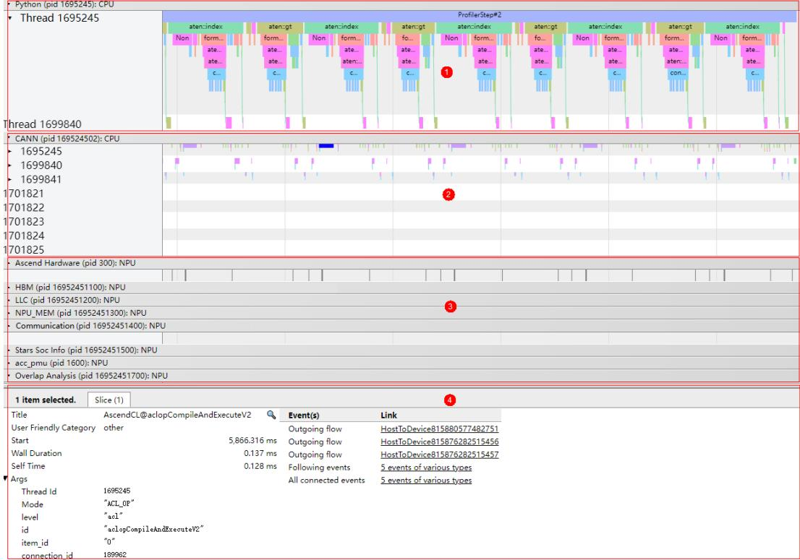  
图 12-1 timeline 汇总展示

如图12-1所示，timeline汇总数据主要展示如下区域：

● 区域1：应用层数据，包含上层应用运行的耗时信息，需要使用msproftx采集或PyTorch场景采集。  
● 区域2：CANN层数据，主要包含Runtime等组件以及Node（算子）的耗时数据。  
● 区域3：底层NPU数据，主要包含Ascend Hardware下各个Stream任务流的耗时数据和迭代轨迹数据、Communication和Overlap Analysis通信数据以及其他昇腾AI处理器系统数据。  
区域4：展示timeline中各算子、接口的详细信息（单击各个timeline时展示）。

# 说明

● timeline数据总表的数据在12 性能数据文件参考均有对应数据的详细介绍。  
● 上图中各区域的数据与采集场景有关，例如区域1仅在msproftx或PyTorch场景采集时生成；Communication和Overlap Analysis通信数据仅在多卡、多节点或集群等存在通信的场景可采集到数据等。请以采集数据实际情况为准。  
● msprof_\*.json展示的数据是迭代内的数据，迭代外的数据不展示。

# 查看算子下发方向

在tracing中查看.json文件时，开启“Flow events”下的选项后，应用层算子到NPU算子之间通过连线方式展示下发到执行的对应关系。如图12-2所示。

主要包括的对应关系有：

● async_npu：应用层算子 $>$ Ascend Hardware的NPU算子的下发执行关系。MsTx：推理训练进程打点任务 $>$ Ascend Hardware的NPU打点算子的下发执行关系。调用aclprofMarkEx接口打点时生成。

● async_task_queue：应用层Enqueue $>$ Dequeue的入队列到出队列对应关系。  
● HostToDevice：CANN层Node（算子） $>$ AscendHardware的NPU算子的下发执行关系（Host到Device）。HostToDevice：CANN层Node（算子） $>$ Communication通信算子的下发执行关系（Host到Device）。  
● fwdbwd：前向API $>$ 反向API。

# 说明

● 由于软件测量的昇腾AI处理器频率与真实频率有误差，以及Host与Device的时间同步误差，可能会出现下层算子因错位而无法连线的问题。● 各层的对应关系是否呈现与对应采集场景是否采集该数据有关，请以实际情况为准。

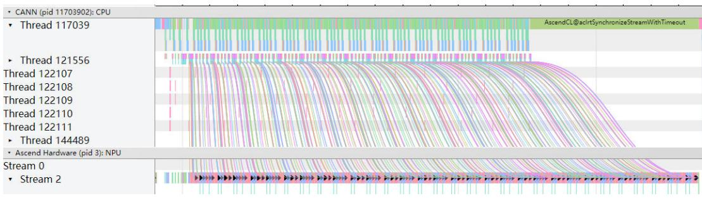  
图 12-2 算子映射关系

通过单击连线两端的算子或接口，即可查看算子下发的方向。如图12-3所示。

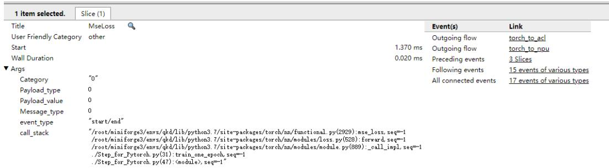  
图 12-3 算子信息

其中Event(s)列查看该算子或接口的出入方向，Link列查看映射关系两端的信息。

# 查看 AI Core 频率

支持的型号：

● Atlas 200I/500 A2 推理产品● Atlas A2 训练系列产品/Atlas A2 推理系列产品● Atlas A3 训练系列产品/Atlas A3 推理系列产品msprof_\*.json下的“AI Core Freq”层级展示AI Core芯片在执行AI任务的过程中频率的变化情况，如图12-4所示。

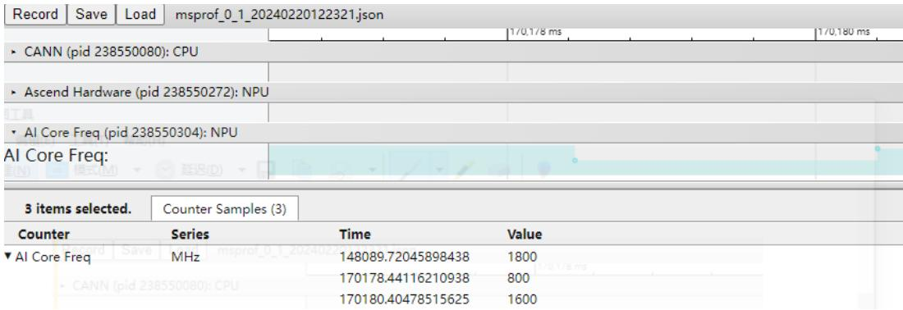  
图 12-4 查看 AI Core 频率

在148089.72045898438时刻下，AI Core处于高频状态，而在170178.44116210938时刻频率降低，那么在该时间段下AI任务的性能必然下降。AI Core芯片可能因温度升高，触发保护机制，降低频率；也可能因当前无AI任务运行，AI Core进入低功耗状态而降频。

在发生变频时，实际变频时间与软件监测到的时间存在0\~1ms的延时，该延时可能导致变频前后统计出的算子执行时间与实际不符。

# SIO 数据分析

支持的型号：

对于Atlas A2 训练系列产品/Atlas A2 推理系列产品，该数据均为0，不具有参考性。  
Atlas A3 训练系列产品/Atlas A3 推理系列产品

msprof_\*.json下的“SIO”层级展示Atlas A3 训练系列产品/Atlas A3 推理系列产品die间传输带宽信息。

图 12-5 SIO

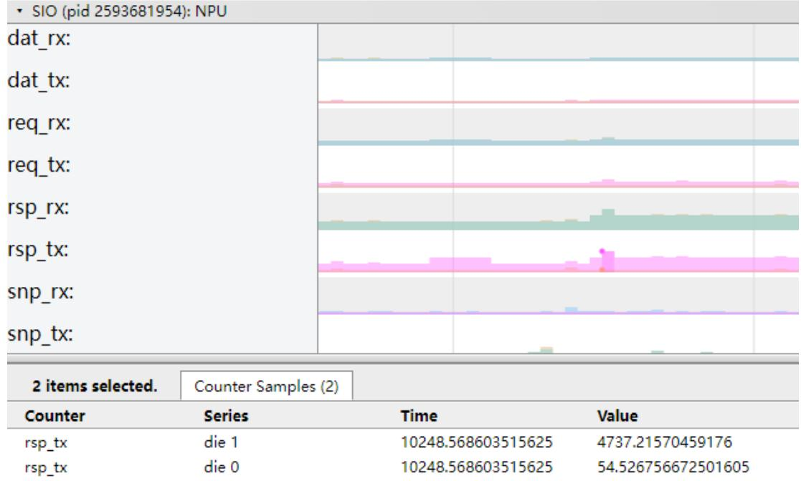

图中色块横坐标对应时间Time，单位ms，纵坐标对应带宽Value，单位MB/s。

表 12-56 字段说明  

<table><tr><td rowspan=1 colspan=1>字段名</td><td rowspan=1 colspan=1>字段含义</td></tr><tr><td rowspan=1 colspan=1>dat_rx</td><td rowspan=1 colspan=1>数据流通道的接收带宽。</td></tr><tr><td rowspan=1 colspan=1>dat_tx</td><td rowspan=1 colspan=1>数据流通道的发送带宽。</td></tr><tr><td rowspan=1 colspan=1>req_rx</td><td rowspan=1 colspan=1>请求流通道的接收带宽。</td></tr><tr><td rowspan=1 colspan=1>req_tx</td><td rowspan=1 colspan=1>请求流通道的发送带宽。</td></tr><tr><td rowspan=1 colspan=1>rsp_rx</td><td rowspan=1 colspan=1>回应流通道的接收带宽。</td></tr><tr><td rowspan=1 colspan=1>rsp_tx</td><td rowspan=1 colspan=1>回应流通道的发送带宽。</td></tr><tr><td rowspan=1 colspan=1>snp_rx</td><td rowspan=1 colspan=1>侦听流通道的接收带宽。</td></tr><tr><td rowspan=1 colspan=1>snp_tx</td><td rowspan=1 colspan=1>侦听流通道的发送带宽。</td></tr></table>

# QoS 数据分析

msprof_\*.json下的“QoS”层级展示设备QoS带宽信息。

支持的型号：

● Atlas A2 训练系列产品/Atlas A2 推理系列产品● Atlas A3 训练系列产品/Atlas A3 推理系列产品

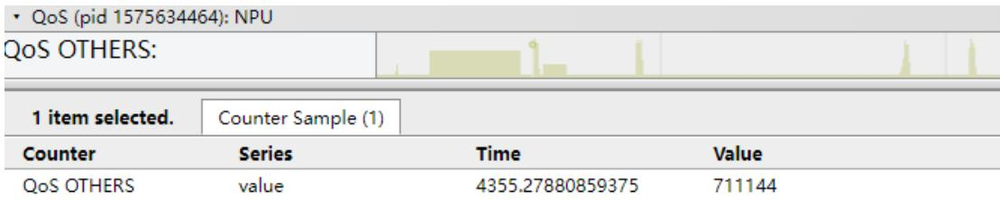  
图 12-6 QoS OTHERS

图中色块横坐标对应时间Time，单位ms，纵坐标对应带宽Value，单位MB/s。

# 计算及通信算子融合 MC²

支持的型号：

● Atlas 推理系列产品● Atlas A2 训练系列产品/Atlas A2 推理系列产品

存在计算和通信算子融合的场景。

MC²：Matrix Computation & Communication，是CANN中一系列计算通信融合算子的统称，把原本串行的两个通信、计算算子融合到一起，内部通过Tiling切分成多轮通信计算，轮次间形成流水并行，从而掩盖通信耗时，提升整体执行性能。

具体算子一般以原计算通信算子名称按照依赖关系排列命名。比如AllgatherMatmul融合算子代表通信算子Allgather和计算算子Matmul融合，Matmul依赖Allgather输出。

通信轮次commTurn：即融合算子Tiling切分的份数。一般值为总数据量/单次通信量。

MC²实现中，内部分别在计算流、通信流上加载两个算子，两个算子内部实现协同完成流水并行执行：

计算流对应算子名称为融合算子名称，比如AllgatherMatmul。

● 通信流对应算子名称为融合算子名称+Aicpu，比如AllgatherMatmulAicpu。

通信算子根据融合算子Tiling切分执行多个通信轮次，每轮的基本流程是，根据计算算子下发的通信参数，执行集合通信算法，编排好具体任务，下发给硬件执行，并等待执行完成，通知计算侧执行结果。

# 说明

● 通信API场景暂不支持融合MC²，通信API场景包括：低bit通信MatmulAllReduce算子以及自定义的使用通信API的MC²算子。  
● timeline的Communication部分仅呈现Level0级别的数据。

MC²性能数据结果示例如下：

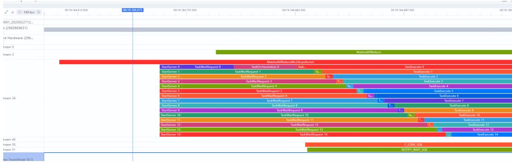  
图 12-7 MC²

图12-7展示了MatmulAllReduceAddRmsNormAicpu融合算子，内部各阶段含义介绍如表12-57所示。

表 12-57 字段说明  

<table><tr><td rowspan=1 colspan=1>字段名</td><td rowspan=1 colspan=1>字段含义</td></tr><tr><td rowspan=1 colspan=1>StartServer</td><td rowspan=1 colspan=1>KFC初始化时间。</td></tr><tr><td rowspan=1 colspan=1>TaskWaitRequest</td><td rowspan=1 colspan=1>等待计算算子下发通信参数。</td></tr><tr><td rowspan=1 colspan=1>TaskOrchestration</td><td rowspan=1 colspan=1>通信算子内部执行集合通信算法，编排执行任务耗时。</td></tr><tr><td rowspan=1 colspan=1>TaskLaunch</td><td rowspan=1 colspan=1>任务下发耗时。</td></tr><tr><td rowspan=1 colspan=1>TaskExecute</td><td rowspan=1 colspan=1>等待硬件任务执行完成耗时。</td></tr><tr><td rowspan=1 colspan=1>Finalize</td><td rowspan=1 colspan=1>KFC结束流程。</td></tr></table>

# 12.4 msproftx 数据说明

支持的型号

Atlas 200I/500 A2 推理产品  
Atlas 推理系列产品  
Atlas 训练系列产品  
Atlas A2 训练系列产品/Atlas A2 推理系列产品  
Atlas A3 训练系列产品/Atlas A3 推理系列产品

# 总体说明

msproftx采集的是用户和上层框架程序输出性能数据，数据保存在mindstudio_profiler_output目录下。

相关数据如表12-58所示。

表 12-58 数据文件介绍  

<table><tr><td rowspan=1 colspan=1>文件名</td><td rowspan=1 colspan=1>说明</td></tr><tr><td rowspan=1 colspan=1>msprof_*.json</td><td rowspan=1 colspan=1>timeline汇总数据。详情请参见msproftxtimeline汇总数据。</td></tr><tr><td rowspan=1 colspan=1>msprof_tx_*.json</td><td rowspan=1 colspan=1>msproftx timeline数据。为msprof_*.json的子集。详情请参见msproftx timeline数据。</td></tr><tr><td rowspan=1 colspan=1>msprof_tx_*.csv</td><td rowspan=1 colspan=1>msproftx summary数据。对采集到的Host msproftxsummary数据按线程进行拼接，并进行数据关联性展示。详情请参见msprof_txsummary数据。</td></tr></table>

# msproftx timeline 汇总数据

msproftx的timeline汇总数据在msprof_\*.json的上层应用层级展示，如图12-8所示。其他层级及含义请参见12.3 msprof（timeline数据总表）

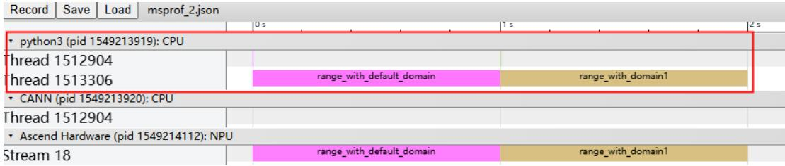  
图 12-8 timeline 汇总数据

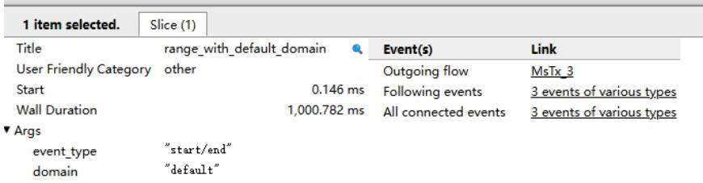

# msproftx timeline 数据

msproftx的timeline数据在msprof_tx_\*.json展示。如下所示。

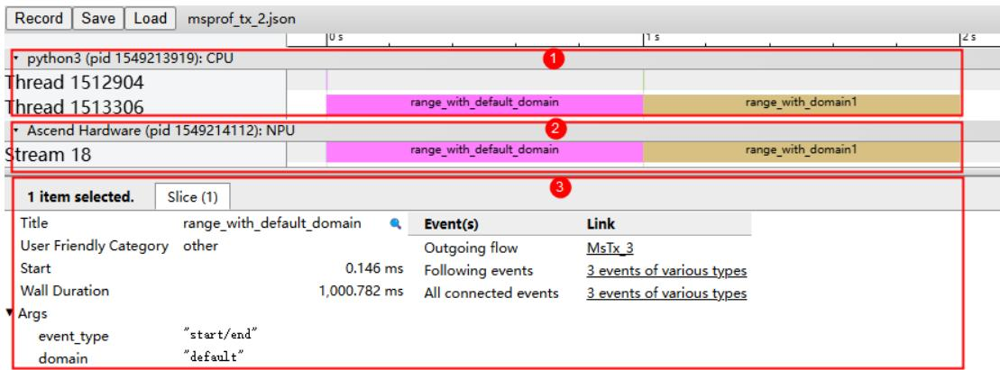  
图 12-9 msproftx timeline 数据

如图12-9所示，timeline汇总数据主要展示如下区域：

● 区域1：msproftx打点，记录上层应用数据，包含上层应用运行的耗时信息。  
● 区域2：底层NPU数据，msproftx打点下发至Device侧的耗时记录。  
● 区域3：展示timeline中各算子、接口的详细信息。单击各个timeline时展示。

# msprof_tx summary 数据

msprof_tx summary数据文件为msprof_tx_\*.csv。

msprof_tx_\*.csv文件内容格式示例如下：

图 12-10 msprof_tx summary 数据  

<table><tr><td>Device_id pid</td><td></td><td>tid</td><td></td><td></td><td></td><td>categoreventatyedeStartieusdtieuseaymomaineviceartieusDevieus)</td><td></td><td></td></tr><tr><td>host</td><td></td><td>1512904 1512904 N/A</td><td>marker</td><td>N/A</td><td>N/A</td><td>1747037557110174703755711 N/A</td><td>mark_with default</td><td>N/A</td></tr><tr><td></td><td>01512904</td><td>1513306 N/A</td><td>start/end</td><td>N/A</td><td>N/A</td><td>174703755711(174703755811 N/A</td><td></td><td>N/A range_withdefault1747037557110207.6:1747037558110986.670</td></tr><tr><td>host</td><td>1512904</td><td> 1512904 N/A</td><td>marker</td><td>N/A</td><td>N/A</td><td>174703755811(174703755811 N/A</td><td>mark with domain1 N/A</td><td>N/A</td></tr><tr><td></td><td>01512904</td><td>1513306 N/A</td><td>start/end</td><td>N/A</td><td>N/A</td><td>174703755811;174703755911 N/A</td><td></td><td>range_withdomain1 1747037558111032.7(1747037559112084.900</td></tr></table>

表 12-59 字段说明  

<table><tr><td rowspan=1 colspan=1>字段名</td><td rowspan=1 colspan=1>字段含义</td></tr><tr><td rowspan=1 colspan=1>Device_id</td><td rowspan=1 colspan=1>设备ID。</td></tr><tr><td rowspan=1 colspan=1>pid</td><td rowspan=1 colspan=1>进程ID。</td></tr><tr><td rowspan=1 colspan=1>tid</td><td rowspan=1 colspan=1>Thread ID，AscendCLAPI所在线程ID。</td></tr><tr><td rowspan=1 colspan=1>category</td><td rowspan=1 colspan=1>Profilingmsproftx采集进程类别，用于标识msproftx采集进程的采集内容。（预留字段，暂未开放）</td></tr><tr><td rowspan=1 colspan=1>event_type</td><td rowspan=1 colspan=1>事件类型。</td></tr><tr><td rowspan=1 colspan=1>payload_type</td><td rowspan=1 colspan=1>Profilingmsproftx采集进程中携带额外的信息Payload的数据类型。（预留字段，暂未开放）</td></tr><tr><td rowspan=1 colspan=1>payload_value</td><td rowspan=1 colspan=1>Profilingmsproftx采集进程中携带额外的信息Payload的指针。（预留字段，暂未开放）</td></tr><tr><td rowspan=1 colspan=1>Start_time(us)</td><td rowspan=1 colspan=1>Profilingmsproftx采集进程开始时间，单位us。</td></tr><tr><td rowspan=1 colspan=1>End_time(us)</td><td rowspan=1 colspan=1>Profilingmsproftx采集进程结束时间，单位us。</td></tr><tr><td rowspan=1 colspan=1>message_type</td><td rowspan=1 colspan=1>Profilingmsproftx采集进程中携带字符串类型。（预留字段，暂未开放）</td></tr><tr><td rowspan=1 colspan=1>message</td><td rowspan=1 colspan=1>Profiling msproftx采集进程中携带的字符串描述。</td></tr><tr><td rowspan=1 colspan=1>domain</td><td rowspan=1 colspan=1>打点所属的domain域。</td></tr><tr><td rowspan=1 colspan=1>DeviceStart_time(us)</td><td rowspan=1 colspan=1>Profilingmsproftx采集进程在Device侧开始时间，单位us。</td></tr><tr><td rowspan=1 colspan=1>Device End_time(us)</td><td rowspan=1 colspan=1>Profilingmsproftx采集进程在Device侧结束时间，单位us。</td></tr></table>

# 12.5 task_time（任务调度信息）

任务调度信息数据timeline信息在msprof_\*.json文件的Ascend Hardware层级展示，summary信息在task_time_\*.csv文件汇总，用于识别AI任务运行时的调度耗时。

# 支持的型号

Atlas 200I/500 A2 推理产品  
Atlas 推理系列产品  
Atlas 训练系列产品  
Atlas A2 训练系列产品/Atlas A2 推理系列产品  
Atlas A3 训练系列产品/Atlas A3 推理系列产品

# msprof_\*.json 文件中的任务调度信息数据说明

msprof_\*.json文件中的任务调度信息数据在Ascend Hardware中的各个Stream呈现，通过记录AI任务运行时，各个Task在不同加速器下的执行耗时，可以直观判断任务调度耗时长短。

msprof_\*.json文件中的任务调度信息数据示例如下：

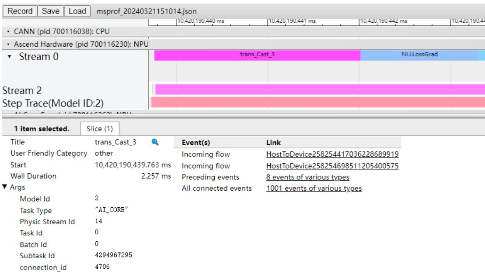  
图 12-11 Ascend Hardware

关键字段说明如下。

表 12-60 字段说明  

<table><tr><td colspan="1" rowspan="1">字段名</td><td colspan="1" rowspan="1">字段含义</td></tr><tr><td colspan="1" rowspan="1">Title</td><td colspan="1" rowspan="1">选择某个组件的接口名称。</td></tr><tr><td colspan="1" rowspan="1">Start</td><td colspan="1" rowspan="1">显示界面中时间轴上的时刻点，chrome trace自动对齐，单位ms。</td></tr><tr><td colspan="1" rowspan="1">Wall Duration</td><td colspan="1" rowspan="1">表示当前接口调用耗时，单位ms。</td></tr><tr><td colspan="1" rowspan="1">Task Time(us)</td><td colspan="1" rowspan="1">AI CPU算子的Task任务耗时，单位us。</td></tr><tr><td colspan="1" rowspan="1">ReduceDuration(us)</td><td colspan="1" rowspan="1">ALL REDUCE算子的集合通信时间，单位us。</td></tr><tr><td colspan="1" rowspan="1">Model Id</td><td colspan="1" rowspan="1">模型ID。</td></tr><tr><td colspan="1" rowspan="1">Task Type</td><td colspan="1" rowspan="1">执行该Task的加速器类型，包含AI_CORE、AI_VECTOR_CORE、AI_CPU等。</td></tr><tr><td colspan="1" rowspan="1">Stream Id</td><td colspan="1" rowspan="1">该Task所处的Stream ID。在Ascend Hardware下的Stream Id为该任务的完整逻辑流ID，而在右侧timeline内的各个接口的Stream Id属性则为该接口的物理流ID（Physical Stream Id）。</td></tr><tr><td colspan="1" rowspan="1">Task Id</td><td colspan="1" rowspan="1">对应的Task ID。</td></tr><tr><td colspan="1" rowspan="1">Subtask Id</td><td colspan="1" rowspan="1">对应的Subtask ID。</td></tr><tr><td colspan="1" rowspan="1">AicoreTime(ms)</td><td colspan="1" rowspan="1">当所有的Block被同时调度，且每个Block的执行时长相等时，该Task在AlCore上的理论执行时间，单位ms。通常情况下，不同的Block开始调度时间略有差距，故该字段值略小于Task在AICore上的实际执行时间。手动调频、功耗超出默认功耗值时动态调频以及Atlas300V/Atlas300l Pro情况下该数据不准确，不建议参考。</td></tr><tr><td colspan="1" rowspan="1">Total Cycle</td><td colspan="1" rowspan="1">该Task在Al Core上执行的cycle总数，由所有的Block的执行cycle数累加而成。</td></tr><tr><td colspan="1" rowspan="1">Receive Time</td><td colspan="1" rowspan="1">Device收到内存拷贝Task的信息接收时间，单位us。仅MemcopyAsync接口展示。</td></tr><tr><td colspan="1" rowspan="1">Start Time</td><td colspan="1" rowspan="1">内存拷贝Task开始拷贝的时间，单位us。仅MemcopyAsync接口展示。</td></tr><tr><td colspan="1" rowspan="1">End Time</td><td colspan="1" rowspan="1">内存拷贝Task结束拷贝的时间，单位us。仅MemcopyAsync接口展示。</td></tr><tr><td colspan="1" rowspan="1">size(B)</td><td colspan="1" rowspan="1">拷贝的数据量，单位B。仅MemcopyAsync接口展示。</td></tr><tr><td colspan="1" rowspan="1">bandwidth(GB/s）</td><td colspan="1" rowspan="1">拷贝的带宽，单位GB/s。仅MemcopyAsync接口展示。</td></tr><tr><td colspan="1" rowspan="1">operation</td><td colspan="1" rowspan="1">拷贝类型，host to device或device to host等。仅MemcopyAsync接口展示。</td></tr></table>

# task_time_\*.csv 文件说明（Atlas 推理系列产品）（Atlas 训练系列产品）（AtlasA2 训练系列产品）（Atlas A3 训练系列产品/Atlas A3 推理系列产品）（Atlas200I/500 A2 推理产品）

task_time_\*.csv文件内容格式示例如下：

图 12-12 task_time_\*.csv  

<table><tr><td rowspan=1 colspan=1>Device id</td><td rowspan=1 colspan=1>kernelname</td><td rowspan=1 colspan=1>kernel_type</td><td rowspan=1 colspan=1>stream_id task id</td><td rowspan=1 colspan=1>taskid</td><td rowspan=1 colspan=1>task time(us)</td><td rowspan=1 colspan=1>task start(us)</td><td rowspan=1 colspan=1>task _stop(us)</td></tr><tr><td rowspan=1 colspan=1></td><td rowspan=1 colspan=1>0 trans_TransData_0 KERNEL AICORE</td><td rowspan=1 colspan=1>KERNEL AICORE</td><td rowspan=1 colspan=1>0</td><td rowspan=1 colspan=1>2</td><td rowspan=1 colspan=1></td><td rowspan=1 colspan=1>9.02 &quot;1698131672794564.2&quot;</td><td rowspan=1 colspan=1>&quot;1698131672794573.2&quot;</td></tr><tr><td rowspan=1 colspan=1></td><td rowspan=1 colspan=1>0convlconv1_relu</td><td rowspan=1 colspan=1>KERNEL_AICORE</td><td rowspan=1 colspan=1>0</td><td rowspan=1 colspan=1>3</td><td rowspan=1 colspan=1></td><td rowspan=1 colspan=1>13.53 1698131672805906.0&quot;</td><td rowspan=1 colspan=1>&quot;1698131672805919.5&quot;</td></tr><tr><td rowspan=1 colspan=2>0pool1</td><td rowspan=1 colspan=1>KERNEL_AICORE</td><td rowspan=1 colspan=2>0       4</td><td rowspan=1 colspan=2>7.12 &quot;1698131672825430.2&quot;</td><td rowspan=1 colspan=1>&quot;1698131672825437.5&quot;</td></tr></table>

可以通过查看Task的Top耗时对应的算子，根据该算子的具体实现来判断算子是否存在问题。

表 12-61 字段说明  

<table><tr><td>字段名</td><td>字段含义</td></tr><tr><td>Device_id</td><td>设备ID。</td></tr><tr><td colspan="1" rowspan="1">kernel_name</td><td colspan="1" rowspan="1">Kernel的名称。显示为N/A表示为非计算类算子。</td></tr><tr><td colspan="1" rowspan="1">kernel_type</td><td colspan="1" rowspan="1">Kernel的类型，包含：KERNEL_AICORE、KERNEL_AICPU等。</td></tr><tr><td colspan="1" rowspan="1">stream_id</td><td colspan="1" rowspan="1">该Task所处的Stream ID。</td></tr><tr><td colspan="1" rowspan="1">task_id</td><td colspan="1" rowspan="1">Task任务的ID。</td></tr><tr><td colspan="1" rowspan="1">task_time(us）</td><td colspan="1" rowspan="1">Task耗时，包含调度到加速器的时间、加速器上的执行时间以及结束响应时间，单位us。</td></tr><tr><td colspan="1" rowspan="1">task_start(us）</td><td colspan="1" rowspan="1">Task开始时间，单位us。</td></tr><tr><td colspan="1" rowspan="1">task_stop(us）</td><td colspan="1" rowspan="1">Task结束时间，单位us。</td></tr></table>

# 12.6 api_statistic（API 耗时统计信息）

API耗时信息统计数据timeline信息在msprof_\*.json文件的CANN层级展示，summary信息在api_statistic_\*.csv文件汇总，用于统计CANN层的API执行耗时信息，主要包括AscendCL、Runtime、Node、Model、Communication层级的API。

● AscendCL：AscendCL API，昇腾平台上开发深度神经网络应用的C语言API库。  
● Runtime：Runtime API，CANN运行时API。  
● Node：对应CANN层算子。  
● Model：模型，内部分析使用，无须关注。  
● Communication：集合通信算子。

# 支持的型号

Atlas 200I/500 A2 推理产品  
Atlas 推理系列产品  
Atlas 训练系列产品  
Atlas A2 训练系列产品/Atlas A2 推理系列产品  
Atlas A3 训练系列产品/Atlas A3 推理系列产品

# msprof_\*.json 文件的 CANN 层级数据说明

msprof_\*.json文件CANN层数据部分主要展示当前Thread下运行的接口耗时，如下图所示。

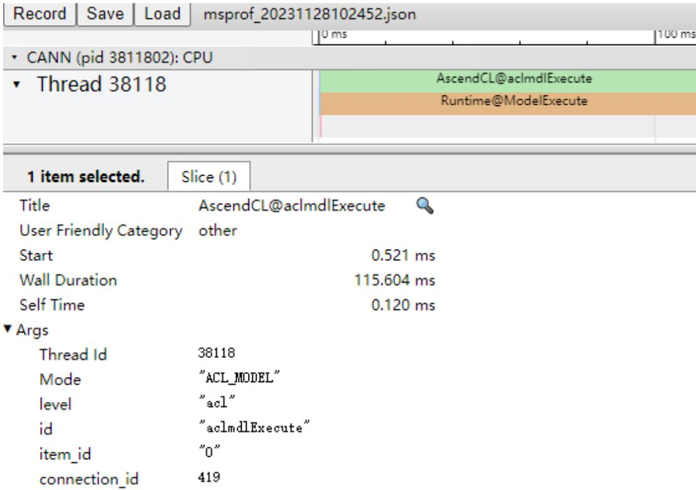  
图 12-13 CANN 层数据

通过图中的timeline色块，可以直接观察到哪些接口耗时较长，并通过单击选中耗时较长的接口查看该接口的详细信息，如下表所示。

表 12-62 字段说明  

<table><tr><td rowspan=1 colspan=1>字段名</td><td rowspan=1 colspan=1>字段含义</td></tr><tr><td rowspan=1 colspan=1>Title</td><td rowspan=1 colspan=1>选择某个接口名称。</td></tr><tr><td rowspan=1 colspan=1>Start</td><td rowspan=1 colspan=1>显示界面中时间轴上的时刻点，chrome trace自动对齐，单位ms。</td></tr><tr><td rowspan=1 colspan=1>Wall Duration</td><td rowspan=1 colspan=1>表示当前接口调用耗时，单位ms。</td></tr><tr><td rowspan=1 colspan=1>Self Time</td><td rowspan=1 colspan=1>表示当前接口本身执行耗时，单位ms。</td></tr><tr><td rowspan=1 colspan=1>Mode</td><td rowspan=1 colspan=1>AscendCLAPI类型。包含：ACL_OP（单算子模型接口）、ACL_MODEL（模型接口）、ACL_RTS（Runtime接口）等。</td></tr><tr><td rowspan=1 colspan=1>level</td><td rowspan=1 colspan=1>层级，当前为AscendCL层。</td></tr></table>

# api_statistic_\*.csv 文件说明

api_statistic_\*.csv文件内容格式示例如下：

图 12-14 api_statistic_\*.csv  

<table><tr><td rowspan=1 colspan=1>Device_id Level</td><td rowspan=1 colspan=1>Level</td><td rowspan=1 colspan=1>API Name</td><td rowspan=1 colspan=1>Time(us)</td><td rowspan=1 colspan=1>Count </td><td rowspan=1 colspan=1>Avg(us)</td><td rowspan=1 colspan=1>Min(us)</td><td rowspan=1 colspan=1>Max(us)</td><td rowspan=1 colspan=1>）Variance</td></tr><tr><td rowspan=1 colspan=1></td><td rowspan=1 colspan=1> 0runtime</td><td rowspan=1 colspan=1>ContextCreate</td><td rowspan=1 colspan=1>981.702</td><td rowspan=1 colspan=1>1</td><td rowspan=1 colspan=1>981.7</td><td rowspan=1 colspan=1>981.7</td><td rowspan=1 colspan=1>981.702</td><td rowspan=1 colspan=1>0</td></tr><tr><td rowspan=1 colspan=1></td><td rowspan=1 colspan=1>0 model</td><td rowspan=1 colspan=1>InputCopy</td><td rowspan=1 colspan=1>20.127</td><td rowspan=1 colspan=1>1</td><td rowspan=1 colspan=1>20.127</td><td rowspan=1 colspan=1>20.127</td><td rowspan=1 colspan=1>20.127</td><td rowspan=1 colspan=1>0</td></tr><tr><td rowspan=1 colspan=1></td><td rowspan=1 colspan=1>0acl</td><td rowspan=1 colspan=1>aclCreateDatal</td><td rowspan=1 colspan=1>0.627</td><td rowspan=1 colspan=1>2</td><td rowspan=1 colspan=1>0.3135</td><td rowspan=1 colspan=1>0.241</td><td rowspan=1 colspan=1>0.386</td><td rowspan=1 colspan=1>0.0053</td></tr><tr><td rowspan=1 colspan=1></td><td rowspan=1 colspan=1>0 node</td><td rowspan=1 colspan=1>launch</td><td rowspan=1 colspan=1>1504.34</td><td rowspan=1 colspan=1>60</td><td rowspan=1 colspan=1>25.072</td><td rowspan=1 colspan=1>17.803</td><td rowspan=1 colspan=1>348.046</td><td rowspan=1 colspan=1>1769.68</td></tr></table>

上图根据Time列进行降序排列，找出耗时最长的TopN算子；也可以根据最大、最小、平均耗时、方差等信息判断该算子运行是否稳定或者是否存在某次调用耗时较长的情况。例如方差数值越小，则代表算子运行越稳定；最大最小值越接近平均值且不存在个别数据差异较大的情况，则代表算子运行越稳定。

表 12-63 字段说明  

<table><tr><td rowspan=1 colspan=1>字段名</td><td rowspan=1 colspan=1>字段含义</td></tr><tr><td rowspan=1 colspan=1>Device_id</td><td rowspan=1 colspan=1>设备ID。采集到的数据来源于Host侧时，显示值为host。</td></tr><tr><td rowspan=1 colspan=1>Level</td><td rowspan=1 colspan=1>API所属层级。</td></tr><tr><td rowspan=1 colspan=1>API Name</td><td rowspan=1 colspan=1>API名称。</td></tr><tr><td rowspan=1 colspan=1>Time(us)</td><td rowspan=1 colspan=1>总耗时，单位us。</td></tr><tr><td rowspan=1 colspan=1>Count</td><td rowspan=1 colspan=1>调用次数。</td></tr><tr><td rowspan=1 colspan=1>Avg(us)</td><td rowspan=1 colspan=1>耗时平均值，单位us。</td></tr><tr><td rowspan=1 colspan=1>Min(us)</td><td rowspan=1 colspan=1>最小耗时，单位us。</td></tr><tr><td rowspan=1 colspan=1>Max(us)</td><td rowspan=1 colspan=1>最大耗时，单位us。</td></tr><tr><td rowspan=1 colspan=1>Variance</td><td rowspan=1 colspan=1>耗时方差。</td></tr></table>

# 12.7 step_trace（迭代轨迹信息）

迭代轨迹数据timeline信息在step_trace_\*.json文件展示，summary信息在step_trace_\*.csv文件汇总，用于判断并找出耗时较长的迭代。

单算子场景（如PyTorch场景）下无此性能数据文件。

# 支持的型号

Atlas 200I/500 A2 推理产品  
Atlas 推理系列产品  
Atlas 训练系列产品  
Atlas A2 训练系列产品/Atlas A2 推理系列产品  
Atlas A3 训练系列产品/Atlas A3 推理系列产品

# step_trace_\*.json 文件说明

迭代轨迹数据step_trace_\*.json，根据Iteration的长短，判断哪个迭代耗时最长。

step_trace_\*.json文件内容格式示例如下：

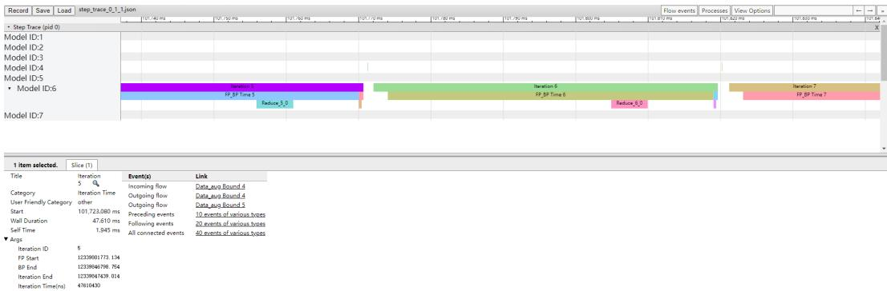  
图 12-15 step_trace_\*.json

迭代轨迹数据即训练任务及AI软件栈的软件信息，实现对训练任务的性能分析。以默认的两段式梯度切分为例，通过打印出训练任务中关键节点fp_start/bp_end/ReduceStart/Reduce Duration(us)的时间，达到把一个迭代的执行情况描述清楚的目的。

离线推理场景下不采集FP（训练网络迭代轨迹正向算子的开始位置）和BP（训练网络迭代轨迹反向算子的结束位置），采集结果将显示FP Start、BP End为NA且不存在timeline。

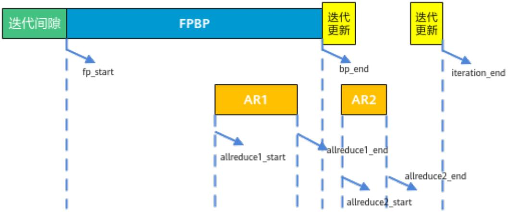

如上图，如果需要确定梯度切分策略，则需要计算图中bp_end - allreduce1_end的大小。根据已获取的迭代轨迹数据，我们需要使用第一组集合通信时间来计算，具体公式如：（BP End – Reduce End）/ freq。

表 12-64 字段说明  

<table><tr><td rowspan=1 colspan=1>字段名</td><td rowspan=1 colspan=1>字段含义</td></tr><tr><td rowspan=1 colspan=1>Title</td><td rowspan=1 colspan=1>选择某个组件的接口名称。</td></tr><tr><td rowspan=1 colspan=1>Start</td><td rowspan=1 colspan=1>显示界面中时间轴上的时刻点，chrome trace自动对齐，单位ms。</td></tr><tr><td rowspan=1 colspan=1>Wall Duration</td><td rowspan=1 colspan=1>表示当前接口调用耗时，单位ms。</td></tr></table>

# 数据读取时间分析

图 12-16 GetNext  

<table><tr><td rowspan=1 colspan=1>字段名</td><td rowspan=1 colspan=1>字段含义</td></tr><tr><td rowspan=1 colspan=1>Iteration ID</td><td rowspan=1 colspan=1>以Graph为粒度统计的迭代ID，每个Graph执行一次，Iteration ID加1，当一个脚本被编译为多个Graph时，该ID与脚本层面的StepID不一致。</td></tr><tr><td rowspan=1 colspan=1>FP Start</td><td rowspan=1 colspan=1>FP开始时间，单位ns。</td></tr><tr><td rowspan=1 colspan=1>Iteration End</td><td rowspan=1 colspan=1>每轮迭代结束时间，单位ns。</td></tr><tr><td rowspan=1 colspan=1>IterationTime(ns)</td><td rowspan=1 colspan=1>迭代时长，单位ns。</td></tr><tr><td rowspan=1 colspan=1>BP End</td><td rowspan=1 colspan=1>BP结束时间，单位ns。</td></tr><tr><td rowspan=1 colspan=1>FP_BP Time</td><td rowspan=1 colspan=1>FP/BP计算时间（BP End-FP Start），单位ns。</td></tr><tr><td rowspan=1 colspan=1>IterationRefresh</td><td rowspan=1 colspan=1>迭代拖尾时间（Iteration End-BP End），单位ns。</td></tr><tr><td rowspan=1 colspan=1>Data_augBound</td><td rowspan=1 colspan=1>数据增强拖尾（本轮迭代FP Start－上一个迭代Iteration End）。如果计算第一轮数据增强拖尾时没有上一轮迭代的Iteration End数据，那么第一轮迭代的数据增强拖尾数据值默认为N/A。</td></tr><tr><td rowspan=1 colspan=1>Reduce</td><td rowspan=1 colspan=1>集合通信时间，可能存在多组集合通信时间（ph：B表示某一组的开始时间，ph：E表示该组的结束时间）；如果非多P环境，则没有Reduce数据。</td></tr></table>

对于前一个迭代结束到后一个迭代开始之间的迭代间隙，若因数据读取耗时较长导致间隙过大，可以通过GetNext时间片，判断是否由于迭代的数据读取时间较长导致间隙过大。如图12-16所示。

仅TensorFlow框架支持。

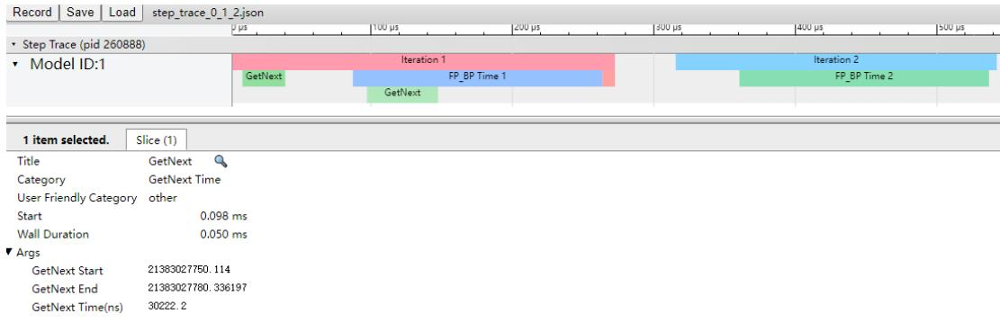

表 12-65 GetNext 字段说明  

<table><tr><td rowspan=1 colspan=1>字段名</td><td rowspan=1 colspan=1>字段含义</td></tr><tr><td rowspan=1 colspan=1>GetNext Start</td><td rowspan=1 colspan=1>数据读取开始时间，单位ns。</td></tr><tr><td rowspan=1 colspan=1>GetNext End</td><td rowspan=1 colspan=1>数据读取结束时间，单位ns。</td></tr><tr><td rowspan=1 colspan=1>GetNextTime(ns)</td><td rowspan=1 colspan=1>数据读取耗时，单位ns。</td></tr></table>

# step_trace_\*.csv 文件说明

step_trace_\*.csv文件内容格式示例如下：

图 12-17 step_trace_\*.csv  

<table><tr><td>A</td><td>B</td><td>C D E</td><td>F</td><td>G</td><td></td><td>H</td><td>I</td><td></td><td>K L</td></tr><tr><td></td><td></td><td></td><td></td><td></td><td></td><td></td><td></td><td></td><td>I</td></tr><tr><td>0</td><td></td><td>1 171047041908·17104704191710470419085512.</td><td>1748. 229894</td><td>575. 6430142</td><td>871. 7148512</td><td>3792445. 382</td><td></td><td>61710470419084931.</td><td>283. 491</td></tr><tr><td>0</td><td></td><td>217104704190817104704191710470419087064.</td><td>1551.622034</td><td>306. 3722488</td><td>913.2165104</td><td>332. 0332747</td><td></td><td>61710470419086457.</td><td>303.432</td></tr><tr><td>0</td><td></td><td>317104704190817104704191710470419088518.</td><td>1454. 618156</td><td>288.3315275</td><td>876.2950343</td><td>289.9915939</td><td></td><td>61710470419087911.</td><td>307.832</td></tr><tr><td>0 0</td><td></td><td>4171047041908:17104704191710470419089923. 5171047041909i17104704191710470419091380.</td><td>1404. 576155 1457. 558273</td><td>286.5914579 303.3721288</td><td>847.5338844 861. 7144513</td><td>270. 4508126 292. 471693</td><td></td><td>61710470419089344. 61710470419090790.</td><td>282. 511 291.752</td></tr></table>

根据step_trace_\*.json文件的判断，可以对照step_trace_\*.csv文件的信息得到印证。

表 12-66 字段说明  

<table><tr><td colspan="1" rowspan="1">字段名</td><td colspan="1" rowspan="1">字段含义</td></tr><tr><td colspan="1" rowspan="1">Device_id</td><td colspan="1" rowspan="1">设备ID。</td></tr><tr><td colspan="1" rowspan="1">Iteration ID</td><td colspan="1" rowspan="1">以Graph为粒度统计的迭代ID，每个Graph执行一次，Iteration ID加1，当一个脚本被编译为多个Graph时，该ID与脚本层面的Step ID不一致。</td></tr><tr><td colspan="1" rowspan="1">FP Start(us)</td><td colspan="1" rowspan="1">FP开始时间，单位us。</td></tr><tr><td colspan="1" rowspan="1">BP End(us)</td><td colspan="1" rowspan="1">BP结束时间，单位us。</td></tr><tr><td colspan="1" rowspan="1">IterationEnd(us)</td><td colspan="1" rowspan="1">每轮迭代结束的时间，单位us。</td></tr><tr><td colspan="1" rowspan="1">IterationTime(us)</td><td colspan="1" rowspan="1">迭代时长，单位us。</td></tr><tr><td colspan="1" rowspan="1">FP to BPTime(us)</td><td colspan="1" rowspan="1">FP/BP计算时间（BP End-FP Start），单位us。</td></tr><tr><td colspan="1" rowspan="1">IterationRefresh(us)</td><td colspan="1" rowspan="1">迭代拖尾时间（Iteration End-BP End），单位us。</td></tr><tr><td colspan="1" rowspan="1">Data AugBound(us)</td><td colspan="1" rowspan="1">数据增强拖尾（本轮迭代FP Start-上一个迭代Iteration End），单位us。如果计算第一轮数据增强拖尾时没有上一轮迭代的IterationEnd数据，那么第一轮迭代的数据增强拖尾数据值默认为N/A。</td></tr><tr><td colspan="1" rowspan="1">Model ID</td><td colspan="1" rowspan="1">某轮迭代的模型中的图ID。</td></tr><tr><td colspan="1" rowspan="1">ReduceStart(us)</td><td colspan="1" rowspan="1">集合通信开始时间，单位us。</td></tr><tr><td colspan="1" rowspan="1">ReduceDuration(us)</td><td colspan="1" rowspan="1">集合通信时间，可能存在多组集合通信时间，本示例按照系统默认切分策略是分为两段集合通信时间，Reduce Start表示开始时间，ReduceDuration表示由开始到结束时间，单位us。如果非多P环境，则没有Reduce数据。</td></tr></table>

# 12.8 dp（数据增强信息）

数据增强数据仅在训练场景下生成且仅生成summary数据dp_\*.csv。

在TensorFlow训练场景开启数据预处理下沉（即enable_data_pre_proc开关配置为True）时可生成dp_\*.csv文件。详情请参见《TensorFlow 1.15模型迁移指南》中的“训练迭代循环下沉”章节。

# 支持的型号

Atlas 训练系列产品

dp_\*.csv 文件说明

数据增强数据dp_\*.csv文件内容格式示例如下：

图 12-18 dp_\*.csv  

<table><tr><td rowspan=1 colspan=1>Device_id</td><td rowspan=1 colspan=1>Timestamp(us)</td><td rowspan=1 colspan=1>Action</td><td rowspan=1 colspan=1>Source</td><td rowspan=1 colspan=1>Cached Buffer Size</td></tr><tr><td rowspan=1 colspan=1>0</td><td rowspan=1 colspan=1>1.73312E+15</td><td rowspan=1 colspan=1>Last dequ</td><td rowspan=1 colspan=1>Anonymol</td><td rowspan=1 colspan=1>1</td></tr><tr><td rowspan=1 colspan=1>D</td><td rowspan=1 colspan=1>1.73312E+15</td><td rowspan=1 colspan=1>Last dequ</td><td rowspan=1 colspan=1>Anonymot</td><td rowspan=1 colspan=1>1</td></tr><tr><td rowspan=1 colspan=1>0</td><td rowspan=1 colspan=1>1.73312E+15</td><td rowspan=1 colspan=1>Last degu</td><td rowspan=1 colspan=1>Anonymot</td><td rowspan=1 colspan=1>1</td></tr></table>

表 12-67 字段说明  

<table><tr><td rowspan=1 colspan=1>字段名</td><td rowspan=1 colspan=1>字段含义</td></tr><tr><td rowspan=1 colspan=1>Device_id</td><td rowspan=1 colspan=1>设备ID。</td></tr><tr><td rowspan=1 colspan=1>Timestamp(us)</td><td rowspan=1 colspan=1>事件的时间戳，单位us。</td></tr><tr><td rowspan=1 colspan=1>Action</td><td rowspan=1 colspan=1>事件的执行动作。</td></tr><tr><td rowspan=1 colspan=1>Source</td><td rowspan=1 colspan=1>事件的来源。</td></tr><tr><td rowspan=1 colspan=1>Cached Buffer Size</td><td rowspan=1 colspan=1>事件占用的Cached Buffer大小。</td></tr></table>

# 12.9 communication_statistic（集合通信算子统计信息）

集合通信算子和计算及通信流水掩盖数据timeline信息在msprof_\*.json文件的Communication层级展示，summary信息在communication_statistic_\*.csv文件汇

总，以及在msprof_\*.json下展示“Overlap Analysis”计算及通信的流水掩盖分析数据。

集合通信算子数据只有在多卡、多机或集群等存在卡间通信的场景下才能被采集并解析出性能数据。

# 支持的型号

Atlas 200I/500 A2 推理产品  
Atlas 推理系列产品  
Atlas 训练系列产品  
Atlas A2 训练系列产品/Atlas A2 推理系列产品  
Atlas A3 训练系列产品/Atlas A3 推理系列产品

# msprof_\*.json 文件的 Communication 层级数据说明

msprof_\*.json文件Communication层数据如下图所示。

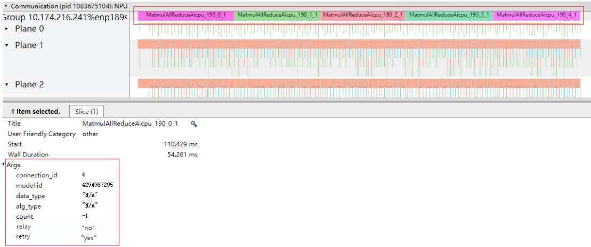  
图 12-19 通信大算子信息

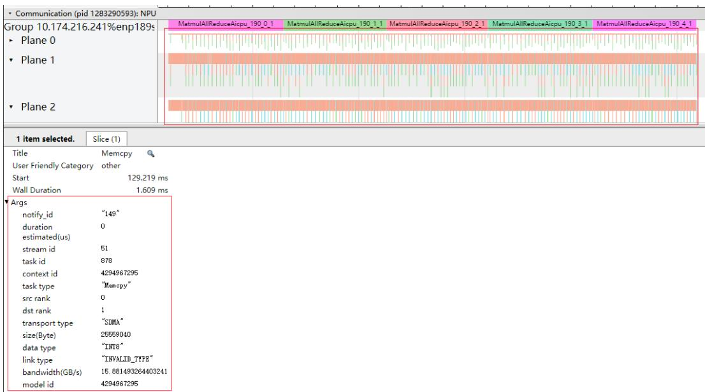  
图 12-20 通信小算子信息

多卡、多机或集群场景时各Device之间存在通信，形成各个通信域，Communication层按照各个通信域进行排列，收集通信算子的耗时，该文件下可以直观找出耗时最长的通信算子。

表 12-68 字段说明  

<table><tr><td colspan="1" rowspan="1">字段名</td><td colspan="1" rowspan="1">字段含义</td></tr><tr><td colspan="2" rowspan="1">公共信息</td></tr><tr><td colspan="1" rowspan="1">Group *Communication（通信域名称，根据实际上报的名称确定）</td><td colspan="1" rowspan="1">通信域下的通信算子。一个卡（Rank）可以存在于不同的通信域中，一个Group标识当前卡在当前通信域的行为。</td></tr><tr><td colspan="1" rowspan="1">Plane ID</td><td colspan="1" rowspan="1">网络平面ID。对多个收发通信链路的并行调度执行，每个Plane就是一个并发通信维度。</td></tr><tr><td colspan="1" rowspan="1">Title</td><td colspan="1" rowspan="1">选择某个组件的接口名称。</td></tr><tr><td colspan="1" rowspan="1">Start</td><td colspan="1" rowspan="1">显示界面中时间轴上的时刻点，chrome trace自动对齐，单位ms。</td></tr><tr><td colspan="1" rowspan="1">Wall Duration</td><td colspan="1" rowspan="1">表示当前接口调用耗时，单位ms。</td></tr><tr><td colspan="1" rowspan="1">Self Time</td><td colspan="1" rowspan="1">表示当前指令本身执行耗时，单位ms。</td></tr><tr><td colspan="2" rowspan="1">通信大算子信息</td></tr><tr><td colspan="1" rowspan="1">connection_id</td><td colspan="1" rowspan="1">CANN层API向NPU算子下发时二者关联的标识。</td></tr><tr><td colspan="1" rowspan="1">model id</td><td colspan="1" rowspan="1">模型ID。</td></tr><tr><td colspan="1" rowspan="1">data_type</td><td colspan="1" rowspan="1">数据类型。</td></tr><tr><td colspan="1" rowspan="1">alg_type</td><td colspan="1" rowspan="1">通信算子各阶段的算法类型，包含：MESH、RING、NB、HD、NHR、PIPELINE、PAIRWISE、STAR。</td></tr><tr><td colspan="1" rowspan="1">count</td><td colspan="1" rowspan="1">数据传输的数量。</td></tr><tr><td colspan="1" rowspan="1">relay</td><td colspan="1" rowspan="1">通信算子是否发生借轨。显示为yes（表示发生了借轨）或no（表示没有发生借轨）。支持型号：Atlas A2训练系列产品/Atlas A2推理系列产品：仅显示为no，无意义Atlas A3 训练系列产品/Atlas A3推理系列产品</td></tr><tr><td colspan="1" rowspan="1">retry</td><td colspan="1" rowspan="1">通信算子是否发生重执行。显示为yes（表示发生了重执行）或no（表示没有发生重执行）。支持型号：Atlas A2训练系列产品/Atlas A2推理系列产品Atlas A3 训练系列产品/Atlas A3推理系列产品</td></tr><tr><td colspan="2" rowspan="1">通信小算子信息</td></tr><tr><td colspan="1" rowspan="1"> notify id</td><td colspan="1" rowspan="1">notify唯一ID。</td></tr><tr><td colspan="1" rowspan="1">durationestimated(us)</td><td colspan="1" rowspan="1">预估任务持续时间，单位us。</td></tr><tr><td colspan="1" rowspan="1">stream id</td><td colspan="1" rowspan="1">Stream任务的ID。</td></tr><tr><td colspan="1" rowspan="1">task id</td><td colspan="1" rowspan="1">Task任务的ID。</td></tr><tr><td colspan="1" rowspan="1">task type</td><td colspan="1" rowspan="1">Task类型。</td></tr><tr><td colspan="1" rowspan="1"> src rank</td><td colspan="1" rowspan="1">源Rank。</td></tr><tr><td colspan="1" rowspan="1">dst rank</td><td colspan="1" rowspan="1">目的Rank。</td></tr><tr><td colspan="1" rowspan="1">transport type</td><td colspan="1" rowspan="1">传输类型，包含：LOCAL、SDMA、RDMA。</td></tr><tr><td colspan="1" rowspan="1"> size(Byte)</td><td colspan="1" rowspan="1">数据量，单位Byte。</td></tr><tr><td colspan="1" rowspan="1">data type</td><td colspan="1" rowspan="1">数据类型。</td></tr><tr><td colspan="1" rowspan="1"> link type</td><td colspan="1" rowspan="1">链路类型，包含：HCCS、PCIe、RoCE。</td></tr><tr><td colspan="1" rowspan="1">bandwidth(GB/s)</td><td colspan="1" rowspan="1">带宽大小，单位GB/s。</td></tr></table>

# 计算及通信的流水掩盖分析

msprof_\*.json下的“Overlap Analysis”为计算及通信的流水掩盖分析数据，由--task-time和--hccl开关控制。如图12-21所示。

计算和通信存在并行，那么可通过查看流水掩盖的重叠时间（计算和通信并行的时间）从而判断计算通信效率。

图 12-21 计算及通信的流水掩盖呈现效果图  

<table><tr><td colspan="11"> • Overlap Analysis (pid 29920701200): NPU</td></tr><tr><td colspan="3" rowspan="3">Communication Communication(Not Overlappe(</td><td></td><td colspan="3">Communication</td><td colspan="2">Communication</td><td></td></tr><tr><td></td><td>Communication(Not Overlapped)</td><td></td><td>Communication(Not Overlapped)</td><td></td><td></td><td></td></tr><tr><td colspan="2">  Computing</td><td></td><td></td><td></td><td></td><td></td><td></td></tr><tr><td colspan="2">，Free 1 item selected. Slice (1)</td><td colspan="9"></td></tr><tr><td>Title User Friendly Categoryother</td><td colspan="9">Communication +</td></tr></table>

表 12-69 字段说明  

<table><tr><td rowspan=1 colspan=1>字段名</td><td rowspan=1 colspan=1>字段含义</td></tr><tr><td rowspan=1 colspan=1>Communication</td><td rowspan=1 colspan=1>通信时间。单卡场景无通信，不展示该字段。</td></tr><tr><td rowspan=1 colspan=1>Communication(NotOverlapped)</td><td rowspan=1 colspan=1>无掩盖的通信时间。单卡场景无通信，不展示该字段。</td></tr><tr><td rowspan=1 colspan=1>Computing</td><td rowspan=1 colspan=1>计算时间。</td></tr><tr><td rowspan=1 colspan=1>Free</td><td rowspan=1 colspan=1>间隙时间。</td></tr><tr><td rowspan=1 colspan=1>Start</td><td rowspan=1 colspan=1>表示当前接口开始调用的时刻点，单位ms。</td></tr><tr><td rowspan=1 colspan=1>Wall Duration</td><td rowspan=1 colspan=1>表示当前接口调用耗时，单位ms。</td></tr></table>

# communication_statistic_\*.csv 文件说明

communication_statistic_\*.csv文件内容格式示例如下：

图 12-22 communication_statistic_\*.csv  

<table><tr><td rowspan=1 colspan=1>Device_id OP Type</td><td rowspan=1 colspan=1>OPType</td><td rowspan=1 colspan=1>Count</td><td rowspan=1 colspan=1>Total Time(us)</td><td rowspan=1 colspan=1>Min Time(us)</td><td rowspan=1 colspan=1>Avg Time(us)</td><td rowspan=1 colspan=1>Max Time(us) </td><td rowspan=1 colspan=1>Ratio(%)</td></tr><tr><td rowspan=1 colspan=1></td><td rowspan=1 colspan=1>1 HcomAllRe</td><td rowspan=1 colspan=1>2</td><td rowspan=1 colspan=1>5094.152</td><td rowspan=1 colspan=1>217.564</td><td rowspan=1 colspan=1>2547.076</td><td rowspan=1 colspan=1>4876.587</td><td rowspan=1 colspan=1>100</td></tr></table>

communication_statistic_\*.csv为集合通信算子统计信息，通过集合通信算子统计信息了解该类算子的耗时，以及各通信算子在集合通信内部的耗时占比，从而判断某个算子是否存在优化空间。

表 12-70 字段说明  

<table><tr><td colspan="1" rowspan="1">字段名</td><td colspan="1" rowspan="1">字段含义</td></tr><tr><td colspan="1" rowspan="1">Device_id</td><td colspan="1" rowspan="1">设备ID。</td></tr><tr><td colspan="1" rowspan="1">OP Type</td><td colspan="1" rowspan="1">集合通信算子类型。</td></tr><tr><td colspan="1" rowspan="1">Count</td><td colspan="1" rowspan="1">集合通信算子执行次数。</td></tr><tr><td colspan="1" rowspan="1">TotalTime(us)</td><td colspan="1" rowspan="1">集合通信算子执行总耗时，单位us。</td></tr><tr><td colspan="1" rowspan="1">MinTime(us)</td><td colspan="1" rowspan="1">集合通信算子执行最小耗时，单位us。</td></tr><tr><td colspan="1" rowspan="1">AvgTime(us)</td><td colspan="1" rowspan="1">集合通信算子执行平均耗时，单位us。</td></tr><tr><td colspan="1" rowspan="1">MaxTime(us)</td><td colspan="1" rowspan="1">集合通信算子执行最大耗时，单位us。</td></tr><tr><td colspan="1" rowspan="1">Ratio(%)</td><td colspan="1" rowspan="1">集合通信算子执行耗时与整体集合通信耗时占比。</td></tr></table>

# 12.10 op_summary（算子详细信息）

AI Core、AI Vector Core和AI CPU算子汇总信息无timeline信息，summary信息在op_summary_\*.csv文件汇总，用于统计算子的具体信息和耗时情况。

# 支持的型号

Atlas 200I/500 A2 推理产品  
Atlas 推理系列产品  
Atlas 训练系列产品  
Atlas A2 训练系列产品/Atlas A2 推理系列产品  
Atlas A3 训练系列产品/Atlas A3 推理系列产品

# op_summary_\*.csv 文件说明

op_summary_\*.csv文件内容格式示例如下：

图 12-23 op_summary（仅为示例）

<table><tr><td></td><td>Device_id Model Nar Model ID Task ID 1 ge_default</td><td></td><td></td><td>Stream ID Infer ID</td><td></td><td>Op Name OP Type OP State</td><td></td><td></td><td></td><td></td><td></td><td></td><td></td><td></td><td></td><td>asp</td><td></td><td></td><td></td><td></td><td></td><td></td><td></td><td></td><td></td><td>N/A</td><td></td><td></td><td></td><td></td><td></td><td></td><td></td><td></td><td>N/A</td><td></td><td></td><td></td><td></td><td></td><td></td><td></td><td>0.002 0.063</td></tr><tr><td></td><td>1 ge_default 1 ge default</td><td>11 11 11</td><td></td><td>3 2</td><td>26 33</td><td></td><td></td><td>1 aicpu_getr GetNext 1 atomic_meMemSetstatic</td><td>static</td><td></td><td>AI_CPU</td><td></td><td>1695142962312.686</td><td>ALCORE169514296138.243 4.63</td><td></td><td>0 0</td><td>0.91</td><td></td><td>1 NO 30 NO 31 NO</td><td>.</td><td></td><td>UNDEFINE NULL 7.7.3,64°FLOATHWCN</td><td>UNDEFINE NULL</td><td></td><td></td><td>*32,224,22.FLOAT:INT NHWC;NH N/A</td><td></td><td>UNDEFINE NULL FLOATHWCN</td><td></td><td></td><td></td><td>N/A 135.513658849 6.63</td><td>92545</td><td></td><td>0.228</td><td></td><td></td><td></td><td></td><td></td><td></td><td></td><td></td><td></td><td></td><td>0.419</td><td></td><td></td><td></td><td></td><td></td><td></td><td></td><td></td><td></td><td></td><td></td><td></td><td></td><td></td><td></td><td></td><td></td><td></td><td></td><td></td><td></td><td></td><td></td><td></td><td></td><td></td><td></td><td></td><td></td><td></td><td></td><td></td><td></td><td></td><td></td><td></td><td></td><td></td><td></td><td></td><td></td><td></td><td></td><td></td><td></td><td></td><td></td><td></td><td></td><td></td><td></td><td></td><td></td><td></td><td></td><td></td><td></td><td></td><td></td><td></td><td></td><td></td><td></td><td></td><td></td><td></td><td></td><td></td><td></td><td></td><td></td><td></td><td></td><td></td><td></td><td></td><td></td><td></td><td></td><td></td><td></td><td></td><td></td><td></td><td></td><td></td><td></td><td></td><td></td><td></td><td></td><td></td><td></td><td></td><td></td><td></td><td></td><td></td><td></td><td></td><td></td><td>0.078</td><td></td><td></td><td></td><td></td><td></td><td></td><td></td><td></td><td></td><td></td><td></td><td></td><td></td><td></td><td></td><td></td><td></td><td></td><td></td><td></td><td></td><td></td><td></td><td></td><td></td><td></td><td></td><td></td><td></td><td></td><td></td><td></td><td></td><td></td><td></td><td></td><td></td><td></td><td></td><td></td><td></td><td></td><td></td><td></td><td></td><td></td><td></td><td></td><td></td><td></td><td></td><td></td><td></td><td></td><td></td><td></td><td></td><td></td><td></td><td></td><td></td><td></td><td></td><td></td><td></td><td></td><td></td><td></td><td></td><td></td><td></td><td></td><td></td><td></td><td></td><td></td><td></td><td></td><td></td><td></td><td></td><td></td><td></td><td></td><td></td><td></td><td></td><td></td><td></td><td></td><td></td><td></td><td></td><td></td><td></td><td></td><td></td><td></td><td></td><td></td><td></td><td></td><td></td><td></td><td></td><td></td><td></td><td></td><td></td><td></td><td></td><td></td><td></td><td></td><td></td><td></td><td></td><td></td><td></td><td></td><td></td><td></td><td></td><td></td><td></td><td></td><td></td><td></td><td></td><td></td><td></td><td></td><td></td><td></td><td></td><td></td><td></td><td></td><td></td><td></td><td></td><td></td><td></td><td></td><td></td><td></td><td></td><td></td><td></td><td></td><td></td><td></td><td></td><td></td><td></td><td></td><td></td><td></td><td></td><td></td><td></td><td></td><td></td><td></td><td></td><td></td><td></td><td></td><td></td><td></td><td></td><td></td><td></td><td></td><td></td><td></td><td></td><td></td><td></td><td></td><td></td><td></td><td></td><td></td><td></td><td></td><td></td><td></td><td></td><td></td><td></td><td></td><td></td><td></td><td></td><td></td><td></td><td></td><td></td><td></td><td></td><td></td><td></td><td></td><td></td><td></td><td></td><td></td><td></td><td></td><td></td><td></td><td></td><td></td><td></td><td></td><td></td><td></td><td></td><td></td><td></td><td></td><td></td><td></td><td></td><td></td><td></td><td></td><td></td><td></td><td></td><td></td><td></td><td></td><td></td><td></td><td></td><td></td><td></td><td></td><td></td><td></td><td></td><td></td><td></td><td></td><td></td><td></td><td></td><td></td><td></td><td></td><td></td><td></td><td></td><td></td><td></td><td></td><td></td><td></td><td></td><td></td><td></td><td></td><td></td><td></td><td></td><td></td><td></td><td></td><td></td><td></td><td></td><td></td><td></td><td></td><td></td><td></td><td></td><td></td><td></td><td></td><td></td><td></td><td></td><td></td><td></td><td></td><td></td><td></td><td></td><td></td><td></td><td></td><td></td><td></td><td></td><td></td><td></td><td></td><td></td><td></td></table>

Task Duration字段为算子耗时信息，可以按照Task Duration排序，找出高耗时算子；  
也可以按照Task Type排序，查看AI Core或AI CPU上运行的高耗时算子。

# 说明

下文字段说明中，不同产品支持的字段略有不同，请以实际结果文件呈现字段为准。  
● task_time配置为l0或off时，op_summary_\*.csv不呈现AI Core、AI Vector Core的PMU数据。Atlas A2 训练系列产品/Atlas A2 推理系列产品：MatMul算子的输入a、b矩阵满足：内轴大于1000，MAC理论计算耗时大于50us，内轴大小非516B对齐时，MatMul会转化为MIX算子，此时op_summary.csv中的MatMul算子数量减少且Task Type由原来的AI_Core转变为MIX_AIC。Atlas A3 训练系列产品/Atlas A3 推理系列产品：MatMul算子的输入a、b矩阵满足：内轴大于1000，MAC理论计算耗时大于50us，内轴大小非516B对齐时，MatMul会转化为MIX算子，此时op_summary.csv中的MatMul算子数量减少且Task Type由原来的AI_Core转变为MIX_AIC。对于部分算子，执行时间过长，导致metric相关数据失准，不再具有参考意义，此类数据统一置为N/A，不做相关呈现。  
由于Task Type为communication类型的算子通常包含一系列通信任务，每个通信任务均有独立的Task ID和Stream ID等标识，此处不作展示，因此该类算子的Task ID和Stream ID为N/A。算子的输入维度Input Shapes取值为空，即表示为“; ; ; ;”格式时，表示当前输入的为标量，其中“;”为每个维度的分隔符。算子的输出维度同理。工具会检测算子溢出情况，若发现算子溢出，则提示如下告警，此时该算子的计算结果不可信。

图 12-24 算子溢出告警  

<table><tr><td>2023–08–25 10:24:53 [INF0] [ms_multi_process,py:46] StarsLogCalculator process data finished， execute time is 0.023s 2023-08-25 10:24:53 [WARNING] [ttts_pmu.py:78] (stream id 3, task id count has been detected and the total_cycle value is not credible! 2023-08-25 10:24:53 [WARNING] [ffts_pmu.py:78] An overflow in the operator( (strean id = 3, task id = 3) count has been detected and the total_cycle value is not credible! 2023-08-25 10:24:53 [INFO] [ms_multi_process,py:46] ] - FftsPmucalculate process data finished, execute time is 0.036s 2023–08–25 10:24:53 [INFO] [profiling scene.py:38] Current based on step info</td></tr></table>

op_summary_\*.csv文件根据参数取值不同，文件呈现结果不同。完整字段如下。

表 12-71 公共字段说明  

<table><tr><td colspan="1" rowspan="1">字段名</td><td colspan="1" rowspan="1">字段含义</td></tr><tr><td colspan="1" rowspan="1">Device_id</td><td colspan="1" rowspan="1">设备ID。</td></tr><tr><td colspan="1" rowspan="1">Model Name</td><td colspan="1" rowspan="1">模型名称。如果ModelName值为空，则可能由于获取的数据中该值为空。（默认情况下或单算子场景不显示该字段）</td></tr><tr><td colspan="1" rowspan="1">Model ID</td><td colspan="1" rowspan="1">模型ID。</td></tr><tr><td colspan="1" rowspan="1">Task ID</td><td colspan="1" rowspan="1">Task任务的ID。</td></tr><tr><td colspan="1" rowspan="1">Stream ID</td><td colspan="1" rowspan="1">该Task所处的Stream ID。</td></tr><tr><td colspan="1" rowspan="1">Infer ID</td><td colspan="1" rowspan="1">标识第几轮推理数据。（默认情况下或单算子场景不显示该字段）</td></tr><tr><td colspan="1" rowspan="1">Op Name</td><td colspan="1" rowspan="1">算子名称。</td></tr><tr><td colspan="1" rowspan="1">OP Type</td><td colspan="1" rowspan="1">算子类型。task_time为lo时，不采集该字段，显示为N/A。</td></tr><tr><td colspan="1" rowspan="1">OP State</td><td colspan="1" rowspan="1">算子的动静态信息，dynamic表示动态算子，static表示静态算子，通信算子无该状态显示为N/A，该字段仅在--task-time=l1情况下上报，--task-time=l0时显示为N/A。</td></tr><tr><td colspan="1" rowspan="1">Task Type</td><td colspan="1" rowspan="1">执行该Task的加速器类型，包含AI_CORE、AI_VECTOR_CORE、AI_CPU等。task_time为l0时，不采集该字段，显示为N/A。</td></tr><tr><td colspan="1" rowspan="1">Task StartTime(us)</td><td colspan="1" rowspan="1">Task开始时间，单位us。</td></tr><tr><td colspan="1" rowspan="1">TaskDuration(us)</td><td colspan="1" rowspan="1">Task耗时，包含调度到加速器的时间、加速器上的执行时间以及结束响应时间，单位us。</td></tr><tr><td colspan="1" rowspan="1">Task WaitTime(us)</td><td colspan="1" rowspan="1">上一个Task的结束时间与当前Task的开始时间间隔，单位us。</td></tr><tr><td colspan="1" rowspan="1">Block Dim</td><td colspan="1" rowspan="1">Task运行切分数量，对应Task运行时核数。task_time为lO时，不采集该字段，显示为0。</td></tr><tr><td colspan="1" rowspan="1">HF32 Eligible</td><td colspan="1" rowspan="1">标识是否使用HF32精度标记，YES表示使用，NO表示未使用，该字段仅在--task-time=l1情况下上报，--task-time=l0时显示为N/A。</td></tr><tr><td colspan="1" rowspan="1">Mix Block Dim</td><td colspan="1" rowspan="1">部分算子同时在Al Core和Vector Core上执行，主加速器的Block Dim在Block Dim字段描述，从加速器的BlockDim在本字段描述。task_time为lo时，不采集该字段，显示为N/A。（Atlas 200I/500 A2推理产品）（Atlas A2 训练系列产品/AtlasA2推理系列产品）（Atlas A3训练系列产品/Atlas A3推理系列产品）</td></tr><tr><td colspan="1" rowspan="1"> Input Shapes</td><td colspan="1" rowspan="1">算子的输入维度。task_time为l0时，不采集该字段，显示为N/A。</td></tr><tr><td colspan="1" rowspan="1"> Input DataTypes</td><td colspan="1" rowspan="1">算子输入数据类型。task_time为l0时，不采集该字段，显示为N/A。</td></tr><tr><td colspan="1" rowspan="1"> Input Formats</td><td colspan="1" rowspan="1">算子输入数据格式。task_time为l0时，不采集该字段，显示为N/A。</td></tr><tr><td colspan="1" rowspan="1">Output Shapes</td><td colspan="1" rowspan="1">算子的输出维度。task_time为l0时，不采集该字段，显示为N/A。</td></tr><tr><td colspan="1" rowspan="1">Output DataTypes</td><td colspan="1" rowspan="1">算子输出数据类型。task_time为l0时，不采集该字段，显示为N/A。</td></tr><tr><td colspan="1" rowspan="1"> OutputFormats</td><td colspan="1" rowspan="1">算子输出数据格式。task_time为l0时，不采集该字段，显示为N/A。</td></tr><tr><td colspan="1" rowspan="1">Context ID</td><td colspan="1" rowspan="1">ContextID，用于标识SubTask粒度的小算子，不存在小算子时显示为N/A。（Atlas 200I/500 A2 推理产品）（Atlas A2 训练系列产品/Atlas A2推理系列产品）（Atlas A3 训练系列产品/Atlas A3 推理系列产品）</td></tr><tr><td colspan="1" rowspan="1">aiv_time(us)</td><td colspan="1" rowspan="1">当所有的Block被同时调度，且每个Block的执行时长相等时，该Task在AlVectorCore上的理论执行时间，单位us。通常情况下，不同的Block开始调度时间略有差距，故该字段值略小于Task在AI Vector Core上的实际执行时间。（Atlas A2训练系列产品/Atlas A2推理系列产品）（AtlasA3训练系列产品/Atlas A3推理系列产品）--task-time=l1、--aic-mode=task-based时生成。</td></tr><tr><td colspan="1" rowspan="1">aicore_time(us）</td><td colspan="1" rowspan="1">当所有的Block被同时调度，且每个Block的执行时长相等时，该Task在AI Core上的理论执行时间，单位us。通常情况下，不同的Block开始调度时间略有差距，故该字段值略小于Task在Al Core上的实际执行时间。当AI Core频率变化（比如进行手动调频、功耗超出阈值时动态调频以及Atlas 300V/Atlas 300IPro产品）时该数据不准确，不建议参考。Atlas 200I/500 A2推理产品：具体频率变化点请参考查看AICore频率。Atlas A2训练系列产品/AtlasA2推理系列产品：具体频率变化点请参考查看AICore频率。Atlas A3训练系列产品/Atlas A3推理系列产品：具体频率变化点请参考查看AICore频率。--task-time=l1、--aic-mode=task-based时生成。</td></tr><tr><td colspan="1" rowspan="1">total_cycles</td><td colspan="1" rowspan="1">该Task在Al Core上执行的cycle总数，由所有的Block的执行cycle数累加而成。--task-time=l1、--aic-mode=task-based时生成。对于Atlas 200I/500 A2推理产品拆分为aic_total_cycles（该Task在Al Cube Core上执行的cycle总数）和aiv_total_cycles（该Task在Al Vector Core上执行的cycle总数）。对于Atlas A2训练系列产品/Atlas A2推理系列产品拆分为aic_total_cycles（该Task在Al Cube Core上执行的cycle总数）和aiv_total_cycles（该Task在Al Vector Core上执行的cycle总数）。对于AtlasA3训练系列产品/Atlas A3推理系列产品拆分为aic_total_cycles（该Task在Al Cube Core上执行的cycle总数）和aiv_total_cycles（该Task在Al Vector Core上执行的cycle总数）。</td></tr><tr><td colspan="1" rowspan="1">寄存器值</td><td colspan="1" rowspan="1">自定义采集的寄存器的数值。由--aic-metrics配置自定义寄存器控制。</td></tr></table>

下列字段均在--task-time=l1、--aic-mode=task-based时生成，--task-time为l0时，不采集该字段，显示为N/A。生成的数据由aic_metrics参数取值控制。

表 12-72 字段说明（PipeUtilization）  

<table><tr><td colspan="1" rowspan="1">字段名</td><td colspan="1" rowspan="1">字段含义</td></tr><tr><td colspan="1" rowspan="1">*_vec_time(us)</td><td colspan="1" rowspan="1">vec类型指令（向量类运算指令）耗时，单位us。Atlas 200I/500 A2推理产品不支持该字段，给予默认值N/A。</td></tr><tr><td colspan="1" rowspan="1">*_vec_ratio</td><td colspan="1" rowspan="1">vec类型指令（向量类运算指令）的cycle数在totalcycle数中的占用比。Atlas 200I/500 A2推理产品不支持该字段，给予默认值N/A。</td></tr><tr><td colspan="1" rowspan="1">*_mac_time(us)</td><td colspan="1" rowspan="1">cube类型指令（矩阵类运算指令）耗时，单位us。</td></tr><tr><td colspan="1" rowspan="1">*_mac_rati0</td><td colspan="1" rowspan="1">cube类型指令（矩阵类运算指令）的cycle数在totalcycle数中的占用比。</td></tr><tr><td colspan="1" rowspan="1">*_scalar_time(us)</td><td colspan="1" rowspan="1">scalar类型指令（标量类运算指令）耗时，单位us。</td></tr><tr><td colspan="1" rowspan="1">*_scalar_ratio</td><td colspan="1" rowspan="1">scalar类型指令（标量类运算指令）的cycle数在total cycle数中的占用比。</td></tr><tr><td colspan="1" rowspan="1">aic_fixpipe_time(us)</td><td colspan="1" rowspan="1">fixpipe类型指令（LOC-&gt;OUT/L1搬运类指令）耗时，单位us。</td></tr><tr><td colspan="1" rowspan="1">aic_fixpipe_ratio</td><td colspan="1" rowspan="1">fixpipe类型指令（LOC-&gt;OUT/L1搬运类指令）的cycle数在total cycle数中的占用比。</td></tr><tr><td colspan="1" rowspan="1">*_mte1_time(us)</td><td colspan="1" rowspan="1">mte1类型指令（L1-&gt;LOA/LOB搬运类指令）耗时，单位us。</td></tr><tr><td colspan="1" rowspan="1">*_mte1_ratio</td><td colspan="1" rowspan="1">mte1类型指令（L1-&gt;LOA/L0B搬运类指令）的cycle数在total cycle数中的占用比。</td></tr><tr><td colspan="1" rowspan="1">*_mte2_time(us)</td><td colspan="1" rowspan="1">mte2类型指令（DDR-&gt;AICORE搬运类指令）耗时，单位us。</td></tr><tr><td colspan="1" rowspan="1">*_mte2_ratio</td><td colspan="1" rowspan="1">mte2类型指令（DDR-&gt;AICORE搬运类指令）的cycle数在total cycle数中的占用比。</td></tr><tr><td colspan="1" rowspan="1">*_mte3_time(us)</td><td colspan="1" rowspan="1">mte3类型指令（AICORE-&gt;DDR搬运类指令）耗时，单位us。</td></tr><tr><td colspan="1" rowspan="1">*_mte3_ratio</td><td colspan="1" rowspan="1">mte3类型指令（AICORE-&gt;DDR搬运类指令）的cycle数在total cycle数中的占用比。</td></tr><tr><td colspan="1" rowspan="1">*_icache_miss_rate</td><td colspan="1" rowspan="1">icache是为instruction预留的L2 Cache，icache_miss_rate数值高代表Al Core读取指令的效率低。</td></tr><tr><td colspan="1" rowspan="1">memory_bound</td><td colspan="1" rowspan="1">用于识别AICore执行算子计算过程是否存在Memory瓶颈，由mte2_ratio/max(mac_ratio,vec_ratio)计算得出。计算结果小于1，表示没有Memory瓶颈；计算结果大于1则表示AlCore在执行Task过程中大部分时间都在做内存搬运而不是计算，且数值越大Memory瓶颈越严重。</td></tr><tr><td colspan="1" rowspan="1">cube_utilization(%)</td><td colspan="1" rowspan="1">cube算子利用率，查看cube算子在单位时间内的运算次数是否达到理论上限，越接近于100%则表示越接近理论上限。计算公式：cube_utilization=total_cycles / (freq * core_num * task_duration)。</td></tr><tr><td colspan="2" rowspan="1">注：对于部分产品，部分字段在该表中使用*前缀指代aic或aiv，表示该数据是在Cube Core或Vector Core上执行的结果。</td></tr></table>

表 12-73 字段说明（ArithmeticUtilization）  

<table><tr><td colspan="1" rowspan="1">字段名</td><td colspan="1" rowspan="1">字段含义</td></tr><tr><td colspan="1" rowspan="1">*_mac_fp16_ratio</td><td colspan="1" rowspan="1">cube fp16类型指令的cycle数在total cycle数中的占用比。</td></tr><tr><td colspan="1" rowspan="1">*_mac_int8_ratio</td><td colspan="1" rowspan="1">cube int8类型指令的cycle数在total cycle数中的占用比。</td></tr><tr><td colspan="1" rowspan="1">*_vec_fp32_ratio</td><td colspan="1" rowspan="1">vec fp32类型指令的cycle数在total cycle数中的占用比。Atlas200I/500A2推理产品不支持该字段，给予默认值N/A。</td></tr><tr><td colspan="1" rowspan="1">*_vec_fp16_ratio</td><td colspan="1" rowspan="1">vec fp16类型指令的cycle数在total cycle数中的占用比。</td></tr><tr><td colspan="1" rowspan="1">*_vec_int32_ratio</td><td colspan="1" rowspan="1">vec int32类型指令的cycle数在totalcycle数中的占用比。Atlas200I/500 A2推理产品不支持该字段，给予默认值N/A。</td></tr><tr><td colspan="1" rowspan="1">*_vec_misc_ratio</td><td colspan="1" rowspan="1">vec misc类型指令的cycle数在total cycle数中的占用比。Atlas200I/500 A2推理产品不支持该字段，给予默认值N/A。</td></tr><tr><td colspan="1" rowspan="1">*_cube_fopS</td><td colspan="1" rowspan="1">cube类型的浮点运算数，即计算量，可用于衡量算法/模型的复杂度，其中fops表示floating point operations，缩写为FLOPs。</td></tr><tr><td colspan="1" rowspan="1">*_vector_fops</td><td colspan="1" rowspan="1">vector类型浮点运算数，即计算量，可用于衡量算法/模型的复杂度，其中fops表示floating point operations，缩写为FLOPs。</td></tr><tr><td colspan="2" rowspan="1">注：对于部分产品，部分字段在该表中使用*前缀指代aic或aiv，表示该数据是在Cube Core或Vector Core上执行的结果。</td></tr></table>

表 12-74 字段说明（Memory）  

<table><tr><td rowspan=1 colspan=1>字段名</td><td rowspan=1 colspan=1>字段含义</td></tr><tr><td rowspan=1 colspan=1>*_ub_read_bw(GB/s)</td><td rowspan=1 colspan=1>ub读带宽速率，单位GB/s。Atlas200I/500 A2推理产品不支持该字段，给予默认值N/A。</td></tr><tr><td rowspan=1 colspan=1>*_ub_write_bw(GB/s)</td><td rowspan=1 colspan=1>ub写带宽速率，单位GB/s。Atlas200I/500 A2推理产品不支持该字段，给予默认值N/A。</td></tr><tr><td rowspan=1 colspan=1>*_I1_read_bw(GB/s)</td><td rowspan=1 colspan=1>[1读带宽速率，单位GB/s。</td></tr><tr><td rowspan=1 colspan=1>*_I1_write_bw(GB/s)</td><td rowspan=1 colspan=1>[1写带宽速率，单位GB/s。</td></tr><tr><td rowspan=1 colspan=1>*_l2_read_bw</td><td rowspan=1 colspan=1>l2读带宽速率，单位GB/s。</td></tr><tr><td rowspan=1 colspan=1>*_l2_write_bw</td><td rowspan=1 colspan=1>l2写带宽速率，单位GB/s。Atlas200I/500 A2推理产品不支持该字段，给予默认值N/A。</td></tr><tr><td rowspan=1 colspan=1>*_main_mem_read_bw(GB/s)</td><td rowspan=1 colspan=1>主存储器读带宽速率，单位GB/s。</td></tr><tr><td rowspan=1 colspan=1>*_main_mem_write_bw(GB/s)</td><td rowspan=1 colspan=1>主存储器写带宽速率，单位GB/s。Atlas 200I/500 A2推理产品不支持该字段，给予默认值N/A。</td></tr><tr><td rowspan=1 colspan=2>注：对于部分产品，部分字段在该表中使用*前缀指代aic或aiv，表示该数据是在CubeCore或VectorCore上执行的结果。</td></tr></table>

表 12-75 字段说明（MemoryL0）  

<table><tr><td rowspan=1 colspan=1>字段名</td><td rowspan=1 colspan=1>字段含义</td></tr><tr><td rowspan=1 colspan=1>*_lOa_read_bw(GB/s)</td><td rowspan=1 colspan=1>l0a读带宽速率，单位GB/s。</td></tr><tr><td rowspan=1 colspan=1>*_l0a_write_bw(GB/s)</td><td rowspan=1 colspan=1>l0a写带宽速率，单位GB/s。</td></tr><tr><td rowspan=1 colspan=1>*_lOb_read_bw(GB/s)</td><td rowspan=1 colspan=1>l0b读带宽速率，单位GB/s。</td></tr><tr><td rowspan=1 colspan=1>*_l0b_write_bw(GB/s)</td><td rowspan=1 colspan=1>l0b写带宽速率，单位GB/s。</td></tr><tr><td rowspan=1 colspan=1>*_lOc_read_bw(GB/s)</td><td rowspan=1 colspan=1>vector从l0c读带宽速率，单位GB/s。</td></tr><tr><td rowspan=1 colspan=1>*_lOc_write_bw(GB/s)</td><td rowspan=1 colspan=1>vector向l0c写带宽速率，单位GB/s。</td></tr><tr><td rowspan=1 colspan=1>*_lOc_read_bw_cube(GB/s)</td><td rowspan=1 colspan=1>cube从l0c读带宽速率，单位GB/s。</td></tr><tr><td rowspan=1 colspan=1>*_lOc_write_bw_cube(GB/s)</td><td rowspan=1 colspan=1>cube向l0c写带宽速率，单位GB/s。</td></tr><tr><td rowspan=1 colspan=2>注：采集AlVectorCore的MemoryL0性能指标时，采集到的数据都为0。注：对于部分产品，部分字段在该表中使用*前缀指代aic或aiv，表示该数据是在Cube Core或Vector Core上执行的结果。</td></tr></table>

表 12-76 字段说明（MemoryUB）  

<table><tr><td rowspan=1 colspan=1>字段名</td><td rowspan=1 colspan=1>字段含义</td></tr><tr><td rowspan=1 colspan=1>*_ub_read_bw_vector(GB/s）</td><td rowspan=1 colspan=1>vector从ub读带宽速率，单位GB/s。</td></tr><tr><td rowspan=1 colspan=1>*_ub_write_bw_vector(GB/s)</td><td rowspan=1 colspan=1>vector向ub写带宽速率，单位GB/s。</td></tr><tr><td rowspan=1 colspan=1>*_ub_read_bw_scalar(GB/s）</td><td rowspan=1 colspan=1>scalar从ub读带宽速率，单位GB/s。</td></tr><tr><td rowspan=1 colspan=1>*_ub_write_bw_scalar(GB/s)</td><td rowspan=1 colspan=1>scalar向ub写带宽速率，单位GB/s。</td></tr><tr><td rowspan=1 colspan=2>注：对于部分产品，部分字段在该表中使用*前缀指代aic或aiv，表示该数据是在Cube Core或Vector Core上执行的结果。</td></tr></table>

表 12-77 字段说明（ResourceConflictRatio）  

<table><tr><td rowspan=1 colspan=1>字段名</td><td rowspan=1 colspan=1>字段含义</td></tr><tr><td rowspan=1 colspan=1>*_vec_bankgroup_cflt_ratio</td><td rowspan=1 colspan=1>vec_bankgroup_stall_cycles类型指令执行cycle数在total cycle数中的占用比。由于vector指令的blockstride的值设置不合理，造成bankgroup冲突。Atlas 200I/500 A2推理产品不支持该字段，给予默认值N/A。</td></tr><tr><td rowspan=1 colspan=1>*_vec_bank_cflt_ratio</td><td rowspan=1 colspan=1>vec_bank_stall_cycles类型指令执行cycle数在totalcycle数中的占用比。由于vector指令操作数的读写指针地址不合理，造成bank冲突。Atlas 200I/500 A2推理产品不支持该字段，给予默认值N/A。</td></tr><tr><td rowspan=1 colspan=1>*_vec_resc_cflt_ratio</td><td rowspan=1 colspan=1>vec_resc_cflt_ratio类型指令执行cycle数在totalcycle数中的占用比。当算子中涉及多个计算单元，应该尽量保证多个单元并发调度。当某个计算单元正在执行计算，但算子逻辑仍然往该单元下发指令，就会造成整体的算力没有得到充分应用。Atlas200I/500 A2推理产品不支持该字段，给予默认值N/A。</td></tr><tr><td rowspan=1 colspan=2>注：对于部分产品，部分字段在该表中使用*前缀指代aic或aiv，表示该数据是在Cube Core或Vector Core上执行的结果。</td></tr></table>

表 12-78 字段说明（MemoryAccess）  

<table><tr><td rowspan=1 colspan=1>字段名</td><td rowspan=1 colspan=1>字段含义</td></tr><tr><td rowspan=1 colspan=1>*_read_main_memory_datas(KB)</td><td rowspan=1 colspan=1>对片上内存读的数据量，单位KB。</td></tr><tr><td rowspan=1 colspan=1>*_write_main_memory_datas(KB)</td><td rowspan=1 colspan=1>对片上内存写的数据量，单位KB。</td></tr><tr><td rowspan=1 colspan=1>*_GM_to_L1_datas(KB）</td><td rowspan=1 colspan=1>GM到L1的数据搬运量，单位KB。</td></tr><tr><td rowspan=1 colspan=1>*_L0C_to_L1_datas(KB）</td><td rowspan=1 colspan=1>L0C到L1的数据搬运量，单位KB。</td></tr><tr><td rowspan=1 colspan=1>*_L0C_to_GM_datas(KB)</td><td rowspan=1 colspan=1>L0C到GM的数据搬运量，单位KB。</td></tr><tr><td rowspan=1 colspan=1>*_GM_to_UB_datas(KB）</td><td rowspan=1 colspan=1>GM到UB的数据搬运量，单位KB。</td></tr><tr><td rowspan=1 colspan=1>*_UB_to_GM_datas(KB）</td><td rowspan=1 colspan=1>UB到GM的数据搬运量，单位KB。</td></tr><tr><td rowspan=1 colspan=2>注：上表中字段的*前缀，指代aic或aiv，表示该数据是在Cube Core或Vector Core上执行的结果。仅支持产品：Atlas A2训练系列产品/Atlas A2推理系列产品Atlas A3训练系列产品/AtlasA3推理系列产品</td></tr></table>

表 12-79 字段说明（L2Cache）  

<table><tr><td rowspan=1 colspan=1>字段名</td><td rowspan=1 colspan=1>字段含义</td></tr><tr><td rowspan=1 colspan=1>*_write_cache_hit</td><td rowspan=1 colspan=1>写cache命中的次数。</td></tr><tr><td rowspan=1 colspan=1>*_write_cache_miss_allocate</td><td rowspan=1 colspan=1>写cache缺失后重新分配缓存的次数。</td></tr><tr><td rowspan=1 colspan=1>*_r*_read_cache_hit</td><td rowspan=1 colspan=1>读r*通道cache命中次数。</td></tr><tr><td rowspan=1 colspan=1>*_r*_read_cache_miss_allocate</td><td rowspan=1 colspan=1>读r*通道cache缺失后重新分配的次数。</td></tr><tr><td rowspan=1 colspan=2>注：对于部分产品，部分字段在该表中使用*前缀指代aic或aiv，表示该数据是在CubeCore或VectorCore上执行的结果。仅支持产品：Atlas A2训练系列产品/Atlas A2推理系列产品Atlas A3训练系列产品/AtlasA3推理系列产品Atlas 200I/500 A2推理产品</td></tr></table>

表 12-80 字段说明（PipelineExecuteUtilization）  

<table><tr><td colspan="1" rowspan="1">字段名</td><td colspan="1" rowspan="1">字段含义</td></tr><tr><td colspan="1" rowspan="1">vec_exe_time(us)</td><td colspan="1" rowspan="1">vec类型指令（向量类运算指令）耗时，单位us。</td></tr><tr><td colspan="1" rowspan="1">vec_exe_ratio</td><td colspan="1" rowspan="1">vec类型指令（向量类运算指令）的cycle数在totalcycle数中的占用比。Atlas 200I/500 A2推理产品不支持该字段，给予默认值N/A。</td></tr><tr><td colspan="1" rowspan="1">mac_exe_time(us)</td><td colspan="1" rowspan="1">cube类型指令（fp16及s16矩阵类运算指令）耗时，单位us。</td></tr><tr><td colspan="1" rowspan="1">mac_exe_ratio</td><td colspan="1" rowspan="1">cube类型指令（fp16及s16矩阵类运算指令）的cycle数在totalcycle数中的占用比。</td></tr><tr><td colspan="1" rowspan="1">scalar_exe_time(us)</td><td colspan="1" rowspan="1">scalar类型指令（标量类运算指令）耗时，单位us。</td></tr><tr><td colspan="1" rowspan="1">scalar_exe_rati0</td><td colspan="1" rowspan="1">scalar类型指令（标量类运算指令）的cycle数在totalcycle数中的占用比。</td></tr><tr><td colspan="1" rowspan="1">mte1_exe_time(us)</td><td colspan="1" rowspan="1">mte1类型指令（L1-&gt;L0A/LOB搬运类指令）耗时，单位us。</td></tr><tr><td colspan="1" rowspan="1">mte1_exe_ratio</td><td colspan="1" rowspan="1">mte1类型指令（L1-&gt;L0A/LOB搬运类指令）的cycle数在totalcycle数中的占用比。</td></tr><tr><td colspan="1" rowspan="1">mte2_exe_time(us)</td><td colspan="1" rowspan="1">mte2类型指令（DDR-&gt;AICORE搬运类指令）耗时，单位us。</td></tr><tr><td colspan="1" rowspan="1">mte2_exe_ratio</td><td colspan="1" rowspan="1">mte2类型指令（DDR-&gt;AICORE搬运类指令）的cycle数在totalcycle数中的占用比。</td></tr><tr><td colspan="1" rowspan="1">mte3_exe_time(us)</td><td colspan="1" rowspan="1">mte3类型指令（AICORE-&gt;DDR搬运类指令）耗时，单位us。</td></tr><tr><td colspan="1" rowspan="1">mte3_exe_ratio</td><td colspan="1" rowspan="1">mte3类型指令（AICORE-&gt;DDR搬运类指令）的cycle数在totalcycle数中的占用比。</td></tr><tr><td colspan="1" rowspan="1">fixpipe_exe_time(us)</td><td colspan="1" rowspan="1">fixpipe类型指令（L0C-&gt;OUT/L1搬运类指令）耗时，单位us。</td></tr><tr><td colspan="1" rowspan="1">fixpipe_exe_ratio</td><td colspan="1" rowspan="1">fixpipe类型指令（LOC-&gt;OUT/L1搬运类指令）的cycle数在totalcycle数中的占用比。</td></tr><tr><td colspan="1" rowspan="1">memory_bound</td><td colspan="1" rowspan="1">用于识别AICore执行算子计算过程是否存在Memory瓶颈，由mte2_ratio/max(mac_ratio,vec_ratio)计算得出。计算结果小于1，表示没有Memory瓶颈；计算结果大于1则表示AlCore在执行Task过程中大部分时间都在做内存搬运而不是计算，且数值越大Memory瓶颈越严重。</td></tr><tr><td colspan="1" rowspan="1">cube_utilization(%)</td><td colspan="1" rowspan="1">cube算子利用率，查看cube算子在单位时间内的运算次数是否达到理论上限，越接近于100%则表示越接近理论上限。计算公式：cube_utilization=total_cycles / (freq * core_num *task_duration)。</td></tr></table>

# 12.11 op_statistic（算子调用次数及耗时）

AI Core和AI CPU算子调用的次数及耗时数据无timeline信息，summary信息在op_statistic_\*.csv文件汇总。

# 支持的型号

Atlas 200I/500 A2 推理产品  
Atlas 推理系列产品  
Atlas 训练系列产品  
Atlas A2 训练系列产品/Atlas A2 推理系列产品  
Atlas A3 训练系列产品/Atlas A3 推理系列产品

# op_statistic_\*.csv 文件数据说明

分析各类算子的调用总时间、总次数等，排查是否某类算子总耗时较长，进而分析这类算子是否有优化空间。

图 12-25 op_statistic_\*.csv  

<table><tr><td rowspan=1 colspan=1>Deyice id</td><td rowspan=1 colspan=1>ModelName</td><td rowspan=1 colspan=1>OP Type</td><td rowspan=1 colspan=1>Core Type</td><td rowspan=1 colspan=1>Count</td><td rowspan=1 colspan=1>Total Time(us)</td><td rowspan=1 colspan=1>Min Time(us)</td><td rowspan=1 colspan=1>Avg Time(us)</td><td rowspan=1 colspan=1>Max Time(us)</td><td rowspan=1 colspan=1>Ratio(%)</td></tr><tr><td rowspan=1 colspan=1>1</td><td rowspan=1 colspan=1>ge_default_20230919170146_121</td><td rowspan=1 colspan=1>Conv2D</td><td rowspan=1 colspan=1>AL_CORE</td><td rowspan=1 colspan=1>53</td><td rowspan=1 colspan=1>6220.324</td><td rowspan=1 colspan=1>57.091</td><td rowspan=1 colspan=1>117.365</td><td rowspan=1 colspan=1>789.496</td><td rowspan=1 colspan=1>20.158</td></tr><tr><td rowspan=1 colspan=1></td><td rowspan=1 colspan=1>1 ge_default _20230919170146_121</td><td rowspan=1 colspan=1>Cony2DBa</td><td rowspan=1 colspan=1>AL CORE</td><td rowspan=1 colspan=1>52</td><td rowspan=1 colspan=1>5395.378</td><td rowspan=1 colspan=1>14.76</td><td rowspan=1 colspan=1>103.757</td><td rowspan=1 colspan=1>661.873</td><td rowspan=1 colspan=1>17.484</td></tr><tr><td rowspan=1 colspan=1></td><td rowspan=1 colspan=1>1ge_default_20230919170146_121 GetNext</td><td rowspan=1 colspan=1>GetNext</td><td rowspan=1 colspan=1>AI_CPU</td><td rowspan=1 colspan=1>2</td><td rowspan=1 colspan=1>4304.476</td><td rowspan=1 colspan=1>1991.79</td><td rowspan=1 colspan=1>2152.238</td><td rowspan=1 colspan=1>2312.686</td><td rowspan=1 colspan=1>13.949</td></tr><tr><td rowspan=1 colspan=1></td><td rowspan=1 colspan=1>1 ge_default_20230919170146_121</td><td rowspan=1 colspan=1>BNTrainin</td><td rowspan=1 colspan=1>ALCORE</td><td rowspan=1 colspan=1>53</td><td rowspan=1 colspan=1>2920.348</td><td rowspan=1 colspan=1>17.69</td><td rowspan=1 colspan=1>55.101</td><td rowspan=1 colspan=1>183.284</td><td rowspan=1 colspan=1>9.464</td></tr></table>

表 12-81 字段说明  

<table><tr><td rowspan=1 colspan=1>字段名</td><td rowspan=1 colspan=1>字段含义</td></tr><tr><td rowspan=1 colspan=1>Device_id</td><td rowspan=1 colspan=1>设备ID。</td></tr><tr><td rowspan=1 colspan=1>Model Name</td><td rowspan=1 colspan=1>模型名称。如果ModelName值为空，则可能由于获取的数据中该值为空。（默认情况下或单算子场景不显示该字段）</td></tr><tr><td rowspan=1 colspan=1>OP Type</td><td rowspan=1 colspan=1>算子类型。</td></tr><tr><td rowspan=1 colspan=1>Core Type</td><td rowspan=1 colspan=1>Core类型，包含AI_CORE、AI_VECTOR_CORE、AI_CPU等。</td></tr><tr><td rowspan=1 colspan=1>Count</td><td rowspan=1 colspan=1>算子调用次数。</td></tr><tr><td rowspan=1 colspan=1>Total Time(us)</td><td rowspan=1 colspan=1>算子调用总耗时，单位us。</td></tr><tr><td rowspan=1 colspan=1>Avg Time(us)、MinTime(us)、MaxTime(us)</td><td rowspan=1 colspan=1>分别对应算子调用平均耗时、最小耗时、最大耗时，单位us。</td></tr><tr><td rowspan=1 colspan=1>Ratio(%)</td><td rowspan=1 colspan=1>该类算子在对应模型中的耗时占比。</td></tr></table>

# 12.12 ai_core_utilization（AI Core 指令占比）

AI Core指令占比数据timeline信息在msprof_\*.json文件的AI Core Utilization层级展示，summary信息在ai_core_utilization_\*.csv文件汇总。

# 支持的型号

Atlas 200I/500 A2 推理产品  
Atlas 推理系列产品  
Atlas 训练系列产品  
Atlas A2 训练系列产品/Atlas A2 推理系列产品  
Atlas A3 训练系列产品/Atlas A3 推理系列产品

# msprof_\*.json 文件的 AI Core 指令占比数据说明

msprof_\*.json文件内容格式示例如下：

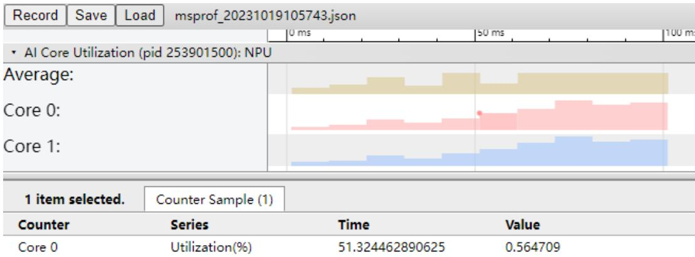

图 12-26 AI Core Utilization 层  
表 12-82 字段说明  

<table><tr><td rowspan=1 colspan=1>字段名</td><td rowspan=1 colspan=1>字段含义</td></tr><tr><td rowspan=1 colspan=1>Average</td><td rowspan=1 colspan=1>均值。</td></tr><tr><td rowspan=1 colspan=1>Core &lt;ID&gt;</td><td rowspan=1 colspan=1>Core ID。</td></tr><tr><td rowspan=1 colspan=1>utilization(%</td><td rowspan=1 colspan=1>当前采样周期内，Al Core在执行Task的total_cycle（从Al Core开始执行算子的第一条指令开始计数，到最后一条指令执行完成）占比。</td></tr></table>

# ai_core_utilization_\*.csv 文件说明

ai_core_utilization_\*.csv文件内容格式示例如下：

图 12-27 ai_core_utilization（仅为示例）  

<table><tr><td rowspan=1 colspan=1>Device _id</td><td rowspan=1 colspan=1>Core ID</td><td rowspan=1 colspan=1>vec_ratio</td><td rowspan=1 colspan=1>mac_ratio</td><td rowspan=1 colspan=1>scalar_ratio</td><td rowspan=1 colspan=1>mte1_ratio</td><td rowspan=1 colspan=1>mte2_ratio</td><td rowspan=1 colspan=1>mte3_ratio</td><td rowspan=1 colspan=1>licache_miss_rate</td><td rowspan=1 colspan=1>memory_bound</td></tr><tr><td rowspan=1 colspan=1></td><td rowspan=1 colspan=1>0Core0</td><td rowspan=1 colspan=1>0.0739</td><td rowspan=1 colspan=1>0.2258</td><td rowspan=1 colspan=1>0.0564</td><td rowspan=1 colspan=1>0.1708</td><td rowspan=1 colspan=1>0.7258</td><td rowspan=1 colspan=1>0.0941</td><td rowspan=1 colspan=1>0.0156</td><td rowspan=1 colspan=1>3.2141</td></tr><tr><td rowspan=1 colspan=1></td><td rowspan=1 colspan=1>0Core1</td><td rowspan=1 colspan=1>0.0708</td><td rowspan=1 colspan=1>0.2186</td><td rowspan=1 colspan=1>0.0587</td><td rowspan=1 colspan=1>0.1667</td><td rowspan=1 colspan=1>0.7094</td><td rowspan=1 colspan=1>0.0741</td><td rowspan=1 colspan=1>0.0202</td><td rowspan=1 colspan=1>3.245</td></tr><tr><td rowspan=1 colspan=1></td><td rowspan=1 colspan=1>0Core2</td><td rowspan=1 colspan=1>0.0724</td><td rowspan=1 colspan=1>0.1778</td><td rowspan=1 colspan=1>0.0536</td><td rowspan=1 colspan=1>0.1556</td><td rowspan=1 colspan=1>0.7043</td><td rowspan=1 colspan=1>0.0753</td><td rowspan=1 colspan=1>0.0233</td><td rowspan=1 colspan=1>3.9615</td></tr><tr><td rowspan=1 colspan=1></td><td rowspan=1 colspan=1>0Core3</td><td rowspan=1 colspan=1>0.0688</td><td rowspan=1 colspan=1>0.1637</td><td rowspan=1 colspan=1>0.0511</td><td rowspan=1 colspan=1>0.1424</td><td rowspan=1 colspan=1>0.69</td><td rowspan=1 colspan=1>0.0705</td><td rowspan=1 colspan=1>0.0318</td><td rowspan=1 colspan=1>4.2162</td></tr><tr><td rowspan=1 colspan=2>0Core4</td><td rowspan=1 colspan=1>0.0763</td><td rowspan=1 colspan=1>0.1436</td><td rowspan=1 colspan=1>0.0507</td><td rowspan=1 colspan=1>0.1453</td><td rowspan=1 colspan=1>0.658</td><td rowspan=1 colspan=1>0.0886</td><td rowspan=1 colspan=1>0.0258</td><td rowspan=1 colspan=1>4.581</td></tr></table>

根据--aic-metrics参数取值不同，文件呈现结果不同。完整字段如下。

# 说明

● 下文字段说明中，不同产品支持的字段略有不同，请以实际结果文件呈现字段为准。下列字段均在--task-time=l1、--aic-mode $! = !$ sample-based时生成，--task-time为l0时，不采集该字段，显示为N/A。生成的数据由aic_metrics参数取值控制。

表 12-83 字段说明（PipeUtilization）  

<table><tr><td rowspan=1 colspan=1>字段名</td><td rowspan=1 colspan=1>字段含义</td></tr><tr><td rowspan=1 colspan=1>vec_ratio</td><td rowspan=1 colspan=1>vec类型指令（向量类运算指令）的cycle数在total cycle数中的占用比。Atlas 200I/500 A2推理产品不支持该字段，给予默认值N/A。Atlas A2训练系列产品/Atlas A2推理系列产品不支持该字段。AtlasA3 训练系列产品/AtlasA3推理系列产品不支持该字段。</td></tr><tr><td rowspan=1 colspan=1>mac_ratio</td><td rowspan=1 colspan=1>cube类型指令（矩阵类运算指令）的cycle数在totalcycle数中的占用比。</td></tr><tr><td rowspan=1 colspan=1>scalar_rati0</td><td rowspan=1 colspan=1>scalar类型指令（标量类运算指令）的cycle数在totalcycle数中的占用比。</td></tr><tr><td rowspan=1 colspan=1>mte1_ratio</td><td rowspan=1 colspan=1>mte1类型指令（L1-&gt;L0A/L0B搬运类指令）的cycle数在total cycle数中的占用比。</td></tr><tr><td rowspan=1 colspan=1>mte2_ratio</td><td rowspan=1 colspan=1>mte2类型指令（DDR-&gt;AICORE搬运类指令）的cycle数在total cycle数中的占用比。</td></tr><tr><td rowspan=1 colspan=1>mte3_ratio</td><td rowspan=1 colspan=1>mte3类型指令（AICORE-&gt;DDR搬运类指令）的cycle数在total cycle数中的占用比。Atlas A2训练系列产品/Atlas A2 推理系列产品不支持该字段。Atlas A3训练系列产品/AtlasA3推理系列产品不支持该字段。</td></tr><tr><td rowspan=1 colspan=1>icache_miss_rate</td><td rowspan=1 colspan=1>icache是为instruction预留的L2Cache，icache_miss_rate数值高代表Al Core读取指令的效率低。</td></tr><tr><td rowspan=1 colspan=1>fixpipe_rati0</td><td rowspan=1 colspan=1>fixpipe类型指令（LOC-&gt;OUT/L1搬运类指令）的cycle数在total cycle数中的占用比。</td></tr><tr><td rowspan=1 colspan=1>memory_bound</td><td rowspan=1 colspan=1>用于识别AICore执行算子计算过程是否存在Memory瓶颈，由mte2_ratio/max(mac_ratio,vec_ratio)计算得出。计算结果小于1,表示没有Memory瓶颈；计算结果大于1则表示AlCore在执行Task过程中大部分时间都在做内存搬运而不是计算，且数值越大Memory瓶颈越严重。Atlas A2训练系列产品/Atlas A2推理系列产品不支持该字段。Atlas A3 训练系列产品/Atlas A3 推理系列产品不支持该字段。</td></tr></table>

表 12-84 字段说明（ArithmeticUtilization）  

<table><tr><td colspan="1" rowspan="1">字段名</td><td colspan="1" rowspan="1">字段含义</td></tr><tr><td colspan="1" rowspan="1">mac_fp16_ratio</td><td colspan="1" rowspan="1">cube fp16类型指令的cycle数在total cycle数中的占用比。</td></tr><tr><td colspan="1" rowspan="1">mac_int8_ratio</td><td colspan="1" rowspan="1">cube int8类型指令的cycle数在total cycle数中的占用比。</td></tr><tr><td colspan="1" rowspan="1">vec_fp32_ratio</td><td colspan="1" rowspan="1">vec fp32类型指令的cycle数在total cycle数中的占用比。Atlas200I/500 A2推理产品不支持该字段，给予默认值N/A。</td></tr><tr><td colspan="1" rowspan="1">vec_fp16_ratio</td><td colspan="1" rowspan="1">vec fp16类型指令的cycle数在totalcycle数中的占用比。Atlas200I/500 A2推理产品不支持该字段，给予默认值N/A。</td></tr><tr><td colspan="1" rowspan="1">vec_int32_ratio</td><td colspan="1" rowspan="1">vec int32类型指令的cycle数在totalcycle数中的占用比。Atlas200I/500 A2推理产品不支持该字段，给予默认值N/A。</td></tr><tr><td colspan="1" rowspan="1">vec_misc_ratio</td><td colspan="1" rowspan="1">vecmisc类型指令的cycle数在total cycle数中的占用比。Atlas200I/500 A2推理产品不支持该字段，给予默认值N/A。</td></tr><tr><td colspan="1" rowspan="1">cube_fops</td><td colspan="1" rowspan="1">cube类型的浮点运算数，即计算量，可用于衡量算法/模型的复杂度，其中fops表示floating point operations，缩写为FLOPs。</td></tr><tr><td colspan="1" rowspan="1">vector_fopS</td><td colspan="1" rowspan="1">vector类型浮点运算数，即计算量，可用于衡量算法/模型的复杂度，其中fops表示floating point operations，缩写为FLOPs。</td></tr></table>

表 12-85 字段说明（Memory）  

<table><tr><td rowspan=1 colspan=1>字段名</td><td rowspan=1 colspan=1>字段含义</td></tr><tr><td rowspan=1 colspan=1>ub_read_bw(GB/s）</td><td rowspan=1 colspan=1>ub读带宽速率，单位GB/s。Atlas200I/500A2推理产品不支持该字段，给予默认值N/A。</td></tr><tr><td rowspan=1 colspan=1>ub_write_bw(GB/s）</td><td rowspan=1 colspan=1>ub写带宽速率，单位GB/s。Atlas200I/500 A2推理产品不支持该字段，给予默认值N/A。</td></tr><tr><td rowspan=1 colspan=1>l1_read_bw(GB/s)</td><td rowspan=1 colspan=1>[1读带宽速率，单位GB/s。</td></tr><tr><td rowspan=1 colspan=1>l1_write_bw(GB/s)</td><td rowspan=1 colspan=1>[1写带宽速率，单位GB/s。</td></tr><tr><td rowspan=1 colspan=1>l2_read_bw</td><td rowspan=1 colspan=1>l2读带宽速率，单位GB/s。</td></tr><tr><td rowspan=1 colspan=1>l2_write_bw</td><td rowspan=1 colspan=1>l2写带宽速率，单位GB/s。Atlas200I/500 A2推理产品不支持该字段，给予默认值N/A。</td></tr><tr><td rowspan=1 colspan=1>main_mem_read_bw(GB/s)</td><td rowspan=1 colspan=1>主存储器读带宽速率，单位GB/s。</td></tr><tr><td rowspan=1 colspan=1>main_mem_write_bw(GB/s)</td><td rowspan=1 colspan=1>主存储器写带宽速率，单位GB/s。Atlas 200I/500 A2推理产品不支持该字段，给予默认值N/A。不支持该字段，给予默认值N/A。</td></tr></table>

表 12-86 字段说明（MemoryL0）  

<table><tr><td colspan="1" rowspan="1">字段名</td><td colspan="1" rowspan="1">字段含义</td></tr><tr><td colspan="1" rowspan="1">l0a_read_bw(GB/s)</td><td colspan="1" rowspan="1">l0a读带宽速率，单位GB/s。</td></tr><tr><td colspan="1" rowspan="1">l0a_write_bw(GB/s)</td><td colspan="1" rowspan="1">l0a写带宽速率，单位GB/s。</td></tr><tr><td colspan="1" rowspan="1">lOb_read_bw(GB/s)</td><td colspan="1" rowspan="1">l0b读带宽速率，单位GB/s。</td></tr><tr><td colspan="1" rowspan="1">l0b_write_bw(GB/s)</td><td colspan="1" rowspan="1">l0b写带宽速率，单位GB/s。</td></tr><tr><td colspan="1" rowspan="1">l0c_read_bw(GB/s)</td><td colspan="1" rowspan="1">vector从lOc读带宽速率，单位GB/s。</td></tr><tr><td colspan="1" rowspan="1">l0c_write_bw(GB/s)</td><td colspan="1" rowspan="1">vector向l0c写带宽速率，单位GB/s。</td></tr><tr><td colspan="1" rowspan="1">lOc_read_bw_cube(GB/s)</td><td colspan="1" rowspan="1">cube从l0c读带宽速率，单位GB/s。</td></tr><tr><td colspan="1" rowspan="1">l0c_write_bw_cube(GB/s)</td><td colspan="1" rowspan="1">cube向l0c写带宽速率，单位GB/s。</td></tr><tr><td colspan="2" rowspan="1">注：采集AlVectorCore的MemoryL0性能指标时，采集到的数据都为0。</td></tr></table>

表 12-87 字段说明（MemoryUB）  

<table><tr><td rowspan=1 colspan=1>字段名</td><td rowspan=1 colspan=1>字段含义</td></tr><tr><td rowspan=1 colspan=1>ub_read_bw_vector(GB/s)</td><td rowspan=1 colspan=1>vector从ub读带宽速率，单位GB/s。</td></tr><tr><td rowspan=1 colspan=1>ub_write_bw_vector(GB/s)</td><td rowspan=1 colspan=1>vector向ub写带宽速率，单位GB/s。</td></tr><tr><td rowspan=1 colspan=1>ub_read_bw_scalar(GB/s)</td><td rowspan=1 colspan=1>scalar从ub读带宽速率，单位GB/s。</td></tr><tr><td rowspan=1 colspan=1>ub_write_bw_scalar(GB/s)</td><td rowspan=1 colspan=1>scalar向ub写带宽速率，单位GB/s。</td></tr></table>

表 12-88 字段说明（ResourceConflictRatio）  

<table><tr><td rowspan=1 colspan=1>字段名</td><td rowspan=1 colspan=1>字段含义</td></tr><tr><td rowspan=1 colspan=1>vec_bankgroup_cflt_ratio</td><td rowspan=1 colspan=1>vec_bankgroup_stall_cycles类型指令执行cycle数在total cycle数中的占用比。由于vector指令的block stride的值设置不合理，造成bankgroup冲突。Atlas200l/500A2推理产品不支持该字段，给予默认值N/A。</td></tr><tr><td rowspan=1 colspan=1>vec_bank_cflt_rati0</td><td rowspan=1 colspan=1>vec_bank_stall_cycles类型指令执行cycle数在total cycle数中的占用比。由于vector指令操作数的读写指针地址不合理，造成bank冲突。Atlas200I/500A2推理产品不支持该字段，给予默认值N/A。</td></tr><tr><td rowspan=1 colspan=1>vec_resc_cflt_ratio</td><td rowspan=1 colspan=1>vec_resc_cflt_ratio类型指令执行cycle数在total cycle数中的占用比。当算子中涉及多个计算单元，应该尽量保证多个单元并发调度。当某个计算单元正在执行计算，但算子逻辑仍然往该单元下发指令，就会造成整体的算力没有得到充分应用。Atlas200I/500 A2推理产品不支持该字段，给予默认值N/A。</td></tr></table>

表 12-89 字段说明（L2Cache）  

<table><tr><td rowspan=1 colspan=1>字段名</td><td rowspan=1 colspan=1>字段含义</td></tr><tr><td rowspan=1 colspan=1>write_cache_hit</td><td rowspan=1 colspan=1>写cache命中的次数。</td></tr><tr><td rowspan=1 colspan=1>write_cache_miss_allo|cate</td><td rowspan=1 colspan=1>写cache缺失后重新分配缓存的次数。</td></tr><tr><td rowspan=1 colspan=1>r*_read_cache_hit</td><td rowspan=1 colspan=1>读r*通道cache命中次数。</td></tr><tr><td rowspan=1 colspan=1>r*_read_cache_miss_allocate</td><td rowspan=1 colspan=1>读r*通道cache缺失后重新分配的次数。</td></tr><tr><td rowspan=1 colspan=1>read_local_l2_hit</td><td rowspan=1 colspan=1>读Cache命中的次数。</td></tr><tr><td rowspan=1 colspan=1>read_local_l2_miss</td><td rowspan=1 colspan=1>读Cache缺失次数。</td></tr><tr><td rowspan=1 colspan=1>read_local_l2_victim</td><td rowspan=1 colspan=1>读Cache未命中并触发Cache中数据被换出的次数。</td></tr><tr><td rowspan=1 colspan=1>write_local_l2_hit</td><td rowspan=1 colspan=1>写Cache命中的次数。</td></tr><tr><td rowspan=1 colspan=1>write_local_l2_miss</td><td rowspan=1 colspan=1>写Cache缺失次数。</td></tr><tr><td rowspan=1 colspan=1>write_local_l2_victim</td><td rowspan=1 colspan=1>写Cache未命中并触发Cache中数据被换出的次数。</td></tr><tr><td rowspan=1 colspan=2>仅支持产品：Atlas A2训练系列产品/Atlas A2推理系列产品Atlas A3训练系列产品/Atlas A3推理系列产品Atlas 200I/500 A2推理产品</td></tr></table>

表 12-90 字段说明（MemoryAccess）  

<table><tr><td rowspan=1 colspan=1>字段名</td><td rowspan=1 colspan=1>字段含义</td></tr><tr><td rowspan=1 colspan=1>read_main_memory_datas(KB)</td><td rowspan=1 colspan=1>对片上内存读的数据量，单位KB。</td></tr><tr><td rowspan=1 colspan=1>write_main_memory_datas(KB)</td><td rowspan=1 colspan=1>对片上内存写的数据量，单位KB。</td></tr><tr><td rowspan=1 colspan=1>gm_to_l1_datas(KB)</td><td rowspan=1 colspan=1>GM到L1的数据搬运量，单位KB。</td></tr><tr><td rowspan=1 colspan=1>l0c_to_l1_datas(KB)</td><td rowspan=1 colspan=1>L0C到L1的数据搬运量，单位KB。</td></tr><tr><td rowspan=1 colspan=1>l0c_to_gm_datas(KB)</td><td rowspan=1 colspan=1>L0C到GM的数据搬运量，单位KB。</td></tr><tr><td rowspan=1 colspan=1>gm_to_ub_datas(KB)</td><td rowspan=1 colspan=1>GM到UB的数据搬运量，单位KB。</td></tr><tr><td rowspan=1 colspan=1>ub_to_gm_datas(KB)</td><td rowspan=1 colspan=1>UB到GM的数据搬运量，单位KB。</td></tr><tr><td rowspan=1 colspan=2>仅支持产品：Atlas A2训练系列产品/AtlasA2推理系列产品AtlasA3训练系列产品/AtlasA3推理系列产品</td></tr></table>

# 12.13 ai_vector_core_utilization（AI Vector Core 指令占比）

AI Vector Core指令占比数据无timeline信息，summary信息在ai_vector_core_utilization_\*.csv文件汇总。

# 支持的型号

Atlas 200I/500 A2 推理产品Atlas A2 训练系列产品/Atlas A2 推理系列产品Atlas A3 训练系列产品/Atlas A3 推理系列产品

# ai_vector_core_utilization_\*.csv 文件说明

ai_vector_core_utilization_\*.csv文件内容格式示例如下：

图 12-28 ai_vector_core_utilization_\*.csv  

<table><tr><td rowspan=1 colspan=1>Core ID</td><td rowspan=1 colspan=1>vec_ratio</td><td rowspan=1 colspan=1>mac_ratio</td><td rowspan=1 colspan=1>scalar_ratio</td><td rowspan=1 colspan=1>mte1_ratio</td><td rowspan=1 colspan=1>mte2_ratio</td><td rowspan=1 colspan=1>mte3_ratio</td><td rowspan=1 colspan=1>icache_miss_rate</td><td rowspan=1 colspan=1>memory_bound</td></tr><tr><td rowspan=1 colspan=1>Core25</td><td rowspan=1 colspan=1>0</td><td rowspan=1 colspan=1>0</td><td rowspan=1 colspan=1>0</td><td rowspan=1 colspan=1>0</td><td rowspan=1 colspan=1>0</td><td rowspan=1 colspan=1>0</td><td rowspan=1 colspan=1>0</td><td rowspan=1 colspan=1>0</td></tr><tr><td rowspan=1 colspan=1>Core26</td><td rowspan=1 colspan=1>0</td><td rowspan=1 colspan=1>0</td><td rowspan=1 colspan=1>0</td><td rowspan=1 colspan=1>0</td><td rowspan=1 colspan=1>0</td><td rowspan=1 colspan=1>0</td><td rowspan=1 colspan=1>0</td><td rowspan=1 colspan=1>0</td></tr><tr><td rowspan=1 colspan=1>Core27</td><td rowspan=1 colspan=1>0</td><td rowspan=1 colspan=1>0</td><td rowspan=1 colspan=1>0</td><td rowspan=1 colspan=1>0</td><td rowspan=1 colspan=1>0</td><td rowspan=1 colspan=1>0</td><td rowspan=1 colspan=1>0</td><td rowspan=1 colspan=1>0</td></tr><tr><td rowspan=1 colspan=1>Core28</td><td rowspan=1 colspan=1>0</td><td rowspan=1 colspan=1>0</td><td rowspan=1 colspan=1>0</td><td rowspan=1 colspan=1>0</td><td rowspan=1 colspan=1>0</td><td rowspan=1 colspan=1>0</td><td rowspan=1 colspan=1>0</td><td rowspan=1 colspan=1>0</td></tr><tr><td rowspan=1 colspan=1>Core29</td><td rowspan=1 colspan=1>0</td><td rowspan=1 colspan=1>0</td><td rowspan=1 colspan=1>0</td><td rowspan=1 colspan=1>0</td><td rowspan=1 colspan=1>0</td><td rowspan=1 colspan=1>0</td><td rowspan=1 colspan=1>0</td><td rowspan=1 colspan=1>0</td></tr><tr><td rowspan=1 colspan=1>Core30</td><td rowspan=1 colspan=1>0</td><td rowspan=1 colspan=1>0</td><td rowspan=1 colspan=1>0</td><td rowspan=1 colspan=1>0</td><td rowspan=1 colspan=1>0</td><td rowspan=1 colspan=1>0</td><td rowspan=1 colspan=1>0</td><td rowspan=1 colspan=1>0</td></tr><tr><td rowspan=1 colspan=1>Core31</td><td rowspan=1 colspan=1>0</td><td rowspan=1 colspan=1>0</td><td rowspan=1 colspan=1>0</td><td rowspan=1 colspan=1>0</td><td rowspan=1 colspan=1>0</td><td rowspan=1 colspan=1>0</td><td rowspan=1 colspan=1>0</td><td rowspan=1 colspan=1>0</td></tr><tr><td rowspan=1 colspan=1>Core32</td><td rowspan=1 colspan=1>0</td><td rowspan=1 colspan=1>0</td><td rowspan=1 colspan=1>0</td><td rowspan=1 colspan=1>0</td><td rowspan=1 colspan=1>0</td><td rowspan=1 colspan=1>0</td><td rowspan=1 colspan=1>0</td><td rowspan=1 colspan=1>0</td></tr><tr><td rowspan=1 colspan=1>Core33</td><td rowspan=1 colspan=1>0</td><td rowspan=1 colspan=1>0</td><td rowspan=1 colspan=1>0</td><td rowspan=1 colspan=1>0</td><td rowspan=1 colspan=1>0</td><td rowspan=1 colspan=1>0</td><td rowspan=1 colspan=1>0</td><td rowspan=1 colspan=1>0</td></tr><tr><td rowspan=1 colspan=1>Core34</td><td rowspan=1 colspan=1>0</td><td rowspan=1 colspan=1>0</td><td rowspan=1 colspan=1>0</td><td rowspan=1 colspan=1>0</td><td rowspan=1 colspan=1>0</td><td rowspan=1 colspan=1>0</td><td rowspan=1 colspan=1>0</td><td rowspan=1 colspan=1>0</td></tr><tr><td rowspan=1 colspan=1>Core35</td><td rowspan=1 colspan=1>0</td><td rowspan=1 colspan=1>0</td><td rowspan=1 colspan=1>0</td><td rowspan=1 colspan=1>0</td><td rowspan=1 colspan=1>0</td><td rowspan=1 colspan=1>0</td><td rowspan=1 colspan=1>0</td><td rowspan=1 colspan=1>0</td></tr><tr><td rowspan=1 colspan=1>Core36</td><td rowspan=1 colspan=1>0</td><td rowspan=1 colspan=1>0</td><td rowspan=1 colspan=1>0</td><td rowspan=1 colspan=1>0</td><td rowspan=1 colspan=1>0</td><td rowspan=1 colspan=1>0</td><td rowspan=1 colspan=1>0</td><td rowspan=1 colspan=1>0</td></tr><tr><td rowspan=1 colspan=1>Core37</td><td rowspan=1 colspan=1>0</td><td rowspan=1 colspan=1>0</td><td rowspan=1 colspan=1>0</td><td rowspan=1 colspan=1>0</td><td rowspan=1 colspan=1>0</td><td rowspan=1 colspan=1>0</td><td rowspan=1 colspan=1>0</td><td rowspan=1 colspan=1>0</td></tr><tr><td rowspan=1 colspan=1>Core38</td><td rowspan=1 colspan=1>0</td><td rowspan=1 colspan=1>0</td><td rowspan=1 colspan=1>0</td><td rowspan=1 colspan=1>0</td><td rowspan=1 colspan=1>0</td><td rowspan=1 colspan=1>0</td><td rowspan=1 colspan=1>0</td><td rowspan=1 colspan=1>0</td></tr><tr><td rowspan=1 colspan=1>Core39</td><td rowspan=1 colspan=1>0</td><td rowspan=1 colspan=1>0</td><td rowspan=1 colspan=1>0</td><td rowspan=1 colspan=1>0</td><td rowspan=1 colspan=1>0</td><td rowspan=1 colspan=1>0</td><td rowspan=1 colspan=1>0</td><td rowspan=1 colspan=1>0</td></tr><tr><td rowspan=1 colspan=1>Core40</td><td rowspan=1 colspan=1>0</td><td rowspan=1 colspan=1>0</td><td rowspan=1 colspan=1>0</td><td rowspan=1 colspan=1>0</td><td rowspan=1 colspan=1>0</td><td rowspan=1 colspan=1>0</td><td rowspan=1 colspan=1>0</td><td rowspan=1 colspan=1>0</td></tr><tr><td rowspan=1 colspan=1>Core41</td><td rowspan=1 colspan=1>0</td><td rowspan=1 colspan=1>0</td><td rowspan=1 colspan=1>0</td><td rowspan=1 colspan=1>0</td><td rowspan=1 colspan=1>0</td><td rowspan=1 colspan=1>0</td><td rowspan=1 colspan=1>0</td><td rowspan=1 colspan=1>0</td></tr><tr><td rowspan=1 colspan=1>Core42</td><td rowspan=1 colspan=1>0</td><td rowspan=1 colspan=1>0</td><td rowspan=1 colspan=1>0</td><td rowspan=1 colspan=1>0</td><td rowspan=1 colspan=1>0</td><td rowspan=1 colspan=1>0</td><td rowspan=1 colspan=1>0</td><td rowspan=1 colspan=1>0</td></tr><tr><td rowspan=1 colspan=1>Core43</td><td rowspan=1 colspan=1>0</td><td rowspan=1 colspan=1>0</td><td rowspan=1 colspan=1>0</td><td rowspan=1 colspan=1>0</td><td rowspan=1 colspan=1>0</td><td rowspan=1 colspan=1>0</td><td rowspan=1 colspan=1>0</td><td rowspan=1 colspan=1>0</td></tr><tr><td rowspan=1 colspan=1>Core44</td><td rowspan=1 colspan=1>0</td><td rowspan=1 colspan=1>0</td><td rowspan=1 colspan=1>0</td><td rowspan=1 colspan=1>0</td><td rowspan=1 colspan=1>0</td><td rowspan=1 colspan=1>0</td><td rowspan=1 colspan=1>0</td><td rowspan=1 colspan=1>0</td></tr><tr><td rowspan=1 colspan=1>Core45</td><td rowspan=1 colspan=1>0</td><td rowspan=1 colspan=1>0</td><td rowspan=1 colspan=1>0</td><td rowspan=1 colspan=1>0</td><td rowspan=1 colspan=1>0</td><td rowspan=1 colspan=1>0</td><td rowspan=1 colspan=1>0</td><td rowspan=1 colspan=1>0</td></tr><tr><td rowspan=1 colspan=1>Core46</td><td rowspan=1 colspan=1>0</td><td rowspan=1 colspan=1>0</td><td rowspan=1 colspan=1>0</td><td rowspan=1 colspan=1>0</td><td rowspan=1 colspan=1>0</td><td rowspan=1 colspan=1>0</td><td rowspan=1 colspan=1>0</td><td rowspan=1 colspan=1>0</td></tr><tr><td rowspan=1 colspan=1>Core47</td><td rowspan=1 colspan=1>0</td><td rowspan=1 colspan=1>0</td><td rowspan=1 colspan=1>0</td><td rowspan=1 colspan=1>0</td><td rowspan=1 colspan=1>0</td><td rowspan=1 colspan=1>0</td><td rowspan=1 colspan=1>0</td><td rowspan=1 colspan=1>0</td></tr><tr><td rowspan=1 colspan=1>Core48</td><td rowspan=1 colspan=1>0</td><td rowspan=1 colspan=1>0</td><td rowspan=1 colspan=1>0</td><td rowspan=1 colspan=1>0</td><td rowspan=1 colspan=1>0</td><td rowspan=1 colspan=1>0</td><td rowspan=1 colspan=1>0</td><td rowspan=1 colspan=1>0</td></tr><tr><td rowspan=1 colspan=1>Core49</td><td rowspan=1 colspan=1>0</td><td rowspan=1 colspan=1>0</td><td rowspan=1 colspan=1>0</td><td rowspan=1 colspan=1>0</td><td rowspan=1 colspan=1>0</td><td rowspan=1 colspan=1>0</td><td rowspan=1 colspan=1>0</td><td rowspan=1 colspan=1>0</td></tr><tr><td rowspan=1 colspan=1>Core50</td><td rowspan=1 colspan=1>0</td><td rowspan=1 colspan=1>0</td><td rowspan=1 colspan=1>0</td><td rowspan=1 colspan=1>0</td><td rowspan=1 colspan=1>0</td><td rowspan=1 colspan=1>0</td><td rowspan=1 colspan=1>0</td><td rowspan=1 colspan=1>0</td></tr><tr><td rowspan=1 colspan=1>Core51</td><td rowspan=1 colspan=1>0</td><td rowspan=1 colspan=1>0</td><td rowspan=1 colspan=1>0</td><td rowspan=1 colspan=1>0</td><td rowspan=1 colspan=1>0</td><td rowspan=1 colspan=1>0</td><td rowspan=1 colspan=1>0</td><td rowspan=1 colspan=1>0</td></tr><tr><td rowspan=1 colspan=1>Core52</td><td rowspan=1 colspan=1>0</td><td rowspan=1 colspan=1>0</td><td rowspan=1 colspan=1>0</td><td rowspan=1 colspan=1>0</td><td rowspan=1 colspan=1>0</td><td rowspan=1 colspan=1>0</td><td rowspan=1 colspan=1>0</td><td rowspan=1 colspan=1>0</td></tr><tr><td rowspan=1 colspan=1>Core53</td><td rowspan=1 colspan=1>0</td><td rowspan=1 colspan=1>0</td><td rowspan=1 colspan=1>0</td><td rowspan=1 colspan=1>0</td><td rowspan=1 colspan=1>0</td><td rowspan=1 colspan=1>0</td><td rowspan=1 colspan=1>0</td><td rowspan=1 colspan=1>0</td></tr><tr><td rowspan=1 colspan=1>Core54</td><td rowspan=1 colspan=1>0</td><td rowspan=1 colspan=1>0</td><td rowspan=1 colspan=1>0</td><td rowspan=1 colspan=1>0</td><td rowspan=1 colspan=1>0</td><td rowspan=1 colspan=1>0</td><td rowspan=1 colspan=1>0</td><td rowspan=1 colspan=1>0</td></tr><tr><td rowspan=1 colspan=1>Core55</td><td rowspan=1 colspan=1>0</td><td rowspan=1 colspan=1>0</td><td rowspan=1 colspan=1>0</td><td rowspan=1 colspan=1>0</td><td rowspan=1 colspan=1>0</td><td rowspan=1 colspan=1>0</td><td rowspan=1 colspan=1>0</td><td rowspan=1 colspan=1>0</td></tr><tr><td rowspan=1 colspan=1>Core56</td><td rowspan=1 colspan=1>0</td><td rowspan=1 colspan=1>0</td><td rowspan=1 colspan=1></td><td rowspan=1 colspan=1>0</td><td rowspan=1 colspan=1>0</td><td rowspan=1 colspan=1>0</td><td rowspan=1 colspan=1>0</td><td rowspan=1 colspan=1>0</td></tr><tr><td rowspan=1 colspan=1>Core57</td><td rowspan=1 colspan=1>0</td><td rowspan=1 colspan=1>0</td><td rowspan=1 colspan=1>0</td><td rowspan=1 colspan=1>0</td><td rowspan=1 colspan=1>0</td><td rowspan=1 colspan=1>0</td><td rowspan=1 colspan=1>0</td><td rowspan=1 colspan=1>0</td></tr><tr><td rowspan=1 colspan=1>Core58</td><td rowspan=1 colspan=1>0</td><td rowspan=1 colspan=1>0</td><td rowspan=1 colspan=1>0</td><td rowspan=1 colspan=1>0</td><td rowspan=1 colspan=1>0</td><td rowspan=1 colspan=1>0</td><td rowspan=1 colspan=1>0</td><td rowspan=1 colspan=1>0</td></tr><tr><td rowspan=1 colspan=1>Core59</td><td rowspan=1 colspan=1>0</td><td rowspan=1 colspan=1>0</td><td rowspan=1 colspan=1>0</td><td rowspan=1 colspan=1>0</td><td rowspan=1 colspan=1>0</td><td rowspan=1 colspan=1>0</td><td rowspan=1 colspan=1>0</td><td rowspan=1 colspan=1>0</td></tr><tr><td rowspan=1 colspan=1>Core60</td><td rowspan=1 colspan=1>0</td><td rowspan=1 colspan=1>0</td><td rowspan=1 colspan=1>0</td><td rowspan=1 colspan=1>0</td><td rowspan=1 colspan=1>0</td><td rowspan=1 colspan=1>0</td><td rowspan=1 colspan=1>0</td><td rowspan=1 colspan=1>0</td></tr><tr><td rowspan=1 colspan=1>Core61</td><td rowspan=1 colspan=1>0</td><td rowspan=1 colspan=1>0</td><td rowspan=1 colspan=1>0</td><td rowspan=1 colspan=1>0</td><td rowspan=1 colspan=1></td><td rowspan=1 colspan=1>0</td><td rowspan=1 colspan=1></td><td rowspan=1 colspan=1>0</td></tr><tr><td></td><td></td><td></td><td></td><td rowspan=1 colspan=1>n</td><td rowspan=1 colspan=1></td><td rowspan=1 colspan=1>n</td><td rowspan=1 colspan=1>n</td><td rowspan=1 colspan=1>n</td></tr></table>

表 12-91 字段说明  

<table><tr><td rowspan=1 colspan=1>字段名</td><td rowspan=1 colspan=1>字段含义</td></tr><tr><td rowspan=1 colspan=1>vec_ratio</td><td rowspan=1 colspan=1>代表vec类型指令（向量类运算指令）的cycle数在total cycle数中的占用比。Atlas 200I/500 A2推理产品不支持该字段，给予默认值N/A。</td></tr><tr><td rowspan=1 colspan=1>mac_ratio</td><td rowspan=1 colspan=1>代表cube类型指令（fp16及s16矩阵类运算指令）的cycle数在totalcycle数中的占用比。</td></tr><tr><td rowspan=1 colspan=1>scalar_rati0</td><td rowspan=1 colspan=1>代表scalar类型指令（标量类运算指令）的cycle数在totalcycle数中的占用比。</td></tr><tr><td rowspan=1 colspan=1>mte1_ratio</td><td rowspan=1 colspan=1>代表mte1类型指令（L1-&gt;L0A/LOB搬运类指令）的cycle数在totalcycle数中的占用比。</td></tr><tr><td rowspan=1 colspan=1>mte2_ratio</td><td rowspan=1 colspan=1>代表mte2类型指令（DDR-&gt;AICORE搬运类指令）的cycle数在totalcycle数中的占用比。（Atlas 200I/500 A2推理产品）</td></tr><tr><td rowspan=1 colspan=1>mte2_ratio</td><td rowspan=1 colspan=1>代表mte2类型指令（片上内存-&gt;AICORE搬运类指令）的cycle数在total cycle数中的占用比。（Atlas A2训练系列产品/AtlasA2推理系列产品）（Atlas A3训练系列产品/Atlas A3推理系列产品）</td></tr><tr><td rowspan=1 colspan=1>mte3_ratio</td><td rowspan=1 colspan=1>代表mte3类型指令（AICORE-&gt;DDR搬运类指令）的cycle数在totalcycle数中的占用比。（Atlas 200I/500 A2推理产品）</td></tr><tr><td rowspan=1 colspan=1>mte3_ratio</td><td rowspan=1 colspan=1>代表mte3类型指令（AICORE-&gt;片上内存搬运类指令）的cycle数在totalcycle数中的占用比。（Atlas A2训练系列产品/AtlasA2推理系列产品）（Atlas A3 训练系列产品/Atlas A3 推理系列产品）</td></tr><tr><td rowspan=1 colspan=1>icache_miss_rate</td><td rowspan=1 colspan=1>代表icache缺失率，即未命中instruction的L1cache，数值越小越好。</td></tr><tr><td rowspan=1 colspan=1>memory_bound</td><td rowspan=1 colspan=1>用于识别AICore执行算子计算过程是否存在Memory瓶颈，由mte2_ratio/max(mac_ratio,vec_ratio)计算得出。计算结果小于1,表示没有Memory瓶颈；计算结果大于1则表示有Memory瓶颈，且数值越大瓶颈越严重。</td></tr><tr><td rowspan=1 colspan=2>此处Al Vector Core性能指标采集项以sample-based场景的PipeUtilization为例，更多参数解析参见12.12ai_core_utilization（Al Core指令占比）。</td></tr></table>

# 12.14 aicpu（AI CPU 算子详细耗时）

aicpu算子详细耗时数据无timeline信息，summary信息在aicpu_\*.csv文件汇总。

# 支持的型号

Atlas 200I/500 A2 推理产品  
Atlas 推理系列产品  
Atlas 训练系列产品  
Atlas A2 训练系列产品/Atlas A2 推理系列产品  
Atlas A3 训练系列产品/Atlas A3 推理系列产品

# aicpu_\*.csv 文件说明

AI CPU数据aicpu_\*.csv文件内容格式示例如下：

图 12-29 aicpu_\*.csv

|Device_id Timestamp(us) |Node Compute_time(us) |Memcpy_time(us) |Task_time(us) Dispatch_time(us) Total_time(us) |Stream ID Task ID 017095474995180trans_Cast 149 220.104 226 1495 5 63

该文件采集的是数据预处理上报的AI CPU数据，其他涉及AI CPU数据的文件采集的是全量AI CPU数据。

表 12-92 字段说明  

<table><tr><td rowspan=1 colspan=1>字段名</td><td rowspan=1 colspan=1>字段含义</td></tr><tr><td rowspan=1 colspan=1>Device_id</td><td rowspan=1 colspan=1>设备ID。</td></tr><tr><td rowspan=1 colspan=1>Timestamp(us)</td><td rowspan=1 colspan=1>事件的时间戳。</td></tr><tr><td rowspan=1 colspan=1>Node</td><td rowspan=1 colspan=1>任务的节点名。</td></tr><tr><td rowspan=1 colspan=1>Compute_time(us)</td><td rowspan=1 colspan=1>计算耗时，单位us。</td></tr><tr><td rowspan=1 colspan=1>Memcpy_time(us)</td><td rowspan=1 colspan=1>内存拷贝耗时，单位us。</td></tr><tr><td rowspan=1 colspan=1>Task_time(us)</td><td rowspan=1 colspan=1>AICPU算子执行时间，包括算子预处理、计算耗时、内存拷贝耗时，单位us。</td></tr><tr><td rowspan=1 colspan=1>Dispatch_time(us)</td><td rowspan=1 colspan=1>分发耗时，单位us。</td></tr><tr><td rowspan=1 colspan=1>Total_time(us)</td><td rowspan=1 colspan=1>从内核态记录的Task开始和结束的时间，包含了Dispatch_time、AICPU框架调度时间和AICPU算子执行时间，单位us。</td></tr><tr><td rowspan=1 colspan=1>Stream ID</td><td rowspan=1 colspan=1>该Task所处的Stream ID。</td></tr><tr><td rowspan=1 colspan=1>Task ID</td><td rowspan=1 colspan=1>Task任务的ID。</td></tr></table>

# 12.15 aicpu_mi（数据准备的队列）

数据准备的队列大小。数据下沉场景下开启aicpu时生成。

# 支持的型号

Atlas 200I/500 A2 推理产品  
Atlas 推理系列产品  
Atlas 训练系列产品  
Atlas A2 训练系列产品/Atlas A2 推理系列产品  
Atlas A3 训练系列产品/Atlas A3 推理系列产品

# aicpu_mi_\*.csv 文件说明

数据准备的队列数据aicpu_mi_\*.csv文件内容格式示例如下：

图 12-30 aicpu_mi_\*.csv  

<table><tr><td rowspan=1 colspan=1>Device_id </td><td rowspan=1 colspan=1>Device_id Node Name</td><td rowspan=1 colspan=1>Start Time(us)</td><td rowspan=1 colspan=1>End Time(us)</td><td rowspan=1 colspan=1>)Queue Size</td></tr><tr><td rowspan=1 colspan=1></td><td rowspan=1 colspan=1>2 GetNext_dequeue_wait</td><td rowspan=1 colspan=1>2646912243</td><td rowspan=1 colspan=1>2646912278</td><td rowspan=1 colspan=1>9</td></tr><tr><td rowspan=1 colspan=1></td><td rowspan=1 colspan=1>2 GetNext_dequeue_wait</td><td rowspan=1 colspan=1>2646924876</td><td rowspan=1 colspan=1>2646924895</td><td rowspan=1 colspan=1>39</td></tr><tr><td rowspan=1 colspan=1></td><td rowspan=1 colspan=1>2 GetNext_dequeue_wait</td><td rowspan=1 colspan=1>2647109911</td><td rowspan=1 colspan=1>2647109936</td><td rowspan=1 colspan=1>9</td></tr><tr><td rowspan=1 colspan=1></td><td rowspan=1 colspan=1>2 GetNext_dequeue_wait</td><td rowspan=1 colspan=1>2647121902</td><td rowspan=1 colspan=1>2647121920</td><td rowspan=1 colspan=1>39</td></tr></table>

表 12-93 字段说明  

<table><tr><td rowspan=1 colspan=1>字段名</td><td rowspan=1 colspan=1>字段含义</td></tr><tr><td rowspan=1 colspan=1>Device_id</td><td rowspan=1 colspan=1>设备ID。</td></tr><tr><td rowspan=1 colspan=1>Node Name</td><td rowspan=1 colspan=1>数据准备的队列名。</td></tr><tr><td rowspan=1 colspan=1> Start Time(us)</td><td rowspan=1 colspan=1>读取数据的开始时间，单位us。</td></tr><tr><td rowspan=1 colspan=1>End Time(us)</td><td rowspan=1 colspan=1>读取数据的结束时间，单位us。</td></tr><tr><td rowspan=1 colspan=1>Queue Size</td><td rowspan=1 colspan=1>队列大小。</td></tr></table>

# 12.16 l2_cache（L2 Cache 命中率）

L2 Cache数据无timeline信息，summary信息在l2_cache_\*.csv文件汇总。

# 支持的型号

Atlas 200I/500 A2 推理产品  
Atlas 推理系列产品  
Atlas 训练系列产品  
Atlas A2 训练系列产品/Atlas A2 推理系列产品  
Atlas A3 训练系列产品/Atlas A3 推理系列产品

# l2_cache_\*.csv 文件说明

L2 Cache数据l2_cache_\*.csv文件内容格式示例如下：

图 12-31 l2_cache_\*.csv  

<table><tr><td rowspan=1 colspan=1>Device_id </td><td rowspan=1 colspan=1>Stream Id </td><td rowspan=1 colspan=1>Task ld</td><td rowspan=1 colspan=1>1Hit Rate</td><td rowspan=1 colspan=1>Victim Rate Op Name</td><td rowspan=1 colspan=1>Op Name</td></tr><tr><td rowspan=1 colspan=1>0</td><td rowspan=1 colspan=1>9</td><td rowspan=1 colspan=1></td><td rowspan=1 colspan=1>20.407407</td><td rowspan=1 colspan=1></td><td rowspan=1 colspan=1>0 Add</td></tr></table>

对于下列产品：

● Atlas 推理系列产品● Atlas 训练系列产品

该文件中第一个算子的Hit Rate和Victim Rate数据不作为参考。

对于下列产品

● Atlas 200I/500 A2 推理产品● Atlas A2 训练系列产品/Atlas A2 推理系列产品● Atlas A3 训练系列产品/Atlas A3 推理系列产品

该文件中第一个算子数据缺失，不影响整体的性能分析。

表 12-94 字段说明  

<table><tr><td rowspan=1 colspan=1>字段名</td><td rowspan=1 colspan=1>字段含义</td></tr><tr><td rowspan=1 colspan=1>Device_id</td><td rowspan=1 colspan=1>设备ID。</td></tr><tr><td rowspan=1 colspan=1>Stream Id</td><td rowspan=1 colspan=1>该Task所处的Stream ID。</td></tr><tr><td rowspan=1 colspan=1>Task Id</td><td rowspan=1 colspan=1>Task任务的ID。</td></tr><tr><td rowspan=1 colspan=1>Hit Rate</td><td rowspan=1 colspan=1>内存访问请求命中L2次数与内存访问请求总次数的比值。对于Atlas 200I/500A2推理产品，Hit Rate数据推荐使用aic_metrics的L2Cache分组实现，此采集方式下HitRate数据在op_summary_*.csv文件中呈现。对于Atlas A2训练系列产品/AtlasA2 推理系列产品，Hit Rate数据推荐使用aic_metrics的L2Cache分组实现，此采集方式下Hit Rate数据在op_summary_*.csv文件中呈现。对于Atlas A3 训练系列产品/Atlas A3 推理系列产品，Hit Rate数据推荐使用aic_metrics的L2 Cache分组实现，此采集方式下Hit Rate数据在op_summary_*.csv文件中呈现。</td></tr><tr><td rowspan=1 colspan=1>Victim Rate</td><td rowspan=1 colspan=1>内存访问请求未命中并触发Cache中数据被换出的次数与内存访问请求总次数的比值。对于Atlas 200I/500 A2推理产品，Victim Rate数据可能出现大于1的情况。对于AtlasA2训练系列产品/Atlas A2推理系列产品，Victim Rate数据可能出现大于1的情况。对于Atlas A3训练系列产品/Atlas A3 推理系列产品，Victim Rate数据可能出现大于1的情况。</td></tr><tr><td rowspan=1 colspan=1>Op Name</td><td rowspan=1 colspan=1>算子名称。</td></tr></table>

# 12.17 fusion_op（算子融合信息）

展示模型中算子融合前后的信息数据，该数据无timeline信息，summary信息在fusion_op_\*.csv文件汇总。

单算子场景（如PyTorch场景）下无此性能数据文件。

# 支持的型号

Atlas 200I/500 A2 推理产品  
Atlas 推理系列产品  
Atlas 训练系列产品  
Atlas A2 训练系列产品/Atlas A2 推理系列产品  
Atlas A3 训练系列产品/Atlas A3 推理系列产品

# fusion_op_\*.csv 文件说明

模型中算子融合前后信息数据fusion_op_\*.csv文件内容格式示例如下：

图 12-32 fusion_op_\*.csv  

<table><tr><td rowspan=1 colspan=1>Device id Model Name</td><td rowspan=1 colspan=1>Fusion Op</td><td rowspan=1 colspan=1>Original Ops</td><td rowspan=1 colspan=1>Memory Input(KB)</td><td rowspan=1 colspan=1>Memory Output(KB)</td><td></td><td></td><td rowspan=1 colspan=1>Memory T</td><td rowspan=1 colspan=1>otal(KB)</td></tr><tr><td></td><td></td><td></td><td rowspan=1 colspan=1>0.125</td><td rowspan=1 colspan=1>0.0625</td><td rowspan=1 colspan=1>0</td><td rowspan=1 colspan=1>0</td><td rowspan=1 colspan=1>0.1875</td><td rowspan=1 colspan=1></td></tr><tr><td rowspan=1 colspan=1>1 ge_default 20230</td><td rowspan=1 colspan=1>one hot</td><td rowspan=1 colspan=1>one hot</td><td rowspan=1 colspan=1>0.28125</td><td></td><td></td><td></td><td></td><td></td></tr><tr><td rowspan=1 colspan=1>1 ge_default 20230</td><td rowspan=1 colspan=1>softmax cl</td><td rowspan=1 colspan=1>softmaxcross</td><td rowspan=1 colspan=1>125.21875</td><td rowspan=1 colspan=1>62.59375</td><td rowspan=1 colspan=1>0</td><td rowspan=1 colspan=1></td><td rowspan=1 colspan=1>0187.8125</td><td rowspan=1 colspan=1></td></tr></table>

表 12-95 字段说明  

<table><tr><td rowspan=1 colspan=1>字段名</td><td rowspan=1 colspan=1>字段含义</td></tr><tr><td rowspan=1 colspan=1>Device_id</td><td rowspan=1 colspan=1>设备ID。采集到的数据来源于Host侧时，显示值为host。</td></tr><tr><td rowspan=1 colspan=1>Model Name</td><td rowspan=1 colspan=1>模型名称。</td></tr><tr><td rowspan=1 colspan=1>Model ID</td><td rowspan=1 colspan=1>模型ID。</td></tr><tr><td rowspan=1 colspan=1>Fusion Op</td><td rowspan=1 colspan=1>融合算子名称。</td></tr><tr><td rowspan=1 colspan=1>Original Ops</td><td rowspan=1 colspan=1>被融合算子名称。</td></tr><tr><td rowspan=1 colspan=1>Memory Input(KB)</td><td rowspan=1 colspan=1>输入Tensor内存大小，单位KB。</td></tr><tr><td rowspan=1 colspan=1>MemoryOutput(KB)</td><td rowspan=1 colspan=1>输出Tensor内存大小，单位KB。</td></tr><tr><td rowspan=1 colspan=1>MemoryWeight(KB)</td><td rowspan=1 colspan=1>权值内存大小，单位KB。</td></tr><tr><td rowspan=1 colspan=1>MemoryWorkspace(KB)</td><td rowspan=1 colspan=1>Workspace内存大小，单位KB。</td></tr><tr><td rowspan=1 colspan=1>Memory Total(KB)</td><td rowspan=1 colspan=1>总内存，Memory Input、Memory Output、MemoryWeight、MemoryWorkspace四项之和，单位KB。</td></tr></table>

# 12.18 npu_mem（NPU 内存占用）

NPU内存占用数据timeline信息在msprof_\*.json文件的NPU MEM层级展示，summary信息在npu_mem_\*.csv文件汇总。

# 支持的型号

Atlas 200I/500 A2 推理产品  
Atlas 推理系列产品  
Atlas 训练系列产品  
Atlas A2 训练系列产品/Atlas A2 推理系列产品  
Atlas A3 训练系列产品/Atlas A3 推理系列产品

# msprof_\*.json 文件的 NPU MEM 层级数据说明

msprof_\*.json文件NPU MEM层级数据如下图所示。（下图仅为示例，实际呈现以产品实现为准）

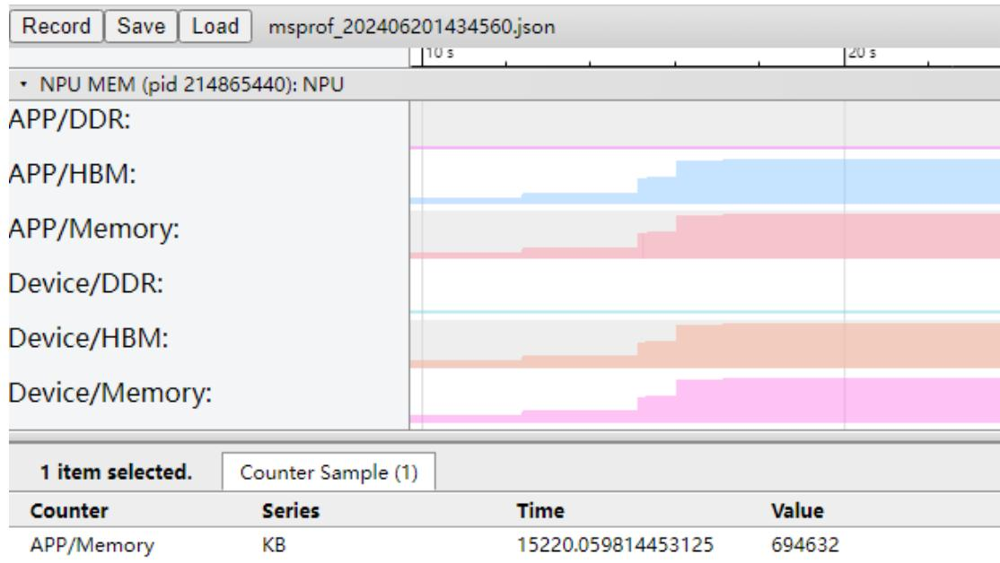

上图展示了进程级和设备级的内存占用情况，单位为KB，其中Memory字段表示内存占用总和。

# npu_mem_\*.csv 文件说明

npu_mem_\*.csv文件内容格式示例如下：

图 12-33 NPU MEM 层  
图 12-34 npu_mem_\*.csv  

<table><tr><td rowspan=1 colspan=1>Device_id event</td><td rowspan=1 colspan=1>event</td><td rowspan=1 colspan=1>ddr(KB)</td><td rowspan=1 colspan=1>hbm(KB)</td><td rowspan=1 colspan=1>memory(KB)</td><td rowspan=1 colspan=1>timestamp(us)</td><td rowspan=1 colspan=1></td></tr><tr><td rowspan=1 colspan=1></td><td rowspan=1 colspan=1>0APP</td><td rowspan=1 colspan=1>67336</td><td rowspan=1 colspan=1>24576</td><td rowspan=1 colspan=1>91912</td><td rowspan=1 colspan=2>91912 1709539654242981.240</td></tr><tr><td rowspan=1 colspan=1></td><td rowspan=1 colspan=1>O APP</td><td rowspan=1 colspan=1>67336</td><td rowspan=1 colspan=1>24576</td><td rowspan=1 colspan=1></td><td rowspan=1 colspan=2>91912 1709539654262967.240</td></tr><tr><td rowspan=1 colspan=1></td><td rowspan=1 colspan=1>O APP</td><td rowspan=1 colspan=1>67336</td><td rowspan=1 colspan=1>24576</td><td rowspan=1 colspan=1></td><td rowspan=1 colspan=2>91912 1709539654282965.240</td></tr><tr><td rowspan=1 colspan=1></td><td rowspan=1 colspan=1>0 APP</td><td rowspan=1 colspan=1>67336</td><td rowspan=1 colspan=1>24576</td><td rowspan=1 colspan=1></td><td rowspan=1 colspan=2>91912 1709539654302965.240</td></tr></table>

上表为内存占用情况明细，单位为KB，其中Memory字段表示内存占用总和。

# 12.19 npu_module_mem（NPU 组件内存占用）

NPU组件内存占用数据无timeline信息，summary信息在npu_module_mem_\*.csv文件汇总。

# 支持的型号

Atlas 200I/500 A2 推理产品  
Atlas 推理系列产品  
Atlas 训练系列产品  
Atlas A2 训练系列产品/Atlas A2 推理系列产品  
Atlas A3 训练系列产品/Atlas A3 推理系列产品

# npu_module_mem_\*.csv 文件数据说明

npu_module_mem_\*.csv文件内容格式示例如下：

图 12-35 npu_module_mem_\*.csv  

<table><tr><td rowspan=1 colspan=1>Device_id </td><td rowspan=1 colspan=1>Component</td><td rowspan=1 colspan=1>Timestamp(us)</td><td rowspan=1 colspan=1>Total Reserved(KB)</td><td rowspan=1 colspan=1>Device</td></tr><tr><td rowspan=1 colspan=1></td><td rowspan=1 colspan=1>O SLOG</td><td rowspan=1 colspan=1>170953965429548</td><td rowspan=1 colspan=1></td><td rowspan=1 colspan=1>0 NPU:0</td></tr><tr><td rowspan=1 colspan=1></td><td rowspan=1 colspan=1>O SLOG</td><td rowspan=1 colspan=1>170953965431538</td><td rowspan=1 colspan=1></td><td rowspan=1 colspan=1>0 NPU:0</td></tr><tr><td rowspan=1 colspan=1></td><td rowspan=1 colspan=1>O SLOG</td><td rowspan=1 colspan=1>170953965433539</td><td rowspan=1 colspan=1></td><td rowspan=1 colspan=1>0 NPU:0</td></tr><tr><td rowspan=1 colspan=1></td><td rowspan=1 colspan=1>O SLOG</td><td rowspan=1 colspan=1>170953965435538</td><td rowspan=1 colspan=1></td><td rowspan=1 colspan=1>0 NPU:0</td></tr></table>

表 12-96 字段说明  

<table><tr><td rowspan=1 colspan=1>字段名</td><td rowspan=1 colspan=1>字段含义</td></tr><tr><td rowspan=1 colspan=1>Device_id</td><td rowspan=1 colspan=1>设备ID。</td></tr><tr><td rowspan=1 colspan=1>Component</td><td rowspan=1 colspan=1>组件名称。</td></tr><tr><td rowspan=1 colspan=1>Timestamp(us)</td><td rowspan=1 colspan=1>时间戳，单位us。可查看组件在当前时刻占用的内存。</td></tr><tr><td rowspan=1 colspan=1>TotalReserved(KB)</td><td rowspan=1 colspan=1>内存占用大小，单位KB。若为-1，则可能是该组件只采集到了释放的内存。</td></tr><tr><td rowspan=1 colspan=1>Device</td><td rowspan=1 colspan=1>设备类型和设备ID，仅涉及NPU。</td></tr></table>

# 12.20 memory_record（CANN 算子的内存占用记录）

CANN算子的内存占用记录无timeline信息，summary信息在memory_record_\*.csv文件汇总，主要记录CANN层级的GE组件申请的内存及占用时间。

# 支持的型号

Atlas 200I/500 A2 推理产品  
Atlas 推理系列产品  
Atlas 训练系列产品  
Atlas A2 训练系列产品/Atlas A2 推理系列产品  
Atlas A3 训练系列产品/Atlas A3 推理系列产品

# memory_record_\*.csv 文件数据说明

memory_record_\*.csv文件内容格式示例如下：

图 12-36 memory_record_\*.csv  

<table><tr><td rowspan=1 colspan=1>Device_id </td><td rowspan=1 colspan=1>Component </td><td rowspan=1 colspan=1>Timestamp(us)</td><td rowspan=1 colspan=1>Total Allocated(KB)</td><td rowspan=1 colspan=1>Total Reserved(KB)</td><td rowspan=1 colspan=1>Device</td></tr><tr><td rowspan=1 colspan=1></td><td rowspan=1 colspan=1>0GE</td><td rowspan=1 colspan=1>1717578503839575.330</td><td rowspan=1 colspan=1>128</td><td rowspan=1 colspan=1>610560 NPU:0</td><td rowspan=1 colspan=1>NPU:0</td></tr><tr><td rowspan=1 colspan=1></td><td rowspan=1 colspan=1>0GE</td><td rowspan=1 colspan=1>1717578503839758.400</td><td rowspan=1 colspan=1>128</td><td rowspan=1 colspan=1>610560</td><td rowspan=1 colspan=1>NPU:0</td></tr><tr><td rowspan=1 colspan=1></td><td rowspan=1 colspan=1>0GE</td><td rowspan=1 colspan=1>1717578503840070.700</td><td rowspan=1 colspan=1>6272</td><td rowspan=1 colspan=1>610560 NPU:0</td><td rowspan=1 colspan=1>NPU:0</td></tr><tr><td rowspan=1 colspan=1></td><td rowspan=1 colspan=1>0GE</td><td rowspan=1 colspan=1>1717578503840522.780</td><td rowspan=1 colspan=1>6272</td><td rowspan=1 colspan=1>610560 NPU:0</td><td rowspan=1 colspan=1>NPU:0</td></tr><tr><td rowspan=1 colspan=1></td><td rowspan=1 colspan=1></td><td rowspan=1 colspan=1>1717578503841388.050</td><td rowspan=1 colspan=1>196736</td><td rowspan=1 colspan=1></td><td rowspan=1 colspan=1>NPU:0</td></tr><tr><td rowspan=1 colspan=1></td><td rowspan=1 colspan=1>0GE</td><td rowspan=1 colspan=1>1717578503841479.330</td><td rowspan=1 colspan=1>196736</td><td rowspan=1 colspan=1></td><td rowspan=1 colspan=1>NPU·O</td></tr><tr><td rowspan=1 colspan=1></td><td rowspan=1 colspan=1>0GE</td><td rowspan=1 colspan=1>1717578503842143.460</td><td rowspan=1 colspan=1>102528</td><td rowspan=1 colspan=1>610560 NPU:0</td><td rowspan=1 colspan=1>NPU:0</td></tr><tr><td rowspan=1 colspan=1></td><td rowspan=1 colspan=1>OGE</td><td rowspan=1 colspan=1>1717578503842415.420</td><td rowspan=1 colspan=1>102528</td><td rowspan=1 colspan=1>610560 NPU:0</td><td rowspan=1 colspan=1>NPUO</td></tr></table>

表 12-97 字段说明  

<table><tr><td rowspan=1 colspan=1>字段名</td><td rowspan=1 colspan=1>字段含义</td></tr><tr><td rowspan=1 colspan=1>Device_id</td><td rowspan=1 colspan=1>设备ID。</td></tr><tr><td rowspan=1 colspan=1>Component</td><td rowspan=1 colspan=1>组件，使用CANN软件包的性能分析工具仅采集GE组件。</td></tr><tr><td rowspan=1 colspan=1>Timestamp(us)</td><td rowspan=1 colspan=1>时间戳，记录内存占用的起始时间，单位us。</td></tr><tr><td rowspan=1 colspan=1>Total Allocated(KB)</td><td rowspan=1 colspan=1>内存分配总额，单位KB。</td></tr><tr><td rowspan=1 colspan=1>Total Reserved(KB)</td><td rowspan=1 colspan=1>内存预留总额，单位KB。</td></tr><tr><td rowspan=1 colspan=1>Device</td><td rowspan=1 colspan=1>设备类型和设备ID，仅涉及NPU。</td></tr></table>

# 12.21 operator_memory（CANN 算子的内存占用明细）

CANN算子的内存占用明细无timeline信息，summary信息在operator_memory_\*.csv文件汇总，主要记录CANN层级的算子在NPU上执行时所需内存及占用时间。

# 支持的型号

Atlas 200I/500 A2 推理产品  
Atlas 推理系列产品  
Atlas 训练系列产品

# Atlas A2 训练系列产品/Atlas A2 推理系列产品Atlas A3 训练系列产品/Atlas A3 推理系列产品

# operator_memory_\*.csv 文件数据说明

operator_memory_\*.csv文件内容格式示例如下：

图 12-37 operator_memory_\*.csv  

<table><tr><td>Device_idName</td><td></td><td>Size(KB) Allocation Time(us)</td><td></td><td>Duration(us) Allocation Total Allocated(KB)</td><td></td><td>Allocation Total Reserved(KB)</td><td>Release Total Allocated(KB)</td><td>Release Total Reserved(KB)</td><td>Device</td></tr><tr><td></td><td>0Graph 88</td><td></td><td>64 1717578503839575.330</td><td>183.07</td><td>128</td><td></td><td>610560</td><td>128</td><td>610560 NPU:0</td></tr><tr><td></td><td>0 Graph_22</td><td></td><td>6208 1717578503840070.700</td><td>452.08</td><td>6272</td><td></td><td>610560</td><td>6272</td><td>610560 NPU:0</td></tr><tr><td></td><td>0Graph_89</td><td></td><td>196672 1717578503841388.050</td><td>91.28</td><td>196736</td><td></td><td>610560</td><td>196736</td><td>610560 NPU:0</td></tr><tr><td></td><td>0Graph 90</td><td></td><td>102464 1717578503842143.460</td><td>271.96</td><td>102528</td><td></td><td>610560</td><td>102528</td><td>610560 NPU:0</td></tr></table>

关键字段说明如下。

表 12-98 字段说明  

<table><tr><td rowspan=1 colspan=1>字段名</td><td rowspan=1 colspan=1>字段含义</td></tr><tr><td rowspan=1 colspan=1>Device_id</td><td rowspan=1 colspan=1>设备ID。</td></tr><tr><td rowspan=1 colspan=1>Name</td><td rowspan=1 colspan=1>算子名称。</td></tr><tr><td rowspan=1 colspan=1>Size(KB)</td><td rowspan=1 colspan=1>算子占用内存大小，单位KB。</td></tr><tr><td rowspan=1 colspan=1>Allocation Time(us)</td><td rowspan=1 colspan=1>内存分配时间，单位us。</td></tr><tr><td rowspan=1 colspan=1>Duration(us)</td><td rowspan=1 colspan=1>内存占用时间，单位us。</td></tr><tr><td rowspan=1 colspan=1>Allocation TotalAllocated(KB)</td><td rowspan=1 colspan=1>算子内存分配时GE内存池分配总额，单位KB。</td></tr><tr><td rowspan=1 colspan=1>Allocation TotalReserved(KB)</td><td rowspan=1 colspan=1>算子内存分配时GE内存池总额，单位KB。</td></tr><tr><td rowspan=1 colspan=1>Release Total Allocated(KB)</td><td rowspan=1 colspan=1>算子内存释放时GE内存池分配总额，单位KB。</td></tr><tr><td rowspan=1 colspan=1>Release Total Reserved(KB)</td><td rowspan=1 colspan=1>算子内存释放时GE内存池总额，单位KB。</td></tr><tr><td rowspan=1 colspan=1>Device</td><td rowspan=1 colspan=1>设备类型和设备ID，仅涉及NPU。</td></tr></table>

# 负值空值说明

operator_memory_\*.csv文件中的部分信息存在空值或负值，是因为部分算子申请或释放不在性能数据采集进程的范围内，所以可能未采集到这些算子的内存申请或释放的过程。详细请参考下面示例：

图 12-38 空值负值说明  

<table><tr><td>1</td><td>Size(KB)</td><td>Allocation Time(us) Release Time(us) Duration(us)</td><td></td><td></td><td>Allocation Total Allocated(MB)</td><td>Allocation Total Reserved(MB)</td><td>Release Total Allocated(MB)</td><td>Release Total Reserved(MB)</td><td>Devi</td></tr><tr><td>Name 4853 aten:add</td><td>6120</td><td>7.75991E+11</td><td>7.75992E +11</td><td>494221.85</td><td></td><td>367.3442383</td><td>4628</td><td> 417.3447266</td><td>4628 NPU</td></tr><tr><td>4854 aten:mul</td><td></td><td>7.75992E+11</td><td>7.75992E +11</td><td>2226.589966</td><td></td><td>517.3447266</td><td></td><td>417.3447266</td><td>4628 NPU</td></tr><tr><td>4855 aten:.clone</td><td>51200</td><td>7.75991E+ 11</td><td>7.75992E +11</td><td></td><td></td><td>417.3442383</td><td></td><td>367.3447266</td><td>4628 NPU</td></tr><tr><td></td><td>51200</td><td>7.75992E+11</td><td></td><td>494097.4301 2259.059937</td><td></td><td></td><td></td><td></td><td></td></tr><tr><td>4856 aten:mul 4857aten:hardtanh_backward</td><td> 51200</td><td></td><td>7.75992E+11</td><td>291.0100098</td><td></td><td>567.3447266</td><td></td><td>367.3447266</td><td>4628 NPU</td></tr><tr><td></td><td>51200</td><td>7.75992E +11 7.75992E+11</td><td>7.75992E +11 7.75992E+11</td><td></td><td></td><td>467.3447266</td><td></td><td>317.3447266</td><td> 4628 NPU</td></tr><tr><td>4858 aten:add</td><td></td><td></td><td></td><td>572.0300293</td><td></td><td>417.3447266</td><td></td><td>317.3457031</td><td>4628 NPU</td></tr><tr><td>4859aten: convolution</td><td>51200</td><td>7.75991E+11</td><td>7.75992E +11</td><td>497978.04</td><td></td><td>267.3432617</td><td></td><td>267.3457031</td><td>4628 NPU</td></tr><tr><td> 4860aten:native_batch_norm</td><td>0.5</td><td>7 75991E+11</td><td>7.75992E+11</td><td>497194.6</td><td></td><td>267.34375</td><td></td><td>267.3452148</td><td>4628NPU</td></tr><tr><td>4861atenativeatcho</td><td></td><td>7.75991E +11</td><td>7.75992E+ 11</td><td>497162.6</td><td></td><td>267 3442383</td><td></td><td> 267.3447266</td><td>4628 NPU</td></tr><tr><td>4862atennatiebatchobackward</td><td>8</td><td>7.75992E +11</td><td>7.75992E+11</td><td>517.8499756</td><td></td><td>367.3452148</td><td></td><td>267.3442383</td><td>4628 NPU</td></tr><tr><td>4863aten:native_batch_norm_backward</td><td></td><td>7.75992E+11</td><td>7.75992E +11</td><td>629.9899902</td><td></td><td>367.3457031</td><td></td><td>267.34375</td><td>4628NPU</td></tr><tr><td>4864atencoolutioackard</td><td>9.5</td><td>7.75992E+11</td><td>7.75992E +11</td><td>295.7099609</td><td></td><td>267.3530273</td><td>4628</td><td>267.3486328</td><td> 4628 NPU</td></tr><tr><td> 4865atenatiebatcockad</td><td>51200</td><td>7.75992E +11</td><td>7.75992E+11</td><td>1057969971</td><td></td><td>367 3447266</td><td>4828</td><td>217.3486328</td><td> 4628 NPU</td></tr><tr><td>4866 aten:to</td><td>37632.5</td><td>7.75991E+11</td><td>7.75992E+11</td><td>499367.52</td><td></td><td>217.3432617</td><td></td><td>180.5981445</td><td> 4628 NPU</td></tr><tr><td>4867aten:convolution backward</td><td>5</td><td>7.75992E+11</td><td>7.75992E + 11</td><td>238.4200439</td><td></td><td>267.3579102</td><td>4628</td><td>180.5932617</td><td>4628NPU</td></tr><tr><td> 4868 aten:ones_like</td><td>0.5</td><td>7.75991E+11</td><td>7.75992E +11</td><td>188073.8</td><td></td><td> 3747.601563</td><td>4628</td><td>180.5927734</td><td> 4628 NPU</td></tr><tr><td>4869 aten.add</td><td>108.5 108.5</td><td>7.75992E+11 7.75992E+11</td><td>7.75992 +11</td><td>1428.799927</td><td></td><td>180.6987305</td><td>4628</td><td>180.6987305</td><td>4628 NPU</td></tr><tr><td> 4870 aten.sqrt</td><td>21524.5</td><td></td><td>7.75992E +11</td><td>1727.839966</td><td></td><td>180.8046875</td><td>4628</td><td>222.6328125</td><td> 4628 NPU</td></tr><tr><td>4871 aten.add 4872 aten sott</td><td>215245</td><td>7.75992E+11 775992F+11</td><td>7.75992E+11</td><td> 1264.819946</td><td></td><td>201.71875</td><td>4628</td><td>201612793</td><td> 4628 NPU</td></tr><tr><td>487</td><td>05</td><td></td><td>7.75992E +11 7.75989E +11</td><td>791.0200195</td><td></td><td>222.7387695</td><td>4628</td><td>180.5927734 3747.601563</td><td> 4628 NPU</td></tr><tr><td colspan="10"></td></tr><tr><td>4874aten.emply sutded 4875 aten:empty strided</td><td></td><td>7.75991E +11</td><td></td><td></td><td></td><td>180.0947266</td><td>4628</td><td></td><td>4628INPU </td></tr><tr><td></td><td></td><td>7.75991+11</td><td></td><td></td><td></td><td>254.0947266</td><td></td><td></td><td></td></tr><tr><td>4876aten:to</td><td></td><td>7.75991E+11</td><td></td><td></td><td></td><td>3747.845215</td><td>4628</td><td></td><td></td></tr><tr><td> 4877 aten:nlUoss.forward</td><td>0.5</td><td>7.75991E+11</td><td></td><td></td><td></td><td>3747.601074</td><td></td><td></td><td>NPU</td></tr><tr><td> 4878 aten:sum</td><td>8</td><td>7. 75991E+11</td><td></td><td></td><td></td><td>3747.611816</td><td></td><td></td><td>NPU</td></tr><tr><td> 4879 aten:sum</td><td></td><td>7.75991E+11</td><td></td><td></td><td></td><td>3747.614258</td><td></td><td></td><td></td></tr><tr><td></td><td></td><td>7.75991E+11</td><td></td><td></td><td></td><td>3747.601563</td><td>4628</td><td></td><td>NPU</td></tr></table>

负值说明：上图中4873行的Size列出现了负值（内存申请Size为正值，内存释放Size为负值，如果在采集性能数据的范围内申请且释放了内存，那么Size取申请的数值），而Name列无法识别到算子名称，且其他Allocation列分配内存为空，Release列释放内存数值正常，说明该算子的内存申请在性能数据采集进程前，但内存释放在性能数据采集的范围内，所以仅采集到了内存释放的负值。另外算子名的识别仅在内存申请时进行，所以内存释放时无法识别到算子名，又因为内存申请不在采集性能数据的范围内，所以Allocation列分配内存为空。

空值说明：上图中4874行之后的算子在Release列释放内存数值为空，其他数值正常，说明这些算子的内存申请在性能数据采集的范围内，内存释放却在性能数据采集的范围外，未采集到内存释放所以Release列为空。

# 12.22 static_op_mem（静态图算子内存）

静态图算子内存无timeline信息，summary信息在static_op_mem_\*.csv文件汇总。

# 支持的型号

Atlas 200I/500 A2 推理产品  
Atlas 推理系列产品  
Atlas 训练系列产品  
Atlas A2 训练系列产品/Atlas A2 推理系列产品  
Atlas A3 训练系列产品/Atlas A3 推理系列产品

# static_op_mem_\*.csv 文件数据说明

static_op_mem_\*.csv文件内容格式示例如下：

图 12-39 static_op_mem_\*.csv  

<table><tr><td rowspan=1 colspan=1>Device_id</td><td rowspan=1 colspan=1>Op Name</td><td rowspan=1 colspan=1>Model Name</td><td rowspan=1 colspan=1>Graph ID </td><td rowspan=1 colspan=1>Node Index Start</td><td rowspan=1 colspan=1>Node Index End</td><td rowspan=1 colspan=1>Size(KB)</td></tr><tr><td rowspan=1 colspan=1>host</td><td rowspan=1 colspan=1>Default/Conv2D-op0</td><td rowspan=1 colspan=1>0</td><td rowspan=1 colspan=1>1</td><td rowspan=1 colspan=1>6</td><td rowspan=1 colspan=1>7</td><td rowspan=1 colspan=1>307200</td></tr><tr><td rowspan=1 colspan=1>host</td><td rowspan=1 colspan=1>trans_Cast_0</td><td rowspan=1 colspan=1>0</td><td rowspan=1 colspan=1>1</td><td rowspan=1 colspan=1>1</td><td rowspan=1 colspan=1>2</td><td rowspan=1 colspan=1>153600</td></tr><tr><td rowspan=1 colspan=1>host</td><td rowspan=1 colspan=1>trans_Cast 2</td><td rowspan=1 colspan=1>0</td><td rowspan=1 colspan=1></td><td rowspan=1 colspan=1>4</td><td rowspan=1 colspan=1>5</td><td rowspan=1 colspan=1>900.0313</td></tr><tr><td rowspan=1 colspan=1>host</td><td rowspan=1 colspan=1>trans_TransData_4</td><td rowspan=1 colspan=1>0</td><td rowspan=1 colspan=1>1</td><td rowspan=1 colspan=1>7</td><td rowspan=1 colspan=1>8</td><td rowspan=1 colspan=1>307200</td></tr></table>

单算子场景通过调用aclprofCreateConfig接口开启ACL_PROF_TASK_MEMORY开关采集生成，该数据仅在模型编译阶段上报。通过该文件可以查看静态图场景下每个Graph子图下算子的内存申请情况。

静态图场景下由Graph ID区分不同的计算图；动态子图场景下由Model Name（根节点名字）区分不同的子图。

表 12-99 字段说明  

<table><tr><td rowspan=1 colspan=1>字段名</td><td rowspan=1 colspan=1>字段含义</td></tr><tr><td rowspan=1 colspan=1>Device_id</td><td rowspan=1 colspan=1>设备ID。</td></tr><tr><td rowspan=1 colspan=1>Op Name</td><td rowspan=1 colspan=1>算子名称。其中最后一行为TOTAL，表示申请的总内存。</td></tr><tr><td rowspan=1 colspan=1>Model Name</td><td rowspan=1 colspan=1>表示的静态子图根节点的名字，如果为0表示为静态图，没有静态子图，如果有静态子图则显示其根节点名字。</td></tr><tr><td rowspan=1 colspan=1>Graph ID</td><td rowspan=1 colspan=1>Graph ID，每个Graph ID对应一张计算图。</td></tr><tr><td rowspan=1 colspan=1>Node Index Start</td><td rowspan=1 colspan=1>算子申请内存的逻辑时间。</td></tr><tr><td rowspan=1 colspan=1>Node Index End</td><td rowspan=1 colspan=1>算子释放内存的逻辑时间。显示为4294967295时，表示算子内存申请的时间最大值，即算子内存释放时间在计算图的生命周期结束时间。</td></tr><tr><td rowspan=1 colspan=1>Size(KB)</td><td rowspan=1 colspan=1>申请的内存大小，单位KB。</td></tr></table>

# 12.23 sys_mem（系统内存数据）

系统内存数据无timeline信息，summary信息在sys_mem_\*.csv文件汇总。

# 支持的型号

Atlas 200I/500 A2 推理产品  
Atlas 推理系列产品  
Atlas 训练系列产品  
Atlas A2 训练系列产品/Atlas A2 推理系列产品  
Atlas A3 训练系列产品/Atlas A3 推理系列产品

# sys_mem_\*.csv 文件数据说明

sys_mem_\*.csv文件内容格式示例如下：

图 12-40 sys_mem_\*.csv

表 12-100 字段说明  

<table><tr><td rowspan=1 colspan=1>字段名</td><td rowspan=1 colspan=1>字段含义</td></tr><tr><td rowspan=1 colspan=1>Device_id</td><td rowspan=1 colspan=1>设备ID。</td></tr><tr><td rowspan=1 colspan=1>Memory Total(kB)</td><td rowspan=1 colspan=1>系统总内存，单位kB。</td></tr><tr><td rowspan=1 colspan=1>Memory Free(kB)</td><td rowspan=1 colspan=1>系统内存剩余，单位kB。</td></tr><tr><td rowspan=1 colspan=1>Buffers(kB)</td><td rowspan=1 colspan=1>内存缓冲区大小，单位kB。</td></tr><tr><td rowspan=1 colspan=1>Cached(kB)</td><td rowspan=1 colspan=1>高速缓冲存储器使用大小，单位kB。</td></tr><tr><td rowspan=1 colspan=1>Share Memory(kB)</td><td rowspan=1 colspan=1>共享内存，单位kB。</td></tr><tr><td rowspan=1 colspan=1>Commit Limit(kB)</td><td rowspan=1 colspan=1>虚拟内存限值，单位kB。</td></tr><tr><td rowspan=1 colspan=1>Committed AS(kB)</td><td rowspan=1 colspan=1>系统已经分配的内存，单位kB。</td></tr><tr><td rowspan=1 colspan=1>Huge PagesTotal(pages)</td><td rowspan=1 colspan=1>系统大内存页（huge page）总数。</td></tr><tr><td rowspan=1 colspan=1>Huge PagesFree(pages)</td><td rowspan=1 colspan=1>系统大内存页（hugepage）剩余总数。</td></tr></table>

# 12.24 process_mem（进程内存占用数据）

进程内存占用数据无timeline信息，summary信息在process_mem_\*.csv文件汇总。

# 支持的型号

Atlas 200I/500 A2 推理产品  
Atlas 推理系列产品  
Atlas 训练系列产品  
Atlas A2 训练系列产品/Atlas A2 推理系列产品  
Atlas A3 训练系列产品/Atlas A3 推理系列产品

# process_mem_\*.csv 文件数据说明

process_mem_\*.csv文件内容格式示例如下：

图 12-41 process_mem_\*.csv  

<table><tr><td rowspan=1 colspan=1>Device_id</td><td rowspan=1 colspan=1>PID</td><td rowspan=1 colspan=1>Name</td><td rowspan=1 colspan=1>Size(pages)</td><td rowspan=1 colspan=1>Resident(pages)</td><td rowspan=1 colspan=1>Shared(pages)</td></tr><tr><td rowspan=1 colspan=1>1</td><td rowspan=1 colspan=1>1563354</td><td rowspan=1 colspan=1>1563354 tf_add.py</td><td rowspan=1 colspan=1>2156282682</td><td rowspan=1 colspan=1>383738</td><td rowspan=1 colspan=1>128811</td></tr><tr><td rowspan=1 colspan=1>1</td><td rowspan=1 colspan=1>1564146 tf_add.py</td><td rowspan=1 colspan=1>1564146 tf_add.py</td><td rowspan=1 colspan=1>7889309</td><td rowspan=1 colspan=1>263435</td><td rowspan=1 colspan=1>1751</td></tr><tr><td rowspan=1 colspan=1>1</td><td rowspan=1 colspan=1>12980</td><td rowspan=1 colspan=1>12980 dockerd</td><td rowspan=1 colspan=1>2705663</td><td rowspan=1 colspan=1>17685</td><td rowspan=1 colspan=1>9272</td></tr><tr><td rowspan=1 colspan=1>1</td><td rowspan=1 colspan=1>13009</td><td rowspan=1 colspan=1>13009 containerd</td><td rowspan=1 colspan=1>1845135</td><td rowspan=1 colspan=1>8039</td><td rowspan=1 colspan=1>3882</td></tr></table>

表 12-101 字段说明  

<table><tr><td rowspan=1 colspan=1>字段名</td><td rowspan=1 colspan=1>字段含义</td></tr><tr><td rowspan=1 colspan=1>Device_id</td><td rowspan=1 colspan=1>设备ID。</td></tr><tr><td rowspan=1 colspan=1>PID</td><td rowspan=1 colspan=1>进程ID。</td></tr><tr><td rowspan=1 colspan=1>Name</td><td rowspan=1 colspan=1>进程名称。</td></tr><tr><td rowspan=1 colspan=1>Size(pages)</td><td rowspan=1 colspan=1>进程占用内存页数。</td></tr><tr><td rowspan=1 colspan=1>Resident(pages)</td><td rowspan=1 colspan=1>进程占用的物理内存页数。</td></tr><tr><td rowspan=1 colspan=1>Shared(pages)</td><td rowspan=1 colspan=1>进程占用的共享内存页数。</td></tr></table>

# 12.25 cpu_usage（AI CPU、Ctrl CPU 利用率）

AI CPU（执行AI CPU算子）、Ctrl CPU（执行Driver任务）利用率数据无timeline信息，summary信息在cpu_usage_\*.csv文件汇总。

# 支持的型号

Atlas 200I/500 A2 推理产品  
Atlas 推理系列产品  
Atlas 训练系列产品  
Atlas A2 训练系列产品/Atlas A2 推理系列产品  
Atlas A3 训练系列产品/Atlas A3 推理系列产品

# cpu_usage_\*.csv 文件数据说明

cpu_usage_\*.csv文件内容格式示例如下：

图 12-42 cpu_usage_\*.csv  

<table><tr><td rowspan=1 colspan=1>Device_id</td><td rowspan=1 colspan=1>Cpu Type</td><td rowspan=1 colspan=1>User(%)</td><td rowspan=1 colspan=1>Sys(6)</td><td rowspan=1 colspan=1>loWait(%6)</td><td rowspan=1 colspan=1>Irq(5)</td><td rowspan=1 colspan=1>Soft(%)</td><td rowspan=1 colspan=1>Idle(%)</td></tr><tr><td rowspan=1 colspan=1></td><td rowspan=1 colspan=1>1 aicpu</td><td rowspan=1 colspan=1>0.053</td><td rowspan=1 colspan=1>0.052</td><td rowspan=1 colspan=1>0.008</td><td rowspan=1 colspan=1>0.042</td><td rowspan=1 colspan=1>0.015</td><td rowspan=1 colspan=1>99.785</td></tr><tr><td rowspan=1 colspan=1></td><td rowspan=1 colspan=1>1 ctrlcpu</td><td rowspan=1 colspan=1>0.021</td><td rowspan=1 colspan=1>0.052</td><td rowspan=1 colspan=1>0.008</td><td rowspan=1 colspan=1>0.042</td><td rowspan=1 colspan=1>0.015</td><td rowspan=1 colspan=1>99.785</td></tr></table>

表 12-102 字段说明  

<table><tr><td colspan="1" rowspan="1">字段名</td><td colspan="1" rowspan="1">字段含义</td></tr><tr><td colspan="1" rowspan="1">Device_id</td><td colspan="1" rowspan="1">设备ID。</td></tr><tr><td colspan="1" rowspan="1">Cpu Type</td><td colspan="1" rowspan="1">CPU类型，包含AI CPU和Ctrl CPU。</td></tr><tr><td colspan="1" rowspan="1">User(%)</td><td colspan="1" rowspan="1">用户态进程执行时长（多个AI CPU和Ctrl CPU的平均值）占比。</td></tr><tr><td colspan="1" rowspan="1">Sys(%)</td><td colspan="1" rowspan="1">内核态进程执行时长（多个AICPU和Ctrl CPU的平均值）占比。</td></tr><tr><td colspan="1" rowspan="1">loWait(%)</td><td colspan="1" rowspan="1">IO等待状态时长（多个AI CPU和Ctrl CPU的平均值）占比。</td></tr><tr><td colspan="1" rowspan="1">Irq(%)</td><td colspan="1" rowspan="1">硬件中断时长（多个AI CPU和Ctrl CPU的平均值）占比。</td></tr><tr><td colspan="1" rowspan="1">Soft(%)</td><td colspan="1" rowspan="1">软件中断时长（多个AI CPU和Ctrl CPU的平均值）占比。</td></tr><tr><td colspan="1" rowspan="1">Idle(%)</td><td colspan="1" rowspan="1">空闲状态时长（多个AI CPU和Ctrl CPU的平均值）占比。</td></tr></table>

# 12.26 process_cpu_usage（进程 CPU 占用率）

进程CPU占用率数据无timeline信息，summary信息在process_cpu_usage文件汇总。

支持的型号

Atlas 200I/500 A2 推理产品  
Atlas 推理系列产品  
Atlas 训练系列产品  
Atlas A2 训练系列产品/Atlas A2 推理系列产品  
Atlas A3 训练系列产品/Atlas A3 推理系列产品

# process_cpu_usage_\*.csv 文件数据说明

process_cpu_usage_\*.csv文件内容格式示例如下：

图 12-43 process_cpu_usage_\*.csv  

<table><tr><td rowspan=1 colspan=1>Device_id</td><td rowspan=1 colspan=1>PID</td><td rowspan=1 colspan=1>Name</td><td rowspan=1 colspan=1>CPU(9)</td></tr><tr><td rowspan=1 colspan=1>1</td><td rowspan=1 colspan=1>1938 DCM</td><td rowspan=1 colspan=1>1938 DCM</td><td rowspan=1 colspan=1>0.422</td></tr><tr><td rowspan=1 colspan=1>1</td><td rowspan=1 colspan=1>1956 </td><td rowspan=1 colspan=1>sshd</td><td rowspan=1 colspan=1>0.304</td></tr><tr><td rowspan=1 colspan=1>1</td><td rowspan=1 colspan=1>2505</td><td rowspan=1 colspan=1>2505 saccservice</td><td rowspan=1 colspan=1>0.199</td></tr><tr><td rowspan=1 colspan=1>1</td><td rowspan=1 colspan=1>1696 FCM</td><td rowspan=1 colspan=1>1696 FCM</td><td rowspan=1 colspan=1>0.136</td></tr></table>

表 12-103 字段说明  

<table><tr><td rowspan=1 colspan=1>字段名</td><td rowspan=1 colspan=1>字段含义</td></tr><tr><td rowspan=1 colspan=1>Device_id</td><td rowspan=1 colspan=1>设备ID。</td></tr><tr><td rowspan=1 colspan=1>PID</td><td rowspan=1 colspan=1>进程ID。</td></tr><tr><td rowspan=1 colspan=1>Name</td><td rowspan=1 colspan=1>进程名称。</td></tr><tr><td rowspan=1 colspan=1>CPU(%)</td><td rowspan=1 colspan=1>该进程CPU占用率。</td></tr></table>

# 12.27 片上内存读写速率

片上内存读写速率数据timeline信息在msprof_\*.json文件展示，summary信息在ddr_\*.csv和hbm_\*.csv文件汇总。

# msprof_\*.json 文件的片上内存数据说明

msprof_\*.json文件片上内存数据如下图所示。

图 12-44 片上内存 1  

<table><tr><td colspan="4"> DDR (pid 132397)</td></tr><tr><td>DDR/Read:</td><td></td><td></td><td></td></tr><tr><td>DDR/Write:</td><td></td><td></td><td></td></tr></table>

<table><tr><td>1 item selected.</td><td>Counter Sample (1)</td><td colspan="2"></td></tr><tr><td> Counter</td><td> Series</td><td>Time</td><td> value</td></tr><tr><td>DDR/Write</td><td>write(MB/s)</td><td>132.17299999296665</td><td>335.693359375</td></tr></table>

<table><tr><td>Record</td><td>Save Load</td><td colspan="6"> msprof_20231130112521.json</td></tr><tr><td colspan="6">: HBM (pid 19970981100): NPU</td><td></td><td></td></tr><tr><td colspan="7">HBM 0/Read:</td><td></td></tr><tr><td rowspan="12">HBM 0/Write: HBM 1/Read:</td><td rowspan="12"></td><td></td><td></td><td colspan="2"></td><td></td></tr><tr><td></td><td></td><td colspan="2"></td><td></td></tr><tr><td></td><td></td><td colspan="2"></td><td></td></tr><tr><td></td><td></td><td colspan="2"></td><td></td></tr><tr><td></td><td></td><td colspan="2"></td><td></td></tr><tr><td></td><td></td><td colspan="2"></td><td></td></tr><tr><td></td><td></td><td colspan="2"></td><td></td></tr><tr><td>HBM3/Write:</td><td></td><td colspan="2"></td><td></td><td></td></tr><tr><td colspan="8"></td></tr><tr><td>1 item selected. Counter Sample (1)</td><td colspan="5"></td><td></td></tr><tr><td> Counter</td><td colspan="2">Series Time</td><td colspan="3"> value</td><td></td></tr><tr><td> HBM 1/Write</td><td colspan="2">Write(MB/s)</td><td colspan="3">5040.79736328125 0</td><td></td></tr></table>

上图展示了片上内存的读写速率，单位为MB/s。

# ddr_\*.csv 文件说明

ddr_\*.csv文件内容格式示例如下：

图 12-46 ddr_\*.csv  

<table><tr><td rowspan=1 colspan=1>Device_id</td><td rowspan=1 colspan=1>Metric</td><td rowspan=1 colspan=1>Read(MB/s)</td><td rowspan=1 colspan=1>Write(MB/s)</td></tr><tr><td rowspan=1 colspan=1></td><td rowspan=1 colspan=1>0 Average</td><td rowspan=1 colspan=1>116.415</td><td rowspan=1 colspan=1>93.474</td></tr></table>

表 12-104 字段说明  

<table><tr><td rowspan=1 colspan=1>字段名</td><td rowspan=1 colspan=1>字段含义</td></tr><tr><td rowspan=1 colspan=1>Device_id</td><td rowspan=1 colspan=1>设备ID。</td></tr><tr><td rowspan=1 colspan=1>Metric</td><td rowspan=1 colspan=1>统计项。</td></tr><tr><td rowspan=1 colspan=1>Read(MB/s)</td><td rowspan=1 colspan=1>读取速率，单位MB/s。</td></tr><tr><td rowspan=1 colspan=1>Write(MB/s)</td><td rowspan=1 colspan=1>写速率，单位MB/s。</td></tr></table>

# hbm_\*.csv 文件说明

hbm_\*.csv文件内容格式示例如下：

图 12-47 hbm_\*.csv  

<table><tr><td rowspan=1 colspan=1>Device_id Metric</td><td rowspan=1 colspan=1>Metric</td><td rowspan=1 colspan=1>Read(MB/s)</td><td rowspan=1 colspan=1>Write(MB/s)</td></tr><tr><td rowspan=1 colspan=1></td><td rowspan=1 colspan=1>0 Average</td><td rowspan=1 colspan=1>9.569</td><td rowspan=1 colspan=1>1.487</td></tr><tr><td rowspan=1 colspan=1>0</td><td rowspan=1 colspan=1>0</td><td rowspan=1 colspan=1>10.08</td><td rowspan=1 colspan=1>2.176</td></tr><tr><td rowspan=1 colspan=1>0</td><td rowspan=1 colspan=1>1</td><td rowspan=1 colspan=1>9.409</td><td rowspan=1 colspan=1>1.49</td></tr><tr><td rowspan=1 colspan=1>0</td><td rowspan=1 colspan=1>2</td><td rowspan=1 colspan=1>9.391</td><td rowspan=1 colspan=1>1.125</td></tr><tr><td rowspan=1 colspan=1>0</td><td rowspan=1 colspan=1>3</td><td rowspan=1 colspan=1>9.394</td><td rowspan=1 colspan=1>1.157</td></tr></table>

表 12-105 字段说明  

<table><tr><td rowspan=1 colspan=1>字段名</td><td rowspan=1 colspan=1>字段含义</td></tr><tr><td rowspan=1 colspan=1>Device_id</td><td rowspan=1 colspan=1>设备ID。</td></tr><tr><td rowspan=1 colspan=1>Metric</td><td rowspan=1 colspan=1>统计项，数值为内存访问单元的ID。</td></tr><tr><td rowspan=1 colspan=1>Read(MB/s)</td><td rowspan=1 colspan=1>读取速率，单位MB/s。</td></tr><tr><td rowspan=1 colspan=1>Write(MB/s)</td><td rowspan=1 colspan=1>写速率，单位MB/s。</td></tr></table>

# 12.28 hccs（集合通信带宽）

HCCS集合通信带宽数据timeline信息在msprof_\*.json文件的HCCS层级展示，summary信息在hccs_\*.csv文件汇总。

# 支持的型号

Atlas 训练系列产品

Atlas A2 训练系列产品/Atlas A2 推理系列产品Atlas A3 训练系列产品/Atlas A3 推理系列产品

# msprof_\*.json 文件的 HCCS 层级数据说明

msprof_\*.json文件HCCS层级数据如下图所示。

图 12-48 HCCS 层  

<table><tr><td colspan="4">- HCCS (pid 19970981300): NPU</td></tr><tr><td>Rx:</td><td></td><td></td><td></td></tr><tr><td rowspan="2">Tx:</td><td></td><td></td><td></td></tr><tr><td></td><td></td><td></td></tr></table>

<table><tr><td>1 item selected.</td><td>Counter Sample (1)</td><td colspan="3"></td></tr><tr><td> Counter</td><td> Series</td><td>Time</td><td></td><td> Value</td></tr><tr><td>Rx</td><td> Rx (MB/s)</td><td>59.992329984903336</td><td>120.00468659544654</td><td></td></tr></table>

表 12-106 字段说明  

<table><tr><td>字段名</td><td>字段含义</td></tr><tr><td>Rx、Tx</td><td>接收带宽、发送带宽，单位MB/s。</td></tr></table>

# hccs_\*.csv 文件说明

hccs_\*.csv文件内容格式示例如下：

图 12-49 hccs_\*.csv  

<table><tr><td rowspan=1 colspan=1>Device_id Mode</td><td rowspan=1 colspan=1>Mode</td><td rowspan=1 colspan=1>Max</td><td rowspan=1 colspan=1>Min</td><td rowspan=1 colspan=1>Average</td></tr><tr><td rowspan=1 colspan=1></td><td rowspan=1 colspan=1>0 Tx (MB/s)</td><td rowspan=1 colspan=1>0</td><td rowspan=1 colspan=1>0</td><td rowspan=1 colspan=1></td></tr><tr><td rowspan=1 colspan=1></td><td rowspan=1 colspan=1>0 Rx (MB/s)</td><td rowspan=1 colspan=1>0</td><td rowspan=1 colspan=1>0</td><td rowspan=1 colspan=1></td></tr></table>

表 12-107 字段说明  

<table><tr><td rowspan=1 colspan=1>字段名</td><td rowspan=1 colspan=1>字段含义</td></tr><tr><td rowspan=1 colspan=1>Device_id</td><td rowspan=1 colspan=1>设备ID。</td></tr><tr><td rowspan=1 colspan=1>Mode</td><td rowspan=1 colspan=1>Tx（发送带宽），Rx（接收带宽），单位MB/s。</td></tr><tr><td rowspan=1 colspan=1>Max</td><td rowspan=1 colspan=1>最大带宽，单位MB/s。</td></tr><tr><td rowspan=1 colspan=1>Min</td><td rowspan=1 colspan=1>最小带宽，单位MB/s。</td></tr><tr><td rowspan=1 colspan=1>Average</td><td rowspan=1 colspan=1>平均带宽，单位MB/s。</td></tr></table>

# 12.29 nic（每个时间节点网络信息）

每个时间节点网络信息数据timeline信息在msprof_\*.json文件的NIC层级展示，summary信息在nic_\*.csv文件汇总。

# 支持的型号

Atlas 200I/500 A2 推理产品  
Atlas 训练系列产品  
Atlas A2 训练系列产品/Atlas A2 推理系列产品Atlas A3 训练系列产品/Atlas A3 推理系列产品

# msprof_\*.json 文件的 NIC 层级数据说明

msprof_\*.json文件NIC层数据如下图所示。

图 12-50 NIC 层  

<table><tr><td colspan="5">: NIC (pid 2818680288): NPU</td></tr><tr><td colspan="2" rowspan="3">Port 0/Rx: Port 0/Tx:</td><td colspan="2">山</td><td></td></tr><tr><td colspan="2"></td><td></td></tr><tr><td colspan="2"></td><td></td></tr><tr><td> 4 items selected.</td><td colspan="2">Counter Samples (4)</td><td></td></tr><tr><td>Counter</td><td colspan="2">Series Time</td><td> value</td></tr><tr><td>Port 0/Rx</td><td colspan="2">Rx Dropped Rate 3431.3916015625</td><td>0</td></tr><tr><td>Port 0/Rx</td><td colspan="2">Rx Error Rate</td><td>0</td></tr><tr><td>Port O/Rx</td><td colspan="2">Rx Packets</td><td></td></tr><tr><td>Port 0/Rx</td><td colspan="2"> Rx Bandwidth Efficiency</td><td></td></tr></table>

表 12-108 字段说明  

<table><tr><td rowspan=1 colspan=1>字段名</td><td rowspan=1 colspan=1>字段含义</td></tr><tr><td rowspan=1 colspan=1>Tx/Rx DroppedRate</td><td rowspan=1 colspan=1>发送/接收包丢包率。</td></tr><tr><td rowspan=1 colspan=1>Tx/Rx ErrorRate</td><td rowspan=1 colspan=1>发送/接收包错误率。</td></tr><tr><td rowspan=1 colspan=1>Tx/Rx Packets</td><td rowspan=1 colspan=1>发送/接收包速率。</td></tr><tr><td rowspan=1 colspan=1>Tx/RxBandwidthEfficiency</td><td rowspan=1 colspan=1>发送/接收包带宽利用率。</td></tr></table>

# nic_\*.csv 文件说明

nic_\*.csv文件内容格式示例如下：

图 12-51 nic_\*.csv

表 12-109 字段说明  

<table><tr><td rowspan=1 colspan=1>字段名</td><td rowspan=1 colspan=1>字段含义</td></tr><tr><td rowspan=1 colspan=1>Device_id</td><td rowspan=1 colspan=1>设备ID。</td></tr><tr><td rowspan=1 colspan=1>Timestamp(us)</td><td rowspan=1 colspan=1>时间节点，单位us。</td></tr><tr><td rowspan=1 colspan=1>Bandwidth(MB/s)</td><td rowspan=1 colspan=1>带宽大小，单位MB/s。</td></tr><tr><td rowspan=1 colspan=1>Rx Bandwidthefficiency(%)</td><td rowspan=1 colspan=1>接收包带宽利用率。</td></tr><tr><td rowspan=1 colspan=1>rxPacket/s</td><td rowspan=1 colspan=1>每秒接收包速率。</td></tr><tr><td rowspan=1 colspan=1>rxError rate(%)</td><td rowspan=1 colspan=1>接收包错误率。</td></tr><tr><td rowspan=1 colspan=1>rxDropped rate(%)</td><td rowspan=1 colspan=1>接收包丢包率。</td></tr><tr><td rowspan=1 colspan=1>Tx Bandwidthefficiency(%)</td><td rowspan=1 colspan=1>发送包带宽利用率。</td></tr><tr><td rowspan=1 colspan=1>txPacket/s</td><td rowspan=1 colspan=1>每秒发送包速率。</td></tr><tr><td rowspan=1 colspan=1>txError rate(%)</td><td rowspan=1 colspan=1>发送包错误率。</td></tr><tr><td rowspan=1 colspan=1>txDropped rate(%)</td><td rowspan=1 colspan=1>发送包丢包率。</td></tr><tr><td rowspan=1 colspan=1>funcld</td><td rowspan=1 colspan=1>网络节点。</td></tr></table>

# 12.30 roce（RoCE 通信接口带宽）

RoCE通信接口带宽数据timeline信息在msprof_\*.json文件的RoCE层级展示，summary信息在roce_\*.csv文件汇总。

# 支持的型号

Atlas 训练系列产品Atlas A2 训练系列产品/Atlas A2 推理系列产品Atlas A3 训练系列产品/Atlas A3 推理系列产品

# msprof_\*.json 文件的 RoCE 层级数据说明

msprof_\*.json文件RoCE层级数据如下图所示。

图 12-52 RoCE 层  

<table><tr><td colspan="2">RoCE (pid 2818680320): NPU Port 0/Rx:</td><td colspan="2"></td><td></td></tr><tr><td colspan="2">Port 0/Tx:</td><td colspan="2"></td><td></td></tr><tr><td colspan="2"></td><td colspan="3"></td></tr><tr><td> 4 items selected.</td><td colspan="2">Counter Samples (4)</td><td colspan="2"></td></tr><tr><td colspan="3">Counter Series</td><td> Time</td><td>val</td></tr><tr><td colspan="2">Port 0/Tx</td><td colspan="2">Tx Dropped Rate</td><td>3447.462646484375 0</td></tr><tr><td colspan="3">Port 0/Tx Tx Error Rate</td><td>3447.462646484375</td><td>0</td></tr><tr><td colspan="2">Port 0/Tx</td><td colspan="2">Tx Packets</td><td>3447.462646484375</td></tr><tr><td colspan="3">Port 0/Tx Tx Bandwidth Efficiency</td><td>3447.462646484375</td></tr></table>

表 12-110 字段说明  

<table><tr><td rowspan=1 colspan=1>字段名</td><td rowspan=1 colspan=1>字段含义</td></tr><tr><td rowspan=1 colspan=1>Tx/Rx_Dropped_Rate</td><td rowspan=1 colspan=1>发送/接收包丢包率。</td></tr><tr><td rowspan=1 colspan=1>Tx/Rx_Error_Rate</td><td rowspan=1 colspan=1>发送/接收包错误率。</td></tr><tr><td rowspan=1 colspan=1>Tx/Rx_Packets</td><td rowspan=1 colspan=1>每秒发送/接收包速率。</td></tr><tr><td rowspan=1 colspan=1>Tx/Rx_Bandwidth_Efficiency</td><td rowspan=1 colspan=1>发送/接收包带宽利用率。</td></tr></table>

# roce_\*.csv 文件说明

roce_\*.csv文件内容格式示例如下：

图 12-53 roce_\*.csv

表 12-111 字段说明  

<table><tr><td rowspan=1 colspan=1>字段名</td><td rowspan=1 colspan=1>字段含义</td></tr><tr><td rowspan=1 colspan=1>Device_id</td><td rowspan=1 colspan=1>设备ID。</td></tr><tr><td rowspan=1 colspan=1>Timestamp(us)</td><td rowspan=1 colspan=1>时间戳，单位us。</td></tr><tr><td rowspan=1 colspan=1>Bandwidth(MB/s)</td><td rowspan=1 colspan=1>带宽大小，单位MB/s。</td></tr></table>

# 12.31 pcie（PCIe 带宽）

PCIe带宽数据timeline信息在msprof_\*.json文件的PCIe层级展示，summary信息在pcie_\*.csv文件汇总。

# 支持的型号

图 12-54 PCIe 层  

<table><tr><td rowspan=1 colspan=1>字段名</td><td rowspan=1 colspan=1>字段含义</td></tr><tr><td rowspan=1 colspan=1>Rx Bandwidthefficiency(%)</td><td rowspan=1 colspan=1>接收包带宽利用率。</td></tr><tr><td rowspan=1 colspan=1>rxPacket/s</td><td rowspan=1 colspan=1>每秒接收包速率。</td></tr><tr><td rowspan=1 colspan=1>rxError rate(%)</td><td rowspan=1 colspan=1>接收包错误率。</td></tr><tr><td rowspan=1 colspan=1>rxDropped rate(%)</td><td rowspan=1 colspan=1>接收包丢包率。</td></tr><tr><td rowspan=1 colspan=1>Tx Bandwidthefficiency(%)</td><td rowspan=1 colspan=1>发送包带宽利用率。</td></tr><tr><td rowspan=1 colspan=1>txPacket/s</td><td rowspan=1 colspan=1>每秒发送包速率。</td></tr><tr><td rowspan=1 colspan=1>txError rate(%)</td><td rowspan=1 colspan=1>发送包错误率。</td></tr><tr><td rowspan=1 colspan=1>txDropped rate(%)</td><td rowspan=1 colspan=1>发送包丢包率。</td></tr><tr><td rowspan=1 colspan=1>funcld</td><td rowspan=1 colspan=1>端口ID，用于区分一个Device中的多个端口。</td></tr></table>

Atlas 推理系列产品  
Atlas 训练系列产品  
Atlas A2 训练系列产品/Atlas A2 推理系列产品Atlas A3 训练系列产品/Atlas A3 推理系列产品

# msprof_\*.json 文件的 PCIe 层级数据说明

msprof_\*.json文件PCIe层级数据如下图所示。

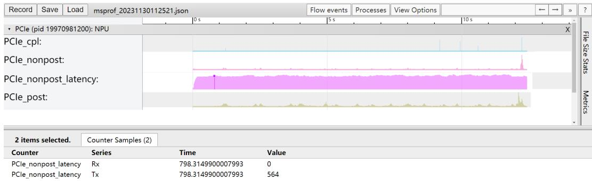

表 12-112 字段说明  

<table><tr><td rowspan=1 colspan=1>字段名</td><td rowspan=1 colspan=1>字段含义</td></tr><tr><td rowspan=1 colspan=1>PCle_cpl</td><td rowspan=1 colspan=1>接收写请求的完成数据包，单位MB/s。Tx表示发送端，Rx表示接收端。</td></tr><tr><td rowspan=1 colspan=1>PCle_nonpost</td><td rowspan=1 colspan=1>PCle Non-Post数据传输带宽，单位MB/s。Tx表示发送端，Rx表示接收端。</td></tr><tr><td rowspan=1 colspan=1>PCle_nonpost_latency</td><td rowspan=1 colspan=1>PCle Non-Post模式下的传输时延，单位us。Tx表示发送端，Rx表示接收端。PCle_nonpost_latency无Rx，取固定值0。</td></tr><tr><td rowspan=1 colspan=1>PCle_post</td><td rowspan=1 colspan=1>PCle Post数据传输带宽，单位MB/s。Tx表示发送端，Rx表示接收端。</td></tr></table>

# pcie_\*.csv 文件说明

pcie_\*.csv文件内容格式示例如下：

图 12-55 pcie_\*.csv   

<table><tr><td rowspan=1 colspan=1>Device_id Mode</td><td rowspan=1 colspan=1>Mode</td><td rowspan=1 colspan=1>Min</td><td rowspan=1 colspan=1>Max</td><td rowspan=1 colspan=1>Avg</td></tr><tr><td rowspan=1 colspan=1></td><td rowspan=1 colspan=1>0 Tx_p_avg(M</td><td rowspan=1 colspan=1>0</td><td rowspan=1 colspan=1>41678.03</td><td rowspan=1 colspan=1>99.628</td></tr><tr><td rowspan=1 colspan=1></td><td rowspan=1 colspan=1>0 Tx_np_avg</td><td rowspan=1 colspan=1>0</td><td rowspan=1 colspan=1>115.781</td><td rowspan=1 colspan=1>0.028</td></tr><tr><td rowspan=1 colspan=1></td><td rowspan=1 colspan=1> 0Tx_cpL_avg</td><td rowspan=1 colspan=1>0</td><td rowspan=1 colspan=1>23.033</td><td rowspan=1 colspan=1>0</td></tr><tr><td rowspan=1 colspan=1></td><td rowspan=1 colspan=1> 0 Tx_ latency</td><td rowspan=1 colspan=1>0.296</td><td rowspan=1 colspan=1>0.497</td><td rowspan=1 colspan=1>0.42</td></tr><tr><td rowspan=1 colspan=1></td><td rowspan=1 colspan=1>0 Rx_p_avg(l</td><td rowspan=1 colspan=1>0</td><td rowspan=1 colspan=1>151.714</td><td rowspan=1 colspan=1>0.012</td></tr><tr><td rowspan=1 colspan=1></td><td rowspan=1 colspan=1>0 Rx_np_avg</td><td rowspan=1 colspan=1>0</td><td rowspan=1 colspan=1>11.613</td><td rowspan=1 colspan=1>0.002</td></tr><tr><td rowspan=1 colspan=1></td><td rowspan=1 colspan=1>0 Rx_cpl_avg</td><td rowspan=1 colspan=1>0</td><td rowspan=1 colspan=1>160.203</td><td rowspan=1 colspan=1>0</td></tr></table>

表 12-113 字段说明  

<table><tr><td>字段名</td><td>字段含义</td></tr><tr><td>Device_id</td><td>设备ID。</td></tr><tr><td rowspan="5">Mode</td><td>模式，包含： · Tx_p_avg(MB/s):发送端PCle Post数据传输带宽，单位MB/s。</td></tr><tr><td>Tx表示发送端，Rx表示接收端。 Tx_np_avg(MB/s)：发送端PCle Non-Post数据传输带宽，单位</td></tr><tr><td>MB/s。 Tx_cpl_avg(MB/s)：发送端接收写请求的完成数据包，单位</td></tr><tr><td>MB/s。 Tx_latency_avg(us)：发送端PCle Non-Post模式下的传输时延，</td></tr><tr><td>单位us。 Rx_p_avg(MB/s):接收端PCle Post数据传输带宽，单位MB/s。 Rx_np_avg(MB/s):接收端PCle Non-Post数据传输带宽，单位 MB/s。</td></tr><tr><td>Min、Max、 Avg</td><td>MB/s。 最小值、最大值、平均值。</td></tr></table>

# 12.32 biu_group/aic_core_group/aiv_core_group（AICore 和 AI Vector 的带宽和延时）

AI Core和AI Vector的带宽和延时数据无summary信息，timeline信息在msprof_\*.json文件的biu_group、aic_core_group、aiv_core_group层级展示。

# 支持的型号

Atlas A2 训练系列产品/Atlas A2 推理系列产品Atlas A3 训练系列产品/Atlas A3 推理系列产品

# msprof_\*.json 文件的 biu_group、aic_core_group、aiv_core_group 层级数据说明

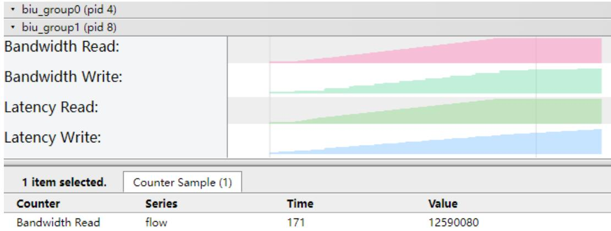

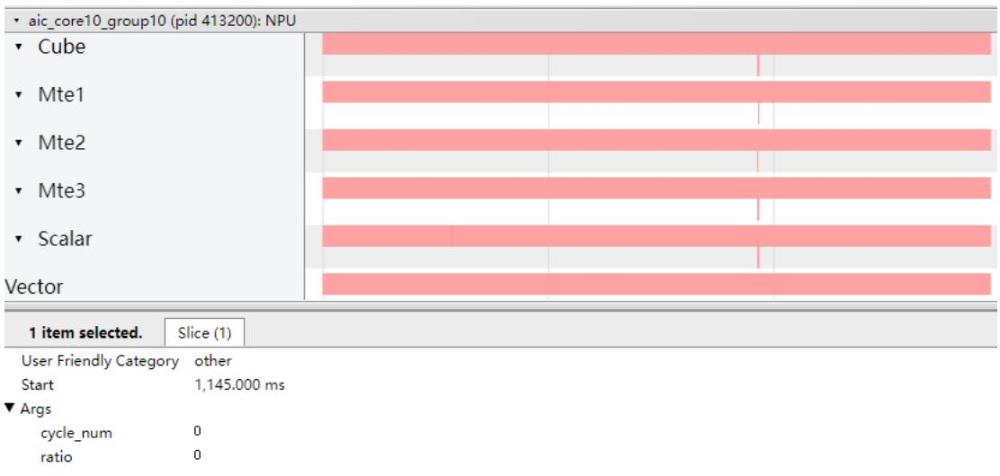  
图 12-57 aic_core_group

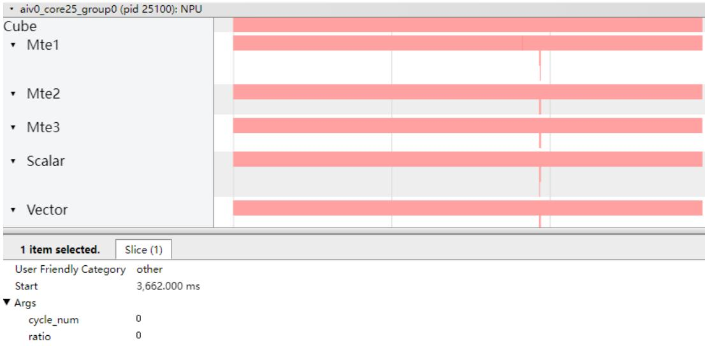  
图 12-58 aiv_core_group

表 12-114 字段说明  

<table><tr><td rowspan=1 colspan=1>字段名</td><td rowspan=1 colspan=1>字段含义</td></tr><tr><td rowspan=1 colspan=2>biu_group</td></tr><tr><td rowspan=1 colspan=1>BandwidthRead</td><td rowspan=1 colspan=1>BIU总线接口单元读取指令时的带宽。</td></tr><tr><td rowspan=1 colspan=1>BandwidthWrite</td><td rowspan=1 colspan=1>BIU总线接口单元写入指令时的带宽。</td></tr><tr><td rowspan=1 colspan=1>LatencyRead</td><td rowspan=1 colspan=1>BIU总线接口单元读取指令时的时延。</td></tr><tr><td rowspan=1 colspan=1>LatencyWrite</td><td rowspan=1 colspan=1>BIU总线接口单元写入指令时的时延。</td></tr><tr><td rowspan=1 colspan=2>aic_core_group</td></tr><tr><td rowspan=1 colspan=1>Cube</td><td rowspan=1 colspan=1>矩阵类运算指令在本采样周期内的cycle数和占比。</td></tr><tr><td rowspan=1 colspan=1>Mte1</td><td rowspan=1 colspan=1>L1-&gt;L0A/L0B搬运类指令在本采样周期内的cycle数和占比。</td></tr><tr><td rowspan=1 colspan=1>Mte2</td><td rowspan=1 colspan=1>片上内存-&gt;AICORE搬运类指令在本采样周期内的cycle数和占比。</td></tr><tr><td rowspan=1 colspan=1>Mte3</td><td rowspan=1 colspan=1>AICORE-&gt;片上内存搬运类指令在本采样周期内的cycle数和占比。</td></tr><tr><td rowspan=1 colspan=2>aiv_core_group</td></tr><tr><td rowspan=1 colspan=1>Mte1</td><td rowspan=1 colspan=1>L1-&gt;L0A/L0B搬运类指令在本采样周期内的cycle数和占比。</td></tr><tr><td rowspan=1 colspan=1>Mte2</td><td rowspan=1 colspan=1>片上内存-&gt;AICORE搬运类指令在本采样周期内的cycle数和占比。</td></tr><tr><td rowspan=1 colspan=1>Mte3</td><td rowspan=1 colspan=1>AICORE-&gt;片上内存搬运类指令在本采样周期内的cycle数和占比。</td></tr><tr><td rowspan=1 colspan=1>Scalar</td><td rowspan=1 colspan=1>标量类运算指令在本采样周期内的cycle数和占比。</td></tr><tr><td rowspan=1 colspan=1>Vector</td><td rowspan=1 colspan=1>向量类运算指令在本采样周期内的cycle数和占比。</td></tr></table>

# 12.33 Acc PMU（加速器带宽及并发信息）

加速器带宽及并发数据无summary信息，timeline信息在msprof_\*.json文件的AccPMU层级展示。

# 支持的型号

Atlas 200I/500 A2 推理产品Atlas A2 训练系列产品/Atlas A2 推理系列产品Atlas A3 训练系列产品/Atlas A3 推理系列产品

# msprof_\*.json 文件的 Acc PMU 层级数据说明

msprof_\*.json文件Acc PMU层级数据如下图所示。

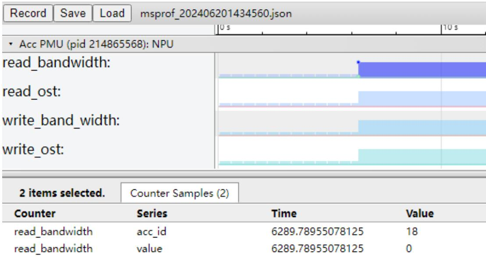

图 12-59 Acc PMU 层  
表 12-115 字段说明  

<table><tr><td rowspan=1 colspan=1>字段名</td><td rowspan=1 colspan=1>字段含义</td></tr><tr><td rowspan=1 colspan=1>read_bandwidth</td><td rowspan=1 colspan=1>DVPP和DSA加速器读带宽。</td></tr><tr><td rowspan=1 colspan=1>read_ost</td><td rowspan=1 colspan=1>DVPP和DSA加速器读并发。</td></tr><tr><td rowspan=1 colspan=1>write_bandwidth</td><td rowspan=1 colspan=1>DVPP和DSA加速器写带宽。</td></tr><tr><td rowspan=1 colspan=1>write_ost</td><td rowspan=1 colspan=1>DVPP和DSA加速器写并发。</td></tr></table>

# 12.34 Stars Soc Info（SoC 传输带宽信息）

SoC传输带宽信息数据无summary信息，timeline信息在msprof_\*.json文件的StarsSoc Info层级展示。

# 支持的型号

Atlas 200I/500 A2 推理产品Atlas A2 训练系列产品/Atlas A2 推理系列产品Atlas A3 训练系列产品/Atlas A3 推理系列产品

# msprof_\*.json 文件的 Stars Soc Info 层级数据说明

msprof_\*.json文件Stars Soc Info层级数据如下图所示。

图 12-60 Stars Soc Info 层  

<table><tr><td>Record</td><td>Save Load</td><td colspan="4"> msprof_20231130112521.json</td></tr><tr><td></td><td></td><td></td><td>0 s</td><td colspan="2"></td></tr><tr><td colspan="4"> Stars Soc Info (pid 19970981800): NPU</td></tr><tr><td colspan="2">L2 Buffer Bw Level:</td><td colspan="4"></td></tr><tr><td colspan="4">Mata Bw Level:</td></tr><tr><td colspan="2"></td><td colspan="4"></td></tr><tr><td colspan="4">1 item selected. Counter Sample (1)</td><td colspan="3"></td></tr><tr><td colspan="4">Counter Series</td><td colspan="4">Time value</td></tr><tr><td colspan="4">L2 Buffer Bw Level L2 Buffer Bw Level</td><td colspan="4">5146.164794921875 0</td></tr></table>

表 12-116 字段说明  

<table><tr><td rowspan=1 colspan=1>字段名</td><td rowspan=1 colspan=1>字段含义</td></tr><tr><td rowspan=1 colspan=1>L2 BufferBw Level</td><td rowspan=1 colspan=1>L2 Buffer带宽等级信息。当有缓存带宽信息时，不建议参考该字段值，该字段为粗粒度的统计值。</td></tr><tr><td rowspan=1 colspan=1>Mata BwLevel</td><td rowspan=1 colspan=1>Mata带宽等级信息。</td></tr></table>

# 12.35 Stars Chip Trans（片间传输带宽信息）

片间传输带宽信息数据无summary信息，timeline信息在msprof_\*.json文件的StarsChip Trans层级展示。

# 支持的型号

Atlas A2 训练系列产品/Atlas A2 推理系列产品Atlas A3 训练系列产品/Atlas A3 推理系列产品

# msprof_\*.json 文件的 Stars Chip Trans 层级数据说明

msprof_\*.json文件Stars Chip Trans层级数据如下图所示。

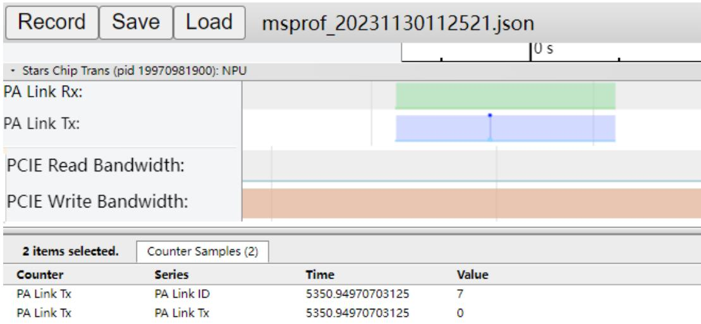

图 12-61 Stars Chip Trans 层  
表 12-117 字段说明  

<table><tr><td rowspan=1 colspan=1>字段名</td><td rowspan=1 colspan=1>字段含义</td></tr><tr><td rowspan=1 colspan=1>PA Link Rx</td><td rowspan=1 colspan=1>PA流量接收级别。当有集合通信带宽时，不建议参考该字段值，该字段为粗粒度的统计值。</td></tr><tr><td rowspan=1 colspan=1>PA Link Tx</td><td rowspan=1 colspan=1>PA流量发送级别。当有集合通信带宽时，不建议参考该字段值，该字段为粗粒度的统计值。</td></tr><tr><td rowspan=1 colspan=1>PCIE ReadBandwidth</td><td rowspan=1 colspan=1>PCle读带宽。当有PCle带宽时，不建议参考该字段值，该字段为粗粒度的统计值。</td></tr><tr><td rowspan=1 colspan=1>PCIE WriteBandwidth</td><td rowspan=1 colspan=1>PCle写带宽。当有PCle带宽时，不建议参考该字段值，该字段为粗粒度的统计值。</td></tr></table>

# 12.36 llc_read_write（三级缓存读写速率）

三级缓存读写速率数据timeline信息在msprof_\*.json文件的LLC层级展示，summary信息在llc_read_write_\*.csv文件汇总。

# 支持的型号

Atlas 200I/500 A2 推理产品  
Atlas 推理系列产品  
Atlas 训练系列产品  
Atlas A2 训练系列产品/Atlas A2 推理系列产品  
Atlas A3 训练系列产品/Atlas A3 推理系列产品

# msprof_\*.json 文件的 LLC 层级数据说明

msprof_\*.json文件LLC层级数据如下图所示。

图 12-62 LLC 层  

<table><tr><td colspan="3">: LLC (pid 19970981600): NPU</td></tr><tr><td>LLC O Read/Hit Rate:</td><td></td><td></td></tr><tr><td>LLC 0 Read/Throughput:</td><td></td><td></td></tr><tr><td>LLC 1 Read/Hit Rate:</td><td></td><td></td></tr><tr><td>LLC 1 Read/Throughput:</td><td></td><td></td></tr></table>

<table><tr><td>1 item selected.</td><td>Counter Sample (1)</td><td colspan="2"></td></tr><tr><td> Counter</td><td> Series</td><td>Time</td><td> Value</td></tr><tr><td>LLC O Read/Hit Rate</td><td colspan="2">Hit Rate(%) 5497.369384765625</td><td>0.824</td></tr></table>

表 12-118 字段说明  

<table><tr><td rowspan=1 colspan=1>字段名</td><td rowspan=1 colspan=1>字段含义</td></tr><tr><td rowspan=1 colspan=1>LLC &lt;id&gt; Read/Throughput LLC &lt;id&gt; Write/Throughput</td><td rowspan=1 colspan=1>三级缓存读取、写入时的吞吐量。</td></tr><tr><td rowspan=1 colspan=1>LLC &lt;id&gt; Read/HitRateLLC &lt;id&gt; Write/HitRate</td><td rowspan=1 colspan=1>三级缓存读取、写入时的命中率。</td></tr></table>

# llc_read_write_\*.csv 文件说明

llc_read_write_\*.csv文件内容格式示例如下：

图 12-63 llc_read_write_\*.csv  

<table><tr><td rowspan=1 colspan=1>Device_id Mode</td><td rowspan=1 colspan=1>Mode</td><td rowspan=1 colspan=1>Task</td><td rowspan=1 colspan=1>Hit Rate(%)</td><td rowspan=1 colspan=1>Hit Rate(%) Throughput(MB/s)</td></tr><tr><td rowspan=1 colspan=1></td><td rowspan=1 colspan=1>0 read</td><td rowspan=1 colspan=1>Average</td><td rowspan=1 colspan=1>23.707</td><td rowspan=1 colspan=1>790.528</td></tr><tr><td rowspan=1 colspan=1></td><td rowspan=1 colspan=1>0read</td><td rowspan=1 colspan=1>0</td><td rowspan=1 colspan=1>74.263</td><td rowspan=1 colspan=1>2932.393</td></tr><tr><td rowspan=1 colspan=1></td><td rowspan=1 colspan=1>0 read</td><td rowspan=1 colspan=1>1</td><td rowspan=1 colspan=1>1.861</td><td rowspan=1 colspan=1>7.637</td></tr><tr><td rowspan=1 colspan=1></td><td rowspan=1 colspan=1>0read</td><td rowspan=1 colspan=1>2</td><td rowspan=1 colspan=1>0.926</td><td rowspan=1 colspan=1>4.95</td></tr><tr><td rowspan=1 colspan=1></td><td rowspan=1 colspan=1>0read</td><td rowspan=1 colspan=1>3</td><td rowspan=1 colspan=1>17.779</td><td rowspan=1 colspan=1>217.13</td></tr></table>

表 12-119 字段说明  

<table><tr><td>字段名</td><td>字段含义</td></tr><tr><td>Device_id</td><td>设备ID。</td></tr><tr><td colspan="1" rowspan="1">Mode</td><td colspan="1" rowspan="1">模式。</td></tr><tr><td colspan="1" rowspan="1">Task</td><td colspan="1" rowspan="1">任务ID。</td></tr><tr><td colspan="1" rowspan="1">Hit Rate(%)</td><td colspan="1" rowspan="1">三级缓存命中率。</td></tr><tr><td colspan="1" rowspan="1">Throughput(MB/s)</td><td colspan="1" rowspan="1">三级缓存吞吐量，单位MB/s。</td></tr></table>

# 12.37 dvpp（DVPP 信息）

DVPP数据无timeline信息，summary信息在dvpp_\*.csv文件汇总。

# 支持的型号

Atlas 200I/500 A2 推理产品  
Atlas 训练系列产品  
Atlas A2 训练系列产品/Atlas A2 推理系列产品Atlas A3 训练系列产品/Atlas A3 推理系列产品

# dvpp_\*.csv 文件说明

dvpp_\*.csv文件内容格式示例如下：

图 12-64 dvpp_\*.csv  

<table><tr><td rowspan=1 colspan=1>Device_id </td><td rowspan=1 colspan=1>Dvpp Id</td><td rowspan=1 colspan=1>Engine Type </td><td rowspan=1 colspan=1>Engine ID </td><td rowspan=1 colspan=1>All Time(us)</td><td rowspan=1 colspan=1>All Frame </td><td rowspan=1 colspan=2>All Utilization(%)</td></tr><tr><td rowspan=1 colspan=1>0</td><td rowspan=1 colspan=1></td><td rowspan=1 colspan=1>0 VDEC</td><td rowspan=1 colspan=1>1</td><td rowspan=1 colspan=1>0</td><td rowspan=1 colspan=1>0</td><td rowspan=1 colspan=1>0</td><td rowspan=1 colspan=1></td></tr><tr><td rowspan=1 colspan=1>0</td><td rowspan=1 colspan=1></td><td rowspan=1 colspan=1>0 VDEC</td><td rowspan=1 colspan=1>0</td><td rowspan=1 colspan=1>0</td><td rowspan=1 colspan=1>0</td><td rowspan=1 colspan=1>0</td><td rowspan=1 colspan=1></td></tr><tr><td rowspan=1 colspan=1>0</td><td rowspan=1 colspan=1></td><td rowspan=1 colspan=1>0 JPEGD</td><td rowspan=1 colspan=1>1</td><td rowspan=1 colspan=1>0</td><td rowspan=1 colspan=1>0</td><td rowspan=1 colspan=1>0</td><td rowspan=1 colspan=1></td></tr><tr><td rowspan=1 colspan=1>0</td><td rowspan=1 colspan=1></td><td rowspan=1 colspan=1>0 JPEGD</td><td rowspan=1 colspan=1>0</td><td rowspan=1 colspan=1>0</td><td rowspan=1 colspan=1>0</td><td rowspan=1 colspan=1>0</td><td rowspan=1 colspan=1></td></tr></table>

表 12-120 字段说明  

<table><tr><td colspan="1" rowspan="1">字段名</td><td colspan="1" rowspan="1">字段含义</td></tr><tr><td colspan="1" rowspan="1">Device_id</td><td colspan="1" rowspan="1">设备ID。</td></tr><tr><td colspan="1" rowspan="1">Dvpp Id</td><td colspan="1" rowspan="1">Engine group的ID。说明当前每一类Engine都只有一个group，所以该字段均为0。</td></tr><tr><td colspan="1" rowspan="1">Engine Type</td><td colspan="1" rowspan="1">引擎类型，包含VDEC、JPEGD、PNGD等。</td></tr><tr><td colspan="1" rowspan="1">Engine ID</td><td colspan="1" rowspan="1">Engine group中每个Engine实例的编号。</td></tr><tr><td colspan="1" rowspan="1">All Time(us)</td><td colspan="1" rowspan="1">采样周期内本引擎执行的时间，单位us。</td></tr><tr><td colspan="1" rowspan="1">All Frame</td><td colspan="1" rowspan="1">采样周期内处理的帧数。</td></tr><tr><td colspan="1" rowspan="1">AllUtilization(%)</td><td colspan="1" rowspan="1">采样周期内本引擎的利用率，本引擎执行的时间/采样周期。</td></tr></table>

# 12.38 ai_cpu_top_function（AI CPU 热点函数）

AI CPU热点函数数据无timeline信息，summary信息在ai_cpu_top_function_\*.csv文件汇总。

# 支持的型号

Atlas 200I/500 A2 推理产品  
Atlas 推理系列产品  
Atlas 训练系列产品  
Atlas A2 训练系列产品/Atlas A2 推理系列产品  
Atlas A3 训练系列产品/Atlas A3 推理系列产品

# ai_cpu_top_function_\*.csv 文件说明

ai_cpu_top_function_\*.csv文件内容格式示例如下：

图 12-65 ai_cpu_top_function_\*.csv  

<table><tr><td rowspan=1 colspan=1>Device_id_Function</td><td rowspan=1 colspan=1>Device_id_Function</td><td rowspan=1 colspan=1>Module</td><td rowspan=1 colspan=1>Cycles</td><td rowspan=1 colspan=1>Cycles(%6)</td></tr><tr><td rowspan=1 colspan=1></td><td rowspan=1 colspan=1>3unknown</td><td rowspan=1 colspan=1>[unknown]</td><td rowspan=1 colspan=1>1.17E+09</td><td rowspan=1 colspan=1>100</td></tr><tr><td rowspan=1 colspan=1></td><td rowspan=1 colspan=1>2 unknown</td><td rowspan=1 colspan=1>[unknown]</td><td rowspan=1 colspan=1>7.55E+08</td><td rowspan=1 colspan=1>100</td></tr><tr><td rowspan=1 colspan=1></td><td rowspan=1 colspan=1>1unknown</td><td rowspan=1 colspan=1>[unknown]</td><td rowspan=1 colspan=1>9.72E+08</td><td rowspan=1 colspan=1>100</td></tr><tr><td rowspan=1 colspan=1></td><td rowspan=1 colspan=1>0 unknown</td><td rowspan=1 colspan=1>[unknown] 1.32E+09</td><td rowspan=1 colspan=1>[unknown] 1.32E+09</td><td rowspan=1 colspan=1>100</td></tr></table>

表 12-121 字段说明  

<table><tr><td rowspan=1 colspan=1>字段名</td><td rowspan=1 colspan=1>字段含义</td></tr><tr><td rowspan=1 colspan=1>Device_id</td><td rowspan=1 colspan=1>设备ID。</td></tr><tr><td rowspan=1 colspan=1>Function</td><td rowspan=1 colspan=1>AI CPU模块的热点函数。</td></tr><tr><td rowspan=1 colspan=1>Module</td><td rowspan=1 colspan=1>函数所在的模块名。</td></tr><tr><td rowspan=1 colspan=1>Cycles</td><td rowspan=1 colspan=1>统计时间内函数消耗的Cycle数。</td></tr><tr><td rowspan=1 colspan=1>Cycles(%)</td><td rowspan=1 colspan=1>统计时间内函数消耗的Cycle数对于统计时长的占比。</td></tr></table>

# 12.39 ai_cpu_pmu_events（AI CPU PMU 事件）

AI CPU PMU事件数据无timeline信息，summary信息在ai_cpu_pmu_events_\*.csv文件汇总。

# 支持的型号

Atlas 200I/500 A2 推理产品  
Atlas 推理系列产品  
Atlas 训练系列产品  
Atlas A2 训练系列产品/Atlas A2 推理系列产品  
Atlas A3 训练系列产品/Atlas A3 推理系列产品

# ai_cpu_pmu_events_\*.csv 文件说明

ai_cpu_pmu_events_\*.csv文件内容格式示例如下：

图 12-66 ai_cpu_pmu_events_\*.csv  

<table><tr><td rowspan=1 colspan=1>Device_id</td><td rowspan=1 colspan=1>Event</td><td rowspan=1 colspan=1>Name</td><td rowspan=1 colspan=1>Count</td></tr><tr><td rowspan=1 colspan=1></td><td rowspan=1 colspan=1>3Ox11</td><td rowspan=1 colspan=1>Cpu_cycles</td><td rowspan=1 colspan=1>9.62E+08</td></tr><tr><td rowspan=1 colspan=1></td><td rowspan=1 colspan=1>30x8</td><td rowspan=1 colspan=1>Inst_retirec e</td><td rowspan=1 colspan=1>63624443</td></tr><tr><td rowspan=1 colspan=1></td><td rowspan=1 colspan=1>2 0x11</td><td rowspan=1 colspan=1>Cpu_cycles</td><td rowspan=1 colspan=1>9.67E+08</td></tr><tr><td rowspan=1 colspan=1></td><td rowspan=1 colspan=1>20x8</td><td rowspan=1 colspan=1>Inst_retirec 60748470</td><td rowspan=1 colspan=1>Inst_retirec 60748470</td></tr></table>

表 12-122 字段说明  

<table><tr><td rowspan=1 colspan=1>字段名</td><td rowspan=1 colspan=1>字段含义</td></tr><tr><td rowspan=1 colspan=1>Device_id</td><td rowspan=1 colspan=1>设备ID。</td></tr><tr><td rowspan=1 colspan=1>Event</td><td rowspan=1 colspan=1>寄存器的值。</td></tr><tr><td rowspan=1 colspan=1>Name</td><td rowspan=1 colspan=1>值对应的事件名。</td></tr><tr><td rowspan=1 colspan=1>Count</td><td rowspan=1 colspan=1>寄存器的计数值。</td></tr></table>

# 12.40 ctrl_cpu_top_function（Ctrl CPU 热点函数）

Ctrl CPU热点函数数据无timeline信息，summary信息在ctrl_cpu_top_function_\*.csv文件汇总。

# 支持的型号

Atlas 200I/500 A2 推理产品Atlas 推理系列产品

Atlas 训练系列产品Atlas A2 训练系列产品/Atlas A2 推理系列产品Atlas A3 训练系列产品/Atlas A3 推理系列产品

# ctrl_cpu_top_function_\*.csv 文件说明

ctrl_cpu_top_function_\*.csv文件内容格式示例如下：

图 12-67 ctrl_cpu_top_function_\*.csv  

<table><tr><td rowspan=1 colspan=1>Device_id Function</td><td rowspan=1 colspan=1>Device_id Function</td><td rowspan=1 colspan=1>Module</td><td rowspan=1 colspan=1>Cycles</td><td rowspan=1 colspan=1>Cycles(%)</td></tr><tr><td rowspan=1 colspan=1></td><td rowspan=1 colspan=1> 3 unknown</td><td rowspan=1 colspan=1>[unknown]</td><td rowspan=1 colspan=1>1.06E+10</td><td rowspan=1 colspan=1>74.2633</td></tr><tr><td rowspan=1 colspan=1></td><td rowspan=1 colspan=1> 3unknown</td><td rowspan=1 colspan=1>/usr/lib64/</td><td rowspan=1 colspan=1>1.81E+09</td><td rowspan=1 colspan=1>12.6687</td></tr><tr><td rowspan=1 colspan=1></td><td rowspan=1 colspan=1>3 unknown</td><td rowspan=1 colspan=1>/usr/lib64/</td><td rowspan=1 colspan=1>9.06E+08</td><td rowspan=1 colspan=1>6.3472</td></tr><tr><td rowspan=1 colspan=1></td><td rowspan=1 colspan=1>3unknown</td><td rowspan=1 colspan=1>/var/adda</td><td rowspan=1 colspan=1>7.07E+08</td><td rowspan=1 colspan=1>4.9487</td></tr></table>

表 12-123 字段说明  

<table><tr><td rowspan=1 colspan=1>字段名</td><td rowspan=1 colspan=1>字段含义</td></tr><tr><td rowspan=1 colspan=1>Device_id</td><td rowspan=1 colspan=1>设备ID。</td></tr><tr><td rowspan=1 colspan=1>Function</td><td rowspan=1 colspan=1>Ctrl CPU模块的热点函数。</td></tr><tr><td rowspan=1 colspan=1>Module</td><td rowspan=1 colspan=1>函数所在的模块名。</td></tr><tr><td rowspan=1 colspan=1>Cycles</td><td rowspan=1 colspan=1>统计时间内函数消耗的Cycle数。</td></tr><tr><td rowspan=1 colspan=1>Cycles(%)</td><td rowspan=1 colspan=1>统计时间内函数消耗的Cycle数对于统计时长的占比。</td></tr></table>

# 12.41 ctrl_cpu_pmu_events（Ctrl CPU PMU 事件）

Ctrl CPU PMU事件数据无timeline信息，summary信息在ctrl_cpu_pmu_events_\*.csv文件汇总。

# 支持的型号

Atlas 200I/500 A2 推理产品  
Atlas 推理系列产品  
Atlas 训练系列产品  
Atlas A2 训练系列产品/Atlas A2 推理系列产品  
Atlas A3 训练系列产品/Atlas A3 推理系列产品

# ctrl_cpu_pmu_events_\*.csv 文件说明

ctrl_cpu_pmu_events_\*.csv文件内容格式示例如下：

图 12-68 ctrl_cpu_pmu_events_\*.csv  

<table><tr><td rowspan=1 colspan=1>Device_idE</td><td rowspan=1 colspan=1>Event</td><td rowspan=1 colspan=1>Name</td><td rowspan=1 colspan=1>Count</td></tr><tr><td rowspan=1 colspan=1></td><td rowspan=1 colspan=1>3Ox11</td><td rowspan=1 colspan=1>Cpu_cycles</td><td rowspan=1 colspan=1>1.29E+10</td></tr><tr><td rowspan=1 colspan=1></td><td rowspan=1 colspan=1>30x8</td><td rowspan=1 colspan=1>Inst_retirec</td><td rowspan=1 colspan=1>5.19E+09</td></tr><tr><td rowspan=1 colspan=1></td><td rowspan=1 colspan=1>2 0x11</td><td rowspan=1 colspan=1>Cpu_cycles</td><td rowspan=1 colspan=1>7.66E+09</td></tr><tr><td rowspan=1 colspan=1></td><td rowspan=1 colspan=1>20x8</td><td rowspan=1 colspan=1>Inst_retirec</td><td rowspan=1 colspan=1>C 3.04E+09</td></tr></table>

表 12-124 字段说明  

<table><tr><td rowspan=1 colspan=1>字段名</td><td rowspan=1 colspan=1>字段含义</td></tr><tr><td rowspan=1 colspan=1>Device_id</td><td rowspan=1 colspan=1>设备ID。</td></tr><tr><td rowspan=1 colspan=1>Event</td><td rowspan=1 colspan=1>寄存器的值。</td></tr><tr><td rowspan=1 colspan=1>Name</td><td rowspan=1 colspan=1>值对应的事件名。</td></tr><tr><td rowspan=1 colspan=1>Count</td><td rowspan=1 colspan=1>寄存器的计数值。</td></tr></table>

# 12.42 ts_cpu_top_function（TS CPU 热点函数）

TS CPU热点函数数据无timeline信息，summary信息在ts_cpu_top_function_\*.csv文件汇总。

# 支持的型号

Atlas 200I/500 A2 推理产品  
Atlas 推理系列产品  
Atlas 训练系列产品  
Atlas A2 训练系列产品/Atlas A2 推理系列产品  
Atlas A3 训练系列产品/Atlas A3 推理系列产品

# ts_cpu_top_function_\*.csv 文件说明

ts_cpu_top_function_\*.csv文件内容格式示例如下：

图 12-69 ts_cpu_top_function_\*.csv  

<table><tr><td rowspan=1 colspan=1>Device_id Function</td><td rowspan=1 colspan=1>Device_id Function</td><td rowspan=1 colspan=1>Cycles</td><td rowspan=1 colspan=1>Cycles(%)</td></tr><tr><td rowspan=1 colspan=1></td><td rowspan=1 colspan=1>0xfff0480</td><td rowspan=1 colspan=1>46617754</td><td rowspan=1 colspan=1>59.9063</td></tr><tr><td rowspan=1 colspan=1></td><td rowspan=1 colspan=1>3 Oxffff0480 15600000</td><td rowspan=1 colspan=1>3 Oxffff0480 15600000</td><td rowspan=1 colspan=1>20.0468</td></tr><tr><td rowspan=1 colspan=1></td><td rowspan=1 colspan=1>3 Oxffff0480 15600000</td><td rowspan=1 colspan=1>3 Oxffff0480 15600000</td><td rowspan=1 colspan=1>20.0468</td></tr><tr><td rowspan=1 colspan=1></td><td rowspan=1 colspan=1>2 Oxf0480 244437731</td><td rowspan=1 colspan=1>2 Oxf0480 244437731</td><td rowspan=1 colspan=1>61.0368</td></tr></table>

表 12-125 字段说明  

<table><tr><td rowspan=1 colspan=1>字段名</td><td rowspan=1 colspan=1>字段含义</td></tr><tr><td rowspan=1 colspan=1>Device_id</td><td rowspan=1 colspan=1>设备ID。</td></tr><tr><td rowspan=1 colspan=1>Function</td><td rowspan=1 colspan=1>TS CPU模块的热点函数。</td></tr><tr><td rowspan=1 colspan=1>Cycles</td><td rowspan=1 colspan=1>统计时间内函数消耗的Cycle数。</td></tr><tr><td rowspan=1 colspan=1>Cycles(%)</td><td rowspan=1 colspan=1>统计时间内函数消耗的Cycle数对于统计时长的占比。</td></tr></table>

# 12.43 ts_cpu_pmu_events（TS CPU PMU 事件）

TS CPU PMU事件数据无timeline信息，summary信息在ts_cpu_pmu_events_\*.csv文件汇总。

# 支持的型号

Atlas 200I/500 A2 推理产品  
Atlas 推理系列产品  
Atlas 训练系列产品  
Atlas A2 训练系列产品/Atlas A2 推理系列产品  
Atlas A3 训练系列产品/Atlas A3 推理系列产品

# ts_cpu_pmu_events_\*.csv 文件说明

ts_cpu_pmu_events_\*.csv文件内容格式示例如下：

图 12-70 ts_cpu_pmu_events_\*.csv  

<table><tr><td rowspan=1 colspan=1>Device_id</td><td rowspan=1 colspan=1>Event</td><td rowspan=1 colspan=1>Name</td><td rowspan=1 colspan=1>Count</td></tr><tr><td rowspan=1 colspan=1></td><td rowspan=1 colspan=1>30x8</td><td rowspan=1 colspan=1>Inst_retirec</td><td rowspan=1 colspan=1>9684679</td></tr><tr><td rowspan=1 colspan=1></td><td rowspan=1 colspan=1>3Ox11</td><td rowspan=1 colspan=1>Cpu_cycles</td><td rowspan=1 colspan=1>77817754</td></tr><tr><td rowspan=1 colspan=1></td><td rowspan=1 colspan=1>20x8</td><td rowspan=1 colspan=1>Inst_retirec</td><td rowspan=1 colspan=1>4995472</td></tr><tr><td rowspan=1 colspan=1></td><td rowspan=1 colspan=1>2Ox11</td><td rowspan=1 colspan=1>Cpu_cycles 40037731</td><td rowspan=1 colspan=1>Cpu_cycles 40037731</td></tr></table>

表 12-126 字段说明  

<table><tr><td rowspan=1 colspan=1>字段名</td><td rowspan=1 colspan=1>字段含义</td></tr><tr><td rowspan=1 colspan=1>Device_id</td><td rowspan=1 colspan=1>设备ID。</td></tr><tr><td rowspan=1 colspan=1>Event</td><td rowspan=1 colspan=1>寄存器的值。</td></tr><tr><td rowspan=1 colspan=1>Name</td><td rowspan=1 colspan=1>值对应的事件名。</td></tr><tr><td rowspan=1 colspan=1>Count</td><td rowspan=1 colspan=1>寄存器的计数值。</td></tr></table>

# 12.44 host_cpu_usage（Host 侧 CPU 利用率）

Host侧CPU利用率数据在msprof_\*.json文件的CPU Usage层级展示，summary信息在host_cpu_usage_\*.csv文件汇总。

# 支持的型号

Atlas 200I/500 A2 推理产品  
Atlas 推理系列产品  
Atlas 训练系列产品  
Atlas A2 训练系列产品/Atlas A2 推理系列产品  
Atlas A3 训练系列产品/Atlas A3 推理系列产品

# msprof_\*.json 文件的 CPU Usage 层级数据说明

msprof_\*.json文件CPU Usage层级数据如下图所示。

图 12-71 CPU Usage 层  

<table><tr><td colspan="7">  CPU Usage (pid 132397)</td></tr><tr><td colspan="2" rowspan="2">CPU 102: CPU 103:</td><td colspan="2"></td><td></td><td></td><td></td></tr><tr><td colspan="2"></td><td colspan="2"></td><td></td></tr><tr><td colspan="2">CPU 104:</td><td colspan="2"></td><td colspan="2"></td><td></td></tr><tr><td colspan="2">CPU 105:</td><td colspan="2"></td><td colspan="2"></td><td></td></tr><tr><td colspan="8"></td></tr><tr><td> 1 item selected.</td><td colspan="2">Counter Sample (1)</td><td colspan="4"></td></tr><tr><td colspan="7">Counter Series Time</td></tr><tr><td>CPU 102 usage(%)</td><td colspan="4">373.7410299926996</td><td colspan="2">Vaue 100</td></tr></table>

表 12-127 字段说明  

<table><tr><td rowspan=1 colspan=1>字段名</td><td rowspan=1 colspan=1>字段含义</td></tr><tr><td rowspan=1 colspan=1>CPU &lt;id&gt;</td><td rowspan=1 colspan=1>CPU ID。</td></tr><tr><td rowspan=1 colspan=1>CPU Avg</td><td rowspan=1 colspan=1>CPU平均利用率。</td></tr><tr><td rowspan=1 colspan=1>usage</td><td rowspan=1 colspan=1>利用率。</td></tr></table>

# host_cpu_usage_\*.csv 文件说明

host_cpu_usage_\*.csv文件内容格式示例如下：

图 12-72 host_cpu_usage_\*.csv   

<table><tr><td rowspan=1 colspan=1>Device id </td><td rowspan=1 colspan=1>Device_id Total Cpu Numbers</td><td rowspan=1 colspan=1>Occupied Cpu Numbers</td><td rowspan=1 colspan=1>Recommend Cpu Numbers</td></tr><tr><td rowspan=1 colspan=1>host</td><td rowspan=1 colspan=1>128</td><td rowspan=1 colspan=1>4</td><td rowspan=1 colspan=1>4</td></tr></table>

表 12-128 字段说明  

<table><tr><td rowspan=1 colspan=1>字段名</td><td rowspan=1 colspan=1>字段含义</td></tr><tr><td rowspan=1 colspan=1>Device_id</td><td rowspan=1 colspan=1>设备ID。Host侧数据时显示为host。</td></tr><tr><td rowspan=1 colspan=1>Total Cpu Numbers</td><td rowspan=1 colspan=1>系统CPU总核数。</td></tr><tr><td rowspan=1 colspan=1>Occupied CpuNumbers</td><td rowspan=1 colspan=1>进程占用的CPU核数。</td></tr><tr><td rowspan=1 colspan=1>Recommend CpuNumbers</td><td rowspan=1 colspan=1>使用中的CPU核数，虚拟化场景中为CPU核数资源的推荐分配值。</td></tr></table>

# 12.45 host_mem_usage（Host 侧内存利用率）

Host侧内存利用率数据timeline信息在msprof_\*.json文件的Memory Usage层级展示，summary信息在host_mem_usage_\*.csv文件汇总。

# 支持的型号

Atlas 200I/500 A2 推理产品  
Atlas 推理系列产品  
Atlas 训练系列产品  
Atlas A2 训练系列产品/Atlas A2 推理系列产品  
Atlas A3 训练系列产品/Atlas A3 推理系列产品

# msprof_\*.json 文件的 Memory Usage 层级数据说明

msprof_\*.json文件Memory Usage层级数据如下图所示。

图 12-73 Memory Usage 层  

<table><tr><td colspan="3">  Memory Usage (pid 132397)</td></tr><tr><td>Memory Usage:</td><td></td><td></td></tr></table>

<table><tr><td>1 item selected.</td><td>Counter Sample (1)</td><td colspan="2"></td></tr><tr><td>Counter</td><td> Series</td><td>Time</td><td>value</td></tr><tr><td>Memory Usage</td><td>usage(%)</td><td>853.4774599969387</td><td>0.018635</td></tr></table>

表 12-129 字段说明  

<table><tr><td>字段名</td><td>字段含义</td></tr><tr><td>Memory Usage</td><td>内存使用率。</td></tr></table>

# host_mem_usage_\*.csv 文件说明

host_mem_usage_\*.csv文件内容格式示例如下：

图 12-74 host_mem_usage_\*.csv   

<table><tr><td rowspan=1 colspan=1>Device id </td><td rowspan=1 colspan=1>Device_id Total Memory(KB)</td><td rowspan=1 colspan=1>Peak Used Memory(KB)</td><td rowspan=1 colspan=1>Recommend Memory(KB)</td></tr><tr><td rowspan=1 colspan=1>host</td><td rowspan=1 colspan=1>527513488</td><td rowspan=1 colspan=1>1104935.027</td><td rowspan=1 colspan=1>1381168.784</td></tr></table>

表 12-130 字段说明  

<table><tr><td rowspan=1 colspan=1>字段名</td><td rowspan=1 colspan=1>字段含义</td></tr><tr><td rowspan=1 colspan=1>Device_id</td><td rowspan=1 colspan=1>设备ID。Host侧数据时显示为host。</td></tr><tr><td rowspan=1 colspan=1>Total Memory(KB)</td><td rowspan=1 colspan=1>系统总内存，单位KB。</td></tr><tr><td rowspan=1 colspan=1>Peak Used Memory(KB)</td><td rowspan=1 colspan=1>内存使用峰值，单位KB。</td></tr><tr><td rowspan=1 colspan=1>RecommendMemory(KB)</td><td rowspan=1 colspan=1>虚拟化场景中内存的推荐分配值，单位KB。</td></tr></table>

# 12.46 host_disk_usage（Host 侧磁盘 I/O 利用率）

Host侧磁盘I/O利用率数据timeline信息在msprof_\*.json文件的Disk Usage层级展示，summary信息在host_disk_usage_\*.csv文件汇总。

# 支持的型号

Atlas 200I/500 A2 推理产品  
Atlas 推理系列产品  
Atlas 训练系列产品  
Atlas A2 训练系列产品/Atlas A2 推理系列产品  
Atlas A3 训练系列产品/Atlas A3 推理系列产品

# msprof_\*.json 文件的 Disk Usage 层级数据说明

msprof_\*.json文件Disk Usage层级数据如下图所示。

图 12-75 Disk Usage 层  

<table><tr><td colspan="3"> Disk Usage (pid 6589)</td><td></td></tr><tr><td>Disk Usage:</td><td></td><td>O</td><td></td></tr></table>

<table><tr><td>1 item selected.</td><td>Counter Sample (1)</td><td colspan="2"></td></tr><tr><td>Counter</td><td> Series</td><td>Time</td><td> value</td></tr><tr><td> Disk Usage</td><td>usage(%)</td><td>2260</td><td>0</td></tr></table>

表 12-131 字段说明  

<table><tr><td>字段名</td><td>字段含义</td></tr><tr><td>Disk Usage</td><td>磁盘利用率。</td></tr></table>

# host_disk_usage_\*.csv 文件说明

host_disk_usage_\*.csv文件内容格式示例如下：

图 12-76 host_disk_usage_\*.csv   

<table><tr><td rowspan=1 colspan=1>Device id</td><td rowspan=1 colspan=1>Peak Disk Read(KB/s)</td><td rowspan=1 colspan=1>Device_id Peak Disk Read(KB/s)Recommend Disk Read(KB/s)   Peak Disk Write(KB/s)</td><td rowspan=1 colspan=1> Recommend Disk Write(KB/s)</td></tr><tr><td rowspan=1 colspan=1>host</td><td rowspan=1 colspan=1>0</td><td rowspan=1 colspan=2>0                   0                          0</td></tr></table>

表 12-132 字段说明  

<table><tr><td rowspan=1 colspan=1>字段名</td><td rowspan=1 colspan=1>字段含义</td></tr><tr><td rowspan=1 colspan=1>Device_id</td><td rowspan=1 colspan=1>设备ID。Host侧数据时显示为host。</td></tr><tr><td rowspan=1 colspan=1>Peak Disk Read(KB/s)</td><td rowspan=1 colspan=1>磁盘读取速率的峰值，单位KB/s。</td></tr><tr><td rowspan=1 colspan=1>Recommend DiskRead(KB/s)</td><td rowspan=1 colspan=1>虚拟化场景中磁盘读取速率的推荐值，单位KB/s。</td></tr><tr><td rowspan=1 colspan=1>Peak Disk Write(KB/s)</td><td rowspan=1 colspan=1>磁盘写入速率的峰值，单位KB/s。</td></tr><tr><td rowspan=1 colspan=1>Recommend DiskWrite(KB/s)</td><td rowspan=1 colspan=1>虚拟化场景中磁盘写入速率的推荐值，单位KB/s。</td></tr></table>

# 12.47 host_network_usage（Host 侧网络 I/O 利用率）

Host侧网络I/O利用率数据timeline信息在msprof_\*.json文件的Network Usage层级展示，summary信息在host_network_usage_\*.csv文件汇总。

# 支持的型号

Atlas 200I/500 A2 推理产品

Atlas 推理系列产品  
Atlas 训练系列产品  
Atlas A2 训练系列产品/Atlas A2 推理系列产品Atlas A3 训练系列产品/Atlas A3 推理系列产品

# msprof_\*.json 文件的 Network Usage 层级数据说明

msprof_\*.json文件Network Usage层级数据如下图所示。

图 12-77 Network Usage 层  

<table><tr><td rowspan=1 colspan=5>  Network Usage (pid 132397)</td></tr><tr><td rowspan=1 colspan=1>Network Usage:</td><td rowspan=1 colspan=1></td><td rowspan=1 colspan=1></td><td rowspan=1 colspan=1></td><td rowspan=1 colspan=1></td></tr></table>

<table><tr><td>1 item selected.</td><td>Counter Sample (1)</td><td colspan="2"></td></tr><tr><td>Counter</td><td> Series</td><td>Time</td><td>value</td></tr><tr><td>Network Usage</td><td>usage(%)</td><td>582.3152000010014</td><td>0.435602</td></tr></table>

表 12-133 字段说明  

<table><tr><td>字段名</td><td>字段含义</td></tr><tr><td>Network Usage</td><td>网络I/O利用率。</td></tr></table>

# host_network_usage_\*.csv 文件说明

host_network_usage_\*.csv文件内容格式示例如下：

图 12-78 host_network_usage_\*.csv   

<table><tr><td rowspan=1 colspan=1>Device_id</td><td rowspan=1 colspan=1>Device_id Netcard Speed(KB/s)</td><td rowspan=1 colspan=1>Peak Used Speed(KB/s)</td><td rowspan=1 colspan=1>Recommend Speed(KB/s)</td></tr><tr><td rowspan=1 colspan=1>host</td><td rowspan=1 colspan=1>122070.3125</td><td rowspan=1 colspan=1>17.46180818</td><td rowspan=1 colspan=1>21.73911861</td></tr></table>

表 12-134 字段说明  

<table><tr><td colspan="1" rowspan="1">字段名</td><td colspan="1" rowspan="1">字段含义</td></tr><tr><td colspan="1" rowspan="1">Device_id</td><td colspan="1" rowspan="1">设备ID。Host侧数据时显示为host。</td></tr><tr><td colspan="1" rowspan="1">Netcard Speed(KB/s)</td><td colspan="1" rowspan="1">网卡的额定速率，单位KB/s。</td></tr><tr><td colspan="1" rowspan="1">Peak Used Speed(KB/s)</td><td colspan="1" rowspan="1">网络最高的使用速率，单位KB/s。</td></tr><tr><td colspan="1" rowspan="1">RecommendSpeed(KB/s)</td><td colspan="1" rowspan="1">虚拟化场景中网络使用速率的推荐值，单位KB/s。</td></tr></table>

# 12.48 os_runtime_statistic（Host 侧 syscall 和pthreadcall）

Host侧syscall和pthreadcall数据timeline信息在msprof_\*.json文件的OS Runtime API层级展示，summary信息在os_runtime_statistic_\*.csv文件汇总。

# 支持的型号

Atlas 200I/500 A2 推理产品  
Atlas 推理系列产品  
Atlas 训练系列产品  
Atlas A2 训练系列产品/Atlas A2 推理系列产品  
Atlas A3 训练系列产品/Atlas A3 推理系列产品

# msprof_\*.json 文件的 OS Runtime API 层级数据说明

msprof_\*.json文件OS Runtime API层级数据如下图所示。

图 12-79 OS Runtime API 层  

<table><tr><td colspan="12">OS Runtime APl (pid 6589)</td></tr><tr><td colspan="2" rowspan="2">•Thread 6589</td><td></td><td></td><td></td><td></td><td></td><td></td><td></td><td></td></tr><tr><td></td><td></td><td></td><td></td><td></td><td></td><td colspan="2">pthread-_..</td></tr><tr><td colspan="2">•Thread 6591</td><td></td><td></td><td></td><td></td><td></td><td colspan="2"></td><td></td></tr><tr><td colspan="2">Thread 6593 Thread 6595</td><td></td><td></td><td></td><td></td><td></td><td></td><td colspan="2"></td></tr><tr><td colspan="2">Thread 6596</td><td></td><td></td><td></td><td></td><td></td><td colspan="2"></td><td></td></tr><tr><td colspan="2">Thread 6597</td><td></td><td></td><td></td><td></td><td></td><td></td><td colspan="2"></td></tr><tr><td colspan="2"></td><td colspan="7"></td></tr><tr><td colspan="2"> 1 item selected.</td><td colspan="9" rowspan="2">Slice (1)</td></tr><tr><td colspan="2">Title</td><td> pthread_mutex_unlock</td><td>C</td><td></td></tr><tr><td colspan="2">User Friendly Categoryother Start 10,659.609 ms Wall Duration 887.597 ms</td><td colspan="9"></td></tr></table>

表 12-135 字段说明  

<table><tr><td colspan="1" rowspan="1">字段名</td><td colspan="1" rowspan="1">字段含义</td></tr><tr><td colspan="1" rowspan="1">Title</td><td colspan="1" rowspan="1">选择某个组件的接口名称，例如本例选择的为pthread_mutex_unlock接口。</td></tr><tr><td colspan="1" rowspan="1">Start</td><td colspan="1" rowspan="1">显示界面中时间轴上的时刻点，chrome trace自动对齐，单位ms。</td></tr><tr><td>Wall Duration</td><td>表示当前接口调用耗时，单位ms。</td></tr></table>

# os_runtime_statistic_\*.csv 文件说明

os_runtime_statistic_\*.csv文件内容格式示例如下：

图 12-80 os_runtime_statistic_\*.csv  

<table><tr><td rowspan=1 colspan=1>Device_id</td><td rowspan=1 colspan=1>Process ID</td><td rowspan=1 colspan=1>Thread ID</td><td rowspan=1 colspan=1>Name</td><td rowspan=1 colspan=1>Time(96)</td><td rowspan=1 colspan=1>Time(us)</td><td rowspan=1 colspan=1>Count</td><td rowspan=1 colspan=1>Avg(us)</td><td rowspan=1 colspan=1>Max(us)</td><td rowspan=1 colspan=1>Min(us)</td></tr><tr><td rowspan=1 colspan=1>host</td><td rowspan=1 colspan=1>3879972</td><td rowspan=1 colspan=1>3880228</td><td rowspan=1 colspan=1>nanosleep</td><td rowspan=1 colspan=1>0.985259618</td><td rowspan=1 colspan=1>102468352</td><td rowspan=1 colspan=1>97090</td><td rowspan=1 colspan=1>1055.39553</td><td rowspan=1 colspan=1>1217</td><td rowspan=1 colspan=1>165</td></tr><tr><td rowspan=1 colspan=1>host</td><td rowspan=1 colspan=1>3879972</td><td rowspan=1 colspan=1>3880211</td><td rowspan=1 colspan=1>nanosleep</td><td rowspan=1 colspan=1>0.009509605</td><td rowspan=1 colspan=1>989012</td><td rowspan=1 colspan=1>54</td><td rowspan=1 colspan=1>18315.03704</td><td rowspan=1 colspan=1>20066</td><td rowspan=1 colspan=1>388</td></tr><tr><td rowspan=1 colspan=1>host</td><td rowspan=1 colspan=1>3879972</td><td rowspan=1 colspan=1>3880215 ioctl</td><td rowspan=1 colspan=1></td><td rowspan=1 colspan=1>0.001385539</td><td rowspan=1 colspan=1>144098</td><td rowspan=1 colspan=1>2</td><td rowspan=1 colspan=1>72049</td><td rowspan=1 colspan=1>143154</td><td rowspan=1 colspan=1>944</td></tr><tr><td rowspan=1 colspan=1>host</td><td rowspan=1 colspan=1>3879972</td><td rowspan=1 colspan=1>3880212</td><td rowspan=1 colspan=1>nanosleep</td><td rowspan=1 colspan=1>0.000701866</td><td rowspan=1 colspan=1>72995</td><td rowspan=1 colspan=1>25</td><td rowspan=1 colspan=1>2919.8</td><td rowspan=1 colspan=1>8095</td><td rowspan=1 colspan=1>82</td></tr></table>

表 12-136 字段说明  

<table><tr><td rowspan=1 colspan=1>字段名</td><td rowspan=1 colspan=1>字段含义</td></tr><tr><td rowspan=1 colspan=1>Device_id</td><td rowspan=1 colspan=1>设备ID。Host侧数据时显示为host。</td></tr><tr><td rowspan=1 colspan=1>Process ID</td><td rowspan=1 colspan=1>进程ID。</td></tr><tr><td rowspan=1 colspan=1>Thread ID</td><td rowspan=1 colspan=1>线程ID。</td></tr><tr><td rowspan=1 colspan=1>Name</td><td rowspan=1 colspan=1>API接口名称。</td></tr><tr><td rowspan=1 colspan=1>Time(%)</td><td rowspan=1 colspan=1>该接口耗时占比。</td></tr><tr><td rowspan=1 colspan=1>Time(us)</td><td rowspan=1 colspan=1>该接口总耗时，单位us。</td></tr><tr><td rowspan=1 colspan=1>Count</td><td rowspan=1 colspan=1>该接口调用次数。</td></tr><tr><td rowspan=1 colspan=1>Avg(us)、Max(us)、Min(us)</td><td rowspan=1 colspan=1>该接口调用平均耗时、最大耗时、最小耗时，单位us。</td></tr></table>

# 12.49 cpu_usage（Host 侧系统 CPU 利用率）

Host侧系统CPU利用率数据无timeline信息，summary信息在cpu_usage_\*.csv文件汇总。

# 支持的型号

Atlas 200I/500 A2 推理产品  
Atlas 推理系列产品  
Atlas 训练系列产品  
Atlas A2 训练系列产品/Atlas A2 推理系列产品

# Atlas A3 训练系列产品/Atlas A3 推理系列产品

# cpu_usage_\*.csv 文件说明

cpu_usage_\*.csv文件内容格式示例如下：

图 12-81 cpu_usage_\*.csv  

<table><tr><td rowspan=1 colspan=1>Device_id </td><td rowspan=1 colspan=1>Cpu Type </td><td rowspan=1 colspan=1>User(%)</td><td rowspan=1 colspan=1>Sys(%)</td><td rowspan=1 colspan=1>loWait(%)</td><td rowspan=1 colspan=1>Irq(55)</td><td rowspan=1 colspan=1>Soft(%)</td><td rowspan=1 colspan=1>Idle(%)</td></tr><tr><td rowspan=1 colspan=1>host</td><td rowspan=1 colspan=1>host</td><td rowspan=1 colspan=1>0.098</td><td rowspan=1 colspan=1>0.052</td><td rowspan=1 colspan=1>0.008</td><td rowspan=1 colspan=1>0.042</td><td rowspan=1 colspan=1>0.015</td><td rowspan=1 colspan=1>99.785</td></tr></table>

表 12-137 字段说明  

<table><tr><td rowspan=1 colspan=1>字段名</td><td rowspan=1 colspan=1>字段含义</td></tr><tr><td rowspan=1 colspan=1>Device_id</td><td rowspan=1 colspan=1>设备ID。Host侧数据时显示为host。</td></tr><tr><td rowspan=1 colspan=1>Cpu Type</td><td rowspan=1 colspan=1>CPU类型。</td></tr><tr><td rowspan=1 colspan=1>User(%)</td><td rowspan=1 colspan=1>用户态进程执行时长占比。</td></tr><tr><td rowspan=1 colspan=1>Sys(%)</td><td rowspan=1 colspan=1>内核态进程执行时长占比。</td></tr><tr><td rowspan=1 colspan=1>loWait(%)</td><td rowspan=1 colspan=1>IO等待状态时长占比。</td></tr><tr><td rowspan=1 colspan=1>Irq(%)</td><td rowspan=1 colspan=1>硬件中断时长占比。</td></tr><tr><td rowspan=1 colspan=1>Soft(%)</td><td rowspan=1 colspan=1>软中断时长占比。</td></tr><tr><td rowspan=1 colspan=1>Idle(%)</td><td rowspan=1 colspan=1>空闲状态时长占比。</td></tr></table>

# 12.50 process_cpu_usage（Host 侧进程 CPU 利用率）

Host侧进程CPU利用率数据无timeline信息，summary信息在process_cpu_usage_\*.csv文件汇总。

# 支持的型号

Atlas 200I/500 A2 推理产品  
Atlas 推理系列产品  
Atlas 训练系列产品  
Atlas A2 训练系列产品/Atlas A2 推理系列产品  
Atlas A3 训练系列产品/Atlas A3 推理系列产品

# process_cpu_usage_\*.csv 文件说明

process_cpu_usage_\*.csv文件内容格式示例如下：

图 12-82 process_cpu_usage_\*.csv  

<table><tr><td rowspan=1 colspan=1>Device_id</td><td rowspan=1 colspan=1>PID</td><td rowspan=1 colspan=1>Name</td><td rowspan=1 colspan=1>CPU(%)</td></tr><tr><td rowspan=1 colspan=1>host</td><td rowspan=1 colspan=1>1938 DCM</td><td rowspan=1 colspan=1>1938 DCM</td><td rowspan=1 colspan=1>0.422</td></tr><tr><td rowspan=1 colspan=1>host</td><td rowspan=1 colspan=1>1956 sshd</td><td rowspan=1 colspan=1>1956 sshd</td><td rowspan=1 colspan=1>0.304</td></tr><tr><td rowspan=1 colspan=1>host</td><td rowspan=1 colspan=1>2505</td><td rowspan=1 colspan=1>2505 saccservice</td><td rowspan=1 colspan=1>0.199</td></tr><tr><td rowspan=1 colspan=1>host</td><td rowspan=1 colspan=1>1696 FCM</td><td rowspan=1 colspan=1>1696 FCM</td><td rowspan=1 colspan=1>0.136</td></tr></table>

表 12-138 字段说明  

<table><tr><td rowspan=1 colspan=1>字段名</td><td rowspan=1 colspan=1>字段含义</td></tr><tr><td rowspan=1 colspan=1>Device_id</td><td rowspan=1 colspan=1>设备ID。Host侧数据时显示为host。</td></tr><tr><td rowspan=1 colspan=1>PID</td><td rowspan=1 colspan=1>进程ID。</td></tr><tr><td rowspan=1 colspan=1>Name</td><td rowspan=1 colspan=1>进程名称。</td></tr><tr><td rowspan=1 colspan=1>CPU(%)</td><td rowspan=1 colspan=1>该进程CPU占用率。</td></tr></table>

# 12.51 sys_mem（Host 侧系统内存利用率）

Host侧系统内存利用率数据无timeline信息，summary信息在sys_mem_\*.csv文件汇总。

# 支持的型号

Atlas 200I/500 A2 推理产品  
Atlas 推理系列产品  
Atlas 训练系列产品  
Atlas A2 训练系列产品/Atlas A2 推理系列产品  
Atlas A3 训练系列产品/Atlas A3 推理系列产品

# sys_mem_\*.csv 文件说明

sys_mem_\*.csv文件内容格式示例如下：

图 12-83 sys_mem_\*.csv

<table><tr><td rowspan=1 colspan=1>字段名</td><td rowspan=1 colspan=1>字段含义</td></tr><tr><td rowspan=1 colspan=1>Memory Free(kB)</td><td rowspan=1 colspan=1>系统内存剩余，单位kB。</td></tr><tr><td rowspan=1 colspan=1>Buffers(kB)</td><td rowspan=1 colspan=1>内存缓冲区大小，单位kB。</td></tr><tr><td rowspan=1 colspan=1>Cached(kB)</td><td rowspan=1 colspan=1>高速缓冲存储器使用大小，单位kB。</td></tr><tr><td rowspan=1 colspan=1>Share Memory(kB)</td><td rowspan=1 colspan=1>共享内存，单位kB。</td></tr><tr><td rowspan=1 colspan=1>Commit Limit(kB)</td><td rowspan=1 colspan=1>虚拟内存限值，单位kB。</td></tr><tr><td rowspan=1 colspan=1>Committed AS(kB)</td><td rowspan=1 colspan=1>系统已经分配的内存，单位kB。</td></tr><tr><td rowspan=1 colspan=1>Huge PagesTotal(pages)</td><td rowspan=1 colspan=1>系统大内存页（huge page）总数。</td></tr><tr><td rowspan=1 colspan=1>Huge PagesFree(pages)</td><td rowspan=1 colspan=1>系统大内存页（huge page）剩余总数。</td></tr></table>

# 12.52 process_mem（Host 侧进程内存利用率）

Host侧进程内存利用率数据无timeline信息，summary信息在process_mem_\*.csv文件汇总。

# 支持的型号

Atlas 200I/500 A2 推理产品  
Atlas 推理系列产品  
Atlas 训练系列产品  
Atlas A2 训练系列产品/Atlas A2 推理系列产品  
Atlas A3 训练系列产品/Atlas A3 推理系列产品

# process_mem_\*.csv 文件说明

process_mem_\*.csv文件内容格式示例如下：

图 12-84 process_mem_\*.csv  

<table><tr><td rowspan=1 colspan=1>Device_iPID</td><td rowspan=1 colspan=1>√</td><td rowspan=1 colspan=1>Name        √</td><td rowspan=1 colspan=1>Size(pages)</td><td rowspan=1 colspan=1>Resident(pages)</td><td rowspan=1 colspan=1>Shared(pages)-</td></tr><tr><td rowspan=1 colspan=1>host</td><td rowspan=1 colspan=1>908599</td><td rowspan=1 colspan=1>908599python3</td><td rowspan=1 colspan=1>2150642954</td><td rowspan=1 colspan=1>574108</td><td rowspan=1 colspan=1>209422</td></tr><tr><td rowspan=1 colspan=1>host</td><td rowspan=1 colspan=1>908594python3</td><td rowspan=1 colspan=1>908594python3</td><td rowspan=1 colspan=1>2150610436</td><td rowspan=1 colspan=1>604465</td><td rowspan=1 colspan=1>210542</td></tr></table>

表 12-140 字段说明  

<table><tr><td colspan="1" rowspan="1">字段名</td><td colspan="1" rowspan="1">字段含义</td></tr><tr><td colspan="1" rowspan="1">Device_id</td><td colspan="1" rowspan="1">设备ID。Host侧数据时显示为host。</td></tr><tr><td colspan="1" rowspan="1">PID</td><td colspan="1" rowspan="1">进程ID。</td></tr><tr><td colspan="1" rowspan="1">Name</td><td colspan="1" rowspan="1">进程名称。</td></tr><tr><td colspan="1" rowspan="1">Size(pages)</td><td colspan="1" rowspan="1">进程占用内存页数。</td></tr><tr><td colspan="1" rowspan="1">Resident(pages)</td><td colspan="1" rowspan="1">进程占用的物理内存页数。</td></tr><tr><td colspan="1" rowspan="1">Shared(pages)</td><td colspan="1" rowspan="1">进程占用的共享内存页数。</td></tr></table>

# 13 MindSpore&PyTorch 框架性能数据文

数据目录说明  
timeline和summary数据  
ascend_pytorch_profiler_{Rank_ID}.db数据  
analysis.db数据  
MindSpore场景特有数据

# 13.1 数据目录说明

性能数据落盘目录结构为：

调用tensorboard_trace_handler函数时的落盘目录结构：

# 说明

● MindSpore和PyTorch框架在该场景下输出的性能数据文件基本一致，以下将两种框架数据合并介绍，个别不同会在注释中说明。以下数据文件用户无需打开查看，可使用《MindStudio Insight工具用户指南》工具进行性能数据的查看和分析。若kernel_details.csv中出现StepID空值，用户可通过trace_view.json文件查看该算子的Step信息，或重新采集Profiling数据。  
● 以下数据是基于实际环境采集，若环境中无对应条件，则不会生成对应数据或文件，如模型无AICPU算子，那么即使执行采集也不会生成对应data_preprocess.csv文件。─ localhost.localdomain_139247_20230628101435_ascend_pt // 性能数据结果目录，命名格式：  
{worker_name}_{timestamp}_ascend_{framework}，默认情况下{worker_name}为{hostname}_{pid}，  
{timestamp}为时间戳，{framework}是MindSpore和PyTorch两个框架的简写（ms和pt）profiler_info_{Rank_ID}.json // 用于记录Profiler相关的元数据，PyTorch单卡场景时文件名不显  
示{Rank_ID}profiler_metadata.json // 用来保存用户通过add_metadata接口添加的信息和其他Profiler相关  
的元数据─ ASCEND_PROFILER_OUTPUT // MindSpore Profiler或Ascend PyTorch Profiler接口采集并解析  
的性能数据目录analysis.db // PyTorch多卡或集群等存在通信的场景下默认生成api_statistic.csv // profiler_level配置为Level0（仅MindSpore）、Level1或Level2级别时生  
成ascend_mindspore_profiler_{Rank_ID}.db // MindSpore场景export_type配置为Db类型时生

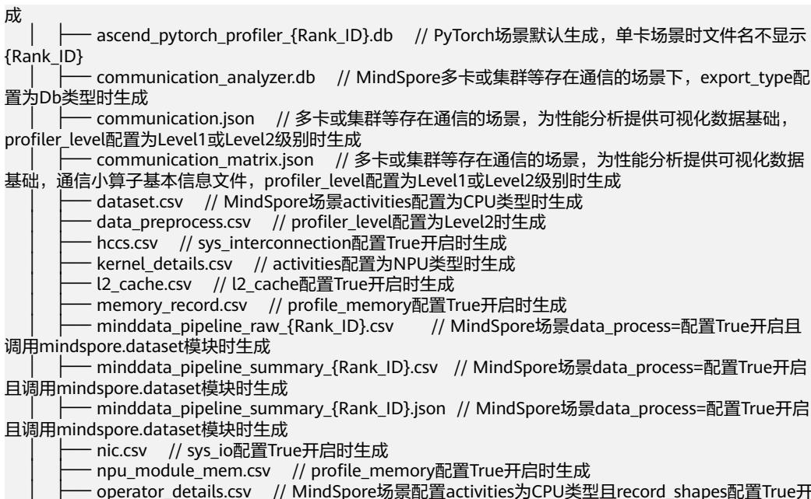

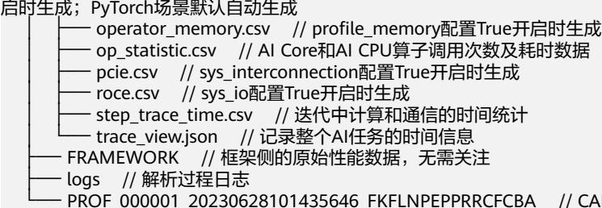

PROF_{数字}_{时间戳}_{字符串}，data_simplification配置True开启时，仅保留此目录下的原始性能数据，删除其他数据

analyze // 多卡或集群等存在通信的场景下，profiler_level配置为Level1或Level2级别时生成  
device_{Rank_ID} // CANN Profiling采集的device侧的原始性能数据  
host // CANN Profiling采集的host侧的原始性能数据  
mindstudio_profiler_log // CANN Profiling解析的日志文件  
mindstudio_profiler_output // CANN Profiling解析的性能数据

localhost.localdomain_139247_20230628101435_ascend_pt_op_arg // PyTorch场景算子信息统计文件目录，record_op_args配置True开启时生成

MindSpore Profiler和Ascend PyTorch Profiler接口将框架侧的数据与CANNProfiling的数据关联整合，形成trace、Kernel以及memory等性能数据文件。保存在ASCEND_PROFILER_OUTPUT目录下，包括json和csv格式的13.2 timeline和summary数据、13.3 ascend_pytorch_profiler_{Rank_ID}.db数据、13.4analysis.db数据。

PROF目录下为CANN Profiling采集的性能数据，主要保存在mindstudio_profiler_output目录下和msprof_\*.db文件内，数据介绍请参见12 性能数据文件参考。

PyTorch的场景调用export_chrome_trace方法时，Ascend PyTorch Profiler接口会将解析的trace数据写入到\*.json文件中，其中\*为文件名，不存在该文件时在指定路径下自动创建。

# 13.2 timeline 和 summary 数据

trace_view.json

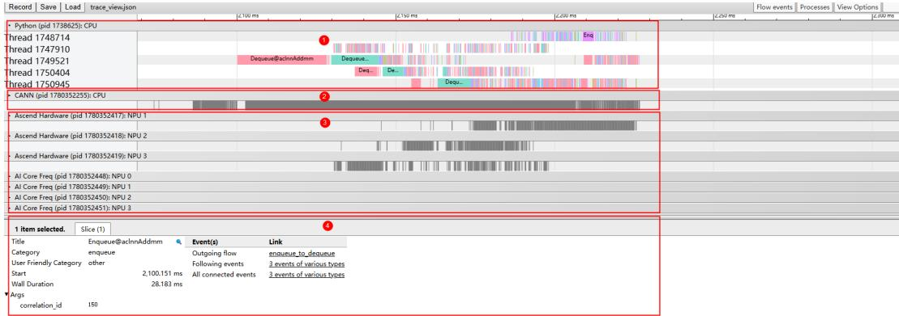  
图 13-1 trace_view

如图13-1所示，trace数据主要展示如下区域：

● 区域1：上层应用数据，包含上层应用算子的耗时信息。  
● 区域2：CANN层数据，主要包含AscendCL、GE和Runtime组件的耗时数据。  
● 区域3：底层NPU数据，主要包含Task Scheduler组件耗时数据和迭代轨迹数据以及其他昇腾AI处理器系统数据。  
● 区域4：展示trace中各算子、接口的详细信息。单击各个trace事件时展示。

# 说明

trace_view.json支持使用MindStudio Insight工具、chrome://tracing/和https://ui.perfetto.dev/打开。

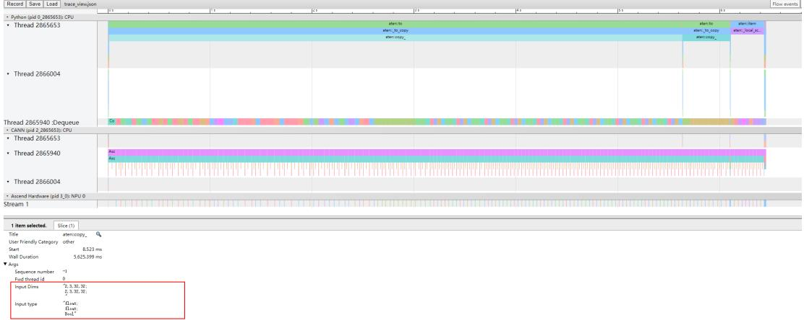  
图 13-2 trace_view（record_shapes）

开启record_shapes时，trace_view中的上层应用算子会显示Input Dims和Input type信息。

仅PyTorch场景支持，MindSpore场景暂不支持record_shapes控制此数据。

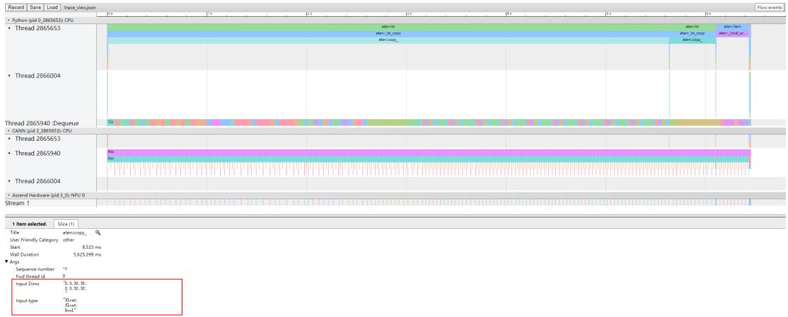  
图 13-3 trace_view（with_stack）

开启with_stack时，trace_view中的上层应用算子会显示Call stack信息。

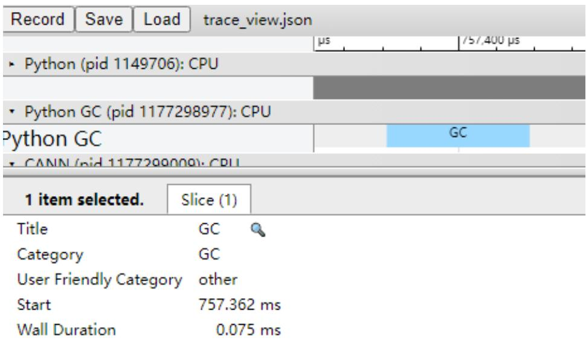  
图 13-4 trace_view（GC）

图13-4采集结果中Python GC层的时间段为本次GC执行的时间。

GC执行时，会阻塞当前进程，需要等待GC完成，若GC时间过长，可以通过调整GC参数（可参考垃圾回收器中的gc.set_threshold）来缓解GC造成的进程阻塞。

仅PyTorch场景支持。

# kernel_details.csv

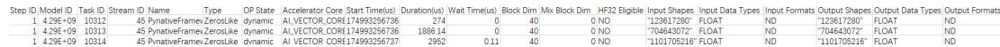  
图 13-5 kernel_details（MindSpore）

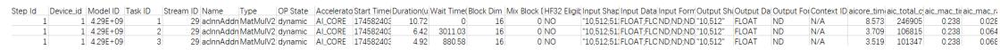  
图 13-6 kernel_details（PyTorch）

文件包含在NPU上执行的所有算子的信息。若用户前端调用了schedule进行Step打点，则会增加Step Id字段；但若schedule设置了warmup（不为0），且训练/在线推理的每个Step后存在算子异步执行操作，那么这部分算子异步执行操作在warmup阶段执行的算子可能会被采集到，结果为在kernel_details.csv中没有Step Id字段。

字段信息如表13-1所示。

# 说明

当配置experimental_config的aic_metrics参数时，kernel_details.csv文件将根据experimental_config参数的aic_metrics配置增加对应字段，主要增加内容请参见experimental_config参数说明，文件内相关字段详细介绍请参见12.10 op_summary（算子详细信息）。

表 13-1 kernel_details  

<table><tr><td colspan="1" rowspan="1">字段名</td><td colspan="1" rowspan="1">字段解释</td></tr><tr><td colspan="1" rowspan="1">Step Id&amp;Step ID</td><td colspan="1" rowspan="1">迭代ID。</td></tr><tr><td colspan="1" rowspan="1">Device_id</td><td colspan="1" rowspan="1">设备ID。</td></tr><tr><td colspan="1" rowspan="1">Model ID</td><td colspan="1" rowspan="1">模型ID。</td></tr><tr><td colspan="1" rowspan="1">Task ID</td><td colspan="1" rowspan="1">Task任务的ID。</td></tr><tr><td colspan="1" rowspan="1"> Stream ID</td><td colspan="1" rowspan="1">该Task所处的Stream ID。</td></tr><tr><td colspan="1" rowspan="1">Name</td><td colspan="1" rowspan="1">算子名。</td></tr><tr><td colspan="1" rowspan="1">Type</td><td colspan="1" rowspan="1">算子类型。</td></tr><tr><td colspan="1" rowspan="1">OP State</td><td colspan="1" rowspan="1">算子的动静态信息，dynamic表示动态算子，static表示静态算子，通信算子无该状态显示为N/A，该字段仅在--task-time=l1情况下上报，--task-time=l0时显示为N/A。</td></tr><tr><td colspan="1" rowspan="1">Accelerator Core</td><td colspan="1" rowspan="1">AI加速核类型，包括AI Core、AI CPU等。</td></tr><tr><td colspan="1" rowspan="1">Start Time(us)</td><td colspan="1" rowspan="1">算子执行开始时间，单位us。</td></tr><tr><td colspan="1" rowspan="1">Duration(us)</td><td colspan="1" rowspan="1">当前算子执行耗时，单位us。</td></tr><tr><td colspan="1" rowspan="1">Wait Time(us)</td><td colspan="1" rowspan="1">算子执行等待时间，单位us。</td></tr><tr><td colspan="1" rowspan="1">Block Dim</td><td colspan="1" rowspan="1">运行切分数量，对应任务执行时核数。</td></tr><tr><td colspan="1" rowspan="1">Mix Block Dim</td><td colspan="1" rowspan="1">部分算子同时在Al Core和Vector Core上执行，主加速器的Block Dim在Block Dim字段描述，从加速器的BlockDim在本字段描述。task_time为l0时，不采集该字段，显示为N/A。（Atlas A2训练系列产品/AtlasA2推理系列产品）（Atlas A3训练系列产品/Atlas A3推理系列产品）</td></tr><tr><td colspan="1" rowspan="1">HF32 Eligible</td><td colspan="1" rowspan="1">标识是否使用HF32精度标记，YES表示使用，NO表示未使用。</td></tr><tr><td colspan="1" rowspan="1">Input Shapes</td><td colspan="1" rowspan="1">算子输入Shape。</td></tr><tr><td colspan="1" rowspan="1"> Input Data Types</td><td colspan="1" rowspan="1">算子输入数据类型。</td></tr><tr><td colspan="1" rowspan="1">Input Formats</td><td colspan="1" rowspan="1">算子输入数据格式。</td></tr><tr><td colspan="1" rowspan="1">Output Shapes</td><td colspan="1" rowspan="1">算子输出Shape。</td></tr><tr><td colspan="1" rowspan="1">Output Data Types</td><td colspan="1" rowspan="1">算子输出数据类型。</td></tr><tr><td colspan="1" rowspan="1">Output Formats</td><td colspan="1" rowspan="1">算子输出数据格式。</td></tr></table>

# memory_record.csv

图 13-7 memory_record  

<table><tr><td rowspan=1 colspan=1>Component</td><td rowspan=1 colspan=1>Timestamp(us)</td><td rowspan=1 colspan=1>Total Allocated(MB)</td><td rowspan=1 colspan=1>Total Reserved(MB</td><td rowspan=1 colspan=1>Total Active(MB)</td><td rowspan=1 colspan=1>Stream Ptr</td><td rowspan=1 colspan=1>Device Type</td></tr><tr><td rowspan=1 colspan=1>APP</td><td rowspan=1 colspan=1>1706525863596995.580</td><td rowspan=1 colspan=1></td><td rowspan=1 colspan=1>219.4960938</td><td rowspan=1 colspan=1></td><td rowspan=1 colspan=1></td><td rowspan=1 colspan=1>NPU:0</td></tr><tr><td rowspan=1 colspan=1>PTA</td><td rowspan=1 colspan=1>1706525859780072.510</td><td rowspan=1 colspan=1>0.465820313</td><td rowspan=1 colspan=1>2</td><td rowspan=1 colspan=1>0.465820313</td><td rowspan=1 colspan=2>1.87651E+14 NPU:0</td></tr><tr><td rowspan=1 colspan=1>PTA+GE</td><td rowspan=1 colspan=1>1706525859780072.510</td><td rowspan=1 colspan=1>0.465820313</td><td rowspan=1 colspan=1>2</td><td rowspan=1 colspan=1>0.465820313</td><td rowspan=1 colspan=2>1.87651E+14 NPU:0</td></tr><tr><td rowspan=1 colspan=1>PTA</td><td rowspan=1 colspan=1>1706525859780285.682</td><td rowspan=1 colspan=1>0.466308594</td><td rowspan=1 colspan=1>2</td><td rowspan=1 colspan=1>0.466308594</td><td rowspan=1 colspan=2>1.87651E+14 NPU:0</td></tr></table>

文件包含PTA和GE的显存占用记录，主要记录PTA、GE等组件申请的内存及占用时间。字段信息如表13-2所示。

表 13-2 memory_record  

<table><tr><td rowspan=1 colspan=1>字段名</td><td rowspan=1 colspan=1>字段解释</td></tr><tr><td rowspan=1 colspan=1>Component</td><td rowspan=1 colspan=1>组件，包含：.）MindSpore:MindSpore、MindSpore+GE组件、APP进程级等。PyTorch：PTA和GE组件、APP进程级、WORKSPACE（采集性能数据前配置环境变量TASK_QUEUE_ENABLE=2时生成）等。</td></tr><tr><td rowspan=1 colspan=1>Timestamp(us)</td><td rowspan=1 colspan=1>时间戳，记录显存占用的起始时间，单位us。</td></tr><tr><td rowspan=1 colspan=1>TotalAllocated(MB)</td><td rowspan=1 colspan=1>内存分配总额，单位MB。</td></tr><tr><td rowspan=1 colspan=1>TotalReserved(MB)</td><td rowspan=1 colspan=1>内存预留总额，单位MB。</td></tr><tr><td rowspan=1 colspan=1>Total Active(MB)</td><td rowspan=1 colspan=1>Stream流所申请的总内存（包括被其他流复用的未释放的内存），单位MB。</td></tr><tr><td rowspan=1 colspan=1>Stream Ptr</td><td rowspan=1 colspan=1>AscendCL流的内存地址，用于标记不同的AscendCL流。</td></tr><tr><td rowspan=1 colspan=1>Device Type</td><td rowspan=1 colspan=1>设备类型和设备ID，仅涉及NPU。</td></tr></table>

# operator_memory.csv

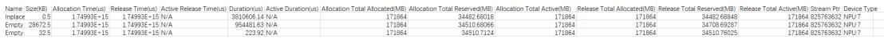  
图 13-8 operator_memory

文件包含算子的内存占用明细，主要记录算子在NPU上执行所需内存及占用时间，其中内存由PTA和GE申请。字段信息如表13-3所示。

# 说明

若operator_memory.csv文件中出现负值或空值，详细原因请参见负值空值说明。

表 13-3 operator_memory  

<table><tr><td colspan="1" rowspan="1">字段名</td><td colspan="1" rowspan="1">字段解释</td></tr><tr><td colspan="1" rowspan="1">Name</td><td colspan="1" rowspan="1">算子名称。</td></tr><tr><td colspan="1" rowspan="1">Size(KB)</td><td colspan="1" rowspan="1">算子占用内存大小，单位KB。</td></tr><tr><td colspan="1" rowspan="1">Allocation Time(us)</td><td colspan="1" rowspan="1">Tensor内存分配时间，单位us。</td></tr><tr><td colspan="1" rowspan="1">Release Time(us)</td><td colspan="1" rowspan="1">Tensor内存释放时间，单位us。</td></tr><tr><td colspan="1" rowspan="1">Active Release Time(us)</td><td colspan="1" rowspan="1">内存实际归还内存池时间，单位us。</td></tr><tr><td colspan="1" rowspan="1">Duration(us)</td><td colspan="1" rowspan="1">内存占用时间（Release Time-Allocation Time）,单位us。</td></tr><tr><td colspan="1" rowspan="1">Active Duration(us)</td><td colspan="1" rowspan="1">内存实际占用时间（Active Release Time-Allocation Time），单位us。</td></tr><tr><td colspan="1" rowspan="1">Allocation TotalAllocated(MB)</td><td colspan="1" rowspan="1">算子内存分配时的内存分配总额（Name算子名称为aten开头时为PTA内存，算子名称为cann开头时为GE内存），单位MB。</td></tr><tr><td colspan="1" rowspan="1">Allocation TotalReserved(MB)</td><td colspan="1" rowspan="1">算子内存分配时的内存占用总额（Name算子名称为aten开头时为PTA内存，算子名称为cann开头时为GE内存），单位MB。</td></tr><tr><td colspan="1" rowspan="1">Allocation Total Active(MB)</td><td colspan="1" rowspan="1">算子内存分配时当前流所申请的总内存（包括被其他流复用的未释放的内存），单位MB。</td></tr><tr><td colspan="1" rowspan="1">Release Total Allocated(MB)</td><td colspan="1" rowspan="1">算子内存释放时的内存分配总额（Name算子名称为aten开头时为PTA内存，算子名称为cann开头时为GE内存），单位MB。</td></tr><tr><td colspan="1" rowspan="1">Release Total Reserved(MB)</td><td colspan="1" rowspan="1">算子内存释放时的内存占用总额（Name算子名称为aten开头时为PTA内存，算子名称为cann开头时为GE内存），单位MB。</td></tr><tr><td colspan="1" rowspan="1">Release Total Active(MB)</td><td colspan="1" rowspan="1">算子内存释放时的内存中被其他Stream复用的内存总额（Name算子名称为aten开头时为PTA内存，算子名称为cann开头时为GE内存），单位MB。</td></tr><tr><td colspan="1" rowspan="1">Stream Ptr</td><td colspan="1" rowspan="1">AscendCL流的内存地址，用于标记不同的AscendCL流。</td></tr><tr><td colspan="1" rowspan="1">Device Type</td><td colspan="1" rowspan="1">设备类型和设备ID，仅涉及NPU。</td></tr></table>

# npu_module_mem.csv

图 13-9 npu_module_mem（MindSpore）  

<table><tr><td rowspan=1 colspan=1>Device_id</td><td rowspan=1 colspan=1>Device_id Component</td><td rowspan=1 colspan=1>Timestamp(us)</td><td rowspan=1 colspan=1>Total Reserved(KB)</td><td rowspan=1 colspan=1>Device</td></tr><tr><td rowspan=1 colspan=1></td><td rowspan=1 colspan=1>7 SLOG</td><td rowspan=1 colspan=1>17499325673679</td><td rowspan=1 colspan=1>182284 NPU:7</td><td rowspan=1 colspan=1>NPU:7</td></tr><tr><td rowspan=1 colspan=1></td><td rowspan=1 colspan=1>7 SLOG</td><td rowspan=1 colspan=1>17499325673778</td><td rowspan=1 colspan=1>182284 NPU:7</td><td rowspan=1 colspan=1>182284 NPU:7</td></tr><tr><td rowspan=1 colspan=1></td><td rowspan=1 colspan=1>7 SLOG</td><td rowspan=1 colspan=1>17499325673878</td><td rowspan=1 colspan=1>182284 NPU:7</td><td rowspan=1 colspan=1>182284 NPU:7</td></tr></table>

图 13-10 npu_module_mem（PyTorch）  

<table><tr><td rowspan=1 colspan=1>Device_id</td><td rowspan=1 colspan=1>Component</td><td rowspan=1 colspan=1>Timestamp(us)</td><td rowspan=1 colspan=1>Total Reserved(MB) Device</td><td rowspan=1 colspan=1>Device</td></tr><tr><td rowspan=1 colspan=1></td><td rowspan=1 colspan=1>6 SLOG</td><td rowspan=1 colspan=1>17520427757689:</td><td rowspan=1 colspan=1>158.140625 NPU:6</td><td rowspan=1 colspan=1>NPU:6</td></tr><tr><td rowspan=1 colspan=1></td><td rowspan=1 colspan=1>6 SLOG</td><td rowspan=1 colspan=1>17520427757889:</td><td rowspan=1 colspan=1>158.140625 NPU:6</td><td rowspan=1 colspan=1>NPU:6</td></tr><tr><td rowspan=1 colspan=1></td><td rowspan=1 colspan=1>6 SLOG</td><td rowspan=1 colspan=1>17520427758088</td><td rowspan=1 colspan=1>158.140625 NPU:6</td><td rowspan=1 colspan=1>NPU:6</td></tr></table>

npu_module_mem.csv数据在采集进程中自动采集，包含组件级的内存占用情况，主要记录组件在NPU上执行时，当前时刻所占用的内存。字段信息如表13-4所示。

表 13-4 npu_module_mem  

<table><tr><td rowspan=1 colspan=1>字段名</td><td rowspan=1 colspan=1>字段解释</td></tr><tr><td rowspan=1 colspan=1>Device_id</td><td rowspan=1 colspan=1>设备ID。</td></tr><tr><td rowspan=1 colspan=1>Component</td><td rowspan=1 colspan=1>组件名称。</td></tr><tr><td rowspan=1 colspan=1>Timestamp(us)</td><td rowspan=1 colspan=1>时间戳，表示当前时刻组件占用的内存，单位us。</td></tr><tr><td rowspan=1 colspan=1>Total Reserved(MB)&amp;TotalReserved(KB)</td><td rowspan=1 colspan=1>内存占用大小，单位MB（PyTorch）&amp;KB（MindSpore）。</td></tr><tr><td rowspan=1 colspan=1>Device</td><td rowspan=1 colspan=1>设备类型和设备ID，仅涉及NPU。</td></tr></table>

# operator_details.csv

图 13-11 operator_details  

<table><tr><td>Name</td><td>Input Shapes Call Stack</td><td>/root/miniconda3/envs/zxq1.0/libpythosi packages/torch/nn/functionalpy(1442): relu:</td><td></td><td></td><td></td><td></td><td>HostSelfDurationus)Host Total Duration(us)Device SelfDuration(us)Device Total Duration(us)Device SelfDuration With AICore(us)</td><td>Device Total Duration With AICore(us)</td></tr><tr><td>aten:relu</td><td></td><td>lenet_16.py(32): forward; /root/miniconda3/envs/zxq1.110/ib/python3.7/site- 2,120 packages/torch/nn/modules/module.py(1110) _calLimpl; lenet_16.py(45):trainoneepoch; lenet_16.py(80):TestLeNetE2E; lenet_16.py(86).smodule&gt; /root/miniconda3/envs/zxq1.110/lib/python3./site</td><td>15.505</td><td>23.929</td><td>0</td><td>1.28</td><td>0</td><td>1.28</td></tr><tr><td>aten:relu 2.84</td><td></td><td>packages/torch/nn/functionalpy(1442): relu; lenet_16.py(33): forward; /root/miniconda3/envs/zxq1.0/lib/python3.site packages/torch/nn/modules/module.py(10): _calLimpl; lenet_16py(80)：TestLeNetE2E lenet_16py(45):train_oneepoch; lenet_16 py(86): &lt;module&gt;</td><td>14.959</td><td>22.87</td><td>0</td><td>1.35</td><td>0</td><td>1.35</td></tr></table>

operator_details.csv文件包含信息如表13-5所示。

表 13-5 operator_details  

<table><tr><td rowspan=1 colspan=1>字段</td><td rowspan=1 colspan=1>说明</td></tr><tr><td rowspan=1 colspan=1>Name</td><td rowspan=1 colspan=1>算子名称。</td></tr><tr><td rowspan=1 colspan=1>Input Shapes</td><td rowspan=1 colspan=1>Shape信息。</td></tr><tr><td rowspan=1 colspan=1>Call Stack</td><td rowspan=1 colspan=1>函数调用栈信息。由with_stack字段控制。</td></tr><tr><td rowspan=1 colspan=1>Host Self Duration(us)</td><td rowspan=1 colspan=1>算子在Host侧的耗时（除去内部调用的其他算子），单位us。</td></tr><tr><td rowspan=1 colspan=1>Host Total Duration(us)</td><td rowspan=1 colspan=1>算子在Host侧的耗时，单位us。</td></tr><tr><td rowspan=1 colspan=1>Device Self Duration(us)</td><td rowspan=1 colspan=1>算子在Device侧的耗时（除去内部调用的其他算子），单位us。</td></tr><tr><td rowspan=1 colspan=1>Device Total Duration(us)</td><td rowspan=1 colspan=1>算子在Device侧的耗时，单位us。</td></tr><tr><td rowspan=1 colspan=1>Device Self Duration WithAICore(us)</td><td rowspan=1 colspan=1>算子在Device侧执行在Al Core上的耗时（除去内部调用的算子），单位us。</td></tr><tr><td rowspan=1 colspan=1>Device Total Duration WithAICore(us)</td><td rowspan=1 colspan=1>算子在Device侧执行在Al Core上的耗时，单位us。</td></tr></table>

# step_trace_time.csv

图 13-12 step_trace_time（MindSpore）  

<table><tr><td>Step</td><td></td><td>Computing Communication(Not Overlapped) Overlapped Communication Free</td><td></td><td></td><td></td><td></td><td></td><td>Stage_Bubble Communication(Not Overlapped and Exclude Receive) Preparing</td><td></td><td></td></tr><tr><td></td><td>2845607.9</td><td></td><td>1088883.2</td><td>225342.12</td><td>1314225.32480366</td><td></td><td>0</td><td>0</td><td>1088883.2 1108522.12</td><td>1311.48</td></tr><tr><td></td><td>2830361.7</td><td></td><td>1108522.12</td><td>213455.52</td><td>1321977.64428262</td><td></td><td>0</td><td>0</td><td></td><td>875.69</td></tr><tr><td></td><td>2827377.1</td><td></td><td>1137936.1</td><td>214334.22</td><td>1352270.32</td><td>442214</td><td>0</td><td>0</td><td></td><td>882.08</td></tr></table>

图 13-13 step_trace_time（PyTorch）  

<table><tr><td>Device id Step</td><td></td><td>ComputingomunicattOveapdveradommuniationFretabmniatioOveradcdReivren</td><td></td><td></td><td></td><td></td><td></td><td></td></tr><tr><td></td><td>1</td><td>3466.24</td><td>0</td><td>0</td><td></td><td>0####67222</td><td>0</td><td>02149089</td></tr><tr><td></td><td>2</td><td>2416.28</td><td>0</td><td>0</td><td></td><td>0#### 48087</td><td></td><td>2135248</td></tr><tr><td></td><td>3</td><td>3738.52</td><td>0</td><td>0</td><td></td><td>0#### 5E+05</td><td>0 0</td><td>1738073</td></tr></table>

迭代中计算和通信的时间统计，包含信息如表13-6所示。

表 13-6 step_trace_time  

<table><tr><td colspan="1" rowspan="1">字段</td><td colspan="1" rowspan="1">说明</td></tr><tr><td colspan="1" rowspan="1">Device_id</td><td colspan="1" rowspan="1">设备ID。</td></tr><tr><td colspan="1" rowspan="1">Step</td><td colspan="1" rowspan="1">迭代数。</td></tr><tr><td colspan="1" rowspan="1">Computing</td><td colspan="1" rowspan="1">NPU上算子的计算总时间，单位us。</td></tr><tr><td colspan="1" rowspan="1">Communication(NotOverlapped)</td><td colspan="1" rowspan="1">通信时间，通信总时间减去计算和通信重叠的时间，单位us。</td></tr><tr><td colspan="1" rowspan="1">Overlapped</td><td colspan="1" rowspan="1">计算和通信重叠的时间，单位us。更多重叠代表计算和通信之间更好的并行性。理想情况下，通信与计算完全重叠。</td></tr><tr><td colspan="1" rowspan="1">Communication</td><td colspan="1" rowspan="1">NPU上算子的通信总时间，单位us。</td></tr><tr><td colspan="1" rowspan="1">Free</td><td colspan="1" rowspan="1">迭代总时间减去计算和通信时间，单位us。可能包括初始化、数据加载、CPU计算等。</td></tr><tr><td colspan="1" rowspan="1">Stage</td><td colspan="1" rowspan="1">Stage时间，代表除receive算子时间外的时间，单位us。</td></tr><tr><td colspan="1" rowspan="1">Bubble</td><td colspan="1" rowspan="1">指receive时间的总和，单位us。</td></tr><tr><td colspan="1" rowspan="1">Communication(NotOverlapped and ExcludeReceive)</td><td colspan="1" rowspan="1">通信总时间减去计算和通信重叠以及receive算子的时间，单位us。</td></tr><tr><td colspan="1" rowspan="1">Preparing</td><td colspan="1" rowspan="1">迭代开始到首个计算或通信算子运行的时间，单位us。</td></tr></table>

# data_preprocess.csv

data_preprocess.csv文件记录AI CPU数据，示例和字段说明以12.14 aicpu（AI CPU算子详细耗时）为参考，实际结果略有不同，请以实际情况为准。

# l2_cache.csv

示例和字段说明以12.16 l2_cache（L2 Cache命中率）为参考，实际结果略有不同，请以实际情况为准。

# op_statistic.csv

示例和字段说明以12.11 op_statistic（算子调用次数及耗时）为参考，实际结果略有不同，请以实际情况为准。

# api_statistic.csv

示例和字段说明以api_statistic_\*.csv文件说明为参考，实际结果略有不同，请以实际情况为准。

# pcie.csv

示例和字段说明以pcie_\*.csv文件说明为参考，实际结果略有不同，请以实际情况为准。

hccs.csv

示例和字段说明以hccs_\*.csv文件说明为参考，实际结果略有不同，请以实际情况为准。

nic.csv

示例和字段说明以nic_\*.csv文件说明为参考，实际结果略有不同，请以实际情况为准。

roce.csv

示例和字段说明以roce_\*.csv文件说明为参考，实际结果略有不同，请以实际情况为准。

# 13.3 ascend_pytorch_profiler_{Rank_ID}.db 数据

该文件为表结构文件，该文件推荐使用MindStudio Insight工具查看，也可以使用Navicat Premium等数据库开发工具直接打开。当前db文件汇总的性能数据如下：

# STRING_IDS

映射表，用于存储ID和字符串映射关系。

无开关，记录CANN侧使用的String ID映射关系，通常从0开始累加。

表 13-7 格式  

<table><tr><td rowspan=1 colspan=1>字段名</td><td rowspan=1 colspan=1>类型</td><td rowspan=1 colspan=1>索引</td><td rowspan=1 colspan=1>含义</td></tr><tr><td rowspan=1 colspan=1>id</td><td rowspan=1 colspan=1>INTEGER</td><td rowspan=1 colspan=1>主键</td><td rowspan=1 colspan=1>string对应的id</td></tr><tr><td rowspan=1 colspan=1>value</td><td rowspan=1 colspan=1>TEXT</td><td rowspan=1 colspan=1>-</td><td rowspan=1 colspan=1>string内容</td></tr></table>

# PYTORCH_API

框架侧API数据，当前仅包含torch_npu API数据。

由Ascend PyTorch Profiler接口的torch_npu.profiler.ProfilerActivity.CPU开关控制。

表 13-8 格式  

<table><tr><td colspan="1" rowspan="1">字段名</td><td colspan="1" rowspan="1">类型</td><td colspan="1" rowspan="1">含义</td></tr><tr><td colspan="1" rowspan="1">startNs</td><td colspan="1" rowspan="1">INTEGER</td><td colspan="1" rowspan="1">op API开始时间，单位ns</td></tr><tr><td colspan="1" rowspan="1">endNs</td><td colspan="1" rowspan="1">INTEGER</td><td colspan="1" rowspan="1">op API结束时间，单位ns</td></tr><tr><td colspan="1" rowspan="1">globalTid</td><td colspan="1" rowspan="1">INTEGER</td><td colspan="1" rowspan="1">该API所属的全局tid。高32位：pid，低32位：tid</td></tr><tr><td colspan="1" rowspan="1">connectionld</td><td colspan="1" rowspan="1">INTEGER</td><td colspan="1" rowspan="1">用于在CONNECTION_IDS表查询对应的connectionld；如果无connectionld，此处为空</td></tr><tr><td colspan="1" rowspan="1">name</td><td colspan="1" rowspan="1">INTEGER</td><td colspan="1" rowspan="1">该op API名，STRING_IDS(name)</td></tr><tr><td colspan="1" rowspan="1">sequenceNumber</td><td colspan="1" rowspan="1">INTEGER</td><td colspan="1" rowspan="1">op序号</td></tr><tr><td colspan="1" rowspan="1">fwdThreadld</td><td colspan="1" rowspan="1">INTEGER</td><td colspan="1" rowspan="1">op前向线程id</td></tr><tr><td colspan="1" rowspan="1">inputDtypes</td><td colspan="1" rowspan="1">INTEGER</td><td colspan="1" rowspan="1">输入数据类型，STRING_IDS(inputDtypes)</td></tr><tr><td colspan="1" rowspan="1">inputShapeS</td><td colspan="1" rowspan="1">INTEGER</td><td colspan="1" rowspan="1">输入shape，STRING_IDS(inputShapes)</td></tr><tr><td colspan="1" rowspan="1">callchainld</td><td colspan="1" rowspan="1">INTEGER</td><td colspan="1" rowspan="1">用于在PYTORCH_CALLCHAINS表查询对应的call stack信息；如果无stack信息，此处为空</td></tr><tr><td colspan="1" rowspan="1">type</td><td colspan="1" rowspan="1">INTEGER</td><td colspan="1" rowspan="1">标记数据类型，op、queue、mstx还是python_trace，数据类型存于枚举表ENUM_API_TYPE中</td></tr></table>

# CONNECTION_IDS

框架侧API和自身或者和CANN API的关联关系数据。

由Ascend PyTorch Profiler接口的torch_npu.profiler.ProfilerActivity.CPU开关控制。

表 13-9 格式  

<table><tr><td rowspan=1 colspan=1>字段名</td><td rowspan=1 colspan=1>类型</td><td rowspan=1 colspan=1>含义</td></tr><tr><td rowspan=1 colspan=1>id</td><td rowspan=1 colspan=1>INTEGER</td><td rowspan=1 colspan=1>对应PYTORCH_API表的connectionld</td></tr><tr><td rowspan=1 colspan=1>connectionld</td><td rowspan=1 colspan=1>INTEGER</td><td rowspan=1 colspan=1>用于表示关联关系的ID，当前包括task_queue、fwd_bwd、torch-cann-task三种关联关系</td></tr></table>

# PYTORCH_CALLCHAINS

框架侧的堆栈信息。  
由Ascend PyTorch Profiler接口的with_stack参数控制。

表 13-10 格式  

<table><tr><td rowspan=1 colspan=1>字段名</td><td rowspan=1 colspan=1>类型</td><td rowspan=1 colspan=1>含义</td></tr><tr><td rowspan=1 colspan=1>id</td><td rowspan=1 colspan=1>INTEGER</td><td rowspan=1 colspan=1>对应PYTORCH_API表的callchainld</td></tr><tr><td rowspan=1 colspan=1>stack</td><td rowspan=1 colspan=1>INTEGER</td><td rowspan=1 colspan=1>当前栈的字符串内容在STRING_IDS表中对应的id</td></tr><tr><td rowspan=1 colspan=1>stackDepth</td><td rowspan=1 colspan=1>INTEGER</td><td rowspan=1 colspan=1>当前栈所在深度</td></tr></table>

# MEMORY_RECORD

框架侧的显存占用记录。

由Ascend PyTorch Profiler接口的profile_memory参数控制。

表 13-11 格式  

<table><tr><td rowspan=1 colspan=1>字段名</td><td rowspan=1 colspan=1>类型</td><td rowspan=1 colspan=1>含义</td></tr><tr><td rowspan=1 colspan=1>component</td><td rowspan=1 colspan=1>INTEGER</td><td rowspan=1 colspan=1>组件名（GE、PTA、PTA+GE）在STRING_IDS表中对应的id</td></tr><tr><td rowspan=1 colspan=1>timestamp</td><td rowspan=1 colspan=1>INTEGER</td><td rowspan=1 colspan=1>时间戳</td></tr><tr><td rowspan=1 colspan=1>totalAllocated</td><td rowspan=1 colspan=1>INTEGER</td><td rowspan=1 colspan=1>内存分配总额</td></tr><tr><td rowspan=1 colspan=1>totalReserved</td><td rowspan=1 colspan=1>INTEGER</td><td rowspan=1 colspan=1>内存预留总额</td></tr><tr><td rowspan=1 colspan=1>totalActive</td><td rowspan=1 colspan=1>INTEGER</td><td rowspan=1 colspan=1>PTA流申请的总内存</td></tr><tr><td rowspan=1 colspan=1>streamPtr</td><td rowspan=1 colspan=1>INTEGER</td><td rowspan=1 colspan=1>ascendcl流地址</td></tr><tr><td rowspan=1 colspan=1>deviceld</td><td rowspan=1 colspan=1>INTEGER</td><td rowspan=1 colspan=1>设备ID</td></tr></table>

# OP_MEMORY

框架侧基于MEMORY_RECORD整合的算子内存占用信息。  
由Ascend PyTorch Profiler接口的profile_memory参数控制。

表 13-12 格式  

<table><tr><td rowspan=1 colspan=1>字段名</td><td rowspan=1 colspan=1>类型</td><td rowspan=1 colspan=1>含义</td></tr><tr><td rowspan=1 colspan=1>name</td><td rowspan=1 colspan=1>INTEGER</td><td rowspan=1 colspan=1>torch和GE算子名称，STRING_IDS(name)</td></tr><tr><td rowspan=1 colspan=1>size</td><td rowspan=1 colspan=1>INTEGER</td><td rowspan=1 colspan=1>算子占用内存大小，单位Byte</td></tr><tr><td rowspan=1 colspan=1>allocationTime</td><td rowspan=1 colspan=1>INTEGER</td><td rowspan=1 colspan=1>算子内存申请时间，单位ns</td></tr><tr><td rowspan=1 colspan=1> releaseTime</td><td rowspan=1 colspan=1>INTEGER</td><td rowspan=1 colspan=1>算子内存释放时间，单位ns</td></tr><tr><td rowspan=1 colspan=1>activeReleaseTime</td><td rowspan=1 colspan=1>INTEGER</td><td rowspan=1 colspan=1>内存实际归还内存池时间，单位ns</td></tr><tr><td rowspan=1 colspan=1>duration</td><td rowspan=1 colspan=1>INTEGER</td><td rowspan=1 colspan=1>内存占用时间，单位ns</td></tr><tr><td rowspan=1 colspan=1>activeDuration</td><td rowspan=1 colspan=1>INTEGER</td><td rowspan=1 colspan=1>内存实际占用时间，单位ns</td></tr><tr><td rowspan=1 colspan=1>allocationTotalAllocated</td><td rowspan=1 colspan=1>INTEGER</td><td rowspan=1 colspan=1>算子内存分配时PTA和GE内存分配总额，单位Byte</td></tr><tr><td rowspan=1 colspan=1>allocationTotalReserved</td><td rowspan=1 colspan=1>INTEGER</td><td rowspan=1 colspan=1>算子内存分配时PTA和GE内存占用总额，单位Byte</td></tr><tr><td rowspan=1 colspan=1> allocationTotalActive</td><td rowspan=1 colspan=1>INTEGER</td><td rowspan=1 colspan=1>算子内存分配时当前流申请的内存总额，单位Byte</td></tr><tr><td rowspan=1 colspan=1>releaseTotalAllocated</td><td rowspan=1 colspan=1>INTEGER</td><td rowspan=1 colspan=1>算子内存释放时PTA和GE内存分配总额，单位Byte</td></tr><tr><td rowspan=1 colspan=1>releaseTotalReserved</td><td rowspan=1 colspan=1>INTEGER</td><td rowspan=1 colspan=1>算子内存释放时PTA和GE内存占用总额，单位Byte</td></tr><tr><td rowspan=1 colspan=1> releaseTotalActive</td><td rowspan=1 colspan=1>INTEGER</td><td rowspan=1 colspan=1>算子内存释放时当前流申请的内存总额，单位Byte</td></tr><tr><td rowspan=1 colspan=1> streamPtr</td><td rowspan=1 colspan=1>INTEGER</td><td rowspan=1 colspan=1>ascendcl流地址</td></tr><tr><td rowspan=1 colspan=1>deviceld</td><td rowspan=1 colspan=1>INTEGER</td><td rowspan=1 colspan=1>设备ID</td></tr></table>

# RANK_DEVICE_MAP

rankId和deviceId的映射关系数据。

无对应开关，导出ascend_pytorch_profiler_{Rank_ID}.db文件时默认生成。

表 13-13 格式  

<table><tr><td rowspan=1 colspan=1>字段名</td><td rowspan=1 colspan=1>类型</td><td rowspan=1 colspan=1>含义</td></tr><tr><td rowspan=1 colspan=1>rankld</td><td rowspan=1 colspan=1>INTEGER</td><td rowspan=1 colspan=1>集群场景的节点标识ID，显示为-1时表示未设置rankld。</td></tr><tr><td rowspan=1 colspan=1>deviceld</td><td rowspan=1 colspan=1>INTEGER</td><td rowspan=1 colspan=1>节点上的设备ID，显示为-1时表示未采集到deviceld。</td></tr></table>

# STEP_TIME

保存Profiler采集step起始时间。

由Ascend PyTorch Profiler接口torch_npu.profiler.schedule类的参数控制。

表 13-14 格式  

<table><tr><td rowspan=1 colspan=1>字段名</td><td rowspan=1 colspan=1>类型</td><td rowspan=1 colspan=1>含义</td></tr><tr><td rowspan=1 colspan=1>id</td><td rowspan=1 colspan=1>INTEGER</td><td rowspan=1 colspan=1>Step ID值</td></tr><tr><td rowspan=1 colspan=1>startNs</td><td rowspan=1 colspan=1>INTEGER</td><td rowspan=1 colspan=1>Step开始时间，单位ns</td></tr><tr><td rowspan=1 colspan=1>endNs</td><td rowspan=1 colspan=1>INTEGER</td><td rowspan=1 colspan=1>Step结束时间，单位ns</td></tr></table>

# GC_RECORD

保存Profiler采集的GC事件。

由Ascend PyTorch Profiler接口的gc_detect_threshold参数控制。

表 13-15 格式  

<table><tr><td rowspan=1 colspan=1>字段名</td><td rowspan=1 colspan=1>类型</td><td rowspan=1 colspan=1>含义</td></tr><tr><td rowspan=1 colspan=1>startNs</td><td rowspan=1 colspan=1>INTEGER</td><td rowspan=1 colspan=1>GC事件开始时间，单位ns</td></tr><tr><td rowspan=1 colspan=1>endNs</td><td rowspan=1 colspan=1>INTEGER</td><td rowspan=1 colspan=1>GC事件结束时间，单位ns</td></tr><tr><td rowspan=1 colspan=1>globalTid</td><td rowspan=1 colspan=1> INTEGER</td><td rowspan=1 colspan=1>GC事件的全局tid</td></tr></table>

ROCE

RoCE通信接口带宽数据。

控制开关：

● msprof命令的--sys-io-profiling、--sys-io-sampling-freq   
● Ascend PyTorch Profiler的sys_io MindSpore Profiler的sys_io

表 13-16 格式  

<table><tr><td rowspan=1 colspan=1>字段名</td><td rowspan=1 colspan=1>类型</td><td rowspan=1 colspan=1>含义</td></tr><tr><td rowspan=1 colspan=1>deviceld</td><td rowspan=1 colspan=1>INTEGER</td><td rowspan=1 colspan=1>设备ID</td></tr><tr><td rowspan=1 colspan=1>timestampNs</td><td rowspan=1 colspan=1>INTEGER</td><td rowspan=1 colspan=1>本地时间，单位ns</td></tr><tr><td rowspan=1 colspan=1>bandwidth</td><td rowspan=1 colspan=1>INTEGER</td><td rowspan=1 colspan=1>带宽，单位Byte/s</td></tr><tr><td rowspan=1 colspan=1>rxPacketRate</td><td rowspan=1 colspan=1>NUMERIC</td><td rowspan=1 colspan=1>收包速率，单位packet/s</td></tr><tr><td rowspan=1 colspan=1>rxByteRate</td><td rowspan=1 colspan=1>NUMERIC</td><td rowspan=1 colspan=1>接收字节速率，单位Byte/s</td></tr><tr><td rowspan=1 colspan=1>rxPackets</td><td rowspan=1 colspan=1>INTEGER</td><td rowspan=1 colspan=1>累计收包数量，单位packet</td></tr><tr><td rowspan=1 colspan=1>rxBytes</td><td rowspan=1 colspan=1>INTEGER</td><td rowspan=1 colspan=1>累计接收字节数量，单位Byte</td></tr><tr><td rowspan=1 colspan=1>rxErrors</td><td rowspan=1 colspan=1>INTEGER</td><td rowspan=1 colspan=1>累计接收错误包数量，单位packet</td></tr><tr><td rowspan=1 colspan=1>rxDropped</td><td rowspan=1 colspan=1>INTEGER</td><td rowspan=1 colspan=1>累计接收丢包数量，单位packet</td></tr><tr><td rowspan=1 colspan=1>txPacketRate</td><td rowspan=1 colspan=1>NUMERIC</td><td rowspan=1 colspan=1>发包速率，单位packet/s</td></tr><tr><td rowspan=1 colspan=1>txByteRate</td><td rowspan=1 colspan=1>NUMERIC</td><td rowspan=1 colspan=1>发送字节速率，单位Byte/s</td></tr><tr><td rowspan=1 colspan=1>txPackets</td><td rowspan=1 colspan=1>INTEGER</td><td rowspan=1 colspan=1>累计发包数量，单位packet</td></tr><tr><td rowspan=1 colspan=1>txBytes</td><td rowspan=1 colspan=1>INTEGER</td><td rowspan=1 colspan=1>累计发送字节数量，单位Byte</td></tr><tr><td rowspan=1 colspan=1>txErrors</td><td rowspan=1 colspan=1>INTEGER</td><td rowspan=1 colspan=1>累计发送错误包数量，单位packet</td></tr><tr><td rowspan=1 colspan=1>txDropped</td><td rowspan=1 colspan=1>INTEGER</td><td rowspan=1 colspan=1>累计发送丢包数量，单位packet</td></tr><tr><td rowspan=1 colspan=1>funcld</td><td rowspan=1 colspan=1>INTEGER</td><td rowspan=1 colspan=1>端口号</td></tr></table>

每个时间节点网络信息数据。

控制开关：

● msprof命令的--sys-io-profiling、--sys-io-sampling-freq   
● Ascend PyTorch Profiler的sys_io MindSpore Profiler的sys_io

表 13-17 格式  

<table><tr><td rowspan=1 colspan=1>字段名</td><td rowspan=1 colspan=1>类型</td><td rowspan=1 colspan=1>含义</td></tr><tr><td rowspan=1 colspan=1>deviceld</td><td rowspan=1 colspan=1>INTEGER</td><td rowspan=1 colspan=1>设备ID</td></tr><tr><td rowspan=1 colspan=1>timestampNs</td><td rowspan=1 colspan=1>INTEGER</td><td rowspan=1 colspan=1>本地时间，单位ns</td></tr><tr><td rowspan=1 colspan=1>bandwidth</td><td rowspan=1 colspan=1>INTEGER</td><td rowspan=1 colspan=1>带宽，单位Byte/s</td></tr><tr><td rowspan=1 colspan=1>rxPacketRate</td><td rowspan=1 colspan=1>NUMERIC</td><td rowspan=1 colspan=1>收包速率，单位packet/s</td></tr><tr><td rowspan=1 colspan=1>rxByteRate</td><td rowspan=1 colspan=1>NUMERIC</td><td rowspan=1 colspan=1>接收字节速率，单位Byte/s</td></tr><tr><td rowspan=1 colspan=1>rxPackets</td><td rowspan=1 colspan=1>INTEGER</td><td rowspan=1 colspan=1>累计收包数量，单位packet</td></tr><tr><td rowspan=1 colspan=1>rxBytes</td><td rowspan=1 colspan=1>INTEGER</td><td rowspan=1 colspan=1>累计接收字节数量，单位Byte</td></tr><tr><td rowspan=1 colspan=1>rxErrors</td><td rowspan=1 colspan=1>INTEGER</td><td rowspan=1 colspan=1>累计接收错误包数量，单位packet</td></tr><tr><td rowspan=1 colspan=1>rxDropped</td><td rowspan=1 colspan=1>INTEGER</td><td rowspan=1 colspan=1>累计接收丢包数量，单位packet</td></tr><tr><td rowspan=1 colspan=1>txPacketRate</td><td rowspan=1 colspan=1>NUMERIC</td><td rowspan=1 colspan=1>发包速率，单位packet/s</td></tr><tr><td rowspan=1 colspan=1>txByteRate</td><td rowspan=1 colspan=1>NUMERIC</td><td rowspan=1 colspan=1>发送字节速率，单位Byte/s</td></tr><tr><td rowspan=1 colspan=1>txPackets</td><td rowspan=1 colspan=1>INTEGER</td><td rowspan=1 colspan=1>累计发包数量，单位packet</td></tr><tr><td rowspan=1 colspan=1>txBytes</td><td rowspan=1 colspan=1>INTEGER</td><td rowspan=1 colspan=1>累计发送字节数量，单位Byte</td></tr><tr><td rowspan=1 colspan=1>txErrors</td><td rowspan=1 colspan=1>INTEGER</td><td rowspan=1 colspan=1>累计发送错误包数量，单位packet</td></tr><tr><td rowspan=1 colspan=1>txDropped</td><td rowspan=1 colspan=1>INTEGER</td><td rowspan=1 colspan=1>累计发送丢包数量，单位packet</td></tr><tr><td rowspan=1 colspan=1>funcld</td><td rowspan=1 colspan=1>INTEGER</td><td rowspan=1 colspan=1>端口号</td></tr></table>

HCCS集合通信带宽数据。

控制开关：

● msprof命令的--sys-interconnection-profiling、--sys-interconnection-freq   
● Ascend PyTorch Profiler的sys_interconnection   
● MindSpore Profiler的sys_interconnection

表 13-18 格式  

<table><tr><td rowspan=1 colspan=1>字段名</td><td rowspan=1 colspan=1>类型</td><td rowspan=1 colspan=1>含义</td></tr><tr><td rowspan=1 colspan=1>deviceld</td><td rowspan=1 colspan=1> INTEGER</td><td rowspan=1 colspan=1>设备ID</td></tr><tr><td rowspan=1 colspan=1> timestampNs</td><td rowspan=1 colspan=1> INTEGER</td><td rowspan=1 colspan=1>本地时间，单位ns</td></tr><tr><td rowspan=1 colspan=1>txThroughput</td><td rowspan=1 colspan=1>NUMERIC</td><td rowspan=1 colspan=1>发送带宽，单位Byte/s</td></tr><tr><td rowspan=1 colspan=1>rxThroughput</td><td rowspan=1 colspan=1>NUMERIC</td><td rowspan=1 colspan=1>接收带宽，单位Byte/s</td></tr></table>

PCIe带宽数据。

控制开关：

● msprof命令的--sys-interconnection-profiling、--sys-interconnection-freq   
● Ascend PyTorch Profiler的sys_interconnection   
● MindSpore Profiler的sys_interconnection

表 13-19 格式  

<table><tr><td colspan="1" rowspan="1">字段名</td><td colspan="1" rowspan="1">类型</td><td colspan="1" rowspan="1">含义</td></tr><tr><td colspan="1" rowspan="1">deviceld</td><td colspan="1" rowspan="1">INTEGER</td><td colspan="1" rowspan="1">设备ID</td></tr><tr><td colspan="1" rowspan="1">timestampNs</td><td colspan="1" rowspan="1">INTEGER</td><td colspan="1" rowspan="1">本地时间，单位ns</td></tr><tr><td colspan="1" rowspan="1">txPostMin</td><td colspan="1" rowspan="1">NUMERIC</td><td colspan="1" rowspan="1">发送端PCle Post数据传输带宽最小值，单位Byte/s</td></tr><tr><td colspan="1" rowspan="1">txPostMax</td><td colspan="1" rowspan="1">NUMERIC</td><td colspan="1" rowspan="1">发送端PCle Post数据传输带宽最大值，单位Byte/s</td></tr><tr><td colspan="1" rowspan="1">txPostAvg</td><td colspan="1" rowspan="1">NUMERIC</td><td colspan="1" rowspan="1">发送端PCle Post数据传输带宽平均值，单位Byte/s</td></tr><tr><td colspan="1" rowspan="1">txNonpostMin</td><td colspan="1" rowspan="1">NUMERIC</td><td colspan="1" rowspan="1">发送端PCle Non-Post数据传输带宽最小值，单位Byte/s</td></tr><tr><td colspan="1" rowspan="1">txNonpostMax</td><td colspan="1" rowspan="1">NUMERIC</td><td colspan="1" rowspan="1">发送端PCle Non-Post数据传输带宽最大值，单位Byte/s</td></tr><tr><td colspan="1" rowspan="1">txNonpostAvg</td><td colspan="1" rowspan="1">NUMERIC</td><td colspan="1" rowspan="1">发送端PCleNon-Post数据传输带宽平均值，单位Byte/s</td></tr><tr><td colspan="1" rowspan="1">txCplMin</td><td colspan="1" rowspan="1">NUMERIC</td><td colspan="1" rowspan="1">发送端接收写请求的完成数据包最小值，单位Byte/s</td></tr><tr><td colspan="1" rowspan="1">txCplMax</td><td colspan="1" rowspan="1">NUMERIC</td><td colspan="1" rowspan="1">发送端接收写请求的完成数据包最大值，单位Byte/s</td></tr><tr><td colspan="1" rowspan="1">txCplAvg</td><td colspan="1" rowspan="1">NUMERIC</td><td colspan="1" rowspan="1">发送端接收写请求的完成数据包平均值，单位Byte/s</td></tr><tr><td colspan="1" rowspan="1">txNonpostLatencyMin</td><td colspan="1" rowspan="1">NUMERIC</td><td colspan="1" rowspan="1">发送端PCleNon-Post模式下的传输时延最小值，单位ns</td></tr><tr><td colspan="1" rowspan="1"> txNonpostLatencyMax</td><td colspan="1" rowspan="1">NUMERIC</td><td colspan="1" rowspan="1">发送端PCle Non-Post模式下的传输时延最大值，单位ns</td></tr><tr><td colspan="1" rowspan="1">txNonpostLatencyAvg</td><td colspan="1" rowspan="1">NUMERIC</td><td colspan="1" rowspan="1">发送端PCle Non-Post模式下的传输时延平均值，单位ns</td></tr><tr><td colspan="1" rowspan="1">rxPostMin</td><td colspan="1" rowspan="1">NUMERIC</td><td colspan="1" rowspan="1">接收端PCle Post数据传输带宽最小值，单位Byte/s</td></tr><tr><td colspan="1" rowspan="1">rxPostMax</td><td colspan="1" rowspan="1">NUMERIC</td><td colspan="1" rowspan="1">接收端PCle Post数据传输带宽最大值，单位Byte/s</td></tr><tr><td colspan="1" rowspan="1">rxPostAvg</td><td colspan="1" rowspan="1">NUMERIC</td><td colspan="1" rowspan="1">接收端PCle Post数据传输带宽平均值，单位Byte/s。</td></tr><tr><td colspan="1" rowspan="1">rxNonpostMin</td><td colspan="1" rowspan="1">NUMERIC</td><td colspan="1" rowspan="1">接收端PCle Non-Post数据传输带宽最小值，单位Byte/s</td></tr><tr><td colspan="1" rowspan="1">rxNonpostMax</td><td colspan="1" rowspan="1">NUMERIC</td><td colspan="1" rowspan="1">接收端PCle Non-Post数据传输带宽最大值，单位Byte/s</td></tr><tr><td colspan="1" rowspan="1">rxNonpostAvg</td><td colspan="1" rowspan="1">NUMERIC</td><td colspan="1" rowspan="1">接收端PCle Non-Post数据传输带宽平均值，单位Byte/s</td></tr><tr><td colspan="1" rowspan="1">rxCplMin</td><td colspan="1" rowspan="1">NUMERIC</td><td colspan="1" rowspan="1">接收端收到写请求的完成数据包最小值，单位Byte/s</td></tr><tr><td colspan="1" rowspan="1">rxCplMax</td><td colspan="1" rowspan="1">NUMERIC</td><td colspan="1" rowspan="1">接收端收到写请求的完成数据包最大值，单位Byte/s</td></tr><tr><td colspan="1" rowspan="1">rxCplAvg</td><td colspan="1" rowspan="1">NUMERIC</td><td colspan="1" rowspan="1">接收端收到写请求的完成数据包平均值，单位Byte/s</td></tr></table>

# 13.4 analysis.db 数据

该文件为表结构文件，推荐使用MindStudio Insight工具查看，也可以使用NavicatPremium等数据库开发工具直接打开。当前db文件汇总的性能数据如下：

# CommAnalyzerBandwidth

表 13-20 格式  

<table><tr><td rowspan=1 colspan=1>字段名</td><td rowspan=1 colspan=1>类型</td><td rowspan=1 colspan=1>含义</td></tr><tr><td rowspan=1 colspan=1>hccl_op_name</td><td rowspan=1 colspan=1>TEXT</td><td rowspan=1 colspan=1>通信大算子名，例：hcom_broadcast_303_1_1</td></tr><tr><td rowspan=1 colspan=1> group_name</td><td rowspan=1 colspan=1>TEXT</td><td rowspan=1 colspan=1>通信域hash ID，例：3915571125887837303</td></tr><tr><td rowspan=1 colspan=1>transport_type</td><td rowspan=1 colspan=1>TEXT</td><td rowspan=1 colspan=1>传输类型，包含：LOCAL、SDMA、RDMA</td></tr><tr><td rowspan=1 colspan=1>transit_size</td><td rowspan=1 colspan=1>NUMERIC</td><td rowspan=1 colspan=1>传输的数据量，单位MB</td></tr><tr><td rowspan=1 colspan=1>transit_time</td><td rowspan=1 colspan=1>NUMERIC</td><td rowspan=1 colspan=1>传输耗时，单位ms</td></tr><tr><td rowspan=1 colspan=1>bandwidth</td><td rowspan=1 colspan=1>NUMERIC</td><td rowspan=1 colspan=1>带宽，单位GB/s</td></tr><tr><td rowspan=1 colspan=1>large_packet_rati0</td><td rowspan=1 colspan=1>NUMERIC</td><td rowspan=1 colspan=1>大数据包的比例</td></tr><tr><td rowspan=1 colspan=1> package_size</td><td rowspan=1 colspan=1>NUMERIC</td><td rowspan=1 colspan=1>一次传输的通信数据包大小，单位MB</td></tr><tr><td rowspan=1 colspan=1>count</td><td rowspan=1 colspan=1>NUMERIC</td><td rowspan=1 colspan=1>通信传输次数</td></tr><tr><td rowspan=1 colspan=1>total_duration</td><td rowspan=1 colspan=1>NUMERIC</td><td rowspan=1 colspan=1>数据传输总耗时</td></tr><tr><td rowspan=1 colspan=1>step</td><td rowspan=1 colspan=1>TEXT</td><td rowspan=1 colspan=1>算子所属的step，例：step12</td></tr><tr><td rowspan=1 colspan=1>type</td><td rowspan=1 colspan=1>TEXT</td><td rowspan=1 colspan=1>算子类型，包含：Collective，P2P</td></tr></table>

# CommAnalyzerTime

表 13-21 格式  

<table><tr><td rowspan=1 colspan=1>字段名</td><td rowspan=1 colspan=1>类型</td><td rowspan=1 colspan=1>含义</td></tr><tr><td rowspan=1 colspan=1>hccl_op_name</td><td rowspan=1 colspan=1>TEXT</td><td rowspan=1 colspan=1>通信算子名称。</td></tr><tr><td rowspan=1 colspan=1>group_name</td><td rowspan=1 colspan=1>TEXT</td><td rowspan=1 colspan=1>通信算子的分组。</td></tr><tr><td rowspan=1 colspan=1>start_timestamp</td><td rowspan=1 colspan=1>NUMERIC</td><td rowspan=1 colspan=1>通信开始时间戳，单位us。</td></tr><tr><td rowspan=1 colspan=1>elapse_time</td><td rowspan=1 colspan=1>NUMERIC</td><td rowspan=1 colspan=1>算子的通信总耗时，单位ms。</td></tr><tr><td rowspan=1 colspan=1>transit_time</td><td rowspan=1 colspan=1>NUMERIC</td><td rowspan=1 colspan=1>通信时长，单位ms。表示通信算子的通信耗时，如果通信耗时过长，可能是某条链路存在问题。</td></tr><tr><td rowspan=1 colspan=1>wait_time</td><td rowspan=1 colspan=1>NUMERIC</td><td rowspan=1 colspan=1>等待时长，单位ms。节点之间通信前首先需要进行同步，确保通信的两个节点同步完成，再进行通信。</td></tr><tr><td rowspan=1 colspan=1>synchronization_time</td><td rowspan=1 colspan=1>NUMERIC</td><td rowspan=1 colspan=1>同步时长，单位ms。节点之间进行同步需要的时长。</td></tr><tr><td rowspan=1 colspan=1>idle_time</td><td rowspan=1 colspan=1>NUMERIC</td><td rowspan=1 colspan=1>空闲时间，单位ms。空闲时间（idle_time）=算子的通信总耗时（elapse_time）-通信时长（transit_time）-等待时长（wait_time）。</td></tr><tr><td rowspan=1 colspan=1>step</td><td rowspan=1 colspan=1>TEXT</td><td rowspan=1 colspan=1>算子所属的step</td></tr><tr><td rowspan=1 colspan=1>type</td><td rowspan=1 colspan=1>TEXT</td><td rowspan=1 colspan=1>算子类型，包含：Collective，P2P</td></tr></table>

# CommAnalyzerMatrix

表 13-22 格式  

<table><tr><td colspan="1" rowspan="1">字段名</td><td colspan="1" rowspan="1">类型</td><td colspan="1" rowspan="1">含义</td></tr><tr><td colspan="1" rowspan="1">hccl_op_name</td><td colspan="1" rowspan="1">TEXT</td><td colspan="1" rowspan="1">矩阵分析后的精简算子名，例：send-top1</td></tr><tr><td colspan="1" rowspan="1">group_name</td><td colspan="1" rowspan="1">TEXT</td><td colspan="1" rowspan="1">通信域hash ID，例：3915571125887837303</td></tr><tr><td colspan="1" rowspan="1">src_rank</td><td colspan="1" rowspan="1">TEXT</td><td colspan="1" rowspan="1">发送数据的rankld，例：0</td></tr><tr><td colspan="1" rowspan="1">dst_rank</td><td colspan="1" rowspan="1">TEXT</td><td colspan="1" rowspan="1">接收数据的rankld，例：1</td></tr><tr><td colspan="1" rowspan="1">transport_type</td><td colspan="1" rowspan="1">TEXT</td><td colspan="1" rowspan="1">传输类型，包含：LOCAL、SDMA、RDMA</td></tr><tr><td colspan="1" rowspan="1">transit_size</td><td colspan="1" rowspan="1">NUMERIC</td><td colspan="1" rowspan="1">传输的数据量，单位MB</td></tr><tr><td colspan="1" rowspan="1">transit_time</td><td colspan="1" rowspan="1">NUMERIC</td><td colspan="1" rowspan="1">传输耗时，单位ms</td></tr><tr><td colspan="1" rowspan="1">bandwidth</td><td colspan="1" rowspan="1">NUMERIC</td><td colspan="1" rowspan="1">带宽，单位GB/s</td></tr><tr><td colspan="1" rowspan="1">step</td><td colspan="1" rowspan="1">TEXT</td><td colspan="1" rowspan="1">算子所属的step，例：step12</td></tr><tr><td colspan="1" rowspan="1">type</td><td colspan="1" rowspan="1">TEXT</td><td colspan="1" rowspan="1">算子类型，包含：Collective，P2P</td></tr><tr><td colspan="1" rowspan="1">op_name</td><td colspan="1" rowspan="1">TEXT</td><td colspan="1" rowspan="1">算子的原始名字，例：hcom_broadcast__303_1_1</td></tr></table>

# StepTraceTime

表 13-23 格式  

<table><tr><td colspan="1" rowspan="1">字段名</td><td colspan="1" rowspan="1">类型</td><td colspan="1" rowspan="1">含义</td></tr><tr><td colspan="1" rowspan="1">deviceld</td><td colspan="1" rowspan="1">INTEGER</td><td colspan="1" rowspan="1">设备ID</td></tr><tr><td colspan="1" rowspan="1">step</td><td colspan="1" rowspan="1">TEXT</td><td colspan="1" rowspan="1">step编号，例：12</td></tr><tr><td colspan="1" rowspan="1">computing</td><td colspan="1" rowspan="1">NUMERIC</td><td colspan="1" rowspan="1">计算的时间，单位ms</td></tr><tr><td colspan="1" rowspan="1">communication</td><td colspan="1" rowspan="1">NUMERIC</td><td colspan="1" rowspan="1">通信的时间，单位ms</td></tr><tr><td colspan="1" rowspan="1">overlapped</td><td colspan="1" rowspan="1">NUMERIC</td><td colspan="1" rowspan="1">同时进行计算和通信的时间，单位ms</td></tr><tr><td colspan="1" rowspan="1">communication_not_overlapped</td><td colspan="1" rowspan="1">NUMERIC</td><td colspan="1" rowspan="1">纯用于通信的时间，单位ms</td></tr><tr><td colspan="1" rowspan="1">free</td><td colspan="1" rowspan="1">NUMERIC</td><td colspan="1" rowspan="1">空闲的时间，单位ms</td></tr><tr><td colspan="1" rowspan="1">stage</td><td colspan="1" rowspan="1">NUMERIC</td><td colspan="1" rowspan="1">step内除去接收数据的时间，单位ms</td></tr><tr><td colspan="1" rowspan="1">bubble</td><td colspan="1" rowspan="1">NUMERIC</td><td colspan="1" rowspan="1">step内用于接收数据的时间，单位ms</td></tr><tr><td colspan="1" rowspan="1">communication_not_overlapped_and_exclude_receive</td><td colspan="1" rowspan="1">NUMERIC</td><td colspan="1" rowspan="1">纯用于通信的时间减去用于接收数据的时间，单位ms</td></tr></table>

# 13.5 MindSpore 场景特有数据

ascend_mindspore_profiler_{Rank_ID}.db

文件主要汇总所有性能数据的.db格式文件。字段说明以12.2 msprof导出db格式数据说明为参考，实际结果略有不同，请以实际情况为准。

# communication_analyzer.db

文件主要统一通信类的分段耗时、拷贝、带宽等信息，以便进行通信类数据分析。通信类数据只有在多卡、多节点或集群场景下存在。字段说明以13.4 analysis.db数据为参考，实际结果略有不同，请以实际情况为准。

# communication.json

文件记录通信类算子的通信耗时、带宽等详细信息。字段说明以解析结果为参考，实际结果略有不同，请以实际情况为准。

# communication_matrix.json

文件记录通信小算子基本信息，包含通信size、通信带宽、通信Rank等信息。字段说明以解析结果为参考，实际结果略有不同，请以实际情况为准。

# dataset.csv

文件记录dataset算子的信息。字段说明请参见dataset.csv。

# minddata_pipeline_raw_{Rank_ID}.csv

记录dataset数据集操作的性能指标。字段说明请参见 minddata_pipeline_raw_{Rank_ID}.csv。

# minddata_pipeline_summary_{Rank_ID}.csv

记录更详细的dataset数据集操作性能指标，并根据性能指标给出优化建议。字段说明 请参见minddata_pipeline_summary_{Rank_ID}.csv。

# minddata_pipeline_summary_{Rank_ID}.json

与minddata_pipeline_summary_{Rank_ID}.json文件内容相同，字段说明请参见minddata_pipeline_summary_{Rank_ID}.csv。

# 14 附录

安装perf、iotop、ltrace工具  
配置用户权限  
MSPTI Python API参考  
MSPTI C API参考  
mstx API使用示例  
Profiling options参数解释  
昇腾虚拟化实例场景性能数据采集开关支持情况  
集群训练场景性能分析  
获取设备信息  
性能数据文件分片  
使用msprof.py脚本解析与导出性能数据  
PyTorch Profiling接口采集（PyTorch 1.8.1&1.11.0）  
其他工具  
性能调优建议

# 14.1 安装 perf、iotop、ltrace 工具

# 说明

perf、iotop、ltrace为第三方工具，以下安装方式仅为示例，请用户根据实际环境自行适配。

Ubuntu 20.04操作系统，执行以下命令安装。

iotop工具安装方法：  
apt-get install iotop  
perf工具安装方法：  
apt-get install linux-tools-common  
安装完成后执行perf命令，根据系统提示继续使用apt-get install安装linux-tools-x和linux-cloud-x。

ltrace工具安装方法：apt-get install ltrace

Ubuntu 18.04操作系统，执行以下命令安装。iotop工具安装方法：此处以python3为例进行介绍，若用户使用其他版本Python，请自行适配。wget http://guichaz.free.fr/iotop/files/iotop-0.6.tar.bz2tar -xvf iotop-0.6.tar.bz2cd iotop-0.6sed -i 's/itervalues/values/g' setup.pypython3 setup.py buildpython3 setup.py installln -s /usr/local/python3/sbin/iotop /usr/sbin/iotopln -s /usr/local/python3/bin/iotop /usr/bin/iotop

perf工具安装方法：  
apt-get install linux-tools-common  
安装完成后执行perf命令，根据系统提示继续使用apt-get install安装linux-tools-x和linux-cloud-x。  
ltrace工具安装方法：  
apt-get install ltraceCentOS 7.6、EulerOS、OpenEuler20.03、OpenEuler22.03和x86_64架构的KylinV10SP1操作系统，执行以下命令安装。  
yum install perf iotop ltrace

ARM架构的KylinV10SP1操作系统仅需要安装iotop工具，执行以下命令安装。yum install iotop

# 说明

● 以上命令以root用户为例，非root用户请在命令行前加sudo。  
● iotop工具不支持在容器内使用。  
● 完成安装perf、iotop、ltrace工具后，需要14.2 配置用户权限。

# 14.2 配置用户权限

完成14.1 安装perf、iotop、ltrace工具后，需要给用户配置依赖权限，且每次重新安装CANN软件包需要重新配置。可参见如下步骤进行配置。

步骤1 以root用户登录环境。

步骤2 执行如下命令，在/usr/bin/目录下创建文件msprof_data_collection.sh。cd /usr/bintouch msprof_data_collection.sh

步骤3 在msprof_data_collection.sh文件中添加脚本内容。

1. 打开msprof_data_collection.sh文件。 chmod u+wx msprof_data_collection.sh vi msprof_data_collection.sh

2. 拷贝以下代码到msprof_data_collection.sh文件中。

须先确保环境支持pstree命令。

#!/bin/bash   
# This script is used to run perf/iotop/ltrace by profiling. command_type $= \$ 1$   
command_param $\scriptstyle 1 = \$ 2$   
script_dir="/usr/bin"   
script_name $= " \$ 5$ (basename $" \$ 0"$ )"   
reg_int='^[1-9][0-9]{,6}\$|^0\$'   
function get_version(){ if [ "\${command_param}" $=$ "perf" ] || [ "\${command_param}" $=$ "ltrace" ] || [ "\$   
{command_param}" $=$ "iotop" ]; then "\${command_param}" --version else printf "The value of the second parameter is incorrect, please enter the correct parameter, printf "such as: perf, ltrace, iotop\n" exit 1 fi   
function kill_prof_cmd(){ if [[ \${command_param} $= \sim$ \${reg_int} ]]; then ppid=\`ps -o ppid= -p \${command_param}\` ppid_use $\uparrow = \$ 1$ (ps -o uid -e -o pid | awk -v $\mathsf { a } = " \$ 5$ {ppid}" $\$ 23,4$ {print \$1}') shell_user=\`id -u \${SUDO_USER}\` if [ "\${ppid_user}" $\ ! =$ "\${shell_user}" ]; then echo "UID of $\$ 4$ {ppid} is:\${ppid_user}, UID running this script is:\${shell_user}" exit 1 fi pidLine $= ^ { \cdot }$ pstree -p \${command_param}\` pidLine $\mathrel { \mathop : } \overline { { = } }$ \`echo \$pidLine | awk 'BEGIN{ $\mathsf { F S } \mathrm { = }$ "(" ; ${ \mathsf { R S } } = "$ )" } $\mathsf { N F } { > } 1$ { print $\$ 10 F$ }'\` for pid in \$pidLine do sudo kill -2 \${pid} done exit 1 else echo "Input pid:\${command_param} error" exit 1 fi   
}   
#当前跑这个脚本的用户和pid进程所属的用户要一致   
function check_pid(){ if [[ ! \${command_param} $= \sim$ \${reg_int} ]]; then echo "Input pid:\${command_param} error" exit 1 fi param $: = \$ 5$ (cat /proc/sys/kernel/pid_max) if [[ ! "\$params" $= \sim$ \${reg_int} ]]; then echo "Get max_pid error" exit 1 fi if [ "\${command_param}" -gt "\${params}" ]; then echo "Input pid:\${command_param} gt pid_max:\${params}" exit 1 fi pid_user $= \$ 5$ (ps -o uid -e -o pid | awk -va $= ^ { \prime }$ "\${command_param}" $\$ 23,4$ {print $\$ 12$ ) shell_user=\`id -u \${SUDO_USER}\` if [ "\${pid_user}" $! =$ "\${shell_user}" ]; then echo "UID of \${command_param} is:\${pid_user}, UID running this script is:\${shell_user}" exit 1 fi   
}   
function run_prof_trace_cmd(){ check_pid perf trace -T --syscalls -p "\${command_param}"   
}   
function run_ltrace_cmd(){ check_pid ltrace -ttt -T -e pthread_attr_init -e pthread_create -e pthread_join -e pthread_mutex_init -p   
{command_param}"   
function run_iotop_cmd(){ check_pid iotop -b -d 0.02 -P -t -p "\${command_param}"   
function check_username(){ echo "\${command_param}" | grep -q -E '^[ 0-9a-zA-Z./:]\*\$' result $\scriptstyle = \$ 7$ ？ if [ "\$result" -ne 0 ]; then echo "Parameter:\${command_param} is invalid!" exit 1 fi if ! id -u "\${command_param}" >/dev/null $2 { > } 8 1$ ; then echo "User:\${command_param} does not exist" exit 1 fi   
}   
function get_cmd(){ params $= \$ 5$ (cat /proc/sys/kernel/pid_max) if [[ ! "\$params" $= \sim \$ 5 .$ {reg_int} ]]; then echo "Get max_pid error" exit 1 fi digits $^ { : = 1 }$ while ( $( \$ 100,456,78$ ); do let "digits $+ + ^ { \prime }$ " ((params $/ = 1 0 )$ ) done compile $: = ^ { 1 }$ '[1-9]' arr $[ 0 ] = "$ [0-9]' for((i=1;i<digits; $+ + )$ ); do compile="\${compile}[0-9]" arr[i] $= \$ 5$ {compile} done cmd="\${script_dir}/\${script_name} get-version perf,\${script_dir}/\${script_name} get-version ltrace,\$   
{script_dir}/\${script_name} get-version iotop" for i in "\${arr[@]}"; do cmd="\${cmd},\${script_dir}/\${script_name} perf \$i,\${script_dir}/\${script_name} kill \$i,\$   
{script_dir}/\${script_name} ltrace \$i,\${script_dir}/\${script_name} iotop \$i" done cmd="\$command_param ALL $\cdot ^ { = }$ (ALL:ALL) NOPASSWD:\${cmd}" cmd $= \$ 5$ (echo -e "\${cmd}\nDefaults env_reset") echo "\${cmd}"   
function set_sudoers(){ if [ -d "/etc/sudoers.d" ]; then if [ -f "/etc/sudoers.d/\${command_param}_profiling" ]; then echo "The file /etc/sudoers.d/\${command_param}_profiling already exist" fi echo "\${cmd}" $>$ /etc/sudoers.d/"\${command_param}"_profiling result= $: \$ 2$ if [ "\$result" -ne 0 ]; then echo "Set cmd to /etc/sudoers.d/\${command_param}_profiling failed!" exit 1 else echo "The user permission have been configured successfully. You can find the configuration   
file /etc/sudoers.d/\${command_param}_profiling" exit fi fi has_add $\lvert = \$ 5$ (cat /etc/sudoers|grep "\${script_name}"|grep "\${command_param}") if [ "\${has_add}" ]; then echo "The configure already exist, please confirm its content is correct" exit fi chmod u+w /etc/sudoers result= $\$ 3$

if [ "\$result" -ne 0 ]; then echo "Permission configure failed" exit 1 fi echo "\${cmd}" $> >$ /etc/sudoers chmod u-w /etc/sudoers echo "The user permission have been configured successfully. You can find the configuration file in the /etc/sudoers." } function handle_sudoers(){ check_username get_cmd set_sudoers } function main(){ if [ \$# -ne 2 ]; then echo "The number of parameters is incorrect, please enter two parameters" exit 1 fi if [ "\${command_type}" $=$ "set-sudoers" ]; then echo "Run set-sudoers cmd" handle_sudoers elif [ "\${command_type}" $=$ "get-version" ]; then #echo "Run get-version cmd" get_version elif [ "\${command_type}" $=$ "kill" ]; then #echo "kill cmd" kill_prof_cmd elif [ "\${command_type}" $=$ "perf" ]; then #echo "run perf trace cmd" run_prof_trace_cmd elif [ "\${command_type}" $=$ "ltrace" ] ; then #echo "run ltrace cmd" run_ltrace_cmd elif [ "\${command_type}" $=$ "iotop" ]; then #echo "run iotop cmd" run_iotop_cmd else printf "The value of the first parameter is incorrect, please enter the correct parameter, " printf "such as: set-sudoers, get-version, kill, perf, ltrace, iotop\n" exit 1 fi } main "\$@"

3. 保存退出后，执行如下命令取消msprof_data_collection.sh文件的写权限：chmod u-w msprof_data_collection.sh

4. 保证其他用户对msprof_data_collection.sh文件无写权限：chmod o-w msprof_data_collection.sh

步骤4 执行如下命令，给安装用户运行perf，iotop，ltrace工具添加权限（以HwHiAiUser为例）。/usr/bin/msprof_data_collection.sh set-sudoers HwHiAiUser

执行完成后，返回如图14-1所示表示执行成功。

# 说明

msprof_data_collection.sh会使用户获得sudo权限，存在提权风险，请谨慎使用，配置并完成采集操作后，请执行步骤5清除sudo权限。

# 图 14-1 执行成功

Runset-sudoers cmd Hser ta octi t iotptrac i ata_colectionshtrace[-9]9]-]9]usbinmsproata_coectonshtop-99]] Tfutesefoatidi

步骤5 基于安全考虑，配置完以上权限并完成相应Profiling采集后，请进行配置清除操作。

1. 检查是否存在“/etc/sudoers.d/{安装用户名}_profiling”文件，若存在则删除该文件。

2. 检查是否存在“/etc/sudoers”文件，若存在则：

打开“/etc/sudoers”文件：  
chmod u+w /etc/sudoers  
vi /etc/sudoers

# 删除文件内如下内容：

huawei ALL=(ALL:ALL) NOPASSWD:/usr/bin/msprof_data_collection.sh get-version perf,/usr/bin/   
msprof_data_collection.sh get-version ltrace,/usr/bin/msprof_data_collection.sh get-version   
iotop,/usr/bin/msprof_data_collection.sh pkill perf,/usr/bin/msprof_data_collection.sh pkill   
ltrace,/usr/bin/msprof_data_collection.sh pkill iotop,/usr/bin/msprof_data_collection.sh perf   
[0-9],/usr/bin/msprof_data_collection.sh ltrace [0-9],/usr/bin/msprof_data_collection.sh iotop   
[0-9],/usr/bin/msprof_data_collection.sh perf [1-9][0-9],/usr/bin/msprof_data_collection.sh ltrace [1-9]   
[0-9],/usr/bin/msprof_data_collection.sh iotop [1-9][0-9],/usr/bin/msprof_data_collection.sh perf [1-9]   
[0-9][0-9],/usr/bin/msprof_data_collection.sh ltrace [1-9][0-9][0-9],/usr/bin/msprof_data_collection.sh   
iotop [1-9][0-9][0-9],/usr/bin/msprof_data_collection.sh perf [1-9][0-9][0-9][0-9],/usr/bin/   
msprof_data_collection.sh ltrace [1-9][0-9][0-9][0-9],/usr/bin/msprof_data_collection.sh iotop [1-9]   
[0-9][0-9][0-9],/usr/bin/msprof_data_collection.sh perf [1-9][0-9][0-9][0-9][0-9],/usr/bin/   
msprof_data_collection.sh ltrace [1-9][0-9][0-9][0-9][0-9],/usr/bin/msprof_data_collection.sh iotop   
[1-9][0-9][0-9][0-9][0-9]   
Defaults env_reset

3. 执行以下命令取消“/etc/sudoers”文件的写权限：chmod u-w /etc/sudoers

# ----结束

# 14.3 MSPTI Python API 参考

# 14.3.1 总体说明

接口简介

Profiling模块提供MSPTI Python接口，用于实现采集各模块性能数据。  
MSPTI API的功能介绍和使用示例请参见7 MSPTI调优工具。

# 接口列表

具体接口如下：

表 14-1 MSPTI Python API  

<table><tr><td>接口</td><td>说明</td></tr><tr><td colspan="2">HcclMonitor</td></tr><tr><td colspan="1" rowspan="1">HcclMonitor.start</td><td colspan="1" rowspan="1">标识通信算子性能数据采集的开始。</td></tr><tr><td colspan="1" rowspan="1">HcclMonitor.stop</td><td colspan="1" rowspan="1">标识通信算子性能数据采集的结束。</td></tr><tr><td colspan="1" rowspan="1">HcclMonitor.flush_all</td><td colspan="1" rowspan="1">调用回调函数，将缓冲区中的所有Activity数据写入用户内存。</td></tr><tr><td colspan="1" rowspan="1">HcclMonitor.set_buffer_size</td><td colspan="1" rowspan="1">在采集开始前设置Activity Buffer的大小。</td></tr><tr><td colspan="2" rowspan="1">KernelMonitor</td></tr><tr><td colspan="1" rowspan="1">KernelMonitor.start</td><td colspan="1" rowspan="1">标识Kernel性能数据采集的开始。</td></tr><tr><td colspan="1" rowspan="1">KernelMonitor.stop</td><td colspan="1" rowspan="1">标识Kernel性能数据采集的结束。</td></tr><tr><td colspan="1" rowspan="1">KernelMonitor.flush_all</td><td colspan="1" rowspan="1">调用回调函数，将缓冲区中的所有Activity数据写入用户内存。</td></tr><tr><td colspan="1" rowspan="1">KernelMonitor.set_buffer_size</td><td colspan="1" rowspan="1">在采集开始前设置Activity Buffer的大小。</td></tr><tr><td colspan="2" rowspan="1">MstxMonitor</td></tr><tr><td colspan="1" rowspan="1">MstxMonitor.start</td><td colspan="1" rowspan="1">标识数据采集mstx打点的开始。</td></tr><tr><td colspan="1" rowspan="1">MstxMonitor.stop</td><td colspan="1" rowspan="1">标识数据采集mstx打点的结束。</td></tr><tr><td colspan="1" rowspan="1">MstxMonitor.enable_domain</td><td colspan="1" rowspan="1">开启对应域打点的采集。</td></tr><tr><td colspan="1" rowspan="1">MstxMonitor.disable_domain</td><td colspan="1" rowspan="1">关闭对应域打点的采集。</td></tr><tr><td colspan="1" rowspan="1">MstxMonitor.flush_all</td><td colspan="1" rowspan="1">调用回调函数，将缓冲区中的所有Activity数据写入用户内存。</td></tr><tr><td colspan="1" rowspan="1">MstxMonitor.set_buffer_size</td><td colspan="1" rowspan="1">在采集开始前设置Activity Buffer的大小。</td></tr><tr><td colspan="2" rowspan="1">Data Structure类型</td></tr><tr><td colspan="1" rowspan="1">HcclData</td><td colspan="1" rowspan="1">Activity Record类型MSPTI_ACTIVITY_KIND_HCCL对应的结构体。</td></tr><tr><td colspan="1" rowspan="1"> KernelData</td><td colspan="1" rowspan="1">Activity ReCOrd类型MSPTI_ACTIVITY_KIND_KERNEL对应的结构体。</td></tr><tr><td colspan="1" rowspan="1">MarkerData</td><td colspan="1" rowspan="1">Activity ReCord类型MSPTI_ACTIVITY_KIND_MARKER对应的结构体。</td></tr><tr><td colspan="1" rowspan="1"> RangeMarkerData</td><td colspan="1" rowspan="1">Activity ReCord类型MSPTI_ACTIVITY_KIND_MARKER对应的结构体。</td></tr><tr><td colspan="2" rowspan="1">Enumeration类型</td></tr><tr><td colspan="1" rowspan="1">msptiResult</td><td colspan="1" rowspan="1">MSPTI返回的错误和结果代码。</td></tr><tr><td colspan="1" rowspan="1">msptiActivityKind</td><td colspan="1" rowspan="1">MSPTI支持的所有Activity类型。</td></tr><tr><td colspan="1" rowspan="1"> msptiActivityFlag</td><td colspan="1" rowspan="1">Activity Record的活动标记。</td></tr><tr><td colspan="1" rowspan="1">msptiActivitySourceKind</td><td colspan="1" rowspan="1">标记Activity数据来源。</td></tr></table>

# 14.3.2 HcclMonitor

# 14.3.2.1 HcclMonitor.start

<table><tr><td rowspan=1 colspan=1>函数</td><td rowspan=1 colspan=1>def start(self, cb: Callable[[HcclData], None]) -&gt;MsptiResult:</td></tr><tr><td rowspan=1 colspan=1>函数功能</td><td rowspan=1 colspan=1>标识通信算子性能数据采集的开始。</td></tr><tr><td rowspan=1 colspan=1>输入说明</td><td rowspan=1 colspan=1>cb：回调函数，用于传递采集到的通信数据。调用结构体14.3.5.1HcclData。</td></tr><tr><td rowspan=1 colspan=1>返回值说明</td><td rowspan=1 colspan=1>返回MsptiResult.MSPTI_SUCCESS表示成功，返回MsptiReSult.MSPTI_ERROR_INVALID_PARAMETER，则回调函数类型不正确，表示失败。</td></tr></table>

# 14.3.2.2 HcclMonitor.stop

<table><tr><td rowspan=1 colspan=1>函数</td><td rowspan=1 colspan=1>def stop(self) -&gt; MsptiResult:</td></tr><tr><td rowspan=1 colspan=1>函数功能</td><td rowspan=1 colspan=1>标识通信算子性能数据采集的结束。</td></tr><tr><td rowspan=1 colspan=1>返回值说明</td><td rowspan=1 colspan=1>返回MsptiResult.MSPTI_SUCCESS表示成功，返回MsptiReSult.MSPTI_ERROR_INVALID_PARAMETER表示失败。</td></tr></table>

# 14.3.2.3 HcclMonitor.flush_all

<table><tr><td>函数</td><td>def flush_all(cls) -&gt; MsptiResult:</td></tr><tr><td>函数功能</td><td>用户（订阅者）调用回调函数，将缓冲区中的所有Activity数据 （包括通信、Kernel和mstx数据）写入用户内存。</td></tr></table>

# 14.3.2.4 HcclMonitor.set_buffer_size

<table><tr><td>函数</td><td>def set_buffer_size(cls, size: int) -&gt; MsptiResult:</td></tr></table>

<table><tr><td rowspan=1 colspan=1>函数功能</td><td rowspan=1 colspan=1>在采集开始前设置Activity Buffer的大小，用来存放采集到的性能数据。在采集过程中，动态修改ActivityBuffer的大小是不生效的，直到本次采集结束，下次采集开始才会生效。</td></tr><tr><td rowspan=1 colspan=1>输入说明</td><td rowspan=1 colspan=1>size:Activity Buffer的大小，单位MB，默认8MB。仅支持配置为正整数，配置为其他非法值则返回失败，采集使用默认的Activity Buffer大小。</td></tr><tr><td rowspan=1 colspan=1>返回值说明</td><td rowspan=1 colspan=1>返回MsptiResult.MSPTI_SUCCESS表示成功，返回MsptiReSult.MSPTI_ERROR_INVALID_PARAMETER，则参数设置不正确，表示失败。</td></tr></table>

# 14.3.3 KernelMonitor

# 14.3.3.1 KernelMonitor.start

<table><tr><td rowspan=1 colspan=1>函数</td><td rowspan=1 colspan=1>def start(self, cb: Callable[[KernelData], None]) -&gt;MsptiResult:</td></tr><tr><td rowspan=1 colspan=1>函数功能</td><td rowspan=1 colspan=1>标识Kernel性能数据采集的开始。</td></tr><tr><td rowspan=1 colspan=1>输入说明</td><td rowspan=1 colspan=1>cb：回调函数，用于传递采集到的Kernel数据。调用结构体14.3.5.2 KernelData。</td></tr><tr><td rowspan=1 colspan=1>返回值说明</td><td rowspan=1 colspan=1>返回MsptiResult.MSPTI_SUCCESS表示成功，返回MsptiResult.MSPTI_ERROR_INVALID_PARAMETER，则回调函数类型不正确，表示失败。</td></tr></table>

# 14.3.3.2 KernelMonitor.stop

<table><tr><td rowspan=1 colspan=1>函数</td><td rowspan=1 colspan=1>def stop(self) -&gt; MsptiResult:</td></tr><tr><td rowspan=1 colspan=1>函数功能</td><td rowspan=1 colspan=1>标识Kernel性能数据采集的结束。</td></tr><tr><td rowspan=1 colspan=1>返回值说明</td><td rowspan=1 colspan=1>返回MsptiResult.MSPTI_SUCCESS表示成功，返回MsptiReSult.MSPTI_ERROR_INVALID_PARAMETER表示失败。</td></tr></table>

# 14.3.3.3 KernelMonitor.flush_all

<table><tr><td>函数</td><td>def flush_all(cls) -&gt; MsptiResult:</td></tr><tr><td>函数功能</td><td>用户（订阅者）调用回调函数，将缓冲区中的所有Activity数据 （包括通信、Kernel和mstx数据）写入用户内存。</td></tr></table>

# 14.3.3.4 KernelMonitor.set_buffer_size

<table><tr><td rowspan=1 colspan=1>函数</td><td rowspan=1 colspan=1>def set_buffer_size(cls, size: int) -&gt; MsptiResult:</td></tr><tr><td rowspan=1 colspan=1>函数功能</td><td rowspan=1 colspan=1>在采集开始前设置Activity Buffer的大小，用来存放采集到的性能数据。在采集过程中，动态修改Activity Buffer的大小是不生效的，直到本次采集结束，下次采集开始才会生效。</td></tr><tr><td rowspan=1 colspan=1>输入说明</td><td rowspan=1 colspan=1>size:Activity Buffer的大小，单位MB，默认8MB。仅支持配置为正整数，配置为其他非法值则返回失败，采集使用默认的Activity Buffer大小。</td></tr><tr><td rowspan=1 colspan=1>返回值说明</td><td rowspan=1 colspan=1>返回MsptiResult.MSPTI_SUCCESS表示成功，返回MsptiReSult.MSPTI_ERROR_INVALID_PARAMETER，则参数设置不正确，表示失败。</td></tr></table>

# 14.3.4 MstxMonitor

# 14.3.4.1 MstxMonitor.start

<table><tr><td rowspan=1 colspan=1>函数</td><td rowspan=1 colspan=1>def start(self,mark_cb : Callable[[MarkerData], None] =empty_callback, range_cb : Callable[[RangeMarkerData],None] = empty_callback) -&gt; MsptiResult:</td></tr><tr><td rowspan=1 colspan=1>函数功能</td><td rowspan=1 colspan=1>标识数据采集mstx打点的开始。</td></tr><tr><td rowspan=1 colspan=1>输入说明</td><td rowspan=1 colspan=1>mark_cb：回调函数，用于传递采集到的mstx瞬时打点数据。调用结构体14.3.5.3 MarkerData。range_cb：回调函数，用于传递采集到的mstxrange打点数据。调用结构体14.3.5.4 RangeMarkerData。</td></tr><tr><td rowspan=1 colspan=1>返回值说明</td><td rowspan=1 colspan=1>返回MsptiResult.MSPTI_SUCCESS表示成功，返回MsptiReSult.MSPTI_ERROR_INVALID_PARAMETER，则回调函数类型不正确，表示失败。</td></tr></table>

# 14.3.4.2 MstxMonitor.stop

<table><tr><td rowspan=1 colspan=1>函数</td><td rowspan=1 colspan=1>def stop(self) -&gt; MsptiResult:</td></tr><tr><td rowspan=1 colspan=1>函数功能</td><td rowspan=1 colspan=1>标识数据采集mstx打点的结束。</td></tr><tr><td rowspan=1 colspan=1>返回值说明</td><td rowspan=1 colspan=1>返回MsptiResult.MSPTI_SUCCESS表示成功，返回MsptiReSult.MSPTI_ERROR_INVALID_PARAMETER表示失败。</td></tr></table>

# 14.3.4.3 MstxMonitor.enable_domain

<table><tr><td rowspan=1 colspan=1>函数</td><td rowspan=1 colspan=1>def enable_domain(self, domain_name: str):</td></tr><tr><td rowspan=1 colspan=1>函数功能</td><td rowspan=1 colspan=1>开启对应域打点的采集。</td></tr><tr><td rowspan=1 colspan=1>输入说明</td><td rowspan=1 colspan=1>domain_name：对应打点域的名称。可以通过多次调用接口来开启多个域的采集。默认所有域的采集均已开启。</td></tr><tr><td rowspan=1 colspan=1>返回值说明</td><td rowspan=1 colspan=1>返回MsptiResult.MSPTI_SUCCESS表示成功，domain_name为空字符串时返回MsptiReSult.MSPTI_ERROR_INVALID_PARAMETER，表示失败。</td></tr></table>

# 14.3.4.4 MstxMonitor.disable_domain

<table><tr><td rowspan=1 colspan=1>函数</td><td rowspan=1 colspan=1>def disable_domain(self, domain_name: str):</td></tr><tr><td rowspan=1 colspan=1>函数功能</td><td rowspan=1 colspan=1>关闭对应域打点的采集。</td></tr><tr><td rowspan=1 colspan=1>输入说明</td><td rowspan=1 colspan=1>domain_name：对应打点域的名称。可以通过多次调用接口来关闭多个域的采集。默认所有域的采集均已开启。</td></tr><tr><td rowspan=1 colspan=1>返回值说明</td><td rowspan=1 colspan=1>返回MsptiResult.MSPTI_SUCCESS表示成功，domain_name为空字符串时返回MsptiReSult.MSPTI_ERROR_INVALID_PARAMETER，表示失败。</td></tr></table>

# 14.3.4.5 MstxMonitor.flush_all

<table><tr><td>函数</td><td>def flush_all(cls) -&gt; MsptiResult:</td></tr><tr><td>函数功能</td><td>用户（订阅者）调用回调函数，将缓冲区中的所有Activity数据 （包括通信、Kernel和mstx数据）写入用户内存。</td></tr></table>

# 14.3.4.6 MstxMonitor.set_buffer_size

<table><tr><td colspan="1" rowspan="1">函数</td><td colspan="1" rowspan="1">def set_buffer_size(cls, size: int) -&gt; MsptiResult:</td></tr><tr><td colspan="1" rowspan="1">函数功能</td><td colspan="1" rowspan="1">在采集开始前设置Activity Buffer的大小，用来存放采集到的性能数据。在采集过程中，动态修改Activity Buffer的大小是不生效的，直到本次采集结束，下次采集开始才会生效。</td></tr><tr><td colspan="1" rowspan="1">输入说明</td><td colspan="1" rowspan="1">size:Activity Buffer的大小，单位MB，默认8MB。仅支持配置为正整数，配置为其他非法值则返回失败，采集使用默认的Activity Buffer大小。</td></tr><tr><td>返回值说明</td><td>返回MsptiResult.MSPTI_SUCCESS表示成功，返回 MsptiResult.MSPTI_ERROR_INVALID_PARAMETER，则参数设置不正 确，表示失败。</td></tr></table>

# 14.3.5 Data Structure 类型

# 14.3.5.1 HcclData

HcclData为14.3.2.1 HcclMonitor.start调用的结构体，定义如下：

class HcclData:self.kind # Activity Record类型MSPTI_ACTIVITY_KIND_HCCLself.start # 通信算子在NPU设备上执行开始时间戳，单位ns。开始和结束时间戳均为0时则无法收集通信算  
子的时间戳信息self.end # 通信算子执行的结束时间戳，单位ns。开始和结束时间戳均为0时则无法收集通信算子的时间戳信  
息self.device_id # 通信算子运行设备的Device IDself.stream_id # 通信算子运行流的Stream IDself.bandwidth # 通信算子运行时的带宽，单位GB/sself.name # 通信算子的名称self.comm_name # 通信域的名称

# 14.3.5.2 KernelData

KernelData为14.3.3.1 KernelMonitor.start调用的结构体，定义如下：

class KernelData:self.kind # Activity Record类型MSPTI_ACTIVITY_KIND_KERNELself.start # Kernel在NPU设备上执行开始时间戳，单位ns。开始和结束时间戳均为0时则无法收集Kernel的时  
间戳信息self.end # Kernel执行的结束时间戳，单位ns。开始和结束时间戳均为0时则无法收集Kernel的时间戳信息self.device_id # Kernel运行设备的Device IDself.stream_id # Kernel运行流的Stream IDself.correlation_id # Runtime在launch Kernel时生成的唯一ID，其他Activity可通过该值与Kernel进行关联self.type # Kernel的类型self.name # Kernel的名称，该名称在整个Activity Record中保持一致，不建议修改

# 14.3.5.3 MarkerData

展示mstx接口的瞬时打点数据，mstx接口详细介绍请参见14.5 mstx API使用示例。

MarkerData为14.3.4.1 MstxMonitor.start调用的结构体，定义如下：

class MarkerData:self.kind # Activity Record类型MSPTI_ACTIVITY_KIND_MARKERself.flag: MsptiActivityFlag # Marker数据的flag标记self.source_kind: MsptiActivitySourceKind # 标记数据的来源类型self.timestamp # 标记的时间戳，单位ns。值为0时表示无法为标记收集时间戳信息self.id # 标记的IDself.object_id: MsptiObjectId # 识别Marker的进程ID、线程ID、Device ID、Stream IDself.name # 标记的名称，结束标记时，值为空self.domain # 标记所属domain域的名称，默认域为default  
class MsptiObjectId:PROCESS_ID $=$ "processId" # 进程ID，如果为device侧数据，则固定为-1THREAD_ID $=$ "threadId" # 线程ID，如果为device侧数据，则固定为-1DEVICE_ID $=$ "deviceId" # 设备ID，如果为host侧数据，则固定为-1STREAM_ID $=$ "streamId" # 流ID，如果为host侧数据，则固定为-1

# 14.3.5.4 RangeMarkerData

展示mstx接口的Range打点数据，mstx接口详细介绍请参见14.5 mstx API使用示例。

RangeMarkerData为14.3.4.1 MstxMonitor.start调用的结构体，定义如下：

class RangeMarkerData:self.kind # Activity Record类型MSPTI_ACTIVITY_KIND_MARKERself.source_kind: MsptiActivitySourceKind # 标记数据的来源类型self.id # 标记的IDself.object_id: MsptiObjectId # 识别Marker的进程ID、线程ID、Device ID、Stream IDself.name # 标记的名称，结束标记时值为空self.domain # 标记所属domain域的名称，默认域为defaultself.start # Range打点的开始时间，mark打点值为0self.end # Range打点的结束时间，mark打点值为0  
class MsptiObjectId:PROCESS_ID $=$ "processId" # 进程ID，如果为device侧数据，则固定为-1THREAD_ID $=$ "threadId" # 线程ID，如果为device侧数据，则固定为-1DEVICE_ID $=$ "deviceId" # 设备ID，如果为host侧数据，则固定为-1STREAM_ID $=$ "streamId" # 流ID，如果为host侧数据，则固定为-1

# 14.3.6 Enumeration 类型

# 14.3.6.1 msptiResult

msptiResult是MSPTI返回的错误和结果代码，为枚举类。定义如下：

class MsptiResult(Enum):MSPTI_SUCCESS $= 0$ # MSPTI执行成功，无错误MSPTI_ERROR_INVALID_PARAMETER $= 1$ # 回调函数为NULL时返回，表示MSPTI执行失败MSPTI_ERROR_MULTIPLE_SUBSCRIBERS_NOT_SUPPORTED $^ { = 2 }$ # 已存在MSPTI用户时返回，表示MSPTI  
执行失败MSPTI_ERROR_MAX_LIMIT_REACHED $= 3$ # Activity Buffer没有更多的Record数据时返回，表示MSPTI执  
行失败MSPTI_ERROR_DEVICE_OFFLINE $= 4$ # 无法获取DEVICE侧信息MSPTI_ERROR_INNER $= 9 9 9$ # 无法初始化MSPTI时返回，表示MSPTI执行失败MSPTI_ERROR_FORCE_INT $= 0 { \times } 7$ fffffff

# 14.3.6.2 msptiActivityKind

msptiActivityKind为14.3.5.1 HcclData、14.3.5.2 KernelData、14.3.5.3MarkerData和14.3.5.4 RangeMarkerData调用的枚举类。

MSPTI通过msptiActivityKind对所有能采集到的数据进行分类，每个枚举值对应一个数据的结构体类型。定义如下：

class MsptiActivityKind(Enum):MSPTI_ACTIVITY_KIND_INVALID $= 0$ # 非法值MSPTI_ACTIVITY_KIND_MARKER $=$ 1 # MSPTI打点能力（标记瞬时时刻）的Activity Record类型，支持最大  
打点个数为uint32_t最大值，返回结构体14.3.5.3 MarkerData或14.3.5.4 RangeMarkerDataMSPTI_ACTIVITY_KIND_KERNEL $^ { = 2 }$ # aclnn场景下，计算类算子信息采集的Activity Record类型，返回结构  
体14.3.5.2 KernelDataMSPTI_ACTIVITY_KIND_API $= 3$ # 预留参数，暂未开放MSPTI_ACTIVITY_KIND_HCCL $=$ 4 # 通信算子采集Activity Record类型，返回结构体14.3.5.1 HcclDataMSPTI_ACTIVITY_KIND_COUNTMSPTI_ACTIVITY_KIND_FORCE_INT $= 0 { \times } 7$ fffffff

# 14.3.6.3 msptiActivityFlag

Activity Record的活动标记。标记可以通过按位OR组合，将多个标记与ActivityRecord关联。每个标记都特定与某一Activity Record关联。

msptiActivityFlag为14.3.5.3 MarkerData结构体内调用的枚举类，定义如下：

class MsptiActivityFlag(Enum):MSPTI_ACTIVITY_FLAG_NONE $= 0$ # 表示没有Activity Record的活动标记MSPTI_ACTIVITY_FLAG_MARKER_INSTANTANEOUS $= 1 < < 0$ # 调用mstxMarkA接口传入stream设置为  
nullptr时，Host侧标记瞬时事件，MSPTI_ACTIVITY_KIND_MARKER使用MSPTI_ACTIVITY_FLAG_MARKER_START $= 1 < < 1$ # 调用mstxRangeStartA接口传入stream设置为nullptr  
时，Host侧标识打点开始，MSPTI_ACTIVITY_KIND_MARKER使用MSPTI_ACTIVITY_FLAG_MARKER_END $= 1 < < 2$ # 调用mstxRangeEnd传入的ID来自传入的stream设置为  
nullptr的mstxRangeStartA，MSPTI_ACTIVITY_KIND_MARKER使用MSPTI_ACTIVITY_FLAG_MARKER_INSTANTANEOUS_WITH_DEVICE $= 1 < < 3$ # 调用mstxMarkA接口传入有  
效stream时，对应的打点数据类型，MSPTI_ACTIVITY_KIND_MARKER使用MSPTI_ACTIVITY_FLAG_MARKER_START_WITH_DEVICE $= 1 < < 4$ # 调用mstxRangeStartA接口传入有效  
stream时，对应的打点数据类型，MSPTI_ACTIVITY_KIND_MARKER使用MSPTI_ACTIVITY_FLAG_MARKER_END_WITH_DEVICE $= 1 < < 5$ # 调用mstxRangeEnd传入的ID来自传入有效  
stream时的mstxRangeStartA，MSPTI_ACTIVITY_KIND_MARKER使用

# 14.3.6.4 msptiActivitySourceKind

标记Activity数据来源。标记数据的来源是Host还是Device。

msptiActivitySourceKind为14.3.5.3 MarkerData结构体内调用的枚举类，定义如下：

class MsptiActivitySourceKind(Enum):MSPTI_ACTIVITY_SOURCE_KIND_HOST $= 0$ # 标记数据的来源是HostMSPTI_ACTIVITY_SOURCE_KIND_DEVICE $\mathbf { \mu } = \mathbf { \sigma } ^ { \cdot }$ 1 # 标记数据的来源是Device

# 14.4 MSPTI C API 参考

# 14.4.1 总体说明

接口简介

Profiling模块提供MSPTI C接口，用于实现采集各模块性能数据。

MSPTI API的功能介绍和使用示例请参见7 MSPTI调优工具。

头文件路径：\${INSTALL_DIR}/include/mspti。

库文件路径：\${INSTALL_DIR}/lib64/libmspti.so。

\${INSTALL_DIR}请替换为CANN软件安装后文件存储路径。若安装的Ascend-cann-toolkit软件包，以root安装举例，则安装后文件存储路径为：/usr/local/Ascend/ascend-toolkit/latest。

# 接口列表

具体接口如下：

表 14-2 Activity API  

<table><tr><td colspan="1" rowspan="1">接口</td><td colspan="1" rowspan="1">说明</td></tr><tr><td colspan="2" rowspan="1">Function类型</td></tr><tr><td colspan="1" rowspan="1">msptiActivityRegisterCallbacks</td><td colspan="1" rowspan="1">向MSPTI注册回调函数，用于Activity Buffer处理。</td></tr><tr><td colspan="1" rowspan="1">msptiActivityEnable</td><td colspan="1" rowspan="1">用于使能指定Activity类型数据的采集。</td></tr><tr><td colspan="1" rowspan="1"> msptiActivityDisable</td><td colspan="1" rowspan="1">停止收集特定类型的Activity Record。</td></tr><tr><td colspan="1" rowspan="1"> msptiActivityGetNextRecord</td><td colspan="1" rowspan="1">依次从Activity Buffer获取Activity Record数据。</td></tr><tr><td colspan="1" rowspan="1"> msptiActivityFlushAll</td><td colspan="1" rowspan="1">订阅者手动Flush Activity Buffer中记录的数据。</td></tr><tr><td colspan="1" rowspan="1">msptiActivityFlushPeriod</td><td colspan="1" rowspan="1">设置Flush的执行周期。</td></tr><tr><td colspan="1" rowspan="1">msptiActivityPushExternalCorrelationld</td><td colspan="1" rowspan="1">为调用线程推送外部关联ID。</td></tr><tr><td colspan="1" rowspan="1">msptiActivityPopExternalCorrelationld</td><td colspan="1" rowspan="1">为调用线程拉取外部关联ID。</td></tr><tr><td colspan="2" rowspan="1">Typedef类型</td></tr><tr><td colspan="1" rowspan="1"> msptiBuffersCallbackRequestFunc</td><td colspan="1" rowspan="1">向MSPTI注册回调函数，申请Activity Buffer的存储空间。</td></tr><tr><td colspan="1" rowspan="1">msptiBuffersCallbackCompleteFunc</td><td colspan="1" rowspan="1">向MSPTI注册回调函数，释放Activity Buffer中的数据。</td></tr><tr><td colspan="2" rowspan="1">Enumeration类型</td></tr><tr><td colspan="1" rowspan="1"> msptiActivityKind</td><td colspan="1" rowspan="1">MSPTI支持的所有Activity类型。</td></tr><tr><td colspan="1" rowspan="1"> msptiActivityFlag</td><td colspan="1" rowspan="1">Activity Record的活动标记。</td></tr><tr><td colspan="1" rowspan="1">msptiActivitySourceKind</td><td colspan="1" rowspan="1">标记Activity数据来源。</td></tr><tr><td colspan="1" rowspan="1"> msptiActivityMemoryOperationType</td><td colspan="1" rowspan="1">内存操作类型的枚举类。</td></tr><tr><td colspan="1" rowspan="1"> msptiActivityMemoryKind</td><td colspan="1" rowspan="1">内存类型的枚举类。</td></tr><tr><td colspan="1" rowspan="1">msptiActivityMemcpyKind</td><td colspan="1" rowspan="1">内存拷贝类型的枚举类。</td></tr><tr><td colspan="1" rowspan="1">msptiExternalCorrelationKind</td><td colspan="1" rowspan="1">支持关联的外部API的类型。</td></tr><tr><td colspan="1" rowspan="1"> msptiCommunicationDataType</td><td colspan="1" rowspan="1">记录通信算子的数据类型。</td></tr><tr><td colspan="2" rowspan="1">Data Structure类型</td></tr><tr><td colspan="1" rowspan="1"> msptiActivity</td><td colspan="1" rowspan="1">Activity Record的基础结构体。</td></tr><tr><td colspan="1" rowspan="1">msptiActivityApi</td><td colspan="1" rowspan="1">Activity Record类型MSPTI_ACTIVITY_KIND_API对应的结构体。</td></tr><tr><td colspan="1" rowspan="1">msptiActivityHccl</td><td colspan="1" rowspan="1">Activity Record类型MSPTI_ACTIVITY_KIND_HCCL对应的结构体。</td></tr><tr><td colspan="1" rowspan="1"> msptiActivityKernel</td><td colspan="1" rowspan="1">Activity Record类型MSPTI_ACTIVITY_KIND_KERNEL对应的结构体。</td></tr><tr><td colspan="1" rowspan="1">msptiActivityMarker</td><td colspan="1" rowspan="1">Activity Record类型MSPTI_ACTIVITY_KIND_MARKER对应的结构体。</td></tr><tr><td colspan="1" rowspan="1">msptiActivityMemory</td><td colspan="1" rowspan="1">Activity Record类型MSPTI_ACTIVITY_KIND_MEMORY对应的结构体。</td></tr><tr><td colspan="1" rowspan="1">msptiActivityMemset</td><td colspan="1" rowspan="1">Activity Record类型MSPTI_ACTIVITY_KIND_MEMSET对应的结构体。</td></tr><tr><td colspan="1" rowspan="1">msptiActivityMemcpy</td><td colspan="1" rowspan="1">Activity Record类型MSPTI_ACTIVITY_KIND_MEMCPY对应的结构体。</td></tr><tr><td colspan="1" rowspan="1">msptiActivityExternalCorrelation</td><td colspan="1" rowspan="1">Activity Record类型MSPTI_ACTIVITY_KIND_EXTERNAL_CORRELATION对应的结构体。</td></tr><tr><td colspan="1" rowspan="1">msptiActivityCommunication</td><td colspan="1" rowspan="1">Activity Record类型MSPTI_ACTIVITY_KIND_COMMUNICATION对应的结构体。</td></tr><tr><td colspan="2" rowspan="1">Union类型</td></tr><tr><td colspan="1" rowspan="1">msptiObjectld</td><td colspan="1" rowspan="1">用于识别Marker的进程ID、线程ID、Device ID、Stream ID。</td></tr></table>

Activity Record：NPU的Profiling记录，使用结构体表示，如msptiActivityApi、msptiActivityMarker等。

Activity Buffer：用于缓存Activity Record数据，并将一个或多个Activity Record从MSPTI传输到客户端。用户根据业务需要提供空的Activity Buffer缓冲区，以确保Activity Record不会被遗漏。

表 14-3 Callback API  

<table><tr><td colspan="1" rowspan="1">接口</td><td colspan="1" rowspan="1">说明</td></tr><tr><td colspan="2" rowspan="1">Function类型</td></tr><tr><td colspan="1" rowspan="1">msptiSubscribe</td><td colspan="1" rowspan="1">通过该接口向MSPTI注册回调函数。</td></tr><tr><td colspan="1" rowspan="1">msptiUnsubscribe</td><td colspan="1" rowspan="1">向MSPTI注销当前订阅者。</td></tr><tr><td colspan="1" rowspan="1">msptiEnableCallback</td><td colspan="1" rowspan="1">为特定domain和Callbackld的订阅者开启或关闭回调。</td></tr><tr><td colspan="1" rowspan="1">msptiEnableDomain</td><td colspan="1" rowspan="1">为特定domain的订阅者开启或关闭所有回调。</td></tr><tr><td colspan="2" rowspan="1">Typedef类型</td></tr><tr><td colspan="1" rowspan="1">msptiCallbackFunc</td><td colspan="1" rowspan="1">回调函数类型。</td></tr><tr><td colspan="1" rowspan="1">msptiCallbackld</td><td colspan="1" rowspan="1">注册的Callback调用点ID。</td></tr><tr><td colspan="1" rowspan="1">msptiSubscriberHandle</td><td colspan="1" rowspan="1">订阅者的句柄。</td></tr><tr><td colspan="2" rowspan="1">Enumeration类型</td></tr><tr><td colspan="1" rowspan="1">msptiCallbackDomain</td><td colspan="1" rowspan="1">相关API函数或CANN驱动程序活动的回调点。</td></tr><tr><td colspan="1" rowspan="1">msptiApiCallbackSite</td><td colspan="1" rowspan="1">指定API调用中发出回调的点，如回调的开始和回调的结束。</td></tr><tr><td colspan="1" rowspan="1">msptiCallbackldRuntime</td><td colspan="1" rowspan="1">Runtime API函数的索引定义。</td></tr><tr><td colspan="1" rowspan="1">msptiCallbackIdHccl</td><td colspan="1" rowspan="1">通信API函数的索引的简要定义。</td></tr><tr><td colspan="2" rowspan="1">Data Structure类型</td></tr><tr><td colspan="1" rowspan="1">msptiCallbackData</td><td colspan="1" rowspan="1">用于指定传递到回调函数的数据。</td></tr></table>

表 14-4 Result Codes  

<table><tr><td rowspan=1 colspan=1>接口</td><td rowspan=1 colspan=1>说明</td></tr><tr><td rowspan=1 colspan=2>Enumeration类型</td></tr><tr><td rowspan=1 colspan=1>msptiResult</td><td rowspan=1 colspan=1>MSPTI返回的错误和结果代码。</td></tr></table>

# 14.4.2 Activity API

# 14.4.2.1 Function 类型

# 14.4.2.1.1 msptiActivityRegisterCallbacks

产品支持情况  

<table><tr><td rowspan=1 colspan=1>产品</td><td rowspan=1 colspan=1>是否支持</td></tr><tr><td rowspan=1 colspan=1>Atlas A3训练系列产品/Atlas A3推理系列产品</td><td rowspan=1 colspan=1>√</td></tr><tr><td rowspan=1 colspan=1>Atlas A2训练系列产品/Atlas A2推理系列产品</td><td rowspan=1 colspan=1>√</td></tr><tr><td rowspan=1 colspan=1>Atlas 200I/500 A2 推理产品</td><td rowspan=1 colspan=1>√</td></tr><tr><td rowspan=1 colspan=1>Atlas 推理系列产品</td><td rowspan=1 colspan=1>×</td></tr><tr><td rowspan=1 colspan=1>Atlas 训练系列产品</td><td rowspan=1 colspan=1>X</td></tr></table>

# 功能说明

向MSPTI注册回调函数，用于Activity Buffer处理。当Activity Buffer空间不足时会调用funcBufferRequested函数申请内存；Activity Buffer空间占满时调用funcBufferCompleted函数通知用户消费Activity数据，并释放Activity Buffer空间。

# 函数原型

msptiResult msptiActivityRegisterCallbacks(msptiBuffersCallbackRequestFunc funcBufferRequested, msptiBuffersCallbackCompleteFunc funcBufferCompleted)

# 参数说明

表 14-5 参数说明  

<table><tr><td rowspan=1 colspan=1>参数名</td><td rowspan=1 colspan=1>输入/输出</td><td rowspan=1 colspan=1>说明</td></tr><tr><td rowspan=1 colspan=1>funcBufferRequested</td><td rowspan=1 colspan=1>输入</td><td rowspan=1 colspan=1>Activity Buffer内存申请函数。</td></tr><tr><td rowspan=1 colspan=1>funcBufferCompleted</td><td rowspan=1 colspan=1>输入</td><td rowspan=1 colspan=1>Activity Buffer数据消费和内存释放函数。</td></tr></table>

# 返回值说明

返回MSPTI_SUCCESS表示成功，funcBufferRequested或funcBufferCompleted为NULL时返回MSPTI_ERROR_INVALID_PARAMETER，表示失败。

# 14.4.2.1.2 msptiActivityEnable

产品支持情况  

<table><tr><td rowspan=1 colspan=1>产品</td><td rowspan=1 colspan=1>是否支持</td></tr><tr><td rowspan=1 colspan=1>Atlas A3 训练系列产品/Atlas A3推理系列产品</td><td rowspan=1 colspan=1>√</td></tr><tr><td rowspan=1 colspan=1>Atlas A2训练系列产品/Atlas A2推理系列产品</td><td rowspan=1 colspan=1>√</td></tr><tr><td rowspan=1 colspan=1>Atlas 200I/500 A2推理产品</td><td rowspan=1 colspan=1>√</td></tr><tr><td rowspan=1 colspan=1>Atlas推理系列产品</td><td rowspan=1 colspan=1>×</td></tr><tr><td rowspan=1 colspan=1>Atlas 训练系列产品</td><td rowspan=1 colspan=1>X</td></tr></table>

# 功能说明

使能MSPTI采集指定Kind的Activity数据。

收集特定类型的Activity Record。支持该接口的多次调用，并分别设置不同的msptiActivityKind，MSPTI可以采集不同类型的Activity数据。

# 函数原型

# 参数说明

表 14-6 参数说明  

<table><tr><td rowspan=1 colspan=1>参数名</td><td rowspan=1 colspan=1>输入/输出</td><td rowspan=1 colspan=1>说明</td></tr><tr><td rowspan=1 colspan=1>kind</td><td rowspan=1 colspan=1>输入</td><td rowspan=1 colspan=1>Activity Record的类型，配置为msptiActivityKind的枚举值。</td></tr></table>

# 返回值说明

返回MSPTI_SUCCESS表示成功，返回其他值表示失败。

# 14.4.2.1.3 msptiActivityDisable

产品支持情况  

<table><tr><td rowspan=1 colspan=1>产品</td><td rowspan=1 colspan=1>是否支持</td></tr><tr><td rowspan=1 colspan=1>Atlas A3 训练系列产品/Atlas A3推理系列产品</td><td rowspan=1 colspan=1>√</td></tr><tr><td rowspan=1 colspan=1>Atlas A2训练系列产品/Atlas A2推理系列产品</td><td rowspan=1 colspan=1>√</td></tr><tr><td rowspan=1 colspan=1>Atlas 200I/500 A2推理产品</td><td rowspan=1 colspan=1>√</td></tr><tr><td rowspan=1 colspan=1>Atlas推理系列产品</td><td rowspan=1 colspan=1>×</td></tr><tr><td rowspan=1 colspan=1>Atlas 训练系列产品</td><td rowspan=1 colspan=1>X</td></tr></table>

# 功能说明

停止收集特定类型的Activity Record。该接口支持多次调用，并分别设置不同的msptiActivityKind。

# 函数原型

msptiResult msptiActivityDisable(msptiActivityKind kind)

# 参数说明

表 14-7 参数说明  

<table><tr><td rowspan=1 colspan=1>参数名</td><td rowspan=1 colspan=1>输入/输出</td><td rowspan=1 colspan=1>说明</td></tr><tr><td rowspan=1 colspan=1>kind</td><td rowspan=1 colspan=1>输入</td><td rowspan=1 colspan=1>停止Activity Record的类型，配置为msptiActivityKind的枚举值。</td></tr></table>

# 返回值说明

返回MSPTI_SUCCESS表示成功，返回其他值表示失败。

# 14.4.2.1.4 msptiActivityGetNextRecord

产品支持情况  

<table><tr><td rowspan=1 colspan=1>产品</td><td rowspan=1 colspan=1>是否支持</td></tr><tr><td rowspan=1 colspan=1>Atlas A3训练系列产品/Atlas A3推理系列产品</td><td rowspan=1 colspan=1>√</td></tr><tr><td rowspan=1 colspan=1>Atlas A2训练系列产品/Atlas A2推理系列产品</td><td rowspan=1 colspan=1>√</td></tr><tr><td rowspan=1 colspan=1>Atlas 200I/500 A2 推理产品</td><td rowspan=1 colspan=1>√</td></tr><tr><td rowspan=1 colspan=1>Atlas推理系列产品</td><td rowspan=1 colspan=1>×</td></tr><tr><td rowspan=1 colspan=1>Atlas 训练系列产品</td><td rowspan=1 colspan=1>×</td></tr></table>

# 功能说明

依次从Activity Buffer中取出数据，每次读取一条Activity数据。

# 函数原型

msptiResult msptiActivityGetNextRecord(uint8_t \*buffer, size_t validBufferSizeBytes, msptiActivity \*\*record)

参数说明

表 14-8 参数说明  

<table><tr><td rowspan=1 colspan=1>参数名</td><td rowspan=1 colspan=1>输入/输出</td><td rowspan=1 colspan=1>说明</td></tr><tr><td rowspan=1 colspan=1>buffer</td><td rowspan=1 colspan=1>输入</td><td rowspan=1 colspan=1>设置Activity Buffer的地址。</td></tr><tr><td rowspan=1 colspan=1>validBufferSizeBytes</td><td rowspan=1 colspan=1>输入</td><td rowspan=1 colspan=1>Activity Buffer中记录数据的大小。</td></tr><tr><td rowspan=1 colspan=1>record</td><td rowspan=1 colspan=1>输出</td><td rowspan=1 colspan=1>记录Record数据的地址。</td></tr></table>

# 返回值说明

返回MSPTI_SUCCESS表示成功；Activity Buffer没有更多的Record数据时返回MSPTI_ERROR_MAX_LIMIT_REACHED（表示已取完Activity Buffer中数据），表示失败；Activity Buffer为空时返回MSPTI_ERROR_INVALID_PARAMETER，表示失败。

# 14.4.2.1.5 msptiActivityFlushAll

产品支持情况  

<table><tr><td rowspan=1 colspan=1>产品</td><td rowspan=1 colspan=1>是否支持</td></tr><tr><td rowspan=1 colspan=1>Atlas A3训练系列产品/Atlas A3推理系列产品</td><td rowspan=1 colspan=1>√</td></tr><tr><td rowspan=1 colspan=1>Atlas A2训练系列产品/Atlas A2推理系列产品</td><td rowspan=1 colspan=1>√</td></tr><tr><td rowspan=1 colspan=1>Atlas 200I/500 A2推理产品</td><td rowspan=1 colspan=1>√</td></tr><tr><td rowspan=1 colspan=1>Atlas 推理系列产品</td><td rowspan=1 colspan=1>×</td></tr><tr><td rowspan=1 colspan=1>Atlas 训练系列产品</td><td rowspan=1 colspan=1>×</td></tr></table>

# 功能说明

用户（订阅者）调用回调函数，将缓冲区中的所有Activity数据写入用户内存。  
该接口为同步接口，在全部Activity数据消费后结束，推荐在子线程中调用。

# 函数原型

msptiResult msptiActivityFlushAll(uint32_t flag)

# 参数说明

表 14-9 参数说明  

<table><tr><td rowspan=1 colspan=1>参数名</td><td rowspan=1 colspan=1>输入/输出</td><td rowspan=1 colspan=1>说明</td></tr><tr><td rowspan=1 colspan=1>flag</td><td rowspan=1 colspan=1>输入</td><td rowspan=1 colspan=1>设置Flush的行为。当前该参数的功能暂不支持。</td></tr></table>

# 返回值说明

返回MSPTI_SUCCESS表示成功，MSPTI未被初始化时返回MSPTI_ERROR_NOT_INITIALIZED，表示失败。

# 14.4.2.1.6 msptiActivityFlushPeriod

产品支持情况  

<table><tr><td colspan="1" rowspan="1">产品</td><td colspan="1" rowspan="1">是否支持</td></tr><tr><td colspan="1" rowspan="1">Atlas A3 训练系列产品/Atlas A3推理系列产品</td><td colspan="1" rowspan="1">√</td></tr><tr><td colspan="1" rowspan="1">Atlas A2训练系列产品/Atlas A2推理系列产品</td><td colspan="1" rowspan="1">√</td></tr><tr><td colspan="1" rowspan="1">Atlas 200l/500 A2 推理产品</td><td colspan="1" rowspan="1">√</td></tr><tr><td colspan="1" rowspan="1">Atlas推理系列产品</td><td colspan="1" rowspan="1">×</td></tr><tr><td colspan="1" rowspan="1">Atlas 训练系列产品</td><td colspan="1" rowspan="1">×</td></tr></table>

功能说明

以设定的时间，周期性检查是否有已满的buffer，若有则进行上报。

# 函数原型

msptiResult msptiActivityFlushPeriod(uint32_t time)

# 参数说明

表 14-10 参数说明  

<table><tr><td rowspan=1 colspan=1>参数名</td><td rowspan=1 colspan=1>输入/输出</td><td rowspan=1 colspan=1>说明</td></tr><tr><td rowspan=1 colspan=1>time</td><td rowspan=1 colspan=1>输入</td><td rowspan=1 colspan=1>检查已满buffer的执行周期，单位ms。设置为0时，表示关闭定期检查已满buffer的功能。建议用户不要将间隔设为一个较小的值，以防频繁检查。</td></tr></table>

# 返回值说明

返回MSPTI_SUCCESS表示成功，返回其他值表示失败。

# 14.4.2.1.7 msptiActivityPushExternalCorrelationId

产品支持情况  

<table><tr><td rowspan=1 colspan=1>产品</td><td rowspan=1 colspan=1>是否支持</td></tr><tr><td rowspan=1 colspan=1>Atlas A3训练系列产品/Atlas A3推理系列产品</td><td rowspan=1 colspan=1>√</td></tr><tr><td rowspan=1 colspan=1>Atlas A2训练系列产品/Atlas A2推理系列产品</td><td rowspan=1 colspan=1>√</td></tr><tr><td rowspan=1 colspan=1>Atlas 200I/500 A2推理产品</td><td rowspan=1 colspan=1>√</td></tr><tr><td rowspan=1 colspan=1>Atlas 推理系列产品</td><td rowspan=1 colspan=1>×</td></tr><tr><td rowspan=1 colspan=1>Atlas 训练系列产品</td><td rowspan=1 colspan=1>×</td></tr></table>

# 功能说明

为调用线程推送外部关联ID。

此函数通知MSPTI调用线程进入外部API区域。当在外部API区域内创建MSPTI活动API记录并且启用了MSPTI_ACTIVITY_KIND_EXTERNAL_CORRELATION时，对于每个msptiExternalCorrelationKind，活动API记录的前面将有一个msptiActivityExternalCorrelation记录。

# 函数原型

msptiResult msptiActivityPushExternalCorrelationId(msptiExternalCorrelationKind kind, uint64_t id)

# 参数说明

表 14-11 参数说明  

<table><tr><td rowspan=1 colspan=1>参数名</td><td rowspan=1 colspan=1>输入/输出</td><td rowspan=1 colspan=1>说明</td></tr><tr><td rowspan=1 colspan=1>kind</td><td rowspan=1 colspan=1>输入</td><td rowspan=1 colspan=1>关联的外部API活动类型，当前有效kind为xXX_CUSTOM0。调用枚举类14.4.2.3.7msptiExternalCorrelationKind。</td></tr><tr><td rowspan=1 colspan=1>id</td><td rowspan=1 colspan=1>输入</td><td rowspan=1 colspan=1>由外部组件生成的关联ID，用于push到MSPTI指定的stack里。</td></tr></table>

# 返回值说明

返回MSPTI_SUCCESS表示成功，外部关联类型无效时返回MSPTI_ERROR_INVALID_PARAMETER和外部关联ID栈空时出栈返回MSPTI_ERROR_QUEUE_EMPTY，表示失败。

# 14.4.2.1.8 msptiActivityPopExternalCorrelationId

产品支持情况  

<table><tr><td rowspan=1 colspan=1>产品</td><td rowspan=1 colspan=1>是否支持</td></tr><tr><td rowspan=1 colspan=1>Atlas A3训练系列产品/Atlas A3推理系列产品</td><td rowspan=1 colspan=1>√</td></tr><tr><td rowspan=1 colspan=1>Atlas A2训练系列产品/Atlas A2推理系列产品</td><td rowspan=1 colspan=1>√</td></tr><tr><td rowspan=1 colspan=1>Atlas 200I/500 A2 推理产品</td><td rowspan=1 colspan=1>√</td></tr><tr><td rowspan=1 colspan=1>Atlas 推理系列产品</td><td rowspan=1 colspan=1>×</td></tr><tr><td rowspan=1 colspan=1>Atlas 训练系列产品</td><td rowspan=1 colspan=1>X</td></tr></table>

# 功能说明

为调用线程拉取外部关联ID。

# 函数原型

msptiResult msptiActivityPopExternalCorrelationId(msptiExternalCorrelationKind kind, uint64_t \*lastId)

# 参数说明

表 14-12 参数说明  

<table><tr><td rowspan=1 colspan=1>参数名</td><td rowspan=1 colspan=1>输入/输出</td><td rowspan=1 colspan=1>说明</td></tr><tr><td rowspan=1 colspan=1>kind</td><td rowspan=1 colspan=1>输入</td><td rowspan=1 colspan=1>关联的外部API活动类型，当前有效kind为XXX_CUSTOM0。</td></tr><tr><td rowspan=1 colspan=1>lastld</td><td rowspan=1 colspan=1>输入</td><td rowspan=1 colspan=1>MSPTI会pop出Stack里面的ID，并写到lastld里。</td></tr></table>

# 返回值说明

返回MSPTI_SUCCESS表示成功，外部关联类型无效时返回MSPTI_ERROR_INVALID_PARAMETER，表示失败。

# 14.4.2.1.9 msptiActivityEnableMarkerDomain

产品支持情况  

<table><tr><td rowspan=1 colspan=1>产品</td><td rowspan=1 colspan=1>是否支持</td></tr><tr><td rowspan=1 colspan=1>Atlas A3训练系列产品/Atlas A3推理系列产品</td><td rowspan=1 colspan=1>√</td></tr><tr><td rowspan=1 colspan=1>Atlas A2训练系列产品/Atlas A2推理系列产品</td><td rowspan=1 colspan=1>√</td></tr><tr><td rowspan=1 colspan=1>Atlas 200I/500 A2推理产品</td><td rowspan=1 colspan=1>√</td></tr><tr><td rowspan=1 colspan=1>Atlas推理系列产品</td><td rowspan=1 colspan=1>×</td></tr><tr><td rowspan=1 colspan=1>Atlas 训练系列产品</td><td rowspan=1 colspan=1>X</td></tr></table>

# 功能说明

开启对应域打点的采集。  
可以通过多次调用接口来开启多个域的采集。默认所有域的采集均已开启。

# 函数原型

msptiResult msptiActivityEnableMarkerDomain(const char\* name)

# 参数说明

表 14-13 参数说明  

<table><tr><td rowspan=1 colspan=1>参数名</td><td rowspan=1 colspan=1>输入/输出</td><td rowspan=1 colspan=1>说明</td></tr><tr><td rowspan=1 colspan=1>name</td><td rowspan=1 colspan=1>输入</td><td rowspan=1 colspan=1>对应打点域的名称。</td></tr></table>

# 返回值说明

返回MSPTI_SUCCESS表示成功，name为空字符串时返回MSPTI_ERROR_INVALID_PARAMETER，表示失败。

# 14.4.2.1.10 msptiActivityDisableMarkerDomain

产品支持情况  

<table><tr><td rowspan=1 colspan=1>产品</td><td rowspan=1 colspan=1>是否支持</td></tr><tr><td rowspan=1 colspan=1>Atlas A3训练系列产品/Atlas A3推理系列产品</td><td rowspan=1 colspan=1>√</td></tr><tr><td rowspan=1 colspan=1>Atlas A2训练系列产品/Atlas A2推理系列产品</td><td rowspan=1 colspan=1>√</td></tr><tr><td rowspan=1 colspan=1>Atlas 200I/500 A2推理产品</td><td rowspan=1 colspan=1>√</td></tr><tr><td rowspan=1 colspan=1>Atlas 推理系列产品</td><td rowspan=1 colspan=1>×</td></tr><tr><td rowspan=1 colspan=1>Atlas 训练系列产品</td><td rowspan=1 colspan=1>X</td></tr></table>

# 功能说明

关闭对应域打点的采集。  
可以通过多次调用接口来开启多个域的采集。默认所有域的采集均已开启。

# 函数原型

# 参数说明

<table><tr><td rowspan=1 colspan=1>参数名</td><td rowspan=1 colspan=1>输入/输出</td><td rowspan=1 colspan=1>说明</td></tr><tr><td rowspan=1 colspan=1>name</td><td rowspan=1 colspan=1>输入</td><td rowspan=1 colspan=1>对应打点域的名称。</td></tr></table>

# 返回值说明

返回MSPTI_SUCCESS表示成功，name为空字符串时返回MSPTI_ERROR_INVALID_PARAMETER，表示失败。

# 14.4.2.2 Typedef 类型

# 14.4.2.2.1 msptiBuffersCallbackRequestFunc

产品支持情况  

<table><tr><td rowspan=1 colspan=1>产品</td><td rowspan=1 colspan=1>是否支持</td></tr><tr><td rowspan=1 colspan=1>Atlas A3 训练系列产品/Atlas A3推理系列产品</td><td rowspan=1 colspan=1>√</td></tr><tr><td rowspan=1 colspan=1>Atlas A2训练系列产品/Atlas A2推理系列产品</td><td rowspan=1 colspan=1>√</td></tr><tr><td rowspan=1 colspan=1>Atlas 200I/500 A2 推理产品</td><td rowspan=1 colspan=1>√</td></tr><tr><td rowspan=1 colspan=1>Atlas 推理系列产品</td><td rowspan=1 colspan=1>×</td></tr><tr><td rowspan=1 colspan=1>Atlas 训练系列产品</td><td rowspan=1 colspan=1>×</td></tr></table>

# 功能说明

向MSPTI注册回调函数，申请Activity Buffer的存储空间。用户（订阅者）在使用Activity API时，需要自定义该函数并在MSPTI注册，当Activity Buffer的存储空间不足时，MSPTI会调用该函数申请新的存储空间。

# 函数原型

typedef void(\*msptiBuffersCallbackRequestFunc)(uint8_t \*\*buffer, size_t \*size, size_t \*maxNumRecords)

# 参数说明

表 14-15 参数说明  

<table><tr><td rowspan=1 colspan=1>参数名</td><td rowspan=1 colspan=1>输入/输出</td><td rowspan=1 colspan=1>说明</td></tr><tr><td rowspan=1 colspan=1>buffer</td><td rowspan=1 colspan=1>输出</td><td rowspan=1 colspan=1>设置Activity Buffer的地址。</td></tr><tr><td rowspan=1 colspan=1>size</td><td rowspan=1 colspan=1>输出</td><td rowspan=1 colspan=1>设置Activity Buffer的大小。（建议用户申请至少2MB大小的内存）</td></tr><tr><td rowspan=1 colspan=1>maxNumRecords</td><td rowspan=1 colspan=1>输出</td><td rowspan=1 colspan=1>设置Activity Buffer中Records的数量。一般设置为0。</td></tr></table>

# 返回值说明

无

# 14.4.2.2.2 msptiBuffersCallbackCompleteFunc

产品支持情况  

<table><tr><td rowspan=1 colspan=1>产品</td><td rowspan=1 colspan=1>是否支持</td></tr><tr><td rowspan=1 colspan=1>Atlas A3训练系列产品/Atlas A3推理系列产品</td><td rowspan=1 colspan=1>√</td></tr><tr><td rowspan=1 colspan=1>Atlas A2训练系列产品/Atlas A2推理系列产品</td><td rowspan=1 colspan=1>√</td></tr><tr><td rowspan=1 colspan=1>Atlas 200I/500 A2推理产品</td><td rowspan=1 colspan=1>√</td></tr><tr><td rowspan=1 colspan=1>Atlas推理系列产品</td><td rowspan=1 colspan=1>×</td></tr><tr><td rowspan=1 colspan=1>Atlas训练系列产品</td><td rowspan=1 colspan=1>X</td></tr></table>

# 功能说明

向MSPTI注册回调函数，释放Activity Buffer中的数据。用户（订阅者）在使用ActivityAPI时，需要自定义该函数并在MSPTI注册，当活动缓冲区的存储空间被占满时，MSPTI会调用该函数通知用户消费Activity Buffer中数据，并释放内存空间。

# 函数原型

typedef void(\*msptiBuffersCallbackCompleteFunc)(uint8_t \*buffer, size_t size, size_t validSize)

# 参数说明

表 14-16 参数说明  

<table><tr><td rowspan=1 colspan=1>参数名</td><td rowspan=1 colspan=1>输入/输出</td><td rowspan=1 colspan=1>说明</td></tr><tr><td rowspan=1 colspan=1>buffer</td><td rowspan=1 colspan=1>输入</td><td rowspan=1 colspan=1>Activity Buffer的地址。</td></tr><tr><td rowspan=1 colspan=1>size</td><td rowspan=1 colspan=1>输入</td><td rowspan=1 colspan=1>Activity Buffer的大小，单位Byte。</td></tr><tr><td rowspan=1 colspan=1>validSize</td><td rowspan=1 colspan=1>输入</td><td rowspan=1 colspan=1>Activity Buffer已记录数据的大小，单位Byte。</td></tr></table>

# 返回值说明

无

# 14.4.2.3 Enumeration 类型

# 14.4.2.3.1 msptiActivityKind

msptiActivityKind为msptiActivityEnable和msptiActivityDisable调用的枚举类。

MSPTI通过msptiActivityKind对所有能采集到的Activity数据进行分类，每个枚举值对应一个Activity数据的结构体类型。定义如下：

typedef enum {MSPTI_ACTIVITY_KIND_INVALID $= 0$ , // 非法值MSPTI_ACTIVITY_KIND_MARKER $=$ 1, // MSPTI打点能力（标记瞬时时刻）的Activity Record类型，支持最  
大打点个数为uint32_t最大值，调用结构体msptiActivityMarkerMSPTI_ACTIVITY_KIND_KERNEL $^ { = 2 }$ , // aclnn场景下，计算类算子信息采集的Activity Record类型，调用结  
构体msptiActivityKernelMSPTI_ACTIVITY_KIND_API $=$ 3, // aclnn场景下，aclnn组件信息采集Activity Record类型，调用结构体  
msptiActivityApiMSPTI_ACTIVITY_KIND_HCCL $= 4$ , // HCCL通信算子采集Activity Record类型，调用结构体  
msptiActivityHcclMSPTI_ACTIVITY_KIND_MEMORY, // 内存请求（分配或释放），调用结构体msptiActivityMemoryMSPTI_ACTIVITY_KIND_MEMSET, // 内存设置，调用结构体msptiActivityMemsetMSPTI_ACTIVITY_KIND_MEMCPY, // 内存拷贝，调用结构体msptiActivityMemcpyMSPTI_ACTIVITY_KIND_EXTERNAL_CORRELATION, $/ /$ 不同编程API之间的关联记录，调用结构体  
msptiActivityExternalCorrelationMSPTI_ACTIVITY_KIND_COMMUNICATION, // HCCL和LCCL通信算子采集Activity Record类型，调用结构体  
msptiActivityCommunicationMSPTI_ACTIVITY_KIND_COUNT,MSPTI_ACTIVITY_KIND_FORCE_INT $=$ 0x7fffffff  
} msptiActivityKind;

# 14.4.2.3.2 msptiActivityFlag

Activity Record的活动标记。标记可以通过按位OR组合，将多个标记与ActivityRecord关联。每个标记都特定与某一Activity Record关联。

msptiActivityFlag为msptiActivityMarker结构体内调用的枚举类，定义如下：

typedef enum {MSPTI_ACTIVITY_FLAG_NONE $= 0$ , // 表示没有Activity Record的活动标记MSPTI_ACTIVITY_FLAG_MARKER_INSTANTANEOUS $= 1 < < 0$ , // 调用mstxMarkA接口传入stream设置为  
nullptr时，Host侧标记瞬时事件，MSPTI_ACTIVITY_KIND_MARKER使用MSPTI_ACTIVITY_FLAG_MARKER_START $= 1 < < 1$ , // 调用mstxRangeStartA接口传入stream设置为nullptr  
时，Host侧标识打点开始，MSPTI_ACTIVITY_KIND_MARKER使用MSPTI_ACTIVITY_FLAG_MARKER_END $= 1 < < 2$ // 调用mstxRangeEnd传入的ID来自传入的stream设置为  
nullptr的mstxRangeStartA，MSPTI_ACTIVITY_KIND_MARKER使用MSPTI_ACTIVITY_FLAG_MARKER_INSTANTANEOUS_WITH_DEVICE = 1 << 3, // 调用mstxMarkA接口传入有  
效stream时，对应的打点数据类型，MSPTI_ACTIVITY_KIND_MARKER使用MSPTI_ACTIVITY_FLAG_MARKER_START_WITH_DEVICE $= 1 < < 4 ,$ // 调用mstxRangeStartA接口传入有效  
stream时，对应的打点数据类型，MSPTI_ACTIVITY_KIND_MARKER使用MSPTI_ACTIVITY_FLAG_MARKER_END_WITH_DEVICE $= 1 < < 5$ // 调用mstxRangeEnd传入的ID来自传入有  
效stream时的mstxRangeStartA，MSPTI_ACTIVITY_KIND_MARKER使用  
} msptiActivityFlag;

# 14.4.2.3.3 msptiActivitySourceKind

标记Activity数据来源。标记数据的来源是Host还是Device。

msptiActivitySourceKind为msptiActivityMarker结构体内调用的枚举类，定义如下：

typedef enum {MSPTI_ACTIVITY_SOURCE_KIND_HOST $= 0$ , // 标记数据的来源是HostMSPTI_ACTIVITY_SOURCE_KIND_DEVICE $= 1$ 1 // 标记数据的来源是Device  
} msptiActivitySourceKind;

# 14.4.2.3.4 msptiActivityMemoryOperationType

内存操作类型。  
msptiActivityMemoryOperationType为msptiActivityMemory调用的枚举类，定义如下：  
typedef enum {MSPTI_ACTIVITY_MEMORY_OPERATION_TYPE_ALLOCATION $= 0$ , // 分配内存MSPTI_ACTIVITY_MEMORY_OPERATION_TYPE_RELEASE $\mathbf { \mu } = \mathbf { \sigma } ^ { \cdot }$ 1 // 释放内存  
} msptiActivityMemoryOperationType;

# 14.4.2.3.5 msptiActivityMemoryKind

请求的内存类型。

msptiActivityMemoryKind为msptiActivityMemory调用的枚举类，定义如下：

typedef enum {MSPTI_ACTIVITY_MEMORY_UNKNOWN $= 0$ , // 内部预留，未定义MSPTI_ACTIVITY_MEMORY_DEVICE $= 1$ , // 设备内存  
} msptiActivityMemoryKind;

# 14.4.2.3.6 msptiActivityMemcpyKind

内存拷贝类型

msptiActivityMemcpyKind为msptiActivityMemcpy调用的枚举类，定义如下：

typedef enum {MSPTI_ACTIVITY_MEMCPY_KIND_UNKNOWN $= 0 _ { i }$ , // 内部预留，未定义MSPTI_ACTIVITY_MEMCPY_KIND_HOST $\mathbf { \mu } = \mathbf { \sigma } ^ { \cdot }$ 1, // Host到Host的内存拷贝类型MSPTI_ACTIVITY_MEMCPY_KIND_HTOD $= 2 ,$ , // Host到Device的内存拷贝类型MSPTI_ACTIVITY_MEMCPY_KIND_DTOH $= 3$ , // Device到Host的内存拷贝类型MSPTI_ACTIVITY_MEMCPY_KIND_DTOD $= 4 ,$ // Device到Device的内存拷贝类型MSPTI_ACTIVITY_MEMCPY_KIND_DEFAULT $= 5$ // 同一Device上的设备内存到设备内存的拷贝类型  
} msptiActivityMemcpyKind;

# 14.4.2.3.7 msptiExternalCorrelationKind

支持关联的外部API的类型。

msptiExternalCorrelationKind为msptiActivityPushExternalCorrelationId和msptiActivityExternalCorrelation调用的枚举类，定义如下：

typedef enum {MSPTI_EXTERNAL_CORRELATION_KIND_INVALID $= 0$ , // 非法值MSPTI_EXTERNAL_CORRELATION_KIND_UNKNOWN $=$ 1, // MSPTI未知的外部APIMSPTI_EXTERNAL_CORRELATION_KIND_CUSTOM0 $^ { = 2 }$ , // 外部API为CUSTOM0MSPTI_EXTERNAL_CORRELATION_KIND_CUSTOM1 $= 3$ , // 外部API为CUSTOM1MSPTI_EXTERNAL_CORRELATION_KIND_CUSTOM2 $= .$ 4, // 外部API为CUSTOM2MSPTI_EXTERNAL_CORRELATION_KIND_SIZE, // 在此行之前添加新的类型MSPTI_EXTERNAL_CORRELATION_KIND_FORCE_INT $=$ 0x7fffffff,  
} msptiExternalCorrelationKind;

# 14.4.2.3.8 msptiCommunicationDataType

记录通信算子的数据类型。

msptiCommunicationDataType为14.4.2.4.10 msptiActivityCommunication调用的枚举类，定义如下：

typedef enum {MSPTI_ACTIVITY_COMMUNICATION_INT8 $= 0$ , // INT8类型MSPTI_ACTIVITY_COMMUNICATION_INT16 $= 1$ , // INT16类型MSPTI_ACTIVITY_COMMUNICATION_INT32 $= 2 _ { \iota }$ , // INT32类型MSPTI_ACTIVITY_COMMUNICATION_FP16 $= 3$ , // FP16类型MSPTI_ACTIVITY_COMMUNICATION_ $\mathsf { \bar { P } } 3 2 = 4$ , // FP32类型MSPTI_ACTIVITY_COMMUNICATION_INT64 $= 5$ , // INT64类型MSPTI_ACTIVITY_COMMUNICATION_UINT64 $= 6$ , // UINT64类型MSPTI_ACTIVITY_COMMUNICATION_UINT8 $= 7$ , // UINT8类型MSPTI_ACTIVITY_COMMUNICATION_UINT16 $= 8$ , // UINT16类型MSPTI_ACTIVITY_COMMUNICATION_UINT32 = 9, // UINT32类型MSPTI_ACTIVITY_COMMUNICATION_ $\mathsf { \bar { - } P 6 4 } = 1 0 ,$ // FP64类型MSPTI_ACTIVITY_COMMUNICATION_BFP16 $= 1 1$ , // BFP16类型MSPTI_ACTIVITY_COMMUNICATION_INT1 $2 8 = 1 2$ , // INT128类型MSPTI_ACTIVITY_COMMUNICATION_INVALID_TYPE $= 0 { \times } 0 0$ 00FFFF  
} msptiCommunicationDataType;

# 14.4.2.4 Data Structure 类型

# 14.4.2.4.1 msptiActivity

msptiActivity为Activity Record的基础结构体，Activity API使用msptiActivity作为Activity的通用表示，kind字段用于确定特定的Activity类型，由此可以将msptiActivity对象转换为适合该类型的特定的Activity Record类型。

定义如下：

typedef struct PACKED_ALIGNMENT { msptiActivityKind kind; // Activity类型 } msptiActivity;

# 14.4.2.4.2 msptiActivityApi

msptiActivityApi为Activity Record类型MSPTI_ACTIVITY_KIND_API对应的结构体，定义如下：

typedef struct PACKED_ALIGNMENT {msptiActivityKind kind; // Activity Record类型MSPTI_ACTIVITY_KIND_APIuint64_t start; // API执行的开始时间戳，单位ns。开始和结束时间戳均为0时则无法收集API的时间戳信息uint64_t end; // API执行的结束时间戳，单位ns。开始和结束时间戳均为0时则无法收集API的时间戳信息struct {uint32_t processId; // API运行设备的进程IDuint32_t threadId; // API运行流的线程ID} pt;uint64_t correlationId; // API的关联ID。每个API执行都被分配一个唯一的关联ID，该关联ID与启动API的驱  
动程序或运行时API Activity Record的关联ID相同const char\* name; // API的名称，该名称在整个Activity Record中保持一致，不建议修改  
} msptiActivityApi;

# 14.4.2.4.3 msptiActivityHccl

msptiActivityHccl为Activity Record类型MSPTI_ACTIVITY_KIND_HCCL对应的结构体，定义如下：

typedef struct PACKED_ALIGNMENT {msptiActivityKind kind; // Activity Record类型MSPTI_ACTIVITY_KIND_HCCLuint64_t start; // 通信算子在NPU设备上执行开始时间戳，单位ns。开始和结束时间戳均为0时则无法收集通  
信算子的时间戳信息uint64_t end; // 通信算子执行的结束时间戳，单位ns。开始和结束时间戳均为0时则无法收集通信算子的时  
间戳信息struct {uint32_t deviceId; // 通信算子运行设备的Device IDuint32_t streamId; // 通信算子运行流的Stream ID} ds;uint64_t bandWidth; // 通信算子运行时的带宽，单位GB/sconst char \*name; // 通信算子的名称const char \*commName; // 通信域的名称  
} msptiActivityHccl;

# 14.4.2.4.4 msptiActivityKernel

msptiActivityKernel为Activity Record类型MSPTI_ACTIVITY_KIND_KERNEL对应的结构体，定义如下：

typedef struct PACKED_ALIGNMENT {msptiActivityKind kind; // Activity Record类型MSPTI_ACTIVITY_KIND_KERNELuint64_t start; // Kernel在NPU设备上执行开始时间戳，单位ns。开始和结束时间戳均为0时则无法收集  
Kernel的时间戳信息uint64_t end; // Kernel执行的结束时间戳，单位ns。开始和结束时间戳均为0时则无法收集Kernel的时间戳信  
息struct {

uint32_t deviceId; // Kernel运行设备的Device IDuint32_t streamId; // Kernel运行流的Stream ID} ds;uint64_t correlationId; // Runtime在launch Kernel时生成的唯一ID，其他Activity可通过该值与Kernel进行关联const char \*type; // Kernel的类型const char \*name; // Kernel的名称，该名称在整个Activity Record中保持一致，不建议修改} msptiActivityKernel;

# 14.4.2.4.5 msptiActivityMarker

msptiActivityMarker为Activity Record类型MSPTI_ACTIVITY_KIND_MARKER对应的结构体，定义如下：

typedef struct PACKED_ALIGNMENT {msptiActivityKind kind; // Activity Record类型MSPTI_ACTIVITY_KIND_MARKERmsptiActivityFlag flag; // 打点的flag标记msptiActivitySourceKind sourceKind; // 标记数据的来源类型uint64_t timestamp; // 标记的时间戳，单位ns。值为0时表示无法为标记收集时间戳信息uint64_t id; // 标记的IDmsptiObjectId objectId; // 识别Marker的进程ID、线程ID、Device ID、Stream IDconst char \*name; // 标记的名称，结束标记时值为NULLconst char \*domain; // 标记所属domain域的名称，默认域为NULL  
} msptiActivityMarker;

# 14.4.2.4.6 msptiActivityMemory

msptiActivityMemory为Activity Record类型MSPTI_ACTIVITY_KIND_MEMORY对应的结构体，用于上报Memory Activity信息，定义如下：

typedef struct PACKED_ALIGNMENT {msptiActivityKind kind; // Activity Record类型MSPTI_ACTIVITY_KIND_MEMORYmsptiActivityMemoryOperationType memoryOperationType; // 用户请求（分配或释放）内存操作msptiActivityMemoryKind memoryKind; // 请求的内存类型uint64_t correlationId; // 内存请求操作的关联ID。每个内存请求操作都被分配一个唯一的关联IDuint64_t start; // 内存请求操作的开始时间戳，单位nsuint64_t end; // 内存请求操作的结束时间戳，单位nsuint64_t address; // 请求的内存地址uint64_t bytes; // 内存请求操作申请的内存字节数uint32_t processId; // 内存请求操作所属的进程IDuint32_t deviceId; // 内存请求操作所在的设备IDuint32_t streamId; // 内存请求操作的流ID，若内存请求操作为异步，则流ID设置为  
MSPTI_INVALID_STREAM_ID  
} msptiActivityMemory;

# 14.4.2.4.7 msptiActivityMemset

msptiActivityMemset为Activity Record类型MSPTI_ACTIVITY_KIND_MEMSET对应的结构体，用于上报Memset Activity信息，定义如下：

typedef struct PACKED_ALIGNMENT {msptiActivityKind kind; // Activity Record类型MSPTI_ACTIVITY_KIND_MEMSETuint32_t value; // Memset设置的目标值uint64_t bytes; // Memset设置的字节数uint64_t start; // Memset操作的开始时间戳，单位nsuint64_t end; // Memset操作的结束时间戳，单位nsuint32_t deviceId; // Memset操作所在的设备IDuint32_t streamId; // Memset操作的流IDuint64_t correlationId; // Memset操作的关联IDuint8_t isAsync; // 是否通过异步内存API进行内存设置操作  
} msptiActivityMemset;

# 14.4.2.4.8 msptiActivityMemcpy

msptiActivityMemcpy为Activity Record类型MSPTI_ACTIVITY_KIND_MEMCPY对应的结构体，用于上报Memcpy Activity信息，定义如下：

typedef struct PACKED_ALIGNMENT {msptiActivityKind kind; // Activity Record类型MSPTI_ACTIVITY_KIND_MEMCPYmsptiActivityMemcpyKind copyKind; // 内存拷贝操作的类型uint64_t bytes; // 内存拷贝操作传输的字节数uint64_t start; // 内存拷贝操作的开始时间戳，单位nsuint64_t end; // 内存拷贝操作的结束时间戳，单位nsuint32_t deviceId; // 内存拷贝操作所在的设备IDuint32_t streamId; // 内存拷贝操作的流IDuint64_t correlationId; // 内存拷贝操作的关联IDuint8_t isAsync; // 是否通过异步内存API进行内存拷贝操作  
} msptiActivityMemcpy;

# 14.4.2.4.9 msptiActivityExternalCorrelation

msptiActivityExternalCorrelation为Activity Record类型   
MSPTI_ACTIVITY_KIND_EXTERNAL_CORRELATION对应的结构体，用于关联   
Activity Record，定义如下：   
typedef struct { msptiActivityKind kind; // Activity Record类型MSPTI_ACTIVITY_KIND_EXTERNAL_CORRELATION msptiExternalCorrelationKind externalKind; // 记录关联的外部API的类型 uint64_t externalId; // 关联外部API的关联ID uint64_t correlationId; // 关联CANN API的关联ID   
} msptiActivityExternalCorrelation;

# 14.4.2.4.10 msptiActivityCommunication

msptiActivityCommunication为Activity Record类型  
MSPTI_ACTIVITY_KIND_COMMUNICATION对应的结构体，用于关联Activity  
Record，定义如下：  
typedef struct PACKED_ALIGNMENT {msptiActivityKind kind; // Activity Record类型MSPTI_ACTIVITY_KIND_COMMUNICATIONmsptiCommunicationDataType dataType; // 记录通信算子的数据类型uint64_t count; // 记录通信算子的数据量struct {uint32_t deviceId; // 通信算子运行设备的Device IDuint32_t streamId; // 通信算子运行流的Stream ID} ds;uint64_t start; // 通信算子在NPU设备上执行开始时间戳，单位ns。开始和结束时间戳均为0时则无法收集通  
信算子的时间戳信息uint64_t end; // 通信算子执行的结束时间戳，单位ns。开始和结束时间戳均为0时则无法收集通信算子的时  
间戳信息const char\* algType; // 通信算子使用的算法const char\* name; // 通信算子的名称const char\* commName; // 通信算子所在通信域的名称uint64_t correlationId; // 通信算子执行时生成的唯一ID，其他Activity可通过该值与通信算子进行关联  
} msptiActivityCommunication;

# 14.4.2.5 Union 类型

# 14.4.2.5.1 msptiObjectId

msptiObjectId为msptiActivityMarker调用，用于识别Marker的进程ID、线程ID、Device ID、Stream ID。定义如下：

typedef union PACKED_ALIGNMENT {struct {uint32_t processId; // ActivityMarker的进程IDuint32_t threadId; // ActivityMarker的线程ID} pt;struct {uint32_t deviceId; // ActivityMarker进程所在设备的Device IDuint32_t streamId; // ActivityMarker进程所在流的Stream ID

# 14.4.3 Callback API

# 14.4.3.1 Function 类型

14.4.3.1.1 msptiSubscribe

产品支持情况  

<table><tr><td rowspan=1 colspan=1>产品</td><td rowspan=1 colspan=1>是否支持</td></tr><tr><td rowspan=1 colspan=1>Atlas A3 训练系列产品/Atlas A3推理系列产品</td><td rowspan=1 colspan=1>√</td></tr><tr><td rowspan=1 colspan=1>Atlas A2训练系列产品/Atlas A2推理系列产品</td><td rowspan=1 colspan=1>√</td></tr><tr><td rowspan=1 colspan=1>Atlas 200I/500 A2 推理产品</td><td rowspan=1 colspan=1>√</td></tr><tr><td rowspan=1 colspan=1>Atlas推理系列产品</td><td rowspan=1 colspan=1>×</td></tr><tr><td rowspan=1 colspan=1>Atlas 训练系列产品</td><td rowspan=1 colspan=1>X</td></tr></table>

# 功能说明

通过该接口向MSPTI注册回调函数。用户（订阅者）在调用MSPTI接口前，需要预先调用该接口，同一时刻只支持一个订阅者。

# 函数原型

msptiResult msptiSubscribe(msptiSubscriberHandle \*subscriber, msptiCallbackFunc callback, void \*userdata)

参数说明  
表 14-17 参数说明  

<table><tr><td rowspan=1 colspan=1>参数名</td><td rowspan=1 colspan=1>输入/输出</td><td rowspan=1 colspan=1>说明</td></tr><tr><td rowspan=1 colspan=1>subscriber</td><td rowspan=1 colspan=1>输入</td><td rowspan=1 colspan=1>订阅者的句柄地址。</td></tr><tr><td rowspan=1 colspan=1>calback</td><td rowspan=1 colspan=1>输入</td><td rowspan=1 colspan=1>回调函数。</td></tr><tr><td rowspan=1 colspan=1>userdata</td><td rowspan=1 colspan=1>输入</td><td rowspan=1 colspan=1>订阅者自定义的数据地址。订阅者数据将通过该参数传递给回调函数。</td></tr></table>

# 返回值说明

返回MSPTI_SUCCESS表示成功，无法初始化MSPTI时返回MSPTI_ERROR_INNER、已存在MSPTI用户时返回MSPTI_ERROR_MULTIPLE_SUBSCRIBERS_NOT_SUPPORTED或如果用户为空时返回MSPTI_ERROR_INVALID_PARAMETER，表示失败。

# 14.4.3.1.2 msptiUnsubscribe

产品支持情况  

<table><tr><td rowspan=1 colspan=1>产品</td><td rowspan=1 colspan=1>是否支持</td></tr><tr><td rowspan=1 colspan=1>Atlas A3 训练系列产品/Atlas A3推理系列产品</td><td rowspan=1 colspan=1>√</td></tr><tr><td rowspan=1 colspan=1>Atlas A2训练系列产品/Atlas A2推理系列产品</td><td rowspan=1 colspan=1>√</td></tr><tr><td rowspan=1 colspan=1>Atlas 200I/500 A2推理产品</td><td rowspan=1 colspan=1>√</td></tr><tr><td rowspan=1 colspan=1>Atlas 推理系列产品</td><td rowspan=1 colspan=1>×</td></tr><tr><td rowspan=1 colspan=1>Atlas 训练系列产品</td><td rowspan=1 colspan=1>X</td></tr></table>

功能说明

向MSPTI注销当前订阅者。

# 函数原型

msptiResult msptiUnsubscribe(msptiSubscriberHandle subscriber)

参数说明

表 14-18 参数说明  

<table><tr><td rowspan=1 colspan=1>参数名</td><td rowspan=1 colspan=1>输入/输出</td><td rowspan=1 colspan=1>说明</td></tr><tr><td rowspan=1 colspan=1>subscriber</td><td rowspan=1 colspan=1>输入</td><td rowspan=1 colspan=1>订阅者句柄。</td></tr></table>

# 返回值说明

返回MSPTI_SUCCESS表示成功，用户为空或未初始化时返回MSPTI_ERROR_INVALID_PARAMETER，表示失败。

# 14.4.3.1.3 msptiEnableCallback

产品支持情况  

<table><tr><td colspan="1" rowspan="1">产品</td><td colspan="1" rowspan="1">是否支持</td></tr><tr><td colspan="1" rowspan="1">Atlas A3 训练系列产品/AtlasA3推理系列产品</td><td colspan="1" rowspan="1">√</td></tr><tr><td colspan="1" rowspan="1">Atlas A2训练系列产品/AtlasA2推理系列产品</td><td colspan="1" rowspan="1">√</td></tr><tr><td colspan="1" rowspan="1">Atlas 200I/500 A2 推理产品</td><td colspan="1" rowspan="1">√</td></tr><tr><td colspan="1" rowspan="1">Atlas推理系列产品</td><td colspan="1" rowspan="1">×</td></tr><tr><td>Atlas 训练系列产品</td><td>X</td></tr></table>

# 功能说明

为特定domain和CallbackId的订阅者开启或关闭回调。

当这个CallbackId所在位置触发时，MSPTI会主动调用msptiSubscribe接口注册的回调函数。

# 函数原型

msptiResult msptiEnableCallback(uint32_t enable, msptiSubscriberHandle subscriber, msptiCallbackDomain domain, msptiCallbackId cbid)

# 参数说明

表 14-19 参数说明  

<table><tr><td rowspan=1 colspan=1>参数名</td><td rowspan=1 colspan=1>输入/输出</td><td rowspan=1 colspan=1>说明</td></tr><tr><td rowspan=1 colspan=1>enable</td><td rowspan=1 colspan=1>输入</td><td rowspan=1 colspan=1>回调的开关，配置该参数表示开启，未配置表示关闭。</td></tr><tr><td rowspan=1 colspan=1>subscriber</td><td rowspan=1 colspan=1>输入</td><td rowspan=1 colspan=1>订阅者句柄。</td></tr><tr><td rowspan=1 colspan=1>domain</td><td rowspan=1 colspan=1>输入</td><td rowspan=1 colspan=1>组件，当前仅支持Runtime。</td></tr><tr><td rowspan=1 colspan=1>cbid</td><td rowspan=1 colspan=1>输入</td><td rowspan=1 colspan=1>回调ID，标识domain的调用点。可调用msptiCallbackldRuntime和msptiCallbackldHccl。</td></tr></table>

# 返回值说明

返回MSPTI_SUCCESS表示成功，用户、域或\* cbid无效时返回MSPTI_ERROR_INVALID_PARAMETER，表示失败。

# 14.4.3.1.4 msptiEnableDomain

产品支持情况  

<table><tr><td colspan="1" rowspan="1">产品</td><td colspan="1" rowspan="1">是否支持</td></tr><tr><td colspan="1" rowspan="1">Atlas A3 训练系列产品/Atlas A3推理系列产品</td><td colspan="1" rowspan="1">√</td></tr><tr><td colspan="1" rowspan="1">Atlas A2训练系列产品/Atlas A2推理系列产品</td><td colspan="1" rowspan="1">√</td></tr><tr><td colspan="1" rowspan="1">Atlas 200I/500 A2 推理产品</td><td colspan="1" rowspan="1">√</td></tr><tr><td colspan="1" rowspan="1">Atlas 推理系列产品</td><td colspan="1" rowspan="1">×</td></tr><tr><td colspan="1" rowspan="1">Atlas 训练系列产品</td><td colspan="1" rowspan="1">×</td></tr></table>

# 功能说明

为特定domain的订阅者开启或关闭所有回调。

当这个CallbackId所在位置触发时，MSPTI会主动调用msptiSubscribe接口注册的回调函数。

# 函数原型

msptiResult msptiEnableDomain(uint32_t enable, msptiSubscriberHandle subscriber, msptiCallbackDomain domain)

# 参数说明

表 14-20 参数说明  

<table><tr><td rowspan=1 colspan=1>参数名</td><td rowspan=1 colspan=1>输入/输出</td><td rowspan=1 colspan=1>说明</td></tr><tr><td rowspan=1 colspan=1>enable</td><td rowspan=1 colspan=1>输入</td><td rowspan=1 colspan=1>回调的开关，配置该参数表示开启，未配置表示关闭。</td></tr><tr><td rowspan=1 colspan=1>subscriber</td><td rowspan=1 colspan=1>输入</td><td rowspan=1 colspan=1>订阅者句柄。</td></tr><tr><td rowspan=1 colspan=1>domain</td><td rowspan=1 colspan=1>输入</td><td rowspan=1 colspan=1>组件，当前仅支持Runtime。</td></tr></table>

# 返回值说明

返回MSPTI_SUCCESS表示成功，用户或域无效时返回MSPTI_ERROR_INVALID_PARAMETER，表示失败。

# 14.4.3.2 Typedef 类型

# 14.4.3.2.1 msptiCallbackFunc

产品支持情况  

<table><tr><td colspan="1" rowspan="1">产品</td><td colspan="1" rowspan="1">是否支持</td></tr><tr><td colspan="1" rowspan="1">Atlas A3 训练系列产品/Atlas A3推理系列产品</td><td colspan="1" rowspan="1">√</td></tr><tr><td colspan="1" rowspan="1">Atlas A2训练系列产品/Atlas A2推理系列产品</td><td colspan="1" rowspan="1">√</td></tr><tr><td colspan="1" rowspan="1">Atlas 200I/500 A2推理产品</td><td colspan="1" rowspan="1">√</td></tr><tr><td colspan="1" rowspan="1">Atlas 推理系列产品</td><td colspan="1" rowspan="1">×</td></tr><tr><td colspan="1" rowspan="1">Atlas 训练系列产品</td><td colspan="1" rowspan="1">×</td></tr></table>

功能说明

回调函数类型。

# 函数原型

typedef void (\*msptiCallbackFunc)(void \*userdata, msptiCallbackDomain domain, msptiCallbackId cbid, const msptiCallbackData \*cbdata)

参数说明

表 14-21 参数说明  

<table><tr><td rowspan=1 colspan=1>参数名</td><td rowspan=1 colspan=1>输入/输出</td><td rowspan=1 colspan=1>说明</td></tr><tr><td rowspan=1 colspan=1>userdata</td><td rowspan=1 colspan=1>输入</td><td rowspan=1 colspan=1>用户侧数据地址。</td></tr><tr><td rowspan=1 colspan=1>domain</td><td rowspan=1 colspan=1>输入</td><td rowspan=1 colspan=1>当前回调触发所属的domain域。</td></tr><tr><td rowspan=1 colspan=1>cbid</td><td rowspan=1 colspan=1>输入</td><td rowspan=1 colspan=1>当前回调触发所属的ID。</td></tr><tr><td rowspan=1 colspan=1>cbdata</td><td rowspan=1 colspan=1>输入</td><td rowspan=1 colspan=1>当前回调触发附带信息。domain为MSPTI_CB_DOMAIN_RUNTIME时，cbdata类型为msptiCallbackData。</td></tr></table>

# 返回值说明

无

# 14.4.3.2.2 msptiCallbackId

产品支持情况  

<table><tr><td rowspan=1 colspan=1>产品</td><td rowspan=1 colspan=1>是否支持</td></tr><tr><td rowspan=1 colspan=1>Atlas A3 训练系列产品/Atlas A3推理系列产品</td><td rowspan=1 colspan=1>√</td></tr><tr><td rowspan=1 colspan=1>Atlas A2训练系列产品/Atlas A2推理系列产品</td><td rowspan=1 colspan=1>√</td></tr><tr><td rowspan=1 colspan=1>Atlas 200I/500 A2 推理产品</td><td rowspan=1 colspan=1>√</td></tr><tr><td rowspan=1 colspan=1>Atlas推理系列产品</td><td rowspan=1 colspan=1>×</td></tr><tr><td rowspan=1 colspan=1>Atlas 训练系列产品</td><td rowspan=1 colspan=1>X</td></tr></table>

# 功能说明

API回调时的ID。

# 函数原型

# 返回值说明

无

# 14.4.3.2.3 msptiSubscriberHandle

产品支持情况  

<table><tr><td rowspan=1 colspan=1>产品</td><td rowspan=1 colspan=1>是否支持</td></tr><tr><td rowspan=1 colspan=1>Atlas A3训练系列产品/Atlas A3推理系列产品</td><td rowspan=1 colspan=1>√</td></tr><tr><td rowspan=1 colspan=1>Atlas A2训练系列产品/Atlas A2推理系列产品</td><td rowspan=1 colspan=1>√</td></tr><tr><td rowspan=1 colspan=1>Atlas 200I/500 A2 推理产品</td><td rowspan=1 colspan=1>√</td></tr><tr><td rowspan=1 colspan=1>Atlas 推理系列产品</td><td rowspan=1 colspan=1>×</td></tr><tr><td rowspan=1 colspan=1>Atlas 训练系列产品</td><td rowspan=1 colspan=1>X</td></tr></table>

功能说明

订阅者的句柄。   
函数原型 typedef struct msptiSubscriber_st \*msptiSubscriberHandle   
返回值说明 无

# 14.4.3.3 Enumeration 类型

# 14.4.3.3.1 msptiCallbackDomain

msptiCallbackDomain为msptiEnableCallback、msptiEnableDomain和msptiCallbackFunc调用的回调领域枚举类。

每个枚举值代表一组相关API函数或CANN驱动程序活动的回调点。定义如下：

typedef enum {MSPTI_CB_DOMAIN_INVALID $= 0$ , // 非法值MSPTI_CB_DOMAIN_RUNTIME $= 1$ , // Runtime API相关回调点MSPTI_CB_DOMAIN_HCCL $= 2$ , // 通信API相关回调点MSPTI_CB_DOMAIN_SIZE,MSPTI_CB_DOMAIN_FORCE_INT $= 0 { \times } 7$ fffffff  
} msptiCallbackDomain;

# 14.4.3.3.2 msptiApiCallbackSite

msptiApiCallbackSite为msptiCallbackData调用的枚举类。

指定API调用中发出回调的点。定义如下：

typedef enum {MSPTI_API_ENTER $= 0$ , // 在进入API时回调MSPTI_API_EXIT $\mathit { \Theta } = \mathit { \Theta } ^ { \ast }$ 1, $/ /$ 退出API后回调MSPTI_API_CBSITE_FORCE_INT $=$ 0x7fffffff  
} msptiApiCallbackSite;

# 14.4.3.3.3 msptiCallbackIdRuntime

msptiCallbackIdRuntime为msptiEnableCallback调用的枚举类。Runtime API函数的索引定义，在整个API中是唯一的。定义如下：

typedef enum { MSPTI_CBID_RUNTIME_INVALID $= 0$ , MSPTI_CBID_RUNTIME_DEVICE_SET $= 1$ , MSPTI_CBID_RUNTIME_DEVICE_RESET $^ { = 2 }$ , MSPTI_CBID_RUNTIME_DEVICE_SET_EX $= 3$ , MSPTI_CBID_RUNTIME_CONTEXT_CREATED_EX $= 4$ , MSPTI_CBID_RUNTIME_CONTEXT_CREATED $= 5$ , MSPTI_CBID_RUNTIME_CONTEXT_DESTROY $= 6$ , MSPTI_CBID_RUNTIME_STREAM_CREATED $= 7$ , MSPTI_CBID_RUNTIME_STREAM_DESTROY $= 8$ , MSPTI_CBID_RUNTIME_STREAM_SYNCHRONIZED $= 9$ , MSPTI_CBID_RUNTIME_LAUNCH $= 1 0$ , MSPTI_CBID_RUNTIME_CPU_LAUNCH $= 1 ^ { \cdot }$ 1, MSPTI_CBID_RUNTIME_AICPU_LAUNCH $= 1 2$ , MSPTI_CBID_RUNTIME_AIV_LAUNCH $= 1 \dot { : }$ 3, MSPTI_CBID_RUNTIME_FFTS_LAUNCH $= 1 4$ , MSPTI_CBID_RUNTIME_MALLOC $= 1 :$ 5, MSPTI_CBID_RUNTIME_FREE $= 1$ 6, MSPTI_CBID_RUNTIME_MALLOC_ $\mathsf { H O S T } = 1 7 .$ MSPTI_CBID_RUNTIME_FREE_ ${ \sf H O S T } = 1 8 .$ , MSPTI_CBID_RUNTIME_MALLOC_CACHED $= 1$ 9, MSPTI_CBID_RUNTIME_FLUSH_CACHE $= 2 0$ , MSPTI_CBID_RUNTIME_INVALID_CACHE $= 2 1$ , MSPTI_CBID_RUNTIME_MEMCPY $= 2 2$ , MSPTI_CBID_RUNTIME_MEMCPY_HOST $^ { = 2 3 }$ , MSPTI_CBID_RUNTIME_MEMCPY_ASYNC $= 2 4$ , MSPTI_CBID_RUNTIME_MEM_CPY2D $= 2 5$ , MSPTI_CBID_RUNTIME_MEM_CPY2D_ASYNC $= 2 6$ , MSPTI_CBID_RUNTIME_MEM_SET $= 2 7$ , MSPTI_CBID_RUNTIME_MEM_SET_ASYNC $= 2 8$ , MSPTI_CBID_RUNTIME_MEM_GET_INFO $= 2 9$ , MSPTI_CBID_RUNTIME_RESERVE_MEM_ADDRESS $= 3 0$ , MSPTI_CBID_RUNTIME_RELEASE_MEM_ADDRESS $= 3 ^ { \cdot }$ 1, MSPTI_CBID_RUNTIME_MALLOC_PHYSICAL $= 3 2$ , MSPTI_CBID_RUNTIME_FREE_PHYSICAL $= 3 3$ , MSPTI_CBID_RUNTIME_MEM_EXPORT_TO_SHAREABLE_HANDLE $= 3 4$ , MSPTI_CBID_RUNTIME_MEM_IMPORT_FROM_SHAREABLE_HANDLE $= 3 5$ , MSPTI_CBID_RUNTIME_MEM_SET_PID_TO_SHAREABLE_HANDLE $= 3 6$ , MSPTI_CBID_RUNTIME_SIZE, MSPTI_CBID_RUNTIME_FORCE_INT $= 0 { \times } 7$ fffffff   
} msptiCallbackIdRuntime;

# 14.4.3.3.4 msptiCallbackIdHccl

msptiCallbackIdHccl为msptiEnableCallback调用的枚举类。通信API函数的索引的简要定义，在整个API中是唯一的。定义如下：

typedef enum { MSPTI_CBID_HCCL_INVALID $= 0 _ { i }$ , MSPTI_CBID_HCCL_ALLREDUCE $= 1$ ,

MSPTI_CBID_HCCL_BROADCAST $^ { = 2 }$ , MSPTI_CBID_HCCL_ALLGATHER $= 3$ , MSPTI_CBID_HCCL_REDUCE_SCATTER $= 4$ , MSPTI_CBID_HCCL_REDUCE $= 5$ , MSPTI_CBID_HCCL_ALL_TO_ALL $= 6 ,$ , MSPTI_CBID_HCCL_ALL_TO_ALLV $= 7$ , MSPTI_CBID_HCCL_BARRIER $= 8$ , MSPTI_CBID_HCCL_SCATTER $= 9$ , MSPTI_CBID_HCCL_SEND $= 1 0$ , MSPTI_CBID_HCCL_RECV $= 1 1$ , MSPTI_CBID_HCCL_SENDRECV $= 1 2$ , MSPTI_CBID_HCCL_SIZE, MSPTI_CBID_HCCL_FORCE_INT $= 0 { \times } 7$ fffffff } msptiCallbackIdHccl;

# 14.4.3.4 Data Structure 类型

# 14.4.3.4.1 msptiCallbackData

msptiCallbackData为msptiCallbackFunc的cbdata对应的结构体，用于指定传递到回调函数的数据。

# 定义如下：

typedef struct {msptiApiCallbackSite callbackSite; // 回调触发点的位置（开始或结束）const char \*functionName; // 当前函数名称const void \*functionParams; // 当前函数的参数const void \*functionReturnValue; // 指向Runtime或驱动API返回值的指针const char \*symbolName; // 当前函数所操作的符号的名称uint64_t correlationId; // 此回调的活动记录关联ID。对于一个驱动域回调  
MSPTI_CB_DOMAIN_DRIVER_API，此ID将等于相关ID，CANN驱动对应的MSPTI_ActivityAPI记录中的函数调  
用。对于运行时域回调MSPTI_CB_DOMAIN_RUNTIME_API，此ID将等于相关CANN对应的MSPTI_ActivityAPI记  
录的ID。运行时函数调用。在回调中，这个ID用于将用户数据与活动记录关联。uint64_t reserved1; // 内部预留，未定义uint64_t reserved2; // 内部预留，未定义uint64_t \*correlationData; // 入口和出口回调之间共享数据的指针。调用运行时或驱动API函数。这个字段  
可用于将64位值从入口回调传递到对应的退出回调。  
} msptiCallbackData;

# 14.4.4 Result Codes

# 14.4.4.1 Enumeration 类型

# 14.4.4.1.1 msptiResult

msptiResult是MSPTI返回的错误和结果代码，为枚举类。定义如下：

typedef enum {MSPTI_SUCCESS $= 0 _ { i }$ , // MSPTI执行成功，无错误MSPTI_ERROR_INVALID_PARAMETER $= 1$ , $/ /$ funcBufferRequested或funcBufferCompleted为NULL时返  
回，表示MSPTI执行失败MSPTI_ERROR_MULTIPLE_SUBSCRIBERS_NOT_SUPPORTED $^ { = 2 }$ , // 已存在MSPTI用户时返回，表示MSPTI  
执行失败MSPTI_ERROR_MAX_LIMIT_REACHED $= 3$ , // Activity Buffer没有更多的Record数据时返回，表示MSPTI执  
行失败MSPTI_ERROR_DEVICE_OFFLINE $= 4$ , // 无法获取DEVICE侧信息MSPTI_ERROR_INNER $= 9 9 9$ , $/ /$ 无法初始化MSPTI时返回，表示MSPTI执行失败MSPTI_ERROR_FORCE_INT $= 0 { \times } \bar { \mathcal { I } }$ fffffff  
} msptiResult;

# 14.5 mstx API 使用示例

# 说明

本节中提供的代码仅为示例，非完整代码，完整样例代码获取请参照如下步骤：

1. 请确保安装CANN-Toolkit开发套件包和ops算子包。参见《CANN 软件安装指南》。  
2. mstx API样例代码集成在CANN-Toolkit开发套件包中，路径为\${INSTALL_DIR}/tools/mstx/samples。\${INSTALL_DIR}请替换为CANN软件安装后文件存储路径。若安装的Ascend-cann-toolkit软件包，以root安装举例，则安装后文件存储路径为：/usr/local/Ascend/ascend-toolkit/latest。  
3. 根据路径下的README文档使用样例。  
更多mstx API介绍请参见《MindStudio mstx API参考》。

使用mstx API执行采集操作示例代码如下：

aclrtContext context_;  
aclrtStream stream_;  
// 1.AscendCL初始化  
aclError ret $=$ ACL_ERROR_NONE;  
ret $=$ aclInit(nullptr);  
if (ret $\ ! =$ ACL_SUCCESS) {ERROR_LOG("aclInit failed");return FAILED;  
}  
// 2.申请运行管理资源，包括设置用于计算的Device、创建Context、创建Stream  
ret $=$ aclrtSetDevice(0);  
if (ret $\ ! =$ ACL_ERROR_NONE) {ERROR_LOG("aclrtSetDevice failed");return FAILED;  
ret $=$ aclrtCreateContext(&context_, 0);  
if (ret $\ ! =$ ACL_ERROR_NONE) {ERROR_LOG("acl create context failed");return FAILED;  
}  
ret $=$ aclrtCreateStream(&stream_);  
if (ret $\ ! =$ ACL_ERROR_NONE) {ERROR_LOG("acl create stream failed");return FAILED;// 3.在想采集耗时的代码位置添加打点代码，比如在执行模型前后打点，获取模型执行耗时  
mstxRangeId rangeId $=$ mstxRangeStartA("model execute", nullptr); // 第二个入参设置nullptr，只记录host侧range耗时(适用于纯host侧代码段)；设置有效的stream，同时记录host侧和对应device侧耗时(适用于下发计算任务或通信任务)  
ret $=$ aclmdlExecute(modelId, input, output); // 执行模型样例代码  
mstxRangeEnd(rangeId);// 4.步骤3里的打点数据属于默认domain；可调用mstx domain相关接口，创建自定义domain，并指定domain进行打点  
mstxDomainHandle_t selfDomain $=$ mstxDomainCreateA("self_domain");  
mstxRangeId domainRangeId $=$ mstxDomainRangeStartA(selfDomain, "model execute", nullptr);ret $=$ aclmdlExecute(modelId, input, output); // 执行模型样例代码  
mstxDomainRangeEnd(selfDomain, domainRangeId);

// 5.释放运行管理资源// 6.AscendCL去初始化

# 14.6 Profiling options 参数解释

output：Profiling采集结果文件保存路径。支持配置绝对路径或相对路径（相对执行命令行时的当前路径）。路径中不能包含特殊字符："\n"、"\f"、"\r"、"\b"、"\t"、"\v"、"\u007F"。

– 绝对路径配置以“/”开头，例如：/home/output。  
– 相对路径配置直接以目录名开始，例如：output。  
– 该参数优先级高于ASCEND_WORK_PATH。  
– 该路径无需用户提前创建，采集过程中会自动创建。

storage_limit：指定落盘目录允许存放的最大文件容量。当Profiling数据文件在磁盘中即将占满本参数设置的最大存储空间或剩余磁盘总空间即将被占满时（总空间剩余<=20MB），则将磁盘内最早的文件进行老化删除处理。

范围[200, 4294967295]，单位为MB，设置该参数时必须带单位，例如200MB。未配置本参数时，默认取值为Profiling数据文件存放目录所在磁盘可用空间的90%。

training_trace：采集迭代轨迹数据开关，即训练任务及AI软件栈的软件信息，实现对训练任务的性能分析，重点关注前后向计算和梯度聚合更新等相关数据。当采集正向和反向算子数据时该参数必须配置为on。

task_trace、task_time：控制采集算子下发耗时和算子执行耗时的开关。涉及在task_time、op_summary、op_statistic等文件中输出相关耗时数据。配置值：

on：开启，默认值，和配置为l1的效果一样。  
off：关闭。  
l0：采集算子下发耗时、算子执行耗时数据。与l1相比，由于不采集算子基本信息数据，采集时性能开销较小，可更精准统计相关耗时数据。  
l1：采集算子下发耗时、算子执行耗时数据以及算子基本信息数据，提供更全面的性能分析数据。

当训练profiling mode开启即采集训练Profiling数据时，配置task_trace为on的同时training_trace也必须配置为on。

ge_api：采集动态shape算子在Host调度阶段的耗时数据。取值：

off：关闭，默认为off。  
l0：采集动态shape算子在Host调度主要阶段的耗时数据，可更精准统计相关耗时数据。  
l1：采集动态shape算子在Host调度阶段更细粒度的耗时数据，提供更全面的性能分析数据。

hccl：控制通信数据采集开关，可选on或off，默认为off。

# 说明

此开关后续版本会废弃，请使用task_time开关控制相关数据采集。

aicpu：采集AICPU算子的详细信息，如：算子执行时间、数据拷贝时间等。取值on/off，默认为off。

fp_point：指定训练网络迭代轨迹正向算子的开始位置，用于记录前向计算开始时间戳。配置值为指定的正向第一个算子名字。用户可以在训练脚本中，通过tf.io.write_graph将graph保存成.pbtxt文件，并获取文件中的name名称填入；也可直接配置为空，由系统自动识别正向算子的开始位置，例如"fp_point":""。

bp_point：指定训练网络迭代轨迹反向算子的结束位置，记录后向计算结束时间戳，bp_point和fp_point可以计算出正反向时间。配置值为指定的反向最后一个算子名字。用户可以在训练脚本中，通过tf.io.write_graph将graph保存成.pbtxt文件，并获取文件中的name名称填入；也可直接配置为空，由系统自动识别反向算子的结束位置，例如"bp_point":""。

aic_metrics：AI Core性能指标采集项，取值如下：

ArithmeticUtilization：各种计算类指标占比统计。  
一 PipeUtilization：计算单元和搬运单元耗时占比，该项为默认值。  
1 Memory：外部内存读写类指令占比。  
– MemoryL0：内部L0内存读写类指令占比。  
– MemoryUB：内部UB内存读写类指令占比。  
– ResourceConflictRatio：流水线队列类指令占比。L2Cache：读写L2 Cache命中次数和缺失后重新分配次数。Atlas 推理系列产品不支持该参数。Atlas 训练系列产品不支持该参数。MemoryAccess：算子在核上访存的带宽数据量。Atlas 推理系列产品不支持该参数。Atlas 训练系列产品不支持该参数。

# 说明

支持自定义需要采集的寄存器，例如："aic_metrics":"Custom:0x49,0x8,0x15,0x1b,0x64,0x10"。

● Custom字段表示自定义类型，配置为具体的寄存器值，范围 $[ 0 \times 1 , 0 \times 6 \mathsf { E } ]$ 。  
● 配置的寄存器数最多不能超过8个，寄存器通过“,”区分开。  
● 寄存器的值支持十六进制或十进制。

● l2：控制L2 Cache和TLB页表缓存命中率的开关，可选on或off，默认为off。

Atlas 推理系列产品：支持采集L2 Cache的命中率  
Atlas 训练系列产品：支持采集L2 Cache的命中率  
Atlas A2 训练系列产品/Atlas A2 推理系列产品：支持采集L2 Cache和TLB页表缓存的命中率；分析AI Core命中L2次数推荐使用aic-metrics=L2Cache。Atlas A3 训练系列产品/Atlas A3 推理系列产品：支持采集L2 Cache和TLB页表缓存的命中率；分析AI Core命中L2次数推荐使用aic-metrics=L2Cache。

msproftx：控制msproftx用户和上层框架程序输出性能数据的开关，可选on或off，默认值为off。需要先在应用程序脚本中添加如下mstx API或msproftx API，推荐使用mstxAPI。● runtime_api：控制runtime API性能数据采集开关，可选on或off，默认为off。可采集runtime API性能数据，包括Host与Device之间、Device间的同步异步内存复制时延等。sys_hardware_mem_freq：片上内存、QoS传输带宽、LLC三级缓存带宽、加速器带宽、SoC传输带宽、组件内存占用等的采集开关。不同产品的采集内容略有差异，请以实际结果为准。范围[1,100]，单位Hz。已知在安装有glibc<2.34的环境上采集memory数据，可能触发glibc的一个已知Bug 19329，通过升级环境的glibc版本可解决此问题。

# 说明

对于以下型号，采集任务结束后，不建议用户增大采集频率，否则可能导致SoC传输带宽数据丢失。

Atlas 200I/500 A2 推理产品

Atlas A2 训练系列产品/Atlas A2 推理系列产品

Atlas A3 训练系列产品/Atlas A3 推理系列产品llc_profiling：LLC Profiling采集事件，可以设置为：– read：读事件，三级缓存读速率，默认为read。– write：写事件，三级缓存写速率。

sys_io_sampling_freq：NIC、ROCE数据采集频率。范围[1,100]，单位Hz。

Atlas 推理系列产品：不支持该参数。

Atlas A2 训练系列产品/Atlas A2 推理系列产品：支持采集NIC、ROCE

Atlas A3 训练系列产品/Atlas A3 推理系列产品：支持采集NIC、ROCEsys_interconnection_freq：集合通信带宽数据（HCCS）、SIO数据、PCIe数据采集频率以及片间传输带宽信息采集频率。范围[1,50]，单位Hz。

Atlas 训练系列产品：支持采集HCCS、PCIe数据。  
Atlas A2 训练系列产品/Atlas A2 推理系列产品：支持采集HCCS、PCIe数据、片间传输带宽信息。  
Atlas A3 训练系列产品/Atlas A3 推理系列产品：支持采集HCCS、PCIe数据、片间传输带宽信息、SIO数据。

dvpp_freq：DVPP采集频率。范围[1,100]，单位Hz。

instr_profiling：AI Core和AI Vector的带宽和延时采集开关。取值on/off，默认为off。

Atlas 训练系列产品：不支持该功能。  
Atlas A2 训练系列产品/Atlas A2 推理系列产品：不支持该开关，通过instr_profiling_freq控制该功能。  
Atlas A3 训练系列产品/Atlas A3 推理系列产品：不支持该开关，通过instr_profiling_freq控制该功能。

instr_profiling_freq：AI Core和AI Vector的带宽和延时采集开关，配置了采集频率即开启相关采集能力。范围[300,30000]，单位Hz。

Atlas 训练系列产品：不支持该功能。Atlas A2 训练系列产品/Atlas A2 推理系列产品：支持，但instr_profiling_freq与training_trace、task_trace、hccl、aicpu、fp_point、bp_point、aic_metrics、l2、task_time、runtime_api互斥，无法同时执行。Atlas A3 训练系列产品/Atlas A3 推理系列产品：支持，但instr_profiling_freq与training_trace、task_trace、hccl、aicpu、fp_point、bp_point、aic_metrics、l2、task_time、runtime_api互斥，无法同时执行。

host_sys：Host侧性能数据采集开关。取值如下，可选其中的一项或多项，选多  
项时用英文逗号隔开，例如"host_sys": "cpu,mem"。cpu：进程级别的CPU利用率。  
– mem：进程级别的内存利用率。

host_sys_usage：采集Host侧系统及所有进程的CPU和内存数据。取值包括cpu和mem，可选其中的一项或多项，选多项时用英文逗号隔开。

host_sys_usage_freq：配置Host侧系统和所有进程CPU、内存数据的采集频率。  
范围[1,50]，默认值50，单位Hz。

# 14.7 昇腾虚拟化实例场景性能数据采集开关支持情况

本文以msprof命令行和Profiling options开关为例介绍。

表 14-22 昇腾虚拟化实例场景采集开关支持情况  

<table><tr><td colspan="1" rowspan="1">开关</td><td colspan="1" rowspan="1">采集内容</td><td colspan="1" rowspan="1"> Atlas 推理系列产品</td><td colspan="1" rowspan="1"> Atlas 训练系列产品</td><td colspan="1" rowspan="1"> Atlas A2训练系列产品/ Atlas A2推理系列产品</td><td colspan="1" rowspan="1"> AtlasA3训练系列产品/ AtlasA3推理系列产品</td><td colspan="1" rowspan="1"> Atlas2001/500A2推理产品(Ascend RC)</td></tr><tr><td colspan="1" rowspan="1">msproftx</td><td colspan="1" rowspan="1">msproftx</td><td colspan="1" rowspan="1">支持</td><td colspan="1" rowspan="1">支持</td><td colspan="1" rowspan="1">支持</td><td colspan="1" rowspan="1">支持</td><td colspan="1" rowspan="1">支持</td></tr><tr><td colspan="1" rowspan="1">host-sys=cpu</td><td colspan="1" rowspan="1">cpu</td><td colspan="1" rowspan="1">支持</td><td colspan="1" rowspan="1">支持</td><td colspan="1" rowspan="1">支持</td><td colspan="1" rowspan="1">支持</td><td colspan="1" rowspan="1">不支持</td></tr><tr><td colspan="1" rowspan="1">host- sys=mem</td><td colspan="1" rowspan="1">memory</td><td colspan="1" rowspan="1">支持</td><td colspan="1" rowspan="1">支持</td><td colspan="1" rowspan="1">支持</td><td colspan="1" rowspan="1">支持</td><td colspan="1" rowspan="1">不支持</td></tr><tr><td colspan="1" rowspan="1">host-sys=disk</td><td colspan="1" rowspan="1">disk</td><td colspan="1" rowspan="1">不支持</td><td colspan="1" rowspan="1">不支持</td><td colspan="1" rowspan="1">不支持</td><td colspan="1" rowspan="1">不支持</td><td colspan="1" rowspan="1">不支持</td></tr><tr><td colspan="1" rowspan="1">host-sys=network</td><td colspan="1" rowspan="1">network</td><td colspan="1" rowspan="1">支持</td><td colspan="1" rowspan="1">支持</td><td colspan="1" rowspan="1">支持</td><td colspan="1" rowspan="1">支持</td><td colspan="1" rowspan="1">不支持</td></tr><tr><td colspan="1" rowspan="1">host-sys=osrt</td><td colspan="1" rowspan="1">osrt</td><td colspan="1" rowspan="1">不支持</td><td colspan="1" rowspan="1">不支持</td><td colspan="1" rowspan="1">不支持</td><td colspan="1" rowspan="1">不支持</td><td colspan="1" rowspan="1">不支持</td></tr><tr><td colspan="1" rowspan="1">ascendcl</td><td colspan="1" rowspan="1">ACL</td><td colspan="1" rowspan="1">支持</td><td colspan="1" rowspan="1">支持</td><td colspan="1" rowspan="1">支持</td><td colspan="1" rowspan="1">支持</td><td colspan="1" rowspan="1">支持</td></tr><tr><td colspan="1" rowspan="1">model-execution</td><td colspan="1" rowspan="1">GE</td><td colspan="1" rowspan="1">支持</td><td colspan="1" rowspan="1">支持</td><td colspan="1" rowspan="1">支持</td><td colspan="1" rowspan="1">支持</td><td colspan="1" rowspan="1">支持</td></tr><tr><td colspan="1" rowspan="1">runtime-api task-timetask_trace（options）</td><td colspan="1" rowspan="1">Runtime</td><td colspan="1" rowspan="1">支持</td><td colspan="1" rowspan="1">支持</td><td colspan="1" rowspan="1">支持</td><td colspan="1" rowspan="1">支持</td><td colspan="1" rowspan="1">支持</td></tr><tr><td colspan="1" rowspan="1">hccl task_trace（options）</td><td colspan="1" rowspan="1">通信相关数据</td><td colspan="1" rowspan="1">支持</td><td colspan="1" rowspan="1">支持</td><td colspan="1" rowspan="1">支持</td><td colspan="1" rowspan="1">支持</td><td colspan="1" rowspan="1">支持</td></tr><tr><td colspan="1" rowspan="1">aicpu</td><td colspan="1" rowspan="1">DATAPROCESS</td><td colspan="1" rowspan="1">支持</td><td colspan="1" rowspan="1">支持</td><td colspan="1" rowspan="1">支持</td><td colspan="1" rowspan="1">支持</td><td colspan="1" rowspan="1">支持</td></tr><tr><td colspan="1" rowspan="1"> aic-metricsaic-mode=task-base</td><td colspan="1" rowspan="1">AICORE（task-based）Al VectorCORE（task-based）</td><td colspan="1" rowspan="1">支持</td><td colspan="1" rowspan="1">支持</td><td colspan="1" rowspan="1">支持</td><td colspan="1" rowspan="1">支持</td><td colspan="1" rowspan="1">支持</td></tr><tr><td colspan="1" rowspan="1"> training_trace（options） task-time task_trace（options）</td><td colspan="1" rowspan="1">TSFW</td><td colspan="1" rowspan="1">不支持</td><td colspan="1" rowspan="1">不支持</td><td colspan="1" rowspan="1">不支持</td><td colspan="1" rowspan="1">不支持</td><td colspan="1" rowspan="1">不支持</td></tr><tr><td colspan="1" rowspan="1">12</td><td colspan="1" rowspan="1">L2 Cache</td><td colspan="1" rowspan="1">不支持</td><td colspan="1" rowspan="1">不支持</td><td colspan="1" rowspan="1">不支持</td><td colspan="1" rowspan="1">不支持</td><td colspan="1" rowspan="1">不支持</td></tr><tr><td colspan="1" rowspan="1">sys-io-profiling</td><td colspan="1" rowspan="1">NIC、RoCE</td><td colspan="1" rowspan="1">不支持</td><td colspan="1" rowspan="1">不支持</td><td colspan="1" rowspan="1">不支持</td><td colspan="1" rowspan="1">不支持</td><td colspan="1" rowspan="1">不支持</td></tr><tr><td colspan="1" rowspan="1">dvpp-profiling</td><td colspan="1" rowspan="1">DVPP</td><td colspan="1" rowspan="1">支持</td><td colspan="1" rowspan="1">不支持</td><td colspan="1" rowspan="1">支持</td><td colspan="1" rowspan="1">支持</td><td colspan="1" rowspan="1">支持</td></tr><tr><td colspan="1" rowspan="1">sys-hardware-mem</td><td colspan="1" rowspan="1">片上内存、LLC</td><td colspan="1" rowspan="1">不支持</td><td colspan="1" rowspan="1">不支持</td><td colspan="1" rowspan="1">不支持</td><td colspan="1" rowspan="1">不支持</td><td colspan="1" rowspan="1">不支持</td></tr><tr><td colspan="1" rowspan="1">sys-interconnection- profiling</td><td colspan="1" rowspan="1">PCle、HCCS</td><td colspan="1" rowspan="1">不支持</td><td colspan="1" rowspan="1">不支持</td><td colspan="1" rowspan="1">不支持</td><td colspan="1" rowspan="1">不支持</td><td colspan="1" rowspan="1">不支持</td></tr><tr><td colspan="1" rowspan="1">sys-cpu-profiling</td><td colspan="1" rowspan="1">AICPU、CTRLCPU、TSCPU</td><td colspan="1" rowspan="1">不支持</td><td colspan="1" rowspan="1">不支持</td><td colspan="1" rowspan="1">不支持</td><td colspan="1" rowspan="1">不支持</td><td colspan="1" rowspan="1">不支持</td></tr><tr><td colspan="1" rowspan="1">sys- profilingsys-pid- profiling</td><td colspan="1" rowspan="1">cpu、memory</td><td colspan="1" rowspan="1">不支持</td><td colspan="1" rowspan="1">不支持</td><td colspan="1" rowspan="1">不支持</td><td colspan="1" rowspan="1">不支持</td><td colspan="1" rowspan="1">支持</td></tr></table>

场景介绍   

<table><tr><td rowspan=1 colspan=1>开关</td><td rowspan=1 colspan=1>采集内容</td><td rowspan=1 colspan=1>Atlas 推理系列产品</td><td rowspan=1 colspan=1>Atlas 训练系列产品</td><td rowspan=1 colspan=1> Atlas A2训练系列产品/Atlas A2推理系列产品</td><td rowspan=1 colspan=1> AtlasA3 训练系列产品/ AtlasA3推理系列产品</td><td rowspan=1 colspan=1> Atlas2001/500 A2推理产品( Ascend RC)</td></tr><tr><td rowspan=1 colspan=1>aic-metricsaic-mode=sample-base</td><td rowspan=1 colspan=1>AICORE（sample-based）</td><td rowspan=1 colspan=1>不支持</td><td rowspan=1 colspan=1>不支持</td><td rowspan=1 colspan=1>不支持</td><td rowspan=1 colspan=1>不支持</td><td rowspan=1 colspan=1>不支持</td></tr><tr><td rowspan=1 colspan=1>task-timetask_trace（options）</td><td rowspan=1 colspan=1>HWTS_LOG</td><td rowspan=1 colspan=1>支持</td><td rowspan=1 colspan=1>支持</td><td rowspan=1 colspan=1>支持</td><td rowspan=1 colspan=1>支持</td><td rowspan=1 colspan=1>支持</td></tr><tr><td rowspan=1 colspan=1>training_trace（options）</td><td rowspan=1 colspan=1>FMK</td><td rowspan=1 colspan=1>支持</td><td rowspan=1 colspan=1>支持</td><td rowspan=1 colspan=1>支持</td><td rowspan=1 colspan=1>支持</td><td rowspan=1 colspan=1>支持</td></tr><tr><td rowspan=1 colspan=1>instr-profiling</td><td rowspan=1 colspan=1>INSTRUCTION</td><td rowspan=1 colspan=1>不支持</td><td rowspan=1 colspan=1>不支持</td><td rowspan=1 colspan=1>不支持</td><td rowspan=1 colspan=1>不支持</td><td rowspan=1 colspan=1>不支持</td></tr></table>

# 14.8 集群训练场景性能分析

一个集群是由多个节点组成，每个节点都有单独的系统，通过管理界面统一管理。在集群场景执行采集每个节点的性能数据，每个节点均生成一个PROF_XXX目录并进行预解析，将各个节点的PROF_XXX目录汇总到OBS。用户需要手动将OBS汇总的所有PROF_XXX目录拷贝到可以展示和分析集群数据的环境下进行展示和分析。

当前支持集群数据展示和分析的工具为：MindStudio Insight。

# 性能数据采集流程

性能数据采集总体流程如下图所示。

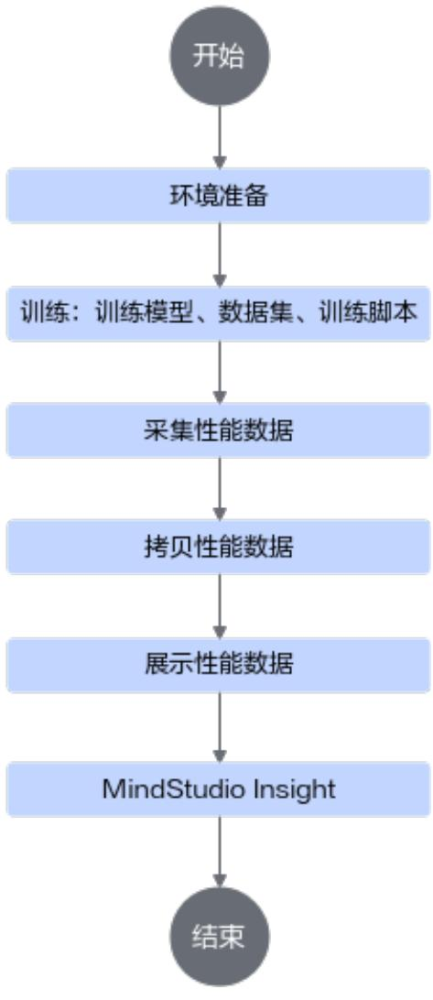  
图14-2 性能数据采集流程

# 环境搭建

集群场景请用户自行搭建。  
根据需要在对应的节点上安装合适的CANN软件包，请参见《CANN 软件安装指南》。  
安装MindStudio Insight工具，详见《MindStudio Insight工具用户指南》。

# 约束

集群场景执行性能数据采集最大支持采集128个节点（如果每个节点配置8个Device，即最大支持1024个Device）的性能数据。

# 性能数据采集

完成环境搭建后，集群场景可参考以下方式进行性能数据采集。

使用6.1 性能数据采集和自动解析进行性能数据采集。  
● 使用Ascend PyTorch Profiler接口采集PyTorch性能数据。  
a. 参见《PyTorch 训练模型迁移调优指南》中的“模型迁移”搭建分布式训练环境，准备迁移后的分布式训练脚本。  
b. 参见4 PyTorch训练场景性能分析快速入门修改训练脚本，并拉起分布式训练进行数据采集。

# 数据展示

集群场景的性能数据需要通过MindStudio Insight工具进行界面化展示，详见《MindStudio Insight工具用户指南》。

# 14.9 获取设备信息

工具介绍

性能数据采集完成后可以通过“get_msprof_info.py”脚本工具在PROF_XXX目录下的device_{id}或host目录文件获取设备信息。“get_msprof_info.py”功能及安装路径如下。

表 14-23 脚本介绍  

<table><tr><td rowspan=1 colspan=1>脚本名</td><td rowspan=1 colspan=1>功能</td><td rowspan=1 colspan=1>路径</td></tr><tr><td rowspan=1 colspan=1>“get_mspr”of_info.py&#x27;</td><td rowspan=1 colspan=1>获取设备信息。</td><td rowspan=1 colspan=1>${INSTALL_DIR}/tools/profiler/profiler_tool/analysis/interface，${INSTALL_DIR}请替换为CANN软件安装后文件存储路径。若安装的Ascend-cann-toolkit软件包，以root安装举例，则安装后文件存储路径为：/usr/local/Ascend/ascend-toolkit/latest。</td></tr></table>

# 操作步骤

步骤1 以运行用户登录CANN-Toolkit开发套件包和ops算子包所在环境。

步骤2 切换至“get_msprof_info.py”脚本所在目录。

步骤3 执行“get_msprof_info.py”脚本，命令示例如下。

非集群场景   
python3 get_msprof_info.py -dir /home/1/PROF_000001_20220129014731273_KEDKPORHMAGPGD/   
device_0   
集群场景   
python3 get_msprof_info.py -dir /home/1/

表 14-24 参数说明  

<table><tr><td rowspan=1 colspan=1>参数名</td><td rowspan=1 colspan=1>描述</td><td rowspan=1 colspan=1>可选/必选</td></tr><tr><td rowspan=1 colspan=1>-dir或--collection-dir</td><td rowspan=1 colspan=1>收集到的Profiling数据目录。非集群场景须指定为PROF_XXX目录下的host或device_{id泪录；集群场景须指定为PROF_XXX目录的父目录。</td><td rowspan=1 colspan=1>必选</td></tr><tr><td rowspan=1 colspan=1>-h或--help</td><td rowspan=1 colspan=1>显示帮助信息，仅在获取使用方式时使用。</td><td rowspan=1 colspan=1>可选</td></tr></table>

步骤4 查看输出结果。

非集群场景会打印输出结果，如图14-3所示，各字段含义如表14-25所示；集群场景在-dir参数指定目录下生成/query/cluster_info.json文件保存集群场景各节点信息，如图14-4所示，各字段含义如表14-26所示。

图 14-3 设备信息（非集群场景）  

<table><tr><td>&quot;status&quot;: data&quot;: {&quot;collectioninfo 1690413545059215 Collection start time 1690413531255650 Result 307159MB&quot;} device_info&quot;: &quot;AI Numbe 32 &quot;AICPUNumber&quot; &quot;HiSilicon &#x27;Control CPU Numbe Control CPU Type&quot; &#x27;ARMv8_Cortex Number &quot;host_info&quot; {&quot;cpu_info&quot; [{&quot;CPU ID&quot; &#x27;CPUO&#x27; Name&quot; TaishanVi16 Frequency 1000, &quot;Logical_CPU_Count Name 15.localdomain &quot;Host Linu&gt; -#1 SMP Wed 2022&quot; &quot;model info {&quot;iteration :&quot;N/A&quot;，&quot;ModelId&quot;：&quot;N/A&quot;}]}，&quot;version_info&quot;：{&quot;analysis_version&quot; collectior version&quot;: version&quot;:0}}}</td></tr></table>

表 14-25 字段说明（非集群场景）  

<table><tr><td colspan="1" rowspan="1">字段</td><td colspan="1" rowspan="1">说明</td></tr><tr><td colspan="1" rowspan="1">collection_info</td><td colspan="1" rowspan="1">信息收集。</td></tr><tr><td colspan="1" rowspan="1">Collection end time</td><td colspan="1" rowspan="1">信息收集结束时间。</td></tr><tr><td colspan="1" rowspan="1">Collection start time</td><td colspan="1" rowspan="1">信息收集开始时间。</td></tr><tr><td colspan="1" rowspan="1">Result Size</td><td colspan="1" rowspan="1">信息数据大小，单位MB。</td></tr><tr><td colspan="1" rowspan="1">device_info</td><td colspan="1" rowspan="1">设备信息。</td></tr><tr><td colspan="1" rowspan="1">Al Core Number</td><td colspan="1" rowspan="1">Al Core数量。</td></tr><tr><td colspan="1" rowspan="1">Al CPU Number</td><td colspan="1" rowspan="1">AI CPU数量。</td></tr><tr><td colspan="1" rowspan="1">Control CPU Number</td><td colspan="1" rowspan="1">Control CPU数量。</td></tr><tr><td colspan="1" rowspan="1">Control CPU Type</td><td colspan="1" rowspan="1">Control CPU类型。</td></tr><tr><td colspan="1" rowspan="1">Device Id</td><td colspan="1" rowspan="1">设备ID。</td></tr><tr><td colspan="1" rowspan="1">TS CPU Number</td><td colspan="1" rowspan="1">TS CPU数量。</td></tr><tr><td colspan="1" rowspan="1">host_info</td><td colspan="1" rowspan="1">Host信息。</td></tr><tr><td colspan="1" rowspan="1">cpu_info</td><td colspan="1" rowspan="1">Host CPU信息。</td></tr><tr><td colspan="1" rowspan="1">CPU ID</td><td colspan="1" rowspan="1">Host CPU ID。</td></tr><tr><td colspan="1" rowspan="1">Name</td><td colspan="1" rowspan="1">Host CPU名称。</td></tr><tr><td colspan="1" rowspan="1">Type</td><td colspan="1" rowspan="1">Host CPU类型。</td></tr><tr><td colspan="1" rowspan="1">Frequency</td><td colspan="1" rowspan="1">Host CPU频率。</td></tr><tr><td colspan="1" rowspan="1">Logical_CPU_Count</td><td colspan="1" rowspan="1">Host逻辑CPU数量。</td></tr><tr><td colspan="1" rowspan="1">cpu_num</td><td colspan="1" rowspan="1">Host CPU数量。</td></tr><tr><td colspan="1" rowspan="1">Host Computer Name</td><td colspan="1" rowspan="1">Host设备名。</td></tr><tr><td colspan="1" rowspan="1">Host Operating System</td><td colspan="1" rowspan="1">Host操作系统。</td></tr><tr><td colspan="1" rowspan="1">model_info</td><td colspan="1" rowspan="1">模型信息。</td></tr><tr><td colspan="1" rowspan="1">Device Id</td><td colspan="1" rowspan="1">设备ID。</td></tr><tr><td colspan="1" rowspan="1"> iterations</td><td colspan="1" rowspan="1">迭代统计。</td></tr><tr><td colspan="1" rowspan="1">Iteration Number</td><td colspan="1" rowspan="1">迭代次数。</td></tr><tr><td colspan="1" rowspan="1">Model Id</td><td colspan="1" rowspan="1">模型ID，根据模型数量显示。</td></tr><tr><td colspan="1" rowspan="1">version_info</td><td colspan="1" rowspan="1">版本信息。</td></tr><tr><td colspan="1" rowspan="1">analysis_version</td><td colspan="1" rowspan="1">解析版本信息。</td></tr><tr><td colspan="1" rowspan="1">collection_version</td><td colspan="1" rowspan="1">采集版本信息。</td></tr><tr><td colspan="1" rowspan="1">drv_version</td><td colspan="1" rowspan="1">驱动版本信息。</td></tr></table>

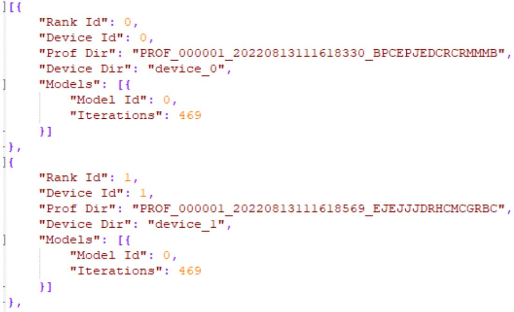  
图 14-4 设备信息（集群场景）

表 14-26 字段说明（集群场景）  

<table><tr><td rowspan=1 colspan=1>字段</td><td rowspan=1 colspan=1>说明</td></tr><tr><td rowspan=1 colspan=1>Rank Id</td><td rowspan=1 colspan=1>集群场景的节点标识ID，集群场景下设备的唯一标识。</td></tr><tr><td rowspan=1 colspan=1>Device Id</td><td rowspan=1 colspan=1>设备ID，集群场景下不作为设备唯一标识。</td></tr><tr><td rowspan=1 colspan=1>Prof Dir</td><td rowspan=1 colspan=1>集群场景下当前Rank Id对应设备上的PROF_XXX目录。</td></tr><tr><td rowspan=1 colspan=1>Device Dir</td><td rowspan=1 colspan=1>集群场景PROF_XXX目录下的device_{id泪录。</td></tr><tr><td rowspan=1 colspan=1>Models</td><td rowspan=1 colspan=1>模型信息，包含当前RankId对应设备的所有模型ID（ModelID）及该模型下的迭代次数（Iterations）。</td></tr></table>

# ----结束

# 14.10 性能数据文件分片

性能数据文件分片是对于解析完成的timeline数据文件（.json），系统会识别.json文件在Chrome浏览器（“chrome://tracing”）上打开时间的长短，适当将.json文件切分成合适的数量，以方便用户快速打开。分片操作是在执行性能数据导出时自动启动。

数据文件分片通过msprof_slice.json配置文件配置分片属性，msprof_slice.json配置文件内容及字段说明如下。

{ "slice_switch": "off", "slice_file_size(MB)": 0, "strategy": 0 }

msprof_slice.json配置文件保存目录为：

\${INSTALL_DIR}/tools/profiler/profiler_tool/analysis/msconfig，\${INSTALL_DIR}请替换为CANN软件安装后文件存储路径。若安装的Ascend-cann-toolkit软件包，以root安装举例，则安装后文件存储路径为：/usr/local/Ascend/ascend-toolkit/latest。

表 14-27 参数说明  

<table><tr><td rowspan=1 colspan=1>参数</td><td rowspan=1 colspan=1>说明</td></tr><tr><td rowspan=1 colspan=1>slice_switch</td><td rowspan=1 colspan=1>分片开关。取值为：·on：开启分片。·off：关闭分片，默认值。当前分片限制文件最大为20G，如果开启分片功能且文件大小超过20G时文件导出失败，此外，如果开启了分片开关，但是实际文件大小小于200M时，也不会触发分片。默认情况下关闭数据分片，开启数据分片须编辑msprof_slice.json文件并配置该参数为on，配置为其他值均表示取默认值。默认情况下，数据分片根据timeline数据文件在Chrome浏览器上打开时间的长短判断分片，打开时间超出上限时，执行分片操作，分片文件大小由slice_file_size参数控制，分片文件数量由strategy参数控制。分片后的文件名格式为：模块名_{slice_n}_{timestamp}.json，其中slice_n表示分片的序号，其他字段含义请参见12.1总体说明。</td></tr><tr><td rowspan=1 colspan=1>slice_file_size(MB)</td><td rowspan=1 colspan=1>分片文件的容量上限。单位为MB，取值范围为大于等于200的正整数，默认情况下，不限制分片文件的大小。参数配置大于等于200的正整数时，每个分片文件大小不能超过该值；参数配置其他值时，不限制分片文件的大小，仅根据strategy参数限制分片文件数量。</td></tr><tr><td rowspan=1 colspan=1> strategy</td><td rowspan=1 colspan=1>分片策略。取值为：·0：默认值，按照切分次数最少且每个文件打开时间在可接受范围内的标准，对文件进行拆分。·1：按照每个文件打开时间缩短为快速打开的标准（切分次数更多），对文件进行拆分。由于文件打开的时间长短与计算机性能有关，故无法给出准确的打开时间，一般情况下文件打开时间参考值如下：·文件打开时间超出上限的参考时间为≥30s。·文件打开时间在可接受范围内的参考时间为[10,30)，单位为s。·文件打开时间为快速打开的参考时间为(0,10)，单位为s。具体打开时间请以设备实际情况为准。</td></tr></table>

# 14.11 使用 msprof.py 脚本解析与导出性能数据

# 14.11.1 概述

msprof命令行工具是通过msprof.py封装的，用户除了可以直接执行msprof命令行之外，也可通过msprof.py解析性能数据。

# 说明

以下产品不支持在设备上直接解析、查询和导出，需要将采集到的PROF_XXX目录拷贝到安装了CANN-Toolkit开发套件包和ops算子包的环境下进行操作：

Atlas 200I/500 A2 推理产品的Ascend RC场景

除msprof命令行工具自带解析功能外，其他性能数据采集方式均不支持解析功能，可以选择使用msprof命令行工具或msprof.py工具进行数据解析。

● msprof.py工具使用安装时创建的普通用户运行。

● 未安装驱动和固件的环境仅支持性能数据解析和导出，不支持性能数据采集。

# 14.11.2 解析性能数据

在解析性能数据前，需采集相应的原始性能数据。

步骤1 以CANN-Toolkit开发套件包和ops算子包的运行用户登录开发环境。

步骤2 切换至msprof.py脚本所在目录。

\${INSTALL_DIR}/tools/profiler/profiler_tool/analysis/msprof，\${INSTALL_DIR}请替换为CANN软件安装后文件存储路径。若安装的Ascend-cann-toolkit软件包，以root安装举例，则安装后文件存储路径为：/usr/local/Ascend/ascend-toolkit/latest。

步骤3 解析性能数据。

命令行格式如下：

python3 msprof.py import -dir <dir>

例如：python3 msprof.py import -dir /home/HwHiAiUser/profiler_data/PROF_XXX

表 14-28 解析命令参数说明  

<table><tr><td rowspan=1 colspan=1>参数名</td><td rowspan=1 colspan=1>描述</td><td rowspan=1 colspan=1>可选/必选</td></tr><tr><td rowspan=1 colspan=1>import</td><td rowspan=1 colspan=1>通过import方式解析性能数据。使用import方式解析性能数据时，即使原始性能数据目录中已经生成.db文件，该方式会重新生成.db文件。</td><td rowspan=1 colspan=1>必选</td></tr><tr><td rowspan=1 colspan=1>1-cluster</td><td rowspan=1 colspan=1>解析集群场景的性能数据并进行汇总。仅配置import参数时支持。-dir参数需指定PROF_XXX目录的父目录，指定后的解析结果在PROF_XXX目录同级目录下生成sqlite目录。</td><td rowspan=1 colspan=1>集群场景时必选</td></tr><tr><td rowspan=1 colspan=1>-dir或--collection-dir</td><td rowspan=1 colspan=1>收集到的性能数据目录。须指定为PROF_XXX目录或PROF_XXX目录的父目录，例如：/home/HwHiAiUser/profiler_data/PROF_XXX。</td><td rowspan=1 colspan=1>必选</td></tr><tr><td rowspan=1 colspan=1>-h或--help</td><td rowspan=1 colspan=1>显示帮助信息，仅在获取使用方式时使用。</td><td rowspan=1 colspan=1>可选</td></tr></table>

执行完上述命令，解析完成后对应的PROF_XXX的device {id}和host目录下会生成sqlite目录，sqlite目录下会有db文件生成（该db文件为中间结果，无须关注，若需要继续导出最终结果的db文件，可执行步骤4）。

步骤4 （可选）二次解析db数据。

该功能是对sqlite目录下的db文件进行二次解析，生成汇总所有性能数据的.db格式文件（msprof_时间戳.db）。

python3 msprof.py export db -dir <dir>

# 说明

● 执行export db命令时，会在PROF_XXX目录下生成汇总所有性能数据的.db格式文件（msprof_时间戳.db），可以使用MindStudio Insight工具展示。msprof命令行执行采集操作时，会自动调用此接口生成汇总所有性能数据的.db格式文件（msprof_时间戳.db），正常情况下用户无须手动执行本步骤。

----结束

# 14.11.3 查询性能数据文件信息

本功能用于查询性能数据文件信息，确认导出时指定迭代（Iteration ID）/模型（Model ID）。

执行查询操作前需要调用import命令解析Profiling数据，否则查询结果无意义。

请参见如下步骤查询性能数据信息。

步骤1 以CANN-Toolkit开发套件包和ops算子包的运行用户登录开发环境。

步骤2 切换至msprof.py脚本所在目录。

\${INSTALL_DIR}/tools/profiler/profiler_tool/analysis/msprof，\${INSTALL_DIR}请替换为CANN软件安装后文件存储路径。若安装的Ascend-cann-toolkit软件包，以root安装举例，则安装后文件存储路径为：/usr/local/Ascend/ascend-toolkit/latest。

步骤3 查询性能数据信息，命令行格式如下。参数说明参见表14-29。python3 msprof.py query -dir <dir>

例如：python3 msprof.py query -dir /home/HwHiAiUser/profiler_data/PROF_XXX

表 14-29 查询性能数据信息命令参数说明  

<table><tr><td colspan="1" rowspan="1">参数名</td><td colspan="1" rowspan="1">描述</td><td colspan="1" rowspan="1">可选/必选</td></tr><tr><td colspan="1" rowspan="1">-dir或--collection-dir</td><td colspan="1" rowspan="1">收集到的性能数据目录。须指定为PROF_XXX目录或PROF_XXX目录的父目录，例如：/home/HwHiAiUser/profiler_data/PROF_XXX</td><td colspan="1" rowspan="1">必选</td></tr><tr><td colspan="1" rowspan="1">--data-type</td><td colspan="1" rowspan="1">数据类型。用于MindStudio对接，用户无需配置。取值为：·0：集群场景，可查询当前数据是否为集群场景采集的数据。·1：迭代轨迹数据，每轮迭代的详细数据，包括FP/BP计算时间、迭代更新拖尾和迭代间隙。·2：计算量，AlCore上的浮点运算数。·3：数据准备，训练数据发送至Device以及Device侧读取训练数据。·4：并行度调优建议。·5：并行度数据，主要展示纯通信耗时和计算耗时。·6：通信慢卡慢链路数据及优化建议。7：通信矩阵数据及优化建议。·8：Host侧系统及进程的CPU、内存的性能指标。·9：通信耗时使能关键路径分析。·10：通信矩阵使能关键路径分析。</td><td colspan="1" rowspan="1">可选</td></tr><tr><td colspan="1" rowspan="1">--id</td><td colspan="1" rowspan="1">集群场景时指定集群节点的RankID，非集群场景指定设备ID。用于MindStudio对接，用户无需配置。</td><td colspan="1" rowspan="1">可选</td></tr><tr><td colspan="1" rowspan="1">--model-id</td><td colspan="1" rowspan="1">模型ID。用于MindStudio对接，用户无需配置。</td><td colspan="1" rowspan="1">可选</td></tr><tr><td colspan="1" rowspan="1">--iteration-id</td><td colspan="1" rowspan="1">指定以Graph为粒度统计的迭代ID（每个Graph执行一次，Iteration ID加1，当一个脚本被编译为多个Graph时，该ID与脚本层面的StepID不一致）。默认值为1。用于MindStudio对接，用户无需配置。</td><td colspan="1" rowspan="1">可选</td></tr><tr><td colspan="1" rowspan="1">-h或--help</td><td colspan="1" rowspan="1">显示帮助信息，仅在获取使用方式时使用。</td><td colspan="1" rowspan="1">可选</td></tr></table>

执行上述命令后会打印显示结果。

msprof工具的查询功能获取到的信息如表14-30所示。

表 14-30 性能数据文件信息  

<table><tr><td colspan="1" rowspan="1">字段</td><td colspan="1" rowspan="1">说明</td></tr><tr><td colspan="1" rowspan="1">Job Info</td><td colspan="1" rowspan="1">任务名。</td></tr><tr><td colspan="1" rowspan="1">Device ID</td><td colspan="1" rowspan="1">设备ID。</td></tr><tr><td colspan="1" rowspan="1">Dir Name</td><td colspan="1" rowspan="1">文件夹名称。</td></tr><tr><td colspan="1" rowspan="1">Collection Time</td><td colspan="1" rowspan="1">数据采集时间。</td></tr><tr><td colspan="1" rowspan="1">Model ID</td><td colspan="1" rowspan="1">模型ID。</td></tr><tr><td colspan="1" rowspan="1">Iteration Number</td><td colspan="1" rowspan="1">总迭代数。</td></tr><tr><td colspan="1" rowspan="1">Top Time Iteration</td><td colspan="1" rowspan="1">耗时最长的5个迭代。</td></tr><tr><td colspan="1" rowspan="1">Rank ID</td><td colspan="1" rowspan="1">集群场景的节点标识ID。</td></tr></table>

# ----结束

# 14.11.4 导出性能数据

在导出性能数据前，需要参见14.11.2 解析性能数据解析性能数据。参见如下步骤导出性能数据。

步骤1 以CANN-Toolkit开发套件包和ops算子包的运行用户登录开发环境。

步骤2 切换至msprof.py脚本所在目录。

\${INSTALL_DIR}/tools/profiler/profiler_tool/analysis/msprof，\${INSTALL_DIR}请替换为CANN软件安装后文件存储路径。若安装的Ascend-cann-toolkit软件包，以root安装举例，则安装后文件存储路径为：/usr/local/Ascend/ascend-toolkit/latest。

步骤3 导出性能数据。可以导出timeline、summary和db三类文件，命令行格式如下：

导出timeline数据和db文件   
python3 msprof.py export timeline -dir <dir> [-reports <reports_sample_config.json>] [--iterationid <iteration_id>] [--model-id <model-id>] [--iteration-count <iteration_count>] [--clear]   
例如：python3 msprof.py export timeline -dir /home/HwHiAiUser/   
profiler_data/PROF_XXX   
导出summary数据和db文件   
python3 msprof.py export summary -dir <dir> [--iteration-id <iteration_id>] [--model-id <modelid>] [-iteration-count <iteration_count>] [--format <export_format>] [--clear]   
例如：python3 msprof.py export summary -dir /home/HwHiAiUser/   
profiler_data/PROF_XXX   
导出db文件   
python3 msprof.py export db -dir <dir>   
生成汇总所有性能数据的.db格式文件（msprof_时间戳.db）。   
例如：python3 msprof.py export db -dir /home/HwHiAiUser/profiler_data/ PROF_XXX

表 14-31 导出性能数据命令参数说明  

<table><tr><td colspan="1" rowspan="1">参数名</td><td colspan="1" rowspan="1">描述</td><td colspan="1" rowspan="1">可选/必选</td></tr><tr><td colspan="1" rowspan="1">-dir或--collection-dir</td><td colspan="1" rowspan="1">收集到的性能数据目录。须指定为PROF_XXX目录或PROF_XXX目录的父目录，例如：/home/HwHiAiUser/profiler_data/PROF_XXX</td><td colspan="1" rowspan="1">必选</td></tr><tr><td>-reports --iteration-id</td><td>传入用户自定义的reports_sample_config.json配置文件， 会根据配置文件中指定的范围导出相应的性能数据文件。 参数实现与msprof --reports一致，详细介绍请参见-- reports参数使用介绍。 迭代ID。需配置为正整数。默认值为1。与--model-id必</td><td>可选 可选</td></tr><tr><td>--model-id</td><td>须同时配置。 ·对于Atlas A2 训练系列产品/Atlas A2 推理系列产品， 支持--model-id4294967295，表示指定以Step为粒度 统计的迭代ID（每执行完成一个Step，Iteration ID加 1）。仅支持解析MindSpore（版本号大于等于2.3）框 架的性能数据。 对于Atlas A3 训练系列产品/Atlas A3 推理系列产品， 支持--model-id4294967295，表示指定以Step为粒度 统计的迭代ID（每执行完成一个Step，Iteration ID加 1）。仅支持解析MindSpore（版本号大于等于2.3）框 架的性能数据。 --model-id配置为其他值时，指定以Graph为粒度统计 的迭代ID（每个Graph执行一次，Iteration ID加1，当 一个脚本被编译为多个Graph时，该ID与脚本层面的 Step ID不一致）。 模型ID。需配置为正整数。与--iteration-id必须同时配</td><td>可选</td></tr><tr><td></td><td>置。 ·对于Atlas A2 训练系列产品/Atlas A2 推理系列产品， 支持--model-id 4294967295，为Step模式，即-- iteration-id配置的值以Step为粒度解析。仅支持解析 MindSpore（版本号大于等于2.3）框架的性能数据。 对于Atlas A3 训练系列产品/Atlas A3推理系列产品， 支持--model-id 4294967295，为Step模式，即-- iteration-id配置的值以Step为粒度解析。仅支持解析 MindSpore（版本号大于等于2.3）框架的性能数据。 --model-id配置为其他值时，为Graph模式，即-- iteration-id配置的值以Graph为粒度解析。</td><td></td></tr><tr><td>--iteration- count</td><td>导出连续迭代的个数，取值范围为1~5的整数，根据-- iteration-id配置的值为起始Step，导出连续数量的Step， 比如配置--iteration-count为3，--iteration-id为1，则导 出Step为1、2、3。</td><td>可选 可选</td></tr><tr><td>--format</td><td>summary数据文件的导出格式，支持csv和json两种格 式，默认值为csv。 仅配置summary参数时支持。 本文中summary文件介绍均以csv文件为例。</td><td></td></tr><tr><td colspan="1" rowspan="1">--clear</td><td colspan="1" rowspan="1">数据精简模式，开启后将在导出性能数据后删除PROF_XXX/device_{id}下的sqlite目录，以节省存储空间。配置该参数时表示开启数据精简模式，未配置表示关闭，默认关闭。</td><td colspan="1" rowspan="1">可选</td></tr><tr><td colspan="1" rowspan="1">-h或--help</td><td colspan="1" rowspan="1">显示帮助信息，仅在获取使用方式时使用。</td><td colspan="1" rowspan="1">可选</td></tr><tr><td colspan="3" rowspan="1">注1：默认情况下，导出所有性能数据。注2：单算子场景和仅执行6.1.3采集昇腾AI处理器系统数据场景，不支持--iteration-id和--model-id参数。</td></tr></table>

步骤4 执行完上述命令后，会在collection-dir目录下的PROF_XXX目录下生成mindstudio_profiler_output目录和msprof_\*.db文件。

生成的Profiling数据目录结构如下所示。

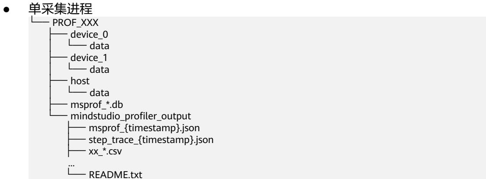

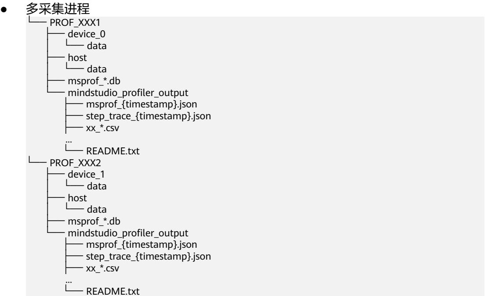

# 说明

● 多Device场景下，若启动单采集进程，则仅生成一个PROF_XXX目录，若启动多采集进程则生成多个PROF_XXX目录，其中device目录在PROF_XXX目录下生成，每个PROF_XXX目录下生成多少个device目录与用户实际操作有关，不影响性能数据分析。

性能数据详细介绍请参见12 性能数据文件参考。

mindstudio_profiler_output目录中的文件是根据采集的实际性能数据进行生成，如果实际的性能数据没有相关的数据文件，就不会导出对应的timeline和summary数据。

使用export命令能直接从已解析的性能数据中导出数据文件。当性能数据未解析时，单独执行export命令也能进行解析性能数据并导出数据文件。

● 对于被强制中断的msprof采集进程，工具会保存已采集的原始性能数据，也可以使用export解析并导出。

----结束

# 14.12 PyTorch Profiling 接口采集（PyTorch1.8.1&1.11.0）

前提条件

准备好基于PyTorch 1.8.1或1.11.0开发的训练模型以及配套的数据集，并按照《PyTorch 训练模型迁移调优指南》中的“模型迁移”完成PyTorch原始模型向昇腾AI处理器的迁移。

# 采集性能数据

使用Profiling接口对原始代码的loss计算和优化过程进行改造。

# 使用ascend-pytorch适配的Profiling接口，推荐只运行一个step  
with torch.autograd.profiler.profile(use_npu $\vDash$ True) as prof:out $=$ model(input_tensor)loss $=$ loss_func(out)loss.backward()optimizer.zero_grad()optimizer.step()  
# 打印Profiling结果信息  
print(prof)  
# 导出chrome_trace文件到指定路径  
output_path $=$ '/home/HwHiAiUser/profile_data.json'  
prof.export_chrome_trace(output_path)

为保证数据的准确性，进行prof操作建议运行超过10个step，第10个step后的性能数据较为准确。

完成采集后生成profile_data.json文件，详细介绍请参见查看Profiling数据。

# 查看 Profiling 数据

在Chrome浏览器中输入“chrome://tracing”地址，将profile_data.json文件拖到空白处打开，通过键盘上的快捷键（w：放大，s：缩小，a：左移，d：右移）进行查看，如图14-5所示。

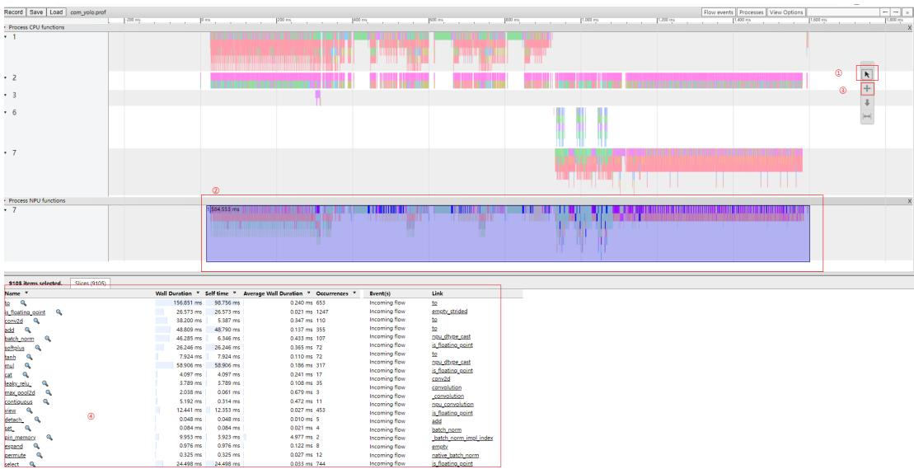  
图 14-5 PyTorch profiling 结果文件

具体性能数据分析步骤如下：

步骤1 单击图片中 $\textcircled{1}$ 所示 按钮。

步骤2 框选图片中 $\textcircled{2}$ （用户所需数据）所示timeline数据。

步骤3 单击图片中 $\textcircled{3}$ 所示 $\hookrightarrow$ 按钮，详细数据信息如④所示。

步骤4 根据 $\textcircled{4}$ 中Self time数据从大到小排序，可找出TopN耗时算子信息，分析模型中存在的性能问题。

# ----结束

有关PyTorch框架模型性能调优请参见《PyTorch 训练模型迁移调优指南》中的“性能调优”章节。

# 其他功能

PyTorch Profiling其他功能。

获取算子输入tensor的shape信息。  
# 添加record_shapes参数，获取算子输入tensor的shape信息  
with torch.autograd.profiler.profile(use_npu=True, record_shapes=True) as prof:# 添加模型计算过程  
print(prof)  
打印结果中增加了每个算子的Input Shape信息。  
获取使用NPU的内存信息。  
# 添加Profiling参数，获取算子内存占用信息  
with torch.autograd.profiler.profile(use_npu=True, profile_memory=True) as prof:# 添加模型计算过程  
print(prof)

打印结果中增加了每个算子的CPU Mem、Self CPU Mem、NPU Mem、SelfNPU Mem信息。

# 说明

该功能仅支持PyTorch 1.8.1版本以上。

获取简洁的算子性能信息。

该功能只打印每个算子栈最底层的算子信息，使分析结果更简洁。

# 添加use_npu_simple参数，获取简洁的算子信息   
with torch.autograd.profiler.profile(use_npu=True, use_npu_simple $\risingdotseq$ True) as prof:   
# 添加模型计算过程   
output_path $=$ '/home/HwHiAiUser/profile_data.json'   
# 导出chrome_trace文件到指定路径   
prof.export_chrome_trace(output_path)

在Chrome浏览器中打开chrome_trace结果文件，可查看简洁的算子性能信息。

# 14.13 其他工具

Driver包中提供了其他工具，用于协助Profiling工具进行性能数据采集，用户无需直接使用，相关说明如下表所示。

表 14-32 其他工具说明  

<table><tr><td rowspan=1 colspan=1>五</td><td rowspan=1 colspan=1>存储相对路径</td><td rowspan=1 colspan=1>功能说明及使用场景</td><td rowspan=1 colspan=1>风险分析</td><td rowspan=1 colspan=1>保留原因</td></tr><tr><td rowspan=1 colspan=1>perf</td><td rowspan=1 colspan=1>/usr/bin/perf</td><td rowspan=1 colspan=1>采集AI CPU利用率、Ctrl CPU利用率、进程CPU占用率、进程内存占用和系统内存占用等AI处理器性能数据。用户配置系统级Profiling采集开关时，Profiling会使能此工具采集AI处理器性能数据。</td><td rowspan=1 colspan=1>仅用于采集或分析固定的一些AI处理器性能数据。无法获取其他运行状态信息，实际风险小。</td><td rowspan=1 colspan=1>属于系统级Profiling采集能力的一部分。</td></tr></table>

# 14.14 性能调优建议

说明

该功能为msprof工具解析后输出调优建议的功能，已不再演进，分析性能数据并输出调优建议更多的功能请参见《msprof-analyze》。

# 支持的型号

Atlas 200I/500 A2 推理产品  
Atlas 推理系列产品  
Atlas 训练系列产品  
Atlas A2 训练系列产品/Atlas A2 推理系列产品

Atlas A3 训练系列产品/Atlas A3 推理系列产品集群或多卡通信场景下，在执行完性能数据export导出命令后，会在屏幕打印相关性能调优建议，具体如下：

1. 基于通信耗时分析得到优化建议。由于集合通信算子是同步执行的，若集群中存在慢节点，则会由于木桶效应，拖累整个集群的性能。

优化建议原则：

a. 查看一个迭代内是否存在通信算子等待时长比例（Wait Time Ratio）大于阈值（0.2）的卡：

i. 若存在，此迭代存在通信瓶颈，可通过1.b进一步查看。ii. 若不存在，初步断定此迭代不存在通信瓶颈，可进一步查看总体带宽使用率情况。

b. 找到通信算子等待时长比例（Wait Time Ratio）最大的卡，查看其传输前同步时长比例（Synchronization Time Ratio Before Transit）是否大于阈值（0.2）：

i. 如果大于，则存在慢卡（等待时长比例最小的卡），需查看慢卡的前向反向计算时间；若该慢卡的前向反向计算时间远大于其他卡，则需要检查负载是否均衡和处理器是否故障；若该卡的前向反向计算时间基本和其他卡相同，则需检查数据预处理时间；  
ii. 否则，存在链路异常的情况，需查看是否有链路故障或者通信量过小的情况。

# 说明

● 等待时长比例（Wait Time Ratio） $=$ 等待时长（Wait Time）/ (等待时长（WaitTime） $^ +$ 通信时长（Transit Time）)，等待时长比例越大代表卡的等待时长占总通信耗时越长，通信效率越低。  
● 传输前同步时长比例（Synchronization Time Ratio Before Transit） $=$ 传输开始前同步时长（Synchronization Time） / (传输开始前同步时长（Synchronization Time） $^ +$ 通信时长（Transit Time）)，同步时长（Synchronization Time）指第一次传输数据前的同步时长，传输前同步时长比例越大说明通信效率越低，可能存在慢卡的情况。

图 14-6 基于通信耗时分析

2. 基于通信矩阵分析得到优化建议。

集群场景中的慢链路一般有以下两种情况：

个别的慢链路导致少数卡之间的通信时间增长，其他卡需等待其通信完成，从而拖累整个集群的性能。存在带宽或通信算子异常的情况，导致全网链路无法达到正常的带宽速率，所有卡的通信时间增长，这种情况下没有典型的慢卡和慢链路。

通过通信矩阵对HCCS、PCIE和RDMA进行分析，针对每种链路类型的平均情况，给出瓶颈分析及调优建议；针对存在慢链路的情况，给出慢链路的全部信息及调优建议。

分析建议如下：

a. 三种链路类型的耗时占比信息。

b. 每种链路类型的具体情况：

i. 链路平均信息：包含传输总耗时，平均带宽及平均大包传输率，根据信息给出调优建议。  
ii. 最慢链路信息：链路带宽小于平均带宽20%时输出最慢链路相关信息，包含传输时长、传输大小、传输带宽、带宽利用率以及大包比例，根据信息给出调优建议。

优化建议原则：

a. 若带宽使用率大于0.8，说明带宽使用正常，全网链路无瓶颈，可参考2.b进一步查看；  
b. 若通信包比例大于0.8，说明通信包尺寸无异常，则链路配置有问题或存在链路劣化问题，可参考2.c进一步查看；  
c. 若通信包尺寸过小，说明每次通信传输的包太小，导致带宽使用率不高，存在带宽的瓶颈。

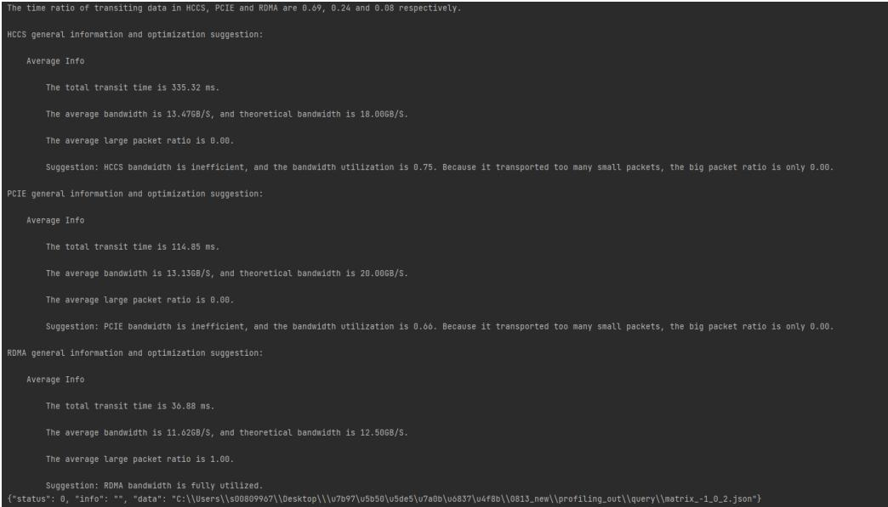  
图 14-7 基于通信矩阵分析

PyTorch多卡大集群场景如何避免性能数据直接落盘到共享存储时导致的性能膨胀问题

# 15.1 PyTorch 多卡大集群场景如何避免性能数据直接落盘到共享存储时导致的性能膨胀问题

# 故障现象

PyTorch多卡大集群场景在使用Ascend PyTorch Profiler接口采集并落盘性能数据时，通过使用on_trace_ready执行tensorboard_trace_handler函数的方式进行性能数据落盘。

采集性能数据的耗时膨胀。

# 故障原因

由于使用on_trace_ready执行tensorboard_trace_handler函数，将落盘路径直接指向了共享存储，多卡数据大量的落盘请求导致共享存储响应延迟。

# 故障处理

通过自定义on_trace_ready的落盘方式，将性能数据先落盘到本地，再将本地的性能数据拷贝到共享存储，可解决性能膨胀问题，示例代码如下：

import time   
import torch   
import torch_npu   
import os   
import random   
import string   
import shutil   
import argparse   
from torch_npu.profiler._profiler_path_creator import ProfPathCreator   
def generate_random_filename(length $^ { \dag = 8 }$ ): letters $=$ string.ascii_lowercase random_letters $=$ ''.join(random.choice(letters) for _ in range(length)) return random_letters   
def create_random_directory(): random_filename $=$ generate_random_filename() file_path $=$ os.path.join("/tmp/", f"{random_filename}") return file_path   
def move_file_to_user_path(file_path, user_input_path): try: if not os.path.exists(user_input_path): os.makedirs(user_input_path) for item in os.listdir(file_path): source_item $=$ os.path.join(file_path, item) destination_item $=$ os.path.join(user_input_path, item) shutil.move(source_item, destination_item) os.rmdir(file_path) return True except Exception as e: print(str(e)) return False   
def train_one_step(i): print(f"[APP]train: {i} step...") ${ \tt a } =$ torch.rand(2, 3).to("npu") $\flat =$ torch.rand(2, 3).to("npu") ${ \mathsf { C } } = { \mathsf { a } } + { \mathsf { b } }$ time.sleep(2)   
# 如下user_tensorboard_trace_handler为on_trace_ready的自定义函数，ori_path为本地路径，dst_path为共享   
存储路径   
def user_tensorboard_trace_handler(ori_path, dst_path, dir_name: str $=$ None, worker_name: str $=$ None,   
analyse_flag: bool $=$ True):   
ProfPathCreator().init(worker_name=worker_name, dir_name=dir_name)   
def handler_fn(prof_inst) $- >$ None: if analyse_flag: prof_inst.prof_if.analyse() result $=$ move_file_to_user_path(ori_path, dst_path) if result is True: print(f"文件已成功移动到路径：{dst_path}") else: print(f"移动文件时出错：{result}")   
return handler_fn   
def main(): parser $=$ argparse.ArgumentParser(description $\mathbf { \alpha } = \mathbf { \ " }$ Generate a random txt file and move it to the specified   
path.") parser.add_argument("path", hel $\bullet ^ { \prime }$ "Target path where the file will be moved") args $=$ parser.parse_args() random_txt_file_path $=$ create_random_directory() # 如下on_trace_ready调用了user_tensorboard_trace_handler自定义函数 prof $=$ torch_npu.profiler.profile(on_trace_ready=user_tensorboard_trace_handler(random_txt_file_path,   
args.path, random_txt_file_path), schedule=torch_npu.profiler.schedule(skip_first=1, repeat=1, active $^ { - 2 }$ , wai $\scriptstyle = 0$ , warmup $\scriptstyle = 0 )$ )) prof.start() step_num $= 5$ for i in range(step_num): train_one_step(i) prof.step() prof.stop()   
if __name__ $= =$ "__main__": main()