# MindStudio8.3.0算子开发工具用户指南

文档版本 01  
发布日期 2026-03-05

版权所有 $\circledcirc$ 华为技术有限公司 2026。 保留一切权利。

非经本公司书面许可，任何单位和个人不得擅自摘抄、复制本文档内容的部分或全部，并不得以任何形式传播。

# 商标声明

和其他华为商标均为华为技术有限公司的商标。  
本文档提及的其他所有商标或注册商标，由各自的所有人拥有。

# 注意

您购买的产品、服务或特性等应受华为公司商业合同和条款的约束，本文档中描述的全部或部分产品、服务或特性可能不在您的购买或使用范围之内。除非合同另有约定，华为公司对本文档内容不做任何明示或暗示的声明或保证。

由于产品版本升级或其他原因，本文档内容会不定期进行更新。除非另有约定，本文档仅作为使用指导，本文档中的所有陈述、信息和建议不构成任何明示或暗示的担保。

# 安全声明

# 产品生命周期政策

华为公司对产品生命周期的规定以“产品生命周期终止政策”为准，该政策的详细内容请参见如下网址：https://support.huawei.com/ecolumnsweb/zh/warranty-policy

# 漏洞处理流程

华为公司对产品漏洞管理的规定以“漏洞处理流程”为准，该流程的详细内容请参见如下网址：  
https://www.huawei.com/cn/psirt/vul-response-process  
如企业客户须获取漏洞信息，请参见如下网址：  
https://securitybulletin.huawei.com/enterprise/cn/security-advisory

# 华为初始证书权责说明

华为公司对随设备出厂的初始数字证书，发布了“华为设备初始数字证书权责说明”，该说明的详细内容请参见如下网址：https://support.huawei.com/enterprise/zh/bulletins-service/ENEWS2000015766

# 华为企业业务最终用户许可协议(EULA)

本最终用户许可协议是最终用户（个人、公司或其他任何实体）与华为公司就华为软件的使用所缔结的协议。最终用户对华为软件的使用受本协议约束，该协议的详细内容请参见如下网址：  
https://e.huawei.com/cn/about/eula

# 产品资料生命周期策略

华为公司针对随产品版本发布的售后客户资料（产品资料），发布了“产品资料生命周期策略”，该策略的详细内容请参见如下网址：https://support.huawei.com/enterprise/zh/bulletins-website/ENEWS2000017760

# 目 录

1 简介...  
2 环境准备.. 5  
3 算子设计（msKPP） 6  
3.1 工具概述... 6  
3.2 使用前准备.. 6  
3.3 性能建模..  
3.3.1 原理概述.  
3.3.2 算子特性建模.  
3.3.3 算子计算搬运规格分析.. 9  
3.3.4 极限性能分析... 11  
3.3.5 算子 tiling 初步设计.. 13  
3.3.6 对外接口使用说明. 14  
3.3.6.1 接口列表. 14  
3.3.6.2 基础功能接口. 16  
3.3.6.2.1 Chip..... 16  
3.3.6.2.2 Core... 18  
3.3.6.2.3 Tensor.. 18  
3.3.6.2.4 Tensor.load. 20  
3.3.6.3 同步类指令接口 20  
3.3.6.3.1 set_flag... . 20  
3.3.6.3.2 wait_flag.. 22  
3.3.6.4 指令接口. 23  
3.3.6.4.1 mmad. ..... 23  
3.3.6.4.2 vadd.. . 24  
3.3.6.4.3 vbrcb.. . 24  
3.3.6.4.4 vconv........ .... 25  
3.3.6.4.5 vconv_deq.. . 26  
3.3.6.4.6 vconv_vdeq. .. 26  
3.3.6.4.7 vector_dup.. .... . 27  
3.3.6.4.8 vexp.... 27  
3.3.6.4.9 vln.. 28  
3.3.6.4.10 vmax... 29  
3.3.6.4.11 vmul.. . 29  
3.3.6.4.12 vmuls... 30  
3.3.6.4.13 vsub.. . 30  
3.3.6.4.14 vdiv... . 31  
3.3.6.4.15 vcadd.. 32  
3.3.6.4.16 vabs.... . 32  
3.3.6.4.17 vaddrelu... .. 33  
3.3.6.4.18 vaddreluconv... .... 34  
3.3.6.4.19 vadds.. .. 34  
3.3.6.4.20 vand.... . 35  
3.3.6.4.21 vaxpy.... .. 35  
3.3.6.4.22 vbitsort.. . 36  
3.3.6.4.23 vcgadd.. .. 37  
3.3.6.4.24 vcgmax... . 37  
3.3.6.4.25 vcgmin... .. 38  
3.3.6.4.26 vcmax... . 39  
3.3.6.4.27 vcmin.. 39  
3.3.6.4.28 vcmp_xxx.. . 40  
3.3.6.4.29 vcmpv_xxx.... . 41  
3.3.6.4.30 vcmpvs_xxx... . 42  
3.3.6.4.31 vcopy.. . 42  
3.3.6.4.32 vcpadd.. . 43  
3.3.6.4.33 vgather... . 44  
3.3.6.4.34 vgatherb.. 44  
3.3.6.4.35 vlrelu.. . 45  
3.3.6.4.36 vmadd.. 45  
3.3.6.4.37 vmaddrelu.. . 46  
3.3.6.4.38 vmaxs... 46  
3.3.6.4.39 vmin.... ... 47  
3.3.6.4.40 vmins.. 48  
3.3.6.4.41 vmla..... 48  
3.3.6.4.42 vmrgsort... . 49  
3.3.6.4.43 vmulconv.. . 50  
3.3.6.4.44 vnot.. . 50  
3.3.6.4.45 vor.... .. 51  
3.3.6.4.46 vrec.... . 52  
3.3.6.4.47 vreduce.. . 52  
3.3.6.4.48 vreducev2.. . 53  
3.3.6.4.49 vrelu... . 54  
3.3.6.4.50 vrsqrt... .. 54  
3.3.6.4.51 vsel.. 55  
3.3.6.4.52 vshl.. . 55

#

3.3.6.4.53 vshr... .56  
3.3.6.4.54 vsqrt.. 56  
3.3.6.4.55 vsubrelu.. 57  
3.3.6.4.56 vsubreluconv. . 58  
3.3.6.4.57 vtranspose.. . 58  
3.4 调用 msOpGen 算子工程.. . 59  
3.4.1 功能介绍.. . 59  
3.4.2 调用示例. . 59  
3.4.3 接口列表. . 61  
3.4.3.1 mskpp.tiling_func.... . 61  
3.4.3.2 mskpp.get_kernel_from_binary.. 66  
3.5 自动调优.. 67  
3.5.1 功能介绍. . 68  
3.5.2 快速入门. . 68  
3.5.3 自动调优示例. . 69  
3.5.4 接口列表.. ..... 73  
3.5.4.1 autotune... .73  
3.5.4.2 code_gen.. . 74  
3.5.4.3 compile.. 75  
3.5.4.4 autotune_v2. 76  
3.5.4.5 compile_executable.. . 77  
3.5.5 附录... 78  
3.5.5.1 basic_matmul_autotune.py. . 78  
3.5.5.2 jit_build.sh.. . 79  
3.5.5.3 basic_matmul_executable_autotune.py. . 80  
3.5.5.4 jit_build_executable.sh. . 80  
3.6 FAQ.. 81  
3.6.1 运行 Kernel 时提示权限错误.. 81

# 4 算子工程创建（msOpGen） 82

4.1 工具概述.. 82  
4.2 使用前准备... . 86  
4.3 创建算子工程.. . 86  
4.4 算子开发.. 95  
4.5 算子编译部署.. . 95  
4.6 查看算子仿真流水图. ... 101  
4.7 典型案例... . 105  
4.7.1 Ascend C 自定义算子开发实践.. .105

# 5 算子测试（msOpST） ... 108

5.1 工具概述... . 108  
5.2 使用前准备.. 113  
5.3 生成测试用例定义文件.. 113  
5.4 生成/执行测试用例. . 126

#

5.5 生成单算子上板测试框架. 133  
5.6 典型案例. . 137  
5.6.1 测试用例定义文件.. 137  
6 异常检测（msSanitizer） . 143  
6.1 工具概述.. . 143  
6.2 使用前准备. 149  
6.3 内存检测. . 152  
6.4 竞争检测. . 155  
6.5 未初始化检测. . 157  
6.6 同步检测. . 158  
6.7 典型案例.. . 159  
6.7.1 检测内核调用符方式的 Ascend C 算子. 159  
6.7.2 检测 API 调用的单算子. . 161  
6.7.3 检测 PyTorch 接口调用的算子.. . 162  
6.7.4 检测 Triton 算子.. . 163  
6.7.5 检测 CANN 软件栈的内存.. . 165  
6.8 FAQ.. . 168  
6.8.1 msSanitizer 工具异常报告中未打印正确的文件名和行号. . 168  
6.8.2 msSanitizer 工具使用"--cce-enable-sanitizer -g"编译算子时出现"InputSection too large"错误.. .168  
6.8.3 msSanitizer 工具提示--cache-size 异常.. . 169  
6.9 对外接口使用说明. 169  
6.9.1 接口列表..... 169  
6.9.2 sanitizer 接口. 170  
6.9.2.1 sanitizerRtMalloc..... 171  
6.9.2.2 sanitizerRtMallocCached. 171  
6.9.2.3 sanitizerRtFree.. 172  
6.9.2.4 sanitizerRtMemset.. .173  
6.9.2.5 sanitizerRtMemsetAsync. . 174  
6.9.2.6 sanitizerRtMemcpy.... . 175  
6.9.2.7 sanitizerRtMemcpyAsync.. 176  
6.9.2.8 sanitizerRtMemcpy2d.. . 177  
6.9.2.9 sanitizerRtMemcpy2dAsync. 178  
6.9.2.10 sanitizerReportMalloc.. . 179  
6.9.2.11 sanitizerReportFree.. . 179  
6.9.3 mstx 扩展功能. . 180

# 7 算子调试（msDebug） 183

7.1 工具概述. . 183  
7.2 使用前准备. 189  
7.3 指定 Device ID（通算融合算子场景） 191  
7.4 断点设置. . 192  
7.5 内存与变量打印. . 194  
7.6 单步调试.. . 196

#

7.7 中断运行.. 198  
7.8 核切换.. 199  
7.9 读取寄存器.. 199  
7.10 调试信息展示. . 200  
7.11 解析异常算子 dump 文件.. 203  
7.12 典型案例. 205  
7.12.1 上板调试 Vector 算子.. . 205  
7.12.2 调用 Ascend CL 单算子. .. 208  
7.12.3 调试 PyTorch 接口调用的算子. . 209  
7.12.4 上板调试模板库的算子.. . 212  
7.13 FAQ.. 214  
7.13.1 msDebug 工具打印 Tensor 变量功能不可用，提示“unavailable”或“memory read failed” .. 215  
7.13.2 msDebug 工具在容器环境中调试运行失败，提示需安装 HDK驱动包. .. 215  
7.13.3 msDebug 工具断点设置在核函数内，命中断点后执行 continue 命令，算子运行失败.. .. 216  
7.13.4 msDebug 工具在 docker 中执行"run"命令运行程序后，提示“'A' packet returned an error: 8”..... 216  
7.13.5 算子使用"-O0 -g"编译选项编译后，运行出错，"min stack size is xxx, larger than current process  
default size 32768. Please modify aclInit json, and reboot process.". . 217

# 8 算子调优（msProf） .218

8.1 工具概述.. . 218  
8.2 使用前准备.. . 232  
8.3 工具使用... . 233  
8.4 计算内存热力图. ..239  
8.5 Roofline 瓶颈分析图. . 241  
8.6 Cache 热力图. . 244  
8.7 通算流水图. . 246  
8.8 指令流水图. 247  
8.9 算子代码热点图. .250  
8.10 内存通路吞吐率波形图. . 253  
8.11 性能数据文件.. .254  
8.11.1 msprof op.. . 254  
8.11.1.1 ArithmeticUtilization（Cube 及 Vector 类型指令耗时和占比） . 254  
8.11.1.2 L2Cache（L2 Cache 命中率） . 257  
8.11.1.3 Memory（内存读写带宽速率） . 258  
8.11.1.4 MemoryL0（L0 读写带宽速率） . 261  
8.11.1.5 MemoryUB（UB 读写带宽速率） .. 263  
8.11.1.6 OpBasicInfo（算子基础信息）. .265  
8.11.1.7 PipeUtilization（计算单元和搬运单元耗时占比） . 266  
8.11.1.8 ResourceConflictRatio（资源冲突占比） . 270  
8.11.2 msprof op simulator.. . 273  
8.11.2.1 代码行耗时数据文件.. .. 273  
8.11.2.2 代码指令信息文件.. . 273

8.12 json 配置文件说明. .274

# 8.13 典型案例.. 277

8.13.1 采集 Ascend C 算子的性能数据.. 277

8.13.2 通过指令流水图优化算子. .278

8.13.3 采集 MC2 算子的性能数据. . 279

8.13.4 配合 mstx 接口实现范围级重放. . 280

8.14 mstx 扩展功能.. .282

# 9 附录... . 284

9.1 TBE&AI CPU 算子开发场景. . 284

9.1.1 基于 msOpGen 工具创建算子工程.. .. 284

9.1.2 算子编译部署.. . 294

9.1.2.1 简介... . 294

9.1.2.2 算子工程编译.. . 295

9.1.2.3 算子交付件独立编译.. . 297

9.1.2.4 算子包部署.. .299

9.1.3 基于 msOpST 工具进行算子 ST 测试.. . 301

9.1.3.1 简介.. .302

9.1.3.2 生成测试用例定义文件. . 302

9.1.3.3 生成/执行测试用例.. . 320

# 9.1.3.4 测试用例定义文件配置样例. 329

# 工具简介

MindStudio算子开发工具包含表1-1中的各类子工具，具有快捷算子设计、简化算子开发流程、全面调试算子功能、精准算子异常检测及多维算子性能调优等优势，缓解算子开发过程中的算法设计难、开发流程复杂、算子功能定位难、内存问题不清晰以及算子性能低等问题，显著降低编程难度，助力开发者高效、低成本地完成高性能算子的开发。

开发者可以按照图1-1的顺序使用算子开发子工具，也可以单独使用其中一种。

  
图 1-1 算子开发工具流程图

表 1-1 算子开发工具简介  

<table><tr><td colspan="1" rowspan="1">工具名称</td><td colspan="1" rowspan="1">使用阶段</td><td colspan="1" rowspan="1">支持硬件型号</td><td colspan="1" rowspan="1">功能定位</td></tr><tr><td colspan="1" rowspan="1">算子设计（msKPP）</td><td colspan="1" rowspan="1">设计</td><td colspan="1" rowspan="1">Atlas A2训练系列产品/Atlas A2推理系列产品</td><td colspan="1" rowspan="1">算子理论性能建模、调用msOpGen算子工程和模板库算子性能调优工具。·在性能建模阶段：工具会内置算子API性能数据，支持用户在设计阶段表达算子实现算法并评估性能。调用msOpGen算子工程:为了简化部分开源仓库中msOpGen工程模板的调用流程，并解决轻量化调试难以实现的问题，msKPP工具现支持直接调用msOpGen工程内的tiling函数及用户自定义的Kernel函数。在模板库算子性能调优阶段：提供模板库Kernel下发代码生成、编译、运行的能力，同时提供Kernel内代码替换并自动调优的能力。</td></tr><tr><td colspan="1" rowspan="1">算子工程创建（msOpGen）</td><td colspan="1" rowspan="1">开发、部署</td><td colspan="1" rowspan="1">·Atlas 推理系列产品·Atlas 训练系列产品·Atlas A2 训练系列产品/Atlas A2推理系列产品Atlas A3 训练系列产品/Atlas A3推理系列产品</td><td colspan="1" rowspan="1">算子开发效率提升工具，提供模板工程生成能力，简化算子工程搭建并辅助算子测试验证。</td></tr><tr><td colspan="1" rowspan="1">算子测试（msOpST）</td><td colspan="1" rowspan="1">开发部署</td><td colspan="1" rowspan="1">·Atlas 推理系列产品·Atlas 训练系列产品Atlas A2训练系列产品/Atlas A2推理系列产品· Atlas A3 训练系列产品/Atlas A3推理系列产品</td><td colspan="1" rowspan="1">算子开发效率提升工具，旨在真实的硬件环境中，对算子的输入输出进行测试，以验证算子的功能是否正确。</td></tr><tr><td colspan="1" rowspan="1">异常检测（msSanitizer）</td><td colspan="1" rowspan="1">调试</td><td colspan="1" rowspan="1">.Atlas A2 训练系列产品/AtlasA2推理系列产品，Atlas推理系列产品Atlas A3训练系列产品/Atlas A3推理系列产品</td><td colspan="1" rowspan="1">算子异常检测工具，提供内存检测、竞争检测、未初始化检测及同步检测的能力，支持多核程序下内存问题的精准定位。</td></tr><tr><td colspan="1" rowspan="1">算子调试（msDebug）</td><td colspan="1" rowspan="1">调试</td><td colspan="1" rowspan="1">Atlas 推理系列产品说明Atlas推理系列产品不支持7.7中断运行功能。Atlas A3 训练系列产品/AtlasA3推理系列产品Atlas A2训练系列产品/Atlas A2推理系列产品</td><td colspan="1" rowspan="1">提供基于昇腾处理器的原生环境调试能力，实现灵活的变量展示。支持算子功能调试，单步调试（上板）等功能。</td></tr><tr><td colspan="1" rowspan="1">算子调优（msProf）</td><td colspan="1" rowspan="1">调优</td><td colspan="1" rowspan="1">·Atlas 推理系列产品Atlas A2训练系列产品/Atlas A2推理系列产品Atlas A3训练系列产品/Atlas A3推理系列产品</td><td colspan="1" rowspan="1">msProf工具提供上板和仿真的性能数据采集方式，并通过MindStudio Insight进行可视化呈现，方便用户快速定位算子性能瓶颈。说明若要使用MindStudio Insight进行查看时，需要单独安装MindStudio Insight软件包，具体下载链接请参见《MindStudio Insight工具用户指南》的“安装与卸载”章节。</td></tr></table>

# 说明

● 由于维测需要，算子开发工具使用INJ_LOG_LEVEL、MSOPT_LOG_LEVEL等环境变量控制日志等级及维测文件的生成，日志和维测文件不代表算子开发工具的功能异常，仅供内部调试使用，用户无需关注。用户若连续按“CTRL+C”或通过kill命令终止工具进程，可能会导致临时文件夹（如tmp文件夹）未被及时清理。此临时文件夹主要用于存放工具运行过程中产生的临时计算文件，不含任何用户隐私信息，用户无需关注。

# 功能架构

MindStudio算子开发工具（MindStudio OpDev Tools）是基于昇腾AI处理器设计的一套面向Ascend C编程语言的算子开发辅助工具。Ascend C是针对算子开发场景推出的编程语言，建议开发者在使用算子开发工具之前，需要对Ascend C编程语言及算子开发流程有一定的了解和实践经验，相关内容请参考《Ascend C算子开发指南》。

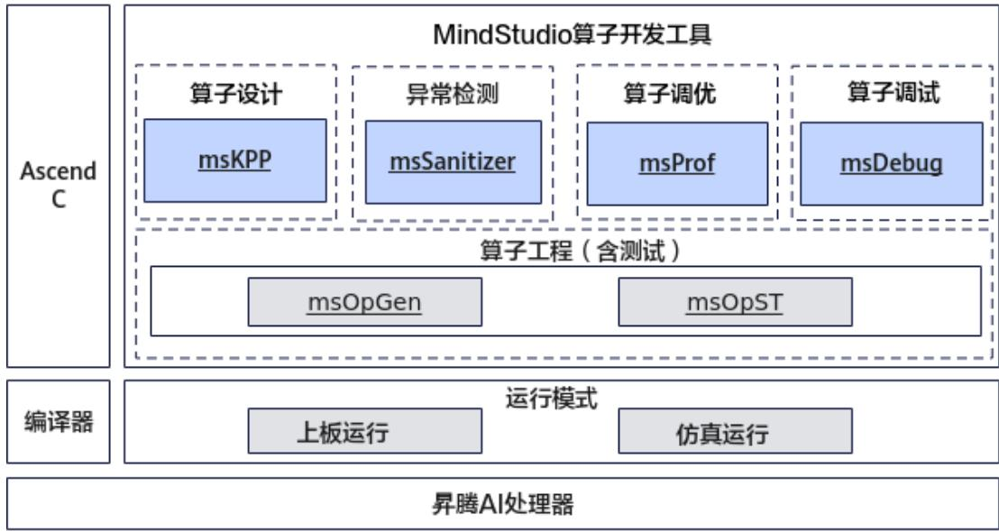

# 2 环境准备

# 环境要求

进行算子开发之前，需要安装驱动固件和CANN Toolkit软件包以及ops算子包，请参见《CANN 软件安装指南》。本节不再给出安装示例。

# 说明

● \${git_clone_path}为sample仓的存放路径。

● 可参照步骤1检查宿主机是否使用--debug选项安装HDK驱动包。

若要使能msDebug工具，需通过以下两种方法安装NPU驱动固件（CANN 8.1.RC1之后的版本且驱动为25.0.RC1之后的版本，推荐使用方法一）：

方法一：驱动安装时指定--full参数，然后再使用root用户执行echo 1 > /proc/debug_switch命令打开调试通道，msDebug工具便可正常使用。./Ascend-hdk-<chip_type>-npu-driver_<version>_linux-<arch>.run --full方法二：驱动安装时指定--debug参数，具体安装操作请参见《CANN 软件安装指南》中的“安装NPU驱动固件”章节。./Ascend-hdk-<chip_type>-npu-driver_<version>_linux-<arch>.run --debug

# 约束

出于安全性及权限最小化角度考虑，本代码仓中的工具均不应使用root等高权限账户进行操作，建议使用普通用户权限安装执行。

使用算子开发工具前，请确保执行用户的umask值大于等于0027，否则会造成获取的性能数据所在目录和文件权限过大。

使用算子工具前，请保证使用最小权限原则（如：禁止other用户可写，禁止666或777）。

不建议配置或运行其他用户目录下的自定义脚本，避免提权风险。

下载代码样例时，需执行以下命令指定分支版本。git clone https://gitee.com/ascend/samples.git -b master

# 3 算子设计（msKPP）

工具概述  
使用前准备  
性能建模  
调用msOpGen算子工程  
自动调优  
FAQ

# 3.1 工具概述

算子设计工具（msKPP，MindStudio Kernel Performance Prediction）具有性能建模分析、调用msOpGen算子工程和基于Ascend C模板库进行自动调优的功能，具体介绍如下：

3.3 性能建模：在算子开发前，可根据算子的数学逻辑作为输入、基于msKPP提供的接口，写出一个算子实现方案的算子表达式，获得该方案的算子性能建模结果。由于本身针对性能的预测不需要进行真实的计算，仅需要依据输入和输出的规模，给出对应算法的执行时间，故而，可以在秒级给出性能建模结果。  
3.4 调用msOpGen算子工程：msKPP工具提供的3.4.3.1 mskpp.tiling_func和3.4.3.2 mskpp.get_kernel_from_binary接口，可以直接调用msOpGen算子工程。  
3.5 自动调优：msKPP提供模板库Kernel下发代码生成、编译、运行的能力，同时提供Kernel内代码替换并自动调优的能力。

# 3.2 使用前准备

请参考2 环境准备，完成相关环境变量的配置。然后，可直接使用msKPP工具的3.3 性能建模功能。

# 说明

● 在任意目录下基于msKPP接口进行算子建模，实现中包括如下注意事项：

进行算子建模前，需要导入Tensor、Chip以及算子实现所必要的指令（统一以小写命名）。以with语句开启算子实现代码的入口，“enable_trace”和“enable_metrics”两个接口可使能trace打点图和指令统计功能，具体请参见3.3.4 极限性能分析章节的main.py。● 算子建模详细指令接口说明请参考3.3.6 对外接口使用说明。

● 如果需要指令占比饼图（instruction_cycle_consumption.html），则需要安装生成饼图所依赖的Python三方库plotly。pip3 install plotly

若要使用3.5 自动调优功能，需要下载Link中的Ascend C模板库。

二次开发请保证输入数据可信安全。

# 3.3 性能建模

# 3.3.1 原理概述

msKPP为了达到理论性能的目标，基于如下表3-1对实际处理器进行计算和搬运类指令的性能建模。

表 3-1 msKPP 建模假设性能  

<table><tr><td rowspan=1 colspan=1>性能假设</td><td rowspan=1 colspan=1>说明</td></tr><tr><td rowspan=1 colspan=1>内部存储（LocalMemory）无限，但用户在生命周期内可用的内存是有限的。</td><td rowspan=1 colspan=1>这个假设意味着在实际处理器的建模过程中，不考虑内存容量的限制。这允许用户或开发者可以自由地分配和使用内存资源，而不用担心内存不足的问题。在实际应用中，虽然物理内存是有限的，但这个假设可以简化模型，使得可以专注于其他性能相关的因素。</td></tr><tr><td rowspan=1 colspan=1>以统计评估的指令能力代表理论性能。</td><td rowspan=1 colspan=1>这个假设认为通过对处理器执行指令的统计分析可以得到其理论上的性能表现，处理器在执行指令时的平均性能可以反映出其最高性能潜力。这个假设有助于在设计和优化过程中，通过统计模型预测来提升处理器的性能。</td></tr><tr><td rowspan=1 colspan=1>下发无瓶颈。</td><td rowspan=1 colspan=1>这个假设意味着在数据或指令下发到处理器执行单元的过程中，不会遇到任何瓶颈或限制。也就是说，数据传输和指令调度可以无缝进行，不会因为任何硬件或软件的限制而降低性能。</td></tr></table>

# 3.3.2 算子特性建模

msKPP支持tensor拆分使用、debug模式和pipe信息的理论值与msprof实测值比对的功能，也支持对算子特性进行建模（搬运通路建模、随路转换建模和cache命中率建模），用户需根据实际需求进行选择，完成后可实现3.3.3 算子计算搬运规格分析、3.3.4 极限性能分析以及3.3.5 算子tiling初步设计。

# 说明

文档中的Ascendxxxyy需替换为实际使用的处理器类型。

支持搬运通路建模（Atlas A2 训练系列产品/Atlas A2 推理系列产品）

在Atlas A2 训练系列产品/Atlas A2 推理系列产品中，新增了L1到fixpipebuffer(FP)的通路以及L1到Bias table(BT)的通路。前者用于L0C_TO_OUT随路转换时存储量化转换的scale参数，后者用于存储一维的bias数据。在本工具中对该搬运通路建模只需按照GM->L1->FP/BT的顺序即可。

in_x $=$ Tensor("GM", "FP16", [64], format="ND")   
l1_x $=$ Tensor("L1")   
fp_x $=$ Tensor("FB")   
bt_x $=$ Tensor("BT")   
l1_x.load(in_x)   
l1_x_to_fp $=$ l1_x[0:32]   
l1_x_to_bt $=$ l1_x[32:64]   
fp_x.load(l1_x_to_fp)   
bt_x.load(l1_x_to_bt)

支持随路转换建模

在昇腾AI处理器的Cube单元中，进行计算的数据格式需要是特殊的私有NZ格式。而通常在GM上的数据都是ND格式，因此在进行Cube运算时，需要将数据格式进行转换。在Atlas A2 训练系列产品/Atlas A2 推理系列产品中，GM到Cube相关的存储单元的搬运通路已具备ND转NZ的随路转换能力。

在msKPP工具中，若GM-L1且用户定义GM的tensor是ND，L1的tensor是NZ，或L0C-GM且用户定义L0C上的tensor是NZ，GM的tensor是ND，则开启随路转换，调取相关实测数据。

in_x $=$ Tensor("GM", "FP16", [128, 256], format="ND")   
l1_x1 $=$ Tensor("L1", format="NZ")   
l1_x2 $=$ Tensor("L1", format="NZ")   
l1_x1.load(in_x[128, 0:128])   
l1_x2.load(in_x[128, 128:])

支持Cache命中率建模

L2Cache是指部分GM空间与Vectorcore和cubecore存在高带宽的搬运通路，当L2Cache命中率接近100%与L2Cache命中率接近0%时，带宽能有两倍以上的差距。msKPP工具目前支持用户手动调整L2Cache命中率。

with Chip("Ascendxxxyy") as chip: config $=$ {"cache_hit_ratio": 0.6} chip.set_cache_hit_ratio(config)

支持Tensor拆分使用

msKPP工具中，Tensor拆分是指将一个大的Tensor用切片的手段生成新的小  
Tensor，例如：  
in_x $=$ Tensor("GM", "FP16", [128, 256], format="ND")  
in_x_1 $=$ in_x[128, 0:128] # 大小1\*128  
in_x_2 = in_x[128, 64:] # 大小1\*64

支持debug模式

该模式可使能用户初步定位算子建模过程中哪个指令的出队入队存在问题，提升  
与工具开发共同定位的效率，使能方式如下：  
with Chip("Ascendxxxyy", debug_mode=True) as chip:

支持PIPE信息的理论值与msprof实测值比对以Ascend C算子为例，通过--application方式调用msprof，在OPPROF_{timestamp}_XXX目录中输出PipeUtilization.csv文件，并在脚本中使能：

with Chip("Ascendxxxyy") as chip: chip.enable_metrics() chip.set_prof_summary_path("/home/xx/OPPROF_{timestamp}_XXX/PipeUtilization.csv")

生成的Pipe_statistic.csv文件包含“ProfDuration(us)_0”和“ProfRatio_0”两列，其中ProfDuration(us)_0列的取值和PipeUtilization.csv文件中对应的值一致，ProfRatio_0为实测值跟理论值的比值。 ProfRatio是实测值相对理论值的倍数，倍数越大，优化空间越大。

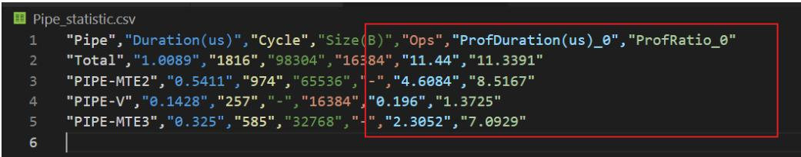  
图 3-1 Pipe_statistic.csv 文件

# 3.3.3 算子计算搬运规格分析

# 说明

文档中的Ascendxxxyy需替换为实际使用的处理器类型。

以matmul算子为例，该用例表示准备处理[160, 240]和[240, 80]的矩阵乘，切割为5个[32, 48]、[48, 16]和[32, 16]的小矩阵做矩阵乘。通过调用msKPP提供的接口实现的main.py脚本样例如下：

from mskpp import mmad, Tensor, Chip  
def my_mmad(gm_x, gm_y, gm_z):# 矩阵乘的基本数据通路：# 左矩阵x：GM-L1-L0A# 右矩阵y：GM-L1-L0B# 结果矩阵z： L0C(初始化)-GM# 样例数学表达式：z = x @ y + b# 定义和分配L1上的变量l1_x $=$ Tensor("L1")l1_y $=$ Tensor("L1")# 定义和分配L0A和L0B上的变量$\mathsf { x } =$ Tensor("L0A")y $=$ Tensor("L0B")# 定义和分配在L0C上的偏置项，理论上应该分配在累加器Buffer上，分配在L0C不影响性能b $=$ Tensor("L0C", "FP32", [32, 16], format="NC1HWC0")# 将GM上的数据移动到L1对应内存空间上l1_x.load(gm_x)l1_y.load(gm_y)# 将L1上的左右矩阵移动到L0A和L0B上x.load(l1_x)y.load(l1_y)# 当前数据已加载到L0A和L0B上，调用指令进行计算，结果保存在L0C上，out是mmad函数内部在L0C中分配  
的变量out $=$ mmad(x, y, b, True)()# 将L0C上的数据移动到GM变量gm_z的地址空间上gm_z.load(out[0])return gm_z  
if __name__ $= =$ '__main__':with Chip("Ascendxxxyy") as chip:chip.enable_trace() # 使能算子模拟流水图的功能，生成trace.json文件chip.enable_metrics() # 使能单指令及分PIPE的流水信息，生成Instruction_statistic.csv和Pipe_statistic.csv  
文件# 模拟一个大矩阵被切分成5个小矩阵进行计算for _ in range(5):# 应用算子进行AICORE计算in_x $=$ Tensor("GM", "FP16", [32, 48], format="ND")in_y $=$ Tensor("GM", "FP16", [48, 16], format="ND")in_z $=$ Tensor("GM", "FP32", [32, 16], format="NC1HWC0")my_mmad(in_x, in_y, in_z)使用Python执行以上main.py脚本后，会在当前路径/MSKPPTIMESTAMP目录下生成搬运流水统计文件（Pipe_statistic.csv）和指令信息统计文件  
（Instruction_statistic.csv），可查看msKPP建模结果。

# 说明

TIMESTAMP为当前时间戳。

# 搬运流水统计

搬运流水统计文件Pipe_statistic.csv，该文件统计了不同PIPE的总搬运数据量大小、操作数个数以及耗时信息。

图 3-2 Pipe_statistic.csv  

<table><tr><td rowspan=1 colspan=1>Pipe</td><td rowspan=1 colspan=1>Duration(us)</td><td rowspan=1 colspan=1>Cycle</td><td rowspan=1 colspan=1>Size(B)</td><td rowspan=1 colspan=1>Ops</td></tr><tr><td rowspan=1 colspan=1>Total</td><td rowspan=1 colspan=1>5.2622</td><td rowspan=1 colspan=1>11095</td><td rowspan=1 colspan=1>56320</td><td rowspan=1 colspan=1>122880</td></tr><tr><td rowspan=1 colspan=1>PIPE-MTE2</td><td rowspan=1 colspan=1>5.0472</td><td rowspan=1 colspan=1>9085</td><td rowspan=1 colspan=1>23040</td><td rowspan=1 colspan=1>=</td></tr><tr><td rowspan=1 colspan=1>PIPE-MTE1</td><td rowspan=1 colspan=1>0.0667</td><td rowspan=1 colspan=1>120</td><td rowspan=1 colspan=1>23040</td><td rowspan=1 colspan=1></td></tr><tr><td rowspan=1 colspan=1>PIPE-V</td><td rowspan=1 colspan=1>0.025</td><td rowspan=1 colspan=1>45</td><td rowspan=1 colspan=1>=</td><td rowspan=1 colspan=1>122880</td></tr><tr><td rowspan=1 colspan=1>PIPE-FIX</td><td rowspan=1 colspan=1>1.025</td><td rowspan=1 colspan=1>1845</td><td rowspan=1 colspan=1>10240</td><td rowspan=1 colspan=1></td></tr></table>

关键字段说明如下。

表3-2 字段说明  

<table><tr><td rowspan=1 colspan=1>字段名</td><td rowspan=1 colspan=1>字段解释</td></tr><tr><td rowspan=1 colspan=1>Pipe</td><td rowspan=1 colspan=1>表示昇腾处理器中不同PIPE单元的名称。</td></tr><tr><td rowspan=1 colspan=1>Duration(us)</td><td rowspan=1 colspan=1>PIPE耗时，单位us。</td></tr><tr><td rowspan=1 colspan=1>Cycle</td><td rowspan=1 colspan=1>各个指令每次执行时消耗的cycle数。</td></tr><tr><td rowspan=1 colspan=1>Size(B)</td><td rowspan=1 colspan=1>表示搬运类PIPE的搬运量大小，单位B。</td></tr><tr><td rowspan=1 colspan=1>Ops</td><td rowspan=1 colspan=1>表示计算类PIPE的计算元素大小。</td></tr></table>

对于流水线耗时最长，明显是搬运性能瓶颈的PIPE，通常有如下优化思路：

● 若搬运数据量较大时，尽可能一次搬运较多的数据，充分利用搬运带宽。  
● 尽可能保证性能瓶颈的PIPE在流水上一直在工作。

# 指令信息统计

指令信息统计文件Instruction_statistic.csv，该文件统计了不同指令维度的总搬运数据量大小、操作数个数以及耗时信息，能够发现指令层面上的瓶颈主要在MOV-GM_TO_L1（属于PIPE-MTE2），从指令层面找到了性能瓶颈处。

图 3-3 Instruction_statistic.csv  

<table><tr><td rowspan=1 colspan=1>Instruction</td><td rowspan=1 colspan=1>Duration(us)</td><td rowspan=1 colspan=1>Cycle</td><td rowspan=1 colspan=1>Size(B)</td><td rowspan=1 colspan=1>Ops</td></tr><tr><td rowspan=1 colspan=1>MOV-GM_TO_L1</td><td rowspan=1 colspan=1>5.0472</td><td rowspan=1 colspan=1>9085</td><td rowspan=1 colspan=1>23040</td><td rowspan=1 colspan=1>■</td></tr><tr><td rowspan=1 colspan=1>MOV-L1_TO_L0A</td><td rowspan=1 colspan=1>0.0417</td><td rowspan=1 colspan=1>75</td><td rowspan=1 colspan=1>15360</td><td rowspan=1 colspan=1>=</td></tr><tr><td rowspan=1 colspan=1>MOV-L1_TO_L0B</td><td rowspan=1 colspan=1>0.025</td><td rowspan=1 colspan=1>45</td><td rowspan=1 colspan=1>7680</td><td rowspan=1 colspan=1></td></tr><tr><td rowspan=1 colspan=1>MMAD</td><td rowspan=1 colspan=1>0.025</td><td rowspan=1 colspan=1>45</td><td rowspan=1 colspan=1></td><td rowspan=1 colspan=1>122880</td></tr><tr><td rowspan=1 colspan=1>MOV-L0C_TO_GM</td><td rowspan=1 colspan=1>1.025</td><td rowspan=1 colspan=1>1845</td><td rowspan=1 colspan=1>10240</td><td rowspan=1 colspan=1>■</td></tr></table>

关键字段说明如下。

表 3-3 字段说明  

<table><tr><td rowspan=1 colspan=1>字段名</td><td rowspan=1 colspan=1>字段解释</td></tr><tr><td rowspan=1 colspan=1>Instruction</td><td rowspan=1 colspan=1>指令名称。</td></tr><tr><td rowspan=1 colspan=1>Duration(us)</td><td rowspan=1 colspan=1>PIPE耗时，单位us。</td></tr><tr><td rowspan=1 colspan=1>Cycle</td><td rowspan=1 colspan=1>各个指令每次执行时消耗的cycle数。</td></tr><tr><td rowspan=1 colspan=1>Size(B)</td><td rowspan=1 colspan=1>表示搬运类PIPE的搬运量大小，单位B。</td></tr><tr><td rowspan=1 colspan=1>Ops</td><td rowspan=1 colspan=1>表示计算类PIPE的计算元素大小。</td></tr></table>

# 3.3.4 极限性能分析

# 说明

文档中的Ascendxxxyy需替换为实际使用的处理器类型。

以matmul算子为例，该用例表示准备处理[160, 240]和[240, 80]的矩阵乘，切割为5个[32, 48]、[48, 16]和[32, 16]的小矩阵做矩阵乘。通过调用msKPP提供的接口实现的main.py脚本样例如下：

from mskpp import mmad, Tensor, Chip  
def my_mmad(gm_x, gm_y, gm_z):# 矩阵乘的基本数据通路：# 左矩阵x：GM-L1-L0A# 右矩阵y：GM-L1-L0B# 结果矩阵z： L0C(初始化)-GM# 样例数学表达式：z = x @ y + b# 定义和分配L1上的变量l1_x $=$ Tensor("L1")l1_y $=$ Tensor("L1")# 定义和分配L0A和L0B上的变量$\mathsf { x } =$ Tensor("L0A")y $=$ Tensor("L0B")# 定义和分配在L0C上的偏置项，理论上应该分配在累加器Buffer上，分配在L0C不影响性能b $=$ Tensor("L0C", "FP32", [32, 16], format="NC1HWC0")# 将GM上的数据移动到L1对应内存空间上l1_x.load(gm_x)l1_y.load(gm_y)# 将L1上的左右矩阵移动到L0A和L0B上x.load(l1_x)y.load(l1_y)# 当前数据已加载到L0A和L0B上，调用指令进行计算，结果保存在L0C上，out是mmad函数内部在L0C中分配  
的变量out $=$ mmad(x, y, b, True)()# 将L0C上的数据移动到GM变量gm_z的地址空间上gm_z.load(out[0])return gm_z  
if __name__ $= =$ '__main__':with Chip("Ascendxxxyy") as chip:chip.enable_trace() # 使能算子模拟流水图的功能，生成trace.json文件chip.enable_metrics() # 使能单指令及分PIPE的流水信息，生成Instruction_statistic.csv和Pipe_statistic.csv  
文件# 模拟一个大矩阵被切分成5个小矩阵进行计算for _ in range(5):# 应用算子进行AICORE计算in_x $=$ Tensor("GM", "FP16", [32, 48], format="ND")in_y $=$ Tensor("GM", "FP16", [48, 16], format="ND")in_z $=$ Tensor("GM", "FP32", [32, 16], format="NC1HWC0")my_mmad(in_x, in_y, in_z)

使用Python执行以上main.py脚本后，会在当前路径/MSKPPTIMESTAMP目录下生成文件指令流水图（trace.json）和指令占比饼图（instruction_cycle_consumption.html），可查看msKPP建模结果。

# 说明

TIMESTAMP为当前时间戳。

# 指令流水图

流水图文件trace.json，通过查看该文件可以发现在理想的流水中，性能瓶颈的PIPE-MTE2是需要能够一直进行运转的。

# 说明

在Chrome浏览器中输入“chrome://tracing”地址，将.json文件拖到空白处并打开，通过键盘上的快捷键（W：放大，S：缩小，A：左移，D：右移）进行查看。

图 3-4 trace.json  

<table><tr><td colspan="10">RecordSaveLoadtrace.json</td></tr><tr><td></td><td>J0 μs</td><td></td><td></td><td>2 μ$</td><td></td><td></td><td></td><td>J4 μs</td><td></td></tr><tr><td> • kernel perf prediction (pid 0)</td><td></td><td></td><td></td><td></td><td></td><td></td><td></td><td></td><td></td></tr><tr><td>PIPE-FIX</td><td></td><td></td><td>MOV</td><td>MOV</td><td></td><td>MOV</td><td>MOV</td><td></td><td>MOV</td></tr><tr><td>PIPE-MTE1</td><td></td><td></td><td></td><td></td><td></td><td></td><td></td><td></td><td></td></tr><tr><td>PIPE-MTE2</td><td></td><td>MOV-GM..MOV-GM.MOV-GM.MOV-GM..MOV-GM..MOV-GM.MOV-GM..MOV-GM.MOV-GM.MOV-GM.</td><td></td><td></td><td></td><td></td><td></td><td></td><td></td></tr><tr><td>PIPE-V</td><td></td><td></td><td></td><td></td><td></td><td></td><td></td><td></td><td></td></tr></table>

单击流水图中的“MOV-GM_TO_L1”单指令，可查看该指令在当前搬运量及计算量下的cycle数和带宽，如图3-5所示。

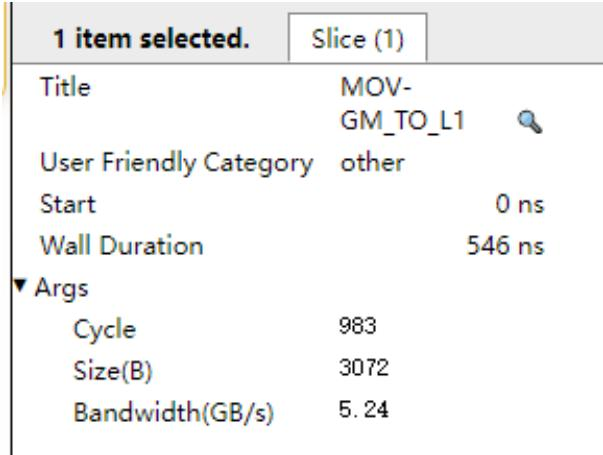  
图 3-5 指令详细信息

# 指令占比饼图

生成了指令占比饼图instruction_cycle_consumption.html，从中可以发现MOV-GM_TO_L1是算子里的最大瓶颈。

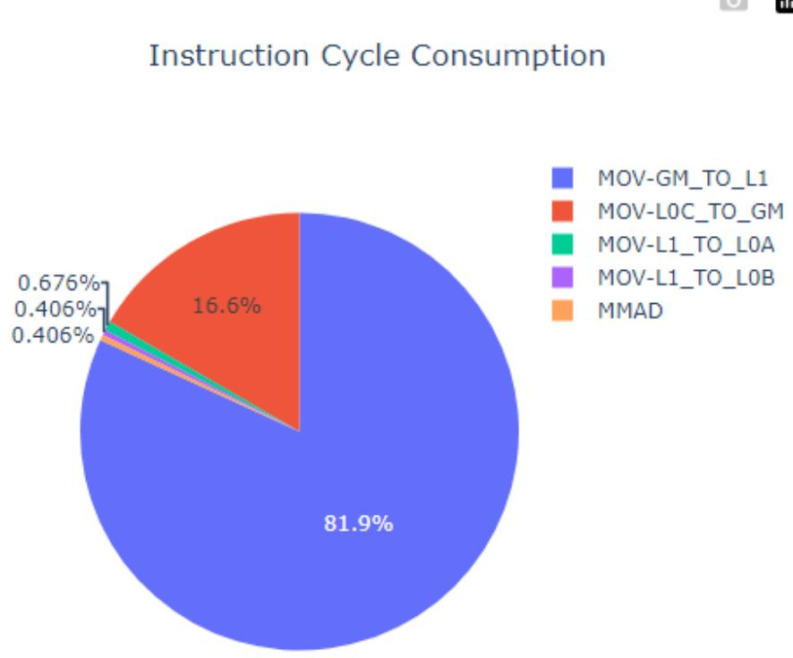  
图 3-6 指令耗时统计  
圃

# 3.3.5 算子 tiling 初步设计

tiling策略的模拟体现在算子功能函数的for循环中，进行切分时，需确保每次for循环处理的数据量相同。

# 说明

文档中的Ascendxxxyy需替换为实际使用的处理器类型。

# 具体操作

以matmul算子为例，该用例表示模拟一个大矩阵被切分成小矩阵进行矩阵乘计算。需根据用户算子逻辑方案实现算子功能函数。tiling策略的模拟体现在算子功能函数的for循环中（以下代码中加粗部分），例如单核处理[160, 240]和[240, 80]的矩阵乘，切割为25个[32, 48]和[48, 16]的小矩阵分批处理，就需要for循环25次并每次创建大小为[32, 48]和[48, 16]的Tensor矩阵（在GM上）。

from mskpp import mmad, Tensor, Chip def my_mmad(gm_x, gm_y, gm_z):

# 矩阵乘的基本数据通路：  
# 左矩阵A：GM-L1-L0A  
# 右矩阵B：GM-L1-L0B  
# 结果矩阵C： L0C(初始化)-GM  
l1_x $=$ Tensor("L1")  
l1_y $=$ Tensor("L1")  
l1_x.load(gm_x)l1_y.load(gm_y)$\mathsf { x } =$ Tensor("L0A")$\mathsf { y } =$ Tensor("L0B")x.load(l1_x)y.load(l1_y)$z =$ Tensor("L0C", "FP32", [32, 16], format="NC1HWC0")out $=$ mmad(x, y, z, True)() # 对于输出需要返回传出$z =$ out[0]return z  
if __name__ $= =$ '__main__':with Chip("Ascendxxxyy") as chip:chip.enable_trace() # 使能算子模拟流水图的功能，生成trace.json文件chip.enable_metrics() # 使能单指令及分Pipe的流水信息，生成Instruction_statistic.csv和  
Pipe_statistic.csv文件# 这里进入了对数据切分逻辑的处理，对一大块GM的数据，如何经过拆分成小数据分批次搬入，如何对# 内存进行分片多buffer搬运，都是属于tiling策略的范畴，这里模拟了单buffer情况，# 将[160, 240]和[240, 80]的矩阵乘，切割为25个[32, 48]和[48, 16]的小矩阵分批次进行运算的一个  
tiling策略for _ in range(25):in_x $=$ Tensor("GM", "FP16", [32, 48], format="ND")in_y $=$ Tensor("GM", "FP16", [48, 16], format="ND")in_z $=$ Tensor("GM", "FP32", [32, 16], format="NC1HWC0")out $z =$ my_mmad(in_x, in_y, in_z)in_z.load(out_z)

# 3.3.6 对外接口使用说明

# 3.3.6.1 接口列表

msKPP工具分为基础功能接口和指令接口两种接口类型。基础功能接口用于模拟算子计算中芯片平台、基础数据等。指令接口用于模拟特定的算子指令操作，包括Vector类计算指令和Cube类计算指令。

表 3-4 msKPP 工具接口列表  

<table><tr><td colspan="1" rowspan="1">接口类型</td><td colspan="1" rowspan="1">接口名称</td><td colspan="1" rowspan="1">接口简介</td></tr><tr><td colspan="1" rowspan="4">基础功能接□</td><td colspan="1" rowspan="1">Chip</td><td colspan="1" rowspan="1">创建性能建模的芯片平台，初始化芯片各项性能数据。</td></tr><tr><td colspan="1" rowspan="1">Core</td><td colspan="1" rowspan="1">模拟芯片内部的Al Core。</td></tr><tr><td colspan="1" rowspan="1">Tensor</td><td colspan="1" rowspan="1">算子执行基础数据类型。</td></tr><tr><td colspan="1" rowspan="1">Tensor.load</td><td colspan="1" rowspan="1">数据搬运接口，对数据在不同单元搬运进行建模。</td></tr><tr><td colspan="1" rowspan="2">同步类指令接口</td><td colspan="1" rowspan="1">set_flag</td><td colspan="1" rowspan="1">核内PIPE间同步的指令接口，与wait_flag配套使用。</td></tr><tr><td colspan="1" rowspan="1">wait_flag</td><td colspan="1" rowspan="1">核内PIPE间同步的指令接口，与set_flag配套使用。</td></tr><tr><td colspan="1" rowspan="5">指令接口</td><td colspan="1" rowspan="1">mmad</td><td colspan="1" rowspan="1">对Cube类指令的mmad性能建模接口。</td></tr><tr><td colspan="1" rowspan="1">vadd</td><td colspan="1" rowspan="1">对Vector类指令的vadd性能建模接口。</td></tr><tr><td colspan="1" rowspan="1">vbrcb</td><td colspan="1" rowspan="1">对Vector类指令的vbrcb性能建模接口。</td></tr><tr><td colspan="1" rowspan="1">vconv</td><td colspan="1" rowspan="1">对Vector类指令的vconv性能建模接口。</td></tr><tr><td colspan="1" rowspan="1">vconv_deq</td><td colspan="1" rowspan="1">对Vector类指令的vconv_deq性能建模接口。</td></tr><tr><td colspan="1" rowspan="1">口类型</td><td colspan="1" rowspan="1">接口名称</td><td colspan="1" rowspan="1">接口简介</td></tr><tr><td colspan="1" rowspan="30"></td><td colspan="1" rowspan="1">vconv_vdeq</td><td colspan="1" rowspan="1">对Vector类指令的vconv_vdeq性能建模接口。</td></tr><tr><td colspan="1" rowspan="1">vector_dup</td><td colspan="1" rowspan="1">对Vector类指令的vector_dup性能建模接口。</td></tr><tr><td colspan="1" rowspan="1">vexp</td><td colspan="1" rowspan="1">对Vector类指令的vexp性能建模接口。</td></tr><tr><td colspan="1" rowspan="1">vn</td><td colspan="1" rowspan="1">对Vector类指令的vln性能建模接口。</td></tr><tr><td colspan="1" rowspan="1">vmax</td><td colspan="1" rowspan="1">对Vector类指令的vmax性能建模接口。</td></tr><tr><td colspan="1" rowspan="1">vmul</td><td colspan="1" rowspan="1">对Vector类指令的vmul性能建模接口。</td></tr><tr><td colspan="1" rowspan="1">vmuls</td><td colspan="1" rowspan="1">对Vector类指令的vmuls性能建模接口。</td></tr><tr><td colspan="1" rowspan="1">vsub</td><td colspan="1" rowspan="1">对Vector类指令的vsub性能建模接口。</td></tr><tr><td colspan="1" rowspan="1">vdiv</td><td colspan="1" rowspan="1">对Vector类指令的vdiv性能建模接口。</td></tr><tr><td colspan="1" rowspan="1">vcadd</td><td colspan="1" rowspan="1">对Vector类指令的vcadd性能建模接口。</td></tr><tr><td colspan="1" rowspan="1">vabs</td><td colspan="1" rowspan="1">对Vector类指令的vabs性能建模接口。</td></tr><tr><td colspan="1" rowspan="1">vaddrelu</td><td colspan="1" rowspan="1">对Vector类指令的vaddrelu性能建模接口。</td></tr><tr><td colspan="1" rowspan="1">vaddreluconv</td><td colspan="1" rowspan="1">对Vector类指令的vaddreluconv性能建模接口。</td></tr><tr><td colspan="1" rowspan="1">vadds</td><td colspan="1" rowspan="1">对Vector类指令的vadds性能建模接口。</td></tr><tr><td colspan="1" rowspan="1">vand</td><td colspan="1" rowspan="1">对Vector类指令的vand性能建模接口。</td></tr><tr><td colspan="1" rowspan="1">vaxpy</td><td colspan="1" rowspan="1">对Vector类指令的vaxpy性能建模接口。</td></tr><tr><td colspan="1" rowspan="1">vbitsort</td><td colspan="1" rowspan="1">对Vector类指令的vbitsort性能建模接口。</td></tr><tr><td colspan="1" rowspan="1">vcgadd</td><td colspan="1" rowspan="1">对Vector类指令的vcgadd性能建模接口。</td></tr><tr><td colspan="1" rowspan="1">vcgmax</td><td colspan="1" rowspan="1">对Vector类指令的vcgmax性能建模接口。</td></tr><tr><td colspan="1" rowspan="1">vcgmin</td><td colspan="1" rowspan="1">对Vector类指令的vcgmin性能建模接口。</td></tr><tr><td colspan="1" rowspan="1">vcmax</td><td colspan="1" rowspan="1">对Vector类指令的vcmax性能建模接口。</td></tr><tr><td colspan="1" rowspan="1">vcmin</td><td colspan="1" rowspan="1">对Vector类指令的vcmin性能建模接口。</td></tr><tr><td colspan="1" rowspan="1">vcmp_xxx</td><td colspan="1" rowspan="1">对Vector类指令的vcmp_xxx性能建模接口。</td></tr><tr><td colspan="1" rowspan="1">vcmpv_xxx</td><td colspan="1" rowspan="1">对Vector类指令的vcmpv_xxx性能建模接口。</td></tr><tr><td colspan="1" rowspan="1">vcmpvs_xxX</td><td colspan="1" rowspan="1">对Vector类指令的vcmpvs_xxx性能建模接口。</td></tr><tr><td colspan="1" rowspan="1">vcopy</td><td colspan="1" rowspan="1">对Vector类指令的vcopy性能建模接口。</td></tr><tr><td colspan="1" rowspan="1">vcpadd</td><td colspan="1" rowspan="1">对Vector类指令的vcpadd性能建模接口。</td></tr><tr><td colspan="1" rowspan="1">vgather</td><td colspan="1" rowspan="1">对Vector类指令的vgather性能建模接口。</td></tr><tr><td colspan="1" rowspan="1">vgatherb</td><td colspan="1" rowspan="1">对Vector类指令的vgatherb性能建模接口。</td></tr><tr><td colspan="1" rowspan="1">vlrelu</td><td colspan="1" rowspan="1">对Vector类指令的vlrelu性能建模接口。</td></tr><tr><td colspan="1" rowspan="1">接口类型</td><td colspan="1" rowspan="1">接口名称</td><td colspan="1" rowspan="1">接口简介</td></tr><tr><td colspan="1" rowspan="22"></td><td colspan="1" rowspan="1">vmadd</td><td colspan="1" rowspan="1">对Vector类指令的vmadd性能建模接口。</td></tr><tr><td colspan="1" rowspan="1">vmaddrelu</td><td colspan="1" rowspan="1">对Vector类指令的vmaddrelu性能建模接口。</td></tr><tr><td colspan="1" rowspan="1">vmaxs</td><td colspan="1" rowspan="1">对Vector类指令的vmaxs性能建模接口。</td></tr><tr><td colspan="1" rowspan="1">vmin</td><td colspan="1" rowspan="1">对Vector类指令的vmin性能建模接口。</td></tr><tr><td colspan="1" rowspan="1">vmins</td><td colspan="1" rowspan="1">对Vector类指令的vmins性能建模接口。</td></tr><tr><td colspan="1" rowspan="1">vmla</td><td colspan="1" rowspan="1">对Vector类指令的vmla性能建模接口。</td></tr><tr><td colspan="1" rowspan="1">vmrgsort</td><td colspan="1" rowspan="1">对Vector类指令的vmrgsort性能建模接口。</td></tr><tr><td colspan="1" rowspan="1">vmulconv</td><td colspan="1" rowspan="1">对Vector类指令的vmulconv性能建模接口。</td></tr><tr><td colspan="1" rowspan="1">vnot</td><td colspan="1" rowspan="1">对Vector类指令的vnot性能建模接口。</td></tr><tr><td colspan="1" rowspan="1">vor</td><td colspan="1" rowspan="1">对Vector类指令的vor性能建模接口。</td></tr><tr><td colspan="1" rowspan="1">vrec</td><td colspan="1" rowspan="1">对Vector类指令的vrec性能建模接口。</td></tr><tr><td colspan="1" rowspan="1">vreduce</td><td colspan="1" rowspan="1">对Vector类指令的vreduce性能建模接口。</td></tr><tr><td colspan="1" rowspan="1">vreducev2</td><td colspan="1" rowspan="1">对Vector类指令的vreducev2性能建模接口。</td></tr><tr><td colspan="1" rowspan="1">vrelu</td><td colspan="1" rowspan="1">对Vector类指令的vrelu性能建模接口。</td></tr><tr><td colspan="1" rowspan="1">vrsqrt</td><td colspan="1" rowspan="1">对Vector类指令的vrsqrt性能建模接口。</td></tr><tr><td colspan="1" rowspan="1">vsel</td><td colspan="1" rowspan="1">对Vector类指令的vsel性能建模接口。</td></tr><tr><td colspan="1" rowspan="1">vshl</td><td colspan="1" rowspan="1">对Vector类指令的vshl性能建模接口。</td></tr><tr><td colspan="1" rowspan="1">vshr</td><td colspan="1" rowspan="1">对Vector类指令的vshr性能建模接口。</td></tr><tr><td colspan="1" rowspan="1">vsqrt</td><td colspan="1" rowspan="1">对Vector类指令的vsqrt性能建模接口。</td></tr><tr><td colspan="1" rowspan="1">vsubrelu</td><td colspan="1" rowspan="1">对Vector类指令的vsubrelu性能建模接口。</td></tr><tr><td colspan="1" rowspan="1">vsubreluconv</td><td colspan="1" rowspan="1">对Vector类指令的vsubreluconv性能建模接口。</td></tr><tr><td colspan="1" rowspan="1">vtranspose</td><td colspan="1" rowspan="1">对Vector类指令的vtranspose性能建模接口。</td></tr></table>

# 3.3.6.2 基础功能接口

# 3.3.6.2.1 Chip

功能说明

处理器抽象，在with语句中实例化并用来明确针对某一昇腾AI处理器类型进行建模。

# 接口原型

class Chip(name, debug_mode $=$ False)

# 参数说明

<table><tr><td rowspan=1 colspan=1>参数名</td><td rowspan=1 colspan=1>输入类型</td><td rowspan=1 colspan=1>说明</td></tr><tr><td rowspan=1 colspan=1>name</td><td rowspan=1 colspan=1>string</td><td rowspan=1 colspan=1>处理器名称。目前大部分数据基于Atlas A2训练系列产品/AtlasA2推理系列产品采集，使用npu-smi info可以查看当前设备昇腾AI处理器类型。</td></tr><tr><td rowspan=1 colspan=1>debug_mode</td><td rowspan=1 colspan=1>bool</td><td rowspan=1 colspan=1>是否启用调试模式，默认为False。·True:启用·False:不启用说明开启debug模式后可查看未正确运行的指令，但不会生成任何输出件。</td></tr></table>

成员

<table><tr><td rowspan=1 colspan=1>成员名称</td><td rowspan=1 colspan=1>描述</td></tr><tr><td rowspan=1 colspan=1>chip.enable_trace(</td><td rowspan=1 colspan=1>使能算子模拟流水图的功能，生成流水图文件trace.json。</td></tr><tr><td rowspan=1 colspan=1>chip.enable_metrics()</td><td rowspan=1 colspan=1>使能单指令及分PIPE的流水信息，生成指令统计（Instruction_statistic.csv）、搬运流水统计（Pipe_statistic.csv）文件和指令占比饼图（instruction_cycle_consumption.html）。</td></tr><tr><td rowspan=1 colspan=1>chip.set_cache_hit_ratio(config)</td><td rowspan=1 colspan=1>用于使能手动调整L2Cache命中率，其中config ={&quot;cache_hit_ratio&quot;:0.6}，具体介绍请参见支持cache命中率建模章节。</td></tr><tr><td rowspan=1 colspan=1>chip.set_prof_summary_path(&quot;xxx/PipeUtilization.csv&quot;)</td><td rowspan=1 colspan=1>其中PipeUtilization.csv为msprof的结果示例，用于使能PIPE信息的理论值与msprof实测值比对。具体介绍请参见支持PIPE信息的理论值与msprof实测值比对章节。</td></tr><tr><td rowspan=1 colspan=1>chip.disable_instr_log(</td><td rowspan=1 colspan=1>使能后，抑制指令任务添加和调度结束后的日志打印。</td></tr></table>

# 约束说明

# 使用示例

需在with语句下将该类初始化。

chip.enable_metrics() # 调用该函数即可使能单指令及分PIPE的流水信息，生成搬运流水统计、指令信息统计和指令占比饼图

# 说明

非Atlas A3 训练系列产品/Atlas A3 推理系列产品：在安装昇腾AI处理器的服务器执行npu-smiinfo命令进行查询，获取Chip Name信息。实际配置值为AscendChip Name，例如Chip Name取值为xxxyy，实际配置值为Ascendxxxyy。当Ascendxxxyy为代码样例的路径时，需要配置为ascendxxxyy。

# 3.3.6.2.2 Core

功能说明

AI Core抽象，在with语句中实例化并用来明确针对某一AI Core类型进行建模。

接口原型

class Core(core_type_name)

# 参数说明

<table><tr><td rowspan=1 colspan=1>参数名</td><td rowspan=1 colspan=1>输入类型</td><td rowspan=1 colspan=1>说明</td></tr><tr><td rowspan=1 colspan=1>core_type_name</td><td rowspan=1 colspan=1>string</td><td rowspan=1 colspan=1>昇腾计算单元类型字符串，通常可以表示为“AICx”或“AIVx”，其中x为数字，即使用的AICube Core/Al Vector Core的序号。仅支持A-Za-z0-9中的一个或多个字符。</td></tr></table>

# 约束说明

需在with语句下将该类初始化。

使用示例

from mskpp import Core  
with Core("AIC0") as aic:# AI Cube Core 0上的算子计算逻辑相关代码

# 3.3.6.2.3 Tensor

功能说明

片上Tensor的抽象，可指定Tensor的内存位置、数据类型、大小及排布格式作为指令的数据依赖标识。

# 接口原型

class Tensor(mem_type, dtype=None, size=None, format=None, is_inited=False)

# 参数说明

<table><tr><td rowspan=1 colspan=1>参数名</td><td rowspan=1 colspan=1>输入类型</td><td rowspan=1 colspan=1>说明</td></tr><tr><td rowspan=1 colspan=1>mem_type</td><td rowspan=1 colspan=1>字符串</td><td rowspan=1 colspan=1>抽象Tensor所处的内存空间的位置，如“GM”、“UB”   “L1”                “LOB”、“LOC”、、=“FB”   “BT”等。、</td></tr><tr><td rowspan=1 colspan=1>dtype</td><td rowspan=1 colspan=1>字符串</td><td rowspan=1 colspan=1>数据类型，如BOOL、UINT1、UINT2、UINT8、UINT16、UINT32、BF16、UINT64、INT4、INT8、INT16、INT32、INT64、FP16、FP32。</td></tr><tr><td rowspan=1 colspan=1>size</td><td rowspan=1 colspan=1>list</td><td rowspan=1 colspan=1>Tensor的shape。</td></tr><tr><td rowspan=1 colspan=1>format</td><td rowspan=1 colspan=1>字符串</td><td rowspan=1 colspan=1>数据排布格式，详细可参见《AscendC算子开发指南》中的“编程指南&gt;概念原理和术语&gt;神经网络和算子&gt;数据排布格式”章节。</td></tr><tr><td rowspan=1 colspan=1>is_inited</td><td rowspan=1 colspan=1>bool</td><td rowspan=1 colspan=1>控制Tensor类是否已就绪的开关，开启后，以该Tensor为输入的指令即可启动。</td></tr></table>

成员约束说明

<table><tr><td rowspan=1 colspan=1>成员名称</td><td rowspan=1 colspan=1>描述</td></tr><tr><td rowspan=1 colspan=1>tensor.set_valid()</td><td rowspan=1 colspan=1>使能当前tensor就绪，开启后，以该tensor为输入的指令即可立即启动。</td></tr><tr><td rowspan=1 colspan=1>tensor.set_invalid0</td><td rowspan=1 colspan=1>使当前tensor处于非就绪状态，关闭后，以该tensor为输入的指令不可立即启动。</td></tr><tr><td rowspan=1 colspan=1>tensor.is_valid()</td><td rowspan=1 colspan=1>用于获取当前的tensor就绪状态。</td></tr></table>

需通过创建一个shape为[1]且is_inited $| =$ True的Tensor进行标量创建。

使用示例

from mskpp import Tensor, Core   
gm_tmp= Tensor("GM", "FP16", [48, 16], format="ND")   
with Core("AIV0") as aiv: # AIV0上的相关计算逻辑 ... gm_tmp.load(result, set_value ${ } = 0$ )   
with Core("AIC0") as aic: in_x $=$ Tensor("GM", "FP16", [48, 16], format="ND") in_x.load(gm_tmp, expect_value $_ { = 0 }$ ) # AIC0上的相关计算逻辑 ...

# 3.3.6.2.4 Tensor.load

# 功能说明

所有的数据搬运指令在msKPP工具下都抽象为load方法，用户只需关心昇腾AI处理器中合理的搬运通路，无需考虑搬运指令中复杂的stride概念。

接口原型

Tensor.load(tensor, repeat=1, set_value=-1, expect_value=-1)

参数说明  

<table><tr><td rowspan=1 colspan=1>参数名</td><td rowspan=1 colspan=1>输入类型</td><td rowspan=1 colspan=1>说明</td></tr><tr><td rowspan=1 colspan=1>tensor</td><td rowspan=1 colspan=1>变量</td><td rowspan=1 colspan=1>输入的其他tensor，其功能与接口中Tensor的定义一致。</td></tr><tr><td rowspan=1 colspan=1>repeat</td><td rowspan=1 colspan=1>int</td><td rowspan=1 colspan=1>该参数是对搬运指令repeat的模拟，通过输入该值可获取不同repeat值下搬运通路的带宽值，该带宽值用于计算搬运指令的耗时。非必选参数，默认值为1，建议值为[1,255]之间的整数。当输入的repeat值不满足要求时，系统将会抛出异常：&quot;input repeat = xx invalid.&quot;，其中xx为输入的异常repeat值。</td></tr><tr><td rowspan=1 colspan=1>set_value</td><td rowspan=1 colspan=1>int</td><td rowspan=1 colspan=1>设置此tensor数据被依赖的标识号，可以自行定义，需与expect_value配对使用。非必选参数，不输入则不会使能依赖关系。</td></tr><tr><td rowspan=1 colspan=1>expect_value</td><td rowspan=1 colspan=1>int</td><td rowspan=1 colspan=1>设置此tensor数据加载依赖数据的标识号，可以自行定义，需与set_value配对使用。非必选参数，不输入则不会使能依赖关系。</td></tr></table>

# 约束说明

set_value和expect_value需配对使用，否则可能会造成流水阻塞。

repeat参数仅支持以下4条搬运通路：L1_TO_L0A、L1_TO_L0B、GM_TO_L0A和GM_TO_L0B。

# 3.3.6.3 同步类指令接口

# 3.3.6.3.1 set_flag

# 功能说明

用于确保核内各PIPE间不同指令的同步，pipe_src先完成调度后，pipe_dst将解除阻塞状态。设置set_flag和3.3.6.3.2 wait_flag之后，指令流水图介绍（以MindStudioInsight为例）将会更贴合用户的调用预期。

# 接口原型

set_flag(pipe_src, pipe_dst, event_id)

参数说明  

<table><tr><td rowspan=1 colspan=1>参数名</td><td rowspan=1 colspan=1>输入/输出</td><td rowspan=1 colspan=1>说明</td></tr><tr><td rowspan=1 colspan=1>pipe_src</td><td rowspan=1 colspan=1>输入</td><td rowspan=1 colspan=1>源PIPE，在pipe_src调度后设置event_id。输入格式为aicore_PIPE，例如：&quot;aicO_PIPE-MTE1&quot;。其中aicore的取值范围参见基础功能接口Core，PIPE取值范围为&quot;PIPE-MTE1&quot;、&quot;PIPE-MTE2&quot;、&quot;PIPE-MTE3&quot;、&quot;PIPE-FIX&quot;、&quot;PIPE-M&quot;、&quot;PIPE-V&quot;、&quot;PIPE-S&quot;。不指定aicore时，可直接输入PIPE取值。数据类型：string。必选参数。</td></tr><tr><td rowspan=1 colspan=1>pipe_dst</td><td rowspan=1 colspan=1>输入</td><td rowspan=1 colspan=1>目的PIPE，在pipe_src调度之后，pipe_dst将会解除阻塞状态。输入格式为aicore_PIPE，例如：&quot;aicO_PIPE-MTE1&quot;。其中aicore的取值范围参见基础功能接口Core，PIPE取值范围为&quot;PIPE-MTE1&quot;、&quot;PIPE-MTE2&quot;、&quot;PIPE-MTE3&quot;、&quot;PIPE-FIX&quot;、&quot;PIPE-M&quot;、&quot;PIPE-V&quot;、&quot;PIPE-S&quot;。不指定aicore时，可直接输入PIPE取值。数据类型：string。必选参数。</td></tr><tr><td rowspan=1 colspan=1>event_id</td><td rowspan=1 colspan=1>输入</td><td rowspan=1 colspan=1>同步指令之间依赖的唯一值。取值范围[0,65535]。数据类型：int。必选参数。</td></tr></table>

# 约束说明

● 在同一核内set_flag与wait_flag个数需匹配。  
$\bullet$ 同核内不应出现重复的set_flag指令。同一核内，当set_flag和wait_flag内的pipe_src和pipe_dst相同时，event_id也应保持唯一。

# 使用示例

from mskpp import Tensor, Chip, set_flag, wait_flag  
with Chip("Ascendxxyy") as chip:gm_weight $=$ Tensor("GM", "FP16", [128, 256], format="ND")l1_weight $=$ Tensor("L1", "FP16", [128, 256], format="ND")for conv_idx in range(4): # L0A数据加载前，GM分批加载到L1上gm_weight_part $=$ gm_weight[:, 64]l1_weight_part $=$ l1_weight[:, 64]l1_weight_part.load(gm_weight_part)if conv_idx $\mathtt { = } = 3$ :set_flag("PIPE-MTE2", "PIPE-MTE1", 1) # 当完成MTE2，才可以执行MTE1$\mathsf { x } =$ Tensor("L0A") # L0A# 正在执行MTE2操作， MTE1操作需要等待MTE2完成才能执行。

# 3.3.6.3.2 wait_flag

功能说明

用于确保核内各PIPE间不同指令的同步，pipe_dst等待pipe_src完成调度之后解除阻塞状态。

接口原型

wait_flag(pipe_src, pipe_dst, event_id)

参数说明  

<table><tr><td rowspan=1 colspan=1>参数名</td><td rowspan=1 colspan=1>输入/输出</td><td rowspan=1 colspan=1>说明</td></tr><tr><td rowspan=1 colspan=1>pipe_src</td><td rowspan=1 colspan=1>输入</td><td rowspan=1 colspan=1>源PIPE，在pipe_src调度后设置event_id。输入格式为aicore_PIPE，例如：&quot;aicO_PIPE-MTE1&quot;。其中aicore的取值范围参见基础功能接口Core，PIPE取值范围为&quot;PIPE-MTE1&quot;、&quot;PIPE-MTE2&quot;、&quot;PIPE-MTE3&quot;、&quot;PIPE-FIX&quot;、&quot;PIPE-M&quot;、&quot;PIPE-V&quot;、&quot;PIPE-S&quot;。不指定aicore时，可直接输入PIPE取值。数据类型：string。必选参数。</td></tr><tr><td rowspan=1 colspan=1>pipe_dst</td><td rowspan=1 colspan=1>输入</td><td rowspan=1 colspan=1>目的PIPE，在pipe_src调度之后，pipe_dst将会解除阻塞状态。输入格式为aicore_PIPE，例如：&quot;aicO_PIPE-MTE1&quot;。其中aicore的取值范围参见基础功能接口Core，PIPE取值范围为&quot;PIPE-MTE1&quot;、&quot;PIPE-MTE2&quot;、 &quot;PIPE-MTE3&quot;、&quot;PIPE-FIX&quot;、&quot;PIPE-M&quot;、&quot;PIPE-V&quot;、&quot;PIPE-S&quot;。不指定aicore时，可直接输入PIPE取值。数据类型：string。必选参数。</td></tr><tr><td rowspan=1 colspan=1>event_id</td><td rowspan=1 colspan=1>输入</td><td rowspan=1 colspan=1>同步指令之间依赖的唯一值。取值范围[0,65535]。数据类型：int。必选参数。</td></tr></table>

# 约束说明

● 在同一核内set_flag与wait_flag个数需匹配。  
● 同核内不应出现重复的set_flag指令。同一核内，当set_flag和wait_flag内的pipe_src和pipe_dst相同时，event_id也应保持唯一。

# 使用示例

from mskpp import Tensor, Chip, set_flag, wait_flag   
with Chip("Ascendxxyy") as chip: gm_weight $=$ Tensor("GM", "FP16", [128, 256], format="ND") l1_weight $=$ Tensor("L1", "FP16", [128, 256], format="ND") for conv_idx in range(4): # L0A数据加载前，GM分批加载到L1上 gm_weight_part $=$ gm_weight[:, 64] l1_weight_part $=$ l1_weight[:, 64] l1_weight_part.load(gm_weight_part) if conv_idx $\mathtt { = } = 3$ : set_flag("PIPE-MTE2", "PIPE-MTE1", 1) # 当完成MTE2，才可以执行MTE1 $\mathsf { x } =$ Tensor("L0A") # L0A # 正在执行MTE2操作， MTE1操作需要等待MTE2完成才能执行。 l1_weight.set_valid() # 手动使能L1 wait_flag("PIPE-MTE2", "PIPE-MTE1", 1) x.load(l1_weight)

# 3.3.6.4 指令接口

# 3.3.6.4.1 mmad

功能说明

完成矩阵乘加操作。

接口原型

class mmad(x, y, b, is_inited=False)

参数说明

<table><tr><td rowspan=1 colspan=1>参数名</td><td rowspan=1 colspan=1>数据类型</td><td rowspan=1 colspan=1>说明</td></tr><tr><td rowspan=1 colspan=1>X</td><td rowspan=1 colspan=1>Tensor变量</td><td rowspan=1 colspan=1>左矩阵，在“L0A”空间。支持FP16。</td></tr><tr><td rowspan=1 colspan=1>y</td><td rowspan=1 colspan=1>Tensor变量</td><td rowspan=1 colspan=1>右矩阵，在“LOB”空间。支持FP16。</td></tr><tr><td rowspan=1 colspan=1>b</td><td rowspan=1 colspan=1>Tensor变量</td><td rowspan=1 colspan=1>偏置项，可以在“LOC”空间或BiasTable空间。支持FP32。</td></tr><tr><td rowspan=1 colspan=1>is_inited</td><td rowspan=1 colspan=1>bool</td><td rowspan=1 colspan=1>当输入是在“LOC”空间时，需要加is_inited=True，因为不存在通路将数据从GM直接搬运到LOC。</td></tr></table>

# 约束说明

偏置项在Bias Table空间时，其Tensor的数据格式需为ND，shape是[n, ]。

# 使用示例

# 3.3.6.4.2 vadd

功能说明

vadd指令抽象。  
${ \boldsymbol { z } } = { \boldsymbol { \mathsf { x } } } + { \boldsymbol { \mathsf { y } } }$ ， x、y按元素相加。

接口原型

class vadd $( \mathsf { x } , \mathsf { y } , \mathsf { z } )$

参数说明

<table><tr><td rowspan=1 colspan=1>参数名</td><td rowspan=1 colspan=1>输入/输出</td><td rowspan=1 colspan=1>数据类型</td><td rowspan=1 colspan=1>说明</td></tr><tr><td rowspan=1 colspan=1>×</td><td rowspan=1 colspan=1>输入</td><td rowspan=1 colspan=1>Tensor变量</td><td rowspan=1 colspan=1>输入x向量Tensor，支持FP16、FP32、INT16、INT32。</td></tr><tr><td rowspan=1 colspan=1>y</td><td rowspan=1 colspan=1>输入</td><td rowspan=1 colspan=1>Tensor变量</td><td rowspan=1 colspan=1>输入y向量Tensor，支持FP16、FP32、INT16、INT32。</td></tr><tr><td rowspan=1 colspan=1>Z</td><td rowspan=1 colspan=1>输出</td><td rowspan=1 colspan=1>Tensor变量</td><td rowspan=1 colspan=1>输出向量Tensor。</td></tr></table>

# 约束说明

Vector指令所有输入输出数据的Tensor均在“UB”空间中，shape需保持一致。

使用示例

from mskpp import vadd, Tensor   
ub_x, ub_y, ub $z =$ Tensor("UB"), Tensor("UB"), Tensor("UB")   
gm_x, gm_y $=$ Tensor("GM"), Tensor("GM")   
ub_x.load(gm_x)   
ub_y.load(gm_y)   
out $=$ vadd(ub_x, ub_y, ub_z)()

# 3.3.6.4.3 vbrcb

# 功能说明

vbrcb指令抽象。

根据指令的stride将Tensor进行扩维，由于目前msKPP工具的指令体系里并没有stride的概念，需要用户填写如何扩维倍数，并保持输入输出Tensor的shape维度一致。

# 接口原型

class vbrcb(x, y, broadcast_num)

# 参数说明

<table><tr><td rowspan=1 colspan=1>参数名</td><td rowspan=1 colspan=1>输入/输出</td><td rowspan=1 colspan=1>数据类型</td><td rowspan=1 colspan=1>说明</td></tr><tr><td rowspan=1 colspan=1>×</td><td rowspan=1 colspan=1>输入</td><td rowspan=1 colspan=1>Tensor变量</td><td rowspan=1 colspan=1>输入×向量TensOr。支持UINT16、UINT32。</td></tr><tr><td rowspan=1 colspan=1>y</td><td rowspan=1 colspan=1>输出</td><td rowspan=1 colspan=1>Tensor变量</td><td rowspan=1 colspan=1>输出y向量Tensor。支持UINT16、UINT32。</td></tr><tr><td rowspan=1 colspan=1>broadca st_num</td><td rowspan=1 colspan=1>输入</td><td rowspan=1 colspan=1>int</td><td rowspan=1 colspan=1>指定最后一维扩维到多少倍，实测性能数据不同扩维倍数对性能影响不大，因此直接以常用的扩维16倍数据为准（对应指令的dstBlockStride=1，dstRepeatStride=8）。</td></tr></table>

# 使用示例

from mskpp import vbrcb, Tensor   
ub_x, ub_y $=$ Tensor("UB"), Tensor("UB")   
${ \mathfrak { g m } } _ { - } \times =$ Tensor("GM")   
broadcast_num $= 1 6$   
ub_x.load(gm_x)   
out $=$ vbrcb(ub_x, ub_y, broadcast_num)()

# 3.3.6.4.4 vconv

功能说明vconv指令抽象。

y = vconv(x, dtype)，vconv表示对输入数据进行类型转换的向量计算。

目前支持转换类型包括：BF16->FP32、FP16- $\cdot >$ FP32、FP16->INT16、FP16->INT32、FP16->INT4、FP16->INT8、FP16->UINT8、FP32- $\cdot >$ BF16、FP32- $>$ FP16、FP32->INT32、FP32->INT64、INT4->FP16、INT64- $\cdot >$ FP32、INT8->FP16、UINT8->FP16。

接口原型 class vconv(x, y, dtype)

# 参数说明

<table><tr><td rowspan=1 colspan=1>参数名</td><td rowspan=1 colspan=1>输入/输出</td><td rowspan=1 colspan=1>数据类型</td><td rowspan=1 colspan=1>说明</td></tr><tr><td rowspan=1 colspan=1>×</td><td rowspan=1 colspan=1>输入</td><td rowspan=1 colspan=1>Tensor变量</td><td rowspan=1 colspan=1>输入x向量Tensor。</td></tr><tr><td rowspan=1 colspan=1>y</td><td rowspan=1 colspan=1>输出</td><td rowspan=1 colspan=1>Tensor变量</td><td rowspan=1 colspan=1>输出y向量Tensor。</td></tr><tr><td rowspan=1 colspan=1>dtype</td><td rowspan=1 colspan=1>输入</td><td rowspan=1 colspan=1>字符串</td><td rowspan=1 colspan=1>表示目标Tensor的数据类型。</td></tr></table>

# 使用示例

ub_x.load(gm_x) out $=$ vconv(ub_x, ub_y, "FP32")()

# 3.3.6.4.5 vconv_deq

功能说明

vconv_deq指令抽象。  
$\mathsf { y } =$ vconv_deq(x, dtype)，vconv_deq表示对输入数据进行量化操作的向量计算。  
目前支持转换类型包括：FP16->INT8、INT32>FP16。

接口原型

class vconv_deq(x, y, dtype)

参数说明

<table><tr><td rowspan=1 colspan=1>参数名</td><td rowspan=1 colspan=1>输入/输出</td><td rowspan=1 colspan=1>数据类型</td><td rowspan=1 colspan=1>说明</td></tr><tr><td rowspan=1 colspan=1>×</td><td rowspan=1 colspan=1>输入</td><td rowspan=1 colspan=1>Tensor变量</td><td rowspan=1 colspan=1>输入x向量Tensor。</td></tr><tr><td rowspan=1 colspan=1>y</td><td rowspan=1 colspan=1>输出</td><td rowspan=1 colspan=1>Tensor变量</td><td rowspan=1 colspan=1>输出y向量Tensor。</td></tr><tr><td rowspan=1 colspan=1>dtype</td><td rowspan=1 colspan=1>输入</td><td rowspan=1 colspan=1>字符串</td><td rowspan=1 colspan=1>表示目标Tensor的数据类型。</td></tr></table>

# 使用示例

from mskpp import vconv_deq, Tensor   
ub_x, ub_y $=$ Tensor("UB", "FP16"), Tensor("UB")   
${ \mathfrak { g m } } _ { - } \times =$ Tensor("GM")   
ub_x.load(gm_x)   
out $=$ vconv_deq(ub_x, ub_y, "FP32")()

# 3.3.6.4.6 vconv_vdeq

功能说明

vconv_vdeq指令抽象。  
$\mathsf { y } =$ vconv_vdeq(x, dtype)，vconv_vdeq表示对输入数据进行量化操作的向量计算。  
目前支持转换类型包括：INT16- $\cdot >$ INT8。

接口原型

class vconv_vdeq $( \mathsf { x } , \mathsf { y } ,$ dtype)

参数说明

<table><tr><td colspan="1" rowspan="1">参数名</td><td colspan="1" rowspan="1">输入/输出</td><td colspan="1" rowspan="1">数据类型</td><td colspan="1" rowspan="1">说明</td></tr><tr><td colspan="1" rowspan="1">×</td><td colspan="1" rowspan="1">输入</td><td colspan="1" rowspan="1">Tensor变量</td><td colspan="1" rowspan="1">输入x向量Tensor。</td></tr><tr><td colspan="1" rowspan="1">y</td><td colspan="1" rowspan="1">输出</td><td colspan="1" rowspan="1">Tensor变量</td><td colspan="1" rowspan="1">输出y向量Tensor。</td></tr><tr><td colspan="1" rowspan="1">dtype</td><td colspan="1" rowspan="1">输入</td><td colspan="1" rowspan="1">字符串</td><td colspan="1" rowspan="1">表示目标Tensor的数据类型。</td></tr></table>

# 使用示例

from mskpp import vconv_vdeq, Tensor   
ub_x, ub_y $=$ Tensor("UB", "FP16"), Tensor("UB")   
${ \mathfrak { g m } } _ { - } \times =$ Tensor("GM")   
ub_x.load(gm_x)   
out $=$ vconv_vdeq(ub_x, ub_y, "FP32")()

# 3.3.6.4.7 vector_dup

功能说明

vector_dup指令抽象。  
$\mathsf { y } =$ vector_dup(x)， x、 y按元素进行填充。

接口原型

class vector_dup $( \mathsf { x } , \mathsf { y } ,$ fill_shape)

# 参数说明

<table><tr><td rowspan=1 colspan=1>参数名</td><td rowspan=1 colspan=1>输入/输出</td><td rowspan=1 colspan=1>数据类型</td><td rowspan=1 colspan=1>说明</td></tr><tr><td rowspan=1 colspan=1>X</td><td rowspan=1 colspan=1>输入</td><td rowspan=1 colspan=1>Tensor变量</td><td rowspan=1 colspan=1>输入×向量Tensor。支持FP16、FP32、INT16、INT32、UINT16、UINT32。</td></tr><tr><td rowspan=1 colspan=1>y</td><td rowspan=1 colspan=1>输出</td><td rowspan=1 colspan=1>Tensor变量</td><td rowspan=1 colspan=1>输出y向量Tensor。支持FP16、FP32、INT16、INT32、UINT16、UINT32。</td></tr><tr><td rowspan=1 colspan=1>fill_shape</td><td rowspan=1 colspan=1>输入</td><td rowspan=1 colspan=1>list</td><td rowspan=1 colspan=1>表示目标Tensor的要被扩充的shape值。</td></tr></table>

# 约束说明

由于该指令输入仅一个标量，因此需要创建一个shape为[1]且is_inited $\circeq$ True的Tensor作为模拟标量输入，不增加性能开销。

使用示例

from mskpp import vector_dup, Tensor   
ub_x $=$ Tensor("UB", "FP16", [1], format="ND", is_inited=True)   
ub_y $=$ Tensor("UB")   
out $=$ vector_dup(ub_x, ub_y, [8, 2048])()

# 3.3.6.4.8 vexp

# 功能说明

vexp指令抽象。

接口原型 class vexp(x, y)

参数说明使用示例

<table><tr><td rowspan=1 colspan=1>参数名</td><td rowspan=1 colspan=1>输入/输出</td><td rowspan=1 colspan=1>数据类型</td><td rowspan=1 colspan=1>说明</td></tr><tr><td rowspan=1 colspan=1>X</td><td rowspan=1 colspan=1>输入</td><td rowspan=1 colspan=1>Tensor变量</td><td rowspan=1 colspan=1>输入x向量Tensor。支持FP16、FP32。</td></tr><tr><td rowspan=1 colspan=1>y</td><td rowspan=1 colspan=1>输出</td><td rowspan=1 colspan=1>Tensor变量</td><td rowspan=1 colspan=1>输出y向量Tensor。支持FP16、FP32。</td></tr></table>

from mskpp import vexp, Tensor   
${ \mathsf { u b } } \mathbf { x } =$ Tensor("UB")   
ub_x.load(gm_x)   
ub_y $=$ Tensor("UB")   
out $=$ vexp(ub_x, ub_y)()

# 3.3.6.4.9 vln

功能说明

vln指令抽象。  
$y = \mathsf { v l n } ( \mathsf { x } )$ ， $\mathsf { x }$ 、y按元素取对数。

接口原型参数说明使用示例

<table><tr><td rowspan=1 colspan=1>参数名</td><td rowspan=1 colspan=1>输入/输出</td><td rowspan=1 colspan=1>数据类型</td><td rowspan=1 colspan=1>说明</td></tr><tr><td rowspan=1 colspan=1>X</td><td rowspan=1 colspan=1>输入</td><td rowspan=1 colspan=1>Tensor变量</td><td rowspan=1 colspan=1>输入x向量Tensor。支持FP16、FP32。</td></tr><tr><td rowspan=1 colspan=1>y</td><td rowspan=1 colspan=1>输出</td><td rowspan=1 colspan=1>Tensor变量</td><td rowspan=1 colspan=1>输出y向量Tensor。支持FP16、FP32。</td></tr></table>

from mskpp import vln, Tensor ub_x $=$ Tensor("UB") ${ \mathfrak { g m } } _ { - } \times =$ Tensor("GM") ub_x.load(gm_x) ub_y $=$ Tensor("UB") out $=$ vln(ub_x, ub_y)()

# 3.3.6.4.10 vmax

功能说明

vmax指令抽象。  
$z = \tt v m a x ( x , y )$ ，x、y按元素取最大。

接口原型 class vmax(x, y, z)

参数说明使用示例

<table><tr><td rowspan=1 colspan=1>参数名</td><td rowspan=1 colspan=1>输入/输出</td><td rowspan=1 colspan=1>数据类型</td><td rowspan=1 colspan=1>说明</td></tr><tr><td rowspan=1 colspan=1>X</td><td rowspan=1 colspan=1>输入</td><td rowspan=1 colspan=1>Tensor变量</td><td rowspan=1 colspan=1>输入x向量Tensor。支持FP16、FP32、INT16、INT32。</td></tr><tr><td rowspan=1 colspan=1>y</td><td rowspan=1 colspan=1>输入</td><td rowspan=1 colspan=1>Tensor变量</td><td rowspan=1 colspan=1>输入y向量Tensor。支持FP16、FP32、INT16、INT32。</td></tr><tr><td rowspan=1 colspan=1>Z</td><td rowspan=1 colspan=1>输出</td><td rowspan=1 colspan=1>Tensor变量</td><td rowspan=1 colspan=1>输出向量Tensor。支持FP16、FP32、INT16、INT32。</td></tr></table>

from mskpp import vmax, Tensor   
ub_x, ub_y, ub_ $\underline { { \tau } } =$ Tensor("UB"), Tensor("UB"), Tensor("UB")   
gm_x, gm_y $=$ Tensor("GM"), Tensor("GM")   
ub_x.load(gm_x)   
ub_y.load(gm_y)   
out $=$ vmax(ub_x, ub_y, ub_z)()

# 3.3.6.4.11 vmul

功能说明

vmul指令抽象。  
$z = x ^ { \star } y$ ， $\mathsf { x }$ 、y按元素相乘。

接口原型

class vmu $( \mathsf { x } , \mathsf { y } , \mathsf { z } )$

参数说明

<table><tr><td colspan="1" rowspan="1">参数名</td><td colspan="1" rowspan="1">输入/输出</td><td colspan="1" rowspan="1">数据类型</td><td colspan="1" rowspan="1">说明</td></tr><tr><td colspan="1" rowspan="1">X</td><td colspan="1" rowspan="1">输入</td><td colspan="1" rowspan="1">Tensor变量</td><td colspan="1" rowspan="1">输入x向量Tensor。支持FP16、FP32、INT16、INT32。</td></tr><tr><td colspan="1" rowspan="1">y</td><td colspan="1" rowspan="1">输入</td><td colspan="1" rowspan="1">Tensor变量</td><td colspan="1" rowspan="1">输入y向量Tensor。支持FP16、FP32、INT16、INT32。</td></tr><tr><td colspan="1" rowspan="1">Z</td><td colspan="1" rowspan="1">输出</td><td colspan="1" rowspan="1">Tensor变量</td><td colspan="1" rowspan="1">输出向量Tensor。支持FP16、FP32、INT16、INT32。</td></tr></table>

# 使用示例

from mskpp import vmul, Tensor   
ub_x, ub_y, ub $z =$ Tensor("UB"), Tensor("UB"), Tensor("UB")   
${ \mathfrak { g m } } ,$ gm_y $=$ Tensor("GM"), Tensor("GM")   
ub_x.load(gm_x)   
ub_y.load(gm_y)   
out $=$ vmul(ub_x, ub_y, ub_z)()

# 3.3.6.4.12 vmuls

功能说明

vmuls指令抽象。  
$z = \tt v m u l s ( x , y )$ ，vmuls求值向量x与标量y的乘积。

接口原型

class vmuls $( \mathsf { x } , \mathsf { y } , \mathsf { z } )$

参数说明

<table><tr><td rowspan=1 colspan=1>参数名</td><td rowspan=1 colspan=1>输入/输出</td><td rowspan=1 colspan=1>数据类型</td><td rowspan=1 colspan=1>说明</td></tr><tr><td rowspan=1 colspan=1>×</td><td rowspan=1 colspan=1>输入</td><td rowspan=1 colspan=1>Tensor变量</td><td rowspan=1 colspan=1>输入向量Tensor。支持FP16、FP32、INT16、INT32。</td></tr><tr><td rowspan=1 colspan=1>y</td><td rowspan=1 colspan=1>输入</td><td rowspan=1 colspan=1>Python标量</td><td rowspan=1 colspan=1>输入标量，程序不对该参数做任何处理。</td></tr><tr><td rowspan=1 colspan=1>Z</td><td rowspan=1 colspan=1>输出</td><td rowspan=1 colspan=1>Tensor变量</td><td rowspan=1 colspan=1>输出向量Tensor。支持FP16、FP32、INT16、INT32。</td></tr></table>

# 使用示例

from mskpp import vmuls, Tensor   
$\mathsf { u b } \_ { \mathsf { x } } ,$ ub $z =$ Tensor("UB"), Tensor("UB")   
${ \mathfrak { g m } } _ { - } \times =$ Tensor("GM")   
ub_x.load(gm_x)   
out $=$ vmuls(ub_x, 5, ub_z)() //5为y标量的值

# 3.3.6.4.13 vsub

# 功能说明

vsub指令抽象。  
$z = x - y$ ， $\mathsf { x }$ 、y按元素相减。

# 接口原型

class vsub(x, y, z)

参数说明  

<table><tr><td rowspan=1 colspan=1>参数名</td><td rowspan=1 colspan=1>输入/输出</td><td rowspan=1 colspan=1>数据类型</td><td rowspan=1 colspan=1>说明</td></tr><tr><td rowspan=1 colspan=1>X</td><td rowspan=1 colspan=1>输入</td><td rowspan=1 colspan=1>Tensor变量</td><td rowspan=1 colspan=1>输入x向量Tensor。支持FP16、FP32、INT16、INT32。</td></tr><tr><td rowspan=1 colspan=1>y</td><td rowspan=1 colspan=1>输入</td><td rowspan=1 colspan=1>Tensor变量</td><td rowspan=1 colspan=1>输入y向量Tensor。支持FP16、FP32、INT16、INT32。</td></tr><tr><td rowspan=1 colspan=1>Z</td><td rowspan=1 colspan=1>输出</td><td rowspan=1 colspan=1>Tensor变量</td><td rowspan=1 colspan=1>输出向量Tensor。支持FP16、FP32、INT16、INT32。</td></tr></table>

使用示例

from mskpp import vsub, Tensor   
ub_x, ub_y, ub $z =$ Tensor("UB"), Tensor("UB"), Tensor("UB")   
${ \mathfrak { g m } } ,$ ${ \mathfrak { g m } } _ { - } { \mathfrak { y } } =$ Tensor("GM"), Tensor("GM")   
ub_x.load(gm_x)   
ub_y.load(gm_y)   
out $=$ vsub(ub_x, ub_y, ub_z)()

# 3.3.6.4.14 vdiv

功能说明

vdiv指令抽象。  
$z = \textsf { x } / \textsf { y }$ ，x、y按元素相除。

接口原型参数说明使用示例

<table><tr><td>class vdiv(x, y, z)</td></tr><tr><td></td></tr></table>

<table><tr><td rowspan=1 colspan=1>参数名</td><td rowspan=1 colspan=1>输入/输出</td><td rowspan=1 colspan=1>数据类型</td><td rowspan=1 colspan=1>说明</td></tr><tr><td rowspan=1 colspan=1>×</td><td rowspan=1 colspan=1>输入</td><td rowspan=1 colspan=1>Tensor变量</td><td rowspan=1 colspan=1>输入x向量Tensor。支持FP16、FP32。</td></tr><tr><td rowspan=1 colspan=1>y</td><td rowspan=1 colspan=1>输入</td><td rowspan=1 colspan=1>Tensor变量</td><td rowspan=1 colspan=1>输入y向量Tensor。支持FP16、FP32。</td></tr><tr><td rowspan=1 colspan=1>Z</td><td rowspan=1 colspan=1>输出</td><td rowspan=1 colspan=1>Tensor变量</td><td rowspan=1 colspan=1>输出向量Tensor。支持FP16、FP32。</td></tr></table>

from mskpp import vdiv, Tensor   
ub_x, ub_y, ub $z =$ Tensor("UB"), Tensor("UB"), Tensor("UB")   
gm_x, ${ \mathfrak { g m } } _ { - } { \mathfrak { y } } =$ Tensor("GM"), Tensor("GM")   
ub_x.load(gm_x)   
ub_y.load(gm_y)   
out $=$ vdiv(ub_x, ub_y, ub_z)()

# 3.3.6.4.15 vcadd

功能说明

vcadd指令抽象。

根据指令的入参将Tensor进行reduce维度，在msKPP指令体系里由reduce_num控制shape缩减倍数，并保持输入输出Tensor的shape维度一致。当shape最后一维reduce到1，则将该维度消除。需保证shape中最后一维能够被reduce_num整除且不为0。

接口原型

class vcadd(x, y, reduce_num)

# 参数说明

<table><tr><td rowspan=1 colspan=1>参数名</td><td rowspan=1 colspan=1>输入/输出</td><td rowspan=1 colspan=1>数据类型</td><td rowspan=1 colspan=1>说明</td></tr><tr><td rowspan=1 colspan=1>X</td><td rowspan=1 colspan=1>输入</td><td rowspan=1 colspan=1>Tensor变量</td><td rowspan=1 colspan=1>输入x向量Tensor。支持FP16、FP32。</td></tr><tr><td rowspan=1 colspan=1>reduce_num</td><td rowspan=1 colspan=1>输入</td><td rowspan=1 colspan=1>int</td><td rowspan=1 colspan=1>指定最后一维reduce到多少倍，此参数的取值对该指令的性能无影响。</td></tr><tr><td rowspan=1 colspan=1>y</td><td rowspan=1 colspan=1>输出</td><td rowspan=1 colspan=1>Tensor变量</td><td rowspan=1 colspan=1>输出y向量Tensor。支持FP16、FP32。</td></tr></table>

# 使用示例

from mskpp import vcadd, Tensor   
ub_x, ub_y $=$ Tensor("UB"), Tensor("UB")   
${ \mathfrak { g m } } _ { - } \times =$ Tensor("GM")   
reduce_num $=$ 16   
ub_x.load(gm_x)   
out $=$ vcadd(ub_x, ub_y, reduce_num)()

# 约束说明

reduce_num不能为0。

# 3.3.6.4.16 vabs

功能说明

vabs指令抽象。  
$\mathsf { y } = \mathsf { v a b s } ( \mathsf { x } )$ ， x、y按元素取绝对值。

接口原型

class vabs(x, y)

# 参数说明

<table><tr><td rowspan=1 colspan=1>参数名</td><td rowspan=1 colspan=1>输入/输出</td><td rowspan=1 colspan=1>数据类型</td><td rowspan=1 colspan=1>说明</td></tr><tr><td rowspan=1 colspan=1>X</td><td rowspan=1 colspan=1>输入</td><td rowspan=1 colspan=1>Tensor变量</td><td rowspan=1 colspan=1>输入x向量Tensor。支持FP16、FP32。</td></tr><tr><td rowspan=1 colspan=1>y</td><td rowspan=1 colspan=1>输出</td><td rowspan=1 colspan=1>Tensor变量</td><td rowspan=1 colspan=1>输出y向量Tensor。支持FP16、FP32。</td></tr></table>

使用示例

from mskpp import vabs, Tensor   
ub_x, ub_y $=$ Tensor("UB"), Tensor("UB")   
${ \mathfrak { g m } } _ { - } \times =$ Tensor("GM")   
ub_x.load(gm_x)   
out $=$ vabs(ub_x, ub_y)()

# 3.3.6.4.17 vaddrelu

功能说明

vaddrelu指令抽象。  
$z =$ vaddrelu $( \mathsf { x } , \mathsf { y } )$ ，x、y按元素相加后再计算relu值。

接口原型

class vaddrelu $( \mathsf { x } , \mathsf { y } , \mathsf { z } )$

参数说明

<table><tr><td rowspan=1 colspan=1>参数名</td><td rowspan=1 colspan=1>输入/输出</td><td rowspan=1 colspan=1>数据类型</td><td rowspan=1 colspan=1>说明</td></tr><tr><td rowspan=1 colspan=1>X</td><td rowspan=1 colspan=1>输入</td><td rowspan=1 colspan=1>Tensor变量</td><td rowspan=1 colspan=1>输入x向量Tensor。支持FP16、FP32、INT16。</td></tr><tr><td rowspan=1 colspan=1>y</td><td rowspan=1 colspan=1>输入</td><td rowspan=1 colspan=1>Tensor变量</td><td rowspan=1 colspan=1>输入y向量Tensor。支持FP16、FP32、INT16。</td></tr><tr><td rowspan=1 colspan=1>Z</td><td rowspan=1 colspan=1>输出</td><td rowspan=1 colspan=1>Tensor变量</td><td rowspan=1 colspan=1>输出向量Tensor。支持FP16、FP32、INT16。</td></tr></table>

# 使用示例

from mskpp import vaddrelu, Tensor   
ub_x, ub_y, ub $z =$ Tensor("UB"), Tensor("UB"), Tensor("UB")   
gm_x, ${ \mathfrak { g m } } _ { - } { \mathfrak { y } } =$ Tensor("GM"), Tensor("GM")   
ub_x.load(gm_x)   
ub_y.load(gm_y)   
out $=$ vaddrelu(ub_x, ub_y, ub_z)()

# 3.3.6.4.18 vaddreluconv

功能说明

vaddreluconv指令抽象。

$z =$ vaddreluconv(x, y)，x、y按元素相加，计算relu值，并对输出做量化操作。  
支持的类型转换有FP1 $\therefore >$ INT8、FP32- $\cdot >$ FP16、INT16->INT8。

接口原型

class vaddreluconv $( \mathsf { x } , \mathsf { y } , \mathsf { z } )$

参数说明

<table><tr><td rowspan=1 colspan=1>参数名</td><td rowspan=1 colspan=1>输入/输出</td><td rowspan=1 colspan=1>数据类型</td><td rowspan=1 colspan=1>说明</td></tr><tr><td rowspan=1 colspan=1>X</td><td rowspan=1 colspan=1>输入</td><td rowspan=1 colspan=1>Tensor变量</td><td rowspan=1 colspan=1>输入x向量Tensor。支持FP16、FP32、INT16。</td></tr><tr><td rowspan=1 colspan=1>y</td><td rowspan=1 colspan=1>输入</td><td rowspan=1 colspan=1>Tensor变量</td><td rowspan=1 colspan=1>输入y向量Tensor。支持FP16、FP32、INT16。</td></tr><tr><td rowspan=1 colspan=1>Z</td><td rowspan=1 colspan=1>输出</td><td rowspan=1 colspan=1>Tensor变量</td><td rowspan=1 colspan=1>输出向量Tensor。支持FP16、INT8。</td></tr></table>

# 使用示例

from mskpp import vaddreluconv, Tensor   
ub_x, ub_y, ub $z =$ Tensor("UB"), Tensor("UB"), Tensor("UB")   
gm_x, gm_y $=$ Tensor("GM"), Tensor("GM")   
ub_x.load(gm_x)   
ub_y.load(gm_y)   
out $=$ vaddreluconv(ub_x, ub_y, ub_z)()

# 3.3.6.4.19 vadds

功能说明

vadds指令抽象。  
$z = { \mathsf { v a d d s } } ( \mathsf { x } , \mathsf { y } )$ ，vadds求值向量x与标量y的和。

接口原型

class vadds $( \mathsf { x } , \mathsf { y } , \mathsf { z } )$

参数说明

<table><tr><td colspan="1" rowspan="1">参数名</td><td colspan="1" rowspan="1">输入/输出</td><td colspan="1" rowspan="1">数据类型</td><td colspan="1" rowspan="1">说明</td></tr><tr><td colspan="1" rowspan="1">X</td><td colspan="1" rowspan="1">输入</td><td colspan="1" rowspan="1">Tensor变量</td><td colspan="1" rowspan="1">输入向量Tensor。支持FP16、FP32、INT16、INT32。</td></tr><tr><td colspan="1" rowspan="1">y</td><td colspan="1" rowspan="1">输入</td><td colspan="1" rowspan="1">Tensor变量</td><td colspan="1" rowspan="1">输入标量。程序不对该参数做任何处理。</td></tr><tr><td colspan="1" rowspan="1">Z</td><td colspan="1" rowspan="1">输出</td><td colspan="1" rowspan="1">Tensor变量</td><td colspan="1" rowspan="1">输出向量Tensor。支持FP16、FP32、INT16、INT32。</td></tr></table>

# 使用示例

from mskpp import vadds, Tensor   
ub_x, ub $z =$ Tensor("UB"), Tensor("UB")   
${ \mathfrak { g m } } _ { - } \times =$ Tensor("GM")   
ub_x.load(gm_x)   
out $=$ vadds(ub_x, 5, ub_z)() //5为y标量的值

# 3.3.6.4.20 vand

功能说明

vand指令抽象。  
vand $( \mathsf { x } , \mathsf { y } , \mathsf { z } )$ ， $\mathsf { x }$ 、y按元素取与，得到z值。

接口原型

class vand(x, y, z)

参数说明

<table><tr><td rowspan=1 colspan=1>参数名</td><td rowspan=1 colspan=1>输入/输出</td><td rowspan=1 colspan=1>数据类型</td><td rowspan=1 colspan=1>说明</td></tr><tr><td rowspan=1 colspan=1>×</td><td rowspan=1 colspan=1>输入</td><td rowspan=1 colspan=1>Tensor变量</td><td rowspan=1 colspan=1>输入x向量Tensor。支持INT16、UINT16。</td></tr><tr><td rowspan=1 colspan=1>y</td><td rowspan=1 colspan=1>输入</td><td rowspan=1 colspan=1>Tensor变量</td><td rowspan=1 colspan=1>输入y向量Tensor。支持INT16、UINT16。</td></tr><tr><td rowspan=1 colspan=1>Z</td><td rowspan=1 colspan=1>输出</td><td rowspan=1 colspan=1>Tensor变量</td><td rowspan=1 colspan=1>输出向量Tensor。支持INT16、UINT16。</td></tr></table>

# 使用示例

from mskpp import vand, Tensor   
ub_x, ub_y, ub_ $z =$ Tensor("UB"), Tensor("UB"), Tensor("UB")   
gm_x, gm_y $=$ Tensor("GM"), Tensor("GM")   
ub_x.load(gm_x)   
ub_y.load(gm_y)   
out $=$ vand(ub_x, ub_y, ub_z)()

# 3.3.6.4.21 vaxpy

# 功能说明

vaxpy指令抽象。

z = x \* y + z，vaxpy求值向量x与标量y的乘积后加上目标地址z上的和，可以通过if_mix将输出的数据类型格式指定为FP32。

# 接口原型

vaxpy(x, y, z, if_mix=False)

参数说明  

<table><tr><td rowspan=1 colspan=1>参数名</td><td rowspan=1 colspan=1>输入/输出</td><td rowspan=1 colspan=1>数据类型</td><td rowspan=1 colspan=1>说明</td></tr><tr><td rowspan=1 colspan=1>×</td><td rowspan=1 colspan=1>输入</td><td rowspan=1 colspan=1>Tensor变量</td><td rowspan=1 colspan=1>输入向量Tensor。支持FP16、FP32、INT16、INT32。</td></tr><tr><td rowspan=1 colspan=1>y</td><td rowspan=1 colspan=1>输入</td><td rowspan=1 colspan=1>Tensor变量</td><td rowspan=1 colspan=1>输入标量，程序不对该参数做任何处理。</td></tr><tr><td rowspan=1 colspan=1>Z</td><td rowspan=1 colspan=1>输出</td><td rowspan=1 colspan=1>Tensor变量</td><td rowspan=1 colspan=1>输出向量Tensor。支持FP16、FP32、INT16、INT32。</td></tr><tr><td rowspan=1 colspan=1>if_mix</td><td rowspan=1 colspan=1>输入</td><td rowspan=1 colspan=1>Tensor变量</td><td rowspan=1 colspan=1>·默认为False。. 若设置为True，指定输出数据类型为FP32。</td></tr></table>

# 使用示例

from mskpp import vaxpy, Tensor   
$\mathsf { u b } \_ { \mathsf { x } } ,$ ub $z =$ Tensor("UB"), Tensor("UB")   
${ \mathfrak { g m } } _ { - } \times =$ Tensor("GM")   
ub_x.load(gm_x)   
out $=$ vaxpy(ub_x, ub_y, ub_z)()

# 3.3.6.4.22 vbitsort

功能说明

vbitsort指令抽象。

根据x输入进行排序，并在排序后给出元素原始的index数据，因此输出向量Tensor的shape会是x数据的两倍。

接口原型

class vbitsort $( \mathsf { x } , \mathsf { y } , \mathsf { z } )$

参数说明

<table><tr><td rowspan=1 colspan=1>参数名</td><td rowspan=1 colspan=1>输入/输出</td><td rowspan=1 colspan=1>数据类型</td><td rowspan=1 colspan=1>说明</td></tr><tr><td rowspan=1 colspan=1>×</td><td rowspan=1 colspan=1>输入</td><td rowspan=1 colspan=1>Tensor变量</td><td rowspan=1 colspan=1>输入向量Tensor。支持FP16、FP32。</td></tr><tr><td rowspan=1 colspan=1>y</td><td rowspan=1 colspan=1>输入</td><td rowspan=1 colspan=1>Tensor变量</td><td rowspan=1 colspan=1>输入向量Tensor。支持UINT32。</td></tr><tr><td rowspan=1 colspan=1>Z</td><td rowspan=1 colspan=1>输出</td><td rowspan=1 colspan=1>Tensor变量</td><td rowspan=1 colspan=1>输出向量Tensor。支持FP16、FP32。</td></tr></table>

# 使用示例

gm_x, gm_y $=$ Tensor("GM"), Tensor("GM")   
ub_x.load(gm_x)   
ub_y.load(gm_y)   
out $=$ vbitsort(ub_x, ub_y, ub_z)()

# 3.3.6.4.23 vcgadd

功能说明

vcgadd指令抽象计算每个block元素的和，共计8个block，不支持混合地址。

接口原型

class vcgadd(x, y, reduce_num)

参数说明约束说明reduce_num不能为0。

<table><tr><td rowspan=1 colspan=1>参数名</td><td rowspan=1 colspan=1>输入/输出</td><td rowspan=1 colspan=1>数据类型</td><td rowspan=1 colspan=1>说明</td></tr><tr><td rowspan=1 colspan=1>×</td><td rowspan=1 colspan=1>输入</td><td rowspan=1 colspan=1>Tensor变量</td><td rowspan=1 colspan=1>输入×向量Tensor，支持FP16、FP32。</td></tr><tr><td rowspan=1 colspan=1>y</td><td rowspan=1 colspan=1>输出</td><td rowspan=1 colspan=1>Tensor变量</td><td rowspan=1 colspan=1>输出y向量Tensor，支持FP16、FP32。</td></tr><tr><td rowspan=1 colspan=1>reduce_num</td><td rowspan=1 colspan=1>输入</td><td rowspan=1 colspan=1>int</td><td rowspan=1 colspan=1>shape指定的缩减倍数。</td></tr></table>

使用示例

from mskpp import vcgadd, Tensor   
ub_x, ub_y $=$ Tensor("UB"), Tensor("UB")   
${ \mathfrak { g m } } _ { - } \times =$ Tensor("GM")   
reduce_num $=$ 16   
ub_x.load(gm_x)   
out $=$ vcgadd(ub_x, ub_y, reduce_num)()

# 3.3.6.4.24 vcgmax

# 功能说明

vcgmax指令抽象计算每个block的最大元素，共计8个block，不支持混合地址。

# 接口原型

class vcgmax(x, y, reduce_num)

# 参数说明

<table><tr><td rowspan=1 colspan=1>参数名</td><td rowspan=1 colspan=1>输入/输出</td><td rowspan=1 colspan=1>数据类型</td><td rowspan=1 colspan=1>说明</td></tr><tr><td rowspan=1 colspan=1>×</td><td rowspan=1 colspan=1>输入</td><td rowspan=1 colspan=1>Tensor变量</td><td rowspan=1 colspan=1>输入x向量Tensor，支持FP16、FP32。</td></tr><tr><td rowspan=1 colspan=1>y</td><td rowspan=1 colspan=1>输出</td><td rowspan=1 colspan=1>Tensor变量</td><td rowspan=1 colspan=1>输出y向量Tensor，支持FP16、FP32。</td></tr><tr><td rowspan=1 colspan=1>reduce_num</td><td rowspan=1 colspan=1>输入</td><td rowspan=1 colspan=1>int</td><td rowspan=1 colspan=1>指定最后一维reduce到多少倍，此参数的取值对该指令的性能无影响。</td></tr></table>

约束说明reduce_num不能为0。

使用示例

from mskpp import vcgmax, Tensor   
ub_x, ub_y $=$ Tensor("UB"), Tensor("UB")   
${ \mathfrak { g m } } _ { - } \times =$ Tensor("GM")   
reduce_num $= 1 6$   
ub_x.load(gm_x)   
out $=$ vcgmax(ub_x, ub_y, reduce_num)()

# 3.3.6.4.25 vcgmin

功能说明

vcgmin指令抽象计算每个block的最小元素，共计8个block，不支持混合地址。

接口原型

class vcgmin(x, y, reduce_num)

参数说明

<table><tr><td rowspan=1 colspan=1>参数名</td><td rowspan=1 colspan=1>输入/输出</td><td rowspan=1 colspan=1>数据类型</td><td rowspan=1 colspan=1>说明</td></tr><tr><td rowspan=1 colspan=1>×</td><td rowspan=1 colspan=1>输入</td><td rowspan=1 colspan=1>Tensor变量</td><td rowspan=1 colspan=1>输入x向量Tensor，支持FP16。</td></tr><tr><td rowspan=1 colspan=1>y</td><td rowspan=1 colspan=1>输出</td><td rowspan=1 colspan=1>Tensor变量</td><td rowspan=1 colspan=1>输出y向量Tensor，支持FP16。</td></tr><tr><td rowspan=1 colspan=1>reduce_num</td><td rowspan=1 colspan=1>输入</td><td rowspan=1 colspan=1>int</td><td rowspan=1 colspan=1>指定最后一维reduce到多少倍，实测性能数据reduce对性能无影响。</td></tr></table>

约束说明

reduce_num不能为0。

# 使用示例

gm_x $=$ Tensor("GM")   
reduce_num $=$ 16   
ub_x.load(gm_x)   
out $=$ vcgmin(ub_x, ub_y, reduce_num)()

# 3.3.6.4.26 vcmax

功能说明

vcmax指令抽象。  
计算输入的Vector中的元素最大值。

接口原型参数说明约束说明reduce_num不能为0。

<table><tr><td rowspan=1 colspan=1>参数名</td><td rowspan=1 colspan=1>输入/输出</td><td rowspan=1 colspan=1>数据类型</td><td rowspan=1 colspan=1>说明</td></tr><tr><td rowspan=1 colspan=1>×</td><td rowspan=1 colspan=1>输入</td><td rowspan=1 colspan=1>Tensor变量</td><td rowspan=1 colspan=1>输入x向量Tensor，支持FP16、FP32。</td></tr><tr><td rowspan=1 colspan=1>y</td><td rowspan=1 colspan=1>输出</td><td rowspan=1 colspan=1>Tensor变量</td><td rowspan=1 colspan=1>输出y向量Tensor，支持FP16、FP32。</td></tr><tr><td rowspan=1 colspan=1>reduce_num</td><td rowspan=1 colspan=1>输入</td><td rowspan=1 colspan=1>int</td><td rowspan=1 colspan=1>指定最后一维reduce到多少倍，实测性能数据reduce对性能无影响。</td></tr></table>

使用示例

from mskpp import vcmax, Tensor   
ub_x, ub_y $=$ Tensor("UB"), Tensor("UB")   
${ \mathfrak { g m } } _ { - } \times =$ Tensor("GM")   
reduce_num $=$ 16   
ub_x.load(gm_x)   
out $=$ vcmax(ub_x, ub_y, reduce_num)()

# 3.3.6.4.27 vcmin

功能说明

vcmin指令抽象。  
计算输入的Vector中的元素最小值。

# 接口原型

class vcmin $( \mathsf { x } , \mathsf { y } ,$ reduce_num)

# 参数说明

<table><tr><td rowspan=1 colspan=1>参数名</td><td rowspan=1 colspan=1>输入/输出</td><td rowspan=1 colspan=1>数据类型</td><td rowspan=1 colspan=1>说明</td></tr><tr><td rowspan=1 colspan=1>X</td><td rowspan=1 colspan=1>输入</td><td rowspan=1 colspan=1>Tensor变量</td><td rowspan=1 colspan=1>输入x向量Tensor，支持FP16、FP32。</td></tr><tr><td rowspan=1 colspan=1>y</td><td rowspan=1 colspan=1>输出</td><td rowspan=1 colspan=1>Tensor变量</td><td rowspan=1 colspan=1>输出y向量Tensor，支持FP16、FP32。</td></tr><tr><td rowspan=1 colspan=1>reduce_num</td><td rowspan=1 colspan=1>输入</td><td rowspan=1 colspan=1>int</td><td rowspan=1 colspan=1>指定最后一维reduce到多少倍，实测性能数据reduce对性能无影响。</td></tr></table>

约束说明reduce_num不能为0。

使用示例

from mskpp import vcmin, Tensor   
ub_x, ub_y $=$ Tensor("UB"), Tensor("UB")   
${ \mathfrak { g m } } _ { - } \times =$ Tensor("GM")   
reduce_num $=$ 16   
ub_x.load(gm_x)   
out $=$ vcmin(ub_x, ub_y, reduce_num)()

# 3.3.6.4.28 vcmp_xxx

功能说明

vcmp_[eq|ge|gt|le|lt|ne]指令抽象，该六条指令性能一致。  
vcmp_eq: $z = ( \times = = y )$ ， $\mathsf { x }$ 、y按元素比较相等得到z。  
vcmp_ge: $z = ( \mathsf { x } > = \mathsf { y } )$ ， $\mathsf { x }$ 、y按元素比较大于或等于得到z。  
vcmp_gt: ${ \boldsymbol z } = ( { \mathsf x } > { \mathsf y } )$ ， $\mathsf { x }$ 、y按元素比较大于得到z。  
vcmp_le: $z = ( \mathsf { x } < = \mathsf { y } )$ ， $\mathsf { x }$ 、y按元素比较小于或等于得到z。  
vcmp_lt: $z = ( \mathsf { x } < \mathsf { y } )$ ， $\mathsf { x }$ 、y按元素比较小于得到z。  
vcmp_ne: $z = ( \times ! = y )$ ， $\mathsf { x }$ 、y按元素比较不等得到z。

接口原型 class vcmp(x, y)

参数说明

<table><tr><td rowspan=1 colspan=1>参数名</td><td rowspan=1 colspan=1>输入/输出</td><td rowspan=1 colspan=1>数据类型</td><td rowspan=1 colspan=1>说明</td></tr><tr><td rowspan=1 colspan=1>X</td><td rowspan=1 colspan=1>输入</td><td rowspan=1 colspan=1>Tensor变量</td><td rowspan=1 colspan=1>输入x向量Tensor，支持FP16、FP32。</td></tr><tr><td rowspan=1 colspan=1>y</td><td rowspan=1 colspan=1>输出</td><td rowspan=1 colspan=1>Tensor变量</td><td rowspan=1 colspan=1>输出y向量Tensor，支持FP16、FP32。</td></tr></table>

# 约束说明

Vector指令所有输入输出数据的Tensor均在“UB”空间中，shape需保持一致。

# 使用示例

from mskpp import vcmp, Tensor   
ub_x, ub_y $=$ Tensor("UB"), Tensor("UB")   
gm_x, gm_y $=$ Tensor("GM"), Tensor("GM")   
ub_x.load(gm_x)   
ub_y.load(gm_y)   
out $=$ vcmp(ub_x, ub_y)()

# 3.3.6.4.29 vcmpv_xxx

功能说明

vcmpv_[eq|ge|gt|le|lt|ne]指令抽象，该六条指令性能一致。  
vcmpv_eq: $\boldsymbol z = ( \boldsymbol x = = \boldsymbol y )$ ， $\mathsf { x }$ 、y按元素比较相等得到z。  
vcmpv_ge: $z = ( \mathsf { x } > = \mathsf { y } )$ ， $\mathsf { x }$ 、y按元素比较大于或等于得到z。  
vcmpv_gt: $z = ( { \mathsf { x } } > { \mathsf { y } } )$ ， $\mathsf { x }$ 、y按元素比较大于得到z。  
vcmpv_le: $z = ( \mathsf { x } < = \mathsf { y } )$ ， $\mathsf { x }$ 、y按元素比较小于或等于得到z。  
vcmpv_lt: $z = ( \mathsf { x } < \mathsf { y } )$ ， $\mathsf { x }$ 、y按元素比较小于得到z。  
vcmpv_ne: $z = ( \times ! = y )$ ， $\mathsf { x }$ 、y按元素比较不等得到z。

接口原型参数说明约束说明

<table><tr><td>class vcmpv(x, y, z)</td></tr><tr><td></td></tr></table>

<table><tr><td rowspan=1 colspan=1>参数名</td><td rowspan=1 colspan=1>输入/输出</td><td rowspan=1 colspan=1>数据类型</td><td rowspan=1 colspan=1>说明</td></tr><tr><td rowspan=1 colspan=1>×</td><td rowspan=1 colspan=1>输入</td><td rowspan=1 colspan=1>Tensor变量</td><td rowspan=1 colspan=1>输入x向量Tensor，支持FP16、FP32。</td></tr><tr><td rowspan=1 colspan=1>y</td><td rowspan=1 colspan=1>输入</td><td rowspan=1 colspan=1>Tensor变量</td><td rowspan=1 colspan=1>输入y向量Tensor，支持FP16、FP32。</td></tr><tr><td rowspan=1 colspan=1>Z</td><td rowspan=1 colspan=1>输出</td><td rowspan=1 colspan=1>Tensor变量</td><td rowspan=1 colspan=1>输出向量Tensor。</td></tr></table>

Vector指令所有输入输出数据的Tensor均在“UB”空间中，shape需保持一致。

使用示例

from mskpp import vcmpv, Tensor   
ub_x, ub_y, ub $z =$ Tensor("UB"), Tensor("UB"), Tensor("UB")   
gm_x, gm_y $=$ Tensor("GM"), Tensor("GM")   
ub_x.load(gm_x)   
ub_y.load(gm_y)   
out $=$ vcmpv(ub_x, ub_y, ub_z)()

# 3.3.6.4.30 vcmpvs_xxx

# 功能说明

vcmpvs_[eq|ge|gt|le|lt|ne]指令抽象，该六条指令性能一致。  
vcmpvs_eq: $z = ( \times = = y )$ ， x逐元素与y中存储的标量比较相等得到z。  
vcmpvs_ge: $z = ( \mathsf { x } > = \mathsf { y } )$ ， x逐元素与y中存储的标量比较大于或等于得到z。  
vcmpvs_gt: ${ \boldsymbol z } = ( { \mathsf x } > { \mathsf y } )$ ，x逐元素与y中存储的标量比较大于得到z。  
vcmpvs_le: $z = ( \mathsf { x } < = \mathsf { y } )$ ， x逐元素与y中存储的标量比较小于或等于得到z。  
vcmpvs_lt: $z = ( \mathsf { x } < \mathsf { y } )$ ， x逐元素与y中存储的标量比较小于得到z。  
vcmpvs_ne: $z = ( \times ! = y )$ ， x逐元素与y中存储的标量比较不等得到z。

接口原型class vcmpvs(x, y, z)

参数说明

<table><tr><td rowspan=1 colspan=1>参数名</td><td rowspan=1 colspan=1>输入/输出</td><td rowspan=1 colspan=1>数据类型</td><td rowspan=1 colspan=1>说明</td></tr><tr><td rowspan=1 colspan=1>×</td><td rowspan=1 colspan=1>输入</td><td rowspan=1 colspan=1>Tensor变量</td><td rowspan=1 colspan=1>输入×向量Tensor，支持FP16、FP32。</td></tr><tr><td rowspan=1 colspan=1>y</td><td rowspan=1 colspan=1>输入</td><td rowspan=1 colspan=1>Tensor变量</td><td rowspan=1 colspan=1>输入y向量Tensor，支持FP16、FP32。</td></tr><tr><td rowspan=1 colspan=1>Z</td><td rowspan=1 colspan=1>输出</td><td rowspan=1 colspan=1>Tensor变量</td><td rowspan=1 colspan=1>输出向量Tensor。</td></tr></table>

# 约束说明

Vector指令所有输入输出数据的Tensor均在“UB”空间中，shape需保持一致。

使用示例

from mskpp import vcmpvs, Tensor   
ub_x, ub_y, ub $z =$ Tensor("UB"), Tensor("UB"), Tensor("UB")   
gm_x, gm_y $=$ Tensor("GM"), Tensor("GM")   
ub_x.load(gm_x)   
ub_y.load(gm_y)   
out $=$ vcmpvs(ub_x, ub_y, ub_z)()

# 3.3.6.4.31 vcopy

功能说明

vcopy指令抽象 将源地址的Tensor拷贝到目标地址。

# 接口原型

class vcopy(x, y)

# 参数说明

<table><tr><td rowspan=1 colspan=1>参数名</td><td rowspan=1 colspan=1>输入/输出</td><td rowspan=1 colspan=1>数据类型</td><td rowspan=1 colspan=1>说明</td></tr><tr><td rowspan=1 colspan=1>X</td><td rowspan=1 colspan=1>输入</td><td rowspan=1 colspan=1>Tensor变量</td><td rowspan=1 colspan=1>输入向量Tensor。支持int16、int32、uint16、uint32。</td></tr><tr><td rowspan=1 colspan=1>y</td><td rowspan=1 colspan=1>输出</td><td rowspan=1 colspan=1>Tensor变量</td><td rowspan=1 colspan=1>输出向量Tensor。支持int16、int32、uint16、uint32。</td></tr></table>

# 使用示例

from mskpp import vcopy, Tensor   
ub_x, ub_y $=$ Tensor("UB"), Tensor("UB")   
${ \mathfrak { g m } } _ { - } \times =$ Tensor("GM")   
ub_x.load(gm_x)   
out $=$ vcopy(ub_x, ub_y)()

# 3.3.6.4.32 vcpadd

# 功能说明

vcpadd指令抽象。

计算输入的x向量的n和 $n { + 1 }$ 的和，n为偶数下标，将结果写回y。reduce_num控制了输出的type。

接口原型

class vcpadd(x, y, reduce_num)

# 参数说明

<table><tr><td rowspan=1 colspan=1>参数名</td><td rowspan=1 colspan=1>输入/输出</td><td rowspan=1 colspan=1>数据类型</td><td rowspan=1 colspan=1>说明</td></tr><tr><td rowspan=1 colspan=1>×</td><td rowspan=1 colspan=1>输入</td><td rowspan=1 colspan=1>Tensor变量</td><td rowspan=1 colspan=1>输入x向量Tensor。支持fp16、fp32。</td></tr><tr><td rowspan=1 colspan=1>y</td><td rowspan=1 colspan=1>输出</td><td rowspan=1 colspan=1>Tensor变量</td><td rowspan=1 colspan=1>输出y向量Tensor。支持fp16、fp32。</td></tr><tr><td rowspan=1 colspan=1>reduce_num</td><td rowspan=1 colspan=1>输入</td><td rowspan=1 colspan=1>int</td><td rowspan=1 colspan=1>shape指定的缩减倍数。</td></tr></table>

# 使用示例

from mskpp import vcpadd, Tensor   
ub_x, ub_y $=$ Tensor("UB"), Tensor("UB")   
gm_x, gm_y $=$ Tensor("GM"), Tensor("GM")   
ub_x.load(gm_x)   
ub_y.load(gm_y)   
out $=$ vcpadd(ub_x, ub_y, reduce_num)()

# 3.3.6.4.33 vgather

功能说明

给定输入的张量和一个地址偏移张量，vgather指令根据偏移地址将输入张量按元素收集到结果张量中。

接口原型

class vgather(x, y)

参数说明

<table><tr><td rowspan=1 colspan=1>参数名</td><td rowspan=1 colspan=1>输入/输出</td><td rowspan=1 colspan=1>数据类型</td><td rowspan=1 colspan=1>说明</td></tr><tr><td rowspan=1 colspan=1>X</td><td rowspan=1 colspan=1>输入</td><td rowspan=1 colspan=1>Tensor变量</td><td rowspan=1 colspan=1>输入x向量Tensor。支持UINT16、UINT32。</td></tr><tr><td rowspan=1 colspan=1>y</td><td rowspan=1 colspan=1>输出</td><td rowspan=1 colspan=1>Tensor变量</td><td rowspan=1 colspan=1>输出y向量Tensor。支持UINT16、UINT32。</td></tr></table>

# 使用示例

from mskpp import vgather, Tensor   
ub_x, ub_y $=$ Tensor("UB"), Tensor("UB")   
gm_x, gm_y $=$ Tensor("GM"), Tensor("GM")   
ub_x.load(gm_x)   
ub_y.load(gm_y)   
out $=$ vgather(ub_x, ub_y)()

# 3.3.6.4.34 vgatherb

功能说明

给定一个输入的张量和一个地址偏移张量，vgatherb指令根据偏移地址将输入张量收 集到结果张量中。

接口原型

class vgatherb $( \mathsf { x } , \mathsf { y } )$

参数说明

<table><tr><td rowspan=1 colspan=1>参数名</td><td rowspan=1 colspan=1>输入/输出</td><td rowspan=1 colspan=1>数据类型</td><td rowspan=1 colspan=1>说明</td></tr><tr><td rowspan=1 colspan=1>X</td><td rowspan=1 colspan=1>输入</td><td rowspan=1 colspan=1>Tensor变量</td><td rowspan=1 colspan=1>输入x向量Tensor。支持UINT16、UINT32。</td></tr><tr><td rowspan=1 colspan=1>y</td><td rowspan=1 colspan=1>输出</td><td rowspan=1 colspan=1>Tensor变量</td><td rowspan=1 colspan=1>输出y向量Tensor。支持UINT16、UINT32。</td></tr></table>

# 使用示例

from mskpp import vgatherb, Tensor ub_x, ub_y $=$ Tensor("UB"), Tensor("UB") gm_x, gm_y $=$ Tensor("GM"), Tensor("GM") ub_x.load(gm_x)

ub_y.load(gm_y) out $=$ vgatherb(ub_x, ub_y)()

# 3.3.6.4.35 vlrelu

功能说明vlrelu指令抽象。

若x大于等于0，则 ${ \sf z } = { \sf x }$ ；若x小于0，则 $1 z = x ^ { \star } y$ ，x按元素与标量y相乘。

接口原型class vlrelu(x, y, z)

参数说明使用示例

<table><tr><td rowspan=1 colspan=1>参数名</td><td rowspan=1 colspan=1>输入/输出</td><td rowspan=1 colspan=1>数据类型</td><td rowspan=1 colspan=1>说明</td></tr><tr><td rowspan=1 colspan=1>×</td><td rowspan=1 colspan=1>输入</td><td rowspan=1 colspan=1>Tensor变量</td><td rowspan=1 colspan=1>输入x向量Tensor。支持float16、float32。</td></tr><tr><td rowspan=1 colspan=1>y</td><td rowspan=1 colspan=1>输入</td><td rowspan=1 colspan=1>Tensor变量</td><td rowspan=1 colspan=1>输入y标量。支持float16、float32。</td></tr><tr><td rowspan=1 colspan=1>Z</td><td rowspan=1 colspan=1>输出</td><td rowspan=1 colspan=1>Tensor变量</td><td rowspan=1 colspan=1>输出向量Tensor。支持float16、float32。</td></tr></table>

from mskpp import vlrelu, Tensor   
$\mathsf { u b } \_ { \mathsf { x } } ,$ ub $z =$ Tensor("UB"), Tensor("UB")   
${ \mathfrak { g m } } _ { - } \times =$ Tensor("GM")   
scalar $y = 5$ //5为y标量的值   
ub_x.load(gm_x)   
out $=$ vlrelu(ub_x, scalar_y, ub_z)()

# 3.3.6.4.36 vmadd

功能说明

vmadd指令抽象。  
$z = x ^ { \star } z + y$ 。对两个向量中的每个元素执行乘法和加法。

接口原型

class vmadd(x, y, z)

参数说明

<table><tr><td rowspan=1 colspan=1>参数名</td><td rowspan=1 colspan=1>输入/输出</td><td rowspan=1 colspan=1>数据类型</td><td rowspan=1 colspan=1>说明</td></tr><tr><td rowspan=1 colspan=1>×</td><td rowspan=1 colspan=1>输入</td><td rowspan=1 colspan=1>Tensor变量</td><td rowspan=1 colspan=1>输入x向量Tensor。支持float16、float32。</td></tr><tr><td rowspan=1 colspan=1>y</td><td rowspan=1 colspan=1>输入</td><td rowspan=1 colspan=1>Tensor变量</td><td rowspan=1 colspan=1>输入y向量Tensor。支持float16、float32。</td></tr><tr><td rowspan=1 colspan=1>Z</td><td rowspan=1 colspan=1>输出</td><td rowspan=1 colspan=1>Tensor变量</td><td rowspan=1 colspan=1>输出向量Tensor。支持float16、float32。</td></tr></table>

# 使用示例

from mskpp import vmadd, Tensor   
ub_x, ub_y, ub $z =$ Tensor("UB"), Tensor("UB"), Tensor("UB")   
gm_x, gm_y $=$ Tensor("GM"), Tensor("GM")   
ub_x.load(gm_x)   
ub_y.load(gm_y)   
out $=$ vmadd(ub_x, ub_y, ub_z)()

# 3.3.6.4.37 vmaddrelu

# 功能说明

vmaddrelu指令抽象。

$z = { \mathsf { R E L U } } ( \mathsf { X } ^ { \star } z + \mathsf { y } )$ 。对两个向量中的每个元素进行乘法和加法，然后对该结果中的每个元素进行MADDRELU操作。

接口原型

class vmaddrelu $( \mathsf { x } , \mathsf { y } , \mathsf { z } )$

# 参数说明

<table><tr><td rowspan=1 colspan=1>参数名</td><td rowspan=1 colspan=1>输入/输出</td><td rowspan=1 colspan=1>数据类型</td><td rowspan=1 colspan=1>说明</td></tr><tr><td rowspan=1 colspan=1>×</td><td rowspan=1 colspan=1>输入</td><td rowspan=1 colspan=1>Tensor变量</td><td rowspan=1 colspan=1>输入x向量Tensor。支持float16、float32。</td></tr><tr><td rowspan=1 colspan=1>y</td><td rowspan=1 colspan=1>输入</td><td rowspan=1 colspan=1>Tensor变量</td><td rowspan=1 colspan=1>输入y向量Tensor。支持float16、float32。</td></tr><tr><td rowspan=1 colspan=1>Z</td><td rowspan=1 colspan=1>输出</td><td rowspan=1 colspan=1>Tensor变量</td><td rowspan=1 colspan=1>输出向量Tensor。支持float16、float32。</td></tr></table>

# 使用示例

from mskpp import vmaddrelu, Tensor   
ub_x, ub_y, ub $z =$ Tensor("UB"), Tensor("UB"), Tensor("UB")   
gm_x, gm_y $=$ Tensor("GM"), Tensor("GM")   
ub_x.load(gm_x)   
ub_y.load(gm_y)   
out $=$ vmaddrelu(ub_x, ub_y, ub_z)()

# 3.3.6.4.38 vmaxs

# 功能说明

vmaxs指令抽象。  
对向量中的每个元素和标量进行比较，返回较大者。

# 接口原型

class vmaxs(x, y, z)

# 参数说明

<table><tr><td rowspan=1 colspan=1>参数名</td><td rowspan=1 colspan=1>输入/输出</td><td rowspan=1 colspan=1>数据类型</td><td rowspan=1 colspan=1>说明</td></tr><tr><td rowspan=1 colspan=1>X</td><td rowspan=1 colspan=1>输入</td><td rowspan=1 colspan=1>Tensor变量</td><td rowspan=1 colspan=1>输入x向量Tensor。支持float16、float32、int16、int32。</td></tr><tr><td rowspan=1 colspan=1>y</td><td rowspan=1 colspan=1>输入</td><td rowspan=1 colspan=1>Tensor变量</td><td rowspan=1 colspan=1>输入标量。程序不对该参数做任何处理。</td></tr><tr><td rowspan=1 colspan=1>Z</td><td rowspan=1 colspan=1>输出</td><td rowspan=1 colspan=1>Tensor变量</td><td rowspan=1 colspan=1>输出向量Tensor。支持float16、float32、int16、int32。</td></tr></table>

# 使用示例

from mskpp import vmaxs, Tensor   
ub_x, ub $z =$ Tensor("UB"), Tensor("UB")   
${ \mathfrak { g m } } _ { - } \times =$ Tensor("GM")   
ub_x.load(gm_x)   
$\mathsf { o u t } = \mathsf { v m a x s } ( \mathsf { u b \_ x } , 5 , \mathsf { u b \_ z } ) ( )$

# 3.3.6.4.39 vmin

功能说明

vmin指令抽象。  
对两个向量中的每个元素和标量进行比较，返回较小者。

接口原型

class vmin(x, y, z)

参数说明  

<table><tr><td rowspan=1 colspan=1>参数名</td><td rowspan=1 colspan=1>输入/输出</td><td rowspan=1 colspan=1>数据类型</td><td rowspan=1 colspan=1>说明</td></tr><tr><td rowspan=1 colspan=1>X</td><td rowspan=1 colspan=1>输入</td><td rowspan=1 colspan=1>Tensor变量</td><td rowspan=1 colspan=1>输入x向量Tensor。支持float16、float32、int16、int32。</td></tr><tr><td rowspan=1 colspan=1>y</td><td rowspan=1 colspan=1>输入</td><td rowspan=1 colspan=1>Tensor变量</td><td rowspan=1 colspan=1>输入y向量Tensor。支持float16、float32、int16、int32。</td></tr><tr><td rowspan=1 colspan=1>Z</td><td rowspan=1 colspan=1>输出</td><td rowspan=1 colspan=1>Tensor变量</td><td rowspan=1 colspan=1>输出向量Tensor。支持float16、float32、int16、int32。</td></tr></table>

# 使用示例

from mskpp import vmin, Tensor   
ub_x, ub_y, ub $z =$ Tensor("UB"), Tensor("UB"), Tensor("UB")   
gm_x, gm_y $=$ Tensor("GM"), Tensor("GM")   
ub_x.load(gm_x)   
ub_y.load(gm_y)   
out $=$ vmin(ub_x, ub_y, ub_z)()

# 3.3.6.4.40 vmins

功能说明

vmins指令抽象。

对向量中的每个元素和标量进行比较，返回较小者。

接口原型

class vmins(x, y, z)

# 参数说明

<table><tr><td rowspan=1 colspan=1>参数名</td><td rowspan=1 colspan=1>输入/输出</td><td rowspan=1 colspan=1>数据类型</td><td rowspan=1 colspan=1>说明</td></tr><tr><td rowspan=1 colspan=1>×</td><td rowspan=1 colspan=1>输入</td><td rowspan=1 colspan=1>Tensor变量</td><td rowspan=1 colspan=1>输入x向量Tensor。支持float16、float32、int16、int32。</td></tr><tr><td rowspan=1 colspan=1>y</td><td rowspan=1 colspan=1>输入</td><td rowspan=1 colspan=1>Tensor变量</td><td rowspan=1 colspan=1>输入标量。程序不对该参数做任何处理。</td></tr><tr><td rowspan=1 colspan=1>Z</td><td rowspan=1 colspan=1>输出</td><td rowspan=1 colspan=1>Tensor变量</td><td rowspan=1 colspan=1>输出向量Tensor。支持float16、float32、int16、int32。</td></tr></table>

# 使用示例

from mskpp import vmins, Tensor   
ub_x, ub $z =$ Tensor("UB"), Tensor("UB")   
${ \mathfrak { g m } } _ { - } \times =$ Tensor("GM")   
ub_x.load(gm_x)   
out $=$ vmins(ub_x, 5, ub_z)() //5为y的标量值

# 3.3.6.4.41 vmla

功能说明

vmla指令抽象。

$z = x ^ { \star } y + z$ ， x、y按元素相乘，相乘的结果与z按元素相加，可以通过if_mix将输出的数据类型格式指定为FP32。

目前支持：

type = f32，f32 = f32 \* f32 + f32。

if_mix = True时，f32 = f16 \* f16 + f32。其中x、y向量使用64个元素的f16数据用于计算，源向量仅使用低4个block，4个高block被忽略。Xd是64个元素的包含8个block的f32数据，同时作为目标向量和第三个源向量。

# 接口原型

class vmla(x, y, z, if_mix=False)

# 参数说明

<table><tr><td rowspan=1 colspan=1>参数名</td><td rowspan=1 colspan=1>输入/输出</td><td rowspan=1 colspan=1>数据类型</td><td rowspan=1 colspan=1>说明</td></tr><tr><td rowspan=1 colspan=1>×</td><td rowspan=1 colspan=1>输入</td><td rowspan=1 colspan=1>Tensor变量</td><td rowspan=1 colspan=1>输入x向量Tensor，支持FP16、FP32。</td></tr><tr><td rowspan=1 colspan=1>y</td><td rowspan=1 colspan=1>输入</td><td rowspan=1 colspan=1>Tensor变量</td><td rowspan=1 colspan=1>输入y向量Tensor，支持FP16、FP32。</td></tr><tr><td rowspan=1 colspan=1>Z</td><td rowspan=1 colspan=1>输出</td><td rowspan=1 colspan=1>Tensor变量</td><td rowspan=1 colspan=1>输出向量Tensor，支持FP16、FP32。</td></tr><tr><td rowspan=1 colspan=1> if_mix</td><td rowspan=1 colspan=1>输入</td><td rowspan=1 colspan=1>Tensor变量</td><td rowspan=1 colspan=1>·默认为False。·若设置为True，指定输出数据类型为FP32。</td></tr></table>

# 约束说明

Vector指令输入输出数据的Tensor均在“UB”空间中。

# 使用示例

from mskpp import vmla, Tensor   
ub_x, ub_y, ub $z =$ Tensor("UB"), Tensor("UB"), Tensor("UB")   
gm_x, gm_y $=$ Tensor("GM"), Tensor("GM")   
ub_x.load(gm_x)   
ub_y.load(gm_y)   
out $=$ vmla(ub_x, ub_y, ub_z)()

# 3.3.6.4.42 vmrgsort

功能说明

将已经排好序的最多4条region proposals队列，排列并合并成1条队列，结果按照score域由大到小排序。

接口原型

class vmrgsort(x, y, z)

参数说明

<table><tr><td rowspan=1 colspan=1>参数名</td><td rowspan=1 colspan=1>输入/输出</td><td rowspan=1 colspan=1>数据类型</td><td rowspan=1 colspan=1>说明</td></tr><tr><td rowspan=1 colspan=1>×</td><td rowspan=1 colspan=1>输入</td><td rowspan=1 colspan=1>Tensor变量</td><td rowspan=1 colspan=1>输入x向量Tensor，支持FP16、FP32。</td></tr><tr><td rowspan=1 colspan=1>y</td><td rowspan=1 colspan=1>输入</td><td rowspan=1 colspan=1>Tensor变量</td><td rowspan=1 colspan=1>输入y向量Tensor，支持UINT64。</td></tr><tr><td rowspan=1 colspan=1>Z</td><td rowspan=1 colspan=1>输出</td><td rowspan=1 colspan=1>Tensor变量</td><td rowspan=1 colspan=1>输出向量Tensor，支持FP16、FP32。</td></tr></table>

# 使用示例

ub_y.load(gm_y) out $=$ vmrgsort(ub_x, ub_y, ub_z)()

# 3.3.6.4.43 vmulconv

功能说明

vmulconv指令抽象。

$z =$ vmulconv(x, y)，x、y按元素相乘，并对输出做量化操作。

接口原型

class vmulconv(x, y, z, dtype)

参数说明

<table><tr><td rowspan=1 colspan=1>参数名</td><td rowspan=1 colspan=1>输入/输出</td><td rowspan=1 colspan=1>数据类型</td><td rowspan=1 colspan=1>说明</td></tr><tr><td rowspan=1 colspan=1>×</td><td rowspan=1 colspan=1>输入</td><td rowspan=1 colspan=1>Tensor变量</td><td rowspan=1 colspan=1>输入x向量Tensor。支持FP16。</td></tr><tr><td rowspan=1 colspan=1>y</td><td rowspan=1 colspan=1>输入</td><td rowspan=1 colspan=1>Tensor变量</td><td rowspan=1 colspan=1>输入y向量Tensor。支持FP16。</td></tr><tr><td rowspan=1 colspan=1>Z</td><td rowspan=1 colspan=1>输出</td><td rowspan=1 colspan=1>Tensor变量</td><td rowspan=1 colspan=1>输出向量Tensor。</td></tr><tr><td rowspan=1 colspan=1>dtype</td><td rowspan=1 colspan=1>输入</td><td rowspan=1 colspan=1>Tensor变量</td><td rowspan=1 colspan=1>·指定输入数据类型，包含UINT8、INT8。·z的输出数据类型由dtype决定。</td></tr></table>

# 使用示例

from mskpp import vmulconv, Tensor   
ub_x, ub_y, ub_z $=$ Tensor("UB"), Tensor("UB"), Tensor("UB")   
gm_x, gm_y $=$ Tensor("GM"), Tensor("GM")   
ub_x.load(gm_x)   
ub_y.load(gm_y)   
out $=$ vmulconv(ub_x, ub_y, ub_z, 'UINT8')()

# 3.3.6.4.44 vnot

功能说明

vnot指令抽象。  
vnot指令对输入向量按位取反，每个向量为8\*256bits。

接口原型

class vnot(x, y)

参数说明

<table><tr><td colspan="1" rowspan="1">参数名</td><td colspan="1" rowspan="1">输入/输出</td><td colspan="1" rowspan="1">数据类型</td><td colspan="1" rowspan="1">说明</td></tr><tr><td colspan="1" rowspan="1">×</td><td colspan="1" rowspan="1">输入</td><td colspan="1" rowspan="1">Tensor变量</td><td colspan="1" rowspan="1">输入x向量Tensor，支持INT16、UINT16。</td></tr><tr><td colspan="1" rowspan="1">y</td><td colspan="1" rowspan="1">输出</td><td colspan="1" rowspan="1">Tensor变量</td><td colspan="1" rowspan="1">输出y向量Tensor，支持INT16、UINT16。</td></tr></table>

# 使用示例

from mskpp import vnot, Tensor   
ub_x, ub_y $=$ Tensor("UB"), Tensor("UB")   
${ \mathfrak { g m } } _ { - } \times =$ Tensor("GM")   
ub_x.load(gm_x)   
out $=$ vnot(ub_x, ub_y)()

# 约束说明

该指令仅支持普通掩码模式和计数器模式。

# 3.3.6.4.45 vor

功能说明

vor指令抽象。  
vor指令对输入向量按位取或，每个向量为8\*256bits。

接口原型

class vor(x, y, z)

参数说明

<table><tr><td rowspan=1 colspan=1>参数名</td><td rowspan=1 colspan=1>输入/输出</td><td rowspan=1 colspan=1>数据类型</td><td rowspan=1 colspan=1>说明</td></tr><tr><td rowspan=1 colspan=1>×</td><td rowspan=1 colspan=1>输入</td><td rowspan=1 colspan=1>Tensor变量</td><td rowspan=1 colspan=1>输入x向量Tensor，支持INT16、UINT16。</td></tr><tr><td rowspan=1 colspan=1>y</td><td rowspan=1 colspan=1>输入</td><td rowspan=1 colspan=1>Tensor变量</td><td rowspan=1 colspan=1>输入y向量Tensor，支持INT16、UINT16。</td></tr><tr><td rowspan=1 colspan=1>Z</td><td rowspan=1 colspan=1>输出</td><td rowspan=1 colspan=1>Tensor变量</td><td rowspan=1 colspan=1>输出z向量Tensor，支持INT16、UINT16。</td></tr></table>

# 使用示例

from mskpp import vor, Tensor   
ub_x, ub_y, ub_z $=$ Tensor("UB"), Tensor("UB"), Tensor("UB")   
gm_x,gm_y $=$ Tensor("GM"), Tensor("GM")   
ub_x.load(gm_x)   
ub_y.load(gm_y)   
out $=$ vor(ub_x, ub_y, ub_z)()

# 约束说明

该指令仅支持普通掩码模式和计数器模式。

# 3.3.6.4.46 vrec

功能说明

vrec指令抽象。   
vrec指令进行浮点倒数估计，找到每个向量的近似倒数估计。

接口原型

class vrec $( \mathsf { x } , \mathsf { y } )$

# 参数说明

<table><tr><td rowspan=1 colspan=1>参数名</td><td rowspan=1 colspan=1>输入/输出</td><td rowspan=1 colspan=1>数据类型</td><td rowspan=1 colspan=1>说明</td></tr><tr><td rowspan=1 colspan=1>×</td><td rowspan=1 colspan=1>输入</td><td rowspan=1 colspan=1>Tensor变量</td><td rowspan=1 colspan=1>输入x向量Tensor，支持FP16、FP32。</td></tr><tr><td rowspan=1 colspan=1>y</td><td rowspan=1 colspan=1>输出</td><td rowspan=1 colspan=1>Tensor变量</td><td rowspan=1 colspan=1>输出y向量Tensor，支持FP16、FP32。</td></tr></table>

# 使用示例

from mskpp import vrec, Tensor   
ub_x, ub_y $=$ Tensor("UB"), Tensor("UB")   
${ \mathfrak { g m } } _ { - } \times =$ Tensor("GM")   
ub_x.load(gm_x)   
out=vrec(ub_x, ub_y)()

# 3.3.6.4.47 vreduce

功能说明

vreduce指令抽象。

vreduce指令根据输入y向量的mask数据，决定取x向量中的某些元素存至z向量，由于msKPP中的Tensor并无实际元素，因此增加了reserve_num的参数，z输出的shape由该参数决定。

接口原型

class vreduce(x, y, z, reserve_num)

# 参数说明

<table><tr><td colspan="1" rowspan="1">参数名</td><td colspan="1" rowspan="1">输入/输出</td><td colspan="1" rowspan="1">数据类型</td><td colspan="1" rowspan="1">说明</td></tr><tr><td colspan="1" rowspan="1">×</td><td colspan="1" rowspan="1">输入</td><td colspan="1" rowspan="1">Tensor变量</td><td colspan="1" rowspan="1">输入x向量Tensor。支持UINT16、UINT32。</td></tr><tr><td colspan="1" rowspan="1">y</td><td colspan="1" rowspan="1">输入</td><td colspan="1" rowspan="1">Tensor变量</td><td colspan="1" rowspan="1">输入y向量Tensor。支持UINT16、UINT32。</td></tr><tr><td colspan="1" rowspan="1">Z</td><td colspan="1" rowspan="1">输出</td><td colspan="1" rowspan="1">Tensor变量</td><td colspan="1" rowspan="1">输出z向量Tensor。支持UINT16、UINT32。</td></tr><tr><td colspan="1" rowspan="1">reserve_num</td><td colspan="1" rowspan="1">输入</td><td colspan="1" rowspan="1">int</td><td colspan="1" rowspan="1">指定输出元素的个数。</td></tr></table>

# 使用示例

from mskpp import vreduce, Tensor   
ub_x, ub_y, ub_z $=$ Tensor("UB"), Tensor("UB"), Tensor("UB")   
gm_x, gm_y, gm_z $\underline { { \cdot } } =$ Tensor("GM"), Tensor("GM"), Tensor("GM")   
reserve_num $= 1 6$   
ub_x.load(gm_x)   
ub_y.load(gm_y)   
out $=$ vreduce(ub_x, ub_y, ub_z, reserve_num)()   
gm_z.load(out[0])

# 3.3.6.4.48 vreducev2

# 功能说明

vreducev2指令抽象。

vreducev2指令根据输入y向量的mask数据，决定取x向量中的某些block级的元素存至z向量，由于msKPP中的Tensor并无相关概念，因此增加了reserve_num的参数，z输出的shape由该参数决定。

接口原型

<table><tr><td>class vreducev2(x,y, z, reserve_num)</td></tr><tr><td></td></tr></table>

# 参数说明

<table><tr><td rowspan=1 colspan=1>参数名</td><td rowspan=1 colspan=1>输入/输出</td><td rowspan=1 colspan=1>数据类型</td><td rowspan=1 colspan=1>说明</td></tr><tr><td rowspan=1 colspan=1>×</td><td rowspan=1 colspan=1>输入</td><td rowspan=1 colspan=1>Tensor变量</td><td rowspan=1 colspan=1>输入×向量Tensor。支持UINT16、UINT32。</td></tr><tr><td rowspan=1 colspan=1>y</td><td rowspan=1 colspan=1>输入</td><td rowspan=1 colspan=1>Tensor变量</td><td rowspan=1 colspan=1>输入y向量Tensor。支持UINT16、UINT32。</td></tr><tr><td rowspan=1 colspan=1>Z</td><td rowspan=1 colspan=1>输出</td><td rowspan=1 colspan=1>Tensor变量</td><td rowspan=1 colspan=1>输出z向量Tensor。支持UINT16、UINT32。</td></tr><tr><td rowspan=1 colspan=1>reserve_num</td><td rowspan=1 colspan=1>输入</td><td rowspan=1 colspan=1>int</td><td rowspan=1 colspan=1>指定输出元素的个数。</td></tr></table>

# 使用示例

from mskpp import vreducev2, Tensor   
ub_x, ub_y, ub_z $=$ Tensor("UB"), Tensor("UB"), Tensor("UB")   
gm_x, gm_y, gm_z $=$ Tensor("GM"), Tensor("GM"), Tensor("GM")   
reserve_num $= 1 6$   
ub_x.load(gm_x)   
ub_y.load(gm_y)   
out $=$ vreducev2(ub_x, ub_y, ub_z, reserve_num)()   
gm_z.load(out[0])

# 3.3.6.4.49 vrelu

功能说明

vrelu指令抽象。  
每个元素的relu操作，按照元素小于0的取0，大于等于0的取本身。

接口原型 class vrelu(x, y)

参数说明使用示例

<table><tr><td rowspan=1 colspan=1>参数名</td><td rowspan=1 colspan=1>输入/输出</td><td rowspan=1 colspan=1>数据类型</td><td rowspan=1 colspan=1>说明</td></tr><tr><td rowspan=1 colspan=1>X</td><td rowspan=1 colspan=1>输入</td><td rowspan=1 colspan=1>Tensor变量</td><td rowspan=1 colspan=1>输入x向量Tensor。支持float16、float32、int32。</td></tr><tr><td rowspan=1 colspan=1>y</td><td rowspan=1 colspan=1>输出</td><td rowspan=1 colspan=1>Tensor变量</td><td rowspan=1 colspan=1>输出向量Tensor。支持float16、float32、int32。</td></tr></table>

from mskpp import vrelu, Tensor   
ub_x, ub_y $=$ Tensor("UB"), Tensor("UB")   
gm_x, gm_y $=$ Tensor("GM"), Tensor("GM")   
ub_x.load(gm_x)   
ub_y.load(gm_y)   
out $=$ vrelu(ub_x, ub_y)()

# 3.3.6.4.50 vrsqrt

功能说明

vrsqrt指令抽象。  
浮点数的倒数平方根。

接口原型

class vrsqrt(x, y)

参数说明

<table><tr><td rowspan=1 colspan=1>参数名</td><td rowspan=1 colspan=1>输入/输出</td><td rowspan=1 colspan=1>数据类型</td><td rowspan=1 colspan=1>说明</td></tr><tr><td rowspan=1 colspan=1>X</td><td rowspan=1 colspan=1>输入</td><td rowspan=1 colspan=1>Tensor变量</td><td rowspan=1 colspan=1>输入x向量Tensor。支持float16、float32。</td></tr><tr><td rowspan=1 colspan=1>y</td><td rowspan=1 colspan=1>输出</td><td rowspan=1 colspan=1>Tensor变量</td><td rowspan=1 colspan=1>输出向量Tensor。支持float16、float32。</td></tr></table>

# 使用示例

gm_x, gm_y $=$ Tensor("GM"), Tensor("GM")   
ub_x.load(gm_x)   
ub_y.load(gm_y)   
out $=$ vrsqrt(ub_x, ub_y)()

# 3.3.6.4.51 vsel

功能说明

vsel指令抽象。  
通常与vcmp合用，根据获得的cmp_mask来选取x，y中对应位置的某个元素。

接口原型

class vsel(x, y, z)

# 参数说明

<table><tr><td rowspan=1 colspan=1>参数名</td><td rowspan=1 colspan=1>输入/输出</td><td rowspan=1 colspan=1>数据类型</td><td rowspan=1 colspan=1>说明</td></tr><tr><td rowspan=1 colspan=1>X</td><td rowspan=1 colspan=1>输入</td><td rowspan=1 colspan=1>Tensor变量</td><td rowspan=1 colspan=1>输入x向量Tensor。支持FP16、FP32、INT16、INT32。</td></tr><tr><td rowspan=1 colspan=1>y</td><td rowspan=1 colspan=1>输入</td><td rowspan=1 colspan=1>Tensor变量</td><td rowspan=1 colspan=1>输入y向量Tensor。支持FP16、FP32、INT16、INT32。</td></tr><tr><td rowspan=1 colspan=1>Z</td><td rowspan=1 colspan=1>输出</td><td rowspan=1 colspan=1>Tensor变量</td><td rowspan=1 colspan=1>输出向量Tensor。支持FP16、FP32、INT16、INT32。</td></tr></table>

# 使用示例

from mskpp import vsel, Tensor   
ub_x, ub_y, ub_z $=$ Tensor("UB"), Tensor("UB"), Tensor("UB")   
gm_x, gm_y $=$ Tensor("GM"), Tensor("GM")   
ub_x.load(gm_x)   
ub_y.load(gm_y)   
out $=$ vsel(ub_x, ub_y, ub_z)()

# 3.3.6.4.52 vshl

功能说明

vshl指令抽象。  
根据输入类型进行逻辑左移或算术左移。

# 接口原型

class vsh $( \mathsf { x } , \mathsf { y } )$

# 参数说明

<table><tr><td rowspan=1 colspan=1>参数名</td><td rowspan=1 colspan=1>输入/输出</td><td rowspan=1 colspan=1>数据类型</td><td rowspan=1 colspan=1>说明</td></tr><tr><td rowspan=1 colspan=1>X</td><td rowspan=1 colspan=1>输入</td><td rowspan=1 colspan=1>Tensor变量</td><td rowspan=1 colspan=1>输入x向量Tensor。支持UINT16、UINT32、INT16、INT32。</td></tr><tr><td rowspan=1 colspan=1>y</td><td rowspan=1 colspan=1>输出</td><td rowspan=1 colspan=1>Tensor变量</td><td rowspan=1 colspan=1>输出y向量Tensor。支持UINT16、UINT32、INT16、INT32。</td></tr></table>

使用示例

from mskpp import vshl, Tensor   
ub_x, ub $z =$ Tensor("UB"), Tensor("UB")   
${ \mathfrak { g m } } _ { - } \times =$ Tensor("GM")   
ub_x.load(gm_x)   
out $=$ vshl(ub_x, ub_z)()

# 3.3.6.4.53 vshr

功能说明

vshr指令抽象。  
根据输入类型进行逻辑左移或算术左移。

接口原型 class vshr(x, y)

参数说明使用示例

<table><tr><td rowspan=1 colspan=1>参数名</td><td rowspan=1 colspan=1>输入/输出</td><td rowspan=1 colspan=1>数据类型</td><td rowspan=1 colspan=1>说明</td></tr><tr><td rowspan=1 colspan=1>X</td><td rowspan=1 colspan=1>输入</td><td rowspan=1 colspan=1>Tensor变量</td><td rowspan=1 colspan=1>输入x向量Tensor。支持UINT16、UINT32、INT16、INT32。</td></tr><tr><td rowspan=1 colspan=1>y</td><td rowspan=1 colspan=1>输出</td><td rowspan=1 colspan=1>Tensor变量</td><td rowspan=1 colspan=1>输出y向量Tensor。支持UINT16、UINT32、INT16、INT32。</td></tr></table>

from mskpp import vshr, Tensor   
gm_x, gm_y $=$ Tensor("GM"), Tensor("GM")   
ub_x.load(gm_x)   
ub_y.load(gm_y)   
out $=$ vshr(ub_x, ub_y)()

# 3.3.6.4.54 vsqrt

# 功能说明

vsqrt指令抽象。  
$\mathsf { y } = \mathsf { \sqrt { x } }$ ， x按元素开平方根。

# 接口原型

class vsqrt(x, y)

# 参数说明

<table><tr><td rowspan=1 colspan=1>参数名</td><td rowspan=1 colspan=1>输入/输出</td><td rowspan=1 colspan=1>数据类型</td><td rowspan=1 colspan=1>说明</td></tr><tr><td rowspan=1 colspan=1>X</td><td rowspan=1 colspan=1>输入</td><td rowspan=1 colspan=1>Tensor变量</td><td rowspan=1 colspan=1>输入x向量Tensor。支持float16、float32。</td></tr><tr><td rowspan=1 colspan=1>y</td><td rowspan=1 colspan=1>输出</td><td rowspan=1 colspan=1>Tensor变量</td><td rowspan=1 colspan=1>输出向量Tensor。支持float16、float32。</td></tr></table>

使用示例

from mskpp import vsqrt, Tensor   
ub_x, ub $z =$ Tensor("UB"), Tensor("UB")   
${ \mathfrak { g m } } _ { - } \times =$ Tensor("GM")   
ub_x.load(gm_x)   
out $=$ vsqrt(ub_x, ub_y)()

约束说明

输入的值应为正数，否则结果未知并产生异常。

# 3.3.6.4.55 vsubrelu

功能说明

vsubrelu指令抽象。

$z =$ vsubrelu(x, y)，x、y按元素相减后再计算relu值。

接口原型

<table><tr><td>class vsubrelu (x, y, z)</td></tr><tr><td></td></tr></table>

参数说明

<table><tr><td rowspan=1 colspan=1>参数名</td><td rowspan=1 colspan=1>输入/输出</td><td rowspan=1 colspan=1>数据类型</td><td rowspan=1 colspan=1>说明</td></tr><tr><td rowspan=1 colspan=1>×</td><td rowspan=1 colspan=1>输入</td><td rowspan=1 colspan=1>Tensor变量</td><td rowspan=1 colspan=1>输入x向量Tensor。支持float16、float32。</td></tr><tr><td rowspan=1 colspan=1>y</td><td rowspan=1 colspan=1>输入</td><td rowspan=1 colspan=1>Tensor变量</td><td rowspan=1 colspan=1>输入y向量Tensor。支持float16、float32。</td></tr><tr><td rowspan=1 colspan=1>Z</td><td rowspan=1 colspan=1>输出</td><td rowspan=1 colspan=1>Tensor变量</td><td rowspan=1 colspan=1>输出向量Tensor。支持float16、float32。</td></tr></table>

# 使用示例

from mskpp import vsubrelu, Tensor   
ub_x, ub_y, ub $z =$ Tensor("UB"), Tensor("UB"), Tensor("UB")   
gm_x, ${ \mathfrak { g m } } _ { - } { \mathfrak { y } } =$ Tensor("GM"), Tensor("GM")   
ub_x.load(gm_x)   
ub_y.load(gm_y)   
out $=$ vsubrelu(ub_x, ub_y, ub_z)()

# 3.3.6.4.56 vsubreluconv

# 功能说明

vsubreluconv指令抽象。

$z =$ vsubreluconv(x, y)，x、y按元素相减，计算relu值，并对输出做量化操作。  
支持的类型转换有FP16->INT8、FP32- $\cdot >$ FP16、INT16->INT8。

接口原型

class vsubreluconv(x, y, z)

参数说明

<table><tr><td rowspan=1 colspan=1>参数名</td><td rowspan=1 colspan=1>输入/输出</td><td rowspan=1 colspan=1>数据类型</td><td rowspan=1 colspan=1>说明</td></tr><tr><td rowspan=1 colspan=1>×</td><td rowspan=1 colspan=1>输入</td><td rowspan=1 colspan=1>Tensor变量</td><td rowspan=1 colspan=1>输入x向量Tensor。支持FP16、FP32、INT16。</td></tr><tr><td rowspan=1 colspan=1>y</td><td rowspan=1 colspan=1>输入</td><td rowspan=1 colspan=1>Tensor变量</td><td rowspan=1 colspan=1>输入y向量Tensor。支持FP16、FP32、INT16。</td></tr><tr><td rowspan=1 colspan=1>Z</td><td rowspan=1 colspan=1>输出</td><td rowspan=1 colspan=1>Tensor变量</td><td rowspan=1 colspan=1>输出向量Tensor。支持FP16、INT8。</td></tr></table>

# 使用示例

from mskpp import vsubreluconv, Tensor   
ub_x, ub_y, ub_ $z =$ Tensor("UB"), Tensor("UB"), Tensor("UB")   
gm_x, ${ \mathfrak { g m } } _ { - } { \mathfrak { y } } =$ Tensor("GM"), Tensor("GM")   
ub_x.load(gm_x)   
ub_y.load(gm_y)   
out $=$ vsubreluconv(ub_x, ub_y, ub_z)()

# 3.3.6.4.57 vtranspose

# 功能说明

vtranspose指令抽象。

从输入地址x（32字节对齐）开始转置一个16x16矩阵，每个元素为16位，结果输出到y中，输入输出都是连续的512B存储空间。

接口原型

class vtranspose $( \mathsf { x } , \mathsf { y } )$

参数说明

<table><tr><td rowspan=1 colspan=1>参数名</td><td rowspan=1 colspan=1>输入/输出</td><td rowspan=1 colspan=1>数据类型</td><td rowspan=1 colspan=1>说明</td></tr><tr><td rowspan=1 colspan=1>X</td><td rowspan=1 colspan=1>输入</td><td rowspan=1 colspan=1>Tensor变量</td><td rowspan=1 colspan=1>输入×向量Tensor。支持INT16。</td></tr><tr><td rowspan=1 colspan=1>y</td><td rowspan=1 colspan=1>输出</td><td rowspan=1 colspan=1>Tensor变量</td><td rowspan=1 colspan=1>输出向量Tensor。支持INT16。</td></tr></table>

# 使用示例

from mskpp import vtranspose, Tensor   
ub_x, ub_y $=$ Tensor("UB"), Tensor("UB")   
${ \mathfrak { g m } } _ { - } \times =$ Tensor("GM")   
ub_x.load(gm_x)   
out $=$ vtranspose(ub_x, ub_y)()

# 3.4 调用 msOpGen 算子工程

# 3.4.1 功能介绍

当前，部分算子开源仓中，采用了msOpGen提供的工程模板。然而，基于此模板进行算子调用较为复杂，且难以实现算子的轻量化调测。为了解决此类问题，我们可以利用msKPP工具提供的3.4.3.1 mskpp.tiling_func和3.4.3.2  
mskpp.get_kernel_from_binary接口，直接调用msOpGen工程中的tiling函数以及用户自定义的Kernel函数。

# 说明

● 使用本功能时，算子输入输出仅支持numpy.Tensor、torch.Tensor。若CANN中曾经部署过相同类型的算子（op_type），用户修改了tiling函数并重新编译，则需要在CANN环境中重新部署该算子。调用3.4.3.1 mskpp.tiling_func和3.4.3.2 mskpp.get_kernel_from_binary接口时，系统会在当前目录下的mindstudio_mskpp_gen文件夹中生成以下中间文件，该文件仅供开发定位使用，用户无需关注。请勿修改该文件夹及其子文件的内容，以免造成工具功能异常。(p39) root@ubuntu:\~/project/add_custom/CustomOp\$ ll mindstudio_mskpp_gen/total 388drwxr-x--- 2 root root 314 Jul 24 09:40 ./drwxr-x--- 10 root root 4096 Jul 24 09:40 ../-rw------- 1 root root 13042 Jul 24 09:40 _mskpp_gen_binary_launch.1.cpp-rw------- 1 root root 13231 Jul 24 09:40 _mskpp_gen_binary_launch.2.cpp-rw-- 1 root root 26640 Jul 24 09:40 _mskpp_gen_binary_module.1.so-rw-- 1 root root 26640 Jul 24 09:40 _mskpp_gen_binary_module.2.so-rw-- 1 root root 4878 Jul 24 09:40 _mskpp_gen_tiling.1.cpp-rw-- 1 root root 141432 Jul 24 09:40 _mskpp_gen_tiling.1.so-rw--- 1 root root 5127 Jul 24 09:40 _mskpp_gen_tiling.2.cpp-rw---- 1 root root 141432 Jul 24 09:40 _mskpp_gen_tiling.2.so

# 3.4.2 调用示例

本章节以matmulleakyrelu算子工程为例，介绍如何利用msKPP工具提供的3.4.3.1mskpp.tiling_func和3.4.3.2 mskpp.get_kernel_from_binary接口调用msOpGen工程中的tiling函数以及用户自定义的Kernel函数，其他类型的算子操作均可参考此流程进行操作。

# 环境准备

● 请参考2 环境准备，完成相关环境变量的配置。  
● 单击Link获取样例工程，为进行算子检测做准备。

# 说明

● \${git_clone_path}为sample仓的存放路径。● 本样例工程以Atlas A2 训练系列产品/Atlas A2 推理系列产品为例。下载代码样例时，需执行以下命令指定分支版本。git clone https://gitee.com/ascend/samples.git -b master

# 具体操作

步骤1 参见环境准备中的样例工程，运行\${git_clone_path}/operator/ascendc/0_introduction/12_matmulleakyrelu_frameworklaunch目录下的install.sh脚本，生成自定义算子工程，并进行Host侧和Kernel侧的算子实现。bash install.sh -v Ascendxxxyy # xxxyy为用户实际使用的具体芯片类型

步骤2 切换至自定义算子工程目录。 cd CustomOp

步骤3 编辑算子拉起脚本matmulleakyrelu.py。

import numpy as np  
import mskpp  
# 这个函数的入参必须和Kernel函数的入参一致  
def run_kernel(input_a, input_b, input_bias, output, workspace, tiling_data):kernel_binary_file $=$ "MatmulLeakyreluCustom.o" #不同的硬件和操作系统展示的.o文件的名称稍有不同，  
具体路径请参考表4-7中的-reloc参数kernel $=$ mskpp.get_kernel_from_binary(kernel_binary_file, 'mix')return kernel(input_a, input_b, input_bias, output, workspace, tiling_data)

if __name__ $= =$ "__main__": # input/output tensor $\mathsf { M } = 1 0 2 4$ $N = 6 4 0$ $\mathsf { K } = 2 5 6$ input_a $=$ np.random.randint(1, 10, [M, K]).astype(np.float16) input_b $=$ np.random.randint(1, 10, [K, N]).astype(np.float16) input_bias $=$ np.random.randint(1, 10, [N]).astype(np.float32) output $=$ np.zeros([M, N]).astype(np.float32) # shape info inputs_info $=$ [{"shape": [M, K], "dtype": "float16", "format": "ND"}, {"shape": [K, N], "dtype": "float16", "format": "ND"}, {"shape": [N], "dtype": "float32", "format": "ND"}] outputs_info $=$ [{"shape": [M, N], "dtype": "float32", "format": "ND"}] attr $= \{ \}$ # 调用tiling函数 tiling_output $=$ mskpp.tiling_func( op_type $\cdot = "$ "MatmulLeakyreluCustom", inputs_info=inputs_info, outputs_info $\scriptstyle 1 = 1$ outputs_info, # 可选 inputs=[input_a, input_b, input_bias], outputs=[output], attr=attr, # 可选 lib_path="liboptiling.so", # tiling代码编译产物，具体位置可参考算子编译部署中的步骤2中的目录结构 # soc_version="", # 可选 blockdim $=$ tiling_output.blockdim workspace_size $=$ tiling_output.workspace_size tiling_data $=$ tiling_output.tiling_data # numpy数组 workspace $=$ np.zeros(workspace_size).astype(np.uint8) # workspace需要用户自行申请 # 调用Kernel函数 run_kernel(input_a, input_b, input_bias, output, workspace, tiling_data) # 校验输出 alpha $= 0 . 0 0 1$

golden $=$ (np.matmul(input_a.astype(np.float32), input_b.astype(np.float32)) $^ +$ input_bias).astype(np.float32) golden $=$ np.where(golden $> = 0$ , golden, golden \* alpha) is_equal $=$ np.array_equal(output, golden) result $=$ "success" if is_equal else "failed" print("compare {}.".format(result))

步骤4 运行脚本。python3 matmulleakyrelu.py

----结束

# 3.4.3 接口列表

# 3.4.3.1 mskpp.tiling_func

功能说明

调用用户的tiling函数。

# 说明

mskpp.tiling_func不支持调用《基础数据结构和接口参考》中的。

# 函数原型

def tiling_func(op_type: str, inputs: list, outputs: list, lib_path: str, inputs_info: list $=$ None, outputs_info: list $=$ None, attr=None, soc_version: str $=$ None) ->   
TilingOutput

参数说明  

<table><tr><td colspan="1" rowspan="1">参数名</td><td colspan="1" rowspan="1">输入/输出</td><td colspan="1" rowspan="1">说明</td></tr><tr><td colspan="1" rowspan="1">op_type</td><td colspan="1" rowspan="1">输入</td><td colspan="1" rowspan="1">需根据tiling函数的实现填写，例如AddCustom、MatmulLeakyreluCustom等。msKPP工具查找tiling函数的唯一依据，查找逻辑请参见lib_path参数。数据类型：str。必选参数。说明若CANN中曾经部署过相同类型的算子（op_type），用户修改了tiling函数并重新编译，则需要在CANN环境中重新部署该算子。</td></tr><tr><td colspan="1" rowspan="1">inputs</td><td colspan="1" rowspan="1">输入</td><td colspan="1" rowspan="1">按Kernel函数入参顺序填入tensor信息，不使用某个参数的情况，对应位置请传入None占位。数据类型为list，每个元素必须是tensor或者list[tensor]，不在inputs_info中显式指定format或者ori_format时，所有tensor默认为ND格式。可选参数。</td></tr><tr><td colspan="1" rowspan="1">outputs</td><td colspan="1" rowspan="1">输入</td><td colspan="1" rowspan="1">按Kernel函数入参顺序填入tensor信息，不使用某个参数的情况，对应位置请传入None占位。数据类型：list，每个元素必须是tensor或者list[tensor]，不在inputs_info中显式指定format或者ori_format时，所有tensor默认为ND格式。可选参数。</td></tr><tr><td>inputs_info</td><td>输入</td><td>按Kernel函数入参顺序填写info信息，不使用某个参数的情 况，对应位置请传入空dict或者None占位。 数据类型为list，inputs_info参数中元素的数据类型为dict 或list[dict]，每个dict的元素说明如下： ）ori_shape：输入tensor的原始维度信息。 ·shape：输入tensor运行时的维度信息。 dtype：输入tensor的数据类型，具体请参见《TBE&amp;AI CPU算子开发接口》的“AICPUAPI&gt;数据类型描述&gt; DataType ” 0 ori_format：输入tensor的原始数据排布格式，默认为 ND，具体请参见《TBE&amp;AICPU算子开发接口》的“AI CPU API &gt;数据类型描述&gt;Format” 。 format：输入tensor的数据排布格式，默认为ND，具 体请参见《TBE&amp;AICPU算子开发接口》的“AI CPU API&gt;数据类型描述&gt;Format” 。 ）data_path：值依赖场景下，输入tensor的bin文件路 径。 举例如下： [{"ori_shape": [8,2048], "shape": [8, 2048], "dtype": "float16", "ori_format": "ND", "format": "ND"},</td></tr><tr><td>outputs_info</td><td>输入</td><td>存放输出的信息，不使用某个参数的情况，对应位置请传 入空dict占位。 数据类型为list，outputs_info参数中元素的数据类型为dict 或list[dict]，每个dict的元素说明如下： ·ori_shape：输出tensor的原始维度信息。 shape：输出tensor的维度信息。 dtype：输出tensor的数据类型，具体请参见《TBE&amp;AI</td></tr><tr><td>参数名 attr</td><td>输入/ 输出</td><td>说明</td></tr><tr><td></td><td>输入</td><td>tiling函数使用到的算子属性。 数据类型：dict或者list。 说明 dict格式键值只能包含大小写英文字母、数字、下划线。 1 "a1": 1, "a2": False, "a3":"sss, "a4": 1.2, "a5": [ : [111, 222, 333], "a6": :[111.111,111.222,1133] "a7": [ ：[True,False], "a8": ["asdf", "zxcv"], "a9": [1,2,3,4],[5,6,7,8],[5646,2345], list格式，推荐使用。若某个attr需要传空列表时，必须用这种 格式（例如下面的"a10"）。 · "name"和"value"的值只能包含大小写英文字母、数字、下 划线。 "dtype":输入tensor的数据类型。 {"name": "a1","dtype": "int","value": 1}, {"name": "a2","dtype": "bool","value":False}, {"name": "a3","dtype": "str","value": "ss"}, {"name": "a4","dtype": "float", "value":1.2}, {"name": "a5","dtype": "list_float","value": [111.111,111.222, 111.333]}, {"name": "a6","dtype": "list_bool", "value": [True,False]}, {"name": "a7","dtype": "list_str","value": ["asdf","zxcv"]}, {"name": "a8","dtype": "list_list_int","value":[1,2,3,4],[5,6, 7, 8], [5646,2345]}, {"name": "a9","dtype": "list_int","value":[111,222,333]}, {"name":"a10”,"dtype":"list_int”,"value":[} {"name":"a11","dtype": "int64","value":2},</td></tr><tr><td>lib_path</td><td>输入</td><td rowspan="2">可选参数。 msOpGen工程编译生成的liboptiling.so文件的路径，可在</td></tr><tr><td></td><td>工程目录下通过find.-name'liboptiling.so'进行查找。 msKPP工具会按已部署算子、.so文件的查找顺序获取用户 tiling函数。 数据类型：str。 可选参数。</td></tr></table>

返回值说明  

<table><tr><td>参数名 sOc_version</td><td>输入/ 输出</td><td>说明</td></tr><tr><td></td><td>输入</td><td>配置为昇腾AI处理器的类型。 可选参数。 说明 非AtlasA3 训练系列产品/Atlas A3推理系列产品：在安装昇 腾AI处理器的服务器执行npu-smi info命令进行查询，获取 Chip Name信息。实际配置值为AscendChip Name，例如 ChipName取值为xxxyy，实际配置值为Ascendxxxyy。当 Ascendxxxyy为代码样例的路径时，需要配置为ascend xxxyy。 Atlas A3训练系列产品/AtlasA3推理系列产品：在安装昇腾 Al处理器的服务器执行npu-smi info-t board-iid-c chip_id 命令进行查询，获取ChipName和NPUName信息，实际配 置值为Chip Name_NPUName。例如Chip Name取值为 Ascendxxx，NPUName取值为1234，实际配置值为 Ascendxxx_1234。当Ascendxxx_1234为代码样例的路径时， 需要配置为ascendxxx_1234。 其中： ·id：设备id，通过npu-smi info -l命令查出的NPU ID即为 设备id。 chip_id:芯片id，通过npu-smi info-m命令查出的Chip ID即为芯片id。</td></tr></table>

<table><tr><td rowspan=1 colspan=1>参数名</td><td rowspan=1 colspan=1>说明</td></tr><tr><td rowspan=1 colspan=1>blockdim</td><td rowspan=1 colspan=1>用户tiling函数配置的核数。数据类型：int。</td></tr><tr><td rowspan=1 colspan=1>workspace_size</td><td rowspan=1 colspan=1>该值为用户自行申请的workspace大小加上msKPP工具预留的78,643,200Byte。数据类型：int。</td></tr><tr><td rowspan=1 colspan=1>workspace</td><td rowspan=1 colspan=1>msKPP工具为用户申请的workspace空间，大小为workspace_size。数据类型：numpy.array。</td></tr><tr><td rowspan=1 colspan=1>tiling_data</td><td rowspan=1 colspan=1>存放tiling_data，用于调用Kernel函数。数据类型：numpy.array。</td></tr><tr><td rowspan=1 colspan=1>tiling_key</td><td rowspan=1 colspan=1>用户tiling函数配置的tiling_key，若用户未设置，msKPP工具会默认设置为0。数据类型：int。</td></tr></table>

# 调用示例

<table><tr><td>M= 1024</td></tr><tr><td></td></tr><tr><td>N = 640</td></tr><tr><td>K=256</td></tr></table>

input_a $=$ np.random.randint(1, 10, [M, K]).astype(np.float16)   
input_b $=$ np.random.randint(1, 10, [K, N]).astype(np.float16)   
input_bias $=$ np.random.randint(1, 10, [N]).astype(np.float32)   
output $=$ np.zeros([M, N]).astype(np.float32)   
# tiling data   
tiling_output $=$ mskpp.tiling_func( op_type $= "$ MatmulLeakyreluCustom", inputs=[input_a, input_b, input_bias], output [output], lib_path $\lvert = "$ liboptiling.so", # tiling代码编译产物   
)

# 3.4.3.2 mskpp.get_kernel_from_binary

功能说明

生成一个可以调用用户Kernel函数的实例。

函数原型

def get_kernel_from_binary(kernel_binary_file: str, kernel_type: str $=$ None, tiling_key: int $=$ None) $- >$ CompiledKernel

参数说明  

<table><tr><td rowspan=1 colspan=1>参数名</td><td rowspan=1 colspan=1>输入/输出</td><td rowspan=1 colspan=1>说明</td></tr><tr><td rowspan=1 colspan=1>kernel_binary_file</td><td rowspan=1 colspan=1>输入</td><td rowspan=1 colspan=1>算子kernel.o路径，可以在工程目录下执行find.-name&#x27;*.0&#x27;命令进行查找。数据类型：str。必选参数。</td></tr><tr><td rowspan=1 colspan=1>kernel_type</td><td rowspan=1 colspan=1>输入</td><td rowspan=1 colspan=1>算子类型。可设置为vec、cube或mix。若不配置该参数，msKPP工具可能会获取失败。因此，建议手动赋值。数据类型：str。可选参数。</td></tr><tr><td rowspan=1 colspan=1>tiling_key</td><td rowspan=1 colspan=1>输入</td><td rowspan=1 colspan=1>调用用户Kernel函数时使用的tiling_key。若不配置该参数，msKPP工具将会使用最近一次调用3.4.3.1mskpp.tiling_func的结果。数据类型：int。可选参数。</td></tr></table>

# 返回值说明

可运行的Kernel对象。

表 3-5 Kernel 入参介绍  

<table><tr><td rowspan=1 colspan=1>参数名</td><td rowspan=1 colspan=1>输入/输出</td><td rowspan=1 colspan=1>说明</td></tr><tr><td rowspan=1 colspan=1>device_id</td><td rowspan=1 colspan=1>输入</td><td rowspan=1 colspan=1>NPU设备ID，设置运行ST测试用例的昇腾AI处理器的ID。数据类型：int。若未设置此参数，默认为0。</td></tr><tr><td rowspan=1 colspan=1>timeout</td><td rowspan=1 colspan=1>输入</td><td rowspan=1 colspan=1>camodel仿真场景需要默认设置较长超时时间，设置为-1时表示不限制。数据类型：int。单位:ms，默认值为300000。</td></tr><tr><td rowspan=1 colspan=1>repeat</td><td rowspan=1 colspan=1>输入</td><td rowspan=1 colspan=1>重复运行次数，默认值为1。数据类型：int。</td></tr><tr><td rowspan=1 colspan=1>stream</td><td rowspan=1 colspan=1>输入</td><td rowspan=1 colspan=1>预留参数。</td></tr><tr><td rowspan=1 colspan=1>kernel_name</td><td rowspan=1 colspan=1>输入</td><td rowspan=1 colspan=1>预留参数。</td></tr></table>

# 说明

Kernel对象类型为CompiledKernel，支持如下方式调用Kernel：kernel[blockdim](arg1,arg2, ..., timeout=-1, device_id ${ } = 0$ , repeat=1)，实际调用时，需保证CompiledKernel函数的入参和调用Kernel时的入参一致。

示例一：  
def run_kernel(input_a, input_b, input_bias, output, workspace, tiling_data):kernel_binary_file $=$ "MatmulLeakyreluCustom.o" #不同的硬件和操作系统展示的.o文件的名称稍有  
不同kernel $=$ mskpp.get_kernel_from_binary(kernel_binary_file)return kernel(input_a, input_b, input_bias, output, workspace, tiling_data)  
示例二：  
def run_kernel(input_a, input_b, input_bias, output, workspace, tiling_data, tiling_key, blockdim):kernel_binary_file $=$ "MatmulLeakyreluCustom.o" #不同的硬件和操作系统展示的.o文件的名称稍有  
不同kernel $=$ mskpp.get_kernel_from_binary(kernel_binary_file, kernel_type $= "$ mix', tiling_key=tiling_key)return kernel[blockdim](input_a, input_b, input_bias, output, workspace, tiling_data, device_id=1,  
timeout=-1) #运行仿真时，需要手动将timeout参数设置为-1

# 3.5 自动调优

# 3.5.1 功能介绍

在进行模板库算子开发时，利用msKPP提供的接口在Python脚本中快速实现Kernel下发代码生成、编译及运行Kernel。

在对模板库算子进行性能调优时，通常需要对Kernel的模板参数（比如L0shape大小）进行多次调整并对比性能结果。为提升调优效率，msKPP工具提供了3.5.4.1autotune系列接口支持开发者可以高效地针对多个调优点进行代码替换、编译、运行以及性能对比。

# 说明

自动调优功能仅支持Atlas A2 训练系列产品/Atlas A2 推理系列产品。

# 使用约束

单Device仅支持使用单个msKPP工具进行自动调优，且不推荐同时运行其他算子程序。  
需确保先import mskpp再import acl，否则需要在运行前设置环境变量。export LD_PRELOAD=\${INSTALL_DIR}/lib64/libmspti.so

# 3.5.2 快速入门

本章节以单算子00_basic_matmul为例，帮助用户快速上手msKPP工具的Kernel级自动调优功能。

# 操作步骤

步骤1 执行以下命令，下载Link中的Ascend C模板库。git clone https://gitcode.com/cann/catlass.git -b catlass-v1-stable步骤2 进入模板库中的00_basic_matmul样例代码目录。cd catlass/examples/00_basic_matmul

步骤3 修改basic_matmul.cpp文件，在L1TileShape、L0TileShape变量声明的行末尾添加注释 （// tunable）。// basic_matmul.cpp.51 using L1TileShape $=$ GemmShape<128, 256, 256>; // tunable52 using L0TileShape $=$ GemmShape<128, 256, 64>; // tunable...

步骤4 将附录中Python脚本文件3.5.5.1 basic_matmul_autotune.py与编译脚本文件3.5.5.2jit_build.sh保存至00_basic_matmul目录中。

步骤5 运行样例脚本basic_matmul_autotune.py。

$\$ 5$ python3 basic_matmul_autotune.py No.0: $2 2 . 5 6 2 \mu \ s _ { \mathrm { { \scriptscriptstyle i } } }$ , {'L1TileShape': 'GemmShape<128, 256, $2 5 6 > "$ , 'L0TileShape': 'GemmShape<128, 256, $6 4 > "$ } No.1: 22.109μs, {'L1TileShape': 'GemmShape<128, 256, $1 2 8 > "$ , 'L0TileShape': 'GemmShape ${ < } 1 2 8$ , 256, $6 4 > " 1$ No.2: $1 7 . 7 7 8 \mu \mathsf { s } ,$ {'L1TileShape': 'GemmShape<128, 128, $2 5 6 >$ ', 'L0TileShape': 'GemmShape ${ < } 1 2 8 .$ , 128, $6 4 > " \}$ No.3: 15.378μs, {'L1TileShape': 'GemmShape<64, 128, $1 2 8 >$ , 'L0TileShape': 'GemmShape<64, 128, $1 2 8 > "$ } No.4: 14.982μs, {'L1TileShape': 'GemmShape ${ < } 6 4$ , 128, $2 5 6 >$ , 'L0TileShape': 'GemmShape ${ < } 6 4$ , 128, $1 2 8 > " \}$ No.5: 15.671μs, {'L1TileShape': 'GemmShape ${ < } 6 4$ , 128, $5 1 2 >$ , 'L0TileShape': 'GemmShape $< 6 4$ , 128, $1 2 8 > "$ } No.6: $1 9 . 5 9 2 \mu \mathsf { s } ,$ {'L1TileShape': 'GemmShape $\mathtt { \backslash { < } 6 4 }$ , 64, $1 2 8 >$ ', 'L0TileShape': 'GemmShape<64, 64, $1 2 8 > "$ } No.7: $1 8 . 3 4 0 \mu \mathsf { s } ,$ {'L1TileShape': 'GemmShape ${ < } 6 4$ , 64, $2 5 6 >$ ', 'L0TileShape': 'GemmShape ${ < } 6 4$ , 64, $1 2 8 > "$ } No.8: 18.541μs, {'L1TileShape': 'GemmShape ${ < } 6 4$ , 64, $5 1 2 > "$ , 'L0TileShape': 'GemmShape ${ < } 6 4$ , 64, $1 2 8 > "$ } No.9: 20.652μs, {'L1TileShape': 'GemmShape<128, 128, $1 2 8 > "$ , 'L0TileShape': 'GemmShape<128, 128, $1 2 8 > "$ } No.10: 17.728μs, {'L1TileShape': 'GemmShape ${ < } 1 2 8$ , 128, $2 5 6 > "$ , 'L0TileShape': 'GemmShape $< 1 2 8$ , 128, $1 2 8 >$ } No.11: 17.637μs, {'L1TileShape': 'GemmShape<128, 128, $5 1 2 >$ , 'L0TileShape': 'GemmShape $< 1 2 8$ , 128, $1 2 8 > " \}$

Best config: No.4 compare success.

以上打印数据表示在算子代码basic_matmul.cpp中，L1TileShape定义为GemmShape<64, 128, $2 5 6 >$ 且L0TileShape定义为GemmShape<64, 128, $\boldsymbol { 1 2 8 } \boldsymbol { > }$ 时，性能最优。

----结束

# 3.5.3 自动调优示例

# 自动调优流程

自动调优流程包括Kernel级自动调优和应用级自动调优两种，具体流程请参见图3-7，具体操作请参见Kernel级自动调优和应用级自动调优。

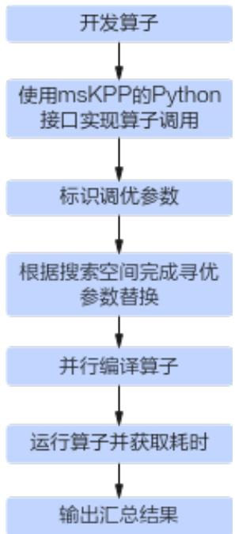  
图3-7 自动调优流程示意图

# Kernel 级自动调优

本章节以模板库catlass-v1-dev分支的examples/00_basic_matmul为例，介绍如何利用msKPP工具提供的Python接口实现Kernel级自动调优。

# 说明

在运行过程中出现任何异常，可通过设置环境变量的方式来查看debug日志以及保留中间文件，便于问题定位。

export MSKPP_LOG_LEVEL=0

步骤1 完成算子Kernel开发后，Kernel函数的定义与实现将会呈现在basic_matmul.cpp文件中，如下所示。// basic_matmul.cpp// ...template <class LayoutA, class LayoutB, class LayoutC>ACT_GLOBAL void BasicMatmul(

GemmCoord problemShape, GM_ADDR gmA, LayoutA layoutA, GM_ADDR gmB, LayoutB layoutB, GM_ADDR gmC, LayoutC layoutC { // Kernel 实现 } // ...

步骤2 参考附录，在examples/00_basic_matmul目录中创建Python脚本文件3.5.5.1basic_matmul_autotune.py与编译脚本文件3.5.5.2 jit_build.sh。

按照如下要求，定义算子Kernel函数的Python接口：在Python脚本中定义basic_matmul函数，其入参需与 $\mathsf { C } { + + }$ 代码中的Kernel函数保持一致。

# basic_matmul_autotune.py   
import mskpp   
def get_kernel(): kernel_file $=$ "./basic_matmul.cpp" kernel_name $=$ "BasicMatmul" build_script $=$ "./jit_build.sh" # kernel compile script config $=$ mskpp.KernelInvokeConfig(kernel_file, kernel_name) gen_file $=$ mskpp.Launcher(config).code_gen() kernel $=$ mskpp.compile(build_script=build_script, launch_src_file $\varprojlim$ gen_file) return kernel   
def basic_matmul(problem_shape, a, layout_a, b, layout_b, c, layout_c): # This function's input arguments must exactly match the kernel function. kernel $=$ get_kernel() blockdim $= 2 0$ # use the correct aic number that matches your hardware return kernel[blockdim](problem_shape, a, layout_a, b, layout_b, c, layout_c, device_id=1) # invoke the   
kernel

步骤3 参考如下代码实现，构造Kernel入参，实现basic_matmul函数的正常运行。

● 若算子Kernel函数入参是GM_ADDR，则构造入参需使用numpy.array类型。若算子Kernel函数入参是 $\cdot + +$ 结构体对象，则需依靠ctypes.Structure在Python中构建一个相同的结构体。

# basic_matmul_autotune.py   
import numpy as np   
from ctypes import Structure, c_uint32, c_int32, c_int64   
class GemmCoord(Structure): _fields_ $=$ [("m", c_uint32), ("n", c_uint32), ("k", c_uint32)] def __init__(self, m, n, k): super().__init__() self.m $=$ (c_uint32)(m) self.n $=$ (c_uint32)(n) self.k $=$ (c_uint32)(k) $@$ staticmethod def get_namespace(): return "Catlass::"   
class RowMajor(Structure): _fields_ $=$ [("shape", c_int32 \* 2), ("stride", c_int64 \* 2)] def __init__(self, rows : int $= 0$ , cols : $\mathsf { i n t } = 0 , \mathsf { l d m } : \mathsf { i n t } = \mathsf { N o }$ ne): super().__init__() self.shape $= ( \mathsf { c \_ i n t } 3 2 \cdot 2 )$ )(rows, cols) if ldm is None: self.stride $= ( \mathsf { c \_ i n t } 6 4 \AA ^ { \star } 2 )$ (cols, 1) else: self.stride $= ( \mathsf { c \_ i n t } 6 4 \AA ^ { \star } 2 )$ ((c_int64)(ldm), 1) $@$ staticmethod def get_namespace(): return "Catlass::layout::"

if __name_ $= =$ II _main_ _": m = 256 n = 512 k = 1024 problem_shape $=$ GemmCoord(m, n, k) layout_a $=$ RowMajor(m, k) layout_b $=$ RowMajor(k, n) layout_c $=$ RowMajor(m, n) ${ \tt a } =$ np.random.randint(1, 2, [m, k]).astype(np.half) $\flat =$ np.random.randint(1, 2, [k, n]).astype(np.half) ${ \mathsf { c } } =$ np.zeros([m, n]).astype(np.half) basic_matmul(problem_shape, a, layout_a, b, layout_b, c, layout_c) # check if the output tensor c is consistent with the golden data golden $=$ np.matmul(a, b) is_equal $=$ np.array_equal(c, golden) result $=$ "success" if is_equal else "failed" print("compare {}.".format(result))

步骤4 运行Python脚本，获得如下提示，说明算子Kernel已可正常通过Python接口拉起。

$\$ 5$ python3 basic_matmul_autotune.py compare success.

步骤5 在算子代码程序basic_matmul.cpp中标识需调优的参数。

在模板参数的声明代码行末尾使用// tunable标记，用于替换"="号后的代码内容。

using L1TileShape $=$ GemmShape<128, 256, $2 5 6 { > }$ ; // tunable using L0TileShape $=$ GemmShape<128, 256, $6 4 >$ ; // tunable

# 说明

除tunable标识的方法之外，还可以通过换行，在需要整行替换的代码行末尾使用// tunable: 别名（L0Shape）方式标记。其中，别名用于搜索空间索引。  
using L0TileShape $=$   
MatmulShape<128, 256, 64>; // tunable: L0Shape

步骤6 通过3.5.4.1 autotune接口的configs入参定义参数搜索空间，每一类参数组合会替换算子Kernel代码中被标记的代码行，然后进行编译、运行并完成Kernel性能采集。搜索空间定义示例可参考如下所示。

# 说明

● 参数替换需合理，不能造成编译或运行错误。  
● 参数替换原则如下（以configs中的第一行为例）：1. 先替换// tunable: L0Shape方式标记的参数，将标记代码行（MatmulShape<128, 256,64>）整行替换为configs中的value字符串（MatmulShape<128, 256, $6 4 >$ ）。2. 再替换// tunable方式标记的代码行，将"="号后的MatmulShape<128, 256, $2 5 6 >$ 替换为configs中value字符串MatmulShape<64, 64, $6 4 >$ 。▪ 不同作用域中，可能会有两个同名的变量被声明。若两个变量均符合匹配规则时，仅第一个变量会被修改。▪ 若其中一个config未匹配成功，该config对应的任务会停止并报错。但其他匹配成功的config将会成功进行参数替换。

$@$ mskpp.autotune(configs=[ # add and try your own config here for a better kernel performance {'L1TileShape': 'GemmShape $^ { \prime < 1 2 8 }$ , 256, $2 5 6 > "$ , 'L0TileShape': 'GemmShape $^ { \prime < 1 2 8 }$ , 256, $6 4 > " 3$ , #0 the same config as in basic_matmul.cpp {'L1TileShape': 'GemmShape $\asymp$ 128, 256, $1 2 8 > "$ , 'L0TileShape': 'GemmShape $\yen 123$ , 256, $6 4 > " 3$ , {'L1TileShape': 'GemmShape<128, 128, $2 5 6 > "$ , 'L0TileShape': 'GemmShape $^ { \prime < 1 2 8 }$ , 128, $6 4 > " 3 ,$ {'L1TileShape': 'GemmShape<64, 128, $1 2 8 >$ , 'L0TileShape': 'GemmShape<64, 128, $1 2 8 > " \}$ , {'L1TileShape': 'GemmShape ${ < } 6 4 _ { \cdot }$ , 128, $2 5 6 >$ , 'L0TileShape': 'GemmShape ${ < } 6 4$ , 128, $1 2 8 > " \}$ , {'L1TileShape': 'GemmShape ${ < } 6 4$ , 128, $5 1 2 >$ , 'L0TileShape': 'GemmShape $< 6 4$ , 128, $1 2 8 > ^ { 1 } \} ,$ {'L1TileShape': 'GemmShape ${ < } 6 4$ , 64, $1 2 8 >$ , 'L0TileShape': 'GemmShape<64, 64, $1 2 8 > " 3$ , {'L1TileShape': 'GemmShape ${ < } 6 4 _ { i }$ , 64, $2 5 6 > "$ , 'L0TileShape': 'GemmShape ${ < } 6 4$ , 64, $1 2 8 > " \}$ , {'L1TileShape': 'GemmShape ${ < } 6 4$ , 64, $5 1 2 >$ , 'L0TileShape': 'GemmShape ${ < } 6 4$ , 64, $1 2 8 > " 3 ,$

{'L1TileShape': 'GemmShape<128, 128, $1 2 8 > "$ , 'L0TileShape': 'GemmShape<128, 128, $1 2 8 > " \}$ , {'L1TileShape': 'GemmShape<128, 128, $2 5 6 > "$ , 'L0TileShape': 'GemmShape<128, 128, $1 2 8 > " \}$ , {'L1TileShape': 'GemmShape $^ { \prime < 1 2 8 }$ , 128, $5 1 2 >$ ', 'L0TileShape': 'GemmShape<128, 128, $1 2 8 > " \} ,$ ], warmup=1000, repeat=10, device_id [0]) # set kernel warmup 1000us

步骤7 执行3.5.5.1 basic_matmul_autotune.py文件运行算子，获得每种参数组合的耗时及最佳调优参数集合。以下仅展示可能的一种命令行输出结果。

# python3 basic_matmul_autotune.py   
No.0: $2 2 . 5 6 2 \mu \ s _ { \mathrm { { \scriptscriptstyle i } } }$ , {'L1TileShape': 'GemmShape<128, 256, $2 5 6 > "$ , 'L0TileShape': 'GemmShape<128, 256, $6 4 > "$ } No.1: 22.109μs, {'L1TileShape': 'GemmShape<128, 256, $1 2 8 > "$ , 'L0TileShape': 'GemmShape<128, 256, $6 4 > "$ } No.2: 17.778μs, {'L1TileShape': 'GemmShape<128, 128, $2 5 6 > "$ , 'L0TileShape': 'GemmShape<128, 128, $6 4 > " ]$ No.3: 15.378μs, {'L1TileShape': 'GemmShape<64, 128, 128>', 'L0TileShape': 'GemmShape<64, 128, $1 2 8 > "$ } No.4: 14.982μs, {'L1TileShape': 'GemmShape<64, 128, 256>', 'L0TileShape': 'GemmShape<64, 128, $1 2 8 > "$ } No.5: 15.671μs, {'L1TileShape': 'GemmShape<64, 128, $5 1 2 >$ , 'L0TileShape': 'GemmShape<64, 128, $1 2 8 > "$ } No.6: 19.592μs, {'L1TileShape': 'GemmShape<64, 64, $1 2 8 >$ ', 'L0TileShape': 'GemmShape<64, 64, $1 2 8 >$ } No.7: $1 8 . 3 4 0 \mu \mathsf { s } ,$ , {'L1TileShape': 'GemmShape ${ < } 6 4$ , 64, $2 5 6 >$ ', 'L0TileShape': 'GemmShape ${ < } 6 4$ , 64, $1 2 8 >$ } No.8: 18.541μs, {'L1TileShape': 'GemmShape<64, 64, $5 1 2 > "$ , 'L0TileShape': 'GemmShape ${ < } 6 4$ , 64, $1 2 8 > "$ } No.9: 20.652μs, {'L1TileShape': 'GemmShape $< 1 2 8$ , 128, $1 2 8 > "$ , 'L0TileShape': 'GemmShape<128, 128, $1 2 8 > " 3$ No.10: 17.728μs, {'L1TileShape': 'GemmShape<128, 128, 256>', 'L0TileShape': 'GemmShape<128, 128, $1 2 8 >$ } No.11: $1 7 . 6 3 7 \mu \mathsf { s } ,$ {'L1TileShape': 'GemmShape<128, 128, $5 1 2 >$ , 'L0TileShape': 'GemmShape<128, 128, $1 2 8 > "$ } Best config: No.4   
compare success.

通过对比得知，No.4为最佳调优参数集合。

# ----结束

# 应用级自动调优

本章节以模板库master分支的examples/00_basic_matmul为例，介绍如何利用msKPP工具提供的Python接口实现对应用级的自动调优。

# 说明

在运行过程中出现任何异常，可通过设置环境变量的方式来查看debug日志以及保留中间文件，便于问题定位。

export MSKPP_LOG_LEVEL=0

步骤1 参考examples/00_basic_matmul示例，使用模板库Device层接口完成算子实现，并分别在115、117行末尾添加// tunable注释，用于替换"="号后的代码内容。

115 using L1TileShape $=$ GemmShape<128, 256, 256>; // tunable 116   
117 using L0TileShape $=$ GemmShape<128, 256, 64>; // tunable

步骤2 在examples/00_basic_matmul目录中创建Python脚本文件3.5.5.3basic_matmul_executable_autotune.py与编译脚本文件3.5.5.4jit_build_executable.sh。

可根据实际需要修改3.5.5.3 basic_matmul_executable_autotune.py脚本中3.5.4.4autotune_v2接口传入的configs参数以搜索自定义tiling参数组合。

步骤3 运行Python脚本basic_matmul_executable_autotune.py，获取每种参数组合的耗时及最佳调优参数集合。以下仅展示可能的一种命令行输出结果。

# python3 basic_matmul_executable_autotune.py No.0: 64.081 us, {'L1TileShape': 'GemmShape<128, 256, 256>', 'L0TileShape': 'GemmShape<128, 256, $6 4 >$ '} No.1: 68.041 us, {'L1TileShape': 'GemmShape<256, 128, $2 5 6 > "$ , 'L0TileShape': 'GemmShape<256, 128, $6 4 >$ '} No.2: 60.701 us, {'L1TileShape': 'GemmShape<128, 128, $2 5 6 >$ , 'L0TileShape': 'GemmShape<128, 128, $6 4 >$ '} No.3: 61.121 us, {'L1TileShape': 'GemmShape<128, 128, $5 1 2 > "$ , 'L0TileShape': 'GemmShape<128, 128, $6 4 > "$ No.4: 62.361 us, {'L1TileShape': 'GemmShape<64, 256, $1 2 8 >$ , 'L0TileShape': 'GemmShape<64, 256, 64>'} No.5: 60.661 us, {'L1TileShape': 'GemmShape<64, 256, $2 5 6 >$ , 'L0TileShape': 'GemmShape ${ < } 6 4 ,$ 256, 64>'} No.6: 58.261 us, {'L1TileShape': 'GemmShape ${ < } 6 4$ , 128, $2 5 6 >$ , 'L0TileShape': 'GemmShape $< 6 4$ , 128, $6 4 > " 1$ }

No.7: 62.381 us, {'L1TileShape': 'GemmShape<128, 128, $2 5 6 > "$ , 'L0TileShape': 'GemmShape<128, 128, $1 2 8 > "$ } No.8: 62.621 us, {'L1TileShape': 'GemmShape<128, 128, $5 1 2 > "$ , 'L0TileShape': 'GemmShape $: < 1 2 8$ , 128, $1 2 8 > " \}$ No.9: 57.501 us, {'L1TileShape': 'GemmShape<64, 128, $2 5 6 >$ , 'L0TileShape': 'GemmShape $< 6 4$ , 128, $1 2 8 > "$ } No.10: 59.281 us, {'L1TileShape': 'GemmShape<64, 128, 512>', 'L0TileShape': 'GemmShape<64, 128, $1 2 8 >$ } No.11: 65.041 us, {'L1TileShape': 'GemmShape<128, 64, 512>', 'L0TileShape': 'GemmShape<128, 64, $1 2 8 > " 3$ No.12: 63.561 us, {'L1TileShape': 'GemmShape $< 6 4$ , 64, 256>', 'L0TileShape': 'GemmShape $< 6 4$ , 64, $2 5 6 > " 1$ } No.13: 65.121 us, {'L1TileShape': 'GemmShape<64, 64, 512>', 'L0TileShape': 'GemmShape<64, 64, $2 5 6 > " 3$ No.14: 65.081 us, {'L1TileShape': 'GemmShape $< 6 4$ , 64, $\boldsymbol { 1 0 2 4 } \mathrm { > }$ ', 'L0TileShape': 'GemmShape ${ < } 6 4$ , 64, $2 5 6 > "$ } Best config: No.9   
autotune results saved in MSKPP_AUTOTUNE_RESULTS_20250604195710.csv

通过对比得知，No.9为最佳调优参数集合。

----结束

# 3.5.4 接口列表

# 3.5.4.1 autotune

功能说明

遍历搜索空间，尝试不同参数组合，展示每个组合的运行耗时与最优组合。

函数原型

def autotune(configs: List[Dict], warmup: int $= 3 0 0$ , repeat: int $= 1$ , device_ids $=$ [0]):

参数说明  

<table><tr><td rowspan=1 colspan=1>参数名</td><td rowspan=1 colspan=1>输入/输出</td><td rowspan=1 colspan=1>说明</td></tr><tr><td rowspan=1 colspan=1>configs</td><td rowspan=1 colspan=1>输入</td><td rowspan=1 colspan=1>搜索空间定义。数据类型：list[dict]。必选参数。</td></tr><tr><td rowspan=1 colspan=1>warmup</td><td rowspan=1 colspan=1>输入</td><td rowspan=1 colspan=1>采集性能前的设备预热时间。通常情况下，预热时间越长，采集到的算子性能越稳定。单位：微秒。可选参数，默认值：1000，取值范围为1~100000之间的整数。</td></tr><tr><td rowspan=1 colspan=1>repeat</td><td rowspan=1 colspan=1>输入</td><td rowspan=1 colspan=1>重放次数，会根据多次重放取运行耗时的平均值作为算子耗时。可选参数，默认值：1，取值范围为1~10000之间的整数。</td></tr><tr><td rowspan=1 colspan=1>device_ids</td><td rowspan=1 colspan=1>输入</td><td rowspan=1 colspan=1>DeviceID列表，目前仅支持单Device模式，如果填写多个DeviceID，只有第一个会生效。可选参数，默认值：[0]。</td></tr></table>

# 返回值说明

无。

# 调用示例

@mskpp.autotune(configs=[ {'L1TileShape': 'MatmulShape ${ < } 6 4$ , 64, $6 4 > "$ , 'L0TileShape': 'MatmulShape<128, 256, $6 4 > " ]$ }, {'L1TileShape': 'MatmulShape ${ < } 6 4$ , 64, $1 2 8 >$ , 'L0TileShape': 'MatmulShape $\yen 123$ , 256, $6 4 > " 3 ,$ {'L1TileShape': 'MatmulShape ${ < } 6 4$ , 128, $1 2 8 > "$ , 'L0TileShape': 'MatmulShape<128, 256, $6 4 > " \}$ , {'L1TileShape': 'MatmulShape ${ < } 6 4$ , 128, $1 2 8 > "$ , 'L0TileShape': 'MatmulShape $< 6 4$ , 256, $6 4 > " 3 ,$ {'L1TileShape': 'MatmulShape $ \yen 128$ , 128, $1 2 8 >$ ', 'L0TileShape': 'MatmulShape $< 1 2 8$ , 256, $6 4 > " 3 ,$ ,   
], warmup $\mathtt { \Pi } = 5 0 0$ , repea $= 1 0$ , device_ids=[0])   
def basic_matmul(problem_shape, a, layout_a, b, layout_b, c, layout_c): kernel $=$ get_kernel() blockdim $= 2 0$ return kernel[blockdim](problem_shape, a, layout_a, b, layout_b, c, layout_c)

# 3.5.4.2 code_gen

功能说明

根据输入的模板库Kernel信息，生成Kernel下发代码。

函数原型

gen_file $=$ mskpp.Launcher(config).code_gen()

参数说明

<table><tr><td rowspan=1 colspan=1>参数名</td><td rowspan=1 colspan=1>输入/输出</td><td rowspan=1 colspan=1>说明</td></tr><tr><td rowspan=1 colspan=1>gen_file</td><td rowspan=1 colspan=1>输入</td><td rowspan=1 colspan=1>指定生成Kernel侧下发代码的文件路径。数据类型：str。可选参数，默认值为_gen_launch.cpp。</td></tr></table>

返回值说明

生成代码的文件路径。

调用示例

config $=$ mskpp.KernelInvokeConfig(kernel_file, kernel_name) gen_file $=$ mskpp.Launcher(config).code_gen()

# 相关类/结构体定义

class KernelInvokeConfig: ... A configuration descriptor for a possible kernel developed based on an Act example ... def __init__(self, kernel_src_file : str, kernel_name : str): pass

# 用户仅能传KernelInvokeConfig类型   
class Launcher: def __init__(self, config: KernelInvokeConfig): ... a class that generates launch source code for a kernel Args: config (KernelInvokeConfig): A configuration descriptor for a kernel ...

# 3.5.4.3 compile

功能说明

编译Kernel下发代码，返回一个可执行的Kernel对象。

函数原型

kernel $=$ compile(build_script, gen_file)

参数说明  

<table><tr><td rowspan=1 colspan=1>参数名</td><td rowspan=1 colspan=1>输入/输出</td><td rowspan=1 colspan=1>说明</td></tr><tr><td rowspan=1 colspan=1>build_script</td><td rowspan=1 colspan=1>输入</td><td rowspan=1 colspan=1>用于模板库Kernel编译的脚本。数据类型：str。必选参数。</td></tr><tr><td rowspan=1 colspan=1>gen_file</td><td rowspan=1 colspan=1>输入</td><td rowspan=1 colspan=1>由code_gen接口生成的Kernel下发代码文件路径，一般直接使用code_gen接口返回值。数据类型：str。必选参数。</td></tr><tr><td rowspan=1 colspan=1>output_bin_path</td><td rowspan=1 colspan=1>输入</td><td rowspan=1 colspan=1>指定编译生成的可执行文件路径。数据类型：str。可选参数，默认值：_gen_module.so。</td></tr><tr><td rowspan=1 colspan=1>use_cache</td><td rowspan=1 colspan=1>输入</td><td rowspan=1 colspan=1>开启后不执行编译，加载output_bin_path所指定的文件。数据类型：bool。可选参数，默认值：False。</td></tr></table>

# 返回值说明

可运行的Kernel对象，类型：CompiledKernel，支持如下方式调用kernel：kernel[blockdim](arg1, arg2, ..., timeout=-1, device_id ${ \boldsymbol { \mathbf { \mathit { \sigma } } } } = 0$ , repeat $: = 1$ )，其中arg1、arg2、...是Kernel的入参。

# 调用示例

kernel $=$ compile(build_script, gen_file) kernel[blockdim](arg1, arg2, ..., device_id=0)

表 3-6 CompiledKernel 可选入参介绍  

<table><tr><td rowspan=1 colspan=1>参数名</td><td rowspan=1 colspan=1>输入/输出</td><td rowspan=1 colspan=1>说明</td></tr><tr><td rowspan=1 colspan=1>device_id</td><td rowspan=1 colspan=1>输入</td><td rowspan=1 colspan=1>NPU设备ID，设置运行ST测试用例的昇腾AI处理器的ID。数据类型：int。若未设置此参数，默认为0。</td></tr><tr><td rowspan=1 colspan=1>timeout</td><td rowspan=1 colspan=1>输入</td><td rowspan=1 colspan=1>camodel仿真场景需要默认设置较长超时时间，设置为-1时表示不限制。数据类型：int。单位:ms，默认值为300000。</td></tr><tr><td rowspan=1 colspan=1>repeat</td><td rowspan=1 colspan=1>输入</td><td rowspan=1 colspan=1>重复运行次数，默认值为1。数据类型：int。</td></tr><tr><td rowspan=1 colspan=1>stream</td><td rowspan=1 colspan=1>输入</td><td rowspan=1 colspan=1>预留参数。</td></tr><tr><td rowspan=1 colspan=1>kernel_name</td><td rowspan=1 colspan=1>输入</td><td rowspan=1 colspan=1>预留参数。</td></tr></table>

# 3.5.4.4 autotune_v2

功能说明

遍历搜索空间，尝试不同参数组合，展示每个组合的运行耗时与最优组合。

函数原型

def autotune_v2(configs: List[Dict], warmup_times $= 5$ )

参数说明  

<table><tr><td rowspan=1 colspan=1>参数名</td><td rowspan=1 colspan=1>输入/输出</td><td rowspan=1 colspan=1>说明</td></tr><tr><td rowspan=1 colspan=1>configs</td><td rowspan=1 colspan=1>输入</td><td rowspan=1 colspan=1>搜索空间定义。数据类型：list[dict]。必选参数。</td></tr><tr><td rowspan=1 colspan=1>warmup_times</td><td rowspan=1 colspan=1>输入</td><td rowspan=1 colspan=1>采集性能前的设备预热次数。可选参数，默认值：5，取值范围为1~500之间的整数。</td></tr></table>

# 返回值说明

无。

调用示例

@mskpp.autotune_v2(configs=[ {'L1TileShape': 'GemmShape<128, 256, $2 5 6 > "$ , 'L0TileShape': 'GemmShape $^ { \prime < 1 2 8 }$ , 256, $6 4 > " 3 ,$ {'L1TileShape': 'GemmShape $< 2 5 6$ , 128, $2 5 6 > "$ , 'L0TileShape': 'GemmShape $\mathtt { < } 2 5 6$ , 128, $6 4 > " 3 ,$ {'L1TileShape': 'GemmShape<128, 128, $2 5 6 > "$ , 'L0TileShape': 'GemmShape<128, 128, $6 4 > " \}$ , {'L1TileShape': 'GemmShape<128, 128, $5 1 2 > "$ , 'L0TileShape': 'GemmShape $^ { \prime < 1 2 8 }$ , 128, $6 4 > " 3 ,$ {'L1TileShape': 'GemmShape ${ < } 6 4$ , 256, $1 2 8 >$ , 'L0TileShape': 'GemmShape $< 6 4$ , 256, $6 4 > " 3$ ,   
], warmup_time $\scriptstyle = 1 0$ )   
def run_executable(m, n, k, device_id): src_file $=$ "./basic_matmul.cpp" build_script $=$ "./jit_build_executable.sh" # executable compile script executable $=$ mskpp.compile_executable(build_script=build_script, src_file $\varprojlim$ src_file, use_cache=False) return executable(m, n, k, device_id)

# 3.5.4.5 compile_executable

功能说明

编译代码，返回一个可执行的executable对象。

函数原型

executable $=$ compile_executable(build_script, src_file)

参数说明  

<table><tr><td rowspan=1 colspan=1>参数名</td><td rowspan=1 colspan=1>输入/输出</td><td rowspan=1 colspan=1>说明</td></tr><tr><td rowspan=1 colspan=1>build_script</td><td rowspan=1 colspan=1>输入</td><td rowspan=1 colspan=1>用于编译被调优应用的脚本文件路径。数据类型：str。必选参数。</td></tr><tr><td rowspan=1 colspan=1>src_file</td><td rowspan=1 colspan=1>输入</td><td rowspan=1 colspan=1>代码文件路径。数据类型：str。必选参数。</td></tr><tr><td rowspan=1 colspan=1>output_bin_path</td><td rowspan=1 colspan=1>输入</td><td rowspan=1 colspan=1>指定编译生成的可执行文件路径。数据类型：str。可选参数，默认值：_gen_executable。</td></tr><tr><td rowspan=1 colspan=1>use_cache</td><td rowspan=1 colspan=1>输入</td><td rowspan=1 colspan=1>开启后不执行编译，加载output_bin_path所指定的文件。数据类型：bool。可选参数，默认值：False。说明当使用msDebug工具拉起compile接口时，需配置use_cache=True。</td></tr><tr><td rowspan=1 colspan=1>profiling_cmd</td><td rowspan=1 colspan=1>输入</td><td rowspan=1 colspan=1>预留参数。</td></tr></table>

# 返回值说明

可执行程序对象executable，类型：CompiledExecutable，支持如下方式调用：executable(arg1, arg2, ...)，其中arg1、arg2、...是程序自定义入参。

# 调用示例

executable $=$ compile_executable(build_script, src_file) executable(a, b, c)

# 3.5.5 附录

# 3.5.5.1 basic_matmul_autotune.py

import numpy as np   
from ctypes import Structure, c_uint32, c_int32, c_int64   
import mskpp

def get_kernel(): kernel_file $=$ "./basic_matmul.cpp" kernel_name $=$ "BasicMatmul" build_script $=$ "./jit_build.sh" # kernel compile script config $=$ mskpp.KernelInvokeConfig(kernel_file, kernel_name) gen_file $=$ mskpp.Launcher(config).code_gen() kernel $=$ mskpp.compile(build_script=build_script, launch_src_file $=$ gen_file) return kernel

To enable the autotune feature, it is required to add the "// tunable" marker to the code lines in "basic_matmul.cpp", e.g.

51 using L1TileShape $=$ GemmShape ${ < } 1 2 8$ , 256, $2 5 6 { > }$ // tunable   
52 using L0TileShape $=$ GemmShape $^ { < 1 2 8 }$ , 256, $6 4 >$ ; // tunable

@mskpp.autotune(configs=[ {'L1TileShape': 'GemmShape $^ { \prime < 1 2 8 }$ , 256, $2 5 6 > "$ , 'L0TileShape': 'GemmShape $^ { \prime < 1 2 8 }$ , 256, $6 4 > " 3 ,$ , #0 the same   
config as in basic_matmul.cpp {'L1TileShape': 'GemmShape $\yen 123$ , 256, $1 2 8 > "$ , 'L0TileShape': 'GemmShape $^ { \prime < 1 2 8 }$ , 256, $6 4 > "$ }, {'L1TileShape': 'GemmShape<128, 128, $2 5 6 >$ ', 'L0TileShape': 'GemmShape<128, 128, $6 4 > " ]$ , {'L1TileShape': 'GemmShape ${ < } 6 4$ , 128, $1 2 8 >$ , 'L0TileShape': 'GemmShape $< 6 4$ , 128, $1 2 8 > " \} ,$ {'L1TileShape': 'GemmShape ${ < } 6 4 _ { i }$ , 128, $2 5 6 >$ , 'L0TileShape': 'GemmShape $< 6 4$ , 128, $1 2 8 > " \}$ , {'L1TileShape': 'GemmShape<64, 128, $5 1 2 >$ , 'L0TileShape': 'GemmShape<64, 128, $1 2 8 > ^ { 1 } \} ,$ {'L1TileShape': 'GemmShape ${ < } 6 4$ , 64, $1 2 8 >$ , 'L0TileShape': 'GemmShape ${ < } 6 4$ , 64, $1 2 8 > " \}$ , {'L1TileShape': 'GemmShape ${ < } 6 4$ , 64, $2 5 6 > "$ , 'L0TileShape': 'GemmShape ${ < } 6 4$ , 64, $1 2 8 > " \}$ , {'L1TileShape': 'GemmShape<64, 64, $5 1 2 >$ , 'L0TileShape': 'GemmShape ${ < } 6 4$ , 64, $1 2 8 > 1 7$ }, {'L1TileShape': 'GemmShape $< 1 2 8$ , 128, $1 2 8 >$ ', 'L0TileShape': 'GemmShape<128, 128, $1 2 8 > " \}$ , {'L1TileShape': 'GemmShape $< 1 2 8$ , 128, $2 5 6 > "$ , 'L0TileShape': 'GemmShape $< 1 2 8$ , 128, $1 2 8 > " \}$ , {'L1TileShape': 'GemmShape<128, 128, $5 1 2 >$ ', 'L0TileShape': 'GemmShape<128, 128, $1 2 8 > ^ { 1 } \} ,$

], warmup $\mathord {  } 1 0 0 0$ , repeat=10, device_ids=[1])

def basic_matmul(problem_shape, a, layout_a, b, layout_b, c, layout_c): # This function's input arguments must exactly match the kernel function. kernel $=$ get_kernel() blockdim $= 2 0$ # use the correct aic number that matches your hardware return kernel[blockdim](problem_shape, a, layout_a, b, layout_b, c, layout_c, device_id=1) # invoke the   
kernel   
class GemmCoord(Structure): _fields_ $=$ [("m", c_uint32), ("n", c_uint32), ("k", c_uint32)] def __init__(self, m, n, k): super().__init__() self.m $=$ (c_uint32)(m) self.n $=$ (c_uint32)(n) self.k $=$ (c_uint32)(k) @staticmethod def get_namespace(): return "Catlass::"   
class RowMajor(Structure): _fields_ $=$ [("shape", c_int32 \* 2), ("stride", $\mathsf { c } \mathsf { i n t } 6 4 ^ { \star } 2 \rangle$ )] def __init__(self, rows : int $= 0$ , cols $:$ int $= 0$ , ldm : int $=$ None): super().__init__() self.shape $: = ( \mathsf { c } _ { - } \mathsf { i n t } 3 2 \star 2 )$ )(rows, cols) if ldm is None: self.stride $= ( \mathsf { c \_ i n t } 6 4 \AA ^ { \star } 2 )$ (cols, 1) else: self.stride $= ( \mathsf { c \_ i n t } 6 4 \AA ^ { \star } 2 )$ ((c_int64)(ldm), 1) @staticmethod def get_namespace(): return "Catlass::layout::"   
if __name__ $= = \cdot$ "__main__": # prepare kernel input/output $m = 2 5 6$ ${ \mathsf n } = 5 1 2$ $\ k = 1 0 2 4$ problem_shape $=$ GemmCoord(m, n, k) layout_a $=$ RowMajor(m, k) layout_b $=$ RowMajor(k, n) layout_c $=$ RowMajor(m, n) ${ \tt a } =$ np.random.randint(1, 2, [m, k]).astype(np.half) $\flat =$ np.random.randint(1, 2, [k, n]).astype(np.half) ${ \mathsf { c } } =$ np.zeros([m, n]).astype(np.half) # invoke kernel basic_matmul(problem_shape, a, layout_a, b, layout_b, c, layout_c) # check if the output tensor c is consistent with the golden data golden $=$ np.matmul(a, b) is_equal $=$ np.array_equal(c, golden) result $=$ "success" if is_equal else "failed" print("compare {}.".format(result))

# 3.5.5.2 jit_build.sh

#!/bin/bash   
# default input file   
LAUNCH_SRC_FILE="_gen_launch.cpp"   
OUTPUT_LIB_FILE="_gen_module.so"   
if [ \$# -ge 1 ] ; then LAUNCH_SRC_FILE $\cdot = \$ 1$   
fi   
if [ \$# -ge 2 ]; then OUTPUT_LIB_FIL $= \$ 2$   
fi   
LAUNCH_OBJ_FILE $\mathop { \left. \sum \right.} $ "\${LAUNCH_SRC_FILE%.cpp}.o"   
PYTHON_INCLUDE $= \$ 5$ (python3 -c "import sysconfig; print(sysconfig.get_path('include'))")   
cd "\$(dirname $" \$ 0"$ )"   
bisheng -O2 -fPIC -std $= c + + 1 7$ -xcce --cce-aicore-arch=dav-c220 \ -DL2_CACHE_HINT \ -mllvm -cce-aicore-stack-size=0x8000 \ -mllvm -cce-aicore-function-stack-size=0x8000 \ -mllvm -cce-aicore-record-overflow=true \ -mllvm -cce-aicore-addr-transform \ -mllvm -cce-aicore-dcci-insert-for-scalar=false \ -I\$ASCEND_HOME_PATH/compiler/tikcpp \ -I\$ASCEND_HOME_PATH/include/aclnn \ -I\$ASCEND_HOME_PATH/compiler/tikcpp/tikcfw \ -I\$ASCEND_HOME_PATH/compiler/tikcpp/tikcfw/impl \

-I\$ASCEND_HOME_PATH/compiler/tikcpp/tikcfw/interface \ -I\$ASCEND_HOME_PATH/include \ -I\$ASCEND_HOME_PATH/include/experiment/runtime \ -I\$ASCEND_HOME_PATH/include/experiment/msprof \ -I\$PYTHON_INCLUDE \ -I../../include \ -I../common \ -Wno-macro-redefined -Wno-ignored-attributes \ -L\$ASCEND_HOME_PATH/lib64 \ -lruntime -lplatform -lstdc $^ { + + }$ -lascendcl -lm -ltiling_api -lc_sec -ldl -lnnopbase \ \$LAUNCH_SRC_FILE --shared -o \$OUTPUT_LIB_FILE exit $\$ 2$

# 3.5.5.3 basic_matmul_executable_autotune.py

import mskpp   
@mskpp.autotune_v2(configs=[ {'L1TileShape': 'GemmShape<128, 256, $2 5 6 > "$ , 'L0TileShape': 'GemmShape $^ { \prime < 1 2 8 }$ , 256, $6 4 > " ]$ , #0 the same   
config as in basic_matmul.cpp {'L1TileShape': 'GemmShape $\asymp$ 256, 128, $2 5 6 > "$ , 'L0TileShape': 'GemmShape $\scriptscriptstyle { \ K 2 5 6 }$ , 128, $6 4 > " 3$ , {'L1TileShape': 'GemmShape<128, 128, $2 5 6 > "$ , 'L0TileShape': 'GemmShape<128, 128, $6 4 > "$ }, {'L1TileShape': 'GemmShape $<$ 128, 128, $5 1 2 >$ ', 'L0TileShape': 'GemmShape ${ < } 1 2 8 .$ , 128, $6 4 > " 3 ,$ {'L1TileShape': 'GemmShape<64, 256, $1 2 8 >$ , 'L0TileShape': 'GemmShape ${ < } 6 4$ , 256, $6 4 > " \}$ , {'L1TileShape': 'GemmShape<64, 256, $2 5 6 >$ , 'L0TileShape': 'GemmShape $< 6 4$ , 256, $6 4 > " 3$ , {'L1TileShape': 'GemmShape<64, 128, $2 5 6 >$ , 'L0TileShape': 'GemmShape ${ < } 6 4$ , 128, $6 4 > " 3$ , {'L1TileShape': 'GemmShape<128, 128, $2 5 6 > "$ , 'L0TileShape': 'GemmShape $^ { \prime < 1 2 8 }$ , 128, $1 2 8 > " \}$ , {'L1TileShape': 'GemmShape<128, 128, $5 1 2 >$ ', 'L0TileShape': 'GemmShape<128, 128, $1 2 8 > " \}$ , {'L1TileShape': 'GemmShape ${ < } 6 4$ , 128, $2 5 6 >$ , 'L0TileShape': 'GemmShape $< 6 4$ , 128, $1 2 8 > " \}$ , {'L1TileShape': 'GemmShape ${ < } 6 4 _ { \cdot }$ , 128, $5 1 2 >$ , 'L0TileShape': 'GemmShape ${ < } 6 4$ , 128, $1 2 8 > ^ { 1 } \} ,$ {'L1TileShape': 'GemmShape $< 1 2 8$ , 64, $5 1 2 >$ , 'L0TileShape': 'GemmShape<128, 64, $1 2 8 > ^ { 1 } \} ,$ {'L1TileShape': 'GemmShape ${ < } 6 4$ , 64, $2 5 6 > "$ , 'L0TileShape': 'GemmShape ${ < } 6 4$ , 64, $2 5 6 > " 3$ , {'L1TileShape': 'GemmShape ${ < } 6 4$ , 64, $5 1 2 >$ , 'L0TileShape': 'GemmShape ${ < } 6 4$ , 64, $2 5 6 > " 3$ , {'L1TileShape': 'GemmShape ${ < } 6 4$ , 64, $1 0 2 4 > ^ { \prime }$ , 'L0TileShape': 'GemmShape $< 6 4$ , 64, $2 5 6 > " 3$ ,   
], warmup_time $\scriptstyle = 1 0$ )   
def run_executable $( \mathsf { m } , \mathsf { n } , \mathsf { k } ,$ device_id): kernel_file $=$ "../../00_basic_matmul/basic_matmul.cpp" build_script $=$ "jit_build_executable.sh" # executable compile script executable $=$ mskpp.compile_executable(build_script=build_script, src_file $\Leftarrow$ kernel_file, use_cache=False) return executable(m, n, k, device_id)   
if __name__ $= =$ "__main__": $m = 2 5 6$ ${ \mathsf n } = 5 1 2$ $\ k = 1 0 2 4$ device_id $= 0$ run_executable $( \mathsf { m } , \mathsf { n } , \mathsf { k } ,$ device_id)

# 3.5.5.4 jit_build_executable.sh

#!/bin/sh   
# default input file   
LAUNCH_SRC_FILE="_gen_launch.cpp"   
# OUTPUT_LIB_FILE="_gen_module.so"   
OUTPUT_LIB_FILE="_gen_executable"   
if [ \$# -ge 1 ] ; then LAUNCH_SRC_FIL $: = \$ 1$   
fi   
if [ \$# -ge 2 ]; then OUTPUT_LIB_FILE $: = \$ 2$   
fi   
LAUNCH_OBJ_FILE="\${LAUNCH_SRC_FILE%.cpp}.o"   
PYTHON_INCLUDE $= \$ 5$ (python3 -c "import sysconfig; print(sysconfig.get_path('include'))")   
cd "\$(dirname " $" \$ 0"$ )"   
bisheng -O2 -std $: c + + 1 7$ -xcce --cce-aicore-arch $=$ dav-c220 \ -mllvm -cce-aicore-stack-siz $\scriptstyle : = 0 \times 8 0 0 0$ \ -mllvm -cce-aicore-function-stack-size=0x8000 \ -mllvm -cce-aicore-record-overflow=true \ -mllvm -cce-aicore-addr-transform \ -mllvm -cce-aicore-dcci-insert-for-scalar=false \ -DL2_CACHE_HINT \

-I\$ASCEND_HOME_PATH/compiler/tikcpp \ -I\$ASCEND_HOME_PATH/include/aclnn \ -I\$ASCEND_HOME_PATH/compiler/tikcpp/tikcfw \ -I\$ASCEND_HOME_PATH/compiler/tikcpp/tikcfw/impl \ -I\$ASCEND_HOME_PATH/compiler/tikcpp/tikcfw/interface \ -I\$ASCEND_HOME_PATH/include \ -I\$ASCEND_HOME_PATH/include/experiment/runtime \ -I\$ASCEND_HOME_PATH/include/experiment/msprof \ -I../../../include \ -I../../common \ -L\${ASCEND_HOME_PATH}/lib64 \ -Wno-macro-redefined -Wno-ignored-attributes \ -lruntime -lstdc++ -lascendcl -lm -ltiling_api -lplatform -lc_sec -ldl -lnnopbase \ \$LAUNCH_SRC_FILE -o \$OUTPUT_LIB_FILE exit $\$ 7$

# 3.6 FAQ

# 3.6.1 运行 Kernel 时提示权限错误

# 现象描述

运行Kernel时出现以下报错：

raise PermissionError(f'Path {path} cannot have write permission of group.') PermissionError: Path /any_path/_gen_module.so cannot have write permission of group.

# 错误原因

当前用户创建的文件的默认权限过大（具有group写权限）。

# 解决措施

先使用umask -S命令查询权限配置，再使用umask 0022命令调整权限配置。$\$ 5$ umask -S  
$\$ 5$ umask 0022  
u=rwx,g=rx,o=rx

# 4 算子工程创建（msOpGen）

工具概述  
使用前准备  
创建算子工程  
算子开发  
算子编译部署  
查看算子仿真流水图  
典型案例

# 4.1 工具概述

# 工具概述

完成算子分析&原型定义后，可使用算子工程工具（msOpGen，MindStudio OpsGenerator）生成自定义算子工程，并进行编译部署，具体流程请参考图4-1。

# 说明

在TBE及AI CPU算子开发场景中，msOpGen工具的使用详情请参考9.1.1 基于msOpGen工具创建算子工程及9.1.2 算子编译部署。由于TBE/TIK算子开发方式已不再对外开放，TBE/TIKSample将于MindStudio下个版本下线。

具有如下功能：

● 基于算子原型定义输出算子工程。  
● 基于性能仿真环境生成的dump数据文件输出算子仿真流水图文件。

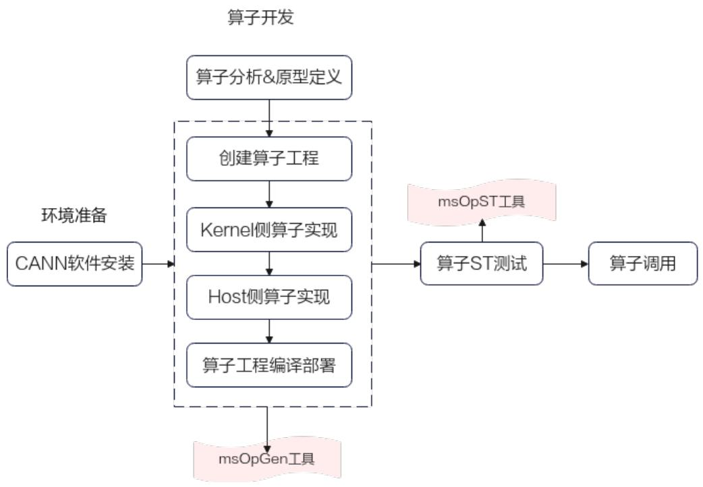  
图 4-1 msOpGen 工具使用流程介绍

msOpGen目前已支持的功能如下：包括算子工程创建、算子实现（Host侧&Kernel侧）、算子工程编译部署以及解析算子仿真流水图文件等。

表 4-1 msOpGen 工具功能  

<table><tr><td rowspan=1 colspan=1>功能</td><td rowspan=1 colspan=1>链接</td></tr><tr><td rowspan=1 colspan=1>算子工程创建</td><td rowspan=1 colspan=1>4.3创建算子工程</td></tr><tr><td rowspan=1 colspan=1>算子实现（Host侧&amp;Kernel侧）</td><td rowspan=1 colspan=1>4.4算子开发</td></tr><tr><td rowspan=1 colspan=1>算子工程编译部署</td><td rowspan=1 colspan=1>4.5算子编译部署</td></tr><tr><td rowspan=1 colspan=1>解析算子仿真流水图文件</td><td rowspan=1 colspan=1>4.6查看算子仿真流水图</td></tr></table>

# 命令汇总

执行如下命令，参数说明请参见表4-2。

# 说明

用户按照输入的配置参数生成算子模板后，建议在运行前确认算子工程代码的安全性。msopgen gen -i {\*.json} -f {framework type} -c {Compute Resource} -lan cpp -out {Output Path}

表 4-2 创建算子工程参数说明  

<table><tr><td colspan="1" rowspan="1">参数名称</td><td colspan="1" rowspan="1">参数描述</td><td colspan="1" rowspan="1">是否必选</td></tr><tr><td colspan="1" rowspan="1">gen</td><td colspan="1" rowspan="1">用于生成算子开发交付件。</td><td colspan="1" rowspan="1">是</td></tr><tr><td colspan="1" rowspan="1">-i，--input</td><td colspan="1" rowspan="1">算子原型定义文件（.json）路径，可配置为绝对路径或者相对路径。工具执行用户需要有此路径的可读权限。</td><td colspan="1" rowspan="1">是</td></tr><tr><td colspan="1" rowspan="1">-f，--framework</td><td colspan="1" rowspan="1">框架类型。·默认为TensorFlow框架，默认值：tf或者tensorflow·Caffe框架，参数值：caffe说明自定义Ascend C算子不支持Caffe框架。·PyTorch框架，参数值：pytorch·MindSpore框架，参数值：ms或mindspore·ONN×框架，参数值：onnx说明·所有参数值大小写不敏感。TBE&amp;TIK不支持单算子API调用，默认生成TensorFlow框架。Ascend C算子工程支持TensorFlow框架、PyTorch框架和单算子APi调用，默认生成TensorFlow框架。当用户使用-f aclnn时，生成Ascend C简易算子工程，否则保持原功能特性生成。</td><td colspan="1" rowspan="1">否</td></tr><tr><td colspan="1" rowspan="1">-lan，--language</td><td colspan="1" rowspan="1">算子编码语言。·cpp:基于Ascend C编程框架，使用C/C++编程语言进行开发。·py：基于DSL和TIK算子编程框架，使用Python编程语言进行开发。默认值：py。说明cpp仅适用于Ascend C算子开发场景。</td><td colspan="1" rowspan="1">否</td></tr><tr><td colspan="1" rowspan="1">-C，--compute_unit</td><td colspan="1" rowspan="1">·算子使用的计算资源。配置格式为：ai_core-{socversion}，ai_core与{socversion}之间用中划线“-”连接。请根据实际昇腾AI处理器版本进行选择。说明AI处理器的型号&lt;soc_version&gt;请通过如下方式获取：·非Atlas A3 训练系列产品/Atlas A3推理系列产品：在安装昇腾Al处理器的服务器执行npu-smi info命令进行查询，获取ChipName信息。实际配置值为AscendChip Name,例如ChipName取值为xxxyy，实际配置值为Ascendxxxyy。当Ascendxxxyy为代码样例的路径时，需要配置ascendxxxy。Atlas A3训练系列产品/Atlas A3推理系列产品：在安装昇腾AI处理器的服务器执行npu-smi info-tboard -i id -cchip_id命令进行查询，获取ChipName和NPUName信息，实际配置值为Chip Name_NPUName。例如ChipName取值为Ascendxxx，NPUName取值为1234，实际配置值为Ascendxxx_1234。当Ascendxxx_1234为代码样例的路径时，需要配置ascendxxx_1234。其中：·id：设备id，通过npu-smi info-l命令查出的NPU ID即为设备id。）chip_id:芯片id，通过npu-smi info-m命令查出的Chip ID即为芯片id。基于同系列的AI处理器型号创建的算子工程，其基础功能（基于该工程进行算子开发、编译和部署）通用。·针对AI CPU算子，请配置为：aicpu。说明在Atlas A3训练系列产品/Atlas A3推理系列产品场景下,请勿在编译时使用以下编译选项，否则会导致机器异常。·-march=armv8-a+lse·-march=armv8.1-a·-march=armv8.2-a·-march=armv8.3-a</td><td colspan="1" rowspan="1">是</td></tr><tr><td colspan="1" rowspan="1">-out，--output</td><td colspan="1" rowspan="1">生成文件所在路径，可配置为绝对路径或者相对路径，并且工具执行用户具有可读写权限。若不配置，则默认生成在执行命令的当前路径。说明若用户指定的输出目录中存在与模板工程重名的文件，输出目录中的文件将会被模板工程的文件覆盖。</td><td colspan="1" rowspan="1">否</td></tr><tr><td colspan="1" rowspan="1">-m，--mode</td><td colspan="1" rowspan="1">生成交付件模式。·0：创建新的算子工程，若指定的路径下已存在算子工程，则会报错退出。·1：在已有的算子工程中追加算子。默认值：0。</td><td colspan="1" rowspan="1">否</td></tr><tr><td colspan="1" rowspan="1">-op，-operator</td><td colspan="1" rowspan="1">配置算子的类型，如：Conv2DTik。若不配置此参数，当算子原型定义文件中存在多个算子时，工具会提示用户选择算子。</td><td colspan="1" rowspan="1">否</td></tr><tr><td colspan="1" rowspan="1">-h，--help</td><td colspan="1" rowspan="1">输出帮助信息。</td><td colspan="1" rowspan="1">否</td></tr></table>

# 补充说明

msOpGen工具其他参数说明可参考表4-3。

表 4-3 参数说明  

<table><tr><td rowspan=1 colspan=1>参数名称</td><td rowspan=1 colspan=1>参数描述</td><td rowspan=1 colspan=1>说明</td></tr><tr><td rowspan=1 colspan=1>compile</td><td rowspan=1 colspan=1>编译TBE&amp;AI CPU算子工程时使用。</td><td rowspan=1 colspan=1>具体请参见9.1.2.3算子交付件独立编译</td></tr></table>

# 4.2 使用前准备

请参考2 环境准备，完成相关环境变量的配置。然后，可直接使用msOpGen工具的相关功能。

# 4.3 创建算子工程

步骤1 编写算子的原型定义json文件，用于生成算子开发工程。json文件的配置参数详细说明请参考表4-4。

例如，AddCustom算子的json文件命名为add_custom.json，文件内容如下：

{ "op": "AddCustom", "input_desc": [ { "name": "x", "param_type": "required", "format": [ "ND", "ND", "ND" ], "type": [ "fp16", "float", "int32" ] }, { "name": "y", "param_type": "required", "format": [ "ND", "ND",

"ND" ], "type": [ "fp16", "float", "int32" ] } ], "output_desc": [ { "name": "z", "param_type": "required", "format": [ "ND", "ND", "ND" ], "type": [ "fp16", "float", "int32" ] } ] }

例如，ReduceMaxCustom算子（包含属性）的json文件命名为reduce_max_custom.json，文件内容如下：

{ "op": "ReduceMaxCustom", "input_desc": [ { "name": "x", "param_type": "required", "format": ["ND"], "type": ["float16"] } ], "output_desc": [ { "name": "y", "param_type": "required", "format": ["ND"], "type": ["float16"] },{ "name": "idx", "param_type": "required", "format": ["ND"], "type": ["int32"] } ], "attr": [ { "name": "reduceDim", "param_type": "required", "type": "int" },{ "name": "isKeepDim", "param_type": "optional", "type": "int", "default_value": 1 }

<table><tr><td>}</td></tr><tr><td></td></tr><tr><td>1</td></tr></table>

表 4-4 json 文件配置参数说明  

<table><tr><td colspan="2" rowspan="1">配置字段</td><td colspan="1" rowspan="1">类型</td><td colspan="1" rowspan="1">含义</td><td colspan="1" rowspan="1">是否必选</td></tr><tr><td colspan="1" rowspan="1">op</td><td colspan="1" rowspan="1"></td><td colspan="1" rowspan="1">字符串</td><td colspan="1" rowspan="1">算子的Operator Type。</td><td colspan="1" rowspan="1">是</td></tr><tr><td colspan="1" rowspan="4">input_desc</td><td colspan="1" rowspan="1"></td><td colspan="1" rowspan="1">列表</td><td colspan="1" rowspan="1">输入参数描述。</td><td colspan="1" rowspan="4">否</td></tr><tr><td colspan="1" rowspan="1">name</td><td colspan="1" rowspan="1">字符串</td><td colspan="1" rowspan="1">算子输入参数的名称。</td></tr><tr><td colspan="1" rowspan="1">param_type</td><td colspan="1" rowspan="1">字符串</td><td colspan="1" rowspan="1">参数类型:required（必选）optional（可选）：dynamic（动态输入）未配置默认为required（必选）。</td></tr><tr><td colspan="1" rowspan="1">format</td><td colspan="1" rowspan="1">列表</td><td colspan="1" rowspan="1">针对类型为Tensor的参数，配置为Tensor支持的数据排布格式。包含如下取值：ND、NHWC、NCHW、HWCN、NC1HWC0、FRACTAL_Z等。说明format与type需一一对应。若仅填充其中一项的唯一值，msOpGen工具将会以未填充项的唯一输入值为准自动补充至已填充项的长度。例如用户配置为format:["ND"] /type:["fp16","float","int32"]，msOpGen工具将会以format的唯一输入值（"ND"）为准自动补充至type参数的长度，自动补充后的配置为format:["ND","ND","ND"]/type:["fp16","float","int32"]。</td></tr><tr><td colspan="2">配置字段</td><td>类型 含义</td><td></td><td>是否必选</td></tr><tr><td></td><td>type</td><td>列表</td><td>算子参数的类型。 ·Ascend C或TBE算子取值范围： float、half、float16 (fp16)、 float32 (fp32)、int8、int16、 int32、int64、uint8、uint16、 uint32、uint64、qint8、qint16、 qint32、quint8、quint16、 quint32、bool、double、string、 resource、complex64、 complex128、bf16、numbertype、</td><td></td></tr><tr><td colspan="2" rowspan="1">配置字段</td><td colspan="1" rowspan="1">类型</td><td colspan="1" rowspan="1">含义</td><td colspan="1" rowspan="1">是否必选</td></tr><tr><td colspan="1" rowspan="1"></td><td colspan="2" rowspan="2"></td><td colspan="1" rowspan="2">I64_5HD、I64_FracZ、I64_FracNZ、I64_C1HWNCoC0、I64_NCHW、I64_NHWC、I64_HWCN、I64_NDHWC、U64_None、U64_Default、U64_5HD、U64_FracZ、U64_FracNZ、U64_C1HWNCoC0、U64_NCHW、U64_NHWC、U64_HWCN、U64_NDHWC、F16_None、F16_Default、F16_5HD、F16_FracZ、F16_FracNZ、F16_C1HWNCoC0、F16_NCHW、F16_NHWC、F16_HWCN、F16_NDHWCi、F16_FracZNLSTM、F32_None、F32_Default、F32_5HD、F32_FracZ、F32_FracNZ、F32_C1HWNCoC0、F32_NCHW、F32_NHWC、F32_HWCN、F32_NDHWC、F32_FracZNLSTM、F64_None、F64_Default、F64_5HD、F64_FracZ、F64_FracNZ、F64_C1HWNCoC0、F64_NCHW、F64_NHWC、F64_HWCN、F64_NDHWC。说明不同计算操作支持的数据类型不同，详细请参见《Ascend C算子开发接口》。format与type需一一对应。若仅填充其中一项的唯一值，msOpGen工具将会以未填充项的唯一输入值为准自动补充至已填充项的长度。例如用户配置为format:["ND"] /type:["fp16","float","int32"]，msOpGen工具将会以format的唯一输入值（"ND"）为准自动补充至type参数的长度，自动补充后的配置为format:["ND","ND","ND"]/type:["fp16","float","int32"]。</td><td colspan="1" rowspan="2"></td></tr><tr><td colspan="1" rowspan="1"></td></tr><tr><td colspan="1" rowspan="3">output_desc</td><td colspan="1" rowspan="1"></td><td colspan="1" rowspan="1">列表</td><td colspan="1" rowspan="1">输出参数描述。</td><td colspan="1" rowspan="3">是</td></tr><tr><td colspan="1" rowspan="1">name</td><td colspan="1" rowspan="1">字符串</td><td colspan="1" rowspan="1">算子输出参数的名称。</td></tr><tr><td colspan="1" rowspan="1"> param_type</td><td colspan="1" rowspan="1">字符串</td><td colspan="1" rowspan="1">参数类型：·required·optional· dynamic未配置默认为required。</td></tr><tr><td colspan="1" rowspan="1"></td><td colspan="1" rowspan="1">format</td><td colspan="1" rowspan="1">列表</td><td colspan="1" rowspan="1">针对类型为Tensor的参数，配置为Tensor支持的数据排布格式。包含如下取值：ND、NHWC、NCHW、HWCN、NC1HWC0、FRACTAL_Z等。说明format与type需一一对应。若仅填充其中一项的唯一值，msOpGen工具将会以未填充项的唯一输入值为准自动补充至已填充项的长度。例如用户配置为format:["ND"] /type:["fp16","float","int32"]，msOpGen工具将会以format的唯一输入值（"ND"）为准自动补充至type参数的长度，自动补充后的配置为format:["ND","ND","ND"]/type:["fp16","float","int32"]。</td><td colspan="1" rowspan="1"></td></tr><tr><td colspan="2">配置字段</td><td>类型 含义</td><td></td><td>是否必选</td></tr><tr><td></td><td>type</td><td>列表</td><td>算子参数的类型。 ·Ascend C或TBE算子取值范围： float、half、float16 (fp16)、 float32 (fp32)、int8、int16、 int32、int64、uint8、uint16、 uint32、uint64、qint8、qint16、 qint32、quint8、quint16、 quint32、bool、double、string、 resource、complex64、 complex128、bf16、numbertype、</td><td></td></tr><tr><td colspan="2" rowspan="1">配置字段</td><td colspan="1" rowspan="1">类型</td><td colspan="1" rowspan="1">含义</td><td colspan="1" rowspan="1">是否必选</td></tr><tr><td colspan="3" rowspan="1"></td><td colspan="1" rowspan="1">I64_5HD、I64_FracZ、I64_FracNZ、I64_C1HWNCoC0、I64_NCHW、I64_NHWC、I64_HWCN、I64_NDHWC、U64_None、U64_Default、U64_5HD、U64_FracZ、U64_FracNZ、U64_C1HWNCoC0、U64_NCHW、U64_NHWC、U64_HWCN、U64_NDHWC、F16_None、F16_Default、F16_5HD、F16_FracZ、F16_FracNZ、F16_C1HWNCoC0、F16_NCHW、F16_NHWC、F16_HWCN、F16_NDHWCi、F16_FracZNLSTM、F32_None、F32_Default、F32_5HD、F32_FracZ、F32_FracNZ、F32_C1HWNCoC0、F32_NCHW、F32_NHWC、F32_HWCN、F32_NDHWC、F32_FracZNLSTM、F64_None、F64_Default、F64_5HD、F64_FracZ、F64_FracNZ、F64_C1HWNCoC0、F64_NCHW、F64_NHWC、F64_HWCN、F64_NDHWC。说明不同计算操作支持的数据类型不同，详细请参见《Ascend C算子开发接口》。format与type需-一一-对应。若仅填充其中一项的唯一值，msOpGen工具将会以未填充项的唯一输入值为准自动补充至已填充项的长度。例如用户配置为format:["ND"]/type:["fp16","float","int32"]，msOpGen工具将会以format的唯一输入值（"ND"）为准自动补充至type参数的长度，自动补充后的配置为format:["ND","ND","ND"]/type:["fp16","float","int32"]。</td><td colspan="1" rowspan="1"></td></tr><tr><td colspan="1" rowspan="3">attr</td><td colspan="1" rowspan="1"></td><td colspan="1" rowspan="1">列表</td><td colspan="1" rowspan="1">属性描述。</td><td colspan="1" rowspan="3">否</td></tr><tr><td colspan="1" rowspan="1">name</td><td colspan="1" rowspan="1">字符串</td><td colspan="1" rowspan="1">算子属性参数的名称。</td></tr><tr><td colspan="1" rowspan="1">param_type</td><td colspan="1" rowspan="1">字符串</td><td colspan="1" rowspan="1">参数类型:·required·optional未配置默认为required。</td></tr><tr><td colspan="1" rowspan="2"></td><td colspan="1" rowspan="1">type</td><td colspan="1" rowspan="1">字符串</td><td colspan="1" rowspan="1">算子参数的类型。包含如下取值：int、bool、float、string、list_int、list_float、list_bool、list_list_int，其他请自行参考《AscendC算子开发接口）中的“Host API&gt;原型注册与管理&gt;OpAttrDef &gt; OpAttrDef”章节进行修改。</td><td colspan="1" rowspan="2"></td></tr><tr><td colspan="1" rowspan="1">default_value</td><td colspan="1" rowspan="1"></td><td colspan="1" rowspan="1">默认值。</td></tr></table>

#

● json文件可以配置多个算子，json文件为列表，列表中每一个元素为一个算子。若input_desc或output_desc中存在相同name参数，则后一个会覆盖前一参数。input_desc，output_desc中的type需按顺序一一对应匹配，format也需按顺序一一对应匹配。例如，第一个输入x的type配置为[“int8”,“int32”]，第二个输入y的type配置为[“fp16”,“fp32”]，输出z的type配置为[“int32”,“int64”]，最终这个算子支持输入(“int8”,“fp16”)生成int32，或者(“int32”,“fp32”)生成int64，即输入和输出的type是垂直对应的，类型不能交叉。input_desc，output_desc中的type与format需一一对应匹配，数量保持一致。type的数据类型为以下取值（"numbertype"、"realnumbertype"、"quantizedtype"、"BasicType"、"IndexNumberType"、"all"）时，需识别实际的type数量是否与format数量保持一致，若数量不一致，创建工程会收到报错提示，同时format按照type的个数进行补齐，继续生成算子工程。若type的取值为基本数据类型（如：“int32”），且与format无法一一对应时，创建工程会收到报错提示，并停止运行。  
● json文件可对“attr”算子属性进行配置，具体请参考编写原型定义文件。  
● 算子的Operator Type需要采用大驼峰的命名方式，即采用大写字符区分不同的语义，具体请参见算子工程编译的须知内容。

步骤2 以生成AddCustom的算子工程为例，执行如下命令，参数说明请参见表4-2。msopgen gen -i {\*.json} -f {framework type} -c {Compute Resource} -lan cpp -out {Output Path}步骤3 命令执行完后，会在指定目录下生成算子工程目录，工程中包含算子实现的模板文件，编译脚本等。

算子工程目录生成在-out所指定的目录下：./output data， 目录结构如下所示：

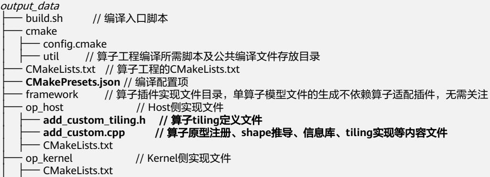

─ add_custom.cpp // 算子代码实现文件scripts // 自定义算子工程打包相关脚本所在目录步骤4 可选: 在算子工程中追加算子。若需要在已存在的算子工程目录下追加其他自定义算子，命令行需配置“-m 1”参数。

msopgen gen -i json path/\*.json -f tf -c ai_core-{Soc Version} -out ./output data -m 1

● -i：指定算子原型定义文件add_custom.json所在路径。  
● -c：参数中{Soc Version}为昇腾AI处理器的型号。

在算子工程目录下追加\*.json中的算子。MindSpore算子工程不能够添加非MindSpore框架的算子。

步骤5 完成算子工程创建，进行4.4 算子开发。

----结束

# 4.4 算子开发

# 操作步骤

步骤1 完成算子相关的开发适配，包括算子核函数的开发和tiling实现等，详细内容请参考《Ascend C算子开发指南》中“编程指南 > 附录 > 工程化算子开发”的章节。

步骤2 可参考Link进行开发，完成op_host/add_custom_tiling.h、op_host/add_custom.cpp和op_kernel/add_custom.cpp的实现。

步骤3 算子实现完成后，进入4.5 算子编译部署。

----结束

# 4.5 算子编译部署

# 编译前准备

编译Ascend C算子Kernel侧代码实现文件\*.cpp，分为源码发布和二进制发布两种方式。

源码发布：不对算子Kernel侧实现进行编译，保留算子Kernel源码文件\*.cpp。该方式可以支持算子的在线编译、通过ATC模型转换的方式编译算子的场景。  
二进制发布：对算子Kernel侧实现进行编译，生成描述算子相关信息的json文件\*.json和算子二进制文件\*.o。如果需要直接调用算子二进制，则使用该编译方式。

编译Ascend C算子Host侧代码实现文件\*.cpp、\*.h。

将原型定义和shape推导实现编译成算子原型定义动态库  
libcust_opsproto_\*.so，并生成算子原型对外接口op_proto.h。  
将算子信息库定义编译成信息库定义文件\*.json。  
将tiling实现编译成tiling动态库liboptiling.so等。  
自动生成单算子API调用代码和头文件aclnn_\*.h，并编译生成单算子API调用的动态库libcust_opapi.so。

# 编译流程

完成算子Kernel、Host侧的开发后，需要对算子工程进行编译，生成自定义算子安装包\*.run，具体编译操作流程请参考图4-2。

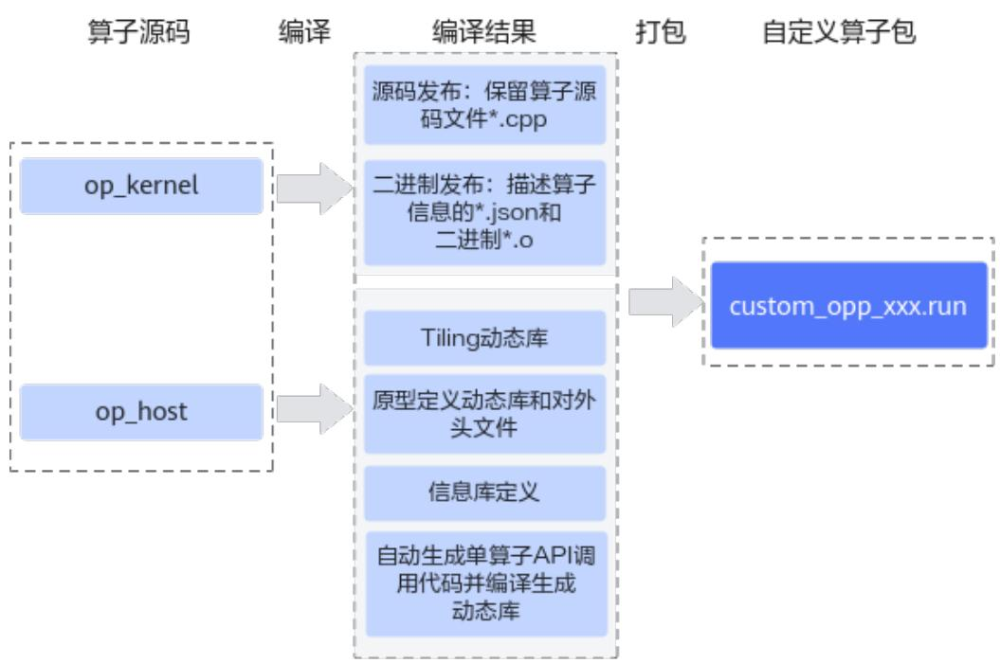  
图4-2 算子工程编译示意图

# 操作步骤

步骤1 修改工程目录下的CMakePresets.json cacheVariables的配置项，完成工程编译相关配置。CMakePresets.json文件内容如下，参数说明请参见表4-5。

"version": 1,   
"cmakeMinimumRequired": { "major": 3, "minor": 19, "patch": 0   
},   
"configurePresets": [ { "name": "default", "displayName": "Default Config", "description": "Default build using Unix Makefiles generator", "generator": "Unix Makefiles", "binaryDir": "\${sourceDir}/build_out", "cacheVariables": { "CMAKE_BUILD_TYPE": { "type": "STRING", "value": "Release" }, "ENABLE_SOURCE_PACKAGE": { "type": "BOOL", "value": "True" }, "ENABLE_BINARY_PACKAGE": { "type": "BOOL", "value": "True" },

"ASCEND_COMPUTE_UNIT": { "type": "STRING", "value": "ascendxxx" }, "ENABLE_TEST": { "type": "BOOL", "value": "True" }, "vendor_name": { "type": "STRING", "value": "customize" }, "ASCEND_PYTHON_EXECUTABLE": { "type": "STRING", "value": "python3" }, "CMAKE_INSTALL_PREFIX": { "type": "PATH", "value": "\${sourceDir}/build_out" }, "ENABLE_CROSS_COMPILE": { //使能交叉编译，请根据实际环境进行配置 "type": "BOOL", "value": "False" }, "CMAKE_CROSS_PLATFORM_COMPILER": { //请替换为交叉编译工具安装后的实际路径 "type": "PATH", "value": "/usr/bin/aarch64-linux-gnu-g++" } } } ] }

表 4-5 需要开发者配置的常用参数列表  

<table><tr><td rowspan=1 colspan=1>参数名称</td><td rowspan=1 colspan=1>参数描述</td><td rowspan=1 colspan=1>默认值</td></tr><tr><td rowspan=1 colspan=1>CMAKE_BUILD_TYPE</td><td rowspan=1 colspan=1>编译模式选项，可配置为：“ Release”，Release版本，不包含调试信息，编译最终发布的版本。“Debug”，“Debug”版本，包含调试信息，便于开发者开发和调试。</td><td rowspan=1 colspan=1>&quot;Release&quot;</td></tr><tr><td rowspan=1 colspan=1>ENABLE_SOURCE_PACKAGE</td><td rowspan=1 colspan=1>是否开启源码编译。</td><td rowspan=1 colspan=1>&quot;True&quot;</td></tr><tr><td rowspan=1 colspan=1>ENABLE_BINARY_PACKAGE</td><td rowspan=1 colspan=1>是否开启二进制编译。</td><td rowspan=1 colspan=1>&quot;True&quot;</td></tr><tr><td rowspan=1 colspan=1>vendor_name</td><td rowspan=1 colspan=1>标识自定义算子所属厂商的名称。建议开发者自行指定所属厂商名称，避免和其他厂商提供的算子包冲突。</td><td rowspan=1 colspan=1>&quot;customize&quot;</td></tr></table>

步骤2 支持自定义编译选项。

通过修改算子工程op_kernel目录下的CMakeLists.txt文件，使用add_ops_compile_options来增加编译选项。

add_ops_compile_options( $O p$ Type COMPUTE_UNIT soc_version1 soc_version2 ... OPTIONS option1 option2...)

表 4-6 具体参数介绍  

<table><tr><td>参数名称</td><td>可选/必 选</td><td>参数描述</td></tr><tr><td>算子类型</td><td>必选</td><td>第一个参数应传入算子类型，如果需要对算子工程中的所 有算子生效，需要配置为ALL。 标识编译选项在哪些AI处理器型号上生效，多个型号之间</td></tr><tr><td>COMPUTE_ UNIT</td><td>可选</td><td>通过空格间隔。不配置时表示对所有AI处理器型号生效。 说明 COMPUTE_UNIT具体配置如下： ·非Atlas A3 训练系列产品/Atlas A3推理系列产品：在安装昇 腾AI处理器的服务器执行npu-smi info命令进行查询，获取 Chip Name信息。实际配置值为AscendChip Name，例如 ChipName取值为xxxyy，实际配置值为Ascendxxxyy。当 Ascendxxxyy为代码样例的路径时，需要配置为 ascend xxxyy。 Atlas A3训练系列产品/Atlas A3推理系列产品：在安装昇腾 Al处理器的服务器执行npu-smi info -t board -i id -c chip_id命令进行查询，获取ChipName和NPUName信息， 实际配置值为Chip Name_NPU Name。例如Chip Name取 值为Ascendxxx，NPUName取值为1234，实际配置值为 Ascendxxx_1234。当Ascendxxx_1234为代码样例的路径时， 需要配置为ascendxxx_1234。 其中： -id：设备id，通过npu-smi info -l命令查出的NPU ID即为 设备id。 -chip_id：芯片id，通过npu-smi info -m命令查出的Chip ID即为芯片id。</td></tr><tr><td>OPTIONS</td><td>必选</td><td>自定义的编译选项。多个编译选项之间通过空格间隔。 说明 ·增加-sanitizer等调试用编译选项，使能msSanitizer工具的 msOpGen算子工程编译场景。 add_ops_compile_options(ALL OPTIONS -sanitizer) 增加-g等调试用编译选项，使能msProf工具的msprofop simulator场景下的代码调用栈和热点图功能。 add_ops_compile_options(ALL COMPUTE_UNIT Ascend xxxyy OPTIONS -g) 增加-g-O0等调试用编译选项，使能msDebug工具。 add_ops_compile_options(ALL OPTIONS -g -O0)</td></tr></table>

步骤3 在算子工程目录下执行如下命令，进行算子工程编译。

./build.sh

编译成功后，会在当前目录下创建build_out目录，并在build_out目录下生成自定义算子安装包custom_opp_<target_os>_<target_architecture>.run。

# 说明

注册算子类型后，框架会根据算子类型获取算子注册信息，同时在编译和运行时按照一定的规则匹配算子实现文件名称和Kernel侧核函数名称。为了保证正确匹配，算子类型、算子实现文件名称和核函数名称需要遵循如下定义规则。通常情况下，开发者只需要保证创建算子工程时原型定义json文件中算子类型op的参数值为大驼峰命名方式即可，工程创建后自动生成的代码即满足该规则。在手动编写算子原型定义和算子实现文件时需要按照如下规则定义。

算子类型需要采用大驼峰的命名方式，即采用大写字符区分不同的语义。

算子实现文件名称、核函数名称需相同，均为算子类型转换为下划线命名方式后的值。下文描述了通过算子类型转换成算子实现文件名称和核函数名称的过程：

● 首字符的大写字符转换为小写字符。例如：Abc $- >$ abc。  
● 大写字符的前一个字符为小写字符或数字，则在大写字符前插一个下划线“_”，并将该字符转换为小写字符。例如：AbcDef $- >$ abc_def。  
● 大写字符前一个字符为大写字符且后一个字符是小写字符，则在大写字符前插一个下划线“_”，并将该字符转换为小写字符。例如：AbcAAc -> abc_a_ac。  
● 其他大写字符转换为小写字符，小写字符保持不变。

# 步骤4 进行算子包部署。

# ----结束

# 算子包部署

步骤1 自定义算子安装包部署。

在自定义算子包所在路径下，执行如下命令，安装自定义算子包。

./custom_opp_<target_os>_<target_architecture>.run --install-path=<path> // 其中--install-path为可选参数，用于指定自定义算子包的安装目录。支持指定绝对路径，运行用户需要具有指定安装路径的读写权限。

下文描述中的<vendor name>为算子工程编译时CMakePresets.json配置文件中字段“vendor_name”的取值，默认为"customize"。

默认安装场景，不配置--install-path参数，安装成功后会将编译生成的自定义算子相关文件部署到

\${INSTALL_DIR}/opp/vendors/<vendor_name>目录。\${INSTALL_DIR}请替换为CANN软件安装后文件存储路径。例如，若安装的Ascend-cann-toolkit软件包，安装后文件存储路径示例为：\$HOME/Ascend/cann。

# 说明

自定义算子包默认安装路径\${INSTALL_DIR}/opp/vendors的目录权限与CANN软件包安装用户和安装配置有关。如果因权限不足导致自定义算子包安装失败，可使用--install-path参数并配置环境变量ASCEND_CUSTOM_OPP_PATH来指定安装目录（参考指定目录安装场景）或者联系CANN软件包的安装用户修改vendors目录权限来解决。详细的案例请参考《Ascend C算子开发指南》中的“编程指南 $>$ 附录 > FAQ > 调用算子时出现无法打开config.ini的报错”章节。

指定目录安装场景，配置--install-path参数，安装成功后会将编译生成的自定义算子相关文件部署到<path>/vendors/<vendor name>目录，并在<path>/vendors/<vendor_name>/bin目录下新增set_env.bash，写入当前自定义算子包相关的环境变量。

# 说明

如果部署算子包时通过配置--install-path参数指定了算子包的安装目录，则在使用自定义算子前，需要执行source <path>/vendors/<vendor name>/bin/set env.bash命令，set_env.bash脚本中将自定义算子包的安装路径追加到环境变量ASCEND_CUSTOM_OPP_PATH中，使自定义算子在当前环境中生效。

命令执行成功后，自定义算子包中的相关文件将部署至当前环境中。

步骤2 以默认安装场景为例，可查看部署后的目录结构，如下所示：

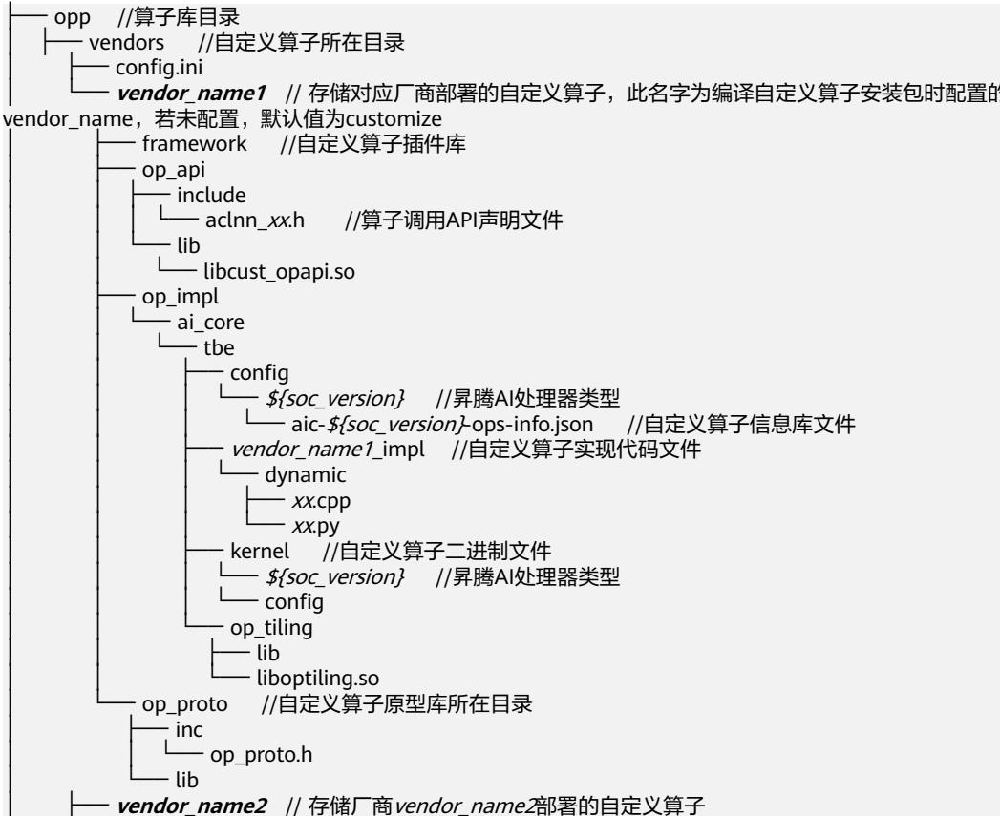

# 说明

参数值：<soc version>，查询方法如下：

● 非Atlas A3 训练系列产品/Atlas A3 推理系列产品：在安装昇腾AI处理器的服务器执行npu-smi info命令进行查询，获取Chip Name信息。实际配置值为AscendChip Name，例如Chip Name取值为xxxyy，实际配置值为Ascendxxxyy。当Ascendxxxyy为代码样例的路径时，需要配置为ascendxxxyy。

● Atlas A3 训练系列产品/Atlas A3 推理系列产品：在安装昇腾AI处理器的服务器执行npu-smi info -t board -i id -c chip id命令进行查询，获取Chip Name和NPU Name信息，实际配置值为Chip Name_NPU Name。例如Chip Name取值为Ascendxxx，NPU Name取值为1234，实际配置值为Ascendxxx 1234。当Ascendxxx 1234为代码样例的路径时，需要配置为ascendxxx 1234。

其中：

id：设备id，通过npu-smi info -l命令查出的NPU ID即为设备id。  
chip_id：芯片id，通过npu-smi info -m命令查出的Chip ID即为芯片id。

步骤3 配置自定义算子优先级。

多算子包共存的情况下，若不同的算子包目录下存在相同OpType的自定义算子，则以优先级高的算子包目录下的算子为准。下面介绍如何配置算子包优先级：

默认安装场景

当“opp/vendors”目录下存在多个厂商的自定义算子时，您可通过配置“opp/vendors”目录下的“config.ini”文件，配置自定义算子包的优先级。

“config.ini”文件的配置示例如下：load_priority=vendor name1,vendor name2,vendor name3“load_priority”：优先级配置序列的关键字，不允许修改。“vendor name1,vendor name2,vendor name3”：自定义算子厂商的优先级序列，按照优先级从高到低的顺序进行排列。

指定目录安装场景

指定目录安装场景下，如果需要多个自定义算子包同时生效，分别执行各算子包安装路径下的set_env.bash脚本即可。每次脚本执行都会将当前算子包的安装路径追加到ASCEND_CUSTOM_OPP_PATH环境变量的最前面。因此可以按照脚本执行顺序确定优先级：脚本执行顺序越靠后，算子包优先级越高。

比如先执行source <path>/vendor_name1/bin/set_env.bash，后执行source <path>/vendor_name2/bin/set_env.bash，vendor_name2算子包的优先级高 于vendor_name1。ASCEND_CUSTOM_OPP_PATH示例如下： ASCEND_CUSTOM_OPP_PATH=<path>/vendor name2:<path>/vendor name1

指定目录安装场景下安装的算子包优先级高于默认方式安装的算子包。

步骤4 基于msOpST工具，进行算子Kernel测试，验证算子的功能。

步骤5 基于msSanitizer工具，进行算子内存和异常检测，定位算子精度异常。

步骤6 基于msDebug工具，进行算子上板调试，逐步确认算子精度异常。

步骤7 基于msProf工具，生成计算内存热力图、指令流水图、及算子指令热点图统计信息，协助用户进一步优化算子性能。

步骤8 经过以上操作步骤，确定算子精度和性能达到交付标准后，方可正常使用。

----结束

# 4.6 查看算子仿真流水图

msOpGen工具通过解析用户生成的dump文件，并生成算子仿真流水图文件（trace.json）。

步骤1 参考Link，在\${git_clone_path}/samples/operator/ascendc/0_introduction/1_add_frameworklaunch路径下运行install.sh文件，并生成CustomOp文件夹。

# 说明

此样例工程不支持Atlas A3 训练系列产品和Atlas 训练系列产品。./install.sh -v Ascendxxxyy # xxxyy为用户实际使用的具体芯片类型

步骤2 编译算子工程。

1. 参考编译前准备章节，完成编译相关配置。

2. 在算子工程目录CustomOp下，执行如下命令，进行算子工程编译。

# 说明

若要生成算子仿真流水图，需要将当前目录下CMakePresets.json文件中CMAKE_BUILD_TYPE修改为“Debug” 。

编译完成后，将会在build_out目录生成.run算子包。./build.sh

步骤3 在自定义算子包所在路径下，执行如下命令，部署算子包。./build_out/custom_opp_<target_os>_<target_architecture>.run

步骤4 切换到AclNNInvocation仓的目录\${git_clone_path}/samples/operator/ascendc/ 0_introduction/1_add_frameworklaunch/AclNNInvocation，执行以下命令。 ./run.sh

步骤5 使能环境变量后，请参考msprof op simulator功能进行仿真，并生成dump数据。export LD_LIBRARY_PATH $| = \$ 9$ {git_clone_path}/samples/operator/ascendc/0_introduction/1_add_frameworklaunch/CustomOp/build_out/op_host/:\$LD_LIBRARY_PATH

步骤6 生成算子仿真流水图文件。

执行如下命令，参数说明请参见表4-7。

msopgen sim -c core{id} -d xx/{path of dump data} -subc {sub core id} -out {output path} -reloc {path of .o fileor executable file}

表 4-7 参数说明  

<table><tr><td colspan="1" rowspan="1">参数名称</td><td colspan="1" rowspan="1">参数描述</td><td colspan="1" rowspan="1">是否必选</td></tr><tr><td colspan="1" rowspan="1">sim</td><td colspan="1" rowspan="1">用于性能仿真相关操作。说明msopgen sim命令将于MindStudio下个版本下线，下线后您可使用msOpProf提供的仿真能力，具体信息请参见8.3工具使用。</td><td colspan="1" rowspan="1">是</td></tr><tr><td colspan="1" rowspan="1">-C，--core-id</td><td colspan="1" rowspan="1">核编号。配置处理器号，如：core0。</td><td colspan="1" rowspan="1">是</td></tr><tr><td colspan="1" rowspan="1">-d，--dump-dir</td><td colspan="1" rowspan="1">dump文件所在路径，可配置为绝对路径或者相对路径。</td><td colspan="1" rowspan="1">是</td></tr><tr><td colspan="1" rowspan="1">-subc，--subcore_id</td><td colspan="1" rowspan="1">子核编号，支持展示单个子核。dump文件名带有veccore{id域cubecore{id时,需配置此参数指定待解析的dump文件。如文件名为core0.veccore0.instr_log.dump，“veccore0”即为subcore id。</td><td colspan="1" rowspan="2">二选一说明仅Atlas A3 训练系列产品/Atlas A3推理系列产品和Atlas A2 训练系列产品/Atlas A2推理系列产品需配置该参数。</td></tr><tr><td colspan="1" rowspan="1">-mix，--mixcore-mode</td><td colspan="1" rowspan="1">支持展示Mix融合算子。</td></tr><tr><td colspan="1" rowspan="1">-reloc，--relocatable-file</td><td colspan="1" rowspan="1">配置为Kernel侧算子编译后生成的.o文件或可执行文件所在路径。进行流水图与代码行的映射，并生成代码行和指令耗时.csv文件。说明基于算子工程编译生成包含调试信息的.o文件（路径为${git_clone_path}/samples/operator/ascendc/O_introduction/1_add_frameworklaunch/CustomOp/build_out/op_kernel/binary/ascendxxxy/add_custom/AddCustom_*.o），即需要修改CMakePresets.json中CMAKE_BUILD_TYPE为“Debug”，具体可参考编译操作。</td><td colspan="1" rowspan="1">否</td></tr><tr><td colspan="1" rowspan="1">-out，--output</td><td colspan="1" rowspan="1">输出文件的路径，可配置为绝对路径或者相对路径，并且工具执行用户具有可读写权限。</td><td colspan="1" rowspan="1">是</td></tr><tr><td colspan="1" rowspan="1">-h，--help</td><td colspan="1" rowspan="1">输出帮助信息。</td><td colspan="1" rowspan="1">否</td></tr></table>

执行以下命令。

示例一：  
msopgen sim -c core0 -d xx/{model}/ca/add_custom/add_custom_pre_static_add_custom -out ./output_data  
-subc cubecore0 -reloc xx/.o  
● -c：指定待解析dump文件的core id，如：core0。  
● -d：指定性能仿真环境下生成的dump文件所在路径。例如："{model}/ca/add_custom/add_custom_pre_static_add_custom"。-subc：指定待解析dump文件的subcore id，如文件名为core0.cubecore0.instr_log.dump，“cubecore0”即为subcore id。（仅Atlas A3训练系列产品/Atlas A3 推理系列产品和Atlas A2 训练系列产品/Atlas A2 推理系列产品需配置该参数）  
● -reloc：指定Kernel侧算子编译生成的.o文件或可执行文件所在路径。  
示例二：  
msopgen sim -c core0 -d xx/{model}/ca/add_custom/add_custom_pre_static_add_custom -out ./output_data  
-mix  
● -c：指定待解析dump文件的core id，如：core0。  
● -d：指定性能仿真环境下生成的dump文件所在路径。例如："{model}/ca/add_custom/add_custom_pre_static_add_custom"。  
● -mix ：配置此参数表示支持展示Mix融合算子。

步骤7 查看算子仿真流水图文件。

可以在Chrome浏览器中输入“chrome://tracing”地址，将输出路径下的dump2trace_core\*.json文件拖到空白处打开，通过键盘上的快捷键（W：放大，S：缩小，A：左移，D：右移）进行查看，如下图所示。

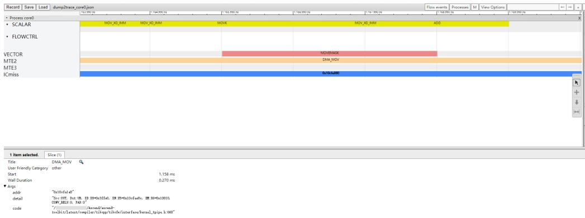  
图 4-3 单个子核展示

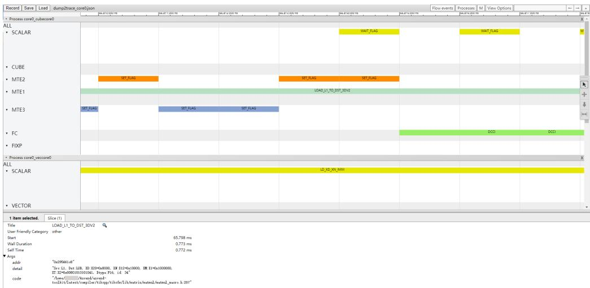  
图 4-4 Mix 融合算子展示

表 4-8 字段说明  

<table><tr><td rowspan=1 colspan=1>字段名</td><td rowspan=1 colspan=1>字段含义</td></tr><tr><td rowspan=1 colspan=1>VECTOR</td><td rowspan=1 colspan=1>向量运算单元。</td></tr><tr><td rowspan=1 colspan=1>SCALAR</td><td rowspan=1 colspan=1>标量运算单元。</td></tr><tr><td rowspan=1 colspan=1>CUBE</td><td rowspan=1 colspan=1>矩阵乘运算单元。</td></tr><tr><td rowspan=1 colspan=1>MTE1</td><td rowspan=1 colspan=1>数据搬运流水，数据搬运方向为：L1-&gt;{L0A/LOB,UBUF}。</td></tr><tr><td rowspan=1 colspan=1>MTE2</td><td rowspan=1 colspan=1>数据搬运流水，数据搬运方向为：{DDR/GM,L2}-&gt;{L1,LOA/B,UBUF}。</td></tr><tr><td rowspan=1 colspan=1>MTE3</td><td rowspan=1 colspan=1>数据搬运流水，数据搬运方向为：UBUF -&gt; {DDR/GM,L2,L1}。</td></tr><tr><td rowspan=1 colspan=1>FIXP</td><td rowspan=1 colspan=1>数据搬运流水，数据搬运方向为：FIXPIPE LOC-&gt;OUT/L1。（仅Atlas A3 训练系列产品/Atlas A3 推理系列产品和Atlas A2训练系列产品/AtlasA2推理系列产品支持展示）</td></tr><tr><td rowspan=1 colspan=1>FLOWCTRL</td><td rowspan=1 colspan=1>控制流指令。</td></tr><tr><td rowspan=1 colspan=1> ICmiss</td><td rowspan=1 colspan=1>未命中ICache。</td></tr></table>

步骤8 查看代码行或指令耗时文件。在输出路径下打开代码行耗时文件{核编号}code_exe_prof.csv，如下图所示。

图4-5 代码行耗时文件  

<table><tr><td rowspan=1 colspan=2>line</td><td rowspan=1 colspan=1>call count</td><td rowspan=1 colspan=1>cycles</td></tr><tr><td rowspan=1 colspan=2>/home/Ascend/ascend-toolkit/latest/compiler/tikcpp/tikcfw/impl/dav_c10/kerne_operator_data_copy_impl.h:16</td><td rowspan=1 colspan=1>16</td><td rowspan=1 colspan=1>4444</td></tr><tr><td rowspan=1 colspan=1>/home/Ascend/ascend-toolkit/latest/compiler/tikcpp/tikcfw/impl/dav_c100/kernel_operator_data_copy_impl.h:33</td><td></td><td rowspan=1 colspan=1>16</td><td rowspan=1 colspan=1>4272</td></tr><tr><td rowspan=1 colspan=1>/home/Ascend/ascend-toolkit/latest/compiler/tikcpp/tikcfw/interface/kernel_tpipe.h:172</td><td></td><td rowspan=1 colspan=1>16</td><td rowspan=1 colspan=1>3984</td></tr><tr><td rowspan=1 colspan=1>/home/Ascend/ascend-toolkit/latest/compiler/tikcpp/tikcfw/interface/kernel_tpipe.h:166</td><td></td><td rowspan=1 colspan=1>16</td><td rowspan=1 colspan=1>3871</td></tr><tr><td rowspan=1 colspan=1>/home/Ascend/ascend-toolkit/latest/compiler/tikcpp/tikcfw/interface/kernel_tpipe.h:253</td><td></td><td rowspan=1 colspan=1>16</td><td rowspan=1 colspan=1>2545</td></tr><tr><td rowspan=1 colspan=1>/home/Ascend/ascend-toolkit/latest/compiler/tikcpp/tikcfw/interface/kernel_tpipe.h:928</td><td></td><td rowspan=1 colspan=1>16</td><td rowspan=1 colspan=1>1344</td></tr><tr><td rowspan=1 colspan=1>/home/Ascend/ascend-toolkit/latest/compiler/tikcpp/tikcfw/interface/kernel_tpipe.h:945</td><td></td><td rowspan=1 colspan=1>16</td><td rowspan=1 colspan=1>1170</td></tr><tr><td rowspan=1 colspan=1>/home/Ascend/ascend-toolkit/latest/compiler/tikcpp/tikcfw/impl/dav_c10/kerne_operator_vec_binary_impl.h:52</td><td></td><td rowspan=1 colspan=1>16</td><td rowspan=1 colspan=1>991</td></tr><tr><td rowspan=1 colspan=2>/home/Ascend/ascend-toolkit/latest/compiler/tikcpp/tikcfw/interface/kernel_tpipe.h:1419</td><td rowspan=1 colspan=1>16</td><td rowspan=1 colspan=1>701</td></tr><tr><td rowspan=1 colspan=1>/home/Ascend/ascend-toolkit/latest/compiler/tikcpp/tikcfw/interface/kernel_tpipe.h:1295</td><td></td><td rowspan=1 colspan=1>16</td><td rowspan=1 colspan=1>577</td></tr><tr><td rowspan=1 colspan=1>/home/Ascend/ascend-toolkit/latest/compiler/tikcpp/tikcfw/interface/kernel_tpipe.h:660</td><td></td><td rowspan=1 colspan=1>1</td><td rowspan=1 colspan=1>571</td></tr><tr><td rowspan=1 colspan=1>/home/Ascend/ascend-toolkit/latest/compiler/tikcpp/tikcfw/interface/kernel_tpipe.h:1209</td><td></td><td rowspan=1 colspan=1>16</td><td rowspan=1 colspan=1>528</td></tr><tr><td rowspan=1 colspan=1>/home/Ascend/ascend-toolkit/latest/compiler/tikcpp/tikcfw/interface/kernel_tpipe.h:1352</td><td></td><td rowspan=1 colspan=1>16</td><td rowspan=1 colspan=1>511</td></tr><tr><td rowspan=1 colspan=1>/home/Ascend/ascend-toolkit/latest/compiler/tikcpp/tikcfw/interface/kernel_tpipe.h:259</td><td></td><td rowspan=1 colspan=1>14</td><td rowspan=1 colspan=1>501</td></tr><tr><td rowspan=1 colspan=1>/home/Ascend/ascend-toolkit/latest/compiler/tikcpp/tikcfw/interface/kernel_tpipe.h:1333</td><td></td><td rowspan=1 colspan=1>16</td><td rowspan=1 colspan=1>464</td></tr><tr><td rowspan=1 colspan=1>/home/Ascend/ascend-toolkit/latest/compiler/tikcpp/tikcfw/interface/kernel_tpipe.h:1234</td><td></td><td rowspan=1 colspan=1>16</td><td rowspan=1 colspan=1>448</td></tr><tr><td rowspan=1 colspan=1>/home/Ascend/ascend-toolkit/latest/compiler/tikcpp/tikcfw/interface/kernel_tpipe.h:1326</td><td></td><td rowspan=1 colspan=1>16</td><td rowspan=1 colspan=1>448</td></tr><tr><td rowspan=1 colspan=1>/home/Ascend/ascend-toolkit/latest/compiler/tikcpp/tikcfw/interface/kernel_tpipe.h:1274</td><td></td><td rowspan=1 colspan=1>16</td><td rowspan=1 colspan=1>432</td></tr></table>

在输出路径下打开指令耗时文件{核编号}instr_exe_prof.csv，如下图所示。

图 4-6 指令耗时文件  

<table><tr><td>instr name</td><td>laddr</td><td>call count</td><td>cycles</td><td>instr detail</td><td></td></tr><tr><td>DMA_MOV</td><td>0x10cfa5b4</td><td></td><td>16</td><td>4364Src:OUT, DstUB, XD:X18=0x300, XN:X16=0x10cea300, XM:X7=0x80010,CONV_RELU:0,PAD:0</td><td></td></tr><tr><td>DMA_MOV</td><td>Ox10cfa5a8</td><td></td><td>16 4336</td><td>Src:OUT, Dst:UB, XD:X16=0x100, XN:X19=0x10ce2100, XM:X7=0x80010, CONV_RELU:0, PAD:0</td><td></td></tr><tr><td>DMA_MOV</td><td>Ox10cfa43c</td><td></td><td>16 4272</td><td>Src:UB, Dst:OUT,XD:X13=0x10cf2500, XN:X15=0x500, XM:X7=0x80010, CONV_RELU:0, PAD:0</td><td></td></tr><tr><td>SET_FLAG</td><td>Ox10cfa460</td><td></td><td>16 3968</td><td>PIPE:MTE3, TRIGGER PIPE:VEC, FLAG ID:1</td><td></td></tr><tr><td>SET_FLAG</td><td>Ox10cfa5e8</td><td></td><td>16 3852</td><td>PIPE:MTE2, TRIGGER PIPE:VEC, FLAG ID:1</td><td></td></tr><tr><td>SET FLAG</td><td>0x10cfa640</td><td></td><td>16 2904</td><td>PIPE:MTE2, TRIGGER PIPE:VEC, FLAG ID:0</td><td></td></tr><tr><td>WAIT_FLAG</td><td>Ox10cfa688</td><td>16</td><td>2511</td><td>PIPE:MTE2, TRIGGER PIPE:VEC, FLAG ID:1</td><td></td></tr><tr><td>WAIT_FLAG</td><td>Ox10cfa6f8</td><td>16</td><td>1874</td><td>PIPE:MTE2, TRIGGER PIPE:VEC, FLAG ID:0</td><td></td></tr><tr><td>WAIT_FLAG</td><td>Ox10cfa794</td><td>14</td><td>924</td><td>PIPE:MTE3, TRIGGER PIPE:VEC, FLAG ID:1</td><td></td></tr><tr><td>BAR</td><td>Ox10cfa7d0</td><td>16</td><td>783</td><td>PIPE:VEC</td><td></td></tr><tr><td>SET_FLAG</td><td>Ox10cfa808</td><td>16</td><td>404</td><td>PIPE:VEC, TRIGGER PIPE:MTE3, FLAG ID:0</td><td></td></tr><tr><td>DMA_MOV</td><td>0x10cfa058</td><td>1</td><td>270</td><td>Src:OUT, Dst:UB, XD:X0=0, XN:X1=0x1068be00, XM:X2=0x10012, CONV_RELU:0, PAD:0</td><td></td></tr><tr><td>DMA_MOV</td><td>Ox10cfa1a4</td><td></td><td>1 270</td><td>Src:OUT, Dst:UB, XD:X8=0x3ffe0, XN:X5=0x10cfae8c, XM:X6=0x10010, CONV_RELU:0, PAD:0</td><td></td></tr><tr><td>DMA_MOV</td><td>0x10cfa1d8</td><td></td><td>1 267</td><td> Src:UB, Dst:OUT, XD:X5=Ox10cfae8c, XN:X8=0x3ffe0 XM:X6=0x10010, CONV_RELU:0, PAD:0</td><td></td></tr><tr><td>SET_FLAG</td><td>Ox10cfa074</td><td></td><td>1 265</td><td>PIPE:MTE2, TRIGGER PIPE:SCALAR, FLAG ID:0</td><td></td></tr><tr><td>WAIT_FLAG</td><td>Ox10cfa078</td><td></td><td>1 264</td><td>PIPE:MTE2, TRIGGER PIPE:SCALAR, FLAG ID:0</td><td></td></tr><tr><td>VADD</td><td>0x10cfa7d4</td><td>16</td><td>208</td><td>dtype:F16 XD:0x500 XN:0x100 XM:0x300 XT:0x0100080808010101</td><td></td></tr><tr><td>ST_XD_XN_IMM</td><td>Ox10cfa12c</td><td>32</td><td>128</td><td>dtype:B8, XD:X0=0, XN:X1=0x439eb, IMM:0,</td><td></td></tr><tr><td>ST_XD_XN_IMM</td><td>Ox10cfa130</td><td></td><td>32 128</td><td>dtype:B8, XD:X0=0, XN:X1=0x439eb, IMM:0x1,</td><td></td></tr><tr><td>ST XD XN_IMM</td><td>Ox10cfa134</td><td></td><td>32 128</td><td>dtype:B8, XD:X5=0x1, XN:X1=0x439eb, IMM:0x2,</td><td></td></tr><tr><td>ST_XD_XN_IMM</td><td>Ox10cfa138</td><td></td><td>32 128</td><td>dtype:B8, XD:X6=0x2,XN:X1=0x439eb, IMM:0x3,</td><td></td></tr><tr><td>ST_XD_XN_IMM</td><td>Ox10cfa13c</td><td></td><td>32 128</td><td>dtype:B8, XD:X7=0x3, XN:X1=0x439eb, IMM:0x4,</td><td></td></tr><tr><td>ADD</td><td>Ox10cfa124</td><td></td><td>32 64</td><td>dtype:S64, XD:X11=0x20, XN:X10=0x1f, XM:X5=0x1,</td><td></td></tr><tr><td>ZEROEXT</td><td>Ox10cfa128</td><td></td><td>32</td><td>64dtype:U32, XD:X10=0x1f, XN:X10=0x1f.</td><td></td></tr><tr><td>CMP</td><td>Ox10cfa140</td><td></td><td>32</td><td>64dtype:U64, XN:X10=0x1f XM:X8=0x1f,cond_op:LT</td><td></td></tr><tr><td>ADD</td><td>Ox10cfa144</td><td></td><td>32</td><td>64dtype:S64, XD:X1=0x439f0 XN:X1=0x439eb, XM:X9=0x5.</td><td></td></tr><tr><td>MOV_XD_XN LD_XD_XN_IMM</td><td>Ox10cfa148 Ox10cfa47c</td><td>16</td><td>32</td><td>64dtype:S64, XD:X10=0×20, XN:X11=0×20,</td><td></td></tr><tr><td>LD_XD_XN_IMM</td><td>Ox10cfa480</td><td></td><td></td><td>64dtype:B64, XD:X12=0x439f0 XN:X30=0x43910, IMM:0x528,</td><td></td></tr><tr><td></td><td></td><td></td><td>16</td><td>64dtype:B8, XD:X15=0x2 XN:X30=0x43910, IMM:0x531.</td><td></td></tr></table>

通过文件中的“call count”及“cycles”字段可以分别查看代码行或指令的调用次数和累计耗时。

----结束

# 4.7 典型案例

# 4.7.1 Ascend C 自定义算子开发实践

展示如何使用msOpGen工具进行Ascend C自定义算子的工程创建、编译和部署，并使用msOpST工具对Ascend C自定义算子进行功能测试。

# 前提条件

已参考4.2 使用前准备，完成msOpGen工具的使用准备。

# 操作步骤

步骤1 参考以下json文件，准备算子原型文件（以MatmulCustom算子为例）。

{ "op": "MatmulCustom", "language": "cpp", "input_desc": [ { "name": "a", "param_type": "required", "format": [ "ND" ], "type": [ "float16" ] }, { "name": "b", "param_type": "required", "format": [ "ND" ], "type": [ "float16" ] }, { "name": "bias", "param_type": "required", "format": [ "ND" ], "type": [ "float" ] } ], "output_desc": [ { "name": "c", "param_type": "required", "format": [ "ND" ], "type": [ "float" ] } ]   
}

步骤2 使用msOpGen工具执行以下命令，创建算子工程。

# 说明

msOpGen工具仅生成空的算子工程模板，需要用户自行添加算子实现，具体请参考《Ascend C算子开发指南》中的“编程指南 $>$ 附录 $>$ 工程化算子开发”章节。

msopgen gen -i MatmulCustom.json -f tf -c ai_core-Ascendxxxyy -lan cpp -out MatmulCustom步骤3 命令执行完毕，会在指定目录下生成如下算子工程目录。

MatmulCustom/build.sh // 编译入口脚本cmake─ xx.cmake

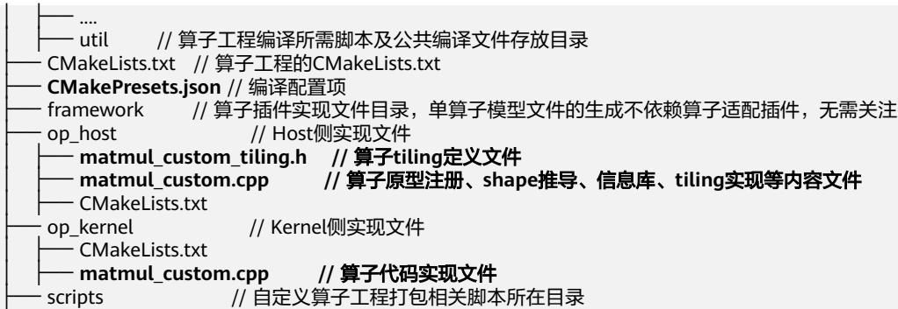

步骤4 执行算子工程编译。 ./build.sh

步骤5 进行自定义算子包部署。

执行以下命令，将算子部署到CANN：  
./build_out/custom_opp_<target_os>_<target_architecture>.run  
执行以下命令，将算子部署到自定义路径（以xxx/MatmulCustom/installed为  
例）：  
./build_out/custom_opp_<target_os>_<target_architecture>.run --install-path $\lvert = \ "$ xxx/MatmulCustom/  
installed"

步骤6 执行以下命令，生成ST测试用例。msopst create -i "xxx/MatmulCustom/op_host/matmul_custom.cpp" -out ./st // xxx需要修改为用户实际工程路径

步骤7 进行ST测试。

1. 根据CANN包安装路径，配置以下环境变量：export DDK_PATH=\${INSTALL_DIR}export NPU_HOST_LIB $\scriptstyle \left. \left| = \right\{ \begin{array} { l l } { \mathbf { \Delta } } \\ { \mathbf { \Delta } } \end{array} \right.$ \${INSTALL_DIR}/{arch-os}/devlib  
2. 执行以下命令，进行ST测试，并将输出结果到指定路径：msopst run -i ./st/xxx.json -soc Ascendxxxyy -out ./st/out //xxx.json为步骤6获得的测试用例

----结束

# 5

# 算子测试（msOpST）

工具概述

使用前准备  
生成测试用例定义文件  
生成/执行测试用例  
生成单算子上板测试框架  
典型案例

# 5.1 工具概述

使用msOpGen工具完成自定义算子包部署后，可选择使用msOpST工具进行ST（System Test）测试，在真实的硬件环境中，对算子的输入输出进行测试，以验证算子的功能是否正确。

测试用例通常包括各种不同类型的数据输入和预期输出，以及一些边界情况和异常情况的测试。通过ST测试，可以确保算子功能的正确性，并且能够在实际应用中正常运行。

# 说明

在TBE及AI CPU算子开发场景中，msOpST工具的使用详情请参考9.1.3 基于msOpST工具进行算子ST测试。由于TBE/TIK算子开发方式已不再对外开放，TBE/TIK Sample将于MindStudio下个版本下线。

# 功能描述

msOpST支持生成算子的ST测试用例并在硬件环境中执行。具有如下功能：

根据用户定义并配置的算子期望数据生成函数，回显期望算子输出和实际算子输出的对比测试结果，具体请参见5.3 生成测试用例定义文件。  
根据算子测试用例定义文件生成ST测试数据及测试用例执行代码，在硬件环境上执行算子测试用例，具体请参见5.4 生成/执行测试用例。  
自动生成运行报表（st_report.json）功能，报表记录了测试用例信息及各阶段运行情况，具体请参见5.4 生成/执行测试用例。

自动生成算子调用核函数的上板测试框架，进行算子的测试验证，具体请参见5.5生成单算子上板测试框架。

# 命令汇总

生成算子测试用例定义文件。

表 5-1 生成算子测试用例定义文件的参数说明  

<table><tr><td rowspan=1 colspan=1>参数名称</td><td rowspan=1 colspan=1>参数描述</td><td rowspan=1 colspan=1>是否必选</td></tr><tr><td rowspan=1 colspan=1>create</td><td rowspan=1 colspan=1>用于生成算子测试用例定义文件（*.json）。</td><td rowspan=1 colspan=1>是</td></tr><tr><td rowspan=1 colspan=1>-i，--input</td><td rowspan=1 colspan=1>Host侧算子的实现文件路径（*.cpp文件），可配置为绝对路径或者相对路径。</td><td rowspan=1 colspan=1>是</td></tr><tr><td rowspan=1 colspan=1>-out，--output</td><td rowspan=1 colspan=1>生成文件所在路径，可配置为绝对路径或者相对路径，并且工具执行用户具有可读写权限。若不配置，则默认生成在执行命令的当前路径。</td><td rowspan=1 colspan=1>否</td></tr><tr><td rowspan=1 colspan=1>-m，--model</td><td rowspan=1 colspan=1>配置为TensorFlow模型文件的路径，可配置为绝对路径或者相对路径。若配置此参数，工具会从TensorFlow模型文件中获取首层算子的shape信息，并自动dump出算子信息库定义文件中算子的shape、dtype以及属性的value值，如果dump出的值在算子信息库定义文件所配置的范围内，则会自动填充到生成的算子测试用例定义文件中；否则会报错。须知若配置此参数，系统中需要安装1.15或2.6.5版本的TensorFlow。</td><td rowspan=1 colspan=1>否</td></tr><tr><td rowspan=1 colspan=1>-q，--quiet</td><td rowspan=1 colspan=1>当前版本仅针对-m参数生效，代表是否进行人机交互。若不配置-q参数，则会提示用户修改获取到的模型中的首层shape信息。若配置了-q参数，则不会提示用户更改首层shape信息。</td><td rowspan=1 colspan=1>否</td></tr><tr><td rowspan=1 colspan=1>-h，--help</td><td rowspan=1 colspan=1>输出帮助信息。</td><td rowspan=1 colspan=1>否</td></tr></table>

生成/执行测试用例。

表 5-2 生成/执行测试用例的参数说明  

<table><tr><td colspan="1" rowspan="1">参数名称</td><td colspan="1" rowspan="1">参数描述</td><td colspan="1" rowspan="1">西</td></tr><tr><td colspan="1" rowspan="1">run</td><td colspan="1" rowspan="1">用于执行算子的ST测试用例。</td><td colspan="1" rowspan="1">是</td></tr><tr><td colspan="1" rowspan="1">参数名称</td><td colspan="1" rowspan="1">参数描述</td><td colspan="1" rowspan="1"></td></tr><tr><td colspan="1" rowspan="1">-i，--input</td><td colspan="1" rowspan="1">算子测试用例定义文件（*.json）的路径，可配置为绝对路径或者相对路径。说明json文件最多支持1000个用例。</td><td colspan="1" rowspan="1">是</td></tr><tr><td colspan="1" rowspan="1">-SOC，--soc_version</td><td colspan="1" rowspan="1">配置为昇腾AI处理器的类型。说明：非AtlasA3训练系列产品/Atlas A3推理系列产品：在安装昇腾Al处理器的服务器执行npu-smi info命令进行查询，获取Chip Name信息。实际配置值为AscendChipName，例如chipName取值为xxxyy，实际配置值为Ascendxxxyy。当Ascendxxxyy为代码样例的路径时，需要配置为ascend xxxyy。Atlas A3训练系列产品/AtlasA3推理系列产品：在安装昇腾Al处理器的服务器执行npu-smi info -t board -i id-C chip_id命令进行查询，获取ChipName和NPUName信息，实际配置值为Chip Name_NPU Name。例如ChipName取值为Ascendxxx，NPU Name取值为1234，实际配置值为Ascendxxx_1234。当Ascendxxx_1234为代码样例的路径时，需要配置为ascendxxx_1234。其中：·id:设备id，通过npu-smi info -l命令查出的NPU ID即为设备id。chip_id:芯片id，通过npu-smi info -m命令查出的Chip ID即为芯片id。</td><td colspan="1" rowspan="1">是</td></tr><tr><td colspan="1" rowspan="1">-out，--output</td><td colspan="1" rowspan="1">生成文件所在路径，可配置为绝对路径或者相对路径，并且工具执行用户具有可读写权限。若不配置该参数，则默认生成在执行命令的当前路径。</td><td colspan="1" rowspan="1">否</td></tr><tr><td colspan="1" rowspan="1">-c，-case_name</td><td colspan="1" rowspan="1">配置为需要执行的case的名字，若需要同时运行多个case，多个case之间使用逗号分隔。若配置为“all”，或者不配置此参数，代表执行所有case。</td><td colspan="1" rowspan="1">否</td></tr><tr><td colspan="1" rowspan="1">-d，--device_id</td><td colspan="1" rowspan="1">NPU设备ID，设置运行ST测试用例的昇腾AI处理器的ID。若未设置此参数，默认为：0。</td><td colspan="1" rowspan="1">否</td></tr><tr><td colspan="1" rowspan="1">参数名称</td><td colspan="1" rowspan="1">参数描述</td><td colspan="1" rowspan="1">西</td></tr><tr><td colspan="1" rowspan="1">-err_thr，--error_threshold</td><td colspan="1" rowspan="1">配置自定义精度标准，取值为含两个元素的列表："[threshold1，threshold2]"。：threshold1：算子输出结果与标杆数据误差阈值，若误差大于该值则记为误差数据。threshold2：误差数据在全部数据占比阈值。若误差数据在全部数据占比小于该值，则精度达标，否则精度不达标。若未设置此参数，默认值为："[0.01,0.05]"。取值范围为："[0.0,1.0]"。说明配置的列表需加引号以避免一些问题。例如配置为：-err_thr "[0.01,0.05]"。若测试用例json文件和执行msOpST命令时均配置该参数，以执行msOpST命令时配置的精度标准进行比对。若均未配置，则以执行msOpST命令时默认精度标准[0.01,0.05]进行比对。</td><td colspan="1" rowspan="1">否</td></tr><tr><td colspan="1" rowspan="1">-conf,--config_file</td><td colspan="1" rowspan="1">ST测试高级功能配置文件（msopst.ini）存储路径，可配置为绝对路径或者相对路径。用户可通过修改msopst.ini配置文件，实现如下高级功能：·ST测试源码可编辑。·已编辑的ST测试源码可执行。设置Host日志级别环境变量。设置日志是否在控制台显示。设置atc模型转换的日志级别。设置atc模型转换运行环境的操作系统类型及架构。设置模型精度。读取算子在昇腾AI处理器上运行的性能数据。若未配置--config_file文件，模型将强制使用FP16类型精度，msopst.ini配置文件的详细说明请参见表5-6。</td><td colspan="1" rowspan="1">否</td></tr><tr><td colspan="1" rowspan="1">参数名称</td><td colspan="1" rowspan="1">参数描述</td><td colspan="1" rowspan="1">无</td></tr><tr><td colspan="1" rowspan="1">-err_report， --error_report</td><td colspan="1" rowspan="1">针对比对失败的用例，获取算子期望数据与实际用例执行结果不一致的数据。若未设置此参数，默认为：“false”。true：针对比对失败的用例，将算子期望数据与实际用例执行结果不一致的数据保存在{case.name}_error_report.csv文件中。. false：不保存比对失败的数据结果。说明：设置此参数为“true”时，获取的比对数据会根据每个case_name生成独立的csv文件，{case.name}_error_report.csv文件所在目录为{output_path}/{time_stamp}l{op_type}/run/out/test_data/data/st_error_reports。单个csv文件保存数据的上限为5万行，超过则依次生成新的.csv文件，文件命名如：{case.name}_error_report0.csv。</td><td colspan="1" rowspan="1">否</td></tr><tr><td colspan="1" rowspan="1">-h，--help</td><td colspan="1" rowspan="1">输出帮助信息。</td><td colspan="1" rowspan="1">否</td></tr></table>

生成单算子上板测试框架。

表5-3 生成单算子上板测试框架参数说明  

<table><tr><td rowspan=1 colspan=1>参数名称</td><td rowspan=1 colspan=1>参数描述</td><td rowspan=1 colspan=1>是否必选</td></tr><tr><td rowspan=1 colspan=1>ascendc_test</td><td rowspan=1 colspan=1>生成AscendC算子调用Kernel函数的上板测试代码。</td><td rowspan=1 colspan=1>是</td></tr><tr><td rowspan=1 colspan=1>-i,--input</td><td rowspan=1 colspan=1>算子测试用例定义文件（*.json文件）的路径，可配置为绝对路径或者相对路径。说明：指定的算子ST测试用例定义文件（*.json文件）仅支持配置一个测试用例。·测试用例中不支持配置多个type、format及shape。</td><td rowspan=1 colspan=1>是</td></tr><tr><td rowspan=1 colspan=1>-kernel，--kernel_file</td><td rowspan=1 colspan=1>Ascend C算子的Kernel侧实现文件（*.cpp文件）路径，可配置为绝对路径或者相对路径。</td><td rowspan=1 colspan=1>是</td></tr><tr><td rowspan=1 colspan=1>-out，--output</td><td rowspan=1 colspan=1>测试框架代码输出路径，可配置为绝对路径或者相对路径，并且工具执行用户具有可读写权限。</td><td rowspan=1 colspan=1>否</td></tr><tr><td rowspan=1 colspan=1>-h，--help</td><td rowspan=1 colspan=1>输出帮助信息。</td><td rowspan=1 colspan=1>否</td></tr></table>

# 补充说明

msOpST工具其他参数说明可参考表5-4。

表 5-4 参数说明  

<table><tr><td rowspan=1 colspan=1>参数名称</td><td rowspan=1 colspan=1>参数描述</td><td rowspan=1 colspan=1>说明</td></tr><tr><td rowspan=1 colspan=1>get_shape</td><td rowspan=1 colspan=1>获取shape。</td><td rowspan=6 colspan=1>机机接口，用户无需关注。</td></tr><tr><td rowspan=1 colspan=1>change_shape</td><td rowspan=1 colspan=1>修改shape。</td></tr><tr><td rowspan=1 colspan=1>gen</td><td rowspan=1 colspan=1>生成acl_op.json。</td></tr><tr><td rowspan=1 colspan=1> gen_testcase</td><td rowspan=1 colspan=1>生成测试文件及数据。</td></tr><tr><td rowspan=1 colspan=1>compare</td><td rowspan=1 colspan=1>结果比对。</td></tr><tr><td rowspan=1 colspan=1>compare_by_path</td><td rowspan=1 colspan=1>指定路径文件结果比对。</td></tr></table>

# 5.2 使用前准备

请参考2 环境准备，完成相关环境变量的配置。然后，可直接使用msOpST工具的相关功能。

# 说明

使用此工具生成算子测试用例前，需要将要测试的算子部署到算子库中，具体请参见4.5 算子编译部署。

● 若在实现算子ST功能验证时使用到AI框架，请完成所需AI框架的安装。

TensorFlow框架的安装请参见《TensorFlow 1.15模型迁移指南》的“环境准备 $>$ 安装开源框架TensorFlow 1.15”章节。TensorFlow框架的安装请参见《TensorFlow 2.6.5模型迁移指南》的“环境准备 $>$ 安装开源框架TensorFlow 2.6.5”章节。PyTorch框架的安装请参见《Ascend Extension for PyTorch 软件安装指南》。

# 5.3 生成测试用例定义文件

指导用户使用msOpST工具生成算子测试用例定义文件（\*.json），作为算子ST测试用例的输入。

步骤1 获取并编辑待测试Host侧算子的实现文件（.cpp文件）。

msOpST工具根据待测Host侧算子的实现文件生成算子ST测试用例定义文件，在算子工程文件中Host侧算子的实现文件路径如下所示。

可以单击Link获取文档中对应的Host侧算子实现文件add_custom.cpp进行参考。

# 说明

此样例工程不支持Atlas A3 训练系列产品。

framework/tf_plugin // 算子插件实现文件目录，单算子模型文件的生成不依赖算子适配插件，无需关注op_host // Host侧实现文件add_custom_tiling.h // 算子tiling定义文件add_custom.cpp // 算子原型注册、shape推导、信息库、tiling实现等内容文件CMakeLists.txtop_kernel // Kernel侧实现文件

步骤2 执行如下命令生成算子测试用例定义文件，详细参数说明请参见表5-1。

msopst create -i {operator.cpp file} -out {output path} -m {pb file} -q

# 说明

示例如下：

以AddCustom算子为例，执行如下命令:  
msopst create -i Op implementation/add_custom.cpp -out ./output  
请将Op implementation更换为Host侧算子的实现文件所在路径。  
命令执行成功后，会在当前路径的output目录下生成算子测试用例定义文件：AddCustom_case_timestamp.json。

步骤3 创建算子ST测试用例定义文件“AddCustom_case.json”。该文件的模板如下，您可以基于如下模板进行修改，“\*.json”文件支持的全量字段说明参见表5-5。不同场景下的测试用例定义文件的样例可参见5.6.1 测试用例定义文件。

{ "case_name": "Test_OpType_001", "op": "OpType", "input_desc": [ { "format": [], "type": [], "shape": [], "data_distribute": [ "uniform" ], "value_range": [ [ 0.1, 1.0 ] ] } ], "output_desc": [ { "format": [], "type": [], "shape": [] } ]   
}

表 5-5 算子测试用例定义 json 文件  

<table><tr><td colspan="2">参数</td><td>说明</td></tr><tr><td rowspan="3">case_name</td><td rowspan="3">=</td><td>必选。</td></tr><tr><td>String类型。</td></tr><tr><td>测试用例的名称。</td></tr><tr><td>op</td><td></td><td>必选。 String类型。算子的类型。不允许为空。</td></tr><tr><td colspan="1" rowspan="1">error_threshold</td><td colspan="1" rowspan="1"></td><td colspan="1" rowspan="1">可选。配置自定义精度标准，取值为含两个元素的列表："[threshold1，threshold2]"·threshold1：算子输出结果与标杆数据误差阈值，若误差大于该值则记为误差数据。·threshold2：误差数据在全部数据占比阈值。若误差数据在全部数据占比小于该值，则精度达标，否则精度不达标。若未设置此参数，默认值为："[0.01,0.05]"。取值范围为："[0.0,1.0]"。说明配置的列表需加引号以避免一些问题。例如配置为：-err_thr "[0.01,0.05]"。若测试用例json文件和执行msOpST命令时均配置该参数，以执行msOpST命令时配置的精度标准进行比对。若均未配置，则以执行msOpST命令时默认精度标准[0.01,0.05]进行比对。</td></tr><tr><td colspan="1" rowspan="1">st_mode</td><td colspan="1" rowspan="1"></td><td colspan="1" rowspan="1">可选。String类型。ST测试模式，其值为："ms_python_train"，表示Mindspore的算子工程（仅Atlas训练系列产品支持）；"pt_python_train"，表示PyTorch框架下的算子工程。</td></tr><tr><td colspan="1" rowspan="1">run_torch_api</td><td colspan="1" rowspan="1"></td><td colspan="1" rowspan="1">可选。配置torch_api调用算子的接口，其值为："torch.square"，“square”为接口名称，请根据实际情况配置。</td></tr><tr><td colspan="1" rowspan="1">expect</td><td colspan="1" rowspan="1"></td><td colspan="1" rowspan="1">可选。用户期望的测试结果状态。属性支持以下两种类型，默认值为“success”·success：表示期望测试用例运行成功。若模型转换失败，流程将提前终止，用户可查看ATC工具相关日志定位问题。failed：表示期望测试用例运行失败。若用户需要运行异常用例，可修改expect字段为failed。若模型转换失败，流程将继续执行。在统计结果中，依据STCaseReport中的status和expect是否一致统计，一致则统计至“success count”，不一致则统计至“failed count”。</td></tr><tr><td colspan="1" rowspan="1">fuzz_impl</td><td colspan="1" rowspan="1"></td><td colspan="1" rowspan="1">可选，String类型。若用户需要生成大量测试用例，可利用fuzz测试参数生成脚本辅助生成。此种场景下，用户需要手工添加此字段，配置fuzz测试参数生成脚本的绝对路径或者相对路径：函数名。说明不建议用户调用其它用户目录下的fuzz测试参数生成脚本，以避免提权风险。</td></tr><tr><td colspan="1" rowspan="1">fuzz_case_num</td><td colspan="1" rowspan="1"></td><td colspan="1" rowspan="1">可选。int类型。在添加了“fuzz_impl”参数的情况下，需要手工添加此字段，配置利用fuzz测试参数生成脚本生成测试用例数量，范围为1~2000。</td></tr><tr><td colspan="1" rowspan="1">input_desc</td><td colspan="1" rowspan="1"></td><td colspan="1" rowspan="1">必选。算子输入描述。须知所有input_desc中参数取值的个数都要一致，否则测试用例生成会失败。例如：input1的format支持的类型个数2，则input2的format支持的类型个数也需要为2。同理，所有inputx中的type、shape、data_distribute和value_range的取值个数也需要保持一致。</td></tr><tr><td colspan="1" rowspan="1"></td><td colspan="1" rowspan="1">name</td><td colspan="1" rowspan="1">可选。算子为动态多输入场景时，“name”为必选配置，请配置为算子信息库中“inputx.name”参数的名称+编号，编号从“0”开始，根据输入的个数按照0，1，.,依次递增。例如，算子信息文件中指定的输入个数为4个，则input_desc中需要配置4个输入描述，name分别为“xxx0”、"xxx1"、“xx2”、“xxx3”，其中xxx为输入参数的名称。动态多输入场景的配置示例可参见若算子的输入个数不确定（动态多输入场景）。</td></tr></table>

<table><tr><td colspan="2">参数</td><td colspan="4">说明</td></tr><tr><td>=</td><td>format</td><td colspan="4">必选。 String或者String的一维数组。 输入Tensor数据的排布格式，不允许为空。 常见的数据排布格式如下： ND：表示支持任意格式。 NC1HWC0：5维数据格式。其中，C0与微架构强相 关，该值等于Cube单元的size，例如16；C1是将C维 度按照C0切分：C1=C/C0，若结果不整除，最后一份 数据需要padding到c0。 FRACTAL_Z：卷积的权重的格式。 FRACTAL_NZ：分形格式，在Cube单元计算时，输出 矩阵的数据格式为NW1H1H0W0。整个矩阵被分为 （H1*W1）个分形，按照columnmajor排布，形状 如N字形；每个分形内部有（H0*W0）个元素，按照 rowmajor排布，形状如z字形。考虑到数据排布格</td></tr><tr><td></td><td>· NCHW · NHWC RESERVED：预留，当format配置为该值，则type必 须配置为“UNDEFINED”，代表算子的此输入可</td><td colspan="4">Matrix C</td></tr><tr><td></td><td></td><td colspan="5">式，将NW1H1H0W0数据格式称为Nz格式。其中, H0,W0表示一个分形的大小，示意图如下所示： Fractal Matrix Size</td></tr><tr><td rowspan="5"></td><td colspan="5"></td></tr><tr><td colspan="2"></td><td></td><td></td><td></td></tr><tr><td rowspan="3"></td><td colspan="5"></td></tr><tr><td rowspan="2"></td><td></td><td></td><td></td></tr><tr><td rowspan="2"></td><td rowspan="2"></td><td rowspan="2"></td></tr><tr><td></td><td></td><td></td></tr></table>

选。

● fuzz：使用fuzz测试参数生成脚本自动批量生成值。

<table><tr><td colspan="2">参数</td><td>说明</td></tr><tr><td></td><td>ori_format</td><td>可选。 String或者String的一维数组，支持以下两种取值： ·配置为输入数据的原始format。 当算子实现的format与原始format不同时，需要配置 此字段；若不配置此字段，默认算子实现的format与 原始format相同。 配置为“fuzz”，表示使用fuzz测试参数生成脚本自 动批量生成值。 必选。</td></tr><tr><td></td><td>type</td><td>String或者String的一维数组。 输入数据支持的数据类型。 ·bool ·int8 uint8 int16 。 uint16 int32 int64 uint32 ·uint64 float16 . float32 float . bfloat16（仅AtlasA3训练系列产品/AtlasA3推理 系列产品和Atlas A2训练系列产品/Atlas 800l A2 推 理产品支持该数据类型）。 ·UNDEFINED：表示算子的输入类型为可选。 ·fuzz：使用fuzz测试参数生成脚本自动批量生成值。 输入数据类型为复数场景的配置示例可参见若算子的输 入输出类型为复数。</td></tr><tr><td colspan="1" rowspan="1">=</td><td colspan="1" rowspan="1">shape</td><td colspan="1" rowspan="1">必选。·int类型。一维或者二维数组。输入Tensor支持的形状。－支持静态shape输入的场景：shape维度以及取值都为固定值，该场景下不需要配置shape_range参数。支持动态shape输入的场景：shape中包含-1，例如： (200,-1)表示第二个轴长度未知。该场景下需要与shape_range参数配合使用，用于给出“-1”维度的取值范围。String类型，“fuzz”支持fuzz，使用fuzz测试参数生成脚本自动批量生成值。空如果format和type为UNDEFINED时shape允许为空。需要注意，配置的shape需要与format相匹配。</td></tr><tr><td colspan="1" rowspan="1"></td><td colspan="1" rowspan="1">ori_shape</td><td colspan="1" rowspan="1">可选。·int类型。一维或者二维数组。输入数据的原始shape。当算子实现的shape与原始shape不同时，需要配置此字段。String类型，“fuzz”支持fuzz，使用fuzz测试参数生成脚本自动批量生成值。若不配置此字段，默认算子实现的shape与原始shape一致。</td></tr><tr><td colspan="1" rowspan="1"></td><td colspan="1" rowspan="1">typical_shape</td><td colspan="1" rowspan="1">可选。·int类型。一维或者二维数组。实际用于测试的shape。若配置的“shape”字段中含有-1时，用户需要在算子测试用例定义文件中新增“typical_shape”字段，给定出固定shape值，用于实际测试。String类型，“fuzz”。支持fuzz，使用fuzz测试参数生成脚本自动批量生成值。</td></tr><tr><td colspan="1" rowspan="1"></td><td colspan="1" rowspan="1">shape_range</td><td colspan="1" rowspan="1">可选。·int类型。一维或者二维数组。当算子支持动态shape时，此字段表示支持的shape范围。默认值为：[[1,-1]]。表示shape可以取1到无穷。例如：shape配置为(20o,-1)，shape_range配置为[[1,-1]]时，则代表shape第二个维度的取值为1到无穷。String类型，“fuzz”支持fuzz，使用fuzz测试参数生成脚本自动批量生成值。</td></tr><tr><td colspan="1" rowspan="1"></td><td colspan="1" rowspan="1">is_const</td><td colspan="1" rowspan="1">可选。bool类型。·true：若用户需要配置常量输入的用例，则配置该字段，其值为true。·false：若该字段值为false，则需要配置张量输入用例。输入为常量的配置示例可参见若算子的某个输入为常量。</td></tr><tr><td colspan="1" rowspan="1"></td><td colspan="1" rowspan="1">data_distribute</td><td colspan="1" rowspan="1">必选。String或者String的一维数组。使用哪种数据分布方式生成测试数据，支持的分布方式有：·uniform：返回均匀分布随机值。·normal：返回正态分布（高斯分布）随机值。·beta：返回Beta分布随机值。·laplace：返回拉普拉斯分布随机值。·triangular：返回三角形分布随机值。·relu：返回均匀分布+Relu激活后的随机值。·sigmoid：返回均匀分布+sigmoid激活后的随机值。softmax：返回均匀分布+softmax激活后的随机值。·tanh：返回均匀分布+ tanh激活后的随机值。·fuzz：使用fuzz测试参数生成脚本自动批量生成值。</td></tr><tr><td colspan="1" rowspan="1">1</td><td colspan="1" rowspan="1">value_range</td><td colspan="1" rowspan="1">必选。int类型或者float类型。一维或者二维数组。取值范围，不能为空。为[min_value,max_value]且min_value&lt;=max_value。String类型，“fuzz”支持fuzz，使用fuzz测试参数生成脚本自动批量生成值。</td></tr><tr><td colspan="1" rowspan="1"></td><td colspan="1" rowspan="1">value</td><td colspan="1" rowspan="1">可选。String或者Tensor数组。若用户需要指定输入数据时，可通过增加“value”字段进行配置。有如下两种配置方式：.直接输入Tensor数据，如Tensor的值为[1,2,3,4]。"value": [1,2,3,4]输入二进制数据文件的路径，如数据文件为test.bin时。"value": "../test.bin"二进制数据bin文件需用户自行准备。可以输入绝对路径，也可以输入测试用例定义文件的相对路径。配置为“fuzz”，使用fuzz测试参数生成脚本自动批量生成值。说明若用户添加了“value”字段，“data_distribute”和“value_range”字段将会被忽略。同时需要保证“format”,"type”，"shape"字段的值与“value”数据对应，且每个用例只能测试一种数据类型。配置示例可参见若指定固定输入。</td></tr><tr><td colspan="1" rowspan="1">output_desC</td><td colspan="1" rowspan="1"></td><td colspan="1" rowspan="1">必选。算子输出描述。须知output_desc中参数取值的个数都要与input_desc一致，否则测试用例生成会失败。例如：inputx的format支持的类型个数2，则output的format支持的类型个数也需要为2。</td></tr><tr><td colspan="1" rowspan="1"></td><td colspan="1" rowspan="1">name</td><td colspan="1" rowspan="1">可选。String类型。输出参数名称。算子为动态多输出场景时，“name”为必选配置，请配置为算子信息库中“outputx.name”参数的名称+编号，编号从“0”开始，根据输出的个数按照0，1，2...，依次递增。例如，算子信息文件中指定的输出个数为4个，则output_desc中需要配置4个输出描述，name分别为“xxx0”、"xxx1"、“xxx2”、“xxx3”，其中xxx为输出参数的名称。</td></tr></table>

<table><tr><td>参数</td><td>说明 必选。</td><td></td><td></td></tr><tr><td></td><td>format ·fuzz：使用fuzz测试参数生成脚本自动批量生成值。</td><td colspan="4">String或者String的一维数组。 输出Tensor数据的排布格式，不允许为空。 支持如下数据排布格式： ·NCHW · NHWC ）ND：表示支持任意格式。 NC1HWC0：5维数据格式。其中，C0与微架构强相 关，该值等于Cube单元的size，例如16；C1是将C维 度按照C0切分：C1=C/C0，若结果不整除，最后一份 数据需要padding到co。 FRACTAL_Z：卷积的权重的格式。 FRACTAL_NZ：分形格式，在Cube单元计算时，输出 矩阵的数据格式为NW1H1H0W0。整个矩阵被分为 （H1*W1）个分形，按照column major排布，形状 如N字形；每个分形内部有（H0*W0）个元素，按照 rowmajor排布，形状如z字形。考虑到数据排布格 式，将NW1H1H0W0数据格式称为Nz格式。其中， H0,W0表示一个分形的大小，示意图如下所示： Fractal Matrix Size Matrix C</td></tr></table>

<table><tr><td colspan="2" rowspan="1">参数</td><td colspan="1" rowspan="1">说明</td></tr><tr><td colspan="1" rowspan="1"></td><td colspan="1" rowspan="1">ori_format</td><td colspan="1" rowspan="1">可选。String或者String的一维数组。·当算子实现的format与原始format不同时，需要配置此字段，配置为数据的原始format。·配置为“fuzz”，表示使用fuzz测试参数生成脚本自动批量生成值。若不配置此字段，默认算子实现的format与原始format相同。</td></tr><tr><td colspan="1" rowspan="1"></td><td colspan="1" rowspan="1">type</td><td colspan="1" rowspan="1">必选。String或者String的一维数组或“fuzz”。输出数据支持的数据类型。·bool·int8·uint8·int16·uint16int32int64·uint32·uint64· float16·float32· float.bfloat16（仅Atlas A3训练系列产品/Atlas A3推理系列产品和Atlas A2训练系列产品/Atlas 800l A2推理产品支持该数据类型）。·fuzz：使用fuzz测试参数生成脚本自动批量生成值。</td></tr><tr><td colspan="1" rowspan="1"></td><td colspan="1" rowspan="1">shape</td><td colspan="1" rowspan="1">必选。·int类型。一维或者二维数组。输入Tensor支持的形状。·String类型，“fuzz”。支持fuzz，使用fuzz测试参数生成脚本自动批量生成值。</td></tr><tr><td colspan="1" rowspan="1">1</td><td colspan="1" rowspan="1">ori_shape</td><td colspan="1" rowspan="1">可选。·int类型。一维或者二维数组。输入数据的原始shape。当算子实现的shape与原始shape不同时，需要配置此字段。String类型，“fuzz”支持fuzz，使用fuzz测试参数生成脚本自动批量生成值。若不配置此字段，默认算子实现的shape与原始shape一致。</td></tr><tr><td colspan="1" rowspan="1">attr</td><td colspan="1" rowspan="1"></td><td colspan="1" rowspan="1">可选。</td></tr><tr><td colspan="1" rowspan="1">=</td><td colspan="1" rowspan="1">name</td><td colspan="1" rowspan="1">若配置attr，则为必选。String类型。属性的名称，不为空。</td></tr><tr><td colspan="1" rowspan="1"></td><td colspan="1" rowspan="1">type</td><td colspan="1" rowspan="1">若配置attr，则为必选。String类型。属性支持的类型。· bool·int： float·string. list_bool. list_intlist_floatlist_string：list_list_intdata_type：如果attr中的value值为数据类型时，type值必须为data_type。</td></tr><tr><td colspan="1" rowspan="1">1</td><td colspan="1" rowspan="1">value</td><td colspan="1" rowspan="1">若配置attr，则为必选。属性值，根据type的不同，属性值不同。·如果“type”配置为“bool”，“value”取值为true或者false。·如果“type”配置为“int”，“value”取值为整形数据。·如果“type”配置为“float”，“value”取值为浮点型数据。·如果“type”配置为“string”，“value”取值为字符串，例如“NCHW”。·如果“type”配置为“list_bool”，“value”取值示例：[false,true]。·如果“type”配置为“list_int”，“value”取值示例：[1,224,224,3]。·如果“type”配置为“list_float”，“value”取值示例：[1.0,0.0]。·如果“type”配置为“list_string”，“value”取值示例：["str1","str2"]。·如果“type”配置为“list_list_int”，“value”取值示例：[1,3,5,7],[2,4,6,8]]。如果“type”配置为“data_type”，“value”支持如下取值：int8、int32、int16、int64、uint8、uint16、uint32、uint64、float、float16、float32、bool、double、complex64、complex128、bfloat16。“value”值配置为“fuzz”时，表示使用fuzz测试参数生成脚本自动批量生成值。</td></tr><tr><td colspan="1" rowspan="1">calc_expect_func_file</td><td colspan="1" rowspan="1"></td><td colspan="1" rowspan="1">可选。String类型。算子期望数据生成函数对应的文件路径及算子函数名称，如:"/home/test/test_*.py:function"其中，/home/test/test_*.py为算子期望数据生成函数的实现文件，function为对应的函数名称。须知不建议用户调用其它用户目录下的期望数据生成脚本，以避免提权风险。</td></tr></table>

步骤4 （可选）如果您需要得到实际算子输出与期望输出的比对结果，需要参考此步骤自定义期望数据生成函数。

1. 自定义实现add算子期望数据生成函数。在Python文件中实现算子期望数据生成函数，文件目录和文件名称可自定义，如“/home/test/test_add_st.py” 。例如Add算子的期望数据生成函数实现如下：

def calc_expect_func(x1, x2, y): res $= \times 1$ ["value"] $^ +$ x2["value"] return [res, ]

# 注意

用户需根据开发的自定义算子完成算子期望数据生成函数。测试用例定义文件中的全部Input、Output、Attr的name作为算子期望数据生成函数的输入参数，若Input是可选输入，请将该输入指定默认值传参。

例如，某算子输入中的x3为可选输入时，定义该算子的期望数据生成函数如下。def calc_expect_func(x1, x2, $\times 3 =$ None, y=None)

2. 在ST测试用例定义文件“OpType_xx.json”中增加比对函数。配置算子测试用例定义文件。

在步骤2中的算子测试用例定义文件AddCustom_case_timestamp.json增加   
"calc_expect_func_file"参数，参数值为"/home/test/   
test_add_st.py:calc_expect_func"。 { "case_name":"Test_AddCustom_001", "op": "AddCustom", "calc_expect_func_file": "/home/test/test_add_st.py:calc_expect_func", //配置生成算子期望   
输出数据的实现文件 "input_desc": [...] ... ... }

----结束

# 5.4 生成/执行测试用例

指导用户根据算子测试用例定义文件生成ST测试数据及测试用例执行代码，在硬件环境上执行算子测试用例。

# 开发环境与运行环境合设场景

步骤1 ST测试用例执行时，会使用AscendCL接口加载单算子模型文件并执行，所以需要配置AscendCL应用编译所需其他环境变量，如下所示。

export DDK_PATH=\${INSTALL_DIR} export NPU_HOST_LIB=\${INSTALL_DIR}/{arch-os}/devlib

# 说明

● \${INSTALL_DIR}请替换为CANN软件安装后文件存储路径。以root用户安装为例，则安装后文件存储路径为：/usr/local/Ascend/cann。  
● {arch-os}中arch表示操作系统架构，os表示操作系统。

步骤2 执行如下命令生成/执行测试用例，具体参数介绍请参见表5-2。 msopst run -i {\*.json} -soc {soc version} -out {output path} -c {case name} -d {device id} -conf {msopst.ini path} -err_thr "[threshold1,threshold2]"

● msopst.ini文件的路径为：\${INSTALL_DIR}/python/site-packages/bin/。msopst.ini文件参数说明如下表所示。

# 说明

msopst.ini文件默认使用FP16精度模式，如需使用其他精度模式需手动修改表5-6中atc_singleop_advance_option的--precision_mode参数。

表 5-6 msopst.ini 文件参数说明  

<table><tr><td colspan="1" rowspan="1">参数</td><td colspan="1" rowspan="1">值</td><td colspan="1" rowspan="1">说明</td></tr><tr><td colspan="1" rowspan="1">only_gen_without_run</td><td colspan="1" rowspan="1">-True1False（默认）</td><td colspan="1" rowspan="2">msOpST工具运行模式。详情请参见表5-7。</td></tr><tr><td colspan="1" rowspan="1">only_run_without_gen</td><td colspan="1" rowspan="1">-True1False（默认）</td></tr><tr><td colspan="1" rowspan="1">performance_mode</td><td colspan="1" rowspan="1">-True-False</td><td colspan="1" rowspan="1">获取算子性能模式。若设置为True，运行成功后在run/out/prof/JOBxxx/summary目录下生成一系列性能结果文件，用户只需查看op_summary_0_1.csv即可。该功能需要配置CANN包安装环境变量，请根据实际安装路径修改。export install_path=${INSTALL_DIR}</td></tr><tr><td colspan="1" rowspan="1">ASCEND_GLOBAL_LOG_LEVEL</td><td colspan="1" rowspan="1">-0：DEBUG级别-1:INFO级别-2:WARNING级别3：ERROR级别（默认）4:NULL级别，不输出日志</td><td colspan="1" rowspan="1">设置Host日志级别环境变量。</td></tr><tr><td colspan="1" rowspan="1">ASCEND_SLOG_PRINT_TO_STDOUT</td><td colspan="1" rowspan="1">－0：屏幕不打印输出（默认）1：屏幕打印输出</td><td colspan="1" rowspan="1">日志屏幕打印控制。</td></tr><tr><td colspan="1" rowspan="1">atc_singleop_advance_option</td><td colspan="1" rowspan="1">--log参数取值:-debug:输出debug/info/warning/error/event级别的运行信息-info:输出info/warning/error/event级别的运行信息warning:输出warning/error/event级别的运行信息error:输出error/event级别的运行信息（默认）-null：不输出日志信息--precision_mode参数取值:force_fp16：表示算子支持fp16和fp32时，强制选择fp16（默认）force_fp32：表示算子支持fp16和fp32时，强制选择fp32allow_fp32_to_fp16:表示如果算子支持fp32，则保留原始精度fp32；如果不支持fp32，则选择fp16must_keep_origin_dtype:表示保持原图精度allow_mix_precision:表示混合精度模式--host_env_os参数取值:linux：表示设置操作系统类型为linux--host_env_cpu参数取值:x86_64，表示设置操作系统架构为x86_64-aarch64：表示设置操作系统架构为aarch64示例：atc_singleop_advance_option="-log=info --host_env_os=linux --host_env_cpu=aarch64 --precision_mode=force_fp16"</td><td colspan="1" rowspan="1">设置单算子模型转换高级选项。若模型编译环境的操作系统及其架构与模型运行环境不一致时，则需使用--host_env_os和--host_env_cpu参数设置模型运行环境的操作系统类型。如果不设置，则默认取模型编译环境的操作系统架构，即atc所在环境的操作系统架构。</td></tr><tr><td colspan="1" rowspan="1">HOST_ARCH</td><td colspan="1" rowspan="1">- X86_64:X86_64架构-aarch64:arm64架构示例：HOST_ARCH="aarch64"</td><td colspan="1" rowspan="1">执行机器的架构。-般在分设场景下配置该参数。</td></tr><tr><td colspan="1" rowspan="1">TOOL_CHAIN</td><td colspan="1" rowspan="1">g++ path:g++工具链路径示例：TOOL_CHAIN="/usr/bin/g++"</td><td colspan="1" rowspan="1">C++编译器路径，配置时以g++结尾。一般在分设场景下配置该参数。</td></tr></table>

表 5-7 msOpST 的运行模式  

<table><tr><td rowspan=1 colspan=1>模式</td><td rowspan=1 colspan=1>only_gen_without_run</td><td rowspan=1 colspan=1> only_run_without-gen</td><td rowspan=1 colspan=1>运行模式</td></tr><tr><td rowspan=1 colspan=1>1</td><td rowspan=1 colspan=1>False</td><td rowspan=1 colspan=1>False</td><td rowspan=1 colspan=1>既生成ST测试代码，又运行ST测试代码。</td></tr><tr><td rowspan=1 colspan=1>2</td><td rowspan=1 colspan=1>True</td><td rowspan=1 colspan=1>True/False</td><td rowspan=1 colspan=1>只生成ST测试代码，不运行ST测试代码。</td></tr><tr><td rowspan=1 colspan=1>3</td><td rowspan=1 colspan=1>False</td><td rowspan=1 colspan=1>True</td><td rowspan=1 colspan=1>不生成ST测试代码，只运行ST测试代码。</td></tr></table>

# 命令行执行示例：

不启用msOpST工具的高级功能，执行如下命令生成ST测试用例并执行。msopst run -i xx/AddCustom_case_timestamp.json -soc {soc version} -out ./output

启动msOpST工具的高级功能，仅生成ST测试用例，用户修改ST测试用例后，再执行ST测试用例。

i. 执行命令，编辑msopst.ini文件vim \${INSTALL_DIR}/python/site-packages/bin/msopst.ini将msOpST工具的运行模式修改为模式2，按照表5-7修改“only_gen_without_run”和“only_run_without_gen”参数的取值。只生成ST测试代码，不运行ST测试代码。

ii. 执行如下命令生成ST测试源码。msopst run -i xx/AddCustom_case_timestamp.json -soc {soc version} -out ./output -confxx/msopst.ini-conf参数请修改为msopst.ini配置文件的实际路径。ST测试用例生成后，用户可根据需要自行修改ST测试用例代码。

iii. 修改msopst.ini文件，修改运行模式为仅执行ST测试用例。执行命令，编辑msopst.ini文件vim \${INSTALL_DIR}/python/site-packages/bin/msopst.ini将msOpST工具的运行模式修改为模式3，按照表5-7修改“only_gen_without_run”和“only_run_without_gen”参数的取值。不生成ST测试代码，只运行ST测试代码。

iv. 执行如下命令运行已修改的ST测试源码。

msopst run -i xx/AddCustom_case_timestamp.json -soc {soc version} -out ./output -confxx/msopst.ini

# 说明

若执行失败。

▪ 请参见《应用开发接口》手册中“AscendCL API参考（C） $>$ 数据类型及其操作接口 $>$ aclError”“aclError”查看aclError的含义。  
▪ 请参见《故障处理》“错误码参考”章节中的内容。  
▪ 请参见《日志参考》查看日志进行分析。

步骤3 查看执行结果。

若运行模式为仅生成ST测试用例代码，不执行ST测试用例，会在-out指定的目录下生成时间戳目录，时间戳目录下将生成以算子的OpType命名的存储测试用例代码的文件夹，目录结构如下所示：

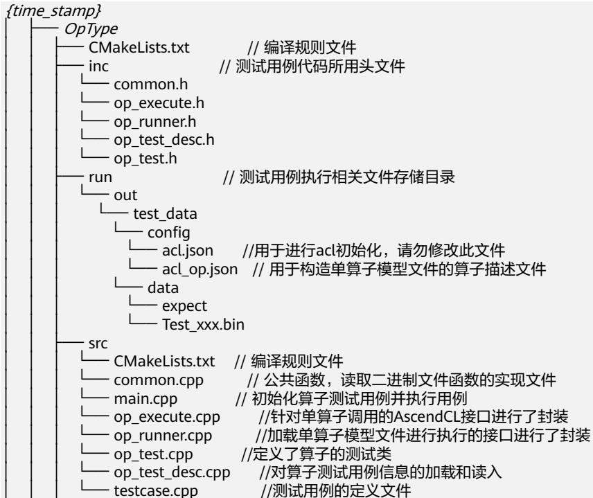

若运行模式为既生成ST测试代码，又运行ST测试代码，命令执行完成后，会打印测试用例执行结果，并会在-out指定的目录下生成时间戳目录，时间戳目录下将生成以算子的OpType命名的存储测试用例及测试结果的文件夹，目录结构如下所示：

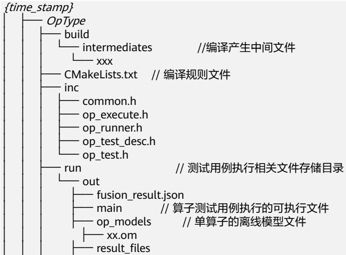

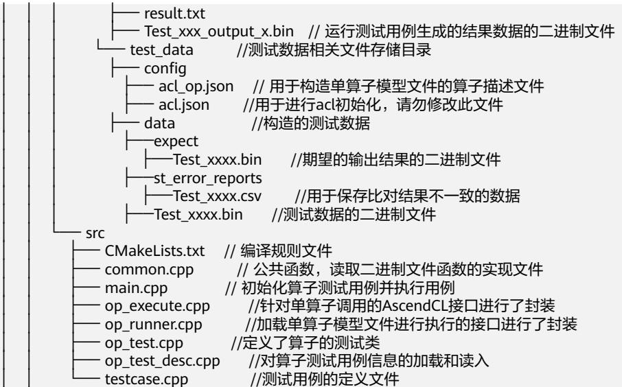  
─ st_report.json //运行报表

命令运行成功后，会生成报表st_report.json，记录了测试的信息以及各阶段运行情况，用户运行出问题以后，可基于报表查询运行信息，以便问题定位。同时，st_report.json报表可以对比测试结果。st_report.json保存在图5-1中“Thest_report saved in”路径下。

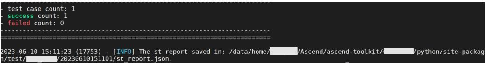  
图 5-1 运行结果示例

表 5-8 st_report.json 报表主要字段及含义  

<table><tr><td colspan="3" rowspan="1">字段</td><td colspan="1" rowspan="1">说明</td></tr><tr><td colspan="1" rowspan="1">run_cmd</td><td colspan="1" rowspan="1"></td><td colspan="1" rowspan="1"></td><td colspan="1" rowspan="1">命令行命令。</td></tr><tr><td colspan="1" rowspan="3">report_list</td><td colspan="1" rowspan="1"></td><td colspan="1" rowspan="1"></td><td colspan="1" rowspan="1">报告列表，该列表中可包含多个测试用例的报告。</td></tr><tr><td colspan="1" rowspan="2">trace_detail</td><td colspan="1" rowspan="1"></td><td colspan="1" rowspan="1">运行细节。</td></tr><tr><td colspan="1" rowspan="1">st_case_info</td><td colspan="1" rowspan="1">测试信息，包含如下内容。expect_data_path:期望计算结果路径。case_name:测试用例名称。input_data_path:输入数据路径。planned_output_data_paths：实际计算结果输出路径。op_params:算子参数信息。</td></tr><tr><td colspan="1" rowspan="4"></td><td colspan="1" rowspan="1"></td><td colspan="1" rowspan="1">stage_result</td><td colspan="1" rowspan="1">运行各阶段结果信息，包含如下内容。status：阶段运行状态，表示运行成功或者失败。1result:输出结果stage_name:阶段名称。cmd：运行命令。</td></tr><tr><td colspan="1" rowspan="1">case_name</td><td colspan="1" rowspan="1"></td><td colspan="1" rowspan="1">测试名称。</td></tr><tr><td colspan="1" rowspan="1">status</td><td colspan="1" rowspan="1"></td><td colspan="1" rowspan="1">测试结果状态，表示运行成功或者失败。</td></tr><tr><td colspan="1" rowspan="1">expect</td><td colspan="1" rowspan="1"></td><td colspan="1" rowspan="1">期望的测试结果状态，表示期望运行成功或者失败。</td></tr><tr><td colspan="1" rowspan="4">summary</td><td colspan="1" rowspan="1">=</td><td colspan="1" rowspan="1"></td><td colspan="1" rowspan="1">统计测试用例的结果状态与期望结果状态对比的结果。</td></tr><tr><td colspan="1" rowspan="1">test casecount</td><td colspan="1" rowspan="1"></td><td colspan="1" rowspan="1">测试用例的个数。</td></tr><tr><td colspan="1" rowspan="1">successcount</td><td colspan="1" rowspan="1"></td><td colspan="1" rowspan="1">测试用例的结果状态与期望结果状态一致的个数。</td></tr><tr><td colspan="1" rowspan="1">failed count</td><td colspan="1" rowspan="1"></td><td colspan="1" rowspan="1">测试用例的结果状态与期望结果状态不一致的个数。</td></tr></table>

----结束

# 开发环境与运行环境分设场景

步骤1 根据运行环境的架构在开发环境上搭建环境。

1. ST测试用例执行时，会使用AscendCL接口加载单算子模型文件并执行，需要在开发环境上根据运行环境的架构配置AscendCL应用编译所需其他环境变量。

当开发环境和运行环境架构相同时，环境变量如下所示。export DDK_PATH=\${INSTALL_DIR}  
export NPU_HOST_LIB $\scriptstyle \left. \left| = \right\{ \begin{array} { l l } { \mathbf { \Delta } } \\ { \mathbf { \Delta } } \end{array} \right.$ \${INSTALL_DIR}/{arch-os}/devlib  
当开发环境和运行环境架构不同时，环境变量如下所示。export DDK_PATH=\${INSTALL_DIR}/{arch-os}  
export NPU_HOST_LIB $= \mathfrak { s }$ \${INSTALL_DIR}/{arch-os}/devlib

# 说明

\${INSTALL_DIR}请替换为CANN软件安装后文件存储路径。以root用户安装为例，则安装后文件存储路径为：/usr/local/Ascend/cann。  
{arch-os}中arch表示操作系统架构（需根据运行环境的架构选择），os表示操作系统（需根据运行环境的操作系统选择）。

步骤2 在开发环境启动msOpST工具的高级功能，仅生成ST测试用例。

1. 执行命令，编辑msopst.ini文件。

vim \${INSTALL_DIR}/python/site-packages/bin/msopst.ini

2. 将msOpST工具的运行模式修改为模式2，按照表5-7修改“only_gen_without_run”和“only_run_without_gen”参数的取值。只生成ST测试代码，不运行ST测试代码。  
3. 若开发环境和运行环境架构不同，按照表5-6修改“HOST_ARCH”和“TOOL_CHAIN”参数的取值。

4. 执行如下命令生成ST测试源码。msopst run -i xx/AddCustom_case_timestamp.json -soc {soc version} -out {output path} -conf xx/msopst.ini-conf参数请修改为msopst.ini配置文件的实际路径。ST测试用例生成后，用户可根据需要自行修改ST测试用例代码。

5. 执行完成后，将在{output path}下生成ST测试用例，并使用g $^ { + + }$ 编译器生成可执行文件main。同时，屏幕打印信息中展示此次一共运行几个用例，测试用例运行的情况，并生成报表st_report.json，保存在打印信息中“The st report savedin”所示路径下，报表具体信息请参见表5-8。

步骤3 执行测试用例。

1. 将开发环境的算子工程目录的run目录下的out文件夹拷贝至运行环境任一目录，例如上传到\${INSTALL_DIR}/Ascend_project/run_add/目录下。  
2. 在运行环境中执行out文件夹下的可执行文件。进入out文件夹所在目录，执行如下命令：chmod $+ { \sf x }$ main./main

步骤4 查看运行结果。执行完成后，打印信息提示此次用例运行的情况，如图5-2所示。

=] Ran 12 tests.( 562.138 ms total [PASSED] 12 tests. [FAILED] 0 tests.

----结束

# 5.5 生成单算子上板测试框架

通过指定Ascend C算子的ST测试用例定义文件（.json）和实现文件kernel_name.cpp，自动生成调用核函数的上板测试框架，进行算子的测试验证，最终查看输出结果确认算子功能是否正确。

# 说明

● 该功能仅支持Atlas 推理系列产品和Atlas 训练系列产品，不支持Atlas A2 训练系列产品/Atlas A2 推理系列产品和Atlas A3 训练系列产品。  
● 所有参数不支持输入addr及tiling属性。  
● 支持使用#ifndef __CCE_KT_TEST__对核函数的调用进行封装的场景。

步骤1 请用户完成以下输入文件的准备工作。

算子ST测试用例定义文件（\*.json文件）。

Kernel侧算子实现文件（\*.cpp文件），具体可参考《Ascend C算子开发指南》中的“编程指南 $>$ 附录 $>$ 工程化算子开发 $>$ Kernel侧算子实现”章节。

步骤2 生成调用Kernel函数的测试代码，执行如下命令，具体参数介绍请参见表5-3。msopst ascendc_test -i xx/OpType_case.json -kernel xx/add_custom.cpp -out ./output_data

步骤3 查看执行结果。

命令执行完成后，会打印"Process finished!"提示信息，并会在-out指定的目录下生成时间戳目录，时间戳目录下将生成以算子的OpType命名的存储测试用例及测试结果的文件夹，目录结构如下所示：

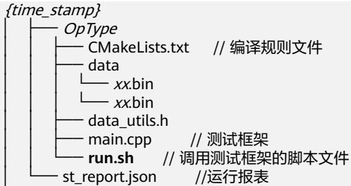

命令运行成功后，会生成报表st_report.json，记录了测试的信息以及各阶段运行情况，用户运行出问题以后，可基于报表查询运行信息，以便问题定位。同时，st_report.json报表可以对比测试结果。

st_report.json保存在如下“The st_report saved in”路径中。   
2024-01-17 08:40:55 (3271037) - [INFO] Create 1 sub test cases for Test_AddCustom_001.   
2024-01-17 08:40:55 (3271037) - [INFO] [STEP2] [data_generator.py] Generate data for testcase. 2024-01-17 08:40:55 (3271037) - [INFO] Start to generate the input data for   
Test_AddCustom_001_case_001_ND_float.   
2024-01-17 08:40:55 (3271037) - [INFO] Generate data for testcase in \$HOME/AddCustom/output/ 20240117084055/AddCustom/data.   
2024-01-17 08:40:55 (3271037) - [INFO] [STEP3] [gen_ascendc_test.py] Generate test code of calling of kernel function for AscendC operator.   
2024-01-17 08:40:55 (3271037) - [INFO] Content appended to \$HOME/AddCustom/output/   
20240117084055/AddCustom/main.cpp successfully.   
2024-01-17 08:40:55 (3271037) - [INFO] AscendC operator test code files for kernel implement have been successfully generated.   
2024-01-17 08:40:55 (3271037) - [INFO] If you want to execute kernel function in Ascend aihost or cpu, please execute commands: cd \$HOME/AddCustom/output/20240117084055/AddCustom && bash run.sh [KERNEL_NAME](add_custom) [SOC_VERSION](ascendxxxyy) [CORE_TYPE](AiCore/VectorCore)   
[RUN_MODE](cpu/npu). For example: cd \$HOME/AddCustom/output/20240117084055/AddCustom && bash run.sh add_custom ascendxxxyy AiCore npu   
2024-01-17 08:40:55 (3271037) - [INFO] Process finished!   
2024-01-17 08:40:55 (3271037) - [INFO] The st report saved in: \$HOME/AddCustom/output/   
20240117084055/st_report.json.

表 5-9 st_report.json 报表主要字段及含义  

<table><tr><td colspan="3" rowspan="1">字段</td><td colspan="1" rowspan="1">说明</td></tr><tr><td colspan="1" rowspan="1">run_cmd</td><td colspan="1" rowspan="1"></td><td colspan="1" rowspan="1"></td><td colspan="1" rowspan="1">命令行命令。</td></tr><tr><td colspan="1" rowspan="2">report_list</td><td colspan="1" rowspan="1">-</td><td colspan="1" rowspan="1"></td><td colspan="1" rowspan="1">报告列表，该列表中可包含多个测试用例的报告。</td></tr><tr><td colspan="1" rowspan="1">trace_detail</td><td colspan="1" rowspan="1">1</td><td colspan="1" rowspan="1">运行细节。</td></tr><tr><td colspan="1" rowspan="5"></td><td colspan="1" rowspan="2"></td><td colspan="1" rowspan="1">st_case_info</td><td colspan="1" rowspan="1">测试信息，包含如下内容。·expect_data_path:期望计算结果路径。·case_name：测试用例名称。：input_data_path:输入数据路径。planned_output_data_paths:实际计算结果输出路径。·op_params:算子参数信息。</td></tr><tr><td colspan="1" rowspan="1">stage_result</td><td colspan="1" rowspan="1">运行各阶段结果信息，包含如下内容：·status：阶段运行状态，表示运行成功或者失败。result:输出结果。·stage_name:阶段名称。·cmd：运行命令。</td></tr><tr><td colspan="1" rowspan="1">case_name</td><td colspan="1" rowspan="1"></td><td colspan="1" rowspan="1">测试名称。</td></tr><tr><td colspan="1" rowspan="1">status</td><td colspan="1" rowspan="1"></td><td colspan="1" rowspan="1">测试结果状态，表示运行成功或者失败。</td></tr><tr><td colspan="1" rowspan="1">expect</td><td colspan="1" rowspan="1"></td><td colspan="1" rowspan="1">期望的测试结果状态，表示期望运行成功或者失败。</td></tr><tr><td colspan="1" rowspan="4"> summary</td><td colspan="1" rowspan="1"></td><td colspan="1" rowspan="1"></td><td colspan="1" rowspan="1">统计测试用例的结果状态与期望结果状态对比的结果。</td></tr><tr><td colspan="1" rowspan="1">test casecount</td><td colspan="1" rowspan="1"></td><td colspan="1" rowspan="1">测试用例的个数。</td></tr><tr><td colspan="1" rowspan="1">successcount</td><td colspan="1" rowspan="1"></td><td colspan="1" rowspan="1">测试用例的结果状态与期望结果状态一致的个数。</td></tr><tr><td colspan="1" rowspan="1">failed count</td><td colspan="1" rowspan="1"></td><td colspan="1" rowspan="1">测试用例的结果状态与期望结果状态不一致的个数。</td></tr></table>

步骤4 修改run.sh文件中的ASCEND_HOME_DIR。

ASCEND_HOME_DIR为CANN软件包安装路径，请根据实际情况进行修改。

# 指向昇腾软件包安装地址，导出环境变量  
if [ ! \$ASCEND_HOME_DIR ]; thenexport ASCEND_HOME_DIR $= \$ 1$ {INSTALL_DIR}  
fi  
source \$ASCEND_HOME_DIR/bin/set_env.bash

步骤5 进入执行测试框架的脚本文件所在目录，如下命令进行测试框架代码的上板验证。bash run.sh <kernel_name> <soc version> <core_type> <run_mode>

表 5-10 脚本参数介绍  

<table><tr><td>参数名</td><td>参数介绍</td><td>取值</td></tr><tr><td>&lt;kernel_nam e&gt;</td><td>Ascend C算子实现文件的 文件名。</td><td>比如Add算子实现文件为 add_custom.cpp，则应传入 add_custom。</td></tr><tr><td>&lt;soc_version V</td><td>算子运行的AI处理器型 号。</td><td>Atlas训练系列产品和Atlas推理系列 产品，需按照实际使用的型号配置 ‘ ascendxxxyy” 0 说明 ·非Atlas A3 训练系列产品/Atlas A3推 理系列产品：在安装昇腾AI处理器的服 务器执行npu-smi info命令进行查 询，获取Chip Name信息。实际配置 值为AscendChip Name，例如Chip Name取值为xxxyy，实际配置值为 Ascend xxxyy。当Ascendxxxyy为代码 样例的路径时，需要配置为 ascend xxxyy。 Atlas A3训练系列产品/Atlas A3推理 系列产品：在安装昇腾AI处理器的服务 器执行npu-smi info -t board -i id -c chip_id命令进行查询，获取Chip Name和NPUName信息，实际配置 值为Chip Name_NPU Name。例如 ChipName取值为Ascendxxx，NPU Name取值为1234，实际配置值为 Ascendxxx_1234。当Ascendxxx_1234 为代码样例的路径时，需要配置为 ascendxxx_1234。 其中： -id:设备id，通过npu-smi info -l 命令查出的NPU ID即为设备id。 chip_id:芯片id，通过npu-smi info -m命令查出的Chip ID即为芯 片id。</td></tr><tr><td>&lt;core_type&gt;</td><td>表明算子在AiCore上或者 VectorCore上运行。</td><td>AiCore或VectorCore。</td></tr><tr><td>&lt;run_mode&gt;</td><td>表明算子以cpu模式或npu 模式运行。</td><td>cpu或npu。</td></tr></table>

脚本执行完毕会出现类似如下打印，输出"succeed"字样表示完成上板验证。

INFO: compile op on npu succeed!   
[INFO] Succeeded to exec acl api aclrtCreateContext(&context, deviceId)   
[INFO] Succeeded to exec acl api aclrtCreateStream(&stream)   
[INFO] Succeeded to exec acl api aclrtMallocHost((void\*\*)(&xHost), xByteSize)   
[INFO] Succeeded to exec acl api aclrtMalloc((void\*\*)&xDevice, xByteSize, ACL_MEM_MALLOC_HUGE_FIRST)   
[INFO] Succeeded to exec acl api aclrtMemcpy(xDevice, xByteSize, xHost, xByteSize,   
ACL_MEMCPY_HOST_TO_DEVICE)   
[INFO] Succeeded to exec acl api aclrtMallocHost((void\*\*)(&yHost), yByteSize)   
[INFO] Succeeded to exec acl api aclrtMalloc((void\*\*)&yDevice, yByteSize, ACL_MEM_MALLOC_HUGE_FIRST)   
[INFO] Succeeded to exec acl api aclrtMemcpy(yDevice, yByteSize, yHost, yByteSize,   
ACL_MEMCPY_HOST_TO_DEVICE)   
[INFO] Succeeded to exec acl api aclrtMallocHost((void\*\*)(&zHost), zByteSize) [INFO] Succeeded to exec acl api aclrtMalloc $( \mathsf { v o i d } ^ { \star \star } )$ )&zDevice, zByteSize, ACL_MEM_MALLOC_HUGE_FIRST) [INFO] Succeeded to exec acl api aclrtSynchronizeStream(stream)   
[INFO] Succeeded to exec acl api aclrtMemcpy(zHost, zByteSize, zDevice, zByteSize,   
ACL_MEMCPY_DEVICE_TO_HOST)   
[INFO] aclrtDestroyStream successfully.   
INFO: execute op on npu succeed!

# ----结束

# 5.6 典型案例

# 5.6.1 测试用例定义文件

Less算子的测试用例定义文件“Less_case.json”如下所 { "case_name": "Test_Less_001", //测试用例名称 "op": "Less", //算子的类型 "input_desc": [ //算子输入描述 { //第一个输入 "format": ["ND"], "type": ["int32","float"], "shape": [12,32], "data_distribute": [ //生成测试数据时选择的分布方式 "uniform" ], "value_range": [ //输入数据的取值范围 [ 1.0, 384.0 ] ] }, { //第二个输入 "format": ["ND"], "type": ["int32","float"], "shape": [12,32], "data_distribute": [ "uniform" ], "value_range": [ [ 1.0, 384.0 ] ] } ], "output_desc": [ //算子的输出 { "format": ["ND"], "type": ["bool","bool"], "shape": [12,32] } ] },{ "case_name": "Test_Less_002", "op": "Less", "input_desc": [ { ... }, {

} ], "output_desc": [ { ... } ] }

若算子包含属性，测试用例定义文件如下所示。 { "case_name":"Test_Conv2D_001", //测试用例名称 "op": "Conv2D", // 算子的Type，唯一 "input_desc": [ // 算子的输入描述 { //算子的第一个输入 "format": [ //用户在此处配置待测试的输入Tensor的排布格式 "ND", "NCHW" ], "type": [ // 输入数据支持的数据类型 "float", "float16" ], "shape": [8,512,7,7], // 输入Tensor的shape,用户需要自行修改 "data_distribute": [ //生成测试数据时选择的分布方式 "uniform" ], "value_range": [ // 输入数据值的取值范围 0.1, 200000.0 ] ] },{ //算子的第二个输入 "format": [ "ND", "NCHW" ], "type": [ "float", "float16" ], "shape": [512,512,3,3], "data_distribute": [ "uniform" ], "value_range": [ 0.1, 200000.0 ] ] } ], "output_desc": [ //必选,含义同输入Tensor描述 { "format": [ "ND", "NCHW" ], "type": [ "float", "float16" ], "shape": [8,512,7,7] } ],

"attr": [ // 算子的属性 { "name": "strides", //属性的名称 "type": "list_int", // 属性的支持的类型 "value": [1,1,1,1] // 属性值,跟type的类型对应 }, { "name": "pads", "type": "list_int", "value": [1,1,1,1] }, { "name": "dilations", "type": "list_int", "value": [1,1,1,1] } ] }

若指定固定输入，例如ReduceSum的axes参数，测试用例定义文件如下所示。 { "case_name": "Test_ReduceSum_001", "op": "ReduceSum", "input_desc": [ { "format": ["ND"], "type": ["int32"], //若需要设置value,则每个用例只能测试一种数据类型 "shape": [3,6,3,4], "data_distribute": [ "uniform" ], "value_range": [ [ -384, 384 ] }, { "format": ["ND"], "type": ["int32"], "shape": [2], "data_distribute": [ "uniform" ], "value_range": [ [ -3, 1 ] ], "value":[0,2] //设置具体值,需要与shape对应 } ],   
"output_desc": [ { "format": ["ND"], "type": ["int32"], "shape": [6,4] } ],   
"attr":[ { "name":"keep_dims", "type":"bool", "value":false }

} 若算子属性的type为类型，测试用例定义文件如下所示。 { "case_name": "Test_ArgMin_001", "op": "ArgMin", "input_desc": [ { ... }, { ... } ], "output_desc": [ { ... } ], "attr":[ { "name":"dtype", "type":"data_type", "value":"int64" } ]

若算子的输入个数不确定（动态多输入场景）。   
以AddN算子为例，属性“N”的取值为3，则需要配置3个输入描述，name分别   
为x0、x1、x2，即输入个数需要与属性“N”的取值匹配。 { "op": "AddN", "input_desc": [ { "name":"x0", "format": "NCHW", "shape": [1,3,166,166], "type": "float32" }, { "name":"x1", "format": "NCHW", "shape": [1,3,166,166], "type": "int32" }, { "name":"x2", "format": "NCHW", "shape": [1,3,166,166], "type": "float32" } ], "output_desc": [ { "format": "NCHW", "shape": [1,3,166,166], "type": "float32" } ], "attr": [ { "name": "N", "type": "int",

"value": 3 } ] }

若算子的某个输入为常量，测试用例定义文件如下所示。 { "case_name":"Test_OpType_001", "op": "OpType", "input_desc": [ { "format": ["ND"], "type": ["int32"], "shape": [1], "is_const":true, // 标识此输入为常量 "data_distribute": [ "uniform" ], "value":[11], //常量的值 "value_range": [ //min_value与max_value都配置为常量的值 [ 11, 11 ] ] }, { . } ], "output_desc": [ { ... } ] }

若算子的输入输出类型为复数，测试用例定义文件如下所示。   
{ "case_name": "Test_ReduceSum_001", "op": "ReduceSum", "input_desc": [ { "format": ["ND"], "type": [ "complex64", //输入类型为复数 "complex128" //输入类型为复数 ], "shape": [3,6], "data_distribute": [ "uniform" ], "value_range": [ //实部取值范围 [ 1, 10 ] ] }, { "format": ["ND"], "type": [ "int32", "int64"], "shape": [1], "data_distribute": [

"uniform" ], "value_range": [ [ 1, 1 ] ] } ], "output_desc": [ { "format": ["ND"], "type": [ "complex64", //输入类型为复数 "complex128" //输入类型为复数 ], "shape": [3] } ], "attr":[ { "name":"keep_dims", "type":"bool", "value":false } ] }

# 6 异常检测（msSanitizer）

工具概述  
使用前准备  
内存检测  
竞争检测  
未初始化检测  
同步检测  
典型案例  
FAQ  
对外接口使用说明

# 6.1 工具概述

异常检测工具（msSanitizer，MindStudio Sanitizer）是一种基于昇腾AI处理器的工具，包含了单算子开发场景下的内存检测、竞争检测、未初始化检测和同步检测四个子功能。用户使用msOpST工具在真实的硬件环境中对算子的功能进行测试后，可根据实际测试情况选择是否使用msSanitizer工具进行异常检测。

● 内存检测：工具可以在用户开发算子的过程中，协助定位非法读写、多核踩踏、非对齐访问、内存泄漏以及非法释放等内存问题。同时工具也支持对CANN软件栈的内存检测，帮助用户定界软件栈内存异常发生的模块。  
● 竞争检测：工具可以协助用户定位由于竞争风险可能导致的数据竞争问题，包含核内竞争和核间竞争问题。其中，核内竞争包含流水间竞争和流水内竞争。  
● 未初始化检测：工具可以协助用户定位由于内存未初始化可能导致的脏数据读取问题。  
● 同步检测：工具可以协助用户定位由于前序算子中的未配对同步指令导致的后续算子同步失败的问题。

# 说明

msSanitizer工具不支持对多线程算子及使用了掩码的向量类计算指令进行检测。

# 工具特性

msSanitizer通过不同子功能提供了不同类型的异常检测功能，目前已支持的功能如下：

表 6-1 msSanitizer 工具功能  

<table><tr><td rowspan=1 colspan=1>使用场景</td><td rowspan=1 colspan=1>使用说明</td><td rowspan=1 colspan=1>使用示例</td></tr><tr><td rowspan=1 colspan=1>算子内存检测</td><td rowspan=1 colspan=1>6.3 内存检测</td><td rowspan=1 colspan=1>msSanitizer支持内核调用符调用的Ascend C算子（包括Vector、Cube算子和Mix融合算子）内存和竞争的检测，可参考6.3内存检测。</td></tr><tr><td rowspan=1 colspan=1>算子竞争检测</td><td rowspan=1 colspan=1>6.4竞争检测</td><td rowspan=1 colspan=1>msSanitizer支持对单算子APl调用的Ascend C算子（包括Vector、Cube算子和Mix融合算子）内存和竞争的检测，可参考6.4竞争检测。</td></tr><tr><td rowspan=1 colspan=1>算子未初始化检测</td><td rowspan=1 colspan=1>6.5 未初始化检测</td><td rowspan=1 colspan=1>msSanitizer支持Ascend CL调用的Ascend C算子（包括Vector、Cube算子和Mix融合算子）未初始化的检测，可参考6.5未初始化检测。</td></tr><tr><td rowspan=1 colspan=1>同步检测</td><td rowspan=1 colspan=1>6.6 同步检测</td><td rowspan=1 colspan=1>msSanitizer支持内核调用符或单算子APl调用的AscendC算子（包括Vector、Cube算子和Mix融合算子）同步指令配对情况的检测，可参考6.6 同步检测。</td></tr><tr><td rowspan=1 colspan=1>CANN软件栈的内存检测</td><td rowspan=1 colspan=1>6.3 内存检测</td><td rowspan=1 colspan=1>支持CANN软件栈内存检测，详细可参考6.7.5检测CANN软件栈的内存。</td></tr></table>

# 命令汇总

可以通过运行以下命令来调用msSanitizer工具。

mssanitizer <options> -- <user program> <user options>

# 说明

options为检测工具的命令行选项，详细的参数选项及其默认值，请参考表6-2和表6-3，user_program为用户算子程序，user_options为用户程序的命令行选项。

● 如要加载的可执行文件或用户自定义程序本身带有命令行参数时，在可执行文件或用户程序（application）之前使用“--”分隔检测工具和用户命令。mssanitizer -- application parameter1 parameter2 ...

● 用户需保证可执行文件及用户自定义程序的安全性。

● 用户需自行保证可执行文件或用户程序（application）执行的安全性。

建议限制对可执行文件或用户程序（application）的操作权限，避免提权风险。

不建议进行高危操作（删除文件、删除目录、修改密码及提权命令等），避免安全风险。

表 6-2 通用参数说明  

<table><tr><td colspan="1" rowspan="1">参数名称</td><td colspan="1" rowspan="1">参数描述</td><td colspan="1" rowspan="1">参数取值</td><td colspan="1" rowspan="1">是否必选</td></tr><tr><td colspan="1" rowspan="1">-V，--version</td><td colspan="1" rowspan="1">查询msSanitizer工具版本。</td><td colspan="1" rowspan="1"></td><td colspan="1" rowspan="1">否</td></tr><tr><td colspan="1" rowspan="1">-t,--tool</td><td colspan="1" rowspan="1">指定异常检测的子工具。</td><td colspan="1" rowspan="1">·memcheck：内存检测（默认）·racecheck:竞争检测·initcheck：未初始化检测·synccheck：同步检测</td><td colspan="1" rowspan="1">否</td></tr><tr><td colspan="1" rowspan="1">--log-file</td><td colspan="1" rowspan="1">指定检测报告输出到文件。</td><td colspan="1" rowspan="1">{file_name}，如配置为test_log。说明·仅支持数字、大小写字母和-.／_四种符号。为避免日志泄漏风险，建议限制该文件权限，确保只有授权人员才能访问该文件。工具会以覆盖的方式将报告输出到test_log文件。若test_log文件中已有内容，这些内容将会被清空。因此，建议指定一个空文件用于输出报告。</td><td colspan="1" rowspan="1">否</td></tr><tr><td colspan="1" rowspan="1">--log-level</td><td colspan="1" rowspan="1">指定检测报告输出等级。</td><td colspan="1" rowspan="1">·info:输出info/warn/error级别的运行信息。warn：输出warn/error级别的运行信息（默认）。error：输出error级别的运行信息。</td><td colspan="1" rowspan="1">否</td></tr><tr><td colspan="1" rowspan="1">--max-debuglog-size</td><td colspan="1" rowspan="1">指定检测工具调试输出日志中单个文件大小的上限。</td><td colspan="1" rowspan="1">可设定范围为1~10240之间的整数，单位为MB。默认值为1024。说明--max-debuglog-size=100就表示单个调试日志的大小上限为100MB。</td><td colspan="1" rowspan="1">否</td></tr><tr><td colspan="1" rowspan="1">--block-id</td><td colspan="1" rowspan="1">是否启用单block检测功能。</td><td colspan="1" rowspan="1">可设定范围为0~200之间的整数。启用前·内存检测、未初始化检测和同步检测：默认检测所有block。·竞争检测：核间默认检测所有block，核内默认检测block0的流水内及流水间的竞争。启用后· 内存检测、未初始化检测和同步检测：检测指定block。·竞争检测：核间不进行检测，检测指定block的流水内及流水间的竞争。</td><td colspan="1" rowspan="1">否</td></tr><tr><td colspan="1" rowspan="1">--cache-size</td><td colspan="1" rowspan="1">表示单block的GM内存大小。</td><td colspan="1" rowspan="1">单block可设定范围为1~8192之间的整数，单位为MB。单block默认值为100MB，表示单block可申请100MB的内存大小。说明·启用单block检测时，--cache-size的最大值为8192MB。不启用单block检测时，--cache-size可设置的最大值为(24*1024/block数量）。当--cache-size值不满足需求时，异常检测工具将会打印信息提示用户重新设置--cache-size值，具体请参见6.8.3 msSanitizer工具提示--cache-size异常。</td><td colspan="1" rowspan="1">否</td></tr><tr><td colspan="1" rowspan="1">--kernel-name</td><td colspan="1" rowspan="1">指定要检测的算子名称。</td><td colspan="1" rowspan="1">支持使用算子名中的部分字符串来进行模糊匹配。如果不指定，则系统默认会对整个程序执行期间所调度的所有算子进行检测。例如，需要同时检测名为"abcd"和"bcd"的算子时，可以通过配置--kernel-name="bc"来实现这一需求，系统会自动识别并检测所有包含"bc"字符串的算子。</td><td colspan="1" rowspan="1">否</td></tr><tr><td colspan="1" rowspan="1">-h，--help</td><td colspan="1" rowspan="1">输出帮助信息。</td><td colspan="1" rowspan="1">1</td><td colspan="1" rowspan="1">否</td></tr></table>

表 6-3 内存检测参数说明  

<table><tr><td rowspan=1 colspan=1>参数名称</td><td rowspan=1 colspan=1>参数描述</td><td rowspan=1 colspan=1>参数取值</td><td rowspan=1 colspan=1>是否必选</td></tr><tr><td rowspan=1 colspan=1>--check-unused-memory</td><td rowspan=1 colspan=1>使能分配内存未使用检测。</td><td rowspan=1 colspan=1>·yes：no（默认）</td><td rowspan=1 colspan=1>否</td></tr><tr><td rowspan=1 colspan=1>--leak-check</td><td rowspan=1 colspan=1>使能内存泄漏检测。</td><td rowspan=1 colspan=1>：yes.no（默认）</td><td rowspan=1 colspan=1>否</td></tr><tr><td rowspan=1 colspan=1>--check-device-heap</td><td rowspan=1 colspan=1>使能Device侧内存检测。</td><td rowspan=1 colspan=1>·yes：no（默认）</td><td rowspan=1 colspan=1>否</td></tr><tr><td rowspan=1 colspan=1>--check-cann-heap</td><td rowspan=1 colspan=1>使能CANN软件栈内存检测。</td><td rowspan=1 colspan=1>·yes.no（默认）</td><td rowspan=1 colspan=1>否</td></tr></table>

# 说明

● --check-device-heap或--check-cann-heap使能后，将不会对Kernel内进行检测。  
● Device侧内存检测和CANN软件栈内存检测不能同时使能，若同时使能会提示“CANNOTenable both --check-cann-heap and --check-device-heap”。  
● 使用msSanitizer工具提供的API头文件重新编译的待检测程序只能用于Ascend CL系列接口的泄漏检测，无法用于Device接口的检测。

# 异常检测功能启用原则

异常检测工具提供内存检测（memcheck）、竞争检测（racecheck）、未初始化检测（initcheck）和同步检测（synccheck）四种检测功能，多种检测功能可以组合开启，组合启用检测功能需满足以下原则：

多个检测功能可通过多次指定--tool参数同时开启。如执行以下命令可同时开启内  
存检测和竞争检测：  
mssanitizer -t memcheck -t racecheck ./application  
若开启了检测功能对应的子选项，则对应的检测功能也会被默认开启。如开启了  
内存检测对应的泄漏检测子选项，则内存检测功能会被自动开启：  
mssanitizer -t racecheck --leak-check=yes ./application  
以上命令等价于：  
mssanitizer -t racecheck -t memcheck --leak-check=yes ./application  
若不指定任何检测功能，则默认启用内存检测：  
mssanitizer ./application  
以上命令等价于：  
mssanitizer -t memcheck ./application

# 调用场景

支持如下调用算子的场景：

Kernel直调算子开发：Kernel直调。

# 说明

Kernel直调场景，详细信息可参考《Ascend C算子开发指南》中“Kernel直调算子开发 $>$ Kernel直调”章节。具体操作请参见6.7.1 检测内核调用符方式的Ascend C算子。在<<<>>>自定义算子接入torch场景时，默认使用内存池的方式管理GM内存，可能会导致越界检测结果不准确。因此，在检测前需要额外设置如下环境变量关闭内存池，从而获得更精确的检测结果。  
export PYTORCH NO NPU MEMORY CACHING=1

工程化算子开发：单算子API调用。

# 说明

● 单算子API调用场景，详细信息可参考《Ascend C算子开发指南》中“编程指南 $>$ 附录> 工程化算子开发 $>$ 单算子API调用”章节。具体操作请参见6.7.2 检测API调用的单算子。

● 在调用含有aclnn前缀的API时，需执行以下命令，通过aclInit接口传入acl.json文件以保证内存检测的准确性。auto ret $=$ aclInit("./acl.json"); // acl.json文件内容为{"dump":{"dump_scene":"lite_exception"}}

AI框架算子适配：PyTorch框架。

# 说明

PyTorch图模式（TorchAir）下，仅支持在msSanitizer工具不添加编译选项的情况下进行检测，具体请参见配置编译选项（可选）。PyTorch图模式（TorchAir）下，支持Ascend IR图执行模式和aclgraph图执行模式，具体请参见《Ascend Extension for PyTorch 套件与三方库支持清单》中的“reduce-overhead模式功能 $>$ reduce-overhead模式配置”章节。  
PyTorch框架调用场景，详细信息可参考《Ascend Extension for PyTorch 框架特性指南》中的“基于OpPlugin算子适配开发”章节。具体操作请参见6.7.3 检测PyTorch接口调用的算子。

Triton算子开发：Triton算子调用。

# 说明

● Triton算子调用场景，详细信息可参考6.7.4 检测Triton算子。

● 已完成Triton及Triton-Ascend插件的安装和配置，具体操作请参见Link。

● Triton算子调用场景不适用于Atlas 推理系列产品。

为了防止未重新编译的算子造成影响，建议您启用以下环境变量：export TRITON_ALWAYS_COMPILE=1

● Triton场景会使用PyTorch创建Tensor，PyTorch框架内默认使用内存池的方式管理GM内存，会对内存检测产生干扰。因此，在检测前需要额外设置如下环境变量关闭内存池，以保证检测结果准确。export PYTORCH_NO_NPU_MEMORY_CACHING $= 1$

# 结果件说明

<table><tr><td>结果件名称</td><td>说明</td></tr><tr><td>mssanitizer_{TIMESTAMP}_{ PID}.log</td><td>msSanitizer工具运行过程中，在 mindstudio_sanitizer_log目录下生成的工具日志， TIMESTAMP为当前时间戳，PID为当前检测工具的 PID。</td></tr><tr><td colspan="1" rowspan="1">kernel.{ PID}.0</td><td colspan="1" rowspan="1">msSanitizer工具运行过程中，会在当前路径下生成的算子缓存文件。其中，PID为当前使用的检测工具的PID，该算子缓存文件用于解析异常调用栈。·正常情况下，msSanitizer工具退出时会自动清理该算子缓存文件。当msSanitizer工具异常退出（如被用户“CTRL+C”中止）时，该算子缓存文件会保留在文件系统中。因为该算子缓存文件包含算子的调试信息，建议限制其他用户对此文件的访问权限，并在检测工具运行完成后及时删除。</td></tr><tr><td colspan="1" rowspan="1">tmp_{PID}_{TIMESTAMP}</td><td colspan="1" rowspan="1">msSanitizer工具运行过程中，会在当前路径下生成的临时文件夹。其中，PID为当前使用的检测工具的PID，TIMESTAMP为当前时间戳，该文件夹用于生成算子Kernel二进制。·正常情况下，msSanitizer工具退出时会自动清理该文件夹。  当通过环境变量export INJ_LOG_LEVEL=0开启DEBUG等级日志，或工具异常退出（如被用户“CTRL+C”中止）时，该文件夹会保留在文件系统中，方便用户调测使用。因为该文件夹包含算子的调试信息，建议限制其他用户对此文件的访问权限，并在调测完成后及时删除。</td></tr></table>

# 6.2 使用前准备

# 环境准备

请参考2 环境准备，完成相关环境变量的配置。

# 配置编译选项（可选）

用户可根据需求自行选择是否添加编译选项，具体请参见表6-4。

表 6-4 编译场景介绍  

<table><tr><td rowspan=1 colspan=1>是否添加编译选项</td><td rowspan=1 colspan=1>指令检测范围</td><td rowspan=1 colspan=1>异常检测范围</td><td rowspan=1 colspan=1>适用场景</td></tr><tr><td rowspan=1 colspan=1>不添加</td><td rowspan=1 colspan=1>与GM相关的搬运指令</td><td rowspan=1 colspan=1>·仅支持内存检测中的非法读写和非对齐访问。·异常报告中不显示调用栈信息。说明. 该场景算子的优化等级需为02，并保证算子链接阶段增加-q选项，保留符号重定位信息，否则会导致检测功能失效。该场景不适用于Atlas推理系列产品。该场景仅适用于算子内核调用符场景。</td><td rowspan=1 colspan=1>该场景支持的功能上有限制，仅适用于对算子内存异常中的非法读写和非对齐访问异常的快速定界。</td></tr><tr><td rowspan=1 colspan=1>添加</td><td rowspan=1 colspan=1>全量指令</td><td rowspan=1 colspan=1>·支持全量检测。·在编译选项中增加-g选项后，异常报告将会显示调用栈信息。</td><td rowspan=1 colspan=1>通过不添加编译选项的功能快速定位异常算子后，再添加编译选项对异常算子进行全量检测，具体操作请参见开启全量检测。</td></tr></table>

# 开启全量检测

如需要开启全量检测，需要在算子代码的编译阶段增加编译选项，不同算子工程添加编译选项的位置不同，下面分别介绍模板库场景、内核调用符场景、Triton算子调用场景和msOpGen算子工程编译场景为例进行：

模板库场景  
修改模板库中的/examples/CMakeLists.txt文件，新增-g --cce-enable-sanitizer编译选项。  
set(BISHENG_COMPILER_OPTIONS -g --cce-enable-sanitizer)

内核调用符场景

a. 样例工程代码请参考Link，执行以下命令，下载分支版本的样例代码。 git clone https://gitee.com/ascend/samples.git -b 8.0.RC2

# 说明

此样例工程不支持Atlas A3 训练系列产品。

b. 进行算子代码编译，需添加以下编译选项：

-g--cce-enable-sanitizer或--sanitizer编辑样例工程目录下的“cmake/npu/CMakeLists.txt”文件，参考核函数开发和运行验证的完整样例。

target_compile_options(\${smoke_testcase}_npu PRIVATE -O2 -std $= c + + 1 7$ --cce-enable-sanitizer -g

增加--cce-enable-sanitizer或--sanitizer选项代表使能异常检测。

增加-g选项使编译器生成定位信息，将会在异常报告输出时打印异常发生的具体位置（文件名、行号以及调用栈等信息）。

# 说明

--cce-enable-sanitizer和-O0同时开启的情况下，需要增加编译选项 --cce-ignore-always-inline=false。  
添加-g编译选项会在生成的二进制文件中附带调试信息，建议限制带有调试信息的用户程序的访问权限，确保只有授权人员可以访问该二进制文件。  
增加--cce-enable-sanitizer编译选项生成的算子二进制，需与msSanitizer工具配套使用。不建议单独使用该二进制，单独使用可能会导致不可预见的问题。因llvm-symbolizer开源软件限制，调用栈的异常信息可能会获取失败。此时，用户可再次执行检测命令，就可以获取调用栈的异常信息。

c. 链接阶段需增加target_link_options选项。

编辑样例工程目录下的“cmake/npu/CMakeLists.txt”文件。  
target_link_options(\${smoke_testcase}_npu PRIVATE--cce-fatobj-link--cce-enable-sanitizer编辑样例工程目录下的“cmake/Modules/  
CMakeCCEInformation.cmake” 文件。  
if(NOT CMAKE_CCE_LINK_EXECUTABLE)  
set(CMAKE_CCE_LINK_EXECUTABLE  
"<CMAKE_CCE_COMPILER> \${CMAKE_LIBRARY_CREATE_CCE_FLAGS} \$  
{_CMAKE_COMPILE_AS_CCE_FLAG} <FLAGS> <CMAKE_CCE_LINK_FLAGS> <LINK_FLAGS><OBJECTS> -o <TARGET> <LINK_LIBRARIES>\${__IMPLICIT_LINKS}")  
endif()

d. 启用msSanitizer检测工具时，需要加载NPU侧可执行文件<kernel_name>_npu，该文件的获取可参考《AscendC算子开发指南》中的“Kernel直调算子开发 $>$ Kernel直调”章节。

● msOpGen算子工程编译场景

a. 单击Link，在\${git_clone_path}/samples/operator/ascendc/0_introduction/1_add_frameworklaunch目录下运行install.sh脚本，生成自定义算子工程。

# 说明

下载代码样例时，需执行以下命令指定分支版本。git clone https://gitee.com/ascend/samples.git -b masterbash install.sh -v Ascendxxxyy # xxxyy为用户实际使用的具体芯片类型

b. 切换至自定义算子工程目录。cd CustomOp  
c. 编辑样例工程目录下的“op_kernel/CMakeLists.txt”文件，在编译选项中添加-sanitizer选项，具体请参考支持自定义编译选项。add_ops_compile_options(ALL OPTIONS -sanitizer)

Triton算子调用场景

Triton算子采用Python语言进行开发，并且采用即时编译（JIT）方式来编译算子Kernel。在执行算子脚本前，需要配置以下环境变量支持全量检测。

export TRITON_ENABLE_SANITIZER=1

# 启动工具

完成环境准备和配置编译选项（可选）后，请参见启用内存检测、启用竞争检测、启用未初始化检测和6.6 同步检测章节使能msSanitizer工具的相关功能。

# 说明

异常报告具有以下级别：

● WARNING：此级别被定义为不确定性的风险，可能出现的异常现象由实际情况决定，如多核踩踏、内存分配未使用等。其中，多核踩踏风险涉及多个核对同一块内存的操作，高阶用户可以通过核间同步的手段来规避此风险，初级用户遇到此类异常，应该将其视为危险源。目前，多核踩踏的WARNING级别的报告仅能识别atomic类的核间同步信息。  
● ERROR：最高严重级别的异常，涉及针对内存操作的确定性错误，如非法读写、内存泄漏、非对齐访问、内存未初始化、竞争异常等。强烈建议用户检查此严重级别的异常。

# 6.3 内存检测

内存检测是针对用户程序运行时的一种异常检测，该工具可以检测并报告算子运行中对外部存储（Global Memory）和内部存储（Local Memory）的越界及未对齐等内存访问异常。

# 支持的内存异常类型

内存检测能够检测并报告诸如内存非法读写、多核踩踏、非对齐访问、内存泄漏、非法释放及分配内存未使用等异常操作，如下表所示。

表 6-5 内存异常类型  

<table><tr><td rowspan=1 colspan=1>异常名</td><td rowspan=1 colspan=1>描述</td><td rowspan=1 colspan=1>位置</td><td rowspan=1 colspan=1>支持地址空间</td></tr><tr><td rowspan=1 colspan=1>非法读写</td><td rowspan=1 colspan=1>由于访问了未分配的内存导致的异常。</td><td rowspan=1 colspan=1>Kernel、Host</td><td rowspan=1 colspan=1>GM、UB、LO{A,B,C}、L1</td></tr><tr><td rowspan=1 colspan=1>多核踩踏</td><td rowspan=1 colspan=1>Al Core核心访问了重叠的内存导致的踩踏问题。</td><td rowspan=1 colspan=1>Kernel</td><td rowspan=1 colspan=1>GM</td></tr><tr><td rowspan=1 colspan=1>非对齐访问</td><td rowspan=1 colspan=1>DMA（负责在Global Memory和LocalMemory之间搬运数据）搬运的地址与内存的最小访问粒度未对齐导致的异常。</td><td rowspan=1 colspan=1>Kernel</td><td rowspan=1 colspan=1>GM、UB、LO{A,B,C}、L1</td></tr><tr><td rowspan=1 colspan=1>非法释放</td><td rowspan=1 colspan=1>对未分配或已释放的地址进行释放导致的异常。</td><td rowspan=1 colspan=1>Host</td><td rowspan=1 colspan=1>GM</td></tr><tr><td rowspan=1 colspan=1>内存泄漏</td><td rowspan=1 colspan=1>申请内存使用后未释放，导致程序在运行过程中内存占用持续增加的异常。</td><td rowspan=1 colspan=1>Host</td><td rowspan=1 colspan=1>GM</td></tr><tr><td rowspan=1 colspan=1>分配内存未使用</td><td rowspan=1 colspan=1>对内存分配后未使用导致的异常。</td><td rowspan=1 colspan=1>Kernel、Host</td><td rowspan=1 colspan=1>GM</td></tr></table>

# 启用内存检测

运行msSanitizer工具时，默认启用内存检测功能（memcheck）。其中， application为用户程序。

执行如下命令可显式指定内存检测，默认会开启非法读写、多核踩踏、非对齐访  
问和非法释放的检测功能：  
mssanitizer --tool=memcheck application  
执行如下命令，可在步骤一检测功能项的基础上，手动启用内存泄漏的检测功  
能：  
mssanitizer --tool=memcheck --leak-check=yes application  
执行如下命令，可在步骤一检测功能项的基础上，手动启用分配内存未使用的检  
测功能：  
mssanitizer --tool=memcheck --check-unused-memory=yes application

# 说明

● 当用户程序运行完成后，界面将会打印异常报告，异常的具体含义请参见内存异常报告解析。当用户使用PyTorch等框架接入算子时，框架内部可能会通过内存池管理GM内存，而内存池通常会一次性分配大量GM内存，并在运行过程中复用。此时，若用户对算子进行检测并记录GM上所有内存分配和释放的信息，会因为内存池的内存管理方式导致检测信息不准确。因此检测工具提供了手动上报GM内存分配信息的接口，方便用户在算子调用时手动上报该算子应当使用的GM内存范围，详细接口介绍请参见6.9.2.10 sanitizerReportMalloc和6.9.2.11 sanitizerReportFree。msSanitizer工具也支持对Atlas A2 训练系列产品/Atlas A2 推理系列产品的AllReduce、AllGather、ReduceScatter、AlltoAll接口及Atlas A3 训练系列产品/Atlas A3 推理系列产品的AllGather、ReduceScatter、AlltoAllV接口进行非法读写的检测，具体介绍请参见《Ascend C算子开发接口》中的“高阶API > Hccl > Hccl Kernel侧接口”章节。  
● msSanitizer工具也支持对通算融合类算子的非法读写检测。

# 内存异常报告解析

内存检测异常报告会输出多种不同类型的异常信息，以下将对一些简单的异常信息示例进行说明，帮助用户解读异常报告中的信息。

● 非法读写非法读写异常信息的产生是由于算子程序中，通过读或写的方式访问了一块未分配的内存。此错误一般发生在GM或片上内存上，GM异常是由于GM分配的大小与实际算子程序中访问的范围不一致导致，而片上内存的异常是由于算子程序的访问范围超过硬件容量上限导致。$= = = = = = =$ ERROR: illegal read of size 224 // 异常的基本信息,包含非法读写的类型以及被非法访问的字节数,非法读写包括read(非法读取)和write(非法写入)= at 0x12c0c0015000 on GM in add_custom_kernel // 异常发生的内存位置信息，包含发生的核函数名、地址空间与内存地址，此处的内存地址指一次内存访问中的首地址in block aiv(0) on device 0 // 异常代码对应Vector核的block索引$= = = = = = =$ code in pc current $0 \times 7 7 c$ (serialNo:10) // 当前异常发生的pc指针和调用api行为的序列号$= = = = = = =$ #0 \${ASCEND_HOME_PATH}/compiler/tikcpp/tikcfw/impl/dav_c220/kernel_operator_data_copy_impl.h:58:9 // 以下为异常发生代码的调用栈，包含文件名、行号和列号$= = = = = = =$ #1 \${ASCEND_HOME_PATH}/compiler/tikcpp/tikcfw/inner_interface/inner_kernel_operator_data_copy_intf.cppm:58:9$= = = = = = =$ #2 \${ASCEND_HOME_PATH}/compiler/tikcpp/tikcfw/inner_interface/inner_kernel_operator_data_copy_intf.cppm:443:5$= = = = = = =$ #3 illegal_read_and_write/add_custom.cpp:18:5

以上示例中，对GM上的“0x12c0c0015000”地址存在非法读取，且导致异常发生的指令对应于算子实现文件add_custom.cpp的第18行。

# 说明

不添加编译选项的情况下，异常报告将不会出现以下调用栈信息：

$= = = = = = =$ #0 \${ASCEND_HOME_PATH}/compiler/tikcpp/tikcfw/impl/dav_c220/   
kernel_operator_data_copy_impl.h:58:9 // 以下为异常发生代码的调用栈，包含文件名、行号和列号   
$= = = = = = =$ #1 \${ASCEND_HOME_PATH}/compiler/tikcpp/tikcfw/inner_interface/   
inner_kernel_operator_data_copy_intf.cppm:58:9   
$= = = = = = =$ #2 \${ASCEND_HOME_PATH}/compiler/tikcpp/tikcfw/inner_interface/   
inner_kernel_operator_data_copy_intf.cppm:443:5   
====== #3 illegal_read_and_write/add_custom.cpp:18:5

# 多核踩踏

AI Core是昇腾AI处理器中的计算核心，AI处理器内部有多个AI Core，算子运行就在这些AI Core上。这些AI Core会在计算过程中从GM上搬入或搬出数据。当没有显式地进行核间同步时，如果各个核之间访问的GM内存存在重叠并且至少有一个核对重叠地址进行写入时，则会发生多核踩踏问题。这里我们通过所有者的概念来保证多核之间不会发生踩踏问题，当一块内存被某一个核写入后，这块内存就由该核所有。当其他核对这块内存进行访问时就会产生out of bounds异常。

$= = = = = = =$ WARNING: out of bounds of size 256 // 异常的基本信息，包含发生踩踏的字节数  
$= = = = = = =$ at 0x12c0c00150fc on GM when writing data in add_custom_kernel // 异常发生的内存位置  
信息，包含发生的核函数名、地址空间与内存地址，此处的内存地址指一次内存访问中的首地址  
$= = = = = = =$ in block aiv(9) on device 0 // 异常代码对应Vector核的block索引  
$= = = = = = =$ code in pc current 0x7b8 (serialNo:22) // 当前异常发生的pc指针和调用api行为的序列号  
$= = = = = = =$ #0 \${ASCEND_HOME_PATH}/compiler/tikcpp/tikcfw/impl/dav_c220/  
kernel_operator_data_copy_impl.h:103:9 // 以下为异常发生代码的调用栈，包含文件名、行号和列号  
$= = = = = = =$ #1 \${ASCEND_HOME_PATH}/compiler/tikcpp/tikcfw/inner_interface/  
inner_kernel_operator_data_copy_intf.cppm:155:9  
$= = = = = = =$ #2 \${ASCEND_HOME_PATH}/compiler/tikcpp/tikcfw/inner_interface/  
inner_kernel_operator_data_copy_intf.cppm:461:5  
$= = = = = = =$ #3 out_of_bound/add_custom.cpp:21:5

以上示例中，共有256个字节的访问发生踩踏，对GM上的“0x12c0c00150fc”地址进行访问时存在多核踩踏，且导致异常发生的指令对应于算子实现文件add_custom.cpp的第21行。

非对齐访问

昇腾处理器上包含多种类型的内存，当通过DMA进行访问时，不同类型的内存在不同处理器上有不同的最小访问粒度。当访问的内存地址与最小访问粒度不对齐时，会发生数据异常或AI Core异常等问题。访问对齐检测可以在对齐问题发生时输出对齐异常信息。

$= = = = = = =$ ERROR: misaligned access of size 13 // 异常的基本信息，包含发生对齐异常操作的字节数at 0x6 on UB in add_custom_kernel // 异常发生的内存位置信息，包含发生的核函数名、地址  
空间与内存地址== in block aiv(0) on device 0 // 异常代码对应Vector核的block索引  
$= = = = = = =$ code in pc current $0 \times 7 8 0$ (serialNo:33) // 当前异常发生的pc指针和调用api行为的序列号  
$= = = = = = =$ #0 \${ASCEND_HOME_PATH}/compiler/tikcpp/tikcfw/impl/dav_c220/  
kernel_operator_data_copy_impl.h:103:9 // 以下为异常发生代码的调用栈，包含文件名、行号和列号  
$= = = = = = =$ #1 \${ASCEND_HOME_PATH}/compiler/tikcpp/tikcfw/inner_interface/  
inner_kernel_operator_data_copy_intf.cppm:155:9==== #2 \${ASCEND_HOME_PATH}/compiler/tikcpp/tikcfw/inner_interface/  
inner_kernel_operator_data_copy_intf.cppm:461:5  
$= = = = = = =$ #3 illegal_align/add_custom.cpp:18:5

以上示例中，共有针对13个字节的对齐异常访问，对UB上的“0x6”地址进行访问时存在对齐问题，且导致异常发生的指令对应于算子实现文件add_custom.cpp的第18行。

# 说明

不添加编译选项的情况下，异常报告将不会出现以下调用栈信息：

$= = = = = = =$ #0 \${ASCEND_HOME_PATH}/compiler/tikcpp/tikcfw/impl/dav_c220/   
kernel_operator_data_copy_impl.h:103:9 // 以下为异常发生代码的调用栈，包含文件名、行号和列   
号   
$= = = = = = =$ #1 \${ASCEND_HOME_PATH}/compiler/tikcpp/tikcfw/inner_interface/   
inner_kernel_operator_data_copy_intf.cppm:155:9   
$= = = = = = =$ #2 \${ASCEND_HOME_PATH}/compiler/tikcpp/tikcfw/inner_interface/   
inner_kernel_operator_data_copy_intf.cppm:461:5   
$= = = = = = =$ #3 illegal_align/add_custom.cpp:18:5

# 内存泄漏

内存检测可以检测出Device侧的内存泄漏问题，这些问题通常是开发者没有正确释放使用AscendCL接口申请的内存导致的，由于内部存储（Local Memory）目前不存在内存分配的概念，因此内存泄漏只可能出现在GM上。通过指定命令行参数“--leak-check=yes”可以开启内存泄漏检测。

$= = = = = = =$ ERROR: LeakCheck: detected memory leaks // 检测到内存泄漏   
$= = = = = = =$ Direct leak of 100 byte(s) // 具体每次的内存泄漏信息   
$= = = = = = =$ at 0x124080013000 on GM allocated in add_custom.cpp:14 (serialNo:37)   
$= = = = = = =$ Direct leak of 1000 byte(s)   
$= = = = = = =$ at 0x124080014000 on GM allocated in add_custom.cpp:15 (serialNo:55)   
$= = = = = = =$ SUMMARY: 1100 byte(s) leaked in 2 allocation(s) // 全部内存泄漏的总结，包括发生泄漏的

次数以及总共泄漏了多少字节等信息

以上示例中，第一个内存泄漏信息包含了地址空间、内存地址、内存长度以及代码定位信息，代码定位信息指向具体分配这块内存的调用所在的文件名和行号。

非法释放

非法释放是指对一个未分配的地址或者已释放的地址进行了释放操作，一般发生在GM上。

$= = = = = = =$ ERROR: illegal free() // 异常的基本信息，表明发生了非法释放异常$= = = = = = =$ at 0x124080013000 on GM // 异常发生的内存位置信息，包含发生的地址空间与内存地址$= = = = = = =$ code in add_custom.cpp:84 (serialNo:63) // 异常发生的代码定位信息,包含文件名、行号和调用api行为的序列号

以上示例中，对GM上的“0x124080013000”地址进行了非法释放，且导致异常发生的指令对应于算子实现文件add_custom.cpp的第84行。

分配内存未使用

分配内存未使用是指算子运行时申请了内存，但直到算子运行完成，都没有使用该内存。该异常场景一般是算子使用了错误的内存或算子逻辑存在问题，一般发生在GM上。

=== WARNING: Unused memory of 1000 byte(s) //异常的基本信息，表明检测到内存分配未使用异常$= = = = = = =$ at 1240c0016000 on GM // 异常发生的内存位置信息,包含发生的地址空间与内存地址$= = = = = = =$ code in add_custom.cpp:2 (serialNo:69) //异常发生的代码定位信息,包含文件名、行号和调用api行为的序列号=== SUMMARY: 1100byte(s) unused memory in 2 allocation(s) // 内存分配未使用的总结信息，包括未使用内存块的个数及字节等信息

# 6.4 竞争检测

竞争检测用于解决在并行计算环境中内存访问竞争的问题。在昇腾处理器架构下，外部存储和内部存储通常被用作临时缓冲区保存正在处理的数据，外部存储或内部存储可以同时被多个流水访问，外部存储还可以被多个核访问，算子程序若没有正确处理核间、流水间或流水内的同步，就可能会导致数据竞争的问题。

# 内存竞争类型

内存竞争是指两个内存事件（其中至少有一个为写事件）尝试访问同一块内存时，出现不符合基于预期执行顺序的结果。这种异常会导致数据竞争，从而使程序的运行或输出取决于内存事件的实际执行顺序。竞争检测功能可识别以下三种典型的内存竞争：

表 6-6 内存竞争类型  

<table><tr><td rowspan=1 colspan=1>异常名</td><td rowspan=1 colspan=1>描述</td><td rowspan=1 colspan=1>位置</td><td rowspan=1 colspan=1>支持地址空间</td></tr><tr><td rowspan=1 colspan=1>Write-After-Write(WAW)</td><td rowspan=1 colspan=1>当两个内存事件尝试向同一块内存写入时，可能存在这种异常，导致内存结果值取决于两个内存事件的实际访问顺序。</td><td rowspan=3 colspan=1>Kernel</td><td rowspan=3 colspan=1>GM、UB、LO{A,B,C}、L1</td></tr><tr><td rowspan=1 colspan=1>Write-After-Read(WAR)</td><td rowspan=1 colspan=1>当两个内存事件（一个事件执行读取操作，另一个事件执行写入操作）尝试访问同一块内存时，可能存在这种异常，即写操作事件实际在读操作事件之前执行完毕，并导致读取到的内存值并非预期起始值。</td></tr><tr><td rowspan=1 colspan=1>Read-After-Write(RAW)</td><td rowspan=1 colspan=1>当两个内存事件（一个事件执行读取操作，另一个事件执行写入操作）尝试访问同一块内存时，可能存在这种异常，即读操作事件实际在写操作事件之前执行完毕，并导致读取到的内存值还未更新。</td></tr></table>

当竞争检测识别出异常，用户就可以修改程序以确保该异常不再存在。在出现先写后读或先读后写的情况下，会根据serialNo大小顺序确定先后顺序，serialNo小的在PIPE_S上先执行。

# 启用竞争检测

运行msSanitizer工具时，执行如下命令，启用竞争检测功能（racecheck）。mssanitizer --tool=racecheck application // application为用户程序

# 说明

竞争检测不会执行内存错误检查，建议用户先运行6.3 内存检测，确保算子程序能够正常执行，没有运行异常。  
● 当用户程序运行完成后，界面将会打印异常报告，异常的具体含义见竞争异常报告解析。  
$\bullet$ 启动工具后，将会在当前目录下自动生成工具运行日志文件mssanitizer_{TIMESTAMP}_{PID}.log。

# 竞争异常报告解析

竞争检测会输出一系列信息，详细说明有关算子各PIPE之间存在的内存数据竞争访问风险。

$= = = = = = =$ ERROR: Potential RAW hazard detected at GM in kernel_float on device 0: // 竞争事件类型、异常内   
存块信息、竞争发生的核函数名 === PIPE_MTE2 Write at RAW() $+ 0 { \times } 0$ in block 0 (aiv) on device 0 at pc current ${ 0 } { \times } { \mathsf { a } } { 9 } { 8 }$ (serialNo:14) //   
竞争事件的详细信息,包含该事件所在的PIPE、操作类型、内存访问起始地址、核类型、AICore信息以及代码执行   
的pc指针和调用api行为的序列号   
$= = = = = = =$ #0 \${ASCEND_HOME_PATH}/compiler/tikcpp/tikcfw/impl/dav_c220/   
kernel_operator_data_copy_impl.h:58:9 // 以下为异常发生代码的调用栈，包含文件名、行号和列号   
$= = = = = = =$ #1 \${ASCEND_HOME_PATH}/compiler/tikcpp/tikcfw/inner_interface/   
inner_kernel_operator_data_copy_intf.cppm:58:9 ==== #2 \${ASCEND_HOME_PATH}/compiler/tikcpp/tikcfw/inner_interface/   
inner_kernel_operator_data_copy_intf.cppm:443:5   
$= = = = = = =$ #3 Racecheck/add_custom.cpp:17:5 PIPE_MTE3 Read at RAW() $1 + 0 { \times } 0$ in block 0 (aiv) on device 0 at pc current 0xad4 (serialNo:17)   
$= = = = = = =$ #0 \${ASCEND_HOME_PATH}/compiler/tikcpp/tikcfw/impl/dav_c220/   
kernel_operator_data_copy_impl.h:103:9 === #1 \${ASCEND_HOME_PATH}/compiler/tikcpp/tikcfw/inner_interface/   
inner_kernel_operator_data_copy_intf.cppm:155:9 ==== #2 \${ASCEND_HOME_PATH}/compiler/tikcpp/tikcfw/inner_interface/   
inner_kernel_operator_data_copy_intf.cppm:461:5   
====== #3 Racecheck/add_custom.cpp:22:5

以上示例中表示了AICore 0的Vector核内部中存在对UB的先写后读竞争风险，PIPE_MTE2流水中存在对“0x0”地址的写入操作事件，该操作对应算子实现文件add_custom.cpp中的第17行，PIPE_MTE3流水中存在对“0x0”地址的读取操作事件，该操作对应算子实现文件add_custom.cpp中的第22行。

# 6.5 未初始化检测

未初始化检测功能是一种重要的内存安全保护机制，旨在识别并防止由于使用未初始化的变量而导致的内存异常。

# 支持的未初始化异常类型

表 6-7 未初始化异常类型  

<table><tr><td rowspan=1 colspan=1>异常名</td><td rowspan=1 colspan=1>描述</td><td rowspan=1 colspan=1>位置</td><td rowspan=1 colspan=1>支持地址空间</td></tr><tr><td rowspan=1 colspan=1>未初始化</td><td rowspan=1 colspan=1>内存申请后为未初始化状态，未对内存进行写入，直接读取未初始化的值导致的异常。</td><td rowspan=1 colspan=1>Kernel、Host</td><td rowspan=1 colspan=1>GM、UB、L1、L0{ABC}、栈空间</td></tr></table>

# 启用未初始化检测

运行msSanitizer工具时，执行如下命令，启用未初始化检测功能（initcheck）。mssanitizer --tool=initcheck application // application为用户程序

# 说明

● 启动工具后，将会在当前目录下自动生成工具运行日志文件mssanitizer_{TIMESTAMP}_{PID}.log。  
● 当用户程序运行完成后，界面将会打印异常报告，异常的具体含义请参见未初始化异常报告解析。由于硬件限制，某些指令仅支持以Block形式进行数据搬运。当参与计算的实际数据量不是Block大小的整数倍时，可能会不可避免地带入部分无效数据（即“脏数据”），这可能导致工具报告初始化异常，用户需自行判断这些“脏数据”是否会影响计算结果。

# 未初始化异常报告解析

未初始化检测异常报告会输出多种不同类型的异常信息，以下将对一些简单的异常信息示例进行说明，帮助用户解读异常报告中的信息。

未初始化的异常场景一般是算子读取了已申请但未初始化的内存，发生在GM、UB、L1、L0{ABC}、栈空间上。

$= = = = = = =$ ERROR: uninitialized read of size 224 // 异常的基本信息，包含读取的未初始化字节数at 0x12c0c0015000 on GM in add_custom_kernel // 异常发生的内存位置信息，包含发生的核函数  
名、地址空间与内存地址，此处的内存地址指一次内存访问中的首地址  
$= = = = = = =$ in block aiv(0) on device 0 // 异常代码对应Vector核的block索引  
$= = = = = = =$ code in pc current 0x77c (serialNo:10) // 当前异常发生的pc指针和调用api行为的序列号  
$= = = = = = =$ #0 \${ASCEND_HOME_PATH}/compiler/tikcpp/tikcfw/impl/dav_c220/  
kernel_operator_data_copy_impl.h:58:9 // 以下为异常发生代码的调用栈，包含文件名、行号和列号  
$= = = = = = =$ #1 \${ASCEND_HOME_PATH}/compiler/tikcpp/tikcfw/inner_interface/  
inner_kernel_operator_data_copy_intf.cppm:58:9  
$= = = = = = =$ #2 \${ASCEND_HOME_PATH}/compiler/tikcpp/tikcfw/inner_interface/  
inner_kernel_operator_data_copy_intf.cppm:443:5  
$= = = = = = =$ #3 uninitialized_read/add_custom.cpp:18:5

# 6.6 同步检测

在Ascend C算子开发过程中，必须成对使用SetFlag和WaitFlag，同步检测功能用于找出算子中未配对的SetFlag指令。

若存在多余SetFlag指令，不会直接导致当前算子的竞争问题，却会改变硬件计数器的状态，进而可能导致后续算子的同步指令配对错误。若这些后续算子本身不存在竞争，竞争检测也不会报错，但前序算子的计数器变化可能导致实际竞争情况的发生，通过同步检测功能，能够有效识别前序算子中的多余SetFlag指令问题，避免后续算子受影响。

# 说明

● 同步检测单独启用时不会执行内存检测和竞争检测，因此建议用户先使用内存检测和竞争检测，若竞争检测无异常报告，但算子存在竞争现象时，再考虑使用同步检测对前序算子进行检查。  
● 若存在多余WaitFlag指令，将会导致当前算子的后续指令被阻塞，从而出现算子运行停滞的现象。此时，开发者无需工具提示，便可自行发现问题。

# 支持的同步异常类型

表 6-8 同步异常类型  

<table><tr><td rowspan=1 colspan=1>异常名</td><td rowspan=1 colspan=1>描述</td><td rowspan=1 colspan=1>位置</td></tr><tr><td rowspan=1 colspan=1>同步检测</td><td rowspan=1 colspan=1>算子中存在未配对的SetFlag同步指令时，虽然对当前算子的功能没有直接影响，却会引发计数器状态错误。可能会扰乱后续算子的同步指令配对，进而影响后续算子的计算精度。</td><td rowspan=1 colspan=1>Kernel</td></tr></table>

# 启用同步检测

运行msSanitizer工具时，执行如下命令，启用同步检测功能（synccheck）。mssanitizer --tool=synccheck application // application为用户程序

# 说明

启动工具后，将会在当前目录下自动生成工具运行日志文件mssanitizer_{TIMESTAMP}_{PID}.log。  
当用户程序运行完成后，界面将会打印异常报告，异常的具体含义请参见同步异常报告解析。

# 同步异常报告解析

同步检测异常报告会依次列出每个算子中未配对的SetFlag指令的相关信息，包括源流水和目标流水以及具体位置。

$= = = = = = =$ WARNING: Unpaired set_flag instructions detected // 提示检出未配对的set_flag指令  
$= = = = = = =$ from PIPE_S to PIPE_MTE3 in kernel // 标识从PIPE_S到PIPE_MTE3的同步，PIPE_MTE3等待PIPE_S  
$= = = = = = =$ in block aiv(0) on device 1 // 异常代码对应Vector核的block索引和设备号，此处为0核1卡  
$= = = = = = =$ code in pc current $0 { \times } 2 { \mathsf { c } } 9 4$ (serialNo:31) // 当前异常发生的pc指针和调用api行为的序列号  
$= = = = = = =$ #0 /home/Ascend/compiler/tikcpp/tikcfw/impl/kernel_event.h:785:13 // 以下为异常发生代码的调  
用栈，包含文件名、行号和列号  
$= = = = = = =$ #1 /home/Ascend/compiler/tikcpp/tikcfw/interface/kernel_common.h:150:5  
$= = = = = = =$ #2 /home/test/ascendc_test_syncall/kernel.cpp:26:9

# 6.7 典型案例

# 6.7.1 检测内核调用符方式的 Ascend C 算子

# 操作步骤

步骤1 请参考内核调用符场景准备，完成使用前准备。

步骤2 参考6.2 使用前准备完成相关环境变量的配置。

步骤3 构建单算子可执行文件。

以Add算子为例，可执行文件的构建命令示例如下：

bash run.sh -r npu -v <soc version>

一键式编译运行脚本完成后，在工程目录下生成NPU侧可执行文件<kernel_name>_npu。

步骤4 使用msSanitizer检测工具拉起单算子可执行文件（以add_npu为例）。

内存检测执行以下命令，具体参数说明请参考表6-2和表6-3，内存检测请参考内存检测示例说明。  
mssanitizer --tool=memcheck ./add npu # 内存检测需指定 --tool=memcheck  
竞争检测执行以下命令，具体参数说明请参考表6-2，竞争检测请参考竞争检测示例说明。  
mssanitizer --tool=racecheck ./add npu # 竞争检测需指定 --tool=racecheck

单算子可执行文件所在路径可配置为绝对路径或相对路径，请根据实际环境配置。

# ----结束

# 内存检测示例说明

在步骤1之前，需要在Add算子中构造一个非法读写的场景，将DataCopy内存拷  
贝长度从TILE_LENGTH改为2 \* TILE_LENGTH，此时最后一次拷贝会发生内存读  
写越界。_aicore__ inline void CopyOut(int32_t progress){// deque output tensor from VECOUT queueLocalTensor<half> zLocal $=$ outQueueZ.DeQue<half>();// copy progress_th tile from local tensor to global tensor// 构造非法读写场景DataCopy(zGm[progress \* TILE_LENGTH], zLocal, 2 \* TILE_LENGTH);// free output tensor for reuseoutQueueZ.FreeTensor(zLocal);

根据检测工具输出的报告，可以发现在add_custom.cpp的65行对GM存在224字节的非法写操作，与我们构造的异常场景对应。

\$ mssanitizer --tool=memcheck ./add_npu   
$= = = = = = =$ ERROR: illegal write of size 224   
$= = = = = = =$ at 0x12c0c002ef00 on GM in add_custom_kernel   
$= = = = = = =$ in block aiv(7) on device 0   
$= = = = = = =$ code in pc current 0x1644 (serialNo:2342)   
$= = = = = = =$ #0 \${ASCEND_HOME_PATH}/compiler/tikcpp/tikcfw/impl/dav_c220/   
kernel_operator_data_copy_impl.h:107:9   
$= = = = = = =$ #1 \${ASCEND_HOME_PATH}/compiler/tikcpp/tikcfw/inner_interface/   
inner_kernel_operator_data_copy_intf.cppm:155:9   
$= = = = = = =$ #2 \${ASCEND_HOME_PATH}/compiler/tikcpp/tikcfw/inner_interface/   
inner_kernel_operator_data_copy_intf.cppm:459:5   
$= = = = = = =$ #3 samples/operator/AddCustomSample/KernelLaunch/AddKernelInvocation/   
add_custom.cpp:65:9   
$= = = = = = =$ #4 samples/operator/AddCustomSample/KernelLaunch/AddKernelInvocation/   
add_custom.cpp:38:13   
$= = = = = = =$ #5 samples/operator/AddCustomSample/KernelLaunch/AddKernelInvocation/   
add_custom.cpp:82:8

# 竞争检测示例说明

在步骤1之前，需要在Add算子中构造一个核间竞争的场景，将DataCopy内存拷  
贝长度从TILE_LENGTH改为2 \* TILE_LENGTH，此时会在GM内存上存在核间竞  
争。_aicore__ inline void CopyOut(int32_t progress)// deque output tensor from VECOUT queueLocalTensor<half> zLocal $=$ outQueueZ.DeQue<half>();// copy progress_th tile from local tensor to global tensor// 构造核间竞争场景DataCopy(zGm[progress $^ { \star }$ TILE_LENGTH], zLocal, 2 \* TILE_LENGTH);

// free output tensor for reuse outQueueZ.FreeTensor(zLocal); }

根据检测工具输出的报告，可以发现在add_kernel.cpp的65行，AIV的0核和1核 存在核间竞争，符合我们构造的异常场景。   
\$ mssanitizer --tool=racecheck ./add_npu   
=== ERROR: Potential WAW hazard detected at GM in add_custom_kernel:   
== PIPE_MTE3 Write at WAW()+0x12c0c0025f00 in block 0 (aiv) on device 0 at pc current 0x1644 (serialNo:305)   
=== #0 \${ASCEND_HOME_PATH}/compiler/tikcpp/tikcfw/impl/dav_c220/   
kernel_operator_data_copy_impl.h:107:9   
$= = = = = = =$ #1 \${ASCEND_HOME_PATH}/compiler/tikcpp/tikcfw/inner_interface/   
inner_kernel_operator_data_copy_intf.cppm:155:9   
$= = = = = = =$ #2 \${ASCEND_HOME_PATH}/compiler/tikcpp/tikcfw/inner_interface/   
inner_kernel_operator_data_copy_intf.cppm:459:5   
$= = = = = = =$ #3 samples/operator/AddCustomSample/KernelLaunch/AddKernelInvocation/ add_custom.cpp:65:9   
$= = = = = = =$ #4 samples/operator/AddCustomSample/KernelLaunch/AddKernelInvocation/   
add_custom.cpp:38:13   
$= = = = = = =$ #5 samples/operator/AddCustomSample/KernelLaunch/AddKernelInvocation/   
add_custom.cpp:82:8   
$= = = = = = =$ PIPE_MTE3 Write at WAW()+0x12c0c0026000 in block 1 (aiv) on device 0 at pc current 0x1644 (serialNo:329)   
$= = = = = = =$ #0 \${ASCEND_HOME_PATH}/compiler/tikcpp/tikcfw/impl/dav_c220/   
kernel_operator_data_copy_impl.h:107:9   
$= = = = = = =$ #1 \${ASCEND_HOME_PATH}/compiler/tikcpp/tikcfw/inner_interface/   
inner_kernel_operator_data_copy_intf.cppm:155:9   
$= = = = = = =$ #2 \${ASCEND_HOME_PATH}/compiler/tikcpp/tikcfw/inner_interface/   
inner_kernel_operator_data_copy_intf.cppm:459:5   
$= = = = = = =$ #3 samples/operator/AddCustomSample/KernelLaunch/AddKernelInvocation/ add_custom.cpp:65:9   
$= = = = = = =$ #4 samples/operator/AddCustomSample/KernelLaunch/AddKernelInvocation/   
add_custom.cpp:38:13   
$= = = = = = =$ #5 samples/operator/AddCustomSample/KernelLaunch/AddKernelInvocation/   
add_custom.cpp:82:8

# 6.7.2 检测 API 调用的单算子

完成自定义算子的开发部署后，通过单算子API执行的方式调用，添加检测相关编译选项重新编译算子并部署，使用msSanitizer工具运行可执行文件实现算子进行异常检测。

# 前提条件

单击Link获取样例工程，为进行算子检测做准备。

# 说明

此样例工程不支持Atlas A3 训练系列产品。下载代码样例时，需执行以下命令指定分支版本。git clone https://gitee.com/ascend/samples.git -b master

# 操作步骤

步骤1 执行以下命令，生成自定义算子工程，并进行Host侧和Kernel侧的算子实现。bash install.sh -v Ascendxxxyy # xxxyy为用户实际使用的具体芯片类型

步骤2 请参考4.5 算子编译部署，完成算子的编译部署。

# 说明

在样例工程的\${git_clone_path}/samples/operator/ascendc/0_introduction/1_add_frameworklaunch/CustomOp目录下，修改在op_kernel/CMakeLists.txt文件，在Kernel侧实现中增加检测选项-sanitizer，以支持检测功能

add_ops_compile_options(ALL OPTIONS -sanitizer)

步骤3 单击前提条件，获取验证代码的样例工程目录。

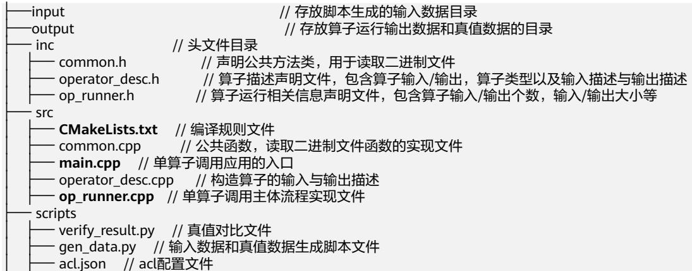

# 步骤4 使用检测工具拉起算子API运行脚本。

mssanitizer --tool=memcheck bash run.sh # 内存检测需指定 --tool=memcheckmssanitizer --tool=racecheck bash run.sh # 竞争检测需指定 --tool=racecheck

步骤5 参考内存异常报告解析、竞争异常报告解析及未初始化异常报告解析分析异常行为。

----结束

# 6.7.3 检测 PyTorch 接口调用的算子

前提条件

单击Link获取样例工程，为进行算子检测做准备。

# 说明

此样例工程仅支持Python3.9，若要在其他Python版本上运行，需要修改\$  
{git_clone_path}/samples/operator/ascendc/0_introduction/  
1_add_frameworklaunch/PytorchInvocation目录下run_op_plugin.sh文件中的Python版本。  
此样例工程不支持Atlas A3 训练系列产品。  
下载代码样例时，需执行以下命令指定分支版本。  
git clone https://gitee.com/ascend/samples.git -b master

已参考《Ascend Extension for PyTorch 软件安装指南》，完成PyTorch框架和torch_npu插件的安装。

# 操作步骤

步骤1 执行以下命令，生成自定义算子工程，并进行Host侧和Kernel侧的算子实现。bash install.sh -v Ascendxxxyy # xxxyy为用户实际使用的具体芯片类型

步骤2 参考4.5 算子编译部署，完成算子的编译部署。

# 说明

编辑样例工程目录\${git_clone_path}/samples/operator/ascendc/0_introduction/1_add_frameworklaunch/CustomOp/op_kernel下的CMakeLists.txt文件，增加编译选项-sanitizer。

add_ops_compile_options(ALL OPTIONS -sanitizer)

步骤3 进入PyTorch接入工程，使用PyTorch调用方式调用AddCustom算子工程，并按照指导完成编译。

PytorchInvocationop_plugin_patchrun_op_plugin.sh // 5.执行样例时,需要使用test_ops_custom.py // 步骤6启动工具时,需要使用

步骤4 执行样例，样例执行过程中会自动生成测试数据，然后运行PyTorch样例，最后检验运行结果。

bash run_op_plugin.sh   
-- CMAKE_CCE_COMPILER: \${INSTALL_DIR}/toolkit/tools/ccec_compiler/bin/ccec   
-- CMAKE_CURRENT_LIST_DIR: \${INSTALL_DIR}/AddKernelInvocation/cmake/Modules   
-- ASCEND_PRODUCT_TYPE:   
Ascendxxxyy   
-- ASCEND_CORE_TYPE:   
VectorCore   
-- ASCEND_INSTALL_PATH:   
/usr/local/Ascend/cann - The CXX compiler identification is GNU 10.3.1   
-- Detecting CXX compiler ABI info - Detecting CXX compiler ABI info - done - Check for working CXX compiler: /usr/bin/c $^ { + + }$ - skipped - Detecting CXX compile features - Detecting CXX compile features - done   
-- Configuring done   
-- Generating done   
-- Build files have been written to: \${INSTALL_DIR}/AddKernelInvocation/build   
Scanning dependencies of target add_npu   
$[ 3 3 \% ]$ Building CCE object cmake/npu/CMakeFiles/add_npu.dir/__/__/add_custom.cpp.o   
[ 66%] Building CCE object cmake/npu/CMakeFiles/add_npu.dir/__/__/main.cpp.o   
[100%] Linking CCE executable ../../../add_npu   
[100%] Built target add_npu   
\${INSTALL_DIR}/AddKernelInvocation   
INFO: compile op on ONBOARD succeed!   
INFO: execute op on ONBOARD succeed!   
test pass

步骤5 启动msSanitizer工具拉起Python程序，进行异常检测，异常检测功能的开启原则请参见异常检测功能启用原则。

步骤6 参考内存异常报告解析、竞争异常报告解析及未初始化异常报告解析分析异常行为。

----结束

# 6.7.4 检测 Triton 算子

# 前提条件

● 参考Link，完成Triton及Triton-Ascend插件的安装和配置。   
为了防止未重新编译的算子造成影响，建议您启用以下环境变量： export TRITON_ALWAYS_COMPILE=1 自备Triton算子实现文件。 若用户尚未准备Triton算子，可参考以下示例。本节将基于此示例来说明Triton算 子的检测流程。   
# file name: sample.py   
import triton   
import triton.language as tl   
import torch   
def torch_pointwise(x0, x1): res $= \mathsf { x } 0 + \mathsf { x } \mathsf { 1 }$ return res   
@triton.jit   
def triton_add(in_ptr0, in_ptr1, out_ptr0, XBLOCK: tl.constexpr, XBLOCK_SUB: tl.constexpr): offset $=$ tl.program_id(0) \* XBLOCK base1 $=$ tl.arange(0, XBLOCK_SUB) loops1: tl.constexpr $=$ (XBLOCK $^ +$ XBLOCK_SUB - 1) // XBLOCK_SUB for loop1 in range(loops1): $\mathbf { \boldsymbol { x } } 0 =$ offset $^ +$ (loop1 \* XBLOCK_SUB) $^ +$ base1 tmp0 $=$ tl.load(in_ptr0 $^ +$ (x0), None) tmp1 $=$ tl.load(in_ptr1 $^ +$ (x0), None) $\mathsf { t m p 2 } = \mathsf { t m p 0 } +$ tmp1 tl.store(out_pt $\mathsf { r 0 } + \mathsf { \left( x 0 \right) }$ , tmp2, None)   
def test_case(dtype, shape, ncore, xblock, xblock_sub): $\mathbf { \boldsymbol { x } } 0 =$ torch.randn(shape, dtype $\varprojlim$ dtype).npu() $\times 1 =$ torch.randn(shape, dtype $\varprojlim$ dtype).npu() y_ref $=$ torch_pointwise(x0, x1) y_cal $=$ torch.zeros(shape, dtype $\varprojlim$ dtype).npu() triton_add[ncore, 1, 1](x0, x1, y_cal, xblock, xblock_sub) print("Pass" if torch.equal(y_ref, y_cal) else "Failed")   
if __name__ $= =$ "__main__": test_case(torch.float32, (2, 4096, 8), 2, 32768, 1024)

# 操作步骤

步骤1 请参考Triton算子调用场景准备，完成使用前准备。

步骤2 关闭内存池。

样例中使用PyTorch创建Tensor，PyTorch框架内默认使用内存池的方式管理GM内存，会对内存检测产生干扰。因此，在检测前需要额外设置如下环境变量关闭内存池，以保证检测结果准确。  
export PYTORCH_NO_NPU_MEMORY_CACHING=1

步骤3 在Triton算子中构造一个非法读写的场景，将第一次load的内存向右偏移100个元素，此时会导致load在GM内存上发生非法读。

def triton_add(in_ptr0, in_ptr1, out_ptr0, XBLOCK: tl.constexpr, XBLOCK_SUB: tl.constexpr): offset $=$ tl.program_id(0) $^ { \star }$ XBLOCK base1 $=$ tl.arange(0, XBLOCK_SUB) loops1: tl.constexpr $=$ (XBLOCK $^ +$ XBLOCK_SUB - 1) // XBLOCK_SUB for loop1 in range(loops1): $\mathbf { \boldsymbol { x } } 0 =$ offset $^ +$ (loop1 \* XBLOCK_SUB) $^ +$ base1 # ERROR: 构造非法读异常 tmp0 $=$ tl.load(in_ptr0 $^ +$ (x0) $^ +$ 100, None) tmp1 $=$ tl.load(in_ptr1 $^ +$ (x0), None)

步骤4 使用msSanitizer检测工具拉起Triton算子。具体参数说明请参考表6-2和表6-3，内存检测请参考6.3 内存检测。

mssanitizer -t memcheck -- python sample.py

----结束

# 内存异常报告示例

根据检测工具输出的报告，可以发现在sample.py的18行对GM存在368字节的非法读操作，与构造的异常场景一致。

$\$ 5$ mssanitizer -t memcheck -- python sample.py   
[mssanitizer] logging to file: ./mindstudio_sanitizer_log/mssanitizer_20250522093805_922880.log   
Failed   
$= = = = = = =$ ERROR: illegal read of size 368   
$= = = = = = =$ at 0x12c0c0053190 on GM in triton_add   
$= = = = = = =$ in block aiv(1) on device 0   
$= = = = = = =$ code in pc current 0x1b0 (serialNo:524)   
$= = = = = = =$ #0 sample.py:18:45

# 6.7.5 检测 CANN 软件栈的内存

针对用户程序调用CANN软件栈接口可能出现的内存异常操作场景，msSanitizer检测工具提供了Device相关接口和AscendCL相关接口的内存检测能力，方便用户对程序内存异常操作位置的排查和定位。

# 内存泄漏检测使用原理

当npu-smi info命令查询到的设备内存不断增大时，可使用本工具进行内存泄漏定位定界，若AscendCL系列接口泄漏可支持定位到代码行。

如图6-1所示，CANN软件栈内存操作接口包含两个层级，向下使用驱动侧提供的Device侧接口，向上提供了AscendCL系列接口供用户代码调用。

  
图 6-1 内存检测

内存泄漏定位可分为以下步骤：

1. 使能Device系列接口进行泄漏检测，判断内存泄漏是否发生在Host侧。若没有，则定界到Device侧的应用出现泄漏；若有，则通过下一个步骤判断AscendCL接口调用是否发生泄漏；  
2. 使能AscendCL系列接口进行泄漏检测，判断用户代码调用AscendCL接口是否存在泄漏。若没有，则定界为非AscendCL接口调用问题；如果出现泄漏，则通过下一步定位到具体代码行；  
3. 使用msSanitizer检测工具中提供的新接口，对头文件重新编译，再用检测工具拉起检测程序，可定位到未释放内存的分配函数所对应的文件名与代码行号。新接口的详细说明请参见6.9 对外接口使用说明。

# 排查步骤

步骤1 参考6.2 使用前准备完成相关环境变量配置。

步骤2 定界是否为Host侧泄漏。

1. 使用msSanitizer检测工具拉起待检测程序，命令示例如下：mssanitizer --check-device-heap=yes --leak-check=yes ./add npu待检测程序（以add custom npu为例）所在路径可配置为绝对路径或相对路径，请根据实际环境配置。  
2. 若无异常输出则说明检测程序运行成功，且Host侧不存在内存泄漏情况；若输出如下错误说明Host侧的应用出现了内存泄漏。以下输出结果表明Host侧共有一处分配了内存但未释放，导致内存泄漏32800字节。$= = = = = = =$ ERROR: LeakCheck: detected memory leaks$= = = = = = =$ Direct leak of 32800 byte(s)$= = = = = = =$ at 0x124080024000 on GM allocated in <unknown>:0 (serialNo:0)$= = = = = = =$ SUMMARY: 32800 byte(s) leaked in 1 allocation(s)

步骤3 定界是否为AscendCL接口调用导致泄漏。

1. 使用msSanitizer检测工具拉起待检测程序，命令示例如下：mssanitizer --check-cann-heap=yes --leak-check=yes ./add npu  
2. 若无异常输出则说明检测程序运行成功，且AscendCL接口调用不存在内存泄漏情况；若输出如下错误说明AscendCL接口调用出现了内存泄漏。以下输出结果表明调用AscendCL接口时共有一处分配了内存但未释放，导致内存泄漏32768字节。$= = = = = = =$ ERROR: LeakCheck: detected memory leaks$= = = = = = =$ Direct leak of 32768 byte(s)$= = = = = = =$ at 0x124080024000 on GM allocated in <unknown>:0 (serialNo:0)$= = = = = = =$ SUMMARY: 32768 byte(s) leaked in 1 allocation(s)

步骤4 若存在泄漏，可通过msSanitizer工具中提供的msSanitizer API头文件“acl.h”和对应的动态库文件定位发生泄漏的代码文件和代码行。

定位发生泄漏的代码文件和代码行时，需要将用户代码中原有的“acl/acl.h”头文件替换为工具中提供的msSanitizer API头文件“acl.h”，并将动态库libascend_acl_hook.so文件链接至用户的应用工程中，并重新编译应用工程，具体操作步骤请参见导入API头文件和链接动态库。

步骤5 使用msSanitizer工具重新拉起程序，命令示例如下：mssanitizer --check-cann-heap=yes --leak-check=yes ./add npu以下输出结果表明在调用应用程序main.cpp的第55行存在一次内存分配但未释放，至此可定位到内存泄漏的原因。

=== ERROR: LeakCheck: detected memory leaks === Direct leak of 32768 byte(s) at 0x124080024000 on GM allocated in main.cpp:55 (serialNo:0) $= = = = = = =$ SUMMARY: 32768 byte(s) leaked in 1 allocation(s)

# ----结束

# 导入 API 头文件和链接动态库

本示例以Atlas A2 训练系列产品/Atlas A2 推理系列产品的内核调用符场景为例，说明导入msSanitizer API头文件“acl.h”和链接相对应的动态库文件的具体操作步骤，其他类型的自定义工程需根据用户实际构建的脚本进行调整。

步骤1 单击Link，获取验证代码的样例工程。

# 说明

下载代码样例时，需执行以下命令指定分支版本。git clone https://gitee.com/ascend/samples.git -b master

步骤2 在\${git_clone_path}/samples/operator/ascendc/0_introduction/3_add_kernellaunch/AddKernelInvocationNeo目录中，将main.cpp文件引入的“acl/acl.h”头文件替换为msSanitizer工具提供的头文件“acl.h” 。

# 说明

在模板库场景下，需将Ascend C模板库/examples/common/helper.hpp路径下的#include<acl/acl.h>替换为#include "acl.h"，具体操作步骤如下。

1. 执行以下命令，下载Link中的Ascend C模板库。 git clone https://gitcode.com/cann/catlass.git -b catlass-v1-stable   
2. 进入/examples/common/helper.hpp代码目录。 cd catlass/examples/common/helper.hpp   
3. 将#include <acl/acl.h>替换为#include "acl.h"。 #include "data_utils.h"   
#ifndef ASCENDC_CPU_DEBUG   
// #include "acl/acl.h"   
// acl/acl.h 替换为 acl.h   
#include "acl.h"   
extern void add_custom_do(uint32_t blockDim, void \*stream, uint8_t $^ { \star } \mathsf { x } ,$ uint8_t \*y, uint8_t \*z); #else

步骤3 在\${git_clone_path}/samples/operator/ascendc/0_introduction/ 3_add_kernellaunch/AddKernelInvocationNeo目录下编辑CMakeLists.txt文件，导入 API头文件路径 \${INSTALL_DIR}/tools/mssanitizer/include/acl和动态库路径

\${INSTALL_DIR}/tools/mssanitizer/lib64/libascend_acl_hook.so。

# 说明

模板库场景仅适用于Atlas A2 训练系列产品/Atlas A2 推理系列产品。模板库场景时，可通过以下方式增加检测编译选项。-I\$ENV{ASCEND_HOME_PATH}/tools/mssanitizer/include/acl-L\$ENV{ASCEND_HOME_PATH}/tools/mssanitizer/lib64-lascend_acl_hook

add_executable(ascendc_kernels_bbit \${CMAKE_CURRENT_SOURCE_DIR}/main.cpp)

target_compile_options(ascendc_kernels_bbit PRIVATE \$<BUILD_INTERFACE:\$<\$<STREQUAL:\${RUN_MODE},cpu>:-g>> -O2 -std $= c + + 1 7$ -D_GLIBCXX_USE_CXX11_ABI=0 -Wall -Werror # 算子可执行文件编译时，引入API头文件路径 target_include_directories(ascendc_kernels_bbit PUBLIC \$ENV{ASCEND_HOME_PATH}/tools/mssanitizer/include/acl) # 算子可执行文件链接时，引入libascend_acl_hook.so动态库路径 target_link_directories(ascendc_kernels_bbit PRIVATE \$ENV{ASCEND_HOME_PATH}/tools/mssanitizer/lib64)

{RUN_MODE},sim>>:host_intf_pub>> \$<BUILD_INTERFACE:\$<\$<STREQUAL:\${RUN_MODE},cpu>:ascendcl>> ascendc_kernels_\${RUN_MODE} # 将算子可执行文件链接至libascend_acl_hook.so动态库 ascend_acl_hook

步骤4 导入环境变量，并重新编译算子。

# 说明

在安装昇腾AI处理器的服务器执行npu-smi info命令进行查询，获取Chip Name信息。实际配置值为AscendChip Name，例如Chip Name取值为xxxyy，实际配置值为Ascendxxxyy。

export LD_LIBRARY_PATH $\textstyle | = { \mathfrak { S } }$ \${ASCEND_HOME_PATH}/tools/mssanitizer/lib64:\$LD_LIBRARY_PATH mssanitizer --check-cann-heap=yes --leak-check=yes -- bash run.sh -r npu -v Ascendxxxyy

# ----结束

# 6.8 FAQ

# 6.8.1 msSanitizer 工具异常报告中未打印正确的文件名和行号

现象描述

文件名和行号显示为"<unknown>:0"，或文件名显示正确，但行号显示为"0"。

# 解决措施

文件名和行号显示为"<unknown>:0"

说明msSanitizer工具没有解析到正确的文件名和行号，根据用户的检测场景有以下两种解决方法：

如果启用了"--check-cann-heap=yes"选项，对CANN软件栈内存进行检测，则可以通过引入Sanitizer API头文件并重新编译用户程序使检测工具获取到正确的文件名和行号，具体可参考通过msSanitizer检测工具中提供的新接口. ..。  
如果正在对算子进行异常检测，那么可能是在算子编译阶段未启用"-g"编译选项，启用"-g"编译选项后才能生成正确的文件名和行号，具体可参考内核调用符场景准备。文件名显示正确，但行号显示为"0"  
这种情况一般是因为使用了"-O2"或"-O3"编译选项进行算子代码编译，编译器对算子代码进行优化时导致代码行变化，可通过在算子编译阶段使用"-O0"禁用编译器优化来解决这个问题。

# 6.8.2 msSanitizer 工具使用"--cce-enable-sanitizer -g"编译算子时出现"InputSection too large"错误

# 现象描述

报错ld.lld: error: InputSection too large for range extension thunk。

# 原因分析

算子链接时输入代码段过大，超过编译器支持的指令跳转范围。

# 解决措施

通过增加编译选项，启用编译器扩大跳转范围的特性来解决。在算子代码编译选项"--cce-enable-sanitizer -g"后增加"-Xaicore-start -mcmodel=large -mllvm -cce-aicore-relax -Xaicore-end"。

target_compile_options(\${smoke_testcase}_npu PRIVATE -O2 -std $= c + + 1 7$ --cce-enable-sanitizer -g -Xaicore-start -mcmodel=large -mllvm -cce-aicore-relax -Xaicore-end

# 6.8.3 msSanitizer 工具提示--cache-size 异常

# 现象描述

使用msSanitizer工具进行异常检测时，提示"113023 records undetected, please use--cache-size=xx to run the operator again" 。

原因分析

算子执行信息的大小超过工具默认分配GM内存的大小，导致部分信息丢失。

# 解决措施

根据提示修改--cache-size值，并重新拉起算子，进行异常检测。

# 6.9 对外接口使用说明

# 6.9.1 接口列表

接口简介

msSanitizer工具包含sanitizer接口和mstx扩展接口两种类型。sanitizer接口用于CANN软件栈的检测，与ACL系列接口一一对应。此类接口会在ACL对应接口的功能基础上，额外向工具上报接口调用位置的代码文件和行号信息，使用时需导入sanitizerAPI头文件和链接动态库，具体请参见导入API头文件和链接动态库。mstx扩展接口用于用户自定义上报内存池信息，以实现更准确的检测，具体请参见6.9.3 mstx扩展功能。

表 6-9 msSanitizer 工具接口列表  

<table><tr><td rowspan=1 colspan=1>接口类型</td><td rowspan=1 colspan=1>接口名称</td><td rowspan=1 colspan=1>功能简介</td></tr><tr><td rowspan=11 colspan=1>6.9.2 sanitizer接口</td><td rowspan=1 colspan=1>sanitizerRtMalloc</td><td rowspan=11 colspan=1>在ACL对应接口的功能基础上，向msSanitizer工具上报sanitizer接口调用位置的代码文件和行号信息。</td></tr><tr><td rowspan=1 colspan=1>sanitizerRtMallocCached</td></tr><tr><td rowspan=1 colspan=1>sanitizerRtFree</td></tr><tr><td rowspan=1 colspan=1>sanitizerRtMemset</td></tr><tr><td rowspan=1 colspan=1>sanitizerRtMemse tAsync</td></tr><tr><td rowspan=1 colspan=1> sanitizerRtMemcpy</td></tr><tr><td rowspan=1 colspan=1> sanitizerRtMemcpyAsync</td></tr><tr><td rowspan=1 colspan=1>sanitizerRtMemcpy2d</td></tr><tr><td rowspan=1 colspan=1> sanitizerRtMemcpy2dAsync</td></tr><tr><td rowspan=1 colspan=1>sanitizerReportMalloc</td></tr><tr><td rowspan=1 colspan=1>sanitizerReportFree</td></tr><tr><td rowspan=5 colspan=1>6.9.3 mstx扩展功能</td><td rowspan=1 colspan=1>mstxDomainCreateA</td><td rowspan=1 colspan=1>创建域。</td></tr><tr><td rowspan=1 colspan=1>mstxMemHeapRegister</td><td rowspan=1 colspan=1>内存池注册接口。</td></tr><tr><td rowspan=1 colspan=1>mstxMemHeapUnregister</td><td rowspan=1 colspan=1>内存池注销接口。</td></tr><tr><td rowspan=1 colspan=1>mstxMemRegionsRegister</td><td rowspan=1 colspan=1>内存池二次分配注册接口。</td></tr><tr><td rowspan=1 colspan=1>mstxMemRegionsUnregister</td><td rowspan=1 colspan=1>内存池二次分配注销接口。</td></tr></table>

# 6.9.2 sanitizer 接口

# 6.9.2.1 sanitizerRtMalloc

# 功能说明

调用aclrtMalloc接口在Device上分配size大小的线性内存，并通过\*devPtr返回已分配内存的指针，并向检测工具上报内存分配信息。实际的内存分配行为和参数含义与aclrtMalloc一致。

# 说明

可参见《应用开发接口》手册中“acl API参考（C） > 运行时管理 $>$ 内存管理”章节查看aclrtMalloc的详细说明。

# 函数原型

aclError sanitizerRtMalloc(void \*\*devPtr, size_t size, aclrtMemMallocPolicy policy, char const \*filename, int lineno);

# 参数说明

表 6-10 参数说明  

<table><tr><td rowspan=1 colspan=1>参数名</td><td rowspan=1 colspan=1>输入/输出</td><td rowspan=1 colspan=1>描述</td></tr><tr><td rowspan=1 colspan=1>devPtr</td><td rowspan=1 colspan=1>输出</td><td rowspan=1 colspan=1>指向“Device上已分配内存的指针”的指针。</td></tr><tr><td rowspan=1 colspan=1>size</td><td rowspan=1 colspan=1>输入</td><td rowspan=1 colspan=1>申请内存的大小，单位为Byte。size不能为0。</td></tr><tr><td rowspan=1 colspan=1>policy</td><td rowspan=1 colspan=1>输入</td><td rowspan=1 colspan=1>内存分配规则。</td></tr><tr><td rowspan=1 colspan=1> filename</td><td rowspan=1 colspan=1>输入</td><td rowspan=1 colspan=1>内存分配被调用处的文件名。</td></tr><tr><td rowspan=1 colspan=1>lineno</td><td rowspan=1 colspan=1>输入</td><td rowspan=1 colspan=1>内存分配被调用处的行号。</td></tr></table>

返回值

返回0表示成功，返回其它值表示失败。

# 调用示例

具体操作请参见使用示例的步骤4。

# 6.9.2.2 sanitizerRtMallocCached

# 功能说明

调用aclrtMallocCached接口在Device上申请size大小的线性内存，通过\*devPtr返回已分配内存的指针，并向检测工具上报内存分配信息。该接口在任何场景下，申请的内存都支持cache缓存。实际的内存分配行为和参数含义与aclrtMallocCached一致。

# 说明

可参见《应用开发接口》手册中“acl API参考（C） $>$ 运行时管理 $>$ 内存管理”章节查看aclrtMallocCached的详细说明。

# 函数原型

aclError sanitizerRtMallocCached(void \*\*devPtr, size_t size, aclrtMemMallocPolicy policy, char const \*filename, int lineno);

# 参数说明

表 6-11 参数说明  

<table><tr><td rowspan=1 colspan=1>参数名</td><td rowspan=1 colspan=1>输入/输出</td><td rowspan=1 colspan=1>描述</td></tr><tr><td rowspan=1 colspan=1>devPtr</td><td rowspan=1 colspan=1>输出</td><td rowspan=1 colspan=1>指向“Device上已分配内存的指针”的指针。</td></tr><tr><td rowspan=1 colspan=1>size</td><td rowspan=1 colspan=1>输入</td><td rowspan=1 colspan=1>申请内存的大小，单位为Byte。size不能为0。</td></tr><tr><td rowspan=1 colspan=1>policy</td><td rowspan=1 colspan=1>输入</td><td rowspan=1 colspan=1>内存分配规则。</td></tr><tr><td rowspan=1 colspan=1>filename</td><td rowspan=1 colspan=1>输入</td><td rowspan=1 colspan=1>内存分配被调用处的文件名。</td></tr><tr><td rowspan=1 colspan=1>lineno</td><td rowspan=1 colspan=1>输入</td><td rowspan=1 colspan=1>内存分配被调用处的行号。</td></tr></table>

返回值

返回0表示成功，返回其它值表示失败。

# 调用示例

具体操作请参见使用示例的步骤4。

# 6.9.2.3 sanitizerRtFree

# 功能说明

调用aclrtFree接口释放Device上的内存，并向检测工具上报内存释放信息。实际的内存释放行为和参数含义与aclrtFree一致。

# 说明

可参见《应用开发接口》手册中“acl API参考（C） $>$ 运行时管理 $>$ 内存管理”章节查看aclrtFree的详细说明。

# 函数原型

aclError sanitizerRtFree(void \*devPtr, char const \*filename, int lineno);

# 参数说明

表 6-12 参数说明  

<table><tr><td rowspan=1 colspan=1>参数名</td><td rowspan=1 colspan=1>输入/输出</td><td rowspan=1 colspan=1>描述</td></tr><tr><td rowspan=1 colspan=1>devPtr</td><td rowspan=1 colspan=1>输入</td><td rowspan=1 colspan=1>待释放内存的指针。</td></tr><tr><td rowspan=1 colspan=1> filename</td><td rowspan=1 colspan=1>输入</td><td rowspan=1 colspan=1>内存释放被调用处的文件名。</td></tr><tr><td rowspan=1 colspan=1>lineno</td><td rowspan=1 colspan=1>输入</td><td rowspan=1 colspan=1>内存释放被调用处的行号。</td></tr></table>

返回值

返回0表示成功，返回其它值表示失败。

调用示例

具体操作请参见使用示例的步骤4。

# 6.9.2.4 sanitizerRtMemset

# 功能说明

调用aclrtMemset接口初始化内存，将内存中的内容设置为指定值，并向检测工具上报内存初始化信息。实际的内存初始化行为和参数含义与aclrtMemset一致。

# 说明

可参见《应用开发接口》手册中“acl API参考（C） > 运行时管理 > 内存管理”章节查看aclrtMemset的详细说明。

# 函数原型

aclError sanitizerRtMemset(void \*devPtr, size_t maxCount, int32_t value, size_t count, char const \*filename, int lineno);

# 参数说明

表 6-13 参数说明  

<table><tr><td colspan="1" rowspan="1">参数名</td><td colspan="1" rowspan="1">输入/输出</td><td colspan="1" rowspan="1">描述</td></tr><tr><td colspan="1" rowspan="1">devPtr</td><td colspan="1" rowspan="1">输入</td><td colspan="1" rowspan="1">内存起始地址的指针。</td></tr><tr><td colspan="1" rowspan="1">maxCount</td><td colspan="1" rowspan="1">输入</td><td colspan="1" rowspan="1">内存的最大长度，单位为Byte。</td></tr><tr><td colspan="1" rowspan="1">value</td><td colspan="1" rowspan="1">输入</td><td colspan="1" rowspan="1">初始化内存的指定值。</td></tr><tr><td colspan="1" rowspan="1">count</td><td colspan="1" rowspan="1">输入</td><td colspan="1" rowspan="1">需要设置为指定值的内存长度，单位为Byte。</td></tr><tr><td colspan="1" rowspan="1"> filename</td><td colspan="1" rowspan="1">输入</td><td colspan="1" rowspan="1">内存初始化被调用处的文件名。</td></tr><tr><td colspan="1" rowspan="1">lineno</td><td colspan="1" rowspan="1">输入</td><td colspan="1" rowspan="1">内存初始化被调用处的行号。</td></tr></table>

返回值

返回0表示成功，返回其它值表示失败。

# 调用示例

具体操作请参见使用示例的步骤4。

# 6.9.2.5 sanitizerRtMemsetAsync

# 功能说明

调用aclrtMemsetAsync接口初始化内存，将内存中的内容设置为指定的值，并向检测工具上报内存初始化信息。此接口为异步接口。实际的内存初始化行为和参数含义与aclrtMemsetAsync一致。

# 说明

可参见《应用开发接口》手册中“acl API参考（C） > 运行时管理 > 内存管理”章节查看aclrtMemsetAsync的详细说明。

# 函数原型

aclError sanitizerRtMemsetAsync(void \*devPtr, size_t maxCount, int32_t value, size_t count, aclrtStream stream, char const \*filename, int lineno);

# 参数说明

表 6-14 参数说明  

<table><tr><td rowspan=1 colspan=1>参数名</td><td rowspan=1 colspan=1>输入/输出</td><td rowspan=1 colspan=1>描述</td></tr><tr><td rowspan=1 colspan=1>devPtr</td><td rowspan=1 colspan=1>输入</td><td rowspan=1 colspan=1>内存起始地址的指针。</td></tr><tr><td rowspan=1 colspan=1>maxCount</td><td rowspan=1 colspan=1>输入</td><td rowspan=1 colspan=1>内存的最大长度，单位为Byte。</td></tr><tr><td rowspan=1 colspan=1>value</td><td rowspan=1 colspan=1>输入</td><td rowspan=1 colspan=1>初始化内存的指定值。</td></tr><tr><td rowspan=1 colspan=1>count</td><td rowspan=1 colspan=1>输入</td><td rowspan=1 colspan=1>初始化内存的长度，单位为Byte。</td></tr><tr><td rowspan=1 colspan=1> stream</td><td rowspan=1 colspan=1>输入</td><td rowspan=1 colspan=1>指定的stream。</td></tr><tr><td rowspan=1 colspan=1> filename</td><td rowspan=1 colspan=1>输入</td><td rowspan=1 colspan=1>内存初始化被调用处的文件名。</td></tr><tr><td rowspan=1 colspan=1>lineno</td><td rowspan=1 colspan=1>输入</td><td rowspan=1 colspan=1>内存初始化被调用处的行号。</td></tr></table>

# 返回值

返回0表示成功，返回其它值表示失败。

# 调用示例

具体操作请参见使用示例的步骤4。

# 6.9.2.6 sanitizerRtMemcpy

# 功能说明

调用aclrtMemcpy接口完成内存复制，并向检测工具上报内存复制信息。实际的内存复制行为和参数含义与aclrtMemcpy一致。

# 说明

可参见《应用开发接口》手册中“acl API参考（C） $>$ 运行时管理 $>$ 内存管理”章节查看aclrtMemcpy的详细说明。

# 函数原型

aclError sanitizerRtMemcpy(void \*dst, size_t destMax, const void \*src, size_t count, aclrtMemcpyKind kind, char const \*filename, int lineno);

# 参数说明

表 6-15 参数说明  

<table><tr><td rowspan=1 colspan=1>参数名</td><td rowspan=1 colspan=1>输入/输出</td><td rowspan=1 colspan=1>描述</td></tr><tr><td rowspan=1 colspan=1>dst</td><td rowspan=1 colspan=1>输入</td><td rowspan=1 colspan=1>目的内存地址指针。</td></tr><tr><td rowspan=1 colspan=1>destMax</td><td rowspan=1 colspan=1>输入</td><td rowspan=1 colspan=1>目的内存地址的最大内存长度，单位为Byte。</td></tr><tr><td rowspan=1 colspan=1>src</td><td rowspan=1 colspan=1>输入</td><td rowspan=1 colspan=1>源内存地址指针。</td></tr><tr><td rowspan=1 colspan=1>count</td><td rowspan=1 colspan=1>输入</td><td rowspan=1 colspan=1>内存复制的长度，单位为Byte。</td></tr><tr><td rowspan=1 colspan=1>kind</td><td rowspan=1 colspan=1>输入</td><td rowspan=1 colspan=1>预留参数，系统内部会根据源内存地址指针、目的内存地址指针判断是否可以将源地址的数据复制到目的地址，如果不可以，则系统会返回报错。</td></tr><tr><td rowspan=1 colspan=1>filename</td><td rowspan=1 colspan=1>输入</td><td rowspan=1 colspan=1>内存复制被调用处的文件名。</td></tr><tr><td rowspan=1 colspan=1>lineno</td><td rowspan=1 colspan=1>输入</td><td rowspan=1 colspan=1>内存复制被调用处的行号。</td></tr></table>

# 返回值

返回0表示成功，返回其它值表示失败。

# 调用示例

具体操作请参见使用示例的步骤4。

# 6.9.2.7 sanitizerRtMemcpyAsync

# 功能说明

调用aclrtMemcpyAsync接口完成内存复制，并向检测工具上报内存复制信息。此接口为异步接口。实际的内存复制行为和参数含义与aclrtMemcpyAsync一致。

# 说明

可参见《应用开发接口》手册中“acl API参考（C） > 运行时管理 > 内存管理”章节查看aclrtMemcpyAsync的详细说明。

# 函数原型

aclError sanitizerRtMemcpyAsync(void \*dst, size_t destMax, const void \*src, size_t count, aclrtMemcpyKind kind, aclrtStream stream, char const \*filename, int lineno);

# 参数说明

表 6-16 参数说明  

<table><tr><td rowspan=1 colspan=1>参数名</td><td rowspan=1 colspan=1>输入/输出</td><td rowspan=1 colspan=1>描述</td></tr><tr><td rowspan=1 colspan=1>dst</td><td rowspan=1 colspan=1>输入</td><td rowspan=1 colspan=1>目的内存地址指针。</td></tr><tr><td rowspan=1 colspan=1>destMax</td><td rowspan=1 colspan=1>输入</td><td rowspan=1 colspan=1>目的内存地址的最大内存长度，单位为Byte。</td></tr><tr><td rowspan=1 colspan=1>src</td><td rowspan=1 colspan=1>输入</td><td rowspan=1 colspan=1>源内存地址指针。</td></tr><tr><td rowspan=1 colspan=1>count</td><td rowspan=1 colspan=1>输入</td><td rowspan=1 colspan=1>内存复制的长度，单位为Byte。</td></tr><tr><td rowspan=1 colspan=1>kind</td><td rowspan=1 colspan=1>输入</td><td rowspan=1 colspan=1>预留参数，系统内部会根据源内存地址指针、目的内存地址指针判断是否可以将源地址的数据复制到目的地址，如果不可以，则系统会返回报错。</td></tr><tr><td rowspan=1 colspan=1> stream</td><td rowspan=1 colspan=1>输入</td><td rowspan=1 colspan=1>当前内存复制行为指定的stream。</td></tr><tr><td rowspan=1 colspan=1> filename</td><td rowspan=1 colspan=1>输入</td><td rowspan=1 colspan=1>内存复制被调用处的文件名。</td></tr><tr><td rowspan=1 colspan=1>lineno</td><td rowspan=1 colspan=1>输入</td><td rowspan=1 colspan=1>内存复制被调用处的行号。</td></tr></table>

# 返回值

返回0表示成功，返回其它值表示失败。

# 调用示例

具体操作请参见使用示例的步骤4。

# 6.9.2.8 sanitizerRtMemcpy2d

# 功能说明

调用aclrtMemcpy2d接口完成矩阵数据内存复制，并向检测工具上报内存复制信息。  
实际的矩阵数据内存复制行为和参数含义与aclrtMemcpy2d一致。

# 说明

可参见《应用开发接口》手册中“acl API参考（C） > 运行时管理 $>$ 内存管理”章节查看aclrtMemcpy2d的详细说明。

# 函数原型

aclError sanitizerRtMemcpy2d(void \*dst, size_t dpitch, const void \*src, size_t spitch, size_t width, size_t height, aclrtMemcpyKind kind, char const \*filename, int lineno);

# 参数说明

表 6-17 参数说明  

<table><tr><td rowspan=1 colspan=1>参数名</td><td rowspan=1 colspan=1>输入/输出</td><td rowspan=1 colspan=1>描述</td></tr><tr><td rowspan=1 colspan=1>dst</td><td rowspan=1 colspan=1>输入</td><td rowspan=1 colspan=1>目的内存地址指针。</td></tr><tr><td rowspan=1 colspan=1>dpitch</td><td rowspan=1 colspan=1>输入</td><td rowspan=1 colspan=1>目的内存中相邻两列向量的地址距离。</td></tr><tr><td rowspan=1 colspan=1>src</td><td rowspan=1 colspan=1>输入</td><td rowspan=1 colspan=1>源内存地址指针。</td></tr><tr><td rowspan=1 colspan=1>spitch</td><td rowspan=1 colspan=1>输入</td><td rowspan=1 colspan=1>源内存中相邻两列向量的地址距离。</td></tr><tr><td rowspan=1 colspan=1>width</td><td rowspan=1 colspan=1>输入</td><td rowspan=1 colspan=1>待复制的矩阵宽度。</td></tr><tr><td rowspan=1 colspan=1>height</td><td rowspan=1 colspan=1>输入</td><td rowspan=1 colspan=1>待复制的矩阵高度。height最大设置为5*1024*1024=5242880，否则接口返回失败。</td></tr><tr><td rowspan=1 colspan=1>kind</td><td rowspan=1 colspan=1>输入</td><td rowspan=1 colspan=1>内存复制的类型。</td></tr><tr><td rowspan=1 colspan=1>filename</td><td rowspan=1 colspan=1>输入</td><td rowspan=1 colspan=1>矩阵数据内存复制被调用处的文件名。</td></tr><tr><td rowspan=1 colspan=1>lineno</td><td rowspan=1 colspan=1>输入</td><td rowspan=1 colspan=1>矩阵数据内存复制被调用处的行号。</td></tr></table>

# 返回值

返回0表示成功，返回其它值表示失败。

# 调用示例

具体操作请参见使用示例的步骤4。

# 6.9.2.9 sanitizerRtMemcpy2dAsync

# 功能说明

调用aclrtMemcpy2dAsync接口完成矩阵数据内存复制，并向检测工具上报内存复制信息。此接口为异步接口。实际的矩阵数据内存复制行为和参数含义与aclrtMemcpy2dAsync一致。

# 说明

可参见《应用开发接口》手册中“acl API参考（C） $>$ 运行时管理 $>$ 内存管理”章节查看aclrtMemcpy2dAsync的详细说明。

# 函数原型

aclError sanitizerRtMemcpy2dAsync(void \*dst, size_t dpitch, const void \*src, size_t spitch, size_t width, size_t height, aclrtMemcpyKind kind, aclrtStream stream, char const \*filename, int lineno);

# 参数说明

表 6-18 参数说明  

<table><tr><td rowspan=1 colspan=1>参数名</td><td rowspan=1 colspan=1>输入/输出</td><td rowspan=1 colspan=1>描述</td></tr><tr><td rowspan=1 colspan=1>dst</td><td rowspan=1 colspan=1>输入</td><td rowspan=1 colspan=1>目的内存地址指针。</td></tr><tr><td rowspan=1 colspan=1>dpitch</td><td rowspan=1 colspan=1>输入</td><td rowspan=1 colspan=1>目的内存中相邻两列向量的地址距离。</td></tr><tr><td rowspan=1 colspan=1>src</td><td rowspan=1 colspan=1>输入</td><td rowspan=1 colspan=1>源内存地址指针。</td></tr><tr><td rowspan=1 colspan=1>spitch</td><td rowspan=1 colspan=1>输入</td><td rowspan=1 colspan=1>源内存中相邻两列向量的地址距离。</td></tr><tr><td rowspan=1 colspan=1>width</td><td rowspan=1 colspan=1>输入</td><td rowspan=1 colspan=1>待复制的矩阵宽度。</td></tr><tr><td rowspan=1 colspan=1>height</td><td rowspan=1 colspan=1>输入</td><td rowspan=1 colspan=1>待复制的矩阵高度。height最大设置为5*1024*1024=5242880，否则接口返回失败。</td></tr><tr><td rowspan=1 colspan=1>kind</td><td rowspan=1 colspan=1>输入</td><td rowspan=1 colspan=1>内存复制的类型。</td></tr><tr><td rowspan=1 colspan=1>stream</td><td rowspan=1 colspan=1>输入</td><td rowspan=1 colspan=1>当前矩阵数据内存复制行为指定的stream。</td></tr><tr><td rowspan=1 colspan=1>filename</td><td rowspan=1 colspan=1>输入</td><td rowspan=1 colspan=1>矩阵数据内存复制被调用处的文件名。</td></tr><tr><td rowspan=1 colspan=1>lineno</td><td rowspan=1 colspan=1>输入</td><td rowspan=1 colspan=1>矩阵数据内存复制被调用处的行号。</td></tr></table>

# 返回值

返回0表示成功，返回其它值表示失败。

# 调用示例

具体操作请参见使用示例的步骤4。

# 6.9.2.10 sanitizerReportMalloc

功能说明

手动上报GM内存分配信息。

# 函数原型

void sanitizerReportMalloc(void \*ptr, uint64_t size);

# 说明

此接口是__sanitizer_report_malloc接口的封装， __sanitizer_report_malloc接口为弱函数，只有当用户程序被检测工具拉起时才会生效。

# 参数说明

表 6-19 参数说明  

<table><tr><td rowspan=1 colspan=1>参数名</td><td rowspan=1 colspan=1>输入/输出</td><td rowspan=1 colspan=1>描述</td></tr><tr><td rowspan=1 colspan=1>ptr</td><td rowspan=1 colspan=1>输入</td><td rowspan=1 colspan=1>分配的内存地址。</td></tr><tr><td rowspan=1 colspan=1>size</td><td rowspan=1 colspan=1>输入</td><td rowspan=1 colspan=1>分配的内存长度。</td></tr></table>

返回值

无

调用示例

无

# 6.9.2.11 sanitizerReportFree

功能说明

手动上报GM内存释放信息。

# 函数原型

void sanitizerReportFree(void ${ } ^ { \star } \mathsf { p t r } )$ ;

# 说明

此接口是__sanitizer_report_free接口的封装，__sanitizer_report_free接口为弱函数，只有当用户程序被检测工具拉起时才会生效。

# 参数说明

表 6-20 参数说明  

<table><tr><td rowspan=1 colspan=1>参数名</td><td rowspan=1 colspan=1>输入/输出</td><td rowspan=1 colspan=1>描述</td></tr><tr><td rowspan=1 colspan=1>ptr</td><td rowspan=1 colspan=1>输入</td><td rowspan=1 colspan=1>释放的内存地址。</td></tr></table>

返回值

无

调用示例

无

# 6.9.3 mstx 扩展功能

mstx 接口简介

mstx接口是MindStudio提供的一套扩展接口，它允许用户在应用程序中插入特定的标记，以便在工具进行内存检测时能够更精确地定位特定算子的内存问题。例如，针对二级指针类算子，在不使能mstx接口的情况下，得到的地址空间可能不准确。通过《MindStudio mstx API参考》的mstxMemRegionsRegister和mstxMemRegionsUnregister接口，可以将准确的地址空间传递给异常检测工具，实现更精准的内存检测。

# 说明

Kernel直调中的内核调用符场景暂不支持使用mstx接口。

# mstx 接口列表

msSanitizer工具调用的mstx接口列表如表6-21所示，具体使用状况请参考《MindStudio mstx API参考》。

表 6-21 msSanitizer 工具调用的 mstx 接口列表  

<table><tr><td colspan="1" rowspan="1">接口名称</td><td colspan="1" rowspan="1">功能简介</td></tr><tr><td colspan="1" rowspan="1">mstxDomainCreateA</td><td colspan="1" rowspan="1">创建一个新的mstx域。</td></tr><tr><td colspan="1" rowspan="1">mstxMemHeapRegister</td><td colspan="1" rowspan="1">注册内存池。用户在调用该接口注册内存池时，需确保该内存已提前申请。</td></tr><tr><td colspan="1" rowspan="1">mstxMemRegionsRegister</td><td colspan="1" rowspan="1">注册内存池二次分配。用户需保证RegionsRegister的内存位于mstxMemHeapRegister注册的范围内，否则工具会提示越界读写。</td></tr><tr><td colspan="1" rowspan="1">mstxMemRegionsUnregister</td><td colspan="1" rowspan="1">注销内存池二次分配。</td></tr><tr><td>mstxMemHeapUnregister</td><td>注销内存池时，与之关联的Regions将一 并被注销。</td></tr></table>

# mstx 接口的使用

msSanitizer工具默认使能mstx接口，允许用户使用mstx接口自定义算子使用的内存空间地址和大小，可识别并快速界定算子的内存问题。

mstx当前提供了两种API的使用方式：库文件和头文件，以Link为例：

# 说明

● 此样例工程不支持Atlas A3 训练系列产品。

在\${git_clone_path}/samples/operator/ascendc/0_introduction/   
1_add_frameworklaunch/AclNNInvocation/src/CMakeLists.txt路径下新增   
库文件libms_tools_ext.so，地址为：\${INSTALL_DIR}/lib64/   
libms_tools_ext.so。   
# Header path   
include_directories( ... \${CUST_PKG_PATH}/include   
target_link_libraries( ... dl

在\${git_clone_path}/samples/operator/ascendc/0_introduction/1_add_frameworklaunch/AclNNInvocation/src/main.cpp路径下，将用户程序编译链接dl库，对应的头文件ms_tools_ext.h地址：\${INSTALL_DIR}/include/mstx。

#include "mstx/ms_tools_ext.h" ...

# 说明

\${INSTALL_DIR}请替换为CANN软件安装后文件存储路径。以root用户安装为例，则安装后文件存储路径为：/usr/local/Ascend/cann。

# 调用示例

mstxMemVirtualRangeDesc_t rangeDesc $= \{ \} ;$ rangeDesc.deviceId $=$ deviceId; // 设备编号rangeDesc.ptr $=$ gm; // 注册的内存池CM首地址rangeDesc.size $= 1 0 2 4$ ; // 内存池大小heapDesc.typeSpecificDesc $=$ &rangeDesc;mstxMemHeapDesc_t heapDesc{};mstxMemHeapHandle_t memPool $=$ mstxMemHeapRegister(globalDomain, &heapDesc); // 注册内存池mstxMemVirtualRangeDesc_t rangesDesc[1] $= \{ \} ;$ // 二次分配包含的region数量mstxMemRegionHandle_t regionHandles[1] $= \{ \} ;$ ：rangesDesc[0].deviceId $=$ deviceId; // 设备编号rangesDesc[0].ptr $= { \mathfrak { g m } }$ ; // 二次分配GM地址rangesDesc[0].size $= 2 5 6$ ; // 二次分配大小mstxMemRegionsRegisterBatch_t regionsDesc{};regionsDesc.heap $=$ memPool;regionsDesc.regionType $=$ MSTX_MEM_TYPE_VIRTUAL_ADDRESS;regionsDesc.regionCount $= 1$ ;

regionsDesc.regionDescArray $=$ rangesDesc;  
regionsDesc.regionHandleArrayOut $=$ regionHandles;  
mstxMemRegionsRegister(globalDomain, ®ionsDesc); // 二次分配注册Do(blockDim, nullptr, stream, gm); // 算子Kernel函数  
mstxMemRegionRef_t regionRef $[ 1 ] = \{ \} ;$   
regionRef[0].refType $=$ MSTX_MEM_REGION_REF_TYPE_HANDLE;  
regionRef[0].handle $=$ regionHandles[0];  
mstxMemRegionsUnregisterBatch_t refsDesc $= \{ \}$ ;  
refsDesc.refCount $= 1$ ;  
refsDesc.refArray $=$ regionRef;  
mstxMemRegionsUnregister(globalDomain, &refsDesc); // 注销二次分配mstxMemHeapUnregister(globalDomain, memPool); // 注销内存池

# 7

# 算子调试（msDebug）

工具概述  
使用前准备  
指定Device ID（通算融合算子场景）  
断点设置  
内存与变量打印  
单步调试  
中断运行  
核切换  
读取寄存器  
调试信息展示  
解析异常算子dump文件  
典型案例  
FAQ

# 7.1 工具概述

msDebug是一款面向昇腾设备的算子调试工具，用于调试NPU侧运行的算子程序，为算子开发人员提供调试手段。调试手段包括了读取昇腾设备内存与寄存器、暂停与恢复程序运行状态等。用户使用其他拉起算子的方式或msOpST工具在真实的硬件环境中对算子的功能进行测试后，可根据实际测试情况选择是否使用msDebug工具进行功能调试。

# 说明

● 若要使能msDebug工具，需通过以下两种方法安装NPU驱动固件（CANN 8.1.RC1之后的版本且驱动为25.0.RC1之后的版本，推荐使用方法一）：

方法一：驱动安装时指定--full参数，然后再使用root用户执行echo 1 > /proc/debug_switch命令打开调试通道，msDebug工具便可正常使用。./Ascend-hdk-<chip_type>-npu-driver_<version>_linux-<arch>.run --full方法二：驱动安装时指定--debug参数，具体安装操作请参见《CANN 软件安装指南》中的“安装NPU驱动固件”章节。./Ascend-hdk-<chip_type>-npu-driver_<version>_linux-<arch>.run --debug

调试通道权限较大，存在安全风险，请谨慎使用，生产环境不推荐使用，使用本调试工具即代表认可并接受该风险。

# 功能特性

msDebug工具支持调试所有的昇腾算子，包含Ascend C算子（Vector、Cube以及Mix融合算子）程序，用户可根据实际情况进行选择，具体请参见表7-1。

表 7-1 msDebug 工具功能介绍  

<table><tr><td rowspan=1 colspan=1>功能</td><td rowspan=1 colspan=1>链接</td></tr><tr><td rowspan=1 colspan=1>断点设置</td><td rowspan=1 colspan=1>7.4断点设置</td></tr><tr><td rowspan=1 colspan=1>打印变量和内存</td><td rowspan=1 colspan=1>7.5内存与变量打印</td></tr><tr><td rowspan=1 colspan=1>单步调试</td><td rowspan=1 colspan=1>7.6 单步调试</td></tr><tr><td rowspan=1 colspan=1>中断运行</td><td rowspan=1 colspan=1>7.7中断运行</td></tr><tr><td rowspan=1 colspan=1>核切换</td><td rowspan=1 colspan=1>7.8 核切换</td></tr><tr><td rowspan=1 colspan=1>检查程序状态</td><td rowspan=1 colspan=1>7.9 读取寄存器</td></tr><tr><td rowspan=1 colspan=1>调试信息展示</td><td rowspan=1 colspan=1>7.10调试信息展示</td></tr><tr><td rowspan=1 colspan=1>解析Core dump文件</td><td rowspan=1 colspan=1>7.11 解析异常算子dump文件</td></tr></table>

# 说明

通过键盘输入“ $C T R L + C ^ { 3 3 }$ 后，算子执行将会被停止，工具会根据当前已有信息生成性能数据文件。若不需要生成该文件，可再次键盘输入 $^ { 6 } { \mathsf { C T R L } } { \mathsf { + C } } ^ { 3 3 }$ 指令。若未指定--output参数，默认保存为当前工具执行的路径，需确保群组和其他组的用户不具备当前路径的上一级目录的写入权限。

# 命令汇总

# 说明

● 用户需自行保证可执行文件或用户程序（application）执行的安全性。

● 建议限制对可执行文件或用户程序（application）的操作权限，避免提权风险。● 不建议进行高危操作（删除文件、删除目录、修改密码及提权命令等），避免安全风险。● 通过键入help命令可查看msDebug工具支持的所有命令。表7-2之外的命令属于开源调试器lldb实现，使用需注意相关风险，详细使用方法可参考lldb官方文档https://lldb.llvm.org/。

表 7-2 命令参考说明  

<table><tr><td colspan="1" rowspan="1">命令</td><td colspan="1" rowspan="1">命令缩写</td><td colspan="1" rowspan="1">描述</td><td colspan="1" rowspan="1">示例</td></tr><tr><td colspan="1" rowspan="1">breakpoint set-f filename -llinenum</td><td colspan="1" rowspan="1">b</td><td colspan="1" rowspan="1">增加断点，filename为算子实现代码文件*.cpp，linenum为代码文件对应的具体行号。</td><td colspan="1" rowspan="1">b add_custom.cpp:85</td></tr><tr><td colspan="1" rowspan="1">run</td><td colspan="1" rowspan="1">r</td><td colspan="1" rowspan="1">运行程序。</td><td colspan="1" rowspan="1">r</td></tr><tr><td colspan="1" rowspan="1">continue</td><td colspan="1" rowspan="1">C</td><td colspan="1" rowspan="1">继续运行。</td><td colspan="1" rowspan="1">c</td></tr><tr><td colspan="1" rowspan="1">print variable</td><td colspan="1" rowspan="1">p</td><td colspan="1" rowspan="1">打印变量。</td><td colspan="1" rowspan="1">p zLocal</td></tr><tr><td colspan="1" rowspan="1">frame variable</td><td colspan="1" rowspan="1">var</td><td colspan="1" rowspan="1">显示当前作用域内的所有局部变量。</td><td colspan="1" rowspan="1">var</td></tr><tr><td colspan="1" rowspan="1">memory read</td><td colspan="1" rowspan="1">×</td><td colspan="1" rowspan="1">读内存。</td><td colspan="1" rowspan="1">X -m GM -f float16[]0x00001240c0037000 -c 2 -s 128）-m：指定内存位置，支持GM/UB/L0A/LOB/L0C/L1/FB/STACK/DCACHE/ICACHE说明STACK/DCACHE/ICACHE仅在7.11 解析异常算子dump文件时使用。）-s：指定每行打印字节数-c：指定打印的行数-f：指定打印的数据类型0x00001240c0037000:需要读取的内存地址，请根据实际环境进行替换</td></tr><tr><td colspan="1" rowspan="1">ascend infodevices</td><td colspan="1" rowspan="1"></td><td colspan="1" rowspan="1">查询Device信息。</td><td colspan="1" rowspan="1">ascend info devices</td></tr><tr><td colspan="1" rowspan="1">ascend infocores</td><td colspan="1" rowspan="1"></td><td colspan="1" rowspan="1">查询算子所运行的aicore相关信息。</td><td colspan="1" rowspan="1">ascend info cores</td></tr><tr><td colspan="1" rowspan="1">ascend infotasks</td><td colspan="1" rowspan="1"></td><td colspan="1" rowspan="1">查询算子所运行的task相关信息。</td><td colspan="1" rowspan="1">ascend info tasks</td></tr><tr><td colspan="1" rowspan="1">ascend info stream</td><td colspan="1" rowspan="1"></td><td colspan="1" rowspan="1">查询算子所运行的stream相关信息。</td><td colspan="1" rowspan="1">ascend info stream</td></tr><tr><td colspan="1" rowspan="1">ascend infoblocks</td><td colspan="1" rowspan="1"></td><td colspan="1" rowspan="1">查询算子所运行的block相关信息。</td><td colspan="1" rowspan="1">打印所运行的blocks相关信息：ascend info blocks打印所运行的blocks在当前中断处的代码：ascend info blocks -d</td></tr><tr><td colspan="1" rowspan="1">ascend aic id</td><td colspan="1" rowspan="1"></td><td colspan="1" rowspan="1">切换调试器所聚焦的Cube核。</td><td colspan="1" rowspan="1">ascend aic 1</td></tr><tr><td colspan="1" rowspan="1">ascend aiv id</td><td colspan="1" rowspan="1"></td><td colspan="1" rowspan="1">切换调试器所聚焦的Vector核。</td><td colspan="1" rowspan="1">ascend aiv 5</td></tr><tr><td colspan="1" rowspan="1">“CTRL+C”</td><td colspan="1" rowspan="1"></td><td colspan="1" rowspan="1">手动中断算子运行程序并回显中断位置信息。</td><td colspan="1" rowspan="1">通过键盘输入。</td></tr><tr><td colspan="1" rowspan="1"> register read</td><td colspan="1" rowspan="1">rer</td><td colspan="1" rowspan="1">读取寄存器值；-a读取所有寄存器值；$REG_NAME读取指定名称的寄存器值;</td><td colspan="1" rowspan="1">register read -are r$PC</td></tr><tr><td colspan="1" rowspan="1"> thread step-over</td><td colspan="1" rowspan="1">next或n</td><td colspan="1" rowspan="1">在同一个调用栈中，移动到下一个可执行的代码行。</td><td colspan="1" rowspan="1">n</td></tr><tr><td colspan="1" rowspan="1">thread step-in</td><td colspan="1" rowspan="1">step或S</td><td colspan="1" rowspan="1">使用step in命令可进入到函数内部进行调试。</td><td colspan="1" rowspan="1">S</td></tr><tr><td colspan="1" rowspan="1"> thread step-out</td><td colspan="1" rowspan="1">finish</td><td colspan="1" rowspan="1">使用finish命令会执行完函数内剩余部分，并返回主程序继续执行。</td><td colspan="1" rowspan="1">finish</td></tr><tr><td colspan="1" rowspan="1">threadbacktrace</td><td colspan="1" rowspan="1">bt</td><td colspan="1" rowspan="1">用于展示此时代码调用栈信息。说明·bt命令当前只适用于coredump特性场景，调用栈信息仅在stop_reason为以下error时：CUBE_ERROR、CCU_ERROR、MTE_ERROR、VEC_ERROR、FIXP_ERROR，保证准确性。对于bt的展示，如果函数名过长，可以参考Link进行设置：setting set frame-format "frame #${frame.index}: ${frame.pc ${module.file.basename}{{${frame.no-debug}${function.pc-offset}}}{ at ${line.file.basename}:${line.number}{:${tine.column}}${function.is-optimized} [opt]}{${frame.is-artificial}[artificial]}\n"</td><td colspan="1" rowspan="1">bt</td></tr><tr><td colspan="1" rowspan="1">targetmodules add&lt;kernel.o&gt;</td><td colspan="1" rowspan="1">imageadd[kernel.0]</td><td colspan="1" rowspan="1">用于PyTorch框架调用算子时，导入算子调试信息。说明当程序执行run命令后，需先执行imageadd命令导入调试信息。然后再执行imageload命令使导入的调试信息生效。</td><td colspan="1" rowspan="1"> image add xx.o</td></tr><tr><td colspan="1" rowspan="1">targetmodules load--file&lt;kernel.o&gt; --slide&lt;address&gt;</td><td colspan="1" rowspan="1">imageload -f&lt;kernel.o&gt; -s&lt;addreSS&gt;</td><td colspan="1" rowspan="1">用于PyTorch框架调用算子时，加载算子调试信息，使导入的调试信息生效。</td><td colspan="1" rowspan="1"> image load -f xx.o -s 0</td></tr><tr><td colspan="1" rowspan="1">msdebug --core corefile[kernel.o]fatbin]</td><td colspan="1" rowspan="1"></td><td colspan="1" rowspan="1">·用于加载Coredump文件。第二个参数可选，需要传入-g编译的kernel.o或者fatbin格式的可执行二进制，用于展示代码行调用栈。</td><td colspan="1" rowspan="1">msdebug --core corefile xx.omsdebug --core corefile</td></tr><tr><td colspan="1" rowspan="1">ascend infosummary</td><td colspan="1" rowspan="1"></td><td colspan="1" rowspan="1">用于查看Core dump文件信息。</td><td colspan="1" rowspan="1">ascend info summary</td></tr><tr><td colspan="1" rowspan="1">helpmsdebug_command</td><td colspan="1" rowspan="1"></td><td colspan="1" rowspan="1">输出对应工具命令的帮助信息。打印信息将会展示该命令的功能描述、使用语法以及参数选项。</td><td colspan="1" rowspan="1">help run核切换命令的帮助信息如下所示：(msdebug) help ascend aicchange the id of the focused ascendaicore.Syntax: ascend aic &lt;id&gt;ascend info blocks命令的帮助信息如下所示：(msdebug) help ascend info blocksshow blocks overall info.Syntax: ascend info blocksCommand Options Usage:ascend info blocks [-d]-d ( --details )Show stopped states for allblocks.</td></tr></table>

支持如下调用算子的场景：

Kernel直调算子开发：Kernel直调。

# 说明

Kernel直调的场景，详细信息可参考《Ascend C算子开发指南》中“Kernel直调算子开发$>$ Kernel直调”章节。具体操作请参见7.12.1 上板调试Vector算子。

工程化算子开发：单算子API调用。

# 说明

单算子API调用的场景，详细信息可参考《Ascend C算子开发指南》中“工程化算子开发$>$ 单算子API调用”章节。具体操作请参见7.12.2 调用Ascend CL单算子。

AI框架算子适配：PyTorch框架。

# 说明

通过PyTorch框架进行单算子调用的场景，详细信息可参考《Ascend Extension forPyTorch 套件与三方库支持清单》中“昇腾自研插件 > 单算子适配OpPlugin插件开发”章节。具体操作请参见7.12.3 调试PyTorch接口调用的算子。

# 补充说明

msDebug工具还提供了以下扩展程序，具体请参考表7-3。

表 7-3 扩展程序说明  

<table><tr><td>程序名称</td><td>说明</td></tr><tr><td>msdebug-mi （msDebug Machine Interface )</td><td>提供机机交互接口用于实现数据解析， 用户无需关注。</td></tr></table>

# 7.2 使用前准备

# 环境准备

请参考2 环境准备，完成相关环境变量的配置。

# 使用约束

● 若要使能msDebug工具需要安装驱动，具体安装方法请参考7.1 工具概述。  
● 单Device仅支持使用单个msDebug工具进行调试，且不推荐同时运行其他算子程序。当被调试程序调用多个算子时，msDebug工具仅支持对指定的单个算子进行调试。  
● 调试算子时，溢出检测功能会关闭。

# 导入调试信息

算子调试前，需先启用调试-g -O0编译选项重新编译，使算子二进制带上调试信息，具体方法可参考基于样例工程编译算子。

# 说明

在-O0编译选项场景下，算子程序的行为与-O2编译场景会不一致。因此算子内部的竞争问题不建议在-O0编译选项下定位，推荐使用msSanitizer工具的6.4 竞争检测功能进行定位。

通常情况下，算子调试信息会自动被导入msDebug工具。但算子二进制以.o文件形式独立存在并部署的情况下（例如通过Ascend CL单算子调用的场景），需要选择如下方法导入算子调试信息：

# 说明

● 多算子场景时，仅支持导入指定单算子的调试信息，不支持导入多算子的调试信息，且仅支持对指定单算子的.o文件进行调试。复杂的算子编译会生成多个.o文件，如何选择具体的.o文件导入请参见7.13.5 算子使用"-O0-g"编译选项编译后，运行出错，"min stack size is xxx, larger than current processdefault size 32768. Please modify aclInit json, and reboot process."。

方法一：在调试前，配置如下环境变量，指定算子加载路径，导入调试信息。export LAUNCH_KERNEL_PATH $| =$ {path to kernel}/my_kernel.o //{path to kernel}为Kernel侧.o文件所目录

方法二：在执行run命令前，执行image add命令，指定算子加载路径，导入调试信息。

(msdebug) image add {path to kernel}/my_kernel.o //{path to kernel}为Kernel侧.o文件所在目录

# 说明

● image add仅适用于PyTorch场景的导入方式。  
● 若需要程序运行后导入调试信息，还需执行image load命令完成算子调试信息的加载。(msdebug) image load -f {path_to_kernel}/my_kernel.o -s 0

# 启动工具

msDebug工具支持以下两种启动方式：

# 说明

若工具弹出Cannot read termcap database; using dumb terminal settings. 的提示信息，可以通过配置export TERMINFO=xx消除提示，xx为本地TERMINFO路径：export TERMINFO=xx //xx信息可通过infocmp -D命令查询，可以选择符合当前终端配置的路径作为TERMINFO值

加载可执行文件application。

a. 算子编译后可获取NPU侧可执行文件application。

# 说明

基于Ascend C算子的Kernel侧框架执行一键式编译运行，可生成NPU侧可执行文件application，具体操作可参考《AscendC算子开发指南》中的“Kernel直调算子开发$>$ Kernel直调”章节。

b. 输入如下命令，使用msDebug工具加载可执行文件。$\$ 5$ msdebug ./application

# 说明

若可执行文件有其他入参，则按照如下形式传入入参：msdebug -- ./application --flag1 arg1 --flag2 args2 ...

加载调用算子的Python脚本

a. 完成了PyTorch框架的适配插件开发后，即可实现从PyTorch框架调用AscendC自定义算子，可以通过自定义Python脚本test ops custom.py调用算子。

# 说明

通过PyTorch框架进行单算子调用的场景，详细信息可参考《Ascend Extension forPyTorch 套件与三方库支持清单》中“昇腾自研插件 $>$ 单算子适配OpPlugin插件开发”章节。

# b. 输入如下命令，使用msDebug工具加载Python脚本。

$\$ 5$ msdebug python3 test_ops_custom.py   
msdebug(MindStudio Debugger) is part of MindStudio Operator-dev Tools.   
The tool provides developers with a mechanism for debugging Ascend kernels running on actual hardware.   
This enables developers to debug Ascend kernels without being affected by potential changes brought by simulation and emulation environments.   
(msdebug) target create "python3"   
Current executable set to $\cdot \$ 5$ {INSTALL_DIR}/projects/application' (aarch64).   
(msdebug) settings set -- target.run-args "test_ops_custom.py"   
(msdebug)

# 调试退出

输入以下命令，退出调试器。

# 说明

该调试通道无法单独关闭，若要关闭调试通道，需要通过覆盖安装方式，具体请参见对应的NPU驱动和固件安装文档。

# 7.3 指定 Device ID（通算融合算子场景）

用户在调试单进程多线程类型的通算融合算子时，根据自身需求执行ascend deviceID命令（ID为Device ID的数字）指定Device ID，实现在特定的Device上进行调试。这种调试方式具有以下优点：

提高调试效率：通过选择特定的Device，可以更高效地利用硬件资源，加快调试过程。● 针对性强：能够针对特定设备进行调试，有助于发现和解决与该设备相关的性能瓶颈或兼容性问题。便于隔离问题：当遇到性能或功能问题时，可以通过指定不同的设备ID来确定问题是否由特定设备引起，从而更容易定位问题所在。

# 说明

● 如果不指定，则仅对用户程序运行时首次设置的Device ID进行调试。Hccl接口不支持单步调试功能，具体接口明细请参见《Ascend C算子开发接口》中的“高阶API > Hccl $>$ Hccl Kernel侧接口”章节。

py38) [root@localhost MC2-master]# msdebug /home/xxx/MC2-master/bin/alltoall_custom_aarch64 msdebug(MindStudio Debugger) is part of MindStudio Operator-dev Tools.   
The tool provides developers with a mechanism for debugging Ascend kernels running on actual hardware. This enables developers to debug Ascend kernels without being affected by potential changes brought by simulation and emulation environments.   
(msdebug) target create "/home/xxx/MC2-master/bin/alltoall_custom_aarch64"   
Current executable set to '/home/xxx/MC2-master/bin/alltoall_custom_aarch64' (aarch64).   
(msdebug) b all_to_all_custom_v3.cpp:58   
Breakpoint 1: 2 locations.   
(msdebug) ascend device 1   
(msdebug) run --x1_shape 72,17 --input_tensor_format ND --input_tensor_dtype fp16 --output_shape 72,17 --output_dtype fp16 --output_format ND --n_dev 2 --bin_path feature/aclnn/   
AllToAllCustom_fp16_ND_fuzz_000010 --loop_cnt 1 --platform 1971 --version 3 --tileM 128 | tee /home/ shelltest/MC2-master/feature/aclnn/AllToAllCustom_fp16_ND_fuzz_000010/mc2_memory.log   
Process 2625643 launched: '/home/xxx/MC2-master/bin/alltoall_custom_aarch64' (aarch64)   
[INFO] rank 0 hcom: xx.xx.xx.xxx%enp189s0f0_60000_0_1747739573633567 stream: 0xaaaac9e14610, context : 0xaaaac9daeda0   
[INFO] rank 1 hcom: xx.xx.xx.xxx%enp189s0f0_60000_0_1747739573633567 stream: 0xaaaaca8c8380, context : 0xaaaaca88f280   
before RunGraph : free :29837 M, total:30196 M, used :358 M, ret :0   
before RunGraph : free :29835 M, total:30196 M, used :360 M, ret :0   
Process 2625643 stopped and restarted: thread 19 received signal: SIGCHLD   
[INFO] M is 72, K is 17, tileM is 128, tileNum is 0, tailM is 36, tailNum is 1, useBufferType is 0   
[INFO] M is 72, K is 17, tileM is 128, tileNum is 0, tailM is 36, tailNum is 1, useBufferType is 0   
[Launch of Kernel AllToAllCustomV3_f1974b24a4ace3957d571b2712b3eadf_1000 on Device 1]   
[Launch of Kernel AllToAllCustomV3_f1974b24a4ace3957d571b2712b3eadf_1000 on Device 1]   
Process 2625643 stopped   
[Switching to focus on Kernel AllToAllCustomV3_f1974b24a4ace3957d571b2712b3eadf_1000, CoreId 0, Type aiv]   
\* thread #1, name $=$ 'alltoall_custom', stop reason $=$ breakpoint 1.2   
frame #0: 0x0000000000004e0c   
AllToAllCustomV3_f1974b24a4ace3957d571b2712b3eadf.o\`all_to_all_custom_v3_1000_tilingkey.vector(aGM= "\x8b2d3+\xb5Ӫ\xbe\xb7\xa94\x87\xba;\xb6\xf68\U0000000e9\xc1\xa9", cGM="", workspaceGM="", tilingGM="d") at all_to_all_custom_v3.cpp:58:28   
55 auto &&cfg $=$ tilingData.param;   
56 const uint8_t tileNum $=$ cfg.tileNum;

57 const uint8_t tailNum $=$ cfg.tailNum; -> 58 const uint64_t tileM $=$ cfg.tileM; 59 const uint64_t tailM $=$ cfg.tailM; 60 const uint64_t $\mathsf { M } =$ cfg.M; 61 const uint64_t $\mathsf { K } =$ cfg.K;

# 7.4 断点设置

# 设置行断点

使用msDebug工具调试算子时，可在算子的运行程序上设置行断点，即在算子代码文件的特定行号上设置断点。

步骤1 输入以下命令，在核函数实现文件matmul_leakyrelu的第114行增加断点，出现回显显示成功添加1个断点，如下所示。

(msdebug) b matmul_leakyrelu_kernel.cpp:114   
Breakpoint 1: where $=$ device_debugdata\`_ZN17MatmulLeakyKernelIDhDhffE7CopyOutEj_mix_aiv $\yen 240$ at   
matmul_leakyrelu_kernel.cpp:114:14, address $=$ 0x000000000000ff88

关键信息说明如下表：

表 7-4 信息说明  

<table><tr><td rowspan=1 colspan=1>字段</td><td rowspan=1 colspan=1>释义</td></tr><tr><td rowspan=1 colspan=1>device_debugdata</td><td rowspan=1 colspan=1>设备侧.o文件名。</td></tr><tr><td rowspan=1 colspan=1>matmul_leakyrelu_kernel.cpP</td><td rowspan=1 colspan=1>断点所在的Kernel函数名。</td></tr><tr><td rowspan=1 colspan=1>CopyOut</td><td rowspan=1 colspan=1>当前函数。</td></tr><tr><td rowspan=1 colspan=1>240</td><td rowspan=1 colspan=1>本次断点地址相对CopyOut函数的地址偏移量，即当前断点地址（Oxff88）相对CopyOut函数所在地址的偏移量是240。</td></tr><tr><td rowspan=1 colspan=1>address =0x000000000000ff88</td><td rowspan=1 colspan=1>断点的地址，即逻辑相对地址。</td></tr></table>

# 说明

如果Host侧和Kernel侧存在同名的算子实现文件，在设置断点时，推荐采用绝对路径进行设置，确保断点打在预期的文件上。在对源码文件进行打点时，可能会出现找不到实际位置的告警，类似如下提示：(msdebug) b /home/xx/op_host/matmul_leakyrelu_kernel.cpp:24Breakpoint 1: no locations (pending on future shared library load).WARNING: Unable to resolve breakpoint to any actual locations.(msdebug)在算子运行后，会自动找到实际位置，并自动设置断点。

步骤2 输入如下命令，运行算子程序，等待直到命中断点。

(msdebug) run   
Process 165366 launched: $\cdot 5$ {INSTALL_DIR}/projects/normal_sample/mix/matmul_leakyrelu.fatbin' (aarch64)   
[Launch of Kernel matmul_leakyrelu_custom on Device 1]   
Process 165366 stopped   
[Switching to focus on Kernel matmul_leakyrelu_custom, CoreId 14, Type aiv]   
\* thread #1, name $=$ 'matmul_leakyrelu', stop reason $=$ breakpoint 1.1 frame #0: 0x000000000000ff88   
device_debugdata\`_ZN17MatmulLeakyKernelIDhDhffE7CopyOutEj_mix_aiv(this=0x000000000019fb60,   
count=0) at matmul_leakyrelu_kernel.cpp:114:14 111 (uint16_t)(tiling.baseN \* sizeof(cType) / DEFAULT_C0_SIZE), 112 0, 113 (uint16_t)((tiling.N - tiling.baseN) \* sizeof(cType) / DEFAULT_C0_SIZE)};   
-> 114 DataCopy(cGlobal[startOffset], reluOutLocal, copyParam); 115 reluOutQueue_.FreeTensor(reluOutLocal); 116 } 117   
(msdebug)

“0x000000000000ff88”代表该断点所在的pc地址。

# ----结束

# 说明

若算子代码被编译进动态库中，通过算子调用符加载，当在运行run命令前设置断点时，回显会告知暂时未找到断点位置（pending on future shared library load），动态库在程序运行后才会被加载，算子调试信息在运行run命令后完成解析，此时断点会重新更新并完成设置(msdebug) b matmul_leakyrelu_kernel.cpp:55  
Breakpoint 1: no locations (pending on future shared library load).  
WARNING: Unable to resolve breakpoint to any actual locations.  
(msdebug) run  
...  
1 location added to breakpoint 1  
...

输入以下命令，将会打印所有已设置的断点位置以及序号。

(msdebug) breakpoint list   
Current breakpoints:   
1: file $=$ 'add_custom.cpp', line $= 8 5$ , exact_match $= 0$ , locations $= 1$ , resolved $= 1$ , hit count $= 1$ 1.1: where $=$ device_debugdata\`::add_custom(uint8_t \*__restrict, uint8_t \*__restrict, uint8_t \*__restrict) $^ +$   
14348 [inlined] KernelAdd::CopyOut(int) $^ +$ 1700 at add_custom.cpp:85:9, address $=$ 0x000000000000380c,   
resolved, hit count $= 1$

# 删除断点

步骤1 输入以下命令，删除对应序号的断点。 (msdebug) breakpoint delete 1 1 breakpoints deleted; 0 breakpoint locations disabled.

步骤2 输入以下命令，恢复程序运行，因断点已被删除，则程序会一直运行直至结束。 (msdebug) c Process 165366 resuming 4096.00 4096.00 4096.00 4096.00 4096.00 4096.00 4096.00 4096.00 4096.00 4096.00 4096.00 4096.00 4096.00 4096.00 4096.00 4096.00 4096.00 4096.00 4096.00 4096.00 4096.00 4096.00 4096.00 4096.00 4096.00 4096.00 4096.00 4096.00 4096.00 4096.00 4096.00 4096.00 Process 165366 exited with status $= 0$ (0x00000000) (msdebug)

----结束

# 7.5 内存与变量打印

根据变量类型和用法，变量可以存储在寄存器中或存储在Local Memory、GlobalMemory内存中，用户可以打印变量的地址以找出它的存储位置并进一步打印关联的内存。

# 打印变量

命中断点后，使用 p variable_name 的命令形式可打印指定的变量的值，比如：

(msdebug) p alpha   
(float) $\$ 0$ (msdebug) p tiling   
(const TCubeTiling) $\begin{array}{c} \$ 1=\left. { r l r l } \end{array} \right.$ usedCoreNum $^ { = 2 }$   
$\mathsf { M } = 1 0 2 4$   
$N = 6 4 0$   
$\mathsf { K a } = 2 5 6$   
...   
}

# 说明

目前msDebug工具不支持直接通过变量名打印模板参数的值，需要通过p 模板参数对应的对象的方式进行打印，在打印后的类型里展示模板参数的值。例如COMPUTE_LENGTH为模板参数，this为该模板参数所属的对象指针，若要打印该参数的值，可以在使用该参数的位置，通过命令p this进行打印，示例如下：

22 template<class ArchTag_, class ElementAccumulator_, class ElementOut_, uint32_t COMPUTE_LENGTH> 23 struct ReduceAdd { 24 ReduceAdd(Arch::Resource<ArchTag> &resource) 25 { -> 26 for (uint32_t $\mathfrak { i } = 0$ ; i $<$ BUFFER_NUM; $\mathrm { i } { + } { + }$ ) { 27 inputBuffer[i] $=$ resource.ubBuf.template GetBufferByByte<ElementAccumulator>(bufferOffset); 28 bufferOffset $+ =$ COMPUTE_LENGTH \* sizeof(ElementAccumulator); (msdebug) p this (Catlass::Gemm::Kernel::ReduceAdd<Catlass::Arch::AtlasA2, float, __fp16, ${ \sf 3 2 > \tau ^ { * } }$ ) $\$ 0=$ 0x00000000001cf838

# 打印 GlobalTensor

GlobalTensor一般用来存放Global Memory（外部存储）的全局数据。

输入以下命令，进行GlobalTensor变量打印。以cGlobal为例，zGm所在内存地址请参考address_字段，此处为“0x000012c045400000” 。

(msdebug) p cGlobal   
(AscendC::GlobalTensor<float>) $\begin{array}{c} \$ 0=\left. { r l r l } \end{array} \right.$   
AscendC::BaseGlobalTensor<float> $= \left\{ \begin{array} { r l } \end{array} \right.$ address_ $=$ 0x000012c045400000 oriAddress_ = 0x000012c045400000   
}   
bufferSize_ $= 6 5 5 3 6 0$   
shapeInfo_ $= \left\{ \begin{array} { r l } \end{array} \right.$ shapeDim $= " \textmedspace \textmu$ originalShapeDim $= " \textmedspace \textmu$ shape $=$ $[ 0 ] = 0 ,$ $[ 1 ] = 0$ , $[ 2 ] = 0$ , [3] $= 0$ , [4] $= 0$ , [5] $= 0$ , [6] $= 0$ , $[ 7 ] = 0$ ) originalShape $=$ ( $[ 0 ] = 0$ , $[ 1 ] = 0$ , $[ 2 ] = 0$ , $[ 3 ] = 0$ , [4] $= 0$ , [5] $= 0$ , [6] $= 0$ , $[ 7 ] = 0$ ) dataFormat $=$ ND   
1

cacheMode_ $=$ CACHE_MODE_NORMAL

因GlobalTensor类型变量实际的值保存在GM内存中，输入以下命令，打印GM内存中位于地址“0x000012c045400000”上的值，打印格式设置为：打印1行，每行256字节，按照float32格式打印。

(msdebug) x -m GM -f float32[] 0x000012c045400000 -s 256 -c 1   
0x12c045400000: {4096 4096 4096 4096 4096 4096 4096 4096 4096 4096 4096 4096 4096 4096 4096 4096   
4096 4096 4096 4096 4096 4096 4096 4096 4096 4096 4096 4096 4096 4096 4096 4096 4096 4096 4096   
4096 4096 4096 4096 4096 4096 4096 4096 4096 4096 4096 4096 4096 4096 4096 4096 4096 4096 4096   
4096 4096 4096 4096 4096 4096 4096 4096 4096 4096}

# 说明

● 若需要打印其他自定义地址，用户需自行保证该自定义地址的合法性，否则可能会导致算子运行出错。若需要以自定义地址为起始进行内存打印，可基于address_字段作为起始地址增加偏移，偏移量单位为字节数，得到偏移后的GM内存地址后，传入内存打印命令即可。

# 打印 LocalTensor

LocalTensor一般用于存放AI Core中Local Memory（内部存储）的数据。

输入以下命令，进行LocalTensor变量打印，以reluOutLocal为例，reluOutLocal所在内存地址请参考address_字段中的bufferAddr参数，此处位于0上，长度为131072。

(msdebug) p reluOutLocal   
(AscendC::LocalTensor<float>) $\$ 2$   
AscendC::BaseLocalTensor<float> $= \left\{ \begin{array} { r l } \end{array} \right.$ address_ $=$ (dataLen $=$ 131072, bufferAddr ${ \bf \mu } = { \bf 0 }$ , bufferHandle $=$ "", logicPos $\mathbf { \mu } = " \mathbf { \mu } \mathbf { n } " )$ }   
shapeInfo_ $= \left\{ \begin{array} { r l } \end{array} \right.$ shapeDim $= " \textmedspace \textmu$ originalShapeDim $= " \textmedspace \textmu$ shape $=$ ( $[ 0 ] = 0$ [1] $=$ 1092616192, [2] $=$ 4800, [3] $=$ 1473680, [4] $= 0$ , [5] $=$ 1473888, [6] $= 0$ , [7] $=$   
1471968) originalShape $=$ ( $[ 0 ] = 0$ , [1] $=$ 3222199212, [2] $=$ 4800, [3] $= 1$ , $[ 4 ] = 0 ,$ [5] $=$ 1473376, [6] $= 0$ , [7] $=$   
1473376) dataFormat $=$ ND   
}   
}

该Tensor变量的实际内容保存在UB内存中，输入以下命令，打印UB内存中位于地址0上的值，打印格式设置为：打印1行，每行256字节，按照float32格式打印。

# 说明

● 本用例中，Tensor变量的实际内容保存在UB上，但LocalTensor不一定都保存在UB中，也可能在L1/L0A/L0B上，需要用户根据代码自行判断，然后在打印命令的-m选项中选择正确的内存类型。  
● 若需要以自定义地址为起始进行内存打印，可基于address_字段作为起始地址增加偏移，偏移量单位为字节数，得到偏移后的GM内存地址后，传入内存打印命令即可。

# (msdebug) x -m UB -f float32[] 0 -s 256 -c 1

0x00000000: {4096 4096 4096 4096 4096 4096 4096 4096 4096 4096 4096 4096 4096 4096 4096 4096   
4096 4096 4096 4096 4096 4096 4096 4096 4096 4096 4096 4096 4096 4096 4096 4096 4096 4096 4096   
4096 4096 4096 4096 4096 4096 4096 4096 4096 4096 4096 4096 4096 4096 4096 4096 4096 4096 4096   
4096 4096 4096 4096 4096 4096 4096 4096 4096 4096}

# 打印所有局部变量

输入以下命令，打印当前作用域所有局部变量。

(msdebug) var   
(MatmulLeakyKernel<__fp16, __fp16, float, float> \*__stack__) this $=$ 0x0000000000167b60   
(uint32_t) count $= 0$   
(const uint32_t) roundM $^ { = 2 }$   
(const uint32_t) roundN $= 5$   
(uint32_t) startOffset $= 0$   
(AscendC::DataCopyParams) copyParam $=$ (blockCount $=$ 256, blockLen $=$ 16, srcStride $= 0$ , dstStride $= 6 4$ )

# 7.6 单步调试

用户需要了解代码执行具体情况时，可使用thread step-over命令使用示例逐行执行以进行单步调试，或执行step in命令可进入函数内部进行调试，或可执行finish命令返回函数调用点的下一行继续调试。

# 前提条件

算子编译时，使用--cce-ignore-always-inline=true的编译选项。

# thread step-over 命令使用示例

步骤1 将断点设置在需要调试的位置，并运行。断点设置的具体操作请参见7.4 断点设置。

(msdebug) r // 运行   
Process 177943 launched: '\${INSTALL DIR}/projects/mix/matmul_leakyrelu.fatbin' (aarch64)   
[Launch of Kernel matmul_leakyrelu_custom on Device 1]   
Process 177943 stopped   
[Switching to focus on Kernel matmul_leakyrelu_custom, CoreId 44, Type aiv]   
\* thread #1, name $=$ 'matmul_leakyrelu', stop reason $=$ breakpoint 1.2 frame #0: 0x000000000000f01c   
device_debugdata\`_ZN17MatmulLeakyKernelIDhDhffE10CalcOffsetEiiRK11TCubeTilingRiS4_S4_S4__mix_aiv(t   
his=0x0000000000217b60, blockIdx=0, usedCoreNum $^ { + 2 }$ , tiling=0x0000000000217e28,   
offsetA=0x00000000002175c8, offsetB=0x00000000002175c4, offsetC=0x00000000002175c0,   
offsetBias=0x00000000002175bc) at matmul_leakyrelu_kernel.cpp:129:15 126 127 offsetA $=$ mCoreIndx \* tiling.Ka \* tiling.singleCoreM; 128 offsetB $=$ nCoreIndx \* tiling.singleCoreN;   
-> 129 offsetC $=$ mCoreIndx \* tiling.N \* tiling.singleCoreM $^ +$ nCoreIndx \* tiling.singleCoreN; //断点位   
置 130 offsetBias $=$ nCoreIndx \* tiling.singleCoreN; 131 } 132   
(msdebug)

# 步骤2 输入next或n命令后，开始单步执行。

(msdebug) n Process 177943 stopped [Switching to focus on Kernel matmul_leakyrelu_custom, CoreId 44, Type aiv] \* thread #1, name $=$ 'matmul_leakyrelu', stop reason $=$ step over // 通过回显可查看pc的位置，表示单步成 功 frame #0: 0x000000000000f048 device_debugdata\`_ZN17MatmulLeakyKernelIDhDhffE10CalcOffsetEiiRK11TCubeTilingRiS4_S4_S4__mix_aiv(t his=0x0000000000217b60, blockIdx $_ { : = 0 }$ , usedCoreNum $^ { + 2 }$ , tiling=0x0000000000217e28, offsetA=0x00000000002175c8, offsetB=0x00000000002175c4, offsetC=0x00000000002175c0, offsetBias=0x00000000002175bc) at matmul_leakyrelu_kernel.cpp:130:18   
127 offsetA $=$ mCoreIndx $^ \star$ tiling.Ka \* tiling.singleCoreM;   
128 offsetB $=$ nCoreIndx \* tiling.singleCoreN;   
129 offsetC $=$ mCoreIndx \* tiling.N \* tiling.singleCoreM $^ +$ nCoreIndx \* tiling.singleCoreN; -> 130 offsetBias $=$ nCoreIndx \* tiling.singleCoreN;   
131 }

步骤3 输入ascend info cores命令，查看所有核的PC信息和停止原因。

(msdebug) ascend info cores CoreId Type Device Stream Task Block PC stop reason

<table><tr><td>12</td><td>aic</td><td>1</td><td>3</td><td>0</td><td>0</td><td>0x12c0c00f03b0</td><td>breakpoint 1.2</td><td rowspan="3">//*代表当前正在运行的核</td></tr><tr><td>*44</td><td>aiv</td><td>1</td><td>3</td><td>0</td><td>0</td><td>0x12c0c00f8048</td><td>step over</td></tr><tr><td>45</td><td>aiv</td><td>1</td><td>3</td><td>0</td><td>0</td><td>0x12c0c00f801c</td><td>breakpoint 1.2</td></tr></table>

# 说明

● 当前核的停止原因既有单步调试又有断点时，将展示为breakpoint。若运行程序出现卡顿的现象，可以通过键盘输入“CTRL $+ \mathsf { C } ^ { \prime }$ ”中断运行程序。运行卡顿的原因可能是以下情况：用户程序本身存在死循环，需要通过修复程序解决。– 算子使用了同步类指令。

步骤4 调试完以后，执行q命令并输入Y或y结束调试。

(msdebug) q Quitting LLDB will kill one or more processes. Do you really want to proceed: [Y/n] y

----结束

# thread step-in 和 thread step-out 命令使用示例

步骤1 将断点设置在需要调试的位置，并运行。断点设置的具体操作请参见7.4 断点设置。

(msdebug) r // 运行   
Process 180938 launched: '\${INSTALL_DIR}/test/mstt/sample/normal_sample/mix/matmul_leakyrelu.fatbin'   
(aarch64)   
[Launch of Kernel matmul_leakyrelu_custom on Device 1]   
Process 180938 stopped   
[Switching to focus on Kernel matmul_leakyrelu_custom, CoreId 46, Type aiv]   
\* thread #1, name $=$ 'matmul_leakyrelu', stop reason $=$ breakpoint 1.1 frame #0: 0x000000000000e948   
device_debugdata\`_ZN17MatmulLeakyKernelIDhDhffE7ProcessEPN7AscendC5TPipeE_mix_aiv(this=0x000000   
000021fb60, pipe=0x000000000021f6a8) at matmul_leakyrelu_kernel.cpp:83:9 80 while (matmulObj.template Iterate<true>()) { 81 MatmulCompute(); 82 LeakyReluCompute();   
-> 83 CopyOut(computeRound); 84 computeRound++; 85 } 86 matmulObj.End();

步骤2 用户输入step或s后，开始进入函数内部进行执行。

(msdebug) s   
Process 180938 stopped   
[Switching to focus on Kernel matmul_leakyrelu_custom, CoreId 46, Type aiv]   
\* thread #1, name $=$ 'matmul_leakyrelu', stop reason $=$ step in frame #0: 0x000000000000febc   
device_debugdata\`_ZN17MatmulLeakyKernelIDhDhffE7CopyOutEj_mix_aiv(this=0x000000000021fb60,   
count=0) at matmul_leakyrelu_kernel.cpp:106:5 103 template <typename aType, typename bType, typename cType, typename biasType> 104 __aicore__ inline void MatmulLeakyKernel<aType, bType, cType, biasType>::CopyOut(uint32_t count) 105 {   
-> 106 reluOutQueue_.DeQue<cType>(); 107 const uint32_t roundM $=$ tiling.singleCoreM / tiling.baseM; 108 const uint32_t roundN $=$ tiling.singleCoreN / tiling.baseN; 109 uint32_t startOffset $=$ (count $\%$ roundM $^ { \star }$ tiling.baseM $^ { \star }$ tiling.N $^ +$ count $/$ roundM $^ \star$ tiling.baseN);

步骤3 输入ascend info cores命令，查看所有核的PC信息和停止原因。

(msdebug) ascend info cores CoreId Type Device Stream Task Block PC stop reason 13 aic 1 3 0 0 0x12c0c00f1f88 breakpoint 1.1 \* 46 aiv 1 3 0 0 0x12c0c00f8ebc step in //\*代表当前正在运行的核 47 aiv 1 3 0 0 0x12c0c00f8d3c breakpoint 1.1

# 说明

当前核的停止原因既有调试函数又有断点时，将展示为breakpoint。

步骤4 调试完CopyOut函数后，运行finish命令退出CopyOut函数，并返回主程序继续执行。

(msdebug) finish   
Process 180938 stopped   
[Switching to focus on Kernel matmul_leakyrelu_custom, CoreId 46, Type aiv]   
\* thread #1, name $=$ 'matmul_leakyrelu', stop reason $=$ step out frame #0: 0x000000000000e950   
device_debugdata\`_ZN17MatmulLeakyKernelIDhDhffE7ProcessEPN7AscendC5TPipeE_mix_aiv(this=0x000000   
000021fb60, pipe=0x000000000021f6a8) at matmul_leakyrelu_kernel.cpp:84:21 81 MatmulCompute(); 82 LeakyReluCompute(); 83 CopyOut(computeRound);   
-> 84 computeRound++; 85 } 86 matmulObj.End(); 87 }

# ----结束

# 7.7 中断运行

步骤1 Host侧或Device侧的算子运行程序卡顿时，用户可通过键盘输入“CTRL+C”，可手动中断算子运行程序并回显中断位置信息。

# 说明

若运行程序出现卡顿的现象，可以通过键盘输入“CTRL+C”中断运行程序。运行卡顿的原因可能是以下情况：

● 用户程序本身存在死循环，需要通过修复程序解决。   
● 算子使用了同步类指令。   
(msdebug) r   
Process 173221 launched: '\${INSTALL DIR}/projects/mix/matmul_leakyrelu.fatbin' (aarch64)   
[Launch of Kernel matmul_leakyrelu_custom on Device 1]   
// 键盘输入 $^ { \prime \prime } { \mathsf { C T R L } } { \mathsf { + C } } ^ { \prime \prime }$ 命令   
Process 173221 stopped   
[Switching to focus on Kernel matmul_leakyrelu_custom, CoreId 35, Type aiv]   
\* thread #1, name $=$ 'matmul_leakyrelu', stop reason $=$ signal SIGSTOP frame #0: 0x000000000000ef5c   
device_debugdata\`_ZN17MatmulLeakyKernelIDhDhffE10CalcOffsetEiiRK11TCubeTilingRiS4_S4_S4__mix_aiv(t   
his=<unavailable>, blockIdx $z \cdot$ <unavailable>, usedCoreNum $\mid = \cdot$ <unavailable>, tiling $| =$ <unavailable>,   
offsetA $\varepsilon ^ { - }$ <unavailable>, offsetB $_ { 1 } =$ <unavailable>, offsetC $\scriptstyle \sum$ <unavailable>, offsetBias=<unavailable>) at   
matmul_leakyrelu_kernel.cpp:127:5 124 auto mCoreIndx $=$ blockIdx $\%$ mSingleBlocks; 125 auto nCoreIndx $=$ blockIdx / mSingleBlocks; 126   
-> 127 while(true) { 128 } 129 offsetA $=$ mCoreIndx \* tiling.Ka \* tiling.singleCoreM; 130 offsetB $=$ nCoreIndx \* tiling.singleCoreN;   
(msdebug)

步骤2 调试完以后，执行q命令并输入Y或y结束调试。

(msdebug) q Quitting LLDB will kill one or more processes. Do you really want to proceed: [Y/n] y

# ----结束

# 说明

此功能仅支持调试在msDebug工具内启动的算子程序，无法调试在msDebug工具外启动的应用程序。中断生效后，支持7.10 调试信息展示和7.8 核切换功能，暂不支持7.6 单步调试，7.9 读取寄存器、7.5 内存与变量打印和continue命令。

# 7.8 核切换

参考以下操作可将当前聚焦的核切换至指定的核，切核后会自动展示指定核代码中断处的位置。

● 如果当前运行的核为aiv的“core 2”，指定切换的核为aiv的“core 3”。

(msdebug) ascend aiv 3   
[Switching to focus on Kernel matmul_leakyrelu_custom, CoreId 3, Type aiv]   
\* thread #1, name $=$ 'matmul_leakyrelu', stop reason $=$ breakpoint 1.1 frame #0: 0x000000000000fd3c   
device_debugdata\`_ZN7AscendC13WaitEventImplEt_mix_aiv(flagId $^ { = 1 }$ ) at   
kernel_operator_sync_impl.h:142:5 139   
140 __aicore__ inline void WaitEventImpl(uint16_t flagId) 141 {   
-> 142 wait_flag_dev(flagId); 143 } 144 145 __aicore__ inline void SetSyncBaseAddrImpl(uint64_t config)

完成切换后，再次查询核信息可看到已切换至新指定的核id所在行。

(msdebug) ascend info cores CoreId Type Device Stream Task Block PC stop reason 17 aic 1 3 0 0 0x12c0c00f1f88 breakpoint 1.1 2 aiv 1 3 0 0 0x12c0c00f8fbc breakpoint 1.1 \* 3 aiv 1 3 0 0 0x12c0c00f8d3c breakpoint 1.1 ● 如果当前运行的核为aiv的“core 3”，指定切换的核为aic的“core 17”。

(msdebug) ascend aic 17   
[Switching to focus on Kernel matmul_leakyrelu_custom, CoreId 17, Type aic]   
\* thread #1, name $=$ 'matmul_leakyrelu', stop reason $=$ breakpoint 1.1 frame #0: 0x0000000000008f88 device_debugdata\`_ZN7AscendC7BarrierEv_mix_aic at   
kfc_comm.h:39 36 37 namespace AscendC { 38 __aicore__ inline void Barrier()   
-> 39 { 40 #if defined(__CCE_KT_TEST__) && __CCE_KT_TEST__ $= = 1$ 41 __asm__ __volatile__("" ::: "memory"); 42 #else

完成切换后，再次查询核信息可看到已切换至新指定的核id所在行。

(msdebug) ascend info cores CoreId Type Device Stream Task Block PC stop reason \* 17 aic 1 3 0 0 0x12c0c00f1f88 breakpoint 1.1 2 aiv 1 3 0 0 0x12c0c00f8fbc breakpoint 1.1 3 aiv 1 3 0 0 0x12c0c00f8d3c breakpoint 1.1

# 7.9 读取寄存器

当用户使用msDebug调起算子后，可以通过命令行读取当前断点所在设备的寄存器值。具体介绍如下：

输入register read -a后，返回当前设备上所有可用的寄存器值。  
(msdebug) register read -aPC = 0x12C0C00F1F88${ \mathsf { C O N D } } = 0 \times 0$ $\mathsf { C T R L } = 0 { \times } 1 0 0 0 0 0 0 0 0 0 0 3 \mathsf { C }$ ${ \mathsf { G P R 0 } } = 0 { \times } 1 2 { \mathsf { C 0 4 } } 1 2 0 0 1 0 0$ $\mathsf { G P R 1 } = 0 { \times } 1 4 6 \mathsf { F D 9 }$ $G P R 2 = 0 { \times } 1 4 6 \mathsf { F C 8 }$ ${ \sf G P R 3 } = 0 { \sf \times } 8 0 0 1 0 0 0 8 0 0$ ${ \mathsf { G P R 4 } } = 0 { \times } 8 0 3 0 0 0 0 0 1 0 0$ GPR5 $=$ 0x80000000000

$\mathsf { G P R 6 } = 0 \times 0$ ${ \sf G P R 7 } = 0 \times 3 0 0 0 0 0 0 0 0$ $\mathsf { G P R 8 } = 0 \times 3$ $\mathsf { G P R 9 } = 0 { \times } 1 0 0 0 0 0 0$ $\mathsf { G P R 1 0 } = 0 \mathsf { x F F F }$ GPR $\mid 1 = 0 \times \mathsf { F C O }$ GPR12 = 0x0 GPR13 = 0x0 GPR14 = 0x0 GPR15 = 0x11 GPR16 = 0x7FFF $\mathsf { G P R 1 7 } = 0 \mathsf { x } 7 \mathsf { A 0 }$ GPR18 = 0x0 GPR19 = 0x0 GPR20 = 0x0 GPR21 = 0x0 GPR22 = 0x0 GPR23 = 0x0 GPR24 = 0x0 GPR25 = 0x0 GPR26 = 0x0 GPR27 = 0x0 GPR28 = 0x0 GPR29 = 0x146EE8 $\mathsf { G P R 3 0 } = 0 \times 1 4 7 6 4 0$ GPR31 = 0x12C0C00F1ED4 LPCNT ${ \bf \xi } = 0 { \times } 0$ STATUS $= 0 { \times } 0$ SYS_CNT $=$ 0x774E308602 ICACHE_PRL_ST $= 0 { \times } 0$ SAFETY_CRC_EN $= 0 { \times } 0$ ST_ATOMIC_CFG $= 0 { \times } 5$ CALL_DEPTH_CNT $= 0 { \times } 5$ CONDITION_FLAG $= 0 { \times } 1$ FFTS_BASE_ADDR $=$ 0xE7FFE044F000 CUBE_EVE $\mathsf { N T \_ T A B L E } = 0 { \times } 7 0 0 0 0 0 0 0 0 0 0$ FIXP_EVENT_TABLE ${ \bf \xi } = 0 { \times } 0$ MTE1_EVENT_TA $3 \mathsf { L E } = 0 \times 7 0 0 0 0 0 0 0 0$ MTE2_EVENT_TABLE $= 0 { \times } 0$ SCALAR_EVENT_TABLE ${ \bf \xi } = 0 { \times } 0$

输入register read $\$ 6$ {变量名}，返回当前设备上该寄存器值。一次性读取多个寄存器时，需用空格隔开。

当变量名在当前设备上可用时，返回该寄存器值。  
当变量名在当前设备上不可用时，返回Invalid register name '变量名'。  
(msdebug) register read $\$ 90$ \$test \$GPR30PC = 0x12C0C00F1F88  
Invalid register name 'test'.$\mathsf { G P R 3 0 } = 0 \times 1 4 7 6 4 0$

# 7.10 调试信息展示

# ascend info devices

输入以下命令查询算子运行的设备信息，\*所在行代表当前聚焦的设备。

(msdebug) ascend info devices Device Aic_Num Aiv_Num Aic_Mask Aiv_Mask

\* 1 1 2 0x10000 0x3

# 说明

通算融合算子场景将会显示多个Device ID。

关键信息说明如下表：

表 7-5 信息说明  

<table><tr><td rowspan=1 colspan=1>字段</td><td rowspan=1 colspan=1>释义</td></tr><tr><td rowspan=1 colspan=1>Device</td><td rowspan=1 colspan=1>设备逻辑ID。</td></tr><tr><td rowspan=1 colspan=1>Aic_Num</td><td rowspan=1 colspan=1>使用的Cube核数量。</td></tr><tr><td rowspan=1 colspan=1>Aiv_Num</td><td rowspan=1 colspan=1>使用的Vector核数量。</td></tr><tr><td rowspan=1 colspan=1>Aic_Mask</td><td rowspan=1 colspan=1>实际使用的Cube的mask码，用64bit位表示，如果第n位bit为1，表示使用了Cuben。</td></tr><tr><td rowspan=1 colspan=1>Aiv_Mask</td><td rowspan=1 colspan=1>实际使用的Vector的mask码，用64bit位表示，如果第n位bit为1，表示使用了Vectorn。</td></tr></table>

# ascend info cores

输入以下命令查询算子运行的核信息，\*所在行代表当前聚焦的核。如下所示当前聚焦的核为aiv的“core 0” 。

<table><tr><td colspan="8">(msdebug) ascend info cores</td></tr><tr><td>Coreld</td><td> Type</td><td></td><td>Device Stream</td><td></td><td> Task Block</td><td>PC</td><td>stop reason</td></tr><tr><td>16</td><td>aic</td><td>1</td><td>3</td><td>0 0</td><td>Ox12c0c0Of1fc0</td><td></td><td>breakpoint 1.1</td></tr><tr><td>* 0</td><td>aiv</td><td>1</td><td>3</td><td>0 0</td><td>Ox12c0c00f8fcc</td><td></td><td>breakpoint 1.1</td></tr><tr><td>1</td><td>aiv</td><td>1</td><td>3</td><td>0 0</td><td></td><td>Ox12c0c00f8d3c</td><td>breakpoint 1.1</td></tr></table>

关键信息说明如下表：

表 7-6 信息说明  

<table><tr><td rowspan=1 colspan=1>字段</td><td rowspan=1 colspan=1>释义</td></tr><tr><td rowspan=1 colspan=1>Coreld</td><td rowspan=1 colspan=1>aiv或aic的核id，从0开始。</td></tr><tr><td rowspan=1 colspan=1>Type</td><td rowspan=1 colspan=1>核类型，包括aic或aiv。</td></tr><tr><td rowspan=1 colspan=1>Device</td><td rowspan=1 colspan=1>设备逻辑id。</td></tr><tr><td rowspan=1 colspan=1>Stream</td><td rowspan=1 colspan=1>当前Kernel函数下发的Stream ID，Stream由一系列的task组成。</td></tr><tr><td rowspan=1 colspan=1>Task</td><td rowspan=1 colspan=1>当前Stream里的Task ID。Task表示下发给Taskscheduler处理的任务。</td></tr><tr><td rowspan=1 colspan=1>Block</td><td rowspan=1 colspan=1>表示核函数将会在几个核上执行。每个执行该核函数的核会被分配一个逻辑ID，即block_id。</td></tr><tr><td rowspan=1 colspan=1>PC</td><td rowspan=1 colspan=1>当前核上的PC逻辑绝对地址。</td></tr><tr><td rowspan=1 colspan=1>Stop Reason</td><td rowspan=1 colspan=1>表示程序执行停止原因，有breakpoint、step in、stepover和ctrl+c等。</td></tr></table>

# ascend info tasks

输入以下命令查询算子运行的Task信息，\*所在行代表当前聚焦的Task，包括DeviceID、Stream ID、Task ID、Invocation（被调用的核函数名称）。  
(msdebug) ascend info tasks  
Device Stream Task Invocation  
\* 1 3 0 matmul_leakyrelu_custom

# ascend info stream

输入以下命令查询算子运行的Stream信息，\*所在行代表当前聚焦的Stream，包括Device ID、Stream ID、Type（核类型，包括aic或aiv）。  
(msdebug) ascend info stream  
Device Stream Type  
\* 1 3 aiv

# ascend info blocks

输入以下命令查询算子运行的Block信息，\*所在行代表当前聚焦的Block，包括Device

ID、Stream ID、Task ID、Block ID。

(msdebug) ascend info blocks Device Stream Task Block $\begin{array} { l l l l l } { { } } & { { 1 } } & { { } } & { { 3 } } & { { 0 } } & { { 0 } } \\ { { \star } } & { { 1 } } & { { 3 } } & { { 0 } } & { { 0 } } \\ { { } } & { { 1 } } & { { 3 } } & { { 0 } } & { { 0 } } \end{array}$

输入以下命令，打印所运行的Block在当前中断处的代码。

(msdebug) ascend info blocks -d Current stop state of all blocks:

[CoreId 16, Block 0]   
\* thread #1, name $=$ 'matmul_leakyrelu', stop reason $=$ breakpoint 1.1 frame #0: 0x0000000000008fc0 device_debugdata\`_ZN7AscendC14KfcMsgGetStateEj_mix_aic(flag ${ } = 0$ ) at   
kfc_comm.h:188 185 return static_cast<KFC_Enum>((flag & 0xffff0000) $> >$ KFC_MSG_BYTE_OFFSET); 186 } 187 __aicore__ inline uint32_t KfcMsgGetState(uint32_t flag)   
-> 188 { 189 return (flag & 0x00008000); 190 } 191 __aicore__ inline uint32_t KfcMsgMakeFlag(KFC_Enum funID, uint16_t instID)   
[\* CoreId 0, Block 0]   
\* thread #1, name $=$ 'matmul_leakyrelu', stop reason $=$ breakpoint 1.1 frame #0: 0x000000000000ffcc   
device_debugdata\`_ZN17MatmulLeakyKernelIDhDhffE7CopyOutEj_mix_aiv(this=0x0000000000167b60,   
count ${ } = 0$ ) at matmul_leakyrelu_kernel.cpp:116:1 113 (uint16_t)((tiling.N - tiling.baseN) \* sizeof(cType) / DEFAULT_C0_SIZE)}; 114 DataCopy(cGlobal[startOffset], reluOutLocal, copyParam); 115 reluOutQueue_.FreeTensor(reluOutLocal);   
$ 1 1 6 \}$ 117 118 template <typename aType, typename bType, typename cType, typename biasType> 119 __aicore__ inline void MatmulLeakyKernel<aType, bType, cType, biasType>::CalcOffset(int32_t   
blockIdx,   
[CoreId 1, Block 0]   
\* thread #1, name $=$ 'matmul_leakyrelu', stop reason $=$ breakpoint 1.1 frame #0: 0x000000000000fd3c device_debugdata\`_ZN7AscendC13WaitEventImplEt_mix_aiv(flagId $^ { = 1 }$ ) at   
kernel_operator_sync_impl.h:142:5 139 140 __aicore__ inline void WaitEventImpl(uint16_t flagId) 141 {   
-> 142 wait_flag_dev(flagId); 143 }

144  
145 __aicore__ inline void SetSyncBaseAddrImpl(uint64_t config)

# 7.11 解析异常算子 dump 文件

客户现场发生硬件异常时，需要反复压测复现问题，定位效率低。为了解决该问题，系统检测到潜在的硬件异常时，会自动触发一个dump操作，捕获当前的状态信息。msDebug工具通过对异常算子dump文件的解析，即使在没有主动压测的情况下也能收集到足够的数据用于问题分析。通过上述功能，不仅提高了硬件异常问题的定位效率，还减少因反复压测给用户带来的不便。

# 操作步骤

步骤1 准备acl.json配置文件。

工程化算子开发：单算子API调用场景：参考《应用开发指南 (C&C++)》的“初始化与去初始化”节点，自行创建acl.json文件，然后通过aclinit接口进行加载。AI框架算子适配：PyTorch框架场景：在用户torch_npu的安装目录中搜索acl.json文件。

# 说明

配置acl.json文件后将不能使用msDebug的其他功能。

步骤2 参见《应用开发指南 $( \mathbb { C } \pmb { \mathrm { \& } } \pmb { \mathrm { + + } }$ )》的“acl API参考（C） $>$ 系统配置 $>$ aclInit”章节的配置文件示例（异常算子Dump配置），开启生成异常算子dump文件的功能。

1. 在acl.json配置文件中，将dump_scene参数设置为aic_err_detail_dump。2. 在acl.json配置文件中，配置dump_path参数设置导出异常算子dump文件的路径。

步骤3 程序崩溃时（如内存溢出、段错误等），触发生成异常算子core文件，文件名以.core结尾。

步骤4 使用msDebug工具执行以下命令，加载异常算子dump文件。

msdebug --core output2/extra-info/data-dump/0/xxx.core add.fatbin   
msdebug(MindStudio Debugger) is part of MindStudio Operator-dev Tools.   
The tool provides developers with a mechanism for debugging Ascend kernels running on actual hardware. This enables developers to debug Ascend kernels without being affected by potential changes brought by simulation and emulation environments.   
(msdebug) target create "add.fatbin" --core "output2/extra-info/data-dump/0/xxx.core"   
Core file '/home/xxx/coredump_test/output2/extra-info/data-dump/0/xxx.core' (aarch64) was loaded. [Switching to focus on CoreId 26, Type aiv]

# 说明

如果需要查看调用栈，需使用-g选项编译生成包含调试信息的kernel.o文件，或者生成fatbin结构的ELF文件。

步骤5 查看异常算子dump文件信息。

msdebug --core output2/extra-info/data-dump/0/xxx.core /home/xxxxx/Ascend/cann/opp/vendors/ customize/op_impl/ai_core/tbe/kernel/ascend910b/add_custom/AddCustom_xxxx.o

msdebug(MindStudio Debugger) is part of MindStudio Operator-dev Tools.   
The tool provides developers with a mechanism for debugging Ascend kernels running on actual hardware. This enables developers to debug Ascend kernels without being affected by potential changes brought by simulation and emulation environments.   
(msdebug) target create "/home/xxx/Ascend/cann/opp/vendors/customize/op_impl/ai_core/tbe/kernel/ ascend910b/add_custom/AddCustom_xxx.o" --core "output2/extra-info/data-dump/0/xxx.core" Core file '/home/xxx/output2   
/extra-info/data-dump/0/xxx.core' (hiipu64) was loaded.   
[Switching to focus on CoreId 34, Type aiv]

(msdebug) ascend info summary   
CoreId CoreType PC DeviceId ChipType   
33 AIV 0x12c0412004c8 0 A2/A3   
\* 34 AIV 0x12c0412007c0 0 A2/A3   
35 AIV 0x12c0412007c0 0 A2/A3   
36 AIV 0x12c0412007c0 0 A2/A3   
37 AIV 0x12c0412007c0 0 A2/A3   
38 AIV 0x12c0412007c0 0 A2/A3   
39 AIV 0x12c0412007c0 0 A2/A3   
40 AIV 0x12c0412007c0 0 A2/A3

<table><tr><td>ld CoreType</td><td>DataType Dim</td><td>MemType</td><td>Addr</td><td>Size</td><td>Coreld</td></tr><tr><td>0 NA</td><td>DEVICE_KERNEL_OBJECT AIV NA</td><td></td><td>GM Ox12c041200000</td><td></td><td>167872</td></tr><tr><td>1</td><td> STACK</td><td>GM/DCACHE</td><td>Oxff000108000(invalid)</td><td></td><td>32768 33</td></tr><tr><td>AIV 2</td><td>NA STACK</td><td>GM/DCACHE</td><td>Oxff000110000(invalid)</td><td>32768</td><td>34</td></tr><tr><td>AIV 3</td><td>NA STACK</td><td>GM/DCACHE</td><td>Oxff000118000(invalid)</td><td></td><td>32768 35</td></tr><tr><td>AIV 4</td><td>NA STACK</td><td>GM/DCACHE</td><td>Oxff000120000(invalid)</td><td></td><td>32768 36</td></tr><tr><td>AIV 5</td><td>NA STACK</td><td>GM/DCACHE</td><td>Oxff000128000(invalid)</td><td>32768</td><td>37</td></tr><tr><td>AIV 6</td><td>NA STACK</td><td>GM/DCACHE</td><td>Oxff000130000(invalid)</td><td>32768</td><td>38</td></tr><tr><td>AIV 7</td><td>NA STACK</td><td>GM/DCACHE</td><td>Oxff000138000(invalid)</td><td>32768</td><td></td></tr><tr><td>AIV</td><td>NA</td><td></td><td></td><td></td><td>39</td></tr><tr><td>8 AIV</td><td>STACK NA</td><td>GM/DCACHE</td><td>Oxff000140000(invalid)</td><td>32768</td><td>40</td></tr><tr><td>9 NA</td><td>WORKSPACE_TENSOR NA</td><td>GM</td><td>0x0</td><td>0</td><td>NA</td></tr><tr><td>10</td><td>TILING_DATA</td><td>GM/DCACHE</td><td>Ox12c100000038</td><td>16</td><td></td></tr><tr><td>NA 11</td><td>NA NA</td><td></td><td></td><td></td><td></td></tr><tr><td>NA</td><td>OUTPUT_TENSOR NA [8,2048]</td><td>GM</td><td>Ox12c0c0024000</td><td>32768</td><td></td></tr><tr><td>12</td><td>INPUT_TENSOR</td><td>GM</td><td>Ox12c0c0012000</td><td></td><td></td></tr><tr><td>NA</td><td></td><td></td><td></td><td>32768</td><td></td></tr><tr><td>13</td><td>NA [8,2048]</td><td></td><td></td><td></td><td></td></tr><tr><td></td><td>INPUT_TENSOR</td><td>GM</td><td>Ox12c0c001b000</td><td>32768</td><td></td></tr><tr><td>NA</td><td>NA [8,2048]</td><td></td><td></td><td></td><td></td></tr><tr><td></td><td></td><td></td><td></td><td></td><td></td></tr><tr><td>14 NA</td><td>ARGS NA</td><td>GM/DCACHE</td><td>Ox12c10000000</td><td>96</td><td>NA</td></tr></table>

(msdebug) bt   
\* thread #1, stop reason $=$ VEC_ERROR \* frame #0: 0x000012c0412004c8 AddCustom_xxx.o\`::AddCustom_xxx_0(uint8_t \*__gm__, uint8_t __gm__, uint8_t \*__gm__, u   
int8_t \*__gm__, uint8_t \*__gm__) [inlined] void   
AscendC::TPipe::ReleaseEventID<(AscendC::HardEvent) $5 >$ (this $= \cdot$ <unavailable>, id=<unavailable>) at   
kernel_tpipe_impl.h:454:24 frame #1: 0x000012c0412004c8 AddCustom_xxx.o\`::AddCustom_xxx_0(uint8_t \*__gm__, uint8_t _gm__, uint8_t \*__gm__, u   
int8_t \*__gm__, uint8_t \*__gm__) [inlined] AscendC::TQueBind<(AscendC::TPosition)0,   
(AscendC::TPosition)9, 2, $0 >$ ::AllocBuffer(this ${ \bf { \varepsilon } } _ { 1 } = - { \bf { \varepsilon } } _ { 1 }$ <unavailable>) at kernel_tquebind_impl.h:512:3 6 frame #2: 0x000012c041200474 AddCustom_xxx.o\`::AddCustom_xxx_0(uint8_t \*__gm__, uint8_t __gm__, uint8_t \*__gm__, u   
int8_t \*__gm__, uint8_t \*__gm__) [inlined] AscendC::LocalTensor<half>   
AscendC::TQueBind<(this=<unavailable>)0, (AscendC::TPosition)9, 2, $0 >$ ::AllocTensor<half>() at kernel_tquebi   
nd_impl.h:78:16 frame #3: 0x000012c041200474 AddCustom_xxx.o\`::AddCustom_xxx_0(uint8_t \*__gm__, uint8_t   
\* __gm__, uint8_t \*__gm__, u   
int8_t \*__gm__, uint8_t \*__gm__) [inlined] KernelAdd::CopyIn(this $\bullet$ <unavailable>, progress ${ \bf \Pi } _ {  } ^ { = , }$ <unavailable>)   
at add_custom.cpp:42:57 frame #4: 0x000012c041200474 AddCustom_xxx.o\`::AddCustom_xxx_0(uint8_t \*__gm__, uint8_t _gm__, uint8_t \*__gm__, u int8_t \*__gm__, uint8_t \*__gm__) at add_custom.cpp:33:13 frame #5: 0x000012c04120039c AddCustom_xxx.o\`::AddCustom_xxx_0(uint8_t \*__gm__, uint8_t _gm__, uint8_t \*__gm__, u int8_t \*__gm__, uint8_t \*__gm__) [inlined] add_custom_0_tilingkey( $\scriptstyle \mathbf { x } = \cdot$ <unavailable>, $y =$ <unavailable>,   
$\mathbf { Z } { \equiv } { \cdot }$ <unavailable>, workspace=<unavailable>, tiling=<unavailable>) at add_custom .cpp:83:8 frame #6: 0x000012c041200064 AddCustom_xxx.o\`::AddCustom_xxx_0(uint8_t \*__gm__, uint8_t _gm__, uint8_t \*__gm__, u int8_t \*__gm__, uint8_t \*__gm__) [inlined] ascendc_auto_gen_add_custom_kernel(x_in_ $=$ <unavailable>,   
y_in__=<unavailable>, z_out $= *$ <unavailable>, workspace=<unavailable>, tiling $= <$ unavailable>) at AddCustom_xxx_3800102_kernel.cpp:43:5 frame #7: 0x000012c04120004c AddCustom_xxx.o\`::AddCustom_xxx_0(x_in_ $=$ <unavailable>,   
y_in__=<unavailable>, z_out $= <$ unavailable>, workspace=<unavailable>, tiling $\left| = \cdot \right.$ <unavailable>) at AddCustom_xxx_3800102_kernel.cpp:48

步骤6 请参考7.8 核切换、7.9 读取寄存器以及7.5 内存与变量打印章节的内存打印相关操作定位硬件异常。

步骤7 调试完以后，执行q命令并输入Y或y结束调试。

(msdebug) q Quitting LLDB will kill one or more processes. Do you really want to proceed: [Y/n] y

----结束

# 7.12 典型案例

# 7.12.1 上板调试 Vector 算子

展示如何使用msDebug工具来上板调试一个Vector算子，该Vector算子可实现两个向量相加并输出结果的功能。

# 前提条件

● 单击Link获取样例工程，为进行算子调试做准备。  
● 参考7.2 使用前准备完成相关环境变量配置。

# 操作步骤

步骤1 基于样例工程编译算子，获取可执行文件add.fatbin。

1. 修改sample/normal_sample/vec_only/Makefile中的COMPILER_FLAG编译选项，将 -O2修改为 -O0 -g --cce-ignore-always-inline=true，使能编译器调试功能。# Makefile...COMPILER : $= \$ 5$ (ASCEND_HOME_PATH)/compiler/ccec_compiler/bin/ccecCOMPILER_FLAG := -xcce -O0 -g --cce-ignore-always-inline=true -std $= c + + 1 7$ # 使能编译器调试功能

2. 执行以下命令完成算子编译。

# 说明

非首次场景，可以使用make clean && make命令替代make命令。

cd ./mstt/sample/normal_sample/vec_only/ make clean && make

# 步骤2 设置断点。

1. 启动msDebug工具拉起算子程序，进入调试界面。 msdebug add.fatbin (msdebug) target create "add.fatbin" Current executable set to '/home/mindstudio/projects/mstt/sample/build/add.fatbin' (aarch64). (msdebug)

2. 该sample中核函数的代码实现位于add_kernel.cpp中，在此文件中，为需要的代码行设置NPU断点。(msdebug) b add_kernel.cpp:69Breakpoint 1: where $=$ device_debugdata\`::add_custom(uint8_t \*, uint8_t \*, uint8_t \*) $^ +$ 18804 [inlined]KernelAdd::Compute(int) $^ +$ 5144 at add_kernel.cpp:69:9, address $=$ 0x0000000000004974(msdebug)

步骤3 运行算子程序。

程序会开始运行直到命中第一个断点（add_kernel.cpp:69）后停下，msDebug检测到NPU核函数add_custom开始运行，运行在Device 0。

(msdebug) run   
Process 730254 launched   
[Launch of Kernel add_custom on Device 0]   
Process 730254 stopped   
[Switching to focus on Kernel add_custom, CoreId 13, Type aiv]   
\* thread #1, name $=$ 'add.fatbin', stop reason $=$ breakpoint 2.1 frame #0: 0x0000000000004974 device_debugdata\`::add_custom(uint8_t \*, uint8_t \*, uint8_t \*) [inlined]   
KernelAdd::Compute(this=0x000000000019a930, progres $\scriptstyle : = 0$ ) at add_kernel.cpp:69:9 66 // call Add instr for computation 67 Add(zLocal, xLocal, yLocal, TILE_LENGTH); 68 // enque the output tensor to VECOUT queue   
-> 69 outQueueZ.EnQue<int16_t>(zLocal); # 断点位置 70 // free input tensors for reuse 71 inQueueX.FreeTensor(xLocal); 72 inQueueY.FreeTensor(yLocal);   
(msdebug)

步骤4 检视信息。

<table><tr><td colspan="3">使用ascend info cores命令查询NPU核信息。</td><td colspan="3"></td><td colspan="2"></td><td></td></tr><tr><td>Coreld</td><td>(msdebug) ascend info cores</td><td></td><td></td><td></td><td></td><td></td><td></td><td></td></tr><tr><td></td><td> Type</td><td></td><td></td><td></td><td></td><td>Device Stream Task Block</td><td>PC 0x1240c0034974</td><td>Exception</td></tr><tr><td>13</td><td>aiv</td><td>0</td><td>3</td><td>0</td><td>0</td><td></td><td></td><td>f0000000</td></tr><tr><td>14</td><td>aiv</td><td>0</td><td>3</td><td>0</td><td>1</td><td>0x1240c0034974</td><td></td><td>fo000000</td></tr><tr><td>15</td><td>aiv</td><td>0</td><td>3</td><td>0</td><td>2</td><td></td><td>0x1240c0034974</td><td>fo000000</td></tr><tr><td>20</td><td>aiv</td><td>0</td><td>3</td><td>0</td><td>3</td><td></td><td>0x1240c0034974</td><td>f0000000</td></tr><tr><td>21</td><td>aiv</td><td>0</td><td>3</td><td>0</td><td>4</td><td></td><td>0x1240c0034974 0x1240c0034974</td><td>f0000000</td></tr><tr><td>22</td><td>aiv</td><td>0</td><td>3</td><td>0</td><td>5</td><td></td><td>0x1240c0034974</td><td>f0000000</td></tr><tr><td>23</td><td>aiv</td><td>0</td><td>3</td><td>0</td><td>6</td><td></td><td>0x1240c0034974</td><td>fo000000</td></tr><tr><td>24 (msdebug)</td><td>aiv</td><td>0</td><td>3</td><td>0</td><td>7</td><td></td><td></td><td>fo000000</td></tr></table>

使用print命令直接打印变量信息。(msdebug) print progress  
(int32_t) $\$ 0=0$

使用print命令与memory read命令配合可打印出Tensor变量中存放的值。打印位于UB内存上的LocalTensor中存放的数据。

# 说明

UB内存打印起始地址需参考LocalTensor变量展示的address_字段中的bufferAddr参数。此处以变量xLocal为例，其内存起始地址为0。

(msdebug) print xLocal   
(AscendC::LocalTensor<short>) $\begin{array}{c} \$ 0=\left. { r l r l } \end{array} \right.$   
address_ $=$ (dataLen $=$ 256, bufferAddr ${ \bf \mu } = { \bf 0 }$ , bufferHandle $=$ "", logicPos $\mathbf { \Phi } = \ " \{ \mathbf { t } ^ { \prime } \}$ )   
shapeInfo_ $= \left\{ \begin{array} { r l } \end{array} \right.$ shapeDim $= " \textbar { ‰}$ originalShapeDim $= " \textbar { ‰}$

shape $=$ ( $[ 0 ] = 0 ,$ , [1] $= 0$ , [2] $= 0$ , [3] $= 0$ , [4] $= 0$ , [5] $= 0$ , [6] $= 0$ , $[ 7 ] = 0$ ) originalShape $\mathbf { \Omega } = \left( \left[ 0 \right] \right) = 0 ,$ ， $[ 1 ] = 0$ , $[ 2 ] = 0 _ { i }$ [3] $= 0$ , [4] $= 0$ , [5] $= 0$ , [6] $= 0$ , $[ 7 ] = 0$ ) dataFormat $=$ ND } (msdebug) memory read -m UB -f int16_t[] 0 -s 256 -c 1 0x00000000: {0 1 2 3 4 5 6 7 8 9 10 11 12 13 14 15 16 17 18 19 20 21 22 23 24 25 26 27 28 29 30 31 32 33 34 35 36 37 38 39 40 41 42 43 44 45 46 47 48 49 50 51 52 53 54 55 56 57 58 59 60 61 62 63 64 65 66 67 68 69 70 71 72 73 74 75 76 77 78 79 80 81 82 83 84 85 86 87 88 89 90 91 92 93 94 95 96 97 98 99 100 101 102 103 104 105 106 107 108 109 110 111 112 113 114 115 116 117 118 119 120 121 122 123 124 125 126 127} (msdebug)

打印位于GM内存上的GlobalTensor中存放的数据。

# 说明

GM内存打印的起始地址需参考GlobalTensor变量展示的address_字段。此处以变量xGm为例，其内存起始地址为0x00001240c0015000。

(msdebug) print xGm   
(AscendC::GlobalTensor<short>) $\begin{array}{c} \$ 0=\left. { r l r l } \end{array} \right.$   
bufferSize_ $= 2 0 4 8$   
shapeInfo_ $= \left\{ \begin{array} { r l } \end{array} \right.$ shapeDim $= " \textbar { ‰}$ originalShapeDim $= " \textbar { ‰}$ shape $= ( [ 0 ] = 0 , [ 1 ] = 0 , [ 2 ] = 0 , [ 3 ] = 0 , [$ [4] $= 0$ , [5] $= 0$ , [6] $= 0$ , [7] $= 0$ ) originalShape ${ \bf \Omega } = { \bf \Omega } ( [ 0 ] = 0 ,$ ， $[ 1 ] = 0$ , [2] $= 0$ , [3] $= 0$ , [4] $= 0$ , [5] $= 0$ , [6] $= 0$ , $[ 7 ] = 0$ ) dataFormat $=$ ND   
}   
address_ $=$ 0x00001240c0015000   
(msdebug) memory read -m GM -f int16_t[] 0x00001240c0015000 -s 256 -c 1   
0x1240c0015000: {0 1 2 3 4 5 6 7 8 9 10 11 12 13 14 15 16 17 18 19 20 21 22 23 24 25 26 27   
28 29 30 31 32 33 34 35 36 37 38 39 40 41 42 43 44 45 46 47 48 49 50 51 52 53 54 55 56 57   
58 59 60 61 62 63 64 65 66 67 68 69 70 71 72 73 74 75 76 77 78 79 80 81 82 83 84 85 86 87   
88 89 90 91 92 93 94 95 96 97 98 99 100 101 102 103 104 105 106 107 108 109 110 111 112   
113 114 115 116 117 118 119 120 121 122 123 124 125 126 127}

进行核切换，切换至另一个aiv核，并打印需要的信息。

(msdebug) ascend aiv 24 // ascend info cores中选择block 7对应的coreId,此处为24   
[Switching to focus on Kernel add_custom, CoreId 24, Type aiv]   
\* thread #1, name $=$ 'add.fatbin', stop reason $=$ breakpoint 2.1 frame #0: 0x0000000000004974 device_debugdata\`::add_custom(uint8_t \*, uint8_t \*, uint8_t \*)   
[inlined] KernelAdd::Compute(this=0x00000000001c6930, progress=0) at add_kernel.cpp:69:9 66 // call Add instr for computation 67 Add(zLocal, xLocal, yLocal, TILE_LENGTH); 68 // enque the output tensor to VECOUT queue   
$\mathtt { - > 6 9 }$ outQueueZ.EnQue<int16_t>(zLocal); ^ 70 // free input tensors for reuse 71 inQueueX.FreeTensor(xLocal); 72 inQueueY.FreeTensor(yLocal);   
(msdebug) p xLocal   
(AscendC::LocalTensor<short>) $\begin{array}{c} \$ 0=\left. { r l r l } \end{array} \right.$   
address_ $=$ (dataLen $= 2 5 6$ , bufferAddr $= 0$ , bufferHandle $=$ "", logicPos $= " \boldsymbol { \mu } ^ { \prime }$ )   
shapeInfo_ $= \left\{ \begin{array} { r l } \end{array} \right.$ shapeDim $= " \textmedspace \textmu$ originalShapeDim $= " \textbar { ‰}$ shape $=$ ( $[ 0 ] = 0 ,$ , $[ 1 ] = 0$ , $[ 2 ] = 0$ , $[ 3 ] = 0$ , $[ 4 ] = 0$ $[ 5 ] = 0$ , [6] $= 0$ , $[ 7 ] = 0$ ) originalShape $=$ ( $[ 0 ] = 0$ , $[ 1 ] = 0$ , $[ 2 ] = 0$ , $[ 3 ] = 0$ , [4] $= 0$ , [5] $= 0$ , [6] $= 0$ , $[ 7 ] = 0$ ) dataFormat $=$ ND   
}   
}   
(msdebug) memory read -m UB -f int16_t[] 0 -s 256 -c 1   
0x00000000: {14336 14337 14338 14339 14340 14341 14342 14343 14344 14345 14346 14347 14348   
14349 14350 14351 14352 14353 14354 14355 14356 14357 14358 14359 14360 14361 14362 14363   
14364 14365 14366 14367 14368 14369 14370 14371 14372 14373 14374 14375 14376 14377 14378   
14379 14380 14381 14382 14383 14384 14385 14386 14387 14388 14389 14390 14391 14392 14393   
14394 14395 14396 14397 14398 14399 14400 14401 14402 14403 14404 14405 14406 14407 14408   
14409 14410 14411 14412 14413 14414 14415 14416 14417 14418 14419 14420 14421 14422 14423 14424 14425 14426 14427 14428 14429 14430 14431 14432 14433 14434 14435 14436 14437 14438 14439 14440 14441 14442 14443 14444 14445 14446 14447 14448 14449 14450 14451 14452 14453 14454 14455 14456 14457 14458 14459 14460 14461 14462 14463}   
(msdebug)

# 步骤5 查询并删除断点，恢复程序运行。

(msdebug) breakpoint list   
Current breakpoints:   
1: name $=$ 'main', locations $= 1$ , resolved $= 1$ , hit count $= 1$   
1.1: where $=$ add.fatbin\`main $^ + 3 6$ at main.cpp:39:12, address $= 0 { \times } 0 0 0 0$ aaaaaab0f568, resolved, hit count $=$ 2: file $=$ 'add_kernel.cpp', line $= 6 9$ , exact_match $= 0$ , locations $= 1$ , resolved $= 1$ , hit count $= 1$   
2.1: where $=$ device_debugdata\`::add_custom(uint8_t \*, uint8_t $^ { \star } ,$ uint8_t \*) $\ l + \ l 1 8 8 0 4$ [inlined]   
KernelAdd::Compute(int) $+ 5 1 4 4$ at add_kernel.cpp:69:9, address $=$ 0x0000000000004974, resolved, hit count $= 1$   
(msdebug) breakpoint delete 2   
1 breakpoints deleted; 0 breakpoint locations disabled.   
(msdebug) continue   
Process 730254 resuming   
0 2 4 6 8 10 12 14   
16 18 20 22 24 26 28 30   
Process 730254 exited with status $= 0$ (0x00000000)

# 步骤6 调试完以后，执行q命令并输入Y或y结束调试。

(msdebug) q Quitting LLDB will kill one or more processes. Do you really want to proceed: [Y/n] y

# ----结束

# 7.12.2 调用 Ascend CL 单算子

# 前提条件

单击Link获取算子样例工程，为进行算子调试做准备。

# 说明

此样例工程不支持Atlas A3 训练系列产品。下载代码样例时，需执行以下命令指定分支版本。git clone https://gitee.com/ascend/samples.git -b master

# 操作步骤

步骤1 切换到msOpGen脚本install.sh所在目录。cd \${git_clone_path}/samples/operator/ascendc/0_introduction/1_add_frameworklaunch步骤2 执行以下命令，生成自定义算子工程，并进行Host侧和Kernel侧的算子实现。bash install.sh -v Ascendxxxyy # xxxyy为用户实际使用的具体芯片类型

步骤3 在\${git_clone_path}/samples/operator/ascendc/0_introduction/ 1_add_frameworklaunch/CustomOp目录下修改CMakePresets.json文件的 cacheVariables的配置项，将"Release"修改为"Debug"。 "cacheVariables": { "CMAKE_BUILD_TYPE": { "type": "STRING", "value": "Debug" }, }

步骤4 参考4.5 算子编译部署完成算子的编译部署。

步骤5 切换到msOpGen脚本install.sh所在目录，并参考README编译单算子调用应用并得到可执行文件execute_add_op。

cd \${git_clone_path}/samples/operator/ascendc/0_introduction/1_add_frameworklaunch/AclNNInvocation

步骤6 导入算子动态加载路径。

将自定义算子工程编译后输出在build_out目录下Kernel侧的.o文件路径导入环境变量。

export LAUNCH_KERNEL_PATH=/{path to kernel}/kernel name.o //{path to kernel}表示对算子Kernel侧实现编译后生成的算子二进制文件\*.o所在路径，请根据实际情况进行替换

# 说明

算子的多个dtype在Kernel侧可能会编译出多个.o文件，请选择步骤3示例中所调用的.o文件进行导入。

步骤7 使用msDebug工具加载步骤5中得到的单算子可执行文件execute_add_op。

export LD_LIBRARY_PATH $| = \mathfrak { s }$ \$ASCEND_HOME_PATH/opp/vendors/customize/op_api/lib:\$LD_LIBRARY_PATH cd AclNNInvocation/output   
msdebug execute_add_op   
(msdebug) target create "execute_add_op"   
Current executable set to '/home/AclNNInvocation/output/execute_add_op' (aarch64).   
(msdebug)

步骤8 断点设置。b add_custom.cpp:55步骤9 运行算子程序，等待直到命中断点。

(msdebug) r   
Process 1385976 launched: '\$HOME/shelltest/test/samples/operator/ascendc/0_introduction/   
1_add_frameworklaunch/AclNNInvocationNaive/build/execute_add_op' (aarch64)   
[Launch of Kernel anonymous on Device 0]   
Process 1385976 stopped   
[Switching to focus on Kernel anonymous, CoreId 24, Type aiv]   
\* thread #1, name $=$ 'execute_add_op', stop reason $=$ breakpoint 1.1 frame #0: 0x0000000000001564   
AddCustom_1e04ee05ab491cc5ae9c3d5c9ee8950b.o\`KernelAdd::Compute(this=0x000000000028f8a8,   
progress ${ } = 0$ ) (.vector) at add_custom.cpp:55:19 52 LocalTensor<DTYPE $\underline { \cdot } \mathrm { \nabla } \mathsf { Y } >$ yLocal $=$ inQueueY.DeQue<DTYPE_Y>(); 53 LocalTensor<DTYPE_Z> zLocal $=$ outQueueZ.AllocTensor<DTYPE_Z>(); 54 Add(zLocal, xLocal, yLocal, this->tileLength);   
-> 55 outQueueZ.EnQue<DTYPE_Z>(zLocal); 56 inQueueX.FreeTensor(xLocal); 57 inQueueY.FreeTensor(yLocal); 58 }   
(msdebug)

# 说明

后续调试过程可参考导入调试信息、7.5 内存与变量打印及7.8 核切换等，与其操作一致。

# ----结束

# 7.12.3 调试 PyTorch 接口调用的算子

展示如何使用msDebug工具来上板调试一个PyTorch接口调用的add算子，该add算子可实现两个向量相加并输出结果的功能。

# 前提条件

单击Link获取样例工程，为进行算子调试做准备。

# 说明

● 此样例工程仅支持Python3.9，若要在其他Python版本上运行，需要修改\${git_clone_path}/samples/operator/ascendc/0_introduction/1_add_frameworklaunch/PytorchInvocation目录下run_op_plugin.sh文件中的Python版本。此样例工程不支持Atlas A3 训练系列产品。下载代码样例时，需执行以下命令指定分支版本。git clone https://gitee.com/ascend/samples.git -b master

已参考《Ascend Extension for PyTorch 软件安装指南》，完成PyTorch框架和torch_npu插件的安装。

参考7.2 使用前准备完成相关环境变量配置。

# 操作步骤

步骤1 执行以下命令，可生成自定义算子工程，并进行Host侧和Kernel侧的算子实现。bash install.sh -v Ascendxxxyy # xxxyy为用户实际使用的具体芯片类型

步骤2 在\${git_clone_path}/samples/operator/ascendc/0_introduction/1_add_frameworklaunch/CustomOp目录下修改CMakePresets.json文件的cacheVariables的配置项，将"Release"修改为"Debug"。

"cacheVariables": { "CMAKE_BUILD_TYPE": { "type": "STRING", "value": "Debug" },   
·

步骤3 参考4.5 算子编译部署，完成算子的编译部署。

步骤4 进入到样例目录，以命令行方式下载样例代码。参考README使用PyTorch调用方式调用AddCustom算子工程，并按照指导完成编译。

# 说明

PyTorch接入工程的样例工程目录如下：

PytorchInvocationop_plugin_patchREADME.md //使用PyTorch调用方式调用AddCustom算子工程的注册样例run_op_plugin.sh // 5.执行样例时，需要使用test_ops_custom.py // 步骤7启动工具时,需要使用─ test_ops_custom_register_in_graph.py // 执行torch.compile模式下用例脚本cd \${git_clone_path}/samples/operator/ascendc/0_introduction/1_add_frameworklaunch/PytorchInvocation步骤5 执行样例，样例执行过程中会自动生成测试数据，然后运行PyTorch样例，最后检验运行结果。

# bash run_op_plugin.sh

-- CMAKE_CCE_COMPILER: \${INSTALL_DIR}/toolkit/tools/ccec_compiler/bin/ccec   
-- CMAKE_CURRENT_LIST_DIR: $\$ 1$ {INSTALL_DIR}/AddKernelInvocation/cmake/Modules   
-- ASCEND_PRODUCT_TYPE:   
Ascendxxxyy   
-- ASCEND_CORE_TYPE:   
VectorCore   
-- ASCEND_INSTALL_PATH:   
/usr/local/Ascend/cann   
-- The CXX compiler identification is GNU 10.3.1   
-- Detecting CXX compiler ABI info   
-- Detecting CXX compiler ABI info - done   
-- Check for working CXX compiler: /usr/bin/ ${ \mathsf { C } } ^ { + + }$ - skipped   
-- Detecting CXX compile features   
-- Detecting CXX compile features - done   
-- Configuring done   
-- Generating done   
-- Build files have been written to: \${INSTALL_DIR}/AddKernelInvocation/build   
Scanning dependencies of target add_npu   
$[ 1 0 0 \% ]$ Built target add_npu   
INFO: Ascend C Add Custom SUCCESS   
INFO: Ascend C Add Custom in torch.compile graph SUCCESS

步骤6 手动导入算子调试信息，示例如下。

# 说明

● \${INSTALL_DIR}请替换为CANN软件安装后文件存储路径。以root用户安装为例，则安装后文件存储路径为：/usr/local/Ascend/cann。

● 非Atlas A3 训练系列产品/Atlas A3 推理系列产品：在安装昇腾AI处理器的服务器执行npu-smi info命令进行查询，获取Chip Name信息。实际配置值为AscendChip Name，例如Chip Name取值为xxxyy，实际配置值为Ascendxxxyy。当Ascendxxxyy为代码样例的路径时，需要配置为ascendxxxyy。

● Atlas A3 训练系列产品/Atlas A3 推理系列产品：在安装昇腾AI处理器的服务器执行npu-smi info -t board -i id -c chip id命令进行查询，获取Chip Name和NPU Name信息，实际配置值为Chip Name_NPU Name。例如Chip Name取值为Ascendxxx，NPU Name取值为1234，实际配置值为Ascendxxx 1234。当Ascendxxx 1234为代码样例的路径时，需要配置为ascendxxx 1234。

其中：

id：设备id，通过npu-smi info -l命令查出的NPU ID即为设备id。  
chip_id：芯片id，通过npu-smi info -m命令查出的Chip ID即为芯片id。

export LAUNCH_KERNEL_PATH $| = \$ 9$ {INSTALL_DIR}/opp/vendors/customize/op_impl/ai_core/tbe/kernel/ SOC_VERSION/add_custom/AddCustom_1e04ee05ab491cc5ae9c3d5c9ee8950b.o

# 步骤7 启动msDebug工具拉起Python程序，进入调试界面。

msdebug python3 test_ops_custom.py   
(msdebug) target create "python3"   
Current executable set to '/home/mindstudio/miniconda3/envs/py39/bin/python3' (aarch64). (msdebug) settings set -- target.run-args "test_ops_custom.py"   
(msdebug)

步骤8 设置断点。

根据指定源码文件与对应行号，在核函数中设置NPU断点。

(msdebug) b add_custom.cpp:60   
Breakpoint 1: where $=$   
AddCustom_1e04ee05ab491cc5ae9c3d5c9ee8950b.o\`::AddCustom_1e04ee05ab491cc5ae9c3d5c9ee8950b_1(   
uint8_t \*, uint8_t \*, uint8_t \*, uint8_t \*, uint8_t \*) $+ 9 9 1 2$ [inlined] KernelAdd::Compute(int) $+ \ 3 4 0 0$ at   
add_custom.cpp:60:9, address $=$ 0x00000000000026b8

步骤9 运行程序，等待直到命中断点。

(msdebug) r Process 197189 launched: '/home/miniconda3/envs/py39/bin/python3' (aarch64) Process 197189 stopped and restarted: thread 1 received signal: SIGCHLD [Launch of Kernel anonymous on Device 0] Process 197189 stopped [Switching to focus on Kernel anonymous, CoreId 8, Type aiv] \* thread #1, name $=$ 'python3', stop reason $=$ breakpoint 2.1 frame #0: 0x00000000000026b8 AddCustom_1e04ee05ab491cc5ae9c3d5c9ee8950b.o\`::AddCustom_1e04ee05ab491cc5ae9c3d5c9ee8950b_1( uint8_t \*, uint8_t \*, uint8_t \*, uint8_t \*, uint8_t \*) [inlined] KernelAdd::Compute(this=0x000000000020efb8, progress $\mathrel { \mathop : } = \uparrow$ ) at add_custom.cpp:60:9   
57 LocalTensor<DTYPE_Y> yLocal $=$ inQueueY.DeQue<DTYPE_Y>();   
58 LocalTensor<DTYPE_Z> zLocal $=$ outQueueZ.AllocTensor<DTYPE_Z>();   
59 Add(zLocal, xLocal, yLocal, this->tileLength); -> 60 outQueueZ.EnQue<DTYPE_Z>(zLocal);   
61 inQueueX.FreeTensor(xLocal);   
62 inQueueY.FreeTensor(yLocal);   
63 } (msdebug)

# 说明

其他调试操作可参考导入调试信息、7.5 内存与变量打印、7.10 调试信息展示及7.8 核切换等，与其操作一致。

步骤10 删除断点，具体操作请参见删除断点。

步骤11 调试完以后，执行q命令并输入Y或y结束调试。 (msdebug) q Quitting LLDB will kill one or more processes. Do you really want to proceed: [Y/n] y ----结束

# 7.12.4 上板调试模板库的算子

展示如何使用msDebug工具来上板调试一个模板库算子（matmul），该算子可实现两个矩阵相乘并输出结果的功能。

# 前提条件

● 单击Link获取样例工程，为进行算子调试做准备。  
● 参考7.2 使用前准备完成相关环境变量配置。

# 操作步骤

步骤1 基于前提条件中的样例工程编译算子，获取可执行文件00_basic_matmul。

执行以下命令完成算子编译，编译完成后，在build/bin目录下生成可执行文件00_basic_matmul。  
bash ./scripts/build.sh 00_basic_matmul --debug --msdebug

步骤2 启动msDebug工具拉起算子程序，进入调试界面。

# msdebug ./build/bin/00_basic_matmul 256 512 1024 0

(msdebug) target create "./build/bin/00_basic_matmul"   
Current executable set to '/home/mindstudio/projects/ascendc-templates/build/bin/00_basic_matmul' (aarch64).   
(msdebug)

步骤3 设置断点。

该用例中核函数的代码实现位于basic_matmul.hpp中，在此文件中，为需要的代码行设置NPU断点。  
(msdebug) b basic_matmul.hpp:121  
Breakpoint 1: 2 locations.  
(msdebug)

步骤4 运行算子程序，等待直到命中断点。

程序会开始运行直到命中第一个断点（basic_matmul.hpp:127）后停下，msDebug检测到NPU核函数开始运行，运行在Device 0。

# 说明

_ZN7Catlass13KernelAdapterINS_4Gemm6Kernel11BasicMatmulINS1_5Blo为模板库的kernel名字，示例仅显示前面64位。

(msdebug) run   
Process 3344307 launched: '/home/mindstudio/projects/ascendc-templates/build/bin/00_basic_matmul'   
(aarch64)   
[Launch of Kernel _ZN7Catlass13KernelAdapterINS_4Gemm6Kernel11BasicMatmulINS1_5Blo on Device   
0]   
Process 3344307 stopped   
[Switching to focus on Kernel _ZN7Catlass13KernelAdapterINS_4Gemm6Kernel11BasicMatmulINS1_5Blo,   
CoreId 21, Type aic]   
\* thread #1, name $= \cdot 0 0 .$ _basic_matmul', stop reason $=$ breakpoint 1.1 frame #0: 0x0000000000001c38   
device_debugdata\`_ZN7Catlass13KernelAdapterINS_4Gemm6Kernel11BasicMatmulINS1_5Block9BlockMmad   
INS1_19MmadAtlasA2PingpongILb1EEENS_9GemmShapeILj128ELj256ELj256EEENS8_ILj128ELj256ELj64EEEN   
S1_8GemmTypeIDhNS_6layout8RowMajorELN7AscendC9TPositionE0EEESG_SG_vNS1_4Tile8TileCopyINS_4Ar   
ch7AtlasA2ESG_SG_SG_vEENSH_8TileMmadISK_SG_SG_vEEEEvNS4_24GemmIdentityBlockSwizzleILj3ELj0EEE   
EEEEvNT_6ParamsE_mix_aic at basic_matmul.hpp:121:71 118 119 for (uint32_t loopIdx $=$ AscendC::GetBlockIdx(); loopIdx $<$ coreLoops; loopIdx $+ =$   
AscendC::GetBlockNum()) { 120 // Compute block location   
-> 121 GemmCoord blockCoord $=$ matmulBlockScheduler.GetBlockCoord(loopIdx); 122 GemmCoord actualBlockShape $=$ matmulBlockScheduler.GetActualBlockShape(blockCoord); 123 124 // Compute initial location in logical coordinates   
(msdebug)

步骤5 检视信息。

# 说明

其他调试操作可参考7.5 内存与变量打印、7.10 调试信息展示及7.8 核切换等，与其操作一致。

使用ascend info cores命令查询NPU核信息。

(msdebug) ascend info cores

CoreId Type Device Stream Task Block PC stop reason \* 21 aic 0 48 0 0 0x12c0c00d6c38 breakpoint 1.1 22 aic 0 48 0 1 0x12c0c00d6c38 breakpoint 1.1 23 aic 0 48 0 2 0x12c0c00d6c38 breakpoint 1.1 24 aic 0 48 0 3 0x12c0c00d6c38 breakpoint 1.1 (msdebug)

使用print命令直接打印gmA变量信息。  
(msdebug) print gmA  
(AscendC::GlobalTensor<__fp $1 6 >$ ) $\begin{array}{c} \$ 0=\left. { r l r l } \end{array} \right.$   
AscendC::BaseGlobalTensor<__fp $\begin{array} { r } { 1 6 > { } = \left\{ \begin{array} { r l r l } \end{array} \right. } \end{array}$ address_ $=$ 0x000012c0c0013000oriAddress_ $=$ 0x000012c0c0013000  
}  
bufferSize_ $= 0$   
cacheMode_ $=$ CACHE_MODE_NORMAL  
}

继续使用memory read命令可打印出gmA变量中存放的值。

打印位于GM内存上的gmA中存放的数据。  
(msdebug) memory read -m GM 0x12c0c0013000 -f float16[] -s 256 -c 1  
0x12c0c0013000: {3.40234 -1.05664 2.83008 2.98438 4.11719 -3.02539 -1.64746 2.68164  
-2.22266 0.539551 -0.226074 1.28906 -1.35254 0.134033 4.52344 4.16016 1.35742 2.17383  
-3.58398 1.06934 -4.83594 -2.57031 -3.62695 3.04102 -3.43359 -0.990723 -3.70117 -3.91211  
4.98828 -2.81836 0.129272 3.39062 1.12598 -2.03906 1.37598 0.24292 -0.0641479 4.72656  
-2.07422 2.71289 0.267334 2.69922 -0.997559 3.91602 -2.16602 -1.47559 3.07812 4.19141  
-4.30078 4.49219 0.26001 -4.14062 -3.07812 1.63184 3.90234 -1.51074 -4.35938 -4.80078  
-0.423096 -4.36719 -2.61719 4.70703 4.02344 3.50977 -2.33398 0.397705 -1.24805 2.60156  
0.125366 1.67676 0.316162 -4.60547 -0.623535 4.31641 4.30859 2.20898 -2.15625 2.38477  
1.39941 -1.45996 1.87891 -3.33984 -0.599121 3.80078 3.29297 -1.69629 -2.71094 3.93359  
-1.49609 1.86621 4.56641 0.88623 1.57324 3.58594 -0.604492 4.23828 -1.01562 3.14844 1.8418  
4.10938 -0.175049 -2.8418 4.50391 4.20312 -3.52344 3.81055 1.41113 -0.680664 1.19629  
-2.18945 2.85938 -1.92578 -0.529785 -2.73828 -3.125 -2.23828 0.564453 -0.834961 -3.30469  
4.06641 -3.96875 -3.73828 -0.0455627 2.60547 4.84766 4.35156 1.84473 -1.16797}  
(msdebug)

进行核切换，切换至另一个aic核，并打印需要的信息。

(msdebug) ascend aic 24 // ascend info cores中选择block 3对应的coreId,此处为24   
[Switching to focus on Kernel   
_ZN7Catlass13KernelAdapterINS_4Gemm6Kernel11BasicMatmulINS1_5Blo, CoreId 24, Type aic]   
\* thread #1, name $= \cdot 0 0 .$ _basic_matmul', stop reason $=$ breakpoint 1.1 frame #0: 0x0000000000001c38   
device_debugdata\`_ZN7Catlass13KernelAdapterINS_4Gemm6Kernel11BasicMatmulINS1_5Block9Block   
MmadINS1_19MmadAtlasA2PingpongILb1EEENS_9GemmShapeILj128ELj256ELj256EEENS8_ILj128ELj2   
56ELj64EEENS1_8GemmTypeIDhNS_6layout8RowMajorELN7AscendC9TPositionE0EEESG_SG_vNS1_4Til   
e8TileCopyINS_4Arch7AtlasA2ESG_SG_SG_vEENSH_8TileMmadISK_SG_SG_vEEEEvNS4_24GemmIdentit   
yBlockSwizzleILj3ELj0EEEEEEEvNT_6ParamsE_mix_aic at basic_matmul.hpp:121:71 118 119 for (uint32_t loopIdx $=$ AscendC::GetBlockIdx(); loopIdx $<$ coreLoops; loopIdx $+ =$   
AscendC::GetBlockNum()) { 120 // Compute block location   
-> 121 GemmCoord blockCoord $=$ matmulBlockScheduler.GetBlockCoord(loopIdx); 122 GemmCoord actualBlockShape $=$   
matmulBlockScheduler.GetActualBlockShape(blockCoord); 123 124 // Compute initial location in logical coordinates   
(msdebug) p loopIdx   
(uint32_t) $\$ 10$

步骤6 查询并删除断点，恢复程序运行。

(msdebug) breakpoint list   
Current breakpoints:   
1: file $=$ 'basic_matmul.hpp', line $= 1 2 1$ , exact_match $= 0$ , locations $^ { = 2 }$ , resolved $^ { = 2 }$ , hit count $= 1$   
1.1: where $=$   
device_debugdata\`_ZN7Catlass13KernelAdapterINS_4Gemm6Kernel11BasicMatmulINS1_5Block9BlockMmad INS1_19MmadAtlasA2PingpongILb1EEENS_9GemmShapeILj128ELj256ELj256EEENS8_ILj128ELj256ELj64EEEN S1_8GemmTypeIDhNS_6layout8RowMajorELN7AscendC9TPositionE0EEESG_SG_vNS1_4Tile8TileCopyINS_4Ar ch7AtlasA2ESG_SG_SG_vEENSH_8TileMmadISK_SG_SG_vEEEEvNS4_24GemmIdentityBlockSwizzleILj3ELj0EEE EEEEvNT_6ParamsE_mix_aic $^ +$ 4748 [inlined]   
_ZN7Catlass4Gemm6Kernel11BasicMatmulINS0_5Block9BlockMmadINS0_19MmadAtlasA2PingpongILb1EEE NS_9GemmShapeILj128ELj256ELj256EEENS7_ILj128ELj256ELj64EEENS0_8GemmTypeIDhNS_6layout8RowMa jorELN7AscendC9TPositionE0EEESF_SF_vNS0_4Tile8TileCopyINS_4Arch7AtlasA2ESF_SF_SF_vEENSG_8TileMm adISJ_SF_SF_vEEEEvNS3_24GemmIdentityBlockSwizzleILj3ELj0EEEEclILi1EEEvRKNSQ_6ParamsE_mix_aic $^ +$ 4632 at basic_matmul.hpp:121:71, address $=$ 0x0000000000001c38, resolved, hit count $= 1$   
1.2: where $=$   
device_debugdata\`_ZN7Catlass13KernelAdapterINS_4Gemm6Kernel11BasicMatmulINS1_5Block9BlockMmad INS1_19MmadAtlasA2PingpongILb1EEENS_9GemmShapeILj128ELj256ELj256EEENS8_ILj128ELj256ELj64EEEN S1_8GemmTypeIDhNS_6layout8RowMajorELN7AscendC9TPositionE0EEESG_SG_vNS1_4Tile8TileCopyINS_4Ar ch7AtlasA2ESG_SG_SG_vEENSH_8TileMmadISK_SG_SG_vEEEEvNS4_24GemmIdentityBlockSwizzleILj3ELj0EEE EEEEvNT_6ParamsEm_mix_aic $^ +$ 4772 [inlined]   
_ZN7Catlass4Gemm6Kernel11BasicMatmulINS0_5Block9BlockMmadINS0_19MmadAtlasA2PingpongILb1EEE NS_9GemmShapeILj128ELj256ELj256EEENS7_ILj128ELj256ELj64EEENS0_8GemmTypeIDhNS_6layout8RowMa jorELN7AscendC9TPositionE0EEESF_SF_vNS0_4Tile8TileCopyINS_4Arch7AtlasA2ESF_SF_SF_vEENSG_8TileMm adISJ_SF_SF_vEEEEvNS3_24GemmIdentityBlockSwizzleILj3ELj0EEEEclILi1EEEvRKNSQ_6ParamsE_mix_aic $^ +$ 4632 at basic_matmul.hpp:121:71, address $=$ 0x000000000000dd54, resolved, hit count $= 0$   
(msdebug) breakpoint delete 1   
1 breakpoints deleted; 0 breakpoint locations disabled.   
(msdebug) continue   
Process 3344307 resuming   
Compare success.   
Process 3344307 exited with status $= 0$ (0x00000000)

步骤7 调试完以后，执行q命令并输入Y或y结束调试。 (msdebug) q

----结束

# 7.13.1 msDebug 工具打印 Tensor 变量功能不可用，提示“unavailable”或“memory read failed”

# 现象描述

提示“unavailable”或“Failed to dereference pointer from xxx for DW_OP_deref: memory read failed for xxx”。

# 原因分析

单步调试功能不支持Tensor按值传递的写法。

# 解决措施

当打印对象a为Tensor类型且以值传递作为函数入参时会出现该问题。

void Foo(const LocalTensor<float> a); // 该写法变量a打印失败

若需打印该变量，可修改代码使对象a以引用传递作为函数入参，修复该问题。

void Foo(const LocalTensor<float> &a); // 该写法变量a可正常打印

# 7.13.2 msDebug 工具在容器环境中调试运行失败，提示需安装HDK 驱动包

# 现象描述

提示msdebug failed to initialize. please install HDK with --debug before debugging。

# 原因分析

未使用--debug选项安装HDK驱动包或msDebug工具依赖的驱动设备节点/dev/drv_debug未映射至容器环境内。

# 解决措施

步骤1 检查宿主机是否使用--debug选项安装HDK驱动包。

若回显一致，则调试驱动已安装；否则需要使用--debug命令安装配套的HDK驱动包。[mindstudio@localhost \~]\$ ls /dev/drv_debug #查看是否存在/dev/drv_debug设备节点/dev/drv_debug

步骤2 若驱动包已安装，算子运行环境为容器环境，那么请检查该容器环境中是否满足以下条件。

● 能找到调试依赖的设备节点/dev/drv_debug。  
● 容器环境具有该设备节点的访问权限。

# 说明

建议在容器启动命令中增加选项--privileged --device=/dev/drv_debug，可保证调试依赖的设备节点被映射，且允许容器环境访问该节点。

# ----结束

# 7.13.3 msDebug 工具断点设置在核函数内，命中断点后执行continue 命令，算子运行失败

# 现象描述

打印信息Synchronize stream failed. error code is 507035，查看plog显示aic errorcode=0x8000000000000000，并且在命中断点时使用ascend info cores命令可以看到当前核的PC值与预期不符。

# 原因分析

Kernel函数中workspace入参的空间大小在Tiling函数中被设置为0，经过单算子API调用后变成一个非法地址。虽然workspace入参在Kernel函数未被使用，调试器展示Kernel入参时也会对workspace指针进行解引用，导致算子运行错误。

# 解决措施

参考《Ascend C算子开发指南》中的“编程指南 > 附录 > 工程化算子开发 > Host侧Tiling实现”章节，将workspacesize从0设置成预留内存大小。API在计算过程需要一些workspace内存作为缓存，因此算子Tiling函数需要为API预留workspace内存，预留内存大小通过GetLibApiWorkSpaceSize接口获取。参考如下代码：

#include "tiling/platform/platform_ascendc.h"   
auto ascendcPlatform $=$ platform_ascendc::PlatformAscendC(context->GetPlatformInfo()); size_t systemWorkspaceSize $=$ ascendcPlatform.GetLibApiWorkSpaceSize();   
size_t\*currentWorkspace $=$ context->GetWorkspaceSizes(1); //只使用1块Workspace currentWorkspace[0] $=$ systemWorkspaceSize;

# 7.13.4 msDebug 工具在 docker 中执行"run"命令运行程序后，提示“'A' packet returned an error: 8”

# 现象描述

在docker中，msDebug工具在执行"run"命令运行程序后，出现以下报错。

(msdebug) run   
'A' packet returned an error: 8   
(msdebug)

# 原因分析

出现该错误，可能与“地址空间布局随机化”有关。

# 解决措施

需输入并执行下列命令来规避此问题。

(msdebug) settings set target.disable-aslr false ·

7.13.5 算子使用"-O0 -g"编译选项编译后，运行出错，"min stack size is xxx, larger than current process default size 32768. Please modify aclInit json, and reboot process."

现象描述

算子使用"-O0 -g"编译选项编译后，运行出错，出现以下报错。

[ERROR] xxx min stack size is xxx, larger than current process default size 32768. Please modify aclInit json, and reboot process.

# 原因分析

出现该错误代表核函数使用的栈空间过大，超过了当前进程默认配置的栈空间大小，算子注册失败。

# 解决措施

参考AI Core栈空间大小配置示例，在aclInit()接口传入的json文件中，配置更大的栈  
空间，比如在json文件中增加如下配置，扩大栈空间大小至65536字节："StackSize":{"aicore_stack_size":65536}

# 8 算子调优（msProf）

工具概述  
使用前准备  
工具使用  
计算内存热力图  
Roofline瓶颈分析图  
Cache热力图  
通算流水图  
指令流水图  
算子代码热点图  
内存通路吞吐率波形图  
性能数据文件  
json配置文件说明  
典型案例  
mstx扩展功能

# 8.1 工具概述

msProf工具用于采集和分析运行在昇腾AI处理器上算子的关键性能指标，用户可根据输出的性能数据，快速定位算子的软、硬件性能瓶颈，提升算子性能的分析效率。

当前支持基于不同运行模式（上板或仿真）和不同文件形式（可执行文件或算子二进制.o文件）进行性能数据的采集和自动解析。

# 说明

msProf工具的使用依赖CANN包中的msopprof可执行文件，该文件中的接口使用和msprof op一致，该文件为CANN包自带，无需单独安装。

# 功能特性

算子调优工具使用请参考8.3 工具使用，通过MindStudio Insight展示计算内存热力图、Roofline瓶颈分析图、Cache热力图、通算流水图（通算融合算子）、指令流水图、算子代码热点图、内存通路吞吐率波形图以及性能数据文件等单算子调优能力，具体请参考表8-1。

表 8-1 msProf 工具功能特性  

<table><tr><td rowspan=1 colspan=1>功能</td><td rowspan=1 colspan=1>链接</td></tr><tr><td rowspan=1 colspan=1>计算内存热力图</td><td rowspan=1 colspan=1>8.4计算内存热力图</td></tr><tr><td rowspan=1 colspan=1>Roofline瓶颈分析图</td><td rowspan=1 colspan=1>8.5Roofline瓶颈分析图</td></tr><tr><td rowspan=1 colspan=1>Cache热力图</td><td rowspan=1 colspan=1>8.6 Cache热力图</td></tr><tr><td rowspan=1 colspan=1>通算流水图</td><td rowspan=1 colspan=1>8.7通算流水图</td></tr><tr><td rowspan=1 colspan=1>指令流水图</td><td rowspan=1 colspan=1>8.8指令流水图</td></tr><tr><td rowspan=1 colspan=1>算子代码热点图</td><td rowspan=1 colspan=1>8.9算子代码热点图</td></tr><tr><td rowspan=1 colspan=1>内存通路吞吐率波形图</td><td rowspan=1 colspan=1>8.10 内存通路吞吐率波形图</td></tr><tr><td rowspan=1 colspan=1>性能数据文件</td><td rowspan=1 colspan=1>8.11性能数据文件</td></tr></table>

# 说明

通过键盘输入“CTRL+C”后，算子执行将会被停止，工具会根据当前已有信息生成性能数据文件。若不需要生成该文件，可再次键盘输入“ $C ^ { \prime } R L + C ^ { \prime \prime }$ 指令。若未指定--output参数，需确保群组和其他组的用户不具备当前路径的上一级目录的写入权限。

# 命令汇总

# 说明

用户需自行保证可执行文件或用户程序（application）执行的安全性。

● 建议限制对可执行文件或用户程序（application）的操作权限，避免提权风险。  
● 不建议进行高危操作（删除文件、删除目录、修改密码及提权命令等），避免安全风险。

# msprof op模式

登录运行环境，使用msprof op 可选参数 app [arguments]格式调用，可选参数的具体情况请参考表8-2。具体命令示例如下：

msprof op --output=\$HOME/projects/output \$HOME/projects/MyApp/out/main blockdim 1 // --output为可选参数,\$HOME/projects/MyApp/out/main为使用的app,blockdim1为用户app的可选参数

表 8-2 msprof op 可选参数表  

<table><tr><td colspan="1" rowspan="1">可选参数</td><td colspan="1" rowspan="1">描述</td><td colspan="1" rowspan="1">是否必选</td></tr><tr><td colspan="1" rowspan="1">--application说明当前与./app[arguments]兼容，后期将修改为./app[arguments]。</td><td colspan="1" rowspan="1">建议使用msprofop[msprofop参数./app进行拉取，其中app为指定的可执行文件，如果app未指定路径，默认为使用当前路径。说明使用./app时，需将msprof op的相关参数添加到./app前，以确保相关功能生效。</td><td colspan="1" rowspan="2">是，指定的可执行文件和--config二选</td></tr><tr><td colspan="1" rowspan="1">--config</td><td colspan="1" rowspan="1">配置为输入算子编译得到的二进制文件*.o，可配置为绝对路径或者相对路径。具体可参考8.12json配置文件说明。说明进行算子调优之前，可通过以下两种方式获取算子二进制*.0文件。·参考《Ascend C算子开发指南》中的“Kernel直调算子开发&gt;Kernel直调&gt;修改并执行一键式编译运行脚本”章节，获取NPU侧可执行文件，并需要用户自行从可执行文件中提取*.0文件。参考4.5算子编译部署，算子编译时会自动生成*.0文件。需确保群组和其他组的用户不具备--config指定的json文件及上一级目录的写入权限。同时，需要确保json文件的上一级目录属主为当前用户。</td></tr><tr><td colspan="1" rowspan="1">--kernel-name</td><td colspan="1" rowspan="1">指定要采集的算子名称，支持使用算子名前缀进行模糊匹配。如果不指定，则只对程序运行过程中调度的第一个算子进行采集。说明需与--application配合使用，限制长度为1024，仅支持A-Za-z0-9_中的一个或多个字符。需要采集多个算子时，支持使用符号""进行拼接。例如，--kernel-name="addlabs"表示采集前缀名为add和abs的算子。具体采集的算子数量由--launch-count参数值决定。·支持使用通配符（*）匹配任意长度字符。</td><td colspan="1" rowspan="1">否</td></tr><tr><td colspan="1" rowspan="1"> --launch-count</td><td colspan="1" rowspan="1">设置可以采集算子的最大数量，默认值为1，取值范围为1~5000之间的整数。</td><td colspan="1" rowspan="1">否</td></tr><tr><td colspan="1" rowspan="1">--launch-skip-before-match</td><td colspan="1" rowspan="1">用于设置不需要采集数据的算子数量，从第一个算子开始到指定数目的算子不进行采集，仅对指定数目之后的算子开始采集。说明·无论--launch-skip-before-match参数是否命中kernel-name中指定的算子，该项的计数都会增加，且不采集该算子。·此参数的取值范围为0~1000之间的整数。</td><td colspan="1" rowspan="1">否</td></tr><tr><td>--aic-metrics</td><td>使能算子性能指标的采集能力和算子采集能力指标。 ·使能算子性能指标的采集能力 （ArithmeticUtilization、L2Cache、Memory、 MemoryL0、MemoryUB、PipeUtilization、 ResourceConflictRatio和Default），可选其中的 一 -项或多项性能指标，选多项时用英文逗号隔开， 例如：--aic-metrics=Memory,MemoryL0。 默认使能Default，采集以下性能指标 （ArithmeticUtilization、L2Cache、Memory、 MemoryL0、MemoryUB、PipeUtilization、 ResourceConflictRatio）。例如:--aic- metrics=Default。 使能算子Kernel侧指定代码段范围内的性能指标采 集（KernelScale）。 KernelScale可对算子Kernel侧指定代码段范围进 行调优。需先配置--aic-metrics=KernelScale，然 后选其中的一项或多项算子性能指标，选多项时用 英文逗号隔开，例如：--aic- metrics=KernelScale,Memory,MemoryL0。 默认选择全部算子性能指标进行采集，例如：-- aic-metrics=KernelScale。 说明 ： 指定代码段范围时，需要在算子Kernel侧对应的代码 段前后进行设置，具体设置请参见《AscendC算子 开发接口》的“算子调测API”章节的 MetricsProfStart和MetricsProfStop接口。 仅Atlas A3训练系列产品/Atlas A3推理系列产品和 Atlas A2训练系列产品/AtlasA2推理系列产品支持 该功能。 ·Roofline：使能生成Roofline瓶颈分析图，并通过 MindStudio Insight进行可视化呈现，例如：- aic-metrics=Roofline。具体请参见8.5 Roofline 瓶颈分析图。 说明 Roofline与Default已绑定，使能Roofline即同时启用了 Roofline和Default模式。 TimelineDetail：使能生成指令流水图和算子代码 热点图，进行可视化呈现，例如：--aic- metrics=TimelineDetail。具体呈现内容请参见 8.8 指令流水图和8.9 算子代码热点图。</td><td>否</td></tr></table>

是否必选

<table><tr><td colspan="2">8算子调优（m</td></tr><tr><td>描述</td><td></td></tr><tr><td>可选参数</td><td>说明 若要使能此功能，需要参考msprof op simulator配 ：</td></tr><tr><td>说明</td><td>置进行配置。 仅Atlas A2训练系列产品/Atlas A2推理系列产品和 Atlas A3训练系列产品/Atlas A3推理系列产品支持 该功能。 此功能仅支持第三方框架算子调用：PyTorch框架的 场景且内部使用单算子API方式调起算子的场景。 此功能不支持采集二级指针类算子，Triton算子及通 算融合类算子。且不支持与--replay- mode=application/range同时使能。 若要生成csv文件或展示8.4计算内存热力图，拉起算 子时，需使能Default，示例如下： msprof op --aic-metrics=TimelineDetail,Default Occupancy：使能生成核间负载分析图，并通过 MindStudio Insight进行可视化呈现，例如：-- aic-metrics=Occupancy。具体请参见核间负载分 析图。 各物理核之间，会针对耗时、数据吞吐量及Cache 命中率分别进行对比，若最大值和最小值的差距大 于10%，则说明负载不均衡，命令行界面会给出相 应的调优建议。 仅Atlas A3训练系列产品/Atlas A3推理系列产品和 Atlas A2训练系列产品/Atlas A2推理系列产品支持该功 能。 · MemoryDetail:例如: --aic- metrics=MemoryDetail。 使能该命令后，会开启L2Cache相关功能（计 算负载分析图中的L2Cache-L0A/L0B连线， Cache热力图、算子代码热点图中的L2Cache命 中率以及与GM有关的数据搬运量）。 使能动态插桩时，会在内存负载分析图中展示 aicore上Cube单元中MTE1和MTE2的活跃带 宽。若插桩失败，则内存负载分析图中相应栏 位会展示为NA，8.11.1.7 PipeUtilization（计 算单元和搬运单元耗时占比）中不展示 aic_mte1_active_bw(GB/s)和 aic_mte2_active_bw(GB/s)。 说明 ·不支持与--replay-mode=range同时使能。 ： 仅Atlas A3训练系列产品/Atlas A3推理系列产 品和Atlas A2训练系列产品/Atlas A2推理系列 产品支持该功能。 ·MemoryDetail与Default已绑定，使能 MemoryDetail即同时启用了MemoryDetail和 Default模式。 Basiclnfo：使能基础信息采集，仅落盘算子基础 信息，例如：--aic-metrics=Basiclnfo，具体落盘</td></tr></table>

<table><tr><td>可选参数</td><td>描述</td><td>是否 必选</td></tr><tr><td></td><td>内容请参考8.11.1.6 OpBasiclnfo（算子基础信 息）。 ·Source：使能算子代码热点图，例如：--aic- metrics=Source。具体请参见8.9算子代码热点 图。 说明 ·仅Atlas A3 训练系列产品/Atlas A3 推理系列产品和 Atlas A2训练系列产品/AtlasA2推理系列产品支持 该功能。 若需要查看代码调用栈，需在编译算子时添加-g编译 选项，具体操作请参见编译选项需添加-g。 ·不支持与--replay-mode=range同时使能。</td><td></td></tr><tr><td>--kill</td><td>选项包括开启（on）和关闭（off），默认情况下设 置为关闭（off），关闭该功能。 若用户配置--kill=on使能该功能，用户程序将会在采 集完--launch-count设置的算子数量后，自动停止程 序。 说明 ： 配置--kill=on后，可能会出现因用户程序提前结束而引 发的错误日志，用户需自行评估是否使用该功能。 若用户程序为多进程，--kill参数的配置只对子进程生 效。 使用该参数会造成最后一个被执行的通算融合算子无法 正常获取接口调用流水，具体请参见8.7通算流水图。 不建议与--replay-mode=range同时使能，否则可能导致 采集的算子数据缺失。 该参数决定算子调优工具是否使能用户代码程序中使</td><td>否</td></tr><tr><td>--mstx</td><td>用的mstx APl。 默认为off，表示关闭对mstxAPI的使能。 若用户配置--mstx=on，算子调优工具将会使能用户 代码程序中使用的mstxAPl。 具体举例如下： msprof op --mstx=on ./add_custom 说明 当前已支持mstx API中的mstxRangeStartA和 mstxRangeEnd接口，功能为使能算子调优的指定区 间，具体参数介绍请参见《MindStudiomstxAPl参 考》中的mstxRangeStartA和mstxRangeEnd接口。 配合--replay-mode=range使用时，mstxRangeStartA和 mstxRangeEnd接口需成对调用，不支持交叉调用。每 -对mstxAPI中包含的算子为一个重放范围，该重放范 围内算子的Stream不能改变。同时，能采集的算子数量 受8.11.1.6 OpBasiclnfo（算子基础信息）中算子Block Dim数量限制（建议不超过50个）。</td><td>否</td></tr><tr><td colspan="1" rowspan="1">--mstx-include</td><td colspan="1" rowspan="1">该参数支持在算子调优工具使能mstxAPI的情况下，仅使能用户指定mstxAPl若不配置，则默认使能所有用户代码中使用的mstxAPI。若配置，--mstx-include只使能用户指定的mstxAPI。--mstx-include的输入为用户调用mstx函数时传入的message字符串，使用""拼接多个字符串。具体举例如下：--mstx=on --mstx-include="hello|hi" //仅使能用户传入mstx函数中message参数为hello和hi的mstx APl说明·不可单独配置，需要与--mstx配合使用。·仅支持message为A-Z a-z 0-9 _这些字符，使用""进行拼接。</td><td colspan="1" rowspan="1">否</td></tr><tr><td colspan="1" rowspan="1">--replay-mode</td><td colspan="1" rowspan="1">算子数据采集的重放模式，可配置为kernel/application/range，默认为kernel。·若配置为application，代表是应用级重放，整个应用会进行多次重放。说明application模式下，单独使能部分aic-metrics可能会导致visualize_data.bin文件中部分数据丢失，若需要查看完整的visualize_data.bin数据，建议添加Default到--aic-metrics以采集完整的可视化数据。若配置为kernel，代表是核函数级重放，指定采集范围的单个算子的核函数进行多次重放。若配置为range，代表是范围级重放，指定范围内的多算子整体进行多次重放。可以指定多个范围，范围之间相互独立。说明·多卡多算子的场景不支持配置为application。范围级重放需配合--mstx=on一起使用，且仅适用于Atlas A3训练系列产品/Atlas A3推理系列产品和AtlasA2训练系列产品/Atlas A2推理系列产品。范围级重放不支持采集MC2和LCCL类型的通算融合算子，且不支持与--kill=on、--aic-metrics=MemoryDetail、--aic-metrics=TimelineDetail及--aic-metrics=Source同时使能。</td><td colspan="1" rowspan="1">否</td></tr><tr><td colspan="1" rowspan="1">--warm-up</td><td colspan="1" rowspan="1">当部分算子使用msprofop采集时，会达不到芯片提频的最小任务耗时产生降频，从而会对交付件的结果产生一定影响。在该情况下，可用--warm-up指定预热次数，提前提升昇腾AI处理器的运行频率，使上板数据更准确。说明·默认值为5，取值范围为[0,500]。·此参数对MC2算子不生效。</td><td colspan="1" rowspan="1">否</td></tr><tr><td colspan="1" rowspan="1">--output</td><td colspan="1" rowspan="1">收集到的性能数据的存放路径，默认在当前目录下保存性能数据。说明需确保群组和其他组的用户不具备--output指定输出路径的上一级目录的写入权限。同时，需要确保--output指定目录的上一级目录属主为当前用户。</td><td colspan="1" rowspan="1">否</td></tr><tr><td colspan="1" rowspan="1">--dump</td><td colspan="1" rowspan="1">控制仿真器dump文件是否生成。选项包括开启（on）和关闭（off），默认情况下设置为关闭（off），即不生成仿真器dump文件。说明此参数仅在使用--aic-metrics=TimelineDetail选项时有效，且仅针对Atlas A2训练系列产品/Atlas A2推理系列产品及Atlas A3训练系列产品/Atlas A3推理系列产品生效，对Atlas 推理系列产品不生效。·此参数仅适用于单进程场景，不支持两个算子同时运行的场景。</td><td colspan="1" rowspan="1">否</td></tr><tr><td colspan="1" rowspan="1">--core-id</td><td colspan="1" rowspan="1">该参数适用于算子分布均匀的情况时，可使用--core-id参数指定部分逻辑核的id，解析部分核的仿真数据。核id的取值范围为[0,49]。说明·若要解析多个核的仿真数据时，需要使用符号""进行拼接。例如，--core-id="0|31"表示解析核id为0和31的仿真数据。此参数仅在使用--aic-metrics=TimelineDetail选项时有效，仅作用于8.8指令流水图和8.9算子代码热点图，仅适用于Atlas A2训练系列产品/Atlas A2推理系列产品及Atlas A3 训练系列产品/Atlas A3 推理系列产品。</td><td colspan="1" rowspan="1">否</td></tr><tr><td colspan="1" rowspan="1">-h，--help</td><td colspan="1" rowspan="1">输出帮助信息。</td><td colspan="1" rowspan="1">否</td></tr></table>

# msprof op simulator模式

登录运行环境，使用msprof op simulator开启算子仿真调优功能，并配合使用仿真可选参数和用户待调优程序（blockdim 1）进行调优，仿真可选参数请参考表8-3。具体命令示例如下：

msprof op simulator --soc-version=Ascendxxxyy --output=/home/projects/output /home/projects/MyApp/out/main blockdim 1 // --output为可选参数,/home/projects/MyApp/out/main为使用的app,blockdim 1为用户app的可选参数,xxxyy为用户实际使用的具体芯片类型

表 8-3 msprof op simulator 可选参数说明  

<table><tr><td colspan="1" rowspan="1">可选参数</td><td colspan="1" rowspan="1">描述</td><td colspan="1" rowspan="1">是否必选</td></tr><tr><td colspan="1" rowspan="1">--application说明当前与./app[arguments]兼容，后期将修改为./app[arguments]。</td><td colspan="1" rowspan="1">建议使用msprof op simulator --soc-version=Ascendxxxyy [msprof op simulator参数./app进行拉取，其中app为用户指定的可执行文件，如果app未指定路径，默认为使用当前路径，xxxyy为用户实际使用的具体芯片类型。说明使用./app时，需将msprofop simulator的相关参数添加到./app前，以确保相关功能生效。</td><td colspan="1" rowspan="3">是，指定的可执行文件、--config和--export三选一</td></tr><tr><td colspan="1" rowspan="1">--config</td><td colspan="1" rowspan="1">配置为算子编译得到的二进制文件*.0，可配置为绝对路径或者相对路径。具体可参考8.12json配置文件说明。说明进行算子调优之前，可通过以下两种方式获取算子二进制*.0文件。·参考《Ascend C算子开发指南》中的“Kernel直调算子开发&gt;Kernel直调&gt;修改并执行一键式编译运行脚本”章节，获取NPU侧可执行文件，并需要用户自行从可执行文件中提取*.0文件。参考4.5算子编译部署，算子编译时会自动生成*.0文件。需确保群组和其他组的用户不具备--config指定的json文件及上一级目录的写入权限。同时，需要确保json文件的上一级目录属主为当前用户。需要使用LD_LIBRARY_PATH环境变量设置仿真器类型。exportLD_LIBRARY_PATH=${INSTALL_DIR}/tools/Simulator/Ascendxxxy/lib:$LD_LIBRARY_PATH//xxxy为用户实际使用的具体芯片类型</td></tr><tr><td colspan="1" rowspan="1">--export</td><td colspan="1" rowspan="1">指定包含单算子仿真结果文件夹，直接对该仿真结果进行解析，并通过MindStudioInsight展示单算子单核或多核的指令流水图。说明：该指定文件夹只允许存放多核数据及算子核函数文件aicore_binary.o，所以需要将--config中配置的二进制文件名称（*o）手动修改为aicore_binary.0。若用户仅提供dump文件，则指令流水图中将无法生成代码行映射，如需查看代码行，则需要在dump中存放aicore_binary.o名称的算子核函数文件。需确保群组和其他组的用户不具备--export指定目录以及--export指定目录内所有文件的写入权限。同时，需要确保指定目录属主为当前用户。</td></tr><tr><td colspan="1" rowspan="1">--kernel-name</td><td colspan="1" rowspan="1">指定要采集的算子名称，支持使用算子名前缀进行模糊匹配。如果不指定，则只对程序运行过程中调度的第一个算子进行采集。说明需与--application配合使用，限制长度为1024，仅支持A-Za-z0-9_中的一个或多个字符。.  需要采集多个算子时，支持使用符号""进行拼接。例如，--kernel-name="addlabs"表示采集前缀名为add和abs的算子。具体采集的算子数量由--launch-count参数值决定。·支持使用通配符（*）匹配任意长度字符。</td><td colspan="1" rowspan="1">否</td></tr><tr><td colspan="1" rowspan="1">--launch-count</td><td colspan="1" rowspan="1">设置可以采集算子的最大数量，默认值为1，取值范围为1~5000之间的整数。</td><td colspan="1" rowspan="1">否</td></tr><tr><td colspan="1" rowspan="1">--aic-metrics</td><td colspan="1" rowspan="1">使能算子性能指标采集。支持以下性能指标采集项。·PipeUtilization（默认采集）说明·PipeUtilization为计算和搬运指令流水。·当配置--aic-metrics=PipeUtilization时会关闭ResourceConflictRatio，即只显示指令流水，不包括同步事件指令细节。·ResourceConflictRatio（默认采集）说明：ResourceConflictRatio开启可查看同步事件指令细节。·Atlas A3 训练系列产品/Atlas A3 推理系列产品和Atlas A2 训练系列产品/Atlas A2推理系列产品展示为SET_FLAG/WAIT_FLAG指令。·Atlas推理系列产品展示为set_event/wait_event指令。·PMSampling：使能内存通路吞吐率波形图，并进行可视化呈现，例如：--aic-metrics=PMSampling。具体呈现内容请参见8.10 内存通路吞吐率波形图。说明. --core-id设置对PMSampling参数不生效，PMSampling参数解析全部核。·此功能默认不开启。</td><td colspan="1" rowspan="1">否</td></tr><tr><td colspan="1" rowspan="1">--core-id</td><td colspan="1" rowspan="1">该参数适用于算子分布均匀的情况时，可使用--core-id参数指定部分逻辑核的id，解析部分核的仿真数据。核id的取值范围为[0,49]。说明·若要解析多个核的仿真数据时，需要使用符号""进行拼接。例如，--core-id="0|31"表示解析核id为0和31的仿真数据。--core-id设置对PMSampling参数不生效,PMSampling参数解析全部核。</td><td colspan="1" rowspan="1">否</td></tr><tr><td colspan="1" rowspan="1">--timeout</td><td colspan="1" rowspan="1">该参数适用于数据量大且计算重复的算子，完整运行该类算子将会耗时很长，部分流水图即可获取必要信息。可通过设置--timeout参数缩短算子运行时长并获取必要流水信息。具体实现如下：·当仿真运行时间达到--timeout值时，msProf工具将会终止仿真进程并进入解析过程，只对已仿真的部分数据进行分析。同时，msProf工具将会展示以下打屏信息：[INFO] The timeout has reached and the application willbe forcibly killed.若进程正常结束时未达到timeout值时，正常结束仿真程序并进入解析过程。参数取值范围为1~2880之间的整数，单位分钟。具体示例如下：msprof op simulator --soc-version=Ascendxxxy --timeout=1./add_custom//xxyy为用户实际使用的具体芯片类型</td><td colspan="1" rowspan="1">否</td></tr><tr><td colspan="1" rowspan="1">--mstx</td><td colspan="1" rowspan="1">该参数决定算子调优工具是否使能用户代码程序中使用的mstx APl。默认为off，表示关闭对mstxAPI的使能。当配置--mstx=on，算子调优工具将会使能用户代码程序中使用的mstx APl。具体举例如下：msprof op simulator --soc-version=Ascendxxxyy --mstx=on ./add_custom//xxxyy为用户实际使用的具体芯片类型说明当前已支持mstxAPl中的mstxRangeStartA和mstxRangeEnd接口，功能为使能算子调优的指定区间，具体参数介绍请参见《MindStudiomstxAPi参考》中的mstxRangeStartA和mstxRangeEnd接口。</td><td colspan="1" rowspan="1">否</td></tr><tr><td colspan="1" rowspan="1">--mstx-include</td><td colspan="1" rowspan="1">该参数支持在msProf工具使能用户指定mstxAPI。若不配置，则默认使能所有用户代码中使用的mstx APl。若配置，--mstx-include仅使能用户指定的mstxAPl。--mstx-include的输入为用户调用mstx函数时传入的message字符串，多个字符串需使用""拼接。具体举例如下：--mstx=on --mstx-include="helllhi" //仅使能用户传入mstx函数中message参数为hello和hi的mstx APl说明·不可单独配置，需要与--mstx配合使用。·仅支持message为A-Za-z 0-9 _这些字符，使用""进行拼接。</td><td colspan="1" rowspan="1">否</td></tr><tr><td colspan="1" rowspan="1">--soc-version</td><td colspan="1" rowspan="1">可以通过--sOC-Version或设置LD_LIBRARY_PATH环境变量来指定仿真器类型，两者必须二选一，具体介绍如下：--soc-version:用于在--application和--export模式下指定仿真器类型，选取范围可参考${INSTALL_DIR}/tools/simulator路径下的仿真器类型。设置LD_LIBRARY_PATH环境变量：用于在--config的模式下或未使用--soc-version的情况下指定仿真器的类型。export LD_LIBRARY_PATH=${INSTALL_DIR}/tools/ simulator/Ascend xxxyy/lib:$LD_LIBRARY_PATH说明${INSTALL_DIR}请替换为CANN软件安装后文件存储路径。以root用户安装为例，则安装后文件存储路径为：/usr/local/Ascend/cann。</td><td colspan="1" rowspan="1">否</td></tr><tr><td colspan="1" rowspan="1">--output</td><td colspan="1" rowspan="1">收集到的性能数据的存放路径，默认在当前目录下保存性能数据。说明需确保群组和其他组的用户不具备--output指定输出路径的上一级目录的写入权限。同时，需要确保--output指定目录的上一级目录属主为当前用户。</td><td colspan="1" rowspan="1">否</td></tr><tr><td colspan="1" rowspan="1">--dump</td><td colspan="1" rowspan="1">控制仿真器dump文件是否生成。选项包括开启（on）和关闭（off），默认情况下设置为关闭（off），即不生成仿真器dump文件。说明此参数仅对Atlas A2训练系列产品/Atlas A2推理系列产品及AtlasA3训练系列产品/Atlas A3推理系列产品生效。对Atlas 推理系列产品不生效，dump文件会按照正常流程落盘。O  此参数仅适用于单进程场景，不支持两个算子同时运行的场景。</td><td colspan="1" rowspan="1">否</td></tr><tr><td colspan="1" rowspan="1">-h，--help</td><td colspan="1" rowspan="1">输出帮助信息。</td><td colspan="1" rowspan="1">否</td></tr></table>

# msprof op 分段调优原则

步骤1 使用--launch-skip-before-match命令筛选算子调优范围，筛选原则如下：

若已配置--launch-skip-before-match，从第一个算子开始到指定数目的算子不进行采集，仅对指定数目之后的算子开始采集。● 若未配置，不进行筛选。

步骤2 在步骤一的基础上，使用--mstx命令筛选算子调优范围，筛选原则如下：

若已配置--mstx，只采集mstxRangeStartA和mstxRangeEnd接口使能范围内的算子。  
若未配置，不进行筛选。

步骤3 在步骤二的基础上，使用--kernel-name命令筛选算子调优范围，筛选原则如下：

● 若已配置--kernel-name，只采集--kernel-name范围内的算子。  
● 若未配置--kernel-name，则只对程序运行过程中调度的第一个算子进行采集。

步骤4 在步骤三的基础上，使用--aic-metrics命令筛选算子调优数据的采集项，筛选原则如下：

● 若已配置--aic-metrics，选择算子性能指标的采集项。若未配置--aic-metrics，默认采集Default部分的算子性能指标，KernelScale、TimelineDetail、Roofline、Occupancy部分的算子性能指标将无法采集。

步骤5 通过步骤一至步骤四逐层过滤，可获得实际的调优算子数量以及性能指标的采集范围。

步骤6 使能--kill=on功能的情况下，将实际调优的算子数量与--launch-count值进行对比，从而决定是否需要自动停止程序。

若实际已调优算子数量小于等于--launch-count值，则继续执行。否则，实际已调优算子数量达到--launch-count设置的算子数值时，会自动停止程序。

----结束

# 调用场景

支持如下调用算子的场景，具体操作请参见8.13.1 采集Ascend C算子的性能数据和8.13.3 采集MC2算子的性能数据。

Kernel直调算子开发：Kernel直调。

# 说明

● Kernel直调场景，详细信息可参考《Ascend C算子开发指南》中“Kernel直调算子开发”章节。

Kernel直调的场景，需先配置好前置条件，然后执行以下命令：  
msprof op simulator --soc-version=Ascendxxxyy ./main // main为用户算子程序名称，包含待  
调优算子的程序名，xxxyy为用户实际使用的具体芯片类型

● 可选: 若算子已在上板运行模式下，但用户又需要在不重新编译的情况下，对其进行仿真调优，可通过以下操作步骤实现。

在任意目录下，创建一个指向libruntime_camodel.so的软连接，名称为libruntime.so。  
ln -s /{simulator_path}/lib/libruntime_camodel.so /{so path}/libruntime.so  
//例如,若使用root用户默认路径安装CANN包,simulator_path为/usr/local/Ascend/canntools/simulator/Ascendxxxyy

将创建的软链接的父目录加入到环境变量LD_LIBRARY_PATH中。export LD_LIBRARY_PATH={so path}:\$LD_LIBRARY_PATH

工程化算子开发：单算子API调用。

# 说明

● 单算子API调用的场景，可参考《Ascend C算子开发指南》中“工程化算子开发 $>$ 单算子API调用”章节。

单算子API执行的场景，需先配置好前置条件，然后执行以下命令：msprof op simulator --soc-version=Ascendxxxyy ./main // main为用户算子程序名称,包含待调优算子的程序名，xxxyy为用户实际使用的具体芯片类型

AI框架算子适配：PyTorch框架。

# 说明

● 在Atlas 推理系列产品上使用msProf工具对PyTorch脚本的算子进行仿真调优时，仅支持基于Kernels算子包调用方式。用户需参考《CANN 软件安装指南》中的“安装CANN > 安装Kernels算子包”章节安装二进制Kernels算子包，并修改脚本入口文件例如main.py文件，在import torch_npu下方添加加粗字体信息，以确保使用的是Kernels算子包中算子。import torchimport torch_nputorch_npu.npu.set_compile_mode(jit_compile=False)

● 通过PyTorch框架进行单算子调用的场景，详细信息可参考《Ascend Extension forPyTorch 套件与三方库支持清单》中“昇腾自研插件 $>$ 单算子适配OpPlugin插件开发”章节。

● 通过PyTorch框架进行单算子调用的场景，需先配置好前置条件，然后执行以下命令：msprof op simulator --soc-version=Ascendxxxyy python a.py // a.py为用户算子程序名称,包含待调优算子的程序名，xxxyy为用户实际使用的具体芯片类型

● Triton算子开发：Triton算子调用。

#

● 已完成Triton及Triton-Ascend插件的安装和配置，具体操作请参见Link。

● Triton算子调用场景不适用于Atlas 推理系列产品。

# 8.2 使用前准备

# 环境准备

请参考2 环境准备，完成相关环境变量的配置。  
若要使用MindStudio Insight进行查看时，需要单独安装MindStudio Insight软件包，具体下载链接请参见《MindStudio Insight工具用户指南》的“安装与卸载”章节。  
若要使用模板库进行仿真，编译脚本需增加选项--simulator， 以simulator模式编译算子。具体操作请参见Link。  
bash scripts/build.sh --simulator 00_basic_matmul

模板库场景仅适用于Atlas A2 训练系列产品/Atlas A2 推理系列产品。

# 使用约束

性能数据采集时间建议在5min以内，同时推荐用户设置的内存大小在20G以上（例如容器配置：docker run --memory=20g 容器名）。● 请确保性能数据保存在不含软链接的当前用户目录下，否则可能引起安全问题。

# msprof op 配置

若要实现Cache热力图跳转功能，需要执行以下操作：

1. 在编译算子时添加-g编译选项，具体操作请参见编译选项需添加-g。

2. 表8-2中的--aic-metrics参数使能Source选项。

# msprof op simulator 配置

# 说明

msProf工具的仿真功能仅支持单卡场景，无法仿真多卡场景，代码中也只能设置0卡。若修改可见卡号，则会导致仿真失败。

msProf工具使用--config模式进行算子仿真调优之前，需执行如下命令配置环境变量。  
export LD_LIBRARY_PATH $\left| = \right|$ \${INSTALL_DIR}/tools/simulator/Ascendxxxyy/lib:\$LD_LIBRARY_PATH请根据CANN软件包实际安装路径和昇腾AI处理器的型号对以上环境变量进行修改。

编译选项需添加-g，使能算子代码热点图和代码调用栈功能。

# 说明

添加-g编译选项会在生成的二进制文件中附带调试信息，建议限制带有调试信息的用户程序的访问权限，确保只有授权人员可以访问该二进制文件。  
● 若不使用llvm-symbolizer组件提供的相关功能，输入msProf的程序编译时不包含-g即可，msProf工具则不会调用llvm-symbolizer组件的相关功能。若参考msOpGen工具创建的算子工程，需编辑算子工程op_kernel目录下的CMakeLists.txt文件，可参考4.3 创建算子工程。  
add_ops_compile_options(ALL OPTIONS -g)

若参考完整样例，以Link为例，需在样例工程目录下的“cmake/npu_lib.cmake”文件中新增以下代码。

# 说明

此样例工程不支持Atlas A3 训练系列产品。下载代码样例时，需执行以下命令指定分支版本。git clone https://gitee.com/ascend/samples.git -b master

ascendc_compile_options(ascendc_kernels_\${RUN_MODE} PRIVATE-g  
-O2  
若是Triton算子，需通过配置以下环境变量添加-g。export TRITON_DISABLE_LINE_INFO=0

使用msProf工具对PyTorch脚本的算子进行仿真调优时，不支持Python内置的print函数打印Device侧上的变量和值。

● Atlas A3 训练系列产品/Atlas A3 推理系列产品和Atlas A2 训练系列产品/AtlasA2 推理系列产品的仿真器在运行过程中，当仿真blockdim大于物理核数时，仿真器可能会出现以下报错，可以通过配置pem_config_cloud.toml文件中的core_ostd_num参数解决该问题。pem_config_cloud.toml文件的路径为\${INSTALL_DIR}/tools/simulator/Ascendxxxyy/lib/pem_config_cloud.toml。

<table><tr><td>error [error] [error] [0000020276] [error] [0000020276] [error [error] [error]</td><td>0000020275 [0000020275] [0000020277] [0000020277 [0000020278] [0000020278] [PEM AIC_LOG][INFO]</td><td>[stars_kickstart_ctrl.cpp [stars_kickstart_ctrl.cpp [stars_kickstart_ctrl.cpp: [stars_kickstart_ctrl.cpp [stars_kickstart_ctrl.cpp [starskickstart_ctrl.cpp: [stars_kickstart_ctrl.cpp:568： [stars_kickstart_ctrl.cpp:191:process_ks_req [000002o278] aic_done_callback (72):: Core O subcore 2 early_end 0 done</td><td>568 1 kickstartAivCore] 191 568 中 191 中 568: 191 中</td><td>Failed to submit AIV subtask, :process_ks_req_list] Failed to kickstart,core_id=4</td><td>ist] Failed to kickstart,core_id-4</td><td>core_id=4</td><td>kickstartAivcore] Failed to submit AIV subtask,core_id=4 process_ks_req_list]Failed to kickstart,core_id=4 kickstartAivcore] Failed to submit AIV subtask,core_id=4 process_ks_req_list]Failed tokickstart,core_id=4 kickstartAivcore] Failed to submit AIV subtask,core_id=4</td></tr></table>

# [ARCH]

cube_core_num $= 1$   
vec_core_num $^ { = 2 }$   
core_ostd_num $^ { \textmd { ‰} }$ # 2 early end 1 normal mode

# 启动工具

请参见msprof op的操作步骤使能msProf工具的上板调优功能。请先参见msprof op simulator配置去配置部分仿真调优的功能，然后根据msprof op simulator的操作步骤使能msProf工具的仿真调优功能。

# 说明

当前msProf不支持-O0编译选项。

# 8.3 工具使用

msProf工具包含msprof op和msprof op simulator两种使用方式，协助用户定位算子内存、算子代码以及算子指令的异常，实现全方位的算子调优。两种使用方式的详细说明请参考表8-4。

表 8-4 msprof op 和 msprof op simulator 功能说明表  

<table><tr><td rowspan=1 colspan=1>功能名称</td><td rowspan=1 colspan=1>适用场景</td><td rowspan=1 colspan=1>使用方式</td><td rowspan=1 colspan=1>展示的图形</td></tr><tr><td rowspan=1 colspan=1>msprof op</td><td rowspan=1 colspan=1>适用于实际运行环境中的性能分析，可协助用户定位算子内存和性能瓶颈。</td><td rowspan=1 colspan=1>直接分析运行中的算子，无需额外配置，适合在板环境中快速定位算子性能问题。</td><td rowspan=1 colspan=1>8.4计算内存热力图8.5Roofline瓶颈分析图8.6 Cache热力图8.7通算流水图8.9算子代码热点图说明若要实现Cache热力图跳转功能，需参考msprofop配置进行配置。</td></tr><tr><td rowspan=1 colspan=1>msprof opsimulator</td><td rowspan=1 colspan=1>适用于开发和调试阶段，进行详细仿真调优，可协助用户分析算子指令和代码热点问题。</td><td rowspan=1 colspan=1>需要参考msprofop simulator配置，配置环境变量（如LD_LIBRARY_PATH）和编译选项（如添加-g生成调试信息），适合在仿真环境中详细分析算子行为。</td><td rowspan=1 colspan=1>8.8指令流水图8.9算子代码热点图8.10 内存通路吞吐率波形图说明资料中的msprof op simulator的仿真结果仅供参考，算子真实的运行情况以用户的实际仿真数据为准。</td></tr></table>

# 说明

● msProf工具的使用依赖CANN包中的msopprof可执行文件，该文件中的接口使用和msprofop一致，该文件为CANN包自带，无需单独安装。  
● 不支持在同一个Device侧同时拉起多个性能采集任务。  
● 使用msprof op和msprof op simulator之前，用户需保证app功能正常。

# msprof op

步骤1 登录运行环境，使用msprof op 可选参数 app [arguments]格式开启算子上板调优，可选参数的具体情况请参考表8-2。具体命令示例如下：

msprof op --output=\$HOME/projects/output \$HOME/projects/MyApp/out/main // --output为可选参数 \$HOME/projects/MyApp/out/main为使用的app

步骤2 通过以下两种方式执行算子调优：

基于可执行文件，

单算子场景，以add_custom_npu为例。

示例一： msprof op ./add_custom_npu

示例二： msprof op --aic-metrics <select metrics> --output=./output data ./add custom npu

多算子场景。  
若test中有Add，MatlMul，Sub算子，可配合--launch-count和--kernel-name使用，可以指定采集Add和Sub算子。

msprof op --launch-count=10 --kernel-name $= "$ Add|Sub" --output=./output_data ./test // ./test为用户二进制文件，需放置在命令末尾

基于输入算子二进制文件\*.o的配置文件.json，具体请参见8.12 json配置文件说明。msprof op --config=./add test.json --aic-metrics=<select metrics> --output=./output data

步骤3 命令完成后，会在默认路径或指定的“--output”目录下生成以“OPPROF_{timestamp}_XXX”命名的文件夹，在“--aic-metrics”全部开启时，结构示例如下：

采集多卡多算子的场景。

# 说明

对多卡并行的通算融合算子（MC2或LCCL算子）进行调优时，结果目录下会存在若干以Device ID为名的子目录，这取决于定义时指定的NPU数量，每个NPU的调优结果会分别存放在对应的Device ID目录下。

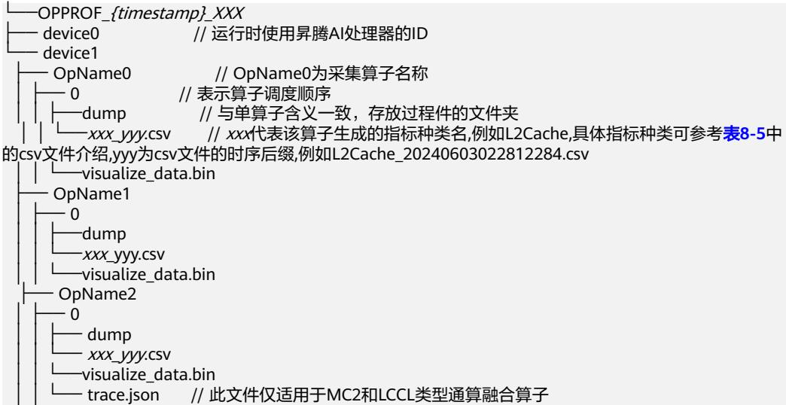

采集单卡多算子场景。

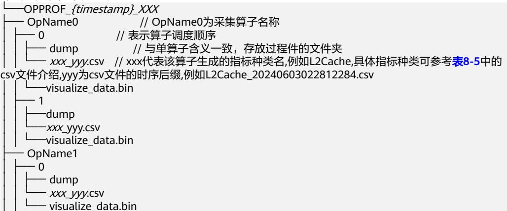

采集单卡单算子场景。 OPPROF_{timestamp}_XXX

dump   
ArithmeticUtilization.csv   
L2Cache.csv   
Memory.csv   
MemoryL0.csv   
MemoryUB.csv   
OpBasicInfo.csv   
PipeUtilization.csv   
ResourceConflictRatio.csv   
visualize_data.bin

表 8-5 msprof op 文件介绍  

<table><tr><td rowspan=1 colspan=1>名称</td><td rowspan=1 colspan=1>说明</td></tr><tr><td rowspan=1 colspan=1>dump文件夹</td><td rowspan=1 colspan=1>原始的性能数据，用户无需关注。</td></tr><tr><td rowspan=1 colspan=1>ArithmeticUtilization.csv</td><td rowspan=1 colspan=1>Cube和Vector类型的指令耗时和占比，可参考8.11.1.1ArithmeticUtilization（Cube及Vector类型指令耗时和占比）。</td></tr><tr><td rowspan=1 colspan=1>L2Cache.csv</td><td rowspan=1 colspan=1>L2 Cache命中率，可参考8.11.1.2 L2Cache（L2 Cache命中率）。</td></tr><tr><td rowspan=1 colspan=1>Memory.csv</td><td rowspan=1 colspan=1>UB/L1/L2/主存储器采集内存读写带宽速率，可参考8.11.1.3Memory（内存读写带宽速率）。</td></tr><tr><td rowspan=1 colspan=1>MemoryL0.csv</td><td rowspan=1 colspan=1>L0A/L0B/L0C采集内存读写带宽速率，可参考8.11.1.4MemoryL0（LO读写带宽速率）</td></tr><tr><td rowspan=1 colspan=1>MemoryUB.csv</td><td rowspan=1 colspan=1>mte/vector/scalar采集ub读写带宽速率，可参考8.11.1.5MemoryUB（UB读写带宽速率）。</td></tr><tr><td rowspan=1 colspan=1>PipeUtilization.csv</td><td rowspan=1 colspan=1>采集计算单元和搬运单元耗时和占比，可参考8.11.1.7PipeUtilization（计算单元和搬运单元耗时占比）。</td></tr><tr><td rowspan=1 colspan=1>ResourceConflictRa tio.csv</td><td rowspan=1 colspan=1>UB上的bank group、bank conflict和资源冲突在所有指令中的占比，可参考8.11.1.8 ResourceConflictRatio（资源冲突占比）。</td></tr><tr><td rowspan=1 colspan=1>OpBasiclnfo.csv</td><td rowspan=1 colspan=1>算子基础信息，包含算子名称、blockdim和耗时等信息，可参考8.11.1.6 OpBasiclnfo（算子基础信息）。</td></tr><tr><td rowspan=1 colspan=1>visualize_data.bin</td><td rowspan=1 colspan=1>算子基础信息、计算单元负载、热点函数和Roofline瓶颈分析等信息的可视化呈现文件，具体请参考8.4计算内存热力图、8.5Roofline瓶颈分析图、8.6Cache热力图、8.7通算流水图和8.9算子代码热点图。说明·visualize_data.bin可通过MindStudio Insight工具进行可视化展示，具体使用方法请参考《MindStudio Insight工具用户指南》。msprof op的热点函数功能仅支持AtlasA2训练系列产品/Atlas A2推理系列产品。当前，仅支持生成MC2和LCCL类型通算融合算子的8.7通算流水图。MC2和LCCL类型通算融合算子不支持生成8.6Cache热力图和8.9算子代码热点图，且不支持Atlas推理系列产品。·单位GB/s表示每秒传输1GB的数据量。</td></tr><tr><td rowspan=1 colspan=1>trace.json</td><td rowspan=1 colspan=1>通算流水可视化呈现文件，Chrome浏览器具体请参考8.7通算流水图。</td></tr></table>

4 将visualize_data.bin文件导入MindStudio Insight后，将会展示8.4 计算内存热力图、  
8.5 Roofline瓶颈分析图、8.6 Cache热力图、8.7 通算流水图和8.9 算子代码热点图。

步骤5 将trace.json文件导入Chrome浏览器或MindStudio Insight后，将会展示8.7 通算流水图。

----结束

# msprof op simulator

算子调优工具支持仿真环境下的性能数据采集和自动解析。

# 说明

● 仿真环境不支持采集MC2和HCCL类型的算子。用户设置的仿真核数不能超过物理核数。若用户仅需关注部分算子性能时，可在Atlas A3 训练系列产品/Atlas A3 推理系列产品、Atlas 推理系列产品和Atlas A2 训练系列产品/Atlas A2 推理系列产品的单核内调用《Ascend C算子开发接口》中的“算子调测API”章节的TRACE_START和TRACE_STOP接口。并在编译配置文件中添加-DASCENDC_TRACE_ON，具体操作请参见添加-DASCENDC_TRACE_ON的方法。然后，才能生成该范围内的流水图信息，具体流水图显示内容可参考8.8 指令流水图。用户需在编译配置文件中添加-DASCENDC_TRACE_ON，具体修改方法可参考以下样例工程。AddKernelInvocationNeo算子工程，需在\${git_clone_path}/samples/operator/ascendc/0_introduction/3_add_kernellaunch/AddKernelInvocationNeo/cmake/npu_lib.cmake文件中新增以下代码。ascendc_compile_definitions-DASCENDC_TRACE_ON

步骤1 登录运行环境，需要使用msprof op simulator开启算子仿真调优，并配合使用仿真可选参数和用户待调优程序（app [arguments]）进行调优，仿真可选参数请参考表8-3。算子仿真调优可以通过以下两种方式执行：

基于可执行文件。

单算子场景，以add custom npu为例。  
msprof op simulator --soc-version=Ascendxxxyy --output=./output_data ./add_custom_npu //xxxyy为用户实际使用的具体芯片类型  
多算子场景。  
若test中有Add，MatlMul，Sub算子，可配合--launch-count和--kernel-name使用，可以指定采集Add和Sub算子。  
msprof op simulator --soc-version=Ascendxxxyy --launch-count=10 --kernel-name="Add|Sub" --output=./output_data ./test // xxxyy为用户实际使用的具体芯片类型，./test需要放置在命令末尾

基于输入算子二进制文件\*.o的配置文件.json。

# 说明

--config场景下，仅支持使用LD_LIBRARY_PATH导入环境变量，不支持使用--soc-version参数。

export LD_LIBRARY_PATH=\${INSTALL_DIR}/tools/simulator/Ascendxxxyy/lib:\$LD_LIBRARY_PATH //  
xxxyy为用户实际使用的具体芯片类型  
msprof op simulator --config=./add_test.json --output=./output_data

步骤2 命令完成后，会在指定的“--output”目录下生成以“OPPROF_{timestamp}_XXX”命名的文件夹，结构示例如下：

采集单个算子场景。 OPPROF_{timestamp}_XXX dump

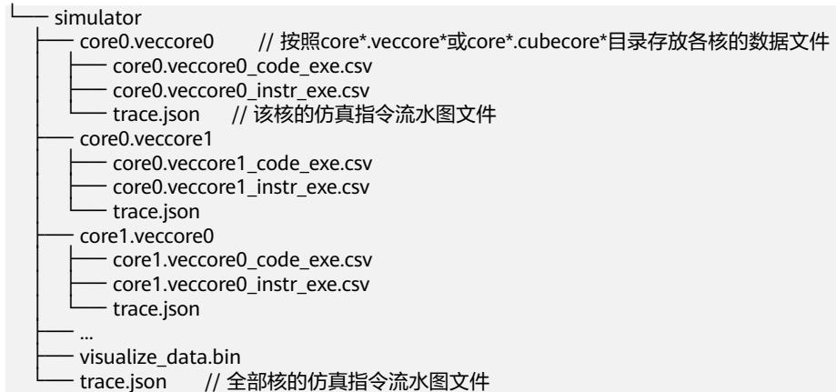

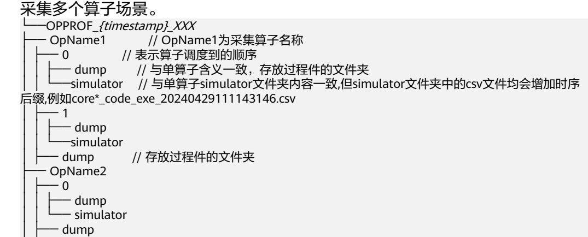

表 8-6 msprof op simulator 文件介绍  

<table><tr><td rowspan=1 colspan=2>名称</td><td rowspan=1 colspan=1>说明</td></tr><tr><td rowspan=1 colspan=2>dump文件夹</td><td rowspan=1 colspan=1>原始仿真生成的dump数据存放文件夹。</td></tr><tr><td rowspan=4 colspan=1>simulator文件夹说明dump数据文件分析结果存放文件夹。</td><td rowspan=1 colspan=1>core*_code_exe.csv</td><td rowspan=1 colspan=1>代码行耗时，*代表0~n核，以便用户快速确定编写的代码中最耗时的部分，可参考8.11.2.1代码行耗时数据文件。</td></tr><tr><td rowspan=1 colspan=1>core*_instr_exe.csv</td><td rowspan=1 colspan=1>代码指令详细信息，*代表0~n核，以便用户快速确定最耗时的指令，可参考8.11.2.2代码指令信息文件。</td></tr><tr><td rowspan=1 colspan=1>visualize_data.bin</td><td rowspan=1 colspan=1>仿真流水图和仿真热点函数等信息可视化呈现文件，具体请参见8.8指令流水图、8.9算子代码热点图和8.10 内存通路吞吐率波形图。说明生成仿真流水图以及仿真热点函数等信息可视化呈现文件visualize_data.bin，该文件可通过MindStudio Insight工具进行可视化展示，具体使用方法请参考《MindStudioInsight工具用户指南》。</td></tr><tr><td rowspan=1 colspan=1>trace.json</td><td rowspan=1 colspan=1>仿真指令流水图文件，包括每个核的子文件以及全部核的汇总文件，可参考8.8指令流水图和8.10 内存通路吞吐率波形图。</td></tr></table>

步骤3 可选: 将visualize_data.bin文件导入MindStudio Insight后，将会展示8.8 指令流水图、8.9 算子代码热点图和8.10 内存通路吞吐率波形图。

步骤4 将trace.json文件导入Chrome浏览器或MindStudio Insight后，将会展示8.8 指令流水图和8.10 内存通路吞吐率波形图。

----结束

# 8.4 计算内存热力图

通过msprof op生成的visualize_data.bin文件可通过MindStudio Insight进行可视化呈现，界面将会以资源维度展示算子基础信息、计算负载分析和内存负载分析的数据，协助开发者以全局视角识别资源瓶颈。

# 说明

若要使用MindStudio Insight进行查看时，需要单独安装MindStudio Insight软件包，具体下载链接请参见《MindStudio Insight工具用户指南》的“安装与卸载”章节。将visualize_data.bin文件导入MindStudio Insight的具体操作请参考导入性能数据《MindStudio Insight工具用户指南》的“算子调优 $>$ 导入性能数据”章节。MindStudio Insight具体操作请参考《MindStudio Insight工具用户指南》的“算子调优 $>$ 详情（Details）”章节。

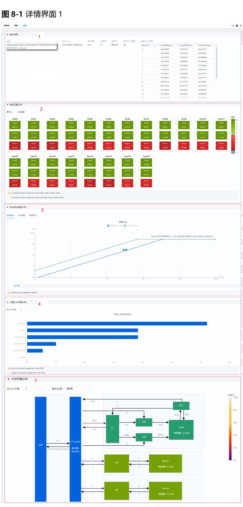

提供核间负载分析图（Core Occupancy），以数据窗格的方式呈现各物理单核的耗时、总数据吞吐量及Cache命中率，帮助开发人员提升物理核的使用效率。

# 说明

● 仅Atlas A3 训练系列产品/Atlas A3 推理系列产品和Atlas A2 训练系列产品/Atlas A2推理系列产品支持该功能。  
● 具体展示的核数与实际使用的硬件有关。

Roofline瓶颈分析图（Roofline）：具体介绍请参见8.5 Roofline瓶颈分析图。

提供计算负载分析（Compute Workload Analysis），以柱状图和数据表格的方式呈现计算负载数据，帮助开发人员分析Cube/Vector计算资源是否得到了充分利用。

提供内存负载分析（Memory Workload Analysis），支持展示MTE各通路的活跃带宽值（未开启动态插桩不显示Cube上的MTE1和MTE2通路的活跃带宽）。通过内存热力图和数据窗格，直观呈现各通路的请求数、搬运带宽与利用率。帮助开发人员分析可能存在瓶颈的通路。

# 说明

● 数据窗格呈现的内容会随算子类型而变化。  
● 活跃带宽值的功能不适用于Atlas 推理系列产品。  
● Atlas A3 训练系列产品/Atlas A3 推理系列产品暂不支持峰值（最大带宽占比）展示。

# 8.5 Roofline 瓶颈分析图

通过msprof op生成的visualize_data.bin文件可通过MindStudio Insight进行可视化呈现，Roofline瓶颈分析图可构建出处理器的性能模型，然后利用该性能模型快速评估出算子的理论性能极限，协助开发者快速识别瓶颈类型。

# 说明

若要使用MindStudio Insight进行查看时，需要单独安装MindStudio Insight软件包，具体下载链接请参见《MindStudio Insight工具用户指南》的“安装与卸载”章节。将visualize_data.bin文件导入MindStudio Insight的具体操作请参考导入性能数据《MindStudio Insight工具用户指南》的“算子调优 $>$ 导入性能数据”章节。MindStudio Insight具体操作请参考《MindStudio Insight工具用户指南》的“算子调优 $>$ 详情（Details）”章节。

# 硬件支持情况

通过msprof op生成的visualize_data.bin文件可导入MindStudio Insight进行可视化呈现，并针对不同的硬件以及算子类型会生成不同的Roofline分析视图。

● Atlas 推理系列产品的Roofline瓶颈分析图中仅有内存单元视图。

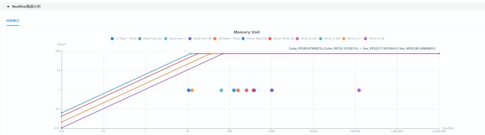  
图 8-2 Atlas 推理系列产品 Roofline 瓶颈分析图

Atlas A3 训练系列产品/Atlas A3 推理系列产品和Atlas A2 训练系列产品/AtlasA2 推理系列产品根据算子类型不同而产生不同的视图，具体请参见表8-7。

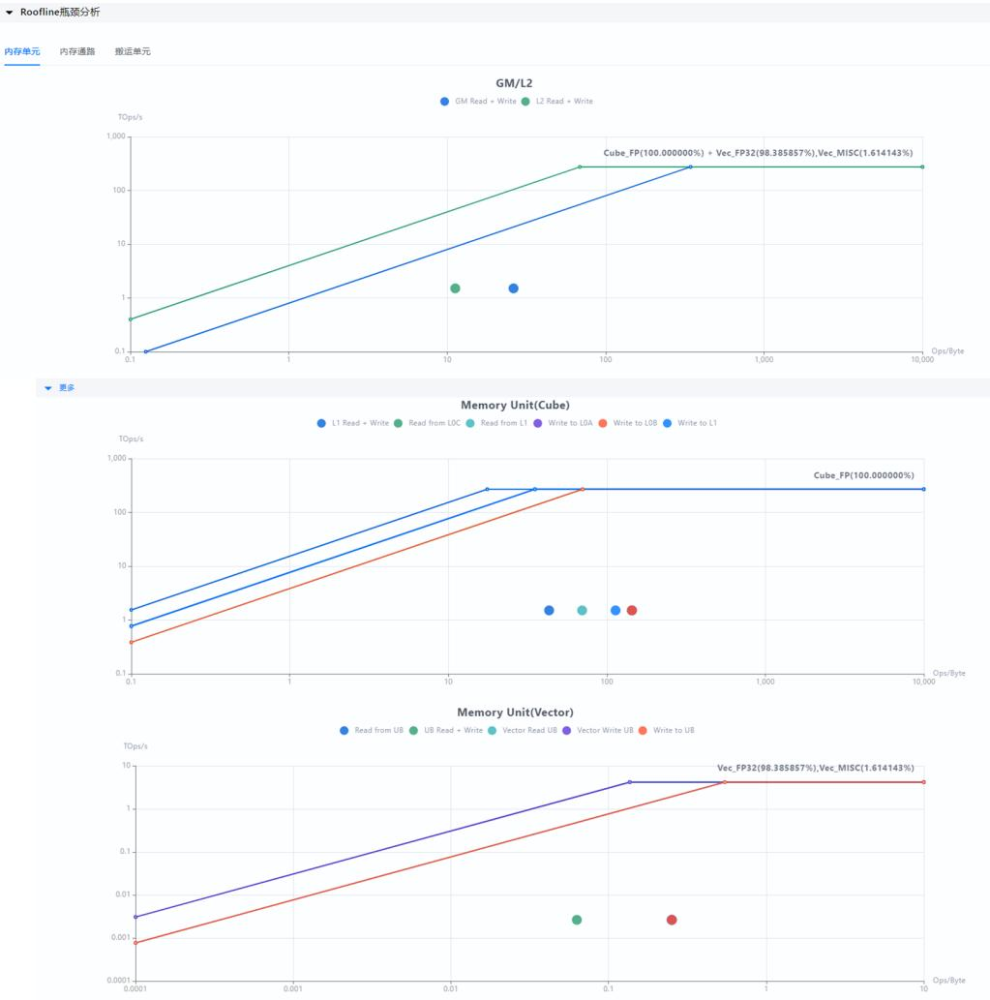  
图 8-3 Atlas A3 训练系列产品/Atlas A3 推理系列产品和 Atlas A2 训练系列产品/Atlas A2 推理系列产品 Roofline 瓶颈分析图

表 8-7 Atlas A3 训练系列产品/Atlas A3 推理系列产品和 Atlas A2 训练系列产品/Atlas A2 推理系列产品支持 Roofline 视图情况列表  

<table><tr><td rowspan=1 colspan=1>Roofline视图类型</td><td rowspan=1 colspan=1>Vector算子</td><td rowspan=1 colspan=1>Cube算子</td><td rowspan=1 colspan=1>Mix算子</td></tr><tr><td rowspan=1 colspan=1>GM/L2视图</td><td rowspan=1 colspan=1>√</td><td rowspan=1 colspan=1>√</td><td rowspan=1 colspan=1>√</td></tr><tr><td rowspan=1 colspan=1>Vector内存单元视图</td><td rowspan=1 colspan=1>√</td><td rowspan=1 colspan=1>-</td><td rowspan=1 colspan=1>√</td></tr><tr><td rowspan=1 colspan=1>Vector内存通路视图</td><td rowspan=1 colspan=1>√</td><td rowspan=1 colspan=1>一</td><td rowspan=1 colspan=1>√</td></tr><tr><td rowspan=1 colspan=1>Vector Pipeline视图</td><td rowspan=1 colspan=1>√</td><td rowspan=1 colspan=1></td><td rowspan=1 colspan=1>√</td></tr><tr><td rowspan=1 colspan=1>Cube内存单元视图</td><td rowspan=1 colspan=1></td><td rowspan=1 colspan=1>√</td><td rowspan=1 colspan=1>√</td></tr><tr><td rowspan=1 colspan=1>Cube内存通路视图</td><td rowspan=1 colspan=1></td><td rowspan=1 colspan=1>√</td><td rowspan=1 colspan=1>√</td></tr><tr><td rowspan=1 colspan=1>Cube Pipeline视图</td><td rowspan=1 colspan=1></td><td rowspan=1 colspan=1>√</td><td rowspan=1 colspan=1>√</td></tr></table>

每个单元/通路的Roofline性能分析结果由横轴、纵轴、屋顶线、带宽斜线和实际运行坐标点组成，具体请参见图8-4。

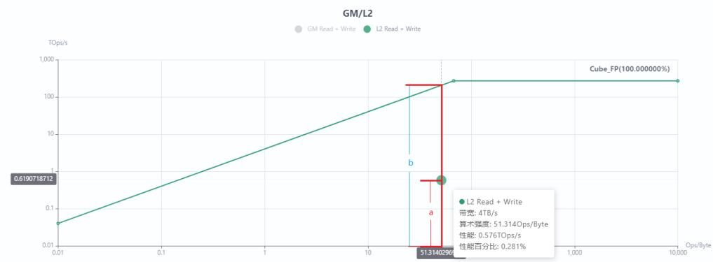  
图 8-4 Roofline 示意图

横轴：代表算术强度（Arithmetic Intensity），即某一单元或通路中总的浮点运算次数与总的访存数据量之比，单位为Ops/Byte。

纵轴：表示计算性能（Performance），即每秒可执行的浮点操作数，单位为TOps/s。

屋顶线：指图中顶部的水平线，代表NPU的理论最大计算性能。无论算术强度如何提高，应用的实际性能都不可能超过硬件上限。

带宽斜线：指图中与屋顶线相交的斜线，其与纵轴的交点取决于理论最大带宽。当理论最大带宽乘以算术强度小于NPU理论最大计算性能时，能达到的最大算力随算术强度的增加而线性增长。

# 说明

屋顶线和带宽斜线组合成算子能达到的理论最大算力，可以概括为min（NPU理论最大计算性能，理论最大带宽\*实际算术强度）。

实际运行坐标点的参数构成请参见表8-8。

表 8-8 实际运行坐标点简介  

<table><tr><td rowspan=1 colspan=1>坐标参数</td><td rowspan=1 colspan=1>简介</td></tr><tr><td rowspan=1 colspan=1>带宽（Bandwidth）</td><td rowspan=1 colspan=1>该单元/通路的理论最大带宽。</td></tr><tr><td rowspan=1 colspan=1>算术强度（Arithmetic Intensity）</td><td rowspan=1 colspan=1>算子实际运行时的算术强度，即横轴坐标值。</td></tr><tr><td rowspan=1 colspan=1>性能（Performance）</td><td rowspan=1 colspan=1>算子实际运行时的计算性能，即纵轴坐标值。</td></tr><tr><td rowspan=1 colspan=1>性能百分比（Performance Ratio）</td><td rowspan=1 colspan=1>算子实际运行时的计算性能与当前数据量下的理论最大计算性能比值，即图中a/b的百分比。</td></tr></table>

Roofline分析视图分析算子的性能百分比，并提供以下客观分析结果：

算子性能百分比大于 $80 \%$ 时，按照所在区域进行提示，有以下两种情况。Compute Bound：计算瓶颈。Memory Bound：内存瓶颈。

算子性能百分比小于 $80 \%$ ，Bound类型为Latency Bound，有以下三种情况：

若最大的pipeline ratio小于 $80 \%$ ，提示latency bound:pipeline caused。  
若最大的pipeline ratio大于 $80 \%$ ，需识别最大pipeline ratio的类型。

若最大pipeline ratio的类型是compute pipeline (cube ratio、vectorratio、scalar ratio)，提示latency bound:compute caused。

若最大pipeline ratio的类型是memory pipeline(MTE1 ratio、MTE2ratio、MTE3 ratio)，提示latency bound:memory caused。

# 8.6 Cache 热力图

针对用户程序Kernel函数内的L2 Cache访问情况，msProf工具可以记录并通过MindStudio Insight工具进行可视化呈现Cache热力图，该热力图可显示对应指令信息，以便用户优化L2Cache命中率，从而优化算子程序。

# 说明

若要使用MindStudio Insight进行查看时，需要单独安装MindStudio Insight软件包，具体下载链接请参见《MindStudio Insight工具用户指南》的“安装与卸载”章节。

● 将visualize_data.bin文件导入MindStudio Insight的具体操作请参考导入性能数据《MindStudio Insight工具用户指南》的“算子调优 $>$ 导入性能数据”章节。

MindStudio Insight具体操作和详细字段解释请参考《MindStudio Insight工具用户指南》的“算子调优 $>$ 缓存（Cache）”章节。

添加-g编译选项会在生成的二进制文件中附带调试信息，建议限制带有调试信息的用户程序的访问权限，确保只有授权人员可以访问该二进制文件。

若不使用llvm-symbolizer组件提供的相关功能，输入msProf的程序编译时不包含-g即可，msProf工具则不会调用llvm-symbolizer组件的相关功能。

● Cache热力图功能不适用于Atlas 推理系列产品。

● MC2算子和LCCL算子均不支持生成8.6 Cache热力图。

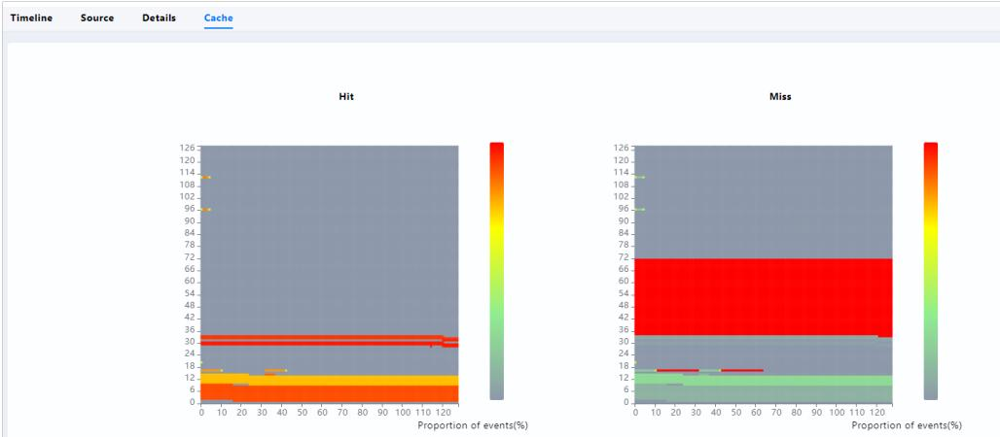  
图 8-5 Cache 热力图

Hit展示Cacheline的命中情况，Miss展示Cacheline未命中情况，以便用户分析L2Cache的使用情况，

在缓存（Cache）界面，选择命中和未命中事件图，单击放大，在放大的事件图中右键单击所选内存单元格，选择“显示指令”，可跳转至源码（Source）界面，并高亮显示相关指令行。

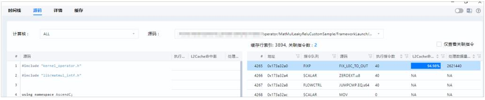  
图 8-6 Cacheline 对应的算子代码热点图

# 说明

若要使用Cache热力图跳转至算子代码热点图功能，需参考msprof op配置，提前进行配置。

# 8.7 通算流水图

通过msprof op对通算融合算子进行调优后，生成的trace.json和visualize_data.bin文件可通过MindStudio Insight进行可视化呈现，能够直观看到通算运行情况、指令耗时等信息，协助开发者识别通算瓶颈。当前仅支持MC2和LCCL类型的通算融合算子。

# 说明

若要使用MindStudio Insight进行查看时，需要单独安装MindStudio Insight软件包，具体下载链接请参见《MindStudio Insight工具用户指南》的“安装与卸载”章节。  
将visualize_data.bin文件导入MindStudio Insight的具体操作请参考导入性能数据《MindStudio Insight工具用户指南》的“算子调优 $>$ 导入性能数据”章节。  
MindStudio Insight具体操作和详细字段解释请参考《MindStudio Insight工具用户指南》  
的“系统调优 $>$ 时间线（Timeline）”章节。  
添加-g编译选项会在生成的二进制文件中附带调试信息，建议限制带有调试信息的用户程序的访问权限，确保只有授权人员可以访问该二进制文件。

Chrome浏览器

在Chrome浏览器中输入“chrome://tracing”地址，并将通过msprof op生成的通算流水图文件（trace.json）拖到空白处打开，键盘上输入快捷键（W：放大，S：缩小，A：左移，D：右移）可进行查看。关键字段说明如表8-9。

表 8-9 关键字段说明  

<table><tr><td rowspan=1 colspan=1>字段名</td><td rowspan=1 colspan=1>字段功能</td><td rowspan=1 colspan=1>MC2算子</td><td rowspan=1 colspan=1>LCCL算子</td></tr><tr><td rowspan=1 colspan=1>AI CORE</td><td rowspan=1 colspan=1>算子在AICORE上的整体运行情况。</td><td rowspan=1 colspan=1>支持</td><td rowspan=1 colspan=1>支持</td></tr><tr><td rowspan=1 colspan=1>AI CPU</td><td rowspan=1 colspan=1>算子在AI CPU上的整体运行情况。</td><td rowspan=1 colspan=1>支持</td><td rowspan=1 colspan=1>不支持</td></tr><tr><td rowspan=1 colspan=1>TURN</td><td rowspan=1 colspan=1>算子在AI CPU上不同通信轮次的流水。</td><td rowspan=1 colspan=1>支持</td><td rowspan=1 colspan=1>不支持</td></tr><tr><td rowspan=1 colspan=1>AICBLOCK</td><td rowspan=1 colspan=1>算子在AICORE各Cube核上的整体运行情况和关键接口调用情况。</td><td rowspan=1 colspan=1>支持</td><td rowspan=1 colspan=1>支持</td></tr><tr><td rowspan=1 colspan=1>AIVBLOCK</td><td rowspan=1 colspan=1>算子在AI CORE各Vector核上的整体运行情况和关键接口调用情况。</td><td rowspan=1 colspan=1>支持</td><td rowspan=1 colspan=1>支持</td></tr><tr><td rowspan=1 colspan=1>HCCL</td><td rowspan=1 colspan=1>通过HCCL通信的算子在多卡间的集合通信流水。</td><td rowspan=1 colspan=1>支持</td><td rowspan=1 colspan=1>不支持</td></tr><tr><td rowspan=1 colspan=1>HCCLTASK</td><td rowspan=1 colspan=1>通过HCCL通信的算子在多卡间的集合通信任务执行流水。</td><td rowspan=1 colspan=1>支持</td><td rowspan=1 colspan=1>不支持</td></tr></table>

MindStudio Insight

通过msprof op生成的trace.json文件或visualize_data.bin文件可导入MindStudioInsight进行可视化呈现。

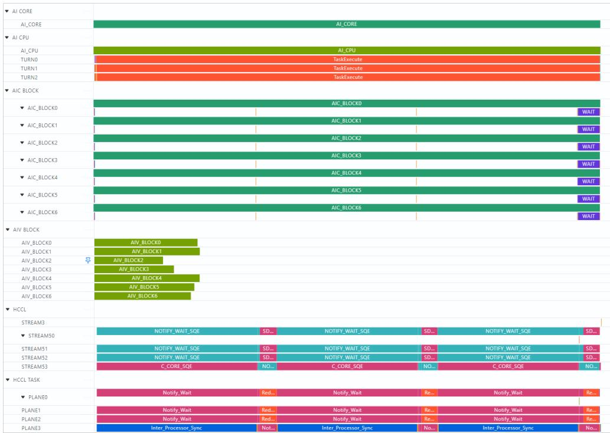  
图 8-7 通算流水图

展示算子在AI CPU和AI CORE的耗时掩盖情况，用于评估通算融合算子的性能。

展示算子在AI CPU上的不同通信轮次的流水。

展示算子在各BLOCK上的运行时间及关键接口调用流水。

展示通过HCCL通信的算子在多卡间运行时的集合通信流水及集合通信任务流水。

# 说明

MC2算子支持对Atlas A2 训练系列产品/Atlas A2 推理系列产品的AllReduce、AllGather、ReduceScatter、AlltoAll等接口及Atlas A3 训练系列产品/Atlas A3 推理系列产品的AllGather、ReduceScatter、AlltoAllV等接口进行调用，具体介绍请参见《Ascend C算子开发接口》中的“高阶API >HCCL通信类> HCCL Kernel侧接口”章节，添加-g编译选项后，单击具体接口将会展示代码行的调用栈。● MC2算子和LCCL算子的支持情况请参考表8-9。

# 8.8 指令流水图

通过msprof op simulator生成的visualize_data.bin文件或trace.json文件，并进行可视化呈现。指令流水图以指令维度展示时序关系，并关联调用栈快速定位瓶颈位置。支持以下两种可视化呈现方式：

# 说明

添加-g编译选项会在生成的二进制文件中附带调试信息，建议限制带有调试信息的用户程序的访问权限，确保只有授权人员可以访问该二进制文件。若不使用llvm-symbolizer组件提供的相关功能，输入msProf的程序编译时不包含-g即可，msProf工具则不会调用llvm-symbolizer组件的相关功能。若用户仅需关注部分算子性能时，可在Atlas A3 训练系列产品/Atlas A3 推理系列产品、Atlas 推理系列产品和Atlas A2 训练系列产品/Atlas A2 推理系列产品的单核内调用《Ascend C算子开发接口》中的“算子调测API”章节的TRACE_START和TRACE_STOP接口。并在编译配置文件中添加-DASCENDC_TRACE_ON，具体操作请参见添加-DASCENDC_TRACE_ON的方法。然后，才能生成该范围内的流水图信息，具体流水图显示内容可参考8.8 指令流水图。用户需在编译配置文件中添加-DASCENDC_TRACE_ON，具体修改方法可参考以下样例工程。AddKernelInvocationNeo算子工程，需在\${git_clone_path}/samples/operator/ascendc/0_introduction/3_add_kernellaunch/AddKernelInvocationNeo/cmake/npu_lib.cmake文件中新增以下代码。ascendc_compile_definitions(...-DASCENDC_TRACE_ON)

Chrome浏览器

在Chrome浏览器中输入“chrome://tracing”地址，并将通过msprof opsimulator生成指令流水图文件（trace.json）拖到空白处打开，键盘上输入快捷键（W：放大，S：缩小，A：左移，D：右移）可进行查看。关键字段说明如表8-10。

表 8-10 关键字段说明  

<table><tr><td colspan="1" rowspan="1">字段名</td><td colspan="1" rowspan="1">字段含义</td></tr><tr><td colspan="1" rowspan="1">VECTOR</td><td colspan="1" rowspan="1">向量运算单元。</td></tr><tr><td colspan="1" rowspan="1">SCALAR</td><td colspan="1" rowspan="1">标量运算单元。</td></tr><tr><td colspan="1" rowspan="1">Cube</td><td colspan="1" rowspan="1">矩阵乘运算单元。</td></tr><tr><td colspan="1" rowspan="1">MTE1</td><td colspan="1" rowspan="1">数据搬运流水，数据搬运方向为：L1-&gt;{L0A/LOB,UBUF}。</td></tr><tr><td colspan="1" rowspan="1">MTE2</td><td colspan="1" rowspan="1">数据搬运流水，数据搬运方向为：{DDR/GM,L2} -&gt;{L1,LOA/B,UBUF}。</td></tr><tr><td colspan="1" rowspan="1">MTE3</td><td colspan="1" rowspan="1">数据搬运流水，数据搬运方向为：UBUF-&gt;{DDR/GM,L2,L1}、L1-&gt;{DDR/L2}。</td></tr><tr><td colspan="1" rowspan="1">FIXP</td><td colspan="1" rowspan="1">数据搬运流水，数据搬运方向为：FIXPIPELOC-&gt;OUT/L1。（仅Atlas A2训练系列产品/Atlas A2推理系列产品支持展示）</td></tr><tr><td colspan="1" rowspan="1">FLOWCTRL</td><td colspan="1" rowspan="1">控制流指令。</td></tr><tr><td colspan="1" rowspan="1">CACHEMISS</td><td colspan="1" rowspan="1">未命中ICache。</td></tr><tr><td colspan="1" rowspan="1">USEMASK</td><td colspan="1" rowspan="1">自定义打点范围。说明若同一个USEMASK内存在范围嵌套或只有TRACE_START无TRACE_STOP时，不能正常绘制指令流水图。</td></tr><tr><td>ALL</td><td>表示在这个通道的指令在所有通道都执行。</td></tr></table>

MindStudio Insight

通过msprof op simulator生成的trace.json文件或visualize_data.bin文件可导入MindStudio Insight进行可视化呈现。

# 说明

● 若要使用MindStudio Insight进行查看时，需要单独安装MindStudio Insight软件包，具体下载链接请参见《MindStudio Insight工具用户指南》的“安装与卸载”章节。  
将visualize_data.bin文件导入MindStudio Insight的具体操作请参考导入性能数据《MindStudio Insight工具用户指南》的“算子调优 $>$ 导入性能数据”章节。MindStudio Insight具体操作和详细字段解释请参考《MindStudio Insight工具用户指南》的“系统调优 $>$ 时间线（Timeline）”章节。  
添加-g编译选项会在生成的二进制文件中附带调试信息，建议限制带有调试信息的用户程序的访问权限，确保只有授权人员可以访问该二进制文件。

# 指令流水图介绍（以 MindStudio Insight 为例）

MindStudio Insight工具以时序图方式为用户提供指令在昇腾AI处理器上的运行情况，用户可通过分析时序图中的指令详情、指令执行时间、指令关联代码的调用栈及指令/流水间同步连线等信息，识别微观指令的时序优化点。

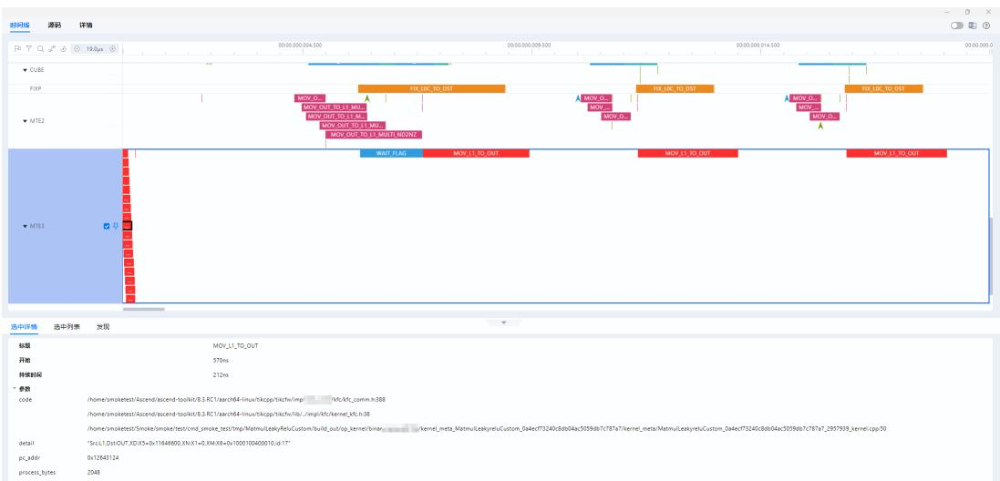  
图 8-8 时间线界面

展示各PIPE中各指令的运行时长以及不同PIPE间的指令依赖关系，帮助用户分析流水排布间可能存在的性能优化点。

● 支持将流水指令信息与代码关联，指导用户如何基于代码去优化流水排布。

支持在选中详情展示与GM有关指令的数据搬运量。

# 说明

通过观察Timeline的流水排布等信息判断算子运行过程中可能存在的性能问题，如指令间未能有效并行等。

# 8.9 算子代码热点图

通过msprof op或msprof op simulator生成的visualize_data.bin文件可通过MindStudio Insight进行可视化呈现。界面支持查看算子源码与指令集的映射关系、耗时情况等功能，可协助开发者识别热点代码分布，并分析热点函数优化的可行性。

# 说明

若要使用MindStudio Insight进行查看时，需要单独安装MindStudio Insight软件包，具体下载链接请参见《MindStudio Insight工具用户指南》的“安装与卸载”章节。将visualize_data.bin文件导入MindStudio Insight的具体操作请参考导入性能数据《MindStudio Insight工具用户指南》的“算子调优 $>$ 导入性能数据”章节。MindStudio Insight具体操作和详细字段解释请参考《MindStudio Insight工具用户指南》的“算子调优 $>$ 源码（Source）”章节。● 添加-g编译选项会在生成的二进制文件中附带调试信息，建议限制带有调试信息的用户程序的访问权限，确保只有授权人员可以访问该二进制文件。算子程序编译时需要包含-g，否则msprof不会展示热点图，也不调用llvm-symbolizer组件的相关功能实现代码-PC映射。● msprof op算子代码热点图功能不适用于Atlas 推理系列产品。● MC2算子和LCCL算子均不支持生成8.9 算子代码热点图。

# msprof op 热点图

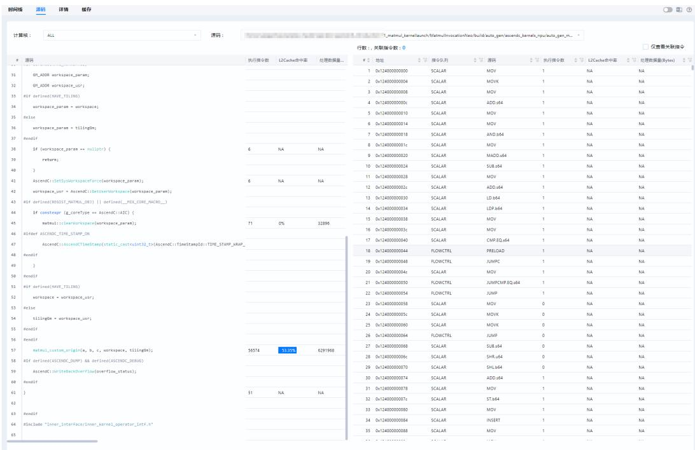  
图 8-9 msprof op 源码界面

在界面顶部，可切换计算单元和核函数文件。

在左侧界面，提供算子核函数各行代码模拟L2Cache命中率、与GM有关的数据搬运量及对应的指令数，帮助开发者快速定位瓶颈代码行。

在右侧界面，提供具体的指令维度模拟L2Cache命中率、与GM有关的数据搬运量、执行次数及与代码相关联，帮助开发者进一步分析代码耗时长的原因。

MindStudio Insight时间线和详情页面中L2Cache命中率的差异请参见表8-11。

表 8-11 MindStudio Insight L2Cache 命中率对比表  

<table><tr><td rowspan=1 colspan=1>页面位置</td><td rowspan=1 colspan=1>数据来源</td><td rowspan=1 colspan=1>维度</td></tr><tr><td rowspan=1 colspan=1>时间线</td><td rowspan=1 colspan=1>工具模拟</td><td rowspan=1 colspan=1>代码行和指令维度。</td></tr><tr><td rowspan=1 colspan=1>详情</td><td rowspan=1 colspan=1>真实存在</td><td rowspan=1 colspan=1>核维度。</td></tr></table>

# 说明

查看与GM有关的数据搬运量（Process Bytes）时，不涉及GM单元的情况都显示为NA。

msprof op具体特性支持情况请参见表8-12。

表 8-12 msprof op 热点图的功能介绍  

<table><tr><td rowspan=1 colspan=1>列名</td><td rowspan=1 colspan=1> Atlas A2训练系列产品/Atlas A2推理系列产品</td><td rowspan=1 colspan=1>Atlas A3训练系列产品/ Atlas A3推理系列产品</td><td rowspan=1 colspan=1>Atlas 推理系列产品</td><td rowspan=1 colspan=1>说明</td></tr><tr><td rowspan=1 colspan=1>源码</td><td rowspan=1 colspan=1>支持</td><td rowspan=1 colspan=1>支持</td><td rowspan=1 colspan=1>不支持</td><td rowspan=1 colspan=1></td></tr><tr><td rowspan=1 colspan=1>指令PC地址</td><td rowspan=1 colspan=1>支持</td><td rowspan=1 colspan=1>支持</td><td rowspan=1 colspan=1>不支持</td><td rowspan=1 colspan=1></td></tr><tr><td rowspan=1 colspan=1>PIPE</td><td rowspan=1 colspan=1>支持</td><td rowspan=1 colspan=1>支持</td><td rowspan=1 colspan=1>不支持</td><td rowspan=1 colspan=1></td></tr><tr><td rowspan=1 colspan=1>执行指令数</td><td rowspan=1 colspan=1>支持</td><td rowspan=1 colspan=1>支持</td><td rowspan=1 colspan=1>不支持</td><td rowspan=1 colspan=1>查看算子源码与指令的执行次数。</td></tr><tr><td rowspan=1 colspan=1>GPR Count</td><td rowspan=1 colspan=1>不支持</td><td rowspan=1 colspan=1>不支持</td><td rowspan=1 colspan=1>不支持</td><td rowspan=1 colspan=1>查看寄存器使用情况。说明不支持使用TRACE_START和TRACE_STOP接口查看部分算子的寄存器使用情况。</td></tr><tr><td rowspan=1 colspan=1>L2Cache命中率</td><td rowspan=1 colspan=1>支持</td><td rowspan=1 colspan=1>支持</td><td rowspan=1 colspan=1>不支持</td><td rowspan=1 colspan=1>模拟代码行和指令维度。</td></tr><tr><td rowspan=1 colspan=1>Process Bytes</td><td rowspan=1 colspan=1>支持</td><td rowspan=1 colspan=1>支持</td><td rowspan=1 colspan=1>不支持</td><td rowspan=1 colspan=1>查看与GM有关的数据搬运量。</td></tr></table>

# msprof op simulator 热点图

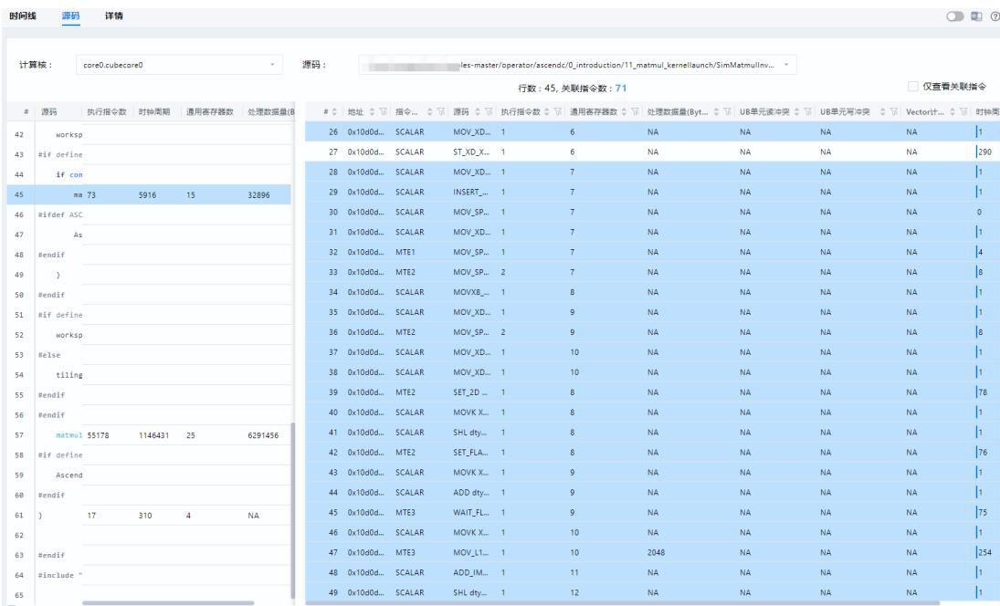  
图 8-10 msprof op simulator 源码界面

在界面顶部，可切换计算单元和核函数文件。

在左侧界面，提供算子核函数各行代码对应的耗时、寄存器使用情况、Vector计算类指令在UB Bank上读和写的冲突情况、Vector计算单元利用率、与GM有关的数据搬运量及对应的指令数，帮助开发者快速定位瓶颈代码行。

在右侧界面，提供具体的指令耗时、寄存器使用情况、与GM有关的数据搬运量、Vector计算类指令在UB Bank上读和写的冲突情况、Vector计算单元利用率、执行次数及与代码相关联，帮助开发者进一步分析代码耗时长的原因。

# 说明

● 通用寄存器的最大数量为32，当寄存器的使用数量达到32时，仿真过程需等到使用中的寄存器释放后才能运行。● 不支持使用TRACE_START和TRACE_STOP接口查看部分算子的寄存器使用情况。● 查看与GM有关的数据搬运量（Process Bytes）时，不涉及GM单元的情况都显示为NA。

msprof of simulator具体特性支持情况请参见表8-13。

表 8-13 msprof op simulator 热点图的功能介绍  

<table><tr><td colspan="1" rowspan="1">列名</td><td colspan="1" rowspan="1">Atlas A2训练系列产品/Atlas A2推理系列产品</td><td colspan="1" rowspan="1">Atlas A3训练系列产品/Atlas A3推理系列产品</td><td colspan="1" rowspan="1">Atlas 推理系列产品</td><td colspan="1" rowspan="1">说明</td></tr><tr><td colspan="1" rowspan="1">源码</td><td colspan="1" rowspan="1">支持</td><td colspan="1" rowspan="1">支持</td><td colspan="1" rowspan="1">支持</td><td colspan="1" rowspan="1"></td></tr><tr><td colspan="1" rowspan="1">指令PC地址</td><td colspan="1" rowspan="1">支持</td><td colspan="1" rowspan="1">支持</td><td colspan="1" rowspan="1">支持</td><td colspan="1" rowspan="1"></td></tr><tr><td colspan="1" rowspan="1">PIPE</td><td colspan="1" rowspan="1">支持</td><td colspan="1" rowspan="1">支持</td><td colspan="1" rowspan="1">支持</td><td colspan="1" rowspan="1"></td></tr><tr><td colspan="1" rowspan="1">耗时cycle</td><td colspan="1" rowspan="1">支持</td><td colspan="1" rowspan="1">支持</td><td colspan="1" rowspan="1">支持</td><td colspan="1" rowspan="1">查看算子源码与指令的耗时情况。</td></tr><tr><td colspan="1" rowspan="1">执行指令数</td><td colspan="1" rowspan="1">支持</td><td colspan="1" rowspan="1">支持</td><td colspan="1" rowspan="1">支持</td><td colspan="1" rowspan="1">查看算子源码与指令的执行次数。</td></tr><tr><td colspan="1" rowspan="1">GPR Count</td><td colspan="1" rowspan="1">支持</td><td colspan="1" rowspan="1">支持</td><td colspan="1" rowspan="1">支持</td><td colspan="1" rowspan="1">查看寄存器使用情况。说明不支持使用TRACE_START和TRACE_STOP接口查看部分算子的寄存器使用情况。</td></tr><tr><td colspan="1" rowspan="1">UB Bank读冲突</td><td colspan="1" rowspan="1">支持</td><td colspan="1" rowspan="1">支持</td><td colspan="1" rowspan="1">支持</td><td colspan="1" rowspan="1"></td></tr><tr><td colspan="1" rowspan="1">UB Bank写冲突</td><td colspan="1" rowspan="1">支持</td><td colspan="1" rowspan="1">支持</td><td colspan="1" rowspan="1">支持</td><td colspan="1" rowspan="1"></td></tr><tr><td colspan="1" rowspan="1">vec计算单元利用率百分比</td><td colspan="1" rowspan="1">支持</td><td colspan="1" rowspan="1">支持</td><td colspan="1" rowspan="1">支持</td><td colspan="1" rowspan="1"></td></tr><tr><td colspan="1" rowspan="1">Process Bytes</td><td colspan="1" rowspan="1">支持</td><td colspan="1" rowspan="1">支持</td><td colspan="1" rowspan="1">不支持</td><td colspan="1" rowspan="1">查看与GM有关的数据搬运量。</td></tr></table>

# 8.10 内存通路吞吐率波形图

通过msprof op simulator生成的visualize_data.bin文件可通过MindStudio Insight进行可视化呈现。界面支持查看算子MTE日志通路的内存带宽在时序上的统计分析能力，可协助开发者识别算子各阶段的带宽使用状况，并分析带宽优化的可行性。具体特性支持情况请参见图8-11。

# 说明

若要使用MindStudio Insight进行查看时，需要单独安装MindStudio Insight软件包，具体下载链接请参见《MindStudio Insight工具用户指南》的“安装与卸载”章节。将visualize_data.bin文件导入MindStudio Insight的具体操作请参考导入性能数据《MindStudio Insight工具用户指南》的“算子调优 $>$ 导入性能数据”章节。MindStudio Insight具体操作和详细字段解释请参考《MindStudio Insight工具用户指南》的源码（Source）章节。内存通路吞吐率波形图功能仅适用于Atlas A2 训练系列产品/Atlas A2 推理系列产品和AtlasA3 训练系列产品/Atlas A3 推理系列产品。● 此功能默认不开启，--core-id设置对该功能不生效。

# 内存通路吞吐率波形图

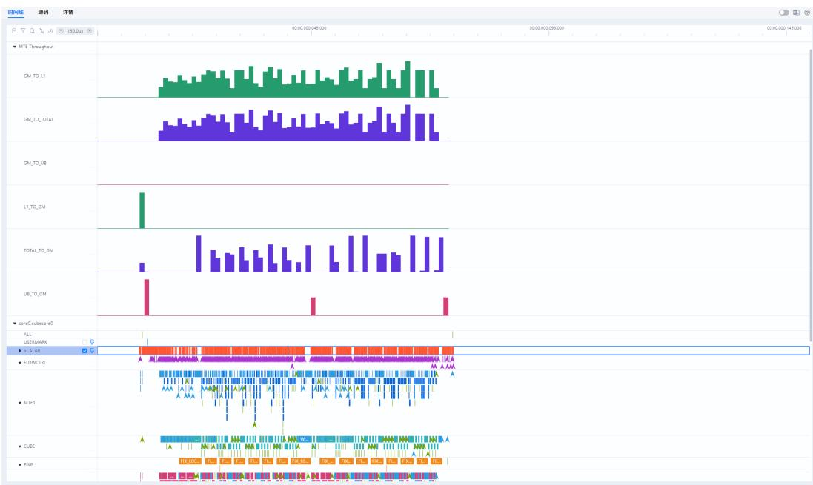  
图 8-11 内存通路吞吐率波形图

展示各种类型内存通路（当前仅展示GM_TO_L1、GM_TO_TOTAL、GM_TO_UB、L1_TO_GM、TOTAL_TO_GM、UB_TO_GM六个通路）的数据吞吐率（单位为MB/s）。例如，GM_TO_UB表示从GM搬运到UB的吞吐率，GM_TO_TOTAL表示从GM搬运到各内存单元的吞吐率。

结合MTE相关指令，观察执行相关命令时的吞吐率，协助用户识别算子性能问题。

# 说明

● 吞吐率计算所采用的数据是某一个指令多次请求结束时的数据。吞吐率波形图可能出现在某指令的起始时间和结束时间范围内（包含起始时间和结束时间）。例如，持续时间为1\~3微秒的指令，吞吐率数据可能分散在1\~2微秒、2\~3微秒及3\~4微秒三个柱状图内。

# 8.11 性能数据文件

# 8.11.1 msprof op

# 8.11.1.1 ArithmeticUtilization（Cube 及 Vector 类型指令耗时和占比）

Cube及Vector类型指令的cycle占比数据ArithmeticUtilization.csv，建议优化算子逻辑，减少冗余计算指令。详情介绍请参见下表中的字段说明。

# Atlas A3 训练系列产品/Atlas A3 推理系列产品及 Atlas A2 训练系列产品/AtlasA2 推理系列产品

图 8-12 ArithmeticUtilization.csv 文件  

<table><tr><td rowspan="2"></td><td rowspan="2">jd</td><td rowspan="2">us)</td><td rowspan="2">ycles</td><td rowspan="2">ratio</td><td rowspan="2">p16_ratio int8_ratio</td><td rowspan="2"></td><td rowspan="2">fops</td><td rowspan="2"></td><td rowspan="2">bd otalinstr_fpinstrnintinstrn</td><td rowspan="2"></td><td rowspan="2">）</td><td rowspan="2">ycles</td><td rowspan="2">io</td><td rowspan="2">p32_ratio</td><td rowspan="2">16_ratio</td><td rowspan="2">t32_ratiot16_ratio</td><td rowspan="2"></td><td rowspan="2">sc_ratio</td><td rowspan="2">ops</td></tr><tr><td>umber</td></tr><tr><td>0</td><td>vector0</td><td>N/A</td><td>N/A</td><td>N/A</td><td>N/A</td><td>N/A</td><td>N/A</td><td>number N/A</td><td>N/A</td><td>umber N/A</td><td>5.092727</td><td>8403</td><td>0.075687</td><td>0</td><td>0.001904</td><td>0</td><td>0</td><td>0.008092</td><td>4224</td></tr><tr><td>1</td><td>vector0</td><td>N/A</td><td>N/A</td><td>N/A</td><td>N/A</td><td>N/A</td><td>N/A</td><td>N/A</td><td>N/A</td><td>N/A</td><td>5.172727</td><td>8535</td><td>0.074517</td><td>0</td><td>0.001875</td><td>0</td><td>0</td><td>0.007967</td><td>4224</td></tr><tr><td>2</td><td>vector0</td><td>N/A</td><td> N/A</td><td>N/A</td><td>N/A</td><td>N/A</td><td>N/A</td><td>N/A</td><td>N/A</td><td>N/A</td><td>5.271515</td><td>8698</td><td>0.07312</td><td>0</td><td>0.00184</td><td>0</td><td>0</td><td>0.007818</td><td>4224</td></tr><tr><td>3</td><td>vectoro</td><td>N/A</td><td>N/A</td><td>N/A</td><td>N/A</td><td>N/A</td><td>N/A</td><td>N/A</td><td>N/A</td><td>N/A</td><td>5.093333</td><td>8404</td><td>0.074488</td><td>0</td><td>0.001904</td><td>0</td><td>0</td><td>0.008091</td><td>4224</td></tr><tr><td>4</td><td>vector0</td><td> N/A</td><td> N/A</td><td>N/A</td><td>N/A</td><td> N/A</td><td>N/A</td><td> N/A</td><td> N/A</td><td> N/A</td><td>5.141212</td><td>8483</td><td>0.074973</td><td>0</td><td>0.001886</td><td>0</td><td>0</td><td>0.008016</td><td>4224</td></tr><tr><td>5</td><td>vector0</td><td> N/A</td><td> N/A</td><td> N/A</td><td> N/A</td><td>N/A</td><td> N/A</td><td> N/A</td><td> N/A</td><td> N/A</td><td>5.299394</td><td>8744</td><td>0.073879</td><td>0</td><td>0.00183</td><td>0</td><td>0</td><td>0.007777</td><td>4224</td></tr><tr><td>6</td><td>vector0</td><td>N/A</td><td>N/A</td><td>N/A</td><td>N/A</td><td>N/A</td><td>N/A</td><td>N/A</td><td> N/A</td><td>N/A</td><td>5.161212</td><td>8516</td><td>0.073509</td><td>0</td><td>0.001879</td><td>0</td><td>0</td><td>0.007985</td><td>4224</td></tr><tr><td>7</td><td>vector0</td><td>N/A</td><td>N/A</td><td>N/A</td><td>N/A</td><td>N/A</td><td>N/A</td><td>N/A</td><td> N/A</td><td>N/A</td><td>5.240606</td><td>8647</td><td>0.074708</td><td>0</td><td>0.00185</td><td>0</td><td>0</td><td>0.007864</td><td>4224</td></tr></table>

关键字段说明如下。

表 8-14 字段说明  

<table><tr><td colspan="1" rowspan="1">字段名</td><td colspan="1" rowspan="1">字段解释</td></tr><tr><td colspan="1" rowspan="1">block_id</td><td colspan="1" rowspan="1">Task运行切分数量，对应Task运行时配置的核数。</td></tr><tr><td colspan="1" rowspan="1">sub_block_id</td><td colspan="1" rowspan="1">Block上Vector\Cube核的ID。</td></tr><tr><td colspan="1" rowspan="1">aic_time(us)</td><td colspan="1" rowspan="1">该Task被分配到每个Al Cube Core计算单元上后，每个AlCube Core计算单元上的执行时间，单位us。</td></tr><tr><td colspan="1" rowspan="1">aic_total_cycles</td><td colspan="1" rowspan="1">该Task被分配到每个Al Cube Core计算单元上后，每个AlCube Core计算单元上的执行的cycle总数。</td></tr><tr><td colspan="1" rowspan="1">aiv_time(us)</td><td colspan="1" rowspan="1">该Task被分配到每个Al Vector Core计算单元上后，每个AIVector Core计算单元上的执行时间，单位us。</td></tr><tr><td colspan="1" rowspan="1">aiv_total_cycles</td><td colspan="1" rowspan="1">该Task被分配到每个Al Vector Core计算单元上后，每个AIVector Core计算单元上的执行的cycle总数。</td></tr><tr><td colspan="1" rowspan="1">aic_cube_ratio</td><td colspan="1" rowspan="1">代表Cube单元指令的cycle数在totalcycle数中的占用比。</td></tr><tr><td colspan="1" rowspan="1">aic_cube_fp16_rati0</td><td colspan="1" rowspan="1">代表Cube fp16类型指令的cycle数在total cycle数中的占用比。</td></tr><tr><td colspan="1" rowspan="1">aic_cube_int8_ratio</td><td colspan="1" rowspan="1">代表Cube int8类型指令的cycle数在totalcycle数中的占用比。</td></tr><tr><td colspan="1" rowspan="1">aic_cube_fops</td><td colspan="1" rowspan="1">代表Cube类型的浮点运算数，即计算量，可用于衡量算法/模型的复杂度，其中fops表示floating point operations。</td></tr><tr><td colspan="1" rowspan="1">aic_cube_total_instr_number</td><td colspan="1" rowspan="1">代表Cube指令的总条数，包括fp和int类型。</td></tr><tr><td colspan="1" rowspan="1">aic_cube_fp_instr_number</td><td colspan="1" rowspan="1">代表Cubefp类型指令的总条数。</td></tr><tr><td colspan="1" rowspan="1">aic_cube_int_instr_number</td><td colspan="1" rowspan="1">代表Cube int类型指令的总条数。</td></tr><tr><td colspan="1" rowspan="1">aiv_vec_ratio</td><td colspan="1" rowspan="1">代表Vec单元指令的cycle数在total cycle数中的占用比。</td></tr><tr><td colspan="1" rowspan="1">aiv_vec_fp32_ratio</td><td colspan="1" rowspan="1">代表Vec fp32类型指令的cycle数在total cycle数中的占用比。</td></tr><tr><td colspan="1" rowspan="1">aiv_vec_fp16_ratio</td><td colspan="1" rowspan="1">代表Vecfp16类型指令的cycle数在totalcycle数中的占用比。</td></tr><tr><td colspan="1" rowspan="1">aiv_vec_int32_ratio</td><td colspan="1" rowspan="1">代表Vec int32类型指令的cycle数在total cycle数中的占用比。</td></tr><tr><td colspan="1" rowspan="1">aiv_vec_int16_ratio</td><td colspan="1" rowspan="1">代表Vec int16类型指令的cycle数在total cycle数中的占用比。</td></tr><tr><td colspan="1" rowspan="1">aiv_vec_misc_ratio</td><td colspan="1" rowspan="1">代表Vecmisc类型指令的cycle数在totalcycle数中的占用比。</td></tr><tr><td colspan="1" rowspan="1">aiv_vec_fops</td><td colspan="1" rowspan="1">代表Vector类型浮点运算数，即计算量，可用于衡量算法/模型的复杂度，其中fops表示floating point operations。</td></tr></table>

# Atlas 推理系列产品

图 8-13 ArithmeticUtilization.csv 文件  

<table><tr><td rowspan="2"></td><td rowspan="2"></td><td rowspan="2"></td><td rowspan="2"></td><td rowspan="2"></td><td rowspan="2"></td><td rowspan="2"></td><td rowspan="2"></td><td rowspan="2"></td><td rowspan="2">aic_vec_fp16_ratio</td><td rowspan="2"></td><td rowspan="2">aic_vec_int32_ratio_aic_vec_int16_ratio aic_vec_misc_ratio</td><td rowspan="2"></td><td rowspan="2">aic_vec_fops</td></tr><tr><td>atieus</td></tr><tr><td>4.322174</td><td>39764</td><td>0</td><td>0</td><td>0</td><td>0</td><td>0</td><td></td><td>0.194749</td><td>0</td><td>0.103008</td><td>0</td><td>0</td><td>0</td><td>524288</td></tr></table>

关键字段说明如下。

表 8-15 字段说明  

<table><tr><td colspan="1" rowspan="1">字段名</td><td colspan="1" rowspan="1">字段解释</td></tr><tr><td colspan="1" rowspan="1">aic_time(us)</td><td colspan="1" rowspan="1">该Task被分配到每个Al Core计算单元上后，每个Al Core计算单元上的执行时间，单位us。</td></tr><tr><td colspan="1" rowspan="1">aic_total_cycles</td><td colspan="1" rowspan="1">该Task被分配到每个AlCore计算单元上后，每个AlCore计算单元上的执行的cycle总数。</td></tr><tr><td colspan="1" rowspan="1">aic_cube_ratio</td><td colspan="1" rowspan="1">代表Cube单元指令的cycle数在total cycle数中的占用比。</td></tr><tr><td colspan="1" rowspan="1">aic_cube_fp16_rati0</td><td colspan="1" rowspan="1">代表Cube fp16类型指令的cycle数在totalcycle数中的占用比。</td></tr><tr><td colspan="1" rowspan="1">aic_cube_int8_ratio</td><td colspan="1" rowspan="1">代表Cubeint8类型指令的cycle数在total cycle数中的占用比。</td></tr><tr><td colspan="1" rowspan="1">aic_cube_fops</td><td colspan="1" rowspan="1">代表Cube类型的浮点运算数，即计算量，可用于衡量算法/模型的复杂度，其中fops表示floating point operations。</td></tr><tr><td colspan="1" rowspan="1">aic_cube_total_instr_number</td><td colspan="1" rowspan="1">代表Cube指令的总条数，包括fp和int类型。</td></tr><tr><td colspan="1" rowspan="1">aic_vec_ratio</td><td colspan="1" rowspan="1">代表Vec单元指令的cycle数在totalcycle数中的占用比。</td></tr><tr><td colspan="1" rowspan="1">aic_vec_fp32_ratio</td><td colspan="1" rowspan="1">代表Vec fp32类型指令的cycle数在total cycle数中的占用比。</td></tr><tr><td colspan="1" rowspan="1">aic_vec_fp16_ratio</td><td colspan="1" rowspan="1">代表Vec fp16类型指令的cycle数在total cycle数中的占用比。</td></tr><tr><td colspan="1" rowspan="1">aic_vec_int32_ratio</td><td colspan="1" rowspan="1">代表Vec int32类型指令的cycle数在total cycle数中的占用比。</td></tr><tr><td colspan="1" rowspan="1">aic_vec_int16_ratio</td><td colspan="1" rowspan="1">代表Vec int16类型指令的cycle数在totalcycle数中的占用比。</td></tr><tr><td colspan="1" rowspan="1">aic_vec_misc_ratio</td><td colspan="1" rowspan="1">代表Vec misc类型指令的cycle数在totalcycle数中的占用比。</td></tr><tr><td colspan="1" rowspan="1">aic_vec_fops</td><td colspan="1" rowspan="1">代表Vector类型浮点运算数，即计算量，可用于衡量算法/模型的复杂度，其中fops表示floating point operations。</td></tr></table>

# 8.11.1.2 L2Cache（L2 Cache 命中率）

L2 Cache命中率数据L2Cache.csv，影响MTE2（Memory Transfer Engine，数据搬入单元），建议合理规划数据搬运逻辑，增加命中率。详情介绍请参见下表中的字段说明。

# Atlas A3 训练系列产品/Atlas A3 推理系列产品和 Atlas A2 训练系列产品/AtlasA2 推理系列产品

图 8-14 L2Cache.csv 文件  

<table><tr><td></td><td>Jd</td><td>s)</td><td>ycles</td><td></td><td>block_idsub_blockaic_timeu aic_totalcaic_write_aic_write_aicroreaaic_r0reaaic_r1_reaaic_rlreaaic_write cache_hit cache_misdcache s_allocate</td><td>it</td><td>d_cache_ miss_alloc</td><td>d_cache_h it</td><td>d_cache._ miss_alloc</td><td></td><td>hit_rate(%)</td><td>aic_read_ hit_rate()</td><td>hitrate()</td><td>s)</td><td>ycles</td><td>aic_total_aiv_time(u aiv_totalLc aiv_write_ cache_hit</td><td></td><td>cache_mis d_cache_h</td><td>d_cache_</td><td></td><td>d_cache_h d_cache_</td><td></td><td>aiv_write_aiv_r0_rea aiv_r0_reaaiv_r1_rea aiv_r1_rea aiv_write_aiv_read_aiv_total_ hit_rate() hitrate() hit_rate()</td></tr><tr><td></td><td></td><td></td><td></td><td></td><td></td><td></td><td></td><td></td><td></td><td>ate</td><td></td><td></td><td></td><td></td><td></td><td></td><td>s_allocate</td><td>it</td><td>miss_alloc ate</td><td>it</td><td>miss_alloc ate</td><td></td><td></td><td></td></tr><tr><td>0</td><td>vector0</td><td>N/A</td><td>N/A</td><td>N/A</td><td>N/A</td><td>N/A</td><td></td><td></td><td></td><td></td><td></td><td></td><td>N/A</td><td>5.092727</td><td>8403</td><td></td><td>8</td><td></td><td>19</td><td>288</td><td>18</td><td></td><td>71.4285761.85567</td><td></td></tr><tr><td></td><td>vector0</td><td>N/A</td><td>N/A</td><td></td><td>N/A</td><td></td><td>N/A</td><td></td><td>N/A N/A</td><td>N/A N/A</td><td>N/A N/A</td><td>N/A N/A</td><td>N/A</td><td>5.172727</td><td>8535</td><td>2</td><td>8</td><td>32</td><td>17</td><td></td><td></td><td></td><td>71.42857 61.85567</td><td>64</td></tr><tr><td></td><td>vectorO</td><td>N/A</td><td>N/A</td><td></td><td>N/A</td><td>N/A</td><td></td><td></td><td>N/A</td><td>N/A</td><td>N/A</td><td>N/A</td><td>N/A</td><td>5.271515</td><td>8698</td><td></td><td>8</td><td>30</td><td>18</td><td>29</td><td>200</td><td>71.42857</td><td>60.82474</td><td></td></tr><tr><td></td><td>vector0</td><td>N/A</td><td>N/A</td><td>N/A N/A</td><td>N/A N/A</td><td>N/A</td><td></td><td></td><td>N/A</td><td>N/A</td><td>N/A</td><td>N/A</td><td>N/A</td><td>5.093333</td><td>8404</td><td>20</td><td>8</td><td>32</td><td>18</td><td>28</td><td>19</td><td></td><td>71.4285761.85567</td><td></td></tr><tr><td></td><td>vector0</td><td>N/A</td><td>N/A</td><td>N/A</td><td>N/A</td><td>N/A</td><td></td><td>N/A</td><td></td><td>N/A</td><td>N/A</td><td>N/A</td><td>N/A</td><td>5.141212</td><td>8483</td><td></td><td>8</td><td>31</td><td>18</td><td></td><td>19</td><td></td><td>71.4285761.85567</td><td></td></tr><tr><td></td><td>vector0</td><td>N/A</td><td>N/A</td><td>N/A</td><td>N/A</td><td>N/A</td><td></td><td>N/A</td><td></td><td>N/A</td><td>N/A</td><td>N/A</td><td>N/A</td><td>5.299394</td><td>8744</td><td></td><td></td><td>28</td><td>18</td><td>8</td><td>18</td><td></td><td>71.4285761.85567</td><td></td></tr><tr><td></td><td>vector0</td><td>N/A</td><td>N/A</td><td>N/A</td><td>N/A N/A</td><td>N/A</td><td></td><td></td><td>N/A</td><td>N/A</td><td>N/A</td><td>N/A</td><td>N/A</td><td>5.161212</td><td>8516</td><td>58</td><td>8</td><td></td><td></td><td></td><td></td><td></td><td>71.4285761.85567</td><td>1</td></tr><tr><td></td><td>vector0</td><td>N/A</td><td>N/A</td><td>N/A</td><td></td><td></td><td>N/A</td><td>N/A N/A</td><td>N/A</td><td>N/A</td><td>N/A</td><td>N/A</td><td>N/A</td><td>5.240606</td><td>8647</td><td></td><td>8</td><td>31</td><td>19</td><td></td><td>18</td><td></td><td>71.4285761.85567</td><td>64</td></tr></table>

关键字段说明如下。

表 8-16 字段说明  

<table><tr><td colspan="1" rowspan="1">字段名</td><td colspan="1" rowspan="1">字段解释</td></tr><tr><td colspan="1" rowspan="1">block_id</td><td colspan="1" rowspan="1">Task运行切分数量，对应Task运行时配置的核数。</td></tr><tr><td colspan="1" rowspan="1">sub_block_id</td><td colspan="1" rowspan="1">Task运行使用的每个block名称和序号。</td></tr><tr><td colspan="1" rowspan="1">aic_time(us)</td><td colspan="1" rowspan="1">该Task被分配到每个AlCubeCore计算单元上后，每个AICube Core计算单元上的执行时间，单位us。</td></tr><tr><td colspan="1" rowspan="1">aic_total_cycles</td><td colspan="1" rowspan="1">该Task被分配到每个AlCubeCore计算单元上后，每个AICube Core计算单元上的执行的cycle总数。</td></tr><tr><td colspan="1" rowspan="1">aiv_time(us)</td><td colspan="1" rowspan="1">该Task被分配到每个Al Vector Core计算单元上后，每个AIVector Core计算单元上的执行时间，单位us。</td></tr><tr><td colspan="1" rowspan="1">aiv_total_cycles</td><td colspan="1" rowspan="1">该Task被分配到每个AlVectorCore计算单元上后，每个AlVectorCore计算单元上的执行的cycle总数。</td></tr><tr><td colspan="1" rowspan="1">ai*_write_cache_hit</td><td colspan="1" rowspan="1">写cache命中的次数。</td></tr><tr><td colspan="1" rowspan="1">ai*_write_cache_miss_allocate</td><td colspan="1" rowspan="1">写cache缺失后重新分配缓存的次数。</td></tr><tr><td colspan="1" rowspan="1">ai*_r*_read_cache_hit</td><td colspan="1" rowspan="1">读r*通道cache命中次数。</td></tr><tr><td colspan="1" rowspan="1">ai*_r*_read_cache_miss_allocate</td><td colspan="1" rowspan="1">读r*通道cache缺失后重新分配的次数。</td></tr><tr><td colspan="1" rowspan="1">ai*_write_hit_rate(%)</td><td colspan="1" rowspan="1">写cache命中率。</td></tr><tr><td colspan="1" rowspan="1">ai*_read_hit_rate(%）</td><td colspan="1" rowspan="1">读cache命中率。</td></tr><tr><td colspan="1" rowspan="1">ai*_total_hit_rate(%）</td><td colspan="1" rowspan="1">读/写cache命中率。</td></tr></table>

# Atlas 推理系列产品

图 8-15 L2Cache.csv 文件  

<table><tr><td colspan="2">aic_l2_cache_hit_rate(%)</td></tr><tr><td></td><td>99.968201</td></tr><tr><td></td><td></td></tr></table>

关键字段说明如下。

表 8-17 字段说明  

<table><tr><td>字段名</td><td>字段解释</td></tr><tr><td>aic_l2_cache_h it_rate(%)</td><td>内存访问请求命中L2次数与总次数的比值。</td></tr></table>

# 8.11.1.3 Memory（内存读写带宽速率）

UB/L1/L2/主存储器采集内存读写带宽速率数据Memory.csv。详情介绍请参见下表中的字段说明。

# 说明

单位GB/s表示每秒传输1GB的数据量。

# Atlas A3 训练系列产品/Atlas A3 推理系列产品及 Atlas A2 训练系列产品/AtlasA2 推理系列产品

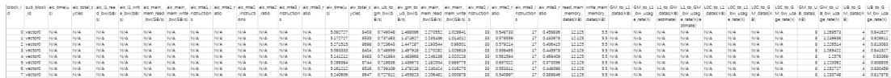  
图 8-16 Memory.csv 文件

关键字段说明如下。

表 8-18 字段说明  

<table><tr><td colspan="1" rowspan="1">字段名</td><td colspan="1" rowspan="1">字段解释</td></tr><tr><td colspan="1" rowspan="1">block_id</td><td colspan="1" rowspan="1">Task运行切分数量，对应Task运行时配置的核数。</td></tr><tr><td colspan="1" rowspan="1">sub_block_id</td><td colspan="1" rowspan="1">Task运行使用的每个block名称和序号。</td></tr><tr><td colspan="1" rowspan="1">aic_time(us)</td><td colspan="1" rowspan="1">该Task被分配到每个Al Cube Core计算单元上后，每个Al CubeCore计算单元上的执行时间，单位us。</td></tr><tr><td colspan="1" rowspan="1">aic_total_cycles</td><td colspan="1" rowspan="1">该Task被分配到每个Al Cube Core计算单元上后，每个Al CubeCore计算单元上的执行的cycle总数。</td></tr><tr><td colspan="1" rowspan="1">aiv_time(us)</td><td colspan="1" rowspan="1">该Task被分配到每个Al Vector Core计算单元上后，每个Al Vector Core计算单元上的执行时间，单位us。</td></tr><tr><td colspan="1" rowspan="1">aiv_total_cycles</td><td colspan="1" rowspan="1">该Task被分配到每个Al Vector Core计算单元上后，每个Al Vector Core计算单元上的执行的cycle总数。</td></tr><tr><td colspan="1" rowspan="1">aiv_ub_to_gm_bw(GB/s）</td><td colspan="1" rowspan="1">代表ub向gm写入的数据量对应totalcycle的带宽速率，单位GB/s。</td></tr><tr><td colspan="1" rowspan="1">aiv_gm_to_ub_bw(GB/s）</td><td colspan="1" rowspan="1">代表gm向ub写入的数据量对应totalcycle的带宽速率，单位GB/s。</td></tr><tr><td colspan="1" rowspan="1">aic_l1_read_bw(GB/s)</td><td colspan="1" rowspan="1">代表本算子中[1单元读取其他所有单元数据时，对应的total cycle的带宽速率，单位GB/s。</td></tr><tr><td colspan="1" rowspan="1">aic_l1_write_bw(GB/s)</td><td colspan="1" rowspan="1">代表本算子中[1单元写入其他所有单元数据时，对应的total cycle的带宽速率，单位GB/s。</td></tr><tr><td colspan="1" rowspan="1">ai*_main_mem_read_bw(GB/s)</td><td colspan="1" rowspan="1">代表主存储器读取其他所有单元数据时，对应的totalcycle的带宽速率，单位GB/s。</td></tr><tr><td colspan="1" rowspan="1">ai*_main_mem_write_bW(GB/s)</td><td colspan="1" rowspan="1">代表主存储器写入其他所有单元数据时，对应的totalcycle的带宽速率，单位GB/s。</td></tr><tr><td colspan="1" rowspan="1">aic_mte1_instructions</td><td colspan="1" rowspan="1">代表MTE1类型指令条数。</td></tr><tr><td colspan="1" rowspan="1">aic_mte1_ratio</td><td colspan="1" rowspan="1">代表MTE1类型指令的cycle数在totalcycle数中的占用比。</td></tr><tr><td colspan="1" rowspan="1">ai*_mte2_instructions</td><td colspan="1" rowspan="1">代表MTE2类型指令条数。</td></tr><tr><td colspan="1" rowspan="1">ai*_mte2_ratio</td><td colspan="1" rowspan="1">代表MTE2类型指令的cycle数在total cycle数中的占用比。</td></tr><tr><td colspan="1" rowspan="1">ai*_mte3_instructions</td><td colspan="1" rowspan="1">代表MTE3类型指令条数。</td></tr><tr><td colspan="1" rowspan="1">ai*_mte3_ratio</td><td colspan="1" rowspan="1">代表MTE3类型指令的cycle数在totalcycle数中的占用比。</td></tr><tr><td colspan="1" rowspan="1">read_main_memory_datas(KB)</td><td colspan="1" rowspan="1">读主存储器数据总量。</td></tr><tr><td colspan="1" rowspan="1">write_main_memory_datas(KB)</td><td colspan="1" rowspan="1">写主存储器数据总量。</td></tr><tr><td colspan="1" rowspan="1">GM_to_L1_datas(KB)</td><td colspan="1" rowspan="1">GM到L1的数据搬运量。</td></tr><tr><td colspan="1" rowspan="1">L1_to_GM_datas(KB)(estimate)</td><td colspan="1" rowspan="1">L1到GM的数据搬运量，估算值。</td></tr><tr><td colspan="1" rowspan="1">LOC_to_L1_datas(KB)</td><td colspan="1" rowspan="1">LOC到L1的数据搬运量。</td></tr><tr><td colspan="1" rowspan="1">LOC_to_GM_datas(KB)</td><td colspan="1" rowspan="1">L0C到GM的数据搬运量。</td></tr><tr><td colspan="1" rowspan="1">GM_to_UB_datas(KB)</td><td colspan="1" rowspan="1">GM到UB的数据搬运量。</td></tr><tr><td colspan="1" rowspan="1">UB_to_GM_datas(KB)</td><td colspan="1" rowspan="1">UB到GM的数据搬运量。</td></tr><tr><td colspan="1" rowspan="1">GM_to_L1_bw_usage_rate(%)</td><td colspan="1" rowspan="1">GM到L1通路带宽使用率。</td></tr><tr><td colspan="1" rowspan="1">L1_to_GM_bw_usage_rate(%)(estimate)</td><td colspan="1" rowspan="1">L1到GM通路带宽使用率，估算值。</td></tr><tr><td colspan="1" rowspan="1">LOC_to_L1_bw_usage_rate(%)</td><td colspan="1" rowspan="1">LOC到L1通路带宽使用率。</td></tr><tr><td colspan="1" rowspan="1">L0C_to_GM_bw_usage_rate(%)</td><td colspan="1" rowspan="1">L0C到GM通路带宽使用率。</td></tr><tr><td colspan="1" rowspan="1">GM_to_UB_bw_usage_rate(%)</td><td colspan="1" rowspan="1">GM到UB通路带宽使用率。</td></tr><tr><td colspan="1" rowspan="1">UB_to_GM_bw_usage_rate(%)</td><td colspan="1" rowspan="1">UB到GM通路带宽使用率。</td></tr></table>

# Atlas 推理系列产品

图 8-17 Memory.csv 文件  

<table><tr><td>aic_time(us)</td><td>aic_total_cycles</td><td>aic_J1_read_bw(G</td><td>aic_J1_write_bw(G</td><td></td><td>aic_ub_read_bw(</td><td>aic_ub_write_bw(</td><td></td><td>aic_main_mem_w aic_mte1_instructi</td><td></td><td>aic_mte1_ratio</td><td>aic_mte2_instructi</td><td>aic_mte2_ratio</td><td>aic_mte3_instructi</td><td>aic_mte3_ratio</td></tr><tr><td></td><td>4.322174</td><td>39764</td><td></td><td></td><td>GB/s) 367.735657</td><td>GB/s) 529.138855</td><td>ead_bw(GB/s) 7.312376</td><td>rite_bw(GB/s) 3.53035</td><td></td><td>0</td><td>os</td><td>0.706242</td><td>ons</td><td></td></tr><tr><td></td><td></td><td></td><td></td><td></td><td></td><td></td><td></td><td></td><td></td><td></td><td></td><td></td><td></td><td>0.309224</td></tr></table>

关键字段说明如下。

表8-19 字段说明  

<table><tr><td rowspan=1 colspan=1>字段名</td><td rowspan=1 colspan=1>字段解释</td></tr><tr><td rowspan=1 colspan=1>aic_time(us)</td><td rowspan=1 colspan=1>该Task被分配到每个AI Core计算单元上后，每个AI Core计算单元上的执行时间，单位us。</td></tr><tr><td rowspan=1 colspan=1>aic_total_cycles</td><td rowspan=1 colspan=1>该Task被分配到每个AI Core计算单元上后，每个AlCore计算单元上的执行的cycle总数。</td></tr><tr><td rowspan=1 colspan=1>aic_ub_to_gm_bw(GB/s)</td><td rowspan=1 colspan=1>代表ub向gm写入的数据量对应totalcycle的带宽速率，单位GB/s。</td></tr><tr><td rowspan=1 colspan=1>aic_gm_to_ub_bw(GB/s)</td><td rowspan=1 colspan=1>代表gm向ub写入的数据量对应totalcycle的带宽速率，单位GB/s。</td></tr><tr><td rowspan=1 colspan=1>aic_l1_read_bw(GB/s）</td><td rowspan=1 colspan=1>代表本算子中[1单元读取其他所有单元数据时，对应的totalcycle的带宽速率，单位GB/s。</td></tr><tr><td rowspan=1 colspan=1>aic_l1_write_bw(GB/s)</td><td rowspan=1 colspan=1>代表本算子中[1单元写入其他所有单元数据时，对应的totalcycle的带宽速率，单位GB/s。</td></tr><tr><td rowspan=1 colspan=1>aic_main_mem_read_bw(GB/s)</td><td rowspan=1 colspan=1>代表主存储器读取其他所有单元数据时，对应的total cycle的带宽速率，单位GB/s。</td></tr><tr><td rowspan=1 colspan=1>aic_main_mem_write_bw(GB/s)</td><td rowspan=1 colspan=1>代表主存储器写入其他所有单元数据时，对应的totalcycle的带宽速率，单位GB/s。</td></tr><tr><td rowspan=1 colspan=1>aic_mte1_instructions</td><td rowspan=1 colspan=1>代表MTE1类型指令条数。</td></tr><tr><td rowspan=1 colspan=1>aic_mte1_ratio</td><td rowspan=1 colspan=1>代表MTE1类型指令的cycle数在total cycle数中的占用比。</td></tr><tr><td rowspan=1 colspan=1>aic_mte2_instructionS</td><td rowspan=1 colspan=1>代表MTE2类型指令条数。</td></tr><tr><td rowspan=1 colspan=1>aic_mte2_ratio</td><td rowspan=1 colspan=1>代表MTE2类型指令的cycle数在totalcycle数中的占用比。</td></tr><tr><td rowspan=1 colspan=1>aic_mte3_instructionS</td><td rowspan=1 colspan=1>代表MTE3类型指令条数。</td></tr><tr><td rowspan=1 colspan=1>aic_mte3_ratio</td><td rowspan=1 colspan=1>代表MTE3类型指令的cycle数在total cycle数中的占用比。</td></tr></table>

# 8.11.1.4 MemoryL0（L0 读写带宽速率）

L0A/L0B/L0C采集内存读写带宽速率数据MemoryL0.csv。详情介绍请参见下表中的字段说明。

# 说明

单位GB/s表示每秒传输1GB的数据量。

# Atlas A3 训练系列产品/Atlas A3 推理系列产品和 Atlas A2 训练系列产品/AtlasA2 推理系列产品

图 8-18 MemoryL0.csv 文件  

<table><tr><td rowspan=3 colspan=1>block_id</td><td rowspan=3 colspan=1>id</td><td rowspan=2 colspan=1>s)</td><td rowspan=1 colspan=1>aic_total_c</td><td rowspan=1 colspan=1>aic_l0a_re</td><td rowspan=1 colspan=1>aic_l0a_wr</td><td rowspan=1 colspan=1>aic_l0b_re</td><td rowspan=1 colspan=1>aic_l0b_wr</td><td rowspan=1 colspan=1>aic_l0c_re</td><td rowspan=1 colspan=1>aic_l0c_wri</td><td rowspan=1 colspan=1>aiv_time(u</td><td rowspan=1 colspan=1>aiv_total_c</td></tr><tr><td rowspan=1 colspan=1>ycles</td><td rowspan=1 colspan=1>ad_bw(GB</td><td rowspan=1 colspan=1>ite_bw(GB</td><td rowspan=1 colspan=1>ad_bw(GB</td><td rowspan=1 colspan=1>ite_bw(GB</td><td rowspan=1 colspan=1>ad_bw_cu</td><td rowspan=1 colspan=1>te_bw_cu </td><td rowspan=1 colspan=1>s)</td><td rowspan=1 colspan=1>ycles</td></tr><tr><td rowspan=1 colspan=1></td><td rowspan=1 colspan=1></td><td rowspan=1 colspan=1>/s)</td><td rowspan=1 colspan=1>/s)</td><td rowspan=1 colspan=1>/s)</td><td rowspan=1 colspan=1>/s)</td><td rowspan=1 colspan=1>be(GB/s)</td><td rowspan=1 colspan=1>be(GB/s)</td><td rowspan=1 colspan=1></td><td rowspan=1 colspan=1></td></tr><tr><td rowspan=1 colspan=1>0</td><td rowspan=1 colspan=1>vector0</td><td rowspan=1 colspan=1>N/A</td><td rowspan=1 colspan=1>N/A</td><td rowspan=1 colspan=1>N/A</td><td rowspan=1 colspan=1>N/A</td><td rowspan=1 colspan=1>N/A</td><td rowspan=1 colspan=1>N/A</td><td rowspan=1 colspan=1>N/A</td><td rowspan=1 colspan=1>N/A</td><td rowspan=1 colspan=1>5.092727</td><td rowspan=1 colspan=1>8403</td></tr><tr><td rowspan=1 colspan=1>1</td><td rowspan=1 colspan=1>vector0</td><td rowspan=1 colspan=1>N/A</td><td rowspan=1 colspan=1> N/A</td><td rowspan=1 colspan=1>N/A</td><td rowspan=1 colspan=1>N/A</td><td rowspan=1 colspan=1>N/A</td><td rowspan=1 colspan=1>N/A</td><td rowspan=1 colspan=1>N/A</td><td rowspan=1 colspan=1> N/A</td><td rowspan=1 colspan=1>5.172727</td><td rowspan=1 colspan=1>8535</td></tr><tr><td rowspan=1 colspan=1>2</td><td rowspan=1 colspan=1>vector0</td><td rowspan=1 colspan=1>N/A</td><td rowspan=1 colspan=1>N/A</td><td rowspan=1 colspan=1>N/A</td><td rowspan=1 colspan=1>N/A</td><td rowspan=1 colspan=1>N/A</td><td rowspan=1 colspan=1>N/A</td><td rowspan=1 colspan=1>N/A</td><td rowspan=1 colspan=1>N/A</td><td rowspan=1 colspan=1>5.271515</td><td rowspan=1 colspan=1>8698</td></tr><tr><td rowspan=1 colspan=1>3</td><td rowspan=1 colspan=1>vector0</td><td rowspan=1 colspan=1>N/A</td><td rowspan=1 colspan=1>N/A</td><td rowspan=1 colspan=1>N/A</td><td rowspan=1 colspan=1>N/A</td><td rowspan=1 colspan=1>N/A</td><td rowspan=1 colspan=1>N/A</td><td rowspan=1 colspan=1>N/A</td><td rowspan=1 colspan=1>N/A</td><td rowspan=1 colspan=1>5.093333</td><td rowspan=1 colspan=1>8404</td></tr><tr><td rowspan=1 colspan=1>4</td><td rowspan=1 colspan=1>vector0</td><td rowspan=1 colspan=1>N/A</td><td rowspan=1 colspan=1>N/A</td><td rowspan=1 colspan=1>N/A</td><td rowspan=1 colspan=1>N/A</td><td rowspan=1 colspan=1>N/A</td><td rowspan=1 colspan=1>N/A</td><td rowspan=1 colspan=1>N/A</td><td rowspan=1 colspan=1>N/A</td><td rowspan=1 colspan=1>5.141212</td><td rowspan=1 colspan=1>8483</td></tr><tr><td rowspan=1 colspan=1>5</td><td rowspan=1 colspan=1>vector0</td><td rowspan=1 colspan=1>N/A</td><td rowspan=1 colspan=1> N/A</td><td rowspan=1 colspan=1>N/A</td><td rowspan=1 colspan=1>N/A</td><td rowspan=1 colspan=1>N/A</td><td rowspan=1 colspan=1>N/A</td><td rowspan=1 colspan=1>N/A</td><td rowspan=1 colspan=1> N/A</td><td rowspan=1 colspan=1>5.299394</td><td rowspan=1 colspan=1>8744</td></tr><tr><td rowspan=1 colspan=1>6</td><td rowspan=1 colspan=1>vector0</td><td rowspan=1 colspan=1>N/A</td><td rowspan=1 colspan=1>N/A</td><td rowspan=1 colspan=1>N/A</td><td rowspan=1 colspan=1>N/A</td><td rowspan=1 colspan=1>N/A</td><td rowspan=1 colspan=1>N/A</td><td rowspan=1 colspan=1>N/A</td><td rowspan=1 colspan=1>N/A</td><td rowspan=1 colspan=1>5.161212</td><td rowspan=1 colspan=1>8516</td></tr><tr><td rowspan=1 colspan=1>7</td><td rowspan=1 colspan=1>vector0</td><td rowspan=1 colspan=1>N/A</td><td rowspan=1 colspan=1>N/A</td><td rowspan=1 colspan=1>N/A</td><td rowspan=1 colspan=1>N/A</td><td rowspan=1 colspan=1>N/A</td><td rowspan=1 colspan=1>N/A</td><td rowspan=1 colspan=1>N/A</td><td rowspan=1 colspan=1>N/A</td><td rowspan=1 colspan=1>5.240606</td><td rowspan=1 colspan=1>8647</td></tr></table>

关键字段说明如下。

表 8-20 字段说明  

<table><tr><td rowspan=1 colspan=1>字段名</td><td rowspan=1 colspan=1>字段解释</td></tr><tr><td rowspan=1 colspan=1>block_id</td><td rowspan=1 colspan=1>Task运行切分数量，对应Task运行时配置的核数。</td></tr><tr><td rowspan=1 colspan=1>sub_block_id</td><td rowspan=1 colspan=1>Task运行使用的每个block名称和序号。</td></tr><tr><td rowspan=1 colspan=1>aic_time(us)</td><td rowspan=1 colspan=1>该Task被分配到每个AlCubeCore计算单元上后，每个AICube Core计算单元上的执行时间，单位us。</td></tr><tr><td rowspan=1 colspan=1>aic_total_cycles</td><td rowspan=1 colspan=1>该Task被分配到每个AlCubeCore计算单元上后，每个AICube Core计算单元上的执行的cycle总数。</td></tr><tr><td rowspan=1 colspan=1>aiv_time(us)</td><td rowspan=1 colspan=1>该Task被分配到每个AlVectorCore计算单元上后，每个Al VectorCore计算单元上的执行时间，单位us。</td></tr><tr><td rowspan=1 colspan=1>aiv_total_cycles</td><td rowspan=1 colspan=1>该Task被分配到每个AlVectorCore计算单元上后，每个Al Vector Core计算单元上的执行的cycle总数。</td></tr><tr><td rowspan=1 colspan=1>aic_lOa_read_bw(GB/s)</td><td rowspan=1 colspan=1>代表本算子中l0a读取其他所有单元数据时，对应的totalcycle的带宽速率，单位GB/s。</td></tr><tr><td rowspan=1 colspan=1>aic_l0a_write_bw(GB/s）</td><td rowspan=1 colspan=1>代表本算子中l0a写入其他所有单元数据时，对应的totalcycle的带宽速率，单位GB/s。</td></tr><tr><td rowspan=1 colspan=1>aic_lOb_read_bw(GB/s)</td><td rowspan=1 colspan=1>代表本算子中l0b读取其他所有单元数据时，对应的totalcycle的带宽速率，单位GB/s。</td></tr><tr><td rowspan=1 colspan=1>aic_l0b_write_bw(GB/s）</td><td rowspan=1 colspan=1>代表本算子中l0b写入其他所有单元数据时，对应的totalcycle的带宽速率，单位GB/s。</td></tr><tr><td rowspan=1 colspan=1>aic_lOc_read_bw_cube(GB/s)</td><td rowspan=1 colspan=1>代表Cube从l0c读取的数据量对应totalcycle的带宽速率，单位GB/s。</td></tr><tr><td rowspan=1 colspan=1>aic_l0c_write_bw_cube(GB/s)</td><td rowspan=1 colspan=1>代表Cube向l0c写入的数据量对应totalcycle的带宽速率，单位GB/s。</td></tr></table>

# Atlas 推理系列产品

图 8-19 MemoryL0.csv 文件  

<table><tr><td rowspan=1 colspan=1>aic_time(us)</td><td rowspan=1 colspan=1>aic_total_cycles</td><td rowspan=1 colspan=1>aic_l0a_read_bw(GB/s)</td><td rowspan=1 colspan=1>aic_lOa_write_bw(GB/s)</td><td rowspan=1 colspan=1>aic_Iob_read_bw(GB/s)</td><td rowspan=1 colspan=1>aic_l0b_write_bw(GB/s)</td><td rowspan=1 colspan=1>aic_lOc_read_bw_cube(GB/s)</td><td rowspan=1 colspan=1>aic_I0c_write_bw_cube(GB/s)</td><td rowspan=1 colspan=1>aic_IOc_read_bw(GB/s)</td><td rowspan=1 colspan=1>aic_lOc_writebw(GB/s)</td></tr><tr><td rowspan=1 colspan=1>4.322174</td><td rowspan=1 colspan=1>39764</td><td rowspan=1 colspan=1>0</td><td rowspan=1 colspan=1>0</td><td rowspan=1 colspan=1>0</td><td rowspan=1 colspan=1>0</td><td rowspan=1 colspan=1>0</td><td rowspan=1 colspan=1>0</td><td rowspan=1 colspan=1>0</td><td rowspan=1 colspan=1>0</td></tr></table>

关键字段说明如下。

表8-21 字段说明  

<table><tr><td rowspan=1 colspan=1>字段名</td><td rowspan=1 colspan=1>字段解释</td></tr><tr><td rowspan=1 colspan=1>aic_time(us)</td><td rowspan=1 colspan=1>该Task被分配到每个Al Core计算单元上后，每个AlCore计算单元上的执行时间，单位us。</td></tr><tr><td rowspan=1 colspan=1>aic_total_cycles</td><td rowspan=1 colspan=1>该Task被分配到每个AICore计算单元上后，每个AICore计算单元上的执行的cycle总数。</td></tr><tr><td rowspan=1 colspan=1>aic_l0a_read_bw(GB/s）</td><td rowspan=1 colspan=1>代表本算子中l0a单元读取其他所有单元数据时，对应的total cycle的带宽速率，单位GB/s。</td></tr><tr><td rowspan=1 colspan=1>aic_l0a_write_bw(GB/s)</td><td rowspan=1 colspan=1>代表本算子中l0a单元写入其他所有单元数据时，对应的total cycle的带宽速率，单位GB/s。</td></tr><tr><td rowspan=1 colspan=1>aic_lOb_read_bw(GB/s）</td><td rowspan=1 colspan=1>代表本算子中l0b单元读取其他所有单元数据时，对应的total cycle的带宽速率，单位GB/s。</td></tr><tr><td rowspan=1 colspan=1>aic_lOb_write_bw(GB/s)</td><td rowspan=1 colspan=1>代表本算子中l0b单元写入其他所有单元数据时，对应的total cycle的带宽速率，单位GB/s。</td></tr><tr><td rowspan=1 colspan=1>aic_lOc_read_bw_cube(GB/s)</td><td rowspan=1 colspan=1>代表Cube从lOc读取的数据量对应totalcycle的带宽速率，单位GB/s。</td></tr><tr><td rowspan=1 colspan=1>aic_lOc_write_bw_cube(GB/s)</td><td rowspan=1 colspan=1>代表Cube向l0c写入的数据量对应total cycle的带宽速率，单位GB/s。</td></tr><tr><td rowspan=1 colspan=1>aic_lOc_read_bw(GB/s）</td><td rowspan=1 colspan=1>代表Vector从l0c读取的数据量对应totalcycle的带宽速率，单位GB/s。</td></tr><tr><td rowspan=1 colspan=1>aic_l0c_write_bw(GB/s)</td><td rowspan=1 colspan=1>代表Vector向l0c写入的数据量对应totalcycle的带宽速率，单位GB/s。</td></tr></table>

# 8.11.1.5 MemoryUB（UB 读写带宽速率）

mte/vector/scalar采集ub读写带宽速率数据MemoryUB.csv。详情介绍请参见下表中的字段说明。

# 说明

单位GB/s表示每秒传输1GB的数据量。

# Atlas A3 训练系列产品/Atlas A3 推理系列产品及 Atlas A2 训练系列产品/AtlasA2 推理系列产品

图 8-20 MemoryUB.csv 文件  

<table><tr><td rowspan=1 colspan=1></td><td rowspan=1 colspan=1>id</td><td rowspan=1 colspan=1>s)</td><td rowspan=1 colspan=1>ycles</td><td rowspan=1 colspan=1>s)</td><td rowspan=1 colspan=1>ycles</td><td rowspan=1 colspan=1>ad_bw_vector(GB/s)</td><td rowspan=1 colspan=1>te_bw_vec ad_bw_sctor(GB/s)</td><td rowspan=1 colspan=1>te_bw_vec ad_bw_scalar(GB/s)</td><td rowspan=1 colspan=1>te_bw_scalar(GB/s)</td></tr><tr><td rowspan=1 colspan=1>0</td><td rowspan=1 colspan=1>vector0</td><td rowspan=1 colspan=1>N/A</td><td rowspan=1 colspan=1>N/A</td><td rowspan=1 colspan=1>5.092727</td><td rowspan=1 colspan=1>8403</td><td rowspan=1 colspan=1>1.498096</td><td rowspan=1 colspan=1>0.749048</td><td rowspan=1 colspan=1>0</td><td rowspan=1 colspan=1>0</td></tr><tr><td rowspan=1 colspan=1>1</td><td rowspan=1 colspan=1>vector0</td><td rowspan=1 colspan=1>N/A</td><td rowspan=1 colspan=1>N/A</td><td rowspan=1 colspan=1>5.172727</td><td rowspan=1 colspan=1>8535</td><td rowspan=1 colspan=1>1.474927</td><td rowspan=1 colspan=1>0.737463</td><td rowspan=1 colspan=1>0</td><td rowspan=1 colspan=1>0</td></tr><tr><td rowspan=1 colspan=1>2</td><td rowspan=1 colspan=1>vector0</td><td rowspan=1 colspan=1>N/A</td><td rowspan=1 colspan=1>N/A</td><td rowspan=1 colspan=1>5.271515</td><td rowspan=1 colspan=1>8698</td><td rowspan=1 colspan=1>1.447287</td><td rowspan=1 colspan=1>0.723643</td><td rowspan=1 colspan=1>0</td><td rowspan=1 colspan=1>0</td></tr><tr><td rowspan=1 colspan=1>3</td><td rowspan=1 colspan=1>vector0</td><td rowspan=1 colspan=1>N/A</td><td rowspan=1 colspan=1>N/A</td><td rowspan=1 colspan=1>5.093333</td><td rowspan=1 colspan=1>8404</td><td rowspan=1 colspan=1>1.497918</td><td rowspan=1 colspan=1>0.748959</td><td rowspan=1 colspan=1>0</td><td rowspan=1 colspan=1>0</td></tr><tr><td rowspan=1 colspan=1>4</td><td rowspan=1 colspan=1>vector0</td><td rowspan=1 colspan=1>N/A</td><td rowspan=1 colspan=1>N/A</td><td rowspan=1 colspan=1>5.141212</td><td rowspan=1 colspan=1>8483</td><td rowspan=1 colspan=1>1.483968</td><td rowspan=1 colspan=1>0.741984</td><td rowspan=1 colspan=1>0</td><td rowspan=1 colspan=1>0</td></tr><tr><td rowspan=1 colspan=1>5</td><td rowspan=1 colspan=1>vector0</td><td rowspan=1 colspan=1>N/A</td><td rowspan=1 colspan=1>N/A</td><td rowspan=1 colspan=1>5.299394</td><td rowspan=1 colspan=1>8744</td><td rowspan=1 colspan=1>1.439673</td><td rowspan=1 colspan=1>0.719836</td><td rowspan=1 colspan=1>0</td><td rowspan=1 colspan=1>0</td></tr><tr><td rowspan=1 colspan=1>6</td><td rowspan=1 colspan=1>vector0</td><td rowspan=1 colspan=1>N/A</td><td rowspan=1 colspan=1>N/A</td><td rowspan=1 colspan=1>5.161212</td><td rowspan=1 colspan=1>8516</td><td rowspan=1 colspan=1>1.478218</td><td rowspan=1 colspan=1>0.739109</td><td rowspan=1 colspan=1>0</td><td rowspan=1 colspan=1>0</td></tr><tr><td rowspan=1 colspan=1>7</td><td rowspan=1 colspan=1>vector0</td><td rowspan=1 colspan=1>N/A</td><td rowspan=1 colspan=1>N/A</td><td rowspan=1 colspan=1>5.240606</td><td rowspan=1 colspan=1>8647</td><td rowspan=1 colspan=1>1.455823</td><td rowspan=1 colspan=1>0.727912</td><td rowspan=1 colspan=1>0</td><td rowspan=1 colspan=1>0</td></tr></table>

关键字段说明如下。

表 8-22 字段说明  

<table><tr><td rowspan=1 colspan=1>字段名</td><td rowspan=1 colspan=1>字段解释</td></tr><tr><td rowspan=1 colspan=1>block_id</td><td rowspan=1 colspan=1>Task运行切分数量，对应Task运行时配置的核数。</td></tr><tr><td rowspan=1 colspan=1>sub_block_id</td><td rowspan=1 colspan=1>Task运行使用的每个block名称和序号。</td></tr><tr><td rowspan=1 colspan=1>aic_time(us)</td><td rowspan=1 colspan=1>该Task被分配到每个AlCubeCore计算单元上后，每个AICube Core计算单元上的执行时间，单位us。</td></tr><tr><td rowspan=1 colspan=1>aic_total_cycles</td><td rowspan=1 colspan=1>该Task被分配到每个AlCubeCore计算单元上后，每个AICube Core计算单元上的执行的cycle总数。</td></tr><tr><td rowspan=1 colspan=1>aiv_time(us)</td><td rowspan=1 colspan=1>该Task被分配到每个AlVectorCore计算单元上后，每个Al VectorCore计算单元上的执行时间，单位us。</td></tr><tr><td rowspan=1 colspan=1>aiv_total_cycles</td><td rowspan=1 colspan=1>该Task被分配到每个AlVectorCore计算单元上后，每个Al Vector Core计算单元上的执行的cycle总数。</td></tr><tr><td rowspan=1 colspan=1>aiv_ub_read_bw_vector(GB/s)</td><td rowspan=1 colspan=1>代表Vector从UB读取的数据量对应totalcycle的带宽速率，单位GB/s。</td></tr><tr><td rowspan=1 colspan=1>aiv_ub_write_bw_vector(GB/s)</td><td rowspan=1 colspan=1>代表Vector向UB写入的数据量对应totalcycle的带宽速率，单位GB/s。</td></tr><tr><td rowspan=1 colspan=1>aiv_ub_read_bw_scalar(GB/s)</td><td rowspan=1 colspan=1>代表Scalar从UB读取的数据量对应totalcycle的带宽速率，单位GB/s。</td></tr><tr><td rowspan=1 colspan=1>aiv_ub_write_bw_scalar(GB/s)</td><td rowspan=1 colspan=1>代表Scalar向UB写入的数据量对应totalcycle的带宽速率，单位GB/s。</td></tr></table>

# Atlas 推理系列产品

图 8-21 MemoryUB.csv 文件  

<table><tr><td rowspan=1 colspan=1>aic_time(us) aic_total_cycles</td><td rowspan=1 colspan=1>aic_time(us) aic_total_cycles</td><td rowspan=1 colspan=1>aic_ub_read_bw_scalar(GB/s)</td><td rowspan=1 colspan=1></td><td rowspan=1 colspan=1></td><td rowspan=1 colspan=1></td></tr><tr><td rowspan=1 colspan=1>4.322174</td><td rowspan=1 colspan=1>39764</td><td rowspan=1 colspan=1>0.220647</td><td rowspan=1 colspan=1>0</td><td rowspan=1 colspan=1>50.086849</td><td rowspan=1 colspan=1>28.242804</td></tr></table>

关键字段说明如下。

表 8-23 字段说明  

<table><tr><td rowspan=1 colspan=1>字段名</td><td rowspan=1 colspan=1>字段解释</td></tr><tr><td rowspan=1 colspan=1>aic_time(us)</td><td rowspan=1 colspan=1>该Task被分配到每个Al Core计算单元上后，每个Al Core计算单元上的执行时间，单位us。</td></tr><tr><td rowspan=1 colspan=1>aic_total_cycles</td><td rowspan=1 colspan=1>该Task被分配到每个AlCore计算单元上后，每个Al Core计算单元上的执行的cycle总数。</td></tr><tr><td rowspan=1 colspan=1>aic_ub_read_bw_vector(GB/s)</td><td rowspan=1 colspan=1>代表Vector从UB读取的数据量对应totalcycle的带宽速率，单位GB/s。</td></tr><tr><td rowspan=1 colspan=1>aic_ub_write_bw_vector(GB/s)</td><td rowspan=1 colspan=1>代表Vector向UB写入的数据量对应totalcycle的带宽速率，单位GB/s。</td></tr><tr><td rowspan=1 colspan=1>aic_ub_read_bw_scalar(GB/s)</td><td rowspan=1 colspan=1>代表Scalar从UB读取的数据量对应totalcycle的带宽速率，单位GB/s。</td></tr><tr><td rowspan=1 colspan=1>aic_ub_write_bw_scalar(GB/s)</td><td rowspan=1 colspan=1>代表Scalar向UB写入的数据量对应totalcycle的带宽速率，单位GB/s。</td></tr></table>

# 8.11.1.6 OpBasicInfo（算子基础信息）

算子基础信息数据OpBasicInfo.csv，包含算子名称，算子类型，Block Dim和耗时等信息。详情介绍请参见下表中的字段说明。

图 8-22 OpBasicInfo.csv 文件  

<table><tr><td rowspan=1 colspan=1>Op Name</td><td rowspan=1 colspan=1>Op Type</td><td rowspan=1 colspan=1>TaskDuration(us)</td><td rowspan=1 colspan=1>Block Dim</td><td rowspan=1 colspan=1>Mix BlockDim</td><td rowspan=1 colspan=1> Device Id</td><td rowspan=1 colspan=1>Pid</td><td rowspan=1 colspan=1>CurrentFreq</td><td rowspan=1 colspan=1>RatedFreq</td></tr><tr><td rowspan=1 colspan=1>matmul_leakyrelu_custom_0_mix_aic</td><td rowspan=1 colspan=1>mix</td><td rowspan=1 colspan=1>157.600006</td><td rowspan=1 colspan=1>2</td><td rowspan=1 colspan=1>4</td><td rowspan=1 colspan=1>0</td><td rowspan=1 colspan=1>521012</td><td rowspan=1 colspan=1>800</td><td rowspan=1 colspan=1>1650</td></tr></table>

关键字段说明如下。

表 8-24 字段说明  

<table><tr><td>字段名</td><td>字段解释</td></tr><tr><td>Op Name</td><td>算子名称。</td></tr><tr><td colspan="1" rowspan="1">Op Type</td><td colspan="1" rowspan="1">算子类型。</td></tr><tr><td colspan="1" rowspan="1">TaskDuration(us)</td><td colspan="1" rowspan="1">Task耗时，包含调度到昇腾AI处理器的时间、昇腾AI处理器上的执行时间以及结束响应时间，单位us。</td></tr><tr><td colspan="1" rowspan="1">Block Dim</td><td colspan="1" rowspan="1">Task运行切分数量，对应Task运行时核数，开发者设置的算子执行逻辑核数。</td></tr><tr><td colspan="1" rowspan="1">Mix Block Dim</td><td colspan="1" rowspan="1">部分算子同时在Cube Core和Vector Core上执行，主昇腾Al处理器的blockDim在BlockDim字段描述，从昇腾AI处理器的blockDim在本字段描述。显示为N/A表示为非Mix融合算子。说明此参数仅适用于AtlasA3训练系列产品/Atlas A3推理系列产品和Atlas A2训练系列产品/Atlas A2推理系列产品</td></tr><tr><td colspan="1" rowspan="1">Device ID</td><td colspan="1" rowspan="1">运行时使用昇腾AI处理器的ID。</td></tr><tr><td colspan="1" rowspan="1">PID</td><td colspan="1" rowspan="1">算子运行时的进程号。</td></tr><tr><td colspan="1" rowspan="1">Current Freq</td><td colspan="1" rowspan="1">昇腾AI处理器当前运行的频率。</td></tr><tr><td colspan="1" rowspan="1">Rated Freq</td><td colspan="1" rowspan="1">昇腾AI处理器的理论频率。</td></tr></table>

# 8.11.1.7 PipeUtilization（计算单元和搬运单元耗时占比）

采集计算单元和搬运单元耗时和占比数据PipeUtilization.csv。建议优化数据搬运逻辑，提高带宽利用率。详情介绍请参见下表中的字段说明。

# 说明

● 单位GB/s表示每秒传输1GB的数据量。  
● 表中的字段说明里每一个ratio的total cycle表示的是 cube核 或者 vector核上的cycle数，其中ai\* 分为aic 和 aiv ，aic 指的是cube，aiv 指的是vector。

# Atlas A3 训练系列产品/Atlas A3 推理系列产品和 Atlas A2 训练系列产品/AtlasA2 推理系列产品

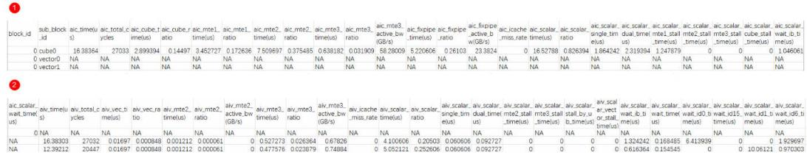  
图 8-23 PipeUtilization.csv 文件

关键字段说明如下。

表 8-25 字段说明  

<table><tr><td colspan="1" rowspan="1">字段名</td><td colspan="1" rowspan="1">字段解释</td></tr><tr><td colspan="1" rowspan="1">block_id</td><td colspan="1" rowspan="1">Task运行切分数量，对应Task运行时配置的核数。</td></tr><tr><td colspan="1" rowspan="1">sub_block_id</td><td colspan="1" rowspan="1">Task运行使用的每个block名称和序号。</td></tr><tr><td colspan="1" rowspan="1">aic_time(us)</td><td colspan="1" rowspan="1">该Task被分配到每个Al Cube Core计算单元上后，每个Al CubeCore计算单元上的执行时间，单位us。</td></tr><tr><td colspan="1" rowspan="1">aic_total_cycles</td><td colspan="1" rowspan="1">该Task被分配到每个AI Cube Core计算单元上后，每个Al CubeCore计算单元上的执行的cycle总数。</td></tr><tr><td colspan="1" rowspan="1">aiv_time(us)</td><td colspan="1" rowspan="1">该Task被分配到每个AlVector Core计算单元上后，每个AIVector Core计算单元上的执行时间，单位us。</td></tr><tr><td colspan="1" rowspan="1">aiv_total_cycles</td><td colspan="1" rowspan="1">该Task被分配到每个Al Vector Core计算单元上后，每个AlVector Core计算单元上的执行的cycle总数。</td></tr><tr><td colspan="1" rowspan="1">aiv_vec_time(us)</td><td colspan="1" rowspan="1">代表vec类型指令（向量类运算指令）耗时。</td></tr><tr><td colspan="1" rowspan="1">aiv_vec_ratio</td><td colspan="1" rowspan="1">代表vec类型指令（向量类运算指令）的cycle数在totalcycle数中的占用比。</td></tr><tr><td colspan="1" rowspan="1">aic_cube_time(us）</td><td colspan="1" rowspan="1">代表Cube类型指令（fp16及s16矩阵类运算指令）耗时。</td></tr><tr><td colspan="1" rowspan="1">aic_cube_ratio</td><td colspan="1" rowspan="1">代表Cube类型指令（fp16及s16矩阵类运算指令）的cycle数在total cycle数中的占用比。</td></tr><tr><td colspan="1" rowspan="1">ai*_scalar_time(us)</td><td colspan="1" rowspan="1">代表scalar类型指令（标量类运算指令）耗时。</td></tr><tr><td colspan="1" rowspan="1">ai*_scalar_ratio</td><td colspan="1" rowspan="1">代表scalar类型指令（标量类运算指令）的cycle数在total cycle数中的占用比。</td></tr><tr><td colspan="1" rowspan="1">aic_fixpipe_time(us)</td><td colspan="1" rowspan="1">代表fixpipe类型指令（LOC-&gt;GM/L1搬运类指令）耗时。</td></tr><tr><td colspan="1" rowspan="1">aic_fixpipe_ratio</td><td colspan="1" rowspan="1">代表fixpipe类型指令（LOC-&gt;GM/L1搬运类指令）的cycle数在total cycle数中的占用比。</td></tr><tr><td colspan="1" rowspan="1">aic_mte1_time(us)</td><td colspan="1" rowspan="1">代表MTE1类型指令（L1-&gt;LOA/LOB搬运类指令）耗时，不包括搬运等待时间。</td></tr><tr><td colspan="1" rowspan="1">aic_mte1_ratio</td><td colspan="1" rowspan="1">代表MTE1类型指令（L1-&gt;LOA/LOB搬运类指令）的cycle数在total cycle数中的占用比。</td></tr><tr><td colspan="1" rowspan="1">ai*_mte2_time(us）</td><td colspan="1" rowspan="1">代表MTE2类型指令（GM-&gt;AICORE搬运类指令）耗时。</td></tr><tr><td colspan="1" rowspan="1">ai*_mte2_ratio</td><td colspan="1" rowspan="1">代表MTE2类型指令（GM-&gt;AICORE搬运类指令）的cycle数在total cycle数中的占用比。</td></tr><tr><td colspan="1" rowspan="1">ai*_mte3_time(us）</td><td colspan="1" rowspan="1">代表MTE3类型指令（AICORE-&gt;GM搬运类指令）耗时。</td></tr><tr><td colspan="1" rowspan="1">ai*_mte3_ratio</td><td colspan="1" rowspan="1">代表MTE3类型指令（AICORE-&gt;GM搬运类指令）的cycle数在total cycle数中的占用比。</td></tr><tr><td colspan="1" rowspan="1">ai*_icache_miss_rate</td><td colspan="1" rowspan="1">代表ICache缺失率，即未命中instruction的L1 cache，数值越小越好。</td></tr><tr><td colspan="1" rowspan="1">aic_mte3_active_bw(GB/s)</td><td colspan="1" rowspan="1">代表MTE3类型指令（AICORE-&gt;DDRCUBE搬运类指令）数据量对应active cycle的活跃带宽。</td></tr><tr><td colspan="1" rowspan="1">aiv_mte3_active_bw(GB/s)</td><td colspan="1" rowspan="1">代表MTE3类型指令（AICORE-&gt;DDRAIV搬运类指令）数据量对应active cycle的活跃带宽。</td></tr><tr><td colspan="1" rowspan="1">aic_fixpipe_active_bw(GB/s)</td><td colspan="1" rowspan="1">代表fixpipe类型指令（LOC-&gt;OUT/L1搬运类指令）数据量对应active cycle的活跃带宽。</td></tr><tr><td colspan="1" rowspan="1">aiv_mte2_active_bw(GB/s)</td><td colspan="1" rowspan="1">代表MTE2类型指令（DDR-&gt;AICOREAIV搬运类指令）数据量对应active cycle的活跃带宽。</td></tr><tr><td colspan="1" rowspan="1">aic_mte1_active_bw(GB/s)</td><td colspan="1" rowspan="1">代表Cube单元MTE1数据量对应activecycle的活跃带宽，具体涉及L1-&gt;L0A、L1-&gt;L0B这2个部分的通路数据。说明Atlas A3 训练系列产品/Atlas A3推理系列产品和Atlas A2训练系列产品/Atlas A2推理系列产品仅开启动态插桩（设置--aic-metrics=MemoryDetail时）会显示。</td></tr><tr><td colspan="1" rowspan="1">aic_mte2_active_bw(GB/s)</td><td colspan="1" rowspan="1">代表Cube单元MTE2数据量对应activecycle的活跃带宽，具体涉及GM-&gt;L1、GM-&gt;L0A、GM-&gt;L0B这3条通路的数据。说明Atlas A3训练系列产品/Atlas A3推理系列产品和Atlas A2训练系列产品/Atlas A2推理系列产品仅开启动态插桩（设置--aic-metrics=MemoryDetail时）会显示。</td></tr><tr><td colspan="1" rowspan="1">ai*_scalar_single_time(us)</td><td colspan="1" rowspan="1">代表scalar类型指令（标量类运算指令）的单发（一拍发射一条指令）指令时间。</td></tr><tr><td colspan="1" rowspan="1">ai*_scalar_dual_time(us)</td><td colspan="1" rowspan="1">代表scalar类型指令（标量类运算指令）的双发（一拍发射两条指令）指令时间。</td></tr><tr><td colspan="1" rowspan="1">ai*_scalar_wait_time(us)</td><td colspan="1" rowspan="1">代表scalar类型指令（标量类运算指令）的核内wait指令阻塞的时间。</td></tr><tr><td colspan="1" rowspan="1">ai*_scalar_wait_id*_time(us)</td><td colspan="1" rowspan="1">代表scalar类型指令（标量类运算指令）的核间wait指令ID阻塞的时间。说明“id*”为占位符，实际可对应ID0到ID15的任意核编号。核间同步指标ai*_scalar_wait_id0_time到ai*_scalar_wait_id15_time仅在有数据的时候进行展示。</td></tr><tr><td colspan="1" rowspan="1">aic_scalar_mte1stall_time(us)</td><td colspan="1" rowspan="1">代表scalar类型指令（标量类运算指令）因MTE1IQ队列已满所造成的阻塞时间。</td></tr><tr><td colspan="1" rowspan="1">ai*_scalar_mte2_stall_time(us)</td><td colspan="1" rowspan="1">代表scalar类型指令（标量类运算指令）因MTE2IQ队列已满所造成的阻塞时间。</td></tr><tr><td colspan="1" rowspan="1">ai*_scalar_mte3_stall_time(us)</td><td colspan="1" rowspan="1">代表scalar类型指令（标量类运算指令）因MTE3IQ队列已满所造成的阻塞时间。</td></tr><tr><td colspan="1" rowspan="1">aic_scalar_cube_stall_time(us)</td><td colspan="1" rowspan="1">代表scalar类型指令（标量类运算指令）因CUBEIQ队列已满所造成的阻塞时间。</td></tr><tr><td colspan="1" rowspan="1">aic_scalar_vector_stall_time(us)</td><td colspan="1" rowspan="1">代表scalar类型指令（标量类运算指令）因VECTORIQ队列已满所造成的阻塞时间。</td></tr><tr><td colspan="1" rowspan="1">ai*_scalar_wait_ib_time(us)</td><td colspan="1" rowspan="1">代表scalar类型指令（标量类运算指令）的IB等待lcache时间。</td></tr><tr><td colspan="1" rowspan="1">aic_scalar_stall_by_ub_time(us)</td><td colspan="1" rowspan="1">代表scalar类型指令（标量类运算指令）被UB阻塞的时间。</td></tr></table>

# Atlas 推理系列产品

图 8-24 PipeUtilization.csv 文件  

<table><tr><td rowspan=1 colspan=1></td><td rowspan=1 colspan=1>A</td><td rowspan=1 colspan=1>B</td><td rowspan=1 colspan=1>C</td><td rowspan=1 colspan=1>D</td><td rowspan=1 colspan=1>E</td><td rowspan=1 colspan=1>F</td><td rowspan=1 colspan=1>G</td><td rowspan=1 colspan=1>H</td><td rowspan=1 colspan=1>一</td><td rowspan=1 colspan=1>」</td><td rowspan=1 colspan=1>K</td><td rowspan=1 colspan=1>L</td><td rowspan=1 colspan=1>M</td><td rowspan=1 colspan=1>N</td><td rowspan=1 colspan=1>0</td></tr><tr><td rowspan=2 colspan=1></td><td rowspan=2 colspan=1>s)</td><td rowspan=2 colspan=1>ycles</td><td rowspan=2 colspan=1>ime(us)</td><td rowspan=2 colspan=1>aic_cube_ratio</td><td rowspan=2 colspan=1>aic_scalar_time(us)</td><td rowspan=2 colspan=1>aic_scalar_ratio</td><td rowspan=1 colspan=1>aic mtel t</td><td rowspan=1 colspan=1>aic mtel r</td><td rowspan=1 colspan=1>aic mte2 t</td><td rowspan=1 colspan=1>aic mte2 r</td><td rowspan=1 colspan=1>aic mte3 t</td><td rowspan=1 colspan=1>aic mte3 r</td><td rowspan=1 colspan=1>aic_icache</td><td rowspan=2 colspan=1>aic_vec_time(us)</td><td rowspan=2 colspan=1>aic_vec_ratio</td></tr><tr><td rowspan=1 colspan=1>ime(us)</td><td rowspan=1 colspan=1>atio</td><td rowspan=1 colspan=1>ime(us)</td><td rowspan=1 colspan=1>atio</td><td rowspan=1 colspan=1>ime(us)</td><td rowspan=1 colspan=1>atio</td><td rowspan=1 colspan=1>_miss_rate</td></tr><tr><td rowspan=1 colspan=1>2</td><td rowspan=1 colspan=1>4.322174</td><td rowspan=1 colspan=1>39764</td><td rowspan=1 colspan=1>0</td><td rowspan=1 colspan=1>0</td><td rowspan=1 colspan=1>0.468804</td><td rowspan=1 colspan=1>0.108465</td><td rowspan=1 colspan=1>0</td><td rowspan=1 colspan=1>0</td><td rowspan=1 colspan=1>3.0525</td><td rowspan=1 colspan=1>0.706242</td><td rowspan=1 colspan=1>1.336522</td><td rowspan=1 colspan=1>0.309224</td><td rowspan=1 colspan=1>0.022672</td><td rowspan=1 colspan=1>0.841739</td><td rowspan=1 colspan=1>0.194749</td></tr></table>

关键字段说明如下。

表 8-26 字段说明  

<table><tr><td colspan="1" rowspan="1">字段名</td><td colspan="1" rowspan="1">字段解释</td></tr><tr><td colspan="1" rowspan="1">aic_time(us)</td><td colspan="1" rowspan="1">该Task被分配到每个AlCore计算单元上后，每个AlCore计算单元上的执行时间，单位us。</td></tr><tr><td colspan="1" rowspan="1">aic_total_cycleS</td><td colspan="1" rowspan="1">该Task被分配到每个AlCore计算单元上后，每个AlCore计算单元上的执行的cycle总数。</td></tr><tr><td colspan="1" rowspan="1">aic_cube_time(us)</td><td colspan="1" rowspan="1">代表Cube类型指令（fp16及s16矩阵类运算指令）耗时。</td></tr><tr><td colspan="1" rowspan="1">aic_cube_ratio</td><td colspan="1" rowspan="1">代表Cube类型指令（fp16及s16矩阵类运算指令）的cycle数在total cycle数中的占用比。</td></tr><tr><td colspan="1" rowspan="1">aic_scalar_time(us)</td><td colspan="1" rowspan="1">代表scalar类型指令（标量类运算指令）耗时。</td></tr><tr><td colspan="1" rowspan="1">aic_scalar_rati0</td><td colspan="1" rowspan="1">代表scalar类型指令（标量类运算指令）的cycle数在totalcycle数中的占用比。</td></tr><tr><td colspan="1" rowspan="1">aic_mte1_time(us)</td><td colspan="1" rowspan="1">代表MTE1类型指令（L1-&gt;L0A/L0B搬运类指令）耗时，不包括搬运等待时间。</td></tr><tr><td colspan="1" rowspan="1">aic_mte1_ratio</td><td colspan="1" rowspan="1">代表MTE1类型指令（L1-&gt;LOA/LOB搬运类指令）的cycle数在totalcycle数中的占用比。</td></tr><tr><td colspan="1" rowspan="1">aic_mte2_time(us)</td><td colspan="1" rowspan="1">代表MTE2类型指令（GM-&gt;AICORE搬运类指令）耗时。</td></tr><tr><td colspan="1" rowspan="1">aic_mte2_ratio</td><td colspan="1" rowspan="1">代表MTE2类型指令（GM-&gt;AICORE搬运类指令）的cycle数在total cycle数中的占用比。</td></tr><tr><td colspan="1" rowspan="1">aic_mte3_time(us)</td><td colspan="1" rowspan="1">代表MTE3类型指令（AICORE-&gt;GM搬运类指令）耗时。</td></tr><tr><td colspan="1" rowspan="1">aic_mte3_ratio</td><td colspan="1" rowspan="1">代表MTE3类型指令（AICORE-&gt;GM搬运类指令）的cycle数在total cycle数中的占用比。</td></tr><tr><td colspan="1" rowspan="1">aic_icache_miss_rate</td><td colspan="1" rowspan="1">代表ICache缺失率，即未命中instruction的L1cache，数值越小越好。</td></tr><tr><td colspan="1" rowspan="1">aic_vec_time(us)</td><td colspan="1" rowspan="1">代表Vec类型指令（向量类运算指令）耗时。</td></tr><tr><td colspan="1" rowspan="1">aic_vec_ratio</td><td colspan="1" rowspan="1">代表Vec类型指令（向量类运算指令）的cycle数在totalcycle数中的占用比。</td></tr></table>

# 8.11.1.8 ResourceConflictRatio（资源冲突占比）

UB上的bank group、bank conflict和资源冲突在所有指令中的占比数据ResourceConflictRatio.csv，建议减少对于同一个bank的读写冲突或bank group的读读冲突。

bank group是指UB中的一组bank，每个bank group包含多个bank。bank conflict是指在UB中同时访问相同bank的多个线程之间的竞争。

详情介绍请参见下表中的字段说明。

# Atlas A3 训练系列产品/Atlas A3 推理系列产品及 Atlas A2 训练系列产品/AtlasA2 推理系列产品

图 8-25 ResourceConflictRatio.csv 文件  

<table><tr><td rowspan="2">block_id</td><td>Lid</td><td></td><td>ycles</td><td>sub_block aic_time(u aic_total_c aic_cube_aic_mte1_aic_mte2_ wait_ratio wait_ratio wait_ratio wait_ratio s)</td><td></td><td></td><td></td><td></td><td>ycles</td><td>tal_cfit_rat ankgroup ank_cfilt_ra sc_cfit_rati te_cfit_rati ait_ratio</td><td></td><td></td><td></td><td></td><td></td><td></td><td></td><td>aic_mte3_aivtimeuaivtotalcaivectoaivvebivecbaivveceaivecmaivvecwaimteaivmteaite3 wait_ratio wait_ratio wait_ratio</td></tr><tr><td></td><td>s</td><td></td><td></td><td></td><td></td><td></td><td></td><td></td><td>io</td><td>cfilt ratio tio</td><td></td><td>0</td><td>0</td><td></td><td></td><td></td><td></td></tr><tr><td>0</td><td>vector0</td><td>N/A</td><td>N/A</td><td>N/A</td><td>N/A</td><td>N/A</td><td>N/A</td><td>5.092727</td><td>8403</td><td></td><td>0.0019040.001904</td><td>0</td><td>0</td><td>0</td><td>0.489706</td><td>0</td><td></td><td>0.0905630.333571</td></tr><tr><td>1</td><td>vector0</td><td>N/A</td><td>N/A</td><td>N/A</td><td> N/A</td><td> N/A</td><td> N/A</td><td>5.172727</td><td>8535</td><td></td><td>0.0018750.001875</td><td>0</td><td>0</td><td>0</td><td>0.55993</td><td></td><td></td><td>0.2691270.462449</td></tr><tr><td>2</td><td>vectoro</td><td>N/A</td><td>N/A</td><td> N/A</td><td>N/A</td><td>N/A</td><td>N/A</td><td>5.271515</td><td>8698</td><td>0.00184</td><td>0.00184</td><td>0</td><td>0</td><td>0</td><td>0.542309</td><td>0 0</td><td></td><td>0.2244190.439526</td></tr><tr><td>3</td><td>vector0</td><td> N/A</td><td> N/A</td><td> N/A</td><td> N/A</td><td> N/A</td><td> N/A</td><td>5.093333</td><td>8404</td><td>0.001904</td><td>0.001904</td><td>0</td><td>0</td><td>0</td><td>0.551523</td><td>0</td><td></td><td>0.195740.435626</td></tr><tr><td>4</td><td>vector0</td><td> N/A</td><td> N/A</td><td> N/A</td><td> N/A</td><td> N/A</td><td> N/A</td><td>5.141212</td><td>8483</td><td></td><td>0.0018860.001886</td><td>0</td><td>0</td><td>0</td><td>0.573971</td><td>0</td><td></td><td>0.2350580.497348</td></tr><tr><td>5</td><td>vector0</td><td>N/A</td><td> N/A</td><td> N/A</td><td> N/A</td><td>N/A</td><td> N/A</td><td>5.299394</td><td>8744</td><td>0.00183</td><td>0.00183</td><td>0</td><td>0</td><td>0</td><td>0.570563</td><td>0</td><td></td><td>0.3008920481016</td></tr><tr><td>6</td><td>vector0</td><td>N/A</td><td> N/A</td><td> N/A</td><td> N/A</td><td>N/A</td><td> N/A</td><td>5.161212</td><td>8516</td><td></td><td>0.0018790.001879</td><td>0</td><td>0</td><td>0</td><td>0.467003</td><td>0</td><td></td><td>0.019140.272311</td></tr><tr><td>7</td><td>vector0</td><td>N/A</td><td>N/A</td><td>N/A</td><td>N/A</td><td>N/A</td><td>N/A</td><td>5.240606</td><td>8647</td><td>0.00185</td><td>0.00185</td><td>0</td><td>0</td><td>0</td><td>0.414826</td><td>0</td><td>0</td><td>0.214294</td></tr></table>

关键字段说明如下。

表 8-27 字段说明  

<table><tr><td rowspan=1 colspan=1>字段名</td><td rowspan=1 colspan=1>字段解释</td></tr><tr><td rowspan=1 colspan=1>block_id</td><td rowspan=1 colspan=1>Task运行切分数量，对应Task运行时配置的核数。</td></tr><tr><td rowspan=1 colspan=1>sub_block_id</td><td rowspan=1 colspan=1>Task运行使用的每个block名称和序号。</td></tr><tr><td rowspan=1 colspan=1>aic_time(us)</td><td rowspan=1 colspan=1>该Task被分配到每个Al Cube Core计算单元上后，每个AICube Core计算单元上的执行时间，单位us。</td></tr><tr><td rowspan=1 colspan=1>aic_total_cycles</td><td rowspan=1 colspan=1>该Task被分配到每个Al Cube Core计算单元上后，每个AICube Core计算单元上的执行的cycle总数。</td></tr><tr><td rowspan=1 colspan=1>aiv_time(us)</td><td rowspan=1 colspan=1>该Task被分配到每个Al Vector Core计算单元上后，每个AIVector Core计算单元上的执行时间，单位us。</td></tr><tr><td rowspan=1 colspan=1>aiv_total_cycles</td><td rowspan=1 colspan=1>该Task被分配到每个Al Vector Core计算单元上后，每个AIVector Core计算单元上的执行的cycle总数。</td></tr><tr><td rowspan=1 colspan=1>aic_cube_wait_ratio</td><td rowspan=1 colspan=1>代表Cube单元被阻塞的cycle数在所有指令执行cycle数中占比。</td></tr><tr><td rowspan=1 colspan=1>aiv_vec_total_cflt_rati0</td><td rowspan=1 colspan=1>代表所有Vector执行的指令被阻塞的cycle数在所有指令执行cycle数中占比。</td></tr><tr><td rowspan=1 colspan=1>aiv_vec_bankgroup_cflt_ratio</td><td rowspan=1 colspan=1>代表Vector执行的指令被bankgroup冲突阻塞的cycle数在所有指令执行cycle数中占比。由于Vector指令的blockstride的值设置不合理，造成bankgroup冲突。</td></tr><tr><td rowspan=1 colspan=1>aiv_vec_bank_cflt_rati0</td><td rowspan=1 colspan=1>代表Vector执行的指令被bank冲突阻塞的cycle数在所有指令执行cycle数中占比。由于Vector指令操作数的读写指针地址不合理，造成bank冲突。</td></tr><tr><td rowspan=1 colspan=1>aiv_vec_resc_cflt_rati0</td><td rowspan=1 colspan=1>代表Vector执行的指令被执行单元资源冲突阻塞的cycle数在所有指令执行cycle数中占比。当算子中涉及多个计算单元，应该尽量保证多个单元并发调度。当某个计算单元正在运行，但算子逻辑仍然往该单元下发指令，就会造成整体的算力没有得到充分应用。</td></tr><tr><td rowspan=1 colspan=1>aiv_vec_mte_cflt_rati0</td><td rowspan=1 colspan=1>代表Vector执行的指令被MTE冲突阻塞的cycle数在所有指令执行cycle数中占比。</td></tr><tr><td rowspan=1 colspan=1>aiv_vec_wait_ratio</td><td rowspan=1 colspan=1>代表Vector单元被阻塞的cycle数在所有指令执行cycle数中占比。</td></tr><tr><td rowspan=1 colspan=1>ai*_mte1_wait_ratio</td><td rowspan=1 colspan=1>代表MTE1被阻塞的cycle数在所有指令执行cycle数中占比。</td></tr><tr><td rowspan=1 colspan=1>ai*_mte2_wait_ratio</td><td rowspan=1 colspan=1>代表MTE2被阻塞的cycle数在所有指令执行cycle数中占比。</td></tr><tr><td rowspan=1 colspan=1> ai*_mte3_wait_ratio</td><td rowspan=1 colspan=1>代表MTE3被阻塞的cycle数在所有指令执行cycle数中占比。</td></tr></table>

# Atlas 推理系列产品

图 8-26 ResourceConflictRatio.csv 文件  

<table><tr><td></td><td>A</td><td>B</td><td>C</td><td>D</td><td>E</td><td>F</td><td>G</td><td>H</td><td></td><td></td><td>]</td><td>K</td><td></td></tr><tr><td rowspan="2"></td><td rowspan="2">aic_time(us) aic_total_cycles</td><td rowspan="2"></td><td rowspan="2">aic_cube_wait_ra tio</td><td rowspan="2">。</td><td rowspan="2">tio</td><td rowspan="2">tio</td><td rowspan="2">aic_vec_wait_ratiaic_mtel_wait_raaic_mte2_wait_raaic_mte3_wait_raaic_vec_total_cfit</td><td rowspan="2"></td><td rowspan="2">aic_vec_bankgro up_cflt_ratio</td><td rowspan="2">aic_vec_bank_cflt aic_vec_resc_cflt_aic_vec_mte_cflt</td><td rowspan="2">ratio</td><td rowspan="2"></td></tr><tr><td></td></tr><tr><td>2</td><td>4.322174</td><td>39764</td><td>0</td><td>0.656976</td><td>0</td><td>0.351524</td><td>tio 0.704381</td><td>_ratio 0.07967</td><td>0</td><td>Lratio 0.07967</td><td></td><td></td><td>ratio</td></tr><tr><td></td><td></td><td></td><td></td><td></td><td></td><td></td><td></td><td></td><td></td><td></td><td></td><td>0</td><td>0</td></tr></table>

关键字段说明如下。

表 8-28 字段说明  

<table><tr><td rowspan=1 colspan=1>字段名</td><td rowspan=1 colspan=1>字段解释</td></tr><tr><td rowspan=1 colspan=1>aic_time(us)</td><td rowspan=1 colspan=1>该Task被分配到每个Al Core计算单元上后，每个Al Core计算单元上的执行时间，单位us。</td></tr><tr><td rowspan=1 colspan=1>aic_total_cycles</td><td rowspan=1 colspan=1>该Task被分配到每个AlCore计算单元上后，每个AlCore计算单元上的执行的cycle总数。</td></tr><tr><td rowspan=1 colspan=1>aic_cube_wait_ratio</td><td rowspan=1 colspan=1>代表Cube单元被阻塞的cycle数在所有指令执行cycle数中占比。</td></tr><tr><td rowspan=1 colspan=1>aic_vec_total_cflt_ratio</td><td rowspan=1 colspan=1>代表所有Vector执行的指令被阻塞的cycle数在所有指令执行cycle数中占比。</td></tr><tr><td rowspan=1 colspan=1>aic_vec_bankgroup_cflt_ratio</td><td rowspan=1 colspan=1>代表Vector执行的指令被bankgroup冲突阻塞的cycle数在所有指令执行cycle数中占比。由于Vector指令的block stride的值设置不合理，造成bankgroup冲突。</td></tr><tr><td rowspan=1 colspan=1>aic_vec_bank_cflt_ratio</td><td rowspan=1 colspan=1>代表Vector执行的指令被bank冲突阻塞的cycle数在所有指令执行cycle数中占比。由于Vector指令操作数的读写指针地址不合理，造成bank冲突。</td></tr><tr><td rowspan=1 colspan=1>aic_vec_resc_cflt_ratio</td><td rowspan=1 colspan=1>代表Vector执行的指令被执行单元资源冲突阻塞的cycle数在所有指令执行cycle数中占比。当算子中涉及多个计算单元，应该尽量保证多个单元并发调度。当某个计算单元正在运行，但算子逻辑仍然往该单元下发指令，就会造成整体的算力没有得到充分应用。</td></tr><tr><td rowspan=1 colspan=1>aic_vec_mte_cflt_ratio</td><td rowspan=1 colspan=1>代表Vector执行的指令被MTE冲突阻塞的cycle数在所有指令执行cycle数中占比。</td></tr><tr><td rowspan=1 colspan=1>aic_vec_wait_ratio</td><td rowspan=1 colspan=1>代表Vector单元被阻塞的cycle数在所有指令执行cycle数中占比。</td></tr><tr><td rowspan=1 colspan=1>aic_mte1_wait_ratio</td><td rowspan=1 colspan=1>代表MTE1被阻塞的cycle数在所有指令执行cycle数中占比。</td></tr><tr><td rowspan=1 colspan=1>aic_mte2_wait_ratio</td><td rowspan=1 colspan=1>代表MTE2被阻塞的cycle数在所有指令执行cycle数中占比。</td></tr><tr><td rowspan=1 colspan=1>aic_mte3_wait_ratio</td><td rowspan=1 colspan=1>代表MTE3被阻塞的cycle数在所有指令执行cycle数中占比。</td></tr></table>

# 8.11.2 msprof op simulator

# 8.11.2.1 代码行耗时数据文件

代码行耗时数据文件core\*_code_exe.csv。

core\*.veccore\* 或core\*.cubecore\*目录下存放各计算单元的代码行耗时文件，例如core0.veccore1目录下的core0.veccore1_code_exe.csv文件，“core0”代表核编号，“veccore1”代表子核编号。

图 8-27 core\*_code_exe.csv 文件  

<table><tr><td rowspan=1 colspan=1>code</td><td rowspan=1 colspan=1>call_count</td><td rowspan=1 colspan=1>cycles</td><td rowspan=1 colspan=2>running_time(us)</td></tr><tr><td rowspan=1 colspan=1>/home/zha</td><td rowspan=1 colspan=1>5377</td><td rowspan=1 colspan=1>62388.5</td><td rowspan=1 colspan=1>6.01</td><td rowspan=1 colspan=1></td></tr><tr><td rowspan=1 colspan=1>/home/zha</td><td rowspan=1 colspan=1>454</td><td rowspan=1 colspan=1>29890.5</td><td rowspan=1 colspan=1>1.05</td><td rowspan=1 colspan=1></td></tr><tr><td rowspan=1 colspan=1>/home/zha</td><td rowspan=1 colspan=1>454</td><td rowspan=1 colspan=1>29890.5</td><td rowspan=1 colspan=1>1.05</td><td rowspan=1 colspan=1></td></tr><tr><td rowspan=1 colspan=1>/home/zha</td><td rowspan=1 colspan=1>1744</td><td rowspan=1 colspan=1>23936</td><td rowspan=1 colspan=1>2.18</td><td rowspan=1 colspan=1></td></tr><tr><td rowspan=1 colspan=1>/home/zha</td><td rowspan=1 colspan=1>2208</td><td rowspan=1 colspan=1>23071</td><td rowspan=1 colspan=1>2.65</td><td rowspan=1 colspan=1></td></tr><tr><td rowspan=1 colspan=1>/home/zha</td><td rowspan=1 colspan=1>1344</td><td rowspan=1 colspan=1>15309</td><td rowspan=1 colspan=1>1.91</td><td rowspan=1 colspan=1></td></tr></table>

关键字段说明如下。

表 8-29 字段说明  

<table><tr><td rowspan=1 colspan=1>字段名</td><td rowspan=1 colspan=1>字段解释</td></tr><tr><td rowspan=1 colspan=1>code</td><td rowspan=1 colspan=1>代码行，格式为代码文件路径：行号。</td></tr><tr><td rowspan=1 colspan=1>call_count</td><td rowspan=1 colspan=1>对应代码行所涉及指令的调用次数。</td></tr><tr><td rowspan=1 colspan=1>cycles</td><td rowspan=1 colspan=1>该代码行所涉及的指令在Al Vector Core/Al Cube Core上执行的cycle总数。</td></tr><tr><td rowspan=1 colspan=1>running_time(us)</td><td rowspan=1 colspan=1>代码行的有效执行时间，单位us。</td></tr></table>

# 8.11.2.2 代码指令信息文件

代码指令详细信息文件core\*_instr_exe.csv。

core\*.veccore\* 或core\*.cubecore\*目录下存放各计算单元的代码指令详细信息文件，例 如core0.veccore0目录下core0.veccore0_instr_exe.csv，“core0”代表核编号， “veccore0”代表子核编号。

图 8-28 core\*_instr_exe.csv 文件  

<table><tr><td>instr</td><td>addr pipe</td><td>callcount cycles</td><td></td><td>running_time(us)detail</td><td></td><td></td><td></td><td></td><td></td><td></td><td></td><td></td></tr><tr><td></td><td>MOV_OUT.0x11fe3d0MTE2</td><td>32</td><td>12486</td><td></td><td>7.66id:2,Dst:UBD：X0=0,D:X0:0M:X2=0x20MX2:0201XNX1=01fc940N：X1:01fc94rcOUT</td><td></td><td></td><td></td><td></td><td></td><td></td><td></td></tr><tr><td></td><td>STP_XI_XJ_0x11fe311SCALAR</td><td>32</td><td>4037</td><td></td><td>1.661MM:0x7XI:X0=0x6.XI:X0:0x6.XJ:X4=0x7,XJ:X4:0x7,XN:X5=0x163770XNX5:0x163770,dtype:B8</td><td></td><td></td><td></td><td></td><td></td><td></td><td></td></tr><tr><td></td><td>STP_XI_X1_0x11fe311:SCALAR</td><td>32</td><td>3482</td><td></td><td>1.661MM:0x5XI:X9=0x4,Xl:X9:0x4XJ:X10=0x5.XJ：X10:0x5,XN：X5=0x163770,XN:X5:0x163770,dtype:B8</td><td></td><td></td><td></td><td></td><td></td><td></td><td></td></tr><tr><td></td><td>STP_XI_XJ_0x11fe311.SCALAR</td><td>32</td><td>3426</td><td></td><td>1.66|MM:0x3XI:X6=0x2.XI:X6:0x2XJ:X7=0x3XJX7:0×3.XNX5=0x163770XNX5:0x163770,dtype:B8</td><td></td><td></td><td></td><td></td><td></td><td></td><td></td></tr><tr><td></td><td>STI_XN_IM0x11fe311iSCALAR</td><td>32</td><td>3333</td><td></td><td>1.65#IMM_TYPE:ONE,#POST:0,IMM:0x2.XN:X5=0x163770,XN:X5:0x163770,dtype:B8</td><td></td><td></td><td></td><td></td><td></td><td></td><td></td></tr><tr><td></td><td>STI_XN_IM0x11fe310iSCALAR</td><td>32</td><td>3325</td><td></td><td>1.65#IMM_TYPE:ZERO,#POST:0JIMM:0×1,XN:X5=0x163770,XN:X5:0x163770,dtype:B8</td><td></td><td></td><td></td><td></td><td></td><td></td><td></td></tr><tr><td></td><td>STI_XN_IM0x11fe310iSCALAR</td><td>32</td><td>3291</td><td></td><td>1.65#IMM_TYPE:ZERO#POST:0JMM:0,XN:X5=0x163770,XN:X5:0x163770,dtype:B8</td><td></td><td></td><td></td><td></td><td></td><td></td><td></td></tr></table>

关键字段说明如下。

表8-30 字段说明  

<table><tr><td rowspan=1 colspan=1>字段名</td><td rowspan=1 colspan=1>字段解释</td></tr><tr><td rowspan=1 colspan=1>instr</td><td rowspan=1 colspan=1>代码指令名称。</td></tr><tr><td rowspan=1 colspan=1>addr</td><td rowspan=1 colspan=1>代码指令对应的PC地址。</td></tr><tr><td rowspan=1 colspan=1>pipe</td><td rowspan=1 colspan=1>PIPE类型，包括指令队列和计算单元。</td></tr><tr><td rowspan=1 colspan=1>call_count</td><td rowspan=1 colspan=1>该指令的调用次数。</td></tr><tr><td rowspan=1 colspan=1>cycles</td><td rowspan=1 colspan=1>该指令在Al Vector Core/Al Cube Core上执行的cycle总数。</td></tr><tr><td rowspan=1 colspan=1>running_time(us)</td><td rowspan=1 colspan=1>指令的有效执行时间，单位us。</td></tr><tr><td rowspan=1 colspan=1>detail</td><td rowspan=1 colspan=1>指令执行的详细参数。</td></tr></table>

# 8.12 json 配置文件说明

编写算子的定义json文件，配置参数的具体说明请参考表8-31和表8-32。

例如，json配置文件的命名为add_test.json，开发者可基于该模板修改测试数据及其他配置参数。

"kernel_name": "add custom",   
"kernel_path": "./add_custom.o",   
"blockdim": 8,   
"mode": "ca",   
"device_id": 0,   
"magic": "RT_DEV_BINARY_MAGIC_ELF_AIVEC",   
"test_cases": [   
{ "case_name": "Test_AddCustom_001", "param_desc": [ { "param_type": "input", "type": "float16", "shape": [ 8, 2048 ], "data_path": "./input_x.bin", "name": "x" }, { "param_type": "input", "type": "float16", "shape": [ 8, 2048 ], "data_path": "./input_y.bin", "name": "y" }, { "param_type": "output", "type": "float16", "shape": [ 8, 2048

<table><tr><td>], &quot;name&quot;: &quot;z&quot;</td></tr><tr><td>}，</td></tr><tr><td>{</td></tr><tr><td>&quot;param_type&quot;: &quot;workspace&quot;, &quot;user_workspace_size&quot;:4096</td></tr><tr><td>}</td></tr><tr><td>{</td></tr><tr><td>&quot;param_type&quot;: &quot;tiling&quot;, &quot;tiling_data_size&quot;: 8,</td></tr><tr><td>&quot;tiling_data_path&quot;: &quot;./tiling.bin&quot;</td></tr><tr><td>}</td></tr><tr><td>] }</td></tr><tr><td></td></tr><tr><td>}</td></tr></table>

表 8-31 json 文件配置参数说明  

<table><tr><td rowspan=1 colspan=1>参数名称</td><td rowspan=1 colspan=1>参数描述</td><td rowspan=1 colspan=1>类型</td><td rowspan=1 colspan=1>是否必选</td></tr><tr><td rowspan=1 colspan=1>kernel_name</td><td rowspan=1 colspan=1>核函数名称。</td><td rowspan=1 colspan=1>string</td><td rowspan=1 colspan=1>是</td></tr><tr><td rowspan=1 colspan=1>kernel_path</td><td rowspan=1 colspan=1>核函数二进制.o文件所在路径，可配置为绝对路径或者相对路径。</td><td rowspan=1 colspan=1>string</td><td rowspan=1 colspan=1>是</td></tr><tr><td rowspan=1 colspan=1>blockdim</td><td rowspan=1 colspan=1>核函数运行所需的核数，默认值：1。</td><td rowspan=1 colspan=1>int</td><td rowspan=1 colspan=1>否</td></tr><tr><td rowspan=1 colspan=1>mode</td><td rowspan=1 colspan=1>测试模式。·上板：onboard·性能仿真：ca</td><td rowspan=1 colspan=1>string</td><td rowspan=1 colspan=1>是</td></tr><tr><td rowspan=1 colspan=1>device_id</td><td rowspan=1 colspan=1>运行时使用昇腾AI处理器的ID，默认值：0。</td><td rowspan=1 colspan=1>int</td><td rowspan=1 colspan=1>否</td></tr><tr><td rowspan=1 colspan=1>tiling_key</td><td rowspan=1 colspan=1>当前动态算子的tiling key。说明该参数仅适用于动态算子。</td><td rowspan=1 colspan=1>uint64</td><td rowspan=1 colspan=1>否</td></tr><tr><td rowspan=1 colspan=1>magic</td><td rowspan=1 colspan=1>算子类型。·Cube算子:RT_DEV_BINARY_MAGIC_ELF_AICUBE·Vector算子:RT_DEV_BINARY_MAGIC_ELF_AIVECMix融合算子：RT_DEV_BINARY_MAGIC_ELF（仅Atlas A3 训练系列产品/Atlas A3推理系列产品和Atlas A2 训练系列产品/Atlas A2推理系列产品支持配置）说明Atlas推理系列产品需配置为RT_DEV_BINARY_MAGIC_ELF。</td><td rowspan=1 colspan=1>string</td><td rowspan=1 colspan=1>是</td></tr><tr><td rowspan=1 colspan=1>test_cases</td><td rowspan=1 colspan=1>测试数据，支持列表，每个元素包含一个用例。详细说明可参考表8-32。说明算子上板或仿真调优时仅支持配置单个用例。</td><td rowspan=1 colspan=1>map</td><td rowspan=1 colspan=1>是</td></tr></table>

表 8-32 test_case 参数字段说明  

<table><tr><td colspan="3" rowspan="1">参数</td><td colspan="1" rowspan="1">说明</td><td colspan="1" rowspan="1">类型</td><td colspan="1" rowspan="1">G</td></tr><tr><td colspan="1" rowspan="1">case_name</td><td colspan="1" rowspan="1"></td><td colspan="1" rowspan="1"></td><td colspan="1" rowspan="1">测试用例的名称，需唯一。</td><td colspan="1" rowspan="1">string</td><td colspan="1" rowspan="1">是</td></tr><tr><td colspan="1" rowspan="1"> param_deSC</td><td colspan="1" rowspan="1"></td><td colspan="1" rowspan="1"></td><td colspan="1" rowspan="1">用例描述，支持列表，每个元素代表一个核函数参数。</td><td colspan="1" rowspan="1">list</td><td colspan="1" rowspan="1">是</td></tr><tr><td colspan="1" rowspan="1"></td><td colspan="1" rowspan="1">param_type</td><td colspan="1" rowspan="1">input/output/workspace/tiling/fftsAddr</td><td colspan="1" rowspan="1">参数类型。</td><td colspan="1" rowspan="1">string</td><td colspan="1" rowspan="1">是</td></tr><tr><td colspan="1" rowspan="1"></td><td colspan="1" rowspan="1">type</td><td colspan="1" rowspan="1"></td><td colspan="1" rowspan="1">输入输出数据支持的数据类型，例如：uint8、int16、int32、float16、float32、float等。说明当“param_type”为input、output时必选。</td><td colspan="1" rowspan="1">string</td><td colspan="1" rowspan="1">否</td></tr><tr><td colspan="1" rowspan="1"></td><td colspan="1" rowspan="1">shape</td><td colspan="1" rowspan="1"></td><td colspan="1" rowspan="1">输入输出Tensor支持的形状，所有输入输出Tensor需支持相同数量的形状。例如：[8,3,256,256]。若输入非法的形状会报错，例如：[0]。说明当“param_type”为input、output时必选。</td><td colspan="1" rowspan="1">list</td><td colspan="1" rowspan="1">否</td></tr><tr><td colspan="1" rowspan="1"></td><td colspan="1" rowspan="1">data_path</td><td colspan="1" rowspan="1"></td><td colspan="1" rowspan="1">输入数据bin文件的路径。说明：当“param_type”为input时必须输入data_path或value_range，且data_path优先级更高。若json文件的"data_path"字段为空，需将json文件中设置为"data_path":"null"。json文件具体内容请参见8.12json配置文件说明。</td><td colspan="1" rowspan="1">string</td><td colspan="1" rowspan="1">否</td></tr><tr><td colspan="1" rowspan="1"></td><td colspan="1" rowspan="1">name</td><td colspan="1" rowspan="1"></td><td colspan="1" rowspan="1">參数名称，需唯一。说明当“param_type”为input、output时必选。</td><td colspan="1" rowspan="1">string</td><td colspan="1" rowspan="1">否</td></tr><tr><td colspan="3" rowspan="1">参数</td><td colspan="1" rowspan="1">说明</td><td colspan="1" rowspan="1">类型</td><td colspan="1" rowspan="1">西</td></tr><tr><td colspan="1" rowspan="1"></td><td colspan="1" rowspan="1">user_workspace_size</td><td colspan="1" rowspan="1"></td><td colspan="1" rowspan="1">用户设置的workspace_size大小。说明当“param_type”为workspace时必选。</td><td colspan="1" rowspan="1">int</td><td colspan="1" rowspan="1">否</td></tr><tr><td colspan="1" rowspan="1"></td><td colspan="1" rowspan="1">tiling_data_size</td><td colspan="1" rowspan="1"></td><td colspan="1" rowspan="1">tiling数据大小。说明当“param_type”为tiling时必选。</td><td colspan="1" rowspan="1">int</td><td colspan="1" rowspan="1">否</td></tr><tr><td colspan="1" rowspan="1"></td><td colspan="1" rowspan="1">tiling_data_path</td><td colspan="1" rowspan="1"></td><td colspan="1" rowspan="1">tiling数据bin文件所在路径。说明当“param_type”为tiling时必选。</td><td colspan="1" rowspan="1">string</td><td colspan="1" rowspan="1">否</td></tr><tr><td colspan="1" rowspan="1"></td><td colspan="1" rowspan="1">data_size</td><td colspan="1" rowspan="1"></td><td colspan="1" rowspan="1">fftsAddr的data_size大小。说明当“param_type”为fftsAddr时必选。</td><td colspan="1" rowspan="1">int</td><td colspan="1" rowspan="1">否</td></tr></table>

# 须知

“output”中参数取值的个数都要与“input”一致，否则测试用例生成会失败。例如：“input”的type支持的类型个数为2，则“output”的type支持的类型个数也需要为2。同理，所有input和output中的type、shape和value_range的取值个数也需要保持一致。一个算子所有“input”中参数取值的个数都要一致，否则测试用例生成会失败。所有“input”中的type、shape和value_range的取值个数也需要保持一致。

# 8.13 典型案例

# 8.13.1 采集 Ascend C 算子的性能数据

展示如何使用msProf工具来上板调优一个Vector算子，该Vector算子可实现两个向量相加并输出结果的功能。

# 说明

Kernel直调、单算子API调用和PyTorch框架三种算子调用场景下进行性能采集的操作步骤基本一致，本示例以Kernel直调算子调用场景为例进行介绍。

# 前提条件

单击Link获取样例工程，为进行算子上板和仿真调优做准备。

# 说明

此样例工程不支持Atlas A3 训练系列产品。下载代码样例时，需执行以下命令指定分支版本。git clone https://gitee.com/ascend/samples.git -b master

参考8.2 使用前准备完成相关环境变量配置。

# 操作步骤

步骤1 基于样例工程的说明，并参考《Ascend C算子开发指南》中的“编程指南 $>$ 附录 $>$ 基于样例工程完成Kernel直调”章节，完成算子编译前的准备工作。

步骤2 构建单算子可执行文件。

以Add算子为例，在样例工程的\${git_clone_path}/samples/operator/ascendc/0_introduction/3_add_kernellaunch/AddKernelInvocationNeo目录下，执行以下命令，构建可执行文件。

bash run.sh -r npu -v <soc version> # 运行在昇腾设备上的算子bash run.sh -r sim -v <soc version> # 运行在仿真器上的算子

一键式编译运行脚本完成后，在工程目录下生成NPU侧可执行文件ascendc_kernels_bbit。

#

● 本示例中可执行文件的名称（ascendc_kernels_bbit）仅为示例，具体以当前工程中用户实际编译的脚本为准。  
● 在安装昇腾AI处理器的服务器上执行npu-smi info命令进行查询，获取Chip Name信息。实际配置值为AscendChip Name，例如Chip Name取值为xxxyy，实际配置值为Ascendxxxyy。

步骤3 导入环境变量。

export LD_LIBRARY_PATH $\scriptstyle | = !$ \${git_clone_path}/samples/operator/ascendc/0_introduction/3_add_kernellaunch/ AddKernelInvocationNeo/out/lib/:\$LD_LIBRARY_PATH

步骤4 采集算子性能数据。

对于运行在昇腾设备上的算子，使用如下命令完成msprof op性能数据和精细化调优数据的采集。

msprof op ascendc_kernels_bbit

对于运行在仿真器上的算子，使用如下命令完成msprof op simulator性能数据、流水图和热点图数据的采集。

msprof op simulator --soc-version=Ascendxxxyy ascendc_kernels_bbit // xxxyy为用户实际使用的具体芯片类型步骤5 查看算子性能数据，具体请参见8.3 工具使用章节。

----结束

# 8.13.2 通过指令流水图优化算子

展示如何通过msProf工具的指令流水图特性，分析算子的瓶颈点，并实现Vector算子的性能优化。

# 操作步骤

步骤1 参考msprof op simulator节点，将算子仿真性能数据采集得到的visualize_data.bin文件导入MindStudio Insight，具体导入操作请参考《MindStudio Insight用户指南》的“导入性能数据”章节。

步骤2 查看算子指令流水图。

可以发现MTE2流水在VADD计算时，没有执行搬运指令，且MTE2流水为该算子的性能瓶颈，需提高MTE2的搬运效率以实现算子性能优化。

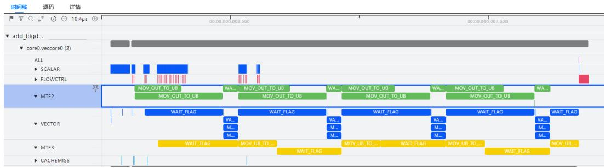

步骤3 对于MTE2搬运效率的提升有多种方式，此处以开启Ascend C算子的double buffer机制为例。

例如样例算子核函数中，可通过将TPipe中InitBuffer的第二个参数（BUFFER_NUM）值从1修改为2，开启double buffer，InitBuffer的使用可参考《Ascend C算子开发接口》中的“基础API > 内存管理与同步控制 $>$ TPipe > InitBuffer”章节。

constexpr int32_t BUFFER_NUM = 2; // tensor num for each queue

pipe.InitBuffer(inQueueY, BUFFER_NUM, 1024 \* sizeof(half));

# 步骤4 重新执行步骤1，查看优化后的指令流水图。

在VADD指令计算时，MTE2上的搬运指令也同步执行，实现了更高效的数据搬运。

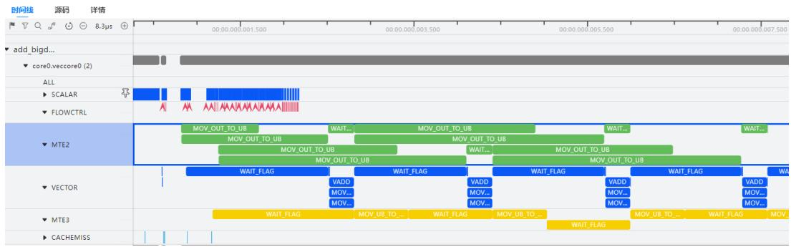

# ----结束

# 8.13.3 采集 MC2 算子的性能数据

展示如何使用msProf工具来上板调优一个MC2算子，并生成通算流水图。

# 前提条件

完成MC2算子的开发。  
参考8.2 使用前准备完成相关环境变量配置。

# 操作步骤

本示例以Ascend CL单算子调用为例，其他调用场景请参见《Ascend C算子开发指南》。

步骤1 请参考4.5 算子编译部署，完成算子的编译部署。

1. 在算子编译文件op_kernel目录下的CMakeLists.txt中引入以下编译选项，使能MC2算子的AIC打点和代码行映射功能。add_ops_compile_options(ALL OPTIONS -DASCENDC_TIME_STAMP_ON, -g)  
2. 进入自定义算子工程目录下编译部署算子。./build_out/custom_opp_<target_os>_<target_architecture>.run

步骤2 使用msProf采集MC2算子的性能数据。msprof op --output=\$HOME/projects/output \$HOME/projects/MyApp blockdim 1 // --output为可选参数,\$HOME/projects/MyApp为使用的app,blockdim 1为用户app的可选参数

步骤3 界面生成以下目录结构和性能数据文件，具体请参见8.11.1 msprof op章节。

步骤4 将trace.json或visualize_data.bin文件导入MindStudio Insight工具进行可视化呈现，具体请参见8.4 计算内存热力图、8.7 通算流水图和8.5 Roofline瓶颈分析图。

----结束

# 8.13.4 配合 mstx 接口实现范围级重放

展示如何使用msProf工具配合mstx接口实现范围级重放，以保留算子执行时上下文的L2Cache信息。

# 前提条件

准备算子工程，并在算子代码中添加mstx扩展接口确定范围级重放的范围，具体请参见8.14 mstx扩展功能和 《MindStudio mstx API参考》。

# 说明

mstxRangeStartA和mstxRangeEnd接口需成对调用，不支持交叉调用。每一对mstx API中包含的算子为一个重放范围，该重放范围内算子的Stream不能改变。  
● 每一个重放范围能采集的算子数量受8.11.1.6 OpBasicInfo（算子基础信息）中算子BlockDim数量限制，建议不超过50个。  
● 使用该功能时，不支持与--aic-metrics=MemoryDetail、--aic-metrics=TimelineDetail及--aic-metrics=Source同时使能；不建议与--kill=on同时使能，否则可能导致采集的算子数据缺失。  
● 在进行范围级重放时，执行算子SynchronizeStream可能会失败，建议在mstxRangeEnd接口调用结束后再执行。  
● 该功能仅适用于Atlas A3 训练系列产品/Atlas A3 推理系列产品和Atlas A2 训练系列产品/Atlas A2 推理系列产品。

# 调用示例

以Python API接口方式（test.py文件）为例，说明msProf工具如何配合mstx接口实现范围级重放。

import mstx   
import torch   
import torch_npu   
$\mathsf { x } =$ torch.Tensor([1,2,3,4]).npu()   
$\mathsf { y } =$ torch.Tensor([1,2,3,4]).npu()   
$\mathsf { a } = \mathsf { x } + \mathsf { y }$   
range1_id $=$ mstx.range_start("range1", None)   
$\mathsf { b } = \mathsf { a } - \mathsf { x }$   
c = a \* x   
mstx.range_end(range1_id)   
range2_id $=$ mstx.range_start("range2", None)   
${ \sf d } = { \sf x } / { \sf y }$   
range3_id $=$ mstx.range_start("range3", None)   
${ \mathfrak { e } } =$ torch.abs(y)   
mstx.range_end(range3_id)   
$\boldsymbol { \mathsf { f } } = \boldsymbol { \mathsf { x } } + \boldsymbol { \mathsf { e } }$   
mstx.range_end(range2_id)

# 操作步骤

# 单range范围级重放

1. 执行以下命令，使能单一mstx API范围，以下命令将执行“range1”范围级重放。msprof op --replay-mode=range --mstx=on --mstx-include $= "$ "range1" --launch-count=10 python3test.py

2. 工具生成Sub、Mul算子的调优数据，且两个算子之间的L2Cache信息会保留。具体性能文件介绍请参考表8-5。

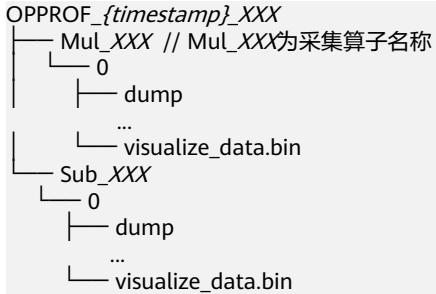

多range范围级重放

a. 执行以下命令，使能所有mstx API范围。msprof op --replay-mode=range --mstx=on --launch-count=10 python3 test.py  
b. 工具将会先后执行“range1”和“range2”范围级重放，生成Sub、Mul、Div、Abs、Add算子的调优数据，每次重放算子之间的L2Cache信息会保留，但两次重放的L2Cache信息互相独立。但因为“range2”和“range3”存在范围交叉，则仅第一个范围生效，“range3”将无效。具体性能文件介绍请参考表8-5。OPPROF_{timestamp}_XXX─ Abs_XXX // Abs_XXX为采集算子名称└── 0├── dump...└── visualize_data.bin─ Add_XXX└── 0├── dump└── visualize_data.bin─ Mul_XXX── 0├── dump...└── visualize_data.binRealDiv_XXX── 0── dump

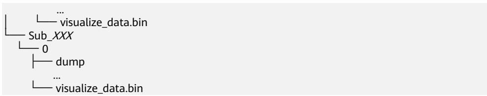

# 8.14 mstx 扩展功能

# mstx 接口简介

mstx接口是MindStudio提供的一个性能分析接口，它允许用户在应用程序中插入特定的标记，以便在性能分析时能够更精确地定位关键代码区域，具体接口明细请参见表8-33和表8-34。具体接口的使用情况请参考《MindStudio mstx API参考》。

表 8- $3 3 \subset / \mathsf C + +$ mstx 接口列表  

<table><tr><td rowspan=1 colspan=1>接口名称</td><td rowspan=1 colspan=1>接口说明</td><td rowspan=1 colspan=1>msProf工具支持情况</td></tr><tr><td rowspan=1 colspan=1>mstxRangeStartA</td><td rowspan=1 colspan=1>mstx range指定范围能力的起始位置标记。</td><td rowspan=1 colspan=1>支持。</td></tr><tr><td rowspan=1 colspan=1>mstxRangeEnd</td><td rowspan=1 colspan=1>mstx range指定范围能力的结束位置标记。</td><td rowspan=1 colspan=1>支持。</td></tr></table>

表 8-34 Python mstx 接口列表  

<table><tr><td rowspan=1 colspan=1>接口名称</td><td rowspan=1 colspan=1>接口说明</td><td rowspan=1 colspan=1>msProf工具支持情况</td></tr><tr><td rowspan=1 colspan=1>mstx.range_start</td><td rowspan=1 colspan=1>mstxrange指定范围能力的起始位置标记。</td><td rowspan=1 colspan=1>支持。</td></tr><tr><td rowspan=1 colspan=1>mstx.range_end</td><td rowspan=1 colspan=1>mstxrange指定范围能力的结束位置标记。</td><td rowspan=1 colspan=1>支持。</td></tr></table>

# mstx 接口的使用

msProf工具允许用户通过mstx接口实现特定算子调优的功能，使用mstx接口可以自定义采集代码段范围内或指定关键函数的开始和结束时间点，并识别关键函数或计算API等信息，对性能问题快速定界。

默认情况下mstx接口不使能。若用户在应用程序中调用mstx接口，工具会根据具体使用场景使能mstx打点功能。例如配置--mstx=on使能用户程序中的mstxAPI，并可以通过--mstx-include使能用户程序中特定的mstx API，具体请参见命令汇总中的--mstx和--mstx-include参数。

mstx当前提供了两种API的使用方式：库文件和头文件，以Link为例：

# 说明

● 此样例工程不支持Atlas A3 训练系列产品。

在\${git_clone_path}/samples/operator/ascendc/0_introduction/   
1_add_frameworklaunch/AclNNInvocation/src/CMakeLists.txt路径下新增   
库文件libms_tools_ext.so，地址为：\${INSTALL_DIR}/lib64/   
libms_tools_ext.so。   
# Header path   
include_directories( ... \${CUST_PKG_PATH}/include   
  
target_link_libraries( ... dl 在\${git_clone_path}/samples/operator/ascendc/0_introduction/   
1_add_frameworklaunch/AclNNInvocation/src/main.cpp路径下，将用户程 序编译链接dl库，对应的头文件ms_tools_ext.h地址：\${INSTALL_DIR}/ include/mstx。   
#include "mstx/ms_tools_ext.h"

\${INSTALL_DIR}请替换为CANN软件安装后文件存储路径。以root用户安装为例，则安装后文件存储路径为：/usr/local/Ascend/cann。

启动msProf工具后，执行msprof op --mstx=on --mstx-include=range1 --launch-count $^ { - 2 }$ python cal.py命令，将会采集range1范围内的算子，即sub和mul算子。

import mstx   
import torch   
import torch_npu   
$\mathsf { x } =$ torch.Tensor([1,2,3,4]).npu()   
$\mathsf { y } =$ torch.Tensor([1,2,3,4]).npu()   
$\mathsf { a } = \mathsf { x } + \mathsf { y }$   
range1_id $=$ mstx.range_start("range1", None)   
$\mathsf { b } = \mathsf { a } - \mathsf { x }$   
$\mathtt { C } = \mathtt { a } ^ { \star } \times \mathtt { x }$   
mstx.range_end(range1_id)   
$\boldsymbol { \mathsf { f } } = \boldsymbol { \mathsf { x } } + \boldsymbol { \mathsf { e } }$   
range2_id $=$ mstx.range_start("range2", None)   
${ \mathfrak { e } } =$ torch.abs(y)   
mstx.range_end(range2_id)

# TBE&AI CPU算子开发场景

# 9.1 TBE&AI CPU 算子开发场景

# 9.1.1 基于 msOpGen 工具创建算子工程

功能描述

CANN开发套件包中提供了自定义算子工程生成工具msOpGen，可基于算子原型定义输出算子开发相关交付件，包括算子代码实现文件、算子适配插件、算子原型定义、算子信息库定义以及工程编译配置文件。

# 说明

若开发者需要自定义多个AI CPU算子，需要在同一算子工程中进行实现，并将所有自定义算子在同一工程中同时进行编译，将所有AI CPU自定义算子的实现文件编译成一个动态库文件。

# 使用前提

CANN组合包提供进程级环境变量设置脚本，供用户在进程中引用，以自动完成环境变量设置。执行命令参考如下，以下示例均为root或非root用户默认安装路径，请以实际安装路径为准。

# 以root用户安装toolkit包后配置环境变量source /usr/local/Ascend/cann/set_env.sh# 以非root用户安装toolkit包后配置环境变量source $\$ 1$ {HOME}/Ascend/cann/set_env.sh

安装依赖：

如下命令如果使用非root用户安装，需要在安装命令后加上--user。pip3 install xlrd $= = 1 . 2 . 0$

# 使用方法

步骤1 确认需要的输入文件。

自定义算子工程生成工具支持输入三种类型的原型定义文件创建算子工程，分别为：

● 适配昇腾AI处理器算子IR定义文件（.json）  
● TensorFlow的原型定义文件（.txt）TensorFlow的原型定义文件可用于生成TensorFlow、Caffe、PyTorch框架的算子工程。  
● 适配昇腾AI处理器算子IR定义文件（.xlsx）

步骤2 请用户选择一种文件完成输入文件的准备工作。

适配昇腾AI处理器算子IR定义的json文件的准备工作  
用户可从CANN软件安装后文件存储路径下的“python/site-packages/op_gen/json_template”中获取模板文件IR_json.json，并进行修改，其文件参数配置说明请参见表9-1。

表 9-1 json 文件配置参数说明  

<table><tr><td colspan="2" rowspan="1">配置字段</td><td colspan="1" rowspan="1">类型</td><td colspan="1" rowspan="1">含义</td><td colspan="1" rowspan="1">西</td></tr><tr><td colspan="1" rowspan="1">op</td><td colspan="1" rowspan="1"></td><td colspan="1" rowspan="1">字符</td><td colspan="1" rowspan="1">算子的Operator Type。</td><td colspan="1" rowspan="1">是</td></tr><tr><td colspan="1" rowspan="4">input_deSC</td><td colspan="1" rowspan="1"></td><td colspan="1" rowspan="1">列表</td><td colspan="1" rowspan="1">输入参数描述。</td><td colspan="1" rowspan="4">否</td></tr><tr><td colspan="1" rowspan="1">name</td><td colspan="1" rowspan="1">字符串</td><td colspan="1" rowspan="1">算子输入参数的名称。</td></tr><tr><td colspan="1" rowspan="1">param_type</td><td colspan="1" rowspan="1">字符串</td><td colspan="1" rowspan="1">参数类型:-required- optionaldynamic未配置默认为required。</td></tr><tr><td colspan="1" rowspan="1">format</td><td colspan="1" rowspan="1">列表</td><td colspan="1" rowspan="1">针对类型为Tensor的参数，配置为Tensor支持的数据排布格式，具体请参考《Ascend C算子开发指南》中的“编程指南&gt;概念原理和术语&gt;神经网络和算子&gt;数据排布格式”章节。包含如下取值：ND,NHWC,NCHW,HWCN,NC1HWC0,FRACTAL_Z等。format与type的数量需保持一致。</td></tr><tr><td colspan="1" rowspan="1"></td><td colspan="1" rowspan="1">type</td><td colspan="1" rowspan="1">列表</td><td colspan="1" rowspan="1">算子参数的类型。取值范围：float16（fp16），float32（fp32）,int8, int16, int32, uint8,uint16,bfloat16（bf16）,bool等。说明不同计算操作支持的数据类型不同，详细请参见《TBE&amp;AICPU算子开发接口》。format与type的数量需保持一致。</td><td colspan="1" rowspan="1"></td></tr><tr><td colspan="1" rowspan="5">output_desc</td><td colspan="1" rowspan="1"></td><td colspan="1" rowspan="1">列表</td><td colspan="1" rowspan="1">输出参数描述。</td><td colspan="1" rowspan="5">是</td></tr><tr><td colspan="1" rowspan="1">name</td><td colspan="1" rowspan="1">字符串</td><td colspan="1" rowspan="1">算子输出参数的名称。</td></tr><tr><td colspan="1" rowspan="1">param_type</td><td colspan="1" rowspan="1">字符串</td><td colspan="1" rowspan="1">参数类型:-required-optional- dynamic未配置默认为required。</td></tr><tr><td colspan="1" rowspan="1">format</td><td colspan="1" rowspan="1">列表</td><td colspan="1" rowspan="1">针对类型为Tensor的参数，配置为Tensor支持的数据排布格式，具体请参考《Ascend C算子开发指南》中的“编程指南&gt;概念原理和术语&gt;神经网络和算子&gt;数据排布格式”章节。包含如下取值：ND,NHWC,NCHW,HWCN,NC1HWC0,FRACTAL_Z等。format与type的数量需保持一致。</td></tr><tr><td colspan="1" rowspan="1">type</td><td colspan="1" rowspan="1">列表</td><td colspan="1" rowspan="1">算子参数的类型。取值范围：float16（fp16），float32（fp32）,int8, int16,int32,uint8,uint16,bfloat16（bf16），bool等。说明不同计算操作支持的数据类型不同，详细请参见《TBE&amp;AICPU算子开发接口》。format与type的数量需保持-一致。</td></tr><tr><td colspan="1" rowspan="2">attr</td><td colspan="1" rowspan="1"></td><td colspan="1" rowspan="1">列表</td><td colspan="1" rowspan="1">属性描述。</td><td colspan="1" rowspan="2">否</td></tr><tr><td colspan="1" rowspan="1">name</td><td colspan="1" rowspan="1">字符串</td><td colspan="1" rowspan="1">算子属性参数的名称。</td></tr><tr><td colspan="2" rowspan="1">配置字段</td><td colspan="1" rowspan="1">类型</td><td colspan="1" rowspan="1">含义</td><td colspan="1" rowspan="1">是否必选</td></tr><tr><td colspan="1" rowspan="3"></td><td colspan="1" rowspan="1">param_type</td><td colspan="1" rowspan="1">字符串</td><td colspan="1" rowspan="1">参数类型:requiredoptional未配置默认为required。</td><td colspan="1" rowspan="3"></td></tr><tr><td colspan="1" rowspan="1">type</td><td colspan="1" rowspan="1">字符串</td><td colspan="1" rowspan="1">算子参数的类型。包含如下取值：int、bool、float、string、list_int、list_float等。</td></tr><tr><td colspan="1" rowspan="1">default_value</td><td colspan="1" rowspan="1"></td><td colspan="1" rowspan="1">默认值</td></tr></table>

# 说明

– json文件可以配置多个算子，json文件为列表，列表中每一个元素为一个算子。

– 若input_desc或output_desc中的name参数相同，则后一个会覆盖前一参数。

input_desc，output_desc中的type需按顺序一一对应匹配，format也需按顺序一一对应匹配。

例如，第一个输入x的type配置为[“int8”,“int32”]，第二个输入y的type配置为[“fp16”,“fp32”]，输出z的type配置为[“int32”,“int64”]，最终这个算子支持输入(“int8”,“fp16”)生成int32，或者(“int32”,“fp32”)生成int64，即输入和输出的type是垂直对应的，类型不能交叉。

input_desc，output_desc中的type与format需一一对应匹配，数量保持一致。type的数据类型为以下取值（"numbertype"、"realnumbertype"、"quantizedtype"、"BasicType"、"IndexNumberType"、"all"）时，需识别实际的type数量是否与format数量保持一致，若数量不一致，创建工程会收到报错提示，同时format按照type的个数进行补齐，继续生成算子工程。若type的取值为基本数据类型（如：“int32”），且与format无法一一对应时，创建工程会收到报错提示，并停止运行。

TensorFlow的原型定义文件（.txt）的准备工作

TensorFlow的原型定义文件（.txt）中内容可从TensorFlow开源社区获取，例如，Add算子的原型定义在TensorFlow开源社区中/tensorflow/core/ops/math_ops.cc文件中，在文件中搜索“Add”找到Add对应的原型定义，内容如下所示：

REGISTER_OP("Add") .Input("x: T") .Input("y: T") .Output("z: T") .Attr( "T: {half, float, int32}") .SetShapeFn(shape_inference::BroadcastBinaryOpShapeFn);

将以上内容另存为\*\*.txt文件。

# 说明

每个\*\*.txt文件仅能包含一个算子的原型定义。

自定义算子工程生成工具只解析算子类型、Input、Output、Attr中内容，其他内容可以不保存在\*\*.txt中。

适配昇腾AI处理器算子IR定义的Excel文件准备工作  
用户可从CANN软件安装后文件存储路径下的“toolkit/tools/msopgen/  
template”目录下获取模板文件Ascend_IR_Template.xlsx进行修改。请基于  
“Op”页签进行修改，“Op”页签可以定义多个算子，每个算子都包含如下参  
数：

表 9-2 IR 原型定义参数说明  

<table><tr><td colspan="1" rowspan="1">列名称</td><td colspan="1" rowspan="1">含义</td><td colspan="1" rowspan="1">是否必选</td></tr><tr><td colspan="1" rowspan="1">Op</td><td colspan="1" rowspan="1">算子的Operator Type。</td><td colspan="1" rowspan="1">是</td></tr><tr><td colspan="1" rowspan="1">Classify</td><td colspan="1" rowspan="1">算子相关参数的类别，包含：-输入:Input-动态输入：DYNAMIC_INPUT-输出：Output-动态输出：DYNAMIC_OUTPUT-属性：Attr</td><td colspan="1" rowspan="1">是</td></tr><tr><td colspan="1" rowspan="1">Name</td><td colspan="1" rowspan="1">算子参数的名称。</td><td colspan="1" rowspan="1">是</td></tr><tr><td colspan="1" rowspan="1">Type</td><td colspan="1" rowspan="1">算子参数的类型。包含如下取值：tensor、int、bool、float、Listlnt、ListFloat等。</td><td colspan="1" rowspan="1">是</td></tr><tr><td colspan="1" rowspan="1">TypeRange</td><td colspan="1" rowspan="1">针对类型为Tensor的参数，需要配置Tensor支持的类型。包含如下取值：fp16,fp32,double,int8,int16,int32,int64,uint8,uint16,uint32,uint64,bf16,bool等。框架为MindSpore时，需要将Tensor的类型值转换为MindSpore所支持的值：I8_Default,I16_Default,I32_Default,I64_Default,U8_Default,U16_Default,U32_Default,U64_Default,BOOL_Default等。</td><td colspan="1" rowspan="1">否</td></tr><tr><td colspan="1" rowspan="1">Required</td><td colspan="1" rowspan="1">是否必须输入，有如下取值：-TRUE-FALSE</td><td colspan="1" rowspan="1">是</td></tr><tr><td colspan="1" rowspan="1">Doc</td><td colspan="1" rowspan="1">对应参数的描述。</td><td colspan="1" rowspan="1">否</td></tr><tr><td colspan="1" rowspan="1">Attr_Default_value</td><td colspan="1" rowspan="1">属性的默认值。</td><td colspan="1" rowspan="1">否</td></tr><tr><td colspan="1" rowspan="1">Format</td><td colspan="1" rowspan="1">针对类型为Tensor的参数，配置为Tensor支持的数据排布格式。包含如下取值：ND,NHWC,NCHW,HWCN,NC1HWC,FRACTAL_Z等。</td><td colspan="1" rowspan="1">否</td></tr><tr><td colspan="1" rowspan="1">Group</td><td colspan="1" rowspan="1">算子分类。</td><td colspan="1" rowspan="1">否</td></tr></table>

配置示例如下所示：

表 9-3 IR 原型定义表示例  

<table><tr><td colspan="9" rowspan="1">预留行</td></tr><tr><td colspan="1" rowspan="1">Op</td><td colspan="1" rowspan="1"> Classify</td><td colspan="1" rowspan="1">Name</td><td colspan="1" rowspan="1">Type</td><td colspan="1" rowspan="1"> TypeRange</td><td colspan="1" rowspan="1">Required</td><td colspan="1" rowspan="1">DoC</td><td colspan="1" rowspan="1">Attr_Default_value</td><td colspan="1" rowspan="1">Format</td></tr><tr><td colspan="1" rowspan="5">Reshape</td><td colspan="1" rowspan="1">INPUT</td><td colspan="1" rowspan="1">X</td><td colspan="1" rowspan="1">tensor</td><td colspan="1" rowspan="1">fp16,fp32,double,int8,int16,int32,int64,uint8,uint16,uint32,uint64,bf16,bool</td><td colspan="1" rowspan="1">TRUE</td><td colspan="1" rowspan="1">-</td><td colspan="1" rowspan="1">1</td><td colspan="1" rowspan="1">ND</td></tr><tr><td colspan="1" rowspan="1">INPUT</td><td colspan="1" rowspan="1">shape</td><td colspan="1" rowspan="1">tensor</td><td colspan="1" rowspan="1">int32,int64</td><td colspan="1" rowspan="1">FALSE</td><td colspan="1" rowspan="1">1</td><td colspan="1" rowspan="1"></td><td colspan="1" rowspan="1"></td></tr><tr><td colspan="1" rowspan="1">DYNAMIC_OUTPUT</td><td colspan="1" rowspan="1">y</td><td colspan="1" rowspan="1">tensor</td><td colspan="1" rowspan="1">fp16,fp32,double,int8,int16,int32,int64,uint8,uint16,uint32,uint64,bf16,bool</td><td colspan="1" rowspan="1">FALSE</td><td colspan="1" rowspan="1">1</td><td colspan="1" rowspan="1"></td><td colspan="1" rowspan="1">ND</td></tr><tr><td colspan="1" rowspan="1">ATTR</td><td colspan="1" rowspan="1">axis</td><td colspan="1" rowspan="1">int</td><td colspan="1" rowspan="1">1</td><td colspan="1" rowspan="1">FALSE</td><td colspan="1" rowspan="1">1</td><td colspan="1" rowspan="1">0</td><td colspan="1" rowspan="1"></td></tr><tr><td colspan="1" rowspan="1">ATTR</td><td colspan="1" rowspan="1">num_axeS</td><td colspan="1" rowspan="1">int</td><td colspan="1" rowspan="1">一</td><td colspan="1" rowspan="1">FALSE</td><td colspan="1" rowspan="1">1</td><td colspan="1" rowspan="1">-1</td><td colspan="1" rowspan="1"></td></tr><tr><td colspan="1" rowspan="1">ReshapeD</td><td colspan="1" rowspan="1">INPUT</td><td colspan="1" rowspan="1">×</td><td colspan="1" rowspan="1">tensor</td><td colspan="1" rowspan="1">fp16,fp32,double,int8,int16,int32,int64,uint8,uint16,uint32,uint64,bf16,bool</td><td colspan="1" rowspan="1">TRUE</td><td colspan="1" rowspan="1">1</td><td colspan="1" rowspan="1"></td><td colspan="1" rowspan="1">ND</td></tr><tr><td colspan="1" rowspan="4"></td><td colspan="1" rowspan="1">OUTPUT</td><td colspan="1" rowspan="1">y</td><td colspan="1" rowspan="1">tensor</td><td colspan="1" rowspan="1">fp16,fp32,double,int8,int16,int32,int64,uint8,uint16,uint32,uint64,bf16,bool</td><td colspan="1" rowspan="1">TRUE</td><td colspan="1" rowspan="1">1</td><td colspan="1" rowspan="1"></td><td colspan="1" rowspan="1">ND</td></tr><tr><td colspan="1" rowspan="1">ATTR</td><td colspan="1" rowspan="1">shape</td><td colspan="1" rowspan="1">list_int</td><td colspan="1" rowspan="1">1</td><td colspan="1" rowspan="1">FALSE</td><td colspan="1" rowspan="1">1</td><td colspan="1" rowspan="1">0</td><td colspan="1" rowspan="1"></td></tr><tr><td colspan="1" rowspan="1">ATTR</td><td colspan="1" rowspan="1">axis</td><td colspan="1" rowspan="1">int</td><td colspan="1" rowspan="1"></td><td colspan="1" rowspan="1">FALSE</td><td colspan="1" rowspan="1">1</td><td colspan="1" rowspan="1">0</td><td colspan="1" rowspan="1"></td></tr><tr><td colspan="1" rowspan="1">ATTR</td><td colspan="1" rowspan="1">num_axeS</td><td colspan="1" rowspan="1">int</td><td colspan="1" rowspan="1"></td><td colspan="1" rowspan="1">FALSE</td><td colspan="1" rowspan="1">1</td><td colspan="1" rowspan="1">-1</td><td colspan="1" rowspan="1"></td></tr></table>

# 说明

– 请直接基于模板文件的第一个页签“Op”进行修改，实现算子的原型定义输入文件。  
– 请不要删除“Op”页签的前三行以及列。

步骤3 创建算子工程。

执行如下命令，参数说明请参见表9-4。

# msopgen gen -i {operator define file} -f {framework type} -c {Compute Resource} -out {Output Path}

表 9-4 参数说明  

<table><tr><td colspan="1" rowspan="1">参数名称</td><td colspan="1" rowspan="1">参数描述</td><td colspan="1" rowspan="1">是否必选</td></tr><tr><td colspan="1" rowspan="1">gen</td><td colspan="1" rowspan="1">用于生成算子开发交付件。</td><td colspan="1" rowspan="1">是</td></tr><tr><td colspan="1" rowspan="1">-i，--input</td><td colspan="1" rowspan="1">算子定义文件路径，可配置为绝对路径或者相对路径。工具执行用户需要有此路径的可读权限。算子定义文件支持如下三种类型：·适配昇腾AI处理器算子IR定义文件（.json）： TensorFlow的原型定义文件（.txt）：适配昇腾AI处理器算子IR定义文件（.xlsx）</td><td colspan="1" rowspan="1">是</td></tr><tr><td colspan="1" rowspan="1">-f,--framework</td><td colspan="1" rowspan="1">框架类型。·TensorFlow框架，参数值：tf或者tensorflow·Caffe框架，参数值：caffe·PyTorch框架，参数值：pytorch·MindSpore框架，参数值：ms或者mindspore·ONN×框架，参数值：onnx说明所有参数值大小写不敏感。</td><td colspan="1" rowspan="1">否</td></tr><tr><td colspan="1" rowspan="1">-C，-compute_unit</td><td colspan="1" rowspan="1">算子使用的计算资源。·针对TBE算子，配置格式为：ai_core-{Soc Version},ai_core与{SocVersion}之间用中划线“-”连接。{SocVersion的取值请根据实际昇腾Al处理器版本进行选择。说明{Soc Version请通过如下方式获取：针对如下产品：在安装昇腾AI处理器的服务器执行npu-smi info命令进行查询，获取Name信息。实际配置值为AscendName，例如Name取值为xxxyy，实际配置值为Ascendxxxyy。Atlas A2训练系列产品/Atlas A2推理系列产品Atlas 200I/500 A2推理产品Atlas推理系列产品Atlas训练系列产品针对如下产品，在安装昇腾AI处理器的服务器执行npu-smi info-t board -i id-c chip_id命令进行查询，获取Chip Name和NPU Name信息，实际配置值为ChipName_NPU Name。例如Chip Name取值为Ascendxxx，NPUName取值为1234，实际配置值为Ascendxxx_1234。其中：■id：设备id，通过npu-smi info-l命令查出的NPU ID即为设备id。■chip_id:芯片id，通过npu-smi info -m命令查出的Chip ID即为芯片id。Atlas A3训练系列产品/Atlas A3 推理系列产品基于同系列的AI处理器型号创建的算子工程，其基础功能（基于该工程进行算子开发、编译和部署）通用。·针对AI CPU算子，请配置为：aicpu。说明针对Atlas A3 训练系列产品/Atlas A3推理系列产品，不支持增加如下编译选项：-march=armv8-a+lse:-march=armv8.1-a-march=armv8.2-a-march=armv8.3-a</td><td colspan="1" rowspan="1">是</td></tr><tr><td colspan="1" rowspan="1">-out,--output</td><td colspan="1" rowspan="1">生成文件所在路径，可配置为绝对路径或者相对路径，并且工具执行用户具有可读写权限。若不配置，则默认生成在执行命令的当前路径。</td><td colspan="1" rowspan="1">否</td></tr><tr><td colspan="1" rowspan="1">-m,--mode</td><td colspan="1" rowspan="1">生成交付件模式。·0：创建新的算子工程，若指定的路径下已存在算子工程，则会报错退出。·1：在已有的算子工程中追加算子。默认值：0。</td><td colspan="1" rowspan="1">否</td></tr><tr><td colspan="1" rowspan="1">-op,--operator</td><td colspan="1" rowspan="1">此参数针对-i为算子IR定义文件的场景。配置算子的类型，如：Conv2DTik。若不配置此参数，当IR定义文件中存在多个算子时，工具会提示用户选择算子。</td><td colspan="1" rowspan="1">否</td></tr><tr><td colspan="1" rowspan="1">-lan,--language</td><td colspan="1" rowspan="1">算子编码语言。·py：基于DSL和TIK算子编程框架，使用Python编程语言进行开发。默认值：py。</td><td colspan="1" rowspan="1">否</td></tr><tr><td colspan="1" rowspan="1">-h，--help</td><td colspan="1" rowspan="1">输出帮助信息。</td><td colspan="1" rowspan="1">否</td></tr></table>

示例：

使用IR_json.json模板作为输入创建原始框架为TensorFlow的算子工程。

1. 创建算子工程。

TBE算子执行如下命令： msopgen gen -i json path/IR_json.json -f tf -c ai_core-{Soc Version} -out ./output data

AI CPU算子执行如下命令：msopgen gen -i json path/IR_json.json -f tf -c aicpu -out ./output data-i参数请修改为IR_json.json文件的实际路径。例如："\${INSTALL_Dpython/site-packages/op_gen/json_template/IR_json.json"。TBE算子工程的-c参数中{Soc Version}为昇腾AI处理器的型号。

2. 选择算子（可选）：

若输入IR_json.json文件只有一个算子原型定义或使用-op参数指定算子类型请跳过此步骤。  
若输入IR_json.json文件中包含多个原型定义，且没有使用-op参数指定算子类型工具会提示输入选择的算子序号，选择算子。

工具会提示输入选择的算子序号，输入：1。

There is more than one operator in the .json file:   
1 Op_1   
2 Op_2   
Input the number of the op: 1 当命令行提示：Generation completed，则完成Op 1算子工程的创建。   
Op_1为文件中"op"的值。

3. 查看算子工程目录：

TBE算子工程目录生成在-out所指定的目录下：./output data， 目录结构如下所示：

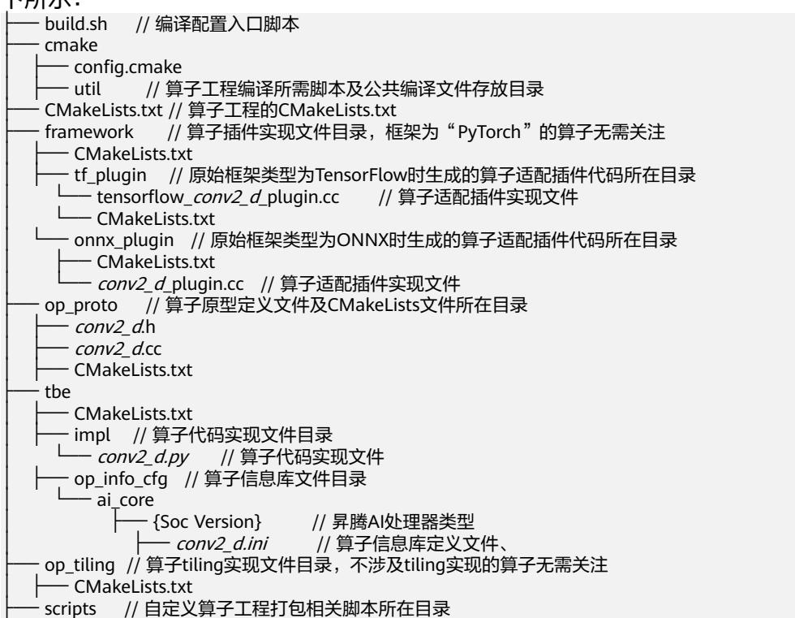

AI CPU算子工程目录生成在 -out 所指定的目录下：./output data， 目录结构如下所示：

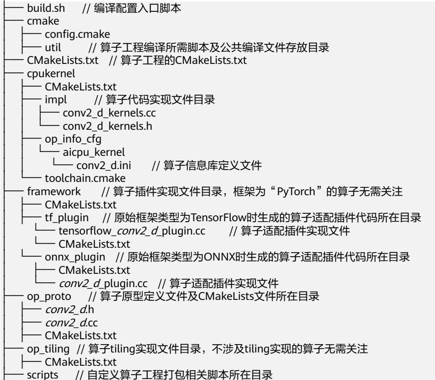

步骤4 可选: 在算子工程中追加算子。

若需要在已存在的算子工程目录下追加其他自定义算子，命令行需配置“- $\cdot \mathsf { m } \parallel ^ { \prime \prime }$ 参数。

执行如下命令。

# TBE算子命令示例：

msopgen gen -i json path/\*.json -f tf -c ai_core-{Soc Version} -out ./output data -m 1

AI CPU算子命令示例：

msopgen gen -i json_path/\*.json -f tf -c aicpu -out ./output_data -m 1

-i参数请修改为IR_json.json文件的实际路径。例如："\${INSTALL_DIR}/python/site-packages/op_gen/json_template/IR_json.json"。TBE算子工程的-c参数中{Soc Version}为昇腾AI处理器的型号。

在算子工程目录下追加\*.json中的算子。MindSpore AICPU算子工程不能够添加非MindSpore框架的算子，也不能添加MindSpore TBE的算子。

----结束

# 9.1.2 算子编译部署

# 9.1.2.1 简介

自定义算子开发完成后，需要对算子工程编译出可直接安装的自定义算子run包，然后进行run包的安装，将自定义算子部署到CANN算子库。

算子工程编译的具体内容为：将算子插件实现文件、算子原型定义文件、算子信息库定义文件分别编译成算子插件、算子原型库、算子信息库，针对AI CPU算子，还会将AI CPU算子的实现文件编译为动态库文件。  
算子包部署指执行自定义算子包的安装，自定义算子交付件会自动部署到算子包安装目录下。

详细的编译部署流程如下图所示：

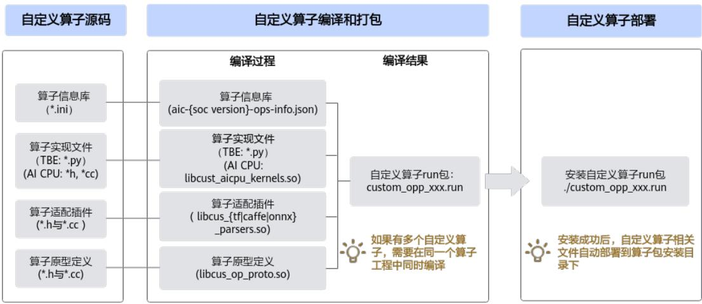  
图 9-1 自定义算子编译部署流程

# 说明

所有的自定义算子需要在同一算子工程中进行编译，编译成唯一的自定义算子安装包进行部署。

# 9.1.2.2 算子工程编译

# 简介

算子交付件开发完成后，需要对算子工程进行编译，生成自定义算子安装包\*.run，详细的编译操作包括：

● 将AI CPU算子代码实现文件\*.h与\*.cc编译成libcust_aicpu_kernels.so。  
● 将算子信息库定义文件\*.ini编译成\*.json。  
● 将原型定义文件\*.h与\*.cc编译成libcust_op_proto.so。  
● 将TensorFlow/Caffe/ONNX算子的适配插件实现文件\*.h与\*.cc编译成libcust_{tf|caffe/onnx)_parsers.so。

# 命令行环境

# 说明

● 不建议对样例工程或自动生成的编译配置文件进行修改，否则可能会造成自定义算子运行失败。编译生成算子包的操作系统版本与架构需要与执行算子包部署操作的操作系统版本与架构相同。

步骤1 在自定义算子工程的“custom.proto”文件中增加原始框架为Caffe的自定义算子的定义。

若开发其他框架的算子，此步骤无需操作，custom.proto文件如下所示：

syntax $=$ "proto2";  
package domi.caffe;  
message NetParameter {optional string name $= 1$ ;$/ /$ LayerParameter定义，保持默认，用户无需修改repeated LayerParameter layer $= 1 0 0 ^ { \cdot }$ ; $/ /$ ID 100 so layers are printed last.  
message LayerParameter {  
optional string name $= 1$ ; // 模型解析所需要定义，保持默认，用户无需修改。optional string type $^ { = 2 }$ ; // 模型解析所需要定义，保持默认，用户无需修改。  
// 在LayerParameter中添加自定义算子层的定义，ID需要保持唯一，取值原则为：不与内置caffe.proto中编号  
重复，且小于5000。  
// 内置的caffe.proto存储路径为CANN软件安装后文件存储路径的“include/proto/caffe.proto”。  
optional CustomTest1Parameter custom test1_param $= 1 0 0 0 $ ;optional CustomTest2Parameter custom_test2_param $= 1 0 0 1$ ;  
}  
// 增加自定义算子层的定义  
message CustomTest1Parameter $\begin{array} { r } { \mathopen { } \mathclose \bgroup \left\{ \begin{array} { r l r l } \end{array} \aftergroup \egroup \right. } \end{array}$ optional bool adj_x1 $= 1$ [default $=$ false];optional bool adj $\underline { { \boldsymbol { \times } } } 2 = 2$ [default $=$ false];  
//若自定义算子中无属性进行解析映射，则message xxParameter定义保持空，如下所示：  
message CustomTest2Parameter {  
}

# 说明

Parameter的类型（粗斜体部分）建议保持唯一，不与内置caffe.proto（CANN软件安装后文件存储路径下的“include/proto/caffe.proto”）定义重复。

步骤2 修改build.sh脚本，配置算子编译所需环境变量。

● ASCEND_TENSOR_COMPILER_INCLUDE：CANN软件头文件所在路径。

请取消此环境变量的注释，并修改为CANN软件头文件所在路径，例如：export ASCEND_TENSOR_COMPILER_INCLUDE=\${INSTALL_DIR}/include

\${INSTALL_DIR}请替换为CANN软件安装后文件存储路径。以root用户安装为例，则安装后文件存储路径为：/usr/local/Ascend/cann。

TOOLCHAIN_DIR：AI CPU算子使用的编译器路径，请取消此环境变量的注释，并按照下述描述修改。

针对Ascend EP场景，请配置为HCC编译器所在路径，例如：export TOOLCHAIN_DIR=\${INSTALL_DIR}/toolkit/toolchain/hcc\${INSTALL_DIR}请替换为CANN软件安装后文件存储路径。以root用户安装为例，则安装后文件存储路径为：/usr/local/Ascend/cann。

AICPU_KERNEL_TARGET：AI CPU算子实现文件编译生成的动态库文件名称。

建议用户取消此环境变量的注释，并在动态库文件的名称中添加自定义唯一后缀作为标识，例如使用软件版本号作为后缀，避免后续由于AI CPU软件升级造成自定义AI CPU动态库文件的冲突。注意，配置的动态库文件的名称长度不能超过84个字节。例如：  
export AICPU_KERNEL_TARGET=cust_aicpu_kernels_3.3.0

若不配置此环境变量，使用默认值：cust_aicpu_kernels。

● AICPU_SOC_VERSION：请选择实际硬件平台对应的昇腾AI处理器的类型。

● vendor_name：标识自定义算子所属厂商的名称，默认值为"customize"。建议开发者自行指定所属厂商名称，避免和其他厂商提供的算子包冲突。当前TBE自定义算子工程中算子实现代码文件所在的目录名为impl，算子包部署后，为避免多厂商的算子实现Python包名冲突，所在的目录名会修改为\${vendor_name}_impl的格式。

步骤3 执行算子工程编译。

若您是基于《TBE&AI CPU算子开发指南》的“算子开发过程 > 算子原型定义”创建的工程，编译方法如下：

若您只需要编译TBE算子，请在算子工程目录下执行如下命令。  
chmod $+ \pmb { \mathrm { x } }$ build.sh  
./build.sh -t  
若您只需要编译AI CPU算子，请在算子工程目录下执行如下命令。  
chmod $+ \pmb { \mathrm { x } }$ build.sh  
./build.sh -c  
若您既需要编译TBE算子，又需要编译AI CPU算子，请在算子工程目录下执行如下命令。  
chmod $+ \pmb { \mathrm { x } }$ build.sh  
./build.sh  
若您是算子工程创建（msOpGen）创建的工程，编译方法如下：  
在算子工程目录下执行如下命令：  
chmod $+ \pmb { \times }$ build.sh  
./build.sh

编译成功后，会在当前目录下创建build_out目录，并在build_out目录下生成自定义算子安装包custom_opp_<target_os>_<target_architecture>.run。

# 说明

若重新进行工程编译，请先执行./build.sh clean命令进行编译文件的清理。

# ----结束

# 9.1.2.3 算子交付件独立编译

简介

获取算子开发相关交付件并按照目录结构要求存放后，可进行交付件独立编译，生成自定义算子安装包\*.run，详细的编译操作包括：

● 将AI CPU算子代码实现文件\*.h与\*.cc编译成libcust_aicpu_kernels.so。  
● 将算子信息库定义文件\*.ini编译成\*.json  
● 将原型定义文件\*.h与\*.cc编译成libcust_op_proto.so。  
● 将TensorFlow/Caffe/ONNX算子的适配插件实现文件\*.h与\*.cc编译成libcust_{tf|caffe/onnx}_parsers.so。  
● 自动新增编译相关文件，如CMakeLists.txt。

# 操作步骤

步骤1 独立编译前需确保算子交付件的目录结构如下所示。

TBE算子交付件目录结构：

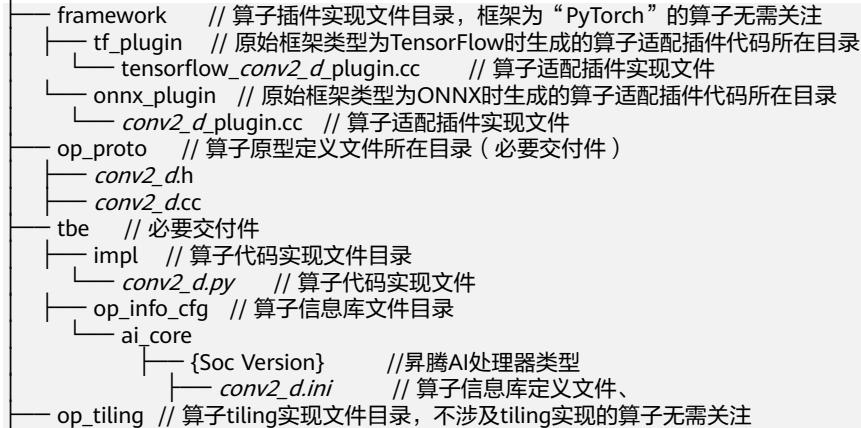

● AI CPU算子交付件目录结构：

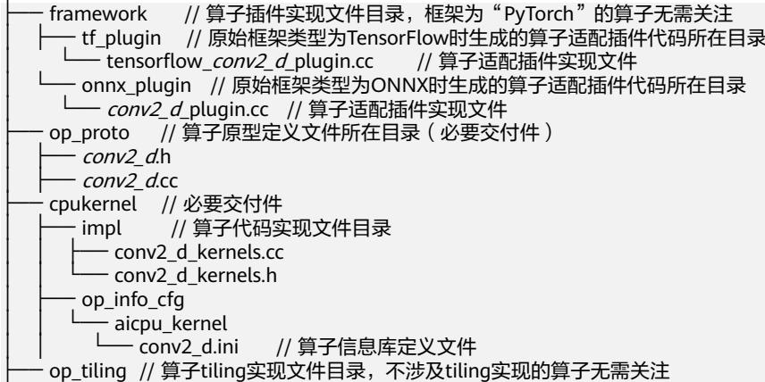

步骤2 编译算子交付件。

执行如下命令，参数说明请参见表9-5。

# msopgen compile -i {operator deliverables directory} -c {CANN installation paths}

表 9-5 参数说明  

<table><tr><td rowspan=1 colspan=1>参数名称</td><td rowspan=1 colspan=1>参数描述</td><td rowspan=1 colspan=1>是否必选</td></tr><tr><td rowspan=1 colspan=1>compile</td><td rowspan=1 colspan=1>用于编译算子交付件。</td><td rowspan=1 colspan=1>是</td></tr><tr><td rowspan=1 colspan=1>-i,--input</td><td rowspan=1 colspan=1>算子交付件所在路径，可配置为绝对路径或者相对路径。工具执行用户需要有此路径的可读权限。</td><td rowspan=1 colspan=1>是</td></tr><tr><td rowspan=1 colspan=1>-C,--cann</td><td rowspan=1 colspan=1>CANN软件的安装目录。说明CANN包安装的真实路径（非软链接）。</td><td rowspan=1 colspan=1>否</td></tr><tr><td rowspan=1 colspan=1>-h，--help</td><td rowspan=1 colspan=1>帮助提示参数。</td><td rowspan=1 colspan=1>否</td></tr><tr><td rowspan=1 colspan=1>-q,--quiet</td><td rowspan=1 colspan=1>是否进行交互。</td><td rowspan=1 colspan=1>否</td></tr></table>

步骤3 编译成功后，会在算子交付件所在路径下创建build_out目录，并在build_out目录下生成自定义算子安装包custom_opp_<target_os>_<target_architecture>.run。

步骤4 查看算子交付件所在路径，新增独立编译相关文件。

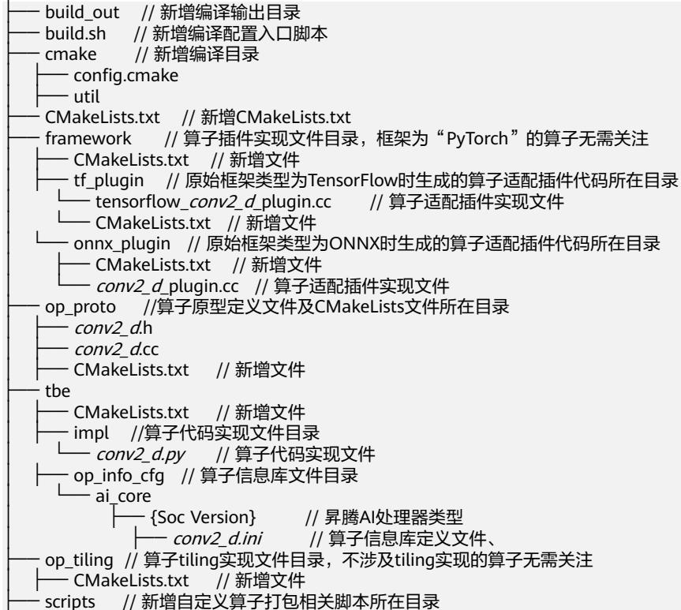  
编译后TBE算子交付件目录结构如下所示：

编译后AI CPU算子交付件目录结构如下所示：

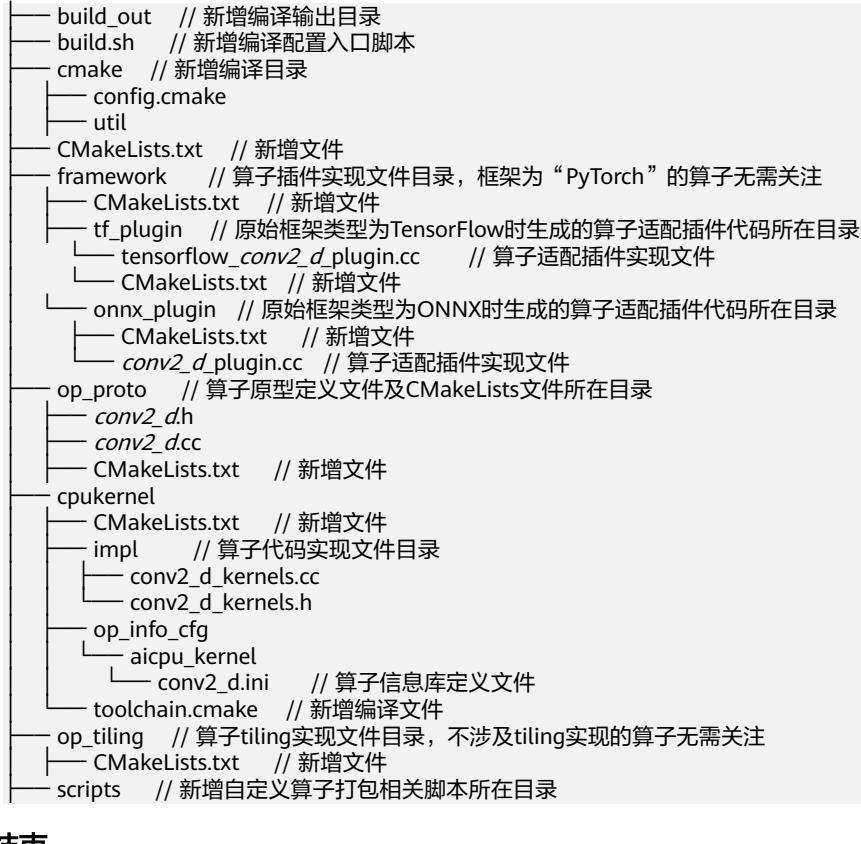

# 9.1.2.4 算子包部署

# 简介

算子部署指将算子编译生成的自定义算子安装包（\*.run）部署到CANN算子库中。

推理场景下，自定义算子直接部署到开发环境的CANN算子库。

训练场景下，自定义算子安装包需要部署到运行环境的CANN算子库中。

# 说明

编译生成算子包的操作系统版本和架构需要与执行算子包部署操作的操作系统版本和架构相同。

# 命令行环境

步骤1 训练场景下，以用户身份运行，将算子工程编译生成的自定义算子包（custom_opp_<target_os>_<target_architecture>.run）拷贝到运行环境下的任一路径，然后参照如下步骤部署自定义算子安装包，如果您的开发环境即为运行环境，此操作可跳过。

步骤2 在自定义算子包所在路径下，执行如下命令，安装自定义算子包。

./custom_opp_<target_os>_<target_architecture>.run --install-path=<path>--install-path为可选参数，用于指定自定义算子包的安装目录，运行用户需要对指定的安装路径有可读写权限。下文描述中的<vendor name>为算子工程编译时build.sh脚本中字段“vendor_name”的取值，默认为"customize"。

默认安装场景，不配置--install-path参数，安装成功后会将编译生成的自定义算子相关文件部署到\${INSTALL_DIR}/opp/vendors/<vendor name>目录。\${INSTALL_DIR}请替换为CANN软件安装后文件存储路径。例如，若安装的Ascend-cann-toolkit软件包，安装后文件存储路径示例为：\$HOME/Ascend/cann。

# 说明

自定义算子包默认安装路径\${INSTALL_DIR}/opp/vendors的目录权限与CANN软件包安装用户和安装配置有关。如果因权限不足导致自定义算子包安装失败，可使用--install-path参数并配置环境变量ASCEND_CUSTOM_OPP_PATH来指定安装目录（参考指定目录安装）或者联系CANN软件包的安装用户修改vendors目录权限来解决。

指定目录安装场景，配置--install-path参数，安装成功后会将编译生成的自定义算子相关文件部署到<path>/<vendor_name>目录，并在<path>/<vendor_name>/bin目录下新增set_env.bash，写入当前自定义算子包相关的环境变量。

# 说明

如果部署算子包时通过配置--install-path参数指定了算子包的安装目录，则在使用自定义算子前，需要执行source <path>/<vendor_name>/bin/set_env.bash命令，set_env.bash脚本中将自定义算子包的安装路径追加到环境变量ASCEND_CUSTOM_OPP_PATH中，使自定义算子在当前环境中生效。

▪ 对算子样例工程进行编译生成的算子包，支持指定绝对路径和相对路径的安装方式。

▪ 对msOpGen工具创建的算子工程进行编译生成的算子包，支持指定绝对路径的安装方式。

▪ 对MindStudio创建的算子工程进行编译生成的算子包，暂不支持指定目录安装方式。

若同一安装目录下已存在相同“vendor_name”的自定义算子，会出现类似如下提示信息（以更新framework为例）：

[ops_custom]upgrade framework  
caffe onnx tensorflow [INFO]: has old version in /usr/local/xxx/vendors/customize/framework:  
- Overlay Installation , please enter:[o]  
- Replace directory installation , please enter: [r]  
- Do not install , please enter:[n]输入“o”，代表覆盖安装，即若安装包中文件与已存在文件名称相同，使用安装包中文件替换原文件；若安装包中不包含已存在文件，则已存在文件保留。  
输入“r”，代表全新安装，即删除安装路径下的所有文件，然后使用安装包全新安装。  
输入“n”，代表退出安装。

说明：后续若存在“op proto”、“op impl”、“custom.proto”等文件的安装模式选择，请分别根据提示信息输入相应的字符。

以默认安装场景为例，部署后目录结构示例如下所示：

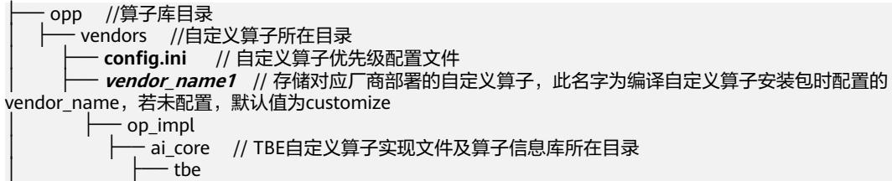

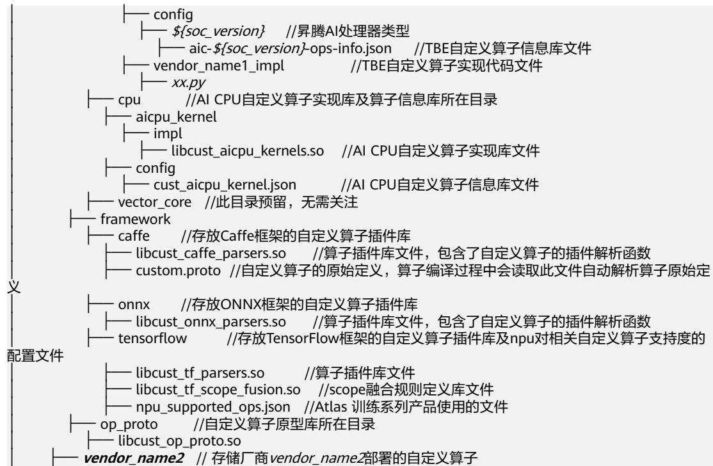

注：其他目录与文件，开发者无需关注。

步骤3 配置自定义算子优先级。

多算子包共存的情况下，若不同的算子包目录下存在相同OpType的自定义算子，则以优先级高的算子包目录下的算子为准。下面介绍如何配置算子包优先级：

默认安装场景

当“opp/vendors”目录下存在多个厂商的自定义算子时，您可通过配置“opp/  
vendors”目录下的“config.ini”文件，配置自定义算子包的优先级。  
“config.ini”文件的配置示例如下：  
load_priority=vendor_name1,vendor_name2,vendor_name3“load_priority”：优先级配置序列的关键字，不允许修改。“vendor name1,vendor name2,vendor name3”：自定义算子厂商的优先级序列，按照优先级从高到低的顺序进行排列。

指定目录安装场景

指定目录安装场景下，如果需要多个自定义算子包同时生效，分别执行各算子包安装路径下的set_env.bash脚本即可。每次脚本执行都会将当前算子包的安装路径追加到ASCEND_CUSTOM_OPP_PATH环境变量的最前面。因此可以按照脚本执行顺序确定优先级：脚本执行顺序越靠后，算子包优先级越高。

比如先执行source <path>/vendor_name1/bin/set_env.bash，后执行source<path>/vendor_name2/bin/set_env.bash，vendor_name2算子包的优先级高于vendor_name1。ASCEND_CUSTOM_OPP_PATH示例如下：

ASCEND_CUSTOM_OPP_PATH=<path>/vendor_name2:<path>/vendor_name1指定目录安装场景下安装的算子包优先级高于默认方式安装的算子包。

# ----结束

# 9.1.3 基于 msOpST 工具进行算子 ST 测试

# 9.1.3.1 简介

CANN开发套件包中提供了ST测试工具：msOpST，支持生成算子的ST测试用例并在硬件环境中执行。具有如下功能：

根据算子信息库定义文件（\*.ini）生成算子测试用例定义文件（\*.json），作为算子ST测试用例的输入。  
● 根据算子测试用例定义文件生成ST测试数据及测试用例执行代码，在硬件环境上执行算子测试用例。  
● 自动生成运行报表（st_report.json）功能，报表记录了测试用例信息及各阶段运行情况。  
● 根据用户定义并配置的算子期望数据生成函数，回显期望算子输出和实际算子输出的对比测试结果。

# 使用前提

● 使用此工具生成算子测试用例前，需要将要测试的算子部署到算子库中。  
● PyTorch框架的安装请参见《Ascend Extension for PyTorch 软件安装指南》。

# 补充说明

msOpST工具其他参数说明可参考表9-6。

功能描述  
表 9-6 参数说明  

<table><tr><td rowspan=1 colspan=1>参数名称</td><td rowspan=1 colspan=1>参数描述</td><td rowspan=1 colspan=1>说明</td></tr><tr><td rowspan=1 colspan=1>get_shape</td><td rowspan=1 colspan=1>获取shape。</td><td rowspan=6 colspan=1>机机接口，用户无需关注。</td></tr><tr><td rowspan=1 colspan=1>change_shape</td><td rowspan=1 colspan=1>修改shape。</td></tr><tr><td rowspan=1 colspan=1>gen</td><td rowspan=1 colspan=1>生成acl_op.json。</td></tr><tr><td rowspan=1 colspan=1>gen_testcase</td><td rowspan=1 colspan=1>生成测试文件及数据。</td></tr><tr><td rowspan=1 colspan=1>compare</td><td rowspan=1 colspan=1>结果比对。</td></tr><tr><td rowspan=1 colspan=1>compare_by_path</td><td rowspan=1 colspan=1>指定路径文件结果比对。</td></tr><tr><td rowspan=1 colspan=1>-h,--help</td><td rowspan=1 colspan=1>帮助提示参数。</td><td rowspan=1 colspan=1>可选参数。</td></tr></table>

# 9.1.3.2 生成测试用例定义文件

指导用户使用msOpST工具生成算子测试用例定义文件（\*.json），作为算子ST测试用例的输入。

# 使用方法

步骤1 获取待测试算子的信息定义文件（.ini）路径。

msOpST工具根据待测算子信息库定义文件（.ini）生成算子ST测试用例定义文件，在算子工程文件中算子信息库定义文件路径如下所示。

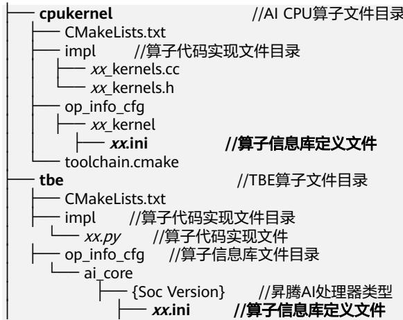

ini文件在TBE算子工程下的路径为：“tbe/op_info_cfg/ai_core/{Soc Version}/xx.ini”，{SocVersion}为昇腾AI处理器的类型。

ini文件在AI CPU算子工程下的路径为：“cpukernel/op_info_cfg/aicpu_kernel/xx.ini”。

# 说明

若进行AI CPU自定义算子ST测试，请不要改变算子工程的目录结构。因为该工具会根据算子信息库定义文件所在算子工程的目录找到算子原型定义文件，并根据算子原型定义文件生成算子测试用例定义文件。

步骤2 执行如下命令生成算子测试用例定义文件，参数说明请参见表9-7。 msopst create -i {operator define file} -out {output path} -m {pb file} -q

表 9-7 参数说明  

<table><tr><td colspan="1" rowspan="1">参数名称</td><td colspan="1" rowspan="1">参数描述</td><td colspan="1" rowspan="1">是否必选</td></tr><tr><td colspan="1" rowspan="1">create</td><td colspan="1" rowspan="1">用于生成算子测试用例定义文件（*.json）。</td><td colspan="1" rowspan="1">是</td></tr><tr><td colspan="1" rowspan="1">-i，--input</td><td colspan="1" rowspan="1">算子信息库定义文件路径（*.ini文件），可配置为绝对路径或者相对路径。说明：输入的算子信息库定义文件（*.ini）仅能包含一个算子的定义。</td><td colspan="1" rowspan="1">是</td></tr><tr><td colspan="1" rowspan="1">-out， --output</td><td colspan="1" rowspan="1">生成文件所在路径，可配置为绝对路径或者相对路径，并且工具执行用户具有可读写权限。若不配置，则默认生成在执行命令的当前路径。</td><td colspan="1" rowspan="1">否</td></tr><tr><td colspan="1" rowspan="1">-m，--model</td><td colspan="1" rowspan="1">配置为TensorFlow模型文件的路径，可配置为绝对路径或者相对路径。若配置此参数，工具会从TensorFlow模型文件中获取首层算子的shape信息，并自动dump出算子信息库定义文件中算子的shape、dtype以及属性的value值，如果dump出的值在算子信息库定义文件所配置的范围内，则会自动填充到生成的算子测试用例定义文件中；否则会报错。说明若配置此参数，系统中需要安装1.15或2.6.5版本的TensorFlow。</td><td colspan="1" rowspan="1">否</td></tr><tr><td colspan="1" rowspan="1">-q，--quiet</td><td colspan="1" rowspan="1">当前版本仅针对-m参数生效，代表是否进行人机交互。若不配置-q参数，则会提示用户修改获取到的模型中的首层shape信息。若配置了-q参数，则不会提示用户更改首层shape信息。</td><td colspan="1" rowspan="1">否</td></tr><tr><td colspan="1" rowspan="1">-h，--help</td><td colspan="1" rowspan="1">输出帮助信息。</td><td colspan="1" rowspan="1">否</td></tr></table>

示例：

以add算子为例，执行如下命令:

msopst create -i OpInfoDefine/add.ini -out ./output请将OpInfoDefine更换为算子信息库定义文件所在路径，请参见步骤1。

命令执行成功后，会在当前路径的output目录下生成算子测试用例定义文件：Add_case_timestamp.json。

步骤3 修改测试用例定义模板文件“OpType_case_timestamp.json”。

步骤2生成的json文件为模板文件，不满足直接作为ST测试用例生成输入的要求，所以用户需要参考此步骤，修改算子测试用例定义文件（\*.json），构造测试用例，以满足ST测试覆盖的范围。

<table><tr><td>{ &quot;case_name&quot;:&quot;Test_Add_001&quot;,</td></tr><tr><td>&quot;error_threshold&quot;:[0.1,0.1],</td></tr><tr><td>&quot;st_mode&quot;:&quot;pt_python_train&quot;,</td></tr><tr><td>&quot;run_torch_api&quot;:&quot;torch.square&quot;,</td></tr><tr><td>&quot;op&quot;: &quot;Add&quot;,</td></tr><tr><td>&quot;input_desc&quot;: [</td></tr><tr><td>{</td></tr><tr><td>&quot;name&quot;: &quot;x1&quot;,</td></tr><tr><td>&quot;format&quot;: [</td></tr><tr><td>&quot;ND&quot;</td></tr><tr><td>], &quot;type&quot;: [</td></tr><tr><td>&quot;int32&quot;,</td></tr><tr><td>&quot;float&quot;,</td></tr><tr><td>&quot;float16&quot;</td></tr><tr><td>],</td></tr><tr><td>&quot;shape&quot;: [32,16],</td></tr><tr><td></td></tr></table>

"data_distribute": [ "uniform" ], "value_range": [ [ 0.1, 1.0 ] ] },{ "name": "x2", "format": [ "ND" ], "type": [ "int32", "float", "float16" ], "shape": [32,16], "data_distribute": [ "uniform" ], "value_range": [ [ 0.1, 1.0 ] ] } ], "output_desc": [ { "name": "y", "format": [ "ND" ], "type": [ "int32", "float", "float16" ], "shape": [32,16] ] }] }

测试用例定义文件其他配置项及说明。

当TBE算子信息库定义文件（\*.ini）中inputx.paramType=optional时，生成的算  
子测试用例中inputx的"format"为"UNDEFINED"或"RESERVED"，"type"为  
"UNDEFINED"。  
当TBE算子信息库定义文件（\*.ini）中inputx.paramType=dynamic时，生成的算  
子测试用例中inputx的"name"为“算子名称+编号”，编号根据dynamic_input的  
个数确定，从0开始依次递增。  
当TBE算子信息库定义文件（\*.ini）中Tensor的实现format与原始format不同时，  
用户需手动添加"ori_format"和"ori_shape"字段，将origin_format与  
origin_shape转成离线模型需要的format与shape。"ori_format"输入为原始算子支持的数据格式，个数必须与format个数保持一致。"ori_shape"输入为shape根据format和ori_format转换的结果。

用户可基于如上模板进行修改，“\*.json”文件支持的全量字段说明如下表所示。不同场景下的测试用例定义文件的样例可参见9.1.3.4 测试用例定义文件配置样例。

表 9-8 算子测试用例定义 json 文件  

<table><tr><td colspan="2" rowspan="1">参数</td><td colspan="1" rowspan="1">说明</td></tr><tr><td colspan="1" rowspan="1">case_name</td><td colspan="1" rowspan="1"></td><td colspan="1" rowspan="1">必选。String类型。测试用例的名称。</td></tr><tr><td colspan="1" rowspan="1">op</td><td colspan="1" rowspan="1"></td><td colspan="1" rowspan="1">必选。String类型。算子的类型。不允许为空。</td></tr><tr><td colspan="1" rowspan="1">error_threshold</td><td colspan="1" rowspan="1"></td><td colspan="1" rowspan="1">可选。配置自定义精度标准，取值为含两个元素的列表："[threshold1，threshold2]"·threshold1：算子输出结果与标杆数据误差阈值，若误差大于该值则记为误差数据。threshold2：误差数据在全部数据占比阈值。若误差数据在全部数据占比小于该值，则精度达标，否则精度不达标。取值范围为："[0.0,1.0]"。说明若测试用例json文件和执行msopst命令时均配置该参数，以执行msopst命令时配置的精度标准进行比对。若均未配置，则以执行msopst命令时默认精度标准[0.01,0.05]进行比对。</td></tr><tr><td colspan="1" rowspan="1">st_mode</td><td colspan="1" rowspan="1"></td><td colspan="1" rowspan="1">可选。String类型。ST测试模式，其值为："ms_python_train"，表示Mindspore的算子工程（仅Atlas训练系列产品支持）；"pt_python_train"，表示PyTorch框架下的算子工程。</td></tr><tr><td colspan="1" rowspan="1">run_torch_api</td><td colspan="1" rowspan="1"></td><td colspan="1" rowspan="1">可选。配置torch_api调用算子的接口，其值为："torch.square"，“square”为接口名称，请根据实际情况配置。</td></tr><tr><td colspan="1" rowspan="1">expect</td><td colspan="1" rowspan="1"></td><td colspan="1" rowspan="1">可选。用户期望的测试结果状态。属性支持以下两种类型，默认值为“success”success：表示期望测试用例运行成功。若模型转换失败，流程将提前终止，用户可查看ATC工具相关日志定位问题。·failed：表示期望测试用例运行失败。若用户需要运行异常用例，可修改expect字段为failed。若模型转换失败，流程将继续执行。在统计结果中，依据STCaseReport中的status和expect是否一致统计，一致则统计至“success count”，不一致则统计至“failed count”</td></tr><tr><td colspan="1" rowspan="1">fuzz_impl</td><td colspan="1" rowspan="1"></td><td colspan="1" rowspan="1">可选，String类型。若用户需要生成大量测试用例，可利用fuzz测试参数生成脚本辅助生成。此种场景下，用户需要手工添加此字段，配置fuzz测试参数生成脚本的绝对路径或者相对路径：函数名，fuzz测试参数生成脚本的实现方法请参见步骤4。说明不建议用户调用其它用户目录下的fuzz测试参数生成脚本，以避免提权风险。</td></tr><tr><td colspan="1" rowspan="1">fuzz_case_num</td><td colspan="1" rowspan="1"></td><td colspan="1" rowspan="1">可选。int类型。在添加了“fuzz_impl”参数的情况下，需要手工添加此字段，配置利用fuzz测试参数生成脚本生成测试用例数量，范围为1~2000。</td></tr><tr><td colspan="1" rowspan="1">input_desc</td><td colspan="1" rowspan="1"></td><td colspan="1" rowspan="1">必选。算子输入描述。说明所有input_desc中参数取值的个数都要一致，否则测试用例生成会失败。例如：input1的format支持的类型个数2，则input2的format支持的类型个数也需要为2。同理，所有inputx中的type、shape、data_distribute和value_range的取值个数也需要保持一致。</td></tr><tr><td rowspan="3"></td><td rowspan="3">name</td><td>可选。 算子为动态多输入场景时，“name”为必选配置，请配</td></tr><tr><td>置为算子信息库中“inputx.name”参数的名称+编号， 编号从“0”开始，根据输入的个数按照0，1，.， 依次递增。</td></tr><tr><td>例如，算子信息文件中指定的输入个数为4个，则 input_desc中需要配置4个输入描述，name分别为 “xx0”、"xxx1"、“xxx2”、“xxx3”，其中xxx为输 入参数的名称。 动态多输入场景的配置示例可参见·若算子的输入个数不</td></tr></table>

<table><tr><td colspan="2">参数</td><td colspan="4">说明</td></tr><tr><td></td><td>format</td><td colspan="4">必选。 String或者String的一维数组。 输入Tensor数据的排布格式，不允许为空。 常见的数据排布格式如下： · NCHW · NHWC ND：表示支持任意格式。 NC1HWC0：5维数据格式。其中，C0与微架构强相 关，该值等于Cube单元的size，例如16；C1是将C维 度按照C0切分：C1=C/C0，若结果不整除，最后一份 数据需要padding到co。 FRACTAL_Z:卷积的权重的格式。 FRACTAL_NZ：分形格式，在Cube单元计算时，输出 矩阵的数据格式为NW1H1H0W0。整个矩阵被分为 （H1*W1）个分形，按照columnmajor排布，形状 如N字形；每个分形内部有（H0*W0）个元素，按照</td></tr></table>

选。

● fuzz：使用fuzz测试参数生成脚本自动批量生成值。

<table><tr><td colspan="2" rowspan="1">参数</td><td colspan="1" rowspan="1">说明</td></tr><tr><td colspan="1" rowspan="1">-</td><td colspan="1" rowspan="1">ori_format</td><td colspan="1" rowspan="1">可选。String或者String的一维数组，支持以下两种取值：，配置为输入数据的原始format。当算子实现的format与原始format不同时，需要配置此字段；若不配置此字段，默认算子实现的format与原始format相同。配置为“fuzz”，表示使用fuzz测试参数生成脚本自动批量生成值。</td></tr><tr><td colspan="1" rowspan="1"></td><td colspan="1" rowspan="1">type</td><td colspan="1" rowspan="1">必选。String或者String的一维数组。输入数据支持的数据类型。·bool·int8uint8： int16： uint16：int32· int64uint32uint64float16. float32floatbfloat16（仅Atlas A2训练系列产品/Atlas A2推理系列产品支持该数据类型）double（仅AICPU算子支持该数据类型）complex64（仅AICPU算子支持该数据类型）complex128（仅AICPU算子支持该数据类型）·UNDEFINED：表示算子的输入类型为可选。·fuzz：使用fuzz测试参数生成脚本自动批量生成值。输入数据类型为复数场景的配置示例可参见·若算子的输入输出类型为复数，测试用例定义文件如.。</td></tr><tr><td colspan="1" rowspan="1">=</td><td colspan="1" rowspan="1">shape</td><td colspan="1" rowspan="1">必选。·int类型。一维或者二维数组。输入Tensor支持的形状。－支持静态shape输入的场景：shape维度以及取值都为固定值，该场景下不需要配置shape_range参数。支持动态shape输入的场景：shape中包含-1，例如： (200,-1)表示第二个轴长度未知。该场景下需要与shape_range参数配合使用，用于给出“-1”维度的取值范围。String类型，“fuzz”支持fuzz，使用fuzz测试参数生成脚本自动批量生成值。空如果format和type为UNDEFINED时shape允许为空。需要注意，配置的shape需要与format相匹配。</td></tr><tr><td colspan="1" rowspan="1"></td><td colspan="1" rowspan="1">ori_shape</td><td colspan="1" rowspan="1">可选。·int类型。一维或者二维数组。输入数据的原始shape。当算子实现的shape与原始shape不同时，需要配置此字段。String类型，“fuzz”支持fuzz，使用fuzz测试参数生成脚本自动批量生成值。若不配置此字段，默认算子实现的shape与原始shape一致。</td></tr><tr><td colspan="1" rowspan="1"></td><td colspan="1" rowspan="1">typical_shape</td><td colspan="1" rowspan="1">可选。·int类型。一维或者二维数组。实际用于测试的shape。若配置的“shape”字段中含有-1时，用户需要在算子测试用例定义文件中新增“typical_shape”字段，给定出固定shape值，用于实际测试。String类型，“fuzz”。支持fuzz，使用fuzz测试参数生成脚本自动批量生成值。</td></tr><tr><td colspan="1" rowspan="1"></td><td colspan="1" rowspan="1">shape_range</td><td colspan="1" rowspan="1">可选。·int类型。一维或者二维数组。当算子支持动态shape时，此字段表示支持的shape范围。默认值为：[[1,-1]]。表示shape可以取1到无穷。例如：shape配置为(200,-1)，shape_range配置为[[1,-1]]时，则代表shape第二个维度的取值为1到无穷。String类型，“fuzz”。支持fuzz，使用fuzz测试参数生成脚本自动批量生成值。</td></tr><tr><td colspan="1" rowspan="1"></td><td colspan="1" rowspan="1">is_const</td><td colspan="1" rowspan="1">可选。bool类型。·true：若用户需要配置常量输入的用例，则配置该字段，其值为true。）false：若该字段值为false，则需要配置张量输入用例。输入为常量的配置示例可参见·若算子的某个输入为常量，测试用例定义文件如下所。</td></tr><tr><td colspan="1" rowspan="1"></td><td colspan="1" rowspan="1">data_distribute</td><td colspan="1" rowspan="1">必选。String或者String的一维数组。使用哪种数据分布方式生成测试数据，支持的分布方式有：·uniform：返回均匀分布随机值normal：返回正态分布（高斯分布）随机值beta：返回Beta分布随机值laplace：返回拉普拉斯分布随机值triangular：返回三角形分布随机值relu：返回均匀分布+Relu激活后的随机值sigmoid：返回均匀分布+sigmoid激活后的随机值，softmax：返回均匀分布+softmax激活后的随机值·tanh：返回均匀分布+tanh激活后的随机值fuzz：使用fuzz测试参数生成脚本自动批量生成值</td></tr><tr><td colspan="1" rowspan="1">1</td><td colspan="1" rowspan="1">value_range</td><td colspan="1" rowspan="1">必选。：int类型或者float类型。一维或者二维数组。取值范围，不能为空。为[min_value,max_value]且min_value&lt;=max_value。.String类型，“fuzz”。支持fuzz，使用fuzz测试参数生成脚本自动批量生成值</td></tr><tr><td colspan="1" rowspan="1"></td><td colspan="1" rowspan="1">value</td><td colspan="1" rowspan="1">可选。String或者Tensor数组。若用户需要指定输入数据时，可通过增加“value”字段进行配置。有如下两种配置方式：·直接输入Tensor数据，如Tensor的值为[1,2,3,4]。"value": [1,2,3,4]输入二进制数据文件的路径，如数据文件为test.bin时。"value": "./test.bin"二进制数据bin文件需用户自行准备。可以输入绝对路径，也可以输入测试用例定义文件的相对路径。配置为“fuzz”，使用fuzz测试参数生成脚本自动批量生成值。说明若用户添加了“value”字段，“data_distribute”和“value_range”字段将会被忽略。同时需要保证“format”,"type"，"shape"字段的值与“value”数据对应，且每个用例只能测试一种数据类型。配置示例可参见·若指定固定输入，例如ReduceSum的axe..。</td></tr><tr><td colspan="1" rowspan="1">output_desC</td><td colspan="1" rowspan="1"></td><td colspan="1" rowspan="1">必选。算子输出描述。说明output_desc中参数取值的个数都要与input_desc一致，否则测试用例生成会失败。例如：inputx的format支持的类型个数2，则output的format支持的类型个数也需要为2。</td></tr><tr><td colspan="1" rowspan="1"></td><td colspan="1" rowspan="1">name</td><td colspan="1" rowspan="1">可选。String类型。输出参数名称。算子为动态多输出场景时，“name”为必选配置，请配置为算子信息库中“outputx.name”参数的名称+编号，编号从“0”开始，根据输出的个数按照0，1，2..，依次递增。例如，算子信息文件中指定的输出个数为4个，则output_desc中需要配置4个输出描述，name分别为“xxx0”、"xxx1"、“xxx2”、“xxx3”，其中xxx为输出参数的名称。</td></tr></table>

<table><tr><td>参数</td><td>说明 必选。</td><td></td><td></td></tr><tr><td></td><td>format ·fuzz：使用fuzz测试参数生成脚本自动批量生成值。</td><td colspan="4">String或者String的一维数组。 输出Tensor数据的排布格式，不允许为空。 支持如下数据排布格式： ·NCHW · NHWC ）ND：表示支持任意格式。 NC1HWC0：5维数据格式。其中，C0与微架构强相 关，该值等于Cube单元的size，例如16；C1是将C维 度按照C0切分：C1=C/C0，若结果不整除，最后一份 数据需要padding到co。 FRACTAL_Z：卷积的权重的格式。 FRACTAL_NZ：分形格式，在Cube单元计算时，输出 矩阵的数据格式为NW1H1H0W0。整个矩阵被分为 （H1*W1）个分形，按照column major排布，形状 如N字形；每个分形内部有（H0*W0）个元素，按照 rowmajor排布，形状如z字形。考虑到数据排布格 式，将NW1H1H0W0数据格式称为Nz格式。其中， H0,W0表示一个分形的大小，示意图如下所示： Fractal Matrix Size Matrix C</td></tr></table>

<table><tr><td colspan="2" rowspan="1">参数</td><td colspan="1" rowspan="1">说明</td></tr><tr><td colspan="1" rowspan="1"></td><td colspan="1" rowspan="1">ori_format</td><td colspan="1" rowspan="1">可选。String或者String的一维数组。·当算子实现的format与原始format不同时，需要配置此字段，配置为数据的原始format。·配置为“fuzz”，表示使用fuzz测试参数生成脚本自动批量生成值。若不配置此字段，默认算子实现的format与原始format相同。</td></tr><tr><td colspan="1" rowspan="3"></td><td colspan="1" rowspan="3">type</td><td colspan="1" rowspan="3">必选。String或者String的一维数组或“fuzz”。输出数据支持的数据类型。· bool·int8·uint8·int16·uint16·int32·int64·uint32uint64• float16·float32· float· bfloat16（仅Atlas A2 训练系列产品/Atlas A2推理系列产品支持该数据类型）·double（仅AICPU算子支持该数据类型）·complex64（仅AlCPU算子支持该数据类型）·complex128（仅AlCPU算子支持该数据类型）·fuzz：使用fuzz测试参数生成脚本自动批量生成值。</td></tr><tr></tr><tr><td colspan="1" rowspan="1"></td></tr><tr><td colspan="1" rowspan="1"></td><td colspan="1" rowspan="1">shape</td><td colspan="1" rowspan="1">必选。·int类型。一维或者二维数组。输入Tensor支持的形状。）String类型，“fuzz”。支持fuzz，使用fuzz测试参数生成脚本自动批量生成值。</td></tr><tr><td colspan="1" rowspan="1">1</td><td colspan="1" rowspan="1">ori_shape</td><td colspan="1" rowspan="1">可选。·int类型。一维或者二维数组。输入数据的原始shape。当算子实现的shape与原始shape不同时，需要配置此字段。String类型，“fuzz”。支持fuzz，使用fuzz测试参数生成脚本自动批量生成值。若不配置此字段，默认算子实现的shape与原始shape一致。</td></tr><tr><td colspan="1" rowspan="1">attr</td><td colspan="1" rowspan="1"></td><td colspan="1" rowspan="1">可选。</td></tr><tr><td colspan="1" rowspan="1"></td><td colspan="1" rowspan="1">name</td><td colspan="1" rowspan="1">若配置attr，则为必选。String类型。属性的名称，不为空。</td></tr><tr><td colspan="1" rowspan="1"></td><td colspan="1" rowspan="1">type</td><td colspan="1" rowspan="1">若配置attr，则为必选。String类型。属性支持的类型。·bool·int：float：string.list_boollist_intlist_floatlist_string：list_list_int.data_type：如果attr中的value值为数据类型时，type值必须为data_type</td></tr><tr><td colspan="1" rowspan="1">1</td><td colspan="1" rowspan="1">value</td><td colspan="1" rowspan="1">若配置attr，则为必选。属性值，根据type的不同，属性值不同。·如果“type”配置为“bool”，“value”取值为true或者false。·如果“type”配置为“int”，“value”取值为整形数据。如果“type”配置为“float”，“value”取值为浮点型数据。·如果“type”配置为“string”，“value”取值为字符串，例如“NCHW”。·如果“type”配置为“list_bool”，“value”取值示例：[false,true]。如果“type”配置为“list_int”，“value”取值示例：[1,224,224,3]。·如果“type”配置为“list_float”，“value”取值示例：[1.0,0.0]。·如果“type”配置为“list_string”，“value”取值示例：["str1","str2"]如果“type”配置为“list_list_int”，“value”取值示例：[1,3,5,7],[2,4,6,8]]如果“type”配置为“data_type”，“value”支持如下取值：int8、int32、int16、int64、uint8、uint16、uint32、uint64、float、float16、float32、bool、double、complex64、complex128、bfloat16“value”值配置为“fuzz”时，表示使用fuzz测试参数生成脚本自动批量生成值。</td></tr><tr><td colspan="1" rowspan="1">calc_expect_func_file</td><td colspan="1" rowspan="1"></td><td colspan="1" rowspan="1">可选。String类型。算子期望数据生成函数对应的文件路径及算子函数名称，如:"/home/test/test_*.py:function"其中，/home/test/test_*.py为算子期望数据生成函数的实现文件，function为对应的函数名称。须知不建议用户调用其它用户目录下的期望数据生成脚本，以避免提权风险。</td></tr></table>

步骤4 若用户需要自动生成大量测试用例，请参考此步骤用实现fuzz测试参数生成脚本（.py）并配置测试用例定义文件（.json）。

1. 实现fuzz测试参数生成脚本。该脚本可以自动生成测试用例定义文件中input_desc、output_desc、attr内除了name的任何参数。

下面以随机生成shape和value参数为例，创建一个fuzz_shape.py供用户参考。该示例会随机生成一个1-4维，每个维度取值范围在1-64的shape参数，用于ST测试。

a. 导入脚本所需依赖。 import numpy as np

b. 实现fuzz_branch()方法，若用户自定义随机生成待测试参数的方法名，需要在算子测试用例定义文件中配置fuzz_impl字段。

def fuzz_branch(): # 生成测试参数shape值 dim $=$ random.randint(1, 4) x_shape_ $0 =$ random.randint(1, 64) x_shape_1 $=$ random.randint(1, 64) x_shape_ ${ 2 = }$ random.randint(1, 64) x_shape_ ${ } _ { 3 } =$ random.randint(1, 64) if dim $= = 1$ : shape $=$ [x_shape_0] if dim $= = 2$ : shape $=$ [x_shape_0, x_shape_1] if dim $\scriptstyle = = 3$ : shape $=$ [x_shape_0, x_shape_1, x_shape_2] if dim $= = 4$ : shape $=$ [x_shape_0, x_shape_1, x_shape_2, x_shape_3] # 根据shape随机生成x1、x2的value fuzz_value_x1 $=$ np.random.randint(1, 10, size $\varprojlim .$ shape) fuzz_value_x2 $=$ np.random.randint(1, 10, size shape)

# 用字典数据结构返回shape值，将生成的shape值返回给input_desc的x1、x2和output_desc的y 的shape参数。其中x1、 $\times 2$ 、y测试用例定义文件输入、输出的name。 return {"input_desc": {"x1": {"shape": shape,"value": fuzz_value_x1}, "x2": {"shape": shape,"value": fuzz_value_x2}}, "output_desc": {"y": {"shape": shape}}}

该方法生成测试用例定义文件input_desc、output_desc、attr内除了name的任何参数，用户可自定义实现参数的生成方法，以满足算子测试的需求。  
该方法的返回值为字典格式，将该方法生成的参数值以字典的方式赋值给算子进行st测试。返回的字典结构与测试用例定义文件中参数结构相同。

2. 配置测试用例定义文件。

a. 添加“fuzz_impl”字段，值为“fuzz生成测试参数的脚本的相对路径或绝对路径：函数名”，如：“conv2d_fuzz.py:fuzz_branch”若自定义的随机生成待测试参数的方法，请将fuzz_branch配置为自定义方法名，若不配置默认使用fuzz_branch方法。  
b. 添加“fuzz_case_num”字段，值为利用fuzz脚本生成多少条测试用例，如：2000。  
c. 将需要自动生成的参数的值设为"fuzz"。详细的参数说明可参见表9-8。

算子测试用例定义文件的示例如下所示：

"case_name":"Test Add_001",   
"op": "Add",   
"fuzz_impl": "./fuzz_shape.py:fuzz_branch", //配置fuzz测试参数生成脚本路径:函数名   
"fuzz_case_num": 2000, //配置生成测试用例数量   
"input_desc": [ // 算子的输入描述 { //算子的第一个输入 "name": "x1", "format": [

"ND" //删除多余值，保留一个与自动生成shape参数相匹配的值 ], "type": [ "float16" //删除多余值，保留一个与自动生成shape参数相匹配的值 ], "shape":"fuzz", // 修改自动生成参数的值为“fuzz” "data_distribute": [ "uniform" ], "value_range": [ [ 0.1, 1.0 ] ], "value": "fuzz" { //算子的第二个输入 "name": "x2", "format": [ "ND" //删除多余值，保留一个与自动生成shape参数相匹配的值 ], "type": [ "float16" //删除多余值，保留一个与自动生成shape参数相匹配的值 ], "shape":"fuzz", // 修改自动生成参数的值为“fuzz” "data_distribute": [ "uniform" ], "value_range": [ [ 0.1, 1.0 ] ], "value": "fuzz" } ], "output_desc": [ //算子的输出描述，必选，含义同输入Tensor描述 { "name": "y", "format": [ "ND" //删除多余值，保留一个与自动生成shape参数相匹配的值 ], "type": [ "float16" //删除多余值，保留一个与自动生成shape参数相匹配的值 ], "shape":"fuzz" // 修改自动生成参数的值为“fuzz” }

# 说明

测试用例定义文件中参数为“fuzz”的输入、输出或属性需要有“name”参数，若没有请手动添加“name”参数，如： "name": "y"。  
若测试用例定义文件中存在参数值为“fuzz”的情况下，其他各参数取值需唯一，并且与fuzz测试参数生成脚本生成的参数不矛盾，如：shape参数为“fuzz”，且生成的shape为[1, 3, 16, 16]，对应的format也应该是支持4维的。

步骤5 若用户需要得到实际算子输出与期望输出的比对结果，需要参考此步骤自定义期望数据生成函数。

1. 自定义实现add算子期望数据生成函数。在Python文件中实现算子期望数据生成函数，文件目录和文件名称可自定义，如“/home/test/test_add_st.py” 。例如Add算子的期望数据生成函数实现如下：

def calc_expect_func(x1, x2, y): res $= \times 1$ ["value"] $^ +$ x2["value"] return [res, ]

# 说明

用户需根据开发的自定义算子完成算子期望数据生成函数。测试用例定义文件中的全部Input、Output、Attr的name作为算子期望数据生成函数的输入参数，若Input是可选输入，请将该输入指定默认值传参。

例如，某算子输入中的 $\times 3$ 为可选输入时，定义该算子的期望数据生成函数如下。def calc_expect_func(x1, x2, x3 None, y=None)

2. 在ST测试用例定义文件“OpType_xx.json”中增加比对函数。配置算子测试用例定义文件。

在步骤1中的算子测试用例定义文件Add_case_timestamp.json增加   
"calc_expect_func_file"参数，参数值为"/home/test/   
test_add_st.py:calc_expect_func"。 { "case_name":"Test_Add_001", "op": "Add", "calc_expect_func_file": "/home/test/test_add_st.py:calc_expect_func", //配置生成算子期望   
输出数据的实现文件 "input_desc": [...] ... ... }

----结束

# 9.1.3.3 生成/执行测试用例

指导用户根据算子测试用例定义文件生成ST测试数据及测试用例执行代码，在硬件环境上执行算子测试用例。

# 开发环境与运行环境合设场景

步骤1 请参见2 环境准备，配置CANN软件所需基本环境变量。

步骤2 ST测试用例执行时，会使用AscendCL接口加载单算子模型文件并执行，所以需要配置AscendCL应用编译所需其他环境变量，如下所示。

export DDK_PATH=\${INSTALL_DIR} export NPU_HOST_LIB ${ = } 9$ \${INSTALL_DIR}/{arch-os}/devlib

# 说明

● \${INSTALL_DIR}请替换为CANN软件安装后文件存储路径。以root用户安装为例，则安装后文件存储路径为：/usr/local/Ascend/cann。  
● {arch-os}中arch表示操作系统架构，os表示操作系统。

步骤3 执行如下命令生成/执行测试用例。

msopst run -i {\*.json} -soc {soc version} -out {output path} -c {case name} -d {device id} -conf {msopst.ini path} -err_thr "[threshold1,threshold2]"

表 9-9 参数说明  

<table><tr><td colspan="1" rowspan="1">参数名称</td><td colspan="1" rowspan="1">参数描述</td><td colspan="1" rowspan="1">是否必选</td></tr><tr><td colspan="1" rowspan="1">run</td><td colspan="1" rowspan="1">用于执行算子的ST测试用例。</td><td colspan="1" rowspan="1">是</td></tr><tr><td colspan="1" rowspan="1">-i，--input</td><td colspan="1" rowspan="1">算子测试用例定义文件（*.json）的路径，可配置为绝对路径或者相对路径。此处的json文件为执行msopst create命令后的输出，算子测试用例定义文件的详细说明请参见表9-8。</td><td colspan="1" rowspan="1">是</td></tr><tr><td colspan="1" rowspan="1">-SOC, --soc_version</td><td colspan="1" rowspan="1">配置为昇腾AI处理器的类型。说明如果无法确定具体的&lt;soc_version&gt;，则在安装昇腾AI处理器的服务器执行npu-smi info命令进行查询，在查询到的“Name”前增加Ascend信息，例如“Name”对应取值为xxxyy，实际配置的&lt;soc_version&gt;值为Ascend xxxyy。</td><td colspan="1" rowspan="1">是</td></tr><tr><td colspan="1" rowspan="1">-out，--output</td><td colspan="1" rowspan="1">生成文件所在路径，可配置为绝对路径或者相对路径，并且工具执行用户具有可读写权限。若不配置该参数，则默认生成在执行命令的当前路径。</td><td colspan="1" rowspan="1">否</td></tr><tr><td colspan="1" rowspan="1">-C，--case_name</td><td colspan="1" rowspan="1">·配置为需要执行的case的名字，若需要同时运行多个case，多个case之间使用逗号分隔。·若配置为“all”，或者不配置此参数，代表执行所有case。</td><td colspan="1" rowspan="1">否</td></tr><tr><td colspan="1" rowspan="1">-d，--device_id</td><td colspan="1" rowspan="1">NPU设备ID，设置运行ST测试用例的昇腾AI处理器的ID。若未设置此参数，默认为：0。</td><td colspan="1" rowspan="1">否</td></tr><tr><td colspan="1" rowspan="1">-err_thr，--error_threshold</td><td colspan="1" rowspan="1">配置自定义精度标准，取值为含两个元素的列表："[threshold1，threshold2]"·threshold1：算子输出结果与标杆数据误差阀值，若误差大于该值则记为误差数据。threshold2：误差数据在全部数据占比阈值。若误差数据在全部数据占比小于该值，则精度达标，否则精度不达标。默认值为："[0.01,0.05]"。取值范围为："[0.0,1.0]"。说明配置的列表需加引号以避免一些问题。例如配置为：-err_thr "[0.01,0.05]"。若测试用例json文件和执行msopst命令时均配置该参数，以执行msopst命令时配置的精度标准进行比对。若均未配置，则以执行msopst命令时默认精度标准[0.01,0.05]进行比对。</td><td colspan="1" rowspan="1">否</td></tr><tr><td colspan="1" rowspan="1">-conf,--config_file</td><td colspan="1" rowspan="1">ST测试高级功能配置文件（msopst.ini）存储路径，可配置为绝对路径或者相对路径。msopst.ini配置文件的详细说明请参见表9-10。用户可通过修改msopst.ini配置文件，实现如下高级功能：·ST测试源码可编辑·已编辑的ST测试源码可执行·设置Host日志级别环境变量设置日志是否在控制台显示·设置atc模型转换的日志级别设置atc模型转换运行环境的操作系统类型及架构·设置模型精度·读取算子在昇腾AI处理器上运行的性能数据</td><td colspan="1" rowspan="1">否</td></tr><tr><td colspan="1" rowspan="1">-err_report， --error_report</td><td colspan="1" rowspan="1">针对比对失败的用例，获取算子期望数据与实际用例执行结果不一致的数据。若未设置此参数，默认为：“false”o·true：针对比对失败的用例，将算子期望数据与实际用例执行结果不一致的数据保存在{case.name}_error_report.csv文件中。·false：不保存比对失败的数据结果。说明设置此参数为“true”时，获取的比对数据会根据每个case_name生成独立的csv文件，{case.name}_error_report.csv文件所在目录为{output_path}{time_stamp}l{op_type}/run/out/test_data/data/st_error_reports。单个csv文件保存数据的上限为5万行，超过则依次生成新的.csv文件，文件命名如:{case.name}_error_report0.csv。</td><td colspan="1" rowspan="1">否</td></tr><tr><td colspan="1" rowspan="1">-h，--help</td><td colspan="1" rowspan="1">输出帮助信息。</td><td colspan="1" rowspan="1">否</td></tr></table>

msopst.ini文件获取路径为：\${INSTALL_DIR}/python/site-packages/bin/。\${INSTALL_DIR}请替换为CANN软件安装后文件存储路径。以root用户安装为例，则安装后文件存储路径为：/usr/local/Ascend/cann。msopst.ini文件参数说明如下表所示。

表 9-10 msopst.ini 文件参数说明  

<table><tr><td colspan="1" rowspan="1">参数</td><td colspan="1" rowspan="1">值</td><td colspan="1" rowspan="1">说明</td></tr><tr><td colspan="1" rowspan="1">only_gen_without_run</td><td colspan="1" rowspan="1">-True- False（默认）</td><td colspan="1" rowspan="2">msOpST工具运行模式。详情请参见表9-11。</td></tr><tr><td colspan="1" rowspan="1">only_run_without_gen</td><td colspan="1" rowspan="1">-True-False（默认）</td></tr><tr><td colspan="1" rowspan="1">performance_mode</td><td colspan="1" rowspan="1">-True-False</td><td colspan="1" rowspan="1">获取算子性能模式。若设置为True，运行成功后在run/out/prof/JOBxxx/summary目录下生成一系列性能结果文件，用户只需查看op_summary_0_1.csv即可。该功能需要配置CANN包安装环境变量，请根据实际安装路径修改。export install_path=/home/HwHiAiUser/Ascend/cann</td></tr><tr><td colspan="1" rowspan="1">ASCEND_GLOBAL_LOG_LEVEL</td><td colspan="1" rowspan="1">-0：DEBUG级别－1:INFO级别2:WARNING级别3:ERROR级别（默认）-4:NULL级别，不输出日志</td><td colspan="1" rowspan="1">设置Host日志级别环境变量。</td></tr><tr><td colspan="1" rowspan="1">ASCEND_SLOG_PRINT_TO_STDOUT</td><td colspan="1" rowspan="1">－0：屏幕不打印输出（默认）1：屏幕打印输出</td><td colspan="1" rowspan="1">日志屏幕打印控制。</td></tr><tr><td colspan="1" rowspan="1">atc_singleop_advance_option</td><td colspan="1" rowspan="1">--log参数取值:debug:输出debug/info/warning/error/event级别的运行信息info:输出info/warning/error/event级别的运行信息warning:输出warning/error/event级别的运行信息error:输出error/event级别的运行信息（默认）1null：不输出日志信息--precision_mode参数取值:-force_fp16：表示算子支持fp16和fp32时，强制选择fp16（默认）force_fp32：表示算子支持fp16和fp32时，强制选择fp32allow_fp32_to_fp16:表示如果算子支持fp32，则保留原始精度fp32；如果不支持fp32，则选择fp16must_keep_origin_dtype:表示保持原图精度allow_mix_precision:表示混合精度模式--host_env_os参数取值:linux：表示设置操作系统类型为linux--host_env_cpu参数取值:－ x86_64：表示设置操作系统架构为x86_64aarch64：表示设置操作系统架构为aarch64示例：atc_singleop_advance_option = "--log=info --host_env_os=linuxhost_env_cpu=aarch64 -precision_mode=force_fp16"</td><td colspan="1" rowspan="1">设置单算子模型转换高级选项。若模型编译环境的操作系统及其架构与模型运行环境不一致时，则需使用--host_env_os和--host_env_cpu参数设置模型运行环境的操作系统类型。如果不设置，则默认取模型编译环境的操作系统架构，即atc所在环境的操作系统架构。</td></tr><tr><td colspan="1" rowspan="1">HOST_ARCH</td><td colspan="1" rowspan="1">- X86_64:X86_64架构aarch64:arm64架构示例：HOST_ARCH="aarch64"</td><td colspan="1" rowspan="1">执行机器的架构。-般在分设场景下配置该参数。</td></tr><tr><td colspan="1" rowspan="1">TOOL_CHAIN</td><td colspan="1" rowspan="1">g++ path:g++工具链路径示例：TOOL_CHAIN="/usr/bin/g++"</td><td colspan="1" rowspan="1">C++编译器路径，配置时以g++结尾。一般在分设场景下配置该参数。</td></tr></table>

表 9-11 msOpST 的运行模式  

<table><tr><td rowspan=1 colspan=1>模式</td><td rowspan=1 colspan=1>only_gen_without_run</td><td rowspan=1 colspan=1> only_run_without_gen</td><td rowspan=1 colspan=1>运行模式</td></tr><tr><td rowspan=1 colspan=1>1</td><td rowspan=1 colspan=1>False</td><td rowspan=1 colspan=1>False</td><td rowspan=1 colspan=1>既生成ST测试代码，又运行ST测试代码。</td></tr><tr><td rowspan=1 colspan=1>2</td><td rowspan=1 colspan=1>True</td><td rowspan=1 colspan=1>True/False</td><td rowspan=1 colspan=1>只生成ST测试代码，不运行ST测试代码。</td></tr><tr><td rowspan=1 colspan=1>3</td><td rowspan=1 colspan=1>False</td><td rowspan=1 colspan=1>True</td><td rowspan=1 colspan=1>不生成ST测试代码，只运行ST测试代码。</td></tr></table>

# 命令行执行示例：

不启用msOpST工具的高级功能，执行如下命令生成ST测试用例并执行。msopst run -i xx/Add_case_timestamp.json -soc {soc version} -out ./output

启动msOpST工具的高级功能，仅生成ST测试用例，用户修改ST测试用例后，再执行ST测试用例。

i. 执行命令，编辑msopst.ini文件vim $\$ 1$ {INSTALL_DIR}/python/site-packages/bin/msopst.ini\${INSTALL_DIR}请替换为CANN软件安装后文件存储路径。以root用户安装为例，则安装后文件存储路径为：/usr/local/Ascend/cann。

将msOpST工具的运行模式修改为模式2，按照表9-11修改“only_gen_without_run”和“only_run_without_gen”参数的取值。只生成ST测试代码，不运行ST测试代码。

ii. 执行如下命令生成ST测试源码。

msopst run -i xx/Add_case_timestamp.json -soc {soc version} -out ./output -conf xx/msopst.ini-conf参数请修改为msopst.ini配置文件的实际路径。ST测试用例生成后，用户可根据需要自行修改ST测试用例代码。

iii. 修改msopst.ini文件，修改运行模式为仅执行ST测试用例。

执行命令，编辑msopst.ini文件vim \${INSTALL_DIR}/python/site-packages/bin/msopst.ini将msOpST工具的运行模式修改为模式3，按照表9-11修改“only_gen_without_run”和“only_run_without_gen”参数的取值。不生成ST测试代码，只运行ST测试代码。

iv. 执行如下命令运行已修改的ST测试源码。

msopst run -i xx/Add_case_timestamp.json -soc {soc version} -out ./output -conf xx/ msopst.ini

# 步骤4 查看执行结果。

若运行模式为仅生成ST测试用例代码，不执行ST测试用例，会在-out指定的目录下生成时间戳目录，时间戳目录下将生成以算子的OpType命名的存储测试用例代码的文件夹，目录结构如下所示：

若运行模式为既生成ST测试代码，又运行ST测试代码，命令执行完成后，会打印测试用例执行结果，并会在-out指定的目录下生成时间戳目录，时间戳目录下将生成以算子的OpType命名的存储测试用例及测试结果的文件夹，目录结构如下所示：

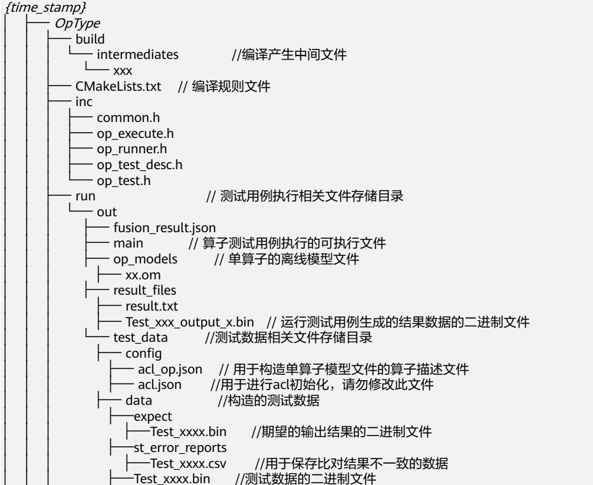

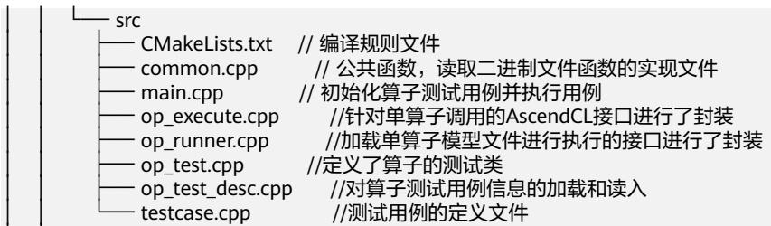  
└── st_report.json //运行报表

命令运行成功后会生成报表st_report.json，保存在“The st_report saved in”路径下，记录了测试的信息以及各阶段运行情况。

同时，st_report.json报表可以对比测试结果，如果用户运行出问题，也可基于报表查询运行信息，以便问题定位。

表 9-12 st_report.json 报表主要字段及含义  

<table><tr><td colspan="3" rowspan="1">字段</td><td colspan="1" rowspan="1">说明</td></tr><tr><td colspan="1" rowspan="1">run_cmd</td><td colspan="1" rowspan="1">1</td><td colspan="1" rowspan="1"></td><td colspan="1" rowspan="1">命令行命令。</td></tr><tr><td colspan="1" rowspan="7">report_list</td><td colspan="1" rowspan="1"></td><td colspan="1" rowspan="1"></td><td colspan="1" rowspan="1">报告列表，该列表中可包含多个测试用例的报告。</td></tr><tr><td colspan="1" rowspan="3">trace_detail</td><td colspan="1" rowspan="1">1</td><td colspan="1" rowspan="1">运行细节。</td></tr><tr><td colspan="1" rowspan="1">st_case_info</td><td colspan="1" rowspan="1">测试信息，包含如下内容。- expect_data_path:期望计算结果路径。：case_name：测试用例名称。1input_data_path:输入数据路径。-planned_output_data_paths：实际计算结果输出路径。- op_params:算子参数信息。</td></tr><tr><td colspan="1" rowspan="1">stage_result</td><td colspan="1" rowspan="1">运行各阶段结果信息，包含如下内容。-status：阶段运行状态，表示运行成功或者失败。-result:输出结果- stage_name:阶段名称。- cmd：运行命令。</td></tr><tr><td colspan="1" rowspan="1">case_name</td><td colspan="1" rowspan="1">=</td><td colspan="1" rowspan="1">测试名称。</td></tr><tr><td colspan="1" rowspan="1">status</td><td colspan="1" rowspan="1"></td><td colspan="1" rowspan="1">测试结果状态，表示运行成功或者失败。</td></tr><tr><td colspan="1" rowspan="1">expect</td><td colspan="1" rowspan="1"></td><td colspan="1" rowspan="1">期望的测试结果状态，表示期望运行成功或者失败。</td></tr><tr><td colspan="1" rowspan="4">summary</td><td colspan="1" rowspan="1">1</td><td colspan="1" rowspan="1"></td><td colspan="1" rowspan="1">统计测试用例的结果状态与期望结果状态对比的结果。</td></tr><tr><td colspan="1" rowspan="1">test casecount</td><td colspan="1" rowspan="1"></td><td colspan="1" rowspan="1">测试用例的个数。</td></tr><tr><td colspan="1" rowspan="1">successcount</td><td colspan="1" rowspan="1"></td><td colspan="1" rowspan="1">测试用例的结果状态与期望结果状态一致的个数。</td></tr><tr><td colspan="1" rowspan="1">failed count</td><td colspan="1" rowspan="1"></td><td colspan="1" rowspan="1">测试用例的结果状态与期望结果状态不一致的个数。</td></tr></table>

# ----结束

# 开发环境和运行环境分设场景

步骤1 根据运行环境的架构在开发环境上搭建环境。

1. 请参见2 环境准备，根据运行环境架构安装对应的CANN开发套件包（开发环境和运行环境架构相同时，无需重复安装CANN开发套件包）。

2. ST测试用例执行时，会使用AscendCL接口加载单算子模型文件并执行，需要在开发环境上根据运行环境的架构配置AscendCL应用编译所需其他环境变量。

当开发环境和运行环境架构相同时，环境变量如下所示。export DDK_PATH=\${INSTALL_DIR}export NPU_HOST_LIB $\scriptstyle \left. \left| = \right\{ \begin{array} { l l } { \mathbf { \Delta } } \\ { \mathbf { \Delta } } \end{array} \right.$ \${INSTALL_DIR}/{arch-os}/devlib

当开发环境和运行环境架构不同时，环境变量如下所示。export DDK_PATH $| = \mathfrak { s }$ \${INSTALL_DIR}/{arch-os}export NPU_HOST_LIB $= :$ \${INSTALL_DIR}/{arch-os}/devlib

# 说明

\${INSTALL_DIR}请替换为CANN软件安装后文件存储路径。以root用户安装为例，则安装后文件存储路径为：/usr/local/Ascend/cann。  
{arch-os}中arch表示操作系统架构（需根据运行环境的架构选择），os表示操作系统（需根据运行环境的操作系统选择）。

步骤2 在开发环境启动msOpST工具的高级功能，仅生成ST测试用例。

1. 执行命令，编辑msopst.ini文件。vim $\$ 1$ {INSTALL_DIR}/python/site-packages/bin/msopst.ini\${INSTALL_DIR}请替换为CANN软件安装后文件存储路径。以root用户安装为例，则安装后文件存储路径为：/usr/local/Ascend/cann。

2. 将msOpST工具的运行模式修改为模式2，按照表9-11修改“only_gen_without_run”和“only_run_without_gen”参数的取值。只生成S测试代码，不运行ST测试代码。

3. 若开发环境和运行环境架构不同，按照表9-10修改“HOST_ARCH”和“TOOL_CHAIN”参数的取值。

4. 执行如下命令生成ST测试源码。

-conf参数请修改为msopst.ini配置文件的实际路径。ST测试用例生成后，用户可根据需要自行修改ST测试用例代码。

5. 执行完成后，将在{output path}下生成ST测试用例，并使用g++编译器生成可执行文件main。同时，屏幕打印信息中展示此次一共运行几个用例，测试用例运行的情况，并生成报表st_report.json，保存在打印信息中“The st report savedin”所示路径下，报表具体信息请参见表9-12。

步骤3 请参见2 环境准备，在运行环境上安装CANN软件并配置所需基本环境变量。

步骤4 执行测试用例。

1. 将开发环境的算子工程目录的run目录下的out文件夹拷贝至运行环境任一目录，例如上传到/home/HwHiAiUser/Ascend_project/run_add/目录下。  
2. 在运行环境中执行out文件夹下的可执行文件。进入out文件夹所在目录，执行如下命令：chmod $+ { \sf x }$ main./main

步骤5 查看运行结果。执行完成后，打印信息会显示此次用例运行的情况，如图9-2所示。

Ran 12 tests. ( 562.138 ms total [PASSED] 12 tests. [FAILED] 0 tests.

----结束

# 9.1.3.4 测试用例定义文件配置样例

Less算子的测试用例定义文件“Less_case.json”如下 "case_name": "Test_Less_001", //测试用例名称 "op": "Less", //算子的类型 "input_desc": [ //算子输入描述 { //第一个输入 "format": ["ND"], "type": ["int32","float"], "shape": [12,32], "data_distribute": [ //生成测试数据时选择的分布方式 "uniform" ], "value_range": [ //输入数据的取值范围 [ 1.0, 384.0 ] ] },{ //第二个输入 "format": ["ND"], "type": ["int32","float"], "shape": [12,32], "data_distribute": [ "uniform" ], "value_range": [ [ 1.0, 384.0 ] ]

], "output_desc": [ //算子的输出 { "format": ["ND"], "type": ["bool","bool"], "shape": [12,32] } ] },{ "case_name": "Test_Less_002", "op": "Less", "input_desc": [ { ... }, { ... } ], "output_desc": [ { ... } ] }

若算子包含属性，测试用例定义文件如下所示。 { "case_name":"Test_Conv2D_001", //测试用例名称 "op": "Conv2D", // 算子的Type，唯一 "input_desc": [ // 算子的输入描述 { //算子的第一个输入 "format": [ //用户在此处配置待测试的输入Tensor的排布格式 "ND", "NCHW" ], "type": [ // 输入数据支持的数据类型 "float", "float16" ], "shape": [8,512,7,7], // 输入Tensor的shape，用户需要自行修改 "data_distribute": [ //生成测试数据时选择的分布方式 "uniform" ], "value_range": [ // 输入数据值的取值范围 [ 0.1, 200000.0 ] ] }, { //算子的第二个输入 "format": [ "ND", "NCHW" ], "type": [ "float", "float16" ], "shape": [512,512,3,3], "data_distribute": [ "uniform" ], "value_range": [

0.1, 200000.0 ] ] } ], "output_desc": [ //必选，含义同输入Tensor描述 { "format": [ "ND", "NCHW" ], "type": [ "float", "float16" ], "shape": [8,512,7,7] } ], "attr": [ // 算子的属性 { "name": "strides", //属性的名称 "type": "list_int", // 属性的支持的类型 "value": [1,1,1,1] // 属性值，跟type的类型对应 }, { "name": "pads", "type": "list_int", "value": [1,1,1,1] },{ "name": "dilations", "type": "list_int", "value": [1,1,1,1] } ] }

若指定固定输入，例如ReduceSum的axes参数，测试用例定义文件如下所示。 "case_name": "Test_ReduceSum_001", "op": "ReduceSum", "input_desc": [ { "format": ["ND"], "type": ["int32"], //若需要设置value,则每个用例只能测试一种数据类型 "shape": [3,6,3,4], "data_distribute": [ "uniform" ], "value_range": [ [ -384, 384 ] ] }, { "format": ["ND"], "type": ["int32"], "shape": [2], "data_distribute": [ "uniform" ], "value_range": [

-3, 1 ] ], "value":[0,2] //设置具体值，需要与shape对应 } ], "output_desc": [ { "format": ["ND"], "type": ["int32"], "shape": [6,4] } ], "attr":[ { "name":"keep_dims", "type":"bool", "value":false } ]}

若算子属性的type为类型，测试用例定义文件如下所示。 { "case_name": "Test_ArgMin_001", "op": "ArgMin", "input_desc": [ { ... }, { ... } ],   
"output_desc": [ { ... } ], "attr":[ { "name":"dtype", "type":"data_type", "value":"int64" } ]}   
若算子的输入个数不确定（动态多输入场景）。   
以AddN算子为例，属性“N”的取值为3，则需要配置3个输入描述，name分别   
为x0、x1、x2，即输入个数需要与属性“N”的取值匹配。 { "op": "AddN", "input_desc": [ { "name":"x0", "format": "NCHW", "shape": [1,3,166,166], "type": "float32" }, { "name":"x1", "format": "NCHW", "shape": [1,3,166,166],

"type": "int32" }, { "name":"x2" "format": "NCHW", "shape": [1,3,166,166], "type": "float32", } ], "output_desc": [ { "format": "NCHW", "shape": [1,3,166,166], "type": "float32" } ], "attr": [ { "name": "N", "type": "int", "value": 3 } ] }

若算子的某个输入为常量，测试用例定义文件如下所示。 { "case_name":"Test_OpType_001", "op": "OpType", "input_desc": [ { "format": ["ND"], "type": ["int32"], "shape": [1], "is_const":true, // 标识此输入为常量 "data_distribute": [ "uniform" ], "value":[11], //常量的值 "value_range": [ //min_value与max_value都配置为常量的值 [ 11, 11 ] ] }, { ... } ], "output_desc": [ { ... } ], }

若算子的输入输出类型为复数，测试用例定义文件如下所示。 { "case_name": "Test_ReduceSum_001", "op": "ReduceSum", "input_desc": [ { "format": ["ND"], "type": [

"complex64", //输入类型为复数 "complex128" //输入类型为复数 ], "shape": [3,6], "data_distribute": [ "uniform" ], "value_range": [ //实部取值范围 [ 1, 10 ] ] }, { "format": ["ND"], "type": [ "int32", "int64"], "shape": [1], "data_distribute": [ "uniform" ], "value_range": [ [ 1, 1 ] ] } ], "output_desc": [ { "format": ["ND"], "type": [ "complex64", //输入类型为复数 "complex128" //输入类型为复数 ], "shape": [3] } ], "attr":[ { "name":"keep_dims", "type":"bool", "value":false } }