# MindStudio8.3.0精度调试工具用户指南

文档版本 01  
发布日期 2026-01-19

版权所有 $\circledcirc$ 华为技术有限公司 2026。 保留一切权利。

非经本公司书面许可，任何单位和个人不得擅自摘抄、复制本文档内容的部分或全部，并不得以任何形式传播。

# 商标声明

和其他华为商标均为华为技术有限公司的商标。  
本文档提及的其他所有商标或注册商标，由各自的所有人拥有。

# 注意

您购买的产品、服务或特性等应受华为公司商业合同和条款的约束，本文档中描述的全部或部分产品、服务或特性可能不在您的购买或使用范围之内。除非合同另有约定，华为公司对本文档内容不做任何明示或暗示的声明或保证。

由于产品版本升级或其他原因，本文档内容会不定期进行更新。除非另有约定，本文档仅作为使用指导，本文档中的所有陈述、信息和建议不构成任何明示或暗示的担保。

# 安全声明

# 产品生命周期政策

华为公司对产品生命周期的规定以“产品生命周期终止政策”为准，该政策的详细内容请参见如下网址：https://support.huawei.com/ecolumnsweb/zh/warranty-policy

# 漏洞处理流程

华为公司对产品漏洞管理的规定以“漏洞处理流程”为准，该流程的详细内容请参见如下网址：  
https://www.huawei.com/cn/psirt/vul-response-process  
如企业客户须获取漏洞信息，请参见如下网址：  
https://securitybulletin.huawei.com/enterprise/cn/security-advisory

# 华为初始证书权责说明

华为公司对随设备出厂的初始数字证书，发布了“华为设备初始数字证书权责说明”，该说明的详细内容请参见如下网址：https://support.huawei.com/enterprise/zh/bulletins-service/ENEWS2000015766

# 华为企业业务最终用户许可协议(EULA)

本最终用户许可协议是最终用户（个人、公司或其他任何实体）与华为公司就华为软件的使用所缔结的协议。最终用户对华为软件的使用受本协议约束，该协议的详细内容请参见如下网址：  
https://e.huawei.com/cn/about/eula

# 产品资料生命周期策略

华为公司针对随产品版本发布的售后客户资料（产品资料），发布了“产品资料生命周期策略”，该策略的详细内容请参见如下网址：https://support.huawei.com/enterprise/zh/bulletins-website/ENEWS2000017760

# 目 录

#

# 1 工具使用导航....

# 2 简介......

# 3 使用前准备... 4

# 4 GPU vs NPU（TensorFlow 1.15 训练/在线推理） 6

4.1 总体说明... 6  
4.2 准备 GPU 侧 npy 文件..  
4.3 准备 NPU 侧 dump 数据和计算图文件. 9  
4.4 比对操作和分析.. 13

# 5 GPU vs NPU（TensorFlow 离线推理） 15

5.1 总体说明.. 15  
5.2 准备 TensorFlow 模型 npy 文件. . 16  
5.3 准备全网层信息文件. 18  
5.4 比对操作和分析... 19

# 6 GPU vs NPU（ONNX 离线推理） .21

6.1 总体说明.. 21  
6.2 准备 ONNX 模型 npy 文件. 22  
6.3 准备全网层信息文件. 23  
6.4 比对操作和分析.. 23

# 7 GPU/CPU vs NPU（Caffe 离线推理） 26

7.1 总体说明. 26  
7.2 Caffe 模型 npy 文件准备. . 29  
7.3 准备模型文件和量化信息文件. . 30  
7.4 比对操作和分析.... 31

# 8 NPU vs NPU（离线推理） 34

8.1 总体说明.. . 34  
8.2 准备离线模型文件. . 36  
8.3 准备离线模型 dump 数据文件.. . 38  
8.4 比对操作和分析... 46

# 9 比对结果说明... 50

# 10 比对结果分析..... 51

#

# 10.1 比对结果分析指导.. 51

10.2 比对结果专家建议. 51

10.2.1 概述... 52

10.2.2 使用前必读. . 52

10.2.3 通过命令行方式分析比对结果. 52

10.2.4 通过脚本工具方式分析比对结果. 53

10.2.5 输出结果和优化建议.. .54

10.3 计算精度评价指标.. 58

10.4 npy 与 npy 文件之间的精度比对.. 58

10.5 单算子比对.. 60

10.5.1 概述.. 60

10.5.2 比对操作.. 60

10.5.3 结果文件说明. .65

# 11 扩展功能... 68

11.1 溢出算子数据采集与解析.. 68

11.2 Top 溢出算子解析.. 72

11.3 dump 数据文件 Format 转换.. 74

11.4 查看 dump 数据文件. 77

11.5 GPU/NPU 映射表获取. 79

11.6 自定义算法.py 文件准备.. 80

11.7 AICPU 自定义算子日志解析.. .81

11.8 生成 npy 文件名异常情况批量处理.. 82

11.9 Windows dump 文件转换为 Linux dump 文件... 83

# 12 附录..... 85

12.1 数据格式要求. 85  
12.2 命令格式说明. . 86  
12.3 完整比对结果参数说明.. . 92  
12.4 原 compare_vector.py 精度比对方式.. . 93  
12.4.1 比对数据准备. . 93  
12.4.1.1 数据格式要求.. 94  
12.4.1.2 准备离线模型 dump 数据文件. 94  
12.4.1.3 准备 Caffe 模型 npy 文件.. . 97  
12.4.1.4 准备 TensorFlow 模型 npy 文件.. 98  
12.4.2 Tensor 比对. . 100  
12.4.2.1 说明与约束.. 100  
12.4.2.2 比对数据说明.. . 101  
12.4.2.3 整网比对. 102  
12.4.2.4 单算子比对.. . 104  
12.4.3 如何进行 npy 文件转 dump 文件. . 106  
12.4.4 如何进行 dump 数据文件 Format 转换. .. 108  
12.4.5 如何查看 dump 数据文件. .. 111

# 工具使用导航

昇腾针对大模型场景和传统小模型场景开发了对应的精度调试工具，可以根据如下介绍选择对应的工具和参考文档：

# 大模型场景

训练：大模型的训练场景精度调试工具msprobe，针对PyTorch和MindSpore框架，主要在gitee开源仓发布，详细介绍请参见《msprobe 使用手册》。推理：大模型的推理场景精度调试工具Large Language Model DebugTool，主要在gitee开源仓发布，详细介绍请参见《大模型推理精度工具》。

# 传统小模型场景

本文主要介绍传统小模型场景的精度比对工具：msaccucmp.py脚本，该工具用于Caffe、ONNX和TensorFlow框架模型的ATC模型转换前后的比对、TensorFlow训练场景的比对和离线模型不同版本之间的比对等场景；另外该工具还支持精度比对结果的专家建议输出、npy与npy文件之间的精度比对以及单算子比对等功能。  
其中传统小模型场景的精度调试也可以使用msprobe工具（训练场景）和msit debug工具（推理场景）。

# 2 简介

相比于业界标杆算子，昇腾自研算子在昇腾AI处理器上的运算结果可能存在差异：

模型迁移：原始模型（基于GPU）在迁移到昇腾环境进行训练或在线推理时，昇腾自研算子的运算结果与业界标杆算子存在差异。  
模型转换：ATC工具转换模型时，会对模型进行算子消除、算子融合、算子拆分等优化，这些操作可能会造成昇腾自研算子运算结果与业界标杆算子运算结果的差异。  
模型兼容：ATC工具转换的离线模型，由于CANN软件版本迭代、模型版本迭代、模型优化、硬件升级或ATC转换前开启或关闭了算子融合功能，可能会造成升级或优化后的离线模型存在精度下降问题。

为了帮助开发人员快速解决算子精度问题，精度调试工具提供了昇腾自研算子运算结果与业界标杆算子运算结果之间的比对功能。

有关ATC的详细介绍请参见《ATC离线模型编译工具用户指南》。

# 精度比对总体流程

精度比对总体流程如下：

# 说明

以下流程图描述的是当前工具支持的三类场景：

GPU vs Ascend NPU（训练）：表示训练原始模型（基于GPU）迁移到昇腾NPU环境后，二者的精度数据对比。对应章节4 GPU vs NPU（TensorFlow 1.15训练/在线推理）GPU/CPU vs Ascend NPU（推理）：表示推理原始模型（基于GPU/CPU）进行模型转换后，二者的精度数据对比。对应章节5 GPU vs NPU（TensorFlow离线推理）、6 GPU vsNPU（ONNX离线推理）和7 GPU/CPU vs NPU（Caffe离线推理）。Ascend NPU vs Ascend NPU（推理）：表示已完成ATC工具转换的离线模型，由于CANN软件版本迭代、模型版本迭代、模型优化、硬件升级或ATC转换前开启或关闭了算子融合功能等情况，对前后两个版本的模型进行精度数据对比。对应章节8 NPU vs NPU（离线推理）。

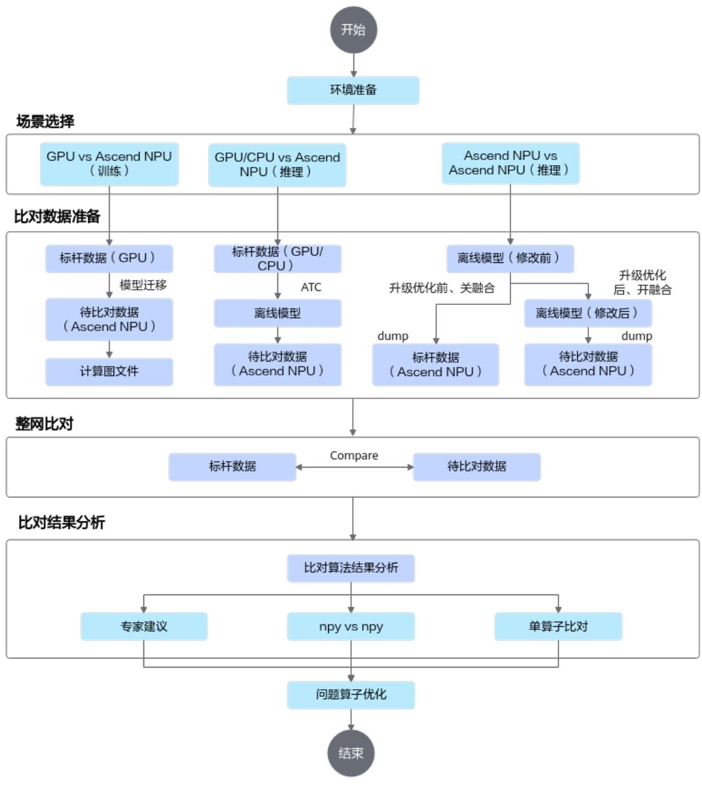  
图 2-1 精度比对总体流程

# 3 使用前准备

# 使用约束

# 须知

数据dump功能会采集算子输入输出信息，由于可能存在客户敏感信息，请在开发和调测场景下使用该功能，生产上线后建议关闭数据dump开关，避免被攻击者利用，造成安全风险。

精度调试工具推荐环境配置：CPU 8核2.6GHz，内存16GB，低于该配置则工具执行迟缓。

本文中举例路径均需要确保运行用户具有读或读写权限。

出于安全性及权限最小化角度考虑，本工具不应使用root等高权限账户，建议使用普通用户权限执行。

本工具依赖CANN软件包，使用本工具前，请先安装CANN软件包，并使用source命令执行CANN的set_env.sh环境变量文件，为保证安全，source后请勿擅自修改set_env.sh中涉及的环境变量。

使用本工具前请确保执行用户的umask值大于等于0027，否则可能会导致工具生成的精度数据文件和目录权限过大。

用户须自行保证使用最小权限原则，如给工具输入的文件要求other用户不可写，在一些对安全要求更严格的功能场景下还需确保输入的文件group用户不可写。

本工具为开发调测工具，不建议在生产环境使用。

单算子网络不支持精度比对。

Python版本支持情况请参见《CANN 软件安装指南》。

精度比对支持的dump数据类型：

1 FLOAT   
– FLOAT16   
– DT_INT8   
– DT_UINT8   
– DT_INT16   
DT_UINT16

1 DT_INT32 1 DT_INT64 – DT_UINT32 – DT_UINT64 1 DT_BOOL – DT_DOUBLE 1 DT_BFLOAT16

# 说明

若网络中存在DT_BFLOAT16数据类型，则需要使用pip3 install bfloat16ext安装依赖。

# 环境准备

安装配套版本的CANN Toolkit开发套件包和ops算子包并配置CANN环境变量，具体请参见《CANN 软件安装指南》。

CANN组合包提供进程级环境变量设置脚本，供用户在进程中引用，以自动完成环境变量设置。执行命令参考如下，以下示例均为root或非root用户默认安装路径，请以实际安装路径为准。

# 存在多个python3版本时，以指定python3.7.5为例，请根据实际修改export PATH=/usr/local/python3.7.5/bin:\$PATHexport LD_LIBRARY_PATH=/usr/local/python3.7.5/lib:\$LD_LIBRARY_PATH

# 4 GPU vs NPU（TensorFlow 1.15 训练/在线推理）

总体说明

准备GPU侧npy文件  
准备NPU侧dump数据和计算图文件  
比对操作和分析

# 4.1 总体说明

# 说明

对于该场景需要排查9 比对结果说明。

TensorFlow 1.15训练/在线推理场景需准备的比对数据文件如下表所示。

表 4-1 TensorFlow 1.x 的比对数据文件要求  

<table><tr><td rowspan=1 colspan=1>文件</td><td rowspan=1 colspan=1>说明</td><td rowspan=1 colspan=1>获取方式</td></tr><tr><td rowspan=1 colspan=1>TensorFlow原始训练网络npy文件</td><td rowspan=1 colspan=1>标杆数据</td><td rowspan=1 colspan=1>4.2 准备GPU侧npy文件</td></tr><tr><td rowspan=1 colspan=1>计算图文件（*.txt）</td><td rowspan=1 colspan=1>计算图文件</td><td rowspan=2 colspan=1>4.3准备NPU侧dump数据和计算图文件</td></tr><tr><td rowspan=1 colspan=1>通过昇腾AI处理器运行生成的训练网络dump数据文件</td><td rowspan=1 colspan=1>待比对数据</td></tr></table>

# 4.2 准备 GPU 侧 npy 文件

# 使用前须知

在通过执行TensorFlow 1.15原始网络训练/在线推理来获取npy文件前，要求有一套完整、可执行的标准TensorFlow模型训练/在线推理工程。● 不论采用Estimator模式还是session.run模式，首先要把脚本中所有的随机全部关闭，包括但不限于对数据集的shuffle，参数的随机初始化，以及某些算子的隐性随机初始化（比如dense算子），确认用户脚本内所有参数均非随机初始化。

# 生成 npy 文件

利用TensorFlow官方提供的debug工具tfdbg生成npy文件。详细的操作方法如下：

步骤1 修改TensorFlow训练/在线推理脚本，添加debug选项设置。

如果采用Estimator模式，采用如下方式添加tfdbg的hook。  
a. 新增from tensorflow.python import debug as tf_debug导入debug模块。  
b. 在生成EstimatorSpec对象实例的位置（即构造网络结构代码位置），新增代码tf_debug.LocalCLIDebugHook()。

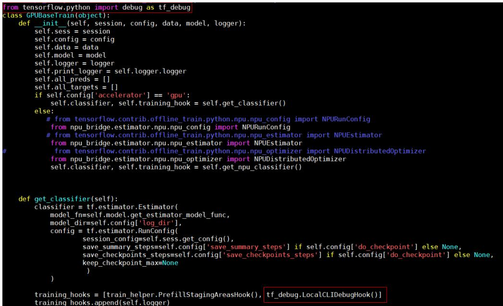  
图 4-1 Estimator 模式

如果采用session.run模式，采用如下方式在run之前设置tfdbg装饰器。

a. 新增from tensorflow.python import debug as tf_debug导入debug模块。  
b. 在session初始化结束后，新增sess $=$ tf_debug.LocalCLIDebugWrapperSession(sess, ui_type="readline")。

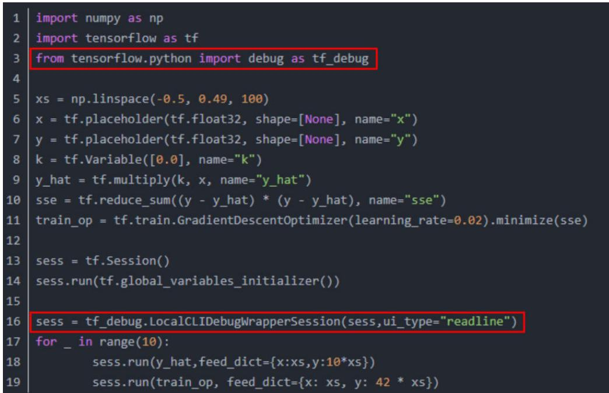  
图 4-2 session.run 模式

步骤2 执行训练/在线推理脚本。

步骤3 训练/在线推理任务停止后，命令行视图自动进入tfdbg调试命令行交互模式，执行run命令。

For more details, see help. tfdbg> run

run命令执行完成后，可以依次执行lt命令查询已存储的张量，执行pt命令查看已存储的张量内容，保存数据为npy格式文件。具体操作请参见收集npy文件。

----结束

# 收集 npy 文件

run命令执行完成后，需要收集npy文件，但由于tfdbg一次只能dump一个tensor，为了自动收集所有npy文件，具体执行操作如下：

步骤1 执行lt > gpu dump命令将所有tensor的名称暂存到自定义名称的gpu dump文件里。命令行中会有如下回显。

步骤2 重新开启一个命令行窗口，在新的命令行窗口进入gpu_dump文件所在目录（默认在训练/在线推理脚本所在目录），执行下述命令，用以生成在tfdbg命令行执行的命令。

timestamp=\$[\$(date +%s%N)/1000] ; cat gpu_dump | awk '{print "pt",\$4,\$4}' | awk '{gsub("/", "_", \$3);gsub(":", ".", \$3);print(\$1,\$2,"-n 0 -w "\$3".""'\$timestamp'"".npy")}'

步骤3 复制所有生成的存储tensor的命令（所有以“pt”开头的命令），回到tfdbg命令行视图所在窗口，粘贴执行，即可存储所有npy文件。存储路径为训练/在线推理脚本所在目录。

npy文件默认是以numpy.save()形式存储的，上述命令会将“/”与“:”用下划线_替换。

# 说明

如果命令行界面无法粘贴文件内容，可以在tfdbg命令行中输入“mouse off”指令关闭鼠标模式后再进行粘贴。

步骤4 检查生成的npy文件命名是否符合{op name}.{output index}.{timestamp}.npy格式，如图4-3所示。

# 说明

● 如果因算子名较长，造成按命名规则生成的npy文件名超过255字符而产生文件名异常，这类算子不支持精度比对。因tfdbg自身原因或运行环境原因，可能存在部分生成的npy文件名不符合精度比对要求，请按命名规则手工重命名。如果不符合要求的npy文件较多，请参见11.8 生成npy文件名异常情况批量处理重新生成npy文件。

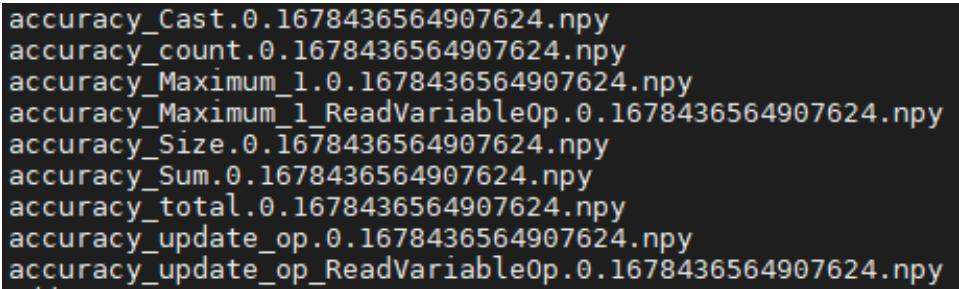  
图 4-3 查询.npy 文件

# ----结束

# 4.3 准备 NPU 侧 dump 数据和计算图文件

# 使用前须知

需要完成训练/在线推理网络的开发、编译和运行，确保拥有可执行的训练/在线推理工程。

本节dump数据过程仅为参考示例，介绍基本操作，更多详细介绍请参见《TensorFlow 1.15模型迁移指南》。

每次迭代都会产生dump数据，在训练数据集较大时，每次迭代产生的dump数据量也会增大，建议控制迭代次数，一般仅执行一次迭代。同时对于大模型场景，通常dump数据量太大并且耗时长，可以通过dump_data开启算子统计功能，根据统计数据识别可能异常的算子后，再dump可能异常的算子。

多卡环境下，由于训练/在线推理脚本中，每张卡的进程启动时间存在差异，这会导致落盘时产生多个时间戳目录。

在容器内执行时，生成的数据保存在容器里。

● 如果训练/在线推理网络包含了随机因子，请在执行生成dump数据前去除。

确保代码在网络结构、算子、优化器的选择上，以及参数的初始化策略等方面与GPU上训练/在线推理的代码完全一致，否则比对无意义。

不建议在同一个训练脚本中同时进行训练和验证，即不建议将train和evaluate放在同一个脚本中，否则会产生两组dump数据，容易造成混淆。

目前仅支持AI CPU、AI Core和HCCL算子进行dump数据。

# dump 参数配置

修改训练/在线推理脚本，开启dump功能。在相应代码中，增加如下的加粗字体信息。

Estimator模式：通过NPURunConfig中的dump_config采集dump数据，在创建NPURunConfig之前，实例化一个DumpConfig类进行dump的配置（包括配置dump路径、dump哪些迭代的数据、dump算子的输入还是输出数据等）。

from npu_bridge.npu_init import \*

# dump_path：dump数据存放路径，该参数指定的目录需要在启动训练/在线推理的环境上（容器或Host  
侧）提前创建且确保安装时配置的运行用户具有读写权限  
# enable_dump：是否开启dump功能  
# dump_step：指定采集哪些迭代的dump数据  
# dump_mode：dump模式，取值：input/output/all  
dump_config $=$ DumpConfig(enable_dump=True, dump_path $=$ "/home/output", dump_step="0|5|10",  
dump_mode="all")  
config $=$ NPURunConfig(  
dump_config=dump_config,  
session_config=session_configsess.run模式：通过session配置项enable_dump、dump_path、dump_step、dump_mode配置dump参数。  
config $=$ tf.ConfigProto()

custom_op $=$ config.graph_options.rewrite_options.custom_optimizers.add() custom_op.name $=$ "NpuOptimizer" custom_op.parameter_map["use_off_line"].b $=$ True

custom_op.parameter_map["enable_dump"]. $\flat =$ True   
custom_op.parameter_map["dump_path"]. $; =$ tf.compat.as_bytes("/home/output")   
custom_op.parameter_map["dump_step"].s $; =$ tf.compat.as_bytes("0|5|10")   
custom_op.parameter_map["dump_mode"].s $=$ tf.compat.as_bytes("all")   
custom_op.parameter_map["dump_layer"]. $s =$ tf.compat.as_bytes("nodename1 nodename2   
nodename3")   
config.graph_options.rewrite_options.remapping $=$ RewriterConfig.OFF

with tf.Session(config $=$ config) as sess: print(sess.run(cost))

# 说明

TensorFlow模型训练/在线推理过程中可能存在算子溢出的情况，此时若直接进行精度比对操作则会造成比对结果不准确，请参见11.1 溢出算子数据采集与解析采集溢出数据。

# 获取 dump 数据文件和计算图文件

步骤1 执行训练/在线推理脚本，生成dump数据文件和计算图文件。

开启dump数据采集功能后，脚本执行时会自动在当前执行目录下生成计算图的dump文件（不含有权重等数据的基本版dump，仅dump经过GE优化、编译后的图），后续开发者通过工具进行精度比对时，会依赖此计算图文件查找dump数据文件。您也可以通过环境变量DUMP_GRAPH_PATH指定dump图文件存储路径，示例：export DUMP_GRAPH_PATH=/home/dumpgraph

dump数据文件生成在{dump_path}指定的目录下，即{dump_path}/{time}/{device_id}/{model_name}/{model_id}/{data_index}目录下，以{dump_path}配置/home/output为例，例如存放在“/home/output/20200808163566/0/ge_default_20200808163719_121/11/0” 。

表 4-2 dump 数据文件路径格式说明  

<table><tr><td rowspan=1 colspan=1>路径key</td><td rowspan=1 colspan=1>说明</td><td rowspan=1 colspan=1>备注</td></tr><tr><td rowspan=1 colspan=1>dump_path</td><td rowspan=1 colspan=1>dump数据存放路径（如果设置的是相对路径，则为拼接后的全路径）。</td><td rowspan=1 colspan=1></td></tr><tr><td rowspan=1 colspan=1>time</td><td rowspan=1 colspan=1>dump数据文件落盘的时间。</td><td rowspan=1 colspan=1>格式为：YYYYMMDDHHMMSS</td></tr><tr><td rowspan=1 colspan=1>device_id</td><td rowspan=1 colspan=1>设备ID。</td><td rowspan=1 colspan=1></td></tr><tr><td rowspan=1 colspan=1>model_name</td><td rowspan=1 colspan=1>子图名称。</td><td rowspan=1 colspan=1>model_name层可能存在多个文件夹，dump数据取计算图名称对应目录下的数据。如果model_name出现了“”             “\”以及空格时，转换为下划线表示。</td></tr><tr><td rowspan=1 colspan=1>model_id</td><td rowspan=1 colspan=1>子图ID号。</td><td rowspan=1 colspan=1></td></tr><tr><td rowspan=1 colspan=1>data_index</td><td rowspan=1 colspan=1>迭代数，用于保存对应迭代的dump数据。</td><td rowspan=1 colspan=1>如果指定了dump_step，则data_index和dump_step-致；如果不指定dump_step,则data_index序号从o开始计数，每dump一个迭代的数据，序号递增1。</td></tr></table>

步骤2 选取计算图文件。

● 方法一：

执行训练脚本完成后会在训练脚本当前目录生成GE图文件，图文件可能会有多个。一般情况下，选取计算图文件方法：将TensorFlow模型保存为pb文件，然后查看该模型，选取其中一个计算类算子的名字作为关键字，找包含该关键字的计算图文件。计算图名称取计算图文件graph下的name字段值。

方法二：  
在所有以“_Build.txt”为结尾的dump图文件中，查找“Iterator”关键词。记录查找出的计算图文件名称，用于后续精度比对。  
grep Iterator \*_Build.txt

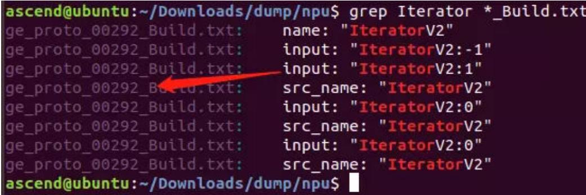

如上图所示，“ge_proto_00292_Build.txt”即为需要的计算图文件。

步骤3 选取dump数据文件。

1. 打开步骤2中找到的计算图文件，记录第一个graph中的name字段值。如下示例中，记录“ge_default_20240613143502_1” 。

graph {   
name: "ge_default_20240613143502_1"   
op { name: "atomic_addr_clean0_71" type: "AtomicAddrClean" attr { key: "_fe_imply_type" value { i: 6 } }   
}

2. 进入以时间戳命名的dump文件存放路径下，我们会看到该目录下存在几个文件夹：

root@ubuntu:/data/y00562861/dfx/dump_path/20240613143507# cd 0   
root@ubuntu:/data/y0056286l/dfx/dump_path/202406l3143507/0# ll   
total 16   
drwx- 4 root root 4096 Jun 13 14:35   
drwx- 3 root root 4096 Jun 13 14:35   
drwx- 3 root root 4096 Jun 13 14:35 ge_default_20240613143502_1/   
drwx- 3 root r00t 4096 Jun 13 14:35 ge_default_20240613143525_51/

3. 找到前面记录的名称为name值的文件夹，例如ge_default_20240613143502_1，这些文件即为需要的dump数据文件。

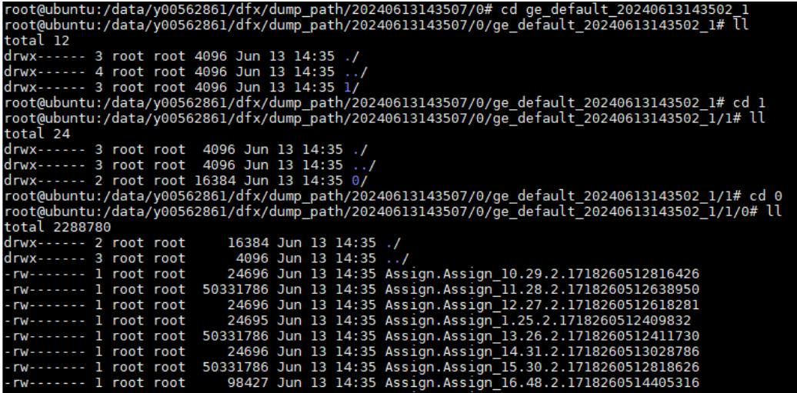

dump数据文件命名格式为：{op_type}.{op_name}.{task_id}.{stream_id}. {timestamp}

对于如下产品，文件名还有可能为其他格式：

Atlas A2 训练系列产品/Atlas A2 推理系列产品

Atlas A3 训练系列产品/Atlas A3 推理系列产品

{op_type}.{op_name_lxsliceN}.({stream_id}.){task_id}.{timestamp}. {task_type}.{context_id}.{thread_id}.{device_id}   
{op_type}.{op_name}.({stream_id}.){task_id}.{timestamp}.{task_type}. {context_id}.{thread_id}.{device_id}

# 说明

– dump数据文件如果op_type、op_name出现了“.”、“/”、“\”、空格时，则会转换为下划线表示。

如果文件名称长度超过了OS文件名称长度限制（一般是255个字符），则会将该dump文件重命名为一串随机数字，映射关系可查看同目录下的mapping.csv。

– 在图执行过程中，以下算子不会产生dump数据：

在图执行前，已明确不会在Device侧执行的算子，如条件类算子(if/while/for/case等)、数据类算子(Data/RefData/Const等)、数据流算子(StackPush/StackPop/Concat/Split等)。  
在图优化阶段，被GE标记为不在Device侧执行的算子，这些算子在dump图中的attr的_no_task属性为true。  
图中不会到达最终执行分支的算子。

----结束

# 4.4 比对操作和分析

# 说明

本节中的计算图文件、目录等名称均为举例，请根据实际环境替换。其中，-out指定的结果存放路径，需确保操作用户具有读写权限。  
如果执行过程中报“MemoryError”，则表示数据量过大导致了内存溢出，请将NPU的dump数据文件拆分到多个目录后，再逐一进行比对。  
当指定的比对数据文件大小超过1GB或.json文件大小超过100MB时，比对过程可能耗时较长，系统提示：'The size (%d) of %s more than the XX, it needs moretime to run.'。

# 前提条件

请确保完成3 使用前准备。

# 整网全算法维度比对并输出专家建议

将网络模型中参与计算的所有算子进行精度比对。操作步骤如下：

步骤1 登录CANN工具安装环境。

步骤2 生成json格式的计算图文件。atc --mode=5 --om=ge proto 00005 Build.txt --json $=$ ge proto 00005 Build.txt.json

.txt格式计算图文件获取请参见4.3 准备NPU侧dump数据和计算图文件。

步骤3 进入\${INSTALL_DIR}/tools/operator_cmp/compare，\${INSTALL_DIR}请替换为CANN软件安装后文件存储路径。以root用户安装为例，则安装后文件存储路径为：/usr/local/Ascend/cann。

步骤4 执行比对命令。

# 整网全算法维度比对样例：

python3 msaccucmp.py compare -m \$HOME/output/20200808163566/0/ ge_default_20200808163719_121/11/0-g \$HOME/output/Standard_tf/resnet50-f \$HOME/data/ ge_proto_00o05_Build.txt.json-out \$HOME/result-advisor

# 说明

上述命令仅展示当前场景所需参数的示例，若需要配置更多参数，比如已知可能出现精度问题的范围或因大型网络模型输出结果文件数据量过大，通过配置参数来减少输出结果的数据量，请参见12.2 命令格式说明获取更多参数详细介绍。

● 需要安装pandas 1.3或更高版本依赖，否则无法执行-advisor参数输出专家建议。

表 4-3 命令行参数说明  

<table><tr><td rowspan=1 colspan=1>参数名</td><td rowspan=1 colspan=1>参数说明</td><td rowspan=1 colspan=1>是否必选</td></tr><tr><td rowspan=1 colspan=1>-m--my_dump_path</td><td rowspan=1 colspan=1>基于昇腾AI处理器运行生成的训练/在线推理网络dump数据文件所在目录，须指定dump数据文件所在的父目录。</td><td rowspan=1 colspan=1>是</td></tr><tr><td rowspan=1 colspan=1>-g--golden_dump_path</td><td rowspan=1 colspan=1>基于GPU运行生成的原始网络npy文件所在目录，须指定npy文件所在的父目录。</td><td rowspan=1 colspan=1>是</td></tr><tr><td rowspan=1 colspan=1>-f--fusion_rule_file</td><td rowspan=1 colspan=1>全网层信息文件。通过步骤2使用ATC转换计算图文件生成的json文件。</td><td rowspan=1 colspan=1>是</td></tr><tr><td rowspan=1 colspan=1>-out--output</td><td rowspan=1 colspan=1>比对数据结果存放路径，默认为当前路径。不建议配置与当前用户不一致的其它用户目录，避免提权风险。</td><td rowspan=1 colspan=1>否</td></tr><tr><td rowspan=1 colspan=1>-advisor</td><td rowspan=1 colspan=1>在Tensor比对结束后，针对比对结果进行数据分析，给「出专家建议。详情请参见10.2比对结果专家建议</td><td rowspan=1 colspan=1>否</td></tr></table>

比对结果如图4-4所示。

图 4-4 比对结果示例  

<table><tr><td>Index OpType NPUDunp</td><td></td><td></td><td></td><td></td><td></td><td></td><td></td><td></td><td></td><td></td><td></td><td></td><td></td></tr><tr><td></td><td>0 TransDatetrans_Trar float16</td><td>1.98E+13 trans_TransD float16 trans_TransI[1,1,2</td><td></td><td>1</td><td>0</td><td>0</td><td>0</td><td>0（0.277;1.</td><td></td><td>0</td><td>0NaN</td><td>NaN</td><td>Cannot conpare by</td></tr><tr><td>1Data</td><td>Input_1 float16</td><td>1.98E+13Input_1</td><td>float16Input_1:out[1,3,2</td><td>1</td><td>0</td><td>0</td><td>0</td><td>0(1.475;1.</td><td>0</td><td>0NaN</td><td></td><td>NaN</td><td>Cannot conpare by</td></tr><tr><td>2 Conv2D</td><td>conviconvifloat16</td><td>1.98E+13 conv1conv1_r float16</td><td>conv1conv1_i[1, 4, 1</td><td>1</td><td>0</td><td>0</td><td>0</td><td>0(1.425;1.</td><td>0</td><td></td><td>0NaN</td><td>NaN</td><td>Cannot conpare by</td></tr><tr><td>3Pooling</td><td>poolires2eint8</td><td>1.98E+13 pool1res2a_bint8</td><td>poolires2a_1[1,2,5</td><td>1</td><td>0</td><td>0</td><td>0</td><td>0(-111.702</td><td></td><td>0 0</td><td>0</td><td></td><td></td></tr><tr><td>4Data</td><td>res2a_brarint8</td><td>1.98E+13 res2a_branchint8</td><td>res2a_brancl[1,2,5</td><td>1</td><td>0</td><td>0</td><td>0</td><td>0(-110.162</td><td>0</td><td>0</td><td>0</td><td>0 0</td><td></td></tr><tr><td>5 Cast</td><td>res2a_brarint8</td><td>1.98E+13 res2a_branch int8</td><td>res2a_brancl[1,2,5</td><td>1</td><td>0</td><td>0</td><td>0</td><td>0(-116. 967</td><td>0</td><td>0</td><td>0</td><td>0</td><td></td></tr></table>

以上比对结果字段解释请参见12.3 完整比对结果参数说明。

步骤5 比对结果分析。

请参见10 比对结果分析。对于比对结果中可能存在部分无法比对或异常情况（例如结果中的NaN），请参见9 比对结果说明。

----结束

# 5 GPU vs NPU（TensorFlow 离线推理）

总体说明  
准备TensorFlow模型npy文件  
准备全网层信息文件  
比对操作和分析

# 5.1 总体说明

# 说明

对于该场景需要排查9 比对结果说明。

TensorFlow场景仅支持非量化原始模型与非量化离线模型的精度比对。需准备的比对数据文件如下表所示。

表 5-1 非量化原始模型 vs 非量化离线模型的比对数据文件要求  

<table><tr><td rowspan=1 colspan=1>文件</td><td rowspan=1 colspan=1>说明</td><td rowspan=1 colspan=1>获取方式</td></tr><tr><td rowspan=1 colspan=1>非量化原始模型的npy文件</td><td rowspan=1 colspan=1>标杆数据</td><td rowspan=1 colspan=1>5.2准备TensorFlow模型npy文件</td></tr><tr><td rowspan=1 colspan=1>通过ATC转换离线模型文件生成的json文件</td><td rowspan=1 colspan=1>获取算子的映射关系</td><td rowspan=1 colspan=1>5.3准备全网层信息文件</td></tr><tr><td rowspan=1 colspan=1>非量化离线模型在昇腾AI处理器上运行生成的dump数据文件</td><td rowspan=1 colspan=1>待比对数据</td><td rowspan=1 colspan=1>离线推理场景各框架获取NPU环境的dump数据方法一致，请参考：8.3准备离线模型dump数据文件</td></tr></table>

# 5.2 准备 TensorFlow 模型 npy 文件

本版本不提供TensorFlow模型numpy（.npy）数据生成功能，请自行安装TensorFlow环境并提前准备numpy数据。本文仅提供生成numpy格式TensorFlow原始数据“\*.npy”文件的样例参考。

在进行TensorFlow模型生成npy文件前，要求有一套完整的、可执行的、标准的TensorFlow模型应用工程。然后利用TensorFlow官方提供的debug工具tfdbg调试程序，从而生成npy文件。主要操作示例如下，请根据用户的应用工程适配操作。

步骤1 修改TensorFlow推理脚本，添加debug选项设置。代码中增加如下代码：

Estimator模式：   
from tensorflow.python import debug as tf_debug   
training_hooks $=$ [train_helper.PrefillStagingAreaHook(), tf_debug.LocalCLIDebugHook()]

如图5-1所示，添加tfdbg的hook。

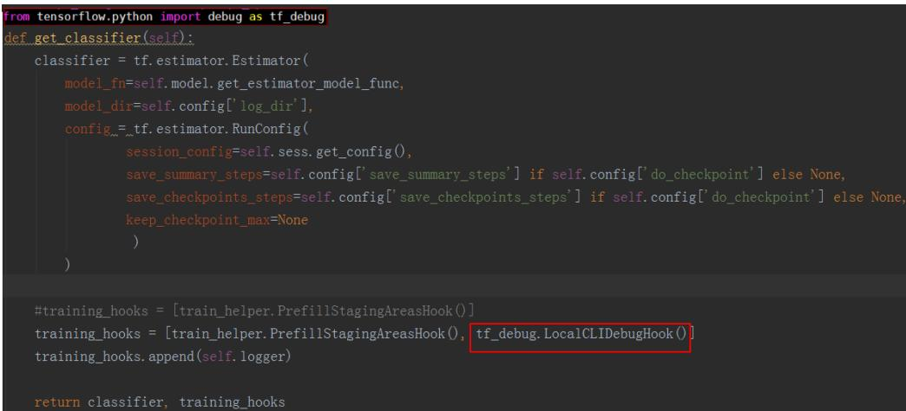  
图 5-1 Estimator 模式

session.run模式： from tensorflow.python import debug as tf_debug sess $=$ tf_debug.LocalCLIDebugWrapperSession(sess, ui_type $\mathrel { \mathop : } \mathbf { - }$ "readline")

如图5-2所示，在run之前设置tfdbg装饰器。

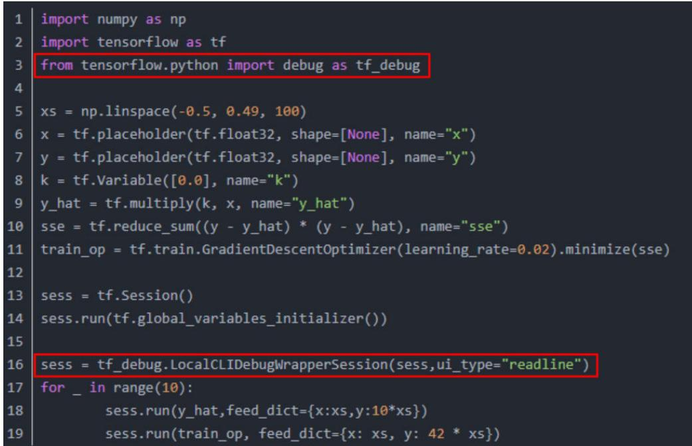  
图 5-2 session.run 模式

步骤2 执行推理脚本。

推理完成后自动进入tfdbg调试命令行交互模式，执行run命令。

步骤3 收集npy文件。

执行run命令完成后，可以在新的命令行窗口通过lt查询已存储的张量，通过pt可以查看已存储的张量内容，可以保存数据为numpy格式文件。

因为tfdbg一次命令只能dump一个tensor，为了自动生成收集所有数据，可以按以下几个步骤操作：

1. 执行lt $>$ tensor name将所有tensor的名称暂存到文件里。   
2. 重新开启一个linux命令窗口，在新的窗口中执行下述命令，用以生成在tfdbg命令 行执行的命令。 timestamp=\$[\$(date +%s%N)/1000] ; cat tensor_name | awk '{print "pt",\$4,\$4}' | awk '{gsub("/", "_", \$3);gsub(":", ".", \$3);print(\$1,\$2,"-n 0 -w "\$3".""'\$timestamp'"".npy")}' $>$ tensor_name_cmd.txt

# 说明

该示例生成符合精度比对需要的npy文件名称格式，存储到tensor_name_cmd.txt文件。其中，tensor_name为自定义tensor列表对应的文件名，timestamp为16位的时间戳。

3. 回到tfdbg命令行窗口，输入run命令后，将上一步生成的所有tensor存储的命令粘贴执行，即可存储所有npy文件。

npy文件默认是以numpy.save()形式存储的，上述命令会将“/”用下划线_替换。

# 说明

如果命令行界面无法粘贴文件内容，可以在tfdbg命令行中输入“mouse off”指令关闭鼠标模式后再进行粘贴。

4. 检查生成的npy文件命名是否符合{op_name}.{output_index}.{timestamp}.npy格式，如图5-3所示。

# 说明

如果因算子名较长，造成按命名规则生成的npy文件名超过255字符而产生文件名异常，这类算子不支持精度比对。因tfdbg自身原因或运行环境原因，可能存在部分生成的npy文件名不符合精度比对要求，请按命名规则手工重命名。如果不符合要求的npy文件较多，请参见11.8 生成npy文件名异常情况批量处理重新生成npy文件。

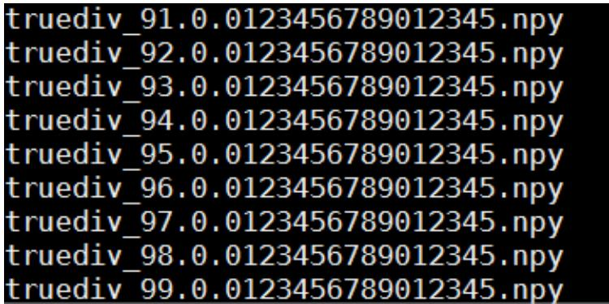  
图 5-3 查询.npy 文件

----结束

# 5.3 准备全网层信息文件

以下介绍通过ATC模型转换工具获取离线模型的操作步骤，更多操作请参见《ATC离线模型编译工具用户指南》。

步骤1 以运行用户登录Ascend-cann-toolkit所在环境。

步骤2 获取原始模型文件并保存在任意目录下。

例如：\$HOME/module/resnet50_tensorflow\*.pb

步骤3 执行ATC模型转换。atc --model=\$HOME/module/resnet50_tensorflow\*.pb --framework=3 --output=\$HOME/module/out/tf_resnet50--soc_versior $\mid =$ <soc_version>

若提示如下信息，则说明模型转换成功。ATC run success

成功执行命令后，在--output参数指定的路径下可查看离线模型（如：tf_resnet50.om）。

步骤4 生成json文件。atc --mode $\varprojlim$ 1 --om $\mid =$ \$HOME/module/out/tf resnet50.om --json $=$ \$HOME/module/out/tf resnet50.json若提示如下信息，则说明转换json文件成功。

ATC run success

成功执行命令后，在--json参数指定的路径下可查看转换后的json文件。

----结束

# 5.4 比对操作和分析

# 说明

本节涉及的.json文件、目录等名称均为举例，请根据实际环境替换。其中，-out指定的结果存放路径，需确保操作用户具有读写权限。

如果执行过程中报“MemoryError”，则表示数据量过大导致了内存溢出，请将NPU的dump数据文件拆分到多个目录后，再逐一进行比对。

当指定的比对数据文件大小超过1GB或.json文件大小超过100MB时，比对过程可能耗时较长，系统提示：'The size (%d) of %s more than the XX, it needs moretime to run.'。

# 前提条件

● 请确保完成3 使用前准备。  
● 根据5.1 总体说明中的场景准备比对文件。

# 操作步骤

步骤1 登录CANN工具安装环境。

步骤2 进入\${INSTALL_DIR}/tools/operator_cmp/compare，\${INSTALL_DIR}请替换为CANN软件安装后文件存储路径。以root用户安装为例，则安装后文件存储路径为：/usr/local/Ascend/cann。

步骤3 执行比对命令。

# 说明

由于dump和npy比对数据文件是由多个文件组成，故下文操作步骤中-m和-g参数须指定数据文件所在的父目录。如：\$HOME/MyApp/resnet50， 其中resnet50文件夹下直接保存比对数据文件。

目录结构示例如下：

root@xxx:\$HOME/MyApp/resnet50# tree

BatchMatMul.bert_encoder_layer_0_attention_self_MatMul_1.24.1614717261785536   
BatchMatMul.bert_encoder_layer_0_attention_self_MatMul.21.1614717261768864   
BatchMatMul.bert_encoder_layer_10_attention_self_MatMul_1.235.1614717263664916

# 仅为示例，此处省略剩余文件名。

python3 msaccucmp.py compare -m \$HOME/MyApp/tf_resnet50/20230815201822/0/ resnet50_tensorflow_1_7/1/0/-g\$HoME/MyApp/resnet50_tensorflow_1_dump/-f\$HOME/module/out/ tf_resnet50/tf_resnet50.json -out \$HOME/result -advisor

# 说明

上述命令仅展示当前场景所需参数的示例，若需要配置更多参数，比如已知可能出现精度问题的范围或因大型网络模型输出结果文件数据量过大，通过配置参数来减少输出结果的数据量，请参见12.2 命令格式说明获取更多参数详细介绍。

● 需要安装pandas 1.3或更高版本依赖，否则无法执行-advisor参数输出专家建议。

表 5-2 整网比对命令行参数说明  

<table><tr><td rowspan=1 colspan=1>参数名</td><td rowspan=1 colspan=1>参数说明</td><td rowspan=1 colspan=1>是否必选</td></tr><tr><td rowspan=1 colspan=1>-m--my_dump_path</td><td rowspan=1 colspan=1>基于昇腾AI处理器运行生成的数据文件所在目录。</td><td rowspan=1 colspan=1>是</td></tr><tr><td rowspan=1 colspan=1>-g--golden_dump_path</td><td rowspan=1 colspan=1>基于GPU/CPU运行生成的原始网络数据文件所在目录。</td><td rowspan=1 colspan=1>是</td></tr><tr><td rowspan=1 colspan=1>-f--fusion_rule_file</td><td rowspan=1 colspan=1>全网层信息文件。通过ATC转换.om模型文件生成的.json文件，文件包含整网算子的映射关系，用于精度比对时算子匹配。</td><td rowspan=1 colspan=1>否</td></tr><tr><td rowspan=1 colspan=1>-out--output</td><td rowspan=1 colspan=1>比对数据结果存放路径，默认为当前路径。不建议配置与当前用户不一致的其它用户目录，避免提权风险。</td><td rowspan=1 colspan=1>否</td></tr><tr><td rowspan=1 colspan=1>-advisor</td><td rowspan=1 colspan=1>在Tensor比对结束后，针对比对结果进行数据分析，给出专家建议。详情请参见10.2比对结果专家建议</td><td rowspan=1 colspan=1>否</td></tr></table>

比对结果如图5-4所示。

<table><tr><td>Index OpType NPUDunp</td><td></td><td></td><td></td><td></td><td></td><td></td><td></td><td></td><td></td><td></td><td></td><td></td><td></td></tr><tr><td></td><td>0 TransDatetrans_Trar float16</td><td>1.98E+13 trans_TransD float16</td><td>trans_TransI[1,1,2</td><td>1</td><td>0</td><td>0</td><td>0</td><td>0(0.277;1.</td><td></td><td>0</td><td>0NaN</td><td>NaN</td><td>Cannot conpare by</td></tr><tr><td>1Data</td><td>Input_1 float16</td><td>1. 98E+13 Input_1 float16</td><td>Input_1:out[1,3,2</td><td>1</td><td>0</td><td>0</td><td>0</td><td>0(1.475;1.</td><td>0</td><td>0NaN</td><td></td><td>NaN</td><td>Cannot conpare by</td></tr><tr><td>2 Conv2D</td><td>conv1convifloat16</td><td>1.98E+13 conv1conv1_rfloat16</td><td>conv1conv1_i[1, 4, 1</td><td>1</td><td>0</td><td>0</td><td>0</td><td>0（1.425;1.</td><td></td><td>0</td><td>0NaN</td><td>NaN</td><td>Cannot conpare by</td></tr><tr><td>3Pooling</td><td>poolires2int8</td><td>1.98E+13 pool1res2a_bint8</td><td>poolires2a_1[1,2,5</td><td>1</td><td>0</td><td>0</td><td>0</td><td>0（-111.702</td><td></td><td>0 0</td><td>0</td><td>0</td><td></td></tr><tr><td>4Data</td><td>res2a_brarint8</td><td>1.98E+13 res2a_branchint8</td><td>res2a_brancl[1,2,5</td><td>1</td><td>0</td><td>0</td><td>0</td><td>0（-110.162</td><td>0</td><td>0</td><td>0</td><td>0</td><td></td></tr><tr><td>5Cast</td><td>res2a_brarint8</td><td>1.98E+13 res2a_branchint8</td><td>res2a_brancl[1,2,5</td><td>1</td><td>0</td><td>0</td><td>0</td><td>0(-116. 967</td><td>0</td><td>0</td><td>0</td><td>0</td><td></td></tr></table>

以上比对结果字段解释请参见12.3 完整比对结果参数说明。

# 步骤4 比对结果分析。

请参见10 比对结果分析。对于比对结果中可能存在部分无法比对或异常情况（例如结果中的NaN），请参见9 比对结果说明。

----结束

# 6 GPU vs NPU（ONNX 离线推理）

总体说明  
准备ONNX模型npy文件  
准备全网层信息文件  
比对操作和分析

# 6.1 总体说明

# 说明

对于该场景需要排查9 比对结果说明。

ONNX场景仅支持非量化的精度比对。需准备的比对数据文件如下表所示。

表 6-1 非量化原始模型 vs 非量化离线模型的比对数据文件要求  

<table><tr><td rowspan=1 colspan=1>文件</td><td rowspan=1 colspan=1>说明</td><td rowspan=1 colspan=1>获取方式</td></tr><tr><td rowspan=1 colspan=1>非量化原始模型的npy文件</td><td rowspan=1 colspan=1>标杆数据</td><td rowspan=1 colspan=1>6.2准备ONNX模型npy文件</td></tr><tr><td rowspan=1 colspan=1>通过ATC转换离线模型文件生成的json文件</td><td rowspan=1 colspan=1>获取算子的映射关系</td><td rowspan=1 colspan=1>6.3准备全网层信息文件</td></tr><tr><td rowspan=1 colspan=1>非量化离线模型在昇腾AI处理器上运行生成的dump数据文件</td><td rowspan=1 colspan=1>待比对数据</td><td rowspan=1 colspan=1>离线推理场景各框架获取NPU环境的dump数据方法一致，请参考：8.3准备离线模型dump数据文件</td></tr></table>

# 6.2 准备 ONNX 模型 npy 文件

# 前提条件

需要确保每个算子节点有名称，否则无法生成正确的文件名。没有名称的算子节点需要先生成名称。● 本参考示例以每个节点只有一个输出为例，多个输出的需要在文件名生成处适配output_index的获取。

# 代码参考示例

本版本不提供ONNX模型npy文件生成功能，请自行安装ONNX环境并提前准备ONNX原始数据npy文件。本文提供的样例代码仅作参考。

为输出符合精度比对要求的npy文件，需在推理结束后的代码中增加dump操作，示例代码如下：

import os   
import onnx   
import onnxruntime   
import numpy as np   
import time

from skl2onnx.helpers.onnx_helper import enumerate_model_node_outputs from skl2onnx.helpers.onnx_helper import select_model_inputs_outputs from skl2onnx.helpers.onnx_helper import save_onnx_model

# 修改模型，增加输出节点   
model_onnx $=$ onnx.load("./resnet50.onnx")   
output $= [ ]$   
for out in enumerate_model_node_outputs(model_onnx): output.append(out)

num_onnx $=$ select_model_inputs_outputs(model_onnx,outputs=output) save_onnx_model(num_onnx, "resnet50_dump.onnx")

# 推理得到输出，本示例中采用随机数作为输入   
input_data $=$ np.random.random((1,3,224,224)).astype(np.float32)   
input_data.tofile("test_data.bin")   
sess $=$ onnxruntime.InferenceSession("resnet50_dump.onnx")   
input_name $=$ sess.get_inputs()[0].name   
output_name $=$ [node.name for node in sess.get_outputs()]   
res $=$ sess.run(output_name, {input_name: input_data})

# 获得输出名称，确保每个算子节点有对应名称 node_name $=$ [node.name for node in model_onnx.graph.node]

# 保存数据   
node_output_num $=$ [len(node.output) for node in model_onnx.graph.node]   
idx $= 0$   
for num, name in zip(node_output_num, node_name): for i in range(num): data $=$ res[idx] file_name $=$ name $^ +$ "." $^ +$ str(i) $^ +$ "." $^ +$ str(round(time.time() \* 1000000)) $^ +$ ".npy" output_dump_path $=$ os.path.join("./onnx_dump/", file_name) np.save(output_dump_path, data.astype(np.float16)) idx $+ = 1$

# 说明

需要根据代码中的output_dump_path参数在当前目录新建对应“onnx_dump”目录或自定义目录。  
npy文件命名格式为{op name}.{output index}.{timestamp}.npy，其中需要确保文件名中的{output_index字段存在值为0，否则无比对结果，原因是精度比对时默认从第一个  
output_index为0的数据开始。

# 6.3 准备全网层信息文件

以下介绍通过ATC模型转换工具获取离线模型的操作步骤，更多操作请参见《ATC离线模型编译工具用户指南》。

步骤1 以运行用户登录Ascend-cann-toolkit所在环境。

步骤2 获取原始模型文件并保存在任意目录下。

例如：resnet50\*.onnx

步骤3 执行ATC模型转换。atc --model=\$HOME/module/resnet50\*.onnx --framewor ${ : = } 5$ --output=\$HOME/module/out/onnx_resnet50--soc_version $| =$ <soc version>

若提示如下信息，则说明模型转换成功。ATC run success

成功执行命令后，在--output参数指定的路径下，可查看离线模型（如：onnx_resnet50.om）。

atc --mode $\mathrel { \mathop : } 1$ --om $\mid =$ \$HOME/module/out/onnx_resnet50.om --json $\mid =$ \$HOME/module/out/onnx_resnet50.json若提示如下信息，则说明转换json文件成功。

ATC run success

成功执行命令后，在--json参数指定的路径下可查看转换后的json文件。

# 6.4 比对操作和分析

# 说明

本节涉及的.json文件、目录等名称均为举例，请根据实际环境替换。其中，-out指定的结果存放路径，需确保操作用户具有读写权限。● 如果执行过程中报“MemoryError”，则表示数据量过大导致了内存溢出，请将NPU的dump数据文件拆分到多个目录后，再逐一进行比对。当指定的比对数据文件大小超过1GB或.json文件大小超过100MB时，比对过程可能耗时较长，系统提示：'The size (%d) of %s more than the XX, it needs moretime to run.'。

# 前提条件

请确保完成3 使用前准备。

根据6.1 总体说明中的场景准备比对文件。

# 操作步骤

本节以非量化昇腾AI处理器运行生成的dump数据与非量化ONNX模型npy文件比对为例进行介绍，下文中参数说明均以该示例介绍，请根据您的实际情况进行替换。

步骤1 登录Ascend-cann-toolkit环境。

步骤2 进入\${INSTALL_DIR}/tools/operator_cmp/compare，\${INSTALL_DIR}请替换为CANN软件安装后文件存储路径。以root用户安装为例，则安装后文件存储路径为：/usr/local/Ascend/cann。

步骤3 执行比对命令。

# 说明

由于dump和npy比对数据文件是由多个文件组成，故下文操作步骤中-m和-g参数须指定数据文件所在的父目录。如：\$HOME/MyApp/resnet50， 其中resnet50文件夹下直接保存比对数据文件。

目录结构示例如下：

root@xxx:\$HOME/MyApp/resnet50# tree

BatchMatMul.bert_encoder_layer_0_attention_self_MatMul_1.24.1614717261785536BatchMatMul.bert_encoder_layer_0_attention_self_MatMul.21.1614717261768864BatchMatMul.bert_encoder_layer_10_attention_self_MatMul_1.235.1614717263664916# 仅为示例，此处省略剩余文件名。

python3 msaccucmp.py compare -m \$HOME/MyApp/npu_dump/20230216155330/0/resnet50/1/0/ -g \$HOME/MyApp/onnx_dump/-f \$HoME/module/out/onnx_resnet50.json-out \$HoME/result-advisor

# 说明

上述命令仅展示当前场景所需参数的示例，若需要配置更多参数，比如已知可能出现精度问题的范围或因大型网络模型输出结果文件数据量过大，通过配置参数来减少输出结果的数据量，请参见12.2 命令格式说明获取更多参数详细介绍。

● 需要安装pandas 1.3或更高版本依赖，否则无法执行-advisor参数输出专家建议。

表 6-2 整网比对命令行参数说明  

<table><tr><td colspan="1" rowspan="1">参数名</td><td colspan="1" rowspan="1">参数说明</td><td colspan="1" rowspan="1">是否必选</td></tr><tr><td colspan="1" rowspan="1">-m!my_dump_path</td><td colspan="1" rowspan="1">基于昇腾AI处理器运行生成的数据文件所在目录。</td><td colspan="1" rowspan="1">是</td></tr><tr><td colspan="1" rowspan="1">-g:-golden_dump_path</td><td colspan="1" rowspan="1">基于GPU/CPU运行生成的原始网络数据文件所在目录。</td><td colspan="1" rowspan="1">是</td></tr><tr><td colspan="1" rowspan="1">-f--fusion_rule_file</td><td colspan="1" rowspan="1">全网层信息文件。通过ATC转换.om模型文件生成的.json文件，文件包含整网算子的映射关系，用于精度比对时算子匹配。</td><td colspan="1" rowspan="1">否</td></tr><tr><td colspan="1" rowspan="1">-out--output</td><td colspan="1" rowspan="1">比对数据结果存放路径，默认为当前路径。不建议配置与当前用户不一致的其它用户目录，避免提权风险。</td><td colspan="1" rowspan="1">否</td></tr><tr><td colspan="1" rowspan="1">-advisor</td><td colspan="1" rowspan="1">在Tensor比对结束后，针对比对结果进行数据分析，给出专家建议。详情请参见10.2比对结果专家建议</td><td colspan="1" rowspan="1">否</td></tr></table>

比对结果如图6-1所示。

图 6-1 比对结果示例  

<table><tr><td colspan="2">Index OpType</td><td></td><td colspan="9"></td></tr><tr><td></td><td>NPUDunp</td><td>O TransDatetrans_Trar float16 1.98E+13 trans_TransD float16</td><td>trans_TransI[1,1,2</td><td>1</td><td>0</td><td>0</td><td>0</td><td>0（0.277;1.</td><td>0 0NaN</td><td>NaN</td><td>Cannot conpare by</td></tr><tr><td>1 Data</td><td>Input_1</td><td>float161.98E+13Input_1 float16</td><td>Input_1:out[1,3,2</td><td>1</td><td>0</td><td>0 0</td><td>0(1.475;1.</td><td>0</td><td>0NaN</td><td>NaN</td><td>Cannot conpare by</td></tr><tr><td></td><td>conviconvifloat16</td><td>1.98E+13 conv1conv1_rfloat16</td><td>conv1conv1_i[1,4,1</td><td>1</td><td>0</td><td>0 0</td><td>0(1.425;1.</td><td>0</td><td>0NaN</td><td></td><td>Cannot conpare by</td></tr><tr><td>2 Conv2D</td><td></td><td></td><td>pool1res2a_1[1,2,5</td><td></td><td>0</td><td>0</td><td></td><td></td><td></td><td>NaN 0</td><td></td></tr><tr><td>3Pooling</td><td>poollres2aint8</td><td>1.98E+13 pool1res2a_bint8</td><td></td><td>1</td><td></td><td>0 0 0</td><td>0(-111.702 0(-110.162</td><td>0</td><td>0</td><td>0</td><td></td></tr><tr><td>4 Data 5 Cast</td><td>res2a_brarint8 res2a_brarint8</td><td>1.98E+13 res2a_branchint8 1.98E+13 res2a_branch int8</td><td>res2a_brancl[1,2,5 res2a_brancl[1,2,5</td><td>1 1</td><td>0 0</td><td>0 0</td><td>0(-116.967</td><td>0 0</td><td>0 0</td><td>0 0 0</td><td>0</td></tr></table>

以上比对结果字段解释请参见12.3 完整比对结果参数说明。

# 步骤4 比对结果分析。

请参见10 比对结果分析。对于比对结果中可能存在部分无法比对或异常情况（例如结果中的NaN），请参见9 比对结果说明。

----结束

# 7 GPU/CPU vs NPU（Caffe 离线推理）

# 总体说明

Caffe模型npy文件准备准备模型文件和量化信息文件比对操作和分析

# 7.1 总体说明

# 说明

对于该场景需要排查9 比对结果说明。Caffe场景支持量化、非量化的精度比对。

非量化场景下，需准备下表中的比对数据文件：

表 7-1 非量化原始模型 vs 非量化离线模型的比对数据文件要求  

<table><tr><td rowspan=1 colspan=1>文件</td><td rowspan=1 colspan=1>说明</td><td rowspan=1 colspan=1>获取方式</td></tr><tr><td rowspan=1 colspan=1>非量化原始模型的npy文件</td><td rowspan=1 colspan=1>标杆数据</td><td rowspan=1 colspan=1>7.2 Caffe模型npy文件准备</td></tr><tr><td rowspan=1 colspan=1>通过ATC转换离线模型文件生成的json文件</td><td rowspan=1 colspan=1>获取算子的映射关系</td><td rowspan=1 colspan=1>全网层信息文件</td></tr><tr><td rowspan=1 colspan=1>非量化离线模型在昇腾AI处理器上运行生成的dump数据文件</td><td rowspan=1 colspan=1>待比对数据</td><td rowspan=1 colspan=1>离线推理场景各框架获取NPU环境的dump数据方法一致，请参考：8.3准备离线模型dump数据文件</td></tr></table>

量化场景下，若需要详细分析量化过程和模型转换阶段的精度问题，可按如下步骤比对：

# 说明

● 量化是指对模型的权重（weight）和数据（activation）进行低比特处理，让最终生成的网络模型更加轻量化，从而达到节省网络模型存储空间、降低传输时延、提高计算效率，达到性能提升与优化的目标。详情请参见《AMCT模型压缩工具用户指南》。

● AMCT对原始框架模型进行量化时，会插入量化和反量化算子，而使用ATC工具进行模型转换过程中，会对插入的量化和反量化算子进行融合，此情况下进行量化后模型dump结果与原始模型dump结果的比对可能不准确。因此如果用户想使用通过AMCT量化后的模型进行精度比对，则需要通过--fusion_switch_file参数关闭部分算子融合功能，并在精度比对后进行8 NPU vs NPU（离线推理），判断融合前后是否存在精度差异。

Caffe的离线推理场景，为了提升性能进行了模型量化，但模型量化后可能存在精度下降的问题。为了提升性能，一定的精度下降是可以接受的，一般一个模型精度下降在1%范围内，但如果误差较大，那么就需要定位原因。引起精度误差较大的原因主要有：

量化过程导致精度下降。  
量化原始模型，经过ATC转换成的量化离线模型在NPU上运行，算子的变化导致精度问题。

根据以上原因，那么要分步骤定位精度问题：

a. 定位量化阶段的精度问题。

执行非量化原始模型（GPU/CPU） vs 量化原始模型（GPU/CPU）。

i. 参见7.2 Caffe模型npy文件准备获取非量化原始模型resnet50.prototxt和resnet50.caffemodel的dump数据文件。

ii. 参见量化原始模型和量化信息文件，获取量化原始模型文件resnet50_deploy_model.prototxt和resnet50_deploy_weights.caffemodel、resnet50_fake_quant_model.prototxt和resnet50_fake_quant_weights.caffemodel以及量化信息文件resnet50_quant.json。

iii. 参见7.2 Caffe模型npy文件准备获取量化原始模型resnet50_fake_quant_model.prototxt和resnet50_fake_quant_weights.caffemodel的dump数据文件。

iv. 参见7.4 比对操作和分析执行非量化原始模型与量化原始模型的精度比对操作。

v. 完成精度比对后首先确认量化模型精度误差多少。一般通过模型的批量数据的TopN的精度确认，例如1万\~10万张图片的精度误差情况，如果在1%，基本上合理，无须定位，如果超过1%甚至达到3%，那么量化导致的精度问题不可忽略。

vi. 检测量化流程设计是否合理。例如选取的量化数据集是否具有代表性，是业务需要的数据集，数据量是否过少，一般10\~100之间为正常。

vii. 若量化阶段精度误差较大，建议对模型首、尾2层进行手动去量化，一般可提升一部分精度。

b. 定位模型转换阶段产生的精度问题，即量化离线模型在NPU上运行时的精度问题。

执行量化原始模型（GPU/CPU） vs 量化离线模型（关闭算子融合功能）（NPU）。

由于ATC工具的模型转换操作默认开启了算子融合功能，故为了排除融合后算子无法直接进行精度比对的因素，模型转换先关闭算子融合功能。

i. 通过关闭算子融合功能执行ATC模型转换获取量化离线模型（关闭算子融合功能）。

atc --model=\$HOME/module/resnet50_deploy_model.prototxt --weight=\$HOME/module/ resnet50_deploy_weights.caffemodel --framework=0--output=\$HoME/module/out/ caffe_resnet50_off--soc_version=<soc_version>--fusion_switch_file=\$HOME/module/ fusion_switch.cfg

# 说明

关闭算子融合功能需要通过--fusion_switch_file参数指定算子融合规则配置文件（如fusion_switch.cfg），并在配置文件中关闭算子融合功能。融合规则配置文件关闭配置如下：

{ "Switch":{ "GraphFusion":{ "ALL":"off" }, "UBFusion":{ "ALL":"off" } }

详细参数解释请参见《ATC离线模型编译工具用户指南》若提示如下信息，则说明模型转换成功。

ATC run success

成功执行命令后，在\$HOME/module/out/caffe_resnet50_off目录下生成离线模型（如：caffe_resnet50.om）。

ii. 生成json文件。atc --mode=1 --om=\$HOME/module/out/caffe_resnet50_off/caffe_resnet50.om --json=\$HOME/data/resnet50.json

iii. 参见8.3 准备离线模型dump数据文件获取量化离线模型caffe_resnet50.om（关闭算子融合功能）的dump数据文件。

iv. 参见7.4 比对操作和分析执行量化原始模型与量化离线模型（关闭算子融合功能）的精度比对操作。

v. 若模型转换阶段精度误差较大，根据比对结果判断是累计误差，还是某个节点误差较大，如果是某一阶段误差较大，您可以获取日志后单击Link联系技术支持。规避方法：建议对该节点手动去量化，重新进行模型量化。如果是累计误差，可以检查是否为量化阶段的误差，由于量化本身存在精度损失，所以如果是量化产生的精度误差，那么可能有大量算子均存在较小的精度误差，可以通过调整量化配置重复量化，直至满足精度要求。

vi. 特殊数据：由于余弦相似度不能完全衡量精度，所以在如上方法还不能解决的情况，可以进行10.5 单算子比对。

c. （可选）参见8 NPU vs NPU（离线推理）的“开启和关闭算子融合功能模型转换的精度比对”场景执行量化离线模型（默认开启算子融合功能）与量化离线模型（关闭算子融合功能）的精度比对操作。

量化场景下，若只需要初步判断非量化原始模型（GPU/CPU）到量化离线模型（NPU）的精度问题，按照下表准备比对数据文件：

表 7-2 非量化原始模型 vs 量化离线模型的比对数据文件要求  

<table><tr><td colspan="1" rowspan="1">文件</td><td colspan="1" rowspan="1">说明</td><td colspan="1" rowspan="1">获取方式</td></tr><tr><td colspan="1" rowspan="1">非量化原始模型的npy文件</td><td colspan="1" rowspan="1">标杆数据</td><td colspan="1" rowspan="1">7.2 Caffe模型npy文件准备</td></tr><tr><td colspan="1" rowspan="1">·通过ATC转换离线模型文件生成的json文件AMCT后的量化信息文件（*.json）二选一</td><td colspan="1" rowspan="1">获取算子的映射关系</td><td colspan="1" rowspan="1">7.3准备模型文件和量化信息文件</td></tr><tr><td colspan="1" rowspan="1">量化离线模型在昇腾AI处理器上运行生成的dump数据文件</td><td colspan="1" rowspan="1">待比对数据</td><td colspan="1" rowspan="1">8.3准备离线模型dump数据文件</td></tr></table>

# 7.2 Caffe 模型 npy 文件准备

# 前提条件

针对量化原始模型获取npy文件，请先参见量化原始模型和量化信息文件获取量化原始模型。

为确保生成符合命名要求的.npy文件，需要对原始的Caffe模型文件去除in-place，生成新的.prototxt模型文件用于生成.npy文件（例如：如果有未去除in-place的A、B、C、D四个融合算子，进行dump数据，输出的结果为D算子的结果，但命名却是A算子开头，就会导致比对时找不到文件）。针对量化场景，需要先在环境上安装AMCT再执行去除in-place命令，AMCT安装方法请参见《AMCT模型压缩工具用户指南》中的“安装工具”。

进入/home/xxx/Ascend/cann/tools/operator_cmp/compare目录，执行命令去除in-place，命令行举例如下：

python3 inplace_layer_process.py -i /home/user/resnet50.prototxt执行命令后，在/home/user目录下生成去除in-place的new_resnet50.prototxt文件。

针对量化场景：为确保精度误差，需要保证执行Caffe模型推理时的预处理数据与Caffe AMCT时的预处理数据一致。

# 生成 npy 文件

本版本不提供Caffe模型numpy数据生成功能，请自行安装Caffe环境并提前准备Caffe原始数据“\*.npy”文件。本文仅提供生成符合精度比对要求的numpy格式Caffe原始数据“\*.npy”文件的样例参考。

# 说明

如何准备原始Caffe模型npy文件，您可以参见论坛发帖算子精度比对工具标杆数据生成环境搭建指导（Caffe $^ +$ TensorFlow）或者自行获取其他方法。该帖仅供参考。

为输出符合精度比对要求的“\*.npy”文件，需在推理结束后的代码中增加dump操作，示例代码如下：

# 读取prototxt文件   
net_param $=$ caffe_pb2.NetParameter()   
with open(self.model_file_path, 'rb') as model_file: google.protobuf.text_format.Parse(model_file.read(), net_param)

# 保存数据为numpy文件

for layer in net_param.layer: name $=$ layer.name.replace("/", "_").replace(".", "_") index $= 0$ for top in layer.top: data $=$ net.blobs[top].data[...] file_name $=$ name $^ +$ "." $^ +$ str(index) $^ +$ "." + str( round(time.time() \* 1000000)) $^ +$ ".npy" output_dump_path $=$ os.path.join(self.output_path, file_name) np.save(output_dump_path, data) print('The dump data of "' $^ +$ layer.name $^ +$ '" has been saved to "' $^ +$ output_dump_path $^ +$ '".') index $+ = 1$

增加上述代码后，运行Caffe模型的应用工程，即可生成符合要求的npy文件。

# 说明

● 需要根据代码中的output_dump_path参数在当前目录新建对应“onnx_dump”目录或自定义目录。npy文件命名格式为{op_name}.{output_index}.{timestamp}.npy，其中需要确保文件名中的{output_index字段存在值为0，否则无比对结果，原因是精度比对时默认从第一个output_index为0的数据开始。

# 7.3 准备模型文件和量化信息文件

全网层信息文件

以下介绍通过ATC模型转换工具获取离线模型的操作步骤，更多操作请参见《ATC离线模型编译工具用户指南》。

步骤1 以运行用户登录Ascend-cann-toolkit所在环境。

步骤2 获取原始模型文件并保存在任意目录下。

例如：resnet50.prototxt和resnet50.caffemodel

步骤3 执行ATC模型转换。 atc --model=\$HOME/module/resnet50.prototxt --weight=\$HOME/module/resnet50.caffemodel -- framework=0 --output=\$HOME/module/out/caffe_resnet50 --soc_version=<soc_version>

若提示如下信息，则说明模型转换成功。ATC run success

成功执行命令后，在--output参数指定的路径下，可查看离线模型（如：resnet50.om）。

步骤4 生成json文件。

atc --mode $\mathrel { \mathop : } = \eta$ --om $=$ \$HOME/module/out/caffe_resnet50/resnet50.om --json $=$ \$HOME/data/resnet50.json若提示如下信息，则说明转换json文件成功。

ATC run success

成功执行命令后，在--json参数指定的路径下可查看转换后的json文件。

----结束

# 量化原始模型和量化信息文件

请参见《AMCT模型压缩工具用户指南》中的“快速入门”获取量化原始模型和量化信息文件。

生成量化原始模型和量化信息文件说明如下：

resnet50_quant.json：量化信息文件，记录了量化模型同原始模型节点的映射关系，用于量化后模型同原始模型精度比对使用。

● resnet50_deploy_model.prototxt：量化后的可在昇腾AI处理器部署的模型文件。

resnet50_deploy_weights.caffemodel：量化后的可在昇腾AI处理器部署的权重文件。

resnet50_fake_quant_model.prototxt：量化后的可在Caffe环境进行精度仿真模型文件。

resnet50_fake_quant_weights.caffemodel：量化后的可在Caffe环境进行精度仿真权重文件。

# 说明

resnet50_deploy_model.prototxt和resnet50_deploy_weights.caffemodel文件可用于进行ATC 模型转换，resnet50_fake_quant_model.prototxt和resnet50_fake_quant_weights.caffemodel 可用于进行Caffe量化原始模型的dump操作。

# 量化离线模型文件

对量化原始模型文件resnet50_deploy_model.prototxt和  
resnet50_deploy_weights.caffemodel执行ATC模型转换，即可获取到量化离线模型文件和量化离线模型文件转换的json文件。

其中，量化原始模型文件从量化原始模型和量化信息文件操作中获取，ATC模型转换可参照全网层信息文件中的操作。

# 7.4 比对操作和分析

# 说明

本节涉及的.json文件、目录等名称均为举例，请根据实际环境替换。其中，-out指定的结果存放路径，需确保操作用户具有读写权限。

如果执行过程中报“MemoryError”，则表示数据量过大导致了内存溢出，请将NPU的dump数据文件拆分到多个目录后，再逐一进行比对。

当指定的比对数据文件大小超过1GB或.json文件大小超过100MB时，比对过程可能耗时较长，系统提示：'The size (%d) of %s more than the XX, it needs moretime to run.'。

使用量化离线模型在昇腾AI处理器上运行生成的dump数据作为待比对数据时，由于量化与反量化算子之间存在影响精度的中间算子，在比对时会与源数据产生较大的精度损失，所以精度比对时会过滤掉中间算子进行比对，此时输出的结果将不包含整网的所有算子。

# 前提条件

请确保完成3 使用前准备。

根据7.1 总体说明中的场景准备比对文件。

# 操作步骤

步骤1 登录CANN工具安装环境。

步骤2 进入\${INSTALL_DIR}/tools/operator_cmp/compare，\${INSTALL_DIR}请替换为CANN软件安装后文件存储路径。以root用户安装为例，则安装后文件存储路径为：/usr/local/Ascend/cann。

步骤3 执行比对命令。

# 说明

由于dump和npy比对数据文件是由多个文件组成，故下文操作步骤中-m和-g参数须指定数据文件所在的父目录。如：\$HOME/MyApp/resnet50， 其中resnet50文件夹下直接保存比对数据文件。

目录结构示例如下：

root@xxx:\$HOME/MyApp/resnet50# tree

BatchMatMul.bert_encoder_layer_0_attention_self_MatMul_1.24.1614717261785536   
BatchMatMul.bert_encoder_layer_0_attention_self_MatMul.21.1614717261768864   
BatchMatMul.bert_encoder_layer_10_attention_self_MatMul_1.235.1614717263664916

# 仅为示例，此处省略剩余文件名。

非量化原始模型 vs 非量化离线模型、非量化原始模型 vs 量化离线模型、量化原  
始模型 vs 量化离线模型  
python3 msaccucmp.py compare -m \$HOME/MyApp mind/resnet50 -g \$HOME/Standard caffe/  
resnet50-f \$HOME/data/resnet50.json-out \$HOME/result-advisor

非量化原始模型 vs 量化原始模型python3 msaccucmp.py compare -m \$HOME/MyApp_mind/resnet50 -g \$HOME/Standard_caffe/resnet50-q \$HOME/data/resnet50_quant.json-out \$HOME/result-advisor

# 说明

上述命令仅展示当前场景所需参数的示例，若需要配置更多参数，比如已知可能出现精度问题的范围或因大型网络模型输出结果文件数据量过大，通过配置参数来减少输出结果的数据量，请参见12.2 命令格式说明获取更多参数详细介绍。

● 需要安装pandas 1.3或更高版本依赖，否则无法执行-advisor参数输出专家建议。

表 7-3 整网比对命令行参数说明  

<table><tr><td colspan="1" rowspan="1">参数名</td><td colspan="1" rowspan="1">参数说明</td><td colspan="1" rowspan="1">是否必选</td></tr><tr><td colspan="1" rowspan="1">-m!-my_dump_path</td><td colspan="1" rowspan="1">基于昇腾AI处理器运行生成的数据文件所在目录。</td><td colspan="1" rowspan="1">是</td></tr><tr><td colspan="1" rowspan="1">-g:-golden_dump_path</td><td colspan="1" rowspan="1">基于GPU/CPU运行生成的原始网络数据文件所在目录。</td><td colspan="1" rowspan="1">是</td></tr><tr><td colspan="1" rowspan="1">-f-fusion_rule_file</td><td colspan="1" rowspan="1">全网层信息文件。通过ATC转换.om模型文件生成的.json文件，文件包含整网算子的映射关系，用于精度比对时算子匹配。Caffe非量化原始模型vs量化离线模型场景时，与-q参数二选一；Caffe非量化原始模型vs量化原始模型场景时，仅使用-q参数。</td><td colspan="1" rowspan="1">否</td></tr><tr><td colspan="1" rowspan="1">-q-quant_fusion_rule_file</td><td colspan="1" rowspan="1">量化信息文件。通过AMCT量化生成的量化信息文件（*.json），文件包含整网量化算子映射关系，用于精度比对时算子匹配。Caffe非量化原始模型vs量化离线模型场景时，与-f参数二选一；Caffe非量化原始模型vs量化原始模型场景时，仅使用本参数。</td><td colspan="1" rowspan="1">否</td></tr><tr><td colspan="1" rowspan="1">-out--output</td><td colspan="1" rowspan="1">比对数据结果存放路径，默认为当前路径。不建议配置与当前用户不一致的其它用户目录，避免提权风险。</td><td colspan="1" rowspan="1">否</td></tr><tr><td colspan="1" rowspan="1">-advisor</td><td colspan="1" rowspan="1">在Tensor比对结束后，针对比对结果进行数据分析，给出专家建议。详情请参见10.2比对结果专家建议</td><td colspan="1" rowspan="1">否</td></tr></table>

比对结果如图7-1所示。

图 7-1 比对结果示例  

<table><tr><td>Index OpType NPUDunp</td><td></td><td></td><td></td><td></td><td></td><td></td><td></td><td></td><td></td><td></td><td></td><td></td><td></td></tr><tr><td></td><td>0 TransDatetrans_Trar float16</td><td>1.98E+13 trans_TransD float16</td><td>trans_TransI[1,1,2</td><td>1</td><td>0</td><td>0</td><td>0</td><td>0(0.277;1.</td><td></td><td>0</td><td>0NaN</td><td>NaN</td><td>Cannot conpare by</td></tr><tr><td>1Data</td><td>Input_1 float16</td><td>1. 98E+13 Input_1 float16</td><td>Input_1:out[1,3,2</td><td>1</td><td>0</td><td>0</td><td>0</td><td>0(1.475;1.</td><td>0</td><td>0NaN</td><td></td><td>NaN</td><td>Cannot conpare by</td></tr><tr><td>2 Conv2D</td><td>conv1convifloat16</td><td>1.98E+13 conv1conv1_rfloat16</td><td>conv1conv1_i[1, 4, 1</td><td>1</td><td>0</td><td>0</td><td>0</td><td>0（1.425;1.</td><td></td><td>0</td><td>0NaN</td><td>NaN</td><td>Cannot conpare by</td></tr><tr><td>3Pooling</td><td>poolires2int8</td><td>1.98E+13 pool1res2a_bint8</td><td>poolires2a_1[1,2,5</td><td>1</td><td>0</td><td>0</td><td>0</td><td>0（-111.702</td><td></td><td>0 0</td><td>0</td><td>0</td><td></td></tr><tr><td>4Data</td><td>res2a_brarint8</td><td>1.98E+13 res2a_branchint8</td><td>res2a_brancl[1,2,5</td><td>1</td><td>0</td><td>0</td><td>0</td><td>0（-110.162</td><td>0</td><td>0</td><td>0</td><td>0</td><td></td></tr><tr><td>5Cast</td><td>res2a_brarint8</td><td>1.98E+13 res2a_branchint8</td><td>res2a_brancl[1,2,5</td><td>1</td><td>0</td><td>0</td><td>0</td><td>0(-116. 967</td><td>0</td><td>0</td><td>0</td><td>0</td><td></td></tr></table>

以上比对结果字段解释请参见12.3 完整比对结果参数说明。

# 步骤4 比对结果分析。

请参见10 比对结果分析。对于比对结果中可能存在部分无法比对或异常情况（例如结果中的NaN），请参见9 比对结果说明。

----结束

# 8 NPU vs NPU（离线推理）

总体说明

准备离线模型文件  
准备离线模型dump数据文件  
比对操作和分析

# 8.1 总体说明

# 说明

● 对于该场景需要排查9 比对结果说明。  
● 本场景仅针对相同芯片之间的比对。  
● NPU vs NPU场景仅支持非量化离线模型 vs 非量化离线模型和量化离线模型 vs 量化离线模型场景的精度比对。

本场景主要包括以下子场景：

版本迭代前后精度比对：用于判断CANN软件版本迭代、模型版本迭代或模型优化前后，模型是否存在精度问题，进行前后两份精度数据的比对。● 开启和关闭算子融合功能模型转换的精度比对：一般情况下，通过ATC工具转换离线模型时，会默认开启算子融合功能。为了判断融合前后的算子精度差异，进行融合前后两份精度数据的比对。

# 版本迭代前后精度比对

对于进行ATC转换后的离线模型，由于CANN软件版本迭代、模型版本迭代或模型进行优化，需要判断迭代、优化后的模型在昇腾AI处理器上运行是否存在精度下降问题。分为非量化 vs 非量化和量化 vs 量化，比对数据文件准备如下。

表 8-1 非量化 vs 非量化的比对数据文件要求  

<table><tr><td rowspan=1 colspan=1>文件</td><td rowspan=1 colspan=1>说明</td><td rowspan=1 colspan=1>获取方式</td></tr><tr><td rowspan=1 colspan=1>非量化离线模型在昇腾AI处理器上运行生成的dump数据文件（版本迭代前）</td><td rowspan=1 colspan=1>标杆数据</td><td rowspan=2 colspan=1>离线推理场景各框架获取NPU环境的dump数据方法一致，请参考：8.3准备离线模型dump数据文件</td></tr><tr><td rowspan=1 colspan=1>非量化离线模型在昇腾AI处理器上运行生成的dump数据文件（版本迭代后）</td><td rowspan=1 colspan=1>待比对数据</td></tr></table>

表 8-2 量化 vs 量化的比对数据文件要求  

<table><tr><td rowspan=1 colspan=1>文件</td><td rowspan=1 colspan=1>说明</td><td rowspan=1 colspan=1>获取方式</td></tr><tr><td rowspan=1 colspan=1>量化离线模型在昇腾AI处理器上运行生成的dump数据文件（版本迭代前）</td><td rowspan=1 colspan=1>标杆数据</td><td rowspan=2 colspan=1>离线推理场景各框架获取NPU环境的dump数据方法一致，请参考：8.3准备离线模型dump数据文件</td></tr><tr><td rowspan=1 colspan=1>量化离线模型在昇腾AI处理器上运行生成的dump数据文件（版本迭代后）</td><td rowspan=1 colspan=1>待比对数据</td></tr></table>

# 开启和关闭算子融合功能模型转换的精度比对

一般情况下，通过ATC工具转换离线模型时，会默认开启算子融合功能。那么需要判断融合前后的算子精度差异，就需要获取：

开启算子融合功能进行ATC转换离线模型，并以转换后的离线模型进行精度数据dump。  
关闭算子融合功能进行ATC转换离线模型，并以转换后的离线模型进行精度数据dump。

最后将以上两份数据进行精度比对。

该场景分为非量化开融合 vs 非量化关融合和量化开融合 vs 量化关融合，比对数据文件准备如下。

表 8-3 非量化开融合 vs 非量化关融合的比对数据文件要求  

<table><tr><td colspan="1" rowspan="1">文件</td><td colspan="1" rowspan="1">说明</td><td colspan="1" rowspan="1">获取方式</td></tr><tr><td colspan="1" rowspan="1">非量化离线模型文件（*.om）（关闭算子融合功能）非量化离线模型文件（*.om）（开启算子融合功能）</td><td colspan="1" rowspan="1">模型文件</td><td colspan="1" rowspan="1">8.2准备离线模型文件</td></tr><tr><td colspan="1" rowspan="1">非量化离线模型在昇腾AI处理器上运行生成的dump数据文件（关闭算子融合功能）</td><td colspan="1" rowspan="1">标杆数据</td><td colspan="1" rowspan="2">离线推理场景各框架获取NPU环境的dump数据方法一致，请参考：8.3准备离线模型dump数据文件</td></tr><tr><td colspan="1" rowspan="1">非量化离线模型在昇腾AI处理器上运行生成的dump数据文件（开启算子融合功能）</td><td colspan="1" rowspan="1">待比对数据</td></tr></table>

表 8-4 量化开融合 vs 量化关融合的比对数据文件要求  

<table><tr><td rowspan=1 colspan=1>文件</td><td rowspan=1 colspan=1>说明</td><td rowspan=1 colspan=1>获取方式</td></tr><tr><td rowspan=1 colspan=1>量化离线模型文件（*.om）（关闭算子融合功能）量化离线模型文件（*.om）（开启算子融合功能）</td><td rowspan=1 colspan=1>模型文件</td><td rowspan=1 colspan=1>8.2准备离线模型文件</td></tr><tr><td rowspan=1 colspan=1>量化离线模型（关闭算子融合功能）在昇腾AI处理器上运行生成的dump数据文件</td><td rowspan=1 colspan=1>标杆数据</td><td rowspan=2 colspan=1>离线推理场景各框架获取NPU环境的dump数据方法一致，请参考：8.3准备离线模型dump数据文件</td></tr><tr><td rowspan=1 colspan=1>量化离线模型（开启算子融合功能）在昇腾AI处理器上运行生成的dump数据文件</td><td rowspan=1 colspan=1>待比对数据</td></tr></table>

# 8.2 准备离线模型文件

# 非量化离线模型文件

以下介绍通过ATC模型转换工具获取离线模型的操作步骤，更多操作请参见《ATC离线模型编译工具用户指南》。

步骤1 以运行用户登录Ascend-cann-toolkit所在环境。

步骤2 获取原始模型文件并保存在任意目录下。

例如：resnet50.prototxt和resnet50.caffemodel

步骤3 开启算子融合功能执行ATC模型转换。atc --model=\$HOME/module/resnet50.prototxt --weight=\$HOME/module/resnet50.caffemodel --framework ${ } = { } O$ --output=\$HOME/module/out/caffe_resnet50_on --soc_version=<soc_version>

# 说明

模型转换时，算子融合功能默认开启，无需配置。

若提示如下信息，则说明模型转换成功。

ATC run success

成功执行命令后，在\$HOME/module/out/目录下生成离线模型（如：caffe_resnet50_on.om）。

# 步骤4 关闭算子融合功能执行ATC模型转换。

atc --model=\$HOME/module/resnet50.prototxt --weight=\$HOME/module/resnet50.caffemodel -- framework ${ } = 0$ --output=\$HOME/module/out/caffe_resnet50_off --soc_version=<soc_version> -- fusion_switch_file \$HOME/module/fusion_switch.cfg

# 说明

关闭算子融合功能需要通过--fusion_switch_file参数指定算子融合规则配置文件（如fusion_switch.cfg），并在配置文件中关闭算子融合功能。融合规则配置文件关闭配置如下：

"Switch":{ "GraphFusion":{ "ALL":"off" }, "UBFusion":{ "ALL":"off" } }   
}

若提示如下信息，则说明模型转换成功。

ATC run success

成功执行命令后，在\$HOME/module/out/目录下生成离线模型（如：caffe_resnet50_off.om）。

----结束

# 量化离线模型文件

以下仅以Caffe模型为例介绍通过AMCT模型压缩工具获取量化信息文件的操作步骤，更多操作请参见《AMCT模型压缩工具用户指南》。

步骤1 参见《AMCT模型压缩工具用户指南》的“安装工具”章节完成工具安装。

步骤2 获取原始模型文件并保存在任意目录下。

例如：resnet50.prototxt和resnet50.caffemodel步骤3 准备模型相匹配的二进制数据集。

1. 切换到amct_caffe/cmd目录，执行如下命令，用于下载校准数据集。

cd data   
mkdir image && cd image   
wget https://obs-9be7.obs.cn-east-2.myhuaweicloud.com/models/amct_acl/classification/calibration.rar   
unrar e calibration.rar

2. 在amct_caffe/cmd目录，执行如下命令将calibration目录下\*.jpg格式数据集转换为bin格式数据集。python3 ./src/process_data.py执行完成后，在data目录会生成新的calibration目录，并在该目录生成calibration.bin格式数据集。

步骤4 执行如下命令进行网络模型的量化操作。

amct_caffe calibration --model=./model/resnet50.prototxt --weight $ .$ ./model/resnet50.caffemodel -- save_path=./results --input_shape "data:1,3,224,224" --data_dir= "./data/calibration" --data_types $=$ "float32"

步骤5 若提示如下信息且无Error日志信息，则说明模型量化成功。

INFO - [AMCT]:[Utils]: The weights_file is saved in \$HOME/xxx/results/   
resnet50_fake_quant_weights.caffemodel   
INFO - [AMCT]:[Utils]: The model_file is saved in \$HOME/xxx/results/resnet50_fake_quant_model.prototxt

量化后生成文件说明如下：

● resnet50_quant.json：量化信息文件，记录了量化模型同原始模型节点的映射关系，用于量化后模型同原始模型精度比对使用。  
● resnet50_deploy_model.prototxt：量化后的可在昇腾AI处理器部署的模型文件。  
● resnet50_deploy_weights.caffemodel：量化后的可在昇腾AI处理器部署的权重文件。  
● resnet50_fake_quant_model.prototxt：量化后的可在Caffe环境进行精度仿真模型文件。  
● resnet50_fake_quant_weights.caffemodel：量化后的可在Caffe环境进行精度仿真权重文件。

步骤6 按照非量化离线模型文件中的ATC操作将量化原始模型文件resnet50_deploy_model.prototxt和resnet50_deploy_weights.caffemodel进行模型转换，即可获取到开启和关闭算子融合功能的量化离线模型文件。

----结束

# 8.3 准备离线模型 dump 数据文件

# 使用前须知

请在dump数据前，完成模型对应的应用工程的编译、运行，确保工程正常。每次推理都会产生dump数据，在循环次数较多时，每次推理产生的dump数据量会相应增加，建议dump数据时仅执行一次推理。对于大模型场景，通常dump数据量庞大且耗时较长，可以通过dump_data开启算子统计功能，根据统计数据识别可能异常的算子，然后仅针对这些可能异常的算子进行dump。● Docker场景下，不支持将容器作为运行环境使用dump功能。提供aclInit()接口和aclmdlSetDump()接口两种接口方式dump数据。aclInit()接口的详细使用方法请参见《应用开发指南 (C&C++)》中的“aclAPI参考（C） $>$ 系统配置 $>$ aclInit” 。aclmdlSetDump()接口的详细使用方法请参见《应用开发指南 $( \pmb { \mathrm { C } } \pmb { \mathrm { \alpha } } \pmb { \mathrm { C } } + +$ )》中的“acl API参考 $>$ 模型管理 $>$ 模型执行 $>$ aclmdlSetDump” 。

# dump 数据

参考以下步骤进行离线模型dump操作：

步骤1 打开aclInit()函数所在的推理应用工程代码文件，查看调用的aclInit()或aclmdlSetDump()函数，获取acl.json文件路径。

如果aclInit()或aclmdlSetDump()初始化为空，则需要修改该函数，补充步骤2创建的acl.json路径。这里的acl.json路径是相对工程编译生成的二进制文件的路径。

步骤2 在查到的目录下修改acl.json文件（如不存在，则需要新建，建议放在工程编译后的out目录下），添加dump配置，格式如下所示。

模型推理场景下，开启dump数据采集：   
"dump":{ "dump_list":[ { "model_name":"ResNet-101"

},{ "model_name":"ResNet-50", "layer":[ "conv1conv1_relu", "res2a_branch2ares2a_branch2a_relu", "res2a_branch1", "pool1" ] } ], "dump_path":"/home/output", "dump_mode":"output", "dump_op_switch":"off", "dump_data":"tensor" }

单算子调用场景下，开启dump数据采集：

"dump":{ "dump_path":"/home/output", "dump_list":[{}],   
"dump_op_switch":"on", "dump_data":"tensor"   
}   
}

表 8-5 acl.json 文件格式说明  

<table><tr><td colspan="1" rowspan="1">配置项</td><td colspan="1" rowspan="1">参数说明</td></tr><tr><td colspan="1" rowspan="1">dump_list</td><td colspan="1" rowspan="1">（必选）待dump数据的整网模型列表。·模型推理场景下，当需要Dump全部算子时，配置为："dump_list":[{0]当需要Dump多个模型或特定算子时，需要结合model_name和layer使用。在单算子调用场景（包括单算子模型执行和单算子API执行）下，dump_list建议配置为："dump_list":[{0]</td></tr><tr><td colspan="1" rowspan="1">model_name</td><td colspan="1" rowspan="1">模型名称，各个模型的model_name值须唯一。·模型加载方式为文件加载时，填入模型文件的名称，不需要带后缀名；也可以配置为ATC模型文件转换后的json文件里的最外层"name"字段对应值。模型加载方式为内存加载时，配置为ATC模型文件转换后的json文件里的最外层"name"字段对应值。</td></tr><tr><td>layer</td><td>IO性能较差时，可能会因为数据量过大而导致执行超 时，因此不建议进行全量dump，请指定算子进行 dump。通过该字段可以指定需要dump的算子名，支持 指定为ATC模型转换后的算子名，也支持指定为转换前 的原始算子名，配置时需注意： ·需按格式配置，每行配置模型中的一个算子名，且每 个算子之间用英文逗号隔开。 用户可以无需设置model_name，此时会默认dump 所有model下的相应算子。如果配置了 model_name，则dump对应model下的相应算子。 若指定的算子其输入涉及data算子，会同时将data算 子信息dump出来；若需dumpdata算子，需要一并 填写data节点算子的后继节点，才能dump出data节</td></tr><tr><td>optype_blacklist</td><td>配置dump数据黑名单，黑名单中的指定类型的算子的 输入或输出数据不会进行数据dump，用户可通过该配 置控制dump的数据量。 该功能仅在执行模型数据dump操作，且dump_level为 op时生效，同时支持和opname_blacklist配合使用。 配置示例： "dump":{ "dump_list":[ { "model_name":"ResNet-50", "optype_blacklist":[ { "name":"conv" "pos":["input0","input1"] } ]</td></tr><tr><td></td><td>} ], "dump_path":"/home/output", "dump_mode":"input",</td></tr><tr><td>意：</td><td>以上示例表示：不对conv算子的inputo数据和input1数 据执行dump操作，conv为算子类型。 optype_blacklist中包括name和pos字段，配置时需注 ·name表示算子类型，支持指定为ATC模型转换后的</td></tr><tr><td></td><td>算子类型，配置为空时该过滤项不生效。 pos表示算子的输入或输出，仅支持配置为inputn或 outputn格式，其中n表示输入输出索引号。配置为 空时该过滤项不生效。 ·optype_blacklist内最多支持配置100个过滤项。 ，如果配置了model_name，则仅对该model下的算子</td></tr><tr><td>opname_blacklist</td><td>配置dump数据黑名单，黑名单中的指定名称的算子的 输入或输出数据不会进行数据dump，用户可通过该配 置控制dump的数据量。 该功能仅在执行模型数据dump操作，且dump_level为 op时生效，同时支持和optype_blacklist配合使用。 配置示例： "dump":{ "dump_list":[ { "model_name":"ResNet-50", "opname_blacklist":[ { "name":"conv" "pos":["input0","input1"] }</td></tr><tr><td></td><td>] } ], "dump_path":"/home/output", "dump_mode":"input",</td></tr><tr><td>意：</td><td>以上示例表示：不对conv算子的inputo数据和input1数 据执行dump操作，conv为算子名称。 opname_blacklist中包括name和pos字段，配置时需注 ·name表示算子名称，支持指定为ATC模型转换后的 算子名称，配置为空时该过滤项不生效。</td></tr><tr><td></td><td>pos表示算子的输入或输出，仅支持配置为inputn或 outputn格式，其中n表示输入输出索引号。配置为 空时该过滤项不生效。 opname_blacklist内最多支持配置100个过滤项。 如果配置了model_name，则仅对该model下的算子 生效。如果不配置model_name，则对所有model下</td></tr><tr><td>配置项 opname_range</td><td>参数说明</td></tr><tr><td rowspan="7"></td><td>配置dump数据范围，对begin到end闭区间内的数据执 行dump操作。 该功能仅在执行模型数据dump操作，且dump_level为</td></tr><tr><td>op时生效。 配置示例： "dump":{ "dump_list":[</td></tr><tr><td>"model_name":"ResNet-50" "opname_range":[{"begin":"conv1","end":"relu1"}, {"begin":"conv2","end":"pol1"}] } ], "dump_mode":"output", "dump_level": "op", "dump_path":"/home/output"</td></tr><tr><td>以上示例表示对conv1到relu1、conv2到pool1闭区间内 的数据执行dump操作，conv1、relu1、conv2、pool1</td></tr><tr><td>表示算子名称。 配置时需注意：</td></tr><tr><td>·model_name不允许为空。 begin和end中的参数表示算子名称，支持指定为ATC</td></tr><tr><td>模型转换后的算子名称。 begin和end不允许为空，且只能配置为非data算 子；若begin和end范围内算子的输入涉及data算</td></tr><tr><td rowspan="4">dump_path</td><td>子，会同时对data算子信息执行dump操作。 （必选）dump数据文件存储到运行环境的目录，该目</td></tr><tr><td>录需要提前创建且确保安装时配置的运行用户具有读写 权限。 支持配置绝对路径或相对路径：</td></tr><tr><td>·绝对路径配置以“/”开头，例如：/home/output。 ·相对路径配置直接以目录名开始，例如：output。</td></tr><tr><td>dump数据模式。 ·input：dump算子的输入数据。 ·output：dump算子的输出数据，默认取值output。</td></tr><tr><td colspan="1" rowspan="1">配置项</td><td colspan="1" rowspan="1">参数说明</td></tr><tr><td colspan="1" rowspan="1">dump_level</td><td colspan="1" rowspan="1">dump数据级别，取值：·op：按算子级别dump数据。·kernel:按kernel级别dump数据。·all：默认值，op和kernel级别的数据都dump。默认配置下，dump数据文件会比较多，例如有一些aclnn开头的dump文件，若用户对dump性能有要求或内存资源有限时，则可以将该参数设置为op级别，以便提升dump性能、精简dump数据文件数量。说明：算子是一个运算逻辑的表示（如加减乘除运算），kernel是运算逻辑真正进行计算处理的实现，需要分配具体的计算设备完成计算。</td></tr><tr><td colspan="1" rowspan="1">dump_op_switch</td><td colspan="1" rowspan="1">单算子调用场景（包括单算子模型执行和单算子API执行）下，是否开启dump数据采集。•on：开启。·off：关闭，默认取值off。</td></tr><tr><td colspan="1" rowspan="1">dump_step</td><td colspan="1" rowspan="1">指定采集哪些迭代的dump数据。推理场景无需配置。不配置该参数，默认所有迭代都会产生dump数据，数据量比较大，建议按需指定迭代。多个迭代用“|”分割，例如：0|5|10；也可以用“-”指定迭代范围，例如：0|3-5|10。配置示例："dump":{"dump_list":[·],"dump_path":"/home/output","dump_mode":"output","dump_op_switch":"of","dump_step": "0|3-5|10"训练场景下，若通过acl.json中的dump_step参数指定采集哪些迭代的dump数据，又同时在GEInitialize接口中配置了ge.exec.dumpStep参数（该参数也用于指定采集哪些迭代的dump数据），则以最后配置的参数为准。GEInitialize接口的详细介绍请参见《图模式开发指南》的“接口参考&gt;GE图引擎接口&gt; Session API&gt; Session&gt; GEInitialize”0</td></tr><tr><td colspan="1" rowspan="1">dump_data</td><td colspan="1" rowspan="1">算子dump内容类型，取值：·tensor:dump算子数据，默认为tensor。stats:dump算子统计数据，结果文件为csv格式，文件中包含算子名称、输入/输出的数据类型、最大值、最小值等。通常dump数据量太大并且耗时长，可以先对算子统计数据进行dump，根据统计数据识别可能异常的算子，然后再dump算子数据。</td></tr><tr><td colspan="1" rowspan="1">dump_stats</td><td colspan="1" rowspan="1">仅Atlas A2训练系列产品/AtlasA2推理系列产品支持该参数，当dump_data=stats时，可通过本参数设置收集统计数据中的哪一类数据，本参数取值如下（若不指定取值，默认采集Max、Min、Avg、Nan、NegativeInf、Positive Inf数据）：·Max：dump算子统计数据中的最大值。·Min：dump算子统计数据中的最小值。·Avg：dump算子统计数据中的平均值。Nan：dump算子统计数据中未定义或不可表示的数值，仅针对浮点类型half、bfloat、float。NegativeInf：dump算子统计数据中的负无穷值，仅针对浮点类型half、bfloat、float。Positive Inf：dump算子统计数据中的正无穷值，仅针对浮点类型half、bfloat、float。·L2norm：dump算子统计数据的L2Norm值。配置示例："dump":{"dump_list":[.],"dump_path":"/home/output","dump_mode":"output","dump_data":"stats","dump_stats":["Max","Min"]}</td></tr></table>

步骤3 运行应用程序，生成dump数据文件，生成的路径及格式说明如下。

模型推理场景下，dump数据落盘路径为：{dump path}/{time}/{device id}/ {model_name}{model_id}{data_index}{dump文件}

单算子调用场景（包括单算子模型执行和单算子API执行）下，dump数据落盘路径为 ： {dump path}/{time}/{device id}/{dump文件}

表 8-6 dump 数据文件路径说明  

<table><tr><td rowspan=1 colspan=1>路径key</td><td rowspan=1 colspan=1>说明</td><td rowspan=1 colspan=1>备注</td></tr><tr><td rowspan=1 colspan=1>dump_path</td><td rowspan=1 colspan=1>acl.json中配置的dump数据文件存储目录。</td><td rowspan=1 colspan=1>dump数据文件命名格式为：{op_type].{op_name}.{task_id}.{stream_id}.{timestamp}</td></tr><tr><td rowspan=1 colspan=1>time</td><td rowspan=1 colspan=1>dump数据文件落盘的时间。</td><td rowspan=1 colspan=1>格式为：YYYYMMDDHHMMSS</td></tr><tr><td rowspan=1 colspan=1>device_id</td><td rowspan=1 colspan=1>设备ID。</td><td rowspan=1 colspan=1></td></tr><tr><td rowspan=1 colspan=1>model_name</td><td rowspan=1 colspan=1>模型名称。</td><td rowspan=1 colspan=1>如果model_name出现了“”   “”   “\”、空格时，转换为下划线表示。</td></tr><tr><td rowspan=1 colspan=1>model_id</td><td rowspan=1 colspan=1>模型ID号。</td><td rowspan=1 colspan=1></td></tr><tr><td rowspan=1 colspan=1>data_index</td><td rowspan=1 colspan=1>针对每个TaskID执行的次数维护一个序号，从0开始计数，该Task每dump一次数据，序号递增1。</td><td rowspan=1 colspan=1></td></tr></table>

# 说明

● dump数据文件如果op_type、op_name出现了“.”、“/”、“\”、空格时，则会转换为下划线表示。

如果文件名称长度超过了OS文件名称长度限制（一般是255个字符），则会将该dump文件重命名为一串随机数字，映射关系可查看同目录下的mapping.csv。

● 在图执行过程中，以下算子不会产生dump数据：

在图执行前，已明确不会在Device侧执行的算子，如条件类算子(if/while/for/case等)、数据类算子(Data/RefData/Const等)、数据流算子(StackPush/StackPop/Concat/Split等)。  
在图优化阶段，被GE标记为不在Device侧执行的算子，这些算子在dump图中的attr的_no_task属性为true。  
图中不会到达最终执行分支的算子。

----结束

# 8.4 比对操作和分析

# 说明

当指定的比对数据文件大小超过1GB或.json文件大小超过100MB时，比对过程可能耗时较长，系统提示：'The size (%d) of $\% s$ more than the XX, it needs more time torun.'。

# 前提条件

请确保完成3 使用前准备。

根据8.1 总体说明中的场景准备比对文件。

# 操作步骤

步骤1 登录CANN工具安装环境。

步骤2 生成json文件。

使用开启算子融合功能的离线模型生成resnet50_on.json文件。  
atc --mode $\varprojlim$ 1 --om=\$HOME/module/out/caffe_resnet50_on.om --json=\$HOME/module/out/caffe_resnet50/resnet50_on.json  
使用关闭算子融合功能的离线模型生成resnet50_off.json文件。  
atc --mode=1 --om=\$HOME/module/out/caffe_resnet50_off.om --json=\$HOME/module/out/caffe_resnet50/resnet50_off.json

# 说明

版本迭代前后精度比对场景跳过此步骤。

步骤3 进入\${INSTALL_DIR}/tools/operator_cmp/compare，\${INSTALL_DIR}请替换为CANN软件安装后文件存储路径。以root用户安装为例，则安装后文件存储路径为：/usr/local/Ascend/cann。

步骤4 执行比对命令。

假设开启和关闭算子融合功能的离线模型在昇腾AI处理器上运行生成dump数据。

数据分别保存在：

● \$HOME/MyApp_mind/resnet50_on● \$HOME/MyApp_mind/resnet50_off

版本迭代前后精度比对场景同样是把两份比对数据保存在不同目录下。

# 说明

由于dump和npy比对数据文件是由多个文件组成，故下文操作步骤中-m和-g参数须指定数据文件所在的父目录。如：\$HOME/MyApp/resnet50， 其中resnet50文件夹下直接保存比对数据文件。

目录结构示例如下：

root@xxx:\$HOME/MyApp/resnet50# tree

BatchMatMul.bert_encoder_layer_0_attention_self_MatMul_1.24.1614717261785536BatchMatMul.bert_encoder_layer_0_attention_self_MatMul.21.1614717261768864BatchMatMul.bert_encoder_layer_10_attention_self_MatMul_1.235.1614717263664916# 仅为示例，此处省略剩余文件名。

# 指定全网层信息文件（即配置-f和-cf参数）

python3 msaccucmp.py compare -m \$HOME/MyApp_mind/resnet50_on -g \$HOME/MyApp_mind/ resnet50_off_-f \$HoME/module/out/caffe_resnet50/resnet50_on.json-cf \$HOME/module/out/ caffe_resnet50/resnet50_of.json -out \$HOME/MyApp_mind/out

# 或

不指定全网层信息文件（即不配置-f和-cf参数）

python3 msaccucmp.py compare -m \$HOME/MyApp_mind/resnet50_on -g \$HOME/MyApp_mind/resnet50_off-out \$HOME/MyApp_mind/out

# 说明

上述命令仅展示当前场景所需参数的示例，若需要配置更多参数，比如已知可能出现精度问题的范围或因大型网络模型输出结果文件数据量过大，通过配置参数来减少输出结果的数据量，请参见12.2 命令格式说明获取更多参数详细介绍。

表 8-7 整网比对命令行参数说明  

<table><tr><td rowspan=1 colspan=1>参数名</td><td rowspan=1 colspan=1>参数说明</td><td rowspan=1 colspan=1>是否必选</td></tr><tr><td rowspan=1 colspan=1>-m--my_dump_path</td><td rowspan=1 colspan=1>开启算子融合功能的离线模型基于昇腾AI处理器运行生成的数据文件所在目录。</td><td rowspan=1 colspan=1>是</td></tr><tr><td rowspan=1 colspan=1>-g--golden_dump_path</td><td rowspan=1 colspan=1>关闭算子融合功能的离线模型基于昇腾AI处理器运行生成的数据文件所在目录。</td><td rowspan=1 colspan=1>是</td></tr><tr><td rowspan=1 colspan=1>-f--fusion_rule_file</td><td rowspan=1 colspan=1>全网层信息文件。使用开启算子融合功能的离线模型通过ATC转换生成的.json文件。版本迭代前后精度比对场景无需配置。</td><td rowspan=1 colspan=1>否</td></tr><tr><td rowspan=1 colspan=1>-cf--close_fusion_rule_file</td><td rowspan=1 colspan=1>全网层信息文件。使用关闭算子融合功能的离线模型通过ATC转换生成的.json文件。版本迭代前后精度比对场景无需配置。</td><td rowspan=1 colspan=1>否</td></tr><tr><td rowspan=1 colspan=1>-out--output</td><td rowspan=1 colspan=1>比对数据结果存放路径，默认为当前路径。不建议配置与当前用户不一致的其它用户目录，避免提权风险。</td><td rowspan=1 colspan=1>否</td></tr></table>

比对结果如图8-1所示。

图 8-1 融合算子精度问题排查比对结果  

<table><tr><td>0Data</td><td></td><td></td><td></td><td>Inputs:outpi[1,224</td><td></td><td>1</td><td>0</td><td></td><td></td><td></td><td>0(144.348;</td><td></td><td></td><td></td><td></td><td></td></tr><tr><td></td><td></td><td>Inputsfloat161.98E+13 Inputs</td><td>float16</td><td></td><td></td><td></td><td>NaN</td><td>NaN</td><td>0 NaN</td><td>0 NaN</td><td>NaN</td><td></td><td>0</td><td>0HaN</td><td>NaN</td><td>[atonic_addr_clea</td></tr><tr><td>1Cast</td><td>atonic_acfloat16</td><td>1.98E+13atonic_addr_float16</td><td></td><td>NaN</td><td>NaN</td><td>NaN</td><td></td><td></td><td>0</td><td></td><td></td><td></td><td>0</td><td>0NaN</td><td>NaN NaN</td><td></td></tr><tr><td>2Cast</td><td>trans_Casfloat16</td><td>1.98E+13*</td><td>float16</td><td>trans_Cast1,224</td><td></td><td></td><td>1</td><td>0</td><td></td><td>0</td><td>0（144.348</td><td></td><td>0</td><td>0NaN</td><td></td><td></td></tr><tr><td>2Cast</td><td>trans_Casint8</td><td>1.98E+13*</td><td>int8</td><td>trans_Cast_1,224NaN</td><td></td><td></td><td>NaN</td><td>NaN</td><td>NaN</td><td>NaN</td><td>NaN</td><td></td><td>0</td><td>0</td><td></td><td>0[trans_Cast_0] Th</td></tr><tr><td></td><td>3TransD:trans_Trint8</td><td>1.98B+13*</td><td>int8</td><td>trans_Transl1,224NaN</td><td></td><td></td><td>NaN</td><td>NaN</td><td>NaN</td><td>NaN</td><td>NaN</td><td></td><td>0</td><td>0</td><td></td><td>0[trans_TransData</td></tr><tr><td></td><td>3 TransD:trans_Traint8</td><td>1.98E+13*</td><td>int8</td><td>trans_Transi[1,1,2NaN</td><td></td><td></td><td>NaN</td><td>NaN</td><td>NaN</td><td>NaN</td><td>NaN</td><td></td><td>0</td><td>0</td><td></td><td>0[trans_TransData</td></tr><tr><td>4aN</td><td>dynanic_cfloat16</td><td>1.98E+13*</td><td>float16</td><td>HaN</td><td>NaN</td><td>NaN</td><td>NaN</td><td>NaN</td><td>NaN</td><td>NaN</td><td>NaN</td><td></td><td>0</td><td>0NaN</td><td>NaN</td><td>[dynanic_const_27</td></tr><tr><td>5NaN</td><td>dynanic_cfloat16</td><td>1.98E+13*</td><td>float16</td><td>NaN</td><td>NaN</td><td>NaN</td><td>NaN</td><td>NaN</td><td>NaN</td><td>NaN</td><td>NaN</td><td></td><td>0</td><td>0NaN</td><td>NaN</td><td>[dynanic_const_27</td></tr><tr><td>6NaN</td><td>dynanic_cint8</td><td>1.98E+13*</td><td>int8</td><td>NaN</td><td>NaN</td><td>NaN</td><td>NaN</td><td>NaN</td><td>NaN</td><td>NaN</td><td>NaN</td><td></td><td>0</td><td>0</td><td></td><td>0[dynanic_const_27</td></tr><tr><td>7NaN</td><td>dynanic_cint8</td><td>1.98B+13*</td><td>int8</td><td>NaN</td><td>NaN</td><td>NaN</td><td>NaN</td><td>NaN</td><td>NaN</td><td>NaN</td><td>NaN</td><td></td><td>0</td><td>0</td><td></td><td>0[dynanic_const_27</td></tr><tr><td>8NaN</td><td>dynanic_cint8</td><td>1.98E+13*</td><td>int8</td><td>NaN</td><td>HaN</td><td>NaN</td><td>NaN</td><td>NaN</td><td>NaN</td><td>NaN</td><td>NaN</td><td></td><td>0</td><td>0</td><td></td><td>0[dynanic_const_27</td></tr></table>

以上比对结果字段解释请参见12.3 完整比对结果参数说明。

其中NPUDump表示开启算子融合功能的离线模型的算子名；GroundTruth表示关闭算子融合功能的离线模型的算子名。

步骤5 比对结果分析。

请参见10 比对结果分析。对于比对结果中可能存在部分无法比对或异常情况（例如结果中的NaN），请参见9 比对结果说明。

----结束

# 9 比对结果说明

本节内容主要说明对于比对结果中可能存在部分无法比对或异常情况（比如结果中的NaN）。

● 对于Caffe、TensorFlow模型，若不是相同模型的数据，但模型中有相同的算子名称，也可以进行比对，但结果数据只显示匹配到的相同算子的比对结果，该场景不进行分析。  
● 如果在图编译过程中，原图的算子发生了融合，导致算子的output在编译后的模型中找不到对应的output时，该算子无法进行比对。  
● 如果在图编译阶段对图做了结构性修改（如stride切分、L1 fusion、L2 fusion）的场景，会造成算子的input或output无法比对。  
● 如果比对数据两边相同算子有dump数据，但算子的Shape不一致（离线模型算子Shape变小）或Format不支持转换，该算子无法进行比对。  
● 量化模型里经过量化处理的算子无法比对，必须是反量化的输出才能比对。例如，量化模型里AscendQuant算子的output无法比对。针对FastRCNN网络场景，ProposalD算子及之后的算子，算子精度不达标属于正常情况，最终结果以FSRDetectionOutput算子的比对结果精度为准。  
● 当模型转换对输入数据做了额外的预处理，造成原始模型的输入与离线模型的data算子输入格式不同时（比如AIPP场景下data输入为YUV），data算子比对结果异常、不具备参考意义。如果比对数据两边相同算子有多个input且input顺序不一致，会导致该算子的input的比对结果不可信。  
● 如果没有关闭对应的融合规则，会使得量化算子与之前的算子进行融合，导致该算子的output的比对结果不可信。

# 10 比对结果分析

比对结果分析指导  
比对结果专家建议  
计算精度评价指标  
npy与npy文件之间的精度比对  
单算子比对

# 10.1 比对结果分析指导

# 说明

● 显示“\*”，表示在NPU侧新增独有的算子；无对应的标准算子，无法进行比对，结果显示为“NaN”。

余弦相似度和KL散度比对结果为NaN，其他算法有比对数据，则表明该算子的待比对或标杆数据为0；KL散度比对结果为Inf，则表明该算子的标杆数据中有一个为0。

1. 针对常见精度问题，通过输出“Advisor”专家建议，快速定位问题算子。

2. 针对专家建议无法覆盖的复杂场景，通过查看整网比对结果中不同的算法指标，根据10.3 计算精度评价指标，定位存在精度问题的算子。

3. 在多次比对或存在模糊问题定界场景中，可以通过配置-r或-s参数，实现任意选定范围内的算子精度比对，尤其针对偏大型网络，可以实现快速定位精度问题，-r或-s参数详细介绍请参见12.2 命令格式说明。

4. 针对存疑的比对结果可以先进行10.4 npy与npy文件之间的精度比对进行精度问题排查。

5. 针对精度差异较大算子，可通过10.5 单算子比对功能进一步分析对应张量的详细精度差异。

6. 针对问题算子，根据具体场景，通过算子本身的修改、算子替换、算子融合等方式进行详细优化。

# 10.2 比对结果专家建议

# 10.2.1 概述

精度比对工具本身只提供自有实现算子在昇腾AI处理器上的运算结果与业界标准算子的运算结果的差异比对功能，输出的比对结果需要用户自行分析并找出问题。对于用户来说，对结果的分析工作也是一大难点。本节提供专家系统工具为用户提供精度比对结果的分析功能，有效减少用户排查问题的时间。

当前支持的分析检测类型有：Float16溢出检测、输入不一致检测、整网一致性检测（整网一致性检测包括：问题节点检测、单点误差检测和一致性检测三个小点）。

# 10.2.2 使用前必读

# 环境准备

需要安装pandas 1.3或更高版本依赖。安装示例：pip3 install pandas==1.3.5。非root用户安装，需要在安装命令后加上--user，例如：pip3 install pandas==1.3.5 --user。

# 约束

本功能不支持以下场景：

● 单算子比对的结果文件分析。  
● 指定了--select或--range参数生成的比对结果文件分析。

# 10.2.3 通过命令行方式分析比对结果

# 命令格式说明

通过命令行方式分析比对结果是基于精度比对的基础上执行-advisor参数功能，完成精度比对之后继续进行专家系统分析并输出结果。

命令行格式如下：

python3 msaccucmp.py compare -m my dump path -g golden dump path -advisor

表 10-1 参数说明  

<table><tr><td rowspan=1 colspan=1>参数名</td><td rowspan=1 colspan=1>参数说明</td></tr><tr><td rowspan=1 colspan=1>-advisor</td><td rowspan=1 colspan=1>在Tensor比对结束后，针对比对结果进行数据分析，给出专家建议。</td></tr><tr><td rowspan=1 colspan=2>注：-overflow_detection参数为Float16溢出检测专家建议提供数据，配置-advisor后会自动打开该参数功能。</td></tr></table>

# 操作步骤

步骤1 登录CANN工具安装环境。

步骤2 生成json文件。atc --mode $\varprojlim$ 1 --om $\mid =$ \$HOME/data/resnet50.om --json $=$ \$HOME/data/resnet50.json

步骤3 进入\${INSTALL_DIR}/tools/operator_cmp/compare，\${INSTALL_DIR}请替换为CANN软件安装后文件存储路径。以root用户安装为例，则安装后文件存储路径为：/usr/local/Ascend/cann。

步骤4 执行比对命令。 python3 msaccucmp.py compare -m \$HOME/MyApp_mind/resnet50 -g \$HOME/Standard_caffe/resnet50 -f \$HOME/data/resnet50.json-out \$HOME/result -advisor

步骤5 执行命令后会进行精度比对，比对完成后，系统将自动进行专家系统分析，并打印输出结果，结果文件命名为advisor_summary.txt，保存路径同样由-out参数确定。输出结果详细介绍请参见10.2.5 输出结果和优化建议。

----结束

# 10.2.4 通过脚本工具方式分析比对结果

专家系统提供“mscmp_advisor.py”脚本工具。功能及安装路径如下：

脚本工具介绍  
表 10-2 脚本工具介绍  

<table><tr><td rowspan=1 colspan=1>脚本名</td><td rowspan=1 colspan=1>功能</td><td rowspan=1 colspan=1>路径</td></tr><tr><td rowspan=1 colspan=1>&quot; mscmp_advisor.py&quot;</td><td rowspan=1 colspan=1>对Tensor比对结果进行专家系统分析，并输出优化建议。</td><td rowspan=1 colspan=1>${INSTALL_DIR}/tools/operator_cmp/compare，${INSTALL_DIR}请替换为CANN软件安装后文件存储路径。以root用户安装为例，则安装后文件存储路径为：/usr/local/Ascend/cann。</td></tr></table>

# 命令格式说明

“mscmp_advisor.py”脚本是直接用比对结果.csv文件进行分析，所以在进行该操作前需要先完成精度比对获取.csv文件。

命令行格式如下：

python3 mscmp_advisor.py -i <input_file> [-input_nodes <node_name>] [-o <out_path>]

表 10-3 参数说明  

<table><tr><td colspan="1" rowspan="1">参数名</td><td colspan="1" rowspan="1">参数说明</td><td colspan="1" rowspan="1">是否必选</td></tr><tr><td colspan="1" rowspan="1">-i--input_file</td><td colspan="1" rowspan="1">指定比对结果.csv文件。例如：$HOME/result/result_*.csv本参数最大支持.csv文件的大小为100M。</td><td colspan="1" rowspan="1">是</td></tr><tr><td colspan="1" rowspan="1">-input_nodes</td><td colspan="1" rowspan="1">指定网络模型的输入节点。多个节点用英文分号（；）隔开。例如："node_name1;node_name2;node_name3"</td><td colspan="1" rowspan="1">否若不配置，则不进行输入检测。</td></tr><tr><td colspan="1" rowspan="1">-0--out_path</td><td colspan="1" rowspan="1">分析结果输出路径。结果文件命名为advisor_summary.txt。不建议配置与当前用户不一致的其它用户目录，避免提权风险。</td><td colspan="1" rowspan="1">否若不配置，不落盘结果文件。</td></tr></table>

# 操作步骤

步骤1 登录CANN工具安装环境。

步骤2 生成json文件。atc --mode=1 --om $\mid =$ \$HOME/data/resnet50.om --json $=$ \$HOME/data/resnet50.json

步骤3 配置环境变量。export PYTHONPATH=\${INSTALL_DIR}/tools/operator_cmp/compare:\$PYTHONPATH

python3 msaccucmp.py compare -m \$HOME/MyApp_mind/resnet50 -g \$HOME/Standard_caffe/resnet50 -f \$HOME/data/resnet50.json-out \$HOME/result -overflow_detection

此处需要配置-overflow_detection参数识别溢出算子。执行比对后输出比对结果文件result_\*.csv 。

步骤5 执行专家系统分析。 python3 mscmp_advisor.py -i \$HOME/result/result_ \*.csv -input_nodes "node_name1;node_name2;node_name3"-o \$HoME/result

步骤6 执行命令后进行专家系统分析并直接打印输出结果。输出结果详细介绍请参见10.2.5输出结果和优化建议。

----结束

# 10.2.5 输出结果和优化建议

# Float16 溢出检测

针对比对数据中数据类型为Float16的数据，进行溢出检测。如果存在溢出数据，输出专家建议。

场景限制：量化原始模型的npy文件（Caffe）与非量化原始模型的npy文件（Caffe）的比对场景不支持溢出检测分析。

# 说明

需在进行精度比对时指定-overflow_detection参数。

# 比对结果：

<table><tr><td rowspan=1 colspan=1>Index</td><td rowspan=1 colspan=2>NPUDunrDataTy</td><td rowspan=1 colspan=1>Groundi</td><td rowspan=1 colspan=1>DataTy</td><td rowspan=1 colspan=1>Tensori</td><td rowspan=1 colspan=1>Shape</td><td rowspan=1 colspan=1>OverFlow</td><td rowspan=1 colspan=1>Cosine</td><td rowspan=1 colspan=1>MaxAbs</td><td rowspan=1 colspan=1>Accumul-</td><td rowspan=1 colspan=2>CompareilReason</td></tr><tr><td rowspan=1 colspan=1>225</td><td rowspan=1 colspan=2>dynamicNaN</td><td rowspan=1 colspan=1>*</td><td rowspan=1 colspan=1>NaN</td><td rowspan=1 colspan=1>NaN</td><td rowspan=1 colspan=1>NaN</td><td rowspan=1 colspan=1>NaN</td><td rowspan=1 colspan=1>NaN</td><td rowspan=1 colspan=1>NaN</td><td rowspan=1 colspan=1>NaN</td><td rowspan=1 colspan=2>[dynamic_const_131</td></tr><tr><td rowspan=1 colspan=1>226</td><td rowspan=1 colspan=2>PartitiorNaN</td><td rowspan=1 colspan=1>ReduceMe</td><td rowspan=1 colspan=1>NaN</td><td rowspan=1 colspan=1>NaN</td><td rowspan=1 colspan=1>NaN</td><td rowspan=1 colspan=1>NaN</td><td rowspan=1 colspan=1>NaN</td><td rowspan=1 colspan=1>NaN</td><td rowspan=1 colspan=1>NaN</td><td rowspan=1 colspan=2>[PartitionedCall_F</td></tr><tr><td rowspan=1 colspan=1>227</td><td rowspan=1 colspan=1>Sub_40</td><td rowspan=1 colspan=1>NaN</td><td rowspan=1 colspan=1>Sub_40</td><td rowspan=1 colspan=1>NaN</td><td rowspan=1 colspan=1>Suh 40:ir</td><td rowspan=1 colspan=1>[64.3136</td><td rowspan=1 colspan=1></td><td rowspan=1 colspan=1>NaN</td><td rowspan=1 colspan=1>NaN</td><td rowspan=1 colspan=1>NaN</td><td rowspan=1 colspan=2>[Sub_40] Thereis</td></tr><tr><td rowspan=1 colspan=1>227</td><td rowspan=1 colspan=1>Sub 40</td><td rowspan=1 colspan=1>NaN</td><td rowspan=1 colspan=1>Sub_40</td><td rowspan=1 colspan=1>NaN</td><td rowspan=1 colspan=1>Sub_40:ir</td><td rowspan=1 colspan=1>[64,1]</td><td rowspan=1 colspan=1>NO</td><td rowspan=1 colspan=1>NaN</td><td rowspan=1 colspan=1>NaN</td><td rowspan=1 colspan=1>NaN</td><td rowspan=1 colspan=2>[Sub_40] Thereis</td></tr><tr><td rowspan=1 colspan=1>227</td><td rowspan=1 colspan=1>Suh 40</td><td rowspan=1 colspan=1>float16</td><td rowspan=1 colspan=1>Sub_40</td><td rowspan=1 colspan=1>float16</td><td rowspan=1 colspan=1>Sub_40:o</td><td rowspan=1 colspan=1>[200704]</td><td rowspan=1 colspan=1>NO</td><td rowspan=1 colspan=1>0.989101</td><td rowspan=1 colspan=1>465</td><td rowspan=1 colspan=1>9398.447</td><td rowspan=1 colspan=1></td><td rowspan=1 colspan=1></td></tr><tr><td rowspan=1 colspan=1>228</td><td rowspan=1 colspan=1>M]41</td><td rowspan=1 colspan=1>float16</td><td rowspan=1 colspan=1>Mul_41</td><td rowspan=1 colspan=1>float16</td><td rowspan=1 colspan=1>Mul_41:ir</td><td rowspan=1 colspan=1>[200704]</td><td rowspan=1 colspan=1>NO</td><td rowspan=1 colspan=1>0.989101</td><td rowspan=1 colspan=1>465</td><td rowspan=1 colspan=1>9398.447</td><td rowspan=1 colspan=1></td><td rowspan=1 colspan=1></td></tr><tr><td rowspan=1 colspan=1>228</td><td rowspan=1 colspan=1>228Mul 41</td><td rowspan=1 colspan=1>float16</td><td rowspan=1 colspan=1>Mul41</td><td rowspan=1 colspan=1>float16</td><td rowspan=1 colspan=1>Mul 41:ir</td><td rowspan=1 colspan=1>[200704]</td><td rowspan=1 colspan=1></td><td rowspan=1 colspan=1>0.989101</td><td rowspan=1 colspan=1>465</td><td rowspan=1 colspan=1>9398.447</td><td rowspan=1 colspan=1></td><td rowspan=1 colspan=1></td></tr><tr><td rowspan=1 colspan=1>228</td><td rowspan=1 colspan=1>228Mul_41</td><td rowspan=1 colspan=1>float16</td><td rowspan=1 colspan=1>Mul_41</td><td rowspan=1 colspan=1>float16</td><td rowspan=1 colspan=1>Mul_41:ou</td><td rowspan=1 colspan=1>[200704]</td><td rowspan=1 colspan=1>YES</td><td rowspan=1 colspan=1>nan</td><td rowspan=1 colspan=1>inf</td><td rowspan=1 colspan=1>nan</td><td rowspan=1 colspan=1></td><td rowspan=1 colspan=1></td></tr><tr><td></td><td></td><td></td><td></td><td></td><td></td><td rowspan=1 colspan=1>NaN</td><td rowspan=1 colspan=1>NaN</td><td rowspan=1 colspan=1>NaN</td><td rowspan=1 colspan=1>NaN</td><td rowspan=1 colspan=1>NaN</td><td rowspan=1 colspan=1>Partiti</td><td rowspan=1 colspan=1>nedCall</td></tr><tr><td rowspan=1 colspan=1>230</td><td rowspan=1 colspan=1>Partitio</td><td rowspan=1 colspan=1>NaN</td><td rowspan=1 colspan=2>ReduceMeaNaN</td><td rowspan=1 colspan=1>NaN</td><td rowspan=1 colspan=1>NaN</td><td rowspan=1 colspan=1>NaN</td><td rowspan=1 colspan=1>NaN</td><td rowspan=1 colspan=1>NaN</td><td rowspan=1 colspan=1>NaN</td><td rowspan=1 colspan=1>[Partiti</td><td rowspan=1 colspan=1>pedCall</td></tr><tr><td rowspan=1 colspan=1>231</td><td rowspan=1 colspan=1>Mul_44</td><td rowspan=1 colspan=1>NaN</td><td rowspan=1 colspan=1>Mul_44</td><td rowspan=1 colspan=1>NaN</td><td rowspan=1 colspan=1>Mu]44:ir</td><td rowspan=1 colspan=1>[64.1]</td><td rowspan=1 colspan=1>NO</td><td rowspan=1 colspan=1>NaN</td><td rowspan=1 colspan=1>NaN</td><td rowspan=1 colspan=1>NaN</td><td rowspan=1 colspan=2>[Mul_44] Thereis</td></tr><tr><td rowspan=1 colspan=1>231</td><td rowspan=1 colspan=1>Mul_44</td><td rowspan=1 colspan=1>NaN</td><td rowspan=1 colspan=1>Mul_44</td><td rowspan=1 colspan=1>NaN</td><td rowspan=1 colspan=1>Mu]44:in</td><td rowspan=1 colspan=1>[64.1]</td><td rowspan=1 colspan=1>NO</td><td rowspan=1 colspan=1>NaN</td><td rowspan=1 colspan=1>NaN</td><td rowspan=1 colspan=1>NaN</td><td rowspan=1 colspan=2>[Mul_44] Thereis</td></tr><tr><td rowspan=1 colspan=1>231</td><td rowspan=1 colspan=1>Mul_44</td><td rowspan=1 colspan=1>float16</td><td rowspan=1 colspan=1>Mul_44</td><td rowspan=1 colspan=1>float16</td><td rowspan=1 colspan=1>Mul_44:o</td><td rowspan=1 colspan=1>[64]</td><td rowspan=1 colspan=1>NO</td><td rowspan=1 colspan=1>0.715331</td><td rowspan=1 colspan=1>0.984374</td><td rowspan=1 colspan=1>31752515</td><td rowspan=1 colspan=2></td></tr><tr><td rowspan=1 colspan=1>232</td><td rowspan=1 colspan=1>Sub_45AbsNaN</td><td rowspan=1 colspan=1>NaN</td><td rowspan=1 colspan=1>Suh45A</td><td rowspan=1 colspan=1>NaN</td><td rowspan=1 colspan=1>Sub_45Abs</td><td rowspan=1 colspan=1>[64,1]</td><td rowspan=1 colspan=1>NO</td><td rowspan=1 colspan=1>NaN</td><td rowspan=1 colspan=1>NaN</td><td rowspan=1 colspan=1>NaN</td><td rowspan=1 colspan=2>[Sub_45Abs_46] The</td></tr><tr><td rowspan=1 colspan=1>232</td><td rowspan=1 colspan=1>Sub.454h</td><td rowspan=1 colspan=1>float16</td><td rowspan=1 colspan=1>Sub.45 A1</td><td rowspan=1 colspan=1>float16</td><td rowspan=1 colspan=1>Sub_45Abs</td><td rowspan=1 colspan=1>[64]</td><td rowspan=1 colspan=1>NO</td><td rowspan=1 colspan=1>0.715331</td><td rowspan=1 colspan=1>0.984374</td><td rowspan=1 colspan=1>31752515</td><td rowspan=1 colspan=1></td><td rowspan=1 colspan=1></td></tr><tr><td rowspan=1 colspan=1></td><td rowspan=1 colspan=1>Suh.45Ah</td><td rowspan=1 colspan=1>float16</td><td rowspan=1 colspan=2>Sub_45,Atfloat16</td><td rowspan=1 colspan=1>Sub 45Ahs</td><td rowspan=1 colspan=1>[64]</td><td rowspan=1 colspan=1>NO</td><td rowspan=1 colspan=1>nan</td><td rowspan=1 colspan=1>inf</td><td rowspan=1 colspan=1>nan</td><td rowspan=1 colspan=1></td><td rowspan=1 colspan=1></td></tr><tr><td rowspan=1 colspan=1></td><td rowspan=1 colspan=1>233Conv_77</td><td rowspan=1 colspan=1>float16</td><td rowspan=1 colspan=2>Conv_77,Efloat16</td><td rowspan=1 colspan=2>Conv_77:i[1,64,56,NO</td><td rowspan=1 colspan=1></td><td rowspan=1 colspan=1>1</td><td rowspan=1 colspan=1>0.125</td><td rowspan=1 colspan=1>982.1871</td><td rowspan=1 colspan=1></td><td rowspan=1 colspan=1></td></tr></table>

算子ID为228的数据，存在Float16数据溢出。

# 专家系统分析结果：

Detection Type: FP16 overflow

Operator Index: 228

Expert Advice: Float16 data overflow occurs. Rectify the fault and perform comparison again.

检测类型：Float16溢出检测

Operator Index：228

专家建议：存在Float16数据溢出，请修正溢出问题，再进行比对。

# 输入不一致检测

针对整网的输入数据进行检测，主要判断整网两批待比对数据的输入data是否一致。  
如果存在不一致问题（余弦相似度<0.99），输出专家建议。

比对结果：  

<table><tr><td rowspan=1 colspan=1>Index</td><td rowspan=1 colspan=1>NPUDumpDataType</td><td rowspan=1 colspan=1>GroundTr</td><td rowspan=1 colspan=1>DataType</td><td rowspan=1 colspan=1>TensorInc</td><td rowspan=1 colspan=1>Shape</td><td rowspan=1 colspan=1>CosineSinilarity</td><td rowspan=1 colspan=1>MaxAbsol</td><td rowspan=1 colspan=1>Accumulat</td><td rowspan=1 colspan=1>CompareF:</td><td rowspan=1 colspan=1>ilReason</td><td rowspan=1 colspan=1></td></tr><tr><td rowspan=1 colspan=1></td><td rowspan=1 colspan=1>0Input_1float16</td><td rowspan=1 colspan=1>Input_1</td><td rowspan=1 colspan=1>float32</td><td rowspan=1 colspan=1>Input 1:</td><td rowspan=1 colspan=1>[1,3,224</td><td rowspan=1 colspan=1>0.1</td><td rowspan=1 colspan=1>10</td><td rowspan=1 colspan=1>10</td><td rowspan=1 colspan=1></td><td rowspan=1 colspan=1></td><td rowspan=1 colspan=1></td></tr><tr><td rowspan=1 colspan=1></td><td rowspan=1 colspan=1>1trans_Trafloat16</td><td rowspan=1 colspan=1>*</td><td rowspan=1 colspan=1>float32</td><td rowspan=1 colspan=1>trans Tra</td><td rowspan=1 colspan=1>[1.3.224</td><td rowspan=1 colspan=1>1</td><td rowspan=1 colspan=1>0</td><td rowspan=1 colspan=1>0</td><td rowspan=1 colspan=1></td><td rowspan=1 colspan=1></td><td rowspan=1 colspan=1></td></tr><tr><td rowspan=1 colspan=2>1trans_Trafloat16</td><td rowspan=1 colspan=1>*</td><td rowspan=1 colspan=1>float32</td><td rowspan=1 colspan=1>trans Trz</td><td rowspan=1 colspan=1>[1.3.224</td><td rowspan=1 colspan=1>1</td><td rowspan=1 colspan=1>0</td><td rowspan=1 colspan=1>0</td><td rowspan=1 colspan=1></td><td rowspan=1 colspan=1></td><td rowspan=1 colspan=1></td></tr><tr><td rowspan=1 colspan=2>2dynamic_cNaN</td><td rowspan=1 colspan=1>*</td><td rowspan=1 colspan=1>NaN</td><td rowspan=1 colspan=1>NaN</td><td rowspan=1 colspan=1>NaN</td><td rowspan=1 colspan=1>NaN</td><td rowspan=1 colspan=1>NaN</td><td rowspan=1 colspan=1>NaN</td><td rowspan=1 colspan=1>[dmanic</td><td rowspan=1 colspan=2>copst 122511</td></tr><tr><td rowspan=1 colspan=2>3dynamic_cNaN</td><td rowspan=1 colspan=1>*</td><td rowspan=1 colspan=1>NaN</td><td rowspan=1 colspan=1>NaN</td><td rowspan=1 colspan=1>NaN</td><td rowspan=1 colspan=1>NaN</td><td rowspan=1 colspan=1>NaN</td><td rowspan=1 colspan=1>NaN</td><td rowspan=1 colspan=1>[dmanic</td><td rowspan=1 colspan=2>const 122511</td></tr><tr><td rowspan=1 colspan=2>4dynamic_NaN</td><td rowspan=1 colspan=1>*</td><td rowspan=1 colspan=1>NaN</td><td rowspan=1 colspan=1>NaN</td><td rowspan=1 colspan=1>NaN</td><td rowspan=1 colspan=1>NaN</td><td rowspan=1 colspan=1>NaN</td><td rowspan=1 colspan=1>NaN</td><td rowspan=1 colspan=1>[dmanic</td><td rowspan=1 colspan=2>const 122511</td></tr><tr><td rowspan=1 colspan=2>5dynamic_cNaN</td><td rowspan=1 colspan=1>*</td><td rowspan=1 colspan=1>NaN</td><td rowspan=1 colspan=1>NaN</td><td rowspan=1 colspan=1>NaN</td><td rowspan=1 colspan=1>NaN</td><td rowspan=1 colspan=1>NaN</td><td rowspan=1 colspan=1>NaN</td><td rowspan=1 colspan=3>[dynamic_const_122511.</td></tr><tr><td></td><td></td><td></td><td></td><td></td><td></td><td></td><td></td><td></td><td rowspan=1 colspan=3>dynamic_const_122511</td></tr></table>

算子ID为0的数据，输入数据为Input_1，其余弦相似度小于0.99，因此认为此次比对，输入或数据预处理存在问题。

# 专家系统分析结果：

Detection Type: Input inconsistent

Operator Index: 0

Expert Advice: The input data of NPUDump is inconsistent with that of GroundTruth. Use the same data or check the data preprocessing process.

检测类型：输入不一致检测

Operator Index：0

专家建议：NPUDump和GroundTruth的输入数据不一致，请使用相同数据或者检查数据预处理流程。

# 整网一致性检测（问题节点检测）

判断整网比对结果中，是否某层小于阈值，该层后续数据均小于阈值或最后一层小于阈值（余弦相似度 ${ < } 0 . 9 9$ ），输出量化误差修正建议。

# 比对结果：

<table><tr><td rowspan=1 colspan=1>Index</td><td rowspan=1 colspan=1>NPUDumr</td><td rowspan=1 colspan=1>DataTyr-</td><td rowspan=1 colspan=1>Groundi-</td><td rowspan=1 colspan=1>DataTyn</td><td></td><td rowspan=1 colspan=1>Shape</td><td rowspan=1 colspan=1>OverFlow</td><td rowspan=1 colspan=1>Cosines</td><td rowspan=1 colspan=1>MaxAbs</td><td rowspan=1 colspan=1>Accumu]</td><td rowspan=1 colspan=1>Compare-</td><td rowspan=1 colspan=1>ilReason</td></tr><tr><td rowspan=1 colspan=1>1174</td><td rowspan=1 colspan=1>Mul 2452</td><td rowspan=1 colspan=1>NaN</td><td rowspan=1 colspan=1>Mul_2452NaN</td><td rowspan=1 colspan=1>NaN</td><td rowspan=1 colspan=1>Mul 2452:</td><td rowspan=1 colspan=1>[64,1]</td><td rowspan=1 colspan=1>NO</td><td rowspan=1 colspan=1>NaN</td><td rowspan=1 colspan=1>NaN</td><td rowspan=1 colspan=1>NaN</td><td rowspan=1 colspan=1>[Mul 245</td><td rowspan=1 colspan=1>]There</td></tr><tr><td rowspan=1 colspan=1>1174</td><td rowspan=1 colspan=1>Mul 2452</td><td rowspan=1 colspan=1>float16</td><td rowspan=1 colspan=1>Mul 2452</td><td rowspan=1 colspan=1>float16</td><td rowspan=1 colspan=1>Mu]2452:</td><td rowspan=1 colspan=1>[64]</td><td rowspan=1 colspan=1>NO</td><td rowspan=1 colspan=1>0.416427</td><td rowspan=1 colspan=1>5292</td><td rowspan=1 colspan=1>2.6E+10</td><td rowspan=1 colspan=1></td><td rowspan=1 colspan=1></td></tr><tr><td rowspan=1 colspan=1>1175</td><td rowspan=1 colspan=1>Sub 2453</td><td rowspan=1 colspan=1>NaN</td><td rowspan=1 colspan=1>Sub_2453,NaN</td><td rowspan=1 colspan=1>NaN</td><td rowspan=1 colspan=1>Sub 2453A</td><td rowspan=1 colspan=1>[64,1]</td><td rowspan=1 colspan=1>NO</td><td rowspan=1 colspan=1>NaN</td><td rowspan=1 colspan=1>NaN</td><td rowspan=1 colspan=1>NaN</td><td rowspan=1 colspan=1>[Sub 245</td><td rowspan=1 colspan=1>Abs 2454</td></tr><tr><td rowspan=1 colspan=1>1175</td><td rowspan=1 colspan=1>Sub 2453</td><td rowspan=1 colspan=1>float16</td><td rowspan=1 colspan=1>Sub 2453</td><td rowspan=1 colspan=1>float16</td><td rowspan=1 colspan=1>Suh 2453A</td><td rowspan=1 colspan=1>[64]</td><td rowspan=1 colspan=1>NO</td><td rowspan=1 colspan=1>0. 416427</td><td rowspan=1 colspan=1>5292</td><td rowspan=1 colspan=1>2.6E+10</td><td rowspan=1 colspan=1></td><td rowspan=1 colspan=1></td></tr><tr><td rowspan=1 colspan=1>1175</td><td rowspan=1 colspan=1>Sub 2453</td><td rowspan=1 colspan=1>float16</td><td rowspan=1 colspan=1>Sub 2453.</td><td rowspan=1 colspan=1>float16</td><td rowspan=1 colspan=1>Sub 2453A</td><td rowspan=1 colspan=1>[64]</td><td rowspan=1 colspan=1>NO</td><td rowspan=1 colspan=1>nan</td><td rowspan=1 colspan=1>inf</td><td rowspan=1 colspan=1>nan</td><td rowspan=1 colspan=1></td><td rowspan=1 colspan=1></td></tr><tr><td rowspan=1 colspan=1>1176</td><td rowspan=1 colspan=1>Mul 2456</td><td rowspan=1 colspan=1>float16</td><td rowspan=1 colspan=1>Mul 2456</td><td rowspan=1 colspan=1>float16</td><td rowspan=1 colspan=1>Mul_2456:[64]</td><td rowspan=1 colspan=1>[64]</td><td rowspan=1 colspan=1>NO</td><td rowspan=1 colspan=1>nan</td><td rowspan=1 colspan=1>inf</td><td rowspan=1 colspan=1>nan</td><td rowspan=1 colspan=1></td><td rowspan=1 colspan=1></td></tr><tr><td rowspan=1 colspan=1>1176</td><td rowspan=1 colspan=1>Mul 2456</td><td rowspan=1 colspan=1>NaN</td><td rowspan=1 colspan=1>Mul 2456</td><td rowspan=1 colspan=1>NaN</td><td rowspan=1 colspan=1>Mul_2456:[]</td><td rowspan=1 colspan=1></td><td rowspan=1 colspan=1>NO</td><td rowspan=1 colspan=1>NaN</td><td rowspan=1 colspan=1>NaN</td><td rowspan=1 colspan=1>NaN</td><td rowspan=1 colspan=1>[Mul 245</td><td rowspan=1 colspan=1>]Therei</td></tr><tr><td rowspan=1 colspan=1>1176</td><td rowspan=1 colspan=1>Mul 2456</td><td rowspan=1 colspan=1>float16</td><td rowspan=1 colspan=1>Mul_2456</td><td rowspan=1 colspan=1>float16</td><td rowspan=1 colspan=1>Mul2456:</td><td rowspan=1 colspan=1>[64]</td><td rowspan=1 colspan=1>YES</td><td rowspan=1 colspan=1>nan</td><td rowspan=1 colspan=1>inf</td><td rowspan=1 colspan=1>nan</td><td rowspan=1 colspan=1></td><td rowspan=1 colspan=1></td></tr><tr><td rowspan=1 colspan=1>1177</td><td rowspan=1 colspan=1>Div 2458</td><td rowspan=1 colspan=1>float16</td><td rowspan=1 colspan=1>Div 2458.</td><td rowspan=1 colspan=1>float16</td><td rowspan=1 colspan=1>Div 24589</td><td rowspan=1 colspan=1>[64]</td><td rowspan=1 colspan=1>YES</td><td rowspan=1 colspan=1>nan</td><td rowspan=1 colspan=1>inf</td><td rowspan=1 colspan=1>nan</td><td rowspan=1 colspan=1></td><td rowspan=1 colspan=1></td></tr><tr><td rowspan=1 colspan=1>1177</td><td rowspan=1 colspan=1>Div 24589</td><td rowspan=1 colspan=1>NaN</td><td rowspan=1 colspan=1>Div 2458.</td><td rowspan=1 colspan=1>NaN</td><td rowspan=1 colspan=1>Div 2458S</td><td rowspan=1 colspan=1></td><td rowspan=1 colspan=1>NO</td><td rowspan=1 colspan=1>NaN</td><td rowspan=1 colspan=1>NaN</td><td rowspan=1 colspan=1>NaN</td><td rowspan=1 colspan=1>[Div 2458</td><td rowspan=1 colspan=1>Sqrt 2459</td></tr><tr><td rowspan=1 colspan=1>1177</td><td rowspan=1 colspan=1>Div 24589</td><td rowspan=1 colspan=1>float16</td><td rowspan=1 colspan=1>Div 2458.</td><td rowspan=1 colspan=1>float16</td><td rowspan=1 colspan=1>Div 2458S</td><td rowspan=1 colspan=1>[64]</td><td rowspan=1 colspan=1>NO</td><td rowspan=1 colspan=1>0.950473</td><td rowspan=1 colspan=1>37467.09</td><td rowspan=1 colspan=1>63.86507</td><td rowspan=1 colspan=1></td><td rowspan=1 colspan=1></td></tr><tr><td rowspan=1 colspan=1>1178</td><td rowspan=1 colspan=1>Add 24611</td><td rowspan=1 colspan=1>float16</td><td rowspan=1 colspan=1>Add 2461.</td><td rowspan=1 colspan=1>float16</td><td rowspan=1 colspan=1>Add 24611</td><td rowspan=1 colspan=1>[64]</td><td rowspan=1 colspan=1>NO</td><td rowspan=1 colspan=1>0.950473</td><td rowspan=1 colspan=1>37467.09</td><td rowspan=1 colspan=1>63.86507</td><td rowspan=1 colspan=1></td><td rowspan=1 colspan=1></td></tr><tr><td rowspan=1 colspan=1>1178</td><td rowspan=1 colspan=1>Add 24611</td><td rowspan=1 colspan=1>NaN</td><td rowspan=1 colspan=1>Add 2461</td><td rowspan=1 colspan=1>NaN</td><td rowspan=1 colspan=1>Add_2461[]</td><td rowspan=1 colspan=1></td><td rowspan=1 colspan=1>NO</td><td rowspan=1 colspan=1>NaN</td><td rowspan=1 colspan=1>NaN</td><td rowspan=1 colspan=1>NaN</td><td rowspan=1 colspan=1>[Add 2461</td><td rowspan=1 colspan=1>Div 2462</td></tr><tr><td rowspan=1 colspan=1>1178</td><td rowspan=1 colspan=1>Add 24611</td><td rowspan=1 colspan=1>float16</td><td rowspan=1 colspan=1>Add_2461,</td><td rowspan=1 colspan=1>,float16</td><td rowspan=1 colspan=1>Add 24611</td><td rowspan=1 colspan=1>3136]</td><td rowspan=1 colspan=1>NO</td><td rowspan=1 colspan=1>nan</td><td rowspan=1 colspan=1>inf</td><td rowspan=1 colspan=1>nan</td><td rowspan=1 colspan=1></td><td rowspan=1 colspan=1></td></tr><tr><td rowspan=1 colspan=1>1178</td><td rowspan=1 colspan=1>Add 24611</td><td rowspan=1 colspan=1>float16</td><td rowspan=1 colspan=1>Add 2461.</td><td rowspan=1 colspan=1>float16</td><td rowspan=1 colspan=1>Add 24611</td><td rowspan=1 colspan=1>3136]</td><td rowspan=1 colspan=1>NO</td><td rowspan=1 colspan=1>0. 696134</td><td rowspan=1 colspan=1>976.2578</td><td rowspan=1 colspan=1>1535509</td><td rowspan=1 colspan=1></td><td rowspan=1 colspan=1></td></tr><tr><td rowspan=1 colspan=1>1179</td><td rowspan=1 colspan=1>Mu]2468</td><td rowspan=1 colspan=1>float16</td><td rowspan=1 colspan=1>Mul2468</td><td rowspan=1 colspan=1>float16</td><td rowspan=1 colspan=1>Mul_2468A[3136]</td><td rowspan=1 colspan=1>3136]</td><td rowspan=1 colspan=1>NO</td><td rowspan=1 colspan=1>0.696134</td><td rowspan=1 colspan=1>976.2578</td><td rowspan=1 colspan=1>1535509</td><td rowspan=1 colspan=1></td><td rowspan=1 colspan=1></td></tr><tr><td rowspan=1 colspan=1>1179</td><td rowspan=1 colspan=1>Mul 2468</td><td rowspan=1 colspan=1>NaN</td><td rowspan=1 colspan=1>Mul 2468.</td><td rowspan=1 colspan=1>NaN</td><td rowspan=1 colspan=1>Mul 2468A</td><td rowspan=1 colspan=1>1.64.1.</td><td rowspan=1 colspan=1></td><td rowspan=1 colspan=1>NaN</td><td rowspan=1 colspan=1>NaN</td><td rowspan=1 colspan=1>NaN</td><td rowspan=1 colspan=2>[Mul_2468Add_2469]</td></tr><tr><td rowspan=1 colspan=1>1179</td><td rowspan=1 colspan=1>]2468</td><td rowspan=1 colspan=1>NaN</td><td rowspan=1 colspan=1>Mu]2468</td><td rowspan=1 colspan=1>NaN</td><td rowspan=1 colspan=1>Mu]2468A</td><td rowspan=1 colspan=1>1.64.1.</td><td rowspan=1 colspan=1></td><td rowspan=1 colspan=1>NaN</td><td rowspan=1 colspan=1>NaN</td><td rowspan=1 colspan=1>NaN</td><td rowspan=1 colspan=1>[M]2468</td><td rowspan=1 colspan=1>Add.2469</td></tr><tr><td rowspan=1 colspan=1>1179</td><td rowspan=1 colspan=1>Mu]2468</td><td rowspan=1 colspan=1>float16</td><td rowspan=1 colspan=1>Mu]2468</td><td rowspan=1 colspan=1>float16</td><td rowspan=1 colspan=1>Mu]2468A</td><td rowspan=1 colspan=1>1.64.7.</td><td rowspan=1 colspan=1></td><td rowspan=1 colspan=1>0.358137</td><td rowspan=1 colspan=1>744. 9595</td><td rowspan=1 colspan=1>2084615</td><td rowspan=1 colspan=1></td><td rowspan=1 colspan=1></td></tr><tr><td rowspan=1 colspan=1>1180</td><td rowspan=1 colspan=1>Signoid2</td><td rowspan=1 colspan=1>NaN</td><td rowspan=1 colspan=1>Sigmoid</td><td rowspan=1 colspan=1>NaN</td><td rowspan=1 colspan=1>Sigmoid.2</td><td rowspan=1 colspan=1>64.1.7.</td><td rowspan=1 colspan=1></td><td rowspan=1 colspan=1>NaN</td><td rowspan=1 colspan=1>NaN</td><td rowspan=1 colspan=1>NaN</td><td rowspan=1 colspan=1>[Signoid</td><td rowspan=1 colspan=1>2477Mu]2</td></tr><tr><td rowspan=1 colspan=1>1180</td><td rowspan=1 colspan=2>1180 Sigmoid_2NaN</td><td rowspan=1 colspan=1>Signoid</td><td rowspan=1 colspan=1>NaN</td><td rowspan=1 colspan=1>Signoid.2</td><td rowspan=1 colspan=1>64.32.7</td><td rowspan=1 colspan=1></td><td rowspan=1 colspan=1>NaN</td><td rowspan=1 colspan=1>NaN</td><td rowspan=1 colspan=1>NaN</td><td rowspan=1 colspan=1>[Signoid</td><td rowspan=1 colspan=1>2477M]</td></tr><tr><td rowspan=1 colspan=1>1180</td><td rowspan=1 colspan=2>1180 Sigmoid_2float16</td><td rowspan=1 colspan=1>Signoid</td><td rowspan=1 colspan=1>float16</td><td rowspan=1 colspan=1>Signoid 2</td><td rowspan=1 colspan=1>64.32.7</td><td rowspan=1 colspan=1></td><td rowspan=1 colspan=1>0.730953</td><td rowspan=1 colspan=1>421.8125</td><td rowspan=1 colspan=1>341107.4</td><td rowspan=1 colspan=1></td><td rowspan=1 colspan=1></td></tr><tr><td rowspan=1 colspan=1>1181</td><td rowspan=1 colspan=2>trans TraNaN</td><td rowspan=1 colspan=1>*</td><td rowspan=1 colspan=1>NaN</td><td rowspan=1 colspan=1>trans Tra</td><td rowspan=1 colspan=1>1.2048.</td><td rowspan=1 colspan=1></td><td rowspan=1 colspan=1>NaN</td><td rowspan=1 colspan=1>NaN</td><td rowspan=1 colspan=1>NaN</td><td rowspan=1 colspan=1>[trans Tr</td><td rowspan=1 colspan=1>ansData</td></tr><tr><td rowspan=1 colspan=1>1181</td><td rowspan=1 colspan=2>1181 trans_TraNaN</td><td rowspan=1 colspan=1>*</td><td rowspan=1 colspan=1>NaN</td><td rowspan=1 colspan=1>trans Tra</td><td rowspan=1 colspan=1>1.128.7</td><td rowspan=1 colspan=1></td><td rowspan=1 colspan=1>NaN</td><td rowspan=1 colspan=1>NaN</td><td rowspan=1 colspan=1>NaN</td><td rowspan=1 colspan=2>[trans_TransData_6</td></tr><tr><td rowspan=1 colspan=1>1182</td><td rowspan=1 colspan=2>1182Add_2485FNaN</td><td rowspan=1 colspan=1>Add 2485</td><td rowspan=1 colspan=1>NaN</td><td rowspan=1 colspan=1>Add 2485F</td><td rowspan=1 colspan=1>1.128.7</td><td rowspan=1 colspan=1></td><td rowspan=1 colspan=1>NaN</td><td rowspan=1 colspan=1>NaN</td><td rowspan=1 colspan=1>NaN</td><td rowspan=1 colspan=2>[Add_2485Relu_2486]</td></tr><tr><td rowspan=1 colspan=1>1182</td><td rowspan=1 colspan=2>1182Add_2485Ffloat16</td><td rowspan=1 colspan=1>Add 2485</td><td rowspan=1 colspan=1>float16</td><td rowspan=1 colspan=1>Add 2485F</td><td rowspan=1 colspan=1>1.2048</td><td rowspan=1 colspan=1></td><td rowspan=1 colspan=1>0.825594</td><td rowspan=1 colspan=1>124.0313</td><td rowspan=1 colspan=1>124459.5</td><td rowspan=1 colspan=1></td><td rowspan=1 colspan=1></td></tr><tr><td rowspan=1 colspan=1>1182</td><td rowspan=1 colspan=2>1182 Add_2485Ffloat16</td><td rowspan=1 colspan=1>Add 2485</td><td rowspan=1 colspan=1>float16</td><td rowspan=1 colspan=1>Add 2485F</td><td rowspan=1 colspan=1>1.2048</td><td rowspan=1 colspan=1></td><td rowspan=1 colspan=1>0.805917</td><td rowspan=1 colspan=1>429.2266</td><td rowspan=1 colspan=1>125920.6</td><td rowspan=1 colspan=1></td><td rowspan=1 colspan=1></td></tr><tr><td rowspan=1 colspan=1>1183</td><td rowspan=1 colspan=2>1183GlobalAvefloat16</td><td rowspan=1 colspan=1>GlohalAye</td><td rowspan=1 colspan=1>float16</td><td rowspan=1 colspan=1>GlohalAye</td><td rowspan=1 colspan=1>1.2048</td><td rowspan=1 colspan=1></td><td rowspan=1 colspan=1>0.805917</td><td rowspan=1 colspan=1>429.2266</td><td rowspan=1 colspan=1>125920.6</td><td rowspan=1 colspan=1></td><td rowspan=1 colspan=1></td></tr><tr><td rowspan=1 colspan=1>1183</td><td rowspan=1 colspan=2>1183 GlobalAvefloat16</td><td rowspan=1 colspan=1>GlohalAye</td><td rowspan=1 colspan=1>float16</td><td rowspan=1 colspan=1>GlohalAve</td><td rowspan=1 colspan=2>1.20481NO</td><td rowspan=1 colspan=1>0.939311</td><td rowspan=1 colspan=1>100.5625</td><td rowspan=1 colspan=1>13562.15</td><td rowspan=1 colspan=1></td><td rowspan=1 colspan=1></td></tr><tr><td rowspan=1 colspan=1>1184</td><td rowspan=1 colspan=2>1184trans_Trafloat16</td><td rowspan=1 colspan=1>*</td><td rowspan=1 colspan=1>float16</td><td rowspan=1 colspan=1>trans Trz</td><td rowspan=1 colspan=2>1.20481NO</td><td rowspan=1 colspan=1>0.939311</td><td rowspan=1 colspan=1>100.5625</td><td rowspan=1 colspan=1>13562.15</td><td rowspan=1 colspan=1></td><td rowspan=1 colspan=1></td></tr><tr><td rowspan=1 colspan=1>1184</td><td rowspan=1 colspan=2>trans.Trsfloat16</td><td rowspan=1 colspan=1>*</td><td rowspan=1 colspan=1>float16</td><td rowspan=1 colspan=1>trans Trs</td><td rowspan=1 colspan=2>120481N0</td><td rowspan=1 colspan=1>0.939311</td><td rowspan=1 colspan=1>100.5625</td><td rowspan=1 colspan=1>13562.15</td><td rowspan=1 colspan=1></td><td rowspan=1 colspan=1></td></tr><tr><td rowspan=1 colspan=1>1185</td><td rowspan=1 colspan=2>1185dynamic_NaN</td><td rowspan=1 colspan=1>*</td><td rowspan=1 colspan=1>NaN</td><td rowspan=1 colspan=1>NaN</td><td rowspan=1 colspan=2>NaN   NaN</td><td rowspan=1 colspan=1>NaN</td><td rowspan=1 colspan=1>NaN</td><td rowspan=1 colspan=1>NaN</td><td rowspan=1 colspan=1>[dymanic</td><td rowspan=1 colspan=1>const 131</td></tr><tr><td rowspan=1 colspan=1>1186</td><td rowspan=1 colspan=2>transTrzfloat16</td><td rowspan=1 colspan=1></td><td rowspan=1 colspan=1>float16</td><td rowspan=1 colspan=1>trans Trs</td><td rowspan=1 colspan=2>1.2048]NO</td><td rowspan=1 colspan=1>0.939311</td><td rowspan=1 colspan=1>100.5625</td><td rowspan=1 colspan=1>13562.15</td><td rowspan=1 colspan=1></td><td rowspan=1 colspan=1></td></tr><tr><td rowspan=1 colspan=1>1186</td><td rowspan=1 colspan=2>1186trans_TraNaN</td><td rowspan=1 colspan=1>*</td><td rowspan=1 colspan=1>NaN</td><td rowspan=1 colspan=1>trans Trz</td><td rowspan=1 colspan=2>128116NO</td><td rowspan=1 colspan=1>NaN</td><td rowspan=1 colspan=1>NaN</td><td rowspan=1 colspan=1>NaN</td><td rowspan=1 colspan=1></td><td rowspan=1 colspan=1></td></tr><tr><td rowspan=1 colspan=1>1187</td><td rowspan=1 colspan=2>1187Gemm_2494NaN</td><td rowspan=1 colspan=1>Genn 249</td><td rowspan=1 colspan=1>NaN</td><td rowspan=1 colspan=1>Gemm 249€</td><td rowspan=1 colspan=2>1.28116NO</td><td rowspan=1 colspan=1>NaN</td><td rowspan=1 colspan=1>NaN</td><td rowspan=1 colspan=1>NaN</td><td rowspan=1 colspan=1></td><td rowspan=1 colspan=1></td></tr><tr><td rowspan=1 colspan=1>1187</td><td rowspan=1 colspan=2>1187Gemm_2494NaN</td><td rowspan=1 colspan=1>Gemn 249</td><td rowspan=1 colspan=1>NaN</td><td rowspan=1 colspan=1>Gemm 2494</td><td rowspan=1 colspan=2>128.63.1NO</td><td rowspan=1 colspan=1>NaN</td><td rowspan=1 colspan=1>NaN</td><td rowspan=1 colspan=1>NaN</td><td rowspan=1 colspan=1>[Gemn 249</td><td rowspan=1 colspan=1>4]There</td></tr><tr><td rowspan=1 colspan=1>1187</td><td rowspan=1 colspan=2>1187Gemm_2494NaN</td><td rowspan=1 colspan=1>Gemm_2494NaN</td><td rowspan=1 colspan=1>NaN</td><td rowspan=1 colspan=1>Gemm_249[1000]</td><td rowspan=1 colspan=2>NO</td><td rowspan=1 colspan=1>NaN</td><td rowspan=1 colspan=1>NaN</td><td rowspan=1 colspan=1>NaN</td><td rowspan=1 colspan=1>[Genm 249</td><td rowspan=1 colspan=1>4]There</td></tr><tr><td rowspan=1 colspan=1>1187</td><td rowspan=1 colspan=2>1187Gemm_249float16</td><td rowspan=1 colspan=1>Gemn 249</td><td rowspan=1 colspan=1>float16</td><td rowspan=1 colspan=1>Gemn 2494</td><td rowspan=1 colspan=2>1.10]NO</td><td rowspan=1 colspan=1>0.941854</td><td rowspan=1 colspan=1>447</td><td rowspan=1 colspan=1>9488.558</td><td rowspan=1 colspan=1></td><td rowspan=1 colspan=1></td></tr><tr><td rowspan=1 colspan=1>1188</td><td rowspan=1 colspan=2>1188trans_Trafloat16</td><td rowspan=1 colspan=1>*</td><td rowspan=1 colspan=1>float16</td><td rowspan=1 colspan=1>transTra</td><td rowspan=1 colspan=2>11000]NO</td><td rowspan=1 colspan=1>0.941854</td><td rowspan=1 colspan=1>447</td><td rowspan=1 colspan=1>9488.558</td><td rowspan=1 colspan=1></td><td rowspan=1 colspan=1></td></tr></table>

算子ID为1174的数据，余弦相似度小于0.99，且后续余弦相似度均小于0.99，判断问题节点存在精度问题。

# 专家系统分析结果：

检测类型：整网一致性检测

Operator Index：1174

专家建议：部分张量精度较低，且导致最终结果精度不达标；很可能由量化造成，请进行数据校准或者您可以获取日志后单击Link联系技术支持。

# 整网一致性检测（单点误差检测）

判断整网比对结果中，是否某层小于阈值（余弦相似度<0.99），但最终结果符合精度要求，输出专家建议。

比对结果：

<table><tr><td rowspan=1 colspan=1>.61</td><td rowspan=1 colspan=1>195</td><td rowspan=1 colspan=1>195 res5a_brafloat16</td><td rowspan=1 colspan=1>res5a_bra</td><td rowspan=1 colspan=1>float32</td><td rowspan=1 colspan=1>res5a_bra</td><td rowspan=1 colspan=1>[1,2048,</td><td rowspan=1 colspan=2>0.976027</td><td rowspan=1 colspan=1>3.870309</td><td rowspan=1 colspan=1>164828.4</td></tr><tr><td rowspan=1 colspan=1>.62</td><td rowspan=1 colspan=1>197</td><td rowspan=1 colspan=1>dynamic_NaN</td><td rowspan=1 colspan=1></td><td rowspan=1 colspan=1>NaN</td><td rowspan=1 colspan=1>NaN</td><td rowspan=1 colspan=1>NaN</td><td rowspan=1 colspan=2>NaN</td><td rowspan=1 colspan=1>NaN</td><td rowspan=1 colspan=1>NaN</td></tr><tr><td rowspan=1 colspan=1>.63</td><td rowspan=1 colspan=1>198</td><td rowspan=1 colspan=1>198dynamic_NaN</td><td rowspan=1 colspan=1></td><td rowspan=1 colspan=1>NaN</td><td rowspan=1 colspan=1>NaN</td><td rowspan=1 colspan=1>NaN</td><td rowspan=1 colspan=2>NaN</td><td rowspan=1 colspan=1>NaN</td><td rowspan=1 colspan=1>NaN</td></tr><tr><td rowspan=1 colspan=1>.64</td><td rowspan=1 colspan=1>200</td><td rowspan=1 colspan=1>dynamic_NaN</td><td rowspan=1 colspan=1></td><td rowspan=1 colspan=1>NaN</td><td rowspan=1 colspan=1>NaN</td><td rowspan=1 colspan=1>NaN</td><td rowspan=1 colspan=2>NaN</td><td rowspan=1 colspan=1>NaN</td><td rowspan=1 colspan=1>NaN</td></tr><tr><td rowspan=1 colspan=1>.65</td><td rowspan=1 colspan=1>201</td><td rowspan=1 colspan=1>dynamic_cNaN</td><td rowspan=1 colspan=1>*</td><td rowspan=1 colspan=1>NaN</td><td rowspan=1 colspan=1>NaN</td><td rowspan=1 colspan=1>NaN</td><td rowspan=1 colspan=2>NaN</td><td rowspan=1 colspan=1>NaN</td><td rowspan=1 colspan=1>NaN</td></tr><tr><td rowspan=1 colspan=1>.66</td><td rowspan=1 colspan=1>203</td><td rowspan=1 colspan=1>dynamic_cNaN</td><td rowspan=1 colspan=1>*</td><td rowspan=1 colspan=1>NaN</td><td rowspan=1 colspan=1>NaN</td><td rowspan=1 colspan=1>NaN</td><td rowspan=1 colspan=2>NaN</td><td rowspan=1 colspan=1>NaN</td><td rowspan=1 colspan=1>NaN</td></tr><tr><td rowspan=1 colspan=1>.67</td><td rowspan=1 colspan=1>204</td><td rowspan=1 colspan=1>dynamic_cNaN</td><td rowspan=1 colspan=1></td><td rowspan=1 colspan=1>NaN</td><td rowspan=1 colspan=1>NaN</td><td rowspan=1 colspan=1>NaN</td><td rowspan=1 colspan=2>NaN</td><td rowspan=1 colspan=1>NaN</td><td rowspan=1 colspan=1>NaN</td></tr><tr><td rowspan=1 colspan=1>.68</td><td rowspan=1 colspan=1>206</td><td rowspan=1 colspan=1>dynamic_NaN</td><td rowspan=1 colspan=1>*</td><td rowspan=1 colspan=1>NaN</td><td rowspan=1 colspan=1>NaN</td><td rowspan=1 colspan=1>NaN</td><td rowspan=1 colspan=2>NaN</td><td rowspan=1 colspan=1>NaN</td><td rowspan=1 colspan=1>NaN</td></tr><tr><td rowspan=1 colspan=1>.69</td><td rowspan=1 colspan=1>207</td><td rowspan=1 colspan=1>dynamic_cNaN</td><td rowspan=1 colspan=1>*</td><td rowspan=1 colspan=1>NaN</td><td rowspan=1 colspan=1>NaN</td><td rowspan=1 colspan=1>NaN</td><td rowspan=1 colspan=2>NaN</td><td rowspan=1 colspan=1>NaN</td><td rowspan=1 colspan=1>NaN</td></tr><tr><td rowspan=1 colspan=1>.70</td><td rowspan=1 colspan=1>209</td><td rowspan=1 colspan=1>dynamic_NaN</td><td rowspan=1 colspan=1>*</td><td rowspan=1 colspan=1>NaN</td><td rowspan=1 colspan=1>NaN</td><td rowspan=1 colspan=1>NaN</td><td rowspan=1 colspan=2>NaN</td><td rowspan=1 colspan=1>NaN</td><td rowspan=1 colspan=1>NaN</td></tr><tr><td rowspan=1 colspan=1>71</td><td rowspan=1 colspan=1>210</td><td rowspan=1 colspan=1>dynamic_NaN</td><td rowspan=1 colspan=1>*</td><td rowspan=1 colspan=1>NaN</td><td rowspan=1 colspan=1>NaN</td><td rowspan=1 colspan=1>NaN</td><td rowspan=1 colspan=2>NaN</td><td rowspan=1 colspan=1>NaN</td><td rowspan=1 colspan=1>NaN</td></tr><tr><td rowspan=1 colspan=1>.72</td><td rowspan=1 colspan=1>212</td><td rowspan=1 colspan=1>dynamic_cNaN</td><td rowspan=1 colspan=1></td><td rowspan=1 colspan=1>NaN</td><td rowspan=1 colspan=1>NaN</td><td rowspan=1 colspan=1>NaN</td><td rowspan=1 colspan=2>NaN</td><td rowspan=1 colspan=1>NaN</td><td rowspan=1 colspan=1>NaN</td></tr><tr><td rowspan=1 colspan=1>.73</td><td rowspan=1 colspan=1>213</td><td rowspan=1 colspan=1>dynamic_NaN</td><td rowspan=1 colspan=1></td><td rowspan=1 colspan=1>NaN</td><td rowspan=1 colspan=1>NaN</td><td rowspan=1 colspan=1>NaN</td><td rowspan=1 colspan=2>NaN</td><td rowspan=1 colspan=1>NaN</td><td rowspan=1 colspan=1>NaN</td></tr><tr><td rowspan=1 colspan=1>.74</td><td rowspan=1 colspan=1>214</td><td rowspan=1 colspan=1>214res5c_braNaN</td><td rowspan=1 colspan=1>res5c_braNaN</td><td rowspan=1 colspan=1>NaN</td><td rowspan=1 colspan=1>res5cbra</td><td rowspan=1 colspan=3>[1,16.7,7NaN</td><td rowspan=1 colspan=1>NaN</td><td rowspan=1 colspan=1>NaN</td></tr><tr><td rowspan=1 colspan=1>.75</td><td rowspan=1 colspan=1>214</td><td rowspan=1 colspan=1>214res5c_braNaN</td><td rowspan=1 colspan=1>res5c_braNaN</td><td rowspan=1 colspan=1>NaN</td><td rowspan=1 colspan=1>res5c_bra</td><td rowspan=1 colspan=1>[16,128,</td><td rowspan=1 colspan=2></td><td rowspan=1 colspan=1>NaN</td><td rowspan=1 colspan=1>NaN</td></tr><tr><td rowspan=1 colspan=1>.76</td><td rowspan=1 colspan=1>214</td><td rowspan=1 colspan=1>214res5c_braNaN</td><td rowspan=1 colspan=1>res5c_br</td><td rowspan=1 colspan=1>NaN</td><td rowspan=1 colspan=1>res5c_bra</td><td rowspan=1 colspan=1>[2048]</td><td rowspan=1 colspan=2>NaN</td><td rowspan=1 colspan=1>NaN</td><td rowspan=1 colspan=1>NaN</td></tr><tr><td rowspan=1 colspan=1>.77</td><td rowspan=1 colspan=1>214</td><td rowspan=1 colspan=1>214res5c_braNaN</td><td rowspan=1 colspan=1>res5c_braNaN</td><td rowspan=1 colspan=1>NaN</td><td rowspan=1 colspan=1>res5cbr</td><td rowspan=1 colspan=1>[1,128,1,</td><td rowspan=1 colspan=1>NaN</td><td rowspan=1 colspan=1></td><td rowspan=1 colspan=1>NaN</td><td rowspan=1 colspan=1>NaN</td></tr><tr><td rowspan=1 colspan=1>.78</td><td rowspan=1 colspan=1>214</td><td rowspan=1 colspan=1>214res5c_brafloat16</td><td rowspan=1 colspan=1>res5cbra</td><td rowspan=1 colspan=1>float32</td><td rowspan=1 colspan=1>res5cbra</td><td rowspan=1 colspan=1>[1,2048,</td><td rowspan=1 colspan=1></td><td rowspan=1 colspan=1>0.991763</td><td rowspan=1 colspan=1>5.058695</td><td rowspan=1 colspan=1>16786.64</td></tr><tr><td rowspan=1 colspan=1>.79</td><td rowspan=1 colspan=1>214</td><td rowspan=1 colspan=1>res5c br&float16</td><td rowspan=1 colspan=1>res5cbra</td><td rowspan=1 colspan=1>float32</td><td rowspan=1 colspan=1>res5cbra</td><td rowspan=1 colspan=1>[1,2048,</td><td rowspan=1 colspan=1></td><td rowspan=1 colspan=1>0.994413</td><td rowspan=1 colspan=1>4.453125</td><td rowspan=1 colspan=1>13416.5</td></tr><tr><td rowspan=1 colspan=1>.80</td><td rowspan=1 colspan=1>215</td><td rowspan=1 colspan=1>pool5fc1(float16</td><td rowspan=1 colspan=1>pool5,fc1</td><td rowspan=1 colspan=1>float32</td><td rowspan=1 colspan=1>pool5fc1(</td><td rowspan=1 colspan=1>[1,2048,</td><td rowspan=1 colspan=1></td><td rowspan=1 colspan=1>0.994413</td><td rowspan=1 colspan=1>4.453125</td><td rowspan=1 colspan=1>13416.5</td></tr><tr><td rowspan=1 colspan=1>.81</td><td rowspan=1 colspan=1>215</td><td rowspan=1 colspan=1>215pool5fc1(NaN</td><td rowspan=1 colspan=1>pool5,fc1NaN</td><td rowspan=1 colspan=1>NaN</td><td rowspan=1 colspan=1>pool5fc1(</td><td rowspan=1 colspan=1>[1,64,1,</td><td rowspan=1 colspan=1>NaN</td><td rowspan=1 colspan=1></td><td rowspan=1 colspan=1>NaN</td><td rowspan=1 colspan=1>NaN</td></tr><tr><td rowspan=1 colspan=1>.82</td><td rowspan=1 colspan=1>216</td><td rowspan=1 colspan=1>216dynamic_NaN</td><td rowspan=1 colspan=1>*</td><td rowspan=1 colspan=1>NaN</td><td rowspan=1 colspan=1>NaN</td><td rowspan=1 colspan=1>NaN</td><td rowspan=1 colspan=1>NaN</td><td rowspan=1 colspan=1></td><td rowspan=1 colspan=1>NaN</td><td rowspan=1 colspan=1>NaN</td></tr><tr><td rowspan=1 colspan=1>.83</td><td rowspan=1 colspan=1>217</td><td rowspan=1 colspan=1>dynamic_NaN</td><td rowspan=1 colspan=1>*</td><td rowspan=1 colspan=1>NaN</td><td rowspan=1 colspan=1>NaN</td><td rowspan=1 colspan=1>NaN</td><td rowspan=1 colspan=1>NaN</td><td rowspan=1 colspan=1></td><td rowspan=1 colspan=1>NaN</td><td rowspan=1 colspan=1>NaN</td></tr><tr><td rowspan=1 colspan=1>.84</td><td rowspan=1 colspan=1>218</td><td rowspan=1 colspan=1>218fc1000fc1float16</td><td rowspan=1 colspan=1>fc1000</td><td rowspan=1 colspan=1>float32</td><td rowspan=1 colspan=1>fc1000fc1</td><td rowspan=1 colspan=1>[1,1000]</td><td rowspan=1 colspan=1></td><td rowspan=1 colspan=1>0.998503</td><td rowspan=1 colspan=1>0.38593</td><td rowspan=1 colspan=1>655.21</td></tr><tr><td rowspan=1 colspan=1>.85</td><td rowspan=1 colspan=1>219</td><td rowspan=1 colspan=1>float16</td><td rowspan=1 colspan=1>prob</td><td rowspan=1 colspan=1>float32</td><td rowspan=1 colspan=1>proh:inni</td><td rowspan=1 colspan=1>[1.1000]</td><td rowspan=1 colspan=1></td><td rowspan=1 colspan=1>0.998503</td><td rowspan=1 colspan=1>0.38593</td><td rowspan=1 colspan=1>655.21</td></tr></table>

算子ID为195的数据，余弦相似度小于0.99，但最后一层数据符合精度要求，判断为单点误差。

# 专家系统分析结果：

检测类型：整网一致性检测

Operator Index：195

专家建议：部分张量精度较低，但最终结果精度达标，可能由内部优化导致，请忽略或您可以获取日志后单击Link联系技术支持。

# 整网一致性检测（一致性检测）

比对结果中的所有数据均符合精度要求，输出专家建议。

比对结果：  

<table><tr><td rowspan=1 colspan=1></td><td rowspan=1 colspan=1>Index</td><td rowspan=1 colspan=1>NPUDump</td><td rowspan=1 colspan=1>DataType</td><td rowspan=1 colspan=1>GroundTru</td><td rowspan=1 colspan=1>DataType</td><td rowspan=1 colspan=1>TensorIng</td><td rowspan=1 colspan=1>Shape</td><td rowspan=1 colspan=1>CosineSi</td><td rowspan=1 colspan=1>MaxAbsol</td><td rowspan=1 colspan=3>AccumulatCompareFailReason</td></tr><tr><td rowspan=1 colspan=1></td><td rowspan=1 colspan=1></td><td rowspan=1 colspan=1>0Input_1</td><td rowspan=1 colspan=1>float16</td><td rowspan=1 colspan=1>Input_1</td><td rowspan=1 colspan=1>float32</td><td rowspan=1 colspan=1>Input1:</td><td rowspan=1 colspan=1>[1.3.224</td><td rowspan=1 colspan=1>1</td><td rowspan=1 colspan=1>0</td><td rowspan=1 colspan=1>0</td><td rowspan=1 colspan=1></td><td rowspan=1 colspan=1></td></tr><tr><td rowspan=1 colspan=1></td><td rowspan=1 colspan=1></td><td rowspan=1 colspan=1>trans Tra</td><td rowspan=1 colspan=1>float16</td><td rowspan=1 colspan=1>*</td><td rowspan=1 colspan=1>float32</td><td rowspan=1 colspan=1>trans Tra</td><td rowspan=1 colspan=1>[1,3,224</td><td rowspan=1 colspan=1>1</td><td rowspan=1 colspan=1>0</td><td rowspan=1 colspan=1>0</td><td rowspan=1 colspan=1></td><td rowspan=1 colspan=1></td></tr><tr><td rowspan=1 colspan=1></td><td rowspan=1 colspan=1></td><td rowspan=1 colspan=1>trans Tra</td><td rowspan=1 colspan=1>float16</td><td rowspan=1 colspan=1>*</td><td rowspan=1 colspan=1>float32</td><td rowspan=1 colspan=1>trans Tra</td><td rowspan=1 colspan=1>[1.3,224</td><td rowspan=1 colspan=1>1</td><td rowspan=1 colspan=1>0</td><td rowspan=1 colspan=1>0</td><td rowspan=1 colspan=1></td><td rowspan=1 colspan=1></td></tr><tr><td rowspan=1 colspan=1>4</td><td rowspan=1 colspan=1>218</td><td rowspan=1 colspan=1>fc1000fc</td><td rowspan=1 colspan=1>float16</td><td rowspan=1 colspan=1>fc1000</td><td rowspan=1 colspan=1>float32</td><td rowspan=1 colspan=1>fc1000fc1</td><td rowspan=1 colspan=1>[1,1000]</td><td rowspan=1 colspan=1>0.998503</td><td rowspan=1 colspan=1>0.38593</td><td rowspan=1 colspan=1>655.21</td><td rowspan=1 colspan=1></td><td rowspan=1 colspan=1></td></tr><tr><td rowspan=1 colspan=1>5</td><td rowspan=1 colspan=1>219</td><td rowspan=1 colspan=1>proh</td><td rowspan=1 colspan=1>float16</td><td rowspan=1 colspan=1>prob</td><td rowspan=1 colspan=1>float32</td><td rowspan=1 colspan=1>proh:inn</td><td rowspan=1 colspan=1>[1,1000]</td><td rowspan=1 colspan=1>0.998503</td><td rowspan=1 colspan=1>0.38593</td><td rowspan=1 colspan=1>655.21</td><td rowspan=1 colspan=1></td><td rowspan=1 colspan=1></td></tr><tr><td rowspan=1 colspan=1>6</td><td rowspan=1 colspan=1>219</td><td rowspan=1 colspan=1>219prob</td><td rowspan=1 colspan=1>float16</td><td rowspan=1 colspan=1>prob</td><td rowspan=1 colspan=1>float32</td><td rowspan=1 colspan=1>prob:outp[1,1000]</td><td rowspan=1 colspan=1>prob:outp[1,1000]</td><td rowspan=1 colspan=1>0.999982</td><td rowspan=1 colspan=1>0.006537</td><td rowspan=1 colspan=1>230.3664</td><td rowspan=1 colspan=1></td><td rowspan=1 colspan=1></td></tr></table>

所有数据均符合精度要求，判断模型符合精度要求。

# 专家系统分析结果：

Detection Type: global consistency

Operator Index: NA

Expert Advice: All data in the comparison result meets the accuracy requirements.

If data accuracy of the model is still not up to standard in practical application, please check the post-processing process of model outputs.

检测类型：整网一致性检测

Operator Index：NA

专家建议：比对结果中的所有数据均符合精度要求。

如果模型实际应用中，精度依旧不达标，请排查输出数据的后处理流程。

# 10.3 计算精度评价指标

精度比对是以GPU的计算结果为标杆，以不同算法维度，比对算子精度差异，根据每个算法维度的结果判断算子在运行时是否存在精度问题。

# 说明

以下仅为推荐的精度评价指标，实际算子需要满足的精度请用户自行判断，判断方式请参见12.3完整比对结果参数说明。

# 计算精度评价指标：

1. CosineSimilarity：通过计算两个向量的余弦值来判断其相似度，数值越接近于1，说明计算出的两个张量越相似，实际可接受阈值为大于0.99。在计算中可能会存在nan，主要由于可能会出现其中一个向量为0。  
2. RelativeEuclideanDistance：欧氏相对距离越接近于0，表明越相近，实际可接受阈值为小于0.05。  
3. KullbackLeiblerDivergence：KL散度越小，真实分布与近似分布之间的匹配越好，实际可接受阈值为小于0.005。  
4. MeanAbsoluteError和RootMeanSquareError：平均绝对误差和均方根误差相关联，MeanAbsoluteError越大，RootMeanSquareError等于或近似MeanAbsoluteError，说明整体偏差越集中，实际可接受阈值为等于1。

# 10.4 npy 与 npy 文件之间的精度比对

# 概述

精度比对工具支持单个npy与npy文件之间的精度比对。基本要求如下：

对于dump数据文件需要先完成执行dump数据文件Format转换。● 需要确保两个比对文件内的Shape一致。仅支持CosineSimilarity（余弦相似度）、MaxAbsoluteError（最大绝对误差）、AccumulatedRelativeError（累积相对误差）、RelativeEuclideanDistance（欧氏相对距离）、MeanAbsoluteError（平均绝对误差）、RootMeanSquareError（均方根误差）、MaxRelativeError（最大相对误差）、MeanRelativeError（平均相对误差）比对算法。

# 命令格式说明

python3 msaccucmp.py file_compare -m my_dump_path -g golden_dump_path -out output

命令行参数说明如表10-4所示。

该功能通过msaccucmp.py脚本实现，脚本存放在\${INSTALL_DIR}/tools/operator_cmp/compare，\${INSTALL_DIR}请替换为CANN软件安装后文件存储路径。以root用户安装为例，则安装后文件存储路径为：/usr/local/Ascend/cann。

表 10-4 命令行参数说明  

<table><tr><td rowspan=1 colspan=1>参数名</td><td rowspan=1 colspan=1>参数说明</td><td rowspan=1 colspan=1>是否必选</td></tr><tr><td rowspan=1 colspan=1>-m--my_dump_path</td><td rowspan=1 colspan=1>待比对的npy文件。</td><td rowspan=1 colspan=1>是</td></tr><tr><td rowspan=1 colspan=1>-g--golden_dump_path</td><td rowspan=1 colspan=1>待比对的npy标杆数据文件。</td><td rowspan=1 colspan=1>是</td></tr><tr><td rowspan=1 colspan=1>-out--output</td><td rowspan=1 colspan=1>比对数据结果存放目录。结果文件名格式为：file_result_{timestamp}.txt不建议配置与当前用户不一致的其它用户目录，避免提权风险。</td><td rowspan=1 colspan=1>是</td></tr></table>

# 操作步骤

步骤1 登录CANN工具安装环境。

步骤2 进入\${INSTALL_DIR}/tools/operator_cmp/compare，\${INSTALL_DIR}请替换为CANN软件安装后文件存储路径。以root用户安装为例，则安装后文件存储路径为：/usr/local/Ascend/cann。

步骤3 执行file_compare比对命令。python3 msaccucmp.py file_compare -m my_dump_path/a.npy -g golden_dump_path/b.npy -out output命令执行完成后输出比对结果。如图10-1所示。

图 10-1 比对结果

file_result _20220823172733.txt 文件(F)编辑(E)格式(O）查看(V）帮助(H) CosineSimilarity: 1.000000 MaxAbsoluteError: 0.000000 AccumulatedRelativeError: 0.000000 RelativeEuclideanDistance: 0.000000 MeanAbsoluteError: 0.000000 RootMeanSquareError: 0.000000 MaxRelativeError: NaN MeanRelativeError: NaN

比对结果可根据10.3 计算精度评价指标判断是否符合精度要求。

----结束

# 10.5 单算子比对

# 10.5.1 概述

单算子比对功能由compare命令的具体参数决定，主要包括配置输入文件和输出路径、选择具体比对算子、设置比对算子的输入或输出数据和输出文件的形式等。可以根据参数具体的功能描述，判断输入文件的实际情况，来决定使用具体的参数功能。

# 10.5.2 比对操作

# 说明

本节涉及的.json文件、目录等名称均为举例，请根据实际环境替换。其中，-out指定的结果存放路径，需确保操作用户具有读写权限。基于相同模型（开/关融合）、昇腾AI处理器运行生成的dump数据进行单算子精度比对时，需同时指定-f和-cf参数或同时不指定这两个参数。

# 操作步骤

本节以非量化昇腾AI处理器运行生成的dump数据与非量化Caffe模型npy文件比对为例进行介绍，下文中参数说明均以该示例介绍，请根据您的实际情况进行替换。

步骤1 登录CANN工具安装环境。

步骤2 生成json文件。atc --mode=1 --om=\$HOME/data/resnet50.om --json=\$HOME/data/resnet50.json

步骤3 进入\${INSTALL_DIR}/tools/operator_cmp/compare，\${INSTALL_DIR}请替换为CANN软件安装后文件存储路径。以root用户安装为例，则安装后文件存储路径为：/usr/local/Ascend/cann。

步骤4 使用默认配置执行单算子比对

# 说明

由于dump和npy比对数据文件是由多个文件组成，故下文操作步骤中-m和-g参数须指定数据文件所在的父目录。如：\$HOME/MyApp/resnet50， 其中resnet50文件夹下直接保存比对数据文件。

目录结构示例如下：

root@xxx:\$HOME/MyApp/resnet50# tree

BatchMatMul.bert_encoder_layer_0_attention_self_MatMul_1.24.1614717261785536BatchMatMul.bert_encoder_layer_0_attention_self_MatMul.21.1614717261768864BatchMatMul.bert_encoder_layer_10_attention_self_MatMul_1.235.1614717263664916# 仅为示例，此处省略剩余文件名。

python3 msaccucmp.py compare -m \$HOME/MyApp_mind/resnet50 -g \$HOME/Standard_caffe/resnet50 -f \$HOME/data/resnet50.json-out \$HoME/result -op pool5-i 0

各参数详细介绍请参见12.2 命令格式说明。

精度比对结果文件内容如图10-2和图10-3所示。

# 图 10-2 单算子比对概要结果

TotalCount:200704   
NPUDump:p0ol1   
GroundTruth:pool1   
Format:N C H W   
MinAbsoluteError:0.000000   
MaxAbsoluteError:0.006731   
MinRelativeError:0.000000   
MaxRelativeError:4.298836

单算子比对概要结果存放在{op_name}_input_{index}_summary.txt或{op_name}_output_{index}_summary.txt文件中，各参数说明如下:

表 10-5 单算子比对概要结果的参数说明  

<table><tr><td rowspan=1 colspan=1>参数</td><td rowspan=1 colspan=1>说明</td></tr><tr><td rowspan=1 colspan=1>TotalCount</td><td rowspan=1 colspan=1>该算子的dump数据的data个数。</td></tr><tr><td rowspan=1 colspan=1>NPUDump</td><td rowspan=1 colspan=1>表示My Output模型算子名。</td></tr><tr><td rowspan=1 colspan=1>GroundTruth</td><td rowspan=1 colspan=1>表示Ground Truth模型的算子名。</td></tr><tr><td rowspan=1 colspan=1>Format</td><td rowspan=1 colspan=1>数据格式。</td></tr><tr><td rowspan=1 colspan=1>MinAbsoluteError</td><td rowspan=1 colspan=1>绝对误差的最小值。</td></tr><tr><td rowspan=1 colspan=1>MaxAbsoluteError</td><td rowspan=1 colspan=1>绝对误差的最大值。</td></tr><tr><td rowspan=1 colspan=1>MinRelativeError</td><td rowspan=1 colspan=1>相对误差的最小值。</td></tr><tr><td rowspan=1 colspan=1>MaxRelativeError</td><td rowspan=1 colspan=1>相对误差的最大值。</td></tr></table>

图 10-3 单算子完整比对结果  

<table><tr><td rowspan=1 colspan=1>Index</td><td rowspan=1 colspan=1>NCHW</td><td rowspan=1 colspan=1>NPUDump</td><td rowspan=1 colspan=1>GroundTruth</td><td rowspan=1 colspan=1>AbsoluteError</td><td rowspan=1 colspan=1>RelativeError</td></tr><tr><td rowspan=1 colspan=1></td><td rowspan=1 colspan=1>00000</td><td rowspan=1 colspan=1>6.101562</td><td rowspan=1 colspan=1>6.101399</td><td rowspan=1 colspan=1>0.000163</td><td rowspan=1 colspan=1>0.000027</td></tr><tr><td rowspan=1 colspan=1></td><td rowspan=1 colspan=1>10001</td><td rowspan=1 colspan=1>2.550781</td><td rowspan=1 colspan=1>2.549865</td><td rowspan=1 colspan=1>0.000916</td><td rowspan=1 colspan=1>0.000359</td></tr><tr><td rowspan=1 colspan=1></td><td rowspan=1 colspan=1>20002</td><td rowspan=1 colspan=1>2.529297</td><td rowspan=1 colspan=1>2.528625</td><td rowspan=1 colspan=1>0.000672</td><td rowspan=1 colspan=1>0.000266</td></tr><tr><td rowspan=1 colspan=1></td><td rowspan=1 colspan=1>30003</td><td rowspan=1 colspan=1>2.566406</td><td rowspan=1 colspan=1>2.566943</td><td rowspan=1 colspan=1>0.000537</td><td rowspan=1 colspan=1>0.000209</td></tr><tr><td rowspan=1 colspan=1></td><td rowspan=1 colspan=1>40004</td><td rowspan=1 colspan=1>2.566406</td><td rowspan=1 colspan=1>2.566943</td><td rowspan=1 colspan=1>0.000537</td><td rowspan=1 colspan=1>0.000209</td></tr><tr><td rowspan=1 colspan=1></td><td rowspan=1 colspan=1>50005</td><td rowspan=1 colspan=1>2.535156</td><td rowspan=1 colspan=1>2.535372</td><td rowspan=1 colspan=1>0.000216</td><td rowspan=1 colspan=1>0.000085</td></tr><tr><td rowspan=1 colspan=1></td><td rowspan=1 colspan=1>60006</td><td rowspan=1 colspan=1>2.535156</td><td rowspan=1 colspan=1>2.535372</td><td rowspan=1 colspan=1>0.000216</td><td rowspan=1 colspan=1>0.000085</td></tr><tr><td rowspan=1 colspan=1></td><td rowspan=1 colspan=1>70007</td><td rowspan=1 colspan=1>2.550781</td><td rowspan=1 colspan=1>2.549798</td><td rowspan=1 colspan=1>0.000984</td><td rowspan=1 colspan=1>0.000386</td></tr><tr><td rowspan=1 colspan=1></td><td rowspan=1 colspan=1>80008</td><td rowspan=1 colspan=1>2.570312</td><td rowspan=1 colspan=1>2.570426</td><td rowspan=1 colspan=1>0.000114</td><td rowspan=1 colspan=1>0.000044</td></tr><tr><td rowspan=1 colspan=1></td><td rowspan=1 colspan=1>90009</td><td rowspan=1 colspan=1>2.486328</td><td rowspan=1 colspan=1>2.485604</td><td rowspan=1 colspan=1>0.000724</td><td rowspan=1 colspan=1>0.000291</td></tr><tr><td rowspan=1 colspan=1></td><td rowspan=1 colspan=1>00010</td><td rowspan=1 colspan=1>2.486328</td><td rowspan=1 colspan=1>2.485604</td><td rowspan=1 colspan=1>0.000724</td><td rowspan=1 colspan=1>0.000291</td></tr></table>

单算子比对完整结果存放在{op name}_input_{index}_{file index}.csv或{op_name}_output_{index}_{file_index}.csv文件中，每个文件最多记录100万条数据。配置--ignore_single_op_result参数时不生成此结果。比对结果各列参数说明如表10-6。

表 10-6 单算子完整比对结果参数说明  

<table><tr><td rowspan=1 colspan=1>参数</td><td rowspan=1 colspan=1>说明</td></tr><tr><td rowspan=1 colspan=1>NCHW</td><td rowspan=1 colspan=1>数据的坐标点。</td></tr><tr><td rowspan=1 colspan=1>NPUDump</td><td rowspan=1 colspan=1>My Output模型的算子dump值。</td></tr><tr><td rowspan=1 colspan=1>GroundTruth</td><td rowspan=1 colspan=1>Ground Truth模型的算子dump值。</td></tr><tr><td rowspan=1 colspan=1>RelativeError</td><td rowspan=1 colspan=1>相对误差，AbsoluteError值除以Ground Truth模型算子的dump值比对出来的结果。当GroundTruth算子的dump值为o时，该处显示为“_”。</td></tr><tr><td rowspan=1 colspan=1>AbsoluteError</td><td rowspan=1 colspan=1>绝对误差，My Output模型算子的dump值减Ground Truth模型算子的dump值取绝对值比对出来的结果。</td></tr></table>

若已知输出结果文件数据量较大，可以通过配置参数来减少输出结果的数据量。根据10.5.3 结果文件说明选择合适的比对场景，执行步骤6，以便快速识别算子存在精度问题的位置（输入、输出、坐标点）。

步骤5 （可选）执行单算子比对仅比对TopN条数据。python3 msaccucmp.py compare -m \$HOME/MyApp_mind/resnet50 -g \$HOME/Standard_caffe/resnet50 -f\$HOME/data/resnet50.json -out \$HOME/result -op pool1 -o 0 -n 20

各参数详细介绍请参见12.2 命令格式说明。

比对完成后的打印结果如图10-4所示。

图 10-4 前 20 条数据比对结果  

<table><tr><td>Absolute Error TopN GroundTruth AbsoluteError RelativeError</td></tr><tr><td>Index NCHW NPUDump 144189 0 45 54 45 8.859375 8.866106 0.006731 0.000759 141742 0 45 11 6 8.468750 8.475475 0.006725 0.000794 69909 0 22 16 21 9.593750 9.587108 0.006642 0.000693 70573 0 22 28 13 11.171875 11.165310 0.006565 0.000588</td></tr></table>

前20条数据比对csv结果文件内容如图10-5和图10-6所示。

图 10-5 绝对误差（Top20）  
pool1_output_0_absolute_error_topn.csv   
图 10-6 相对误差（Top20）  

<table><tr><td rowspan=1 colspan=1>Index</td><td rowspan=1 colspan=1>NCHW</td><td rowspan=1 colspan=1>NPUDump</td><td rowspan=1 colspan=1>GroundTruth</td><td rowspan=1 colspan=1>Absolutel</td><td rowspan=1 colspan=1>RelativeE</td></tr><tr><td rowspan=1 colspan=1>144189</td><td rowspan=1 colspan=1>045544</td><td rowspan=1 colspan=1>8.859375</td><td rowspan=1 colspan=1>8.866106</td><td rowspan=1 colspan=1>0.0067310.000759</td><td rowspan=1 colspan=1>0.0067310.000759</td></tr><tr><td rowspan=1 colspan=1>141742</td><td rowspan=1 colspan=1>045116</td><td rowspan=1 colspan=1>8.468750</td><td rowspan=1 colspan=1>8.475475</td><td rowspan=1 colspan=1>0.0067250.000794</td><td rowspan=1 colspan=1>0.0067250.000794</td></tr><tr><td rowspan=1 colspan=1>69909</td><td rowspan=1 colspan=1>022162</td><td rowspan=1 colspan=1>9.593750</td><td rowspan=1 colspan=1>9.587108</td><td rowspan=1 colspan=1>0.006642</td><td rowspan=1 colspan=1>0.000693</td></tr><tr><td rowspan=1 colspan=1>70573</td><td rowspan=1 colspan=1>022281</td><td rowspan=1 colspan=1>11.171875</td><td rowspan=1 colspan=1>11.165310</td><td rowspan=1 colspan=1>0.006565</td><td rowspan=1 colspan=1>0.000588</td></tr><tr><td rowspan=1 colspan=1>68998</td><td rowspan=1 colspan=1>02206</td><td rowspan=1 colspan=1>10.734375</td><td rowspan=1 colspan=1>10.727814</td><td rowspan=1 colspan=1>0.006561</td><td rowspan=1 colspan=1>0.000612</td></tr><tr><td rowspan=1 colspan=1>69054</td><td rowspan=1 colspan=1>02216</td><td rowspan=1 colspan=1>10.734375</td><td rowspan=1 colspan=1>10.727814</td><td rowspan=1 colspan=1>0.006561</td><td rowspan=1 colspan=1>0.000612</td></tr><tr><td rowspan=1 colspan=1>42304</td><td rowspan=1 colspan=1>013272</td><td rowspan=1 colspan=1>10.343750</td><td rowspan=1 colspan=1>10.337208</td><td rowspan=1 colspan=1>0.006542</td><td rowspan=1 colspan=1>0.000633</td></tr><tr><td rowspan=1 colspan=1>71469</td><td rowspan=1 colspan=1>022441</td><td rowspan=1 colspan=1>10.812500</td><td rowspan=1 colspan=1>10.805962</td><td rowspan=1 colspan=1>0.006538</td><td rowspan=1 colspan=1>0.000605</td></tr><tr><td rowspan=1 colspan=1>71525</td><td rowspan=1 colspan=1>022</td><td rowspan=1 colspan=1>45110.812500</td><td rowspan=1 colspan=1>10.805962</td><td rowspan=1 colspan=1>0.006538</td><td rowspan=1 colspan=1>0.000605</td></tr><tr><td rowspan=1 colspan=1>70289</td><td rowspan=1 colspan=1>02223</td><td rowspan=1 colspan=1>39.843750</td><td rowspan=1 colspan=1>9.837225</td><td rowspan=1 colspan=1>0.006525</td><td rowspan=1 colspan=1>0.000663</td></tr><tr><td rowspan=1 colspan=1>42311</td><td rowspan=1 colspan=1>013273</td><td rowspan=1 colspan=1>27 39.453125</td><td rowspan=1 colspan=1>9.446627</td><td rowspan=1 colspan=1>0.006498</td><td rowspan=1 colspan=1>0.000688</td></tr><tr><td rowspan=1 colspan=1>70127</td><td rowspan=1 colspan=1>022201</td><td rowspan=1 colspan=1>2019.500000</td><td rowspan=1 colspan=1>9.493523</td><td rowspan=1 colspan=1>0.006477</td><td rowspan=1 colspan=1>0.000682</td></tr><tr><td rowspan=1 colspan=1>71367</td><td rowspan=1 colspan=1>7022</td><td rowspan=1 colspan=1>4229.546875</td><td rowspan=1 colspan=1>9.540401</td><td rowspan=1 colspan=1>0.006474</td><td rowspan=1 colspan=1>0.000679</td></tr><tr><td rowspan=1 colspan=1>71368</td><td rowspan=1 colspan=1>022422</td><td rowspan=1 colspan=1>9.546875</td><td rowspan=1 colspan=1>9.540401</td><td rowspan=1 colspan=1>0.006474</td><td rowspan=1 colspan=1>0.000679</td></tr><tr><td rowspan=1 colspan=1>70280</td><td rowspan=1 colspan=1>02223</td><td rowspan=1 colspan=1>9.703125</td><td rowspan=1 colspan=1>9.696659</td><td rowspan=1 colspan=1>0.006466</td><td rowspan=1 colspan=1>0.000667</td></tr><tr><td rowspan=1 colspan=1>42280</td><td rowspan=1 colspan=1>013</td><td rowspan=1 colspan=1>27（10.265625</td><td rowspan=1 colspan=1>10.259176</td><td rowspan=1 colspan=1>0.006449</td><td rowspan=1 colspan=1>0.000629</td></tr><tr><td rowspan=1 colspan=1>70299</td><td rowspan=1 colspan=1>022231</td><td rowspan=1 colspan=1>10.953125</td><td rowspan=1 colspan=1>10.946686</td><td rowspan=1 colspan=1>0.006439</td><td rowspan=1 colspan=1>0.000588</td></tr><tr><td rowspan=1 colspan=1>70795</td><td rowspan=1 colspan=1>022321</td><td rowspan=1 colspan=1>9.921875</td><td rowspan=1 colspan=1>9.915438</td><td rowspan=1 colspan=1>0.006437</td><td rowspan=1 colspan=1>0.000649</td></tr><tr><td rowspan=1 colspan=1>70796</td><td rowspan=1 colspan=1>022321</td><td rowspan=1 colspan=1>9.921875</td><td rowspan=1 colspan=1>9.915438</td><td rowspan=1 colspan=1>0.0064370.000649</td><td rowspan=1 colspan=1>0.0064370.000649</td></tr><tr><td rowspan=1 colspan=1>42517</td><td rowspan=1 colspan=1>0.13311</td><td rowspan=1 colspan=1>9.625000</td><td rowspan=1 colspan=1>9.618570</td><td rowspan=1 colspan=1>0.006430</td><td rowspan=1 colspan=1>0.000668</td></tr></table>

pool1_output_0_relative_error_topn.csv   

<table><tr><td>Index</td><td>NCHWNPUDump</td><td></td><td>GroundTruthAbsoluteFRelativeError</td><td></td><td></td><td></td></tr><tr><td></td><td>42270119270.0009770.000184</td><td></td><td></td><td></td><td>0.0007924.298836</td><td></td></tr><tr><td></td><td>264460824140.0019530.000670</td><td></td><td></td><td></td><td>0.0012831.915302</td><td></td></tr><tr><td></td><td></td><td></td><td>45070124270.0009770.000364</td><td></td><td>0.0006131.685902</td><td></td></tr><tr><td></td><td>411601 17 280.0009770.000382</td><td></td><td></td><td>0.000595 1.558401</td><td></td><td></td></tr><tr><td></td><td>8296023680.0000000.000542</td><td></td><td></td><td>0.0005421.000000</td><td></td><td></td></tr><tr><td></td><td></td><td></td><td>1191790380110.0000000.001337</td><td>0.0013371.000000</td><td></td><td></td></tr><tr><td></td><td>1643730 522310.0000000.000182</td><td></td><td></td><td>0.0001821.000000</td><td></td><td></td></tr><tr><td></td><td>164767052 3010.0000000.000203</td><td></td><td></td><td>0.0002031.000000</td><td></td><td></td></tr><tr><td></td><td>1937820614420.0000000.000538</td><td></td><td></td><td></td><td>0.000538 1.000000</td><td></td></tr><tr><td></td><td>407201 16 400.0019530.001131</td><td></td><td></td><td></td><td>0.0008220.726813</td><td></td></tr><tr><td></td><td>412801 17 400.0019530.001131</td><td></td><td></td><td></td><td>0.0008220.726813</td><td></td></tr><tr><td></td><td>193618061 41 20.0009770.000637</td><td></td><td></td><td></td><td>0.0003390.532647</td><td></td></tr><tr><td></td><td></td><td></td><td>1936740 61 42 20.0009770.000637</td><td></td><td>0.0003390.532647</td><td></td></tr><tr><td></td><td>12273035190.0019530.001275</td><td></td><td></td><td>0.0006780.531931</td><td></td><td></td></tr><tr><td></td><td>12329035290.0019530.001275</td><td></td><td></td><td>0.0006780.531931</td><td></td><td></td></tr><tr><td></td><td>1354460 43 10 30.0002440.000168</td><td></td><td></td><td>0.0000770.457133</td><td></td><td></td></tr><tr><td></td><td>1354470 431030.0002440.000168</td><td></td><td></td><td>0.0000770.457133</td><td></td><td></td></tr><tr><td></td><td>1697330546530.0029300.002092</td><td></td><td></td><td>0.0008380.400741</td><td></td><td></td></tr><tr><td></td><td>57810147 130.0029300.002116</td><td></td><td></td><td>0.0008140.384797</td><td></td><td></td></tr><tr><td></td><td>57820147 140.0029300.002116</td><td></td><td></td><td>0.0008140.384797</td><td></td><td></td></tr></table>

步骤6 比对结果分析。

输出比对结果文件后，首先将绝对误差或相对误差由大到小排序，找出TopN条数据，用户可以基于自己的评估指标判断该算子精度是否达标。如果不满足精度要求，可以将当前测评数据交由算子开发人员进行算子内部逻辑分析。

# 说明

绝对误差或相对误差的值越趋近于0表示精度越高，但实际算子需要满足的精度根据用户实际需求判断。

# ----结束

# 10.5.3 结果文件说明

单算子比对执行10.5.2 比对操作，默认比对指定算子数据的绝对误差和相对误差，根据指定比对算子的输入或输出数据以及设置的输出文件形式生成比对结果文件如表10-7。

表 10-7 结果文件形式  

<table><tr><td colspan="1" rowspan="1">结果文件输出条件</td><td colspan="1" rowspan="1">结果文件</td></tr><tr><td colspan="1" rowspan="1">比对输入数据、默认生成前20条数据--input_tensor</td><td colspan="1" rowspan="1">单算子比对概要结果：{op_name}_input_{index}_summary.txt单算子比对完整结果：{op_name}_input_{index}_{file_index}.csv单算子比对Top20结果：绝对误差：{op_name}_input_{index}_absolute_error_topn.CSV相对误差：{op_name}_input_{index}_relative_error_topn.cSV</td></tr><tr><td colspan="1" rowspan="1">比对输出数据、默认生成前20条数据--output_tensor</td><td colspan="1" rowspan="1">单算子比对概要结果：{op_name}_output_{index}_summary.txt单算子比对完整结果:{op_name}_output_{index}_{file_index}.csv单算子比对Top20结果：绝对误差：{op_name}_output_{index}_absolute_error_topn.csv. 相对误差：{op_name}_output_{index}_relative_error_topn.CSV</td></tr><tr><td colspan="1" rowspan="1">比对输入数据、生成前n条数据--input_tensor、--topn</td><td colspan="1" rowspan="1">单算子比对概要结果:{op_name}_input_{index}_summary.txt单算子比对完整结果：{op_name}_input_{index}_{file_index}.csv单算子比对TopN结果：·绝对误差：{op_name}_input_{index}_absolute_error_topn.CSv相对误差：{op_name}_input_{index}_relative_error_topn.cSV</td></tr><tr><td colspan="1" rowspan="1">比对输出数据、生成前n条数据--output_tensor、--topn</td><td colspan="1" rowspan="1">单算子比对概要结果：{op_name}_output_{index}_summary.txt单算子比对完整结果:{op_name}_output_{index}_{file_index}.csv单算子比对TopN结果：·绝对误差：{op_name}_output_{index}_absolute_error_topn.csv·相对误差:{op_name}_output_{index}_relative_error_topn.CSV</td></tr><tr><td colspan="1" rowspan="1">比对输入数据、不生成完整比对数据、默认生成前20条数据--input_tensor、--ignore_single_op_result</td><td colspan="1" rowspan="1">单算子比对概要结果：{op_name}_input_{index}_summary.txt单算子比对Top20结果：·绝对误差:{op_name}_input_{index}_absolute_error_topn.CSv·相对误差：{op_name}_input_{index}_relative_error_topn.cSV</td></tr><tr><td colspan="1" rowspan="1">比对输出数据、不生成完整比对数据、默认生成前20条数据--output_tensor、--ignore_single_op_result</td><td colspan="1" rowspan="1">单算子比对概要结果：{op_name}_output_{index}_summary.txt单算子比对Top20结果：·绝对误差：{op_name}_output_{index}_absolute_error_topn.csv相对误差：{op_name}_output_{index}_relative_error_topn.CSV</td></tr><tr><td colspan="1" rowspan="1">比对输入数据、配置单个csv文件包含最大文件条数、默认生成前20条数据--input_tensor、--max_line</td><td colspan="1" rowspan="1">单算子比对概要结果：{op_name}_input_{index}_summary.txt单算子比对拆分结果:{op_name}_input_{index}_{file_index}.csv单算子比对Top20结果:·绝对误差：{op_name}_input_{index}_absolute_error_topn.CSV. 相对误差：{op_name}_input_{index}_relative_error_topn.cSV</td></tr><tr><td colspan="1" rowspan="1">比对输出数据、配置单个csv文件包含最大文件条数、默认生成前20条数据--output_tensor、--max_line</td><td colspan="1" rowspan="1">单算子比对概要结果:{op_name}_output_{index}_summary.txt单算子比对拆分结果:{op_name}_output_{index}_{file_index}.csv单算子比对Top20结果：·绝对误差：{op_name}_output_{index}_absolute_error_topn.csv. 相对误差：{op_name}_output_{index}_relative_error_topn.CSV</td></tr><tr><td colspan="2" rowspan="1">注1：当算子名称{op_name}过长时，将自动转换为比对算子所在的dump文件名，增加输出转换后的结果文件与实际结果文件（超长算子名未转换）的映射关系文件"simple_op_mapping.csv” 0注2：file_index为输出结果csv文件的编号，默认情况下为0，当配置--max_line时，则取值为(n-1)*max_line，n为从1开始的正整数。注3：以上各参数详细介绍请参见12.2命令格式说明。</td></tr></table>

# 扩展功能

# 溢出算子数据采集与解析

AI业务运行过程中出现浮点异常情况时，可通过溢出算子数据采集和解析进行问题定界定位。

Top溢出算子解析  
dump数据文件Format转换  
查看dump数据文件  
GPU/NPU映射表获取  
自定义算法.py文件准备  
AICPU自定义算子日志解析  
生成npy文件名异常情况批量处理  
Windows dump文件转换为Linux dump文件

# 11.1 溢出算子数据采集与解析

AI业务运行过程中出现浮点异常情况时，可通过溢出算子数据采集和解析进行问题定界定位。

# 采集溢出算子数据

离线推理场景，请参见《应用开发指南 (C&C++)》中的“更多特性 $>$ 溢出算子数据采集及分析”章节采集溢出数据。  
TensorFlow 1.15训练/在线推理：请参见《TensorFlow 1.15模型迁移指南》中的“更多特性 $>$ 溢出数据采集”章节采集溢出数据。

# 查看溢出算子数据

生成的溢出算子数据文件默认存储在{dump_path}/{time}/{device_id}/{model_name}/{model_id}/{data_index}目录下，例如：“/home/HwHiAiUser/output/20200808163566/0/npu_cluster_0/11/0”。如果没有采集到溢出数据，即不存在溢出情况，则不会生成上述目录。

存放路径及文件命名规则：

dump_path：用户配置的溢出数据存放路径，例如/home/HwHiAiUser/output。

time：时间戳，例如20200808163566。

device_id：设备ID。

model_name：子图名称。model_name层可能存在多个文件夹，如果model_name出现了“.”、 “/”、“\”、空格时，转换为下划线表示。

model_id：子图ID。

data_index：迭代数，用于保存对应迭代的溢出数据。

上述目录下会生成两类溢出数据文件：

溢出算子的dump文件：通用命名规则如{op_type}.{op_name}.{task_id}.  
{stream_id}.{timestamp}，如果op_type、op_name出现了“.” 1 “/”、  
“\”、空格时，会转换为下划线表示。  
用户可通过{op_name}字段确定溢出算子名，特殊场景下（如单算子API执行场景），{op_name}字段可能不完全对应算子名称，但可以大致判断出算子名称，并通过解析溢出算子dump文件确定该算子的输入和输出。  
算子溢出数据文件：命名规则如Opdebug.Node_OpDebug.{task_id}.{stream_id}.{timestamp}。  
用户可通过解析算子溢出数据文件得知溢出相关信息。

# 说明

● 文件名中的task_id不是溢出算子的task_id，用户不需要关注task_id的实际含义。  
● 在docker内执行时，生成的数据存在docker里。

# 解析溢出算子 dump 文件

步骤1 将采集到的数据文件上传到安装有Toolkit软件包的环境。

步骤2 进入\${INSTALL_DIR}/tools/operator_cmp/compare，\${INSTALL_DIR}请替换为CANN软件安装后文件存储路径。以root用户安装为例，则安装后文件存储路径为：/usr/local/Ascend/cann。

步骤3 执行msaccucmp.py脚本，转换dump文件为numpy文件。举例：python3 msaccucmp.py convert -d /home/HwHiAiUser/dump -out /home/HwHiAiUser/dumptonumpy -v 2

# 说明

-d参数支持传入单个文件，对单个dump文件进行转换，也支持传入目录，对整个path下所有的dump文件进行转换。

步骤4 调用Python，转换numpy文件为txt文件。举例：

$\$ 5$ python3   
$> > >$ import numpy as np   
>>> a $=$ np.load("/home/HwHiAiUser/dumptonumpy/Pooling.pool1.1.5.1732082705016774.output.0.npy")   
>>> b $=$ a.flatten()   
$> > >$ np.savetxt("/home/HwHiAiUser/dumptonumpy/Pooling.pool1.1.5.1732082705016774.output.0.txt", b)

转换为.txt格式文件后，维度信息、dtype均不存在。详细的使用方法请参考NumPy官网介绍。

----结束

# 解析算子溢出数据文件

由于生成的溢出数据是二进制格式，可读性较低，需要通过工具将bin文件解析为用户可读性好的json文件。

步骤1 请根据实际情况，将算子溢出数据文件上传到安装有Toolkit软件包的环境。

# 说明

建议用户将data_index最小的目录下时间戳最小的dump文件作为待解析文件。

步骤2 进入\${INSTALL_DIR}/tools/operator_cmp/compare，\${INSTALL_DIR}请替换为CANN软件安装后文件存储路径。以root用户安装为例，则安装后文件存储路径为：/usr/local/Ascend/cann。

步骤3 执行解析命令，例如：

python3 msaccucmp.py convert -d /home/HwHiAiUser/opdebug/ Opdebug.Node_OpDebug.1.5.1732082705016774-out /home/HwHiAiUser/result

关键参数：

● -d：溢出数据文件所在目录，包括文件名。  
● -out：解析结果待存储目录，如果不指定，默认生成在当前目录下。

步骤4 解析结果文件内容如下示例。

# 说明

● 如果同时开启AI Core算子溢出检测和Atomic Add溢出检测，则仅显示最先出现的溢出信息。

● 如下示例中，先出现AI Core算子溢出信息，因此Atomic Add即便是有溢出信息也不会显示出来。

"DHA Atomic Add": { "model_id": 0, "stream_id": 0, "task_id": 0, "task_type": 0, "pc_start": "0x0", "para_base": "0x0", "status": 0   
},   
"L2 Atomic Add": { "model_id": 0, "stream_id": 0, "task_id": 0, "task_type": 0, "pc_start": "0x0", "para_base": "0x0", "status": 0   
},   
"AI Core": { "model_id": 514, "stream_id": 563, "task_id": 57, "task_type": 0, "pc_start": "0x1008005b0000", "para_base": "0x100800297000", "kernel_code": "0x1008005ae000", "block_id": 1, "status": 32   
}

完整字段说明：

# 说明

下列字段包含当前可解析的所有字段，各产品所包含字段请以实际产品解析结果为准。

model_id：标识溢出算子所在的模型ID。

stream_id：标识溢出算子所在的Stream ID。

task_id：标识溢出算子的Task ID。

task_type：标识溢出算子的Task类型。

context_id：Context ID，内部预留。

thread_id：线程ID，内部预留。

pc_start：标识溢出算子的代码程序的起始位置。

● para_base：标识溢出算子的参数起始地址。

src_addr：SDMA传输场景的通信源地址。

dst_addr：SDMA传输场景的通信目的地址。

channel_id：通道ID。

core_id：AI Core ID。

● kernel_code：标识溢出算子的代码程序起始位置，和pc_start相同。

block_id：标识溢出算子的Block ID参数。

status：AICore的status寄存器状态，包含了溢出的信息。用户可以从status值分析得到具体溢出错误，具体请参见下文“通过status分析错误原因” 。

----结束

# 通过 status 分析错误原因

AI Core算子溢出检测状态字段status为十进制表示，需要转换成十六进制，然后定位到具体错误。

例如：status为272，转换成十六进制为0x00000110，则可以判定出可能原因为0x00000010+0x00000100。

0x00000008：带符号的整数最小负数NEG符号位取反溢出。

– 0x00000010：整数加法、减法、乘法或乘加操作计算有溢出。

0x00000020：浮点计算有溢出。

0x00000080：浮点数转无符号数的输入是负数。

0x00000100：Float32转Float16或32位带符号的整数转Float16中出现溢出。  
0x00000400：CUBE累加出现溢出。

注：上述浮点异常信息为对应十六进制bit位的异常表示，可能会出现多种浮点异常组合的情况。

DHA Atomic Add溢出检测状态字段status的值为十进制，大于0即表示出现DHAAtomic Add溢出。

L2 Atomic Add溢出检测状态字段status的值为十进制，大于0即表示出现L2Atomic Add溢出。

# 11.2 Top 溢出算子解析

AI业务运行过程中可能存在算子溢出的情况，此时若直接进行精度比对操作则会造成比对结果不准确。通过执行查看溢出算子数据，可以检测并收集溢出的算子信息，生成算子溢出数据文件和溢出算子的dump文件。

当生成的算子溢出数据文件和溢出算子的dump文件的落盘时间与算子溢出的时间不一致时，在这两个文件中则无法第一时间定位到第一个溢出的算子。

为了帮助用户快速定位溢出算子，本章节介绍的Top溢出算子解析，可以对生成的Debug file和溢出算子的dump文件进行分析，并展示TopN溢出算子的关键信息。

# 命令格式说明

算子溢出检测命令行格式如下:

python3 msaccucmp.py overflow -d <dump_path> -out <output_path> [-n <topn>]

命令行参数说明如表11-1所示。

该功能通过msaccucmp.py脚本实现，脚本存放在\${INSTALL_DIR}/tools/operator_cmp/compare，\${INSTALL_DIR}请替换为CANN软件安装后文件存储路径。以root用户安装为例，则安装后文件存储路径为：/usr/local/Ascend/cann。

表 11-1 算子溢出检测命令行参数说明  

<table><tr><td colspan="1" rowspan="1">参数名</td><td colspan="1" rowspan="1">参数说明</td><td colspan="1" rowspan="1">是否必选</td></tr><tr><td colspan="1" rowspan="1">-d--dump_path</td><td colspan="1" rowspan="1">Debug file和溢出算子的dump文件所在目录。请参见查看溢出算子数据获取文件目录。目录下如果缺少dump文件，则会导致-out输出时缺少npy文件；如果目录下没有Debug file，则表示无溢出。</td><td colspan="1" rowspan="1">是</td></tr><tr><td colspan="1" rowspan="1">-out--output_path</td><td colspan="1" rowspan="1">算子溢出分析结果文件输出目录。输出文件包括：·Debug file生成的json文件。过程文件，用于提取结果文件中topn溢出算子的算子名称和溢出信息。溢出算子的dump数据生成的npy文件，包含算子的输入输出数据。过程文件，用于提取结果文件中算子溢出的关键信息。，算子溢出检测分析结果文件，汇总topn溢出算子的信息。结果文件，命名格式为“overflow_summary_{timestamp}.txt”。缺少npy文件，会导致结果文件解析不到溢出算子的输入输出信息。不建议配置与当前用户不一致的其它用户目录，避免提权风险。</td><td colspan="1" rowspan="1">是</td></tr><tr><td colspan="1" rowspan="1">-n--topn</td><td colspan="1" rowspan="1">解析溢出的前N个算子，取值范围为1~5，默认值为1。</td><td colspan="1" rowspan="1">否</td></tr></table>

# 执行步骤

使用以下步骤进行算子溢出分析之前请参见查看溢出算子数据，对dump文件进行算子溢出检测，并生成Debug file和溢出算子的dump文件。

算子溢出检测命令行方式操作步骤：

# 说明

-out指定的结果文件存放路径，请确保操作用户具有读写权限。

步骤1 登录CANN工具安装环境。

步骤2 进入\${INSTALL_DIR}/tools/operator_cmp/compare，\${INSTALL_DIR}请替换为CANN软件安装后文件存储路径。以root用户安装为例，则安装后文件存储路径为：/usr/local/Ascend/cann。

步骤3 执行算子溢出检测命令。python3 msaccucmp.py overflow -d /MyApp20/dump -out /MyApp20/out -n 3执行算子溢出检测结果overflow_summary_{timestamp}.txt文件内容如图11-1所示。

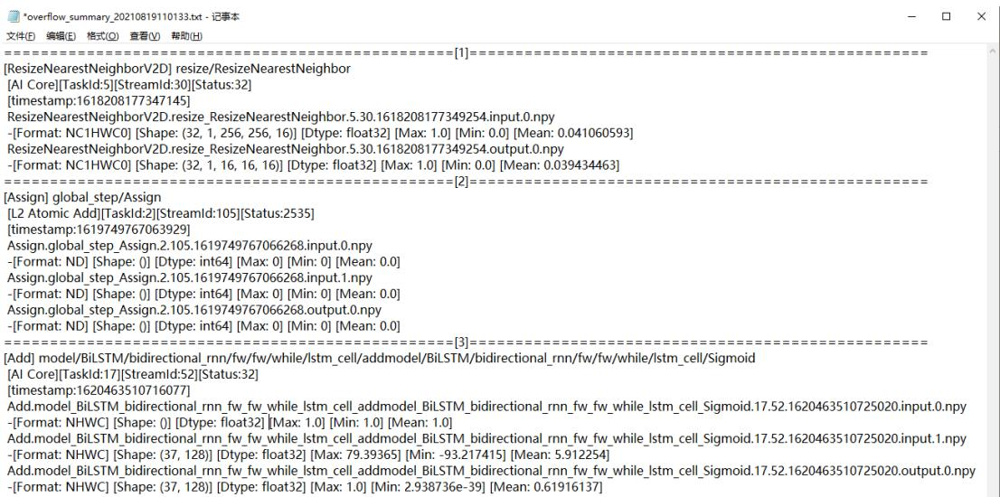  
图 11-1 溢出算子结果信息  
第24行，第47列100%|Unix (LF) UTF-8

结果文件信息中，根据展示数据从上到下顺序，展示信息如下：

● 从1到n表示解析出第一个溢出的算子到第n个溢出的算子。  
● 每个溢出算子的类型和名称。  
● 算子的溢出信息，包括：溢出类型，溢出的任务ID，流ID和溢出错误码。  
● timestamp为算子溢出的时间戳。  
● \*.input.\*.npy为溢出算子的输入数据的npy文件。  
● \*.input.\*.npy文件名下方展示的是文件中算子溢出的输入关键信息，包括数据格式，数据维度，数据类型，最大值，最小值和均值。  
● \*.output.\*.npy为溢出算子的输出数据的npy文件。  
● \*.output.\*.npy文件名下方展示的是文件中算子溢出的输出关键信息，包括数据格式，数据维度，数据类型，最大值，最小值和均值。  
----结束

# 11.3 dump 数据文件 Format 转换

# 执行 dump 数据文件 Format 转换

本版本提供dump数据文件Format转换能力，用于用户根据自身需求将昇腾AI处理器生成的dump数据文件转换成numpy数据文件，方便查看。

该功能通过msaccucmp.py脚本实现，脚本存放在\${INSTALL_DIR}/tools/operator_cmp/compare，\${INSTALL_DIR}请替换为CANN软件安装后文件存储路径。以root用户安装为例，则安装后文件存储路径为：/usr/local/Ascend/cann。

命令格式如下：

python3 msaccucmp.py convert -d <dump_file> [-out <output>] [-f <format>] [-s <shape>] [-o <output_tensor>] [-i <input_tensor>] [-c <custom_script_path>] [-v <version>] [-t <type>]

命令格式参数项说明如表11-2所示。

表 11-2 Format 转换参数项说明  

<table><tr><td colspan="1" rowspan="1">参数名</td><td colspan="1" rowspan="1">描述</td><td colspan="1" rowspan="1">是否必选</td></tr><tr><td colspan="1" rowspan="1">-d--dump_file</td><td colspan="1" rowspan="1">昇腾AI处理器生成的dump文件。支持指定单个文件；单个路径（不支持递归嵌套，只支持文件的父目录）；同时指定多个文件，文件名用逗号隔开，例如-d /{PATH}/dump_file1,/{PATH}/dump_file2。</td><td colspan="1" rowspan="1">是</td></tr><tr><td colspan="1" rowspan="1">-out--output</td><td colspan="1" rowspan="1">转换后的数据存放目录，默认为当前路径。不建议配置与当前用户不一致的其它用户目录，避免提权风险。</td><td colspan="1" rowspan="1">否</td></tr><tr><td colspan="1" rowspan="1">-f--format</td><td colspan="1" rowspan="1">·命令行包含-f参数，表示进行Format转换，指定转换后数据Format。如果dump文件包含original_shape字段，则会根据original_shape对数据进行切片。支持的Format转换类型参见支持的Format转换类型。·命令行不包含-f参数，表示进行dump文件解析。</td><td colspan="1" rowspan="1">否</td></tr><tr><td colspan="1" rowspan="1">参数名</td><td colspan="1" rowspan="1">描述</td><td colspan="1" rowspan="1">西</td></tr><tr><td colspan="1" rowspan="1">-S--shape</td><td colspan="1" rowspan="1">Format转换需要的Shape，当前仅FRACTAL_NZ转换需要配置该参数，格式为([0-9]+,)+[0-9]+，每个数字必须大于0。配置-f时有效。</td><td colspan="1" rowspan="1">否</td></tr><tr><td colspan="1" rowspan="1">-0--output_tensor</td><td colspan="1" rowspan="1">转换指定index的output数据，与-i互斥。配置-f时有效。当-o与-i均未配置时，默认转换所有的input与output。</td><td colspan="1" rowspan="1">否</td></tr><tr><td colspan="1" rowspan="1">-i--input_tensor</td><td colspan="1" rowspan="1">转换指定index的input数据，与-o互斥。配置-f时有效。</td><td colspan="1" rowspan="1">否</td></tr><tr><td colspan="1" rowspan="1">-C--custom_script_path</td><td colspan="1" rowspan="1">用户自定义Format转换.py文件存放路径，需指定到“format_convert”目录的上一层目录。.py文件相关要求参见准备自定义Format转换.py文件。配置-f时有效。不建议调用与当前用户不一致的其它用户目录下的自定义脚本文件，避免提权风险。</td><td colspan="1" rowspan="1">否</td></tr><tr><td colspan="1" rowspan="1">-V--version</td><td colspan="1" rowspan="1">dump文件类型，1代表protobuf序列化后的数据文件，2代表自定义格式的数据文件。默认值为2。</td><td colspan="1" rowspan="1">否</td></tr><tr><td colspan="1" rowspan="1">-t--type</td><td colspan="1" rowspan="1">输出文件的类型。取值为：·npy：输出文件保存为numpy格式。msnpy：输出文件保存为numpy格式，一般用于MindSpore场景。·bin：输出文件保存为binary格式。默认值为npy。</td><td colspan="1" rowspan="1">否</td></tr></table>

# 支持的 Format 转换类型

结果保存为“原始文件名.output.{index}.{shape}.npy”或“原始文件名.input.{index}.  
{shape}.npy”，Shape的格式如：1x3x224x224。

当前内置的Format转换支持如下类型：

● FRACTAL_NZ转换NCHW● FRACTAL_NZ转换成NHWC● FRACTAL_NZ转换ND● HWCN转换FRACTAL_Z● HWCN转换成NCHW● HWCN转换成NHWC● NC1HWC0转换成HWCN● NC1HWC0转换成NCHW● NC1HWC0转换成NHWC

NCHW转换成FRACTAL_Z

NCHW转换成NHWC

NHWC转换成FRACTAL_Z

NHWC转换成HWCN

NHWC转换成NCHW

NDC1HWC0转换成NCDHW

# 说明

一般情况下，非四维的Format是由四维Format转换而来，那么对于同一个非四维Format支持转换成多种Format类型的情况，该非四维Format只有重新转回原始的四维Format才有效。例如NC1HWC0支持转换成HWCN、NCHW、NHWC，但是被转换的NC1HWC0数据只有一种四维的原始数据，假设为HWCN，那么该NC1HWC0数据只能转换成HWCN。识别原始数据的Format类型需要了解《ATC离线模型编译工具用户指南》中的“高级功能 > 单算子模型转换” 。

# 准备自定义 Format 转换.py 文件

用户自定义的Format转换.py文件只能用来进行Format转换，文件安全性由用户自行保证。

为满足用户自定义Format转换，需要按以下要求准备：

.py文件命名需满足规则：“convert_{format_from}_to_{format_to}.py”，其中，format_from和format_to支持的类型如下：

– NCHW   
– NHWC   
– ND   
– NC1HWC0   
– FRACTAL_Z   
– NC1C0HWPAD   
– NHWC1C0   
– FSR_NCHW   
– FRACTAL_DECONV   
– C1HWNC0   
– FRACTAL_DECONV_TRANSPOSE   
– FRACTAL_DECONV_SP_STRIDE_TRANS   
– NC1HWC0_C04   
– FRACTAL_Z_C04   
– CHWN   
– DECONV_SP_STRIDE8_TRANS   
– NC1KHKWHWC0   
– BN_WEIGHT   
– FILTER_HWCK   
– HWCN   
– LOOKUP_LOOKUPS   
– LOOKUP_KEYS   
– LOOKUP_VALUE   
– LOOKUP_OUTPUT   
– LOOKUP_HITS   
– MD   
– NDHWC   
1 C1HWNCoC0   
– FRACTAL_NZ   
– NCHDW

.py文件内容需满足以下规则：

def convert(shape_from, shape_to, array):

return numpy_array

表 11-3 参数说明  

<table><tr><td rowspan=1 colspan=1>参数</td><td rowspan=1 colspan=1>说明</td></tr><tr><td rowspan=1 colspan=1>shape_from</td><td rowspan=1 colspan=1>array数据的转换前的Shape，一维数组。</td></tr><tr><td rowspan=1 colspan=1>shape_to</td><td rowspan=1 colspan=1>array数据的转换后的Shape，一维数组，可选。</td></tr><tr><td rowspan=1 colspan=1>array</td><td rowspan=1 colspan=1>一维原始数据。</td></tr><tr><td rowspan=1 colspan=1>return</td><td rowspan=1 colspan=1>返回值，返回转换后的numpy数组。</td></tr></table>

.py文件必须存放在“format_convert”目录下，如果该目录不存在，需要新建。

# 11.4 查看 dump 数据文件

dump文件无法通过文本工具直接查看其内容，为了查看dump文件内容，本文提供以下脚本将dump文件转换为numpy格式文件后，再通过numpy官方提供的能力转为txt文档进行查看。

该功能通过msaccucmp.py脚本实现，脚本存放在\${INSTALL_DIR}/tools/operator_cmp/compare，\${INSTALL_DIR}请替换为CANN软件安装后文件存储路径。以root用户安装为例，则安装后文件存储路径为：/usr/local/Ascend/cann。

python3 msaccucmp.py convert -d <dump_file> [-out <output>] [-v <version>] [-t <type>]

命令格式参数项说明如表11-4所示。

表11-4 参数说明  

<table><tr><td rowspan=1 colspan=1>参数名</td><td rowspan=1 colspan=1>描述</td><td rowspan=1 colspan=1></td></tr><tr><td rowspan=1 colspan=1>-d--dump_file</td><td rowspan=1 colspan=1>昇腾AI处理器生成的dump文件。支持指定单个文件；单个路径（不支持递归嵌套，只支持文件的父目录）；同时指定多个文件，文件名用逗号隔开，例如-d /{PATH}/dump_file1,/{PATH}/dump_file2。</td><td rowspan=1 colspan=1>是</td></tr><tr><td rowspan=1 colspan=1>-out--output</td><td rowspan=1 colspan=1>转换后的数据存放目录，默认为当前路径。不建议配置与当前用户不一致的其它用户目录，避免提权风险。</td><td rowspan=1 colspan=1>否</td></tr><tr><td rowspan=1 colspan=1>-V--version</td><td rowspan=1 colspan=1>dump文件类型，1代表protobuf序列化后的数据文件，2代表自定义格式的数据文件。默认取值为2。</td><td rowspan=1 colspan=1>否</td></tr><tr><td rowspan=1 colspan=1>-t--type</td><td rowspan=1 colspan=1>输出文件的类型。取值为：npy:输出文件保存为numpy格式。npy文件不支持bfloat16格式，若工具输入源文件为bfloat16格式，则会将其解析为float32格式的npy文件。msnpy:输出文件保存为numpy格式，一般用于MindSpore场景。·bin：输出文件保存为binary格式。默认值为npy。</td><td rowspan=1 colspan=1>否</td></tr></table>

# 操作步骤

步骤1 使用安装用户登录开发环境。

步骤2 进入\${INSTALL_DIR}/tools/operator_cmp/compare，\${INSTALL_DIR}请替换为CANN软件安装后文件存储路径。以root用户安装为例，则安装后文件存储路径为：/usr/local/Ascend/cann。

步骤3 执行msaccucmp.py脚本，转换dump数据文件为numpy格式文件。python3 msaccucmp.py convert -d \$HOME/dump -out \$HOME/dumptonumpy -v 2

# 说明

● msaccucmp.py脚本的各个输入参数使用方法，请参见11.3 dump数据文件Format转换。● -d参数支持传入单个文件，对单个dump文件进行转换，也支持传入目录（不支持递归嵌套，只支持文件的父目录），对整个path下所有的dump文件进行转换。

步骤4 调用Python，转换numpy文件为txt文件。举例：

$\$ 5$ python3   
Python 3 (default, Mar 5 2020, 16:07:54)[GCC 5.4.0 20160609] on linuxType "help", "copyright", "credits" or "license" for more information.   
$> > >$ import numpy as np   
>>> a $=$ np.load("\$HOME/dumptonumpy/Pooling.pool1.1.1147.1589195081588018.output.0.npy") $> > > { \mathsf { b } } =$ a.flatten()   
$> > >$ np.savetxt("\$HOME/dumptonumpy/Pooling.pool1.1.1147.1589195081588018.output.0.txt", b)

转换为.txt格式文件后，维度信息、dtype均不存在。详细的使用方法请参见NumPy官网介绍。

----结束

# 11.5 GPU/NPU 映射表获取

说明

本节涉及的.json文件、目录等名称均为举例，请根据实际环境替换。其中，-out指定的结果存放路径，需确保操作用户具有读写权限。

# 操作步骤

步骤1 以HwHiAiUser用户登录开发环境。

步骤2 生成json文件。atc --mode=1 --om=\$HOME/data/resnet50.om --json=\$HOME/data/resnet50.json

步骤3 进入\${INSTALL_DIR}/tools/operator_cmp/compare，\${INSTALL_DIR}请替换为CANN软件安装后文件存储路径。以root用户安装为例，则安装后文件存储路径为：/usr/local/Ascend/cann。

步骤4 执行获取GPU/NPU的映射表命令。

# 说明

由于dump和npy比对数据文件是由多个文件组成，故下文操作步骤中-m和-g参数须指定数据文件所在的父目录。如：\$HOME/MyApp/resnet50， 其中resnet50文件夹下直接保存比对数据文件。

目录结构示例如下：

root@xxx:\$HOME/MyApp/resnet50# tree

BatchMatMul.bert_encoder_layer_0_attention_self_MatMul_1.24.1614717261785536   
BatchMatMul.bert_encoder_layer_0_attention_self_MatMul.21.1614717261768864   
BatchMatMul.bert_encoder_layer_10_attention_self_MatMul_1.235.1614717263664916

# 仅为示例，此处省略剩余文件名。

python3 msaccucmp.py compare -m \$HOME/MyApp_mind/resnet50 -g \$HOME/Standard_caffe/resnet50 -f \$HOME/data/resnet50.json-out \$HoME/result-map

输出结果为mapping_\*.csv文件内容如图11-2所示。

图 11-2 GPU/NPU 的映射表  

<table><tr><td>Index OpType</td><td>NPUDunp</td><td>GroundTruth</td><td>TensorIndex NPUDumpPath</td><td></td><td>GroundTruthPath</td></tr><tr><td>0Data</td><td>input_ids</td><td>input_ids</td><td>input_ids:ou/home.</td><td>/hone/</td><td>/prom/bert-qa/input_ids.0.1614702675815084.npy</td></tr><tr><td>1NaN</td><td>dynanic_cons*</td><td></td><td>NaN NaN</td><td>NaN</td><td></td></tr><tr><td>2 NaN</td><td>dynamic_cons*</td><td></td><td>NaN NaN</td><td>NaN</td><td></td></tr><tr><td>3NaN</td><td>dynamic_cons*</td><td></td><td>NaN NaN</td><td>NaN</td><td></td></tr><tr><td>4Data</td><td>input_mask input mask</td><td></td><td>input_mask:c/home/</td><td>/home/</td><td>prom/bert-qa/input_mask. 0.1614702675815084.npy</td></tr><tr><td>5Cast</td><td></td><td>bert/encoder bert/encoder/(bert/encoder/home/</td><td></td><td>/home/</td><td>pron/bert-qa/input_mask.0.1614702675815084.npy</td></tr><tr><td>5Cast</td><td colspan="3">bert/encoderbert/encoder/(bert/encoder/hone/</td><td>/hone/</td><td>prom/bert-qa/bert_encoder_Cast.0.1614702675815084.npy</td></tr></table>

表11-5 输出参数说明  

<table><tr><td>参数</td><td>说明</td></tr><tr><td> Index</td><td>算子的ID。</td></tr><tr><td colspan="1" rowspan="1">OpType</td><td colspan="1" rowspan="1">算子类型。指定-f，-cf或-q参数时获取算子类型。</td></tr><tr><td colspan="1" rowspan="1">NPUDump</td><td colspan="1" rowspan="1">表示基于昇腾AI处理器运行生成的dump数据的算子名。</td></tr><tr><td colspan="1" rowspan="1">GroundTruth</td><td colspan="1" rowspan="1">表示基于GPU/CPU运行生成的npy或dump数据的算子名。</td></tr><tr><td colspan="1" rowspan="1">Tensorlndex</td><td colspan="1" rowspan="1">表示基于昇腾AI处理器运行生成的dump数据的算子的input ID和output ID。</td></tr><tr><td colspan="1" rowspan="1">NPUDumpPath</td><td colspan="1" rowspan="1">表示基于昇腾Al处理器运行生成的dump文件路径。</td></tr><tr><td colspan="1" rowspan="1">GroundTruthPath</td><td colspan="1" rowspan="1">表示基于GPU/CPU运行生成的npy或dump文件路径。</td></tr></table>

----结束

# 11.6 自定义算法.py 文件准备

用户自定义的比对算法Python文件只能用来进行精度比对，文件安全性和传入参数的安全性由用户保证。

用户自定义算法，需要在.py格式文件内写好自定义算法脚本，按以下要求准备：

.py文件命名需满足规则：“ alg_{algorithm_name}.py”，其中，   
algorithm_name为算法名。   
.py文件内容需满足以下规则：   
def compare(my_output_dump_data, ground_truth_dump_data, args): #算法固定头格式   
#以下为算法示例 Function Description: compare the my output dump data and the ground truth dump data by algorithm Parameter: my_output_dump_data: the my output dump data ground_truth_dump_data: the ground truth dump data args: the algorithm arguments Return Value: the compare algorithm value, string; error_msg, string

表 11-6 参数说明  

<table><tr><td rowspan=1 colspan=1>参数</td><td rowspan=1 colspan=1>说明</td></tr><tr><td rowspan=1 colspan=1>my_output_dump_data</td><td rowspan=1 colspan=1>my output dump数据，一维数组。</td></tr><tr><td rowspan=1 colspan=1>ground_truth_dump_data</td><td rowspan=1 colspan=1>ground truth dump数据，一维数组。</td></tr><tr><td rowspan=1 colspan=1>args</td><td rowspan=1 colspan=1>算法参数，用户自行解析。</td></tr><tr><td rowspan=1 colspan=1>Return Value</td><td rowspan=1 colspan=1>返回值，包括：·算法比对的结果，String格式。·错误信息，String格式。</td></tr></table>

需要在当前用户的目录下创建“algorithm”目录用于保存.py文件，请确保用户对目录和文件具有读写权限。

# 11.7 AICPU 自定义算子日志解析

# 概述

dump数据文件解析功能通过解析dump数据文件，获取dump数据文件中的信息。

当前该功能支持从dump数据文件中解析AICPU自定义算子的日志，并将其保存到日志文件内。

# 命令格式说明

python3 dump_parser.py save_log -d <dump_file> [-out <output>]

命令行参数说明如表11-7所示。

该功能通过dump_parser.py脚本实现，脚本存放在\${INSTALL_DIR}/tools/operator_cmp/compare，\${INSTALL_DIR}请替换为CANN软件安装后文件存储路径。以root用户安装为例，则安装后文件存储路径为：/usr/local/Ascend/cann。

表 11-7 命令行参数说明  

<table><tr><td rowspan=1 colspan=1>参数名</td><td rowspan=1 colspan=1>参数说明</td><td rowspan=1 colspan=1>是否必选</td></tr><tr><td rowspan=1 colspan=1>-d--dump_file</td><td rowspan=1 colspan=1>待解析的dump数据文件。</td><td rowspan=1 colspan=1>是</td></tr><tr><td rowspan=1 colspan=1>-out-- output</td><td rowspan=1 colspan=1>AICPU自定义算子的日志存放目录。默认为当前目录。结果文件名格式为：dump_file_name.{index}.log不建议配置与当前用户不一致的其它用户目录，避免提权风险。</td><td rowspan=1 colspan=1>否</td></tr></table>

# 操作步骤

步骤1 登录CANN工具安装环境。

步骤2 进入\${INSTALL_DIR}/tools/operator_cmp/compare，\${INSTALL_DIR}请替换为CANN软件安装后文件存储路径。以root用户安装为例，则安装后文件存储路径为：/usr/local/Ascend/cann。

步骤3 执行save_log解析命令。 python3 dump_parser.py save_log -d my dump path/dump file -out /MyApp20/out

命令执行完成后在-out指定目录下生成日志文件。

----结束

# 11.8 生成 npy 文件名异常情况批量处理

TensorFlow模型生成dump数据时，因tfdbg自身原因或运行环境原因，会出现tfdbg截断算子名，导致生成的npy文件名与预期不符，造成转换dump数据文件异常。

需要参考以下方法重新生成npy文件，使得npy文件名符合精度比对要求。

# 说明

● 本文中脚本名称、路径等均为举例，请根据实际替换。批量处理后，如果遇到某算子的dump文件存在，但是比对结果为NaN，需要检查该算子的dump文件名中的{op_name}是否与TensorFlow算子名称一致，如果不一致需要手动修改dump文件名中的算子字段与TensorFlow算子名称一致。其中如果出现"/"请修改为"_"。

步骤1 执行TensorFlow工程。进入调试命令行交互模式后，输入run命令。

步骤2 执行lt $>$ tensor_name命令将所有tensor的名称暂存到文件里。

步骤3 创建可执行脚本，如pt_cmd.sh，获取tensor_name文件中tensor_name对应的tensor_index。

脚本内容如下：

#!/bin/bash   
timestamp $= \$ 5$ [\$(date +%s%N)/1000]   
index=1   
while read -r line   
do   
tensor_index=\`echo \$line | awk '{print \$4}'\`   
echo "pt "\$tensor_index" -n 0 -w "\$((index $+ + ]$ ))"."\$timestamp".npy" $> > \$ 2$   
done $< \$ 1$

赋予pt_cmd.sh可执行权限并执行脚本。

bash pt cmd.sh tensor name tensor name.txt步骤4 回到tfdbg命令行，输入run命令后，将上一步生成的tensor name.txt文件内容粘贴执行，生成npy文件。

步骤5 将生成的npy文件，移动到新的文件夹，如npy_dir。

步骤6 创建可执行脚本，如index_to_tensorname.sh，并执行脚本批量修改npy文件名。

脚本内容如下：

#!/bin/bash   
timestamp ${ \boldsymbol { \cdot } } { \boldsymbol { \Phi } }$ [\$(date +%s%N)/1000]   
while read -r line   
do   
tensor_index $\mathbf { \Phi } = \mathbf { \Phi }$ echo \$line | awk '{print $\$ 23$ '\`   
real_file $\mathrel { \mathop : } \overline { { = } }$ \`echo \$line | awk '{print \$6}'\`   
changed1_tensor_index $: = \$ 1$ {tensor_index//\//_}   
changed2_tensor_index $\mathrm { : = } \mathfrak { s }$ \${changed1_tensor_index//:/.}   
echo $\$ 2$ \$real_file $\$ 2$ /\$changed2_tensor_index"."\$timestamp".npy"   
if [ -r \$2/\$real_file ]   
then mv $\$ 2$ \$real_file \$2/\$changed2_tensor_index"."\$timestamp".npy"   
fi   
done $< \$ 1$

赋予index_to_tensorname.sh可执行权限并执行脚本。

bash index_to_tensorname.sh tensor_name.txt npy_dir ----结束

# 11.9 Windows dump 文件转换为 Linux dump 文件

步骤1 在Linux上准备转换脚本windows_to_linux.py，内容如下。

import argparse   
import os   
import sys   
class WindowsToLinux: The class for format windows to linux def __init__(self): parse $=$ argparse.ArgumentParser() parse.add_argument("-i", dest="windows_dump_path", default="", help="<Required> the dump file path", required=True) parse.add_argument("-o", dest="output_path", default="", help="<Required> the output path", required=True) args, _ $=$ parse.parse_known_args(sys.argv[1:]) self.windows_dump_path $=$ os.path.realpath(args.windows_dump_path) self.output_path $=$ os.path.realpath(args.output_path) def windows_to_linux(self, dump_path): try: with open(dump_path, "rb") as dump_file: content $=$ dump_file.read() new_content $=$ content.replace(b"\r\n", b"\n") output_file_path $=$ os.path.join(self.output_path, os.path.basename(dump_path)) with open(output_file_path, "wb") as new_dump_file: new_dump_file.write(new_content) print('Info: convert dump to linux for "%s" successfully.' $\%$ dump_path) except (OSError, IOError, MemoryError, SystemError) as error: print('Error: convert windows dump file "%s" to linux dump file failed. $ { \% }  { \mathsf { S } } ^ { \prime } \  { \% }$ (dump_path, error)) def convert(self): try: if not os.path.exists(self.windows_dump_path) and \ not os.access(self.windows_dump_path, os.R_OK): print('Error: the path "%s" does not exist or is not readable.') sys.exit() if not os.path.exists(self.output_path): os.makedirs(self.output_path) if not os.path.exists(self.output_path) and \ not os.access(self.output_path, os.W_OK): print('Error: the path "%s" does not exist or can not writable.') sys.exit() if os.path.isfile(self.windows_dump_path): self.windows_to_linux(self.windows_dump_path) else: for file_name in os.listdir(self.windows_dump_path): self.windows_to_linux(os.path.join(self.windows_dump_path, file_name)) except (OSError, IOError, MemoryError, SystemError) as error: print('Error: convert windows dump file to linux dump file failed. $\% s ^ { \prime } \%$ error) sys.exit()   
if __name__ $= =$ "__main__": main $=$ WindowsToLinux() main.convert()

步骤2 将Windows的dump文件拷贝到Linux某个目录下。

步骤3 在Linux上执行转换脚本。

# windows dump path是步骤2中Windows的dump文件拷贝到Linux的目录# linux dump path是生成的Linux的dump文件存放路径python3 windows_to_linux.py -i {windows_dump_path} -o {linux_dump_path}

----结束

# 12 附录

数据格式要求  
命令格式说明  
完整比对结果参数说明  
原compare_vector.py精度比对方式

# 12.1 数据格式要求

msaccucmp.py脚本精度比对工具支持多种比对方式，因此dump、npy文件命名需满足以下要求：

表 12-1 数据文件命名规则  

<table><tr><td>数据类型</td><td>数据命名格式</td><td>备注</td></tr><tr><td>非量化离线模型在昇腾 AI处理器上运行生成的 dump数据文件</td><td>{op_type}.{op_name}. {task_id}.{stream_id}. {timestamp} 当前包含如下三种文件名格</td><td>命名格式说明： ）op_type（算子类 型）、op_name（算子 名）对应的名称需满足 “A-Za-z0-9_-”正则表</td></tr><tr><td>量化离线模型在昇腾AI 处理器上运行生成的 dump数据文件</td><td>式： {op_type}.{op_name}. {task_id}.{stream_id}. {timestamp} {op_type}. {op_name_lxsliceN}. ({stream_id}.){task_id). {timestamp}. {task_type}. {context_id}. {thread_id}.{device_id} {op_type}.{op_name}. ({stream_id}.){task_id). {timestamp}. {task_type}. {context_id}. {thread_id}.{device_id}</td><td>达式规则。 ·timestamp为16位时间 戳。 task_id（任务ID）、 stream_id（Stream ID）、output_index （第N个输出）、 task_type（任务类 型）、context_id （Context ID）、 thread_id（线程ID）、 device_id（运行卡的 Device ID）为0~9数字 组成。 如果op_type、op_name出</td></tr><tr><td>npy文件（Caffe、 TensorFlow或ONNX）</td><td>{op_name}. {output_index}. {timestamp}.npy</td><td>现了 “” &quot;\”、空格时，转换为下 划线表示。</td></tr></table>

# 12.2 命令格式说明

# 通用参数

精度比对命令行格式如下：

python3 msaccucmp.py compare -m <my_dump_path> -g <golden_dump_path> [-f <fusion_rule_file>] [-cf <close_fusion_rule_file>] [-q <quant_fusion_rule_file>] [-out <output>] [-map] [-c <custom_script_path>] [- alg <algorithm>] [-v <version>] [-r <range>] [-overflow_detection] [-max] [-advisor]

命令行参数说明如表12-2所示。

表 12-2 精度比对命令行参数说明  

<table><tr><td colspan="1" rowspan="1">参数名</td><td colspan="1" rowspan="1">参数说明</td><td colspan="1" rowspan="1">是否必选</td></tr><tr><td colspan="1" rowspan="1">-mmy_dump_path</td><td colspan="1" rowspan="1">基于昇腾AI处理器运行生成的数据文件所在目录。由于dump数据文件是多个二进制文件，故须指定dump数据文件所在的父目录。如：$HOME/MyApp_mind/resnet50，其中resnet50文件夹下直接保存dump数据文件。训练场景下：·支持TensorFlow为原始训练网络的比对。·单个数据文件比对时，需指定数据文件所在的具体目录。支持多个dump数据文件的批量比对，可指定固定路径为dump_path/time/，仅支持TensorFlow为原始训练网络的比对。指定的路径下可以存放多个dump数据文件，但要求每个dump数据文件拥有唯一路径，且路径命名规则为dump_path/time/device_id/model_name/model_id/dump_step/dump文件。</td><td colspan="1" rowspan="1">是</td></tr><tr><td colspan="1" rowspan="1">-g--golden_dump_path</td><td colspan="1" rowspan="1">基于GPU/CPU运行生成的原始网络数据文件所在目录。由于npy文件是多个文件，故须指定npy文件所在的父目录。如:$HOME/Standard_caffe/resnet50，其中resnet50文件夹下直接保存npy数据文件。当指定-cf参数时，该参数指定的就是模型转换关闭算子融合功能下dump数据文件的目录。</td><td colspan="1" rowspan="1">是</td></tr><tr><td colspan="1" rowspan="1">-f--fusion_rule_file</td><td colspan="1" rowspan="1">全网层信息文件。推理场景下：·通过使用ATC转换.om模型文件生成的json文件，文件包含整网算子的映射关系。该参数指定的是默认开启算子融合功能情况下进行模型转换时生成的json文件；指定关闭算子融合功能情况下进行模型转换时生成的json文件使用-cf参数。训练场景下：·通过使用ATC转换.txt图文件生成的json文件。·单个数据文件比对时，该参数需指定具体的json文件;批量比对时，该参数可指定为多个json文件所在的目录。</td><td colspan="1" rowspan="1">否</td></tr><tr><td colspan="1" rowspan="1">-cfclose_fusion_rule_file</td><td colspan="1" rowspan="1">全网层信息文件（通过使用ATC转换.om模型文件生成的json文件，文件包含关闭算子融合功能情况下整网算子的映射关系）。本参数详细使用指导请参见8.4比对操作和分析。仅推理场景支持本参数。</td><td colspan="1" rowspan="1">否</td></tr><tr><td colspan="1" rowspan="1">q--quant_fusion_rule_file</td><td colspan="1" rowspan="1">量化信息文件（昇腾模型压缩输出的json文件）。通过AMCT量化生成的量化信息文件（*.json），文件包含整网量化算子映射关系，用于精度比对时算子匹配。Caffe非量化原始模型vs量化离线模型场景时，与-f参数二选一；Caffe非量化原始模型vs量化原始模型场景时，仅使用本参数。仅推理场景支持本参数。</td><td colspan="1" rowspan="1">否</td></tr><tr><td colspan="1" rowspan="1">-out--output</td><td colspan="1" rowspan="1">比对数据结果存放路径，默认为当前路径。不建议配置与当前用户不一致的其它用户目录，避免提权风险。训练场景下:·单个数据文件比对时，结果文件名格式为result_{timestamp}.csv。）多个数据文件比对时，结果文件名格式为{device_id}_{model_name}_{dump_step}_result_{timestamp}.csv，批量比对将生成多个csv结果文件。</td><td colspan="1" rowspan="1">否</td></tr><tr><td colspan="1" rowspan="1"> -map--mapping</td><td colspan="1" rowspan="1">输出GPU/NPU的映射表。-般情况下GPU/NPU的映射表需要在完成精度比对之后，才能从csv中获取。本参数实现在精度比对前，直接提取GPU/NPU的映射表。建议在比对数据量太大，需要提前获取GPU/NPU的映射表的场景下使用。详细操作请参见11.5 GPU/NPU映射表获取。</td><td colspan="1" rowspan="1">否</td></tr><tr><td colspan="1" rowspan="1">-C--custom_script_path</td><td colspan="1" rowspan="1">用户自定义脚本文件存放路径，包括自定义算法.py文件和自定义Format转换.py文件，需指定到脚本目录的上一层目录。指定本参数时判断是否存在以下文件目录：·存在自定义算法.py文件目录，目录格式为“algorithm”，则读取“algorithm”目录下的自定义算法.py文件，生成自定义算法，可通过-alg参数指定为比对算法。自定义算法.py文件相关要求参见11.6自定义算法.py文件准备。存在自定义Format转换.py文件目录，目录格式为“format_convert”，则读取“format_convert”目录下的自定义Format转换.py文件。自定义Format转换.py文件相关要求参见准备自定义Format转换.py文件。不建议调用与当前用户不一致的其它用户目录下的自定义脚本文件，避免提权风险。</td><td colspan="1" rowspan="1">否</td></tr><tr><td colspan="1" rowspan="1">-alg--algorithm</td><td colspan="1" rowspan="1">比对算法维度，取值为：·0：CosineSimilarity，表示余弦相似度算法。·1：MaxAbsoluteError，表示最大绝对误差算法。·2：AccumulatedRelativeError，表示累积相对误差算法。3：RelativeEuclideanDistance，表示欧氏相对距离算法。·4：KullbackLeiblerDivergence，表示KL散度算法。·5：StandardDeviation，表示标准差算法。·6：MeanAbsoluteError，表示平均绝对误差。·7：RootMeanSquareError，表示均方根误差。·8：MaxRelativeError，表示最大相对误差。·9：MeanRelativeError，表示平均相对误差。·all：比对全部算法（包含自定义和内置算法），all为默认值。自定义算法名（algorithm_name）。具体算法名由自定义算法文件确定，例如自定义算法文件名为alg_RelativeError.py，则自定义算法名为RelativeError。须同时配置-c参数。可多选，配置格式为各取值间用逗号分隔，可配置为数字或算法名，例如0,1,2,RelativeError。若只选择比对部分维度，则比对结果同样只展示对应维度。</td><td colspan="1" rowspan="1">否</td></tr><tr><td colspan="1" rowspan="1">-aalgorithm_options</td><td colspan="1" rowspan="1">比对算法的高级选项，可为指定的算法设置参数，指定的算法必须是-alg参数的内置算法或者-c参数的自定义算法，被本参数设置后的算法以本参数设置的值执行运算。输入格式为：算法名:参数名=值,参数名=值;算法名:参数名=值,参数名=值。参数之间是逗号分隔，不同算法是分号分隔，例如："CosineSimilarity:max=1,min=0;aa:max=1,min=0"。其中算法名与-c参数自定义算法.py文件的algorithm_name（参见11.6自定义算法.py文件准备）一致。</td><td colspan="1" rowspan="1">否</td></tr><tr><td colspan="1" rowspan="1">-V-- version</td><td colspan="1" rowspan="1">dump文件类型，1代表protobuf序列化后的数据文件，2代表自定义格式的数据文件。默认取2。</td><td colspan="1" rowspan="1">否</td></tr><tr><td colspan="1" rowspan="1">-r--range</td><td colspan="1" rowspan="1">设定算子比对范围。配置方式如下：·start：第一个比对的算子，取值范围为[1,参与计算的算子个数]，默认值为1。·end：最后一个比对的算子，取值范围为-1或[start,参与计算的算子个数]，默认值为-1（动态获取网络模型中最后一个参与计算的算子）。·step：第start+step*n个比对的算子，step取值范围为[1,参与计算的算子个数)，默认值为1，n为从1开始的正整数。配置格式为：“start,end,step”。比如：-r1,101,20，表示算子1,21,41,61,81,101的Tensor参与比对。不配置本参数时，比对网络模型中的所有参与计算的算子。Caffe非量化原始模型vs量化原始模型和NPUvsNPU精度比对场景不支持配置本参数。须先配置-f或-cf参数指定离线模型全网层信息文件。-s参数与-r参数二者只能选择一个配置。</td><td colspan="1" rowspan="1">否</td></tr><tr><td colspan="1" rowspan="1">-s--select</td><td colspan="1" rowspan="1">设定算子比对范围。通过指定算子的索引（网络模型中算子的ID）来选择需要比对的算子，格式为：-s1,2,3（数值之间以逗号隔开，取值与网络模型中算子的ID有关）。须先配置-f或-cf参数指定离线模型全网层信息文件。-s参数与-r参数二者只能选择一个配置。</td><td colspan="1" rowspan="1">否</td></tr><tr><td colspan="1" rowspan="1">-maxmax_cmp_size</td><td colspan="1" rowspan="1">设置每个dump数据比对的最大字节数，用于精度比对过程提速，默认0（表示全量比对），单位Byte。当模型中算子的输出存在较大Shape时、比对过于耗时，可以尝试配置。</td><td colspan="1" rowspan="1">否</td></tr><tr><td colspan="1" rowspan="1">overflow_detection</td><td colspan="1" rowspan="1">整网算子溢出检测。进行整网比对时可检测溢出算子。默认未开启算子溢出检测。当算子的Tensor数据类型是FP16时，tensor中的任意一个数值的绝对值&gt;=65504，认为算子溢出。Caffe非量化原始模型vs量化原始模型场景配置本参数不生效。</td><td colspan="1" rowspan="1">否</td></tr><tr><td colspan="1" rowspan="1">-advisor</td><td colspan="1" rowspan="1">在Tensor比对结束后，针对比对结果进行数据分析，给出专家建议。</td><td colspan="1" rowspan="1">否</td></tr></table>

# 单算子比对

# 单算子比对命令行格式如下:

python3 msaccucmp.py compare -m <my_dump_path> -g <golden_dump_path> [-f <fusion_rule_file>] [-cf <close_fusion_rule_file>] [-q <quant_fusion_rule_file>] [-out <output>] [-op <op_name>] [-o <output_tensor>] [-i <input_tensor>] [-c <custom_script_path>] [-v <version>] [-n <topn>] [-- ignore_single_op_result] [-ml <max_line>] [-overflow_detection]

命令行参数说明如表12-3所示。

表 12-3 单算子比对命令行参数说明  

<table><tr><td colspan="1" rowspan="1">参数名</td><td colspan="1" rowspan="1">参数说明</td><td colspan="1" rowspan="1">西</td></tr><tr><td colspan="1" rowspan="1">-op--op_name</td><td colspan="1" rowspan="1">单算子比对的算子名。输入待比对算子名，算子名获取方式有：·推理场景下:-从.om模型中获取。－从使用ATC转换.om模型文件生成的json文件中获取。－从整网比对结果文件中的NPUDump字段获取。·训练场景下:－直接从训练模型中获取。－从计算图文件（*.txt）中获取。-从整网比对结果文件中的NPUDump字段获取。</td><td colspan="1" rowspan="1">是</td></tr><tr><td colspan="1" rowspan="1">-0--output_tensor</td><td colspan="1" rowspan="1">比对指定Index的output数据。配置格式：-o Index，其中Index可以从整网比对结果文件中的Tensorlndex字段的output取值获取，例如Tensorlndex为trans_Cast_O:input:0，则/ndex为0。当-o与-i均未配置时，默认比对output数据的Index为0的数据。配置-op时有效，与-i参数互斥。</td><td colspan="1" rowspan="1">否</td></tr><tr><td colspan="1" rowspan="1">-i、input_tensor</td><td colspan="1" rowspan="1">比对指定Index的input数据。配置格式：-i Index，其中/ndex可以从整网比对结果文件中的Tensorlndex字段的input取值获取，例如Tensorlndex为trans_Cast_O:input:0，则/ndex为0。配置-op时有效，与-o参数互斥。</td><td colspan="1" rowspan="1">否</td></tr><tr><td colspan="1" rowspan="1">-n--topn</td><td colspan="1" rowspan="1">仅展示绝对误差和相对误差的前n条数据，比对完成后打印并生成csv结果文件，取值范围为[1,10000]，默认值为20。配置-op时有效。生成的csv结果文件名分别为：·绝对误差：{op_name}_{input/output}_{index}_absolute_error_topn.csv·相对误差：{op_name}_{input/output}_{index}_relative_error_topn.csv</td><td colspan="1" rowspan="1">否</td></tr><tr><td colspan="1" rowspan="1">ignore_single_op_result</td><td colspan="1" rowspan="1">csv结果文件中不生成单算子比对的完整比对数据，即不生成完整比对结果的csv文件。配置-op时有效。不配置本参数时，生成完整比对结果。</td><td colspan="1" rowspan="1">否</td></tr><tr><td colspan="1" rowspan="1">参数名</td><td colspan="1" rowspan="1">参数说明</td><td colspan="1" rowspan="1">无</td></tr><tr><td colspan="1" rowspan="1">-ml--max_line</td><td colspan="1" rowspan="1">单算子比对时生成的单个csv文件所包含最大的文件条数，取值范围为[10000,1000000]，默认值为1000000。文件中单算子的比对结果数据条数较大时，配置本参数可以将csv文件拆分为多个文件。比如数据条数为100000条，配置本参数为10000，那么比对结果则输出10个csv文件。配置-op时有效，但配置--ignore_single_op_result时，本参数不生效。</td><td colspan="1" rowspan="1">否</td></tr></table>

# 12.3 完整比对结果参数说明

表 12-4 完整比对结果参数说明  

<table><tr><td colspan="1" rowspan="1">参数</td><td colspan="1" rowspan="1">说明</td></tr><tr><td colspan="1" rowspan="1">Index</td><td colspan="1" rowspan="1">网络模型中算子的ID。</td></tr><tr><td colspan="1" rowspan="1">OpSequence</td><td colspan="1" rowspan="1">部分算子比对时算子运行的序列。即-f参数指定的全网层信息文件中算子的ID。仅配置-r或-s参数时展示。</td></tr><tr><td colspan="1" rowspan="1">OpType</td><td colspan="1" rowspan="1">算子类型。指定-f参数时获取算子类型。</td></tr><tr><td colspan="1" rowspan="1">NPUDump</td><td colspan="1" rowspan="1">表示My Output模型的算子名。</td></tr><tr><td colspan="1" rowspan="1">DataType</td><td colspan="1" rowspan="1">表示NPU侧dump数据的算子数据类型。</td></tr><tr><td colspan="1" rowspan="1">Address</td><td colspan="1" rowspan="1">dump tensor的内存地址。用于判断算子的内存问题。仅基于昇腾AI处理器运行生成的dump数据文件在整网比对时可提取该数据。</td></tr><tr><td colspan="1" rowspan="1">GroundTruth</td><td colspan="1" rowspan="1">表示Ground Truth模型的算子名。</td></tr><tr><td colspan="1" rowspan="1">DataType</td><td colspan="1" rowspan="1">表示Ground Truth侧数据算子的数据类型。</td></tr><tr><td colspan="1" rowspan="1">Tensorlndex</td><td colspan="1" rowspan="1">表示基于昇腾Al处理器运行生成的dump数据的算子的input ID和output ID。</td></tr><tr><td colspan="1" rowspan="1">Shape</td><td colspan="1" rowspan="1">比对的Tensor的Shape。</td></tr><tr><td colspan="1" rowspan="1">OverFlow</td><td colspan="1" rowspan="1">溢出算子。显示YES表示该算子存在溢出；显示NO表示算子无溢出；显示NaN表示不做溢出检测。配置-overflow_detection参数时展示。</td></tr><tr><td colspan="1" rowspan="1">CosineSimilarity</td><td colspan="1" rowspan="1">进行余弦相似度算法比对出来的结果，取值范围为[-1,1]，比对的结果如果越接近1，表示两者的值越相近，越接近-1意味着两者的值越相反。</td></tr><tr><td colspan="1" rowspan="1">MaxAbsoluteError</td><td colspan="1" rowspan="1">进行最大绝对误差算法比对出来的结果，取值范围为0到无穷大，值越接近于0，表明越相近，值越大，表明差距越大。</td></tr><tr><td colspan="1" rowspan="1">AccumulatedRelativeError</td><td colspan="1" rowspan="1">进行累积相对误差算法比对出来的结果，取值范围为0到无穷大，值越接近于0，表明越相近，值越大，表明差距越大。</td></tr><tr><td colspan="1" rowspan="1">RelativeEuclideanDistance</td><td colspan="1" rowspan="1">进行欧氏相对距离算法比对出来的结果，取值范围为0到无穷大，值越接近于0，表明越相近，值越大，表明差距越大。</td></tr><tr><td colspan="1" rowspan="1">KullbackLeiblerDivergence</td><td colspan="1" rowspan="1">进行KL散度算法比对出来的结果，取值范围为0到无穷大。KL散度越小，真实分布与近似分布之间的匹配越好。</td></tr><tr><td colspan="1" rowspan="1">StandardDeviation</td><td colspan="1" rowspan="1">进行标准差算法比对出来的结果，取值范围为0到无穷大。标准差越小，离散度越小，表明越接近平均值。</td></tr><tr><td colspan="1" rowspan="1">MeanAbsoluteError</td><td colspan="1" rowspan="1">表示平均绝对误差。取值范围为0到无穷大，MeanAbsoluteError趋于0，RootMeanSquareError趋于0，说明测量值与真实值越近似；MeanAbsoluteError趋于0，RootMeanSquareError越大，说明存在局部过大的异常值；MeanAbsoluteError越大，RootMeanSquareError等于或近似MeanAbsoluteError，说明整体偏差越集中；MeanAbsoluteError越大，RootMeanSquareError越大于MeanAbsoluteError，说明存在整体偏差，且整体偏差分布分散；不存在以上情况的例外情况，因为RootMeanSquareError ≥MeanAbsoluteError恒成立。</td></tr><tr><td colspan="1" rowspan="1">RootMeanSquareError</td><td colspan="1" rowspan="1">表示均方根误差。取值范围为0到无穷大，MeanAbsoluteError趋于0，RootMeanSquareError趋于0，说明测量值与真实值越近似；MeanAbsoluteError趋于0，RootMeanSquareError越大，说明存在局部过大的异常值；MeanAbsoluteError越大，RootMeanSquareError等于或近似MeanAbsoluteError，说明整体偏差越集中；MeanAbsoluteError越大，RootMeanSquareError越大于MeanAbsoluteError，说明存在整体偏差，且整体偏差分布分散；不存在以上情况的例外情况，因为RootMeanSquareError ≥MeanAbsoluteError恒成立。</td></tr><tr><td colspan="1" rowspan="1">MaxRelativeError</td><td colspan="1" rowspan="1">表示最大相对误差。取值范围为0到无穷大，值越接近于0，表明越相近，值越大，表明差距越大。</td></tr><tr><td colspan="1" rowspan="1">MeanRelativeError</td><td colspan="1" rowspan="1">表示平均相对误差。取值范围为0到无穷大，值越接近于0，表明越相近，值越大，表明差距越大。</td></tr><tr><td colspan="1" rowspan="1">CompareFailReason</td><td colspan="1" rowspan="1">算子无法比对的原因。若余弦相似度为1，则查看该算子的输入或输出Shape是否为空或全部为1，若为空或全部为1则算子的输入或输出为标量，提示：this tensor is scalar。</td></tr></table>

# 12.4 原 compare_vector.py 精度比对方式

# 12.4.1 比对数据准备

# 12.4.1.1 数据格式要求

# 说明

compare_vector.py精度比对工具将在后续版本下线，当前版本推荐使用上文中的msaccucmp.py工具。

当前版本支持多种比对方式，因此，对dump、npy文件命名有以下明确要求，准备数据时需要遵循。

表 12-5 数据文件命名规则  

<table><tr><td rowspan=1 colspan=1>数据类型</td><td rowspan=1 colspan=1>数据命名格式</td></tr><tr><td rowspan=1 colspan=1>非量化原始模型的dump数据(Caffe)</td><td rowspan=1 colspan=1>{op_name}.{output_index}.{timestamp}.pb</td></tr><tr><td rowspan=1 colspan=1>量化原始模型的dump数据(Caffe)</td><td rowspan=1 colspan=1>{op_name}.{output_index}.{timestamp}.quant</td></tr><tr><td rowspan=1 colspan=1>非量化离线模型在昇腾AI处理器上运行生成的dump数据</td><td rowspan=1 colspan=1>{op_type}.{op_name}.{task_id}.{timestamp}</td></tr><tr><td rowspan=1 colspan=1>量化离线模型在昇腾AI处理器上运行生成的dump数据</td><td rowspan=1 colspan=1>{op_type}.{op_name}.{task_id}.{timestamp}</td></tr><tr><td rowspan=1 colspan=1>非量化原始模型的dump数据(TensorFlow)</td><td rowspan=1 colspan=1>{op_name}.{output_index}.{timestamp}.pb</td></tr><tr><td rowspan=1 colspan=1>npy文件(Caffe或TensorFlow)</td><td rowspan=1 colspan=1>{op_name}.{output_index].{timestamp}.npy</td></tr></table>

命名格式说明：op_type、op_name对应的名称需满足“A-Za-z0-9_-”正则表达式规则，timestamp为16位时间戳，output_index、task_id为 $0 { \sim } 9$ 数字组成。

# 12.4.1.2 准备离线模型 dump 数据文件

# 前提条件

在准备dump数据前，请参见《ATC离线模型编译工具用户指南》模型转换，准备好模型文件；如果涉及模型量化，请参见《AMCT模型压缩工具用户指南》完成量化操作后再进行模型转换，生成量化的模型文件。并请配套生成的模型文件完成应用工程的编译、运行，确保工程正常。

# 说明

● 执行AMCT时，同步会生成量化融合规则文件，该文件在精度比对时会使用。

● Docker场景下，不支持将容器作为运行环境使用dump功能。

● 提供aclInit()接口和aclmdlSetDump()接口两种接口方式dump数据。

aclInit()接口的详细使用方法请参见《应用开发指南 $\mathbf { C 8 C + + }$ )》中的“acl API参考（C） $>$ 系统配置 $>$ aclInit”。

aclmdlSetDump()接口的详细使用方法请参见《应用开发指南 $( \pmb { \mathrm { C } } \pmb { \mathrm { C } } \pmb { + + }$ )》中的“acl  
API参考 $>$ 模型管理 $>$ 模型执行 $>$ aclmdlSetDump” 。

# dump 数据

参考以下步骤进行离线模型dump操作：

步骤1 打开工程文件，查看调用的aclInit()或aclmdlSetDump()函数，获取acl.json文件路径。

# 说明

如果aclInit()或aclmdlSetDump()初始化为空，则需要修改该函数，补充步骤2创建的acl.json路径。这里的acl.json路径是相对工程编译生成的二进制文件的路径。

步骤2 在查到的目录下修改acl.json文件（如不存在，则需要新建，建议放在工程编译后的out目录下），添加dump配置，格式如下所示。

"dump":{ "dump_list":[ { "model_name":"ResNet-101" }, { "model_name":"ResNet-50", "layer":[ "conv1conv1_relu", "res2a_branch2ares2a_branch2a_relu", "res2a_branch1", "pool1" ] } ], "dump_path":"/home/output", "dump_mode":"output", "dump_op_switch":"off"   
}

acl.json文件配置dump规则说明：

样例中的dump、dump_list、dump_path为必选字段；model_name、layer、dump_mode、dump_op_switch为可选字段。● 当需要dump模型的所有算子时，不需要包含layer字段。● 当需要dump指定的部分算子时，按格式配置layer字段，每行配置模型中的一个算子名，且每个算子之间用英文逗号隔开。● 如果存在多个模型需要dump，则需要为每个模型创建dump配置，且每个模型之间用英文逗号隔开。● 如果仅dump单算子模型时，则dump_list为空，dump_op_switch配置为on。

acl.json文件配置项说明：

dump_list：需要dump数据的整网模型列表。model_name：模型名称。模型加载方式为文件加载时，填入模型文件的名称，不需要带后缀名，也可以配置为ATC模型文件转换后的json文件里的最外层"name"字段对应值；模型加载方式为内存加载时，配置为模型文件转换后的json文件里的“"name"”字段对应值。模型加载方式说明请参见《应用开发指南 (C&C++)》手册的“acl API参考” “acl API（C）”章节的内容。layer：算子名。

dump_path：dump数据文件存储到运行环境{dump_path}目录下的路径。支持配置绝对路径或相对路径（相对执行命令行时的当前路径）：

一 绝对路径配置以“/”开头，例如：/home/output。相对路径配置直接以目录名开始，例如：output。

例如：dump_path配置为/home/output，则dump数据文件存储到运行环境的/home/output目录下。

# 注意

该参数指定的目录需要提前创建且确保安装时配置的运行用户具有读写权限。

dump_mode：dump数据模式，取值范围：input、output和all，默认取output。可选。

input：dump算子的输入数据。  
output：dump算子的输出数据。  
all：同时dump算子的输入、输出数据。

dump_op_switch：单算子模型dump数据开关。取值范围：on和off。默认取值off。可选。

– on：开启单算子模型dump。  
– off：关闭单算子模型dump。

# 说明

不具有输出的TBE算子、AI CPU算子，如StreamActive、Send、Recv、const等不会生成dump数据；编译后的模型中部分算子并不会在AI CPU或AI Core执行，如concatD类型算子，则无法生成dump数据。  
● 采用dump部分算子场景下，因data算子不会在AI CPU或AI Core上执行，如果用户填写dump data节点算子时需要一并填写data节点算子的后继节点，才能dump出data节点算子数据。  
● 按格式填写acl.json文件时，请确保各个模型的model_name值唯一。模型加载方式为文件加载时，model_name除了可以配置为模型文件名外，也可以配置为模型文件转换后的json文件里的“"name"”字段对应值。模型名称获取方式（同时可以获取到各个算子名）：如果acl.json文件里model_name配置项值同时包括模型文件名、此处获取的name值，以模型文件名的配置项生效。

步骤3 运行应用工程，生成dump数据文件。

工程运行完毕后，可以在运行环境{dump_path}路径下查看到生成的dump数据文件。生成的路径及格式说明：

{dump_path}/{time}/{device_id}/{model_name}/{model_id}/{data_index}/{dump文件}

单算子模型dump时，路径为：

{dump_path}/{device_id}/{op_name}/{dump文件}

● time：dump数据文件落盘的时间。格式为：YYYYMMDDHHMMSS。  
● device_id：设备ID。  
● model_name：模型名称。  
● model_id：模型ID号。  
● data_index：针对每个Task ID执行的次数维护一个序号，从0开始计数，该Task每dump一次数据，序号递增1。

● dump文件：命名规则如{op_type}.{op_name}.{task_id}.{timestamp}如果model_name、op_type、op_name出现了“.”、“/”、“\”、空格时，转换为下划线表示。

# ----结束

# 12.4.1.3 准备 Caffe 模型 npy 文件

本版本不提供Caffe模型npy文件生成功能，请自行安装Caffe环境并提前准备Caffe原始数据“\*.npy”文件。本文仅提供生成符合精度比对要求的numpy格式Caffe原始数据“\*.npy”文件的样例参考。

# 说明

如何准备原始Caffe模型npy文件，您可以参考论坛发帖算子精度比对工具标杆数据生成环境搭建指导（Caffe $^ +$ TensorFlow）或者自行获取其他方法。该帖仅供参考。

如果您需要使用二进制格式dump文件进行比对，请参见12.4.3 如何进行npy文件转dump文件完成npy文件转换成dump文件。

Caffe原始npy文件准备要求：

● 文件内容以numpy格式保存。文件命名以{op_name}.{output_index}.{timestamp}.npy形式命名。设置numpy数据文件名包括output_index字段且值为0，确保转换生成的dump数据的output_index为0。因为精度比对时，默认从第一个output_index为0的数据开始，否则无比对结果。为确保生成符合命名要求的.npy文件，需要对原始的Caffe模型文件去除in-place，生成新的.prototxt模型文件用于生成.npy文件（例如：如果有未去除in-place的A、B、C、D四个融合算子，进行dump数据，输出的结果为D算子的结果，但命名却是A算子开头，就会导致比对时找不到文件）。针对量化场景，需要先在环境上安装AMCT再执行去除in-place命令，安装方法请参见《AMCT模型压缩工具用户指南》。

\${INSTALL_DIR}/tools/operator_cmp/compare，\${INSTALL_DIR}请替换为CANN软件安装后文件存储路径。以root用户安装为例，则安装后文件存储路径为：/usr/local/Ascend/cann。

执行命令去除in-place，命令行举例如下：

python3 inplace_layer_process.py -i /home/user/resnet50.prototxt执行命令后，在/home/user目录下生成去除in-place的new_resnet50.prototxt文件。

针对量化场景：为确保精度误差在合理范围内，需要执行Caffe模型推理时预处理数据与Caffe昇腾模型压缩时预处理数据一致。

为输出符合精度比对要求的“\*.npy”文件，需在推理结束后的代码中增加dump操作，示例代码如下：

# read prototxt file   
net_param $=$ caffe_pb2.NetParameter()   
with open(self.model_file_path, 'rb') as model_file: google.protobuf.text_format.Parse(model_file.read(), net_param) # save data to numpy file for layer in net_param.layer: name $=$ layer.name.replace("/", "_").replace(".", "_") index $= 0$ for top in layer.top:   
data $=$ net.blobs[top].data[...]   
file_name $=$ name $^ +$ "." $^ +$ str(index) $^ +$ "." + str( round(time.time() \* 1000000)) $^ +$ ".npy"   
output_dump_path $=$ os.path.join(self.output_path, file_name)   
np.save(output_dump_path, data)   
print('The dump data of "' $^ +$ layer.name $^ +$ '" has been saved to "' $^ +$ output_dump_path $^ +$ '".')   
index $+ = 1$

增加上述代码后，运行Caffe模型的应用工程，即可生成符合要求的“\*.npy”文件。

# 12.4.1.4 准备 TensorFlow 模型 npy 文件

本版本不提供TensorFlow模型npy文件生成功能，请自行安装TensorFlow环境并提前准备npy文件。本文仅提供生成numpy格式TensorFlow原始数据“\*.npy”文件的样例参考。

# 说明

如果您需要使用二进制格式dump文件进行比对，请参见12.4.3 如何进行npy文件转dump文件完成npy文件转换成dump文件。

在进行TensorFlow模型生成npy文件前，您需要已经有一套完整的、可执行的、标准的TensorFlow模型应用工程。然后利用TensorFlow官方提供的debug工具tfdbg调试程序，从而生成npy文件。主要操作示例如下，请根据用户的应用工程适配操作：

步骤1 修改TF应用工程脚本，添加debug选项设置。代码中增加如下代码：

Estimator模式：   
from tensorflow.python import debug as tf_debug   
training_hooks $=$ [train_helper.PrefillStagingAreaHook(), tf_debug.LocalCLIDebugHook()]

如图12-1所示，添加tfdbg的hook。

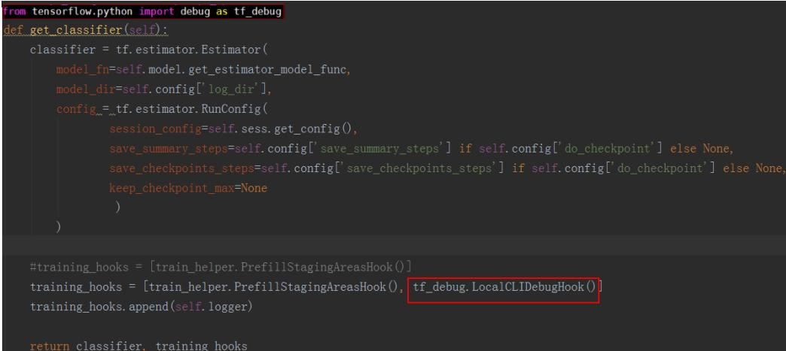  
图 12-1 Estimator 模式

session.run模式： from tensorflow.python import debug as tf_debug sess $=$ tf_debug.LocalCLIDebugWrapperSession(sess, ui_type="readline")

如图12-2所示，在run之前设置tfdbg装饰器。

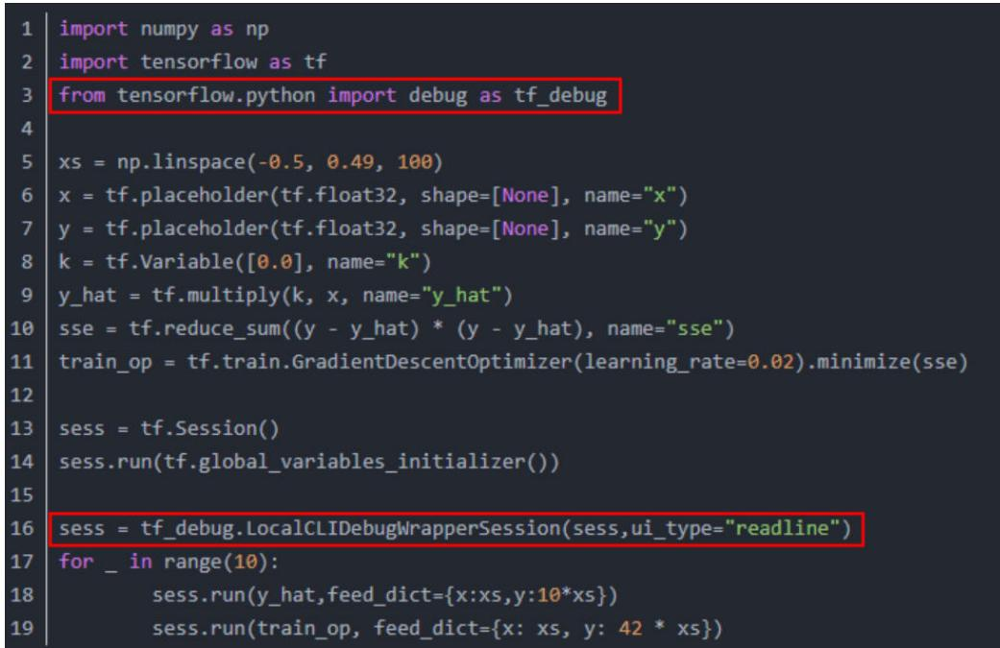  
图 12-2 session.run 模式

步骤2 执行推理脚本。

进入调试命令行交互模式后，输入run命令。

步骤3 收集npy文件。

执行run命令完成后，在命令行交互界面，可以通过lt查询已存储的张量，通过pt可以查看已存储的张量内容，可以保存数据为numpy格式文件。

因为tfdbg一次命令只能dump一个tensor，为了自动生成收集所有数据，可以按以下几个步骤操作：

1. 执行lt $>$ tensor name将所有tensor的名称暂存到文件里。2. 退出tfdbg命令行，在linux命令行下执行下述命令，用以生成在tfdbg命令行执行的命令。

timestamp=\$[\$(date $+ \% s \% N$ )/1000] ; cat tensor_name | awk '{print "pt" $\$ 4,43$ | awk '{gsub("/", "_", $\$ 3$ );gsub(":", ".", $\$ 3$ );print(\$1,\$2,"-n 0 -w "\$3".""'\$timestamp'"".npy")}' $>$ tensor_name_cmd.txt

# 说明

● 该示例生成符合精度比对需要的npy文件名称格式，存储到tensor_name_cmd.txt文件。其中，tensor_name为自定义tensor列表对应的文件名，timestamp为16位的时间戳。

● 本步骤也可以不退出tfdbg命令行，重新开启一个命令窗口，在新的窗口中执行。

3. 回到tfdbg命令行，输入run命令后，将上一步生成的所有tensor存储的命令粘贴执行，即可存储所有npy文件。

npy文件默认是以numpy.save()形式存储的，上述命令会将“/”与“:”用下划线_替换。

# 说明

如果命令行界面无法粘贴文件内容，可以在tfdbg命令行中输入“mouse off”指令关闭鼠标模式后再进行粘贴。

4. 检查生成的npy文件命名是否符合规则，如图12-3所示。

# 说明

npy文件命名规则：{op name}.{output index}.{timestamp}.npy，其中op_name字段需满足“A-Za-z0-9_-”正则表达式规则，timestamp为16位时间戳，output_index为0\~9数字组成。

– 如果因算子名较长，造成按命名规则生成的npy文件名超过255字符而产生文件名异常，这类算子不支持精度比对。

因tfdbg自身原因或运行环境原因，可能存在部分生成的npy文件名不符合精度比对要求，请按命名规则手工重命名。如果不符合要求的npy文件较多，请参见11.8 生成npy文件名异常情况批量处理重新生成npy文件。

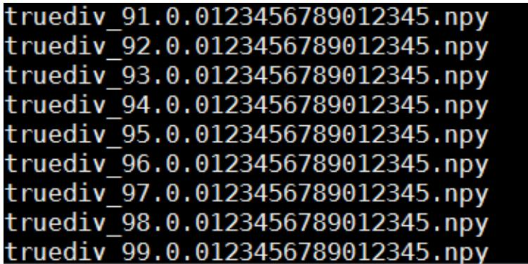  
图 12-3 查询.npy 文件

----结束

# 12.4.2 Tensor 比对

# 12.4.2.1 说明与约束

# 说明

原命令行比对方式将保持原有功能，不继续演进，推荐使用新的比对方式进行精度比对。  
原命令行比对方式只支持protobuf序列化后的dump文件，不支持自定义格式的dump文件。  
Tensor命令行方式比对提供按整网比对和按单算子比对两种，请根据比对场景选择比对方式。

# 约束

需要确保离线模型的dump文件与Caffe、TensorFlow模型的npy或dump文件为相同模型的数据。如果不是相同模型的数据，但模型中有相同的算子名称，也可以进行比对，但结果数据只显示匹配到的相同算子的比对结果。  
针对FastRCNN网络场景，ProposalD算子及之后的算子，算子精度不达标属于正常情况，最终结果以FSRDetectionOutput算子的比对结果精度为准。  
如果在图编译过程中，原图的算子发生了融合，导致算子的output在编译后的模型中找不到对应的output时，该算子无法进行比对。  
如果在图编译阶段对图做了结构性修改（如stride切分、L1 fusion、L2 fusion）的场景，会造成算子的input或output无法比对。

如果比对数据两边相同算子有dump数据，但算子的Shape不一致（离线模型算子Shape变小）或Format不支持转换，该算子无法进行比对。当模型转换对输入数据做了额外的预处理，造成原始模型的输入与离线模型的data算子输入格式不同时（比如AIPP场景下data输入为YUV），data算子比对结果异常、不具备参考意义。如果没有关闭对应的融合规则，会使得量化算子与之前的算子进行融合，导致该算子的output的比对结果不可信。● 量化模型里做了量化处理的算子无法比对，必须是反量化的输出才能比对，量化模型里未做量化处理的算子不受影响。例如，量化模型里AscendQuant算子的output无法比对。

# 12.4.2.2 比对数据说明

执行Tensor比对前，请按照表12-6要求准备好比对数据。

# 说明

My Output离线模型文件与量化融合规则文件使用场景说明：

离线模型文件：使用昇腾AI处理器运行生成的dump数据与Ground Truth比对，选择该模型文件。● 量化融合规则文件：只要涉及量化与非量化数据比对，则必须选择该文件。

表 12-6 Tensor 比对前数据准备  

<table><tr><td rowspan=1 colspan=1>序号</td><td rowspan=1 colspan=1>待比对数据( My Output )</td><td rowspan=1 colspan=1>标准数据( Ground Truth )</td><td rowspan=1 colspan=1>模型文件/融合规则文件</td></tr><tr><td rowspan=1 colspan=1>1</td><td rowspan=1 colspan=1>非量化离线模型在昇腾AI处理器上运行生成的dump数据</td><td rowspan=1 colspan=1>非量化原始模型的npy文件（或dump数据）(Caffe)</td><td rowspan=1 colspan=1>非量化离线模型文件（*.0m）</td></tr><tr><td rowspan=1 colspan=1>2</td><td rowspan=1 colspan=1>量化离线模型在昇腾AI处理器上运行生成的dump数据</td><td rowspan=1 colspan=1>非量化原始模型的npy文件（或dump数据）(Caffe)</td><td rowspan=1 colspan=1>·量化离线模型文件（*0m）·昇腾模型压缩后的量化融合规则文件（json文件）</td></tr><tr><td rowspan=1 colspan=1>3</td><td rowspan=1 colspan=1>量化原始模型的npy文件(或dump数据）(Caffe)</td><td rowspan=1 colspan=1>非量化原始模型的npy文件（或dump数据）(Caffe)</td><td rowspan=1 colspan=1>昇腾模型压缩后的量化融合规则文件（json文件）</td></tr><tr><td rowspan=1 colspan=1>4</td><td rowspan=1 colspan=1>量化离线模型在昇腾AI处理器上运行生成的dump数据</td><td rowspan=1 colspan=1>量化原始模型的npy文件（或dump数据）(Caffe)</td><td rowspan=1 colspan=1>量化离线模型文件（*.0m）</td></tr><tr><td rowspan=1 colspan=1>5</td><td rowspan=1 colspan=1>非量化离线模型在昇腾AI处理器上运行生成的dump数据</td><td rowspan=1 colspan=1>非量化原始模型的npy文件（或dump数据）(TensorFlow)</td><td rowspan=1 colspan=1>非量化离线模型文件（*.0m）</td></tr><tr><td rowspan=1 colspan=1>6</td><td rowspan=1 colspan=1>通过昇腾AI处理器运行生成的dump数据</td><td rowspan=1 colspan=1>通过昇腾AI处理器运行生成的dump数据</td><td rowspan=1 colspan=1></td></tr></table>

# 12.4.2.3 整网比对

# 命令格式说明

# Tensor比对命令行格式如下:

python3 compare_vector.py -l <LEFT_DUMP_PATH> -r <RIGHT_DUMP_PATH> [-f <FUSION_JSON_FILE_PATH>] [-q <QUANT_FUSION_RULE_FILE_PATH>] -o <OUTPUT_PATH> [-custom <CUSTOM_PATH>] python3 compare_vector.py -l <LEFT_DUMP_PATH> -r <RIGHT_DUMP_PATH> -f <FUSION_JSON_FILE_PATH> -o <OUTPUT_PATH $| >$ [-custom <CUSTOM_PATH>]

● -l：My Output模型的比对数据文件目录。  
● -r：Ground Truth模型的比对数据文件目录。  
● -o：比对数据结果存储目录及文件名。不建议配置与当前用户不一致的其它用户目录，避免提权风险。  
● -f：全网层信息文件（通过使用ATC转换.om模型文件生成的json文件或转换.txt图文件生成的json文件）。可选。  
● -q：量化融合规则文件。可选。  
● -csv：用于将比对的数据结果写入csv文件中，配置该参数即开启，默认未配置，表示关闭，即将比对结果保存为普通文本文件。可选-custom：用户自定义Format转换.py文件存放路径，需指定到“format_convert”目录的上一层目录。可选。.py文件相关要求参见准备自定义Format转换.py文件。不建议调用与当前用户不一致的其它用户目录下的自定义脚本文件，避免提权风险。  
● -ffts：dump数据开启FFTS+模式，取值为：True：开启；False：关闭，默认关闭。可选。当前无场景支持此参数。

请根据12.4.2.2 比对数据说明中准备的数据类型，选择-f或-q参数项。

# 比对步骤

Tensor比对命令行方式操作步骤：

# 说明

● 本节涉及的.json文件、目录等名称均为举例，请根据实际环境替换；其中result和log日志路径需提前创建，并确保运行用户具有读写权限。  
● 本节以非量化昇腾AI处理器运行生成的dump数据与非量化Caffe模型npy文件比对为例进行介绍，下文中参数说明均以该示例介绍，请根据您的比对数据选择不同场景加以替换理解。如果是两份基于相同模型、昇腾AI处理器运行生成的dump数据进行精度比对，需确保input个数、output个数、Format、Shape必须完全一致，否则无法比对；另外，此场景下命令行只需要带-l、-r、-o参数，不需要输入-f、-q参数。

步骤1 登录开发环境。

步骤2 执行export命令设置环境变量并生成json文件。

1. 设置环境变量 export LD_LIBRARY_PATH=/home/xxx/Ascend/cann/lib64:\${LD_LIBRARY_PATH}

# 2. 生成json文件

atc --mode $^ { \ast = 7 }$ --om \$HOME/data/resnet50.om --json=\$HOME/data/resnet50.jsonatc --mode $: = 5$ --om=ge_proto_00005_Build.txt --json=ge_proto_00005_Build.txt.json步骤3 进入/home/xxx/Ascend/cann/tools/operator_cmp/compare目录。

步骤4 执行Tensor比对命令，样例命令如下：

python3 compare_vector.py -l \$HOME/MyApp_mind/resnet50 -r \$HOME/Standard_caffe/resnet50 -f   
\$HOME/data/resnet50.json-o \$HoME/result/result.txt   
python3 compare_vector.py -l \$HOME/MyApp_mind/resnet50 -r \$HOME/Standard_tf/resnet50 -f \$HOME/   
data/ge_proto_00005_Build.txt.json-o\$HoME/result/result.txt

# 说明

如果需要保存为csv格式文件，可以修改命令为：-o \$HOME/result/result.csv -csv

步骤5 Tensor比对结果result.txt文件内容如图12-4和图12-5所示。

# 图 12-4 比对结果（推理）

Ideet   
16e5   
163es5   
163e5   
.576804 0.002773 1nf (0.576:1.702). (0.576:1.702)   
63e5   
.923194 0.002720 inf (0.417:1.692),(0.418;1.692)   
164 poo15 po015 poo15:input:0 0.99996 0.077095 326.923194 0.002720 inf (0.417:1.692),(0.418:1.692)   
164 poo15 p0015 p0015:0utput:0 0.99999 0.014867 15.242242 0.001503 0.000004 (0.417;0.750),(0.418:0.750)   
165 fc1000 fc1000 fc100:input:00.99999 0.014867 15.242242 0.001503 0.000004 (0.417;0.750),(0.418;0.750)   
165 fcl000 fel000 fcl000:input:1 NaN NaN NaN NaN NaN NaN   
165 fcl000 fcl000 fcl000:input:2 NaN NaN NaN NaN NaN NaN   
165 fe1000 fe1000fc100:output:00.999990.01052510.761290.0012370.00000 (0.000:2.543),(0.00:2.544)   
166 prob prob prob:1nput:0 0.99999 0.010525 10.765129 0.001237 0.000000 (0.000:2.543), (0.000:2.544)   
166 prob prob prob:output:0 1.000000 0.000003 995.379959 0.000003 0.000000 (0.001;0.032),(0.001;0.032)   
167tas   
167 trans_TransData_168 \* trans_TransData_168:output:0 NaN NaN NaN NaN NaN NaN   
168 trans Cast 169 \* NaN NaN NaN NaN NaN NaN NaN   
169 Node_Output \* NaN NaN NaN NaN NaN NaN NaN

图 12-5 比对结果（训练）  

<table><tr><td>Index</td><td>LeftOp</td><td>RightOp</td><td>Tensorlndex</td><td colspan="3"></td><td></td><td></td><td></td><td>CosineSimilarityMaxAbsoluteErrorAcumulatedRelativeErorRelativeEuclideanDistanceKulbackLeiblerDivergenceStandardDeviation</td></tr><tr><td>569</td><td>StridedSlice_10</td><td></td><td>StridedSlice_10</td><td colspan="2">StridedSlice_10:input:0</td><td></td><td>0.299597 0.963068 53.096349 1.112967inf</td><td></td><td></td><td>(0.002;0.024) (0.003:0.027)</td></tr><tr><td>569</td><td>StridedSlice_10</td><td></td><td>StridedSlice_10</td><td colspan="2">StridedSlice_10:output:0</td><td></td><td></td><td></td><td>0.392826 0.301562 25.956447 1.036876 inf</td><td>(0.001;0.014) (0.002;0.016)</td></tr><tr><td>570</td><td>StridedSlice_11</td><td></td><td>StridedSlice_11</td><td colspan="2">StridedSlice_11:input:0</td><td></td><td></td><td></td><td>0.299597 0.963068 53.096349 1.112967 inf</td><td>(0.002;0.024) (0.003;0.027)</td></tr><tr><td>570</td><td>StridedSlice_11</td><td></td><td>StridedSlice_11</td><td>StridedSlice_11:output:0</td><td></td><td></td><td></td><td></td><td>0.280475 0.963068 27.1399021.127958 inf</td><td>(0.003;0.031) (0.004:0.035)</td></tr><tr><td>571</td><td></td><td></td><td>truediv_19 truediv_19truediv_19:input:0</td><td>0</td><td>0</td><td>0</td><td>0</td><td></td><td>(0.500;0.000) (0.500;0.000)</td><td></td></tr><tr><td>571</td><td></td><td></td><td>truediv_19 truediv_19truediv_19:input:1</td><td></td><td>0.2995970.96306853.096349 1.112967 inf</td><td></td><td></td><td></td><td>(0.002;0.024) (0.003;0.027)</td><td></td></tr><tr><td>571</td><td></td><td></td><td>truediv_19truediv_19truediv_19:output:0(</td><td>0.299597</td><td>0.481534 53.096349 1.112967inf</td><td></td><td></td><td></td><td>(0.001;0.012) (0.001;0.014)</td><td></td></tr><tr><td>572</td><td>sub_23</td><td>sub_23</td><td>sub_23:input:0</td><td>1</td><td>0</td><td>0</td><td>0</td><td></td><td>(1.000;0.000) (1.000;0.000)</td><td></td></tr><tr><td>572</td><td>sub_23</td><td>sub_23</td><td>sub_23:input:1</td><td>0</td><td>29</td><td></td><td>1.364576 inf</td><td></td><td>(0.000;0.009) (0.000;0.009)</td><td></td></tr><tr><td>572</td><td>sub_23</td><td>sub_23</td><td>sub_23:output:0</td><td>0.99992</td><td>25</td><td></td><td>0.012642 inf</td><td></td><td>(1.000;0.009) (1.000;0.009)</td><td></td></tr><tr><td>573</td><td>trans_Cast_4546</td><td></td><td>NaN</td><td>NaN</td><td>NaN</td><td>NaN</td><td>NaN</td><td>NaN</td><td>NaN</td><td></td></tr><tr><td>574</td><td>sub_16</td><td>sub_16</td><td>sub_16:input:0</td><td>0</td><td>72.5 58</td><td></td><td>1.382074 inf</td><td></td><td>(0.002;0.298) (0.002;0.312)</td><td></td></tr><tr><td>574</td><td>sub_16</td><td>sub_16</td><td>sub_16:input:1</td><td>1</td><td>0</td><td>0</td><td>0</td><td></td><td>(30.500;20.694) (30.500;20.694)</td><td></td></tr><tr><td>574</td><td>sub_16</td><td>sub_16</td><td>sub_16:output:0</td><td>0.999931</td><td>72.5</td><td>3872.052929</td><td></td><td>0.011717</td><td>0.00004(-30.498;20.695) (-30.498;20.695)</td><td></td></tr><tr><td>575</td><td>Equal_2</td><td>Equal_2</td><td>Equal_2:input:0</td><td>1</td><td>0</td><td></td><td></td><td>NaN</td><td>(0.000;0.000) (0.000;0.000)</td><td></td></tr><tr><td>575</td><td>Equal_2</td><td>Equa_2</td><td>Equal_2:input:1</td><td>0</td><td>3.60606158</td><td>0</td><td>1.280732 inf</td><td></td><td>(0.000;0.009) (0.000;0.012)</td><td></td></tr><tr><td>575</td><td>Equal_2</td><td>Equal_2</td><td>Equal_2:output:0</td><td>0.99992</td><td>50</td><td></td><td>0.012642 inf</td><td></td><td>(1.000;0.009) (1.000;0.009)</td><td></td></tr><tr><td>576</td><td>sub_17</td><td>sub_17</td><td>sub_17:input:0</td><td>1</td><td>0</td><td>0</td><td>0</td><td></td><td>(2.000;0.000) (2.000;0.000)</td><td></td></tr><tr><td>576</td><td>sub_17</td><td>sub_17</td><td>sub_17:input:1</td><td>0</td><td>0 0.00617929</td><td></td><td>1.158552 inf</td><td></td><td>(0.000;0.000) (0.000;0.000)</td><td></td></tr><tr><td>576</td><td>sub_17</td><td>sub_17</td><td>sub_17:output:0</td><td>1</td><td>0.006179 0.0577550.000017 inf</td><td></td><td></td><td></td><td>(2.000;0.000) (2.000;0.000)</td><td></td></tr></table>

# 参数解释如下：

● LeftOp：表示My Output模型的算子名。  
● RightOp：表示Ground Truth模型的算子名。  
● TensorIndex：表示My Output模型算子的input ID和output ID。  
● CosineSimilarity：进行余弦相似度算法比对出来的结果，范围是[-1,1]，比对的结果如果越接近1，表示两者的值越相近，越接近-1意味着两者的值越相反。  
● MaxAbsoluteError：进行最大绝对误差算法比对出来的结果，值越接近于0，表明越相近，值越大，表明差距越大。  
● AccumulatedRelativeError：进行累积相对误差算法比对出来的结果，值越接近于0，表明越相近，值越大，表明差距越大。  
● RelativeEuclideanDistance：进行欧氏相对距离算法比对出来的结果，值越接近于0，表明越相近，值越大，表明差距越大。  
● KullbackLeiblerDivergence：进行KL散度算法比对出来的结果，取值范围是0到无穷大。KL散度越小，真实分布与近似分布之间的匹配越好。  
● StandardDeviation：进行标准差算法比对出来的结果，取值范围：0到无穷大。标准差越小，离散度越小，表明越接近平均值。该列显示My Output和Ground

Truth两组数据的均值和标准差，第一组展示My Output模型dump数据的数值（均值和标准差），第二组展示Ground Truth模型dump数据的数值（均值和标准差）。

显示“\*”，表示在NPU侧新增的算子无对应的标准算子；“NaN”表示无比对结果。

余弦相似度和KL散度比对结果为NaN，其他算法有比对数据，则表明左侧或右侧数据为0；KL散度比对结果为inf，表明右侧数据有一个为0；比对结果为nan，表示dump数据有nan。

# ----结束

# 12.4.2.4 单算子比对

# 命令格式说明

# Tensor比对命令行格式如下:

python3 compare_vector.py -l <LEFT_DUMP_PATH> -r <RIGHT_DUMP_PATH> [-f <FUSION_JSON_FILE_PATH>] [-q <QUANT_FUSION_RULE_FILE_PATH>] -o <OUTPUT_PATH> -d <OP_NAME> [-t <DETAIL_TYPE>] [-i <DETAIL_INDEX>] [-custom <CUSTOM_PATH>] python3 compare_vector.py -l <LEFT_DUMP_PATH> -r <RIGHT_DUMP_PATH> -f <FUSION_JSON_FILE_PATH> -o <OUTPUT_PATH> -d <OP_NAME> [-t <DETAIL_TYPE>] [-i <DETAIL_INDEX>] [-custom <CUSTOM_PATH>]

# 参数说明如下：

● -l：My Output模型比对数据文件目录。  
● -r：Ground Truth模型比对数据文件目录。  
● -o：比对数据结果待存储目录。不建议配置与当前用户不一致的其它用户目录，避免提权风险。  
● -f：离线模型的全网层信息文件（通过使用ATC转换.om模型文件生成的json文件或转换.txt图文件生成的json文件）。可选。  
● -q：量化融合规则文件。可选。  
● -d：待比对的My Output模型单算子层名。  
● -t：dump数据的输入输出类型，取值input或output，默认取output。可选。  
● -i：My Output模型的算子的input_index或output_index。可选。  
● -csv：用于将比对的数据结果写入csv文件中，配置该参数即开启，默认未配置，表示关闭，即将比对结果保存在txt文件中。  
● -custom：用户自定义Format转换.py文件存放路径，需指定到“format_convert”目录的上一层目录。可选。.py文件相关要求参见准备自定义Format转换.py文件。不建议调用与当前用户不一致的其它用户目录下的自定义脚本文件，避免提权风险。-ffts：dump数据开启FFTS+模式，取值为：True：开启；False：关闭，默认关闭。可选。当前无场景支持此参数。

请根据12.4.2.2 比对数据说明中准备的数据类型，选择-f或-q参数项。

# 比对步骤

Tensor比对命令行方式操作步骤：

# 说明

● 本节涉及的.json文件、目录等名称均为举例，请根据实际环境替换；其中result和log日志路径需提前创建，并确保运行用户具有读写权限。  
本节以非量化昇腾AI处理器运行生成的dump数据与非量化Caffe模型npy文件比对为例进行介绍，下文中参数说明均以该示例介绍，请根据您的比对数据选择不同场景加以替换理解。  
● 不支持两份基于相同模型、昇腾AI处理器运行生成的dump数据进行单算子精度比对。

步骤1 登录开发环境。

步骤2 执行export命令设置环境变量并生成json文件。

设置环境变量：

export LD_LIBRARY_PATH $=$ /home/xxx/Ascend/cann/lib64:\${LD_LIBRARY_PATH}

生成json文件：

atc --mode=1 --om $\mid =$ \$HOME/data/resnet50.om --json $=$ \$HOME/data/resnet50.jsonatc --mode=5 --om=ge_proto_00005_Build.txt --json=ge_proto_00005_Build.txt.json步骤3 进入\${INSTALL_DIR}/tools/operator_cmp/compare，\${INSTALL_DIR}请替换为CANN软件安装后文件存储路径。以root用户安装为例，则安装后文件存储路径为：/usr/local/Ascend/cann。

步骤4 执行Tensor比对命令，样例命令如下：

python3 compare_vector.py -l \$HOME/MyApp_mind/resnet50 -r \$HOME/Standard_caffe/resnet50 -f\$HOME/data/resnet50.json-o \$HOME/result -d pool5-i 0python3 compare_vector.py -l \$HOME/MyApp_mind/resnet50 -r \$HOME/Standard_tf/resnet50 -f \$HOME/data/ge_proto_00o05_Build.txt.json-o \$HOME/result -d gradients/AddN_63-i 0

步骤5 Tensor比对结果文件内容如图12-6和图12-7所示。

图 12-6 单算子比对概要结果

TotalCount :100352   
LeftOp:pool5   
RightOp:poo15   
Format :N,C,H,W   
MinAbsoluteError :0.Oo0000   
MaxAbsoluteError:0.077095   
MinRelativeError:0.Oo0000   
MaxRelativeError:l5.40l893

单算子比对概要结果存放在“{op_name}_input_{index}_summary.txt”或“{op_name}_output_{index}_summary.txt”文件中，各参数说明如下：

● TotalCount：该算子的dump数据的data个数。  
● LeftOp：表示My Output模型算子名。  
● RightOp：表示Ground Truth模型的算子名。  
● Format：数据格式。  
● MinAbsoluteError & MaxAbsoluteError：绝对误差的最小和最大值范围。  
● MinRelativeError & MaxRelativeError：相对误差的最小和最大值范围。

图 12-7 单算子完整比对结果  

<table><tr><td rowspan=1 colspan=1>1</td><td rowspan=1 colspan=1>Index</td><td rowspan=1 colspan=1>NCHW</td><td rowspan=1 colspan=1>Left</td><td rowspan=1 colspan=1>Right</td><td rowspan=1 colspan=1>AbsoluteE</td><td rowspan=1 colspan=2>AbsoluteFRelativeError</td></tr><tr><td rowspan=1 colspan=1>2</td><td rowspan=1 colspan=1></td><td rowspan=1 colspan=1>00000</td><td rowspan=1 colspan=1>0.784180</td><td rowspan=1 colspan=1>0.000000</td><td rowspan=1 colspan=1>0.784180</td><td rowspan=1 colspan=1></td><td rowspan=1 colspan=1></td></tr><tr><td rowspan=1 colspan=1>3</td><td rowspan=1 colspan=1></td><td rowspan=1 colspan=1>10001</td><td rowspan=1 colspan=1>0.000000</td><td rowspan=1 colspan=1>0.000000</td><td rowspan=1 colspan=1>0.000000</td><td rowspan=1 colspan=1></td><td rowspan=1 colspan=1></td></tr><tr><td rowspan=1 colspan=1>4</td><td rowspan=1 colspan=1></td><td rowspan=1 colspan=1>20002</td><td rowspan=1 colspan=1>4.054688</td><td rowspan=1 colspan=1>0.000000</td><td rowspan=1 colspan=1>4.054688</td><td rowspan=1 colspan=1></td><td rowspan=1 colspan=1></td></tr><tr><td rowspan=1 colspan=1>5</td><td rowspan=1 colspan=1></td><td rowspan=1 colspan=1>30003</td><td rowspan=1 colspan=1>13.6953125.803630</td><td rowspan=1 colspan=1>13.6953125.803630</td><td rowspan=1 colspan=1>7. 891683</td><td rowspan=1 colspan=1>1.359784</td><td rowspan=1 colspan=1></td></tr><tr><td rowspan=1 colspan=1>6</td><td rowspan=1 colspan=1></td><td rowspan=1 colspan=1>40004</td><td rowspan=1 colspan=1>6.363281</td><td rowspan=1 colspan=1>2.800269</td><td rowspan=1 colspan=1>3.563013</td><td rowspan=1 colspan=1>1.272382</td><td rowspan=1 colspan=1></td></tr><tr><td rowspan=1 colspan=1>7</td><td rowspan=1 colspan=1></td><td rowspan=1 colspan=1>50005</td><td rowspan=1 colspan=1>0.000000</td><td rowspan=1 colspan=1>0.000000</td><td rowspan=1 colspan=1>0.000000</td><td rowspan=1 colspan=1>1</td><td rowspan=1 colspan=1></td></tr><tr><td rowspan=1 colspan=1>8</td><td rowspan=1 colspan=1></td><td rowspan=1 colspan=1>60006</td><td rowspan=1 colspan=1>7.335938</td><td rowspan=1 colspan=1>1.685189</td><td rowspan=1 colspan=1>5.650749</td><td rowspan=1 colspan=1>3.353184</td><td rowspan=1 colspan=1></td></tr><tr><td rowspan=1 colspan=1>9</td><td rowspan=1 colspan=1></td><td rowspan=1 colspan=1>70010</td><td rowspan=1 colspan=1>0.000000</td><td rowspan=1 colspan=1>0.000000</td><td rowspan=1 colspan=1>0.000000</td><td rowspan=1 colspan=1>一</td><td rowspan=1 colspan=1></td></tr><tr><td rowspan=1 colspan=1>10</td><td rowspan=1 colspan=1></td><td rowspan=1 colspan=1>80011</td><td rowspan=1 colspan=1>0.000000</td><td rowspan=1 colspan=1>0.000000</td><td rowspan=1 colspan=1>0.000000</td><td rowspan=1 colspan=1>一</td><td rowspan=1 colspan=1></td></tr><tr><td rowspan=1 colspan=1>11</td><td rowspan=1 colspan=1>9</td><td rowspan=1 colspan=1>0012</td><td rowspan=1 colspan=1>0.000000</td><td rowspan=1 colspan=1>0.000000</td><td rowspan=1 colspan=1>0.000000</td><td rowspan=1 colspan=1></td><td rowspan=1 colspan=1></td></tr><tr><td rowspan=1 colspan=1>12</td><td rowspan=1 colspan=1>10</td><td rowspan=1 colspan=1>0013</td><td rowspan=1 colspan=1>2. 242188</td><td rowspan=1 colspan=1>0.000000</td><td rowspan=1 colspan=1>2.242188</td><td rowspan=1 colspan=1></td><td rowspan=1 colspan=1></td></tr><tr><td rowspan=1 colspan=1>13</td><td rowspan=1 colspan=1>11</td><td rowspan=1 colspan=1>0014</td><td rowspan=1 colspan=1>0.540527</td><td rowspan=1 colspan=1>1. 781488</td><td rowspan=1 colspan=1>1.240960</td><td rowspan=1 colspan=1>0.696587</td><td rowspan=1 colspan=1></td></tr><tr><td rowspan=1 colspan=1>14</td><td rowspan=1 colspan=1>12</td><td rowspan=1 colspan=1>0015</td><td rowspan=1 colspan=1>0.000000</td><td rowspan=1 colspan=1>0.000000</td><td rowspan=1 colspan=1>0.000000</td><td rowspan=1 colspan=1></td><td rowspan=1 colspan=1></td></tr><tr><td rowspan=1 colspan=1>15</td><td rowspan=1 colspan=1>13</td><td rowspan=1 colspan=1>0016</td><td rowspan=1 colspan=1>3.476562</td><td rowspan=1 colspan=1>4.422843</td><td rowspan=1 colspan=1>0.946281</td><td rowspan=1 colspan=1>0.213953</td><td rowspan=1 colspan=1></td></tr><tr><td rowspan=1 colspan=1>16</td><td rowspan=1 colspan=1>14</td><td rowspan=1 colspan=1>0020</td><td rowspan=1 colspan=1>0.000000</td><td rowspan=1 colspan=1>0.000000</td><td rowspan=1 colspan=1>0.000000</td><td rowspan=1 colspan=1></td><td rowspan=1 colspan=1></td></tr><tr><td rowspan=1 colspan=1>17</td><td rowspan=1 colspan=1>15</td><td rowspan=1 colspan=1>0021</td><td rowspan=1 colspan=1>0.0000000.000000</td><td rowspan=1 colspan=1>0.0000000.000000</td><td rowspan=1 colspan=1>0.000000</td><td rowspan=1 colspan=1></td><td rowspan=1 colspan=1></td></tr><tr><td rowspan=1 colspan=1>18</td><td rowspan=1 colspan=1>16</td><td rowspan=1 colspan=1>0022</td><td rowspan=1 colspan=1>0.013428</td><td rowspan=1 colspan=1>30.000000</td><td rowspan=1 colspan=1>0.013428</td><td rowspan=1 colspan=1></td><td rowspan=1 colspan=1></td></tr><tr><td rowspan=1 colspan=1>19</td><td rowspan=1 colspan=1>17</td><td rowspan=1 colspan=1>0023</td><td rowspan=1 colspan=1>3.2285163</td><td rowspan=1 colspan=1>3.957021</td><td rowspan=1 colspan=1>0.728505</td><td rowspan=1 colspan=1>0.184104</td><td rowspan=1 colspan=1></td></tr><tr><td rowspan=1 colspan=1>20</td><td rowspan=1 colspan=1>18</td><td rowspan=1 colspan=1>0024</td><td rowspan=1 colspan=1>5.765625 5.642937</td><td rowspan=1 colspan=1>5.765625 5.642937</td><td rowspan=1 colspan=1>0.122688</td><td rowspan=1 colspan=1>0.021742</td><td rowspan=1 colspan=1></td></tr><tr><td rowspan=1 colspan=1>21</td><td rowspan=1 colspan=1></td><td rowspan=1 colspan=1>190025</td><td rowspan=1 colspan=1>0.0778813</td><td rowspan=1 colspan=1>3.2606783.182797</td><td rowspan=1 colspan=1>3.2606783.182797</td><td rowspan=1 colspan=1>70.976115</td><td rowspan=1 colspan=1></td></tr><tr><td rowspan=1 colspan=1>22</td><td rowspan=1 colspan=1></td><td rowspan=1 colspan=1>200026</td><td rowspan=1 colspan=1>0.000000</td><td rowspan=1 colspan=1>0.000000</td><td rowspan=1 colspan=1>0.000000</td><td rowspan=1 colspan=1>1</td><td rowspan=1 colspan=1></td></tr></table>

单算子比对完整结果存放在“{op_name}_input_{index}_{file_index}.csv”或“{op_name}_output_{index}_{file_index}.csv”文件中，每个文件最多记录100万条数据。图12-7中各列参数说明如下：

● N C H W：数据的坐标点。  
● Left：该列为My Output模型的算子dump值。  
● Right：该列为Ground Truth模型的算子dump值。  
● RelativeError：相对误差，AbsoluteError值除以Ground Truth模型算子的dump值比对出来的结果。当Ground Truth算子的dump值为0时，该处显示为 ”。AbsoluteError：绝对误差，My Output模型算子的dump值减Ground Truth模型算子的dump值取绝对值比对出来的结果。

----结束

# 12.4.3 如何进行 npy 文件转 dump 文件

说明

本功能将在后续版本下线，当前版本推荐使用上文中的11.3 dump数据文件Format转换。

# 转换 Caffe 模型 npy 文件为 dump 数据文件

获取到Caffe原始数据后，通过dump_data_conversion.py脚本进行数据转换，输出二进制格式的dump文件。命令行格式如下：

python3 dump_data_conversion.py -type type -target target -i input path -o output path-type：数据类型，必选参数。参数值选项：

– quant：量化Caffe模型数据。  
– tf：非量化TensorFlow模型数据。  
– caffe：非量化Caffe模型数据。offline：离线模型数据。

-target：数据转换目标格式，参考值选项：numpy和dump。必选参数。

numpy：dump文件转换为numpy文件。  
dump：numpy文件转换为dump文件。

-i：数据文件路径（可以是文件夹或者文件），必选参数。numpy文件转换为dump文件：如果“-i”参数输入是文件夹，则格式要求如下：文件夹下的文件必须是{op_name}.{output_index}.{timestamp}.npy格式文件。如果“-i”参数输入是文件名，则输入的文件名需满足{op name}.{output_index}.{timestamp}.npy格式要求。每次仅支持输入1个文件。其中op_name对应的名称需满足“A-Za-z0-9_-”正则表达式规则，output_index由0\~9数字组成，timestamp为16位时间戳。dump文件转numpy文件：“-i”参数输入的文件夹或文件名格式必须满足12.4.1.1 数据格式要求章节要求。

● -o：转换后输出文件路径。必选参数。不建议配置与当前用户不一致的其它用户目录，避免提权风险。

Caffe原始数据（numpy文件）转dump数据文件命令举例：

python3 dump_data_conversion.py -type caffe -target dump -i \$HOME/caffenpyfile -o \$HOME/caffedump

# 说明

● dump_data_conversion.py脚本存放在\${INSTALL_DIR}/tools/operator_cmp/compare， $\$ 1$ {INSTALL_DIR}请替换为CANN软件安装后文件存储路径。以root用户安装为例，则安装后文件存储路径为：/usr/local/Ascend/cann。使用该脚本进行数据转换，确保主机内存大小不低于15GB；如果待转换的dump数据单个文件大小超过441MB，则建议使用更大内存主机。

# TensorFlow 模型 npy 文件转换 dump 数据文件

获取到TensorFlow原始数据后，通过dump_data_conversion.py脚本进行数据转换，输出二进制格式的dump文件。命令行格式如下：

python3 dump_data_conversion.py -type type -target target -i input_path -o output_path

TensorFlow原始数据（npy文件）转dump数据文件的命令举例：

-type：数据类型，必选参数。参数值选项：

1 quant：量化Caffe模型数据。  
– tf：非量化TensorFlow模型数据。  
– caffe：非量化Caffe模型数据。  
– offline：离线模型数据。

● -target：数据转换目标格式，参考值选项：numpy和dump。必选参数。

numpy：dump文件转换为numpy文件。dump：numpy文件转换为dump文件。-i：数据文件路径（可以是文件夹或者文件），必选参数。numpy文件转换为dump文件：如果“-i”参数输入是文件夹，则格式要求如下：文件夹下的文件必须是{op_name}.{output_index}.{timestamp}.npy格式文件。如果“-i”参数输入是文件名，则输入的文件名需满足{op name}.{output_index}.{timestamp}.npy格式要求。每次仅支持输入1个文件。其中op_name对应的名称需满足“A-Za-z0-9_-”正则表达式规则，output_index由0\~9数字组成，timestamp为16位时间戳。dump文件转numpy文件：“-i”参数输入的文件夹或文件名格式必须满足12.4.1.1 数据格式要求章节要求。

● -o：转换后输出文件路径。必选参数。不建议配置与当前用户不一致的其它用户目录，避免提权风险。

TensorFlow原始数据（numpy文件）转dump数据文件命令举例：

python3 dump_data_conversion.py -type $t f$ -target dump -i \$HOME/tfnpyfile -o \$HOME/tfdump

# 说明

dump_data_conversion.py脚本存放在/home/xxx/Ascend/cann/tools/operator_cmp/  
compare路径下。  
使用该脚本进行数据转换，确保主机内存大小不低于15GB；如果待转换的dump数据单个文件大小超过441MB，则建议使用更大内存主机。

# 12.4.4 如何进行 dump 数据文件 Format 转换

说明

本功能将在后续版本下线，当前版本推荐使用上文中的11.3 dump数据文件Format转换。

# 执行 dump 数据文件 Format 转换

本版本提供dump数据文件Format转换能力，用于用户根据自身需求将昇腾AI处理器生成的dump数据文件转换成numpy数据文件，方便查看。

该功能通过shape_conversion.py脚本实现，该脚本存放在\${INSTALL_DIR}/tools/operator_cmp/compare，\${INSTALL_DIR}请替换为CANN软件安装后文件存储路径。以root用户安装为例，则安装后文件存储路径为：/usr/local/Ascend/cann。命令格式如下：

python3 shape_conversion.py -i <dump_file_path> -format <format> -o <output_path> [-shape <shape>] [- tensor <tensor>] [-index <index>] [-custom <custom_path>]

命令格式参数项说明：

● -i：昇腾AI处理器生成的dump文件（含路径）。-format ：转换后的数据Format。支持的Format转换类型参见支持的Format转换类型。-o：转换后的数据存放目录。不建议配置与当前用户不一致的其它用户目录，避免提权风险。

-shape：Format转换需要的Shape，当前仅FRACTAL_NZ转换需要该Shape，格式为 $( [ 0 - 9 ] + , ) + [ 0 - 9 ] +$ ，每个数字必须大于0。可选。

-tensor ：表示转换的dump文件是input数据还是output数据，默认为output。可选。

-index：表示tensor的索引，默认为0。可选。

-custom：用户自定义Format转换.py文件存放路径，需指定到“format_convert”目录的上一层目录。可选。.py文件相关要求参见准备自定义Format转换.py文件。

不建议调用与当前用户不一致的其它用户目录下的自定义脚本文件，避免提权风险。

# 支持的 Format 转换类型

结果保存为“原始文件名.output.{index}.{shape}.npy”或“原始文件名.input.{index}.  
{shape}.npy”，Shape的格式如： $1 \times 3 \times 2 2 4 \times 2 2 4$ 。

如果自定义的Format和内置的Format一样，以自定义Format为准。

当前内置的Format转换支持如下类型：

● FRACTAL_NZ转换NCHW● FRACTAL_NZ转换ND● HWCN转换FRACTAL_Z● HWCN转换成NCHW● HWCN转换成NHWC● NC1HWC0转换成HWCN● NC1HWC0转换成NCHW● NC1HWC0转换成NHWC● NCHW转换成FRACTAL_Z● NCHW转换成NHWC● NHWC转换成FRACTAL_Z● NHWC转换成HWCN● NHWC转换成NCHW● NDC1HWC0转换成NCDHW

# 说明

一般情况下，非四维的Format是由四维Format转换而来，那么对于同一个非四维Format支持转换成多种Format类型的情况，该非四维Format只有重新转回原始的四维Format才有效。例如NC1HWC0支持转换成HWCN、NCHW、NHWC，但是被转换的NC1HWC0数据只有一种四维的原始数据，假设为HWCN，那么该NC1HWC0数据只能转换成HWCN。识别原始数据的Format类型需要了解《ATC离线模型编译工具用户指南》中的“高级功能 > 单算子模型转换” 。

# 准备自定义 Format 转换.py 文件

用户自定义的Format转换.py文件只能用来进行Format转换，文件安全性由用户自行保证。

为满足用户自定义Format转换，需要按以下要求准备：

.py文件命名需满足规则：“convert_{format_from}_to_{format_to}.py”，其中，format_from和format_to支持的类型如下：

NCHW   
NHWC   
ND   
NC1HWC0   
FRACTAL_Z   
NC1C0HWPAD   
NHWC1C0   
FSR_NCHW   
FRACTAL_DECONV   
C1HWNC0   
FRACTAL_DECONV_TRANSPOSE   
FRACTAL_DECONV_SP_STRIDE_TRANS   
NC1HWC0_C04   
FRACTAL_Z_C04   
CHWN   
DECONV_SP_STRIDE8_TRANS   
NC1KHKWHWC0   
BN_WEIGHT   
FILTER_HWCK   
HWCN   
LOOKUP_LOOKUPS   
LOOKUP_KEYS   
LOOKUP_VALUE   
LOOKUP_OUTPUT   
LOOKUP_HITS   
MD   
NDHWC   
C1HWNCoC0   
FRACTAL_NZ

.py文件内容需满足以下规则：def convert(shape_from, shape_to, array):

return numpy_array参数说明：

shape_from：array数据的转换前的Shape，一维数组。  
shape_to：array数据的转换后的Shape，一维数组。（可选）。  
array：一维原始数据。  
返回值：转换后的numpy数组。

.py文件存放目录需满足：

.py文件必须存放在“format_convert”目录下，如果该目录不存在，需要新建。

# 12.4.5 如何查看 dump 数据文件

# 说明

本功能将在后续版本下线，当前版本推荐使用上文中的11.4 查看dump数据文件。

dump文件无法通过文本工具直接查看其内容，为了查看dump文件内容，本文提供以下脚本将dump文件转换为numpy格式文件后，再通过numpy官方提供的能力转为txt文档进行查看：

步骤1 使用安装用户登录开发环境。

步骤2 进入\${INSTALL_DIR}/tools/operator_cmp/compare，\${INSTALL_DIR}请替换为CANN软件安装后文件存储路径。以root用户安装为例，则安装后文件存储路径为：/usr/local/Ascend/cann。

步骤3 执行dump_data_conversion.py脚本，转换dump文件为numpy文件。举例：python3 dump_data_conversion.py -target numpy -type offline -i \$HOME/dump -o \$HOME/dumptonumpy

# 说明

dump_data_conversion.py脚本的各个输入参数使用方法，请参见12.4.3 如何进行npy文件转dump文件。

步骤4 调用Python，转换numpy文件为txt文件。举例：

$\$ 5$ python3   
Python 3 (default, Mar 5 2020, 16:07:54)[GCC 5.4.0 20160609] on linuxType "help", "copyright", "credits" or "license" for more information.   
$> > >$ import numpy as np   
>>> a $=$ np.load("\$HOME/dumptonumpy/Pooling.pool1.1.1147.1589195081588018.output.0.npy") $> > > { \mathsf { b } } =$ a.flatten()   
$> > >$ np.savetxt("\$HOME/dumptonumpy/Pooling.pool1.1.1147.1589195081588018.output.0.txt", b)

转换为.txt格式文件后，维度信息、dtype均不存在。详细的使用方法请参考NumPy官网介绍。

----结束