# MindStudio Insight8.3.0工具用户指南

文档版本 01  
发布日期 2026-01-19

版权所有 $\circledcirc$ 华为技术有限公司 2026。 保留一切权利。

非经本公司书面许可，任何单位和个人不得擅自摘抄、复制本文档内容的部分或全部，并不得以任何形式传播。

# 商标声明

和其他华为商标均为华为技术有限公司的商标。  
本文档提及的其他所有商标或注册商标，由各自的所有人拥有。

# 注意

您购买的产品、服务或特性等应受华为公司商业合同和条款的约束，本文档中描述的全部或部分产品、服务或特性可能不在您的购买或使用范围之内。除非合同另有约定，华为公司对本文档内容不做任何明示或暗示的声明或保证。

由于产品版本升级或其他原因，本文档内容会不定期进行更新。除非另有约定，本文档仅作为使用指导，本文档中的所有陈述、信息和建议不构成任何明示或暗示的担保。

# 安全声明

# 产品生命周期政策

华为公司对产品生命周期的规定以“产品生命周期终止政策”为准，该政策的详细内容请参见如下网址：https://support.huawei.com/ecolumnsweb/zh/warranty-policy

# 漏洞处理流程

华为公司对产品漏洞管理的规定以“漏洞处理流程”为准，该流程的详细内容请参见如下网址：  
https://www.huawei.com/cn/psirt/vul-response-process  
如企业客户须获取漏洞信息，请参见如下网址：  
https://securitybulletin.huawei.com/enterprise/cn/security-advisory

# 华为初始证书权责说明

华为公司对随设备出厂的初始数字证书，发布了“华为设备初始数字证书权责说明”，该说明的详细内容请参见如下网址：https://support.huawei.com/enterprise/zh/bulletins-service/ENEWS2000015766

# 华为企业业务最终用户许可协议(EULA)

本最终用户许可协议是最终用户（个人、公司或其他任何实体）与华为公司就华为软件的使用所缔结的协议。最终用户对华为软件的使用受本协议约束，该协议的详细内容请参见如下网址：  
https://e.huawei.com/cn/about/eula

# 产品资料生命周期策略

华为公司针对随产品版本发布的售后客户资料（产品资料），发布了“产品资料生命周期策略”，该策略的详细内容请参见如下网址：https://support.huawei.com/enterprise/zh/bulletins-website/ENEWS2000017760

# 目 录

# 1 简介.....

# 2 安装与卸载.. 4

2.1 安装和卸载操作（Windows） 4  
2.1.1 准备环境和软件包.. 4  
2.1.2 安装 MindStudio Insight. 5  
2.1.3 卸载 MindStudio Insight. 9  
2.2 安装和卸载操作（Linux） 11  
2.2.1 概述.. 11  
2.2.2 准备环境和软件包. 12  
2.2.3 安装转发方式及依赖. 14  
2.2.3.1 依赖列表. 14  
2.2.3.2 安装操作.... 17  
2.2.4 安装 MindStudio Insight. 18  
2.2.5 卸载 MindStudio Insight. 18  
2.3 安装和卸载操作（macOS） 19  
2.3.1 准备环境和软件包. 19  
2.3.2 安装 MindStudio Insight. 19  
2.3.3 卸载 MindStudio Insight. . 20  
2.4 升级 MindStudio Insight. 20

# 3 基础操作... 22

3.1 基础设置.. 22

3.2 导入数据... 22

3.3 管理数据.. 24

3.4 管理日志.. 28

3.5 常用快捷键. 29

# 4 系统调优.... ..31

4.1 导入性能数据.. .31

4.2 时间线（Timeline） 38

4.2.1 界面介绍.. 38

4.2.2 使用说明. 43

4.2.2.1 基础功能... 44

4.2.2.2 性能数据展示.. .46

# 4.2.2.3 页面调优展示.. .59

4.2.2.4 系统功能展示.. .66

4.3 内存（Memory） . 75

4.3.1 界面介绍... 75

4.3.2 使用说明.. 78

4.4 算子（Operator） 84

4.4.1 界面介绍. . 84

4.4.2 使用说明.. 86

4.5 概览（Summary） 92

4.5.1 界面介绍. 92

4.5.2 使用说明.. 102

4.6 通信（Communication） 110

4.6.1 界面介绍. . 110  
4.6.2 使用说明. 118  
4.7 强化学习（RL） 124  
4.7.1 界面介绍.. 124  
5 算子调优... 126  
5.1 导入性能数据.. 126  
5.2 时间线（Timeline） .127  
5.2.1 界面介绍.. 127  
5.2.2 使用说明.. . 129  
5.2.2.1 基础功能. 129  
5.2.2.2 性能数据展示. 132  
5.2.2.3 页面调优展示. 136  
5.2.2.4 统计信息展示. 136  
5.3 源码（Source） .. 138  
5.3.1 界面介绍.. 138  
5.3.2 使用说明. 141  
5.4 详情（Details） . 143  
5.4.1 界面介绍. . 144  
5.4.2 使用说明.. 157  
5.5 缓存（Cache） 159  
5.5.1 界面介绍.. 159  
5.5.2 使用说明.. 160  
6 服务化调优.. 161  
6.1 导入性能数据.. . 161  
6.2 时间线（Timeline） ...161  
6.2.1 界面介绍. 161

6.2.2 使用说明. 164

6.3 折线图（Curve） 169

# 6.3.1 界面介绍. 169

6.3.2 使用说明.. 170

7 内存调优.... . 172  
7.1 导入性能数据.. 172  
7.2 内存详情（Leaks） 172  
7.2.1 界面介绍. 172  
7.2.2 使用说明. . 174  
8 附录.. 180  
8.1 安全加固建议.. . 180  
8.2 安装转发方式（Linux） . 180  
8.2.1 安装操作（X11 方式） .. 180  
8.2.2 安装操作（VNC 方式） . 181  
8.3 插件管理.. . 187  
8.4 FAQ.. . 188  
8.4.1 运行 MindStudio Insight 工具时出现 Missing Dependencies 报错弹窗. ... 188  
8.4.2 如何重新解析 text 格式的 Profiling 文件. .. 189  
8.4.3 EulerOS 等系统上运行 MindStudio Insight 工具无法弹出数据导入选择框.. .189  
8.4.4 通过 X11 转发方式运行 MindStudio Insight 工具时，输入框信息粘贴有误. . 190  
8.4.5 MindStudio Insight 工具拖入网络磁盘目录无法加载数据. .190  
8.4.6 MindStudio Insight 工具运行时出现 Out of Memory 报错. .. 191  
8.4.7 MindStudio Insight 工具拖入文件显示禁用. .. 192  
8.4.8 MindStudio Insight 运行时出现“cannot open shared object file swrast_dri.so”报错. ... 192  
8.4.9 启动 VNC 时出现“Oh no! Something has gone wrong.”报错.. . 193  
8.4.10 OpenEuler 及其衍生操作系统在安装依赖时提示找不到相关依赖. .194  
8.4.11 MindStudio Insight 导入数据时显示黑屏.. .... 194  
8.4.12 MindStudio Insight 导入数据后通信界面未显示数据. . 194  
8.4.13 MindStudio Insight 在 TencentOS Server $4 . 4 _ { - } { \times } 8 6$ 操作系统中启动失败. . 195

# 简介

# 概述

MindStudio Insight是面向昇腾AI开发者的可视化调优工具，支持系统调优、算子调优、服务化调优和内存调优的能力，帮助开发者在训练、推理以及算子开发场景快速完成性能优化。

MindStudio Insight提供了丰富的调优分析手段，能够可视化呈现真实软硬件运行数据，多维度分析性能瓶颈点，支持百卡、千卡及以上规模的可视化集群性能分析，助力开发者在天级时间内完成性能调优。

# 优势

MindStudio Insight支持在时间线（Timeline）查看集群场景下的性能数据，并以单卡为维度进行展示，且可以自动遍历输入路径下的db文件，或者所有的trace_view.json文件（PyTorch场景和MindSpore场景）和msprof\*.json文件（TensorFlow场景和离线推理场景），无需手动合并文件，操作简单。● MindStudio Insight借助于数据库支持超大性能数据处理，可以支持20GB的集群性能数据分析，并且能够支持大模型场景下的性能调优。

# 场景

系统调优：MindStudio Insight提供时间线视图、内存、算子耗时、通信瓶颈分析等功能，帮助开发者快速定位模型性能瓶颈。

表 1-1 功能说明  

<table><tr><td colspan="1" rowspan="1">功能界面</td><td colspan="1" rowspan="1">介绍</td><td colspan="1" rowspan="1">场景说明</td></tr><tr><td colspan="1" rowspan="1">时间线（Timeline)</td><td colspan="1" rowspan="1">以时间线视图方式为用户提供全流程在线推理/训练过程中的运行情况，并按照调度流程来呈现整体的运行状况，支持集群时间线（Timeline）展示、系统视图详情查看等功能。</td><td colspan="1" rowspan="1"></td></tr><tr><td colspan="1" rowspan="1">内存（Memory）</td><td colspan="1" rowspan="1">提供采集过程中内存信息的可视化呈现。通过算子内存折线图直观清晰了解算子内存趋势。</td><td colspan="1" rowspan="1"></td></tr><tr><td colspan="1" rowspan="1">算子（Operator）</td><td colspan="1" rowspan="1">提供算子耗时统计和分析。</td><td colspan="1" rowspan="1">1</td></tr><tr><td colspan="1" rowspan="1">概览（Summary）</td><td colspan="1" rowspan="1">展示计算算子和通信算子的耗时分析，并以柱状图、折线图以及数据窗格等呈现方式显示分析结果。</td><td colspan="1" rowspan="1">支持PyTorch或MindSpore集群场景。</td></tr><tr><td colspan="1" rowspan="1">通信（Communication）</td><td colspan="1" rowspan="1">展示集群中全网链路性能以及所有节点的通信性能，通过集群通信与计算重叠时间的分析可以找出集群训练中的慢主机或慢节点。</td><td colspan="1" rowspan="1">支持PyTorch或MindSpore集群场景。</td></tr><tr><td colspan="1" rowspan="1">强化学习（RL）</td><td colspan="1" rowspan="1">提供了强化学习过程中各阶段流水图的可视化展示。</td><td colspan="1" rowspan="1"></td></tr></table>

算子调优：MindStudio Insight提供指令流水视图、算子源码视图以及算子运行负载分析视图，直观地将运行在昇腾AI处理器上的算子的关键性能指标进行可视化呈现，帮助用户快速定位算子的软硬件性能瓶颈，提升算子性能分析的效率。

表 1-2 功能说明  

<table><tr><td rowspan=1 colspan=1>功能界面</td><td rowspan=1 colspan=1>介绍</td><td rowspan=1 colspan=1>备注</td></tr><tr><td rowspan=1 colspan=1>时间线（Timeline）</td><td rowspan=1 colspan=1>以时间线视图方式为用户提供指令在昇腾AI处理器上的运行情况，并按照调度流程来呈现整体的运行状况，支持查看指令详情、搜索指令等功能。</td><td rowspan=1 colspan=1></td></tr><tr><td rowspan=1 colspan=1>源码（Source）</td><td rowspan=1 colspan=1>展示算子指令热点图，支持查看算子源码与指令集的映射关系和耗时情况。</td><td rowspan=1 colspan=1>支持算子调优工具（msProf）采集的bin文件。</td></tr><tr><td rowspan=1 colspan=1>详情（Details）</td><td rowspan=1 colspan=1>展示算子基础信息、计算负载分析和内存负载分析，并以图形和数据窗格呈现方式展示分析结果。</td><td rowspan=1 colspan=1>支持算子调优工具（msProf）采集的bin文件。</td></tr><tr><td rowspan=1 colspan=1>缓存（Cache）</td><td rowspan=1 colspan=1>展示用户程序Kernel函数内的L2Cache访问情况，以便用户优化Cache命中率。</td><td rowspan=1 colspan=1>支持算子调优工具（msProf）采集的bin文件。</td></tr></table>

服务化调优：MindStudio Insight工具以时间线（Timeline）的呈现方式，将请求端到端的执行情况平铺在时间轴上，直观体现请求在各个关键阶段的耗时情况以及当下请求的状态信息，可帮助用户快速识别服务化性能瓶颈，并调整调优策略。

表 1-3 功能说明  

<table><tr><td rowspan=1 colspan=1>功能界面</td><td rowspan=1 colspan=1>介绍</td><td rowspan=1 colspan=1>场景说明</td></tr><tr><td rowspan=1 colspan=1>时间线（Timeline）</td><td rowspan=1 colspan=1>以时间线视图方式为用户提供请求端到端的执行情况，直观地查看请求在各个关键阶段的耗时情况以及当下请求的状态信息。</td><td rowspan=1 colspan=1>支持推理服务化请求trace数据的json文件。</td></tr><tr><td rowspan=1 colspan=1>折线图（Curve）</td><td rowspan=1 colspan=1>以折线图和数据详情表的形式展示推理服务化进程中端到端的性能情况。</td><td rowspan=1 colspan=1>支持profiler.db文件。</td></tr></table>

内存调优：MindStudio Insight工具以图形化形式呈现device侧内存详细分配情况，并结合Python调用栈及自定义打点标签标记各种内存申请使用详情，进行内存问题的详细定位及调优。

表 1-4 功能说明  

<table><tr><td rowspan=1 colspan=1>功能界面</td><td rowspan=1 colspan=1>介绍</td><td rowspan=1 colspan=1>场景说明</td></tr><tr><td rowspan=1 colspan=1>内存详情（Leaks）</td><td rowspan=1 colspan=1>通过调用栈图、折线块图和内存拆解图，将内存情况直观地呈现出来，便于开发者分析定位内存问题，有效缩短定位时间。</td><td rowspan=1 colspan=1>支持msLeaks工具采集到的db格式的内存结果文件。</td></tr></table>

MindStudio Insight工具支持导入并展示多种格式的性能数据文件，并对文件规格给出了指导性建议和限制要求，具体信息请参见表1-5。

表 1-5 文件规格  

<table><tr><td rowspan=1 colspan=1>文件类型</td><td rowspan=1 colspan=1>指导建议</td><td rowspan=1 colspan=1>规格限制</td></tr><tr><td rowspan=1 colspan=1>json文件</td><td rowspan=1 colspan=1>建议单文件大小不超过1GB，多个文件总大小不超过20GB。</td><td rowspan=1 colspan=1>单文件大小不超过10GB。</td></tr><tr><td rowspan=1 colspan=1>bin文件</td><td rowspan=1 colspan=1>建议单文件大小不超过500MB。</td><td rowspan=1 colspan=1>单文件大小不超过10GB。</td></tr><tr><td rowspan=1 colspan=1>db文件</td><td rowspan=1 colspan=1>·系统调优：建议单文件大小不超过1GB。·服务化调优：建议单文件大小不超过1GB。</td><td rowspan=1 colspan=1>·系统调优：单文件大小不超过20GB。·服务化调优：单文件大小不超过10GB。</td></tr><tr><td rowspan=1 colspan=1>csv文件</td><td rowspan=1 colspan=1>csv格式的文件存在于text数据中，建议单文件大小不超过500MB。</td><td rowspan=1 colspan=1>单文件大小不超过2GB。</td></tr></table>

# 2 安装与卸载

安装和卸载操作（Windows）安装和卸载操作（Linux）安装和卸载操作（macOS）升级MindStudio Insight

# 2.1 安装和卸载操作（Windows）

# 2.1.1 准备环境和软件包

# 本地环境要求

MindStudio Insight工具的安装与可视化呈现对Windows系统及设备配置有一定要求，请参见表2-1。

表 2-1 系统配置要求  

<table><tr><td rowspan=1 colspan=1>类别</td><td rowspan=1 colspan=1>要求</td><td rowspan=1 colspan=1>说明</td></tr><tr><td rowspan=1 colspan=1>系统</td><td rowspan=1 colspan=1>Windows 10 64位操作系统</td><td rowspan=1 colspan=1>-</td></tr><tr><td rowspan=1 colspan=1>内存配置</td><td rowspan=1 colspan=1>推荐16GB及以上</td><td rowspan=1 colspan=1>针对大模型集群场景，加载的数据量较大。</td></tr><tr><td rowspan=1 colspan=1>磁盘空间</td><td rowspan=1 colspan=1>推荐可用空间30GB及以上</td><td rowspan=1 colspan=1>用于存放加载性能数据时生成的数据库文件。</td></tr></table>

# 下载软件包

软件安装前，请参考表2-2获取所需软件包和对应的数字签名文件。

表 2-2 软件包  

<table><tr><td rowspan=1 colspan=1>软件包</td><td rowspan=1 colspan=1>说明</td><td rowspan=1 colspan=1>获取链接</td></tr><tr><td rowspan=1 colspan=1>MindStudio-Insight_{version}_win.exe</td><td rowspan=1 colspan=1>适用于Windows系统的MindStudioInsight软件包，含有GUI的集成开发环境。</td><td rowspan=1 colspan=1>·商用版：获取软件包社区版：获取软件包</td></tr></table>

# 说明

{version表示软件版本号。

# 软件完整性验证

为了防止软件包在传递过程或存储期间被恶意篡改，下载软件包时需下载对应的数字签名文件用于完整性验证。

请单击PGP数字签名工具包获取工具包，将工具包解压后，请参考文件夹中的《OpenPGP签名验证指南》，对下载的软件包进行PGP数字签名校验。如果校验失败，请不要使用该软件包，访问支持与服务在论坛求助或提交技术工单。

# 2.1.2 安装 MindStudio Insight

前提条件

参见2.1.1 准备环境和软件包章节，完成安装MindStudio Insight工具前的准备工作。

# 操作步骤

步骤1 双击MindStudio-Insight_{version}_win.exe软件包，开始安装MindStudio Insight。

步骤2 进入MindStudio Insight Setup界面，单击“Next”，如图2-1所示。

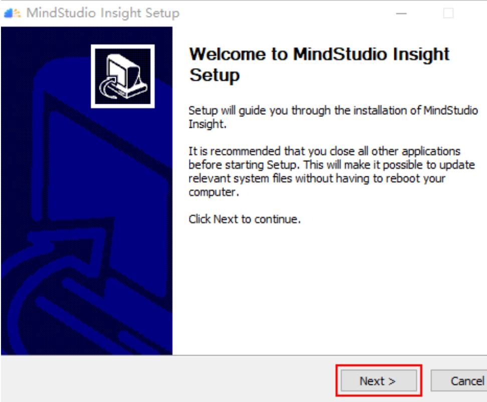  
图 2-1 MindStudio Insight Setup

步骤3 进入许可协议界面，单击“I Agree”，如图2-2所示。

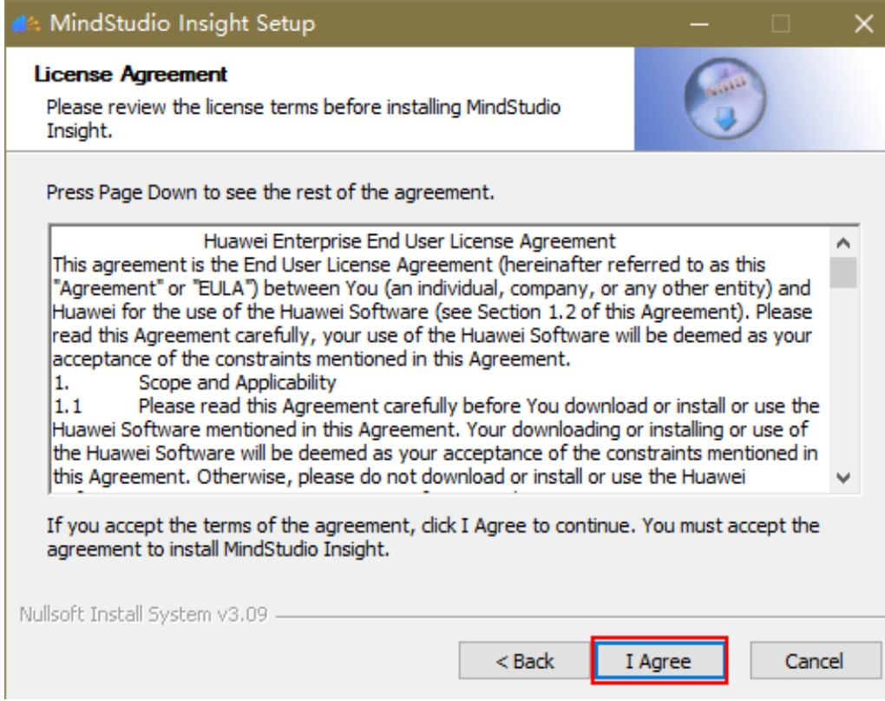  
图 2-2 License Agreement

步骤4 选择MindStudio Insight的安装路径，单击“Next”，如图2-3所示。

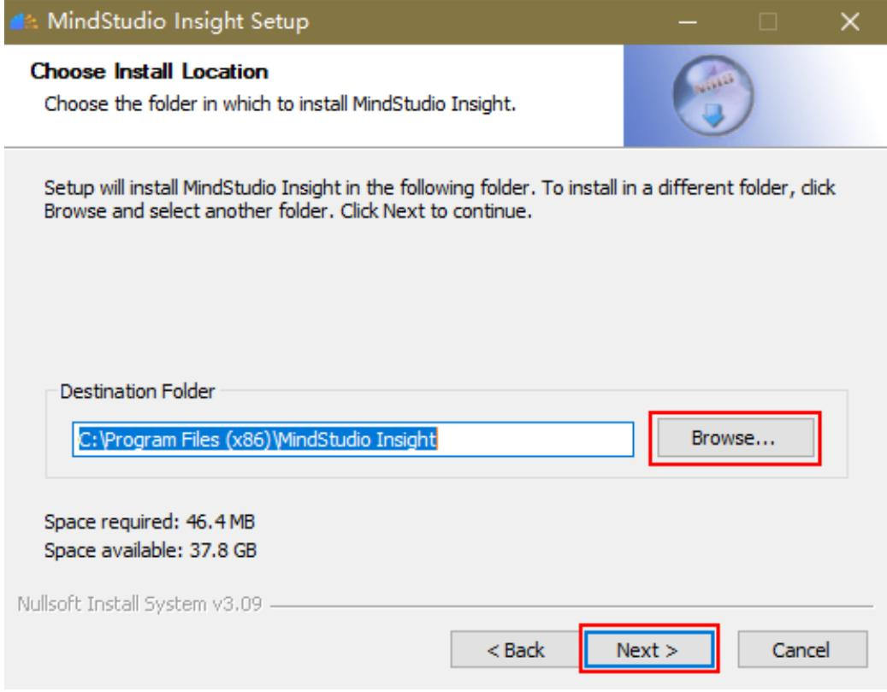  
图 2-3 选择安装路径

# 说明

默认安装目录为“C:\Program Files (x86)\MindStudio Insight”。如果选择安装到其他目录，为避免其他用户修改运行文件，需要取消普通用户的修改权限，可在所选文件夹右键选择“属性$>$ 安全”，在“安全”页签下修改用户的权限。

步骤5 选择安装组件MindStudio Insight，单击“Install”，如图2-4所示。

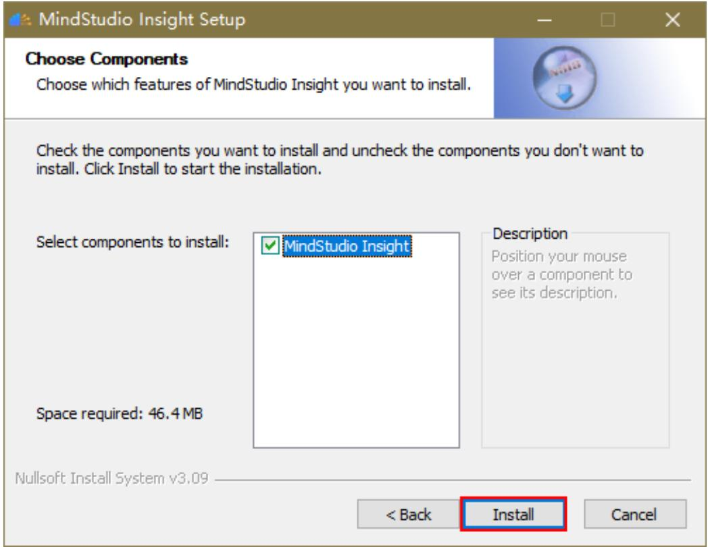  
图 2-4 选择安装组件

步骤6 完成MindStudio Insight安装，单击“Finish”，如图2-5所示。

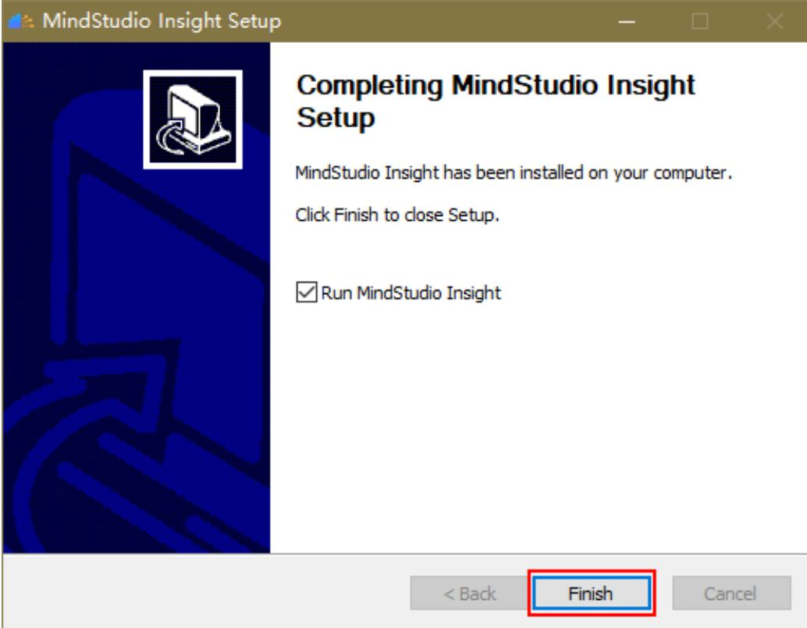  
图 2-5 完成安装

# 步骤7 启动MindStudio Insight。

如果在步骤6中，勾选了“Run MindStudio Insight”，单击“Finish”后会自动启动MindStudio Insight。  
如果未勾选“Run MindStudio Insight”，安装完成后，双击桌面的  
“MindStudio Insight”快捷方式图标，或安装目录下的“MindStudio-  
Insight.exe”，即可启动MindStudio Insight工具。

# 说明

安装完成后，运行MindStudio Insight工具时，如果出现Missing Dependencies报错弹窗，请参见8.4.1 运行MindStudio Insight工具时出现Missing Dependencies报错弹窗解决。

# ----结束

# 2.1.3 卸载 MindStudio Insight

步骤1 进入MindStudio Insight安装目录，双击Uninstall.exe，弹出卸载界面，单击“Uninstall”后进行卸载，如图2-6所示。

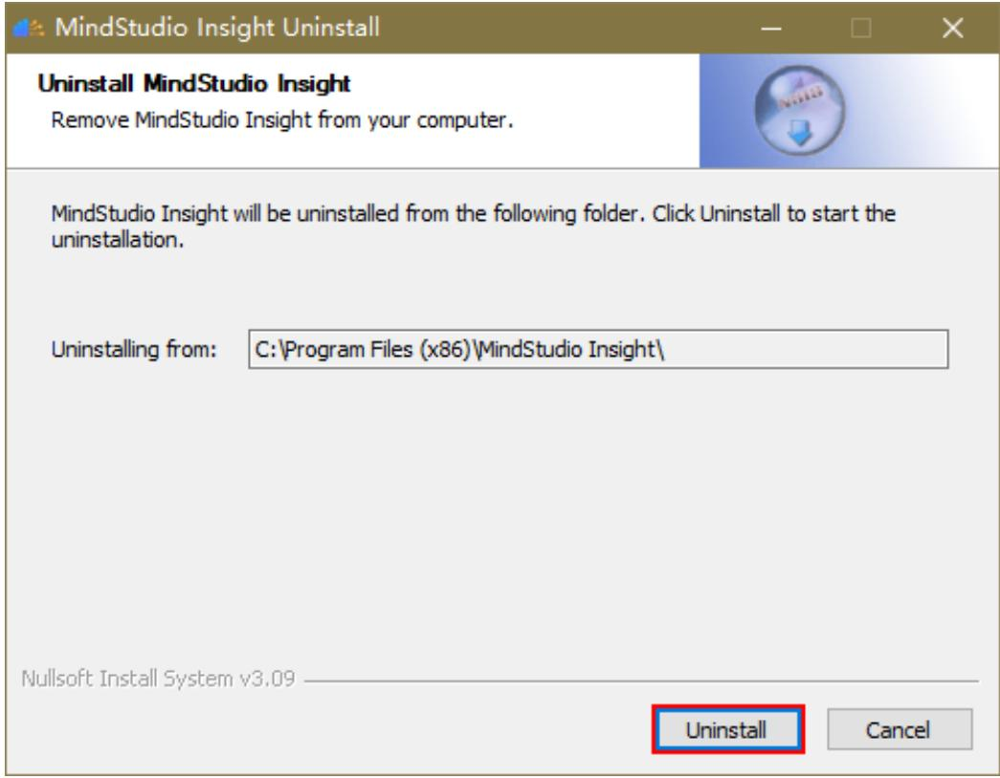  
图 2-6 MindStudio Insight 卸载界面

步骤2 单击“Next”。

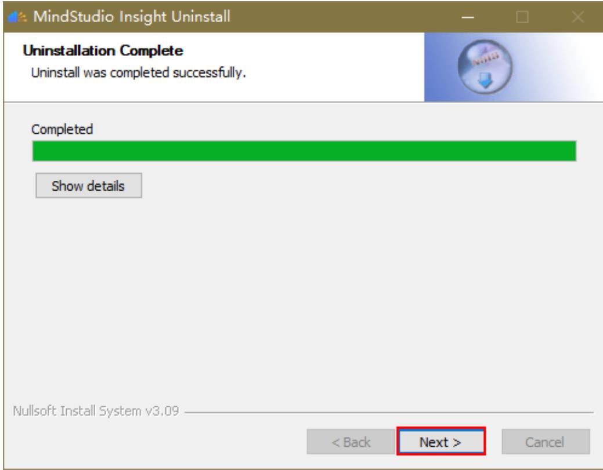  
图 2-7 卸载

步骤3 勾选“Remove cache data”清理缓存数据，单击“Uninstall”卸载。

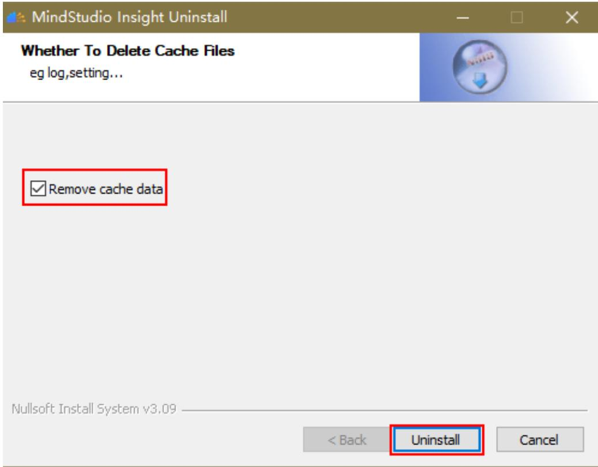  
图 2-8 清理缓存数据

步骤4 完成卸载。

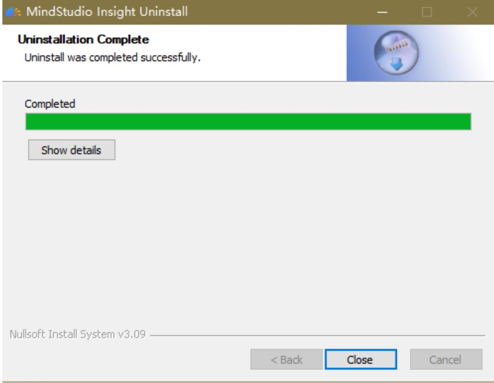  
图 2-9 卸载完成

# ----结束

# 2.2 安装和卸载操作（Linux）

# 2.2.1 概述

在Linux环境下，MindStudio Insight工具可通过本地方式和转发方式进行使用。

本地方式本地安装Linux操作系统的服务器直接外接显示器，将工具界面直接展示在操作系统桌面上，跟日常本地Windows主机接显示器类似，此场景无工具界面的延迟。● 转发方式当本地无Linux服务器时，可通过连接远端的Linux服务器，使用X11、VNC、XRDP等方式将远端Linux服务器中的桌面或软件界面转发到本地显示，例如，本地Windows桌面显示Linux服务器上的应用程序界面。MindStudio Insight可通过转发能力，在Linux服务器上实现界面转发，便于开发者使用。不过与本地方式相比，转发方式受网络性能影响，可能存在网络延时，会造成工具安装使用过程中出现卡顿问题。

本文档主要介绍X11和VNC两种转发方式，开发者可根据实际情况选择其中一种转发方式，可参见表2-3进行选择。通过转发方式安装使用MindStudio Insight，首先需要安装转发方式和软件依赖，安装操作请参见2.2.3 安装转发方式及依赖章节。

# 说明

推荐使用VNC转发方式，可获得更为流畅的使用体验。

表 2-3 转发方式说明  

<table><tr><td rowspan=1 colspan=1>转发方式</td><td rowspan=1 colspan=1>网络延迟</td><td rowspan=1 colspan=1>安全性</td><td rowspan=1 colspan=1>备注</td></tr><tr><td rowspan=1 colspan=1>X11</td><td rowspan=1 colspan=1>相对较高</td><td rowspan=1 colspan=1>底层基于SSH安全协议。</td><td rowspan=1 colspan=1>多用于网络良好的本地局域网中。</td></tr><tr><td rowspan=1 colspan=1>VNC</td><td rowspan=1 colspan=1>相对较低</td><td rowspan=1 colspan=1>默认通过TCP方式，可借助SSH安全协议实现安全访问。</td><td rowspan=1 colspan=1>应用范围更广，可用在跨城网络、VPN网络等。</td></tr></table>

# 2.2.2 准备环境和软件包

在Linux系统中，MindStudio Insight安装环境要求如表2-4所示。

环境要求  
表 2-4 MindStudio Insight 安装环境要求  

<table><tr><td colspan="1" rowspan="1">类别</td><td colspan="1" rowspan="1">限制要求</td></tr><tr><td colspan="1" rowspan="1">硬件</td><td colspan="1" rowspan="1">·内存：最小4GB，推荐8GB及以上磁盘空间：最小6GB</td></tr><tr><td colspan="1" rowspan="1">系统要求</td><td colspan="1" rowspan="1">glibc版本应大于或等于2.27·操作系统自带GUI桌面或具有X11或VNC转发功能</td></tr><tr><td>支持的操作系统</td><td>以apt作为包管理软件类型的操作系统： · Ubuntu 18.04-x86_64/aarch64 Ubuntu 20.04-x86_64/aarch64 Ubuntu 22.04-x86_64/aarch64 ：</td></tr></table>

# 下载软件包

软件安装前，请参考表2-5获取所需软件包和对应的数字签名文件。

表 2-5 软件包  

<table><tr><td rowspan=1 colspan=1>软件包</td><td rowspan=1 colspan=1>说明</td><td rowspan=1 colspan=1>获取链接</td></tr><tr><td rowspan=1 colspan=1>MindStudio-Insight_{version}_linux-aarch64.zip</td><td rowspan=1 colspan=1>适用于Linux系统aarch64架构的MindStudio Insight软件包。</td><td rowspan=2 colspan=1>·商用版:获取软件包·社区版：获取软件包</td></tr><tr><td rowspan=1 colspan=1>MindStudio-Insight_{version}_linux-x86_64.zip</td><td rowspan=1 colspan=1>适用于Linux系统x86_64架构的MindStudio Insight软件包。</td></tr></table>

# 说明

{version表示软件版本号。

# 软件完整性验证

为了防止软件包在传递过程或存储期间被恶意篡改，下载软件包时需下载对应的数字签名文件用于完整性验证。

请单击PGP数字签名工具包获取工具包，将工具包解压后，请参考文件夹中的《OpenPGP签名验证指南》，对下载的软件包进行PGP数字签名校验。如果校验失败，请不要使用该软件包，访问支持与服务在论坛求助或提交技术工单。

# 2.2.3 安装转发方式及依赖

# 2.2.3.1 依赖列表

在Linux环境下，安装MindStudio Insight前需要安装相关依赖，请参见对应系统的依赖列表进行安装。

# 说明

如果MindStudio Insight导入的是多卡场景的性能数据，则需要安装python的pandas库，执行命令pip install pandas进行安装。

Ubuntu系列操作系统依赖列表请参见表2-6。

表 2-6 Ubuntu 系统依赖列表  

<table><tr><td colspan="1" rowspan="1">软件包</td><td colspan="1" rowspan="1">依赖名称</td><td colspan="1" rowspan="1">说明</td></tr><tr><td colspan="1" rowspan="4">MindStudioInsight</td><td colspan="1" rowspan="1">libwebkit2gtk-4.0-dev</td><td colspan="1" rowspan="1">必选，MindStudio Insight显示运行依赖的库文件。</td></tr><tr><td colspan="1" rowspan="1">xterm</td><td colspan="1" rowspan="2">必选，MindStudio Insight通过X11转发的依赖文件。X11转发与VNC转发方式任选其一。</td></tr><tr><td colspan="1" rowspan="1">x11-apps</td></tr><tr><td colspan="1" rowspan="1">xfce4</td><td colspan="1" rowspan="1">必选，MindStudio Insight通过VNC转发的依赖文件。VNC转发方式与X11转发任选其一。</td></tr><tr><td colspan="1" rowspan="7">Python</td><td colspan="1" rowspan="1">click</td><td colspan="1" rowspan="7">编译安装Python需要的依赖。其中版本要求为：· xlsxwriter&gt;=3.0.6numpy&lt;=1.26.4</td></tr><tr><td colspan="1" rowspan="1">tabulate</td></tr><tr><td colspan="1" rowspan="1">networkx</td></tr><tr><td colspan="1" rowspan="1"> jinja2</td></tr><tr><td colspan="1" rowspan="1">PyYaml</td></tr><tr><td colspan="1" rowspan="1">tqdm</td></tr><tr><td colspan="1" rowspan="1">prettytable</td></tr><tr><td colspan="1" rowspan="6"></td><td colspan="1" rowspan="1">ijson</td><td colspan="1" rowspan="6"></td></tr><tr><td colspan="1" rowspan="1">xlsxwriter</td></tr><tr><td colspan="1" rowspan="1">sqlalchemy</td></tr><tr><td colspan="1" rowspan="1">numpy</td></tr><tr><td colspan="1" rowspan="1">pandas</td></tr><tr><td colspan="1" rowspan="1">psutil</td></tr></table>

CentOS系列操作系统依赖列表请参见表2-7。

表 2-7 CentOS 系统依赖列表  

<table><tr><td rowspan=1 colspan=1>软件包</td><td rowspan=1 colspan=1>依赖名称</td><td rowspan=1 colspan=1>说明</td></tr><tr><td rowspan=4 colspan=1>MindStudioInsight</td><td rowspan=1 colspan=1>gtk3-develwebkit2gtk4.1-devel</td><td rowspan=1 colspan=1>必选，MindStudio Insight显示运行依赖的库文件。</td></tr><tr><td rowspan=1 colspan=1> xterm</td><td rowspan=2 colspan=1>必选，MindStudio Insight通过X11转发的依赖文件。X11转发与VNC转发方式任选其一。</td></tr><tr><td rowspan=1 colspan=1> xorg-x11-xauth</td></tr><tr><td rowspan=1 colspan=1>xfce4</td><td rowspan=1 colspan=1>必选，MindStudio Insight通过VNC转发的依赖桌面。VNC转发方式与X11转发任选其一。</td></tr><tr><td rowspan=13 colspan=1>Python</td><td rowspan=1 colspan=1>click</td><td rowspan=13 colspan=1>编译安装Python需要的依赖。其中版本要求为：· xlsxwriter&gt;=3.0.6· numpy&lt;=1.26.4</td></tr><tr><td rowspan=1 colspan=1>tabulate</td></tr><tr><td rowspan=1 colspan=1>networkx</td></tr><tr><td rowspan=1 colspan=1> jinja2</td></tr><tr><td rowspan=1 colspan=1>PyYaml</td></tr><tr><td rowspan=1 colspan=1>tqdm</td></tr><tr><td rowspan=1 colspan=1>prettytable</td></tr><tr><td rowspan=1 colspan=1>ijson</td></tr><tr><td rowspan=1 colspan=1> xlsxwriter</td></tr><tr><td rowspan=1 colspan=1>sqlalchemy</td></tr><tr><td rowspan=1 colspan=1>numpy</td></tr><tr><td rowspan=1 colspan=1>pandas</td></tr><tr><td rowspan=1 colspan=1>psutil</td></tr></table>

EulerOS系列操作系统依赖列表请参见表2-8。

表 2-8 EulerOS 系统依赖列表  

<table><tr><td rowspan=1 colspan=1>软件包</td><td rowspan=1 colspan=1>依赖名称</td><td rowspan=1 colspan=1>说明</td></tr><tr><td rowspan=4 colspan=1>MindStudioInsight</td><td rowspan=1 colspan=1>gtk3-develwebkit2gtk3-devel</td><td rowspan=1 colspan=1>必选，MindStudio Insight显示运行依赖的库文件。</td></tr><tr><td rowspan=1 colspan=1>xterm</td><td rowspan=2 colspan=1>必选，MindStudio Insight通过X11转发的依赖文件。X11转发与VNC转发方式任选其一。</td></tr><tr><td rowspan=1 colspan=1> xorg-x11-xauth</td></tr><tr><td rowspan=1 colspan=1>gnome-desktop</td><td rowspan=1 colspan=1>必选，MindStudio Insight通过VNC转发的依赖桌面。VNC转发方式与X11转发任选其一。</td></tr><tr><td rowspan=13 colspan=1>Python</td><td rowspan=1 colspan=1>click</td><td rowspan=13 colspan=1>编译安装Python需要的依赖。其中版本要求为：· xlsxwriter&gt;=3.0.6· numpy&lt;=1.26.4</td></tr><tr><td rowspan=1 colspan=1>tabulate</td></tr><tr><td rowspan=1 colspan=1>networkx</td></tr><tr><td rowspan=1 colspan=1> jinja2</td></tr><tr><td rowspan=1 colspan=1>PyYaml</td></tr><tr><td rowspan=1 colspan=1>tqdm</td></tr><tr><td rowspan=1 colspan=1>prettytable</td></tr><tr><td rowspan=1 colspan=1>ijson</td></tr><tr><td rowspan=1 colspan=1> xlsxwriter</td></tr><tr><td rowspan=1 colspan=1>sqlalchemy</td></tr><tr><td rowspan=1 colspan=1>numpy</td></tr><tr><td rowspan=1 colspan=1>pandas</td></tr><tr><td rowspan=1 colspan=1>psutil</td></tr></table>

OpenEuler系列操作系统依赖列表请参见表2-9。

表 2-9 OpenEuler 系统依赖列表  

<table><tr><td colspan="1" rowspan="1">软件包</td><td colspan="1" rowspan="1">依赖名称</td><td colspan="1" rowspan="1">说明</td></tr><tr><td colspan="1" rowspan="1">MindStudioInsight</td><td colspan="1" rowspan="1">gtk3-develwebkit2gtk3-devel</td><td colspan="1" rowspan="1">必选，MindStudio Insight显示运行依赖的库文件。</td></tr><tr><td colspan="1" rowspan="3"></td><td colspan="1" rowspan="1">xterm</td><td colspan="1" rowspan="2">必选，MindStudio Insight通过X11转发的依赖文件。X11转发与VNC转发方式任选其一。</td></tr><tr><td colspan="1" rowspan="1">xorg-x11-xauth</td></tr><tr><td colspan="1" rowspan="1">xfce4</td><td colspan="1" rowspan="1">必选，MindStudio Insight通过VNC转发的依赖桌面。VNC转发方式与X11转发任选其一。</td></tr><tr><td colspan="1" rowspan="13">Python</td><td colspan="1" rowspan="1">click</td><td colspan="1" rowspan="13">编译安装Python需要的依赖。其中版本要求为：· xlsxwriter&gt;=3.0.6· numpy&lt;=1.26.4</td></tr><tr><td colspan="1" rowspan="1">tabulate</td></tr><tr><td colspan="1" rowspan="1">networkx</td></tr><tr><td colspan="1" rowspan="1">jinja2</td></tr><tr><td colspan="1" rowspan="1">PyYaml</td></tr><tr><td colspan="1" rowspan="1">tqdm</td></tr><tr><td colspan="1" rowspan="1"> prettytable</td></tr><tr><td colspan="1" rowspan="1">ijson</td></tr><tr><td colspan="1" rowspan="1">xlsxwriter</td></tr><tr><td colspan="1" rowspan="1">sqlalchemy</td></tr><tr><td colspan="1" rowspan="1">numpy</td></tr><tr><td colspan="1" rowspan="1">pandas</td></tr><tr><td colspan="1" rowspan="1">psutil</td></tr></table>

# 2.2.3.2 安装操作

步骤1 执行以下命令，安装Python相关依赖。

<table><tr><td>pip3 install click</td><td></td></tr><tr><td>pip3 install tabulate</td><td></td></tr><tr><td>pip3 install networkx</td><td></td></tr><tr><td>pip3 install jinja2</td><td></td></tr><tr><td>pip3 install PyYaml</td><td></td></tr><tr><td>pip3 install tqdm</td><td></td></tr><tr><td>pip3 install prettytable pip3 install ijson</td><td></td></tr><tr><td>pip3 install xlsxwriter</td><td></td></tr><tr><td>pip3 install sqlalchemy</td><td></td></tr><tr><td>pip3 install numpy</td><td></td></tr><tr><td>pip3 install pandas</td><td></td></tr><tr><td></td><td></td></tr><tr><td>pip3 install psutil</td><td></td></tr></table>

步骤2 安装MindStudio Insight软件包所需的转发方式和依赖，推荐安装X11和VNC转发方式，安装操作请参见8.2 安装转发方式（Linux）章节。

# 须知

8.2 安装转发方式（Linux）章节内容仅供参考，VNC的具体安装步骤请参见VNC官方文档。

----结束

# 2.2.4 安装 MindStudio Insight

在Linux系统上安装MindStudio Insight工具，解压zip格式的软件包即可。

# 前提条件

● 已完成环境与软件包准备，可参见2.2.2 准备环境和软件包。如果需要通过X11或VNC方式将GUI界面转发至本地桌面，首先需要安装相关依赖，请参见2.2.3 安装转发方式及依赖章节完成安装。

# 操作步骤

步骤1 使用MindStudio Insight的安装用户上传软件包至待安装环境。

步骤2 在软件包所在目录下，执行以下命令，解压MindStudio Insight软件包。

aarch64架构的软件包   
unzip MindStudio-Insight_{version}_linux-aarch64.zip x86_64架构的软件包   
unzip MindStudio-Insight_{version}_linux-x86_64.zip

步骤3 执行以下命令，启动MindStudio Insight。 ./MindStudio-Insight

# 说明

● 如果在EulerOS系统上运行MindStudio Insight，单击界面左上方工具栏中的 田 无法弹出导入选择框，解决方法可参见8.4.3 EulerOS等系统上运行MindStudio Insight工具无法弹出数据导入选择框。在X11转发方式下运行MindStudio Insight时，如果出现输入框信息粘贴不符合预期，造成输入信息错误的情况，具体解决方法可参见8.4.4 通过X11转发方式运行MindStudio Insight工具时，输入框信息粘贴有误。

# ----结束

# 2.2.5 卸载 MindStudio Insight

在Linux系统中，卸载MindStudio Insight工具有2种方式可选。

通过直接删除MindStudio Insight解压后的软件包进行卸载。该操作不会删除日志文件。

使用命令行方式进行卸载。

a. 执行以下命令，卸载MindStudio Insight。 rm -rf MindStudio-Insight resources   
b. 执行以下命令，删除MindStudio Insight的日志文件。 rm -rf \${HOME}/.mindstudio_insight

# 2.3 安装和卸载操作（macOS）

# 2.3.1 准备环境和软件包

本地环境要求

macOS系统需为macOS Ventura 13.5及以上版本。

下载软件包

软件安装前，请参考表2-10获取所需软件包和对应的数字签名文件。

表 2-10 软件包  

<table><tr><td rowspan=1 colspan=1>软件包</td><td rowspan=1 colspan=1>说明</td><td rowspan=1 colspan=1>获取链接</td></tr><tr><td rowspan=1 colspan=1>MindStudio-Insight_{version}_darwin-{arch}.dmg</td><td rowspan=1 colspan=1>适用于macOS系统的MindStudioInsight软件包，含有GUI的集成开发环境。</td><td rowspan=1 colspan=1>商用版：获取软件包社区版：获取软件包</td></tr></table>

# 说明

{version表示软件版本号，{arch表示CPU架构。

# 软件完整性验证

为了防止软件包在传递过程或存储期间被恶意篡改，下载软件包时需下载对应的数字签名文件用于完整性验证。

请单击PGP数字签名工具包获取工具包，将工具包解压后，请参考文件夹中的《OpenPGP签名验证指南》，对下载的软件包进行PGP数字签名校验。如果校验失败，请不要使用该软件包，访问支持与服务在论坛求助或提交技术工单。

# 2.3.2 安装 MindStudio Insight

前提条件

请参见2.3.1 准备环境和软件包章节，完成安装MindStudio Insight工具前的准备工作。

# 操作步骤

步骤1 鼠标双击“MindStudio-Insight_{version}_darwin-{arch}.dmg”软件包，进入许可协议界面，单击“Agree”，如图2-10所示。

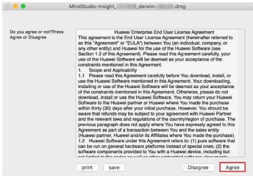  
图 2-10 许可协议

步骤2 弹出Installer弹窗，在Installer弹窗中，将MindStudio Insight应用拖拽至Applications文件夹中，如图2-11所示。

  
图 2-11 拖拽应用至文件夹

步骤3 在应用程序中双击MindStudio Insight应用，即可打开MindStudio Insight工具。

# ----结束

# 说明

当前适用于macOS系统的MindStudio Insight应用程序，在部分macOS系统上运行时，可能会出现无法打开“MindStudio Insight”的情况。当运行MindStudio Insight时，如果出现无法打开“MindStudio Insight”的弹窗，需单击弹窗信息中的“好”，然后在“系统设置 > 隐私与安全性 > 安全性”中选择“App Store和被认可的开发者”，在出现的“已阻止使用MindStudio Insight”信息中单击“仍要打开”，授予执行权限，再次双击MindStudio Insight应用，出现无法打开“MindStudio Insight”弹窗时，单击弹窗中的“打开”，即可正常打开MindStudio Insight工具。● 如果需要在macOS系统上同时打开多个MindStudio Insight工具，可在终端窗口中，执行open -n /Applications/MindStudio Insight.app命令。但是不建议在两个MindStudioInsight窗口中同时打开同一份数据，以免出现数据解析问题。

# 2.3.3 卸载 MindStudio Insight

步骤1 进入应用程序中，找到MindStudio Insight。

步骤2 鼠标右键单击MindStudio Insight应用，弹出菜单栏。

步骤3 单击“移到废纸篓”即可卸载。

----结束

# 2.4 升级 MindStudio Insight

如果需要升级MindStudio Insight，需先卸载已安装的MindStudio Insight，再获取最新MindStudio Insight软件包重新安装。

请根据实际场景，分别参见2.1 安装和卸载操作（Windows）、2.2 安装和卸载操作（Linux）、2.3 安装和卸载操作（macOS）章节内容完成卸载操作，并重新安装最新MindStudio Insight软件包。

# 3 基础操作

基础设置导入数据管理数据管理日志常用快捷键

# 3.1 基础设置

# 切换主题

步骤1 打开MindStudio Insight工具。  
步骤2 单击界面右上方 ，切换主题，可切换为亮色或者暗色主题。----结束

# 切换语言

步骤1 打开MindStudio Insight工具。  
步骤2 单击界面右上方 $w \not \in \beta$ ，进行MindStudio Insight工具中英文切换。----结束

# 3.2 导入数据

MindStudio Insight工具可导入性能数据，以图形化形式呈现，便于开发人员分析。本章节指导用户使用导入数据功能。

# 操作步骤

导入数据操作的三种方式如下：

# 方式一：选择性能数据路径

打开MindStudio Insight工具，单击界面左上方“导入数据”，在弹窗中选择性能数据文件或目录，然后单击“确认”进行导入，如图3-1所示。

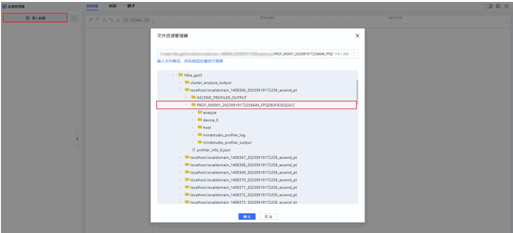  
图3-1 选择路径

# 方式二：输入性能数据路径

打开MindStudio Insight工具，单击界面左上方“导入数据”，在弹窗中的输入框直接输入需要导入的性能数据所在正确路径，然后按“回车键”，则在下方自动定位至该目录，单击“确认”进行导入，如图3-2所示。

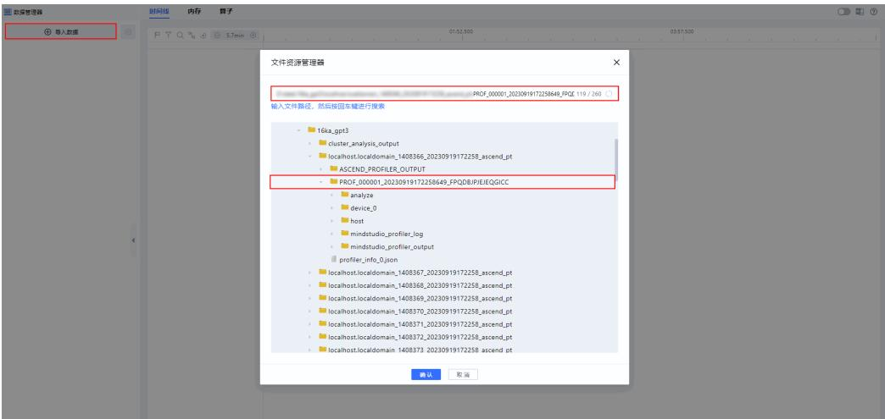  
图 3-2 输入正确路径

方式三：拖拽性能文件至MindStudio Insight工具界面

打开MindStudio Insight工具，支持将性能文件拖拽至MindStudio Insight工具界面打开，展示对应页面。可支持拖拽单文件和单文件夹性能数据。

# 说明

● 仅支持本地磁盘数据导入，如果是网络磁盘，则需要先将网络磁盘映射至本地，再导入对应目录，网络磁盘映射至本地的操作请参见8.4.5 MindStudio Insight工具拖入网络磁盘目录无法加载数据。

如果Windows系统上的MindStudio Insight工具在拖入文件时，显示禁用，请参见8.4.7MindStudio Insight工具拖入文件显示禁用解决。

# 3.3 管理数据

MindStudio Insight工具导入数据后，在数据管理器下会将当次导入的数据生成一个工程，该工程下显示当次导入数据的详情。MindStudio Insight具有数据记忆、数据管理以及数据对比功能。

# 数据记忆

当再次打开同一个版本的MindStudio Insight工具时，在界面左侧导航栏会自动记忆并展示上一次关闭工具时的数据。

# 数据管理

创建数据工程

在MindStudio Insight界面，单击界面左上方“导入数据”，成功导入后，自动创建一个数据工程，如图3-3所示。

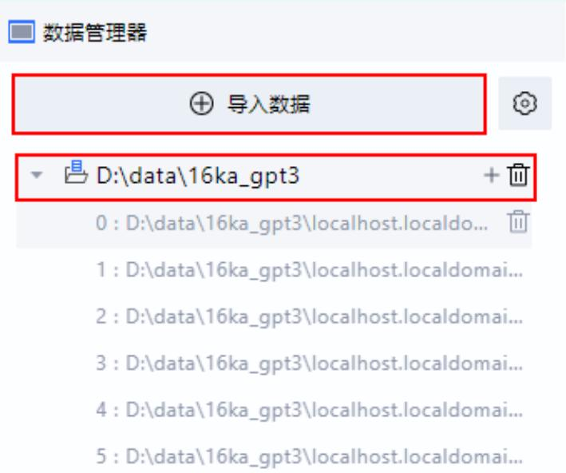  
图3-3 创建数据工程

修改数据工程名称

在MindStudio Insight界面左侧导航栏，在工程名称上双击鼠标左键，输入新的名称，修改工程名。

删除数据

# 说明

删除工程操作不会影响原始的性能文件。

删除多个工程：

i. 在MindStudio Insight界面左侧导航栏，单击“导入数据”左侧的 ，选择需要删除的工程，如图3-4所示。

  
图 3-4 设置工程勾选

ii. 默认勾选全部工程，也可单独勾选需要删除的工程，单击“全部”按钮所在行的 ，删除所选工程，如图3-5所示。

  
图 3-5 删除多个工程

删除单个工程：在MindStudio Insight界面左侧导航栏，单击工程行后面的，删除该工程，如图3-6所示。

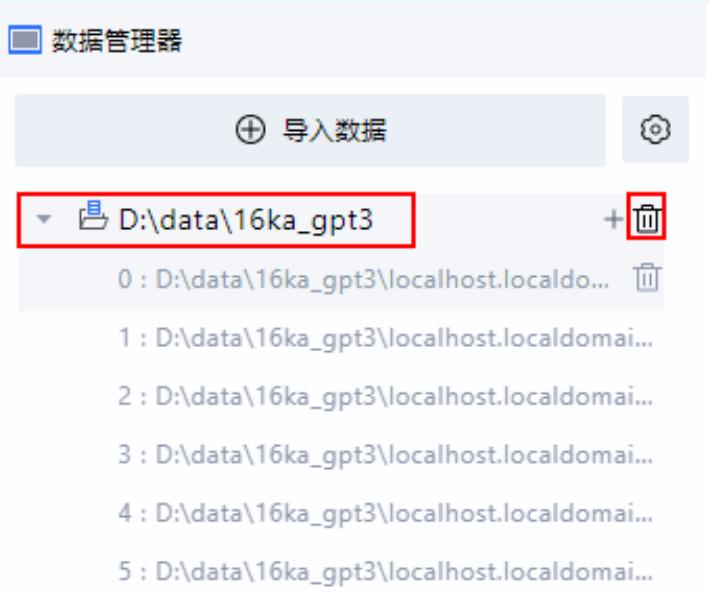  
图 3-6 删除单个工程

其它操作

工程内导入数据：单击工程行后面的 $^ +$ ，在该工程下导入数据，如图3-7所示。

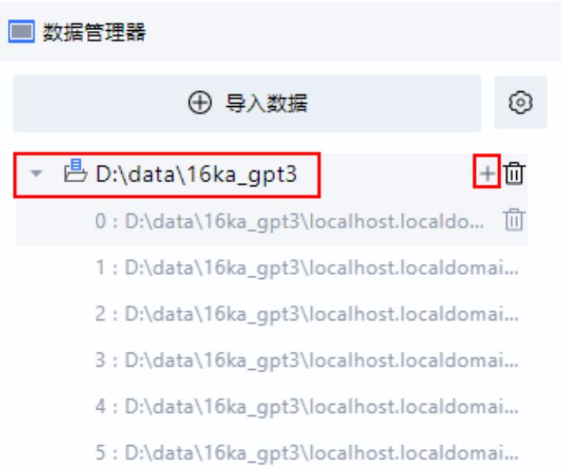  
图 3-7 工程内导入数据

工程内删除数据：单击工程内所选数据行后面的 ，删除该工程内所选数据。

# 数据对比

MindStudio Insight工具支持单卡数据间的性能对比，也支持集群数据间的性能对比，需要设置基线数据和对比数据进行对比。

● 设置单卡对比a. 选择需要设置为基线的卡目录，单击鼠标右键，选择“设置为基线数据”，设置当前选中卡为基线卡，如图3-8所示。

设置完成后，当前卡目录会标识颜色。在当前卡再次单击鼠标右键，选择“取消设置基线数据”，可直接取消当前卡的基线状态；也可重新选择任意一张卡目录，单击鼠标右键，选择“设置为基线数据”，则会重新将当前所选卡作为基线数据。

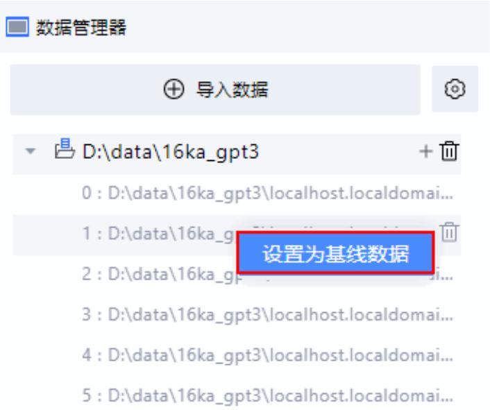  
图 3-8 设置基线数据

b. 选择需要作为对比卡的卡目录，单击鼠标右键，选择“设置为对比数据”，设置所选卡为对比卡，如图3-9所示。

设置完成后，对比卡目录会标识颜色，且区别于基线数据目录的颜色。对比数据只能选择当前打开的工程下的卡目录作为对比卡。在当前对比卡上再次单击鼠标右键，选择“取消设置对比数据”，可直接取消当前对比卡的对比状态；也可重新选择任意一张卡目录，单击鼠标右键，选择“设置为对比数据”，则会重新设置对比数据。

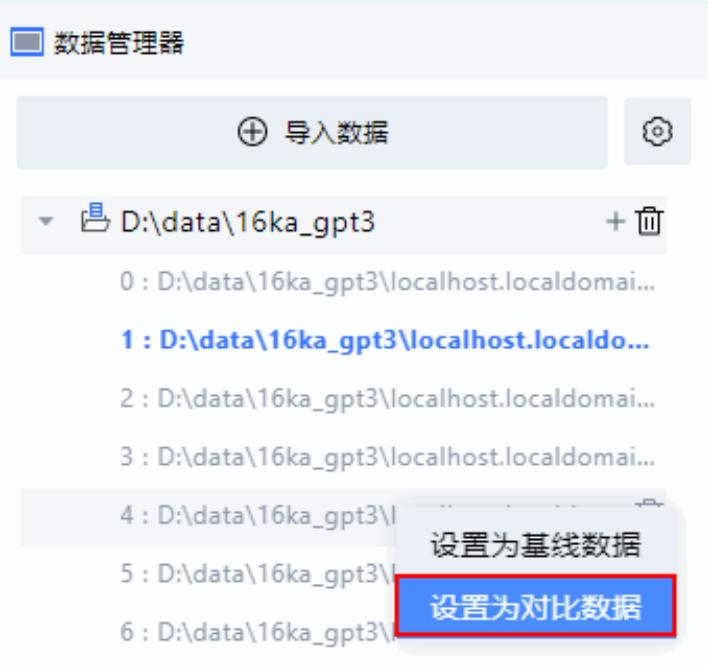  
图 3-9 设置对比数据

c. 基线数据和对比数据设置成功后，可前往时间线（Timeline）、内存（Memory）以及算子（Operator）界面查看数据对比详情。

设置集群对比

a. 选定一个对比数据，当前选中显示的数据即为对比数据。

b. 选择基线数据。

选择需要设置为基线的集群目录，单击鼠标右键，选择“设置为基线数据”，如图3-10所示。

设置完成后，当前集群目录会标识颜色。在当前集群目录再次单击鼠标右键，选择“取消设置基线数据”，可直接取消当前集群目录的基线状态；也可重新选择任意一个集群目录，单击鼠标右键，选择“设置为基线数据”，则会重新将当前所选集群目录作为基线数据。

# 说明

当在某一个工程中导入的集群数据目录为“cluster_analysis_output”时，也可选择该工程下的此数据设置为基线数据。

  
图 3-10 设置基线数据

c. 基线数据设置成功后，可前往概览（Summary）和通信（Communication）界面查看数据对比详情。

# 3.4 管理日志

# 日志存放路径

MindStudio Insight工具的日志文件存放路径参见表3-1。

表 3-1 日志文件存放路径  

<table><tr><td rowspan=1 colspan=1>系统</td><td rowspan=1 colspan=1>日志存放路径</td></tr><tr><td rowspan=1 colspan=1>Windows</td><td rowspan=1 colspan=1>安装路径为C盘，日志路径为：C:\Users\{用户名}\.mindstudio_insight安装路径为其他目录，日志路径为：{安装目剥\.mindstudio_insight</td></tr><tr><td rowspan=1 colspan=1>Linux</td><td rowspan=1 colspan=1>$HOME/.mindstudio_insight</td></tr><tr><td rowspan=1 colspan=1>macOs</td><td rowspan=1 colspan=1>/Users/{用户名}/.mindstudio_insight</td></tr></table>

# 日志文件说明

MindStudio Insight工具的日志文件说明请参见表3-2。

表 3-2 日志文件说明  

<table><tr><td>名称</td><td>说明</td></tr><tr><td>profiler_server_{端口 号_{编号.log</td><td>程序运行日志，主要供开发者定位问题使用。</td></tr></table>

# 日志清理机制

MindStudio Insight工具的日志清理方式包括自动清理和手动清理。

自动清理

MindStudio Insight工具的日志文件具有自动清理机制。由于MindStudio Insight工具每个端口仅支持存放10个日志文件，所以当日志文件数量超过10个后，后续生成的日志文件会自动从第一个日志文件开始覆盖，依次循环，且单个日志文件大小不超过10MB。

手动清理

进入日志文件存放路径，手动删除对应日志文件，日志存放路径参见日志存放路径。

# 3.5 常用快捷键

本节介绍MindStudio Insight工具的常用快捷键。

表3-3 常用快捷键  

<table><tr><td colspan="1" rowspan="1">快捷键</td><td colspan="1" rowspan="1">说明</td></tr><tr><td colspan="1" rowspan="1">W</td><td colspan="1" rowspan="1">放大时间线（Timeline）界面的图形化窗格。</td></tr><tr><td colspan="1" rowspan="1">S</td><td colspan="1" rowspan="1">缩小时间线（Timeline）界面的图形化窗格。</td></tr><tr><td colspan="1" rowspan="1">Ctrl +鼠标滚轮</td><td colspan="1" rowspan="1">缩小、放大时间线（Timeline）界面的图形化窗格。如果是macOS系统，需要使用Command+鼠标滚轮。</td></tr><tr><td colspan="1" rowspan="1">Alt +鼠标左键</td><td colspan="1" rowspan="1">放大时间线（Timeline）界面框选的区域。如果是macOS系统，需要使用Option+鼠标左键。</td></tr><tr><td colspan="1" rowspan="1">Shift + Z</td><td colspan="1" rowspan="1">将时间线（Timeline）界面框选区域放大至当前屏幕。</td></tr><tr><td colspan="1" rowspan="1">Backspace</td><td colspan="1" rowspan="1">撤销一次时间线（Timeline）界面图形化窗格的缩放。</td></tr><tr><td colspan="1" rowspan="1">A/左方向键</td><td colspan="1" rowspan="1">左移时间线（Timeline）界面的图形化窗格。</td></tr><tr><td colspan="1" rowspan="1">D/右方向键</td><td colspan="1" rowspan="1">右移时间线（Timeline）界面的图形化窗格。</td></tr><tr><td colspan="1" rowspan="1">Ctrl +鼠标左键</td><td colspan="1" rowspan="1">拖动可左右移动时间线（Timeline）界面的图形化窗格。如果是macOS系统，需要使用Command+鼠标左键。</td></tr><tr><td colspan="1" rowspan="1">上方向键</td><td colspan="1" rowspan="1">上移时间线（Timeline）界面的图形化窗格。</td></tr><tr><td colspan="1" rowspan="1">下方向键</td><td colspan="1" rowspan="1">下移时间线（Timeline）界面的图形化窗格。</td></tr><tr><td colspan="1" rowspan="1">Ctrl + 0</td><td colspan="1" rowspan="1">重置时间线（Timeline）界面的图形化窗格。如果是macOS系统，需要使用Command +0。</td></tr><tr><td colspan="1" rowspan="1">M</td><td colspan="1" rowspan="1">框选时间线（Timeline）界面所选的单个算子区域，再次按下M键，可取消框选。</td></tr><tr><td colspan="1" rowspan="1">L</td><td colspan="1" rowspan="1">在时间线（Timeline）界面，选中算子后，将选中算子与基准算子的开始时间（左边界）对齐。</td></tr><tr><td colspan="1" rowspan="1">R</td><td colspan="1" rowspan="1">在时间线（Timeline）界面，选中算子后，将选中算子与基准算子的结束时间（右边界）对齐。</td></tr><tr><td colspan="1" rowspan="1">Q</td><td colspan="1" rowspan="1">收起或展开时间线（Timeline）界面底部的面板。</td></tr><tr><td colspan="1" rowspan="1">K</td><td colspan="1" rowspan="1">在时间线（Timeline）界面，使用K键可快速设置区域标记和单点标记。</td></tr><tr><td colspan="1" rowspan="1">Shift +鼠标滚轮/Ctrl +鼠标拖动</td><td colspan="1" rowspan="1">在“流水并行图”和“通信算子缩略图”中，可左右移动图表。</td></tr><tr><td colspan="1" rowspan="1">Ctrl +鼠标滚轮</td><td colspan="1" rowspan="1">在“流水并行图”和“通信算子缩略图”中，可放大或缩小图表。</td></tr><tr><td colspan="1" rowspan="1">Ctrl + F</td><td colspan="1" rowspan="1">调出源码（Source）界面源文件代码区域的搜索框，进行搜索。如果是macOS系统，需要使用Command + F。</td></tr></table>

导入性能数据  
时间线（Timeline）  
内存（Memory）  
算子（Operator）  
概览（Summary）  
通信（Communication）  
强化学习（RL）

# 4.1 导入性能数据

概述

MindStudio Insight支持导入性能数据文件，并以图形化形式呈现相关内容。性能数据文件的采集方式请分别参见《性能调优工具指南》中的“PyTorch训练场景性能分析快速入门” “TensorFlow训练场景性能分析快速入门”和“msprof模型调优工具 >性能数据采集和自动解析 > msprof采集通用命令”章节内容，以及《MindSpore教程》中的“调试调优 $>$ Ascend性能调优”章节内容。

性能数据分为单卡场景和集群场景，具体请参见表4-1，数据导入操作请参见3.2 导入数据章节进行导入。

表 4-1 性能数据场景说明  

<table><tr><td colspan="1" rowspan="1">场景</td><td colspan="1" rowspan="1">说明</td></tr><tr><td colspan="1" rowspan="1">单卡场景</td><td colspan="1" rowspan="1">可在MindStudio Insight工具中导入单卡进行分析。当导入单卡场景数据时，MindStudio Insight工具支持显示时间线（Timeline）、内存（Memory）和算子（Operator）界面，具体内容请参见单卡场景。</td></tr><tr><td colspan="1" rowspan="1">集群场景</td><td colspan="1" rowspan="1">集群场景根据卡数量可分为小集群场景和大集群场景，导入不同场景的数据，界面展示也会有所变化，具体请参见集群场景。</td></tr><tr><td></td><td>集群精简数据，将集群数据简化，只显示通信大算子数据和部分计 算类算子。</td></tr></table>

# 说明

当导入的text场景的性能数据中同时存在db文件，MindStudio Insight工具会优先解析db文件。如果您只需要可视化呈现text场景数据，则需要在性能数据原文件夹中查找db文件并删除，再重新导入，即可呈现text场景数据。text场景和db场景的性能数据文件详情请参见单卡场景。

# 单卡场景

在单卡场景下，性能数据可分为三大类型，如下所示：

PyTorch训练/推理数据：支持导入以“ascend_pt”结尾的性能数据目录，性能数据文件详情请分别参见表4-2和表4-3。

表 4-2 PyTorch 训练/推理性能数据文件（text）  

<table><tr><td rowspan=1 colspan=1>文件名</td><td rowspan=1 colspan=1>说明</td><td rowspan=1 colspan=1>展示界面</td></tr><tr><td rowspan=1 colspan=1>trace_view.json</td><td rowspan=1 colspan=1>包括应用层数据、CANN层数据和底层NPU数据。</td><td rowspan=1 colspan=1>时间线（Timeline）</td></tr><tr><td rowspan=1 colspan=1>msprof_*.json</td><td rowspan=1 colspan=1>Timeline数据总表。如果存在变频数据（Al Core Freq）信息，会展示Al Core Freq层级。</td><td rowspan=1 colspan=1>时间线（Timeline）</td></tr><tr><td rowspan=1 colspan=1>operator_details.cSV</td><td rowspan=1 colspan=1>统计PyTorch算子在Host侧（下发）和Device侧（执行）的耗时。</td><td rowspan=1 colspan=1>时间线（Timeline）</td></tr><tr><td rowspan=1 colspan=1>memory_record.csV</td><td rowspan=1 colspan=1>进程级内存申请情况信息。</td><td rowspan=1 colspan=1>内存（Memory）</td></tr><tr><td rowspan=1 colspan=1>operator_memory.CSv</td><td rowspan=1 colspan=1>算子内存申请情况信息。</td><td rowspan=1 colspan=1>内存（Memory）</td></tr><tr><td rowspan=1 colspan=1>kernel_details.csv</td><td rowspan=1 colspan=1>NPU上执行的所有算子的信息。</td><td rowspan=1 colspan=1>算子（Operator）</td></tr><tr><td rowspan=1 colspan=1>step_trace_time.csV</td><td rowspan=1 colspan=1>迭代中计算和通信的时间统计。</td><td rowspan=1 colspan=1>概览（Summary）</td></tr><tr><td rowspan=1 colspan=1>communication.json</td><td rowspan=1 colspan=1>通信算子通信耗时、带宽等详细信息文件。</td><td rowspan=1 colspan=1>通信（Communication）</td></tr><tr><td rowspan=1 colspan=1>communication_matrix.json</td><td rowspan=1 colspan=1>通信小算子基本信息文件。</td><td rowspan=1 colspan=1>通信（Communication）</td></tr><tr><td rowspan=1 colspan=3>注：“*”表示{timestamp}时间戳。</td></tr></table>

表 4-3 PyTorch 训练/推理性能数据文件（db）  

<table><tr><td rowspan=1 colspan=1>文件名</td><td rowspan=1 colspan=1>说明</td><td rowspan=1 colspan=1>展示界面</td></tr><tr><td rowspan=1 colspan=1>ascend_pytorch_profiler_{rank_id.db</td><td rowspan=1 colspan=1>Ascend PyTorch Profiler接口采集的性能数据文件。</td><td rowspan=2 colspan=1>时间线（Timeline）内存（Memory）算子（Operator）概览（Summary）通信（Communication）</td></tr><tr><td rowspan=1 colspan=1>analysis.db</td><td rowspan=1 colspan=1>多卡或集群等存在通信的场景下，采集到的数据文件。</td></tr></table>

# 说明

● 表4-2中memory_record.csv和operator_memory.csv两个文件必须同时存在且保证在同一目录，导入成功后内存（Memory）界面才能正常展示。  
● 支持导入算子打点数据文件，获取文件方式请参见《性能调优工具指南》中的“Ascend PyTorch调优工具”章节“msprof_tx”相关内容，导入成功后会在时间线（Timeline）界面展示打点数据。  
● 导入单卡时，不展示概览（Summary）和通信（Communication）界面。

MindSpore训练/推理数据：支持导入MindSpore框架性能数据，获取方式请参见《MindSpore教程》中的“调试调优 $>$ Ascend性能调优”章节。

MindStudio Insight工具支持导入以“ascend_ms”结尾的性能数据目录，性能数据文件详情请分别参见表4-4和表4-5。

表 4-4 MindSpore 训练/推理性能数据文件（text）  

<table><tr><td colspan="1" rowspan="1">文件名</td><td colspan="1" rowspan="1">说明</td><td colspan="1" rowspan="1">展示界面</td></tr><tr><td colspan="1" rowspan="1">msprof_*.json</td><td colspan="1" rowspan="1">Timeline数据总表。如果存在变频数据（AlCore Freq）信息，会展示Al CoreFreq层级。</td><td colspan="1" rowspan="1">时间线（Timeline）</td></tr><tr><td colspan="1" rowspan="1">trace_view.json</td><td colspan="1" rowspan="1">包括应用层数据、CANN层数据和底层NPU数据。</td><td colspan="1" rowspan="1">时间线（Timeline）</td></tr><tr><td colspan="1" rowspan="1">memory_record.CSv</td><td colspan="1" rowspan="1">进程级内存申请情况信息。</td><td colspan="1" rowspan="1">内存（Memory）</td></tr><tr><td colspan="1" rowspan="1">operator_memory.csv</td><td colspan="1" rowspan="1">算子内存申请情况信息。</td><td colspan="1" rowspan="1">内存（Memory）</td></tr><tr><td colspan="1" rowspan="1">static_op_mem.CSV</td><td colspan="1" rowspan="1">静态图场景内存申请情况信息。</td><td colspan="1" rowspan="1">内存（Memory）</td></tr><tr><td colspan="1" rowspan="1">kernel_details.csV</td><td colspan="1" rowspan="1">NPU上执行的所有算子的信息。</td><td colspan="1" rowspan="1">算子（Operator）</td></tr><tr><td colspan="1" rowspan="1">step_trace_time.cSv</td><td colspan="1" rowspan="1">迭代中计算和通信的时间统计。</td><td colspan="1" rowspan="1">概览（Summary）</td></tr><tr><td colspan="1" rowspan="1">communication.json</td><td colspan="1" rowspan="1">通信算子通信耗时、带宽等详细信息文件。</td><td colspan="1" rowspan="1">通信（Communication）</td></tr><tr><td colspan="1" rowspan="1">communication_matrix.json</td><td colspan="1" rowspan="1">通信小算子基本信息文件。</td><td colspan="1" rowspan="1">通信（Communication）</td></tr><tr><td colspan="3" rowspan="1">注：“*”表示{timestamp}时间戳。</td></tr></table>

表 4-5 MindSpore 训练/推理性能数据文件（db）  

<table><tr><td rowspan=1 colspan=1>文件名</td><td rowspan=1 colspan=1>说明</td><td rowspan=1 colspan=1>展示界面</td></tr><tr><td rowspan=1 colspan=1>ascend_mindspore_profiler_{rank_id}.db</td><td rowspan=1 colspan=1>Ascend MindSpore Profiler接口采集的性能数据文件。</td><td rowspan=2 colspan=1>时间线（Timeline）内存（Memory）算子（Operator）概览（Summary）通信（Communication）</td></tr><tr><td rowspan=1 colspan=1>communication_analyzer.db</td><td rowspan=1 colspan=1>多卡或集群等存在通信的场景下，采集到的数据文件。</td></tr></table>

# 说明

● 表4-4中memory_record.csv和operator_memory.csv两个文件必须同时存在且保证在同一目录，导入成功后内存（Memory）界面才能正常展示。当static_op_mem.csv存在时，内存（Memory）界面会展示静态图模式。  
● 导入单卡时，不展示概览（Summary）和通信（Communication）界面。当在GRAPH模式下，编译优化等级参数jit_level设置为O2，且调用step接口方式采集的性能数据，在导入MindStudio Insight工具时，不支持展示通信（Communication）界面。

离线推理数据：支持导入mindstudio_profiler_output目录下性能数据，性能数据文件详情请分别参见表4-6和表4-7。

表 4-6 离线推理性能数据文件（text）  

<table><tr><td colspan="1" rowspan="1">文件名</td><td colspan="1" rowspan="1">说明</td><td colspan="1" rowspan="1">展示界面</td></tr><tr><td colspan="1" rowspan="1">msprof_*.json</td><td colspan="1" rowspan="1">Timeline数据总表。</td><td colspan="1" rowspan="1">时间线（Timeline）</td></tr><tr><td colspan="1" rowspan="1">fusion_op_*.csv</td><td colspan="1" rowspan="1">模型中算子融合前后信息。单算子场景下无此性能数据文件。</td><td colspan="1" rowspan="1">时间线（Timeline）</td></tr><tr><td colspan="1" rowspan="1">api_statistic_*.csV</td><td colspan="1" rowspan="1">用于统计CANN层的API执行耗时信息。</td><td colspan="1" rowspan="1">时间线（Timeline）</td></tr><tr><td colspan="1" rowspan="1">memory_record_*.csv</td><td colspan="1" rowspan="1">进程级内存申请情况信息。</td><td colspan="1" rowspan="1">内存（Memory）</td></tr><tr><td colspan="1" rowspan="1">operator_memory_*.csv</td><td colspan="1" rowspan="1">算子内存申请情况信息。</td><td colspan="1" rowspan="1">内存（Memory）</td></tr><tr><td colspan="1" rowspan="1">op_summary_*.CSv</td><td colspan="1" rowspan="1">Al Core和AI CPU算子数据。</td><td colspan="1" rowspan="1">算子（Operator）</td></tr><tr><td colspan="1" rowspan="1">op_statistic_*.csV</td><td colspan="1" rowspan="1">Al Core和AICPU算子调用次数及耗时统计。</td><td colspan="1" rowspan="1">算子（Operator）</td></tr><tr><td colspan="1" rowspan="1">prof_rule_0_*.json</td><td colspan="1" rowspan="1">调优建议。</td><td colspan="1" rowspan="1">时间线（Timeline）概览（ Summary）通信（Communication）</td></tr><tr><td colspan="1" rowspan="1">step_trace_*.csv</td><td colspan="1" rowspan="1">迭代轨迹数据。单算子场景下无此性能数据文件。</td><td colspan="1" rowspan="1"></td></tr><tr><td colspan="1" rowspan="1">step_trace_*.json</td><td colspan="1" rowspan="1">迭代轨迹数据，每轮迭代的耗时。单算子场景下无此性能数据文件。</td><td colspan="1" rowspan="1"></td></tr><tr><td colspan="1" rowspan="1">task_time_*.csv</td><td colspan="1" rowspan="1">Task Scheduler任务调度信息。</td><td colspan="1" rowspan="1"></td></tr><tr><td colspan="3" rowspan="1">注：“*”表示{timestamp}时间戳。</td></tr></table>

表 4-7 离线推理性能数据文件（db）  

<table><tr><td rowspan=1 colspan=1>文件名</td><td rowspan=1 colspan=1>说明</td><td rowspan=1 colspan=1>展示界面</td></tr><tr><td rowspan=1 colspan=1>msprof_*.db</td><td rowspan=1 colspan=1>统一db文件。当前该格式数据与text参数解析的数据信息量存在差异。</td><td rowspan=1 colspan=1>时间线（Timeline）内存（Memory）算子（Operator）概览（Summary）通信（Communication）</td></tr><tr><td rowspan=1 colspan=3>注：“*”表示{timestamp}时间戳。</td></tr></table>

# 说明

表4-6中memory_record.csv和operator_memory.csv两个文件必须同时存在且保证在同一目录，导入成功后内存（Memory）界面才能正常展示。对于未完成性能数据解析的PROF_XXX目录，需要先使用msprof命令行的export功能解析并导出性能数据文件后才可以使用MindStudio Insight工具展示，数据使用msprof命令行解析并导出的操作请参见《性能调优工具指南》中的“msprof模型调优工具 > 离线解析”章节。  
● 导入单卡时，不展示概览（Summary）和通信（Communication）界面。

npumonitor数据：支持导入npumonitor采集的性能数据，采集方式请参见npumonitor特性，性能数据文件详情请参见表4-8。

表 4-8 性能数据文件详情表  

<table><tr><td rowspan=1 colspan=1>文件名</td><td rowspan=1 colspan=1>说明</td><td rowspan=1 colspan=1>展示界面</td></tr><tr><td rowspan=1 colspan=1>msmonitor_{pid}_{timestamp}_{rank_id}.db</td><td rowspan=1 colspan=1>npumonitor采集的db文件。</td><td rowspan=1 colspan=1>时间线（Timeline）</td></tr></table>

# 说明

● pid为进程号。

● timestamp为时间戳。

● 如果是集群数据，rank_id为非负整数，从0排序；如果是单卡数据，rank_id为-1。

MindStudio Insight支持导入npumonitor采集的单个db文件；也支持导入db文件的上一级目录，目录中多个db文件平铺展示。在数据量大的情况下，建议导入单个db文件，如果全部导入，数据解析耗时较长，可能会引发OOM（Out of Memory，内存溢出）问题。

集群场景也称多卡场景，由多个单卡组成的集群数据，集群数据可分为小集群和大集群，MindStudio Insight工具导入不同场景的数据时，也有所不同，如表4-9所示。

如果在大集群场景下，直接导入性能调优工具采集的全部原始数据，解析耗时较长，不建议直接导入。

# 说明

当导入集群数据时，如果性能数据文件中包含cluster_analysis_output目录文件，导入成功后，概览（Summary）和通信（Communication）界面会根据  
cluster_analysis_output目录文件内容呈现相关信息；如果性能数据文件中不包含cluster_analysis_output目录文件，在MindStudio Insight工具中导入数据时，会生成对应的cluster_analysis_output目录文件。  
使用Ascend PyTorch Profiler接口或者MindSpore Profiler接口采集到的性能数据，需要使用MindStudio Insight工具显示，则建议配置repeat = 1，不推荐配置为0。如果repeat > 1，则需要将采集的性能数据文件夹分为repeat等份，按照文件夹名称中的时间戳先后将文件分别放到不同文件夹下重新导入，才可正常展示。  
在Linux环境下使用MindStudio Insight工具分析集群场景数据时，如果已经安装了msprof-analyze工具，请检查版本并将其升级至最新版本，最新版本的msprof-analyze工具安装可参考msprof-analyze。

表 4-9 集群场景说明  

<table><tr><td rowspan=1 colspan=1>场景</td><td rowspan=1 colspan=1>卡数量</td><td rowspan=1 colspan=1>导入数据</td><td rowspan=1 colspan=1>界面展示</td></tr><tr><td rowspan=1 colspan=1>小集群</td><td rowspan=1 colspan=1>不超过32卡。</td><td rowspan=1 colspan=1>可导入采集到的全部原始数据。</td><td rowspan=1 colspan=1>时间线（Timeline）内存（Memory）算子（Operator）概览（Summary）通信（Communication）</td></tr><tr><td rowspan=1 colspan=1>大集群</td><td rowspan=1 colspan=1>超过32万卡</td><td rowspan=1 colspan=1>采用mstt工具集中的msprof-analyze的集群分析能力预处理的原始性能数据，可得到基于通信域的通信分析和迭代耗时分析，导入预处理后得到的数据。msprof-analyze工具的下载与使用请参见msprof-analyze。1．将所有以“ascend_pt”或“ascend_ms”结尾的目录汇总至同一文件夹。2.1使用msprof-analyze工具生成通信相关文件&quot;cluster_analysis_output”目录，“cluster_analysis_output”目录中数据文件请参见表4-10。3．将生成的“cluster_analysis_output”目录文件拷贝至本地，并导入MindStudio Insight工具。4.可先前往通信（Communication）界面分析后，导入对应小集群数据或者单卡数据，再次仔细分析。</td><td rowspan=1 colspan=1>概览（Summary）通信（Communication）</td></tr></table>

表 4-10 cluster_analysis_output 目录文件  

<table><tr><td colspan="1" rowspan="1">文件名</td><td colspan="1" rowspan="1">说明</td></tr><tr><td colspan="1" rowspan="1">cluster_step_trace_time.csv</td><td colspan="1" rowspan="1">数据解析模式为communication_matrix、communication_time或all时均生成。</td></tr><tr><td colspan="1" rowspan="1">cluster_communication_matrix.json</td><td colspan="1" rowspan="1">数据解析模式为communication_matrix或all时生成。</td></tr><tr><td colspan="1" rowspan="1">cluster_communication.json</td><td colspan="1" rowspan="1">数据解析模式为communication_time或all时生成，主要为通信耗时数据。</td></tr><tr><td>cluster_analysis.db</td><td>解析analysis.db或 ascend_pytorch_profiler_{rank_idj.db生成的文件。</td></tr></table>

● 集群精简数据，是基于ascend_pytorch_profiler_{rank id}.db文件，提取通信类大算子数据，计算类关键函数和框架关键函数，将数据精简，节约内存，快速进行全局分析，导入集群精简数据后，MindStudio Insight工具只显示时间线（Timeline）界面。

集群数据精简可使用mstt工具集中的msprof-analyze工具，通过设置-mfilter_db生成集群精简数据，msprof-analyze工具安装可参考安装msprof-analyze，设置-m filter_db可参考《recipe结果和cluster_analysis.db交付件表结构说明》中的“filter_db”内容，集群数据精简功能只支持统一db场景。

# 4.2 时间线（Timeline）

# 4.2.1 界面介绍

# 功能说明

在昇腾异构计算架构中，MindStudio Insight工具以时间线（Timeline）的呈现方式将训练/推理过程中的host、device上的运行详细情况平铺在时间轴上，直观呈现host侧的API耗时情况以及device侧的task耗时，并将host与device进行关联呈现，帮助用户快速识别host瓶颈或device瓶颈，同时提供各种筛选分类、专家建议等功能，支撑用户进行深度调优。

# 界面展示

时间线（Timeline）界面包含工具栏（区域一）、时间线树状图（区域二）、图形化窗格（区域三）和数据窗格（区域四）四个部分组成，如图4-1所示。

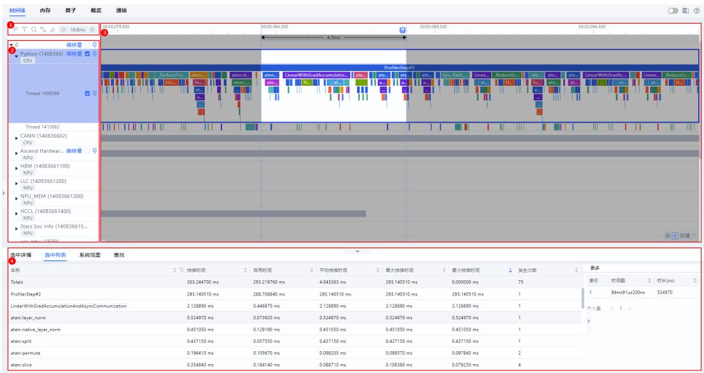  
图 4-1 时间线（Timeline）界面

区域一：工具栏，包含常用快捷按钮，从左至右依次为标记列表、过滤（支持按卡或按泳道过滤展示）、搜索、连线事件、重置缩放（页面复原）和时间轴缩小放大按钮。

区域二：时间线树状图，text场景和db场景显示会有所不同，具体泳道信息请参见表4-11。

text场景：显示集群场景下各设备的分层信息，以Rank维度显示分层信息，一层级为Rank ID，二层级为进程或专项分层，三层级为线程等名称。二层级包括Python层数据（包含PyTorch和打点数据的耗时信息）、CANN层数据（包含AscendCL、GE和Runtime组件的耗时数据）、底层NPU数据（包含Ascend Hardware下各个Stream任务流的耗时数据和迭代轨迹数据、Communication和Overlap Analysis通信数据、Memory内存数据以及其他昇腾AI处理器系统数据）和AI Core Freq等层级，层级内容展示随导入的数据而变化。

db场景：显示各机器下的信息，一层级为机器名称，二层级为Host和RankID。Host层级是按照进程与线程级维度展示PyTorch和CANN的数据；RankID层级包括底层NPU数据（包含Ascend Hardware下各个Stream任务流的耗时数据和迭代轨迹数据、Communication和Overlap Analysis通信数据、Memory内存数据以及其他昇腾AI处理器系统数据）和AI Core Freq等层级，且卡下属层级内容的展示随导入的数据而变化。

区域三：图形化窗格，展示的数据是迭代内的数据，图形化窗格对应时间线树状图，逐行对时间线进行图形化展现，包括上层应用算子、各组件及接口的执行序列和执行时长。

区域四：数据窗格，统计信息或算子详情信息展示区，选中详情（Slice Detail）为选中单个算子的详细信息、选中列表（Slice List）为某一泳道选中区域的算子列表信息、系统视图（System View）为某类算子的汇总信息、以及查找（Find）为搜索的算子信息。

表 4-11 泳道信息  

<table><tr><td colspan="1" rowspan="1">一层级泳道名称</td><td colspan="1" rowspan="1">二层级泳道名称</td><td colspan="1" rowspan="1">说明</td></tr><tr><td colspan="1" rowspan="1">Process</td><td colspan="1" rowspan="1">Thread</td><td colspan="1" rowspan="1">仅db格式文件支持展示此泳道，Thread层级泳道下还存在pytorch、CANN和MSTX，分别展示的是PyTorch框架下上层应用线程运行的耗时信息、CANN框架下线程运行的耗时信息和打点信息。</td></tr><tr><td colspan="1" rowspan="1">Python</td><td colspan="1" rowspan="1">Thread</td><td colspan="1" rowspan="1">应用层数据，每个子泳道Thread包含上层应用线程运行的耗时信息，需要使用PyTorchProfiler或msproftx采集。仅支持在text格式文件下展示该泳道。</td></tr><tr><td colspan="1" rowspan="1">CANN</td><td colspan="1" rowspan="1">Thread</td><td colspan="1" rowspan="1">CANN层数据，每个子泳道Thread主要包含AscendCL、GE、Runtime组件以及Node（算子）的耗时数据。如果是db格式文件，二层级泳道名称可能包含acl，model，node，hccl，runtime，op,queue，trace，mstx等。</td></tr><tr><td colspan="1" rowspan="1">MindSpore|Thread</td><td colspan="1" rowspan="1"></td><td colspan="1" rowspan="1">在MindSpore场景下，展示当前Thread下运行的阶段耗时。</td></tr><tr><td colspan="1" rowspan="1">ScopeLayer</td><td colspan="1" rowspan="1">Thread</td><td colspan="1" rowspan="1">在MindSpore场景下，展示当前Thread网络层级的执行耗时。</td></tr><tr><td colspan="1" rowspan="1">Python GC</td><td colspan="1" rowspan="1">Python GC</td><td colspan="1" rowspan="1">在PyTorch场景下，采集性能数据时开启了GC检测功能后，如果在采集的时间周期内发生了GC事件，则采集到的数据中会记录GC事件并显示在PythonGC泳道中。</td></tr><tr><td colspan="1" rowspan="3">AscendHardware</td><td colspan="1" rowspan="1">Stream &lt;id&gt;</td><td colspan="1" rowspan="1">底层NPU数据，任务调度信息数据，记录AI任务运行时，各个Task在不同加速器下的执行耗时和AICore的性能指标。</td></tr><tr><td colspan="1" rowspan="1">Stream &lt;id&gt;MSTX domain&lt;domainid&gt;</td><td colspan="1" rowspan="1">Stream &lt;id&gt;的MSTX device侧打点数据。</td></tr><tr><td colspan="1" rowspan="1">Step Trace</td><td colspan="1" rowspan="1">迭代轨迹数据。仅step_trace_*.json文件存在时展示该泳道。</td></tr><tr><td colspan="1" rowspan="2">HBM</td><td colspan="1" rowspan="1">HBM &lt;id&gt;/Read</td><td colspan="1" rowspan="1">HBM内存读取速率，单位为MB/s。</td></tr><tr><td colspan="1" rowspan="1">HBM&lt;id&gt;/Write</td><td colspan="1" rowspan="1">HBM内存写入速率，单位为MB/s。</td></tr><tr><td colspan="1" rowspan="2">DDR</td><td colspan="1" rowspan="1">Read</td><td colspan="1" rowspan="1">DDR内存读取速率。</td></tr><tr><td colspan="1" rowspan="1">Write</td><td colspan="1" rowspan="1">DDR内存写入速率。</td></tr><tr><td colspan="1" rowspan="2">LLC</td><td colspan="1" rowspan="1">LLC &lt;id&gt;Read/Hit RateLLC &lt;id&gt;Write/Hit Rate</td><td colspan="1" rowspan="1">三级缓存读写速率数据，三级缓存读取、写入时的吞吐量。</td></tr><tr><td colspan="1" rowspan="1">LLC &lt;id&gt; Read/Throughput LLC &lt;id&gt; Write/Throughput</td><td colspan="1" rowspan="1">三级缓存读取、写入时的命中率。</td></tr><tr><td colspan="1" rowspan="6">NPU_MEM</td><td colspan="1" rowspan="1">APP/DDR</td><td colspan="1" rowspan="1">进程级DDR内存占用，单位KB。</td></tr><tr><td colspan="1" rowspan="1">APP/HBM</td><td colspan="1" rowspan="1">进程级HBM内存占用，单位KB。</td></tr><tr><td colspan="1" rowspan="1">APP/MEMORY</td><td colspan="1" rowspan="1">进程级DDR和HBM内存占用和，单位KB。</td></tr><tr><td colspan="1" rowspan="1">Device/DDR</td><td colspan="1" rowspan="1">设备级DDR内存占用，单位KB。</td></tr><tr><td colspan="1" rowspan="1">Device/HBM</td><td colspan="1" rowspan="1">设备级HBM内存占用，单位KB。</td></tr><tr><td colspan="1" rowspan="1">Device/MEMORY</td><td colspan="1" rowspan="1">设备级DDR和HBM内存占用和，单位KB。</td></tr><tr><td colspan="1" rowspan="1">Communication</td><td colspan="1" rowspan="1">Group &lt;id&gt;Communication</td><td colspan="1" rowspan="1">通信域下的通信算子。一个卡（Rank）可以存在于不同的通信域中，一个Group标识当前卡在当前通信域的行为。</td></tr><tr><td colspan="1" rowspan="1"></td><td colspan="1" rowspan="1">Plane &lt;id&gt;</td><td colspan="1" rowspan="1">集合通信算子信息。网络平面ID，对多个收发通信链路的并行调度执行，每个Plane就是一个并发通信维度。</td></tr><tr><td colspan="1" rowspan="2">Stars SocInfo</td><td colspan="1" rowspan="1">L2 Buffer BwLevel</td><td colspan="1" rowspan="1">SoC传输带宽信息，L2 Buffer带宽等级信息。</td></tr><tr><td colspan="1" rowspan="1">Mata Bw Level</td><td colspan="1" rowspan="1">Mata带宽等级信息。</td></tr><tr><td colspan="1" rowspan="4">acc_pmu</td><td colspan="1" rowspan="1">Accelerator{accld)/readBwLevel</td><td colspan="1" rowspan="1">DVPP和DSA加速器读带宽。</td></tr><tr><td colspan="1" rowspan="1">Accelerator{accld}/readOstLevel</td><td colspan="1" rowspan="1">DVPP和DSA加速器读并发。</td></tr><tr><td colspan="1" rowspan="1">Accelerator{accld}/writeBwLevel</td><td colspan="1" rowspan="1">DVPP和DSA加速器写带宽。</td></tr><tr><td colspan="1" rowspan="1">Accelerator{accld)/writeOstLevel</td><td colspan="1" rowspan="1">DVPP和DSA加速器写并发。</td></tr><tr><td colspan="1" rowspan="4">OverlapAnalysis</td><td colspan="1" rowspan="1">Communication</td><td colspan="1" rowspan="1">通信时间。</td></tr><tr><td colspan="1" rowspan="1">Communication(NotOverlapped)</td><td colspan="1" rowspan="1">未被计算掩盖的通信时间。</td></tr><tr><td colspan="1" rowspan="1">Computing</td><td colspan="1" rowspan="1">计算时间。</td></tr><tr><td colspan="1" rowspan="1">Free</td><td colspan="1" rowspan="1">Device侧既不在计算也不在通信的时间。按Step维度拆解时，会被进一步区分为Preparing和Free，其中Preparing在做数据预处理，加载拷贝等操作。</td></tr><tr><td colspan="1" rowspan="2">Al CoreUtilization</td><td colspan="1" rowspan="1">Average</td><td colspan="1" rowspan="1">Al Core指令占比数据的均值。Al Core Utilization泳道仅支持在text格式文件下展示。</td></tr><tr><td colspan="1" rowspan="1">Core &lt;id&gt;</td><td colspan="1" rowspan="1">各Al Core在执行Task的total cycle（从Al Core开始执行算子的第一条指令开始计数，到最后一条指令执行完成）占比情况。</td></tr><tr><td colspan="1" rowspan="1">Al CoreFreq</td><td colspan="1" rowspan="1">Al Core Freq</td><td colspan="1" rowspan="1">展示AI Core芯片在执行AI任务的过程中频率的变化情况。Al Core Freq泳道仅支持展示Atlas A2训练系列产品导出的性能数据。</td></tr><tr><td colspan="1" rowspan="1">SIO</td><td colspan="1" rowspan="1">dat_rx、dat_tx</td><td colspan="1" rowspan="1">数据流通道的接收、发送带宽。SIO泳道仅支持在text格式文件下展示。SIO泳道仅支持展示Atlas A3训练系列产品/AtlasA3推理系列产品die间传输带宽信息。</td></tr><tr><td colspan="1" rowspan="3"></td><td colspan="1" rowspan="1">req_rx、req_tx</td><td colspan="1" rowspan="1">请求流通道的接收、发送带宽。</td></tr><tr><td colspan="1" rowspan="1">rsp_rx、rsp_tx</td><td colspan="1" rowspan="1">回应流通道的接收、发送带宽。</td></tr><tr><td colspan="1" rowspan="1">snp_rx、snp_tx</td><td colspan="1" rowspan="1">侦听流通道的接收、发送带宽。</td></tr><tr><td colspan="1" rowspan="1">QoS</td><td colspan="1" rowspan="1">QoS&lt;id&gt;:OTHERS</td><td colspan="1" rowspan="1">设备QoS带宽信息。</td></tr><tr><td colspan="1" rowspan="1">NIC</td><td colspan="1" rowspan="1">Port &lt;id&gt;/RxPort &lt;id&gt;/Tx</td><td colspan="1" rowspan="1">·text场景：展示每个时间节点网络信息数据。·db场景：展示带宽信息数据。泳道名称会根据导入的数据不同而变化。</td></tr><tr><td colspan="1" rowspan="1">RoCE</td><td colspan="1" rowspan="1">Port &lt;id&gt;/RxPort &lt;id&gt;/Tx</td><td colspan="1" rowspan="1">RoCE通信接口带宽数据。RoCE泳道仅支持在text格式文件下展示。</td></tr><tr><td colspan="1" rowspan="4">PCle</td><td colspan="1" rowspan="1">PCle_cpl</td><td colspan="1" rowspan="1">接收写请求的完成数据包，单位MB/s。Tx表示发送端，Rx表示接收端。</td></tr><tr><td colspan="1" rowspan="1">PCle_nonpost</td><td colspan="1" rowspan="1">PCle Non-Posted数据传输带宽，单位MB/s。Tx表示发送端，Rx表示接收端。</td></tr><tr><td colspan="1" rowspan="1">PCle_nonpost_latency</td><td colspan="1" rowspan="1">PCle Non-Posted模式下的传输时延，单位us。Tx表示发送端，Rx表示接收端。PCle_nonpost_latency无Rx，取固定值0。</td></tr><tr><td colspan="1" rowspan="1">PCle_post</td><td colspan="1" rowspan="1">PCle Posted数据传输带宽，单位MB/s。Tx表示发送端，Rx表示接收端。泳道名称会根据导入的数据不同而变化。</td></tr><tr><td colspan="1" rowspan="1">HCCS</td><td colspan="1" rowspan="1">txThroughputrxThroughput</td><td colspan="1" rowspan="1">HCCS集合通信带宽数据，展示接收带宽和发送带宽，单位MB/s。</td></tr><tr><td colspan="1" rowspan="4">biu_group</td><td colspan="1" rowspan="1">BandwidthRead</td><td colspan="1" rowspan="1">BIU总线接口单元读取指令时的带宽。biu_group泳道仅支持在text格式文件下展示。</td></tr><tr><td colspan="1" rowspan="1">BandwidthWrite</td><td colspan="1" rowspan="1">BIU总线接口单元写入指令时的带宽。</td></tr><tr><td colspan="1" rowspan="1">Latency Read</td><td colspan="1" rowspan="1">BIU总线接口单元读取指令时的时延。</td></tr><tr><td colspan="1" rowspan="1">Latency Write</td><td colspan="1" rowspan="1">BIU总线接口单元写入指令时的时延。</td></tr><tr><td colspan="1" rowspan="3">aic_core_group</td><td colspan="1" rowspan="1">Cube</td><td colspan="1" rowspan="1">矩阵类运算指令在本采样周期内的cycle数和占比。aic_core_group泳道仅支持在text格式文件下展示。</td></tr><tr><td colspan="1" rowspan="1">Mte1</td><td colspan="1" rowspan="1">L1-&gt;L0A/LOB搬运类指令在本采样周期内的cycle数和占比。</td></tr><tr><td colspan="1" rowspan="1">Mte2</td><td colspan="1" rowspan="1">片上内存-&gt;AICORE搬运类指令在本采样周期内的cycle数和占比。</td></tr><tr><td colspan="1" rowspan="1"></td><td colspan="1" rowspan="1">Mte3</td><td colspan="1" rowspan="1">AICORE-&gt;片上内存搬运类指令在本采样周期内的cycle数和占比。</td></tr><tr><td colspan="1" rowspan="5">aiv_core_group</td><td colspan="1" rowspan="1">Mte1</td><td colspan="1" rowspan="1">L1-&gt;L0A/L0B搬运类指令在本采样周期内的cycle数和占比。aiv_core_group泳道仅支持在text格式文件下展示。</td></tr><tr><td colspan="1" rowspan="1">Mte2</td><td colspan="1" rowspan="1">片上内存-&gt;AICORE搬运类指令在本采样周期内的cycle数和占比。</td></tr><tr><td colspan="1" rowspan="1">Mte3</td><td colspan="1" rowspan="1">AICORE-&gt;片上内存搬运类指令在本采样周期内的cycle数和占比。</td></tr><tr><td colspan="1" rowspan="1">Scalar</td><td colspan="1" rowspan="1">标量类运算指令在本采样周期内的cycle数和占比。</td></tr><tr><td colspan="1" rowspan="1">Vector</td><td colspan="1" rowspan="1">向量类运算指令在本采样周期内的cycle数和占比。</td></tr><tr><td colspan="1" rowspan="4"> Stars ChipTrans</td><td colspan="1" rowspan="1">PA Link Rx</td><td colspan="1" rowspan="1">PA流量接收等级。当有集合通信带宽时，不建议参考该字段值，该字段为粗粒度的统计值。StarsChipTrans泳道仅支持在text格式文件下展示。</td></tr><tr><td colspan="1" rowspan="1">PA Link Tx</td><td colspan="1" rowspan="1">PA流量发送等级。当有集合通信带宽时，不建议参考该字段值，该字段为粗粒度的统计值。</td></tr><tr><td colspan="1" rowspan="1"> PCIE ReadBandwidth</td><td colspan="1" rowspan="1">PCle读带宽。当有PCle带宽时，不建议参考该字段值，该字段为粗粒度的统计值。</td></tr><tr><td colspan="1" rowspan="1">PCIE WriteBandwidth</td><td colspan="1" rowspan="1">PCle写带宽。当有PCle带宽时，不建议参考该字段值，该字段为粗粒度的统计值。</td></tr><tr><td colspan="1" rowspan="1">CPUUsage</td><td colspan="1" rowspan="1">CPU &lt;id&gt;</td><td colspan="1" rowspan="1">Host侧CPU利用率数据。</td></tr><tr><td colspan="1" rowspan="1">MemoryUsage</td><td colspan="1" rowspan="1">Memory Usage</td><td colspan="1" rowspan="1">Host侧内存利用率数据。</td></tr><tr><td colspan="1" rowspan="1">DiskUsage</td><td colspan="1" rowspan="1">Disk Usage</td><td colspan="1" rowspan="1">Host侧磁盘I/O利用率数据。</td></tr><tr><td colspan="1" rowspan="1">NetworkUsage</td><td colspan="1" rowspan="1">Network Usage</td><td colspan="1" rowspan="1">Host侧网络I/O利用率数据。</td></tr><tr><td colspan="1" rowspan="1">OSRuntimeAPI</td><td colspan="1" rowspan="1">Thread</td><td colspan="1" rowspan="1">Host侧syscall和pthreadcall数据。OS Runtime APl泳道仅支持在text格式文件下展示。</td></tr></table>

# 说明

通过观察时间线视图各个层级上的耗时长短、间隙等判断对应组件和算子是否存在性能问题，如算子下发是否存在瓶颈、是否存在高耗时的kernel以及是否存在冗余的转换类算子。

# 4.2.2 使用说明

# 4.2.2.1 基础功能

# 支持界面缩放

时间线（Timeline）界面支持缩小、放大和左右移动等功能，具体操作如下所示：

单击时间线（Timeline）界面树状图或者图形化窗格任意位置，可以使用键盘中的W（放大）和S（缩小）键进行操作，支持放大的最大精度为1ns。

单击时间线（Timeline）界面树状图或者图形化窗格任意位置，使用键盘中的A（左移）、D（右移）键，或者方向键左键（左移）、右键（右移）进行左右移动，也可使用方向键上键（上移）、下键（下移）进行上下移动。

在图形化窗格中，按住键盘中的Alt键，使用鼠标左键选中区域，即可实现选中区域的局部放大。

单击界面左上方工具栏中的 $\circledast$ （放大）和 $\circleddash$ （缩小）实现缩放。

单击界面左上方工具栏中的 $\Rightarrow$ 可以一键恢复图形化窗格显示全部时间线视图。

将鼠标放置在时间线（Timeline）界面树状图或者图形化窗格任意位置，可以使用键盘中的Ctrl键加鼠标滚轮实现缩放操作。

在图形化窗格中，使用键盘中的Ctrl键加鼠标左键可以实现左右拖拽泳道图表。

# 说明

macOS系统中，需使用键盘上的Command键加鼠标滚轮实现缩放，Command键加鼠标左键实现左右拖拽泳道图表。

在图形化窗格中，可使用鼠标右键菜单进行缩放展示，具体功能参见表4-12。

表4-12 鼠标右键菜单功能  

<table><tr><td colspan="1" rowspan="1">中文菜单</td><td colspan="1" rowspan="1">英文菜单</td><td colspan="1" rowspan="1">说明</td><td colspan="1" rowspan="1">操作</td></tr><tr><td colspan="1" rowspan="1">全屏显示</td><td colspan="1" rowspan="1">Fit toscreen</td><td colspan="1" rowspan="1">将单个算子放大至屏幕可见范围最大宽度。如果未选中算子，则不显示该参数。</td><td colspan="1" rowspan="1">1．单击选中一个算子，单击鼠标右键，弹出菜单；2.单击“全屏显示”，可将选中算子放大至屏幕可见范围最大宽度。</td></tr><tr><td colspan="1" rowspan="1">放大所选内容</td><td colspan="1" rowspan="1">Zoomintoselection</td><td colspan="1" rowspan="1">将选定区域放大至屏幕可见范围最大宽度。如果无选定区域，则不显示该参数。</td><td colspan="1" rowspan="1">1．选定某个区域后，单击鼠标右键，弹出菜单；2.单击“放大所选内容”，可将选定区域放大至屏幕可见范围最大宽度。</td></tr><tr><td colspan="1" rowspan="1">撤销缩放（0）</td><td colspan="1" rowspan="1">UndoZoom(0)</td><td colspan="1" rowspan="1">撤销缩放，括号中的数字会随着缩放次数随之变化，初始状态为0。</td><td colspan="1" rowspan="1">1．在放大后的时间线（Timeline）界面，单击鼠标右键，弹出菜单；2．单击“撤销缩放”，界面缩小一次，括号中的数字会随之减一。</td></tr><tr><td colspan="1" rowspan="1">重置缩放</td><td colspan="1" rowspan="1">ResetZoom</td><td colspan="1" rowspan="1">重置缩放，将图表恢复至初始状态。</td><td colspan="1" rowspan="1">1.在放大后的时间线（Timeline）界面，单击鼠标右键，弹出菜单；2.单击“重置缩放”，图表重置，恢复至初始状态。</td></tr></table>

# 搜索功能

MindStudio Insight在时间线（Timeline）界面支持算子、API等名称的搜索功能。

单击界面左上方工具栏中的 $\alpha$ ，在弹出输入框中输入需要搜索的内容，然后按回车键，则会匹配对应的算子或API，搜索结果匹配算子和API总数，在界面中也会高亮显示匹配的算子或API，如图4-2所示，搜索到与名称为“npu”相关的算子和API总数为3104。

单击搜索框后方的切换按钮，可以查看上一个或者下一个匹配的算子或API，也可以在输入框后方输入具体的数字搜索其对应的算子或API，该算子或API将会被选中。

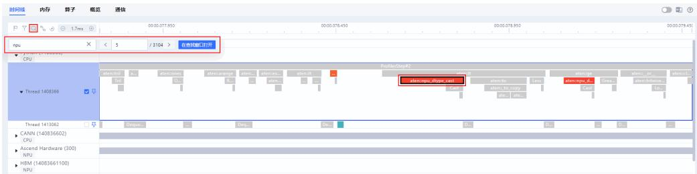  
图 4-2 搜索算子

单击界面左上方工具栏中的 $\alpha$ ，可在搜索弹出输入框左侧分别单击 $\mathsf { A } _ { \mathtt { G } }$ 和 $\mathsf { w }$ ，开启大小写匹配和全词匹配功能。

单击 $_ { R a }$ 开启大小写匹配，在弹出输入框中输入需要搜索的内容，然后按回车键，则会匹配名称中包含搜索项的算子或API，如图4-3所示。

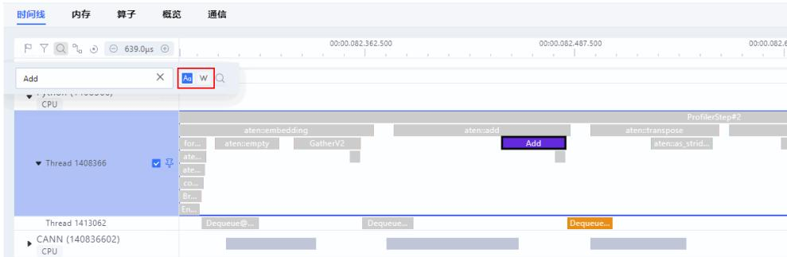  
图 4-3 开启大小写匹配或全词匹配

单击 $\mathsf { w }$ 开启全词匹配，在弹出输入框中输入需要搜索的内容，然后按回车键，则会匹配名称为搜索项的算子或API，但是会忽略大小写，如图4-3所示。

当同时选中 $\mathsf { A } _ { \mathtt { G } }$ 和 $\mathsf { w }$ 时，开启大小写匹配和全词匹配功能，在弹出输入框中输入需要搜索的内容，然后按回车键，则会精确匹配名称为搜索项的算子或API。

单击搜索框后方的“在查找窗口打开”，可跳转至页面下方的“查找”页签，展示搜索项相关信息，如图4-4所示，字段解释如表4-13所示。单击“点击跳转Timeline”列的“点击”可跳转到算子或API在时间线视图上的具体位置。

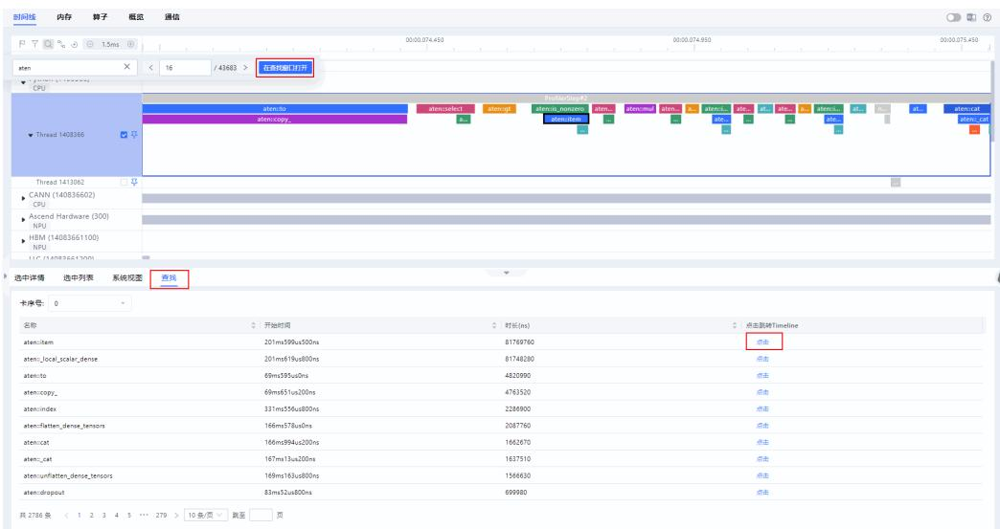  
图 4-4 在查找窗口打开

表 4-13 查找页签字段说明  

<table><tr><td rowspan=1 colspan=1>中文字段</td><td rowspan=1 colspan=1>英文字段</td><td rowspan=1 colspan=1>说明</td></tr><tr><td rowspan=1 colspan=1>卡序号</td><td rowspan=1 colspan=1>Rank ID</td><td rowspan=1 colspan=1>卡序号，可以选择需要查看的卡。</td></tr><tr><td rowspan=1 colspan=1>名称</td><td rowspan=1 colspan=1>Name</td><td rowspan=1 colspan=1>算子名称。</td></tr><tr><td rowspan=1 colspan=1>开始时间</td><td rowspan=1 colspan=1>Start Time</td><td rowspan=1 colspan=1>算子执行起始时间。</td></tr><tr><td rowspan=1 colspan=1>时长(ns)</td><td rowspan=1 colspan=1>Duration(ns)</td><td rowspan=1 colspan=1>算子运行总耗时。</td></tr><tr><td rowspan=1 colspan=1>点击跳转Timeline</td><td rowspan=1 colspan=1>Click ToTimeline</td><td rowspan=1 colspan=1>单击“点击”跳转到算子或API在时间线视图上的具体位置。</td></tr></table>

# 4.2.2.2 性能数据展示

# 支持界面预览

在线程级泳道中，如果一个泳道中存在多行数据，则在不展开该泳道的情况下，将会以缩略图的形式展示该泳道中数据的分布情况，如图4-5中的1所示。在不展开进程级泳道的情况下，根据线程级中时间轴上的数据，将以灰色填充进程级泳道来展示线程级泳道中的数据分布情况，如图4-5中的2所示。

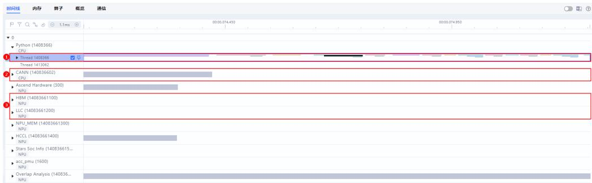  
图 4-5 时间线（Timeline）界面预览

# 说明

CPU、Memory、Network相关利用率数据，也就是数值类型事件，在时间线（Timeline）中以柱状图形式呈现，暂不支持预览功能，如图4-5中的3所示。

# 支持集群场景展示

MindStudio Insight支持导入和展示集群场景数据，无需手动合并多个单卡数据。支持训练场景下的多机多卡和推理场景下多卡等场景，MindStudio Insight能够自动识别导入文件夹下所有的trace_view.json和msprof\*.json文件。以16卡为例进行展示，如图4-6所示。

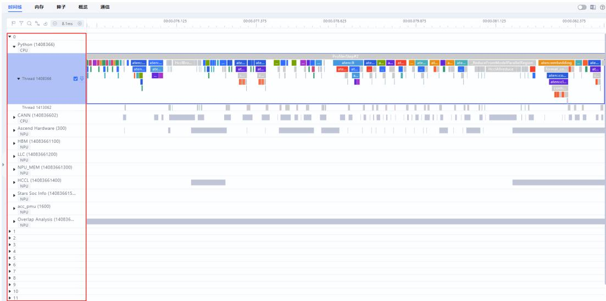  
图 4-6 集群场景时间线数据展示

在集群场景中，为方便快速定位某卡的数据所对应的文件目录，可以将鼠标悬停在卡的序号上，则会显示该卡数据所对应的文件目录。例如将鼠标悬停在“0”上，则会在后方显示该卡所对应的文件目录，如图4-7所示。

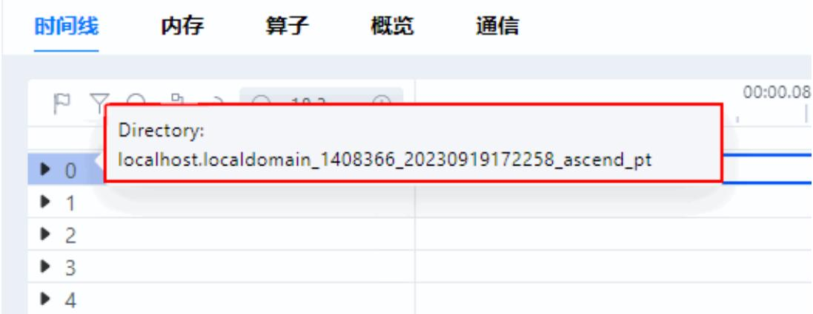  
图 4-7 定位文件夹

# 支持分卡/泳道显示和对比

当导入集群场景数据时，展示的时间线（Timeline）信息较多，为更好地帮助用户对比分析，MindStudio Insight支持按卡或按泳道过滤，也可联合卡和泳道一起过滤展示。

# 说明

当联合卡和泳道一起过滤时，可按照单独按卡或泳道过滤的方式，依次选择对应卡和泳道，即可展示相应的过滤信息。

按卡显示：以只显示1卡为例，单击界面左上方 $\curlyvee$ ，选择“卡过滤”，然后单击输入框，在下拉框选择“1”，即可显示1卡的时间线（Timeline）信息，如图4-8所示。

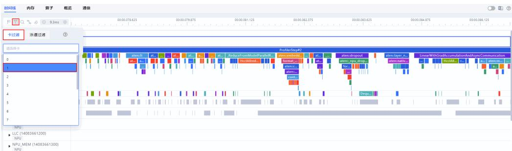  
图 4-8 卡过滤

按泳道显示：以只显示每张卡的Overlap Analysis泳道为例，单击界面左上方工具 栏 $\curlyvee$ ，选择“泳道过滤”，然后单击输入框，在下拉框选择“Overlap Analysis”，即可显示Overlap Analysis泳道的时间线（Timeline）信息，如图4-9 所示。

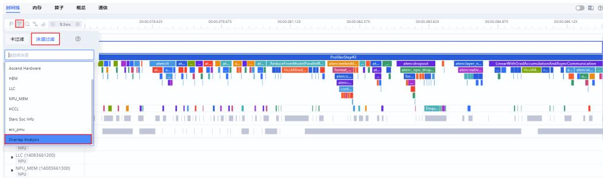  
图4-9 泳道过滤

# 支持泳道置顶和对比

MindStudio Insight支持固定并置顶泳道，且可以通过鼠标拖拽对收起状态的置顶泳道进行自由排序，方便同其他同类层级进行对比。

# 说明

如果置顶的卡中同时也置顶了该卡中的二层级和三层级泳道，那么只能对卡层级泳道进行拖拽排序，不能对二层级和三层级泳道进行拖拽排序；同样的，如果置顶的二层级泳道中同时也置顶了三层级泳道，那么只能对二层级泳道进行拖拽排序。

例：单击0、1、2卡中的某三层级名后方的 $\scriptstyle { \overline { { \boldsymbol { \mathbb { V } } } } }$ ，则可置顶，再次单击 $\boldsymbol { \tau }$ 即可取消置顶，如图4-10所示。

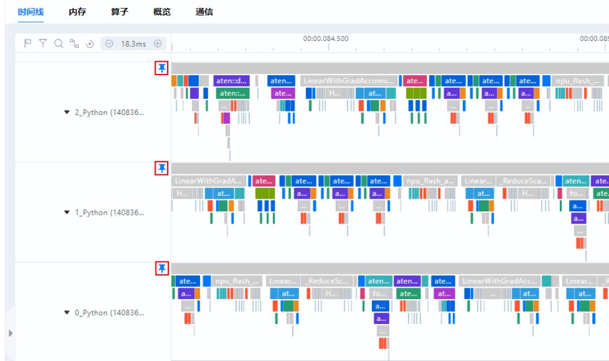  
图 4-10 置顶对比

MindStudio Insight还支持一键置顶同一通信域的通信泳道。

在Communication泳道下的Group子泳道上单击鼠标右键，选择“置顶（按相同组 组名称）”，将置顶该通信域（组）下的所有泳道，便于查看对比，如图4-11所示。

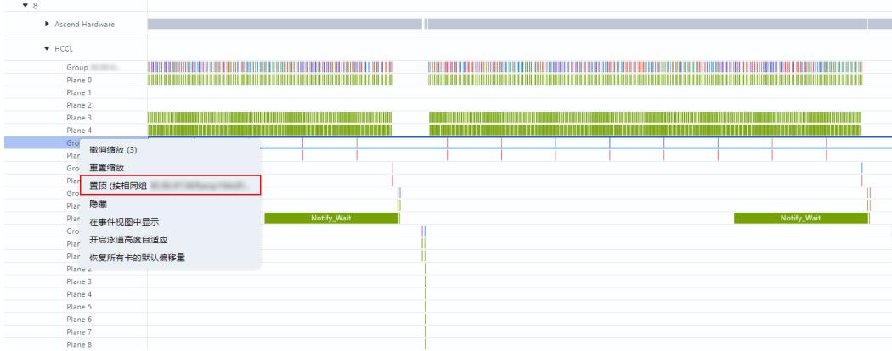  
图 4-11 置顶通信泳道

在已置顶的泳道上单击鼠标右键，可选择“取消置顶（按相同组 组名称）”或者“取消置顶（全部）”，取消泳道置顶，如图4-12所示。

“取消置顶（按相同组 组名称）”即取消该通信域（组）下的所有泳道，“取消置顶（全部）”即取消所有置顶泳道。

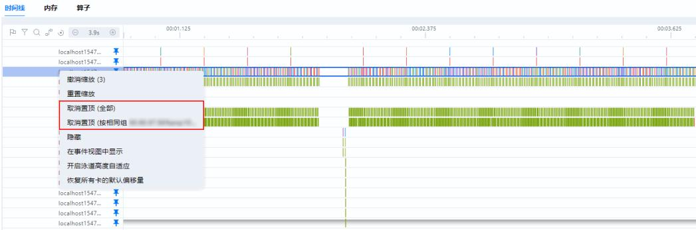  
图 4-12 取消置顶

# 支持单卡和泳道时间对齐

# 说明

单卡场景、集群场景和多模型场景均已实现时间线（Timeline）相对位置自动对齐，如果无需自动对齐的话，请在任意位置单击鼠标右键，弹出菜单，选择“恢复所有卡的默认偏移量”，可恢复所有卡和模型的默认偏移量，参见如下操作手动设置相对位置对齐。

手动设置对齐到起始位置

在偏移量的弹窗中单击 $E _ { - }$ （对齐到起始位置）按钮，会在“时间戳偏移(ns)”输入框中显示该卡中最左侧的线程数据与时间轴初始位置（00：00.000）的偏移量，然后按回车键，时间线（Timeline）界面将会把该线程数据与时间轴初始位置对齐。

如图4-13所示，0卡中最左侧线程数据与时间轴初始位置的偏移量为7293500ns。

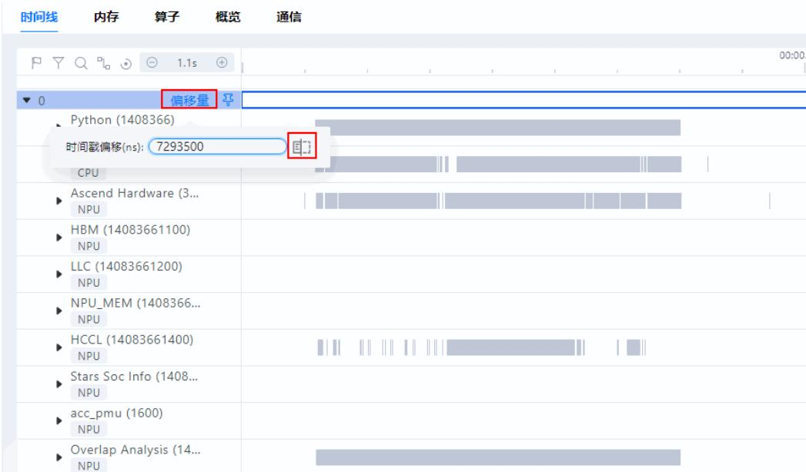  
图 4-13 初始位置偏移量

# 手动设置偏移量

对于多机多卡场景，由于机器上时间不准，可能造成多卡间时间线（Timeline）相对位置不准确，MindStudio Insight支持单卡维度的时间校准，如图4-14所示，通过设置偏移量，可以将单卡的时间线（Timeline）左右移动，从而达到时间“校准”的目的。偏移量的单位为ns，负值为右移，正值为左移。

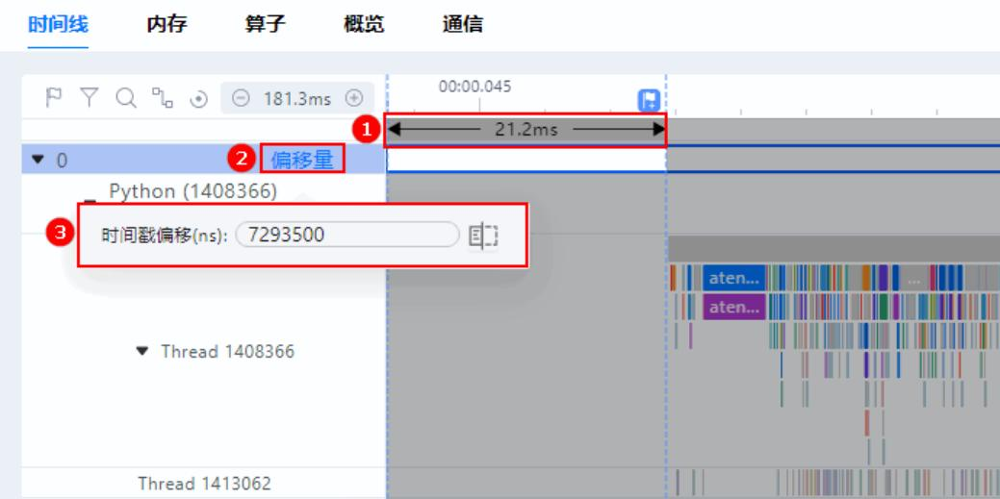  
图 4-14 单卡时间调整

同时，为了更灵活的校准时间，MindStudio Insight还支持以泳道维度进行时间校准，如图4-15所示。在时间线（Timeline）界面，展开卡，单击所需二级泳道名称后面的“偏移量”，在输入框输入值，单击回车键，进行泳道时间调整。db场景下，需要首先展开机器名称，分别在host和各卡下的二级泳道上执行时间调整操作。

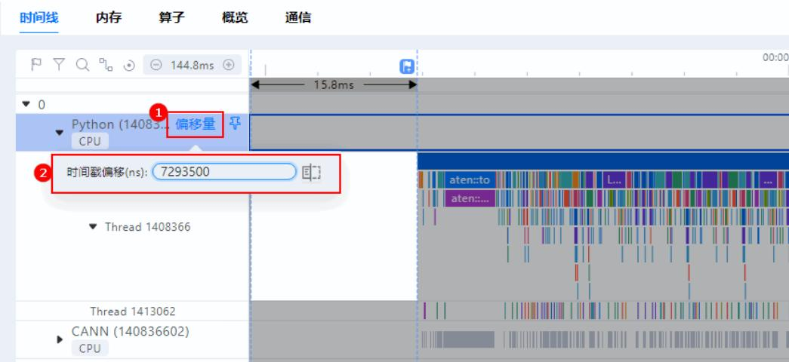  
图 4-15 泳道时间调整

# 支持多机多卡展示

当导入多机多卡数据时，MindStudio Insight支持以机器维度展示数据，如图4-16所示。

● 图中1为机器名称，是由hostName和hostUid组成。  
● 图中2为卡层级展示，按照当前机器的卡序号展示对应泳道。  
● 图中3为参数配置项，在多机多卡场景下，需先选择“机器名称”，再选择该机器下的“卡序号”进行配置。当导入的db场景文件中存在名称为“HOST_INFO”的表时，在时间线（Timeline）界面下的“系统视图”页签（选择“统计系统视图”和“专家系统视图”时）和“查找”页签下，存在该配置项。

# 说明

该功能仅支持在统一db场景下展示。

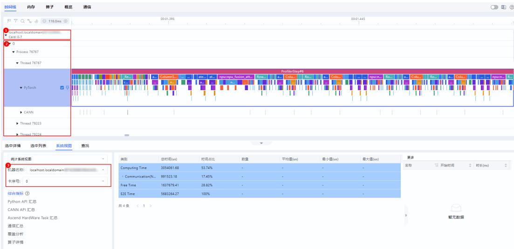  
图 4-16 多机多卡展示

# 设置和查看标记

区域标记

在时间线（Timeline）界面选中某个区域后，单击 $\mathrm { \overline { { u s } } }$ 或敲击键盘K键将选中区域进行标记并保存，如图4-17所示。

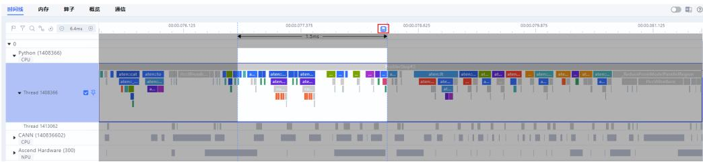  
图 4-17 区域标记

左键双击任一标记，可以设置该标记对的属性，支持修改标记对名称、颜色以及删除该标记对，如图4-18所示。

  
图 4-18 修改标记对属性

单点标记

在最上方空泳道的任意位置，单击鼠标左键或敲击键盘K键，将生成一个单点标记，如图4-19所示。

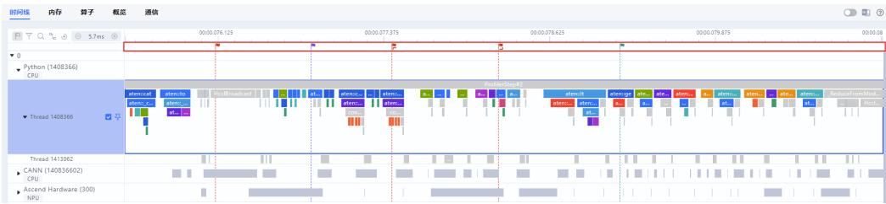  
图 4-19 单点标记

左键双击标记，可以设置该标记的属性，支持修改标记的名称、颜色以及删除该标记。

标记管理

单击左上方工具栏中的 $\mathsf { P }$ ，将显示所有标记信息，如图4-20所示。

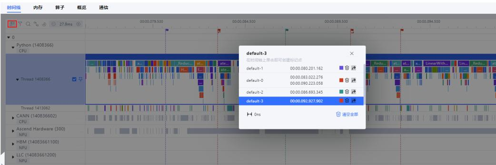  
图4-20 查看标记信息

单击某个标记对应的 图标可删除标记。  
单击弹窗下方的“清空全部”可删除所有标记。  
单击区域标记，界面下方的“选中详情”页签会显示该区域的耗时信息详情。  
如果某一标记不在当前可视化界面，单击该标记对应的 图标将直接跳转至标记界面，便于查看。  
单击某个标记对应的颜色图标可进行颜色设置，便于对标记进行分类管理。

# 算子连线功能

MindStudio Insight支持算子连线关系展示，单击有连线的算子，即可显示该算子关联的连线，即使折叠连线起点或者终点的进程，连线也不会消失，如图4-21所示。

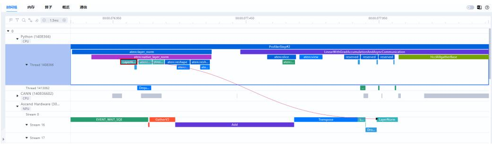  
图 4-21 算子连线关系

# 说明

● 如果同时折叠连线起点和终点的进程，连线就会消失。

● 在MindStudio Insight中连线仅会连接同一批下发的算子中的第一个。在AscendHardware泳道中，如果用户单击某一算子后，发现关联的连线显示在其它算子上，这表示当前单击的算子和连线的算子是同一批下发的。

MindStudio Insight支持全量连线的功能，单击界面左上方工具栏中的 $^ - \mathrm { u }$ ，在弹框中选择一个或多个连线类型，也可在搜索框中搜索某一连线类型的关键字，勾选相应的连线类型，则在图形化窗格展示对应类型的所有连线，如图4-22所示。

# 说明

最多支持选择10个连线类型。

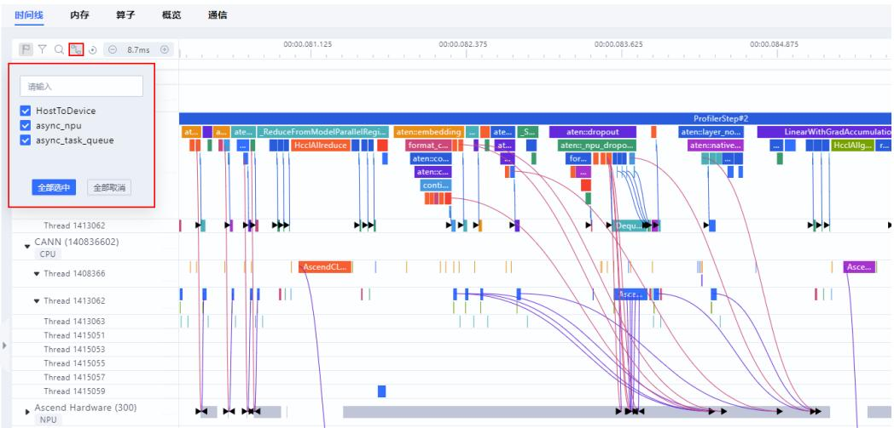  
图 4-22 全量连线

应用层算子到NPU算子之间通过连线方式展示下发到执行的对应关系如下所示：

HostToDevice

CANN层Node（算子）到Ascend Hardware的NPU算子的下发执行关系（Host到Device）。CANN层Node（算子）到Communication通信算子的下发执行关系（Host到Device）。async_npu

应用层算子到Ascend Hardware的NPU算子的下发执行关系。

应用层算子到Communication通信算子的下发执行关系。

async_task_queue：应用层Enqueue到Dequeue的入队列到出队列对应关系，仅PyTorch场景。

fwdbwd：前向API到反向API，仅PyTorch场景。

– MSTX：打点数据到Ascend Hardware的NPU算子的下发执行关系。

# 说明

● 各层的对应关系是否呈现与对应采集场景是否采集该数据有关，请以实际情况为准。● 各层之间的连线与各层是否展开呈联动关系，如果选择了某个连线类型，对应层没有展开，则不会显示该类型的连线。

# 支持选择性解析多卡数据

MindStudio Insight工具导入超过16卡的数据时，在时间线（Timeline）界面支持选择性解析数据，可一键全部解析或部分解析。

一键全部解析：在时间线（Timeline）界面，单击“开始全局解析”，将开始解析所有卡的数据，如图4-23所示。当所有卡的数据解析完成后，“开始全局解析”按钮消失。

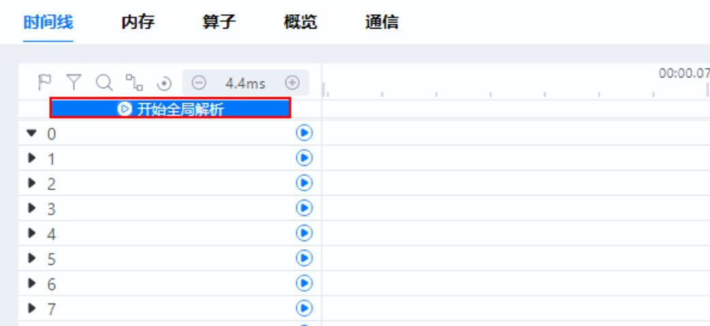  
图 4-23 全局解析

部分解析：当只需要解析部分卡的数据时，可逐个单击对应卡序号后面的 $\circledast$ ，解析所选卡的数据，如图4-24所示。当对应卡数据解析完成后，按钮消失，如图中0卡和1卡所示。

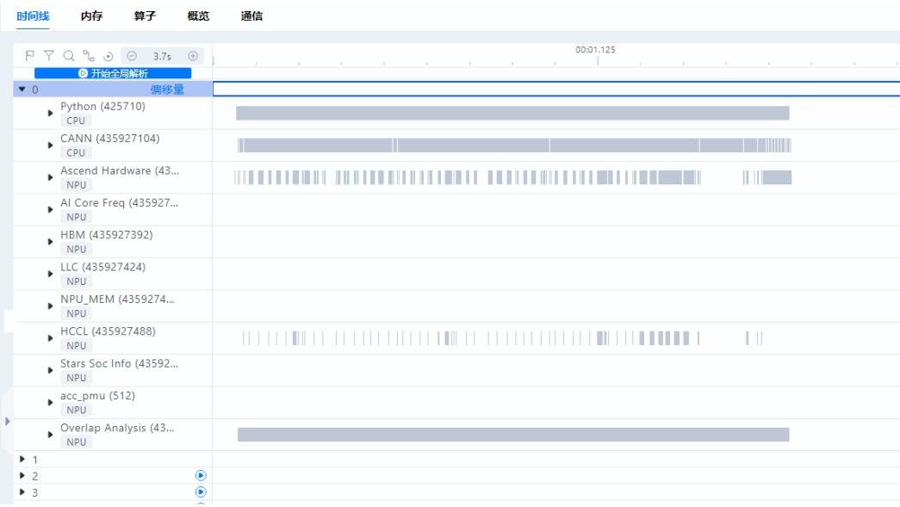  
图 4-24 单卡解析

如果导入的卡数量较多，可通过卡过滤功能定位所需解析数据的卡，进行数据解析操作。在时间线（Timeline）界面的工具栏中，单击 $\curlyvee$ ，选择“卡过滤”，然后单击后方输入框，在下拉框选择所需呈现的卡，即可在时间线（Timeline）界面展示对应信息，单击卡序号后面的 $\circledast$ ，进行数据解析，如图4-25所示，解析2、5、7卡数据。

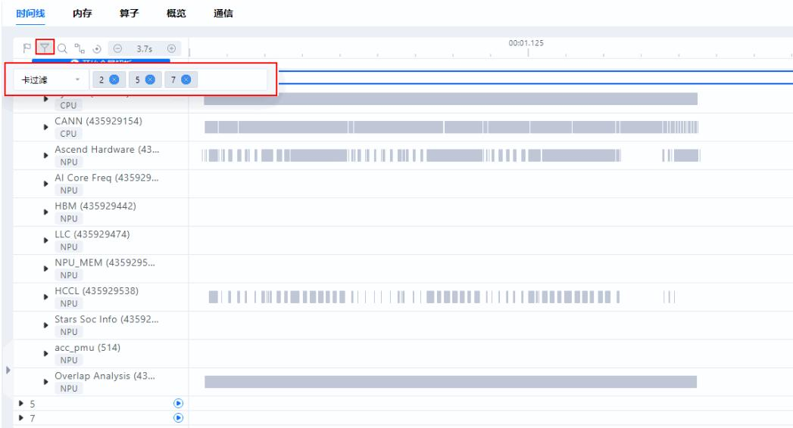  
图4-25 过滤展示并解析

# 说明

在部分解析场景下，单击“开始全局解析”按钮，此时会解析所有卡的数据。

相同通信域的卡解析：当解析完一个卡后，在通信的Group子泳道上，单击鼠标右键，选择“解析相关通信域的卡”，和该泳道通信域相关的卡都被解析，如图4-26，解析完成后，该鼠标右键菜单变为“已解析全部相关通信域的卡”并置灰。

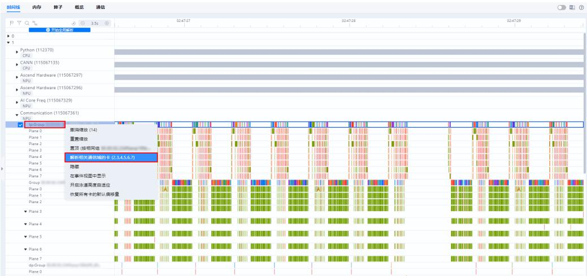  
图 4-26 解析相关通信域的卡

# 支持对齐自定义算子时间

MindStudio Insight工具支持使用快捷键将选中算子进行时间对齐操作，便于比较算子信息。

算子时间对齐

a. 在时间线（Timeline）界面，选中任意一个算子，单击鼠标右键，选择“设置基准算子”，将选中算子设置为基准算子，如图4-27所示。

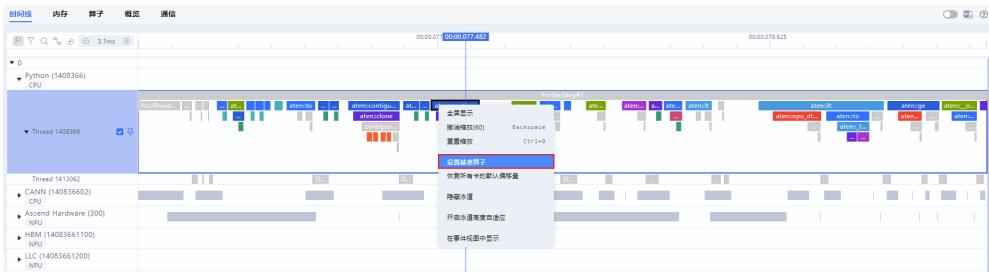  
图 4-27 设置基准算子

b. 选中与基准算子不同的二级泳道中的算子。

使用键盘快捷键L（左对齐），将选中的算子与基准算子左边界对齐，如图4-28所示。

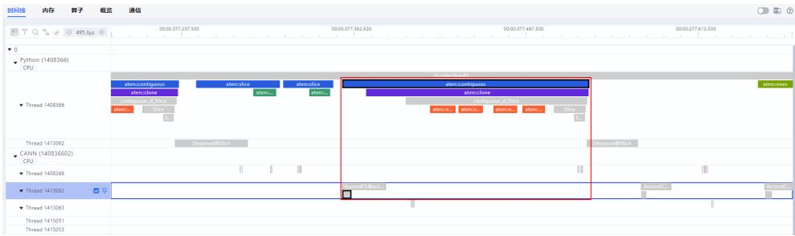  
图 4-28 算子左边界对齐

使用键盘快捷键R（右对齐），则选中的算子与基准算子会右边界对齐，如图4-29所示。

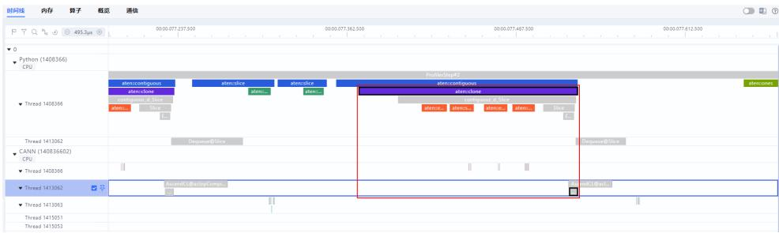  
图 4-29 算子右边界对齐

# 说明

无论左对齐还是右对齐，与选中算子为相同device的NPU泳道中的算子也会随之一起偏移。

# 取消基准算子

在泳道任意位置，单击鼠标右键，选择“消除基准算子”，则取消基准算子，如图4-30所示。

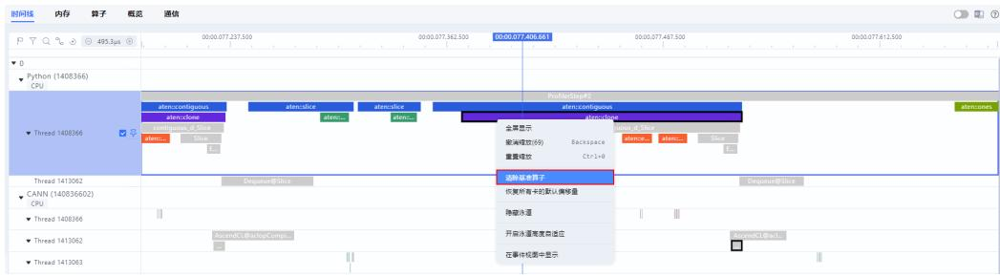  
图 4-30 取消基准算子

# 恢复默认偏移量

如果已经执行了算子时间对齐操作，可在泳道任意位置，单击鼠标右键，选择“恢复所有卡的默认偏移量”，恢复默认的偏移量，如图4-31所示。

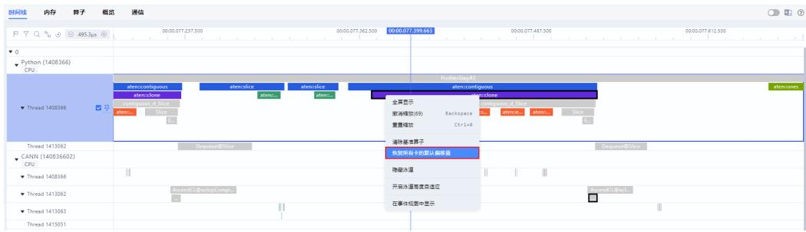  
图 4-31 恢复所有卡的默认偏移量

# 4.2.2.3 页面调优展示

# 泳道隐藏功能

在时间线（Timeline）界面，可对泳道进行隐藏和展开。

隐藏泳道

在时间线（Timeline）界面，鼠标放置在需要隐藏的泳道上，勾选单个泳道或多个泳道，或者框选多个泳道，自动勾选所框选的泳道，单击鼠标右键，在弹出菜单中选择“隐藏泳道”，隐藏该泳道，在该层级下会出现“x units hidden”行，x表示隐藏的泳道数量，如图4-32所示。

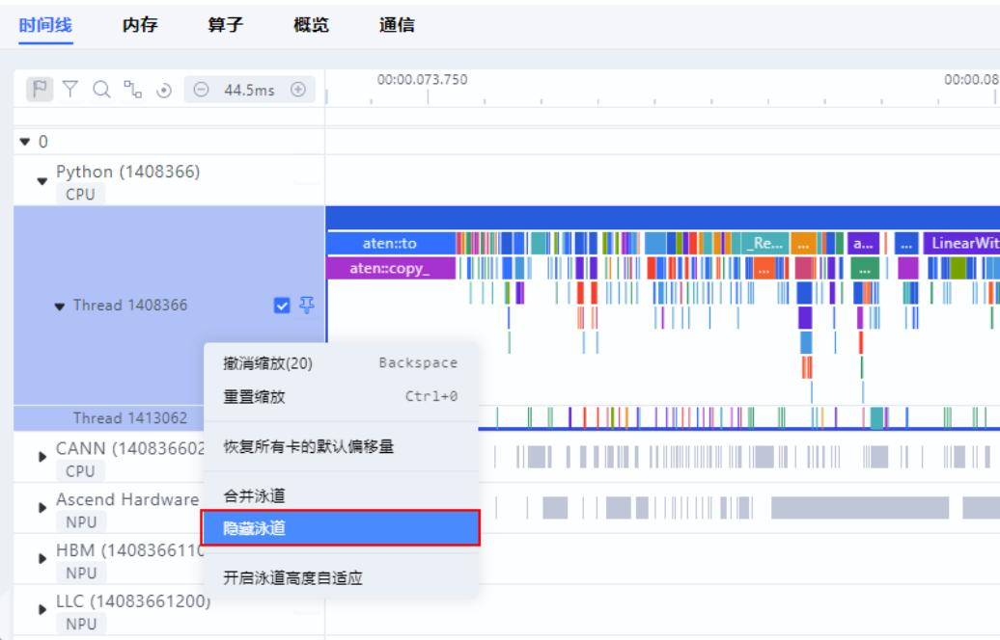  
图 4-32 隐藏泳道

显示全部已隐藏的泳道

选择存在隐藏泳道层级的units hidden行，单击鼠标右键，在弹出菜单中选择“显示全部泳道”，显示所选层级被隐藏的所有泳道。

如果父层级和子层级都存在隐藏的泳道，在父层级泳道的units hidden行，选择“显示全部泳道”，将显示该父层级泳道下所有被隐藏的泳道。如图4-33所示。

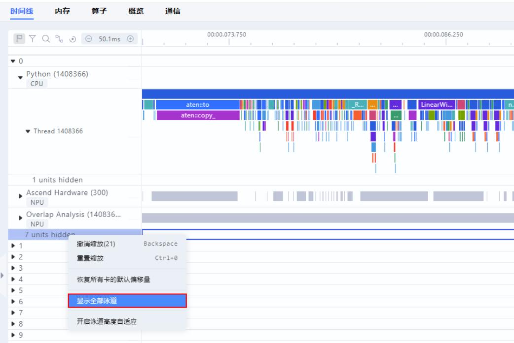  
图 4-33 显示隐藏的泳道

# Python 调用栈隐藏

如果MindStudio Insight导入的数据存在Python调用栈信息，在时间线（Timeline）界面，可在泳道中隐藏或显示Python调用栈内容，便于分析人员查看。

# 说明

如果泳道不存在Python调用栈内容，则该泳道无“隐藏Python调用栈”功能。

隐藏Python调用栈：选择需要隐藏Python调用栈的泳道，单击鼠标右键，在弹出菜单中选择“隐藏Python调用栈”，隐藏该泳道下Python调用栈内容，如图4-34所示。

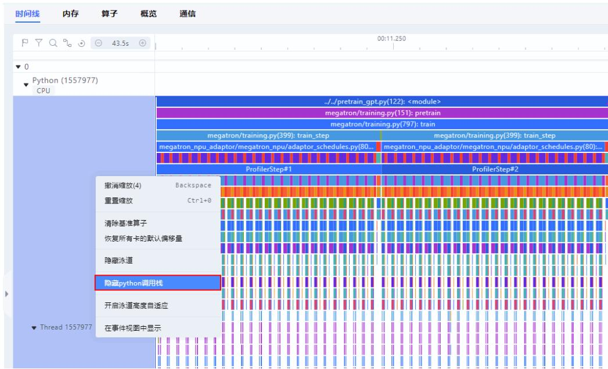  
图 4-34 隐藏 Python 调用栈

显示Python调用栈：在已经隐藏了Python调用栈信息的泳道，单击鼠标右键，在弹出菜单中选择“显示Python调用栈”，显示该泳道下被隐藏的Python调用栈内容，如图4-35所示。

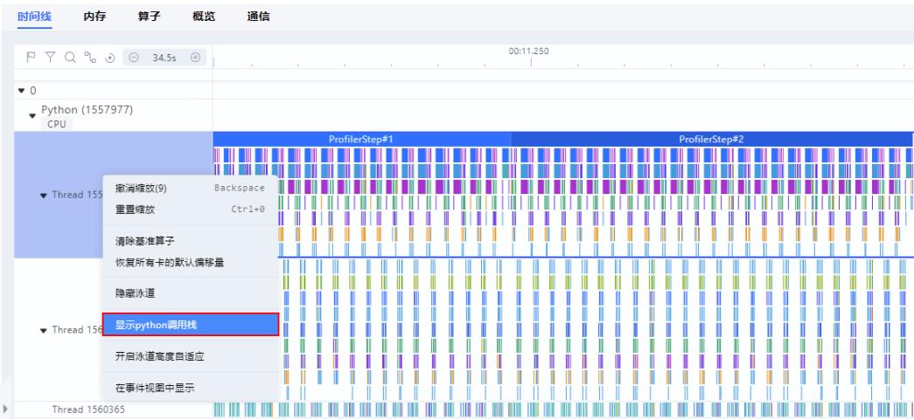  
图 4-35 显示 Python 调用栈

# 支持展开全部泳道

在时间线（Timeline）界面，可使用鼠标右键菜单展开全部泳道或收起全部泳道。

展开全部泳道：在需要展开的泳道上，单击鼠标右键，在弹出菜单中选择“展开全部子项”，将展开所选泳道下的全部子泳道，如图4-36所示，展开0卡的全部泳道。

当所选泳道及子泳道已处于全部展开状态时，鼠标右键不显示“展开全部子项”选项。

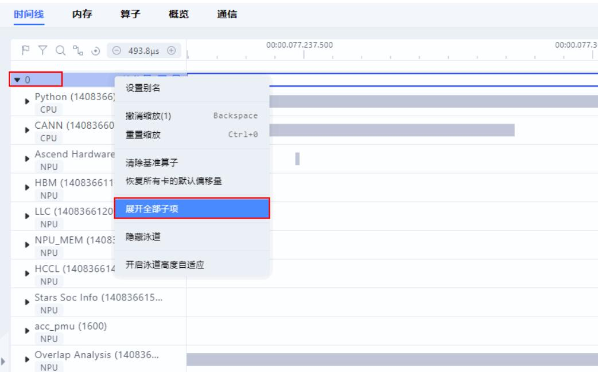  
图 4-36 展开全部子项

收起全部泳道：在已展开的泳道上，单击鼠标右键，在弹出菜单中选择“收起全部子项”，将收起所选泳道下的全部子泳道，如图4-37所示，收起0卡的所有泳道。

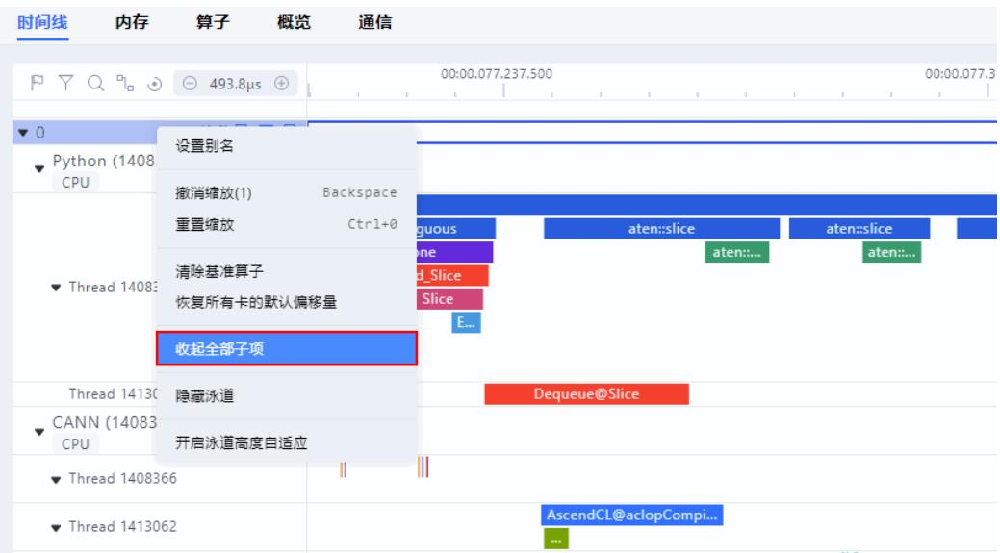  
图 4-37 收起全部子项

# 泳道高度支持自适应

在时间线（Timeline）界面，可使用鼠标右键菜单开启或关闭泳道高度自适应功能。

开启泳道高度自适应：在展开的泳道上，单击鼠标右键，在弹出菜单中选择“开启泳道高度自适应”，可自动调整泳道高度，以适配当前页面显示，如图4-38所示。

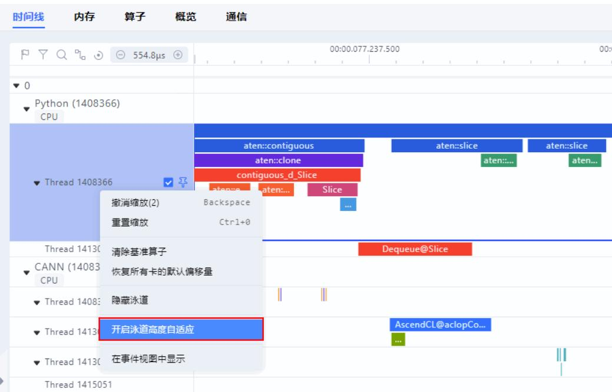  
图 4-38 开启泳道高度自适应

关闭泳道高度自适应：在已开启泳道高度自适应功能的泳道上，单击鼠标右键，在弹出菜单中选择“关闭泳道高度自适应”，关闭泳道高度自适应功能，泳道恢复初始高度，如图4-39所示。

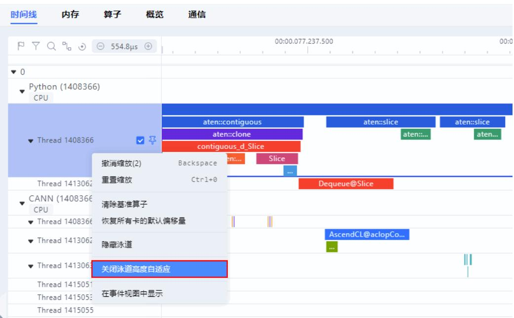  
图 4-39 关闭泳道高度自适应

# 支持锁定框选区域

锁定框选区域

在时间线（Timeline）界面，使用鼠标左键在泳道上框选部分算子区域后，单击鼠标右键，选择“锁定框选区域”，可在框选区域搜索相关算子，并展示连线起始点或终止点任意一个在框选区域的算子连线，如图4-40所示。也支持在单卡层级下跨多个泳道框选区域进行锁定。

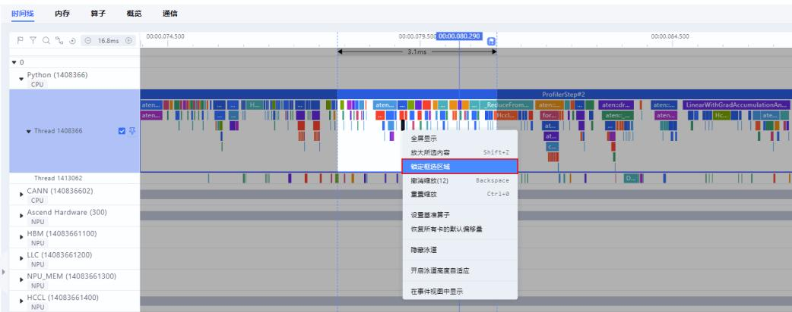  
图 4-40 锁定框选区域

解锁框选区域

如果需要取消框选，可单击鼠标右键，选择“解锁框选区域”，便可取消框选锁定，如图4-41所示。

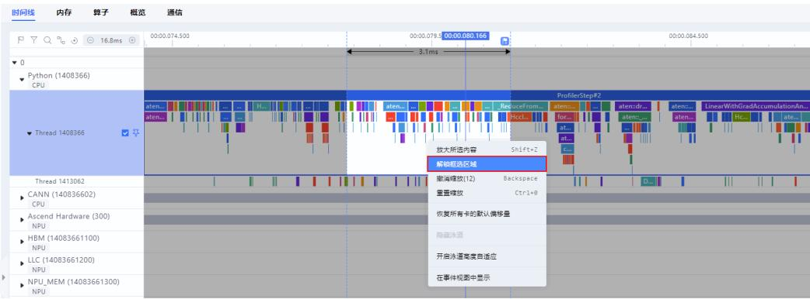  
图4-41 解锁框选区域

# 支持合并 Stream 泳道

在时间线（Timeline）界面，支持对多个Stream泳道进行合并，便于分析数据。

合并泳道

在同一张卡内勾选多个需要合并的Stream泳道，单击鼠标右键，选择“合并泳道”，所选的泳道将被合并为一个新泳道，如图4-42所示。合并后的泳道连线功能、算子搜索功能以及算子跳转等功能均可正常使用。

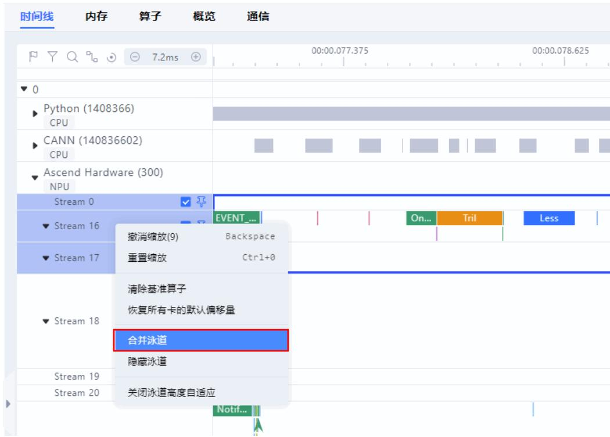  
图4-42 合并泳道

# 取消合并

如果需要取消Stream泳道的合并，可在合并的Stream泳道上，单击鼠标右键，选择“取消合并泳道”，便可取消合并，重新展示各Stream泳道，如图4-43所示。

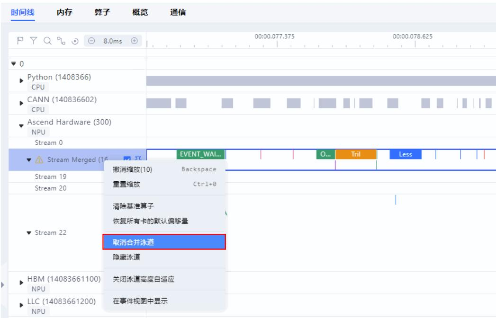  
图 4-43 取消合并泳道

# 4.2.2.4 系统功能展示

# 统计信息

MindStudio Insight支持算子统计信息和单个算子详情信息查看。

使用鼠标左键在单个三层级泳道上框选部分算子，或在单卡层级下跨多个泳道框选部分算子，框选部分区域算子后，可在下方“选中列表”页签中显示算子的统计信息，如图4-44所示，字段解释如表4-14所示。

当鼠标移入“选中列表”页签，单击表格右上角 $\cup$ 按钮，一键复制当前“选中列表”中所展示的内容，并粘贴至Excel表格中进行分析。

# 说明

在单卡下跨多个泳道框选算子的情况下，HBM、LLC、NPU_MEM、Stars Soc Info、acc_pmu等直方图泳道的框选部分不会在“选中列表”中统计。

单击“选中列表”列中的某个算子，在右侧“More”列表中将会显示此区域中与该算子同名的所有算子，单击“More”列表中某一行，则在时间线视图中定位出该算子的具体位置，并同时跳转至“选中详情”页面，可查看该算子的详情信息。

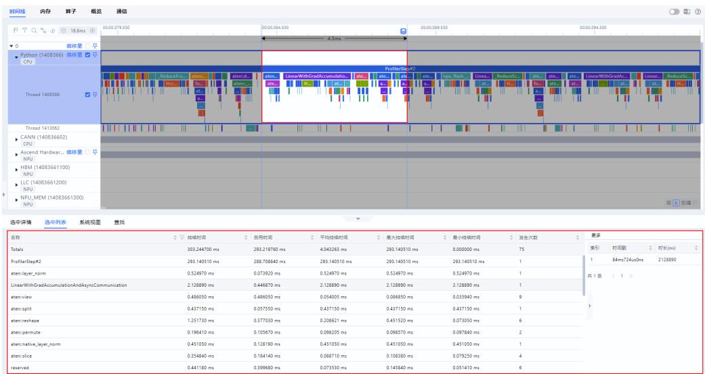  
图 4-44 选中列表

表 4-14 选中列表字段说明  

<table><tr><td colspan="1" rowspan="1">中文字段</td><td colspan="1" rowspan="1">英文字段</td><td colspan="1" rowspan="1">说明</td></tr><tr><td colspan="1" rowspan="1">名称</td><td colspan="1" rowspan="1">Name</td><td colspan="1" rowspan="1">算子名称。</td></tr><tr><td colspan="1" rowspan="1">持续时间</td><td colspan="1" rowspan="1">Wall Duration</td><td colspan="1" rowspan="1">算子执行总耗时。</td></tr><tr><td colspan="1" rowspan="1">自用时间</td><td colspan="1" rowspan="1">Self Time</td><td colspan="1" rowspan="1">算子执行时间（不包括调用的子算子时间）。</td></tr><tr><td colspan="1" rowspan="1">平均持续时间</td><td colspan="1" rowspan="1">Average WallDuration</td><td colspan="1" rowspan="1">算子平均执行时间。</td></tr><tr><td colspan="1" rowspan="1">最大持续时间</td><td colspan="1" rowspan="1">Max WallDuration</td><td colspan="1" rowspan="1">算子最大持续时间。</td></tr><tr><td colspan="1" rowspan="1">最小持续时间</td><td colspan="1" rowspan="1">Min WallDuration</td><td colspan="1" rowspan="1">算子最小持续时间。</td></tr><tr><td colspan="1" rowspan="1">发生次数</td><td colspan="1" rowspan="1">Occurrences</td><td colspan="1" rowspan="1">算子调用次数。</td></tr><tr><td colspan="1" rowspan="1">索引</td><td colspan="1" rowspan="1">Index</td><td colspan="1" rowspan="1">序号。</td></tr><tr><td colspan="1" rowspan="1">开始时间</td><td colspan="1" rowspan="1"> Start Time</td><td colspan="1" rowspan="1">在图形化窗格中的时间戳。</td></tr><tr><td colspan="1" rowspan="1">时长(ms)</td><td colspan="1" rowspan="1">Duration(ms)</td><td colspan="1" rowspan="1">执行耗时。</td></tr></table>

当选中单个算子时，可在下方“选中详情”页签中显示该算子的详情信息，如图4-45所示，字段解释如表4-15所示。

选中单个算子，使用M键，可框选该算子所属的时间线（Timeline）区域，再次按下M键，可取消框选。

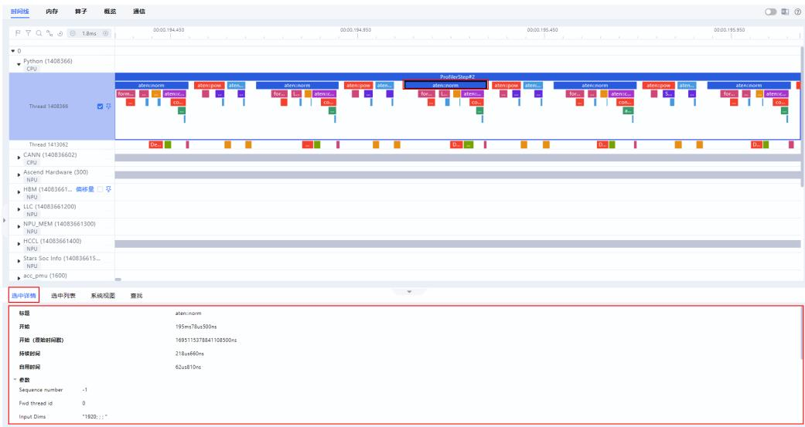  
图4-45 选中详情

表 4-15 选中详情字段说明  

<table><tr><td colspan="1" rowspan="1">中文字段</td><td colspan="1" rowspan="1">英文字段</td><td colspan="1" rowspan="1">说明</td></tr><tr><td colspan="1" rowspan="1">标题</td><td colspan="1" rowspan="1">Title</td><td colspan="1" rowspan="1">名称。</td></tr><tr><td colspan="1" rowspan="1">开始</td><td colspan="1" rowspan="1">Start</td><td colspan="1" rowspan="1">起始时间。</td></tr><tr><td colspan="1" rowspan="1">开始（原始时间戳）</td><td colspan="1" rowspan="1">Start(RawTimestamp)</td><td colspan="1" rowspan="1">数据采集到的原始开始时间。</td></tr><tr><td colspan="1" rowspan="1">持续时间</td><td colspan="1" rowspan="1">WallDuration</td><td colspan="1" rowspan="1">总耗时。</td></tr><tr><td colspan="1" rowspan="1">自用时间</td><td colspan="1" rowspan="1">Self Time</td><td colspan="1" rowspan="1">总耗时（不包括子类）。</td></tr><tr><td colspan="1" rowspan="1">输入Shapes</td><td colspan="1" rowspan="1">Input Shapes</td><td colspan="1" rowspan="1">算子输入维度。采集数据时task-time配置为l0时，不采集该字段，显示为N/A；NPU加速核上采集到的算子才有此字段。</td></tr><tr><td colspan="1" rowspan="1">输入数据类型</td><td colspan="1" rowspan="1">Input DataTypes</td><td colspan="1" rowspan="1">算子输入数据类型。采集数据时task-time配置为l0时，不采集该字段，显示为N/A；NPU加速核上采集到的算子才有此字段。</td></tr><tr><td colspan="1" rowspan="1">输入格式</td><td colspan="1" rowspan="1">InputFormats</td><td colspan="1" rowspan="1">算子输入数据格式。采集数据时task-time配置为l0时，不采集该字段，显示为N/A；NPU加速核上采集到的算子才有此字段。</td></tr><tr><td colspan="1" rowspan="1">输出Shapes</td><td colspan="1" rowspan="1">OutputShapes</td><td colspan="1" rowspan="1">算子的输出维度。采集数据时task-time配置为l0时，不采集该字段，显示为N/A；NPU加速核上采集到的算子才有此字段。</td></tr><tr><td colspan="1" rowspan="1">输出数据类型</td><td colspan="1" rowspan="1">Output DataTypes</td><td colspan="1" rowspan="1">算子输出数据类型。采集数据时task-time配置为l0时，不采集该字段，显示为N/A；NPU加速核上采集到的算子才有此字段。</td></tr><tr><td colspan="1" rowspan="1">输出格式</td><td colspan="1" rowspan="1">OutputFormats</td><td colspan="1" rowspan="1">算子输出数据格式。采集数据时task-time配置为l0时，不采集该字段，显示为N/A；NPU加速核上采集到的算子才有此字段。</td></tr><tr><td colspan="1" rowspan="1">算子属性信息</td><td colspan="1" rowspan="1">Attr Info</td><td colspan="1" rowspan="1">算子属性信息。采集数据时task-time配置为l0或l1时，不采集该字段，显示为N/A；只有开启aclnn，task-time配置为l2时，才有此字段。</td></tr><tr><td colspan="1" rowspan="1">参数</td><td colspan="1" rowspan="1">Args</td><td colspan="1" rowspan="1">算子的相关参数信息。</td></tr></table>

# 统计系统视图

在“系统视图”页签，当选择“统计系统视图”时，页面包含卡序号（Rank ID）选框、综合指标（Overall Metrics）、5种类型的算子汇总统计页签和算子详情（KernelDetails）（NPU上算子的详细信息），在卡序号选框中可以选择想要查看的卡。如果是db场景，需要依次选择“机器名称”和“卡序号”。

综合指标（Overall Metrics）展示所有算子的总体信息，如图4-46所示，字段解释如表4-16所示，当选择计算时间（Computing Time）列表中的子层级时，可单击“More”区域任一算子，会跳转到该算子在时间线视图中的具体位置。

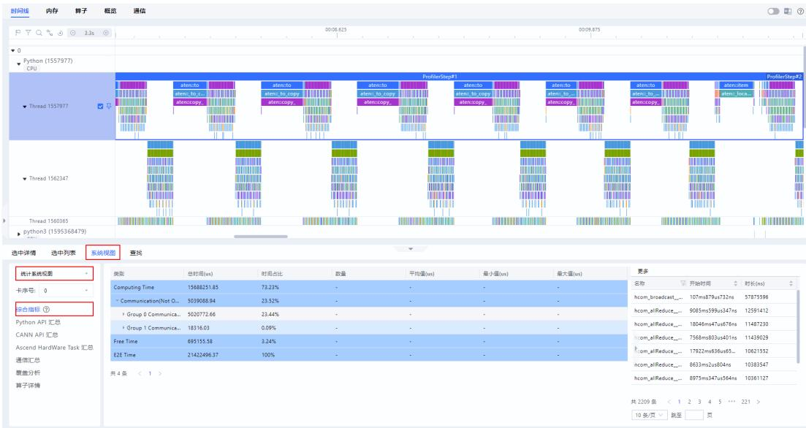  
图4-46 综合指标

表 4-16 综合指标字段说明  

<table><tr><td colspan="1" rowspan="1">中文字段</td><td colspan="1" rowspan="1">英文字段</td><td colspan="1" rowspan="1">说明</td></tr><tr><td colspan="1" rowspan="1">类别</td><td colspan="1" rowspan="1">Category</td><td colspan="1" rowspan="1">类别。可展示多层级信息：一层级：包含Computing Time（计算时间）、Communication(Not Overlapped) Time（通信时间（未被覆盖））、FreeTime（空闲时间）和E2ETime（端到端时间）。子层级：ComputingTime（计算时间）的子层级包括Flash Attention、Conv、Matmul、Cube、Vector等计算流算子的拆解结果。其中，Forward、Backward用于区分前向、反向传播。Communication(Not Overlapped) Time（通信时间（未被覆盖））的子层级为各通信域的分组拆解结果。其中等待时间、传输时间为与通信未被覆盖取交集后的结果。</td></tr><tr><td colspan="1" rowspan="1">总时间(us)</td><td colspan="1" rowspan="1">TotalTime(us)</td><td colspan="1" rowspan="1">该类耗时总和。</td></tr><tr><td colspan="1" rowspan="1">时间占比</td><td colspan="1" rowspan="1">Time Ratio</td><td colspan="1" rowspan="1">该类的耗时占比。</td></tr><tr><td colspan="1" rowspan="1">数量</td><td colspan="1" rowspan="1">Number</td><td colspan="1" rowspan="1">该类算子数目。</td></tr><tr><td colspan="1" rowspan="1">平均值(us)</td><td colspan="1" rowspan="1">Avg(us)</td><td colspan="1" rowspan="1">该类耗时的平均值。</td></tr><tr><td colspan="1" rowspan="1">最小值(us)</td><td colspan="1" rowspan="1">Min(us)</td><td colspan="1" rowspan="1">该类耗时的最小值。</td></tr><tr><td colspan="1" rowspan="1">最大值(us)</td><td colspan="1" rowspan="1">Max(us)</td><td colspan="1" rowspan="1">该类耗时的最大值。</td></tr><tr><td colspan="1" rowspan="1">更多</td><td colspan="1" rowspan="1">More</td><td colspan="1" rowspan="1">当选择ComputingTime（计算时间）列表中的子层级时，该区域展示所选层级的所有算子详情，可单击任意一个算子，跳转至时间线视图中算子所在的具体位置。</td></tr></table>

5种算子类型包括Python API 汇总（Python API Summary）、CANN API 汇总（CANN API Summary）、Ascend HardWare Task 汇总（Ascend HardWare TaskSummary）、通信汇总（Communication Summary）、覆盖分析（OverlapAnalysis），算子信息如图4-47所示，字段解释如表4-17所示。

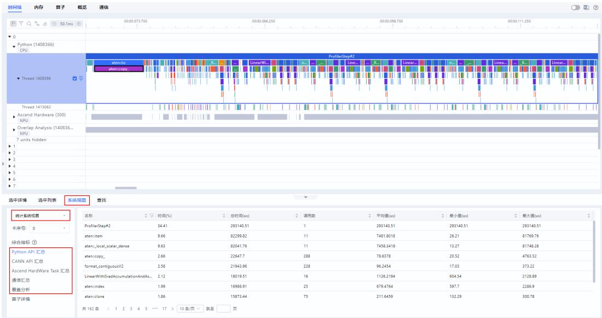  
图 4-47 算子汇总页签

表 4-17 统计系统视图字段说明  

<table><tr><td colspan="1" rowspan="1">中文字段</td><td colspan="1" rowspan="1">英文字段</td><td colspan="1" rowspan="1">说明</td></tr><tr><td colspan="1" rowspan="1">名称</td><td colspan="1" rowspan="1">Name</td><td colspan="1" rowspan="1">名称。</td></tr><tr><td colspan="1" rowspan="1">时间(%)</td><td colspan="1" rowspan="1">Time(%)</td><td colspan="1" rowspan="1">总时间占比=该类的耗时总时间／所有耗时总时间。当统计类型为覆盖分析（Overlap Analysis）时，时间占比=该类的耗时总时间/（Communication(Not Overlapped)总时间 +Computing总时间+Free总时间）。</td></tr><tr><td colspan="1" rowspan="1">总时间(us)</td><td colspan="1" rowspan="1">TotalTime(us)</td><td colspan="1" rowspan="1">该类耗时总和。</td></tr><tr><td colspan="1" rowspan="1">调用数</td><td colspan="1" rowspan="1">Num Calls</td><td colspan="1" rowspan="1">被调用次数。</td></tr><tr><td colspan="1" rowspan="1">平均值(us)</td><td colspan="1" rowspan="1">Avg(us)</td><td colspan="1" rowspan="1">该类耗时的平均值。</td></tr><tr><td colspan="1" rowspan="1">最小值(us)</td><td colspan="1" rowspan="1">Min(us)</td><td colspan="1" rowspan="1">该类耗时的最小值。</td></tr><tr><td colspan="1" rowspan="1">最大值(us)</td><td colspan="1" rowspan="1">Max(us)</td><td colspan="1" rowspan="1">该类耗时的最大值。</td></tr></table>

算子详情（Kernel Details）展示NPU上算子的详细信息，如图4-48所示，字段解释如表4-18所示，单击“点击跳转Timeline”列中的“点击”，会跳转到算子在时间线视图中的具体位置，区域四（数据窗格）将会展示选中详情，展示该算子的具体信息。单击算子详情表中字段名称后的 $\bigtriangledown$ ，可对相关字段进行模糊搜索。

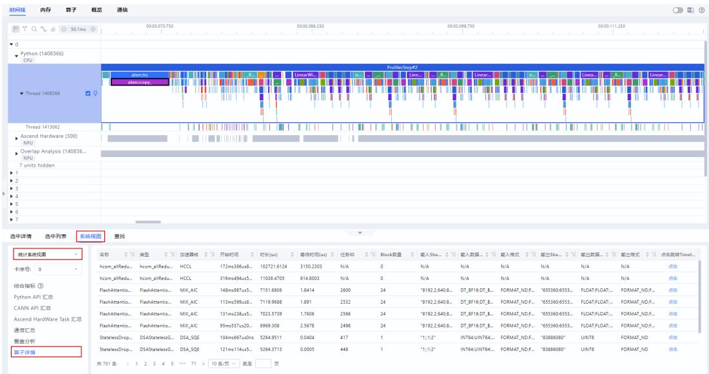  
图 4-48 算子详情信息展示

表 4-18 算子详情字段说明  

<table><tr><td colspan="1" rowspan="1">中文字段</td><td colspan="1" rowspan="1">英文字段</td><td colspan="1" rowspan="1">说明</td></tr><tr><td colspan="1" rowspan="1">名称</td><td colspan="1" rowspan="1">Name</td><td colspan="1" rowspan="1">算子名称。</td></tr><tr><td colspan="1" rowspan="1">类型</td><td colspan="1" rowspan="1">Type</td><td colspan="1" rowspan="1">算子类型。</td></tr><tr><td colspan="1" rowspan="1">加速器核</td><td colspan="1" rowspan="1">AcceleratorCore</td><td colspan="1" rowspan="1">计算核类型。</td></tr><tr><td colspan="1" rowspan="1">开始时间</td><td colspan="1" rowspan="1">Start Time</td><td colspan="1" rowspan="1">任务开始时间点。</td></tr><tr><td colspan="1" rowspan="1">时长(us)</td><td colspan="1" rowspan="1">Duration(us)</td><td colspan="1" rowspan="1">任务耗时。</td></tr><tr><td colspan="1" rowspan="1">等待时间(us)</td><td colspan="1" rowspan="1">Wait Time(us)</td><td colspan="1" rowspan="1">上一个任务的结束时间与当前任务的开始时间间隔，单位us。</td></tr><tr><td colspan="1" rowspan="1">任务ID</td><td colspan="1" rowspan="1">Task ID</td><td colspan="1" rowspan="1">任务的ID。</td></tr><tr><td colspan="1" rowspan="1">Block数量</td><td colspan="1" rowspan="1">Block Dim</td><td colspan="1" rowspan="1">任务运行切分数量，对应任务运行时核数。</td></tr><tr><td colspan="1" rowspan="1">输入Shapes</td><td colspan="1" rowspan="1"> Input Shapes</td><td colspan="1" rowspan="1">算子的输入维度。</td></tr><tr><td colspan="1" rowspan="1">输入数据类型</td><td colspan="1" rowspan="1">Input DataTypes</td><td colspan="1" rowspan="1">算子输入数据类型。</td></tr><tr><td colspan="1" rowspan="1">输入格式</td><td colspan="1" rowspan="1">Input Formats</td><td colspan="1" rowspan="1">算子输入数据格式。</td></tr><tr><td colspan="1" rowspan="1">输出Shapes</td><td colspan="1" rowspan="1">OutputShapes</td><td colspan="1" rowspan="1">算子的输出维度。</td></tr><tr><td colspan="1" rowspan="1">输出数据类型</td><td colspan="1" rowspan="1">Output DataTypes</td><td colspan="1" rowspan="1">算子输出数据类型。</td></tr><tr><td colspan="1" rowspan="1">输出格式</td><td colspan="1" rowspan="1">OutputFormats</td><td colspan="1" rowspan="1">算子输出数据格式。</td></tr><tr><td colspan="1" rowspan="1">点击跳转Timeline</td><td colspan="1" rowspan="1">Click ToTimeline</td><td colspan="1" rowspan="1">单击“点击”，跳转到算子在时间线视图上的具体位置，并且在区域四（数据窗格）展示该算子的详情。</td></tr></table>

# 专家系统视图

在“系统视图”页签，当选择“专家系统视图”时，页面包含卡序号选框、专家分析页签、6种类型专家建议系统页签，在卡序号选框中可以选择想要查看的卡。如果是db场景，需要依次选择“机器名称”和“卡序号” 。

专家分析（Expert Analysis）页签展示泳道中的异常指标信息。

6种专家建议系统包括亲和 API（Affinity API）、亲和优化器（Affinity Optimizer）、AICPU 算子（AICPU Operators）、ACLNN 算子（ACLNN Operators）、算子融合（Operators Fusion）和算子下发（Operators Dispatch），如图4-49所示，字段解释如表4-19所示。

选择任一专家建议系统，右侧区域会显示该类专家建议系统的详细信息，单击“点击跳转Timeline”列中的“点击”，会跳转到算子在时间线视图中的具体位置，区域四（数据窗格）“选中详情”页签将会展示该算子的具体信息。

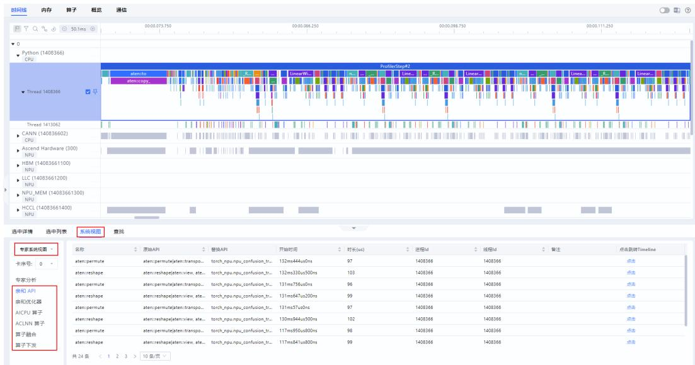  
图 4-49 专家系统视图

表 4-19 专家系统视图字段说明  

<table><tr><td rowspan=1 colspan=1>中文字段</td><td rowspan=1 colspan=1>英文字段</td><td rowspan=1 colspan=1>说明</td></tr><tr><td rowspan=1 colspan=1>名称</td><td rowspan=1 colspan=1>Name</td><td rowspan=1 colspan=1>算子名称。当专家建议系统为亲和优化器（AffinityOptimizer）时无此参数。</td></tr><tr><td rowspan=1 colspan=1>原始API</td><td rowspan=1 colspan=1>Origin API</td><td rowspan=1 colspan=1>可融合API序列。仅当专家建议系统为亲和API（AffinityAPI）时存在。</td></tr><tr><td rowspan=1 colspan=1>替换API</td><td rowspan=1 colspan=1> ReplacementAPI</td><td rowspan=1 colspan=1>等效亲和API。仅当专家建议系统为亲和API（Affinity API）时存在。</td></tr><tr><td rowspan=1 colspan=1>原始优化器</td><td rowspan=1 colspan=1>Origin.Optimizer</td><td rowspan=1 colspan=1>可融合优化器。仅当专家建议系统为亲和优化器（AffinityOptimizer）时存在。</td></tr><tr><td rowspan=1 colspan=1>替换优化器</td><td rowspan=1 colspan=1>ReplacementOptimizer</td><td rowspan=1 colspan=1>可替换的优化器。仅当专家建议系统为亲和优化器（AffinityOptimizer）时存在。</td></tr><tr><td rowspan=1 colspan=1>原始算子</td><td rowspan=1 colspan=1>OriginOperators</td><td rowspan=1 colspan=1>可融合的算子。仅当专家建议系统为算子融合（OperatorsFusion）时存在。</td></tr><tr><td rowspan=1 colspan=1>融合算子</td><td rowspan=1 colspan=1>Fused Operator</td><td rowspan=1 colspan=1>CANN层已融合的算子。仅当专家建议系统为算子融合（OperatorsFusion）时存在。</td></tr><tr><td rowspan=1 colspan=1>开始时间</td><td rowspan=1 colspan=1>Start Time</td><td rowspan=1 colspan=1>任务开始时间点。</td></tr><tr><td rowspan=1 colspan=1>时长(us)</td><td rowspan=1 colspan=1>Duration(us)</td><td rowspan=1 colspan=1>任务耗时。</td></tr><tr><td rowspan=1 colspan=1>进程ld</td><td rowspan=1 colspan=1>Process Id</td><td rowspan=1 colspan=1>进程ID。</td></tr><tr><td rowspan=1 colspan=1>线程ld</td><td rowspan=1 colspan=1>Thread Id</td><td rowspan=1 colspan=1>线程ID。</td></tr><tr><td rowspan=1 colspan=1>备注</td><td rowspan=1 colspan=1>Notes</td><td rowspan=1 colspan=1>提示信息。当专家建议系统为亲和优化器（AffinityOptimizer）时无此参数。</td></tr><tr><td rowspan=1 colspan=1>点击跳转Timeline</td><td rowspan=1 colspan=1>Click ToTimeline</td><td rowspan=1 colspan=1>单击“点击”，跳转到算子在时间线视图中的具体位置，并且在区域四（数据窗格）展示该算子的详情。</td></tr></table>

# 事件视图

在时间线（Timeline）界面，支持在事件视图中显示算子信息。

在时间线（Timeline）界面，选择所需泳道，单击鼠标右键，单击“在事件视图中显示”菜单，跳转至“系统视图”页签，左侧区域选项默认选择“事件视图”，右侧区域显示该泳道所有算子详情，如图4-50所示，字段解释如表4-20所示。

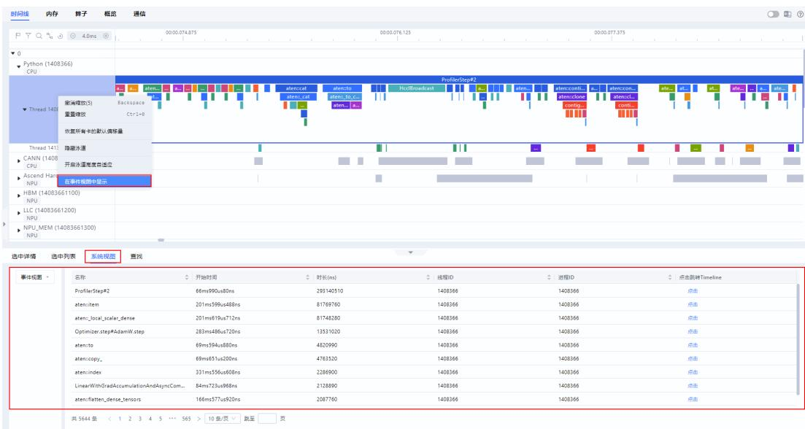  
图 4-50 事件视图

表 4-20 事件视图字段说明  

<table><tr><td colspan="1" rowspan="1">中文字段</td><td colspan="1" rowspan="1">英文字段</td><td colspan="1" rowspan="1">说明</td></tr><tr><td colspan="1" rowspan="1">名称</td><td colspan="1" rowspan="1">Name</td><td colspan="1" rowspan="1">算子名称。</td></tr><tr><td colspan="1" rowspan="1">开始时间</td><td colspan="1" rowspan="1">Start</td><td colspan="1" rowspan="1">算子执行开始时间。</td></tr><tr><td colspan="1" rowspan="1">时长(ns)</td><td colspan="1" rowspan="1">Duration(ns)</td><td colspan="1" rowspan="1">算子运行总耗时。</td></tr><tr><td colspan="1" rowspan="1">线程ID</td><td colspan="1" rowspan="1">TID</td><td colspan="1" rowspan="1">线程ID。当选择Python和CANN泳道及其子泳道时存在。</td></tr><tr><td colspan="1" rowspan="1">进程ID</td><td colspan="1" rowspan="1">PID</td><td colspan="1" rowspan="1">进程ID。当选择Python和CANN泳道及其子泳道时存在。</td></tr><tr><td colspan="1" rowspan="1">任务流名称</td><td colspan="1" rowspan="1">Stream Name</td><td colspan="1" rowspan="1">Ascend Hardware泳道下的Stream任务流名称。仅当选择Ascend Hardware泳道及其子泳道时存在。</td></tr><tr><td colspan="1" rowspan="1">通信域名称</td><td colspan="1" rowspan="1">Group Name</td><td colspan="1" rowspan="1">通信算子集群名称。仅当选择Communication泳道及其Group子泳道时存在。</td></tr><tr><td colspan="1" rowspan="1">分析算子类型</td><td colspan="1" rowspan="1"> Analysis Type</td><td colspan="1" rowspan="1">分析算子类型。仅当选择Overlap Analysis泳道及其子泳道时存在。</td></tr><tr><td colspan="1" rowspan="1">卡序号</td><td colspan="1" rowspan="1">Rank ID</td><td colspan="1" rowspan="1">算子所在卡序号。当选择Ascend Hardware、Communication和Overlap Analysis泳道及其子泳道时存在。</td></tr><tr><td colspan="1" rowspan="1">点击跳转Timeline</td><td colspan="1" rowspan="1">Click ToTimeline</td><td colspan="1" rowspan="1">单击“点击”，跳转到算子在时间线视图上的具体位置，并且在“选中详情”页签展示该算子的详情。</td></tr></table>

# 说明

● Card层级不支持此功能。  
● HBM、LLC、NPU_MEM、Stars Soc Info、acc_pmu等直方图泳道不支持此功能。  
● Communication泳道下的Plane子泳道不支持此功能。

# 4.3 内存（Memory）

# 4.3.1 界面介绍

# 功能说明

内存（Memory）界面提供了采集过程中内存信息的可视化呈现。用户可以通过内存折线图对整体内存趋势一目了然，也可以框选放大折线图中峰值区域并结合算子内存信息精准定位到内存消耗大的算子。

# 界面展示（动态图场景）

内存（Memory）界面由参数配置栏（区域一）、算子内存折线图（区域二）、内存申请/释放详情表（区域三）三个部分组成，如图4-51所示。

# 说明

对于超过300万条的数据，在内存折线图表渲染时采用LTTB（Largest Triangle Three Buckets）算法进行降采样，以提升渲染性能，所以当数据量较大时，仅显示采样结果，将图表放大至较小范围时，可完整显示数据点。

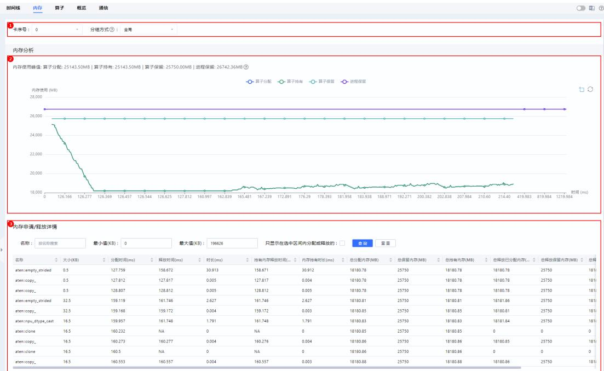  
图 4-51 动态图内存界面

区域一：参数配置栏。

卡序号（Rank ID）：通过切换选项来查看不同卡的内存信息，切换之后整体界面即时刷新。  
分组方式（Group By）：通过切换不同的维度来展示内存信息，分为“全局”、“流”和“组件”维度。  
机器名称（Host Name）：仅当导入的db场景文件中存在名称为  
“HOST_INFO”的表时，存在该选项。

区域二：算子内存折线图。

算子分配（Operator Allocated）曲线表示算子在申请或释放内存时采集到的已分配内存的变化趋势，代表所有算子总的分配内存，此处采集到的内存数据由PyTorch和GE（Graph Engine，图引擎）申请。  
算子保留（Operator Reserved）曲线表示算子在申请或释放内存时采集到的保留内存的变化趋势，代表所有算子总的保留内存，此处采集到的内存数据由PyTorch和GE申请。  
算子持有（Operator Activated）曲线表示所持有的总内存，包括被其他流复用未释放的内存，此处采集到的内存数据由PyTorch中的流申请。如果没有“流”的信息，则没有算子持有曲线。  
进程保留（APP Reserved）曲线表示整个进程保留的内存趋势。  
当“分组方式”选择“组件”时，折线图中分别展示PyTorch的算子内存情况和GE的内存情况。

区域三：内存申请/释放详情表，详细展示了每个算子的内存信息，表格支持排序、分页和跳转功能。单击每列的表头，可根据当前列的升序、降序和默认排序呈现数据；还可单击表格右上角 $\Game$ 按钮，一键复制表中当前所展示的内容，并粘贴至Excel表格中进行分析。

# 界面展示（静态图场景）

内存（Memory）界面由参数配置栏（区域一）、算子内存折线图（区域二）、内存申请/释放详情表（区域三）三个部分组成，如图4-52所示。

# 说明

对于超过300万条的数据，在内存折线图表渲染时采用LTTB（Largest Triangle Three Buckets）算法进行降采样，以提升渲染性能，所以当数据量较大时，仅显示采样结果，将图表放大至较小范围时，可完整显示数据点。

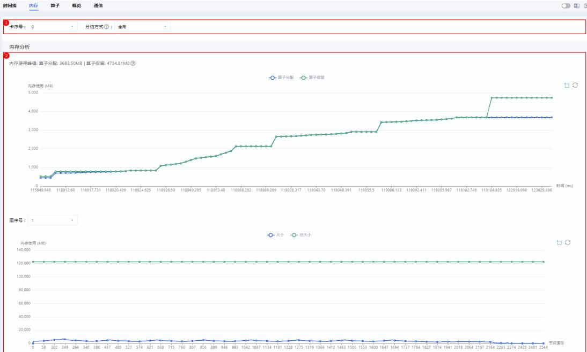  
图 4-52 静态图内存界面  
内存申请/释放详情

<table><tr><td>名称：按客将搜安</td><td>最小值（KB)：</td><td></td><td>最大值(KB)： 512001</td><td>查询 重置</td><td></td><td></td></tr><tr><td>设备序号</td><td></td><td>名称</td><td></td><td>节点索引开始</td><td>|节点索引嬉束</td><td>|大小（MB) 4</td></tr><tr><td>hast</td><td></td><td></td><td>Default/Sitchopenelgaph/Dfault/ptiizeF34</td><td></td><td>2351</td><td>500</td></tr><tr><td>host</td><td></td><td></td><td>Default/netwrk-_VrDatasetCelckboe-du 70</td><td></td><td>1694</td><td>250</td></tr><tr><td>host</td><td></td><td></td><td>Default/etwkViuaataseCel/cboeGrdAc 30</td><td></td><td>1816</td><td>86</td></tr><tr><td></td><td></td><td></td><td>Default/netwrk_VirtualDatasetCel/_ackboneGradAccu. 35</td><td></td><td>1808</td><td>86</td></tr><tr><td></td><td></td><td></td><td>Default/network_VirtualatasetCell_eckbone-GredAccu1</td><td></td><td>1852</td><td>32</td></tr><tr><td>hast</td><td></td><td></td><td>Default/etwrkVitualDataseCellackboneGradAcc 18</td><td></td><td>1861</td><td>32</td></tr><tr><td>host</td><td></td><td></td><td>Default/netwrk_VirtualDataseCel/_eckboneGrdAcc 192</td><td></td><td>337</td><td>4</td></tr><tr><td>host</td><td></td><td></td><td>Default/etwrkViualDataseCel/cboneGradAc 398</td><td></td><td>543</td><td>4</td></tr><tr><td>host</td><td></td><td></td><td>Default/netwrk_VirtualDataseCell_ackboneGradAc. 604</td><td></td><td>749</td><td>4</td></tr><tr><td>host</td><td>共2632条&lt;12345264&gt;10条/页V跳至</td><td></td><td>Default/network-VirtualDatasetCel/_beckboneGredAccu 810 页</td><td></td><td>955</td><td></td></tr></table>

区域一：参数配置栏，通过切换“卡序号”和“分组方式”的选项来查看不同卡的内存信息，切换之后整体界面即时刷新。

区域二：算子内存折线图，由动态折线图和静态折线图组成，但静态折线图仅在MindSpore数据场景下存在。

a. 动态折线图：

算子分配（Operator Allocated）曲线表示算子在申请或释放内存时采集到的已分配内存的变化趋势，代表所有算子总的分配内存，此处采集到的内存数据由PyTorch和GE（Graph Engine，图引擎）申请。

算子保留（Operator Reserved）曲线表示算子在申请或释放内存时采集到的保留内存的变化趋势，代表所有算子总的保留内存，此处采集到的内存数据由PyTorch和GE申请。

算子持有（Operator Activated）曲线表示所持有的总内存，包括被其他流复用未释放的内存，此处采集到的内存数据由PyTorch中的流申请。

进程保留（APP Reserved）曲线表示整个进程保留的内存趋势。

# b. 静态折线图：

仅在MindSpore数据场景下存在。通过切换图序号（Graph ID）查看所选卡的内存分配情况。

大小（Size）：按节点索引（Index）动态申请的内存大小。

总大小（Total Size）：自动预设的内存最大值。

● 区域三：内存申请/释放详情表，详细展示了静态图中每个算子的内存信息，表格支持排序、分页和跳转功能。单击每列的表头，可根据当前列的升序、降序和默认排序呈现数据；还可单击一键复制按钮，复制表中当前所展示的内容，并粘贴至Excel表格中进行分析。

# 4.3.2 使用说明

# 支持切换卡

MindStudio Insight支持通过切换卡序号来查看不同卡的内存信息，单击界面上方卡序号的输入框，在下拉框选择需要查看的信息，切换之后界面将显示对应卡的算子内存折线图、内存申请/释放详情表，如图4-53所示。

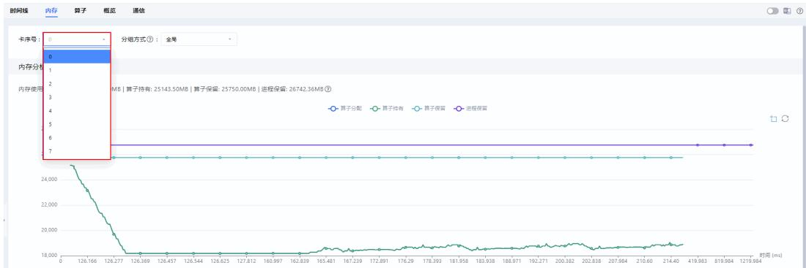  
图 4-53 切换卡序号

# 支持切换展示维度

MindStudio Insight支持通过切换分组方式来查看不同维度的算子内存折线图，单击界面上方分组方式的输入框，在下拉框选择需要查看的维度。该功能仅在动态图场景下支持。

全局：以全局为维度，统计算子在保留、分配和持有状态下的内存大小，以及PyTorch整体的保留内存大小，如图4-54所示。

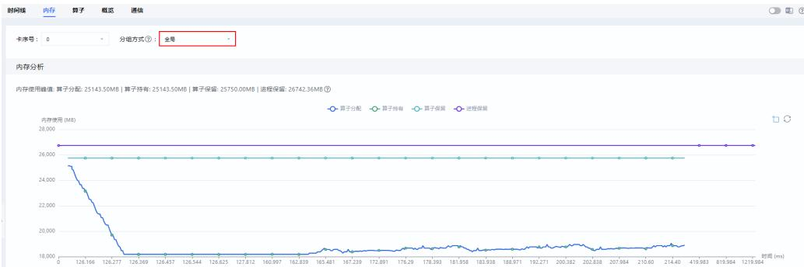  
图 4-54 全局维度

流：以流为维度，统计处于保留、分配和持有状态的算子内存大小，如图4-55所示。

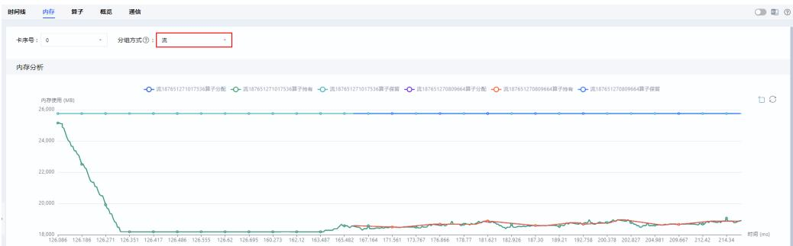  
图 4-55 流维度

组件：以组件为维度，分别统计PyTorch的算子在保留、分配和持有状态下的内存大小，GE的内存在保留、分配和持有状态下的大小情况，如图4-56所示。

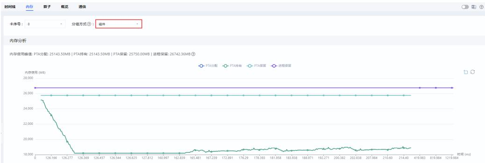  
图 4-56 组件维度

# 支持内存折线图局部放大和还原

MindStudio Insight支持通过鼠标左键框选放大选中部分和右键还原进行折线图的展示。为提升显示性能，折线图在数据量较大时会隐藏大部分点，可在框选到足够精细区域时显示所有点位，也可单击鼠标右键还原最初整体展示效果。

在折线图中单击鼠标左键拖至需要放大的终点位置并松开鼠标左键，框选部分将会被放大；如果还存在点被隐藏，重复放大操作即可展示被隐藏的点，选中放大区域如图4-57所示，放大后如图4-58所示。

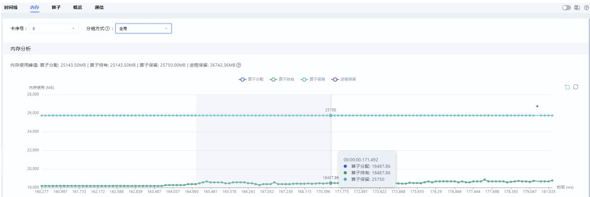  
图 4-57 选中放大区域

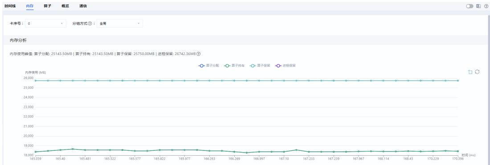  
图 4-58 局部放大展示

# 说明

单击折线图右上角 $\sqcup$ 按钮，使其为置灰状态，则折线图将锁定，不再支持鼠标左键框选放大功能；再次单击此按钮，或者单击鼠标右键即可恢复。放大功能默认开启。

● 单击折线图右上方 $\smile$ 按钮，折线图将会恢复最初状态。

# 支持搜索算子

MindStudio Insight支持搜索算子，在内存申请/释放详情表中，设置了筛选条件栏和控制按钮，可通过设置查询条件进行算子明细表的展示。查询条件为算子名称和算子占用内存大小区间范围（最小值和最大值），默认展示所选卡中算子占用内存大小的最小值和最大值，用户可根据实际需要进行调整。

单击“查询”后即可查询，单击“重置”将会重置查询条件并再次进行查询。

# 说明

在MindSpore静态图场景下，显示为静态图算子内存申请/释放详情表。其它场景下，则显示的是动态图算子内存申请/释放详情表。

动态图搜索如图4-59所示，搜索算子名称为aten相关且内存大小为0\~65KB的算子，表格中字段解释如表4-21所示。

如果在搜索行勾选了“只显示在选中区间内分配或释放的”选项，那么查询到的算子即是在折线图中框选区域内分配或释放的算子。

图 4-59 搜索算子  
内存申请/释放详情  

<table><tr><td>名称：aten</td><td>。 最小值（KB)：</td><td></td><td>最大值(KB）：5</td><td>只显示在选中区间内分配或释放的：</td><td>查询 1</td><td></td><td></td><td></td></tr><tr><td>名称</td><td>|大小(KB]</td><td>|分配时间（ms)</td><td>|释致时间（m)</td><td>时长（ms)</td><td>总分配内存(MB)</td><td>总保置内存(MB)</td><td>总辉放已分配内存(MB)</td><td>总释放保留内存(MB)</td></tr><tr><td>ater:add</td><td>1.5</td><td>3746.815</td><td>3746.884</td><td>0.069</td><td>5082.09</td><td>6454</td><td>5082.99</td><td>6454</td></tr><tr><td>ater:mean</td><td>1.5</td><td>3746.753</td><td>3746.886</td><td>0.132</td><td>5082.99</td><td>6454</td><td>5082.99</td><td>6454</td></tr><tr><td>atereadd</td><td>1.5</td><td>3750.418</td><td>3750.478</td><td>0.06</td><td>5118.24</td><td>6454</td><td>5118.24</td><td>6454</td></tr><tr><td>ateremean</td><td>1.5</td><td>3750.363</td><td>3750.48</td><td>0.117</td><td>5118.24</td><td>6454</td><td>5118.24</td><td>6454</td></tr><tr><td>atentempty_strtled</td><td>32.5</td><td>3720.545</td><td>3752.342</td><td>31.797</td><td>4583.4</td><td>6454</td><td></td><td>6454</td></tr><tr><td>atenones</td><td>16.5</td><td>3721.421</td><td>3752.414</td><td>30.993</td><td>4647.42</td><td>6454</td><td>5188.19</td><td>6454</td></tr><tr><td>atenempty_stided</td><td>0.5</td><td>3759.315</td><td>3760.179</td><td>0.864</td><td>5188.19</td><td></td><td>5188.19</td><td>6454</td></tr><tr><td>ateniarang</td><td>32.5</td><td>3761.33</td><td>3761.448</td><td>0.118</td><td>5252.27</td><td></td><td>5204.24</td><td>6454</td></tr><tr><td>atenilt</td><td>4.5</td><td>3761.631</td><td>3761.755</td><td>0.124</td><td>5204.26</td><td>6454</td><td>5204.25</td><td>6454</td></tr><tr><td>atenige</td><td>4.5</td><td>3761.695</td><td>3761.759</td><td>0.064</td><td>5204.25</td><td>6454</td><td>5204.25</td><td>6454</td></tr></table>

表 4-21 动态图字段说明  

<table><tr><td rowspan=1 colspan=1>中文字段</td><td rowspan=1 colspan=1>英文字段</td><td rowspan=1 colspan=1>说明</td></tr><tr><td rowspan=1 colspan=1>名称</td><td rowspan=1 colspan=1>Name</td><td rowspan=1 colspan=1>算子名称。</td></tr><tr><td rowspan=1 colspan=1>大小(KB)</td><td rowspan=1 colspan=1>Size(KB)</td><td rowspan=1 colspan=1>申请内存大小，单位KB。</td></tr><tr><td rowspan=1 colspan=1>分配时间(ms)</td><td rowspan=1 colspan=1>AllocationTime(ms)</td><td rowspan=1 colspan=1>Tensor内存分配时间。（从采集开始时计算，单位ms）。</td></tr><tr><td rowspan=1 colspan=1>释放时间（ms)</td><td rowspan=1 colspan=1>ReleaseTime(ms)</td><td rowspan=1 colspan=1>Tensor内存释放时间。（从采集开始时计算，单位ms）。</td></tr><tr><td rowspan=1 colspan=1>时长(ms)</td><td rowspan=1 colspan=1>Duration(ms)</td><td rowspan=1 colspan=1>内存持有时间。</td></tr><tr><td rowspan=1 colspan=1>持有内存释放时间(ms)</td><td rowspan=1 colspan=1>Active ReleaseTime(ms)</td><td rowspan=1 colspan=1>内存实际归还内存池时间。</td></tr><tr><td rowspan=1 colspan=1>内存持有时长（ms)</td><td rowspan=1 colspan=1>ActiveDuration(ms)</td><td rowspan=1 colspan=1>内存实际占用时间。</td></tr><tr><td rowspan=1 colspan=1>总分配内存(MB)</td><td rowspan=1 colspan=1>AllocationTotalAllocated(MB）</td><td rowspan=1 colspan=1>算子内存分配时，PyTorch和GE内存实际分配总额。</td></tr><tr><td rowspan=1 colspan=1>总保留内存(MB)</td><td rowspan=1 colspan=1>AllocationTotalReserved(MB)</td><td rowspan=1 colspan=1>算子内存分配时，PyTorch和GE内存预留总额。</td></tr><tr><td rowspan=1 colspan=1>总持有内存（MB)</td><td rowspan=1 colspan=1>AllocationTotalActive(MB)</td><td rowspan=1 colspan=1>算子内存分配时，当前流所申请的总内存（包括被其他流复用的未释放的内存）。</td></tr><tr><td rowspan=1 colspan=1>总释放已分配内存(MB)</td><td rowspan=1 colspan=1>Release TotalAllocated(MB）</td><td rowspan=1 colspan=1>算子内存释放后，内存池中PyTorch和GE正在使用的内存大小。</td></tr><tr><td rowspan=1 colspan=1>总释放保留内存（MB)</td><td rowspan=1 colspan=1>Release TotalReserved(MB)</td><td rowspan=1 colspan=1>算子内存释放后，内存池中PyTorch和GE所占用的内存大小。</td></tr><tr><td rowspan=1 colspan=1>总释放持有内存(MB)</td><td rowspan=1 colspan=1>Release TotalActive(MB)</td><td rowspan=1 colspan=1>算子内存释放后，PyTorch和GE内存中被其他流复用的内存总额。</td></tr></table>

图 4-60 静态图搜索算子  

<table><tr><td rowspan=1 colspan=1>中文字段</td><td rowspan=1 colspan=1>英文字段</td><td rowspan=1 colspan=1>说明</td></tr><tr><td rowspan=1 colspan=1>流</td><td rowspan=1 colspan=1>Stream</td><td rowspan=1 colspan=1>AscendCL流的内存地址，用于标记不同的AscendCL流。</td></tr><tr><td rowspan=1 colspan=1>操作</td><td rowspan=1 colspan=1>Operation</td><td rowspan=1 colspan=1>单击“在时间线中显示”，可跳转至时间线视图中对应算子。</td></tr></table>

静态图模式下，搜索功能如图4-60所示，搜索算子名称中包含data相关且内存大小为0\~35KB的算子，表格中字段解释如表4-22所示。

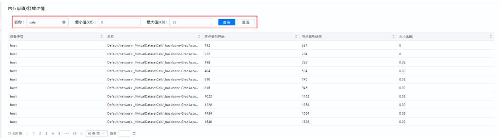

表 4-22 静态图字段说明  

<table><tr><td rowspan=1 colspan=1>中文字段</td><td rowspan=1 colspan=1>英文字段</td><td rowspan=1 colspan=1>说明</td></tr><tr><td rowspan=1 colspan=1>设备序号</td><td rowspan=1 colspan=1>Device ID</td><td rowspan=1 colspan=1>申请内存的设备序号，默认host。</td></tr><tr><td rowspan=1 colspan=1>名称</td><td rowspan=1 colspan=1>Name</td><td rowspan=1 colspan=1>算子名称。</td></tr><tr><td rowspan=1 colspan=1>节点索引开始</td><td rowspan=1 colspan=1>Node IndexStart</td><td rowspan=1 colspan=1>搜索开始节点。</td></tr><tr><td rowspan=1 colspan=1>节点索引结束</td><td rowspan=1 colspan=1>Node IndexEnd</td><td rowspan=1 colspan=1>搜索结束节点。其中显示为“4294967295”的值为索引最终结束节点，该节点在静态图中表示为实际结束节点加1的节点，例如，实际结束节点为32，静态图中横坐标节点索引则显示33，表格中节点索引结束值显示为“4294967295”。</td></tr><tr><td rowspan=1 colspan=1>大小(MB)</td><td rowspan=1 colspan=1>Size(MB)</td><td rowspan=1 colspan=1>申请内存大小，单位MB。</td></tr><tr><td rowspan=1 colspan=1>操作</td><td rowspan=1 colspan=1>Operation</td><td rowspan=1 colspan=1>单击“在时间线中显示”，可跳转至时间线视图中对应算子。</td></tr></table>

当“分组方式”选择“组件”时，不支持算子搜索功能。界面如图4-61所示，字段解释如表4-23所示。

图 4-61 组件级内存申请/释放详情  

<table><tr><td colspan="3">内存申请/释放详情</td></tr><tr><td></td><td>|保留内存峰值（(MB)</td><td>丨时间戳(ms) =</td></tr><tr><td></td><td>37048</td><td>689.88</td></tr><tr><td></td><td>323.23</td><td>89.838</td></tr><tr><td></td><td>2018.12</td><td>89.838</td></tr><tr><td></td><td>141.89</td><td>6389.522</td></tr></table>

表4-23 字段说明  

<table><tr><td rowspan=1 colspan=1>中文字段</td><td rowspan=1 colspan=1>英文字段</td><td rowspan=1 colspan=1>说明</td></tr><tr><td rowspan=1 colspan=1>组件</td><td rowspan=1 colspan=1>Component</td><td rowspan=1 colspan=1>组件名称。</td></tr><tr><td rowspan=1 colspan=1>保留内存峰值(MB)</td><td rowspan=1 colspan=1>Peak MemoryReserved(MB)</td><td rowspan=1 colspan=1>组件占用内存大小的峰值，单位MB。只显示占用内存峰值大于等于100M的组件。</td></tr><tr><td rowspan=1 colspan=1>时间戳(ms)</td><td rowspan=1 colspan=1>Timestamp(ms)</td><td rowspan=1 colspan=1>组件内存占用达到峰值的时刻，单位ms。</td></tr></table>

# 支持高亮显示

当“分组方式”选择“全局”时，将鼠标移入表格中某条数据时（前提是折线图放大到足以展示表格中所有算子），若折线图上方显示了该条数据对应的点位（包括分配时间和释放时间），则折线图上对应点会有高亮效果出现，方便快速定位到该算子所在位置。

# 说明

当“分组方式”选择“组件”时，不支持高亮显示。

将鼠标放置在表格中红框位置，折线图立即高亮显示算子所在位置，如图4-62所示。

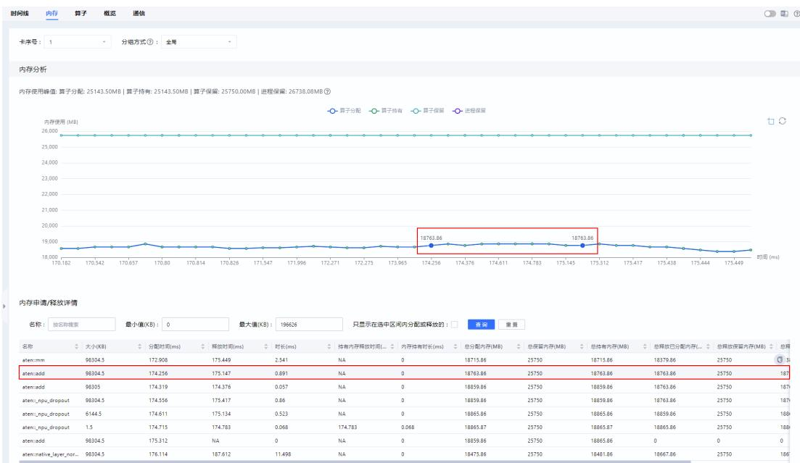  
图 4-62 算子高亮显示

# 支持卡间性能对比

MindStudio Insight支持卡间内存性能对比，设置对比数据请参见数据对比。

在卡间性能对比模式下，“卡序号”是固定的，不能进行切换；“分组方式”仅支持选择“全局”和“组件”。算子内存折线图中将显示两个卡的内存变化，可直观地查看两卡间的内存对比趋势。内存申请/释放详情表中会显示两卡间的数据差异详情，并

可按名称与内存大小搜索相关算子，此时，输入的内存最小值可为负值，且搜索条件仅限于对比结果，如图4-63所示。

# 说明

当“分组方式”选择“组件”时，不支持在内存申请/释放详情表中搜索算子。

单击内存申请/释放详情表中“详情”列的“查看更多”，可显示基线数据和对比数据的详情。

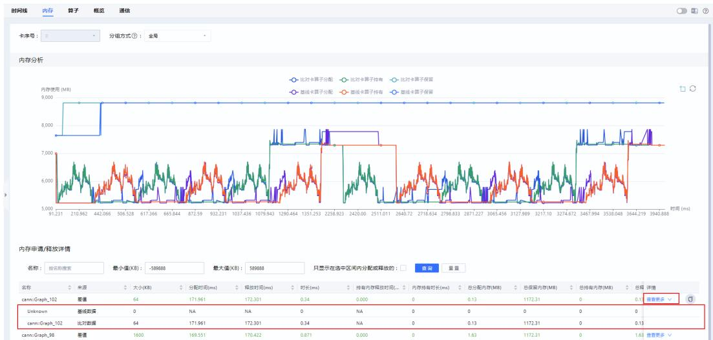  
图 4-63 性能对比

# 4.4 算子（Operator）

# 4.4.1 界面介绍

# 功能说明

算子（Operator）视图旨在通过分析计算算子和通信算子耗时数据帮助开发者快速分析性能瓶颈。

# 界面展示

算子（Operator）界面由参数配置栏（区域一）、耗时百分比饼状图（区域二）、耗时统计及详情数据表（区域三）三个部分组成，如图4-64所示。

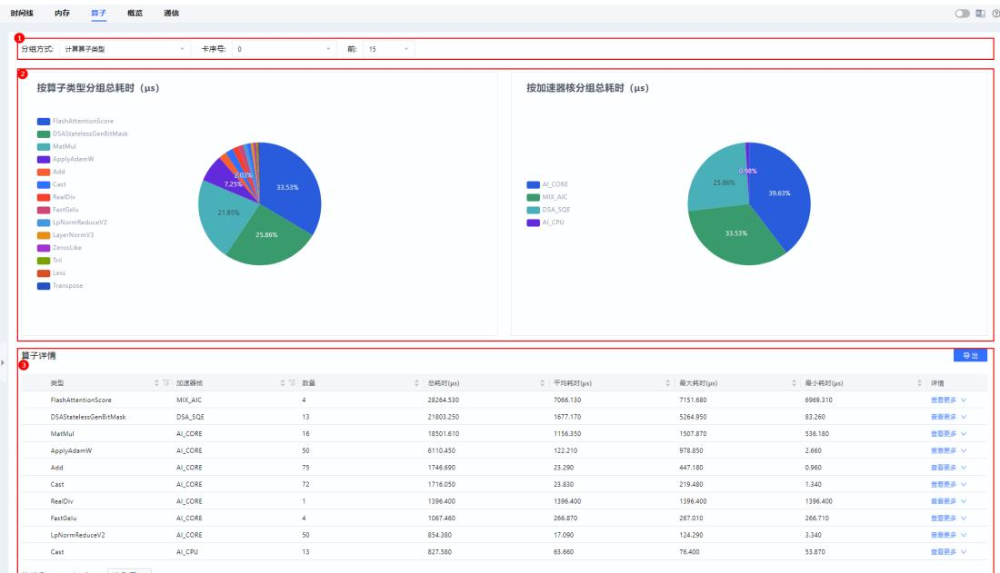  
图 4-64 算子界面

区域一：参数配置栏，参数详细说明如表4-24所示。

表 4-24 参数配置  

<table><tr><td>中文参 数</td><td>英文参数</td><td>说明</td></tr><tr><td>分组方 式</td><td>Group by</td><td>·计算算子（ComputingOperator）：展示所有计算算 子的详细信息，帮助开发者找到耗时较大的计算算 子。 计算算子类型（Computing Operator Type）：统计 相同类型的计算算子，计算其总耗时、最大耗时及平 均耗时等信息，并支持查看特定类型下的计算算子详 情信息，帮助开发者快速识别特定类型计算算子性能 瓶颈，如AICPU算子等。 计算算子名称和输入shape（Computing_Operator ： Name and Input Shape）：统计相同类型和Input Shape的算子，计算其总耗时、最大耗时及平均耗时 等信息，并支持查看特定类型下的算子详情信息，帮 助开发者快速识别某类型算子在特定Input下的性能瓶 颈。 通信算子（CommunicationOperator）：展示所有通 信算子的详细信息，帮助开发者找到耗时较大的通信 算子。 通信算子类型（Communication Operator Type）： 统计相同类型的通信算子，计算其总耗时、最大耗时 及平均耗时等信息，并支持查看特定类型下的通信算 子详情信息，帮助开发者快速识别特定类型通信算子</td></tr><tr><td colspan="1" rowspan="1">卡序号</td><td colspan="1" rowspan="1">Rank ID</td><td colspan="1" rowspan="1">支持按单卡维度展示算子性能数据。</td></tr><tr><td colspan="1" rowspan="1">前</td><td colspan="1" rowspan="1">Top</td><td colspan="1" rowspan="1">可通过配置Top参数值选择展示总耗时最长的TopN条数据，默认值为15；选择自定义（Custom）时，可以自定义数据条数。</td></tr><tr><td colspan="1" rowspan="1">机器名称</td><td colspan="1" rowspan="1">HostName</td><td colspan="1" rowspan="1">仅当导入的db场景文件中存在名称为“HOST_INFO”的表时，存在该选项。</td></tr></table>

区域二：耗时百分比饼状图。

当“分组方式”选择“计算算子”、“计算算子类型”或“计算算子名称和输入shape”时，页面会显示2个饼状图，左边展示不同计算算子类型耗时的占比，此视图受区域一中前（Top）配置影响，只显示Top N或全部计算算子或计算算子类型的占比；右边展示的为Top N或全部计算算子/计算算子类型按加速核耗时占比情况，如AI Core、AI CPU等。当“分组方式”选择“通信算子”或“通信算子类型”时，页面显示1个饼状图，展示不同通信算子类型耗时的占比，视图受区域一中前（Top）配置影响，只显示Top N或全部通信算子或通信算子类型的占比。

区域三：耗时统计及详情数据表，展示算子统计信息或者详细信息数据，可以通过单击“查看更多”进一步查看详细信息；也可单击表格右上方的“导出”按钮，将算子详情表中的所有数据导出为.csv格式的文件。

# 4.4.2 使用说明

# 计算算子（Computing Operator）

当“分组方式”选择“计算算子”时显示该页面，可以看到单个计算算子维度的详情信息，以快速找到特定计算算子性能问题，如图4-65所示，“算子详情”中的字段解释如表4-25所示，单击字段后方的 $\bigtriangledown$ ，可对相关字段进行模糊搜索。

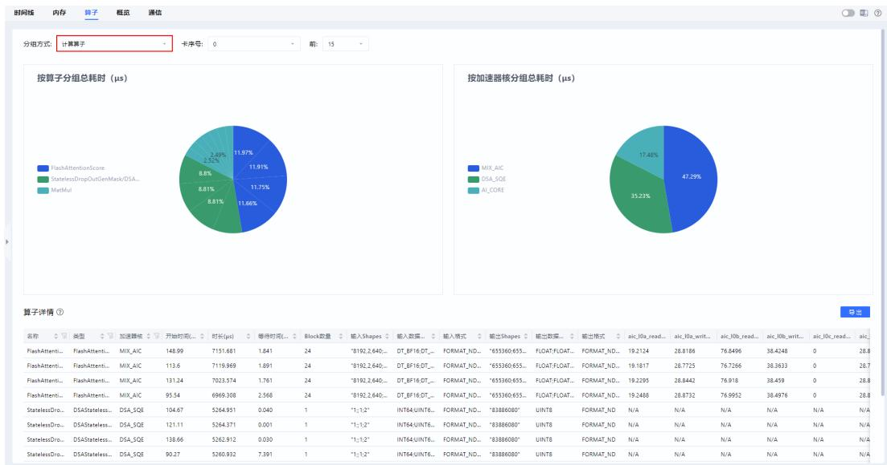  
图 4-65 计算算子

表 4-25 计算算子字段说明  

<table><tr><td rowspan=1 colspan=1>中文字段</td><td rowspan=1 colspan=1>英文字段</td><td rowspan=1 colspan=1>说明</td></tr><tr><td rowspan=1 colspan=1>名称</td><td rowspan=1 colspan=1>Name</td><td rowspan=1 colspan=1>算子名称。</td></tr><tr><td rowspan=1 colspan=1>类型</td><td rowspan=1 colspan=1>Type</td><td rowspan=1 colspan=1>算子类型。</td></tr><tr><td rowspan=1 colspan=1>加速器核</td><td rowspan=1 colspan=1>AcceleratorCore</td><td rowspan=1 colspan=1>AI加速核类型，包括AI Core、AI CPU等。</td></tr><tr><td rowspan=1 colspan=1>开始时间(ms)</td><td rowspan=1 colspan=1>StartTime(ms)</td><td rowspan=1 colspan=1>算子执行开始时间。</td></tr><tr><td rowspan=1 colspan=1>时长(μs)</td><td rowspan=1 colspan=1>Duration(us)</td><td rowspan=1 colspan=1>当前算子执行耗时。</td></tr><tr><td rowspan=1 colspan=1>等待时间(us)</td><td rowspan=1 colspan=1>Wait Time(μs)</td><td rowspan=1 colspan=1>算子执行等待时间。</td></tr><tr><td rowspan=1 colspan=1>Block数量</td><td rowspan=1 colspan=1>Block Dim</td><td rowspan=1 colspan=1>运行切分数量，对应任务执行时的核数。</td></tr><tr><td rowspan=1 colspan=1>输入Shapes</td><td rowspan=1 colspan=1> Input Shapes</td><td rowspan=1 colspan=1>算子输入Shape。</td></tr><tr><td rowspan=1 colspan=1>输入数据类型</td><td rowspan=1 colspan=1>Input DataTypes</td><td rowspan=1 colspan=1>算子输入数据类型。</td></tr><tr><td rowspan=1 colspan=1>输入格式</td><td rowspan=1 colspan=1>Input Formats</td><td rowspan=1 colspan=1>算子输入数据格式。</td></tr><tr><td rowspan=1 colspan=1>输出Shapes</td><td rowspan=1 colspan=1>Output Shapes</td><td rowspan=1 colspan=1>算子输出Shape。</td></tr><tr><td rowspan=1 colspan=1>输出数据类型</td><td rowspan=1 colspan=1> Output DataTypes</td><td rowspan=1 colspan=1>算子输出数据类型。</td></tr><tr><td rowspan=1 colspan=1>输出格式</td><td rowspan=1 colspan=1>OutputFormats</td><td rowspan=1 colspan=1>算子输出数据格式。</td></tr></table>

# 说明

如果在MindStudio Insight工具导入的性能文件中包含采集的寄存器数值，那么计算算子详情中会呈现aicore_time、aic_total_cycles等相关参数，具体参数信息请参见《性能调优工具指南》中的“性能数据文件参考 $>$ op_summary（算子详细信息）”章节内容。

# 计算算子类型（Computing Operator Type）

当“分组方式”选择“计算算子类型”时显示该页面，可以看到不同计算算子类型算子的耗时占比和详细数据，以快速找到特定类型的计算算子性能问题，如图4-66所示，“算子详情”中的字段解释如表4-26所示，单击字段后方的 $\bigtriangledown$ ，可对相关字段进行模糊搜索。

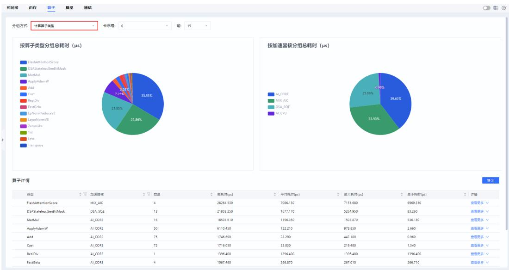  
图4-66 计算算子类型

表 4-26 计算算子类型字段说明  

<table><tr><td rowspan=1 colspan=1>中文字段</td><td rowspan=1 colspan=1>英文字段</td><td rowspan=1 colspan=1>说明</td></tr><tr><td rowspan=1 colspan=1>类型</td><td rowspan=1 colspan=1>Type</td><td rowspan=1 colspan=1>算子类型。</td></tr><tr><td rowspan=1 colspan=1>加速器核</td><td rowspan=1 colspan=1>AcceleratorCore</td><td rowspan=1 colspan=1>AI加速核类型，包括AI Core、AI CPU等。</td></tr><tr><td rowspan=1 colspan=1>数量</td><td rowspan=1 colspan=1>Count</td><td rowspan=1 colspan=1>算子执行次数。</td></tr><tr><td rowspan=1 colspan=1>总耗时(us)</td><td rowspan=1 colspan=1>TotalTime(μs)</td><td rowspan=1 colspan=1>算子执行总时间。</td></tr><tr><td rowspan=1 colspan=1>平均耗时(us)</td><td rowspan=1 colspan=1>AvgTime(us)</td><td rowspan=1 colspan=1>算子执行平均时间。</td></tr><tr><td rowspan=1 colspan=1>最大耗时(us)</td><td rowspan=1 colspan=1>MaxTime(μs)</td><td rowspan=1 colspan=1>算子执行的最大时间。</td></tr><tr><td rowspan=1 colspan=1>最小耗时(us)</td><td rowspan=1 colspan=1>MinTime(μs)</td><td rowspan=1 colspan=1>算子执行的最小时间。</td></tr><tr><td rowspan=1 colspan=1>详情</td><td rowspan=1 colspan=1>Details</td><td rowspan=1 colspan=1>单击“详情”列中“查看更多”，可以展示单个计算算子的具体信息，详情请参见表4-25。</td></tr></table>

# 计算算子名称和输入 shape（Computing Operator Name and Input Shape）

当“分组方式”选择“计算算子名称和输入shape”时显示该页面，可以看到不同算子类型的计算算子在特定输入Shape下的耗时占比和详细数据，以快速找到是否存在某个输入Shape下的算子性能问题，如图4-67所示，“算子详情”中的字段解释如表4-27所示，单击字段后方的 $\bigtriangledown$ ，可对相关字段进行模糊搜索。

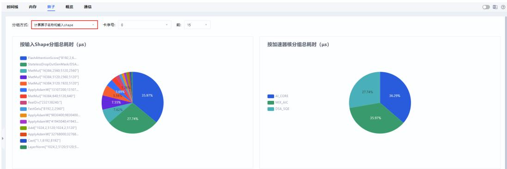  
图 4-67 计算算子名称和输入 shape

导出

算子详情  

<table><tr><td>名称</td><td>| Shape</td><td>丨加速器核</td><td>数量</td><td>总耗时（μs)</td><td>丨平均耗时(μs）</td><td>丨最大耗时(μs)</td><td>丨最小耗时(us)</td><td>详情</td></tr><tr><td>FlshAttentioscore</td><td></td><td></td><td>：</td><td>28264.530</td><td>7066.130</td><td>7151.680</td><td>6969.310</td><td>盗看更多</td></tr><tr><td>StatelessDropOutGenMask/DSA</td><td>“1:1:2*</td><td>DSA_SQE</td><td>13</td><td>21803.250</td><td>1677.170</td><td>5264.950</td><td>83.260</td><td>查看更多</td></tr><tr><td>MatMul</td><td>*16384,2560;5120,2560*</td><td>AILCORE</td><td>4</td><td>5991.80</td><td>1497.850</td><td>1507.870</td><td>1484.870</td><td>看更多</td></tr><tr><td>MatMul</td><td>*1638,520;2560,5120*</td><td>AILCORE</td><td>4</td><td>5931.600</td><td>1482.900</td><td>1486.190</td><td>1478.520</td><td>查看更多</td></tr><tr><td>MatMul</td><td>*16384,5120;1920,5120*</td><td>AILCORE</td><td>4</td><td>4371.440</td><td>1092.860</td><td>1099.970</td><td>1086.80</td><td>查看更多</td></tr><tr><td>ApydamW</td><td>*130</td><td></td><td>8</td><td>2899.190</td><td>362.400</td><td>367.580</td><td>357.170</td><td>查看更多</td></tr><tr><td>MatMul</td><td>*1634,405120.640</td><td>ALCORE</td><td>4</td><td>2207.190</td><td>551.8000</td><td>559.750</td><td>536.180</td><td>查看更多</td></tr><tr><td>RealDiv</td><td> 23213820:</td><td>ALCORE</td><td>1</td><td>1396.400</td><td>1396.400</td><td>1396.400</td><td>1396.400</td><td>查看更多</td></tr></table>

表 4-27 计算算子名称和输入 shape 字段说明  

<table><tr><td rowspan=1 colspan=1>中文字段</td><td rowspan=1 colspan=1>英文字段</td><td rowspan=1 colspan=1>说明</td></tr><tr><td rowspan=1 colspan=1>名称</td><td rowspan=1 colspan=1>Name</td><td rowspan=1 colspan=1>算子名称。</td></tr><tr><td rowspan=1 colspan=1>Shape</td><td rowspan=1 colspan=1>Shape</td><td rowspan=1 colspan=1>算子输入Shape。</td></tr><tr><td rowspan=1 colspan=1>加速器核</td><td rowspan=1 colspan=1>AcceleratorCore</td><td rowspan=1 colspan=1>AI加速核类型，包括AI Core、AI CPU等。</td></tr><tr><td rowspan=1 colspan=1>数量</td><td rowspan=1 colspan=1>Count</td><td rowspan=1 colspan=1>算子执行次数。</td></tr><tr><td rowspan=1 colspan=1>总耗时(μs)</td><td rowspan=1 colspan=1>TotalTime(μs)</td><td rowspan=1 colspan=1>算子执行总时间。</td></tr><tr><td rowspan=1 colspan=1>平均耗时(μs)</td><td rowspan=1 colspan=1>AvgTime(μs)</td><td rowspan=1 colspan=1>算子执行平均时间。</td></tr><tr><td rowspan=1 colspan=1>最大耗时(μs)</td><td rowspan=1 colspan=1>MaxTime(μs)</td><td rowspan=1 colspan=1>算子执行的最大时间。</td></tr><tr><td rowspan=1 colspan=1>最小耗时(us)</td><td rowspan=1 colspan=1>MinTime(μs)</td><td rowspan=1 colspan=1>算子执行的最小时间。</td></tr><tr><td rowspan=1 colspan=1>详情</td><td rowspan=1 colspan=1>Details</td><td rowspan=1 colspan=1>单击“详情”列中“查看更多”，可以展示单个算子的具体信息，详情请参见表4-25。</td></tr></table>

# 通信算子（Communication Operator）

当“分组方式”选择“通信算子”时显示该页面，可以看到单个通信算子维度的详情信息，以快速找到特定通信算子性能问题，如图4-68所示，“算子详情”中的字段解释如表4-28所示，单击字段后方的 $\bigtriangledown$ ，可对相关字段进行模糊搜索。

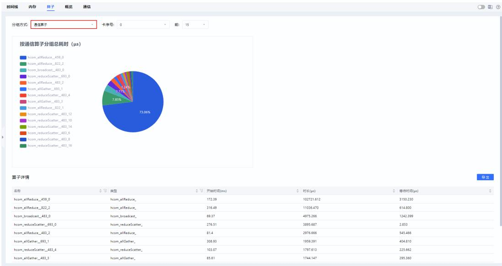  
图4-68 通信算子

表 4-28 通信算子字段说明  

<table><tr><td rowspan=1 colspan=1>中文字段</td><td rowspan=1 colspan=1>英文字段</td><td rowspan=1 colspan=1>说明</td></tr><tr><td rowspan=1 colspan=1>名称</td><td rowspan=1 colspan=1>Name</td><td rowspan=1 colspan=1>通信算子名称。</td></tr><tr><td rowspan=1 colspan=1>类型</td><td rowspan=1 colspan=1>Type</td><td rowspan=1 colspan=1>通信算子类型。</td></tr><tr><td rowspan=1 colspan=1>开始时间(ms)</td><td rowspan=1 colspan=1>StartTime(ms)</td><td rowspan=1 colspan=1>通信算子执行开始时间。</td></tr><tr><td rowspan=1 colspan=1>时长(us)</td><td rowspan=1 colspan=1>Duration(μs)</td><td rowspan=1 colspan=1>当前通信算子执行耗时。</td></tr><tr><td rowspan=1 colspan=1>等待时间(μs)</td><td rowspan=1 colspan=1>WaitTime(μs)</td><td rowspan=1 colspan=1>通信算子执行等待时间。</td></tr></table>

# 通信算子类型（Communication Operator Type）

当“分组方式”选择“通信算子类型”时显示该页面，可以看到不同通信算子类型算子的耗时占比和详细数据，以快速找到特定类型的通信算子性能问题，如图4-69所示，“算子详情”中的字段解释如表4-29所示，单击字段后方的 $\bigtriangledown$ ，可对相关字段进行模糊搜索。

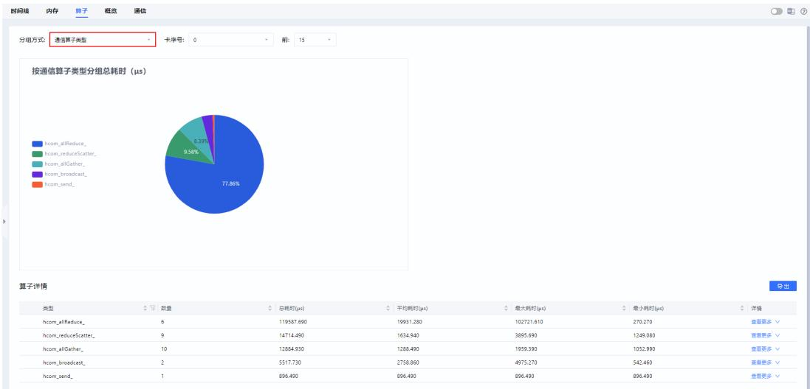  
图4-69 通信算子类型

表 4-29 通信算子类型字段说明  

<table><tr><td rowspan=1 colspan=1>中文字段</td><td rowspan=1 colspan=1>英文字段</td><td rowspan=1 colspan=1>说明</td></tr><tr><td rowspan=1 colspan=1>类型</td><td rowspan=1 colspan=1>Type</td><td rowspan=1 colspan=1>通信算子类型。</td></tr><tr><td rowspan=1 colspan=1>数量</td><td rowspan=1 colspan=1>Count</td><td rowspan=1 colspan=1>通信算子执行次数。</td></tr><tr><td rowspan=1 colspan=1>总耗时(μs)</td><td rowspan=1 colspan=1>TotalTime(μs)</td><td rowspan=1 colspan=1>通信算子执行总时间。</td></tr><tr><td rowspan=1 colspan=1>平均耗时(μs)</td><td rowspan=1 colspan=1>AvgTime(μs)</td><td rowspan=1 colspan=1>通信算子执行平均时间。</td></tr><tr><td rowspan=1 colspan=1>最大耗时(μs)</td><td rowspan=1 colspan=1>MaxTime(μs)</td><td rowspan=1 colspan=1>通信算子执行的最大时间。</td></tr><tr><td rowspan=1 colspan=1>最小耗时(us)</td><td rowspan=1 colspan=1>MinTime(μs)</td><td rowspan=1 colspan=1>通信算子执行的最小时间。</td></tr><tr><td rowspan=1 colspan=1>详情</td><td rowspan=1 colspan=1>Details</td><td rowspan=1 colspan=1>单击“详情”列中“查看更多”，可以展示单个通信算子的具体信息，详情请参见表4-28。</td></tr></table>

# 支持两卡间数据对比

MindStudio Insight支持卡间算子性能对比，可帮助开发者直观明了地查看两卡差异，便于分析，设置基线数据和对比数据的操作请参见数据对比。

在卡间对比模式下，算子（Operator）界面不展示耗时百分比饼状图，只展示算子详情表，且“卡序号”是固定的，不能进行切换，“分组方式”可按需进行选择，还可配置展示TopN条数据。

算子详情表展示的是两卡间的差值，单击“详情”列中“查看更多”，可以展示基线数据和对比数据的详情，如图4-70所示，字段解释可分别参见各分组方式对应的字段解释，图中展示的是“分组方式”为“计算算子类型”的数据对比详情。

  
图 4-70 算子对比

# 4.5 概览（Summary）

# 4.5.1 界面介绍

# 功能说明

概览（Summary）界面提供通信域识别、划分和耗时拆解、分析功能。支持自动识别通信域，用户也可自行配置；支持按照通信域对比stage耗时、计算耗时和通信耗时，从而分析同一通信域内的切分是否均匀，是否存在通信慢卡和慢链路问题，帮助开发者快速识别问题。

# 界面展示

概览（Summary）界面由基本信息（Base Info）（区域一）、并行策略分析（Parallel Strategy Analysis）（区域二）和MoE大模型专家负载均衡分析（MoEExpert Load Balancing Analysis）（区域三）组成，如图4-71所示。

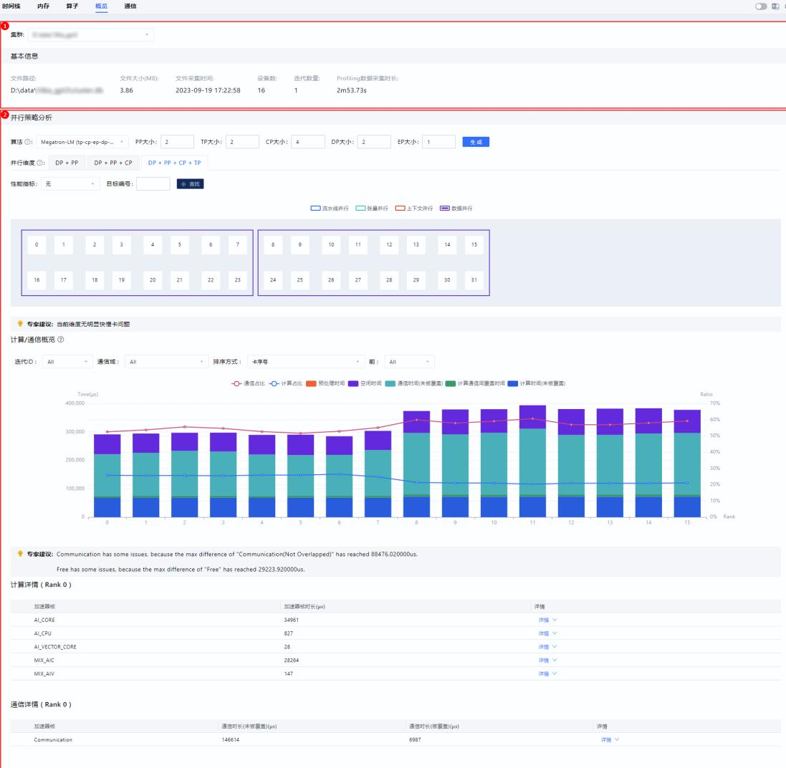  
图 4-71 概览界面

区域一：集群（Cluster ）选框和基本信息（Base Info），当导入集群数据时，下拉框支持选择某一集群；数据的基本信息，包括设备和迭代数量、性能数据文件大小、数据采集时长等信息。

区域二：并行策略分析（Parallel Strategy Analysis），包括并行策略概览、计算/通信概览、计算详情（Rank ID）、通信详情（Rank ID）以及流水并行图。

并行策略概览包括并行策略设置、并行策略图展示和专家建议，如图4-72所示，并行策略参数解释如表4-30所示。当设置好并行策略后，可分别选择“DP + PP”、“DP + PP + CP”、“DP + PP + TP”或“DP + PP + CP +TP”并行维度展示并行策略图，选择图中目标编号，可悬浮显示该目标编号的详情信息，进行查看；也可单击鼠标右键弹出菜单，单击“复制属性”，复制当前目标编号的详情信息，粘贴至本地进行查看分析。

当通信时间能正确按照通信域拆解时，会显示专家建议内容。

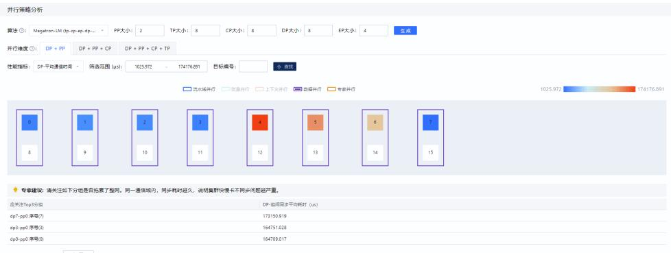  
图 4-72 并行策略概览

表 4-30 并行策略参数说明  

<table><tr><td>中文字段</td><td>英文字段</td><td>说明</td></tr><tr><td>算法</td><td>Algorithm</td><td>Megatron-LM(tp-cp-ep-dp-pp):此排布方 式来自于Megatron-Core，排布的顺序是TP &gt; CP &gt; DP&gt;PP，EP横跨DP之上且不参与 或不影响排布编号（即要求DP能够被EP整 除），PP位于DP之后，多为跨节点通信， 对通信带宽要求低。 Megatron-LM(tp-cp-pp-ep-dp):此排布方 式也来自于Megatron-Core，排布的顺序是 TP &gt;CP&gt;PP&gt;DP，比较少见，用于PP对 带宽要求相对比较高的场景。 MindSpeed(tp-cp-ep-dp-pp):此排布方式 来自于MindSpeed-Core，排布的顺序是TP &gt; CP &gt; DP&gt;PP，EP横跨CP + DP之上且不 参与或不影响排布编号（即要求CP×DP能 够被EP整除）。 MindlE-LLM(tp-dp-ep-pp-moetp):此排布 方式来自于MindIE-LLM（DeepSeekV3也</td></tr><tr><td>PP大小</td><td>PP Size</td><td>要求TP×DP能被EP整除），形成大规模专家 并行方案（即要求EP能被TP整除），当选 择vLLM(tp-pp-dp-ep)算法时，PP大小 ×TP 大小×DP大小≥导入的卡数量。 流水线并行大小。可自行配置，取值范围： 1~10000。 流水线并行（Pipeline Parallel）通过将模型的 不同层次分布在不同的卡上执行，在一个卡执</td></tr><tr><td>TP大小</td><td>TP Size</td><td>行当前批次数据时，另一个卡可以处理下一个 批次的数据。 张量并行大小。可自行配置，取值范围： 1~10000。 张量并行（Tensor Parallel）是一种将模型参 数划分成多个部分，并分布到不同卡上进行计 算。</td></tr><tr><td colspan="1" rowspan="1">CP大小</td><td colspan="1" rowspan="1">CP Size</td><td colspan="1" rowspan="1">上下文并行大小。可自行配置，取值范围：1~10000。上下文并行（Context Parallel）将训练样本按序列长度和维度划分为不同批次，分配到不同卡上进行计算。CP分割网络输入和所有激活值，是改进版的序列并行（SequenceParallelism，SP）。</td></tr><tr><td colspan="1" rowspan="1">DP大小</td><td colspan="1" rowspan="1">DP Size</td><td colspan="1" rowspan="1">数据并行大小。可自行配置，取值范围：1~10000。数据并行（Data Parallel）将训练集分成不同多个批次，分配到不同卡上进行计算。</td></tr><tr><td colspan="1" rowspan="1">EP大小</td><td colspan="1" rowspan="1">EP Size</td><td colspan="1" rowspan="1">专家并行大小。可自行配置，取值范围：1~10000。专家并行（Expert Parallel）是一种专门为MoE模型（Mixtureof Experts）设计的并行方法。它将专家分配到不同的计算设备上，每个设备负责处理一部分训练样本，并且每个设备上可以包含一个或多个专家。当选择Megatron-LM算法时，EP大小应小于等于DP大小，且DP可被EP整除。当选择MindSpeed算法时，DPXCP应能被EP整除。</td></tr><tr><td colspan="1" rowspan="1">MoE-TP大小</td><td colspan="1" rowspan="1">MoE-TPSize</td><td colspan="1" rowspan="1">仅当算法选择“MindIE-LLM(tp-dp-ep-pp-moetp)”时，才存在此参数。推理并行策略中，MoE层的张量并行大小，区别于非MoE层的TP。可自行配置，取值范围：1~10000。且需满足以下取值规则：·PP大小×TP大小×DP大小=导入的卡数量· TP大小× DP大小= MoE-TP大小× EP大小</td></tr><tr><td colspan="1" rowspan="1">性能指标</td><td colspan="1" rowspan="1">Performance Metric</td><td colspan="1" rowspan="1">可按照性能指标展示并行策略图，可选的性能指标参数根据选择的域维度而变化。）当选择“无”时，表示不展示性能指标，即并行策略图上的卡片信息为默认状态。当选择其余参数时，会在选框后显示该参数的“筛选范围 (us)”和色条，筛选范围值为该参数值的最小值和最大值，且并行策略图上的卡片会按照对应值被渲染填色，可直观的查看各卡性能情况。</td></tr><tr><td colspan="1" rowspan="1">目标编号</td><td colspan="1" rowspan="1">TargetIndex</td><td colspan="1" rowspan="1">在所选维度下，输入目标编号，可准确定位到所需的序号上。</td></tr><tr><td colspan="1" rowspan="1">专家建议</td><td colspan="1" rowspan="1">Advice</td><td colspan="1" rowspan="1">通过MindStudio Insight工具的内置专家分析功能，对数据进行分析，并给出相应建议，列出应关注的Top3分组以及慢卡信息，帮助开发者识别性能问题。</td></tr></table>

# 说明

为确保通信时间能正确按照通信域拆解（即性能指标中的TP-通信时间、PP-通信时间、MP-通信时间、DP-通信时间、CP-通信时间等），需保证并行策略参数值与模型实际训练/推理时的并行参数配置一致。具体的并行参数，可与模型开发人员确认。

计算/通信概览（Computation/Communication Overview），计算及通信概览，柱状图展示计算或通信算子的迭代耗时数据，折线图展示计算或通信算子的耗时占比数据，专家建议（Advice）是对计算通信域内各卡的计算时间、通信时间（未被覆盖）和空闲时间进行数据分析后给出的建议，帮助开发者快速分析，如图4-73所示，参数解释请参见表4-31所示。

当选择“DP + PP + CP + TP”和“DP + PP + TP”并行维度时，计算/通信概览中存在折线图和专家建议。

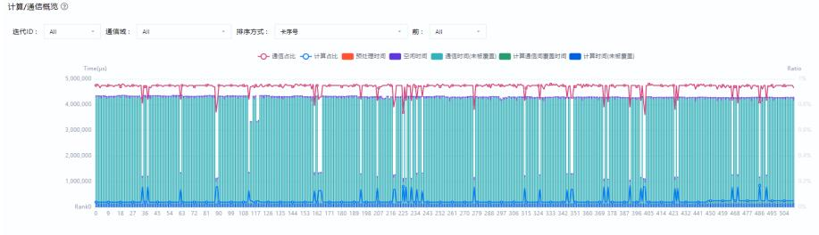  
图 4-73 计算/通信概览

表 4-31 计算/通信概览参数说明  

<table><tr><td colspan="1" rowspan="1">中文字段</td><td colspan="1" rowspan="1">英文字段</td><td colspan="1" rowspan="1">说明</td></tr><tr><td colspan="1" rowspan="1">迭代ID</td><td colspan="1" rowspan="1">Step</td><td colspan="1" rowspan="1">迭代ID，下拉框支持选择某一个迭代或者所有迭代。</td></tr><tr><td colspan="1" rowspan="1">通信域</td><td colspan="1" rowspan="1">RankGroup</td><td colspan="1" rowspan="1">节点ID，下拉框支持选择一个、多个或者所有节点。</td></tr><tr><td rowspan="2">排序方式</td><td>Order By</td><td>根据不同维度选择排序方式。 ·DP + PP + CP +TP维度和DP + PP +TP维度 －卡序号（Rank ID）：卡序号。 －计算时间（未被覆盖）（Computing(Not Overlapped)）：计算时间（未被覆盖）= 计算时间－计算通信间覆盖时间。 计算通信间覆盖时间 （Computing_Communication Overlapped）：被计算覆盖的通信时长。 通信时间（未被覆盖） （Communication(Not Overlapped)） : 通信时间（未被覆盖）=通信时间－计算 通信间覆盖时间。 空闲时间（Free）：Device侧既不在通信 也不在计算的时间。此处的Free不计入预</td></tr><tr><td></td><td>处理时间。 预处理时间（Preparing）：迭代开始到首 个计算或通信算子运行的时间，在做数据 加载拷贝等操作。在时间线（Timeline） 的Overlap Analysis泳道中，也被视为 Free。 计算占比（Computing Ratio）：计算时 间占总时间的占比，总时间=计算时间 （未被覆盖）+计算通信间覆盖时间+通 信时间（未被覆盖）+空闲时间+预处理 时间。 通信占比（Communication Ratio）：通 信时间占总时间的占比。 DP + PP+CP维度：排序方式分别为卡序 号、最大计算时间、最大通信时间、最大空 闲时间、最大总时间（计算、通信（未被覆 盖）、空闲时间的总和）。各参数的“最 大”是指每个TP通信域内取最大值。 DP+ PP维度：排序方式分别为卡序号、最大 计算时间、最大通信时间、最大空闲时间、 最大总时间（计算、通信（未被覆盖）、空 闲时间的总和）、最大通信时间（未被覆 盖）。各参数的“最大”是指对每个DP+PP + CP维度通信域内取最大值。</td></tr><tr><td>前</td><td colspan="2">Top TopN条数据。</td></tr><tr><td colspan="1" rowspan="1">Time(μs)</td><td colspan="1" rowspan="1">Time(μs)</td><td colspan="1" rowspan="1">左侧纵坐标表示时长，单位μs。计算方式如下：总时间=计算时间（未被覆盖）+计算通信间覆盖时间+通信时间（未被覆盖）+空闲时间+预处理时间，其中Preparing为数据预处理时间。</td></tr><tr><td colspan="1" rowspan="1">Ratio</td><td colspan="1" rowspan="1">Ratio</td><td colspan="1" rowspan="1">右侧纵坐标表示耗时占比，包括以下占比信息：总计算比例（Computing Ratio）：总计算耗时占比=总计算时间／总时间。通信比例（CommunicationRatio）：通信耗时占比=未被覆盖的通信时长／总时间。</td></tr><tr><td colspan="1" rowspan="1">专家建议</td><td colspan="1" rowspan="1">Advice</td><td colspan="1" rowspan="1">慢卡分析定位与建议，对各并行维度下的通信时间进行解析分析，帮助开发者逐步定位慢卡。</td></tr></table>

计算详情（Rank $/ D$ ）（Computing Detail（Rank ID）），当选择“DP +PP + CP + TP”和“DP + PP + TP”并行维度时，单击计算/通信概览区域中某个节点的柱状图时，将展示该节点加速核的总耗时和利用率，单击对应的“详情”后展示计算算子的详细信息，如图4-74所示，字段解释如表4-32所示。还可单击表格右上角 $\sqsubseteq$ 按钮，一键复制表中当前所展示的内容，并粘贴至Excel表格中进行分析。

图 4-74 计算算子详细信息  
计算详情（Rank 0）  

<table><tr><td>如速器核 ALCORE</td><td colspan="3"></td><td colspan="3">如速器核时长(μs) 34961</td><td colspan="5">详情 </td></tr><tr><td></td><td></td><td></td><td></td><td></td><td></td><td></td><td></td><td></td><td></td><td>|输出格式</td><td></td></tr><tr><td>名称 Zerosilke</td><td>中尚型 eroslke</td><td>|开始时间(ms) 67.631</td><td>数长gs） 496.8508</td><td>|韓得时间[us 。</td><td>Block数量 48</td><td>|输入shapes *232138240&quot;</td><td>输入数描类型 FLOAT</td><td>|输入格式 FORMAT_NO</td><td>输出Shapes *232138240&quot;</td><td>输出数据岗型 FLOAT</td><td>中 FORMATLND □</td></tr><tr><td></td><td></td><td>76.916</td><td></td><td>11.041</td><td>33</td><td>*2.8193</td><td>INT64</td><td>FORMAT_ND</td><td></td><td></td><td></td></tr><tr><td>Cas</td><td>Cast</td><td></td><td>5,7985</td><td></td><td></td><td></td><td></td><td>FORMAT_ND;FORMA.</td><td>2,8193* *2,8192</td><td>INT32 INT32</td><td>FORMAT_ND</td></tr><tr><td>sie</td><td>Slice</td><td>77.2348</td><td>1.9795</td><td>312.9515</td><td>2</td><td> 2.8193:2:2</td><td>INT32;INT64(INT64</td><td></td><td></td><td></td><td>FORMATLND</td></tr><tr><td>Slice</td><td>Slice</td><td>77.5268</td><td>1.7395</td><td>290.0205</td><td>2</td><td>2.8193:2:2</td><td>INT32;INT64(INT64</td><td>FORMAT_ND:FORMA.</td><td>“2,8192</td><td>INT32</td><td>FORMAT_NO</td></tr><tr><td>Oneslike</td><td>OnesLike</td><td>77.7395</td><td>169.5759</td><td>211.0105</td><td>48</td><td>*1,8192,8192* ：</td><td>FLOAT</td><td>FORMAT_ND</td><td>*1,0192,0192*</td><td>FLOAT</td><td>FORMAT_ND</td></tr><tr><td>atonic_memset-170.emSet Ti</td><td></td><td>77.909 77.9138</td><td>4.6188 369.064</td><td>。</td><td>4</td><td></td><td>UNDEFINED FLOAT</td><td>NULL FORMAT_ND</td><td></td><td>UNDEFINED</td><td>FORMAT_ND</td></tr><tr><td>Onstike</td><td>Ti Oneslie</td><td>78.2828</td><td>3.2192</td><td>0.1312</td><td>1639 16</td><td>*1,8192,6192* *2.8192</td><td>FLOAT</td><td>FORMAT.ND</td><td>*,8192,8192* 2,8192</td><td>FLOAT FLOAT</td><td>FORMAT_ND</td></tr><tr><td>L</td><td>Le</td><td>78.404</td><td>289.1048</td><td>。</td><td>48</td><td> .,1.8192,8692</td><td>FLOAT.FLOAT</td><td></td><td></td><td>BOOL</td><td></td></tr><tr><td>Cant</td><td>Cnt</td><td>78.817</td><td>3.2392</td><td>118.0308 123.8952</td><td>16</td><td>*2.8192</td><td>INT32</td><td>NCHW;NCHW FORMAT_ND</td><td>`1,1,8192,8192* 2,8192°</td><td>FLOAT</td><td>NCHW FORMATLND</td></tr></table>

表 4-32 计算详情字段说明  

<table><tr><td colspan="1" rowspan="1">中文字段</td><td colspan="1" rowspan="1">英文字段</td><td colspan="1" rowspan="1">说明</td></tr><tr><td colspan="1" rowspan="1">加速器核</td><td colspan="1" rowspan="1">Accelerator Core</td><td colspan="1" rowspan="1">AI加速核类型，包括Al Core、AlCPU等。</td></tr><tr><td colspan="1" rowspan="1">加速器核时长(μs)</td><td colspan="1" rowspan="1">Accelerator CoreDurations(μs)</td><td colspan="1" rowspan="1">加速核的总耗时。</td></tr><tr><td colspan="1" rowspan="1">名称</td><td colspan="1" rowspan="1">Name</td><td colspan="1" rowspan="1">算子名称。</td></tr><tr><td colspan="1" rowspan="1">类型</td><td colspan="1" rowspan="1">Type</td><td colspan="1" rowspan="1">算子类型。</td></tr><tr><td colspan="1" rowspan="1">开始时间(ms)</td><td colspan="1" rowspan="1">Start Time(ms)</td><td colspan="1" rowspan="1">算子执行开始时间。</td></tr><tr><td colspan="1" rowspan="1">时长(μs)</td><td colspan="1" rowspan="1">Duration(μs)</td><td colspan="1" rowspan="1">当前算子执行耗时。</td></tr><tr><td colspan="1" rowspan="1">等待时间(μs)</td><td colspan="1" rowspan="1">Wait Time(μs)</td><td colspan="1" rowspan="1">算子执行等待时间。</td></tr><tr><td colspan="1" rowspan="1">Block数量</td><td colspan="1" rowspan="1">Block Dim</td><td colspan="1" rowspan="1">运行切分数量，对应任务执行时的核数。</td></tr><tr><td colspan="1" rowspan="1">输入Shapes</td><td colspan="1" rowspan="1"> Input Shapes</td><td colspan="1" rowspan="1">算子输入Shape。</td></tr><tr><td colspan="1" rowspan="1">输入数据类型</td><td colspan="1" rowspan="1">Input Data Types</td><td colspan="1" rowspan="1">算子输入数据类型。</td></tr><tr><td colspan="1" rowspan="1">输入格式</td><td colspan="1" rowspan="1"> Input Formats</td><td colspan="1" rowspan="1">算子输入数据格式。</td></tr><tr><td colspan="1" rowspan="1">输出Shapes</td><td colspan="1" rowspan="1">Output Shapes</td><td colspan="1" rowspan="1">算子输出Shape。</td></tr><tr><td colspan="1" rowspan="1">输出数据类型</td><td colspan="1" rowspan="1">Output DataTypes</td><td colspan="1" rowspan="1">算子输出数据类型。</td></tr><tr><td colspan="1" rowspan="1">输出格式</td><td colspan="1" rowspan="1">Output Formats</td><td colspan="1" rowspan="1">算子输出数据格式。</td></tr></table>

通信详情（Rank $/ D$ ）（Communication Detail（Rank ID）），当选择“DP+ PP + CP + TP”和“DP + PP + TP”并行维度时，单击计算/通信概览区域中某个节点的柱状图时，将展示该节点通信算子的总耗时（包含未被覆盖的通信时长和被覆盖的通信时长），单击对应的“详情”后展示通信算子的详细信息，如图4-75所示，字段解释如表4-33所示。还可单击表格右上角 $\sqsubseteq$ 按钮，一键复制表中当前所展示的内容，并粘贴至Excel表格中进行分析。

# 说明

如果导入的是db场景文件，则不显示通信详情（Rank ID）区域。

图 4-75 通信算子详细信息  
通信详情（Rank0）  

<table><tr><td>如速器核</td><td>通信时长(未被覆盖(qm）</td><td colspan="2">通信时长（被覆莲s）</td><td>详情</td></tr><tr><td>Communication</td><td>4109297</td><td>37090</td><td></td><td></td></tr><tr><td>名称</td><td>党型</td><td>|开始时间[ms)</td><td>时长[μs）</td><td>等特时间(μ</td></tr><tr><td>hcomalFedsce-84.0</td><td>hem_allelae</td><td>517238514.7471</td><td>12205.36</td><td>518.32</td></tr><tr><td>bcom_alReduce_.61.0.1</td><td>hcom_alRelue</td><td>517238529.265</td><td>3213579.82</td><td></td></tr><tr><td>bcom_alReduce_296.0.1</td><td>hcom_alelae</td><td>51741744213</td><td>9656.98</td><td>2.46</td></tr><tr><td>hcom_alReduce_794,0.1</td><td>beom,aitkebae</td><td>517241774.391</td><td>6762.28</td><td>2.46</td></tr><tr><td>hconalRadce794,1.1</td><td>btcom,dladbas</td><td>517241782.7449</td><td>6230.18</td><td>1242.64</td></tr><tr><td>bcomradcas_8.1</td><td>heam_bradat</td><td>517241912288</td><td>451.6</td><td>990.18</td></tr><tr><td>hcom_brosdast_.8a21</td><td>heom_broadas</td><td>172417925817</td><td>124.24</td><td>509.22 891.24</td></tr><tr><td>bcom,ealReoc_84t3.1</td><td>hcom_alled</td><td>517241794.5776</td><td>1987.44</td><td>481.02</td></tr><tr><td>bcon_alGater_848.4.1</td><td>hcom_alGate</td><td>517241796 63</td><td>1145.06</td><td>2.48</td></tr><tr><td>hcomyeduceScattr3451</td><td>hem_redacescata</td><td>517241799.5359</td><td>3791.72</td><td>214.38</td></tr></table>

表 4-33 通信详情字段说明  

<table><tr><td colspan="1" rowspan="1">中文字段</td><td colspan="1" rowspan="1">英文字段</td><td colspan="1" rowspan="1">说明</td></tr><tr><td colspan="1" rowspan="1">加速器核</td><td colspan="1" rowspan="1">Accelerator Core</td><td colspan="1" rowspan="1">AI加速核类型，包括Al Core、AI CPU等。</td></tr><tr><td colspan="1" rowspan="1">通信时长（未重叠部分） (us)</td><td colspan="1" rowspan="1">Communication(NotOverlapped)Durations(μs)</td><td colspan="1" rowspan="1">未被覆盖的通信时长，即纯通信时长。</td></tr><tr><td colspan="1" rowspan="1">通信时长（重叠部分）(μs)</td><td colspan="1" rowspan="1">Communication(Overlapped)Durations(μs)</td><td colspan="1" rowspan="1">被覆盖的通信时长。</td></tr><tr><td colspan="1" rowspan="1">名称</td><td colspan="1" rowspan="1">Name</td><td colspan="1" rowspan="1">通信算子名称。</td></tr><tr><td colspan="1" rowspan="1">类型</td><td colspan="1" rowspan="1">Type</td><td colspan="1" rowspan="1">通信算子类型。</td></tr><tr><td colspan="1" rowspan="1">开始时间(ms)</td><td colspan="1" rowspan="1">Start Time(ms)</td><td colspan="1" rowspan="1">通信算子执行开始时间。</td></tr><tr><td colspan="1" rowspan="1">时长(μs)</td><td colspan="1" rowspan="1">Duration(us)</td><td colspan="1" rowspan="1">当前通信算子执行耗时。</td></tr><tr><td colspan="1" rowspan="1">等待时间(μs)</td><td colspan="1" rowspan="1">Wait Time(μs)</td><td colspan="1" rowspan="1">通信算子执行等待时间。</td></tr></table>

当选择“ ${ } ^ { \mathsf { ^ { \prime } D P } } + { \mathsf { P P } } + { \mathsf { C P } } + { \mathsf { T P } } ^ { \mathsf { ^ { \prime } } }$ 和“DP $^ +$ PP + TP”并行维度时，单击并行策略图中单卡图标，出现连线，单击流水线并行连线，会展示流水并行图，如图4-76所示。

在流水并行图上，可通过鼠标拖动图形下方滑动框任意一边实现缩放操作；使用鼠标左右移动滑动框，或使用Shift键 $^ +$ 左/右方向键实现并行图左右移动操作。

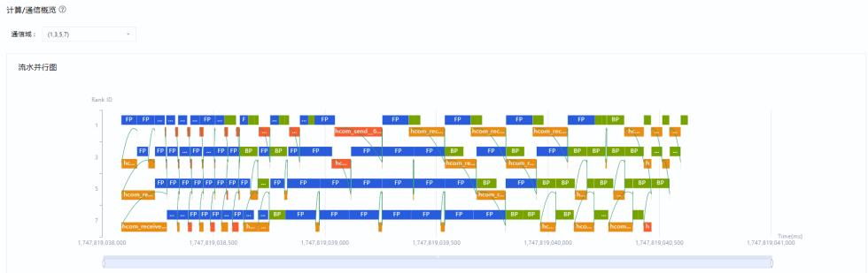  
图 4-76 流水并行图

区域三：MoE大模型专家负载均衡分析，展示专家分布热点图和专家负载均衡热力图。

参数配置栏的“数据类型”可选择“Profiling”或“Dump”，两种数据类型是针对MoE模型不同维度的统计信息。

当选择“Profiling”，展示专家分布热点图，其是基于Profiling的热点图，统计的每一个MoE层中GroupedMatmul算子的耗时情况，GroupedMatmul算子是MoE模型计算的核心，其效率会决定专家的响应速度。

当选择“Dump”时，展示MoE模型专家负载均衡热力图，其是基于Dump的热力图，统计的每个MoE层中每一个专家处理的token数量。可选择“Dump-均衡前”或“Dump-均衡后”，单击 按钮导入对应文件，展示MoE模型专家负载均衡热力图，如图4-77所示，参数解释如表4-34所示。“Dump-均衡前”和“Dump-均衡后”的数据文件采集方式可参见《MindIE LLM开发指南》的“特性介绍 > 负载均衡”章节。

  
图 4-77 MoE 大模型专家负载均衡分析

表 4-34 MoE 大模型专家负载均衡分析参数说明  

<table><tr><td rowspan=1 colspan=1>中文字段</td><td rowspan=1 colspan=1>英文字段</td><td rowspan=1 colspan=1>说明</td></tr><tr><td rowspan=1 colspan=1>模型层数</td><td rowspan=1 colspan=1>Model LayerNum</td><td rowspan=1 colspan=1>可自行配置，取值范围：1~500。</td></tr><tr><td rowspan=1 colspan=1>非MoE层列表</td><td rowspan=1 colspan=1>Dense LayerList</td><td rowspan=1 colspan=1>选择所需层数，可多选。</td></tr><tr><td rowspan=1 colspan=1>专家数</td><td rowspan=1 colspan=1>Expert Num</td><td rowspan=1 colspan=1>可自行配置，取值范围：1~500。</td></tr><tr><td rowspan=1 colspan=1>模型阶段</td><td rowspan=1 colspan=1>Model Stage</td><td rowspan=1 colspan=1>大模型推理过程中的两个阶段，分别为Prefill和Decode。</td></tr><tr><td rowspan=1 colspan=1>数据类型</td><td rowspan=1 colspan=1>Data Version</td><td rowspan=1 colspan=1>可选“Profiling”、、“Dump-均衡前”或“Dump-均衡后”。</td></tr></table>

# 4.5.2 使用说明

# 并行策略展示

概览（Summary）界面支持并行策略设定值的管理，可根据导入的性能数据区分。

性能数据中有采集到的并行策略参数值：可自动读取并填写在页面中，页面信息按照输入值自动刷新，如果需要重新设置并行参数值，可填写正确的值，单击“生成”，弹出二次确认窗口，请确认信息后，单击“确认”，页面信息会随之刷新。  
性能数据中无采集到的并行策略参数值：可根据实际情况分别填写正确的PP大小、TP大小、CP大小、DP大小、MoE-TP大小和EP大小值，单击“生成”，页面信息会随之刷新。

自行配置并行策略，PP大小为4、TP大小为4、CP大小为4，DP大小为8，EP大小为4，单击“生成”，并行策略展示图按照输入值刷新，如图4-78所示。

当选择不同的维度时，可根据需求勾选流水线并行、张量并行、上下文并行、数据并行或专家并行，并行策略图会按照勾选的选项显示划分策略选框，单击选框时，下方页面会随之更新。

并行策略图还可选择“性能指标”、“筛选范围”对并行策略图中的目标进行颜色渲染，选择“目标编号”，单击“查找”，快速定位目标编号。

可将任一目标编号的所选性能指标设置为最小或最大筛选值，帮助快速定位和分析问题。在所有维度下，选择性能指标后，在并行策略展示图中选择任一目标编号，单击鼠标右键弹出菜单，单击“设为最小筛选值”或“设为最大筛选值”，设置当前目标编号所选的性能指标值为“最小筛选值”或“最大筛选值”，展示图中渲染颜色会跟随变化，且筛选范围也会随之变化。

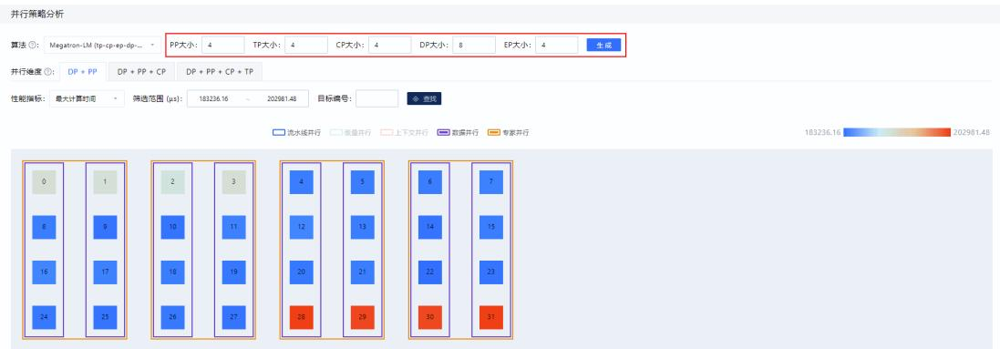  
图 4-78 数据并行策略

# 说明

● 并行策略取值规则：PP大小 x TP大小 x CP大小 x DP大小 $\geq$ 导入的卡数量。● 当在MindStudio Insight工具导入之前曾导入过的数据时，并行策略的值会存在记忆功能，会默认展示之前设置的并行策略取值。

# 支持页面信息联动

连线联动

并行策略设置完成后，当选择“DP + PP + CP + TP”并行维度时，在策略图展示区域，可单击目标编号，出现相关连线，单击对应连线，下方页面会随之变化，实现联动功能，便于开发者查看数据差异，如图4-79所示。

也可在“DP + PP + TP”或“DP + PP + CP + TP”维度下，单击目标编号，出现连线，使用鼠标右键单击任一连线，选择“查看通信耗时分析”，跳转至通信界面，展示目标编号所属通信域的详情。

在“DP + PP + CP + TP”并行维度下，单击策略图中序号0相关的张量并行连线，计算/通信概览、计算详情（Rank $/ D$ ）和通信详情（Rank ID）随之变化，计算/通信概览展示与序号0相关的通信域为“(0,1,2,3)”的信息详情，计算详情（Rank ID）与通信详情（Rank ID）分别展示对应卡的计算详情和通信详情，单击计算/通信概览区域中任意卡的柱状图时，计算详情和通信详情会展示相应卡的详情信息。

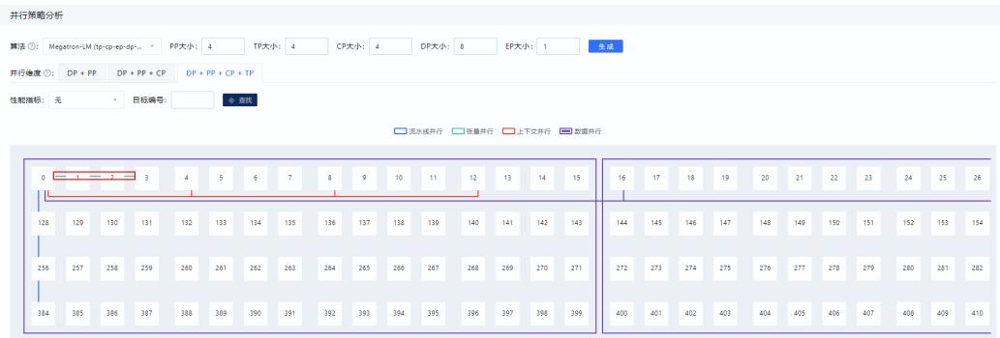  
图4-79 联动功能  
计算/通信概览

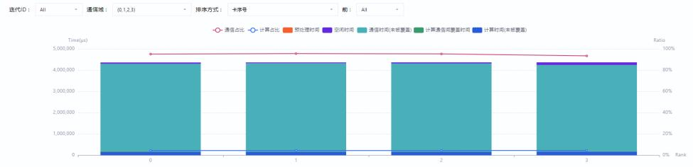

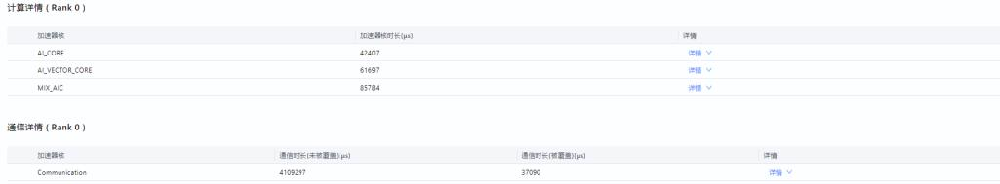

# 框选联动

选择任意一个维度，当勾选流水线并行、张量并行、上下文并行或数据并行时，并行策略图会按照勾选的选项显示划分策略，出现框选区域，单击选框，下方页面会随之变化，实现联动功能，如图4-80所示。

在“DP + PP + CP”并行维度下，勾选流水线并行，并行策略图会随之更新，并出现选框，单击流水线并行选框，计算/通信概览也随之更新。

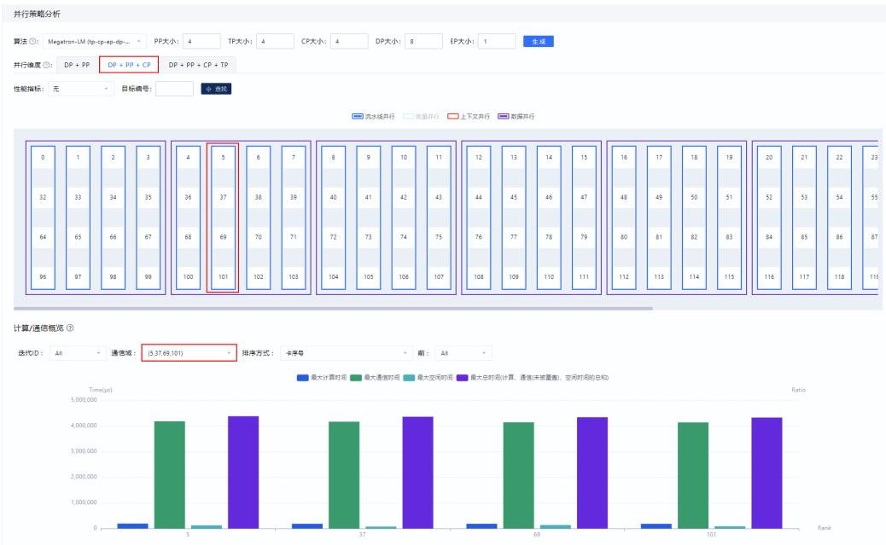  
图 4-80 框选联动

# 支持展示不同维度的并行策略

在概览（Summary）界面下，设置了并行策略值后，可选择“DP + PP”、“DP + PP+ CP”、“DP + PP + TP”或“DP $^ +$ PP + CP + TP”并行维度展示并行策略图。

可通过选择并行策略图上的维度页签展开相应维度，也可使用鼠标右键单击目标编号对各维度进行展开和折叠操作。

展开操作：在“DP + PP”或“DP + PP + CP”维度下，选择任一目标编号，单击鼠标右键弹出菜单，单击“展开”，可展开当前目标编号至下一维度。折叠操作：在“DP + PP”、“DP + PP + CP”、“DP + PP + TP”或“DP + PP+ CP + TP”维度下，选择任一目标编号，单击鼠标右键弹出菜单，单击“折叠”，可折叠当前目标编号至上一维度。

# 说明

当CP大小设置为1时，显示为“DP + PP”和“DP + PP + TP”并行维度，且在各维度下不显示“上下文并行大小”。

各维度展示详情如下：

DP $^ +$ PP维度当选择“DP + PP”并行维度时，可勾选“流水线并行”和“数据并行”，单击策略图中的选框，计算/通信概览柱状图随之而变动；根据需求选择性能指标，策略图会被渲染填色，便于直观的分析指标，如图4-81所示。可设置性能指标对应的筛选范围，在目标编号中输入所需的编号，可精准定位目标。单击柱状图顶部数据类型的对应图示，可在柱状图中隐藏或展示对应数据。

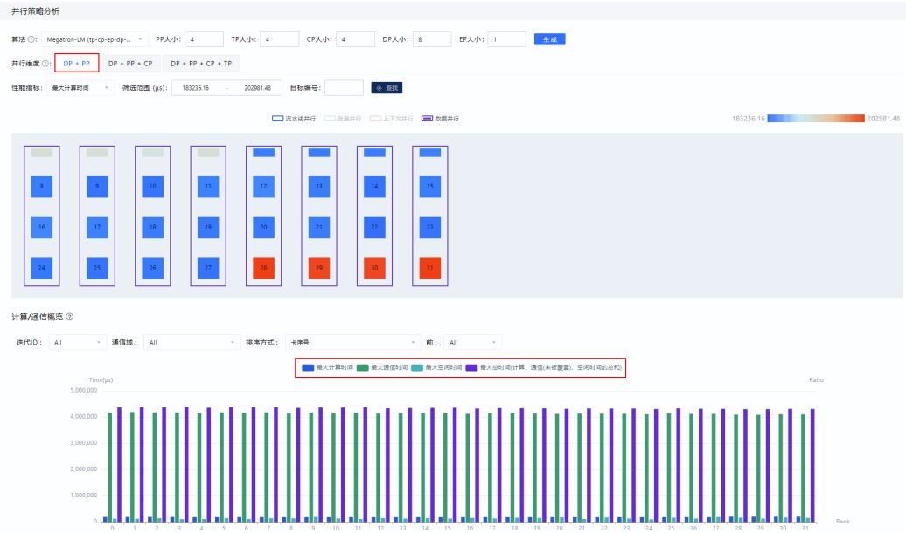  
图 4-81 DP $^ +$ PP 维度

DP + PP + CP维度

当“算法”选择“Megatron-LM(tp-cp-ep-dp-pp)”、“Megatron-LM(tp-cp-pp-ep-dp)”或“MindSpeed(tp-cp-ep-dp-pp)”时，会展示“DP + PP + CP”并行维度，可勾选“流水线并行”、“上下文并行”和“数据并行”，单击策略图中的选框，计算/通信概览柱状图随之而变动；根据需求选择性能指标，策略图会被渲染填色，便于直观的分析指标，如图4-82所示。可设置性能指标对应的筛选范围，在目标编号中输入所需的编号，可精准定位目标。

可单击柱状图顶部数据类型的对应图示，可在柱状图中隐藏或展示对应数据。

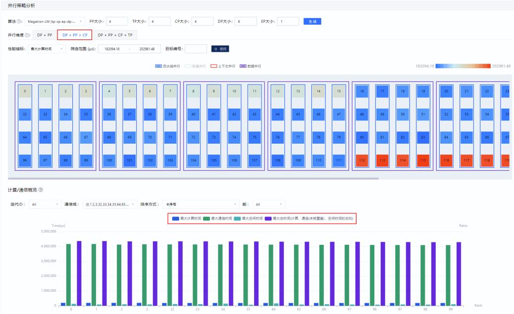  
图 4-82 DP + PP + CP 维度

$\mathsf { D P } + \mathsf { P P } + \mathsf { \ P }$ TP维度

当“算法”选择“MindIE-LLM(tp-dp-ep-pp-moetp)”或“vLLM(tp-pp-dp-ep)”时，会展示“DP $^ +$ PP + TP”并行维度，可勾选“流水线并行”、“张量并行”、“数据并行”和“专家并行”，单击策略图中的选框，计算/通信概览柱状图随之而变动；根据需求选择性能指标，策略图会被渲染填色，便于直观的分析指标，如图4-83所示。可设置性能指标对应的筛选范围，在目标编号中输入所需的编号，可精准定位目标。

可单击卡片，选择对应连线，在策略图下方展示相应的计算/通信概览信息、计算详情和通信详情；还可单击柱状图顶部数据类型的对应图示，可在柱状图中隐藏或展示对应数据。

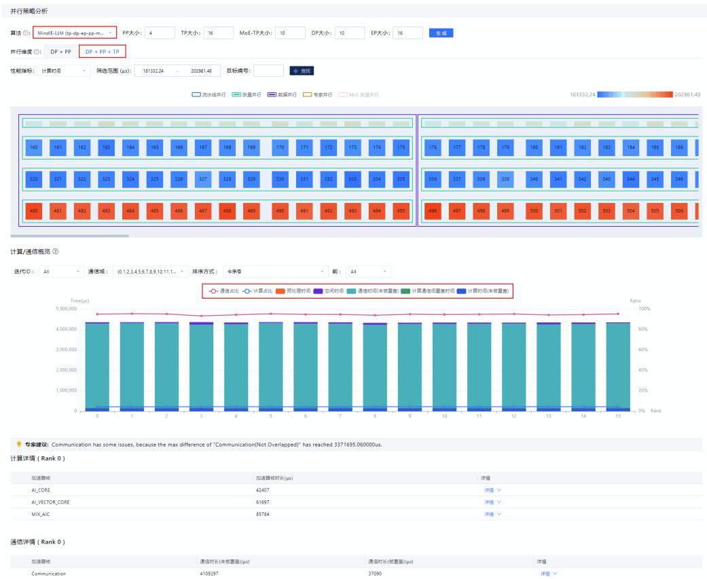  
图 4-83 DP + PP + TP 维度

# DP + PP + CP + TP维度

当“算法”选择“Megatron-LM(tp-cp-ep-dp-pp)”、“Megatron-LM(tp-cp-pp-ep-dp)”或“MindSpeed(tp-cp-ep-dp-pp)”时，会展示“DP + PP + CP +TP”并行维度，可勾选“流水线并行”、“张量并行”、“上下文并行”和“数据并行”，单击策略图中的选框，计算/通信概览柱状图随之而变动；根据需求选择性能指标，策略图会被渲染填色，便于直观的分析指标，如图4-84所示。可设置性能指标对应的筛选范围，在目标编号中输入所需的编号，可精准定位目标。

可单击卡片，选择对应连线，在策略图下方展示相应的计算/通信概览信息、计算详情和通信详情；还可单击柱状图顶部数据类型的对应图示，可在柱状图中隐藏或展示对应数据。

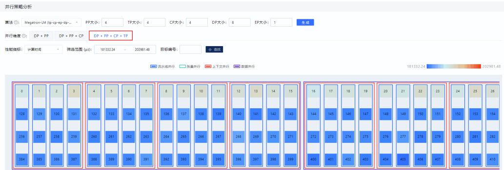  
图 $4 { - } 8 4 ~ \mathsf { D P } + \mathsf { P P } + \mathsf { C P } + \mathsf { T P }$ 维度

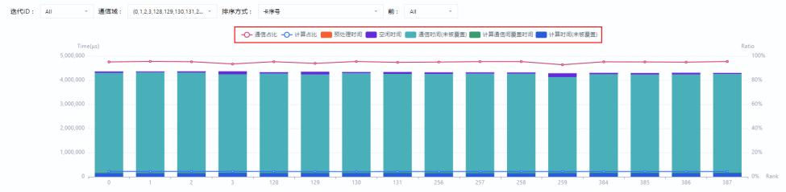

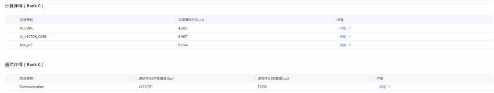

# 支持集群数据对比

MindStudio Insight支持集群数据对比，可帮助开发者直观明了地查看数据之间的差异，便于分析，设置基线数据和对比数据的操作请参见数据对比。

在对比模式下，概览（Summary）界面“基本信息”区域分别展示对比数据的信息和基线数据的信息。

并行策略分析区域，并行策略配置参数应遵循取值规则，导入卡的数量以对比数据或者基线数据的最大设备数为准。在并行策略图中选择目标编号，显示的详情信息为对比数据信息，括号中的为差值。

在“计算/通信概览”区域的柱形图详情中会显示对比数据和基线数据的差值，如图4-85所示。

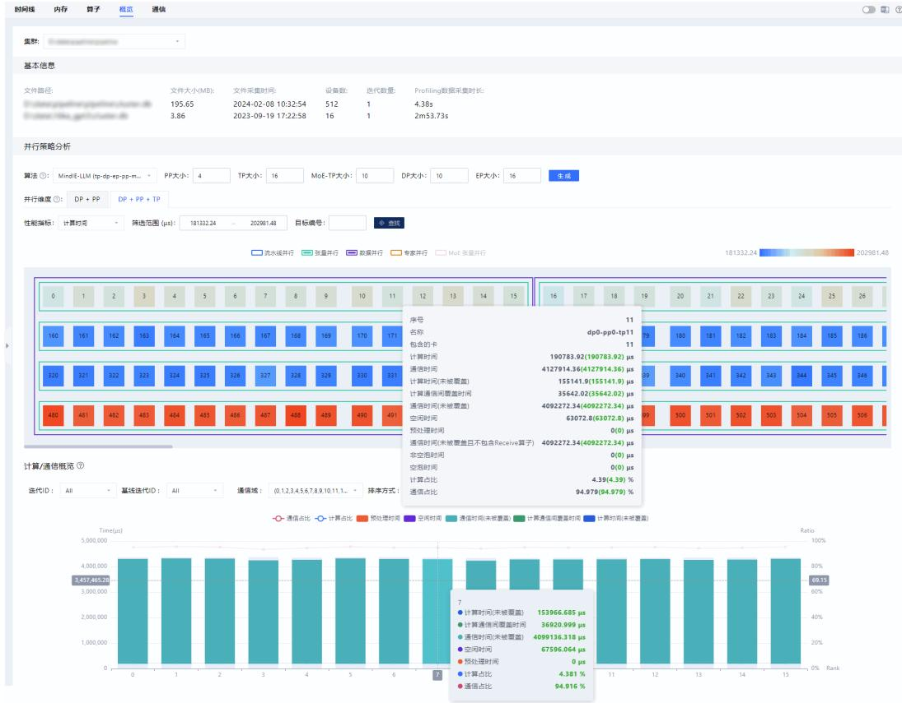  
图 4-85 概览界面对比模式

# 支持展示专家分布热点图和负载均衡热力图

在MoE大模型专家负载均衡分析区域，可选择展示专家分布热点图和专家负载均衡热力图。

● 专家分布热点图当导入的Profiling数据中包含专家分布热点数据时，参数配置栏的“数据类型”选择“Profiling”，配置其它相关参数，单击“查询”，可展示专家分布热点图。专家负载均衡热力图当需要导入负载均衡dump前和dump后的数据时，在参数配置栏的“数据类型”选择“Dump-均衡前”或“Dump-均衡后”，单击 按钮导入对应文件，展示MoE模型专家负载均衡热力图，如图4-86所示，文件导入成功后，参数会自动填入默认值。

其中纵坐标表示模型总层数（MoE层 + 非MoE层），横坐标表示专家序号，当选择图表中的某一个单元格时，会展示该单元格的详情，包括专家索引、ID、层数、Rank ID和访问量。

在图形上，可使用Ctrl + 鼠标滚轮对热力图进行缩放。

  
图 4-86 MoE 模型专家负载均衡分析

# 4.6 通信（Communication）

# 4.6.1 界面介绍

# 功能说明

通信（Communication）界面用于展示集群中全网链路性能以及所有节点的通信性能，通过集群通信与计算重叠时间的分析可以找出集群训练中的慢主机或慢节点。

# 界面展示

通信（Communication）界面主要从两个维度来进行集群通信性能的展示，包括全网链路展示和以节点为粒度展示，分为通信矩阵（Communication Matrix）和通信耗时分析（Communication Duration Analysis）两部分进行数据展示。

# 通信矩阵（Communication Matrix）

通信矩阵（Communication Matrix），主要展示指定迭代通信域内通信算子的相关信息，包括带宽、通信时长、传输大小及链路方式等，如图4-87所示，参数解释请参见表4-35。

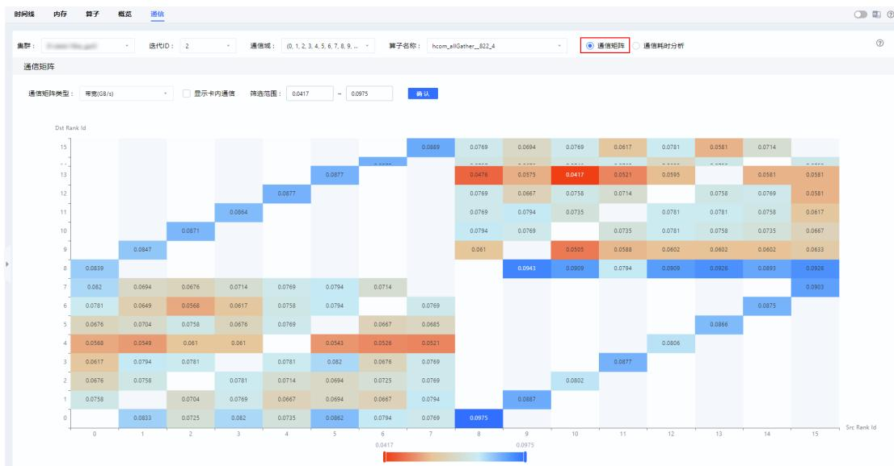  
图 4-87 通信矩阵

表 4-35 通信矩阵字段说明  

<table><tr><td colspan="1" rowspan="1">中文字段</td><td colspan="1" rowspan="1">英文字段</td><td colspan="1" rowspan="1">说明</td></tr><tr><td colspan="1" rowspan="1">集群</td><td colspan="1" rowspan="1">Cluster</td><td colspan="1" rowspan="1">集群名称，当导入集群数据时，下拉框支持选择某一集群。</td></tr><tr><td colspan="1" rowspan="1">迭代ID</td><td colspan="1" rowspan="1">Step</td><td colspan="1" rowspan="1">迭代ID，下拉框支持选择某一个迭代。</td></tr><tr><td colspan="1" rowspan="1">通信域</td><td colspan="1" rowspan="1">Communication Group</td><td colspan="1" rowspan="1">通信域，下拉框支持选择一个、多个或者所有节点，对应纵坐标进行节点的展示。</td></tr><tr><td colspan="1" rowspan="1">算子名称</td><td colspan="1" rowspan="1">OperatorName</td><td colspan="1" rowspan="1">通信算子名称，下拉框支持选择“TotalOp info”或某一类算子。为方便查看，会对通信算子进行聚类统计，例如allreduce-total等分类。当分别选择top、bottom或middle等算子分类时，鼠标移至通信矩阵热力图中，选择任一窗格即可显示具体通信算子名称。TotalOp info：为对选中的“迭代ID”和通信域中所有通信算子数据的统计和。total类：表示该类算子的平均带宽水平（某类通信算子的总传输量／总传输时间），推荐优先查看。top类：带宽最高的通信算子，topN即为前N高。. middle类：带宽处于中位数的通信算子。bottom类：带宽最低的通信算子，bottomN即为前N低。</td></tr><tr><td colspan="1" rowspan="1">通信矩阵</td><td colspan="1" rowspan="1">MatrixModel</td><td colspan="1" rowspan="1">通信矩阵热力图。</td></tr><tr><td colspan="1" rowspan="1">通信矩阵类型</td><td colspan="1" rowspan="1">Communication MatrixType</td><td colspan="1" rowspan="1">通信矩阵类型。带宽(GB/s)（Bandwidth(GB/s)）：带宽。传输大小(MB)（Transit Size(MB)）：通信尺寸。链路方式（TransportType）：链路类型。·传输时长(ms)（Transit Time(ms)）：通信时长。</td></tr><tr><td colspan="1" rowspan="1">显示卡内通信</td><td colspan="1" rowspan="1">Show InnerCommunication</td><td colspan="1" rowspan="1">展示卡内通信数据。默认不勾选。</td></tr><tr><td colspan="1" rowspan="1">筛选范围</td><td colspan="1" rowspan="1">VisibleRange</td><td colspan="1" rowspan="1">数据可视范围。默认为全量展示，可手动设置数据呈现区间。</td></tr><tr><td colspan="1" rowspan="1">Src Rank Id</td><td colspan="1" rowspan="1">Src Rank Id</td><td colspan="1" rowspan="1">Source RankId，横坐标为链路信息中源卡的ld。</td></tr><tr><td colspan="1" rowspan="1">Dst Rank Id</td><td colspan="1" rowspan="1">Dst Rank Id</td><td colspan="1" rowspan="1">DestinationRankId，纵坐标为链路信息中目的卡的Id。</td></tr></table>

# 通信耗时分析（Communication Duration Analysis）

通信耗时分析（Communication Duration Analysis），主要展示节点的通信性能，包括通信算子缩略图、通信时长、数据分析以及专家建议等，如图4-88所示，参数解释请参见表4-36。

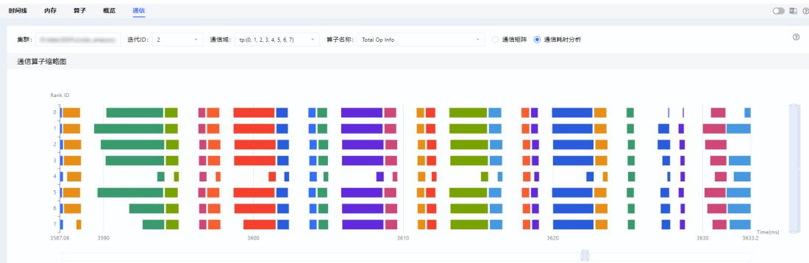  
图 4-88 通信耗时分析

可能的慢卡列表  

<table><tr><td>卡号</td><td>时差通（ms）</td><td>耗（ms) ①</td><td>最快卡耗时（ms）③</td></tr><tr><td>3</td><td>92.74</td><td>158.57</td><td>251.31</td></tr><tr><td></td><td>57.22</td><td>194.09</td><td>251.31</td></tr><tr><td></td><td>32.64</td><td>218.67</td><td>251.31</td></tr></table>

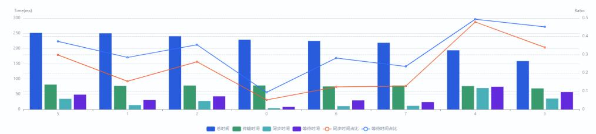  
通信时长

通信时长数据分析  

<table><tr><td>卡序号|总时间(ms)</td><td></td><td>|传辅时间(ms)</td><td>|同步时间(ms)</td><td>|等待时间(ms)</td><td>|同步时间占比</td><td>|等特时间占比</td><td>|空用时间（ms）</td><td>|SDMA带宽(GB)</td><td>RDMA带宽(GB)</td><td>带宽分析</td><td>通信算子详情</td></tr><tr><td>5</td><td>251.3061</td><td>81.3634</td><td>34.576</td><td>48.2772</td><td>0.2982</td><td>0.3724</td><td>121.6655</td><td>13.5584</td><td>0</td><td>查看更多</td><td>查看更多</td></tr><tr><td>1</td><td>249.7753</td><td>77.0038</td><td>13.9713</td><td>30.6259</td><td>0.1536</td><td>0.2845</td><td>142.1455</td><td>14.3041</td><td>0</td><td>查看更多</td><td>查看更多</td></tr><tr><td>，2</td><td>240.3509</td><td>78.2362</td><td>27.5789</td><td>42.8424</td><td>0.2606</td><td>0.3538</td><td>119.2724</td><td>14.0548</td><td>□</td><td>查看更多</td><td>查看更多</td></tr><tr><td>0</td><td>228.9042</td><td>78.403</td><td>4.2969</td><td>8.0512</td><td>0.052</td><td>0.0931</td><td>142.45</td><td>14.0384</td><td>。</td><td>查看更多</td><td>查看更多</td></tr><tr><td>6</td><td>224.9178</td><td>75.2674</td><td>10.5561</td><td>29.4452</td><td>0.123</td><td>0.2812</td><td>120.2053</td><td>14.5582</td><td>□</td><td>查看更多</td><td>查看更多</td></tr><tr><td></td><td>218.6677</td><td>78.2796</td><td>11.438</td><td>24.0975</td><td>0.1275</td><td>0.2354</td><td>116.2906</td><td>14.0312</td><td>0</td><td>查看更多</td><td>查看更多</td></tr><tr><td>4</td><td>194.0904</td><td>76.3042</td><td>69.9997</td><td>74.4</td><td>0.4785</td><td>0.4937</td><td>43.3862</td><td>14.0945</td><td>口</td><td>查看更多</td><td>查看更多</td></tr><tr><td>：</td><td>158.5698</td><td>68.8404</td><td>35.3604</td><td>56.7872</td><td>0.3393</td><td>0.452</td><td>32.9422</td><td>15.936</td><td>。</td><td>查看更多</td><td>查看更多</td></tr></table>

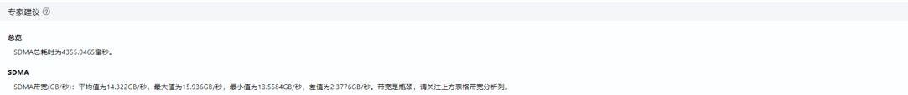

表 4-36 通信耗时分析字段说明  

<table><tr><td colspan="1" rowspan="1">中文字段</td><td colspan="1" rowspan="1">英文字段</td><td colspan="1" rowspan="1">说明</td></tr><tr><td colspan="1" rowspan="1">集群</td><td colspan="1" rowspan="1">Cluster</td><td colspan="1" rowspan="1">集群名称，当导入集群数据时，下拉框支持选择某一集群。</td></tr><tr><td colspan="1" rowspan="1">迭代ID</td><td colspan="1" rowspan="1">Step</td><td colspan="1" rowspan="1">迭代ID，下拉框支持选择某一个迭代。必选。</td></tr><tr><td colspan="1" rowspan="1">通信域</td><td colspan="1" rowspan="1">Communication Group</td><td colspan="1" rowspan="1">通信域，可在下拉框选择或搜索支持选择一个、多个或者所有节点，对应纵坐标进行节点的展示。必选。</td></tr><tr><td colspan="1" rowspan="1">算子名称</td><td colspan="1" rowspan="1">OperatorName</td><td colspan="1" rowspan="1">通信算子名称，下拉框支持选择“TotalOp info”或某一个算子；其中TotalOp info为对选中的“迭代ID”和通信域中所有通信算子数据的统计和。必选。</td></tr><tr><td colspan="1" rowspan="1">通信矩阵</td><td colspan="1" rowspan="1">Communication Matrix</td><td colspan="1" rowspan="1">通信矩阵。必选，与通信耗时分析任选其一。</td></tr><tr><td colspan="1" rowspan="1">通信耗时分析</td><td colspan="1" rowspan="1">Communication DurationAnalysis</td><td colspan="1" rowspan="1">通信耗时分析。必选，与通信矩阵任选其一。</td></tr><tr><td colspan="1" rowspan="1">通信算子缩略图</td><td colspan="1" rowspan="1">Communication</td><td colspan="1" rowspan="1">展示通信算子的执行顺序和执行时间，缩略图下方展示慢卡信息，具体信息请参见支持快速分析并定位异常通信算子。</td></tr><tr><td colspan="1" rowspan="1">Rank ID</td><td colspan="1" rowspan="1">Rank ID</td><td colspan="1" rowspan="1">通信算子缩略图中的纵坐标表示卡序号。</td></tr><tr><td colspan="1" rowspan="1">Time(ms)</td><td colspan="1" rowspan="1">Time(ms)</td><td colspan="1" rowspan="1">通信算子缩略图中的横坐标表示算子运行时间，单位ms。</td></tr><tr><td colspan="1" rowspan="1">通信时长</td><td colspan="1" rowspan="1">VisualizedCommunication Time</td><td colspan="1" rowspan="1">可视化通信时长图。</td></tr><tr><td colspan="1" rowspan="1">Time(ms)</td><td colspan="1" rowspan="1">Time(ms)</td><td colspan="1" rowspan="1">通信时长图表中的左侧纵坐标表示时长，单位ms。</td></tr><tr><td colspan="1" rowspan="1">Ratio</td><td colspan="1" rowspan="1">Ratio</td><td colspan="1" rowspan="1">通信时长图表中的右侧纵坐标表示耗时占比。</td></tr><tr><td colspan="1" rowspan="1">通信时长数据分析</td><td colspan="1" rowspan="1"> Data AnalysisofCommunication Time</td><td colspan="1" rowspan="1">算子的通信时长数据分析。鼠标移入表格中，单击按钮，一键复制表中当前所展示的内容，并粘贴至Excel表格中进行分析。</td></tr><tr><td colspan="1" rowspan="1">卡序号</td><td colspan="1" rowspan="1">Rank ID</td><td colspan="1" rowspan="1">卡序号。</td></tr><tr><td colspan="1" rowspan="1">总时间(ms)</td><td colspan="1" rowspan="1">ElapsedTime(ms)</td><td colspan="1" rowspan="1">通信算子所有事件总耗时。</td></tr><tr><td colspan="1" rowspan="1">传输时间（ms)</td><td colspan="1" rowspan="1">TransitTime(ms)</td><td colspan="1" rowspan="1">通信时长。表示通信算子的通信耗时，统计SDMA链路（server内通信）和RDMA链路（server间通信）的通信算子总耗时。如果通信耗时过长，可能是某条链路存在问题。</td></tr><tr><td colspan="1" rowspan="1">同步时间（ms)</td><td colspan="1" rowspan="1">Synchronization Time(ms)</td><td colspan="1" rowspan="1">同步时长。卡间第一次通信前节点之间进行同步需要的时长，用来区分等待时间过长是慢节点还是慢链路造成的。</td></tr><tr><td colspan="1" rowspan="1">等待时间（ms)</td><td colspan="1" rowspan="1">WaitTime(ms)</td><td colspan="1" rowspan="1">等待时长。节点之间通信前首先需要进行同步，确保通信的两个节点同步完成，再进行通信。</td></tr><tr><td colspan="1" rowspan="1">同步时间占比</td><td colspan="1" rowspan="1">Synchronization Time Ratio</td><td colspan="1" rowspan="1">同步时长占比。同步时长占比（Synchronization Time Ratio） =同步时长（Synchronization Time）/(同步时长（Synchronization Time）+通信时长（TransitTime）)，通信前的同步时长占比越大说明通信效率越低，可能存在慢卡的情况。</td></tr><tr><td colspan="1" rowspan="1">等待时间占比</td><td colspan="1" rowspan="1">Wait TimeRatio</td><td colspan="1" rowspan="1">通信算子的等待时长占比。等待时长占比（WaitTimeRatio）=等待时长（WaitTime）/(等待时长（WaitTime）+通信时长（TransitTime）），等待时长占比越大代表该节点的等待时长占总通信耗时越长，通信效率越低。</td></tr><tr><td colspan="1" rowspan="1">空闲时间(ms)</td><td colspan="1" rowspan="1">Idle Time(ms)</td><td colspan="1" rowspan="1">通信算子下发耗时。通信算子下发耗时（IdleTime）=算子的通信总耗时（ElapsedTime）-通信时长（TransitTime）-等待时长（WaitTime）。</td></tr><tr><td colspan="1" rowspan="1">SDMA带宽(GB)</td><td colspan="1" rowspan="1">SDMABW(GB)</td><td colspan="1" rowspan="1">SDMA带宽。</td></tr><tr><td colspan="1" rowspan="1">RDMA带宽(GB)</td><td colspan="1" rowspan="1">RDMABW(GB)</td><td colspan="1" rowspan="1">RDMA带宽。</td></tr><tr><td colspan="1" rowspan="1">带宽分析</td><td colspan="1" rowspan="1">BandwidthAnalysis</td><td colspan="1" rowspan="1">带宽分析。单击对应的“查看更多”后可查看对应节点指定算子的带宽详情，如图4-89所示。</td></tr><tr><td colspan="1" rowspan="1">通信算子详情</td><td colspan="1" rowspan="1">Communication OperatorsDetails</td><td colspan="1" rowspan="1">通信算子的详情，当“算子名称”选择“Total Opinfo”时可见。单击对应的“查看更多”后可查看对应节点通信算子的链路详情，如图4-90所示。</td></tr><tr><td colspan="1" rowspan="1">专家建议</td><td colspan="1" rowspan="1">Advice</td><td colspan="1" rowspan="1">对导入的数据进行分析并给出合理的专家建议。分别从带宽、字节对齐、通信重传，以及通信小包维度进行分析，并给出合理建议和优化策略，如图4-91所示。</td></tr></table>

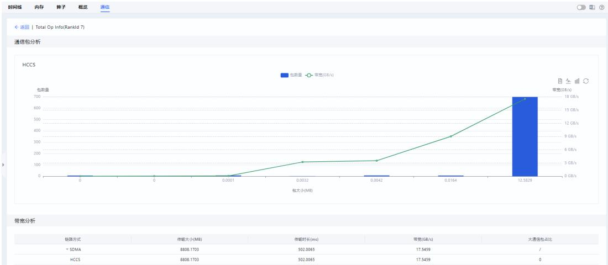  
图 4-89 带宽分析

带宽分析页面是以全网链路为粒度展示通信性能，包括通信时长、通信量、带宽以及链路类型等，图中各字段解释如表4-37所示。

表 4-37 带宽分析字段说明  

<table><tr><td rowspan=1 colspan=1>中文字段</td><td rowspan=1 colspan=1>英文字段</td><td rowspan=1 colspan=1>说明</td></tr><tr><td rowspan=1 colspan=1>包数量</td><td rowspan=1 colspan=1>PacketNumber</td><td rowspan=1 colspan=1>通信包数量。</td></tr><tr><td rowspan=1 colspan=1>包大小(MB)</td><td rowspan=1 colspan=1>PacketSize(MB)</td><td rowspan=1 colspan=1>通信包大小。</td></tr><tr><td rowspan=1 colspan=1>链路方式</td><td rowspan=1 colspan=1>TransportType</td><td rowspan=1 colspan=1>链路方式。</td></tr><tr><td rowspan=1 colspan=1>SDMA</td><td rowspan=1 colspan=1>SDMA</td><td rowspan=1 colspan=1>SDMA链路（节点内Device间通信链路），包括HCCS、PCIE和SIO三种类型。</td></tr><tr><td rowspan=1 colspan=1>RDMA</td><td rowspan=1 colspan=1>RDMA</td><td rowspan=1 colspan=1>RDMA链路（跨节点Device间通信链路）。</td></tr><tr><td rowspan=1 colspan=1>传输大小(MB)</td><td rowspan=1 colspan=1>TransitSize(MB)</td><td rowspan=1 colspan=1>一次通信包的大小。</td></tr><tr><td rowspan=1 colspan=1>传输时长(ms)</td><td rowspan=1 colspan=1>TransitTime(ms)</td><td rowspan=1 colspan=1>一次通信的时长。</td></tr><tr><td rowspan=1 colspan=1>带宽(GB/s)</td><td rowspan=1 colspan=1>Bandwidth(GB/s)</td><td rowspan=1 colspan=1>带宽。带宽一般为通信量除以通信时间。经验带宽参考值分别为RDMA_Bandwidth=12.5,HCCS_Bandwidth = 18， PCle_Bandwidth = 20。</td></tr><tr><td rowspan=1 colspan=1>大通信包占比</td><td rowspan=1 colspan=1>Large PacketRatio</td><td rowspan=1 colspan=1>大通信包占比。通信包的大小足以使得通信链路能达到经验带宽的包的比率。</td></tr></table>

图 4-90 通信算子详情  

<table><tr><td colspan="10">通信时长数据分析</td></tr><tr><td>卡序号总时间(ms)</td><td>|传辅时间(ms)</td><td>|同步时间(ms)</td><td>韓得时间(ms)</td><td>同步时间占比</td><td>等待时间占比</td><td>|空闭时间(ms)</td><td>|SDMA覆宽(GB)</td><td>|RDMA鄂宽(GB)</td><td>带宽分析</td><td>通信算子详情</td></tr><tr><td>-0 130.4149</td><td>70.9805</td><td>9.4067</td><td>10.6398</td><td>0.117</td><td>0.1304</td><td>48.7946</td><td>17.6242</td><td>0</td><td>查看更多</td><td>查看更多</td></tr><tr><td>算子名称</td><td>|总时间（ms)</td><td>|怜输时间(ms)</td><td>|同步时间(ms)</td><td>等梅时间(ms)</td><td>同步时间占比</td><td>等待时间占比</td><td>|空闭时间（(ms)</td><td>|SDMA带宽(GB)</td><td>RDMA带密(GB)</td><td></td></tr><tr><td>hcom_roedcas081</td><td>0.3767</td><td>0.0012</td><td>0.0079</td><td>0161</td><td>0.8675</td><td>0.9305</td><td>0.3594</td><td>3.262</td><td>。</td><td></td></tr><tr><td>hcom_brosdcast_008_0.1</td><td>28.5058</td><td>。</td><td>0.0121</td><td>0.0121</td><td>1</td><td>－</td><td>28.4936</td><td>。</td><td>□</td><td></td></tr><tr><td>hcom_alraduceo_.29221</td><td>0.3893</td><td>。</td><td>0.0138</td><td>0.0138</td><td>1</td><td>1</td><td>0.3755</td><td>。</td><td>0</td><td></td></tr><tr><td>hcom_alreduc_029,11</td><td>1553</td><td>。</td><td>0.6972</td><td>0.6972</td><td>1</td><td>1</td><td>0.4582</td><td>。</td><td>□</td><td></td></tr><tr><td>hcomalReduce_029,01</td><td>0.2177</td><td>。</td><td>0.1996</td><td>0.1996</td><td>1</td><td>1</td><td>0.0181</td><td>。</td><td>0</td><td></td></tr><tr><td>hcomaledue_008,901</td><td>2.0886</td><td>1.3625</td><td>。</td><td>0.0179</td><td>一</td><td>0.013</td><td>0.7082</td><td>18.3646</td><td>一</td><td></td></tr><tr><td>hcomalReduce_008.8.1</td><td>1.5093</td><td>1.3752</td><td>0.0124</td><td>0.0707</td><td>0.0089</td><td>0.0489</td><td>0.0634</td><td>18.119</td><td>一</td><td></td></tr><tr><td>hcomalReduce_0087.1</td><td>2.3692</td><td>1.3584</td><td>：</td><td>0.0315</td><td>。</td><td>0.0227</td><td>0.9793</td><td>18.3601</td><td>。</td><td></td></tr><tr><td>hcomalReduce_0026.1</td><td>1.5417</td><td>1.353</td><td>。</td><td>0.0243</td><td>0</td><td>0.0176</td><td>0.1644</td><td>18.4112</td><td>0</td><td></td></tr><tr><td>hcomalReduce008_521</td><td>4.1611</td><td>1.3705</td><td>1.7157</td><td>1.7445</td><td>0.5559</td><td>0.56</td><td>10462</td><td>18.3577</td><td>0</td><td></td></tr></table>

以算子粒度展示通信性能，包括该通信算子的通信时长、等待时长以及同步时长等，图中各字段解释可参考表4-38。

表4-38 通信算子详情字段说明  

<table><tr><td rowspan=1 colspan=1>中文字段</td><td rowspan=1 colspan=1>英文字段</td><td rowspan=1 colspan=1>说明</td></tr><tr><td rowspan=1 colspan=1>算子名称</td><td rowspan=1 colspan=1>OperatorName</td><td rowspan=1 colspan=1>通信算子名称。</td></tr><tr><td rowspan=1 colspan=1>总时间(ms)</td><td rowspan=1 colspan=1>ElapsedTime(ms)</td><td rowspan=1 colspan=1>通信算子所有事件消耗时间之和，单位ms。</td></tr><tr><td rowspan=1 colspan=1>传输时间(ms)</td><td rowspan=1 colspan=1>TransitTime(ms)</td><td rowspan=1 colspan=1>通信时长，单位ms。通信时长的计算方式为统计SDMA链路和RDMA链路的通信算子总耗时。</td></tr><tr><td rowspan=1 colspan=1>同步时间(ms)</td><td rowspan=1 colspan=1>Synchronization Time(ms)</td><td rowspan=1 colspan=1>同步时长，单位ms。第一次传输数据前的等待时间。</td></tr><tr><td rowspan=1 colspan=1>等待时间(ms)</td><td rowspan=1 colspan=1>WaitTime(ms)</td><td rowspan=1 colspan=1>等待时长，单位ms。逻辑卡之间进行通信前，首先会进行同步，确保通信的两张卡同步完成，再进行通信。</td></tr><tr><td rowspan=1 colspan=1>同步时间占比</td><td rowspan=1 colspan=1>Synchronization TimeRatio</td><td rowspan=1 colspan=1>同步时长比例。计算公式为Synchronization Time /(Synchronization Time + Transit Time)。</td></tr><tr><td rowspan=1 colspan=1>等待时间占比</td><td rowspan=1 colspan=1>Wait TimeRatio</td><td rowspan=1 colspan=1>等待时长比例。计算公式为Wait Time／(WaitTime + Transit Time)。</td></tr><tr><td rowspan=1 colspan=1>空闲时间(ms)</td><td rowspan=1 colspan=1>IdleTime(ms)</td><td rowspan=1 colspan=1>通信算子下发耗时。通信算子下发耗时（IdleTime）=算子的通信总耗时（Elapsed Time）-通信时长（Transit Time）-等待时长（Wait Time）。</td></tr><tr><td rowspan=1 colspan=1>SDMA带宽(GB)</td><td rowspan=1 colspan=1>SDMABW(GB)</td><td rowspan=1 colspan=1>SDMA带宽。</td></tr><tr><td rowspan=1 colspan=1>RDMA带宽(GB)</td><td rowspan=1 colspan=1>RDMABW(GB)</td><td rowspan=1 colspan=1>RDMA带宽。</td></tr><tr><td rowspan=1 colspan=1>操作</td><td rowspan=1 colspan=1>Operation</td><td rowspan=1 colspan=1>单击“在时间线中显示”，可跳转至时间线视图中对应的通信算子。单击“在缩略图中显示”，可跳转至通信算子缩略图中对应的算子位置。</td></tr></table>

专家建议从带宽说明、字节对齐分析、通信重传分析、通信小包分析等方面进行数据分析，并给出合理建议。可结合概览界面“并行策略分析”中的专家建议，进一步定位慢卡及具体算子信息。

带宽说明：以总览、SDMA和RDMA为维度，展示SDMA和RDMA带宽的最大值、最小值、平均值、最大值与最小值之间的差异等内容，便于开发者快速识别异常点。  
字节、重传、小包分析：分别统计通信算子字节对齐数据、通信重传分析数据、通信小包数据以及通信带宽抢占数据，分析后给出合理建议，便于开发者参考优化。

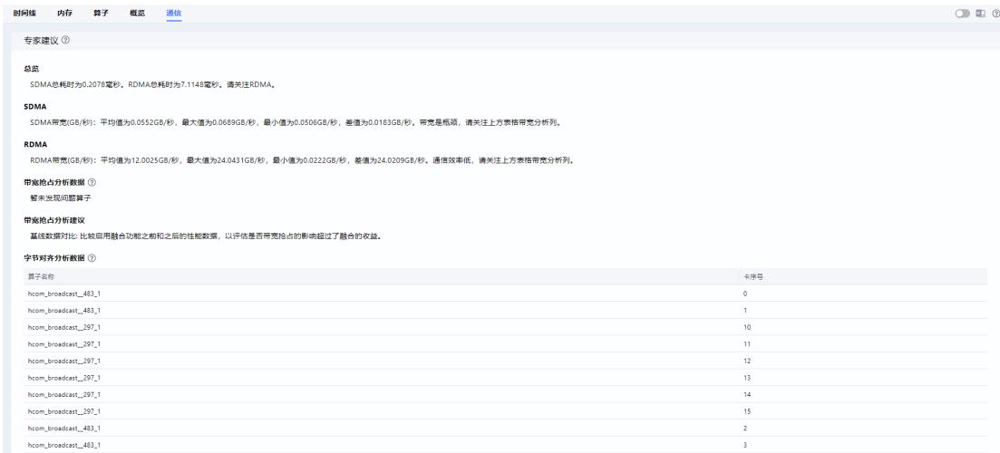  
图 4-91 专家建议

调数数据大小：请现助致据大小，对通信算子的敌据量

# 通信重传分析建议

检查RDMA传输时长：检查怀疑要重新传输的RDMA算子的传输时问是否正确。

小包分析数据③  

<table><tr><td>炎别</td><td>异常</td><td>小包持续时长（毫秒）</td><td>小包占比正常值（%）</td><td>小包占比(%)</td><td>小包标准（MB)</td></tr><tr><td>SDMA</td><td>Yes</td><td>0.846545</td><td>20.000000</td><td>46.268657</td><td>16.00000</td></tr><tr><td>RDMA</td><td>Ye</td><td>0.204536</td><td>20.000000</td><td>47.826087</td><td>1.000000</td></tr></table>

# 小包分析建议

致据并行建议：如果异常通信集中在数据并行域，1.增加批量大小：2.增加梯度累积

# 4.6.2 使用说明

# 支持通信算子缩略图显示与缩放

通信（Communication）界面支持通信算子缩略图显示：

在通信（Communication）界面中，在上方筛选框中选择所需信息，可以展示出对应通信算子缩略图。

单击通信算子缩略图中的单个算子，支持悬浮显示该算子所属卡序号、算子名称、开始时间和总耗时，如图4-92所示，图中各字段解释参考表4-39。

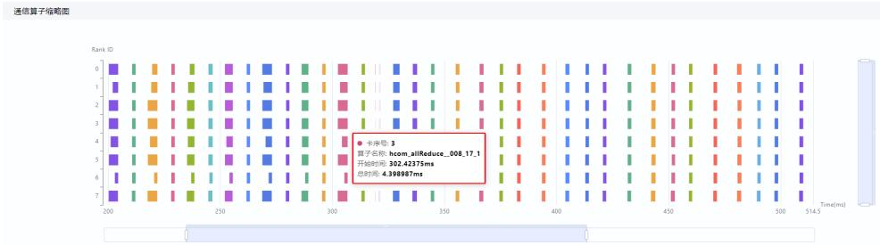  
图 4-92 通信算子缩略图

表 4-39 算子悬浮显示字段说明  

<table><tr><td rowspan=1 colspan=1>中文字段</td><td rowspan=1 colspan=1>英文字段</td><td rowspan=1 colspan=1>说明</td></tr><tr><td rowspan=1 colspan=1>卡序号</td><td rowspan=1 colspan=1>Rank ID</td><td rowspan=1 colspan=1>通信算子所属卡序号。</td></tr><tr><td rowspan=1 colspan=1>算子名称</td><td rowspan=1 colspan=1>OperatorName</td><td rowspan=1 colspan=1>通信算子名称。</td></tr><tr><td rowspan=1 colspan=1>开始时间</td><td rowspan=1 colspan=1>Start Time</td><td rowspan=1 colspan=1>通信算子开始时间。</td></tr><tr><td rowspan=1 colspan=1>总时间</td><td rowspan=1 colspan=1>Elapsed Time</td><td rowspan=1 colspan=1>通信算子执行总耗时。</td></tr></table>

通信算子缩略图支持缩放、左右移动、上下移动，具体操作如下：

通过鼠标拖动缩略图下方滑动框和右侧滑动框实现缩放操作。  
将鼠标放置在通信算子缩略图任意位置，可以使用Ctrl键 $^ +$ 鼠标滚轮实现缩放操作。  
在通信算子缩略图下方滑动框上，可以使用鼠标左右拖动实现缩略图左右移动操作。  
当通信算子缩略图不在默认显示状态时， 可使用Shift键 $^ +$ 左/右方向键实现缩略图左右移动操作。  
在通信算子缩略图右侧滑动框上，可以使用鼠标上下拖动实现缩略图上下移动操作，查看算子。

# 支持通信算子联动

在通信（Communication）界面，通信算子缩略图中的算子支持与时间线视图联动。

在通信（Communication）界面，在通信算子缩略图展示区域，选择单个算子，单击鼠标右键，单击“跳转至时间线视图”菜单，可跳转至时间线视图中对应算子位置，如图4-93所示。

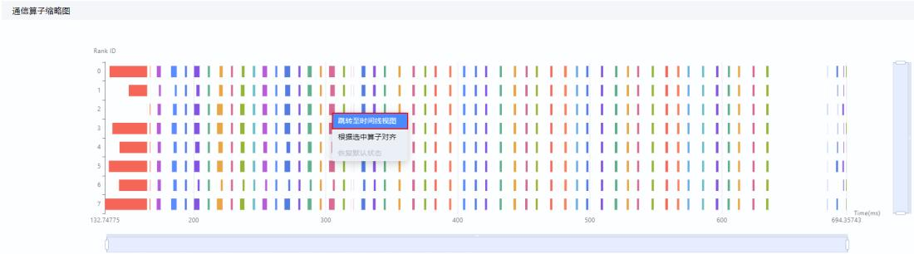  
图 4-93 跳转至时间线视图

在时间线（Timeline）界面，选择单个通信算子，单击鼠标右键，单击“在通信中查找”，可跳转至通信（Communication）界面的通信算子缩略图，筛选框会自动匹配该算子对应的信息，如图4-94所示。

# 说明

Plane泳道中的通信算子无“在通信中查找”功能，不支持跳转至通信（Communication）界面的通信算子缩略图。

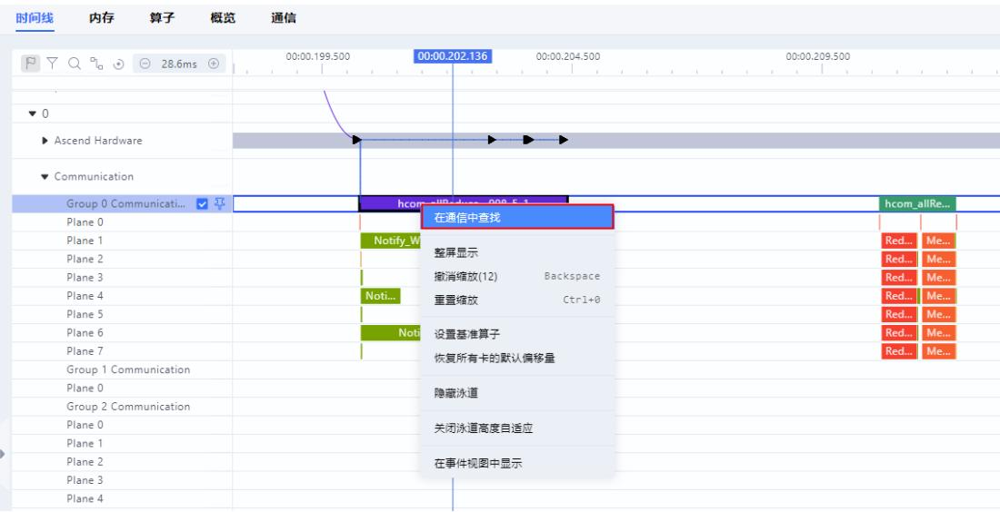  
图4-94 跳转至通信算子缩略图

# 支持通信算子一键对齐

在同一通信域的通信算子缩略图中，支持将通信算子名称一键对齐，便于查看相同算子在各卡的通信情况。

在通信（Communication）界面，选择所需的通信域，在通信算子缩略图展示区域，选择单个算子，单击鼠标右键，单击“根据选中算子对齐”菜单，可将该通信域中名称相同的算子进行时间对齐，对齐策略为与最后一个算子进行尾部时间对齐，如图4-95所示。

如果需要取消算子对齐，选择任一算子，单击鼠标右键，单击“恢复默认状态”，可取消算子对齐，呈现初始通信算子缩略图。

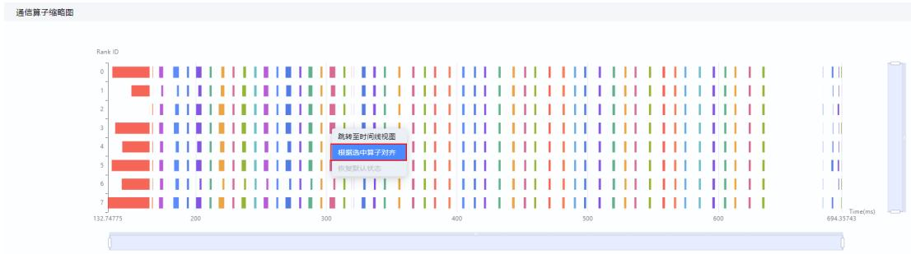  
图 4-95 算子对齐

# 支持筛选数据可视范围

当选择通信矩阵（Communication Matrix）时，在“筛选范围”后面输入可视范围，单击“确认”，通信矩阵模型图会根据所选范围动态刷新，如图4-96所示。

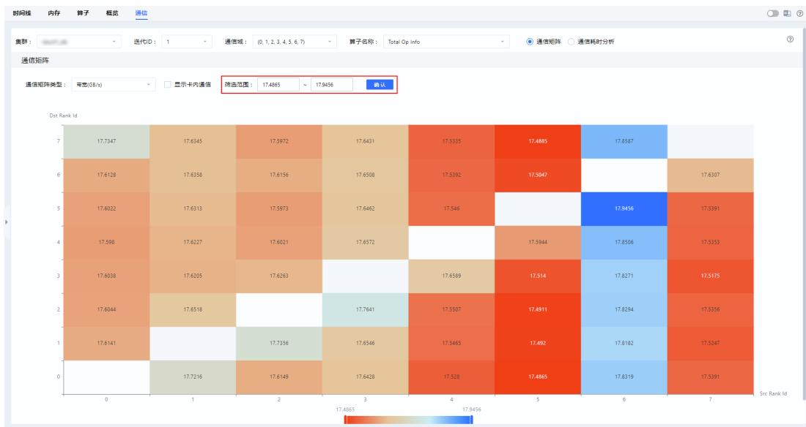  
图 4-96 筛选范围

# 支持快速分析并定位异常通信算子

当选择通信耗时分析（Communication Duration Analysis）时，可通过通信算子缩略图快速分析并定位异常算子。

当性能数据中存在慢卡及异常算子时，MindStudio Insight工具经过自动分析，可在通信算子缩略图中查看排名Top3的慢卡列表，以及该慢卡下Top3的异常算子信息，如图4-97所示，慢卡及异常算子的字段解释如表4-40所示，开发者可根据异常信息进一步进行分析优化算子性能。

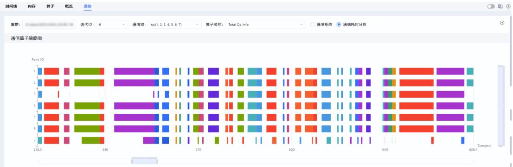  
图 4-97 慢卡列表  
可能的慢卡列表③

# 说明

● 当“算子名称”选择“Total Op info”时，支持在“通信算子缩略图”中显示慢卡和异常算子列表，否则不显示。● 包含P2P算子或all2allv算子的通信域不支持通信分析，不显示慢卡和异常算子列表。

表 4-40 慢卡列表字段解释  

<table><tr><td rowspan=1 colspan=1>中文字段</td><td rowspan=1 colspan=1>英文字段</td><td rowspan=1 colspan=1>说明</td></tr><tr><td rowspan=1 colspan=3>慢卡参数</td></tr><tr><td rowspan=1 colspan=1>卡号</td><td rowspan=1 colspan=1>Rank ID</td><td rowspan=1 colspan=1>慢卡的卡序号。</td></tr><tr><td rowspan=1 colspan=1>耗时差值(ms)</td><td rowspan=1 colspan=1>Elapsed TimeDifference(ms)</td><td rowspan=1 colspan=1>耗时差值=最快卡耗时-当前卡耗时，单位为ms。通信时间耗时差值在一定程度上代表可减少的通信时间。</td></tr><tr><td rowspan=1 colspan=1>耗时(ms)</td><td rowspan=1 colspan=1>Elapsed Time(ms)</td><td rowspan=1 colspan=1>当前卡通信算子耗时总和。</td></tr><tr><td rowspan=1 colspan=3>异常算子参数</td></tr><tr><td rowspan=1 colspan=1>排序</td><td rowspan=1 colspan=1>Index</td><td rowspan=1 colspan=1>异常算子的Top排序。</td></tr><tr><td rowspan=1 colspan=1>算子名称</td><td rowspan=1 colspan=1>Operator Name</td><td rowspan=1 colspan=1>异常算子的算子名。</td></tr><tr><td rowspan=1 colspan=1>耗时差值(ms)</td><td rowspan=1 colspan=1>Elapsed TimeDifference(ms)</td><td rowspan=1 colspan=1>耗时差值=该算子在最快卡的通信耗时-该算子在当前卡的通信耗时，单位为ms。算子耗时差值在一定程度上代表可减少的通信时间。</td></tr><tr><td rowspan=1 colspan=1>在当前卡中的耗时(ms)</td><td rowspan=1 colspan=1>Elapsed Time onCurrent Rank(ms)</td><td rowspan=1 colspan=1>该通信算子在当前卡的耗时。</td></tr><tr><td rowspan=1 colspan=1>在最快卡中的耗时(ms)</td><td rowspan=1 colspan=1>Elapsed Time onFastest Rank(ms)</td><td rowspan=1 colspan=1>该通信算子在最快卡的耗时。</td></tr><tr><td rowspan=1 colspan=1>操作</td><td rowspan=1 colspan=1>Action</td><td rowspan=1 colspan=1>可单击“在图中高亮”，可在“通信算子缩略图”中高亮显示算子。</td></tr></table>

# 支持集群数据对比

MindStudio Insight支持集群数据对比，可帮助开发者直观明了地查看数据之间的差异，便于分析，设置基线数据和对比数据的操作请参见数据对比。

通信矩阵（Communication Matrix）  
在对比模式下，当选择通信矩阵（Communication Matrix）时，通信矩阵模型图中会显示对比模式下的差异值，选择任一模型框，会展示对比数据和基线数据的信息，如图4-98所示。

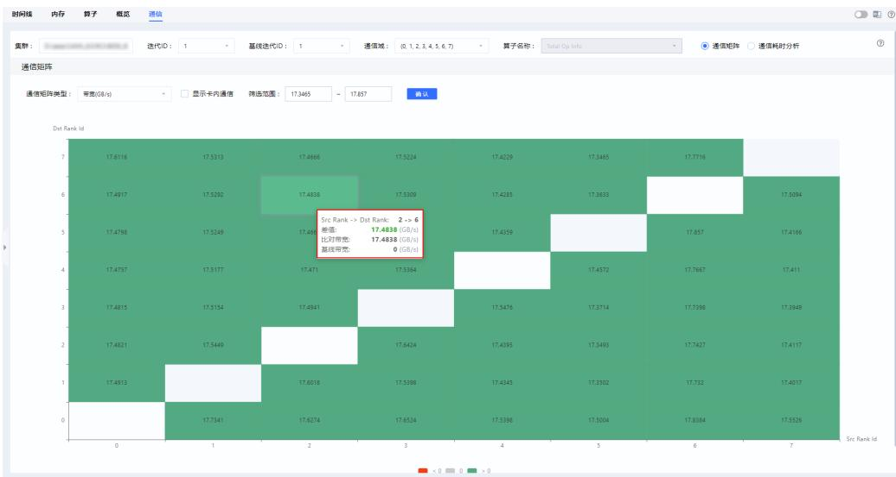  
图 4-98 通信矩阵对比模式

通信耗时分析（Communication Duration Analysis）

在对比模式下，当选择通信耗时分析（Communication Duration Analysis）时，通信（Communication）界面会显示对比迭代ID和基线迭代ID，“通信域”显示为对比数据和基线数据的并集，“算子名称”固定为“Total Op Info” 。

在通信算子缩略图中，选择对应算子，展示对比数据和基线数据的详情；在通信时长柱状图中，选择柱状图，展示对比数据和基线数据的差值，如图4-99所示。

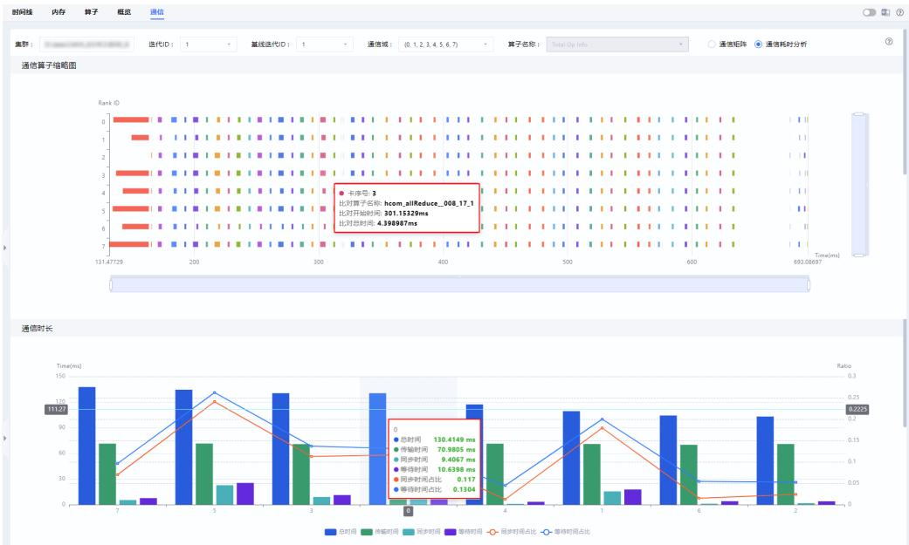  
图 4-99 通信界面对比模式

在“通信时长数据分析”区域，无“带宽分析”参数，显示对比数据和基线数据的差值，单击“通信算子详情”列的“查看更多”，显示对比数据和基线数据的详细信息，如图4-100所示。

图4-100 通信时长数据分析对比详情  

<table><tr><td colspan="11">通信时长数据分析</td></tr><tr><td>卡序号来源</td><td></td><td>总时间(ms)</td><td>|传增时间[ms]</td><td>同步时间[ms]</td><td>|等待时间[ms]</td><td>同步时间占比</td><td>|等待时间占比</td><td>空闲时间(ms)</td><td>|SDMA带宽(GB)</td><td>RDMA带宽（GB)</td><td>详情</td></tr><tr><td>-？ 差值</td><td></td><td>137.691</td><td>71.4377</td><td>5.387</td><td>7.6174</td><td>0.0701</td><td>0.0964</td><td>58.6358</td><td>17.5459</td><td>□</td><td>要更多</td></tr><tr><td>来源</td><td></td><td>总时间(ms)</td><td>|传墙时间(ms)</td><td>同步时间(ms)</td><td>够待时间[ms]</td><td>同步时间占比</td><td>|博得时间占比</td><td>空闹时间(ms)</td><td>|SDMA质宽(GB)</td><td>RDMA带宽(GB)</td><td>详情</td></tr><tr><td></td><td>比对数据 137.691</td><td></td><td>71.4377</td><td>5.387</td><td>7.6174</td><td>0.0701</td><td>0.0964</td><td>58.6358</td><td>17.5459</td><td>0</td><td>覆更多</td></tr><tr><td></td><td>基缓数据 0</td><td></td><td>4.744898612477e-312</td><td>0</td><td>1.3742045458916e-311</td><td>1.1186e-320</td><td>。</td><td>5.6e-321</td><td>0</td><td>0</td><td>理更多</td></tr><tr><td>共1条</td><td></td><td></td><td></td><td></td><td></td><td></td><td></td><td></td><td></td><td></td><td></td></tr><tr><td>5</td><td>差值</td><td>134.5347</td><td>71.5553</td><td>22.7275</td><td>25.4482</td><td>0.2411</td><td>0.2623</td><td>37.5313</td><td>17.5101</td><td>0</td><td>查看更多</td></tr><tr><td>-3</td><td>差值</td><td>130.4749</td><td>70.8825</td><td>9.0108</td><td>11.2466</td><td>0.1128</td><td>0.1360</td><td>48.3458</td><td>17.6655</td><td>0</td><td>查覆更多</td></tr><tr><td>-</td><td>差值</td><td>130.4149</td><td>70.9805</td><td>9.4067</td><td>10.6398</td><td>0.117</td><td>0.1304</td><td>48.7946</td><td>17.6242</td><td>0</td><td>查覆更多</td></tr></table>

# 4.7 强化学习（RL）

# 4.7.1 界面介绍

# 功能说明

强化学习（RL）界面提供了强化学习过程中各阶段流水图的可视化展示，使能开发者能够全面了解运行情况，轻松定位问题，并进行深入分析与优化。

# 界面展示

# 说明

● 仅当导入使用mstx打点采集到的控制流数据时，才会展示任务执行时间线。mstx打点采集方式请参见《性能调优工具指南》中“Ascend PyTorch调优工具”章节的“采集并解析msprof_tx数据”内容。当导入verl（Volcano Engine Reinforcement Learning for LLMs）和MindSpeed框架的性能数据时，需分别导入各自的性能数据文件夹，不支持将两种数据合并放在同一文件夹中导入。

强化学习界面由参数配置栏（区域一）和任务执行时间线（区域二）组成，如图4-101所示。

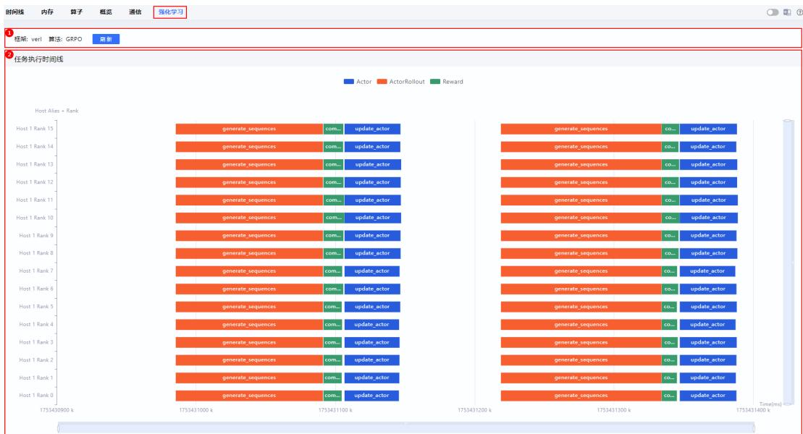  
图 4-101 强化学习界面

区域一：参数配置栏，自动识别并显示导入数据的“框架”和“算法”；当导入的数据大于16卡时，强化学习界面数据可能展示不全，可单击“刷新”解析所有数据，刷新任务执行时间线。

区域二：任务执行时间线，展示的是各卡上每个任务的执行时间，横坐标为时间轴，纵坐标为各设备对应的RankID，不同的颜色代表不同的任务，其中蓝色的色块中提供Forward和Backward micro batch标记展示，帮助定位训练阶段的细粒度性能问题。

通过任务执行时间线图形右侧和下方的滑动框可以缩放、移动时间线，也可以通过Ctrl + 鼠标滚轮进行缩放。

导入性能数据时间线（Timeline）源码（Source）详情（Details）缓存（Cache）

# 5.1 导入性能数据

MindStudio Insight支持导入性能数据文件，并以图形化形式呈现相关内容。算子调优场景支持导入的性能数据文件请参见表5-1。数据导入操作请参见3.2 导入数据章节。

表 5-1 支持导入的性能数据  

<table><tr><td colspan="1" rowspan="1">文件名</td><td colspan="1" rowspan="1">说明</td><td colspan="1" rowspan="1">文件获取方式</td><td colspan="1" rowspan="1">显示界面</td></tr><tr><td colspan="1" rowspan="1">trace.json</td><td colspan="1" rowspan="1">算子仿真指令流水图文件。</td><td colspan="1" rowspan="1">参见《算子开发工具用户指南》中“算子调优（msProf）&gt;工具使用”章节的“msprof opsimulator”内容。</td><td colspan="1" rowspan="1">时间线（Timeline）</td></tr><tr><td colspan="1" rowspan="1">visualize_data.bin</td><td colspan="1" rowspan="1">仿真流水图可视化呈现文件。</td><td colspan="1" rowspan="1">参见《算子开发工具用户指南）中“算子调优（msProf）&gt;工具使用”章节的msprof opsimulator”内容。</td><td colspan="1" rowspan="1">时间线（Timeline）</td></tr><tr><td colspan="1" rowspan="2"></td><td colspan="1" rowspan="1">算子基础信息、计算单元负载和Roofline瓶颈分析等信息的可视化呈现文件。</td><td colspan="1" rowspan="1">参见《算子开发工具用户指南）中“算子调优（msProf）&gt;工具使用 章节的“msprofop”内容。</td><td colspan="1" rowspan="1">详情（Details）</td></tr><tr><td colspan="1" rowspan="1">仿真热点函数等信息可视化呈现文件。</td><td colspan="1" rowspan="1">参见《算子开发工具用户指南》中“算子调优（msProf）&gt;工具使用”章节的“msprof opsimulator”和“msprof op”内容。</td><td colspan="1" rowspan="1">源码（Source）</td></tr><tr><td colspan="1" rowspan="1">visualize_data.bin</td><td colspan="1" rowspan="1">用户程序Kernel函数内的L2Cache访问信息可视化呈现文件。</td><td colspan="1" rowspan="1">参见《算子开发工具用户指南》中“算子调优（msProf）&gt;工具使用”章节的“msprofop”内容。</td><td colspan="1" rowspan="1">缓存（Cache）</td></tr></table>

# 说明

● MindStudio Insight在算子调优场景下，支持导入的json文件中，需要在文件内容中第一个中括号之前有"profilingType":"op"字段标识，才可被导入。  
● 支持以文件夹方式导入json文件，一个文件夹下可存在多个子文件夹，但是子文件夹下不能存在多个json文件，不同的json文件需要放在不同的子文件夹下。  
● 建议导入的json文件单文件大小不超过1GB。  
● 支持导入的二进制bin文件只允许单个文件导入，不支持以文件夹方式导入。  
● 建议导入的bin文件单文件大小不超过500MB。

# 5.2 时间线（Timeline）

# 5.2.1 界面介绍

# 功能说明

在算子性能调优过程中，MindStudio Insight工具以时间线（Timeline）的呈现方式，将算子运行过程中，底层指令的详细执行情况平铺在时间轴上，直观呈现AI处理器每个Core上的每个Pipe中指令的调用顺序和耗时情况。通过分析时间线，用户可以通过查看指令详情、指令耗时等信息快速定位出性能瓶颈。

# 界面展示

时间线（Timeline）界面包含工具栏（区域一）、图形化展示（区域二）和数据窗格（区域三）三个部分，如图5-1所示。

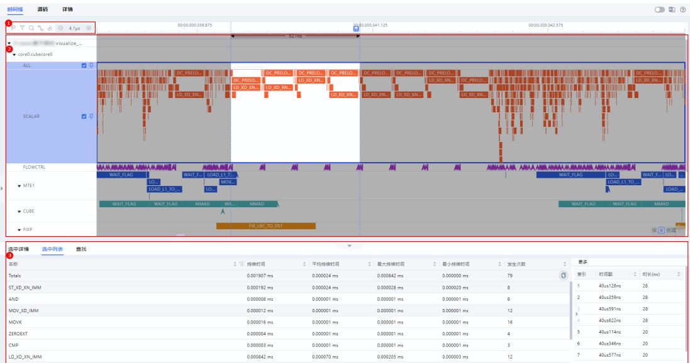  
图 5-1 时间线界面

区域一：工具栏，包含常用快捷按钮，从左至右依次为标记列表、过滤（支持按卡或按泳道过滤展示）、搜索、连线事件、重置缩放（页面复原）和时间轴缩小放大按钮。

区域二：图形化展示，左侧显示各Core的分层信息，一层级为Core，二层级为Pipe。右侧为时间线视图，逐行对时间线进行图形化展现，包括各指令执行序列和执行时长。具体泳道信息请参见表5-2。

区域三：数据窗格，统计信息或指令详情信息展示区，选中详情（Slice Detail）为选中单个指令的详细信息、选中列表（Slice List）为某一泳道选中区域的指令列表信息。

表 5-2 泳道信息  

<table><tr><td colspan="1" rowspan="1">泳道名称</td><td colspan="1" rowspan="1">说明</td></tr><tr><td colspan="1" rowspan="1">ALL</td><td colspan="1" rowspan="1">表示在这个通道的指令在所有通道都执行。</td></tr><tr><td colspan="1" rowspan="1">SCALAR</td><td colspan="1" rowspan="1">标量运算单元。</td></tr><tr><td colspan="1" rowspan="1">FLOWCTRL</td><td colspan="1" rowspan="1">控制流指令。</td></tr><tr><td colspan="1" rowspan="1">MTE1</td><td colspan="1" rowspan="1">数据搬运流水，数据搬运方向为：L1-&gt;{L0A/LOB,UBUF}。</td></tr><tr><td colspan="1" rowspan="1">CUBE</td><td colspan="1" rowspan="1">矩阵乘运算单元。</td></tr><tr><td colspan="1" rowspan="1">FIXP</td><td colspan="1" rowspan="1">数据搬运流水，数据搬运方向为：FIXPIPE LOC-&gt;OUT/L1。仅Atlas A2训练系列产品/Atlas A2推理系列产品导出的性能数据支持展示。</td></tr><tr><td colspan="1" rowspan="1">MTE2</td><td colspan="1" rowspan="1">数据搬运流水，数据搬运方向为：{DDR/GM,L2} -&gt;{L1,L0A/B,UBUF}。</td></tr><tr><td colspan="1" rowspan="1">VECTOR</td><td colspan="1" rowspan="1">向量运算单元。</td></tr><tr><td colspan="1" rowspan="1">MTE3</td><td colspan="1" rowspan="1">数据搬运流水，数据搬运方向为：UBUF-&gt; {DDR/GM,L2,L1}、L1-&gt;{DDR/L2}。</td></tr><tr><td colspan="1" rowspan="1">CACHEMISS</td><td colspan="1" rowspan="1">未命中ICACHE。</td></tr><tr><td colspan="1" rowspan="1">USEMASK</td><td colspan="1" rowspan="1">自定义打点范围。</td></tr><tr><td colspan="1" rowspan="1">MTEThroughput</td><td colspan="1" rowspan="1">内存吞吐率信息。·GM_TO_L1：GM往L1搬运的数据吞吐率。. GM_TO_TOTAL:GM输出总数据吞吐率。. GM_TO_UB：GM往UB搬运的数据吞吐率。. L1_TO_GM：L1往GM搬运的数据吞吐率。. TOTAL_TO_GM：GM输入总数据吞吐率。UB_TO_GM：UB往GM搬运的数据吞吐率。</td></tr></table>

# 说明

通过观察时间线视图各个层级上的耗时长短、间隙等判断对应指令和Pipe是否存在性能问题，如指令执行是否存在瓶颈、是否存在高耗时的指令等。

# 5.2.2 使用说明

# 5.2.2.1 基础功能

# 支持界面缩放

时间线（Timeline）界面支持缩小、放大和左右移动等功能，具体操作如下所示：

● 单击时间线（Timeline）界面树状图或者图形化窗格任意位置，可以使用键盘中的W（放大）和S（缩小）键进行操作，支持放大的最大精度为1ns。  
● 单击时间线（Timeline）界面树状图或者图形化窗格任意位置，使用键盘中的A（左移）、D（右移）键，或者方向键左键（左移）、右键（右移）进行左右移动，也可使用方向键上键（上移）、下键（下移）进行上下移动。  
● 在图形化窗格中，使用键盘中的Alt键加鼠标左键可以使选中区域实现局部放大。  
● 单击界面左上方工具栏中的 $\circledast$ （放大）和 $\circleddash$ （缩小）实现缩放。  
● 单击界面左上方工具栏中的 $\Rightarrow$ 可以一键恢复图形化窗格显示全部时间线视图。  
● 将鼠标放置在时间线（Timeline）界面树状图或者图形化窗格任意位置，可以使用键盘中的Ctrl键加鼠标滚轮实现缩放操作。  
● 在图形化窗格中，使用键盘中的Ctrl键加鼠标左键可以实现左右拖拽泳道图表。

# 说明

macOS系统中，需使用键盘上的Command键加鼠标滚轮实现缩放，Command键加鼠标左键实现左右拖拽泳道图表。

● 在图形化窗格中，可使用鼠标右键菜单进行缩放展示，具体功能参见表5-3。

表5-3 鼠标右键菜单功能  

<table><tr><td rowspan=1 colspan=1>中文菜单</td><td rowspan=1 colspan=1>英文菜单</td><td rowspan=1 colspan=1>说明</td><td rowspan=1 colspan=1>操作</td></tr><tr><td rowspan=1 colspan=1>全屏显示</td><td rowspan=1 colspan=1>Fit toscreen</td><td rowspan=1 colspan=1>将单个指令放大至屏幕可见范围最大宽度。如果未选中指令，则不显示该参数。</td><td rowspan=1 colspan=1>1．单击选中一个指令，单击鼠标右键，弹出菜单；2.单击“全屏显示”，可将选中指令放大至屏幕可见范围最大宽度。</td></tr><tr><td rowspan=1 colspan=1>放大所选内容</td><td rowspan=1 colspan=1>Zoomintoselection</td><td rowspan=1 colspan=1>将选定区域放大至屏幕可见范围最大宽度。如果无选定区域，则不显示该参数。</td><td rowspan=1 colspan=1>1．选定某个区域后，单击鼠标右键，弹出菜单；2．单击“放大所选内容”，可将选定区域放大至屏幕可见范围最大宽度。</td></tr><tr><td rowspan=1 colspan=1>撤销缩放（0）</td><td rowspan=1 colspan=1>UndoZoom(0)</td><td rowspan=1 colspan=1>撤销缩放，括号中的数字会随着缩放次数随之变化，初始状态为0。</td><td rowspan=1 colspan=1>1．在放大后的时间线（Timeline）界面，单击鼠标右键，弹出菜单；2.单击“撤销缩放”，界面缩小一次，括号中的数字会随之减一。</td></tr><tr><td rowspan=1 colspan=1>重置缩放</td><td rowspan=1 colspan=1>ResetZoom</td><td rowspan=1 colspan=1>重置缩放，将图表恢复至初始状态。</td><td rowspan=1 colspan=1>1．在放大后的时间线（Timeline）界面，单击鼠标右键，弹出菜单；2.单击“重置缩放”，图表重置，恢复至初始状态。</td></tr></table>

# 指令搜索功能

MindStudio Insight在时间线（Timeline）界面支持指令搜索。

单击界面左上方工具栏中的 $\alpha$ ，在弹出输入框中输入需要搜索的指令，然后按回车键，则会匹配对应的指令，搜索结果匹配指令总数，如图5-2所示，搜索到与名称中包含“mov”相关的指令总数为11754。

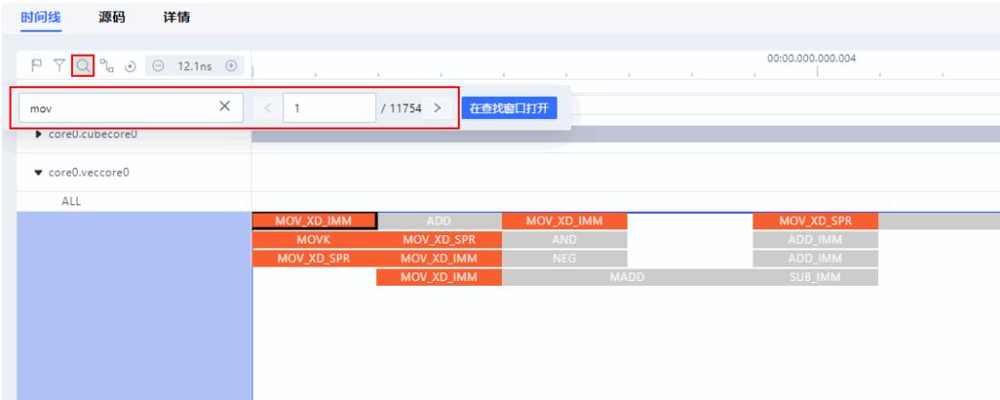  
图 5-2 搜索指令总数

单击界面左上方工具栏中的 $\cup$ ，可在搜索弹出输入框左侧分别单击 $\mathsf { A } _ { \mathtt { G } }$ 和 $\mathsf { w }$ ，开启大小写匹配和全词匹配功能，如图5-3所示。

单击 $\mathsf { A a }$ 开启大小写匹配，输入需要搜索的信息，按回车键，则会匹配名称中包含搜索项的指令。

单击 $\boldsymbol { \mathsf { W } }$ 开启全词匹配，输入需要搜索的信息，按回车键，则会匹配名称为搜索项的指令，但是会忽略大小写。

当同时选中 $_ { A \cap }$ 和 $\mathsf { w }$ 时，开启大小写匹配和全词匹配功能，在输入框中输入需要搜索的指令名称，按回车键，则会精确匹配名称为搜索项的指令。

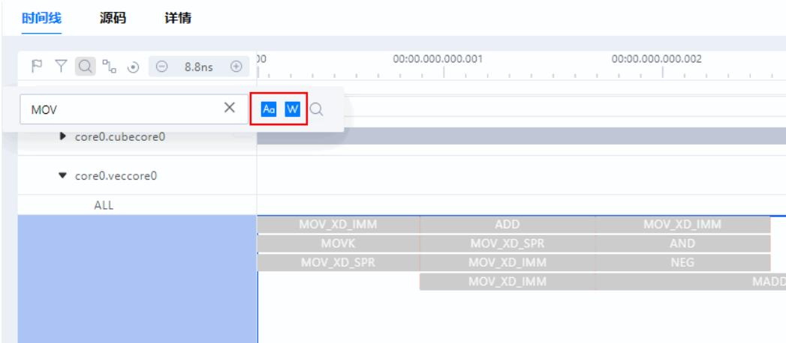  
图 5-3 大小写匹配和全词匹配

单击搜索框后方的切换按钮，可以查看上一个或者下一个匹配的指令，也可以在输入框后方输入具体的数字搜索其对应的指令，该指令将会被选中并显示在界面的中间，如图5-4所示。

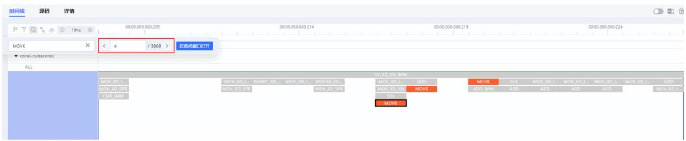  
图 5-4 定位指令

单击搜索框后方的“在查找窗口打开”，可跳转至界面下方的“查找”页签，展示所有搜索指令列表，如图5-5所示，字段解释如表5-4所示。单击“点击跳转Timeline”列的“点击”可跳转到指令在时间线视图上的具体位置。

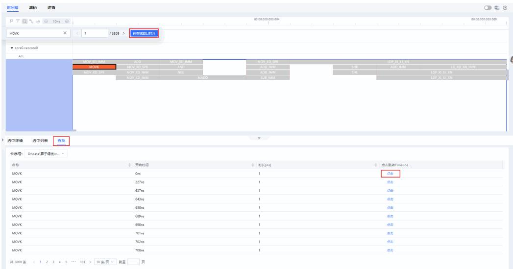  
图 5-5 在查找窗口打开

表 5-4 字段说明  

<table><tr><td rowspan=1 colspan=1>中文字段</td><td rowspan=1 colspan=1>英文字段</td><td rowspan=1 colspan=1>说明</td></tr><tr><td rowspan=1 colspan=1>卡序号</td><td rowspan=1 colspan=1>Rank ID</td><td rowspan=1 colspan=1>卡序号，可以选择需要查看的数据文件。</td></tr><tr><td rowspan=1 colspan=1>名称</td><td rowspan=1 colspan=1>Name</td><td rowspan=1 colspan=1>指令名称。</td></tr><tr><td rowspan=1 colspan=1>开始时间</td><td rowspan=1 colspan=1>Start Time</td><td rowspan=1 colspan=1>指令执行起始时间。</td></tr><tr><td rowspan=1 colspan=1>时长(ns)</td><td rowspan=1 colspan=1>Duration(ns)</td><td rowspan=1 colspan=1>指令运行总耗时。</td></tr><tr><td rowspan=1 colspan=1>点击跳转Timeline</td><td rowspan=1 colspan=1>Click ToTimeline</td><td rowspan=1 colspan=1>单击“点击”跳转到指令在时间线视图上的具体位置。</td></tr></table>

# 5.2.2.2 性能数据展示

# 设置和查看标记

区域标记

在时间线（Timeline）界面选中某个区域后，单击 $\mathbf { u } = \mathbf { \Omega }$ 或敲击键盘K键将选中区域进行标记并保存，如图5-6所示。

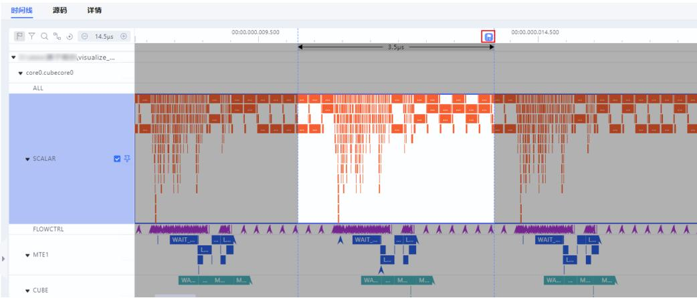  
图 5-6 区域标记

左键双击任一标记，可以设置该标记对的属性，支持修改标记对名称、颜色以及删除该标记对，如图5-7所示。

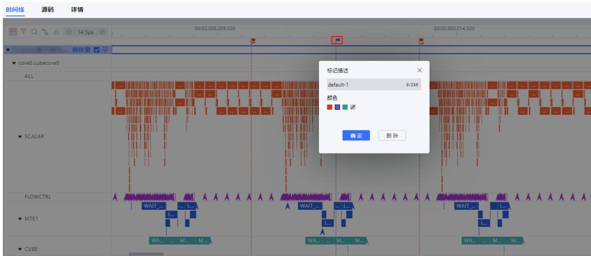  
图 5-7 修改标记对属性

# 单点标记

在最上方空泳道的任意位置，单击鼠标左键或敲击键盘K键，将生成一个单点标记，如图5-8所示。左键双击标记，可以设置该标记的属性，支持修改标记的名称、颜色以及删除该标记。

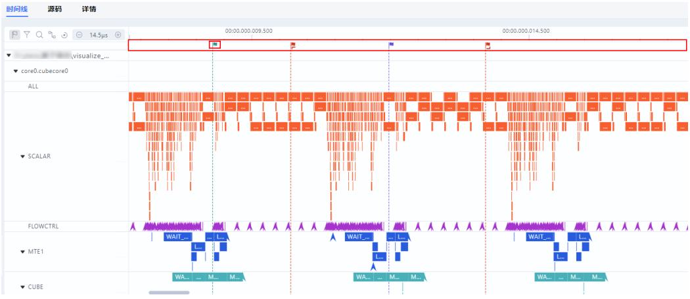  
图 5-8 单点标记

# 标记管理

单击左上方工具栏中的 $\vdash$ ，将显示所有标记信息，如图5-9所示。

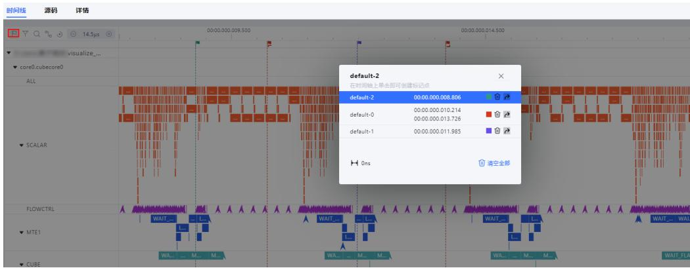  
图 5-9 查看标记信息

单击某个标记对应的 图标可删除标记。  
单击弹窗下方的“清空全部”可删除所有标记。  
单击区域标记，界面下方的“选中详情”页签会显示该区域的耗时信息详情。  
如果某一标记不在当前可视化界面，单击该标记对应的 图标将直接跳转至标记界面，便于查看。  
单击某个标记对应的颜色图标可进行颜色设置，便于对标记进行分类管理。

# 指令间同步连线功能

MindStudio Insight支持指令间同步连线关系（SET_FLAG到WAIT_FLAG）展示，单击有连线的指令，即可显示该指令关联的连线，即使折叠连线起点或者终点的Pipe，连线也不会消失，如图5-10所示。

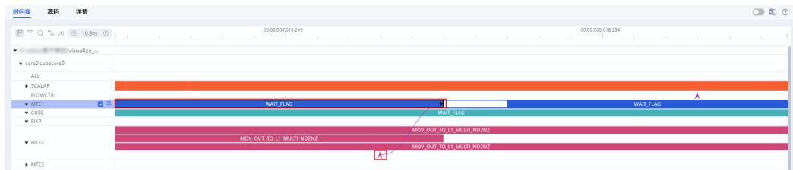  
图 5-10 指令间连线

MindStudio Insight支持全量连线的功能，单击界面左上方工具栏中的 $\sqsupset ^ { \mathrm { J } ^ { - } }$ ，在弹框中选择一个或多个连线类型，则在时间线视图中展示对应Pipe间的所有连线，如图5-11所示。

# 说明

最多支持选择10个连线类型。

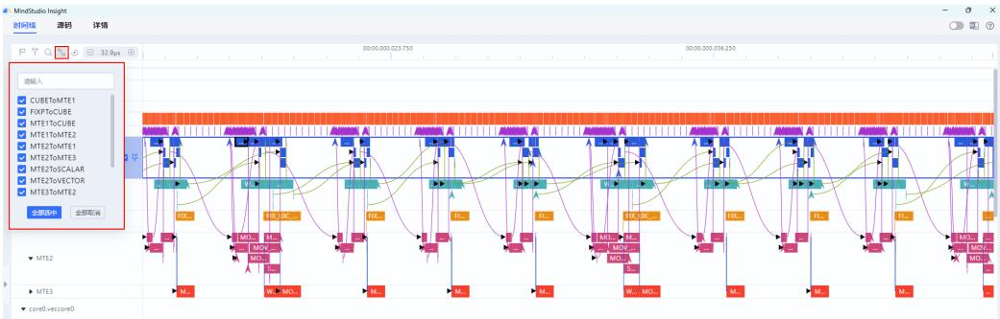  
图5-11 全量连线

支持隐藏SET_FLAG和WAIT_FLAG指令。

在算子展示区域，右键弹出菜单，选择“隐藏SET/WAIT事件”，可隐藏SET_FLAG和WAIT_FLAG指令，连线同时消失，如图5-12所示。

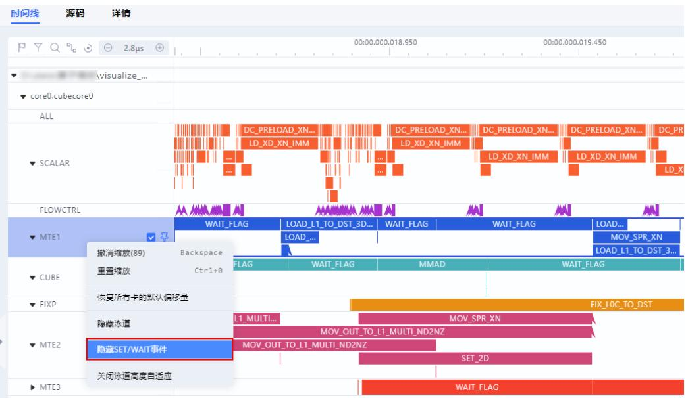  
图 5-12 隐藏 SET/WAIT 事件

隐藏SET/WAIT事件后，再次右键弹出菜单，单击“显示SET/WAIT事件”，被隐藏的SET_FLAG和WAIT_FLAG指令随之出现，根据连线功能操作，可正常显示指令连线，如图5-13所示。

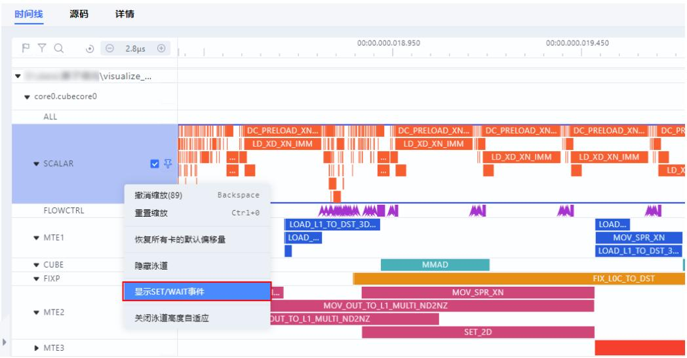  
图 5-13 显示 SET/WAIT 事件

# 5.2.2.3 页面调优展示

# 泳道隐藏功能

算子调优场景下的泳道隐藏功能可参见泳道隐藏功能执行操作。

# 泳道高度自适应功能

算子调优场景下的泳道高度自适应功能可参见泳道高度支持自适应执行操作。

# 5.2.2.4 统计信息展示

MindStudio Insight支持指令统计信息和单个指令详情信息查看。

使用鼠标左键可在单个Pipe级泳道，或跨多个core泳道框选部分指令，框选部分区域指令后，可在下方选中列表显示指令的统计信息，如图5-14所示，字段解释如表5-5。

当鼠标移入“选中列表”页签，单击 $\cup$ 按钮，可复制当前“选中列表”中所展示的内容，并粘贴至Excel表格中进行分析。

单击“选中列表”列中的某个指令，在右侧“More”列表中将会显示此区域中与该指令同名的所有指令，单击“More”列表中某一行，则在时间线视图中定位出该指令的具体位置，并同时跳转至“选中详情”页面，可查看该指令的详情信息。

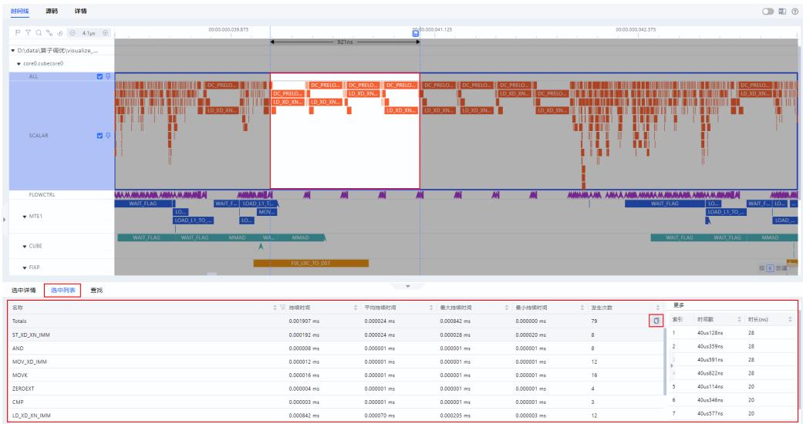  
图 5-14 选中列表

表 5-5 选中列表字段说明  

<table><tr><td rowspan=1 colspan=1>中文字段</td><td rowspan=1 colspan=1>英文字段</td><td rowspan=1 colspan=1>说明</td></tr><tr><td rowspan=1 colspan=1>名称</td><td rowspan=1 colspan=1>Name</td><td rowspan=1 colspan=1>指令名称。</td></tr><tr><td rowspan=1 colspan=1>持续时间</td><td rowspan=1 colspan=1>Wall Duration</td><td rowspan=1 colspan=1>指令执行总耗时。</td></tr><tr><td rowspan=1 colspan=1>平均持续时间</td><td rowspan=1 colspan=1>Average WallDuration</td><td rowspan=1 colspan=1>指令平均执行时间。</td></tr><tr><td rowspan=1 colspan=1>最大持续时间</td><td rowspan=1 colspan=1>Max WallDuration</td><td rowspan=1 colspan=1>算子最大持续时间。</td></tr><tr><td rowspan=1 colspan=1>最小持续时间</td><td rowspan=1 colspan=1>Min WallDuration</td><td rowspan=1 colspan=1>算子最小持续时间。</td></tr><tr><td rowspan=1 colspan=1>发生次数</td><td rowspan=1 colspan=1>Occurrences</td><td rowspan=1 colspan=1>指令调用次数。</td></tr><tr><td rowspan=1 colspan=1>索引</td><td rowspan=1 colspan=1>Index</td><td rowspan=1 colspan=1>序号。</td></tr><tr><td rowspan=1 colspan=1>开始时间</td><td rowspan=1 colspan=1>Start Time</td><td rowspan=1 colspan=1>在图形化窗格中的时间戳。</td></tr><tr><td rowspan=1 colspan=1>时长(ms)</td><td rowspan=1 colspan=1>Duration(ms)</td><td rowspan=1 colspan=1>执行耗时。</td></tr></table>

当选中单个指令时，可在下方选中详情显示该指令的详情信息，如图5-15所示，字段解释如表5-6所示。

选中单个指令，使用M键，可框选该指令所属的时间线（Timeline）区域，再次按下M键，可取消框选。

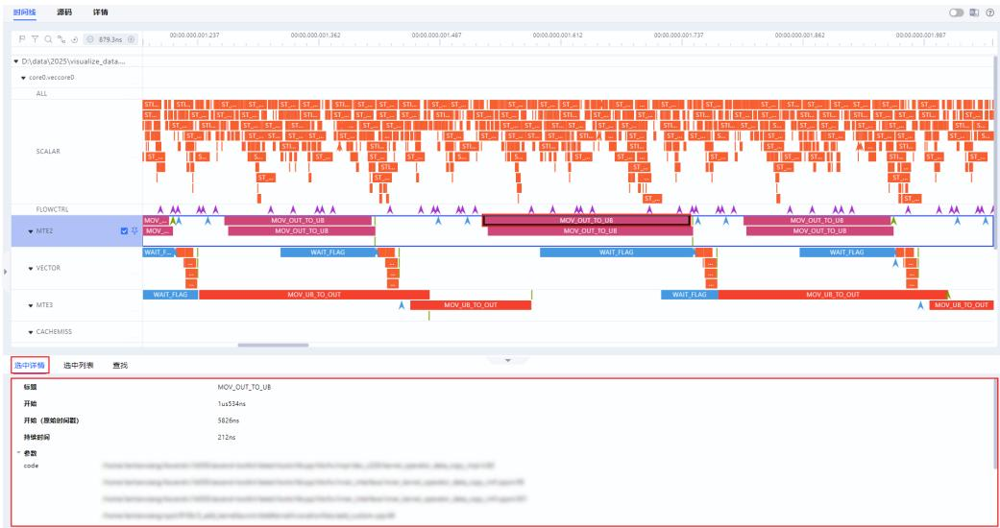  
图 5-15 选中详情

表 5-6 选中详情字段说明  

<table><tr><td rowspan=1 colspan=1>中文字段</td><td rowspan=1 colspan=1>英文字段</td><td rowspan=1 colspan=1>说明</td></tr><tr><td rowspan=1 colspan=1>标题</td><td rowspan=1 colspan=1>Title</td><td rowspan=1 colspan=1>名称。</td></tr><tr><td rowspan=1 colspan=1>开始</td><td rowspan=1 colspan=1>Start</td><td rowspan=1 colspan=1>起始时间。</td></tr><tr><td rowspan=1 colspan=1>开始（原始时间戳）</td><td rowspan=1 colspan=1>Start(RawTimestamp)</td><td rowspan=1 colspan=1>数据采集到的原始开始时间。</td></tr><tr><td rowspan=1 colspan=1>持续时间</td><td rowspan=1 colspan=1>WallDuration</td><td rowspan=1 colspan=1>总耗时。</td></tr><tr><td rowspan=1 colspan=1>参数</td><td rowspan=1 colspan=1>Args</td><td rowspan=1 colspan=1>算子的相关参数信息，包括以下信息：·code：代码调用栈。. detail:指令源码。.pc_addr:pc地址。</td></tr></table>

# 5.3 源码（Source）

# 5.3.1 界面介绍

功能说明

源码（Source）界面用于展示算子指令热点图，支持查看算子源码与指令集的映射关系和耗时情况，在昇腾Ascend C算子开发过程中，使能开发者进行性能分析。

# 界面展示

请参见3.2 导入数据章节，导入算子指令热点bin文件，获取算子指令热点bin文件请参见《算子开发工具用户指南》中“算子调优（msProf） > 工具使用”章节的“msprofop simulator”内容，文件为：visualize_data.bin。

源码（Source）界面包含筛选栏（区域一）、源文件代码属性表（区域二）和指令表（区域三）三个部分组成，如图5-16所示。

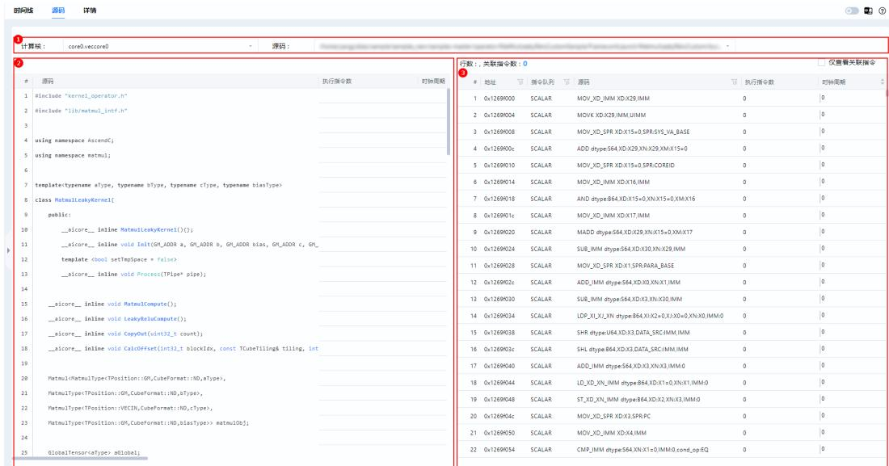  
图 5-16 源码界面

区域一：筛选栏，可通过计算核（Core）和源码（Source）进行筛选需要查看的内容。

区域二：源文件代码属性表，查看各行代码和其相应的执行时长和次数，表中字段解释如表5-7所示。

表 5-7 源文件代码属性表字段说明  

<table><tr><td colspan="1" rowspan="1">中文字段</td><td colspan="1" rowspan="1">英文字段</td><td colspan="1" rowspan="1">说明</td><td colspan="1" rowspan="1">示例</td></tr><tr><td colspan="1" rowspan="1">#</td><td colspan="1" rowspan="1">#</td><td colspan="1" rowspan="1">代码行号。</td><td colspan="1" rowspan="1">100</td></tr><tr><td colspan="1" rowspan="1">源码</td><td colspan="1" rowspan="1">Source</td><td colspan="1" rowspan="1">源文件代码。</td><td colspan="1" rowspan="1">-</td></tr><tr><td colspan="1" rowspan="1">执行指令数</td><td colspan="1" rowspan="1">InstructionsExecuted</td><td colspan="1" rowspan="1">该行代码在每个Core上执行的指令数量。</td><td colspan="1" rowspan="1">100</td></tr><tr><td colspan="1" rowspan="1">时钟周期</td><td colspan="1" rowspan="1">Cycles</td><td colspan="1" rowspan="1">该行代码在每个Core上执行消耗的Cycles（时钟周期）。</td><td colspan="1" rowspan="1">100</td></tr><tr><td colspan="1" rowspan="1">通用寄存器数</td><td colspan="1" rowspan="1">GPR Count</td><td colspan="1" rowspan="1">该行代码在每个Core上执行时使用的通用寄存器次数。仅当使用msprof op simulator采集的数据支持显示该参数。</td><td colspan="1" rowspan="1">10</td></tr><tr><td colspan="1" rowspan="1">L2Cache命中率</td><td colspan="1" rowspan="1">L2Cache HitRate</td><td colspan="1" rowspan="1">该行代码在所有Core上执行的L2Cache命中率。仅当使用msprofop采集的数据支持显示该参数。</td><td colspan="1" rowspan="1">100%</td></tr><tr><td colspan="1" rowspan="1">处理数据量(Bytes)</td><td colspan="1" rowspan="1">ProcessBytes</td><td colspan="1" rowspan="1">该行代码在每个Core上执行处理的数据量之和，单位Byte。</td><td colspan="1" rowspan="1">2048</td></tr></table>

区域三：指令表，查看指令记录，包括地址、内容、数量、次数等，表中字段解释如表5-8所示。

表 5-8 指令表字段说明  

<table><tr><td colspan="1" rowspan="1">中文字段</td><td colspan="1" rowspan="1">英文字段</td><td colspan="1" rowspan="1">说明</td><td colspan="1" rowspan="1">示例</td></tr><tr><td colspan="1" rowspan="1">#</td><td colspan="1" rowspan="1">#</td><td colspan="1" rowspan="1">序号。</td><td colspan="1" rowspan="1">100</td></tr><tr><td colspan="1" rowspan="1">地址</td><td colspan="1" rowspan="1">Address</td><td colspan="1" rowspan="1">指令所处的偏移地址。</td><td colspan="1" rowspan="1">Ox1122a828</td></tr><tr><td colspan="1" rowspan="1">指令队列</td><td colspan="1" rowspan="1">Pipe</td><td colspan="1" rowspan="1">指令所处的Pipe（指令队列）。</td><td colspan="1" rowspan="1">MTE2</td></tr><tr><td colspan="1" rowspan="1">源码</td><td colspan="1" rowspan="1">Source</td><td colspan="1" rowspan="1">指令内容。</td><td colspan="1" rowspan="1">BAR PIPE:ALL</td></tr><tr><td colspan="1" rowspan="1">执行指令数</td><td colspan="1" rowspan="1">InstructionsExecuted</td><td colspan="1" rowspan="1">该行指令在每个Core上执行的指令数量。</td><td colspan="1" rowspan="1">100</td></tr><tr><td colspan="1" rowspan="1">通用寄存器数</td><td colspan="1" rowspan="1">GPR Count</td><td colspan="1" rowspan="1">该行指令在每个Core上执行时使用的通用寄存器次数。仅当使用msprof op simulator采集的数据支持显示该参数。</td><td colspan="1" rowspan="1">10</td></tr><tr><td colspan="1" rowspan="1">时钟周期</td><td colspan="1" rowspan="1">Cycles</td><td colspan="1" rowspan="1">该行指令在每个Core上执行消耗的Cycles（时钟周期）。</td><td colspan="1" rowspan="1">100</td></tr><tr><td colspan="1" rowspan="1">L2Cache命中率</td><td colspan="1" rowspan="1">L2Cache HitRate</td><td colspan="1" rowspan="1">该行指令在所有Core上执行的L2Cache命中率。仅当使用msprofop采集的数据支持显示该参数。</td><td colspan="1" rowspan="1">72%</td></tr><tr><td colspan="1" rowspan="1">处理数据量(Bytes)</td><td colspan="1" rowspan="1">ProcessBytes</td><td colspan="1" rowspan="1">该行指令在每个Core上执行处理的数据量，单位Byte。</td><td colspan="1" rowspan="1">2048</td></tr><tr><td colspan="1" rowspan="1">UB单元读冲突</td><td colspan="1" rowspan="1">UB ReadConflict</td><td colspan="1" rowspan="1">Vector计算类指令在UB Bank上读的冲突情况。仅当使用msprof op simulator采集的数据支持显示该参数。</td><td colspan="1" rowspan="1">1</td></tr><tr><td colspan="1" rowspan="1">UB单元写冲突</td><td colspan="1" rowspan="1">UB WriteConflict</td><td colspan="1" rowspan="1">Vector计算类指令在UB Bank上写的冲突情况。仅当使用msprof op simulator采集的数据支持显示该参数。</td><td colspan="1" rowspan="1">0</td></tr><tr><td colspan="1" rowspan="1">Vector计算单元利用率百分比</td><td colspan="1" rowspan="1">VectorUtilizationPercentage</td><td colspan="1" rowspan="1">Vector计算单元的利用率，单位%。仅当使用msprof op simulator采集的数据支持显示该参数。</td><td colspan="1" rowspan="1">35.29</td></tr></table>

#

支持导入的二进制bin文件只允许单个文件导入，不支持以文件夹方式导入。

# 5.3.2 使用说明

# 源码搜索功能

在源文件代码属性表区域，使用键盘上的Ctrl + F键可调出搜索框，在搜索框中输入所需关键字，可按需选择大小写匹配等功能，按Enter回车键查询，会高亮显示匹配的关键字，如图5-17所示，搜索框中图标功能如表5-9所示。

# 说明

macOS系统中，需使用键盘上的Command + F键调出搜索框。

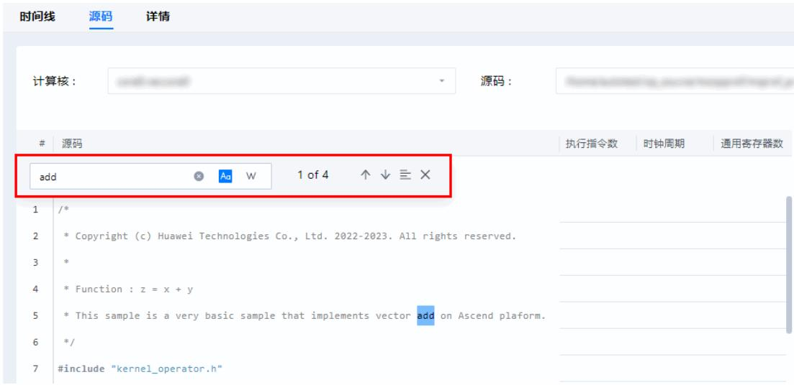  
图 5-17 搜索源码

表 5-9 图标功能说明  

<table><tr><td colspan="1" rowspan="1">图标</td><td colspan="1" rowspan="1">功能说明</td></tr><tr><td colspan="1" rowspan="1">Aa</td><td colspan="1" rowspan="1">大小写匹配。选定该图标后，可匹配搜索到所输入的关键字，区分大小写。</td></tr><tr><td colspan="1" rowspan="1">W</td><td colspan="1" rowspan="1">全词匹配。选定该图标后，可搜索到完整匹配的关键字。</td></tr><tr><td colspan="1" rowspan="1">个</td><td colspan="1" rowspan="1">向上切换搜索结果。</td></tr><tr><td colspan="1" rowspan="1">√</td><td colspan="1" rowspan="1">向下切换搜索结果。</td></tr><tr><td colspan="1" rowspan="1">三</td><td colspan="1" rowspan="1">框选源码区域。选定该图标后，可使用鼠标左键选定源码区域，则可在选定区域内进行搜索。</td></tr><tr><td colspan="1" rowspan="1">×</td><td colspan="1" rowspan="1">关闭搜索框，退出搜索功能。也可以按键盘上的Esc键退出。</td></tr></table>

# 查看关联指令

单击源文件代码属性表中任意一行代码，则在指令表将高亮显示此行代码相关指令。指令表上方会显示当前选中代码的行数（Line）和此行代码关联的指令总数（RelatedInstructions Count），如图5-18所示，此行代码所处位置是第10行，且关联的指令总数为112个。

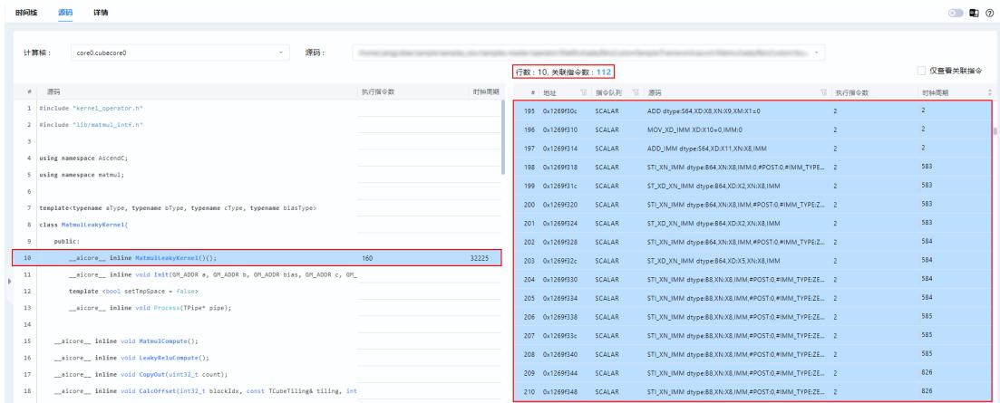  
图 5-18 查看关联指令

勾选指令表上的“仅查看关联指令”则会进行过滤，只显示此行代码关联的指令，如图5-19所示。

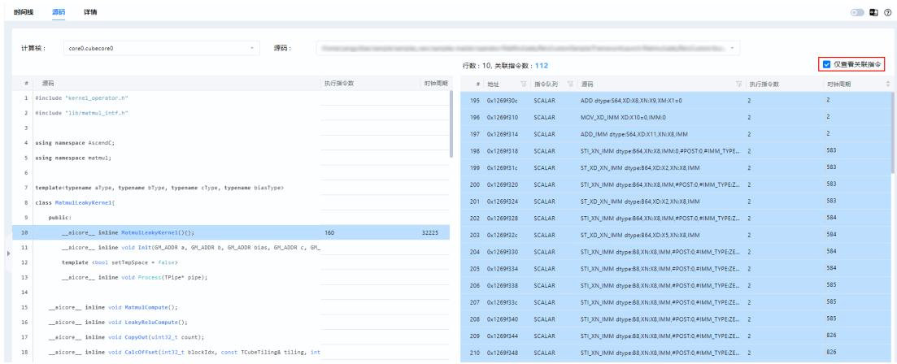  
图 5-19 过滤关联指令

# 查看关联代码

单击指令表中任意一行，则在源文件代码属性表中高亮显示所关联的代码，并且在指令表中高亮显示此行代码所有关联指令，如图5-20所示。

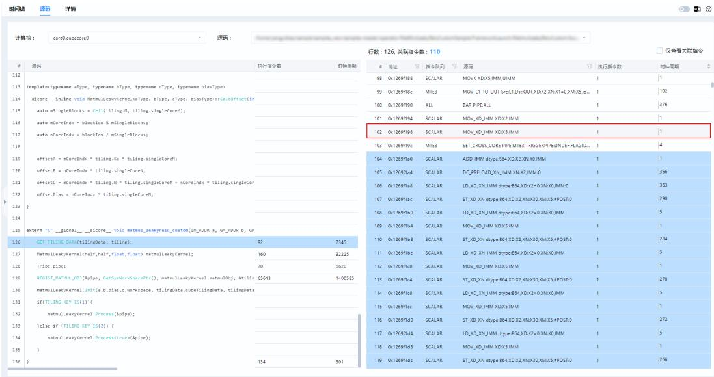  
图 5-20 查看关联代码

# 说明

如果有多行关联代码时，只会高亮显示最上层代码。

# 筛选指令表

在指令表中，单击表头每个字段后方的 $\Bumpeq$ 可以筛选需要查看的内容，如图5-21所示。

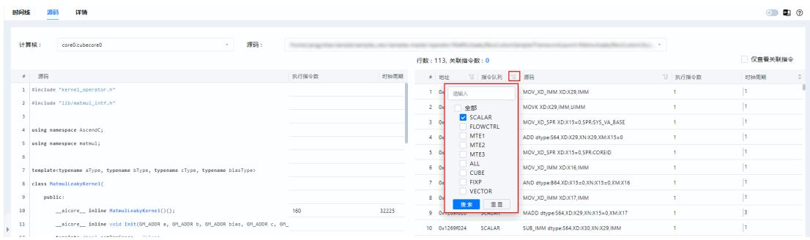  
图 5-21 筛选指令表

# 5.4 详情（Details）

# 5.4.1 界面介绍

# 功能说明

详情（Details）界面用于展示算子基础信息、计算负载分析、核间负载分析、Roofline瓶颈分析和内存负载分析，并以图形和数据窗格呈现方式展示分析结果。

# 界面展示

请参见3.2 导入数据章节，导入算子调优工具（msProf）采集的bin文件，获取bin文件请参见《算子开发工具用户指南》中“算子调优（msProf） > 工具使用”章节的“msprof op”内容。

# 说明

支持导入的二进制bin文件只允许单个文件导入，不支持以文件夹方式导入。

详情（Details）界面包含基础信息（Base Info）（区域一）、核间负载分析（CoreOccupancy）（区域二）、Roofline瓶颈分析（Roofline）（区域三）、计算工作负载分析（Compute Workload Analysis）（区域四）和内存负载分析（MemoryWorkload Analysis）（区域五），如图5-22所示。

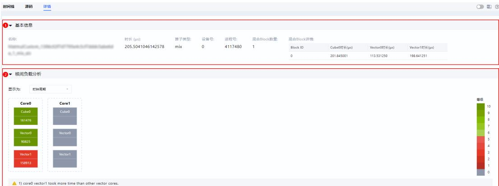  
图 5-22 详情界面

Roofline瓶颈分析

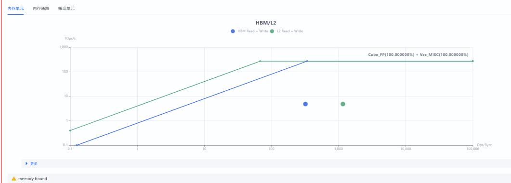  
计算工作负载分析

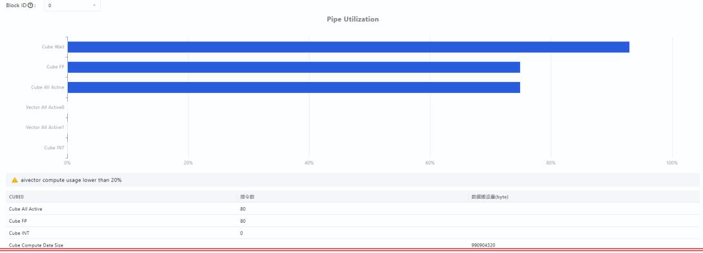  
内存负载分析

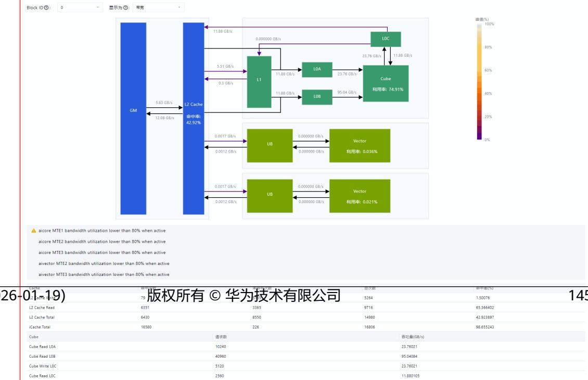  
文档版本 01 (2026-01-19)

区域一：基础信息（Base Info），可查看算子基础信息，包含名称、时长、类型等内容，详细说明如表5-10所示。

表 5-10 基本信息字段说明  

<table><tr><td rowspan=1 colspan=1>中文字段</td><td rowspan=1 colspan=1>英文字段</td><td rowspan=1 colspan=1>说明</td></tr><tr><td rowspan=1 colspan=1>名称</td><td rowspan=1 colspan=1>Name</td><td rowspan=1 colspan=1>算子名称。</td></tr><tr><td rowspan=1 colspan=1>时长 (μs)</td><td rowspan=1 colspan=1>Duration(μs)</td><td rowspan=1 colspan=1>算子总耗时。</td></tr><tr><td rowspan=1 colspan=1>算子类型</td><td rowspan=1 colspan=1>Op Type</td><td rowspan=1 colspan=1>算子类型。有mix、vector、cube和AiCore四种类型。</td></tr><tr><td rowspan=1 colspan=1>设备号</td><td rowspan=1 colspan=1>Device Id</td><td rowspan=1 colspan=1>设备id。</td></tr><tr><td rowspan=1 colspan=1>进程号</td><td rowspan=1 colspan=1>Pid</td><td rowspan=1 colspan=1>进程号。</td></tr><tr><td rowspan=1 colspan=1>Block数量</td><td rowspan=1 colspan=1>Block Dim</td><td rowspan=1 colspan=1>Sub Block的数量。当算子类型为vector、cube和AiCore时，为此参数名称。</td></tr><tr><td rowspan=1 colspan=1>混合Block数量</td><td rowspan=1 colspan=1>Mix BlockDim</td><td rowspan=1 colspan=1>Sub Block的数量。当算子类型为mix时，为此参数名称。</td></tr><tr><td rowspan=1 colspan=1>Block详情</td><td rowspan=1 colspan=1>Block Detail</td><td rowspan=1 colspan=1>Sub Block耗时详情。当算子类型为vector、cube和AiCore时，为此参数名称，其中字段解释如表5-11所示。</td></tr><tr><td rowspan=1 colspan=1>混合Block详情</td><td rowspan=1 colspan=1>Mix BlockDetail</td><td rowspan=1 colspan=1>Sub Block耗时详情。当算子类型为mix时，为此参数名称，其中字段解释如表5-12所示。</td></tr></table>

表 5-11 Block 详情字段说明  

<table><tr><td rowspan=1 colspan=1>中文字段</td><td rowspan=1 colspan=1>英文字段</td><td rowspan=1 colspan=1>说明</td></tr><tr><td rowspan=1 colspan=1>Block ID</td><td rowspan=1 colspan=1>Block ID</td><td rowspan=1 colspan=1>Sub Block序号。当算子类型为AiCore时，无此参数。</td></tr><tr><td rowspan=1 colspan=1>计算核类型</td><td rowspan=1 colspan=1>Core Type</td><td rowspan=1 colspan=1>Sub Block类型。</td></tr><tr><td rowspan=1 colspan=1>时长(us)</td><td rowspan=1 colspan=1>Duration (μs)</td><td rowspan=1 colspan=1>Sub Block耗时。</td></tr></table>

表 5-12 混合 Block 详情字段说明  

<table><tr><td colspan="1" rowspan="1">中文字段</td><td colspan="1" rowspan="1">英文字段</td><td colspan="1" rowspan="1">说明</td></tr><tr><td colspan="1" rowspan="1">Block ID</td><td colspan="1" rowspan="1">Block ID</td><td colspan="1" rowspan="1">SubBlock序号。</td></tr><tr><td colspan="1" rowspan="1">Cube0时长(μs)</td><td colspan="1" rowspan="1">Cube0 Duration(us)</td><td colspan="1" rowspan="1">Al Core的cube核耗时。</td></tr><tr><td colspan="1" rowspan="1">Vector0时长(μs)</td><td colspan="1" rowspan="1">Vector0Duration (μs)</td><td colspan="1" rowspan="1">Al Core的其中一个vector核耗时。</td></tr><tr><td colspan="1" rowspan="1">Vector1时长(us)</td><td colspan="1" rowspan="1">Vector1Duration (μs)</td><td colspan="1" rowspan="1">Al Core的另外一个vector核耗时。</td></tr></table>

区域二：核间负载分析（Core Occupancy），分别通过时钟周期数量、核总吞吐量、Cache命中率展示核间负载并进行分析，如图5-23所示。

可分别选择时钟周期（Cycles）、吞吐量（Throughput）或Cache命中率(%)（Cache Hit Rate $( \% )$ ）显示Core的占用率，并展示分析结果，便于开发者定位分析异常点。

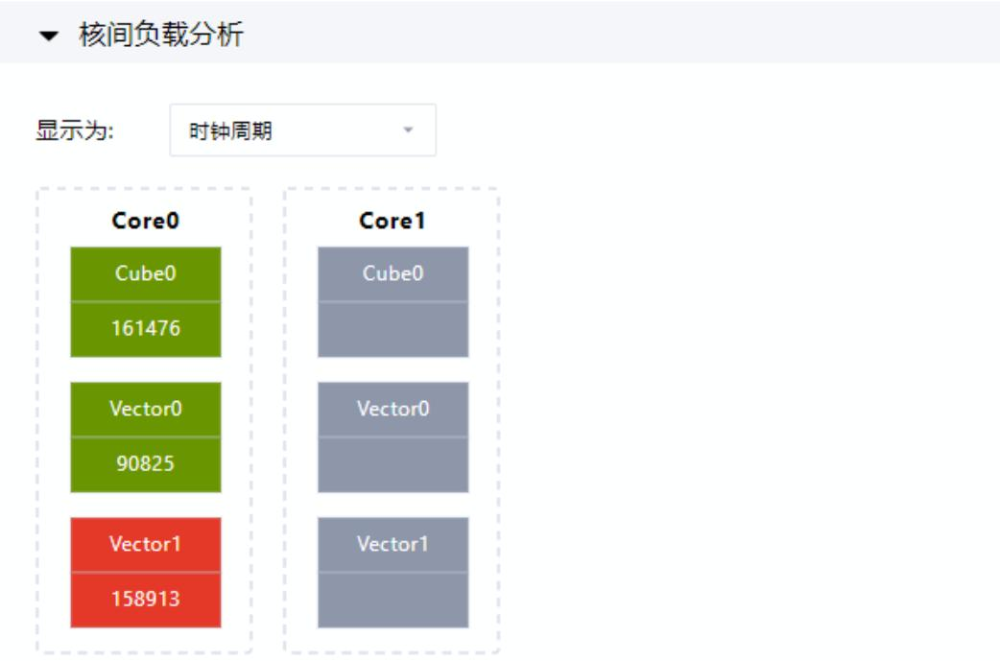  
图 5-23 核间负载分析

A 1) core0 vector1 took more time than other vector cores.

# 说明

● 仅Atlas A3 训练系列产品/Atlas A3 推理系列产品和Atlas A2 训练系列产品/Atlas A2推理系列产品导出的性能数据才支持此模块。  
如果相同类型计算单元之间的颜色相近，表示负载均衡度高。所有Core的Cube计算单元一起进行颜色对比，所有Core的Vector计算单元一起进行颜色对比。

● 区域三：Roofline瓶颈分析（Roofline），通过Roofline模型图展示算子性能，并对其结果进行分析，为开发者提供性能优化依据。Roofline模型图中的x轴为算数强度，单位是Ops/Byte，表示每字节（Byte）内存支持的操作次数；y轴为性能，单位是TOps/s，表示每秒钟可进行多少万亿次操作。

Roofline模型图上会显示算力名称，用于描述计算最大算力的指令类型组成，例如Cube_INT(100.000000%) + Vec_FP16(30.000000%),Vec_FP32(70.000000%)，代表此时cube计算单元处理的全是int类型指令，vector计算单元处理的指令30%是fp16类型，70%是fp32类型。

# 说明

仅Atlas A3 训练系列产品/Atlas A3 推理系列产品、Atlas A2 训练系列产品/Atlas A2 推理系列产品和Atlas 推理系列产品支持此模块。

当硬件产品为Atlas A3 训练系列产品/Atlas A3 推理系列产品和Atlas A2 训练系列产品/Atlas A2 推理系列产品时，Roofline性能模型分析包含内存单元、内存通路以及搬运单元页签。

内存单元：显示HBM/L2和Memory Unit模型图，如图5-24所示，参数解释如表5-13所示。

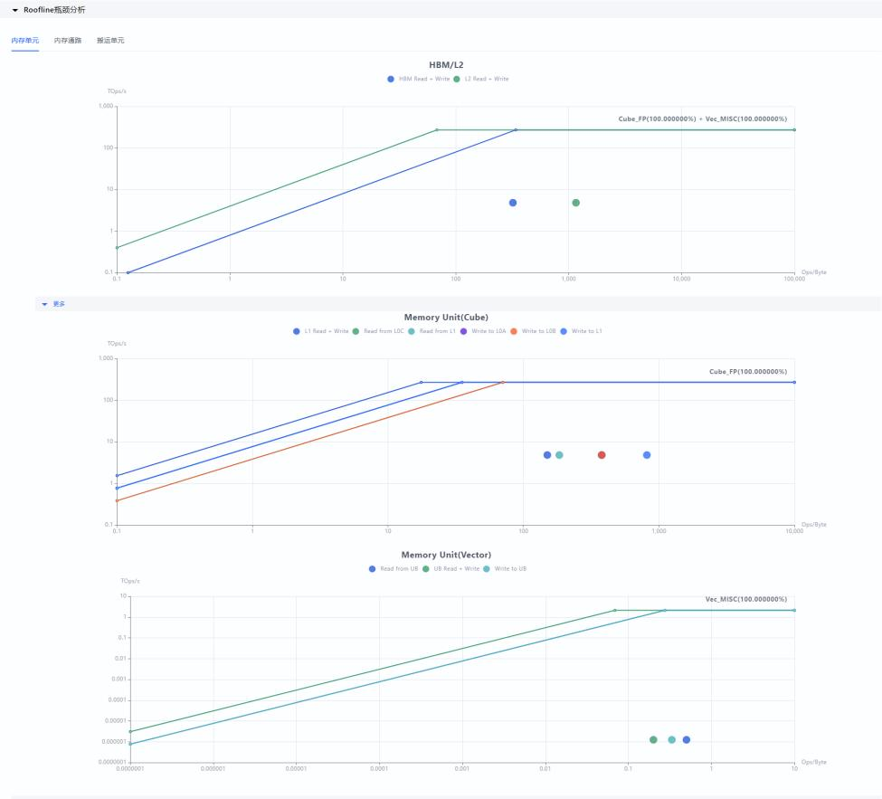  
图 5-24 内存单元

表 5-13 内存单元参数说明  

<table><tr><td colspan="1" rowspan="1">参数</td><td colspan="1" rowspan="1">说明</td></tr><tr><td colspan="1" rowspan="1">HBM Read + Write</td><td colspan="1" rowspan="1">高带宽存储器单元的读与写。</td></tr><tr><td colspan="1" rowspan="1">L2 Read + Write</td><td colspan="1" rowspan="1">L2的读与写。</td></tr><tr><td colspan="1" rowspan="1">L1 Read + Write</td><td colspan="1" rowspan="1">L1内存单元的读与写。</td></tr><tr><td colspan="1" rowspan="1">Write to L1</td><td colspan="1" rowspan="1">写至L1内存单元。</td></tr><tr><td colspan="1" rowspan="1">Read from L1</td><td colspan="1" rowspan="1">从L1内存单元的读。</td></tr><tr><td colspan="1" rowspan="1">Write to LOA</td><td colspan="1" rowspan="1">写至L0A内存单元。</td></tr><tr><td colspan="1" rowspan="1">Write to LOB</td><td colspan="1" rowspan="1">写至LOB内存单元。</td></tr><tr><td colspan="1" rowspan="1">Read from LOC</td><td colspan="1" rowspan="1">从L0C内存单元的读。</td></tr><tr><td colspan="1" rowspan="1">UB Read + Write</td><td colspan="1" rowspan="1">UB内存单元的读与写。</td></tr><tr><td colspan="1" rowspan="1">Read from UB</td><td colspan="1" rowspan="1">从UB内存单元的读。</td></tr><tr><td colspan="1" rowspan="1">Write to UB</td><td colspan="1" rowspan="1">写至UB内存单元。</td></tr><tr><td colspan="1" rowspan="1">Vector Read UB</td><td colspan="1" rowspan="1">Vector从UB内存单元的读。</td></tr><tr><td colspan="1" rowspan="1">Vector Write UB</td><td colspan="1" rowspan="1">Vector写至UB内存单元。</td></tr></table>

内存通路：显示内存搬运通路图，如图5-25所示，参数解释如表5-14所示。

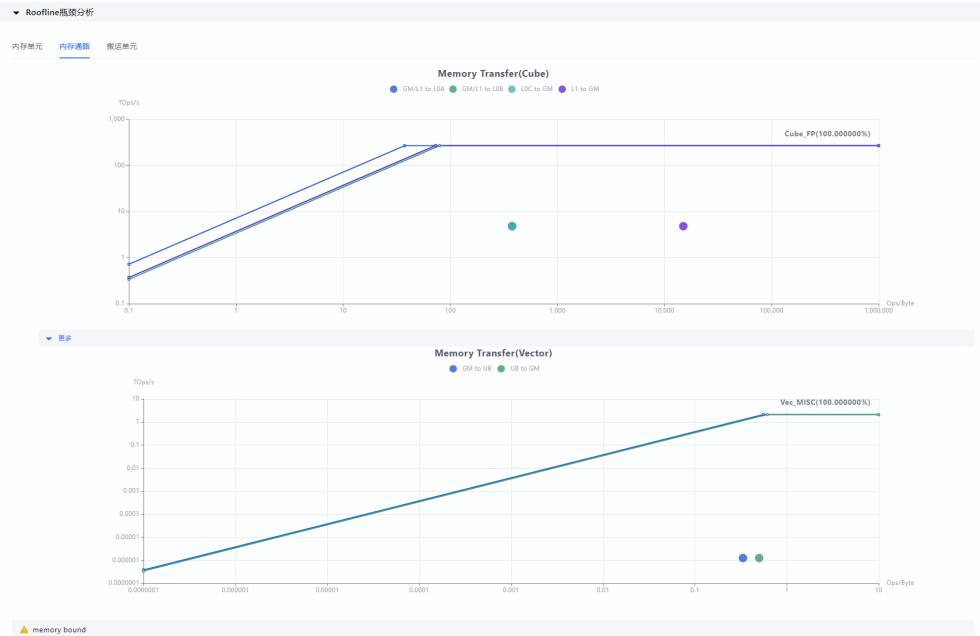  
图 5-25 内存通路

表 5-14 内存通路参数说明  

<table><tr><td colspan="1" rowspan="1">参数</td><td colspan="1" rowspan="1">说明</td></tr><tr><td colspan="1" rowspan="1">GM/L1 to LOA</td><td colspan="1" rowspan="1">GM/L1至L0A的内存通路。</td></tr><tr><td colspan="1" rowspan="1">GM/L1 to LOB</td><td colspan="1" rowspan="1">GM/L1至L0B的内存通路。</td></tr><tr><td colspan="1" rowspan="1">LOC to GM</td><td colspan="1" rowspan="1">L0C至GM的内存通路。</td></tr><tr><td colspan="1" rowspan="1">L1 to GM</td><td colspan="1" rowspan="1">L1至GM的内存通路。</td></tr><tr><td colspan="1" rowspan="1">LOC to L1</td><td colspan="1" rowspan="1">L0C至L1的内存通路。</td></tr><tr><td colspan="1" rowspan="1">GM to UB</td><td colspan="1" rowspan="1">GM至UB的内存通路。</td></tr><tr><td colspan="1" rowspan="1">UB to GM</td><td colspan="1" rowspan="1">UB至GM的内存通路。</td></tr></table>

搬运单元：显示Pipeline模型图，如图5-26所示，参数解释如表5-15所示。

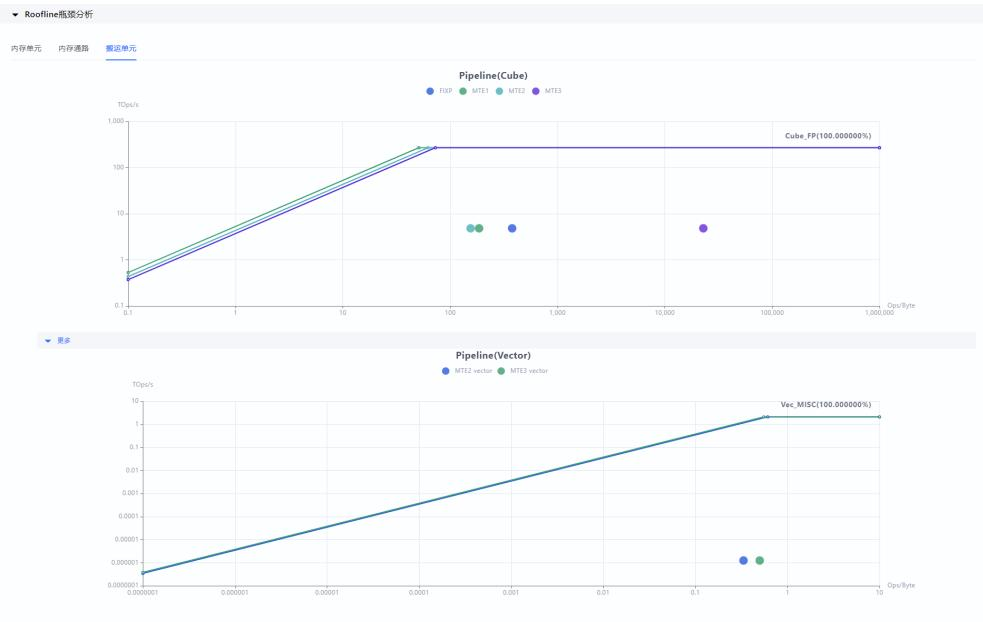  
图 5-26 搬运单元

表 5-15 搬运单元参数说明  

<table><tr><td rowspan=1 colspan=1>参数</td><td rowspan=1 colspan=1>说明</td></tr><tr><td rowspan=1 colspan=1>MTE1</td><td rowspan=1 colspan=1>MTE1通路。</td></tr><tr><td rowspan=1 colspan=1>MTE2</td><td rowspan=1 colspan=1>MTE2通路。</td></tr><tr><td rowspan=1 colspan=1>MTE3</td><td rowspan=1 colspan=1>MTE3通路。</td></tr><tr><td rowspan=1 colspan=1>FIXP</td><td rowspan=1 colspan=1>FIXP通路。</td></tr><tr><td rowspan=1 colspan=1>MTE2 vector</td><td rowspan=1 colspan=1>Vector计算单元的MTE2通路。</td></tr><tr><td rowspan=1 colspan=1>MTE3 vector</td><td rowspan=1 colspan=1>Vector计算单元的MTE3通路。</td></tr></table>

当硬件产品为Atlas 推理系列产品时，仅存在内存单元内容，如图5-27所示，参数解释如表5-16所示。

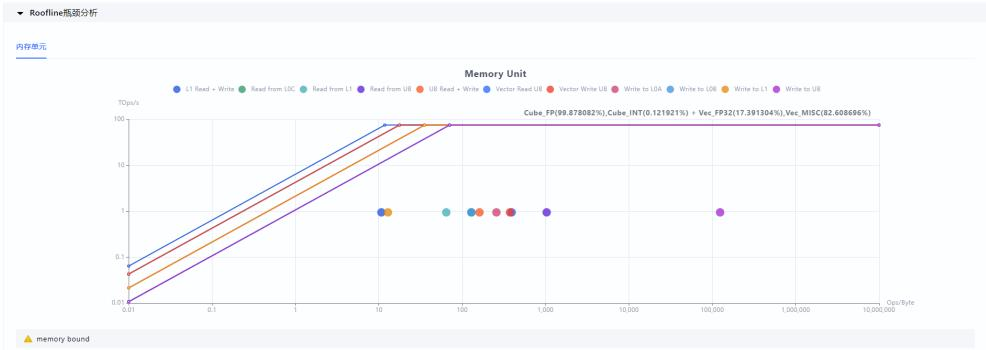  
图 5-27 内存单元模型图

表 5-16 内存单元参数说明  

<table><tr><td rowspan=1 colspan=1>参数</td><td rowspan=1 colspan=1>说明</td></tr><tr><td rowspan=1 colspan=1>L1 Read + Write</td><td rowspan=1 colspan=1>L1内存单元的读与写。</td></tr><tr><td rowspan=1 colspan=1>Read from LOC</td><td rowspan=1 colspan=1>从L0C内存单元的读。</td></tr><tr><td rowspan=1 colspan=1>Read from L1</td><td rowspan=1 colspan=1>从L1内存单元的读。</td></tr><tr><td rowspan=1 colspan=1>Read from UB</td><td rowspan=1 colspan=1>从UB内存单元的读。</td></tr><tr><td rowspan=1 colspan=1>UB Read + Write</td><td rowspan=1 colspan=1>UB内存单元的读与写。</td></tr><tr><td rowspan=1 colspan=1>Vector Read UB</td><td rowspan=1 colspan=1>Vector从UB内存单元的读。</td></tr><tr><td rowspan=1 colspan=1>Vector Write UB</td><td rowspan=1 colspan=1>Vector写至UB内存单元。</td></tr><tr><td rowspan=1 colspan=1>Write to LOA</td><td rowspan=1 colspan=1>写至L0A内存单元。</td></tr><tr><td rowspan=1 colspan=1>Write to LOB</td><td rowspan=1 colspan=1>写至LOB内存单元。</td></tr><tr><td rowspan=1 colspan=1>Write to L1</td><td rowspan=1 colspan=1>写至L1内存单元。</td></tr><tr><td rowspan=1 colspan=1>Write to UB</td><td rowspan=1 colspan=1>写至UB内存单元。</td></tr></table>

区域四：计算工作负载分析（Compute Workload Analysis），以柱状图和数据窗格呈现方式查看相应信息，便于开发人员分析。如图5-28所示，参数解释如表5-17所示。图标 中的内容为各个Block的计算负载分析结果。

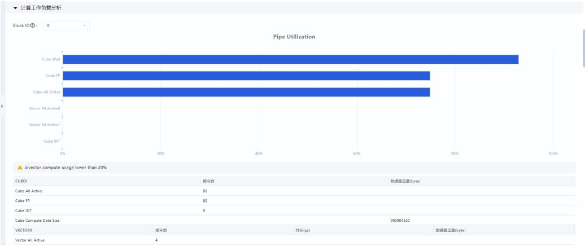  
图 5-28 计算工作负载分析

表 5-17 计算工作负载分析参数说明  

<table><tr><td colspan="1" rowspan="1">中文参数</td><td colspan="1" rowspan="1">英文参数</td><td colspan="1" rowspan="1">说明</td></tr><tr><td colspan="1" rowspan="1">Block ID</td><td colspan="1" rowspan="1">Block ID</td><td colspan="1" rowspan="1">Sub Block序号。可通过切换Block ID来查看对应信息。当算子类型为AiCore时，此参数显示NA，展示的是多核平均值。</td></tr><tr><td colspan="1" rowspan="1">PipeUtilization</td><td colspan="1" rowspan="1">Pipe Utilization</td><td colspan="1" rowspan="1">Pipe（指令队列）可视化，以柱状图方式展示。横坐标：Cycles占比，计算方式为Cycles/总的Cycles。Cycles为该指令在Sub Block上执行消耗的时钟周期。纵坐标：算子指令，由bin文件的数据中提供。</td></tr><tr><td colspan="1" rowspan="1">CUBE</td><td colspan="1" rowspan="1">CUBE</td><td colspan="1" rowspan="1">cube类型的指令名称。当算子类型为cube时，显示此参数。</td></tr><tr><td colspan="1" rowspan="1">CUBEO</td><td colspan="1" rowspan="1">CUBEO</td><td colspan="1" rowspan="1">cube类型的指令名称。当算子类型为mix时，显示此参数。</td></tr><tr><td colspan="1" rowspan="1">VECTOR</td><td colspan="1" rowspan="1">VECTOR</td><td colspan="1" rowspan="1">vector类型的指令名称。当算子类型为vector时，显示此参数。</td></tr><tr><td colspan="1" rowspan="1">VECTORO</td><td colspan="1" rowspan="1">VECTORO</td><td colspan="1" rowspan="1">vector类型的指令名称。当算子类型为mix时，显示此参数。</td></tr><tr><td colspan="1" rowspan="1">VECTOR1</td><td colspan="1" rowspan="1">VECTOR1</td><td colspan="1" rowspan="1">vector类型的指令名称。当算子类型为mix时，显示此参数。</td></tr><tr><td colspan="1" rowspan="1">AICORE</td><td colspan="1" rowspan="1">AICORE</td><td colspan="1" rowspan="1">AiCore类型的指令名称。当算子类型为AiCore时，显示此参数。</td></tr><tr><td colspan="1" rowspan="1">指令数</td><td colspan="1" rowspan="1">Instructions</td><td colspan="1" rowspan="1">算子指令数量。</td></tr><tr><td colspan="1" rowspan="1">时长(us)</td><td colspan="1" rowspan="1">Duration(μs)</td><td colspan="1" rowspan="1">算子指令耗时。</td></tr><tr><td colspan="1" rowspan="1">数据搬运量(byte)</td><td colspan="1" rowspan="1">DataVolume(byte)</td><td colspan="1" rowspan="1">算子指令数据量。</td></tr></table>

区域五：内存负载分析（Memory Workload Analysis），以内存热力图和数据窗格呈现方式查看相应信息，如图5-29所示，参数配置如表5-18所示。热力图左侧的“Peak”为箭头颜色，值为峰值带占比（最大带宽占比）。图标 中的内容为各个Block的内存负载分析结果。

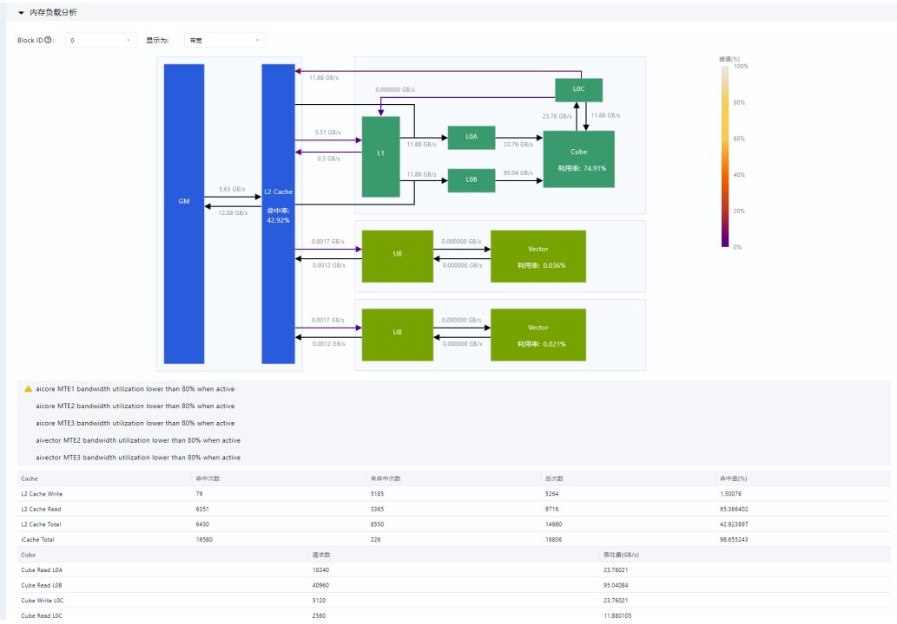  
图 5-29 内存负载分析

表 5-18 参数配置说明  

<table><tr><td rowspan=1 colspan=1>中文参数</td><td rowspan=1 colspan=1>英文参数</td><td rowspan=1 colspan=1>说明</td></tr><tr><td rowspan=1 colspan=1>Block ID</td><td rowspan=1 colspan=1>Block ID</td><td rowspan=1 colspan=1>Sub Block序号。在BlockID选框中可以选择想要查看的Sub Block。当算子类型为AiCore时，BlockID显示NA，展示的是多核平均值。</td></tr><tr><td rowspan=1 colspan=1>显示为</td><td rowspan=1 colspan=1>Show As</td><td rowspan=1 colspan=1>可选项，选择热力图连线箭头内容以请求数或者带宽展示。热力图箭头代表流向。. 请求数（Num of Request）带宽（Bandwidth）</td></tr></table>

数据窗格呈现内容随算子类型而变化，其内容是基于bin文件的数据解析结果，具体呈现如下：

当算子类型为AiCore时，表格窗格参数解释如表5-19所示。

表 5-19 AiCore 类型参数说明  

<table><tr><td rowspan=1 colspan=1>中文参数</td><td rowspan=1 colspan=1>英文参数</td><td rowspan=1 colspan=1>说明</td></tr><tr><td rowspan=1 colspan=1>Cache</td><td rowspan=1 colspan=1>Cache</td><td rowspan=1 colspan=1>L2缓存。</td></tr><tr><td rowspan=1 colspan=1>Cube</td><td rowspan=1 colspan=1>Cube</td><td rowspan=1 colspan=1>cube计算单元。</td></tr><tr><td rowspan=1 colspan=1>HBM</td><td rowspan=1 colspan=1>HBM</td><td rowspan=1 colspan=1>高带宽存储器单元。</td></tr><tr><td rowspan=1 colspan=1>LOA</td><td rowspan=1 colspan=1>LOA</td><td rowspan=1 colspan=1>LOA储存单元。</td></tr><tr><td rowspan=1 colspan=1>LOB</td><td rowspan=1 colspan=1>LOB</td><td rowspan=1 colspan=1>LOB储存单元。</td></tr><tr><td rowspan=1 colspan=1>LOC</td><td rowspan=1 colspan=1>LOC</td><td rowspan=1 colspan=1>LOC储存单元。</td></tr><tr><td rowspan=1 colspan=1>L1</td><td rowspan=1 colspan=1>L1</td><td rowspan=1 colspan=1>L1储存单元。</td></tr><tr><td rowspan=1 colspan=1>Pipe</td><td rowspan=1 colspan=1>Pipe</td><td rowspan=1 colspan=1>计算通路。</td></tr><tr><td rowspan=1 colspan=1>UB</td><td rowspan=1 colspan=1>UB</td><td rowspan=1 colspan=1>ub储存单元。</td></tr><tr><td rowspan=1 colspan=1>Vector</td><td rowspan=1 colspan=1>Vector</td><td rowspan=1 colspan=1>vector计算单元。</td></tr><tr><td rowspan=1 colspan=1>请求数</td><td rowspan=1 colspan=1>Requests</td><td rowspan=1 colspan=1>操作数量。</td></tr><tr><td rowspan=1 colspan=1>吞吐量(GB/s)</td><td rowspan=1 colspan=1>Throughput(GB/s)</td><td rowspan=1 colspan=1>吞吐量，表示通路每秒的传输数据量，单位为GB/s。</td></tr></table>

当算子类型为mix时，表格窗格参数解释如表5-20所示。

表 $\mathsf { \pmb { 5 - 2 0 } } \mathsf { m i x }$ 类型参数说明  

<table><tr><td colspan="1" rowspan="1">中文参数</td><td colspan="1" rowspan="1">英文参数</td><td colspan="1" rowspan="1">说明</td></tr><tr><td colspan="1" rowspan="1">Cache</td><td colspan="1" rowspan="1">Cache</td><td colspan="1" rowspan="1">L2缓存。</td></tr><tr><td colspan="1" rowspan="1">命中次数</td><td colspan="1" rowspan="1">Hit</td><td colspan="1" rowspan="1">cache命中次数。</td></tr><tr><td colspan="1" rowspan="1">未命中次数</td><td colspan="1" rowspan="1">Miss</td><td colspan="1" rowspan="1">cache未命中后重新分配缓存的次数。</td></tr><tr><td colspan="1" rowspan="1">总次数</td><td colspan="1" rowspan="1">Total</td><td colspan="1" rowspan="1">cache请求总次数。</td></tr><tr><td colspan="1" rowspan="1">命中率(%)</td><td colspan="1" rowspan="1">Hit Rate(%)</td><td colspan="1" rowspan="1">cache命中率。</td></tr><tr><td colspan="1" rowspan="1">Cube</td><td colspan="1" rowspan="1">Cube</td><td colspan="1" rowspan="1">cube计算单元。</td></tr><tr><td colspan="1" rowspan="1">HBM Cube</td><td colspan="1" rowspan="1">HBM Cube</td><td colspan="1" rowspan="1">cube单元的高带宽存储器单元。</td></tr><tr><td colspan="1" rowspan="1">HBM VectorCore0</td><td colspan="1" rowspan="1">HBM VectorCore0</td><td colspan="1" rowspan="1">AICORE内core0的vector单元的高带宽存储器单元。</td></tr><tr><td colspan="1" rowspan="1">HBM VectorCore1</td><td colspan="1" rowspan="1">HBM VectorCore1</td><td colspan="1" rowspan="1">AICORE内core1的vector单元的高带宽存储器单元。</td></tr><tr><td colspan="1" rowspan="1">LOA</td><td colspan="1" rowspan="1">LOA</td><td colspan="1" rowspan="1">LOA储存单元。</td></tr><tr><td colspan="1" rowspan="1">LOB</td><td colspan="1" rowspan="1">LOB</td><td colspan="1" rowspan="1">LOB储存单元。</td></tr><tr><td colspan="1" rowspan="1">LOC</td><td colspan="1" rowspan="1">LOC</td><td colspan="1" rowspan="1">LOC储存单元。</td></tr><tr><td colspan="1" rowspan="1">L1</td><td colspan="1" rowspan="1">L1</td><td colspan="1" rowspan="1">L1储存单元。</td></tr><tr><td colspan="1" rowspan="1">请求数</td><td colspan="1" rowspan="1">Requests</td><td colspan="1" rowspan="1">操作数量。</td></tr><tr><td colspan="1" rowspan="1">吞吐量(GB/s)</td><td colspan="1" rowspan="1">Throughput(GB/s)</td><td colspan="1" rowspan="1">吞吐量，表示通路每秒的传输数据量，单位为GB/s。</td></tr><tr><td colspan="1" rowspan="1">峰值（最大带宽占比）(%)</td><td colspan="1" rowspan="1">Peak(%)</td><td colspan="1" rowspan="1">与理论带宽的比率。</td></tr><tr><td colspan="1" rowspan="1">Pipe Cube</td><td colspan="1" rowspan="1">Pipe Cube</td><td colspan="1" rowspan="1">cube单元的计算通路。</td></tr><tr><td colspan="1" rowspan="1">Pipe VectorCore0</td><td colspan="1" rowspan="1">Pipe VectorCore0</td><td colspan="1" rowspan="1">AICORE内core0的vector单元的计算通路。</td></tr><tr><td colspan="1" rowspan="1">Pipe VectorCore1</td><td colspan="1" rowspan="1">Pipe VectorCore1</td><td colspan="1" rowspan="1">AICORE内core1的vector单元的计算通路。</td></tr><tr><td colspan="1" rowspan="1">指令数</td><td colspan="1" rowspan="1">Instructions</td><td colspan="1" rowspan="1">指令数量。</td></tr><tr><td colspan="1" rowspan="1">时钟周期</td><td colspan="1" rowspan="1">Cycle</td><td colspan="1" rowspan="1">通路消耗的时钟周期。</td></tr><tr><td colspan="1" rowspan="1">等待周期</td><td colspan="1" rowspan="1">Wait Cycles</td><td colspan="1" rowspan="1">对应pipe上被阻塞的cycle数。</td></tr><tr><td colspan="1" rowspan="1">活跃率（%）</td><td colspan="1" rowspan="1">ActiveRate(%)</td><td colspan="1" rowspan="1">运行cycle数占总的cycle的百分比。</td></tr><tr><td colspan="1" rowspan="1">UB Core0</td><td colspan="1" rowspan="1">UB Core0</td><td colspan="1" rowspan="1">mix算子AICORE内core0的ub储存单元。</td></tr><tr><td colspan="1" rowspan="1">UB Core1</td><td colspan="1" rowspan="1">UB Core1</td><td colspan="1" rowspan="1">mix算子AICORE内core1的ub储存单元。</td></tr><tr><td colspan="1" rowspan="1">Vector</td><td colspan="1" rowspan="1">Vector core0</td><td colspan="1" rowspan="1">vector计算单元。</td></tr></table>

当算子类型为vector时，表格窗格参数解释如表5-21所示。

表 5-21 vector 类型参数说明  

<table><tr><td colspan="1" rowspan="1">中文参数</td><td colspan="1" rowspan="1">英文参数</td><td colspan="1" rowspan="1">说明</td></tr><tr><td colspan="1" rowspan="1">Cache</td><td colspan="1" rowspan="1">Cache</td><td colspan="1" rowspan="1">L2缓存。</td></tr><tr><td colspan="1" rowspan="1">命中次数</td><td colspan="1" rowspan="1">Hit</td><td colspan="1" rowspan="1">cache命中次数。</td></tr><tr><td colspan="1" rowspan="1">未命中次数</td><td colspan="1" rowspan="1">Miss</td><td colspan="1" rowspan="1">cache未命中后重新分配缓存的次数。</td></tr><tr><td colspan="1" rowspan="1">总次数</td><td colspan="1" rowspan="1">Total</td><td colspan="1" rowspan="1">cache请求总次数。</td></tr><tr><td colspan="1" rowspan="1">命中率(%)</td><td colspan="1" rowspan="1">Hit Rate(%)</td><td colspan="1" rowspan="1">cache命中率。</td></tr><tr><td colspan="1" rowspan="1">HBM</td><td colspan="1" rowspan="1">HBM</td><td colspan="1" rowspan="1">高带宽存储器单元。</td></tr><tr><td colspan="1" rowspan="1">请求数</td><td colspan="1" rowspan="1">Requests</td><td colspan="1" rowspan="1">操作数量。</td></tr><tr><td colspan="1" rowspan="1">吞吐量(GB/s)</td><td colspan="1" rowspan="1">Throughput(GB/s)</td><td colspan="1" rowspan="1">吞吐量，表示通路每秒的传输数据量，单位为GB/s。</td></tr><tr><td colspan="1" rowspan="1">Pipe</td><td colspan="1" rowspan="1">Pipe</td><td colspan="1" rowspan="1">计算通路。</td></tr><tr><td colspan="1" rowspan="1">指令数</td><td colspan="1" rowspan="1">Instructions</td><td colspan="1" rowspan="1">指令数量。</td></tr><tr><td colspan="1" rowspan="1">时钟周期</td><td colspan="1" rowspan="1">Cycle</td><td colspan="1" rowspan="1">通路消耗的时钟周期。</td></tr><tr><td colspan="1" rowspan="1">等待周期</td><td colspan="1" rowspan="1">Wait Cycles</td><td colspan="1" rowspan="1">对应pipe上被阻塞的cycle数。</td></tr><tr><td colspan="1" rowspan="1">活跃率（%）</td><td colspan="1" rowspan="1">ActiveRate(%)</td><td colspan="1" rowspan="1">运行cycle数占总的cycle的百分比。</td></tr><tr><td colspan="1" rowspan="1">UB</td><td colspan="1" rowspan="1">UB</td><td colspan="1" rowspan="1">ub储存单元。</td></tr><tr><td colspan="1" rowspan="1">Vector</td><td colspan="1" rowspan="1">Vector</td><td colspan="1" rowspan="1">vector计算单元。</td></tr><tr><td colspan="1" rowspan="1">峰值（最大带宽占比） (%)</td><td colspan="1" rowspan="1">Peak(%)</td><td colspan="1" rowspan="1">与理论带宽的比率。</td></tr></table>

当算子类型为cube时，表格窗格参数解释如表5-22所示。

表 5-22 cube 类型参数说明  

<table><tr><td colspan="1" rowspan="1">中文参数</td><td colspan="1" rowspan="1">英文参数</td><td colspan="1" rowspan="1">说明</td></tr><tr><td colspan="1" rowspan="1">Cache</td><td colspan="1" rowspan="1">Cache</td><td colspan="1" rowspan="1">L2缓存。</td></tr><tr><td colspan="1" rowspan="1">命中次数</td><td colspan="1" rowspan="1">Hit</td><td colspan="1" rowspan="1">cache命中次数。</td></tr><tr><td colspan="1" rowspan="1">未命中次数</td><td colspan="1" rowspan="1">Miss</td><td colspan="1" rowspan="1">cache未命中后重新分配缓存的次数。</td></tr><tr><td colspan="1" rowspan="1">总次数</td><td colspan="1" rowspan="1">Total</td><td colspan="1" rowspan="1">cache请求总次数。</td></tr><tr><td colspan="1" rowspan="1">命中率(%)</td><td colspan="1" rowspan="1">Hit Rate(%)</td><td colspan="1" rowspan="1">cache命中率。</td></tr><tr><td colspan="1" rowspan="1">Cube</td><td colspan="1" rowspan="1">Cube</td><td colspan="1" rowspan="1">cube计算单元。</td></tr><tr><td colspan="1" rowspan="1">HBM</td><td colspan="1" rowspan="1">HBM</td><td colspan="1" rowspan="1">高带宽存储器单元。</td></tr><tr><td colspan="1" rowspan="1">LOA</td><td colspan="1" rowspan="1">LOA</td><td colspan="1" rowspan="1">LOA储存单元。</td></tr><tr><td colspan="1" rowspan="1">LOB</td><td colspan="1" rowspan="1">LOB</td><td colspan="1" rowspan="1">LOB储存单元。</td></tr><tr><td colspan="1" rowspan="1">LOC</td><td colspan="1" rowspan="1">LOC</td><td colspan="1" rowspan="1">LOC储存单元。</td></tr><tr><td colspan="1" rowspan="1">L1</td><td colspan="1" rowspan="1">L1</td><td colspan="1" rowspan="1">L1储存单元。</td></tr><tr><td colspan="1" rowspan="1">请求数</td><td colspan="1" rowspan="1">Requests</td><td colspan="1" rowspan="1">操作数量。</td></tr><tr><td colspan="1" rowspan="1">吞吐量(GB/s)</td><td colspan="1" rowspan="1">Throughput(GB/s)</td><td colspan="1" rowspan="1">吞吐量，表示通路每秒的传输数据量，单位为GB/s。</td></tr><tr><td colspan="1" rowspan="1">峰值（最大带宽占比）(%)</td><td colspan="1" rowspan="1">Peak(%)</td><td colspan="1" rowspan="1">与理论带宽的比率。</td></tr><tr><td colspan="1" rowspan="1">Pipe</td><td colspan="1" rowspan="1">Pipe</td><td colspan="1" rowspan="1">计算通路。</td></tr><tr><td colspan="1" rowspan="1">指令数</td><td colspan="1" rowspan="1">Instructions</td><td colspan="1" rowspan="1">指令数量。</td></tr><tr><td colspan="1" rowspan="1">时钟周期</td><td colspan="1" rowspan="1">Cycle</td><td colspan="1" rowspan="1">通路消耗的时钟周期。</td></tr><tr><td colspan="1" rowspan="1">等待周期</td><td colspan="1" rowspan="1">Wait Cycles</td><td colspan="1" rowspan="1">对应pipe上被阻塞的cycle数。</td></tr><tr><td colspan="1" rowspan="1">活跃率（%）</td><td colspan="1" rowspan="1">ActiveRate(%)</td><td colspan="1" rowspan="1">运行cycle数占总的cycle的百分比。</td></tr></table>

# 5.4.2 使用说明

# 查看 Cycles

在“Pipe Utilization”柱状图区域，鼠标滚动至对应指令柱状图上，会显示真实Cycles信息。如图5-30所示。

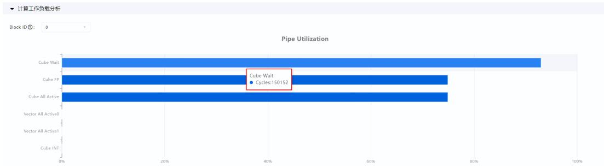  
图 5-30 查看 Cycles

# 在 Roofline 模型性能图中查看算子性能

在“Roofline瓶颈分析”区域的内存单元、内存通路或搬运单元的任意一个视图中，选择视图中对应的参数点，可悬浮显示该内存单元实际的性能信息，如图5-31所示，参数解释如表5-23所示。

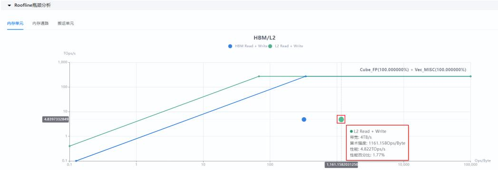  
图 5-31 显示算子性能信息

表 5-23 性能信息参数说明  

<table><tr><td rowspan=1 colspan=1>中文参数</td><td rowspan=1 colspan=1>英文参数</td><td rowspan=1 colspan=1>说明</td></tr><tr><td rowspan=1 colspan=1>带宽</td><td rowspan=1 colspan=1>Bandwidth</td><td rowspan=1 colspan=1>硬件的带宽上限。</td></tr><tr><td rowspan=1 colspan=1>算术强度</td><td rowspan=1 colspan=1>Arithmetic Intensity</td><td rowspan=1 colspan=1>对应×轴，表示单位内存可以支持的操作次数。</td></tr><tr><td rowspan=1 colspan=1>性能</td><td rowspan=1 colspan=1>Performance</td><td rowspan=1 colspan=1>对应y轴，表示单位时间的操作次数，每秒钟可进行多少万亿次操作。</td></tr><tr><td rowspan=1 colspan=1>性能百分比</td><td rowspan=1 colspan=1>Performance Ratio</td><td rowspan=1 colspan=1>性能百分比=算子运行的实际性能／硬件最佳性能。</td></tr></table>

# 支持算子间性能对比

MindStudio Insight支持两算子间详情对比，可帮助开发者直观明了地查看两个算子间的差异，便于分析。进行算子详情比对前需要先设置基线算子和对比算子，设置操作可参考数据对比。

在算子对比模式下，详情（Details）界面分别从基础信息（Base Info）、核负载分析（Core Occupancy）、计算工作负载分析（Compute Workload Analysis）、内存负载分析（Memory Workload Analysis）方面呈现对比数据。算子对比功能仅支持同类型的算子进行对比。

● 基础信息（Base Info）：对算子间的基础信息进行对比。核间负载分析（Core Occupancy）：以对比数据为基准，如果对比数据中有核间负载分析数据，则界面支持显示；如果对比数据中无核间负载分析数据，则界面不显示核间负载分析内容。  
● Roofline瓶颈分析（Roofline）：此模块暂不支持对比，如果对比数据中有此模块，在算子对比模式下，会显示对比数据中的内容。计算工作负载分析（Compute Workload Analysis）：以柱状图和数据窗格呈现方式查看相应信息，柱状图中蓝色为对比数据，绿色为基线数据，数据窗格显示算子间的对比差异，单击“详情”列中“查看更多”，可展示基线数据和对比数据的详情，如图5-32所示。

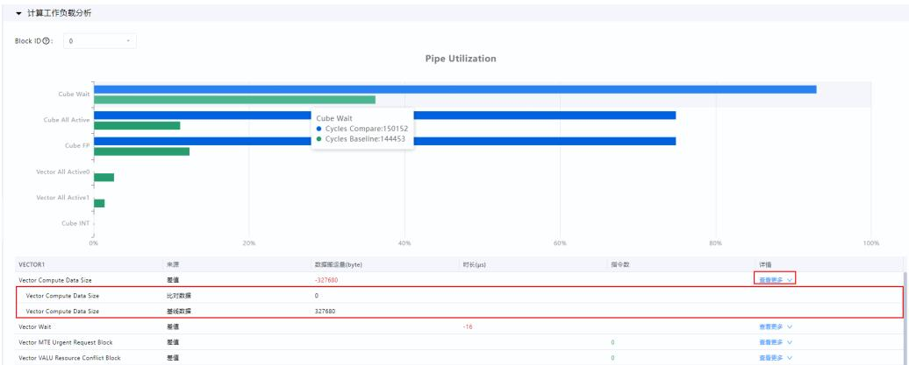  
图 5-32 计算工作负载分析对比

内存负载分析（Memory Workload Analysis）：以内存热力图和数据窗格呈现方式查看相应信息，热力图中括号里的数据为基线数据，括号外的数据为对比数

据，数据窗格显示算子间的对比差异，单击“详情”列中“查看更多”，可展示基线数据和对比数据的详情，如图5-33所示。

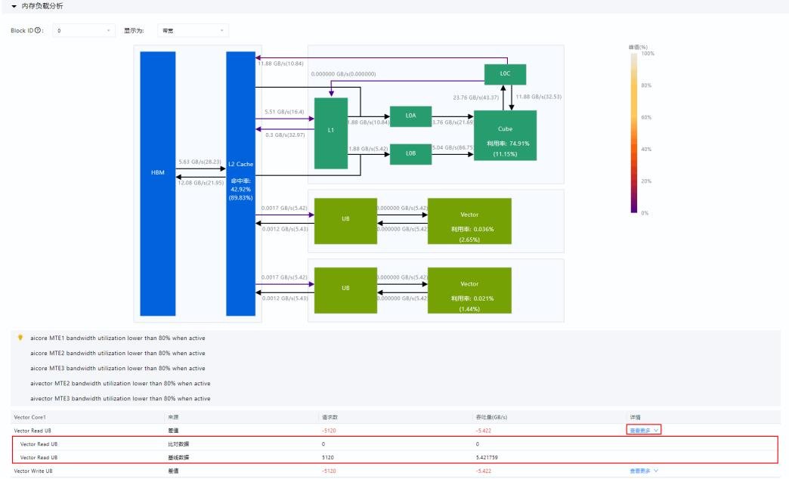  
图 5-33 内存负载分析对比

# 5.5 缓存（Cache）

# 5.5.1 界面介绍

功能说明

# 界面展示

缓存（Cache）界面支持展示用户程序Kernel函数内的L2 Cache访问情况，以便用户优化Cache命中率。

请参见3.2 导入数据章节，导入算子调优工具（msProf）采集的bin文件，获取bin文件请参见《算子开发工具用户指南》中“算子调优（msProf） > 工具使用”章节的“msprof op”内容。

缓存（Cache）界面主要展示用户程序Kernel函数内的L2 Cache访问情况，如图5-34所示。单击缓存（Cache）界面中的任意一个图，可将所选图放大查看。

选择单个内存单元，可显示该内存单元的详情，包括缓存行索引、事件次数和事件占比。

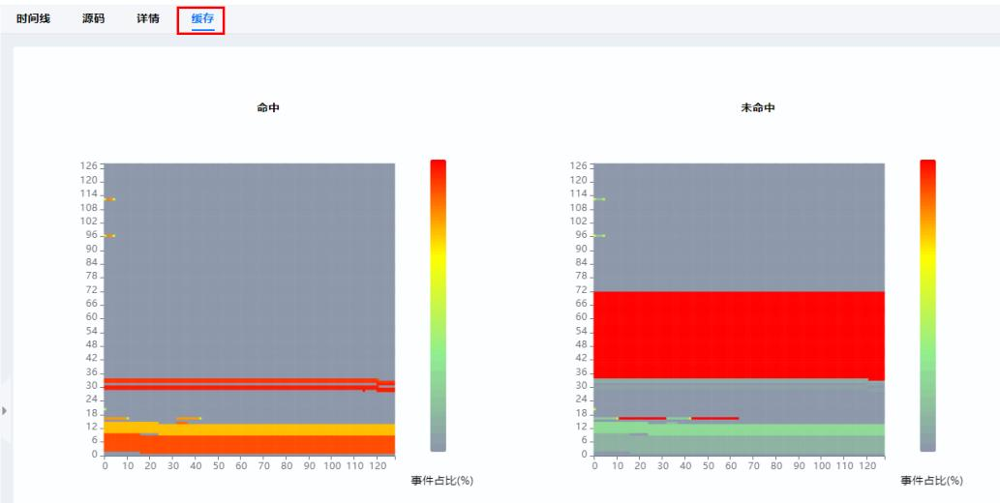  
图 5-34 缓存界面

# 5.5.2 使用说明

# 事件图支持与源码联动

在缓存（Cache）界面，选择命中和未命中事件图，单击放大，在放大的事件图中右键单击所选内存单元格，选择“显示指令”，可跳转至源码（Source）界面，并高亮显示与之相关的指令行，如图5-35所示。

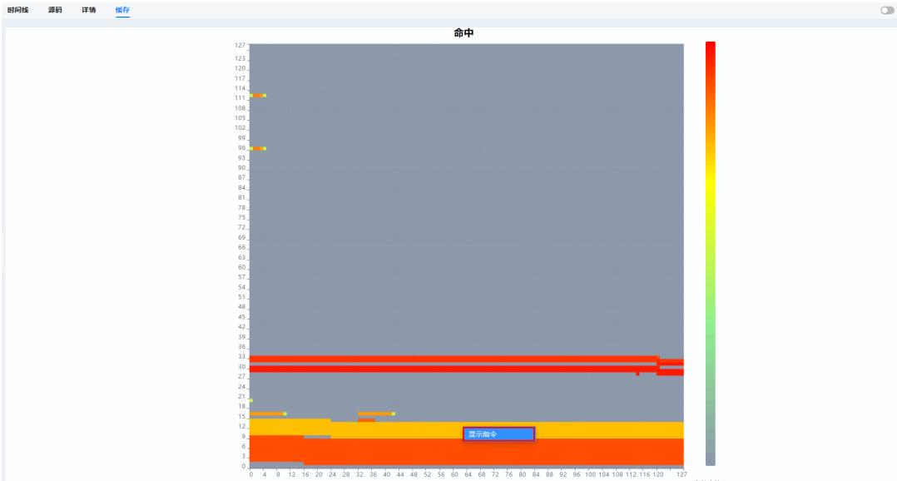  
图 5-35 跳转指令表

导入性能数据时间线（Timeline）折线图（Curve）

# 6.1 导入性能数据

MindStudio Insight支持导入性能数据文件，并以图形化形式呈现相关内容。服务化调优场景支持导入可视化折线图的SQLite数据库文件和推理服务化请求trace数据的json文件，文件名称分别为profiler.db和chrome_tracing.json，获取方式请参见《性能调优工具指南》中的“msServiceProfiler服务化调优工具 > msServiceProfiler服务化调优 >数据解析 > 执行解析”章节。

# 说明

导入时需选中chrome_tracing.json或profiler.db文件才可成功导入。

# 6.2 时间线（Timeline）

# 6.2.1 界面介绍

# 功能说明

在服务化调优过程中，MindStudio Insight工具以时间线（Timeline）的呈现方式，将请求端到端的执行情况平铺在时间轴上，直观体现请求在各个关键阶段的耗时情况以及当下请求的状态信息。通过分析时间线，用户可以快速识别服务化性能瓶颈，并根据问题现象，调整调优策略。

# 界面展示

时间线（Timeline）界面包含工具栏（区域一）、图形化展示（区域二）和数据窗格（区域三）三个部分，如图6-1所示。

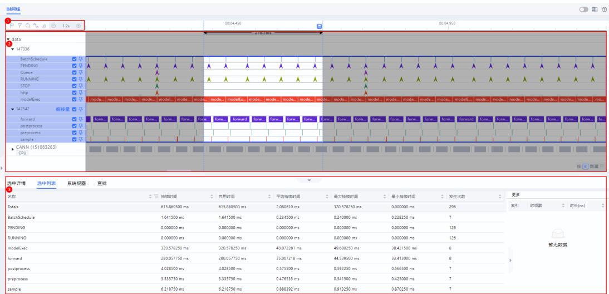  
图 6-1 时间线界面

区域一：工具栏，包含常用快捷按钮，从左至右依次为标记列表、过滤（支持按卡或按泳道过滤展示）、搜索、连线事件、重置缩放（页面复原）和时间轴缩小放大按钮。

区域二：图形化展示，左侧显示服务化采集的性能数据，一层级为进程，二层级为请求的各个关键阶段信息，具体泳道信息如表6-1所示。右侧为时间线视图，逐行对时间线进行图形化展现，包括各关键阶段执行序列和执行时长。

表 6-1 泳道信息  

<table><tr><td colspan="1" rowspan="1">泳道名称</td><td colspan="1" rowspan="1">说明</td></tr><tr><td colspan="1" rowspan="1">CPU Usage</td><td colspan="1" rowspan="1">CPU平均利用率。仅在开启host_system_usage_freq数据采集开关后采集到的数据才会展示该泳道。</td></tr><tr><td colspan="1" rowspan="1">Memory Usage</td><td colspan="1" rowspan="1">Host侧系统内存使用率。仅在开启host_system_usage_freq数据采集开关后采集到的数据才会展示该泳道。</td></tr><tr><td colspan="1" rowspan="1">NPU Usage</td><td colspan="1" rowspan="1">NPU内存占用。仅在开启npu_memory_usage_freq数据采集开关后采集到的数据才会展示该泳道。</td></tr><tr><td colspan="1" rowspan="1">KVCache</td><td colspan="1" rowspan="1">KV Cache剩余量随时间变化图。</td></tr><tr><td colspan="1" rowspan="1">BatchSchedule</td><td colspan="1" rowspan="1">组batch时间，单位ns。</td></tr><tr><td colspan="1" rowspan="1">WAITING</td><td colspan="1" rowspan="1">请求转移到WAITING状态的时刻。</td></tr><tr><td colspan="1" rowspan="1">PENDING</td><td colspan="1" rowspan="1">请求转移到PENDING状态的时刻。</td></tr><tr><td colspan="1" rowspan="1">RUNNING</td><td colspan="1" rowspan="1">请求转移到RUNNING状态的时刻。</td></tr><tr><td colspan="1" rowspan="1">RUNNING2</td><td colspan="1" rowspan="1">请求转移到RUNNING2状态的时刻。</td></tr><tr><td colspan="1" rowspan="1">SWAPPED</td><td colspan="1" rowspan="1">batch进入SWAPPED状态的时刻。</td></tr><tr><td colspan="1" rowspan="1">RECOMPUTE</td><td colspan="1" rowspan="1">请求转移到RECOMPUTE状态的时刻。</td></tr><tr><td colspan="1" rowspan="1">SUSPENDED</td><td colspan="1" rowspan="1">batch进入SUSPENDED状态的时刻。</td></tr><tr><td colspan="1" rowspan="1">END</td><td colspan="1" rowspan="1">请求转移到END状态的时刻。</td></tr><tr><td colspan="1" rowspan="1">END_PRE</td><td colspan="1" rowspan="1">请求转移到END_PRE状态的时刻。</td></tr><tr><td colspan="1" rowspan="1">STOP</td><td colspan="1" rowspan="1">batch进入STOP状态的时刻。</td></tr><tr><td colspan="1" rowspan="1">PREFILL_HOLD</td><td colspan="1" rowspan="1">batch进入PREFILL_HOLD状态的时刻。</td></tr><tr><td colspan="1" rowspan="1">http</td><td colspan="1" rowspan="1">http请求完整生命周期数据，包含http请求的接收，encode，decode的时间。</td></tr><tr><td colspan="1" rowspan="1">batchFrameworkProcessing</td><td colspan="1" rowspan="1">组batch数据，包含组batch时间，当前batch的类型（prefill或者decode），请求的rid和迭代次数。</td></tr><tr><td colspan="1" rowspan="1"> preprocessBatch</td><td colspan="1" rowspan="1">IBIS数据下发中给batch添加参数的时间，单位ns。</td></tr><tr><td colspan="1" rowspan="1">SerializeExecuteMessage</td><td colspan="1" rowspan="1">IBIS数据下发中序列化时间，单位ns。</td></tr><tr><td colspan="1" rowspan="1">setInferBuffer</td><td colspan="1" rowspan="1">IBIS数据下发中设置buffer时间，单位ns。</td></tr><tr><td colspan="1" rowspan="1"> grpcWriteToSlave</td><td colspan="1" rowspan="1">IBIS数据下发中gRPC写，单位ns。</td></tr><tr><td colspan="1" rowspan="1">deserializeExecuteRequestsForInfer</td><td colspan="1" rowspan="1">IBIS数据下发中反序列化时间，单位ns。</td></tr><tr><td colspan="1" rowspan="1">convertTensorBatchToBackend</td><td colspan="1" rowspan="1">IBIS数据下发中request转化时间，单位ns。</td></tr><tr><td colspan="1" rowspan="1"> getlnputMetadata</td><td colspan="1" rowspan="1">IBIS数据下发中获取metadata时间，单位ns。</td></tr><tr><td colspan="1" rowspan="1">beforemodelExec</td><td colspan="1" rowspan="1">模型执行前处理时间，单位ns。</td></tr><tr><td colspan="1" rowspan="1">modelExec</td><td colspan="1" rowspan="1">模型执行数据，单位ns，包含执行时间，当前batch的类型（prefill或者decode），请求的rid和迭代次数。</td></tr><tr><td colspan="1" rowspan="1"> instanceExecute</td><td colspan="1" rowspan="1">模型实例执行时间，单位ns。</td></tr><tr><td colspan="1" rowspan="1">Queue</td><td colspan="1" rowspan="1">请求进入队列的时刻。</td></tr><tr><td colspan="1" rowspan="1"> PDcommunication</td><td colspan="1" rowspan="1">PD分离通信时间，单位ns。仅在PD分离场景下存在该泳道。</td></tr><tr><td colspan="1" rowspan="1">forward</td><td colspan="1" rowspan="1">模型推理前向传播时间，单位ns。</td></tr><tr><td colspan="1" rowspan="1">operatorExecute</td><td colspan="1" rowspan="1">Python侧模型执行接口时间，单位ns。</td></tr><tr><td colspan="1" rowspan="1">processPythonExecResult</td><td colspan="1" rowspan="1">数据接收中response转化，序列化以及写入共享内存时间，单位ns。</td></tr><tr><td colspan="1" rowspan="1">deserializeExecuteResponse</td><td colspan="1" rowspan="1">数据接收中反序列化时间，单位ns。</td></tr><tr><td colspan="1" rowspan="1">saveoutAndContinueBatching</td><td colspan="1" rowspan="1">数据接收中将response解析为output的时间，单位ns。</td></tr><tr><td colspan="1" rowspan="1">continueBatching</td><td colspan="1" rowspan="1">数据接收中将请求加入队列的时间，单位ns。</td></tr><tr><td colspan="1" rowspan="1">sendExecuteMessage</td><td colspan="1" rowspan="1">发送执行信息时间，单位ns。</td></tr><tr><td colspan="1" rowspan="1">postprocess</td><td colspan="1" rowspan="1">模型推理后处理时间，单位ns。</td></tr><tr><td colspan="1" rowspan="1">preprocess</td><td colspan="1" rowspan="1">模型推理前处理时间，单位ns。</td></tr><tr><td colspan="1" rowspan="1">processBroadcastMessage</td><td colspan="1" rowspan="1">通信广播信息时间，单位ns。</td></tr><tr><td colspan="1" rowspan="1"> sample</td><td colspan="1" rowspan="1">采样时间，单位ns。</td></tr><tr><td colspan="1" rowspan="1">PullKVCache</td><td colspan="1" rowspan="1">PD节点之间的KVCache传输时间，单位ns。仅在PD分离场景下存在该泳道。</td></tr><tr><td colspan="1" rowspan="1">CANN</td><td colspan="1" rowspan="1">算子执行时间，单位ns。仅在开启acl_task_time数据采集开关后采集到的数据才会展示该泳道。</td></tr><tr><td colspan="1" rowspan="1">dpBatch</td><td colspan="1" rowspan="1">模型推理过程中各请求对应的dp域信息。</td></tr><tr><td colspan="1" rowspan="1">RequestState</td><td colspan="1" rowspan="1">模型推理过程中请求状态变化。</td></tr></table>

区域三：数据窗格，统计信息或指令详情信息展示区，选中详情（Slice Detail）为选中单个关键阶段的详细信息、选中列表（Slice List）为泳道选中区域的关键阶段列表信息。

# 说明

通过观察时间线视图各个层级上的耗时长短、间隙等判断对应的关键阶段是否存在性能问题。

# 6.2.2 使用说明

服务化调优场景下，时间线（Timeline）界面的使用说明可参见系统调优的4.2.2 使用说明。

# 选中详情

当选中单个关键阶段色块时，可在下方“选中详情”页签中显示该关键阶段的详情信息，当“选中详情”中存在res_list信息时，单击表格中rid列表的任意一行，会在“选中详情”的右侧区域显示对应rid的request详细信息，request详情根据实际采集的信息动态显示，如图6-2所示，字段解释如表6-2所示。

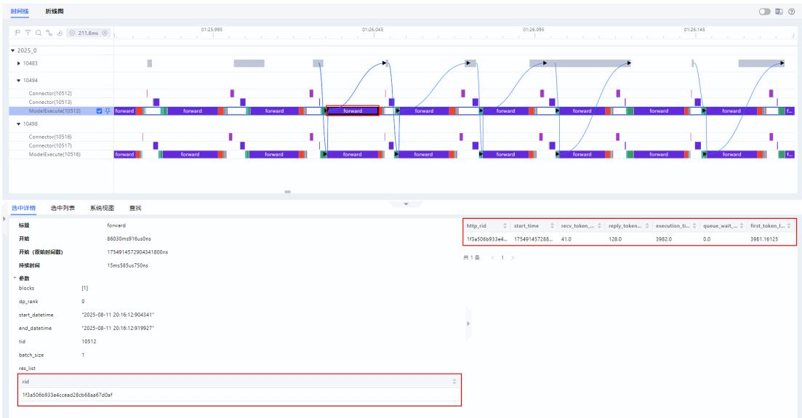  
图 6-2 选中详情

表 6-2 选中详情字段解释  

<table><tr><td rowspan=1 colspan=1>中文字段</td><td rowspan=1 colspan=1>英文字段</td><td rowspan=1 colspan=1>说明</td></tr><tr><td rowspan=1 colspan=1>标题</td><td rowspan=1 colspan=1>Title</td><td rowspan=1 colspan=1>名称。</td></tr><tr><td rowspan=1 colspan=1>开始</td><td rowspan=1 colspan=1>Start</td><td rowspan=1 colspan=1>起始时间。</td></tr><tr><td rowspan=1 colspan=1>开始（原始时间戳）</td><td rowspan=1 colspan=1>Start(RawTimestamp)</td><td rowspan=1 colspan=1>数据采集到的原始开始时间。</td></tr><tr><td rowspan=1 colspan=1>持续时间</td><td rowspan=1 colspan=1>Wall Duration</td><td rowspan=1 colspan=1>总耗时。</td></tr><tr><td rowspan=1 colspan=1>参数</td><td rowspan=1 colspan=1>Args</td><td rowspan=1 colspan=1>关键阶段的相关参数信息。</td></tr></table>

# 服务化视图

在“系统视图”页签，当选择“服务化视图”时，页面包含卡序号选框、服务化数据页签，在卡序号选框中可以选择想要查看的卡。

服务化数据包括kvcache_usage、batch_info、request_data和forward_info等页签，如图6-3所示。

选择任一服务化数据，右侧区域会显示对应的详细信息，字段解释如表6-3所示，且各字段支持搜索，在字段名称后单击 $\bigtriangledown$ ，可搜索所需信息。

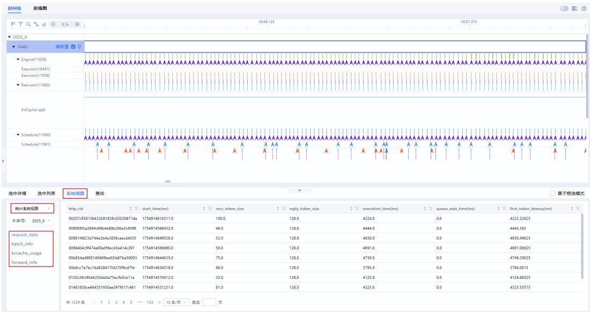  
图 6-3 服务化视图

表 6-3 服务化视图字段说明  

<table><tr><td colspan="1" rowspan="1">中文字段</td><td colspan="1" rowspan="1">英文字段</td><td colspan="1" rowspan="1">说明</td></tr><tr><td colspan="3" rowspan="1"> kvcache_usage</td></tr><tr><td colspan="1" rowspan="1">rid</td><td colspan="1" rowspan="1">rid</td><td colspan="1" rowspan="1">请求ID。</td></tr><tr><td colspan="1" rowspan="1">name</td><td colspan="1" rowspan="1">name</td><td colspan="1" rowspan="1">具体改变显存使用的方法。</td></tr><tr><td colspan="1" rowspan="1">real_start_time_ms</td><td colspan="1" rowspan="1">real_start_time_ms</td><td colspan="1" rowspan="1">发生显存使用情况变更的时间，单位ms。</td></tr><tr><td colspan="1" rowspan="1">device_kvcache_left</td><td colspan="1" rowspan="1">device_kvcache_left</td><td colspan="1" rowspan="1">显存中剩余blocks数量。</td></tr><tr><td colspan="1" rowspan="1">kvcache_usage_rate</td><td colspan="1" rowspan="1">kvcache_usage_rate</td><td colspan="1" rowspan="1">kvcache利用率。</td></tr><tr><td colspan="3" rowspan="1">batch_info</td></tr><tr><td colspan="1" rowspan="1">name</td><td colspan="1" rowspan="1">name</td><td colspan="1" rowspan="1">用于区分组batch和执行batch。name为batchFrameworkProcessing表示组batch；name为modelExec表示执行batch。</td></tr><tr><td colspan="1" rowspan="1">res_list</td><td colspan="1" rowspan="1">res_list</td><td colspan="1" rowspan="1">batch组合情况。</td></tr><tr><td colspan="1" rowspan="1">start_time_ms</td><td colspan="1" rowspan="1"> start_time_ms</td><td colspan="1" rowspan="1">组batch或执行batch的开始时间，单位ms。</td></tr><tr><td colspan="1" rowspan="1">end_time_ms</td><td colspan="1" rowspan="1">end_time_ms</td><td colspan="1" rowspan="1">组batch或执行batch的结束时间，单位ms。</td></tr><tr><td colspan="1" rowspan="1">batch_size</td><td colspan="1" rowspan="1">batch_size</td><td colspan="1" rowspan="1">batch中的请求数量。</td></tr><tr><td colspan="1" rowspan="1">batch_type</td><td colspan="1" rowspan="1">batch_type</td><td colspan="1" rowspan="1">batch中的请求状态（prefill和decode）。</td></tr><tr><td colspan="1" rowspan="1"> during_time_ms</td><td colspan="1" rowspan="1">during_time_ms</td><td colspan="1" rowspan="1">执行时间，单位ms。</td></tr><tr><td colspan="1" rowspan="1">dp*_rid</td><td colspan="1" rowspan="1">dp*_rid</td><td colspan="1" rowspan="1">DP域包含的请求ID，*表示DP域ID，取值为[0, n-1]。</td></tr><tr><td colspan="1" rowspan="1">dp*_size</td><td colspan="1" rowspan="1">dp*_size</td><td colspan="1" rowspan="1">DP域的batchsize，*表示DP域ID，取值为[0, n-1]。</td></tr><tr><td colspan="1" rowspan="1">dp*_forward_ms</td><td colspan="1" rowspan="1">dp*_forward_ms</td><td colspan="1" rowspan="1">DP域中执行时长最长的forward的执行时间，单位ms，*表示DP域ID，取值为[0,n-1]。</td></tr><tr><td colspan="3" rowspan="1"> request_data</td></tr><tr><td colspan="1" rowspan="1">http_rid</td><td colspan="1" rowspan="1">http_rid</td><td colspan="1" rowspan="1">HTTP请求ID。</td></tr><tr><td colspan="1" rowspan="1"> start_time_ms</td><td colspan="1" rowspan="1"> start_time_ms</td><td colspan="1" rowspan="1">请求到达的时间，单位ms。</td></tr><tr><td colspan="1" rowspan="1">recv_token_size</td><td colspan="1" rowspan="1">recv_token_size</td><td colspan="1" rowspan="1">请求的输入长度。</td></tr><tr><td colspan="1" rowspan="1">reply_token_size</td><td colspan="1" rowspan="1">reply_token_size</td><td colspan="1" rowspan="1">请求的输出长度。</td></tr><tr><td colspan="1" rowspan="1"> execution_time_ms</td><td colspan="1" rowspan="1">execution_time_ms</td><td colspan="1" rowspan="1">请求端到端耗时，单位ms。</td></tr><tr><td colspan="1" rowspan="1">queue_wait_time_ms</td><td colspan="1" rowspan="1">queue_wait_time_mS</td><td colspan="1" rowspan="1">请求在整个推理过程中在队列中等待的时间，这里包括waiting状态和pending状态的时间，单位ms。</td></tr><tr><td colspan="1" rowspan="1">first_token_latency</td><td colspan="1" rowspan="1">first_token_latency</td><td colspan="1" rowspan="1">首Token时延，单位ms。</td></tr><tr><td colspan="3" rowspan="1">forward_info</td></tr><tr><td colspan="1" rowspan="1">name</td><td colspan="1" rowspan="1">name</td><td colspan="1" rowspan="1">标注forward事件，代表模型前向执行过程。</td></tr><tr><td colspan="1" rowspan="1">relative_start_time(ms)</td><td colspan="1" rowspan="1">relative_start_time(ms）</td><td colspan="1" rowspan="1">每台机器上forward与第一个forward之间的时间。</td></tr><tr><td colspan="1" rowspan="1"> start_time(ms)</td><td colspan="1" rowspan="1">start_time(ms)</td><td colspan="1" rowspan="1">forward的开始时间。</td></tr><tr><td colspan="1" rowspan="1">end_time(ms)</td><td colspan="1" rowspan="1">end_time(ms)</td><td colspan="1" rowspan="1">forward的结束时间。</td></tr><tr><td colspan="1" rowspan="1">during_time(ms）</td><td colspan="1" rowspan="1">during_time(ms)</td><td colspan="1" rowspan="1">forward的执行时间，单位ms。</td></tr><tr><td colspan="1" rowspan="1">bubble_time(ms)</td><td colspan="1" rowspan="1">bubble_time(ms)</td><td colspan="1" rowspan="1">forward之间的空泡时间，单位ms。</td></tr><tr><td colspan="1" rowspan="1">batch_size</td><td colspan="1" rowspan="1">batch_size</td><td colspan="1" rowspan="1">forward处理的请求数量。</td></tr><tr><td colspan="1" rowspan="1">batch_type</td><td colspan="1" rowspan="1">batch_type</td><td colspan="1" rowspan="1">forward中的请求状态。</td></tr><tr><td colspan="1" rowspan="1">forward_iter</td><td colspan="1" rowspan="1">forward_iter</td><td colspan="1" rowspan="1">不同卡上forward的迭代序号。</td></tr><tr><td colspan="1" rowspan="1">dp_rank</td><td colspan="1" rowspan="1">dp_rank</td><td colspan="1" rowspan="1">标识forward的DP信息，相同DP域该列的值相同。</td></tr><tr><td colspan="1" rowspan="1">prof_id</td><td colspan="1" rowspan="1">prof_id</td><td colspan="1" rowspan="1">标识不同卡，相同的卡该列的值相同。</td></tr><tr><td colspan="1" rowspan="1">hostname</td><td colspan="1" rowspan="1">hostname</td><td colspan="1" rowspan="1">标识不同机器，相同机器该列的值相同。</td></tr></table>

# 支持生成色块相关折线图

在服务化调优场景下，支持生成任意色块的“执行时间折线图”和“空泡折线图”，便于分析问题。

在时间线（Timeline）界面，选择任一泳道的任意一个色块，单击鼠标右键，选择“生成该色块执行时间折线图”或“生成该色块空泡折线图”，跳转至折线图（Curve）界面，生成该色块所在泳道的对应折线图和数据详情，显示平均持续时间和持续时间，如图6-4所示。

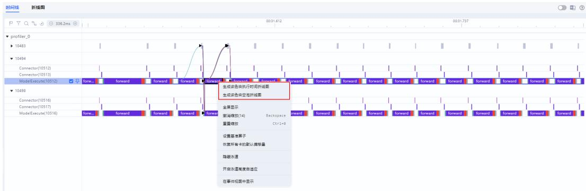  
图 6-4 生成色块折线图

如果在折线图中发现异常，需要定位异常点，可区域放大选择需查看的异常点，在折线图下方数据详情表格中找到对应数据，在数据所在行单击鼠标右键，选择“跳转至时间线视图”，可跳转至时间线（Timeline）界面，定位至具体的色块上，如图6-5所示。

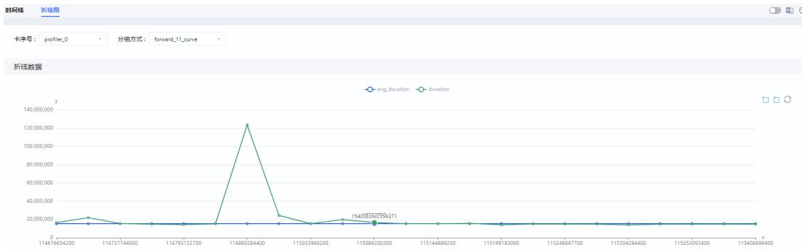  
图6-5 跳转至时间线视图

表格数据详情  

<table><tr><td>statTime</td><td>←|avg_duration</td><td>|duration 16445250</td></tr><tr><td>114676654200</td><td>15405896.0554371</td><td></td></tr><tr><td>114702264200</td><td>15405896.054371</td><td>2199400</td></tr><tr><td>114737744000</td><td>15405896.0554371</td><td>15549750</td></tr><tr><td>11465995000</td><td>15405896.0554371</td><td>14B34250</td></tr><tr><td>11479132700</td><td>15405896.0554371</td><td>1430750</td></tr><tr><td>114819728700</td><td>15405896.0554371</td><td>15223500</td></tr><tr><td>114860284400</td><td>15405896.054371</td><td>123623000</td></tr><tr><td>1500225700</td><td>15405896.0554371</td><td>24394000</td></tr></table>

# 6.3 折线图（Curve）

# 6.3.1 界面介绍

# 功能说明

支持以折线图和数据详情表的形式展示具体数据变化，便于直观的分析。仅当导入profiler.db文件时，展示折线图（Curve）界面。

# 界面展示

折线图（Curve）界面包含参数配置栏（区域一）、折线数据（区域二）和表格数据详情（区域三）三个部分组成，如图6-6所示。

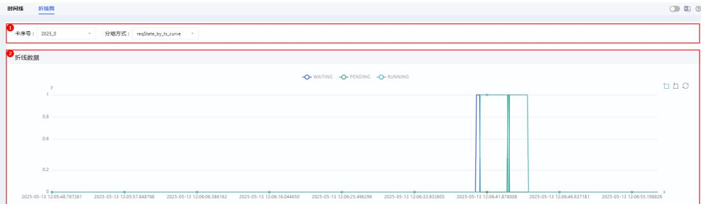  
图 6-6 折线图界面

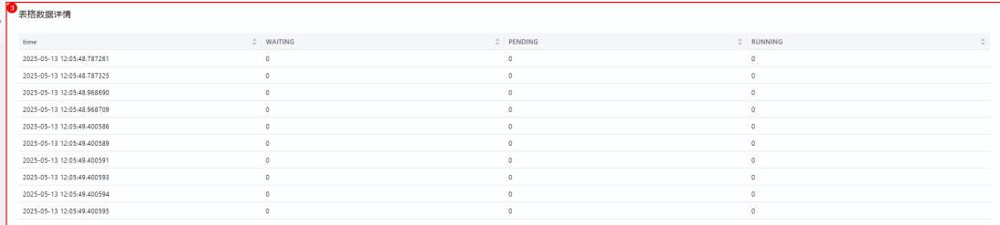

● 区域一：参数配置栏，包含卡序号和分组方式。  
● 区域二：折线数据，以折线图形式展示数据的变化情况。  
● 区域三：表格数据详情，展示了SQLite数据库的详细数据。表格支持排序和分页功能。单击每列的表头，可根据当前列的升序、降序和默认排序呈现数据。

# 6.3.2 使用说明

# 支持折线图局部放大和还原

MindStudio Insight支持通过鼠标左键框选放大选中部分和右键还原进行折线图的展示。为提升显示性能，折线图在数据量较大时会隐藏大部分点，可在框选到足够精细区域时显示所有点位，也可单击鼠标右键还原最初整体展示效果。

在折线图中单击鼠标左键拖至需要放大的终点位置并松开鼠标左键，框选部分将会被放大；如果还存在点被隐藏，重复放大操作即可展示被隐藏的点，选中放大区域如图6-7所示。

在折线图中也可单击正上方的图例，选择隐藏所需的折线，隐藏后，该折线在图中不展示，对应图例置灰，再次单击置灰图例，可将其重新展示。

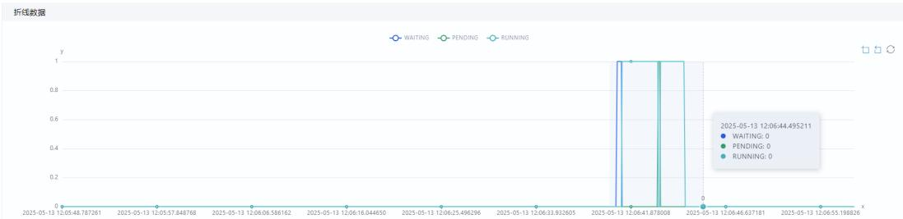  
图 6-7 选中放大区域

# 说明

● 单击折线图右上角 $\sqcup$ 按钮，使其为置灰状态，则折线图将锁定，不再支持鼠标左键框选放大功能；再次单击此按钮，或者单击鼠标右键即可恢复。放大功能默认开启。  
● 单击折线图右上角 $\sqsubset$ 按钮，折线图将会撤销一次放大操作。  
● 单击折线图右上方 $\smile$ 按钮，折线图将会恢复最初状态。

导入性能数据内存详情（Leaks）

# 7.1 导入性能数据

MindStudio Insight支持导入msLeaks工具采集到的内存结果文件，并以图形化形式呈现相关内容。仅支持导入db格式的文件，获取方式请参见《msLeaks内存泄漏检测工具用户指南》的“命令行采集”章节，支持导入的内存数据详情请参见表7-1。

表 7-1 内存数据说明  

<table><tr><td rowspan=1 colspan=1>文件名</td><td rowspan=1 colspan=1>说明</td><td rowspan=1 colspan=1>界面呈现内容</td></tr><tr><td rowspan=3 colspan=1>leaks_dump_{timestamp}.db</td><td rowspan=1 colspan=1>--events参数取值需至少包含alloc、free事件。</td><td rowspan=1 colspan=1>内存折线块图（内存申请/释放折线图、内存块图）</td></tr><tr><td rowspan=1 colspan=1>--analysis参数取值包含decompose。</td><td rowspan=1 colspan=1>内存详情拆解图</td></tr><tr><td rowspan=1 colspan=1>通过Python接口开启tracer功能。</td><td rowspan=1 colspan=1>Python调用栈图</td></tr></table>

# 7.2 内存详情（Leaks）

# 7.2.1 界面介绍

# 功能说明

在内存调优过程中，MindStudio Insight工具通过Python调用栈图和内存折线块图，将内存情况直观地呈现出来，便于开发者分析定位内存问题，有效缩短定位时间。

# 界面展示

内存详情（Leaks）界面包含调用栈火焰图（区域一）、内存申请/释放折线图&内存块图（区域二）、内存详情拆解图（区域三）和内存详情表（区域四），如图7-1所示。

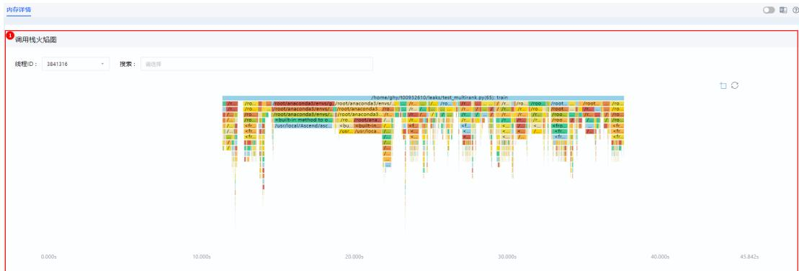  
图 7-1 内存详情界面

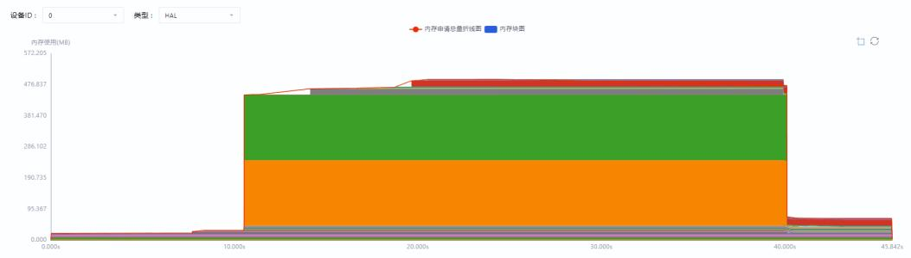  
内存申请/释放折线图&内存块图

内存详情拆解图内存详情表

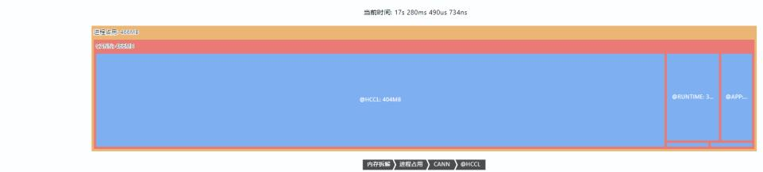

<table><tr><td>Id</td><td>内存块地址</td><td>内存块大小</td><td>|开始时间(ns)</td><td>|始束时间(ns)</td><td>美型</td><td>中请者</td><td>进程ID</td><td>T线程ID</td><td>扩展屋性 面</td></tr><tr><td>18</td><td>20622286815232</td><td>32768</td><td>109947720</td><td>11341556720</td><td>HAL</td><td>CANN@HCCL</td><td>3841316</td><td>3843160</td><td>rste32768,aci</td></tr><tr><td>96</td><td>20622286848000</td><td>32768</td><td>11341361950</td><td>24301268760</td><td>HAL</td><td>CANN@HCCL</td><td>3841316</td><td>3843160</td><td>rte32768, aoeaie</td></tr><tr><td>97</td><td>20622286815232</td><td>32768</td><td>24301072660</td><td>24324149790</td><td>HAL</td><td>CANNGHCCL</td><td>3841316</td><td>3843160</td><td>(rse32768,alci</td></tr><tr><td>525</td><td>20616939831296</td><td>18874368</td><td>14125399250</td><td>3991271930</td><td>HAL</td><td>CANN@AP</td><td>3841316</td><td>3841316</td><td>rste1887438, a</td></tr><tr><td>526</td><td>20622285484032</td><td>32</td><td>1049966240</td><td>39950600170</td><td>HAL</td><td>CANNGHCCL</td><td>3841316</td><td>3841316</td><td>rste&#x27;32,sa</td></tr><tr><td>527</td><td>20622286147584</td><td>659456</td><td>10513267210</td><td>39952610580</td><td>HAL</td><td>CANN@HCCL</td><td>3841316</td><td>3841316</td><td>frte:5956, </td></tr><tr><td>528</td><td>20622854812</td><td>659456</td><td>1051555180</td><td>39952790340</td><td>HAL</td><td>CANN@HCCL</td><td>3841316</td><td>3841316</td><td>(rsi 65945</td></tr><tr><td>529</td><td>2062286807040</td><td>4096</td><td>10513592300</td><td>39953121930</td><td>HAL</td><td>CANQ@HCCL</td><td>3841316</td><td>3841316</td><td>rse4096,alc</td></tr><tr><td>534</td><td>20622285471744</td><td>32</td><td>10498418640</td><td>40103129840</td><td>HAL</td><td>CANN@HCCL</td><td>3841316</td><td>3841316</td><td>rstre32, sa</td></tr><tr><td>535</td><td>20622285475840</td><td>32</td><td>10498695850</td><td>4010339350</td><td>HAL</td><td>CANN@HCL</td><td>3841316</td><td>3841316</td><td>tste</td></tr></table>

区域一：调用栈火焰图，通过选择线程ID，展示对应的Python调用栈图；在“搜索”输入框中输入要搜索的函数名，或单击下拉框选择函数名，可选多个函数名，进行搜索，调用栈图中会高亮显示搜索的函数。

区域二：内存申请/释放折线图&内存块图，展示内存申请/释放折线图和内存块图，选择内存块图上的色块，展示该内存块的详情，可通过选择设备ID和类型来展示对应的内存折线块图。

区域三：内存详情拆解图，默认不显示，当鼠标置于“调用栈火焰图”或者“内存申请/释放折线图&内存块图”中，会显示一条时间线，在“内存申请/释放折线图&内存块图”区域，单击时间线，才会展示对应时间点的内存详情拆解图。区域四：内存详情表，分为“内存块视图”和“内存事件视图”，可选择相应视图查看详情表，具体使用说明请参见内存详情展示。

# 7.2.2 使用说明

# 支持调用栈火焰图和内存折线块图局部放大

MindStudio Insight支持通过鼠标左键框选放大选中部分，放大功能默认开启。

在“调用栈火焰图”或者“内存申请/释放折线图&内存块图”中，如果图中右上角 $\sqcup$ 按钮，是蓝色的，则默认开启放大功能，单击鼠标左键框选需要放大的区域，松开鼠标左键，框选部分将会被放大（“调用栈火焰图”或“内存申请/释放折线图&内存块

图”会同时放大），框选放大区域如图7-2所示。单击 按钮，图形恢复至原始状态。

可单击“内存申请/释放折线图&内存块图”正上方的图例，隐藏所选的折线和内存块，隐藏后，该折线和内存块在图中不展示，对应图例置灰，再次单击置灰图例，可将其重新展示。

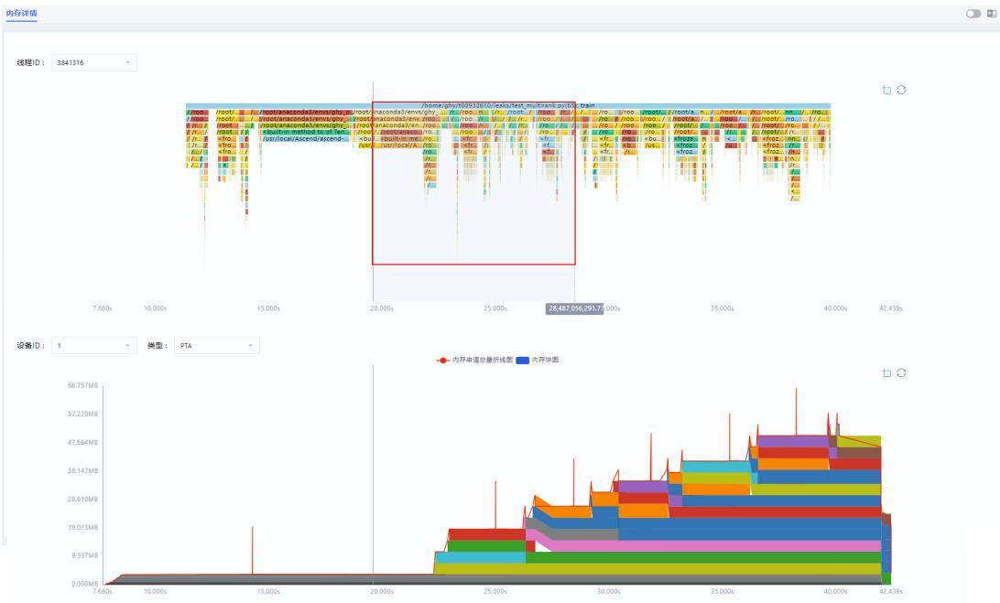  
图 7-2 框选放大区域

# 说明

● 单击图中右上角 $\sqcup$ 按钮，使其为置灰状态，折线图和块图被锁定，不支持鼠标左键框选放大功能；单击按钮使其变蓝，开启框选放大功能。放大功能默认开启。

● 单击折线图和块图右上方 $\smile$ 按钮，图形将会恢复最初状态。

# 支持显示内存详情拆解图

当鼠标置于“调用栈火焰图”或者“内存申请/释放折线图&内存块图”中，会显示一条时间线，在“内存申请/释放折线图&内存块图”区域，单击时间线，则会在“内存

申请/释放折线图&内存块图”下方展示对应时间点的内存详情拆解图，便于开发者查看内存占用情况。“内存详情拆解图”展示的内容会随所选择的类型而变化。

如果需要查看指定的内存层级，可单击“内存详情拆解图”下方的层级目录条进入所选层级。

当类型选择HAL时，“内存详情拆解图”中仅展示通过CANN级别分类分级的内存数据，如图7-3所示。

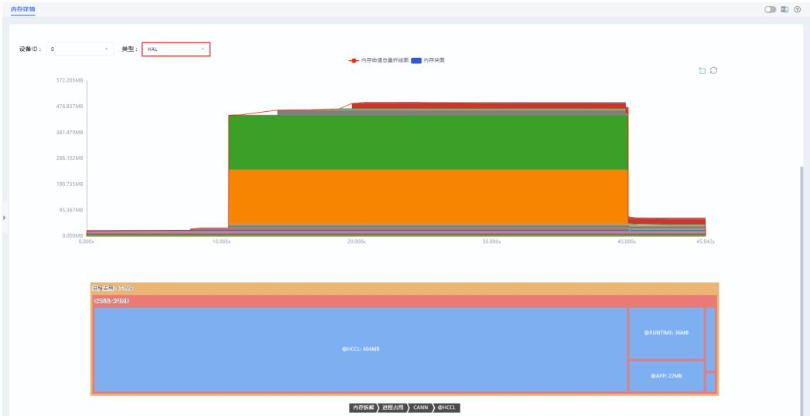  
图 7-3 CANN 级别内存详情拆解图

当类型选择除HAL之外的其它选项时，“内存详情拆解图”中展示对应框架侧内存池的内存分类分级情况。例如当类型选择PTA时，“内存详情拆解图”中仅展示PTA框架的内存情况，如图7-4所示。

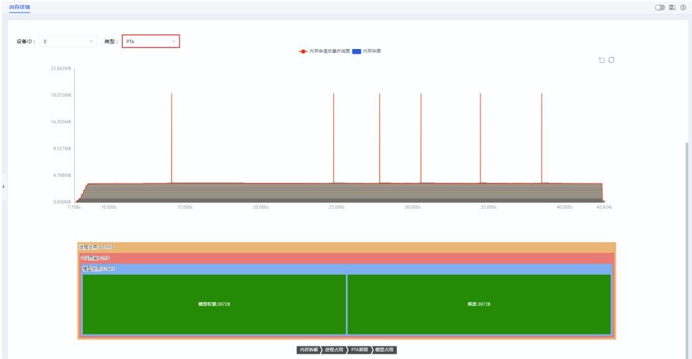  
图 7-4 PTA 框架内存详情拆解图

# 说明

“内存详情拆解图”支持左右上下拖拽和缩放展示。

鼠标放置在图中，按住鼠标左键可实现左右上下拖拽。● 在“内存详情拆解图”上，使用鼠标滚轮实现缩放展示；或选择任一内存块，单击鼠标左键，可将选中的内存层级放大展示。

# 调用栈图与内存块图支持联动

双击“调用栈火焰图”中单个调用栈块时，会以该调用栈块的起始时间和截止时间为界放大调用栈图，显示该时间段的所有调用栈信息，同时，“内存申请/释放折线图&内存块图”同步放大，显示该时间段内的所有内存块。

双击“内存申请/释放折线图&内存块图”的指定内存块，会以该内存块的起始时间和截止时间为界放大内存块图，显示该时间段的所有内存块，同时，“调用栈火焰图”实现联动，同步放大显示该时间段内的所有调用栈，并自动匹配至对应的“线程ID”，如图7-5所示。

如果需要将图形恢复最初状态，单击图形右上方 $\smile$ 按钮即可。

# 说明

如果内存块对应的“线程ID”未采集调用栈数据，则“调用栈火焰图”区域将为空。

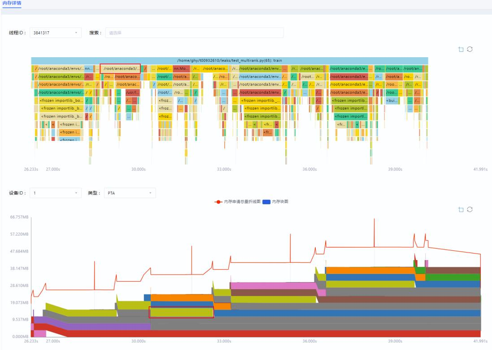  
图 7-5 调用栈图和内存块图联动

# 内存详情展示

在内存详情表区域，通过“内存块视图”和“内存事件视图”分别展示内存的详细信息，默认展示所有内存相关信息。

表格中呈现的字段支持排序和搜索，单击字段名称后 $\bigtriangledown$ ，可搜索所需信息。

# 说明

“内存块视图”中的“内存块大小”、“申请时间”和“释放时间”字段，“内存事件视图”中的“时间戳(ns)”字段，单击 $\bigtriangledown$ ，支持筛选，可输入最小值和最大值进行区间筛选，只能输入整数，输入的数值最小为0，最大为当前展示的对应字段的最大值。

内存块视图：展示内存块的详细信息，如图7-6所示，字段解释如表7-2所示。

当在“内存申请/释放折线图&内存块图”中分别选择不同“设备ID”和“类型”时，内存块视图的展示信息也会随之更新；当框选“内存申请/释放折线图&内存块图”中部分区域展示时，内存块视图的信息也会随之更新，展示的是所有与框选时间范围存在交集的内存块信息。

在“内存块视图”表格右上方，单击“过滤低效显存”按钮，弹出筛选弹框，分别通过设置“提前申请阈值”、“延迟释放阈值”或“空闲过长阈值”，筛选低效显存。

图 7-6 内存块视图  

<table><tr><td colspan="11">·内存详情表</td></tr><tr><td>内存块视图</td><td>内存事件视图</td><td></td><td></td><td></td><td></td><td></td><td></td><td></td><td></td><td></td><td>过让任效显存</td></tr><tr><td>内存块ID</td><td>内存块地址</td><td>内存块大小（bytes]申请时间ns]</td><td></td><td>種放时间(ns)</td><td>申请青</td><td>中进程ID</td><td>线程ID</td><td>特有尾性</td><td>首次访问时间[ns]</td><td>末次访间时间(ns）</td><td>最大访间时间间隔（ns）</td></tr><tr><td>18</td><td>20622286815232</td><td>32768</td><td>11205505030</td><td>11556594030</td><td>CANN@HCCL</td><td>3841316</td><td>3843160</td><td>falocatienlano</td><td>-1</td><td>-1</td><td>0</td></tr><tr><td>96</td><td>20622286848000</td><td>32768</td><td>11556399260</td><td>24516306070</td><td>CANN@HCCL</td><td>3841316</td><td>3843160</td><td>fralocatier dhi</td><td>-1</td><td>-1</td><td>0</td></tr><tr><td>97</td><td>206226815232</td><td>32768</td><td>24516109970</td><td>24539187100</td><td>CANN@HCCL</td><td>3841316</td><td>3843160</td><td> ralocatin iai</td><td>-</td><td>-1</td><td>0</td></tr><tr><td>525</td><td>20616939831296</td><td>18874368</td><td>14340436560</td><td>40126309240</td><td>CANN@APP</td><td>3841316</td><td>3841316</td><td> ralocationidi</td><td>-1</td><td>-1</td><td>0</td></tr><tr><td>526</td><td>20622285484032</td><td>32</td><td>10714699550</td><td>40165637480</td><td>CANN@HCCL</td><td>3841316</td><td>3841316</td><td> ralocatinidi</td><td>-1</td><td>-1</td><td>0</td></tr><tr><td>527</td><td>2062228614584</td><td>659456</td><td>10728304520</td><td>40167647890</td><td>CANN@HCCL</td><td>3841316</td><td>3841316</td><td>rallocatienid</td><td>-1</td><td>-1</td><td>□</td></tr><tr><td>528</td><td>20622285488128</td><td>659456</td><td>10727592490</td><td>40167827650</td><td>CANNGHCCL</td><td>3841316</td><td>3841316</td><td>allocatinid:a]</td><td>-1</td><td>-1</td><td>□</td></tr><tr><td>529</td><td>20622286807040</td><td>4096</td><td>10728629610</td><td>40168159240</td><td>CANNGHCCL</td><td>3841316</td><td>3841316</td><td>[allocation_idr.a)</td><td>-1</td><td>-1</td><td>□</td></tr><tr><td>534</td><td>20622285471744</td><td>32</td><td>10713455950</td><td>40318167150</td><td>CANNG HCCL</td><td>3841316</td><td>3841316</td><td> raliocatin la</td><td>-1</td><td>-1</td><td>□</td></tr><tr><td>535</td><td>20622285475840</td><td>32</td><td>10713733160</td><td>40318376660</td><td>CANN@HCCL</td><td>3841316</td><td>3841316</td><td>(rallocation/idn.o)</td><td>-1</td><td>-1</td><td>0</td></tr></table>

表 7-2 内存块视图字段说明  

<table><tr><td colspan="1" rowspan="1">中文字段</td><td colspan="1" rowspan="1">英文字段</td><td colspan="1" rowspan="1">说明</td></tr><tr><td colspan="1" rowspan="1">内存块ID</td><td colspan="1" rowspan="1">ID</td><td colspan="1" rowspan="1">内存块ID，内存块唯一标识。</td></tr><tr><td colspan="1" rowspan="1">内存块地址</td><td colspan="1" rowspan="1">Addr</td><td colspan="1" rowspan="1">内存块地址，对应内存申请/释放/访问事件的地址。</td></tr><tr><td colspan="1" rowspan="1">内存块大小(bytes)</td><td colspan="1" rowspan="1">Size(bytes)</td><td colspan="1" rowspan="1">内存块大小，对应内存申请事件，单位为bytes。</td></tr><tr><td colspan="1" rowspan="1">申请时间(ns)</td><td colspan="1" rowspan="1">MallocTimestamp(ns)</td><td colspan="1" rowspan="1">内存块申请时间，对应内存申请事件的时间，单位ns。</td></tr><tr><td colspan="1" rowspan="1">释放时间(ns)</td><td colspan="1" rowspan="1">FreeTimestamp(ns)</td><td colspan="1" rowspan="1">内存块释放时间，对应内存释放事件的时间，单位ns。</td></tr><tr><td colspan="1" rowspan="1">申请者</td><td colspan="1" rowspan="1">Owner</td><td colspan="1" rowspan="1">内存块持有者所属标签。</td></tr><tr><td colspan="1" rowspan="1">进程ID</td><td colspan="1" rowspan="1">Process ID</td><td colspan="1" rowspan="1">内存块所属进程号，对应内存申请/释放事件的所属进程号。</td></tr><tr><td colspan="1" rowspan="1">线程ID</td><td colspan="1" rowspan="1">Thread ID</td><td colspan="1" rowspan="1">内存块所属线程号，对应内存申请/释放事件的所属线程号。</td></tr><tr><td colspan="1" rowspan="1">首次访问时间(ns)</td><td colspan="1" rowspan="1">First AccessTimestamp(ns)</td><td colspan="1" rowspan="1">首次访问事件时间。</td></tr><tr><td colspan="1" rowspan="1">末次访问时间(ns)</td><td colspan="1" rowspan="1">Last AccessTimestamp(ns)</td><td colspan="1" rowspan="1">末次访问事件时间。</td></tr><tr><td colspan="1" rowspan="1">最大访问时间间隔(ns)</td><td colspan="1" rowspan="1">Max AccessInterval(ns)</td><td colspan="1" rowspan="1">访问事件的最大间隔时间。</td></tr><tr><td colspan="1" rowspan="1">特有属性</td><td colspan="1" rowspan="1">Attr</td><td colspan="1" rowspan="1">扩展属性，包含以下信息：allocation_id:内存块所属的申请/访问/释放序列id，唯一标识一组内存事件。lazy_used：提前申请场景，取值为true或者false，true表示已识别到该场景。delayed_free：延迟释放场景，取值为true或者false，true表示已识别到该场景。long_ldle：超长闲置场景，取值为true或者false，true表示已识别到该场景。</td></tr></table>

# 说明

● 如果导入的数据是使用MindStudio 8.2.RC1之前版本的msLeaks工具采集的，或者数据中没采集到访问事件，那么allocation_id显示为0，首次访问时间(ns)、末次访问时间(ns)显示为-1，最大访问时间间隔(ns)显示为0。  
● 由于msLeaks工具当前仅支持采集ATB和Ascend Extension for PyTorch算子场景的内存访问事件，则首次访问时间(ns)、末次访问时间(ns)和最大访问间隔(ns)也仅支持展示对应场景的详情，其余场景下，首次访问时间(ns)、末次访问时间(ns)显示为-1，最大访问时间间隔(ns)显示为0。

内存事件视图：展示内存事件的详细信息，如图7-7所示，字段解释如表7-3所示。

当在“内存申请/释放折线图&内存块图”中选择不同“设备ID”时，内存事件视图的展示信息也会随之更新；当框选“内存申请/释放折线图&内存块图”中部分区域展示时，内存事件视图的信息也会随之更新，展示的是框选时间范围内的所有内存事件。

图 7-7 内存事件视图  

<table><tr><td colspan="10">·内存详情表</td></tr><tr><td colspan="10">○内存块规图内存事件图</td></tr><tr><td>事件ID</td><td>事件岗型</td><td>事件子员量</td><td>名称</td><td>时调(ns）</td><td>进屋ID</td><td>图</td><td>内存地址</td><td>特有履性</td><td>1</td></tr><tr><td></td><td>MALLOC</td><td>HAL</td><td>N/A</td><td>2308550</td><td>3841316</td><td>3841316</td><td>20066087206912</td><td></td><td>ra2006006912</td></tr><tr><td></td><td>FREE</td><td>HAL</td><td>N/A</td><td>460595670</td><td>3841316</td><td>3841316</td><td>20066087206912</td><td></td><td>ad20066070</td></tr><tr><td></td><td>MALLOC</td><td>HAL</td><td>N/A</td><td>18329103010</td><td>3841316</td><td>383160</td><td></td><td>20066089304064</td><td>a2064</td></tr><tr><td></td><td>FREE</td><td>HAL</td><td>N/A</td><td>460557540</td><td>3841316</td><td>3841316</td><td></td><td>20066089304064</td><td>060893044</td></tr><tr><td>1549</td><td>MALLOC</td><td>HAL</td><td>N/A</td><td>19016484620</td><td>3841316</td><td>3843160</td><td></td><td>20066091401216</td><td>ad200609</td></tr><tr><td>3191</td><td>FREE</td><td>HAL</td><td>N/A</td><td>4605930010</td><td>3841316</td><td>3841316</td><td></td><td>20066091401216</td><td>adr2006609</td></tr><tr><td>1644</td><td>MALLOC</td><td>HAL</td><td>N/A</td><td>19860852650</td><td>3841316</td><td>3843160</td><td></td><td>20066093496368</td><td>dr2006</td></tr><tr><td>3172</td><td>FREE</td><td>HAL</td><td>N/A</td><td>46040636890</td><td>3841316</td><td>3841316</td><td></td><td>20066093496368</td><td>er200</td></tr><tr><td>1649</td><td>MALLOC</td><td>HAL</td><td>N/A</td><td>20317101920</td><td>3841316</td><td>3843160</td><td></td><td>200661469888</td><td>a26614</td></tr><tr><td>3192</td><td>FREE</td><td>HAL</td><td>N/A</td><td>46056082490</td><td>3841316</td><td>3841316</td><td></td><td>2006611469888</td><td>a2061</td></tr></table>

表 7-3 内存事件视图字段说明  

<table><tr><td rowspan=1 colspan=1>中文字段</td><td rowspan=1 colspan=1>英文字段</td><td rowspan=1 colspan=1>说明</td></tr><tr><td rowspan=1 colspan=1>事件ID</td><td rowspan=1 colspan=1>ID</td><td rowspan=1 colspan=1>事件ID，与Process ID共同标识唯一一个内存事件。</td></tr><tr><td rowspan=1 colspan=1>事件类型</td><td rowspan=1 colspan=1>Event</td><td rowspan=1 colspan=1>msLeaks记录的事件。</td></tr><tr><td rowspan=1 colspan=1>事件子类型</td><td rowspan=1 colspan=1>Event Type</td><td rowspan=1 colspan=1>事件子类型。</td></tr><tr><td rowspan=1 colspan=1>名称</td><td rowspan=1 colspan=1>Name</td><td rowspan=1 colspan=1>事件名称，与Event值有关。</td></tr><tr><td rowspan=1 colspan=1>时间戳(ns)</td><td rowspan=1 colspan=1>Timestamp(ns)</td><td rowspan=1 colspan=1>内存事件发生的时间。</td></tr><tr><td rowspan=1 colspan=1>进程ID</td><td rowspan=1 colspan=1>Process ID</td><td rowspan=1 colspan=1>进程号。</td></tr><tr><td rowspan=1 colspan=1>线程ID</td><td rowspan=1 colspan=1>Thread ID</td><td rowspan=1 colspan=1>线程号。</td></tr><tr><td rowspan=1 colspan=1>内存地址</td><td rowspan=1 colspan=1>Addr</td><td rowspan=1 colspan=1>内存地址。</td></tr><tr><td rowspan=1 colspan=1>特有属性</td><td rowspan=1 colspan=1>Attr</td><td rowspan=1 colspan=1>内存事件特有属性，每个事件类型有各自的属性项。</td></tr><tr><td rowspan=1 colspan=1>调用栈(Python)</td><td rowspan=1 colspan=1>CallStack(Python)</td><td rowspan=1 colspan=1>Python调用栈。仅当数据中采集到该信息时，则显示该字段。</td></tr><tr><td rowspan=1 colspan=1>调用栈(C)</td><td rowspan=1 colspan=1>Call Stack(C)</td><td rowspan=1 colspan=1>C调用栈。仅当数据中采集到该信息时，则显示该字段。</td></tr></table>

# 说明

事件类型、事件子类型和名称字段的取值可参见《msLeaks内存泄漏检测工具用户指南》的“命令行采集”章节的leaks_dump_{timestamp}.csv结果文件说明。

安全加固建议  
安装转发方式（Linux）  
插件管理  
FAQ

# 8.1 安全加固建议

● MindStudio Insight为开发态工具，不建议通过X协议转发进行使用，建议在本地启动使用。  
● MindStudio Insight工具应整包使用，请勿二次开发或调用内部接口。  
● MindStudio Insight为本地工具，默认安全，如果需要打开端口，请注意远程通信带来的安全风险。  
● 出于安全考虑，在Linux和macOS系统上，禁止使用root用户启动MindStudioInsight工具。如果实际需要使用root用户启动，则需执行./MindStudio-Insight--allow-root进行启动。  
● 在Linux或Unix环境下，使用MindStudio Insight时，请确认该环境中当前用户的umask设置为“0027”或更严格，以确保生成的文件（例如pip安装依赖后的文件等）符合最小权限安全要求。

# 8.2 安装转发方式（Linux）

# 8.2.1 安装操作（X11 方式）

# 前提条件

确保源可用。可在root用户下执行如下命令检查源是否可用。

Ubuntu等以apt作为包管理软件类型的操作系统  
apt-get update  
CentOS/EulerOS/OpenEuler等以yum/dnf作为包管理软件类型的操作系统  
yum makecache

# 说明

如果OpenEuler及其衍生操作系统，在安装过程中提示找不到相关依赖，可能原因是系统配置的源没有相关依赖，可参见LINK配置新的源，并重新安装对应依赖。

# 操作步骤

步骤1 执行以下命令，安装MindStudio Insight显示运行依赖的库文件。

Ubuntu等以apt作为包管理软件类型的操作系统  
sudo apt install -y libwebkit2gtk-4.0-dev  
CentOS/EulerOS/OpenEuler等以yum/dnf作为包管理软件类型的操作系统  
a. 执行以下命令，查询webkit2gtk库文件。sudo yum search webkit2gtk回显信息如下$=$ Name 和 Summary 匹配：webkit2gtk$= = = = = = = = = = = =$ webkit2gtk3-devel.aarch64 : Development files for webkit2gtk3webkit2gtk3-help.noarch $:$ Documentation files for webkit2gtk3webkit2gtk3-jsc.aarch64 : JavaScript engine from webkit2gtk3webkit2gtk3-jsc-devel.aarch64 : Development files for JavaScript engine from webkit2gtk3$= = = = = = = = = = = = = = = = =$ Name 匹配：webkit2gtkwebkit2gtk3.aarch64 : GTK+ Web content engine library$= = = = = = = = = = = = = = = =$ Summary 匹配：webkit2gtklibproxy-webkitgtk4.aarch64 $:$ plugin for webkit2gtk3

b. 根据回显信息，执行以下命令，安装webkit2gtk库文件。sudo yum install -y \${Dependency name}

此处的Dependency_name为依赖文件名称，可参考回显信息确定。例如，如上回显信息所示，如果回显信息中存在webkit2gtk3-devel，则此处的依赖文件名称为webkit2gtk3-devel；如果回显信息中不存在webkit2gtk3-devel，则需要找到webkit2gtk3，此处的依赖文件名称为webkit2gtk3。

# 说明

EulerOS 2.12操作系统是基于OpenEuler 22.03 LTS SP1开发，需要先配置OpenEuler 22.03 LTS SP1的源，再执行安装命令。配置OpenEuler的源具体操作请参见OpenEuler软 件源配置。

步骤2 执行以下命令，安装MindStudio Insight通过X11转发的依赖文件。

Ubuntu等以apt作为包管理软件类型的操作系统  
sudo apt-get install -y xterm x11-apps  
CentOS/EulerOS/OpenEuler等以yum/dnf作为包管理软件类型的操作系统  
sudo yum install -y xterm xorg-x11-xauth

----结束

# 8.2.2 安装操作（VNC 方式）

如果通过VNC转发方式启动MindStudio Insight，可获得更为流畅的体验，所以推荐使用VNC转发方式使用MindStudio Insight工具。

# 说明

EulerOS 2.12系统不支持使用VNC方式启动MindStudio Insight工具。

# 安装依赖

步骤1 执行以下命令，安装MindStudio Insight显示运行依赖的库文件。

Ubuntu等以apt作为包管理软件类型的操作系统  
sudo apt install -y libwebkit2gtk-4.0-dev  
CentOS/EulerOS/OpenEuler等以yum/dnf作为包管理软件类型的操作系统  
a. 执行以下命令，查询webkit2gtk库文件。sudo yum search webkit2gtk回显信息如下$=$ Name 和 Summary 匹配：webkit2gtk$= = = = = = = = = = = =$ webkit2gtk3-devel.aarch64 : Development files for webkit2gtk3webkit2gtk3-help.noarch $\boldsymbol { : }$ Documentation files for webkit2gtk3webkit2gtk3-jsc.aarch64 : JavaScript engine from webkit2gtk3webkit2gtk3-jsc-devel.aarch64 : Development files for JavaScript engine from webkit2gtk3$= = = = = = = = = = = = = = = = =$ Name 匹配：webkit2gtkwebkit2gtk3.aarch64 : GTK+ Web content engine library= Summary 匹配：webkit2gtklibproxy-webkitgtk4.aarch64 $:$ plugin for webkit2gtk3

b. 根据回显信息，执行以下命令，安装webkit2gtk库文件。sudo yum install -y \${Dependency_name}

此处的Dependency_name为依赖文件名称，可参考回显信息确定。例如，如上回显信息所示，如果回显信息中存在webkit2gtk3-devel，则此处的依赖文件名称为webkit2gtk3-devel；如果回显信息中不存在webkit2gtk3-devel，则需要找到webkit2gtk3，此处的依赖文件名称为webkit2gtk3。

# 说明

EulerOS 2.12操作系统是基于OpenEuler 22.03 LTS SP1开发，需要先配置OpenEuler 22.03 LTS SP1的源，再执行安装命令。配置OpenEuler的源具体操作请参见OpenEuler软 件源配置。

步骤2 使用root用户，执行以下命令，安装MindStudio Insight通过VNC转发的桌面依赖。

Ubuntu等以apt作为包管理软件类型的操作系统  
apt-get install -y xfce4 xfce4-goodies  
CentOS/EulerOS/OpenEuler等以yum/dnf作为包管理软件类型的操作系统  
a. 执行以下命令，查询是否存在xfce。yum search xfce如果回显中包含xfce相关信息，执行以下命令，安装xfce。yum install -y xfce4\*如果回显为“未找到匹配项”，则执行步骤2.b。  
b. 执行以下命令，查询是否存在gnome。yum search gnome如果回显中包含gnome相关信息，执行以下命令，安装gnome。

yum install -y gnome\*

步骤3 执行以下命令，安装VNC Server。

Ubuntu等以apt作为包管理软件类型的操作系统  
apt-get install -y tightvncserver  
CentOS/EulerOS/OpenEuler等以yum/dnf作为包管理软件类型的操作系统  
yum install -y tigervnc-server

# ----结束

# 设置 VNC Server

步骤1 执行以下命令，设置VNC首次连接时的密码。vncserver

步骤2 回显如下，按照提示输入密码。You will require a password to access your desktops.Password:请输入密码Verify:请再次输入密码

步骤3 输入密码后，回显如下。 Would you like to enter a view-only password (y/n)?

按照提示输入n，回显如下，创建启动脚本、默认配置等，首行中的x值根据实际情况显示，表示显示序号。

New 'localhost.localdomain:x' desktop is localhost.localdomain:x Creating default startup script /home/xxx/.vnc/xstartup Creating default config /home/xxx/.vnc/config Starting applications specified in /home/xxx/.vnc/xstartup Log file is /home/xxx/.vnc/localhost.localdomain:3.log

步骤4 执行以下命令，停止已启用的VNC Server。vncserver -kill :x

# 说明

此处的x值与步骤3中首行回显的x值一致。

步骤5 执行vi \~/.vnc/xstartup，打开xstartup启动脚本，并在脚本最后新增一行文本，配置脚本，需要增加的文本内容请参见表8-1。

表 8-1 文本内容  

<table><tr><td rowspan=1 colspan=1>已安装依赖</td><td rowspan=1 colspan=1>文本内容</td></tr><tr><td rowspan=1 colspan=1>xfce</td><td rowspan=1 colspan=1> startxfce4 &amp;</td></tr><tr><td rowspan=1 colspan=1>gnome</td><td rowspan=1 colspan=1>gnome-session &amp;</td></tr></table>

步骤6 执行:wq!命令，保存脚本并退出。

----结束

# 启动 VNC Server

# 说明

localhost：是启动本地主机的VNC服务，需要与端口转发配合使用。如果是安全的网络环境下，也可以不使用localhost，同时也不采用端口转发，可直接执行本地连接VNC Server步骤（不推荐此方式）。  
geometry 1920x1080：配置VNC桌面的分辨率为1920x1080，也可以根据用户显示器的分辨率自行配置。

# 端口转发

通过SSH通道安全的将Linux本地主机服务转发至Windows本地端口。

步骤1 打开远程登录工具，选择“Tools > MobaSSHTunnel (port forwarding)”。此处以MobaXterm工具为例。

步骤2 单击“New SSH Tunnel”，新建一个SSH配置。

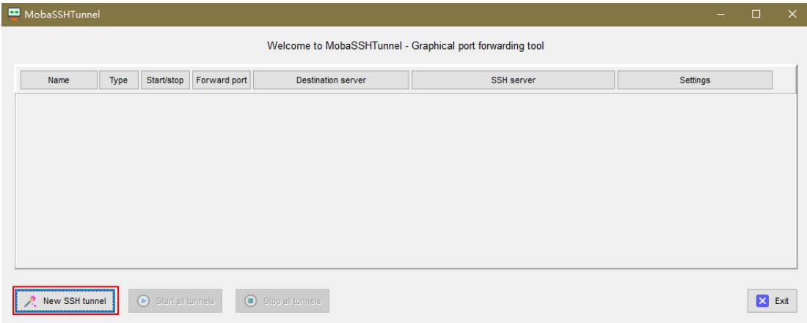  
图 8-1 新建 SSH 配置

步骤3 选择“Local port forwarding”，按照表8-2配置页面信息。

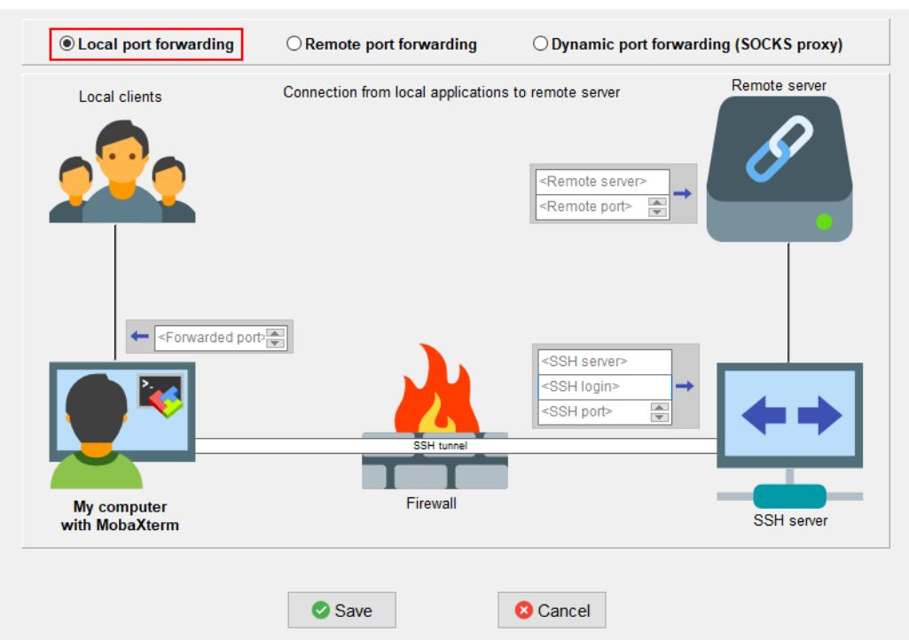  
图 8-2 Local port forwarding

表 8-2 配置 Local port forwarding 页面信息  

<table><tr><td rowspan=1 colspan=1>参数</td><td rowspan=1 colspan=1>说明</td><td rowspan=1 colspan=1>示例</td></tr><tr><td rowspan=1 colspan=1>Remote server</td><td rowspan=1 colspan=1>Linux服务器的地址。</td><td rowspan=1 colspan=1>127.0.0.1</td></tr><tr><td rowspan=1 colspan=1>Remote port</td><td rowspan=1 colspan=1>Linux服务器的端口，值为5900加设置VNC Server中的x（显示序号）值。</td><td rowspan=1 colspan=1>5901</td></tr><tr><td rowspan=1 colspan=1>SSH server</td><td rowspan=1 colspan=1>SSH连接时的IP或URL地址。</td><td rowspan=1 colspan=1>192.168.25.38</td></tr><tr><td rowspan=1 colspan=1> SSH login</td><td rowspan=1 colspan=1>SSH登录的用户名/密码对。</td><td rowspan=1 colspan=1>-</td></tr><tr><td rowspan=1 colspan=1>SSH port</td><td rowspan=1 colspan=1>SSH登录时使用的端口，一般为22。</td><td rowspan=1 colspan=1>22</td></tr><tr><td rowspan=1 colspan=1>Forwarded port</td><td rowspan=1 colspan=1>端口转发到本地Windows对应的端口，可以与Remote port一致。</td><td rowspan=1 colspan=1>5901</td></tr></table>

步骤4 单击“Save”，完成SSH配置。

步骤5 在MobaSSHTunnel弹窗中，选择已配置好的SSH Tunnel，单击 $\circledast$ ，即可开启端口转发。

如果SSH配置中的“SSH login”参数，填写的是用户名，首次启动SSH Tunnel的时候会弹出一个对话框，输入用户对应的密码即可启动SSH Tunnel。

----结束

# 本地连接 VNC Server

步骤1 在MobaXterm工具首页，单击“Session”，进入Session settings页面。

步骤2 单击“VNC”，根据实际情况配置“Remote hostname or IP address”和“Port”。

# 说明

● 如果使用了端口转发功能，“Remote hostname or IP address”为127.0.0.1，“Port”为端口转发中的Forwarded port。如果未使用端口转发，“Remote hostname or IP address”为实际远端Linux的IP，“Port”为5900加设置VNC Server中的x（显示序号）值。

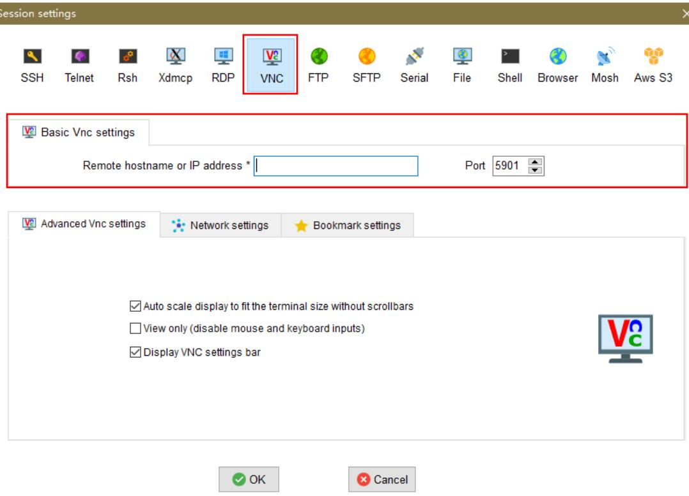  
图 8-3 配置 VNC

步骤3 配置完成后，单击“OK”，在弹窗中输入VNC的密码后，将桌面转发至本地进行后续操作。

  
图 8-4 桌面

# 8.3 插件管理

MindStudio Insight工具支持插件开发功能，为开发者提供自主开发能力，开发者可自主开发插件包，并安装插件包，实现自主开发功能使用。

# 开发插件

开发者可自主开发插件，具体操作可参见插件开发指南。

插件包要求如下：

1. 插件包格式必须为zip压缩包。

2. 插件包中必须包含以下文件：

config.json配置文件。  
前端产物：必须为zip压缩包，包含前端asset目录及其文件和index.html文件。  
后端产物：必须为zip压缩包，包含对应平台及架构下的插件所需动态库和单个动态库文件。后端产物在config.json配置文件中的键值名为  
“backend_{platform}_{machine}”，其中platform为平台名称，machine为架构名称。例如，linux x86环境下后端产物键值名为  
backend_linux_x86_64。

config.json配置文件格式要求如下：

json  
{"pluginName":"插件名称","frontend":"前端产物名称", // zip压缩包"backend_{platform}_{machine}":"后端产物名称", // zip或动态库  
其中platform为平台名称，machine为架构名称。

3. 插件包中包含的文件个数不能超过1000个，单个文件大小不能超过200M。

4. 插件包需具有当前用户属主，具有可读可写权限，不支持链接文件和包含链接的文件。

# 说明

MindStudio Insight工具支持通过".so"形式加载任何插件，请务必对所需插件包进行完整性校验，保证其来源安全可信，从而有效避免社区投毒、恶意代码注入等潜在安全风险。

# 安装插件

进入MindStudio Insight工具的安装目录，执行以下命令，安装已开发的插件包。其中plugin package path为插件包所在路径。

python resources/profiler/plugin_install.py install --path=plugin package path

# 使用插件

安装完成后，打开MindStudio Insight工具，导入数据即可正常使用。

如果插件包使用的是自主开发的唤醒逻辑，则依据实际情况进行使用。

# 8.4 FAQ

# 8.4.1 运行 MindStudio Insight 工具时出现 Missing Dependencies报错弹窗

问题现象

在Windows系统运行MindStudio Insight工具时出现Missing Dependencies报错弹窗，且无法运行MindStudio Insight工具。

Missing Dependencies

Please install from   
https://developer.microsoft.com/en-US/microsoft-edge/webview2/#do   
wnload-section

确定

# 原因分析

系统缺少.exe运行的WebView2Runtime文件。

# 解决方案

步骤1 单击链接，进入Microsoft官网。

步骤2 下载“Evergreen Standalone Installer”中x64的安装包，如图8-5所示。

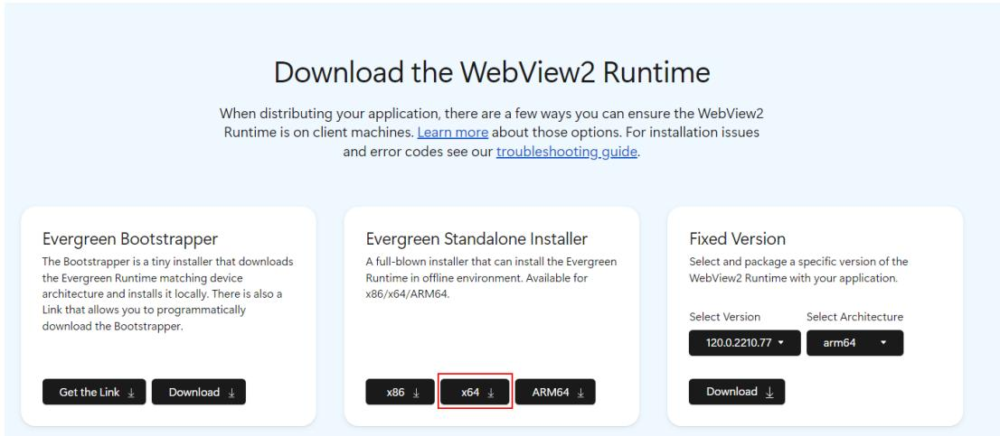  
图 8-5 WebView2 安装包

步骤3 安装完成后，重新运行MindStudio Insight。

----结束

# 8.4.2 如何重新解析 text 格式的 Profiling 文件

问题现象

在同一版本的MindStudio Insight软件下，再次导入text格式的Profiling文件时，不会重新解析数据，当需要重新解析数据时，该如何解析？

# 解决方案

删除Profiling数据目录中的解析结果文件mindstudio_insight_data.db后，再次导入数据即可重新解析。

# 8.4.3 EulerOS 等系统上运行 MindStudio Insight 工具无法弹出数据导入选择框

问题现象

在EulerOS等系统上运行MindStudio Insight工具，单击界面左上方工具栏中的 ，无法弹出导入选择框。

# 解决方案

步骤1 登录MindStudio Insight待安装环境。

步骤2 执行以下命令，设置环境变量。export WEBKIT_DISABLE_COMPOSITING_MODE $^ { = 1 }$

步骤3 执行以下命令，启动MindStudio Insight。 ./MindStudio-Insight

----结束

# 8.4.4 通过 X11 转发方式运行 MindStudio Insight 工具时，输入框信息粘贴有误

问题现象

在Linux系统，通过X11转发方式运行MindStudio Insight工具时，在输入框已存在信息情况下，重新粘贴所需信息时会出现错误。

# 原因分析

在Linux系统，通过X11转发方式运行MindStudio Insight工具时，默认开启了“copyon select”，导致剪贴板的信息会变为输入框已存在信息，造成输入框信息粘贴有误。

# 解决方案

方案一：

步骤1 在远程登录工具菜单栏单击“Settings > Configuration”。此处以MobaXterm工具为例。

步骤2 选择“X11”页签，在“Clipboard”选项中选择“disable"copy on select"”，如图8-6所示。

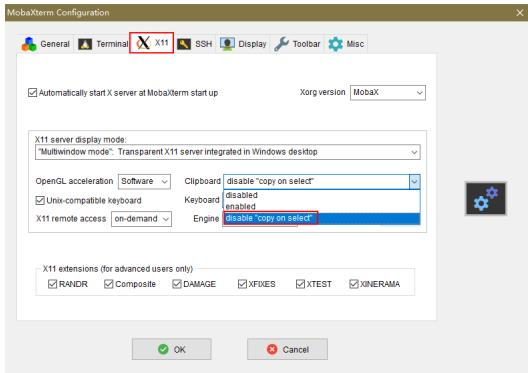  
图 8-6 MobaXterm Configuration

步骤3 单击“OK”。

步骤4 完成配置后，重新运行MindStudio Insight。

----结束

方案二：  
在MindStudio Insight界面，先删除输入框中已存在的信息，再重新复制粘贴所需信息。

# 8.4.5 MindStudio Insight 工具拖入网络磁盘目录无法加载数据

# 问题现象

在MindStudio Insight工具导入数据时，选择网络磁盘目录，无法导入。

# 原因分析

MindStudio Insight工具仅支持导入本地磁盘目录，而网络磁盘未映射至本地，无法导入。

# 解决方案

步骤1 打开电脑的文件资源管理器。

步骤2 单击“此电脑 $>$ 映射网络驱动器”，弹出“映射网络驱动器”弹窗，如图8-7所示。

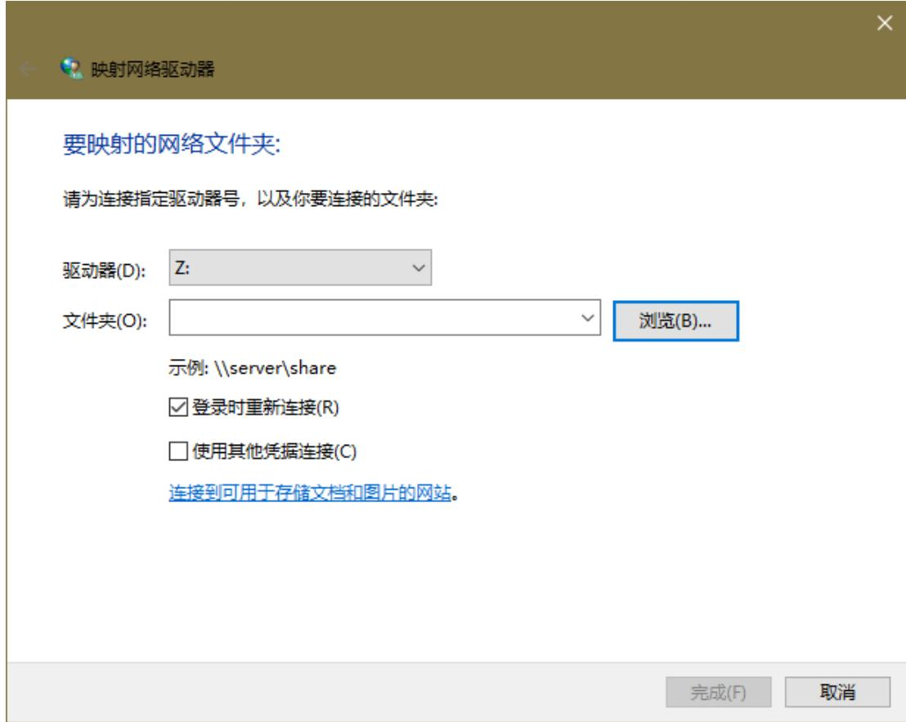  
图 8-7 映射网络驱动器

步骤3 下拉“驱动器(D)”选框，选择连接指定的驱动器号。

步骤4 单击“文件夹(O)”后的“浏览”，选择所需映射的网络目录。

步骤5 单击“完成(F)”，完成网络目录至本地的映射操作。

步骤6 打开MindStudio Insight工具，重新选择映射后的目录，即可正常导入。

----结束

# 8.4.6 MindStudio Insight 工具运行时出现 Out of Memory 报错

# 问题现象

在MindStudio Insight工具运行时，页面出现错误代码：Out of Memory。

# 原因分析

当前使用的电脑系统整体内存不足。

# 解决方案

步骤1 自行关闭消耗大量内存的程序和不必要的应用，释放电脑系统内存。步骤2 在MindStudio Insight工具报错页面单击“刷新”按钮，重新加载页面。----结束

# 8.4.7 MindStudio Insight 工具拖入文件显示禁用

问题现象

在Windows系统上安装MindStudio Insight时，选择勾选“Run MindStudio Insight”自动打开MindStudio Insight的情况下，拖入文件显示禁用。

# 解决方案

步骤1 关闭当前已打开的MindStudio Insight工具。

步骤2 双击桌面的“MindStudio Insight”快捷方式图标，或安装目录下的“MindStudio-Insight.exe”，重新打开MindStudio Insight工具。

步骤3 拖入文件，即可正常显示。

----结束

# 8.4.8 MindStudio Insight 运行时出现“cannot open shared object file swrast_dri.so”报错

问题现象

在Linux系统使用“X11方式”或“VNC方式”启动MindStudio Insight时，MindStudio Insight工具界面白屏，出现“cannot open shared object fileswrast_dri.so”报错信息，如图8-8所示。

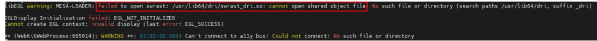  
图8-8 报错截图

原因分析

可能是缺少依赖。

# 解决方案

步骤1 执行以下命令，安装转发依赖文件。 yum install -y mesa-dri-drivers

步骤2 安装完成后，重新打开MindStudio Insight工具即可。

# ----结束

# 8.4.9 启动 VNC 时出现“Oh no! Something has gone wrong.” 报错

问题现象

在Linux系统上，使用“VNC方式”启动MindStudio Insight时，启动VNC，出现“Ohno! Something has gone wrong.”报错弹窗，如图8-9所示。

  
图 8-9 报错信息

# 原因分析

可能是未开启AllowTcpForwarding。

VNC在某些情况下需要通过SSH通道来实现连接，而TCP转发正是支持这个功能的关键。如果AllowTcpForwarding被关闭，则SSH不允许使用端口转发，因此无法通过SSH通道访问VNC服务。开启AllowTcpForwarding后，就能在本地或远程通过SSH通道连接到VNC服务。

# 解决方案

需要配置SSH服务端。

步骤1 进入/etc/ssh路径，打开sshd_config文件。

步骤2 修改文件中的AllowTcpForwarding为“yes”。

步骤3 执行以下命令，重启SSH服务端。 systemctl restart sshd

步骤4 重启成功后，重新打开新的窗口启动VNC。----结束

# 8.4.10 OpenEuler 及其衍生操作系统在安装依赖时提示找不到相关 依赖

问题现象

在Linux操作系统上，OpenEuler及其衍生操作系统在安装依赖时，提示找不到相关依赖。

原因分析

配置的源没有相关依赖。

# 解决方案

可参见LINK配置新的源，并重新安装对应依赖。

# 8.4.11 MindStudio Insight 导入数据时显示黑屏

问题现象

在MindStudio Insight工具页面，第一次导入数据显示正常，第二次导入相同的数据时，“概览”界面和“通信”界面显示黑屏。

# 解决方案

方案一：关闭当前MindStudio Insight，重启即可恢复正常。

方案二：在当前MindStudio Insight工具页，查看或导入其他的数据后，再次选择查看刚才的数据，页面即可恢复正常。

# 8.4.12 MindStudio Insight 导入数据后通信界面未显示数据

# 问题现象

使用MindStudio Insight工具导入数据后，通信界面未显示数据。

# 原因分析

当前导入的性能数据目录与以ascend_ms结尾的目录之间存在多层子文件夹，例如：profiling/rank_x/dyn_prof_data/rank_x_start_xxx_end_xxx/xxx_ascend_ms，此时，MindStudio Insight工具会将导入的数据识别为集群数据，导致通信界面显示异常。

# 解决方案

找到以ascend_ms结尾的目录，将其拷贝至新创建的目录下，保证该目录层级为目录名称/ascend_ms结尾的目录，在MindStudio Insight工具中重新导入该目录，即可正常显示。

# 8.4.13 MindStudio Insight 在 TencentOS Server 4.4_x86 操作系统中启动失败

问题现象

在Linux的TencentOS Server 4.4_x86操作系统中，启动MindStudio Insight工具，启动失败，报错信息如下：

\*\* (MindStudio-Insight:302256): WARNING \*\*: 08:07:35.531:   
webkit_settings_set_enable_offline_web_application_cache is deprecated and does nothing.   
JIT session error: Missing definitions in module fs789_variant0_6-jitted-objectbuffer: [ fs_variant_whole ] Failed to materialize symbols: { (fs789_variant0_6, { fs_variant_partial, fs_variant_whole }) }   
JIT session error: Could not find symbol at given index, did you add it to JITSymbolTable? index: 4, shndx: 0 Size of table: 5   
Failed to materialize symbols: { (fs790_variant0_7, { fs_variant_partial }) }

# 解决方案

执行以下命令后，重新启动MindStudio Insight工具。

export JSC_useJIT $\mathtt { = 0 }$   
export JSC_useDFGJIT=0   
export JSC_useFTLJIT $\mathtt { = 0 }$   
export WEBKIT_DISABLE_COMPOSITING_MODE=1   
unset https_proxy   
unset http_proxy